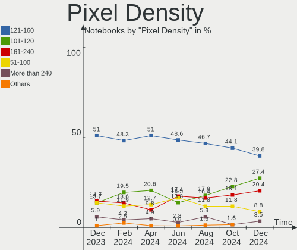

Pop!_OS - Hardware Trends (Notebooks)
-------------------------------------

A project to identify most popular hardware characteristics and track their change
over time based on data collected by Linux users at https://Linux-Hardware.org.

Anyone can contribute to this report by the [hw-probe](https://github.com/linuxhw/hw-probe) tool:

    sudo -E hw-probe -all -upload

This report is for one last month. Overall report since the beginning of time: [TestDays](https://github.com/linuxhw/TestDays)

Period: Apr, 2024.

Contents
--------

* [ System ](#system)
  - [ OS                       ](#os)
  - [ OS Family                ](#os-family)
  - [ Kernel                   ](#kernel)
  - [ Kernel Family            ](#kernel-family)
  - [ Kernel Major Ver.        ](#kernel-major-ver)
  - [ Arch                     ](#arch)
  - [ DE                       ](#de)
  - [ Display Server           ](#display-server)
  - [ Display Manager          ](#display-manager)
  - [ OS Lang                  ](#os-lang)
  - [ Boot Mode                ](#boot-mode)
  - [ Filesystem               ](#filesystem)
  - [ Part. scheme             ](#part-scheme)
  - [ Dual Boot with Linux/BSD ](#dual-boot-with-linuxbsd)
  - [ Dual Boot (Win)          ](#dual-boot-win)

* [ Board ](#board)
  - [ Vendor                   ](#vendor)
  - [ Model                    ](#model)
  - [ Model Family             ](#model-family)
  - [ MFG Year                 ](#mfg-year)
  - [ Form Factor              ](#form-factor)
  - [ Secure Boot              ](#secure-boot)
  - [ Coreboot                 ](#coreboot)
  - [ RAM Size                 ](#ram-size)
  - [ RAM Used                 ](#ram-used)
  - [ Total Drives             ](#total-drives)
  - [ Has CD-ROM               ](#has-cd-rom)
  - [ Has Ethernet             ](#has-ethernet)
  - [ Has WiFi                 ](#has-wifi)
  - [ Has Bluetooth            ](#has-bluetooth)

* [ Location ](#location)
  - [ Country                  ](#country)
  - [ City                     ](#city)

* [ Drives ](#drives)
  - [ Drive Vendor             ](#drive-vendor)
  - [ Drive Model              ](#drive-model)
  - [ HDD Vendor               ](#hdd-vendor)
  - [ SSD Vendor               ](#ssd-vendor)
  - [ Drive Kind               ](#drive-kind)
  - [ Drive Connector          ](#drive-connector)
  - [ Drive Size               ](#drive-size)
  - [ Space Total              ](#space-total)
  - [ Space Used               ](#space-used)
  - [ Malfunc. Drives          ](#malfunc-drives)
  - [ Malfunc. Drive Vendor    ](#malfunc-drive-vendor)
  - [ Malfunc. HDD Vendor      ](#malfunc-hdd-vendor)
  - [ Malfunc. Drive Kind      ](#malfunc-drive-kind)
  - [ Failed Drives            ](#failed-drives)
  - [ Failed Drive Vendor      ](#failed-drive-vendor)
  - [ Drive Status             ](#drive-status)

* [ Storage controller ](#storage-controller)
  - [ Storage Vendor           ](#storage-vendor)
  - [ Storage Model            ](#storage-model)
  - [ Storage Kind             ](#storage-kind)

* [ Processor ](#processor)
  - [ CPU Vendor               ](#cpu-vendor)
  - [ CPU Model                ](#cpu-model)
  - [ CPU Model Family         ](#cpu-model-family)
  - [ CPU Cores                ](#cpu-cores)
  - [ CPU Sockets              ](#cpu-sockets)
  - [ CPU Threads              ](#cpu-threads)
  - [ CPU Op-Modes             ](#cpu-op-modes)
  - [ CPU Microcode            ](#cpu-microcode)
  - [ CPU Microarch            ](#cpu-microarch)

* [ Graphics ](#graphics)
  - [ GPU Vendor               ](#gpu-vendor)
  - [ GPU Model                ](#gpu-model)
  - [ GPU Combo                ](#gpu-combo)
  - [ GPU Driver               ](#gpu-driver)
  - [ GPU Memory               ](#gpu-memory)

* [ Monitor ](#monitor)
  - [ Monitor Vendor           ](#monitor-vendor)
  - [ Monitor Model            ](#monitor-model)
  - [ Monitor Resolution       ](#monitor-resolution)
  - [ Monitor Diagonal         ](#monitor-diagonal)
  - [ Monitor Width            ](#monitor-width)
  - [ Aspect Ratio             ](#aspect-ratio)
  - [ Monitor Area             ](#monitor-area)
  - [ Pixel Density            ](#pixel-density)
  - [ Multiple Monitors        ](#multiple-monitors)

* [ Network ](#network)
  - [ Net Controller Vendor    ](#net-controller-vendor)
  - [ Net Controller Model     ](#net-controller-model)
  - [ Wireless Vendor          ](#wireless-vendor)
  - [ Wireless Model           ](#wireless-model)
  - [ Ethernet Vendor          ](#ethernet-vendor)
  - [ Ethernet Model           ](#ethernet-model)
  - [ Net Controller Kind      ](#net-controller-kind)
  - [ Used Controller          ](#used-controller)
  - [ NICs                     ](#nics)
  - [ IPv6                     ](#ipv6)

* [ Bluetooth ](#bluetooth)
  - [ Bluetooth Vendor         ](#bluetooth-vendor)
  - [ Bluetooth Model          ](#bluetooth-model)

* [ Sound ](#sound)
  - [ Sound Vendor             ](#sound-vendor)
  - [ Sound Model              ](#sound-model)

* [ Memory ](#memory)
  - [ Memory Vendor            ](#memory-vendor)
  - [ Memory Model             ](#memory-model)
  - [ Memory Kind              ](#memory-kind)
  - [ Memory Form Factor       ](#memory-form-factor)
  - [ Memory Size              ](#memory-size)
  - [ Memory Speed             ](#memory-speed)

* [ Printers & scanners ](#printers--scanners)
  - [ Printer Vendor           ](#printer-vendor)
  - [ Printer Model            ](#printer-model)
  - [ Scanner Vendor           ](#scanner-vendor)
  - [ Scanner Model            ](#scanner-model)

* [ Camera ](#camera)
  - [ Camera Vendor            ](#camera-vendor)
  - [ Camera Model             ](#camera-model)

* [ Security ](#security)
  - [ Fingerprint Vendor       ](#fingerprint-vendor)
  - [ Fingerprint Model        ](#fingerprint-model)
  - [ Chipcard Vendor          ](#chipcard-vendor)
  - [ Chipcard Model           ](#chipcard-model)

* [ Unsupported ](#unsupported)
  - [ Unsupported Devices      ](#unsupported-devices)
  - [ Unsupported Device Types ](#unsupported-device-types)

System
------

OS
--

Installed operating systems

| Name          | Notebooks | Percent |
|---------------|-----------|---------|
| Pop!_OS 22.04 | 85        | 100%    |

OS Family
---------

OS without a version

| Name    | Notebooks | Percent |
|---------|-----------|---------|
| Pop!_OS | 85        | 100%    |

Kernel
------

Version of the Linux kernel

| Version                             | Notebooks | Percent |
|-------------------------------------|-----------|---------|
| 6.8.0-76060800daily20240311-generic | 79        | 92.94%  |
| 6.6.10-76060610-generic             | 4         | 4.71%   |
| 6.6.6-76060606-generic              | 1         | 1.18%   |
| 6.5.6-76060506-generic              | 1         | 1.18%   |

Kernel Family
-------------

Linux kernel without a distro release

| Version | Notebooks | Percent |
|---------|-----------|---------|
| 6.8.0   | 79        | 92.94%  |
| 6.6.10  | 4         | 4.71%   |
| 6.6.6   | 1         | 1.18%   |
| 6.5.6   | 1         | 1.18%   |

Kernel Major Ver.
-----------------

Linux kernel major version

| Version | Notebooks | Percent |
|---------|-----------|---------|
| 6.8     | 79        | 92.94%  |
| 6.6     | 5         | 5.88%   |
| 6.5     | 1         | 1.18%   |

Arch
----

OS architecture (x86_64, i586, etc.)

| Name   | Notebooks | Percent |
|--------|-----------|---------|
| x86_64 | 85        | 100%    |

DE
--

Desktop Environment

| Name    | Notebooks | Percent |
|---------|-----------|---------|
| GNOME   | 83        | 97.65%  |
| KDE5    | 1         | 1.18%   |
| awesome | 1         | 1.18%   |

Display Server
--------------

X11 or Wayland

| Name    | Notebooks | Percent |
|---------|-----------|---------|
| X11     | 81        | 95.29%  |
| Wayland | 4         | 4.71%   |

Display Manager
---------------

SDDM, LightDM, etc.

| Name    | Notebooks | Percent |
|---------|-----------|---------|
| Unknown | 56        | 65.88%  |
| GDM3    | 29        | 34.12%  |

OS Lang
-------

Language

| Lang  | Notebooks | Percent |
|-------|-----------|---------|
| en_US | 48        | 56.47%  |
| de_DE | 7         | 8.24%   |
| en_GB | 6         | 7.06%   |
| fr_FR | 5         | 5.88%   |
| pt_BR | 3         | 3.53%   |
| en_AU | 3         | 3.53%   |
| zh_CN | 1         | 1.18%   |
| sv_SE | 1         | 1.18%   |
| pl_PL | 1         | 1.18%   |
| it_IT | 1         | 1.18%   |
| es_MX | 1         | 1.18%   |
| es_ES | 1         | 1.18%   |
| es_CL | 1         | 1.18%   |
| en_ZA | 1         | 1.18%   |
| en_IN | 1         | 1.18%   |
| en_CA | 1         | 1.18%   |
| de_CH | 1         | 1.18%   |
| cs_CZ | 1         | 1.18%   |
| C     | 1         | 1.18%   |

Boot Mode
---------

EFI or BIOS

| Mode | Notebooks | Percent |
|------|-----------|---------|
| BIOS | 57        | 67.06%  |
| EFI  | 28        | 32.94%  |

Filesystem
----------

Type of filesystem

| Type  | Notebooks | Percent |
|-------|-----------|---------|
| Ext4  | 82        | 96.47%  |
| Btrfs | 3         | 3.53%   |

Part. scheme
------------

Scheme of partitioning

| Type    | Notebooks | Percent |
|---------|-----------|---------|
| Unknown | 56        | 65.88%  |
| GPT     | 28        | 32.94%  |
| MBR     | 1         | 1.18%   |

Dual Boot with Linux/BSD
------------------------

Hosting more than one Linux/BSD

| Dual boot | Notebooks | Percent |
|-----------|-----------|---------|
| No        | 83        | 97.65%  |
| Yes       | 2         | 2.35%   |

Dual Boot (Win)
---------------

Hosting Linux and Windows

| Dual boot | Notebooks | Percent |
|-----------|-----------|---------|
| No        | 69        | 81.18%  |
| Yes       | 16        | 18.82%  |

Board
-----

Vendor
------

Motherboard manufacturer

| Name                | Notebooks | Percent |
|---------------------|-----------|---------|
| Lenovo              | 21        | 24.71%  |
| Hewlett-Packard     | 13        | 15.29%  |
| Dell                | 12        | 14.12%  |
| ASUSTek Computer    | 10        | 11.76%  |
| Acer                | 9         | 10.59%  |
| System76            | 4         | 4.71%   |
| MSI                 | 4         | 4.71%   |
| Apple               | 3         | 3.53%   |
| Alienware           | 2         | 2.35%   |
| Toshiba             | 1         | 1.18%   |
| Samsung Electronics | 1         | 1.18%   |
| Medion              | 1         | 1.18%   |
| HUAWEI              | 1         | 1.18%   |
| GPD                 | 1         | 1.18%   |
| Google              | 1         | 1.18%   |
| ASRock              | 1         | 1.18%   |

Model
-----

Motherboard model

| Name                                     | Notebooks | Percent |
|------------------------------------------|-----------|---------|
| System76 Oryx Pro                        | 2         | 2.35%   |
| System76 Lemur Pro                       | 2         | 2.35%   |
| Dell Precision 5680                      | 2         | 2.35%   |
| ASUS VivoBook_ASUSLaptop M1605XA_M1605XA | 2         | 2.35%   |
| Toshiba Satellite L755D                  | 1         | 1.18%   |
| Samsung 940X3G/930X3G                    | 1         | 1.18%   |
| MSI Titan GT77HX 13VI                    | 1         | 1.18%   |
| MSI Modern 15 A5M                        | 1         | 1.18%   |
| MSI Katana 15 B12VGK                     | 1         | 1.18%   |
| MSI GE62VR 6RF                           | 1         | 1.18%   |
| Medion Akoya E6227                       | 1         | 1.18%   |
| Lenovo ThinkPad X1 Extreme 20MF000MUS    | 1         | 1.18%   |
| Lenovo ThinkPad T470s 20HFCT01WW         | 1         | 1.18%   |
| Lenovo ThinkPad T470 20HEA0TLUS          | 1         | 1.18%   |
| Lenovo ThinkPad T14s Gen 2a 20XGS0G400   | 1         | 1.18%   |
| Lenovo ThinkPad T14s Gen 1 20UJS36000    | 1         | 1.18%   |
| Lenovo ThinkPad S5-S540 20B30077GE       | 1         | 1.18%   |
| Lenovo ThinkPad P50 20ENCTO1WW           | 1         | 1.18%   |
| Lenovo ThinkPad L14 Gen 2a 20X6S1DS0P    | 1         | 1.18%   |
| Lenovo ThinkPad E470 20H10056MZ          | 1         | 1.18%   |
| Lenovo ThinkPad E16 Gen 1 21JN003MAU     | 1         | 1.18%   |
| Lenovo Slim Pro 9 14IRP8 83BV            | 1         | 1.18%   |
| Lenovo LOQ 15IRH8 82XV                   | 1         | 1.18%   |
| Lenovo Legion Pro 5 16ARX8 82WM          | 1         | 1.18%   |
| Lenovo Legion 5 17ACH6H 82JY             | 1         | 1.18%   |
| Lenovo Legion 5 15ARH05H 82B1            | 1         | 1.18%   |
| Lenovo Legion 5 15ACH6H 82JU             | 1         | 1.18%   |
| Lenovo IdeaPad L340-15IRH Gaming 81LK    | 1         | 1.18%   |
| Lenovo IdeaPad 710S-13ISK 80SW           | 1         | 1.18%   |
| Lenovo IdeaPad 5 Pro 16ARH7 82SN         | 1         | 1.18%   |
| Lenovo IdeaPad 5 14ARE05 81YM            | 1         | 1.18%   |
| Lenovo IdeaPad 1 15IJL7 82LX             | 1         | 1.18%   |
| HUAWEI BOHB-WAX9                         | 1         | 1.18%   |
| HP Victus by Gaming Laptop 15-fb1xxx     | 1         | 1.18%   |
| HP Stream 11 Pro G5                      | 1         | 1.18%   |
| HP Pavilion Gaming Laptop 15-ec1xxx      | 1         | 1.18%   |
| HP OMEN Laptop 15-en1xxx                 | 1         | 1.18%   |
| HP OMEN by Latpop 16-c0100nd             | 1         | 1.18%   |
| HP ENVY 15                               | 1         | 1.18%   |
| HP EliteBook 8730w                       | 1         | 1.18%   |

Model Family
------------

Motherboard model prefix

| Name               | Notebooks | Percent |
|--------------------|-----------|---------|
| Lenovo ThinkPad    | 10        | 11.76%  |
| Lenovo IdeaPad     | 5         | 5.88%   |
| Lenovo Legion      | 4         | 4.71%   |
| HP EliteBook       | 4         | 4.71%   |
| Dell Latitude      | 4         | 4.71%   |
| Acer Aspire        | 4         | 4.71%   |
| Dell Inspiron      | 3         | 3.53%   |
| ASUS VivoBook      | 3         | 3.53%   |
| Acer Nitro         | 3         | 3.53%   |
| System76 Oryx      | 2         | 2.35%   |
| System76 Lemur     | 2         | 2.35%   |
| HP OMEN            | 2         | 2.35%   |
| Dell XPS           | 2         | 2.35%   |
| Dell Precision     | 2         | 2.35%   |
| ASUS ROG           | 2         | 2.35%   |
| ASUS ASUS          | 2         | 2.35%   |
| Toshiba Satellite  | 1         | 1.18%   |
| Samsung 940X3G     | 1         | 1.18%   |
| MSI Titan          | 1         | 1.18%   |
| MSI Modern         | 1         | 1.18%   |
| MSI Katana         | 1         | 1.18%   |
| MSI GE62VR         | 1         | 1.18%   |
| Medion Akoya       | 1         | 1.18%   |
| Lenovo Slim        | 1         | 1.18%   |
| Lenovo LOQ         | 1         | 1.18%   |
| HUAWEI BOHB-WAX9   | 1         | 1.18%   |
| HP Victus          | 1         | 1.18%   |
| HP Stream          | 1         | 1.18%   |
| HP Pavilion        | 1         | 1.18%   |
| HP ENVY            | 1         | 1.18%   |
| HP 255             | 1         | 1.18%   |
| HP 250             | 1         | 1.18%   |
| HP 15              | 1         | 1.18%   |
| GPD G1619-04       | 1         | 1.18%   |
| Google Morphius    | 1         | 1.18%   |
| Dell Vostro        | 1         | 1.18%   |
| ASUS X451CA        | 1         | 1.18%   |
| ASUS UX430UNR      | 1         | 1.18%   |
| ASUS UX305CA       | 1         | 1.18%   |
| ASRock FM2A68M-HD+ | 1         | 1.18%   |

MFG Year
--------

Motherboard manufacture year

| Year | Notebooks | Percent |
|------|-----------|---------|
| 2023 | 14        | 16.47%  |
| 2021 | 12        | 14.12%  |
| 2022 | 7         | 8.24%   |
| 2020 | 7         | 8.24%   |
| 2019 | 5         | 5.88%   |
| 2017 | 5         | 5.88%   |
| 2013 | 5         | 5.88%   |
| 2012 | 5         | 5.88%   |
| 2011 | 5         | 5.88%   |
| 2024 | 4         | 4.71%   |
| 2015 | 4         | 4.71%   |
| 2016 | 3         | 3.53%   |
| 2014 | 3         | 3.53%   |
| 2010 | 3         | 3.53%   |
| 2018 | 2         | 2.35%   |
| 2008 | 1         | 1.18%   |

Form Factor
-----------

Physical design of the computer

| Name     | Notebooks | Percent |
|----------|-----------|---------|
| Notebook | 85        | 100%    |

Secure Boot
-----------

Enabled or disabled

| State    | Notebooks | Percent |
|----------|-----------|---------|
| Disabled | 85        | 100%    |

Coreboot
--------

Have coreboot on board

| Used | Notebooks | Percent |
|------|-----------|---------|
| No   | 81        | 95.29%  |
| Yes  | 4         | 4.71%   |

RAM Size
--------

Total RAM memory

| Size in GB  | Notebooks | Percent |
|-------------|-----------|---------|
| 4.01-8.0    | 21        | 24.71%  |
| 32.01-64.0  | 18        | 21.18%  |
| 16.01-24.0  | 17        | 20%     |
| 8.01-16.0   | 14        | 16.47%  |
| 3.01-4.0    | 7         | 8.24%   |
| 24.01-32.0  | 3         | 3.53%   |
| 64.01-256.0 | 3         | 3.53%   |
| 2.01-3.0    | 1         | 1.18%   |
| 1.01-2.0    | 1         | 1.18%   |

RAM Used
--------

Used RAM memory

| Used GB    | Notebooks | Percent |
|------------|-----------|---------|
| 4.01-8.0   | 37        | 43.53%  |
| 3.01-4.0   | 15        | 17.65%  |
| 2.01-3.0   | 15        | 17.65%  |
| 8.01-16.0  | 13        | 15.29%  |
| 1.01-2.0   | 3         | 3.53%   |
| 16.01-24.0 | 2         | 2.35%   |

Total Drives
------------

Number of drives on board

| Drives | Notebooks | Percent |
|--------|-----------|---------|
| 1      | 59        | 69.41%  |
| 2      | 23        | 27.06%  |
| 3      | 3         | 3.53%   |

Has CD-ROM
----------

Has CD-ROM on board

| Presented | Notebooks | Percent |
|-----------|-----------|---------|
| No        | 71        | 83.53%  |
| Yes       | 14        | 16.47%  |

Has Ethernet
------------

Has Ethernet on board

| Presented | Notebooks | Percent |
|-----------|-----------|---------|
| Yes       | 65        | 76.47%  |
| No        | 20        | 23.53%  |

Has WiFi
--------

Has WiFi module

| Presented | Notebooks | Percent |
|-----------|-----------|---------|
| Yes       | 82        | 96.47%  |
| No        | 3         | 3.53%   |

Has Bluetooth
-------------

Has Bluetooth module

| Presented | Notebooks | Percent |
|-----------|-----------|---------|
| Yes       | 69        | 81.18%  |
| No        | 16        | 18.82%  |

Location
--------

Country
-------

Geographic location (country)

| Country      | Notebooks | Percent |
|--------------|-----------|---------|
| USA          | 22        | 25.88%  |
| Germany      | 8         | 9.41%   |
| Brazil       | 5         | 5.88%   |
| Canada       | 4         | 4.71%   |
| Australia    | 4         | 4.71%   |
| UK           | 3         | 3.53%   |
| Poland       | 3         | 3.53%   |
| Netherlands  | 3         | 3.53%   |
| France       | 3         | 3.53%   |
| Switzerland  | 2         | 2.35%   |
| South Africa | 2         | 2.35%   |
| Russia       | 2         | 2.35%   |
| India        | 2         | 2.35%   |
| Ukraine      | 1         | 1.18%   |
| UAE          | 1         | 1.18%   |
| Tunisia      | 1         | 1.18%   |
| Thailand     | 1         | 1.18%   |
| Taiwan       | 1         | 1.18%   |
| Sweden       | 1         | 1.18%   |
| Spain        | 1         | 1.18%   |
| Puerto Rico  | 1         | 1.18%   |
| Philippines  | 1         | 1.18%   |
| Norway       | 1         | 1.18%   |
| Nepal        | 1         | 1.18%   |
| Mexico       | 1         | 1.18%   |
| Italy        | 1         | 1.18%   |
| Ireland      | 1         | 1.18%   |
| Iran         | 1         | 1.18%   |
| Egypt        | 1         | 1.18%   |
| Czechia      | 1         | 1.18%   |
| China        | 1         | 1.18%   |
| Chile        | 1         | 1.18%   |
| Belgium      | 1         | 1.18%   |
| Bangladesh   | 1         | 1.18%   |
| Austria      | 1         | 1.18%   |

City
----

Geographic location (city)

| City             | Notebooks | Percent |
|------------------|-----------|---------|
| Warsaw           | 2         | 2.35%   |
| Radford          | 2         | 2.35%   |
| Providence       | 2         | 2.35%   |
| Melbourne        | 2         | 2.35%   |
| Los Angeles      | 2         | 2.35%   |
| Berlin           | 2         | 2.35%   |
| Wichita Falls    | 1         | 1.18%   |
| Wageningen       | 1         | 1.18%   |
| Viersen          | 1         | 1.18%   |
| Tzaneen          | 1         | 1.18%   |
| Tunis            | 1         | 1.18%   |
| Tulsa            | 1         | 1.18%   |
| Trondheim        | 1         | 1.18%   |
| Toronto          | 1         | 1.18%   |
| Toa Baja         | 1         | 1.18%   |
| Tepic            | 1         | 1.18%   |
| Temuco           | 1         | 1.18%   |
| Tehran           | 1         | 1.18%   |
| Taipei           | 1         | 1.18%   |
| Sydney           | 1         | 1.18%   |
| Swift Current    | 1         | 1.18%   |
| Spring Hill      | 1         | 1.18%   |
| Someren          | 1         | 1.18%   |
| Simcoe           | 1         | 1.18%   |
| Senhor do Bonfim | 1         | 1.18%   |
| Schwäbisch Hall | 1         | 1.18%   |
| Schell City      | 1         | 1.18%   |
| Sarnia           | 1         | 1.18%   |
| Rosny-sous-Bois  | 1         | 1.18%   |
| Rio de Janeiro   | 1         | 1.18%   |
| Raleigh          | 1         | 1.18%   |
| Quezon City      | 1         | 1.18%   |
| Pretoria         | 1         | 1.18%   |
| Prague           | 1         | 1.18%   |
| Portland         | 1         | 1.18%   |
| Plano            | 1         | 1.18%   |
| Paris            | 1         | 1.18%   |
| Oxie             | 1         | 1.18%   |
| Oberrohrdorf     | 1         | 1.18%   |
| Noto             | 1         | 1.18%   |

Drives
------

Drive Vendor
------------

Hard drive vendors

| Vendor                       | Notebooks | Drives | Percent |
|------------------------------|-----------|--------|---------|
| Samsung Electronics          | 20        | 24     | 18.52%  |
| Micron Technology            | 10        | 10     | 9.26%   |
| SK hynix                     | 8         | 8      | 7.41%   |
| WDC                          | 7         | 7      | 6.48%   |
| Unknown                      | 6         | 6      | 5.56%   |
| Toshiba                      | 6         | 6      | 5.56%   |
| Seagate                      | 6         | 6      | 5.56%   |
| SanDisk                      | 6         | 6      | 5.56%   |
| Kingston                     | 6         | 6      | 5.56%   |
| Crucial                      | 5         | 5      | 4.63%   |
| KIOXIA                       | 3         | 3      | 2.78%   |
| Intel                        | 3         | 3      | 2.78%   |
| SPCC                         | 2         | 2      | 1.85%   |
| Silicon Motion               | 2         | 2      | 1.85%   |
| Phison Electronics           | 2         | 2      | 1.85%   |
| LITEON                       | 2         | 2      | 1.85%   |
| Kingston Technology Company  | 2         | 2      | 1.85%   |
| ASMT                         | 2         | 2      | 1.85%   |
| Apple                        | 2         | 2      | 1.85%   |
| Verbatim                     | 1         | 1      | 0.93%   |
| UMIS                         | 1         | 1      | 0.93%   |
| Shenzhen Longsys Electronics | 1         | 1      | 0.93%   |
| Phison                       | 1         | 1      | 0.93%   |
| MAXIO Technology (Hangzhou)  | 1         | 1      | 0.93%   |
| MaxDigital                   | 1         | 1      | 0.93%   |
| LITEONIT                     | 1         | 1      | 0.93%   |
| HGST                         | 1         | 1      | 0.93%   |

Drive Model
-----------

Hard drive models

| Model                                                 | Notebooks | Percent |
|-------------------------------------------------------|-----------|---------|
| Samsung NVMe SSD Controller SM981/PM981/PM983 1TB     | 3         | 2.73%   |
| Unknown NVMe SSD Drive 1TB                            | 2         | 1.82%   |
| Toshiba XG6 NVMe SSD Controller 1024GB                | 2         | 1.82%   |
| Silicon Motion SM2263EN/SM2263XT SSD Controller 256GB | 2         | 1.82%   |
| Seagate ST500LT012-1DG142 500GB                       | 2         | 1.82%   |
| Sandisk WD Blue SN550 NVMe SSD 2TB                    | 2         | 1.82%   |
| Samsung NVMe SSD Controller PM9A1/PM9A3/980PRO 1TB    | 2         | 1.82%   |
| Samsung MZVLB1T0HBLR-000L2 1TB                        | 2         | 1.82%   |
| Samsung MZALQ512HALU-000L2 512GB                      | 2         | 1.82%   |
| Micron 2450_MTFDKBA512TFK 512GB                       | 2         | 1.82%   |
| Micron 2400_MTFDKBA512QFM 512GB                       | 2         | 1.82%   |
| Crucial CT1000MX500SSD1 1TB                           | 2         | 1.82%   |
| ASMT USB 3.0 TOSATA 120GB                             | 2         | 1.82%   |
| WDC WDBRPG5000ANC-WRSN 500GB                          | 1         | 0.91%   |
| WDC WD3200BPVT-22JJ5T0 320GB                          | 1         | 0.91%   |
| WDC WD10SPZX-24Z10 1TB                                | 1         | 0.91%   |
| WDC WD10SPZX-21Z10T0 1TB                              | 1         | 0.91%   |
| WDC WD10JPVX-22JC3T0 1TB                              | 1         | 0.91%   |
| WDC WD Green 2.5 1000GB                               | 1         | 0.91%   |
| WDC PC SN720 SDAQNTW-512G-1001 512GB                  | 1         | 0.91%   |
| Verbatim Vi550 S3 SSD 256GB                           | 1         | 0.91%   |
| Unknown NVMe SSD Drive 512GB                          | 1         | 0.91%   |
| Unknown MMC Card  64GB                                | 1         | 0.91%   |
| Unknown MMC Card  256GB                               | 1         | 0.91%   |
| Unknown MMC Card  128GB                               | 1         | 0.91%   |
| UMIS RPJTJ128MEE1MWX 128GB                            | 1         | 0.91%   |
| Toshiba THNSNK256GVN8 M.2 2280 256GB SSD              | 1         | 0.91%   |
| Toshiba THNSNH128G8NT 128GB SSD                       | 1         | 0.91%   |
| Toshiba MQ04ABF100 1TB                                | 1         | 0.91%   |
| Toshiba MQ01ABF050 500GB                              | 1         | 0.91%   |
| SPCC Solid State Disk 1TB                             | 1         | 0.91%   |
| SPCC M.2 PCIe SSD 1TB                                 | 1         | 0.91%   |
| SK hynix SKHynix_HFS001TEJ9X115N 1024GB               | 1         | 0.91%   |
| SK hynix PC801 NVMe 512GB                             | 1         | 0.91%   |
| SK hynix HFS256G39TND-N210A 256GB SSD                 | 1         | 0.91%   |
| SK hynix HFS001TEJ9X101N 1TB                          | 1         | 0.91%   |
| SK hynix HFM512GD3JX016N 512GB                        | 1         | 0.91%   |
| SK hynix BC711 HFM512GD3JX013N 512GB                  | 1         | 0.91%   |
| SK hynix BC511 HFM256GDJTNI-82A0A 256GB               | 1         | 0.91%   |
| SK hynix BC501 NVMe Solid State Drive 512GB           | 1         | 0.91%   |

HDD Vendor
----------

Hard disk drive vendors

| Vendor  | Notebooks | Drives | Percent |
|---------|-----------|--------|---------|
| Seagate | 6         | 6      | 42.86%  |
| WDC     | 4         | 4      | 28.57%  |
| Toshiba | 2         | 2      | 14.29%  |
| HGST    | 1         | 1      | 7.14%   |
| Apple   | 1         | 1      | 7.14%   |

SSD Vendor
----------

Solid state drive vendors

| Vendor              | Notebooks | Drives | Percent |
|---------------------|-----------|--------|---------|
| Crucial             | 5         | 5      | 21.74%  |
| Samsung Electronics | 3         | 3      | 13.04%  |
| Kingston            | 3         | 3      | 13.04%  |
| Toshiba             | 2         | 2      | 8.7%    |
| LITEON              | 2         | 2      | 8.7%    |
| WDC                 | 1         | 1      | 4.35%   |
| Verbatim            | 1         | 1      | 4.35%   |
| SPCC                | 1         | 1      | 4.35%   |
| SK hynix            | 1         | 1      | 4.35%   |
| SanDisk             | 1         | 1      | 4.35%   |
| LITEONIT            | 1         | 1      | 4.35%   |
| Intel               | 1         | 1      | 4.35%   |
| Apple               | 1         | 1      | 4.35%   |

Drive Kind
----------

HDD or SSD

| Kind    | Notebooks | Drives | Percent |
|---------|-----------|--------|---------|
| NVMe    | 57        | 69     | 58.16%  |
| SSD     | 22        | 23     | 22.45%  |
| HDD     | 13        | 14     | 13.27%  |
| MMC     | 3         | 3      | 3.06%   |
| Unknown | 3         | 3      | 3.06%   |

Drive Connector
---------------

SATA, SAS, NVMe, etc.

| Type | Notebooks | Drives | Percent |
|------|-----------|--------|---------|
| NVMe | 57        | 69     | 60%     |
| SATA | 32        | 37     | 33.68%  |
| SAS  | 3         | 3      | 3.16%   |
| MMC  | 3         | 3      | 3.16%   |

Drive Size
----------

Size of hard drive

| Size in TB | Notebooks | Drives | Percent |
|------------|-----------|--------|---------|
| 0.01-0.5   | 23        | 25     | 65.71%  |
| 0.51-1.0   | 9         | 9      | 25.71%  |
| 1.01-2.0   | 2         | 2      | 5.71%   |
| 3.01-4.0   | 1         | 1      | 2.86%   |

Space Total
-----------

Amount of disk space available on the file system

| Size in GB     | Notebooks | Percent |
|----------------|-----------|---------|
| 251-500        | 32        | 37.65%  |
| 101-250        | 21        | 24.71%  |
| 501-1000       | 14        | 16.47%  |
| 1001-2000      | 9         | 10.59%  |
| 21-50          | 3         | 3.53%   |
| 51-100         | 3         | 3.53%   |
| More than 3000 | 2         | 2.35%   |
| 2001-3000      | 1         | 1.18%   |

Space Used
----------

Amount of used disk space

| Used GB   | Notebooks | Percent |
|-----------|-----------|---------|
| 1-20      | 30        | 35.29%  |
| 51-100    | 15        | 17.65%  |
| 21-50     | 14        | 16.47%  |
| 101-250   | 10        | 11.76%  |
| 251-500   | 7         | 8.24%   |
| 501-1000  | 7         | 8.24%   |
| 1001-2000 | 2         | 2.35%   |

Malfunc. Drives
---------------

Drive models with a malfunction

| Model                           | Notebooks | Drives | Percent |
|---------------------------------|-----------|--------|---------|
| Seagate ST320LT009-9WC142 320GB | 1         | 1      | 100%    |

Malfunc. Drive Vendor
---------------------

Vendors of faulty drives

| Vendor  | Notebooks | Drives | Percent |
|---------|-----------|--------|---------|
| Seagate | 1         | 1      | 100%    |

Malfunc. HDD Vendor
-------------------

Vendors of faulty HDD drives

| Vendor  | Notebooks | Drives | Percent |
|---------|-----------|--------|---------|
| Seagate | 1         | 1      | 100%    |

Malfunc. Drive Kind
-------------------

Kinds of faulty drives

| Kind | Notebooks | Drives | Percent |
|------|-----------|--------|---------|
| HDD  | 1         | 1      | 100%    |

Failed Drives
-------------

Failed drive models

Zero info for selected period =(

Failed Drive Vendor
-------------------

Failed drive vendors

Zero info for selected period =(

Drive Status
------------

Number of failed and malfunc. drives

| Status   | Notebooks | Drives | Percent |
|----------|-----------|--------|---------|
| Detected | 62        | 80     | 71.26%  |
| Works    | 24        | 31     | 27.59%  |
| Malfunc  | 1         | 1      | 1.15%   |

Storage controller
------------------

Storage Vendor
--------------

Storage controller vendors

| Vendor                       | Notebooks | Percent |
|------------------------------|-----------|---------|
| Intel                        | 47        | 38.52%  |
| Samsung Electronics          | 18        | 14.75%  |
| AMD                          | 11        | 9.02%   |
| Micron Technology            | 10        | 8.2%    |
| SanDisk                      | 8         | 6.56%   |
| SK hynix                     | 7         | 5.74%   |
| Kingston Technology Company  | 5         | 4.1%    |
| Solidigm                     | 3         | 2.46%   |
| Phison Electronics           | 3         | 2.46%   |
| KIOXIA                       | 3         | 2.46%   |
| Toshiba America Info Systems | 2         | 1.64%   |
| Silicon Motion               | 2         | 1.64%   |
| Union Memory (Shenzhen)      | 1         | 0.82%   |
| Shenzhen Longsys Electronics | 1         | 0.82%   |
| MAXIO Technology (Hangzhou)  | 1         | 0.82%   |

Storage Model
-------------

Storage controller models

| Model                                                                                                              | Notebooks | Percent |
|--------------------------------------------------------------------------------------------------------------------|-----------|---------|
| AMD FCH SATA Controller [AHCI mode]                                                                                | 11        | 8.73%   |
| Samsung NVMe SSD Controller SM981/PM981/PM983                                                                      | 6         | 4.76%   |
| Intel 6 Series/C200 Series Chipset Family 6 port Mobile SATA AHCI Controller                                       | 6         | 4.76%   |
| Samsung NVMe SSD Controller PM9A1/PM9A3/980PRO                                                                     | 5         | 3.97%   |
| Samsung NVMe SSD Controller 980 (DRAM-less)                                                                        | 5         | 3.97%   |
| Intel Volume Management Device NVMe RAID Controller Intel Corporation                                              | 5         | 3.97%   |
| Intel Volume Management Device NVMe RAID Controller                                                                | 5         | 3.97%   |
| Intel Cannon Lake Mobile PCH SATA AHCI Controller                                                                  | 5         | 3.97%   |
| Intel 8 Series SATA Controller 1 [AHCI mode]                                                                       | 5         | 3.97%   |
| Micron 2450 NVMe SSD [HendrixV] (DRAM-less)                                                                        | 4         | 3.17%   |
| Intel Sunrise Point-LP SATA Controller [AHCI mode]                                                                 | 4         | 3.17%   |
| SK hynix Platinum P41/PC801 NVMe Solid State Drive                                                                 | 3         | 2.38%   |
| SanDisk Ultra 3D / WD Blue SN550 NVMe SSD                                                                          | 3         | 2.38%   |
| Intel HM170/QM170 Chipset SATA Controller [AHCI Mode]                                                              | 3         | 2.38%   |
| Intel 7 Series Chipset Family 6-port SATA Controller [AHCI mode]                                                   | 3         | 2.38%   |
| Toshiba America Info Systems XG6 NVMe SSD Controller                                                               | 2         | 1.59%   |
| Solidigm P44 Pro NVMe SSD [Hollywood Beach]                                                                        | 2         | 1.59%   |
| SK hynix Gold P31/BC711/PC711 NVMe Solid State Drive                                                               | 2         | 1.59%   |
| Silicon Motion SM2263EN/SM2263XT (DRAM-less) NVMe SSD Controllers                                                  | 2         | 1.59%   |
| Samsung NVMe SSD Controller SM961/PM961/SM963                                                                      | 2         | 1.59%   |
| Micron 2400 NVMe SSD (DRAM-less)                                                                                   | 2         | 1.59%   |
| Micron 2300 NVMe SSD [Santana]                                                                                     | 2         | 1.59%   |
| KIOXIA NVMe SSD Controller XG8                                                                                     | 2         | 1.59%   |
| Union Memory (Shenzhen) AM620 PCIe 3.0 NVMe SSD 128GB                                                              | 1         | 0.79%   |
| Solidigm P41 Plus NVMe SSD (DRAM-less) [Echo Harbor]                                                               | 1         | 0.79%   |
| SK hynix BC511 NVMe SSD                                                                                            | 1         | 0.79%   |
| SK hynix BC501 NVMe Solid State Drive                                                                              | 1         | 0.79%   |
| Shenzhen Longsys FORESEE XP1000 / Lexar Professional CFexpress Type B Gold series, NM620 PCIe NVME SSD (DRAM-less) | 1         | 0.79%   |
| SanDisk WD PC SN810 / Black SN850 NVMe SSD                                                                         | 1         | 0.79%   |
| Sandisk WD Black SN850X NVMe SSD                                                                                   | 1         | 0.79%   |
| SanDisk PC SN735 NVMe SSD (DRAM-less)                                                                              | 1         | 0.79%   |
| SanDisk Extreme Pro / WD Black SN750 / PC SN730 / Red SN700 NVMe SSD                                               | 1         | 0.79%   |
| SanDisk Extreme Pro / WD Black 2018/SN750/PC SN720 NVMe SSD                                                        | 1         | 0.79%   |
| Samsung NVMe SSD Controller S4LV008[Pascal]                                                                        | 1         | 0.79%   |
| Phison PS5027-E27T PCIe4 NVMe Controller (DRAM-less)                                                               | 1         | 0.79%   |
| Phison PS5019-E19 PCIe4 NVMe Controller (DRAM-less)                                                                | 1         | 0.79%   |
| Phison E12 NVMe Controller                                                                                         | 1         | 0.79%   |
| Micron 3400 NVMe SSD [Hendrix]                                                                                     | 1         | 0.79%   |
| Micron 2550 NVMe SSD (DRAM-less)                                                                                   | 1         | 0.79%   |
| MAXIO (Hangzhou) NVMe SSD Controller MAP1602 (DRAM-less)                                                           | 1         | 0.79%   |

Storage Kind
------------

Kind of storage controller (IDE, SATA, NVMe, SAS, ...)

| Kind | Notebooks | Percent |
|------|-----------|---------|
| NVMe | 57        | 49.14%  |
| SATA | 47        | 40.52%  |
| RAID | 11        | 9.48%   |
| IDE  | 1         | 0.86%   |

Processor
---------

CPU Vendor
----------

Processor vendors

| Vendor | Notebooks | Percent |
|--------|-----------|---------|
| Intel  | 56        | 65.88%  |
| AMD    | 29        | 34.12%  |

CPU Model
---------

Processor models

| Model                                      | Notebooks | Percent |
|--------------------------------------------|-----------|---------|
| AMD Ryzen 7 5800H with Radeon Graphics     | 5         | 5.88%   |
| Intel Core i7-9750H CPU @ 2.60GHz          | 3         | 3.53%   |
| Intel Core i9-14900HX                      | 2         | 2.35%   |
| Intel Core i5-4200U CPU @ 1.60GHz          | 2         | 2.35%   |
| Intel Core i5-3210M CPU @ 2.50GHz          | 2         | 2.35%   |
| Intel 13th Gen Core i7-13700H              | 2         | 2.35%   |
| AMD Ryzen 9 7940HS w/ Radeon 780M Graphics | 2         | 2.35%   |
| AMD Ryzen 7 4800H with Radeon Graphics     | 2         | 2.35%   |
| AMD Ryzen 7 4700U with Radeon Graphics     | 2         | 2.35%   |
| AMD Ryzen 5 PRO 5650U with Radeon Graphics | 2         | 2.35%   |
| Intel Xeon CPU E3-1505M v5 @ 2.80GHz       | 1         | 1.18%   |
| Intel Pentium Silver N6000 @ 1.10GHz       | 1         | 1.18%   |
| Intel Pentium CPU N3540 @ 2.16GHz          | 1         | 1.18%   |
| Intel Core Ultra 7 155U                    | 1         | 1.18%   |
| Intel Core Ultra 7 155H                    | 1         | 1.18%   |
| Intel Core m3-6Y30 CPU @ 0.90GHz           | 1         | 1.18%   |
| Intel Core i7-9850H CPU @ 2.60GHz          | 1         | 1.18%   |
| Intel Core i7-8850H CPU @ 2.60GHz          | 1         | 1.18%   |
| Intel Core i7-7700HQ CPU @ 2.80GHz         | 1         | 1.18%   |
| Intel Core i7-7600U CPU @ 2.80GHz          | 1         | 1.18%   |
| Intel Core i7-6700HQ CPU @ 2.60GHz         | 1         | 1.18%   |
| Intel Core i7-5500U CPU @ 2.40GHz          | 1         | 1.18%   |
| Intel Core i7-4600U CPU @ 2.10GHz          | 1         | 1.18%   |
| Intel Core i7-4510U CPU @ 2.00GHz          | 1         | 1.18%   |
| Intel Core i7-2640M CPU @ 2.80GHz          | 1         | 1.18%   |
| Intel Core i7-2635QM CPU @ 2.00GHz         | 1         | 1.18%   |
| Intel Core i7-2630QM CPU @ 2.00GHz         | 1         | 1.18%   |
| Intel Core i5-8300H CPU @ 2.30GHz          | 1         | 1.18%   |
| Intel Core i5-8250U CPU @ 1.60GHz          | 1         | 1.18%   |
| Intel Core i5-7300U CPU @ 2.60GHz          | 1         | 1.18%   |
| Intel Core i5-7300HQ CPU @ 2.50GHz         | 1         | 1.18%   |
| Intel Core i5-6200U CPU @ 2.30GHz          | 1         | 1.18%   |
| Intel Core i5-4300U CPU @ 1.90GHz          | 1         | 1.18%   |
| Intel Core i5-2467M CPU @ 1.60GHz          | 1         | 1.18%   |
| Intel Core i5-2430M CPU @ 2.40GHz          | 1         | 1.18%   |
| Intel Core i5 CPU M 480 @ 2.67GHz          | 1         | 1.18%   |
| Intel Core i3-6006U CPU @ 2.00GHz          | 1         | 1.18%   |
| Intel Core i3-2350M CPU @ 2.30GHz          | 1         | 1.18%   |
| Intel Core i3-10110U CPU @ 2.10GHz         | 1         | 1.18%   |
| Intel Core 2 Duo CPU P8600 @ 2.40GHz       | 1         | 1.18%   |

CPU Model Family
----------------

Processor model prefix

| Model                | Notebooks | Percent |
|----------------------|-----------|---------|
| AMD Ryzen 7          | 15        | 17.65%  |
| Intel Core i7        | 14        | 16.47%  |
| Other                | 13        | 15.29%  |
| Intel Core i5        | 13        | 15.29%  |
| Intel Celeron        | 4         | 4.71%   |
| AMD Ryzen 5 PRO      | 4         | 4.71%   |
| AMD Ryzen 5          | 4         | 4.71%   |
| Intel Core i3        | 3         | 3.53%   |
| Intel Core i9        | 2         | 2.35%   |
| Intel Core           | 2         | 2.35%   |
| AMD Ryzen 9          | 2         | 2.35%   |
| Intel Xeon           | 1         | 1.18%   |
| Intel Pentium Silver | 1         | 1.18%   |
| Intel Pentium        | 1         | 1.18%   |
| Intel Core m3        | 1         | 1.18%   |
| Intel Core 2 Duo     | 1         | 1.18%   |
| AMD Athlon X4        | 1         | 1.18%   |
| AMD Athlon           | 1         | 1.18%   |
| AMD A6               | 1         | 1.18%   |
| AMD A10              | 1         | 1.18%   |

CPU Cores
---------

Number of processor cores

| Number | Notebooks | Percent |
|--------|-----------|---------|
| 2      | 27        | 31.76%  |
| 8      | 18        | 21.18%  |
| 4      | 15        | 17.65%  |
| 6      | 11        | 12.94%  |
| 14     | 5         | 5.88%   |
| 10     | 4         | 4.71%   |
| 24     | 3         | 3.53%   |
| 16     | 1         | 1.18%   |
| 12     | 1         | 1.18%   |

CPU Sockets
-----------

Number of sockets

| Number | Notebooks | Percent |
|--------|-----------|---------|
| 1      | 85        | 100%    |

CPU Threads
-----------

Threads per core (Hyper-Threading)

| Number | Notebooks | Percent |
|--------|-----------|---------|
| 2      | 73        | 85.88%  |
| 1      | 12        | 14.12%  |

CPU Op-Modes
------------

CPU Operation Modes (32-bit, 64-bit)

| Op mode        | Notebooks | Percent |
|----------------|-----------|---------|
| 32-bit, 64-bit | 85        | 100%    |

CPU Microcode
-------------

Microcode number

| Number  | Notebooks | Percent |
|---------|-----------|---------|
| Unknown | 85        | 100%    |

CPU Microarch
-------------

Microarchitecture

| Name             | Notebooks | Percent |
|------------------|-----------|---------|
| Unknown          | 16        | 18.82%  |
| KabyLake         | 12        | 14.12%  |
| Zen 3            | 8         | 9.41%   |
| Alderlake Hybrid | 8         | 9.41%   |
| Zen 2            | 7         | 8.24%   |
| SandyBridge      | 6         | 7.06%   |
| Skylake          | 5         | 5.88%   |
| Haswell          | 5         | 5.88%   |
| IvyBridge        | 4         | 4.71%   |
| Zen+             | 3         | 3.53%   |
| TigerLake        | 2         | 2.35%   |
| Silvermont       | 2         | 2.35%   |
| Westmere         | 1         | 1.18%   |
| Piledriver       | 1         | 1.18%   |
| Penryn           | 1         | 1.18%   |
| K10 Llano        | 1         | 1.18%   |
| Goldmont plus    | 1         | 1.18%   |
| Excavator        | 1         | 1.18%   |
| Broadwell        | 1         | 1.18%   |

Graphics
--------

GPU Vendor
----------

Vendors of graphics cards

| Vendor | Notebooks | Percent |
|--------|-----------|---------|
| Intel  | 53        | 43.8%   |
| Nvidia | 36        | 29.75%  |
| AMD    | 32        | 26.45%  |

GPU Model
---------

Graphics card models

| Model                                                                     | Notebooks | Percent |
|---------------------------------------------------------------------------|-----------|---------|
| AMD Cezanne [Radeon Vega Series / Radeon Vega Mobile Series]              | 8         | 6.5%    |
| Intel CoffeeLake-H GT2 [UHD Graphics 630]                                 | 6         | 4.88%   |
| AMD Renoir [Radeon RX Vega 6 (Ryzen 4000/5000 Mobile Series)]             | 6         | 4.88%   |
| Intel Haswell-ULT Integrated Graphics Controller                          | 5         | 4.07%   |
| Intel 2nd Generation Core Processor Family Integrated Graphics Controller | 5         | 4.07%   |
| Nvidia GA106M [GeForce RTX 3060 Mobile / Max-Q]                           | 4         | 3.25%   |
| Nvidia AD107M [GeForce RTX 4050 Max-Q / Mobile]                           | 4         | 3.25%   |
| Intel Raptor Lake-P [Iris Xe Graphics]                                    | 4         | 3.25%   |
| Nvidia TU117M [GeForce GTX 1650 Mobile / Max-Q]                           | 3         | 2.44%   |
| Intel Raptor Lake-S UHD Graphics                                          | 3         | 2.44%   |
| Intel 3rd Gen Core processor Graphics Controller                          | 3         | 2.44%   |
| AMD Rembrandt [Radeon 680M]                                               | 3         | 2.44%   |
| AMD Picasso/Raven 2 [Radeon Vega Series / Radeon Vega Mobile Series]      | 3         | 2.44%   |
| AMD Phoenix1                                                              | 3         | 2.44%   |
| Nvidia TU116M [GeForce GTX 1660 Ti Mobile]                                | 2         | 1.63%   |
| Nvidia GP107M [GeForce GTX 1050 Ti Mobile]                                | 2         | 1.63%   |
| Nvidia GP107M [GeForce GTX 1050 Mobile]                                   | 2         | 1.63%   |
| Nvidia GA107GLM [RTX A1000 6GB Laptop GPU]                                | 2         | 1.63%   |
| Nvidia GA107 [GeForce RTX 2050]                                           | 2         | 1.63%   |
| Intel TigerLake-LP GT2 [Iris Xe Graphics]                                 | 2         | 1.63%   |
| Intel Skylake GT2 [HD Graphics 520]                                       | 2         | 1.63%   |
| Intel HD Graphics 630                                                     | 2         | 1.63%   |
| Intel HD Graphics 620                                                     | 2         | 1.63%   |
| Intel Alder Lake-P GT2 [Iris Xe Graphics]                                 | 2         | 1.63%   |
| AMD Seymour [Radeon HD 6400M/7400M Series]                                | 2         | 1.63%   |
| AMD Mars [Radeon HD 8670A/8670M/8750M / R7 M370]                          | 2         | 1.63%   |
| Nvidia TU116 [GeForce GTX 1660 SUPER]                                     | 1         | 0.81%   |
| Nvidia TU104M [GeForce RTX 2080 Mobile]                                   | 1         | 0.81%   |
| Nvidia GP107M [GeForce GTX 1050 3 GB Max-Q]                               | 1         | 0.81%   |
| Nvidia GP106M [GeForce GTX 1060 Mobile]                                   | 1         | 0.81%   |
| Nvidia GN21-X11 [GeForce RTX 4090 Laptop GPU]                             | 1         | 0.81%   |
| Nvidia GM108M [GeForce 940M]                                              | 1         | 0.81%   |
| Nvidia GM107GLM [Quadro M2000M]                                           | 1         | 0.81%   |
| Nvidia GF108GLM [NVS 5200M]                                               | 1         | 0.81%   |
| Nvidia GA107M [GeForce RTX 3050 Mobile]                                   | 1         | 0.81%   |
| Nvidia GA107BM [GeForce RTX 3050 Mobile]                                  | 1         | 0.81%   |
| Nvidia GA104M [GeForce RTX 3080 Mobile / Max-Q 8GB/16GB]                  | 1         | 0.81%   |
| Nvidia G94GLM [Quadro FX 2700M]                                           | 1         | 0.81%   |
| Nvidia AD107M [GeForce RTX 4060 Max-Q / Mobile]                           | 1         | 0.81%   |
| Nvidia AD106M [GeForce RTX 4070 Max-Q / Mobile]                           | 1         | 0.81%   |

GPU Combo
---------

Combinations of graphics cards

| Name           | Notebooks | Percent |
|----------------|-----------|---------|
| 1 x Intel      | 29        | 34.12%  |
| Intel + Nvidia | 19        | 22.35%  |
| 1 x AMD        | 14        | 16.47%  |
| AMD + Nvidia   | 12        | 14.12%  |
| 1 x Nvidia     | 5         | 5.88%   |
| Intel + AMD    | 4         | 4.71%   |
| 2 x AMD        | 2         | 2.35%   |

GPU Driver
----------

Free vs proprietary

| Driver      | Notebooks | Percent |
|-------------|-----------|---------|
| Free        | 50        | 58.82%  |
| Proprietary | 33        | 38.82%  |
| Unknown     | 2         | 2.35%   |

GPU Memory
----------

Total video memory

| Size in GB | Notebooks | Percent |
|------------|-----------|---------|
| Unknown    | 70        | 82.35%  |
| 0.01-0.5   | 8         | 9.41%   |
| 1.01-2.0   | 3         | 3.53%   |
| 7.01-8.0   | 2         | 2.35%   |
| 3.01-4.0   | 1         | 1.18%   |
| 2.01-3.0   | 1         | 1.18%   |

Monitor
-------

Monitor Vendor
--------------

Monitor vendors

| Vendor               | Notebooks | Percent |
|----------------------|-----------|---------|
| AU Optronics         | 26        | 25%     |
| Chimei Innolux       | 16        | 15.38%  |
| BOE                  | 13        | 12.5%   |
| Samsung Electronics  | 12        | 11.54%  |
| LG Display           | 9         | 8.65%   |
| Apple                | 3         | 2.88%   |
| Sharp                | 2         | 1.92%   |
| Philips              | 2         | 1.92%   |
| Goldstar             | 2         | 1.92%   |
| CSO                  | 2         | 1.92%   |
| BenQ                 | 2         | 1.92%   |
| Acer                 | 2         | 1.92%   |
| ViewSonic            | 1         | 0.96%   |
| TMA                  | 1         | 0.96%   |
| S2-Tek               | 1         | 0.96%   |
| PANDA                | 1         | 0.96%   |
| Lenovo               | 1         | 0.96%   |
| JDI                  | 1         | 0.96%   |
| InfoVision           | 1         | 0.96%   |
| Iiyama               | 1         | 0.96%   |
| HKC                  | 1         | 0.96%   |
| Gigabyte Technology  | 1         | 0.96%   |
| Dell                 | 1         | 0.96%   |
| ASUSTek Computer     | 1         | 0.96%   |
| Ancor Communications | 1         | 0.96%   |

Monitor Model
-------------

Monitor models

| Model                                                                 | Notebooks | Percent |
|-----------------------------------------------------------------------|-----------|---------|
| Chimei Innolux LCD Monitor CMN1521 1920x1080 344x193mm 15.5-inch      | 3         | 2.88%   |
| Samsung Electronics LCD Monitor SEC544B 1600x900 310x174mm 14.0-inch  | 2         | 1.92%   |
| Chimei Innolux LCD Monitor CMN1618 1920x1200 344x215mm 16.0-inch      | 2         | 1.92%   |
| Chimei Innolux LCD Monitor CMN140A 1920x1080 309x173mm 13.9-inch      | 2         | 1.92%   |
| AU Optronics LCD Monitor AUO61ED 1920x1080 344x194mm 15.5-inch        | 2         | 1.92%   |
| AU Optronics LCD Monitor AUO31A6 1920x1200 344x215mm 16.0-inch        | 2         | 1.92%   |
| ViewSonic VP2365 SERIES VSC7C28 1920x1080 509x286mm 23.0-inch         | 1         | 0.96%   |
| TMA TM140VDHP21 TMA2025 1920x1200 301x188mm 14.0-inch                 | 1         | 0.96%   |
| Sharp LCD Monitor SHP1593 1920x1200 288x180mm 13.4-inch               | 1         | 0.96%   |
| Sharp LCD Monitor SHP14BA 1920x1080 344x194mm 15.5-inch               | 1         | 0.96%   |
| Samsung Electronics SyncMaster SAM0497 1600x900 443x249mm 20.0-inch   | 1         | 0.96%   |
| Samsung Electronics S27D590 SAM0B49 1920x1080 598x336mm 27.0-inch     | 1         | 0.96%   |
| Samsung Electronics LCD Monitor SEC3848 1920x1200 367x230mm 17.1-inch | 1         | 0.96%   |
| Samsung Electronics LCD Monitor SEC3150 1366x768 344x193mm 15.5-inch  | 1         | 0.96%   |
| Samsung Electronics LCD Monitor SDC4C51 1366x768 344x194mm 15.5-inch  | 1         | 0.96%   |
| Samsung Electronics LCD Monitor SDC4951 1366x768 344x194mm 15.5-inch  | 1         | 0.96%   |
| Samsung Electronics LCD Monitor SDC424A 3200x1800 293x165mm 13.2-inch | 1         | 0.96%   |
| Samsung Electronics LCD Monitor SDC4171 2880x1800 302x189mm 14.0-inch | 1         | 0.96%   |
| Samsung Electronics LCD Monitor SAM08FE 1920x1080                     | 1         | 0.96%   |
| Samsung Electronics LC49G95T SAM7052 3840x1080 1193x336mm 48.8-inch   | 1         | 0.96%   |
| S2-Tek TV STK531A 1920x1080 930x530mm 42.1-inch                       | 1         | 0.96%   |
| Philips PHL 276B1 PHL0947 2560x1440 597x336mm 27.0-inch               | 1         | 0.96%   |
| Philips PHL 273V7 PHLC156 1920x1080 598x336mm 27.0-inch               | 1         | 0.96%   |
| PANDA LCD Monitor NCP004D 1920x1080 344x194mm 15.5-inch               | 1         | 0.96%   |
| LG Display LCD Monitor LGD0690 2560x1440 344x194mm 15.5-inch          | 1         | 0.96%   |
| LG Display LCD Monitor LGD065A 1920x1080 344x194mm 15.5-inch          | 1         | 0.96%   |
| LG Display LCD Monitor LGD05FE 1920x1080 344x194mm 15.5-inch          | 1         | 0.96%   |
| LG Display LCD Monitor LGD0521 1920x1080 309x174mm 14.0-inch          | 1         | 0.96%   |
| LG Display LCD Monitor LGD04EF 1920x1080 294x165mm 13.3-inch          | 1         | 0.96%   |
| LG Display LCD Monitor LGD04A7 1920x1080 344x194mm 15.5-inch          | 1         | 0.96%   |
| LG Display LCD Monitor LGD03DC 1366x768 277x156mm 12.5-inch           | 1         | 0.96%   |
| LG Display LCD Monitor LGD039F 1366x768 345x194mm 15.6-inch           | 1         | 0.96%   |
| LG Display LCD Monitor LGD0258 1600x900 345x194mm 15.6-inch           | 1         | 0.96%   |
| Lenovo M15 LEN62CA 1920x1080 344x194mm 15.5-inch                      | 1         | 0.96%   |
| JDI GPD1001H JDI0031 2560x1600 890x500mm 40.2-inch                    | 1         | 0.96%   |
| InfoVision LCD Monitor IVO8C69 1920x1080 309x174mm 14.0-inch          | 1         | 0.96%   |
| Iiyama PL2776HD IVM6605 1920x1080 598x336mm 27.0-inch                 | 1         | 0.96%   |
| HKC LCD Monitor HKC36B1 1366x768 309x174mm 14.0-inch                  | 1         | 0.96%   |
| Goldstar ULTRAWIDE GSM7794 2560x1080 800x335mm 34.1-inch              | 1         | 0.96%   |
| Goldstar HDR WQHD GSM7755 3440x1440 820x346mm 35.0-inch               | 1         | 0.96%   |

Monitor Resolution
------------------

Monitor screen resolution

| Resolution        | Notebooks | Percent |
|-------------------|-----------|---------|
| 1920x1080 (FHD)   | 50        | 51.02%  |
| 1366x768 (WXGA)   | 14        | 14.29%  |
| 1920x1200 (WUXGA) | 9         | 9.18%   |
| 2560x1440 (QHD)   | 6         | 6.12%   |
| 2560x1600         | 4         | 4.08%   |
| 1600x900 (HD+)    | 4         | 4.08%   |
| 3840x2160 (4K)    | 2         | 2.04%   |
| 3072x1920         | 2         | 2.04%   |
| 3840x1080         | 1         | 1.02%   |
| 3440x1440         | 1         | 1.02%   |
| 3200x1800 (QHD+)  | 1         | 1.02%   |
| 2880x1800         | 1         | 1.02%   |
| 2560x1080         | 1         | 1.02%   |
| 1440x900 (WXGA+)  | 1         | 1.02%   |
| 1280x800 (WXGA)   | 1         | 1.02%   |

Monitor Diagonal
----------------

Diagonal size in inches

| Inches  | Notebooks | Percent |
|---------|-----------|---------|
| 15      | 39        | 37.86%  |
| 13      | 16        | 15.53%  |
| 16      | 10        | 9.71%   |
| 27      | 8         | 7.77%   |
| 14      | 8         | 7.77%   |
| 17      | 7         | 6.8%    |
| 24      | 2         | 1.94%   |
| 11      | 2         | 1.94%   |
| 48      | 1         | 0.97%   |
| 42      | 1         | 0.97%   |
| 40      | 1         | 0.97%   |
| 35      | 1         | 0.97%   |
| 34      | 1         | 0.97%   |
| 31      | 1         | 0.97%   |
| 23      | 1         | 0.97%   |
| 20      | 1         | 0.97%   |
| 18      | 1         | 0.97%   |
| 12      | 1         | 0.97%   |
| Unknown | 1         | 0.97%   |

Monitor Width
-------------

Physical width

| Width in mm | Notebooks | Percent |
|-------------|-----------|---------|
| 301-350     | 65        | 63.73%  |
| 501-600     | 10        | 9.8%    |
| 351-400     | 9         | 8.82%   |
| 201-300     | 9         | 8.82%   |
| 801-900     | 2         | 1.96%   |
| 601-700     | 2         | 1.96%   |
| 701-800     | 1         | 0.98%   |
| 401-500     | 1         | 0.98%   |
| 1001-1500   | 1         | 0.98%   |
| 901-1000    | 1         | 0.98%   |
| Unknown     | 1         | 0.98%   |

Aspect Ratio
------------

Proportional relationship between the width and the height

| Ratio | Notebooks | Percent |
|-------|-----------|---------|
| 16/9  | 72        | 78.26%  |
| 16/10 | 17        | 18.48%  |
| 21/9  | 2         | 2.17%   |
| 32/9  | 1         | 1.09%   |

Monitor Area
------------

Area in inch²

| Area in inch² | Notebooks | Percent |
|----------------|-----------|---------|
| 101-110        | 40        | 38.83%  |
| 81-90          | 18        | 17.48%  |
| 111-120        | 9         | 8.74%   |
| 301-350        | 8         | 7.77%   |
| 121-130        | 6         | 5.83%   |
| 71-80          | 5         | 4.85%   |
| 351-500        | 3         | 2.91%   |
| 201-250        | 3         | 2.91%   |
| 501-1000       | 3         | 2.91%   |
| 51-60          | 2         | 1.94%   |
| 61-70          | 1         | 0.97%   |
| 151-200        | 1         | 0.97%   |
| 141-150        | 1         | 0.97%   |
| 131-140        | 1         | 0.97%   |
| 91-100         | 1         | 0.97%   |
| Unknown        | 1         | 0.97%   |

Pixel Density
-------------

Pixels per inch

| Density       | Notebooks | Percent |
|---------------|-----------|---------|
| 121-160       | 52        | 50.98%  |
| 101-120       | 21        | 20.59%  |
| 51-100        | 13        | 12.75%  |
| 161-240       | 10        | 9.8%    |
| More than 240 | 5         | 4.9%    |
| Unknown       | 1         | 0.98%   |

Multiple Monitors
-----------------

Total monitors connected

| Total | Notebooks | Percent |
|-------|-----------|---------|
| 1     | 66        | 77.65%  |
| 2     | 17        | 20%     |
| 3     | 2         | 2.35%   |

Network
-------

Net Controller Vendor
---------------------

Controller vendors

| Vendor                | Notebooks | Percent |
|-----------------------|-----------|---------|
| Intel                 | 51        | 37.78%  |
| Realtek Semiconductor | 46        | 34.07%  |
| MediaTek              | 11        | 8.15%   |
| Qualcomm Atheros      | 10        | 7.41%   |
| Broadcom              | 7         | 5.19%   |
| TP-Link               | 3         | 2.22%   |
| Lenovo                | 2         | 1.48%   |
| Xiaomi                | 1         | 0.74%   |
| Ralink Technology     | 1         | 0.74%   |
| Ralink                | 1         | 0.74%   |
| D-Link                | 1         | 0.74%   |
| Broadcom Limited      | 1         | 0.74%   |

Net Controller Model
--------------------

Controller models

| Model                                                                  | Notebooks | Percent |
|------------------------------------------------------------------------|-----------|---------|
| Realtek RTL8111/8168/8211/8411 PCI Express Gigabit Ethernet Controller | 33        | 20.89%  |
| MediaTek MT7921 802.11ax PCI Express Wireless Network Adapter          | 8         | 5.06%   |
| Intel Wi-Fi 6 AX200                                                    | 7         | 4.43%   |
| Realtek RTL810xE PCI Express Fast Ethernet controller                  | 4         | 2.53%   |
| Intel Wireless 7260                                                    | 4         | 2.53%   |
| Intel Raptor Lake PCH CNVi WiFi                                        | 4         | 2.53%   |
| Intel Cannon Lake PCH CNVi WiFi                                        | 4         | 2.53%   |
| Realtek RTL8153 Gigabit Ethernet Adapter                               | 3         | 1.9%    |
| Intel Wireless 8265 / 8275                                             | 3         | 1.9%    |
| Intel Wi-Fi 6E(802.11ax) AX210/AX1675* 2x2 [Typhoon Peak]              | 3         | 1.9%    |
| Intel Raptor Lake-S PCH CNVi WiFi                                      | 3         | 1.9%    |
| Intel Alder Lake-P PCH CNVi WiFi                                       | 3         | 1.9%    |
| Realtek RTL8852BE PCIe 802.11ax Wireless Network Controller            | 2         | 1.27%   |
| Realtek RTL8852AE 802.11ax PCIe Wireless Network Adapter               | 2         | 1.27%   |
| Realtek RTL8125 2.5GbE Controller                                      | 2         | 1.27%   |
| Realtek Killer E3000 2.5GbE Controller                                 | 2         | 1.27%   |
| Qualcomm Atheros QCA9377 802.11ac Wireless Network Adapter             | 2         | 1.27%   |
| MediaTek Wi-Fi 6E MT7902 Wireless Network Adapter                      | 2         | 1.27%   |
| Intel Wireless 7265                                                    | 2         | 1.27%   |
| Intel Wireless 3165                                                    | 2         | 1.27%   |
| Intel Wi-Fi 6 AX201                                                    | 2         | 1.27%   |
| Intel Ethernet Connection (7) I219-LM                                  | 2         | 1.27%   |
| Intel Ethernet Connection (4) I219-LM                                  | 2         | 1.27%   |
| Intel Centrino Advanced-N 6205 [Taylor Peak]                           | 2         | 1.27%   |
| Intel 82579LM Gigabit Network Connection (Lewisville)                  | 2         | 1.27%   |
| Broadcom NetXtreme BCM57765 Gigabit Ethernet PCIe                      | 2         | 1.27%   |
| Broadcom BCM4331 802.11a/b/g/n                                         | 2         | 1.27%   |
| Xiaomi Mi/Redmi series (RNDIS)                                         | 1         | 0.63%   |
| TP-Link UE300 10/100/1000 LAN (ethernet mode) [Realtek RTL8153]        | 1         | 0.63%   |
| TP-Link Archer T9UH v1 [Realtek RTL8814AU]                             | 1         | 0.63%   |
| TP-Link AC600 wireless Realtek RTL8811AU [Archer T2U Nano]             | 1         | 0.63%   |
| Realtek USB 10/100/1G/2.5G LAN                                         | 1         | 0.63%   |
| Realtek RTL8852CE PCIe 802.11ax Wireless Network Controller            | 1         | 0.63%   |
| Realtek RTL8822CE 802.11ac PCIe Wireless Network Adapter               | 1         | 0.63%   |
| Realtek RTL8821CE 802.11ac PCIe Wireless Network Adapter               | 1         | 0.63%   |
| Realtek RTL8188EUS 802.11n Wireless Network Adapter                    | 1         | 0.63%   |
| Realtek RTL8188EE Wireless Network Adapter                             | 1         | 0.63%   |
| Realtek RTL8188CE 802.11b/g/n WiFi Adapter                             | 1         | 0.63%   |
| Realtek Killer E2600 GbE Controller                                    | 1         | 0.63%   |
| Ralink MT7601U Wireless Adapter                                        | 1         | 0.63%   |

Wireless Vendor
---------------

Wireless vendors

| Vendor                | Notebooks | Percent |
|-----------------------|-----------|---------|
| Intel                 | 49        | 56.98%  |
| MediaTek              | 11        | 12.79%  |
| Realtek Semiconductor | 10        | 11.63%  |
| Qualcomm Atheros      | 7         | 8.14%   |
| Broadcom              | 5         | 5.81%   |
| TP-Link               | 2         | 2.33%   |
| Ralink Technology     | 1         | 1.16%   |
| Ralink                | 1         | 1.16%   |

Wireless Model
--------------

Wireless models

| Model                                                          | Notebooks | Percent |
|----------------------------------------------------------------|-----------|---------|
| MediaTek MT7921 802.11ax PCI Express Wireless Network Adapter  | 8         | 9.2%    |
| Intel Wi-Fi 6 AX200                                            | 7         | 8.05%   |
| Intel Wireless 7260                                            | 4         | 4.6%    |
| Intel Raptor Lake PCH CNVi WiFi                                | 4         | 4.6%    |
| Intel Cannon Lake PCH CNVi WiFi                                | 4         | 4.6%    |
| Intel Wireless 8265 / 8275                                     | 3         | 3.45%   |
| Intel Wi-Fi 6E(802.11ax) AX210/AX1675* 2x2 [Typhoon Peak]      | 3         | 3.45%   |
| Intel Raptor Lake-S PCH CNVi WiFi                              | 3         | 3.45%   |
| Intel Alder Lake-P PCH CNVi WiFi                               | 3         | 3.45%   |
| Realtek RTL8852BE PCIe 802.11ax Wireless Network Controller    | 2         | 2.3%    |
| Realtek RTL8852AE 802.11ax PCIe Wireless Network Adapter       | 2         | 2.3%    |
| Qualcomm Atheros QCA9377 802.11ac Wireless Network Adapter     | 2         | 2.3%    |
| MediaTek Wi-Fi 6E MT7902 Wireless Network Adapter              | 2         | 2.3%    |
| Intel Wireless 7265                                            | 2         | 2.3%    |
| Intel Wireless 3165                                            | 2         | 2.3%    |
| Intel Wi-Fi 6 AX201                                            | 2         | 2.3%    |
| Intel Centrino Advanced-N 6205 [Taylor Peak]                   | 2         | 2.3%    |
| Broadcom BCM4331 802.11a/b/g/n                                 | 2         | 2.3%    |
| TP-Link Archer T9UH v1 [Realtek RTL8814AU]                     | 1         | 1.15%   |
| TP-Link AC600 wireless Realtek RTL8811AU [Archer T2U Nano]     | 1         | 1.15%   |
| Realtek RTL8852CE PCIe 802.11ax Wireless Network Controller    | 1         | 1.15%   |
| Realtek RTL8822CE 802.11ac PCIe Wireless Network Adapter       | 1         | 1.15%   |
| Realtek RTL8821CE 802.11ac PCIe Wireless Network Adapter       | 1         | 1.15%   |
| Realtek RTL8188EUS 802.11n Wireless Network Adapter            | 1         | 1.15%   |
| Realtek RTL8188EE Wireless Network Adapter                     | 1         | 1.15%   |
| Realtek RTL8188CE 802.11b/g/n WiFi Adapter                     | 1         | 1.15%   |
| Ralink MT7601U Wireless Adapter                                | 1         | 1.15%   |
| Ralink RT3290 Wireless 802.11n 1T/1R PCIe                      | 1         | 1.15%   |
| Qualcomm Atheros QCA9565 / AR9565 Wireless Network Adapter     | 1         | 1.15%   |
| Qualcomm Atheros QCA6174 802.11ac Wireless Network Adapter     | 1         | 1.15%   |
| Qualcomm Atheros AR9485 Wireless Network Adapter               | 1         | 1.15%   |
| Qualcomm Atheros AR9287 Wireless Network Adapter (PCI-Express) | 1         | 1.15%   |
| Qualcomm Atheros AR9285 Wireless Network Adapter (PCI-Express) | 1         | 1.15%   |
| MediaTek MT7921K (RZ608) Wi-Fi 6E 80MHz                        | 1         | 1.15%   |
| Intel Wireless-AC                                              | 1         | 1.15%   |
| Intel Wireless 8260                                            | 1         | 1.15%   |
| Intel Wi-Fi 6 AX201 160MHz                                     | 1         | 1.15%   |
| Intel Wi-Fi 5(802.11ac) Wireless-AC 9x6x [Thunder Peak]        | 1         | 1.15%   |
| Intel Ultimate N WiFi Link 5300                                | 1         | 1.15%   |
| Intel Tiger Lake PCH CNVi WiFi                                 | 1         | 1.15%   |

Ethernet Vendor
---------------

Ethernet vendors

| Vendor                | Notebooks | Percent |
|-----------------------|-----------|---------|
| Realtek Semiconductor | 44        | 63.77%  |
| Intel                 | 12        | 17.39%  |
| Broadcom              | 4         | 5.8%    |
| Qualcomm Atheros      | 3         | 4.35%   |
| Lenovo                | 2         | 2.9%    |
| Xiaomi                | 1         | 1.45%   |
| TP-Link               | 1         | 1.45%   |
| D-Link                | 1         | 1.45%   |
| Broadcom Limited      | 1         | 1.45%   |

Ethernet Model
--------------

Ethernet models

| Model                                                                  | Notebooks | Percent |
|------------------------------------------------------------------------|-----------|---------|
| Realtek RTL8111/8168/8211/8411 PCI Express Gigabit Ethernet Controller | 33        | 46.48%  |
| Realtek RTL810xE PCI Express Fast Ethernet controller                  | 4         | 5.63%   |
| Realtek RTL8153 Gigabit Ethernet Adapter                               | 3         | 4.23%   |
| Realtek RTL8125 2.5GbE Controller                                      | 2         | 2.82%   |
| Realtek Killer E3000 2.5GbE Controller                                 | 2         | 2.82%   |
| Intel Ethernet Connection (7) I219-LM                                  | 2         | 2.82%   |
| Intel Ethernet Connection (4) I219-LM                                  | 2         | 2.82%   |
| Intel 82579LM Gigabit Network Connection (Lewisville)                  | 2         | 2.82%   |
| Broadcom NetXtreme BCM57765 Gigabit Ethernet PCIe                      | 2         | 2.82%   |
| Xiaomi Mi/Redmi series (RNDIS)                                         | 1         | 1.41%   |
| TP-Link UE300 10/100/1000 LAN (ethernet mode) [Realtek RTL8153]        | 1         | 1.41%   |
| Realtek USB 10/100/1G/2.5G LAN                                         | 1         | 1.41%   |
| Realtek Killer E2600 GbE Controller                                    | 1         | 1.41%   |
| Qualcomm Atheros Killer E2400 Gigabit Ethernet Controller              | 1         | 1.41%   |
| Qualcomm Atheros AR8152 v2.0 Fast Ethernet                             | 1         | 1.41%   |
| Qualcomm Atheros AR8151 v2.0 Gigabit Ethernet                          | 1         | 1.41%   |
| Lenovo USB-C Dock Ethernet                                             | 1         | 1.41%   |
| Lenovo RTL8153 Gigabit Ethernet [ThinkPad OneLink Pro Dock]            | 1         | 1.41%   |
| Intel WiMAX Connection 2400m                                           | 1         | 1.41%   |
| Intel Wi-Fi 7(802.11be) AX1775*/AX1790*/BE20*/BE401/BE1750* 2x2        | 1         | 1.41%   |
| Intel Ethernet Connection I218-LM                                      | 1         | 1.41%   |
| Intel Ethernet Connection (23) I219-V                                  | 1         | 1.41%   |
| Intel Ethernet Connection (2) I219-LM                                  | 1         | 1.41%   |
| Intel 82567LM Gigabit Network Connection                               | 1         | 1.41%   |
| D-Link DUB-E100 Fast Ethernet Adapter(rev.C1) [ASIX AX88772]           | 1         | 1.41%   |
| Broadcom NetXtreme BCM57786 Gigabit Ethernet PCIe                      | 1         | 1.41%   |
| Broadcom NetXtreme BCM5761 Gigabit Ethernet PCIe                       | 1         | 1.41%   |
| Broadcom Limited NetLink BCM57780 Gigabit Ethernet PCIe                | 1         | 1.41%   |

Net Controller Kind
-------------------

Ethernet, WiFi or modem

| Kind     | Notebooks | Percent |
|----------|-----------|---------|
| WiFi     | 82        | 55.78%  |
| Ethernet | 65        | 44.22%  |

Used Controller
---------------

Currently used network controller

| Kind     | Notebooks | Percent |
|----------|-----------|---------|
| WiFi     | 72        | 76.6%   |
| Ethernet | 22        | 23.4%   |

NICs
----

Total network controllers on board

| Total | Notebooks | Percent |
|-------|-----------|---------|
| 2     | 58        | 68.24%  |
| 1     | 26        | 30.59%  |
| 0     | 1         | 1.18%   |

IPv6
----

IPv6 vs IPv4

| Used | Notebooks | Percent |
|------|-----------|---------|
| No   | 59        | 69.41%  |
| Yes  | 26        | 30.59%  |

Bluetooth
---------

Bluetooth Vendor
----------------

Controller vendors

| Vendor                          | Notebooks | Percent |
|---------------------------------|-----------|---------|
| Intel                           | 42        | 60.87%  |
| Realtek Semiconductor           | 6         | 8.7%    |
| IMC Networks                    | 4         | 5.8%    |
| Foxconn / Hon Hai               | 4         | 5.8%    |
| Qualcomm Atheros Communications | 3         | 4.35%   |
| Apple                           | 3         | 4.35%   |
| Lite-On Technology              | 2         | 2.9%    |
| Ralink                          | 1         | 1.45%   |
| MediaTek                        | 1         | 1.45%   |
| Hewlett-Packard                 | 1         | 1.45%   |
| Cambridge Silicon Radio         | 1         | 1.45%   |
| Broadcom                        | 1         | 1.45%   |

Bluetooth Model
---------------

Controller models

| Model                                               | Notebooks | Percent |
|-----------------------------------------------------|-----------|---------|
| Intel AX211 Bluetooth                               | 10        | 14.49%  |
| Intel Bluetooth wireless interface                  | 8         | 11.59%  |
| Intel AX200 Bluetooth                               | 7         | 10.14%  |
| Intel Bluetooth 9460/9560 Jefferson Peak (JfP)      | 6         | 8.7%    |
| Realtek Bluetooth Radio                             | 4         | 5.8%    |
| Intel AX201 Bluetooth                               | 4         | 5.8%    |
| IMC Networks Wireless_Device                        | 4         | 5.8%    |
| Foxconn / Hon Hai MediaTek Bluetooth Adapter        | 4         | 5.8%    |
| Qualcomm Atheros  Bluetooth Device                  | 2         | 2.9%    |
| Intel Wireless-AC 9260 Bluetooth Adapter            | 2         | 2.9%    |
| Intel Bluetooth Device                              | 2         | 2.9%    |
| Intel AX210 Bluetooth                               | 2         | 2.9%    |
| Realtek  Bluetooth 4.2 Adapter                      | 1         | 1.45%   |
| Realtek 802.11ac WLAN Adapter                       | 1         | 1.45%   |
| Ralink RT3290 Bluetooth                             | 1         | 1.45%   |
| Qualcomm Atheros AR3011 Bluetooth                   | 1         | 1.45%   |
| MediaTek Wireless_Device                            | 1         | 1.45%   |
| Lite-On Wireless_Device                             | 1         | 1.45%   |
| Lite-On Atheros AR3012 Bluetooth                    | 1         | 1.45%   |
| Intel Centrino Bluetooth Wireless Transceiver       | 1         | 1.45%   |
| HP Bluetooth 2.0 Interface [Broadcom BCM2045]       | 1         | 1.45%   |
| Cambridge Silicon Radio Bluetooth Dongle (HCI mode) | 1         | 1.45%   |
| Broadcom BCM43142A0 Bluetooth 4.0                   | 1         | 1.45%   |
| Apple Built-in Bluetooth 2.0+EDR HCI                | 1         | 1.45%   |
| Apple Bluetooth USB Host Controller                 | 1         | 1.45%   |
| Apple Bluetooth Host Controller                     | 1         | 1.45%   |

Sound
-----

Sound Vendor
------------

Sound card vendors

| Vendor              | Notebooks | Percent |
|---------------------|-----------|---------|
| Intel               | 56        | 43.08%  |
| AMD                 | 32        | 24.62%  |
| Nvidia              | 31        | 23.85%  |
| Lenovo              | 2         | 1.54%   |
| Kingston Technology | 2         | 1.54%   |
| SteelSeries ApS     | 1         | 0.77%   |
| Sony                | 1         | 0.77%   |
| GN Netcom           | 1         | 0.77%   |
| Creative Technology | 1         | 0.77%   |
| Corsair             | 1         | 0.77%   |
| Arturia             | 1         | 0.77%   |
| Unknown             | 1         | 0.77%   |

Sound Model
-----------

Sound card models

| Model                                                                             | Notebooks | Percent |
|-----------------------------------------------------------------------------------|-----------|---------|
| AMD Family 17h/19h HD Audio Controller                                            | 25        | 15.92%  |
| Nvidia Audio device                                                               | 12        | 7.64%   |
| AMD Renoir Radeon High Definition Audio Controller                                | 10        | 6.37%   |
| Intel Sunrise Point-LP HD Audio                                                   | 6         | 3.82%   |
| Intel Cannon Lake PCH cAVS                                                        | 6         | 3.82%   |
| Intel 6 Series/C200 Series Chipset Family High Definition Audio Controller        | 6         | 3.82%   |
| AMD Rembrandt Radeon High Definition Audio Controller                             | 6         | 3.82%   |
| Nvidia GP107GL High Definition Audio Controller                                   | 5         | 3.18%   |
| Intel Haswell-ULT HD Audio Controller                                             | 5         | 3.18%   |
| Intel 8 Series HD Audio Controller                                                | 5         | 3.18%   |
| Nvidia GA106 High Definition Audio Controller                                     | 4         | 2.55%   |
| Intel Raptor Lake-P/U/H cAVS                                                      | 4         | 2.55%   |
| Intel Alder Lake PCH-P High Definition Audio Controller                           | 4         | 2.55%   |
| Intel 7 Series/C216 Chipset Family High Definition Audio Controller               | 4         | 2.55%   |
| Nvidia TU116 High Definition Audio Controller                                     | 3         | 1.91%   |
| Intel Raptor Lake High Definition Audio Controller                                | 3         | 1.91%   |
| AMD Raven/Raven2/Fenghuang HDMI/DP Audio Controller                               | 3         | 1.91%   |
| AMD FCH Azalia Controller                                                         | 3         | 1.91%   |
| Nvidia TU107 GeForce GTX 1650 High Definition Audio Controller                    | 2         | 1.27%   |
| Intel Tiger Lake-LP Smart Sound Technology Audio Controller                       | 2         | 1.27%   |
| Intel Meteor Lake-P HD Audio Controller                                           | 2         | 1.27%   |
| Intel CM238 HD Audio Controller                                                   | 2         | 1.27%   |
| Intel 100 Series/C230 Series Chipset Family HD Audio Controller                   | 2         | 1.27%   |
| AMD Caicos HDMI Audio [Radeon HD 6450 / 7450/8450/8490 OEM / R5 230/235/235X OEM] | 2         | 1.27%   |
| SteelSeries ApS SteelSeries Arctis 7                                              | 1         | 0.64%   |
| Sony DualShock 4 [CUH-ZCT2x]                                                      | 1         | 0.64%   |
| Nvidia TU104 HD Audio Controller                                                  | 1         | 0.64%   |
| Nvidia GP106 High Definition Audio Controller                                     | 1         | 0.64%   |
| Nvidia GM107 High Definition Audio Controller [GeForce 940MX]                     | 1         | 0.64%   |
| Nvidia GF108 High Definition Audio Controller                                     | 1         | 0.64%   |
| Nvidia GA104 High Definition Audio Controller                                     | 1         | 0.64%   |
| Lenovo ThinkPad USB-C Dock Gen2 USB Audio                                         | 1         | 0.64%   |
| Lenovo ThinkPad OneLink Pro Dock Audio                                            | 1         | 0.64%   |
| Kingston Technology HyperX QuadCast S                                             | 1         | 0.64%   |
| Kingston Technology HyperX 7.1 Audio                                              | 1         | 0.64%   |
| Intel Wildcat Point-LP High Definition Audio Controller                           | 1         | 0.64%   |
| Intel Tiger Lake-H HD Audio Controller                                            | 1         | 0.64%   |
| Intel Jasper Lake HD Audio                                                        | 1         | 0.64%   |
| Intel Comet Lake PCH-LP cAVS                                                      | 1         | 0.64%   |
| Intel Celeron/Pentium Silver Processor High Definition Audio                      | 1         | 0.64%   |

Memory
------

Memory Vendor
-------------

Memory module vendors

| Vendor                       | Notebooks | Percent |
|------------------------------|-----------|---------|
| Samsung Electronics          | 11        | 35.48%  |
| Micron Technology            | 11        | 35.48%  |
| SK hynix                     | 3         | 9.68%   |
| Crucial                      | 2         | 6.45%   |
| Unknown                      | 2         | 6.45%   |
| Patriot Memory (PDP Systems) | 1         | 3.23%   |
| Elpida                       | 1         | 3.23%   |

Memory Model
------------

Memory module models

| Model                                                                     | Notebooks | Percent |
|---------------------------------------------------------------------------|-----------|---------|
| Samsung RAM M425R4GA3BB0-CQKOL 32GB SODIMM DDR5 4800MT/s                  | 2         | 6.06%   |
| Samsung RAM M425R1GB4BB0-CQKOD 8GB SODIMM DDR5 4800MT/s                   | 2         | 6.06%   |
| Unknown                                                                   | 2         | 6.06%   |
| SK hynix RAM Module 2GB SODIMM DDR3 1600MT/s                              | 1         | 3.03%   |
| SK hynix RAM HMAA1GS6CJR6N-XN 8GB SODIMM DDR4 3200MT/s                    | 1         | 3.03%   |
| SK hynix RAM HMA851S6DJR6N-XN 4GB SODIMM DDR4 3200MT/s                    | 1         | 3.03%   |
| Samsung RAM Module 4GB SODIMM LPDDR3 1867MT/s                             | 1         | 3.03%   |
| Samsung RAM Module 16GB SODIMM DDR4 2667MT/s                              | 1         | 3.03%   |
| Samsung RAM M471B5173QH0-YK0 4GB SODIMM DDR3 1600MT/s                     | 1         | 3.03%   |
| Samsung RAM M471A5244CB0-CWE 4GB SODIMM DDR4 3200MT/s                     | 1         | 3.03%   |
| Samsung RAM M471A1K43EB1-CWE 8GB SODIMM DDR4 3200MT/s                     | 1         | 3.03%   |
| Samsung RAM M471A1G44BB0-CWE 8GB SODIMM DDR4 3200MT/s                     | 1         | 3.03%   |
| Samsung RAM M425R4GA3BB0-CQKOD 32GB SODIMM DDR5 4800MT/s                  | 1         | 3.03%   |
| Samsung RAM M425R2GA3PB0-CWMOL 16GB SODIMM DDR5 5600MT/s                  | 1         | 3.03%   |
| Samsung RAM K3LKBKB@BM-MGCP 2GB Row Of Chips LPDDR5 6400MT/s              | 1         | 3.03%   |
| Patriot Memory (PDP Systems) RAM PSD516G480081S 16GB SODIMM DDR5 4800MT/s | 1         | 3.03%   |
| Micron RAM MTC4C10163S1SC56BG1 8GB SODIMM DDR5 5600MT/s                   | 1         | 3.03%   |
| Micron RAM MT62F4G32D8DV-026 WT 16GB SODIMM LPDDR5 7500MT/s               | 1         | 3.03%   |
| Micron RAM MT62F2G32D4DS-026 WT 8GB Row Of Chips LPDDR5 6400MT/s          | 1         | 3.03%   |
| Micron RAM MT62F1G32D4DR-031 WT 4GB Row Of Chips LPDDR5 6400MT/s          | 1         | 3.03%   |
| Micron RAM MT40A512M16TB-062E:J 4GB SODIMM DDR4 3200MT/s                  | 1         | 3.03%   |
| Micron RAM 8ATF2G64HZ-3G2E2 16GB SODIMM DDR4 3200MT/s                     | 1         | 3.03%   |
| Micron RAM 4ATF1G64HZ-3G2F1 8GB SODIMM DDR4 3200MT/s                      | 1         | 3.03%   |
| Micron RAM 4ATF1G64HZ-3G2E2 8GB SODIMM DDR4 3200MT/s                      | 1         | 3.03%   |
| Micron RAM 16HTF25664HY-800J1 2GB SODIMM DDR2 800MT/s                     | 1         | 3.03%   |
| Micron RAM 16ATF2G64HZ-2G6E1 16GB SODIMM DDR4 2667MT/s                    | 1         | 3.03%   |
| Micron RAM 16ATF1G64HZ-2G1A2 8GB SODIMM DDR4 2133MT/s                     | 1         | 3.03%   |
| Elpida RAM EBE21UE8AFSA-8G-F 2GB SODIMM DDR2 2048MT/s                     | 1         | 3.03%   |
| Crucial RAM CT16G4SFRA32A.M16FRS 16GB SODIMM DDR4 3200MT/s                | 1         | 3.03%   |
| Crucial RAM CT16G4SFD8266.C16FD1 16GB SODIMM DDR4 2667MT/s                | 1         | 3.03%   |

Memory Kind
-----------

Memory module kinds

| Kind   | Notebooks | Percent |
|--------|-----------|---------|
| DDR4   | 13        | 44.83%  |
| DDR5   | 7         | 24.14%  |
| LPDDR5 | 5         | 17.24%  |
| DDR3   | 2         | 6.9%    |
| SDRAM  | 1         | 3.45%   |
| LPDDR3 | 1         | 3.45%   |

Memory Form Factor
------------------

Physical design of the memory module

| Name         | Notebooks | Percent |
|--------------|-----------|---------|
| SODIMM       | 25        | 86.21%  |
| Row Of Chips | 4         | 13.79%  |

Memory Size
-----------

Memory module size

| Size  | Notebooks | Percent |
|-------|-----------|---------|
| 8192  | 11        | 35.48%  |
| 16384 | 9         | 29.03%  |
| 4096  | 6         | 19.35%  |
| 32768 | 3         | 9.68%   |
| 2048  | 2         | 6.45%   |

Memory Speed
------------

Memory module speed

| Speed | Notebooks | Percent |
|-------|-----------|---------|
| 3200  | 10        | 34.48%  |
| 4800  | 5         | 17.24%  |
| 6400  | 4         | 13.79%  |
| 5600  | 2         | 6.9%    |
| 2667  | 2         | 6.9%    |
| 1600  | 2         | 6.9%    |
| 7500  | 1         | 3.45%   |
| 2133  | 1         | 3.45%   |
| 2048  | 1         | 3.45%   |
| 1867  | 1         | 3.45%   |

Printers & scanners
-------------------

Printer Vendor
--------------

Printer device vendors

Zero info for selected period =(

Printer Model
-------------

Printer device models

Zero info for selected period =(

Scanner Vendor
--------------

Scanner device vendors

Zero info for selected period =(

Scanner Model
-------------

Scanner device models

Zero info for selected period =(

Camera
------

Camera Vendor
-------------

Camera device vendors

| Vendor                                 | Notebooks | Percent |
|----------------------------------------|-----------|---------|
| Chicony Electronics                    | 14        | 18.18%  |
| Bison Electronics                      | 7         | 9.09%   |
| Acer                                   | 6         | 7.79%   |
| Realtek Semiconductor                  | 5         | 6.49%   |
| IMC Networks                           | 5         | 6.49%   |
| Syntek                                 | 4         | 5.19%   |
| Quanta                                 | 4         | 5.19%   |
| Apple                                  | 4         | 5.19%   |
| Suyin                                  | 3         | 3.9%    |
| Sunplus Innovation Technology          | 3         | 3.9%    |
| Sonix Technology                       | 3         | 3.9%    |
| Microdia                               | 3         | 3.9%    |
| Luxvisions Innotech Limited            | 3         | 3.9%    |
| Lite-On Technology                     | 3         | 3.9%    |
| Cheng Uei Precision Industry (Foxlink) | 2         | 2.6%    |
| BillionPixels                          | 2         | 2.6%    |
| Tripath Technology                     | 1         | 1.3%    |
| Silicon Motion                         | 1         | 1.3%    |
| Samsung Electronics                    | 1         | 1.3%    |
| Primax Electronics                     | 1         | 1.3%    |
| Omnivision                             | 1         | 1.3%    |
| Logitech                               | 1         | 1.3%    |

Camera Model
------------

Camera device models

| Model                                                | Notebooks | Percent |
|------------------------------------------------------|-----------|---------|
| Chicony Integrated Camera                            | 5         | 6.49%   |
| Acer Integrated Camera                               | 5         | 6.49%   |
| Syntek Integrated Camera                             | 4         | 5.19%   |
| Sonix USB2.0 HD UVC WebCam                           | 2         | 2.6%    |
| Microdia Integrated_Webcam_HD                        | 2         | 2.6%    |
| Lite-On Integrated Camera                            | 2         | 2.6%    |
| Chicony USB2.0 Camera                                | 2         | 2.6%    |
| Chicony HP Truevision HD camera                      | 2         | 2.6%    |
| Bison Integrated Camera                              | 2         | 2.6%    |
| Bison HD Webcam                                      | 2         | 2.6%    |
| Bison BisonCam,NB Pro                                | 2         | 2.6%    |
| BillionPixels USB2.0 HD UVC WebCam                   | 2         | 2.6%    |
| Apple FaceTime HD Camera                             | 2         | 2.6%    |
| Tripath USB Camera                                   | 1         | 1.3%    |
| Suyin Integrated Webcam                              | 1         | 1.3%    |
| Suyin HD WebCam                                      | 1         | 1.3%    |
| Suyin 1.3M HD WebCam                                 | 1         | 1.3%    |
| Sunplus USB2.0 Camera                                | 1         | 1.3%    |
| Sunplus Laptop Integrated Webcam FHD                 | 1         | 1.3%    |
| Sunplus Integrated_Webcam_HD                         | 1         | 1.3%    |
| Sonix USB2.0 FHD UVC WebCam                          | 1         | 1.3%    |
| Silicon Motion WebCam SC-10HDP12B24N                 | 1         | 1.3%    |
| Samsung Galaxy series, misc. (MTP mode)              | 1         | 1.3%    |
| Realtek USB2.0 HD UVC WebCam                         | 1         | 1.3%    |
| Realtek USB Camera                                   | 1         | 1.3%    |
| Realtek Integrated_Webcam_HD                         | 1         | 1.3%    |
| Realtek HP Truevision HD                             | 1         | 1.3%    |
| Realtek Bluetooth Radio                              | 1         | 1.3%    |
| Quanta HP Wide Vision HD Camera                      | 1         | 1.3%    |
| Quanta HD Webcam                                     | 1         | 1.3%    |
| Quanta HD User Facing                                | 1         | 1.3%    |
| Quanta ACER HD User Facing                           | 1         | 1.3%    |
| Primax HP HD Webcam [Fixed]                          | 1         | 1.3%    |
| Omnivision Scanner Mouse                             | 1         | 1.3%    |
| Microdia USB 2.0 Camera                              | 1         | 1.3%    |
| Luxvisions Innotech Limited Integrated Camera        | 1         | 1.3%    |
| Luxvisions Innotech Limited HP Wide Vision HD Camera | 1         | 1.3%    |
| Luxvisions Innotech Limited HP TrueVision HD Camera  | 1         | 1.3%    |
| Logitech C920 PRO HD Webcam                          | 1         | 1.3%    |
| Lite-On HP HD Camera                                 | 1         | 1.3%    |

Security
--------

Fingerprint Vendor
------------------

Fingerprint sensor vendors

| Vendor                             | Notebooks | Percent |
|------------------------------------|-----------|---------|
| Validity Sensors                   | 6         | 46.15%  |
| Synaptics                          | 4         | 30.77%  |
| Realtek USB2.0 Finger Print Bridge | 1         | 7.69%   |
| Elan Microelectronics              | 1         | 7.69%   |
| AuthenTec                          | 1         | 7.69%   |

Fingerprint Model
-----------------

Fingerprint sensor models

| Model                                                           | Notebooks | Percent |
|-----------------------------------------------------------------|-----------|---------|
| Validity Sensors VFS5011 Fingerprint Reader                     | 2         | 15.38%  |
| Validity Sensors VFS7500 Touch Fingerprint Sensor               | 1         | 7.69%   |
| Validity Sensors VFS471 Fingerprint Reader                      | 1         | 7.69%   |
| Validity Sensors Synaptics WBDI                                 | 1         | 7.69%   |
| Validity Sensors Swipe Fingerprint Sensor                       | 1         | 7.69%   |
| Synaptics TouchPad                                              | 1         | 7.69%   |
| Synaptics Prometheus MIS Touch Fingerprint Reader               | 1         | 7.69%   |
| Synaptics Metallica MIS Touch Fingerprint Reader                | 1         | 7.69%   |
| Synaptics Fingerprint reader [HP G6]                            | 1         | 7.69%   |
| Realtek USB2.0 Finger Print Bridge FocalTech Fingerprint Device | 1         | 7.69%   |
| Elan ELAN:Fingerprint                                           | 1         | 7.69%   |
| AuthenTec AES2810                                               | 1         | 7.69%   |

Chipcard Vendor
---------------

Chipcard module vendors

| Vendor   | Notebooks | Percent |
|----------|-----------|---------|
| Broadcom | 2         | 100%    |

Chipcard Model
--------------

Chipcard module models

| Model                                                                        | Notebooks | Percent |
|------------------------------------------------------------------------------|-----------|---------|
| Broadcom BCM5880 Secure Applications Processor with fingerprint swipe sensor | 1         | 50%     |
| Broadcom 58200                                                               | 1         | 50%     |

Unsupported
-----------

Unsupported Devices
-------------------

Total unsupported devices on board

| Total | Notebooks | Percent |
|-------|-----------|---------|
| 0     | 51        | 60%     |
| 1     | 32        | 37.65%  |
| 2     | 2         | 2.35%   |

Unsupported Device Types
------------------------

Types of unsupported devices

| Type                  | Notebooks | Percent |
|-----------------------|-----------|---------|
| Fingerprint reader    | 13        | 37.14%  |
| Multimedia controller | 9         | 25.71%  |
| Camera                | 3         | 8.57%   |
| Net/wireless          | 2         | 5.71%   |
| Graphics card         | 2         | 5.71%   |
| Chipcard              | 2         | 5.71%   |
| Storage               | 1         | 2.86%   |
| Modem                 | 1         | 2.86%   |
| Card reader           | 1         | 2.86%   |
| Bluetooth             | 1         | 2.86%   |

