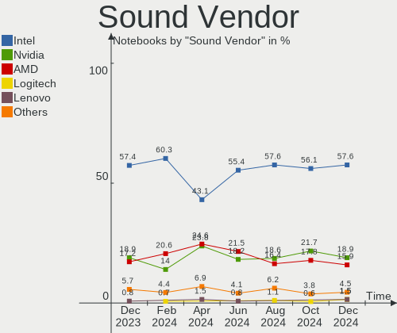

Pop!_OS Hardware Trends (Notebook)
----------------------------------

A project to identify most popular hardware characteristics and track their change
over time based on data collected by Pop!_OS users at https://Linux-Hardware.org.

Anyone can contribute to the study by uploading probes of their computers by
the [hw-probe](https://github.com/linuxhw/hw-probe) tool:

    sudo -E hw-probe -all -upload

Full-feature report is available here: https://linux-hardware.org/?view=trends&formfactor=notebook

Period: Apr, 2021.

Contents
--------

- [ OS                       ](#os)
- [ OS Family                ](#os-family)
- [ Kernel                   ](#kernel)
- [ Kernel Family            ](#kernel-family)
- [ Kernel Major Ver.        ](#kernel-major-ver)
- [ Arch                     ](#arch)
- [ DE                       ](#de)
- [ Display Server           ](#display-server)
- [ Display Manager          ](#display-manager)
- [ OS Lang                  ](#os-lang)
- [ Boot Mode                ](#boot-mode)
- [ Filesystem               ](#filesystem)
- [ Part. scheme             ](#part-scheme)
- [ Dual Boot with Linux/BSD ](#dual-boot-with-linux/bsd)
- [ Dual Boot (Win)          ](#dual-boot-win)
- [ Country                  ](#country)
- [ City                     ](#city)
- [ Vendor                   ](#vendor)
- [ Model                    ](#model)
- [ Model Family             ](#model-family)
- [ MFG Year                 ](#mfg-year)
- [ Form Factor              ](#form-factor)
- [ Secure Boot              ](#secure-boot)
- [ Coreboot                 ](#coreboot)
- [ RAM Size                 ](#ram-size)
- [ RAM Used                 ](#ram-used)
- [ Has CD-ROM               ](#has-cd-rom)
- [ Total Drives             ](#total-drives)
- [ Has Ethernet             ](#has-ethernet)
- [ Has WiFi                 ](#has-wifi)
- [ Has Bluetooth            ](#has-bluetooth)
- [ Drive Vendor             ](#drive-vendor)
- [ Drive Model              ](#drive-model)
- [ HDD Vendor               ](#hdd-vendor)
- [ SSD Vendor               ](#ssd-vendor)
- [ Drive Kind               ](#drive-kind)
- [ Drive Connector          ](#drive-connector)
- [ Drive Size               ](#drive-size)
- [ Space Total              ](#space-total)
- [ Space Used               ](#space-used)
- [ Malfunc. Drives          ](#malfunc-drives)
- [ Malfunc. Drive Vendor    ](#malfunc-drive-vendor)
- [ Malfunc. HDD Vendor      ](#malfunc-hdd-vendor)
- [ Malfunc. Drive Kind      ](#malfunc-drive-kind)
- [ Failed Drives            ](#failed-drives)
- [ Failed Drive Vendor      ](#failed-drive-vendor)
- [ Drive Status             ](#drive-status)
- [ Storage Vendor           ](#storage-vendor)
- [ Storage Model            ](#storage-model)
- [ Storage Kind             ](#storage-kind)
- [ CPU Vendor               ](#cpu-vendor)
- [ CPU Model                ](#cpu-model)
- [ CPU Model Family         ](#cpu-model-family)
- [ CPU Cores                ](#cpu-cores)
- [ CPU Sockets              ](#cpu-sockets)
- [ CPU Threads              ](#cpu-threads)
- [ CPU Op-Modes             ](#cpu-op-modes)
- [ CPU Microcode            ](#cpu-microcode)
- [ CPU Microarch            ](#cpu-microarch)
- [ GPU Vendor               ](#gpu-vendor)
- [ GPU Model                ](#gpu-model)
- [ GPU Combo                ](#gpu-combo)
- [ GPU Driver               ](#gpu-driver)
- [ GPU Memory               ](#gpu-memory)
- [ Monitor Vendor           ](#monitor-vendor)
- [ Monitor Model            ](#monitor-model)
- [ Monitor Resolution       ](#monitor-resolution)
- [ Monitor Diagonal         ](#monitor-diagonal)
- [ Monitor Width            ](#monitor-width)
- [ Aspect Ratio             ](#aspect-ratio)
- [ Monitor Area             ](#monitor-area)
- [ Pixel Density            ](#pixel-density)
- [ Multiple Monitors        ](#multiple-monitors)
- [ Net Controller Vendor    ](#net-controller-vendor)
- [ Net Controller Model     ](#net-controller-model)
- [ Wireless Vendor          ](#wireless-vendor)
- [ Wireless Model           ](#wireless-model)
- [ Ethernet Vendor          ](#ethernet-vendor)
- [ Ethernet Model           ](#ethernet-model)
- [ Net Controller Kind      ](#net-controller-kind)
- [ Used Controller          ](#used-controller)
- [ NICs                     ](#nics)
- [ IPv6                     ](#ipv6)
- [ Memory Vendor            ](#memory-vendor)
- [ Memory Model             ](#memory-model)
- [ Memory Kind              ](#memory-kind)
- [ Memory Form Factor       ](#memory-form-factor)
- [ Memory Size              ](#memory-size)
- [ Memory Speed             ](#memory-speed)
- [ Sound Vendor             ](#sound-vendor)
- [ Sound Model              ](#sound-model)
- [ Camera Vendor            ](#camera-vendor)
- [ Camera Model             ](#camera-model)
- [ Fingerprint Vendor       ](#fingerprint-vendor)
- [ Fingerprint Model        ](#fingerprint-model)
- [ Chipcard Vendor          ](#chipcard-vendor)
- [ Chipcard Model           ](#chipcard-model)
- [ Printer Vendor           ](#printer-vendor)
- [ Printer Model            ](#printer-model)
- [ Scanner Vendor           ](#scanner-vendor)
- [ Scanner Model            ](#scanner-model)
- [ Bluetooth Vendor         ](#bluetooth-vendor)
- [ Bluetooth Model          ](#bluetooth-model)
- [ Unsupported Devices      ](#unsupported-devices)
- [ Unsupported Device Types ](#unsupported-device-types)

OS
--

Installed operating systems

| Name          | Notebooks | Percent |
|---------------|-----------|---------|
| Pop!_OS 20.10 | 123       | 84.83%  |
| Pop!_OS 20.04 | 22        | 15.17%  |

OS Family
---------

OS without a version

| Name    | Notebooks | Percent |
|---------|-----------|---------|
| Pop!_OS | 145       | 100%    |

Kernel
------

Version of the Linux kernel

| Version                   | Notebooks | Percent |
|---------------------------|-----------|---------|
| 5.11.0-7612-generic       | 105       | 72.41%  |
| 5.11.0-7614-generic       | 20        | 13.79%  |
| 5.8.0-7642-generic        | 11        | 7.59%   |
| 5.8.0-7630-generic        | 4         | 2.76%   |
| 5.8.0-7625-generic        | 2         | 1.38%   |
| 5.4.0-7642-generic        | 1         | 0.69%   |
| 5.4.0-17.1-liquorix-amd64 | 1         | 0.69%   |
| 5.11.0-051100-generic     | 1         | 0.69%   |

Kernel Family
-------------

Linux kernel without a distro release

| Version | Notebooks | Percent |
|---------|-----------|---------|
| 5.11.0  | 126       | 86.9%   |
| 5.8.0   | 17        | 11.72%  |
| 5.4.0   | 2         | 1.38%   |

Kernel Major Ver.
-----------------

Linux kernel major version

| Version | Notebooks | Percent |
|---------|-----------|---------|
| 5.11    | 126       | 86.9%   |
| 5.8     | 17        | 11.72%  |
| 5.4     | 2         | 1.38%   |

Arch
----

OS architecture (x86_64, i586, etc.)

| Name   | Notebooks | Percent |
|--------|-----------|---------|
| x86_64 | 145       | 100%    |

DE
--

Desktop Environment

| Name   | Notebooks | Percent |
|--------|-----------|---------|
| GNOME  | 140       | 96.55%  |
| KDE5   | 2         | 1.38%   |
| XFCE   | 1         | 0.69%   |
| MATE   | 1         | 0.69%   |
| Budgie | 1         | 0.69%   |

Display Server
--------------

X11 or Wayland

| Name    | Notebooks | Percent |
|---------|-----------|---------|
| X11     | 141       | 97.24%  |
| Wayland | 4         | 2.76%   |

Display Manager
---------------

SDDM, LightDM, etc.

| Name    | Notebooks | Percent |
|---------|-----------|---------|
| Unknown | 119       | 82.07%  |
| GDM     | 26        | 17.93%  |

OS Lang
-------

Language

| Lang  | Notebooks | Percent |
|-------|-----------|---------|
| en_US | 81        | 55.86%  |
| pt_BR | 11        | 7.59%   |
| en_GB | 9         | 6.21%   |
| de_DE | 8         | 5.52%   |
| es_ES | 7         | 4.83%   |
| fr_FR | 6         | 4.14%   |
| en_CA | 4         | 2.76%   |
| en_AU | 4         | 2.76%   |
| C     | 4         | 2.76%   |
| pt_PT | 3         | 2.07%   |
| ru_RU | 2         | 1.38%   |
| it_IT | 2         | 1.38%   |
| tr_TR | 1         | 0.69%   |
| sv_SE | 1         | 0.69%   |
| pl_PL | 1         | 0.69%   |
| es_MX | 1         | 0.69%   |

Boot Mode
---------

EFI or BIOS

| Mode | Notebooks | Percent |
|------|-----------|---------|
| BIOS | 121       | 83.45%  |
| EFI  | 24        | 16.55%  |

Filesystem
----------

Type of filesystem

| Type    | Notebooks | Percent |
|---------|-----------|---------|
| Ext4    | 143       | 98.62%  |
| Overlay | 2         | 1.38%   |

Part. scheme
------------

Scheme of partitioning

| Type    | Notebooks | Percent |
|---------|-----------|---------|
| Unknown | 119       | 82.07%  |
| GPT     | 23        | 15.86%  |
| MBR     | 3         | 2.07%   |

Dual Boot with Linux/BSD
------------------------

Hosting more than one Linux/BSD

| Dual boot | Notebooks | Percent |
|-----------|-----------|---------|
| No        | 144       | 99.31%  |
| Yes       | 1         | 0.69%   |

Dual Boot (Win)
---------------

Hosting Linux and Windows

| Dual boot | Notebooks | Percent |
|-----------|-----------|---------|
| No        | 134       | 92.41%  |
| Yes       | 11        | 7.59%   |

Country
-------

Geographic location (country)

| Country            | Notebooks | Percent |
|--------------------|-----------|---------|
| USA                | 43        | 29.66%  |
| Brazil             | 16        | 11.03%  |
| Germany            | 9         | 6.21%   |
| UK                 | 6         | 4.14%   |
| Australia          | 6         | 4.14%   |
| India              | 5         | 3.45%   |
| Switzerland        | 4         | 2.76%   |
| Italy              | 4         | 2.76%   |
| France             | 4         | 2.76%   |
| Canada             | 4         | 2.76%   |
| Portugal           | 3         | 2.07%   |
| Poland             | 3         | 2.07%   |
| Indonesia          | 3         | 2.07%   |
| Turkey             | 2         | 1.38%   |
| Sweden             | 2         | 1.38%   |
| Spain              | 2         | 1.38%   |
| South Africa       | 2         | 1.38%   |
| Saudi Arabia       | 2         | 1.38%   |
| New Zealand        | 2         | 1.38%   |
| Mexico             | 2         | 1.38%   |
| Japan              | 2         | 1.38%   |
| Greece             | 2         | 1.38%   |
| South Korea        | 1         | 0.69%   |
| Russia             | 1         | 0.69%   |
| Romania            | 1         | 0.69%   |
| Philippines        | 1         | 0.69%   |
| Peru               | 1         | 0.69%   |
| Morocco            | 1         | 0.69%   |
| Moldova            | 1         | 0.69%   |
| Malaysia           | 1         | 0.69%   |
| Kazakhstan         | 1         | 0.69%   |
| Israel             | 1         | 0.69%   |
| Egypt              | 1         | 0.69%   |
| Dominican Republic | 1         | 0.69%   |
| Chile              | 1         | 0.69%   |
| Bulgaria           | 1         | 0.69%   |
| Bolivia            | 1         | 0.69%   |
| Belgium            | 1         | 0.69%   |
| Austria            | 1         | 0.69%   |

City
----

Geographic location (city)

| City                  | Notebooks | Percent |
|-----------------------|-----------|---------|
| Toronto               | 2         | 1.38%   |
| Sydney                | 2         | 1.38%   |
| Seattle               | 2         | 1.38%   |
| Maringá              | 2         | 1.38%   |
| Lancaster             | 2         | 1.38%   |
| Chicago               | 2         | 1.38%   |
| Zurich                | 1         | 0.69%   |
| Würzburg             | 1         | 0.69%   |
| Wroclaw               | 1         | 0.69%   |
| Wellington            | 1         | 0.69%   |
| Wejherowo             | 1         | 0.69%   |
| Victoria              | 1         | 0.69%   |
| Union City            | 1         | 0.69%   |
| Ungheni               | 1         | 0.69%   |
| Uberlândia           | 1         | 0.69%   |
| Tyringe               | 1         | 0.69%   |
| Tyreso Strand         | 1         | 0.69%   |
| Tulsa                 | 1         | 0.69%   |
| Trussville            | 1         | 0.69%   |
| Trivandrum            | 1         | 0.69%   |
| Torrance              | 1         | 0.69%   |
| Tokyo                 | 1         | 0.69%   |
| Thessaloniki          | 1         | 0.69%   |
| Tel Aviv              | 1         | 0.69%   |
| Tadley                | 1         | 0.69%   |
| São Paulo            | 1         | 0.69%   |
| Spring Hill           | 1         | 0.69%   |
| Sofia                 | 1         | 0.69%   |
| Semarang              | 1         | 0.69%   |
| Schonbuhl             | 1         | 0.69%   |
| Sao Vicente           | 1         | 0.69%   |
| Santo Domingo Este    | 1         | 0.69%   |
| Santiago              | 1         | 0.69%   |
| Santa Rita do Sapucai | 1         | 0.69%   |
| Salt Lake City        | 1         | 0.69%   |
| Saint-Gaudens         | 1         | 0.69%   |
| Sacramento            | 1         | 0.69%   |
| Rotherham             | 1         | 0.69%   |
| Rome                  | 1         | 0.69%   |
| Riyadh                | 1         | 0.69%   |
| Rio Grande da Serra   | 1         | 0.69%   |
| Rio de Janeiro        | 1         | 0.69%   |
| Ridder                | 1         | 0.69%   |
| Richland              | 1         | 0.69%   |
| Quinta Do Conde       | 1         | 0.69%   |
| Puebla City           | 1         | 0.69%   |
| Prince George         | 1         | 0.69%   |
| Pretoria              | 1         | 0.69%   |
| Preston               | 1         | 0.69%   |
| Porto Alegre          | 1         | 0.69%   |
| Ploieşti             | 1         | 0.69%   |
| Plano                 | 1         | 0.69%   |
| Pittsburgh            | 1         | 0.69%   |
| Pilar                 | 1         | 0.69%   |
| Philadelphia          | 1         | 0.69%   |
| Perth                 | 1         | 0.69%   |
| Pawtucket             | 1         | 0.69%   |
| Pasadena              | 1         | 0.69%   |
| Oshkosh               | 1         | 0.69%   |
| Oklahoma City         | 1         | 0.69%   |

Vendor
------

Motherboard manufacturer

| Name                                      | Notebooks | Percent |
|-------------------------------------------|-----------|---------|
| Hewlett-Packard                           | 27        | 18.62%  |
| Dell                                      | 26        | 17.93%  |
| Lenovo                                    | 25        | 17.24%  |
| ASUSTek Computer                          | 16        | 11.03%  |
| Apple                                     | 10        | 6.9%    |
| Acer                                      | 10        | 6.9%    |
| System76                                  | 6         | 4.14%   |
| MSI                                       | 3         | 2.07%   |
| TrekStor                                  | 2         | 1.38%   |
| Toshiba                                   | 2         | 1.38%   |
| Sony                                      | 2         | 1.38%   |
| Positivo                                  | 2         | 1.38%   |
| Xplore                                    | 1         | 0.69%   |
| SLIMBOOK                                  | 1         | 0.69%   |
| Shenzhen Baohuazhong Science & Technology | 1         | 0.69%   |
| Schenker                                  | 1         | 0.69%   |
| Samsung Electronics                       | 1         | 0.69%   |
| Quanta                                    | 1         | 0.69%   |
| Phoenix/SiS                               | 1         | 0.69%   |
| Panasonic                                 | 1         | 0.69%   |
| OriginPC                                  | 1         | 0.69%   |
| Itautec                                   | 1         | 0.69%   |
| HUAWEI                                    | 1         | 0.69%   |
| Google                                    | 1         | 0.69%   |
| Gateway                                   | 1         | 0.69%   |
| CONNEX                                    | 1         | 0.69%   |

Model
-----

Motherboard model

| Name                                     | Notebooks | Percent |
|------------------------------------------|-----------|---------|
| System76 Lemur Pro                       | 3         | 2.07%   |
| Apple MacBookPro8,1                      | 3         | 2.07%   |
| HP Pavilion Notebook                     | 2         | 1.38%   |
| ASUS ROG Zephyrus G14 GA401IV_GA401IV    | 2         | 1.38%   |
| Apple MacBookPro9,2                      | 2         | 1.38%   |
| Apple MacBookPro12,1                     | 2         | 1.38%   |
| Xplore iX101B2                           | 1         | 0.69%   |
| TrekStor PRIMEBOOK U13B                  | 1         | 0.69%   |
| TrekStor Notebook Slim S130              | 1         | 0.69%   |
| Toshiba Satellite L500                   | 1         | 0.69%   |
| Toshiba PORTEGE M930                     | 1         | 0.69%   |
| System76 Lemur                           | 1         | 0.69%   |
| System76 Gazelle Pro                     | 1         | 0.69%   |
| System76 Galago Pro                      | 1         | 0.69%   |
| Sony VPCF121FX                           | 1         | 0.69%   |
| Sony VGN-FE41M                           | 1         | 0.69%   |
| SLIMBOOK PROX15-AMD                      | 1         | 0.69%   |
| Shenzhen Baohuazhong Science & Philbook  | 1         | 0.69%   |
| Schenker XMG CORE 17(M20, RTX 2060)      | 1         | 0.69%   |
| Samsung 800G5M/800G5W                    | 1         | 0.69%   |
| Quanta TWJ                               | 1         | 0.69%   |
| Positivo W942SW_SW1                      | 1         | 0.69%   |
| Positivo MOBILE                          | 1         | 0.69%   |
| Phoenix/SiS M7X0SU                       | 1         | 0.69%   |
| Panasonic CF-53JCLBX1M                   | 1         | 0.69%   |
| OriginPC ND-17                           | 1         | 0.69%   |
| MSI GS65 Stealth Thin 8RF                | 1         | 0.69%   |
| MSI GS63VR 7RF                           | 1         | 0.69%   |
| MSI GF65 Thin 9SD                        | 1         | 0.69%   |
| Lenovo V310-14ISK 80SX                   | 1         | 0.69%   |
| Lenovo ThinkPad X230 2325OR2             | 1         | 0.69%   |
| Lenovo ThinkPad X1 Carbon 4th 20FCS0LP01 | 1         | 0.69%   |
| Lenovo ThinkPad W510 43192RU             | 1         | 0.69%   |
| Lenovo ThinkPad T470p 20J6S08M00         | 1         | 0.69%   |
| Lenovo ThinkPad T470 20HES5800H          | 1         | 0.69%   |
| Lenovo ThinkPad T420 4180AZ5             | 1         | 0.69%   |
| Lenovo ThinkPad T400 2767W4V             | 1         | 0.69%   |
| Lenovo ThinkPad P53 20QQS2KB00           | 1         | 0.69%   |
| Lenovo ThinkPad L15 Gen 1 20U7001XTX     | 1         | 0.69%   |
| Lenovo ThinkPad L14 Gen 1 20U1S0YS00     | 1         | 0.69%   |
| Lenovo ThinkPad E595 20NFCTO1WW          | 1         | 0.69%   |
| Lenovo Legion Y540-15IRH 81RJ            | 1         | 0.69%   |
| Lenovo Legion Y530-15ICH 81FV            | 1         | 0.69%   |
| Lenovo Legion 5 15IMH05 82AU             | 1         | 0.69%   |
| Lenovo IdeaPad Y700-15ACZ 80NY           | 1         | 0.69%   |
| Lenovo IdeaPad S340-14IWL 81N7           | 1         | 0.69%   |
| Lenovo IdeaPad S145-15IWL 81S9           | 1         | 0.69%   |
| Lenovo IdeaPad S145-15IWL 81MV           | 1         | 0.69%   |
| Lenovo IdeaPad L340-15IRH Gaming 81LK    | 1         | 0.69%   |
| Lenovo IdeaPad Gaming 3 15IMH05 82CG     | 1         | 0.69%   |
| Lenovo IdeaPad Gaming 3 15ARH05 82EY     | 1         | 0.69%   |
| Lenovo IdeaPad 330-15AST 81D6            | 1         | 0.69%   |
| Lenovo G570 20079                        | 1         | 0.69%   |
| Lenovo G555 0873                         | 1         | 0.69%   |
| Itautec Infoway w7440                    | 1         | 0.69%   |
| HUAWEI HLYL-WXX9                         | 1         | 0.69%   |
| HP Snappy                                | 1         | 0.69%   |
| HP ProBook 6460b                         | 1         | 0.69%   |
| HP Pavilion Laptop 15-cw1xxx             | 1         | 0.69%   |
| HP Pavilion Laptop 15-cw0xxx             | 1         | 0.69%   |

Model Family
------------

Motherboard model prefix

| Name                                    | Notebooks | Percent |
|-----------------------------------------|-----------|---------|
| Lenovo ThinkPad                         | 11        | 7.59%   |
| HP Pavilion                             | 10        | 6.9%    |
| Lenovo IdeaPad                          | 8         | 5.52%   |
| Acer Aspire                             | 8         | 5.52%   |
| Dell XPS                                | 7         | 4.83%   |
| Dell Inspiron                           | 7         | 4.83%   |
| HP EliteBook                            | 5         | 3.45%   |
| Dell Latitude                           | 5         | 3.45%   |
| ASUS ROG                                | 5         | 3.45%   |
| System76 Lemur                          | 4         | 2.76%   |
| HP Laptop                               | 4         | 2.76%   |
| Lenovo Legion                           | 3         | 2.07%   |
| Dell Precision                          | 3         | 2.07%   |
| ASUS VivoBook                           | 3         | 2.07%   |
| Apple MacBookPro8                       | 3         | 2.07%   |
| HP ENVY                                 | 2         | 1.38%   |
| Dell Vostro                             | 2         | 1.38%   |
| ASUS ASUS                               | 2         | 1.38%   |
| Apple MacBookPro9                       | 2         | 1.38%   |
| Apple MacBookPro12                      | 2         | 1.38%   |
| Xplore iX101B2                          | 1         | 0.69%   |
| TrekStor PRIMEBOOK                      | 1         | 0.69%   |
| TrekStor Notebook                       | 1         | 0.69%   |
| Toshiba Satellite                       | 1         | 0.69%   |
| Toshiba PORTEGE                         | 1         | 0.69%   |
| System76 Gazelle                        | 1         | 0.69%   |
| System76 Galago                         | 1         | 0.69%   |
| Sony VPCF121FX                          | 1         | 0.69%   |
| Sony VGN-FE41M                          | 1         | 0.69%   |
| SLIMBOOK PROX15-AMD                     | 1         | 0.69%   |
| Shenzhen Baohuazhong Science & Philbook | 1         | 0.69%   |
| Schenker XMG                            | 1         | 0.69%   |
| Samsung 800G5M                          | 1         | 0.69%   |
| Quanta TWJ                              | 1         | 0.69%   |
| Positivo W942SW                         | 1         | 0.69%   |
| Positivo MOBILE                         | 1         | 0.69%   |
| Phoenix/SiS M7X0SU                      | 1         | 0.69%   |
| Panasonic CF-53JCLBX1M                  | 1         | 0.69%   |
| OriginPC ND-17                          | 1         | 0.69%   |
| MSI GS65                                | 1         | 0.69%   |
| MSI GS63VR                              | 1         | 0.69%   |
| MSI GF65                                | 1         | 0.69%   |
| Lenovo V310-14ISK                       | 1         | 0.69%   |
| Lenovo G570                             | 1         | 0.69%   |
| Lenovo G555                             | 1         | 0.69%   |
| Itautec Infoway                         | 1         | 0.69%   |
| HUAWEI HLYL-WXX9                        | 1         | 0.69%   |
| HP Snappy                               | 1         | 0.69%   |
| HP ProBook                              | 1         | 0.69%   |
| HP Notebook                             | 1         | 0.69%   |
| HP G62                                  | 1         | 0.69%   |
| HP 250                                  | 1         | 0.69%   |
| Google Rammus                           | 1         | 0.69%   |
| Gateway NV55C                           | 1         | 0.69%   |
| Dell Studio                             | 1         | 0.69%   |
| Dell G3                                 | 1         | 0.69%   |
| CONNEX L1420                            | 1         | 0.69%   |
| ASUS X550LA                             | 1         | 0.69%   |
| ASUS X450LCP                            | 1         | 0.69%   |
| ASUS N53SV                              | 1         | 0.69%   |

MFG Year
--------

Motherboard manufacture year

| Year    | Notebooks | Percent |
|---------|-----------|---------|
| 2020    | 43        | 29.66%  |
| 2018    | 21        | 14.48%  |
| 2019    | 19        | 13.1%   |
| 2021    | 14        | 9.66%   |
| 2011    | 10        | 6.9%    |
| 2013    | 9         | 6.21%   |
| 2015    | 5         | 3.45%   |
| 2012    | 5         | 3.45%   |
| 2010    | 5         | 3.45%   |
| 2014    | 4         | 2.76%   |
| 2016    | 3         | 2.07%   |
| 2009    | 3         | 2.07%   |
| 2017    | 2         | 1.38%   |
| 2007    | 1         | 0.69%   |
| Unknown | 1         | 0.69%   |

Form Factor
-----------

Physical design of the computer

| Name     | Notebooks | Percent |
|----------|-----------|---------|
| Notebook | 145       | 100%    |

Secure Boot
-----------

Enabled or disabled

| State    | Notebooks | Percent |
|----------|-----------|---------|
| Disabled | 145       | 100%    |

Coreboot
--------

Have coreboot on board

| Used | Notebooks | Percent |
|------|-----------|---------|
| No   | 139       | 95.86%  |
| Yes  | 6         | 4.14%   |

RAM Size
--------

Total RAM memory

| Size in GB  | Notebooks | Percent |
|-------------|-----------|---------|
| 4.01-8.0    | 46        | 31.72%  |
| 8.01-16.0   | 31        | 21.38%  |
| 16.01-24.0  | 27        | 18.62%  |
| 3.01-4.0    | 23        | 15.86%  |
| 32.01-64.0  | 13        | 8.97%   |
| 64.01-256.0 | 3         | 2.07%   |
| 24.01-32.0  | 1         | 0.69%   |
| 2.01-3.0    | 1         | 0.69%   |

RAM Used
--------

Used RAM memory

| Used GB    | Notebooks | Percent |
|------------|-----------|---------|
| 1.01-2.0   | 52        | 35.86%  |
| 2.01-3.0   | 41        | 28.28%  |
| 3.01-4.0   | 27        | 18.62%  |
| 4.01-8.0   | 19        | 13.1%   |
| 8.01-16.0  | 5         | 3.45%   |
| 16.01-24.0 | 1         | 0.69%   |

Has CD-ROM
----------

Has CD-ROM on board

| Presented | Notebooks | Percent |
|-----------|-----------|---------|
| No        | 96        | 66.21%  |
| Yes       | 49        | 33.79%  |

Total Drives
------------

Number of drives on board

| Drives | Notebooks | Percent |
|--------|-----------|---------|
| 1      | 83        | 57.24%  |
| 2      | 54        | 37.24%  |
| 3      | 3         | 2.07%   |
| 0      | 3         | 2.07%   |
| 5      | 1         | 0.69%   |
| 4      | 1         | 0.69%   |

Has Ethernet
------------

Has Ethernet on board

| Presented | Notebooks | Percent |
|-----------|-----------|---------|
| Yes       | 124       | 85.52%  |
| No        | 21        | 14.48%  |

Has WiFi
--------

Has WiFi module

| Presented | Notebooks | Percent |
|-----------|-----------|---------|
| Yes       | 142       | 97.93%  |
| No        | 3         | 2.07%   |

Has Bluetooth
-------------

Has Bluetooth module

| Presented | Notebooks | Percent |
|-----------|-----------|---------|
| Yes       | 117       | 80.69%  |
| No        | 28        | 19.31%  |

Drive Vendor
------------

Hard drive vendors

| Vendor                  | Notebooks | Drives | Percent |
|-------------------------|-----------|--------|---------|
| Samsung Electronics     | 27        | 32     | 14.14%  |
| Seagate                 | 23        | 25     | 12.04%  |
| WDC                     | 20        | 22     | 10.47%  |
| Unknown                 | 13        | 16     | 6.81%   |
| Toshiba                 | 13        | 13     | 6.81%   |
| SanDisk                 | 11        | 11     | 5.76%   |
| Kingston                | 11        | 11     | 5.76%   |
| SK Hynix                | 8         | 9      | 4.19%   |
| HGST                    | 8         | 9      | 4.19%   |
| Intel                   | 7         | 7      | 3.66%   |
| Micron Technology       | 6         | 7      | 3.14%   |
| Crucial                 | 6         | 6      | 3.14%   |
| Apple                   | 6         | 6      | 3.14%   |
| Hitachi                 | 4         | 4      | 2.09%   |
| Team                    | 3         | 3      | 1.57%   |
| LITEON                  | 3         | 3      | 1.57%   |
| Transcend               | 2         | 2      | 1.05%   |
| Silicon Motion          | 2         | 2      | 1.05%   |
| OCZ                     | 2         | 2      | 1.05%   |
| Lenovo                  | 2         | 2      | 1.05%   |
| A-DATA Technology       | 2         | 2      | 1.05%   |
| Union Memory (Shenzhen) | 1         | 1      | 0.52%   |
| SPCC                    | 1         | 1      | 0.52%   |
| RSH-339                 | 1         | 1      | 0.52%   |
| NGFF                    | 1         | 1      | 0.52%   |
| LaCie                   | 1         | 1      | 0.52%   |
| JMicron                 | 1         | 1      | 0.52%   |
| Gigabyte Technology     | 1         | 1      | 0.52%   |
| Fujitsu                 | 1         | 1      | 0.52%   |
| Dogfish                 | 1         | 1      | 0.52%   |
| China                   | 1         | 1      | 0.52%   |
| ASMT                    | 1         | 2      | 0.52%   |
| Apacer                  | 1         | 1      | 0.52%   |

Drive Model
-----------

Hard drive models

| Model                                        | Notebooks | Percent |
|----------------------------------------------|-----------|---------|
| Seagate ST1000LM035-1RK172 1TB               | 9         | 4.43%   |
| Unknown MMC Card  64GB                       | 4         | 1.97%   |
| Toshiba NVMe SSD Drive 512GB                 | 3         | 1.48%   |
| Samsung NVMe SSD Drive 512GB                 | 3         | 1.48%   |
| Samsung NVMe SSD Drive 256GB                 | 3         | 1.48%   |
| Intel NVMe SSD Drive 512GB                   | 3         | 1.48%   |
| HGST HTS721010A9E630 1TB                     | 3         | 1.48%   |
| WDC WD10SPZX-24Z10 1TB                       | 2         | 0.99%   |
| Unknown MMC Card  32GB                       | 2         | 0.99%   |
| Toshiba MQ04ABF100 1TB                       | 2         | 0.99%   |
| SK Hynix NVMe SSD Drive 512GB                | 2         | 0.99%   |
| SK Hynix NVMe SSD Drive 256GB                | 2         | 0.99%   |
| Seagate ST500LT012-1DG142 500GB              | 2         | 0.99%   |
| Seagate ST2000LM007-1R8174 2TB               | 2         | 0.99%   |
| Sandisk NVMe SSD Drive 500GB                 | 2         | 0.99%   |
| Sandisk NVMe SSD Drive 256GB                 | 2         | 0.99%   |
| Samsung NVMe SSD Drive 500GB                 | 2         | 0.99%   |
| Micron MTFDDAK256MAM-1K12 256GB SSD          | 2         | 0.99%   |
| LITEON CV8-8E128-HP 128GB SSD                | 2         | 0.99%   |
| Kingston SA400S37480G 480GB SSD              | 2         | 0.99%   |
| Kingston NVMe SSD Drive 512GB                | 2         | 0.99%   |
| Intel NVMe SSD Drive 1024GB                  | 2         | 0.99%   |
| HGST HTS541010A9E680 1TB                     | 2         | 0.99%   |
| Crucial CT240BX500SSD1 240GB                 | 2         | 0.99%   |
| Apple SSD SM0128G 121GB                      | 2         | 0.99%   |
| Apple HDD HTS547550A9E384 500GB              | 2         | 0.99%   |
| WDC WDS500G3X0C-00SJG0 500GB                 | 1         | 0.49%   |
| WDC WDS250G2B0B 250GB SSD                    | 1         | 0.49%   |
| WDC WDS240G2G0B-00EPW0 240GB SSD             | 1         | 0.49%   |
| WDC WDS120G2G0B-00EPW0 120GB SSD             | 1         | 0.49%   |
| WDC WDS120G2G0A-00JH30 120GB SSD             | 1         | 0.49%   |
| WDC WDS100T2G0A-00JH30 1TB SSD               | 1         | 0.49%   |
| WDC WDS100T2B0C-00PXH0 1TB                   | 1         | 0.49%   |
| WDC WDBRPG5000ANC-WRSN 500GB                 | 1         | 0.49%   |
| WDC WD7500BPKT-60PK4T0 752GB                 | 1         | 0.49%   |
| WDC WD5000LPVX-75V0TT0 500GB                 | 1         | 0.49%   |
| WDC WD5000LPVT-00FMCT0 500GB                 | 1         | 0.49%   |
| WDC WD5000BEVT-80A0RT0 500GB                 | 1         | 0.49%   |
| WDC WD3200BEVT-75ZCT2 320GB                  | 1         | 0.49%   |
| WDC WD10SPZX-21Z10T0 1TB                     | 1         | 0.49%   |
| WDC WD10SPCX-60KHST0 1TB                     | 1         | 0.49%   |
| WDC WD10SPCX-24HWST1 1TB                     | 1         | 0.49%   |
| WDC WD10JPVX-75JC3T0 1TB                     | 1         | 0.49%   |
| WDC PC SN730 SDBPNTY-512G-1027 512GB         | 1         | 0.49%   |
| WDC PC SN530 SDBPNPZ-512G-1002 512GB         | 1         | 0.49%   |
| WDC PC SN520 SDAPMUW-128G-1101 128GB         | 1         | 0.49%   |
| Unknown XR0480GFLKD 480GB                    | 1         | 0.49%   |
| Unknown SLD64G  64GB                         | 1         | 0.49%   |
| Unknown SD02G  2GB                           | 1         | 0.49%   |
| Unknown SD/MMC/MS PRO 32GB                   | 1         | 0.49%   |
| Unknown NCard  64GB                          | 1         | 0.49%   |
| Unknown MMC Card  393GB                      | 1         | 0.49%   |
| Unknown MMC Card  256GB                      | 1         | 0.49%   |
| Unknown MMC Card  1GB                        | 1         | 0.49%   |
| Unknown MMC Card  128GB                      | 1         | 0.49%   |
| Unknown FNX1TBMORM 1024GB                    | 1         | 0.49%   |
| Union Memory (Shenzhen) NVMe SSD Drive 128GB | 1         | 0.49%   |
| Transcend TS240GSSD220S 240GB                | 1         | 0.49%   |
| Transcend TS240GMTS420S 240GB SSD            | 1         | 0.49%   |
| Toshiba THNSNJ256G8NY 256GB SSD              | 1         | 0.49%   |

HDD Vendor
----------

Hard disk drive vendors

| Vendor              | Notebooks | Drives | Percent |
|---------------------|-----------|--------|---------|
| Seagate             | 22        | 24     | 38.6%   |
| WDC                 | 11        | 11     | 19.3%   |
| HGST                | 8         | 9      | 14.04%  |
| Toshiba             | 6         | 6      | 10.53%  |
| Hitachi             | 4         | 4      | 7.02%   |
| Apple               | 3         | 3      | 5.26%   |
| Samsung Electronics | 1         | 1      | 1.75%   |
| Fujitsu             | 1         | 1      | 1.75%   |
| ASMT                | 1         | 2      | 1.75%   |

SSD Vendor
----------

Solid state drive vendors

| Vendor              | Notebooks | Drives | Percent |
|---------------------|-----------|--------|---------|
| Samsung Electronics | 14        | 14     | 20.59%  |
| Kingston            | 9         | 9      | 13.24%  |
| Crucial             | 6         | 6      | 8.82%   |
| WDC                 | 5         | 5      | 7.35%   |
| SanDisk             | 5         | 5      | 7.35%   |
| Micron Technology   | 4         | 5      | 5.88%   |
| Team                | 3         | 3      | 4.41%   |
| LITEON              | 3         | 3      | 4.41%   |
| Apple               | 3         | 3      | 4.41%   |
| Transcend           | 2         | 2      | 2.94%   |
| SK Hynix            | 2         | 2      | 2.94%   |
| OCZ                 | 2         | 2      | 2.94%   |
| A-DATA Technology   | 2         | 2      | 2.94%   |
| Toshiba             | 1         | 1      | 1.47%   |
| SPCC                | 1         | 1      | 1.47%   |
| Seagate             | 1         | 1      | 1.47%   |
| NGFF                | 1         | 1      | 1.47%   |
| Gigabyte Technology | 1         | 1      | 1.47%   |
| Dogfish             | 1         | 1      | 1.47%   |
| China               | 1         | 1      | 1.47%   |
| Apacer              | 1         | 1      | 1.47%   |

Drive Kind
----------

HDD or SSD

| Kind    | Notebooks | Drives | Percent |
|---------|-----------|--------|---------|
| SSD     | 65        | 69     | 34.95%  |
| HDD     | 55        | 61     | 29.57%  |
| NVMe    | 50        | 58     | 26.88%  |
| MMC     | 10        | 13     | 5.38%   |
| Unknown | 6         | 6      | 3.23%   |

Drive Connector
---------------

SATA, SAS, NVMe, etc.

| Type | Notebooks | Drives | Percent |
|------|-----------|--------|---------|
| SATA | 104       | 127    | 60.47%  |
| NVMe | 50        | 58     | 29.07%  |
| MMC  | 10        | 13     | 5.81%   |
| SAS  | 8         | 9      | 4.65%   |

Drive Size
----------

Size of hard drive

| Size in TB | Notebooks | Drives | Percent |
|------------|-----------|--------|---------|
| 0.01-0.5   | 79        | 87     | 65.29%  |
| 0.51-1.0   | 37        | 38     | 30.58%  |
| 1.01-2.0   | 4         | 4      | 3.31%   |
| 3.01-4.0   | 1         | 1      | 0.83%   |

Space Total
-----------

Amount of disk space available on the file system

| Size in GB     | Notebooks | Percent |
|----------------|-----------|---------|
| 101-250        | 53        | 36.55%  |
| 251-500        | 46        | 31.72%  |
| 501-1000       | 15        | 10.34%  |
| 1001-2000      | 14        | 9.66%   |
| 21-50          | 6         | 4.14%   |
| 1-20           | 5         | 3.45%   |
| More than 3000 | 3         | 2.07%   |
| 51-100         | 2         | 1.38%   |
| 2001-3000      | 1         | 0.69%   |

Space Used
----------

Amount of used disk space

| Used GB   | Notebooks | Percent |
|-----------|-----------|---------|
| 1-20      | 66        | 45.52%  |
| 21-50     | 33        | 22.76%  |
| 101-250   | 22        | 15.17%  |
| 51-100    | 11        | 7.59%   |
| 251-500   | 6         | 4.14%   |
| 1001-2000 | 4         | 2.76%   |
| 501-1000  | 2         | 1.38%   |
| 2001-3000 | 1         | 0.69%   |

Malfunc. Drives
---------------

Drive models with a malfunction

| Model                                 | Notebooks | Drives | Percent |
|---------------------------------------|-----------|--------|---------|
| Seagate ST9500325AS 500GB             | 1         | 1      | 25%     |
| Seagate ST2000LM007-1R8174 2TB        | 1         | 1      | 25%     |
| SanDisk SD9SN8W-128G-1006 128GB SSD   | 1         | 1      | 25%     |
| Micron Technology 1100 SATA 512GB SSD | 1         | 1      | 25%     |

Malfunc. Drive Vendor
---------------------

Vendors of faulty drives

| Vendor            | Notebooks | Drives | Percent |
|-------------------|-----------|--------|---------|
| Seagate           | 2         | 2      | 50%     |
| SanDisk           | 1         | 1      | 25%     |
| Micron Technology | 1         | 1      | 25%     |

Malfunc. HDD Vendor
-------------------

Vendors of faulty HDD drives

| Vendor  | Notebooks | Drives | Percent |
|---------|-----------|--------|---------|
| Seagate | 2         | 2      | 100%    |

Malfunc. Drive Kind
-------------------

Kinds of faulty drives

| Kind | Notebooks | Drives | Percent |
|------|-----------|--------|---------|
| SSD  | 2         | 2      | 50%     |
| HDD  | 2         | 2      | 50%     |

Failed Drives
-------------

Failed drive models

Zero info for selected period =(

Failed Drive Vendor
-------------------

Failed drive vendors

Zero info for selected period =(

Drive Status
------------

Number of failed and malfunc. drives

| Status   | Notebooks | Drives | Percent |
|----------|-----------|--------|---------|
| Detected | 119       | 168    | 80.95%  |
| Works    | 24        | 35     | 16.33%  |
| Malfunc  | 4         | 4      | 2.72%   |

Storage Vendor
--------------

Storage controller vendors

| Vendor                           | Notebooks | Percent |
|----------------------------------|-----------|---------|
| Intel                            | 96        | 55.17%  |
| AMD                              | 25        | 14.37%  |
| Samsung Electronics              | 16        | 9.2%    |
| Sandisk                          | 11        | 6.32%   |
| Toshiba America Info Systems     | 6         | 3.45%   |
| SK Hynix                         | 6         | 3.45%   |
| Silicon Motion                   | 2         | 1.15%   |
| Silicon Integrated Systems [SiS] | 2         | 1.15%   |
| Nvidia                           | 2         | 1.15%   |
| Micron Technology                | 2         | 1.15%   |
| Lenovo                           | 2         | 1.15%   |
| Kingston Technology Company      | 2         | 1.15%   |
| Union Memory (Shenzhen)          | 1         | 0.57%   |
| JMicron Technology               | 1         | 0.57%   |

Storage Model
-------------

Storage controller models

| Model                                                                          | Notebooks | Percent |
|--------------------------------------------------------------------------------|-----------|---------|
| AMD FCH SATA Controller [AHCI mode]                                            | 24        | 13.11%  |
| Intel 6 Series/C200 Series Chipset Family 6 port Mobile SATA AHCI Controller   | 16        | 8.74%   |
| Samsung NVMe SSD Controller SM981/PM981/PM983                                  | 10        | 5.46%   |
| Intel Sunrise Point-LP SATA Controller [AHCI mode]                             | 10        | 5.46%   |
| Intel 82801 Mobile SATA Controller [RAID mode]                                 | 10        | 5.46%   |
| Intel 7 Series Chipset Family 6-port SATA Controller [AHCI mode]               | 9         | 4.92%   |
| Intel SSD 660P Series                                                          | 7         | 3.83%   |
| Intel Cannon Lake Mobile PCH SATA AHCI Controller                              | 6         | 3.28%   |
| Sandisk WD Blue SN550 NVMe SSD                                                 | 5         | 2.73%   |
| Intel 8 Series/C220 Series Chipset Family 6-port SATA Controller 1 [AHCI mode] | 5         | 2.73%   |
| Intel 5 Series/3400 Series Chipset 4 port SATA AHCI Controller                 | 5         | 2.73%   |
| Intel HM170/QM170 Chipset SATA Controller [AHCI Mode]                          | 4         | 2.19%   |
| Toshiba America Info Systems BG3 NVMe SSD Controller                           | 3         | 1.64%   |
| SK Hynix BC501 NVMe Solid State Drive 512GB                                    | 3         | 1.64%   |
| Sandisk WD Black SN750 / PC SN730 NVMe SSD                                     | 3         | 1.64%   |
| Intel Cannon Point-LP SATA Controller [AHCI Mode]                              | 3         | 1.64%   |
| Intel 82801IBM/IEM (ICH9M/ICH9M-E) 4 port SATA Controller [AHCI mode]          | 3         | 1.64%   |
| Intel 5 Series/3400 Series Chipset 6 port SATA AHCI Controller                 | 3         | 1.64%   |
| Toshiba America Info Systems XG6 NVMe SSD Controller                           | 2         | 1.09%   |
| SK Hynix BC511                                                                 | 2         | 1.09%   |
| Silicon Motion SM2263EN/SM2263XT SSD Controller                                | 2         | 1.09%   |
| Silicon Integrated Systems [SiS] SATA Controller / IDE mode                    | 2         | 1.09%   |
| Silicon Integrated Systems [SiS] 5513 IDE Controller                           | 2         | 1.09%   |
| Samsung NVMe Controller                                                        | 2         | 1.09%   |
| Samsung Electronics SATA controller                                            | 2         | 1.09%   |
| Nvidia MCP79 AHCI Controller                                                   | 2         | 1.09%   |
| Micron Non-Volatile memory controller                                          | 2         | 1.09%   |
| Lenovo Non-Volatile memory controller                                          | 2         | 1.09%   |
| Intel Wildcat Point-LP SATA Controller [AHCI Mode]                             | 2         | 1.09%   |
| Intel Celeron/Pentium Silver Processor SATA Controller                         | 2         | 1.09%   |
| Intel 8 Series SATA Controller 1 [AHCI mode]                                   | 2         | 1.09%   |
| Intel 400 Series Chipset Family SATA AHCI Controller                           | 2         | 1.09%   |
| Union Memory (Shenzhen) Non-Volatile memory controller                         | 1         | 0.55%   |
| Toshiba America Info Systems XG4 NVMe SSD Controller                           | 1         | 0.55%   |
| SK Hynix Non-Volatile memory controller                                        | 1         | 0.55%   |
| Sandisk WD Blue SN500 / PC SN520 NVMe SSD                                      | 1         | 0.55%   |
| Sandisk WD Black 2018/SN750 / PC SN720 NVMe SSD                                | 1         | 0.55%   |
| Sandisk PC SN520 NVMe SSD                                                      | 1         | 0.55%   |
| Samsung NVMe SSD Controller SM951/PM951                                        | 1         | 0.55%   |
| Samsung NVMe SSD Controller PM9A1/980PRO                                       | 1         | 0.55%   |
| Samsung Apple PCIe SSD                                                         | 1         | 0.55%   |
| Kingston Company U-SNS8154P3 NVMe SSD                                          | 1         | 0.55%   |
| Kingston Company Company Non-Volatile memory controller                        | 1         | 0.55%   |
| JMicron JMB360 AHCI Controller                                                 | 1         | 0.55%   |
| Intel Volume Management Device NVMe RAID Controller                            | 1         | 0.55%   |
| Intel Tiger Lake-LP SATA Controller [AHCI mode]                                | 1         | 0.55%   |
| Intel Q170/Q150/B150/H170/H110/Z170/CM236 Chipset SATA Controller [AHCI Mode]  | 1         | 0.55%   |
| Intel Mobile 4 Series Chipset PT IDER Controller                               | 1         | 0.55%   |
| Intel Comet Lake SATA AHCI Controller                                          | 1         | 0.55%   |
| Intel Celeron N3350/Pentium N4200/Atom E3900 Series SATA AHCI Controller       | 1         | 0.55%   |
| Intel 82801IBM/IEM (ICH9M/ICH9M-E) 2 port SATA Controller [IDE mode]           | 1         | 0.55%   |
| Intel 82801GBM/GHM (ICH7-M Family) SATA Controller [IDE mode]                  | 1         | 0.55%   |
| Intel 82801G (ICH7 Family) IDE Controller                                      | 1         | 0.55%   |
| Intel 5 Series/3400 Series Chipset 4 port SATA IDE Controller                  | 1         | 0.55%   |
| Intel 5 Series/3400 Series Chipset 2 port SATA IDE Controller                  | 1         | 0.55%   |
| Intel 400 Series Chipset Family SATA RAID Controller                           | 1         | 0.55%   |
| Intel 200 Series PCH SATA controller [AHCI mode]                               | 1         | 0.55%   |
| AMD SB7x0/SB8x0/SB9x0 SATA Controller [AHCI mode]                              | 1         | 0.55%   |

Storage Kind
------------

Kind of storage controller (IDE, SATA, NVMe, SAS, ...)

| Kind | Notebooks | Percent |
|------|-----------|---------|
| SATA | 108       | 61.36%  |
| NVMe | 50        | 28.41%  |
| RAID | 12        | 6.82%   |
| IDE  | 6         | 3.41%   |

CPU Vendor
----------

Processor vendors

| Vendor | Notebooks | Percent |
|--------|-----------|---------|
| Intel  | 117       | 80.69%  |
| AMD    | 28        | 19.31%  |

CPU Model
---------

Processor models

| Model                                         | Notebooks | Percent |
|-----------------------------------------------|-----------|---------|
| Intel Core i7-7700HQ CPU @ 2.80GHz            | 5         | 3.45%   |
| Intel Core i7-10750H CPU @ 2.60GHz            | 4         | 2.76%   |
| Intel Core i5-7200U CPU @ 2.50GHz             | 4         | 2.76%   |
| Intel Core i5-2450M CPU @ 2.50GHz             | 4         | 2.76%   |
| AMD Ryzen 7 4800H with Radeon Graphics        | 4         | 2.76%   |
| Intel Core i7-9750H CPU @ 2.60GHz             | 3         | 2.07%   |
| Intel Core i7-2670QM CPU @ 2.20GHz            | 3         | 2.07%   |
| Intel Core i5-2415M CPU @ 2.30GHz             | 3         | 2.07%   |
| Intel Core i5-10210U CPU @ 1.60GHz            | 3         | 2.07%   |
| Intel Core i7-8750H CPU @ 2.20GHz             | 2         | 1.38%   |
| Intel Core i7-8565U CPU @ 1.80GHz             | 2         | 1.38%   |
| Intel Core i7-8550U CPU @ 1.80GHz             | 2         | 1.38%   |
| Intel Core i7-10875H CPU @ 2.30GHz            | 2         | 1.38%   |
| Intel Core i7-1065G7 CPU @ 1.30GHz            | 2         | 1.38%   |
| Intel Core i7-10510U CPU @ 1.80GHz            | 2         | 1.38%   |
| Intel Core i5-9300H CPU @ 2.40GHz             | 2         | 1.38%   |
| Intel Core i5-6200U CPU @ 2.30GHz             | 2         | 1.38%   |
| Intel Core i5-5257U CPU @ 2.70GHz             | 2         | 1.38%   |
| Intel Core i5-3320M CPU @ 2.60GHz             | 2         | 1.38%   |
| Intel Core i5-3210M CPU @ 2.50GHz             | 2         | 1.38%   |
| Intel Core i5-2520M CPU @ 2.50GHz             | 2         | 1.38%   |
| Intel Core i5 CPU M 520 @ 2.40GHz             | 2         | 1.38%   |
| Intel Core 2 Duo CPU T6600 @ 2.20GHz          | 2         | 1.38%   |
| Intel Celeron N4000 CPU @ 1.10GHz             | 2         | 1.38%   |
| Intel Celeron CPU N3350 @ 1.10GHz             | 2         | 1.38%   |
| Intel 11th Gen Core i7-1165G7 @ 2.80GHz       | 2         | 1.38%   |
| AMD Ryzen 9 4900HS with Radeon Graphics       | 2         | 1.38%   |
| AMD Ryzen 5 4600H with Radeon Graphics        | 2         | 1.38%   |
| AMD Ryzen 5 4500U with Radeon Graphics        | 2         | 1.38%   |
| AMD Ryzen 5 3500U with Radeon Vega Mobile Gfx | 2         | 1.38%   |
| AMD Ryzen 5 2500U with Radeon Vega Mobile Gfx | 2         | 1.38%   |
| AMD Ryzen 3 3200U with Radeon Vega Mobile Gfx | 2         | 1.38%   |
| Intel Pentium Dual-Core CPU T4200 @ 2.00GHz   | 1         | 0.69%   |
| Intel Pentium Dual CPU T2390 @ 1.86GHz        | 1         | 0.69%   |
| Intel Pentium CPU P6100 @ 2.00GHz             | 1         | 0.69%   |
| Intel Pentium CPU 2127U @ 1.90GHz             | 1         | 0.69%   |
| Intel Pentium CPU 2020M @ 2.40GHz             | 1         | 0.69%   |
| Intel Core m3-8100Y CPU @ 1.10GHz             | 1         | 0.69%   |
| Intel Core i9-9980HK CPU @ 2.40GHz            | 1         | 0.69%   |
| Intel Core i9-9900K CPU @ 3.60GHz             | 1         | 0.69%   |
| Intel Core i7-9850H CPU @ 2.60GHz             | 1         | 0.69%   |
| Intel Core i7-7820HQ CPU @ 2.90GHz            | 1         | 0.69%   |
| Intel Core i7-7560U CPU @ 2.40GHz             | 1         | 0.69%   |
| Intel Core i7-7500U CPU @ 2.70GHz             | 1         | 0.69%   |
| Intel Core i7-6700HQ CPU @ 2.60GHz            | 1         | 0.69%   |
| Intel Core i7-6600U CPU @ 2.60GHz             | 1         | 0.69%   |
| Intel Core i7-6500U CPU @ 2.50GHz             | 1         | 0.69%   |
| Intel Core i7-5500U CPU @ 2.40GHz             | 1         | 0.69%   |
| Intel Core i7-4900MQ CPU @ 2.80GHz            | 1         | 0.69%   |
| Intel Core i7-4700HQ CPU @ 2.40GHz            | 1         | 0.69%   |
| Intel Core i7-4558U CPU @ 2.80GHz             | 1         | 0.69%   |
| Intel Core i7-3687U CPU @ 2.10GHz             | 1         | 0.69%   |
| Intel Core i7-3630QM CPU @ 2.40GHz            | 1         | 0.69%   |
| Intel Core i7-3537U CPU @ 2.00GHz             | 1         | 0.69%   |
| Intel Core i7-2720QM CPU @ 2.20GHz            | 1         | 0.69%   |
| Intel Core i7 CPU Q 820 @ 1.73GHz             | 1         | 0.69%   |
| Intel Core i7 CPU Q 740 @ 1.73GHz             | 1         | 0.69%   |
| Intel Core i7 CPU Q 720 @ 1.60GHz             | 1         | 0.69%   |
| Intel Core i5-8300H CPU @ 2.30GHz             | 1         | 0.69%   |
| Intel Core i5-8250U CPU @ 1.60GHz             | 1         | 0.69%   |

CPU Model Family
----------------

Processor model prefix

| Model                   | Notebooks | Percent |
|-------------------------|-----------|---------|
| Intel Core i7           | 45        | 31.03%  |
| Intel Core i5           | 41        | 28.28%  |
| AMD Ryzen 5             | 9         | 6.21%   |
| Intel Core i3           | 8         | 5.52%   |
| Intel Core 2 Duo        | 6         | 4.14%   |
| AMD Ryzen 7             | 6         | 4.14%   |
| Intel Celeron           | 5         | 3.45%   |
| Other                   | 3         | 2.07%   |
| Intel Pentium           | 3         | 2.07%   |
| AMD Ryzen 9             | 3         | 2.07%   |
| AMD Ryzen 3             | 3         | 2.07%   |
| Intel Core i9           | 2         | 1.38%   |
| Intel Pentium Dual-Core | 1         | 0.69%   |
| Intel Pentium Dual      | 1         | 0.69%   |
| Intel Core m3           | 1         | 0.69%   |
| Intel Core 2            | 1         | 0.69%   |
| Intel Atom              | 1         | 0.69%   |
| AMD Turion II Dual-Core | 1         | 0.69%   |
| AMD FX                  | 1         | 0.69%   |
| AMD A8                  | 1         | 0.69%   |
| AMD A6                  | 1         | 0.69%   |
| AMD A4                  | 1         | 0.69%   |
| AMD A12                 | 1         | 0.69%   |

CPU Cores
---------

Number of processor cores

| Number | Notebooks | Percent |
|--------|-----------|---------|
| 2      | 75        | 51.72%  |
| 4      | 44        | 30.34%  |
| 6      | 14        | 9.66%   |
| 8      | 12        | 8.28%   |

CPU Sockets
-----------

Number of sockets

| Number | Notebooks | Percent |
|--------|-----------|---------|
| 1      | 145       | 100%    |

CPU Threads
-----------

Threads per core (Hyper-Threading)

| Number | Notebooks | Percent |
|--------|-----------|---------|
| 2      | 121       | 83.45%  |
| 1      | 24        | 16.55%  |

CPU Op-Modes
------------

CPU Operation Modes (32-bit, 64-bit)

| Op mode        | Notebooks | Percent |
|----------------|-----------|---------|
| 32-bit, 64-bit | 145       | 100%    |

CPU Microcode
-------------

Microcode number

| Number     | Notebooks | Percent |
|------------|-----------|---------|
| Unknown    | 108       | 74.48%  |
| 0x206a7    | 4         | 2.76%   |
| 0x806e9    | 3         | 2.07%   |
| 0x08600104 | 3         | 2.07%   |
| 0xa0652    | 2         | 1.38%   |
| 0x906ed    | 2         | 1.38%   |
| 0x906ea    | 2         | 1.38%   |
| 0x806ea    | 2         | 1.38%   |
| 0x706e5    | 2         | 1.38%   |
| 0x706a1    | 2         | 1.38%   |
| 0x906ec    | 1         | 0.69%   |
| 0x806c1    | 1         | 0.69%   |
| 0x406e3    | 1         | 0.69%   |
| 0x306d4    | 1         | 0.69%   |
| 0x306c3    | 1         | 0.69%   |
| 0x306a9    | 1         | 0.69%   |
| 0x20655    | 1         | 0.69%   |
| 0x106e5    | 1         | 0.69%   |
| 0x08600106 | 1         | 0.69%   |
| 0x08600103 | 1         | 0.69%   |
| 0x08600102 | 1         | 0.69%   |
| 0x08108102 | 1         | 0.69%   |
| 0x06006705 | 1         | 0.69%   |
| 0x0600611a | 1         | 0.69%   |
| 0x06006110 | 1         | 0.69%   |

CPU Microarch
-------------

Microarchitecture

| Name          | Notebooks | Percent |
|---------------|-----------|---------|
| KabyLake      | 36        | 24.83%  |
| SandyBridge   | 16        | 11.03%  |
| Zen 2         | 12        | 8.28%   |
| IvyBridge     | 11        | 7.59%   |
| Haswell       | 8         | 5.52%   |
| Zen+          | 7         | 4.83%   |
| Skylake       | 7         | 4.83%   |
| Penryn        | 7         | 4.83%   |
| CometLake     | 7         | 4.83%   |
| Westmere      | 6         | 4.14%   |
| Broadwell     | 5         | 3.45%   |
| Nehalem       | 3         | 2.07%   |
| Excavator     | 3         | 2.07%   |
| Zen           | 2         | 1.38%   |
| TigerLake     | 2         | 1.38%   |
| Puma          | 2         | 1.38%   |
| IceLake       | 2         | 1.38%   |
| Goldmont plus | 2         | 1.38%   |
| Goldmont      | 2         | 1.38%   |
| Core          | 2         | 1.38%   |
| Silvermont    | 1         | 0.69%   |
| Piledriver    | 1         | 0.69%   |
| K10           | 1         | 0.69%   |

GPU Vendor
----------

Vendors of graphics cards

| Vendor                           | Notebooks | Percent |
|----------------------------------|-----------|---------|
| Intel                            | 101       | 52.6%   |
| Nvidia                           | 53        | 27.6%   |
| AMD                              | 37        | 19.27%  |
| Silicon Integrated Systems [SiS] | 1         | 0.52%   |

GPU Model
---------

Graphics card models

| Model                                                                                 | Notebooks | Percent |
|---------------------------------------------------------------------------------------|-----------|---------|
| Intel 2nd Generation Core Processor Family Integrated Graphics Controller             | 15        | 7.69%   |
| AMD Renoir                                                                            | 12        | 6.15%   |
| Intel 3rd Gen Core processor Graphics Controller                                      | 10        | 5.13%   |
| Intel CoffeeLake-H GT2 [UHD Graphics 630]                                             | 8         | 4.1%    |
| AMD Picasso                                                                           | 7         | 3.59%   |
| Intel Skylake GT2 [HD Graphics 520]                                                   | 6         | 3.08%   |
| Intel HD Graphics 630                                                                 | 6         | 3.08%   |
| Intel HD Graphics 620                                                                 | 6         | 3.08%   |
| Intel CometLake-H GT2 [UHD Graphics]                                                  | 6         | 3.08%   |
| Nvidia TU117M                                                                         | 5         | 2.56%   |
| Nvidia TU106M [GeForce RTX 2060 Mobile]                                               | 5         | 2.56%   |
| Nvidia GP107M [GeForce GTX 1050 Mobile]                                               | 5         | 2.56%   |
| Intel Core Processor Integrated Graphics Controller                                   | 5         | 2.56%   |
| Intel CometLake-U GT2 [UHD Graphics]                                                  | 5         | 2.56%   |
| Intel Mobile 4 Series Chipset Integrated Graphics Controller                          | 4         | 2.05%   |
| Intel 4th Gen Core Processor Integrated Graphics Controller                           | 4         | 2.05%   |
| Nvidia TU106M [GeForce RTX 2060 Max-Q]                                                | 3         | 1.54%   |
| Intel WhiskeyLake-U GT2 [UHD Graphics 620]                                            | 3         | 1.54%   |
| Intel UHD Graphics 620                                                                | 3         | 1.54%   |
| Intel Haswell-ULT Integrated Graphics Controller                                      | 3         | 1.54%   |
| AMD Sun XT [Radeon HD 8670A/8670M/8690M / R5 M330 / M430 / Radeon 520 Mobile]         | 3         | 1.54%   |
| Nvidia TU117M [GeForce GTX 1650 Ti Mobile]                                            | 2         | 1.03%   |
| Nvidia TU117M [GeForce GTX 1650 Mobile / Max-Q]                                       | 2         | 1.03%   |
| Nvidia TU117GLM [Quadro T2000 Mobile / Max-Q]                                         | 2         | 1.03%   |
| Nvidia TU116M [GeForce GTX 1660 Ti Mobile]                                            | 2         | 1.03%   |
| Nvidia GM108M [GeForce 940MX]                                                         | 2         | 1.03%   |
| Nvidia GF108M [GeForce GT 540M]                                                       | 2         | 1.03%   |
| Nvidia C79 [GeForce 9400M]                                                            | 2         | 1.03%   |
| Intel TigerLake-LP GT2 [Iris Xe Graphics]                                             | 2         | 1.03%   |
| Intel Iris Plus Graphics G7                                                           | 2         | 1.03%   |
| Intel Iris Graphics 6100                                                              | 2         | 1.03%   |
| Intel HD Graphics 5500                                                                | 2         | 1.03%   |
| Intel HD Graphics 500                                                                 | 2         | 1.03%   |
| Intel GeminiLake [UHD Graphics 600]                                                   | 2         | 1.03%   |
| AMD Wani [Radeon R5/R6/R7 Graphics]                                                   | 2         | 1.03%   |
| AMD Topaz XT [Radeon R7 M260/M265 / M340/M360 / M440/M445 / 530/535 / 620/625 Mobile] | 2         | 1.03%   |
| AMD Raven Ridge [Radeon Vega Series / Radeon Vega Mobile Series]                      | 2         | 1.03%   |
| Silicon Integrated Systems [SiS] 771/671 PCIE VGA Display Adapter                     | 1         | 0.51%   |
| Nvidia TU106M [GeForce RTX 2070 Mobile / Max-Q Refresh]                               | 1         | 0.51%   |
| Nvidia GT218M [GeForce 310M]                                                          | 1         | 0.51%   |
| Nvidia GT216GLM [Quadro FX 880M]                                                      | 1         | 0.51%   |
| Nvidia GP108M [GeForce MX250]                                                         | 1         | 0.51%   |
| Nvidia GP108M [GeForce MX150]                                                         | 1         | 0.51%   |
| Nvidia GP107M [GeForce GTX 1050 Ti Mobile]                                            | 1         | 0.51%   |
| Nvidia GP106M [GeForce GTX 1060 Mobile]                                               | 1         | 0.51%   |
| Nvidia GP104M [GeForce GTX 1070 Mobile]                                               | 1         | 0.51%   |
| Nvidia GP104BM [GeForce GTX 1080 Mobile]                                              | 1         | 0.51%   |
| Nvidia GM206GLM [Quadro M2200 Mobile]                                                 | 1         | 0.51%   |
| Nvidia GM108M [GeForce MX130]                                                         | 1         | 0.51%   |
| Nvidia GM108M [GeForce MX110]                                                         | 1         | 0.51%   |
| Nvidia GM107M [GeForce GTX 960M]                                                      | 1         | 0.51%   |
| Nvidia GK107M [GeForce GT 750M]                                                       | 1         | 0.51%   |
| Nvidia GK106M [GeForce GTX 765M]                                                      | 1         | 0.51%   |
| Nvidia GK106GLM [Quadro K2100M]                                                       | 1         | 0.51%   |
| Nvidia GF119M [Quadro NVS 4200M]                                                      | 1         | 0.51%   |
| Nvidia GF106M [GeForce GTX 460M]                                                      | 1         | 0.51%   |
| Nvidia GF104GLM [Quadro 4000M]                                                        | 1         | 0.51%   |
| Nvidia G98M [GeForce 9300M GS]                                                        | 1         | 0.51%   |
| Nvidia G72M [GeForce Go 7400]                                                         | 1         | 0.51%   |
| Intel UHD Graphics 615                                                                | 1         | 0.51%   |

GPU Combo
---------

Combinations of graphics cards

| Name           | Notebooks | Percent |
|----------------|-----------|---------|
| 1 x Intel      | 63        | 43.45%  |
| Intel + Nvidia | 31        | 21.38%  |
| 1 x AMD        | 18        | 12.41%  |
| 1 x Nvidia     | 13        | 8.97%   |
| AMD + Nvidia   | 9         | 6.21%   |
| Intel + AMD    | 7         | 4.83%   |
| 2 x AMD        | 3         | 2.07%   |
| 1 x SiS        | 1         | 0.69%   |

GPU Driver
----------

Free vs proprietary

| Driver      | Notebooks | Percent |
|-------------|-----------|---------|
| Free        | 100       | 68.97%  |
| Proprietary | 40        | 27.59%  |
| Unknown     | 5         | 3.45%   |

GPU Memory
----------

Total video memory

| Size in GB | Notebooks | Percent |
|------------|-----------|---------|
| Unknown    | 104       | 71.72%  |
| 3.01-4.0   | 13        | 8.97%   |
| 5.01-6.0   | 9         | 6.21%   |
| 1.01-2.0   | 9         | 6.21%   |
| 0.01-0.5   | 6         | 4.14%   |
| 7.01-8.0   | 2         | 1.38%   |
| 0.51-1.0   | 2         | 1.38%   |

Monitor Vendor
--------------

Monitor vendors

| Vendor                  | Notebooks | Percent |
|-------------------------|-----------|---------|
| AU Optronics            | 29        | 18.24%  |
| Chimei Innolux          | 25        | 15.72%  |
| LG Display              | 22        | 13.84%  |
| BOE                     | 18        | 11.32%  |
| Samsung Electronics     | 13        | 8.18%   |
| Sharp                   | 9         | 5.66%   |
| Apple                   | 9         | 5.66%   |
| PANDA                   | 5         | 3.14%   |
| Lenovo                  | 4         | 2.52%   |
| Goldstar                | 4         | 2.52%   |
| Philips                 | 2         | 1.26%   |
| HYD                     | 2         | 1.26%   |
| Dell                    | 2         | 1.26%   |
| AOC                     | 2         | 1.26%   |
| Ancor Communications    | 2         | 1.26%   |
| Acer                    | 2         | 1.26%   |
| Sony                    | 1         | 0.63%   |
| Monoprice               | 1         | 0.63%   |
| Microsoft               | 1         | 0.63%   |
| IPS                     | 1         | 0.63%   |
| Insignia                | 1         | 0.63%   |
| InnoLux Display         | 1         | 0.63%   |
| GDH                     | 1         | 0.63%   |
| Chi Mei Optoelectronics | 1         | 0.63%   |
| BenQ                    | 1         | 0.63%   |

Monitor Model
-------------

Monitor models

| Model                                                                  | Notebooks | Percent |
|------------------------------------------------------------------------|-----------|---------|
| AU Optronics LCD Monitor AUO38ED 1920x1080 340x190mm 15.3-inch         | 5         | 3.14%   |
| Chimei Innolux LCD Monitor CMN14D5 1920x1080 309x173mm 13.9-inch       | 4         | 2.52%   |
| AU Optronics LCD Monitor AUO22EC 1366x768 344x193mm 15.5-inch          | 3         | 1.89%   |
| Apple LCD Monitor APP9CC5 1280x800 286x179mm 13.3-inch                 | 3         | 1.89%   |
| PANDA LCD Monitor NCP0050 1920x1080 309x174mm 14.0-inch                | 2         | 1.26%   |
| PANDA LCD Monitor NCP004D 1920x1080 344x194mm 15.5-inch                | 2         | 1.26%   |
| LG Display LCD Monitor LGD05E5 1920x1080 344x194mm 15.5-inch           | 2         | 1.26%   |
| Lenovo LCD Monitor LEN40BA 1920x1080 344x194mm 15.5-inch               | 2         | 1.26%   |
| Chimei Innolux LCD Monitor CMN15F5 1920x1080 344x193mm 15.5-inch       | 2         | 1.26%   |
| Chimei Innolux LCD Monitor CMN15E7 1920x1080 344x193mm 15.5-inch       | 2         | 1.26%   |
| BOE LCD Monitor BOE0672 1366x768 344x194mm 15.5-inch                   | 2         | 1.26%   |
| AU Optronics LCD Monitor AUO21ED 1920x1080 344x194mm 15.5-inch         | 2         | 1.26%   |
| Sony Nvidia Defaul t Flat Panel SNY06FA 1600x900 360x200mm 16.2-inch   | 1         | 0.63%   |
| Sharp LQ156M1JW01 SHP14C3 1920x1080 344x194mm 15.5-inch                | 1         | 0.63%   |
| Sharp LCD Monitor SHP14D6 3840x2400 366x229mm 17.0-inch                | 1         | 0.63%   |
| Sharp LCD Monitor SHP14D0 3840x2400 336x210mm 15.6-inch                | 1         | 0.63%   |
| Sharp LCD Monitor SHP14CC 3840x2400 288x180mm 13.4-inch                | 1         | 0.63%   |
| Sharp LCD Monitor SHP14BA 1920x1080 344x194mm 15.5-inch                | 1         | 0.63%   |
| Sharp LCD Monitor SHP14B9 3840x2160 344x194mm 15.5-inch                | 1         | 0.63%   |
| Sharp LCD Monitor SHP144A 3200x1800 294x165mm 13.3-inch                | 1         | 0.63%   |
| Sharp LCD Monitor SHP1447 1920x1080 290x170mm 13.2-inch                | 1         | 0.63%   |
| Sharp LCD Monitor SHP1420 1920x1080 290x170mm 13.2-inch                | 1         | 0.63%   |
| Samsung Electronics SyncMaster SAM0613 1920x1080                       | 1         | 0.63%   |
| Samsung Electronics S22D300 SAM0B3F 1920x1080 477x268mm 21.5-inch      | 1         | 0.63%   |
| Samsung Electronics LCD Monitor SEC5741 1280x800 261x163mm 12.1-inch   | 1         | 0.63%   |
| Samsung Electronics LCD Monitor SEC544B 1600x900 382x214mm 17.2-inch   | 1         | 0.63%   |
| Samsung Electronics LCD Monitor SEC5448 1920x1080 344x194mm 15.5-inch  | 1         | 0.63%   |
| Samsung Electronics LCD Monitor SEC5441 1366x768 344x194mm 15.5-inch   | 1         | 0.63%   |
| Samsung Electronics LCD Monitor SEC3642 1366x768 344x194mm 15.5-inch   | 1         | 0.63%   |
| Samsung Electronics LCD Monitor SEC315A 1366x768 344x194mm 15.5-inch   | 1         | 0.63%   |
| Samsung Electronics LCD Monitor SEC3151 1366x768 344x194mm 15.5-inch   | 1         | 0.63%   |
| Samsung Electronics LCD Monitor SEC3041 1366x768 353x198mm 15.9-inch   | 1         | 0.63%   |
| Samsung Electronics LCD Monitor SDC434B 3840x2160 340x190mm 15.3-inch  | 1         | 0.63%   |
| Samsung Electronics LCD Monitor SDC3752 1920x1080 340x190mm 15.3-inch  | 1         | 0.63%   |
| Samsung Electronics LCD Monitor SAM0902 1920x1080 1020x570mm 46.0-inch | 1         | 0.63%   |
| Philips PHL 278M1R PHLC223 3840x2160 597x336mm 27.0-inch               | 1         | 0.63%   |
| Philips PHL 221V8 PHLC211 1920x1080 477x268mm 21.5-inch                | 1         | 0.63%   |
| PANDA LCD Monitor NCP003D 1920x1080 344x194mm 15.5-inch                | 1         | 0.63%   |
| Monoprice MPCP28UHD MPC2800 3840x2160 597x336mm 27.0-inch              | 1         | 0.63%   |
| Microsoft Xbox One MSH0001 1920x1080                                   | 1         | 0.63%   |
| LG Display LP140WH2-TLA1 LGD0201 1366x768 310x174mm 14.0-inch          | 1         | 0.63%   |
| LG Display LCD Monitor LGD065B 1920x1080 382x215mm 17.3-inch           | 1         | 0.63%   |
| LG Display LCD Monitor LGD0615 1920x1080 382x215mm 17.3-inch           | 1         | 0.63%   |
| LG Display LCD Monitor LGD05D2 1920x1080 344x194mm 15.5-inch           | 1         | 0.63%   |
| LG Display LCD Monitor LGD0563 1920x1080 344x194mm 15.5-inch           | 1         | 0.63%   |
| LG Display LCD Monitor LGD0521 1920x1080 309x174mm 14.0-inch           | 1         | 0.63%   |
| LG Display LCD Monitor LGD04B2 1920x1080 309x175mm 14.0-inch           | 1         | 0.63%   |
| LG Display LCD Monitor LGD04A9 1920x1080 309x174mm 14.0-inch           | 1         | 0.63%   |
| LG Display LCD Monitor LGD0490 1920x1080 309x174mm 14.0-inch           | 1         | 0.63%   |
| LG Display LCD Monitor LGD03E9 1366x768 350x190mm 15.7-inch            | 1         | 0.63%   |
| LG Display LCD Monitor LGD039F 1366x768 345x194mm 15.6-inch            | 1         | 0.63%   |
| LG Display LCD Monitor LGD0306 1600x900 310x174mm 14.0-inch            | 1         | 0.63%   |
| LG Display LCD Monitor LGD02FC 1920x1080 380x210mm 17.1-inch           | 1         | 0.63%   |
| LG Display LCD Monitor LGD02EC 1366x768 293x165mm 13.2-inch            | 1         | 0.63%   |
| LG Display LCD Monitor LGD02E2 1600x900 310x174mm 14.0-inch            | 1         | 0.63%   |
| LG Display LCD Monitor LGD02DC 1366x768 344x194mm 15.5-inch            | 1         | 0.63%   |
| LG Display LCD Monitor LGD02D8 1366x768 277x156mm 12.5-inch            | 1         | 0.63%   |
| LG Display LCD Monitor LGD028A 1366x768 344x194mm 15.5-inch            | 1         | 0.63%   |
| LG Display LCD Monitor LGD0266 1366x768 344x194mm 15.5-inch            | 1         | 0.63%   |
| LG Display LCD Monitor LGD0259 1920x1080 350x190mm 15.7-inch           | 1         | 0.63%   |

Monitor Resolution
------------------

Monitor screen resolution

| Resolution       | Notebooks | Percent |
|------------------|-----------|---------|
| 1920x1080 (FHD)  | 73        | 48.34%  |
| 1366x768 (WXGA)  | 39        | 25.83%  |
| 1280x800 (WXGA)  | 10        | 6.62%   |
| 1600x900 (HD+)   | 9         | 5.96%   |
| 3840x2160 (4K)   | 8         | 5.3%    |
| 3840x2400        | 3         | 1.99%   |
| 2560x1600        | 3         | 1.99%   |
| 3440x1440        | 2         | 1.32%   |
| 2560x1440 (QHD)  | 2         | 1.32%   |
| 3200x1800 (QHD+) | 1         | 0.66%   |
| 1360x768         | 1         | 0.66%   |

Monitor Diagonal
----------------

Diagonal size in inches

| Inches  | Notebooks | Percent |
|---------|-----------|---------|
| 15      | 67        | 42.14%  |
| 13      | 31        | 19.5%   |
| 17      | 14        | 8.81%   |
| 14      | 14        | 8.81%   |
| 27      | 5         | 3.14%   |
| 21      | 4         | 2.52%   |
| 23      | 3         | 1.89%   |
| 18      | 3         | 1.89%   |
| 12      | 3         | 1.89%   |
| 40      | 2         | 1.26%   |
| 34      | 2         | 1.26%   |
| 11      | 2         | 1.26%   |
| 10      | 2         | 1.26%   |
| 72      | 1         | 0.63%   |
| 46      | 1         | 0.63%   |
| 32      | 1         | 0.63%   |
| 25      | 1         | 0.63%   |
| 24      | 1         | 0.63%   |
| 16      | 1         | 0.63%   |
| Unknown | 1         | 0.63%   |

Monitor Width
-------------

Physical width

| Width in mm | Notebooks | Percent |
|-------------|-----------|---------|
| 301-350     | 95        | 59.75%  |
| 201-300     | 22        | 13.84%  |
| 351-400     | 17        | 10.69%  |
| 501-600     | 9         | 5.66%   |
| 401-500     | 7         | 4.4%    |
| 701-800     | 3         | 1.89%   |
| 801-900     | 2         | 1.26%   |
| 601-700     | 1         | 0.63%   |
| 1501-2000   | 1         | 0.63%   |
| 1001-1500   | 1         | 0.63%   |
| Unknown     | 1         | 0.63%   |

Aspect Ratio
------------

Proportional relationship between the width and the height

| Ratio | Notebooks | Percent |
|-------|-----------|---------|
| 16/9  | 121       | 87.68%  |
| 16/10 | 16        | 11.59%  |
| 21/9  | 1         | 0.72%   |

Monitor Area
------------

Area in inch²

| Area in inch² | Notebooks | Percent |
|----------------|-----------|---------|
| 101-110        | 68        | 42.77%  |
| 81-90          | 37        | 23.27%  |
| 121-130        | 14        | 8.81%   |
| 71-80          | 8         | 5.03%   |
| 301-350        | 5         | 3.14%   |
| 201-250        | 5         | 3.14%   |
| 501-1000       | 4         | 2.52%   |
| 61-70          | 3         | 1.89%   |
| 151-200        | 3         | 1.89%   |
| 141-150        | 3         | 1.89%   |
| 51-60          | 2         | 1.26%   |
| 351-500        | 2         | 1.26%   |
| 41-50          | 2         | 1.26%   |
| More than 1000 | 1         | 0.63%   |
| 251-300        | 1         | 0.63%   |
| Unknown        | 1         | 0.63%   |

Pixel Density
-------------

Pixels per inch

| Density       | Notebooks | Percent |
|---------------|-----------|---------|
| 121-160       | 74        | 47.44%  |
| 101-120       | 51        | 32.69%  |
| 51-100        | 12        | 7.69%   |
| 161-240       | 8         | 5.13%   |
| More than 240 | 7         | 4.49%   |
| 1-50          | 3         | 1.92%   |
| Unknown       | 1         | 0.64%   |

Multiple Monitors
-----------------

Total monitors connected

| Total | Notebooks | Percent |
|-------|-----------|---------|
| 1     | 116       | 80%     |
| 2     | 23        | 15.86%  |
| 0     | 6         | 4.14%   |

Net Controller Vendor
---------------------

Controller vendors

| Vendor                            | Notebooks | Percent |
|-----------------------------------|-----------|---------|
| Realtek Semiconductor             | 78        | 34.82%  |
| Intel                             | 69        | 30.8%   |
| Qualcomm Atheros                  | 33        | 14.73%  |
| Broadcom                          | 16        | 7.14%   |
| Broadcom Limited                  | 5         | 2.23%   |
| Ralink                            | 4         | 1.79%   |
| TP-Link                           | 3         | 1.34%   |
| Silicon Integrated Systems [SiS]  | 2         | 0.89%   |
| Sierra Wireless                   | 2         | 0.89%   |
| Nvidia                            | 2         | 0.89%   |
| ASIX Electronics                  | 2         | 0.89%   |
| Xiaomi                            | 1         | 0.45%   |
| U-Blox                            | 1         | 0.45%   |
| Samsung Electronics               | 1         | 0.45%   |
| Marvell Technology Group          | 1         | 0.45%   |
| Hewlett-Packard                   | 1         | 0.45%   |
| Google                            | 1         | 0.45%   |
| Ericsson Business Mobile Networks | 1         | 0.45%   |
| Apple                             | 1         | 0.45%   |

Net Controller Model
--------------------

Controller models

| Model                                                             | Notebooks | Percent |
|-------------------------------------------------------------------|-----------|---------|
| Realtek RTL8111/8168/8411 PCI Express Gigabit Ethernet Controller | 56        | 20.14%  |
| Intel Wi-Fi 6 AX200                                               | 11        | 3.96%   |
| Intel 82579LM Gigabit Network Connection (Lewisville)             | 10        | 3.6%    |
| Realtek RTL810xE PCI Express Fast Ethernet controller             | 9         | 3.24%   |
| Qualcomm Atheros QCA9377 802.11ac Wireless Network Adapter        | 9         | 3.24%   |
| Intel Comet Lake PCH CNVi WiFi                                    | 7         | 2.52%   |
| Intel Centrino Advanced-N 6205 [Taylor Peak]                      | 7         | 2.52%   |
| Realtek RTL8821CE 802.11ac PCIe Wireless Network Adapter          | 6         | 2.16%   |
| Realtek RTL8153 Gigabit Ethernet Adapter                          | 6         | 2.16%   |
| Qualcomm Atheros QCA6174 802.11ac Wireless Network Adapter        | 6         | 2.16%   |
| Realtek RTL8822BE 802.11a/b/g/n/ac WiFi adapter                   | 5         | 1.8%    |
| Qualcomm Atheros QCA9565 / AR9565 Wireless Network Adapter        | 5         | 1.8%    |
| Broadcom NetXtreme BCM57765 Gigabit Ethernet PCIe                 | 5         | 1.8%    |
| Broadcom BCM4331 802.11a/b/g/n                                    | 5         | 1.8%    |
| Realtek RTL8822CE 802.11ac PCIe Wireless Network Adapter          | 4         | 1.44%   |
| Intel Wireless 7265                                               | 4         | 1.44%   |
| Realtek RTL8723DE Wireless Network Adapter                        | 3         | 1.08%   |
| Ralink RT3290 Wireless 802.11n 1T/1R PCIe                         | 3         | 1.08%   |
| Qualcomm Atheros Killer E2500 Gigabit Ethernet Controller         | 3         | 1.08%   |
| Qualcomm Atheros AR9285 Wireless Network Adapter (PCI-Express)    | 3         | 1.08%   |
| Intel Wireless-AC 9560 [Jefferson Peak]                           | 3         | 1.08%   |
| Intel Wireless 8265 / 8275                                        | 3         | 1.08%   |
| Intel Wireless 8260                                               | 3         | 1.08%   |
| Intel Comet Lake PCH-LP CNVi WiFi                                 | 3         | 1.08%   |
| Intel Centrino Ultimate-N 6300                                    | 3         | 1.08%   |
| Broadcom BCM4313 802.11bgn Wireless Network Adapter               | 3         | 1.08%   |
| TP-Link TL-WN722N v2                                              | 2         | 0.72%   |
| Silicon Integrated Systems [SiS] 191 Gigabit Ethernet Adapter     | 2         | 0.72%   |
| Realtek RTL8723BE PCIe Wireless Network Adapter                   | 2         | 0.72%   |
| Realtek RTL8187B Wireless 802.11g 54Mbps Network Adapter          | 2         | 0.72%   |
| Qualcomm Atheros QCA8171 Gigabit Ethernet                         | 2         | 0.72%   |
| Qualcomm Atheros AR9287 Wireless Network Adapter (PCI-Express)    | 2         | 0.72%   |
| Qualcomm Atheros AR8151 v2.0 Gigabit Ethernet                     | 2         | 0.72%   |
| Nvidia MCP79 Ethernet                                             | 2         | 0.72%   |
| Intel Wi-Fi 6 AX201                                               | 2         | 0.72%   |
| Intel Ethernet Connection I219-LM                                 | 2         | 0.72%   |
| Intel Ethernet Connection (3) I218-LM                             | 2         | 0.72%   |
| Intel Dual Band Wireless-AC 3168NGW [Stone Peak]                  | 2         | 0.72%   |
| Intel Dual Band Wireless-AC 3165 Plus Bluetooth                   | 2         | 0.72%   |
| Intel Centrino Wireless-N 1030 [Rainbow Peak]                     | 2         | 0.72%   |
| Intel 82577LM Gigabit Network Connection                          | 2         | 0.72%   |
| Intel 82567LM Gigabit Network Connection                          | 2         | 0.72%   |
| Broadcom BCM43602 802.11ac Wireless LAN SoC                       | 2         | 0.72%   |
| Broadcom BCM4322 802.11a/b/g/n Wireless LAN Controller            | 2         | 0.72%   |
| ASIX AX88179 Gigabit Ethernet                                     | 2         | 0.72%   |
| Xiaomi Mi/Redmi series (RNDIS)                                    | 1         | 0.36%   |
| U-Blox [u-blox 8]                                                 | 1         | 0.36%   |
| TP-Link Archer T4U ver.3                                          | 1         | 0.36%   |
| Sierra Wireless EM7455                                            | 1         | 0.36%   |
| Sierra Wireless EM7305 Modem                                      | 1         | 0.36%   |
| Samsung GT-I9070 (network tethering, USB debugging enabled)       | 1         | 0.36%   |
| Realtek RTL8821AE 802.11ac PCIe Wireless Network Adapter          | 1         | 0.36%   |
| Realtek RTL8723BU 802.11b/g/n WLAN Adapter                        | 1         | 0.36%   |
| Realtek RTL8723AE PCIe Wireless Network Adapter                   | 1         | 0.36%   |
| Realtek RTL8191SEvB Wireless LAN Controller                       | 1         | 0.36%   |
| Realtek RTL8188EUS 802.11n Wireless Network Adapter               | 1         | 0.36%   |
| Realtek Killer E2500 Gigabit Ethernet Controller                  | 1         | 0.36%   |
| Ralink RT5390 [802.11 b/g/n 1T1R G-band PCI Express Single Chip]  | 1         | 0.36%   |
| Qualcomm Atheros AR9485 Wireless Network Adapter                  | 1         | 0.36%   |
| Qualcomm Atheros AR9462 Wireless Network Adapter                  | 1         | 0.36%   |

Wireless Vendor
---------------

Wireless vendors

| Vendor                | Notebooks | Percent |
|-----------------------|-----------|---------|
| Intel                 | 65        | 43.92%  |
| Qualcomm Atheros      | 28        | 18.92%  |
| Realtek Semiconductor | 27        | 18.24%  |
| Broadcom              | 14        | 9.46%   |
| Broadcom Limited      | 5         | 3.38%   |
| Ralink                | 4         | 2.7%    |
| TP-Link               | 3         | 2.03%   |
| Sierra Wireless       | 2         | 1.35%   |

Wireless Model
--------------

Wireless models

| Model                                                                 | Notebooks | Percent |
|-----------------------------------------------------------------------|-----------|---------|
| Intel Wi-Fi 6 AX200                                                   | 11        | 7.43%   |
| Qualcomm Atheros QCA9377 802.11ac Wireless Network Adapter            | 9         | 6.08%   |
| Intel Comet Lake PCH CNVi WiFi                                        | 7         | 4.73%   |
| Intel Centrino Advanced-N 6205 [Taylor Peak]                          | 7         | 4.73%   |
| Realtek RTL8821CE 802.11ac PCIe Wireless Network Adapter              | 6         | 4.05%   |
| Qualcomm Atheros QCA6174 802.11ac Wireless Network Adapter            | 6         | 4.05%   |
| Realtek RTL8822BE 802.11a/b/g/n/ac WiFi adapter                       | 5         | 3.38%   |
| Qualcomm Atheros QCA9565 / AR9565 Wireless Network Adapter            | 5         | 3.38%   |
| Broadcom BCM4331 802.11a/b/g/n                                        | 5         | 3.38%   |
| Realtek RTL8822CE 802.11ac PCIe Wireless Network Adapter              | 4         | 2.7%    |
| Intel Wireless 7265                                                   | 4         | 2.7%    |
| Realtek RTL8723DE Wireless Network Adapter                            | 3         | 2.03%   |
| Ralink RT3290 Wireless 802.11n 1T/1R PCIe                             | 3         | 2.03%   |
| Qualcomm Atheros AR9285 Wireless Network Adapter (PCI-Express)        | 3         | 2.03%   |
| Intel Wireless-AC 9560 [Jefferson Peak]                               | 3         | 2.03%   |
| Intel Wireless 8265 / 8275                                            | 3         | 2.03%   |
| Intel Wireless 8260                                                   | 3         | 2.03%   |
| Intel Comet Lake PCH-LP CNVi WiFi                                     | 3         | 2.03%   |
| Intel Centrino Ultimate-N 6300                                        | 3         | 2.03%   |
| Broadcom BCM4313 802.11bgn Wireless Network Adapter                   | 3         | 2.03%   |
| TP-Link TL-WN722N v2                                                  | 2         | 1.35%   |
| Realtek RTL8723BE PCIe Wireless Network Adapter                       | 2         | 1.35%   |
| Realtek RTL8187B Wireless 802.11g 54Mbps Network Adapter              | 2         | 1.35%   |
| Qualcomm Atheros AR9287 Wireless Network Adapter (PCI-Express)        | 2         | 1.35%   |
| Intel Wi-Fi 6 AX201                                                   | 2         | 1.35%   |
| Intel Dual Band Wireless-AC 3168NGW [Stone Peak]                      | 2         | 1.35%   |
| Intel Dual Band Wireless-AC 3165 Plus Bluetooth                       | 2         | 1.35%   |
| Intel Centrino Wireless-N 1030 [Rainbow Peak]                         | 2         | 1.35%   |
| Broadcom BCM43602 802.11ac Wireless LAN SoC                           | 2         | 1.35%   |
| Broadcom BCM4322 802.11a/b/g/n Wireless LAN Controller                | 2         | 1.35%   |
| TP-Link Archer T4U ver.3                                              | 1         | 0.68%   |
| Sierra Wireless EM7455                                                | 1         | 0.68%   |
| Sierra Wireless EM7305 Modem                                          | 1         | 0.68%   |
| Realtek RTL8821AE 802.11ac PCIe Wireless Network Adapter              | 1         | 0.68%   |
| Realtek RTL8723BU 802.11b/g/n WLAN Adapter                            | 1         | 0.68%   |
| Realtek RTL8723AE PCIe Wireless Network Adapter                       | 1         | 0.68%   |
| Realtek RTL8191SEvB Wireless LAN Controller                           | 1         | 0.68%   |
| Realtek RTL8188EUS 802.11n Wireless Network Adapter                   | 1         | 0.68%   |
| Ralink RT5390 [802.11 b/g/n 1T1R G-band PCI Express Single Chip]      | 1         | 0.68%   |
| Qualcomm Atheros AR9485 Wireless Network Adapter                      | 1         | 0.68%   |
| Qualcomm Atheros AR9462 Wireless Network Adapter                      | 1         | 0.68%   |
| Qualcomm Atheros AR928X Wireless Network Adapter (PCI-Express)        | 1         | 0.68%   |
| Intel Wireless-AC 9260                                                | 1         | 0.68%   |
| Intel Wireless 7260                                                   | 1         | 0.68%   |
| Intel Wireless 3165                                                   | 1         | 0.68%   |
| Intel Wireless 3160                                                   | 1         | 0.68%   |
| Intel WiFi Link 5100                                                  | 1         | 0.68%   |
| Intel Ultimate N WiFi Link 5300                                       | 1         | 0.68%   |
| Intel PRO/Wireless 3945ABG [Golan] Network Connection                 | 1         | 0.68%   |
| Intel Killer Wi-Fi 6 AX1650i 160MHz Wireless Network Adapter (201NGW) | 1         | 0.68%   |
| Intel Centrino Wireless-N 1000 [Condor Peak]                          | 1         | 0.68%   |
| Intel Centrino Advanced-N 6235                                        | 1         | 0.68%   |
| Intel Centrino Advanced-N 6200                                        | 1         | 0.68%   |
| Intel Cannon Point-LP CNVi [Wireless-AC]                              | 1         | 0.68%   |
| Intel AC 1550i Wireless                                               | 1         | 0.68%   |
| Broadcom Limited BCM4360 802.11ac Wireless Network Adapter            | 1         | 0.68%   |
| Broadcom Limited BCM4352 802.11ac Wireless Network Adapter            | 1         | 0.68%   |
| Broadcom Limited BCM43224 802.11a/b/g/n                               | 1         | 0.68%   |
| Broadcom Limited BCM4313 802.11bgn Wireless Network Adapter           | 1         | 0.68%   |
| Broadcom Limited BCM4312 802.11b/g LP-PHY                             | 1         | 0.68%   |

Ethernet Vendor
---------------

Ethernet vendors

| Vendor                           | Notebooks | Percent |
|----------------------------------|-----------|---------|
| Realtek Semiconductor            | 72        | 56.69%  |
| Intel                            | 27        | 21.26%  |
| Qualcomm Atheros                 | 9         | 7.09%   |
| Broadcom                         | 7         | 5.51%   |
| Silicon Integrated Systems [SiS] | 2         | 1.57%   |
| Nvidia                           | 2         | 1.57%   |
| ASIX Electronics                 | 2         | 1.57%   |
| Xiaomi                           | 1         | 0.79%   |
| Samsung Electronics              | 1         | 0.79%   |
| Marvell Technology Group         | 1         | 0.79%   |
| Google                           | 1         | 0.79%   |
| Broadcom Limited                 | 1         | 0.79%   |
| Apple                            | 1         | 0.79%   |

Ethernet Model
--------------

Ethernet models

| Model                                                             | Notebooks | Percent |
|-------------------------------------------------------------------|-----------|---------|
| Realtek RTL8111/8168/8411 PCI Express Gigabit Ethernet Controller | 56        | 44.09%  |
| Intel 82579LM Gigabit Network Connection (Lewisville)             | 10        | 7.87%   |
| Realtek RTL810xE PCI Express Fast Ethernet controller             | 9         | 7.09%   |
| Realtek RTL8153 Gigabit Ethernet Adapter                          | 6         | 4.72%   |
| Broadcom NetXtreme BCM57765 Gigabit Ethernet PCIe                 | 5         | 3.94%   |
| Qualcomm Atheros Killer E2500 Gigabit Ethernet Controller         | 3         | 2.36%   |
| Silicon Integrated Systems [SiS] 191 Gigabit Ethernet Adapter     | 2         | 1.57%   |
| Qualcomm Atheros QCA8171 Gigabit Ethernet                         | 2         | 1.57%   |
| Qualcomm Atheros AR8151 v2.0 Gigabit Ethernet                     | 2         | 1.57%   |
| Nvidia MCP79 Ethernet                                             | 2         | 1.57%   |
| Intel Ethernet Connection I219-LM                                 | 2         | 1.57%   |
| Intel Ethernet Connection (3) I218-LM                             | 2         | 1.57%   |
| Intel 82577LM Gigabit Network Connection                          | 2         | 1.57%   |
| Intel 82567LM Gigabit Network Connection                          | 2         | 1.57%   |
| ASIX AX88179 Gigabit Ethernet                                     | 2         | 1.57%   |
| Xiaomi Mi/Redmi series (RNDIS)                                    | 1         | 0.79%   |
| Samsung GT-I9070 (network tethering, USB debugging enabled)       | 1         | 0.79%   |
| Realtek Killer E2500 Gigabit Ethernet Controller                  | 1         | 0.79%   |
| Qualcomm Atheros AR8152 v2.0 Fast Ethernet                        | 1         | 0.79%   |
| Qualcomm Atheros AR8132 Fast Ethernet                             | 1         | 0.79%   |
| Marvell Group 88E8057 PCI-E Gigabit Ethernet Controller           | 1         | 0.79%   |
| Intel PRO/100 VE Network Connection                               | 1         | 0.79%   |
| Intel Ethernet Connection I217-V                                  | 1         | 0.79%   |
| Intel Ethernet Connection I217-LM                                 | 1         | 0.79%   |
| Intel Ethernet Connection (7) I219-LM                             | 1         | 0.79%   |
| Intel Ethernet Connection (5) I219-V                              | 1         | 0.79%   |
| Intel Ethernet Connection (5) I219-LM                             | 1         | 0.79%   |
| Intel Ethernet Connection (4) I219-LM                             | 1         | 0.79%   |
| Intel Ethernet Connection (10) I219-V                             | 1         | 0.79%   |
| Intel 82579V Gigabit Network Connection                           | 1         | 0.79%   |
| Google Nexus/Pixel Device (tether)                                | 1         | 0.79%   |
| Broadcom NetLink BCM57785 Gigabit Ethernet PCIe                   | 1         | 0.79%   |
| Broadcom NetLink BCM57780 Gigabit Ethernet PCIe                   | 1         | 0.79%   |
| Broadcom Limited NetLink BCM5784M Gigabit Ethernet PCIe           | 1         | 0.79%   |
| Apple Ethernet Adapter [A1277]                                    | 1         | 0.79%   |

Net Controller Kind
-------------------

Ethernet, WiFi or modem

| Kind     | Notebooks | Percent |
|----------|-----------|---------|
| WiFi     | 142       | 52.79%  |
| Ethernet | 124       | 46.1%   |
| Modem    | 3         | 1.12%   |

Used Controller
---------------

Currently used network controller

| Kind     | Notebooks | Percent |
|----------|-----------|---------|
| WiFi     | 137       | 57.08%  |
| Ethernet | 102       | 42.5%   |
| Modem    | 1         | 0.42%   |

NICs
----

Total network controllers on board

| Total | Notebooks | Percent |
|-------|-----------|---------|
| 2     | 109       | 75.17%  |
| 1     | 31        | 21.38%  |
| 0     | 3         | 2.07%   |
| 3     | 2         | 1.38%   |

IPv6
----

IPv6 vs IPv4

| Used | Notebooks | Percent |
|------|-----------|---------|
| No   | 109       | 75.17%  |
| Yes  | 36        | 24.83%  |

Memory Vendor
-------------

Memory module vendors

| Vendor              | Notebooks | Percent |
|---------------------|-----------|---------|
| Samsung Electronics | 12        | 29.27%  |
| SK Hynix            | 8         | 19.51%  |
| Micron Technology   | 6         | 14.63%  |
| Kingston            | 4         | 9.76%   |
| Unknown             | 3         | 7.32%   |
| Unknown (ABCD)      | 2         | 4.88%   |
| Corsair             | 2         | 4.88%   |
| Smart               | 1         | 2.44%   |
| Goldkey             | 1         | 2.44%   |
| G.Skill             | 1         | 2.44%   |
| AMD                 | 1         | 2.44%   |

Memory Model
------------

Memory module models

| Model                                                            | Notebooks | Percent |
|------------------------------------------------------------------|-----------|---------|
| Unknown (ABCD) RAM 123456789012345678 2GB SODIMM LPDDR4 2400MT/s | 2         | 4.55%   |
| Samsung RAM M471A1K43DB1-CTD 8GB SODIMM DDR4 2667MT/s            | 2         | 4.55%   |
| Unknown RAM TIMETEC-SD4-2666 16384MB SODIMM DDR4 2667MT/s        | 1         | 2.27%   |
| Unknown RAM Module 16384MB Row Of Chips LPDDR4 4267MT/s          | 1         | 2.27%   |
| Unknown RAM GR3200S464L22S/8G 8192MB SODIMM DDR4 3200MT/s        | 1         | 2.27%   |
| Smart RAM SH564568FH8NZPHSCR 2048MB SODIMM DDR3 1333MT/s         | 1         | 2.27%   |
| Smart RAM SH564568FH8NWPHSFG 2048MB SODIMM DDR3 1067MT/s         | 1         | 2.27%   |
| SK Hynix RAM HMT451S6BFR8A-PB 4096MB SODIMM DDR3 1600MT/s        | 1         | 2.27%   |
| SK Hynix RAM HMT451S6AFR8A-PB 4GB SODIMM DDR3 1600MT/s           | 1         | 2.27%   |
| SK Hynix RAM HMT351S6CFR8C-PB 4096MB SODIMM DDR3 1600MT/s        | 1         | 2.27%   |
| SK Hynix RAM HMT351S6CFR8C-H9 4GB SODIMM DDR3 1334MT/s           | 1         | 2.27%   |
| SK Hynix RAM HMA851S6JJR6N-VK 4096MB SODIMM DDR4 2667MT/s        | 1         | 2.27%   |
| SK Hynix RAM HMA851S6AFR6N-UH 4GB SODIMM DDR4 2667MT/s           | 1         | 2.27%   |
| SK Hynix RAM HMA82GS6CJR8N-VK 16384MB SODIMM DDR4 2667MT/s       | 1         | 2.27%   |
| SK Hynix RAM HMA81GS6CJR8N-VK 8192MB SODIMM DDR4 2400MT/s        | 1         | 2.27%   |
| SK Hynix RAM HMA81GS6AFR8N-UH 8GB SODIMM DDR4 2400MT/s           | 1         | 2.27%   |
| Samsung RAM Module 4096MB SODIMM DDR3 1867MT/s                   | 1         | 2.27%   |
| Samsung RAM M471B5273CH0-CH9 4GB SODIMM DDR3 1334MT/s            | 1         | 2.27%   |
| Samsung RAM M471B5173QH0-YK0 4096MB SODIMM DDR3 1600MT/s         | 1         | 2.27%   |
| Samsung RAM M471A5244CB0-CRC 4096MB SODIMM DDR4 2667MT/s         | 1         | 2.27%   |
| Samsung RAM M471A4G43AB1-CWE 32GB SODIMM DDR4 3200MT/s           | 1         | 2.27%   |
| Samsung RAM M471A2K43DB1-CTD 16384MB SODIMM DDR4 2667MT/s        | 1         | 2.27%   |
| Samsung RAM M471A2K43CB1-CTD 16GB SODIMM DDR4 2667MT/s           | 1         | 2.27%   |
| Samsung RAM M471A2K43BB1-CRC 16384MB SODIMM DDR4 2400MT/s        | 1         | 2.27%   |
| Samsung RAM M471A1K43DB1-CWE 8192MB SODIMM DDR4 3200MT/s         | 1         | 2.27%   |
| Samsung RAM M471A1G44AB0-CTD 8GB Row Of Chips DDR4 2667MT/s      | 1         | 2.27%   |
| Micron RAM 8KTF25664HZ-1G6M1 2048MB SODIMM DDR3 1600MT/s         | 1         | 2.27%   |
| Micron RAM 8KTF25664HZ-1G4M1 2048MB SODIMM DDR3 1334MT/s         | 1         | 2.27%   |
| Micron RAM 8ATF2G64HZ-3G2E2 16384MB SODIMM DDR4 3200MT/s         | 1         | 2.27%   |
| Micron RAM 8ATF1G64HZ-3G2J1 8GB SODIMM DDR4 3200MT/s             | 1         | 2.27%   |
| Micron RAM 4ATF51264HZ-3G2J1 4096MB SODIMM DDR4 3200MT/s         | 1         | 2.27%   |
| Micron RAM 4ATF1G64HZ-3G2E1 8192MB SODIMM DDR4 3200MT/s          | 1         | 2.27%   |
| Micron RAM 16ATF2G64HZ-2G3H1 16384MB SODIMM DDR4 2400MT/s        | 1         | 2.27%   |
| Kingston RAM KHX3200C20S4/16GX 16384MB SODIMM DDR4 3200MT/s      | 1         | 2.27%   |
| Kingston RAM ACR26D4S9S8HJ-8 8192MB SODIMM DDR4 2667MT/s         | 1         | 2.27%   |
| Kingston RAM 9905700-026.A00G 8192MB SODIMM DDR4 2667MT/s        | 1         | 2.27%   |
| Kingston RAM 9905428-051.A00LF 4096MB SODIMM DDR3 1334MT/s       | 1         | 2.27%   |
| Goldkey RAM GKH400SO51208-1600 4096MB SODIMM DDR3 1600MT/s       | 1         | 2.27%   |
| G.Skill RAM F4-2133C15-16GRS 16384MB SODIMM DDR4 2667MT/s        | 1         | 2.27%   |
| Corsair RAM CMSO8GX4M1A2133C15 8192MB SODIMM DDR4 2133MT/s       | 1         | 2.27%   |
| Corsair RAM CMSA4GX3M1A1066C7 4096MB SODIMM DDR3 1067MT/s        | 1         | 2.27%   |
| AMD RAM R538G1601S2SL 8192MB SODIMM DDR3 1600MT/s                | 1         | 2.27%   |

Memory Kind
-----------

Memory module kinds

| Kind   | Notebooks | Percent |
|--------|-----------|---------|
| DDR4   | 22        | 62.86%  |
| DDR3   | 9         | 25.71%  |
| LPDDR4 | 4         | 11.43%  |

Memory Form Factor
------------------

Physical design of the memory module

| Name         | Notebooks | Percent |
|--------------|-----------|---------|
| SODIMM       | 32        | 94.12%  |
| Row Of Chips | 2         | 5.88%   |

Memory Size
-----------

Memory module size

| Size  | Notebooks | Percent |
|-------|-----------|---------|
| 4096  | 13        | 36.11%  |
| 16384 | 10        | 27.78%  |
| 8192  | 10        | 27.78%  |
| 2048  | 2         | 5.56%   |
| 32768 | 1         | 2.78%   |

Memory Speed
------------

Memory module speed

| Speed | Notebooks | Percent |
|-------|-----------|---------|
| 2667  | 12        | 30.77%  |
| 3200  | 7         | 17.95%  |
| 2400  | 6         | 15.38%  |
| 1600  | 5         | 12.82%  |
| 1334  | 3         | 7.69%   |
| 1067  | 2         | 5.13%   |
| 4267  | 1         | 2.56%   |
| 2133  | 1         | 2.56%   |
| 1867  | 1         | 2.56%   |
| 1333  | 1         | 2.56%   |

Sound Vendor
------------

Sound card vendors

| Vendor                               | Notebooks | Percent |
|--------------------------------------|-----------|---------|
| Intel                                | 111       | 56.35%  |
| Nvidia                               | 38        | 19.29%  |
| AMD                                  | 30        | 15.23%  |
| C-Media Electronics                  | 4         | 2.03%   |
| Silicon Integrated Systems [SiS]     | 2         | 1.02%   |
| Realtek Semiconductor                | 2         | 1.02%   |
| JMTek                                | 2         | 1.02%   |
| Thesycon Systemsoftware & Consulting | 1         | 0.51%   |
| Syntek                               | 1         | 0.51%   |
| OPPO Electronics                     | 1         | 0.51%   |
| Native Instruments                   | 1         | 0.51%   |
| Meizu                                | 1         | 0.51%   |
| Logitech                             | 1         | 0.51%   |
| Generalplus Technology               | 1         | 0.51%   |
| Focusrite-Novation                   | 1         | 0.51%   |

Sound Model
-----------

Sound card models

| Model                                                                      | Notebooks | Percent |
|----------------------------------------------------------------------------|-----------|---------|
| AMD Family 17h (Models 10h-1fh) HD Audio Controller                        | 21        | 9.01%   |
| Intel Sunrise Point-LP HD Audio                                            | 17        | 7.3%    |
| Intel 6 Series/C200 Series Chipset Family High Definition Audio Controller | 16        | 6.87%   |
| Intel 7 Series/C216 Chipset Family High Definition Audio Controller        | 11        | 4.72%   |
| Nvidia TU106 High Definition Audio Controller                              | 9         | 3.86%   |
| Intel Cannon Lake PCH cAVS                                                 | 9         | 3.86%   |
| Intel 5 Series/3400 Series Chipset High Definition Audio                   | 9         | 3.86%   |
| AMD Renoir Radeon High Definition Audio Controller                         | 9         | 3.86%   |
| AMD Raven/Raven2/Fenghuang HDMI/DP Audio Controller                        | 9         | 3.86%   |
| Nvidia TU107 GeForce GTX 1650 High Definition Audio Controller             | 8         | 3.43%   |
| Intel Comet Lake PCH cAVS                                                  | 7         | 3%      |
| Intel CM238 HD Audio Controller                                            | 6         | 2.58%   |
| Intel Wildcat Point-LP High Definition Audio Controller                    | 5         | 2.15%   |
| Intel Comet Lake PCH-LP cAVS                                               | 5         | 2.15%   |
| Intel Broadwell-U Audio Controller                                         | 5         | 2.15%   |
| Intel 8 Series/C220 Series Chipset High Definition Audio Controller        | 5         | 2.15%   |
| Intel Xeon E3-1200 v3/4th Gen Core Processor HD Audio Controller           | 4         | 1.72%   |
| Intel 82801I (ICH9 Family) HD Audio Controller                             | 4         | 1.72%   |
| AMD Kabini HDMI/DP Audio                                                   | 4         | 1.72%   |
| Nvidia GP107GL High Definition Audio Controller                            | 3         | 1.29%   |
| Intel Haswell-ULT HD Audio Controller                                      | 3         | 1.29%   |
| Intel Cannon Point-LP High Definition Audio Controller                     | 3         | 1.29%   |
| Intel 8 Series HD Audio Controller                                         | 3         | 1.29%   |
| AMD FCH Azalia Controller                                                  | 3         | 1.29%   |
| AMD Family 15h (Models 60h-6fh) Audio Controller                           | 3         | 1.29%   |
| Silicon Integrated Systems [SiS] Azalia Audio Controller                   | 2         | 0.86%   |
| Realtek Semiconductor USB Audio                                            | 2         | 0.86%   |
| Nvidia TU116 High Definition Audio Controller                              | 2         | 0.86%   |
| Nvidia MCP79 High Definition Audio                                         | 2         | 0.86%   |
| Nvidia GP104 High Definition Audio Controller                              | 2         | 0.86%   |
| Nvidia GK106 HDMI Audio Controller                                         | 2         | 0.86%   |
| Nvidia GF108 High Definition Audio Controller                              | 2         | 0.86%   |
| Intel Tiger Lake-LP Smart Sound Technology Audio Controller                | 2         | 0.86%   |
| Intel Ice Lake-LP Smart Sound Technology Audio Controller                  | 2         | 0.86%   |
| Intel Celeron/Pentium Silver Processor High Definition Audio               | 2         | 0.86%   |
| Intel Celeron N3350/Pentium N4200/Atom E3900 Series Audio Cluster          | 2         | 0.86%   |
| C-Media Electronics USB Audio Device                                       | 2         | 0.86%   |
| Thesycon Systemsoftware & Consulting DX3 Pro                               | 1         | 0.43%   |
| Syntek USB Ear-Microphone                                                  | 1         | 0.43%   |
| OPPO Electronics CPH2083                                                   | 1         | 0.43%   |
| Nvidia High Definition Audio Controller                                    | 1         | 0.43%   |
| Nvidia GT216 HDMI Audio Controller                                         | 1         | 0.43%   |
| Nvidia GP106 High Definition Audio Controller                              | 1         | 0.43%   |
| Nvidia GM206 High Definition Audio Controller                              | 1         | 0.43%   |
| Nvidia GM107 High Definition Audio Controller [GeForce 940MX]              | 1         | 0.43%   |
| Nvidia GF119 HDMI Audio Controller                                         | 1         | 0.43%   |
| Nvidia GF106 High Definition Audio Controller                              | 1         | 0.43%   |
| Nvidia GF104 High Definition Audio Controller                              | 1         | 0.43%   |
| Native Instruments Traktor Audio 2 MK2                                     | 1         | 0.43%   |
| Meizu HiFi DAC Headphone Amplifier                                         | 1         | 0.43%   |
| Logitech H600 [Wireless Headset]                                           | 1         | 0.43%   |
| JMTek USB Speaker                                                          | 1         | 0.43%   |
| JMTek USB PnP Audio Device                                                 | 1         | 0.43%   |
| Intel NM10/ICH7 Family High Definition Audio Controller                    | 1         | 0.43%   |
| Intel 200 Series PCH HD Audio                                              | 1         | 0.43%   |
| Intel 100 Series/C230 Series Chipset Family HD Audio Controller            | 1         | 0.43%   |
| Generalplus Technology USB Audio Device                                    | 1         | 0.43%   |
| Focusrite-Novation Scarlett Solo (3rd Gen.)                                | 1         | 0.43%   |
| C-Media Electronics USB Advanced Audio Device                              | 1         | 0.43%   |
| C-Media Electronics Schiit Modi 3                                          | 1         | 0.43%   |

Camera Vendor
-------------

Camera device vendors

| Vendor                                 | Notebooks | Percent |
|----------------------------------------|-----------|---------|
| Chicony Electronics                    | 27        | 22.5%   |
| Microdia                               | 14        | 11.67%  |
| IMC Networks                           | 14        | 11.67%  |
| Sunplus Innovation Technology          | 12        | 10%     |
| Acer                                   | 11        | 9.17%   |
| Apple                                  | 7         | 5.83%   |
| Realtek Semiconductor                  | 6         | 5%      |
| Quanta                                 | 6         | 5%      |
| Cheng Uei Precision Industry (Foxlink) | 5         | 4.17%   |
| Suyin                                  | 4         | 3.33%   |
| Syntek                                 | 3         | 2.5%    |
| Silicon Motion                         | 2         | 1.67%   |
| Ricoh                                  | 2         | 1.67%   |
| Lite-On Technology                     | 2         | 1.67%   |
| SunplusIT                              | 1         | 0.83%   |
| PCTV Systems                           | 1         | 0.83%   |
| Lenovo                                 | 1         | 0.83%   |
| Importek                               | 1         | 0.83%   |
| Alcor Micro                            | 1         | 0.83%   |

Camera Model
------------

Camera device models

| Model                                               | Notebooks | Percent |
|-----------------------------------------------------|-----------|---------|
| Microdia Integrated_Webcam_HD                       | 7         | 5.83%   |
| Sunplus Integrated_Webcam_HD                        | 5         | 4.17%   |
| IMC Networks USB2.0 HD UVC WebCam                   | 5         | 4.17%   |
| Chicony Integrated Camera                           | 5         | 4.17%   |
| Apple FaceTime HD Camera                            | 5         | 4.17%   |
| IMC Networks Integrated Camera                      | 3         | 2.5%    |
| Chicony USB2.0 Camera                               | 3         | 2.5%    |
| Chicony HP Wide Vision HD Camera                    | 3         | 2.5%    |
| Syntek Integrated Camera                            | 2         | 1.67%   |
| Suyin HD WebCam                                     | 2         | 1.67%   |
| Sunplus HP Universal Camera                         | 2         | 1.67%   |
| Sunplus HP HD Webcam [Fixed]                        | 2         | 1.67%   |
| Sunplus HD WebCam                                   | 2         | 1.67%   |
| Realtek USB Camera                                  | 2         | 1.67%   |
| Realtek Integrated_Webcam_HD                        | 2         | 1.67%   |
| Quanta HD Webcam                                    | 2         | 1.67%   |
| Microdia Laptop_Integrated_Webcam_2M                | 2         | 1.67%   |
| Chicony USB 2.0 Camera                              | 2         | 1.67%   |
| Chicony HP TrueVision HD Camera                     | 2         | 1.67%   |
| Chicony HP HD Webcam [Fixed]                        | 2         | 1.67%   |
| Chicony HD WebCam                                   | 2         | 1.67%   |
| Apple Built-in iSight                               | 2         | 1.67%   |
| Acer SunplusIT Integrated Camera                    | 2         | 1.67%   |
| Acer Integrated Camera                              | 2         | 1.67%   |
| Acer BisonCam, NB Pro                               | 2         | 1.67%   |
| Syntek Lenovo EasyCamera                            | 1         | 0.83%   |
| Suyin USB 2.0 Camera                                | 1         | 0.83%   |
| Suyin 1.3M HD WebCam                                | 1         | 0.83%   |
| SunplusIT RearCam-8M                                | 1         | 0.83%   |
| Sunplus HP TrueVision HD Camera                     | 1         | 0.83%   |
| Silicon Motion Web Camera                           | 1         | 0.83%   |
| Silicon Motion Lenovo EasyCamera                    | 1         | 0.83%   |
| Ricoh Visual Communication Camera VGP-VCC4 [R5U870] | 1         | 0.83%   |
| Ricoh Sony Visual Communication Camera              | 1         | 0.83%   |
| Realtek HP Webcam-101                               | 1         | 0.83%   |
| Realtek HD WebCam                                   | 1         | 0.83%   |
| Quanta VGA WebCam                                   | 1         | 0.83%   |
| Quanta Laptop_Integrated_Webcam_2HDM                | 1         | 0.83%   |
| Quanta HP Wide Vision HD Camera                     | 1         | 0.83%   |
| Quanta HP Webcam                                    | 1         | 0.83%   |
| PCTV Systems FrontCam-2M                            | 1         | 0.83%   |
| Microdia USB 2.0 Camera                             | 1         | 0.83%   |
| Microdia Integrated Webcam HD                       | 1         | 0.83%   |
| Microdia Integrated Webcam                          | 1         | 0.83%   |
| Microdia Dell Laptop Integrated Webcam HD           | 1         | 0.83%   |
| Microdia Dell Integrated HD Webcam                  | 1         | 0.83%   |
| Lite-On HP Wide Vision FHD Camera                   | 1         | 0.83%   |
| Lite-On HP TrueVision HD Camera                     | 1         | 0.83%   |
| Lenovo Integrated Webcam [R5U877]                   | 1         | 0.83%   |
| Importek HP Truevision HD Integrated Webcam         | 1         | 0.83%   |
| IMC Networks UVC VGA Webcam                         | 1         | 0.83%   |
| IMC Networks USB2.0 VGA UVC WebCam                  | 1         | 0.83%   |
| IMC Networks USB2.0 UVC HD Webcam                   | 1         | 0.83%   |
| IMC Networks HP TrueVision HD Camera                | 1         | 0.83%   |
| IMC Networks EasyCamera                             | 1         | 0.83%   |
| IMC Networks 2M Integrated Webcam                   | 1         | 0.83%   |
| Chicony USB2.0 HD UVC WebCam                        | 1         | 0.83%   |
| Chicony Integrated Camera (1280x720@30)             | 1         | 0.83%   |
| Chicony HP Wide Vision HD                           | 1         | 0.83%   |
| Chicony HP Webcam [2 MP Macro]                      | 1         | 0.83%   |

Fingerprint Vendor
------------------

Fingerprint sensor vendors

| Vendor                     | Notebooks | Percent |
|----------------------------|-----------|---------|
| Validity Sensors           | 14        | 58.33%  |
| Shenzhen Goodix Technology | 5         | 20.83%  |
| Upek                       | 2         | 8.33%   |
| Synaptics                  | 1         | 4.17%   |
| LighTuning Technology      | 1         | 4.17%   |
| Elan Microelectronics      | 1         | 4.17%   |

Fingerprint Model
-----------------

Fingerprint sensor models

| Model                                                  | Notebooks | Percent |
|--------------------------------------------------------|-----------|---------|
| Validity Sensors VFS471 Fingerprint Reader             | 3         | 12.5%   |
| Shenzhen Goodix FingerPrint                            | 3         | 12.5%   |
| Validity Sensors VFS491                                | 2         | 8.33%   |
| Validity Sensors Swipe Fingerprint Sensor              | 2         | 8.33%   |
| Upek Biometric Touchchip/Touchstrip Fingerprint Sensor | 2         | 8.33%   |
| Shenzhen Goodix Fingerprint Reader                     | 2         | 8.33%   |
| Validity Sensors VFS7552 Touch Fingerprint Sensor      | 1         | 4.17%   |
| Validity Sensors VFS7500 Touch Fingerprint Sensor      | 1         | 4.17%   |
| Validity Sensors VFS5011 Fingerprint Reader            | 1         | 4.17%   |
| Validity Sensors VFS451 Fingerprint Reader             | 1         | 4.17%   |
| Validity Sensors VFS301 Fingerprint Reader             | 1         | 4.17%   |
| Validity Sensors Synaptics WBDI                        | 1         | 4.17%   |
| Validity Sensors Fingerprint scanner                   | 1         | 4.17%   |
| Synaptics WBDI Device                                  | 1         | 4.17%   |
| LighTuning ES603 Swipe Fingerprint Sensor              | 1         | 4.17%   |
| Elan ELAN:Fingerprint                                  | 1         | 4.17%   |

Chipcard Vendor
---------------

Chipcard module vendors

| Vendor                | Notebooks | Percent |
|-----------------------|-----------|---------|
| Broadcom              | 7         | 50%     |
| Alcor Micro           | 5         | 35.71%  |
| Lenovo                | 1         | 7.14%   |
| Gemalto (was Gemplus) | 1         | 7.14%   |

Chipcard Model
--------------

Chipcard module models

| Model                                                                        | Notebooks | Percent |
|------------------------------------------------------------------------------|-----------|---------|
| Alcor Micro AU9540 Smartcard Reader                                          | 5         | 35.71%  |
| Broadcom BCM5880 Secure Applications Processor with fingerprint swipe sensor | 3         | 21.43%  |
| Broadcom 5880                                                                | 2         | 14.29%  |
| Lenovo Integrated Smart Card Reader                                          | 1         | 7.14%   |
| Gemalto (was Gemplus) Compact Smart Card Reader Writer                       | 1         | 7.14%   |
| Broadcom BCM5880 Secure Applications Processor with fingerprint touch sensor | 1         | 7.14%   |
| Broadcom BCM5880 Secure Applications Processor                               | 1         | 7.14%   |

Printer Vendor
--------------

Printer device vendors

Zero info for selected period =(

Printer Model
-------------

Printer device models

Zero info for selected period =(

Scanner Vendor
--------------

Scanner device vendors

Zero info for selected period =(

Scanner Model
-------------

Scanner device models

Zero info for selected period =(

Bluetooth Vendor
----------------

Controller vendors

| Vendor                          | Notebooks | Percent |
|---------------------------------|-----------|---------|
| Intel                           | 50        | 42.37%  |
| Realtek Semiconductor           | 18        | 15.25%  |
| Qualcomm Atheros Communications | 10        | 8.47%   |
| Apple                           | 10        | 8.47%   |
| Lite-On Technology              | 7         | 5.93%   |
| Broadcom                        | 6         | 5.08%   |
| IMC Networks                    | 5         | 4.24%   |
| Ralink                          | 3         | 2.54%   |
| Hewlett-Packard                 | 2         | 1.69%   |
| Foxconn / Hon Hai               | 2         | 1.69%   |
| Dell                            | 2         | 1.69%   |
| Ralink Technology               | 1         | 0.85%   |
| Cambridge Silicon Radio         | 1         | 0.85%   |
| Alps Electric                   | 1         | 0.85%   |

Bluetooth Model
---------------

Controller models

| Model                                               | Notebooks | Percent |
|-----------------------------------------------------|-----------|---------|
| Intel Bluetooth Device                              | 30        | 25.42%  |
| Realtek  Bluetooth 4.2 Adapter                      | 10        | 8.47%   |
| Intel Bluetooth wireless interface                  | 8         | 6.78%   |
| Apple Bluetooth Host Controller                     | 8         | 6.78%   |
| Qualcomm Atheros  Bluetooth Device                  | 7         | 5.93%   |
| Intel Bluetooth 9460/9560 Jefferson Peak (JfP)      | 7         | 5.93%   |
| Realtek Bluetooth Radio                             | 6         | 5.08%   |
| Lite-On Qualcomm Atheros QCA9377 Bluetooth          | 4         | 3.39%   |
| Ralink RT3290 Bluetooth                             | 3         | 2.54%   |
| Qualcomm Atheros QCA61x4 Bluetooth 4.0              | 3         | 2.54%   |
| Lite-On Bluetooth Device                            | 2         | 1.69%   |
| Intel Wireless-AC 3168 Bluetooth                    | 2         | 1.69%   |
| Intel Centrino Advanced-N 6230 Bluetooth adapter    | 2         | 1.69%   |
| IMC Networks Bluetooth Radio                        | 2         | 1.69%   |
| IMC Networks Bluetooth Device                       | 2         | 1.69%   |
| HP Broadcom 2070 Bluetooth Combo                    | 2         | 1.69%   |
| Dell Wireless 365 Bluetooth                         | 2         | 1.69%   |
| Apple Bluetooth USB Host Controller                 | 2         | 1.69%   |
| Realtek RTL8821A Bluetooth                          | 1         | 0.85%   |
| Realtek RTL8723A Bluetooth                          | 1         | 0.85%   |
| Ralink CSR BS8510                                   | 1         | 0.85%   |
| Lite-On Bluetooth Radio                             | 1         | 0.85%   |
| Intel Wireless-AC 9260 Bluetooth Adapter            | 1         | 0.85%   |
| IMC Networks BCM20702A0                             | 1         | 0.85%   |
| Foxconn / Hon Hai Broadcom Bluetooth 2.1 Device     | 1         | 0.85%   |
| Foxconn / Hon Hai Bluetooth Device                  | 1         | 0.85%   |
| Cambridge Silicon Radio Bluetooth Dongle (HCI mode) | 1         | 0.85%   |
| Broadcom HP Portable SoftSailing                    | 1         | 0.85%   |
| Broadcom BCM43142A0 Bluetooth                       | 1         | 0.85%   |
| Broadcom BCM20702A0 Bluetooth                       | 1         | 0.85%   |
| Broadcom BCM2070 Bluetooth 2.1 + EDR                | 1         | 0.85%   |
| Broadcom BCM2046 Bluetooth Device                   | 1         | 0.85%   |
| Broadcom BCM2045B (BDC-2.1)                         | 1         | 0.85%   |
| Alps Electric Bluetooth Controller (ALPS/UGPZ6)     | 1         | 0.85%   |

Unsupported Devices
-------------------

Total unsupported devices on board

| Total | Notebooks | Percent |
|-------|-----------|---------|
| 0     | 90        | 62.07%  |
| 1     | 44        | 30.34%  |
| 2     | 9         | 6.21%   |
| 3     | 2         | 1.38%   |

Unsupported Device Types
------------------------

Types of unsupported devices

| Type                  | Notebooks | Percent |
|-----------------------|-----------|---------|
| Fingerprint reader    | 24        | 35.29%  |
| Chipcard              | 14        | 20.59%  |
| Multimedia controller | 12        | 17.65%  |
| Graphics card         | 6         | 8.82%   |
| Net/wireless          | 3         | 4.41%   |
| Bluetooth             | 3         | 4.41%   |
| Storage               | 1         | 1.47%   |
| Sound                 | 1         | 1.47%   |
| Net/ethernet          | 1         | 1.47%   |
| Modem                 | 1         | 1.47%   |
| Flash memory          | 1         | 1.47%   |
| Camera                | 1         | 1.47%   |

