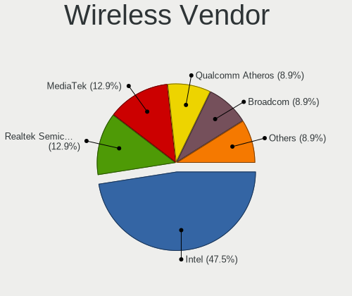

Pop!_OS Hardware Trends (Notebooks)
-----------------------------------

A project to identify most popular hardware characteristics and track their change
over time based on data collected by Pop!_OS users at https://Linux-Hardware.org.

Anyone can contribute to this report by the [hw-probe](https://github.com/linuxhw/hw-probe) tool:

    sudo -E hw-probe -all -upload

Full-feature report is available here: https://linux-hardware.org/?view=trends&formfactor=notebook

Period: Jul, 2021.

Contents
--------

* [ System ](#system)
  - [ OS                       ](#os)
  - [ OS Family                ](#os-family)
  - [ Kernel                   ](#kernel)
  - [ Kernel Family            ](#kernel-family)
  - [ Kernel Major Ver.        ](#kernel-major-ver)
  - [ Arch                     ](#arch)
  - [ DE                       ](#de)
  - [ Display Server           ](#display-server)
  - [ Display Manager          ](#display-manager)
  - [ OS Lang                  ](#os-lang)
  - [ Boot Mode                ](#boot-mode)
  - [ Filesystem               ](#filesystem)
  - [ Part. scheme             ](#part-scheme)
  - [ Dual Boot with Linux/BSD ](#dual-boot-with-linuxbsd)
  - [ Dual Boot (Win)          ](#dual-boot-win)

* [ Board ](#board)
  - [ Vendor                   ](#vendor)
  - [ Model                    ](#model)
  - [ Model Family             ](#model-family)
  - [ MFG Year                 ](#mfg-year)
  - [ Form Factor              ](#form-factor)
  - [ Secure Boot              ](#secure-boot)
  - [ Coreboot                 ](#coreboot)
  - [ RAM Size                 ](#ram-size)
  - [ RAM Used                 ](#ram-used)
  - [ Total Drives             ](#total-drives)
  - [ Has CD-ROM               ](#has-cd-rom)
  - [ Has Ethernet             ](#has-ethernet)
  - [ Has WiFi                 ](#has-wifi)
  - [ Has Bluetooth            ](#has-bluetooth)

* [ Location ](#location)
  - [ Country                  ](#country)
  - [ City                     ](#city)

* [ Drives ](#drives)
  - [ Drive Vendor             ](#drive-vendor)
  - [ Drive Model              ](#drive-model)
  - [ HDD Vendor               ](#hdd-vendor)
  - [ SSD Vendor               ](#ssd-vendor)
  - [ Drive Kind               ](#drive-kind)
  - [ Drive Connector          ](#drive-connector)
  - [ Drive Size               ](#drive-size)
  - [ Space Total              ](#space-total)
  - [ Space Used               ](#space-used)
  - [ Malfunc. Drives          ](#malfunc-drives)
  - [ Malfunc. Drive Vendor    ](#malfunc-drive-vendor)
  - [ Malfunc. HDD Vendor      ](#malfunc-hdd-vendor)
  - [ Malfunc. Drive Kind      ](#malfunc-drive-kind)
  - [ Failed Drives            ](#failed-drives)
  - [ Failed Drive Vendor      ](#failed-drive-vendor)
  - [ Drive Status             ](#drive-status)

* [ Storage controller ](#storage-controller)
  - [ Storage Vendor           ](#storage-vendor)
  - [ Storage Model            ](#storage-model)
  - [ Storage Kind             ](#storage-kind)

* [ Processor ](#processor)
  - [ CPU Vendor               ](#cpu-vendor)
  - [ CPU Model                ](#cpu-model)
  - [ CPU Model Family         ](#cpu-model-family)
  - [ CPU Cores                ](#cpu-cores)
  - [ CPU Sockets              ](#cpu-sockets)
  - [ CPU Threads              ](#cpu-threads)
  - [ CPU Op-Modes             ](#cpu-op-modes)
  - [ CPU Microcode            ](#cpu-microcode)
  - [ CPU Microarch            ](#cpu-microarch)

* [ Graphics ](#graphics)
  - [ GPU Vendor               ](#gpu-vendor)
  - [ GPU Model                ](#gpu-model)
  - [ GPU Combo                ](#gpu-combo)
  - [ GPU Driver               ](#gpu-driver)
  - [ GPU Memory               ](#gpu-memory)

* [ Monitor ](#monitor)
  - [ Monitor Vendor           ](#monitor-vendor)
  - [ Monitor Model            ](#monitor-model)
  - [ Monitor Resolution       ](#monitor-resolution)
  - [ Monitor Diagonal         ](#monitor-diagonal)
  - [ Monitor Width            ](#monitor-width)
  - [ Aspect Ratio             ](#aspect-ratio)
  - [ Monitor Area             ](#monitor-area)
  - [ Pixel Density            ](#pixel-density)
  - [ Multiple Monitors        ](#multiple-monitors)

* [ Network ](#network)
  - [ Net Controller Vendor    ](#net-controller-vendor)
  - [ Net Controller Model     ](#net-controller-model)
  - [ Wireless Vendor          ](#wireless-vendor)
  - [ Wireless Model           ](#wireless-model)
  - [ Ethernet Vendor          ](#ethernet-vendor)
  - [ Ethernet Model           ](#ethernet-model)
  - [ Net Controller Kind      ](#net-controller-kind)
  - [ Used Controller          ](#used-controller)
  - [ NICs                     ](#nics)
  - [ IPv6                     ](#ipv6)

* [ Bluetooth ](#bluetooth)
  - [ Bluetooth Vendor         ](#bluetooth-vendor)
  - [ Bluetooth Model          ](#bluetooth-model)

* [ Sound ](#sound)
  - [ Sound Vendor             ](#sound-vendor)
  - [ Sound Model              ](#sound-model)

* [ Memory ](#memory)
  - [ Memory Vendor            ](#memory-vendor)
  - [ Memory Model             ](#memory-model)
  - [ Memory Kind              ](#memory-kind)
  - [ Memory Form Factor       ](#memory-form-factor)
  - [ Memory Size              ](#memory-size)
  - [ Memory Speed             ](#memory-speed)

* [ Printers & scanners ](#printers--scanners)
  - [ Printer Vendor           ](#printer-vendor)
  - [ Printer Model            ](#printer-model)
  - [ Scanner Vendor           ](#scanner-vendor)
  - [ Scanner Model            ](#scanner-model)

* [ Camera ](#camera)
  - [ Camera Vendor            ](#camera-vendor)
  - [ Camera Model             ](#camera-model)

* [ Security ](#security)
  - [ Fingerprint Vendor       ](#fingerprint-vendor)
  - [ Fingerprint Model        ](#fingerprint-model)
  - [ Chipcard Vendor          ](#chipcard-vendor)
  - [ Chipcard Model           ](#chipcard-model)

* [ Unsupported ](#unsupported)
  - [ Unsupported Devices      ](#unsupported-devices)
  - [ Unsupported Device Types ](#unsupported-device-types)

System
------

OS
--

Installed operating systems

| Name          | Notebooks | Percent |
|---------------|-----------|---------|
| Pop!_OS 21.04 | 181       | 85.78%  |
| Pop!_OS 20.04 | 23        | 10.9%   |
| Pop!_OS 20.10 | 7         | 3.32%   |

OS Family
---------

OS without a version

| Name    | Notebooks | Percent |
|---------|-----------|---------|
| Pop!_OS | 211       | 100%    |

Kernel
------

Version of the Linux kernel

| Version                | Notebooks | Percent |
|------------------------|-----------|---------|
| 5.11.0-7620-generic    | 191       | 90.52%  |
| 5.11.0-7614-generic    | 7         | 3.32%   |
| 5.13.4-051304-generic  | 2         | 0.95%   |
| 5.4.0-7626-generic     | 1         | 0.47%   |
| 5.13.2-051302-generic  | 1         | 0.47%   |
| 5.13.0-xanmod1-cacule  | 1         | 0.47%   |
| 5.12.16-xanmod1        | 1         | 0.47%   |
| 5.12.15-xanmod1        | 1         | 0.47%   |
| 5.12.14-xanmod1        | 1         | 0.47%   |
| 5.12.14-051214-generic | 1         | 0.47%   |
| 5.12.11-xanmod1-cacule | 1         | 0.47%   |
| 5.11.7-051107-generic  | 1         | 0.47%   |
| 5.11.0-22-lowlatency   | 1         | 0.47%   |
| 5.11.0-051100-generic  | 1         | 0.47%   |

Kernel Family
-------------

Linux kernel without a distro release

| Version | Notebooks | Percent |
|---------|-----------|---------|
| 5.11.0  | 200       | 94.79%  |
| 5.13.4  | 2         | 0.95%   |
| 5.12.14 | 2         | 0.95%   |
| 5.4.0   | 1         | 0.47%   |
| 5.13.2  | 1         | 0.47%   |
| 5.13.0  | 1         | 0.47%   |
| 5.12.16 | 1         | 0.47%   |
| 5.12.15 | 1         | 0.47%   |
| 5.12.11 | 1         | 0.47%   |
| 5.11.7  | 1         | 0.47%   |

Kernel Major Ver.
-----------------

Linux kernel major version

| Version | Notebooks | Percent |
|---------|-----------|---------|
| 5.11    | 201       | 95.26%  |
| 5.12    | 5         | 2.37%   |
| 5.13    | 4         | 1.9%    |
| 5.4     | 1         | 0.47%   |

Arch
----

OS architecture (x86_64, i586, etc.)

| Name   | Notebooks | Percent |
|--------|-----------|---------|
| x86_64 | 211       | 100%    |

DE
--

Desktop Environment

| Name            | Notebooks | Percent |
|-----------------|-----------|---------|
| GNOME           | 203       | 96.21%  |
| Unknown         | 3         | 1.42%   |
| X-Cinnamon      | 2         | 0.95%   |
| MATE            | 1         | 0.47%   |
| KDE             | 1         | 0.47%   |
| GNOME Flashback | 1         | 0.47%   |

Display Server
--------------

X11 or Wayland

| Name    | Notebooks | Percent |
|---------|-----------|---------|
| X11     | 200       | 94.79%  |
| Wayland | 11        | 5.21%   |

Display Manager
---------------

SDDM, LightDM, etc.

| Name    | Notebooks | Percent |
|---------|-----------|---------|
| Unknown | 158       | 74.88%  |
| GDM     | 52        | 24.64%  |
| TDM     | 1         | 0.47%   |

OS Lang
-------

Language

| Lang    | Notebooks | Percent |
|---------|-----------|---------|
| en_US   | 120       | 56.87%  |
| en_GB   | 18        | 8.53%   |
| pt_BR   | 16        | 7.58%   |
| de_DE   | 10        | 4.74%   |
| en_AU   | 7         | 3.32%   |
| C       | 5         | 2.37%   |
| sv_SE   | 3         | 1.42%   |
| pl_PL   | 3         | 1.42%   |
| hr_HR   | 3         | 1.42%   |
| es_MX   | 3         | 1.42%   |
| es_ES   | 3         | 1.42%   |
| en_IN   | 3         | 1.42%   |
| en_CA   | 3         | 1.42%   |
| Unknown | 3         | 1.42%   |
| fr_FR   | 2         | 0.95%   |
| el_GR   | 2         | 0.95%   |
| zh_TW   | 1         | 0.47%   |
| ro_RO   | 1         | 0.47%   |
| it_IT   | 1         | 0.47%   |
| fi_FI   | 1         | 0.47%   |
| es_CO   | 1         | 0.47%   |
| en_DK   | 1         | 0.47%   |
| de_AT   | 1         | 0.47%   |

Boot Mode
---------

EFI or BIOS

| Mode | Notebooks | Percent |
|------|-----------|---------|
| BIOS | 163       | 77.25%  |
| EFI  | 48        | 22.75%  |

Filesystem
----------

Type of filesystem

| Type    | Notebooks | Percent |
|---------|-----------|---------|
| Ext4    | 203       | 96.21%  |
| Btrfs   | 4         | 1.9%    |
| Overlay | 2         | 0.95%   |
| Xfs     | 1         | 0.47%   |
| Unknown | 1         | 0.47%   |

Part. scheme
------------

Scheme of partitioning

| Type    | Notebooks | Percent |
|---------|-----------|---------|
| Unknown | 156       | 73.93%  |
| GPT     | 49        | 23.22%  |
| MBR     | 6         | 2.84%   |

Dual Boot with Linux/BSD
------------------------

Hosting more than one Linux/BSD

| Dual boot | Notebooks | Percent |
|-----------|-----------|---------|
| No        | 206       | 97.63%  |
| Yes       | 5         | 2.37%   |

Dual Boot (Win)
---------------

Hosting Linux and Windows

| Dual boot | Notebooks | Percent |
|-----------|-----------|---------|
| No        | 193       | 91.47%  |
| Yes       | 18        | 8.53%   |

Board
-----

Vendor
------

Motherboard manufacturer

| Name                | Notebooks | Percent |
|---------------------|-----------|---------|
| Lenovo              | 46        | 21.8%   |
| Dell                | 37        | 17.54%  |
| Hewlett-Packard     | 32        | 15.17%  |
| ASUSTek Computer    | 27        | 12.8%   |
| Acer                | 15        | 7.11%   |
| Apple               | 13        | 6.16%   |
| System76            | 8         | 3.79%   |
| Notebook            | 5         | 2.37%   |
| MSI                 | 5         | 2.37%   |
| Sony                | 3         | 1.42%   |
| Samsung Electronics | 2         | 0.95%   |
| Google              | 2         | 0.95%   |
| Fujitsu             | 2         | 0.95%   |
| Alienware           | 2         | 0.95%   |
| TUXEDO              | 1         | 0.47%   |
| TrekStor            | 1         | 0.47%   |
| Toshiba             | 1         | 0.47%   |
| TENKU               | 1         | 0.47%   |
| Packard Bell        | 1         | 0.47%   |
| HUAWEI              | 1         | 0.47%   |
| GPU Company         | 1         | 0.47%   |
| GPD                 | 1         | 0.47%   |
| Entroware           | 1         | 0.47%   |
| Eluktronics         | 1         | 0.47%   |
| Dynabook            | 1         | 0.47%   |
| BESSTAR Tech        | 1         | 0.47%   |

Model
-----

Motherboard model

| Name                                        | Notebooks | Percent |
|---------------------------------------------|-----------|---------|
| System76 Serval                             | 2         | 0.95%   |
| Lenovo ThinkPad P15s Gen 2i 20W6000CGE      | 2         | 0.95%   |
| HP EliteBook 840 G1                         | 2         | 0.95%   |
| Dell Latitude E5470                         | 2         | 0.95%   |
| Dell Latitude 5580                          | 2         | 0.95%   |
| ASUS TUF Gaming FX505DT_FX505DT             | 2         | 0.95%   |
| Apple MacBookPro11,5                        | 2         | 0.95%   |
| Apple MacBookAir7,2                         | 2         | 0.95%   |
| Apple MacBook5,2                            | 2         | 0.95%   |
| TUXEDO InfinityBook S 14 Gen6               | 1         | 0.47%   |
| TrekStor SURFBOOK E11B                      | 1         | 0.47%   |
| Toshiba Satellite L750                      | 1         | 0.47%   |
| TENKU TENKU-SB14                            | 1         | 0.47%   |
| System76 Oryx Pro                           | 1         | 0.47%   |
| System76 Lemur Pro                          | 1         | 0.47%   |
| System76 Kudu                               | 1         | 0.47%   |
| System76 Galago Pro                         | 1         | 0.47%   |
| System76 Darter Pro                         | 1         | 0.47%   |
| System76 Adder WS                           | 1         | 0.47%   |
| Sony VPCF24C5E                              | 1         | 0.47%   |
| Sony VPCEH3D0E                              | 1         | 0.47%   |
| Sony SVF15A16CGS                            | 1         | 0.47%   |
| Samsung RF511/RF411/RF711                   | 1         | 0.47%   |
| Samsung QX310/QX410/QX510/SF310/SF410/SF510 | 1         | 0.47%   |
| Packard Bell EasyNote TK37                  | 1         | 0.47%   |
| Notebook W840SN Series                      | 1         | 0.47%   |
| Notebook W54_55SU1,SUW                      | 1         | 0.47%   |
| Notebook W35xSTQ_370ST                      | 1         | 0.47%   |
| Notebook NV4XMB,ME,MZ                       | 1         | 0.47%   |
| Notebook N8xxEP6                            | 1         | 0.47%   |
| MSI GS60 2PC Ghost                          | 1         | 0.47%   |
| MSI GP62M 7RD                               | 1         | 0.47%   |
| MSI GE72MVR 7RG                             | 1         | 0.47%   |
| MSI GE66 Raider 10UG                        | 1         | 0.47%   |
| MSI GE62 6QF                                | 1         | 0.47%   |
| Lenovo Z70-80 80FG                          | 1         | 0.47%   |
| Lenovo Y520-15IKBM 80YY                     | 1         | 0.47%   |
| Lenovo Y50-70 20378                         | 1         | 0.47%   |
| Lenovo ThinkPad X260 20F5S3H000             | 1         | 0.47%   |
| Lenovo ThinkPad X230 2306CTO                | 1         | 0.47%   |
| Lenovo ThinkPad X220 4287CTO                | 1         | 0.47%   |
| Lenovo ThinkPad X1C 5th W10DG 20K4001XUS    | 1         | 0.47%   |
| Lenovo ThinkPad X131e 33682YU               | 1         | 0.47%   |
| Lenovo ThinkPad X1 Extreme 20MFCTO1WW       | 1         | 0.47%   |
| Lenovo ThinkPad X1 Extreme 20MF000DUS       | 1         | 0.47%   |
| Lenovo ThinkPad X1 Extreme 20MF000CUS       | 1         | 0.47%   |
| Lenovo ThinkPad X1 Carbon 7th 20QES01L00    | 1         | 0.47%   |
| Lenovo ThinkPad X1 Carbon 7th 20QD00L1PB    | 1         | 0.47%   |
| Lenovo ThinkPad X1 Carbon 3444CUU           | 1         | 0.47%   |
| Lenovo ThinkPad T530 239242U                | 1         | 0.47%   |
| Lenovo ThinkPad T510 4384CJ7                | 1         | 0.47%   |
| Lenovo ThinkPad T480 20L5A00PCD             | 1         | 0.47%   |
| Lenovo ThinkPad T470p 20J7S18600            | 1         | 0.47%   |
| Lenovo ThinkPad T430u 3351CTO               | 1         | 0.47%   |
| Lenovo ThinkPad T430 2347G7U                | 1         | 0.47%   |
| Lenovo ThinkPad T410 2537CJ0                | 1         | 0.47%   |
| Lenovo ThinkPad T400 2767W4V                | 1         | 0.47%   |
| Lenovo ThinkPad T14 Gen 1 20UES1Y600        | 1         | 0.47%   |
| Lenovo ThinkPad T14 Gen 1 20UD0008US        | 1         | 0.47%   |
| Lenovo ThinkPad L480 20LS0026GE             | 1         | 0.47%   |

Model Family
------------

Motherboard model prefix

| Name                  | Notebooks | Percent |
|-----------------------|-----------|---------|
| Lenovo ThinkPad       | 28        | 13.27%  |
| Dell Inspiron         | 15        | 7.11%   |
| Dell Latitude         | 12        | 5.69%   |
| Acer Aspire           | 9         | 4.27%   |
| HP Pavilion           | 8         | 3.79%   |
| HP EliteBook          | 8         | 3.79%   |
| ASUS ROG              | 8         | 3.79%   |
| Lenovo IdeaPad        | 7         | 3.32%   |
| Dell XPS              | 5         | 2.37%   |
| ASUS VivoBook         | 5         | 2.37%   |
| Acer Nitro            | 4         | 1.9%    |
| Lenovo ThinkBook      | 3         | 1.42%   |
| Lenovo Legion         | 3         | 1.42%   |
| HP Laptop             | 3         | 1.42%   |
| Dell Precision        | 3         | 1.42%   |
| ASUS ASUS             | 3         | 1.42%   |
| Apple MacBookPro11    | 3         | 1.42%   |
| System76 Serval       | 2         | 0.95%   |
| HP ProBook            | 2         | 0.95%   |
| HP OMEN               | 2         | 0.95%   |
| HP 250                | 2         | 0.95%   |
| Fujitsu LIFEBOOK      | 2         | 0.95%   |
| ASUS TUF              | 2         | 0.95%   |
| Apple MacBookAir7     | 2         | 0.95%   |
| Apple MacBook5        | 2         | 0.95%   |
| TUXEDO InfinityBook   | 1         | 0.47%   |
| TrekStor SURFBOOK     | 1         | 0.47%   |
| Toshiba Satellite     | 1         | 0.47%   |
| TENKU TENKU-SB14      | 1         | 0.47%   |
| System76 Oryx         | 1         | 0.47%   |
| System76 Lemur        | 1         | 0.47%   |
| System76 Kudu         | 1         | 0.47%   |
| System76 Galago       | 1         | 0.47%   |
| System76 Darter       | 1         | 0.47%   |
| System76 Adder        | 1         | 0.47%   |
| Sony VPCF24C5E        | 1         | 0.47%   |
| Sony VPCEH3D0E        | 1         | 0.47%   |
| Sony SVF15A16CGS      | 1         | 0.47%   |
| Samsung RF511         | 1         | 0.47%   |
| Samsung QX310         | 1         | 0.47%   |
| Packard Bell EasyNote | 1         | 0.47%   |
| Notebook W840SN       | 1         | 0.47%   |
| Notebook W54          | 1         | 0.47%   |
| Notebook W35xSTQ      | 1         | 0.47%   |
| Notebook NV4XMB       | 1         | 0.47%   |
| Notebook N8xxEP6      | 1         | 0.47%   |
| MSI GS60              | 1         | 0.47%   |
| MSI GP62M             | 1         | 0.47%   |
| MSI GE72MVR           | 1         | 0.47%   |
| MSI GE66              | 1         | 0.47%   |
| MSI GE62              | 1         | 0.47%   |
| Lenovo Z70-80         | 1         | 0.47%   |
| Lenovo Y520-15IKBM    | 1         | 0.47%   |
| Lenovo Y50-70         | 1         | 0.47%   |
| Lenovo G70-35         | 1         | 0.47%   |
| Lenovo G450           | 1         | 0.47%   |
| HUAWEI MACHD-WXX9     | 1         | 0.47%   |
| HP Presario           | 1         | 0.47%   |
| HP Notebook           | 1         | 0.47%   |
| HP G70                | 1         | 0.47%   |

MFG Year
--------

Motherboard manufacture year

| Year | Notebooks | Percent |
|------|-----------|---------|
| 2021 | 45        | 21.33%  |
| 2020 | 45        | 21.33%  |
| 2019 | 29        | 13.74%  |
| 2018 | 21        | 9.95%   |
| 2016 | 10        | 4.74%   |
| 2017 | 9         | 4.27%   |
| 2015 | 8         | 3.79%   |
| 2012 | 8         | 3.79%   |
| 2010 | 8         | 3.79%   |
| 2014 | 7         | 3.32%   |
| 2013 | 7         | 3.32%   |
| 2011 | 7         | 3.32%   |
| 2009 | 4         | 1.9%    |
| 2008 | 2         | 0.95%   |
| 2007 | 1         | 0.47%   |

Form Factor
-----------

Physical design of the computer

| Name     | Notebooks | Percent |
|----------|-----------|---------|
| Notebook | 211       | 100%    |

Secure Boot
-----------

Enabled or disabled

| State    | Notebooks | Percent |
|----------|-----------|---------|
| Disabled | 211       | 100%    |

Coreboot
--------

Have coreboot on board

| Used | Notebooks | Percent |
|------|-----------|---------|
| No   | 205       | 97.16%  |
| Yes  | 6         | 2.84%   |

RAM Size
--------

Total RAM memory

| Size in GB  | Notebooks | Percent |
|-------------|-----------|---------|
| 4.01-8.0    | 64        | 30.33%  |
| 16.01-24.0  | 50        | 23.7%   |
| 8.01-16.0   | 39        | 18.48%  |
| 3.01-4.0    | 26        | 12.32%  |
| 32.01-64.0  | 23        | 10.9%   |
| 24.01-32.0  | 3         | 1.42%   |
| 1.01-2.0    | 3         | 1.42%   |
| 64.01-256.0 | 2         | 0.95%   |
| 2.01-3.0    | 1         | 0.47%   |

RAM Used
--------

Used RAM memory

| Used GB    | Notebooks | Percent |
|------------|-----------|---------|
| 2.01-3.0   | 69        | 32.7%   |
| 1.01-2.0   | 63        | 29.86%  |
| 3.01-4.0   | 36        | 17.06%  |
| 4.01-8.0   | 32        | 15.17%  |
| 8.01-16.0  | 9         | 4.27%   |
| 24.01-32.0 | 1         | 0.47%   |
| 16.01-24.0 | 1         | 0.47%   |

Total Drives
------------

Number of drives on board

| Drives | Notebooks | Percent |
|--------|-----------|---------|
| 1      | 145       | 68.72%  |
| 2      | 59        | 27.96%  |
| 3      | 7         | 3.32%   |

Has CD-ROM
----------

Has CD-ROM on board

| Presented | Notebooks | Percent |
|-----------|-----------|---------|
| No        | 155       | 73.46%  |
| Yes       | 56        | 26.54%  |

Has Ethernet
------------

Has Ethernet on board

| Presented | Notebooks | Percent |
|-----------|-----------|---------|
| Yes       | 174       | 82.46%  |
| No        | 37        | 17.54%  |

Has WiFi
--------

Has WiFi module

| Presented | Notebooks | Percent |
|-----------|-----------|---------|
| Yes       | 207       | 98.1%   |
| No        | 4         | 1.9%    |

Has Bluetooth
-------------

Has Bluetooth module

| Presented | Notebooks | Percent |
|-----------|-----------|---------|
| Yes       | 180       | 85.31%  |
| No        | 31        | 14.69%  |

Location
--------

Country
-------

Geographic location (country)

| Country                          | Notebooks | Percent |
|----------------------------------|-----------|---------|
| USA                              | 67        | 31.75%  |
| Brazil                           | 19        | 9%      |
| Germany                          | 18        | 8.53%   |
| India                            | 12        | 5.69%   |
| UK                               | 7         | 3.32%   |
| Australia                        | 6         | 2.84%   |
| Mexico                           | 5         | 2.37%   |
| Canada                           | 5         | 2.37%   |
| Poland                           | 4         | 1.9%    |
| Netherlands                      | 4         | 1.9%    |
| Malaysia                         | 4         | 1.9%    |
| France                           | 4         | 1.9%    |
| Finland                          | 4         | 1.9%    |
| Russia                           | 3         | 1.42%   |
| Norway                           | 3         | 1.42%   |
| Greece                           | 3         | 1.42%   |
| Denmark                          | 3         | 1.42%   |
| Croatia                          | 3         | 1.42%   |
| Belgium                          | 3         | 1.42%   |
| Tunisia                          | 2         | 0.95%   |
| Sweden                           | 2         | 0.95%   |
| Spain                            | 2         | 0.95%   |
| Romania                          | 2         | 0.95%   |
| Philippines                      | 2         | 0.95%   |
| Italy                            | 2         | 0.95%   |
| Ireland                          | 2         | 0.95%   |
| Indonesia                        | 2         | 0.95%   |
| Argentina                        | 2         | 0.95%   |
| Venezuela                        | 1         | 0.47%   |
| Ukraine                          | 1         | 0.47%   |
| Taiwan                           | 1         | 0.47%   |
| Switzerland                      | 1         | 0.47%   |
| Saint Vincent and the Grenadines | 1         | 0.47%   |
| Portugal                         | 1         | 0.47%   |
| Peru                             | 1         | 0.47%   |
| Pakistan                         | 1         | 0.47%   |
| Moldova                          | 1         | 0.47%   |
| Iraq                             | 1         | 0.47%   |
| Hungary                          | 1         | 0.47%   |
| Czechia                          | 1         | 0.47%   |
| Colombia                         | 1         | 0.47%   |
| Cambodia                         | 1         | 0.47%   |
| Bulgaria                         | 1         | 0.47%   |
| Austria                          | 1         | 0.47%   |

City
----

Geographic location (city)

| City                   | Notebooks | Percent |
|------------------------|-----------|---------|
| Dallas                 | 4         | 1.9%    |
| Sydney                 | 3         | 1.42%   |
| Dublin                 | 3         | 1.42%   |
| Zagreb                 | 2         | 0.95%   |
| S√£o Paulo             | 2         | 0.95%   |
| Silver Spring          | 2         | 0.95%   |
| S??o Jos?© dos Campos  | 2         | 0.95%   |
| Paris                  | 2         | 0.95%   |
| Mexico City            | 2         | 0.95%   |
| Kuala Lumpur           | 2         | 0.95%   |
| Hyderabad              | 2         | 0.95%   |
| Helsinki               | 2         | 0.95%   |
| Half Moon Bay          | 2         | 0.95%   |
| G??tersloh             | 2         | 0.95%   |
| Düsseldorf            | 2         | 0.95%   |
| Darmstadt              | 2         | 0.95%   |
| Columbus               | 2         | 0.95%   |
| Brooklyn               | 2         | 0.95%   |
| Bras?≠lia              | 2         | 0.95%   |
| Bengaluru              | 2         | 0.95%   |
| Athens                 | 2         | 0.95%   |
| Zdunska Wola           | 1         | 0.47%   |
| Zapopan                | 1         | 0.47%   |
| Yukon                  | 1         | 0.47%   |
| Winnipeg               | 1         | 0.47%   |
| Westlake               | 1         | 0.47%   |
| Westford               | 1         | 0.47%   |
| West Bromwich          | 1         | 0.47%   |
| Waynesboro             | 1         | 0.47%   |
| Washington             | 1         | 0.47%   |
| Warsaw                 | 1         | 0.47%   |
| Votice                 | 1         | 0.47%   |
| Villingen-Schwenningen | 1         | 0.47%   |
| Villa Alsina           | 1         | 0.47%   |
| Vila Nova de Gaia      | 1         | 0.47%   |
| Vila Guilherme         | 1         | 0.47%   |
| Vienna                 | 1         | 0.47%   |
| Victoria               | 1         | 0.47%   |
| Veresegyhaz            | 1         | 0.47%   |
| Veliko Tarnovo         | 1         | 0.47%   |
| Valby                  | 1         | 0.47%   |
| Utrera                 | 1         | 0.47%   |
| Uberl√¢ndia            | 1         | 0.47%   |
| Tunis                  | 1         | 0.47%   |
| Trussville             | 1         | 0.47%   |
| Toronto                | 1         | 0.47%   |
| Toledo                 | 1         | 0.47%   |
| The Colony             | 1         | 0.47%   |
| Teresina               | 1         | 0.47%   |
| Ter Apel               | 1         | 0.47%   |
| Taoyuan District       | 1         | 0.47%   |
| Tampere                | 1         | 0.47%   |
| Talisay City           | 1         | 0.47%   |
| Surprise               | 1         | 0.47%   |
| Surabaya               | 1         | 0.47%   |
| Stuttgart              | 1         | 0.47%   |
| Stoke-on-Trent         | 1         | 0.47%   |
| Stockholm              | 1         | 0.47%   |
| Srednyaya Akhtuba      | 1         | 0.47%   |
| Squamish               | 1         | 0.47%   |

Drives
------

Drive Vendor
------------

Hard drive vendors

| Vendor                    | Notebooks | Drives | Percent |
|---------------------------|-----------|--------|---------|
| Samsung Electronics       | 44        | 50     | 16.24%  |
| WDC                       | 30        | 31     | 11.07%  |
| Seagate                   | 25        | 25     | 9.23%   |
| Sandisk                   | 22        | 24     | 8.12%   |
| Intel                     | 15        | 17     | 5.54%   |
| Kingston                  | 14        | 14     | 5.17%   |
| SK Hynix                  | 12        | 13     | 4.43%   |
| Toshiba                   | 11        | 11     | 4.06%   |
| HGST                      | 11        | 11     | 4.06%   |
| Crucial                   | 11        | 12     | 4.06%   |
| Unknown                   | 10        | 11     | 3.69%   |
| Silicon Motion            | 6         | 7      | 2.21%   |
| Phison                    | 6         | 7      | 2.21%   |
| Hitachi                   | 6         | 6      | 2.21%   |
| Apple                     | 5         | 5      | 1.85%   |
| Micron Technology         | 4         | 4      | 1.48%   |
| LITEON                    | 4         | 4      | 1.48%   |
| A-DATA Technology         | 4         | 4      | 1.48%   |
| Micron/Crucial Technology | 3         | 4      | 1.11%   |
| Transcend                 | 2         | 2      | 0.74%   |
| Team                      | 2         | 2      | 0.74%   |
| KIOXIA                    | 2         | 2      | 0.74%   |
| DOGFISH                   | 2         | 2      | 0.74%   |
| China                     | 2         | 2      | 0.74%   |
| Zheino                    | 1         | 1      | 0.37%   |
| V-GeN                     | 1         | 1      | 0.37%   |
| Union Memory (Shenzhen)   | 1         | 1      | 0.37%   |
| ShanDianZhe               | 1         | 1      | 0.37%   |
| PNY USB                   | 1         | 1      | 0.37%   |
| PNY                       | 1         | 1      | 0.37%   |
| PLEXTOR                   | 1         | 1      | 0.37%   |
| Patriot                   | 1         | 1      | 0.37%   |
| Mushkin                   | 1         | 1      | 0.37%   |
| LITEONIT                  | 1         | 1      | 0.37%   |
| KingSpec                  | 1         | 1      | 0.37%   |
| KingDian                  | 1         | 1      | 0.37%   |
| Intenso                   | 1         | 1      | 0.37%   |
| Fujitsu                   | 1         | 1      | 0.37%   |
| FORESEE                   | 1         | 1      | 0.37%   |
| Corsair                   | 1         | 1      | 0.37%   |
| ADATA Technology          | 1         | 1      | 0.37%   |
| AARVEX                    | 1         | 1      | 0.37%   |

Drive Model
-----------

Hard drive models

| Model                               | Notebooks | Percent |
|-------------------------------------|-----------|---------|
| Sandisk NVMe SSD Drive 256GB        | 5         | 1.75%   |
| Samsung NVMe SSD Drive 512GB        | 5         | 1.75%   |
| HGST HTS721010A9E630 1TB            | 5         | 1.75%   |
| Unknown MMC Card  64GB              | 4         | 1.4%    |
| Seagate ST500LT012-1DG142 500GB     | 4         | 1.4%    |
| Seagate ST1000LM024 HN-M101MBB 1TB  | 4         | 1.4%    |
| Samsung SSD 860 EVO 500GB           | 4         | 1.4%    |
| Samsung NVMe SSD Drive 500GB        | 4         | 1.4%    |
| Samsung NVMe SSD Drive 256GB        | 4         | 1.4%    |
| Samsung NVMe SSD Drive 1TB          | 4         | 1.4%    |
| SK Hynix NVMe SSD Drive 512GB       | 3         | 1.05%   |
| SK Hynix NVMe SSD Drive 1024GB      | 3         | 1.05%   |
| Seagate ST1000LM035-1RK172 1TB      | 3         | 1.05%   |
| Samsung SSD 860 EVO 250GB           | 3         | 1.05%   |
| Phison NVMe SSD Drive 1024GB        | 3         | 1.05%   |
| Kingston SA400S37240G 240GB SSD     | 3         | 1.05%   |
| Crucial CT500MX500SSD1 500GB        | 3         | 1.05%   |
| WDC WDS500G2B0A-00SM50 500GB SSD    | 2         | 0.7%    |
| Unknown MMC Card  32GB              | 2         | 0.7%    |
| Toshiba MQ04ABF100 1TB              | 2         | 0.7%    |
| Toshiba MQ01ABF050 500GB            | 2         | 0.7%    |
| SK Hynix NVMe SSD Drive 256GB       | 2         | 0.7%    |
| Silicon Motion NVMe SSD Drive 512GB | 2         | 0.7%    |
| Seagate ST9500325AS 500GB           | 2         | 0.7%    |
| Seagate ST320LT007-9ZV142 320GB     | 2         | 0.7%    |
| Sandisk NVMe SSD Drive 512GB        | 2         | 0.7%    |
| Sandisk NVMe SSD Drive 500GB        | 2         | 0.7%    |
| Sandisk NVMe SSD Drive 1TB          | 2         | 0.7%    |
| Sandisk NVMe SSD Drive 1024GB       | 2         | 0.7%    |
| Samsung SSD 870 EVO 500GB           | 2         | 0.7%    |
| Samsung MZVLB1T0HBLR-000L7 1TB      | 2         | 0.7%    |
| Micron/Crucial NVMe SSD Drive 1TB   | 2         | 0.7%    |
| Micron NVMe SSD Drive 512GB         | 2         | 0.7%    |
| Intel SSDPEKNW512G8H 512GB          | 2         | 0.7%    |
| Intel SSDPEKKF512G8L 512GB          | 2         | 0.7%    |
| Intel NVMe SSD Drive 512GB          | 2         | 0.7%    |
| Intel NVMe SSD Drive 256GB          | 2         | 0.7%    |
| HGST HTS725050A7E630 500GB          | 2         | 0.7%    |
| Apple SSD SM0512G 500GB             | 2         | 0.7%    |
| Zheino CHN mSATAM3 256 256GB        | 1         | 0.35%   |
| WDC WDS500G2B0C-00PXH0 500GB        | 1         | 0.35%   |
| WDC WDS500G2B0B-00YS70 500GB SSD    | 1         | 0.35%   |
| WDC WDS500G1R0A-68A4W0 500GB SSD    | 1         | 0.35%   |
| WDC WDS240G2G0B-00EPW0 240GB SSD    | 1         | 0.35%   |
| WDC WDS100T1B0A-00H9H0 1TB SSD      | 1         | 0.35%   |
| WDC WDBNCE5000PNC 500GB SSD         | 1         | 0.35%   |
| WDC WDBNCE0010PNC 1TB SSD           | 1         | 0.35%   |
| WDC WD7500BPKT-75PK4T0 752GB        | 1         | 0.35%   |
| WDC WD5000LPZX-60Z10T0 500GB        | 1         | 0.35%   |
| WDC WD5000LPVX-22V0TT0 500GB        | 1         | 0.35%   |
| WDC WD5000LPLX-75ZNTT0 500GB        | 1         | 0.35%   |
| WDC WD5000BPVT-00HXZT1 500GB        | 1         | 0.35%   |
| WDC WD2500BEVT-75A23T0 250GB        | 1         | 0.35%   |
| WDC WD10SPZX-75Z10T0 1TB            | 1         | 0.35%   |
| WDC WD10SPZX-60Z10T0 1TB            | 1         | 0.35%   |
| WDC WD10SPZX-21Z10T0 1TB            | 1         | 0.35%   |
| WDC WD10SPSX-60A6WT0 1TB            | 1         | 0.35%   |
| WDC WD10S21X-24R1BT0-SSHD-8GB       | 1         | 0.35%   |
| WDC WD10JPVX-75JC3T0 1TB            | 1         | 0.35%   |
| WDC WD10JPVX-60JC3T1 1TB            | 1         | 0.35%   |

HDD Vendor
----------

Hard disk drive vendors

| Vendor  | Notebooks | Drives | Percent |
|---------|-----------|--------|---------|
| Seagate | 21        | 21     | 33.87%  |
| WDC     | 15        | 15     | 24.19%  |
| HGST    | 11        | 11     | 17.74%  |
| Toshiba | 7         | 7      | 11.29%  |
| Hitachi | 6         | 6      | 9.68%   |
| Intenso | 1         | 1      | 1.61%   |
| Fujitsu | 1         | 1      | 1.61%   |

SSD Vendor
----------

Solid state drive vendors

| Vendor              | Notebooks | Drives | Percent |
|---------------------|-----------|--------|---------|
| Samsung Electronics | 20        | 20     | 21.28%  |
| SanDisk             | 10        | 10     | 10.64%  |
| Crucial             | 10        | 11     | 10.64%  |
| Kingston            | 9         | 9      | 9.57%   |
| WDC                 | 8         | 8      | 8.51%   |
| LITEON              | 4         | 4      | 4.26%   |
| Intel               | 4         | 4      | 4.26%   |
| Apple               | 4         | 4      | 4.26%   |
| Transcend           | 2         | 2      | 2.13%   |
| Toshiba             | 2         | 2      | 2.13%   |
| Seagate             | 2         | 2      | 2.13%   |
| Micron Technology   | 2         | 2      | 2.13%   |
| Dogfish             | 2         | 2      | 2.13%   |
| China               | 2         | 2      | 2.13%   |
| A-DATA Technology   | 2         | 2      | 2.13%   |
| Team                | 1         | 1      | 1.06%   |
| SK Hynix            | 1         | 1      | 1.06%   |
| PNY USB             | 1         | 1      | 1.06%   |
| PNY                 | 1         | 1      | 1.06%   |
| PLEXTOR             | 1         | 1      | 1.06%   |
| Patriot             | 1         | 1      | 1.06%   |
| LITEONIT            | 1         | 1      | 1.06%   |
| KingDian            | 1         | 1      | 1.06%   |
| FORESEE             | 1         | 1      | 1.06%   |
| Corsair             | 1         | 1      | 1.06%   |
| AARVEX              | 1         | 1      | 1.06%   |

Drive Kind
----------

HDD or SSD

| Kind    | Notebooks | Drives | Percent |
|---------|-----------|--------|---------|
| NVMe    | 93        | 115    | 36.19%  |
| SSD     | 88        | 95     | 34.24%  |
| HDD     | 61        | 62     | 23.74%  |
| MMC     | 9         | 10     | 3.5%    |
| Unknown | 6         | 6      | 2.33%   |

Drive Connector
---------------

SATA, SAS, NVMe, etc.

| Type | Notebooks | Drives | Percent |
|------|-----------|--------|---------|
| SATA | 137       | 156    | 55.69%  |
| NVMe | 93        | 115    | 37.8%   |
| MMC  | 9         | 10     | 3.66%   |
| SAS  | 7         | 7      | 2.85%   |

Drive Size
----------

Size of hard drive

| Size in TB | Notebooks | Drives | Percent |
|------------|-----------|--------|---------|
| 0.01-0.5   | 99        | 108    | 66.89%  |
| 0.51-1.0   | 45        | 45     | 30.41%  |
| 1.01-2.0   | 3         | 3      | 2.03%   |
| 3.01-4.0   | 1         | 1      | 0.68%   |

Space Total
-----------

Amount of disk space available on the file system

| Size in GB     | Notebooks | Percent |
|----------------|-----------|---------|
| 101-250        | 72        | 34.12%  |
| 251-500        | 60        | 28.44%  |
| 501-1000       | 32        | 15.17%  |
| 1001-2000      | 21        | 9.95%   |
| 1-20           | 6         | 2.84%   |
| 51-100         | 6         | 2.84%   |
| More than 3000 | 4         | 1.9%    |
| 21-50          | 4         | 1.9%    |
| Unknown        | 4         | 1.9%    |
| 2001-3000      | 2         | 0.95%   |

Space Used
----------

Amount of used disk space

| Used GB        | Notebooks | Percent |
|----------------|-----------|---------|
| 1-20           | 90        | 42.65%  |
| 21-50          | 37        | 17.54%  |
| 101-250        | 30        | 14.22%  |
| 51-100         | 21        | 9.95%   |
| 251-500        | 13        | 6.16%   |
| 501-1000       | 12        | 5.69%   |
| Unknown        | 4         | 1.9%    |
| 1001-2000      | 3         | 1.42%   |
| More than 3000 | 1         | 0.47%   |

Malfunc. Drives
---------------

Drive models with a malfunction

| Model                                   | Notebooks | Drives | Percent |
|-----------------------------------------|-----------|--------|---------|
| Toshiba KSG60ZMV256G M.2 2280 256GB SSD | 1         | 1      | 12.5%   |
| SK Hynix SC210 mSATA 256GB SSD          | 1         | 1      | 12.5%   |
| Seagate ST500LT012-1DG142 500GB         | 1         | 1      | 12.5%   |
| Seagate ST1000LM035-1RK172 1TB          | 1         | 1      | 12.5%   |
| Seagate ST1000LM024 HN-M101MBB 1TB      | 1         | 1      | 12.5%   |
| Kingston SUV400S37120G 120GB SSD        | 1         | 1      | 12.5%   |
| Intel SSDPEKKW256G7 256GB               | 1         | 1      | 12.5%   |
| Crucial CT1000P1SSD8 1TB                | 1         | 1      | 12.5%   |

Malfunc. Drive Vendor
---------------------

Vendors of faulty drives

| Vendor   | Notebooks | Drives | Percent |
|----------|-----------|--------|---------|
| Seagate  | 3         | 3      | 37.5%   |
| Toshiba  | 1         | 1      | 12.5%   |
| SK Hynix | 1         | 1      | 12.5%   |
| Kingston | 1         | 1      | 12.5%   |
| Intel    | 1         | 1      | 12.5%   |
| Crucial  | 1         | 1      | 12.5%   |

Malfunc. HDD Vendor
-------------------

Vendors of faulty HDD drives

| Vendor  | Notebooks | Drives | Percent |
|---------|-----------|--------|---------|
| Seagate | 3         | 3      | 100%    |

Malfunc. Drive Kind
-------------------

Kinds of faulty drives

| Kind | Notebooks | Drives | Percent |
|------|-----------|--------|---------|
| SSD  | 3         | 3      | 37.5%   |
| HDD  | 3         | 3      | 37.5%   |
| NVMe | 2         | 2      | 25%     |

Failed Drives
-------------

Failed drive models

Zero info for selected period =(

Failed Drive Vendor
-------------------

Failed drive vendors

Zero info for selected period =(

Drive Status
------------

Number of failed and malfunc. drives

| Status   | Notebooks | Drives | Percent |
|----------|-----------|--------|---------|
| Detected | 162       | 214    | 72.32%  |
| Works    | 54        | 66     | 24.11%  |
| Malfunc  | 8         | 8      | 3.57%   |

Storage controller
------------------

Storage Vendor
--------------

Storage controller vendors

| Vendor                         | Notebooks | Percent |
|--------------------------------|-----------|---------|
| Intel                          | 141       | 53.21%  |
| Samsung Electronics            | 29        | 10.94%  |
| AMD                            | 25        | 9.43%   |
| Sandisk                        | 17        | 6.42%   |
| SK Hynix                       | 11        | 4.15%   |
| Silicon Motion                 | 8         | 3.02%   |
| Phison Electronics             | 6         | 2.26%   |
| Nvidia                         | 5         | 1.89%   |
| Kingston Technology Company    | 5         | 1.89%   |
| Micron/Crucial Technology      | 4         | 1.51%   |
| Toshiba America Info Systems   | 2         | 0.75%   |
| Micron Technology              | 2         | 0.75%   |
| KIOXIA                         | 2         | 0.75%   |
| ADATA Technology               | 2         | 0.75%   |
| Solid State Storage Technology | 1         | 0.38%   |
| Shenzhen Longsys Electronics   | 1         | 0.38%   |
| Seagate Technology             | 1         | 0.38%   |
| Realtek Semiconductor          | 1         | 0.38%   |
| Marvell Technology Group       | 1         | 0.38%   |
| Apple                          | 1         | 0.38%   |

Storage Model
-------------

Storage controller models

| Model                                                                            | Notebooks | Percent |
|----------------------------------------------------------------------------------|-----------|---------|
| AMD FCH SATA Controller [AHCI mode]                                              | 23        | 8.24%   |
| Intel Sunrise Point-LP SATA Controller [AHCI mode]                               | 22        | 7.89%   |
| Samsung NVMe SSD Controller SM981/PM981/PM983                                    | 14        | 5.02%   |
| Intel 82801 Mobile SATA Controller [RAID mode]                                   | 14        | 5.02%   |
| Intel 7 Series Chipset Family 6-port SATA Controller [AHCI mode]                 | 13        | 4.66%   |
| Intel Cannon Lake Mobile PCH SATA AHCI Controller                                | 12        | 4.3%    |
| Intel HM170/QM170 Chipset SATA Controller [AHCI Mode]                            | 11        | 3.94%   |
| Intel 8 Series SATA Controller 1 [AHCI mode]                                     | 11        | 3.94%   |
| Intel 6 Series/C200 Series Chipset Family 6 port Mobile SATA AHCI Controller     | 8         | 2.87%   |
| Sandisk WD Blue SN550 NVMe SSD                                                   | 6         | 2.15%   |
| Samsung NVMe Controller                                                          | 6         | 2.15%   |
| Intel 82801IBM/IEM (ICH9M/ICH9M-E) 4 port SATA Controller [AHCI mode]            | 5         | 1.79%   |
| SK Hynix Non-Volatile memory controller                                          | 4         | 1.43%   |
| Silicon Motion SM2263EN/SM2263XT SSD Controller                                  | 4         | 1.43%   |
| Silicon Motion SM2262/SM2262EN SSD Controller                                    | 4         | 1.43%   |
| Sandisk Non-Volatile memory controller                                           | 4         | 1.43%   |
| Phison E12 NVMe Controller                                                       | 4         | 1.43%   |
| Intel SSD Pro 7600p/760p/E 6100p Series                                          | 4         | 1.43%   |
| Intel SSD 660P Series                                                            | 4         | 1.43%   |
| Intel Ice Lake-LP SATA Controller [AHCI mode]                                    | 4         | 1.43%   |
| Intel 8 Series/C220 Series Chipset Family 6-port SATA Controller 1 [AHCI mode]   | 4         | 1.43%   |
| Intel 5 Series/3400 Series Chipset 6 port SATA AHCI Controller                   | 4         | 1.43%   |
| SK Hynix NVMe SSD Controller                                                     | 3         | 1.08%   |
| Samsung NVMe SSD Controller SM961/PM961/SM963                                    | 3         | 1.08%   |
| Samsung NVMe SSD Controller PM9A1/PM9A3/980PRO                                   | 3         | 1.08%   |
| Samsung Electronics SATA controller                                              | 3         | 1.08%   |
| Nvidia MCP79 AHCI Controller                                                     | 3         | 1.08%   |
| Intel SSD 600P Series                                                            | 3         | 1.08%   |
| Intel SATA Controller [RAID mode]                                                | 3         | 1.08%   |
| Intel Comet Lake SATA AHCI Controller                                            | 3         | 1.08%   |
| Intel 5 Series/3400 Series Chipset 4 port SATA AHCI Controller                   | 3         | 1.08%   |
| SK Hynix BC511                                                                   | 2         | 0.72%   |
| SK Hynix BC501 NVMe Solid State Drive                                            | 2         | 0.72%   |
| Sandisk WD Blue SN500 / PC SN520 NVMe SSD                                        | 2         | 0.72%   |
| Sandisk WD Black SN750 / PC SN730 NVMe SSD                                       | 2         | 0.72%   |
| Sandisk WD Black 2018/SN750 / PC SN720 NVMe SSD                                  | 2         | 0.72%   |
| Sandisk PC SN520 NVMe SSD                                                        | 2         | 0.72%   |
| Micron/Crucial P2 NVMe PCIe SSD                                                  | 2         | 0.72%   |
| Micron Non-Volatile memory controller                                            | 2         | 0.72%   |
| KIOXIA Non-Volatile memory controller                                            | 2         | 0.72%   |
| Kingston Company Company Non-Volatile memory controller                          | 2         | 0.72%   |
| Kingston Company A2000 NVMe SSD                                                  | 2         | 0.72%   |
| Intel Wildcat Point-LP SATA Controller [AHCI Mode]                               | 2         | 0.72%   |
| Intel Celeron/Pentium Silver Processor SATA Controller                           | 2         | 0.72%   |
| Intel Celeron N3350/Pentium N4200/Atom E3900 Series SATA AHCI Controller         | 2         | 0.72%   |
| Intel Cannon Point-LP SATA Controller [AHCI Mode]                                | 2         | 0.72%   |
| Intel Atom/Celeron/Pentium Processor x5-E8000/J3xxx/N3xxx Series SATA Controller | 2         | 0.72%   |
| Intel 82801HM/HEM (ICH8M/ICH8M-E) SATA Controller [AHCI mode]                    | 2         | 0.72%   |
| Intel 82801HM/HEM (ICH8M/ICH8M-E) IDE Controller                                 | 2         | 0.72%   |
| Intel 400 Series Chipset Family SATA AHCI Controller                             | 2         | 0.72%   |
| Intel 200 Series PCH SATA controller [AHCI mode]                                 | 2         | 0.72%   |
| Toshiba America Info Systems NVMe Controller                                     | 1         | 0.36%   |
| Toshiba America Info Systems BG3 NVMe SSD Controller                             | 1         | 0.36%   |
| Solid State Storage Non-Volatile memory controller                               | 1         | 0.36%   |
| Shenzhen Longsys SM2263EN/SM2263XT-based OEM SSD                                 | 1         | 0.36%   |
| Seagate FireCuda 510 SSD                                                         | 1         | 0.36%   |
| Samsung NVMe SSD Controller SM951/PM951                                          | 1         | 0.36%   |
| Realtek Realtek Non-Volatile memory controller                                   | 1         | 0.36%   |
| Phison PS5013 E13 NVMe Controller                                                | 1         | 0.36%   |
| Phison E7 NVMe Controller                                                        | 1         | 0.36%   |

Storage Kind
------------

Kind of storage controller (IDE, SATA, NVMe, SAS, ...)

| Kind | Notebooks | Percent |
|------|-----------|---------|
| SATA | 151       | 56.98%  |
| NVMe | 91        | 34.34%  |
| RAID | 18        | 6.79%   |
| IDE  | 5         | 1.89%   |

Processor
---------

CPU Vendor
----------

Processor vendors

| Vendor | Notebooks | Percent |
|--------|-----------|---------|
| Intel  | 175       | 82.94%  |
| AMD    | 36        | 17.06%  |

CPU Model
---------

Processor models

| Model                                         | Notebooks | Percent |
|-----------------------------------------------|-----------|---------|
| Intel 11th Gen Core i7-1165G7 @ 2.80GHz       | 9         | 4.27%   |
| Intel Core i7-7700HQ CPU @ 2.80GHz            | 8         | 3.79%   |
| Intel Core i5-8250U CPU @ 1.60GHz             | 6         | 2.84%   |
| AMD Ryzen 7 4800H with Radeon Graphics        | 6         | 2.84%   |
| Intel Core i7-8750H CPU @ 2.20GHz             | 5         | 2.37%   |
| Intel Core i7-7500U CPU @ 2.70GHz             | 5         | 2.37%   |
| Intel Core i7-8565U CPU @ 1.80GHz             | 4         | 1.9%    |
| Intel Core i7-2620M CPU @ 2.70GHz             | 4         | 1.9%    |
| Intel Core i5-6200U CPU @ 2.30GHz             | 4         | 1.9%    |
| AMD Ryzen 9 5900HS with Radeon Graphics       | 4         | 1.9%    |
| Intel Core i9-9980HK CPU @ 2.40GHz            | 3         | 1.42%   |
| Intel Core i7-6700HQ CPU @ 2.60GHz            | 3         | 1.42%   |
| Intel Core i7-1065G7 CPU @ 1.30GHz            | 3         | 1.42%   |
| Intel Core i5-9300H CPU @ 2.40GHz             | 3         | 1.42%   |
| Intel Core i5-8265U CPU @ 1.60GHz             | 3         | 1.42%   |
| Intel Core i3-1005G1 CPU @ 1.20GHz            | 3         | 1.42%   |
| Intel Celeron CPU N3350 @ 1.10GHz             | 3         | 1.42%   |
| AMD Ryzen 5 3500U with Radeon Vega Mobile Gfx | 3         | 1.42%   |
| Intel Core i7-9750H CPU @ 2.60GHz             | 2         | 0.95%   |
| Intel Core i7-8850H CPU @ 2.60GHz             | 2         | 0.95%   |
| Intel Core i7-6500U CPU @ 2.50GHz             | 2         | 0.95%   |
| Intel Core i7-4870HQ CPU @ 2.50GHz            | 2         | 0.95%   |
| Intel Core i7-4710HQ CPU @ 2.50GHz            | 2         | 0.95%   |
| Intel Core i7-4600U CPU @ 2.10GHz             | 2         | 0.95%   |
| Intel Core i7-3520M CPU @ 2.90GHz             | 2         | 0.95%   |
| Intel Core i7-2670QM CPU @ 2.20GHz            | 2         | 0.95%   |
| Intel Core i7-10750H CPU @ 2.60GHz            | 2         | 0.95%   |
| Intel Core i5-7440HQ CPU @ 2.80GHz            | 2         | 0.95%   |
| Intel Core i5-7200U CPU @ 2.50GHz             | 2         | 0.95%   |
| Intel Core i5-6440HQ CPU @ 2.60GHz            | 2         | 0.95%   |
| Intel Core i5-6300U CPU @ 2.40GHz             | 2         | 0.95%   |
| Intel Core i5-5200U CPU @ 2.20GHz             | 2         | 0.95%   |
| Intel Core i5-4210U CPU @ 1.70GHz             | 2         | 0.95%   |
| Intel Core i5-4200U CPU @ 1.60GHz             | 2         | 0.95%   |
| Intel Core i5-4200M CPU @ 2.50GHz             | 2         | 0.95%   |
| Intel Core i5-3320M CPU @ 2.60GHz             | 2         | 0.95%   |
| Intel Core i5-10300H CPU @ 2.50GHz            | 2         | 0.95%   |
| Intel Core i5-10210U CPU @ 1.60GHz            | 2         | 0.95%   |
| Intel Core i5 CPU M 520 @ 2.40GHz             | 2         | 0.95%   |
| Intel Core i3-8130U CPU @ 2.20GHz             | 2         | 0.95%   |
| Intel Core i3-4030U CPU @ 1.90GHz             | 2         | 0.95%   |
| Intel Core i3-4005U CPU @ 1.70GHz             | 2         | 0.95%   |
| Intel Core i3 CPU M 370 @ 2.40GHz             | 2         | 0.95%   |
| Intel Core 2 Duo CPU P7450 @ 2.13GHz          | 2         | 0.95%   |
| Intel 11th Gen Core i5-1135G7 @ 2.40GHz       | 2         | 0.95%   |
| AMD Ryzen 7 PRO 4750U with Radeon Graphics    | 2         | 0.95%   |
| AMD Ryzen 7 4800HS with Radeon Graphics       | 2         | 0.95%   |
| AMD Ryzen 5 3550H with Radeon Vega Mobile Gfx | 2         | 0.95%   |
| AMD Ryzen 5 2500U with Radeon Vega Mobile Gfx | 2         | 0.95%   |
| Intel Xeon E-2286M CPU @ 2.40GHz              | 1         | 0.47%   |
| Intel Pentium Dual-Core CPU T4400 @ 2.20GHz   | 1         | 0.47%   |
| Intel Pentium CPU P6100 @ 2.00GHz             | 1         | 0.47%   |
| Intel Pentium CPU N3710 @ 1.60GHz             | 1         | 0.47%   |
| Intel Pentium CPU B960 @ 2.20GHz              | 1         | 0.47%   |
| Intel Genuine CPU T1700 @ 1.83GHz             | 1         | 0.47%   |
| Intel Core m5-6Y57 CPU @ 1.10GHz              | 1         | 0.47%   |
| Intel Core m3-6Y30 CPU @ 0.90GHz              | 1         | 0.47%   |
| Intel Core M-5Y51 CPU @ 1.10GHz               | 1         | 0.47%   |
| Intel Core i9-9900K CPU @ 3.60GHz             | 1         | 0.47%   |
| Intel Core i9-10885H CPU @ 2.40GHz            | 1         | 0.47%   |

CPU Model Family
----------------

Processor model prefix

| Model                   | Notebooks | Percent |
|-------------------------|-----------|---------|
| Intel Core i7           | 65        | 30.81%  |
| Intel Core i5           | 53        | 25.12%  |
| Intel Core i3           | 16        | 7.58%   |
| Other                   | 11        | 5.21%   |
| AMD Ryzen 5             | 10        | 4.74%   |
| AMD Ryzen 7             | 9         | 4.27%   |
| Intel Core 2 Duo        | 8         | 3.79%   |
| Intel Celeron           | 7         | 3.32%   |
| Intel Core i9           | 5         | 2.37%   |
| AMD Ryzen 9             | 4         | 1.9%    |
| Intel Pentium           | 3         | 1.42%   |
| AMD Ryzen 7 PRO         | 3         | 1.42%   |
| AMD Athlon 64 X2        | 2         | 0.95%   |
| AMD A6                  | 2         | 0.95%   |
| Intel Xeon              | 1         | 0.47%   |
| Intel Pentium Dual-Core | 1         | 0.47%   |
| Intel Genuine           | 1         | 0.47%   |
| Intel Core m5           | 1         | 0.47%   |
| Intel Core m3           | 1         | 0.47%   |
| Intel Core M            | 1         | 0.47%   |
| Intel Celeron Dual-Core | 1         | 0.47%   |
| AMD V120                | 1         | 0.47%   |
| AMD Ryzen 3             | 1         | 0.47%   |
| AMD E2                  | 1         | 0.47%   |
| AMD E1                  | 1         | 0.47%   |
| AMD A8                  | 1         | 0.47%   |
| AMD A12                 | 1         | 0.47%   |

CPU Cores
---------

Number of processor cores

| Number | Notebooks | Percent |
|--------|-----------|---------|
| 2      | 98        | 46.45%  |
| 4      | 74        | 35.07%  |
| 8      | 22        | 10.43%  |
| 6      | 16        | 7.58%   |
| 1      | 1         | 0.47%   |

CPU Sockets
-----------

Number of sockets

| Number | Notebooks | Percent |
|--------|-----------|---------|
| 1      | 211       | 100%    |

CPU Threads
-----------

Threads per core (Hyper-Threading)

| Number | Notebooks | Percent |
|--------|-----------|---------|
| 2      | 177       | 83.89%  |
| 1      | 34        | 16.11%  |

CPU Op-Modes
------------

CPU Operation Modes (32-bit, 64-bit)

| Op mode        | Notebooks | Percent |
|----------------|-----------|---------|
| 32-bit, 64-bit | 211       | 100%    |

CPU Microcode
-------------

Microcode number

| Number     | Notebooks | Percent |
|------------|-----------|---------|
| Unknown    | 155       | 73.46%  |
| 0x906ea    | 6         | 2.84%   |
| 0x806c1    | 6         | 2.84%   |
| 0x406e3    | 5         | 2.37%   |
| 0x906e9    | 4         | 1.9%    |
| 0x806ea    | 4         | 1.9%    |
| 0x806e9    | 4         | 1.9%    |
| 0x806ec    | 3         | 1.42%   |
| 0x306a9    | 3         | 1.42%   |
| 0x206a7    | 3         | 1.42%   |
| 0x906ed    | 2         | 0.95%   |
| 0x40651    | 2         | 0.95%   |
| 0x0a50000c | 2         | 0.95%   |
| 0x08600106 | 2         | 0.95%   |
| 0x0810100b | 2         | 0.95%   |
| 0xa0652    | 1         | 0.47%   |
| 0x706e5    | 1         | 0.47%   |
| 0x706a1    | 1         | 0.47%   |
| 0x306c3    | 1         | 0.47%   |
| 0x20655    | 1         | 0.47%   |
| 0x08600104 | 1         | 0.47%   |
| 0x08600103 | 1         | 0.47%   |
| 0x08108109 | 1         | 0.47%   |

CPU Microarch
-------------

Microarchitecture

| Name          | Notebooks | Percent |
|---------------|-----------|---------|
| KabyLake      | 60        | 28.44%  |
| Haswell       | 20        | 9.48%   |
| Skylake       | 17        | 8.06%   |
| IvyBridge     | 13        | 6.16%   |
| Zen 2         | 12        | 5.69%   |
| SandyBridge   | 12        | 5.69%   |
| TigerLake     | 11        | 5.21%   |
| Penryn        | 8         | 3.79%   |
| Zen+          | 7         | 3.32%   |
| Westmere      | 7         | 3.32%   |
| IceLake       | 6         | 2.84%   |
| CometLake     | 6         | 2.84%   |
| Zen 3         | 5         | 2.37%   |
| Broadwell     | 5         | 2.37%   |
| Goldmont      | 3         | 1.42%   |
| Core          | 3         | 1.42%   |
| Zen           | 2         | 0.95%   |
| Silvermont    | 2         | 0.95%   |
| Puma          | 2         | 0.95%   |
| K8 Hammer     | 2         | 0.95%   |
| Goldmont plus | 2         | 0.95%   |
| Piledriver    | 1         | 0.47%   |
| K10           | 1         | 0.47%   |
| Jaguar        | 1         | 0.47%   |
| Excavator     | 1         | 0.47%   |
| Bobcat        | 1         | 0.47%   |
| Unknown       | 1         | 0.47%   |

Graphics
--------

GPU Vendor
----------

Vendors of graphics cards

| Vendor | Notebooks | Percent |
|--------|-----------|---------|
| Intel  | 156       | 56.52%  |
| Nvidia | 75        | 27.17%  |
| AMD    | 45        | 16.3%   |

GPU Model
---------

Graphics card models

| Model                                                                                    | Notebooks | Percent |
|------------------------------------------------------------------------------------------|-----------|---------|
| Intel CoffeeLake-H GT2 [UHD Graphics 630]                                                | 16        | 5.71%   |
| Intel Haswell-ULT Integrated Graphics Controller                                         | 13        | 4.64%   |
| AMD Renoir                                                                               | 12        | 4.29%   |
| Intel UHD Graphics 620                                                                   | 11        | 3.93%   |
| Intel TigerLake-LP GT2 [Iris Xe Graphics]                                                | 11        | 3.93%   |
| Intel HD Graphics 630                                                                    | 10        | 3.57%   |
| Intel 3rd Gen Core processor Graphics Controller                                         | 10        | 3.57%   |
| Intel 2nd Generation Core Processor Family Integrated Graphics Controller                | 10        | 3.57%   |
| Nvidia TU117M [GeForce GTX 1650 Mobile / Max-Q]                                          | 8         | 2.86%   |
| Intel Skylake GT2 [HD Graphics 520]                                                      | 8         | 2.86%   |
| Intel HD Graphics 620                                                                    | 8         | 2.86%   |
| Intel WhiskeyLake-U GT2 [UHD Graphics 620]                                               | 7         | 2.5%    |
| AMD Picasso                                                                              | 7         | 2.5%    |
| Nvidia GP107M [GeForce GTX 1050 Ti Mobile]                                               | 6         | 2.14%   |
| Intel Core Processor Integrated Graphics Controller                                      | 6         | 2.14%   |
| Intel CometLake-H GT2 [UHD Graphics]                                                     | 5         | 1.79%   |
| Intel 4th Gen Core Processor Integrated Graphics Controller                              | 5         | 1.79%   |
| AMD Cezanne                                                                              | 5         | 1.79%   |
| Intel Mobile 4 Series Chipset Integrated Graphics Controller                             | 4         | 1.43%   |
| Intel HD Graphics 530                                                                    | 4         | 1.43%   |
| Nvidia TU117M [GeForce GTX 1650 Ti Mobile]                                               | 3         | 1.07%   |
| Nvidia GP107M [GeForce GTX 1050 Mobile]                                                  | 3         | 1.07%   |
| Nvidia GM108M [GeForce 940MX]                                                            | 3         | 1.07%   |
| Intel Iris Plus Graphics G7                                                              | 3         | 1.07%   |
| Intel Iris Plus Graphics G1 (Ice Lake)                                                   | 3         | 1.07%   |
| Intel HD Graphics 500                                                                    | 3         | 1.07%   |
| Intel CometLake-U GT2 [UHD Graphics]                                                     | 3         | 1.07%   |
| Nvidia TU117M                                                                            | 2         | 0.71%   |
| Nvidia TU117GLM [Quadro T500 Mobile]                                                     | 2         | 0.71%   |
| Nvidia TU116M [GeForce GTX 1660 Ti Mobile]                                               | 2         | 0.71%   |
| Nvidia TU106M [GeForce RTX 2060 Mobile]                                                  | 2         | 0.71%   |
| Nvidia GP108M [GeForce MX230]                                                            | 2         | 0.71%   |
| Nvidia GP106M [GeForce GTX 1060 Mobile]                                                  | 2         | 0.71%   |
| Nvidia GP106BM [GeForce GTX 1060 Mobile 6GB]                                             | 2         | 0.71%   |
| Nvidia GM107M [GeForce GTX 950M]                                                         | 2         | 0.71%   |
| Nvidia GA106M [GeForce RTX 3060 Mobile / Max-Q]                                          | 2         | 0.71%   |
| Nvidia GA104M [GeForce RTX 3070 Mobile / Max-Q]                                          | 2         | 0.71%   |
| Nvidia C79 [GeForce 9400M G]                                                             | 2         | 0.71%   |
| Intel Mobile GM965/GL960 Integrated Graphics Controller (secondary)                      | 2         | 0.71%   |
| Intel Mobile GM965/GL960 Integrated Graphics Controller (primary)                        | 2         | 0.71%   |
| Intel HD Graphics 6000                                                                   | 2         | 0.71%   |
| Intel HD Graphics 5500                                                                   | 2         | 0.71%   |
| Intel HD Graphics 515                                                                    | 2         | 0.71%   |
| Intel GeminiLake [UHD Graphics 600]                                                      | 2         | 0.71%   |
| Intel Atom/Celeron/Pentium Processor x5-E8000/J3xxx/N3xxx Integrated Graphics Controller | 2         | 0.71%   |
| AMD Venus XT [Radeon HD 8870M / R9 M270X/M370X]                                          | 2         | 0.71%   |
| AMD Topaz XT [Radeon R7 M260/M265 / M340/M360 / M440/M445 / 530/535 / 620/625 Mobile]    | 2         | 0.71%   |
| AMD Raven Ridge [Radeon Vega Series / Radeon Vega Mobile Series]                         | 2         | 0.71%   |
| AMD Baffin [Radeon RX 460/560D / Pro 450/455/460/555/555X/560/560X]                      | 2         | 0.71%   |
| Nvidia TU117GLM [Quadro T2000 Mobile / Max-Q]                                            | 1         | 0.36%   |
| Nvidia TU117GLM [Quadro T1000 Mobile]                                                    | 1         | 0.36%   |
| Nvidia TU106M [GeForce RTX 2070 Mobile]                                                  | 1         | 0.36%   |
| Nvidia TU106M [GeForce RTX 2070 Mobile / Max-Q Refresh]                                  | 1         | 0.36%   |
| Nvidia TU106M [GeForce RTX 2060 Max-Q]                                                   | 1         | 0.36%   |
| Nvidia TU106BM [GeForce RTX 2070 Mobile / Max-Q]                                         | 1         | 0.36%   |
| Nvidia TU104BM [GeForce RTX 2080 SUPER Mobile / Max-Q]                                   | 1         | 0.36%   |
| Nvidia MCP89 [GeForce 320M]                                                              | 1         | 0.36%   |
| Nvidia GT216M [GeForce GT 320M]                                                          | 1         | 0.36%   |
| Nvidia GP108M [GeForce MX150]                                                            | 1         | 0.36%   |
| Nvidia GP107M [GeForce GTX 1050 3 GB Max-Q]                                              | 1         | 0.36%   |

GPU Combo
---------

Combinations of graphics cards

| Name           | Notebooks | Percent |
|----------------|-----------|---------|
| 1 x Intel      | 105       | 49.76%  |
| Intel + Nvidia | 47        | 22.27%  |
| 1 x AMD        | 25        | 11.85%  |
| 1 x Nvidia     | 14        | 6.64%   |
| AMD + Nvidia   | 14        | 6.64%   |
| Intel + AMD    | 4         | 1.9%    |
| 2 x AMD        | 2         | 0.95%   |

GPU Driver
----------

Free vs proprietary

| Driver      | Notebooks | Percent |
|-------------|-----------|---------|
| Free        | 198       | 93.84%  |
| Unknown     | 8         | 3.79%   |
| Proprietary | 5         | 2.37%   |

GPU Memory
----------

Total video memory

| Size in GB | Notebooks | Percent |
|------------|-----------|---------|
| Unknown    | 162       | 76.78%  |
| 3.01-4.0   | 18        | 8.53%   |
| 1.01-2.0   | 10        | 4.74%   |
| 5.01-6.0   | 9         | 4.27%   |
| 7.01-8.0   | 5         | 2.37%   |
| 0.01-0.5   | 3         | 1.42%   |
| 2.01-3.0   | 2         | 0.95%   |
| 0.51-1.0   | 2         | 0.95%   |

Monitor
-------

Monitor Vendor
--------------

Monitor vendors

| Vendor               | Notebooks | Percent |
|----------------------|-----------|---------|
| AU Optronics         | 44        | 19.3%   |
| Chimei Innolux       | 40        | 17.54%  |
| LG Display           | 35        | 15.35%  |
| BOE                  | 28        | 12.28%  |
| Samsung Electronics  | 24        | 10.53%  |
| Apple                | 10        | 4.39%   |
| Sharp                | 7         | 3.07%   |
| PANDA                | 7         | 3.07%   |
| Dell                 | 7         | 3.07%   |
| Lenovo               | 4         | 1.75%   |
| Acer                 | 3         | 1.32%   |
| LG Philips           | 2         | 0.88%   |
| Goldstar             | 2         | 0.88%   |
| BenQ                 | 2         | 0.88%   |
| AOC                  | 2         | 0.88%   |
| Vizio                | 1         | 0.44%   |
| Vestel Elektronik    | 1         | 0.44%   |
| Unknown (XXX)        | 1         | 0.44%   |
| Proview              | 1         | 0.44%   |
| InfoVision           | 1         | 0.44%   |
| Iiyama               | 1         | 0.44%   |
| Hewlett-Packard      | 1         | 0.44%   |
| Eizo                 | 1         | 0.44%   |
| CSO                  | 1         | 0.44%   |
| ASUSTek Computer     | 1         | 0.44%   |
| Ancor Communications | 1         | 0.44%   |

Monitor Model
-------------

Monitor models

| Model                                                                  | Notebooks | Percent |
|------------------------------------------------------------------------|-----------|---------|
| Chimei Innolux LCD Monitor CMN1521 1920x1080 344x193mm 15.5-inch       | 4         | 1.72%   |
| Chimei Innolux LCD Monitor CMN15F5 1920x1080 344x193mm 15.5-inch       | 3         | 1.29%   |
| Chimei Innolux LCD Monitor CMN15C6 1366x768 340x190mm 15.3-inch        | 3         | 1.29%   |
| Chimei Innolux LCD Monitor CMN14D5 1920x1080 309x173mm 13.9-inch       | 3         | 1.29%   |
| Chimei Innolux LCD Monitor CMN14D4 1920x1080 309x173mm 13.9-inch       | 3         | 1.29%   |
| AU Optronics LCD Monitor AUO38ED 1920x1080 340x190mm 15.3-inch         | 3         | 1.29%   |
| AU Optronics LCD Monitor AUO32EB 3840x2160 344x193mm 15.5-inch         | 3         | 1.29%   |
| Samsung Electronics S22F350 SAM0D1A 1920x1080 480x270mm 21.7-inch      | 2         | 0.86%   |
| Samsung Electronics Color LCD SDCA029 2160x1440 252x168mm 11.9-inch    | 2         | 0.86%   |
| PANDA LCD Monitor NCP0050 1920x1080 309x174mm 14.0-inch                | 2         | 0.86%   |
| PANDA LCD Monitor NCP004D 1920x1080 344x194mm 15.5-inch                | 2         | 0.86%   |
| LG Display LCD Monitor LGD056D 1920x1080 380x210mm 17.1-inch           | 2         | 0.86%   |
| LG Display LCD Monitor LGD02DC 1366x768 344x194mm 15.5-inch            | 2         | 0.86%   |
| LG Display LCD Monitor LGD02D8 1366x768 277x156mm 12.5-inch            | 2         | 0.86%   |
| Chimei Innolux LCD Monitor CMN15E7 1920x1080 344x193mm 15.5-inch       | 2         | 0.86%   |
| Chimei Innolux LCD Monitor CMN15D2 1920x1080 340x190mm 15.3-inch       | 2         | 0.86%   |
| Chimei Innolux LCD Monitor CMN15BF 1366x768 344x193mm 15.5-inch        | 2         | 0.86%   |
| Chimei Innolux LCD Monitor CMN14C3 1366x768 309x173mm 13.9-inch        | 2         | 0.86%   |
| BOE LCD Monitor BOE08C2 1920x1080 344x194mm 15.5-inch                  | 2         | 0.86%   |
| AU Optronics LCD Monitor AUO71EC 1366x768 340x190mm 15.3-inch          | 2         | 0.86%   |
| AU Optronics LCD Monitor AUO70ED 1920x1080 344x193mm 15.5-inch         | 2         | 0.86%   |
| AU Optronics LCD Monitor AUO243D 1920x1080 309x173mm 13.9-inch         | 2         | 0.86%   |
| AU Optronics LCD Monitor AUO21EC 1366x768 340x190mm 15.3-inch          | 2         | 0.86%   |
| Vizio D28h-C1 VIZ0095 1360x768 607x345mm 27.5-inch                     | 1         | 0.43%   |
| Vestel Elektronik 50UHD_LCD_TV VES3700 3840x2160 1872x1053mm 84.6-inch | 1         | 0.43%   |
| Unknown (XXX) HDMI XXX1730 1920x1080 300x260mm 15.6-inch               | 1         | 0.43%   |
| Sharp LQ156M1JW09 SHP14D3 1920x1080 344x194mm 15.5-inch                | 1         | 0.43%   |
| Sharp LQ140M1JW49 SHP1523 1920x1080 309x174mm 14.0-inch                | 1         | 0.43%   |
| Sharp LQ134N1JW52 SHP151E 1920x1200 288x180mm 13.4-inch                | 1         | 0.43%   |
| Sharp LCD Monitor SHP14D1 1920x1200 336x210mm 15.6-inch                | 1         | 0.43%   |
| Sharp LCD Monitor SHP14B9 3840x2160 344x194mm 15.5-inch                | 1         | 0.43%   |
| Sharp LCD Monitor SHP149A 1920x1080 344x194mm 15.5-inch                | 1         | 0.43%   |
| Sharp LCD Monitor SHP1476 3840x2160 346x194mm 15.6-inch                | 1         | 0.43%   |
| Samsung Electronics SyncMaster SAM0601 1600x900                        | 1         | 0.43%   |
| Samsung Electronics LCD Monitor SEC5541 1366x768 344x193mm 15.5-inch   | 1         | 0.43%   |
| Samsung Electronics LCD Monitor SEC544B 1600x900 382x214mm 17.2-inch   | 1         | 0.43%   |
| Samsung Electronics LCD Monitor SEC5441 1366x768 344x194mm 15.5-inch   | 1         | 0.43%   |
| Samsung Electronics LCD Monitor SEC4C42 1280x800 303x190mm 14.1-inch   | 1         | 0.43%   |
| Samsung Electronics LCD Monitor SEC4145 1366x768 309x174mm 14.0-inch   | 1         | 0.43%   |
| Samsung Electronics LCD Monitor SEC3953 1366x768 256x144mm 11.6-inch   | 1         | 0.43%   |
| Samsung Electronics LCD Monitor SEC364A 1366x768 344x194mm 15.5-inch   | 1         | 0.43%   |
| Samsung Electronics LCD Monitor SEC3454 1600x900 382x215mm 17.3-inch   | 1         | 0.43%   |
| Samsung Electronics LCD Monitor SEC3358 1280x800 331x207mm 15.4-inch   | 1         | 0.43%   |
| Samsung Electronics LCD Monitor SEC3246 1366x768 293x165mm 13.2-inch   | 1         | 0.43%   |
| Samsung Electronics LCD Monitor SEC3143 1366x768 256x144mm 11.6-inch   | 1         | 0.43%   |
| Samsung Electronics LCD Monitor SDC4C51 1366x768 344x194mm 15.5-inch   | 1         | 0.43%   |
| Samsung Electronics LCD Monitor SDC4951 1366x768 344x194mm 15.5-inch   | 1         | 0.43%   |
| Samsung Electronics LCD Monitor SDC415A 3200x1800 293x165mm 13.2-inch  | 1         | 0.43%   |
| Samsung Electronics LCD Monitor SDC324C 1920x1080 344x194mm 15.5-inch  | 1         | 0.43%   |
| Samsung Electronics LCD Monitor SAM0C3C 1920x1080 700x390mm 31.5-inch  | 1         | 0.43%   |
| Samsung Electronics LCD Monitor SAM0900 1920x1080 700x390mm 31.5-inch  | 1         | 0.43%   |
| Samsung Electronics LCD Monitor SAM07BF 1920x1080 886x498mm 40.0-inch  | 1         | 0.43%   |
| Samsung Electronics 173HT02-T01 SEC5044 1920x1080 380x210mm 17.1-inch  | 1         | 0.43%   |
| Proview XP911AW PEB038F 1440x900 410x256mm 19.0-inch                   | 1         | 0.43%   |
| PANDA LCD Monitor NCP0046 1920x1080 344x194mm 15.5-inch                | 1         | 0.43%   |
| PANDA LCD Monitor NCP0036 1920x1080 344x194mm 15.5-inch                | 1         | 0.43%   |
| PANDA LCD Monitor NCP002D 1920x1080 344x194mm 15.5-inch                | 1         | 0.43%   |
| LG Philips LCD Monitor LPLE800 1280x800 304x190mm 14.1-inch            | 1         | 0.43%   |
| LG Philips LCD Monitor LPLA104 1440x900 367x230mm 17.1-inch            | 1         | 0.43%   |
| LG Display LP156WH2-TLBA LGD026C 1366x768 344x194mm 15.5-inch          | 1         | 0.43%   |

Monitor Resolution
------------------

Monitor screen resolution

| Resolution        | Notebooks | Percent |
|-------------------|-----------|---------|
| 1920x1080 (FHD)   | 102       | 47.66%  |
| 1366x768 (WXGA)   | 61        | 28.5%   |
| 3840x2160 (4K)    | 12        | 5.61%   |
| 1600x900 (HD+)    | 10        | 4.67%   |
| 1280x800 (WXGA)   | 6         | 2.8%    |
| 2560x1440 (QHD)   | 5         | 2.34%   |
| 1920x1200 (WUXGA) | 5         | 2.34%   |
| 1440x900 (WXGA+)  | 5         | 2.34%   |
| 2880x1800         | 3         | 1.4%    |
| 3200x1800 (QHD+)  | 1         | 0.47%   |
| 3000x2000         | 1         | 0.47%   |
| 2560x1600         | 1         | 0.47%   |
| 2304x1440         | 1         | 0.47%   |
| 2288x1287         | 1         | 0.47%   |

Monitor Diagonal
----------------

Diagonal size in inches

| Inches  | Notebooks | Percent |
|---------|-----------|---------|
| 15      | 102       | 44.74%  |
| 13      | 39        | 17.11%  |
| 14      | 30        | 13.16%  |
| 17      | 15        | 6.58%   |
| 24      | 8         | 3.51%   |
| 12      | 7         | 3.07%   |
| 27      | 6         | 2.63%   |
| 31      | 5         | 2.19%   |
| 21      | 4         | 1.75%   |
| 23      | 3         | 1.32%   |
| 11      | 3         | 1.32%   |
| 84      | 1         | 0.44%   |
| 72      | 1         | 0.44%   |
| 40      | 1         | 0.44%   |
| 19      | 1         | 0.44%   |
| 16      | 1         | 0.44%   |
| Unknown | 1         | 0.44%   |

Monitor Width
-------------

Physical width

| Width in mm | Notebooks | Percent |
|-------------|-----------|---------|
| 301-350     | 154       | 67.84%  |
| 201-300     | 26        | 11.45%  |
| 351-400     | 17        | 7.49%   |
| 501-600     | 15        | 6.61%   |
| 601-700     | 6         | 2.64%   |
| 401-500     | 5         | 2.2%    |
| 1501-2000   | 2         | 0.88%   |
| 801-900     | 1         | 0.44%   |
| Unknown     | 1         | 0.44%   |

Aspect Ratio
------------

Proportional relationship between the width and the height

| Ratio | Notebooks | Percent |
|-------|-----------|---------|
| 16/9  | 180       | 87.8%   |
| 16/10 | 23        | 11.22%  |
| 6/5   | 1         | 0.49%   |
| 3/2   | 1         | 0.49%   |

Monitor Area
------------

Area in inch²

| Area in inch² | Notebooks | Percent |
|----------------|-----------|---------|
| 101-110        | 102       | 44.74%  |
| 81-90          | 58        | 25.44%  |
| 121-130        | 15        | 6.58%   |
| 201-250        | 12        | 5.26%   |
| 71-80          | 11        | 4.82%   |
| 61-70          | 7         | 3.07%   |
| 301-350        | 6         | 2.63%   |
| 351-500        | 5         | 2.19%   |
| 51-60          | 3         | 1.32%   |
| 251-300        | 3         | 1.32%   |
| More than 1000 | 2         | 0.88%   |
| 151-200        | 1         | 0.44%   |
| 131-140        | 1         | 0.44%   |
| 501-1000       | 1         | 0.44%   |
| Unknown        | 1         | 0.44%   |

Pixel Density
-------------

Pixels per inch

| Density       | Notebooks | Percent |
|---------------|-----------|---------|
| 121-160       | 112       | 49.56%  |
| 101-120       | 64        | 28.32%  |
| 51-100        | 21        | 9.29%   |
| 161-240       | 14        | 6.19%   |
| More than 240 | 11        | 4.87%   |
| 1-50          | 3         | 1.33%   |
| Unknown       | 1         | 0.44%   |

Multiple Monitors
-----------------

Total monitors connected

| Total | Notebooks | Percent |
|-------|-----------|---------|
| 1     | 171       | 81.04%  |
| 2     | 27        | 12.8%   |
| 0     | 9         | 4.27%   |
| 3     | 3         | 1.42%   |
| 4     | 1         | 0.47%   |

Network
-------

Net Controller Vendor
---------------------

Controller vendors

| Vendor                            | Notebooks | Percent |
|-----------------------------------|-----------|---------|
| Intel                             | 126       | 36.31%  |
| Realtek Semiconductor             | 111       | 31.99%  |
| Qualcomm Atheros                  | 45        | 12.97%  |
| Broadcom                          | 23        | 6.63%   |
| Broadcom Limited                  | 7         | 2.02%   |
| MEDIATEK                          | 5         | 1.44%   |
| Nvidia                            | 4         | 1.15%   |
| Lenovo                            | 4         | 1.15%   |
| Marvell Technology Group          | 3         | 0.86%   |
| TP-Link                           | 2         | 0.58%   |
| Ralink                            | 2         | 0.58%   |
| D-Link                            | 2         | 0.58%   |
| Samsung Electronics               | 1         | 0.29%   |
| Ralink Technology                 | 1         | 0.29%   |
| Qualcomm                          | 1         | 0.29%   |
| NetGear                           | 1         | 0.29%   |
| Linksys                           | 1         | 0.29%   |
| Huawei Technologies               | 1         | 0.29%   |
| Google                            | 1         | 0.29%   |
| Fibocom                           | 1         | 0.29%   |
| Ericsson Business Mobile Networks | 1         | 0.29%   |
| Edimax Technology                 | 1         | 0.29%   |
| Dell                              | 1         | 0.29%   |
| ASIX Electronics                  | 1         | 0.29%   |
| Arduino SA                        | 1         | 0.29%   |

Net Controller Model
--------------------

Controller models

| Model                                                             | Notebooks | Percent |
|-------------------------------------------------------------------|-----------|---------|
| Realtek RTL8111/8168/8411 PCI Express Gigabit Ethernet Controller | 76        | 18.81%  |
| Realtek RTL810xE PCI Express Fast Ethernet controller             | 21        | 5.2%    |
| Intel Wi-Fi 6 AX200                                               | 20        | 4.95%   |
| Qualcomm Atheros QCA9377 802.11ac Wireless Network Adapter        | 14        | 3.47%   |
| Intel Wireless 8265 / 8275                                        | 13        | 3.22%   |
| Intel Cannon Lake PCH CNVi WiFi                                   | 9         | 2.23%   |
| Intel Wireless 8260                                               | 8         | 1.98%   |
| Intel Wireless 7260                                               | 8         | 1.98%   |
| Intel 82579LM Gigabit Network Connection (Lewisville)             | 8         | 1.98%   |
| Realtek RTL8821CE 802.11ac PCIe Wireless Network Adapter          | 7         | 1.73%   |
| Realtek RTL8153 Gigabit Ethernet Adapter                          | 6         | 1.49%   |
| Qualcomm Atheros QCA9565 / AR9565 Wireless Network Adapter        | 6         | 1.49%   |
| Intel Wireless 7265                                               | 6         | 1.49%   |
| Intel Wi-Fi 6 AX201                                               | 6         | 1.49%   |
| Qualcomm Atheros QCA6174 802.11ac Wireless Network Adapter        | 5         | 1.24%   |
| Intel Comet Lake PCH CNVi WiFi                                    | 5         | 1.24%   |
| Intel Centrino Advanced-N 6205 [Taylor Peak]                      | 5         | 1.24%   |
| Realtek RTL8822BE 802.11a/b/g/n/ac WiFi adapter                   | 4         | 0.99%   |
| Qualcomm Atheros Killer E2500 Gigabit Ethernet Controller         | 4         | 0.99%   |
| Qualcomm Atheros AR9485 Wireless Network Adapter                  | 4         | 0.99%   |
| Qualcomm Atheros AR9285 Wireless Network Adapter (PCI-Express)    | 4         | 0.99%   |
| MEDIATEK Network controller                                       | 4         | 0.99%   |
| Intel Wireless-AC 9260                                            | 4         | 0.99%   |
| Intel Wireless 3165                                               | 4         | 0.99%   |
| Intel Wireless 3160                                               | 4         | 0.99%   |
| Intel Wi-Fi 6 AX210/AX211/AX411 160MHz                            | 4         | 0.99%   |
| Intel Ethernet Connection I218-LM                                 | 4         | 0.99%   |
| Intel Ethernet Connection (4) I219-LM                             | 4         | 0.99%   |
| Intel Cannon Point-LP CNVi [Wireless-AC]                          | 4         | 0.99%   |
| Broadcom BCM4322 802.11a/b/g/n Wireless LAN Controller            | 4         | 0.99%   |
| Broadcom BCM43142 802.11b/g/n                                     | 4         | 0.99%   |
| Realtek RTL8723BE PCIe Wireless Network Adapter                   | 3         | 0.74%   |
| Nvidia MCP79 Ethernet                                             | 3         | 0.74%   |
| Lenovo USB-C Dock Ethernet                                        | 3         | 0.74%   |
| Intel Ice Lake-LP PCH CNVi WiFi                                   | 3         | 0.74%   |
| Intel Ethernet Connection (7) I219-LM                             | 3         | 0.74%   |
| Intel Ethernet Connection (6) I219-V                              | 3         | 0.74%   |
| Intel Ethernet Connection (4) I219-V                              | 3         | 0.74%   |
| Intel Dual Band Wireless-AC 3165 Plus Bluetooth                   | 3         | 0.74%   |
| Intel Centrino Advanced-N 6200                                    | 3         | 0.74%   |
| Intel 82577LM Gigabit Network Connection                          | 3         | 0.74%   |
| Broadcom Limited BCM4360 802.11ac Wireless Network Adapter        | 3         | 0.74%   |
| Broadcom BCM43602 802.11ac Wireless LAN SoC                       | 3         | 0.74%   |
| Broadcom BCM4313 802.11bgn Wireless Network Adapter               | 3         | 0.74%   |
| TP-Link 802.11n NIC                                               | 2         | 0.5%    |
| Realtek RTL8822CE 802.11ac PCIe Wireless Network Adapter          | 2         | 0.5%    |
| Realtek Killer E2600 Gigabit Ethernet Controller                  | 2         | 0.5%    |
| Ralink RT3290 Wireless 802.11n 1T/1R PCIe                         | 2         | 0.5%    |
| Qualcomm Atheros Killer E220x Gigabit Ethernet Controller         | 2         | 0.5%    |
| Qualcomm Atheros AR9462 Wireless Network Adapter                  | 2         | 0.5%    |
| Qualcomm Atheros AR8152 v2.0 Fast Ethernet                        | 2         | 0.5%    |
| Intel Ethernet Connection I219-V                                  | 2         | 0.5%    |
| Intel Ethernet Connection I219-LM                                 | 2         | 0.5%    |
| Intel Ethernet Connection (5) I219-LM                             | 2         | 0.5%    |
| Intel Ethernet Connection (2) I219-LM                             | 2         | 0.5%    |
| Intel Ethernet Connection (13) I219-V                             | 2         | 0.5%    |
| Intel Dual Band Wireless-AC 3168NGW [Stone Peak]                  | 2         | 0.5%    |
| Intel Comet Lake PCH-LP CNVi WiFi                                 | 2         | 0.5%    |
| Broadcom BCM4312 802.11b/g LP-PHY                                 | 2         | 0.5%    |
| Samsung WIS09ABGN LinkStick Wireless LAN Adapter                  | 1         | 0.25%   |

Wireless Vendor
---------------

Wireless vendors

| Vendor                | Notebooks | Percent |
|-----------------------|-----------|---------|
| Intel                 | 119       | 54.09%  |
| Qualcomm Atheros      | 37        | 16.82%  |
| Broadcom              | 22        | 10%     |
| Realtek Semiconductor | 20        | 9.09%   |
| MEDIATEK              | 5         | 2.27%   |
| Broadcom Limited      | 5         | 2.27%   |
| TP-Link               | 2         | 0.91%   |
| Ralink                | 2         | 0.91%   |
| D-Link                | 2         | 0.91%   |
| Samsung Electronics   | 1         | 0.45%   |
| Ralink Technology     | 1         | 0.45%   |
| NetGear               | 1         | 0.45%   |
| Fibocom               | 1         | 0.45%   |
| Edimax Technology     | 1         | 0.45%   |
| Dell                  | 1         | 0.45%   |

Wireless Model
--------------

Wireless models

| Model                                                                     | Notebooks | Percent |
|---------------------------------------------------------------------------|-----------|---------|
| Intel Wi-Fi 6 AX200                                                       | 20        | 9.09%   |
| Qualcomm Atheros QCA9377 802.11ac Wireless Network Adapter                | 14        | 6.36%   |
| Intel Wireless 8265 / 8275                                                | 13        | 5.91%   |
| Intel Cannon Lake PCH CNVi WiFi                                           | 9         | 4.09%   |
| Intel Wireless 8260                                                       | 8         | 3.64%   |
| Intel Wireless 7260                                                       | 8         | 3.64%   |
| Realtek RTL8821CE 802.11ac PCIe Wireless Network Adapter                  | 7         | 3.18%   |
| Qualcomm Atheros QCA9565 / AR9565 Wireless Network Adapter                | 6         | 2.73%   |
| Intel Wireless 7265                                                       | 6         | 2.73%   |
| Intel Wi-Fi 6 AX201                                                       | 6         | 2.73%   |
| Qualcomm Atheros QCA6174 802.11ac Wireless Network Adapter                | 5         | 2.27%   |
| Intel Comet Lake PCH CNVi WiFi                                            | 5         | 2.27%   |
| Intel Centrino Advanced-N 6205 [Taylor Peak]                              | 5         | 2.27%   |
| Realtek RTL8822BE 802.11a/b/g/n/ac WiFi adapter                           | 4         | 1.82%   |
| Qualcomm Atheros AR9485 Wireless Network Adapter                          | 4         | 1.82%   |
| Qualcomm Atheros AR9285 Wireless Network Adapter (PCI-Express)            | 4         | 1.82%   |
| MEDIATEK Network controller                                               | 4         | 1.82%   |
| Intel Wireless-AC 9260                                                    | 4         | 1.82%   |
| Intel Wireless 3165                                                       | 4         | 1.82%   |
| Intel Wireless 3160                                                       | 4         | 1.82%   |
| Intel Wi-Fi 6 AX210/AX211/AX411 160MHz                                    | 4         | 1.82%   |
| Intel Cannon Point-LP CNVi [Wireless-AC]                                  | 4         | 1.82%   |
| Broadcom BCM4322 802.11a/b/g/n Wireless LAN Controller                    | 4         | 1.82%   |
| Broadcom BCM43142 802.11b/g/n                                             | 4         | 1.82%   |
| Realtek RTL8723BE PCIe Wireless Network Adapter                           | 3         | 1.36%   |
| Intel Ice Lake-LP PCH CNVi WiFi                                           | 3         | 1.36%   |
| Intel Dual Band Wireless-AC 3165 Plus Bluetooth                           | 3         | 1.36%   |
| Intel Centrino Advanced-N 6200                                            | 3         | 1.36%   |
| Broadcom Limited BCM4360 802.11ac Wireless Network Adapter                | 3         | 1.36%   |
| Broadcom BCM43602 802.11ac Wireless LAN SoC                               | 3         | 1.36%   |
| Broadcom BCM4313 802.11bgn Wireless Network Adapter                       | 3         | 1.36%   |
| TP-Link 802.11n NIC                                                       | 2         | 0.91%   |
| Realtek RTL8822CE 802.11ac PCIe Wireless Network Adapter                  | 2         | 0.91%   |
| Ralink RT3290 Wireless 802.11n 1T/1R PCIe                                 | 2         | 0.91%   |
| Qualcomm Atheros AR9462 Wireless Network Adapter                          | 2         | 0.91%   |
| Intel Dual Band Wireless-AC 3168NGW [Stone Peak]                          | 2         | 0.91%   |
| Intel Comet Lake PCH-LP CNVi WiFi                                         | 2         | 0.91%   |
| Broadcom BCM4312 802.11b/g LP-PHY                                         | 2         | 0.91%   |
| Samsung WIS09ABGN LinkStick Wireless LAN Adapter                          | 1         | 0.45%   |
| Realtek RTL88x2bu [AC1200 Techkey]                                        | 1         | 0.45%   |
| Realtek RTL8723DE Wireless Network Adapter                                | 1         | 0.45%   |
| Realtek RTL8723BU 802.11b/g/n WLAN Adapter                                | 1         | 0.45%   |
| Realtek RTL8723AE PCIe Wireless Network Adapter                           | 1         | 0.45%   |
| Ralink RT5372 Wireless Adapter                                            | 1         | 0.45%   |
| Qualcomm Atheros AR928X Wireless Network Adapter (PCI-Express)            | 1         | 0.45%   |
| Qualcomm Atheros AR242x / AR542x Wireless Network Adapter (PCI-Express)   | 1         | 0.45%   |
| NetGear Nighthawk A7000 802.11ac Wireless Adapter AC1900 [Realtek 8814AU] | 1         | 0.45%   |
| MediaTek MT7612U 802.11a/b/g/n/ac Wireless Adapter                        | 1         | 0.45%   |
| Intel Ultimate N WiFi Link 5300                                           | 1         | 0.45%   |
| Intel PRO/Wireless 4965 AG or AGN [Kedron] Network Connection             | 1         | 0.45%   |
| Intel Centrino Wireless-N 1030 [Rainbow Peak]                             | 1         | 0.45%   |
| Intel Centrino Advanced-N 6235                                            | 1         | 0.45%   |
| Intel Centrino Advanced-N 6230 [Rainbow Peak]                             | 1         | 0.45%   |
| Intel Centrino Advanced-N + WiMAX 6250 [Kilmer Peak]                      | 1         | 0.45%   |
| Fibocom L830-EB-00 LTE WWAN Modem                                         | 1         | 0.45%   |
| Edimax EW-7711UTn nLite Wireless Adapter [Ralink RT3070]                  | 1         | 0.45%   |
| Dell DW5811e Snapdragon???Ñ?? X7 LTE                                      | 1         | 0.45%   |
| D-Link DWA-125 Wireless N 150 Adapter(rev.A3) [Ralink RT5370]             | 1         | 0.45%   |
| D-Link 802.11ac NIC                                                       | 1         | 0.45%   |
| Broadcom Limited BCM43228 802.11a/b/g/n                                   | 1         | 0.45%   |

Ethernet Vendor
---------------

Ethernet vendors

| Vendor                   | Notebooks | Percent |
|--------------------------|-----------|---------|
| Realtek Semiconductor    | 105       | 57.69%  |
| Intel                    | 43        | 23.63%  |
| Qualcomm Atheros         | 10        | 5.49%   |
| Broadcom                 | 5         | 2.75%   |
| Nvidia                   | 4         | 2.2%    |
| Lenovo                   | 4         | 2.2%    |
| Marvell Technology Group | 3         | 1.65%   |
| Broadcom Limited         | 3         | 1.65%   |
| Qualcomm                 | 1         | 0.55%   |
| Linksys                  | 1         | 0.55%   |
| Huawei Technologies      | 1         | 0.55%   |
| Google                   | 1         | 0.55%   |
| ASIX Electronics         | 1         | 0.55%   |

Ethernet Model
--------------

Ethernet models

| Model                                                                          | Notebooks | Percent |
|--------------------------------------------------------------------------------|-----------|---------|
| Realtek RTL8111/8168/8411 PCI Express Gigabit Ethernet Controller              | 76        | 41.76%  |
| Realtek RTL810xE PCI Express Fast Ethernet controller                          | 21        | 11.54%  |
| Intel 82579LM Gigabit Network Connection (Lewisville)                          | 8         | 4.4%    |
| Realtek RTL8153 Gigabit Ethernet Adapter                                       | 6         | 3.3%    |
| Qualcomm Atheros Killer E2500 Gigabit Ethernet Controller                      | 4         | 2.2%    |
| Intel Ethernet Connection I218-LM                                              | 4         | 2.2%    |
| Intel Ethernet Connection (4) I219-LM                                          | 4         | 2.2%    |
| Nvidia MCP79 Ethernet                                                          | 3         | 1.65%   |
| Lenovo USB-C Dock Ethernet                                                     | 3         | 1.65%   |
| Intel Ethernet Connection (7) I219-LM                                          | 3         | 1.65%   |
| Intel Ethernet Connection (6) I219-V                                           | 3         | 1.65%   |
| Intel Ethernet Connection (4) I219-V                                           | 3         | 1.65%   |
| Intel 82577LM Gigabit Network Connection                                       | 3         | 1.65%   |
| Realtek Killer E2600 Gigabit Ethernet Controller                               | 2         | 1.1%    |
| Qualcomm Atheros Killer E220x Gigabit Ethernet Controller                      | 2         | 1.1%    |
| Qualcomm Atheros AR8152 v2.0 Fast Ethernet                                     | 2         | 1.1%    |
| Intel Ethernet Connection I219-V                                               | 2         | 1.1%    |
| Intel Ethernet Connection I219-LM                                              | 2         | 1.1%    |
| Intel Ethernet Connection (5) I219-LM                                          | 2         | 1.1%    |
| Intel Ethernet Connection (2) I219-LM                                          | 2         | 1.1%    |
| Intel Ethernet Connection (13) I219-V                                          | 2         | 1.1%    |
| Qualcomm Atheros Killer E2400 Gigabit Ethernet Controller                      | 1         | 0.55%   |
| Qualcomm Atheros AR8151 v2.0 Gigabit Ethernet                                  | 1         | 0.55%   |
| Qualcomm Android                                                               | 1         | 0.55%   |
| Nvidia MCP67 Ethernet                                                          | 1         | 0.55%   |
| Marvell Group Yukon Optima 88E8059 [PCIe Gigabit Ethernet Controller with AVB] | 1         | 0.55%   |
| Marvell Group 88E8058 PCI-E Gigabit Ethernet Controller                        | 1         | 0.55%   |
| Marvell Group 88E8039 PCI-E Fast Ethernet Controller                           | 1         | 0.55%   |
| Linksys Gigabit Ethernet Adapter                                               | 1         | 0.55%   |
| Lenovo ThinkPad TBT 3 Dock                                                     | 1         | 0.55%   |
| Intel Ethernet controller                                                      | 1         | 0.55%   |
| Intel Ethernet Connection (7) I219-V                                           | 1         | 0.55%   |
| Intel Ethernet Connection (5) I219-V                                           | 1         | 0.55%   |
| Intel Centrino Advanced-N + WiMAX 6250                                         | 1         | 0.55%   |
| Intel 82567LM Gigabit Network Connection                                       | 1         | 0.55%   |
| Huawei PRA-LX1                                                                 | 1         | 0.55%   |
| Google Nexus/Pixel Device (tether)                                             | 1         | 0.55%   |
| Broadcom NetXtreme BCM57765 Gigabit Ethernet PCIe                              | 1         | 0.55%   |
| Broadcom NetXtreme BCM5764M Gigabit Ethernet PCIe                              | 1         | 0.55%   |
| Broadcom NetLink BCM5906M Fast Ethernet PCI Express                            | 1         | 0.55%   |
| Broadcom NetLink BCM57785 Gigabit Ethernet PCIe                                | 1         | 0.55%   |
| Broadcom NetLink BCM57780 Gigabit Ethernet PCIe                                | 1         | 0.55%   |
| Broadcom Limited NetXtreme BCM5755M Gigabit Ethernet PCI Express               | 1         | 0.55%   |
| Broadcom Limited NetLink BCM5787M Gigabit Ethernet PCI Express                 | 1         | 0.55%   |
| Broadcom Limited NetLink BCM57780 Gigabit Ethernet PCIe                        | 1         | 0.55%   |
| ASIX AX88772                                                                   | 1         | 0.55%   |

Net Controller Kind
-------------------

Ethernet, WiFi or modem

| Kind     | Notebooks | Percent |
|----------|-----------|---------|
| WiFi     | 207       | 54.33%  |
| Ethernet | 172       | 45.14%  |
| Modem    | 2         | 0.52%   |

Used Controller
---------------

Currently used network controller

| Kind     | Notebooks | Percent |
|----------|-----------|---------|
| WiFi     | 197       | 59.88%  |
| Ethernet | 132       | 40.12%  |

NICs
----

Total network controllers on board

| Total | Notebooks | Percent |
|-------|-----------|---------|
| 2     | 159       | 75.36%  |
| 1     | 48        | 22.75%  |
| 3     | 3         | 1.42%   |
| 0     | 1         | 0.47%   |

IPv6
----

IPv6 vs IPv4

| Used | Notebooks | Percent |
|------|-----------|---------|
| No   | 168       | 79.62%  |
| Yes  | 43        | 20.38%  |

Bluetooth
---------

Bluetooth Vendor
----------------

Controller vendors

| Vendor                          | Notebooks | Percent |
|---------------------------------|-----------|---------|
| Intel                           | 104       | 56.83%  |
| Qualcomm Atheros Communications | 18        | 9.84%   |
| Realtek Semiconductor           | 12        | 6.56%   |
| IMC Networks                    | 11        | 6.01%   |
| Apple                           | 10        | 5.46%   |
| Lite-On Technology              | 9         | 4.92%   |
| Broadcom                        | 9         | 4.92%   |
| Ralink                          | 2         | 1.09%   |
| Foxconn / Hon Hai               | 2         | 1.09%   |
| Unknown                         | 1         | 0.55%   |
| Hewlett-Packard                 | 1         | 0.55%   |
| Foxconn International           | 1         | 0.55%   |
| Dell                            | 1         | 0.55%   |
| Cambridge Silicon Radio         | 1         | 0.55%   |
| Askey Computer                  | 1         | 0.55%   |

Bluetooth Model
---------------

Controller models

| Model                                               | Notebooks | Percent |
|-----------------------------------------------------|-----------|---------|
| Intel Bluetooth wireless interface                  | 43        | 23.5%   |
| Intel AX200 Bluetooth                               | 20        | 10.93%  |
| Intel Bluetooth 9460/9560 Jefferson Peak (JfP)      | 16        | 8.74%   |
| Qualcomm Atheros  Bluetooth Device                  | 12        | 6.56%   |
| Intel AX201 Bluetooth                               | 12        | 6.56%   |
| Realtek  Bluetooth 4.2 Adapter                      | 7         | 3.83%   |
| IMC Networks Bluetooth Radio                        | 5         | 2.73%   |
| Apple Bluetooth Host Controller                     | 5         | 2.73%   |
| Lite-On Qualcomm Atheros QCA9377 Bluetooth          | 4         | 2.19%   |
| Intel Wireless-AC 9260 Bluetooth Adapter            | 4         | 2.19%   |
| Intel Bluetooth Device                              | 4         | 2.19%   |
| IMC Networks Wireless_Device                        | 3         | 1.64%   |
| IMC Networks Bluetooth Device                       | 3         | 1.64%   |
| Broadcom BCM20702 Bluetooth 4.0 [ThinkPad]          | 3         | 1.64%   |
| Realtek RTL8723B Bluetooth                          | 2         | 1.09%   |
| Realtek Bluetooth Radio                             | 2         | 1.09%   |
| Ralink RT3290 Bluetooth                             | 2         | 1.09%   |
| Qualcomm Atheros AR3011 Bluetooth                   | 2         | 1.09%   |
| Lite-On Bluetooth Device                            | 2         | 1.09%   |
| Intel Wireless-AC 3168 Bluetooth                    | 2         | 1.09%   |
| Intel Centrino Advanced-N 6230 Bluetooth adapter    | 2         | 1.09%   |
| Broadcom BCM43142A0 Bluetooth 4.0                   | 2         | 1.09%   |
| Broadcom BCM2045B (BDC-2.1)                         | 2         | 1.09%   |
| Apple Built-in Bluetooth 2.0+EDR HCI                | 2         | 1.09%   |
| Apple Bluetooth USB Host Controller                 | 2         | 1.09%   |
| Unknown Bluetooth Device                            | 1         | 0.55%   |
| Realtek RTL8723A Bluetooth                          | 1         | 0.55%   |
| Qualcomm Atheros QCA61x4 Bluetooth 4.0              | 1         | 0.55%   |
| Qualcomm Atheros Bluetooth USB Host Controller      | 1         | 0.55%   |
| Qualcomm Atheros AR9462 Bluetooth                   | 1         | 0.55%   |
| Qualcomm Atheros AR3012 Bluetooth 4.0               | 1         | 0.55%   |
| Lite-On Wireless_Device                             | 1         | 0.55%   |
| Lite-On Qualcomm Atheros Bluetooth                  | 1         | 0.55%   |
| Lite-On Bluetooth Radio                             | 1         | 0.55%   |
| Intel Centrino Bluetooth Wireless Transceiver       | 1         | 0.55%   |
| HP Broadcom 2070 Bluetooth Combo                    | 1         | 0.55%   |
| Foxconn International BCM43142A0 Bluetooth module   | 1         | 0.55%   |
| Foxconn / Hon Hai Bluetooth USB Host Controller     | 1         | 0.55%   |
| Foxconn / Hon Hai BCM20702A0                        | 1         | 0.55%   |
| Dell DW375 Bluetooth Module                         | 1         | 0.55%   |
| Cambridge Silicon Radio Bluetooth Dongle (HCI mode) | 1         | 0.55%   |
| Broadcom BCM20702A0                                 | 1         | 0.55%   |
| Broadcom BCM2070 Bluetooth Device                   | 1         | 0.55%   |
| Askey Bluetooth Device                              | 1         | 0.55%   |
| Apple Bluetooth HCI                                 | 1         | 0.55%   |

Sound
-----

Sound Vendor
------------

Sound card vendors

| Vendor                    | Notebooks | Percent |
|---------------------------|-----------|---------|
| Intel                     | 171       | 60.42%  |
| Nvidia                    | 47        | 16.61%  |
| AMD                       | 41        | 14.49%  |
| Realtek Semiconductor     | 4         | 1.41%   |
| Lenovo                    | 4         | 1.41%   |
| C-Media Electronics       | 3         | 1.06%   |
| Texas Instruments         | 2         | 0.71%   |
| Yamaha                    | 1         | 0.35%   |
| Vault                     | 1         | 0.35%   |
| TerraTec Electronic       | 1         | 0.35%   |
| Sennheiser Communications | 1         | 0.35%   |
| Pioneer DJ                | 1         | 0.35%   |
| Pioneer                   | 1         | 0.35%   |
| Kingston Technology       | 1         | 0.35%   |
| GN Netcom                 | 1         | 0.35%   |
| Generalplus Technology    | 1         | 0.35%   |
| Creative Technology       | 1         | 0.35%   |
| ASUSTek Computer          | 1         | 0.35%   |

Sound Model
-----------

Sound card models

| Model                                                                                             | Notebooks | Percent |
|---------------------------------------------------------------------------------------------------|-----------|---------|
| Intel Sunrise Point-LP HD Audio                                                                   | 32        | 9.52%   |
| AMD Family 17h (Models 10h-1fh) HD Audio Controller                                               | 27        | 8.04%   |
| Intel Cannon Lake PCH cAVS                                                                        | 17        | 5.06%   |
| Intel 7 Series/C216 Chipset Family High Definition Audio Controller                               | 15        | 4.46%   |
| AMD Renoir Radeon High Definition Audio Controller                                                | 14        | 4.17%   |
| Intel Haswell-ULT HD Audio Controller                                                             | 13        | 3.87%   |
| Intel 8 Series HD Audio Controller                                                                | 13        | 3.87%   |
| Nvidia TU107 GeForce GTX 1650 High Definition Audio Controller                                    | 12        | 3.57%   |
| Intel Tiger Lake-LP Smart Sound Technology Audio Controller                                       | 11        | 3.27%   |
| Intel CM238 HD Audio Controller                                                                   | 10        | 2.98%   |
| Intel 6 Series/C200 Series Chipset Family High Definition Audio Controller                        | 10        | 2.98%   |
| Intel Cannon Point-LP High Definition Audio Controller                                            | 7         | 2.08%   |
| Intel 8 Series/C220 Series Chipset High Definition Audio Controller                               | 7         | 2.08%   |
| Intel 5 Series/3400 Series Chipset High Definition Audio                                          | 7         | 2.08%   |
| AMD Raven/Raven2/Fenghuang HDMI/DP Audio Controller                                               | 7         | 2.08%   |
| Nvidia TU106 High Definition Audio Controller                                                     | 6         | 1.79%   |
| Intel Ice Lake-LP Smart Sound Technology Audio Controller                                         | 6         | 1.79%   |
| Intel Comet Lake PCH cAVS                                                                         | 6         | 1.79%   |
| Intel 100 Series/C230 Series Chipset Family HD Audio Controller                                   | 6         | 1.79%   |
| Nvidia GP107GL High Definition Audio Controller                                                   | 5         | 1.49%   |
| Intel Xeon E3-1200 v3/4th Gen Core Processor HD Audio Controller                                  | 5         | 1.49%   |
| Intel Wildcat Point-LP High Definition Audio Controller                                           | 5         | 1.49%   |
| Intel Broadwell-U Audio Controller                                                                | 5         | 1.49%   |
| Intel 82801I (ICH9 Family) HD Audio Controller                                                    | 5         | 1.49%   |
| AMD FCH Azalia Controller                                                                         | 5         | 1.49%   |
| Realtek Semiconductor USB Audio                                                                   | 4         | 1.19%   |
| Nvidia GP106 High Definition Audio Controller                                                     | 4         | 1.19%   |
| AMD Kabini HDMI/DP Audio                                                                          | 4         | 1.19%   |
| Nvidia MCP79 High Definition Audio                                                                | 3         | 0.89%   |
| Lenovo ThinkPad USB-C Dock Gen2 USB Audio                                                         | 3         | 0.89%   |
| Intel Comet Lake PCH-LP cAVS                                                                      | 3         | 0.89%   |
| Intel Celeron N3350/Pentium N4200/Atom E3900 Series Audio Cluster                                 | 3         | 0.89%   |
| AMD Oland/Hainan/Cape Verde/Pitcairn HDMI Audio [Radeon HD 7000 Series]                           | 3         | 0.89%   |
| Texas Instruments PCM2902 Audio Codec                                                             | 2         | 0.6%    |
| Nvidia TU116 High Definition Audio Controller                                                     | 2         | 0.6%    |
| Nvidia GP104 High Definition Audio Controller                                                     | 2         | 0.6%    |
| Nvidia GA104 High Definition Audio Controller                                                     | 2         | 0.6%    |
| Nvidia Audio device                                                                               | 2         | 0.6%    |
| Intel Celeron/Pentium Silver Processor High Definition Audio                                      | 2         | 0.6%    |
| Intel Atom/Celeron/Pentium Processor x5-E8000/J3xxx/N3xxx Series High Definition Audio Controller | 2         | 0.6%    |
| Intel 82801H (ICH8 Family) HD Audio Controller                                                    | 2         | 0.6%    |
| Intel 200 Series PCH HD Audio                                                                     | 2         | 0.6%    |
| AMD Turks HDMI Audio [Radeon HD 6500/6600 / 6700M Series]                                         | 2         | 0.6%    |
| AMD SBx00 Azalia (Intel HDA)                                                                      | 2         | 0.6%    |
| Yamaha Steinberg UR22C                                                                            | 1         | 0.3%    |
| Vault Ai22                                                                                        | 1         | 0.3%    |
| TerraTec Electronic Aureon 5.1 MkII                                                               | 1         | 0.3%    |
| Sennheiser Communications Sennheiser SC30 for Lync                                                | 1         | 0.3%    |
| Pioneer DJ DJM-S3                                                                                 | 1         | 0.3%    |
| Pioneer CDJ-2000                                                                                  | 1         | 0.3%    |
| Nvidia TU104 HD Audio Controller                                                                  | 1         | 0.3%    |
| Nvidia stereo controller                                                                          | 1         | 0.3%    |
| Nvidia MCP89 High Definition Audio                                                                | 1         | 0.3%    |
| Nvidia MCP67 High Definition Audio                                                                | 1         | 0.3%    |
| Nvidia GT216 HDMI Audio Controller                                                                | 1         | 0.3%    |
| Nvidia GM107 High Definition Audio Controller [GeForce 940MX]                                     | 1         | 0.3%    |
| Nvidia GK208 HDMI/DP Audio Controller                                                             | 1         | 0.3%    |
| Nvidia GK107 HDMI Audio Controller                                                                | 1         | 0.3%    |
| Nvidia GF119 HDMI Audio Controller                                                                | 1         | 0.3%    |
| Nvidia GF108 High Definition Audio Controller                                                     | 1         | 0.3%    |

Memory
------

Memory Vendor
-------------

Memory module vendors

| Vendor              | Notebooks | Percent |
|---------------------|-----------|---------|
| Samsung Electronics | 19        | 26.03%  |
| SK Hynix            | 18        | 24.66%  |
| Micron Technology   | 10        | 13.7%   |
| Kingston            | 5         | 6.85%   |
| Crucial             | 5         | 6.85%   |
| Goldkey             | 3         | 4.11%   |
| Teikon              | 2         | 2.74%   |
| Corsair             | 2         | 2.74%   |
| A-DATA Technology   | 2         | 2.74%   |
| Unknown (ABCD)      | 1         | 1.37%   |
| Smart               | 1         | 1.37%   |
| Ramaxel Technology  | 1         | 1.37%   |
| Patriot             | 1         | 1.37%   |
| Neo Forza           | 1         | 1.37%   |
| High Bridge         | 1         | 1.37%   |
| Apacer              | 1         | 1.37%   |

Memory Model
------------

Memory module models

| Model                                                               | Notebooks | Percent |
|---------------------------------------------------------------------|-----------|---------|
| SK Hynix RAM HMA81GS6AFR8N-UH 8GB SODIMM DDR4 2667MT/s              | 3         | 4%      |
| Teikon RAM TMT451S6BFR8A-PBHC 4096MB SODIMM DDR3 1600MT/s           | 2         | 2.67%   |
| SK Hynix RAM HMA81GS6AFR8N-UH 8GB SODIMM DDR4 2400MT/s              | 2         | 2.67%   |
| Samsung RAM Module 8GB Row Of Chips LPDDR3 2133MT/s                 | 2         | 2.67%   |
| Samsung RAM M471A2K43CB1-CTD 16384MB SODIMM DDR4 2667MT/s           | 2         | 2.67%   |
| Samsung RAM M471A2G44AM0-CWE 16GB SODIMM DDR4 3200MT/s              | 2         | 2.67%   |
| Goldkey RAM GKE800SO102408-2666A 8GB SODIMM DDR4 2667MT/s           | 2         | 2.67%   |
| Unknown (ABCD) RAM 123456789012345678 1536MB SODIMM LPDDR3 2400MT/s | 1         | 1.33%   |
| Teikon RAM TMT451S6BFR8A-PBHJ 4096MB SODIMM DDR3 1600MT/s           | 1         | 1.33%   |
| Smart RAM SH564128FJ8NWRNSQG 4096MB SODIMM DDR3 1600MT/s            | 1         | 1.33%   |
| SK Hynix RAM MS4012NSE-HA3G3 00 8GB SODIMM DDR4 2400MT/s            | 1         | 1.33%   |
| SK Hynix RAM Module 8GB SODIMM DDR4 2133MT/s                        | 1         | 1.33%   |
| SK Hynix RAM HMT451S6BFR8A-PB 4GB SODIMM DDR3 1600MT/s              | 1         | 1.33%   |
| SK Hynix RAM HMT451S6AFR8A-PB 4GB SODIMM DDR3 1600MT/s              | 1         | 1.33%   |
| SK Hynix RAM HMT351S6CFR8C-PB 4GB SODIMM DDR3 1600MT/s              | 1         | 1.33%   |
| SK Hynix RAM HMT325S6CFR8C-PB 2048MB SODIMM DDR3 1600MT/s           | 1         | 1.33%   |
| SK Hynix RAM HMAA2GS6CJR8N-XN 16GB SODIMM DDR4 3200MT/s             | 1         | 1.33%   |
| SK Hynix RAM HMAA2GS6AJR8N-XN 16384MB SODIMM DDR4 3200MT/s          | 1         | 1.33%   |
| SK Hynix RAM HMA82GS6DJR8N-VK 16GB SODIMM DDR4 2667MT/s             | 1         | 1.33%   |
| SK Hynix RAM HMA82GS6AFR8N-UH 16GB SODIMM DDR4 2667MT/s             | 1         | 1.33%   |
| SK Hynix RAM HMA81GS6JJR8N-VK 8GB SODIMM DDR4 2667MT/s              | 1         | 1.33%   |
| SK Hynix RAM H9CCNNNBJTMLAR-NUD 4GB 1600MT/s                        | 1         | 1.33%   |
| SK Hynix RAM H9CCNNNBJTALAR-NUD 4GB Row Of Chips LPDDR3 1867MT/s    | 1         | 1.33%   |
| Samsung RAM UBE3D4AA-MGCR 2048MB Row Of Chips LPDDR4 4267MT/s       | 1         | 1.33%   |
| Samsung RAM Module 8GB SODIMM DDR4 2133MT/s                         | 1         | 1.33%   |
| Samsung RAM Module 2GB SODIMM DDR3 1333MT/s                         | 1         | 1.33%   |
| Samsung RAM M471B5273DH0-CH9 4GB SODIMM DDR3 1334MT/s               | 1         | 1.33%   |
| Samsung RAM M471B5273CH0-YK0 4GB SODIMM DDR3 1600MT/s               | 1         | 1.33%   |
| Samsung RAM M471B1G73DB0-YK0 8GB SODIMM DDR3 1600MT/s               | 1         | 1.33%   |
| Samsung RAM M471A5244CB0-CTD 4GB SODIMM DDR4 2667MT/s               | 1         | 1.33%   |
| Samsung RAM M471A2G43AB2-CWE 16GB SODIMM DDR4 3200MT/s              | 1         | 1.33%   |
| Samsung RAM M471A1K43DB1-CWE 8GB SODIMM DDR4 3200MT/s               | 1         | 1.33%   |
| Samsung RAM M471A1K43CB1-CTD 8192MB SODIMM DDR4 2667MT/s            | 1         | 1.33%   |
| Samsung RAM M471A1G44AB0-CWE 8GB SODIMM DDR4 3200MT/s               | 1         | 1.33%   |
| Samsung RAM M471A1G44AB0-CWE 8192MB Row Of Chips DDR4 3200MT/s      | 1         | 1.33%   |
| Samsung RAM M471A1G43DB0 8GB SODIMM DDR4 2400MT/s                   | 1         | 1.33%   |
| Samsung RAM M378A5244CB0-CTD 4GB SODIMM DDR4 2667MT/s               | 1         | 1.33%   |
| Ramaxel RAM RMSA3330MJ78HBF-3200 16GB SODIMM DDR4 3200MT/s          | 1         | 1.33%   |
| Patriot RAM PSD416G24002S 16384MB SODIMM DDR4 2667MT/s              | 1         | 1.33%   |
| Neo Forza RAM NMSO416E82-3200E 16GB SODIMM DDR4 3200MT/s            | 1         | 1.33%   |
| Micron RAM MT53E1G32D2NP-046 8192MB SODIMM LPDDR4 4266MT/s          | 1         | 1.33%   |
| Micron RAM MT52L256M32D1PF-10 2GB SODIMM LPDDR3 1867MT/s            | 1         | 1.33%   |
| Micron RAM 8JSF25664HZ-1G4D1 2048MB SODIMM DDR3 1334MT/s            | 1         | 1.33%   |
| Micron RAM 8ATF1G64HZ-2G6E1 8192MB SODIMM DDR4 2667MT/s             | 1         | 1.33%   |
| Micron RAM 8ATF1G64HZ-2G3B1 8GB SODIMM DDR4 2400MT/s                | 1         | 1.33%   |
| Micron RAM 53E1G32D4NQ 2GB Row Of Chips LPDDR4 4267MT/s             | 1         | 1.33%   |
| Micron RAM 4ATF51264HZ-3G2J1 4096MB SODIMM DDR4 3200MT/s            | 1         | 1.33%   |
| Micron RAM 4ATF51264HZ-2G3B1 4GB SODIMM DDR4 2400MT/s               | 1         | 1.33%   |
| Micron RAM 4ATF1G64HZ-3G2E1 8192MB SODIMM DDR4 3200MT/s             | 1         | 1.33%   |
| Micron RAM 16KTF1G64HZ-1G6E1 8192MB SODIMM DDR3 1600MT/s            | 1         | 1.33%   |
| Kingston RAM MSI24D4S7D8MH-16 16GB SODIMM DDR4 2400MT/s             | 1         | 1.33%   |
| Kingston RAM KHX2666C15S4/16G 16GB SODIMM DDR4 2667MT/s             | 1         | 1.33%   |
| Kingston RAM K821PJ-MIH 16384MB SODIMM DDR4 2400MT/s                | 1         | 1.33%   |
| Kingston RAM HP26D4S9S1MEF-4 4GB SODIMM DDR4 2667MT/s               | 1         | 1.33%   |
| Kingston RAM CBD32D4S2S1ME-8 8GB SODIMM DDR4 3200MT/s               | 1         | 1.33%   |
| High Bridge RAM HB3SU004GFM8MMD33 4GB SODIMM DDR3 1333MT/s          | 1         | 1.33%   |
| Goldkey RAM GKE160SO102408-2666 16GB SODIMM DDR4 2667MT/s           | 1         | 1.33%   |
| Crucial RAM CT16G4SFRA32A.M16FRS 16GB SODIMM DDR4 3200MT/s          | 1         | 1.33%   |
| Crucial RAM CT16G4SFD8213.C16FDD 16GB SODIMM DDR4 2133MT/s          | 1         | 1.33%   |
| Crucial RAM CT102464BF160B.T16 8192MB SODIMM DDR3 1600MT/s          | 1         | 1.33%   |

Memory Kind
-----------

Memory module kinds

| Kind    | Notebooks | Percent |
|---------|-----------|---------|
| DDR4    | 40        | 64.52%  |
| DDR3    | 13        | 20.97%  |
| LPDDR4  | 4         | 6.45%   |
| LPDDR3  | 4         | 6.45%   |
| Unknown | 1         | 1.61%   |

Memory Form Factor
------------------

Physical design of the memory module

| Name         | Notebooks | Percent |
|--------------|-----------|---------|
| SODIMM       | 56        | 88.89%  |
| Row Of Chips | 6         | 9.52%   |
| Unknown      | 1         | 1.59%   |

Memory Size
-----------

Memory module size

| Size  | Notebooks | Percent |
|-------|-----------|---------|
| 8192  | 27        | 40.3%   |
| 16384 | 17        | 25.37%  |
| 4096  | 15        | 22.39%  |
| 2048  | 7         | 10.45%  |
| 32768 | 1         | 1.49%   |

Memory Speed
------------

Memory module speed

| Speed | Notebooks | Percent |
|-------|-----------|---------|
| 2667  | 19        | 30.65%  |
| 3200  | 11        | 17.74%  |
| 1600  | 10        | 16.13%  |
| 2400  | 9         | 14.52%  |
| 2133  | 4         | 6.45%   |
| 4267  | 2         | 3.23%   |
| 1867  | 2         | 3.23%   |
| 1334  | 2         | 3.23%   |
| 1333  | 2         | 3.23%   |
| 4266  | 1         | 1.61%   |

Printers & scanners
-------------------

Printer Vendor
--------------

Printer device vendors

| Vendor      | Notebooks | Percent |
|-------------|-----------|---------|
| Seiko Epson | 1         | 100%    |

Printer Model
-------------

Printer device models

| Model                    | Notebooks | Percent |
|--------------------------|-----------|---------|
| Seiko Epson L3110 Series | 1         | 100%    |

Scanner Vendor
--------------

Scanner device vendors

Zero info for selected period =(

Scanner Model
-------------

Scanner device models

Zero info for selected period =(

Camera
------

Camera Vendor
-------------

Camera device vendors

| Vendor                                 | Notebooks | Percent |
|----------------------------------------|-----------|---------|
| Chicony Electronics                    | 49        | 27.07%  |
| IMC Networks                           | 23        | 12.71%  |
| Microdia                               | 16        | 8.84%   |
| Realtek Semiconductor                  | 14        | 7.73%   |
| Quanta                                 | 13        | 7.18%   |
| Acer                                   | 13        | 7.18%   |
| Sunplus Innovation Technology          | 9         | 4.97%   |
| Syntek                                 | 7         | 3.87%   |
| Cheng Uei Precision Industry (Foxlink) | 7         | 3.87%   |
| Suyin                                  | 6         | 3.31%   |
| Apple                                  | 5         | 2.76%   |
| Silicon Motion                         | 4         | 2.21%   |
| Samsung Electronics                    | 2         | 1.1%    |
| Ricoh                                  | 2         | 1.1%    |
| Logitech                               | 2         | 1.1%    |
| Lite-On Technology                     | 2         | 1.1%    |
| Nebraska Furniture Mart                | 1         | 0.55%   |
| MacroSilicon                           | 1         | 0.55%   |
| Luxvisions Innotech Limited            | 1         | 0.55%   |
| Intel                                  | 1         | 0.55%   |
| Goertek Electronics                    | 1         | 0.55%   |
| ALi                                    | 1         | 0.55%   |
| Alcor Micro                            | 1         | 0.55%   |

Camera Model
------------

Camera device models

| Model                                                       | Notebooks | Percent |
|-------------------------------------------------------------|-----------|---------|
| Chicony Integrated Camera                                   | 14        | 7.57%   |
| Microdia Integrated_Webcam_HD                               | 10        | 5.41%   |
| IMC Networks USB2.0 HD UVC WebCam                           | 8         | 4.32%   |
| IMC Networks Integrated Camera                              | 7         | 3.78%   |
| Chicony HD Webcam                                           | 6         | 3.24%   |
| IMC Networks USB2.0 VGA UVC WebCam                          | 5         | 2.7%    |
| Chicony USB2.0 Camera                                       | 5         | 2.7%    |
| Syntek Integrated Camera                                    | 4         | 2.16%   |
| Sunplus Integrated_Webcam_HD                                | 4         | 2.16%   |
| Realtek Integrated_Webcam_HD                                | 4         | 2.16%   |
| Acer Integrated Camera                                      | 4         | 2.16%   |
| Realtek Integrated Webcam HD                                | 3         | 1.62%   |
| Chicony HP HD Camera                                        | 3         | 1.62%   |
| Acer BisonCam,NB Pro                                        | 3         | 1.62%   |
| Acer BisonCam, NB Pro                                       | 3         | 1.62%   |
| Syntek Lenovo EasyCamera                                    | 2         | 1.08%   |
| Suyin Integrated_Webcam_HD                                  | 2         | 1.08%   |
| Sunplus Dell E5570 integrated webcam                        | 2         | 1.08%   |
| Samsung Galaxy A5 (MTP)                                     | 2         | 1.08%   |
| Realtek USB2.0 VGA UVC WebCam                               | 2         | 1.08%   |
| Realtek HD WebCam                                           | 2         | 1.08%   |
| Quanta USB2.0 HD UVC WebCam                                 | 2         | 1.08%   |
| Quanta HP Wide Vision HD Camera                             | 2         | 1.08%   |
| Quanta HD Webcam                                            | 2         | 1.08%   |
| Quanta HD User Facing                                       | 2         | 1.08%   |
| Microdia Webcam Vitade AF                                   | 2         | 1.08%   |
| Chicony USB 2.0 Camera                                      | 2         | 1.08%   |
| Chicony Integrated IR Camera                                | 2         | 1.08%   |
| Chicony Integrated Camera [ThinkPad]                        | 2         | 1.08%   |
| Chicony HP Wide Vision HD Camera                            | 2         | 1.08%   |
| Cheng Uei Precision Industry (Foxlink) HP Truevision HD     | 2         | 1.08%   |
| Apple Built-in iSight                                       | 2         | 1.08%   |
| Acer SunplusIT Integrated Camera                            | 2         | 1.08%   |
| Syntek EasyCamera                                           | 1         | 0.54%   |
| Suyin Laptop_Integrated_Webcam_FHD                          | 1         | 0.54%   |
| Suyin HP TrueVision HD                                      | 1         | 0.54%   |
| Suyin Acer CrystalEye Webcam                                | 1         | 0.54%   |
| Suyin 1.3M WebCam (notebook emachines E730, Acer sub-brand) | 1         | 0.54%   |
| Sunplus Laptop Integrated Webcam FHD                        | 1         | 0.54%   |
| Sunplus Integrated Webcam                                   | 1         | 0.54%   |
| Sunplus HP HD Webcam [Fixed]                                | 1         | 0.54%   |
| Silicon Motion WebCam SCB-1100N                             | 1         | 0.54%   |
| Silicon Motion WebCam SCB-0370N                             | 1         | 0.54%   |
| Silicon Motion Lenovo EasyCamera                            | 1         | 0.54%   |
| Silicon Motion 300k Pixel Camera                            | 1         | 0.54%   |
| Ricoh USB2.0 Camera                                         | 1         | 0.54%   |
| Ricoh Laptop_Integrated_Webcam_FHD                          | 1         | 0.54%   |
| Realtek USB2.0 HD UVC WebCam                                | 1         | 0.54%   |
| Realtek HD Webcam - Realtek                                 | 1         | 0.54%   |
| Realtek Front Camera                                        | 1         | 0.54%   |
| Quanta USB Webcam                                           | 1         | 0.54%   |
| Quanta Laptop_Integrated_Webcam_2HDM                        | 1         | 0.54%   |
| Quanta HP Wide version HD                                   | 1         | 0.54%   |
| Quanta HP TrueVision HD Camera                              | 1         | 0.54%   |
| Quanta HP Truevision HD                                     | 1         | 0.54%   |
| Nebraska Furniture Mart USB 2.0 PC cam                      | 1         | 0.54%   |
| Microdia Lenovo EasyCamera                                  | 1         | 0.54%   |
| Microdia Laptop_Integrated_Webcam_HD                        | 1         | 0.54%   |
| Microdia Laptop_Integrated_Webcam_0.3M                      | 1         | 0.54%   |
| Microdia Integrated Webcam                                  | 1         | 0.54%   |

Security
--------

Fingerprint Vendor
------------------

Fingerprint sensor vendors

| Vendor                     | Notebooks | Percent |
|----------------------------|-----------|---------|
| Synaptics                  | 14        | 35.9%   |
| Validity Sensors           | 10        | 25.64%  |
| Upek                       | 4         | 10.26%  |
| Shenzhen Goodix Technology | 4         | 10.26%  |
| Elan Microelectronics      | 4         | 10.26%  |
| LighTuning Technology      | 2         | 5.13%   |
| AuthenTec                  | 1         | 2.56%   |

Fingerprint Model
-----------------

Fingerprint sensor models

| Model                                                                      | Notebooks | Percent |
|----------------------------------------------------------------------------|-----------|---------|
| Synaptics Prometheus MIS Touch Fingerprint Reader                          | 5         | 12.82%  |
| Upek Biometric Touchchip/Touchstrip Fingerprint Sensor                     | 4         | 10.26%  |
| Synaptics Metallica MIS Touch Fingerprint Reader                           | 4         | 10.26%  |
| Elan ELAN:Fingerprint                                                      | 4         | 10.26%  |
| Shenzhen Goodix  FingerPrint Device                                        | 3         | 7.69%   |
| Validity Sensors VFS495 Fingerprint Reader                                 | 2         | 5.13%   |
| Validity Sensors VFS491                                                    | 2         | 5.13%   |
| Validity Sensors Synaptics WBDI                                            | 2         | 5.13%   |
| Synaptics WBDI Device                                                      | 2         | 5.13%   |
| Unknown                                                                    | 2         | 5.13%   |
| Validity Sensors VFS7552 Touch Fingerprint Sensor                          | 1         | 2.56%   |
| Validity Sensors VFS5011 Fingerprint Reader                                | 1         | 2.56%   |
| Validity Sensors VFS451 Fingerprint Reader                                 | 1         | 2.56%   |
| Validity Sensors Synaptics VFS7552 Touch Fingerprint Sensor with PurePrint | 1         | 2.56%   |
| Synaptics Metallica MOH Touch Fingerprint Reader                           | 1         | 2.56%   |
| Shenzhen Goodix FingerPrint                                                | 1         | 2.56%   |
| LighTuning ES603 Swipe Fingerprint Sensor                                  | 1         | 2.56%   |
| LighTuning EgisTec Touch Fingerprint Sensor                                | 1         | 2.56%   |
| AuthenTec AES2501 Fingerprint Sensor                                       | 1         | 2.56%   |

Chipcard Vendor
---------------

Chipcard module vendors

| Vendor      | Notebooks | Percent |
|-------------|-----------|---------|
| Broadcom    | 9         | 50%     |
| Alcor Micro | 4         | 22.22%  |
| Upek        | 3         | 16.67%  |
| O2 Micro    | 1         | 5.56%   |
| Lenovo      | 1         | 5.56%   |

Chipcard Model
--------------

Chipcard module models

| Model                                                                        | Notebooks | Percent |
|------------------------------------------------------------------------------|-----------|---------|
| Broadcom 5880                                                                | 6         | 33.33%  |
| Alcor Micro AU9540 Smartcard Reader                                          | 4         | 22.22%  |
| Upek TouchChip Fingerprint Coprocessor (WBF advanced mode)                   | 3         | 16.67%  |
| Broadcom BCM5880 Secure Applications Processor with fingerprint swipe sensor | 2         | 11.11%  |
| O2 Micro OZ776 CCID Smartcard Reader                                         | 1         | 5.56%   |
| Lenovo Integrated Smart Card Reader                                          | 1         | 5.56%   |
| Broadcom 58200                                                               | 1         | 5.56%   |

Unsupported
-----------

Unsupported Devices
-------------------

Total unsupported devices on board

| Total | Notebooks | Percent |
|-------|-----------|---------|
| 0     | 123       | 58.29%  |
| 1     | 72        | 34.12%  |
| 2     | 16        | 7.58%   |

Unsupported Device Types
------------------------

Types of unsupported devices

| Type                  | Notebooks | Percent |
|-----------------------|-----------|---------|
| Fingerprint reader    | 39        | 38.61%  |
| Chipcard              | 18        | 17.82%  |
| Multimedia controller | 17        | 16.83%  |
| Graphics card         | 10        | 9.9%    |
| Net/wireless          | 9         | 8.91%   |
| Card reader           | 3         | 2.97%   |
| Bluetooth             | 2         | 1.98%   |
| Storage               | 1         | 0.99%   |
| Modem                 | 1         | 0.99%   |
| Camera                | 1         | 0.99%   |

