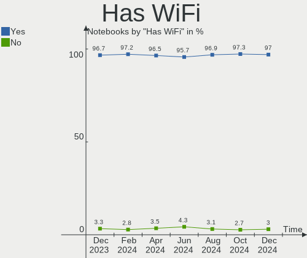
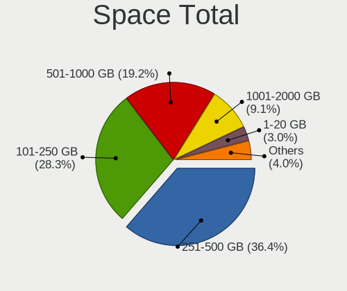
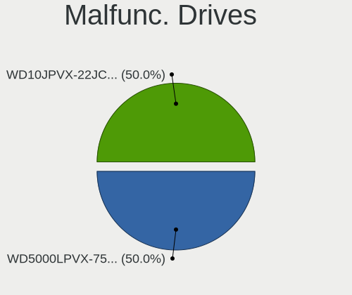
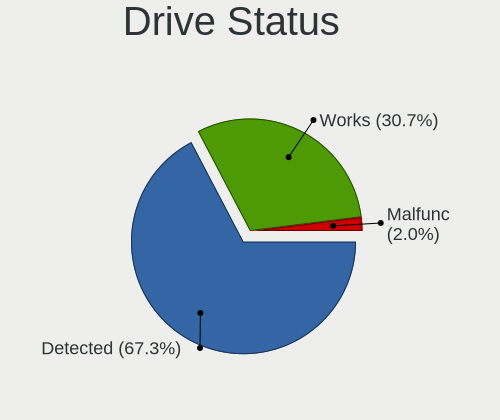
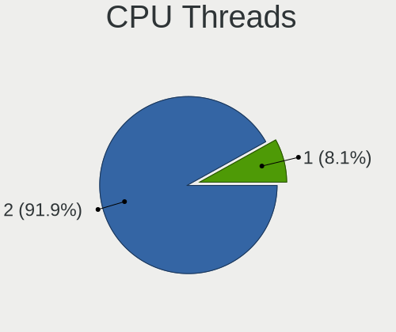
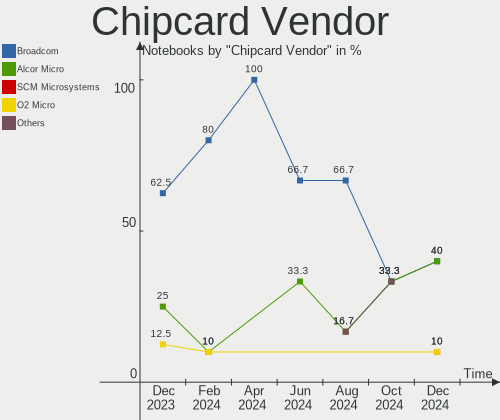

Pop!_OS - Hardware Trends (Notebooks)
-------------------------------------

A project to identify most popular hardware characteristics and track their change
over time based on data collected by Linux users at https://Linux-Hardware.org.

Anyone can contribute to this report by the [hw-probe](https://github.com/linuxhw/hw-probe) tool:

    sudo -E hw-probe -all -upload

This report is for one last month. Overall report since the beginning of time: [TestCoverage](https://github.com/linuxhw/TestCoverage)

Period: Jan, 2023.

Contents
--------

* [ System ](#system)
  - [ OS                       ](#os)
  - [ OS Family                ](#os-family)
  - [ Kernel                   ](#kernel)
  - [ Kernel Family            ](#kernel-family)
  - [ Kernel Major Ver.        ](#kernel-major-ver)
  - [ Arch                     ](#arch)
  - [ DE                       ](#de)
  - [ Display Server           ](#display-server)
  - [ Display Manager          ](#display-manager)
  - [ OS Lang                  ](#os-lang)
  - [ Boot Mode                ](#boot-mode)
  - [ Filesystem               ](#filesystem)
  - [ Part. scheme             ](#part-scheme)
  - [ Dual Boot with Linux/BSD ](#dual-boot-with-linuxbsd)
  - [ Dual Boot (Win)          ](#dual-boot-win)

* [ Board ](#board)
  - [ Vendor                   ](#vendor)
  - [ Model                    ](#model)
  - [ Model Family             ](#model-family)
  - [ MFG Year                 ](#mfg-year)
  - [ Form Factor              ](#form-factor)
  - [ Secure Boot              ](#secure-boot)
  - [ Coreboot                 ](#coreboot)
  - [ RAM Size                 ](#ram-size)
  - [ RAM Used                 ](#ram-used)
  - [ Total Drives             ](#total-drives)
  - [ Has CD-ROM               ](#has-cd-rom)
  - [ Has Ethernet             ](#has-ethernet)
  - [ Has WiFi                 ](#has-wifi)
  - [ Has Bluetooth            ](#has-bluetooth)

* [ Location ](#location)
  - [ Country                  ](#country)
  - [ City                     ](#city)

* [ Drives ](#drives)
  - [ Drive Vendor             ](#drive-vendor)
  - [ Drive Model              ](#drive-model)
  - [ HDD Vendor               ](#hdd-vendor)
  - [ SSD Vendor               ](#ssd-vendor)
  - [ Drive Kind               ](#drive-kind)
  - [ Drive Connector          ](#drive-connector)
  - [ Drive Size               ](#drive-size)
  - [ Space Total              ](#space-total)
  - [ Space Used               ](#space-used)
  - [ Malfunc. Drives          ](#malfunc-drives)
  - [ Malfunc. Drive Vendor    ](#malfunc-drive-vendor)
  - [ Malfunc. HDD Vendor      ](#malfunc-hdd-vendor)
  - [ Malfunc. Drive Kind      ](#malfunc-drive-kind)
  - [ Failed Drives            ](#failed-drives)
  - [ Failed Drive Vendor      ](#failed-drive-vendor)
  - [ Drive Status             ](#drive-status)

* [ Storage controller ](#storage-controller)
  - [ Storage Vendor           ](#storage-vendor)
  - [ Storage Model            ](#storage-model)
  - [ Storage Kind             ](#storage-kind)

* [ Processor ](#processor)
  - [ CPU Vendor               ](#cpu-vendor)
  - [ CPU Model                ](#cpu-model)
  - [ CPU Model Family         ](#cpu-model-family)
  - [ CPU Cores                ](#cpu-cores)
  - [ CPU Sockets              ](#cpu-sockets)
  - [ CPU Threads              ](#cpu-threads)
  - [ CPU Op-Modes             ](#cpu-op-modes)
  - [ CPU Microcode            ](#cpu-microcode)
  - [ CPU Microarch            ](#cpu-microarch)

* [ Graphics ](#graphics)
  - [ GPU Vendor               ](#gpu-vendor)
  - [ GPU Model                ](#gpu-model)
  - [ GPU Combo                ](#gpu-combo)
  - [ GPU Driver               ](#gpu-driver)
  - [ GPU Memory               ](#gpu-memory)

* [ Monitor ](#monitor)
  - [ Monitor Vendor           ](#monitor-vendor)
  - [ Monitor Model            ](#monitor-model)
  - [ Monitor Resolution       ](#monitor-resolution)
  - [ Monitor Diagonal         ](#monitor-diagonal)
  - [ Monitor Width            ](#monitor-width)
  - [ Aspect Ratio             ](#aspect-ratio)
  - [ Monitor Area             ](#monitor-area)
  - [ Pixel Density            ](#pixel-density)
  - [ Multiple Monitors        ](#multiple-monitors)

* [ Network ](#network)
  - [ Net Controller Vendor    ](#net-controller-vendor)
  - [ Net Controller Model     ](#net-controller-model)
  - [ Wireless Vendor          ](#wireless-vendor)
  - [ Wireless Model           ](#wireless-model)
  - [ Ethernet Vendor          ](#ethernet-vendor)
  - [ Ethernet Model           ](#ethernet-model)
  - [ Net Controller Kind      ](#net-controller-kind)
  - [ Used Controller          ](#used-controller)
  - [ NICs                     ](#nics)
  - [ IPv6                     ](#ipv6)

* [ Bluetooth ](#bluetooth)
  - [ Bluetooth Vendor         ](#bluetooth-vendor)
  - [ Bluetooth Model          ](#bluetooth-model)

* [ Sound ](#sound)
  - [ Sound Vendor             ](#sound-vendor)
  - [ Sound Model              ](#sound-model)

* [ Memory ](#memory)
  - [ Memory Vendor            ](#memory-vendor)
  - [ Memory Model             ](#memory-model)
  - [ Memory Kind              ](#memory-kind)
  - [ Memory Form Factor       ](#memory-form-factor)
  - [ Memory Size              ](#memory-size)
  - [ Memory Speed             ](#memory-speed)

* [ Printers & scanners ](#printers--scanners)
  - [ Printer Vendor           ](#printer-vendor)
  - [ Printer Model            ](#printer-model)
  - [ Scanner Vendor           ](#scanner-vendor)
  - [ Scanner Model            ](#scanner-model)

* [ Camera ](#camera)
  - [ Camera Vendor            ](#camera-vendor)
  - [ Camera Model             ](#camera-model)

* [ Security ](#security)
  - [ Fingerprint Vendor       ](#fingerprint-vendor)
  - [ Fingerprint Model        ](#fingerprint-model)
  - [ Chipcard Vendor          ](#chipcard-vendor)
  - [ Chipcard Model           ](#chipcard-model)

* [ Unsupported ](#unsupported)
  - [ Unsupported Devices      ](#unsupported-devices)
  - [ Unsupported Device Types ](#unsupported-device-types)

System
------

OS
--

Installed operating systems

| Name          | Notebooks | Percent |
|---------------|-----------|---------|
| Pop!_OS 22.04 | 122       | 99.19%  |
| Pop!_OS 21.04 | 1         | 0.81%   |

OS Family
---------

OS without a version

| Name    | Notebooks | Percent |
|---------|-----------|---------|
| Pop!_OS | 123       | 100%    |

Kernel
------

Version of the Linux kernel

| Version                  | Notebooks | Percent |
|--------------------------|-----------|---------|
| 6.0.12-76060006-generic  | 109       | 88.62%  |
| 6.0.6-76060006-generic   | 4         | 3.25%   |
| 5.19.0-76051900-generic  | 2         | 1.63%   |
| 6.1.8-060108-generic     | 1         | 0.81%   |
| 6.1.7-060107-generic     | 1         | 0.81%   |
| 6.1.0-2.1-liquorix-amd64 | 1         | 0.81%   |
| 5.19.4-xanmod1           | 1         | 0.81%   |
| 5.18.10-76051810-generic | 1         | 0.81%   |
| 5.17.5-76051705-generic  | 1         | 0.81%   |
| 5.15.65-051565-generic   | 1         | 0.81%   |
| 5.15.11-76051511-generic | 1         | 0.81%   |

Kernel Family
-------------

Linux kernel without a distro release

| Version | Notebooks | Percent |
|---------|-----------|---------|
| 6.0.12  | 109       | 88.62%  |
| 6.0.6   | 4         | 3.25%   |
| 5.19.0  | 2         | 1.63%   |
| 6.1.8   | 1         | 0.81%   |
| 6.1.7   | 1         | 0.81%   |
| 6.1.0   | 1         | 0.81%   |
| 5.19.4  | 1         | 0.81%   |
| 5.18.10 | 1         | 0.81%   |
| 5.17.5  | 1         | 0.81%   |
| 5.15.65 | 1         | 0.81%   |
| 5.15.11 | 1         | 0.81%   |

Kernel Major Ver.
-----------------

Linux kernel major version

| Version | Notebooks | Percent |
|---------|-----------|---------|
| 6.0     | 113       | 91.87%  |
| 6.1     | 3         | 2.44%   |
| 5.19    | 3         | 2.44%   |
| 5.15    | 2         | 1.63%   |
| 5.18    | 1         | 0.81%   |
| 5.17    | 1         | 0.81%   |

Arch
----

OS architecture (x86_64, i586, etc.)

| Name   | Notebooks | Percent |
|--------|-----------|---------|
| x86_64 | 123       | 100%    |

DE
--

Desktop Environment

| Name            | Notebooks | Percent |
|-----------------|-----------|---------|
| GNOME           | 120       | 97.56%  |
| X-Cinnamon      | 1         | 0.81%   |
| KDE5            | 1         | 0.81%   |
| GNOME Flashback | 1         | 0.81%   |

Display Server
--------------

X11 or Wayland

| Name    | Notebooks | Percent |
|---------|-----------|---------|
| X11     | 112       | 91.06%  |
| Wayland | 11        | 8.94%   |

Display Manager
---------------

SDDM, LightDM, etc.

| Name    | Notebooks | Percent |
|---------|-----------|---------|
| Unknown | 84        | 68.29%  |
| GDM3    | 39        | 31.71%  |

OS Lang
-------

Language

| Lang  | Notebooks | Percent |
|-------|-----------|---------|
| en_US | 74        | 60.16%  |
| pt_BR | 6         | 4.88%   |
| en_GB | 6         | 4.88%   |
| it_IT | 5         | 4.07%   |
| ru_RU | 3         | 2.44%   |
| fr_FR | 3         | 2.44%   |
| en_NZ | 3         | 2.44%   |
| en_IE | 3         | 2.44%   |
| en_AU | 3         | 2.44%   |
| tr_TR | 2         | 1.63%   |
| en_IN | 2         | 1.63%   |
| de_DE | 2         | 1.63%   |
| sv_SE | 1         | 0.81%   |
| pl_PL | 1         | 0.81%   |
| nl_NL | 1         | 0.81%   |
| nb_NO | 1         | 0.81%   |
| ja_JP | 1         | 0.81%   |
| fr_CH | 1         | 0.81%   |
| es_MX | 1         | 0.81%   |
| en_ZA | 1         | 0.81%   |
| en_CA | 1         | 0.81%   |
| cs_CZ | 1         | 0.81%   |
| C     | 1         | 0.81%   |

Boot Mode
---------

EFI or BIOS

| Mode | Notebooks | Percent |
|------|-----------|---------|
| BIOS | 85        | 69.11%  |
| EFI  | 38        | 30.89%  |

Filesystem
----------

Type of filesystem

| Type    | Notebooks | Percent |
|---------|-----------|---------|
| Ext4    | 116       | 94.31%  |
| Btrfs   | 5         | 4.07%   |
| Zfs     | 1         | 0.81%   |
| Overlay | 1         | 0.81%   |

Part. scheme
------------

Scheme of partitioning

| Type    | Notebooks | Percent |
|---------|-----------|---------|
| Unknown | 84        | 68.29%  |
| GPT     | 37        | 30.08%  |
| MBR     | 2         | 1.63%   |

Dual Boot with Linux/BSD
------------------------

Hosting more than one Linux/BSD

| Dual boot | Notebooks | Percent |
|-----------|-----------|---------|
| No        | 120       | 97.56%  |
| Yes       | 3         | 2.44%   |

Dual Boot (Win)
---------------

Hosting Linux and Windows

| Dual boot | Notebooks | Percent |
|-----------|-----------|---------|
| No        | 109       | 88.62%  |
| Yes       | 14        | 11.38%  |

Board
-----

Vendor
------

Motherboard manufacturer

| Name                   | Notebooks | Percent |
|------------------------|-----------|---------|
| Lenovo                 | 26        | 21.14%  |
| Dell                   | 25        | 20.33%  |
| Hewlett-Packard        | 23        | 18.7%   |
| ASUSTek Computer       | 14        | 11.38%  |
| Acer                   | 6         | 4.88%   |
| System76               | 5         | 4.07%   |
| MSI                    | 3         | 2.44%   |
| Apple                  | 3         | 2.44%   |
| Timi                   | 1         | 0.81%   |
| Samsung Electronics    | 1         | 0.81%   |
| Razer x Lambda         | 1         | 0.81%   |
| Razer                  | 1         | 0.81%   |
| Purism                 | 1         | 0.81%   |
| Panasonic              | 1         | 0.81%   |
| Notebook               | 1         | 0.81%   |
| LG Electronics         | 1         | 0.81%   |
| HONOR                  | 1         | 0.81%   |
| GPU Company            | 1         | 0.81%   |
| Google                 | 1         | 0.81%   |
| Gigabyte Technology    | 1         | 0.81%   |
| Fujitsu                | 1         | 0.81%   |
| Framework              | 1         | 0.81%   |
| Datto                  | 1         | 0.81%   |
| Clevo                  | 1         | 0.81%   |
| Chuwi                  | 1         | 0.81%   |
| Avell High Performance | 1         | 0.81%   |

Model
-----

Motherboard model

| Name                                        | Notebooks | Percent |
|---------------------------------------------|-----------|---------|
| Dell Latitude E7240                         | 3         | 2.44%   |
| System76 Lemur Pro                          | 2         | 1.63%   |
| HP Notebook                                 | 2         | 1.63%   |
| HP EliteBook 840 G5                         | 2         | 1.63%   |
| ASUS Zephyrus G GU502DU_GA502DU             | 2         | 1.63%   |
| Apple MacBookPro12,1                        | 2         | 1.63%   |
| Timi RedmiBook Pro 15S                      | 1         | 0.81%   |
| System76 Oryx Pro                           | 1         | 0.81%   |
| System76 Gazelle                            | 1         | 0.81%   |
| System76 Bonobo WS                          | 1         | 0.81%   |
| Samsung 270E5J/2570EJ                       | 1         | 0.81%   |
| Razer x Lambda TensorBook (late 2021)       | 1         | 0.81%   |
| Razer Blade                                 | 1         | 0.81%   |
| Purism Librem 15 v3                         | 1         | 0.81%   |
| Panasonic FZ55-1                            | 1         | 0.81%   |
| Notebook PCX0DX                             | 1         | 0.81%   |
| MSI Vector GP76 12UHSO                      | 1         | 0.81%   |
| MSI Bravo 15 B5DD                           | 1         | 0.81%   |
| MSI Alpha 15 A3DDK                          | 1         | 0.81%   |
| LG 17Z90Q-K.AAC7U1                          | 1         | 0.81%   |
| Lenovo Y720-15IKB 80VR                      | 1         | 0.81%   |
| Lenovo ThinkPad X220 Tablet 4294CTO         | 1         | 0.81%   |
| Lenovo ThinkPad X1 Extreme Gen 5 21DE000NRT | 1         | 0.81%   |
| Lenovo ThinkPad X1 Carbon 6th 20KHCTO1WW    | 1         | 0.81%   |
| Lenovo ThinkPad T560 20FH001QUS             | 1         | 0.81%   |
| Lenovo ThinkPad T530 23943J8                | 1         | 0.81%   |
| Lenovo ThinkPad T500 2081CTO                | 1         | 0.81%   |
| Lenovo ThinkPad T460s 20FAS2M30C            | 1         | 0.81%   |
| Lenovo ThinkPad T460 20FMS2BM00             | 1         | 0.81%   |
| Lenovo ThinkPad T14 Gen 2a 20XK002SMH       | 1         | 0.81%   |
| Lenovo ThinkPad L380 20M50013UK             | 1         | 0.81%   |
| Lenovo ThinkPad L14 Gen 1 20U6S2LH00        | 1         | 0.81%   |
| Lenovo ThinkPad L13 Yoga Gen 2a 21AES01A00  | 1         | 0.81%   |
| Lenovo ThinkPad Edge E540 20C600AKZA        | 1         | 0.81%   |
| Lenovo Legion Y540-15IRH 81SX               | 1         | 0.81%   |
| Lenovo Legion 5 15ARH05H 82B1               | 1         | 0.81%   |
| Lenovo Legion 5 15ACH6H 82JU                | 1         | 0.81%   |
| Lenovo IdeaPad Y570 20091                   | 1         | 0.81%   |
| Lenovo IdeaPad Y570 0862                    | 1         | 0.81%   |
| Lenovo IdeaPad S145-15IIL 82DJ              | 1         | 0.81%   |

Model Family
------------

Motherboard model prefix

| Name                      | Notebooks | Percent |
|---------------------------|-----------|---------|
| Lenovo ThinkPad           | 13        | 10.57%  |
| Dell Latitude             | 9         | 7.32%   |
| Lenovo IdeaPad            | 8         | 6.5%    |
| HP Pavilion               | 5         | 4.07%   |
| HP EliteBook              | 5         | 4.07%   |
| Dell XPS                  | 5         | 4.07%   |
| HP ZBook                  | 4         | 3.25%   |
| ASUS VivoBook             | 4         | 3.25%   |
| Lenovo Legion             | 3         | 2.44%   |
| Dell Precision            | 3         | 2.44%   |
| Dell Inspiron             | 3         | 2.44%   |
| System76 Lemur            | 2         | 1.63%   |
| HP OMEN                   | 2         | 1.63%   |
| HP Notebook               | 2         | 1.63%   |
| HP ENVY                   | 2         | 1.63%   |
| Dell G15                  | 2         | 1.63%   |
| ASUS Zephyrus             | 2         | 1.63%   |
| ASUS ASUS                 | 2         | 1.63%   |
| Apple MacBookPro12        | 2         | 1.63%   |
| Acer Swift                | 2         | 1.63%   |
| Acer Aspire               | 2         | 1.63%   |
| Timi RedmiBook            | 1         | 0.81%   |
| System76 Oryx             | 1         | 0.81%   |
| System76 Gazelle          | 1         | 0.81%   |
| System76 Bonobo           | 1         | 0.81%   |
| Samsung 270E5J            | 1         | 0.81%   |
| Razer x Lambda TensorBook | 1         | 0.81%   |
| Razer Blade               | 1         | 0.81%   |
| Purism Librem             | 1         | 0.81%   |
| Panasonic FZ55-1          | 1         | 0.81%   |
| Notebook PCX0DX           | 1         | 0.81%   |
| MSI Vector                | 1         | 0.81%   |
| MSI Bravo                 | 1         | 0.81%   |
| MSI Alpha                 | 1         | 0.81%   |
| LG 17Z90Q-K.AAC7U1        | 1         | 0.81%   |
| Lenovo Y720-15IKB         | 1         | 0.81%   |
| Lenovo G580               | 1         | 0.81%   |
| HONOR NMH-WCX9            | 1         | 0.81%   |
| HP ProBook                | 1         | 0.81%   |
| HP Laptop                 | 1         | 0.81%   |

MFG Year
--------

Motherboard manufacture year

| Year | Notebooks | Percent |
|------|-----------|---------|
| 2021 | 27        | 21.95%  |
| 2022 | 16        | 13.01%  |
| 2019 | 14        | 11.38%  |
| 2020 | 11        | 8.94%   |
| 2016 | 11        | 8.94%   |
| 2018 | 9         | 7.32%   |
| 2013 | 7         | 5.69%   |
| 2012 | 5         | 4.07%   |
| 2011 | 5         | 4.07%   |
| 2017 | 4         | 3.25%   |
| 2015 | 4         | 3.25%   |
| 2014 | 4         | 3.25%   |
| 2010 | 2         | 1.63%   |
| 2008 | 2         | 1.63%   |
| 2007 | 2         | 1.63%   |

Form Factor
-----------

Physical design of the computer

| Name     | Notebooks | Percent |
|----------|-----------|---------|
| Notebook | 123       | 100%    |

Secure Boot
-----------

Enabled or disabled

| State    | Notebooks | Percent |
|----------|-----------|---------|
| Disabled | 123       | 100%    |

Coreboot
--------

Have coreboot on board

| Used | Notebooks | Percent |
|------|-----------|---------|
| No   | 116       | 94.31%  |
| Yes  | 7         | 5.69%   |

RAM Size
--------

Total RAM memory

| Size in GB  | Notebooks | Percent |
|-------------|-----------|---------|
| 4.01-8.0    | 32        | 26.02%  |
| 8.01-16.0   | 29        | 23.58%  |
| 16.01-24.0  | 26        | 21.14%  |
| 32.01-64.0  | 15        | 12.2%   |
| 3.01-4.0    | 13        | 10.57%  |
| 64.01-256.0 | 5         | 4.07%   |
| 24.01-32.0  | 3         | 2.44%   |

RAM Used
--------

Used RAM memory

| Used GB    | Notebooks | Percent |
|------------|-----------|---------|
| 4.01-8.0   | 44        | 35.77%  |
| 2.01-3.0   | 30        | 24.39%  |
| 3.01-4.0   | 26        | 21.14%  |
| 1.01-2.0   | 11        | 8.94%   |
| 8.01-16.0  | 10        | 8.13%   |
| 24.01-32.0 | 1         | 0.81%   |
| 16.01-24.0 | 1         | 0.81%   |

Total Drives
------------

Number of drives on board

| Drives | Notebooks | Percent |
|--------|-----------|---------|
| 1      | 89        | 72.36%  |
| 2      | 30        | 24.39%  |
| 3      | 2         | 1.63%   |
| 5      | 1         | 0.81%   |
| 0      | 1         | 0.81%   |

Has CD-ROM
----------

Has CD-ROM on board

| Presented | Notebooks | Percent |
|-----------|-----------|---------|
| No        | 103       | 83.74%  |
| Yes       | 20        | 16.26%  |

Has Ethernet
------------

Has Ethernet on board

| Presented | Notebooks | Percent |
|-----------|-----------|---------|
| Yes       | 85        | 69.11%  |
| No        | 38        | 30.89%  |

Has WiFi
--------

Has WiFi module

| Presented | Notebooks | Percent |
|-----------|-----------|---------|
| Yes       | 122       | 99.19%  |
| No        | 1         | 0.81%   |

Has Bluetooth
-------------

Has Bluetooth module

| Presented | Notebooks | Percent |
|-----------|-----------|---------|
| Yes       | 105       | 85.37%  |
| No        | 18        | 14.63%  |

Location
--------

Country
-------

Geographic location (country)

| Country      | Notebooks | Percent |
|--------------|-----------|---------|
| USA          | 37        | 30.08%  |
| Brazil       | 7         | 5.69%   |
| UK           | 5         | 4.07%   |
| India        | 5         | 4.07%   |
| Canada       | 5         | 4.07%   |
| Russia       | 4         | 3.25%   |
| New Zealand  | 4         | 3.25%   |
| Italy        | 4         | 3.25%   |
| France       | 4         | 3.25%   |
| Australia    | 4         | 3.25%   |
| Sweden       | 3         | 2.44%   |
| Norway       | 3         | 2.44%   |
| Japan        | 3         | 2.44%   |
| Germany      | 3         | 2.44%   |
| Turkey       | 2         | 1.63%   |
| Netherlands  | 2         | 1.63%   |
| Mexico       | 2         | 1.63%   |
| Ireland      | 2         | 1.63%   |
| Greece       | 2         | 1.63%   |
| Czechia      | 2         | 1.63%   |
| Austria      | 2         | 1.63%   |
| Vietnam      | 1         | 0.81%   |
| Thailand     | 1         | 0.81%   |
| Syria        | 1         | 0.81%   |
| Switzerland  | 1         | 0.81%   |
| Spain        | 1         | 0.81%   |
| South Africa | 1         | 0.81%   |
| Serbia       | 1         | 0.81%   |
| Portugal     | 1         | 0.81%   |
| Poland       | 1         | 0.81%   |
| Pakistan     | 1         | 0.81%   |
| Nigeria      | 1         | 0.81%   |
| Luxembourg   | 1         | 0.81%   |
| Israel       | 1         | 0.81%   |
| Indonesia    | 1         | 0.81%   |
| Hungary      | 1         | 0.81%   |
| Bulgaria     | 1         | 0.81%   |
| Belgium      | 1         | 0.81%   |
| Argentina    | 1         | 0.81%   |

City
----

Geographic location (city)

| City                  | Notebooks | Percent |
|-----------------------|-----------|---------|
| Washington            | 2         | 1.63%   |
| Sydney                | 2         | 1.63%   |
| Sollentuna            | 2         | 1.63%   |
| Oceanside             | 2         | 1.63%   |
| Martinez              | 2         | 1.63%   |
| Albuquerque           | 2         | 1.63%   |
| Yoshkar-Ola           | 1         | 0.81%   |
| Yonkers               | 1         | 0.81%   |
| Winnipeg              | 1         | 0.81%   |
| Wellington            | 1         | 0.81%   |
| Waukesha              | 1         | 0.81%   |
| Wattrelos             | 1         | 0.81%   |
| Warsaw                | 1         | 0.81%   |
| Vienna                | 1         | 0.81%   |
| Vichuga               | 1         | 0.81%   |
| Verona                | 1         | 0.81%   |
| Vancouver             | 1         | 0.81%   |
| Trondheim             | 1         | 0.81%   |
| Trivandrum            | 1         | 0.81%   |
| Sunshine Coast        | 1         | 0.81%   |
| Stavanger             | 1         | 0.81%   |
| St Petersburg         | 1         | 0.81%   |
| Southampton           | 1         | 0.81%   |
| Shibuya               | 1         | 0.81%   |
| Seattle               | 1         | 0.81%   |
| Sarnia                | 1         | 0.81%   |
| Santana do Ipanema    | 1         | 0.81%   |
| San Diego             | 1         | 0.81%   |
| Saint-Germain-en-Laye | 1         | 0.81%   |
| Roselle               | 1         | 0.81%   |
| Ramla                 | 1         | 0.81%   |
| Raleigh               | 1         | 0.81%   |
| Pune                  | 1         | 0.81%   |
| Port Elizabeth        | 1         | 0.81%   |
| Pombia                | 1         | 0.81%   |
| Penarth               | 1         | 0.81%   |
| Palo Alto             | 1         | 0.81%   |
| Oslo                  | 1         | 0.81%   |
| Old Faliron           | 1         | 0.81%   |
| Nixa                  | 1         | 0.81%   |

Drives
------

Drive Vendor
------------

Hard drive vendors

| Vendor                    | Notebooks | Drives | Percent |
|---------------------------|-----------|--------|---------|
| Samsung Electronics       | 37        | 40     | 24.18%  |
| WDC                       | 17        | 17     | 11.11%  |
| SanDisk                   | 16        | 20     | 10.46%  |
| SK hynix                  | 11        | 11     | 7.19%   |
| Seagate                   | 11        | 14     | 7.19%   |
| Intel                     | 9         | 10     | 5.88%   |
| Unknown                   | 5         | 6      | 3.27%   |
| Toshiba                   | 5         | 5      | 3.27%   |
| Kingston                  | 5         | 5      | 3.27%   |
| Micron Technology         | 4         | 4      | 2.61%   |
| PNY                       | 3         | 3      | 1.96%   |
| Micron/Crucial Technology | 3         | 3      | 1.96%   |
| KIOXIA                    | 3         | 3      | 1.96%   |
| Apple                     | 3         | 3      | 1.96%   |
| Phison Electronics        | 2         | 3      | 1.31%   |
| Netac                     | 2         | 2      | 1.31%   |
| LITEONIT                  | 2         | 2      | 1.31%   |
| Crucial                   | 2         | 2      | 1.31%   |
| A-DATA Technology         | 2         | 2      | 1.31%   |
| Wibtek                    | 1         | 1      | 0.65%   |
| SSSTC                     | 1         | 1      | 0.65%   |
| LITEON                    | 1         | 1      | 0.65%   |
| KingSpec                  | 1         | 1      | 0.65%   |
| Intenso                   | 1         | 1      | 0.65%   |
| Hitachi                   | 1         | 1      | 0.65%   |
| HGST                      | 1         | 1      | 0.65%   |
| Hewlett-Packard           | 1         | 1      | 0.65%   |
| China                     | 1         | 1      | 0.65%   |
| Apacer                    | 1         | 2      | 0.65%   |
| Unknown                   | 1         | 1      | 0.65%   |

Drive Model
-----------

Hard drive models

| Model                                                | Notebooks | Percent |
|------------------------------------------------------|-----------|---------|
| Samsung NVMe SSD Controller SM981/PM981/PM983 500GB  | 6         | 3.73%   |
| Intel SSD 660P Series 512GB                          | 4         | 2.48%   |
| SK hynix BC511 512GB                                 | 3         | 1.86%   |
| Samsung NVMe SSD Controller SM961/PM961/SM963 256GB  | 3         | 1.86%   |
| Samsung NVMe SSD Controller PM9A1/PM9A3/980PRO 512GB | 3         | 1.86%   |
| WDC WD10SPZX-24Z10 1TB                               | 2         | 1.24%   |
| Seagate ST1000LM049-2GH172 1TB                       | 2         | 1.24%   |
| Seagate ST1000LM024 HN-M101MBB 1TB                   | 2         | 1.24%   |
| Sandisk WD Black SN750 / PC SN730 NVMe SSD 1TB       | 2         | 1.24%   |
| SanDisk Extreme 55AE 1TB SSD                         | 2         | 1.24%   |
| Samsung SSD 850 EVO 250GB                            | 2         | 1.24%   |
| Micron/Crucial P2 NVMe PCIe SSD 500GB                | 2         | 1.24%   |
| Intel SSDPEKNW010T8 1TB                              | 2         | 1.24%   |
| Intel SSDPEKNU512GZ 512GB                            | 2         | 1.24%   |
| Wibtek W800S 512GB                                   | 1         | 0.62%   |
| WDC WDS240G2G0C-00AJM0 240GB                         | 1         | 0.62%   |
| WDC WDBRPG5000ANC-WRSN 500GB                         | 1         | 0.62%   |
| WDC WD5000BPKX-00HPJT0 500GB                         | 1         | 0.62%   |
| WDC WD3200BPVT-22JJ5T0 320GB                         | 1         | 0.62%   |
| WDC WD3200BEKT-60PVMT0 320GB                         | 1         | 0.62%   |
| WDC WD20SPZX-08UA7 2TB                               | 1         | 0.62%   |
| WDC WD10SPZX-80Z10T2 1TB                             | 1         | 0.62%   |
| WDC WD10SPZX-75Z10T2 1TB                             | 1         | 0.62%   |
| WDC WD10SPZX-24Z10T0 1TB                             | 1         | 0.62%   |
| WDC WD10JPVX-60JC3T1 1TB                             | 1         | 0.62%   |
| WDC PC SN730 SDBPNTY-1T00 1TB                        | 1         | 0.62%   |
| WDC PC SN530 SDBPNPZ-512G-1036 512GB                 | 1         | 0.62%   |
| WDC PC SN530 SDBPMPZ-512G-1101 512GB                 | 1         | 0.62%   |
| WDC PC SN530 NVMe 512GB                              | 1         | 0.62%   |
| WDC PC SN520 SDAPMUW-128G-1001 128GB                 | 1         | 0.62%   |
| Unknown USB DISK 3.2 1TB                             | 1         | 0.62%   |
| Unknown SD/MMC/MS PRO 2GB                            | 1         | 0.62%   |
| Unknown NVMe SSD Drive 1TB                           | 1         | 0.62%   |
| Unknown MMC Card  64GB                               | 1         | 0.62%   |
| Unknown MMC Card  4GB                                | 1         | 0.62%   |
| Toshiba XG6 NVMe SSD Controller 512GB                | 1         | 0.62%   |
| Toshiba MQ04ABF100 1TB                               | 1         | 0.62%   |
| Toshiba MQ01ABD100 1TB                               | 1         | 0.62%   |
| Toshiba KXG50ZNV256G 256GB                           | 1         | 0.62%   |
| Toshiba BG3 NVMe SSD Controller 256GB                | 1         | 0.62%   |

HDD Vendor
----------

Hard disk drive vendors

| Vendor              | Notebooks | Drives | Percent |
|---------------------|-----------|--------|---------|
| Seagate             | 11        | 14     | 39.29%  |
| WDC                 | 10        | 10     | 35.71%  |
| Toshiba             | 2         | 2      | 7.14%   |
| Unknown             | 1         | 1      | 3.57%   |
| Samsung Electronics | 1         | 1      | 3.57%   |
| Intenso             | 1         | 1      | 3.57%   |
| Hitachi             | 1         | 1      | 3.57%   |
| HGST                | 1         | 1      | 3.57%   |

SSD Vendor
----------

Solid state drive vendors

| Vendor              | Notebooks | Drives | Percent |
|---------------------|-----------|--------|---------|
| Samsung Electronics | 12        | 12     | 28.57%  |
| SanDisk             | 7         | 7      | 16.67%  |
| Kingston            | 5         | 5      | 11.9%   |
| PNY                 | 3         | 3      | 7.14%   |
| LITEONIT            | 2         | 2      | 4.76%   |
| Crucial             | 2         | 2      | 4.76%   |
| Apple               | 2         | 2      | 4.76%   |
| SK hynix            | 1         | 1      | 2.38%   |
| Netac               | 1         | 1      | 2.38%   |
| Micron Technology   | 1         | 1      | 2.38%   |
| LITEON              | 1         | 1      | 2.38%   |
| KingSpec            | 1         | 1      | 2.38%   |
| Hewlett-Packard     | 1         | 1      | 2.38%   |
| China               | 1         | 1      | 2.38%   |
| Apacer              | 1         | 2      | 2.38%   |
| Unknown             | 1         | 1      | 2.38%   |

Drive Kind
----------

HDD or SSD

| Kind    | Notebooks | Drives | Percent |
|---------|-----------|--------|---------|
| NVMe    | 72        | 89     | 51.43%  |
| SSD     | 37        | 43     | 26.43%  |
| HDD     | 27        | 31     | 19.29%  |
| MMC     | 2         | 2      | 1.43%   |
| Unknown | 2         | 2      | 1.43%   |

Drive Connector
---------------

SATA, SAS, NVMe, etc.

| Type | Notebooks | Drives | Percent |
|------|-----------|--------|---------|
| NVMe | 72        | 89     | 50.7%   |
| SATA | 60        | 66     | 42.25%  |
| SAS  | 8         | 10     | 5.63%   |
| MMC  | 2         | 2      | 1.41%   |

Drive Size
----------

Size of hard drive

| Size in TB | Notebooks | Drives | Percent |
|------------|-----------|--------|---------|
| 0.01-0.5   | 41        | 44     | 61.19%  |
| 0.51-1.0   | 21        | 23     | 31.34%  |
| 1.01-2.0   | 3         | 3      | 4.48%   |
| 4.01-10.0  | 2         | 4      | 2.99%   |

Space Total
-----------

Amount of disk space available on the file system

| Size in GB     | Notebooks | Percent |
|----------------|-----------|---------|
| 101-250        | 41        | 33.33%  |
| 251-500        | 33        | 26.83%  |
| 501-1000       | 28        | 22.76%  |
| 1001-2000      | 11        | 8.94%   |
| 51-100         | 7         | 5.69%   |
| 1-20           | 2         | 1.63%   |
| More than 3000 | 1         | 0.81%   |

Space Used
----------

Amount of used disk space

| Used GB        | Notebooks | Percent |
|----------------|-----------|---------|
| 1-20           | 33        | 26.83%  |
| 21-50          | 28        | 22.76%  |
| 101-250        | 21        | 17.07%  |
| 251-500        | 17        | 13.82%  |
| 51-100         | 15        | 12.2%   |
| 501-1000       | 7         | 5.69%   |
| More than 3000 | 1         | 0.81%   |
| 1001-2000      | 1         | 0.81%   |

Malfunc. Drives
---------------

Drive models with a malfunction

| Model                                 | Notebooks | Drives | Percent |
|---------------------------------------|-----------|--------|---------|
| WDC WD10JPVX-60JC3T1 1TB              | 1         | 1      | 25%     |
| WDC PC SN520 SDAPMUW-128G-1001 128GB  | 1         | 1      | 25%     |
| Toshiba MQ04ABF100 1TB                | 1         | 1      | 25%     |
| SK hynix HFS512G39TND-N210A 512GB SSD | 1         | 1      | 25%     |

Malfunc. Drive Vendor
---------------------

Vendors of faulty drives

| Vendor   | Notebooks | Drives | Percent |
|----------|-----------|--------|---------|
| WDC      | 2         | 2      | 50%     |
| Toshiba  | 1         | 1      | 25%     |
| SK hynix | 1         | 1      | 25%     |

Malfunc. HDD Vendor
-------------------

Vendors of faulty HDD drives

| Vendor  | Notebooks | Drives | Percent |
|---------|-----------|--------|---------|
| WDC     | 1         | 1      | 50%     |
| Toshiba | 1         | 1      | 50%     |

Malfunc. Drive Kind
-------------------

Kinds of faulty drives

| Kind | Notebooks | Drives | Percent |
|------|-----------|--------|---------|
| HDD  | 2         | 2      | 50%     |
| NVMe | 1         | 1      | 25%     |
| SSD  | 1         | 1      | 25%     |

Failed Drives
-------------

Failed drive models

Zero info for selected period =(

Failed Drive Vendor
-------------------

Failed drive vendors

Zero info for selected period =(

Drive Status
------------

Number of failed and malfunc. drives

| Status   | Notebooks | Drives | Percent |
|----------|-----------|--------|---------|
| Detected | 92        | 121    | 69.7%   |
| Works    | 36        | 42     | 27.27%  |
| Malfunc  | 4         | 4      | 3.03%   |

Storage controller
------------------

Storage Vendor
--------------

Storage controller vendors

| Vendor                         | Notebooks | Percent |
|--------------------------------|-----------|---------|
| Intel                          | 73        | 45.91%  |
| Samsung Electronics            | 27        | 16.98%  |
| SanDisk                        | 15        | 9.43%   |
| AMD                            | 15        | 9.43%   |
| SK hynix                       | 10        | 6.29%   |
| Toshiba America Info Systems   | 3         | 1.89%   |
| Micron/Crucial Technology      | 3         | 1.89%   |
| Micron Technology              | 3         | 1.89%   |
| Solid State Storage Technology | 2         | 1.26%   |
| Phison Electronics             | 2         | 1.26%   |
| KIOXIA                         | 2         | 1.26%   |
| ADATA Technology               | 2         | 1.26%   |
| Netac Technology               | 1         | 0.63%   |
| Apple                          | 1         | 0.63%   |

Storage Model
-------------

Storage controller models

| Model                                                                          | Notebooks | Percent |
|--------------------------------------------------------------------------------|-----------|---------|
| AMD FCH SATA Controller [AHCI mode]                                            | 14        | 8.19%   |
| Intel Sunrise Point-LP SATA Controller [AHCI mode]                             | 13        | 7.6%    |
| Intel 82801 Mobile SATA Controller [RAID mode]                                 | 11        | 6.43%   |
| Samsung NVMe SSD Controller SM981/PM981/PM983                                  | 9         | 5.26%   |
| Intel Volume Management Device NVMe RAID Controller                            | 8         | 4.68%   |
| Samsung NVMe SSD Controller PM9A1/PM9A3/980PRO                                 | 7         | 4.09%   |
| Intel SSD 660P Series                                                          | 6         | 3.51%   |
| Intel 8 Series SATA Controller 1 [AHCI mode]                                   | 6         | 3.51%   |
| Intel 6 Series/C200 Series Chipset Family 6 port Mobile SATA AHCI Controller   | 6         | 3.51%   |
| SanDisk Non-Volatile memory controller                                         | 5         | 2.92%   |
| Samsung NVMe SSD Controller SM961/PM961/SM963                                  | 5         | 2.92%   |
| SK hynix Gold P31/PC711 NVMe Solid State Drive                                 | 4         | 2.34%   |
| SanDisk WD Black SN750 / PC SN730 NVMe SSD                                     | 4         | 2.34%   |
| Intel 7 Series Chipset Family 6-port SATA Controller [AHCI mode]               | 4         | 2.34%   |
| SK hynix Non-Volatile memory controller                                        | 3         | 1.75%   |
| SK hynix BC511                                                                 | 3         | 1.75%   |
| Samsung NVMe SSD Controller 980                                                | 3         | 1.75%   |
| Micron Non-Volatile memory controller                                          | 3         | 1.75%   |
| Intel Cannon Lake Mobile PCH SATA AHCI Controller                              | 3         | 1.75%   |
| Intel 8 Series/C220 Series Chipset Family 6-port SATA Controller 1 [AHCI mode] | 3         | 1.75%   |
| Solid State Storage Non-Volatile memory controller                             | 2         | 1.17%   |
| SanDisk WD Blue SN570 NVMe SSD                                                 | 2         | 1.17%   |
| SanDisk WD Blue SN550 NVMe SSD                                                 | 2         | 1.17%   |
| Samsung NVMe SSD Controller SM951/PM951                                        | 2         | 1.17%   |
| Samsung Electronics SATA controller                                            | 2         | 1.17%   |
| Micron/Crucial P2 NVMe PCIe SSD                                                | 2         | 1.17%   |
| Intel Non-Volatile memory controller                                           | 2         | 1.17%   |
| Intel Comet Lake SATA AHCI Controller                                          | 2         | 1.17%   |
| Intel Celeron/Pentium Silver Processor SATA Controller                         | 2         | 1.17%   |
| Intel 82801HM/HEM (ICH8M/ICH8M-E) SATA Controller [AHCI mode]                  | 2         | 1.17%   |
| Intel 82801HM/HEM (ICH8M/ICH8M-E) IDE Controller                               | 2         | 1.17%   |
| Intel 400 Series Chipset Family SATA AHCI Controller                           | 2         | 1.17%   |
| ADATA IM2P33F8ABR1 NVMe SSD                                                    | 2         | 1.17%   |
| Toshiba America Info Systems XG6 NVMe SSD Controller                           | 1         | 0.58%   |
| Toshiba America Info Systems XG5 NVMe SSD Controller                           | 1         | 0.58%   |
| Toshiba America Info Systems BG3 NVMe SSD Controller                           | 1         | 0.58%   |
| SanDisk WD PC SN810 / Black SN850 NVMe SSD                                     | 1         | 0.58%   |
| SanDisk WD Black 2018/SN750 / PC SN720 NVMe SSD                                | 1         | 0.58%   |
| SanDisk PC SN520 NVMe SSD                                                      | 1         | 0.58%   |
| Phison PS5013 E13 NVMe Controller                                              | 1         | 0.58%   |

Storage Kind
------------

Kind of storage controller (IDE, SATA, NVMe, SAS, ...)

| Kind | Notebooks | Percent |
|------|-----------|---------|
| NVMe | 72        | 44.44%  |
| SATA | 68        | 41.98%  |
| RAID | 20        | 12.35%  |
| IDE  | 2         | 1.23%   |

Processor
---------

CPU Vendor
----------

Processor vendors

| Vendor | Notebooks | Percent |
|--------|-----------|---------|
| Intel  | 95        | 77.24%  |
| AMD    | 28        | 22.76%  |

CPU Model
---------

Processor models

| Model                                         | Notebooks | Percent |
|-----------------------------------------------|-----------|---------|
| Intel Core i5-8250U CPU @ 1.60GHz             | 4         | 3.25%   |
| Intel Core i5-6200U CPU @ 2.30GHz             | 4         | 3.25%   |
| Intel 12th Gen Core i7-12700H                 | 4         | 3.25%   |
| Intel 11th Gen Core i5-1135G7 @ 2.40GHz       | 4         | 3.25%   |
| AMD Ryzen 7 5800H with Radeon Graphics        | 4         | 3.25%   |
| Intel Core i7-9750H CPU @ 2.60GHz             | 3         | 2.44%   |
| Intel Core i7-8650U CPU @ 1.90GHz             | 3         | 2.44%   |
| Intel Core i7-10750H CPU @ 2.60GHz            | 3         | 2.44%   |
| Intel 11th Gen Core i7-11800H @ 2.30GHz       | 3         | 2.44%   |
| Intel 11th Gen Core i7-1165G7 @ 2.80GHz       | 3         | 2.44%   |
| Intel 11th Gen Core i7-11370H @ 3.30GHz       | 3         | 2.44%   |
| AMD Ryzen 7 PRO 5850U with Radeon Graphics    | 3         | 2.44%   |
| AMD Ryzen 7 5700U with Radeon Graphics        | 3         | 2.44%   |
| AMD Ryzen 7 3750H with Radeon Vega Mobile Gfx | 3         | 2.44%   |
| Intel Core i7-6500U CPU @ 2.50GHz             | 2         | 1.63%   |
| Intel Core i7-4510U CPU @ 2.00GHz             | 2         | 1.63%   |
| Intel Core i7-3740QM CPU @ 2.70GHz            | 2         | 1.63%   |
| Intel Core i7-2630QM CPU @ 2.00GHz            | 2         | 1.63%   |
| Intel Core i5-6300U CPU @ 2.40GHz             | 2         | 1.63%   |
| Intel Core i5-5257U CPU @ 2.70GHz             | 2         | 1.63%   |
| Intel Core i5-4300U CPU @ 1.90GHz             | 2         | 1.63%   |
| Intel Core i5-2430M CPU @ 2.40GHz             | 2         | 1.63%   |
| Intel 12th Gen Core i7-1260P                  | 2         | 1.63%   |
| Intel 11th Gen Core i7-1185G7 @ 3.00GHz       | 2         | 1.63%   |
| AMD Ryzen 5 5600H with Radeon Graphics        | 2         | 1.63%   |
| AMD Ryzen 5 3500U with Radeon Vega Mobile Gfx | 2         | 1.63%   |
| Intel Xeon CPU E3-1505M v5 @ 2.80GHz          | 1         | 0.81%   |
| Intel Pentium Silver N5000 CPU @ 1.10GHz      | 1         | 0.81%   |
| Intel Core M-5Y31 CPU @ 0.90GHz               | 1         | 0.81%   |
| Intel Core i9-10900K CPU @ 3.70GHz            | 1         | 0.81%   |
| Intel Core i7-8750H CPU @ 2.20GHz             | 1         | 0.81%   |
| Intel Core i7-8665U CPU @ 1.90GHz             | 1         | 0.81%   |
| Intel Core i7-7700HQ CPU @ 2.80GHz            | 1         | 0.81%   |
| Intel Core i7-7500U CPU @ 2.70GHz             | 1         | 0.81%   |
| Intel Core i7-6600U CPU @ 2.60GHz             | 1         | 0.81%   |
| Intel Core i7-4800MQ CPU @ 2.70GHz            | 1         | 0.81%   |
| Intel Core i7-4750HQ CPU @ 2.00GHz            | 1         | 0.81%   |
| Intel Core i7-4702HQ CPU @ 2.20GHz            | 1         | 0.81%   |
| Intel Core i7-4500U CPU @ 1.80GHz             | 1         | 0.81%   |
| Intel Core i7-3630QM CPU @ 2.40GHz            | 1         | 0.81%   |

CPU Model Family
----------------

Processor model prefix

| Model                | Notebooks | Percent |
|----------------------|-----------|---------|
| Intel Core i7        | 31        | 25.2%   |
| Intel Core i5        | 27        | 21.95%  |
| Other                | 25        | 20.33%  |
| AMD Ryzen 7          | 13        | 10.57%  |
| AMD Ryzen 5          | 6         | 4.88%   |
| Intel Core i3        | 3         | 2.44%   |
| Intel Core 2 Duo     | 3         | 2.44%   |
| AMD Ryzen 7 PRO      | 3         | 2.44%   |
| Intel Celeron        | 2         | 1.63%   |
| Intel Xeon           | 1         | 0.81%   |
| Intel Pentium Silver | 1         | 0.81%   |
| Intel Core M         | 1         | 0.81%   |
| Intel Core i9        | 1         | 0.81%   |
| AMD Ryzen 5 PRO      | 1         | 0.81%   |
| AMD Ryzen 3 PRO      | 1         | 0.81%   |
| AMD Phenom II        | 1         | 0.81%   |
| AMD E1               | 1         | 0.81%   |
| AMD A8               | 1         | 0.81%   |
| AMD A10              | 1         | 0.81%   |

CPU Cores
---------

Number of processor cores

| Number | Notebooks | Percent |
|--------|-----------|---------|
| 4      | 47        | 38.21%  |
| 2      | 35        | 28.46%  |
| 8      | 19        | 15.45%  |
| 6      | 12        | 9.76%   |
| 14     | 5         | 4.07%   |
| 12     | 2         | 1.63%   |
| 16     | 1         | 0.81%   |
| 10     | 1         | 0.81%   |
| 3      | 1         | 0.81%   |

CPU Sockets
-----------

Number of sockets

| Number | Notebooks | Percent |
|--------|-----------|---------|
| 1      | 123       | 100%    |

CPU Threads
-----------

Threads per core (Hyper-Threading)

| Number | Notebooks | Percent |
|--------|-----------|---------|
| 2      | 112       | 91.06%  |
| 1      | 11        | 8.94%   |

CPU Op-Modes
------------

CPU Operation Modes (32-bit, 64-bit)

| Op mode        | Notebooks | Percent |
|----------------|-----------|---------|
| 32-bit, 64-bit | 123       | 100%    |

CPU Microcode
-------------

Microcode number

| Number     | Notebooks | Percent |
|------------|-----------|---------|
| Unknown    | 83        | 67.48%  |
| 0x806c1    | 6         | 4.88%   |
| 0x906a3    | 4         | 3.25%   |
| 0x806ea    | 4         | 3.25%   |
| 0x0a50000c | 3         | 2.44%   |
| 0xa0652    | 2         | 1.63%   |
| 0x906ea    | 2         | 1.63%   |
| 0x806e9    | 2         | 1.63%   |
| 0x406e3    | 2         | 1.63%   |
| 0x806ec    | 1         | 0.81%   |
| 0x806d1    | 1         | 0.81%   |
| 0x706e5    | 1         | 0.81%   |
| 0x706a8    | 1         | 0.81%   |
| 0x506e3    | 1         | 0.81%   |
| 0x40651    | 1         | 0.81%   |
| 0x206a7    | 1         | 0.81%   |
| 0x1067a    | 1         | 0.81%   |
| 0x0a50000d | 1         | 0.81%   |
| 0x0a404102 | 1         | 0.81%   |
| 0x08608103 | 1         | 0.81%   |
| 0x08608102 | 1         | 0.81%   |
| 0x08600106 | 1         | 0.81%   |
| 0x08108102 | 1         | 0.81%   |
| 0x07030105 | 1         | 0.81%   |

CPU Microarch
-------------

Microarchitecture

| Name             | Notebooks | Percent |
|------------------|-----------|---------|
| KabyLake         | 19        | 15.45%  |
| Unknown          | 14        | 11.38%  |
| TigerLake        | 12        | 9.76%   |
| Haswell          | 12        | 9.76%   |
| Skylake          | 11        | 8.94%   |
| Zen 3            | 10        | 8.13%   |
| SandyBridge      | 7         | 5.69%   |
| Zen+             | 5         | 4.07%   |
| IvyBridge        | 5         | 4.07%   |
| CometLake        | 5         | 4.07%   |
| Zen 2            | 4         | 3.25%   |
| IceLake          | 3         | 2.44%   |
| Broadwell        | 3         | 2.44%   |
| Alderlake Hybrid | 3         | 2.44%   |
| Puma             | 2         | 1.63%   |
| Penryn           | 2         | 1.63%   |
| Goldmont plus    | 2         | 1.63%   |
| Westmere         | 1         | 0.81%   |
| K10              | 1         | 0.81%   |
| Excavator        | 1         | 0.81%   |
| Core             | 1         | 0.81%   |

Graphics
--------

GPU Vendor
----------

Vendors of graphics cards

| Vendor | Notebooks | Percent |
|--------|-----------|---------|
| Intel  | 89        | 53.29%  |
| Nvidia | 44        | 26.35%  |
| AMD    | 34        | 20.36%  |

GPU Model
---------

Graphics card models

| Model                                                                     | Notebooks | Percent |
|---------------------------------------------------------------------------|-----------|---------|
| Intel TigerLake-LP GT2 [Iris Xe Graphics]                                 | 12        | 6.98%   |
| AMD Cezanne [Radeon Vega Series / Radeon Vega Mobile Series]              | 10        | 5.81%   |
| Intel Skylake GT2 [HD Graphics 520]                                       | 9         | 5.23%   |
| Intel Haswell-ULT Integrated Graphics Controller                          | 8         | 4.65%   |
| Intel UHD Graphics 620                                                    | 7         | 4.07%   |
| Intel Alder Lake-P Integrated Graphics Controller                         | 7         | 4.07%   |
| Intel 2nd Generation Core Processor Family Integrated Graphics Controller | 7         | 4.07%   |
| Nvidia TU116M [GeForce GTX 1660 Ti Mobile]                                | 6         | 3.49%   |
| Nvidia GA106M [GeForce RTX 3060 Mobile / Max-Q]                           | 6         | 3.49%   |
| AMD Picasso/Raven 2 [Radeon Vega Series / Radeon Vega Mobile Series]      | 5         | 2.91%   |
| Intel TigerLake-H GT1 [UHD Graphics]                                      | 4         | 2.33%   |
| Intel CometLake-H GT2 [UHD Graphics]                                      | 4         | 2.33%   |
| Intel 3rd Gen Core processor Graphics Controller                          | 4         | 2.33%   |
| AMD Renoir                                                                | 4         | 2.33%   |
| AMD Lucienne                                                              | 4         | 2.33%   |
| Nvidia GA107M [GeForce RTX 3050 Mobile]                                   | 3         | 1.74%   |
| Nvidia GA107GLM [RTX A1000 Laptop GPU]                                    | 3         | 1.74%   |
| Intel WhiskeyLake-U GT2 [UHD Graphics 620]                                | 3         | 1.74%   |
| Intel CoffeeLake-H GT2 [UHD Graphics 630]                                 | 3         | 1.74%   |
| Intel 4th Gen Core Processor Integrated Graphics Controller               | 3         | 1.74%   |
| Nvidia TU117M [GeForce GTX 1650 Mobile / Max-Q]                           | 2         | 1.16%   |
| Nvidia TU106M [GeForce RTX 2070 Mobile / Max-Q Refresh]                   | 2         | 1.16%   |
| Nvidia GF117M [GeForce 610M/710M/810M/820M / GT 620M/625M/630M/720M]      | 2         | 1.16%   |
| Nvidia GA104M [GeForce RTX 3080 Mobile / Max-Q 8GB/16GB]                  | 2         | 1.16%   |
| Intel Iris Graphics 6100                                                  | 2         | 1.16%   |
| Intel HD Graphics 620                                                     | 2         | 1.16%   |
| AMD Navi 14 [Radeon RX 5500/5500M / Pro 5500M]                            | 2         | 1.16%   |
| Nvidia TU117M [GeForce GTX 1650 Ti Mobile]                                | 1         | 0.58%   |
| Nvidia TU117M                                                             | 1         | 0.58%   |
| Nvidia TU117GLM [Quadro T500 Mobile]                                      | 1         | 0.58%   |
| Nvidia TU106M [GeForce RTX 2060 Mobile]                                   | 1         | 0.58%   |
| Nvidia TU104BM [GeForce RTX 2080 SUPER Mobile / Max-Q]                    | 1         | 0.58%   |
| Nvidia GP107M [GeForce MX350]                                             | 1         | 0.58%   |
| Nvidia GP106M [GeForce GTX 1060 Mobile]                                   | 1         | 0.58%   |
| Nvidia GP106BM [GeForce GTX 1060 Mobile 6GB]                              | 1         | 0.58%   |
| Nvidia GM108M [GeForce 940MX]                                             | 1         | 0.58%   |
| Nvidia GM108M [GeForce 930MX]                                             | 1         | 0.58%   |
| Nvidia GM107M [GeForce GTX 960M]                                          | 1         | 0.58%   |
| Nvidia GM107GLM [Quadro M1000M]                                           | 1         | 0.58%   |
| Nvidia GK107GLM [Quadro K2000M]                                           | 1         | 0.58%   |

GPU Combo
---------

Combinations of graphics cards

| Name           | Notebooks | Percent |
|----------------|-----------|---------|
| 1 x Intel      | 53        | 43.09%  |
| Intel + Nvidia | 31        | 25.2%   |
| 1 x AMD        | 17        | 13.82%  |
| AMD + Nvidia   | 8         | 6.5%    |
| 1 x Nvidia     | 5         | 4.07%   |
| Intel + AMD    | 5         | 4.07%   |
| 2 x AMD        | 4         | 3.25%   |

GPU Driver
----------

Free vs proprietary

| Driver      | Notebooks | Percent |
|-------------|-----------|---------|
| Free        | 86        | 69.92%  |
| Proprietary | 37        | 30.08%  |

GPU Memory
----------

Total video memory

| Size in GB | Notebooks | Percent |
|------------|-----------|---------|
| Unknown    | 101       | 82.11%  |
| 0.01-0.5   | 6         | 4.88%   |
| 5.01-6.0   | 4         | 3.25%   |
| 3.01-4.0   | 4         | 3.25%   |
| 1.01-2.0   | 4         | 3.25%   |
| 8.01-16.0  | 2         | 1.63%   |
| 7.01-8.0   | 1         | 0.81%   |
| 0.51-1.0   | 1         | 0.81%   |

Monitor
-------

Monitor Vendor
--------------

Monitor vendors

| Vendor                  | Notebooks | Percent |
|-------------------------|-----------|---------|
| AU Optronics            | 28        | 18.79%  |
| LG Display              | 21        | 14.09%  |
| Chimei Innolux          | 21        | 14.09%  |
| BOE                     | 18        | 12.08%  |
| Samsung Electronics     | 9         | 6.04%   |
| PANDA                   | 7         | 4.7%    |
| Lenovo                  | 7         | 4.7%    |
| Sharp                   | 5         | 3.36%   |
| Dell                    | 4         | 2.68%   |
| Philips                 | 3         | 2.01%   |
| InfoVision              | 3         | 2.01%   |
| Goldstar                | 3         | 2.01%   |
| Chi Mei Optoelectronics | 3         | 2.01%   |
| Apple                   | 3         | 2.01%   |
| Acer                    | 3         | 2.01%   |
| Toshiba                 | 1         | 0.67%   |
| TMX                     | 1         | 0.67%   |
| Sony                    | 1         | 0.67%   |
| Panasonic               | 1         | 0.67%   |
| Eizo                    | 1         | 0.67%   |
| DENON                   | 1         | 0.67%   |
| CSO                     | 1         | 0.67%   |
| BenQ                    | 1         | 0.67%   |
| ASUSTek Computer        | 1         | 0.67%   |
| AOC                     | 1         | 0.67%   |
| Ancor Communications    | 1         | 0.67%   |

Monitor Model
-------------

Monitor models

| Model                                                                   | Notebooks | Percent |
|-------------------------------------------------------------------------|-----------|---------|
| PANDA LCD Monitor NCP0036 1920x1080 344x194mm 15.5-inch                 | 2         | 1.33%   |
| LG Display LP156WH2-TLAA LGD0230 1366x768 344x194mm 15.5-inch           | 2         | 1.33%   |
| Chimei Innolux LCD Monitor CMN15E6 1366x768 344x193mm 15.5-inch         | 2         | 1.33%   |
| Chimei Innolux LCD Monitor CMN1408 1920x1080 309x173mm 13.9-inch        | 2         | 1.33%   |
| BOE LCD Monitor BOE0819 1920x1080 344x194mm 15.5-inch                   | 2         | 1.33%   |
| AU Optronics LCD Monitor AUO80ED 1920x1080 344x194mm 15.5-inch          | 2         | 1.33%   |
| AU Optronics LCD Monitor AUO403D 1920x1080 309x173mm 13.9-inch          | 2         | 1.33%   |
| AU Optronics LCD Monitor AUO21ED 1920x1080 344x194mm 15.5-inch          | 2         | 1.33%   |
| Apple Color LCD APPA02A 2560x1600 286x179mm 13.3-inch                   | 2         | 1.33%   |
| Acer V246HL ACR032E 1920x1080 531x299mm 24.0-inch                       | 2         | 1.33%   |
| Toshiba TV TSB010B 1920x1080 706x398mm 31.9-inch                        | 1         | 0.67%   |
| TMX TL156MDMP01-0 TMX1560 3200x2000 336x210mm 15.6-inch                 | 1         | 0.67%   |
| Sony TV SNY9C01 1360x768                                                | 1         | 0.67%   |
| Sharp LQ156M1JW26 SHP1532 1920x1080 344x194mm 15.5-inch                 | 1         | 0.67%   |
| Sharp LCD Monitor SHP14D0 3840x2400 336x210mm 15.6-inch                 | 1         | 0.67%   |
| Sharp LCD Monitor SHP14CB 1920x1200 288x180mm 13.4-inch                 | 1         | 0.67%   |
| Sharp LCD Monitor SHP144A 3200x1800 294x165mm 13.3-inch                 | 1         | 0.67%   |
| Sharp LCD Monitor SHP1445 3840x2160 346x194mm 15.6-inch                 | 1         | 0.67%   |
| Samsung Electronics LS24A600N SAM7148 2560x1440 527x297mm 23.8-inch     | 1         | 0.67%   |
| Samsung Electronics LS24A600N SAM7147 2560x1440 527x297mm 23.8-inch     | 1         | 0.67%   |
| Samsung Electronics LF24T35 SAM707D 1920x1080 528x297mm 23.9-inch       | 1         | 0.67%   |
| Samsung Electronics LCD Monitor SDC864D 1920x1080 293x165mm 13.2-inch   | 1         | 0.67%   |
| Samsung Electronics LCD Monitor SDC4171 2880x1800 302x189mm 14.0-inch   | 1         | 0.67%   |
| Samsung Electronics LCD Monitor SDC416B 3840x2400 344x215mm 16.0-inch   | 1         | 0.67%   |
| Samsung Electronics LCD Monitor SDC374A 3200x1800 293x165mm 13.2-inch   | 1         | 0.67%   |
| Samsung Electronics LCD Monitor SDC324C 1920x1080 344x194mm 15.5-inch   | 1         | 0.67%   |
| Samsung Electronics LCD Monitor SAM7016 3840x2160 1872x1053mm 84.6-inch | 1         | 0.67%   |
| Samsung Electronics C43J89x SAM0F5B 3840x1200 1052x329mm 43.4-inch      | 1         | 0.67%   |
| Philips PHL 346B1C PHL095C 3440x1440 800x330mm 34.1-inch                | 1         | 0.67%   |
| Philips PHL 328B6Q PHL0920 2560x1440 698x393mm 31.5-inch                | 1         | 0.67%   |
| Philips 27M1N3200V PHLC279 1920x1080 598x336mm 27.0-inch                | 1         | 0.67%   |
| PANDA LCD Monitor NCP0066 1920x1080 344x194mm 15.5-inch                 | 1         | 0.67%   |
| PANDA LCD Monitor NCP005F 1920x1080 344x194mm 15.5-inch                 | 1         | 0.67%   |
| PANDA LCD Monitor NCP004D 1920x1080 344x194mm 15.5-inch                 | 1         | 0.67%   |
| PANDA LCD Monitor NCP0040 1920x1080 344x194mm 15.5-inch                 | 1         | 0.67%   |
| PANDA LCD Monitor NCP0035 1920x1080 309x174mm 14.0-inch                 | 1         | 0.67%   |
| Panasonic TV MEIC312 1920x1080 698x392mm 31.5-inch                      | 1         | 0.67%   |
| LG Display LCD Monitor LGD0762 1920x1080 344x194mm 15.5-inch            | 1         | 0.67%   |
| LG Display LCD Monitor LGD06EA 2560x1600 366x229mm 17.0-inch            | 1         | 0.67%   |
| LG Display LCD Monitor LGD06CE 1920x1200 288x180mm 13.4-inch            | 1         | 0.67%   |

Monitor Resolution
------------------

Monitor screen resolution

| Resolution        | Notebooks | Percent |
|-------------------|-----------|---------|
| 1920x1080 (FHD)   | 72        | 50.7%   |
| 1366x768 (WXGA)   | 23        | 16.2%   |
| 2560x1440 (QHD)   | 10        | 7.04%   |
| 3840x2160 (4K)    | 6         | 4.23%   |
| 1600x900 (HD+)    | 6         | 4.23%   |
| 2560x1600         | 5         | 3.52%   |
| 1920x1200 (WUXGA) | 4         | 2.82%   |
| 3840x2400         | 2         | 1.41%   |
| 3440x1440         | 2         | 1.41%   |
| 3200x1800 (QHD+)  | 2         | 1.41%   |
| 2880x1800         | 2         | 1.41%   |
| 3840x1200         | 1         | 0.7%    |
| 3200x2000         | 1         | 0.7%    |
| 2560x1700         | 1         | 0.7%    |
| 2304x1440         | 1         | 0.7%    |
| 2256x1504         | 1         | 0.7%    |
| 2160x1440         | 1         | 0.7%    |
| 1280x800 (WXGA)   | 1         | 0.7%    |
| 1280x1024 (SXGA)  | 1         | 0.7%    |

Monitor Diagonal
----------------

Diagonal size in inches

| Inches | Notebooks | Percent |
|--------|-----------|---------|
| 15     | 60        | 40.54%  |
| 13     | 23        | 15.54%  |
| 14     | 17        | 11.49%  |
| 17     | 9         | 6.08%   |
| 12     | 7         | 4.73%   |
| 27     | 6         | 4.05%   |
| 23     | 5         | 3.38%   |
| 31     | 4         | 2.7%    |
| 72     | 3         | 2.03%   |
| 24     | 3         | 2.03%   |
| 16     | 3         | 2.03%   |
| 84     | 1         | 0.68%   |
| 43     | 1         | 0.68%   |
| 35     | 1         | 0.68%   |
| 34     | 1         | 0.68%   |
| 25     | 1         | 0.68%   |
| 22     | 1         | 0.68%   |
| 21     | 1         | 0.68%   |
| 19     | 1         | 0.68%   |

Monitor Width
-------------

Physical width

| Width in mm | Notebooks | Percent |
|-------------|-----------|---------|
| 301-350     | 90        | 61.22%  |
| 201-300     | 20        | 13.61%  |
| 501-600     | 15        | 10.2%   |
| 351-400     | 9         | 6.12%   |
| 601-700     | 4         | 2.72%   |
| 1501-2000   | 4         | 2.72%   |
| 401-500     | 2         | 1.36%   |
| 801-900     | 1         | 0.68%   |
| 701-800     | 1         | 0.68%   |
| 1001-1500   | 1         | 0.68%   |

Aspect Ratio
------------

Proportional relationship between the width and the height

| Ratio | Notebooks | Percent |
|-------|-----------|---------|
| 16/9  | 103       | 81.1%   |
| 16/10 | 17        | 13.39%  |
| 3/2   | 3         | 2.36%   |
| 21/9  | 2         | 1.57%   |
| 5/4   | 1         | 0.79%   |
| 3.20  | 1         | 0.79%   |

Monitor Area
------------

Area in inch

| Area in inch | Notebooks | Percent |
|----------------|-----------|---------|
| 101-110        | 60        | 40.54%  |
| 81-90          | 30        | 20.27%  |
| 71-80          | 10        | 6.76%   |
| 201-250        | 9         | 6.08%   |
| 121-130        | 8         | 5.41%   |
| 61-70          | 6         | 4.05%   |
| 351-500        | 6         | 4.05%   |
| 301-350        | 6         | 4.05%   |
| More than 1000 | 4         | 2.7%    |
| 111-120        | 3         | 2.03%   |
| 251-300        | 2         | 1.35%   |
| 151-200        | 1         | 0.68%   |
| 131-140        | 1         | 0.68%   |
| 501-1000       | 1         | 0.68%   |
| 91-100         | 1         | 0.68%   |

Pixel Density
-------------

Pixels per inch

| Density       | Notebooks | Percent |
|---------------|-----------|---------|
| 121-160       | 66        | 45.52%  |
| 101-120       | 25        | 17.24%  |
| 161-240       | 23        | 15.86%  |
| 51-100        | 20        | 13.79%  |
| More than 240 | 8         | 5.52%   |
| 1-50          | 3         | 2.07%   |

Multiple Monitors
-----------------

Total monitors connected

| Total | Notebooks | Percent |
|-------|-----------|---------|
| 1     | 95        | 77.24%  |
| 2     | 23        | 18.7%   |
| 3     | 3         | 2.44%   |
| 0     | 2         | 1.63%   |

Network
-------

Net Controller Vendor
---------------------

Controller vendors

| Vendor                   | Notebooks | Percent |
|--------------------------|-----------|---------|
| Intel                    | 76        | 42.22%  |
| Realtek Semiconductor    | 55        | 30.56%  |
| Qualcomm Atheros         | 18        | 10%     |
| Broadcom                 | 6         | 3.33%   |
| MediaTek                 | 5         | 2.78%   |
| Broadcom Limited         | 4         | 2.22%   |
| TP-Link                  | 3         | 1.67%   |
| ASIX Electronics         | 3         | 1.67%   |
| Lenovo                   | 2         | 1.11%   |
| U-Blox                   | 1         | 0.56%   |
| Sierra Wireless          | 1         | 0.56%   |
| Ralink Technology        | 1         | 0.56%   |
| Qualcomm                 | 1         | 0.56%   |
| Marvell Technology Group | 1         | 0.56%   |
| JMicron Technology       | 1         | 0.56%   |
| DisplayLink              | 1         | 0.56%   |
| Dell                     | 1         | 0.56%   |

Net Controller Model
--------------------

Controller models

| Model                                                             | Notebooks | Percent |
|-------------------------------------------------------------------|-----------|---------|
| Realtek RTL8111/8168/8411 PCI Express Gigabit Ethernet Controller | 29        | 13.06%  |
| Intel Wi-Fi 6 AX200                                               | 11        | 4.95%   |
| Intel Wi-Fi 6 AX201                                               | 10        | 4.5%    |
| Intel Alder Lake-P PCH CNVi WiFi                                  | 8         | 3.6%    |
| Intel Wireless 8260                                               | 7         | 3.15%   |
| Realtek RTL8153 Gigabit Ethernet Adapter                          | 6         | 2.7%    |
| Realtek RTL810xE PCI Express Fast Ethernet controller             | 6         | 2.7%    |
| Qualcomm Atheros QCA9377 802.11ac Wireless Network Adapter        | 6         | 2.7%    |
| Realtek RTL8822CE 802.11ac PCIe Wireless Network Adapter          | 4         | 1.8%    |
| MediaTek MT7921 802.11ax PCI Express Wireless Network Adapter     | 4         | 1.8%    |
| Intel Wireless 8265 / 8275                                        | 4         | 1.8%    |
| Intel Wireless 7260                                               | 4         | 1.8%    |
| Intel Comet Lake PCH CNVi WiFi                                    | 4         | 1.8%    |
| Intel 82579LM Gigabit Network Connection (Lewisville)             | 4         | 1.8%    |
| Realtek RTL8821CE 802.11ac PCIe Wireless Network Adapter          | 3         | 1.35%   |
| Realtek RTL8723BE PCIe Wireless Network Adapter                   | 3         | 1.35%   |
| Realtek RTL8125 2.5GbE Controller                                 | 3         | 1.35%   |
| Realtek Killer E2600 Gigabit Ethernet Controller                  | 3         | 1.35%   |
| Qualcomm Atheros AR9462 Wireless Network Adapter                  | 3         | 1.35%   |
| Intel Tiger Lake PCH CNVi WiFi                                    | 3         | 1.35%   |
| Intel Ethernet Connection I219-LM                                 | 3         | 1.35%   |
| Intel Ethernet Connection I218-LM                                 | 3         | 1.35%   |
| Intel Ethernet Connection (4) I219-LM                             | 3         | 1.35%   |
| Intel Cannon Lake PCH CNVi WiFi                                   | 3         | 1.35%   |
| ASIX AX88179 Gigabit Ethernet                                     | 3         | 1.35%   |
| Realtek RTL8852AE 802.11ax PCIe Wireless Network Adapter          | 2         | 0.9%    |
| Realtek RTL8822BE 802.11a/b/g/n/ac WiFi adapter                   | 2         | 0.9%    |
| Qualcomm Atheros QCA9565 / AR9565 Wireless Network Adapter        | 2         | 0.9%    |
| Qualcomm Atheros QCA6174 802.11ac Wireless Network Adapter        | 2         | 0.9%    |
| Qualcomm Atheros AR9485 Wireless Network Adapter                  | 2         | 0.9%    |
| Intel Wi-Fi 6 AX210/AX211/AX411 160MHz                            | 2         | 0.9%    |
| Intel Ethernet Connection I219-V                                  | 2         | 0.9%    |
| Intel Ethernet Connection (6) I219-LM                             | 2         | 0.9%    |
| Intel Ethernet Connection (2) I219-LM                             | 2         | 0.9%    |
| Intel Ethernet Connection (16) I219-V                             | 2         | 0.9%    |
| Intel Ethernet Connection (16) I219-LM                            | 2         | 0.9%    |
| Intel Centrino Wireless-N 1000 [Condor Peak]                      | 2         | 0.9%    |
| Intel Centrino Advanced-N 6235                                    | 2         | 0.9%    |
| Intel Cannon Point-LP CNVi [Wireless-AC]                          | 2         | 0.9%    |
| Broadcom Limited NetLink BCM57781 Gigabit Ethernet PCIe           | 2         | 0.9%    |

Wireless Vendor
---------------

Wireless vendors

| Vendor                | Notebooks | Percent |
|-----------------------|-----------|---------|
| Intel                 | 74        | 57.81%  |
| Realtek Semiconductor | 19        | 14.84%  |
| Qualcomm Atheros      | 17        | 13.28%  |
| Broadcom              | 6         | 4.69%   |
| MediaTek              | 5         | 3.91%   |
| Broadcom Limited      | 2         | 1.56%   |
| TP-Link               | 1         | 0.78%   |
| Sierra Wireless       | 1         | 0.78%   |
| Ralink Technology     | 1         | 0.78%   |
| Qualcomm              | 1         | 0.78%   |
| Dell                  | 1         | 0.78%   |

Wireless Model
--------------

Wireless models

| Model                                                          | Notebooks | Percent |
|----------------------------------------------------------------|-----------|---------|
| Intel Wi-Fi 6 AX200                                            | 11        | 8.53%   |
| Intel Wi-Fi 6 AX201                                            | 10        | 7.75%   |
| Intel Alder Lake-P PCH CNVi WiFi                               | 8         | 6.2%    |
| Intel Wireless 8260                                            | 7         | 5.43%   |
| Qualcomm Atheros QCA9377 802.11ac Wireless Network Adapter     | 6         | 4.65%   |
| Realtek RTL8822CE 802.11ac PCIe Wireless Network Adapter       | 4         | 3.1%    |
| MediaTek MT7921 802.11ax PCI Express Wireless Network Adapter  | 4         | 3.1%    |
| Intel Wireless 8265 / 8275                                     | 4         | 3.1%    |
| Intel Wireless 7260                                            | 4         | 3.1%    |
| Intel Comet Lake PCH CNVi WiFi                                 | 4         | 3.1%    |
| Realtek RTL8821CE 802.11ac PCIe Wireless Network Adapter       | 3         | 2.33%   |
| Realtek RTL8723BE PCIe Wireless Network Adapter                | 3         | 2.33%   |
| Qualcomm Atheros AR9462 Wireless Network Adapter               | 3         | 2.33%   |
| Intel Tiger Lake PCH CNVi WiFi                                 | 3         | 2.33%   |
| Intel Cannon Lake PCH CNVi WiFi                                | 3         | 2.33%   |
| Realtek RTL8852AE 802.11ax PCIe Wireless Network Adapter       | 2         | 1.55%   |
| Realtek RTL8822BE 802.11a/b/g/n/ac WiFi adapter                | 2         | 1.55%   |
| Qualcomm Atheros QCA9565 / AR9565 Wireless Network Adapter     | 2         | 1.55%   |
| Qualcomm Atheros QCA6174 802.11ac Wireless Network Adapter     | 2         | 1.55%   |
| Qualcomm Atheros AR9485 Wireless Network Adapter               | 2         | 1.55%   |
| Intel Wi-Fi 6 AX210/AX211/AX411 160MHz                         | 2         | 1.55%   |
| Intel Centrino Wireless-N 1000 [Condor Peak]                   | 2         | 1.55%   |
| Intel Centrino Advanced-N 6235                                 | 2         | 1.55%   |
| Intel Cannon Point-LP CNVi [Wireless-AC]                       | 2         | 1.55%   |
| Broadcom BCM43602 802.11ac Wireless LAN SoC                    | 2         | 1.55%   |
| Broadcom BCM4350 802.11ac Wireless Network Adapter             | 2         | 1.55%   |
| TP-Link Archer T4U ver.3                                       | 1         | 0.78%   |
| Sierra Wireless EM7421                                         | 1         | 0.78%   |
| Realtek RTL8821AE 802.11ac PCIe Wireless Network Adapter       | 1         | 0.78%   |
| Realtek RTL8723DE Wireless Network Adapter                     | 1         | 0.78%   |
| Realtek RTL8188EUS 802.11n Wireless Network Adapter            | 1         | 0.78%   |
| Realtek RTL8188CE 802.11b/g/n WiFi Adapter                     | 1         | 0.78%   |
| Realtek 802.11ax WLAN Adapter                                  | 1         | 0.78%   |
| Ralink MT7601U Wireless Adapter                                | 1         | 0.78%   |
| Qualcomm QCNFA765 Wireless Network Adapter                     | 1         | 0.78%   |
| Qualcomm Atheros AR93xx Wireless Network Adapter               | 1         | 0.78%   |
| Qualcomm Atheros AR9285 Wireless Network Adapter (PCI-Express) | 1         | 0.78%   |
| MediaTek MT7922 802.11ax PCI Express Wireless Network Adapter  | 1         | 0.78%   |
| Intel Wireless 7265                                            | 1         | 0.78%   |
| Intel Wireless 3165                                            | 1         | 0.78%   |

Ethernet Vendor
---------------

Ethernet vendors

| Vendor                   | Notebooks | Percent |
|--------------------------|-----------|---------|
| Realtek Semiconductor    | 49        | 53.85%  |
| Intel                    | 28        | 30.77%  |
| ASIX Electronics         | 3         | 3.3%    |
| TP-Link                  | 2         | 2.2%    |
| Qualcomm Atheros         | 2         | 2.2%    |
| Lenovo                   | 2         | 2.2%    |
| Broadcom Limited         | 2         | 2.2%    |
| Marvell Technology Group | 1         | 1.1%    |
| JMicron Technology       | 1         | 1.1%    |
| DisplayLink              | 1         | 1.1%    |

Ethernet Model
--------------

Ethernet models

| Model                                                             | Notebooks | Percent |
|-------------------------------------------------------------------|-----------|---------|
| Realtek RTL8111/8168/8411 PCI Express Gigabit Ethernet Controller | 29        | 31.52%  |
| Realtek RTL8153 Gigabit Ethernet Adapter                          | 6         | 6.52%   |
| Realtek RTL810xE PCI Express Fast Ethernet controller             | 6         | 6.52%   |
| Intel 82579LM Gigabit Network Connection (Lewisville)             | 4         | 4.35%   |
| Realtek RTL8125 2.5GbE Controller                                 | 3         | 3.26%   |
| Realtek Killer E2600 Gigabit Ethernet Controller                  | 3         | 3.26%   |
| Intel Ethernet Connection I219-LM                                 | 3         | 3.26%   |
| Intel Ethernet Connection I218-LM                                 | 3         | 3.26%   |
| Intel Ethernet Connection (4) I219-LM                             | 3         | 3.26%   |
| ASIX AX88179 Gigabit Ethernet                                     | 3         | 3.26%   |
| Intel Ethernet Connection I219-V                                  | 2         | 2.17%   |
| Intel Ethernet Connection (6) I219-LM                             | 2         | 2.17%   |
| Intel Ethernet Connection (2) I219-LM                             | 2         | 2.17%   |
| Intel Ethernet Connection (16) I219-V                             | 2         | 2.17%   |
| Intel Ethernet Connection (16) I219-LM                            | 2         | 2.17%   |
| Broadcom Limited NetLink BCM57781 Gigabit Ethernet PCIe           | 2         | 2.17%   |
| TP-Link UE300 10/100/1000 LAN (ethernet mode) [Realtek RTL8153]   | 1         | 1.09%   |
| TP-Link M7200                                                     | 1         | 1.09%   |
| Realtek Realtek Ethernet controller                               | 1         | 1.09%   |
| Realtek Killer E3000 2.5GbE Controller                            | 1         | 1.09%   |
| Realtek Killer E2500 Gigabit Ethernet Controller                  | 1         | 1.09%   |
| Qualcomm Atheros AR8162 Fast Ethernet                             | 1         | 1.09%   |
| Qualcomm Atheros AR8151 v1.0 Gigabit Ethernet                     | 1         | 1.09%   |
| Marvell Group 88E8055 PCI-E Gigabit Ethernet Controller           | 1         | 1.09%   |
| Lenovo USB-C Dock Ethernet                                        | 1         | 1.09%   |
| Lenovo ThinkPad Lan                                               | 1         | 1.09%   |
| JMicron JMC250 PCI Express Gigabit Ethernet Controller            | 1         | 1.09%   |
| Intel Ethernet Connection I217-LM                                 | 1         | 1.09%   |
| Intel Ethernet Connection (17) I219-LM                            | 1         | 1.09%   |
| Intel Ethernet Connection (14) I219-LM                            | 1         | 1.09%   |
| Intel 82577LC Gigabit Network Connection                          | 1         | 1.09%   |
| Intel 82567LM Gigabit Network Connection                          | 1         | 1.09%   |
| DisplayLink Dell D3100 Docking Station                            | 1         | 1.09%   |

Net Controller Kind
-------------------

Ethernet, WiFi or modem

| Kind     | Notebooks | Percent |
|----------|-----------|---------|
| WiFi     | 122       | 58.65%  |
| Ethernet | 85        | 40.87%  |
| Modem    | 1         | 0.48%   |

Used Controller
---------------

Currently used network controller

| Kind     | Notebooks | Percent |
|----------|-----------|---------|
| WiFi     | 109       | 84.5%   |
| Ethernet | 20        | 15.5%   |

NICs
----

Total network controllers on board

| Total | Notebooks | Percent |
|-------|-----------|---------|
| 2     | 77        | 62.6%   |
| 1     | 45        | 36.59%  |
| 3     | 1         | 0.81%   |

IPv6
----

IPv6 vs IPv4

| Used | Notebooks | Percent |
|------|-----------|---------|
| No   | 83        | 67.48%  |
| Yes  | 40        | 32.52%  |

Bluetooth
---------

Bluetooth Vendor
----------------

Controller vendors

| Vendor                          | Notebooks | Percent |
|---------------------------------|-----------|---------|
| Intel                           | 60        | 57.14%  |
| Realtek Semiconductor           | 11        | 10.48%  |
| Qualcomm Atheros Communications | 9         | 8.57%   |
| Foxconn / Hon Hai               | 8         | 7.62%   |
| IMC Networks                    | 7         | 6.67%   |
| Broadcom                        | 4         | 3.81%   |
| Lite-On Technology              | 2         | 1.9%    |
| Apple                           | 2         | 1.9%    |
| Opticis                         | 1         | 0.95%   |
| Hewlett-Packard                 | 1         | 0.95%   |

Bluetooth Model
---------------

Controller models

| Model                                            | Notebooks | Percent |
|--------------------------------------------------|-----------|---------|
| Intel Bluetooth Device                           | 26        | 24.53%  |
| Intel Bluetooth wireless interface               | 13        | 12.26%  |
| Intel AX200 Bluetooth                            | 10        | 9.43%   |
| Realtek Bluetooth Radio                          | 7         | 6.6%    |
| Intel Bluetooth 9460/9560 Jefferson Peak (JfP)   | 7         | 6.6%    |
| Qualcomm Atheros  Bluetooth Device               | 6         | 5.66%   |
| Intel Centrino Bluetooth Wireless Transceiver    | 3         | 2.83%   |
| IMC Networks Bluetooth Radio                     | 3         | 2.83%   |
| Foxconn / Hon Hai Wireless_Device                | 3         | 2.83%   |
| Foxconn / Hon Hai Bluetooth Device               | 3         | 2.83%   |
| Realtek  Bluetooth 4.2 Adapter                   | 2         | 1.89%   |
| Qualcomm Atheros AR3012 Bluetooth 4.0            | 2         | 1.89%   |
| Apple Bluetooth Host Controller                  | 2         | 1.89%   |
| Realtek RTL8821A Bluetooth                       | 1         | 0.94%   |
| Realtek RTL8723B Bluetooth                       | 1         | 0.94%   |
| Qualcomm Atheros QCA61x4 Bluetooth 4.0           | 1         | 0.94%   |
| Opticis Bluetooth Radio                          | 1         | 0.94%   |
| Lite-On Wireless_Device                          | 1         | 0.94%   |
| Lite-On Atheros AR3012 Bluetooth                 | 1         | 0.94%   |
| Intel Centrino Advanced-N 6230 Bluetooth adapter | 1         | 0.94%   |
| Intel AX210 Bluetooth                            | 1         | 0.94%   |
| IMC Networks Wireless_Device                     | 1         | 0.94%   |
| IMC Networks Bluetooth USB Host Controller       | 1         | 0.94%   |
| IMC Networks Bluetooth Device                    | 1         | 0.94%   |
| IMC Networks BCM20702A0                          | 1         | 0.94%   |
| HP Bluetooth 2.0 Interface [Broadcom BCM2045]    | 1         | 0.94%   |
| Foxconn / Hon Hai Broadcom Bluetooth 2.1 Device  | 1         | 0.94%   |
| Foxconn / Hon Hai Broadcom BCM20702 Bluetooth    | 1         | 0.94%   |
| Broadcom HP Portable SoftSailing                 | 1         | 0.94%   |
| Broadcom BCM20702A0 Bluetooth 4.0                | 1         | 0.94%   |
| Broadcom BCM20702 Bluetooth 4.0 [ThinkPad]       | 1         | 0.94%   |
| Broadcom BCM2070 Bluetooth 2.1 + EDR             | 1         | 0.94%   |

Sound
-----

Sound Vendor
------------

Sound card vendors

| Vendor              | Notebooks | Percent |
|---------------------|-----------|---------|
| Intel               | 95        | 57.93%  |
| Nvidia              | 29        | 17.68%  |
| AMD                 | 28        | 17.07%  |
| Logitech            | 3         | 1.83%   |
| Hewlett-Packard     | 3         | 1.83%   |
| GN Netcom           | 2         | 1.22%   |
| Lenovo              | 1         | 0.61%   |
| Kingston Technology | 1         | 0.61%   |
| C-Media Electronics | 1         | 0.61%   |
| ASUSTek Computer    | 1         | 0.61%   |

Sound Model
-----------

Sound card models

| Model                                                                      | Notebooks | Percent |
|----------------------------------------------------------------------------|-----------|---------|
| AMD Family 17h/19h HD Audio Controller                                     | 24        | 11.76%  |
| Intel Sunrise Point-LP HD Audio                                            | 18        | 8.82%   |
| AMD Renoir Radeon High Definition Audio Controller                         | 14        | 6.86%   |
| Intel Tiger Lake-LP Smart Sound Technology Audio Controller                | 12        | 5.88%   |
| Intel Haswell-ULT HD Audio Controller                                      | 8         | 3.92%   |
| Intel Alder Lake PCH-P High Definition Audio Controller                    | 8         | 3.92%   |
| Intel 8 Series HD Audio Controller                                         | 8         | 3.92%   |
| Nvidia TU116 High Definition Audio Controller                              | 6         | 2.94%   |
| Nvidia GA106 High Definition Audio Controller                              | 6         | 2.94%   |
| Intel 7 Series/C216 Chipset Family High Definition Audio Controller        | 6         | 2.94%   |
| Intel 6 Series/C200 Series Chipset Family High Definition Audio Controller | 6         | 2.94%   |
| Nvidia Audio device                                                        | 5         | 2.45%   |
| Intel Comet Lake PCH cAVS                                                  | 5         | 2.45%   |
| Intel Cannon Lake PCH cAVS                                                 | 5         | 2.45%   |
| Intel Tiger Lake-H HD Audio Controller                                     | 4         | 1.96%   |
| Intel 8 Series/C220 Series Chipset High Definition Audio Controller        | 4         | 1.96%   |
| AMD Raven/Raven2/Fenghuang HDMI/DP Audio Controller                        | 4         | 1.96%   |
| Nvidia TU106 High Definition Audio Controller                              | 3         | 1.47%   |
| Intel Xeon E3-1200 v3/4th Gen Core Processor HD Audio Controller           | 3         | 1.47%   |
| Intel Wildcat Point-LP High Definition Audio Controller                    | 3         | 1.47%   |
| Intel Cannon Point-LP High Definition Audio Controller                     | 3         | 1.47%   |
| Intel Broadwell-U Audio Controller                                         | 3         | 1.47%   |
| Hewlett-Packard USB Audio                                                  | 3         | 1.47%   |
| AMD Kabini HDMI/DP Audio                                                   | 3         | 1.47%   |
| Nvidia TU107 GeForce GTX 1650 High Definition Audio Controller             | 2         | 0.98%   |
| Nvidia GP106 High Definition Audio Controller                              | 2         | 0.98%   |
| Nvidia GA104 High Definition Audio Controller                              | 2         | 0.98%   |
| Intel Ice Lake-LP Smart Sound Technology Audio Controller                  | 2         | 0.98%   |
| Intel Celeron/Pentium Silver Processor High Definition Audio               | 2         | 0.98%   |
| Intel 82801H (ICH8 Family) HD Audio Controller                             | 2         | 0.98%   |
| Intel 100 Series/C230 Series Chipset Family HD Audio Controller            | 2         | 0.98%   |
| AMD Navi 10 HDMI Audio                                                     | 2         | 0.98%   |
| AMD FCH Azalia Controller                                                  | 2         | 0.98%   |
| Nvidia TU104 HD Audio Controller                                           | 1         | 0.49%   |
| Nvidia GM107 High Definition Audio Controller [GeForce 940MX]              | 1         | 0.49%   |
| Nvidia GK107 HDMI Audio Controller                                         | 1         | 0.49%   |
| Logitech PRO X                                                             | 1         | 0.49%   |
| Logitech G935 Gaming Headset                                               | 1         | 0.49%   |
| Logitech G733 Gaming Headset                                               | 1         | 0.49%   |
| Lenovo ThinkPad USB-C Dock Gen2 USB Audio                                  | 1         | 0.49%   |

Memory
------

Memory Vendor
-------------

Memory module vendors

| Vendor              | Notebooks | Percent |
|---------------------|-----------|---------|
| Samsung Electronics | 14        | 28%     |
| SK hynix            | 11        | 22%     |
| Micron Technology   | 8         | 16%     |
| Unknown             | 4         | 8%      |
| Kingston            | 3         | 6%      |
| Neo Forza           | 2         | 4%      |
| Crucial             | 2         | 4%      |
| Unknown (ABCD)      | 1         | 2%      |
| Team                | 1         | 2%      |
| Smart Brazil        | 1         | 2%      |
| PNY                 | 1         | 2%      |
| Gold Key            | 1         | 2%      |
| A-DATA Technology   | 1         | 2%      |

Memory Model
------------

Memory module models

| Model                                                            | Notebooks | Percent |
|------------------------------------------------------------------|-----------|---------|
| SK hynix RAM HMA81GS6DJR8N-XN 8GB SODIMM DDR4 3200MT/s           | 2         | 3.92%   |
| Samsung RAM M471B1G73EB0-YK0 8GB SODIMM DDR3 1600MT/s            | 2         | 3.92%   |
| Samsung RAM M471A1G44AB0-CWE 8GB SODIMM DDR4 3200MT/s            | 2         | 3.92%   |
| Kingston RAM KHX3200C20S4/16GX 16GB SODIMM DDR4 3200MT/s         | 2         | 3.92%   |
| Unknown RAM Module 8GB SODIMM DDR4 3200MT/s                      | 1         | 1.96%   |
| Unknown RAM Module 8GB Row Of Chips LPDDR4 4267MT/s              | 1         | 1.96%   |
| Unknown RAM Module 4GB SODIMM DDR4 2400MT/s                      | 1         | 1.96%   |
| Unknown RAM Module 1GB Row Of Chips LPDDR4 4267MT/s              | 1         | 1.96%   |
| Unknown (ABCD) RAM 123456789012345678 2GB SODIMM LPDDR4 2400MT/s | 1         | 1.96%   |
| Team RAM TEAMGROUP-SD4-3200 16GB SODIMM DDR4 3200MT/s            | 1         | 1.96%   |
| Smart Brazil RAM SF4641G8CK8IEHLSBG 8GB SODIMM DDR4 2667MT/s     | 1         | 1.96%   |
| SK hynix RAM Module 16GB SODIMM DDR4 2133MT/s                    | 1         | 1.96%   |
| SK hynix RAM HMT451S6AFR8A-PB 4GB SODIMM DDR3 1600MT/s           | 1         | 1.96%   |
| SK hynix RAM HMT41GS6BFR8A-PB 8GB SODIMM DDR3 1600MT/s           | 1         | 1.96%   |
| SK hynix RAM HMT351S6BFR8C-G7 4GB SODIMM DDR3 1067MT/s           | 1         | 1.96%   |
| SK hynix RAM HMCG78MEBSA092N 16GB SODIMM DDR5 4800MT/s           | 1         | 1.96%   |
| SK hynix RAM HMAB2GS6CMR6N-XN 16GB SODIMM DDR4 3200MT/s          | 1         | 1.96%   |
| SK hynix RAM HMA851S6CJR6N-VK 8GB SODIMM DDR4 2667MT/s           | 1         | 1.96%   |
| SK hynix RAM HMA81GS6AFR8N-UH 8192MB SODIMM DDR4 2667MT/s        | 1         | 1.96%   |
| SK hynix RAM H9JCNNNCP3MLYR-N6E 4GB SODIMM LPDDR5 6400MT/s       | 1         | 1.96%   |
| SK hynix RAM H9CCNNNBJTALAR-NVD 4GB Row Of Chips LPDDR3 2133MT/s | 1         | 1.96%   |
| Samsung RAM M471B5673FH0-CF8 2GB SODIMM 1067MT/s                 | 1         | 1.96%   |
| Samsung RAM M471B1G73QH0-YK0 8GB SODIMM DDR3 1867MT/s            | 1         | 1.96%   |
| Samsung RAM M471A5244CB0-CTD 4GB SODIMM DDR4 3266MT/s            | 1         | 1.96%   |
| Samsung RAM M471A5244CB0-CRC 4GB SODIMM DDR4 2667MT/s            | 1         | 1.96%   |
| Samsung RAM M471A1K43EB1-CWE 8GB SODIMM DDR4 3200MT/s            | 1         | 1.96%   |
| Samsung RAM M471A1K43DB1-CWE 8GB SODIMM DDR4 3200MT/s            | 1         | 1.96%   |
| Samsung RAM M471A1K43DB1-CTD 8GB SODIMM DDR4 2667MT/s            | 1         | 1.96%   |
| Samsung RAM M471A1K43CB1-CTD 8GB SODIMM DDR4 2667MT/s            | 1         | 1.96%   |
| Samsung RAM M425R4GA3BB0-CQKOL 32GB SODIMM DDR5 4800MT/s         | 1         | 1.96%   |
| Samsung RAM K3LKBKB@BM-MGCP 2GB Row Of Chips LPDDR5 6400MT/s     | 1         | 1.96%   |
| PNY RAM 8GBU1X08JGGG39-12-K 8GB SODIMM DDR4 2400MT/s             | 1         | 1.96%   |
| Neo Forza RAM NMSO432F82-3200E 32GB SODIMM DDR4 3200MT/s         | 1         | 1.96%   |
| Neo Forza RAM NMSO416E82-3200E 16GB SODIMM DDR4 3200MT/s         | 1         | 1.96%   |
| Micron RAM Module 8GB SODIMM DDR4 3200MT/s                       | 1         | 1.96%   |
| Micron RAM 8ATF51264HZ-2G3A2 4GB SODIMM DDR4 2400MT/s            | 1         | 1.96%   |
| Micron RAM 8ATF2G64HZ-3G2E2 16GB SODIMM DDR4 3200MT/s            | 1         | 1.96%   |
| Micron RAM 8ATF1G64HZ-2G6E1 8GB SODIMM DDR4 2667MT/s             | 1         | 1.96%   |
| Micron RAM 8ATF1G64HZ-2G3B1 8GB SODIMM DDR4 2400MT/s             | 1         | 1.96%   |
| Micron RAM 53E2G32D4NQ-046 4GB Row Of Chips LPDDR4 4267MT/s      | 1         | 1.96%   |

Memory Kind
-----------

Memory module kinds

| Kind   | Notebooks | Percent |
|--------|-----------|---------|
| DDR4   | 28        | 65.12%  |
| DDR3   | 6         | 13.95%  |
| LPDDR4 | 4         | 9.3%    |
| LPDDR5 | 2         | 4.65%   |
| DDR5   | 2         | 4.65%   |
| LPDDR3 | 1         | 2.33%   |

Memory Form Factor
------------------

Physical design of the memory module

| Name         | Notebooks | Percent |
|--------------|-----------|---------|
| SODIMM       | 37        | 84.09%  |
| Row Of Chips | 7         | 15.91%  |

Memory Size
-----------

Memory module size

| Size  | Notebooks | Percent |
|-------|-----------|---------|
| 8192  | 23        | 48.94%  |
| 4096  | 10        | 21.28%  |
| 16384 | 7         | 14.89%  |
| 32768 | 4         | 8.51%   |
| 2048  | 2         | 4.26%   |
| 1024  | 1         | 2.13%   |

Memory Speed
------------

Memory module speed

| Speed | Notebooks | Percent |
|-------|-----------|---------|
| 3200  | 16        | 34.78%  |
| 2667  | 9         | 19.57%  |
| 2400  | 6         | 13.04%  |
| 4267  | 3         | 6.52%   |
| 1600  | 3         | 6.52%   |
| 6400  | 2         | 4.35%   |
| 4800  | 2         | 4.35%   |
| 2133  | 2         | 4.35%   |
| 1067  | 2         | 4.35%   |
| 3266  | 1         | 2.17%   |

Printers & scanners
-------------------

Printer Vendor
--------------

Printer device vendors

| Vendor             | Notebooks | Percent |
|--------------------|-----------|---------|
| Brother Industries | 1         | 100%    |

Printer Model
-------------

Printer device models

| Model                     | Notebooks | Percent |
|---------------------------|-----------|---------|
| Brother HL-L2370DW series | 1         | 100%    |

Scanner Vendor
--------------

Scanner device vendors

Zero info for selected period =(

Scanner Model
-------------

Scanner device models

Zero info for selected period =(

Camera
------

Camera Vendor
-------------

Camera device vendors

| Vendor                                 | Notebooks | Percent |
|----------------------------------------|-----------|---------|
| Chicony Electronics                    | 30        | 27.03%  |
| Realtek Semiconductor                  | 14        | 12.61%  |
| Microdia                               | 12        | 10.81%  |
| Acer                                   | 10        | 9.01%   |
| Quanta                                 | 9         | 8.11%   |
| IMC Networks                           | 8         | 7.21%   |
| Sunplus Innovation Technology          | 7         | 6.31%   |
| Luxvisions Innotech Limited            | 3         | 2.7%    |
| Lite-On Technology                     | 3         | 2.7%    |
| Cheng Uei Precision Industry (Foxlink) | 3         | 2.7%    |
| Syntek                                 | 2         | 1.8%    |
| Logitech                               | 2         | 1.8%    |
| Apple                                  | 2         | 1.8%    |
| SunplusIT                              | 1         | 0.9%    |
| Sonix Technology                       | 1         | 0.9%    |
| Silicon Motion                         | 1         | 0.9%    |
| Samsung Electronics                    | 1         | 0.9%    |
| MacroSilicon                           | 1         | 0.9%    |
| ALi                                    | 1         | 0.9%    |

Camera Model
------------

Camera device models

| Model                                                           | Notebooks | Percent |
|-----------------------------------------------------------------|-----------|---------|
| Realtek Integrated_Webcam_HD                                    | 8         | 7.14%   |
| Chicony Integrated Camera                                       | 6         | 5.36%   |
| Chicony USB2.0 Camera                                           | 5         | 4.46%   |
| Microdia Integrated_Webcam_HD                                   | 4         | 3.57%   |
| Microdia Integrated Webcam                                      | 4         | 3.57%   |
| Chicony HD WebCam                                               | 4         | 3.57%   |
| Quanta HP HD Camera                                             | 3         | 2.68%   |
| IMC Networks Integrated Camera                                  | 3         | 2.68%   |
| Syntek Integrated Camera                                        | 2         | 1.79%   |
| Sunplus Integrated_Webcam_HD                                    | 2         | 1.79%   |
| Sunplus HD WebCam                                               | 2         | 1.79%   |
| Quanta HD User Facing                                           | 2         | 1.79%   |
| Luxvisions Innotech Limited HP HD Camera                        | 2         | 1.79%   |
| IMC Networks USB2.0 HD UVC WebCam                               | 2         | 1.79%   |
| Chicony HP TrueVision HD                                        | 2         | 1.79%   |
| Chicony HP HD Camera                                            | 2         | 1.79%   |
| Chicony EasyCamera                                              | 2         | 1.79%   |
| Cheng Uei Precision Industry (Foxlink) HP Wide Vision HD Camera | 2         | 1.79%   |
| Apple iPhone 5/5C/5S/6/SE                                       | 2         | 1.79%   |
| Acer BisonCam,NB Pro                                            | 2         | 1.79%   |
| SunplusIT USB 2.0 Camera                                        | 1         | 0.89%   |
| Sunplus XiaoMi USB 2.0 Webcam                                   | 1         | 0.89%   |
| Sunplus Laptop_Integrated_Webcam_HD                             | 1         | 0.89%   |
| Sunplus Laptop Integrated Webcam HD                             | 1         | 0.89%   |
| Sonix USB2.0 HD UVC WebCam                                      | 1         | 0.89%   |
| Silicon Motion Chromebook HD WebCam                             | 1         | 0.89%   |
| Samsung Galaxy A5 (MTP)                                         | 1         | 0.89%   |
| Realtek USB2.0 HD UVC WebCam                                    | 1         | 0.89%   |
| Realtek USB Camera                                              | 1         | 0.89%   |
| Realtek MTD camera                                              | 1         | 0.89%   |
| Realtek Integrated_Webcam_FHD                                   | 1         | 0.89%   |
| Realtek HP Wide Vision HD Camera                                | 1         | 0.89%   |
| Realtek HP Wide Vision FHD Camera                               | 1         | 0.89%   |
| Quanta USB2.0 VGA UVC WebCam                                    | 1         | 0.89%   |
| Quanta USB2.0 HD UVC WebCam                                     | 1         | 0.89%   |
| Quanta HP Wide Vision HD Camera                                 | 1         | 0.89%   |
| Quanta Acer FHD User Facing                                     | 1         | 0.89%   |
| Microdia Webcam Vitade AF                                       | 1         | 0.89%   |
| Microdia Webcam SC-10HDD12636P                                  | 1         | 0.89%   |
| Microdia Integrated_Webcam_FHD                                  | 1         | 0.89%   |

Security
--------

Fingerprint Vendor
------------------

Fingerprint sensor vendors

| Vendor                     | Notebooks | Percent |
|----------------------------|-----------|---------|
| Synaptics                  | 10        | 37.04%  |
| Validity Sensors           | 9         | 33.33%  |
| Shenzhen Goodix Technology | 5         | 18.52%  |
| Upek                       | 1         | 3.7%    |
| LighTuning Technology      | 1         | 3.7%    |
| Elan Microelectronics      | 1         | 3.7%    |

Fingerprint Model
-----------------

Fingerprint sensor models

| Model                                                                      | Notebooks | Percent |
|----------------------------------------------------------------------------|-----------|---------|
| Unknown                                                                    | 6         | 22.22%  |
| Validity Sensors VFS 5011 fingerprint sensor                               | 2         | 7.41%   |
| Validity Sensors Synaptics VFS7552 Touch Fingerprint Sensor with PurePrint | 2         | 7.41%   |
| Validity Sensors Fingerprint scanner                                       | 2         | 7.41%   |
| Synaptics Prometheus MIS Touch Fingerprint Reader                          | 2         | 7.41%   |
| Shenzhen Goodix  Fingerprint Device                                        | 2         | 7.41%   |
| Shenzhen Goodix FingerPrint                                                | 2         | 7.41%   |
| Validity Sensors VFS495 Fingerprint Reader                                 | 1         | 3.7%    |
| Validity Sensors VFS491                                                    | 1         | 3.7%    |
| Validity Sensors VFS451 Fingerprint Reader                                 | 1         | 3.7%    |
| Upek TCS5B Fingerprint sensor                                              | 1         | 3.7%    |
| Synaptics Metallica MOH Touch Fingerprint Reader                           | 1         | 3.7%    |
| Synaptics Metallica MIS Touch Fingerprint Reader                           | 1         | 3.7%    |
| Shenzhen Goodix Fingerprint Reader                                         | 1         | 3.7%    |
| LighTuning EgisTec Touch Fingerprint Sensor                                | 1         | 3.7%    |
| Elan ELAN:ARM-M4                                                           | 1         | 3.7%    |

Chipcard Vendor
---------------

Chipcard module vendors

| Vendor      | Notebooks | Percent |
|-------------|-----------|---------|
| Broadcom    | 6         | 60%     |
| Upek        | 1         | 10%     |
| O2 Micro    | 1         | 10%     |
| Lenovo      | 1         | 10%     |
| Alcor Micro | 1         | 10%     |

Chipcard Model
--------------

Chipcard module models

| Model                                                                        | Notebooks | Percent |
|------------------------------------------------------------------------------|-----------|---------|
| Broadcom BCM5880 Secure Applications Processor with fingerprint swipe sensor | 2         | 20%     |
| Broadcom 5880                                                                | 2         | 20%     |
| Broadcom 58200                                                               | 2         | 20%     |
| Upek TouchChip Fingerprint Coprocessor (WBF advanced mode)                   | 1         | 10%     |
| O2 Micro OZ776 CCID Smartcard Reader                                         | 1         | 10%     |
| Lenovo Integrated Smart Card Reader                                          | 1         | 10%     |
| Alcor Micro AU9540 Smartcard Reader                                          | 1         | 10%     |

Unsupported
-----------

Unsupported Devices
-------------------

Total unsupported devices on board

| Total | Notebooks | Percent |
|-------|-----------|---------|
| 0     | 69        | 56.1%   |
| 1     | 46        | 37.4%   |
| 2     | 7         | 5.69%   |
| 3     | 1         | 0.81%   |

Unsupported Device Types
------------------------

Types of unsupported devices

| Type                     | Notebooks | Percent |
|--------------------------|-----------|---------|
| Fingerprint reader       | 25        | 40.32%  |
| Multimedia controller    | 13        | 20.97%  |
| Chipcard                 | 9         | 14.52%  |
| Net/wireless             | 4         | 6.45%   |
| Graphics card            | 3         | 4.84%   |
| Camera                   | 3         | 4.84%   |
| Card reader              | 2         | 3.23%   |
| Sound                    | 1         | 1.61%   |
| Network                  | 1         | 1.61%   |
| Communication controller | 1         | 1.61%   |

