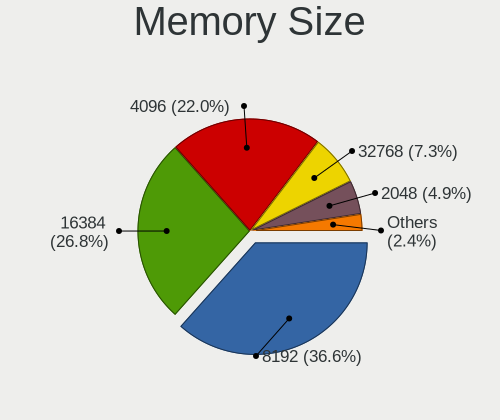
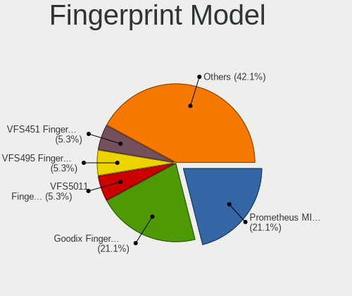

Pop!_OS - Hardware Trends (Notebooks)
-------------------------------------

A project to identify most popular hardware characteristics and track their change
over time based on data collected by Linux users at https://Linux-Hardware.org.

Anyone can contribute to this report by the [hw-probe](https://github.com/linuxhw/hw-probe) tool:

    sudo -E hw-probe -all -upload

This report is for one last month. Overall report since the beginning of time: [TestDays](https://github.com/linuxhw/TestDays)

Period: Oct, 2023.

Contents
--------

* [ System ](#system)
  - [ OS                       ](#os)
  - [ OS Family                ](#os-family)
  - [ Kernel                   ](#kernel)
  - [ Kernel Family            ](#kernel-family)
  - [ Kernel Major Ver.        ](#kernel-major-ver)
  - [ Arch                     ](#arch)
  - [ DE                       ](#de)
  - [ Display Server           ](#display-server)
  - [ Display Manager          ](#display-manager)
  - [ OS Lang                  ](#os-lang)
  - [ Boot Mode                ](#boot-mode)
  - [ Filesystem               ](#filesystem)
  - [ Part. scheme             ](#part-scheme)
  - [ Dual Boot with Linux/BSD ](#dual-boot-with-linuxbsd)
  - [ Dual Boot (Win)          ](#dual-boot-win)

* [ Board ](#board)
  - [ Vendor                   ](#vendor)
  - [ Model                    ](#model)
  - [ Model Family             ](#model-family)
  - [ MFG Year                 ](#mfg-year)
  - [ Form Factor              ](#form-factor)
  - [ Secure Boot              ](#secure-boot)
  - [ Coreboot                 ](#coreboot)
  - [ RAM Size                 ](#ram-size)
  - [ RAM Used                 ](#ram-used)
  - [ Total Drives             ](#total-drives)
  - [ Has CD-ROM               ](#has-cd-rom)
  - [ Has Ethernet             ](#has-ethernet)
  - [ Has WiFi                 ](#has-wifi)
  - [ Has Bluetooth            ](#has-bluetooth)

* [ Location ](#location)
  - [ Country                  ](#country)
  - [ City                     ](#city)

* [ Drives ](#drives)
  - [ Drive Vendor             ](#drive-vendor)
  - [ Drive Model              ](#drive-model)
  - [ HDD Vendor               ](#hdd-vendor)
  - [ SSD Vendor               ](#ssd-vendor)
  - [ Drive Kind               ](#drive-kind)
  - [ Drive Connector          ](#drive-connector)
  - [ Drive Size               ](#drive-size)
  - [ Space Total              ](#space-total)
  - [ Space Used               ](#space-used)
  - [ Malfunc. Drives          ](#malfunc-drives)
  - [ Malfunc. Drive Vendor    ](#malfunc-drive-vendor)
  - [ Malfunc. HDD Vendor      ](#malfunc-hdd-vendor)
  - [ Malfunc. Drive Kind      ](#malfunc-drive-kind)
  - [ Failed Drives            ](#failed-drives)
  - [ Failed Drive Vendor      ](#failed-drive-vendor)
  - [ Drive Status             ](#drive-status)

* [ Storage controller ](#storage-controller)
  - [ Storage Vendor           ](#storage-vendor)
  - [ Storage Model            ](#storage-model)
  - [ Storage Kind             ](#storage-kind)

* [ Processor ](#processor)
  - [ CPU Vendor               ](#cpu-vendor)
  - [ CPU Model                ](#cpu-model)
  - [ CPU Model Family         ](#cpu-model-family)
  - [ CPU Cores                ](#cpu-cores)
  - [ CPU Sockets              ](#cpu-sockets)
  - [ CPU Threads              ](#cpu-threads)
  - [ CPU Op-Modes             ](#cpu-op-modes)
  - [ CPU Microcode            ](#cpu-microcode)
  - [ CPU Microarch            ](#cpu-microarch)

* [ Graphics ](#graphics)
  - [ GPU Vendor               ](#gpu-vendor)
  - [ GPU Model                ](#gpu-model)
  - [ GPU Combo                ](#gpu-combo)
  - [ GPU Driver               ](#gpu-driver)
  - [ GPU Memory               ](#gpu-memory)

* [ Monitor ](#monitor)
  - [ Monitor Vendor           ](#monitor-vendor)
  - [ Monitor Model            ](#monitor-model)
  - [ Monitor Resolution       ](#monitor-resolution)
  - [ Monitor Diagonal         ](#monitor-diagonal)
  - [ Monitor Width            ](#monitor-width)
  - [ Aspect Ratio             ](#aspect-ratio)
  - [ Monitor Area             ](#monitor-area)
  - [ Pixel Density            ](#pixel-density)
  - [ Multiple Monitors        ](#multiple-monitors)

* [ Network ](#network)
  - [ Net Controller Vendor    ](#net-controller-vendor)
  - [ Net Controller Model     ](#net-controller-model)
  - [ Wireless Vendor          ](#wireless-vendor)
  - [ Wireless Model           ](#wireless-model)
  - [ Ethernet Vendor          ](#ethernet-vendor)
  - [ Ethernet Model           ](#ethernet-model)
  - [ Net Controller Kind      ](#net-controller-kind)
  - [ Used Controller          ](#used-controller)
  - [ NICs                     ](#nics)
  - [ IPv6                     ](#ipv6)

* [ Bluetooth ](#bluetooth)
  - [ Bluetooth Vendor         ](#bluetooth-vendor)
  - [ Bluetooth Model          ](#bluetooth-model)

* [ Sound ](#sound)
  - [ Sound Vendor             ](#sound-vendor)
  - [ Sound Model              ](#sound-model)

* [ Memory ](#memory)
  - [ Memory Vendor            ](#memory-vendor)
  - [ Memory Model             ](#memory-model)
  - [ Memory Kind              ](#memory-kind)
  - [ Memory Form Factor       ](#memory-form-factor)
  - [ Memory Size              ](#memory-size)
  - [ Memory Speed             ](#memory-speed)

* [ Printers & scanners ](#printers--scanners)
  - [ Printer Vendor           ](#printer-vendor)
  - [ Printer Model            ](#printer-model)
  - [ Scanner Vendor           ](#scanner-vendor)
  - [ Scanner Model            ](#scanner-model)

* [ Camera ](#camera)
  - [ Camera Vendor            ](#camera-vendor)
  - [ Camera Model             ](#camera-model)

* [ Security ](#security)
  - [ Fingerprint Vendor       ](#fingerprint-vendor)
  - [ Fingerprint Model        ](#fingerprint-model)
  - [ Chipcard Vendor          ](#chipcard-vendor)
  - [ Chipcard Model           ](#chipcard-model)

* [ Unsupported ](#unsupported)
  - [ Unsupported Devices      ](#unsupported-devices)
  - [ Unsupported Device Types ](#unsupported-device-types)

System
------

OS
--

Installed operating systems

| Name          | Notebooks | Percent |
|---------------|-----------|---------|
| Pop!_OS 22.04 | 120       | 99.17%  |
| Pop!_OS 20.04 | 1         | 0.83%   |

OS Family
---------

OS without a version

| Name    | Notebooks | Percent |
|---------|-----------|---------|
| Pop!_OS | 121       | 100%    |

Kernel
------

Version of the Linux kernel

| Version                  | Notebooks | Percent |
|--------------------------|-----------|---------|
| 6.5.4-76060504-generic   | 47        | 38.84%  |
| 6.5.6-76060506-generic   | 33        | 27.27%  |
| 6.4.6-76060406-generic   | 28        | 23.14%  |
| 6.2.6-76060206-generic   | 7         | 5.79%   |
| 6.5.7-060507-generic     | 1         | 0.83%   |
| 6.2.0-76060200-generic   | 1         | 0.83%   |
| 6.0.12-76060012-generic  | 1         | 0.83%   |
| 6.0.12-76060006-generic  | 1         | 0.83%   |
| 5.19.0-76051900-generic  | 1         | 0.83%   |
| 5.17.15-76051715-generic | 1         | 0.83%   |

Kernel Family
-------------

Linux kernel without a distro release

| Version | Notebooks | Percent |
|---------|-----------|---------|
| 6.5.4   | 47        | 38.84%  |
| 6.5.6   | 33        | 27.27%  |
| 6.4.6   | 28        | 23.14%  |
| 6.2.6   | 7         | 5.79%   |
| 6.0.12  | 2         | 1.65%   |
| 6.5.7   | 1         | 0.83%   |
| 6.2.0   | 1         | 0.83%   |
| 5.19.0  | 1         | 0.83%   |
| 5.17.15 | 1         | 0.83%   |

Kernel Major Ver.
-----------------

Linux kernel major version

| Version | Notebooks | Percent |
|---------|-----------|---------|
| 6.5     | 81        | 66.94%  |
| 6.4     | 28        | 23.14%  |
| 6.2     | 8         | 6.61%   |
| 6.0     | 2         | 1.65%   |
| 5.19    | 1         | 0.83%   |
| 5.17    | 1         | 0.83%   |

Arch
----

OS architecture (x86_64, i586, etc.)

| Name   | Notebooks | Percent |
|--------|-----------|---------|
| x86_64 | 121       | 100%    |

DE
--

Desktop Environment

| Name  | Notebooks | Percent |
|-------|-----------|---------|
| GNOME | 121       | 100%    |

Display Server
--------------

X11 or Wayland

| Name    | Notebooks | Percent |
|---------|-----------|---------|
| X11     | 113       | 93.39%  |
| Wayland | 8         | 6.61%   |

Display Manager
---------------

SDDM, LightDM, etc.

| Name    | Notebooks | Percent |
|---------|-----------|---------|
| Unknown | 86        | 71.07%  |
| GDM3    | 35        | 28.93%  |

OS Lang
-------

Language

| Lang  | Notebooks | Percent |
|-------|-----------|---------|
| en_US | 75        | 61.98%  |
| pt_BR | 7         | 5.79%   |
| fr_FR | 6         | 4.96%   |
| de_DE | 6         | 4.96%   |
| en_AU | 5         | 4.13%   |
| C     | 5         | 4.13%   |
| nb_NO | 3         | 2.48%   |
| en_GB | 3         | 2.48%   |
| it_IT | 2         | 1.65%   |
| en_IN | 2         | 1.65%   |
| en_CA | 2         | 1.65%   |
| tr_TR | 1         | 0.83%   |
| pl_PL | 1         | 0.83%   |
| fr_CA | 1         | 0.83%   |
| en_NZ | 1         | 0.83%   |
| en_DK | 1         | 0.83%   |

Boot Mode
---------

EFI or BIOS

| Mode | Notebooks | Percent |
|------|-----------|---------|
| BIOS | 87        | 71.9%   |
| EFI  | 34        | 28.1%   |

Filesystem
----------

Type of filesystem

| Type    | Notebooks | Percent |
|---------|-----------|---------|
| Ext4    | 118       | 97.52%  |
| Btrfs   | 2         | 1.65%   |
| Overlay | 1         | 0.83%   |

Part. scheme
------------

Scheme of partitioning

| Type    | Notebooks | Percent |
|---------|-----------|---------|
| Unknown | 86        | 71.07%  |
| GPT     | 34        | 28.1%   |
| MBR     | 1         | 0.83%   |

Dual Boot with Linux/BSD
------------------------

Hosting more than one Linux/BSD

| Dual boot | Notebooks | Percent |
|-----------|-----------|---------|
| No        | 118       | 97.52%  |
| Yes       | 3         | 2.48%   |

Dual Boot (Win)
---------------

Hosting Linux and Windows

| Dual boot | Notebooks | Percent |
|-----------|-----------|---------|
| No        | 108       | 89.26%  |
| Yes       | 13        | 10.74%  |

Board
-----

Vendor
------

Motherboard manufacturer

| Name                | Notebooks | Percent |
|---------------------|-----------|---------|
| Lenovo              | 24        | 19.83%  |
| Hewlett-Packard     | 17        | 14.05%  |
| ASUSTek Computer    | 16        | 13.22%  |
| Dell                | 15        | 12.4%   |
| Acer                | 11        | 9.09%   |
| Apple               | 9         | 7.44%   |
| System76            | 6         | 4.96%   |
| MSI                 | 5         | 4.13%   |
| Samsung Electronics | 2         | 1.65%   |
| Gigabyte Technology | 2         | 1.65%   |
| Toshiba             | 1         | 0.83%   |
| SLIMBOOK            | 1         | 0.83%   |
| Razer               | 1         | 0.83%   |
| Panasonic           | 1         | 0.83%   |
| Notebook            | 1         | 0.83%   |
| MECHREVO            | 1         | 0.83%   |
| Maibenben           | 1         | 0.83%   |
| HUAWEI              | 1         | 0.83%   |
| HONOR               | 1         | 0.83%   |
| Haier               | 1         | 0.83%   |
| Google              | 1         | 0.83%   |
| Gateway             | 1         | 0.83%   |
| EUROCOM             | 1         | 0.83%   |
| Alienware           | 1         | 0.83%   |

Model
-----

Motherboard model

| Name                                     | Notebooks | Percent |
|------------------------------------------|-----------|---------|
| Apple MacBookAir6,2                      | 4         | 3.31%   |
| System76 Darter Pro                      | 2         | 1.65%   |
| Lenovo ThinkBook 15 G2 ARE 20VG          | 2         | 1.65%   |
| Dell Latitude 5520                       | 2         | 1.65%   |
| Toshiba Satellite C70D-B                 | 1         | 0.83%   |
| System76 Serval WS                       | 1         | 0.83%   |
| System76 Lemur Pro                       | 1         | 0.83%   |
| System76 Gazelle                         | 1         | 0.83%   |
| System76 Adder WS                        | 1         | 0.83%   |
| SLIMBOOK TITAN                           | 1         | 0.83%   |
| Samsung 550XCJ/550XCR                    | 1         | 0.83%   |
| Samsung 355V4C/356V4C/3445VC/3545VC      | 1         | 0.83%   |
| Razer Blade                              | 1         | 0.83%   |
| Panasonic CF-31SBM08DM                   | 1         | 0.83%   |
| Notebook P9XXEN_EF_ED                    | 1         | 0.83%   |
| MSI Sword 15 A11UD                       | 1         | 0.83%   |
| MSI GP66 Leopard 11UG                    | 1         | 0.83%   |
| MSI GF65 Thin 9SEXR                      | 1         | 0.83%   |
| MSI GE62 2QF                             | 1         | 0.83%   |
| MSI Cyborg 15 A12VF                      | 1         | 0.83%   |
| MECHREVO WUJIE14 PRO                     | 1         | 0.83%   |
| Maibenben MaiBook X series               | 1         | 0.83%   |
| Lenovo Z50-70 20354                      | 1         | 0.83%   |
| Lenovo Yoga Slim 7 Pro 14ACH5 82MS       | 1         | 0.83%   |
| Lenovo Yoga 7 16ARP8 83BS                | 1         | 0.83%   |
| Lenovo Y50-70 20378                      | 1         | 0.83%   |
| Lenovo V15 G2 ALC 82KD                   | 1         | 0.83%   |
| Lenovo ThinkPad X1 Carbon 7th 20QD00L7GE | 1         | 0.83%   |
| Lenovo ThinkPad W540 20BG001EUK          | 1         | 0.83%   |
| Lenovo ThinkPad T480 20L6S68T00          | 1         | 0.83%   |
| Lenovo ThinkPad T480 20L50011US          | 1         | 0.83%   |
| Lenovo ThinkPad T14s Gen 4 21F8CTO1WW    | 1         | 0.83%   |
| Lenovo ThinkPad P1 Gen 6 21FV002HUS      | 1         | 0.83%   |
| Lenovo ThinkPad L14 Gen 2a 20X50038MH    | 1         | 0.83%   |
| Lenovo ThinkPad E14 Gen 4 21E30061CK     | 1         | 0.83%   |
| Lenovo ThinkBook 14 G4 IAP 21DH          | 1         | 0.83%   |
| Lenovo Legion R7000P APH8 82Y9           | 1         | 0.83%   |
| Lenovo Legion 5 15IMH05H 81Y6            | 1         | 0.83%   |
| Lenovo IdeaPad Y700-15ACZ 80NY           | 1         | 0.83%   |
| Lenovo IdeaPad S145-15API 81V7           | 1         | 0.83%   |

Model Family
------------

Motherboard model prefix

| Name                   | Notebooks | Percent |
|------------------------|-----------|---------|
| Acer Aspire            | 9         | 7.44%   |
| Lenovo ThinkPad        | 8         | 6.61%   |
| Dell Inspiron          | 7         | 5.79%   |
| Dell Latitude          | 6         | 4.96%   |
| Lenovo IdeaPad         | 5         | 4.13%   |
| ASUS VivoBook          | 5         | 4.13%   |
| Apple MacBookAir6      | 4         | 3.31%   |
| Lenovo ThinkBook       | 3         | 2.48%   |
| HP ProBook             | 3         | 2.48%   |
| HP Pavilion            | 3         | 2.48%   |
| System76 Darter        | 2         | 1.65%   |
| Lenovo Yoga            | 2         | 1.65%   |
| Lenovo Legion          | 2         | 1.65%   |
| HP ZBook               | 2         | 1.65%   |
| HP Laptop              | 2         | 1.65%   |
| HP EliteBook           | 2         | 1.65%   |
| Dell XPS               | 2         | 1.65%   |
| ASUS Zenbook           | 2         | 1.65%   |
| ASUS ASUS              | 2         | 1.65%   |
| Apple MacBookPro11     | 2         | 1.65%   |
| Toshiba Satellite      | 1         | 0.83%   |
| System76 Serval        | 1         | 0.83%   |
| System76 Lemur         | 1         | 0.83%   |
| System76 Gazelle       | 1         | 0.83%   |
| System76 Adder         | 1         | 0.83%   |
| SLIMBOOK TITAN         | 1         | 0.83%   |
| Samsung 550XCJ         | 1         | 0.83%   |
| Samsung 355V4C         | 1         | 0.83%   |
| Razer Blade            | 1         | 0.83%   |
| Panasonic CF-31SBM08DM | 1         | 0.83%   |
| Notebook P9XXEN        | 1         | 0.83%   |
| MSI Sword              | 1         | 0.83%   |
| MSI GP66               | 1         | 0.83%   |
| MSI GF65               | 1         | 0.83%   |
| MSI GE62               | 1         | 0.83%   |
| MSI Cyborg             | 1         | 0.83%   |
| MECHREVO WUJIE14       | 1         | 0.83%   |
| Maibenben MaiBook      | 1         | 0.83%   |
| Lenovo Z50-70          | 1         | 0.83%   |
| Lenovo Y50-70          | 1         | 0.83%   |

MFG Year
--------

Motherboard manufacture year

| Year | Notebooks | Percent |
|------|-----------|---------|
| 2021 | 19        | 15.7%   |
| 2023 | 18        | 14.88%  |
| 2020 | 13        | 10.74%  |
| 2022 | 12        | 9.92%   |
| 2013 | 11        | 9.09%   |
| 2019 | 10        | 8.26%   |
| 2014 | 9         | 7.44%   |
| 2018 | 6         | 4.96%   |
| 2015 | 6         | 4.96%   |
| 2012 | 4         | 3.31%   |
| 2017 | 3         | 2.48%   |
| 2016 | 3         | 2.48%   |
| 2011 | 3         | 2.48%   |
| 2010 | 3         | 2.48%   |
| 2009 | 1         | 0.83%   |

Form Factor
-----------

Physical design of the computer

| Name     | Notebooks | Percent |
|----------|-----------|---------|
| Notebook | 121       | 100%    |

Secure Boot
-----------

Enabled or disabled

| State    | Notebooks | Percent |
|----------|-----------|---------|
| Disabled | 121       | 100%    |

Coreboot
--------

Have coreboot on board

| Used | Notebooks | Percent |
|------|-----------|---------|
| No   | 114       | 94.21%  |
| Yes  | 7         | 5.79%   |

RAM Size
--------

Total RAM memory

| Size in GB  | Notebooks | Percent |
|-------------|-----------|---------|
| 16.01-24.0  | 34        | 28.1%   |
| 4.01-8.0    | 32        | 26.45%  |
| 8.01-16.0   | 24        | 19.83%  |
| 32.01-64.0  | 10        | 8.26%   |
| 3.01-4.0    | 9         | 7.44%   |
| 64.01-256.0 | 6         | 4.96%   |
| 24.01-32.0  | 5         | 4.13%   |
| 1.01-2.0    | 1         | 0.83%   |

RAM Used
--------

Used RAM memory

| Used GB    | Notebooks | Percent |
|------------|-----------|---------|
| 4.01-8.0   | 55        | 45.45%  |
| 3.01-4.0   | 28        | 23.14%  |
| 2.01-3.0   | 23        | 19.01%  |
| 8.01-16.0  | 10        | 8.26%   |
| 1.01-2.0   | 4         | 3.31%   |
| 16.01-24.0 | 1         | 0.83%   |

Total Drives
------------

Number of drives on board

| Drives | Notebooks | Percent |
|--------|-----------|---------|
| 1      | 83        | 68.6%   |
| 2      | 34        | 28.1%   |
| 3      | 4         | 3.31%   |

Has CD-ROM
----------

Has CD-ROM on board

| Presented | Notebooks | Percent |
|-----------|-----------|---------|
| No        | 100       | 82.64%  |
| Yes       | 21        | 17.36%  |

Has Ethernet
------------

Has Ethernet on board

| Presented | Notebooks | Percent |
|-----------|-----------|---------|
| Yes       | 87        | 71.9%   |
| No        | 34        | 28.1%   |

Has WiFi
--------

Has WiFi module

| Presented | Notebooks | Percent |
|-----------|-----------|---------|
| Yes       | 119       | 98.35%  |
| No        | 2         | 1.65%   |

Has Bluetooth
-------------

Has Bluetooth module

| Presented | Notebooks | Percent |
|-----------|-----------|---------|
| Yes       | 109       | 90.08%  |
| No        | 12        | 9.92%   |

Location
--------

Country
-------

Geographic location (country)

| Country       | Notebooks | Percent |
|---------------|-----------|---------|
| USA           | 32        | 26.45%  |
| Brazil        | 10        | 8.26%   |
| Germany       | 7         | 5.79%   |
| India         | 6         | 4.96%   |
| France        | 6         | 4.96%   |
| Canada        | 6         | 4.96%   |
| UK            | 5         | 4.13%   |
| Australia     | 5         | 4.13%   |
| Norway        | 4         | 3.31%   |
| Italy         | 4         | 3.31%   |
| Sweden        | 2         | 1.65%   |
| Russia        | 2         | 1.65%   |
| Poland        | 2         | 1.65%   |
| Netherlands   | 2         | 1.65%   |
| Finland       | 2         | 1.65%   |
| Czechia       | 2         | 1.65%   |
| Uzbekistan    | 1         | 0.83%   |
| Turkey        | 1         | 0.83%   |
| Thailand      | 1         | 0.83%   |
| Switzerland   | 1         | 0.83%   |
| Sri Lanka     | 1         | 0.83%   |
| Spain         | 1         | 0.83%   |
| South Africa  | 1         | 0.83%   |
| Serbia        | 1         | 0.83%   |
| Romania       | 1         | 0.83%   |
| Portugal      | 1         | 0.83%   |
| New Zealand   | 1         | 0.83%   |
| Latvia        | 1         | 0.83%   |
| Kuwait        | 1         | 0.83%   |
| Kazakhstan    | 1         | 0.83%   |
| Indonesia     | 1         | 0.83%   |
| Hong Kong     | 1         | 0.83%   |
| Greece        | 1         | 0.83%   |
| Ghana         | 1         | 0.83%   |
| French Guiana | 1         | 0.83%   |
| Denmark       | 1         | 0.83%   |
| Bulgaria      | 1         | 0.83%   |
| Belgium       | 1         | 0.83%   |
| Belarus       | 1         | 0.83%   |
| Argentina     | 1         | 0.83%   |

City
----

Geographic location (city)

| City                  | Notebooks | Percent |
|-----------------------|-----------|---------|
| Warsaw                | 2         | 1.65%   |
| Melbourne             | 2         | 1.65%   |
| Louisville            | 2         | 1.65%   |
| Hyderabad             | 2         | 1.65%   |
| Helsinki              | 2         | 1.65%   |
| Charlotte             | 2         | 1.65%   |
| Bodø                 | 2         | 1.65%   |
| Yekaterinburg         | 1         | 0.83%   |
| Waterbury             | 1         | 0.83%   |
| Wanchai               | 1         | 0.83%   |
| Virginia Beach        | 1         | 0.83%   |
| Vestal                | 1         | 0.83%   |
| Ust-Kamenogorsk       | 1         | 0.83%   |
| Urgench               | 1         | 0.83%   |
| Uberlândia           | 1         | 0.83%   |
| Trondheim             | 1         | 0.83%   |
| Toulouse              | 1         | 0.83%   |
| Tokat Province        | 1         | 0.83%   |
| Tauranga              | 1         | 0.83%   |
| Sydney                | 1         | 0.83%   |
| Stratford             | 1         | 0.83%   |
| Stockholm             | 1         | 0.83%   |
| St Petersburg         | 1         | 0.83%   |
| Spring                | 1         | 0.83%   |
| Sofia                 | 1         | 0.83%   |
| Simi Valley           | 1         | 0.83%   |
| Sao Paulo             | 1         | 0.83%   |
| Sao Jose do Rio Preto | 1         | 0.83%   |
| Sao Bernardo do Campo | 1         | 0.83%   |
| Santos                | 1         | 0.83%   |
| Saint-Constant        | 1         | 0.83%   |
| Rio de Janeiro        | 1         | 0.83%   |
| Riga                  | 1         | 0.83%   |
| Remire-Montjoly       | 1         | 0.83%   |
| Regina                | 1         | 0.83%   |
| Pune                  | 1         | 0.83%   |
| Prague                | 1         | 0.83%   |
| Porto Alegre          | 1         | 0.83%   |
| Porto                 | 1         | 0.83%   |
| Ponchatoula           | 1         | 0.83%   |

Drives
------

Drive Vendor
------------

Hard drive vendors

| Vendor                         | Notebooks | Drives | Percent |
|--------------------------------|-----------|--------|---------|
| Samsung Electronics            | 34        | 41     | 21.94%  |
| SanDisk                        | 17        | 18     | 10.97%  |
| WDC                            | 8         | 8      | 5.16%   |
| Seagate                        | 8         | 9      | 5.16%   |
| Micron Technology              | 7         | 7      | 4.52%   |
| Kingston                       | 7         | 7      | 4.52%   |
| Apple                          | 7         | 7      | 4.52%   |
| Toshiba                        | 6         | 6      | 3.87%   |
| SK hynix                       | 6         | 6      | 3.87%   |
| KIOXIA                         | 5         | 5      | 3.23%   |
| Phison Electronics             | 4         | 4      | 2.58%   |
| Unknown                        | 3         | 4      | 1.94%   |
| Intel                          | 3         | 3      | 1.94%   |
| HGST                           | 3         | 4      | 1.94%   |
| KingSpec                       | 2         | 2      | 1.29%   |
| Hitachi                        | 2         | 2      | 1.29%   |
| Crucial                        | 2         | 2      | 1.29%   |
| China                          | 2         | 2      | 1.29%   |
| ADATA Technology               | 2         | 2      | 1.29%   |
| Yangtze Memory Technologies    | 1         | 1      | 0.65%   |
| Yangtze Memory                 | 1         | 1      | 0.65%   |
| UMIS                           | 1         | 1      | 0.65%   |
| Team                           | 1         | 1      | 0.65%   |
| Solid State Storage Technology | 1         | 1      | 0.65%   |
| Solid State Storage            | 1         | 1      | 0.65%   |
| Silicon Motion                 | 1         | 1      | 0.65%   |
| Seapiy                         | 1         | 1      | 0.65%   |
| SABRENT                        | 1         | 1      | 0.65%   |
| Realtek Semiconductor          | 1         | 1      | 0.65%   |
| PNY                            | 1         | 1      | 0.65%   |
| Phison                         | 1         | 1      | 0.65%   |
| Netac SS                       | 1         | 1      | 0.65%   |
| Netac                          | 1         | 1      | 0.65%   |
| LITEONIT                       | 1         | 1      | 0.65%   |
| LITEON                         | 1         | 1      | 0.65%   |
| KIOXIA-EXCERIA                 | 1         | 1      | 0.65%   |
| Kingston Technology Company    | 1         | 1      | 0.65%   |
| Intenso                        | 1         | 1      | 0.65%   |
| Integral                       | 1         | 1      | 0.65%   |
| Hewlett-Packard                | 1         | 1      | 0.65%   |

Drive Model
-----------

Hard drive models

| Model                                               | Notebooks | Percent |
|-----------------------------------------------------|-----------|---------|
| Samsung NVMe SSD Controller SM981/PM981/PM983 1TB   | 5         | 3.07%   |
| Samsung NVMe SSD Controller PM9A1/PM9A3/980PRO 1TB  | 5         | 3.07%   |
| Sandisk WD Black SN750 / PC SN730 NVMe SSD 1024GB   | 3         | 1.84%   |
| Intel SSD 660P Series 1024GB                        | 3         | 1.84%   |
| Toshiba MQ04ABF100 1TB                              | 2         | 1.23%   |
| Seagate ST1000LM024 HN-M101MBB 1TB                  | 2         | 1.23%   |
| SanDisk NVMe SSD Drive 512GB                        | 2         | 1.23%   |
| Samsung SSD 980 PRO 2TB                             | 2         | 1.23%   |
| Samsung NVMe SSD Controller SM961/PM961/SM963 121GB | 2         | 1.23%   |
| Samsung MZALQ512HBLU-00BL2 512GB                    | 2         | 1.23%   |
| Phison E12 NVMe Controller 1TB                      | 2         | 1.23%   |
| Micron 2210_MTFDHBA512QFD 512GB                     | 2         | 1.23%   |
| Apple SSD SD0128F 121GB                             | 2         | 1.23%   |
| Yangtze Memory ZHITAI PC005 Active 1TB              | 1         | 0.61%   |
| Yangtze Memory YMTC PC300-512GB-B                   | 1         | 0.61%   |
| WDC WDS500G2B0A-00SM50 500GB SSD                    | 1         | 0.61%   |
| WDC WDS240G2G0C-00AJM0 240GB                        | 1         | 0.61%   |
| WDC WD5000LPLX-75ZNTT0 500GB                        | 1         | 0.61%   |
| WDC WD5000BPVT-22HXZT3 500GB                        | 1         | 0.61%   |
| WDC WD1200BEVT-75ZCT2 120GB                         | 1         | 0.61%   |
| WDC WD10SPZX-75Z10T3 1TB                            | 1         | 0.61%   |
| WDC WD10SPZX-60Z10T0 1TB                            | 1         | 0.61%   |
| WDC WD Green M.2 2280 240GB                         | 1         | 0.61%   |
| Unknown SD256  256GB                                | 1         | 0.61%   |
| Unknown NVMe SSD Drive 2TB                          | 1         | 0.61%   |
| Unknown MMC Card  32GB                              | 1         | 0.61%   |
| Unknown MMC Card  256GB                             | 1         | 0.61%   |
| UMIS RPEYJ1T24MKN2QWY 1TB                           | 1         | 0.61%   |
| Toshiba XG6 NVMe SSD Controller 256GB               | 1         | 0.61%   |
| Toshiba THNSNJ128G8NU 128GB SSD                     | 1         | 0.61%   |
| Toshiba MQ01ABD100 1TB                              | 1         | 0.61%   |
| Toshiba KXG60ZNV512G NVMe 512GB                     | 1         | 0.61%   |
| Team T2531TB SSD                                    | 1         | 0.61%   |
| Solid State Storage CL4-3D256-Q11 NVMe SSSTC 256GB  | 1         | 0.61%   |
| Solid State Storage SSSTC CL1-4D256 256GB           | 1         | 0.61%   |
| SK hynix SH920 mSATA 256GB SSD                      | 1         | 0.61%   |
| SK hynix PC801 NVMe 1TB                             | 1         | 0.61%   |
| SK hynix HFM512GDJTNI-82A0A 512GB                   | 1         | 0.61%   |
| SK hynix HFM512GD3JX013N 512GB                      | 1         | 0.61%   |
| SK hynix HFM256GDJTNG-8310A 256GB                   | 1         | 0.61%   |

HDD Vendor
----------

Hard disk drive vendors

| Vendor   | Notebooks | Drives | Percent |
|----------|-----------|--------|---------|
| Seagate  | 8         | 8      | 36.36%  |
| WDC      | 5         | 5      | 22.73%  |
| Toshiba  | 3         | 3      | 13.64%  |
| HGST     | 3         | 4      | 13.64%  |
| Hitachi  | 2         | 2      | 9.09%   |
| External | 1         | 1      | 4.55%   |

SSD Vendor
----------

Solid state drive vendors

| Vendor              | Notebooks | Drives | Percent |
|---------------------|-----------|--------|---------|
| Samsung Electronics | 10        | 10     | 22.22%  |
| Apple               | 7         | 7      | 15.56%  |
| SanDisk             | 4         | 4      | 8.89%   |
| Kingston            | 4         | 4      | 8.89%   |
| WDC                 | 2         | 2      | 4.44%   |
| KingSpec            | 2         | 2      | 4.44%   |
| China               | 2         | 2      | 4.44%   |
| Toshiba             | 1         | 1      | 2.22%   |
| Team                | 1         | 1      | 2.22%   |
| SK hynix            | 1         | 1      | 2.22%   |
| SABRENT             | 1         | 1      | 2.22%   |
| PNY                 | 1         | 1      | 2.22%   |
| Netac               | 1         | 1      | 2.22%   |
| Micron Technology   | 1         | 1      | 2.22%   |
| LITEONIT            | 1         | 1      | 2.22%   |
| KIOXIA-EXCERIA      | 1         | 1      | 2.22%   |
| Intenso             | 1         | 1      | 2.22%   |
| Integral            | 1         | 1      | 2.22%   |
| Hewlett-Packard     | 1         | 1      | 2.22%   |
| GOODRAM             | 1         | 1      | 2.22%   |
| Crucial             | 1         | 1      | 2.22%   |

Drive Kind
----------

HDD or SSD

| Kind    | Notebooks | Drives | Percent |
|---------|-----------|--------|---------|
| NVMe    | 73        | 90     | 51.05%  |
| SSD     | 42        | 45     | 29.37%  |
| HDD     | 21        | 23     | 14.69%  |
| Unknown | 4         | 4      | 2.8%    |
| MMC     | 3         | 4      | 2.1%    |

Drive Connector
---------------

SATA, SAS, NVMe, etc.

| Type | Notebooks | Drives | Percent |
|------|-----------|--------|---------|
| NVMe | 73        | 90     | 52.52%  |
| SATA | 58        | 66     | 41.73%  |
| SAS  | 5         | 6      | 3.6%    |
| MMC  | 3         | 4      | 2.16%   |

Drive Size
----------

Size of hard drive

| Size in TB | Notebooks | Drives | Percent |
|------------|-----------|--------|---------|
| 0.01-0.5   | 40        | 43     | 62.5%   |
| 0.51-1.0   | 20        | 21     | 31.25%  |
| 1.01-2.0   | 3         | 3      | 4.69%   |
| 4.01-10.0  | 1         | 1      | 1.56%   |

Space Total
-----------

Amount of disk space available on the file system

| Size in GB     | Notebooks | Percent |
|----------------|-----------|---------|
| 101-250        | 47        | 38.84%  |
| 251-500        | 29        | 23.97%  |
| 501-1000       | 26        | 21.49%  |
| 1001-2000      | 11        | 9.09%   |
| More than 3000 | 3         | 2.48%   |
| 2001-3000      | 3         | 2.48%   |
| 1-20           | 1         | 0.83%   |
| 51-100         | 1         | 0.83%   |

Space Used
----------

Amount of used disk space

| Used GB   | Notebooks | Percent |
|-----------|-----------|---------|
| 21-50     | 36        | 29.75%  |
| 1-20      | 29        | 23.97%  |
| 101-250   | 20        | 16.53%  |
| 51-100    | 20        | 16.53%  |
| 251-500   | 8         | 6.61%   |
| 501-1000  | 4         | 3.31%   |
| 1001-2000 | 3         | 2.48%   |
| 2001-3000 | 1         | 0.83%   |

Malfunc. Drives
---------------

Drive models with a malfunction

| Model                  | Notebooks | Drives | Percent |
|------------------------|-----------|--------|---------|
| LITEON CL1-8D512 512GB | 1         | 1      | 100%    |

Malfunc. Drive Vendor
---------------------

Vendors of faulty drives

| Vendor | Notebooks | Drives | Percent |
|--------|-----------|--------|---------|
| LITEON | 1         | 1      | 100%    |

Malfunc. HDD Vendor
-------------------

Vendors of faulty HDD drives

Zero info for selected period =(

Malfunc. Drive Kind
-------------------

Kinds of faulty drives

| Kind | Notebooks | Drives | Percent |
|------|-----------|--------|---------|
| NVMe | 1         | 1      | 100%    |

Failed Drives
-------------

Failed drive models

Zero info for selected period =(

Failed Drive Vendor
-------------------

Failed drive vendors

Zero info for selected period =(

Drive Status
------------

Number of failed and malfunc. drives

| Status   | Notebooks | Drives | Percent |
|----------|-----------|--------|---------|
| Detected | 93        | 122    | 73.23%  |
| Works    | 33        | 43     | 25.98%  |
| Malfunc  | 1         | 1      | 0.79%   |

Storage controller
------------------

Storage Vendor
--------------

Storage controller vendors

| Vendor                                  | Notebooks | Percent |
|-----------------------------------------|-----------|---------|
| Intel                                   | 48        | 29.63%  |
| Samsung Electronics                     | 30        | 18.52%  |
| AMD                                     | 23        | 14.2%   |
| SanDisk                                 | 14        | 8.64%   |
| Phison Electronics                      | 6         | 3.7%    |
| Micron Technology                       | 6         | 3.7%    |
| SK hynix                                | 5         | 3.09%   |
| KIOXIA                                  | 4         | 2.47%   |
| Kingston Technology Company             | 4         | 2.47%   |
| Toshiba America Info Systems            | 3         | 1.85%   |
| Marvell Technology Group                | 3         | 1.85%   |
| ADATA Technology                        | 3         | 1.85%   |
| Yangtze Memory Technologies             | 2         | 1.23%   |
| Solid State Storage Technology          | 2         | 1.23%   |
| Nvidia                                  | 2         | 1.23%   |
| Solidigm                                | 1         | 0.62%   |
| Silicon Motion                          | 1         | 0.62%   |
| Shenzhen Unionmemory Information System | 1         | 0.62%   |
| Realtek Semiconductor                   | 1         | 0.62%   |
| Micron/Crucial Technology               | 1         | 0.62%   |
| Lite-On Technology                      | 1         | 0.62%   |
| ASMedia Technology                      | 1         | 0.62%   |

Storage Model
-------------

Storage controller models

| Model                                                                          | Notebooks | Percent |
|--------------------------------------------------------------------------------|-----------|---------|
| AMD FCH SATA Controller [AHCI mode]                                            | 22        | 13.17%  |
| Samsung NVMe SSD Controller PM9A1/PM9A3/980PRO                                 | 10        | 5.99%   |
| Samsung NVMe SSD Controller SM981/PM981/PM983                                  | 7         | 4.19%   |
| Samsung NVMe SSD Controller 980 (DRAM-less)                                    | 6         | 3.59%   |
| Intel 8 Series/C220 Series Chipset Family 6-port SATA Controller 1 [AHCI mode] | 5         | 2.99%   |
| Intel 8 Series SATA Controller 1 [AHCI mode]                                   | 5         | 2.99%   |
| Intel Volume Management Device NVMe RAID Controller                            | 4         | 2.4%    |
| Intel Sunrise Point-LP SATA Controller [AHCI mode]                             | 4         | 2.4%    |
| Intel 7 Series Chipset Family 6-port SATA Controller [AHCI mode]               | 4         | 2.4%    |
| Toshiba America Info Systems XG6 NVMe SSD Controller                           | 3         | 1.8%    |
| SanDisk Extreme Pro / WD Black SN750 / PC SN730 / Red SN700 NVMe SSD           | 3         | 1.8%    |
| Samsung NVMe SSD Controller SM961/PM961/SM963                                  | 3         | 1.8%    |
| Marvell Group 88SS9183 PCIe SSD Controller                                     | 3         | 1.8%    |
| KIOXIA NVMe SSD Controller BG5 (DRAM-less)                                     | 3         | 1.8%    |
| Intel SSD 660P Series                                                          | 3         | 1.8%    |
| Intel Comet Lake SATA AHCI Controller                                          | 3         | 1.8%    |
| Intel Cannon Lake Mobile PCH SATA AHCI Controller                              | 3         | 1.8%    |
| Intel 82801 Mobile SATA Controller [RAID mode]                                 | 3         | 1.8%    |
| Intel 6 Series/C200 Series Chipset Family 6 port Mobile SATA AHCI Controller   | 3         | 1.8%    |
| SK hynix BC501 NVMe Solid State Drive                                          | 2         | 1.2%    |
| Sandisk WD PC SN740 NVMe SSD 512GB (DRAM-less)                                 | 2         | 1.2%    |
| SanDisk PC SN530 NVMe SSD (DRAM-less)                                          | 2         | 1.2%    |
| Samsung S4LN058A01[SSUBX] AHCI SSD Controller (Apple slot)                     | 2         | 1.2%    |
| Samsung S4LN053X01 AHCI SSD Controller(Apple slot)                             | 2         | 1.2%    |
| Samsung NVMe SSD Controller PM9B1 (DRAM-less)                                  | 2         | 1.2%    |
| Phison E18 PCIe4 NVMe Controller                                               | 2         | 1.2%    |
| Phison E12 NVMe Controller                                                     | 2         | 1.2%    |
| Micron 2450 NVMe SSD [HendrixV] (DRAM-less)                                    | 2         | 1.2%    |
| Micron 2210 NVMe SSD [Cobain]                                                  | 2         | 1.2%    |
| Intel Wildcat Point-LP SATA Controller [AHCI Mode]                             | 2         | 1.2%    |
| Intel Tiger Lake SATA AHCI Controller                                          | 2         | 1.2%    |
| Intel Alder Lake-P SATA AHCI Controller                                        | 2         | 1.2%    |
| Intel 400 Series Chipset Family SATA AHCI Controller                           | 2         | 1.2%    |
| Yangtze Memory ZHITAI PC005 NVMe SSD                                           | 1         | 0.6%    |
| Yangtze Memory PC300 NVMe SSD (DRAM-less)                                      | 1         | 0.6%    |
| Solidigm P41 Plus NVMe SSD (DRAM-less) [Echo Harbor]                           | 1         | 0.6%    |
| Solid State Storage CL4-8D512 NVMe SSD M.2 (DRAM-less)                         | 1         | 0.6%    |
| Solid State Storage CL1-3D256-Q11 NVMe SSD M.2                                 | 1         | 0.6%    |
| SK hynix Platinum P41/PC801 NVMe Solid State Drive                             | 1         | 0.6%    |
| SK hynix Gold P31/BC711/PC711 NVMe Solid State Drive                           | 1         | 0.6%    |

Storage Kind
------------

Kind of storage controller (IDE, SATA, NVMe, SAS, ...)

| Kind | Notebooks | Percent |
|------|-----------|---------|
| SATA | 74        | 48.05%  |
| NVMe | 73        | 47.4%   |
| RAID | 7         | 4.55%   |

Processor
---------

CPU Vendor
----------

Processor vendors

| Vendor | Notebooks | Percent |
|--------|-----------|---------|
| Intel  | 83        | 68.6%   |
| AMD    | 38        | 31.4%   |

CPU Model
---------

Processor models

| Model                                         | Notebooks | Percent |
|-----------------------------------------------|-----------|---------|
| Intel 11th Gen Core i7-11800H @ 2.30GHz       | 4         | 3.31%   |
| AMD Ryzen 5 4500U with Radeon Graphics        | 4         | 3.31%   |
| Intel Core i7-9750H CPU @ 2.60GHz             | 3         | 2.48%   |
| Intel 13th Gen Core i9-13900H                 | 3         | 2.48%   |
| AMD Ryzen 5 5500U with Radeon Graphics        | 3         | 2.48%   |
| Intel Core i7-8750H CPU @ 2.20GHz             | 2         | 1.65%   |
| Intel Core i7-6600U CPU @ 2.60GHz             | 2         | 1.65%   |
| Intel Core i7-4720HQ CPU @ 2.60GHz            | 2         | 1.65%   |
| Intel Core i7-10750H CPU @ 2.60GHz            | 2         | 1.65%   |
| Intel Core i5-8350U CPU @ 1.70GHz             | 2         | 1.65%   |
| Intel Core i5-4260U CPU @ 1.40GHz             | 2         | 1.65%   |
| Intel Core i5-4250U CPU @ 1.30GHz             | 2         | 1.65%   |
| Intel 13th Gen Core i9-13900HX                | 2         | 1.65%   |
| Intel 13th Gen Core i7-1355U                  | 2         | 1.65%   |
| Intel 13th Gen Core i5-1340P                  | 2         | 1.65%   |
| Intel 12th Gen Core i7-12700H                 | 2         | 1.65%   |
| Intel 12th Gen Core i5-1235U                  | 2         | 1.65%   |
| Intel 11th Gen Core i7-1165G7 @ 2.80GHz       | 2         | 1.65%   |
| AMD Ryzen 7 PRO 5850U with Radeon Graphics    | 2         | 1.65%   |
| AMD Ryzen 7 3750H with Radeon Vega Mobile Gfx | 2         | 1.65%   |
| Intel Core i7-8565U CPU @ 1.80GHz             | 1         | 0.83%   |
| Intel Core i7-8550U CPU @ 1.80GHz             | 1         | 0.83%   |
| Intel Core i7-7700K CPU @ 4.20GHz             | 1         | 0.83%   |
| Intel Core i7-7700HQ CPU @ 2.80GHz            | 1         | 0.83%   |
| Intel Core i7-5700HQ CPU @ 2.70GHz            | 1         | 0.83%   |
| Intel Core i7-5500U CPU @ 2.40GHz             | 1         | 0.83%   |
| Intel Core i7-4770HQ CPU @ 2.20GHz            | 1         | 0.83%   |
| Intel Core i7-4700MQ CPU @ 2.40GHz            | 1         | 0.83%   |
| Intel Core i7-4700HQ CPU @ 2.40GHz            | 1         | 0.83%   |
| Intel Core i7-4578U CPU @ 3.00GHz             | 1         | 0.83%   |
| Intel Core i7-4510U CPU @ 2.00GHz             | 1         | 0.83%   |
| Intel Core i7-3720QM CPU @ 2.60GHz            | 1         | 0.83%   |
| Intel Core i7-2670QM CPU @ 2.20GHz            | 1         | 0.83%   |
| Intel Core i7-2630QM CPU @ 2.00GHz            | 1         | 0.83%   |
| Intel Core i7-10510U CPU @ 1.80GHz            | 1         | 0.83%   |
| Intel Core i5-8365U CPU @ 1.60GHz             | 1         | 0.83%   |
| Intel Core i5-7200U CPU @ 2.50GHz             | 1         | 0.83%   |
| Intel Core i5-5250U CPU @ 1.60GHz             | 1         | 0.83%   |
| Intel Core i5-5200U CPU @ 2.20GHz             | 1         | 0.83%   |
| Intel Core i5-4310U CPU @ 2.00GHz             | 1         | 0.83%   |

CPU Model Family
----------------

Processor model prefix

| Model            | Notebooks | Percent |
|------------------|-----------|---------|
| Other            | 29        | 23.97%  |
| Intel Core i7    | 26        | 21.49%  |
| Intel Core i5    | 22        | 18.18%  |
| AMD Ryzen 5      | 14        | 11.57%  |
| AMD Ryzen 7      | 10        | 8.26%   |
| AMD Ryzen 7 PRO  | 3         | 2.48%   |
| AMD A10          | 3         | 2.48%   |
| Intel Core i3    | 2         | 1.65%   |
| Intel Core 2 Duo | 2         | 1.65%   |
| Intel Celeron    | 2         | 1.65%   |
| AMD Ryzen 9      | 2         | 1.65%   |
| AMD Ryzen 3      | 1         | 0.83%   |
| AMD FX           | 1         | 0.83%   |
| AMD E2           | 1         | 0.83%   |
| AMD E1           | 1         | 0.83%   |
| AMD E            | 1         | 0.83%   |
| AMD Athlon       | 1         | 0.83%   |

CPU Cores
---------

Number of processor cores

| Number | Notebooks | Percent |
|--------|-----------|---------|
| 2      | 37        | 30.58%  |
| 4      | 30        | 24.79%  |
| 6      | 19        | 15.7%   |
| 8      | 17        | 14.05%  |
| 10     | 6         | 4.96%   |
| 14     | 5         | 4.13%   |
| 12     | 4         | 3.31%   |
| 24     | 2         | 1.65%   |
| 16     | 1         | 0.83%   |

CPU Sockets
-----------

Number of sockets

| Number | Notebooks | Percent |
|--------|-----------|---------|
| 1      | 121       | 100%    |

CPU Threads
-----------

Threads per core (Hyper-Threading)

| Number | Notebooks | Percent |
|--------|-----------|---------|
| 2      | 109       | 90.08%  |
| 1      | 12        | 9.92%   |

CPU Op-Modes
------------

CPU Operation Modes (32-bit, 64-bit)

| Op mode        | Notebooks | Percent |
|----------------|-----------|---------|
| 32-bit, 64-bit | 121       | 100%    |

CPU Microcode
-------------

Microcode number

| Number     | Notebooks | Percent |
|------------|-----------|---------|
| Unknown    | 111       | 91.74%  |
| 0x0a704103 | 3         | 2.48%   |
| 0x0a50000d | 2         | 1.65%   |
| 0x08608103 | 2         | 1.65%   |
| 0x0a404102 | 1         | 0.83%   |
| 0x08600106 | 1         | 0.83%   |
| 0x08600103 | 1         | 0.83%   |

CPU Microarch
-------------

Microarchitecture

| Name             | Notebooks | Percent |
|------------------|-----------|---------|
| Unknown          | 22        | 18.18%  |
| Haswell          | 16        | 13.22%  |
| KabyLake         | 15        | 12.4%   |
| Alderlake Hybrid | 10        | 8.26%   |
| Zen+             | 7         | 5.79%   |
| Zen 3            | 7         | 5.79%   |
| Zen 2            | 5         | 4.13%   |
| IvyBridge        | 5         | 4.13%   |
| TigerLake        | 4         | 3.31%   |
| Icelake          | 4         | 3.31%   |
| CometLake        | 4         | 3.31%   |
| Broadwell        | 4         | 3.31%   |
| SandyBridge      | 3         | 2.48%   |
| Excavator        | 3         | 2.48%   |
| Skylake          | 2         | 1.65%   |
| Penryn           | 2         | 1.65%   |
| Bobcat           | 2         | 1.65%   |
| Zen              | 1         | 0.83%   |
| Westmere         | 1         | 0.83%   |
| Steamroller      | 1         | 0.83%   |
| Silvermont       | 1         | 0.83%   |
| Puma             | 1         | 0.83%   |
| Goldmont plus    | 1         | 0.83%   |

Graphics
--------

GPU Vendor
----------

Vendors of graphics cards

| Vendor | Notebooks | Percent |
|--------|-----------|---------|
| Intel  | 75        | 46.58%  |
| Nvidia | 45        | 27.95%  |
| AMD    | 41        | 25.47%  |

GPU Model
---------

Graphics card models

| Model                                                                | Notebooks | Percent |
|----------------------------------------------------------------------|-----------|---------|
| Intel Haswell-ULT Integrated Graphics Controller                     | 11        | 6.67%   |
| AMD Picasso/Raven 2 [Radeon Vega Series / Radeon Vega Mobile Series] | 7         | 4.24%   |
| Intel TigerLake-H GT1 [UHD Graphics]                                 | 6         | 3.64%   |
| Intel Raptor Lake-P [Iris Xe Graphics]                               | 6         | 3.64%   |
| AMD Cezanne [Radeon Vega Series / Radeon Vega Mobile Series]         | 6         | 3.64%   |
| Nvidia TU106M [GeForce RTX 2060 Mobile]                              | 5         | 3.03%   |
| Intel CoffeeLake-H GT2 [UHD Graphics 630]                            | 5         | 3.03%   |
| AMD Renoir [Radeon RX Vega 6 (Ryzen 4000/5000 Mobile Series)]        | 5         | 3.03%   |
| Intel TigerLake-LP GT2 [Iris Xe Graphics]                            | 4         | 2.42%   |
| Intel Alder Lake-P GT2 [Iris Xe Graphics]                            | 4         | 2.42%   |
| Intel 3rd Gen Core processor Graphics Controller                     | 4         | 2.42%   |
| AMD Phoenix1                                                         | 4         | 2.42%   |
| AMD Lucienne                                                         | 4         | 2.42%   |
| Nvidia GA107M [GeForce RTX 3050 Mobile]                              | 3         | 1.82%   |
| Nvidia GA104M [GeForce RTX 3070 Mobile / Max-Q]                      | 3         | 1.82%   |
| Nvidia AD107M [GeForce RTX 4060 Max-Q / Mobile]                      | 3         | 1.82%   |
| Intel UHD Graphics 620                                               | 3         | 1.82%   |
| Intel CometLake-H GT2 [UHD Graphics]                                 | 3         | 1.82%   |
| Intel Alder Lake-UP3 GT2 [Iris Xe Graphics]                          | 3         | 1.82%   |
| Intel 4th Gen Core Processor Integrated Graphics Controller          | 3         | 1.82%   |
| AMD Wani [Radeon R5/R6/R7 Graphics]                                  | 3         | 1.82%   |
| Nvidia TU117M [GeForce GTX 1650 Mobile / Max-Q]                      | 2         | 1.21%   |
| Nvidia TU116M [GeForce GTX 1660 Ti Mobile]                           | 2         | 1.21%   |
| Nvidia GF116M [GeForce GT 560M]                                      | 2         | 1.21%   |
| Nvidia GA107M [GeForce RTX 3050 Ti Mobile]                           | 2         | 1.21%   |
| Nvidia AD107M [GeForce RTX 4050 Max-Q / Mobile]                      | 2         | 1.21%   |
| Intel WhiskeyLake-U GT2 [UHD Graphics 620]                           | 2         | 1.21%   |
| Intel Skylake GT2 [HD Graphics 520]                                  | 2         | 1.21%   |
| Intel Raptor Lake-S UHD Graphics                                     | 2         | 1.21%   |
| Intel HD Graphics 5500                                               | 2         | 1.21%   |
| Intel CometLake-U GT2 [UHD Graphics]                                 | 2         | 1.21%   |
| AMD Seymour [Radeon HD 6400M/7400M Series]                           | 2         | 1.21%   |
| AMD Rembrandt [Radeon 680M]                                          | 2         | 1.21%   |
| AMD Lexa [Radeon 540X/550X/630 / RX 640 / E9171 MCM]                 | 2         | 1.21%   |
| Nvidia TU117M [GeForce MX550]                                        | 1         | 0.61%   |
| Nvidia TU117M [GeForce GTX 1650 Ti Mobile]                           | 1         | 0.61%   |
| Nvidia MCP89 [GeForce 320M]                                          | 1         | 0.61%   |
| Nvidia GP108M [GeForce MX230]                                        | 1         | 0.61%   |
| Nvidia GP106M [GeForce GTX 1060 Mobile]                              | 1         | 0.61%   |
| Nvidia GP106M [GeForce GTX 1050 Ti Mobile]                           | 1         | 0.61%   |

GPU Combo
---------

Combinations of graphics cards

| Name           | Notebooks | Percent |
|----------------|-----------|---------|
| 1 x Intel      | 44        | 36.36%  |
| Intel + Nvidia | 28        | 23.14%  |
| 1 x AMD        | 25        | 20.66%  |
| AMD + Nvidia   | 9         | 7.44%   |
| 1 x Nvidia     | 8         | 6.61%   |
| 2 x AMD        | 4         | 3.31%   |
| Intel + AMD    | 3         | 2.48%   |

GPU Driver
----------

Free vs proprietary

| Driver      | Notebooks | Percent |
|-------------|-----------|---------|
| Free        | 84        | 69.42%  |
| Proprietary | 33        | 27.27%  |
| Unknown     | 4         | 3.31%   |

GPU Memory
----------

Total video memory

| Size in GB | Notebooks | Percent |
|------------|-----------|---------|
| Unknown    | 108       | 89.26%  |
| 0.01-0.5   | 6         | 4.96%   |
| 1.01-2.0   | 3         | 2.48%   |
| 7.01-8.0   | 1         | 0.83%   |
| 5.01-6.0   | 1         | 0.83%   |
| 3.01-4.0   | 1         | 0.83%   |
| 0.51-1.0   | 1         | 0.83%   |

Monitor
-------

Monitor Vendor
--------------

Monitor vendors

| Vendor              | Notebooks | Percent |
|---------------------|-----------|---------|
| BOE                 | 27        | 19.42%  |
| AU Optronics        | 27        | 19.42%  |
| Chimei Innolux      | 20        | 14.39%  |
| LG Display          | 16        | 11.51%  |
| Samsung Electronics | 11        | 7.91%   |
| Apple               | 7         | 5.04%   |
| Sharp               | 5         | 3.6%    |
| Goldstar            | 4         | 2.88%   |
| InfoVision          | 3         | 2.16%   |
| Dell                | 3         | 2.16%   |
| Iiyama              | 2         | 1.44%   |
| Hewlett-Packard     | 2         | 1.44%   |
| AOC                 | 2         | 1.44%   |
| TMA                 | 1         | 0.72%   |
| Philips             | 1         | 0.72%   |
| PANDA               | 1         | 0.72%   |
| Panasonic           | 1         | 0.72%   |
| NEC Computers       | 1         | 0.72%   |
| HUAWEI              | 1         | 0.72%   |
| HKC                 | 1         | 0.72%   |
| Gigabyte Technology | 1         | 0.72%   |
| CPT                 | 1         | 0.72%   |
| Acer                | 1         | 0.72%   |

Monitor Model
-------------

Monitor models

| Model                                                                 | Notebooks | Percent |
|-----------------------------------------------------------------------|-----------|---------|
| Chimei Innolux LCD Monitor CMN14D4 1920x1080 309x173mm 13.9-inch      | 3         | 2.16%   |
| Apple Color LCD APP9CDF 1440x900 286x179mm 13.3-inch                  | 3         | 2.16%   |
| LG Display LCD Monitor LGD046F 1920x1080 345x194mm 15.6-inch          | 2         | 1.44%   |
| Chimei Innolux LCD Monitor CMN15F5 1920x1080 344x193mm 15.5-inch      | 2         | 1.44%   |
| Chimei Innolux LCD Monitor CMN15E7 1920x1080 344x193mm 15.5-inch      | 2         | 1.44%   |
| BOE LCD Monitor BOE090F 1920x1080 344x194mm 15.5-inch                 | 2         | 1.44%   |
| BOE LCD Monitor BOE08D5 1920x1080 344x194mm 15.5-inch                 | 2         | 1.44%   |
| AU Optronics LCD Monitor AUOD0ED 1920x1080 344x193mm 15.5-inch        | 2         | 1.44%   |
| AU Optronics LCD Monitor AUO408D 1920x1080 309x174mm 14.0-inch        | 2         | 1.44%   |
| AU Optronics LCD Monitor AUO243D 1920x1080 309x173mm 13.9-inch        | 2         | 1.44%   |
| Apple Color LCD APP9CF0 1440x900 290x180mm 13.4-inch                  | 2         | 1.44%   |
| TMA TL140ADXP24-0 TMA2004 2880x1800 300x190mm 14.0-inch               | 1         | 0.72%   |
| Sharp LQ173M1JW12 SHP1563 1920x1080 382x215mm 17.3-inch               | 1         | 0.72%   |
| Sharp LQ156M1JW03 SHP155D 1920x1080 344x194mm 15.5-inch               | 1         | 0.72%   |
| Sharp LQ140M1JW49 SHP1523 1920x1080 309x174mm 14.0-inch               | 1         | 0.72%   |
| Sharp LCD Monitor SHP14BA 1920x1080 340x190mm 15.3-inch               | 1         | 0.72%   |
| Sharp LCD Monitor SHP1484 1920x1080 294x165mm 13.3-inch               | 1         | 0.72%   |
| Samsung Electronics U28E590 SAM0C4D 3840x2160 610x350mm 27.7-inch     | 1         | 0.72%   |
| Samsung Electronics T24B301 SAM098E 1920x1080 521x293mm 23.5-inch     | 1         | 0.72%   |
| Samsung Electronics LCD Monitor SEC544B 1600x900 382x214mm 17.2-inch  | 1         | 0.72%   |
| Samsung Electronics LCD Monitor SDC4193 2880x1800 302x189mm 14.0-inch | 1         | 0.72%   |
| Samsung Electronics LCD Monitor SDC4180 2880x1620 344x194mm 15.5-inch | 1         | 0.72%   |
| Samsung Electronics LCD Monitor SDC4171 2880x1800 302x189mm 14.0-inch | 1         | 0.72%   |
| Samsung Electronics LCD Monitor SDC4161 1920x1080 344x194mm 15.5-inch | 1         | 0.72%   |
| Samsung Electronics LCD Monitor SDC324C 1920x1080 344x194mm 15.5-inch | 1         | 0.72%   |
| Samsung Electronics LC49G95T SAM7052 3840x1080 1193x336mm 48.8-inch   | 1         | 0.72%   |
| Samsung Electronics LC27T55 SAM701F 1920x1080 609x349mm 27.6-inch     | 1         | 0.72%   |
| Samsung Electronics C27F591 SAM0D37 1920x1080 598x336mm 27.0-inch     | 1         | 0.72%   |
| Philips PHL 276E9Q PHLC17B 1920x1080 598x336mm 27.0-inch              | 1         | 0.72%   |
| PANDA LCD Monitor NCP004D 1920x1080 344x194mm 15.5-inch               | 1         | 0.72%   |
| Panasonic TV MEIA081 1280x720 698x392mm 31.5-inch                     | 1         | 0.72%   |
| NEC Computers P403 NEC6929 1920x1080 886x498mm 40.0-inch              | 1         | 0.72%   |
| LG Display LCD Monitor LGD074D 1920x1080 344x194mm 15.5-inch          | 1         | 0.72%   |
| LG Display LCD Monitor LGD0738 1920x1080 344x194mm 15.5-inch          | 1         | 0.72%   |
| LG Display LCD Monitor LGD065D 1920x1080 344x194mm 15.5-inch          | 1         | 0.72%   |
| LG Display LCD Monitor LGD065A 1920x1080 344x194mm 15.5-inch          | 1         | 0.72%   |
| LG Display LCD Monitor LGD05E8 1920x1080 344x194mm 15.5-inch          | 1         | 0.72%   |
| LG Display LCD Monitor LGD0521 1920x1080 309x174mm 14.0-inch          | 1         | 0.72%   |
| LG Display LCD Monitor LGD04A7 1920x1080 344x194mm 15.5-inch          | 1         | 0.72%   |
| LG Display LCD Monitor LGD0468 1366x768 344x194mm 15.5-inch           | 1         | 0.72%   |

Monitor Resolution
------------------

Monitor screen resolution

| Resolution        | Notebooks | Percent |
|-------------------|-----------|---------|
| 1920x1080 (FHD)   | 70        | 53.44%  |
| 1366x768 (WXGA)   | 21        | 16.03%  |
| 2560x1440 (QHD)   | 5         | 3.82%   |
| 1600x900 (HD+)    | 5         | 3.82%   |
| 1440x900 (WXGA+)  | 5         | 3.82%   |
| 2880x1800         | 4         | 3.05%   |
| 3840x2160 (4K)    | 3         | 2.29%   |
| 2560x1600         | 3         | 2.29%   |
| 3440x1440         | 2         | 1.53%   |
| 2560x1080         | 2         | 1.53%   |
| 2240x1400         | 2         | 1.53%   |
| 1920x1200 (WUXGA) | 2         | 1.53%   |
| 3840x2400         | 1         | 0.76%   |
| 3840x1080         | 1         | 0.76%   |
| 3072x1920         | 1         | 0.76%   |
| 2880x1620         | 1         | 0.76%   |
| 2520x1680         | 1         | 0.76%   |
| 1920x1280         | 1         | 0.76%   |
| 1280x720 (HD)     | 1         | 0.76%   |

Monitor Diagonal
----------------

Diagonal size in inches

| Inches | Notebooks | Percent |
|--------|-----------|---------|
| 15     | 60        | 43.48%  |
| 13     | 22        | 15.94%  |
| 14     | 14        | 10.14%  |
| 17     | 8         | 5.8%    |
| 16     | 8         | 5.8%    |
| 27     | 7         | 5.07%   |
| 23     | 4         | 2.9%    |
| 21     | 3         | 2.17%   |
| 34     | 2         | 1.45%   |
| 24     | 2         | 1.45%   |
| 12     | 2         | 1.45%   |
| 48     | 1         | 0.72%   |
| 40     | 1         | 0.72%   |
| 39     | 1         | 0.72%   |
| 31     | 1         | 0.72%   |
| 28     | 1         | 0.72%   |
| 20     | 1         | 0.72%   |

Monitor Width
-------------

Physical width

| Width in mm | Notebooks | Percent |
|-------------|-----------|---------|
| 301-350     | 90        | 64.75%  |
| 201-300     | 14        | 10.07%  |
| 501-600     | 12        | 8.63%   |
| 351-400     | 10        | 7.19%   |
| 601-700     | 4         | 2.88%   |
| 401-500     | 4         | 2.88%   |
| 701-800     | 2         | 1.44%   |
| 801-900     | 1         | 0.72%   |
| 1001-1500   | 1         | 0.72%   |
| 901-1000    | 1         | 0.72%   |

Aspect Ratio
------------

Proportional relationship between the width and the height

| Ratio | Notebooks | Percent |
|-------|-----------|---------|
| 16/9  | 101       | 80.16%  |
| 16/10 | 18        | 14.29%  |
| 21/9  | 4         | 3.17%   |
| 3/2   | 2         | 1.59%   |
| 32/9  | 1         | 0.79%   |

Monitor Area
------------

Area in inch²

| Area in inch² | Notebooks | Percent |
|----------------|-----------|---------|
| 101-110        | 61        | 44.2%   |
| 81-90          | 29        | 21.01%  |
| 201-250        | 8         | 5.8%    |
| 121-130        | 8         | 5.8%    |
| 71-80          | 7         | 5.07%   |
| 301-350        | 7         | 5.07%   |
| 111-120        | 7         | 5.07%   |
| 351-500        | 3         | 2.17%   |
| 501-1000       | 3         | 2.17%   |
| 61-70          | 2         | 1.45%   |
| 251-300        | 2         | 1.45%   |
| 151-200        | 1         | 0.72%   |

Pixel Density
-------------

Pixels per inch

| Density       | Notebooks | Percent |
|---------------|-----------|---------|
| 121-160       | 73        | 52.9%   |
| 101-120       | 27        | 19.57%  |
| 51-100        | 17        | 12.32%  |
| 161-240       | 15        | 10.87%  |
| More than 240 | 5         | 3.62%   |
| 1-50          | 1         | 0.72%   |

Multiple Monitors
-----------------

Total monitors connected

| Total | Notebooks | Percent |
|-------|-----------|---------|
| 1     | 91        | 75.21%  |
| 2     | 23        | 19.01%  |
| 0     | 6         | 4.96%   |
| 3     | 1         | 0.83%   |

Network
-------

Net Controller Vendor
---------------------

Controller vendors

| Vendor                          | Notebooks | Percent |
|---------------------------------|-----------|---------|
| Realtek Semiconductor           | 69        | 36.13%  |
| Intel                           | 62        | 32.46%  |
| Qualcomm Atheros                | 20        | 10.47%  |
| Broadcom                        | 10        | 5.24%   |
| MediaTek                        | 8         | 4.19%   |
| Broadcom Limited                | 7         | 3.66%   |
| ASUSTek Computer                | 3         | 1.57%   |
| Google                          | 2         | 1.05%   |
| Xiaomi                          | 1         | 0.52%   |
| TP-Link                         | 1         | 0.52%   |
| Samsung Electronics             | 1         | 0.52%   |
| Ralink                          | 1         | 0.52%   |
| Qualcomm Atheros Communications | 1         | 0.52%   |
| Qualcomm                        | 1         | 0.52%   |
| Nvidia                          | 1         | 0.52%   |
| NetGear                         | 1         | 0.52%   |
| Hewlett-Packard                 | 1         | 0.52%   |
| ASIX Electronics                | 1         | 0.52%   |

Net Controller Model
--------------------

Controller models

| Model                                                                | Notebooks | Percent |
|----------------------------------------------------------------------|-----------|---------|
| Realtek RTL8111/8168/8411 PCI Express Gigabit Ethernet Controller    | 42        | 19%     |
| Realtek RTL8822CE 802.11ac PCIe Wireless Network Adapter             | 7         | 3.17%   |
| Realtek RTL8153 Gigabit Ethernet Adapter                             | 7         | 3.17%   |
| Realtek RTL810xE PCI Express Fast Ethernet controller                | 6         | 2.71%   |
| Broadcom Limited BCM4360 802.11ac Dual Band Wireless Network Adapter | 6         | 2.71%   |
| Intel Wi-Fi 6 AX200                                                  | 5         | 2.26%   |
| Intel Raptor Lake PCH CNVi WiFi                                      | 5         | 2.26%   |
| Intel Alder Lake-P PCH CNVi WiFi                                     | 5         | 2.26%   |
| Realtek RTL8852BE PCIe 802.11ax Wireless Network Controller          | 4         | 1.81%   |
| Realtek RTL8125 2.5GbE Controller                                    | 4         | 1.81%   |
| Qualcomm Atheros QCA9377 802.11ac Wireless Network Adapter           | 4         | 1.81%   |
| Qualcomm Atheros QCA6174 802.11ac Wireless Network Adapter           | 4         | 1.81%   |
| Intel Wi-Fi 6 AX201                                                  | 4         | 1.81%   |
| Intel Tiger Lake PCH CNVi WiFi                                       | 4         | 1.81%   |
| Qualcomm Atheros QCA9565 / AR9565 Wireless Network Adapter           | 3         | 1.36%   |
| Qualcomm Atheros AR9485 Wireless Network Adapter                     | 3         | 1.36%   |
| MediaTek MT7921 802.11ax PCI Express Wireless Network Adapter        | 3         | 1.36%   |
| Intel Wireless 8265 / 8275                                           | 3         | 1.36%   |
| Intel Wireless 8260                                                  | 3         | 1.36%   |
| Intel Wireless 7260                                                  | 3         | 1.36%   |
| Intel Wireless 3160                                                  | 3         | 1.36%   |
| Intel Wi-Fi 6 AX210/AX211/AX411 160MHz                               | 3         | 1.36%   |
| Intel Dual Band Wireless-AC 3168NGW [Stone Peak]                     | 3         | 1.36%   |
| Intel Comet Lake PCH-LP CNVi WiFi                                    | 3         | 1.36%   |
| Broadcom BCM43142 802.11b/g/n                                        | 3         | 1.36%   |
| Realtek RTL8852AE 802.11ax PCIe Wireless Network Adapter             | 2         | 0.9%    |
| Realtek RTL8821CE 802.11ac PCIe Wireless Network Adapter             | 2         | 0.9%    |
| MediaTek Wi-Fi 6E MT7902 Wireless Network Adapter                    | 2         | 0.9%    |
| MediaTek MT7922 802.11ax PCI Express Wireless Network Adapter        | 2         | 0.9%    |
| Intel Wireless-AC 9260                                               | 2         | 0.9%    |
| Intel Ethernet Connection I219-LM                                    | 2         | 0.9%    |
| Intel Ethernet Connection (4) I219-LM                                | 2         | 0.9%    |
| Intel Ethernet Connection (16) I219-V                                | 2         | 0.9%    |
| Intel Ethernet Connection (13) I219-LM                               | 2         | 0.9%    |
| Intel Comet Lake PCH CNVi WiFi                                       | 2         | 0.9%    |
| Intel Cannon Point-LP CNVi [Wireless-AC]                             | 2         | 0.9%    |
| Intel Cannon Lake PCH CNVi WiFi                                      | 2         | 0.9%    |
| Intel 82579LM Gigabit Network Connection (Lewisville)                | 2         | 0.9%    |
| Intel 700 Series Chipset Family Wi-Fi                                | 2         | 0.9%    |
| Google Nexus/Pixel Device (tether)                                   | 2         | 0.9%    |

Wireless Vendor
---------------

Wireless vendors

| Vendor                          | Notebooks | Percent |
|---------------------------------|-----------|---------|
| Intel                           | 59        | 47.2%   |
| Realtek Semiconductor           | 20        | 16%     |
| Qualcomm Atheros                | 16        | 12.8%   |
| MediaTek                        | 8         | 6.4%    |
| Broadcom                        | 8         | 6.4%    |
| Broadcom Limited                | 7         | 5.6%    |
| ASUSTek Computer                | 2         | 1.6%    |
| TP-Link                         | 1         | 0.8%    |
| Ralink                          | 1         | 0.8%    |
| Qualcomm Atheros Communications | 1         | 0.8%    |
| Qualcomm                        | 1         | 0.8%    |
| NetGear                         | 1         | 0.8%    |

Wireless Model
--------------

Wireless models

| Model                                                                         | Notebooks | Percent |
|-------------------------------------------------------------------------------|-----------|---------|
| Realtek RTL8822CE 802.11ac PCIe Wireless Network Adapter                      | 7         | 5.56%   |
| Broadcom Limited BCM4360 802.11ac Dual Band Wireless Network Adapter          | 6         | 4.76%   |
| Intel Wi-Fi 6 AX200                                                           | 5         | 3.97%   |
| Intel Raptor Lake PCH CNVi WiFi                                               | 5         | 3.97%   |
| Intel Alder Lake-P PCH CNVi WiFi                                              | 5         | 3.97%   |
| Realtek RTL8852BE PCIe 802.11ax Wireless Network Controller                   | 4         | 3.17%   |
| Qualcomm Atheros QCA9377 802.11ac Wireless Network Adapter                    | 4         | 3.17%   |
| Qualcomm Atheros QCA6174 802.11ac Wireless Network Adapter                    | 4         | 3.17%   |
| Intel Wi-Fi 6 AX201                                                           | 4         | 3.17%   |
| Intel Tiger Lake PCH CNVi WiFi                                                | 4         | 3.17%   |
| Qualcomm Atheros QCA9565 / AR9565 Wireless Network Adapter                    | 3         | 2.38%   |
| Qualcomm Atheros AR9485 Wireless Network Adapter                              | 3         | 2.38%   |
| MediaTek MT7921 802.11ax PCI Express Wireless Network Adapter                 | 3         | 2.38%   |
| Intel Wireless 8265 / 8275                                                    | 3         | 2.38%   |
| Intel Wireless 8260                                                           | 3         | 2.38%   |
| Intel Wireless 7260                                                           | 3         | 2.38%   |
| Intel Wireless 3160                                                           | 3         | 2.38%   |
| Intel Wi-Fi 6 AX210/AX211/AX411 160MHz                                        | 3         | 2.38%   |
| Intel Dual Band Wireless-AC 3168NGW [Stone Peak]                              | 3         | 2.38%   |
| Intel Comet Lake PCH-LP CNVi WiFi                                             | 3         | 2.38%   |
| Broadcom BCM43142 802.11b/g/n                                                 | 3         | 2.38%   |
| Realtek RTL8852AE 802.11ax PCIe Wireless Network Adapter                      | 2         | 1.59%   |
| Realtek RTL8821CE 802.11ac PCIe Wireless Network Adapter                      | 2         | 1.59%   |
| MediaTek Wi-Fi 6E MT7902 Wireless Network Adapter                             | 2         | 1.59%   |
| MediaTek MT7922 802.11ax PCI Express Wireless Network Adapter                 | 2         | 1.59%   |
| Intel Wireless-AC 9260                                                        | 2         | 1.59%   |
| Intel Comet Lake PCH CNVi WiFi                                                | 2         | 1.59%   |
| Intel Cannon Point-LP CNVi [Wireless-AC]                                      | 2         | 1.59%   |
| Intel Cannon Lake PCH CNVi WiFi                                               | 2         | 1.59%   |
| Intel 700 Series Chipset Family Wi-Fi                                         | 2         | 1.59%   |
| Broadcom BCM4322 802.11a/b/g/n Wireless LAN Controller                        | 2         | 1.59%   |
| TP-Link Archer T4U ver.3                                                      | 1         | 0.79%   |
| Realtek RTL8821AE 802.11ac PCIe Wireless Network Adapter                      | 1         | 0.79%   |
| Realtek RTL8723DE Wireless Network Adapter                                    | 1         | 0.79%   |
| Realtek RTL8723BU 802.11b/g/n WLAN Adapter                                    | 1         | 0.79%   |
| Realtek RTL8188CE 802.11b/g/n WiFi Adapter                                    | 1         | 0.79%   |
| Realtek 802.11ac NIC                                                          | 1         | 0.79%   |
| Ralink RT3290 Wireless 802.11n 1T/1R PCIe                                     | 1         | 0.79%   |
| Qualcomm QCNFA765 Wireless Network Adapter                                    | 1         | 0.79%   |
| Qualcomm Atheros TP-Link TL-WN821N v2 / TL-WN822N v1 802.11n [Atheros AR9170] | 1         | 0.79%   |

Ethernet Vendor
---------------

Ethernet vendors

| Vendor                | Notebooks | Percent |
|-----------------------|-----------|---------|
| Realtek Semiconductor | 62        | 65.26%  |
| Intel                 | 17        | 17.89%  |
| Qualcomm Atheros      | 5         | 5.26%   |
| Broadcom              | 3         | 3.16%   |
| Google                | 2         | 2.11%   |
| Xiaomi                | 1         | 1.05%   |
| Samsung Electronics   | 1         | 1.05%   |
| Nvidia                | 1         | 1.05%   |
| Hewlett-Packard       | 1         | 1.05%   |
| ASUSTek Computer      | 1         | 1.05%   |
| ASIX Electronics      | 1         | 1.05%   |

Ethernet Model
--------------

Ethernet models

| Model                                                             | Notebooks | Percent |
|-------------------------------------------------------------------|-----------|---------|
| Realtek RTL8111/8168/8411 PCI Express Gigabit Ethernet Controller | 42        | 44.21%  |
| Realtek RTL8153 Gigabit Ethernet Adapter                          | 7         | 7.37%   |
| Realtek RTL810xE PCI Express Fast Ethernet controller             | 6         | 6.32%   |
| Realtek RTL8125 2.5GbE Controller                                 | 4         | 4.21%   |
| Intel Ethernet Connection I219-LM                                 | 2         | 2.11%   |
| Intel Ethernet Connection (4) I219-LM                             | 2         | 2.11%   |
| Intel Ethernet Connection (16) I219-V                             | 2         | 2.11%   |
| Intel Ethernet Connection (13) I219-LM                            | 2         | 2.11%   |
| Intel 82579LM Gigabit Network Connection (Lewisville)             | 2         | 2.11%   |
| Google Nexus/Pixel Device (tether)                                | 2         | 2.11%   |
| Xiaomi Mi/Redmi series (RNDIS + ADB)                              | 1         | 1.05%   |
| Samsung GT-I9070 (network tethering, USB debugging enabled)       | 1         | 1.05%   |
| Realtek PCIe GbE Family Controller                                | 1         | 1.05%   |
| Realtek Killer E3000 2.5GbE Controller                            | 1         | 1.05%   |
| Realtek Killer E2600 Gigabit Ethernet Controller                  | 1         | 1.05%   |
| Qualcomm Atheros QCA8171 Gigabit Ethernet                         | 1         | 1.05%   |
| Qualcomm Atheros Killer E2500 Gigabit Ethernet Controller         | 1         | 1.05%   |
| Qualcomm Atheros Killer E2400 Gigabit Ethernet Controller         | 1         | 1.05%   |
| Qualcomm Atheros Killer E220x Gigabit Ethernet Controller         | 1         | 1.05%   |
| Qualcomm Atheros AR8151 v2.0 Gigabit Ethernet                     | 1         | 1.05%   |
| Nvidia MCP79 Ethernet                                             | 1         | 1.05%   |
| Intel Ethernet Controller I219-V                                  | 1         | 1.05%   |
| Intel Ethernet Connection I218-LM                                 | 1         | 1.05%   |
| Intel Ethernet Connection I217-LM                                 | 1         | 1.05%   |
| Intel Ethernet Connection (6) I219-V                              | 1         | 1.05%   |
| Intel Ethernet Connection (17) I219-LM                            | 1         | 1.05%   |
| Intel Ethernet Connection (14) I219-LM                            | 1         | 1.05%   |
| Intel 82577LC Gigabit Network Connection                          | 1         | 1.05%   |
| HP lt4120 Snapdragon X5 LTE                                       | 1         | 1.05%   |
| Broadcom NetXtreme BCM57786 Gigabit Ethernet PCIe                 | 1         | 1.05%   |
| Broadcom NetXtreme BCM5764M Gigabit Ethernet PCIe                 | 1         | 1.05%   |
| Broadcom NetLink BCM57785 Gigabit Ethernet PCIe                   | 1         | 1.05%   |
| ASUS USB 10/100/1G/2.5G LAN                                       | 1         | 1.05%   |
| ASIX AX88179 Gigabit Ethernet                                     | 1         | 1.05%   |

Net Controller Kind
-------------------

Ethernet, WiFi or modem

| Kind     | Notebooks | Percent |
|----------|-----------|---------|
| WiFi     | 119       | 57.77%  |
| Ethernet | 87        | 42.23%  |

Used Controller
---------------

Currently used network controller

| Kind     | Notebooks | Percent |
|----------|-----------|---------|
| WiFi     | 102       | 79.07%  |
| Ethernet | 27        | 20.93%  |

NICs
----

Total network controllers on board

| Total | Notebooks | Percent |
|-------|-----------|---------|
| 2     | 80        | 66.12%  |
| 1     | 39        | 32.23%  |
| 0     | 2         | 1.65%   |

IPv6
----

IPv6 vs IPv4

| Used | Notebooks | Percent |
|------|-----------|---------|
| No   | 83        | 68.6%   |
| Yes  | 38        | 31.4%   |

Bluetooth
---------

Bluetooth Vendor
----------------

Controller vendors

| Vendor                          | Notebooks | Percent |
|---------------------------------|-----------|---------|
| Intel                           | 53        | 47.32%  |
| Realtek Semiconductor           | 17        | 15.18%  |
| Apple                           | 9         | 8.04%   |
| IMC Networks                    | 7         | 6.25%   |
| Qualcomm Atheros Communications | 6         | 5.36%   |
| Foxconn / Hon Hai               | 6         | 5.36%   |
| Lite-On Technology              | 4         | 3.57%   |
| Broadcom                        | 2         | 1.79%   |
| ASUSTek Computer                | 2         | 1.79%   |
| USI                             | 1         | 0.89%   |
| Toshiba                         | 1         | 0.89%   |
| Ralink                          | 1         | 0.89%   |
| MediaTek                        | 1         | 0.89%   |
| Hewlett-Packard                 | 1         | 0.89%   |
| Dell                            | 1         | 0.89%   |

Bluetooth Model
---------------

Controller models

| Model                                           | Notebooks | Percent |
|-------------------------------------------------|-----------|---------|
| Realtek Bluetooth Radio                         | 15        | 13.39%  |
| Intel Bluetooth Device                          | 12        | 10.71%  |
| Intel Bluetooth wireless interface              | 11        | 9.82%   |
| Intel AX201 Bluetooth                           | 10        | 8.93%   |
| Intel Bluetooth 9460/9560 Jefferson Peak (JfP)  | 6         | 5.36%   |
| Intel AX200 Bluetooth                           | 5         | 4.46%   |
| Apple Bluetooth USB Host Controller             | 5         | 4.46%   |
| IMC Networks Wireless_Device                    | 4         | 3.57%   |
| Apple Bluetooth Host Controller                 | 4         | 3.57%   |
| Intel Wireless-AC 3168 Bluetooth                | 3         | 2.68%   |
| Intel AX210 Bluetooth                           | 3         | 2.68%   |
| Foxconn / Hon Hai Wireless_Device               | 3         | 2.68%   |
| Qualcomm Atheros  Bluetooth Device              | 2         | 1.79%   |
| Qualcomm Atheros AR9462 Bluetooth               | 2         | 1.79%   |
| Lite-On Bluetooth Device                        | 2         | 1.79%   |
| Intel Wireless-AC 9260 Bluetooth Adapter        | 2         | 1.79%   |
| Foxconn / Hon Hai Bluetooth Device              | 2         | 1.79%   |
| ASUS ASUS USB-BT500                             | 2         | 1.79%   |
| USI Bluetooth Device                            | 1         | 0.89%   |
| Toshiba BCM43142A0                              | 1         | 0.89%   |
| Realtek RTL8821A Bluetooth                      | 1         | 0.89%   |
| Realtek  Bluetooth 4.2 Adapter                  | 1         | 0.89%   |
| Ralink RT3290 Bluetooth                         | 1         | 0.89%   |
| Qualcomm Atheros AR3012 Bluetooth 4.0           | 1         | 0.89%   |
| Qualcomm Atheros AR3011 Bluetooth               | 1         | 0.89%   |
| MediaTek Wireless_Device                        | 1         | 0.89%   |
| Lite-On Qualcomm Atheros QCA9377 Bluetooth      | 1         | 0.89%   |
| Lite-On Atheros AR3012 Bluetooth                | 1         | 0.89%   |
| Intel Centrino Bluetooth Wireless Transceiver   | 1         | 0.89%   |
| IMC Networks Bluetooth Radio                    | 1         | 0.89%   |
| IMC Networks Bluetooth Device                   | 1         | 0.89%   |
| IMC Networks BCM20702A0                         | 1         | 0.89%   |
| HP Broadcom 2070 Bluetooth Combo                | 1         | 0.89%   |
| Foxconn / Hon Hai Broadcom BCM20702A1 Bluetooth | 1         | 0.89%   |
| Dell BCM20702A0 Bluetooth Module                | 1         | 0.89%   |
| Broadcom BCM43142A0 Bluetooth 4.0               | 1         | 0.89%   |
| Broadcom BCM43142 Bluetooth 4.0                 | 1         | 0.89%   |

Sound
-----

Sound Vendor
------------

Sound card vendors

| Vendor              | Notebooks | Percent |
|---------------------|-----------|---------|
| Intel               | 81        | 50.31%  |
| AMD                 | 38        | 23.6%   |
| Nvidia              | 34        | 21.12%  |
| GN Netcom           | 2         | 1.24%   |
| Samson Technologies | 1         | 0.62%   |
| Plantronics         | 1         | 0.62%   |
| Kingston Technology | 1         | 0.62%   |
| JMTek               | 1         | 0.62%   |
| Corsair             | 1         | 0.62%   |
| C-Media Electronics | 1         | 0.62%   |

Sound Model
-----------

Sound card models

| Model                                                                      | Notebooks | Percent |
|----------------------------------------------------------------------------|-----------|---------|
| AMD Family 17h/19h HD Audio Controller                                     | 30        | 14.08%  |
| AMD Renoir Radeon High Definition Audio Controller                         | 14        | 6.57%   |
| Nvidia Audio device                                                        | 11        | 5.16%   |
| Intel Haswell-ULT HD Audio Controller                                      | 11        | 5.16%   |
| Intel 8 Series HD Audio Controller                                         | 11        | 5.16%   |
| Intel Raptor Lake-P/U/H cAVS                                               | 8         | 3.76%   |
| Intel Alder Lake PCH-P High Definition Audio Controller                    | 8         | 3.76%   |
| Intel Tiger Lake-H HD Audio Controller                                     | 6         | 2.82%   |
| Intel Sunrise Point-LP HD Audio                                            | 6         | 2.82%   |
| Intel 8 Series/C220 Series Chipset High Definition Audio Controller        | 6         | 2.82%   |
| AMD Rembrandt Radeon High Definition Audio Controller                      | 6         | 2.82%   |
| AMD Raven/Raven2/Fenghuang HDMI/DP Audio Controller                        | 6         | 2.82%   |
| Nvidia TU106 High Definition Audio Controller                              | 5         | 2.35%   |
| Nvidia GA104 High Definition Audio Controller                              | 5         | 2.35%   |
| Intel Cannon Lake PCH cAVS                                                 | 5         | 2.35%   |
| Intel 7 Series/C216 Chipset Family High Definition Audio Controller        | 5         | 2.35%   |
| Intel Tiger Lake-LP Smart Sound Technology Audio Controller                | 4         | 1.88%   |
| Intel Broadwell-U Audio Controller                                         | 4         | 1.88%   |
| AMD Kabini HDMI/DP Audio                                                   | 4         | 1.88%   |
| Intel Xeon E3-1200 v3/4th Gen Core Processor HD Audio Controller           | 3         | 1.41%   |
| Intel Wildcat Point-LP High Definition Audio Controller                    | 3         | 1.41%   |
| Intel Comet Lake PCH-LP cAVS                                               | 3         | 1.41%   |
| Intel Comet Lake PCH cAVS                                                  | 3         | 1.41%   |
| Intel 6 Series/C200 Series Chipset Family High Definition Audio Controller | 3         | 1.41%   |
| AMD FCH Azalia Controller                                                  | 3         | 1.41%   |
| AMD Family 15h (Models 60h-6fh) Audio Controller                           | 3         | 1.41%   |
| Nvidia TU116 High Definition Audio Controller                              | 2         | 0.94%   |
| Nvidia TU107 GeForce GTX 1650 High Definition Audio Controller             | 2         | 0.94%   |
| Nvidia GF116 High Definition Audio Controller                              | 2         | 0.94%   |
| Intel Cannon Point-LP High Definition Audio Controller                     | 2         | 0.94%   |
| Intel 700 Series Chipset Family Precise Touch and Stylus Port #1           | 2         | 0.94%   |
| Samson Technologies G-Track Pro microphone                                 | 1         | 0.47%   |
| Plantronics Blackwire 3220 Series                                          | 1         | 0.47%   |
| Nvidia stereo controller                                                   | 1         | 0.47%   |
| Nvidia MCP89 High Definition Audio                                         | 1         | 0.47%   |
| Nvidia MCP79 High Definition Audio                                         | 1         | 0.47%   |
| Nvidia GP106 High Definition Audio Controller                              | 1         | 0.47%   |
| Nvidia GM204 High Definition Audio Controller                              | 1         | 0.47%   |
| Nvidia GK106 HDMI Audio Controller                                         | 1         | 0.47%   |
| Nvidia GF108 High Definition Audio Controller                              | 1         | 0.47%   |

Memory
------

Memory Vendor
-------------

Memory module vendors

| Vendor              | Notebooks | Percent |
|---------------------|-----------|---------|
| SK hynix            | 13        | 30.95%  |
| Samsung Electronics | 10        | 23.81%  |
| Micron Technology   | 6         | 14.29%  |
| Kingston            | 5         | 11.9%   |
| Unknown             | 4         | 9.52%   |
| Crucial             | 2         | 4.76%   |
| Team                | 1         | 2.38%   |
| Smart               | 1         | 2.38%   |

Memory Model
------------

Memory module models

| Model                                                            | Notebooks | Percent |
|------------------------------------------------------------------|-----------|---------|
| Unknown                                                          | 4         | 8.51%   |
| Samsung RAM M471A1G44BB0-CWE 8GB SODIMM DDR4 3200MT/s            | 3         | 6.38%   |
| Samsung RAM M471A1K43EB1-CWE 8GB SODIMM DDR4 3200MT/s            | 2         | 4.26%   |
| Samsung RAM M425R2GA3BB0-CQKOD 16GB SODIMM DDR5 4800MT/s         | 2         | 4.26%   |
| Team RAM TEAMGROUP-SD4-3200 8GB SODIMM DDR4 3200MT/s             | 1         | 2.13%   |
| Smart RAM SMS4TDC8C1K0446FCG 8GB DDR4 2667MT/s                   | 1         | 2.13%   |
| SK hynix RAM Module 8GB SODIMM DDR3 1600MT/s                     | 1         | 2.13%   |
| SK hynix RAM Module 32GB SODIMM DDR5 4800MT/s                    | 1         | 2.13%   |
| SK hynix RAM Module 2GB SODIMM DDR3 1600MT/s                     | 1         | 2.13%   |
| SK hynix RAM Module 2GB SODIMM DDR3 1067MT/s                     | 1         | 2.13%   |
| SK hynix RAM Module 16GB SODIMM DDR4 3200MT/s                    | 1         | 2.13%   |
| SK hynix RAM HMT41GS6BFR8A-PB 8192MB SODIMM DDR3 1600MT/s        | 1         | 2.13%   |
| SK hynix RAM HMAA1GS6CMR6N-VK 8GB SODIMM DDR4 2667MT/s           | 1         | 2.13%   |
| SK hynix RAM HMA851S6CJR6N-XN 4GB SODIMM DDR4 3200MT/s           | 1         | 2.13%   |
| SK hynix RAM HMA82GS6JJR8N-VK 16GB SODIMM DDR4 2667MT/s          | 1         | 2.13%   |
| SK hynix RAM HMA81GS6JJR8N-VK 8GB SODIMM DDR4 2667MT/s           | 1         | 2.13%   |
| SK hynix RAM HMA81GS6DJR8N-XN 8GB SODIMM DDR4 3200MT/s           | 1         | 2.13%   |
| SK hynix RAM HMA81GS6DJR8N-VK 8GB SODIMM DDR4 2667MT/s           | 1         | 2.13%   |
| SK hynix RAM HMA81GS6CJR8N-VK 8GB SODIMM DDR4 2667MT/s           | 1         | 2.13%   |
| SK hynix RAM H9JCNNNBK3MLYR-N6E 1GB Row Of Chips LPDDR5 6400MT/s | 1         | 2.13%   |
| Samsung RAM M471A5244CB0-CWE 4GB SODIMM DDR4 3200MT/s            | 1         | 2.13%   |
| Samsung RAM M471A1K43CB1-CRC 8GB SODIMM DDR4 2667MT/s            | 1         | 2.13%   |
| Samsung RAM M471A1G44BB0-CWE 8GB Row Of Chips DDR4 3200MT/s      | 1         | 2.13%   |
| Samsung RAM M471A1G44AB0-CWE 8GB SODIMM DDR4 3200MT/s            | 1         | 2.13%   |
| Samsung RAM M425R2GA3BB0-CWMOD 16GB SODIMM DDR5 5600MT/s         | 1         | 2.13%   |
| Samsung RAM M425R1GB4BB0-CWMOD 8GB SODIMM DDR5 5600MT/s          | 1         | 2.13%   |
| Micron RAM MT62F512M32D2DR-031 2GB Row Of Chips LPDDR5 6400MT/s  | 1         | 2.13%   |
| Micron RAM MT40A1G16RC-062E:B 8GB Row Of Chips DDR4 3200MT/s     | 1         | 2.13%   |
| Micron RAM Module 4GB Row Of Chips LPDDR5 6400MT/s               | 1         | 2.13%   |
| Micron RAM 8ATF1G64HZ-2G6E1 8GB SODIMM DDR4 2667MT/s             | 1         | 2.13%   |
| Micron RAM 4ATF1G64HZ-3G2F1 8GB SODIMM DDR4 3200MT/s             | 1         | 2.13%   |
| Micron RAM 4ATF1G64HZ-3G2E2 8GB SODIMM DDR4 3200MT/s             | 1         | 2.13%   |
| Kingston RAM KHX2400C14S4/16G 16GB SODIMM DDR4 2667MT/s          | 1         | 2.13%   |
| Kingston RAM KF548S38-32 32GB SODIMM DDR5 4800MT/s               | 1         | 2.13%   |
| Kingston RAM KF3200C20S4/32GX 32GB SODIMM DDR4 3200MT/s          | 1         | 2.13%   |
| Kingston RAM ACR32D4S2S1ME-8 8GB SODIMM DDR4 3200MT/s            | 1         | 2.13%   |
| Kingston RAM 9905744-104.A00G 16GB SODIMM DDR4 3200MT/s          | 1         | 2.13%   |
| Crucial RAM CT32G4SFD832A.M16FF 32GB SODIMM DDR4 3200MT/s        | 1         | 2.13%   |
| Crucial RAM CT16G4SFRA32A.M16FRS 16GB SODIMM DDR4 3200MT/s       | 1         | 2.13%   |
| Crucial RAM CT16G4SFRA32A.C16FR 16GB SODIMM DDR4 3200MT/s        | 1         | 2.13%   |

Memory Kind
-----------

Memory module kinds

| Kind   | Notebooks | Percent |
|--------|-----------|---------|
| DDR4   | 21        | 55.26%  |
| DDR5   | 8         | 21.05%  |
| LPDDR5 | 5         | 13.16%  |
| DDR3   | 4         | 10.53%  |

Memory Form Factor
------------------

Physical design of the memory module

| Name         | Notebooks | Percent |
|--------------|-----------|---------|
| SODIMM       | 33        | 82.5%   |
| Row Of Chips | 6         | 15%     |
| Unknown      | 1         | 2.5%    |

Memory Size
-----------

Memory module size

| Size  | Notebooks | Percent |
|-------|-----------|---------|
| 8192  | 20        | 47.62%  |
| 16384 | 8         | 19.05%  |
| 32768 | 7         | 16.67%  |
| 4096  | 4         | 9.52%   |
| 2048  | 3         | 7.14%   |

Memory Speed
------------

Memory module speed

| Speed | Notebooks | Percent |
|-------|-----------|---------|
| 3200  | 14        | 36.84%  |
| 2667  | 7         | 18.42%  |
| 4800  | 6         | 15.79%  |
| 6400  | 4         | 10.53%  |
| 1600  | 3         | 7.89%   |
| 5600  | 2         | 5.26%   |
| 5500  | 1         | 2.63%   |
| 1067  | 1         | 2.63%   |

Printers & scanners
-------------------

Printer Vendor
--------------

Printer device vendors

Zero info for selected period =(

Printer Model
-------------

Printer device models

Zero info for selected period =(

Scanner Vendor
--------------

Scanner device vendors

Zero info for selected period =(

Scanner Model
-------------

Scanner device models

Zero info for selected period =(

Camera
------

Camera Vendor
-------------

Camera device vendors

| Vendor                                 | Notebooks | Percent |
|----------------------------------------|-----------|---------|
| Chicony Electronics                    | 25        | 24.27%  |
| IMC Networks                           | 15        | 14.56%  |
| Realtek Semiconductor                  | 9         | 8.74%   |
| Syntek                                 | 7         | 6.8%    |
| Quanta                                 | 7         | 6.8%    |
| Bison Electronics                      | 7         | 6.8%    |
| Sunplus Innovation Technology          | 6         | 5.83%   |
| Microdia                               | 5         | 4.85%   |
| Sonix Technology                       | 4         | 3.88%   |
| Luxvisions Innotech Limited            | 4         | 3.88%   |
| Cheng Uei Precision Industry (Foxlink) | 3         | 2.91%   |
| Apple                                  | 3         | 2.91%   |
| Samsung Electronics                    | 2         | 1.94%   |
| Y Media                                | 1         | 0.97%   |
| Silicon Motion                         | 1         | 0.97%   |
| Hewlett-Packard                        | 1         | 0.97%   |
| Goodong                                | 1         | 0.97%   |
| ALi                                    | 1         | 0.97%   |
| Acer                                   | 1         | 0.97%   |

Camera Model
------------

Camera device models

| Model                                               | Notebooks | Percent |
|-----------------------------------------------------|-----------|---------|
| Chicony Integrated Camera                           | 9         | 8.74%   |
| IMC Networks USB2.0 HD UVC WebCam                   | 6         | 5.83%   |
| Syntek Integrated Camera                            | 5         | 4.85%   |
| Realtek Integrated_Webcam_HD                        | 4         | 3.88%   |
| Microdia Integrated_Webcam_HD                       | 3         | 2.91%   |
| IMC Networks Integrated Camera                      | 3         | 2.91%   |
| Chicony USB2.0 Camera                               | 3         | 2.91%   |
| Chicony HP HD Camera                                | 3         | 2.91%   |
| Chicony HD WebCam                                   | 3         | 2.91%   |
| Bison BisonCam,NB Pro                               | 3         | 2.91%   |
| Syntek Lenovo EasyCamera                            | 2         | 1.94%   |
| Sunplus Integrated_Webcam_HD                        | 2         | 1.94%   |
| Sunplus ASUS Webcam                                 | 2         | 1.94%   |
| Sonix USB2.0 HD UVC WebCam                          | 2         | 1.94%   |
| Samsung Galaxy series, misc. (MTP mode)             | 2         | 1.94%   |
| Luxvisions Innotech Limited Integrated Camera       | 2         | 1.94%   |
| IMC Networks USB2.0 UVC HD Webcam                   | 2         | 1.94%   |
| Bison HD Webcam                                     | 2         | 1.94%   |
| Apple Built-in iSight                               | 2         | 1.94%   |
| Y Media USB Camera                                  | 1         | 0.97%   |
| Sunplus MTD Camera                                  | 1         | 0.97%   |
| Sunplus HD WebCam                                   | 1         | 0.97%   |
| Sonix USB2.0 FHD UVC WebCam                         | 1         | 0.97%   |
| Sonix Integrated Webcam_FHD                         | 1         | 0.97%   |
| Silicon Motion WebCam SC-13HDL11939N                | 1         | 0.97%   |
| Realtek USB2.0-Camera                               | 1         | 0.97%   |
| Realtek USB Camera                                  | 1         | 0.97%   |
| Realtek Lenovo EasyCamera                           | 1         | 0.97%   |
| Realtek Integrated Webcam HD                        | 1         | 0.97%   |
| Realtek HD WebCam                                   | 1         | 0.97%   |
| Quanta VGA WebCam                                   | 1         | 0.97%   |
| Quanta USB2.0 HD UVC WebCam                         | 1         | 0.97%   |
| Quanta HP Wide Vision HD Camera                     | 1         | 0.97%   |
| Quanta HP HD Camera                                 | 1         | 0.97%   |
| Quanta HP 5MP Camera                                | 1         | 0.97%   |
| Quanta HD User Facing                               | 1         | 0.97%   |
| Quanta ACER HD User Facing                          | 1         | 0.97%   |
| Microdia Laptop_Integrated_Webcam_E4HD              | 1         | 0.97%   |
| Microdia Integrated Webcam                          | 1         | 0.97%   |
| Luxvisions Innotech Limited HP TrueVision HD Camera | 1         | 0.97%   |

Security
--------

Fingerprint Vendor
------------------

Fingerprint sensor vendors

| Vendor                     | Notebooks | Percent |
|----------------------------|-----------|---------|
| Synaptics                  | 6         | 37.5%   |
| Validity Sensors           | 5         | 31.25%  |
| Shenzhen Goodix Technology | 2         | 12.5%   |
| Elan Microelectronics      | 2         | 12.5%   |
| Upek                       | 1         | 6.25%   |

Fingerprint Model
-----------------

Fingerprint sensor models

| Model                                                    | Notebooks | Percent |
|----------------------------------------------------------|-----------|---------|
| Validity Sensors VFS495 Fingerprint Reader               | 3         | 18.75%  |
| Synaptics Metallica MIS Touch Fingerprint Reader         | 2         | 12.5%   |
| Validity Sensors VFS451 Fingerprint Reader               | 1         | 6.25%   |
| Validity Sensors VFS 5011 fingerprint sensor             | 1         | 6.25%   |
| Upek Biometric Touchchip/Touchstrip Fingerprint Sensor   | 1         | 6.25%   |
| Synaptics UWP WBDI Device                                | 1         | 6.25%   |
| Synaptics TouchPad                                       | 1         | 6.25%   |
| Synaptics Prometheus MIS Touch Fingerprint Reader        | 1         | 6.25%   |
| Synaptics FS7604 Touch Fingerprint Sensor with PurePrint | 1         | 6.25%   |
| Shenzhen Goodix  FingerPrint Device                      | 1         | 6.25%   |
| Shenzhen Goodix Fingerprint Reader                       | 1         | 6.25%   |
| Elan ELAN:Fingerprint                                    | 1         | 6.25%   |
| Elan ELAN:ARM-M4                                         | 1         | 6.25%   |

Chipcard Vendor
---------------

Chipcard module vendors

| Vendor      | Notebooks | Percent |
|-------------|-----------|---------|
| Broadcom    | 4         | 57.14%  |
| Alcor Micro | 3         | 42.86%  |

Chipcard Model
--------------

Chipcard module models

| Model                                                                        | Notebooks | Percent |
|------------------------------------------------------------------------------|-----------|---------|
| Alcor Micro AU9540 Smartcard Reader                                          | 3         | 42.86%  |
| Broadcom 58200                                                               | 2         | 28.57%  |
| Broadcom BCM5880 Secure Applications Processor with fingerprint touch sensor | 1         | 14.29%  |
| Broadcom BCM5880 Secure Applications Processor with fingerprint swipe sensor | 1         | 14.29%  |

Unsupported
-----------

Unsupported Devices
-------------------

Total unsupported devices on board

| Total | Notebooks | Percent |
|-------|-----------|---------|
| 0     | 64        | 52.89%  |
| 1     | 46        | 38.02%  |
| 2     | 11        | 9.09%   |

Unsupported Device Types
------------------------

Types of unsupported devices

| Type                  | Notebooks | Percent |
|-----------------------|-----------|---------|
| Multimedia controller | 17        | 25.37%  |
| Fingerprint reader    | 16        | 23.88%  |
| Graphics card         | 8         | 11.94%  |
| Net/wireless          | 7         | 10.45%  |
| Chipcard              | 7         | 10.45%  |
| Bluetooth             | 6         | 8.96%   |
| Net/ethernet          | 2         | 2.99%   |
| Camera                | 2         | 2.99%   |
| Sound                 | 1         | 1.49%   |
| Network               | 1         | 1.49%   |

