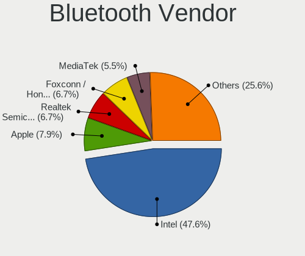

Pop!_OS - Hardware Trends
-------------------------

A project to identify most popular hardware characteristics and track their change
over time based on data collected by Linux users at https://Linux-Hardware.org.

Anyone can contribute to this report by the [hw-probe](https://github.com/linuxhw/hw-probe) tool:

    sudo -E hw-probe -all -upload

This is a report for all computer types. See also reports for [desktops](/Dist/Pop!_OS/Desktop/README.md) and [notebooks](/Dist/Pop!_OS/Notebook/README.md).

This report is for one last month. Overall report since the beginning of time: [TestCoverage](https://github.com/linuxhw/TestCoverage)

Period: Sep, 2022.

Contents
--------

* [ System ](#system)
  - [ OS                       ](#os)
  - [ OS Family                ](#os-family)
  - [ Kernel                   ](#kernel)
  - [ Kernel Family            ](#kernel-family)
  - [ Kernel Major Ver.        ](#kernel-major-ver)
  - [ Arch                     ](#arch)
  - [ DE                       ](#de)
  - [ Display Server           ](#display-server)
  - [ Display Manager          ](#display-manager)
  - [ OS Lang                  ](#os-lang)
  - [ Boot Mode                ](#boot-mode)
  - [ Filesystem               ](#filesystem)
  - [ Part. scheme             ](#part-scheme)
  - [ Dual Boot with Linux/BSD ](#dual-boot-with-linuxbsd)
  - [ Dual Boot (Win)          ](#dual-boot-win)

* [ Board ](#board)
  - [ Vendor                   ](#vendor)
  - [ Model                    ](#model)
  - [ Model Family             ](#model-family)
  - [ MFG Year                 ](#mfg-year)
  - [ Form Factor              ](#form-factor)
  - [ Secure Boot              ](#secure-boot)
  - [ Coreboot                 ](#coreboot)
  - [ RAM Size                 ](#ram-size)
  - [ RAM Used                 ](#ram-used)
  - [ Total Drives             ](#total-drives)
  - [ Has CD-ROM               ](#has-cd-rom)
  - [ Has Ethernet             ](#has-ethernet)
  - [ Has WiFi                 ](#has-wifi)
  - [ Has Bluetooth            ](#has-bluetooth)

* [ Location ](#location)
  - [ Country                  ](#country)
  - [ City                     ](#city)

* [ Drives ](#drives)
  - [ Drive Vendor             ](#drive-vendor)
  - [ Drive Model              ](#drive-model)
  - [ HDD Vendor               ](#hdd-vendor)
  - [ SSD Vendor               ](#ssd-vendor)
  - [ Drive Kind               ](#drive-kind)
  - [ Drive Connector          ](#drive-connector)
  - [ Drive Size               ](#drive-size)
  - [ Space Total              ](#space-total)
  - [ Space Used               ](#space-used)
  - [ Malfunc. Drives          ](#malfunc-drives)
  - [ Malfunc. Drive Vendor    ](#malfunc-drive-vendor)
  - [ Malfunc. HDD Vendor      ](#malfunc-hdd-vendor)
  - [ Malfunc. Drive Kind      ](#malfunc-drive-kind)
  - [ Failed Drives            ](#failed-drives)
  - [ Failed Drive Vendor      ](#failed-drive-vendor)
  - [ Drive Status             ](#drive-status)

* [ Storage controller ](#storage-controller)
  - [ Storage Vendor           ](#storage-vendor)
  - [ Storage Model            ](#storage-model)
  - [ Storage Kind             ](#storage-kind)

* [ Processor ](#processor)
  - [ CPU Vendor               ](#cpu-vendor)
  - [ CPU Model                ](#cpu-model)
  - [ CPU Model Family         ](#cpu-model-family)
  - [ CPU Cores                ](#cpu-cores)
  - [ CPU Sockets              ](#cpu-sockets)
  - [ CPU Threads              ](#cpu-threads)
  - [ CPU Op-Modes             ](#cpu-op-modes)
  - [ CPU Microcode            ](#cpu-microcode)
  - [ CPU Microarch            ](#cpu-microarch)

* [ Graphics ](#graphics)
  - [ GPU Vendor               ](#gpu-vendor)
  - [ GPU Model                ](#gpu-model)
  - [ GPU Combo                ](#gpu-combo)
  - [ GPU Driver               ](#gpu-driver)
  - [ GPU Memory               ](#gpu-memory)

* [ Monitor ](#monitor)
  - [ Monitor Vendor           ](#monitor-vendor)
  - [ Monitor Model            ](#monitor-model)
  - [ Monitor Resolution       ](#monitor-resolution)
  - [ Monitor Diagonal         ](#monitor-diagonal)
  - [ Monitor Width            ](#monitor-width)
  - [ Aspect Ratio             ](#aspect-ratio)
  - [ Monitor Area             ](#monitor-area)
  - [ Pixel Density            ](#pixel-density)
  - [ Multiple Monitors        ](#multiple-monitors)

* [ Network ](#network)
  - [ Net Controller Vendor    ](#net-controller-vendor)
  - [ Net Controller Model     ](#net-controller-model)
  - [ Wireless Vendor          ](#wireless-vendor)
  - [ Wireless Model           ](#wireless-model)
  - [ Ethernet Vendor          ](#ethernet-vendor)
  - [ Ethernet Model           ](#ethernet-model)
  - [ Net Controller Kind      ](#net-controller-kind)
  - [ Used Controller          ](#used-controller)
  - [ NICs                     ](#nics)
  - [ IPv6                     ](#ipv6)

* [ Bluetooth ](#bluetooth)
  - [ Bluetooth Vendor         ](#bluetooth-vendor)
  - [ Bluetooth Model          ](#bluetooth-model)

* [ Sound ](#sound)
  - [ Sound Vendor             ](#sound-vendor)
  - [ Sound Model              ](#sound-model)

* [ Memory ](#memory)
  - [ Memory Vendor            ](#memory-vendor)
  - [ Memory Model             ](#memory-model)
  - [ Memory Kind              ](#memory-kind)
  - [ Memory Form Factor       ](#memory-form-factor)
  - [ Memory Size              ](#memory-size)
  - [ Memory Speed             ](#memory-speed)

* [ Printers & scanners ](#printers--scanners)
  - [ Printer Vendor           ](#printer-vendor)
  - [ Printer Model            ](#printer-model)
  - [ Scanner Vendor           ](#scanner-vendor)
  - [ Scanner Model            ](#scanner-model)

* [ Camera ](#camera)
  - [ Camera Vendor            ](#camera-vendor)
  - [ Camera Model             ](#camera-model)

* [ Security ](#security)
  - [ Fingerprint Vendor       ](#fingerprint-vendor)
  - [ Fingerprint Model        ](#fingerprint-model)
  - [ Chipcard Vendor          ](#chipcard-vendor)
  - [ Chipcard Model           ](#chipcard-model)

* [ Unsupported ](#unsupported)
  - [ Unsupported Devices      ](#unsupported-devices)
  - [ Unsupported Device Types ](#unsupported-device-types)

System
------

OS
--

Installed operating systems

| Name          | Computers | Percent |
|---------------|-----------|---------|
| Pop!_OS 22.04 | 240       | 97.17%  |
| Pop!_OS 21.10 | 4         | 1.62%   |
| Pop!_OS 21.04 | 1         | 0.4%    |
| Pop!_OS 20.10 | 1         | 0.4%    |
| Pop!_OS 20.04 | 1         | 0.4%    |

OS Family
---------

OS without a version

| Name    | Computers | Percent |
|---------|-----------|---------|
| Pop!_OS | 247       | 100%    |

Kernel
------

Version of the Linux kernel

| Version                  | Computers | Percent |
|--------------------------|-----------|---------|
| 5.19.0-76051900-generic  | 224       | 90.69%  |
| 5.18.10-76051810-generic | 10        | 4.05%   |
| 5.17.5-76051705-generic  | 3         | 1.21%   |
| 5.17.15-76051715-generic | 2         | 0.81%   |
| 6.0.0-060000rc7-generic  | 1         | 0.4%    |
| 5.8.0-7642-generic       | 1         | 0.4%    |
| 5.4.210-whitehax0r       | 1         | 0.4%    |
| 5.19.6-xanmod1-x64v2     | 1         | 0.4%    |
| 5.16.19-76051619-generic | 1         | 0.4%    |
| 5.15.5-76051505-generic  | 1         | 0.4%    |
| 5.15.23-76051523-generic | 1         | 0.4%    |
| 5.15.15-76051515-generic | 1         | 0.4%    |

Kernel Family
-------------

Linux kernel without a distro release

| Version | Computers | Percent |
|---------|-----------|---------|
| 5.19.0  | 224       | 90.69%  |
| 5.18.10 | 10        | 4.05%   |
| 5.17.5  | 3         | 1.21%   |
| 5.17.15 | 2         | 0.81%   |
| 6.0.0   | 1         | 0.4%    |
| 5.8.0   | 1         | 0.4%    |
| 5.4.210 | 1         | 0.4%    |
| 5.19.6  | 1         | 0.4%    |
| 5.16.19 | 1         | 0.4%    |
| 5.15.5  | 1         | 0.4%    |
| 5.15.23 | 1         | 0.4%    |
| 5.15.15 | 1         | 0.4%    |

Kernel Major Ver.
-----------------

Linux kernel major version

| Version | Computers | Percent |
|---------|-----------|---------|
| 5.19    | 225       | 91.09%  |
| 5.18    | 10        | 4.05%   |
| 5.17    | 5         | 2.02%   |
| 5.15    | 3         | 1.21%   |
| 6.0     | 1         | 0.4%    |
| 5.8     | 1         | 0.4%    |
| 5.4     | 1         | 0.4%    |
| 5.16    | 1         | 0.4%    |

Arch
----

OS architecture (x86_64, i586, etc.)

| Name   | Computers | Percent |
|--------|-----------|---------|
| x86_64 | 247       | 100%    |

DE
--

Desktop Environment

| Name       | Computers | Percent |
|------------|-----------|---------|
| GNOME      | 237       | 95.95%  |
| KDE5       | 4         | 1.62%   |
| Unknown    | 3         | 1.21%   |
| X-Cinnamon | 1         | 0.4%    |
| Unity      | 1         | 0.4%    |
| Cinnamon   | 1         | 0.4%    |

Display Server
--------------

X11 or Wayland

| Name    | Computers | Percent |
|---------|-----------|---------|
| X11     | 234       | 94.74%  |
| Wayland | 11        | 4.45%   |
| Tty     | 1         | 0.4%    |
| Unknown | 1         | 0.4%    |

Display Manager
---------------

SDDM, LightDM, etc.

| Name    | Computers | Percent |
|---------|-----------|---------|
| Unknown | 182       | 73.68%  |
| GDM3    | 63        | 25.51%  |
| SDDM    | 1         | 0.4%    |
| GDM     | 1         | 0.4%    |

OS Lang
-------

Language

| Lang    | Computers | Percent |
|---------|-----------|---------|
| en_US   | 145       | 58.7%   |
| en_GB   | 17        | 6.88%   |
| pt_BR   | 15        | 6.07%   |
| en_AU   | 7         | 2.83%   |
| de_DE   | 7         | 2.83%   |
| fr_FR   | 6         | 2.43%   |
| C       | 6         | 2.43%   |
| it_IT   | 5         | 2.02%   |
| es_ES   | 5         | 2.02%   |
| ru_RU   | 4         | 1.62%   |
| nb_NO   | 4         | 1.62%   |
| Unknown | 4         | 1.62%   |
| en_CA   | 3         | 1.21%   |
| da_DK   | 3         | 1.21%   |
| pt_PT   | 2         | 0.81%   |
| nl_NL   | 2         | 0.81%   |
| zh_TW   | 1         | 0.4%    |
| pl_PL   | 1         | 0.4%    |
| ja_JP   | 1         | 0.4%    |
| fr_BE   | 1         | 0.4%    |
| fi_FI   | 1         | 0.4%    |
| es_HN   | 1         | 0.4%    |
| es_CL   | 1         | 0.4%    |
| es_BO   | 1         | 0.4%    |
| en_IE   | 1         | 0.4%    |
| en_DK   | 1         | 0.4%    |
| en_AG   | 1         | 0.4%    |
| de_CH   | 1         | 0.4%    |

Boot Mode
---------

EFI or BIOS

| Mode | Computers | Percent |
|------|-----------|---------|
| BIOS | 185       | 74.9%   |
| EFI  | 62        | 25.1%   |

Filesystem
----------

Type of filesystem

| Type    | Computers | Percent |
|---------|-----------|---------|
| Ext4    | 234       | 94.74%  |
| Btrfs   | 8         | 3.24%   |
| Overlay | 3         | 1.21%   |
| Xfs     | 2         | 0.81%   |

Part. scheme
------------

Scheme of partitioning

| Type    | Computers | Percent |
|---------|-----------|---------|
| Unknown | 179       | 72.47%  |
| GPT     | 64        | 25.91%  |
| MBR     | 4         | 1.62%   |

Dual Boot with Linux/BSD
------------------------

Hosting more than one Linux/BSD

| Dual boot | Computers | Percent |
|-----------|-----------|---------|
| No        | 232       | 93.93%  |
| Yes       | 15        | 6.07%   |

Dual Boot (Win)
---------------

Hosting Linux and Windows

| Dual boot | Computers | Percent |
|-----------|-----------|---------|
| No        | 220       | 89.07%  |
| Yes       | 27        | 10.93%  |

Board
-----

Vendor
------

Motherboard manufacturer

| Name                | Computers | Percent |
|---------------------|-----------|---------|
| Dell                | 43        | 17.41%  |
| Lenovo              | 40        | 16.19%  |
| ASUSTek Computer    | 40        | 16.19%  |
| Hewlett-Packard     | 24        | 9.72%   |
| Gigabyte Technology | 18        | 7.29%   |
| MSI                 | 14        | 5.67%   |
| Apple               | 10        | 4.05%   |
| System76            | 8         | 3.24%   |
| ASRock              | 8         | 3.24%   |
| Acer                | 8         | 3.24%   |
| HUAWEI              | 4         | 1.62%   |
| Intel               | 3         | 1.21%   |
| Toshiba             | 2         | 0.81%   |
| Fujitsu             | 2         | 0.81%   |
| Alienware           | 2         | 0.81%   |
| TUXEDO              | 1         | 0.4%    |
| Sony                | 1         | 0.4%    |
| Samsung Electronics | 1         | 0.4%    |
| Razer               | 1         | 0.4%    |
| OriginPC            | 1         | 0.4%    |
| NZXT                | 1         | 0.4%    |
| Minix               | 1         | 0.4%    |
| Microsoft           | 1         | 0.4%    |
| MACHINIST           | 1         | 0.4%    |
| LattePanda          | 1         | 0.4%    |
| Itronix             | 1         | 0.4%    |
| IP3 Tech            | 1         | 0.4%    |
| HONOR               | 1         | 0.4%    |
| GPU Company         | 1         | 0.4%    |
| GPD                 | 1         | 0.4%    |
| Gateway             | 1         | 0.4%    |
| Framework           | 1         | 0.4%    |
| ECS                 | 1         | 0.4%    |
| Clevo               | 1         | 0.4%    |
| AZW                 | 1         | 0.4%    |
| Unknown             | 1         | 0.4%    |

Model
-----

Motherboard model

| Name                                               | Computers | Percent |
|----------------------------------------------------|-----------|---------|
| System76 Oryx Pro                                  | 2         | 0.81%   |
| System76 Galago Pro                                | 2         | 0.81%   |
| System76 Darter Pro                                | 2         | 0.81%   |
| MSI GF63 Thin 11UD                                 | 2         | 0.81%   |
| HUAWEI KPL-W0X                                     | 2         | 0.81%   |
| Gigabyte B450 I AORUS PRO WIFI                     | 2         | 0.81%   |
| Dell Precision 3561                                | 2         | 0.81%   |
| ASUS ROG STRIX B550-I GAMING                       | 2         | 0.81%   |
| ASUS All Series                                    | 2         | 0.81%   |
| ASRock H97M Anniversary                            | 2         | 0.81%   |
| Apple MacBookPro9,2                                | 2         | 0.81%   |
| TUXEDO Pulse 15 Gen2                               | 1         | 0.4%    |
| Toshiba Satellite C850                             | 1         | 0.4%    |
| Toshiba Satellite C55t-C                           | 1         | 0.4%    |
| System76 Thelio Mira                               | 1         | 0.4%    |
| System76 Thelio                                    | 1         | 0.4%    |
| Sony SVL24117FLB                                   | 1         | 0.4%    |
| Samsung 270E5G/270E5U                              | 1         | 0.4%    |
| Razer Blade 15 Base Model (Early 2020) - RZ09-0328 | 1         | 0.4%    |
| OriginPC NT17-PRO                                  | 1         | 0.4%    |
| NZXT N7 B550                                       | 1         | 0.4%    |
| MSI Sword 15 A11UD                                 | 1         | 0.4%    |
| MSI Prestige 15 A12UC                              | 1         | 0.4%    |
| MSI Prestige 14Evo A11M                            | 1         | 0.4%    |
| MSI MS-7C79                                        | 1         | 0.4%    |
| MSI MS-7C56                                        | 1         | 0.4%    |
| MSI MS-7C37                                        | 1         | 0.4%    |
| MSI MS-7B86                                        | 1         | 0.4%    |
| MSI MS-7B12                                        | 1         | 0.4%    |
| MSI MS-7921                                        | 1         | 0.4%    |
| MSI Katana GF66 12UE                               | 1         | 0.4%    |
| MSI GS73 Stealth 8RF                               | 1         | 0.4%    |
| MSI GP72 7RDX                                      | 1         | 0.4%    |
| Minix Z83-4                                        | 1         | 0.4%    |
| Microsoft Surface Pro 3                            | 1         | 0.4%    |
| MACHINIST X99-RS9 V3.0                             | 1         | 0.4%    |
| Lenovo Z50-70 20354                                | 1         | 0.4%    |
| Lenovo Yoga Slim 7 Pro 14IAH7 82UT                 | 1         | 0.4%    |
| Lenovo Yoga 7 15ITL5 82BJ                          | 1         | 0.4%    |
| Lenovo ThinkPad X230 Tablet 34383SG                | 1         | 0.4%    |

Model Family
------------

Motherboard model prefix

| Name               | Computers | Percent |
|--------------------|-----------|---------|
| Lenovo ThinkPad    | 15        | 6.07%   |
| Dell Latitude      | 11        | 4.45%   |
| Dell Inspiron      | 11        | 4.45%   |
| ASUS ROG           | 11        | 4.45%   |
| Dell Precision     | 8         | 3.24%   |
| Lenovo Legion      | 7         | 2.83%   |
| Lenovo IdeaPad     | 7         | 2.83%   |
| Dell XPS           | 7         | 2.83%   |
| ASUS TUF           | 5         | 2.02%   |
| Acer Aspire        | 5         | 2.02%   |
| HP EliteBook       | 4         | 1.62%   |
| Lenovo ThinkBook   | 3         | 1.21%   |
| HP Pavilion        | 3         | 1.21%   |
| HP Laptop          | 3         | 1.21%   |
| Gigabyte B450      | 3         | 1.21%   |
| ASUS ASUS          | 3         | 1.21%   |
| Acer Nitro         | 3         | 1.21%   |
| Toshiba Satellite  | 2         | 0.81%   |
| System76 Thelio    | 2         | 0.81%   |
| System76 Oryx      | 2         | 0.81%   |
| System76 Galago    | 2         | 0.81%   |
| System76 Darter    | 2         | 0.81%   |
| MSI Prestige       | 2         | 0.81%   |
| MSI GF63           | 2         | 0.81%   |
| Lenovo Yoga        | 2         | 0.81%   |
| Lenovo ThinkCentre | 2         | 0.81%   |
| HUAWEI KPL-W0X     | 2         | 0.81%   |
| HP ZBook           | 2         | 0.81%   |
| HP OMEN            | 2         | 0.81%   |
| HP EliteDesk       | 2         | 0.81%   |
| Gigabyte X570      | 2         | 0.81%   |
| Gigabyte B450M     | 2         | 0.81%   |
| Fujitsu LIFEBOOK   | 2         | 0.81%   |
| Dell Vostro        | 2         | 0.81%   |
| ASUS VivoBook      | 2         | 0.81%   |
| ASUS PRIME         | 2         | 0.81%   |
| ASUS All           | 2         | 0.81%   |
| ASRock H97M        | 2         | 0.81%   |
| Apple MacBookPro9  | 2         | 0.81%   |
| Apple MacBookPro5  | 2         | 0.81%   |

MFG Year
--------

Motherboard manufacture year

| Year | Computers | Percent |
|------|-----------|---------|
| 2021 | 43        | 17.41%  |
| 2020 | 38        | 15.38%  |
| 2019 | 26        | 10.53%  |
| 2018 | 26        | 10.53%  |
| 2022 | 21        | 8.5%    |
| 2014 | 18        | 7.29%   |
| 2017 | 14        | 5.67%   |
| 2013 | 13        | 5.26%   |
| 2012 | 12        | 4.86%   |
| 2016 | 11        | 4.45%   |
| 2010 | 8         | 3.24%   |
| 2009 | 7         | 2.83%   |
| 2011 | 6         | 2.43%   |
| 2015 | 3         | 1.21%   |
| 2008 | 1         | 0.4%    |

Form Factor
-----------

Physical design of the computer

| Name        | Computers | Percent |
|-------------|-----------|---------|
| Notebook    | 151       | 61.13%  |
| Desktop     | 75        | 30.36%  |
| Convertible | 12        | 4.86%   |
| Tablet      | 3         | 1.21%   |
| Mini pc     | 3         | 1.21%   |
| All in one  | 2         | 0.81%   |
| Server      | 1         | 0.4%    |

Secure Boot
-----------

Enabled or disabled

| State    | Computers | Percent |
|----------|-----------|---------|
| Disabled | 247       | 100%    |

Coreboot
--------

Have coreboot on board

| Used | Computers | Percent |
|------|-----------|---------|
| No   | 242       | 97.98%  |
| Yes  | 5         | 2.02%   |

RAM Size
--------

Total RAM memory

| Size in GB  | Computers | Percent |
|-------------|-----------|---------|
| 16.01-24.0  | 77        | 31.17%  |
| 4.01-8.0    | 53        | 21.46%  |
| 32.01-64.0  | 44        | 17.81%  |
| 8.01-16.0   | 37        | 14.98%  |
| 3.01-4.0    | 15        | 6.07%   |
| 64.01-256.0 | 11        | 4.45%   |
| 24.01-32.0  | 9         | 3.64%   |
| 2.01-3.0    | 1         | 0.4%    |

RAM Used
--------

Used RAM memory

| Used GB    | Computers | Percent |
|------------|-----------|---------|
| 2.01-3.0   | 74        | 29.96%  |
| 4.01-8.0   | 66        | 26.72%  |
| 3.01-4.0   | 55        | 22.27%  |
| 1.01-2.0   | 24        | 9.72%   |
| 8.01-16.0  | 21        | 8.5%    |
| 16.01-24.0 | 7         | 2.83%   |

Total Drives
------------

Number of drives on board

| Drives | Computers | Percent |
|--------|-----------|---------|
| 1      | 146       | 59.11%  |
| 2      | 63        | 25.51%  |
| 3      | 20        | 8.1%    |
| 4      | 10        | 4.05%   |
| 5      | 3         | 1.21%   |
| 9      | 2         | 0.81%   |
| 10     | 1         | 0.4%    |
| 7      | 1         | 0.4%    |
| 0      | 1         | 0.4%    |

Has CD-ROM
----------

Has CD-ROM on board

| Presented | Computers | Percent |
|-----------|-----------|---------|
| No        | 198       | 80.16%  |
| Yes       | 49        | 19.84%  |

Has Ethernet
------------

Has Ethernet on board

| Presented | Computers | Percent |
|-----------|-----------|---------|
| Yes       | 200       | 80.97%  |
| No        | 47        | 19.03%  |

Has WiFi
--------

Has WiFi module

| Presented | Computers | Percent |
|-----------|-----------|---------|
| Yes       | 213       | 86.23%  |
| No        | 34        | 13.77%  |

Has Bluetooth
-------------

Has Bluetooth module

| Presented | Computers | Percent |
|-----------|-----------|---------|
| Yes       | 194       | 78.54%  |
| No        | 53        | 21.46%  |

Location
--------

Country
-------

Geographic location (country)

| Country     | Computers | Percent |
|-------------|-----------|---------|
| USA         | 75        | 30.36%  |
| Brazil      | 20        | 8.1%    |
| UK          | 14        | 5.67%   |
| Italy       | 14        | 5.67%   |
| France      | 9         | 3.64%   |
| Germany     | 8         | 3.24%   |
| Canada      | 8         | 3.24%   |
| Australia   | 8         | 3.24%   |
| Russia      | 6         | 2.43%   |
| Portugal    | 6         | 2.43%   |
| Norway      | 6         | 2.43%   |
| India       | 5         | 2.02%   |
| Denmark     | 5         | 2.02%   |
| Spain       | 4         | 1.62%   |
| Poland      | 4         | 1.62%   |
| Chile       | 4         | 1.62%   |
| Switzerland | 3         | 1.21%   |
| Netherlands | 3         | 1.21%   |
| Sweden      | 2         | 0.81%   |
| Serbia      | 2         | 0.81%   |
| Romania     | 2         | 0.81%   |
| Mexico      | 2         | 0.81%   |
| Malaysia    | 2         | 0.81%   |
| Greece      | 2         | 0.81%   |
| Finland     | 2         | 0.81%   |
| Egypt       | 2         | 0.81%   |
| Bulgaria    | 2         | 0.81%   |
| Austria     | 2         | 0.81%   |
| Turkey      | 1         | 0.4%    |
| South Korea | 1         | 0.4%    |
| Singapore   | 1         | 0.4%    |
| Philippines | 1         | 0.4%    |
| Peru        | 1         | 0.4%    |
| Pakistan    | 1         | 0.4%    |
| New Zealand | 1         | 0.4%    |
| Luxembourg  | 1         | 0.4%    |
| Lithuania   | 1         | 0.4%    |
| Latvia      | 1         | 0.4%    |
| Kenya       | 1         | 0.4%    |
| Japan       | 1         | 0.4%    |

City
----

Geographic location (city)

| City             | Computers | Percent |
|------------------|-----------|---------|
| Brisbane         | 5         | 2.02%   |
| Paris            | 4         | 1.62%   |
| San Francisco    | 3         | 1.21%   |
| Rome             | 3         | 1.21%   |
| Rio de Janeiro   | 3         | 1.21%   |
| Moscow           | 3         | 1.21%   |
| Lisbon           | 3         | 1.21%   |
| Dallas           | 3         | 1.21%   |
| Winston-Salem    | 2         | 0.81%   |
| St Petersburg    | 2         | 0.81%   |
| Seattle          | 2         | 0.81%   |
| Santiago         | 2         | 0.81%   |
| Oslo             | 2         | 0.81%   |
| Niš             | 2         | 0.81%   |
| Montreal         | 2         | 0.81%   |
| Milan            | 2         | 0.81%   |
| Joinville        | 2         | 0.81%   |
| Helsinki         | 2         | 0.81%   |
| Flint            | 2         | 0.81%   |
| Copenhagen       | 2         | 0.81%   |
| Chicago          | 2         | 0.81%   |
| Berlin           | 2         | 0.81%   |
| Bengaluru        | 2         | 0.81%   |
| Adelaide         | 2         | 0.81%   |
| Yokohama         | 1         | 0.4%    |
| Wyoming          | 1         | 0.4%    |
| Winnipeg         | 1         | 0.4%    |
| Wettringen       | 1         | 0.4%    |
| Watervliet       | 1         | 0.4%    |
| Wasserbillig     | 1         | 0.4%    |
| Wasilla          | 1         | 0.4%    |
| Washington       | 1         | 0.4%    |
| Walworth         | 1         | 0.4%    |
| Vitória         | 1         | 0.4%    |
| Vienna           | 1         | 0.4%    |
| Verviers         | 1         | 0.4%    |
| Veendam          | 1         | 0.4%    |
| Vaudreuil-Dorion | 1         | 0.4%    |
| Valdivia         | 1         | 0.4%    |
| Valdagno         | 1         | 0.4%    |

Drives
------

Drive Vendor
------------

Hard drive vendors

| Vendor                         | Computers | Drives | Percent |
|--------------------------------|-----------|--------|---------|
| Samsung Electronics            | 72        | 98     | 19.89%  |
| WDC                            | 35        | 41     | 9.67%   |
| Seagate                        | 34        | 44     | 9.39%   |
| SanDisk                        | 28        | 31     | 7.73%   |
| Toshiba                        | 19        | 19     | 5.25%   |
| SK hynix                       | 17        | 17     | 4.7%    |
| Micron Technology              | 15        | 15     | 4.14%   |
| Crucial                        | 14        | 19     | 3.87%   |
| Kingston                       | 11        | 12     | 3.04%   |
| Unknown                        | 10        | 13     | 2.76%   |
| Intel                          | 9         | 9      | 2.49%   |
| Silicon Motion                 | 6         | 6      | 1.66%   |
| Netac                          | 5         | 5      | 1.38%   |
| Apple                          | 5         | 5      | 1.38%   |
| PNY                            | 4         | 4      | 1.1%    |
| Phison Electronics             | 4         | 5      | 1.1%    |
| Phison                         | 4         | 7      | 1.1%    |
| KIOXIA                         | 4         | 4      | 1.1%    |
| Hitachi                        | 4         | 4      | 1.1%    |
| HGST                           | 4         | 5      | 1.1%    |
| Solid State Storage Technology | 3         | 3      | 0.83%   |
| Micron/Crucial Technology      | 3         | 3      | 0.83%   |
| China                          | 3         | 3      | 0.83%   |
| XPG                            | 2         | 2      | 0.55%   |
| Team                           | 2         | 4      | 0.55%   |
| Realtek Semiconductor          | 2         | 2      | 0.55%   |
| Patriot                        | 2         | 2      | 0.55%   |
| LITEONIT                       | 2         | 2      | 0.55%   |
| KingSpec                       | 2         | 2      | 0.55%   |
| Fanxiang                       | 2         | 2      | 0.55%   |
| A-DATA Technology              | 2         | 2      | 0.55%   |
| W800S                          | 1         | 1      | 0.28%   |
| Union Memory (Shenzhen)        | 1         | 1      | 0.28%   |
| Transcend                      | 1         | 1      | 0.28%   |
| T-FORCE                        | 1         | 1      | 0.28%   |
| SPCC                           | 1         | 1      | 0.28%   |
| Solid State Storage            | 1         | 1      | 0.28%   |
| Simmtronic                     | 1         | 1      | 0.28%   |
| SABRENT                        | 1         | 1      | 0.28%   |
| ROG                            | 1         | 1      | 0.28%   |

Drive Model
-----------

Hard drive models

| Model                                                 | Computers | Percent |
|-------------------------------------------------------|-----------|---------|
| Samsung NVMe SSD Drive 500GB                          | 7         | 1.74%   |
| Seagate ST1000LM035-1RK172 1TB                        | 5         | 1.24%   |
| Samsung NVMe SSD Drive 1TB                            | 5         | 1.24%   |
| SK hynix NVMe SSD Drive 512GB                         | 4         | 1%      |
| Samsung SSD 860 EVO 500GB                             | 4         | 1%      |
| Samsung SSD 860 EVO 1TB                               | 4         | 1%      |
| Samsung SSD 850 EVO 500GB                             | 4         | 1%      |
| Samsung NVMe SSD Drive 512GB                          | 4         | 1%      |
| Samsung NVMe SSD Drive 250GB                          | 4         | 1%      |
| Samsung NVMe SSD Controller PM9A1/PM9A3/980PRO 1024GB | 4         | 1%      |
| Micron NVMe SSD Drive 512GB                           | 4         | 1%      |
| WDC WDS100T2B0A-00SM50 1TB SSD                        | 3         | 0.75%   |
| Seagate ST1000LM024 HN-M101MBB 1TB                    | 3         | 0.75%   |
| SanDisk NVMe SSD Drive 512GB                          | 3         | 0.75%   |
| SanDisk NVMe SSD Drive 500GB                          | 3         | 0.75%   |
| SanDisk NVMe SSD Drive 1TB                            | 3         | 0.75%   |
| Kingston OM8PCP3512F-AI1 512GB                        | 3         | 0.75%   |
| Crucial CT500MX500SSD1 500GB                          | 3         | 0.75%   |
| WDC WD10SPZX-24Z10 1TB                                | 2         | 0.5%    |
| WDC WD10EZEX-00BN5A0 1TB                              | 2         | 0.5%    |
| Unknown MMC Card  64GB                                | 2         | 0.5%    |
| Unknown MMC Card  32GB                                | 2         | 0.5%    |
| Unknown MMC Card  128GB                               | 2         | 0.5%    |
| Toshiba NVMe SSD Drive 512GB                          | 2         | 0.5%    |
| Silicon Motion NVMe SSD Drive 128GB                   | 2         | 0.5%    |
| Seagate ST2000LM003 HN-M201RAD 2TB                    | 2         | 0.5%    |
| Seagate ST2000DM008-2FR102 2TB                        | 2         | 0.5%    |
| Seagate ST1000DM010-2EP102 1TB                        | 2         | 0.5%    |
| Seagate ST1000DM003-1ER162 1TB                        | 2         | 0.5%    |
| Seagate NVMe SSD Drive 1TB                            | 2         | 0.5%    |
| Seagate Expansion Desk 2TB                            | 2         | 0.5%    |
| Sandisk WD_BLACK SN770 1TB                            | 2         | 0.5%    |
| Sandisk WD Blue SN550 NVMe SSD 1024GB                 | 2         | 0.5%    |
| Sandisk WD Black SN850 500GB                          | 2         | 0.5%    |
| Sandisk WD Black SN750 / PC SN730 NVMe SSD 1024GB     | 2         | 0.5%    |
| Samsung SSD 980 PRO 1TB                               | 2         | 0.5%    |
| Samsung SSD 870 QVO 4TB                               | 2         | 0.5%    |
| Samsung SSD 870 EVO 500GB                             | 2         | 0.5%    |
| Samsung SSD 850 PRO 256GB                             | 2         | 0.5%    |
| Samsung Portable SSD T5 1TB                           | 2         | 0.5%    |

HDD Vendor
----------

Hard disk drive vendors

| Vendor              | Computers | Drives | Percent |
|---------------------|-----------|--------|---------|
| Seagate             | 32        | 41     | 42.11%  |
| WDC                 | 22        | 27     | 28.95%  |
| Toshiba             | 9         | 9      | 11.84%  |
| Hitachi             | 4         | 4      | 5.26%   |
| HGST                | 4         | 5      | 5.26%   |
| Samsung Electronics | 2         | 2      | 2.63%   |
| JMicron Technology  | 1         | 1      | 1.32%   |
| Fujitsu             | 1         | 1      | 1.32%   |
| Apple               | 1         | 1      | 1.32%   |

SSD Vendor
----------

Solid state drive vendors

| Vendor              | Computers | Drives | Percent |
|---------------------|-----------|--------|---------|
| Samsung Electronics | 33        | 39     | 27.27%  |
| Crucial             | 14        | 17     | 11.57%  |
| WDC                 | 10        | 10     | 8.26%   |
| SanDisk             | 7         | 7      | 5.79%   |
| Kingston            | 6         | 6      | 4.96%   |
| Netac               | 5         | 5      | 4.13%   |
| Toshiba             | 4         | 4      | 3.31%   |
| PNY                 | 4         | 4      | 3.31%   |
| SK hynix            | 3         | 3      | 2.48%   |
| Micron Technology   | 3         | 3      | 2.48%   |
| China               | 3         | 3      | 2.48%   |
| Apple               | 3         | 3      | 2.48%   |
| Patriot             | 2         | 2      | 1.65%   |
| LITEONIT            | 2         | 2      | 1.65%   |
| KingSpec            | 2         | 2      | 1.65%   |
| Intel               | 2         | 2      | 1.65%   |
| Transcend           | 1         | 1      | 0.83%   |
| Team                | 1         | 3      | 0.83%   |
| SPCC                | 1         | 1      | 0.83%   |
| Seagate             | 1         | 1      | 0.83%   |
| Palit               | 1         | 1      | 0.83%   |
| OCZ                 | 1         | 1      | 0.83%   |
| LITEON              | 1         | 1      | 0.83%   |
| KingDian            | 1         | 1      | 0.83%   |
| Intenso             | 1         | 1      | 0.83%   |
| GOODRAM             | 1         | 1      | 0.83%   |
| Digital             | 1         | 1      | 0.83%   |
| Colorful            | 1         | 1      | 0.83%   |
| BIWIN               | 1         | 1      | 0.83%   |
| Biostar             | 1         | 1      | 0.83%   |
| BF9SSD              | 1         | 1      | 0.83%   |
| Apotop              | 1         | 1      | 0.83%   |
| AFOX                | 1         | 1      | 0.83%   |
| A-DATA Technology   | 1         | 1      | 0.83%   |

Drive Kind
----------

HDD or SSD

| Kind    | Computers | Drives | Percent |
|---------|-----------|--------|---------|
| NVMe    | 143       | 178    | 42.81%  |
| SSD     | 106       | 132    | 31.74%  |
| HDD     | 66        | 91     | 19.76%  |
| Unknown | 11        | 12     | 3.29%   |
| MMC     | 8         | 10     | 2.4%    |

Drive Connector
---------------

SATA, SAS, NVMe, etc.

| Type | Computers | Drives | Percent |
|------|-----------|--------|---------|
| SATA | 144       | 219    | 47.06%  |
| NVMe | 142       | 176    | 46.41%  |
| SAS  | 12        | 18     | 3.92%   |
| MMC  | 8         | 10     | 2.61%   |

Drive Size
----------

Size of hard drive

| Size in TB | Computers | Drives | Percent |
|------------|-----------|--------|---------|
| 0.01-0.5   | 93        | 119    | 51.67%  |
| 0.51-1.0   | 64        | 71     | 35.56%  |
| 1.01-2.0   | 13        | 20     | 7.22%   |
| 3.01-4.0   | 5         | 6      | 2.78%   |
| 4.01-10.0  | 4         | 6      | 2.22%   |
| 10.01-20.0 | 1         | 1      | 0.56%   |

Space Total
-----------

Amount of disk space available on the file system

| Size in GB     | Computers | Percent |
|----------------|-----------|---------|
| 251-500        | 80        | 32.39%  |
| 101-250        | 70        | 28.34%  |
| 501-1000       | 49        | 19.84%  |
| 1001-2000      | 21        | 8.5%    |
| More than 3000 | 8         | 3.24%   |
| 2001-3000      | 7         | 2.83%   |
| 1-20           | 5         | 2.02%   |
| 21-50          | 3         | 1.21%   |
| Unknown        | 3         | 1.21%   |
| 51-100         | 1         | 0.4%    |

Space Used
----------

Amount of used disk space

| Used GB        | Computers | Percent |
|----------------|-----------|---------|
| 1-20           | 64        | 25.91%  |
| 21-50          | 58        | 23.48%  |
| 101-250        | 41        | 16.6%   |
| 51-100         | 31        | 12.55%  |
| 251-500        | 28        | 11.34%  |
| 1001-2000      | 10        | 4.05%   |
| 501-1000       | 7         | 2.83%   |
| More than 3000 | 4         | 1.62%   |
| Unknown        | 3         | 1.21%   |
| 2001-3000      | 1         | 0.4%    |

Malfunc. Drives
---------------

Drive models with a malfunction

| Model                                               | Computers | Drives | Percent |
|-----------------------------------------------------|-----------|--------|---------|
| Toshiba THNSNK128GVN8 M.2 2280 128GB SSD            | 1         | 1      | 16.67%  |
| Seagate Expansion Desk 2TB                          | 1         | 1      | 16.67%  |
| SABRENT Disk 1TB                                    | 1         | 1      | 16.67%  |
| Micron Technology MTFDDAK256MAY-1AH1ZABHA 256GB SSD | 1         | 1      | 16.67%  |
| Hitachi HTS545050A7E380 500GB                       | 1         | 1      | 16.67%  |
| HGST HTS725050A7E630 500GB                          | 1         | 2      | 16.67%  |

Malfunc. Drive Vendor
---------------------

Vendors of faulty drives

| Vendor            | Computers | Drives | Percent |
|-------------------|-----------|--------|---------|
| Toshiba           | 1         | 1      | 16.67%  |
| Seagate           | 1         | 1      | 16.67%  |
| SABRENT           | 1         | 1      | 16.67%  |
| Micron Technology | 1         | 1      | 16.67%  |
| Hitachi           | 1         | 1      | 16.67%  |
| HGST              | 1         | 2      | 16.67%  |

Malfunc. HDD Vendor
-------------------

Vendors of faulty HDD drives

| Vendor  | Computers | Drives | Percent |
|---------|-----------|--------|---------|
| Seagate | 1         | 1      | 33.33%  |
| Hitachi | 1         | 1      | 33.33%  |
| HGST    | 1         | 2      | 33.33%  |

Malfunc. Drive Kind
-------------------

Kinds of faulty drives

| Kind | Computers | Drives | Percent |
|------|-----------|--------|---------|
| HDD  | 3         | 4      | 50%     |
| SSD  | 2         | 2      | 33.33%  |
| NVMe | 1         | 1      | 16.67%  |

Failed Drives
-------------

Failed drive models

Zero info for selected period =(

Failed Drive Vendor
-------------------

Failed drive vendors

Zero info for selected period =(

Drive Status
------------

Number of failed and malfunc. drives

| Status   | Computers | Drives | Percent |
|----------|-----------|--------|---------|
| Detected | 185       | 322    | 71.98%  |
| Works    | 67        | 94     | 26.07%  |
| Malfunc  | 5         | 7      | 1.95%   |

Storage controller
------------------

Storage Vendor
--------------

Storage controller vendors

| Vendor                         | Computers | Percent |
|--------------------------------|-----------|---------|
| Intel                          | 140       | 38.04%  |
| AMD                            | 57        | 15.49%  |
| Samsung Electronics            | 48        | 13.04%  |
| SanDisk                        | 25        | 6.79%   |
| SK hynix                       | 14        | 3.8%    |
| Micron Technology              | 12        | 3.26%   |
| Phison Electronics             | 9         | 2.45%   |
| Toshiba America Info Systems   | 7         | 1.9%    |
| Kingston Technology Company    | 7         | 1.9%    |
| Silicon Motion                 | 6         | 1.63%   |
| Nvidia                         | 6         | 1.63%   |
| ASMedia Technology             | 5         | 1.36%   |
| Micron/Crucial Technology      | 4         | 1.09%   |
| KIOXIA                         | 4         | 1.09%   |
| ADATA Technology               | 4         | 1.09%   |
| Solid State Storage Technology | 3         | 0.82%   |
| Marvell Technology Group       | 3         | 0.82%   |
| Seagate Technology             | 2         | 0.54%   |
| Realtek Semiconductor          | 2         | 0.54%   |
| LSI Logic / Symbios Logic      | 2         | 0.54%   |
| JMicron Technology             | 2         | 0.54%   |
| Broadcom / LSI                 | 2         | 0.54%   |
| Unknown                        | 1         | 0.27%   |
| Union Memory (Shenzhen)        | 1         | 0.27%   |
| Shenzhen Longsys Electronics   | 1         | 0.27%   |
| Apple                          | 1         | 0.27%   |

Storage Model
-------------

Storage controller models

| Model                                                                            | Computers | Percent |
|----------------------------------------------------------------------------------|-----------|---------|
| AMD FCH SATA Controller [AHCI mode]                                              | 40        | 10.03%  |
| Samsung NVMe SSD Controller SM981/PM981/PM983                                    | 22        | 5.51%   |
| Samsung NVMe SSD Controller PM9A1/PM9A3/980PRO                                   | 12        | 3.01%   |
| Micron Non-Volatile memory controller                                            | 12        | 3.01%   |
| Intel 7 Series Chipset Family 6-port SATA Controller [AHCI mode]                 | 12        | 3.01%   |
| Intel Sunrise Point-LP SATA Controller [AHCI mode]                               | 11        | 2.76%   |
| AMD 500 Series Chipset SATA Controller                                           | 11        | 2.76%   |
| SK hynix Gold P31 SSD                                                            | 10        | 2.51%   |
| Samsung NVMe SSD Controller 980                                                  | 10        | 2.51%   |
| SanDisk Non-Volatile memory controller                                           | 9         | 2.26%   |
| Intel Volume Management Device NVMe RAID Controller                              | 9         | 2.26%   |
| Intel 82801 Mobile SATA Controller [RAID mode]                                   | 9         | 2.26%   |
| Intel 8 Series/C220 Series Chipset Family 6-port SATA Controller 1 [AHCI mode]   | 9         | 2.26%   |
| Intel 500 Series Chipset Family SATA AHCI Controller                             | 9         | 2.26%   |
| AMD 400 Series Chipset SATA Controller                                           | 9         | 2.26%   |
| Intel Cannon Lake Mobile PCH SATA AHCI Controller                                | 8         | 2.01%   |
| Intel 8 Series SATA Controller 1 [AHCI mode]                                     | 8         | 2.01%   |
| Intel Comet Lake SATA AHCI Controller                                            | 7         | 1.75%   |
| Intel HM170/QM170 Chipset SATA Controller [AHCI Mode]                            | 6         | 1.5%    |
| Intel 9 Series Chipset Family SATA Controller [AHCI Mode]                        | 6         | 1.5%    |
| Silicon Motion SM2263EN/SM2263XT SSD Controller                                  | 5         | 1.25%   |
| SanDisk WD PC SN810 / Black SN850 NVMe SSD                                       | 5         | 1.25%   |
| SanDisk WD Blue SN550 NVMe SSD                                                   | 5         | 1.25%   |
| Phison E12 NVMe Controller                                                       | 5         | 1.25%   |
| Intel Tiger Lake-LP SATA Controller                                              | 5         | 1.25%   |
| Intel SSD 660P Series                                                            | 5         | 1.25%   |
| ASMedia ASM1062 Serial ATA Controller                                            | 5         | 1.25%   |
| Samsung NVMe SSD Controller SM961/PM961/SM963                                    | 4         | 1%      |
| AMD SB7x0/SB8x0/SB9x0 SATA Controller [AHCI mode]                                | 4         | 1%      |
| Toshiba America Info Systems XG6 NVMe SSD Controller                             | 3         | 0.75%   |
| Solid State Storage Non-Volatile memory controller                               | 3         | 0.75%   |
| Nvidia MCP79 AHCI Controller                                                     | 3         | 0.75%   |
| KIOXIA NVMe SSD Controller BG4                                                   | 3         | 0.75%   |
| Kingston Company Company Non-Volatile memory controller                          | 3         | 0.75%   |
| Intel Q170/Q150/B150/H170/H110/Z170/CM236 Chipset SATA Controller [AHCI Mode]    | 3         | 0.75%   |
| Intel Celeron/Pentium Silver Processor SATA Controller                           | 3         | 0.75%   |
| Intel Cannon Point-LP SATA Controller [AHCI Mode]                                | 3         | 0.75%   |
| Intel 6 Series/C200 Series Chipset Family 6 port Mobile SATA AHCI Controller     | 3         | 0.75%   |
| Toshiba America Info Systems Toshiba America Info Non-Volatile memory controller | 2         | 0.5%    |
| SK hynix Non-Volatile memory controller                                          | 2         | 0.5%    |

Storage Kind
------------

Kind of storage controller (IDE, SATA, NVMe, SAS, ...)

| Kind | Computers | Percent |
|------|-----------|---------|
| SATA | 173       | 48.87%  |
| NVMe | 142       | 40.11%  |
| RAID | 21        | 5.93%   |
| IDE  | 14        | 3.95%   |
| SAS  | 4         | 1.13%   |

Processor
---------

CPU Vendor
----------

Processor vendors

| Vendor | Computers | Percent |
|--------|-----------|---------|
| Intel  | 168       | 68.02%  |
| AMD    | 79        | 31.98%  |

CPU Model
---------

Processor models

| Model                                         | Computers | Percent |
|-----------------------------------------------|-----------|---------|
| Intel 11th Gen Core i5-1135G7 @ 2.40GHz       | 7         | 2.83%   |
| AMD Ryzen 7 5800H with Radeon Graphics        | 7         | 2.83%   |
| Intel Core i7-7700HQ CPU @ 2.80GHz            | 5         | 2.02%   |
| Intel 11th Gen Core i7-1165G7 @ 2.80GHz       | 5         | 2.02%   |
| AMD Ryzen 7 3700X 8-Core Processor            | 5         | 2.02%   |
| Intel Core i7-8550U CPU @ 1.80GHz             | 4         | 1.62%   |
| AMD Ryzen 5 5600G with Radeon Graphics        | 4         | 1.62%   |
| AMD Ryzen 5 5500U with Radeon Graphics        | 4         | 1.62%   |
| Intel Core i7-4790 CPU @ 3.60GHz              | 3         | 1.21%   |
| Intel Core i7-4510U CPU @ 2.00GHz             | 3         | 1.21%   |
| Intel Core i7-10750H CPU @ 2.60GHz            | 3         | 1.21%   |
| Intel Core i5-8365U CPU @ 1.60GHz             | 3         | 1.21%   |
| Intel Core i5-8250U CPU @ 1.60GHz             | 3         | 1.21%   |
| Intel Core i5-7200U CPU @ 2.50GHz             | 3         | 1.21%   |
| Intel Core i5-10210U CPU @ 1.60GHz            | 3         | 1.21%   |
| Intel 11th Gen Core i7-11800H @ 2.30GHz       | 3         | 1.21%   |
| Intel 11th Gen Core i5-11400H @ 2.70GHz       | 3         | 1.21%   |
| AMD Ryzen 9 3900X 12-Core Processor           | 3         | 1.21%   |
| AMD Ryzen 7 5800X 8-Core Processor            | 3         | 1.21%   |
| AMD Ryzen 5 5600X 6-Core Processor            | 3         | 1.21%   |
| AMD Ryzen 5 4600H with Radeon Graphics        | 3         | 1.21%   |
| AMD Ryzen 5 3550H with Radeon Vega Mobile Gfx | 3         | 1.21%   |
| Intel Core i7-8750H CPU @ 2.20GHz             | 2         | 0.81%   |
| Intel Core i7-8650U CPU @ 1.90GHz             | 2         | 0.81%   |
| Intel Core i7-6600U CPU @ 2.60GHz             | 2         | 0.81%   |
| Intel Core i7-4790K CPU @ 4.00GHz             | 2         | 0.81%   |
| Intel Core i7-10510U CPU @ 1.80GHz            | 2         | 0.81%   |
| Intel Core i7 CPU 920 @ 2.67GHz               | 2         | 0.81%   |
| Intel Core i5-9300H CPU @ 2.40GHz             | 2         | 0.81%   |
| Intel Core i5-4460 CPU @ 3.20GHz              | 2         | 0.81%   |
| Intel Core i5-4200M CPU @ 2.50GHz             | 2         | 0.81%   |
| Intel Core i5-3210M CPU @ 2.50GHz             | 2         | 0.81%   |
| Intel Core i3-7020U CPU @ 2.30GHz             | 2         | 0.81%   |
| Intel Core 2 Duo CPU P8600 @ 2.40GHz          | 2         | 0.81%   |
| Intel Atom x5-Z8350 CPU @ 1.44GHz             | 2         | 0.81%   |
| Intel 12th Gen Core i5-12500H                 | 2         | 0.81%   |
| Intel 11th Gen Core i7-11850H @ 2.50GHz       | 2         | 0.81%   |
| AMD Ryzen 7 5700X 8-Core Processor            | 2         | 0.81%   |
| AMD Ryzen 7 5700U with Radeon Graphics        | 2         | 0.81%   |
| AMD Ryzen 7 5700G with Radeon Graphics        | 2         | 0.81%   |

CPU Model Family
----------------

Processor model prefix

| Model                  | Computers | Percent |
|------------------------|-----------|---------|
| Intel Core i7          | 55        | 22.27%  |
| Intel Core i5          | 44        | 17.81%  |
| Other                  | 33        | 13.36%  |
| AMD Ryzen 7            | 29        | 11.74%  |
| AMD Ryzen 5            | 29        | 11.74%  |
| Intel Core i3          | 8         | 3.24%   |
| Intel Xeon             | 7         | 2.83%   |
| Intel Celeron          | 7         | 2.83%   |
| AMD Ryzen 9            | 6         | 2.43%   |
| Intel Core 2 Duo       | 5         | 2.02%   |
| Intel Pentium          | 3         | 1.21%   |
| Intel Pentium Gold     | 2         | 0.81%   |
| Intel Core i9          | 2         | 0.81%   |
| Intel Atom             | 2         | 0.81%   |
| AMD Ryzen Threadripper | 2         | 0.81%   |
| AMD FX                 | 2         | 0.81%   |
| Intel Genuine          | 1         | 0.4%    |
| Intel Core m5          | 1         | 0.4%    |
| AMD Turion II          | 1         | 0.4%    |
| AMD Ryzen Embedded     | 1         | 0.4%    |
| AMD Ryzen 7 PRO        | 1         | 0.4%    |
| AMD Ryzen 5 PRO        | 1         | 0.4%    |
| AMD Ryzen 3            | 1         | 0.4%    |
| AMD Phenom II X6       | 1         | 0.4%    |
| AMD Phenom II X4       | 1         | 0.4%    |
| AMD Phenom             | 1         | 0.4%    |
| AMD Athlon II X4       | 1         | 0.4%    |

CPU Cores
---------

Number of processor cores

| Number | Computers | Percent |
|--------|-----------|---------|
| 4      | 94        | 38.06%  |
| 2      | 58        | 23.48%  |
| 8      | 42        | 17%     |
| 6      | 37        | 14.98%  |
| 12     | 7         | 2.83%   |
| 10     | 3         | 1.21%   |
| 14     | 2         | 0.81%   |
| 32     | 1         | 0.4%    |
| 24     | 1         | 0.4%    |
| 16     | 1         | 0.4%    |
| 3      | 1         | 0.4%    |

CPU Sockets
-----------

Number of sockets

| Number | Computers | Percent |
|--------|-----------|---------|
| 1      | 247       | 100%    |

CPU Threads
-----------

Threads per core (Hyper-Threading)

| Number | Computers | Percent |
|--------|-----------|---------|
| 2      | 213       | 86.23%  |
| 1      | 34        | 13.77%  |

CPU Op-Modes
------------

CPU Operation Modes (32-bit, 64-bit)

| Op mode        | Computers | Percent |
|----------------|-----------|---------|
| 32-bit, 64-bit | 247       | 100%    |

CPU Microcode
-------------

Microcode number

| Number     | Computers | Percent |
|------------|-----------|---------|
| Unknown    | 178       | 72.06%  |
| 0x806d1    | 6         | 2.43%   |
| 0x806c1    | 5         | 2.02%   |
| 0x806ec    | 4         | 1.62%   |
| 0x406e3    | 4         | 1.62%   |
| 0x306a9    | 4         | 1.62%   |
| 0x0a50000c | 4         | 1.62%   |
| 0x806ea    | 3         | 1.21%   |
| 0x08701021 | 3         | 1.21%   |
| 0xa0652    | 2         | 0.81%   |
| 0x906ea    | 2         | 0.81%   |
| 0x906e9    | 2         | 0.81%   |
| 0x906a3    | 2         | 0.81%   |
| 0x706e5    | 2         | 0.81%   |
| 0x706a8    | 2         | 0.81%   |
| 0x306c3    | 2         | 0.81%   |
| 0x206a7    | 2         | 0.81%   |
| 0x08701013 | 2         | 0.81%   |
| 0x08600106 | 2         | 0.81%   |
| 0xa0671    | 1         | 0.4%    |
| 0x906c0    | 1         | 0.4%    |
| 0x906a4    | 1         | 0.4%    |
| 0x806e9    | 1         | 0.4%    |
| 0x506e3    | 1         | 0.4%    |
| 0x40651    | 1         | 0.4%    |
| 0x1067a    | 1         | 0.4%    |
| 0x0a404101 | 1         | 0.4%    |
| 0x0a201205 | 1         | 0.4%    |
| 0x0a201016 | 1         | 0.4%    |
| 0x08608103 | 1         | 0.4%    |
| 0x08600104 | 1         | 0.4%    |
| 0x08108109 | 1         | 0.4%    |
| 0x08101007 | 1         | 0.4%    |
| 0x08001138 | 1         | 0.4%    |
| 0x07013005 | 1         | 0.4%    |

CPU Microarch
-------------

Microarchitecture

| Name             | Computers | Percent |
|------------------|-----------|---------|
| KabyLake         | 44        | 17.81%  |
| Zen 3            | 29        | 11.74%  |
| Haswell          | 29        | 11.74%  |
| Zen 2            | 20        | 8.1%    |
| Unknown          | 18        | 7.29%   |
| IvyBridge        | 17        | 6.88%   |
| TigerLake        | 16        | 6.48%   |
| Skylake          | 10        | 4.05%   |
| Icelake          | 10        | 4.05%   |
| Zen+             | 7         | 2.83%   |
| SandyBridge      | 7         | 2.83%   |
| CometLake        | 6         | 2.43%   |
| Zen              | 5         | 2.02%   |
| Penryn           | 5         | 2.02%   |
| K10              | 5         | 2.02%   |
| Nehalem          | 3         | 1.21%   |
| Goldmont plus    | 3         | 1.21%   |
| Broadwell        | 3         | 1.21%   |
| Alderlake Hybrid | 3         | 1.21%   |
| Silvermont       | 2         | 0.81%   |
| Piledriver       | 2         | 0.81%   |
| Westmere         | 1         | 0.4%    |
| Goldmont         | 1         | 0.4%    |
| Excavator        | 1         | 0.4%    |

Graphics
--------

GPU Vendor
----------

Vendors of graphics cards

| Vendor                     | Computers | Percent |
|----------------------------|-----------|---------|
| Intel                      | 138       | 44.23%  |
| Nvidia                     | 104       | 33.33%  |
| AMD                        | 69        | 22.12%  |
| Matrox Electronics Systems | 1         | 0.32%   |

GPU Model
---------

Graphics card models

| Model                                                                       | Computers | Percent |
|-----------------------------------------------------------------------------|-----------|---------|
| Intel TigerLake-LP GT2 [Iris Xe Graphics]                                   | 14        | 4.47%   |
| AMD Cezanne                                                                 | 13        | 4.15%   |
| Intel 3rd Gen Core processor Graphics Controller                            | 11        | 3.51%   |
| Intel UHD Graphics 620                                                      | 10        | 3.19%   |
| Intel Haswell-ULT Integrated Graphics Controller                            | 9         | 2.88%   |
| AMD Renoir                                                                  | 9         | 2.88%   |
| Nvidia GA106M [GeForce RTX 3060 Mobile / Max-Q]                             | 8         | 2.56%   |
| Intel TigerLake-H GT1 [UHD Graphics]                                        | 8         | 2.56%   |
| Intel CoffeeLake-H GT2 [UHD Graphics 630]                                   | 7         | 2.24%   |
| Intel 2nd Generation Core Processor Family Integrated Graphics Controller   | 7         | 2.24%   |
| Intel Xeon E3-1200 v3/4th Gen Core Processor Integrated Graphics Controller | 6         | 1.92%   |
| AMD Picasso/Raven 2 [Radeon Vega Series / Radeon Vega Mobile Series]        | 6         | 1.92%   |
| AMD Lucienne                                                                | 6         | 1.92%   |
| Nvidia GA107M [GeForce RTX 3050 Mobile]                                     | 5         | 1.6%    |
| Intel WhiskeyLake-U GT2 [UHD Graphics 620]                                  | 5         | 1.6%    |
| Intel Skylake GT2 [HD Graphics 520]                                         | 5         | 1.6%    |
| Intel HD Graphics 620                                                       | 5         | 1.6%    |
| Intel CometLake-U GT2 [UHD Graphics]                                        | 5         | 1.6%    |
| Intel 4th Gen Core Processor Integrated Graphics Controller                 | 5         | 1.6%    |
| Nvidia TU117M [GeForce GTX 1650 Mobile / Max-Q]                             | 4         | 1.28%   |
| Nvidia GP107M [GeForce GTX 1050 Mobile]                                     | 4         | 1.28%   |
| Intel HD Graphics 630                                                       | 4         | 1.28%   |
| Intel CometLake-H GT2 [UHD Graphics]                                        | 4         | 1.28%   |
| Intel Alder Lake-P Integrated Graphics Controller                           | 4         | 1.28%   |
| AMD Raven Ridge [Radeon Vega Series / Radeon Vega Mobile Series]            | 4         | 1.28%   |
| Nvidia TU117M [GeForce GTX 1650 Ti Mobile]                                  | 3         | 0.96%   |
| Nvidia TU116 [GeForce GTX 1660 SUPER]                                       | 3         | 0.96%   |
| Nvidia GP104BM [GeForce GTX 1070 Mobile]                                    | 3         | 0.96%   |
| Nvidia GP104 [GeForce GTX 1070 Ti]                                          | 3         | 0.96%   |
| Nvidia GA107M [GeForce RTX 3050 Ti Mobile]                                  | 3         | 0.96%   |
| Nvidia C79 [GeForce 9400M]                                                  | 3         | 0.96%   |
| Intel HD Graphics 530                                                       | 3         | 0.96%   |
| Intel GeminiLake [UHD Graphics 600]                                         | 3         | 0.96%   |
| Nvidia TU117M                                                               | 2         | 0.64%   |
| Nvidia TU117GLM [T600 Mobile]                                               | 2         | 0.64%   |
| Nvidia TU117 [GeForce GTX 1650]                                             | 2         | 0.64%   |
| Nvidia TU106M [GeForce RTX 2060 Mobile]                                     | 2         | 0.64%   |
| Nvidia TU104 [GeForce RTX 2080 SUPER]                                       | 2         | 0.64%   |
| Nvidia TU104 [GeForce RTX 2070 SUPER]                                       | 2         | 0.64%   |
| Nvidia GP108 [GeForce GT 1030]                                              | 2         | 0.64%   |

GPU Combo
---------

Combinations of graphics cards

| Name           | Computers | Percent |
|----------------|-----------|---------|
| 1 x Intel      | 92        | 37.25%  |
| 1 x Nvidia     | 47        | 19.03%  |
| 1 x AMD        | 44        | 17.81%  |
| Intel + Nvidia | 38        | 15.38%  |
| AMD + Nvidia   | 18        | 7.29%   |
| Intel + AMD    | 6         | 2.43%   |
| 2 x AMD        | 1         | 0.4%    |
| 1 x Matrox     | 1         | 0.4%    |

GPU Driver
----------

Free vs proprietary

| Driver      | Computers | Percent |
|-------------|-----------|---------|
| Free        | 154       | 62.35%  |
| Proprietary | 89        | 36.03%  |
| Unknown     | 4         | 1.62%   |

GPU Memory
----------

Total video memory

| Size in GB | Computers | Percent |
|------------|-----------|---------|
| Unknown    | 201       | 81.38%  |
| 7.01-8.0   | 12        | 4.86%   |
| 1.01-2.0   | 7         | 2.83%   |
| 5.01-6.0   | 6         | 2.43%   |
| 3.01-4.0   | 6         | 2.43%   |
| 0.01-0.5   | 6         | 2.43%   |
| 8.01-16.0  | 5         | 2.02%   |
| 0.51-1.0   | 2         | 0.81%   |
| 2.01-3.0   | 1         | 0.4%    |
| 16.01-24.0 | 1         | 0.4%    |

Monitor
-------

Monitor Vendor
--------------

Monitor vendors

| Vendor                  | Computers | Percent |
|-------------------------|-----------|---------|
| AU Optronics            | 48        | 16.33%  |
| Samsung Electronics     | 28        | 9.52%   |
| Chimei Innolux          | 26        | 8.84%   |
| Goldstar                | 25        | 8.5%    |
| LG Display              | 24        | 8.16%   |
| BOE                     | 21        | 7.14%   |
| Dell                    | 15        | 5.1%    |
| Hewlett-Packard         | 10        | 3.4%    |
| Acer                    | 8         | 2.72%   |
| ASUSTek Computer        | 7         | 2.38%   |
| AOC                     | 7         | 2.38%   |
| Lenovo                  | 6         | 2.04%   |
| Apple                   | 6         | 2.04%   |
| Sharp                   | 5         | 1.7%    |
| PANDA                   | 5         | 1.7%    |
| InfoVision              | 5         | 1.7%    |
| CSO                     | 5         | 1.7%    |
| BenQ                    | 4         | 1.36%   |
| Ancor Communications    | 4         | 1.36%   |
| Sony                    | 3         | 1.02%   |
| Philips                 | 3         | 1.02%   |
| Chi Mei Optoelectronics | 3         | 1.02%   |
| ViewSonic               | 2         | 0.68%   |
| Vestel Elektronik       | 2         | 0.68%   |
| Sceptre Tech            | 2         | 0.68%   |
| Vizio                   | 1         | 0.34%   |
| Viotek                  | 1         | 0.34%   |
| Valve                   | 1         | 0.34%   |
| Toshiba                 | 1         | 0.34%   |
| TCL                     | 1         | 0.34%   |
| Targa Visionary         | 1         | 0.34%   |
| STA                     | 1         | 0.34%   |
| SAC                     | 1         | 0.34%   |
| Panasonic               | 1         | 0.34%   |
| MSI                     | 1         | 0.34%   |
| LLL                     | 1         | 0.34%   |
| LG Electronics          | 1         | 0.34%   |
| Iiyama                  | 1         | 0.34%   |
| HKC                     | 1         | 0.34%   |
| HB@                     | 1         | 0.34%   |

Monitor Model
-------------

Monitor models

| Model                                                                    | Computers | Percent |
|--------------------------------------------------------------------------|-----------|---------|
| LG Display LCD Monitor LGD05E5 1920x1080 344x194mm 15.5-inch             | 3         | 1%      |
| LG Display LCD Monitor LGD033A 1366x768 344x194mm 15.5-inch              | 3         | 1%      |
| Chimei Innolux LCD Monitor CMN15E6 1366x768 344x193mm 15.5-inch          | 3         | 1%      |
| Chimei Innolux LCD Monitor CMN1521 1920x1080 344x193mm 15.5-inch         | 3         | 1%      |
| AU Optronics LCD Monitor AUO22EC 1366x768 344x193mm 15.5-inch            | 3         | 1%      |
| Vestel Elektronik 24W_LCD_TV VES3700 1920x1080 706x398mm 31.9-inch       | 2         | 0.67%   |
| Samsung Electronics LCD Monitor SEC334A 1366x768 344x194mm 15.5-inch     | 2         | 0.67%   |
| Goldstar ULTRAWIDE GSM59F1 2560x1080 673x284mm 28.8-inch                 | 2         | 0.67%   |
| Goldstar TV SSCR2 GSMC0C8 3840x2160                                      | 2         | 0.67%   |
| Dell U2412M DELA07B 1920x1200 518x324mm 24.1-inch                        | 2         | 0.67%   |
| Chimei Innolux LCD Monitor CMN1747 1920x1080 381x214mm 17.2-inch         | 2         | 0.67%   |
| Chimei Innolux LCD Monitor CMN14D4 1920x1080 309x173mm 13.9-inch         | 2         | 0.67%   |
| Chi Mei Optoelectronics LCD Monitor CMO15A3 1366x768 344x193mm 15.5-inch | 2         | 0.67%   |
| BOE LCD Monitor BOE0A1C 1920x1080 344x194mm 15.5-inch                    | 2         | 0.67%   |
| BOE LCD Monitor BOE083C 1920x1080 309x173mm 13.9-inch                    | 2         | 0.67%   |
| AU Optronics LCD Monitor AUO82ED 1920x1080 344x193mm 15.5-inch           | 2         | 0.67%   |
| AU Optronics LCD Monitor AUO80ED 1920x1080 344x193mm 15.5-inch           | 2         | 0.67%   |
| AU Optronics LCD Monitor AUO5B2D 1920x1080 293x162mm 13.2-inch           | 2         | 0.67%   |
| AU Optronics LCD Monitor AUO38ED 1920x1080 344x193mm 15.5-inch           | 2         | 0.67%   |
| AOC 2460G5 AOC0001 1920x1080 531x299mm 24.0-inch                         | 2         | 0.67%   |
| Vizio VA19L HDTV10T VIZ0019 1920x540 640x360mm 28.9-inch                 | 1         | 0.33%   |
| Viotek GNV27DB VTK2700 2560x1440 597x336mm 27.0-inch                     | 1         | 0.33%   |
| ViewSonic VX3276-QHD VSCE635 2560x1440 698x393mm 31.5-inch               | 1         | 0.33%   |
| ViewSonic VA2465 SERIES VSCB730 1920x1080 521x293mm 23.5-inch            | 1         | 0.33%   |
| Valve Index HMD VLV91A8                                                  | 1         | 0.33%   |
| Toshiba LCD-MONITOR LCD1885 1366x768 410x230mm 18.5-inch                 | 1         | 0.33%   |
| TCL SMART TV TCL6586 3840x2160 1209x680mm 54.6-inch                      | 1         | 0.33%   |
| Targa Visionary LCD 24-1 Wide TARA240 1920x1080 521x293mm 23.5-inch      | 1         | 0.33%   |
| STA SEMP LEDTV STA0030 1920x1080 708x398mm 32.0-inch                     | 1         | 0.33%   |
| Sony TV *00 SNYAA04 3840x2160 1439x809mm 65.0-inch                       | 1         | 0.33%   |
| Sony TV *00 SNYA204 3840x2160 1218x685mm 55.0-inch                       | 1         | 0.33%   |
| Sony LCD Monitor SNY0025 1920x1080 531x299mm 24.0-inch                   | 1         | 0.33%   |
| Sharp PN-H801 SHP2243 1920x1080 1771x996mm 80.0-inch                     | 1         | 0.33%   |
| Sharp LCD Monitor SHP14D1 1920x1200 336x210mm 15.6-inch                  | 1         | 0.33%   |
| Sharp LCD Monitor SHP149A 1920x1080 344x194mm 15.5-inch                  | 1         | 0.33%   |
| Sharp LCD Monitor SHP144F 1920x1080 276x156mm 12.5-inch                  | 1         | 0.33%   |
| Sharp LCD Monitor SHP1449 1920x1080 294x165mm 13.3-inch                  | 1         | 0.33%   |
| Sharp HDMI SHP10E7 1920x1080 1990x1120mm 89.9-inch                       | 1         | 0.33%   |
| Sceptre Tech U435CV-UMC SPT1109 3840x2160 575x323mm 26.0-inch            | 1         | 0.33%   |
| Sceptre Tech Sceptre F24 SPT09AB 1920x1080 521x293mm 23.5-inch           | 1         | 0.33%   |

Monitor Resolution
------------------

Monitor screen resolution

| Resolution         | Computers | Percent |
|--------------------|-----------|---------|
| 1920x1080 (FHD)    | 142       | 52.59%  |
| 1366x768 (WXGA)    | 37        | 13.7%   |
| 3840x2160 (4K)     | 31        | 11.48%  |
| 2560x1440 (QHD)    | 13        | 4.81%   |
| 2560x1600          | 7         | 2.59%   |
| 2560x1080          | 7         | 2.59%   |
| 1920x1200 (WUXGA)  | 6         | 2.22%   |
| 1440x900 (WXGA+)   | 4         | 1.48%   |
| 3440x1440          | 3         | 1.11%   |
| 1920x540           | 3         | 1.11%   |
| 1600x900 (HD+)     | 3         | 1.11%   |
| 2880x1800          | 2         | 0.74%   |
| 2160x1440          | 2         | 0.74%   |
| 1360x768           | 2         | 0.74%   |
| 1280x800 (WXGA)    | 2         | 0.74%   |
| 3280x1080          | 1         | 0.37%   |
| 3000x2000          | 1         | 0.37%   |
| 2256x1504          | 1         | 0.37%   |
| 1680x1050 (WSXGA+) | 1         | 0.37%   |
| 1280x1024 (SXGA)   | 1         | 0.37%   |
| Unknown            | 1         | 0.37%   |

Monitor Diagonal
----------------

Diagonal size in inches

| Inches  | Computers | Percent |
|---------|-----------|---------|
| 15      | 80        | 27.78%  |
| 13      | 35        | 12.15%  |
| 14      | 25        | 8.68%   |
| 24      | 24        | 8.33%   |
| 27      | 23        | 7.99%   |
| 23      | 17        | 5.9%    |
| 21      | 12        | 4.17%   |
| 34      | 10        | 3.47%   |
| 17      | 10        | 3.47%   |
| 31      | 7         | 2.43%   |
| 18      | 6         | 2.08%   |
| 32      | 5         | 1.74%   |
| 16      | 4         | 1.39%   |
| 84      | 3         | 1.04%   |
| 72      | 3         | 1.04%   |
| 54      | 3         | 1.04%   |
| 28      | 3         | 1.04%   |
| 12      | 3         | 1.04%   |
| Unknown | 3         | 1.04%   |
| 19      | 2         | 0.69%   |
| 89      | 1         | 0.35%   |
| 80      | 1         | 0.35%   |
| 65      | 1         | 0.35%   |
| 52      | 1         | 0.35%   |
| 49      | 1         | 0.35%   |
| 44      | 1         | 0.35%   |
| 40      | 1         | 0.35%   |
| 37      | 1         | 0.35%   |
| 25      | 1         | 0.35%   |
| 22      | 1         | 0.35%   |

Monitor Width
-------------

Physical width

| Width in mm | Computers | Percent |
|-------------|-----------|---------|
| 301-350     | 127       | 44.56%  |
| 501-600     | 59        | 20.7%   |
| 401-500     | 21        | 7.37%   |
| 201-300     | 21        | 7.37%   |
| 701-800     | 15        | 5.26%   |
| 601-700     | 14        | 4.91%   |
| 351-400     | 9         | 3.16%   |
| 1501-2000   | 7         | 2.46%   |
| 1001-1500   | 6         | 2.11%   |
| Unknown     | 3         | 1.05%   |
| 801-900     | 2         | 0.7%    |
| 901-1000    | 1         | 0.35%   |

Aspect Ratio
------------

Proportional relationship between the width and the height

| Ratio   | Computers | Percent |
|---------|-----------|---------|
| 16/9    | 206       | 83.74%  |
| 16/10   | 23        | 9.35%   |
| 21/9    | 11        | 4.47%   |
| 3/2     | 3         | 1.22%   |
| Unknown | 2         | 0.81%   |
| 5/4     | 1         | 0.41%   |

Monitor Area
------------

Area in inch²

| Area in inch² | Computers | Percent |
|----------------|-----------|---------|
| 101-110        | 80        | 28.07%  |
| 81-90          | 46        | 16.14%  |
| 201-250        | 43        | 15.09%  |
| 351-500        | 23        | 8.07%   |
| 301-350        | 23        | 8.07%   |
| 71-80          | 14        | 4.91%   |
| More than 1000 | 13        | 4.56%   |
| 121-130        | 9         | 3.16%   |
| 251-300        | 8         | 2.81%   |
| 151-200        | 7         | 2.46%   |
| 141-150        | 6         | 2.11%   |
| 111-120        | 4         | 1.4%    |
| 61-70          | 3         | 1.05%   |
| 501-1000       | 3         | 1.05%   |
| Unknown        | 3         | 1.05%   |

Pixel Density
-------------

Pixels per inch

| Density       | Computers | Percent |
|---------------|-----------|---------|
| 121-160       | 99        | 36%     |
| 51-100        | 78        | 28.36%  |
| 101-120       | 54        | 19.64%  |
| 161-240       | 25        | 9.09%   |
| More than 240 | 8         | 2.91%   |
| 1-50          | 8         | 2.91%   |
| Unknown       | 3         | 1.09%   |

Multiple Monitors
-----------------

Total monitors connected

| Total | Computers | Percent |
|-------|-----------|---------|
| 1     | 176       | 71.26%  |
| 2     | 52        | 21.05%  |
| 3     | 10        | 4.05%   |
| 0     | 8         | 3.24%   |
| 4     | 1         | 0.4%    |

Network
-------

Net Controller Vendor
---------------------

Controller vendors

| Vendor                            | Computers | Percent |
|-----------------------------------|-----------|---------|
| Intel                             | 141       | 37.9%   |
| Realtek Semiconductor             | 133       | 35.75%  |
| Qualcomm Atheros                  | 32        | 8.6%    |
| Broadcom                          | 18        | 4.84%   |
| MediaTek                          | 10        | 2.69%   |
| Nvidia                            | 6         | 1.61%   |
| Broadcom Limited                  | 4         | 1.08%   |
| InterBiometrics                   | 3         | 0.81%   |
| Xiaomi                            | 2         | 0.54%   |
| NetGear                           | 2         | 0.54%   |
| Marvell Technology Group          | 2         | 0.54%   |
| DisplayLink                       | 2         | 0.54%   |
| TP-Link                           | 1         | 0.27%   |
| Sierra Wireless                   | 1         | 0.27%   |
| Samsung Electronics               | 1         | 0.27%   |
| Ralink                            | 1         | 0.27%   |
| Qualcomm Atheros Communications   | 1         | 0.27%   |
| Qualcomm                          | 1         | 0.27%   |
| OnePlus Technology (Shenzhen)     | 1         | 0.27%   |
| JMicron Technology                | 1         | 0.27%   |
| Hewlett-Packard                   | 1         | 0.27%   |
| Ericsson Business Mobile Networks | 1         | 0.27%   |
| Dell                              | 1         | 0.27%   |
| D-Link System                     | 1         | 0.27%   |
| ASIX Electronics                  | 1         | 0.27%   |
| Arduino SA                        | 1         | 0.27%   |
| Aquantia                          | 1         | 0.27%   |
| Apple                             | 1         | 0.27%   |
| Unknown                           | 1         | 0.27%   |

Net Controller Model
--------------------

Controller models

| Model                                                             | Computers | Percent |
|-------------------------------------------------------------------|-----------|---------|
| Realtek RTL8111/8168/8411 PCI Express Gigabit Ethernet Controller | 93        | 20.81%  |
| Intel Wi-Fi 6 AX200                                               | 26        | 5.82%   |
| Intel Wireless 8265 / 8275                                        | 14        | 3.13%   |
| Intel Wi-Fi 6 AX201                                               | 12        | 2.68%   |
| Realtek RTL8153 Gigabit Ethernet Adapter                          | 11        | 2.46%   |
| Realtek RTL8822CE 802.11ac PCIe Wireless Network Adapter          | 9         | 2.01%   |
| Realtek RTL810xE PCI Express Fast Ethernet controller             | 9         | 2.01%   |
| Intel I211 Gigabit Network Connection                             | 9         | 2.01%   |
| Intel Wireless 8260                                               | 8         | 1.79%   |
| Intel Ethernet Controller I225-V                                  | 8         | 1.79%   |
| Intel 82579LM Gigabit Network Connection (Lewisville)             | 8         | 1.79%   |
| Realtek RTL8125 2.5GbE Controller                                 | 7         | 1.57%   |
| MediaTek MT7921 802.11ax PCI Express Wireless Network Adapter     | 7         | 1.57%   |
| Intel Wireless-AC 9260                                            | 7         | 1.57%   |
| Intel Wi-Fi 6 AX210/AX211/AX411 160MHz                            | 7         | 1.57%   |
| Qualcomm Atheros QCA9377 802.11ac Wireless Network Adapter        | 6         | 1.34%   |
| Intel Wireless 7265                                               | 6         | 1.34%   |
| Intel Tiger Lake PCH CNVi WiFi                                    | 6         | 1.34%   |
| Intel Comet Lake PCH CNVi WiFi                                    | 6         | 1.34%   |
| Realtek RTL8821CE 802.11ac PCIe Wireless Network Adapter          | 5         | 1.12%   |
| Qualcomm Atheros QCA6174 802.11ac Wireless Network Adapter        | 5         | 1.12%   |
| Intel Ethernet Connection I217-LM                                 | 5         | 1.12%   |
| Intel Alder Lake-P PCH CNVi WiFi                                  | 5         | 1.12%   |
| Realtek RTL8852AE 802.11ax PCIe Wireless Network Adapter          | 4         | 0.89%   |
| Qualcomm Atheros QCA9565 / AR9565 Wireless Network Adapter        | 4         | 0.89%   |
| Qualcomm Atheros AR9485 Wireless Network Adapter                  | 4         | 0.89%   |
| Intel Dual Band Wireless-AC 3168NGW [Stone Peak]                  | 4         | 0.89%   |
| Intel Comet Lake PCH-LP CNVi WiFi                                 | 4         | 0.89%   |
| Intel Cannon Lake PCH CNVi WiFi                                   | 4         | 0.89%   |
| Broadcom BCM4322 802.11a/b/g/n Wireless LAN Controller            | 4         | 0.89%   |
| Realtek 802.11ac NIC                                              | 3         | 0.67%   |
| Qualcomm Atheros Killer E2500 Gigabit Ethernet Controller         | 3         | 0.67%   |
| Nvidia MCP79 Ethernet                                             | 3         | 0.67%   |
| InterBiometrics Io                                                | 3         | 0.67%   |
| Intel Wireless 7260                                               | 3         | 0.67%   |
| Intel Ethernet Connection I219-LM                                 | 3         | 0.67%   |
| Intel Ethernet Connection (4) I219-LM                             | 3         | 0.67%   |
| Intel Ethernet Connection (14) I219-LM                            | 3         | 0.67%   |
| Broadcom BCM4331 802.11a/b/g/n                                    | 3         | 0.67%   |
| Broadcom BCM43142 802.11b/g/n                                     | 3         | 0.67%   |

Wireless Vendor
---------------

Wireless vendors

| Vendor                          | Computers | Percent |
|---------------------------------|-----------|---------|
| Intel                           | 127       | 57.21%  |
| Realtek Semiconductor           | 31        | 13.96%  |
| Qualcomm Atheros                | 25        | 11.26%  |
| Broadcom                        | 16        | 7.21%   |
| MediaTek                        | 10        | 4.5%    |
| Broadcom Limited                | 3         | 1.35%   |
| NetGear                         | 2         | 0.9%    |
| Sierra Wireless                 | 1         | 0.45%   |
| Ralink                          | 1         | 0.45%   |
| Qualcomm Atheros Communications | 1         | 0.45%   |
| Qualcomm                        | 1         | 0.45%   |
| Hewlett-Packard                 | 1         | 0.45%   |
| Dell                            | 1         | 0.45%   |
| D-Link System                   | 1         | 0.45%   |
| Arduino SA                      | 1         | 0.45%   |

Wireless Model
--------------

Wireless models

| Model                                                          | Computers | Percent |
|----------------------------------------------------------------|-----------|---------|
| Intel Wi-Fi 6 AX200                                            | 26        | 11.61%  |
| Intel Wireless 8265 / 8275                                     | 14        | 6.25%   |
| Intel Wi-Fi 6 AX201                                            | 12        | 5.36%   |
| Realtek RTL8822CE 802.11ac PCIe Wireless Network Adapter       | 9         | 4.02%   |
| Intel Wireless 8260                                            | 8         | 3.57%   |
| MediaTek MT7921 802.11ax PCI Express Wireless Network Adapter  | 7         | 3.13%   |
| Intel Wireless-AC 9260                                         | 7         | 3.13%   |
| Intel Wi-Fi 6 AX210/AX211/AX411 160MHz                         | 7         | 3.13%   |
| Qualcomm Atheros QCA9377 802.11ac Wireless Network Adapter     | 6         | 2.68%   |
| Intel Wireless 7265                                            | 6         | 2.68%   |
| Intel Tiger Lake PCH CNVi WiFi                                 | 6         | 2.68%   |
| Intel Comet Lake PCH CNVi WiFi                                 | 6         | 2.68%   |
| Realtek RTL8821CE 802.11ac PCIe Wireless Network Adapter       | 5         | 2.23%   |
| Qualcomm Atheros QCA6174 802.11ac Wireless Network Adapter     | 5         | 2.23%   |
| Intel Alder Lake-P PCH CNVi WiFi                               | 5         | 2.23%   |
| Realtek RTL8852AE 802.11ax PCIe Wireless Network Adapter       | 4         | 1.79%   |
| Qualcomm Atheros QCA9565 / AR9565 Wireless Network Adapter     | 4         | 1.79%   |
| Qualcomm Atheros AR9485 Wireless Network Adapter               | 4         | 1.79%   |
| Intel Dual Band Wireless-AC 3168NGW [Stone Peak]               | 4         | 1.79%   |
| Intel Comet Lake PCH-LP CNVi WiFi                              | 4         | 1.79%   |
| Intel Cannon Lake PCH CNVi WiFi                                | 4         | 1.79%   |
| Broadcom BCM4322 802.11a/b/g/n Wireless LAN Controller         | 4         | 1.79%   |
| Realtek 802.11ac NIC                                           | 3         | 1.34%   |
| Intel Wireless 7260                                            | 3         | 1.34%   |
| Broadcom BCM4331 802.11a/b/g/n                                 | 3         | 1.34%   |
| Broadcom BCM43142 802.11b/g/n                                  | 3         | 1.34%   |
| Realtek RTL8192CU 802.11n WLAN Adapter                         | 2         | 0.89%   |
| Realtek Realtek Network controller                             | 2         | 0.89%   |
| Qualcomm Atheros AR9462 Wireless Network Adapter               | 2         | 0.89%   |
| Qualcomm Atheros AR9287 Wireless Network Adapter (PCI-Express) | 2         | 0.89%   |
| Qualcomm Atheros AR9285 Wireless Network Adapter (PCI-Express) | 2         | 0.89%   |
| Intel Wireless 3165                                            | 2         | 0.89%   |
| Intel Centrino Wireless-N 2230                                 | 2         | 0.89%   |
| Intel Centrino Advanced-N 6205 [Taylor Peak]                   | 2         | 0.89%   |
| Intel Cannon Point-LP CNVi [Wireless-AC]                       | 2         | 0.89%   |
| Broadcom BCM43602 802.11ac Wireless LAN SoC                    | 2         | 0.89%   |
| Broadcom BCM4360 802.11ac Wireless Network Adapter             | 2         | 0.89%   |
| Sierra Wireless MC7750                                         | 1         | 0.45%   |
| Realtek RTL8822BE 802.11a/b/g/n/ac WiFi adapter                | 1         | 0.45%   |
| Realtek RTL8811AU 802.11a/b/g/n/ac WLAN Adapter                | 1         | 0.45%   |

Ethernet Vendor
---------------

Ethernet vendors

| Vendor                        | Computers | Percent |
|-------------------------------|-----------|---------|
| Realtek Semiconductor         | 120       | 56.34%  |
| Intel                         | 60        | 28.17%  |
| Qualcomm Atheros              | 7         | 3.29%   |
| Nvidia                        | 6         | 2.82%   |
| Broadcom                      | 6         | 2.82%   |
| Xiaomi                        | 2         | 0.94%   |
| Marvell Technology Group      | 2         | 0.94%   |
| DisplayLink                   | 2         | 0.94%   |
| TP-Link                       | 1         | 0.47%   |
| Samsung Electronics           | 1         | 0.47%   |
| OnePlus Technology (Shenzhen) | 1         | 0.47%   |
| JMicron Technology            | 1         | 0.47%   |
| Broadcom Limited              | 1         | 0.47%   |
| ASIX Electronics              | 1         | 0.47%   |
| Aquantia                      | 1         | 0.47%   |
| Apple                         | 1         | 0.47%   |

Ethernet Model
--------------

Ethernet models

| Model                                                             | Computers | Percent |
|-------------------------------------------------------------------|-----------|---------|
| Realtek RTL8111/8168/8411 PCI Express Gigabit Ethernet Controller | 93        | 42.86%  |
| Realtek RTL8153 Gigabit Ethernet Adapter                          | 11        | 5.07%   |
| Realtek RTL810xE PCI Express Fast Ethernet controller             | 9         | 4.15%   |
| Intel I211 Gigabit Network Connection                             | 9         | 4.15%   |
| Intel Ethernet Controller I225-V                                  | 8         | 3.69%   |
| Intel 82579LM Gigabit Network Connection (Lewisville)             | 8         | 3.69%   |
| Realtek RTL8125 2.5GbE Controller                                 | 7         | 3.23%   |
| Intel Ethernet Connection I217-LM                                 | 5         | 2.3%    |
| Qualcomm Atheros Killer E2500 Gigabit Ethernet Controller         | 3         | 1.38%   |
| Nvidia MCP79 Ethernet                                             | 3         | 1.38%   |
| Intel Ethernet Connection I219-LM                                 | 3         | 1.38%   |
| Intel Ethernet Connection (4) I219-LM                             | 3         | 1.38%   |
| Intel Ethernet Connection (14) I219-LM                            | 3         | 1.38%   |
| Realtek Killer E2600 Gigabit Ethernet Controller                  | 2         | 0.92%   |
| Nvidia MCP77 Ethernet                                             | 2         | 0.92%   |
| Intel I210 Gigabit Network Connection                             | 2         | 0.92%   |
| Intel Ethernet Connection I217-V                                  | 2         | 0.92%   |
| Intel Ethernet Connection (6) I219-LM                             | 2         | 0.92%   |
| Intel Ethernet Connection (4) I219-V                              | 2         | 0.92%   |
| Intel Ethernet Connection (2) I218-V                              | 2         | 0.92%   |
| Broadcom NetXtreme BCM57765 Gigabit Ethernet PCIe                 | 2         | 0.92%   |
| Xiaomi Mi/Redmi series (RNDIS)                                    | 1         | 0.46%   |
| Xiaomi Mi/Redmi series (RNDIS + ADB)                              | 1         | 0.46%   |
| TP-Link UE300 10/100/1000 LAN (ethernet mode) [Realtek RTL8153]   | 1         | 0.46%   |
| Samsung GT-I9070 (network tethering, USB debugging enabled)       | 1         | 0.46%   |
| Realtek RTL8169 PCI Gigabit Ethernet Controller                   | 1         | 0.46%   |
| Realtek Realtek Ethernet controller                               | 1         | 0.46%   |
| Qualcomm Atheros QCA8172 Fast Ethernet                            | 1         | 0.46%   |
| Qualcomm Atheros Killer E2400 Gigabit Ethernet Controller         | 1         | 0.46%   |
| Qualcomm Atheros Killer E220x Gigabit Ethernet Controller         | 1         | 0.46%   |
| Qualcomm Atheros AR8151 v2.0 Gigabit Ethernet                     | 1         | 0.46%   |
| OnePlus (Shenzhen) OnePlus                                        | 1         | 0.46%   |
| Nvidia MCP61 Ethernet                                             | 1         | 0.46%   |
| Marvell Group 88E8056 PCI-E Gigabit Ethernet Controller           | 1         | 0.46%   |
| Marvell Group 88E8055 PCI-E Gigabit Ethernet Controller           | 1         | 0.46%   |
| JMicron JMC250 PCI Express Gigabit Ethernet Controller            | 1         | 0.46%   |
| Intel Ethernet Controller X550                                    | 1         | 0.46%   |
| Intel Ethernet Connection I219-V                                  | 1         | 0.46%   |
| Intel Ethernet Connection I218-LM                                 | 1         | 0.46%   |
| Intel Ethernet Connection (7) I219-LM                             | 1         | 0.46%   |

Net Controller Kind
-------------------

Ethernet, WiFi or modem

| Kind     | Computers | Percent |
|----------|-----------|---------|
| WiFi     | 214       | 50.95%  |
| Ethernet | 200       | 47.62%  |
| Modem    | 5         | 1.19%   |
| Unknown  | 1         | 0.24%   |

Used Controller
---------------

Currently used network controller

| Kind     | Computers | Percent |
|----------|-----------|---------|
| WiFi     | 169       | 65.25%  |
| Ethernet | 90        | 34.75%  |

NICs
----

Total network controllers on board

| Total | Computers | Percent |
|-------|-----------|---------|
| 2     | 146       | 59.11%  |
| 1     | 87        | 35.22%  |
| 3     | 11        | 4.45%   |
| 0     | 3         | 1.21%   |

IPv6
----

IPv6 vs IPv4

| Used | Computers | Percent |
|------|-----------|---------|
| No   | 190       | 76.92%  |
| Yes  | 57        | 23.08%  |

Bluetooth
---------

Bluetooth Vendor
----------------

Controller vendors

| Vendor                          | Computers | Percent |
|---------------------------------|-----------|---------|
| Intel                           | 118       | 59.3%   |
| Realtek Semiconductor           | 16        | 8.04%   |
| Qualcomm Atheros Communications | 11        | 5.53%   |
| IMC Networks                    | 9         | 4.52%   |
| Apple                           | 9         | 4.52%   |
| Cambridge Silicon Radio         | 7         | 3.52%   |
| Foxconn / Hon Hai               | 6         | 3.02%   |
| Lite-On Technology              | 5         | 2.51%   |
| Broadcom                        | 4         | 2.01%   |
| Dell                            | 3         | 1.51%   |
| ASUSTek Computer                | 3         | 1.51%   |
| Realtek                         | 2         | 1.01%   |
| Toshiba                         | 1         | 0.5%    |
| Taiyo Yuden                     | 1         | 0.5%    |
| MediaTek                        | 1         | 0.5%    |
| Fujitsu                         | 1         | 0.5%    |
| Foxconn International           | 1         | 0.5%    |
| Belkin Components               | 1         | 0.5%    |

Bluetooth Model
---------------

Controller models

| Model                                               | Computers | Percent |
|-----------------------------------------------------|-----------|---------|
| Intel Bluetooth wireless interface                  | 33        | 16.58%  |
| Intel AX200 Bluetooth                               | 25        | 12.56%  |
| Intel AX201 Bluetooth                               | 24        | 12.06%  |
| Realtek Bluetooth Radio                             | 12        | 6.03%   |
| Intel Bluetooth 9460/9560 Jefferson Peak (JfP)      | 12        | 6.03%   |
| Cambridge Silicon Radio Bluetooth Dongle (HCI mode) | 7         | 3.52%   |
| Qualcomm Atheros  Bluetooth Device                  | 6         | 3.02%   |
| Intel Wireless-AC 9260 Bluetooth Adapter            | 6         | 3.02%   |
| Intel AX210 Bluetooth                               | 6         | 3.02%   |
| Apple Bluetooth Host Controller                     | 5         | 2.51%   |
| Intel Wireless-AC 3168 Bluetooth                    | 4         | 2.01%   |
| Intel Bluetooth Device                              | 4         | 2.01%   |
| IMC Networks Wireless_Device                        | 4         | 2.01%   |
| Apple Bluetooth USB Host Controller                 | 4         | 2.01%   |
| Realtek  Bluetooth 4.2 Adapter                      | 3         | 1.51%   |
| Intel Centrino Bluetooth Wireless Transceiver       | 3         | 1.51%   |
| ASUS ASUS USB-BT500                                 | 3         | 1.51%   |
| Realtek Bluetooth Radio                             | 2         | 1.01%   |
| Qualcomm Atheros AR9462 Bluetooth                   | 2         | 1.01%   |
| Lite-On Bluetooth Radio                             | 2         | 1.01%   |
| IMC Networks Bluetooth Device                       | 2         | 1.01%   |
| Foxconn / Hon Hai Wireless_Device                   | 2         | 1.01%   |
| Foxconn / Hon Hai Bluetooth Device                  | 2         | 1.01%   |
| Broadcom BCM20702 Bluetooth 4.0 [ThinkPad]          | 2         | 1.01%   |
| Toshiba BCM43142A0                                  | 1         | 0.5%    |
| Taiyo Yuden Bluetooth Device                        | 1         | 0.5%    |
| Realtek RTL8822BE Bluetooth 4.2 Adapter             | 1         | 0.5%    |
| Qualcomm Atheros QCA61x4 Bluetooth 4.0              | 1         | 0.5%    |
| Qualcomm Atheros AR3012 Bluetooth 4.0               | 1         | 0.5%    |
| Qualcomm Atheros AR3011 Bluetooth                   | 1         | 0.5%    |
| MediaTek Wireless_Device                            | 1         | 0.5%    |
| Lite-On Wireless_Device                             | 1         | 0.5%    |
| Lite-On Qualcomm Atheros QCA9377 Bluetooth          | 1         | 0.5%    |
| Lite-On Broadcom BCM43142A0 Bluetooth Device        | 1         | 0.5%    |
| Intel Centrino Advanced-N 6230 Bluetooth adapter    | 1         | 0.5%    |
| IMC Networks Bluetooth USB Host Controller          | 1         | 0.5%    |
| IMC Networks Bluetooth Radio                        | 1         | 0.5%    |
| IMC Networks Atheros AR3012 Bluetooth 4.0 Adapter   | 1         | 0.5%    |
| Fujitsu Bluetooth Device                            | 1         | 0.5%    |
| Foxconn International BCM43142A0 Bluetooth module   | 1         | 0.5%    |

Sound
-----

Sound Vendor
------------

Sound card vendors

| Vendor                   | Computers | Percent |
|--------------------------|-----------|---------|
| Intel                    | 162       | 42.41%  |
| AMD                      | 84        | 21.99%  |
| Nvidia                   | 80        | 20.94%  |
| Texas Instruments        | 4         | 1.05%   |
| Logitech                 | 4         | 1.05%   |
| C-Media Electronics      | 4         | 1.05%   |
| Kingston Technology      | 3         | 0.79%   |
| Generalplus Technology   | 3         | 0.79%   |
| ASUSTek Computer         | 3         | 0.79%   |
| Realtek Semiconductor    | 2         | 0.52%   |
| M-Audio                  | 2         | 0.52%   |
| GN Netcom                | 2         | 0.52%   |
| Focusrite-Novation       | 2         | 0.52%   |
| Creative Labs            | 2         | 0.52%   |
| Corsair                  | 2         | 0.52%   |
| Blue Microphones         | 2         | 0.52%   |
| Valve Software           | 1         | 0.26%   |
| Tenx Technology          | 1         | 0.26%   |
| SteelSeries ApS          | 1         | 0.26%   |
| Sony                     | 1         | 0.26%   |
| Samson Technologies      | 1         | 0.26%   |
| Plantronics              | 1         | 0.26%   |
| Pioneer DJ               | 1         | 0.26%   |
| Nordic Semiconductor ASA | 1         | 0.26%   |
| Mark of the Unicorn      | 1         | 0.26%   |
| Mackie Designs           | 1         | 0.26%   |
| Lenovo                   | 1         | 0.26%   |
| JMTek                    | 1         | 0.26%   |
| Hewlett-Packard          | 1         | 0.26%   |
| Giga-Byte Technology     | 1         | 0.26%   |
| DS4                      | 1         | 0.26%   |
| BR25                     | 1         | 0.26%   |
| Bose                     | 1         | 0.26%   |
| Astro Gaming             | 1         | 0.26%   |
| Arturia                  | 1         | 0.26%   |
| Apple                    | 1         | 0.26%   |
| AKAI Professional M.I.   | 1         | 0.26%   |

Sound Model
-----------

Sound card models

| Model                                                                      | Computers | Percent |
|----------------------------------------------------------------------------|-----------|---------|
| AMD Family 17h/19h HD Audio Controller                                     | 45        | 10%     |
| AMD Renoir Radeon High Definition Audio Controller                         | 24        | 5.33%   |
| Intel Sunrise Point-LP HD Audio                                            | 22        | 4.89%   |
| AMD Starship/Matisse HD Audio Controller                                   | 22        | 4.89%   |
| Intel Tiger Lake-LP Smart Sound Technology Audio Controller                | 16        | 3.56%   |
| Intel 7 Series/C216 Chipset Family High Definition Audio Controller        | 14        | 3.11%   |
| Intel 8 Series/C220 Series Chipset High Definition Audio Controller        | 13        | 2.89%   |
| Intel Xeon E3-1200 v3/4th Gen Core Processor HD Audio Controller           | 12        | 2.67%   |
| Intel Tiger Lake-H HD Audio Controller                                     | 11        | 2.44%   |
| Nvidia TU107 GeForce GTX 1650 High Definition Audio Controller             | 10        | 2.22%   |
| Nvidia GA106 High Definition Audio Controller                              | 10        | 2.22%   |
| Intel Cannon Lake PCH cAVS                                                 | 10        | 2.22%   |
| Intel Haswell-ULT HD Audio Controller                                      | 9         | 2%      |
| Intel 8 Series HD Audio Controller                                         | 9         | 2%      |
| Nvidia GP104 High Definition Audio Controller                              | 8         | 1.78%   |
| Intel 6 Series/C200 Series Chipset Family High Definition Audio Controller | 8         | 1.78%   |
| AMD Raven/Raven2/Fenghuang HDMI/DP Audio Controller                        | 7         | 1.56%   |
| AMD Navi 21/23 HDMI/DP Audio Controller                                    | 7         | 1.56%   |
| Intel Comet Lake PCH cAVS                                                  | 6         | 1.33%   |
| Intel Cannon Point-LP High Definition Audio Controller                     | 6         | 1.33%   |
| Intel 9 Series Chipset Family HD Audio Controller                          | 6         | 1.33%   |
| Nvidia TU104 HD Audio Controller                                           | 5         | 1.11%   |
| Nvidia GP107GL High Definition Audio Controller                            | 5         | 1.11%   |
| Nvidia GA104 High Definition Audio Controller                              | 5         | 1.11%   |
| Nvidia GA102 High Definition Audio Controller                              | 5         | 1.11%   |
| Intel Comet Lake PCH-LP cAVS                                               | 5         | 1.11%   |
| Intel CM238 HD Audio Controller                                            | 5         | 1.11%   |
| Intel Alder Lake PCH-P High Definition Audio Controller                    | 5         | 1.11%   |
| Nvidia TU116 High Definition Audio Controller                              | 4         | 0.89%   |
| Nvidia TU106 High Definition Audio Controller                              | 4         | 0.89%   |
| Nvidia GK107 HDMI Audio Controller                                         | 4         | 0.89%   |
| Nvidia Audio device                                                        | 4         | 0.89%   |
| Intel 100 Series/C230 Series Chipset Family HD Audio Controller            | 4         | 0.89%   |
| Texas Instruments PCM2902 Audio Codec                                      | 3         | 0.67%   |
| Nvidia MCP79 High Definition Audio                                         | 3         | 0.67%   |
| Kingston Technology HyperX 7.1 Audio                                       | 3         | 0.67%   |
| Intel Celeron/Pentium Silver Processor High Definition Audio               | 3         | 0.67%   |
| Intel 82801JI (ICH10 Family) HD Audio Controller                           | 3         | 0.67%   |
| Generalplus Technology Usb Audio Device                                    | 3         | 0.67%   |
| ASUSTek Computer USB Audio                                                 | 3         | 0.67%   |

Memory
------

Memory Vendor
-------------

Memory module vendors

| Vendor              | Computers | Percent |
|---------------------|-----------|---------|
| Samsung Electronics | 24        | 26.97%  |
| SK hynix            | 19        | 21.35%  |
| Micron Technology   | 12        | 13.48%  |
| Team                | 5         | 5.62%   |
| Kingston            | 5         | 5.62%   |
| G.Skill             | 5         | 5.62%   |
| Crucial             | 5         | 5.62%   |
| A-DATA Technology   | 3         | 3.37%   |
| Unknown             | 2         | 2.25%   |
| Goldkey             | 2         | 2.25%   |
| Corsair             | 2         | 2.25%   |
| Unknown (ABCD)      | 1         | 1.12%   |
| Smart               | 1         | 1.12%   |
| Elpida              | 1         | 1.12%   |
| Apacer              | 1         | 1.12%   |
| Unknown             | 1         | 1.12%   |

Memory Model
------------

Memory module models

| Model                                                            | Computers | Percent |
|------------------------------------------------------------------|-----------|---------|
| Samsung RAM M471A1K43EB1-CWE 8GB SODIMM DDR4 3200MT/s            | 4         | 4.26%   |
| Team RAM TEAMGROUP-UD4-3200 8GB DIMM DDR4 3200MT/s               | 2         | 2.13%   |
| Team RAM TEAMGROUP-SD4-3200 32GB SODIMM DDR4 3200MT/s            | 2         | 2.13%   |
| SK hynix RAM HMT351S6CFR8C-PB 4GB SODIMM DDR3 1600MT/s           | 2         | 2.13%   |
| SK hynix RAM HMAA1GS6CJR6N-XN 8GB SODIMM DDR4 3200MT/s           | 2         | 2.13%   |
| SK hynix RAM H9HCNNNCPMMLXR-NEE 8GB Row Of Chips LPDDR4 4267MT/s | 2         | 2.13%   |
| SK hynix RAM H9CCNNNBJTALAR-NVD 4GB Row Of Chips LPDDR3 2133MT/s | 2         | 2.13%   |
| Samsung RAM M471B1G73QH0-YK0 8192MB SODIMM DDR3 1600MT/s         | 2         | 2.13%   |
| Micron RAM 16KTF1G64HZ-1G6E1 8GB SODIMM DDR3 1600MT/s            | 2         | 2.13%   |
| G.Skill RAM F4-3200C22-16GRS 16GB SODIMM DDR4 3200MT/s           | 2         | 2.13%   |
| Unknown RAM Module 4GB SODIMM DDR3 1333MT/s                      | 1         | 1.06%   |
| Unknown RAM Module 4GB Chip DDR4 2133MT/s                        | 1         | 1.06%   |
| Unknown (ABCD) RAM 123456789012345678 2048MB DIMM DDR3 2133MT/s  | 1         | 1.06%   |
| Team RAM TEAMGROUP-SD4-3200 16GB SODIMM DDR4 3200MT/s            | 1         | 1.06%   |
| Smart RAM SH5641G8FJ8NWRNSQG 8GB SODIMM DDR3 1600MT/s            | 1         | 1.06%   |
| SK hynix RAM Module 2GB SODIMM DDR3 1067MT/s                     | 1         | 1.06%   |
| SK hynix RAM Module 2GB Row Of Chips LPDDR4 4267MT/s             | 1         | 1.06%   |
| SK hynix RAM HMT451S6AFR8C-PB 4GB SODIMM DDR3 1600MT/s           | 1         | 1.06%   |
| SK hynix RAM HMA851S6JJR6N-VK 4GB SODIMM DDR4 2667MT/s           | 1         | 1.06%   |
| SK hynix RAM HMA851S6AFR6N-UH 4GB SODIMM DDR4 2667MT/s           | 1         | 1.06%   |
| SK hynix RAM HMA81GS6JJR8N-VK 8GB SODIMM DDR4 2667MT/s           | 1         | 1.06%   |
| SK hynix RAM HMA81GS6AFR8N-UH 8192MB SODIMM DDR4 2667MT/s        | 1         | 1.06%   |
| SK hynix RAM HMA451S6AFR8N-TF 4096MB SODIMM DDR4 2133MT/s        | 1         | 1.06%   |
| SK hynix RAM HMA41GS6AFR8N-TF 8GB SODIMM DDR4 2667MT/s           | 1         | 1.06%   |
| SK hynix RAM HCNNNCPMMLXR-NEE 2GB Row Of Chips LPDDR4 4267MT/s   | 1         | 1.06%   |
| SK hynix RAM 8ATF1G64HZ-2G3B1 8GB SODIMM DDR4 2400MT/s           | 1         | 1.06%   |
| Samsung RAM Module 8GB SODIMM DDR4 2667MT/s                      | 1         | 1.06%   |
| Samsung RAM Module 8GB SODIMM DDR4 2400MT/s                      | 1         | 1.06%   |
| Samsung RAM Module 8GB Row Of Chips LPDDR4 2933MT/s              | 1         | 1.06%   |
| Samsung RAM Module 4GB SODIMM DDR4 2133MT/s                      | 1         | 1.06%   |
| Samsung RAM Module 16GB SODIMM DDR4 2667MT/s                     | 1         | 1.06%   |
| Samsung RAM M471A5244CB0-CWE 4GB Row Of Chips DDR4 3200MT/s      | 1         | 1.06%   |
| Samsung RAM M471A5244CB0-CTD 4GB SODIMM DDR4 3266MT/s            | 1         | 1.06%   |
| Samsung RAM M471A5244CB0-CTD 4GB Row Of Chips DDR4 2667MT/s      | 1         | 1.06%   |
| Samsung RAM M471A5244BB0-CRC 4GB Row Of Chips DDR4 2400MT/s      | 1         | 1.06%   |
| Samsung RAM M471A4G43MB1-CTD 32GB SODIMM DDR4 2667MT/s           | 1         | 1.06%   |
| Samsung RAM M471A2K43DB1-CWE 16GB SODIMM DDR4 3200MT/s           | 1         | 1.06%   |
| Samsung RAM M471A2K43CB1-CTD 16384MB SODIMM DDR4 8400MT/s        | 1         | 1.06%   |
| Samsung RAM M471A2K43CB1-CRC 16GB SODIMM DDR4 2667MT/s           | 1         | 1.06%   |
| Samsung RAM M471A2G43AB2-CWE 16GB SODIMM DDR4 3200MT/s           | 1         | 1.06%   |

Memory Kind
-----------

Memory module kinds

| Kind   | Computers | Percent |
|--------|-----------|---------|
| DDR4   | 46        | 63.89%  |
| DDR3   | 12        | 16.67%  |
| LPDDR4 | 9         | 12.5%   |
| LPDDR3 | 3         | 4.17%   |
| LPDDR5 | 1         | 1.39%   |
| DDR5   | 1         | 1.39%   |

Memory Form Factor
------------------

Physical design of the memory module

| Name         | Computers | Percent |
|--------------|-----------|---------|
| SODIMM       | 47        | 61.84%  |
| Row Of Chips | 17        | 22.37%  |
| DIMM         | 11        | 14.47%  |
| Chip         | 1         | 1.32%   |

Memory Size
-----------

Memory module size

| Size  | Computers | Percent |
|-------|-----------|---------|
| 8192  | 33        | 40.74%  |
| 16384 | 21        | 25.93%  |
| 4096  | 16        | 19.75%  |
| 32768 | 6         | 7.41%   |
| 2048  | 5         | 6.17%   |

Memory Speed
------------

Memory module speed

| Speed | Computers | Percent |
|-------|-----------|---------|
| 3200  | 23        | 29.11%  |
| 2667  | 17        | 21.52%  |
| 1600  | 8         | 10.13%  |
| 2400  | 6         | 7.59%   |
| 4267  | 5         | 6.33%   |
| 2133  | 5         | 6.33%   |
| 3600  | 4         | 5.06%   |
| 1333  | 3         | 3.8%    |
| 8400  | 1         | 1.27%   |
| 6400  | 1         | 1.27%   |
| 4800  | 1         | 1.27%   |
| 4000  | 1         | 1.27%   |
| 3733  | 1         | 1.27%   |
| 3266  | 1         | 1.27%   |
| 2933  | 1         | 1.27%   |
| 1067  | 1         | 1.27%   |

Printers & scanners
-------------------

Printer Vendor
--------------

Printer device vendors

| Vendor             | Computers | Percent |
|--------------------|-----------|---------|
| Canon              | 2         | 40%     |
| Brother Industries | 2         | 40%     |
| Hewlett-Packard    | 1         | 20%     |

Printer Model
-------------

Printer device models

| Model                           | Computers | Percent |
|---------------------------------|-----------|---------|
| HP LaserJet 1010                | 1         | 20%     |
| Canon PIXMA MP240               | 1         | 20%     |
| Canon E400 series               | 1         | 20%     |
| Brother HL-3140CW series        | 1         | 20%     |
| Brother HL-2270DW Laser Printer | 1         | 20%     |

Scanner Vendor
--------------

Scanner device vendors

| Vendor         | Computers | Percent |
|----------------|-----------|---------|
| Mustek Systems | 1         | 50%     |
| Canon          | 1         | 50%     |

Scanner Model
-------------

Scanner device models

| Model                              | Computers | Percent |
|------------------------------------|-----------|---------|
| Mustek Systems ScanExpress 1200 UB | 1         | 50%     |
| Canon CanoScan LiDE 200            | 1         | 50%     |

Camera
------

Camera Vendor
-------------

Camera device vendors

| Vendor                                 | Computers | Percent |
|----------------------------------------|-----------|---------|
| Chicony Electronics                    | 26        | 15.29%  |
| Microdia                               | 16        | 9.41%   |
| Acer                                   | 16        | 9.41%   |
| Quanta                                 | 15        | 8.82%   |
| Sunplus Innovation Technology          | 14        | 8.24%   |
| Realtek Semiconductor                  | 11        | 6.47%   |
| Logitech                               | 11        | 6.47%   |
| IMC Networks                           | 10        | 5.88%   |
| Syntek                                 | 8         | 4.71%   |
| Apple                                  | 8         | 4.71%   |
| Luxvisions Innotech Limited            | 5         | 2.94%   |
| Lite-On Technology                     | 5         | 2.94%   |
| Suyin                                  | 2         | 1.18%   |
| Sonix Technology                       | 2         | 1.18%   |
| Samsung Electronics                    | 2         | 1.18%   |
| Cheng Uei Precision Industry (Foxlink) | 2         | 1.18%   |
| AVerMedia Technologies                 | 2         | 1.18%   |
| Z-Star Microelectronics                | 1         | 0.59%   |
| Valve Software                         | 1         | 0.59%   |
| Trust                                  | 1         | 0.59%   |
| Silicon Motion                         | 1         | 0.59%   |
| Ricoh                                  | 1         | 0.59%   |
| Razer USA                              | 1         | 0.59%   |
| Novatek Microelectronics               | 1         | 0.59%   |
| Microsoft                              | 1         | 0.59%   |
| MacroSilicon                           | 1         | 0.59%   |
| Genesys Logic                          | 1         | 0.59%   |
| Generalplus Technology                 | 1         | 0.59%   |
| eMPIA Technology                       | 1         | 0.59%   |
| Cubeternet                             | 1         | 0.59%   |
| Creative Technology                    | 1         | 0.59%   |
| 2M UVC CAMERA                          | 1         | 0.59%   |

Camera Model
------------

Camera device models

| Model                                                | Computers | Percent |
|------------------------------------------------------|-----------|---------|
| Chicony Integrated Camera                            | 9         | 5.2%    |
| Microdia Integrated_Webcam_HD                        | 8         | 4.62%   |
| Syntek Integrated Camera                             | 7         | 4.05%   |
| Sunplus Integrated_Webcam_HD                         | 6         | 3.47%   |
| Realtek Integrated_Webcam_HD                         | 6         | 3.47%   |
| Quanta HP HD Camera                                  | 4         | 2.31%   |
| IMC Networks USB2.0 HD UVC WebCam                    | 4         | 2.31%   |
| Acer HD Webcam                                       | 4         | 2.31%   |
| Quanta hm1091_techfront                              | 3         | 1.73%   |
| Logitech Webcam C270                                 | 3         | 1.73%   |
| Lite-On Integrated Camera                            | 3         | 1.73%   |
| Chicony USB2.0 Camera                                | 3         | 1.73%   |
| Suyin 1.3M HD WebCam                                 | 2         | 1.16%   |
| Sunplus Integrated_Webcam_FHD                        | 2         | 1.16%   |
| Sunplus HK 1080P K20Pro                              | 2         | 1.16%   |
| Sunplus ezcap U3 capture                             | 2         | 1.16%   |
| Sonix USB2.0 HD UVC WebCam                           | 2         | 1.16%   |
| Samsung Galaxy A5 (MTP)                              | 2         | 1.16%   |
| Realtek USB2.0 HD UVC WebCam                         | 2         | 1.16%   |
| Quanta HP TrueVision HD Camera                       | 2         | 1.16%   |
| Quanta HD User Facing                                | 2         | 1.16%   |
| Microdia Integrated_Webcam_FHD                       | 2         | 1.16%   |
| Microdia Integrated Webcam                           | 2         | 1.16%   |
| Microdia CyberTrack H7                               | 2         | 1.16%   |
| Luxvisions Innotech Limited HP Wide Vision HD Camera | 2         | 1.16%   |
| Luxvisions Innotech Limited HP TrueVision HD Camera  | 2         | 1.16%   |
| Logitech C922 Pro Stream Webcam                      | 2         | 1.16%   |
| Logitech BRIO Ultra HD Webcam                        | 2         | 1.16%   |
| Chicony USB 2.0 Camera                               | 2         | 1.16%   |
| AVerMedia Live Streamer CAM 313                      | 2         | 1.16%   |
| Apple FaceTime HD Camera (Built-in)                  | 2         | 1.16%   |
| Apple FaceTime HD Camera                             | 2         | 1.16%   |
| Apple Built-in iSight                                | 2         | 1.16%   |
| Acer SunplusIT Integrated Camera                     | 2         | 1.16%   |
| Acer Lenovo EasyCamera                               | 2         | 1.16%   |
| Acer HD Camera                                       | 2         | 1.16%   |
| Acer BisonCam, NB Pro                                | 2         | 1.16%   |
| Z-Star Sirius USB 2.0 Camera                         | 1         | 0.58%   |
| Valve Software 3D Camera                             | 1         | 0.58%   |
| Trust USB Camera                                     | 1         | 0.58%   |

Security
--------

Fingerprint Vendor
------------------

Fingerprint sensor vendors

| Vendor                     | Computers | Percent |
|----------------------------|-----------|---------|
| Synaptics                  | 17        | 53.13%  |
| Validity Sensors           | 8         | 25%     |
| Shenzhen Goodix Technology | 5         | 15.63%  |
| LighTuning Technology      | 1         | 3.13%   |
| Elan Microelectronics      | 1         | 3.13%   |

Fingerprint Model
-----------------

Fingerprint sensor models

| Model                                                                      | Computers | Percent |
|----------------------------------------------------------------------------|-----------|---------|
| Unknown                                                                    | 7         | 21.88%  |
| Shenzhen Goodix  Fingerprint Device                                        | 4         | 12.5%   |
| Validity Sensors VFS 5011 fingerprint sensor                               | 3         | 9.38%   |
| Validity Sensors Synaptics VFS7552 Touch Fingerprint Sensor with PurePrint | 2         | 6.25%   |
| Synaptics WBDI Device                                                      | 2         | 6.25%   |
| Synaptics Prometheus MIS Touch Fingerprint Reader                          | 2         | 6.25%   |
| Synaptics Metallica MOH Touch Fingerprint Reader                           | 2         | 6.25%   |
| Synaptics Metallica MIS Touch Fingerprint Reader                           | 2         | 6.25%   |
| Validity Sensors VFS5011 Fingerprint Reader                                | 1         | 3.13%   |
| Validity Sensors Synaptics WBDI                                            | 1         | 3.13%   |
| Validity Sensors Synaptics VFS7552 Touch Fingerprint Sensor                | 1         | 3.13%   |
| Synaptics  VFS7552 Touch Fingerprint Sensor with PurePrint                 | 1         | 3.13%   |
| Synaptics  FS7604 Touch Fingerprint Sensor with PurePrint                  | 1         | 3.13%   |
| Shenzhen Goodix FingerPrint                                                | 1         | 3.13%   |
| LighTuning ES603 Swipe Fingerprint Sensor                                  | 1         | 3.13%   |
| Elan ELAN:ARM-M4                                                           | 1         | 3.13%   |

Chipcard Vendor
---------------

Chipcard module vendors

| Vendor                | Computers | Percent |
|-----------------------|-----------|---------|
| Broadcom              | 9         | 52.94%  |
| Alcor Micro           | 4         | 23.53%  |
| OmniKey               | 1         | 5.88%   |
| Lenovo                | 1         | 5.88%   |
| Clay Logic            | 1         | 5.88%   |
| Advanced Card Systems | 1         | 5.88%   |

Chipcard Model
--------------

Chipcard module models

| Model                                                                        | Computers | Percent |
|------------------------------------------------------------------------------|-----------|---------|
| Broadcom 58200                                                               | 5         | 29.41%  |
| Alcor Micro AU9540 Smartcard Reader                                          | 4         | 23.53%  |
| Broadcom 5880                                                                | 2         | 11.76%  |
| OmniKey CardMan 4321                                                         | 1         | 5.88%   |
| Lenovo Integrated Smart Card Reader                                          | 1         | 5.88%   |
| Clay Logic Nitrokey Pro                                                      | 1         | 5.88%   |
| Broadcom BCM5880 Secure Applications Processor with fingerprint swipe sensor | 1         | 5.88%   |
| Broadcom BCM5880 Secure Applications Processor                               | 1         | 5.88%   |
| Advanced Card Systems ACR1252 Dual Reader                                    | 1         | 5.88%   |

Unsupported
-----------

Unsupported Devices
-------------------

Total unsupported devices on board

| Total | Computers | Percent |
|-------|-----------|---------|
| 0     | 154       | 62.35%  |
| 1     | 71        | 28.74%  |
| 2     | 20        | 8.1%    |
| 3     | 2         | 0.81%   |

Unsupported Device Types
------------------------

Types of unsupported devices

| Type                     | Computers | Percent |
|--------------------------|-----------|---------|
| Fingerprint reader       | 30        | 26.55%  |
| Multimedia controller    | 20        | 17.7%   |
| Chipcard                 | 15        | 13.27%  |
| Graphics card            | 14        | 12.39%  |
| Net/wireless             | 9         | 7.96%   |
| Sound                    | 5         | 4.42%   |
| Net/ethernet             | 5         | 4.42%   |
| Camera                   | 4         | 3.54%   |
| Bluetooth                | 3         | 2.65%   |
| Unassigned class         | 2         | 1.77%   |
| Network                  | 2         | 1.77%   |
| Communication controller | 2         | 1.77%   |
| Wireless                 | 1         | 0.88%   |
| Storage                  | 1         | 0.88%   |

