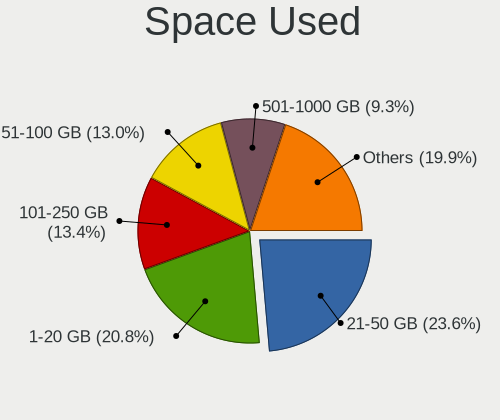
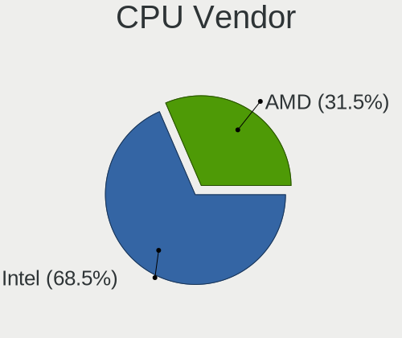
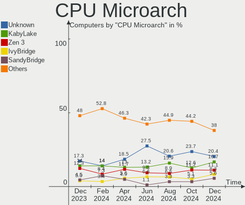
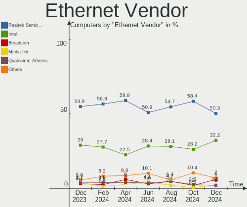
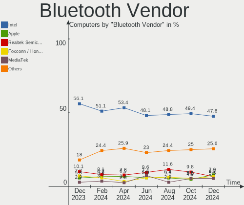
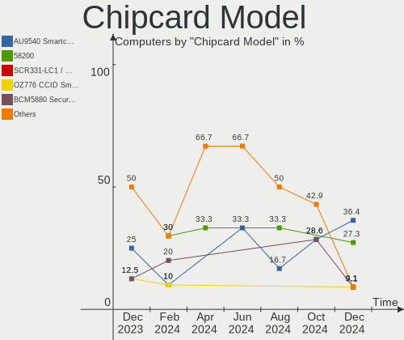

Pop!_OS Hardware Trends
-----------------------

A project to identify most popular hardware characteristics and track their change
over time based on data collected by Pop!_OS users at https://Linux-Hardware.org.

Anyone can contribute to this report by the [hw-probe](https://github.com/linuxhw/hw-probe) tool:

    sudo -E hw-probe -all -upload

This is a report for all computer types. See also reports for [desktops](/Dist/Pop!_OS/Desktop/README.md) and [notebooks](/Dist/Pop!_OS/Notebook/README.md).

Full-feature report is available here: https://linux-hardware.org/?view=trends

Period: Feb, 2022.

Contents
--------

* [ System ](#system)
  - [ OS                       ](#os)
  - [ OS Family                ](#os-family)
  - [ Kernel                   ](#kernel)
  - [ Kernel Family            ](#kernel-family)
  - [ Kernel Major Ver.        ](#kernel-major-ver)
  - [ Arch                     ](#arch)
  - [ DE                       ](#de)
  - [ Display Server           ](#display-server)
  - [ Display Manager          ](#display-manager)
  - [ OS Lang                  ](#os-lang)
  - [ Boot Mode                ](#boot-mode)
  - [ Filesystem               ](#filesystem)
  - [ Part. scheme             ](#part-scheme)
  - [ Dual Boot with Linux/BSD ](#dual-boot-with-linuxbsd)
  - [ Dual Boot (Win)          ](#dual-boot-win)

* [ Board ](#board)
  - [ Vendor                   ](#vendor)
  - [ Model                    ](#model)
  - [ Model Family             ](#model-family)
  - [ MFG Year                 ](#mfg-year)
  - [ Form Factor              ](#form-factor)
  - [ Secure Boot              ](#secure-boot)
  - [ Coreboot                 ](#coreboot)
  - [ RAM Size                 ](#ram-size)
  - [ RAM Used                 ](#ram-used)
  - [ Total Drives             ](#total-drives)
  - [ Has CD-ROM               ](#has-cd-rom)
  - [ Has Ethernet             ](#has-ethernet)
  - [ Has WiFi                 ](#has-wifi)
  - [ Has Bluetooth            ](#has-bluetooth)

* [ Location ](#location)
  - [ Country                  ](#country)
  - [ City                     ](#city)

* [ Drives ](#drives)
  - [ Drive Vendor             ](#drive-vendor)
  - [ Drive Model              ](#drive-model)
  - [ HDD Vendor               ](#hdd-vendor)
  - [ SSD Vendor               ](#ssd-vendor)
  - [ Drive Kind               ](#drive-kind)
  - [ Drive Connector          ](#drive-connector)
  - [ Drive Size               ](#drive-size)
  - [ Space Total              ](#space-total)
  - [ Space Used               ](#space-used)
  - [ Malfunc. Drives          ](#malfunc-drives)
  - [ Malfunc. Drive Vendor    ](#malfunc-drive-vendor)
  - [ Malfunc. HDD Vendor      ](#malfunc-hdd-vendor)
  - [ Malfunc. Drive Kind      ](#malfunc-drive-kind)
  - [ Failed Drives            ](#failed-drives)
  - [ Failed Drive Vendor      ](#failed-drive-vendor)
  - [ Drive Status             ](#drive-status)

* [ Storage controller ](#storage-controller)
  - [ Storage Vendor           ](#storage-vendor)
  - [ Storage Model            ](#storage-model)
  - [ Storage Kind             ](#storage-kind)

* [ Processor ](#processor)
  - [ CPU Vendor               ](#cpu-vendor)
  - [ CPU Model                ](#cpu-model)
  - [ CPU Model Family         ](#cpu-model-family)
  - [ CPU Cores                ](#cpu-cores)
  - [ CPU Sockets              ](#cpu-sockets)
  - [ CPU Threads              ](#cpu-threads)
  - [ CPU Op-Modes             ](#cpu-op-modes)
  - [ CPU Microcode            ](#cpu-microcode)
  - [ CPU Microarch            ](#cpu-microarch)

* [ Graphics ](#graphics)
  - [ GPU Vendor               ](#gpu-vendor)
  - [ GPU Model                ](#gpu-model)
  - [ GPU Combo                ](#gpu-combo)
  - [ GPU Driver               ](#gpu-driver)
  - [ GPU Memory               ](#gpu-memory)

* [ Monitor ](#monitor)
  - [ Monitor Vendor           ](#monitor-vendor)
  - [ Monitor Model            ](#monitor-model)
  - [ Monitor Resolution       ](#monitor-resolution)
  - [ Monitor Diagonal         ](#monitor-diagonal)
  - [ Monitor Width            ](#monitor-width)
  - [ Aspect Ratio             ](#aspect-ratio)
  - [ Monitor Area             ](#monitor-area)
  - [ Pixel Density            ](#pixel-density)
  - [ Multiple Monitors        ](#multiple-monitors)

* [ Network ](#network)
  - [ Net Controller Vendor    ](#net-controller-vendor)
  - [ Net Controller Model     ](#net-controller-model)
  - [ Wireless Vendor          ](#wireless-vendor)
  - [ Wireless Model           ](#wireless-model)
  - [ Ethernet Vendor          ](#ethernet-vendor)
  - [ Ethernet Model           ](#ethernet-model)
  - [ Net Controller Kind      ](#net-controller-kind)
  - [ Used Controller          ](#used-controller)
  - [ NICs                     ](#nics)
  - [ IPv6                     ](#ipv6)

* [ Bluetooth ](#bluetooth)
  - [ Bluetooth Vendor         ](#bluetooth-vendor)
  - [ Bluetooth Model          ](#bluetooth-model)

* [ Sound ](#sound)
  - [ Sound Vendor             ](#sound-vendor)
  - [ Sound Model              ](#sound-model)

* [ Memory ](#memory)
  - [ Memory Vendor            ](#memory-vendor)
  - [ Memory Model             ](#memory-model)
  - [ Memory Kind              ](#memory-kind)
  - [ Memory Form Factor       ](#memory-form-factor)
  - [ Memory Size              ](#memory-size)
  - [ Memory Speed             ](#memory-speed)

* [ Printers & scanners ](#printers--scanners)
  - [ Printer Vendor           ](#printer-vendor)
  - [ Printer Model            ](#printer-model)
  - [ Scanner Vendor           ](#scanner-vendor)
  - [ Scanner Model            ](#scanner-model)

* [ Camera ](#camera)
  - [ Camera Vendor            ](#camera-vendor)
  - [ Camera Model             ](#camera-model)

* [ Security ](#security)
  - [ Fingerprint Vendor       ](#fingerprint-vendor)
  - [ Fingerprint Model        ](#fingerprint-model)
  - [ Chipcard Vendor          ](#chipcard-vendor)
  - [ Chipcard Model           ](#chipcard-model)

* [ Unsupported ](#unsupported)
  - [ Unsupported Devices      ](#unsupported-devices)
  - [ Unsupported Device Types ](#unsupported-device-types)

System
------

OS
--

Installed operating systems

| Name          | Computers | Percent |
|---------------|-----------|---------|
| Pop!_OS 21.10 | 241       | 84.27%  |
| Pop!_OS 20.04 | 31        | 10.84%  |
| Pop!_OS 21.04 | 14        | 4.9%    |

OS Family
---------

OS without a version

| Name    | Computers | Percent |
|---------|-----------|---------|
| Pop!_OS | 286       | 100%    |

Kernel
------

Version of the Linux kernel

| Version                   | Computers | Percent |
|---------------------------|-----------|---------|
| 5.15.15-76051515-generic  | 188       | 65.73%  |
| 5.15.23-76051523-generic  | 65        | 22.73%  |
| 5.15.11-76051511-generic  | 7         | 2.45%   |
| 5.15.5-76051505-generic   | 4         | 1.4%    |
| 5.15.8-76051508-generic   | 3         | 1.05%   |
| 5.13.0-7614-generic       | 3         | 1.05%   |
| 5.4.0-7634-generic        | 2         | 0.7%    |
| 5.15.24-xanmod1           | 2         | 0.7%    |
| 5.15.22-xanmod1           | 2         | 0.7%    |
| 5.13.0-7620-generic       | 2         | 0.7%    |
| 5.11.0-7620-generic       | 2         | 0.7%    |
| 5.4.0-7625-generic        | 1         | 0.35%   |
| 5.17.0-051700rc4-generic  | 1         | 0.35%   |
| 5.16.9-tkg-pds            | 1         | 0.35%   |
| 5.16.0-9.1-liquorix-amd64 | 1         | 0.35%   |
| 5.15.0-76051500-generic   | 1         | 0.35%   |
| 5.13.0-1016-raspi         | 1         | 0.35%   |

Kernel Family
-------------

Linux kernel without a distro release

| Version | Computers | Percent |
|---------|-----------|---------|
| 5.15.15 | 188       | 65.73%  |
| 5.15.23 | 65        | 22.73%  |
| 5.15.11 | 7         | 2.45%   |
| 5.13.0  | 6         | 2.1%    |
| 5.15.5  | 4         | 1.4%    |
| 5.4.0   | 3         | 1.05%   |
| 5.15.8  | 3         | 1.05%   |
| 5.15.24 | 2         | 0.7%    |
| 5.15.22 | 2         | 0.7%    |
| 5.11.0  | 2         | 0.7%    |
| 5.17.0  | 1         | 0.35%   |
| 5.16.9  | 1         | 0.35%   |
| 5.16.0  | 1         | 0.35%   |
| 5.15.0  | 1         | 0.35%   |

Kernel Major Ver.
-----------------

Linux kernel major version

| Version | Computers | Percent |
|---------|-----------|---------|
| 5.15    | 272       | 95.1%   |
| 5.13    | 6         | 2.1%    |
| 5.4     | 3         | 1.05%   |
| 5.16    | 2         | 0.7%    |
| 5.11    | 2         | 0.7%    |
| 5.17    | 1         | 0.35%   |

Arch
----

OS architecture (x86_64, i586, etc.)

| Name    | Computers | Percent |
|---------|-----------|---------|
| x86_64  | 285       | 99.65%  |
| aarch64 | 1         | 0.35%   |

DE
--

Desktop Environment

| Name            | Computers | Percent |
|-----------------|-----------|---------|
| GNOME           | 281       | 98.25%  |
| KDE5            | 2         | 0.7%    |
| LXQt            | 1         | 0.35%   |
| GNOME Flashback | 1         | 0.35%   |
| Unknown         | 1         | 0.35%   |

Display Server
--------------

X11 or Wayland

| Name    | Computers | Percent |
|---------|-----------|---------|
| X11     | 277       | 96.85%  |
| Wayland | 8         | 2.8%    |
| Tty     | 1         | 0.35%   |

Display Manager
---------------

SDDM, LightDM, etc.

| Name    | Computers | Percent |
|---------|-----------|---------|
| Unknown | 243       | 84.97%  |
| GDM     | 41        | 14.34%  |
| GDM3    | 2         | 0.7%    |

OS Lang
-------

Language

| Lang    | Computers | Percent |
|---------|-----------|---------|
| en_US   | 153       | 53.5%   |
| pt_BR   | 27        | 9.44%   |
| en_GB   | 15        | 5.24%   |
| de_DE   | 13        | 4.55%   |
| en_CA   | 10        | 3.5%    |
| C       | 8         | 2.8%    |
| fr_FR   | 7         | 2.45%   |
| es_ES   | 7         | 2.45%   |
| en_AU   | 5         | 1.75%   |
| pt_PT   | 4         | 1.4%    |
| ru_RU   | 3         | 1.05%   |
| pl_PL   | 3         | 1.05%   |
| it_IT   | 3         | 1.05%   |
| fi_FI   | 3         | 1.05%   |
| nb_NO   | 2         | 0.7%    |
| en_ZA   | 2         | 0.7%    |
| en_DK   | 2         | 0.7%    |
| tr_TR   | 1         | 0.35%   |
| ru_UA   | 1         | 0.35%   |
| ro_RO   | 1         | 0.35%   |
| nl_NL   | 1         | 0.35%   |
| nl_BE   | 1         | 0.35%   |
| lt_LT   | 1         | 0.35%   |
| jv_ID   | 1         | 0.35%   |
| ja_JP   | 1         | 0.35%   |
| hu_HU   | 1         | 0.35%   |
| fr_BE   | 1         | 0.35%   |
| et_EE   | 1         | 0.35%   |
| es_UY   | 1         | 0.35%   |
| es_PE   | 1         | 0.35%   |
| en_NZ   | 1         | 0.35%   |
| en_IN   | 1         | 0.35%   |
| en_IE   | 1         | 0.35%   |
| da_DK   | 1         | 0.35%   |
| bg_BG   | 1         | 0.35%   |
| Unknown | 1         | 0.35%   |

Boot Mode
---------

EFI or BIOS

| Mode | Computers | Percent |
|------|-----------|---------|
| BIOS | 245       | 85.66%  |
| EFI  | 41        | 14.34%  |

Filesystem
----------

Type of filesystem

| Type    | Computers | Percent |
|---------|-----------|---------|
| Ext4    | 277       | 96.85%  |
| Btrfs   | 5         | 1.75%   |
| Overlay | 4         | 1.4%    |

Part. scheme
------------

Scheme of partitioning

| Type    | Computers | Percent |
|---------|-----------|---------|
| Unknown | 242       | 84.62%  |
| GPT     | 40        | 13.99%  |
| MBR     | 4         | 1.4%    |

Dual Boot with Linux/BSD
------------------------

Hosting more than one Linux/BSD

| Dual boot | Computers | Percent |
|-----------|-----------|---------|
| No        | 279       | 97.55%  |
| Yes       | 7         | 2.45%   |

Dual Boot (Win)
---------------

Hosting Linux and Windows

| Dual boot | Computers | Percent |
|-----------|-----------|---------|
| No        | 271       | 94.76%  |
| Yes       | 15        | 5.24%   |

Board
-----

Vendor
------

Motherboard manufacturer

| Name                    | Computers | Percent |
|-------------------------|-----------|---------|
| ASUSTek Computer        | 58        | 20.28%  |
| Dell                    | 38        | 13.29%  |
| Lenovo                  | 34        | 11.89%  |
| Hewlett-Packard         | 27        | 9.44%   |
| Gigabyte Technology     | 23        | 8.04%   |
| MSI                     | 19        | 6.64%   |
| Apple                   | 15        | 5.24%   |
| Acer                    | 13        | 4.55%   |
| ASRock                  | 12        | 4.2%    |
| System76                | 9         | 3.15%   |
| Toshiba                 | 4         | 1.4%    |
| Samsung Electronics     | 4         | 1.4%    |
| Intel                   | 3         | 1.05%   |
| Sony                    | 2         | 0.7%    |
| Positivo Bahia - VAIO   | 2         | 0.7%    |
| Pegatron                | 2         | 0.7%    |
| Notebook                | 2         | 0.7%    |
| Medion                  | 2         | 0.7%    |
| LG Electronics          | 2         | 0.7%    |
| Fujitsu                 | 2         | 0.7%    |
| Foxconn                 | 2         | 0.7%    |
| Wortmann AG             | 1         | 0.35%   |
| Vulcan Electronics      | 1         | 0.35%   |
| SLIMBOOK                | 1         | 0.35%   |
| Raspberry Pi Foundation | 1         | 0.35%   |
| Panasonic               | 1         | 0.35%   |
| Multilaser              | 1         | 0.35%   |
| Jumper                  | 1         | 0.35%   |
| HUAWEI                  | 1         | 0.35%   |
| eMachines               | 1         | 0.35%   |
| ECS                     | 1         | 0.35%   |
| Casper                  | 1         | 0.35%   |

Model
-----

Motherboard model

| Name                                        | Computers | Percent |
|---------------------------------------------|-----------|---------|
| ASUS All Series                             | 5         | 1.75%   |
| MSI MS-7C02                                 | 4         | 1.4%    |
| System76 Oryx Pro                           | 3         | 1.05%   |
| System76 Galago Pro                         | 3         | 1.05%   |
| Dell XPS 15 7590                            | 3         | 1.05%   |
| System76 Pangolin                           | 2         | 0.7%    |
| Positivo Bahia - VAIO VJFE42F11X-XXXXXX     | 2         | 0.7%    |
| MSI MS-7C56                                 | 2         | 0.7%    |
| Lenovo IdeaPad 330S-14IKB 81JM              | 2         | 0.7%    |
| Gigabyte Z170XP-SLI                         | 2         | 0.7%    |
| Gigabyte B450 AORUS M                       | 2         | 0.7%    |
| Apple MacBookAir6,2                         | 2         | 0.7%    |
| Wortmann AG 1220663_1470189                 | 1         | 0.35%   |
| Vulcan Excursion XC                         | 1         | 0.35%   |
| Toshiba Satellite S75-A                     | 1         | 0.35%   |
| Toshiba Satellite L55t-B                    | 1         | 0.35%   |
| Toshiba Satellite C55-C                     | 1         | 0.35%   |
| Toshiba Satellite A200                      | 1         | 0.35%   |
| System76 Lemur Pro                          | 1         | 0.35%   |
| Sony VPCEH38FG                              | 1         | 0.35%   |
| Sony SVL24117FLB                            | 1         | 0.35%   |
| SLIMBOOK TITAN                              | 1         | 0.35%   |
| Samsung RF511/RF411/RF711                   | 1         | 0.35%   |
| Samsung RC420/RC520/RC720                   | 1         | 0.35%   |
| Samsung QX310/QX410/QX510/SF310/SF410/SF510 | 1         | 0.35%   |
| Samsung 270E5J/2570EJ                       | 1         | 0.35%   |
| RPi Raspberry Pi                            | 1         | 0.35%   |
| Pegatron KQ437AA-ABA IQ506                  | 1         | 0.35%   |
| Pegatron h8-1380t                           | 1         | 0.35%   |
| Panasonic CF-C2ACAZXLM                      | 1         | 0.35%   |
| Notebook W35xSTQ_370ST                      | 1         | 0.35%   |
| Notebook PCx0Dx                             | 1         | 0.35%   |
| Multilaser PC024                            | 1         | 0.35%   |
| MSI MS-7D42                                 | 1         | 0.35%   |
| MSI MS-7D18                                 | 1         | 0.35%   |
| MSI MS-7C89                                 | 1         | 0.35%   |
| MSI MS-7C37                                 | 1         | 0.35%   |
| MSI MS-7B93                                 | 1         | 0.35%   |
| MSI MS-7B89                                 | 1         | 0.35%   |
| MSI MS-7B17                                 | 1         | 0.35%   |
| MSI MS-7A74                                 | 1         | 0.35%   |
| MSI MS-7A70                                 | 1         | 0.35%   |
| MSI MS-7250                                 | 1         | 0.35%   |
| MSI GT60 2OC/2OD                            | 1         | 0.35%   |
| MSI GL63 8SE                                | 1         | 0.35%   |
| MSI GF75 Thin 10UEK                         | 1         | 0.35%   |
| Medion MS-7728                              | 1         | 0.35%   |
| Medion Erazer P7647 MD60803                 | 1         | 0.35%   |
| LG S425-G.BC31P1                            | 1         | 0.35%   |
| LG R410-L.D211P1                            | 1         | 0.35%   |
| Lenovo Yoga710-15ISK 80U0                   | 1         | 0.35%   |
| Lenovo ThinkPad X220 429136G                | 1         | 0.35%   |
| Lenovo ThinkPad X13 Gen 2i 20WLS4HT00       | 1         | 0.35%   |
| Lenovo ThinkPad X1 Extreme 2nd 20QVCTO1WW   | 1         | 0.35%   |
| Lenovo ThinkPad X1 Carbon 7th 20QESCRV00    | 1         | 0.35%   |
| Lenovo ThinkPad X1 Carbon 7th 20QD001TUS    | 1         | 0.35%   |
| Lenovo ThinkPad X1 Carbon 5th 20HQS04R00    | 1         | 0.35%   |
| Lenovo ThinkPad T460s 20FAS21F00            | 1         | 0.35%   |
| Lenovo ThinkPad T450s 20BWS19E02            | 1         | 0.35%   |
| Lenovo ThinkPad T450 20BUS0GT00             | 1         | 0.35%   |

Model Family
------------

Motherboard model prefix

| Name                                    | Computers | Percent |
|-----------------------------------------|-----------|---------|
| Lenovo ThinkPad                         | 17        | 5.94%   |
| Dell Inspiron                           | 10        | 3.5%    |
| ASUS ROG                                | 10        | 3.5%    |
| Acer Aspire                             | 10        | 3.5%    |
| Lenovo IdeaPad                          | 8         | 2.8%    |
| Dell XPS                                | 8         | 2.8%    |
| ASUS PRIME                              | 7         | 2.45%   |
| HP Laptop                               | 6         | 2.1%    |
| Dell Latitude                           | 6         | 2.1%    |
| Dell Precision                          | 5         | 1.75%   |
| ASUS TUF                                | 5         | 1.75%   |
| ASUS All                                | 5         | 1.75%   |
| Toshiba Satellite                       | 4         | 1.4%    |
| MSI MS-7C02                             | 4         | 1.4%    |
| HP ProBook                              | 4         | 1.4%    |
| System76 Oryx                           | 3         | 1.05%   |
| System76 Galago                         | 3         | 1.05%   |
| Lenovo ThinkCentre                      | 3         | 1.05%   |
| HP Pavilion                             | 3         | 1.05%   |
| HP EliteBook                            | 3         | 1.05%   |
| Dell OptiPlex                           | 3         | 1.05%   |
| System76 Pangolin                       | 2         | 0.7%    |
| Positivo Bahia - VAIO VJFE42F11X-XXXXXX | 2         | 0.7%    |
| MSI MS-7C56                             | 2         | 0.7%    |
| Intel NUC6i7KYB                         | 2         | 0.7%    |
| HP ENVY                                 | 2         | 0.7%    |
| HP 250                                  | 2         | 0.7%    |
| Gigabyte Z170XP-SLI                     | 2         | 0.7%    |
| Gigabyte B450                           | 2         | 0.7%    |
| Dell Vostro                             | 2         | 0.7%    |
| Dell G5                                 | 2         | 0.7%    |
| ASUS VivoBook                           | 2         | 0.7%    |
| ASUS SABERTOOTH                         | 2         | 0.7%    |
| ASUS ASUS                               | 2         | 0.7%    |
| Apple MacBookAir6                       | 2         | 0.7%    |
| Acer Nitro                              | 2         | 0.7%    |
| Wortmann AG 1220663                     | 1         | 0.35%   |
| Vulcan Excursion                        | 1         | 0.35%   |
| System76 Lemur                          | 1         | 0.35%   |
| Sony VPCEH38FG                          | 1         | 0.35%   |
| Sony SVL24117FLB                        | 1         | 0.35%   |
| SLIMBOOK TITAN                          | 1         | 0.35%   |
| Samsung RF511                           | 1         | 0.35%   |
| Samsung RC420                           | 1         | 0.35%   |
| Samsung QX310                           | 1         | 0.35%   |
| Samsung 270E5J                          | 1         | 0.35%   |
| RPi Raspberry                           | 1         | 0.35%   |
| Pegatron KQ437AA-ABA                    | 1         | 0.35%   |
| Pegatron h8-1380t                       | 1         | 0.35%   |
| Panasonic CF-C2ACAZXLM                  | 1         | 0.35%   |
| Notebook W35xSTQ                        | 1         | 0.35%   |
| Notebook PCx0Dx                         | 1         | 0.35%   |
| Multilaser PC024                        | 1         | 0.35%   |
| MSI MS-7D42                             | 1         | 0.35%   |
| MSI MS-7D18                             | 1         | 0.35%   |
| MSI MS-7C89                             | 1         | 0.35%   |
| MSI MS-7C37                             | 1         | 0.35%   |
| MSI MS-7B93                             | 1         | 0.35%   |
| MSI MS-7B89                             | 1         | 0.35%   |
| MSI MS-7B17                             | 1         | 0.35%   |

MFG Year
--------

Motherboard manufacture year

| Year    | Computers | Percent |
|---------|-----------|---------|
| 2020    | 37        | 12.94%  |
| 2021    | 31        | 10.84%  |
| 2019    | 31        | 10.84%  |
| 2018    | 31        | 10.84%  |
| 2012    | 24        | 8.39%   |
| 2013    | 23        | 8.04%   |
| 2011    | 20        | 6.99%   |
| 2016    | 18        | 6.29%   |
| 2017    | 15        | 5.24%   |
| 2014    | 15        | 5.24%   |
| 2015    | 11        | 3.85%   |
| 2010    | 10        | 3.5%    |
| 2009    | 6         | 2.1%    |
| 2008    | 6         | 2.1%    |
| 2022    | 3         | 1.05%   |
| 2007    | 3         | 1.05%   |
| 2006    | 1         | 0.35%   |
| Unknown | 1         | 0.35%   |

Form Factor
-----------

Physical design of the computer

| Name           | Computers | Percent |
|----------------|-----------|---------|
| Notebook       | 162       | 56.64%  |
| Desktop        | 106       | 37.06%  |
| Mini pc        | 6         | 2.1%    |
| Tablet         | 4         | 1.4%    |
| All in one     | 4         | 1.4%    |
| Convertible    | 2         | 0.7%    |
| System on chip | 1         | 0.35%   |
| Server         | 1         | 0.35%   |

Secure Boot
-----------

Enabled or disabled

| State    | Computers | Percent |
|----------|-----------|---------|
| Disabled | 286       | 100%    |

Coreboot
--------

Have coreboot on board

| Used | Computers | Percent |
|------|-----------|---------|
| No   | 280       | 97.9%   |
| Yes  | 6         | 2.1%    |

RAM Size
--------

Total RAM memory

| Size in GB  | Computers | Percent |
|-------------|-----------|---------|
| 4.01-8.0    | 66        | 23.08%  |
| 16.01-24.0  | 64        | 22.38%  |
| 8.01-16.0   | 54        | 18.88%  |
| 32.01-64.0  | 41        | 14.34%  |
| 3.01-4.0    | 34        | 11.89%  |
| 64.01-256.0 | 12        | 4.2%    |
| 24.01-32.0  | 8         | 2.8%    |
| 1.01-2.0    | 4         | 1.4%    |
| 2.01-3.0    | 3         | 1.05%   |

RAM Used
--------

Used RAM memory

| Used GB    | Computers | Percent |
|------------|-----------|---------|
| 1.01-2.0   | 91        | 31.82%  |
| 2.01-3.0   | 84        | 29.37%  |
| 4.01-8.0   | 46        | 16.08%  |
| 3.01-4.0   | 43        | 15.03%  |
| 8.01-16.0  | 17        | 5.94%   |
| 24.01-32.0 | 2         | 0.7%    |
| 16.01-24.0 | 2         | 0.7%    |
| 0.51-1.0   | 1         | 0.35%   |

Total Drives
------------

Number of drives on board

| Drives | Computers | Percent |
|--------|-----------|---------|
| 1      | 161       | 56.29%  |
| 2      | 79        | 27.62%  |
| 3      | 24        | 8.39%   |
| 4      | 10        | 3.5%    |
| 5      | 5         | 1.75%   |
| 6      | 3         | 1.05%   |
| 14     | 1         | 0.35%   |
| 8      | 1         | 0.35%   |
| 7      | 1         | 0.35%   |
| 0      | 1         | 0.35%   |

Has CD-ROM
----------

Has CD-ROM on board

| Presented | Computers | Percent |
|-----------|-----------|---------|
| No        | 198       | 69.23%  |
| Yes       | 88        | 30.77%  |

Has Ethernet
------------

Has Ethernet on board

| Presented | Computers | Percent |
|-----------|-----------|---------|
| Yes       | 253       | 88.46%  |
| No        | 33        | 11.54%  |

Has WiFi
--------

Has WiFi module

| Presented | Computers | Percent |
|-----------|-----------|---------|
| Yes       | 227       | 79.37%  |
| No        | 59        | 20.63%  |

Has Bluetooth
-------------

Has Bluetooth module

| Presented | Computers | Percent |
|-----------|-----------|---------|
| Yes       | 194       | 67.83%  |
| No        | 92        | 32.17%  |

Location
--------

Country
-------

Geographic location (country)

| Country                | Computers | Percent |
|------------------------|-----------|---------|
| USA                    | 85        | 29.72%  |
| Brazil                 | 31        | 10.84%  |
| Germany                | 21        | 7.34%   |
| UK                     | 12        | 4.2%    |
| Canada                 | 12        | 4.2%    |
| France                 | 9         | 3.15%   |
| Spain                  | 8         | 2.8%    |
| Poland                 | 7         | 2.45%   |
| Finland                | 6         | 2.1%    |
| Australia              | 6         | 2.1%    |
| Turkey                 | 5         | 1.75%   |
| Netherlands            | 5         | 1.75%   |
| Sweden                 | 4         | 1.4%    |
| South Africa           | 4         | 1.4%    |
| Romania                | 4         | 1.4%    |
| New Zealand            | 4         | 1.4%    |
| Italy                  | 4         | 1.4%    |
| India                  | 4         | 1.4%    |
| Denmark                | 4         | 1.4%    |
| Ukraine                | 3         | 1.05%   |
| Serbia                 | 3         | 1.05%   |
| Russia                 | 3         | 1.05%   |
| Portugal               | 3         | 1.05%   |
| Iceland                | 3         | 1.05%   |
| Belgium                | 3         | 1.05%   |
| Norway                 | 2         | 0.7%    |
| Morocco                | 2         | 0.7%    |
| Lithuania              | 2         | 0.7%    |
| Japan                  | 2         | 0.7%    |
| Ireland                | 2         | 0.7%    |
| Greece                 | 2         | 0.7%    |
| Colombia               | 2         | 0.7%    |
| Bulgaria               | 2         | 0.7%    |
| Uruguay                | 1         | 0.35%   |
| Taiwan                 | 1         | 0.35%   |
| South Korea            | 1         | 0.35%   |
| Slovakia               | 1         | 0.35%   |
| Saudi Arabia           | 1         | 0.35%   |
| Peru                   | 1         | 0.35%   |
| Mexico                 | 1         | 0.35%   |
| Kazakhstan             | 1         | 0.35%   |
| Indonesia              | 1         | 0.35%   |
| Hungary                | 1         | 0.35%   |
| Guatemala              | 1         | 0.35%   |
| Estonia                | 1         | 0.35%   |
| Croatia                | 1         | 0.35%   |
| Chile                  | 1         | 0.35%   |
| Bosnia and Herzegovina | 1         | 0.35%   |
| Bangladesh             | 1         | 0.35%   |
| Azerbaijan             | 1         | 0.35%   |

City
----

Geographic location (city)

| City            | Computers | Percent |
|-----------------|-----------|---------|
| São Paulo    | 6         | 2.1%    |
| Sydney          | 4         | 1.4%    |
| Warsaw          | 3         | 1.05%   |
| Berlin          | 3         | 1.05%   |
| Belgrade        | 3         | 1.05%   |
| Urjala          | 2         | 0.7%    |
| Rome            | 2         | 0.7%    |
| Rio de Janeiro  | 2         | 0.7%    |
| Reykjavik       | 2         | 0.7%    |
| New York        | 2         | 0.7%    |
| Medellín     | 2         | 0.7%    |
| Limnos          | 2         | 0.7%    |
| Lexington       | 2         | 0.7%    |
| Johannesburg    | 2         | 0.7%    |
| Helsinki        | 2         | 0.7%    |
| Hagerstown      | 2         | 0.7%    |
| Edmonton        | 2         | 0.7%    |
| Dublin          | 2         | 0.7%    |
| Charleston      | 2         | 0.7%    |
| Birmingham      | 2         | 0.7%    |
| Bensheim        | 2         | 0.7%    |
| Belo Horizonte  | 2         | 0.7%    |
| Austin          | 2         | 0.7%    |
| Auckland        | 2         | 0.7%    |
| Atlanta         | 2         | 0.7%    |
| Youssoufia      | 1         | 0.35%   |
| Wylie           | 1         | 0.35%   |
| Wood Dale       | 1         | 0.35%   |
| Weymouth        | 1         | 0.35%   |
| Westfield       | 1         | 0.35%   |
| Welland         | 1         | 0.35%   |
| Waterloo        | 1         | 0.35%   |
| Waterford       | 1         | 0.35%   |
| Volta Redonda   | 1         | 0.35%   |
| Virum           | 1         | 0.35%   |
| Vilnius         | 1         | 0.35%   |
| Vierpolders     | 1         | 0.35%   |
| Verona          | 1         | 0.35%   |
| Vác          | 1         | 0.35%   |
| Valladolid      | 1         | 0.35%   |
| Ust-Kamenogorsk | 1         | 0.35%   |
| Uppsala         | 1         | 0.35%   |
| Uberlândia   | 1         | 0.35%   |
| Tyler           | 1         | 0.35%   |
| Torun           | 1         | 0.35%   |
| Toronto         | 1         | 0.35%   |
| Thornville      | 1         | 0.35%   |
| Telford         | 1         | 0.35%   |
| Taubate         | 1         | 0.35%   |
| Tallinn         | 1         | 0.35%   |
| Tallahassee     | 1         | 0.35%   |
| Taichung        | 1         | 0.35%   |
| Sunderland      | 1         | 0.35%   |
| Stockholm       | 1         | 0.35%   |
| Stittsville     | 1         | 0.35%   |
| St Petersburg   | 1         | 0.35%   |
| St Austell      | 1         | 0.35%   |
| Springfield     | 1         | 0.35%   |
| Sorocaba        | 1         | 0.35%   |
| Solan           | 1         | 0.35%   |

Drives
------

Drive Vendor
------------

Hard drive vendors

| Vendor                         | Computers | Drives | Percent |
|--------------------------------|-----------|--------|---------|
| Samsung Electronics            | 83        | 105    | 18.57%  |
| Seagate                        | 61        | 78     | 13.65%  |
| WDC                            | 52        | 56     | 11.63%  |
| Kingston                       | 27        | 29     | 6.04%   |
| Toshiba                        | 26        | 27     | 5.82%   |
| Sandisk                        | 26        | 26     | 5.82%   |
| Crucial                        | 20        | 25     | 4.47%   |
| SK Hynix                       | 16        | 18     | 3.58%   |
| Unknown                        | 14        | 17     | 3.13%   |
| Phison                         | 10        | 10     | 2.24%   |
| Intel                          | 10        | 12     | 2.24%   |
| Hitachi                        | 10        | 10     | 2.24%   |
| Apple                          | 7         | 7      | 1.57%   |
| A-DATA Technology              | 7         | 8      | 1.57%   |
| Micron Technology              | 6         | 6      | 1.34%   |
| Solid State Storage Technology | 4         | 4      | 0.89%   |
| Mushkin                        | 4         | 4      | 0.89%   |
| KIOXIA                         | 4         | 4      | 0.89%   |
| HGST                           | 4         | 7      | 0.89%   |
| Team                           | 3         | 3      | 0.67%   |
| Silicon Motion                 | 3         | 3      | 0.67%   |
| Patriot                        | 3         | 3      | 0.67%   |
| OCZ                            | 3         | 3      | 0.67%   |
| Intenso                        | 3         | 3      | 0.67%   |
| China                          | 3         | 3      | 0.67%   |
| XPG                            | 2         | 3      | 0.45%   |
| Realtek Semiconductor          | 2         | 2      | 0.45%   |
| PNY                            | 2         | 2      | 0.45%   |
| Micron/Crucial Technology      | 2         | 2      | 0.45%   |
| LITEON                         | 2         | 2      | 0.45%   |
| Gigabyte Technology            | 2         | 2      | 0.45%   |
| Transcend                      | 1         | 1      | 0.22%   |
| Teutons                        | 1         | 1      | 0.22%   |
| Super Talent                   | 1         | 1      | 0.22%   |
| SPCC                           | 1         | 1      | 0.22%   |
| Sasmung                        | 1         | 1      | 0.22%   |
| MAXTOR                         | 1         | 1      | 0.22%   |
| MAXIO Technology (Hangzhou)    | 1         | 1      | 0.22%   |
| MARVELL                        | 1         | 2      | 0.22%   |
| LITEONIT                       | 1         | 1      | 0.22%   |
| Lite-On                        | 1         | 1      | 0.22%   |
| Lexar                          | 1         | 1      | 0.22%   |
| Lenovo                         | 1         | 2      | 0.22%   |
| LaCie                          | 1         | 1      | 0.22%   |
| KIOXIA-EXCERIA                 | 1         | 1      | 0.22%   |
| KINGBANK                       | 1         | 1      | 0.22%   |
| JetDrive                       | 1         | 1      | 0.22%   |
| Hewlett-Packard                | 1         | 1      | 0.22%   |
| Glyph                          | 1         | 1      | 0.22%   |
| Fujitsu                        | 1         | 1      | 0.22%   |
| DOGFISH                        | 1         | 1      | 0.22%   |
| CS900                          | 1         | 1      | 0.22%   |
| Corsair                        | 1         | 1      | 0.22%   |
| Biostar                        | 1         | 1      | 0.22%   |
| ASMT                           | 1         | 1      | 0.22%   |
| Apacer                         | 1         | 1      | 0.22%   |
| AMD                            | 1         | 1      | 0.22%   |

Drive Model
-----------

Hard drive models

| Model                                    | Computers | Percent |
|------------------------------------------|-----------|---------|
| Samsung NVMe SSD Drive 500GB             | 12        | 2.46%   |
| Samsung NVMe SSD Drive 1TB               | 12        | 2.46%   |
| Kingston SA400S37240G 240GB SSD          | 9         | 1.85%   |
| SK Hynix NVMe SSD Drive 512GB            | 7         | 1.44%   |
| Samsung SM963 2.5" NVMe PCIe SSD 256GB   | 7         | 1.44%   |
| Seagate ST1000LM035-1RK172 1TB           | 6         | 1.23%   |
| Sandisk NVMe SSD Drive 500GB             | 6         | 1.23%   |
| Crucial CT500MX500SSD1 500GB             | 6         | 1.23%   |
| Seagate ST4000DM004-2CV104 4TB           | 5         | 1.03%   |
| Crucial CT1000MX500SSD1 1TB              | 5         | 1.03%   |
| Unknown MMC Card  128GB                  | 4         | 0.82%   |
| Toshiba DT01ACA200 2TB                   | 4         | 0.82%   |
| SK Hynix NVMe SSD Drive 1024GB           | 4         | 0.82%   |
| Seagate ST500DM002-1BD142 500GB          | 4         | 0.82%   |
| Seagate ST2000DM008-2FR102 2TB           | 4         | 0.82%   |
| Sandisk NVMe SSD Drive 1TB               | 4         | 0.82%   |
| Samsung SSD 970 EVO Plus 1TB             | 4         | 0.82%   |
| Samsung SSD 860 EVO 500GB                | 4         | 0.82%   |
| Toshiba MQ04ABF100 1TB                   | 3         | 0.62%   |
| Toshiba MQ01ABD100 1TB                   | 3         | 0.62%   |
| Seagate ST3500418AS 500GB                | 3         | 0.62%   |
| Seagate ST2000DL003-9VT166 2TB           | 3         | 0.62%   |
| Samsung SSD 850 EVO 500GB                | 3         | 0.62%   |
| Samsung SSD 850 EVO 250GB                | 3         | 0.62%   |
| Samsung SSD 850 EVO 1TB                  | 3         | 0.62%   |
| Samsung Portable SSD T5 1TB              | 3         | 0.62%   |
| Samsung NVMe SSD Drive 250GB             | 3         | 0.62%   |
| Phison NVMe SSD Drive 256GB              | 3         | 0.62%   |
| Patriot Burst 120GB SSD                  | 3         | 0.62%   |
| Kingston SV300S37A240G 240GB SSD         | 3         | 0.62%   |
| Kingston SA400S37120G 120GB SSD          | 3         | 0.62%   |
| Intel NVMe SSD Drive 512GB               | 3         | 0.62%   |
| HGST HTS541010A9E680 1TB                 | 3         | 0.62%   |
| Apple SSD SD0128F 121GB                  | 3         | 0.62%   |
| WDC WDS240G2G0B-00EPW0 240GB SSD         | 2         | 0.41%   |
| WDC WDS120G2G0A-00JH30 120GB SSD         | 2         | 0.41%   |
| WDC WD10SPZX-21Z10T0 1TB                 | 2         | 0.41%   |
| WDC WD10EZEX-00WN4A0 1TB                 | 2         | 0.41%   |
| Unknown SD/MMC/MS PRO 64GB               | 2         | 0.41%   |
| Unknown MMC Card  64GB                   | 2         | 0.41%   |
| Unknown MMC Card  4GB                    | 2         | 0.41%   |
| Unknown MMC Card  32GB                   | 2         | 0.41%   |
| Toshiba KBG30ZMS128G 128GB NVMe SSD      | 2         | 0.41%   |
| Toshiba HDWD110 1TB                      | 2         | 0.41%   |
| Team T253X2512G 512GB SSD                | 2         | 0.41%   |
| Solid State Storage NVMe SSD Drive 256GB | 2         | 0.41%   |
| Seagate ST31000528AS 1TB                 | 2         | 0.41%   |
| Seagate ST2000DM006-2DM164 2TB           | 2         | 0.41%   |
| Seagate ST1000LM048-2E7172 1TB           | 2         | 0.41%   |
| Seagate ST1000LM024 HN-M101MBB 1TB       | 2         | 0.41%   |
| SanDisk SD9SN8W-128G-1006 128GB SSD      | 2         | 0.41%   |
| Sandisk NVMe SSD Drive 256GB             | 2         | 0.41%   |
| Sandisk NVMe SSD Drive 250GB             | 2         | 0.41%   |
| Samsung SSD 970 EVO 1TB                  | 2         | 0.41%   |
| Samsung SSD 860 QVO 1TB                  | 2         | 0.41%   |
| Samsung SM963 2.5" NVMe PCIe SSD 128GB   | 2         | 0.41%   |
| Samsung NVMe SSD Drive 1024GB            | 2         | 0.41%   |
| PNY CS900 240GB SSD                      | 2         | 0.41%   |
| Phison NVMe SSD Drive 2TB                | 2         | 0.41%   |
| KIOXIA KBG40ZNS512G NVMe 512GB           | 2         | 0.41%   |

HDD Vendor
----------

Hard disk drive vendors

| Vendor              | Computers | Drives | Percent |
|---------------------|-----------|--------|---------|
| Seagate             | 56        | 68     | 41.79%  |
| WDC                 | 37        | 39     | 27.61%  |
| Toshiba             | 19        | 20     | 14.18%  |
| Hitachi             | 10        | 10     | 7.46%   |
| HGST                | 4         | 7      | 2.99%   |
| Unknown             | 2         | 2      | 1.49%   |
| Samsung Electronics | 2         | 2      | 1.49%   |
| MARVELL             | 1         | 2      | 0.75%   |
| Glyph               | 1         | 1      | 0.75%   |
| Fujitsu             | 1         | 1      | 0.75%   |
| ASMT                | 1         | 1      | 0.75%   |

SSD Vendor
----------

Solid state drive vendors

| Vendor              | Computers | Drives | Percent |
|---------------------|-----------|--------|---------|
| Samsung Electronics | 41        | 49     | 23.3%   |
| Kingston            | 23        | 24     | 13.07%  |
| Crucial             | 19        | 23     | 10.8%   |
| WDC                 | 13        | 13     | 7.39%   |
| SanDisk             | 11        | 11     | 6.25%   |
| Apple               | 6         | 6      | 3.41%   |
| A-DATA Technology   | 6         | 7      | 3.41%   |
| Seagate             | 4         | 4      | 2.27%   |
| Mushkin             | 4         | 4      | 2.27%   |
| Micron Technology   | 4         | 4      | 2.27%   |
| Intel               | 4         | 5      | 2.27%   |
| Toshiba             | 3         | 3      | 1.7%    |
| SK Hynix            | 3         | 3      | 1.7%    |
| Patriot             | 3         | 3      | 1.7%    |
| OCZ                 | 3         | 3      | 1.7%    |
| Intenso             | 3         | 3      | 1.7%    |
| China               | 3         | 3      | 1.7%    |
| Team                | 2         | 2      | 1.14%   |
| PNY                 | 2         | 2      | 1.14%   |
| LITEON              | 2         | 2      | 1.14%   |
| Transcend           | 1         | 1      | 0.57%   |
| Teutons             | 1         | 1      | 0.57%   |
| Super Talent        | 1         | 1      | 0.57%   |
| SPCC                | 1         | 1      | 0.57%   |
| Sasmung             | 1         | 1      | 0.57%   |
| MAXTOR              | 1         | 1      | 0.57%   |
| LITEONIT            | 1         | 1      | 0.57%   |
| Lexar               | 1         | 1      | 0.57%   |
| KIOXIA-EXCERIA      | 1         | 1      | 0.57%   |
| KINGBANK            | 1         | 1      | 0.57%   |
| Hewlett-Packard     | 1         | 1      | 0.57%   |
| Gigabyte Technology | 1         | 1      | 0.57%   |
| DOGFISH             | 1         | 1      | 0.57%   |
| CS900               | 1         | 1      | 0.57%   |
| Corsair             | 1         | 1      | 0.57%   |
| Apacer              | 1         | 1      | 0.57%   |
| AMD                 | 1         | 1      | 0.57%   |

Drive Kind
----------

HDD or SSD

| Kind    | Computers | Drives | Percent |
|---------|-----------|--------|---------|
| SSD     | 159       | 191    | 39.55%  |
| NVMe    | 114       | 145    | 28.36%  |
| HDD     | 113       | 153    | 28.11%  |
| MMC     | 11        | 13     | 2.74%   |
| Unknown | 5         | 10     | 1.24%   |

Drive Connector
---------------

SATA, SAS, NVMe, etc.

| Type | Computers | Drives | Percent |
|------|-----------|--------|---------|
| SATA | 205       | 325    | 58.91%  |
| NVMe | 114       | 145    | 32.76%  |
| SAS  | 18        | 29     | 5.17%   |
| MMC  | 11        | 13     | 3.16%   |

Drive Size
----------

Size of hard drive

| Size in TB | Computers | Drives | Percent |
|------------|-----------|--------|---------|
| 0.01-0.5   | 158       | 192    | 56.43%  |
| 0.51-1.0   | 78        | 89     | 27.86%  |
| 1.01-2.0   | 26        | 30     | 9.29%   |
| 3.01-4.0   | 12        | 21     | 4.29%   |
| 4.01-10.0  | 3         | 8      | 1.07%   |
| 10.01-20.0 | 2         | 2      | 0.71%   |
| 2.01-3.0   | 1         | 2      | 0.36%   |

Space Total
-----------

Amount of disk space available on the file system

| Size in GB     | Computers | Percent |
|----------------|-----------|---------|
| 101-250        | 105       | 36.71%  |
| 251-500        | 59        | 20.63%  |
| 501-1000       | 50        | 17.48%  |
| 1001-2000      | 30        | 10.49%  |
| 2001-3000      | 12        | 4.2%    |
| More than 3000 | 11        | 3.85%   |
| 51-100         | 9         | 3.15%   |
| 1-20           | 5         | 1.75%   |
| 21-50          | 4         | 1.4%    |
| Unknown        | 1         | 0.35%   |

Space Used
----------

Amount of used disk space

| Used GB        | Computers | Percent |
|----------------|-----------|---------|
| 1-20           | 108       | 37.76%  |
| 21-50          | 55        | 19.23%  |
| 51-100         | 40        | 13.99%  |
| 101-250        | 32        | 11.19%  |
| 251-500        | 25        | 8.74%   |
| 501-1000       | 10        | 3.5%    |
| 1001-2000      | 7         | 2.45%   |
| More than 3000 | 5         | 1.75%   |
| 2001-3000      | 3         | 1.05%   |
| Unknown        | 1         | 0.35%   |

Malfunc. Drives
---------------

Drive models with a malfunction

| Model                                    | Computers | Drives | Percent |
|------------------------------------------|-----------|--------|---------|
| Toshiba THNSNK128GVN8 M.2 2280 128GB SSD | 1         | 1      | 50%     |
| ASMT 2105 2TB                            | 1         | 1      | 50%     |

Malfunc. Drive Vendor
---------------------

Vendors of faulty drives

| Vendor  | Computers | Drives | Percent |
|---------|-----------|--------|---------|
| Toshiba | 1         | 1      | 50%     |
| ASMT    | 1         | 1      | 50%     |

Malfunc. HDD Vendor
-------------------

Vendors of faulty HDD drives

| Vendor | Computers | Drives | Percent |
|--------|-----------|--------|---------|
| ASMT   | 1         | 1      | 100%    |

Malfunc. Drive Kind
-------------------

Kinds of faulty drives

| Kind | Computers | Drives | Percent |
|------|-----------|--------|---------|
| SSD  | 1         | 1      | 50%     |
| HDD  | 1         | 1      | 50%     |

Failed Drives
-------------

Failed drive models

Zero info for selected period =(

Failed Drive Vendor
-------------------

Failed drive vendors

Zero info for selected period =(

Drive Status
------------

Number of failed and malfunc. drives

| Status   | Computers | Drives | Percent |
|----------|-----------|--------|---------|
| Detected | 245       | 430    | 83.05%  |
| Works    | 48        | 80     | 16.27%  |
| Malfunc  | 2         | 2      | 0.68%   |

Storage controller
------------------

Storage Vendor
--------------

Storage controller vendors

| Vendor                         | Computers | Percent |
|--------------------------------|-----------|---------|
| Intel                          | 183       | 45.98%  |
| AMD                            | 59        | 14.82%  |
| Samsung Electronics            | 46        | 11.56%  |
| Sandisk                        | 18        | 4.52%   |
| SK Hynix                       | 13        | 3.27%   |
| Phison Electronics             | 11        | 2.76%   |
| Nvidia                         | 9         | 2.26%   |
| ASMedia Technology             | 8         | 2.01%   |
| Marvell Technology Group       | 6         | 1.51%   |
| Silicon Motion                 | 5         | 1.26%   |
| JMicron Technology             | 5         | 1.26%   |
| Toshiba America Info Systems   | 4         | 1.01%   |
| Solid State Storage Technology | 4         | 1.01%   |
| Micron/Crucial Technology      | 4         | 1.01%   |
| KIOXIA                         | 4         | 1.01%   |
| Kingston Technology Company    | 4         | 1.01%   |
| Realtek Semiconductor          | 2         | 0.5%    |
| Micron Technology              | 2         | 0.5%    |
| Adaptec                        | 2         | 0.5%    |
| VIA Technologies               | 1         | 0.25%   |
| Seagate Technology             | 1         | 0.25%   |
| MAXIO Technology (Hangzhou)    | 1         | 0.25%   |
| Lite-On Technology             | 1         | 0.25%   |
| Lenovo                         | 1         | 0.25%   |
| Dell                           | 1         | 0.25%   |
| Broadcom / LSI                 | 1         | 0.25%   |
| Apple                          | 1         | 0.25%   |
| ADATA Technology               | 1         | 0.25%   |

Storage Model
-------------

Storage controller models

| Model                                                                            | Computers | Percent |
|----------------------------------------------------------------------------------|-----------|---------|
| AMD FCH SATA Controller [AHCI mode]                                              | 45        | 10.07%  |
| Samsung NVMe SSD Controller SM981/PM981/PM983                                    | 29        | 6.49%   |
| Intel Sunrise Point-LP SATA Controller [AHCI mode]                               | 16        | 3.58%   |
| AMD 400 Series Chipset SATA Controller                                           | 15        | 3.36%   |
| Intel 7 Series Chipset Family 6-port SATA Controller [AHCI mode]                 | 14        | 3.13%   |
| Intel 8 Series/C220 Series Chipset Family 6-port SATA Controller 1 [AHCI mode]   | 13        | 2.91%   |
| Intel Comet Lake SATA AHCI Controller                                            | 10        | 2.24%   |
| Intel 6 Series/C200 Series Chipset Family 6 port Mobile SATA AHCI Controller     | 10        | 2.24%   |
| Intel 8 Series SATA Controller 1 [AHCI mode]                                     | 9         | 2.01%   |
| SK Hynix Gold P31 SSD                                                            | 8         | 1.79%   |
| Samsung NVMe SSD Controller 980                                                  | 8         | 1.79%   |
| Intel Cannon Lake Mobile PCH SATA AHCI Controller                                | 8         | 1.79%   |
| Intel 6 Series/C200 Series Chipset Family 6 port Desktop SATA AHCI Controller    | 8         | 1.79%   |
| Intel 400 Series Chipset Family SATA AHCI Controller                             | 8         | 1.79%   |
| ASMedia ASM1062 Serial ATA Controller                                            | 8         | 1.79%   |
| Intel 82801 Mobile SATA Controller [RAID mode]                                   | 7         | 1.57%   |
| AMD Starship/Matisse Chipset SATA Controller [AHCI mode]                         | 7         | 1.57%   |
| Sandisk WD Black SN750 / PC SN730 NVMe SSD                                       | 6         | 1.34%   |
| Intel Volume Management Device NVMe RAID Controller                              | 6         | 1.34%   |
| Sandisk WD Blue SN550 NVMe SSD                                                   | 5         | 1.12%   |
| Samsung NVMe SSD Controller SM961/PM961/SM963                                    | 5         | 1.12%   |
| Samsung NVMe SSD Controller PM9A1/PM9A3/980PRO                                   | 5         | 1.12%   |
| Intel Wildcat Point-LP SATA Controller [AHCI Mode]                               | 5         | 1.12%   |
| Intel Q170/Q150/B150/H170/H110/Z170/CM236 Chipset SATA Controller [AHCI Mode]    | 5         | 1.12%   |
| Intel 5 Series/3400 Series Chipset 4 port SATA AHCI Controller                   | 5         | 1.12%   |
| Intel 200 Series PCH SATA controller [AHCI mode]                                 | 5         | 1.12%   |
| Solid State Storage Non-Volatile memory controller                               | 4         | 0.89%   |
| Silicon Motion SM2263EN/SM2263XT SSD Controller                                  | 4         | 0.89%   |
| Sandisk Non-Volatile memory controller                                           | 4         | 0.89%   |
| Phison E16 PCIe4 NVMe Controller                                                 | 4         | 0.89%   |
| KIOXIA Non-Volatile memory controller                                            | 4         | 0.89%   |
| JMicron JMB363 SATA/IDE Controller                                               | 4         | 0.89%   |
| Intel NM10/ICH7 Family SATA Controller [IDE mode]                                | 4         | 0.89%   |
| Intel HM170/QM170 Chipset SATA Controller [AHCI Mode]                            | 4         | 0.89%   |
| Intel Alder Lake-S PCH SATA Controller [AHCI Mode]                               | 4         | 0.89%   |
| Intel 82801G (ICH7 Family) IDE Controller                                        | 4         | 0.89%   |
| Intel 500 Series Chipset Family SATA AHCI Controller                             | 4         | 0.89%   |
| Toshiba America Info Systems Toshiba America Info Non-Volatile memory controller | 3         | 0.67%   |
| Phison E12 NVMe Controller                                                       | 3         | 0.67%   |
| Nvidia MCP79 AHCI Controller                                                     | 3         | 0.67%   |
| Nvidia MCP61 SATA Controller                                                     | 3         | 0.67%   |
| Nvidia MCP61 IDE                                                                 | 3         | 0.67%   |
| Marvell Group 88SS9183 PCIe SSD Controller                                       | 3         | 0.67%   |
| Kingston Company A2000 NVMe SSD                                                  | 3         | 0.67%   |
| Intel Atom Processor E3800 Series SATA AHCI Controller                           | 3         | 0.67%   |
| Intel 9 Series Chipset Family SATA Controller [AHCI Mode]                        | 3         | 0.67%   |
| Intel 82801IBM/IEM (ICH9M/ICH9M-E) 4 port SATA Controller [AHCI mode]            | 3         | 0.67%   |
| AMD SB7x0/SB8x0/SB9x0 SATA Controller [AHCI mode]                                | 3         | 0.67%   |
| AMD SB7x0/SB8x0/SB9x0 IDE Controller                                             | 3         | 0.67%   |
| SK Hynix Non-Volatile memory controller                                          | 2         | 0.45%   |
| Sandisk WD Black 2018/SN750 / PC SN720 NVMe SSD                                  | 2         | 0.45%   |
| Phison PS5013 E13 NVMe Controller                                                | 2         | 0.45%   |
| Micron/Crucial P2 NVMe PCIe SSD                                                  | 2         | 0.45%   |
| Micron Non-Volatile memory controller                                            | 2         | 0.45%   |
| Intel SSD 660P Series                                                            | 2         | 0.45%   |
| Intel SATA Controller [RAID mode]                                                | 2         | 0.45%   |
| Intel Non-Volatile memory controller                                             | 2         | 0.45%   |
| Intel Ice Lake-LP SATA Controller [AHCI mode]                                    | 2         | 0.45%   |
| Intel Comet Lake PCH-H RAID                                                      | 2         | 0.45%   |
| Intel Cannon Point-LP SATA Controller [AHCI Mode]                                | 2         | 0.45%   |

Storage Kind
------------

Kind of storage controller (IDE, SATA, NVMe, SAS, ...)

| Kind | Computers | Percent |
|------|-----------|---------|
| SATA | 224       | 58.33%  |
| NVMe | 113       | 29.43%  |
| RAID | 22        | 5.73%   |
| IDE  | 22        | 5.73%   |
| SAS  | 2         | 0.52%   |
| SCSI | 1         | 0.26%   |

Processor
---------

CPU Vendor
----------

Processor vendors

| Vendor | Computers | Percent |
|--------|-----------|---------|
| Intel  | 211       | 73.78%  |
| AMD    | 74        | 25.87%  |
| ARM    | 1         | 0.35%   |

CPU Model
---------

Processor models

| Model                                         | Computers | Percent |
|-----------------------------------------------|-----------|---------|
| Intel Core i5-10210U CPU @ 1.60GHz            | 7         | 2.45%   |
| Intel Core i7-7700HQ CPU @ 2.80GHz            | 5         | 1.75%   |
| Intel Core i5-7200U CPU @ 2.50GHz             | 5         | 1.75%   |
| AMD Ryzen 5 3600 6-Core Processor             | 5         | 1.75%   |
| Intel Core i7-9750H CPU @ 2.60GHz             | 4         | 1.4%    |
| Intel Core i7-4700MQ CPU @ 2.40GHz            | 4         | 1.4%    |
| Intel Core i5-8250U CPU @ 1.60GHz             | 4         | 1.4%    |
| Intel 11th Gen Core i5-1135G7 @ 2.40GHz       | 4         | 1.4%    |
| Intel Core i7-6500U CPU @ 2.50GHz             | 3         | 1.05%   |
| Intel Core i5-8265U CPU @ 1.60GHz             | 3         | 1.05%   |
| Intel Core i5-4210U CPU @ 1.70GHz             | 3         | 1.05%   |
| Intel Core i5-4200U CPU @ 1.60GHz             | 3         | 1.05%   |
| Intel Atom x5-Z8350 CPU @ 1.44GHz             | 3         | 1.05%   |
| AMD Ryzen 9 5900X 12-Core Processor           | 3         | 1.05%   |
| AMD Ryzen 9 3900X 12-Core Processor           | 3         | 1.05%   |
| AMD Ryzen 5 5500U with Radeon Graphics        | 3         | 1.05%   |
| AMD Ryzen 5 2600 Six-Core Processor           | 3         | 1.05%   |
| Intel Pentium Dual-Core CPU T4500 @ 2.30GHz   | 2         | 0.7%    |
| Intel Core i9-9900K CPU @ 3.60GHz             | 2         | 0.7%    |
| Intel Core i7-8750H CPU @ 2.20GHz             | 2         | 0.7%    |
| Intel Core i7-8550U CPU @ 1.80GHz             | 2         | 0.7%    |
| Intel Core i7-6770HQ CPU @ 2.60GHz            | 2         | 0.7%    |
| Intel Core i7-3820 CPU @ 3.60GHz              | 2         | 0.7%    |
| Intel Core i7-3610QM CPU @ 2.30GHz            | 2         | 0.7%    |
| Intel Core i7-2630QM CPU @ 2.00GHz            | 2         | 0.7%    |
| Intel Core i7-10750H CPU @ 2.60GHz            | 2         | 0.7%    |
| Intel Core i7-10510U CPU @ 1.80GHz            | 2         | 0.7%    |
| Intel Core i5-5300U CPU @ 2.30GHz             | 2         | 0.7%    |
| Intel Core i5-5200U CPU @ 2.20GHz             | 2         | 0.7%    |
| Intel Core i5-4590 CPU @ 3.30GHz              | 2         | 0.7%    |
| Intel Core i5-3570K CPU @ 3.40GHz             | 2         | 0.7%    |
| Intel Core i5-3470 CPU @ 3.20GHz              | 2         | 0.7%    |
| Intel Core i5-3230M CPU @ 2.60GHz             | 2         | 0.7%    |
| Intel Core i5-2520M CPU @ 2.50GHz             | 2         | 0.7%    |
| Intel Core i5-2400 CPU @ 3.10GHz              | 2         | 0.7%    |
| Intel Core i5-10400F CPU @ 2.90GHz            | 2         | 0.7%    |
| Intel Core i5-10400 CPU @ 2.90GHz             | 2         | 0.7%    |
| Intel Core i5-1035G1 CPU @ 1.00GHz            | 2         | 0.7%    |
| Intel Core i5-10300H CPU @ 2.50GHz            | 2         | 0.7%    |
| Intel Core i3-8130U CPU @ 2.20GHz             | 2         | 0.7%    |
| Intel Core i3-2330M CPU @ 2.20GHz             | 2         | 0.7%    |
| Intel Core 2 Duo CPU P7350 @ 2.00GHz          | 2         | 0.7%    |
| Intel 12th Gen Core i9-12900K                 | 2         | 0.7%    |
| Intel 11th Gen Core i7-11800H @ 2.30GHz       | 2         | 0.7%    |
| AMD Ryzen 9 5900HS with Radeon Graphics       | 2         | 0.7%    |
| AMD Ryzen 7 PRO 5850U with Radeon Graphics    | 2         | 0.7%    |
| AMD Ryzen 7 5700U with Radeon Graphics        | 2         | 0.7%    |
| AMD Ryzen 7 3700X 8-Core Processor            | 2         | 0.7%    |
| AMD Ryzen 7 2700X Eight-Core Processor        | 2         | 0.7%    |
| AMD Ryzen 7 1700 Eight-Core Processor         | 2         | 0.7%    |
| AMD Ryzen 5 3600X 6-Core Processor            | 2         | 0.7%    |
| AMD Ryzen 5 3500U with Radeon Vega Mobile Gfx | 2         | 0.7%    |
| AMD Ryzen 5 2600X Six-Core Processor          | 2         | 0.7%    |
| AMD Ryzen 3 3200U with Radeon Vega Mobile Gfx | 2         | 0.7%    |
| Intel Xeon CPU X5650 @ 2.67GHz                | 1         | 0.35%   |
| Intel Xeon CPU E5-2697 v2 @ 2.70GHz           | 1         | 0.35%   |
| Intel Xeon CPU E5-1650 v4 @ 3.60GHz           | 1         | 0.35%   |
| Intel Xeon CPU E3-1270 v5 @ 3.60GHz           | 1         | 0.35%   |
| Intel Xeon CPU E3-1230 v3 @ 3.30GHz           | 1         | 0.35%   |
| Intel Xeon CPU 5120 @ 1.86GHz                 | 1         | 0.35%   |

CPU Model Family
----------------

Processor model prefix

| Model                   | Computers | Percent |
|-------------------------|-----------|---------|
| Intel Core i5           | 80        | 27.97%  |
| Intel Core i7           | 59        | 20.63%  |
| AMD Ryzen 5             | 24        | 8.39%   |
| Other                   | 17        | 5.94%   |
| Intel Core i3           | 16        | 5.59%   |
| AMD Ryzen 7             | 14        | 4.9%    |
| AMD Ryzen 9             | 10        | 3.5%    |
| Intel Celeron           | 7         | 2.45%   |
| Intel Xeon              | 6         | 2.1%    |
| Intel Pentium Dual-Core | 6         | 2.1%    |
| Intel Core 2 Duo        | 6         | 2.1%    |
| Intel Core i9           | 4         | 1.4%    |
| AMD Ryzen 7 PRO         | 4         | 1.4%    |
| AMD Ryzen 3             | 4         | 1.4%    |
| Intel Atom              | 3         | 1.05%   |
| AMD FX                  | 3         | 1.05%   |
| Intel Pentium Dual      | 2         | 0.7%    |
| Intel Pentium           | 2         | 0.7%    |
| Intel Core 2 Quad       | 2         | 0.7%    |
| AMD Athlon II X4        | 2         | 0.7%    |
| AMD A10                 | 2         | 0.7%    |
| Intel Pentium Gold      | 1         | 0.35%   |
| Intel Core m5           | 1         | 0.35%   |
| Intel Core M            | 1         | 0.35%   |
| AMD Ryzen Threadripper  | 1         | 0.35%   |
| AMD Ryzen Embedded      | 1         | 0.35%   |
| AMD Ryzen 5 PRO         | 1         | 0.35%   |
| AMD Phenom II X6        | 1         | 0.35%   |
| AMD Phenom II X4        | 1         | 0.35%   |
| AMD Phenom II X2        | 1         | 0.35%   |
| AMD C-60                | 1         | 0.35%   |
| AMD Athlon X4           | 1         | 0.35%   |
| AMD Athlon 64           | 1         | 0.35%   |
| AMD Athlon              | 1         | 0.35%   |

CPU Cores
---------

Number of processor cores

| Number | Computers | Percent |
|--------|-----------|---------|
| 4      | 109       | 38.11%  |
| 2      | 95        | 33.22%  |
| 6      | 39        | 13.64%  |
| 8      | 28        | 9.79%   |
| 12     | 10        | 3.5%    |
| 16     | 3         | 1.05%   |
| 3      | 1         | 0.35%   |
| 1      | 1         | 0.35%   |

CPU Sockets
-----------

Number of sockets

| Number | Computers | Percent |
|--------|-----------|---------|
| 1      | 285       | 99.65%  |
| 2      | 1         | 0.35%   |

CPU Threads
-----------

Threads per core (Hyper-Threading)

| Number | Computers | Percent |
|--------|-----------|---------|
| 2      | 221       | 77.27%  |
| 1      | 65        | 22.73%  |

CPU Op-Modes
------------

CPU Operation Modes (32-bit, 64-bit)

| Op mode        | Computers | Percent |
|----------------|-----------|---------|
| 32-bit, 64-bit | 285       | 99.65%  |
| 64-bit         | 1         | 0.35%   |

CPU Microcode
-------------

Microcode number

| Number     | Computers | Percent |
|------------|-----------|---------|
| Unknown    | 236       | 82.52%  |
| 0x806ec    | 5         | 1.75%   |
| 0x306c3    | 4         | 1.4%    |
| 0x906ea    | 3         | 1.05%   |
| 0x206a7    | 3         | 1.05%   |
| 0x08608103 | 3         | 1.05%   |
| 0xa0655    | 2         | 0.7%    |
| 0x906e9    | 2         | 0.7%    |
| 0x506e3    | 2         | 0.7%    |
| 0x306a9    | 2         | 0.7%    |
| 0x0a50000c | 2         | 0.7%    |
| 0x0a201009 | 2         | 0.7%    |
| 0x08701021 | 2         | 0.7%    |
| 0x08600106 | 2         | 0.7%    |
| 0xa0653    | 1         | 0.35%   |
| 0xa0652    | 1         | 0.35%   |
| 0x906ed    | 1         | 0.35%   |
| 0x90672    | 1         | 0.35%   |
| 0x806ea    | 1         | 0.35%   |
| 0x806e9    | 1         | 0.35%   |
| 0x806d1    | 1         | 0.35%   |
| 0x406e3    | 1         | 0.35%   |
| 0x406c4    | 1         | 0.35%   |
| 0x306d4    | 1         | 0.35%   |
| 0x206d7    | 1         | 0.35%   |
| 0x0a201016 | 1         | 0.35%   |
| 0x08108102 | 1         | 0.35%   |
| 0x0800820d | 1         | 0.35%   |
| 0x06000852 | 1         | 0.35%   |
| 0x010000dc | 1         | 0.35%   |

CPU Microarch
-------------

Microarchitecture

| Name             | Computers | Percent |
|------------------|-----------|---------|
| KabyLake         | 52        | 18.18%  |
| Haswell          | 30        | 10.49%  |
| SandyBridge      | 22        | 7.69%   |
| IvyBridge        | 19        | 6.64%   |
| Zen 2            | 17        | 5.94%   |
| Zen+             | 15        | 5.24%   |
| Zen 3            | 14        | 4.9%    |
| Skylake          | 14        | 4.9%    |
| CometLake        | 14        | 4.9%    |
| Unknown          | 14        | 4.9%    |
| Penryn           | 12        | 4.2%    |
| Zen              | 9         | 3.15%   |
| Broadwell        | 8         | 2.8%    |
| Westmere         | 7         | 2.45%   |
| Silvermont       | 7         | 2.45%   |
| TigerLake        | 6         | 2.1%    |
| Piledriver       | 5         | 1.75%   |
| K10              | 5         | 1.75%   |
| Core             | 5         | 1.75%   |
| IceLake          | 4         | 1.4%    |
| Excavator        | 2         | 0.7%    |
| Nehalem          | 1         | 0.35%   |
| K8 Hammer        | 1         | 0.35%   |
| Goldmont         | 1         | 0.35%   |
| Bobcat           | 1         | 0.35%   |
| Alderlake Hybrid | 1         | 0.35%   |

Graphics
--------

GPU Vendor
----------

Vendors of graphics cards

| Vendor | Computers | Percent |
|--------|-----------|---------|
| Intel  | 156       | 45.48%  |
| Nvidia | 113       | 32.94%  |
| AMD    | 74        | 21.57%  |

GPU Model
---------

Graphics card models

| Model                                                                                    | Computers | Percent |
|------------------------------------------------------------------------------------------|-----------|---------|
| Intel 2nd Generation Core Processor Family Integrated Graphics Controller                | 13        | 3.75%   |
| Intel Haswell-ULT Integrated Graphics Controller                                         | 12        | 3.46%   |
| Intel CoffeeLake-H GT2 [UHD Graphics 630]                                                | 10        | 2.88%   |
| Intel 3rd Gen Core processor Graphics Controller                                         | 10        | 2.88%   |
| Intel UHD Graphics 620                                                                   | 8         | 2.31%   |
| Intel CometLake-U GT2 [UHD Graphics]                                                     | 8         | 2.31%   |
| Intel 4th Gen Core Processor Integrated Graphics Controller                              | 8         | 2.31%   |
| AMD Picasso/Raven 2 [Radeon Vega Series / Radeon Vega Mobile Series]                     | 8         | 2.31%   |
| AMD Cezanne                                                                              | 8         | 2.31%   |
| Intel HD Graphics 630                                                                    | 7         | 2.02%   |
| Intel TigerLake-LP GT2 [Iris Xe Graphics]                                                | 6         | 1.73%   |
| Intel HD Graphics 620                                                                    | 6         | 1.73%   |
| Intel Core Processor Integrated Graphics Controller                                      | 6         | 1.73%   |
| Intel CometLake-H GT2 [UHD Graphics]                                                     | 6         | 1.73%   |
| AMD Ellesmere [Radeon RX 470/480/570/570X/580/580X/590]                                  | 6         | 1.73%   |
| Nvidia TU117M [GeForce GTX 1650 Mobile / Max-Q]                                          | 5         | 1.44%   |
| Nvidia GM107 [GeForce GTX 750 Ti]                                                        | 5         | 1.44%   |
| Intel Xeon E3-1200 v3/4th Gen Core Processor Integrated Graphics Controller              | 5         | 1.44%   |
| Intel WhiskeyLake-U GT2 [UHD Graphics 620]                                               | 5         | 1.44%   |
| Intel Skylake GT2 [HD Graphics 520]                                                      | 5         | 1.44%   |
| AMD Lucienne                                                                             | 5         | 1.44%   |
| Nvidia GP102 [GeForce GTX 1080 Ti]                                                       | 4         | 1.15%   |
| Nvidia GK208B [GeForce GT 710]                                                           | 4         | 1.15%   |
| Intel HD Graphics 5500                                                                   | 4         | 1.15%   |
| Intel Atom/Celeron/Pentium Processor x5-E8000/J3xxx/N3xxx Integrated Graphics Controller | 4         | 1.15%   |
| AMD Renoir                                                                               | 4         | 1.15%   |
| AMD Raven Ridge [Radeon Vega Series / Radeon Vega Mobile Series]                         | 4         | 1.15%   |
| Nvidia TU117M [GeForce GTX 1650 Ti Mobile]                                               | 3         | 0.86%   |
| Nvidia GP106M [GeForce GTX 1060 Mobile]                                                  | 3         | 0.86%   |
| Nvidia GP104 [GeForce GTX 1070]                                                          | 3         | 0.86%   |
| Nvidia GA106M [GeForce RTX 3060 Mobile / Max-Q]                                          | 3         | 0.86%   |
| Nvidia GA104M [GeForce RTX 3080 Mobile / Max-Q 8GB/16GB]                                 | 3         | 0.86%   |
| Intel Mobile 4 Series Chipset Integrated Graphics Controller                             | 3         | 0.86%   |
| Intel Atom Processor Z36xxx/Z37xxx Series Graphics & Display                             | 3         | 0.86%   |
| Intel AlderLake-S GT1                                                                    | 3         | 0.86%   |
| AMD Navi 14 [Radeon RX 5500/5500M / Pro 5500M]                                           | 3         | 0.86%   |
| AMD Navi 10 [Radeon RX 5600 OEM/5600 XT / 5700/5700 XT]                                  | 3         | 0.86%   |
| Nvidia TU116 [GeForce GTX 1650 SUPER]                                                    | 2         | 0.58%   |
| Nvidia TU104 [GeForce RTX 2070 SUPER]                                                    | 2         | 0.58%   |
| Nvidia GP107M [GeForce GTX 1050 Ti Mobile]                                               | 2         | 0.58%   |
| Nvidia GP107M [GeForce GTX 1050 Mobile]                                                  | 2         | 0.58%   |
| Nvidia GP107 [GeForce GTX 1050 Ti]                                                       | 2         | 0.58%   |
| Nvidia GM108M [GeForce 940M]                                                             | 2         | 0.58%   |
| Nvidia GM108M [GeForce 940MX]                                                            | 2         | 0.58%   |
| Nvidia GK107M [GeForce GT 650M]                                                          | 2         | 0.58%   |
| Nvidia GK104 [GeForce GTX 760]                                                           | 2         | 0.58%   |
| Nvidia GF119 [GeForce GT 610]                                                            | 2         | 0.58%   |
| Nvidia GA107M [GeForce RTX 3050 Ti Mobile]                                               | 2         | 0.58%   |
| Nvidia GA104M [GeForce RTX 3070 Mobile / Max-Q]                                          | 2         | 0.58%   |
| Nvidia GA104 [GeForce RTX 3070 Ti]                                                       | 2         | 0.58%   |
| Nvidia C79 [GeForce 9400M]                                                               | 2         | 0.58%   |
| Intel TigerLake-H GT1 [UHD Graphics]                                                     | 2         | 0.58%   |
| Intel Iris Pro Graphics 580                                                              | 2         | 0.58%   |
| Intel Iris Plus Graphics G1 (Ice Lake)                                                   | 2         | 0.58%   |
| Intel HD Graphics 530                                                                    | 2         | 0.58%   |
| AMD Topaz XT [Radeon R7 M260/M265 / M340/M360 / M440/M445 / 530/535 / 620/625 Mobile]    | 2         | 0.58%   |
| AMD Seymour [Radeon HD 6400M/7400M Series]                                               | 2         | 0.58%   |
| AMD Navi 23 [Radeon RX 6600/6600 XT/6600M]                                               | 2         | 0.58%   |
| AMD Juniper XT [Radeon HD 5770]                                                          | 2         | 0.58%   |
| AMD Cape Verde PRO / Venus LE / Tropo PRO-L [Radeon HD 8830M / R7 250 / R7 M465X]        | 2         | 0.58%   |

GPU Combo
---------

Combinations of graphics cards

| Name           | Computers | Percent |
|----------------|-----------|---------|
| 1 x Intel      | 107       | 37.41%  |
| 1 x Nvidia     | 64        | 22.38%  |
| 1 x AMD        | 55        | 19.23%  |
| Intel + Nvidia | 40        | 13.99%  |
| Intel + AMD    | 8         | 2.8%    |
| AMD + Nvidia   | 6         | 2.1%    |
| 2 x AMD        | 3         | 1.05%   |
| 2 x Nvidia     | 2         | 0.7%    |
| Other          | 1         | 0.35%   |

GPU Driver
----------

Free vs proprietary

| Driver      | Computers | Percent |
|-------------|-----------|---------|
| Free        | 185       | 64.69%  |
| Proprietary | 85        | 29.72%  |
| Unknown     | 16        | 5.59%   |

GPU Memory
----------

Total video memory

| Size in GB | Computers | Percent |
|------------|-----------|---------|
| Unknown    | 203       | 70.98%  |
| 3.01-4.0   | 21        | 7.34%   |
| 1.01-2.0   | 18        | 6.29%   |
| 7.01-8.0   | 15        | 5.24%   |
| 5.01-6.0   | 10        | 3.5%    |
| 8.01-16.0  | 7         | 2.45%   |
| 0.01-0.5   | 6         | 2.1%    |
| 0.51-1.0   | 3         | 1.05%   |
| 2.01-3.0   | 2         | 0.7%    |
| 4.01-5.0   | 1         | 0.35%   |

Monitor
-------

Monitor Vendor
--------------

Monitor vendors

| Vendor                  | Computers | Percent |
|-------------------------|-----------|---------|
| Samsung Electronics     | 43        | 13.4%   |
| Chimei Innolux          | 39        | 12.15%  |
| AU Optronics            | 33        | 10.28%  |
| LG Display              | 32        | 9.97%   |
| Dell                    | 20        | 6.23%   |
| Acer                    | 17        | 5.3%    |
| Goldstar                | 15        | 4.67%   |
| BOE                     | 15        | 4.67%   |
| Hewlett-Packard         | 13        | 4.05%   |
| Apple                   | 11        | 3.43%   |
| Sharp                   | 8         | 2.49%   |
| Ancor Communications    | 8         | 2.49%   |
| Philips                 | 6         | 1.87%   |
| AOC                     | 6         | 1.87%   |
| MSI                     | 4         | 1.25%   |
| BenQ                    | 4         | 1.25%   |
| Vizio                   | 3         | 0.93%   |
| Lenovo                  | 3         | 0.93%   |
| Chi Mei Optoelectronics | 3         | 0.93%   |
| ASUSTek Computer        | 3         | 0.93%   |
| ViewSonic               | 2         | 0.62%   |
| Vestel Elektronik       | 2         | 0.62%   |
| PANDA                   | 2         | 0.62%   |
| InnoLux Display         | 2         | 0.62%   |
| InfoVision              | 2         | 0.62%   |
| Wacom                   | 1         | 0.31%   |
| Valve                   | 1         | 0.31%   |
| Unknown                 | 1         | 0.31%   |
| Toshiba                 | 1         | 0.31%   |
| TMX                     | 1         | 0.31%   |
| TCT                     | 1         | 0.31%   |
| Sony                    | 1         | 0.31%   |
| SHI                     | 1         | 0.31%   |
| Pixio                   | 1         | 0.31%   |
| Pioneer                 | 1         | 0.31%   |
| Panasonic               | 1         | 0.31%   |
| MStar                   | 1         | 0.31%   |
| LLL                     | 1         | 0.31%   |
| LG Philips              | 1         | 0.31%   |
| JVC                     | 1         | 0.31%   |
| Insignia                | 1         | 0.31%   |
| Iiyama                  | 1         | 0.31%   |
| HUAWEI                  | 1         | 0.31%   |
| Hannspree               | 1         | 0.31%   |
| Denver                  | 1         | 0.31%   |
| CSO                     | 1         | 0.31%   |
| CM_                     | 1         | 0.31%   |
| CHD                     | 1         | 0.31%   |
| Belinea                 | 1         | 0.31%   |
| AGO                     | 1         | 0.31%   |

Monitor Model
-------------

Monitor models

| Model                                                                 | Computers | Percent |
|-----------------------------------------------------------------------|-----------|---------|
| Samsung Electronics C24F390 SAM0D2C 1920x1080 521x293mm 23.5-inch     | 3         | 0.9%    |
| Dell P2419H DELD0DA 1920x1080 527x296mm 23.8-inch                     | 3         | 0.9%    |
| Chimei Innolux LCD Monitor CMN14D4 1920x1080 309x173mm 13.9-inch      | 3         | 0.9%    |
| AU Optronics LCD Monitor AUO45EC 1366x768 344x193mm 15.5-inch         | 3         | 0.9%    |
| AU Optronics LCD Monitor AUO38ED 1920x1080 344x193mm 15.5-inch        | 3         | 0.9%    |
| Vizio E370VL VIZ0070 1920x1080 820x461mm 37.0-inch                    | 2         | 0.6%    |
| Vestel Elektronik 50UHD_LCD_TV VES3700 3840x2160 1100x620mm 49.7-inch | 2         | 0.6%    |
| Samsung Electronics LCD Monitor SEC304C 1366x768 353x198mm 15.9-inch  | 2         | 0.6%    |
| Samsung Electronics LCD Monitor SDCA029 3840x2160 344x194mm 15.5-inch | 2         | 0.6%    |
| LG Display LCD Monitor LGD05E5 1920x1080 344x194mm 15.5-inch          | 2         | 0.6%    |
| LG Display LCD Monitor LGD056D 1920x1080 382x215mm 17.3-inch          | 2         | 0.6%    |
| LG Display LCD Monitor LGD0259 1920x1080 345x194mm 15.6-inch          | 2         | 0.6%    |
| Goldstar LG ULTRAWIDE GSM76F9 2560x1080 800x340mm 34.2-inch           | 2         | 0.6%    |
| Dell U2212HM DELD048 1920x1080 475x267mm 21.5-inch                    | 2         | 0.6%    |
| Dell P2419H DELD0D9 1920x1080 527x296mm 23.8-inch                     | 2         | 0.6%    |
| Chimei Innolux LCD Monitor CMN15D7 1920x1080 344x193mm 15.5-inch      | 2         | 0.6%    |
| Chimei Innolux LCD Monitor CMN152E 1920x1080 344x193mm 15.5-inch      | 2         | 0.6%    |
| Chimei Innolux LCD Monitor CMN152A 2560x1440 344x193mm 15.5-inch      | 2         | 0.6%    |
| Chimei Innolux LCD Monitor CMN1521 1920x1080 344x193mm 15.5-inch      | 2         | 0.6%    |
| Chimei Innolux LCD Monitor CMN14E3 1366x768 309x173mm 13.9-inch       | 2         | 0.6%    |
| Chimei Innolux LCD Monitor CMN14D6 1366x768 309x173mm 13.9-inch       | 2         | 0.6%    |
| BOE LCD Monitor BOE07F6 1920x1080 309x174mm 14.0-inch                 | 2         | 0.6%    |
| AU Optronics LCD Monitor AUO21ED 1920x1080 344x194mm 15.5-inch        | 2         | 0.6%    |
| AU Optronics LCD Monitor AUO109D 1920x1080 381x214mm 17.2-inch        | 2         | 0.6%    |
| Apple Color LCD APP9CF0 1440x900 290x180mm 13.4-inch                  | 2         | 0.6%    |
| Wacom Cintiq 16 WAC1064 1920x1080 344x193mm 15.5-inch                 | 1         | 0.3%    |
| Vizio V505-H1 VIZ1039 3840x2160 941x529mm 42.5-inch                   | 1         | 0.3%    |
| ViewSonic VE710b-2 VSC3919 1280x1024 338x270mm 17.0-inch              | 1         | 0.3%    |
| ViewSonic VA2256 Series VSC3136 1920x1080 476x268mm 21.5-inch         | 1         | 0.3%    |
| Valve Index HMD VLV91A8                                               | 1         | 0.3%    |
| Unknown LCD Monitor SAMSUNG 1920x1080                                 | 1         | 0.3%    |
| Toshiba TV TSB0108 1920x1080 700x390mm 31.5-inch                      | 1         | 0.3%    |
| TMX TL140BDXP01-0 TMX1400 2560x1440 310x174mm 14.0-inch               | 1         | 0.3%    |
| TCT DP1080P60 TCT0270 2560x1600 480x270mm 21.7-inch                   | 1         | 0.3%    |
| Sony TV SNY9C01 1360x768                                              | 1         | 0.3%    |
| SHI LCD-TV**** SHI6102 1360x768 708x398mm 32.0-inch                   | 1         | 0.3%    |
| Sharp LCD Monitor SHP14D0 3840x2400 336x210mm 15.6-inch               | 1         | 0.3%    |
| Sharp LCD Monitor SHP14BA 1920x1080 344x194mm 15.5-inch               | 1         | 0.3%    |
| Sharp LCD Monitor SHP148D 3840x2160 344x194mm 15.5-inch               | 1         | 0.3%    |
| Sharp LCD Monitor SHP1484 1920x1080 294x165mm 13.3-inch               | 1         | 0.3%    |
| Sharp LCD Monitor SHP146A 1920x1080 294x165mm 13.3-inch               | 1         | 0.3%    |
| Sharp LCD Monitor SHP144F 1920x1080 276x156mm 12.5-inch               | 1         | 0.3%    |
| Sharp LCD Monitor SHP1449 1920x1080 294x165mm 13.3-inch               | 1         | 0.3%    |
| Sharp LC-32LB150U SHP3233 1920x1080 698x392mm 31.5-inch               | 1         | 0.3%    |
| Samsung Electronics U32R59x SAM0F94 3840x2160 700x390mm 31.5-inch     | 1         | 0.3%    |
| Samsung Electronics U28E590 SAM0C4D 3840x2160 607x345mm 27.5-inch     | 1         | 0.3%    |
| Samsung Electronics SyncMaster SAM0524 1920x1080 477x268mm 21.5-inch  | 1         | 0.3%    |
| Samsung Electronics SyncMaster SAM0458 1360x768                       | 1         | 0.3%    |
| Samsung Electronics SyncMaster SAM03D2 1680x1050 474x296mm 22.0-inch  | 1         | 0.3%    |
| Samsung Electronics SM2333T SAM0736 1920x1080 477x268mm 21.5-inch     | 1         | 0.3%    |
| Samsung Electronics SA300/SA350 SAM078F 1920x1080 477x268mm 21.5-inch | 1         | 0.3%    |
| Samsung Electronics S32F351 SAM0D24 1920x1080 698x393mm 31.5-inch     | 1         | 0.3%    |
| Samsung Electronics S27E370D SAM0CF3 1920x1080 598x336mm 27.0-inch    | 1         | 0.3%    |
| Samsung Electronics S24E650 SAM0CC1 1920x1200 518x324mm 24.1-inch     | 1         | 0.3%    |
| Samsung Electronics S24E650 SAM0CBE 1920x1200 518x324mm 24.1-inch     | 1         | 0.3%    |
| Samsung Electronics S24D390 SAM0B65 1920x1080 521x293mm 23.5-inch     | 1         | 0.3%    |
| Samsung Electronics S24B350 SAM08DA 1920x1080 531x299mm 24.0-inch     | 1         | 0.3%    |
| Samsung Electronics S22C300 SAM0A1F 1920x1080 477x268mm 21.5-inch     | 1         | 0.3%    |
| Samsung Electronics S22B420 SAM0979 1680x1050 473x291mm 21.9-inch     | 1         | 0.3%    |
| Samsung Electronics LCD Monitor SEC504B 1600x900 382x215mm 17.3-inch  | 1         | 0.3%    |

Monitor Resolution
------------------

Monitor screen resolution

| Resolution         | Computers | Percent |
|--------------------|-----------|---------|
| 1920x1080 (FHD)    | 153       | 49.68%  |
| 1366x768 (WXGA)    | 54        | 17.53%  |
| 3840x2160 (4K)     | 22        | 7.14%   |
| 2560x1440 (QHD)    | 21        | 6.82%   |
| 1600x900 (HD+)     | 9         | 2.92%   |
| 3440x1440          | 6         | 1.95%   |
| 2560x1080          | 6         | 1.95%   |
| 1920x1200 (WUXGA)  | 6         | 1.95%   |
| 1680x1050 (WSXGA+) | 6         | 1.95%   |
| 1280x800 (WXGA)    | 4         | 1.3%    |
| 2560x1600          | 3         | 0.97%   |
| 1440x900 (WXGA+)   | 3         | 0.97%   |
| 1360x768           | 3         | 0.97%   |
| 3840x1080          | 2         | 0.65%   |
| 1920x540           | 2         | 0.65%   |
| 1280x1024 (SXGA)   | 2         | 0.65%   |
| Unknown            | 2         | 0.65%   |
| 3840x2400          | 1         | 0.32%   |
| 3200x1800 (QHD+)   | 1         | 0.32%   |
| 2880x1800          | 1         | 0.32%   |
| 1600x1200          | 1         | 0.32%   |

Monitor Diagonal
----------------

Diagonal size in inches

| Inches  | Computers | Percent |
|---------|-----------|---------|
| 15      | 79        | 24.69%  |
| 13      | 33        | 10.31%  |
| 27      | 27        | 8.44%   |
| 14      | 27        | 8.44%   |
| 24      | 26        | 8.13%   |
| 21      | 22        | 6.88%   |
| 23      | 18        | 5.63%   |
| 17      | 16        | 5%      |
| 34      | 11        | 3.44%   |
| 31      | 11        | 3.44%   |
| Unknown | 5         | 1.56%   |
| 84      | 4         | 1.25%   |
| 20      | 4         | 1.25%   |
| 18      | 4         | 1.25%   |
| 12      | 4         | 1.25%   |
| 48      | 3         | 0.94%   |
| 19      | 3         | 0.94%   |
| 11      | 3         | 0.94%   |
| 72      | 2         | 0.63%   |
| 42      | 2         | 0.63%   |
| 40      | 2         | 0.63%   |
| 32      | 2         | 0.63%   |
| 26      | 2         | 0.63%   |
| 54      | 1         | 0.31%   |
| 52      | 1         | 0.31%   |
| 49      | 1         | 0.31%   |
| 47      | 1         | 0.31%   |
| 44      | 1         | 0.31%   |
| 39      | 1         | 0.31%   |
| 33      | 1         | 0.31%   |
| 25      | 1         | 0.31%   |
| 22      | 1         | 0.31%   |
| 16      | 1         | 0.31%   |

Monitor Width
-------------

Physical width

| Width in mm | Computers | Percent |
|-------------|-----------|---------|
| 301-350     | 122       | 38.73%  |
| 501-600     | 62        | 19.68%  |
| 401-500     | 33        | 10.48%  |
| 201-300     | 23        | 7.3%    |
| 351-400     | 20        | 6.35%   |
| 601-700     | 18        | 5.71%   |
| 701-800     | 13        | 4.13%   |
| 1001-1500   | 7         | 2.22%   |
| 1501-2000   | 6         | 1.9%    |
| Unknown     | 5         | 1.59%   |
| 901-1000    | 4         | 1.27%   |
| 801-900     | 2         | 0.63%   |

Aspect Ratio
------------

Proportional relationship between the width and the height

| Ratio   | Computers | Percent |
|---------|-----------|---------|
| 16/9    | 237       | 84.34%  |
| 16/10   | 23        | 8.19%   |
| 21/9    | 12        | 4.27%   |
| 5/4     | 3         | 1.07%   |
| Unknown | 3         | 1.07%   |
| 4/3     | 1         | 0.36%   |
| 32/9    | 1         | 0.36%   |
| 1.96    | 1         | 0.36%   |

Monitor Area
------------

Area in inch²

| Area in inch² | Computers | Percent |
|----------------|-----------|---------|
| 101-110        | 80        | 25.08%  |
| 201-250        | 56        | 17.55%  |
| 81-90          | 48        | 15.05%  |
| 301-350        | 28        | 8.78%   |
| 351-500        | 24        | 7.52%   |
| 121-130        | 14        | 4.39%   |
| 71-80          | 13        | 4.08%   |
| 151-200        | 12        | 3.76%   |
| More than 1000 | 10        | 3.13%   |
| 501-1000       | 9         | 2.82%   |
| 251-300        | 8         | 2.51%   |
| 141-150        | 5         | 1.57%   |
| Unknown        | 5         | 1.57%   |
| 61-70          | 3         | 0.94%   |
| 51-60          | 3         | 0.94%   |
| 131-140        | 1         | 0.31%   |

Pixel Density
-------------

Pixels per inch

| Density       | Computers | Percent |
|---------------|-----------|---------|
| 51-100        | 100       | 31.75%  |
| 101-120       | 91        | 28.89%  |
| 121-160       | 84        | 26.67%  |
| 161-240       | 20        | 6.35%   |
| 1-50          | 8         | 2.54%   |
| More than 240 | 7         | 2.22%   |
| Unknown       | 5         | 1.59%   |

Multiple Monitors
-----------------

Total monitors connected

| Total | Computers | Percent |
|-------|-----------|---------|
| 1     | 212       | 74.13%  |
| 2     | 48        | 16.78%  |
| 0     | 17        | 5.94%   |
| 3     | 7         | 2.45%   |
| 4     | 2         | 0.7%    |

Network
-------

Net Controller Vendor
---------------------

Controller vendors

| Vendor                                 | Computers | Percent |
|----------------------------------------|-----------|---------|
| Realtek Semiconductor                  | 162       | 36.32%  |
| Intel                                  | 144       | 32.29%  |
| Qualcomm Atheros                       | 51        | 11.43%  |
| Broadcom                               | 29        | 6.5%    |
| Broadcom Limited                       | 8         | 1.79%   |
| Nvidia                                 | 6         | 1.35%   |
| TP-Link                                | 5         | 1.12%   |
| MEDIATEK                               | 5         | 1.12%   |
| Ralink Technology                      | 4         | 0.9%    |
| Ralink                                 | 4         | 0.9%    |
| Samsung Electronics                    | 3         | 0.67%   |
| Microsoft                              | 3         | 0.67%   |
| ASIX Electronics                       | 3         | 0.67%   |
| Xiaomi                                 | 2         | 0.45%   |
| Marvell Technology Group               | 2         | 0.45%   |
| Google                                 | 2         | 0.45%   |
| ZTE WCDMA Technologies MSM             | 1         | 0.22%   |
| Sony Ericsson Mobile Communications AB | 1         | 0.22%   |
| Sierra Wireless                        | 1         | 0.22%   |
| Shenzhen Goodix Technology             | 1         | 0.22%   |
| NetGear                                | 1         | 0.22%   |
| Linksys                                | 1         | 0.22%   |
| Lenovo                                 | 1         | 0.22%   |
| IMC Networks                           | 1         | 0.22%   |
| Hewlett-Packard                        | 1         | 0.22%   |
| Ericsson Business Mobile Networks      | 1         | 0.22%   |
| DisplayLink                            | 1         | 0.22%   |
| ASUSTek Computer                       | 1         | 0.22%   |
| Aquantia                               | 1         | 0.22%   |

Net Controller Model
--------------------

Controller models

| Model                                                             | Computers | Percent |
|-------------------------------------------------------------------|-----------|---------|
| Realtek RTL8111/8168/8411 PCI Express Gigabit Ethernet Controller | 115       | 22.16%  |
| Intel Wi-Fi 6 AX200                                               | 22        | 4.24%   |
| Realtek RTL810xE PCI Express Fast Ethernet controller             | 15        | 2.89%   |
| Intel Wireless 8265 / 8275                                        | 12        | 2.31%   |
| Realtek RTL8153 Gigabit Ethernet Adapter                          | 11        | 2.12%   |
| Intel 82579LM Gigabit Network Connection (Lewisville)             | 11        | 2.12%   |
| Qualcomm Atheros AR9485 Wireless Network Adapter                  | 9         | 1.73%   |
| Intel I211 Gigabit Network Connection                             | 9         | 1.73%   |
| Realtek RTL8821CE 802.11ac PCIe Wireless Network Adapter          | 8         | 1.54%   |
| Realtek RTL8125 2.5GbE Controller                                 | 8         | 1.54%   |
| Intel Wireless 7260                                               | 8         | 1.54%   |
| Intel Comet Lake PCH-LP CNVi WiFi                                 | 8         | 1.54%   |
| Qualcomm Atheros QCA6174 802.11ac Wireless Network Adapter        | 7         | 1.35%   |
| Intel Wireless 8260                                               | 7         | 1.35%   |
| Intel Ethernet Connection (2) I219-V                              | 6         | 1.16%   |
| Qualcomm Atheros QCA9565 / AR9565 Wireless Network Adapter        | 5         | 0.96%   |
| Qualcomm Atheros QCA9377 802.11ac Wireless Network Adapter        | 5         | 0.96%   |
| Qualcomm Atheros AR9285 Wireless Network Adapter (PCI-Express)    | 5         | 0.96%   |
| Intel Wireless 7265                                               | 5         | 0.96%   |
| Intel Wireless 3165                                               | 5         | 0.96%   |
| Intel Wi-Fi 6 AX201                                               | 5         | 0.96%   |
| Intel Ethernet Controller I225-V                                  | 5         | 0.96%   |
| Broadcom BCM43142 802.11b/g/n                                     | 5         | 0.96%   |
| Qualcomm Atheros AR8161 Gigabit Ethernet                          | 4         | 0.77%   |
| MEDIATEK MT7921 802.11ax PCI Express Wireless Network Adapter     | 4         | 0.77%   |
| Intel Wireless-AC 9260                                            | 4         | 0.77%   |
| Intel Wi-Fi 6 AX210/AX211/AX411 160MHz                            | 4         | 0.77%   |
| Intel Ethernet Connection I217-LM                                 | 4         | 0.77%   |
| Intel Ethernet Connection (7) I219-V                              | 4         | 0.77%   |
| Intel Ethernet Connection (2) I219-LM                             | 4         | 0.77%   |
| Intel Comet Lake PCH CNVi WiFi                                    | 4         | 0.77%   |
| Intel Centrino Advanced-N 6205 [Taylor Peak]                      | 4         | 0.77%   |
| Broadcom Limited BCM4360 802.11ac Wireless Network Adapter        | 4         | 0.77%   |
| Samsung GT-I9070 (network tethering, USB debugging enabled)       | 3         | 0.58%   |
| Realtek RTL8822CE 802.11ac PCIe Wireless Network Adapter          | 3         | 0.58%   |
| Realtek RTL8188EUS 802.11n Wireless Network Adapter               | 3         | 0.58%   |
| Realtek 802.11ac NIC                                              | 3         | 0.58%   |
| Ralink MT7601U Wireless Adapter                                   | 3         | 0.58%   |
| Qualcomm Atheros AR93xx Wireless Network Adapter                  | 3         | 0.58%   |
| Nvidia MCP79 Ethernet                                             | 3         | 0.58%   |
| Intel Ethernet Connection (4) I219-V                              | 3         | 0.58%   |
| Intel Dual Band Wireless-AC 3168NGW [Stone Peak]                  | 3         | 0.58%   |
| Intel Dual Band Wireless-AC 3165 Plus Bluetooth                   | 3         | 0.58%   |
| Intel Centrino Ultimate-N 6300                                    | 3         | 0.58%   |
| Intel Cannon Point-LP CNVi [Wireless-AC]                          | 3         | 0.58%   |
| Intel Cannon Lake PCH CNVi WiFi                                   | 3         | 0.58%   |
| Broadcom NetXtreme BCM57765 Gigabit Ethernet PCIe                 | 3         | 0.58%   |
| Broadcom BCM4352 802.11ac Wireless Network Adapter                | 3         | 0.58%   |
| Broadcom BCM4322 802.11a/b/g/n Wireless LAN Controller            | 3         | 0.58%   |
| Broadcom BCM4313 802.11bgn Wireless Network Adapter               | 3         | 0.58%   |
| TP-Link AC600 wireless Realtek RTL8811AU [Archer T2U Nano]        | 2         | 0.39%   |
| Realtek RTL88x2bu [AC1200 Techkey]                                | 2         | 0.39%   |
| Realtek RTL8723BE PCIe Wireless Network Adapter                   | 2         | 0.39%   |
| Qualcomm Atheros Killer E2400 Gigabit Ethernet Controller         | 2         | 0.39%   |
| Qualcomm Atheros Killer E220x Gigabit Ethernet Controller         | 2         | 0.39%   |
| Qualcomm Atheros AR9462 Wireless Network Adapter                  | 2         | 0.39%   |
| Qualcomm Atheros AR9287 Wireless Network Adapter (PCI-Express)    | 2         | 0.39%   |
| Nvidia MCP61 Ethernet                                             | 2         | 0.39%   |
| Intel Wireless 3160                                               | 2         | 0.39%   |
| Intel Tiger Lake PCH CNVi WiFi                                    | 2         | 0.39%   |

Wireless Vendor
---------------

Wireless vendors

| Vendor                | Computers | Percent |
|-----------------------|-----------|---------|
| Intel                 | 116       | 48.33%  |
| Qualcomm Atheros      | 41        | 17.08%  |
| Realtek Semiconductor | 28        | 11.67%  |
| Broadcom              | 22        | 9.17%   |
| Broadcom Limited      | 7         | 2.92%   |
| TP-Link               | 5         | 2.08%   |
| Ralink Technology     | 4         | 1.67%   |
| Ralink                | 4         | 1.67%   |
| MEDIATEK              | 4         | 1.67%   |
| Microsoft             | 3         | 1.25%   |
| Sierra Wireless       | 1         | 0.42%   |
| NetGear               | 1         | 0.42%   |
| Linksys               | 1         | 0.42%   |
| IMC Networks          | 1         | 0.42%   |
| Hewlett-Packard       | 1         | 0.42%   |
| ASUSTek Computer      | 1         | 0.42%   |

Wireless Model
--------------

Wireless models

| Model                                                          | Computers | Percent |
|----------------------------------------------------------------|-----------|---------|
| Intel Wi-Fi 6 AX200                                            | 22        | 9.13%   |
| Intel Wireless 8265 / 8275                                     | 12        | 4.98%   |
| Qualcomm Atheros AR9485 Wireless Network Adapter               | 9         | 3.73%   |
| Realtek RTL8821CE 802.11ac PCIe Wireless Network Adapter       | 8         | 3.32%   |
| Intel Wireless 7260                                            | 8         | 3.32%   |
| Intel Comet Lake PCH-LP CNVi WiFi                              | 8         | 3.32%   |
| Qualcomm Atheros QCA6174 802.11ac Wireless Network Adapter     | 7         | 2.9%    |
| Intel Wireless 8260                                            | 7         | 2.9%    |
| Qualcomm Atheros QCA9565 / AR9565 Wireless Network Adapter     | 5         | 2.07%   |
| Qualcomm Atheros QCA9377 802.11ac Wireless Network Adapter     | 5         | 2.07%   |
| Qualcomm Atheros AR9285 Wireless Network Adapter (PCI-Express) | 5         | 2.07%   |
| Intel Wireless 7265                                            | 5         | 2.07%   |
| Intel Wireless 3165                                            | 5         | 2.07%   |
| Intel Wi-Fi 6 AX201                                            | 5         | 2.07%   |
| Broadcom BCM43142 802.11b/g/n                                  | 5         | 2.07%   |
| MEDIATEK MT7921 802.11ax PCI Express Wireless Network Adapter  | 4         | 1.66%   |
| Intel Wireless-AC 9260                                         | 4         | 1.66%   |
| Intel Wi-Fi 6 AX210/AX211/AX411 160MHz                         | 4         | 1.66%   |
| Intel Comet Lake PCH CNVi WiFi                                 | 4         | 1.66%   |
| Intel Centrino Advanced-N 6205 [Taylor Peak]                   | 4         | 1.66%   |
| Broadcom Limited BCM4360 802.11ac Wireless Network Adapter     | 4         | 1.66%   |
| Realtek RTL8822CE 802.11ac PCIe Wireless Network Adapter       | 3         | 1.24%   |
| Realtek RTL8188EUS 802.11n Wireless Network Adapter            | 3         | 1.24%   |
| Realtek 802.11ac NIC                                           | 3         | 1.24%   |
| Ralink MT7601U Wireless Adapter                                | 3         | 1.24%   |
| Qualcomm Atheros AR93xx Wireless Network Adapter               | 3         | 1.24%   |
| Intel Dual Band Wireless-AC 3168NGW [Stone Peak]               | 3         | 1.24%   |
| Intel Dual Band Wireless-AC 3165 Plus Bluetooth                | 3         | 1.24%   |
| Intel Centrino Ultimate-N 6300                                 | 3         | 1.24%   |
| Intel Cannon Point-LP CNVi [Wireless-AC]                       | 3         | 1.24%   |
| Intel Cannon Lake PCH CNVi WiFi                                | 3         | 1.24%   |
| Broadcom BCM4352 802.11ac Wireless Network Adapter             | 3         | 1.24%   |
| Broadcom BCM4322 802.11a/b/g/n Wireless LAN Controller         | 3         | 1.24%   |
| Broadcom BCM4313 802.11bgn Wireless Network Adapter            | 3         | 1.24%   |
| TP-Link AC600 wireless Realtek RTL8811AU [Archer T2U Nano]     | 2         | 0.83%   |
| Realtek RTL88x2bu [AC1200 Techkey]                             | 2         | 0.83%   |
| Realtek RTL8723BE PCIe Wireless Network Adapter                | 2         | 0.83%   |
| Qualcomm Atheros AR9462 Wireless Network Adapter               | 2         | 0.83%   |
| Qualcomm Atheros AR9287 Wireless Network Adapter (PCI-Express) | 2         | 0.83%   |
| Intel Wireless 3160                                            | 2         | 0.83%   |
| Intel Tiger Lake PCH CNVi WiFi                                 | 2         | 0.83%   |
| Intel Centrino Wireless-N 2230                                 | 2         | 0.83%   |
| Intel Alder Lake-S PCH CNVi WiFi                               | 2         | 0.83%   |
| Broadcom Limited BCM4331 802.11a/b/g/n                         | 2         | 0.83%   |
| Broadcom BCM4331 802.11a/b/g/n                                 | 2         | 0.83%   |
| TP-Link TL-WN722N v2/v3 [Realtek RTL8188EUS]                   | 1         | 0.41%   |
| TP-Link TL WN823N RTL8192EU                                    | 1         | 0.41%   |
| TP-Link 802.11ac NIC                                           | 1         | 0.41%   |
| Sierra Wireless EM7455 Qualcomm Snapdragon™ X7 LTE-A    | 1         | 0.41%   |
| Realtek RTL8821AE 802.11ac PCIe Wireless Network Adapter       | 1         | 0.41%   |
| Realtek RTL8811AU 802.11a/b/g/n/ac WLAN Adapter                | 1         | 0.41%   |
| Realtek RTL8723DE Wireless Network Adapter                     | 1         | 0.41%   |
| Realtek RTL8723AE PCIe Wireless Network Adapter                | 1         | 0.41%   |
| Realtek RTL8188SU 802.11n WLAN Adapter                         | 1         | 0.41%   |
| Realtek RTL8188EE Wireless Network Adapter                     | 1         | 0.41%   |
| Realtek RTL8188CE 802.11b/g/n WiFi Adapter                     | 1         | 0.41%   |
| Realtek Realtek Network controller                             | 1         | 0.41%   |
| Ralink RT5572 Wireless Adapter                                 | 1         | 0.41%   |
| Ralink RT5592 PCIe Wireless Network Adapter                    | 1         | 0.41%   |
| Ralink RT5390 Wireless 802.11n 1T/1R PCIe                      | 1         | 0.41%   |

Ethernet Vendor
---------------

Ethernet vendors

| Vendor                     | Computers | Percent |
|----------------------------|-----------|---------|
| Realtek Semiconductor      | 151       | 55.93%  |
| Intel                      | 71        | 26.3%   |
| Qualcomm Atheros           | 15        | 5.56%   |
| Broadcom                   | 10        | 3.7%    |
| Nvidia                     | 6         | 2.22%   |
| Samsung Electronics        | 3         | 1.11%   |
| ASIX Electronics           | 3         | 1.11%   |
| Xiaomi                     | 2         | 0.74%   |
| Marvell Technology Group   | 2         | 0.74%   |
| ZTE WCDMA Technologies MSM | 1         | 0.37%   |
| MediaTek                   | 1         | 0.37%   |
| Lenovo                     | 1         | 0.37%   |
| Google                     | 1         | 0.37%   |
| DisplayLink                | 1         | 0.37%   |
| Broadcom Limited           | 1         | 0.37%   |
| Aquantia                   | 1         | 0.37%   |

Ethernet Model
--------------

Ethernet models

| Model                                                                          | Computers | Percent |
|--------------------------------------------------------------------------------|-----------|---------|
| Realtek RTL8111/8168/8411 PCI Express Gigabit Ethernet Controller              | 115       | 41.97%  |
| Realtek RTL810xE PCI Express Fast Ethernet controller                          | 15        | 5.47%   |
| Realtek RTL8153 Gigabit Ethernet Adapter                                       | 11        | 4.01%   |
| Intel 82579LM Gigabit Network Connection (Lewisville)                          | 11        | 4.01%   |
| Intel I211 Gigabit Network Connection                                          | 9         | 3.28%   |
| Realtek RTL8125 2.5GbE Controller                                              | 8         | 2.92%   |
| Intel Ethernet Connection (2) I219-V                                           | 6         | 2.19%   |
| Intel Ethernet Controller I225-V                                               | 5         | 1.82%   |
| Qualcomm Atheros AR8161 Gigabit Ethernet                                       | 4         | 1.46%   |
| Intel Ethernet Connection I217-LM                                              | 4         | 1.46%   |
| Intel Ethernet Connection (7) I219-V                                           | 4         | 1.46%   |
| Intel Ethernet Connection (2) I219-LM                                          | 4         | 1.46%   |
| Samsung GT-I9070 (network tethering, USB debugging enabled)                    | 3         | 1.09%   |
| Nvidia MCP79 Ethernet                                                          | 3         | 1.09%   |
| Intel Ethernet Connection (4) I219-V                                           | 3         | 1.09%   |
| Broadcom NetXtreme BCM57765 Gigabit Ethernet PCIe                              | 3         | 1.09%   |
| Qualcomm Atheros Killer E2400 Gigabit Ethernet Controller                      | 2         | 0.73%   |
| Qualcomm Atheros Killer E220x Gigabit Ethernet Controller                      | 2         | 0.73%   |
| Nvidia MCP61 Ethernet                                                          | 2         | 0.73%   |
| Intel Ethernet Connection I217-V                                               | 2         | 0.73%   |
| Intel Ethernet Connection (3) I218-LM                                          | 2         | 0.73%   |
| Intel Ethernet Connection (2) I218-V                                           | 2         | 0.73%   |
| Intel Ethernet Connection (17) I219-V                                          | 2         | 0.73%   |
| Intel Ethernet Connection (12) I219-V                                          | 2         | 0.73%   |
| Intel Ethernet Connection (11) I219-V                                          | 2         | 0.73%   |
| Intel Ethernet Connection (10) I219-V                                          | 2         | 0.73%   |
| Intel 82579V Gigabit Network Connection                                        | 2         | 0.73%   |
| Broadcom NetLink BCM57785 Gigabit Ethernet PCIe                                | 2         | 0.73%   |
| ASIX AX88179 Gigabit Ethernet                                                  | 2         | 0.73%   |
| ZTE WCDMA MSM Spreadtrum Phone                                                 | 1         | 0.36%   |
| Xiaomi Mi/Redmi series (RNDIS)                                                 | 1         | 0.36%   |
| Xiaomi Mi/Redmi series (RNDIS + ADB)                                           | 1         | 0.36%   |
| Realtek RTL-8100/8101L/8139 PCI Fast Ethernet Adapter                          | 1         | 0.36%   |
| Realtek Realtek Ethernet controller                                            | 1         | 0.36%   |
| Realtek Killer E2600 Gigabit Ethernet Controller                               | 1         | 0.36%   |
| Qualcomm Atheros QCA8172 Fast Ethernet                                         | 1         | 0.36%   |
| Qualcomm Atheros QCA8171 Gigabit Ethernet                                      | 1         | 0.36%   |
| Qualcomm Atheros AR8162 Fast Ethernet                                          | 1         | 0.36%   |
| Qualcomm Atheros AR8151 v2.0 Gigabit Ethernet                                  | 1         | 0.36%   |
| Qualcomm Atheros AR8151 v1.0 Gigabit Ethernet                                  | 1         | 0.36%   |
| Qualcomm Atheros AR8132 Fast Ethernet                                          | 1         | 0.36%   |
| Qualcomm Atheros AR8131 Gigabit Ethernet                                       | 1         | 0.36%   |
| Nvidia MCP55 Ethernet                                                          | 1         | 0.36%   |
| MediaTek Wiko U316AT                                                           | 1         | 0.36%   |
| Marvell Group Yukon Optima 88E8059 [PCIe Gigabit Ethernet Controller with AVB] | 1         | 0.36%   |
| Marvell Group 88E8040 PCI-E Fast Ethernet Controller                           | 1         | 0.36%   |
| Lenovo USB-C Dock Ethernet                                                     | 1         | 0.36%   |
| Intel I350 Gigabit Network Connection                                          | 1         | 0.36%   |
| Intel I210 Gigabit Network Connection                                          | 1         | 0.36%   |
| Intel Ethernet Connection I219-LM                                              | 1         | 0.36%   |
| Intel Ethernet Connection I218-LM                                              | 1         | 0.36%   |
| Intel Ethernet Connection (7) I219-LM                                          | 1         | 0.36%   |
| Intel Ethernet Connection (6) I219-V                                           | 1         | 0.36%   |
| Intel Ethernet Connection (6) I219-LM                                          | 1         | 0.36%   |
| Intel Ethernet Connection (5) I219-LM                                          | 1         | 0.36%   |
| Intel Ethernet Connection (14) I219-V                                          | 1         | 0.36%   |
| Intel Ethernet Connection (13) I219-V                                          | 1         | 0.36%   |
| Intel 82577LM Gigabit Network Connection                                       | 1         | 0.36%   |
| Intel 82576 Gigabit Network Connection                                         | 1         | 0.36%   |
| Google Pixel 6                                                                 | 1         | 0.36%   |

Net Controller Kind
-------------------

Ethernet, WiFi or modem

| Kind     | Computers | Percent |
|----------|-----------|---------|
| Ethernet | 254       | 52.37%  |
| WiFi     | 227       | 46.8%   |
| Modem    | 2         | 0.41%   |
| Unknown  | 2         | 0.41%   |

Used Controller
---------------

Currently used network controller

| Kind     | Computers | Percent |
|----------|-----------|---------|
| Ethernet | 228       | 52.41%  |
| WiFi     | 206       | 47.36%  |
| Unknown  | 1         | 0.23%   |

NICs
----

Total network controllers on board

| Total | Computers | Percent |
|-------|-----------|---------|
| 2     | 162       | 56.64%  |
| 1     | 108       | 37.76%  |
| 3     | 11        | 3.85%   |
| 0     | 3         | 1.05%   |
| 5     | 1         | 0.35%   |
| 4     | 1         | 0.35%   |

IPv6
----

IPv6 vs IPv4

| Used | Computers | Percent |
|------|-----------|---------|
| No   | 208       | 72.73%  |
| Yes  | 78        | 27.27%  |

Bluetooth
---------

Bluetooth Vendor
----------------

Controller vendors

| Vendor                          | Computers | Percent |
|---------------------------------|-----------|---------|
| Intel                           | 99        | 50.77%  |
| Realtek Semiconductor           | 15        | 7.69%   |
| Apple                           | 14        | 7.18%   |
| Cambridge Silicon Radio         | 12        | 6.15%   |
| IMC Networks                    | 11        | 5.64%   |
| Broadcom                        | 11        | 5.64%   |
| Qualcomm Atheros Communications | 8         | 4.1%    |
| Lite-On Technology              | 5         | 2.56%   |
| Foxconn / Hon Hai               | 4         | 2.05%   |
| ASUSTek Computer                | 4         | 2.05%   |
| Qualcomm Atheros                | 3         | 1.54%   |
| Hewlett-Packard                 | 2         | 1.03%   |
| Dell                            | 2         | 1.03%   |
| Toshiba                         | 1         | 0.51%   |
| Ralink                          | 1         | 0.51%   |
| Qcom                            | 1         | 0.51%   |
| Integrated System Solution      | 1         | 0.51%   |
| Creative Technology             | 1         | 0.51%   |

Bluetooth Model
---------------

Controller models

| Model                                                 | Computers | Percent |
|-------------------------------------------------------|-----------|---------|
| Intel Bluetooth Device                                | 36        | 18.46%  |
| Intel AX200 Bluetooth                                 | 21        | 10.77%  |
| Intel Bluetooth wireless interface                    | 19        | 9.74%   |
| Intel AX201 Bluetooth                                 | 14        | 7.18%   |
| Cambridge Silicon Radio Bluetooth Dongle (HCI mode)   | 12        | 6.15%   |
| Qualcomm Atheros  Bluetooth Device                    | 7         | 3.59%   |
| Apple Bluetooth Host Controller                       | 7         | 3.59%   |
| Realtek  Bluetooth 4.2 Adapter                        | 6         | 3.08%   |
| Realtek Bluetooth Radio                               | 6         | 3.08%   |
| Apple Bluetooth USB Host Controller                   | 6         | 3.08%   |
| Lite-On Bluetooth Device                              | 5         | 2.56%   |
| Intel Wireless-AC 9260 Bluetooth Adapter              | 4         | 2.05%   |
| Qualcomm Atheros AR3012 Bluetooth 4.0                 | 3         | 1.54%   |
| Intel Centrino Bluetooth Wireless Transceiver         | 3         | 1.54%   |
| IMC Networks Wireless_Device                          | 3         | 1.54%   |
| IMC Networks Bluetooth Device                         | 3         | 1.54%   |
| Intel Wireless-AC 3168 Bluetooth                      | 2         | 1.03%   |
| IMC Networks Bluetooth Radio                          | 2         | 1.03%   |
| IMC Networks Atheros AR3012 Bluetooth 4.0 Adapter     | 2         | 1.03%   |
| Broadcom BCM43142 Bluetooth 4.0                       | 2         | 1.03%   |
| Broadcom BCM20702A0 Bluetooth 4.0                     | 2         | 1.03%   |
| Broadcom BCM2070 Bluetooth Device                     | 2         | 1.03%   |
| ASUS BCM20702A0                                       | 2         | 1.03%   |
| Toshiba BCM43142A0                                    | 1         | 0.51%   |
| Realtek RTL8821A Bluetooth                            | 1         | 0.51%   |
| Realtek RTL8723B Bluetooth                            | 1         | 0.51%   |
| Realtek RTL8723A Bluetooth                            | 1         | 0.51%   |
| Ralink RT3290 Bluetooth                               | 1         | 0.51%   |
| Qualcomm Atheros AR3011 Bluetooth                     | 1         | 0.51%   |
| Qcom Broadcom Bluetooth USB                           | 1         | 0.51%   |
| Integrated System Solution KY-BT100 Bluetooth Adapter | 1         | 0.51%   |
| IMC Networks Bluetooth USB Host Controller            | 1         | 0.51%   |
| HP Broadcom 2070 Bluetooth Combo                      | 1         | 0.51%   |
| HP Bluetooth 2.0 Interface [Broadcom BCM2045]         | 1         | 0.51%   |
| Foxconn / Hon Hai Wireless_Device                     | 1         | 0.51%   |
| Foxconn / Hon Hai Bluetooth USB Host Controller       | 1         | 0.51%   |
| Foxconn / Hon Hai Bluetooth Device                    | 1         | 0.51%   |
| Foxconn / Hon Hai BCM43142A0 broadcom bluetooth       | 1         | 0.51%   |
| Dell DW375 Bluetooth Module                           | 1         | 0.51%   |
| Dell BCM20702A0                                       | 1         | 0.51%   |
| Creative Bluetooth Audio W2                           | 1         | 0.51%   |
| Broadcom HP Portable SoftSailing                      | 1         | 0.51%   |
| Broadcom BCM20702 Bluetooth 4.0 [ThinkPad]            | 1         | 0.51%   |
| Broadcom BCM2070 Bluetooth 2.1 + EDR                  | 1         | 0.51%   |
| Broadcom BCM2045B (BDC-2.1)                           | 1         | 0.51%   |
| Broadcom BCM2035B3 Bluetooth Adapter                  | 1         | 0.51%   |
| ASUS BT-270 Bluetooth Adapter                         | 1         | 0.51%   |
| ASUS ASUS USB-BT500                                   | 1         | 0.51%   |
| Apple Built-in Bluetooth 2.0+EDR HCI                  | 1         | 0.51%   |

Sound
-----

Sound Vendor
------------

Sound card vendors

| Vendor                 | Computers | Percent |
|------------------------|-----------|---------|
| Intel                  | 202       | 46.01%  |
| Nvidia                 | 90        | 20.5%   |
| AMD                    | 86        | 19.59%  |
| Logitech               | 7         | 1.59%   |
| Realtek Semiconductor  | 6         | 1.37%   |
| C-Media Electronics    | 6         | 1.37%   |
| JMTek                  | 5         | 1.14%   |
| Texas Instruments      | 2         | 0.46%   |
| Tenx Technology        | 2         | 0.46%   |
| SteelSeries ApS        | 2         | 0.46%   |
| Plantronics            | 2         | 0.46%   |
| GN Netcom              | 2         | 0.46%   |
| Focusrite-Novation     | 2         | 0.46%   |
| Blue Microphones       | 2         | 0.46%   |
| Yamaha                 | 1         | 0.23%   |
| Valve Software         | 1         | 0.23%   |
| Turtle Beach           | 1         | 0.23%   |
| Sony                   | 1         | 0.23%   |
| SAVITECH               | 1         | 0.23%   |
| Native Instruments     | 1         | 0.23%   |
| Microsoft              | 1         | 0.23%   |
| Lenovo                 | 1         | 0.23%   |
| Kingston Technology    | 1         | 0.23%   |
| iConnectivity          | 1         | 0.23%   |
| Giga-Byte Technology   | 1         | 0.23%   |
| Generalplus Technology | 1         | 0.23%   |
| Creative Technology    | 1         | 0.23%   |
| Creative Labs          | 1         | 0.23%   |
| Corsair                | 1         | 0.23%   |
| BR25                   | 1         | 0.23%   |
| Bose                   | 1         | 0.23%   |
| BigBen Interactive     | 1         | 0.23%   |
| Best Buy               | 1         | 0.23%   |
| AudioQuest             | 1         | 0.23%   |
| Audio-Technica         | 1         | 0.23%   |
| ASUSTek Computer       | 1         | 0.23%   |
| Apple                  | 1         | 0.23%   |

Sound Model
-----------

Sound card models

| Model                                                                      | Computers | Percent |
|----------------------------------------------------------------------------|-----------|---------|
| AMD Family 17h/19h HD Audio Controller                                     | 30        | 5.73%   |
| Intel Sunrise Point-LP HD Audio                                            | 21        | 4.01%   |
| Intel 7 Series/C216 Chipset Family High Definition Audio Controller        | 19        | 3.63%   |
| Intel 6 Series/C200 Series Chipset Family High Definition Audio Controller | 19        | 3.63%   |
| AMD Starship/Matisse HD Audio Controller                                   | 19        | 3.63%   |
| AMD Renoir Radeon High Definition Audio Controller                         | 16        | 3.05%   |
| Intel 8 Series/C220 Series Chipset High Definition Audio Controller        | 14        | 2.67%   |
| Intel Xeon E3-1200 v3/4th Gen Core Processor HD Audio Controller           | 13        | 2.48%   |
| Intel Cannon Lake PCH cAVS                                                 | 13        | 2.48%   |
| Intel Haswell-ULT HD Audio Controller                                      | 12        | 2.29%   |
| Intel 8 Series HD Audio Controller                                         | 12        | 2.29%   |
| AMD Raven/Raven2/Fenghuang HDMI/DP Audio Controller                        | 12        | 2.29%   |
| AMD Family 17h (Models 00h-0fh) HD Audio Controller                        | 10        | 1.91%   |
| Nvidia GA104 High Definition Audio Controller                              | 9         | 1.72%   |
| Intel Comet Lake PCH-LP cAVS                                               | 9         | 1.72%   |
| Intel Comet Lake PCH cAVS                                                  | 9         | 1.72%   |
| Nvidia GM107 High Definition Audio Controller [GeForce 940MX]              | 8         | 1.53%   |
| Intel Wildcat Point-LP High Definition Audio Controller                    | 7         | 1.34%   |
| Intel CM238 HD Audio Controller                                            | 7         | 1.34%   |
| Intel Broadwell-U Audio Controller                                         | 7         | 1.34%   |
| Intel 5 Series/3400 Series Chipset High Definition Audio                   | 7         | 1.34%   |
| Intel 100 Series/C230 Series Chipset Family HD Audio Controller            | 7         | 1.34%   |
| Nvidia GP106 High Definition Audio Controller                              | 6         | 1.15%   |
| Intel Tiger Lake-LP Smart Sound Technology Audio Controller                | 6         | 1.15%   |
| AMD Navi 10 HDMI Audio                                                     | 6         | 1.15%   |
| AMD Ellesmere HDMI Audio [Radeon RX 470/480 / 570/580/590]                 | 6         | 1.15%   |
| Realtek Semiconductor USB Audio                                            | 5         | 0.95%   |
| Nvidia TU116 High Definition Audio Controller                              | 5         | 0.95%   |
| Nvidia TU107 GeForce GTX 1650 High Definition Audio Controller             | 5         | 0.95%   |
| Nvidia GP107GL High Definition Audio Controller                            | 5         | 0.95%   |
| Nvidia GK208 HDMI/DP Audio Controller                                      | 5         | 0.95%   |
| Nvidia GK107 HDMI Audio Controller                                         | 5         | 0.95%   |
| Nvidia Audio device                                                        | 5         | 0.95%   |
| Intel Cannon Point-LP High Definition Audio Controller                     | 5         | 0.95%   |
| Intel 200 Series PCH HD Audio                                              | 5         | 0.95%   |
| AMD Navi 21 HDMI Audio [Radeon RX 6800/6800 XT / 6900 XT]                  | 5         | 0.95%   |
| Nvidia GP104 High Definition Audio Controller                              | 4         | 0.76%   |
| Nvidia GP102 HDMI Audio Controller                                         | 4         | 0.76%   |
| Nvidia GF119 HDMI Audio Controller                                         | 4         | 0.76%   |
| JMTek USB PnP Audio Device                                                 | 4         | 0.76%   |
| Intel Tiger Lake-H HD Audio Controller                                     | 4         | 0.76%   |
| Intel Alder Lake-S HD Audio Controller                                     | 4         | 0.76%   |
| Intel 9 Series Chipset Family HD Audio Controller                          | 4         | 0.76%   |
| Intel 82801I (ICH9 Family) HD Audio Controller                             | 4         | 0.76%   |
| AMD Oland/Hainan/Cape Verde/Pitcairn HDMI Audio [Radeon HD 7000 Series]    | 4         | 0.76%   |
| AMD FCH Azalia Controller                                                  | 4         | 0.76%   |
| Nvidia TU106 High Definition Audio Controller                              | 3         | 0.57%   |
| Nvidia TU104 HD Audio Controller                                           | 3         | 0.57%   |
| Nvidia MCP79 High Definition Audio                                         | 3         | 0.57%   |
| Nvidia MCP61 High Definition Audio                                         | 3         | 0.57%   |
| Intel USB PnP Sound Device                                                 | 3         | 0.57%   |
| Intel NM10/ICH7 Family High Definition Audio Controller                    | 3         | 0.57%   |
| Intel Comet Lake PCH-V cAVS                                                | 3         | 0.57%   |
| Intel C600/X79 series chipset High Definition Audio Controller             | 3         | 0.57%   |
| Intel Atom Processor Z36xxx/Z37xxx Series High Definition Audio Controller | 3         | 0.57%   |
| AMD SBx00 Azalia (Intel HDA)                                               | 3         | 0.57%   |
| AMD Juniper HDMI Audio [Radeon HD 5700 Series]                             | 3         | 0.57%   |
| Tenx Technology USB AUDIO                                                  | 2         | 0.38%   |
| Nvidia GK106 HDMI Audio Controller                                         | 2         | 0.38%   |
| Nvidia GK104 HDMI Audio Controller                                         | 2         | 0.38%   |

Memory
------

Memory Vendor
-------------

Memory module vendors

| Vendor              | Computers | Percent |
|---------------------|-----------|---------|
| Samsung Electronics | 10        | 17.24%  |
| SK Hynix            | 9         | 15.52%  |
| Kingston            | 7         | 12.07%  |
| Crucial             | 7         | 12.07%  |
| Corsair             | 6         | 10.34%  |
| Micron Technology   | 5         | 8.62%   |
| G.Skill             | 4         | 6.9%    |
| Unknown             | 2         | 3.45%   |
| Team                | 1         | 1.72%   |
| SMART Brazil        | 1         | 1.72%   |
| Smart               | 1         | 1.72%   |
| RZX                 | 1         | 1.72%   |
| Patriot             | 1         | 1.72%   |
| Neo Forza           | 1         | 1.72%   |
| Multilaser          | 1         | 1.72%   |
| Unknown             | 1         | 1.72%   |

Memory Model
------------

Memory module models

| Model                                                               | Computers | Percent |
|---------------------------------------------------------------------|-----------|---------|
| Samsung RAM M471A2G43AB2-CWE 16GB SODIMM DDR4 3200MT/s              | 2         | 3.39%   |
| Crucial RAM CT32G4SFD832A.C16FE 32GB SODIMM DDR4 3200MT/s           | 2         | 3.39%   |
| Unknown RAM Module 4GB SODIMM LPDDR3 1600MT/s                       | 1         | 1.69%   |
| Unknown RAM 1333EL Series 4096MB DIMM DDR3 1600MT/s                 | 1         | 1.69%   |
| Team RAM TEAMGROUP-UD4-3600 8GB DIMM DDR4 3600MT/s                  | 1         | 1.69%   |
| Smart RAM SH564128FH8NZPHSCG 4096MB SODIMM DDR3 1334MT/s            | 1         | 1.69%   |
| SMART Brazil RAM SMS4TDC3C0K0446SCG 4096MB SODIMM DDR4 2667MT/s     | 1         | 1.69%   |
| SK Hynix RAM HMT451S6BFR8A-PB 4096MB SODIMM DDR3 1600MT/s           | 1         | 1.69%   |
| SK Hynix RAM HMT351U6CFR8C-PB 4GB DIMM DDR3 1800MT/s                | 1         | 1.69%   |
| SK Hynix RAM HMT351U6BFR8C-H9 4GB DIMM DDR3 1333MT/s                | 1         | 1.69%   |
| SK Hynix RAM HMA82GU6JJR8N-VK 16384MB DIMM DDR4 2667MT/s            | 1         | 1.69%   |
| SK Hynix RAM HMA82GS6JJR8N-VK 16GB SODIMM DDR4 2667MT/s             | 1         | 1.69%   |
| SK Hynix RAM HMA82GS6CJR8N-VK 16GB SODIMM DDR4 2667MT/s             | 1         | 1.69%   |
| SK Hynix RAM HMA81GS6CJR8N-VK 8GB SODIMM DDR4 2667MT/s              | 1         | 1.69%   |
| SK Hynix RAM H9CCNNNCLGALAR-NUD 8192MB Row Of Chips LPDDR3 1867MT/s | 1         | 1.69%   |
| SK Hynix RAM 8ATF1G64HZ-2G3B1 8GB SODIMM DDR4 2400MT/s              | 1         | 1.69%   |
| Samsung RAM Module 8GB SODIMM DDR4 2667MT/s                         | 1         | 1.69%   |
| Samsung RAM Module 8GB SODIMM DDR4 2400MT/s                         | 1         | 1.69%   |
| Samsung RAM Module 8GB Row Of Chips LPDDR3 2133MT/s                 | 1         | 1.69%   |
| Samsung RAM Module 2GB SODIMM DDR3 1333MT/s                         | 1         | 1.69%   |
| Samsung RAM M471B5173EB0-YK0 4GB SODIMM DDR3 1600MT/s               | 1         | 1.69%   |
| Samsung RAM M471A2G44AM0-CWE 16GB SODIMM DDR4 3200MT/s              | 1         | 1.69%   |
| Samsung RAM M471A1K43EB1-CWE 8GB SODIMM DDR4 3200MT/s               | 1         | 1.69%   |
| Samsung RAM M471A1G44AB0-CWE 8GB SODIMM DDR4 3200MT/s               | 1         | 1.69%   |
| Samsung RAM K4AAG165WA-BCTD 8GB SODIMM DDR4 2667MT/s                | 1         | 1.69%   |
| RZX RAM D3D11M1600BL-8 8GB SODIMM DDR3 1333MT/s                     | 1         | 1.69%   |
| Patriot RAM PSD416G26662 16GB DIMM DDR4 2667MT/s                    | 1         | 1.69%   |
| Neo Forza RAM NMSO480E82-2666E 8GB SODIMM DDR4 2667MT/s             | 1         | 1.69%   |
| Multilaser RAM MS301GNSZ-CA3G1 8192MB SODIMM DDR3 1600MT/s          | 1         | 1.69%   |
| Micron RAM Module 4GB SODIMM DDR3 1600MT/s                          | 1         | 1.69%   |
| Micron RAM Module 16GB SODIMM DDR4 2667MT/s                         | 1         | 1.69%   |
| Micron RAM M378A1K43BB2G3A141 8GB DIMM DDR4 2400MT/s                | 1         | 1.69%   |
| Micron RAM 8ATF1G64HZ-2G6H1 8GB SODIMM DDR4 2667MT/s                | 1         | 1.69%   |
| Micron RAM 16ATF2G64HZ-2G6E1 16GB SODIMM DDR4 2667MT/s              | 1         | 1.69%   |
| Kingston RAM KKRVFX-MIE 8GB SODIMM DDR4 3200MT/s                    | 1         | 1.69%   |
| Kingston RAM KHX3200C18D4/8G 8GB DIMM DDR4 3333MT/s                 | 1         | 1.69%   |
| Kingston RAM KHX2400C14S4/8G 8192MB SODIMM DDR4 2400MT/s            | 1         | 1.69%   |
| Kingston RAM KHX1866C10D3/8G 8GB DIMM DDR3 1867MT/s                 | 1         | 1.69%   |
| Kingston RAM 99U5428-040.A01LF 4096MB SODIMM DDR3 1334MT/s          | 1         | 1.69%   |
| Kingston RAM 9965745-026.A00G 16GB DIMM DDR4 3334MT/s               | 1         | 1.69%   |
| Kingston RAM 9905663-030.A00G 16GB SODIMM DDR4 2667MT/s             | 1         | 1.69%   |
| G.Skill RAM F4-3600C16-16GVKC 16GB DIMM DDR4 3866MT/s               | 1         | 1.69%   |
| G.Skill RAM F4-3200C16-8GVKB 8GB DIMM DDR4 2933MT/s                 | 1         | 1.69%   |
| G.Skill RAM F4-3200C16-16GVK 16GB DIMM DDR4 3600MT/s                | 1         | 1.69%   |
| G.Skill RAM F4-3200C16-16GIS 16GB DIMM DDR4 3600MT/s                | 1         | 1.69%   |
| Crucial RAM CT51264BA160B.C16F 4096MB DIMM DDR3 1600MT/s            | 1         | 1.69%   |
| Crucial RAM CT16G4SFD8213.C16FBR 16384MB SODIMM DDR4 2133MT/s       | 1         | 1.69%   |
| Crucial RAM CT102464BD160B.M16 8GB DIMM 1600MT/s                    | 1         | 1.69%   |
| Crucial RAM BLS8G3D1609DS1S00. 8192MB DIMM DDR3 1600MT/s            | 1         | 1.69%   |
| Crucial RAM BL16G32C16U4WL.M16FE 16384MB DIMM DDR4 2400MT/s         | 1         | 1.69%   |
| Corsair RAM CMZ16GX3M4X1866C9 4GB DIMM DDR3 1333MT/s                | 1         | 1.69%   |
| Corsair RAM CMW64GX4M2D3600C18 32GB DIMM DDR4 3600MT/s              | 1         | 1.69%   |
| Corsair RAM CMW32GX4M2C3200C16 16GB DIMM DDR4 3200MT/s              | 1         | 1.69%   |
| Corsair RAM CMW128GX4M4D3600C18 32GB DIMM DDR4 3600MT/s             | 1         | 1.69%   |
| Corsair RAM CMK16GX4M2Z3600C20 8GB DIMM DDR4 3600MT/s               | 1         | 1.69%   |
| Corsair RAM CMK16GX4M2A2666C16 8GB DIMM DDR4 3200MT/s               | 1         | 1.69%   |
| Unknown                                                             | 1         | 1.69%   |

Memory Kind
-----------

Memory module kinds

| Kind   | Computers | Percent |
|--------|-----------|---------|
| DDR4   | 35        | 68.63%  |
| DDR3   | 13        | 25.49%  |
| LPDDR3 | 3         | 5.88%   |

Memory Form Factor
------------------

Physical design of the memory module

| Name         | Computers | Percent |
|--------------|-----------|---------|
| SODIMM       | 27        | 52.94%  |
| DIMM         | 22        | 43.14%  |
| Row Of Chips | 2         | 3.92%   |

Memory Size
-----------

Memory module size

| Size  | Computers | Percent |
|-------|-----------|---------|
| 8192  | 21        | 38.89%  |
| 16384 | 17        | 31.48%  |
| 4096  | 11        | 20.37%  |
| 32768 | 4         | 7.41%   |
| 2048  | 1         | 1.85%   |

Memory Speed
------------

Memory module speed

| Speed | Computers | Percent |
|-------|-----------|---------|
| 2667  | 13        | 22.81%  |
| 3200  | 10        | 17.54%  |
| 1600  | 8         | 14.04%  |
| 3600  | 6         | 10.53%  |
| 2400  | 5         | 8.77%   |
| 1333  | 4         | 7.02%   |
| 2133  | 3         | 5.26%   |
| 1334  | 2         | 3.51%   |
| 3866  | 1         | 1.75%   |
| 3466  | 1         | 1.75%   |
| 3334  | 1         | 1.75%   |
| 3333  | 1         | 1.75%   |
| 1867  | 1         | 1.75%   |
| 1800  | 1         | 1.75%   |

Printers & scanners
-------------------

Printer Vendor
--------------

Printer device vendors

| Vendor             | Computers | Percent |
|--------------------|-----------|---------|
| Hewlett-Packard    | 3         | 50%     |
| Brother Industries | 2         | 33.33%  |
| Canon              | 1         | 16.67%  |

Printer Model
-------------

Printer device models

| Model                       | Computers | Percent |
|-----------------------------|-----------|---------|
| HP ENVY Photo 6200 series   | 1         | 16.67%  |
| HP DeskJet 3630 series      | 1         | 16.67%  |
| HP Deskjet 3050 J610 series | 1         | 16.67%  |
| Canon TS3400 series         | 1         | 16.67%  |
| Brother MFC-L2700DW         | 1         | 16.67%  |
| Brother HL-L3230CDW series  | 1         | 16.67%  |

Scanner Vendor
--------------

Scanner device vendors

Zero info for selected period =(

Scanner Model
-------------

Scanner device models

Zero info for selected period =(

Camera
------

Camera Vendor
-------------

Camera device vendors

| Vendor                                 | Computers | Percent |
|----------------------------------------|-----------|---------|
| Chicony Electronics                    | 43        | 24.02%  |
| Microdia                               | 19        | 10.61%  |
| Realtek Semiconductor                  | 18        | 10.06%  |
| Logitech                               | 12        | 6.7%    |
| IMC Networks                           | 12        | 6.7%    |
| Acer                                   | 12        | 6.7%    |
| Quanta                                 | 9         | 5.03%   |
| Apple                                  | 9         | 5.03%   |
| Sunplus Innovation Technology          | 7         | 3.91%   |
| Lite-On Technology                     | 5         | 2.79%   |
| Cheng Uei Precision Industry (Foxlink) | 5         | 2.79%   |
| Suyin                                  | 4         | 2.23%   |
| ARC International                      | 3         | 1.68%   |
| Luxvisions Innotech Limited            | 2         | 1.12%   |
| Generalplus Technology                 | 2         | 1.12%   |
| DigiTech                               | 2         | 1.12%   |
| Yealink Network Technology             | 1         | 0.56%   |
| WCM_USB                                | 1         | 0.56%   |
| Valve Software                         | 1         | 0.56%   |
| Syntek                                 | 1         | 0.56%   |
| Silicon Motion                         | 1         | 0.56%   |
| Ricoh                                  | 1         | 0.56%   |
| Razer USA                              | 1         | 0.56%   |
| Oculus VR                              | 1         | 0.56%   |
| Microsoft                              | 1         | 0.56%   |
| MACROSILICON                           | 1         | 0.56%   |
| Goodong Industry                       | 1         | 0.56%   |
| Foxconn / Hon Hai                      | 1         | 0.56%   |
| Celestron                              | 1         | 0.56%   |
| Camera                                 | 1         | 0.56%   |
| ALi                                    | 1         | 0.56%   |

Camera Model
------------

Camera device models

| Model                                                       | Computers | Percent |
|-------------------------------------------------------------|-----------|---------|
| Microdia Integrated_Webcam_HD                               | 10        | 5.56%   |
| Chicony Integrated Camera                                   | 9         | 5%      |
| IMC Networks Integrated Camera                              | 7         | 3.89%   |
| Acer BisonCam,NB Pro                                        | 6         | 3.33%   |
| Chicony HD WebCam                                           | 5         | 2.78%   |
| Realtek USB Camera                                          | 4         | 2.22%   |
| Chicony USB2.0 Camera                                       | 4         | 2.22%   |
| Sunplus Integrated_Webcam_HD                                | 3         | 1.67%   |
| Realtek Integrated_Webcam_HD                                | 3         | 1.67%   |
| Logitech HD Pro Webcam C920                                 | 3         | 1.67%   |
| Logitech C922 Pro Stream Webcam                             | 3         | 1.67%   |
| Chicony TOSHIBA Web Camera - HD                             | 3         | 1.67%   |
| ARC International Camera                                    | 3         | 1.67%   |
| Apple FaceTime HD Camera (Built-in)                         | 3         | 1.67%   |
| Apple Built-in iSight                                       | 3         | 1.67%   |
| Suyin Asus Integrated Webcam                                | 2         | 1.11%   |
| Realtek Laptop_Integrated_Webcam_HD                         | 2         | 1.11%   |
| Realtek Integrated Webcam HD                                | 2         | 1.11%   |
| Quanta HP HD Camera                                         | 2         | 1.11%   |
| Quanta HD User Facing                                       | 2         | 1.11%   |
| Lite-On HP HD Camera                                        | 2         | 1.11%   |
| IMC Networks USB2.0 VGA UVC WebCam                          | 2         | 1.11%   |
| Chicony USB2.0 VGA UVC WebCam                               | 2         | 1.11%   |
| Chicony HP Truevision HD camera                             | 2         | 1.11%   |
| Cheng Uei Precision Industry (Foxlink) HP Webcam            | 2         | 1.11%   |
| Apple iPhone 5/5C/5S/6/SE                                   | 2         | 1.11%   |
| Apple FaceTime HD Camera                                    | 2         | 1.11%   |
| Acer Integrated Camera                                      | 2         | 1.11%   |
| Yealink Network UVC30                                       | 1         | 0.56%   |
| WCM_USB WEB CAM                                             | 1         | 0.56%   |
| Valve Software 3D Camera                                    | 1         | 0.56%   |
| Syntek Lenovo EasyCamera                                    | 1         | 0.56%   |
| Suyin 1.3M WebCam (notebook emachines E730, Acer sub-brand) | 1         | 0.56%   |
| Suyin 1.3M HD WebCam                                        | 1         | 0.56%   |
| Sunplus Lenovo EasyCamera                                   | 1         | 0.56%   |
| Sunplus HD WebCam                                           | 1         | 0.56%   |
| Sunplus Full HD webcam                                      | 1         | 0.56%   |
| Sunplus Asus Webcam                                         | 1         | 0.56%   |
| Silicon Motion WebCam SCB-1100N                             | 1         | 0.56%   |
| Ricoh Laptop_Integrated_Webcam_FHD                          | 1         | 0.56%   |
| Realtek USB2.0 VGA UVC WebCam                               | 1         | 0.56%   |
| Realtek USB2.0 camera                                       | 1         | 0.56%   |
| Realtek Lenovo EasyCamera                                   | 1         | 0.56%   |
| Realtek Integrated Webcam                                   | 1         | 0.56%   |
| Realtek HP Truevision HD                                    | 1         | 0.56%   |
| Realtek HP 1.0MP High Definition Webcam                     | 1         | 0.56%   |
| Realtek Built-In Video Camera                               | 1         | 0.56%   |
| Razer USA Gaming Webcam [Kiyo]                              | 1         | 0.56%   |
| Quanta VGA WebCam                                           | 1         | 0.56%   |
| Quanta USB HD WEBCAM                                        | 1         | 0.56%   |
| Quanta LG Webcam                                            | 1         | 0.56%   |
| Quanta HP Wide Vision HD Camera                             | 1         | 0.56%   |
| Quanta HD WebCam                                            | 1         | 0.56%   |
| Oculus VR Camera DK2                                        | 1         | 0.56%   |
| Microsoft LifeCam VX-2000                                   | 1         | 0.56%   |
| Microdia Webcam Vitade AF                                   | 1         | 0.56%   |
| Microdia Webcam SC-10HDD12636P                              | 1         | 0.56%   |
| Microdia USB 2.0 Camera                                     | 1         | 0.56%   |
| Microdia Lenovo EasyCamera                                  | 1         | 0.56%   |
| Microdia Laptop_Integrated_Webcam_HD                        | 1         | 0.56%   |

Security
--------

Fingerprint Vendor
------------------

Fingerprint sensor vendors

| Vendor                     | Computers | Percent |
|----------------------------|-----------|---------|
| Synaptics                  | 12        | 48%     |
| Validity Sensors           | 8         | 32%     |
| Shenzhen Goodix Technology | 3         | 12%     |
| Upek                       | 2         | 8%      |

Fingerprint Model
-----------------

Fingerprint sensor models

| Model                                                      | Computers | Percent |
|------------------------------------------------------------|-----------|---------|
| Synaptics Prometheus MIS Touch Fingerprint Reader          | 4         | 16%     |
| Unknown                                                    | 4         | 16%     |
| Validity Sensors VFS7552 Touch Fingerprint Sensor          | 2         | 8%      |
| Upek Biometric Touchchip/Touchstrip Fingerprint Sensor     | 2         | 8%      |
| Synaptics  VFS7552 Touch Fingerprint Sensor with PurePrint | 2         | 8%      |
| Validity Sensors VFS7500 Touch Fingerprint Sensor          | 1         | 4%      |
| Validity Sensors VFS495 Fingerprint Reader                 | 1         | 4%      |
| Validity Sensors VFS471 Fingerprint Reader                 | 1         | 4%      |
| Validity Sensors VFS 5011 fingerprint sensor               | 1         | 4%      |
| Validity Sensors Synaptics WBDI                            | 1         | 4%      |
| Validity Sensors Swipe Fingerprint Sensor                  | 1         | 4%      |
| Synaptics Metallica MOH Touch Fingerprint Reader           | 1         | 4%      |
| Synaptics Metallica MIS Touch Fingerprint Reader           | 1         | 4%      |
| Shenzhen Goodix  FingerPrint Device                        | 1         | 4%      |
| Shenzhen Goodix Fingerprint Reader                         | 1         | 4%      |
| Shenzhen Goodix FingerPrint                                | 1         | 4%      |

Chipcard Vendor
---------------

Chipcard module vendors

| Vendor                | Computers | Percent |
|-----------------------|-----------|---------|
| Broadcom              | 5         | 38.46%  |
| Alcor Micro           | 4         | 30.77%  |
| Lenovo                | 2         | 15.38%  |
| Realtek Semiconductor | 1         | 7.69%   |
| Advanced Card Systems | 1         | 7.69%   |

Chipcard Model
--------------

Chipcard module models

| Model                                             | Computers | Percent |
|---------------------------------------------------|-----------|---------|
| Alcor Micro AU9540 Smartcard Reader               | 4         | 30.77%  |
| Lenovo Integrated Smart Card Reader               | 2         | 15.38%  |
| Broadcom BCM5880 Secure Applications Processor    | 2         | 15.38%  |
| Broadcom 58200                                    | 2         | 15.38%  |
| Realtek Semiconductor Smart Card Reader Interface | 1         | 7.69%   |
| Broadcom 5880                                     | 1         | 7.69%   |
| Advanced Card Systems ACR38 SmartCard Reader      | 1         | 7.69%   |

Unsupported
-----------

Unsupported Devices
-------------------

Total unsupported devices on board

| Total | Computers | Percent |
|-------|-----------|---------|
| 0     | 197       | 68.88%  |
| 1     | 75        | 26.22%  |
| 2     | 10        | 3.5%    |
| 3     | 3         | 1.05%   |
| 5     | 1         | 0.35%   |

Unsupported Device Types
------------------------

Types of unsupported devices

| Type                     | Computers | Percent |
|--------------------------|-----------|---------|
| Fingerprint reader       | 25        | 22.73%  |
| Net/wireless             | 20        | 18.18%  |
| Graphics card            | 20        | 18.18%  |
| Multimedia controller    | 18        | 16.36%  |
| Chipcard                 | 13        | 11.82%  |
| Net/ethernet             | 3         | 2.73%   |
| Sound                    | 2         | 1.82%   |
| Communication controller | 2         | 1.82%   |
| Bluetooth                | 2         | 1.82%   |
| Unassigned class         | 1         | 0.91%   |
| Storage/raid             | 1         | 0.91%   |
| Storage                  | 1         | 0.91%   |
| Network                  | 1         | 0.91%   |
| Modem                    | 1         | 0.91%   |

