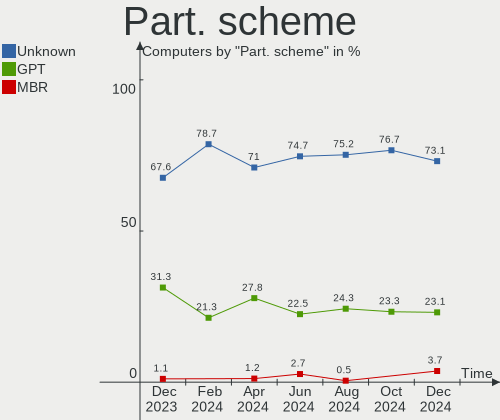
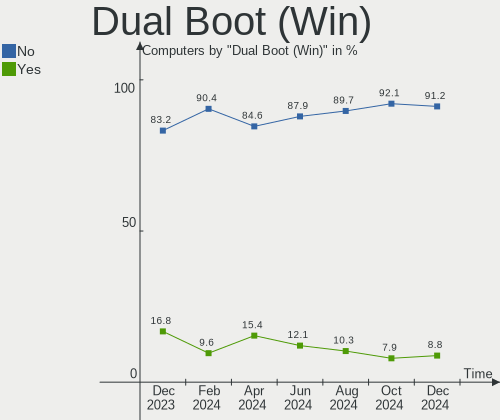
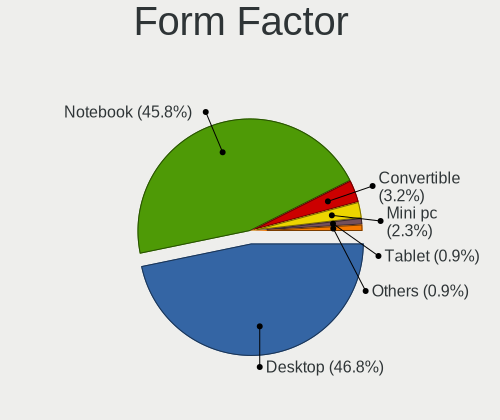
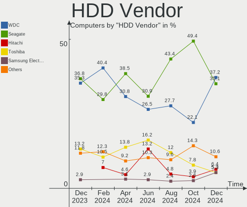
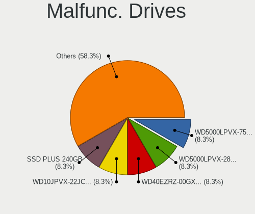
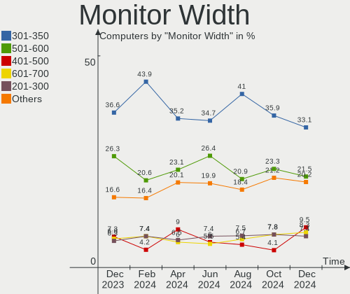
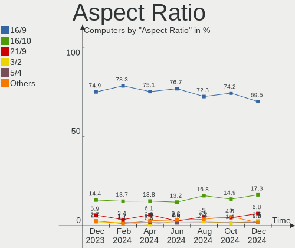

Pop!_OS - Hardware Trends
-------------------------

A project to identify most popular hardware characteristics and track their change
over time based on data collected by Linux users at https://Linux-Hardware.org.

Anyone can contribute to this report by the [hw-probe](https://github.com/linuxhw/hw-probe) tool:

    sudo -E hw-probe -all -upload

This is a report for all computer types. See also reports for [desktops](/Dist/Pop!_OS/Desktop/README.md) and [notebooks](/Dist/Pop!_OS/Notebook/README.md).

This report is for one last month. Overall report since the beginning of time: [TestDays](https://github.com/linuxhw/TestDays)

Period: Jan, 2024.

Contents
--------

* [ System ](#system)
  - [ OS                       ](#os)
  - [ OS Family                ](#os-family)
  - [ Kernel                   ](#kernel)
  - [ Kernel Family            ](#kernel-family)
  - [ Kernel Major Ver.        ](#kernel-major-ver)
  - [ Arch                     ](#arch)
  - [ DE                       ](#de)
  - [ Display Server           ](#display-server)
  - [ Display Manager          ](#display-manager)
  - [ OS Lang                  ](#os-lang)
  - [ Boot Mode                ](#boot-mode)
  - [ Filesystem               ](#filesystem)
  - [ Part. scheme             ](#part-scheme)
  - [ Dual Boot with Linux/BSD ](#dual-boot-with-linuxbsd)
  - [ Dual Boot (Win)          ](#dual-boot-win)

* [ Board ](#board)
  - [ Vendor                   ](#vendor)
  - [ Model                    ](#model)
  - [ Model Family             ](#model-family)
  - [ MFG Year                 ](#mfg-year)
  - [ Form Factor              ](#form-factor)
  - [ Secure Boot              ](#secure-boot)
  - [ Coreboot                 ](#coreboot)
  - [ RAM Size                 ](#ram-size)
  - [ RAM Used                 ](#ram-used)
  - [ Total Drives             ](#total-drives)
  - [ Has CD-ROM               ](#has-cd-rom)
  - [ Has Ethernet             ](#has-ethernet)
  - [ Has WiFi                 ](#has-wifi)
  - [ Has Bluetooth            ](#has-bluetooth)

* [ Location ](#location)
  - [ Country                  ](#country)
  - [ City                     ](#city)

* [ Drives ](#drives)
  - [ Drive Vendor             ](#drive-vendor)
  - [ Drive Model              ](#drive-model)
  - [ HDD Vendor               ](#hdd-vendor)
  - [ SSD Vendor               ](#ssd-vendor)
  - [ Drive Kind               ](#drive-kind)
  - [ Drive Connector          ](#drive-connector)
  - [ Drive Size               ](#drive-size)
  - [ Space Total              ](#space-total)
  - [ Space Used               ](#space-used)
  - [ Malfunc. Drives          ](#malfunc-drives)
  - [ Malfunc. Drive Vendor    ](#malfunc-drive-vendor)
  - [ Malfunc. HDD Vendor      ](#malfunc-hdd-vendor)
  - [ Malfunc. Drive Kind      ](#malfunc-drive-kind)
  - [ Failed Drives            ](#failed-drives)
  - [ Failed Drive Vendor      ](#failed-drive-vendor)
  - [ Drive Status             ](#drive-status)

* [ Storage controller ](#storage-controller)
  - [ Storage Vendor           ](#storage-vendor)
  - [ Storage Model            ](#storage-model)
  - [ Storage Kind             ](#storage-kind)

* [ Processor ](#processor)
  - [ CPU Vendor               ](#cpu-vendor)
  - [ CPU Model                ](#cpu-model)
  - [ CPU Model Family         ](#cpu-model-family)
  - [ CPU Cores                ](#cpu-cores)
  - [ CPU Sockets              ](#cpu-sockets)
  - [ CPU Threads              ](#cpu-threads)
  - [ CPU Op-Modes             ](#cpu-op-modes)
  - [ CPU Microcode            ](#cpu-microcode)
  - [ CPU Microarch            ](#cpu-microarch)

* [ Graphics ](#graphics)
  - [ GPU Vendor               ](#gpu-vendor)
  - [ GPU Model                ](#gpu-model)
  - [ GPU Combo                ](#gpu-combo)
  - [ GPU Driver               ](#gpu-driver)
  - [ GPU Memory               ](#gpu-memory)

* [ Monitor ](#monitor)
  - [ Monitor Vendor           ](#monitor-vendor)
  - [ Monitor Model            ](#monitor-model)
  - [ Monitor Resolution       ](#monitor-resolution)
  - [ Monitor Diagonal         ](#monitor-diagonal)
  - [ Monitor Width            ](#monitor-width)
  - [ Aspect Ratio             ](#aspect-ratio)
  - [ Monitor Area             ](#monitor-area)
  - [ Pixel Density            ](#pixel-density)
  - [ Multiple Monitors        ](#multiple-monitors)

* [ Network ](#network)
  - [ Net Controller Vendor    ](#net-controller-vendor)
  - [ Net Controller Model     ](#net-controller-model)
  - [ Wireless Vendor          ](#wireless-vendor)
  - [ Wireless Model           ](#wireless-model)
  - [ Ethernet Vendor          ](#ethernet-vendor)
  - [ Ethernet Model           ](#ethernet-model)
  - [ Net Controller Kind      ](#net-controller-kind)
  - [ Used Controller          ](#used-controller)
  - [ NICs                     ](#nics)
  - [ IPv6                     ](#ipv6)

* [ Bluetooth ](#bluetooth)
  - [ Bluetooth Vendor         ](#bluetooth-vendor)
  - [ Bluetooth Model          ](#bluetooth-model)

* [ Sound ](#sound)
  - [ Sound Vendor             ](#sound-vendor)
  - [ Sound Model              ](#sound-model)

* [ Memory ](#memory)
  - [ Memory Vendor            ](#memory-vendor)
  - [ Memory Model             ](#memory-model)
  - [ Memory Kind              ](#memory-kind)
  - [ Memory Form Factor       ](#memory-form-factor)
  - [ Memory Size              ](#memory-size)
  - [ Memory Speed             ](#memory-speed)

* [ Printers & scanners ](#printers--scanners)
  - [ Printer Vendor           ](#printer-vendor)
  - [ Printer Model            ](#printer-model)
  - [ Scanner Vendor           ](#scanner-vendor)
  - [ Scanner Model            ](#scanner-model)

* [ Camera ](#camera)
  - [ Camera Vendor            ](#camera-vendor)
  - [ Camera Model             ](#camera-model)

* [ Security ](#security)
  - [ Fingerprint Vendor       ](#fingerprint-vendor)
  - [ Fingerprint Model        ](#fingerprint-model)
  - [ Chipcard Vendor          ](#chipcard-vendor)
  - [ Chipcard Model           ](#chipcard-model)

* [ Unsupported ](#unsupported)
  - [ Unsupported Devices      ](#unsupported-devices)
  - [ Unsupported Device Types ](#unsupported-device-types)

System
------

OS
--

Installed operating systems

| Name          | Computers | Percent |
|---------------|-----------|---------|
| Pop!_OS 22.04 | 194       | 98.98%  |
| Pop!_OS 20.04 | 2         | 1.02%   |

OS Family
---------

OS without a version

| Name    | Computers | Percent |
|---------|-----------|---------|
| Pop!_OS | 196       | 100%    |

Kernel
------

Version of the Linux kernel

| Version                 | Computers | Percent |
|-------------------------|-----------|---------|
| 6.6.6-76060606-generic  | 145       | 73.98%  |
| 6.6.10-76060610-generic | 26        | 13.27%  |
| 6.5.6-76060506-generic  | 8         | 4.08%   |
| 6.2.6-76060206-generic  | 5         | 2.55%   |
| 6.4.6-76060406-generic  | 3         | 1.53%   |
| 6.0.12-76060012-generic | 2         | 1.02%   |
| 6.7.1-1-liquorix-amd64  | 1         | 0.51%   |
| 6.7.1-060701-generic    | 1         | 0.51%   |
| 6.6.9-x64v1-xanmod1     | 1         | 0.51%   |
| 6.6.11-surface-1        | 1         | 0.51%   |
| 6.5.4-76060504-generic  | 1         | 0.51%   |
| 5.17.5-76051705-generic | 1         | 0.51%   |
| 5.15.0-1044-raspi       | 1         | 0.51%   |

Kernel Family
-------------

Linux kernel without a distro release

| Version | Computers | Percent |
|---------|-----------|---------|
| 6.6.6   | 145       | 73.98%  |
| 6.6.10  | 26        | 13.27%  |
| 6.5.6   | 8         | 4.08%   |
| 6.2.6   | 5         | 2.55%   |
| 6.4.6   | 3         | 1.53%   |
| 6.7.1   | 2         | 1.02%   |
| 6.0.12  | 2         | 1.02%   |
| 6.6.9   | 1         | 0.51%   |
| 6.6.11  | 1         | 0.51%   |
| 6.5.4   | 1         | 0.51%   |
| 5.17.5  | 1         | 0.51%   |
| 5.15.0  | 1         | 0.51%   |

Kernel Major Ver.
-----------------

Linux kernel major version

| Version | Computers | Percent |
|---------|-----------|---------|
| 6.6     | 173       | 88.27%  |
| 6.5     | 9         | 4.59%   |
| 6.2     | 5         | 2.55%   |
| 6.4     | 3         | 1.53%   |
| 6.7     | 2         | 1.02%   |
| 6.0     | 2         | 1.02%   |
| 5.17    | 1         | 0.51%   |
| 5.15    | 1         | 0.51%   |

Arch
----

OS architecture (x86_64, i586, etc.)

| Name    | Computers | Percent |
|---------|-----------|---------|
| x86_64  | 195       | 99.49%  |
| aarch64 | 1         | 0.51%   |

DE
--

Desktop Environment

| Name       | Computers | Percent |
|------------|-----------|---------|
| GNOME      | 186       | 94.9%   |
| KDE5       | 4         | 2.04%   |
| Cinnamon   | 3         | 1.53%   |
| Unknown    | 2         | 1.02%   |
| X-Cinnamon | 1         | 0.51%   |

Display Server
--------------

X11 or Wayland

| Name    | Computers | Percent |
|---------|-----------|---------|
| X11     | 180       | 91.84%  |
| Wayland | 14        | 7.14%   |
| Unknown | 2         | 1.02%   |

Display Manager
---------------

SDDM, LightDM, etc.

| Name    | Computers | Percent |
|---------|-----------|---------|
| Unknown | 135       | 68.88%  |
| GDM3    | 59        | 30.1%   |
| SDDM    | 2         | 1.02%   |

OS Lang
-------

Language

| Lang    | Computers | Percent |
|---------|-----------|---------|
| en_US   | 112       | 57.14%  |
| en_GB   | 21        | 10.71%  |
| de_DE   | 12        | 6.12%   |
| C       | 10        | 5.1%    |
| pt_BR   | 7         | 3.57%   |
| en_CA   | 6         | 3.06%   |
| fr_FR   | 5         | 2.55%   |
| it_IT   | 3         | 1.53%   |
| es_ES   | 3         | 1.53%   |
| sv_SE   | 2         | 1.02%   |
| ru_RU   | 2         | 1.02%   |
| pt_PT   | 2         | 1.02%   |
| en_AU   | 2         | 1.02%   |
| Unknown | 2         | 1.02%   |
| sk_SK   | 1         | 0.51%   |
| pl_PL   | 1         | 0.51%   |
| fi_FI   | 1         | 0.51%   |
| es_AR   | 1         | 0.51%   |
| en_PH   | 1         | 0.51%   |
| en_IN   | 1         | 0.51%   |
| cs_CZ   | 1         | 0.51%   |

Boot Mode
---------

EFI or BIOS

| Mode | Computers | Percent |
|------|-----------|---------|
| BIOS | 143       | 72.96%  |
| EFI  | 53        | 27.04%  |

Filesystem
----------

Type of filesystem

| Type    | Computers | Percent |
|---------|-----------|---------|
| Ext4    | 184       | 93.88%  |
| Btrfs   | 7         | 3.57%   |
| Overlay | 4         | 2.04%   |
| Zfs     | 1         | 0.51%   |

Part. scheme
------------

Scheme of partitioning

| Type    | Computers | Percent |
|---------|-----------|---------|
| Unknown | 132       | 67.35%  |
| GPT     | 59        | 30.1%   |
| MBR     | 5         | 2.55%   |

Dual Boot with Linux/BSD
------------------------

Hosting more than one Linux/BSD

| Dual boot | Computers | Percent |
|-----------|-----------|---------|
| No        | 189       | 96.43%  |
| Yes       | 7         | 3.57%   |

Dual Boot (Win)
---------------

Hosting Linux and Windows

| Dual boot | Computers | Percent |
|-----------|-----------|---------|
| No        | 170       | 86.73%  |
| Yes       | 26        | 13.27%  |

Board
-----

Vendor
------

Motherboard manufacturer

| Name                    | Computers | Percent |
|-------------------------|-----------|---------|
| ASUSTek Computer        | 37        | 18.88%  |
| Lenovo                  | 34        | 17.35%  |
| Dell                    | 22        | 11.22%  |
| MSI                     | 20        | 10.2%   |
| Hewlett-Packard         | 19        | 9.69%   |
| Gigabyte Technology     | 16        | 8.16%   |
| Acer                    | 10        | 5.1%    |
| Apple                   | 8         | 4.08%   |
| ASRock                  | 5         | 2.55%   |
| System76                | 4         | 2.04%   |
| Unknown                 | 4         | 2.04%   |
| MOMENTPLUS              | 3         | 1.53%   |
| Microsoft               | 3         | 1.53%   |
| Toshiba                 | 1         | 0.51%   |
| SZMZ                    | 1         | 0.51%   |
| Samsung Electronics     | 1         | 0.51%   |
| Raspberry Pi Foundation | 1         | 0.51%   |
| HUAWEI                  | 1         | 0.51%   |
| Hot Pepper Mobile       | 1         | 0.51%   |
| Fujitsu                 | 1         | 0.51%   |
| Foxconn                 | 1         | 0.51%   |
| Compaq                  | 1         | 0.51%   |
| Alienware               | 1         | 0.51%   |
| Acidanthera             | 1         | 0.51%   |

Model
-----

Motherboard model

| Name                                 | Computers | Percent |
|--------------------------------------|-----------|---------|
| Unknown                              | 4         | 2.04%   |
| MOMENTPLUS MP90                      | 3         | 1.53%   |
| System76 Oryx Pro                    | 2         | 1.02%   |
| MSI MS-7D67                          | 2         | 1.02%   |
| Dell XPS 15 9570                     | 2         | 1.02%   |
| ASUS ROG STRIX Z790-E GAMING WIFI    | 2         | 1.02%   |
| ASUS All Series                      | 2         | 1.02%   |
| Apple MacBookPro8,1                  | 2         | 1.02%   |
| Acer Nitro AN515-58                  | 2         | 1.02%   |
| Toshiba Satellite C55-C              | 1         | 0.51%   |
| SZMZ X99-S3                          | 1         | 0.51%   |
| System76 Pangolin                    | 1         | 0.51%   |
| System76 Adder WS                    | 1         | 0.51%   |
| Samsung 550XED                       | 1         | 0.51%   |
| RPi Raspberry Pi                     | 1         | 0.51%   |
| MSI P65 Creator 9SE                  | 1         | 0.51%   |
| MSI MS-B09611                        | 1         | 0.51%   |
| MSI MS-7E12                          | 1         | 0.51%   |
| MSI MS-7D77                          | 1         | 0.51%   |
| MSI MS-7D42                          | 1         | 0.51%   |
| MSI MS-7D22                          | 1         | 0.51%   |
| MSI MS-7D07                          | 1         | 0.51%   |
| MSI MS-7C95                          | 1         | 0.51%   |
| MSI MS-7C91                          | 1         | 0.51%   |
| MSI MS-7C90                          | 1         | 0.51%   |
| MSI MS-7C83                          | 1         | 0.51%   |
| MSI MS-7C56                          | 1         | 0.51%   |
| MSI MS-7C02                          | 1         | 0.51%   |
| MSI MS-7A74                          | 1         | 0.51%   |
| MSI MS-7A37                          | 1         | 0.51%   |
| MSI MS-7750                          | 1         | 0.51%   |
| MSI MS-7636                          | 1         | 0.51%   |
| MSI GF65 Thin 9SEXR                  | 1         | 0.51%   |
| Microsoft Surface with Windows 8 Pro | 1         | 0.51%   |
| Microsoft Surface Pro 9              | 1         | 0.51%   |
| Microsoft Surface Go 3               | 1         | 0.51%   |
| Lenovo Z50-75 80EC                   | 1         | 0.51%   |
| Lenovo Yoga Pro 9 14IRP8 83BU        | 1         | 0.51%   |
| Lenovo Yoga 520-14IKB 80X8           | 1         | 0.51%   |
| Lenovo Yoga 3 Pro-1370 80HE          | 1         | 0.51%   |

Model Family
------------

Motherboard model prefix

| Name               | Computers | Percent |
|--------------------|-----------|---------|
| Lenovo ThinkPad    | 15        | 7.65%   |
| ASUS ROG           | 10        | 5.1%    |
| Lenovo IdeaPad     | 6         | 3.06%   |
| Dell Latitude      | 6         | 3.06%   |
| ASUS PRIME         | 5         | 2.55%   |
| Lenovo Legion      | 4         | 2.04%   |
| Dell Inspiron      | 4         | 2.04%   |
| ASUS VivoBook      | 4         | 2.04%   |
| Unknown            | 4         | 2.04%   |
| MOMENTPLUS MP90    | 3         | 1.53%   |
| Microsoft Surface  | 3         | 1.53%   |
| Lenovo Yoga        | 3         | 1.53%   |
| HP ProBook         | 3         | 1.53%   |
| HP Laptop          | 3         | 1.53%   |
| HP ENVY            | 3         | 1.53%   |
| HP EliteBook       | 3         | 1.53%   |
| Dell XPS           | 3         | 1.53%   |
| Dell Vostro        | 3         | 1.53%   |
| Dell Precision     | 3         | 1.53%   |
| Acer Swift         | 3         | 1.53%   |
| Acer Nitro         | 3         | 1.53%   |
| Acer Aspire        | 3         | 1.53%   |
| System76 Oryx      | 2         | 1.02%   |
| MSI MS-7D67        | 2         | 1.02%   |
| HP OMEN            | 2         | 1.02%   |
| Gigabyte H610M     | 2         | 1.02%   |
| Gigabyte B450M     | 2         | 1.02%   |
| Gigabyte B450      | 2         | 1.02%   |
| Dell OptiPlex      | 2         | 1.02%   |
| ASUS All           | 2         | 1.02%   |
| Apple MacBookPro8  | 2         | 1.02%   |
| Apple MacBookPro11 | 2         | 1.02%   |
| Toshiba Satellite  | 1         | 0.51%   |
| SZMZ X99-S3        | 1         | 0.51%   |
| System76 Pangolin  | 1         | 0.51%   |
| System76 Adder     | 1         | 0.51%   |
| Samsung 550XED     | 1         | 0.51%   |
| RPi Raspberry      | 1         | 0.51%   |
| MSI P65            | 1         | 0.51%   |
| MSI MS-B09611      | 1         | 0.51%   |

MFG Year
--------

Motherboard manufacture year

| Year    | Computers | Percent |
|---------|-----------|---------|
| 2021    | 24        | 12.24%  |
| 2022    | 21        | 10.71%  |
| 2023    | 20        | 10.2%   |
| 2018    | 20        | 10.2%   |
| 2020    | 18        | 9.18%   |
| 2019    | 17        | 8.67%   |
| 2014    | 14        | 7.14%   |
| 2017    | 12        | 6.12%   |
| 2011    | 10        | 5.1%    |
| 2016    | 8         | 4.08%   |
| 2015    | 8         | 4.08%   |
| 2013    | 8         | 4.08%   |
| 2012    | 5         | 2.55%   |
| 2010    | 5         | 2.55%   |
| 2008    | 3         | 1.53%   |
| 2009    | 2         | 1.02%   |
| Unknown | 1         | 0.51%   |

Form Factor
-----------

Physical design of the computer

| Name           | Computers | Percent |
|----------------|-----------|---------|
| Notebook       | 105       | 53.57%  |
| Desktop        | 74        | 37.76%  |
| Convertible    | 5         | 2.55%   |
| Tablet         | 4         | 2.04%   |
| Mini pc        | 3         | 1.53%   |
| All in one     | 3         | 1.53%   |
| System on chip | 1         | 0.51%   |
| Server         | 1         | 0.51%   |

Secure Boot
-----------

Enabled or disabled

| State    | Computers | Percent |
|----------|-----------|---------|
| Disabled | 195       | 99.49%  |
| Enabled  | 1         | 0.51%   |

Coreboot
--------

Have coreboot on board

| Used | Computers | Percent |
|------|-----------|---------|
| No   | 194       | 98.98%  |
| Yes  | 2         | 1.02%   |

RAM Size
--------

Total RAM memory

| Size in GB  | Computers | Percent |
|-------------|-----------|---------|
| 16.01-24.0  | 59        | 30.1%   |
| 32.01-64.0  | 42        | 21.43%  |
| 8.01-16.0   | 32        | 16.33%  |
| 4.01-8.0    | 31        | 15.82%  |
| 3.01-4.0    | 15        | 7.65%   |
| 64.01-256.0 | 11        | 5.61%   |
| 24.01-32.0  | 5         | 2.55%   |
| 1.01-2.0    | 1         | 0.51%   |

RAM Used
--------

Used RAM memory

| Used GB    | Computers | Percent |
|------------|-----------|---------|
| 4.01-8.0   | 83        | 42.35%  |
| 3.01-4.0   | 45        | 22.96%  |
| 2.01-3.0   | 28        | 14.29%  |
| 8.01-16.0  | 27        | 13.78%  |
| 16.01-24.0 | 6         | 3.06%   |
| 24.01-32.0 | 3         | 1.53%   |
| 32.01-64.0 | 2         | 1.02%   |
| 1.01-2.0   | 2         | 1.02%   |

Total Drives
------------

Number of drives on board

| Drives | Computers | Percent |
|--------|-----------|---------|
| 1      | 111       | 56.63%  |
| 2      | 57        | 29.08%  |
| 3      | 16        | 8.16%   |
| 4      | 6         | 3.06%   |
| 6      | 3         | 1.53%   |
| 7      | 1         | 0.51%   |
| 5      | 1         | 0.51%   |
| 0      | 1         | 0.51%   |

Has CD-ROM
----------

Has CD-ROM on board

| Presented | Computers | Percent |
|-----------|-----------|---------|
| No        | 160       | 81.63%  |
| Yes       | 36        | 18.37%  |

Has Ethernet
------------

Has Ethernet on board

| Presented | Computers | Percent |
|-----------|-----------|---------|
| Yes       | 162       | 82.65%  |
| No        | 34        | 17.35%  |

Has WiFi
--------

Has WiFi module

| Presented | Computers | Percent |
|-----------|-----------|---------|
| Yes       | 162       | 82.65%  |
| No        | 34        | 17.35%  |

Has Bluetooth
-------------

Has Bluetooth module

| Presented | Computers | Percent |
|-----------|-----------|---------|
| Yes       | 143       | 72.96%  |
| No        | 53        | 27.04%  |

Location
--------

Country
-------

Geographic location (country)

| Country      | Computers | Percent |
|--------------|-----------|---------|
| USA          | 63        | 32.14%  |
| Germany      | 19        | 9.69%   |
| Brazil       | 14        | 7.14%   |
| UK           | 12        | 6.12%   |
| India        | 7         | 3.57%   |
| France       | 7         | 3.57%   |
| Canada       | 7         | 3.57%   |
| Spain        | 5         | 2.55%   |
| Poland       | 5         | 2.55%   |
| Italy        | 5         | 2.55%   |
| Finland      | 5         | 2.55%   |
| Russia       | 4         | 2.04%   |
| Netherlands  | 4         | 2.04%   |
| Sweden       | 3         | 1.53%   |
| Philippines  | 3         | 1.53%   |
| Austria      | 3         | 1.53%   |
| Australia    | 3         | 1.53%   |
| Argentina    | 3         | 1.53%   |
| Saudi Arabia | 2         | 1.02%   |
| Indonesia    | 2         | 1.02%   |
| Czechia      | 2         | 1.02%   |
| Chile        | 2         | 1.02%   |
| Thailand     | 1         | 0.51%   |
| Somalia      | 1         | 0.51%   |
| Singapore    | 1         | 0.51%   |
| Puerto Rico  | 1         | 0.51%   |
| Portugal     | 1         | 0.51%   |
| Peru         | 1         | 0.51%   |
| Pakistan     | 1         | 0.51%   |
| Norway       | 1         | 0.51%   |
| Mexico       | 1         | 0.51%   |
| Lithuania    | 1         | 0.51%   |
| Japan        | 1         | 0.51%   |
| Ireland      | 1         | 0.51%   |
| Hungary      | 1         | 0.51%   |
| Bulgaria     | 1         | 0.51%   |
| Azerbaijan   | 1         | 0.51%   |
| Angola       | 1         | 0.51%   |

City
----

Geographic location (city)

| City            | Computers | Percent |
|-----------------|-----------|---------|
| Denver          | 6         | 3.06%   |
| Helsinki        | 3         | 1.53%   |
| Zaragoza        | 2         | 1.02%   |
| Toronto         | 2         | 1.02%   |
| Spring Hill     | 2         | 1.02%   |
| Santiago        | 2         | 1.02%   |
| Rome            | 2         | 1.02%   |
| Rio de Janeiro  | 2         | 1.02%   |
| New York        | 2         | 1.02%   |
| Graz            | 2         | 1.02%   |
| Cologne         | 2         | 1.02%   |
| Buenos Aires    | 2         | 1.02%   |
| Berlin          | 2         | 1.02%   |
| Yekaterinburg   | 1         | 0.51%   |
| Wichita         | 1         | 0.51%   |
| Warsaw          | 1         | 0.51%   |
| Villerupt       | 1         | 0.51%   |
| Vénissieux     | 1         | 0.51%   |
| Veliky Novgorod | 1         | 0.51%   |
| Utrecht         | 1         | 0.51%   |
| Umeå           | 1         | 0.51%   |
| Uelzen          | 1         | 0.51%   |
| Tyn nad Vltavou | 1         | 0.51%   |
| Toms River      | 1         | 0.51%   |
| Tokyo           | 1         | 0.51%   |
| Tirunelveli     | 1         | 0.51%   |
| The Hague       | 1         | 0.51%   |
| Surrey          | 1         | 0.51%   |
| Strasbourg      | 1         | 0.51%   |
| Starcross       | 1         | 0.51%   |
| Southwark       | 1         | 0.51%   |
| Southport       | 1         | 0.51%   |
| Sofia           | 1         | 0.51%   |
| Singapore       | 1         | 0.51%   |
| Sheboygan       | 1         | 0.51%   |
| Setúbal        | 1         | 0.51%   |
| Selden          | 1         | 0.51%   |
| Schiltigheim    | 1         | 0.51%   |
| Sausalito       | 1         | 0.51%   |
| Sao Paulo       | 1         | 0.51%   |

Drives
------

Drive Vendor
------------

Hard drive vendors

| Vendor                      | Computers | Drives | Percent |
|-----------------------------|-----------|--------|---------|
| Samsung Electronics         | 56        | 79     | 19.31%  |
| WDC                         | 28        | 29     | 9.66%   |
| Sandisk                     | 26        | 26     | 8.97%   |
| Seagate                     | 21        | 24     | 7.24%   |
| Kingston                    | 17        | 18     | 5.86%   |
| Toshiba                     | 15        | 15     | 5.17%   |
| Crucial                     | 13        | 14     | 4.48%   |
| SK hynix                    | 12        | 12     | 4.14%   |
| Kingston Technology Company | 10        | 10     | 3.45%   |
| Unknown                     | 8         | 10     | 2.76%   |
| Intel                       | 8         | 8      | 2.76%   |
| Micron/Crucial Technology   | 7         | 7      | 2.41%   |
| Micron Technology           | 7         | 7      | 2.41%   |
| A-DATA Technology           | 6         | 6      | 2.07%   |
| Transcend                   | 4         | 4      | 1.38%   |
| Silicon Motion              | 4         | 4      | 1.38%   |
| KIOXIA                      | 4         | 4      | 1.38%   |
| Hitachi                     | 4         | 4      | 1.38%   |
| FIKWOT                      | 4         | 4      | 1.38%   |
| China                       | 4         | 4      | 1.38%   |
| Apple                       | 4         | 5      | 1.38%   |
| SPCC                        | 3         | 3      | 1.03%   |
| PNY                         | 3         | 3      | 1.03%   |
| Hewlett-Packard             | 2         | 2      | 0.69%   |
| Corsair                     | 2         | 2      | 0.69%   |
| XPG                         | 1         | 2      | 0.34%   |
| TO Exter                    | 1         | 1      | 0.34%   |
| Timetec                     | 1         | 1      | 0.34%   |
| Realtek Semiconductor       | 1         | 1      | 0.34%   |
| OCZ                         | 1         | 1      | 0.34%   |
| Netac                       | 1         | 2      | 0.34%   |
| MaxDigital                  | 1         | 1      | 0.34%   |
| LITEONIT                    | 1         | 1      | 0.34%   |
| KingFast                    | 1         | 1      | 0.34%   |
| Intenso                     | 1         | 1      | 0.34%   |
| Integral                    | 1         | 1      | 0.34%   |
| HUAWEI                      | 1         | 1      | 0.34%   |
| HGST                        | 1         | 1      | 0.34%   |
| CONSISTENT                  | 1         | 1      | 0.34%   |
| ASMT109x                    | 1         | 1      | 0.34%   |

Drive Model
-----------

Hard drive models

| Model                                                 | Computers | Percent |
|-------------------------------------------------------|-----------|---------|
| Samsung NVMe SSD Controller SM981/PM981/PM983 1TB     | 9         | 2.9%    |
| Samsung NVMe SSD Controller PM9A1/PM9A3/980PRO 2TB    | 6         | 1.94%   |
| Kingston SA400S37240G 240GB SSD                       | 5         | 1.61%   |
| Samsung SSD 980 PRO 2TB                               | 4         | 1.29%   |
| Samsung SSD 850 EVO 500GB                             | 4         | 1.29%   |
| Micron/Crucial P2 NVMe PCIe SSD 1TB                   | 4         | 1.29%   |
| Kingston Company SNV2S2000G 2TB                       | 4         | 1.29%   |
| Kingston Company SNV2S1000G 1TB                       | 4         | 1.29%   |
| Toshiba MQ01ABD100 1TB                                | 3         | 0.97%   |
| Silicon Motion SM2263EN/SM2263XT SSD Controller 128GB | 3         | 0.97%   |
| Sandisk WD Blue SN550 NVMe SSD 512GB                  | 3         | 0.97%   |
| Samsung SSD 980 1TB                                   | 3         | 0.97%   |
| Samsung SSD 850 EVO 250GB                             | 3         | 0.97%   |
| Crucial CT1000MX500SSD1 1TB                           | 3         | 0.97%   |
| Toshiba MQ01ACF050 500GB                              | 2         | 0.65%   |
| Toshiba DT01ACA100 1TB                                | 2         | 0.65%   |
| SK hynix HFM001TD3JX013N 1024GB                       | 2         | 0.65%   |
| SK hynix BC501 NVMe Solid State Drive 512GB           | 2         | 0.65%   |
| Seagate ST500DM002-1BD142 500GB                       | 2         | 0.65%   |
| Seagate ST1000LM049-2GH172 1TB                        | 2         | 0.65%   |
| Sandisk WD Blue SN570 500GB                           | 2         | 0.65%   |
| Sandisk WD Black SN850 1024GB                         | 2         | 0.65%   |
| Sandisk WD Black SN750 / PC SN730 NVMe SSD 512GB      | 2         | 0.65%   |
| SanDisk SSD PLUS 240GB                                | 2         | 0.65%   |
| SanDisk SSD PLUS 1000GB                               | 2         | 0.65%   |
| Samsung SSD 870 QVO 1TB                               | 2         | 0.65%   |
| Samsung SSD 870 EVO 2TB                               | 2         | 0.65%   |
| Samsung HM321HI 320GB                                 | 2         | 0.65%   |
| Micron 2450_MTFDKBA512TFK 512GB                       | 2         | 0.65%   |
| Kingston Company OM3PDP3 NVMe SSD 256GB               | 2         | 0.65%   |
| Kingston SV300S37A240G 240GB SSD                      | 2         | 0.65%   |
| Kingston SA400S37480G 480GB SSD                       | 2         | 0.65%   |
| Intel SSDPEKNU512GZ 512GB                             | 2         | 0.65%   |
| FIKWOT FN203 256GB SSD                                | 2         | 0.65%   |
| FIKWOT FN203 1TB SSD                                  | 2         | 0.65%   |
| Crucial CT240M500SSD1 240GB                           | 2         | 0.65%   |
| Crucial CT2000MX500SSD1 2TB                           | 2         | 0.65%   |
| China SSD 512GB                                       | 2         | 0.65%   |
| China SATA SSD 120GB                                  | 2         | 0.65%   |
| A-DATA SU800 256GB SSD                                | 2         | 0.65%   |

HDD Vendor
----------

Hard disk drive vendors

| Vendor              | Computers | Drives | Percent |
|---------------------|-----------|--------|---------|
| Seagate             | 20        | 23     | 33.33%  |
| WDC                 | 15        | 15     | 25%     |
| Toshiba             | 13        | 13     | 21.67%  |
| Samsung Electronics | 5         | 5      | 8.33%   |
| Hitachi             | 4         | 4      | 6.67%   |
| Unknown             | 1         | 1      | 1.67%   |
| TO Exter            | 1         | 1      | 1.67%   |
| HGST                | 1         | 1      | 1.67%   |

SSD Vendor
----------

Solid state drive vendors

| Vendor              | Computers | Drives | Percent |
|---------------------|-----------|--------|---------|
| Samsung Electronics | 21        | 31     | 20.19%  |
| Kingston            | 15        | 15     | 14.42%  |
| Crucial             | 13        | 13     | 12.5%   |
| WDC                 | 9         | 9      | 8.65%   |
| SanDisk             | 9         | 9      | 8.65%   |
| Transcend           | 4         | 4      | 3.85%   |
| FIKWOT              | 4         | 4      | 3.85%   |
| China               | 4         | 4      | 3.85%   |
| PNY                 | 3         | 3      | 2.88%   |
| Apple               | 3         | 3      | 2.88%   |
| A-DATA Technology   | 3         | 3      | 2.88%   |
| SPCC                | 2         | 2      | 1.92%   |
| Timetec             | 1         | 1      | 0.96%   |
| SK hynix            | 1         | 1      | 0.96%   |
| OCZ                 | 1         | 1      | 0.96%   |
| Netac               | 1         | 1      | 0.96%   |
| LITEONIT            | 1         | 1      | 0.96%   |
| Intenso             | 1         | 1      | 0.96%   |
| Intel               | 1         | 1      | 0.96%   |
| Integral            | 1         | 1      | 0.96%   |
| Hewlett-Packard     | 1         | 1      | 0.96%   |
| Corsair             | 1         | 1      | 0.96%   |
| CONSISTENT          | 1         | 1      | 0.96%   |
| ASMT109x            | 1         | 1      | 0.96%   |
| Argon               | 1         | 1      | 0.96%   |
| 2-Power             | 1         | 1      | 0.96%   |

Drive Kind
----------

HDD or SSD

| Kind    | Computers | Drives | Percent |
|---------|-----------|--------|---------|
| NVMe    | 110       | 136    | 42.31%  |
| SSD     | 87        | 114    | 33.46%  |
| HDD     | 54        | 63     | 20.77%  |
| MMC     | 5         | 5      | 1.92%   |
| Unknown | 4         | 6      | 1.54%   |

Drive Connector
---------------

SATA, SAS, NVMe, etc.

| Type | Computers | Drives | Percent |
|------|-----------|--------|---------|
| SATA | 114       | 172    | 47.9%   |
| NVMe | 110       | 136    | 46.22%  |
| SAS  | 9         | 11     | 3.78%   |
| MMC  | 5         | 5      | 2.1%    |

Drive Size
----------

Size of hard drive

| Size in TB | Computers | Drives | Percent |
|------------|-----------|--------|---------|
| 0.01-0.5   | 82        | 97     | 56.16%  |
| 0.51-1.0   | 42        | 49     | 28.77%  |
| 1.01-2.0   | 13        | 18     | 8.9%    |
| 3.01-4.0   | 5         | 9      | 3.42%   |
| 2.01-3.0   | 2         | 2      | 1.37%   |
| 4.01-10.0  | 2         | 2      | 1.37%   |

Space Total
-----------

Amount of disk space available on the file system

| Size in GB     | Computers | Percent |
|----------------|-----------|---------|
| 251-500        | 54        | 27.55%  |
| 101-250        | 54        | 27.55%  |
| 501-1000       | 27        | 13.78%  |
| 1001-2000      | 26        | 13.27%  |
| 2001-3000      | 15        | 7.65%   |
| More than 3000 | 8         | 4.08%   |
| 51-100         | 5         | 2.55%   |
| 1-20           | 3         | 1.53%   |
| 21-50          | 2         | 1.02%   |
| Unknown        | 2         | 1.02%   |

Space Used
----------

Amount of used disk space

| Used GB        | Computers | Percent |
|----------------|-----------|---------|
| 21-50          | 41        | 20.92%  |
| 1-20           | 39        | 19.9%   |
| 101-250        | 38        | 19.39%  |
| 51-100         | 24        | 12.24%  |
| 251-500        | 19        | 9.69%   |
| 501-1000       | 19        | 9.69%   |
| 1001-2000      | 11        | 5.61%   |
| More than 3000 | 2         | 1.02%   |
| Unknown        | 2         | 1.02%   |
| 2001-3000      | 1         | 0.51%   |

Malfunc. Drives
---------------

Drive models with a malfunction

| Model                    | Computers | Drives | Percent |
|--------------------------|-----------|--------|---------|
| WDC WD20EFRX-68AX9N0 2TB | 1         | 1      | 25%     |
| WDC WD10SPZX-24Z10T0 1TB | 1         | 1      | 25%     |
| SanDisk SSD PLUS 1000GB  | 1         | 1      | 25%     |
| HGST HTS541010A9E680 1TB | 1         | 1      | 25%     |

Malfunc. Drive Vendor
---------------------

Vendors of faulty drives

| Vendor  | Computers | Drives | Percent |
|---------|-----------|--------|---------|
| WDC     | 2         | 2      | 50%     |
| SanDisk | 1         | 1      | 25%     |
| HGST    | 1         | 1      | 25%     |

Malfunc. HDD Vendor
-------------------

Vendors of faulty HDD drives

| Vendor | Computers | Drives | Percent |
|--------|-----------|--------|---------|
| WDC    | 2         | 2      | 66.67%  |
| HGST   | 1         | 1      | 33.33%  |

Malfunc. Drive Kind
-------------------

Kinds of faulty drives

| Kind | Computers | Drives | Percent |
|------|-----------|--------|---------|
| HDD  | 3         | 3      | 75%     |
| SSD  | 1         | 1      | 25%     |

Failed Drives
-------------

Failed drive models

Zero info for selected period =(

Failed Drive Vendor
-------------------

Failed drive vendors

Zero info for selected period =(

Drive Status
------------

Number of failed and malfunc. drives

| Status   | Computers | Drives | Percent |
|----------|-----------|--------|---------|
| Detected | 138       | 233    | 67.98%  |
| Works    | 61        | 87     | 30.05%  |
| Malfunc  | 4         | 4      | 1.97%   |

Storage controller
------------------

Storage Vendor
--------------

Storage controller vendors

| Vendor                       | Computers | Percent |
|------------------------------|-----------|---------|
| Intel                        | 108       | 37.37%  |
| AMD                          | 49        | 16.96%  |
| Samsung Electronics          | 38        | 13.15%  |
| SanDisk                      | 22        | 7.61%   |
| Kingston Technology Company  | 12        | 4.15%   |
| SK hynix                     | 11        | 3.81%   |
| Micron/Crucial Technology    | 8         | 2.77%   |
| Micron Technology            | 7         | 2.42%   |
| ASMedia Technology           | 7         | 2.42%   |
| Silicon Motion               | 5         | 1.73%   |
| ADATA Technology             | 4         | 1.38%   |
| Toshiba America Info Systems | 3         | 1.04%   |
| KIOXIA                       | 3         | 1.04%   |
| Solidigm                     | 2         | 0.69%   |
| Phison Electronics           | 2         | 0.69%   |
| Nvidia                       | 2         | 0.69%   |
| Seagate Technology           | 1         | 0.35%   |
| Realtek Semiconductor        | 1         | 0.35%   |
| Netac Technology             | 1         | 0.35%   |
| Marvell Technology Group     | 1         | 0.35%   |
| JMicron Technology           | 1         | 0.35%   |
| Apple                        | 1         | 0.35%   |

Storage Model
-------------

Storage controller models

| Model                                                                          | Computers | Percent |
|--------------------------------------------------------------------------------|-----------|---------|
| AMD FCH SATA Controller [AHCI mode]                                            | 29        | 8.87%   |
| Samsung NVMe SSD Controller SM981/PM981/PM983                                  | 16        | 4.89%   |
| Samsung NVMe SSD Controller PM9A1/PM9A3/980PRO                                 | 12        | 3.67%   |
| Intel Sunrise Point-LP SATA Controller [AHCI mode]                             | 11        | 3.36%   |
| Intel 8 Series/C220 Series Chipset Family 6-port SATA Controller 1 [AHCI mode] | 10        | 3.06%   |
| Kingston Company NV2 NVMe SSD SM2267XT (DRAM-less)                             | 8         | 2.45%   |
| AMD 400 Series Chipset SATA Controller                                         | 8         | 2.45%   |
| Intel Volume Management Device NVMe RAID Controller                            | 7         | 2.14%   |
| Intel Alder Lake-S PCH SATA Controller [AHCI Mode]                             | 7         | 2.14%   |
| ASMedia ASM1061/ASM1062 Serial ATA Controller                                  | 7         | 2.14%   |
| AMD 600 Series Chipset SATA Controller                                         | 7         | 2.14%   |
| SK hynix Gold P31/BC711/PC711 NVMe Solid State Drive                           | 6         | 1.83%   |
| Intel 6 Series/C200 Series Chipset Family 6 port Mobile SATA AHCI Controller   | 6         | 1.83%   |
| AMD 500 Series Chipset SATA Controller                                         | 6         | 1.83%   |
| Silicon Motion SM2263EN/SM2263XT (DRAM-less) NVMe SSD Controllers              | 5         | 1.53%   |
| SanDisk Extreme Pro / WD Black SN750 / PC SN730 / Red SN700 NVMe SSD           | 5         | 1.53%   |
| Samsung NVMe SSD Controller 980 (DRAM-less)                                    | 5         | 1.53%   |
| Intel Volume Management Device NVMe RAID Controller Intel Corporation          | 5         | 1.53%   |
| Intel 82801 Mobile SATA Controller [RAID mode]                                 | 5         | 1.53%   |
| SanDisk WD Black SN770 / PC SN740 256GB / PC SN560 (DRAM-less) NVMe SSD        | 4         | 1.22%   |
| Micron/Crucial P2 [Nick P2] / P3 / P3 Plus NVMe PCIe SSD (DRAM-less)           | 4         | 1.22%   |
| Intel SSD 670p Series [Keystone Harbor]                                        | 4         | 1.22%   |
| Intel SATA Controller [RAID mode]                                              | 4         | 1.22%   |
| Intel Cannon Lake Mobile PCH SATA AHCI Controller                              | 4         | 1.22%   |
| AMD SB7x0/SB8x0/SB9x0 IDE Controller                                           | 4         | 1.22%   |
| SanDisk Ultra 3D / WD Blue SN550 NVMe SSD                                      | 3         | 0.92%   |
| Samsung NVMe SSD Controller S4LV008[Pascal]                                    | 3         | 0.92%   |
| Micron 2450 NVMe SSD [HendrixV] (DRAM-less)                                    | 3         | 0.92%   |
| Intel Wildcat Point-LP SATA Controller [AHCI Mode]                             | 3         | 0.92%   |
| Intel Raptor Lake SATA AHCI Controller                                         | 3         | 0.92%   |
| Intel Q170/Q150/B150/H170/H110/Z170/CM236 Chipset SATA Controller [AHCI Mode]  | 3         | 0.92%   |
| Intel Alder Lake-P SATA AHCI Controller                                        | 3         | 0.92%   |
| Intel 9 Series Chipset Family SATA Controller [AHCI Mode]                      | 3         | 0.92%   |
| Intel 8 Series SATA Controller 1 [AHCI mode]                                   | 3         | 0.92%   |
| Intel 500 Series Chipset Family SATA AHCI Controller                           | 3         | 0.92%   |
| Intel 200 Series PCH SATA controller [AHCI mode]                               | 3         | 0.92%   |
| AMD SB7x0/SB8x0/SB9x0 SATA Controller [AHCI mode]                              | 3         | 0.92%   |
| AMD 300 Series Chipset SATA Controller                                         | 3         | 0.92%   |
| Solidigm P41 Plus NVMe SSD (DRAM-less) [Echo Harbor]                           | 2         | 0.61%   |
| SK hynix BC501 NVMe Solid State Drive                                          | 2         | 0.61%   |

Storage Kind
------------

Kind of storage controller (IDE, SATA, NVMe, SAS, ...)

| Kind | Computers | Percent |
|------|-----------|---------|
| SATA | 140       | 49.3%   |
| NVMe | 110       | 38.73%  |
| RAID | 22        | 7.75%   |
| IDE  | 11        | 3.87%   |
| SAS  | 1         | 0.35%   |

Processor
---------

CPU Vendor
----------

Processor vendors

| Vendor | Computers | Percent |
|--------|-----------|---------|
| Intel  | 138       | 70.41%  |
| AMD    | 57        | 29.08%  |
| ARM    | 1         | 0.51%   |

CPU Model
---------

Processor models

| Model                                        | Computers | Percent |
|----------------------------------------------|-----------|---------|
| Intel Core i5-6300U CPU @ 2.40GHz            | 4         | 2.04%   |
| Intel Core i7-9750H CPU @ 2.60GHz            | 3         | 1.53%   |
| Intel Core i7-8750H CPU @ 2.20GHz            | 3         | 1.53%   |
| Intel Core i7-10510U CPU @ 1.80GHz           | 3         | 1.53%   |
| Intel Core i5-8250U CPU @ 1.60GHz            | 3         | 1.53%   |
| Intel 12th Gen Core i7-12700H                | 3         | 1.53%   |
| AMD Ryzen 7 2700X Eight-Core Processor       | 3         | 1.53%   |
| AMD A9-9400 RADEON R5, 5 COMPUTE CORES 2C+3G | 3         | 1.53%   |
| Intel N100                                   | 2         | 1.02%   |
| Intel Core i9-14900KF                        | 2         | 1.02%   |
| Intel Core i7-8650U CPU @ 1.90GHz            | 2         | 1.02%   |
| Intel Core i7-7700HQ CPU @ 2.80GHz           | 2         | 1.02%   |
| Intel Core i7-10750H CPU @ 2.60GHz           | 2         | 1.02%   |
| Intel Core i5-9300H CPU @ 2.40GHz            | 2         | 1.02%   |
| Intel Core i5-7200U CPU @ 2.50GHz            | 2         | 1.02%   |
| Intel Core i5-4590T CPU @ 2.00GHz            | 2         | 1.02%   |
| Intel Core i5-2415M CPU @ 2.30GHz            | 2         | 1.02%   |
| Intel 13th Gen Core i9-13900K                | 2         | 1.02%   |
| Intel 13th Gen Core i7-13700H                | 2         | 1.02%   |
| Intel 12th Gen Core i5-12500H                | 2         | 1.02%   |
| Intel 11th Gen Core i5-11400H @ 2.70GHz      | 2         | 1.02%   |
| Intel 11th Gen Core i5-1135G7 @ 2.40GHz      | 2         | 1.02%   |
| AMD Ryzen 9 7950X3D 16-Core Processor        | 2         | 1.02%   |
| AMD Ryzen 7 7800X3D 8-Core Processor         | 2         | 1.02%   |
| AMD Ryzen 7 5800X 8-Core Processor           | 2         | 1.02%   |
| AMD Ryzen 7 5800H with Radeon Graphics       | 2         | 1.02%   |
| AMD Ryzen 7 5700U with Radeon Graphics       | 2         | 1.02%   |
| AMD Ryzen 5 5600X 6-Core Processor           | 2         | 1.02%   |
| AMD Ryzen 5 4500U with Radeon Graphics       | 2         | 1.02%   |
| AMD Ryzen 5 3600 6-Core Processor            | 2         | 1.02%   |
| AMD Ryzen 5 1600 Six-Core Processor          | 2         | 1.02%   |
| AMD FX-8320 Eight-Core Processor             | 2         | 1.02%   |
| Intel Xeon CPU E5-2670 v3 @ 2.30GHz          | 1         | 0.51%   |
| Intel Xeon CPU E5-2670 v2 @ 2.50GHz          | 1         | 0.51%   |
| Intel Xeon CPU E5-1660 v4 @ 3.20GHz          | 1         | 0.51%   |
| Intel Xeon CPU E3-1245 V2 @ 3.40GHz          | 1         | 0.51%   |
| Intel Processor 5Y70 CPU @ 1.10GHz           | 1         | 0.51%   |
| Intel Pentium Dual-Core CPU T4500 @ 2.30GHz  | 1         | 0.51%   |
| Intel Pentium CPU P6100 @ 2.00GHz            | 1         | 0.51%   |
| Intel Pentium CPU GOLD 6500Y @ 1.10GHz       | 1         | 0.51%   |

CPU Model Family
----------------

Processor model prefix

| Model                          | Computers | Percent |
|--------------------------------|-----------|---------|
| Other                          | 41        | 20.92%  |
| Intel Core i7                  | 35        | 17.86%  |
| Intel Core i5                  | 35        | 17.86%  |
| AMD Ryzen 7                    | 19        | 9.69%   |
| AMD Ryzen 5                    | 16        | 8.16%   |
| Intel Core i3                  | 13        | 6.63%   |
| AMD Ryzen 9                    | 5         | 2.55%   |
| AMD FX                         | 5         | 2.55%   |
| Intel Xeon                     | 4         | 2.04%   |
| Intel Core i9                  | 4         | 2.04%   |
| Intel Pentium                  | 3         | 1.53%   |
| Intel Core 2 Duo               | 3         | 1.53%   |
| Intel Celeron                  | 2         | 1.02%   |
| AMD Ryzen 3                    | 2         | 1.02%   |
| AMD A8                         | 2         | 1.02%   |
| Intel Pentium Dual-Core        | 1         | 0.51%   |
| Intel Core m3                  | 1         | 0.51%   |
| Intel Core 2 Quad              | 1         | 0.51%   |
| AMD Turion X2 Dual-Core Mobile | 1         | 0.51%   |
| AMD Ryzen 5 PRO                | 1         | 0.51%   |
| AMD Athlon X4                  | 1         | 0.51%   |
| AMD A10                        | 1         | 0.51%   |

CPU Cores
---------

Number of processor cores

| Number  | Computers | Percent |
|---------|-----------|---------|
| 4       | 55        | 28.06%  |
| 2       | 52        | 26.53%  |
| 6       | 30        | 15.31%  |
| 8       | 25        | 12.76%  |
| 14      | 8         | 4.08%   |
| 12      | 6         | 3.06%   |
| 10      | 6         | 3.06%   |
| 24      | 5         | 2.55%   |
| 16      | 5         | 2.55%   |
| 20      | 1         | 0.51%   |
| 3       | 1         | 0.51%   |
| 1       | 1         | 0.51%   |
| Unknown | 1         | 0.51%   |

CPU Sockets
-----------

Number of sockets

| Number  | Computers | Percent |
|---------|-----------|---------|
| 1       | 194       | 98.98%  |
| 2       | 1         | 0.51%   |
| Unknown | 1         | 0.51%   |

CPU Threads
-----------

Threads per core (Hyper-Threading)

| Number  | Computers | Percent |
|---------|-----------|---------|
| 2       | 167       | 85.2%   |
| 1       | 28        | 14.29%  |
| Unknown | 1         | 0.51%   |

CPU Op-Modes
------------

CPU Operation Modes (32-bit, 64-bit)

| Op mode        | Computers | Percent |
|----------------|-----------|---------|
| 32-bit, 64-bit | 196       | 100%    |

CPU Microcode
-------------

Microcode number

| Number     | Computers | Percent |
|------------|-----------|---------|
| Unknown    | 175       | 89.29%  |
| 0x06006705 | 4         | 2.04%   |
| 0x0a50000c | 3         | 1.53%   |
| 0x0a601206 | 2         | 1.02%   |
| 0x08701021 | 2         | 1.02%   |
| 0x90672    | 1         | 0.51%   |
| 0x0a704103 | 1         | 0.51%   |
| 0x0a20120a | 1         | 0.51%   |
| 0x0a201016 | 1         | 0.51%   |
| 0x08701013 | 1         | 0.51%   |
| 0x08608103 | 1         | 0.51%   |
| 0x08600109 | 1         | 0.51%   |
| 0x08600104 | 1         | 0.51%   |
| 0x0810100b | 1         | 0.51%   |
| 0x0800820d | 1         | 0.51%   |

CPU Microarch
-------------

Microarchitecture

| Name             | Computers | Percent |
|------------------|-----------|---------|
| Unknown          | 33        | 16.84%  |
| KabyLake         | 32        | 16.33%  |
| Haswell          | 20        | 10.2%   |
| Skylake          | 13        | 6.63%   |
| Zen 3            | 12        | 6.12%   |
| Alderlake Hybrid | 9         | 4.59%   |
| Zen 2            | 7         | 3.57%   |
| SandyBridge      | 7         | 3.57%   |
| IvyBridge        | 7         | 3.57%   |
| Zen              | 6         | 3.06%   |
| Excavator        | 6         | 3.06%   |
| CometLake        | 6         | 3.06%   |
| Zen+             | 5         | 2.55%   |
| Penryn           | 5         | 2.55%   |
| TigerLake        | 4         | 2.04%   |
| Piledriver       | 4         | 2.04%   |
| Broadwell        | 4         | 2.04%   |
| Nehalem          | 3         | 1.53%   |
| Icelake          | 3         | 1.53%   |
| Westmere         | 2         | 1.02%   |
| Steamroller      | 2         | 1.02%   |
| Gracemont        | 2         | 1.02%   |
| Silvermont       | 1         | 0.51%   |
| K8 & K10 hybrid  | 1         | 0.51%   |
| K10 Llano        | 1         | 0.51%   |
| Goldmont plus    | 1         | 0.51%   |

Graphics
--------

GPU Vendor
----------

Vendors of graphics cards

| Vendor | Computers | Percent |
|--------|-----------|---------|
| Intel  | 105       | 43.39%  |
| Nvidia | 80        | 33.06%  |
| AMD    | 57        | 23.55%  |

GPU Model
---------

Graphics card models

| Model                                                                       | Computers | Percent |
|-----------------------------------------------------------------------------|-----------|---------|
| Intel Skylake GT2 [HD Graphics 520]                                         | 7         | 2.79%   |
| Intel 2nd Generation Core Processor Family Integrated Graphics Controller   | 7         | 2.79%   |
| Intel UHD Graphics 620                                                      | 6         | 2.39%   |
| Intel Raptor Lake-P [Iris Xe Graphics]                                      | 6         | 2.39%   |
| Intel CoffeeLake-H GT2 [UHD Graphics 630]                                   | 6         | 2.39%   |
| AMD Raphael                                                                 | 6         | 2.39%   |
| Intel Xeon E3-1200 v3/4th Gen Core Processor Integrated Graphics Controller | 5         | 1.99%   |
| Intel Haswell-ULT Integrated Graphics Controller                            | 5         | 1.99%   |
| AMD Ellesmere [Radeon RX 470/480/570/570X/580/580X/590]                     | 5         | 1.99%   |
| AMD Cezanne [Radeon Vega Series / Radeon Vega Mobile Series]                | 5         | 1.99%   |
| Nvidia TU116 [GeForce GTX 1660 SUPER]                                       | 4         | 1.59%   |
| Nvidia AD107M [GeForce RTX 4060 Max-Q / Mobile]                             | 4         | 1.59%   |
| Intel TigerLake-LP GT2 [Iris Xe Graphics]                                   | 4         | 1.59%   |
| Intel TigerLake-H GT1 [UHD Graphics]                                        | 4         | 1.59%   |
| Intel HD Graphics 620                                                       | 4         | 1.59%   |
| Intel CometLake-U GT2 [UHD Graphics]                                        | 4         | 1.59%   |
| Intel Alder Lake-P GT2 [Iris Xe Graphics]                                   | 4         | 1.59%   |
| Intel 4th Gen Core Processor Integrated Graphics Controller                 | 4         | 1.59%   |
| AMD Stoney [Radeon R2/R3/R4/R5 Graphics]                                    | 4         | 1.59%   |
| AMD Raven Ridge [Radeon Vega Series / Radeon Vega Mobile Series]            | 4         | 1.59%   |
| AMD Navi 10 [Radeon RX 5600 OEM/5600 XT / 5700/5700 XT]                     | 4         | 1.59%   |
| Nvidia TU117M [GeForce GTX 1650 Mobile / Max-Q]                             | 3         | 1.2%    |
| Nvidia TU106M [GeForce RTX 2060 Mobile]                                     | 3         | 1.2%    |
| Nvidia GM204 [GeForce GTX 970]                                              | 3         | 1.2%    |
| Nvidia GA106M [GeForce RTX 3060 Mobile / Max-Q]                             | 3         | 1.2%    |
| Nvidia GA102 [GeForce RTX 3090]                                             | 3         | 1.2%    |
| Intel HD Graphics 630                                                       | 3         | 1.2%    |
| AMD Rembrandt [Radeon 680M]                                                 | 3         | 1.2%    |
| AMD Navi 31 [Radeon RX 7900 XT/7900 XTX/7900M]                              | 3         | 1.2%    |
| Nvidia GP107M [GeForce GTX 1050 Ti Mobile]                                  | 2         | 0.8%    |
| Nvidia GP106 [GeForce GTX 1060 6GB]                                         | 2         | 0.8%    |
| Nvidia GM108M [GeForce 940MX]                                               | 2         | 0.8%    |
| Nvidia GM107 [GeForce GTX 750 Ti]                                           | 2         | 0.8%    |
| Nvidia GA107M [GeForce RTX 3050 Mobile]                                     | 2         | 0.8%    |
| Nvidia AD106 [GeForce RTX 4060 Ti]                                          | 2         | 0.8%    |
| Nvidia AD103 [GeForce RTX 4080]                                             | 2         | 0.8%    |
| Nvidia AD102 [GeForce RTX 4090]                                             | 2         | 0.8%    |
| Intel Xeon E3-1200 v2/3rd Gen Core processor Graphics Controller            | 2         | 0.8%    |
| Intel WhiskeyLake-U GT2 [UHD Graphics 620]                                  | 2         | 0.8%    |
| Intel Raptor Lake-S GT1 [UHD Graphics 770]                                  | 2         | 0.8%    |

GPU Combo
---------

Combinations of graphics cards

| Name           | Computers | Percent |
|----------------|-----------|---------|
| 1 x Intel      | 66        | 33.67%  |
| 1 x Nvidia     | 41        | 20.92%  |
| 1 x AMD        | 38        | 19.39%  |
| Intel + Nvidia | 32        | 16.33%  |
| 2 x AMD        | 9         | 4.59%   |
| AMD + Nvidia   | 6         | 3.06%   |
| Intel + AMD    | 3         | 1.53%   |
| Other          | 1         | 0.51%   |

GPU Driver
----------

Free vs proprietary

| Driver      | Computers | Percent |
|-------------|-----------|---------|
| Free        | 126       | 64.29%  |
| Proprietary | 65        | 33.16%  |
| Unknown     | 5         | 2.55%   |

GPU Memory
----------

Total video memory

| Size in GB | Computers | Percent |
|------------|-----------|---------|
| Unknown    | 158       | 80.61%  |
| 0.01-0.5   | 12        | 6.12%   |
| 7.01-8.0   | 7         | 3.57%   |
| 5.01-6.0   | 6         | 3.06%   |
| 3.01-4.0   | 4         | 2.04%   |
| 1.01-2.0   | 4         | 2.04%   |
| 8.01-16.0  | 3         | 1.53%   |
| 16.01-24.0 | 2         | 1.02%   |

Monitor
-------

Monitor Vendor
--------------

Monitor vendors

| Vendor                  | Computers | Percent |
|-------------------------|-----------|---------|
| Samsung Electronics     | 30        | 12.88%  |
| BOE                     | 25        | 10.73%  |
| AU Optronics            | 20        | 8.58%   |
| Goldstar                | 19        | 8.15%   |
| Chimei Innolux          | 18        | 7.73%   |
| LG Display              | 14        | 6.01%   |
| Acer                    | 13        | 5.58%   |
| Dell                    | 11        | 4.72%   |
| AOC                     | 9         | 3.86%   |
| Philips                 | 8         | 3.43%   |
| Apple                   | 7         | 3%      |
| Lenovo                  | 6         | 2.58%   |
| Ancor Communications    | 6         | 2.58%   |
| Sharp                   | 5         | 2.15%   |
| Hewlett-Packard         | 5         | 2.15%   |
| PANDA                   | 3         | 1.29%   |
| BenQ                    | 3         | 1.29%   |
| ASUSTek Computer        | 3         | 1.29%   |
| Vizio                   | 2         | 0.86%   |
| ViewSonic               | 2         | 0.86%   |
| MSI                     | 2         | 0.86%   |
| Mi                      | 2         | 0.86%   |
| InfoVision              | 2         | 0.86%   |
| CSO                     | 2         | 0.86%   |
| Chi Mei Optoelectronics | 2         | 0.86%   |
| Vestel Elektronik       | 1         | 0.43%   |
| Toshiba                 | 1         | 0.43%   |
| Sceptre Tech            | 1         | 0.43%   |
| SANYO                   | 1         | 0.43%   |
| Panasonic               | 1         | 0.43%   |
| MStar                   | 1         | 0.43%   |
| Insignia                | 1         | 0.43%   |
| INNOCN                  | 1         | 0.43%   |
| Iiyama                  | 1         | 0.43%   |
| HannStar                | 1         | 0.43%   |
| FUN                     | 1         | 0.43%   |
| EXP                     | 1         | 0.43%   |
| Eizo                    | 1         | 0.43%   |
| Aosiman                 | 1         | 0.43%   |

Monitor Model
-------------

Monitor models

| Model                                                                 | Computers | Percent |
|-----------------------------------------------------------------------|-----------|---------|
| AOC G19LWk AOC1902 1440x900 410x257mm 19.1-inch                       | 4         | 1.68%   |
| Samsung Electronics LS49AG95 SAM71AC 3840x1080 1193x336mm 48.8-inch   | 2         | 0.84%   |
| Samsung Electronics LCD Monitor SDC4171 2880x1800 302x189mm 14.0-inch | 2         | 0.84%   |
| Philips PHL 273V7 PHLC156 1920x1080 598x336mm 27.0-inch               | 2         | 0.84%   |
| PANDA LCD Monitor NCP004D 1920x1080 344x194mm 15.5-inch               | 2         | 0.84%   |
| Goldstar ULTRAGEAR GSM7766 2560x1440 697x392mm 31.5-inch              | 2         | 0.84%   |
| Goldstar ULTRAGEAR GSM5BB2 1920x1080 527x296mm 23.8-inch              | 2         | 0.84%   |
| Chimei Innolux LCD Monitor CMN15E7 1920x1080 344x193mm 15.5-inch      | 2         | 0.84%   |
| Chimei Innolux LCD Monitor CMN14D6 1366x768 309x173mm 13.9-inch       | 2         | 0.84%   |
| Apple LCD Monitor APP9CC5 1280x800 286x179mm 13.3-inch                | 2         | 0.84%   |
| Acer G276HL ACR0300 1920x1080 600x340mm 27.2-inch                     | 2         | 0.84%   |
| Vizio E370VL VIZ0070 1920x1080 820x461mm 37.0-inch                    | 1         | 0.42%   |
| Vizio E280i-A1 VIZ1002 1360x768 607x345mm 27.5-inch                   | 1         | 0.42%   |
| ViewSonic XG2703-GS VSCBA32 2560x1440 598x336mm 27.0-inch             | 1         | 0.42%   |
| ViewSonic VA2223wm VSC0523 1920x1080 477x268mm 21.5-inch              | 1         | 0.42%   |
| Vestel Elektronik 32FHD_LCD_TV VES3700 1920x1080 700x400mm 31.7-inch  | 1         | 0.42%   |
| Toshiba TV TSB0206 1920x1080                                          | 1         | 0.42%   |
| Sharp LCD Monitor SHP1515 1920x1200 336x210mm 15.6-inch               | 1         | 0.42%   |
| Sharp LCD Monitor SHP149A 1920x1080 344x194mm 15.5-inch               | 1         | 0.42%   |
| Sharp LCD Monitor SHP148D 3840x2160 344x194mm 15.5-inch               | 1         | 0.42%   |
| Sharp LCD Monitor SHP1479 1920x1280 259x173mm 12.3-inch               | 1         | 0.42%   |
| Sharp LCD Monitor SHP1450 3840x2160 350x190mm 15.7-inch               | 1         | 0.42%   |
| Sceptre Tech U27 SPT0ABF 3840x2160 600x340mm 27.2-inch                | 1         | 0.42%   |
| SANYO LCD SAN0A2A 1920x540                                            | 1         | 0.42%   |
| Samsung Electronics U32J59x SAM0F35 3840x2160 697x392mm 31.5-inch     | 1         | 0.42%   |
| Samsung Electronics SyncMaster SAM0529 1920x1080 510x287mm 23.0-inch  | 1         | 0.42%   |
| Samsung Electronics SyncMaster SAM03E8 1920x1080                      | 1         | 0.42%   |
| Samsung Electronics SMB2430H SAM064E 1920x1080                        | 1         | 0.42%   |
| Samsung Electronics SMB2330H SAM064A 1920x1080 509x286mm 23.0-inch    | 1         | 0.42%   |
| Samsung Electronics S27E390 SAM0C1C 1920x1080 598x336mm 27.0-inch     | 1         | 0.42%   |
| Samsung Electronics S24D340 SAM0BBB 1920x1080 531x299mm 24.0-inch     | 1         | 0.42%   |
| Samsung Electronics S22F350 SAM0D1A 1920x1080 477x268mm 21.5-inch     | 1         | 0.42%   |
| Samsung Electronics LCD Monitor SEC494A 1366x768 344x193mm 15.5-inch  | 1         | 0.42%   |
| Samsung Electronics LCD Monitor SEC4351 1366x768 344x194mm 15.5-inch  | 1         | 0.42%   |
| Samsung Electronics LCD Monitor SEC3242 1920x1080 235x132mm 10.6-inch | 1         | 0.42%   |
| Samsung Electronics LCD Monitor SEC314B 1600x900 344x194mm 15.5-inch  | 1         | 0.42%   |
| Samsung Electronics LCD Monitor SDC4852 1366x768 344x194mm 15.5-inch  | 1         | 0.42%   |
| Samsung Electronics LCD Monitor SDC434A 3200x1800 293x165mm 13.2-inch | 1         | 0.42%   |
| Samsung Electronics LCD Monitor SDC4193 2880x1800 302x189mm 14.0-inch | 1         | 0.42%   |
| Samsung Electronics LCD Monitor SDC4161 1920x1080 344x194mm 15.5-inch | 1         | 0.42%   |

Monitor Resolution
------------------

Monitor screen resolution

| Resolution         | Computers | Percent |
|--------------------|-----------|---------|
| 1920x1080 (FHD)    | 100       | 45.45%  |
| 1366x768 (WXGA)    | 24        | 10.91%  |
| 3840x2160 (4K)     | 19        | 8.64%   |
| 2560x1440 (QHD)    | 18        | 8.18%   |
| 3440x1440          | 8         | 3.64%   |
| 2560x1600          | 7         | 3.18%   |
| 1440x900 (WXGA+)   | 7         | 3.18%   |
| 1920x1200 (WUXGA)  | 6         | 2.73%   |
| 2880x1800          | 4         | 1.82%   |
| 1600x900 (HD+)     | 4         | 1.82%   |
| 3840x1200          | 2         | 0.91%   |
| 3840x1080          | 2         | 0.91%   |
| 1920x540           | 2         | 0.91%   |
| 1920x1280          | 2         | 0.91%   |
| 1680x1050 (WSXGA+) | 2         | 0.91%   |
| 1280x800 (WXGA)    | 2         | 0.91%   |
| 4096x2304          | 1         | 0.45%   |
| 3200x1800 (QHD+)   | 1         | 0.45%   |
| 3072x1920          | 1         | 0.45%   |
| 2880x1920          | 1         | 0.45%   |
| 2560x1080          | 1         | 0.45%   |
| 2520x1680          | 1         | 0.45%   |
| 2304x1440          | 1         | 0.45%   |
| 1680x945           | 1         | 0.45%   |
| 1360x768           | 1         | 0.45%   |
| 1280x720 (HD)      | 1         | 0.45%   |
| 1280x1024 (SXGA)   | 1         | 0.45%   |

Monitor Diagonal
----------------

Diagonal size in inches

| Inches  | Computers | Percent |
|---------|-----------|---------|
| 15      | 48        | 20.78%  |
| 27      | 27        | 11.69%  |
| 14      | 20        | 8.66%   |
| 13      | 20        | 8.66%   |
| 24      | 16        | 6.93%   |
| 23      | 14        | 6.06%   |
| 21      | 11        | 4.76%   |
| 31      | 10        | 4.33%   |
| 16      | 9         | 3.9%    |
| 34      | 8         | 3.46%   |
| 19      | 7         | 3.03%   |
| 17      | 6         | 2.6%    |
| 12      | 6         | 2.6%    |
| Unknown | 5         | 2.16%   |
| 48      | 3         | 1.3%    |
| 84      | 2         | 0.87%   |
| 52      | 2         | 0.87%   |
| 43      | 2         | 0.87%   |
| 32      | 2         | 0.87%   |
| 22      | 2         | 0.87%   |
| 18      | 2         | 0.87%   |
| 74      | 1         | 0.43%   |
| 54      | 1         | 0.43%   |
| 46      | 1         | 0.43%   |
| 44      | 1         | 0.43%   |
| 42      | 1         | 0.43%   |
| 40      | 1         | 0.43%   |
| 38      | 1         | 0.43%   |
| 20      | 1         | 0.43%   |
| 10      | 1         | 0.43%   |

Monitor Width
-------------

Physical width

| Width in mm | Computers | Percent |
|-------------|-----------|---------|
| 301-350     | 88        | 38.94%  |
| 501-600     | 50        | 22.12%  |
| 401-500     | 22        | 9.73%   |
| 201-300     | 14        | 6.19%   |
| 601-700     | 12        | 5.31%   |
| 1001-1500   | 10        | 4.42%   |
| 701-800     | 9         | 3.98%   |
| 351-400     | 9         | 3.98%   |
| Unknown     | 5         | 2.21%   |
| 801-900     | 3         | 1.33%   |
| 1501-2000   | 3         | 1.33%   |
| 901-1000    | 1         | 0.44%   |

Aspect Ratio
------------

Proportional relationship between the width and the height

| Ratio | Computers | Percent |
|-------|-----------|---------|
| 16/9  | 155       | 75.61%  |
| 16/10 | 30        | 14.63%  |
| 21/9  | 9         | 4.39%   |
| 3/2   | 4         | 1.95%   |
| 32/9  | 3         | 1.46%   |
| 3.20  | 2         | 0.98%   |
| 5/4   | 1         | 0.49%   |
| 1.96  | 1         | 0.49%   |

Monitor Area
------------

Area in inch²

| Area in inch² | Computers | Percent |
|----------------|-----------|---------|
| 101-110        | 49        | 21.59%  |
| 201-250        | 35        | 15.42%  |
| 81-90          | 34        | 14.98%  |
| 301-350        | 27        | 11.89%  |
| 351-500        | 19        | 8.37%   |
| 151-200        | 11        | 4.85%   |
| 501-1000       | 10        | 4.41%   |
| 111-120        | 8         | 3.52%   |
| More than 1000 | 6         | 2.64%   |
| 61-70          | 6         | 2.64%   |
| 121-130        | 6         | 2.64%   |
| 71-80          | 5         | 2.2%    |
| Unknown        | 5         | 2.2%    |
| 251-300        | 2         | 0.88%   |
| 141-150        | 2         | 0.88%   |
| 51-60          | 1         | 0.44%   |
| 91-100         | 1         | 0.44%   |

Pixel Density
-------------

Pixels per inch

| Density       | Computers | Percent |
|---------------|-----------|---------|
| 51-100        | 67        | 30.45%  |
| 121-160       | 61        | 27.73%  |
| 101-120       | 46        | 20.91%  |
| 161-240       | 22        | 10%     |
| More than 240 | 11        | 5%      |
| 1-50          | 8         | 3.64%   |
| Unknown       | 5         | 2.27%   |

Multiple Monitors
-----------------

Total monitors connected

| Total | Computers | Percent |
|-------|-----------|---------|
| 1     | 146       | 74.49%  |
| 2     | 40        | 20.41%  |
| 0     | 5         | 2.55%   |
| 3     | 4         | 2.04%   |
| 5     | 1         | 0.51%   |

Network
-------

Net Controller Vendor
---------------------

Controller vendors

| Vendor                                | Computers | Percent |
|---------------------------------------|-----------|---------|
| Realtek Semiconductor                 | 110       | 37.29%  |
| Intel                                 | 104       | 35.25%  |
| Qualcomm Atheros                      | 25        | 8.47%   |
| MediaTek                              | 12        | 4.07%   |
| Broadcom                              | 11        | 3.73%   |
| Broadcom Limited                      | 6         | 2.03%   |
| ASIX Electronics                      | 4         | 1.36%   |
| TP-Link                               | 3         | 1.02%   |
| Microsoft                             | 3         | 1.02%   |
| Samsung Electronics                   | 2         | 0.68%   |
| Dell                                  | 2         | 0.68%   |
| Aquantia                              | 2         | 0.68%   |
| Sierra Wireless                       | 1         | 0.34%   |
| Ralink Technology                     | 1         | 0.34%   |
| QinHeng Electronics                   | 1         | 0.34%   |
| Nvidia                                | 1         | 0.34%   |
| NetGear                               | 1         | 0.34%   |
| Marvell Technology Group              | 1         | 0.34%   |
| Lenovo                                | 1         | 0.34%   |
| JMicron Technology                    | 1         | 0.34%   |
| Huawei Technologies                   | 1         | 0.34%   |
| Arduino SA                            | 1         | 0.34%   |
| 802.11g Adapter [Linksys WUSB54GC v3] | 1         | 0.34%   |

Net Controller Model
--------------------

Controller models

| Model                                                                  | Computers | Percent |
|------------------------------------------------------------------------|-----------|---------|
| Realtek RTL8111/8168/8211/8411 PCI Express Gigabit Ethernet Controller | 72        | 20.63%  |
| Realtek RTL8125 2.5GbE Controller                                      | 13        | 3.72%   |
| Intel Wi-Fi 6 AX200                                                    | 13        | 3.72%   |
| Intel Ethernet Controller I225-V                                       | 11        | 3.15%   |
| Intel Alder Lake-P PCH CNVi WiFi                                       | 8         | 2.29%   |
| Realtek RTL810xE PCI Express Fast Ethernet controller                  | 7         | 2.01%   |
| Intel Wireless 8260                                                    | 6         | 1.72%   |
| Intel Wireless 7260                                                    | 6         | 1.72%   |
| Intel Wi-Fi 6E(802.11ax) AX210/AX1675* 2x2 [Typhoon Peak]              | 6         | 1.72%   |
| Realtek RTL8822CE 802.11ac PCIe Wireless Network Adapter               | 5         | 1.43%   |
| MediaTek MT7922 802.11ax PCI Express Wireless Network Adapter          | 5         | 1.43%   |
| Intel Wireless 8265 / 8275                                             | 5         | 1.43%   |
| Intel Raptor Lake PCH CNVi WiFi                                        | 5         | 1.43%   |
| Intel I211 Gigabit Network Connection                                  | 5         | 1.43%   |
| Intel Ethernet Connection I219-LM                                      | 5         | 1.43%   |
| Realtek RTL8852CE PCIe 802.11ax Wireless Network Controller            | 4         | 1.15%   |
| Realtek RTL8188EUS 802.11n Wireless Network Adapter                    | 4         | 1.15%   |
| Realtek RTL8153 Gigabit Ethernet Adapter                               | 4         | 1.15%   |
| Qualcomm Atheros QCA9565 / AR9565 Wireless Network Adapter             | 4         | 1.15%   |
| Qualcomm Atheros QCA9377 802.11ac Wireless Network Adapter             | 4         | 1.15%   |
| Qualcomm Atheros QCA6174 802.11ac Wireless Network Adapter             | 4         | 1.15%   |
| MediaTek MT7921 802.11ax PCI Express Wireless Network Adapter          | 4         | 1.15%   |
| Intel Tiger Lake PCH CNVi WiFi                                         | 4         | 1.15%   |
| Intel Dual Band Wireless-AC 3168NGW [Stone Peak]                       | 4         | 1.15%   |
| Intel Comet Lake PCH-LP CNVi WiFi                                      | 4         | 1.15%   |
| ASIX AX88179 Gigabit Ethernet                                          | 4         | 1.15%   |
| Realtek Killer E2600 GbE Controller                                    | 3         | 0.86%   |
| Realtek 802.11ac NIC                                                   | 3         | 0.86%   |
| Intel Wireless 7265                                                    | 3         | 0.86%   |
| Intel Ethernet Controller I226-V                                       | 3         | 0.86%   |
| Intel Cannon Lake PCH CNVi WiFi                                        | 3         | 0.86%   |
| Intel Alder Lake-S PCH CNVi WiFi                                       | 3         | 0.86%   |
| Broadcom Limited BCM4352 802.11ac Dual Band Wireless Network Adapter   | 3         | 0.86%   |
| Samsung Galaxy series, misc. (tethering mode)                          | 2         | 0.57%   |
| Qualcomm Atheros Killer E2400 Gigabit Ethernet Controller              | 2         | 0.57%   |
| Qualcomm Atheros AR9485 Wireless Network Adapter                       | 2         | 0.57%   |
| Qualcomm Atheros AR928X Wireless Network Adapter (PCI-Express)         | 2         | 0.57%   |
| Qualcomm Atheros AR8151 v2.0 Gigabit Ethernet                          | 2         | 0.57%   |
| Qualcomm Atheros AR8121/AR8113/AR8114 Gigabit or Fast Ethernet         | 2         | 0.57%   |
| Microsoft Xbox Wireless Adapter for Windows                            | 2         | 0.57%   |

Wireless Vendor
---------------

Wireless vendors

| Vendor                                | Computers | Percent |
|---------------------------------------|-----------|---------|
| Intel                                 | 87        | 50.88%  |
| Realtek Semiconductor                 | 26        | 15.2%   |
| Qualcomm Atheros                      | 18        | 10.53%  |
| MediaTek                              | 12        | 7.02%   |
| Broadcom                              | 11        | 6.43%   |
| Broadcom Limited                      | 5         | 2.92%   |
| TP-Link                               | 3         | 1.75%   |
| Microsoft                             | 3         | 1.75%   |
| Dell                                  | 2         | 1.17%   |
| Sierra Wireless                       | 1         | 0.58%   |
| Ralink Technology                     | 1         | 0.58%   |
| NetGear                               | 1         | 0.58%   |
| 802.11g Adapter [Linksys WUSB54GC v3] | 1         | 0.58%   |

Wireless Model
--------------

Wireless models

| Model                                                                | Computers | Percent |
|----------------------------------------------------------------------|-----------|---------|
| Intel Wi-Fi 6 AX200                                                  | 13        | 7.6%    |
| Intel Alder Lake-P PCH CNVi WiFi                                     | 8         | 4.68%   |
| Intel Wireless 8260                                                  | 6         | 3.51%   |
| Intel Wireless 7260                                                  | 6         | 3.51%   |
| Intel Wi-Fi 6E(802.11ax) AX210/AX1675* 2x2 [Typhoon Peak]            | 6         | 3.51%   |
| Realtek RTL8822CE 802.11ac PCIe Wireless Network Adapter             | 5         | 2.92%   |
| MediaTek MT7922 802.11ax PCI Express Wireless Network Adapter        | 5         | 2.92%   |
| Intel Wireless 8265 / 8275                                           | 5         | 2.92%   |
| Intel Raptor Lake PCH CNVi WiFi                                      | 5         | 2.92%   |
| Realtek RTL8852CE PCIe 802.11ax Wireless Network Controller          | 4         | 2.34%   |
| Realtek RTL8188EUS 802.11n Wireless Network Adapter                  | 4         | 2.34%   |
| Qualcomm Atheros QCA9565 / AR9565 Wireless Network Adapter           | 4         | 2.34%   |
| Qualcomm Atheros QCA9377 802.11ac Wireless Network Adapter           | 4         | 2.34%   |
| Qualcomm Atheros QCA6174 802.11ac Wireless Network Adapter           | 4         | 2.34%   |
| MediaTek MT7921 802.11ax PCI Express Wireless Network Adapter        | 4         | 2.34%   |
| Intel Tiger Lake PCH CNVi WiFi                                       | 4         | 2.34%   |
| Intel Dual Band Wireless-AC 3168NGW [Stone Peak]                     | 4         | 2.34%   |
| Intel Comet Lake PCH-LP CNVi WiFi                                    | 4         | 2.34%   |
| Realtek 802.11ac NIC                                                 | 3         | 1.75%   |
| Intel Wireless 7265                                                  | 3         | 1.75%   |
| Intel Cannon Lake PCH CNVi WiFi                                      | 3         | 1.75%   |
| Intel Alder Lake-S PCH CNVi WiFi                                     | 3         | 1.75%   |
| Broadcom Limited BCM4352 802.11ac Dual Band Wireless Network Adapter | 3         | 1.75%   |
| Qualcomm Atheros AR9485 Wireless Network Adapter                     | 2         | 1.17%   |
| Qualcomm Atheros AR928X Wireless Network Adapter (PCI-Express)       | 2         | 1.17%   |
| Microsoft Xbox Wireless Adapter for Windows                          | 2         | 1.17%   |
| MediaTek MT7921K (RZ608) Wi-Fi 6E 80MHz                              | 2         | 1.17%   |
| Intel Wireless 3165                                                  | 2         | 1.17%   |
| Intel Wireless 3160                                                  | 2         | 1.17%   |
| Intel Wi-Fi 6 AX201                                                  | 2         | 1.17%   |
| Intel Raptor Lake-S PCH CNVi WiFi                                    | 2         | 1.17%   |
| Intel Dual Band Wireless-AC 3165 Plus Bluetooth                      | 2         | 1.17%   |
| Dell DW5811e Snapdragon™ X7 LTE                                 | 2         | 1.17%   |
| Broadcom Limited BCM4360 802.11ac Dual Band Wireless Network Adapter | 2         | 1.17%   |
| Broadcom BCM4331 802.11a/b/g/n                                       | 2         | 1.17%   |
| Broadcom BCM4313 802.11bgn Wireless Network Adapter                  | 2         | 1.17%   |
| TP-Link TL-WN821N v5/v6 [RTL8192EU]                                  | 1         | 0.58%   |
| TP-Link 802.11ac WLAN Adapter                                        | 1         | 0.58%   |
| TP-Link 802.11ac NIC                                                 | 1         | 0.58%   |
| Sierra Wireless EM7455                                               | 1         | 0.58%   |

Ethernet Vendor
---------------

Ethernet vendors

| Vendor                   | Computers | Percent |
|--------------------------|-----------|---------|
| Realtek Semiconductor    | 97        | 56.4%   |
| Intel                    | 49        | 28.49%  |
| Qualcomm Atheros         | 10        | 5.81%   |
| ASIX Electronics         | 4         | 2.33%   |
| Broadcom                 | 3         | 1.74%   |
| Samsung Electronics      | 2         | 1.16%   |
| Aquantia                 | 2         | 1.16%   |
| Nvidia                   | 1         | 0.58%   |
| Marvell Technology Group | 1         | 0.58%   |
| Lenovo                   | 1         | 0.58%   |
| JMicron Technology       | 1         | 0.58%   |
| Broadcom Limited         | 1         | 0.58%   |

Ethernet Model
--------------

Ethernet models

| Model                                                                  | Computers | Percent |
|------------------------------------------------------------------------|-----------|---------|
| Realtek RTL8111/8168/8211/8411 PCI Express Gigabit Ethernet Controller | 72        | 41.14%  |
| Realtek RTL8125 2.5GbE Controller                                      | 13        | 7.43%   |
| Intel Ethernet Controller I225-V                                       | 11        | 6.29%   |
| Realtek RTL810xE PCI Express Fast Ethernet controller                  | 7         | 4%      |
| Intel I211 Gigabit Network Connection                                  | 5         | 2.86%   |
| Intel Ethernet Connection I219-LM                                      | 5         | 2.86%   |
| Realtek RTL8153 Gigabit Ethernet Adapter                               | 4         | 2.29%   |
| ASIX AX88179 Gigabit Ethernet                                          | 4         | 2.29%   |
| Realtek Killer E2600 GbE Controller                                    | 3         | 1.71%   |
| Intel Ethernet Controller I226-V                                       | 3         | 1.71%   |
| Samsung Galaxy series, misc. (tethering mode)                          | 2         | 1.14%   |
| Qualcomm Atheros Killer E2400 Gigabit Ethernet Controller              | 2         | 1.14%   |
| Qualcomm Atheros AR8151 v2.0 Gigabit Ethernet                          | 2         | 1.14%   |
| Qualcomm Atheros AR8121/AR8113/AR8114 Gigabit or Fast Ethernet         | 2         | 1.14%   |
| Intel Ethernet Connection I219-V                                       | 2         | 1.14%   |
| Intel Ethernet Connection I217-V                                       | 2         | 1.14%   |
| Intel Ethernet Connection I217-LM                                      | 2         | 1.14%   |
| Intel Ethernet Connection (6) I219-V                                   | 2         | 1.14%   |
| Intel Ethernet Connection (2) I219-V                                   | 2         | 1.14%   |
| Intel Ethernet Connection (10) I219-V                                  | 2         | 1.14%   |
| Intel 82579LM Gigabit Network Connection (Lewisville)                  | 2         | 1.14%   |
| Broadcom NetXtreme BCM57765 Gigabit Ethernet PCIe                      | 2         | 1.14%   |
| Qualcomm Atheros QCA8171 Gigabit Ethernet                              | 1         | 0.57%   |
| Qualcomm Atheros Killer E220x Gigabit Ethernet Controller              | 1         | 0.57%   |
| Qualcomm Atheros AR8161 Gigabit Ethernet                               | 1         | 0.57%   |
| Qualcomm Atheros AR8131 Gigabit Ethernet                               | 1         | 0.57%   |
| Nvidia MCP79 Ethernet                                                  | 1         | 0.57%   |
| Marvell Group 88E8058 PCI-E Gigabit Ethernet Controller                | 1         | 0.57%   |
| Lenovo AX88179 Gigabit Ethernet [ThinkPad OneLink GigaLAN]             | 1         | 0.57%   |
| JMicron JMC260 PCI Express Fast Ethernet Controller                    | 1         | 0.57%   |
| Intel Ethernet Controller I219-V                                       | 1         | 0.57%   |
| Intel Ethernet Connection (7) I219-V                                   | 1         | 0.57%   |
| Intel Ethernet Connection (6) I219-LM                                  | 1         | 0.57%   |
| Intel Ethernet Connection (4) I219-V                                   | 1         | 0.57%   |
| Intel Ethernet Connection (4) I219-LM                                  | 1         | 0.57%   |
| Intel Ethernet Connection (23) I219-LM                                 | 1         | 0.57%   |
| Intel Ethernet Connection (2) I219-LM                                  | 1         | 0.57%   |
| Intel Ethernet Connection (17) I219-V                                  | 1         | 0.57%   |
| Intel Ethernet Connection (11) I219-V                                  | 1         | 0.57%   |
| Intel Ethernet Connection (10) I219-LM                                 | 1         | 0.57%   |

Net Controller Kind
-------------------

Ethernet, WiFi or modem

| Kind     | Computers | Percent |
|----------|-----------|---------|
| WiFi     | 162       | 49.69%  |
| Ethernet | 161       | 49.39%  |
| Modem    | 3         | 0.92%   |

Used Controller
---------------

Currently used network controller

| Kind     | Computers | Percent |
|----------|-----------|---------|
| WiFi     | 118       | 59.3%   |
| Ethernet | 81        | 40.7%   |

NICs
----

Total network controllers on board

| Total | Computers | Percent |
|-------|-----------|---------|
| 2     | 112       | 57.14%  |
| 1     | 77        | 39.29%  |
| 3     | 4         | 2.04%   |
| 0     | 2         | 1.02%   |
| 4     | 1         | 0.51%   |

IPv6
----

IPv6 vs IPv4

| Used | Computers | Percent |
|------|-----------|---------|
| No   | 129       | 65.82%  |
| Yes  | 67        | 34.18%  |

Bluetooth
---------

Bluetooth Vendor
----------------

Controller vendors

| Vendor                          | Computers | Percent |
|---------------------------------|-----------|---------|
| Intel                           | 76        | 52.78%  |
| Realtek Semiconductor           | 14        | 9.72%   |
| Qualcomm Atheros Communications | 9         | 6.25%   |
| IMC Networks                    | 9         | 6.25%   |
| Apple                           | 8         | 5.56%   |
| MediaTek                        | 5         | 3.47%   |
| Foxconn / Hon Hai               | 5         | 3.47%   |
| Cambridge Silicon Radio         | 5         | 3.47%   |
| Lite-On Technology              | 4         | 2.78%   |
| Broadcom                        | 4         | 2.78%   |
| ASUSTek Computer                | 2         | 1.39%   |
| TP-Link                         | 1         | 0.69%   |
| Realtek                         | 1         | 0.69%   |
| Marvell Semiconductor           | 1         | 0.69%   |

Bluetooth Model
---------------

Controller models

| Model                                               | Computers | Percent |
|-----------------------------------------------------|-----------|---------|
| Intel Bluetooth wireless interface                  | 22        | 15.28%  |
| Intel AX201 Bluetooth                               | 13        | 9.03%   |
| Intel Bluetooth Device                              | 12        | 8.33%   |
| Realtek Bluetooth Radio                             | 11        | 7.64%   |
| Intel AX200 Bluetooth                               | 11        | 7.64%   |
| Qualcomm Atheros  Bluetooth Device                  | 7         | 4.86%   |
| Intel Bluetooth 9460/9560 Jefferson Peak (JfP)      | 7         | 4.86%   |
| Intel AX210 Bluetooth                               | 6         | 4.17%   |
| MediaTek Wireless_Device                            | 5         | 3.47%   |
| Cambridge Silicon Radio Bluetooth Dongle (HCI mode) | 5         | 3.47%   |
| Apple Bluetooth Host Controller                     | 5         | 3.47%   |
| IMC Networks Bluetooth Radio                        | 4         | 2.78%   |
| Intel Wireless-AC 3168 Bluetooth                    | 3         | 2.08%   |
| IMC Networks Wireless_Device                        | 3         | 2.08%   |
| Lite-On Bluetooth Device                            | 2         | 1.39%   |
| Foxconn / Hon Hai BCM20702A0                        | 2         | 1.39%   |
| Broadcom BCM2045B (BDC-2.1)                         | 2         | 1.39%   |
| TP-Link UB500 Adapter                               | 1         | 0.69%   |
| Realtek  Bluetooth 4.2 Adapter                      | 1         | 0.69%   |
| Realtek CSR BS8510                                  | 1         | 0.69%   |
| Realtek Bluetooth 5.3 Radio                         | 1         | 0.69%   |
| Realtek Bluetooth Radio                             | 1         | 0.69%   |
| Qualcomm Atheros QCA61x4 Bluetooth 4.0              | 1         | 0.69%   |
| Qualcomm Atheros AR3012 Bluetooth                   | 1         | 0.69%   |
| Marvell Bluetooth and Wireless LAN Composite Device | 1         | 0.69%   |
| Lite-On Wireless_Device                             | 1         | 0.69%   |
| Lite-On Broadcom BCM43142A0 Bluetooth Device        | 1         | 0.69%   |
| Intel Wireless-AC 9260 Bluetooth Adapter            | 1         | 0.69%   |
| Intel Centrino Bluetooth Wireless Transceiver       | 1         | 0.69%   |
| IMC Networks BCM20702A0                             | 1         | 0.69%   |
| IMC Networks Atheros AR3012 Bluetooth 4.0 Adapter   | 1         | 0.69%   |
| Foxconn / Hon Hai Wireless_Device                   | 1         | 0.69%   |
| Foxconn / Hon Hai Bluetooth Device                  | 1         | 0.69%   |
| Foxconn / Hon Hai BCM2045A0                         | 1         | 0.69%   |
| Broadcom BCM20702A0 Bluetooth 4.0                   | 1         | 0.69%   |
| Broadcom BCM20702A0                                 | 1         | 0.69%   |
| ASUS Bluetooth Radio                                | 1         | 0.69%   |
| ASUS ASUS USB-BT500                                 | 1         | 0.69%   |
| Apple Built-in Bluetooth 2.0+EDR HCI                | 1         | 0.69%   |
| Apple Bluetooth USB Host Controller                 | 1         | 0.69%   |

Sound
-----

Sound Vendor
------------

Sound card vendors

| Vendor                      | Computers | Percent |
|-----------------------------|-----------|---------|
| Intel                       | 135       | 42.45%  |
| AMD                         | 65        | 20.44%  |
| Nvidia                      | 64        | 20.13%  |
| Logitech                    | 7         | 2.2%    |
| ASUSTek Computer            | 6         | 1.89%   |
| Generalplus Technology      | 5         | 1.57%   |
| SteelSeries ApS             | 3         | 0.94%   |
| Micro Star International    | 3         | 0.94%   |
| Kingston Technology         | 3         | 0.94%   |
| C-Media Electronics         | 3         | 0.94%   |
| Razer USA                   | 2         | 0.63%   |
| Lenovo                      | 2         | 0.63%   |
| JMTek                       | 2         | 0.63%   |
| Yamaha                      | 1         | 0.31%   |
| Valve Software              | 1         | 0.31%   |
| Texas Instruments           | 1         | 0.31%   |
| Tenx Technology             | 1         | 0.31%   |
| Realtek Semiconductor       | 1         | 0.31%   |
| NZXT                        | 1         | 0.31%   |
| LG Electronics              | 1         | 0.31%   |
| KTMicro                     | 1         | 0.31%   |
| GN Netcom                   | 1         | 0.31%   |
| Focusrite-Novation          | 1         | 0.31%   |
| FiiO Electronics Technology | 1         | 0.31%   |
| eMPIA Technology            | 1         | 0.31%   |
| Dell                        | 1         | 0.31%   |
| Creative Technology         | 1         | 0.31%   |
| Creative Labs               | 1         | 0.31%   |
| Cambridge Audio             | 1         | 0.31%   |
| Blue Microphones            | 1         | 0.31%   |
| Apple                       | 1         | 0.31%   |

Sound Model
-----------

Sound card models

| Model                                                                      | Computers | Percent |
|----------------------------------------------------------------------------|-----------|---------|
| AMD Family 17h/19h HD Audio Controller                                     | 24        | 6.27%   |
| Intel Sunrise Point-LP HD Audio                                            | 20        | 5.22%   |
| Nvidia Audio device                                                        | 14        | 3.66%   |
| Intel 8 Series/C220 Series Chipset High Definition Audio Controller        | 12        | 3.13%   |
| Intel Cannon Lake PCH cAVS                                                 | 10        | 2.61%   |
| Intel 6 Series/C200 Series Chipset Family High Definition Audio Controller | 10        | 2.61%   |
| AMD Rembrandt Radeon High Definition Audio Controller                      | 10        | 2.61%   |
| Intel Xeon E3-1200 v3/4th Gen Core Processor HD Audio Controller           | 9         | 2.35%   |
| AMD Starship/Matisse HD Audio Controller                                   | 9         | 2.35%   |
| AMD Renoir Radeon High Definition Audio Controller                         | 9         | 2.35%   |
| Intel Alder Lake PCH-P High Definition Audio Controller                    | 8         | 2.09%   |
| Nvidia TU106 High Definition Audio Controller                              | 7         | 1.83%   |
| Intel Alder Lake-S HD Audio Controller                                     | 7         | 1.83%   |
| AMD Family 17h (Models 00h-0fh) HD Audio Controller                        | 7         | 1.83%   |
| Nvidia TU116 High Definition Audio Controller                              | 6         | 1.57%   |
| Intel Tiger Lake-H HD Audio Controller                                     | 6         | 1.57%   |
| AMD Navi 31 HDMI/DP Audio                                                  | 6         | 1.57%   |
| AMD Navi 21/23 HDMI/DP Audio Controller                                    | 6         | 1.57%   |
| Nvidia GA106 High Definition Audio Controller                              | 5         | 1.31%   |
| Intel Raptor Lake-P/U/H cAVS                                               | 5         | 1.31%   |
| Intel Haswell-ULT HD Audio Controller                                      | 5         | 1.31%   |
| Intel 8 Series HD Audio Controller                                         | 5         | 1.31%   |
| Generalplus Technology USB Audio Device                                    | 5         | 1.31%   |
| ASUSTek Computer USB Audio                                                 | 5         | 1.31%   |
| AMD SBx00 Azalia (Intel HDA)                                               | 5         | 1.31%   |
| AMD Family 15h (Models 60h-6fh) Audio Controller                           | 5         | 1.31%   |
| AMD Ellesmere HDMI Audio [Radeon RX 470/480 / 570/580/590]                 | 5         | 1.31%   |
| Nvidia GM107 High Definition Audio Controller [GeForce 940MX]              | 4         | 1.04%   |
| Nvidia GA102 High Definition Audio Controller                              | 4         | 1.04%   |
| Intel Tiger Lake-LP Smart Sound Technology Audio Controller                | 4         | 1.04%   |
| Intel Raptor Lake High Definition Audio Controller                         | 4         | 1.04%   |
| Intel Comet Lake PCH-LP cAVS                                               | 4         | 1.04%   |
| Intel Comet Lake PCH cAVS                                                  | 4         | 1.04%   |
| Intel 5 Series/3400 Series Chipset High Definition Audio                   | 4         | 1.04%   |
| Intel 100 Series/C230 Series Chipset Family HD Audio Controller            | 4         | 1.04%   |
| AMD Raven/Raven2/Fenghuang HDMI/DP Audio Controller                        | 4         | 1.04%   |
| AMD Navi 10 HDMI Audio                                                     | 4         | 1.04%   |
| AMD High Definition Audio Controller                                       | 4         | 1.04%   |
| AMD FCH Azalia Controller                                                  | 4         | 1.04%   |
| Nvidia GP106 High Definition Audio Controller                              | 3         | 0.78%   |

Memory
------

Memory Vendor
-------------

Memory module vendors

| Vendor              | Computers | Percent |
|---------------------|-----------|---------|
| Samsung Electronics | 18        | 24%     |
| SK hynix            | 17        | 22.67%  |
| Corsair             | 8         | 10.67%  |
| Kingston            | 7         | 9.33%   |
| Micron Technology   | 5         | 6.67%   |
| Crucial             | 5         | 6.67%   |
| Unknown             | 3         | 4%      |
| G.Skill             | 3         | 4%      |
| Wodposit            | 2         | 2.67%   |
| Ramaxel Technology  | 2         | 2.67%   |
| Nanya Technology    | 1         | 1.33%   |
| Kreton              | 1         | 1.33%   |
| HT Micron           | 1         | 1.33%   |
| A-DATA Technology   | 1         | 1.33%   |
| Unknown             | 1         | 1.33%   |

Memory Model
------------

Memory module models

| Model                                                          | Computers | Percent |
|----------------------------------------------------------------|-----------|---------|
| Wodposit RAM WPBH26D408SWA-8G 8GB SODIMM DDR4 2667MT/s         | 2         | 2.53%   |
| SK hynix RAM HMA851S6AFR6N-UH 4GB SODIMM DDR4 2667MT/s         | 2         | 2.53%   |
| Samsung RAM M471A5244CB0-CWE 4GB SODIMM DDR4 3200MT/s          | 2         | 2.53%   |
| Samsung RAM M471A5244CB0-CTD 4096MB SODIMM DDR4 3266MT/s       | 2         | 2.53%   |
| Samsung RAM M471A1K43CB1-CRC 8GB SODIMM DDR4 2667MT/s          | 2         | 2.53%   |
| Samsung RAM M471A1G44AB0-CWE 8GB SODIMM DDR4 3200MT/s          | 2         | 2.53%   |
| Samsung RAM M425R2GA3BB0-CWMOD 16GB SODIMM DDR5 5600MT/s       | 2         | 2.53%   |
| Corsair RAM CMH32GX5M2E6000C36 16GB DIMM DDR5 4800MT/s         | 2         | 2.53%   |
| Unknown RAM Module 8GB DIMM DDR4 3200MT/s                      | 1         | 1.27%   |
| Unknown RAM Module 4GB SODIMM LPDDR3 1600MT/s                  | 1         | 1.27%   |
| Unknown RAM Module 4GB SODIMM DDR4 2667MT/s                    | 1         | 1.27%   |
| SK hynix RAM Module 8GB SODIMM DDR3 1600MT/s                   | 1         | 1.27%   |
| SK hynix RAM Module 2GB SODIMM DDR3 1067MT/s                   | 1         | 1.27%   |
| SK hynix RAM HMT451S6AFR8A-PB 4GB SODIMM DDR3 1600MT/s         | 1         | 1.27%   |
| SK hynix RAM HMCG78MEBSA095N 16GB SODIMM DDR5 4800MT/s         | 1         | 1.27%   |
| SK hynix RAM HMCG78AGBSA095N 16GB SODIMM DDR5 5600MT/s         | 1         | 1.27%   |
| SK hynix RAM HMCG78AGBSA092N 16GB SODIMM DDR5 5600MT/s         | 1         | 1.27%   |
| SK hynix RAM HMCG78AEBSA092N BA 16GB SODIMM DDR5 4800MT/s      | 1         | 1.27%   |
| SK hynix RAM HMAA2GS6CJR8N-XN 16GB SODIMM DDR4 3200MT/s        | 1         | 1.27%   |
| SK hynix RAM HMAA1GS6DMR6N-XN 8GB Row Of Chips DDR4 3200MT/s   | 1         | 1.27%   |
| SK hynix RAM HMA851S6DJR6N-XN 4GB SODIMM DDR4 3200MT/s         | 1         | 1.27%   |
| SK hynix RAM HMA851S6AFR6N-UH 4GB SODIMM DDR4 2400MT/s         | 1         | 1.27%   |
| SK hynix RAM HMA82GS6AFR8N-UH 16GB SODIMM DDR4 2667MT/s        | 1         | 1.27%   |
| SK hynix RAM HMA81GS6CJR8N-VK 8GB SODIMM DDR4 2667MT/s         | 1         | 1.27%   |
| SK hynix RAM HCNNNFAMMLXR-NEE 4GB Row Of Chips LPDDR4 4267MT/s | 1         | 1.27%   |
| SK hynix RAM H9HCNNNCPMMLXR-NEE 8192MB SODIMM LPDDR4 4266MT/s  | 1         | 1.27%   |
| SK hynix RAM H58G56BK7BX068 2GB Row Of Chips LPDDR5 6400MT/s   | 1         | 1.27%   |
| Samsung RAM Module 8GB SODIMM DDR4 2133MT/s                    | 1         | 1.27%   |
| Samsung RAM Module 8GB Row Of Chips LPDDR3 2133MT/s            | 1         | 1.27%   |
| Samsung RAM Module 2GB SODIMM DDR3 1067MT/s                    | 1         | 1.27%   |
| Samsung RAM M471B5173EB0-YK0 4GB SODIMM DDR3 1600MT/s          | 1         | 1.27%   |
| Samsung RAM M471B1G73EB0-YK0 8GB SODIMM DDR3 1600MT/s          | 1         | 1.27%   |
| Samsung RAM M471A2K43DB1-CTD 16GB SODIMM DDR4 2667MT/s         | 1         | 1.27%   |
| Samsung RAM M471A2K43CB1-CTD 16GB SODIMM DDR4 8400MT/s         | 1         | 1.27%   |
| Samsung RAM M471A1K43BB1-CRC 8GB SODIMM DDR4 2667MT/s          | 1         | 1.27%   |
| Samsung RAM M471A1G44BB0-CWE 8GB SODIMM DDR4 3200MT/s          | 1         | 1.27%   |
| Ramaxel RAM RMSA3270MB86H9F2400 4GB SODIMM DDR4 2400MT/s       | 1         | 1.27%   |
| Ramaxel RAM RMSA3260MB78HAF2400 8GB SODIMM DDR4 2400MT/s       | 1         | 1.27%   |
| Nanya RAM NT4GC72B4NA1NL 4GB DIMM DDR3 1333MT/s                | 1         | 1.27%   |
| Micron RAM Module 4GB DIMM DDR3 1600MT/s                       | 1         | 1.27%   |

Memory Kind
-----------

Memory module kinds

| Kind   | Computers | Percent |
|--------|-----------|---------|
| DDR4   | 39        | 59.09%  |
| DDR5   | 9         | 13.64%  |
| DDR3   | 9         | 13.64%  |
| LPDDR4 | 4         | 6.06%   |
| LPDDR5 | 2         | 3.03%   |
| LPDDR3 | 2         | 3.03%   |
| DDR2   | 1         | 1.52%   |

Memory Form Factor
------------------

Physical design of the memory module

| Name         | Computers | Percent |
|--------------|-----------|---------|
| SODIMM       | 40        | 61.54%  |
| DIMM         | 20        | 30.77%  |
| Row Of Chips | 5         | 7.69%   |

Memory Size
-----------

Memory module size

| Size  | Computers | Percent |
|-------|-----------|---------|
| 8192  | 30        | 42.86%  |
| 16384 | 17        | 24.29%  |
| 4096  | 14        | 20%     |
| 32768 | 6         | 8.57%   |
| 2048  | 3         | 4.29%   |

Memory Speed
------------

Memory module speed

| Speed | Computers | Percent |
|-------|-----------|---------|
| 3200  | 13        | 19.12%  |
| 2667  | 11        | 16.18%  |
| 1600  | 8         | 11.76%  |
| 4800  | 4         | 5.88%   |
| 3600  | 4         | 5.88%   |
| 2400  | 4         | 5.88%   |
| 2133  | 4         | 5.88%   |
| 6400  | 3         | 4.41%   |
| 5600  | 3         | 4.41%   |
| 3266  | 2         | 2.94%   |
| 8400  | 1         | 1.47%   |
| 5200  | 1         | 1.47%   |
| 4267  | 1         | 1.47%   |
| 4266  | 1         | 1.47%   |
| 3800  | 1         | 1.47%   |
| 3733  | 1         | 1.47%   |
| 3534  | 1         | 1.47%   |
| 3000  | 1         | 1.47%   |
| 2666  | 1         | 1.47%   |
| 1333  | 1         | 1.47%   |
| 1067  | 1         | 1.47%   |
| 800   | 1         | 1.47%   |

Printers & scanners
-------------------

Printer Vendor
--------------

Printer device vendors

| Vendor          | Computers | Percent |
|-----------------|-----------|---------|
| Hewlett-Packard | 3         | 100%    |

Printer Model
-------------

Printer device models

| Model                       | Computers | Percent |
|-----------------------------|-----------|---------|
| HP Officejet 4500 G510a-f   | 1         | 33.33%  |
| HP HP LaserJet M14-M17      | 1         | 33.33%  |
| HP DeskJet Plus 4100 series | 1         | 33.33%  |

Scanner Vendor
--------------

Scanner device vendors

Zero info for selected period =(

Scanner Model
-------------

Scanner device models

Zero info for selected period =(

Camera
------

Camera Vendor
-------------

Camera device vendors

| Vendor                                 | Computers | Percent |
|----------------------------------------|-----------|---------|
| Chicony Electronics                    | 20        | 17.54%  |
| Logitech                               | 11        | 9.65%   |
| Sunplus Innovation Technology          | 9         | 7.89%   |
| Realtek Semiconductor                  | 9         | 7.89%   |
| Microdia                               | 9         | 7.89%   |
| Quanta                                 | 7         | 6.14%   |
| IMC Networks                           | 7         | 6.14%   |
| Apple                                  | 7         | 6.14%   |
| Lite-On Technology                     | 6         | 5.26%   |
| Syntek                                 | 5         | 4.39%   |
| Suyin                                  | 3         | 2.63%   |
| Cheng Uei Precision Industry (Foxlink) | 3         | 2.63%   |
| Sonix Technology                       | 2         | 1.75%   |
| Microsoft                              | 2         | 1.75%   |
| Bison Electronics                      | 2         | 1.75%   |
| Acer                                   | 2         | 1.75%   |
| 8SSC21K12273V1SR33X2817                | 2         | 1.75%   |
| webcamvendor                           | 1         | 0.88%   |
| Valve Software                         | 1         | 0.88%   |
| SunplusIT                              | 1         | 0.88%   |
| Sunplus Technology                     | 1         | 0.88%   |
| Silicon Motion                         | 1         | 0.88%   |
| ShineTech                              | 1         | 0.88%   |
| Generalplus Technology                 | 1         | 0.88%   |
| eMeet                                  | 1         | 0.88%   |

Camera Model
------------

Camera device models

| Model                                                                      | Computers | Percent |
|----------------------------------------------------------------------------|-----------|---------|
| Chicony Integrated Camera                                                  | 10        | 8.62%   |
| Logitech C922 Pro Stream Webcam                                            | 4         | 3.45%   |
| IMC Networks Integrated Camera                                             | 4         | 3.45%   |
| Syntek Lenovo EasyCamera                                                   | 3         | 2.59%   |
| Sunplus Integrated_Webcam_HD                                               | 3         | 2.59%   |
| Realtek Integrated_Webcam_HD                                               | 3         | 2.59%   |
| Microdia Integrated_Webcam_HD                                              | 3         | 2.59%   |
| Logitech HD Pro Webcam C920                                                | 3         | 2.59%   |
| Apple Built-in iSight                                                      | 3         | 2.59%   |
| Syntek Integrated Camera                                                   | 2         | 1.72%   |
| Sunplus Asus Webcam                                                        | 2         | 1.72%   |
| Realtek USB Camera                                                         | 2         | 1.72%   |
| Realtek Bluetooth Radio                                                    | 2         | 1.72%   |
| Quanta HD User Facing                                                      | 2         | 1.72%   |
| Quanta ACER HD User Facing                                                 | 2         | 1.72%   |
| Microdia USB 2.0 Camera                                                    | 2         | 1.72%   |
| Logitech Webcam C270                                                       | 2         | 1.72%   |
| Lite-On Integrated Camera                                                  | 2         | 1.72%   |
| Lite-On HP HD Camera                                                       | 2         | 1.72%   |
| IMC Networks USB2.0 HD UVC WebCam                                          | 2         | 1.72%   |
| Chicony HD WebCam                                                          | 2         | 1.72%   |
| Cheng Uei Precision Industry (Foxlink) HP Wide Vision HD Integrated Webcam | 2         | 1.72%   |
| Apple iPhone 5/5C/5S/6/SE/7/8/X/XR                                         | 2         | 1.72%   |
| Apple FaceTime HD Camera                                                   | 2         | 1.72%   |
| Acer SunplusIT Integrated Camera                                           | 2         | 1.72%   |
| 8SSC21K12273V1SR33X2817 Integrated Camera                                  | 2         | 1.72%   |
| webcamvendor webcamproduct                                                 | 1         | 0.86%   |
| Valve Software 3D Camera                                                   | 1         | 0.86%   |
| Suyin Integrated_Webcam_HD                                                 | 1         | 0.86%   |
| Suyin HP TrueVision FHD RGB-IR                                             | 1         | 0.86%   |
| Suyin Acer/HP Integrated Webcam [CN0314]                                   | 1         | 0.86%   |
| SunplusIT 720p HD Camera                                                   | 1         | 0.86%   |
| Sunplus 1.3M HD WebCam                                                     | 1         | 0.86%   |
| Sunplus Hy-FHD(9807)-Camera                                                | 1         | 0.86%   |
| Sunplus HP HD Webcam [Fixed]                                               | 1         | 0.86%   |
| Sunplus HD User Facing                                                     | 1         | 0.86%   |
| Sunplus FHD Camera Microphone                                              | 1         | 0.86%   |
| Sonix USB2.0 HD UVC WebCam                                                 | 1         | 0.86%   |
| Sonix USB2.0 FHD UVC WebCam                                                | 1         | 0.86%   |
| Silicon Motion Lenovo EasyCamera                                           | 1         | 0.86%   |

Security
--------

Fingerprint Vendor
------------------

Fingerprint sensor vendors

| Vendor                             | Computers | Percent |
|------------------------------------|-----------|---------|
| Validity Sensors                   | 8         | 34.78%  |
| Synaptics                          | 8         | 34.78%  |
| Realtek USB2.0 Finger Print Bridge | 3         | 13.04%  |
| Upek                               | 2         | 8.7%    |
| LighTuning Technology              | 2         | 8.7%    |

Fingerprint Model
-----------------

Fingerprint sensor models

| Model                                                           | Computers | Percent |
|-----------------------------------------------------------------|-----------|---------|
| Synaptics Prometheus MIS Touch Fingerprint Reader               | 3         | 13.04%  |
| Realtek USB2.0 Finger Print Bridge FocalTech Fingerprint Device | 3         | 13.04%  |
| Validity Sensors VFS495 Fingerprint Reader                      | 2         | 8.7%    |
| Upek Biometric Touchchip/Touchstrip Fingerprint Sensor          | 2         | 8.7%    |
| LighTuning EgisTec Touch Fingerprint Sensor                     | 2         | 8.7%    |
| Validity Sensors VFS7500 Touch Fingerprint Sensor               | 1         | 4.35%   |
| Validity Sensors VFS5011 Fingerprint Reader                     | 1         | 4.35%   |
| Validity Sensors VFS491                                         | 1         | 4.35%   |
| Validity Sensors VFS471 Fingerprint Reader                      | 1         | 4.35%   |
| Validity Sensors Synaptics WBDI                                 | 1         | 4.35%   |
| Validity Sensors Swipe Fingerprint Sensor                       | 1         | 4.35%   |
| Synaptics WBDI Fingerprint Reader USB 086                       | 1         | 4.35%   |
| Synaptics WBDI Device                                           | 1         | 4.35%   |
| Synaptics  WBDI                                                 | 1         | 4.35%   |
| Synaptics Metallica MIS Touch Fingerprint Reader                | 1         | 4.35%   |
| Synaptics Fingerprint reader [HP G6]                            | 1         | 4.35%   |

Chipcard Vendor
---------------

Chipcard module vendors

| Vendor   | Computers | Percent |
|----------|-----------|---------|
| Broadcom | 6         | 100%    |

Chipcard Model
--------------

Chipcard module models

| Model                                                                        | Computers | Percent |
|------------------------------------------------------------------------------|-----------|---------|
| Broadcom 58200                                                               | 3         | 50%     |
| Broadcom 5880                                                                | 2         | 33.33%  |
| Broadcom BCM5880 Secure Applications Processor with fingerprint swipe sensor | 1         | 16.67%  |

Unsupported
-----------

Unsupported Devices
-------------------

Total unsupported devices on board

| Total | Computers | Percent |
|-------|-----------|---------|
| 0     | 132       | 67.35%  |
| 1     | 57        | 29.08%  |
| 2     | 7         | 3.57%   |

Unsupported Device Types
------------------------

Types of unsupported devices

| Type                     | Computers | Percent |
|--------------------------|-----------|---------|
| Fingerprint reader       | 22        | 30.99%  |
| Graphics card            | 15        | 21.13%  |
| Multimedia controller    | 10        | 14.08%  |
| Camera                   | 8         | 11.27%  |
| Chipcard                 | 6         | 8.45%   |
| Net/wireless             | 3         | 4.23%   |
| Communication controller | 3         | 4.23%   |
| Unassigned class         | 1         | 1.41%   |
| Tv card                  | 1         | 1.41%   |
| Modem                    | 1         | 1.41%   |
| Bluetooth                | 1         | 1.41%   |

