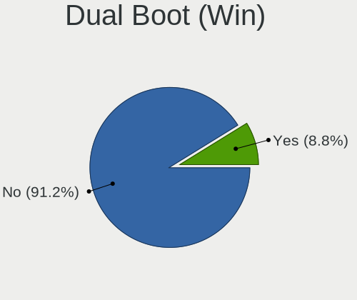
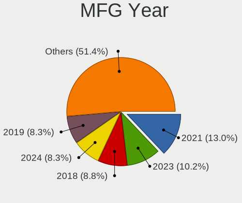
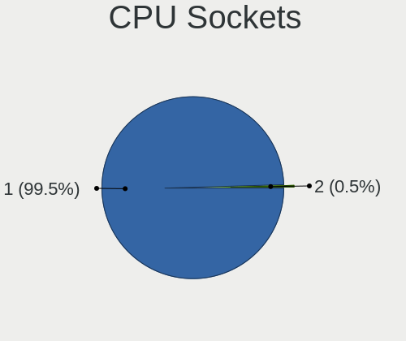
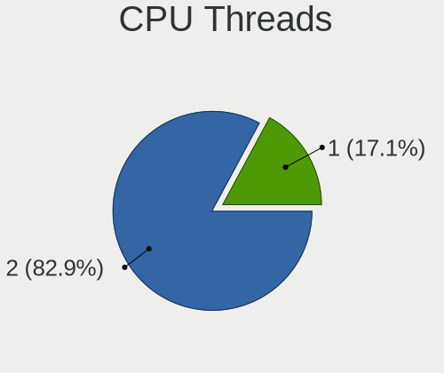
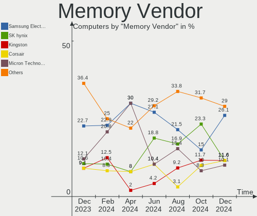
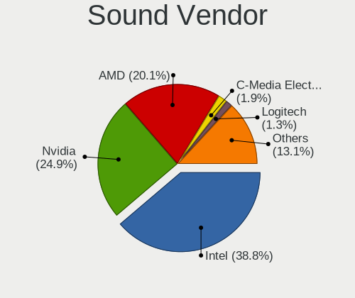
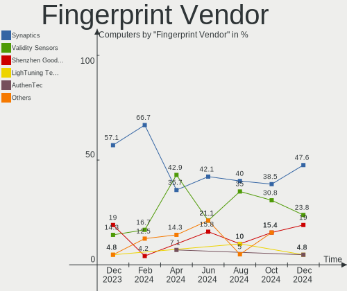
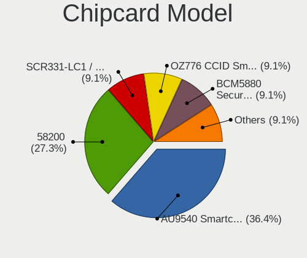

Pop!_OS Hardware Trends
-----------------------

A project to identify most popular hardware characteristics and track their change
over time based on data collected by Pop!_OS users at https://Linux-Hardware.org.

Anyone can contribute to the study by uploading probes of their computers by
the [hw-probe](https://github.com/linuxhw/hw-probe) tool:

    sudo -E hw-probe -all -upload

This is a report for all computer types. See also reports for [desktops](/Dist/Pop!_OS/Desktop/README.md) and [notebooks](/Dist/Pop!_OS/Notebook/README.md).

Full-feature report is available here: https://linux-hardware.org/?view=trends

Period: Apr, 2021.

Contents
--------

- [ OS                       ](#os)
- [ OS Family                ](#os-family)
- [ Kernel                   ](#kernel)
- [ Kernel Family            ](#kernel-family)
- [ Kernel Major Ver.        ](#kernel-major-ver)
- [ Arch                     ](#arch)
- [ DE                       ](#de)
- [ Display Server           ](#display-server)
- [ Display Manager          ](#display-manager)
- [ OS Lang                  ](#os-lang)
- [ Boot Mode                ](#boot-mode)
- [ Filesystem               ](#filesystem)
- [ Part. scheme             ](#part-scheme)
- [ Dual Boot with Linux/BSD ](#dual-boot-with-linux/bsd)
- [ Dual Boot (Win)          ](#dual-boot-win)
- [ Country                  ](#country)
- [ City                     ](#city)
- [ Vendor                   ](#vendor)
- [ Model                    ](#model)
- [ Model Family             ](#model-family)
- [ MFG Year                 ](#mfg-year)
- [ Form Factor              ](#form-factor)
- [ Secure Boot              ](#secure-boot)
- [ Coreboot                 ](#coreboot)
- [ RAM Size                 ](#ram-size)
- [ RAM Used                 ](#ram-used)
- [ Has CD-ROM               ](#has-cd-rom)
- [ Total Drives             ](#total-drives)
- [ Has Ethernet             ](#has-ethernet)
- [ Has WiFi                 ](#has-wifi)
- [ Has Bluetooth            ](#has-bluetooth)
- [ Drive Vendor             ](#drive-vendor)
- [ Drive Model              ](#drive-model)
- [ HDD Vendor               ](#hdd-vendor)
- [ SSD Vendor               ](#ssd-vendor)
- [ Drive Kind               ](#drive-kind)
- [ Drive Connector          ](#drive-connector)
- [ Drive Size               ](#drive-size)
- [ Space Total              ](#space-total)
- [ Space Used               ](#space-used)
- [ Malfunc. Drives          ](#malfunc-drives)
- [ Malfunc. Drive Vendor    ](#malfunc-drive-vendor)
- [ Malfunc. HDD Vendor      ](#malfunc-hdd-vendor)
- [ Malfunc. Drive Kind      ](#malfunc-drive-kind)
- [ Failed Drives            ](#failed-drives)
- [ Failed Drive Vendor      ](#failed-drive-vendor)
- [ Drive Status             ](#drive-status)
- [ Storage Vendor           ](#storage-vendor)
- [ Storage Model            ](#storage-model)
- [ Storage Kind             ](#storage-kind)
- [ CPU Vendor               ](#cpu-vendor)
- [ CPU Model                ](#cpu-model)
- [ CPU Model Family         ](#cpu-model-family)
- [ CPU Cores                ](#cpu-cores)
- [ CPU Sockets              ](#cpu-sockets)
- [ CPU Threads              ](#cpu-threads)
- [ CPU Op-Modes             ](#cpu-op-modes)
- [ CPU Microcode            ](#cpu-microcode)
- [ CPU Microarch            ](#cpu-microarch)
- [ GPU Vendor               ](#gpu-vendor)
- [ GPU Model                ](#gpu-model)
- [ GPU Combo                ](#gpu-combo)
- [ GPU Driver               ](#gpu-driver)
- [ GPU Memory               ](#gpu-memory)
- [ Monitor Vendor           ](#monitor-vendor)
- [ Monitor Model            ](#monitor-model)
- [ Monitor Resolution       ](#monitor-resolution)
- [ Monitor Diagonal         ](#monitor-diagonal)
- [ Monitor Width            ](#monitor-width)
- [ Aspect Ratio             ](#aspect-ratio)
- [ Monitor Area             ](#monitor-area)
- [ Pixel Density            ](#pixel-density)
- [ Multiple Monitors        ](#multiple-monitors)
- [ Net Controller Vendor    ](#net-controller-vendor)
- [ Net Controller Model     ](#net-controller-model)
- [ Wireless Vendor          ](#wireless-vendor)
- [ Wireless Model           ](#wireless-model)
- [ Ethernet Vendor          ](#ethernet-vendor)
- [ Ethernet Model           ](#ethernet-model)
- [ Net Controller Kind      ](#net-controller-kind)
- [ Used Controller          ](#used-controller)
- [ NICs                     ](#nics)
- [ IPv6                     ](#ipv6)
- [ Memory Vendor            ](#memory-vendor)
- [ Memory Model             ](#memory-model)
- [ Memory Kind              ](#memory-kind)
- [ Memory Form Factor       ](#memory-form-factor)
- [ Memory Size              ](#memory-size)
- [ Memory Speed             ](#memory-speed)
- [ Sound Vendor             ](#sound-vendor)
- [ Sound Model              ](#sound-model)
- [ Camera Vendor            ](#camera-vendor)
- [ Camera Model             ](#camera-model)
- [ Fingerprint Vendor       ](#fingerprint-vendor)
- [ Fingerprint Model        ](#fingerprint-model)
- [ Chipcard Vendor          ](#chipcard-vendor)
- [ Chipcard Model           ](#chipcard-model)
- [ Printer Vendor           ](#printer-vendor)
- [ Printer Model            ](#printer-model)
- [ Scanner Vendor           ](#scanner-vendor)
- [ Scanner Model            ](#scanner-model)
- [ Bluetooth Vendor         ](#bluetooth-vendor)
- [ Bluetooth Model          ](#bluetooth-model)
- [ Unsupported Devices      ](#unsupported-devices)
- [ Unsupported Device Types ](#unsupported-device-types)

OS
--

Installed operating systems

| Name          | Computers | Percent |
|---------------|-----------|---------|
| Pop!_OS 20.10 | 216       | 82.76%  |
| Pop!_OS 20.04 | 43        | 16.48%  |
| Pop!_OS 18.04 | 2         | 0.77%   |

OS Family
---------

OS without a version

| Name    | Computers | Percent |
|---------|-----------|---------|
| Pop!_OS | 261       | 100%    |

Kernel
------

Version of the Linux kernel

| Version                   | Computers | Percent |
|---------------------------|-----------|---------|
| 5.11.0-7612-generic       | 180       | 68.97%  |
| 5.11.0-7614-generic       | 39        | 14.94%  |
| 5.8.0-7642-generic        | 23        | 8.81%   |
| 5.8.0-7630-generic        | 5         | 1.92%   |
| 5.8.0-7625-generic        | 2         | 0.77%   |
| 5.4.0-7642-generic        | 2         | 0.77%   |
| 5.3.0-7648-generic        | 2         | 0.77%   |
| 5.4.0-7634-generic        | 1         | 0.38%   |
| 5.4.0-7625-generic        | 1         | 0.38%   |
| 5.4.0-17.1-liquorix-amd64 | 1         | 0.38%   |
| 5.11.8-051108-generic     | 1         | 0.38%   |
| 5.11.12-xanmod1           | 1         | 0.38%   |
| 5.11.0-051100-generic     | 1         | 0.38%   |
| 5.10.25-xanmod1           | 1         | 0.38%   |
| 5.10.23-xanmod1           | 1         | 0.38%   |

Kernel Family
-------------

Linux kernel without a distro release

| Version | Computers | Percent |
|---------|-----------|---------|
| 5.11.0  | 220       | 84.29%  |
| 5.8.0   | 30        | 11.49%  |
| 5.4.0   | 5         | 1.92%   |
| 5.3.0   | 2         | 0.77%   |
| 5.11.8  | 1         | 0.38%   |
| 5.11.12 | 1         | 0.38%   |
| 5.10.25 | 1         | 0.38%   |
| 5.10.23 | 1         | 0.38%   |

Kernel Major Ver.
-----------------

Linux kernel major version

| Version | Computers | Percent |
|---------|-----------|---------|
| 5.11    | 222       | 85.06%  |
| 5.8     | 30        | 11.49%  |
| 5.4     | 5         | 1.92%   |
| 5.3     | 2         | 0.77%   |
| 5.10    | 2         | 0.77%   |

Arch
----

OS architecture (x86_64, i586, etc.)

| Name   | Computers | Percent |
|--------|-----------|---------|
| x86_64 | 261       | 100%    |

DE
--

Desktop Environment

| Name       | Computers | Percent |
|------------|-----------|---------|
| GNOME      | 249       | 95.4%   |
| KDE        | 3         | 1.15%   |
| XFCE       | 2         | 0.77%   |
| KDE5       | 2         | 0.77%   |
| X-Cinnamon | 1         | 0.38%   |
| Pantheon   | 1         | 0.38%   |
| MATE       | 1         | 0.38%   |
| i3         | 1         | 0.38%   |
| Budgie     | 1         | 0.38%   |

Display Server
--------------

X11 or Wayland

| Name    | Computers | Percent |
|---------|-----------|---------|
| X11     | 257       | 98.47%  |
| Wayland | 4         | 1.53%   |

Display Manager
---------------

SDDM, LightDM, etc.

| Name    | Computers | Percent |
|---------|-----------|---------|
| Unknown | 223       | 85.44%  |
| GDM     | 38        | 14.56%  |

OS Lang
-------

Language

| Lang  | Computers | Percent |
|-------|-----------|---------|
| en_US | 140       | 53.64%  |
| pt_BR | 23        | 8.81%   |
| en_GB | 19        | 7.28%   |
| de_DE | 15        | 5.75%   |
| en_AU | 12        | 4.6%    |
| fr_FR | 11        | 4.21%   |
| es_ES | 7         | 2.68%   |
| en_CA | 6         | 2.3%    |
| ru_RU | 5         | 1.92%   |
| it_IT | 5         | 1.92%   |
| C     | 5         | 1.92%   |
| pt_PT | 4         | 1.53%   |
| pl_PL | 2         | 0.77%   |
| tr_TR | 1         | 0.38%   |
| sv_SE | 1         | 0.38%   |
| nl_NL | 1         | 0.38%   |
| nl_BE | 1         | 0.38%   |
| fr_CA | 1         | 0.38%   |
| es_MX | 1         | 0.38%   |
| da_DK | 1         | 0.38%   |

Boot Mode
---------

EFI or BIOS

| Mode | Computers | Percent |
|------|-----------|---------|
| BIOS | 225       | 86.21%  |
| EFI  | 36        | 13.79%  |

Filesystem
----------

Type of filesystem

| Type    | Computers | Percent |
|---------|-----------|---------|
| Ext4    | 255       | 97.7%   |
| Btrfs   | 3         | 1.15%   |
| Overlay | 2         | 0.77%   |
| Xfs     | 1         | 0.38%   |

Part. scheme
------------

Scheme of partitioning

| Type    | Computers | Percent |
|---------|-----------|---------|
| Unknown | 223       | 85.44%  |
| GPT     | 35        | 13.41%  |
| MBR     | 3         | 1.15%   |

Dual Boot with Linux/BSD
------------------------

Hosting more than one Linux/BSD

| Dual boot | Computers | Percent |
|-----------|-----------|---------|
| No        | 259       | 99.23%  |
| Yes       | 2         | 0.77%   |

Dual Boot (Win)
---------------

Hosting Linux and Windows

| Dual boot | Computers | Percent |
|-----------|-----------|---------|
| No        | 243       | 93.1%   |
| Yes       | 18        | 6.9%    |

Country
-------

Geographic location (country)

| Country            | Computers | Percent |
|--------------------|-----------|---------|
| USA                | 78        | 29.89%  |
| Brazil             | 29        | 11.11%  |
| Germany            | 18        | 6.9%    |
| Australia          | 16        | 6.13%   |
| UK                 | 13        | 4.98%   |
| Canada             | 11        | 4.21%   |
| France             | 9         | 3.45%   |
| India              | 8         | 3.07%   |
| Italy              | 7         | 2.68%   |
| Switzerland        | 5         | 1.92%   |
| Poland             | 5         | 1.92%   |
| New Zealand        | 5         | 1.92%   |
| Sweden             | 4         | 1.53%   |
| Russia             | 4         | 1.53%   |
| Spain              | 3         | 1.15%   |
| Portugal           | 3         | 1.15%   |
| Indonesia          | 3         | 1.15%   |
| Greece             | 3         | 1.15%   |
| Denmark            | 3         | 1.15%   |
| Turkey             | 2         | 0.77%   |
| South Africa       | 2         | 0.77%   |
| Saudi Arabia       | 2         | 0.77%   |
| Philippines        | 2         | 0.77%   |
| Netherlands        | 2         | 0.77%   |
| Mexico             | 2         | 0.77%   |
| Japan              | 2         | 0.77%   |
| Belgium            | 2         | 0.77%   |
| Uruguay            | 1         | 0.38%   |
| South Korea        | 1         | 0.38%   |
| Romania            | 1         | 0.38%   |
| Peru               | 1         | 0.38%   |
| Morocco            | 1         | 0.38%   |
| Moldova            | 1         | 0.38%   |
| Malta              | 1         | 0.38%   |
| Malaysia           | 1         | 0.38%   |
| Kazakhstan         | 1         | 0.38%   |
| Israel             | 1         | 0.38%   |
| Ireland            | 1         | 0.38%   |
| Egypt              | 1         | 0.38%   |
| Dominican Republic | 1         | 0.38%   |
| Croatia            | 1         | 0.38%   |
| Chile              | 1         | 0.38%   |
| Bulgaria           | 1         | 0.38%   |
| Bolivia            | 1         | 0.38%   |
| Austria            | 1         | 0.38%   |

City
----

Geographic location (city)

| City            | Computers | Percent |
|-----------------|-----------|---------|
| Toronto         | 4         | 1.53%   |
| São Paulo      | 4         | 1.53%   |
| Sydney          | 3         | 1.15%   |
| Gdansk          | 3         | 1.15%   |
| Brisbane        | 3         | 1.15%   |
| Berlin          | 3         | 1.15%   |
| Seattle         | 2         | 0.77%   |
| Perth           | 2         | 0.77%   |
| Paris           | 2         | 0.77%   |
| Milan           | 2         | 0.77%   |
| Miami           | 2         | 0.77%   |
| Maringá        | 2         | 0.77%   |
| Manaus          | 2         | 0.77%   |
| Lancaster       | 2         | 0.77%   |
| Hays            | 2         | 0.77%   |
| Duque de Caxias | 2         | 0.77%   |
| Denver          | 2         | 0.77%   |
| Cincinnati      | 2         | 0.77%   |
| Chicago         | 2         | 0.77%   |
| Athens          | 2         | 0.77%   |
| Ashburton       | 2         | 0.77%   |
| Zurich          | 1         | 0.38%   |
| Zierikzee       | 1         | 0.38%   |
| Yeovil          | 1         | 0.38%   |
| Würzburg       | 1         | 0.38%   |
| Wroclaw         | 1         | 0.38%   |
| Wellington      | 1         | 0.38%   |
| Wejherowo       | 1         | 0.38%   |
| Vijayawada      | 1         | 0.38%   |
| Vigo            | 1         | 0.38%   |
| Victoria        | 1         | 0.38%   |
| Varaždin       | 1         | 0.38%   |
| Vancouver       | 1         | 0.38%   |
| Van Nuys        | 1         | 0.38%   |
| Union City      | 1         | 0.38%   |
| Ungheni         | 1         | 0.38%   |
| Ukiah           | 1         | 0.38%   |
| Uberlândia     | 1         | 0.38%   |
| Tyringe         | 1         | 0.38%   |
| Tyreso Strand   | 1         | 0.38%   |
| Turramurra      | 1         | 0.38%   |
| Tulsa           | 1         | 0.38%   |
| Trussville      | 1         | 0.38%   |
| Trivandrum      | 1         | 0.38%   |
| Torrance        | 1         | 0.38%   |
| Tokyo           | 1         | 0.38%   |
| Thornlands      | 1         | 0.38%   |
| Thessaloniki    | 1         | 0.38%   |
| Tel Aviv        | 1         | 0.38%   |
| Taubate         | 1         | 0.38%   |
| Tadley          | 1         | 0.38%   |
| Summerville     | 1         | 0.38%   |
| Stillwater      | 1         | 0.38%   |
| St Petersburg   | 1         | 0.38%   |
| Spring Hill     | 1         | 0.38%   |
| Sofia           | 1         | 0.38%   |
| Semarang        | 1         | 0.38%   |
| Seal Beach      | 1         | 0.38%   |
| Schonbuhl       | 1         | 0.38%   |
| Sao Vicente     | 1         | 0.38%   |

Vendor
------

Motherboard manufacturer

| Name                                      | Computers | Percent |
|-------------------------------------------|-----------|---------|
| ASUSTek Computer                          | 43        | 16.48%  |
| Dell                                      | 35        | 13.41%  |
| Lenovo                                    | 34        | 13.03%  |
| Hewlett-Packard                           | 32        | 12.26%  |
| Gigabyte Technology                       | 18        | 6.9%    |
| Apple                                     | 16        | 6.13%   |
| MSI                                       | 14        | 5.36%   |
| ASRock                                    | 13        | 4.98%   |
| Acer                                      | 13        | 4.98%   |
| System76                                  | 8         | 3.07%   |
| Intel                                     | 3         | 1.15%   |
| TrekStor                                  | 2         | 0.77%   |
| Toshiba                                   | 2         | 0.77%   |
| Sony                                      | 2         | 0.77%   |
| Positivo                                  | 2         | 0.77%   |
| Medion                                    | 2         | 0.77%   |
| Gateway                                   | 2         | 0.77%   |
| Foxconn                                   | 2         | 0.77%   |
| Unknown                                   | 2         | 0.77%   |
| Xplore                                    | 1         | 0.38%   |
| SLIMBOOK                                  | 1         | 0.38%   |
| Shenzhen Baohuazhong Science & Technology | 1         | 0.38%   |
| Schenker                                  | 1         | 0.38%   |
| Samsung Electronics                       | 1         | 0.38%   |
| Quanta                                    | 1         | 0.38%   |
| Phoenix/SiS                               | 1         | 0.38%   |
| Pegatron                                  | 1         | 0.38%   |
| Panasonic                                 | 1         | 0.38%   |
| OriginPC                                  | 1         | 0.38%   |
| Itautec                                   | 1         | 0.38%   |
| HUAWEI                                    | 1         | 0.38%   |
| Google                                    | 1         | 0.38%   |
| CONNEX                                    | 1         | 0.38%   |
| BESSTAR Tech                              | 1         | 0.38%   |
| Alienware                                 | 1         | 0.38%   |

Model
-----

Motherboard model

| Name                                     | Computers | Percent |
|------------------------------------------|-----------|---------|
| System76 Lemur Pro                       | 3         | 1.15%   |
| ASUS All Series                          | 3         | 1.15%   |
| Apple MacBookPro8,1                      | 3         | 1.15%   |
| Unknown                                  | 3         | 1.15%   |
| HP Pavilion Notebook                     | 2         | 0.77%   |
| ASUS ROG Zephyrus G14 GA401IV_GA401IV    | 2         | 0.77%   |
| ASUS P8B WS                              | 2         | 0.77%   |
| ASUS CROSSHAIR VI HERO                   | 2         | 0.77%   |
| Apple MacBookPro9,2                      | 2         | 0.77%   |
| Apple MacBookPro12,1                     | 2         | 0.77%   |
| Apple iMac15,1                           | 2         | 0.77%   |
| Apple iMac12,2                           | 2         | 0.77%   |
| Xplore iX101B2                           | 1         | 0.38%   |
| TrekStor PRIMEBOOK U13B                  | 1         | 0.38%   |
| TrekStor Notebook Slim S130              | 1         | 0.38%   |
| Toshiba Satellite L500                   | 1         | 0.38%   |
| Toshiba PORTEGE M930                     | 1         | 0.38%   |
| System76 Thelio Major                    | 1         | 0.38%   |
| System76 Thelio                          | 1         | 0.38%   |
| System76 Lemur                           | 1         | 0.38%   |
| System76 Gazelle Pro                     | 1         | 0.38%   |
| System76 Galago Pro                      | 1         | 0.38%   |
| Sony VPCF121FX                           | 1         | 0.38%   |
| Sony VGN-FE41M                           | 1         | 0.38%   |
| SLIMBOOK PROX15-AMD                      | 1         | 0.38%   |
| Shenzhen Baohuazhong Science & Philbook  | 1         | 0.38%   |
| Schenker XMG CORE 17(M20, RTX 2060)      | 1         | 0.38%   |
| Samsung 800G5M/800G5W                    | 1         | 0.38%   |
| Quanta TWJ                               | 1         | 0.38%   |
| Positivo W942SW_SW1                      | 1         | 0.38%   |
| Positivo MOBILE                          | 1         | 0.38%   |
| Phoenix/SiS M7X0SU                       | 1         | 0.38%   |
| Pegatron p6-2100z                        | 1         | 0.38%   |
| Panasonic CF-53JCLBX1M                   | 1         | 0.38%   |
| OriginPC ND-17                           | 1         | 0.38%   |
| MSI MS-7D09                              | 1         | 0.38%   |
| MSI MS-7C91                              | 1         | 0.38%   |
| MSI MS-7C84                              | 1         | 0.38%   |
| MSI MS-7C02                              | 1         | 0.38%   |
| MSI MS-7B86                              | 1         | 0.38%   |
| MSI MS-7B29                              | 1         | 0.38%   |
| MSI MS-7B22                              | 1         | 0.38%   |
| MSI MS-7B17                              | 1         | 0.38%   |
| MSI MS-7A38                              | 1         | 0.38%   |
| MSI MS-7817                              | 1         | 0.38%   |
| MSI GS65 Stealth Thin 8RF                | 1         | 0.38%   |
| MSI GS63VR 7RF                           | 1         | 0.38%   |
| MSI GF65 Thin 9SD                        | 1         | 0.38%   |
| MSI A320M-HDV R4.0                       | 1         | 0.38%   |
| Medion Akoya P5306 I/C016                | 1         | 0.38%   |
| Medion Akoya P5286 E/B549                | 1         | 0.38%   |
| Lenovo V310-14ISK 80SX                   | 1         | 0.38%   |
| Lenovo ThinkStation P300 30AGS0EL00      | 1         | 0.38%   |
| Lenovo ThinkPad X230 2325OR2             | 1         | 0.38%   |
| Lenovo ThinkPad X1 Yoga 1st 20FQCTO1WW   | 1         | 0.38%   |
| Lenovo ThinkPad X1 Carbon 4th 20FCS0LP01 | 1         | 0.38%   |
| Lenovo ThinkPad W510 43192RU             | 1         | 0.38%   |
| Lenovo ThinkPad T470p 20J6S08M00         | 1         | 0.38%   |
| Lenovo ThinkPad T470 20HES5800H          | 1         | 0.38%   |
| Lenovo ThinkPad T420 4180AZ5             | 1         | 0.38%   |

Model Family
------------

Motherboard model prefix

| Name                                    | Computers | Percent |
|-----------------------------------------|-----------|---------|
| Lenovo ThinkPad                         | 12        | 4.6%    |
| Lenovo IdeaPad                          | 11        | 4.21%   |
| HP Pavilion                             | 10        | 3.83%   |
| ASUS ROG                                | 10        | 3.83%   |
| Acer Aspire                             | 10        | 3.83%   |
| Dell Inspiron                           | 9         | 3.45%   |
| Dell XPS                                | 7         | 2.68%   |
| HP EliteBook                            | 5         | 1.92%   |
| Dell OptiPlex                           | 5         | 1.92%   |
| Dell Latitude                           | 5         | 1.92%   |
| System76 Lemur                          | 4         | 1.53%   |
| HP Laptop                               | 4         | 1.53%   |
| Dell Vostro                             | 4         | 1.53%   |
| ASUS PRIME                              | 4         | 1.53%   |
| Lenovo Legion                           | 3         | 1.15%   |
| HP ENVY                                 | 3         | 1.15%   |
| Gigabyte X570                           | 3         | 1.15%   |
| Gigabyte B550                           | 3         | 1.15%   |
| Dell Precision                          | 3         | 1.15%   |
| ASUS VivoBook                           | 3         | 1.15%   |
| ASUS M5A78L-M                           | 3         | 1.15%   |
| ASUS All                                | 3         | 1.15%   |
| Apple MacBookPro8                       | 3         | 1.15%   |
| Unknown                                 | 3         | 1.15%   |
| System76 Thelio                         | 2         | 0.77%   |
| Medion Akoya                            | 2         | 0.77%   |
| ASUS P8B                                | 2         | 0.77%   |
| ASUS CROSSHAIR                          | 2         | 0.77%   |
| ASUS ASUS                               | 2         | 0.77%   |
| ASRock X570                             | 2         | 0.77%   |
| Apple Macmini6                          | 2         | 0.77%   |
| Apple MacBookPro9                       | 2         | 0.77%   |
| Apple MacBookPro12                      | 2         | 0.77%   |
| Apple iMac15                            | 2         | 0.77%   |
| Apple iMac12                            | 2         | 0.77%   |
| Xplore iX101B2                          | 1         | 0.38%   |
| TrekStor PRIMEBOOK                      | 1         | 0.38%   |
| TrekStor Notebook                       | 1         | 0.38%   |
| Toshiba Satellite                       | 1         | 0.38%   |
| Toshiba PORTEGE                         | 1         | 0.38%   |
| System76 Gazelle                        | 1         | 0.38%   |
| System76 Galago                         | 1         | 0.38%   |
| Sony VPCF121FX                          | 1         | 0.38%   |
| Sony VGN-FE41M                          | 1         | 0.38%   |
| SLIMBOOK PROX15-AMD                     | 1         | 0.38%   |
| Shenzhen Baohuazhong Science & Philbook | 1         | 0.38%   |
| Schenker XMG                            | 1         | 0.38%   |
| Samsung 800G5M                          | 1         | 0.38%   |
| Quanta TWJ                              | 1         | 0.38%   |
| Positivo W942SW                         | 1         | 0.38%   |
| Positivo MOBILE                         | 1         | 0.38%   |
| Phoenix/SiS M7X0SU                      | 1         | 0.38%   |
| Pegatron p6-2100z                       | 1         | 0.38%   |
| Panasonic CF-53JCLBX1M                  | 1         | 0.38%   |
| OriginPC ND-17                          | 1         | 0.38%   |
| MSI MS-7D09                             | 1         | 0.38%   |
| MSI MS-7C91                             | 1         | 0.38%   |
| MSI MS-7C84                             | 1         | 0.38%   |
| MSI MS-7C02                             | 1         | 0.38%   |
| MSI MS-7B86                             | 1         | 0.38%   |

MFG Year
--------

Motherboard manufacture year

| Year    | Computers | Percent |
|---------|-----------|---------|
| 2020    | 73        | 27.97%  |
| 2019    | 34        | 13.03%  |
| 2018    | 28        | 10.73%  |
| 2021    | 26        | 9.96%   |
| 2011    | 19        | 7.28%   |
| 2013    | 16        | 6.13%   |
| 2014    | 13        | 4.98%   |
| 2015    | 10        | 3.83%   |
| 2012    | 10        | 3.83%   |
| 2016    | 9         | 3.45%   |
| 2010    | 8         | 3.07%   |
| 2009    | 6         | 2.3%    |
| 2017    | 5         | 1.92%   |
| 2008    | 1         | 0.38%   |
| 2007    | 1         | 0.38%   |
| 2006    | 1         | 0.38%   |
| Unknown | 1         | 0.38%   |

Form Factor
-----------

Physical design of the computer

| Name        | Computers | Percent |
|-------------|-----------|---------|
| Notebook    | 145       | 55.56%  |
| Desktop     | 99        | 37.93%  |
| Convertible | 8         | 3.07%   |
| All in one  | 5         | 1.92%   |
| Mini pc     | 3         | 1.15%   |
| Tablet      | 1         | 0.38%   |

Secure Boot
-----------

Enabled or disabled

| State    | Computers | Percent |
|----------|-----------|---------|
| Disabled | 261       | 100%    |

Coreboot
--------

Have coreboot on board

| Used | Computers | Percent |
|------|-----------|---------|
| No   | 255       | 97.7%   |
| Yes  | 6         | 2.3%    |

RAM Size
--------

Total RAM memory

| Size in GB  | Computers | Percent |
|-------------|-----------|---------|
| 4.01-8.0    | 63        | 24.14%  |
| 8.01-16.0   | 58        | 22.22%  |
| 16.01-24.0  | 54        | 20.69%  |
| 3.01-4.0    | 39        | 14.94%  |
| 32.01-64.0  | 30        | 11.49%  |
| 64.01-256.0 | 11        | 4.21%   |
| 24.01-32.0  | 3         | 1.15%   |
| 2.01-3.0    | 2         | 0.77%   |
| 1.01-2.0    | 1         | 0.38%   |

RAM Used
--------

Used RAM memory

| Used GB    | Computers | Percent |
|------------|-----------|---------|
| 1.01-2.0   | 97        | 37.16%  |
| 2.01-3.0   | 69        | 26.44%  |
| 3.01-4.0   | 46        | 17.62%  |
| 4.01-8.0   | 35        | 13.41%  |
| 8.01-16.0  | 9         | 3.45%   |
| 16.01-24.0 | 2         | 0.77%   |
| 32.01-64.0 | 1         | 0.38%   |
| 24.01-32.0 | 1         | 0.38%   |
| 0.51-1.0   | 1         | 0.38%   |

Has CD-ROM
----------

Has CD-ROM on board

| Presented | Computers | Percent |
|-----------|-----------|---------|
| No        | 171       | 65.52%  |
| Yes       | 90        | 34.48%  |

Total Drives
------------

Number of drives on board

| Drives | Computers | Percent |
|--------|-----------|---------|
| 1      | 123       | 47.13%  |
| 2      | 90        | 34.48%  |
| 3      | 20        | 7.66%   |
| 4      | 14        | 5.36%   |
| 5      | 6         | 2.3%    |
| 6      | 3         | 1.15%   |
| 0      | 3         | 1.15%   |
| 23     | 1         | 0.38%   |
| 12     | 1         | 0.38%   |

Has Ethernet
------------

Has Ethernet on board

| Presented | Computers | Percent |
|-----------|-----------|---------|
| Yes       | 233       | 89.27%  |
| No        | 28        | 10.73%  |

Has WiFi
--------

Has WiFi module

| Presented | Computers | Percent |
|-----------|-----------|---------|
| Yes       | 216       | 82.76%  |
| No        | 45        | 17.24%  |

Has Bluetooth
-------------

Has Bluetooth module

| Presented | Computers | Percent |
|-----------|-----------|---------|
| Yes       | 168       | 64.37%  |
| No        | 93        | 35.63%  |

Drive Vendor
------------

Hard drive vendors

| Vendor                    | Computers | Drives | Percent |
|---------------------------|-----------|--------|---------|
| Samsung Electronics       | 64        | 85     | 16.04%  |
| WDC                       | 63        | 91     | 15.79%  |
| Seagate                   | 61        | 77     | 15.29%  |
| Toshiba                   | 23        | 25     | 5.76%   |
| Kingston                  | 22        | 24     | 5.51%   |
| Sandisk                   | 20        | 23     | 5.01%   |
| Unknown                   | 16        | 21     | 4.01%   |
| Crucial                   | 15        | 17     | 3.76%   |
| Intel                     | 10        | 11     | 2.51%   |
| SK Hynix                  | 9         | 10     | 2.26%   |
| Apple                     | 9         | 11     | 2.26%   |
| Phison                    | 8         | 12     | 2.01%   |
| Hitachi                   | 8         | 8      | 2.01%   |
| HGST                      | 8         | 9      | 2.01%   |
| PNY                       | 7         | 7      | 1.75%   |
| Micron Technology         | 6         | 7      | 1.5%    |
| Silicon Motion            | 4         | 12     | 1%      |
| OCZ                       | 4         | 4      | 1%      |
| A-DATA Technology         | 4         | 4      | 1%      |
| Team                      | 3         | 3      | 0.75%   |
| LITEON                    | 3         | 3      | 0.75%   |
| Apacer                    | 3         | 3      | 0.75%   |
| Transcend                 | 2         | 2      | 0.5%    |
| SPCC                      | 2         | 2      | 0.5%    |
| Patriot                   | 2         | 2      | 0.5%    |
| Micron/Crucial Technology | 2         | 3      | 0.5%    |
| Lenovo                    | 2         | 2      | 0.5%    |
| JMicron                   | 2         | 2      | 0.5%    |
| China                     | 2         | 2      | 0.5%    |
| XrayDisk                  | 1         | 1      | 0.25%   |
| Union Memory (Shenzhen)   | 1         | 1      | 0.25%   |
| RSH-339                   | 1         | 1      | 0.25%   |
| QNAP                      | 1         | 2      | 0.25%   |
| OWC                       | 1         | 1      | 0.25%   |
| NGFF                      | 1         | 1      | 0.25%   |
| Maxtor                    | 1         | 1      | 0.25%   |
| Lexar                     | 1         | 1      | 0.25%   |
| LaCie                     | 1         | 1      | 0.25%   |
| Intenso                   | 1         | 1      | 0.25%   |
| Gigabyte Technology       | 1         | 1      | 0.25%   |
| Fujitsu                   | 1         | 1      | 0.25%   |
| DREVO                     | 1         | 1      | 0.25%   |
| Dogfish                   | 1         | 1      | 0.25%   |
| ASMT                      | 1         | 2      | 0.25%   |

Drive Model
-----------

Hard drive models

| Model                              | Computers | Percent |
|------------------------------------|-----------|---------|
| Seagate ST1000LM035-1RK172 1TB     | 9         | 1.97%   |
| Samsung NVMe SSD Drive 1TB         | 8         | 1.75%   |
| Samsung NVMe SSD Drive 500GB       | 7         | 1.53%   |
| Unknown MMC Card  64GB             | 5         | 1.09%   |
| Seagate ST500DM002-1BD142 500GB    | 5         | 1.09%   |
| Sandisk NVMe SSD Drive 500GB       | 5         | 1.09%   |
| Kingston SA400S37120G 120GB SSD    | 5         | 1.09%   |
| WDC WDS120G2G0A-00JH30 120GB SSD   | 4         | 0.88%   |
| Samsung NVMe SSD Drive 256GB       | 4         | 0.88%   |
| Kingston SA400S37480G 480GB SSD    | 4         | 0.88%   |
| Kingston SA400S37240G 240GB SSD    | 4         | 0.88%   |
| Crucial CT240BX500SSD1 240GB       | 4         | 0.88%   |
| Crucial CT1000MX500SSD1 1TB        | 4         | 0.88%   |
| WDC WD10EZEX-08WN4A0 1TB           | 3         | 0.66%   |
| Unknown MMC Card  32GB             | 3         | 0.66%   |
| Toshiba NVMe SSD Drive 512GB       | 3         | 0.66%   |
| Toshiba MQ04ABF100 1TB             | 3         | 0.66%   |
| Seagate ST1000LM024 HN-M101MBB 1TB | 3         | 0.66%   |
| Seagate ST1000DM010-2EP102 1TB     | 3         | 0.66%   |
| Samsung SSD 870 EVO 1TB            | 3         | 0.66%   |
| Samsung SSD 850 EVO 500GB          | 3         | 0.66%   |
| Samsung NVMe SSD Drive 512GB       | 3         | 0.66%   |
| Intel NVMe SSD Drive 512GB         | 3         | 0.66%   |
| Intel NVMe SSD Drive 1024GB        | 3         | 0.66%   |
| HGST HTS721010A9E630 1TB           | 3         | 0.66%   |
| Apple SSD SM0128G 121GB            | 3         | 0.66%   |
| WDC WDS500G2B0B-00YS70 500GB SSD   | 2         | 0.44%   |
| WDC WDS120G2G0B-00EPW0 120GB SSD   | 2         | 0.44%   |
| WDC WD5000LPVX-75V0TT0 500GB       | 2         | 0.44%   |
| WDC WD10SPZX-24Z10 1TB             | 2         | 0.44%   |
| WDC WD10EZEX-00BN5A0 1TB           | 2         | 0.44%   |
| WDC WD1002FAEX-00Y9A0 1TB          | 2         | 0.44%   |
| Unknown MMC Card  393GB            | 2         | 0.44%   |
| Unknown MMC Card  128GB            | 2         | 0.44%   |
| Toshiba MK3261GSYN 320GB           | 2         | 0.44%   |
| Toshiba HDWD110 1TB                | 2         | 0.44%   |
| Toshiba DT01ACA300 3TB             | 2         | 0.44%   |
| SK Hynix NVMe SSD Drive 512GB      | 2         | 0.44%   |
| SK Hynix NVMe SSD Drive 256GB      | 2         | 0.44%   |
| Seagate ST500LT012-1DG142 500GB    | 2         | 0.44%   |
| Seagate ST3500413AS 500GB          | 2         | 0.44%   |
| Seagate ST31000524AS 1TB           | 2         | 0.44%   |
| Seagate ST250DM000-1BD141 250GB    | 2         | 0.44%   |
| Seagate ST2000LM007-1R8174 2TB     | 2         | 0.44%   |
| Seagate ST2000DM001-1ER164 2TB     | 2         | 0.44%   |
| Seagate ST2000DM001-1CH164 2TB     | 2         | 0.44%   |
| Seagate ST1000DM003-1SB102 1TB     | 2         | 0.44%   |
| Seagate ST1000DM003-1CH162 1TB     | 2         | 0.44%   |
| Seagate BUP Slim BK 1TB            | 2         | 0.44%   |
| SanDisk SSD PLUS 240GB             | 2         | 0.44%   |
| Sandisk NVMe SSD Drive 512GB       | 2         | 0.44%   |
| Sandisk NVMe SSD Drive 256GB       | 2         | 0.44%   |
| Samsung SSD 870 QVO 1TB            | 2         | 0.44%   |
| Samsung SSD 860 QVO 1TB            | 2         | 0.44%   |
| Samsung SSD 860 EVO 500GB          | 2         | 0.44%   |
| Samsung SSD 860 EVO 1TB            | 2         | 0.44%   |
| Samsung SSD 850 PRO 256GB          | 2         | 0.44%   |
| Samsung NVMe SSD Drive 2TB         | 2         | 0.44%   |
| Samsung NVMe SSD Drive 250GB       | 2         | 0.44%   |
| Samsung HM500JI 500GB              | 2         | 0.44%   |

HDD Vendor
----------

Hard disk drive vendors

| Vendor              | Computers | Drives | Percent |
|---------------------|-----------|--------|---------|
| Seagate             | 60        | 73     | 39.47%  |
| WDC                 | 45        | 64     | 29.61%  |
| Toshiba             | 16        | 17     | 10.53%  |
| Hitachi             | 8         | 8      | 5.26%   |
| HGST                | 8         | 9      | 5.26%   |
| Samsung Electronics | 7         | 7      | 4.61%   |
| Apple               | 5         | 6      | 3.29%   |
| Maxtor              | 1         | 1      | 0.66%   |
| Fujitsu             | 1         | 1      | 0.66%   |
| ASMT                | 1         | 2      | 0.66%   |

SSD Vendor
----------

Solid state drive vendors

| Vendor              | Computers | Drives | Percent |
|---------------------|-----------|--------|---------|
| Samsung Electronics | 31        | 38     | 21.38%  |
| Kingston            | 19        | 21     | 13.1%   |
| WDC                 | 16        | 19     | 11.03%  |
| Crucial             | 15        | 17     | 10.34%  |
| SanDisk             | 11        | 13     | 7.59%   |
| PNY                 | 7         | 7      | 4.83%   |
| Apple               | 5         | 5      | 3.45%   |
| OCZ                 | 4         | 4      | 2.76%   |
| Micron Technology   | 4         | 5      | 2.76%   |
| A-DATA Technology   | 4         | 4      | 2.76%   |
| Team                | 3         | 3      | 2.07%   |
| LITEON              | 3         | 3      | 2.07%   |
| Apacer              | 3         | 3      | 2.07%   |
| Transcend           | 2         | 2      | 1.38%   |
| Toshiba             | 2         | 2      | 1.38%   |
| SPCC                | 2         | 2      | 1.38%   |
| SK Hynix            | 2         | 2      | 1.38%   |
| Patriot             | 2         | 2      | 1.38%   |
| China               | 2         | 2      | 1.38%   |
| Seagate             | 1         | 1      | 0.69%   |
| OWC                 | 1         | 1      | 0.69%   |
| NGFF                | 1         | 1      | 0.69%   |
| Lexar               | 1         | 1      | 0.69%   |
| Intenso             | 1         | 1      | 0.69%   |
| Gigabyte Technology | 1         | 1      | 0.69%   |
| DREVO               | 1         | 1      | 0.69%   |
| Dogfish             | 1         | 1      | 0.69%   |

Drive Kind
----------

HDD or SSD

| Kind    | Computers | Drives | Percent |
|---------|-----------|--------|---------|
| SSD     | 130       | 162    | 35.04%  |
| HDD     | 126       | 188    | 33.96%  |
| NVMe    | 90        | 117    | 24.26%  |
| MMC     | 13        | 18     | 3.5%    |
| Unknown | 12        | 14     | 3.23%   |

Drive Connector
---------------

SATA, SAS, NVMe, etc.

| Type | Computers | Drives | Percent |
|------|-----------|--------|---------|
| SATA | 206       | 346    | 63.58%  |
| NVMe | 90        | 117    | 27.78%  |
| SAS  | 15        | 18     | 4.63%   |
| MMC  | 13        | 18     | 4.01%   |

Drive Size
----------

Size of hard drive

| Size in TB | Computers | Drives | Percent |
|------------|-----------|--------|---------|
| 0.01-0.5   | 151       | 191    | 54.71%  |
| 0.51-1.0   | 92        | 106    | 33.33%  |
| 1.01-2.0   | 15        | 15     | 5.43%   |
| 2.01-3.0   | 7         | 7      | 2.54%   |
| 3.01-4.0   | 5         | 8      | 1.81%   |
| 4.01-10.0  | 4         | 8      | 1.45%   |
| 10.01-20.0 | 2         | 15     | 0.72%   |

Space Total
-----------

Amount of disk space available on the file system

| Size in GB     | Computers | Percent |
|----------------|-----------|---------|
| 101-250        | 81        | 31.03%  |
| 251-500        | 76        | 29.12%  |
| 501-1000       | 35        | 13.41%  |
| 1001-2000      | 30        | 11.49%  |
| More than 3000 | 13        | 4.98%   |
| 21-50          | 8         | 3.07%   |
| 2001-3000      | 8         | 3.07%   |
| 1-20           | 5         | 1.92%   |
| 51-100         | 5         | 1.92%   |

Space Used
----------

Amount of used disk space

| Used GB        | Computers | Percent |
|----------------|-----------|---------|
| 1-20           | 105       | 40.23%  |
| 21-50          | 52        | 19.92%  |
| 101-250        | 35        | 13.41%  |
| 51-100         | 28        | 10.73%  |
| 251-500        | 14        | 5.36%   |
| 1001-2000      | 13        | 4.98%   |
| 501-1000       | 8         | 3.07%   |
| More than 3000 | 3         | 1.15%   |
| 2001-3000      | 3         | 1.15%   |

Malfunc. Drives
---------------

Drive models with a malfunction

| Model                                 | Computers | Drives | Percent |
|---------------------------------------|-----------|--------|---------|
| Seagate ST9500325AS 500GB             | 1         | 1      | 25%     |
| Seagate ST2000LM007-1R8174 2TB        | 1         | 1      | 25%     |
| SanDisk SD9SN8W-128G-1006 128GB SSD   | 1         | 1      | 25%     |
| Micron Technology 1100 SATA 512GB SSD | 1         | 1      | 25%     |

Malfunc. Drive Vendor
---------------------

Vendors of faulty drives

| Vendor            | Computers | Drives | Percent |
|-------------------|-----------|--------|---------|
| Seagate           | 2         | 2      | 50%     |
| SanDisk           | 1         | 1      | 25%     |
| Micron Technology | 1         | 1      | 25%     |

Malfunc. HDD Vendor
-------------------

Vendors of faulty HDD drives

| Vendor  | Computers | Drives | Percent |
|---------|-----------|--------|---------|
| Seagate | 2         | 2      | 100%    |

Malfunc. Drive Kind
-------------------

Kinds of faulty drives

| Kind | Computers | Drives | Percent |
|------|-----------|--------|---------|
| SSD  | 2         | 2      | 50%     |
| HDD  | 2         | 2      | 50%     |

Failed Drives
-------------

Failed drive models

Zero info for selected period =(

Failed Drive Vendor
-------------------

Failed drive vendors

Zero info for selected period =(

Drive Status
------------

Number of failed and malfunc. drives

| Status   | Computers | Drives | Percent |
|----------|-----------|--------|---------|
| Detected | 224       | 439    | 84.85%  |
| Works    | 36        | 56     | 13.64%  |
| Malfunc  | 4         | 4      | 1.52%   |

Storage Vendor
--------------

Storage controller vendors

| Vendor                           | Computers | Percent |
|----------------------------------|-----------|---------|
| Intel                            | 156       | 46.29%  |
| AMD                              | 70        | 20.77%  |
| Samsung Electronics              | 38        | 11.28%  |
| Sandisk                          | 16        | 4.75%   |
| Phison Electronics               | 8         | 2.37%   |
| SK Hynix                         | 7         | 2.08%   |
| Nvidia                           | 7         | 2.08%   |
| Toshiba America Info Systems     | 6         | 1.78%   |
| Silicon Motion                   | 4         | 1.19%   |
| Marvell Technology Group         | 4         | 1.19%   |
| JMicron Technology               | 4         | 1.19%   |
| Kingston Technology Company      | 3         | 0.89%   |
| ASMedia Technology               | 3         | 0.89%   |
| Silicon Integrated Systems [SiS] | 2         | 0.59%   |
| Micron/Crucial Technology        | 2         | 0.59%   |
| Micron Technology                | 2         | 0.59%   |
| Lenovo                           | 2         | 0.59%   |
| Union Memory (Shenzhen)          | 1         | 0.3%    |
| Silicon Image                    | 1         | 0.3%    |
| Broadcom / LSI                   | 1         | 0.3%    |

Storage Model
-------------

Storage controller models

| Model                                                                                   | Computers | Percent |
|-----------------------------------------------------------------------------------------|-----------|---------|
| AMD FCH SATA Controller [AHCI mode]                                                     | 53        | 13.73%  |
| Samsung NVMe SSD Controller SM981/PM981/PM983                                           | 24        | 6.22%   |
| Intel 6 Series/C200 Series Chipset Family 6 port Mobile SATA AHCI Controller            | 16        | 4.15%   |
| Intel 8 Series/C220 Series Chipset Family 6-port SATA Controller 1 [AHCI mode]          | 15        | 3.89%   |
| Intel 7 Series Chipset Family 6-port SATA Controller [AHCI mode]                        | 12        | 3.11%   |
| Intel Sunrise Point-LP SATA Controller [AHCI mode]                                      | 11        | 2.85%   |
| Intel 82801 Mobile SATA Controller [RAID mode]                                          | 10        | 2.59%   |
| AMD 400 Series Chipset SATA Controller                                                  | 10        | 2.59%   |
| Intel SSD 660P Series                                                                   | 7         | 1.81%   |
| Intel Cannon Lake Mobile PCH SATA AHCI Controller                                       | 6         | 1.55%   |
| AMD SB7x0/SB8x0/SB9x0 SATA Controller [AHCI mode]                                       | 6         | 1.55%   |
| Sandisk WD Blue SN550 NVMe SSD                                                          | 5         | 1.3%    |
| Intel 6 Series/C200 Series Chipset Family 6 port Desktop SATA AHCI Controller           | 5         | 1.3%    |
| Intel 5 Series/3400 Series Chipset 4 port SATA AHCI Controller                          | 5         | 1.3%    |
| Intel 200 Series PCH SATA controller [AHCI mode]                                        | 5         | 1.3%    |
| AMD Starship/Matisse Chipset SATA Controller [AHCI mode]                                | 5         | 1.3%    |
| AMD SB7x0/SB8x0/SB9x0 IDE Controller                                                    | 5         | 1.3%    |
| Sandisk WD Black SN750 / PC SN730 NVMe SSD                                              | 4         | 1.04%   |
| Samsung NVMe SSD Controller PM9A1/980PRO                                                | 4         | 1.04%   |
| Phison E16 PCIe4 NVMe Controller                                                        | 4         | 1.04%   |
| Nvidia MCP61 SATA Controller                                                            | 4         | 1.04%   |
| Nvidia MCP61 IDE                                                                        | 4         | 1.04%   |
| Intel SATA Controller [RAID mode]                                                       | 4         | 1.04%   |
| Intel Q170/Q150/B150/H170/H110/Z170/CM236 Chipset SATA Controller [AHCI Mode]           | 4         | 1.04%   |
| Intel HM170/QM170 Chipset SATA Controller [AHCI Mode]                                   | 4         | 1.04%   |
| Intel Cannon Point-LP SATA Controller [AHCI Mode]                                       | 4         | 1.04%   |
| Intel Cannon Lake PCH SATA AHCI Controller                                              | 4         | 1.04%   |
| Intel 7 Series/C210 Series Chipset Family 6-port SATA Controller [AHCI mode]            | 4         | 1.04%   |
| Intel 5 Series/3400 Series Chipset 6 port SATA AHCI Controller                          | 4         | 1.04%   |
| AMD SB7x0/SB8x0/SB9x0 SATA Controller [IDE mode]                                        | 4         | 1.04%   |
| Toshiba America Info Systems BG3 NVMe SSD Controller                                    | 3         | 0.78%   |
| SK Hynix BC511                                                                          | 3         | 0.78%   |
| SK Hynix BC501 NVMe Solid State Drive 512GB                                             | 3         | 0.78%   |
| Silicon Motion SM2263EN/SM2263XT SSD Controller                                         | 3         | 0.78%   |
| Sandisk WD Black 2018/SN750 / PC SN720 NVMe SSD                                         | 3         | 0.78%   |
| Samsung NVMe SSD Controller SM961/PM961/SM963                                           | 3         | 0.78%   |
| Samsung Electronics SATA controller                                                     | 3         | 0.78%   |
| Intel Comet Lake SATA AHCI Controller                                                   | 3         | 0.78%   |
| Intel 82801IBM/IEM (ICH9M/ICH9M-E) 4 port SATA Controller [AHCI mode]                   | 3         | 0.78%   |
| Intel 82801G (ICH7 Family) IDE Controller                                               | 3         | 0.78%   |
| Intel 8 Series SATA Controller 1 [AHCI mode]                                            | 3         | 0.78%   |
| Intel 6 Series/C200 Series Chipset Family Desktop SATA Controller (IDE mode, ports 4-5) | 3         | 0.78%   |
| Intel 6 Series/C200 Series Chipset Family Desktop SATA Controller (IDE mode, ports 0-3) | 3         | 0.78%   |
| Intel 400 Series Chipset Family SATA AHCI Controller                                    | 3         | 0.78%   |
| ASMedia ASM1062 Serial ATA Controller                                                   | 3         | 0.78%   |
| AMD X370 Series Chipset SATA Controller                                                 | 3         | 0.78%   |
| Toshiba America Info Systems XG6 NVMe SSD Controller                                    | 2         | 0.52%   |
| Silicon Integrated Systems [SiS] SATA Controller / IDE mode                             | 2         | 0.52%   |
| Silicon Integrated Systems [SiS] 5513 IDE Controller                                    | 2         | 0.52%   |
| Sandisk WD Blue SN500 / PC SN520 NVMe SSD                                               | 2         | 0.52%   |
| Samsung NVMe SSD Controller SM951/PM951                                                 | 2         | 0.52%   |
| Samsung NVMe Controller                                                                 | 2         | 0.52%   |
| Samsung Apple PCIe SSD                                                                  | 2         | 0.52%   |
| Phison E12 NVMe Controller                                                              | 2         | 0.52%   |
| Nvidia MCP79 AHCI Controller                                                            | 2         | 0.52%   |
| Micron/Crucial Non-Volatile memory controller                                           | 2         | 0.52%   |
| Micron Non-Volatile memory controller                                                   | 2         | 0.52%   |
| Marvell Group 88SE9172 SATA 6Gb/s Controller                                            | 2         | 0.52%   |
| Lenovo Non-Volatile memory controller                                                   | 2         | 0.52%   |
| JMicron JMB362 SATA Controller                                                          | 2         | 0.52%   |

Storage Kind
------------

Kind of storage controller (IDE, SATA, NVMe, SAS, ...)

| Kind | Computers | Percent |
|------|-----------|---------|
| SATA | 199       | 58.7%   |
| NVMe | 90        | 26.55%  |
| IDE  | 29        | 8.55%   |
| RAID | 20        | 5.9%    |
| SAS  | 1         | 0.29%   |

CPU Vendor
----------

Processor vendors

| Vendor | Computers | Percent |
|--------|-----------|---------|
| Intel  | 183       | 70.11%  |
| AMD    | 78        | 29.89%  |

CPU Model
---------

Processor models

| Model                                         | Computers | Percent |
|-----------------------------------------------|-----------|---------|
| Intel Core i7-7700HQ CPU @ 2.80GHz            | 5         | 1.92%   |
| Intel Core i7-9750H CPU @ 2.60GHz             | 4         | 1.53%   |
| Intel Core i7-4770 CPU @ 3.40GHz              | 4         | 1.53%   |
| Intel Core i7-10750H CPU @ 2.60GHz            | 4         | 1.53%   |
| Intel Core i5-7200U CPU @ 2.50GHz             | 4         | 1.53%   |
| Intel Core i5-2450M CPU @ 2.50GHz             | 4         | 1.53%   |
| AMD Ryzen 7 4800H with Radeon Graphics        | 4         | 1.53%   |
| Intel Core i7-8550U CPU @ 1.80GHz             | 3         | 1.15%   |
| Intel Core i7-2670QM CPU @ 2.20GHz            | 3         | 1.15%   |
| Intel Core i5-3210M CPU @ 2.50GHz             | 3         | 1.15%   |
| Intel Core i5-2415M CPU @ 2.30GHz             | 3         | 1.15%   |
| Intel Core i5-10400 CPU @ 2.90GHz             | 3         | 1.15%   |
| Intel Core i5-10210U CPU @ 1.60GHz            | 3         | 1.15%   |
| AMD Ryzen 9 3900X 12-Core Processor           | 3         | 1.15%   |
| AMD Ryzen 7 3700X 8-Core Processor            | 3         | 1.15%   |
| AMD Ryzen 5 4500U with Radeon Graphics        | 3         | 1.15%   |
| AMD Ryzen 5 3600 6-Core Processor             | 3         | 1.15%   |
| Intel Core i7-8750H CPU @ 2.20GHz             | 2         | 0.77%   |
| Intel Core i7-8565U CPU @ 1.80GHz             | 2         | 0.77%   |
| Intel Core i7-6500U CPU @ 2.50GHz             | 2         | 0.77%   |
| Intel Core i7-3770 CPU @ 3.40GHz              | 2         | 0.77%   |
| Intel Core i7-10875H CPU @ 2.30GHz            | 2         | 0.77%   |
| Intel Core i7-1065G7 CPU @ 1.30GHz            | 2         | 0.77%   |
| Intel Core i7-10510U CPU @ 1.80GHz            | 2         | 0.77%   |
| Intel Core i5-9300H CPU @ 2.40GHz             | 2         | 0.77%   |
| Intel Core i5-8250U CPU @ 1.60GHz             | 2         | 0.77%   |
| Intel Core i5-6200U CPU @ 2.30GHz             | 2         | 0.77%   |
| Intel Core i5-5257U CPU @ 2.70GHz             | 2         | 0.77%   |
| Intel Core i5-4460 CPU @ 3.20GHz              | 2         | 0.77%   |
| Intel Core i5-3550 CPU @ 3.30GHz              | 2         | 0.77%   |
| Intel Core i5-3320M CPU @ 2.60GHz             | 2         | 0.77%   |
| Intel Core i5-2520M CPU @ 2.50GHz             | 2         | 0.77%   |
| Intel Core i5 CPU M 520 @ 2.40GHz             | 2         | 0.77%   |
| Intel Core i3-8145U CPU @ 2.10GHz             | 2         | 0.77%   |
| Intel Core 2 Duo CPU T6600 @ 2.20GHz          | 2         | 0.77%   |
| Intel Core 2 Duo CPU E8400 @ 3.00GHz          | 2         | 0.77%   |
| Intel Celeron N4000 CPU @ 1.10GHz             | 2         | 0.77%   |
| Intel Celeron CPU N3350 @ 1.10GHz             | 2         | 0.77%   |
| Intel Atom x5-Z8350 CPU @ 1.44GHz             | 2         | 0.77%   |
| Intel 11th Gen Core i7-1165G7 @ 2.80GHz       | 2         | 0.77%   |
| AMD Ryzen 9 5950X 16-Core Processor           | 2         | 0.77%   |
| AMD Ryzen 9 4900HS with Radeon Graphics       | 2         | 0.77%   |
| AMD Ryzen 9 3950X 16-Core Processor           | 2         | 0.77%   |
| AMD Ryzen 7 2700X Eight-Core Processor        | 2         | 0.77%   |
| AMD Ryzen 5 5600X 6-Core Processor            | 2         | 0.77%   |
| AMD Ryzen 5 4600H with Radeon Graphics        | 2         | 0.77%   |
| AMD Ryzen 5 3550H with Radeon Vega Mobile Gfx | 2         | 0.77%   |
| AMD Ryzen 5 3500U with Radeon Vega Mobile Gfx | 2         | 0.77%   |
| AMD Ryzen 5 3400G with Radeon Vega Graphics   | 2         | 0.77%   |
| AMD Ryzen 5 2500U with Radeon Vega Mobile Gfx | 2         | 0.77%   |
| AMD Ryzen 5 1600 Six-Core Processor           | 2         | 0.77%   |
| AMD Ryzen 3 3200U with Radeon Vega Mobile Gfx | 2         | 0.77%   |
| AMD Ryzen 3 3200G with Radeon Vega Graphics   | 2         | 0.77%   |
| Intel Xeon CPU X3470 @ 2.93GHz                | 1         | 0.38%   |
| Intel Pentium Dual-Core CPU T4200 @ 2.00GHz   | 1         | 0.38%   |
| Intel Pentium Dual-Core CPU E5800 @ 3.20GHz   | 1         | 0.38%   |
| Intel Pentium Dual CPU T2390 @ 1.86GHz        | 1         | 0.38%   |
| Intel Pentium Dual CPU E2140 @ 1.60GHz        | 1         | 0.38%   |
| Intel Pentium CPU P6100 @ 2.00GHz             | 1         | 0.38%   |
| Intel Pentium CPU G640 @ 2.80GHz              | 1         | 0.38%   |

CPU Model Family
----------------

Processor model prefix

| Model                   | Computers | Percent |
|-------------------------|-----------|---------|
| Intel Core i7           | 67        | 25.67%  |
| Intel Core i5           | 66        | 25.29%  |
| AMD Ryzen 5             | 24        | 9.2%    |
| Intel Core i3           | 14        | 5.36%   |
| AMD Ryzen 7             | 14        | 5.36%   |
| AMD Ryzen 9             | 10        | 3.83%   |
| Intel Core 2 Duo        | 9         | 3.45%   |
| AMD FX                  | 8         | 3.07%   |
| Intel Celeron           | 6         | 2.3%    |
| Intel Pentium           | 5         | 1.92%   |
| AMD Ryzen 3             | 5         | 1.92%   |
| Other                   | 4         | 1.53%   |
| Intel Core i9           | 3         | 1.15%   |
| AMD Phenom II X4        | 3         | 1.15%   |
| Intel Pentium Dual-Core | 2         | 0.77%   |
| Intel Pentium Dual      | 2         | 0.77%   |
| Intel Core 2            | 2         | 0.77%   |
| Intel Atom              | 2         | 0.77%   |
| AMD A8                  | 2         | 0.77%   |
| AMD A6                  | 2         | 0.77%   |
| Intel Xeon              | 1         | 0.38%   |
| Intel Core m3           | 1         | 0.38%   |
| AMD Turion II Dual-Core | 1         | 0.38%   |
| AMD Ryzen Threadripper  | 1         | 0.38%   |
| AMD E                   | 1         | 0.38%   |
| AMD Athlon II X4        | 1         | 0.38%   |
| AMD Athlon II X3        | 1         | 0.38%   |
| AMD Athlon 64 X2        | 1         | 0.38%   |
| AMD Athlon 64           | 1         | 0.38%   |
| AMD A4                  | 1         | 0.38%   |
| AMD A12                 | 1         | 0.38%   |

CPU Cores
---------

Number of processor cores

| Number | Computers | Percent |
|--------|-----------|---------|
| 2      | 97        | 37.16%  |
| 4      | 95        | 36.4%   |
| 6      | 35        | 13.41%  |
| 8      | 22        | 8.43%   |
| 16     | 4         | 1.53%   |
| 12     | 3         | 1.15%   |
| 3      | 2         | 0.77%   |
| 24     | 1         | 0.38%   |
| 10     | 1         | 0.38%   |
| 1      | 1         | 0.38%   |

CPU Sockets
-----------

Number of sockets

| Number | Computers | Percent |
|--------|-----------|---------|
| 1      | 261       | 100%    |

CPU Threads
-----------

Threads per core (Hyper-Threading)

| Number | Computers | Percent |
|--------|-----------|---------|
| 2      | 193       | 73.95%  |
| 1      | 68        | 26.05%  |

CPU Op-Modes
------------

CPU Operation Modes (32-bit, 64-bit)

| Op mode        | Computers | Percent |
|----------------|-----------|---------|
| 32-bit, 64-bit | 261       | 100%    |

CPU Microcode
-------------

Microcode number

| Number     | Computers | Percent |
|------------|-----------|---------|
| Unknown    | 204       | 78.16%  |
| 0x906ea    | 5         | 1.92%   |
| 0x206a7    | 5         | 1.92%   |
| 0x306c3    | 4         | 1.53%   |
| 0x08600104 | 4         | 1.53%   |
| 0x906ed    | 3         | 1.15%   |
| 0x806ea    | 3         | 1.15%   |
| 0x806e9    | 3         | 1.15%   |
| 0xa0652    | 2         | 0.77%   |
| 0x806c1    | 2         | 0.77%   |
| 0x706e5    | 2         | 0.77%   |
| 0x706a1    | 2         | 0.77%   |
| 0x306a9    | 2         | 0.77%   |
| 0x08108102 | 2         | 0.77%   |
| 0x06000852 | 2         | 0.77%   |
| 0x906ec    | 1         | 0.38%   |
| 0x506e3    | 1         | 0.38%   |
| 0x406e3    | 1         | 0.38%   |
| 0x306d4    | 1         | 0.38%   |
| 0x20655    | 1         | 0.38%   |
| 0x106e5    | 1         | 0.38%   |
| 0x0a201009 | 1         | 0.38%   |
| 0x08701013 | 1         | 0.38%   |
| 0x08600106 | 1         | 0.38%   |
| 0x08600103 | 1         | 0.38%   |
| 0x08600102 | 1         | 0.38%   |
| 0x06006705 | 1         | 0.38%   |
| 0x0600611a | 1         | 0.38%   |
| 0x06006110 | 1         | 0.38%   |
| 0x06003106 | 1         | 0.38%   |
| 0x05000119 | 1         | 0.38%   |

CPU Microarch
-------------

Microarchitecture

| Name          | Computers | Percent |
|---------------|-----------|---------|
| KabyLake      | 48        | 18.39%  |
| Zen 2         | 28        | 10.73%  |
| SandyBridge   | 24        | 9.2%    |
| IvyBridge     | 23        | 8.81%   |
| Haswell       | 21        | 8.05%   |
| Zen+          | 15        | 5.75%   |
| CometLake     | 13        | 4.98%   |
| Skylake       | 11        | 4.21%   |
| Penryn        | 11        | 4.21%   |
| Westmere      | 7         | 2.68%   |
| Piledriver    | 7         | 2.68%   |
| Zen           | 6         | 2.3%    |
| Zen 3         | 5         | 1.92%   |
| K10           | 5         | 1.92%   |
| Broadwell     | 5         | 1.92%   |
| Nehalem       | 4         | 1.53%   |
| Core          | 4         | 1.53%   |
| TigerLake     | 3         | 1.15%   |
| Silvermont    | 3         | 1.15%   |
| Excavator     | 3         | 1.15%   |
| Puma          | 2         | 0.77%   |
| K8 Hammer     | 2         | 0.77%   |
| K10 Llano     | 2         | 0.77%   |
| IceLake       | 2         | 0.77%   |
| Goldmont plus | 2         | 0.77%   |
| Goldmont      | 2         | 0.77%   |
| Steamroller   | 1         | 0.38%   |
| Bulldozer     | 1         | 0.38%   |
| Bobcat        | 1         | 0.38%   |

GPU Vendor
----------

Vendors of graphics cards

| Vendor                           | Computers | Percent |
|----------------------------------|-----------|---------|
| Intel                            | 134       | 42.68%  |
| Nvidia                           | 101       | 32.17%  |
| AMD                              | 78        | 24.84%  |
| Silicon Integrated Systems [SiS] | 1         | 0.32%   |

GPU Model
---------

Graphics card models

| Model                                                                                    | Computers | Percent |
|------------------------------------------------------------------------------------------|-----------|---------|
| Intel 2nd Generation Core Processor Family Integrated Graphics Controller                | 20        | 6.25%   |
| AMD Renoir                                                                               | 14        | 4.38%   |
| Intel 3rd Gen Core processor Graphics Controller                                         | 13        | 4.06%   |
| Intel CoffeeLake-H GT2 [UHD Graphics 630]                                                | 9         | 2.81%   |
| AMD Picasso                                                                              | 8         | 2.5%    |
| Intel Skylake GT2 [HD Graphics 520]                                                      | 7         | 2.19%   |
| Intel HD Graphics 630                                                                    | 7         | 2.19%   |
| Intel HD Graphics 620                                                                    | 6         | 1.88%   |
| Intel Core Processor Integrated Graphics Controller                                      | 6         | 1.88%   |
| Intel CometLake-H GT2 [UHD Graphics]                                                     | 6         | 1.88%   |
| Nvidia TU117M                                                                            | 5         | 1.56%   |
| Nvidia TU106M [GeForce RTX 2060 Mobile]                                                  | 5         | 1.56%   |
| Nvidia GP107M [GeForce GTX 1050 Mobile]                                                  | 5         | 1.56%   |
| Intel Xeon E3-1200 v2/3rd Gen Core processor Graphics Controller                         | 5         | 1.56%   |
| Intel UHD Graphics 620                                                                   | 5         | 1.56%   |
| Intel CometLake-U GT2 [UHD Graphics]                                                     | 5         | 1.56%   |
| Intel WhiskeyLake-U GT2 [UHD Graphics 620]                                               | 4         | 1.25%   |
| Intel Mobile 4 Series Chipset Integrated Graphics Controller                             | 4         | 1.25%   |
| Intel Haswell-ULT Integrated Graphics Controller                                         | 4         | 1.25%   |
| Intel 4th Gen Core Processor Integrated Graphics Controller                              | 4         | 1.25%   |
| AMD Navi 21 [Radeon RX 6800/6800 XT / 6900 XT]                                           | 4         | 1.25%   |
| AMD Ellesmere [Radeon RX 470/480/570/570X/580/580X/590]                                  | 4         | 1.25%   |
| Nvidia TU117M [GeForce GTX 1650 Mobile / Max-Q]                                          | 3         | 0.94%   |
| Nvidia TU106M [GeForce RTX 2060 Max-Q]                                                   | 3         | 0.94%   |
| Nvidia GP107 [GeForce GTX 1050 Ti]                                                       | 3         | 0.94%   |
| Intel TigerLake-LP GT2 [Iris Xe Graphics]                                                | 3         | 0.94%   |
| Intel CometLake-S GT2 [UHD Graphics 630]                                                 | 3         | 0.94%   |
| AMD Sun XT [Radeon HD 8670A/8670M/8690M / R5 M330 / M430 / Radeon 520 Mobile]            | 3         | 0.94%   |
| AMD Raven Ridge [Radeon Vega Series / Radeon Vega Mobile Series]                         | 3         | 0.94%   |
| AMD Navi 10 [Radeon RX 5600 OEM/5600 XT / 5700/5700 XT]                                  | 3         | 0.94%   |
| Nvidia TU117M [GeForce GTX 1650 Ti Mobile]                                               | 2         | 0.63%   |
| Nvidia TU117GLM [Quadro T2000 Mobile / Max-Q]                                            | 2         | 0.63%   |
| Nvidia TU116M [GeForce GTX 1660 Ti Mobile]                                               | 2         | 0.63%   |
| Nvidia TU106 [GeForce RTX 2060 SUPER]                                                    | 2         | 0.63%   |
| Nvidia TU102 [GeForce RTX 2080 Ti Rev. A]                                                | 2         | 0.63%   |
| Nvidia GP106 [GeForce GTX 1060 6GB]                                                      | 2         | 0.63%   |
| Nvidia GM204 [GeForce GTX 970]                                                           | 2         | 0.63%   |
| Nvidia GM108M [GeForce 940MX]                                                            | 2         | 0.63%   |
| Nvidia GM107 [GeForce GTX 750]                                                           | 2         | 0.63%   |
| Nvidia GK208B [GeForce GT 710]                                                           | 2         | 0.63%   |
| Nvidia GF108M [GeForce GT 540M]                                                          | 2         | 0.63%   |
| Nvidia GA102 [GeForce RTX 3090]                                                          | 2         | 0.63%   |
| Nvidia C79 [GeForce 9400M]                                                               | 2         | 0.63%   |
| Intel Xeon E3-1200 v3/4th Gen Core Processor Integrated Graphics Controller              | 2         | 0.63%   |
| Intel Iris Plus Graphics G7                                                              | 2         | 0.63%   |
| Intel Iris Graphics 6100                                                                 | 2         | 0.63%   |
| Intel HD Graphics 5500                                                                   | 2         | 0.63%   |
| Intel HD Graphics 530                                                                    | 2         | 0.63%   |
| Intel HD Graphics 500                                                                    | 2         | 0.63%   |
| Intel GeminiLake [UHD Graphics 600]                                                      | 2         | 0.63%   |
| Intel Atom/Celeron/Pentium Processor x5-E8000/J3xxx/N3xxx Integrated Graphics Controller | 2         | 0.63%   |
| Intel 4th Generation Core Processor Family Integrated Graphics Controller                | 2         | 0.63%   |
| AMD Wani [Radeon R5/R6/R7 Graphics]                                                      | 2         | 0.63%   |
| AMD Vega 10 XL/XT [Radeon RX Vega 56/64]                                                 | 2         | 0.63%   |
| AMD Turks PRO [Radeon HD 6570/7570/8550 / R5 230]                                        | 2         | 0.63%   |
| AMD Topaz XT [Radeon R7 M260/M265 / M340/M360 / M440/M445 / 530/535 / 620/625 Mobile]    | 2         | 0.63%   |
| AMD Navi 22 [Radeon RX 6700/6700 XT / 6800M]                                             | 2         | 0.63%   |
| AMD Lexa PRO [Radeon 540/540X/550/550X / RX 540X/550/550X]                               | 2         | 0.63%   |
| AMD Cedar [Radeon HD 5000/6000/7350/8350 Series]                                         | 2         | 0.63%   |
| AMD Baffin [Radeon RX 550 640SP / RX 560/560X]                                           | 2         | 0.63%   |

GPU Combo
---------

Combinations of graphics cards

| Name           | Computers | Percent |
|----------------|-----------|---------|
| 1 x Intel      | 90        | 34.48%  |
| 1 x Nvidia     | 59        | 22.61%  |
| 1 x AMD        | 58        | 22.22%  |
| Intel + Nvidia | 33        | 12.64%  |
| AMD + Nvidia   | 9         | 3.45%   |
| Intel + AMD    | 7         | 2.68%   |
| 2 x AMD        | 4         | 1.53%   |
| 1 x SiS        | 1         | 0.38%   |

GPU Driver
----------

Free vs proprietary

| Driver      | Computers | Percent |
|-------------|-----------|---------|
| Free        | 173       | 66.28%  |
| Proprietary | 76        | 29.12%  |
| Unknown     | 12        | 4.6%    |

GPU Memory
----------

Total video memory

| Size in GB | Computers | Percent |
|------------|-----------|---------|
| Unknown    | 182       | 69.73%  |
| 3.01-4.0   | 20        | 7.66%   |
| 1.01-2.0   | 16        | 6.13%   |
| 5.01-6.0   | 15        | 5.75%   |
| 0.01-0.5   | 10        | 3.83%   |
| 7.01-8.0   | 7         | 2.68%   |
| 0.51-1.0   | 6         | 2.3%    |
| 16.01-24.0 | 2         | 0.77%   |
| 8.01-16.0  | 2         | 0.77%   |
| 2.01-3.0   | 1         | 0.38%   |

Monitor Vendor
--------------

Monitor vendors

| Vendor                  | Computers | Percent |
|-------------------------|-----------|---------|
| Samsung Electronics     | 41        | 14.44%  |
| AU Optronics            | 32        | 11.27%  |
| Chimei Innolux          | 27        | 9.51%   |
| LG Display              | 23        | 8.1%    |
| BOE                     | 21        | 7.39%   |
| Goldstar                | 20        | 7.04%   |
| Dell                    | 14        | 4.93%   |
| Apple                   | 13        | 4.58%   |
| Sharp                   | 11        | 3.87%   |
| AOC                     | 9         | 3.17%   |
| Philips                 | 6         | 2.11%   |
| BenQ                    | 6         | 2.11%   |
| Acer                    | 6         | 2.11%   |
| PANDA                   | 5         | 1.76%   |
| Lenovo                  | 5         | 1.76%   |
| Ancor Communications    | 5         | 1.76%   |
| Sony                    | 3         | 1.06%   |
| MSI                     | 3         | 1.06%   |
| Insignia                | 3         | 1.06%   |
| Hewlett-Packard         | 3         | 1.06%   |
| ASUSTek Computer        | 3         | 1.06%   |
| ViewSonic               | 2         | 0.7%    |
| Sceptre Tech            | 2         | 0.7%    |
| RCA                     | 2         | 0.7%    |
| Iiyama                  | 2         | 0.7%    |
| HYD                     | 2         | 0.7%    |
| Unknown                 | 1         | 0.35%   |
| Toshiba                 | 1         | 0.35%   |
| Panasonic               | 1         | 0.35%   |
| Packard Bell            | 1         | 0.35%   |
| OEM                     | 1         | 0.35%   |
| NEC Computers           | 1         | 0.35%   |
| MStar                   | 1         | 0.35%   |
| Monoprice               | 1         | 0.35%   |
| Microsoft               | 1         | 0.35%   |
| Medion                  | 1         | 0.35%   |
| KON                     | 1         | 0.35%   |
| IPS                     | 1         | 0.35%   |
| InnoLux Display         | 1         | 0.35%   |
| GDH                     | 1         | 0.35%   |
| Chi Mei Optoelectronics | 1         | 0.35%   |

Monitor Model
-------------

Monitor models

| Model                                                                 | Computers | Percent |
|-----------------------------------------------------------------------|-----------|---------|
| AU Optronics LCD Monitor AUO38ED 1920x1080 340x190mm 15.3-inch        | 5         | 1.72%   |
| Chimei Innolux LCD Monitor CMN14D5 1920x1080 309x173mm 13.9-inch      | 4         | 1.38%   |
| AU Optronics LCD Monitor AUO22EC 1366x768 344x193mm 15.5-inch         | 3         | 1.03%   |
| Apple LCD Monitor APP9CC5 1280x800 286x179mm 13.3-inch                | 3         | 1.03%   |
| Sceptre Tech Sceptre C24 SPT09AB 1920x1080 530x300mm 24.0-inch        | 2         | 0.69%   |
| Samsung Electronics U28E590 SAM0C4D 3840x2160 607x345mm 27.5-inch     | 2         | 0.69%   |
| Samsung Electronics S34J55x SAM0F71 3440x1440 797x333mm 34.0-inch     | 2         | 0.69%   |
| Samsung Electronics C27F591 SAM0D38 1920x1080 598x336mm 27.0-inch     | 2         | 0.69%   |
| Samsung Electronics C24F390 SAM0D2C 1920x1080 520x290mm 23.4-inch     | 2         | 0.69%   |
| RCA ONA19AV902 RCA0026 1920x1080 708x398mm 32.0-inch                  | 2         | 0.69%   |
| Philips PHL 275E1 PHLC20C 2560x1440 597x336mm 27.0-inch               | 2         | 0.69%   |
| PANDA LCD Monitor NCP0050 1920x1080 309x174mm 14.0-inch               | 2         | 0.69%   |
| PANDA LCD Monitor NCP004D 1920x1080 344x194mm 15.5-inch               | 2         | 0.69%   |
| LG Display LCD Monitor LGD05E5 1920x1080 344x194mm 15.5-inch          | 2         | 0.69%   |
| Lenovo LCD Monitor LEN40BA 1920x1080 344x194mm 15.5-inch              | 2         | 0.69%   |
| Goldstar IPS FULLHD GSM5AB8 1920x1080 480x270mm 21.7-inch             | 2         | 0.69%   |
| Goldstar HDR 4K GSM7707 3840x2160 600x340mm 27.2-inch                 | 2         | 0.69%   |
| Chimei Innolux LCD Monitor CMN15F5 1920x1080 344x193mm 15.5-inch      | 2         | 0.69%   |
| Chimei Innolux LCD Monitor CMN15E7 1920x1080 344x193mm 15.5-inch      | 2         | 0.69%   |
| Chimei Innolux LCD Monitor CMN14D4 1920x1080 309x173mm 13.9-inch      | 2         | 0.69%   |
| BOE LCD Monitor BOE0672 1366x768 344x194mm 15.5-inch                  | 2         | 0.69%   |
| BenQ GL2450 BNQ78A5 1920x1080 531x298mm 24.0-inch                     | 2         | 0.69%   |
| AU Optronics LCD Monitor AUO23EC 1366x768 344x193mm 15.5-inch         | 2         | 0.69%   |
| AU Optronics LCD Monitor AUO21ED 1920x1080 344x194mm 15.5-inch        | 2         | 0.69%   |
| ASUSTek Computer VG245 AUS24A1 1920x1080 531x299mm 24.0-inch          | 2         | 0.69%   |
| Apple iMac APPAE01 3840x2160 597x336mm 27.0-inch                      | 2         | 0.69%   |
| Apple iMac APPA007 2560x1440 597x336mm 27.0-inch                      | 2         | 0.69%   |
| AOC 1950w AOC1950 1366x768 410x230mm 18.5-inch                        | 2         | 0.69%   |
| ViewSonic VG2428wm VSCA426 1920x1080 520x290mm 23.4-inch              | 1         | 0.34%   |
| ViewSonic VG2228 SERIES VSCEE29 1920x1080 477x268mm 21.5-inch         | 1         | 0.34%   |
| Unknown LCD Monitor SAMSUNG 1920x1080                                 | 1         | 0.34%   |
| Toshiba TV TSB0206 1920x1080 886x498mm 40.0-inch                      | 1         | 0.34%   |
| Sony TV *00 SNY4B04 3840x2160 1600x900mm 72.3-inch                    | 1         | 0.34%   |
| Sony SDM-HS95P SNY2600 1280x960 380x300mm 19.1-inch                   | 1         | 0.34%   |
| Sony Nvidia Defaul t Flat Panel SNY06FA 1600x900 360x200mm 16.2-inch  | 1         | 0.34%   |
| Sharp LQ156M1JW01 SHP14C3 1920x1080 344x194mm 15.5-inch               | 1         | 0.34%   |
| Sharp LL-193A-B SHP2141 1280x1024 376x301mm 19.0-inch                 | 1         | 0.34%   |
| Sharp LCD Monitor SHP14D6 3840x2400 366x229mm 17.0-inch               | 1         | 0.34%   |
| Sharp LCD Monitor SHP14D0 3840x2400 336x210mm 15.6-inch               | 1         | 0.34%   |
| Sharp LCD Monitor SHP14CC 3840x2400 288x180mm 13.4-inch               | 1         | 0.34%   |
| Sharp LCD Monitor SHP14BA 1920x1080 344x194mm 15.5-inch               | 1         | 0.34%   |
| Sharp LCD Monitor SHP14B9 3840x2160 344x194mm 15.5-inch               | 1         | 0.34%   |
| Sharp LCD Monitor SHP144A 3200x1800 294x165mm 13.3-inch               | 1         | 0.34%   |
| Sharp LCD Monitor SHP1447 1920x1080 290x170mm 13.2-inch               | 1         | 0.34%   |
| Sharp LCD Monitor SHP1420 1920x1080 290x170mm 13.2-inch               | 1         | 0.34%   |
| Sharp LC55LBU591C SHP4353 3840x2160 800x450mm 36.1-inch               | 1         | 0.34%   |
| Samsung Electronics U28E590 SAM0C4E 3840x2160 608x345mm 27.5-inch     | 1         | 0.34%   |
| Samsung Electronics T27B300 SAM0933 1920x1080 598x336mm 27.0-inch     | 1         | 0.34%   |
| Samsung Electronics SyncMaster SAM0613 1920x1080                      | 1         | 0.34%   |
| Samsung Electronics SyncMaster SAM037C 1680x1050 474x296mm 22.0-inch  | 1         | 0.34%   |
| Samsung Electronics SyncMaster SAM036F 1440x900 428x255mm 19.6-inch   | 1         | 0.34%   |
| Samsung Electronics SMEX2220 SAM0686 1920x1080 477x268mm 21.5-inch    | 1         | 0.34%   |
| Samsung Electronics SMB2440L SAM069F 1920x1080 521x293mm 23.5-inch    | 1         | 0.34%   |
| Samsung Electronics SA300/SA350 SAM078F 1920x1080 477x268mm 21.5-inch | 1         | 0.34%   |
| Samsung Electronics SA300/SA350 SAM078C 1600x900 443x249mm 20.0-inch  | 1         | 0.34%   |
| Samsung Electronics S34J55x SAM0F70 3440x1440 797x333mm 34.0-inch     | 1         | 0.34%   |
| Samsung Electronics S27B350 SAM08DC 1920x1080 598x336mm 27.0-inch     | 1         | 0.34%   |
| Samsung Electronics S24F350 SAM0D20 1920x1080 521x293mm 23.5-inch     | 1         | 0.34%   |
| Samsung Electronics S24E310 SAM0C2F 1920x1080 521x293mm 23.5-inch     | 1         | 0.34%   |
| Samsung Electronics S24D390 SAM0B65 1920x1080 520x290mm 23.4-inch     | 1         | 0.34%   |

Monitor Resolution
------------------

Monitor screen resolution

| Resolution         | Computers | Percent |
|--------------------|-----------|---------|
| 1920x1080 (FHD)    | 129       | 47.96%  |
| 1366x768 (WXGA)    | 45        | 16.73%  |
| 3840x2160 (4K)     | 29        | 10.78%  |
| 1600x900 (HD+)     | 13        | 4.83%   |
| 2560x1440 (QHD)    | 10        | 3.72%   |
| 1280x800 (WXGA)    | 10        | 3.72%   |
| 3440x1440          | 6         | 2.23%   |
| 1680x1050 (WSXGA+) | 5         | 1.86%   |
| 1280x1024 (SXGA)   | 4         | 1.49%   |
| 3840x2400          | 3         | 1.12%   |
| 2560x1600          | 3         | 1.12%   |
| 2560x1080          | 3         | 1.12%   |
| 1920x540           | 2         | 0.74%   |
| 1440x900 (WXGA+)   | 2         | 0.74%   |
| 1360x768           | 2         | 0.74%   |
| 3840x1080          | 1         | 0.37%   |
| 3200x1800 (QHD+)   | 1         | 0.37%   |
| 1600x1200          | 1         | 0.37%   |

Monitor Diagonal
----------------

Diagonal size in inches

| Inches  | Computers | Percent |
|---------|-----------|---------|
| 15      | 70        | 24.56%  |
| 27      | 36        | 12.63%  |
| 13      | 35        | 12.28%  |
| 23      | 19        | 6.67%   |
| 21      | 18        | 6.32%   |
| 14      | 16        | 5.61%   |
| 17      | 15        | 5.26%   |
| 24      | 11        | 3.86%   |
| 34      | 9         | 3.16%   |
| 32      | 5         | 1.75%   |
| 20      | 5         | 1.75%   |
| 19      | 5         | 1.75%   |
| 18      | 5         | 1.75%   |
| Unknown | 5         | 1.75%   |
| 22      | 3         | 1.05%   |
| 12      | 3         | 1.05%   |
| 11      | 3         | 1.05%   |
| 84      | 2         | 0.7%    |
| 72      | 2         | 0.7%    |
| 40      | 2         | 0.7%    |
| 31      | 2         | 0.7%    |
| 25      | 2         | 0.7%    |
| 10      | 2         | 0.7%    |
| 74      | 1         | 0.35%   |
| 54      | 1         | 0.35%   |
| 52      | 1         | 0.35%   |
| 49      | 1         | 0.35%   |
| 48      | 1         | 0.35%   |
| 46      | 1         | 0.35%   |
| 38      | 1         | 0.35%   |
| 36      | 1         | 0.35%   |
| 28      | 1         | 0.35%   |
| 16      | 1         | 0.35%   |

Monitor Width
-------------

Physical width

| Width in mm | Computers | Percent |
|-------------|-----------|---------|
| 301-350     | 103       | 36.65%  |
| 501-600     | 57        | 20.28%  |
| 401-500     | 33        | 11.74%  |
| 201-300     | 25        | 8.9%    |
| 351-400     | 20        | 7.12%   |
| 701-800     | 15        | 5.34%   |
| 601-700     | 10        | 3.56%   |
| 1501-2000   | 5         | 1.78%   |
| 1001-1500   | 5         | 1.78%   |
| Unknown     | 5         | 1.78%   |
| 801-900     | 3         | 1.07%   |

Aspect Ratio
------------

Proportional relationship between the width and the height

| Ratio   | Computers | Percent |
|---------|-----------|---------|
| 16/9    | 208       | 83.53%  |
| 16/10   | 23        | 9.24%   |
| 21/9    | 8         | 3.21%   |
| 5/4     | 3         | 1.2%    |
| 32/9    | 2         | 0.8%    |
| 6/5     | 1         | 0.4%    |
| 4/3     | 1         | 0.4%    |
| 3/2     | 1         | 0.4%    |
| 1.96    | 1         | 0.4%    |
| Unknown | 1         | 0.4%    |

Monitor Area
------------

Area in inch²

| Area in inch² | Computers | Percent |
|----------------|-----------|---------|
| 101-110        | 71        | 25.45%  |
| 81-90          | 41        | 14.7%   |
| 301-350        | 36        | 12.9%   |
| 201-250        | 36        | 12.9%   |
| 151-200        | 17        | 6.09%   |
| 351-500        | 15        | 5.38%   |
| 121-130        | 14        | 5.02%   |
| 71-80          | 10        | 3.58%   |
| 501-1000       | 8         | 2.87%   |
| More than 1000 | 7         | 2.51%   |
| 141-150        | 6         | 2.15%   |
| 251-300        | 5         | 1.79%   |
| Unknown        | 5         | 1.79%   |
| 61-70          | 3         | 1.08%   |
| 51-60          | 3         | 1.08%   |
| 41-50          | 2         | 0.72%   |

Pixel Density
-------------

Pixels per inch

| Density       | Computers | Percent |
|---------------|-----------|---------|
| 121-160       | 85        | 30.91%  |
| 101-120       | 77        | 28%     |
| 51-100        | 75        | 27.27%  |
| 161-240       | 18        | 6.55%   |
| More than 240 | 8         | 2.91%   |
| 1-50          | 7         | 2.55%   |
| Unknown       | 5         | 1.82%   |

Multiple Monitors
-----------------

Total monitors connected

| Total | Computers | Percent |
|-------|-----------|---------|
| 1     | 201       | 77.01%  |
| 2     | 44        | 16.86%  |
| 0     | 13        | 4.98%   |
| 3     | 3         | 1.15%   |

Net Controller Vendor
---------------------

Controller vendors

| Vendor                            | Computers | Percent |
|-----------------------------------|-----------|---------|
| Realtek Semiconductor             | 140       | 35.53%  |
| Intel                             | 121       | 30.71%  |
| Qualcomm Atheros                  | 43        | 10.91%  |
| Broadcom                          | 26        | 6.6%    |
| Broadcom Limited                  | 7         | 1.78%   |
| Ralink Technology                 | 6         | 1.52%   |
| Ralink                            | 6         | 1.52%   |
| Nvidia                            | 6         | 1.52%   |
| Samsung Electronics               | 5         | 1.27%   |
| TP-Link                           | 4         | 1.02%   |
| Xiaomi                            | 2         | 0.51%   |
| Silicon Integrated Systems [SiS]  | 2         | 0.51%   |
| Sierra Wireless                   | 2         | 0.51%   |
| Motorola PCS                      | 2         | 0.51%   |
| Microsoft                         | 2         | 0.51%   |
| Marvell Technology Group          | 2         | 0.51%   |
| InterBiometrics                   | 2         | 0.51%   |
| D-Link                            | 2         | 0.51%   |
| ASIX Electronics                  | 2         | 0.51%   |
| U-Blox                            | 1         | 0.25%   |
| Qualcomm Atheros Communications   | 1         | 0.25%   |
| OnePlus Technology (Shenzhen)     | 1         | 0.25%   |
| NetGear                           | 1         | 0.25%   |
| MediaTek                          | 1         | 0.25%   |
| Hewlett-Packard                   | 1         | 0.25%   |
| Google                            | 1         | 0.25%   |
| Ericsson Business Mobile Networks | 1         | 0.25%   |
| AVM                               | 1         | 0.25%   |
| ASUSTek Computer                  | 1         | 0.25%   |
| Aquantia                          | 1         | 0.25%   |
| Apple                             | 1         | 0.25%   |

Net Controller Model
--------------------

Controller models

| Model                                                             | Computers | Percent |
|-------------------------------------------------------------------|-----------|---------|
| Realtek RTL8111/8168/8411 PCI Express Gigabit Ethernet Controller | 103       | 21.19%  |
| Intel Wi-Fi 6 AX200                                               | 31        | 6.38%   |
| Intel I211 Gigabit Network Connection                             | 15        | 3.09%   |
| Intel 82579LM Gigabit Network Connection (Lewisville)             | 12        | 2.47%   |
| Realtek RTL810xE PCI Express Fast Ethernet controller             | 11        | 2.26%   |
| Qualcomm Atheros QCA9377 802.11ac Wireless Network Adapter        | 10        | 2.06%   |
| Realtek RTL8153 Gigabit Ethernet Adapter                          | 8         | 1.65%   |
| Intel Comet Lake PCH CNVi WiFi                                    | 8         | 1.65%   |
| Realtek RTL8822BE 802.11a/b/g/n/ac WiFi adapter                   | 7         | 1.44%   |
| Realtek RTL8125 2.5GbE Controller                                 | 7         | 1.44%   |
| Intel Centrino Advanced-N 6205 [Taylor Peak]                      | 7         | 1.44%   |
| Broadcom NetXtreme BCM57765 Gigabit Ethernet PCIe                 | 7         | 1.44%   |
| Broadcom BCM4331 802.11a/b/g/n                                    | 7         | 1.44%   |
| Realtek RTL8821CE 802.11ac PCIe Wireless Network Adapter          | 6         | 1.23%   |
| Qualcomm Atheros QCA6174 802.11ac Wireless Network Adapter        | 6         | 1.23%   |
| Realtek RTL8822CE 802.11ac PCIe Wireless Network Adapter          | 5         | 1.03%   |
| Qualcomm Atheros QCA9565 / AR9565 Wireless Network Adapter        | 5         | 1.03%   |
| Intel Wireless-AC 9560 [Jefferson Peak]                           | 5         | 1.03%   |
| Intel Wireless 8260                                               | 5         | 1.03%   |
| Intel 82579V Gigabit Network Connection                           | 5         | 1.03%   |
| Samsung Galaxy series, misc. (tethering mode)                     | 4         | 0.82%   |
| Qualcomm Atheros AR9285 Wireless Network Adapter (PCI-Express)    | 4         | 0.82%   |
| Intel Wireless 8265 / 8275                                        | 4         | 0.82%   |
| Intel Wireless 7265                                               | 4         | 0.82%   |
| Intel Comet Lake PCH-LP CNVi WiFi                                 | 4         | 0.82%   |
| Broadcom NetXtreme BCM57766 Gigabit Ethernet PCIe                 | 4         | 0.82%   |
| Broadcom BCM4360 802.11ac Wireless Network Adapter                | 4         | 0.82%   |
| Realtek RTL8723DE Wireless Network Adapter                        | 3         | 0.62%   |
| Realtek RTL8188EUS 802.11n Wireless Network Adapter               | 3         | 0.62%   |
| Realtek RTL8187B Wireless 802.11g 54Mbps Network Adapter          | 3         | 0.62%   |
| Ralink RT3290 Wireless 802.11n 1T/1R PCIe                         | 3         | 0.62%   |
| Qualcomm Atheros QCA8171 Gigabit Ethernet                         | 3         | 0.62%   |
| Qualcomm Atheros Killer E2500 Gigabit Ethernet Controller         | 3         | 0.62%   |
| Qualcomm Atheros AR9485 Wireless Network Adapter                  | 3         | 0.62%   |
| Qualcomm Atheros AR9287 Wireless Network Adapter (PCI-Express)    | 3         | 0.62%   |
| Qualcomm Atheros AR8151 v2.0 Gigabit Ethernet                     | 3         | 0.62%   |
| Nvidia MCP61 Ethernet                                             | 3         | 0.62%   |
| Intel Wi-Fi 6 AX201                                               | 3         | 0.62%   |
| Intel Dual Band Wireless-AC 3165 Plus Bluetooth                   | 3         | 0.62%   |
| Intel Centrino Wireless-N 1030 [Rainbow Peak]                     | 3         | 0.62%   |
| Intel Centrino Ultimate-N 6300                                    | 3         | 0.62%   |
| Broadcom BCM4313 802.11bgn Wireless Network Adapter               | 3         | 0.62%   |
| TP-Link TL-WN722N v2                                              | 2         | 0.41%   |
| TP-Link Archer T4U ver.3                                          | 2         | 0.41%   |
| Silicon Integrated Systems [SiS] 191 Gigabit Ethernet Adapter     | 2         | 0.41%   |
| Realtek RTL88x2bu [AC1200 Techkey]                                | 2         | 0.41%   |
| Realtek RTL8723BE PCIe Wireless Network Adapter                   | 2         | 0.41%   |
| Ralink MT7610U ("Archer T2U" 2.4G+5G WLAN Adapter                 | 2         | 0.41%   |
| Ralink MT7601U Wireless Adapter                                   | 2         | 0.41%   |
| Qualcomm Atheros AR93xx Wireless Network Adapter                  | 2         | 0.41%   |
| Qualcomm Atheros AR8161 Gigabit Ethernet                          | 2         | 0.41%   |
| Nvidia MCP79 Ethernet                                             | 2         | 0.41%   |
| Motorola PCS moto g power (2021)                                  | 2         | 0.41%   |
| InterBiometrics Io                                                | 2         | 0.41%   |
| Intel Wireless-AC 9260                                            | 2         | 0.41%   |
| Intel Wireless 3165                                               | 2         | 0.41%   |
| Intel Ethernet Connection I219-LM                                 | 2         | 0.41%   |
| Intel Ethernet Connection I217-LM                                 | 2         | 0.41%   |
| Intel Ethernet Connection (7) I219-V                              | 2         | 0.41%   |
| Intel Ethernet Connection (3) I218-LM                             | 2         | 0.41%   |

Wireless Vendor
---------------

Wireless vendors

| Vendor                          | Computers | Percent |
|---------------------------------|-----------|---------|
| Intel                           | 99        | 43.23%  |
| Realtek Semiconductor           | 42        | 18.34%  |
| Qualcomm Atheros                | 35        | 15.28%  |
| Broadcom                        | 21        | 9.17%   |
| Ralink Technology               | 6         | 2.62%   |
| Ralink                          | 6         | 2.62%   |
| Broadcom Limited                | 5         | 2.18%   |
| TP-Link                         | 4         | 1.75%   |
| Sierra Wireless                 | 2         | 0.87%   |
| Microsoft                       | 2         | 0.87%   |
| D-Link                          | 2         | 0.87%   |
| Qualcomm Atheros Communications | 1         | 0.44%   |
| NetGear                         | 1         | 0.44%   |
| MediaTek                        | 1         | 0.44%   |
| AVM                             | 1         | 0.44%   |
| ASUSTek Computer                | 1         | 0.44%   |

Wireless Model
--------------

Wireless models

| Model                                                            | Computers | Percent |
|------------------------------------------------------------------|-----------|---------|
| Intel Wi-Fi 6 AX200                                              | 31        | 13.48%  |
| Qualcomm Atheros QCA9377 802.11ac Wireless Network Adapter       | 10        | 4.35%   |
| Intel Comet Lake PCH CNVi WiFi                                   | 8         | 3.48%   |
| Realtek RTL8822BE 802.11a/b/g/n/ac WiFi adapter                  | 7         | 3.04%   |
| Intel Centrino Advanced-N 6205 [Taylor Peak]                     | 7         | 3.04%   |
| Broadcom BCM4331 802.11a/b/g/n                                   | 7         | 3.04%   |
| Realtek RTL8821CE 802.11ac PCIe Wireless Network Adapter         | 6         | 2.61%   |
| Qualcomm Atheros QCA6174 802.11ac Wireless Network Adapter       | 6         | 2.61%   |
| Realtek RTL8822CE 802.11ac PCIe Wireless Network Adapter         | 5         | 2.17%   |
| Qualcomm Atheros QCA9565 / AR9565 Wireless Network Adapter       | 5         | 2.17%   |
| Intel Wireless-AC 9560 [Jefferson Peak]                          | 5         | 2.17%   |
| Intel Wireless 8260                                              | 5         | 2.17%   |
| Qualcomm Atheros AR9285 Wireless Network Adapter (PCI-Express)   | 4         | 1.74%   |
| Intel Wireless 8265 / 8275                                       | 4         | 1.74%   |
| Intel Wireless 7265                                              | 4         | 1.74%   |
| Intel Comet Lake PCH-LP CNVi WiFi                                | 4         | 1.74%   |
| Broadcom BCM4360 802.11ac Wireless Network Adapter               | 4         | 1.74%   |
| Realtek RTL8723DE Wireless Network Adapter                       | 3         | 1.3%    |
| Realtek RTL8188EUS 802.11n Wireless Network Adapter              | 3         | 1.3%    |
| Realtek RTL8187B Wireless 802.11g 54Mbps Network Adapter         | 3         | 1.3%    |
| Ralink RT3290 Wireless 802.11n 1T/1R PCIe                        | 3         | 1.3%    |
| Qualcomm Atheros AR9485 Wireless Network Adapter                 | 3         | 1.3%    |
| Qualcomm Atheros AR9287 Wireless Network Adapter (PCI-Express)   | 3         | 1.3%    |
| Intel Wi-Fi 6 AX201                                              | 3         | 1.3%    |
| Intel Dual Band Wireless-AC 3165 Plus Bluetooth                  | 3         | 1.3%    |
| Intel Centrino Wireless-N 1030 [Rainbow Peak]                    | 3         | 1.3%    |
| Intel Centrino Ultimate-N 6300                                   | 3         | 1.3%    |
| Broadcom BCM4313 802.11bgn Wireless Network Adapter              | 3         | 1.3%    |
| TP-Link TL-WN722N v2                                             | 2         | 0.87%   |
| TP-Link Archer T4U ver.3                                         | 2         | 0.87%   |
| Realtek RTL88x2bu [AC1200 Techkey]                               | 2         | 0.87%   |
| Realtek RTL8723BE PCIe Wireless Network Adapter                  | 2         | 0.87%   |
| Ralink MT7610U ("Archer T2U" 2.4G+5G WLAN Adapter                | 2         | 0.87%   |
| Ralink MT7601U Wireless Adapter                                  | 2         | 0.87%   |
| Qualcomm Atheros AR93xx Wireless Network Adapter                 | 2         | 0.87%   |
| Intel Wireless-AC 9260                                           | 2         | 0.87%   |
| Intel Wireless 3165                                              | 2         | 0.87%   |
| Intel Dual Band Wireless-AC 3168NGW [Stone Peak]                 | 2         | 0.87%   |
| Intel Centrino Advanced-N 6235                                   | 2         | 0.87%   |
| Intel Cannon Point-LP CNVi [Wireless-AC]                         | 2         | 0.87%   |
| Broadcom BCM43602 802.11ac Wireless LAN SoC                      | 2         | 0.87%   |
| Broadcom BCM4322 802.11a/b/g/n Wireless LAN Controller           | 2         | 0.87%   |
| Broadcom BCM43142 802.11b/g/n                                    | 2         | 0.87%   |
| Sierra Wireless EM7455                                           | 1         | 0.43%   |
| Sierra Wireless EM7305 Modem                                     | 1         | 0.43%   |
| Realtek RTL8821AE 802.11ac PCIe Wireless Network Adapter         | 1         | 0.43%   |
| Realtek RTL8812AU 802.11a/b/g/n/ac 2T2R DB WLAN Adapter          | 1         | 0.43%   |
| Realtek RTL8811AU 802.11a/b/g/n/ac WLAN Adapter                  | 1         | 0.43%   |
| Realtek RTL8723BU 802.11b/g/n WLAN Adapter                       | 1         | 0.43%   |
| Realtek RTL8723AE PCIe Wireless Network Adapter                  | 1         | 0.43%   |
| Realtek RTL8192EU 802.11b/g/n WLAN Adapter                       | 1         | 0.43%   |
| Realtek RTL8191SEvB Wireless LAN Controller                      | 1         | 0.43%   |
| Realtek RTL8188EE Wireless Network Adapter                       | 1         | 0.43%   |
| Realtek RTL8187 Wireless Adapter                                 | 1         | 0.43%   |
| Realtek RTL-8185 IEEE 802.11a/b/g Wireless LAN Controller        | 1         | 0.43%   |
| Realtek 802.11ac NIC                                             | 1         | 0.43%   |
| Ralink RT5372 Wireless Adapter                                   | 1         | 0.43%   |
| Ralink RT5370 Wireless Adapter                                   | 1         | 0.43%   |
| Ralink RT5390 [802.11 b/g/n 1T1R G-band PCI Express Single Chip] | 1         | 0.43%   |
| Ralink RT3090 Wireless 802.11n 1T/1R PCIe                        | 1         | 0.43%   |

Ethernet Vendor
---------------

Ethernet vendors

| Vendor                           | Computers | Percent |
|----------------------------------|-----------|---------|
| Realtek Semiconductor            | 129       | 52.23%  |
| Intel                            | 64        | 25.91%  |
| Broadcom                         | 15        | 6.07%   |
| Qualcomm Atheros                 | 13        | 5.26%   |
| Nvidia                           | 6         | 2.43%   |
| Samsung Electronics              | 5         | 2.02%   |
| Broadcom Limited                 | 3         | 1.21%   |
| Xiaomi                           | 2         | 0.81%   |
| Silicon Integrated Systems [SiS] | 2         | 0.81%   |
| Marvell Technology Group         | 2         | 0.81%   |
| ASIX Electronics                 | 2         | 0.81%   |
| OnePlus Technology (Shenzhen)    | 1         | 0.4%    |
| Google                           | 1         | 0.4%    |
| Aquantia                         | 1         | 0.4%    |
| Apple                            | 1         | 0.4%    |

Ethernet Model
--------------

Ethernet models

| Model                                                             | Computers | Percent |
|-------------------------------------------------------------------|-----------|---------|
| Realtek RTL8111/8168/8411 PCI Express Gigabit Ethernet Controller | 103       | 41.37%  |
| Intel I211 Gigabit Network Connection                             | 15        | 6.02%   |
| Intel 82579LM Gigabit Network Connection (Lewisville)             | 12        | 4.82%   |
| Realtek RTL810xE PCI Express Fast Ethernet controller             | 11        | 4.42%   |
| Realtek RTL8153 Gigabit Ethernet Adapter                          | 8         | 3.21%   |
| Realtek RTL8125 2.5GbE Controller                                 | 7         | 2.81%   |
| Broadcom NetXtreme BCM57765 Gigabit Ethernet PCIe                 | 7         | 2.81%   |
| Intel 82579V Gigabit Network Connection                           | 5         | 2.01%   |
| Samsung Galaxy series, misc. (tethering mode)                     | 4         | 1.61%   |
| Broadcom NetXtreme BCM57766 Gigabit Ethernet PCIe                 | 4         | 1.61%   |
| Qualcomm Atheros QCA8171 Gigabit Ethernet                         | 3         | 1.2%    |
| Qualcomm Atheros Killer E2500 Gigabit Ethernet Controller         | 3         | 1.2%    |
| Qualcomm Atheros AR8151 v2.0 Gigabit Ethernet                     | 3         | 1.2%    |
| Nvidia MCP61 Ethernet                                             | 3         | 1.2%    |
| Silicon Integrated Systems [SiS] 191 Gigabit Ethernet Adapter     | 2         | 0.8%    |
| Qualcomm Atheros AR8161 Gigabit Ethernet                          | 2         | 0.8%    |
| Nvidia MCP79 Ethernet                                             | 2         | 0.8%    |
| Intel Ethernet Connection I219-LM                                 | 2         | 0.8%    |
| Intel Ethernet Connection I217-LM                                 | 2         | 0.8%    |
| Intel Ethernet Connection (7) I219-V                              | 2         | 0.8%    |
| Intel Ethernet Connection (3) I218-LM                             | 2         | 0.8%    |
| Intel Ethernet Connection (2) I219-V                              | 2         | 0.8%    |
| Intel Ethernet Connection (10) I219-V                             | 2         | 0.8%    |
| Intel 82577LM Gigabit Network Connection                          | 2         | 0.8%    |
| Intel 82574L Gigabit Network Connection                           | 2         | 0.8%    |
| Intel 82567LM Gigabit Network Connection                          | 2         | 0.8%    |
| ASIX AX88179 Gigabit Ethernet                                     | 2         | 0.8%    |
| Xiaomi Mi/Redmi series (RNDIS)                                    | 1         | 0.4%    |
| Xiaomi Mi/Redmi series (RNDIS + ADB)                              | 1         | 0.4%    |
| Samsung GT-I9070 (network tethering, USB debugging enabled)       | 1         | 0.4%    |
| Realtek Killer E2500 Gigabit Ethernet Controller                  | 1         | 0.4%    |
| Qualcomm Atheros AR8152 v2.0 Fast Ethernet                        | 1         | 0.4%    |
| Qualcomm Atheros AR8132 Fast Ethernet                             | 1         | 0.4%    |
| OnePlus (Shenzhen) OnePlus                                        | 1         | 0.4%    |
| Nvidia MCP55 Ethernet                                             | 1         | 0.4%    |
| Marvell Group 88E8057 PCI-E Gigabit Ethernet Controller           | 1         | 0.4%    |
| Marvell Group 88E8056 PCI-E Gigabit Ethernet Controller           | 1         | 0.4%    |
| Intel PRO/100 VE Network Connection                               | 1         | 0.4%    |
| Intel Ethernet Controller I225-V                                  | 1         | 0.4%    |
| Intel Ethernet Controller 10-Gigabit X540-AT2                     | 1         | 0.4%    |
| Intel Ethernet Connection I219-V                                  | 1         | 0.4%    |
| Intel Ethernet Connection I217-V                                  | 1         | 0.4%    |
| Intel Ethernet Connection (7) I219-LM                             | 1         | 0.4%    |
| Intel Ethernet Connection (5) I219-V                              | 1         | 0.4%    |
| Intel Ethernet Connection (5) I219-LM                             | 1         | 0.4%    |
| Intel Ethernet Connection (4) I219-LM                             | 1         | 0.4%    |
| Intel Ethernet Connection (2) I219-LM                             | 1         | 0.4%    |
| Intel Ethernet Connection (12) I219-V                             | 1         | 0.4%    |
| Intel Ethernet Connection (11) I219-V                             | 1         | 0.4%    |
| Intel 82578DM Gigabit Network Connection                          | 1         | 0.4%    |
| Intel 82578DC Gigabit Network Connection                          | 1         | 0.4%    |
| Intel 82567LM-3 Gigabit Network Connection                        | 1         | 0.4%    |
| Google Nexus/Pixel Device (tether)                                | 1         | 0.4%    |
| Broadcom NetXtreme BCM57760 Gigabit Ethernet PCIe                 | 1         | 0.4%    |
| Broadcom NetLink BCM57785 Gigabit Ethernet PCIe                   | 1         | 0.4%    |
| Broadcom NetLink BCM57781 Gigabit Ethernet PCIe                   | 1         | 0.4%    |
| Broadcom NetLink BCM57780 Gigabit Ethernet PCIe                   | 1         | 0.4%    |
| Broadcom Limited NetLink BCM5787 Gigabit Ethernet PCI Express     | 1         | 0.4%    |
| Broadcom Limited NetLink BCM5784M Gigabit Ethernet PCIe           | 1         | 0.4%    |
| Broadcom Limited BCM4401-B0 100Base-TX                            | 1         | 0.4%    |

Net Controller Kind
-------------------

Ethernet, WiFi or modem

| Kind     | Computers | Percent |
|----------|-----------|---------|
| Ethernet | 233       | 50.98%  |
| WiFi     | 217       | 47.48%  |
| Modem    | 5         | 1.09%   |
| Unknown  | 2         | 0.44%   |

Used Controller
---------------

Currently used network controller

| Kind     | Computers | Percent |
|----------|-----------|---------|
| Ethernet | 208       | 50.36%  |
| WiFi     | 204       | 49.39%  |
| Modem    | 1         | 0.24%   |

NICs
----

Total network controllers on board

| Total | Computers | Percent |
|-------|-----------|---------|
| 2     | 153       | 58.62%  |
| 1     | 95        | 36.4%   |
| 3     | 8         | 3.07%   |
| 0     | 4         | 1.53%   |
| 4     | 1         | 0.38%   |

IPv6
----

IPv6 vs IPv4

| Used | Computers | Percent |
|------|-----------|---------|
| No   | 194       | 74.33%  |
| Yes  | 67        | 25.67%  |

Memory Vendor
-------------

Memory module vendors

| Vendor              | Computers | Percent |
|---------------------|-----------|---------|
| Samsung Electronics | 15        | 26.32%  |
| SK Hynix            | 10        | 17.54%  |
| Micron Technology   | 7         | 12.28%  |
| Kingston            | 5         | 8.77%   |
| Unknown             | 4         | 7.02%   |
| Corsair             | 4         | 7.02%   |
| G.Skill             | 3         | 5.26%   |
| Unknown (ABCD)      | 2         | 3.51%   |
| Crucial             | 2         | 3.51%   |
| Smart               | 1         | 1.75%   |
| GOODRAM             | 1         | 1.75%   |
| Goldkey             | 1         | 1.75%   |
| Elpida              | 1         | 1.75%   |
| AMD                 | 1         | 1.75%   |

Memory Model
------------

Memory module models

| Model                                                               | Computers | Percent |
|---------------------------------------------------------------------|-----------|---------|
| Unknown (ABCD) RAM 123456789012345678 2GB SODIMM LPDDR4 2400MT/s    | 2         | 3.23%   |
| Samsung RAM M471A1K43DB1-CTD 8GB SODIMM DDR4 2667MT/s               | 2         | 3.23%   |
| Micron RAM 4ATF51264HZ-3G2J1 4096MB SODIMM DDR4 3200MT/s            | 2         | 3.23%   |
| Micron RAM 4ATF1G64HZ-3G2E1 8192MB SODIMM DDR4 3200MT/s             | 2         | 3.23%   |
| Unknown RAM TIMETEC-SD4-2666 16384MB SODIMM DDR4 2667MT/s           | 1         | 1.61%   |
| Unknown RAM Module 8192MB DIMM DDR3 1333MT/s                        | 1         | 1.61%   |
| Unknown RAM Module 16384MB Row Of Chips LPDDR4 4267MT/s             | 1         | 1.61%   |
| Unknown RAM GR3200S464L22S/8G 8192MB SODIMM DDR4 3200MT/s           | 1         | 1.61%   |
| Smart RAM SH564568FH8NZPHSCR 2048MB SODIMM DDR3 1333MT/s            | 1         | 1.61%   |
| Smart RAM SH564568FH8NWPHSFG 2048MB SODIMM DDR3 1067MT/s            | 1         | 1.61%   |
| SK Hynix RAM HMT451S6BFR8A-PB 4096MB SODIMM DDR3 1600MT/s           | 1         | 1.61%   |
| SK Hynix RAM HMT451S6AFR8A-PB 4GB SODIMM DDR3 1600MT/s              | 1         | 1.61%   |
| SK Hynix RAM HMT351S6EFR8A-PB 4GB SODIMM DDR3 1600MT/s              | 1         | 1.61%   |
| SK Hynix RAM HMT351S6CFR8C-PB 4096MB SODIMM DDR3 1600MT/s           | 1         | 1.61%   |
| SK Hynix RAM HMT351S6CFR8C-H9 4GB SODIMM DDR3 1334MT/s              | 1         | 1.61%   |
| SK Hynix RAM HMA851S6JJR6N-VK 4096MB SODIMM DDR4 2667MT/s           | 1         | 1.61%   |
| SK Hynix RAM HMA851S6AFR6N-UH 4GB SODIMM DDR4 2667MT/s              | 1         | 1.61%   |
| SK Hynix RAM HMA82GS6CJR8N-VK 16384MB SODIMM DDR4 2667MT/s          | 1         | 1.61%   |
| SK Hynix RAM HMA81GS6CJR8N-VK 8192MB SODIMM DDR4 2400MT/s           | 1         | 1.61%   |
| SK Hynix RAM HMA81GS6AFR8N-UH 8GB SODIMM DDR4 2400MT/s              | 1         | 1.61%   |
| SK Hynix RAM H9CCNNNBJTALAR-NVD 4096MB Row Of Chips LPDDR3 2133MT/s | 1         | 1.61%   |
| Samsung RAM Module 4096MB SODIMM DDR3 1867MT/s                      | 1         | 1.61%   |
| Samsung RAM M471B5273CH0-CH9 4GB SODIMM DDR3 1334MT/s               | 1         | 1.61%   |
| Samsung RAM M471B5173QH0-YK0 4096MB SODIMM DDR3 1600MT/s            | 1         | 1.61%   |
| Samsung RAM M471A5244CB0-CRC 4096MB SODIMM DDR4 2667MT/s            | 1         | 1.61%   |
| Samsung RAM M471A4G43AB1-CWE 32GB SODIMM DDR4 3200MT/s              | 1         | 1.61%   |
| Samsung RAM M471A2K43DB1-CWE 16384MB SODIMM DDR4 3200MT/s           | 1         | 1.61%   |
| Samsung RAM M471A2K43DB1-CTD 16384MB SODIMM DDR4 2667MT/s           | 1         | 1.61%   |
| Samsung RAM M471A2K43CB1-CTD 16GB SODIMM DDR4 2667MT/s              | 1         | 1.61%   |
| Samsung RAM M471A2K43BB1-CRC 16384MB SODIMM DDR4 2400MT/s           | 1         | 1.61%   |
| Samsung RAM M471A1K43DB1-CWE 8192MB SODIMM DDR4 3200MT/s            | 1         | 1.61%   |
| Samsung RAM M471A1G44AB0-CTD 8GB Row Of Chips DDR4 2667MT/s         | 1         | 1.61%   |
| Samsung RAM M378B1G73QH0-CK0 8GB DIMM DDR3 1600MT/s                 | 1         | 1.61%   |
| Samsung RAM M378A2K43BB1-CPB 16384MB DIMM DDR4 2400MT/s             | 1         | 1.61%   |
| Micron RAM 8KTF25664HZ-1G6M1 2048MB SODIMM DDR3 1600MT/s            | 1         | 1.61%   |
| Micron RAM 8KTF25664HZ-1G4M1 2048MB SODIMM DDR3 1334MT/s            | 1         | 1.61%   |
| Micron RAM 8ATF2G64HZ-3G2E2 16384MB SODIMM DDR4 3200MT/s            | 1         | 1.61%   |
| Micron RAM 8ATF1G64HZ-3G2J1 8GB SODIMM DDR4 3200MT/s                | 1         | 1.61%   |
| Micron RAM 16ATF2G64HZ-2G3H1 16384MB SODIMM DDR4 2400MT/s           | 1         | 1.61%   |
| Kingston RAM KHX3200C20S4/16GX 16384MB SODIMM DDR4 3200MT/s         | 1         | 1.61%   |
| Kingston RAM CBD24D4S7S8K1A-8 8192MB SODIMM DDR4 2400MT/s           | 1         | 1.61%   |
| Kingston RAM ACR26D4S9S8HJ-8 8192MB SODIMM DDR4 2667MT/s            | 1         | 1.61%   |
| Kingston RAM 9905700-026.A00G 8192MB SODIMM DDR4 2667MT/s           | 1         | 1.61%   |
| Kingston RAM 9905428-051.A00LF 4096MB SODIMM DDR3 1334MT/s          | 1         | 1.61%   |
| GOODRAM RAM IR2400D464L15S/8G 8192MB DIMM DDR4 3000MT/s             | 1         | 1.61%   |
| GOODRAM RAM IR2133D464L15S/8G 8192MB DIMM DDR4 2400MT/s             | 1         | 1.61%   |
| Goldkey RAM GKH400SO51208-1600 4096MB SODIMM DDR3 1600MT/s          | 1         | 1.61%   |
| G.Skill RAM F4-3600C18-8GTRS 8192MB DIMM DDR4 2133MT/s              | 1         | 1.61%   |
| G.Skill RAM F4-3200C14-8GVR 8192MB DIMM DDR4 3200MT/s               | 1         | 1.61%   |
| G.Skill RAM F4-2133C15-16GRS 16384MB SODIMM DDR4 2667MT/s           | 1         | 1.61%   |
| Elpida RAM Module 2048MB SODIMM DDR3 1600MT/s                       | 1         | 1.61%   |
| Crucial RAM CT8G4DFS8266.M8FD 8192MB DIMM DDR4 2667MT/s             | 1         | 1.61%   |
| Crucial RAM CT32G4SFD8266.C16FB 32GB SODIMM DDR4 2667MT/s           | 1         | 1.61%   |
| Corsair RAM CMSO8GX4M1A2133C15 8192MB SODIMM DDR4 2133MT/s          | 1         | 1.61%   |
| Corsair RAM CMSA4GX3M1A1066C7 4096MB SODIMM DDR3 1067MT/s           | 1         | 1.61%   |
| Corsair RAM CMK8GX4M1A2400C16 8192MB DIMM DDR4 2800MT/s             | 1         | 1.61%   |
| Corsair RAM CMK32GX4M2A2666C16 16GB DIMM DDR4 3100MT/s              | 1         | 1.61%   |
| AMD RAM R538G1601S2SL 8192MB SODIMM DDR3 1600MT/s                   | 1         | 1.61%   |

Memory Kind
-----------

Memory module kinds

| Kind   | Computers | Percent |
|--------|-----------|---------|
| DDR4   | 32        | 64%     |
| DDR3   | 13        | 26%     |
| LPDDR4 | 4         | 8%      |
| LPDDR3 | 1         | 2%      |

Memory Form Factor
------------------

Physical design of the memory module

| Name         | Computers | Percent |
|--------------|-----------|---------|
| SODIMM       | 38        | 77.55%  |
| DIMM         | 8         | 16.33%  |
| Row Of Chips | 3         | 6.12%   |

Memory Size
-----------

Memory module size

| Size  | Computers | Percent |
|-------|-----------|---------|
| 8192  | 19        | 35.85%  |
| 4096  | 16        | 30.19%  |
| 16384 | 13        | 24.53%  |
| 2048  | 3         | 5.66%   |
| 32768 | 2         | 3.77%   |

Memory Speed
------------

Memory module speed

| Speed | Computers | Percent |
|-------|-----------|---------|
| 2667  | 14        | 25.45%  |
| 3200  | 10        | 18.18%  |
| 2400  | 8         | 14.55%  |
| 1600  | 8         | 14.55%  |
| 2133  | 3         | 5.45%   |
| 1334  | 3         | 5.45%   |
| 1333  | 2         | 3.64%   |
| 1067  | 2         | 3.64%   |
| 4267  | 1         | 1.82%   |
| 3100  | 1         | 1.82%   |
| 3000  | 1         | 1.82%   |
| 2800  | 1         | 1.82%   |
| 1867  | 1         | 1.82%   |

Sound Vendor
------------

Sound card vendors

| Vendor                                          | Computers | Percent |
|-------------------------------------------------|-----------|---------|
| Intel                                           | 173       | 43.58%  |
| AMD                                             | 89        | 22.42%  |
| Nvidia                                          | 85        | 21.41%  |
| C-Media Electronics                             | 9         | 2.27%   |
| Logitech                                        | 6         | 1.51%   |
| Texas Instruments                               | 3         | 0.76%   |
| Realtek Semiconductor                           | 3         | 0.76%   |
| Razer USA                                       | 3         | 0.76%   |
| JMTek                                           | 3         | 0.76%   |
| Silicon Integrated Systems [SiS]                | 2         | 0.5%    |
| Turtle Beach                                    | 1         | 0.25%   |
| Thesycon Systemsoftware & Consulting            | 1         | 0.25%   |
| Tenx Technology                                 | 1         | 0.25%   |
| Syntek                                          | 1         | 0.25%   |
| SteelSeries ApS                                 | 1         | 0.25%   |
| SAVITECH                                        | 1         | 0.25%   |
| PreSonus Audio Electronics                      | 1         | 0.25%   |
| OPPO Electronics                                | 1         | 0.25%   |
| Native Instruments                              | 1         | 0.25%   |
| Meizu                                           | 1         | 0.25%   |
| Licensed by Sony Computer Entertainment America | 1         | 0.25%   |
| HRT 2013 REV 1.0T2                              | 1         | 0.25%   |
| GN Netcom                                       | 1         | 0.25%   |
| Giga-Byte Technology                            | 1         | 0.25%   |
| Generalplus Technology                          | 1         | 0.25%   |
| Focusrite-Novation                              | 1         | 0.25%   |
| Creative Labs                                   | 1         | 0.25%   |
| ClearOne Communications                         | 1         | 0.25%   |
| Audient                                         | 1         | 0.25%   |
| ASUSTek Computer                                | 1         | 0.25%   |
| Allen and Heath                                 | 1         | 0.25%   |

Sound Model
-----------

Sound card models

| Model                                                                      | Computers | Percent |
|----------------------------------------------------------------------------|-----------|---------|
| AMD Family 17h (Models 10h-1fh) HD Audio Controller                        | 29        | 6.22%   |
| Intel 6 Series/C200 Series Chipset Family High Definition Audio Controller | 25        | 5.36%   |
| Intel 7 Series/C216 Chipset Family High Definition Audio Controller        | 21        | 4.51%   |
| Intel Sunrise Point-LP HD Audio                                            | 20        | 4.29%   |
| AMD Starship/Matisse HD Audio Controller                                   | 19        | 4.08%   |
| Intel 8 Series/C220 Series Chipset High Definition Audio Controller        | 16        | 3.43%   |
| Intel Cannon Lake PCH cAVS                                                 | 14        | 3%      |
| Nvidia TU106 High Definition Audio Controller                              | 13        | 2.79%   |
| Intel 5 Series/3400 Series Chipset High Definition Audio                   | 11        | 2.36%   |
| AMD SBx00 Azalia (Intel HDA)                                               | 11        | 2.36%   |
| AMD Renoir Radeon High Definition Audio Controller                         | 11        | 2.36%   |
| AMD Raven/Raven2/Fenghuang HDMI/DP Audio Controller                        | 11        | 2.36%   |
| Nvidia TU107 GeForce GTX 1650 High Definition Audio Controller             | 9         | 1.93%   |
| Intel Comet Lake PCH cAVS                                                  | 9         | 1.93%   |
| Nvidia GP107GL High Definition Audio Controller                            | 7         | 1.5%    |
| Intel Xeon E3-1200 v3/4th Gen Core Processor HD Audio Controller           | 7         | 1.5%    |
| Intel Comet Lake PCH-LP cAVS                                               | 6         | 1.29%   |
| Intel CM238 HD Audio Controller                                            | 6         | 1.29%   |
| AMD Navi 21 HDMI Audio [Radeon RX 6800/6800 XT / 6900 XT]                  | 6         | 1.29%   |
| AMD FCH Azalia Controller                                                  | 6         | 1.29%   |
| Nvidia TU116 High Definition Audio Controller                              | 5         | 1.07%   |
| Nvidia GM107 High Definition Audio Controller [GeForce 940MX]              | 5         | 1.07%   |
| Intel Wildcat Point-LP High Definition Audio Controller                    | 5         | 1.07%   |
| Intel Broadwell-U Audio Controller                                         | 5         | 1.07%   |
| Intel 82801I (ICH9 Family) HD Audio Controller                             | 5         | 1.07%   |
| AMD Oland/Hainan/Cape Verde/Pitcairn HDMI Audio [Radeon HD 7000 Series]    | 5         | 1.07%   |
| AMD Baffin HDMI/DP Audio [Radeon RX 550 640SP / RX 560/560X]               | 5         | 1.07%   |
| Nvidia MCP61 High Definition Audio                                         | 4         | 0.86%   |
| Nvidia GP104 High Definition Audio Controller                              | 4         | 0.86%   |
| Nvidia GK106 HDMI Audio Controller                                         | 4         | 0.86%   |
| Intel Haswell-ULT HD Audio Controller                                      | 4         | 0.86%   |
| Intel Cannon Point-LP High Definition Audio Controller                     | 4         | 0.86%   |
| Intel 8 Series HD Audio Controller                                         | 4         | 0.86%   |
| Intel 200 Series PCH HD Audio                                              | 4         | 0.86%   |
| Intel 100 Series/C230 Series Chipset Family HD Audio Controller            | 4         | 0.86%   |
| C-Media Electronics USB Audio Device                                       | 4         | 0.86%   |
| AMD Kabini HDMI/DP Audio                                                   | 4         | 0.86%   |
| AMD Family 17h (Models 00h-0fh) HD Audio Controller                        | 4         | 0.86%   |
| AMD Ellesmere HDMI Audio [Radeon RX 470/480 / 570/580/590]                 | 4         | 0.86%   |
| Realtek Semiconductor USB Audio                                            | 3         | 0.64%   |
| Nvidia High Definition Audio Controller                                    | 3         | 0.64%   |
| Nvidia GP106 High Definition Audio Controller                              | 3         | 0.64%   |
| Nvidia GM206 High Definition Audio Controller                              | 3         | 0.64%   |
| Nvidia GM204 High Definition Audio Controller                              | 3         | 0.64%   |
| Nvidia GK208 HDMI/DP Audio Controller                                      | 3         | 0.64%   |
| Nvidia GF108 High Definition Audio Controller                              | 3         | 0.64%   |
| Logitech G733 Gaming Headset                                               | 3         | 0.64%   |
| Intel Tiger Lake-LP Smart Sound Technology Audio Controller                | 3         | 0.64%   |
| Intel NM10/ICH7 Family High Definition Audio Controller                    | 3         | 0.64%   |
| AMD Turks HDMI Audio [Radeon HD 6500/6600 / 6700M Series]                  | 3         | 0.64%   |
| AMD Navi 10 HDMI Audio                                                     | 3         | 0.64%   |
| AMD Family 15h (Models 60h-6fh) Audio Controller                           | 3         | 0.64%   |
| Texas Instruments PCM2902 Audio Codec                                      | 2         | 0.43%   |
| Silicon Integrated Systems [SiS] Azalia Audio Controller                   | 2         | 0.43%   |
| Nvidia TU102 High Definition Audio Controller                              | 2         | 0.43%   |
| Nvidia MCP79 High Definition Audio                                         | 2         | 0.43%   |
| Nvidia GF119 HDMI Audio Controller                                         | 2         | 0.43%   |
| Nvidia GF104 High Definition Audio Controller                              | 2         | 0.43%   |
| Nvidia GA102 High Definition Audio Controller                              | 2         | 0.43%   |
| Logitech H600 [Wireless Headset]                                           | 2         | 0.43%   |

Camera Vendor
-------------

Camera device vendors

| Vendor                                 | Computers | Percent |
|----------------------------------------|-----------|---------|
| Chicony Electronics                    | 29        | 18.59%  |
| Microdia                               | 17        | 10.9%   |
| IMC Networks                           | 15        | 9.62%   |
| Acer                                   | 13        | 8.33%   |
| Sunplus Innovation Technology          | 12        | 7.69%   |
| Logitech                               | 10        | 6.41%   |
| Apple                                  | 10        | 6.41%   |
| Realtek Semiconductor                  | 7         | 4.49%   |
| Quanta                                 | 7         | 4.49%   |
| Suyin                                  | 5         | 3.21%   |
| Cheng Uei Precision Industry (Foxlink) | 5         | 3.21%   |
| Syntek                                 | 3         | 1.92%   |
| Samsung Electronics                    | 3         | 1.92%   |
| Generalplus Technology                 | 3         | 1.92%   |
| Silicon Motion                         | 2         | 1.28%   |
| Ricoh                                  | 2         | 1.28%   |
| Lite-On Technology                     | 2         | 1.28%   |
| Huawei Technologies                    | 2         | 1.28%   |
| USB3.0 HD Audio Capture                | 1         | 0.64%   |
| SunplusIT                              | 1         | 0.64%   |
| Razer USA                              | 1         | 0.64%   |
| PCTV Systems                           | 1         | 0.64%   |
| Microsoft                              | 1         | 0.64%   |
| Lenovo                                 | 1         | 0.64%   |
| Importek                               | 1         | 0.64%   |
| Aveo Technology                        | 1         | 0.64%   |
| Alcor Micro                            | 1         | 0.64%   |

Camera Model
------------

Camera device models

| Model                                               | Computers | Percent |
|-----------------------------------------------------|-----------|---------|
| Microdia Integrated_Webcam_HD                       | 7         | 4.49%   |
| Logitech HD Pro Webcam C920                         | 6         | 3.85%   |
| Chicony Integrated Camera                           | 6         | 3.85%   |
| Sunplus Integrated_Webcam_HD                        | 5         | 3.21%   |
| IMC Networks USB2.0 HD UVC WebCam                   | 5         | 3.21%   |
| Apple FaceTime HD Camera                            | 5         | 3.21%   |
| IMC Networks Integrated Camera                      | 4         | 2.56%   |
| Chicony HP Wide Vision HD Camera                    | 4         | 2.56%   |
| Acer Integrated Camera                              | 4         | 2.56%   |
| Samsung Galaxy A5 (MTP)                             | 3         | 1.92%   |
| Realtek Integrated_Webcam_HD                        | 3         | 1.92%   |
| Generalplus GENERAL WEBCAM                          | 3         | 1.92%   |
| Chicony USB2.0 Camera                               | 3         | 1.92%   |
| Apple FaceTime HD Camera (Built-in)                 | 3         | 1.92%   |
| Syntek Integrated Camera                            | 2         | 1.28%   |
| Suyin HD WebCam                                     | 2         | 1.28%   |
| Sunplus HP Universal Camera                         | 2         | 1.28%   |
| Sunplus HP HD Webcam [Fixed]                        | 2         | 1.28%   |
| Sunplus HD WebCam                                   | 2         | 1.28%   |
| Realtek USB Camera                                  | 2         | 1.28%   |
| Quanta HD Webcam                                    | 2         | 1.28%   |
| Microdia Laptop_Integrated_Webcam_2M                | 2         | 1.28%   |
| Huawei HiCamera                                     | 2         | 1.28%   |
| Chicony USB 2.0 Camera                              | 2         | 1.28%   |
| Chicony HP TrueVision HD Camera                     | 2         | 1.28%   |
| Chicony HP HD Webcam [Fixed]                        | 2         | 1.28%   |
| Chicony HD WebCam                                   | 2         | 1.28%   |
| Apple Built-in iSight                               | 2         | 1.28%   |
| Acer SunplusIT Integrated Camera                    | 2         | 1.28%   |
| Acer BisonCam, NB Pro                               | 2         | 1.28%   |
| USB3.0 HD Audio Capture USB3.0 HD Video Capture     | 1         | 0.64%   |
| Syntek Lenovo EasyCamera                            | 1         | 0.64%   |
| Suyin USB 2.0 Camera                                | 1         | 0.64%   |
| Suyin HP Truevision HD                              | 1         | 0.64%   |
| Suyin 1.3M HD WebCam                                | 1         | 0.64%   |
| SunplusIT RearCam-8M                                | 1         | 0.64%   |
| Sunplus HP TrueVision HD Camera                     | 1         | 0.64%   |
| Silicon Motion Web Camera                           | 1         | 0.64%   |
| Silicon Motion Lenovo EasyCamera                    | 1         | 0.64%   |
| Ricoh Visual Communication Camera VGP-VCC4 [R5U870] | 1         | 0.64%   |
| Ricoh Sony Visual Communication Camera              | 1         | 0.64%   |
| Realtek HP Webcam-101                               | 1         | 0.64%   |
| Realtek HD WebCam                                   | 1         | 0.64%   |
| Razer USA Gaming Webcam [Kiyo]                      | 1         | 0.64%   |
| Quanta VGA WebCam                                   | 1         | 0.64%   |
| Quanta Laptop_Integrated_Webcam_2HDM                | 1         | 0.64%   |
| Quanta HP Wide Vision HD Camera                     | 1         | 0.64%   |
| Quanta HP Wide Vision FHD Camera                    | 1         | 0.64%   |
| Quanta HP Webcam                                    | 1         | 0.64%   |
| PCTV Systems FrontCam-2M                            | 1         | 0.64%   |
| Microsoft LifeCam VX-2000                           | 1         | 0.64%   |
| Microdia Webcam Vitade AF                           | 1         | 0.64%   |
| Microdia USB Camera                                 | 1         | 0.64%   |
| Microdia USB 2.0 Camera                             | 1         | 0.64%   |
| Microdia Laptop_Integrated_Webcam_HD                | 1         | 0.64%   |
| Microdia Integrated Webcam HD                       | 1         | 0.64%   |
| Microdia Integrated Webcam                          | 1         | 0.64%   |
| Microdia Dell Laptop Integrated Webcam HD           | 1         | 0.64%   |
| Microdia Dell Integrated HD Webcam                  | 1         | 0.64%   |
| Logitech Webcam Pro 9000                            | 1         | 0.64%   |

Fingerprint Vendor
------------------

Fingerprint sensor vendors

| Vendor                     | Computers | Percent |
|----------------------------|-----------|---------|
| Validity Sensors           | 16        | 53.33%  |
| Shenzhen Goodix Technology | 7         | 23.33%  |
| Synaptics                  | 3         | 10%     |
| Upek                       | 2         | 6.67%   |
| LighTuning Technology      | 1         | 3.33%   |
| Elan Microelectronics      | 1         | 3.33%   |

Fingerprint Model
-----------------

Fingerprint sensor models

| Model                                                       | Computers | Percent |
|-------------------------------------------------------------|-----------|---------|
| Shenzhen Goodix Fingerprint Reader                          | 4         | 13.33%  |
| Validity Sensors VFS471 Fingerprint Reader                  | 3         | 10%     |
| Shenzhen Goodix FingerPrint                                 | 3         | 10%     |
| Validity Sensors VFS7500 Touch Fingerprint Sensor           | 2         | 6.67%   |
| Validity Sensors VFS491                                     | 2         | 6.67%   |
| Validity Sensors Swipe Fingerprint Sensor                   | 2         | 6.67%   |
| Upek Biometric Touchchip/Touchstrip Fingerprint Sensor      | 2         | 6.67%   |
| Unknown                                                     | 2         | 6.67%   |
| Validity Sensors VFS7552 Touch Fingerprint Sensor           | 1         | 3.33%   |
| Validity Sensors VFS5011 Fingerprint Reader                 | 1         | 3.33%   |
| Validity Sensors VFS451 Fingerprint Reader                  | 1         | 3.33%   |
| Validity Sensors VFS301 Fingerprint Reader                  | 1         | 3.33%   |
| Validity Sensors Synaptics WBDI                             | 1         | 3.33%   |
| Validity Sensors Synaptics VFS7552 Touch Fingerprint Sensor | 1         | 3.33%   |
| Validity Sensors Fingerprint scanner                        | 1         | 3.33%   |
| Synaptics WBDI Device                                       | 1         | 3.33%   |
| LighTuning ES603 Swipe Fingerprint Sensor                   | 1         | 3.33%   |
| Elan ELAN:Fingerprint                                       | 1         | 3.33%   |

Chipcard Vendor
---------------

Chipcard module vendors

| Vendor                | Computers | Percent |
|-----------------------|-----------|---------|
| Broadcom              | 7         | 50%     |
| Alcor Micro           | 5         | 35.71%  |
| Lenovo                | 1         | 7.14%   |
| Gemalto (was Gemplus) | 1         | 7.14%   |

Chipcard Model
--------------

Chipcard module models

| Model                                                                        | Computers | Percent |
|------------------------------------------------------------------------------|-----------|---------|
| Alcor Micro AU9540 Smartcard Reader                                          | 5         | 35.71%  |
| Broadcom BCM5880 Secure Applications Processor with fingerprint swipe sensor | 3         | 21.43%  |
| Broadcom 5880                                                                | 2         | 14.29%  |
| Lenovo Integrated Smart Card Reader                                          | 1         | 7.14%   |
| Gemalto (was Gemplus) Compact Smart Card Reader Writer                       | 1         | 7.14%   |
| Broadcom BCM5880 Secure Applications Processor with fingerprint touch sensor | 1         | 7.14%   |
| Broadcom BCM5880 Secure Applications Processor                               | 1         | 7.14%   |

Printer Vendor
--------------

Printer device vendors

| Vendor              | Computers | Percent |
|---------------------|-----------|---------|
| Xerox               | 1         | 20%     |
| Seiko Epson         | 1         | 20%     |
| Samsung Electronics | 1         | 20%     |
| Hewlett-Packard     | 1         | 20%     |
| Canon               | 1         | 20%     |

Printer Model
-------------

Printer device models

| Model                   | Computers | Percent |
|-------------------------|-----------|---------|
| Xerox Phaser 6000B      | 1         | 20%     |
| Seiko Epson L355 Series | 1         | 20%     |
| Samsung C43x Series     | 1         | 20%     |
| HP ENVY 4500 series     | 1         | 20%     |
| Canon MF4700 Series     | 1         | 20%     |

Scanner Vendor
--------------

Scanner device vendors

Zero info for selected period =(

Scanner Model
-------------

Scanner device models

Zero info for selected period =(

Bluetooth Vendor
----------------

Controller vendors

| Vendor                          | Computers | Percent |
|---------------------------------|-----------|---------|
| Intel                           | 83        | 49.11%  |
| Realtek Semiconductor           | 19        | 11.24%  |
| Apple                           | 16        | 9.47%   |
| Qualcomm Atheros Communications | 12        | 7.1%    |
| Broadcom                        | 9         | 5.33%   |
| Lite-On Technology              | 7         | 4.14%   |
| Cambridge Silicon Radio         | 6         | 3.55%   |
| IMC Networks                    | 5         | 2.96%   |
| Ralink                          | 3         | 1.78%   |
| Hewlett-Packard                 | 2         | 1.18%   |
| Foxconn / Hon Hai               | 2         | 1.18%   |
| Dell                            | 2         | 1.18%   |
| Ralink Technology               | 1         | 0.59%   |
| ASUSTek Computer                | 1         | 0.59%   |
| Alps Electric                   | 1         | 0.59%   |

Bluetooth Model
---------------

Controller models

| Model                                               | Computers | Percent |
|-----------------------------------------------------|-----------|---------|
| Intel Bluetooth Device                              | 56        | 32.94%  |
| Intel Bluetooth 9460/9560 Jefferson Peak (JfP)      | 11        | 6.47%   |
| Realtek  Bluetooth 4.2 Adapter                      | 10        | 5.88%   |
| Intel Bluetooth wireless interface                  | 10        | 5.88%   |
| Qualcomm Atheros  Bluetooth Device                  | 8         | 4.71%   |
| Apple Bluetooth Host Controller                     | 8         | 4.71%   |
| Realtek Bluetooth Radio                             | 7         | 4.12%   |
| Cambridge Silicon Radio Bluetooth Dongle (HCI mode) | 6         | 3.53%   |
| Apple Bluetooth USB Host Controller                 | 6         | 3.53%   |
| Lite-On Qualcomm Atheros QCA9377 Bluetooth          | 4         | 2.35%   |
| Ralink RT3290 Bluetooth                             | 3         | 1.76%   |
| Qualcomm Atheros QCA61x4 Bluetooth 4.0              | 3         | 1.76%   |
| Intel Centrino Advanced-N 6230 Bluetooth adapter    | 3         | 1.76%   |
| Lite-On Bluetooth Device                            | 2         | 1.18%   |
| Intel Wireless-AC 9260 Bluetooth Adapter            | 2         | 1.18%   |
| Intel Wireless-AC 3168 Bluetooth                    | 2         | 1.18%   |
| IMC Networks Bluetooth Radio                        | 2         | 1.18%   |
| IMC Networks Bluetooth Device                       | 2         | 1.18%   |
| HP Broadcom 2070 Bluetooth Combo                    | 2         | 1.18%   |
| Dell Wireless 365 Bluetooth                         | 2         | 1.18%   |
| Broadcom BCM20702A0 Bluetooth 4.0                   | 2         | 1.18%   |
| Apple Built-in Bluetooth 2.0+EDR HCI                | 2         | 1.18%   |
| Realtek RTL8821A Bluetooth                          | 1         | 0.59%   |
| Realtek RTL8723A Bluetooth                          | 1         | 0.59%   |
| Ralink CSR BS8510                                   | 1         | 0.59%   |
| Qualcomm Atheros AR3011 Bluetooth                   | 1         | 0.59%   |
| Lite-On Bluetooth Radio                             | 1         | 0.59%   |
| IMC Networks BCM20702A0                             | 1         | 0.59%   |
| Foxconn / Hon Hai Broadcom Bluetooth 2.1 Device     | 1         | 0.59%   |
| Foxconn / Hon Hai Bluetooth Device                  | 1         | 0.59%   |
| Broadcom HP Portable SoftSailing                    | 1         | 0.59%   |
| Broadcom BCM43142A0 Bluetooth Device                | 1         | 0.59%   |
| Broadcom BCM43142A0 Bluetooth                       | 1         | 0.59%   |
| Broadcom BCM20702A0 Bluetooth                       | 1         | 0.59%   |
| Broadcom BCM2070 Bluetooth 2.1 + EDR                | 1         | 0.59%   |
| Broadcom BCM2046 Bluetooth Device                   | 1         | 0.59%   |
| Broadcom BCM2045B (BDC-2.1)                         | 1         | 0.59%   |
| ASUS Bluetooth Radio                                | 1         | 0.59%   |
| Alps Electric Bluetooth Controller (ALPS/UGPZ6)     | 1         | 0.59%   |

Unsupported Devices
-------------------

Total unsupported devices on board

| Total | Computers | Percent |
|-------|-----------|---------|
| 0     | 183       | 70.11%  |
| 1     | 65        | 24.9%   |
| 2     | 10        | 3.83%   |
| 3     | 3         | 1.15%   |

Unsupported Device Types
------------------------

Types of unsupported devices

| Type                  | Computers | Percent |
|-----------------------|-----------|---------|
| Fingerprint reader    | 30        | 31.91%  |
| Graphics card         | 17        | 18.09%  |
| Chipcard              | 14        | 14.89%  |
| Multimedia controller | 13        | 13.83%  |
| Net/wireless          | 9         | 9.57%   |
| Bluetooth             | 4         | 4.26%   |
| Storage/raid          | 1         | 1.06%   |
| Storage               | 1         | 1.06%   |
| Sound                 | 1         | 1.06%   |
| Net/ethernet          | 1         | 1.06%   |
| Modem                 | 1         | 1.06%   |
| Flash memory          | 1         | 1.06%   |
| Camera                | 1         | 1.06%   |

