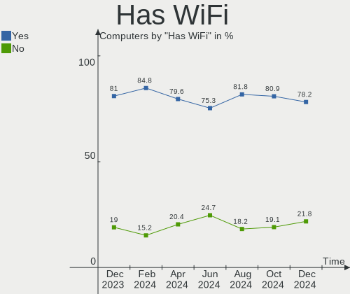
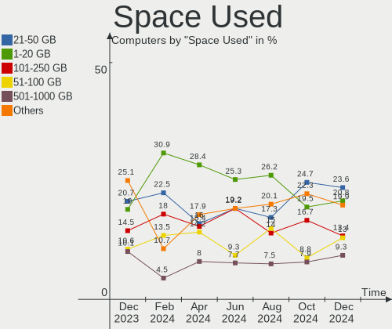

Pop!_OS Hardware Trends
-----------------------

A project to identify most popular hardware characteristics and track their change
over time based on data collected by Pop!_OS users at https://Linux-Hardware.org.

Anyone can contribute to this report by the [hw-probe](https://github.com/linuxhw/hw-probe) tool:

    sudo -E hw-probe -all -upload

This is a report for all computer types. See also reports for [desktops](/Dist/Pop!_OS/Desktop/README.md) and [notebooks](/Dist/Pop!_OS/Notebook/README.md).

Full-feature report is available here: https://linux-hardware.org/?view=trends

Period: Sep, 2021.

Contents
--------

* [ System ](#system)
  - [ OS                       ](#os)
  - [ OS Family                ](#os-family)
  - [ Kernel                   ](#kernel)
  - [ Kernel Family            ](#kernel-family)
  - [ Kernel Major Ver.        ](#kernel-major-ver)
  - [ Arch                     ](#arch)
  - [ DE                       ](#de)
  - [ Display Server           ](#display-server)
  - [ Display Manager          ](#display-manager)
  - [ OS Lang                  ](#os-lang)
  - [ Boot Mode                ](#boot-mode)
  - [ Filesystem               ](#filesystem)
  - [ Part. scheme             ](#part-scheme)
  - [ Dual Boot with Linux/BSD ](#dual-boot-with-linuxbsd)
  - [ Dual Boot (Win)          ](#dual-boot-win)

* [ Board ](#board)
  - [ Vendor                   ](#vendor)
  - [ Model                    ](#model)
  - [ Model Family             ](#model-family)
  - [ MFG Year                 ](#mfg-year)
  - [ Form Factor              ](#form-factor)
  - [ Secure Boot              ](#secure-boot)
  - [ Coreboot                 ](#coreboot)
  - [ RAM Size                 ](#ram-size)
  - [ RAM Used                 ](#ram-used)
  - [ Total Drives             ](#total-drives)
  - [ Has CD-ROM               ](#has-cd-rom)
  - [ Has Ethernet             ](#has-ethernet)
  - [ Has WiFi                 ](#has-wifi)
  - [ Has Bluetooth            ](#has-bluetooth)

* [ Location ](#location)
  - [ Country                  ](#country)
  - [ City                     ](#city)

* [ Drives ](#drives)
  - [ Drive Vendor             ](#drive-vendor)
  - [ Drive Model              ](#drive-model)
  - [ HDD Vendor               ](#hdd-vendor)
  - [ SSD Vendor               ](#ssd-vendor)
  - [ Drive Kind               ](#drive-kind)
  - [ Drive Connector          ](#drive-connector)
  - [ Drive Size               ](#drive-size)
  - [ Space Total              ](#space-total)
  - [ Space Used               ](#space-used)
  - [ Malfunc. Drives          ](#malfunc-drives)
  - [ Malfunc. Drive Vendor    ](#malfunc-drive-vendor)
  - [ Malfunc. HDD Vendor      ](#malfunc-hdd-vendor)
  - [ Malfunc. Drive Kind      ](#malfunc-drive-kind)
  - [ Failed Drives            ](#failed-drives)
  - [ Failed Drive Vendor      ](#failed-drive-vendor)
  - [ Drive Status             ](#drive-status)

* [ Storage controller ](#storage-controller)
  - [ Storage Vendor           ](#storage-vendor)
  - [ Storage Model            ](#storage-model)
  - [ Storage Kind             ](#storage-kind)

* [ Processor ](#processor)
  - [ CPU Vendor               ](#cpu-vendor)
  - [ CPU Model                ](#cpu-model)
  - [ CPU Model Family         ](#cpu-model-family)
  - [ CPU Cores                ](#cpu-cores)
  - [ CPU Sockets              ](#cpu-sockets)
  - [ CPU Threads              ](#cpu-threads)
  - [ CPU Op-Modes             ](#cpu-op-modes)
  - [ CPU Microcode            ](#cpu-microcode)
  - [ CPU Microarch            ](#cpu-microarch)

* [ Graphics ](#graphics)
  - [ GPU Vendor               ](#gpu-vendor)
  - [ GPU Model                ](#gpu-model)
  - [ GPU Combo                ](#gpu-combo)
  - [ GPU Driver               ](#gpu-driver)
  - [ GPU Memory               ](#gpu-memory)

* [ Monitor ](#monitor)
  - [ Monitor Vendor           ](#monitor-vendor)
  - [ Monitor Model            ](#monitor-model)
  - [ Monitor Resolution       ](#monitor-resolution)
  - [ Monitor Diagonal         ](#monitor-diagonal)
  - [ Monitor Width            ](#monitor-width)
  - [ Aspect Ratio             ](#aspect-ratio)
  - [ Monitor Area             ](#monitor-area)
  - [ Pixel Density            ](#pixel-density)
  - [ Multiple Monitors        ](#multiple-monitors)

* [ Network ](#network)
  - [ Net Controller Vendor    ](#net-controller-vendor)
  - [ Net Controller Model     ](#net-controller-model)
  - [ Wireless Vendor          ](#wireless-vendor)
  - [ Wireless Model           ](#wireless-model)
  - [ Ethernet Vendor          ](#ethernet-vendor)
  - [ Ethernet Model           ](#ethernet-model)
  - [ Net Controller Kind      ](#net-controller-kind)
  - [ Used Controller          ](#used-controller)
  - [ NICs                     ](#nics)
  - [ IPv6                     ](#ipv6)

* [ Bluetooth ](#bluetooth)
  - [ Bluetooth Vendor         ](#bluetooth-vendor)
  - [ Bluetooth Model          ](#bluetooth-model)

* [ Sound ](#sound)
  - [ Sound Vendor             ](#sound-vendor)
  - [ Sound Model              ](#sound-model)

* [ Memory ](#memory)
  - [ Memory Vendor            ](#memory-vendor)
  - [ Memory Model             ](#memory-model)
  - [ Memory Kind              ](#memory-kind)
  - [ Memory Form Factor       ](#memory-form-factor)
  - [ Memory Size              ](#memory-size)
  - [ Memory Speed             ](#memory-speed)

* [ Printers & scanners ](#printers--scanners)
  - [ Printer Vendor           ](#printer-vendor)
  - [ Printer Model            ](#printer-model)
  - [ Scanner Vendor           ](#scanner-vendor)
  - [ Scanner Model            ](#scanner-model)

* [ Camera ](#camera)
  - [ Camera Vendor            ](#camera-vendor)
  - [ Camera Model             ](#camera-model)

* [ Security ](#security)
  - [ Fingerprint Vendor       ](#fingerprint-vendor)
  - [ Fingerprint Model        ](#fingerprint-model)
  - [ Chipcard Vendor          ](#chipcard-vendor)
  - [ Chipcard Model           ](#chipcard-model)

* [ Unsupported ](#unsupported)
  - [ Unsupported Devices      ](#unsupported-devices)
  - [ Unsupported Device Types ](#unsupported-device-types)

System
------

OS
--

Installed operating systems

| Name          | Computers | Percent |
|---------------|-----------|---------|
| Pop!_OS 21.04 | 300       | 86.46%  |
| Pop!_OS 20.04 | 38        | 10.95%  |
| Pop!_OS 20.10 | 9         | 2.59%   |

OS Family
---------

OS without a version

| Name    | Computers | Percent |
|---------|-----------|---------|
| Pop!_OS | 347       | 100%    |

Kernel
------

Version of the Linux kernel

| Version                   | Computers | Percent |
|---------------------------|-----------|---------|
| 5.11.0-7633-generic       | 164       | 47.26%  |
| 5.13.0-7614-generic       | 128       | 36.89%  |
| 5.11.0-7620-generic       | 37        | 10.66%  |
| 5.11.0-7612-generic       | 3         | 0.86%   |
| 5.13.13-xanmod1           | 2         | 0.58%   |
| 5.8.0-7630-generic        | 1         | 0.29%   |
| 5.4.0-7642-generic        | 1         | 0.29%   |
| 5.14.8-xanmod1-edge       | 1         | 0.29%   |
| 5.14.3-xanmod1-edge       | 1         | 0.29%   |
| 5.14.0-6.4-liquorix-amd64 | 1         | 0.29%   |
| 5.13.9-xanmod1            | 1         | 0.29%   |
| 5.13.8-xanmod1            | 1         | 0.29%   |
| 5.13.19-xanmod1           | 1         | 0.29%   |
| 5.13.16-xanmod1           | 1         | 0.29%   |
| 5.13.14-xanmod1           | 1         | 0.29%   |
| 5.12.9-xanmod1            | 1         | 0.29%   |
| 5.12.14-xanmod1           | 1         | 0.29%   |
| 5.12.0-051200-generic     | 1         | 0.29%   |

Kernel Family
-------------

Linux kernel without a distro release

| Version | Computers | Percent |
|---------|-----------|---------|
| 5.11.0  | 204       | 58.79%  |
| 5.13.0  | 128       | 36.89%  |
| 5.13.13 | 2         | 0.58%   |
| 5.8.0   | 1         | 0.29%   |
| 5.4.0   | 1         | 0.29%   |
| 5.14.8  | 1         | 0.29%   |
| 5.14.3  | 1         | 0.29%   |
| 5.14.0  | 1         | 0.29%   |
| 5.13.9  | 1         | 0.29%   |
| 5.13.8  | 1         | 0.29%   |
| 5.13.19 | 1         | 0.29%   |
| 5.13.16 | 1         | 0.29%   |
| 5.13.14 | 1         | 0.29%   |
| 5.12.9  | 1         | 0.29%   |
| 5.12.14 | 1         | 0.29%   |
| 5.12.0  | 1         | 0.29%   |

Kernel Major Ver.
-----------------

Linux kernel major version

| Version | Computers | Percent |
|---------|-----------|---------|
| 5.11    | 204       | 58.79%  |
| 5.13    | 135       | 38.9%   |
| 5.14    | 3         | 0.86%   |
| 5.12    | 3         | 0.86%   |
| 5.8     | 1         | 0.29%   |
| 5.4     | 1         | 0.29%   |

Arch
----

OS architecture (x86_64, i586, etc.)

| Name   | Computers | Percent |
|--------|-----------|---------|
| x86_64 | 347       | 100%    |

DE
--

Desktop Environment

| Name       | Computers | Percent |
|------------|-----------|---------|
| GNOME      | 335       | 96.54%  |
| KDE        | 4         | 1.15%   |
| KDE5       | 3         | 0.86%   |
| X-Cinnamon | 2         | 0.58%   |
| XFCE       | 1         | 0.29%   |
| awesome    | 1         | 0.29%   |
| Unknown    | 1         | 0.29%   |

Display Server
--------------

X11 or Wayland

| Name    | Computers | Percent |
|---------|-----------|---------|
| X11     | 338       | 97.41%  |
| Wayland | 8         | 2.31%   |
| Tty     | 1         | 0.29%   |

Display Manager
---------------

SDDM, LightDM, etc.

| Name    | Computers | Percent |
|---------|-----------|---------|
| Unknown | 279       | 80.4%   |
| GDM     | 68        | 19.6%   |

OS Lang
-------

Language

| Lang    | Computers | Percent |
|---------|-----------|---------|
| en_US   | 205       | 59.08%  |
| en_GB   | 28        | 8.07%   |
| pt_BR   | 21        | 6.05%   |
| en_AU   | 10        | 2.88%   |
| de_DE   | 10        | 2.88%   |
| en_CA   | 8         | 2.31%   |
| C       | 8         | 2.31%   |
| es_ES   | 7         | 2.02%   |
| ru_RU   | 6         | 1.73%   |
| fr_FR   | 5         | 1.44%   |
| sv_SE   | 4         | 1.15%   |
| it_IT   | 4         | 1.15%   |
| en_ZA   | 4         | 1.15%   |
| en_IN   | 4         | 1.15%   |
| pt_PT   | 3         | 0.86%   |
| en_DK   | 3         | 0.86%   |
| pl_PL   | 2         | 0.58%   |
| nl_NL   | 2         | 0.58%   |
| zh_CN   | 1         | 0.29%   |
| tr_TR   | 1         | 0.29%   |
| ks_IN   | 1         | 0.29%   |
| hu_HU   | 1         | 0.29%   |
| hr_HR   | 1         | 0.29%   |
| fr_CA   | 1         | 0.29%   |
| fi_FI   | 1         | 0.29%   |
| es_PY   | 1         | 0.29%   |
| es_MX   | 1         | 0.29%   |
| es_AR   | 1         | 0.29%   |
| en_IL   | 1         | 0.29%   |
| da_DK   | 1         | 0.29%   |
| Unknown | 1         | 0.29%   |

Boot Mode
---------

EFI or BIOS

| Mode | Computers | Percent |
|------|-----------|---------|
| BIOS | 281       | 80.98%  |
| EFI  | 66        | 19.02%  |

Filesystem
----------

Type of filesystem

| Type    | Computers | Percent |
|---------|-----------|---------|
| Ext4    | 336       | 96.83%  |
| Overlay | 7         | 2.02%   |
| Btrfs   | 4         | 1.15%   |

Part. scheme
------------

Scheme of partitioning

| Type    | Computers | Percent |
|---------|-----------|---------|
| Unknown | 278       | 80.12%  |
| GPT     | 67        | 19.31%  |
| MBR     | 2         | 0.58%   |

Dual Boot with Linux/BSD
------------------------

Hosting more than one Linux/BSD

| Dual boot | Computers | Percent |
|-----------|-----------|---------|
| No        | 343       | 98.85%  |
| Yes       | 4         | 1.15%   |

Dual Boot (Win)
---------------

Hosting Linux and Windows

| Dual boot | Computers | Percent |
|-----------|-----------|---------|
| No        | 319       | 91.93%  |
| Yes       | 28        | 8.07%   |

Board
-----

Vendor
------

Motherboard manufacturer

| Name                | Computers | Percent |
|---------------------|-----------|---------|
| ASUSTek Computer    | 57        | 16.43%  |
| Dell                | 50        | 14.41%  |
| Hewlett-Packard     | 43        | 12.39%  |
| Lenovo              | 41        | 11.82%  |
| MSI                 | 34        | 9.8%    |
| Gigabyte Technology | 24        | 6.92%   |
| Acer                | 23        | 6.63%   |
| Apple               | 13        | 3.75%   |
| ASRock              | 11        | 3.17%   |
| System76            | 7         | 2.02%   |
| Samsung Electronics | 5         | 1.44%   |
| Biostar             | 3         | 0.86%   |
| Alienware           | 3         | 0.86%   |
| Toshiba             | 2         | 0.58%   |
| PC Specialist       | 2         | 0.58%   |
| Packard Bell        | 2         | 0.58%   |
| Metabox             | 2         | 0.58%   |
| Huanan              | 2         | 0.58%   |
| Framework           | 2         | 0.58%   |
| Foxconn             | 2         | 0.58%   |
| UMAX                | 1         | 0.29%   |
| Sony                | 1         | 0.29%   |
| Razer               | 1         | 0.29%   |
| Positivo            | 1         | 0.29%   |
| Pegatron            | 1         | 0.29%   |
| Notebook            | 1         | 0.29%   |
| Medion              | 1         | 0.29%   |
| LG Electronics      | 1         | 0.29%   |
| Intel               | 1         | 0.29%   |
| HUAWEI              | 1         | 0.29%   |
| HPE                 | 1         | 0.29%   |
| HOUTER              | 1         | 0.29%   |
| Google              | 1         | 0.29%   |
| EVOO                | 1         | 0.29%   |
| Eluktronics         | 1         | 0.29%   |
| Clevo               | 1         | 0.29%   |
| Chuwi               | 1         | 0.29%   |
| CCE                 | 1         | 0.29%   |
| Unknown             | 1         | 0.29%   |

Model
-----

Motherboard model

| Name                                   | Computers | Percent |
|----------------------------------------|-----------|---------|
| ASUS All Series                        | 4         | 1.15%   |
| Dell XPS 15 9570                       | 3         | 0.86%   |
| Dell OptiPlex 9020                     | 3         | 0.86%   |
| ASUS Z170-A                            | 3         | 0.86%   |
| ASUS TUF Gaming FX505DY_FX505DY        | 3         | 0.86%   |
| System76 Oryx Pro                      | 2         | 0.58%   |
| MSI MS-7C84                            | 2         | 0.58%   |
| MSI MS-7B89                            | 2         | 0.58%   |
| MSI MS-7B22                            | 2         | 0.58%   |
| HP Pavilion x360 Convertible 14-dh1xxx | 2         | 0.58%   |
| HP Pavilion Notebook                   | 2         | 0.58%   |
| HP Pavilion dv6                        | 2         | 0.58%   |
| HP G60                                 | 2         | 0.58%   |
| Gigabyte X570 AORUS MASTER             | 2         | 0.58%   |
| Gigabyte B450M DS3H                    | 2         | 0.58%   |
| Gigabyte B450 AORUS PRO WIFI           | 2         | 0.58%   |
| Framework Laptop                       | 2         | 0.58%   |
| Dell XPS 15 9500                       | 2         | 0.58%   |
| ASUS TUF GAMING X570-PRO               | 2         | 0.58%   |
| ASUS TUF GAMING X570-PLUS              | 2         | 0.58%   |
| ASUS ROG STRIX B450-F GAMING           | 2         | 0.58%   |
| ASRock B450M Steel Legend              | 2         | 0.58%   |
| Acer Aspire VX5-591G                   | 2         | 0.58%   |
| Acer Aspire V3-571G                    | 2         | 0.58%   |
| Acer Aspire 6935                       | 2         | 0.58%   |
| UMAX VisionBook 11Wi-64G               | 1         | 0.29%   |
| Toshiba TECRA Z40-A                    | 1         | 0.29%   |
| Toshiba Satellite L55-B                | 1         | 0.29%   |
| System76 Thelio                        | 1         | 0.29%   |
| System76 Serval                        | 1         | 0.29%   |
| System76 Pangolin                      | 1         | 0.29%   |
| System76 Lemur Pro                     | 1         | 0.29%   |
| System76 Kudu Professional             | 1         | 0.29%   |
| Sony SVE14A15FGW                       | 1         | 0.29%   |
| Samsung 550XBE/350XBE                  | 1         | 0.29%   |
| Samsung 535U4C                         | 1         | 0.29%   |
| Samsung 340XAA/350XAA/550XAA           | 1         | 0.29%   |
| Samsung 305V4A/305V5A                  | 1         | 0.29%   |
| Samsung 270E5G/270E5U                  | 1         | 0.29%   |
| Razer Blade 14 - RZ09-0370             | 1         | 0.29%   |
| Positivo S14BW01                       | 1         | 0.29%   |
| Pegatron H36ST                         | 1         | 0.29%   |
| PC Specialist Standard                 | 1         | 0.29%   |
| PC Specialist NH5x_7xDCx_DDx           | 1         | 0.29%   |
| Packard Bell EasyNote TM98             | 1         | 0.29%   |
| Packard Bell EasyNote LS11HR           | 1         | 0.29%   |
| Notebook W840SN Series                 | 1         | 0.29%   |
| MSI PS63 Modern 8RC                    | 1         | 0.29%   |
| MSI MS-7D15                            | 1         | 0.29%   |
| MSI MS-7C95                            | 1         | 0.29%   |
| MSI MS-7C91                            | 1         | 0.29%   |
| MSI MS-7C83                            | 1         | 0.29%   |
| MSI MS-7C52                            | 1         | 0.29%   |
| MSI MS-7C37                            | 1         | 0.29%   |
| MSI MS-7B93                            | 1         | 0.29%   |
| MSI MS-7B86                            | 1         | 0.29%   |
| MSI MS-7B85                            | 1         | 0.29%   |
| MSI MS-7B79                            | 1         | 0.29%   |
| MSI MS-7B78                            | 1         | 0.29%   |
| MSI MS-7B36                            | 1         | 0.29%   |

Model Family
------------

Motherboard model prefix

| Name                   | Computers | Percent |
|------------------------|-----------|---------|
| Lenovo ThinkPad        | 19        | 5.48%   |
| Dell Inspiron          | 14        | 4.03%   |
| HP Pavilion            | 13        | 3.75%   |
| Dell XPS               | 13        | 3.75%   |
| Acer Aspire            | 13        | 3.75%   |
| ASUS TUF               | 10        | 2.88%   |
| Dell OptiPlex          | 9         | 2.59%   |
| Lenovo IdeaPad         | 7         | 2.02%   |
| Dell Latitude          | 7         | 2.02%   |
| ASUS ROG               | 6         | 1.73%   |
| ASUS PRIME             | 6         | 1.73%   |
| HP Laptop              | 5         | 1.44%   |
| Acer Nitro             | 5         | 1.44%   |
| HP ProBook             | 4         | 1.15%   |
| HP ENVY                | 4         | 1.15%   |
| ASUS All               | 4         | 1.15%   |
| HP EliteBook           | 3         | 0.86%   |
| Dell Vostro            | 3         | 0.86%   |
| Dell Precision         | 3         | 0.86%   |
| ASUS Z170-A            | 3         | 0.86%   |
| ASUS VivoBook          | 3         | 0.86%   |
| Acer TravelMate        | 3         | 0.86%   |
| System76 Oryx          | 2         | 0.58%   |
| Packard Bell EasyNote  | 2         | 0.58%   |
| MSI MS-7C84            | 2         | 0.58%   |
| MSI MS-7B89            | 2         | 0.58%   |
| MSI MS-7B22            | 2         | 0.58%   |
| Lenovo Yoga            | 2         | 0.58%   |
| Lenovo ThinkCentre     | 2         | 0.58%   |
| Lenovo Legion          | 2         | 0.58%   |
| HP OMEN                | 2         | 0.58%   |
| HP G60                 | 2         | 0.58%   |
| Gigabyte X570          | 2         | 0.58%   |
| Gigabyte B450M         | 2         | 0.58%   |
| Gigabyte B450          | 2         | 0.58%   |
| Framework Laptop       | 2         | 0.58%   |
| ASUS P8H61-M           | 2         | 0.58%   |
| ASUS Maximus           | 2         | 0.58%   |
| ASRock B450M           | 2         | 0.58%   |
| Apple MacBookPro5      | 2         | 0.58%   |
| UMAX VisionBook        | 1         | 0.29%   |
| Toshiba TECRA          | 1         | 0.29%   |
| Toshiba Satellite      | 1         | 0.29%   |
| System76 Thelio        | 1         | 0.29%   |
| System76 Serval        | 1         | 0.29%   |
| System76 Pangolin      | 1         | 0.29%   |
| System76 Lemur         | 1         | 0.29%   |
| System76 Kudu          | 1         | 0.29%   |
| Sony SVE14A15FGW       | 1         | 0.29%   |
| Samsung 550XBE         | 1         | 0.29%   |
| Samsung 535U4C         | 1         | 0.29%   |
| Samsung 340XAA         | 1         | 0.29%   |
| Samsung 305V4A         | 1         | 0.29%   |
| Samsung 270E5G         | 1         | 0.29%   |
| Razer Blade            | 1         | 0.29%   |
| Positivo S14BW01       | 1         | 0.29%   |
| Pegatron H36ST         | 1         | 0.29%   |
| PC Specialist Standard | 1         | 0.29%   |
| PC Specialist NH5x     | 1         | 0.29%   |
| Notebook W840SN        | 1         | 0.29%   |

MFG Year
--------

Motherboard manufacture year

| Year | Computers | Percent |
|------|-----------|---------|
| 2021 | 90        | 25.94%  |
| 2020 | 49        | 14.12%  |
| 2019 | 44        | 12.68%  |
| 2018 | 37        | 10.66%  |
| 2015 | 17        | 4.9%    |
| 2016 | 15        | 4.32%   |
| 2013 | 15        | 4.32%   |
| 2012 | 15        | 4.32%   |
| 2010 | 15        | 4.32%   |
| 2017 | 13        | 3.75%   |
| 2014 | 12        | 3.46%   |
| 2011 | 10        | 2.88%   |
| 2009 | 6         | 1.73%   |
| 2008 | 6         | 1.73%   |
| 2007 | 3         | 0.86%   |

Form Factor
-----------

Physical design of the computer

| Name        | Computers | Percent |
|-------------|-----------|---------|
| Notebook    | 194       | 55.91%  |
| Desktop     | 135       | 38.9%   |
| Convertible | 9         | 2.59%   |
| All in one  | 5         | 1.44%   |
| Tablet      | 2         | 0.58%   |
| Mini pc     | 1         | 0.29%   |
| Server      | 1         | 0.29%   |

Secure Boot
-----------

Enabled or disabled

| State    | Computers | Percent |
|----------|-----------|---------|
| Disabled | 347       | 100%    |

Coreboot
--------

Have coreboot on board

| Used | Computers | Percent |
|------|-----------|---------|
| No   | 345       | 99.42%  |
| Yes  | 2         | 0.58%   |

RAM Size
--------

Total RAM memory

| Size in GB  | Computers | Percent |
|-------------|-----------|---------|
| 16.01-24.0  | 108       | 31.12%  |
| 4.01-8.0    | 69        | 19.88%  |
| 8.01-16.0   | 60        | 17.29%  |
| 32.01-64.0  | 46        | 13.26%  |
| 3.01-4.0    | 46        | 13.26%  |
| 64.01-256.0 | 9         | 2.59%   |
| 24.01-32.0  | 3         | 0.86%   |
| 2.01-3.0    | 3         | 0.86%   |
| 1.01-2.0    | 3         | 0.86%   |

RAM Used
--------

Used RAM memory

| Used GB    | Computers | Percent |
|------------|-----------|---------|
| 2.01-3.0   | 120       | 34.58%  |
| 1.01-2.0   | 103       | 29.68%  |
| 3.01-4.0   | 57        | 16.43%  |
| 4.01-8.0   | 52        | 14.99%  |
| 8.01-16.0  | 13        | 3.75%   |
| 24.01-32.0 | 1         | 0.29%   |
| 16.01-24.0 | 1         | 0.29%   |

Total Drives
------------

Number of drives on board

| Drives | Computers | Percent |
|--------|-----------|---------|
| 1      | 197       | 56.77%  |
| 2      | 97        | 27.95%  |
| 3      | 29        | 8.36%   |
| 4      | 15        | 4.32%   |
| 5      | 7         | 2.02%   |
| 6      | 2         | 0.58%   |

Has CD-ROM
----------

Has CD-ROM on board

| Presented | Computers | Percent |
|-----------|-----------|---------|
| No        | 232       | 66.86%  |
| Yes       | 115       | 33.14%  |

Has Ethernet
------------

Has Ethernet on board

| Presented | Computers | Percent |
|-----------|-----------|---------|
| Yes       | 293       | 84.44%  |
| No        | 54        | 15.56%  |

Has WiFi
--------

Has WiFi module

| Presented | Computers | Percent |
|-----------|-----------|---------|
| Yes       | 289       | 83.29%  |
| No        | 58        | 16.71%  |

Has Bluetooth
-------------

Has Bluetooth module

| Presented | Computers | Percent |
|-----------|-----------|---------|
| Yes       | 249       | 71.76%  |
| No        | 98        | 28.24%  |

Location
--------

Country
-------

Geographic location (country)

| Country                | Computers | Percent |
|------------------------|-----------|---------|
| USA                    | 108       | 31.12%  |
| Brazil                 | 35        | 10.09%  |
| UK                     | 25        | 7.2%    |
| Germany                | 16        | 4.61%   |
| Canada                 | 15        | 4.32%   |
| Australia              | 12        | 3.46%   |
| Sweden                 | 11        | 3.17%   |
| India                  | 10        | 2.88%   |
| Italy                  | 8         | 2.31%   |
| France                 | 8         | 2.31%   |
| South Africa           | 6         | 1.73%   |
| Russia                 | 6         | 1.73%   |
| Romania                | 6         | 1.73%   |
| Netherlands            | 6         | 1.73%   |
| Mexico                 | 6         | 1.73%   |
| Spain                  | 5         | 1.44%   |
| Switzerland            | 3         | 0.86%   |
| Singapore              | 3         | 0.86%   |
| Portugal               | 3         | 0.86%   |
| Lithuania              | 3         | 0.86%   |
| Denmark                | 3         | 0.86%   |
| Austria                | 3         | 0.86%   |
| Poland                 | 2         | 0.58%   |
| Norway                 | 2         | 0.58%   |
| Latvia                 | 2         | 0.58%   |
| Japan                  | 2         | 0.58%   |
| Iran                   | 2         | 0.58%   |
| Hungary                | 2         | 0.58%   |
| Croatia                | 2         | 0.58%   |
| Belgium                | 2         | 0.58%   |
| Zambia                 | 1         | 0.29%   |
| Vietnam                | 1         | 0.29%   |
| Venezuela              | 1         | 0.29%   |
| Uruguay                | 1         | 0.29%   |
| Ukraine                | 1         | 0.29%   |
| Turkey                 | 1         | 0.29%   |
| Thailand               | 1         | 0.29%   |
| Taiwan                 | 1         | 0.29%   |
| Slovenia               | 1         | 0.29%   |
| Slovakia               | 1         | 0.29%   |
| Saudi Arabia           | 1         | 0.29%   |
| Puerto Rico            | 1         | 0.29%   |
| Philippines            | 1         | 0.29%   |
| Paraguay               | 1         | 0.29%   |
| New Zealand            | 1         | 0.29%   |
| Myanmar                | 1         | 0.29%   |
| Mozambique             | 1         | 0.29%   |
| Malaysia               | 1         | 0.29%   |
| Luxembourg             | 1         | 0.29%   |
| Kenya                  | 1         | 0.29%   |
| Israel                 | 1         | 0.29%   |
| Greece                 | 1         | 0.29%   |
| Finland                | 1         | 0.29%   |
| Czechia                | 1         | 0.29%   |
| China                  | 1         | 0.29%   |
| Bulgaria               | 1         | 0.29%   |
| Bosnia and Herzegovina | 1         | 0.29%   |
| Bolivia                | 1         | 0.29%   |
| Argentina              | 1         | 0.29%   |
| Albania                | 1         | 0.29%   |

City
----

Geographic location (city)

| City            | Computers | Percent |
|-----------------|-----------|---------|
| Sydney          | 4         | 1.15%   |
| Fortaleza       | 4         | 1.15%   |
| Vienna          | 3         | 0.86%   |
| Toronto         | 3         | 0.86%   |
| Singapore       | 3         | 0.86%   |
| Rio de Janeiro  | 3         | 0.86%   |
| Moscow          | 3         | 0.86%   |
| Calgary         | 3         | 0.86%   |
| Browning        | 3         | 0.86%   |
| Bengaluru       | 3         | 0.86%   |
| Amsterdam       | 3         | 0.86%   |
| Zagreb          | 2         | 0.58%   |
| Tehran          | 2         | 0.58%   |
| S??o Paulo      | 2         | 0.58%   |
| Sarmenstorf     | 2         | 0.58%   |
| Riga            | 2         | 0.58%   |
| Portsmouth      | 2         | 0.58%   |
| Pittsburgh      | 2         | 0.58%   |
| New Delhi       | 2         | 0.58%   |
| Miami           | 2         | 0.58%   |
| Melbourne       | 2         | 0.58%   |
| Los Angeles     | 2         | 0.58%   |
| Liverpool       | 2         | 0.58%   |
| Le??n           | 2         | 0.58%   |
| Glasgow         | 2         | 0.58%   |
| Edmonton        | 2         | 0.58%   |
| East London     | 2         | 0.58%   |
| Curitiba        | 2         | 0.58%   |
| Budapest        | 2         | 0.58%   |
| Brisbane        | 2         | 0.58%   |
| Athens          | 2         | 0.58%   |
| Aberdeen        | 2         | 0.58%   |
| Zurich          | 1         | 0.29%   |
| Zoetermeer      | 1         | 0.29%   |
| Ziar nad Hronom | 1         | 0.29%   |
| Yokohama        | 1         | 0.29%   |
| Yekaterinburg   | 1         | 0.29%   |
| Yangon          | 1         | 0.29%   |
| Woodland Hills  | 1         | 0.29%   |
| Woodbridge      | 1         | 0.29%   |
| Wisconsin Dells | 1         | 0.29%   |
| West Jefferson  | 1         | 0.29%   |
| Webberville     | 1         | 0.29%   |
| Washington      | 1         | 0.29%   |
| Warsaw          | 1         | 0.29%   |
| Walnut Creek    | 1         | 0.29%   |
| Voluntari       | 1         | 0.29%   |
| Vilvoorde       | 1         | 0.29%   |
| Vilnius         | 1         | 0.29%   |
| Veracruz        | 1         | 0.29%   |
| Varzea Paulista | 1         | 0.29%   |
| Varniai         | 1         | 0.29%   |
| Upplands Vasby  | 1         | 0.29%   |
| Uberl??ndia     | 1         | 0.29%   |
| Tyumen          | 1         | 0.29%   |
| Tulcea          | 1         | 0.29%   |
| Tucson          | 1         | 0.29%   |
| Traverse City   | 1         | 0.29%   |
| Toblach         | 1         | 0.29%   |
| Timi?™oara      | 1         | 0.29%   |

Drives
------

Drive Vendor
------------

Hard drive vendors

| Vendor                    | Computers | Drives | Percent |
|---------------------------|-----------|--------|---------|
| Seagate                   | 86        | 102    | 16.6%   |
| Samsung Electronics       | 82        | 106    | 15.83%  |
| WDC                       | 62        | 74     | 11.97%  |
| SanDisk                   | 39        | 39     | 7.53%   |
| Kingston                  | 35        | 38     | 6.76%   |
| Toshiba                   | 27        | 29     | 5.21%   |
| Unknown                   | 18        | 20     | 3.47%   |
| HGST                      | 16        | 18     | 3.09%   |
| Crucial                   | 16        | 17     | 3.09%   |
| Phison                    | 15        | 16     | 2.9%    |
| SK Hynix                  | 14        | 14     | 2.7%    |
| Intel                     | 13        | 14     | 2.51%   |
| Hitachi                   | 12        | 12     | 2.32%   |
| Apple                     | 8         | 8      | 1.54%   |
| A-DATA Technology         | 7         | 7      | 1.35%   |
| China                     | 6         | 6      | 1.16%   |
| Silicon Motion            | 5         | 5      | 0.97%   |
| PNY                       | 5         | 5      | 0.97%   |
| Micron Technology         | 5         | 5      | 0.97%   |
| Union Memory (Shenzhen)   | 3         | 3      | 0.58%   |
| Realtek Semiconductor     | 3         | 3      | 0.58%   |
| Micron/Crucial Technology | 3         | 3      | 0.58%   |
| MAXTOR                    | 3         | 3      | 0.58%   |
| OWC                       | 2         | 2      | 0.39%   |
| LITEON                    | 2         | 2      | 0.39%   |
| Zheino                    | 1         | 1      | 0.19%   |
| XrayDisk                  | 1         | 1      | 0.19%   |
| VisionTek                 | 1         | 2      | 0.19%   |
| TO Exter                  | 1         | 1      | 0.19%   |
| tigo                      | 1         | 1      | 0.19%   |
| Team                      | 1         | 1      | 0.19%   |
| SPCC                      | 1         | 1      | 0.19%   |
| Solid State Storage       | 1         | 1      | 0.19%   |
| Smartbuy                  | 1         | 1      | 0.19%   |
| Shark                     | 1         | 1      | 0.19%   |
| S3+                       | 1         | 1      | 0.19%   |
| PLEXTOR                   | 1         | 1      | 0.19%   |
| Phison Electronics        | 1         | 1      | 0.19%   |
| Patriot                   | 1         | 1      | 0.19%   |
| OCZ                       | 1         | 1      | 0.19%   |
| Netac                     | 1         | 1      | 0.19%   |
| Lite-On                   | 1         | 1      | 0.19%   |
| Lenovo                    | 1         | 1      | 0.19%   |
| LaCie                     | 1         | 1      | 0.19%   |
| KIOXIA                    | 1         | 1      | 0.19%   |
| KingDian                  | 1         | 1      | 0.19%   |
| JMicron                   | 1         | 1      | 0.19%   |
| JAMESDONKEY               | 1         | 1      | 0.19%   |
| Hewlett-Packard           | 1         | 1      | 0.19%   |
| Fujitsu                   | 1         | 1      | 0.19%   |
| External                  | 1         | 1      | 0.19%   |
| DOGFISH                   | 1         | 1      | 0.19%   |
| Dell                      | 1         | 1      | 0.19%   |
| Corsair                   | 1         | 1      | 0.19%   |
| Apacer                    | 1         | 1      | 0.19%   |
| ADATA Technology          | 1         | 1      | 0.19%   |

Drive Model
-----------

Hard drive models

| Model                                        | Computers | Percent |
|----------------------------------------------|-----------|---------|
| Seagate ST1000LM035-1RK172 1TB               | 10        | 1.76%   |
| Kingston SA400S37240G 240GB SSD              | 9         | 1.58%   |
| Seagate ST1000DM010-2EP102 1TB               | 8         | 1.41%   |
| Samsung NVMe SSD Drive 500GB                 | 8         | 1.41%   |
| Samsung NVMe SSD Drive 1TB                   | 7         | 1.23%   |
| Seagate ST2000DM008-2FR102 2TB               | 5         | 0.88%   |
| Sandisk NVMe SSD Drive 512GB                 | 5         | 0.88%   |
| Sandisk NVMe SSD Drive 1TB                   | 5         | 0.88%   |
| Samsung SSD 850 EVO 500GB                    | 5         | 0.88%   |
| Kingston SA400S37120G 120GB SSD              | 5         | 0.88%   |
| HGST HTS721010A9E630 1TB                     | 5         | 0.88%   |
| WDC WD10EZEX-08WN4A0 1TB                     | 4         | 0.7%    |
| Unknown SD/MMC/MS PRO 128GB                  | 4         | 0.7%    |
| Unknown MMC Card  64GB                       | 4         | 0.7%    |
| Seagate ST1000DM003-1CH162 1TB               | 4         | 0.7%    |
| Samsung SSD 860 EVO 500GB                    | 4         | 0.7%    |
| Samsung SSD 860 EVO 1TB                      | 4         | 0.7%    |
| Samsung NVMe SSD Drive 512GB                 | 4         | 0.7%    |
| Samsung NVMe SSD Drive 2TB                   | 4         | 0.7%    |
| Samsung NVMe SSD Drive 256GB                 | 4         | 0.7%    |
| Kingston SA400S37480G 480GB SSD              | 4         | 0.7%    |
| WDC WDBNCE5000PNC 500GB SSD                  | 3         | 0.53%   |
| WDC WD10JPVX-22JC3T0 1TB                     | 3         | 0.53%   |
| WDC WD10EZEX-00WN4A0 1TB                     | 3         | 0.53%   |
| Toshiba MQ01ABD100 1TB                       | 3         | 0.53%   |
| Toshiba KBG30ZMS128G 128GB NVMe SSD          | 3         | 0.53%   |
| SK Hynix NVMe SSD Drive 512GB                | 3         | 0.53%   |
| Seagate ST9320325AS 320GB                    | 3         | 0.53%   |
| Seagate ST31000524AS 1TB                     | 3         | 0.53%   |
| Seagate ST2000DM001-1CH164 2TB               | 3         | 0.53%   |
| Seagate ST1000DM003-1ER162 1TB               | 3         | 0.53%   |
| Seagate Expansion 1TB                        | 3         | 0.53%   |
| Samsung SSD 970 EVO Plus 500GB               | 3         | 0.53%   |
| Samsung SSD 970 EVO Plus 1TB                 | 3         | 0.53%   |
| Samsung SSD 850 EVO 250GB                    | 3         | 0.53%   |
| Micron/Crucial NVMe SSD Drive 1TB            | 3         | 0.53%   |
| Intel NVMe SSD Drive 512GB                   | 3         | 0.53%   |
| HGST HTS541010A9E680 1TB                     | 3         | 0.53%   |
| Crucial CT500MX500SSD1 500GB                 | 3         | 0.53%   |
| WDC WDS500G2B0A-00SM50 500GB SSD             | 2         | 0.35%   |
| WDC WD5000LPCX-00VHAT0 500GB                 | 2         | 0.35%   |
| WDC WD30EFRX-68AX9N0 3TB                     | 2         | 0.35%   |
| WDC WD10EZEX-60WN4A0 1TB                     | 2         | 0.35%   |
| WDC WD10EZEX-22MFCA0 1TB                     | 2         | 0.35%   |
| Unknown MMC Card  32GB                       | 2         | 0.35%   |
| Unknown MMC Card  16GB                       | 2         | 0.35%   |
| Union Memory (Shenzhen) NVMe SSD Drive 256GB | 2         | 0.35%   |
| Toshiba NVMe SSD Drive 512GB                 | 2         | 0.35%   |
| Toshiba MQ04ABF100 1TB                       | 2         | 0.35%   |
| Toshiba DT01ACA200 2TB                       | 2         | 0.35%   |
| Silicon Motion NVMe SSD Drive 256GB          | 2         | 0.35%   |
| Seagate ST9500420AS 500GB                    | 2         | 0.35%   |
| Seagate ST9160314AS 160GB                    | 2         | 0.35%   |
| Seagate ST500LM021-1KJ152 500GB              | 2         | 0.35%   |
| Seagate ST500DM002-1BD142 500GB              | 2         | 0.35%   |
| Seagate ST3500418AS 500GB                    | 2         | 0.35%   |
| Seagate ST31500341AS 1TB                     | 2         | 0.35%   |
| Seagate ST2000LM007-1R8174 2TB               | 2         | 0.35%   |
| Seagate ST2000DM001-1ER164 2TB               | 2         | 0.35%   |
| Seagate ST1000LX015-1U7172 1TB               | 2         | 0.35%   |

HDD Vendor
----------

Hard disk drive vendors

| Vendor              | Computers | Drives | Percent |
|---------------------|-----------|--------|---------|
| Seagate             | 84        | 100    | 43.75%  |
| WDC                 | 50        | 57     | 26.04%  |
| HGST                | 16        | 18     | 8.33%   |
| Toshiba             | 15        | 17     | 7.81%   |
| Hitachi             | 12        | 12     | 6.25%   |
| Samsung Electronics | 6         | 7      | 3.13%   |
| Unknown             | 4         | 4      | 2.08%   |
| Apple               | 2         | 2      | 1.04%   |
| TO Exter            | 1         | 1      | 0.52%   |
| MAXTOR              | 1         | 1      | 0.52%   |
| Fujitsu             | 1         | 1      | 0.52%   |

SSD Vendor
----------

Solid state drive vendors

| Vendor              | Computers | Drives | Percent |
|---------------------|-----------|--------|---------|
| Samsung Electronics | 36        | 44     | 21.3%   |
| Kingston            | 26        | 29     | 15.38%  |
| SanDisk             | 23        | 23     | 13.61%  |
| Crucial             | 16        | 17     | 9.47%   |
| WDC                 | 10        | 11     | 5.92%   |
| China               | 6         | 6      | 3.55%   |
| PNY                 | 5         | 5      | 2.96%   |
| A-DATA Technology   | 5         | 5      | 2.96%   |
| Toshiba             | 4         | 4      | 2.37%   |
| Intel               | 4         | 5      | 2.37%   |
| Apple               | 4         | 4      | 2.37%   |
| SK Hynix            | 3         | 3      | 1.78%   |
| OWC                 | 2         | 2      | 1.18%   |
| MAXTOR              | 2         | 2      | 1.18%   |
| LITEON              | 2         | 2      | 1.18%   |
| Zheino              | 1         | 1      | 0.59%   |
| XrayDisk            | 1         | 1      | 0.59%   |
| Unknown             | 1         | 1      | 0.59%   |
| tigo                | 1         | 1      | 0.59%   |
| Team                | 1         | 1      | 0.59%   |
| SPCC                | 1         | 1      | 0.59%   |
| Smartbuy            | 1         | 1      | 0.59%   |
| Shark               | 1         | 1      | 0.59%   |
| Seagate             | 1         | 1      | 0.59%   |
| S3+                 | 1         | 1      | 0.59%   |
| PLEXTOR             | 1         | 1      | 0.59%   |
| Patriot             | 1         | 1      | 0.59%   |
| OCZ                 | 1         | 1      | 0.59%   |
| Netac               | 1         | 1      | 0.59%   |
| Micron Technology   | 1         | 1      | 0.59%   |
| KingDian            | 1         | 1      | 0.59%   |
| Hewlett-Packard     | 1         | 1      | 0.59%   |
| DOGFISH             | 1         | 1      | 0.59%   |
| Dell                | 1         | 1      | 0.59%   |
| Corsair             | 1         | 1      | 0.59%   |
| Apacer              | 1         | 1      | 0.59%   |

Drive Kind
----------

HDD or SSD

| Kind    | Computers | Drives | Percent |
|---------|-----------|--------|---------|
| HDD     | 176       | 220    | 36.14%  |
| SSD     | 151       | 183    | 31.01%  |
| NVMe    | 144       | 160    | 29.57%  |
| MMC     | 9         | 10     | 1.85%   |
| Unknown | 7         | 10     | 1.44%   |

Drive Connector
---------------

SATA, SAS, NVMe, etc.

| Type | Computers | Drives | Percent |
|------|-----------|--------|---------|
| SATA | 254       | 394    | 59.91%  |
| NVMe | 143       | 158    | 33.73%  |
| SAS  | 18        | 21     | 4.25%   |
| MMC  | 9         | 10     | 2.12%   |

Drive Size
----------

Size of hard drive

| Size in TB | Computers | Drives | Percent |
|------------|-----------|--------|---------|
| 0.01-0.5   | 175       | 221    | 53.52%  |
| 0.51-1.0   | 107       | 127    | 32.72%  |
| 1.01-2.0   | 31        | 35     | 9.48%   |
| 3.01-4.0   | 7         | 10     | 2.14%   |
| 2.01-3.0   | 4         | 6      | 1.22%   |
| 4.01-10.0  | 3         | 4      | 0.92%   |

Space Total
-----------

Amount of disk space available on the file system

| Size in GB     | Computers | Percent |
|----------------|-----------|---------|
| 101-250        | 89        | 25.65%  |
| 251-500        | 85        | 24.5%   |
| 501-1000       | 74        | 21.33%  |
| 1001-2000      | 35        | 10.09%  |
| More than 3000 | 17        | 4.9%    |
| 51-100         | 17        | 4.9%    |
| 2001-3000      | 11        | 3.17%   |
| 21-50          | 10        | 2.88%   |
| 1-20           | 8         | 2.31%   |
| Unknown        | 1         | 0.29%   |

Space Used
----------

Amount of used disk space

| Used GB        | Computers | Percent |
|----------------|-----------|---------|
| 1-20           | 131       | 37.75%  |
| 21-50          | 91        | 26.22%  |
| 51-100         | 30        | 8.65%   |
| 101-250        | 26        | 7.49%   |
| 251-500        | 25        | 7.2%    |
| 501-1000       | 23        | 6.63%   |
| 1001-2000      | 9         | 2.59%   |
| 2001-3000      | 6         | 1.73%   |
| More than 3000 | 5         | 1.44%   |
| Unknown        | 1         | 0.29%   |

Malfunc. Drives
---------------

Drive models with a malfunction

| Model                                 | Computers | Drives | Percent |
|---------------------------------------|-----------|--------|---------|
| Toshiba DT01ABA100V 1TB               | 1         | 1      | 10%     |
| Seagate ST1000LX015-1U7172 1TB        | 1         | 1      | 10%     |
| Samsung Electronics PM9A1 NVMe 2048GB | 1         | 1      | 10%     |
| Samsung Electronics PM961 NVMe 512GB  | 1         | 1      | 10%     |
| S3+ S3SSDC240XEU 240GB                | 1         | 1      | 10%     |
| LITEON CV8-8E128-HP 128GB SSD         | 1         | 1      | 10%     |
| Intel SSDSC2BF180A4L 180GB            | 1         | 1      | 10%     |
| Hitachi HTS547564A9E384 640GB         | 1         | 1      | 10%     |
| Hitachi HTS545025B9SA02 250GB         | 1         | 1      | 10%     |
| HGST HTS541010A9E680 1TB              | 1         | 1      | 10%     |

Malfunc. Drive Vendor
---------------------

Vendors of faulty drives

| Vendor              | Computers | Drives | Percent |
|---------------------|-----------|--------|---------|
| Samsung Electronics | 2         | 2      | 20%     |
| Hitachi             | 2         | 2      | 20%     |
| Toshiba             | 1         | 1      | 10%     |
| Seagate             | 1         | 1      | 10%     |
| S3+                 | 1         | 1      | 10%     |
| LITEON              | 1         | 1      | 10%     |
| Intel               | 1         | 1      | 10%     |
| HGST                | 1         | 1      | 10%     |

Malfunc. HDD Vendor
-------------------

Vendors of faulty HDD drives

| Vendor  | Computers | Drives | Percent |
|---------|-----------|--------|---------|
| Hitachi | 2         | 2      | 40%     |
| Toshiba | 1         | 1      | 20%     |
| Seagate | 1         | 1      | 20%     |
| HGST    | 1         | 1      | 20%     |

Malfunc. Drive Kind
-------------------

Kinds of faulty drives

| Kind | Computers | Drives | Percent |
|------|-----------|--------|---------|
| HDD  | 5         | 5      | 50%     |
| SSD  | 3         | 3      | 30%     |
| NVMe | 2         | 2      | 20%     |

Failed Drives
-------------

Failed drive models

Zero info for selected period =(

Failed Drive Vendor
-------------------

Failed drive vendors

Zero info for selected period =(

Drive Status
------------

Number of failed and malfunc. drives

| Status   | Computers | Drives | Percent |
|----------|-----------|--------|---------|
| Detected | 281       | 480    | 78.27%  |
| Works    | 69        | 93     | 19.22%  |
| Malfunc  | 9         | 10     | 2.51%   |

Storage controller
------------------

Storage Vendor
--------------

Storage controller vendors

| Vendor                         | Computers | Percent |
|--------------------------------|-----------|---------|
| Intel                          | 217       | 45.88%  |
| AMD                            | 86        | 18.18%  |
| Samsung Electronics            | 55        | 11.63%  |
| Sandisk                        | 20        | 4.23%   |
| Phison Electronics             | 15        | 3.17%   |
| SK Hynix                       | 11        | 2.33%   |
| Kingston Technology Company    | 9         | 1.9%    |
| ASMedia Technology             | 9         | 1.9%    |
| Toshiba America Info Systems   | 8         | 1.69%   |
| Nvidia                         | 7         | 1.48%   |
| Silicon Motion                 | 5         | 1.06%   |
| Marvell Technology Group       | 5         | 1.06%   |
| Micron Technology              | 4         | 0.85%   |
| Union Memory (Shenzhen)        | 3         | 0.63%   |
| Realtek Semiconductor          | 3         | 0.63%   |
| Micron/Crucial Technology      | 3         | 0.63%   |
| ADATA Technology               | 3         | 0.63%   |
| Solid State Storage Technology | 1         | 0.21%   |
| Seagate Technology             | 1         | 0.21%   |
| LSI Logic / Symbios Logic      | 1         | 0.21%   |
| Lite-On Technology             | 1         | 0.21%   |
| Lenovo                         | 1         | 0.21%   |
| KIOXIA                         | 1         | 0.21%   |
| JMicron Technology             | 1         | 0.21%   |
| Hewlett-Packard                | 1         | 0.21%   |
| Beijing Starblaze Technology   | 1         | 0.21%   |
| Apple                          | 1         | 0.21%   |

Storage Model
-------------

Storage controller models

| Model                                                                                   | Computers | Percent |
|-----------------------------------------------------------------------------------------|-----------|---------|
| AMD FCH SATA Controller [AHCI mode]                                                     | 63        | 11.71%  |
| Samsung NVMe SSD Controller SM981/PM981/PM983                                           | 29        | 5.39%   |
| AMD 400 Series Chipset SATA Controller                                                  | 19        | 3.53%   |
| Intel Sunrise Point-LP SATA Controller [AHCI mode]                                      | 15        | 2.79%   |
| Intel 8 Series/C220 Series Chipset Family 6-port SATA Controller 1 [AHCI mode]          | 15        | 2.79%   |
| Intel HM170/QM170 Chipset SATA Controller [AHCI Mode]                                   | 14        | 2.6%    |
| Intel Cannon Lake Mobile PCH SATA AHCI Controller                                       | 14        | 2.6%    |
| Intel Q170/Q150/B150/H170/H110/Z170/CM236 Chipset SATA Controller [AHCI Mode]           | 12        | 2.23%   |
| Intel 82801 Mobile SATA Controller [RAID mode]                                          | 12        | 2.23%   |
| Intel 7 Series Chipset Family 6-port SATA Controller [AHCI mode]                        | 12        | 2.23%   |
| Intel 8 Series SATA Controller 1 [AHCI mode]                                            | 11        | 2.04%   |
| Phison E12 NVMe Controller                                                              | 10        | 1.86%   |
| Samsung NVMe SSD Controller SM961/PM961/SM963                                           | 9         | 1.67%   |
| Intel Cannon Lake PCH SATA AHCI Controller                                              | 9         | 1.67%   |
| AMD SB7x0/SB8x0/SB9x0 IDE Controller                                                    | 9         | 1.67%   |
| Sandisk WD Blue SN550 NVMe SSD                                                          | 8         | 1.49%   |
| Samsung NVMe SSD Controller 980                                                         | 8         | 1.49%   |
| Intel SSD 660P Series                                                                   | 8         | 1.49%   |
| Intel SATA Controller [RAID mode]                                                       | 8         | 1.49%   |
| Intel 6 Series/C200 Series Chipset Family Desktop SATA Controller (IDE mode, ports 4-5) | 8         | 1.49%   |
| Intel 6 Series/C200 Series Chipset Family Desktop SATA Controller (IDE mode, ports 0-3) | 8         | 1.49%   |
| ASMedia ASM1062 Serial ATA Controller                                                   | 8         | 1.49%   |
| Intel 6 Series/C200 Series Chipset Family 6 port Mobile SATA AHCI Controller            | 7         | 1.3%    |
| AMD SB7x0/SB8x0/SB9x0 SATA Controller [IDE mode]                                        | 7         | 1.3%    |
| Sandisk WD Black SN750 / PC SN730 NVMe SSD                                              | 6         | 1.12%   |
| Samsung NVMe SSD Controller PM9A1/PM9A3/980PRO                                          | 6         | 1.12%   |
| Intel Volume Management Device NVMe RAID Controller                                     | 6         | 1.12%   |
| Intel 5 Series/3400 Series Chipset 4 port SATA AHCI Controller                          | 6         | 1.12%   |
| Intel 400 Series Chipset Family SATA AHCI Controller                                    | 6         | 1.12%   |
| Toshiba America Info Systems XG6 NVMe SSD Controller                                    | 5         | 0.93%   |
| Intel 82801IBM/IEM (ICH9M/ICH9M-E) 4 port SATA Controller [AHCI mode]                   | 5         | 0.93%   |
| AMD 300 Series Chipset SATA Controller                                                  | 5         | 0.93%   |
| Micron Non-Volatile memory controller                                                   | 4         | 0.74%   |
| Kingston Company Company Non-Volatile memory controller                                 | 4         | 0.74%   |
| Intel 6 Series/C200 Series Chipset Family 6 port Desktop SATA AHCI Controller           | 4         | 0.74%   |
| Intel 200 Series PCH SATA controller [AHCI mode]                                        | 4         | 0.74%   |
| AMD SB7x0/SB8x0/SB9x0 SATA Controller [AHCI mode]                                       | 4         | 0.74%   |
| Union Memory (Shenzhen) Non-Volatile memory controller                                  | 3         | 0.56%   |
| SK Hynix Non-Volatile memory controller                                                 | 3         | 0.56%   |
| SK Hynix BC501 NVMe Solid State Drive                                                   | 3         | 0.56%   |
| Silicon Motion SM2263EN/SM2263XT SSD Controller                                         | 3         | 0.56%   |
| Samsung Electronics SATA controller                                                     | 3         | 0.56%   |
| Realtek Realtek Non-Volatile memory controller                                          | 3         | 0.56%   |
| Kingston Company U-SNS8154P3 NVMe SSD                                                   | 3         | 0.56%   |
| Intel NM10/ICH7 Family SATA Controller [IDE mode]                                       | 3         | 0.56%   |
| Intel Comet Lake SATA AHCI Controller                                                   | 3         | 0.56%   |
| Intel Cannon Point-LP SATA Controller [AHCI Mode]                                       | 3         | 0.56%   |
| Intel C600/X79 series chipset 6-Port SATA AHCI Controller                               | 3         | 0.56%   |
| Intel Atom/Celeron/Pentium Processor x5-E8000/J3xxx/N3xxx Series SATA Controller        | 3         | 0.56%   |
| Intel 9 Series Chipset Family SATA Controller [AHCI Mode]                               | 3         | 0.56%   |
| Intel 82801G (ICH7 Family) IDE Controller                                               | 3         | 0.56%   |
| Intel 7 Series/C210 Series Chipset Family 6-port SATA Controller [AHCI mode]            | 3         | 0.56%   |
| Intel 500 Series Chipset Family SATA AHCI Controller                                    | 3         | 0.56%   |
| AMD Starship/Matisse Chipset SATA Controller [AHCI mode]                                | 3         | 0.56%   |
| AMD FCH SATA Controller D                                                               | 3         | 0.56%   |
| ADATA Non-Volatile memory controller                                                    | 3         | 0.56%   |
| Toshiba America Info Systems Toshiba America Info Non-Volatile memory controller        | 2         | 0.37%   |
| SK Hynix PC401 NVMe Solid State Drive 256GB                                             | 2         | 0.37%   |
| SK Hynix BC511                                                                          | 2         | 0.37%   |
| Silicon Motion SM2262/SM2262EN SSD Controller                                           | 2         | 0.37%   |

Storage Kind
------------

Kind of storage controller (IDE, SATA, NVMe, SAS, ...)

| Kind | Computers | Percent |
|------|-----------|---------|
| SATA | 258       | 54.89%  |
| NVMe | 143       | 30.43%  |
| IDE  | 38        | 8.09%   |
| RAID | 29        | 6.17%   |
| SAS  | 2         | 0.43%   |

Processor
---------

CPU Vendor
----------

Processor vendors

| Vendor | Computers | Percent |
|--------|-----------|---------|
| Intel  | 250       | 72.05%  |
| AMD    | 97        | 27.95%  |

CPU Model
---------

Processor models

| Model                                         | Computers | Percent |
|-----------------------------------------------|-----------|---------|
| AMD Ryzen 5 3600 6-Core Processor             | 8         | 2.31%   |
| Intel Core i5-7300HQ CPU @ 2.50GHz            | 7         | 2.02%   |
| Intel Core i7-10750H CPU @ 2.60GHz            | 6         | 1.73%   |
| Intel Core i5-8250U CPU @ 1.60GHz             | 6         | 1.73%   |
| Intel 11th Gen Core i7-1165G7 @ 2.80GHz       | 6         | 1.73%   |
| AMD Ryzen 7 3700X 8-Core Processor            | 6         | 1.73%   |
| Intel Core i7-9750H CPU @ 2.60GHz             | 5         | 1.44%   |
| Intel Core i7-8750H CPU @ 2.20GHz             | 5         | 1.44%   |
| Intel Core i7-8550U CPU @ 1.80GHz             | 5         | 1.44%   |
| Intel Core i7-7700HQ CPU @ 2.80GHz            | 5         | 1.44%   |
| Intel 11th Gen Core i5-1135G7 @ 2.40GHz       | 5         | 1.44%   |
| AMD Ryzen 5 5600X 6-Core Processor            | 5         | 1.44%   |
| Intel Core i7-3632QM CPU @ 2.20GHz            | 4         | 1.15%   |
| AMD Ryzen 9 3900X 12-Core Processor           | 4         | 1.15%   |
| AMD Ryzen 7 5700U with Radeon Graphics        | 4         | 1.15%   |
| AMD Ryzen 7 3700U with Radeon Vega Mobile Gfx | 4         | 1.15%   |
| AMD Ryzen 5 3550H with Radeon Vega Mobile Gfx | 4         | 1.15%   |
| Intel Core i7-8700 CPU @ 3.20GHz              | 3         | 0.86%   |
| Intel Core i7-8565U CPU @ 1.80GHz             | 3         | 0.86%   |
| Intel Core i7-3770K CPU @ 3.50GHz             | 3         | 0.86%   |
| Intel Core i7-3770 CPU @ 3.40GHz              | 3         | 0.86%   |
| Intel Core i5-8400 CPU @ 2.80GHz              | 3         | 0.86%   |
| Intel Core i5-8265U CPU @ 1.60GHz             | 3         | 0.86%   |
| Intel Core i5-4570 CPU @ 3.20GHz              | 3         | 0.86%   |
| Intel Core i5-2450M CPU @ 2.50GHz             | 3         | 0.86%   |
| Intel Core i5-10300H CPU @ 2.50GHz            | 3         | 0.86%   |
| Intel Core i3-8130U CPU @ 2.20GHz             | 3         | 0.86%   |
| Intel 11th Gen Core i7-11800H @ 2.30GHz       | 3         | 0.86%   |
| AMD Ryzen 7 5700G with Radeon Graphics        | 3         | 0.86%   |
| Intel Pentium Dual-Core CPU T4300 @ 2.10GHz   | 2         | 0.58%   |
| Intel Pentium Dual-Core CPU E5200 @ 2.50GHz   | 2         | 0.58%   |
| Intel Core i9-9900K CPU @ 3.60GHz             | 2         | 0.58%   |
| Intel Core i7-7500U CPU @ 2.70GHz             | 2         | 0.58%   |
| Intel Core i7-6700K CPU @ 4.00GHz             | 2         | 0.58%   |
| Intel Core i7-6700HQ CPU @ 2.60GHz            | 2         | 0.58%   |
| Intel Core i7-4790 CPU @ 3.60GHz              | 2         | 0.58%   |
| Intel Core i7-4770K CPU @ 3.50GHz             | 2         | 0.58%   |
| Intel Core i7-4510U CPU @ 2.00GHz             | 2         | 0.58%   |
| Intel Core i7-4500U CPU @ 1.80GHz             | 2         | 0.58%   |
| Intel Core i7-3520M CPU @ 2.90GHz             | 2         | 0.58%   |
| Intel Core i7-2630QM CPU @ 2.00GHz            | 2         | 0.58%   |
| Intel Core i7-2620M CPU @ 2.70GHz             | 2         | 0.58%   |
| Intel Core i7-2600 CPU @ 3.40GHz              | 2         | 0.58%   |
| Intel Core i7-10510U CPU @ 1.80GHz            | 2         | 0.58%   |
| Intel Core i7 CPU 960 @ 3.20GHz               | 2         | 0.58%   |
| Intel Core i5-9600KF CPU @ 3.70GHz            | 2         | 0.58%   |
| Intel Core i5-9400F CPU @ 2.90GHz             | 2         | 0.58%   |
| Intel Core i5-7200U CPU @ 2.50GHz             | 2         | 0.58%   |
| Intel Core i5-6600K CPU @ 3.50GHz             | 2         | 0.58%   |
| Intel Core i5-4590 CPU @ 3.30GHz              | 2         | 0.58%   |
| Intel Core i5-4200U CPU @ 1.60GHz             | 2         | 0.58%   |
| Intel Core i5-3470 CPU @ 3.20GHz              | 2         | 0.58%   |
| Intel Core i5-3210M CPU @ 2.50GHz             | 2         | 0.58%   |
| Intel Core i5 CPU M 480 @ 2.67GHz             | 2         | 0.58%   |
| Intel Core i3-3240 CPU @ 3.40GHz              | 2         | 0.58%   |
| Intel Core i3 CPU M 370 @ 2.40GHz             | 2         | 0.58%   |
| Intel Core i3 CPU M 350 @ 2.27GHz             | 2         | 0.58%   |
| Intel Celeron CPU N3060 @ 1.60GHz             | 2         | 0.58%   |
| Intel 11th Gen Core i7-1185G7 @ 3.00GHz       | 2         | 0.58%   |
| AMD Ryzen 9 5950X 16-Core Processor           | 2         | 0.58%   |

CPU Model Family
----------------

Processor model prefix

| Model                          | Computers | Percent |
|--------------------------------|-----------|---------|
| Intel Core i7                  | 97        | 27.95%  |
| Intel Core i5                  | 71        | 20.46%  |
| AMD Ryzen 5                    | 29        | 8.36%   |
| AMD Ryzen 7                    | 22        | 6.34%   |
| Other                          | 19        | 5.48%   |
| Intel Core i3                  | 19        | 5.48%   |
| Intel Xeon                     | 9         | 2.59%   |
| Intel Core 2 Duo               | 9         | 2.59%   |
| AMD Ryzen 9                    | 9         | 2.59%   |
| Intel Core i9                  | 6         | 1.73%   |
| Intel Pentium Dual-Core        | 5         | 1.44%   |
| Intel Pentium                  | 5         | 1.44%   |
| Intel Celeron                  | 5         | 1.44%   |
| AMD Ryzen 3                    | 5         | 1.44%   |
| AMD A8                         | 5         | 1.44%   |
| AMD Phenom II X4               | 4         | 1.15%   |
| AMD FX                         | 4         | 1.15%   |
| AMD A10                        | 3         | 0.86%   |
| Intel Core 2                   | 2         | 0.58%   |
| Intel Atom                     | 2         | 0.58%   |
| AMD Athlon                     | 2         | 0.58%   |
| AMD A6                         | 2         | 0.58%   |
| Intel Core 2 Quad              | 1         | 0.29%   |
| AMD Turion X2 Dual-Core Mobile | 1         | 0.29%   |
| AMD Turion 64 X2 Mobile        | 1         | 0.29%   |
| AMD Sempron                    | 1         | 0.29%   |
| AMD Ryzen 7 PRO                | 1         | 0.29%   |
| AMD Ryzen 5 PRO                | 1         | 0.29%   |
| AMD Phenom II X6               | 1         | 0.29%   |
| AMD Phenom II X2               | 1         | 0.29%   |
| AMD Opteron                    | 1         | 0.29%   |
| AMD E2                         | 1         | 0.29%   |
| AMD E                          | 1         | 0.29%   |
| AMD Athlon X4                  | 1         | 0.29%   |
| AMD Athlon II X2               | 1         | 0.29%   |

CPU Cores
---------

Number of processor cores

| Number | Computers | Percent |
|--------|-----------|---------|
| 4      | 145       | 41.79%  |
| 2      | 97        | 27.95%  |
| 6      | 60        | 17.29%  |
| 8      | 32        | 9.22%   |
| 12     | 6         | 1.73%   |
| 16     | 2         | 0.58%   |
| 10     | 2         | 0.58%   |
| 1      | 2         | 0.58%   |
| 3      | 1         | 0.29%   |

CPU Sockets
-----------

Number of sockets

| Number | Computers | Percent |
|--------|-----------|---------|
| 1      | 347       | 100%    |

CPU Threads
-----------

Threads per core (Hyper-Threading)

| Number | Computers | Percent |
|--------|-----------|---------|
| 2      | 259       | 74.64%  |
| 1      | 88        | 25.36%  |

CPU Op-Modes
------------

CPU Operation Modes (32-bit, 64-bit)

| Op mode        | Computers | Percent |
|----------------|-----------|---------|
| 32-bit, 64-bit | 347       | 100%    |

CPU Microcode
-------------

Microcode number

| Number     | Computers | Percent |
|------------|-----------|---------|
| Unknown    | 270       | 77.81%  |
| 0x806c1    | 10        | 2.88%   |
| 0x906ea    | 7         | 2.02%   |
| 0x806ea    | 6         | 1.73%   |
| 0xa0652    | 5         | 1.44%   |
| 0x306c3    | 5         | 1.44%   |
| 0x906ed    | 3         | 0.86%   |
| 0x906e9    | 3         | 0.86%   |
| 0x806ec    | 3         | 0.86%   |
| 0x08701021 | 3         | 0.86%   |
| 0x806eb    | 2         | 0.58%   |
| 0x40651    | 2         | 0.58%   |
| 0x306a9    | 2         | 0.58%   |
| 0x08701013 | 2         | 0.58%   |
| 0x08600106 | 2         | 0.58%   |
| 0x08108102 | 2         | 0.58%   |
| 0xa0655    | 1         | 0.29%   |
| 0x806e9    | 1         | 0.29%   |
| 0x806d1    | 1         | 0.29%   |
| 0x706a8    | 1         | 0.29%   |
| 0x506e3    | 1         | 0.29%   |
| 0x406e3    | 1         | 0.29%   |
| 0x406c4    | 1         | 0.29%   |
| 0x306d4    | 1         | 0.29%   |
| 0x206d7    | 1         | 0.29%   |
| 0x1067a    | 1         | 0.29%   |
| 0x10676    | 1         | 0.29%   |
| 0x0a201009 | 1         | 0.29%   |
| 0x08608102 | 1         | 0.29%   |
| 0x08600104 | 1         | 0.29%   |
| 0x08600103 | 1         | 0.29%   |
| 0x08600102 | 1         | 0.29%   |
| 0x0810100b | 1         | 0.29%   |
| 0x0800820d | 1         | 0.29%   |
| 0x0700010f | 1         | 0.29%   |
| 0x06006118 | 1         | 0.29%   |

CPU Microarch
-------------

Microarchitecture

| Name            | Computers | Percent |
|-----------------|-----------|---------|
| KabyLake        | 75        | 21.61%  |
| Haswell         | 37        | 10.66%  |
| Zen 2           | 31        | 8.93%   |
| IvyBridge       | 28        | 8.07%   |
| Zen+            | 18        | 5.19%   |
| SandyBridge     | 18        | 5.19%   |
| CometLake       | 17        | 4.9%    |
| TigerLake       | 15        | 4.32%   |
| Skylake         | 15        | 4.32%   |
| Zen 3           | 13        | 3.75%   |
| Penryn          | 13        | 3.75%   |
| Westmere        | 9         | 2.59%   |
| Unknown         | 8         | 2.31%   |
| K10             | 7         | 2.02%   |
| Silvermont      | 6         | 1.73%   |
| Piledriver      | 6         | 1.73%   |
| Excavator       | 5         | 1.44%   |
| Nehalem         | 4         | 1.15%   |
| Core            | 4         | 1.15%   |
| Broadwell       | 3         | 0.86%   |
| Zen             | 2         | 0.58%   |
| Steamroller     | 2         | 0.58%   |
| K8 Hammer       | 2         | 0.58%   |
| K10 Llano       | 2         | 0.58%   |
| Bobcat          | 2         | 0.58%   |
| Puma            | 1         | 0.29%   |
| K8 & K10 hybrid | 1         | 0.29%   |
| Jaguar          | 1         | 0.29%   |
| IceLake         | 1         | 0.29%   |
| Goldmont plus   | 1         | 0.29%   |

Graphics
--------

GPU Vendor
----------

Vendors of graphics cards

| Vendor | Computers | Percent |
|--------|-----------|---------|
| Intel  | 184       | 41.72%  |
| Nvidia | 148       | 33.56%  |
| AMD    | 109       | 24.72%  |

GPU Model
---------

Graphics card models

| Model                                                                                    | Computers | Percent |
|------------------------------------------------------------------------------------------|-----------|---------|
| Intel UHD Graphics 620                                                                   | 15        | 3.32%   |
| Intel TigerLake-LP GT2 [Iris Xe Graphics]                                                | 14        | 3.1%    |
| Intel CoffeeLake-H GT2 [UHD Graphics 630]                                                | 13        | 2.88%   |
| Intel 3rd Gen Core processor Graphics Controller                                         | 13        | 2.88%   |
| AMD Picasso                                                                              | 13        | 2.88%   |
| Intel HD Graphics 630                                                                    | 12        | 2.65%   |
| Intel Haswell-ULT Integrated Graphics Controller                                         | 12        | 2.65%   |
| Intel CometLake-H GT2 [UHD Graphics]                                                     | 12        | 2.65%   |
| Intel 2nd Generation Core Processor Family Integrated Graphics Controller                | 12        | 2.65%   |
| AMD Renoir                                                                               | 9         | 1.99%   |
| Nvidia TU117M [GeForce GTX 1650 Mobile / Max-Q]                                          | 8         | 1.77%   |
| Intel 4th Gen Core Processor Integrated Graphics Controller                              | 8         | 1.77%   |
| Nvidia GP107M [GeForce GTX 1050 Ti Mobile]                                               | 7         | 1.55%   |
| Nvidia GP107M [GeForce GTX 1050 Mobile]                                                  | 7         | 1.55%   |
| Intel Xeon E3-1200 v3/4th Gen Core Processor Integrated Graphics Controller              | 7         | 1.55%   |
| Intel Core Processor Integrated Graphics Controller                                      | 7         | 1.55%   |
| Intel WhiskeyLake-U GT2 [UHD Graphics 620]                                               | 6         | 1.33%   |
| Intel Atom/Celeron/Pentium Processor x5-E8000/J3xxx/N3xxx Integrated Graphics Controller | 6         | 1.33%   |
| AMD Ellesmere [Radeon RX 470/480/570/570X/580/580X/590]                                  | 6         | 1.33%   |
| Nvidia TU117M [GeForce GTX 1650 Ti Mobile]                                               | 5         | 1.11%   |
| Nvidia GK208B [GeForce GT 710]                                                           | 5         | 1.11%   |
| Intel HD Graphics 530                                                                    | 5         | 1.11%   |
| AMD Cezanne                                                                              | 5         | 1.11%   |
| Nvidia TU116 [GeForce GTX 1660 SUPER]                                                    | 4         | 0.88%   |
| Nvidia GP107 [GeForce GTX 1050 Ti]                                                       | 4         | 0.88%   |
| Nvidia GP106 [GeForce GTX 1060 6GB]                                                      | 4         | 0.88%   |
| Nvidia GP104 [GeForce GTX 1080]                                                          | 4         | 0.88%   |
| Nvidia GP104 [GeForce GTX 1070]                                                          | 4         | 0.88%   |
| Nvidia GM206 [GeForce GTX 960]                                                           | 4         | 0.88%   |
| Intel Xeon E3-1200 v2/3rd Gen Core processor Graphics Controller                         | 4         | 0.88%   |
| Intel HD Graphics 620                                                                    | 4         | 0.88%   |
| Intel CometLake-U GT2 [UHD Graphics]                                                     | 4         | 0.88%   |
| AMD Seymour [Radeon HD 6400M/7400M Series]                                               | 4         | 0.88%   |
| AMD Lucienne                                                                             | 4         | 0.88%   |
| AMD Baffin [Radeon RX 460/560D / Pro 450/455/460/555/555X/560/560X]                      | 4         | 0.88%   |
| Nvidia TU116M [GeForce GTX 1660 Ti Mobile]                                               | 3         | 0.66%   |
| Nvidia GP108M [GeForce MX250]                                                            | 3         | 0.66%   |
| Nvidia GP106 [GeForce GTX 1060 3GB]                                                      | 3         | 0.66%   |
| Nvidia GM107M [GeForce GTX 960M]                                                         | 3         | 0.66%   |
| Nvidia GK107 [GeForce GT 640]                                                            | 3         | 0.66%   |
| Nvidia G96CM [GeForce 9600M GT]                                                          | 3         | 0.66%   |
| Intel TigerLake-H GT1 [UHD Graphics]                                                     | 3         | 0.66%   |
| Intel Mobile 4 Series Chipset Integrated Graphics Controller                             | 3         | 0.66%   |
| Intel CometLake-S GT2 [UHD Graphics 630]                                                 | 3         | 0.66%   |
| Intel 4 Series Chipset Integrated Graphics Controller                                    | 3         | 0.66%   |
| AMD Tonga XT / Amethyst XT [Radeon R9 380X / R9 M295X]                                   | 3         | 0.66%   |
| AMD Thames [Radeon HD 7550M/7570M/7650M]                                                 | 3         | 0.66%   |
| AMD Navi 10 [Radeon RX 5600 OEM/5600 XT / 5700/5700 XT]                                  | 3         | 0.66%   |
| Nvidia TU117M                                                                            | 2         | 0.44%   |
| Nvidia TU116 [GeForce GTX 1650 SUPER]                                                    | 2         | 0.44%   |
| Nvidia TU106M [GeForce RTX 2070 Mobile]                                                  | 2         | 0.44%   |
| Nvidia TU106M [GeForce RTX 2060 Mobile]                                                  | 2         | 0.44%   |
| Nvidia TU106 [GeForce RTX 2060 Rev. A]                                                   | 2         | 0.44%   |
| Nvidia GP108M [GeForce MX150]                                                            | 2         | 0.44%   |
| Nvidia GP107 [GeForce GTX 1050]                                                          | 2         | 0.44%   |
| Nvidia GM204M [GeForce GTX 970M]                                                         | 2         | 0.44%   |
| Nvidia GM108M [GeForce 840M]                                                             | 2         | 0.44%   |
| Nvidia GM107 [GeForce GTX 750 Ti]                                                        | 2         | 0.44%   |
| Nvidia GK208B [GeForce GT 730]                                                           | 2         | 0.44%   |
| Nvidia GK107M [GeForce GT 650M Mac Edition]                                              | 2         | 0.44%   |

GPU Combo
---------

Combinations of graphics cards

| Name           | Computers | Percent |
|----------------|-----------|---------|
| 1 x Intel      | 100       | 28.82%  |
| 1 x Nvidia     | 77        | 22.19%  |
| 1 x AMD        | 75        | 21.61%  |
| Intel + Nvidia | 60        | 17.29%  |
| Intel + AMD    | 17        | 4.9%    |
| 2 x AMD        | 8         | 2.31%   |
| AMD + Nvidia   | 8         | 2.31%   |
| 5 x Nvidia     | 1         | 0.29%   |
| 2 x Nvidia     | 1         | 0.29%   |

GPU Driver
----------

Free vs proprietary

| Driver      | Computers | Percent |
|-------------|-----------|---------|
| Free        | 209       | 60.23%  |
| Proprietary | 126       | 36.31%  |
| Unknown     | 12        | 3.46%   |

GPU Memory
----------

Total video memory

| Size in GB | Computers | Percent |
|------------|-----------|---------|
| Unknown    | 234       | 67.44%  |
| 3.01-4.0   | 33        | 9.51%   |
| 1.01-2.0   | 25        | 7.2%    |
| 7.01-8.0   | 19        | 5.48%   |
| 5.01-6.0   | 17        | 4.9%    |
| 0.51-1.0   | 6         | 1.73%   |
| 0.01-0.5   | 5         | 1.44%   |
| 2.01-3.0   | 4         | 1.15%   |
| 8.01-16.0  | 3         | 0.86%   |
| 16.01-24.0 | 1         | 0.29%   |

Monitor
-------

Monitor Vendor
--------------

Monitor vendors

| Vendor                  | Computers | Percent |
|-------------------------|-----------|---------|
| Samsung Electronics     | 57        | 14.73%  |
| AU Optronics            | 44        | 11.37%  |
| Chimei Innolux          | 41        | 10.59%  |
| Goldstar                | 32        | 8.27%   |
| LG Display              | 26        | 6.72%   |
| Dell                    | 19        | 4.91%   |
| BOE                     | 18        | 4.65%   |
| Sharp                   | 14        | 3.62%   |
| AOC                     | 14        | 3.62%   |
| Acer                    | 13        | 3.36%   |
| PANDA                   | 11        | 2.84%   |
| Apple                   | 10        | 2.58%   |
| Hewlett-Packard         | 9         | 2.33%   |
| Philips                 | 8         | 2.07%   |
| ASUSTek Computer        | 8         | 2.07%   |
| Ancor Communications    | 8         | 2.07%   |
| Iiyama                  | 5         | 1.29%   |
| Lenovo                  | 4         | 1.03%   |
| Chi Mei Optoelectronics | 4         | 1.03%   |
| BenQ                    | 4         | 1.03%   |
| Toshiba                 | 3         | 0.78%   |
| Panasonic               | 3         | 0.78%   |
| Vizio                   | 2         | 0.52%   |
| Insignia                | 2         | 0.52%   |
| InfoVision              | 2         | 0.52%   |
| HannStar                | 2         | 0.52%   |
| CSO                     | 2         | 0.52%   |
| Zoran                   | 1         | 0.26%   |
| Videoseven              | 1         | 0.26%   |
| TMX                     | 1         | 0.26%   |
| Sony                    | 1         | 0.26%   |
| SKW                     | 1         | 0.26%   |
| Sceptre Tech            | 1         | 0.26%   |
| Planar                  | 1         | 0.26%   |
| Onkyo                   | 1         | 0.26%   |
| Olevia                  | 1         | 0.26%   |
| OEM                     | 1         | 0.26%   |
| MSI                     | 1         | 0.26%   |
| MiTAC                   | 1         | 0.26%   |
| Mi                      | 1         | 0.26%   |
| KEB                     | 1         | 0.26%   |
| KDC                     | 1         | 0.26%   |
| JVC                     | 1         | 0.26%   |
| HUAWEI                  | 1         | 0.26%   |
| HIC                     | 1         | 0.26%   |
| HB@                     | 1         | 0.26%   |
| Gateway                 | 1         | 0.26%   |
| Element                 | 1         | 0.26%   |
| Eizo                    | 1         | 0.26%   |

Monitor Model
-------------

Monitor models

| Model                                                                 | Computers | Percent |
|-----------------------------------------------------------------------|-----------|---------|
| AU Optronics LCD Monitor AUO38ED 1920x1080 340x190mm 15.3-inch        | 8         | 2.04%   |
| Samsung Electronics LCD Monitor SEC304C 1920x1080 353x198mm 15.9-inch | 4         | 1.02%   |
| PANDA LCD Monitor NCP004D 1920x1080 344x194mm 15.5-inch               | 4         | 1.02%   |
| Chimei Innolux LCD Monitor CMN15F5 1920x1080 344x193mm 15.5-inch      | 4         | 1.02%   |
| Samsung Electronics C24F390 SAM0D2C 1920x1080 520x290mm 23.4-inch     | 3         | 0.76%   |
| Goldstar LG ULTRAWIDE GSM59F1 1920x1080 580x240mm 24.7-inch           | 3         | 0.76%   |
| Goldstar IPS FULLHD GSM5AB8 1920x1080 480x270mm 21.7-inch             | 3         | 0.76%   |
| Chimei Innolux LCD Monitor CMN15E7 1920x1080 344x193mm 15.5-inch      | 3         | 0.76%   |
| Chimei Innolux LCD Monitor CMN14D4 1920x1080 309x173mm 13.9-inch      | 3         | 0.76%   |
| Sharp LCD Monitor SHP14D1 1920x1200 336x210mm 15.6-inch               | 2         | 0.51%   |
| Sharp LCD Monitor SHP14BA 1920x1080 344x194mm 15.5-inch               | 2         | 0.51%   |
| Sharp LCD Monitor SHP148D 3840x2160 344x194mm 15.5-inch               | 2         | 0.51%   |
| Samsung Electronics LCD Monitor SEC544B 1600x900 382x214mm 17.2-inch  | 2         | 0.51%   |
| PANDA LCD Monitor NCP0036 1920x1080 344x194mm 15.5-inch               | 2         | 0.51%   |
| LG Display LCD Monitor LGD065A 1920x1080 344x194mm 15.5-inch          | 2         | 0.51%   |
| LG Display LCD Monitor LGD0456 1366x768 344x194mm 15.5-inch           | 2         | 0.51%   |
| Goldstar ULTRAWIDE GSM76F9 2560x1080 531x298mm 24.0-inch              | 2         | 0.51%   |
| Goldstar FULL HD GSM5B55 1920x1080 480x270mm 21.7-inch                | 2         | 0.51%   |
| Goldstar 27GN950 GSM5B9A 3840x2160 600x340mm 27.2-inch                | 2         | 0.51%   |
| Goldstar 20EN33 GSM4EE1 1600x900 443x249mm 20.0-inch                  | 2         | 0.51%   |
| Dell P2719H DEL4185 1920x1080 598x336mm 27.0-inch                     | 2         | 0.51%   |
| Chimei Innolux LCD Monitor CMN1735 1920x1080 382x215mm 17.3-inch      | 2         | 0.51%   |
| BOE LCD Monitor BOE095F 2256x1504 285x190mm 13.5-inch                 | 2         | 0.51%   |
| AU Optronics LCD Monitor AUO61ED 1920x1080 340x190mm 15.3-inch        | 2         | 0.51%   |
| ASUSTek Computer VG279 AUS2782 1920x1080 598x336mm 27.0-inch          | 2         | 0.51%   |
| AOC Q32G1WG4 AOC3201 2560x1440 697x393mm 31.5-inch                    | 2         | 0.51%   |
| AOC 2470W AOC2470 1920x1080 521x293mm 23.5-inch                       | 2         | 0.51%   |
| Ancor Communications VE228 ACI22FA 1920x1080 477x268mm 21.5-inch      | 2         | 0.51%   |
| Acer XB272 ACR0585 1920x1080 608x354mm 27.7-inch                      | 2         | 0.51%   |
| Zoran MATRIX ZRN0302 1360x768 500x281mm 22.6-inch                     | 1         | 0.25%   |
| Vizio VO370M VIZ0050 1920x1080 820x460mm 37.0-inch                    | 1         | 0.25%   |
| Vizio VA370M VIZ3266 1920x1080 697x392mm 31.5-inch                    | 1         | 0.25%   |
| Videoseven D19W12C IGM19C1 1440x900 408x255mm 18.9-inch               | 1         | 0.25%   |
| Toshiba TV TSB2019 3840x2160 1600x900mm 72.3-inch                     | 1         | 0.25%   |
| Toshiba TV TSB0108 1920x1080 890x500mm 40.2-inch                      | 1         | 0.25%   |
| Toshiba Monitor LCD0010 1366x768 432x286mm 20.4-inch                  | 1         | 0.25%   |
| TMX TL140BDXP01-0 TMX1400 2560x1440 310x174mm 14.0-inch               | 1         | 0.25%   |
| Sony TV *00 SNY7105 3840x2160 1218x685mm 55.0-inch                    | 1         | 0.25%   |
| SKW Skyworth UHD SKW0001 1920x540 708x398mm 32.0-inch                 | 1         | 0.25%   |
| Sharp LQ156M1JW03 SHP14C5 1920x1080 344x194mm 15.5-inch               | 1         | 0.25%   |
| Sharp LCD Monitor SHP14D6 3840x2400 366x229mm 17.0-inch               | 1         | 0.25%   |
| Sharp LCD Monitor SHP14D0 3840x2400 336x210mm 15.6-inch               | 1         | 0.25%   |
| Sharp LCD Monitor SHP14AD 3840x2160 294x165mm 13.3-inch               | 1         | 0.25%   |
| Sharp LCD Monitor SHP149A 1920x1080 344x194mm 15.5-inch               | 1         | 0.25%   |
| Sharp LCD Monitor SHP1484 1920x1080 294x165mm 13.3-inch               | 1         | 0.25%   |
| Sharp LCD Monitor SHP1476 3840x2160 346x194mm 15.6-inch               | 1         | 0.25%   |
| Sharp LCD Monitor SHP146A 1920x1080 294x165mm 13.3-inch               | 1         | 0.25%   |
| Sceptre Tech E248W-1920 SPT099D 1920x1080 443x249mm 20.0-inch         | 1         | 0.25%   |
| Samsung Electronics U32J59x SAM0F35 3840x2160 697x392mm 31.5-inch     | 1         | 0.25%   |
| Samsung Electronics T28D310 SAM0B1F 1366x768 610x350mm 27.7-inch      | 1         | 0.25%   |
| Samsung Electronics T24B350 SAM093E 1920x1080 531x299mm 24.0-inch     | 1         | 0.25%   |
| Samsung Electronics SyncMaster SAM0604 1920x1080                      | 1         | 0.25%   |
| Samsung Electronics SyncMaster SAM0586 1920x1200 518x324mm 24.1-inch  | 1         | 0.25%   |
| Samsung Electronics SyncMaster SAM0488 1680x1050                      | 1         | 0.25%   |
| Samsung Electronics SMT27A550 SAM07B8 1920x1080 598x336mm 27.0-inch   | 1         | 0.25%   |
| Samsung Electronics S34J55x SAM0F70 3440x1440 797x333mm 34.0-inch     | 1         | 0.25%   |
| Samsung Electronics S24D390 SAM0B65 1920x1080 520x290mm 23.4-inch     | 1         | 0.25%   |
| Samsung Electronics S24D300 SAM0B43 1920x1080 531x299mm 24.0-inch     | 1         | 0.25%   |
| Samsung Electronics S22F350 SAM0D1B 1920x1080 477x268mm 21.5-inch     | 1         | 0.25%   |
| Samsung Electronics S22B420 SAM0979 1680x1050 473x291mm 21.9-inch     | 1         | 0.25%   |

Monitor Resolution
------------------

Monitor screen resolution

| Resolution         | Computers | Percent |
|--------------------|-----------|---------|
| 1920x1080 (FHD)    | 189       | 51.22%  |
| 1366x768 (WXGA)    | 48        | 13.01%  |
| 3840x2160 (4K)     | 28        | 7.59%   |
| 2560x1440 (QHD)    | 23        | 6.23%   |
| 1600x900 (HD+)     | 15        | 4.07%   |
| 3440x1440          | 10        | 2.71%   |
| 1680x1050 (WSXGA+) | 10        | 2.71%   |
| 2560x1080          | 8         | 2.17%   |
| 1920x540           | 5         | 1.36%   |
| 1440x900 (WXGA+)   | 5         | 1.36%   |
| 1920x1200 (WUXGA)  | 4         | 1.08%   |
| 1280x1024 (SXGA)   | 4         | 1.08%   |
| 3840x1080          | 3         | 0.81%   |
| 2880x1800          | 3         | 0.81%   |
| 3840x2400          | 2         | 0.54%   |
| 2256x1504          | 2         | 0.54%   |
| 1360x768           | 2         | 0.54%   |
| 1280x800 (WXGA)    | 2         | 0.54%   |
| 3072x1920          | 1         | 0.27%   |
| 3000x2000          | 1         | 0.27%   |
| 2560x1600          | 1         | 0.27%   |
| 2160x1440          | 1         | 0.27%   |
| 1600x1200          | 1         | 0.27%   |
| 1024x768 (XGA)     | 1         | 0.27%   |

Monitor Diagonal
----------------

Diagonal size in inches

| Inches  | Computers | Percent |
|---------|-----------|---------|
| 15      | 118       | 30.89%  |
| 27      | 31        | 8.12%   |
| 13      | 29        | 7.59%   |
| 23      | 25        | 6.54%   |
| 14      | 25        | 6.54%   |
| 24      | 23        | 6.02%   |
| 17      | 22        | 5.76%   |
| 21      | 17        | 4.45%   |
| 34      | 15        | 3.93%   |
| 31      | 15        | 3.93%   |
| 18      | 7         | 1.83%   |
| 20      | 6         | 1.57%   |
| 22      | 5         | 1.31%   |
| Unknown | 5         | 1.31%   |
| 32      | 4         | 1.05%   |
| 19      | 4         | 1.05%   |
| 84      | 3         | 0.79%   |
| 72      | 3         | 0.79%   |
| 25      | 3         | 0.79%   |
| 12      | 3         | 0.79%   |
| 48      | 2         | 0.52%   |
| 35      | 2         | 0.52%   |
| 28      | 2         | 0.52%   |
| 16      | 2         | 0.52%   |
| 11      | 2         | 0.52%   |
| 65      | 1         | 0.26%   |
| 55      | 1         | 0.26%   |
| 54      | 1         | 0.26%   |
| 52      | 1         | 0.26%   |
| 49      | 1         | 0.26%   |
| 47      | 1         | 0.26%   |
| 41      | 1         | 0.26%   |
| 33      | 1         | 0.26%   |
| 26      | 1         | 0.26%   |

Monitor Width
-------------

Physical width

| Width in mm | Computers | Percent |
|-------------|-----------|---------|
| 301-350     | 152       | 40%     |
| 501-600     | 75        | 19.74%  |
| 401-500     | 36        | 9.47%   |
| 351-400     | 34        | 8.95%   |
| 601-700     | 22        | 5.79%   |
| 701-800     | 20        | 5.26%   |
| 201-300     | 19        | 5%      |
| 1001-1500   | 8         | 2.11%   |
| 1501-2000   | 6         | 1.58%   |
| Unknown     | 5         | 1.32%   |
| 801-900     | 2         | 0.53%   |
| 901-1000    | 1         | 0.26%   |

Aspect Ratio
------------

Proportional relationship between the width and the height

| Ratio   | Computers | Percent |
|---------|-----------|---------|
| 16/9    | 276       | 80.94%  |
| 16/10   | 29        | 8.5%    |
| 21/9    | 18        | 5.28%   |
| 3/2     | 6         | 1.76%   |
| 5/4     | 3         | 0.88%   |
| 4/3     | 3         | 0.88%   |
| 32/9    | 3         | 0.88%   |
| 6/5     | 2         | 0.59%   |
| Unknown | 1         | 0.29%   |

Monitor Area
------------

Area in inch²

| Area in inch² | Computers | Percent |
|----------------|-----------|---------|
| 101-110        | 118       | 31.05%  |
| 201-250        | 62        | 16.32%  |
| 81-90          | 46        | 12.11%  |
| 351-500        | 37        | 9.74%   |
| 301-350        | 32        | 8.42%   |
| 121-130        | 22        | 5.79%   |
| 151-200        | 14        | 3.68%   |
| More than 1000 | 10        | 2.63%   |
| 251-300        | 9         | 2.37%   |
| 71-80          | 7         | 1.84%   |
| 141-150        | 6         | 1.58%   |
| 501-1000       | 5         | 1.32%   |
| Unknown        | 5         | 1.32%   |
| 61-70          | 3         | 0.79%   |
| 51-60          | 2         | 0.53%   |
| 131-140        | 1         | 0.26%   |
| 111-120        | 1         | 0.26%   |

Pixel Density
-------------

Pixels per inch

| Density       | Computers | Percent |
|---------------|-----------|---------|
| 51-100        | 125       | 33.88%  |
| 121-160       | 123       | 33.33%  |
| 101-120       | 79        | 21.41%  |
| 161-240       | 18        | 4.88%   |
| More than 240 | 12        | 3.25%   |
| 1-50          | 7         | 1.9%    |
| Unknown       | 5         | 1.36%   |

Multiple Monitors
-----------------

Total monitors connected

| Total | Computers | Percent |
|-------|-----------|---------|
| 1     | 268       | 77.23%  |
| 2     | 60        | 17.29%  |
| 0     | 14        | 4.03%   |
| 3     | 3         | 0.86%   |
| 4     | 2         | 0.58%   |

Network
-------

Net Controller Vendor
---------------------

Controller vendors

| Vendor                            | Computers | Percent |
|-----------------------------------|-----------|---------|
| Realtek Semiconductor             | 197       | 37.45%  |
| Intel                             | 182       | 34.6%   |
| Qualcomm Atheros                  | 61        | 11.6%   |
| Broadcom                          | 31        | 5.89%   |
| Ralink                            | 10        | 1.9%    |
| Nvidia                            | 7         | 1.33%   |
| Broadcom Limited                  | 7         | 1.33%   |
| NetGear                           | 4         | 0.76%   |
| Ralink Technology                 | 3         | 0.57%   |
| Microsoft                         | 3         | 0.57%   |
| TP-Link                           | 2         | 0.38%   |
| Samsung Electronics               | 2         | 0.38%   |
| ASIX Electronics                  | 2         | 0.38%   |
| ZyDAS                             | 1         | 0.19%   |
| Xiaomi                            | 1         | 0.19%   |
| Sierra Wireless                   | 1         | 0.19%   |
| Qualcomm Atheros Communications   | 1         | 0.19%   |
| OPPO                              | 1         | 0.19%   |
| MEDIATEK                          | 1         | 0.19%   |
| Marvell Technology Group          | 1         | 0.19%   |
| JMicron Technology                | 1         | 0.19%   |
| InterBiometrics                   | 1         | 0.19%   |
| Gemtek                            | 1         | 0.19%   |
| Fibocom                           | 1         | 0.19%   |
| Ericsson Business Mobile Networks | 1         | 0.19%   |
| Dell                              | 1         | 0.19%   |
| D-Link                            | 1         | 0.19%   |
| Belkin Components                 | 1         | 0.19%   |

Net Controller Model
--------------------

Controller models

| Model                                                             | Computers | Percent |
|-------------------------------------------------------------------|-----------|---------|
| Realtek RTL8111/8168/8411 PCI Express Gigabit Ethernet Controller | 148       | 24.3%   |
| Intel Wi-Fi 6 AX200                                               | 34        | 5.58%   |
| Realtek RTL810xE PCI Express Fast Ethernet controller             | 19        | 3.12%   |
| Intel I211 Gigabit Network Connection                             | 14        | 2.3%    |
| Qualcomm Atheros QCA6174 802.11ac Wireless Network Adapter        | 12        | 1.97%   |
| Intel Wireless 7265                                               | 12        | 1.97%   |
| Intel Wireless 7260                                               | 12        | 1.97%   |
| Intel 82579LM Gigabit Network Connection (Lewisville)             | 12        | 1.97%   |
| Intel Dual Band Wireless-AC 3168NGW [Stone Peak]                  | 11        | 1.81%   |
| Realtek RTL8821CE 802.11ac PCIe Wireless Network Adapter          | 10        | 1.64%   |
| Qualcomm Atheros QCA9377 802.11ac Wireless Network Adapter        | 10        | 1.64%   |
| Intel Wi-Fi 6 AX201                                               | 10        | 1.64%   |
| Intel Comet Lake PCH CNVi WiFi                                    | 10        | 1.64%   |
| Intel Cannon Lake PCH CNVi WiFi                                   | 9         | 1.48%   |
| Intel Wireless 8265 / 8275                                        | 8         | 1.31%   |
| Qualcomm Atheros QCA9565 / AR9565 Wireless Network Adapter        | 7         | 1.15%   |
| Intel Ethernet Connection (7) I219-V                              | 7         | 1.15%   |
| Intel Ethernet Connection (2) I219-V                              | 7         | 1.15%   |
| Realtek RTL8153 Gigabit Ethernet Adapter                          | 6         | 0.99%   |
| Realtek RTL8125 2.5GbE Controller                                 | 6         | 0.99%   |
| Intel Wireless 8260                                               | 6         | 0.99%   |
| Intel Wi-Fi 6 AX210/AX211/AX411 160MHz                            | 6         | 0.99%   |
| Intel Ethernet Connection I217-LM                                 | 6         | 0.99%   |
| Realtek RTL8822CE 802.11ac PCIe Wireless Network Adapter          | 5         | 0.82%   |
| Realtek 802.11ac NIC                                              | 5         | 0.82%   |
| Ralink RT3290 Wireless 802.11n 1T/1R PCIe                         | 5         | 0.82%   |
| Qualcomm Atheros AR9285 Wireless Network Adapter (PCI-Express)    | 5         | 0.82%   |
| Intel Wireless-AC 9260                                            | 5         | 0.82%   |
| Intel Centrino Advanced-N 6205 [Taylor Peak]                      | 5         | 0.82%   |
| Intel Wireless 3160                                               | 4         | 0.66%   |
| Intel Cannon Point-LP CNVi [Wireless-AC]                          | 4         | 0.66%   |
| Broadcom BCM43142 802.11b/g/n                                     | 4         | 0.66%   |
| Realtek RTL88x2bu [AC1200 Techkey]                                | 3         | 0.49%   |
| Realtek RTL8188EUS 802.11n Wireless Network Adapter               | 3         | 0.49%   |
| Qualcomm Atheros Killer E220x Gigabit Ethernet Controller         | 3         | 0.49%   |
| Qualcomm Atheros AR9462 Wireless Network Adapter                  | 3         | 0.49%   |
| Qualcomm Atheros AR8151 v2.0 Gigabit Ethernet                     | 3         | 0.49%   |
| Qualcomm Atheros AR8121/AR8113/AR8114 Gigabit or Fast Ethernet    | 3         | 0.49%   |
| NetGear A6210                                                     | 3         | 0.49%   |
| Microsoft XBOX ACC                                                | 3         | 0.49%   |
| Intel Wireless 3165                                               | 3         | 0.49%   |
| Intel Ethernet Controller I225-V                                  | 3         | 0.49%   |
| Broadcom NetXtreme BCM57766 Gigabit Ethernet PCIe                 | 3         | 0.49%   |
| Broadcom NetXtreme BCM57765 Gigabit Ethernet PCIe                 | 3         | 0.49%   |
| Broadcom BCM4331 802.11a/b/g/n                                    | 3         | 0.49%   |
| Broadcom BCM4322 802.11a/b/g/n Wireless LAN Controller            | 3         | 0.49%   |
| Samsung GT-I9070 (network tethering, USB debugging enabled)       | 2         | 0.33%   |
| Realtek RTL8852AE 802.11ax PCIe Wireless Network Adapter          | 2         | 0.33%   |
| Realtek RTL8812AU 802.11a/b/g/n/ac 2T2R DB WLAN Adapter           | 2         | 0.33%   |
| Realtek RTL8192EU 802.11b/g/n WLAN Adapter                        | 2         | 0.33%   |
| Realtek RTL8188CUS 802.11n WLAN Adapter                           | 2         | 0.33%   |
| Realtek Killer E2600 Gigabit Ethernet Controller                  | 2         | 0.33%   |
| Ralink RT3090 Wireless 802.11n 1T/1R PCIe                         | 2         | 0.33%   |
| Qualcomm Atheros Killer E2500 Gigabit Ethernet Controller         | 2         | 0.33%   |
| Qualcomm Atheros AR9485 Wireless Network Adapter                  | 2         | 0.33%   |
| Qualcomm Atheros AR93xx Wireless Network Adapter                  | 2         | 0.33%   |
| Qualcomm Atheros AR928X Wireless Network Adapter (PCI-Express)    | 2         | 0.33%   |
| Qualcomm Atheros AR8131 Gigabit Ethernet                          | 2         | 0.33%   |
| Nvidia MCP79 Ethernet                                             | 2         | 0.33%   |
| Nvidia MCP51 Ethernet Controller                                  | 2         | 0.33%   |

Wireless Vendor
---------------

Wireless vendors

| Vendor                          | Computers | Percent |
|---------------------------------|-----------|---------|
| Intel                           | 152       | 50.67%  |
| Realtek Semiconductor           | 47        | 15.67%  |
| Qualcomm Atheros                | 46        | 15.33%  |
| Broadcom                        | 21        | 7%      |
| Ralink                          | 10        | 3.33%   |
| NetGear                         | 4         | 1.33%   |
| Ralink Technology               | 3         | 1%      |
| Microsoft                       | 3         | 1%      |
| Broadcom Limited                | 3         | 1%      |
| TP-Link                         | 2         | 0.67%   |
| ZyDAS                           | 1         | 0.33%   |
| Sierra Wireless                 | 1         | 0.33%   |
| Qualcomm Atheros Communications | 1         | 0.33%   |
| MEDIATEK                        | 1         | 0.33%   |
| Gemtek                          | 1         | 0.33%   |
| Fibocom                         | 1         | 0.33%   |
| Dell                            | 1         | 0.33%   |
| D-Link                          | 1         | 0.33%   |
| Belkin Components               | 1         | 0.33%   |

Wireless Model
--------------

Wireless models

| Model                                                          | Computers | Percent |
|----------------------------------------------------------------|-----------|---------|
| Intel Wi-Fi 6 AX200                                            | 34        | 11.33%  |
| Qualcomm Atheros QCA6174 802.11ac Wireless Network Adapter     | 12        | 4%      |
| Intel Wireless 7265                                            | 12        | 4%      |
| Intel Wireless 7260                                            | 12        | 4%      |
| Intel Dual Band Wireless-AC 3168NGW [Stone Peak]               | 11        | 3.67%   |
| Realtek RTL8821CE 802.11ac PCIe Wireless Network Adapter       | 10        | 3.33%   |
| Qualcomm Atheros QCA9377 802.11ac Wireless Network Adapter     | 10        | 3.33%   |
| Intel Wi-Fi 6 AX201                                            | 10        | 3.33%   |
| Intel Comet Lake PCH CNVi WiFi                                 | 9         | 3%      |
| Intel Cannon Lake PCH CNVi WiFi                                | 9         | 3%      |
| Intel Wireless 8265 / 8275                                     | 8         | 2.67%   |
| Qualcomm Atheros QCA9565 / AR9565 Wireless Network Adapter     | 7         | 2.33%   |
| Intel Wireless 8260                                            | 6         | 2%      |
| Intel Wi-Fi 6 AX210/AX211/AX411 160MHz                         | 6         | 2%      |
| Realtek RTL8822CE 802.11ac PCIe Wireless Network Adapter       | 5         | 1.67%   |
| Realtek 802.11ac NIC                                           | 5         | 1.67%   |
| Ralink RT3290 Wireless 802.11n 1T/1R PCIe                      | 5         | 1.67%   |
| Qualcomm Atheros AR9285 Wireless Network Adapter (PCI-Express) | 5         | 1.67%   |
| Intel Wireless-AC 9260                                         | 5         | 1.67%   |
| Intel Centrino Advanced-N 6205 [Taylor Peak]                   | 5         | 1.67%   |
| Intel Wireless 3160                                            | 4         | 1.33%   |
| Intel Cannon Point-LP CNVi [Wireless-AC]                       | 4         | 1.33%   |
| Broadcom BCM43142 802.11b/g/n                                  | 4         | 1.33%   |
| Realtek RTL88x2bu [AC1200 Techkey]                             | 3         | 1%      |
| Realtek RTL8188EUS 802.11n Wireless Network Adapter            | 3         | 1%      |
| Qualcomm Atheros AR9462 Wireless Network Adapter               | 3         | 1%      |
| NetGear A6210                                                  | 3         | 1%      |
| Microsoft XBOX ACC                                             | 3         | 1%      |
| Intel Wireless 3165                                            | 3         | 1%      |
| Broadcom BCM4331 802.11a/b/g/n                                 | 3         | 1%      |
| Broadcom BCM4322 802.11a/b/g/n Wireless LAN Controller         | 3         | 1%      |
| Realtek RTL8852AE 802.11ax PCIe Wireless Network Adapter       | 2         | 0.67%   |
| Realtek RTL8812AU 802.11a/b/g/n/ac 2T2R DB WLAN Adapter        | 2         | 0.67%   |
| Realtek RTL8192EU 802.11b/g/n WLAN Adapter                     | 2         | 0.67%   |
| Realtek RTL8188CUS 802.11n WLAN Adapter                        | 2         | 0.67%   |
| Ralink RT3090 Wireless 802.11n 1T/1R PCIe                      | 2         | 0.67%   |
| Qualcomm Atheros AR9485 Wireless Network Adapter               | 2         | 0.67%   |
| Qualcomm Atheros AR93xx Wireless Network Adapter               | 2         | 0.67%   |
| Qualcomm Atheros AR928X Wireless Network Adapter (PCI-Express) | 2         | 0.67%   |
| Intel Tiger Lake PCH CNVi WiFi                                 | 2         | 0.67%   |
| Intel Dual Band Wireless-AC 3165 Plus Bluetooth                | 2         | 0.67%   |
| Intel Centrino Wireless-N 2230                                 | 2         | 0.67%   |
| Intel Centrino Ultimate-N 6300                                 | 2         | 0.67%   |
| Broadcom BCM4364 802.11ac Wireless Network Adapter             | 2         | 0.67%   |
| Broadcom BCM4360 802.11ac Wireless Network Adapter             | 2         | 0.67%   |
| Broadcom BCM43228 802.11a/b/g/n                                | 2         | 0.67%   |
| ZyDAS 802.11bg                                                 | 1         | 0.33%   |
| TP-Link TL-WN821N Version 5 RTL8192EU                          | 1         | 0.33%   |
| TP-Link 802.11ac WLAN Adapter                                  | 1         | 0.33%   |
| Sierra Wireless EM7455 Qualcomm Snapdragon X7 LTE-A            | 1         | 0.33%   |
| Realtek RTL8822BE 802.11a/b/g/n/ac WiFi adapter                | 1         | 0.33%   |
| Realtek RTL8814AU 802.11a/b/g/n/ac Wireless Adapter            | 1         | 0.33%   |
| Realtek RTL8812AE 802.11ac PCIe Wireless Network Adapter       | 1         | 0.33%   |
| Realtek RTL8723DE Wireless Network Adapter                     | 1         | 0.33%   |
| Realtek RTL8723BU 802.11b/g/n WLAN Adapter                     | 1         | 0.33%   |
| Realtek RTL8723BE PCIe Wireless Network Adapter                | 1         | 0.33%   |
| Realtek RTL8192SE Wireless LAN Controller                      | 1         | 0.33%   |
| Realtek RTL8192CE PCIe Wireless Network Adapter                | 1         | 0.33%   |
| Realtek RTL8191SEvA Wireless LAN Controller                    | 1         | 0.33%   |
| Realtek RTL8188SU 802.11n WLAN Adapter                         | 1         | 0.33%   |

Ethernet Vendor
---------------

Ethernet vendors

| Vendor                   | Computers | Percent |
|--------------------------|-----------|---------|
| Realtek Semiconductor    | 180       | 59.6%   |
| Intel                    | 69        | 22.85%  |
| Qualcomm Atheros         | 18        | 5.96%   |
| Broadcom                 | 16        | 5.3%    |
| Nvidia                   | 7         | 2.32%   |
| Broadcom Limited         | 4         | 1.32%   |
| Samsung Electronics      | 2         | 0.66%   |
| ASIX Electronics         | 2         | 0.66%   |
| Xiaomi                   | 1         | 0.33%   |
| OPPO                     | 1         | 0.33%   |
| Marvell Technology Group | 1         | 0.33%   |
| JMicron Technology       | 1         | 0.33%   |

Ethernet Model
--------------

Ethernet models

| Model                                                             | Computers | Percent |
|-------------------------------------------------------------------|-----------|---------|
| Realtek RTL8111/8168/8411 PCI Express Gigabit Ethernet Controller | 148       | 48.21%  |
| Realtek RTL810xE PCI Express Fast Ethernet controller             | 19        | 6.19%   |
| Intel I211 Gigabit Network Connection                             | 14        | 4.56%   |
| Intel 82579LM Gigabit Network Connection (Lewisville)             | 12        | 3.91%   |
| Intel Ethernet Connection (7) I219-V                              | 7         | 2.28%   |
| Intel Ethernet Connection (2) I219-V                              | 7         | 2.28%   |
| Realtek RTL8153 Gigabit Ethernet Adapter                          | 6         | 1.95%   |
| Realtek RTL8125 2.5GbE Controller                                 | 6         | 1.95%   |
| Intel Ethernet Connection I217-LM                                 | 6         | 1.95%   |
| Qualcomm Atheros Killer E220x Gigabit Ethernet Controller         | 3         | 0.98%   |
| Qualcomm Atheros AR8151 v2.0 Gigabit Ethernet                     | 3         | 0.98%   |
| Qualcomm Atheros AR8121/AR8113/AR8114 Gigabit or Fast Ethernet    | 3         | 0.98%   |
| Intel Ethernet Controller I225-V                                  | 3         | 0.98%   |
| Broadcom NetXtreme BCM57766 Gigabit Ethernet PCIe                 | 3         | 0.98%   |
| Broadcom NetXtreme BCM57765 Gigabit Ethernet PCIe                 | 3         | 0.98%   |
| Samsung GT-I9070 (network tethering, USB debugging enabled)       | 2         | 0.65%   |
| Realtek Killer E2600 Gigabit Ethernet Controller                  | 2         | 0.65%   |
| Qualcomm Atheros Killer E2500 Gigabit Ethernet Controller         | 2         | 0.65%   |
| Qualcomm Atheros AR8131 Gigabit Ethernet                          | 2         | 0.65%   |
| Nvidia MCP79 Ethernet                                             | 2         | 0.65%   |
| Nvidia MCP51 Ethernet Controller                                  | 2         | 0.65%   |
| Intel Ethernet controller                                         | 2         | 0.65%   |
| Intel Ethernet Connection I219-LM                                 | 2         | 0.65%   |
| Intel Ethernet Connection I218-LM                                 | 2         | 0.65%   |
| Intel Ethernet Connection (4) I219-V                              | 2         | 0.65%   |
| Intel Ethernet Connection (2) I219-LM                             | 2         | 0.65%   |
| Intel 82579V Gigabit Network Connection                           | 2         | 0.65%   |
| Broadcom NetXtreme BCM57786 Gigabit Ethernet PCIe                 | 2         | 0.65%   |
| Broadcom NetLink BCM57785 Gigabit Ethernet PCIe                   | 2         | 0.65%   |
| Broadcom NetLink BCM57780 Gigabit Ethernet PCIe                   | 2         | 0.65%   |
| Broadcom Limited NetXtreme BCM5722 Gigabit Ethernet PCI Express   | 2         | 0.65%   |
| ASIX AX88179 Gigabit Ethernet                                     | 2         | 0.65%   |
| Xiaomi Mi/Redmi series (RNDIS)                                    | 1         | 0.33%   |
| Realtek Killer E3000 2.5GbE Controller                            | 1         | 0.33%   |
| Qualcomm Atheros QCA8171 Gigabit Ethernet                         | 1         | 0.33%   |
| Qualcomm Atheros Killer E2400 Gigabit Ethernet Controller         | 1         | 0.33%   |
| Qualcomm Atheros AR8162 Fast Ethernet                             | 1         | 0.33%   |
| Qualcomm Atheros AR8161 Gigabit Ethernet                          | 1         | 0.33%   |
| Qualcomm Atheros AR8152 v2.0 Fast Ethernet                        | 1         | 0.33%   |
| OPPO SDM665-IDP _SN:6A6C23F9                                      | 1         | 0.33%   |
| Nvidia MCP89 Ethernet                                             | 1         | 0.33%   |
| Nvidia MCP73 Ethernet                                             | 1         | 0.33%   |
| Nvidia MCP61 Ethernet                                             | 1         | 0.33%   |
| Marvell Group 88E8056 PCI-E Gigabit Ethernet Controller           | 1         | 0.33%   |
| JMicron JMC250 PCI Express Gigabit Ethernet Controller            | 1         | 0.33%   |
| Intel Ethernet Connection I217-V                                  | 1         | 0.33%   |
| Intel Ethernet Connection (4) I219-LM                             | 1         | 0.33%   |
| Intel Ethernet Connection (3) I218-LM                             | 1         | 0.33%   |
| Intel Ethernet Connection (2) I218-V                              | 1         | 0.33%   |
| Intel Ethernet Connection (14) I219-V                             | 1         | 0.33%   |
| Intel Ethernet Connection (11) I219-LM                            | 1         | 0.33%   |
| Intel Comet Lake PCH CNVi WiFi                                    | 1         | 0.33%   |
| Intel 82577LM Gigabit Network Connection                          | 1         | 0.33%   |
| Intel 82567LM-3 Gigabit Network Connection                        | 1         | 0.33%   |
| Intel 82567LM Gigabit Network Connection                          | 1         | 0.33%   |
| Intel 82566DM-2 Gigabit Network Connection                        | 1         | 0.33%   |
| Broadcom NetXtreme BCM5754 Gigabit Ethernet PCI Express           | 1         | 0.33%   |
| Broadcom NetXtreme BCM5720 Gigabit Ethernet PCIe                  | 1         | 0.33%   |
| Broadcom NetXtreme BCM5715 Gigabit Ethernet                       | 1         | 0.33%   |
| Broadcom NetLink BCM5906M Fast Ethernet PCI Express               | 1         | 0.33%   |

Net Controller Kind
-------------------

Ethernet, WiFi or modem

| Kind     | Computers | Percent |
|----------|-----------|---------|
| Ethernet | 293       | 50.17%  |
| WiFi     | 289       | 49.49%  |
| Modem    | 2         | 0.34%   |

Used Controller
---------------

Currently used network controller

| Kind     | Computers | Percent |
|----------|-----------|---------|
| Ethernet | 271       | 50.84%  |
| WiFi     | 262       | 49.16%  |

NICs
----

Total network controllers on board

| Total | Computers | Percent |
|-------|-----------|---------|
| 2     | 205       | 59.08%  |
| 1     | 135       | 38.9%   |
| 3     | 4         | 1.15%   |
| 0     | 3         | 0.86%   |

IPv6
----

IPv6 vs IPv4

| Used | Computers | Percent |
|------|-----------|---------|
| No   | 244       | 70.32%  |
| Yes  | 103       | 29.68%  |

Bluetooth
---------

Bluetooth Vendor
----------------

Controller vendors

| Vendor                          | Computers | Percent |
|---------------------------------|-----------|---------|
| Intel                           | 140       | 55.56%  |
| Qualcomm Atheros Communications | 22        | 8.73%   |
| Realtek Semiconductor           | 14        | 5.56%   |
| Broadcom                        | 12        | 4.76%   |
| Cambridge Silicon Radio         | 11        | 4.37%   |
| Apple                           | 11        | 4.37%   |
| IMC Networks                    | 9         | 3.57%   |
| Lite-On Technology              | 7         | 2.78%   |
| Ralink                          | 5         | 1.98%   |
| Foxconn / Hon Hai               | 5         | 1.98%   |
| ASUSTek Computer                | 5         | 1.98%   |
| Dell                            | 4         | 1.59%   |
| Hewlett-Packard                 | 2         | 0.79%   |
| Foxconn International           | 2         | 0.79%   |
| Toshiba                         | 1         | 0.4%    |
| Belkin Components               | 1         | 0.4%    |
| Askey Computer                  | 1         | 0.4%    |

Bluetooth Model
---------------

Controller models

| Model                                               | Computers | Percent |
|-----------------------------------------------------|-----------|---------|
| Intel AX200 Bluetooth                               | 34        | 13.49%  |
| Intel Bluetooth Device                              | 32        | 12.7%   |
| Intel Bluetooth wireless interface                  | 29        | 11.51%  |
| Intel AX201 Bluetooth                               | 21        | 8.33%   |
| Intel Bluetooth 9460/9560 Jefferson Peak (JfP)      | 15        | 5.95%   |
| Qualcomm Atheros  Bluetooth Device                  | 11        | 4.37%   |
| Cambridge Silicon Radio Bluetooth Dongle (HCI mode) | 11        | 4.37%   |
| Realtek Bluetooth Radio                             | 10        | 3.97%   |
| IMC Networks Bluetooth Radio                        | 7         | 2.78%   |
| Intel AX210 Bluetooth                               | 6         | 2.38%   |
| Apple Bluetooth Host Controller                     | 6         | 2.38%   |
| Ralink RT3290 Bluetooth                             | 5         | 1.98%   |
| Realtek  Bluetooth 4.2 Adapter                      | 4         | 1.59%   |
| Qualcomm Atheros QCA61x4 Bluetooth 4.0              | 4         | 1.59%   |
| Lite-On Bluetooth Device                            | 4         | 1.59%   |
| Foxconn / Hon Hai Bluetooth Device                  | 4         | 1.59%   |
| Apple Bluetooth USB Host Controller                 | 4         | 1.59%   |
| Qualcomm Atheros AR3012 Bluetooth 4.0               | 3         | 1.19%   |
| Dell DW375 Bluetooth Module                         | 3         | 1.19%   |
| Broadcom BCM2045 Bluetooth                          | 3         | 1.19%   |
| ASUS Broadcom BCM20702A0 Bluetooth                  | 3         | 1.19%   |
| Qualcomm Atheros AR3011 Bluetooth                   | 2         | 0.79%   |
| Lite-On Qualcomm Atheros QCA9377 Bluetooth          | 2         | 0.79%   |
| Intel Centrino Bluetooth Wireless Transceiver       | 2         | 0.79%   |
| HP Bluetooth 2.0 Interface [Broadcom BCM2045]       | 2         | 0.79%   |
| Foxconn International BCM43142A0 Bluetooth module   | 2         | 0.79%   |
| Broadcom BCM20702 Bluetooth 4.0 [ThinkPad]          | 2         | 0.79%   |
| Broadcom BCM2045B (BDC-2.1)                         | 2         | 0.79%   |
| Toshiba Bluetooth Device                            | 1         | 0.4%    |
| Qualcomm Atheros Bluetooth USB Host Controller      | 1         | 0.4%    |
| Qualcomm Atheros AR9462 Bluetooth                   | 1         | 0.4%    |
| Lite-On Atheros AR3012 Bluetooth                    | 1         | 0.4%    |
| Intel Centrino Advanced-N 6230 Bluetooth adapter    | 1         | 0.4%    |
| IMC Networks Wireless_Device                        | 1         | 0.4%    |
| IMC Networks Bluetooth Device                       | 1         | 0.4%    |
| Foxconn / Hon Hai BCM20702A0                        | 1         | 0.4%    |
| Dell BCM20702A0                                     | 1         | 0.4%    |
| Broadcom HP Portable SoftSailing                    | 1         | 0.4%    |
| Broadcom Bluetooth 2.1 Device                       | 1         | 0.4%    |
| Broadcom BCM43142A0 Bluetooth Device                | 1         | 0.4%    |
| Broadcom BCM43142A0 Bluetooth 4.0                   | 1         | 0.4%    |
| Broadcom BCM20702A0 Bluetooth 4.0                   | 1         | 0.4%    |
| Belkin Components Bluetooth Mini Dongle             | 1         | 0.4%    |
| ASUS Qualcomm Bluetooth 4.1                         | 1         | 0.4%    |
| ASUS BT-270 Bluetooth Adapter                       | 1         | 0.4%    |
| Askey Bluetooth Device                              | 1         | 0.4%    |
| Apple Built-in Bluetooth 2.0+EDR HCI                | 1         | 0.4%    |

Sound
-----

Sound Vendor
------------

Sound card vendors

| Vendor                      | Computers | Percent |
|-----------------------------|-----------|---------|
| Intel                       | 238       | 45.16%  |
| AMD                         | 121       | 22.96%  |
| Nvidia                      | 108       | 20.49%  |
| C-Media Electronics         | 10        | 1.9%    |
| Logitech                    | 7         | 1.33%   |
| ASUSTek Computer            | 4         | 0.76%   |
| Realtek Semiconductor       | 3         | 0.57%   |
| Razer USA                   | 3         | 0.57%   |
| Focusrite-Novation          | 3         | 0.57%   |
| FiiO Electronics Technology | 3         | 0.57%   |
| SteelSeries ApS             | 2         | 0.38%   |
| Kingston Technology         | 2         | 0.38%   |
| JMTek                       | 2         | 0.38%   |
| Creative Technology         | 2         | 0.38%   |
| Creative Labs               | 2         | 0.38%   |
| Blue Microphones            | 2         | 0.38%   |
| Astro Gaming                | 2         | 0.38%   |
| Yamaha                      | 1         | 0.19%   |
| UCQ01000                    | 1         | 0.19%   |
| Texas Instruments           | 1         | 0.19%   |
| Shure                       | 1         | 0.19%   |
| Schiit Audio                | 1         | 0.19%   |
| SAVITECH                    | 1         | 0.19%   |
| Oculus VR                   | 1         | 0.19%   |
| HRT 2013 REV 1.0T2          | 1         | 0.19%   |
| Hewlett-Packard             | 1         | 0.19%   |
| GN Netcom                   | 1         | 0.19%   |
| Corsair                     | 1         | 0.19%   |
| Cirrus Logic                | 1         | 0.19%   |
| Apple                       | 1         | 0.19%   |

Sound Model
-----------

Sound card models

| Model                                                                                             | Computers | Percent |
|---------------------------------------------------------------------------------------------------|-----------|---------|
| AMD Family 17h (Models 10h-1fh) HD Audio Controller                                               | 32        | 5.11%   |
| AMD Starship/Matisse HD Audio Controller                                                          | 30        | 4.79%   |
| Intel Cannon Lake PCH cAVS                                                                        | 25        | 3.99%   |
| Intel Sunrise Point-LP HD Audio                                                                   | 22        | 3.51%   |
| Intel 8 Series/C220 Series Chipset High Definition Audio Controller                               | 21        | 3.35%   |
| Intel 7 Series/C216 Chipset Family High Definition Audio Controller                               | 21        | 3.35%   |
| Intel 6 Series/C200 Series Chipset Family High Definition Audio Controller                        | 21        | 3.35%   |
| Intel Xeon E3-1200 v3/4th Gen Core Processor HD Audio Controller                                  | 16        | 2.56%   |
| Intel Tiger Lake-LP Smart Sound Technology Audio Controller                                       | 15        | 2.4%    |
| Intel Comet Lake PCH cAVS                                                                         | 15        | 2.4%    |
| Intel 100 Series/C230 Series Chipset Family HD Audio Controller                                   | 14        | 2.24%   |
| AMD Renoir Radeon High Definition Audio Controller                                                | 14        | 2.24%   |
| AMD Raven/Raven2/Fenghuang HDMI/DP Audio Controller                                               | 13        | 2.08%   |
| Intel Haswell-ULT HD Audio Controller                                                             | 12        | 1.92%   |
| Intel CM238 HD Audio Controller                                                                   | 12        | 1.92%   |
| Intel 8 Series HD Audio Controller                                                                | 12        | 1.92%   |
| AMD SBx00 Azalia (Intel HDA)                                                                      | 11        | 1.76%   |
| Nvidia GP107GL High Definition Audio Controller                                                   | 10        | 1.6%    |
| Nvidia GP104 High Definition Audio Controller                                                     | 10        | 1.6%    |
| Intel 5 Series/3400 Series Chipset High Definition Audio                                          | 10        | 1.6%    |
| AMD FCH Azalia Controller                                                                         | 10        | 1.6%    |
| Nvidia TU116 High Definition Audio Controller                                                     | 9         | 1.44%   |
| Nvidia TU107 GeForce GTX 1650 High Definition Audio Controller                                    | 9         | 1.44%   |
| Nvidia TU106 High Definition Audio Controller                                                     | 9         | 1.44%   |
| Nvidia GP106 High Definition Audio Controller                                                     | 8         | 1.28%   |
| Nvidia GK107 HDMI Audio Controller                                                                | 8         | 1.28%   |
| Nvidia GK208 HDMI/DP Audio Controller                                                             | 7         | 1.12%   |
| Intel 82801I (ICH9 Family) HD Audio Controller                                                    | 7         | 1.12%   |
| AMD Oland/Hainan/Cape Verde/Pitcairn HDMI Audio [Radeon HD 7000 Series]                           | 7         | 1.12%   |
| Intel Cannon Point-LP High Definition Audio Controller                                            | 6         | 0.96%   |
| AMD Family 17h (Models 00h-0fh) HD Audio Controller                                               | 6         | 0.96%   |
| AMD Ellesmere HDMI Audio [Radeon RX 470/480 / 570/580/590]                                        | 6         | 0.96%   |
| Nvidia GM206 High Definition Audio Controller                                                     | 5         | 0.8%    |
| C-Media Electronics Redragon Gaming Headset                                                       | 5         | 0.8%    |
| AMD Navi 21 HDMI Audio [Radeon RX 6800/6800 XT / 6900 XT]                                         | 5         | 0.8%    |
| AMD Navi 10 HDMI Audio                                                                            | 5         | 0.8%    |
| Nvidia TU104 HD Audio Controller                                                                  | 4         | 0.64%   |
| Nvidia GM107 High Definition Audio Controller [GeForce 940MX]                                     | 4         | 0.64%   |
| Intel Tiger Lake-H HD Audio Controller                                                            | 4         | 0.64%   |
| Intel Comet Lake PCH-LP cAVS                                                                      | 4         | 0.64%   |
| Intel Atom/Celeron/Pentium Processor x5-E8000/J3xxx/N3xxx Series High Definition Audio Controller | 4         | 0.64%   |
| Intel 200 Series PCH HD Audio                                                                     | 4         | 0.64%   |
| AMD Tonga HDMI Audio [Radeon R9 285/380]                                                          | 4         | 0.64%   |
| AMD Family 15h (Models 60h-6fh) Audio Controller                                                  | 4         | 0.64%   |
| Nvidia High Definition Audio Controller                                                           | 3         | 0.48%   |
| Nvidia GA104 High Definition Audio Controller                                                     | 3         | 0.48%   |
| Nvidia GA102 High Definition Audio Controller                                                     | 3         | 0.48%   |
| Logitech H390 headset with microphone                                                             | 3         | 0.48%   |
| Intel Wildcat Point-LP High Definition Audio Controller                                           | 3         | 0.48%   |
| Intel NM10/ICH7 Family High Definition Audio Controller                                           | 3         | 0.48%   |
| Intel C600/X79 series chipset High Definition Audio Controller                                    | 3         | 0.48%   |
| Intel Broadwell-U Audio Controller                                                                | 3         | 0.48%   |
| AMD Vega 10 HDMI Audio [Radeon Vega 56/64]                                                        | 3         | 0.48%   |
| AMD Tahiti HDMI Audio [Radeon HD 7870 XT / 7950/7970]                                             | 3         | 0.48%   |
| AMD Cedar HDMI Audio [Radeon HD 5400/6300/7300 Series]                                            | 3         | 0.48%   |
| AMD Caicos HDMI Audio [Radeon HD 6450 / 7450/8450/8490 OEM / R5 230/235/235X OEM]                 | 3         | 0.48%   |
| AMD Baffin HDMI/DP Audio [Radeon RX 550 640SP / RX 560/560X]                                      | 3         | 0.48%   |
| SteelSeries ApS SteelSeries Arctis 7                                                              | 2         | 0.32%   |
| Realtek Semiconductor USB Audio                                                                   | 2         | 0.32%   |
| Razer USA Nommo Chroma                                                                            | 2         | 0.32%   |

Memory
------

Memory Vendor
-------------

Memory module vendors

| Vendor              | Computers | Percent |
|---------------------|-----------|---------|
| SK Hynix            | 36        | 38.71%  |
| Samsung Electronics | 15        | 16.13%  |
| Kingston            | 9         | 9.68%   |
| Micron Technology   | 8         | 8.6%    |
| Crucial             | 8         | 8.6%    |
| Corsair             | 5         | 5.38%   |
| Unknown             | 4         | 4.3%    |
| G.Skill             | 3         | 3.23%   |
| Smart               | 2         | 2.15%   |
| Unknown (ABCD)      | 1         | 1.08%   |
| Goldkey             | 1         | 1.08%   |
| A-DATA Technology   | 1         | 1.08%   |

Memory Model
------------

Memory module models

| Model                                                            | Computers | Percent |
|------------------------------------------------------------------|-----------|---------|
| SK Hynix RAM HMA81GS6AFR8N-UH 8192MB SODIMM DDR4 2667MT/s        | 4         | 4.08%   |
| SK Hynix RAM HMA851S6CJR6N-VK 4096MB SODIMM DDR4 2667MT/s        | 3         | 3.06%   |
| Samsung RAM M471A1K43CB1-CRC 8192MB SODIMM DDR4 2667MT/s         | 3         | 3.06%   |
| SK Hynix RAM HMA81GS6JJR8N-VK 8192MB SODIMM DDR4 2667MT/s        | 2         | 2.04%   |
| SK Hynix RAM HMA81GS6DJR8N-XN 8GB SODIMM DDR4 3200MT/s           | 2         | 2.04%   |
| Samsung RAM K4E6E304EC-EGCG 4GB Row Of Chips LPDDR3 2133MT/s     | 2         | 2.04%   |
| Micron RAM 8ATF1G64HZ-3G2J1 8GB SODIMM DDR4 3200MT/s             | 2         | 2.04%   |
| Crucial RAM BL8G36C16U4B.M8FE1 8GB DIMM DDR4 3733MT/s            | 2         | 2.04%   |
| Unknown RAM Module 8GB SODIMM DDR4 2400MT/s                      | 1         | 1.02%   |
| Unknown RAM Module 4GB SODIMM DDR3 1600MT/s                      | 1         | 1.02%   |
| Unknown RAM Module 4GB Chip DDR4 2133MT/s                        | 1         | 1.02%   |
| Unknown RAM Module 2GB Row Of Chips LPDDR4 4267MT/s              | 1         | 1.02%   |
| Unknown (ABCD) RAM 123456789012345678 3GB SODIMM LPDDR4 2400MT/s | 1         | 1.02%   |
| Smart RAM SMS4WEC8C1K0446FCG 8GB SODIMM DDR4 3200MT/s            | 1         | 1.02%   |
| Smart RAM SH564128FJ8NWRNSQG 4096MB SODIMM DDR3 1600MT/s         | 1         | 1.02%   |
| SK Hynix RAM Module 8GB SODIMM DDR3 1600MT/s                     | 1         | 1.02%   |
| SK Hynix RAM Module 2GB Row Of Chips LPDDR4 4267MT/s             | 1         | 1.02%   |
| SK Hynix RAM HMT451S6BFR8A-PB 4GB SODIMM DDR3 1600MT/s           | 1         | 1.02%   |
| SK Hynix RAM HMT451S6AFR8A-PB 4096MB SODIMM DDR3 1600MT/s        | 1         | 1.02%   |
| SK Hynix RAM HMT425S6AFR6A-PB 2GB SODIMM DDR3 1600MT/s           | 1         | 1.02%   |
| SK Hynix RAM HMT41GS6MFR8C-PB 8GB SODIMM DDR3 1600MT/s           | 1         | 1.02%   |
| SK Hynix RAM HMT41GS6BFR8A-PB 8192MB SODIMM DDR3 1600MT/s        | 1         | 1.02%   |
| SK Hynix RAM HMT41GS6AFR8A-PB 8GB SODIMM DDR3 1600MT/s           | 1         | 1.02%   |
| SK Hynix RAM HMT351S6CFR8C-PB 4096MB SODIMM DDR3 1600MT/s        | 1         | 1.02%   |
| SK Hynix RAM HMT351S6BFR8C-H9 4096MB SODIMM DDR3 1333MT/s        | 1         | 1.02%   |
| SK Hynix RAM HMT151R7TFR4C 4096MB DIMM DDR3 1333MT/s             | 1         | 1.02%   |
| SK Hynix RAM HMT151R7BFR4C 4096MB DIMM DDR3 1333MT/s             | 1         | 1.02%   |
| SK Hynix RAM HMAB2GS6AMR6N-XN 16GB Row Of Chips DDR4 3200MT/s    | 1         | 1.02%   |
| SK Hynix RAM HMAA2GS6AJR8N-XN 16GB SODIMM DDR4 3200MT/s          | 1         | 1.02%   |
| SK Hynix RAM HMAA1GS6CMR6N-XN 8GB Row Of Chips DDR4 3200MT/s     | 1         | 1.02%   |
| SK Hynix RAM HMA851S6JJR6N-VK 4096MB SODIMM DDR4 2667MT/s        | 1         | 1.02%   |
| SK Hynix RAM HMA851S6DJR6N-XN 4GB SODIMM DDR4 3200MT/s           | 1         | 1.02%   |
| SK Hynix RAM HMA851S6CJR6N-XN 4096MB Row Of Chips DDR4 3200MT/s  | 1         | 1.02%   |
| SK Hynix RAM HMA82GS6MFR8N-TF 16GB SODIMM DDR4 2133MT/s          | 1         | 1.02%   |
| SK Hynix RAM HMA82GS6JJR8N-VK 16384MB SODIMM DDR4 2667MT/s       | 1         | 1.02%   |
| SK Hynix RAM HMA82GS6DJR8N-XN 16GB SODIMM DDR4 3200MT/s          | 1         | 1.02%   |
| SK Hynix RAM HMA82GS6DJR8N-XN 16384MB SODIMM DDR4 3200MT/s       | 1         | 1.02%   |
| SK Hynix RAM HMA82GS6CJR8N-VK 16384MB SODIMM DDR4 2667MT/s       | 1         | 1.02%   |
| SK Hynix RAM HMA81GS6CJR8N-VK 8192MB SODIMM DDR4 2667MT/s        | 1         | 1.02%   |
| SK Hynix RAM HMA81GS6AFR8N-UH 8GB SODIMM DDR4 2400MT/s           | 1         | 1.02%   |
| SK Hynix RAM HCNNNCPMMLXR-NEE 2GB Row Of Chips LPDDR4 4267MT/s   | 1         | 1.02%   |
| SK Hynix RAM H9CCNNNCLGALAR-NVD 8GB Row Of Chips LPDDR3 2133MT/s | 1         | 1.02%   |
| SK Hynix RAM H9CCNNNBJTMLAR-NUD 4GB Row Of Chips LPDDR3 1867MT/s | 1         | 1.02%   |
| Samsung RAM Module 8GB SODIMM DDR4 2400MT/s                      | 1         | 1.02%   |
| Samsung RAM Module 4096MB SODIMM DDR3 1600MT/s                   | 1         | 1.02%   |
| Samsung RAM M471B5773CHS-CH9 2048MB SODIMM DDR3 4199MT/s         | 1         | 1.02%   |
| Samsung RAM M471B5173QH0-YK0 4GB SODIMM DDR3 1600MT/s            | 1         | 1.02%   |
| Samsung RAM M471B1G73EB0-YK0 8192MB SODIMM DDR3 1600MT/s         | 1         | 1.02%   |
| Samsung RAM M471B1G73BH0-YK0 8GB SODIMM DDR3 1600MT/s            | 1         | 1.02%   |
| Samsung RAM M471A4G43MB1-CTD 32GB SODIMM DDR4 2667MT/s           | 1         | 1.02%   |
| Samsung RAM M471A1K43DB1-CWE 8192MB SODIMM DDR4 3200MT/s         | 1         | 1.02%   |
| Samsung RAM M471A1K43BB1-CTD 8GB Row Of Chips DDR4 2667MT/s      | 1         | 1.02%   |
| Samsung RAM M471A1K43BB0-CPB 8192MB SODIMM DDR4 2133MT/s         | 1         | 1.02%   |
| Samsung RAM M471A1G44AB0-CWE 8GB SODIMM DDR4 3200MT/s            | 1         | 1.02%   |
| Micron RAM Module 4GB SODIMM DDR3 1067MT/s                       | 1         | 1.02%   |
| Micron RAM 8ATF2G64HZ-3G2E1 16GB SODIMM DDR4 3200MT/s            | 1         | 1.02%   |
| Micron RAM 8ATF1G64HZ-2G3E1 8GB SODIMM DDR4 2400MT/s             | 1         | 1.02%   |
| Micron RAM 4ATS1G64HZ-2G3A1 8192MB SODIMM DDR4 2400MT/s          | 1         | 1.02%   |
| Micron RAM 4ATF51264HZ-2G6E1 4096MB SODIMM DDR4 2667MT/s         | 1         | 1.02%   |
| Micron RAM 16ATF2G64HZ-2G6E1 16384MB SODIMM DDR4 2667MT/s        | 1         | 1.02%   |

Memory Kind
-----------

Memory module kinds

| Kind   | Computers | Percent |
|--------|-----------|---------|
| DDR4   | 57        | 69.51%  |
| DDR3   | 16        | 19.51%  |
| LPDDR4 | 4         | 4.88%   |
| LPDDR3 | 4         | 4.88%   |
| SDRAM  | 1         | 1.22%   |

Memory Form Factor
------------------

Physical design of the memory module

| Name         | Computers | Percent |
|--------------|-----------|---------|
| SODIMM       | 58        | 70.73%  |
| DIMM         | 13        | 15.85%  |
| Row Of Chips | 10        | 12.2%   |
| Chip         | 1         | 1.22%   |

Memory Size
-----------

Memory module size

| Size  | Computers | Percent |
|-------|-----------|---------|
| 8192  | 42        | 47.73%  |
| 4096  | 22        | 25%     |
| 16384 | 16        | 18.18%  |
| 2048  | 5         | 5.68%   |
| 32768 | 3         | 3.41%   |

Memory Speed
------------

Memory module speed

| Speed | Computers | Percent |
|-------|-----------|---------|
| 2667  | 24        | 27.59%  |
| 3200  | 21        | 24.14%  |
| 1600  | 12        | 13.79%  |
| 2400  | 8         | 9.2%    |
| 2133  | 5         | 5.75%   |
| 4267  | 3         | 3.45%   |
| 1333  | 3         | 3.45%   |
| 3733  | 2         | 2.3%    |
| 3600  | 2         | 2.3%    |
| 2933  | 2         | 2.3%    |
| 1867  | 2         | 2.3%    |
| 4266  | 1         | 1.15%   |
| 4199  | 1         | 1.15%   |
| 1067  | 1         | 1.15%   |

Printers & scanners
-------------------

Printer Vendor
--------------

Printer device vendors

| Vendor             | Computers | Percent |
|--------------------|-----------|---------|
| Canon              | 3         | 60%     |
| Brother Industries | 2         | 40%     |

Printer Model
-------------

Printer device models

| Model                           | Computers | Percent |
|---------------------------------|-----------|---------|
| Canon TS3300 series             | 1         | 20%     |
| Canon LBP6300                   | 1         | 20%     |
| Canon G4010 series              | 1         | 20%     |
| Brother Printer                 | 1         | 20%     |
| Brother HL-2270DW Laser Printer | 1         | 20%     |

Scanner Vendor
--------------

Scanner device vendors

Zero info for selected period =(

Scanner Model
-------------

Scanner device models

Zero info for selected period =(

Camera
------

Camera Vendor
-------------

Camera device vendors

| Vendor                                 | Computers | Percent |
|----------------------------------------|-----------|---------|
| Chicony Electronics                    | 42        | 20.19%  |
| Realtek Semiconductor                  | 19        | 9.13%   |
| IMC Networks                           | 19        | 9.13%   |
| Acer                                   | 19        | 9.13%   |
| Microdia                               | 18        | 8.65%   |
| Quanta                                 | 12        | 5.77%   |
| Cheng Uei Precision Industry (Foxlink) | 12        | 5.77%   |
| Apple                                  | 11        | 5.29%   |
| Suyin                                  | 8         | 3.85%   |
| Sunplus Innovation Technology          | 8         | 3.85%   |
| Syntek                                 | 7         | 3.37%   |
| Silicon Motion                         | 5         | 2.4%    |
| Logitech                               | 5         | 2.4%    |
| Lite-On Technology                     | 4         | 1.92%   |
| Z-Star Microelectronics                | 2         | 0.96%   |
| Ricoh                                  | 2         | 0.96%   |
| WCM_USB                                | 1         | 0.48%   |
| Sunplus Technology                     | 1         | 0.48%   |
| Samsung Electronics                    | 1         | 0.48%   |
| Razer USA                              | 1         | 0.48%   |
| Primax Electronics                     | 1         | 0.48%   |
| Microsoft                              | 1         | 0.48%   |
| MacroSilicon                           | 1         | 0.48%   |
| HTC (High Tech Computer)               | 1         | 0.48%   |
| Hewlett-Packard                        | 1         | 0.48%   |
| Google                                 | 1         | 0.48%   |
| DJKCVA1BIDQ8CL                         | 1         | 0.48%   |
| AVerMedia Technologies                 | 1         | 0.48%   |
| Aveo Technology                        | 1         | 0.48%   |
| ARC International                      | 1         | 0.48%   |
| A4Tech                                 | 1         | 0.48%   |

Camera Model
------------

Camera device models

| Model                                                           | Computers | Percent |
|-----------------------------------------------------------------|-----------|---------|
| Microdia Integrated_Webcam_HD                                   | 11        | 5.29%   |
| Realtek Integrated_Webcam_HD                                    | 9         | 4.33%   |
| IMC Networks USB2.0 HD UVC WebCam                               | 9         | 4.33%   |
| Chicony HD WebCam                                               | 7         | 3.37%   |
| Acer Integrated Camera                                          | 7         | 3.37%   |
| Quanta HD User Facing                                           | 6         | 2.88%   |
| IMC Networks Integrated Camera                                  | 6         | 2.88%   |
| Chicony Integrated Camera                                       | 6         | 2.88%   |
| Syntek Integrated Camera                                        | 5         | 2.4%    |
| Sunplus Integrated_Webcam_HD                                    | 4         | 1.92%   |
| Chicony USB2.0 Camera                                           | 4         | 1.92%   |
| Apple FaceTime HD Camera (Built-in)                             | 4         | 1.92%   |
| Realtek HD WebCam                                               | 3         | 1.44%   |
| Cheng Uei Precision Industry (Foxlink) HP Truevision HD         | 3         | 1.44%   |
| Apple Built-in iSight                                           | 3         | 1.44%   |
| Acer BisonCam,NB Pro                                            | 3         | 1.44%   |
| Acer BisonCam, NB Pro                                           | 3         | 1.44%   |
| Syntek Lenovo EasyCamera                                        | 2         | 0.96%   |
| Suyin Acer HD Crystal Eye webcam                                | 2         | 0.96%   |
| Silicon Motion Web Camera                                       | 2         | 0.96%   |
| Realtek USB2.0 HD UVC WebCam                                    | 2         | 0.96%   |
| Realtek Laptop Camera                                           | 2         | 0.96%   |
| Microdia Sonix USB 2.0 Camera                                   | 2         | 0.96%   |
| Microdia Laptop_Integrated_Webcam_HD                            | 2         | 0.96%   |
| Lite-On Integrated Camera                                       | 2         | 0.96%   |
| Lite-On HP Wide Vision HD Camera                                | 2         | 0.96%   |
| IMC Networks USB2.0 VGA UVC WebCam                              | 2         | 0.96%   |
| Chicony Webcam                                                  | 2         | 0.96%   |
| Chicony Lenovo Integrated Camera (0.3MP)                        | 2         | 0.96%   |
| Chicony Integrated HP HD Webcam                                 | 2         | 0.96%   |
| Chicony HP HD Camera                                            | 2         | 0.96%   |
| Chicony HD User Facing                                          | 2         | 0.96%   |
| Cheng Uei Precision Industry (Foxlink) HP Wide Vision HD Camera | 2         | 0.96%   |
| Cheng Uei Precision Industry (Foxlink) HP TrueVision HD Camera  | 2         | 0.96%   |
| Apple iPhone5/5C/5S/6                                           | 2         | 0.96%   |
| Apple FaceTime HD Camera                                        | 2         | 0.96%   |
| Acer HD Webcam                                                  | 2         | 0.96%   |
| Z-Star NMG 3M Webcam                                            | 1         | 0.48%   |
| Z-Star Integrated Camera                                        | 1         | 0.48%   |
| WCM_USB WEB CAM                                                 | 1         | 0.48%   |
| Suyin HP Webcam-50                                              | 1         | 0.48%   |
| Suyin HP Webcam                                                 | 1         | 0.48%   |
| Suyin HP TrueVision HD Integrated Webcam                        | 1         | 0.48%   |
| Suyin HP Truevision HD                                          | 1         | 0.48%   |
| Suyin Acer/HP Integrated Webcam [CN0314]                        | 1         | 0.48%   |
| Suyin 1.3M WebCam (notebook emachines E730, Acer sub-brand)     | 1         | 0.48%   |
| Sunplus 1.3M HD WebCam                                          | 1         | 0.48%   |
| Sunplus SPCA2281 Web Camera                                     | 1         | 0.48%   |
| Sunplus Laptop_Integrated_Webcam_FHD                            | 1         | 0.48%   |
| Sunplus Integrated Webcam                                       | 1         | 0.48%   |
| Sunplus HP Truevision HD                                        | 1         | 0.48%   |
| Silicon Motion WebCam SCB-1100N                                 | 1         | 0.48%   |
| Silicon Motion WebCam SC-13HDL12131N                            | 1         | 0.48%   |
| Silicon Motion WebCam SC-10HDD12636N                            | 1         | 0.48%   |
| Samsung Galaxy A5 (MTP)                                         | 1         | 0.48%   |
| Ricoh Laptop_Integrated_Webcam_FHD                              | 1         | 0.48%   |
| Ricoh HD Webcam                                                 | 1         | 0.48%   |
| Realtek Integrated Webcam HD                                    | 1         | 0.48%   |
| Realtek HP Wide Vision HD Camera                                | 1         | 0.48%   |
| Realtek HP Wide Vision FHD Camera                               | 1         | 0.48%   |

Security
--------

Fingerprint Vendor
------------------

Fingerprint sensor vendors

| Vendor                     | Computers | Percent |
|----------------------------|-----------|---------|
| Validity Sensors           | 19        | 43.18%  |
| Synaptics                  | 11        | 25%     |
| Shenzhen Goodix Technology | 9         | 20.45%  |
| LighTuning Technology      | 3         | 6.82%   |
| Upek                       | 2         | 4.55%   |

Fingerprint Model
-----------------

Fingerprint sensor models

| Model                                                                      | Computers | Percent |
|----------------------------------------------------------------------------|-----------|---------|
| Shenzhen Goodix Fingerprint Reader                                         | 4         | 9.09%   |
| Validity Sensors VFS495 Fingerprint Reader                                 | 3         | 6.82%   |
| Shenzhen Goodix FingerPrint                                                | 3         | 6.82%   |
| Unknown                                                                    | 3         | 6.82%   |
| Validity Sensors VFS7500 Touch Fingerprint Sensor                          | 2         | 4.55%   |
| Validity Sensors VFS491                                                    | 2         | 4.55%   |
| Validity Sensors VFS101 Fingerprint Reader                                 | 2         | 4.55%   |
| Validity Sensors VFS 5011 fingerprint sensor                               | 2         | 4.55%   |
| Validity Sensors Fingerprint scanner                                       | 2         | 4.55%   |
| Upek Biometric Touchchip/Touchstrip Fingerprint Sensor                     | 2         | 4.55%   |
| Synaptics Prometheus MIS Touch Fingerprint Reader                          | 2         | 4.55%   |
| Synaptics Metallica MIS Touch Fingerprint Reader                           | 2         | 4.55%   |
| Shenzhen Goodix  Fingerprint Device                                        | 2         | 4.55%   |
| LighTuning EgisTec Touch Fingerprint Sensor                                | 2         | 4.55%   |
| Validity Sensors VFS7552 Touch Fingerprint Sensor                          | 1         | 2.27%   |
| Validity Sensors VFS5011 Fingerprint Reader                                | 1         | 2.27%   |
| Validity Sensors VFS Fingerprint sensor                                    | 1         | 2.27%   |
| Validity Sensors Synaptics VFS7552 Touch Fingerprint Sensor with PurePrint | 1         | 2.27%   |
| Validity Sensors Synaptics VFS7552 Touch Fingerprint Sensor                | 1         | 2.27%   |
| Validity Sensors Swipe Fingerprint Sensor                                  | 1         | 2.27%   |
| Synaptics WBDI Device                                                      | 1         | 2.27%   |
| Synaptics  WBDI                                                            | 1         | 2.27%   |
| Synaptics  FS7604 Touch Fingerprint Sensor with PurePrint                  | 1         | 2.27%   |
| Synaptics Metallica MOH Touch Fingerprint Reader                           | 1         | 2.27%   |
| LighTuning ES603 Swipe Fingerprint Sensor                                  | 1         | 2.27%   |

Chipcard Vendor
---------------

Chipcard module vendors

| Vendor              | Computers | Percent |
|---------------------|-----------|---------|
| Broadcom            | 6         | 40%     |
| Alcor Micro         | 4         | 26.67%  |
| Upek                | 2         | 13.33%  |
| SCM Microsystems    | 2         | 13.33%  |
| Giesecke & Devrient | 1         | 6.67%   |

Chipcard Model
--------------

Chipcard module models

| Model                                                                        | Computers | Percent |
|------------------------------------------------------------------------------|-----------|---------|
| Broadcom BCM5880 Secure Applications Processor with fingerprint swipe sensor | 4         | 26.67%  |
| Alcor Micro AU9540 Smartcard Reader                                          | 4         | 26.67%  |
| Upek TouchChip Fingerprint Coprocessor (WBF advanced mode)                   | 2         | 13.33%  |
| SCM Microsystems SCR331-LC1 / SCR3310 SmartCard Reader                       | 2         | 13.33%  |
| Giesecke & Devrient StarSign CUT                                             | 1         | 6.67%   |
| Broadcom BCM5880 Secure Applications Processor                               | 1         | 6.67%   |
| Broadcom 58200                                                               | 1         | 6.67%   |

Unsupported
-----------

Unsupported Devices
-------------------

Total unsupported devices on board

| Total | Computers | Percent |
|-------|-----------|---------|
| 0     | 239       | 68.88%  |
| 1     | 88        | 25.36%  |
| 2     | 19        | 5.48%   |
| 3     | 1         | 0.29%   |

Unsupported Device Types
------------------------

Types of unsupported devices

| Type                     | Computers | Percent |
|--------------------------|-----------|---------|
| Fingerprint reader       | 44        | 34.65%  |
| Net/wireless             | 18        | 14.17%  |
| Graphics card            | 17        | 13.39%  |
| Chipcard                 | 15        | 11.81%  |
| Multimedia controller    | 14        | 11.02%  |
| Bluetooth                | 7         | 5.51%   |
| Unassigned class         | 2         | 1.57%   |
| Storage                  | 2         | 1.57%   |
| Sound                    | 2         | 1.57%   |
| Communication controller | 2         | 1.57%   |
| Camera                   | 2         | 1.57%   |
| Storage/ide              | 1         | 0.79%   |
| Net/ethernet             | 1         | 0.79%   |

