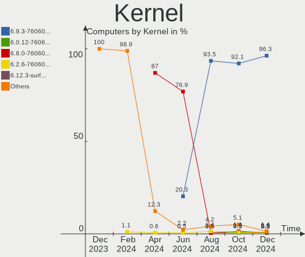
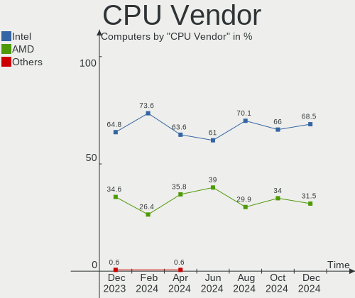
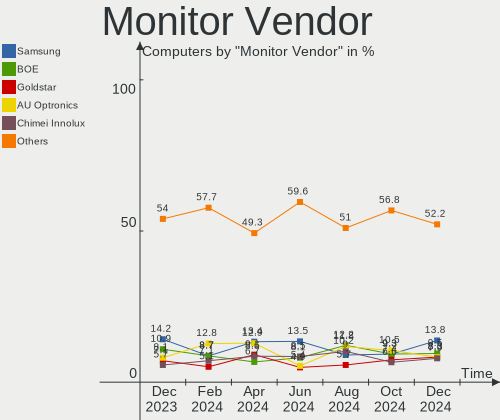
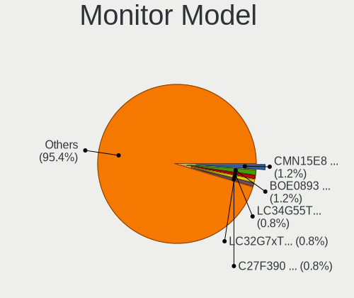
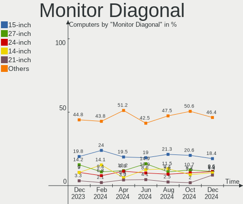

Pop!_OS Hardware Trends
-----------------------

A project to identify most popular hardware characteristics and track their change
over time based on data collected by Pop!_OS users at https://Linux-Hardware.org.

Anyone can contribute to the study by uploading probes of their computers by
the [hw-probe](https://github.com/linuxhw/hw-probe) tool:

    sudo -E hw-probe -all -upload

This is a report for all computer types. See also reports for [desktops](/Dist/Pop!_OS/Desktop/README.md) and [notebooks](/Dist/Pop!_OS/Notebook/README.md).

Full-feature report is available here: https://linux-hardware.org/?view=trends

Period: Jan, 2021.

Contents
--------

- [ OS                       ](#os)
- [ OS Family                ](#os-family)
- [ Kernel                   ](#kernel)
- [ Kernel Family            ](#kernel-family)
- [ Kernel Major Ver.        ](#kernel-major-ver)
- [ Arch                     ](#arch)
- [ DE                       ](#de)
- [ Display Server           ](#display-server)
- [ Display Manager          ](#display-manager)
- [ OS Lang                  ](#os-lang)
- [ Boot Mode                ](#boot-mode)
- [ Filesystem               ](#filesystem)
- [ Part. scheme             ](#part-scheme)
- [ Dual Boot with Linux/BSD ](#dual-boot-with-linux/bsd)
- [ Dual Boot (Win)          ](#dual-boot-win)
- [ Country                  ](#country)
- [ City                     ](#city)
- [ Vendor                   ](#vendor)
- [ Model                    ](#model)
- [ Model Family             ](#model-family)
- [ MFG Year                 ](#mfg-year)
- [ Form Factor              ](#form-factor)
- [ Secure Boot              ](#secure-boot)
- [ Coreboot                 ](#coreboot)
- [ RAM Size                 ](#ram-size)
- [ RAM Used                 ](#ram-used)
- [ Has CD-ROM               ](#has-cd-rom)
- [ Total Drives             ](#total-drives)
- [ Has Ethernet             ](#has-ethernet)
- [ Drive Vendor             ](#drive-vendor)
- [ Drive Model              ](#drive-model)
- [ HDD Vendor               ](#hdd-vendor)
- [ SSD Vendor               ](#ssd-vendor)
- [ Drive Kind               ](#drive-kind)
- [ Drive Connector          ](#drive-connector)
- [ Drive Size               ](#drive-size)
- [ Space Total              ](#space-total)
- [ Space Used               ](#space-used)
- [ Malfunc. Drives          ](#malfunc-drives)
- [ Malfunc. Drive Vendor    ](#malfunc-drive-vendor)
- [ Malfunc. HDD Vendor      ](#malfunc-hdd-vendor)
- [ Malfunc. Drive Kind      ](#malfunc-drive-kind)
- [ Failed Drives            ](#failed-drives)
- [ Failed Drive Vendor      ](#failed-drive-vendor)
- [ Drive Status             ](#drive-status)
- [ Storage Vendor           ](#storage-vendor)
- [ Storage Model            ](#storage-model)
- [ Storage Kind             ](#storage-kind)
- [ CPU Vendor               ](#cpu-vendor)
- [ CPU Model                ](#cpu-model)
- [ CPU Model Family         ](#cpu-model-family)
- [ CPU Cores                ](#cpu-cores)
- [ CPU Sockets              ](#cpu-sockets)
- [ CPU Threads              ](#cpu-threads)
- [ CPU Op-Modes             ](#cpu-op-modes)
- [ CPU Microcode            ](#cpu-microcode)
- [ CPU Microarch            ](#cpu-microarch)
- [ GPU Vendor               ](#gpu-vendor)
- [ GPU Model                ](#gpu-model)
- [ GPU Combo                ](#gpu-combo)
- [ GPU Driver               ](#gpu-driver)
- [ GPU Memory               ](#gpu-memory)
- [ Monitor Vendor           ](#monitor-vendor)
- [ Monitor Model            ](#monitor-model)
- [ Monitor Resolution       ](#monitor-resolution)
- [ Monitor Diagonal         ](#monitor-diagonal)
- [ Monitor Width            ](#monitor-width)
- [ Aspect Ratio             ](#aspect-ratio)
- [ Monitor Area             ](#monitor-area)
- [ Pixel Density            ](#pixel-density)
- [ Multiple Monitors        ](#multiple-monitors)
- [ Net Controller Vendor    ](#net-controller-vendor)
- [ Net Controller Model     ](#net-controller-model)
- [ Wireless Vendor          ](#wireless-vendor)
- [ Wireless Model           ](#wireless-model)
- [ Ethernet Vendor          ](#ethernet-vendor)
- [ Ethernet Model           ](#ethernet-model)
- [ Net Controller Kind      ](#net-controller-kind)
- [ Used Controller          ](#used-controller)
- [ NICs                     ](#nics)
- [ Memory Vendor            ](#memory-vendor)
- [ Memory Model             ](#memory-model)
- [ Memory Kind              ](#memory-kind)
- [ Memory Form Factor       ](#memory-form-factor)
- [ Memory Size              ](#memory-size)
- [ Memory Speed             ](#memory-speed)
- [ Sound Vendor             ](#sound-vendor)
- [ Sound Model              ](#sound-model)
- [ Camera Vendor            ](#camera-vendor)
- [ Camera Model             ](#camera-model)
- [ Fingerprint Vendor       ](#fingerprint-vendor)
- [ Fingerprint Model        ](#fingerprint-model)
- [ Chipcard Vendor          ](#chipcard-vendor)
- [ Chipcard Model           ](#chipcard-model)
- [ Printer Vendor           ](#printer-vendor)
- [ Printer Model            ](#printer-model)
- [ Scanner Vendor           ](#scanner-vendor)
- [ Scanner Model            ](#scanner-model)
- [ Bluetooth Vendor         ](#bluetooth-vendor)
- [ Bluetooth Model          ](#bluetooth-model)
- [ Unsupported Devices      ](#unsupported-devices)
- [ Unsupported Device Types ](#unsupported-device-types)

OS
--

Installed operating systems

| Name          | Computers | Percent |
|---------------|-----------|---------|
| Pop!_OS 20.10 | 257       | 79.08%  |
| Pop!_OS 20.04 | 68        | 20.92%  |

OS Family
---------

OS without a version

| Name    | Computers | Percent |
|---------|-----------|---------|
| Pop!_OS | 325       | 100%    |

Kernel
------

Version of the Linux kernel

| Version                 | Computers | Percent |
|-------------------------|-----------|---------|
| 5.8.0-7630-generic      | 303       | 93.23%  |
| 5.8.0-7625-generic      | 4         | 1.23%   |
| 5.4.0-7642-generic      | 3         | 0.92%   |
| 5.10.6-051006-generic   | 2         | 0.62%   |
| 5.10.2-051002-generic   | 2         | 0.62%   |
| 5.9.16-xanmod1          | 1         | 0.31%   |
| 5.9.1-050901-lowlatency | 1         | 0.31%   |
| 5.4.0-7634-generic      | 1         | 0.31%   |
| 5.4.0-7626-generic      | 1         | 0.31%   |
| 5.10.8-051008-generic   | 1         | 0.31%   |
| 5.10.7-xanmod1          | 1         | 0.31%   |
| 5.10.7-051007-generic   | 1         | 0.31%   |
| 5.10.11-xanmod1         | 1         | 0.31%   |
| 5.10.11-051011-generic  | 1         | 0.31%   |
| 5.10.10-051010-generic  | 1         | 0.31%   |
| 5.10.1-051001-generic   | 1         | 0.31%   |

Kernel Family
-------------

Linux kernel without a distro release

| Version | Computers | Percent |
|---------|-----------|---------|
| 5.8.0   | 307       | 94.46%  |
| 5.4.0   | 5         | 1.54%   |
| 5.10.7  | 2         | 0.62%   |
| 5.10.6  | 2         | 0.62%   |
| 5.10.2  | 2         | 0.62%   |
| 5.10.11 | 2         | 0.62%   |
| 5.9.16  | 1         | 0.31%   |
| 5.9.1   | 1         | 0.31%   |
| 5.10.8  | 1         | 0.31%   |
| 5.10.10 | 1         | 0.31%   |
| 5.10.1  | 1         | 0.31%   |

Kernel Major Ver.
-----------------

Linux kernel major version

| Version | Computers | Percent |
|---------|-----------|---------|
| 5.8     | 307       | 94.46%  |
| 5.10    | 11        | 3.38%   |
| 5.4     | 5         | 1.54%   |
| 5.9     | 2         | 0.62%   |

Arch
----

OS architecture (x86_64, i586, etc.)

| Name   | Computers | Percent |
|--------|-----------|---------|
| x86_64 | 325       | 100%    |

DE
--

Desktop Environment

| Name       | Computers | Percent |
|------------|-----------|---------|
| GNOME      | 316       | 97.23%  |
| KDE        | 4         | 1.23%   |
| XFCE       | 2         | 0.62%   |
| X-Cinnamon | 2         | 0.62%   |
| KDE5       | 1         | 0.31%   |

Display Server
--------------

X11 or Wayland

| Name    | Computers | Percent |
|---------|-----------|---------|
| X11     | 321       | 98.77%  |
| Wayland | 4         | 1.23%   |

Display Manager
---------------

SDDM, LightDM, etc.

| Name    | Computers | Percent |
|---------|-----------|---------|
| Unknown | 284       | 87.38%  |
| GDM     | 40        | 12.31%  |
| TDM     | 1         | 0.31%   |

OS Lang
-------

Language

| Lang  | Computers | Percent |
|-------|-----------|---------|
| en_US | 179       | 55.08%  |
| de_DE | 29        | 8.92%   |
| en_GB | 27        | 8.31%   |
| pt_BR | 15        | 4.62%   |
| es_ES | 12        | 3.69%   |
| en_AU | 11        | 3.38%   |
| fr_FR | 9         | 2.77%   |
| en_CA | 9         | 2.77%   |
| it_IT | 7         | 2.15%   |
| C     | 7         | 2.15%   |
| ru_RU | 4         | 1.23%   |
| pl_PL | 2         | 0.62%   |
| nl_NL | 2         | 0.62%   |
| ca_ES | 2         | 0.62%   |
| zh_TW | 1         | 0.31%   |
| uk_UA | 1         | 0.31%   |
| sv_SE | 1         | 0.31%   |
| sk_SK | 1         | 0.31%   |
| pt_PT | 1         | 0.31%   |
| nb_NO | 1         | 0.31%   |
| hu_HU | 1         | 0.31%   |
| fr_CA | 1         | 0.31%   |
| fi_FI | 1         | 0.31%   |
| es_MX | 1         | 0.31%   |

Boot Mode
---------

EFI or BIOS

| Mode | Computers | Percent |
|------|-----------|---------|
| BIOS | 292       | 89.85%  |
| EFI  | 33        | 10.15%  |

Filesystem
----------

Type of filesystem

| Type    | Computers | Percent |
|---------|-----------|---------|
| Ext4    | 312       | 96%     |
| Btrfs   | 7         | 2.15%   |
| Overlay | 5         | 1.54%   |
| Xfs     | 1         | 0.31%   |

Part. scheme
------------

Scheme of partitioning

| Type    | Computers | Percent |
|---------|-----------|---------|
| Unknown | 285       | 87.69%  |
| GPT     | 33        | 10.15%  |
| MBR     | 7         | 2.15%   |

Dual Boot with Linux/BSD
------------------------

Hosting more than one Linux/BSD

| Dual boot | Computers | Percent |
|-----------|-----------|---------|
| No        | 321       | 98.77%  |
| Yes       | 4         | 1.23%   |

Dual Boot (Win)
---------------

Hosting Linux and Windows

| Dual boot | Computers | Percent |
|-----------|-----------|---------|
| No        | 302       | 92.92%  |
| Yes       | 23        | 7.08%   |

Country
-------

Geographic location (country)

| Country        | Computers | Percent |
|----------------|-----------|---------|
| USA            | 92        | 28.31%  |
| Germany        | 34        | 10.46%  |
| Brazil         | 22        | 6.77%   |
| UK             | 16        | 4.92%   |
| Canada         | 14        | 4.31%   |
| Australia      | 12        | 3.69%   |
| Italy          | 11        | 3.38%   |
| France         | 9         | 2.77%   |
| Spain          | 8         | 2.46%   |
| Netherlands    | 7         | 2.15%   |
| India          | 6         | 1.85%   |
| Austria        | 6         | 1.85%   |
| South Africa   | 5         | 1.54%   |
| Romania        | 5         | 1.54%   |
| Belgium        | 5         | 1.54%   |
| Russia         | 4         | 1.23%   |
| Mexico         | 4         | 1.23%   |
| Finland        | 4         | 1.23%   |
| Argentina      | 4         | 1.23%   |
| Ukraine        | 3         | 0.92%   |
| Taiwan         | 3         | 0.92%   |
| Switzerland    | 3         | 0.92%   |
| Slovakia       | 3         | 0.92%   |
| Poland         | 3         | 0.92%   |
| Philippines    | 3         | 0.92%   |
| Norway         | 3         | 0.92%   |
| Ireland        | 3         | 0.92%   |
| Hungary        | 3         | 0.92%   |
| Greece         | 3         | 0.92%   |
| Sweden         | 2         | 0.62%   |
| Portugal       | 2         | 0.62%   |
| Malaysia       | 2         | 0.62%   |
| Iceland        | 2         | 0.62%   |
| Hong Kong      | 2         | 0.62%   |
| Czech Republic | 2         | 0.62%   |
| UAE            | 1         | 0.31%   |
| Turkey         | 1         | 0.31%   |
| Serbia         | 1         | 0.31%   |
| Nigeria        | 1         | 0.31%   |
| Malta          | 1         | 0.31%   |
| Israel         | 1         | 0.31%   |
| Indonesia      | 1         | 0.31%   |
| Grenada        | 1         | 0.31%   |
| Denmark        | 1         | 0.31%   |
| Costa Rica     | 1         | 0.31%   |
| Colombia       | 1         | 0.31%   |
| China          | 1         | 0.31%   |
| Chile          | 1         | 0.31%   |
| Bangladesh     | 1         | 0.31%   |
| Unknown        | 1         | 0.31%   |

City
----

Geographic location (city)

| City                 | Computers | Percent |
|----------------------|-----------|---------|
| São Paulo           | 6         | 1.85%   |
| Sydney               | 4         | 1.23%   |
| Phoenix              | 3         | 0.92%   |
| New York             | 3         | 0.92%   |
| Milan                | 3         | 0.92%   |
| Johannesburg         | 3         | 0.92%   |
| Bristol              | 3         | 0.92%   |
| Brisbane             | 3         | 0.92%   |
| Washington           | 2         | 0.62%   |
| Warsaw               | 2         | 0.62%   |
| Vienna               | 2         | 0.62%   |
| Untereisesheim       | 2         | 0.62%   |
| Taipei               | 2         | 0.62%   |
| Subang Jaya          | 2         | 0.62%   |
| Sheffield            | 2         | 0.62%   |
| Rio de Janeiro       | 2         | 0.62%   |
| Quezon City          | 2         | 0.62%   |
| Prague               | 2         | 0.62%   |
| Perth                | 2         | 0.62%   |
| Orlando              | 2         | 0.62%   |
| Nottingham           | 2         | 0.62%   |
| Leipzig              | 2         | 0.62%   |
| Hyderabad            | 2         | 0.62%   |
| Dublin               | 2         | 0.62%   |
| Dallas               | 2         | 0.62%   |
| Chandler             | 2         | 0.62%   |
| Central              | 2         | 0.62%   |
| Calgary              | 2         | 0.62%   |
| Buenos Aires         | 2         | 0.62%   |
| Bucharest            | 2         | 0.62%   |
| Brussels             | 2         | 0.62%   |
| Bratislava           | 2         | 0.62%   |
| Brasília            | 2         | 0.62%   |
| Berlin               | 2         | 0.62%   |
| Athens               | 2         | 0.62%   |
| Zwingenberg          | 1         | 0.31%   |
| Zottegem             | 1         | 0.31%   |
| Zonnemaire           | 1         | 0.31%   |
| Zaragoza             | 1         | 0.31%   |
| Woodstock            | 1         | 0.31%   |
| Winnetka             | 1         | 0.31%   |
| Westlake             | 1         | 0.31%   |
| West Lafayette       | 1         | 0.31%   |
| Wakefield            | 1         | 0.31%   |
| Wachenhausen         | 1         | 0.31%   |
| Virginia Beach       | 1         | 0.31%   |
| Villemomble          | 1         | 0.31%   |
| Vilanova de Bellpuig | 1         | 0.31%   |
| Varzea Paulista      | 1         | 0.31%   |
| Valence              | 1         | 0.31%   |
| Vado Ligure          | 1         | 0.31%   |
| Utrecht              | 1         | 0.31%   |
| Ulyanovsk            | 1         | 0.31%   |
| Udine                | 1         | 0.31%   |
| Uberlândia          | 1         | 0.31%   |
| Tuusula              | 1         | 0.31%   |
| Turin                | 1         | 0.31%   |
| Trostberg an der Alz | 1         | 0.31%   |
| Trindade do Sul      | 1         | 0.31%   |
| Toulon               | 1         | 0.31%   |

Vendor
------

Motherboard manufacturer

| Name                    | Computers | Percent |
|-------------------------|-----------|---------|
| ASUSTek Computer        | 53        | 16.31%  |
| Dell                    | 49        | 15.08%  |
| Lenovo                  | 45        | 13.85%  |
| Hewlett-Packard         | 32        | 9.85%   |
| MSI                     | 29        | 8.92%   |
| Gigabyte Technology     | 25        | 7.69%   |
| Acer                    | 15        | 4.62%   |
| ASRock                  | 12        | 3.69%   |
| System76                | 9         | 2.77%   |
| Intel                   | 9         | 2.77%   |
| Apple                   | 9         | 2.77%   |
| Fujitsu                 | 4         | 1.23%   |
| Toshiba                 | 3         | 0.92%   |
| HUAWEI                  | 3         | 0.92%   |
| Sony                    | 2         | 0.62%   |
| Notebook                | 2         | 0.62%   |
| LG Electronics          | 2         | 0.62%   |
| Alienware               | 2         | 0.62%   |
| Unknown                 | 2         | 0.62%   |
| Timi                    | 1         | 0.31%   |
| T-bao                   | 1         | 0.31%   |
| Samsung Electronics     | 1         | 0.31%   |
| Razer                   | 1         | 0.31%   |
| QTQD                    | 1         | 0.31%   |
| PC Specialist           | 1         | 0.31%   |
| Packard Bell            | 1         | 0.31%   |
| MOTILE                  | 1         | 0.31%   |
| Minix                   | 1         | 0.31%   |
| Microsoft               | 1         | 0.31%   |
| Medion                  | 1         | 0.31%   |
| HCL Infosystems Limited | 1         | 0.31%   |
| GPU Company             | 1         | 0.31%   |
| Foxconn                 | 1         | 0.31%   |
| Eluktronics             | 1         | 0.31%   |
| Biostar                 | 1         | 0.31%   |
| AVITA                   | 1         | 0.31%   |
| Acidanthera             | 1         | 0.31%   |

Model
-----

Motherboard model

| Name                                      | Computers | Percent |
|-------------------------------------------|-----------|---------|
| Intel B75                                 | 4         | 1.23%   |
| Dell XPS 15 9500                          | 4         | 1.23%   |
| Dell XPS 15 7590                          | 4         | 1.23%   |
| ASUS All Series                           | 4         | 1.23%   |
| System76 Lemur Pro                        | 3         | 0.92%   |
| Gigabyte B450M DS3H                       | 3         | 0.92%   |
| Dell OptiPlex 7010                        | 3         | 0.92%   |
| System76 Bonobo WS                        | 2         | 0.62%   |
| MSI MS-7B79                               | 2         | 0.62%   |
| Lenovo ThinkPad X1 Extreme 2nd 20QVCTO1WW | 2         | 0.62%   |
| Lenovo IdeaPad Gaming 3 15ARH05 82EY      | 2         | 0.62%   |
| HP Z440 Workstation                       | 2         | 0.62%   |
| HP Z420 Workstation                       | 2         | 0.62%   |
| Dell Precision T3600                      | 2         | 0.62%   |
| Dell Latitude E7240                       | 2         | 0.62%   |
| Dell Inspiron 3580                        | 2         | 0.62%   |
| ASUS ROG STRIX B450-I GAMING              | 2         | 0.62%   |
| ASUS PRIME B450M-A                        | 2         | 0.62%   |
| ASRock X470 Taichi                        | 2         | 0.62%   |
| Apple MacBook4,1                          | 2         | 0.62%   |
| Unknown                                   | 2         | 0.62%   |
| Toshiba Satellite P855                    | 1         | 0.31%   |
| Toshiba Satellite P750                    | 1         | 0.31%   |
| Toshiba Satellite A200                    | 1         | 0.31%   |
| Timi RedmiBook 16                         | 1         | 0.31%   |
| T-bao MINI PC                             | 1         | 0.31%   |
| System76 Thelio                           | 1         | 0.31%   |
| System76 Serval WS                        | 1         | 0.31%   |
| System76 Galago Pro                       | 1         | 0.31%   |
| System76 Darter Pro                       | 1         | 0.31%   |
| Sony SVS1511C5E                           | 1         | 0.31%   |
| Sony SVE1712T1RB                          | 1         | 0.31%   |
| Samsung RC530/RC730                       | 1         | 0.31%   |
| Razer Blade Stealth                       | 1         | 0.31%   |
| QTQD Board                                | 1         | 0.31%   |
| PC Specialist NH5x_7xDCx_DDx              | 1         | 0.31%   |
| Packard Bell EasyNote TE11HC              | 1         | 0.31%   |
| Notebook NV4XMZ                           | 1         | 0.31%   |
| Notebook NS50MU                           | 1         | 0.31%   |
| MSI Prestige 15 A11SCS                    | 1         | 0.31%   |
| MSI MS-7C94                               | 1         | 0.31%   |
| MSI MS-7C91                               | 1         | 0.31%   |
| MSI MS-7C84                               | 1         | 0.31%   |
| MSI MS-7C59                               | 1         | 0.31%   |
| MSI MS-7C56                               | 1         | 0.31%   |
| MSI MS-7C37                               | 1         | 0.31%   |
| MSI MS-7C02                               | 1         | 0.31%   |
| MSI MS-7B98                               | 1         | 0.31%   |
| MSI MS-7B93                               | 1         | 0.31%   |
| MSI MS-7B51                               | 1         | 0.31%   |
| MSI MS-7B22                               | 1         | 0.31%   |
| MSI MS-7B05                               | 1         | 0.31%   |
| MSI MS-7A70                               | 1         | 0.31%   |
| MSI MS-7A33                               | 1         | 0.31%   |
| MSI MS-7A32                               | 1         | 0.31%   |
| MSI MS-7A15                               | 1         | 0.31%   |
| MSI MS-7977                               | 1         | 0.31%   |
| MSI MS-7885                               | 1         | 0.31%   |
| MSI MS-7845                               | 1         | 0.31%   |
| MSI MS-7756                               | 1         | 0.31%   |

Model Family
------------

Motherboard model prefix

| Name                  | Computers | Percent |
|-----------------------|-----------|---------|
| Lenovo ThinkPad       | 22        | 6.77%   |
| Dell XPS              | 13        | 4%      |
| Lenovo IdeaPad        | 12        | 3.69%   |
| Dell Latitude         | 11        | 3.38%   |
| Acer Aspire           | 11        | 3.38%   |
| ASUS ROG              | 10        | 3.08%   |
| Dell Inspiron         | 9         | 2.77%   |
| Dell Precision        | 8         | 2.46%   |
| Dell OptiPlex         | 6         | 1.85%   |
| ASUS TUF              | 6         | 1.85%   |
| HP Laptop             | 5         | 1.54%   |
| Gigabyte X570         | 5         | 1.54%   |
| Intel B75             | 4         | 1.23%   |
| HP Pavilion           | 4         | 1.23%   |
| ASUS PRIME            | 4         | 1.23%   |
| ASUS All              | 4         | 1.23%   |
| Toshiba Satellite     | 3         | 0.92%   |
| System76 Lemur        | 3         | 0.92%   |
| Lenovo Legion         | 3         | 0.92%   |
| HP EliteBook          | 3         | 0.92%   |
| HP Compaq             | 3         | 0.92%   |
| Gigabyte B450M        | 3         | 0.92%   |
| System76 Bonobo       | 2         | 0.62%   |
| MSI MS-7B79           | 2         | 0.62%   |
| Lenovo ThinkCentre    | 2         | 0.62%   |
| HP Z440               | 2         | 0.62%   |
| HP Z420               | 2         | 0.62%   |
| HP ProDesk            | 2         | 0.62%   |
| HP ProBook            | 2         | 0.62%   |
| ASUS VivoBook         | 2         | 0.62%   |
| ASRock X470           | 2         | 0.62%   |
| Apple MacBookAir6     | 2         | 0.62%   |
| Apple MacBook4        | 2         | 0.62%   |
| Unknown               | 2         | 0.62%   |
| Timi RedmiBook        | 1         | 0.31%   |
| T-bao MINI            | 1         | 0.31%   |
| System76 Thelio       | 1         | 0.31%   |
| System76 Serval       | 1         | 0.31%   |
| System76 Galago       | 1         | 0.31%   |
| System76 Darter       | 1         | 0.31%   |
| Sony SVS1511C5E       | 1         | 0.31%   |
| Sony SVE1712T1RB      | 1         | 0.31%   |
| Samsung RC530         | 1         | 0.31%   |
| Razer Blade           | 1         | 0.31%   |
| QTQD Board            | 1         | 0.31%   |
| PC Specialist NH5x    | 1         | 0.31%   |
| Packard Bell EasyNote | 1         | 0.31%   |
| Notebook NV4XMZ       | 1         | 0.31%   |
| Notebook NS50MU       | 1         | 0.31%   |
| MSI Prestige          | 1         | 0.31%   |
| MSI MS-7C94           | 1         | 0.31%   |
| MSI MS-7C91           | 1         | 0.31%   |
| MSI MS-7C84           | 1         | 0.31%   |
| MSI MS-7C59           | 1         | 0.31%   |
| MSI MS-7C56           | 1         | 0.31%   |
| MSI MS-7C37           | 1         | 0.31%   |
| MSI MS-7C02           | 1         | 0.31%   |
| MSI MS-7B98           | 1         | 0.31%   |
| MSI MS-7B93           | 1         | 0.31%   |
| MSI MS-7B51           | 1         | 0.31%   |

MFG Year
--------

Motherboard manufacture year

| Year | Computers | Percent |
|------|-----------|---------|
| 2020 | 119       | 36.62%  |
| 2019 | 50        | 15.38%  |
| 2013 | 28        | 8.62%   |
| 2018 | 26        | 8%      |
| 2015 | 14        | 4.31%   |
| 2016 | 13        | 4%      |
| 2012 | 13        | 4%      |
| 2011 | 13        | 4%      |
| 2010 | 13        | 4%      |
| 2014 | 10        | 3.08%   |
| 2008 | 10        | 3.08%   |
| 2009 | 8         | 2.46%   |
| 2017 | 6         | 1.85%   |
| 2007 | 2         | 0.62%   |

Form Factor
-----------

Physical design of the computer

| Name        | Computers | Percent |
|-------------|-----------|---------|
| Notebook    | 164       | 50.46%  |
| Desktop     | 144       | 44.31%  |
| Mini pc     | 5         | 1.54%   |
| Convertible | 4         | 1.23%   |
| Tablet      | 3         | 0.92%   |
| All in one  | 3         | 0.92%   |
| Server      | 2         | 0.62%   |

Secure Boot
-----------

Enabled or disabled

| State    | Computers | Percent |
|----------|-----------|---------|
| Disabled | 325       | 100%    |

Coreboot
--------

Have coreboot on board

| Used | Computers | Percent |
|------|-----------|---------|
| No   | 319       | 98.15%  |
| Yes  | 6         | 1.85%   |

RAM Size
--------

Total RAM memory

| Size in GB      | Computers | Percent |
|-----------------|-----------|---------|
| 16.01-24.0      | 86        | 26.46%  |
| 4.01-8.0        | 66        | 20.31%  |
| 8.01-16.0       | 60        | 18.46%  |
| 32.01-64.0      | 46        | 14.15%  |
| 3.01-4.0        | 33        | 10.15%  |
| 64.01-256.0     | 17        | 5.23%   |
| 1.01-2.0        | 7         | 2.15%   |
| 2.01-3.0        | 5         | 1.54%   |
| 24.01-32.0      | 3         | 0.92%   |
| More than 256.0 | 2         | 0.62%   |

RAM Used
--------

Used RAM memory

| Used GB    | Computers | Percent |
|------------|-----------|---------|
| 1.01-2.0   | 119       | 36.62%  |
| 2.01-3.0   | 81        | 24.92%  |
| 3.01-4.0   | 62        | 19.08%  |
| 4.01-8.0   | 49        | 15.08%  |
| 8.01-16.0  | 13        | 4%      |
| 32.01-64.0 | 1         | 0.31%   |

Has CD-ROM
----------

Has CD-ROM on board

| Presented | Computers | Percent |
|-----------|-----------|---------|
| No        | 219       | 67.38%  |
| Yes       | 106       | 32.62%  |

Total Drives
------------

Number of drives on board

| Drives | Computers | Percent |
|--------|-----------|---------|
| 1      | 179       | 55.08%  |
| 2      | 82        | 25.23%  |
| 3      | 34        | 10.46%  |
| 4      | 17        | 5.23%   |
| 7      | 4         | 1.23%   |
| 5      | 4         | 1.23%   |
| 13     | 1         | 0.31%   |
| 11     | 1         | 0.31%   |
| 8      | 1         | 0.31%   |
| 6      | 1         | 0.31%   |
| 0      | 1         | 0.31%   |

Has Ethernet
------------

Has Ethernet on board

| Presented | Computers | Percent |
|-----------|-----------|---------|
| Yes       | 287       | 88.31%  |
| No        | 38        | 11.69%  |

Drive Vendor
------------

Hard drive vendors

| Vendor                    | Computers | Drives | Percent |
|---------------------------|-----------|--------|---------|
| Samsung Electronics       | 117       | 148    | 22.67%  |
| WDC                       | 66        | 78     | 12.79%  |
| Seagate                   | 64        | 80     | 12.4%   |
| Kingston                  | 36        | 41     | 6.98%   |
| SanDisk                   | 32        | 33     | 6.2%    |
| Toshiba                   | 26        | 28     | 5.04%   |
| Crucial                   | 16        | 17     | 3.1%    |
| Intel                     | 15        | 16     | 2.91%   |
| Phison                    | 14        | 18     | 2.71%   |
| SK Hynix                  | 11        | 18     | 2.13%   |
| Unknown                   | 10        | 12     | 1.94%   |
| Hitachi                   | 9         | 9      | 1.74%   |
| HGST                      | 9         | 9      | 1.74%   |
| A-DATA Technology         | 9         | 9      | 1.74%   |
| Silicon Motion            | 6         | 6      | 1.16%   |
| Micron/Crucial Technology | 6         | 6      | 1.16%   |
| Transcend                 | 5         | 5      | 0.97%   |
| Micron Technology         | 5         | 5      | 0.97%   |
| Team                      | 4         | 4      | 0.78%   |
| PNY                       | 4         | 4      | 0.78%   |
| OCZ                       | 4         | 4      | 0.78%   |
| XPG                       | 3         | 4      | 0.58%   |
| SPCC                      | 3         | 4      | 0.58%   |
| Realtek Semiconductor     | 3         | 3      | 0.58%   |
| China                     | 3         | 3      | 0.58%   |
| Apple                     | 3         | 3      | 0.58%   |
| Maxtor                    | 2         | 2      | 0.39%   |
| LITEONIT                  | 2         | 2      | 0.39%   |
| LITEON                    | 2         | 2      | 0.39%   |
| Intenso                   | 2         | 2      | 0.39%   |
| Corsair                   | 2         | 2      | 0.39%   |
| Voyager                   | 1         | 1      | 0.19%   |
| USB                       | 1         | 1      | 0.19%   |
| Union Memory              | 1         | 1      | 0.19%   |
| T-FORCE                   | 1         | 1      | 0.19%   |
| Patriot                   | 1         | 2      | 0.19%   |
| Mushkin                   | 1         | 1      | 0.19%   |
| MR                        | 1         | 1      | 0.19%   |
| MATSHITA                  | 1         | 1      | 0.19%   |
| Mass                      | 1         | 1      | 0.19%   |
| Lite-On                   | 1         | 1      | 0.19%   |
| KingSpec                  | 1         | 1      | 0.19%   |
| KingDian                  | 1         | 1      | 0.19%   |
| JMicron                   | 1         | 1      | 0.19%   |
| Integral                  | 1         | 1      | 0.19%   |
| Gigabyte Technology       | 1         | 1      | 0.19%   |
| Fujitsu                   | 1         | 1      | 0.19%   |
| FORESEE                   | 1         | 1      | 0.19%   |
| DATARAM                   | 1         | 1      | 0.19%   |
| CT480BX5                  | 1         | 1      | 0.19%   |
| BIWIN                     | 1         | 1      | 0.19%   |
| AS25                      | 1         | 1      | 0.19%   |
| AMD                       | 1         | 2      | 0.19%   |
| ADATA Technology          | 1         | 1      | 0.19%   |

Drive Model
-----------

Hard drive models

| Model                                | Computers | Percent |
|--------------------------------------|-----------|---------|
| Samsung NVMe SSD Drive 500GB         | 14        | 2.45%   |
| Samsung NVMe SSD Drive 1TB           | 11        | 1.93%   |
| Samsung SSD 850 EVO 250GB            | 9         | 1.58%   |
| Samsung NVMe SSD Drive 512GB         | 9         | 1.58%   |
| Kingston SA400S37120G 120GB SSD      | 8         | 1.4%    |
| Sandisk NVMe SSD Drive 500GB         | 7         | 1.23%   |
| Kingston SV300S37A120G 120GB SSD     | 7         | 1.23%   |
| Seagate ST2000DM008-2FR102 2TB       | 6         | 1.05%   |
| Seagate ST1000DM010-2EP102 1TB       | 6         | 1.05%   |
| Samsung SSD 860 EVO 500GB            | 6         | 1.05%   |
| Samsung SSD 850 EVO 500GB            | 6         | 1.05%   |
| Kingston SA400S37240G 240GB SSD      | 6         | 1.05%   |
| SK Hynix NVMe SSD Drive 512GB        | 5         | 0.88%   |
| Seagate ST500DM002-1BD142 500GB      | 5         | 0.88%   |
| Samsung SSD 860 EVO 250GB            | 5         | 0.88%   |
| Samsung NVMe SSD Drive 2TB           | 5         | 0.88%   |
| Phison NVMe SSD Drive 1TB            | 5         | 0.88%   |
| SanDisk Extreme SSD 1TB              | 4         | 0.7%    |
| Samsung SSD 970 EVO Plus 1TB         | 4         | 0.7%    |
| Samsung SSD 860 EVO 1TB              | 4         | 0.7%    |
| Samsung SSD 840 EVO 250GB            | 4         | 0.7%    |
| Samsung NVMe SSD Drive 250GB         | 4         | 0.7%    |
| Unknown SD/MMC/MS PRO 32GB           | 3         | 0.53%   |
| Unknown MMC Card  64GB               | 3         | 0.53%   |
| SPCC Solid State Disk 256GB          | 3         | 0.53%   |
| Seagate ST8000DM004-2CX188 8TB       | 3         | 0.53%   |
| Seagate ST3500312CS 500GB            | 3         | 0.53%   |
| Seagate ST1000LM035-1RK172 1TB       | 3         | 0.53%   |
| Seagate Expansion 1TB                | 3         | 0.53%   |
| Sandisk NVMe SSD Drive 512GB         | 3         | 0.53%   |
| Sandisk NVMe SSD Drive 1TB           | 3         | 0.53%   |
| Samsung SSD 870 QVO 1TB              | 3         | 0.53%   |
| Samsung SSD 850 EVO 120GB            | 3         | 0.53%   |
| Samsung SSD 840 EVO 120GB            | 3         | 0.53%   |
| Samsung NVMe SSD Drive 1024GB        | 3         | 0.53%   |
| Phison NVMe SSD Drive 256GB          | 3         | 0.53%   |
| Micron/Crucial NVMe SSD Drive 500GB  | 3         | 0.53%   |
| Micron/Crucial NVMe SSD Drive 1TB    | 3         | 0.53%   |
| Kingston SUV400S37120G 120GB SSD     | 3         | 0.53%   |
| Kingston SA400S37480G 480GB SSD      | 3         | 0.53%   |
| Intel NVMe SSD Drive 512GB           | 3         | 0.53%   |
| Intel NVMe SSD Drive 256GB           | 3         | 0.53%   |
| Crucial CT1000MX500SSD1 1TB          | 3         | 0.53%   |
| XPG NVMe SSD Drive 1024GB            | 2         | 0.35%   |
| WDC WD5000LPVT-75G33T0 500GB         | 2         | 0.35%   |
| WDC WD5000AAKS-00A7B0 500GB          | 2         | 0.35%   |
| WDC WD3200AAJS-60Z0A0 320GB          | 2         | 0.35%   |
| WDC WD20EZRZ-00Z5HB0 2TB             | 2         | 0.35%   |
| WDC WD20EARX-00PASB0 2TB             | 2         | 0.35%   |
| WDC WD10EZEX-08WN4A0 1TB             | 2         | 0.35%   |
| Unknown MMC Card  32GB               | 2         | 0.35%   |
| Toshiba MQ01ABD100 1TB               | 2         | 0.35%   |
| Silicon Motion NVMe SSD Drive 512GB  | 2         | 0.35%   |
| Silicon Motion NVMe SSD Drive 1024GB | 2         | 0.35%   |
| Seagate ST2000DM001-1ER164 2TB       | 2         | 0.35%   |
| Seagate ST1000DM003-9YN162 1TB       | 2         | 0.35%   |
| Seagate ST1000DM003-1ER162 1TB       | 2         | 0.35%   |
| Samsung SSD 970 EVO Plus 500GB       | 2         | 0.35%   |
| Samsung SSD 970 EVO 250GB            | 2         | 0.35%   |
| Samsung SSD 970 EVO 1TB              | 2         | 0.35%   |

HDD Vendor
----------

Hard disk drive vendors

| Vendor              | Computers | Drives | Percent |
|---------------------|-----------|--------|---------|
| Seagate             | 63        | 78     | 38.65%  |
| WDC                 | 57        | 69     | 34.97%  |
| Toshiba             | 18        | 20     | 11.04%  |
| Hitachi             | 9         | 9      | 5.52%   |
| HGST                | 9         | 9      | 5.52%   |
| Samsung Electronics | 4         | 4      | 2.45%   |
| MAXTOR              | 2         | 2      | 1.23%   |
| Fujitsu             | 1         | 1      | 0.61%   |

SSD Vendor
----------

Solid state drive vendors

| Vendor              | Computers | Drives | Percent |
|---------------------|-----------|--------|---------|
| Samsung Electronics | 61        | 74     | 31.61%  |
| Kingston            | 31        | 35     | 16.06%  |
| SanDisk             | 17        | 17     | 8.81%   |
| Crucial             | 14        | 15     | 7.25%   |
| A-DATA Technology   | 9         | 9      | 4.66%   |
| WDC                 | 5         | 5      | 2.59%   |
| Transcend           | 5         | 5      | 2.59%   |
| Intel               | 5         | 5      | 2.59%   |
| Team                | 4         | 4      | 2.07%   |
| PNY                 | 4         | 4      | 2.07%   |
| OCZ                 | 4         | 4      | 2.07%   |
| Toshiba             | 3         | 3      | 1.55%   |
| SPCC                | 3         | 4      | 1.55%   |
| SK Hynix            | 3         | 9      | 1.55%   |
| China               | 3         | 3      | 1.55%   |
| Apple               | 3         | 3      | 1.55%   |
| Micron Technology   | 2         | 2      | 1.04%   |
| LITEONIT            | 2         | 2      | 1.04%   |
| LITEON              | 2         | 2      | 1.04%   |
| Corsair             | 2         | 2      | 1.04%   |
| Seagate             | 1         | 1      | 0.52%   |
| Patriot             | 1         | 2      | 0.52%   |
| Mushkin             | 1         | 1      | 0.52%   |
| MR                  | 1         | 1      | 0.52%   |
| KingSpec            | 1         | 1      | 0.52%   |
| Integral            | 1         | 1      | 0.52%   |
| Gigabyte Technology | 1         | 1      | 0.52%   |
| FORESEE             | 1         | 1      | 0.52%   |
| DATARAM             | 1         | 1      | 0.52%   |
| CT480BX5            | 1         | 1      | 0.52%   |
| BIWIN               | 1         | 1      | 0.52%   |

Drive Kind
----------

HDD or SSD

| Kind    | Computers | Drives | Percent |
|---------|-----------|--------|---------|
| SSD     | 166       | 219    | 36.89%  |
| HDD     | 136       | 192    | 30.22%  |
| NVMe    | 125       | 167    | 27.78%  |
| Unknown | 15        | 15     | 3.33%   |
| MMC     | 8         | 9      | 1.78%   |

Drive Connector
---------------

SATA, SAS, NVMe, etc.

| Type | Computers | Drives | Percent |
|------|-----------|--------|---------|
| SATA | 240       | 402    | 61.22%  |
| NVMe | 125       | 167    | 31.89%  |
| SAS  | 19        | 24     | 4.85%   |
| MMC  | 8         | 9      | 2.04%   |

Drive Size
----------

Size of hard drive

| Size in TB | Computers | Drives | Percent |
|------------|-----------|--------|---------|
| 0.01-0.5   | 188       | 250    | 59.31%  |
| 0.51-1.0   | 81        | 102    | 25.55%  |
| 1.01-2.0   | 28        | 33     | 8.83%   |
| 4.01-10.0  | 8         | 8      | 2.52%   |
| 3.01-4.0   | 7         | 12     | 2.21%   |
| 2.01-3.0   | 5         | 6      | 1.58%   |

Space Total
-----------

Amount of disk space available on the file system

| Size in GB     | Computers | Percent |
|----------------|-----------|---------|
| 101-250        | 115       | 35.38%  |
| 251-500        | 74        | 22.77%  |
| 501-1000       | 48        | 14.77%  |
| 1001-2000      | 35        | 10.77%  |
| More than 3000 | 18        | 5.54%   |
| 51-100         | 14        | 4.31%   |
| 21-50          | 9         | 2.77%   |
| 2001-3000      | 9         | 2.77%   |
| 1-20           | 3         | 0.92%   |

Space Used
----------

Amount of used disk space

| Used GB        | Computers | Percent |
|----------------|-----------|---------|
| 1-20           | 141       | 43.38%  |
| 21-50          | 52        | 16%     |
| 101-250        | 41        | 12.62%  |
| 51-100         | 35        | 10.77%  |
| 251-500        | 22        | 6.77%   |
| 501-1000       | 14        | 4.31%   |
| 1001-2000      | 12        | 3.69%   |
| More than 3000 | 4         | 1.23%   |
| 2001-3000      | 4         | 1.23%   |

Malfunc. Drives
---------------

Drive models with a malfunction

| Model                                   | Computers | Drives | Percent |
|-----------------------------------------|-----------|--------|---------|
| Toshiba MK2035GSS 200GB                 | 1         | 1      | 25%     |
| SK Hynix BC501 HFM256GDJTNG-8310A 256GB | 1         | 1      | 25%     |
| Kingston SV300S37A120G 120GB SSD        | 1         | 1      | 25%     |
| HGST HTS541010A9E680 1TB                | 1         | 1      | 25%     |

Malfunc. Drive Vendor
---------------------

Vendors of faulty drives

| Vendor   | Computers | Drives | Percent |
|----------|-----------|--------|---------|
| Toshiba  | 1         | 1      | 25%     |
| SK Hynix | 1         | 1      | 25%     |
| Kingston | 1         | 1      | 25%     |
| HGST     | 1         | 1      | 25%     |

Malfunc. HDD Vendor
-------------------

Vendors of faulty HDD drives

| Vendor  | Computers | Drives | Percent |
|---------|-----------|--------|---------|
| Toshiba | 1         | 1      | 50%     |
| HGST    | 1         | 1      | 50%     |

Malfunc. Drive Kind
-------------------

Kinds of faulty drives

| Kind | Computers | Drives | Percent |
|------|-----------|--------|---------|
| HDD  | 2         | 2      | 50%     |
| NVMe | 1         | 1      | 25%     |
| SSD  | 1         | 1      | 25%     |

Failed Drives
-------------

Failed drive models

Zero info for selected period =(

Failed Drive Vendor
-------------------

Failed drive vendors

Zero info for selected period =(

Drive Status
------------

Number of failed and malfunc. drives

| Status   | Computers | Drives | Percent |
|----------|-----------|--------|---------|
| Detected | 286       | 535    | 86.4%   |
| Works    | 41        | 63     | 12.39%  |
| Malfunc  | 4         | 4      | 1.21%   |

Storage Vendor
--------------

Storage controller vendors

| Vendor                       | Computers | Percent |
|------------------------------|-----------|---------|
| Intel                        | 203       | 44.71%  |
| AMD                          | 83        | 18.28%  |
| Samsung Electronics          | 59        | 13%     |
| Sandisk                      | 19        | 4.19%   |
| Phison Electronics           | 13        | 2.86%   |
| ASMedia Technology           | 12        | 2.64%   |
| SK Hynix                     | 8         | 1.76%   |
| Toshiba America Info Systems | 6         | 1.32%   |
| Silicon Motion               | 6         | 1.32%   |
| Micron/Crucial Technology    | 6         | 1.32%   |
| Marvell Technology Group     | 6         | 1.32%   |
| Nvidia                       | 5         | 1.1%    |
| Kingston Technology Company  | 5         | 1.1%    |
| JMicron Technology           | 5         | 1.1%    |
| Micron Technology            | 4         | 0.88%   |
| ADATA Technology             | 4         | 0.88%   |
| Realtek Semiconductor        | 3         | 0.66%   |
| LSI Logic / Symbios Logic    | 2         | 0.44%   |
| Broadcom / LSI               | 2         | 0.44%   |
| Union Memory (Shenzhen)      | 1         | 0.22%   |
| Lite-On Technology           | 1         | 0.22%   |
| Hewlett-Packard              | 1         | 0.22%   |

Storage Model
-------------

Storage controller models

| Model                                                                                   | Computers | Percent |
|-----------------------------------------------------------------------------------------|-----------|---------|
| AMD FCH SATA Controller [AHCI mode]                                                     | 61        | 11.69%  |
| Samsung NVMe SSD Controller SM981/PM981/PM983                                           | 52        | 9.96%   |
| Intel Sunrise Point-LP SATA Controller [AHCI mode]                                      | 18        | 3.45%   |
| AMD 400 Series Chipset SATA Controller                                                  | 18        | 3.45%   |
| Intel Cannon Lake Mobile PCH SATA AHCI Controller                                       | 13        | 2.49%   |
| Intel 7 Series Chipset Family 6-port SATA Controller [AHCI mode]                        | 13        | 2.49%   |
| Intel 82801 Mobile SATA Controller [RAID mode]                                          | 12        | 2.3%    |
| Intel 6 Series/C200 Series Chipset Family 6 port Mobile SATA AHCI Controller            | 12        | 2.3%    |
| ASMedia ASM1062 Serial ATA Controller                                                   | 12        | 2.3%    |
| Intel 7 Series/C210 Series Chipset Family 6-port SATA Controller [AHCI mode]            | 10        | 1.92%   |
| Intel 8 Series/C220 Series Chipset Family 6-port SATA Controller 1 [AHCI mode]          | 9         | 1.72%   |
| AMD SATA controller                                                                     | 9         | 1.72%   |
| Intel Q170/Q150/B150/H170/H110/Z170/CM236 Chipset SATA Controller [AHCI Mode]           | 8         | 1.53%   |
| SK Hynix Non-Volatile memory controller                                                 | 7         | 1.34%   |
| Sandisk WD Blue SN550 NVMe SSD                                                          | 7         | 1.34%   |
| Sandisk WD Black SN750 / PC SN730 NVMe SSD                                              | 7         | 1.34%   |
| Intel 400 Series Chipset Family SATA AHCI Controller                                    | 7         | 1.34%   |
| Intel 200 Series PCH SATA controller [AHCI mode]                                        | 7         | 1.34%   |
| Silicon Motion SM2263EN/SM2263XT SSD Controller                                         | 6         | 1.15%   |
| Intel SSD 660P Series                                                                   | 6         | 1.15%   |
| Intel 82801HM/HEM (ICH8M/ICH8M-E) SATA Controller [AHCI mode]                           | 6         | 1.15%   |
| Intel 82801HM/HEM (ICH8M/ICH8M-E) IDE Controller                                        | 6         | 1.15%   |
| Intel 5 Series/3400 Series Chipset 6 port SATA AHCI Controller                          | 6         | 1.15%   |
| Intel 5 Series/3400 Series Chipset 4 port SATA AHCI Controller                          | 6         | 1.15%   |
| AMD SB7x0/SB8x0/SB9x0 SATA Controller [AHCI mode]                                       | 6         | 1.15%   |
| Samsung Electronics Non-Volatile memory controller                                      | 5         | 0.96%   |
| Phison E16 PCIe4 NVMe Controller                                                        | 5         | 0.96%   |
| Phison E12 NVMe Controller                                                              | 5         | 0.96%   |
| Intel SATA Controller [RAID mode]                                                       | 5         | 0.96%   |
| Intel Cannon Lake PCH SATA AHCI Controller                                              | 5         | 0.96%   |
| Intel 8 Series SATA Controller 1 [AHCI mode]                                            | 5         | 0.96%   |
| Micron/Crucial P1 NVMe PCIe SSD                                                         | 4         | 0.77%   |
| Micron Non-Volatile memory controller                                                   | 4         | 0.77%   |
| Kingston Company A2000 NVMe SSD                                                         | 4         | 0.77%   |
| Intel NM10/ICH7 Family SATA Controller [IDE mode]                                       | 4         | 0.77%   |
| Intel Cannon Point-LP SATA Controller [AHCI Mode]                                       | 4         | 0.77%   |
| Intel C600/X79 series chipset 6-Port SATA AHCI Controller                               | 4         | 0.77%   |
| Intel 6 Series/C200 Series Chipset Family 6 port Desktop SATA AHCI Controller           | 4         | 0.77%   |
| Toshiba America Info Systems BG3 NVMe SSD Controller                                    | 3         | 0.57%   |
| JMicron JMB363 SATA/IDE Controller                                                      | 3         | 0.57%   |
| Intel Wildcat Point-LP SATA Controller [AHCI Mode]                                      | 3         | 0.57%   |
| Intel C610/X99 series chipset 6-Port SATA Controller [AHCI mode]                        | 3         | 0.57%   |
| Intel C602 chipset 4-Port SATA Storage Control Unit                                     | 3         | 0.57%   |
| Intel Atom Processor E3800 Series SATA AHCI Controller                                  | 3         | 0.57%   |
| Intel 82801IBM/IEM (ICH9M/ICH9M-E) 4 port SATA Controller [AHCI mode]                   | 3         | 0.57%   |
| Intel 6 Series/C200 Series Chipset Family Desktop SATA Controller (IDE mode, ports 4-5) | 3         | 0.57%   |
| Intel 6 Series/C200 Series Chipset Family Desktop SATA Controller (IDE mode, ports 0-3) | 3         | 0.57%   |
| AMD SB7x0/SB8x0/SB9x0 IDE Controller                                                    | 3         | 0.57%   |
| AMD FCH SATA Controller D                                                               | 3         | 0.57%   |
| ADATA XPG SX8200 Pro PCIe Gen3x4 M.2 2280 Solid State Drive                             | 3         | 0.57%   |
| Sandisk WD Blue SN500 / PC SN520 NVMe SSD                                               | 2         | 0.38%   |
| Sandisk WD Black 2018 / PC SN720 NVMe SSD                                               | 2         | 0.38%   |
| Samsung NVMe SSD Controller SM951/PM951                                                 | 2         | 0.38%   |
| Realtek Realtek Non-Volatile memory controller                                          | 2         | 0.38%   |
| Phison PS5013 E13 NVMe Controller                                                       | 2         | 0.38%   |
| Nvidia MCP79 AHCI Controller                                                            | 2         | 0.38%   |
| Micron/Crucial Non-Volatile memory controller                                           | 2         | 0.38%   |
| Intel SSD 600P Series                                                                   | 2         | 0.38%   |
| Intel HM170/QM170 Chipset SATA Controller [AHCI Mode]                                   | 2         | 0.38%   |
| Intel Comet Lake SATA AHCI Controller                                                   | 2         | 0.38%   |

Storage Kind
------------

Kind of storage controller (IDE, SATA, NVMe, SAS, ...)

| Kind | Computers | Percent |
|------|-----------|---------|
| SATA | 248       | 55.98%  |
| NVMe | 125       | 28.22%  |
| IDE  | 38        | 8.58%   |
| RAID | 27        | 6.09%   |
| SAS  | 4         | 0.9%    |
| SCSI | 1         | 0.23%   |

CPU Vendor
----------

Processor vendors

| Vendor | Computers | Percent |
|--------|-----------|---------|
| Intel  | 233       | 71.69%  |
| AMD    | 92        | 28.31%  |

CPU Model
---------

Processor models

| Model                                         | Computers | Percent |
|-----------------------------------------------|-----------|---------|
| Intel Core i7-9750H CPU @ 2.60GHz             | 10        | 3.08%   |
| AMD Ryzen 7 3700X 8-Core Processor            | 8         | 2.46%   |
| AMD Ryzen 5 3600 6-Core Processor             | 7         | 2.15%   |
| Intel Core i5-3470 CPU @ 3.20GHz              | 6         | 1.85%   |
| Intel Core i5-7200U CPU @ 2.50GHz             | 5         | 1.54%   |
| Intel Core i5-4300U CPU @ 1.90GHz             | 5         | 1.54%   |
| Intel Core i7-8565U CPU @ 1.80GHz             | 4         | 1.23%   |
| Intel 11th Gen Core i7-1165G7 @ 2.80GHz       | 4         | 1.23%   |
| AMD Ryzen 9 3900X 12-Core Processor           | 4         | 1.23%   |
| AMD Ryzen 7 2700X Eight-Core Processor        | 4         | 1.23%   |
| Intel Xeon CPU E5-1620 0 @ 3.60GHz            | 3         | 0.92%   |
| Intel Core i7-8750H CPU @ 2.20GHz             | 3         | 0.92%   |
| Intel Core i7-6700K CPU @ 4.00GHz             | 3         | 0.92%   |
| Intel Core i7-6600U CPU @ 2.60GHz             | 3         | 0.92%   |
| Intel Core i7-3770 CPU @ 3.40GHz              | 3         | 0.92%   |
| Intel Core i7-2670QM CPU @ 2.20GHz            | 3         | 0.92%   |
| Intel Core i5-9300H CPU @ 2.40GHz             | 3         | 0.92%   |
| Intel Core i5-8265U CPU @ 1.60GHz             | 3         | 0.92%   |
| Intel Core i5-8250U CPU @ 1.60GHz             | 3         | 0.92%   |
| Intel Core i5-6200U CPU @ 2.30GHz             | 3         | 0.92%   |
| Intel Core i5-3210M CPU @ 2.50GHz             | 3         | 0.92%   |
| Intel Core i5-2520M CPU @ 2.50GHz             | 3         | 0.92%   |
| Intel Core i5 CPU M 520 @ 2.40GHz             | 3         | 0.92%   |
| AMD Ryzen 7 4800H with Radeon Graphics        | 3         | 0.92%   |
| AMD Ryzen 5 3600X 6-Core Processor            | 3         | 0.92%   |
| AMD Ryzen 5 2500U with Radeon Vega Mobile Gfx | 3         | 0.92%   |
| AMD Ryzen 3 3200U with Radeon Vega Mobile Gfx | 3         | 0.92%   |
| Intel Pentium Dual-Core CPU T4300 @ 2.10GHz   | 2         | 0.62%   |
| Intel Core i9-10900K CPU @ 3.70GHz            | 2         | 0.62%   |
| Intel Core i9-10850K CPU @ 3.60GHz            | 2         | 0.62%   |
| Intel Core i7-8850H CPU @ 2.60GHz             | 2         | 0.62%   |
| Intel Core i7-8550U CPU @ 1.80GHz             | 2         | 0.62%   |
| Intel Core i7-5600U CPU @ 2.60GHz             | 2         | 0.62%   |
| Intel Core i7-4790 CPU @ 3.60GHz              | 2         | 0.62%   |
| Intel Core i7-3770K CPU @ 3.50GHz             | 2         | 0.62%   |
| Intel Core i7-3630QM CPU @ 2.40GHz            | 2         | 0.62%   |
| Intel Core i7-10875H CPU @ 2.30GHz            | 2         | 0.62%   |
| Intel Core i7-10750H CPU @ 2.60GHz            | 2         | 0.62%   |
| Intel Core i7-10510U CPU @ 1.80GHz            | 2         | 0.62%   |
| Intel Core i5-9400 CPU @ 2.90GHz              | 2         | 0.62%   |
| Intel Core i5-8400 CPU @ 2.80GHz              | 2         | 0.62%   |
| Intel Core i5-6500 CPU @ 3.20GHz              | 2         | 0.62%   |
| Intel Core i5-4250U CPU @ 1.30GHz             | 2         | 0.62%   |
| Intel Core i5-3320M CPU @ 2.60GHz             | 2         | 0.62%   |
| Intel Core i5-2500 CPU @ 3.30GHz              | 2         | 0.62%   |
| Intel Core i5-2450M CPU @ 2.50GHz             | 2         | 0.62%   |
| Intel Core i5-1035G1 CPU @ 1.00GHz            | 2         | 0.62%   |
| Intel Core i3-8100 CPU @ 3.60GHz              | 2         | 0.62%   |
| Intel Core i3-7100 CPU @ 3.90GHz              | 2         | 0.62%   |
| Intel Core i3-4130 CPU @ 3.40GHz              | 2         | 0.62%   |
| Intel Core i3-3217U CPU @ 1.80GHz             | 2         | 0.62%   |
| Intel Core i3 CPU M 330 @ 2.13GHz             | 2         | 0.62%   |
| Intel Core 2 Quad CPU Q6600 @ 2.40GHz         | 2         | 0.62%   |
| Intel Core 2 Duo CPU T9600 @ 2.80GHz          | 2         | 0.62%   |
| Intel Core 2 Duo CPU T8300 @ 2.40GHz          | 2         | 0.62%   |
| Intel Core 2 Duo CPU E8400 @ 3.00GHz          | 2         | 0.62%   |
| Intel Atom x5-Z8350 CPU @ 1.44GHz             | 2         | 0.62%   |
| Intel 11th Gen Core i5-1135G7 @ 2.40GHz       | 2         | 0.62%   |
| AMD Ryzen 7 4800HS with Radeon Graphics       | 2         | 0.62%   |
| AMD Ryzen 7 4700U with Radeon Graphics        | 2         | 0.62%   |

CPU Model Family
----------------

Processor model prefix

| Model                   | Computers | Percent |
|-------------------------|-----------|---------|
| Intel Core i5           | 76        | 23.38%  |
| Intel Core i7           | 75        | 23.08%  |
| AMD Ryzen 7             | 27        | 8.31%   |
| AMD Ryzen 5             | 27        | 8.31%   |
| Intel Core i3           | 17        | 5.23%   |
| Intel Xeon              | 14        | 4.31%   |
| Intel Core 2 Duo        | 13        | 4%      |
| Other                   | 8         | 2.46%   |
| Intel Core i9           | 7         | 2.15%   |
| AMD Ryzen 9             | 7         | 2.15%   |
| Intel Celeron           | 6         | 1.85%   |
| Intel Core 2 Quad       | 5         | 1.54%   |
| AMD Ryzen 3             | 5         | 1.54%   |
| AMD A10                 | 5         | 1.54%   |
| AMD FX                  | 4         | 1.23%   |
| Intel Pentium Dual-Core | 3         | 0.92%   |
| Intel Pentium           | 3         | 0.92%   |
| AMD Ryzen Threadripper  | 3         | 0.92%   |
| Intel Pentium Dual      | 2         | 0.62%   |
| Intel Atom              | 2         | 0.62%   |
| AMD Phenom II X4        | 2         | 0.62%   |
| AMD A6                  | 2         | 0.62%   |
| AMD A4                  | 2         | 0.62%   |
| Intel Pentium Silver    | 1         | 0.31%   |
| Intel Core m3           | 1         | 0.31%   |
| Intel Core 2 Extreme    | 1         | 0.31%   |
| AMD Turion 64 X2 Mobile | 1         | 0.31%   |
| AMD Phenom              | 1         | 0.31%   |
| AMD E1                  | 1         | 0.31%   |
| AMD E                   | 1         | 0.31%   |
| AMD Athlon II X2        | 1         | 0.31%   |
| AMD Athlon 64           | 1         | 0.31%   |
| AMD A8                  | 1         | 0.31%   |

CPU Cores
---------

Number of processor cores

| Number | Computers | Percent |
|--------|-----------|---------|
| 4      | 118       | 36.31%  |
| 2      | 101       | 31.08%  |
| 6      | 49        | 15.08%  |
| 8      | 37        | 11.38%  |
| 12     | 5         | 1.54%   |
| 10     | 4         | 1.23%   |
| 16     | 3         | 0.92%   |
| 24     | 2         | 0.62%   |
| 3      | 2         | 0.62%   |
| 1      | 2         | 0.62%   |
| 64     | 1         | 0.31%   |
| 32     | 1         | 0.31%   |

CPU Sockets
-----------

Number of sockets

| Number | Computers | Percent |
|--------|-----------|---------|
| 1      | 320       | 98.46%  |
| 2      | 5         | 1.54%   |

CPU Threads
-----------

Threads per core (Hyper-Threading)

| Number | Computers | Percent |
|--------|-----------|---------|
| 2      | 238       | 73.23%  |
| 1      | 87        | 26.77%  |

CPU Op-Modes
------------

CPU Operation Modes (32-bit, 64-bit)

| Op mode        | Computers | Percent |
|----------------|-----------|---------|
| 32-bit, 64-bit | 325       | 100%    |

CPU Microcode
-------------

Microcode number

| Number     | Computers | Percent |
|------------|-----------|---------|
| Unknown    | 276       | 84.92%  |
| 0x906ea    | 4         | 1.23%   |
| 0x806ec    | 3         | 0.92%   |
| 0x806e9    | 3         | 0.92%   |
| 0x806c1    | 3         | 0.92%   |
| 0xa0652    | 2         | 0.62%   |
| 0x906ed    | 2         | 0.62%   |
| 0x906e9    | 2         | 0.62%   |
| 0x406e3    | 2         | 0.62%   |
| 0x306c3    | 2         | 0.62%   |
| 0x20655    | 2         | 0.62%   |
| 0x08701021 | 2         | 0.62%   |
| 0x08600104 | 2         | 0.62%   |
| 0x06006705 | 2         | 0.62%   |
| 0xa0655    | 1         | 0.31%   |
| 0x6fd      | 1         | 0.31%   |
| 0x6fb      | 1         | 0.31%   |
| 0x6f7      | 1         | 0.31%   |
| 0x506e3    | 1         | 0.31%   |
| 0x40651    | 1         | 0.31%   |
| 0x306a9    | 1         | 0.31%   |
| 0x206d7    | 1         | 0.31%   |
| 0x206a7    | 1         | 0.31%   |
| 0x1067a    | 1         | 0.31%   |
| 0x0a201009 | 1         | 0.31%   |
| 0x08701013 | 1         | 0.31%   |
| 0x08600106 | 1         | 0.31%   |
| 0x08600103 | 1         | 0.31%   |
| 0x08301039 | 1         | 0.31%   |
| 0x08108102 | 1         | 0.31%   |
| 0x07030104 | 1         | 0.31%   |
| 0x06000852 | 1         | 0.31%   |

CPU Microarch
-------------

Microarchitecture

| Name          | Computers | Percent |
|---------------|-----------|---------|
| KabyLake      | 60        | 18.46%  |
| Zen 2         | 42        | 12.92%  |
| IvyBridge     | 27        | 8.31%   |
| SandyBridge   | 24        | 7.38%   |
| Haswell       | 23        | 7.08%   |
| Skylake       | 21        | 6.46%   |
| Penryn        | 17        | 5.23%   |
| Zen+          | 14        | 4.31%   |
| CometLake     | 14        | 4.31%   |
| Westmere      | 12        | 3.69%   |
| Zen           | 10        | 3.08%   |
| Core          | 9         | 2.77%   |
| Piledriver    | 8         | 2.46%   |
| TigerLake     | 7         | 2.15%   |
| Silvermont    | 5         | 1.54%   |
| Nehalem       | 4         | 1.23%   |
| K10           | 4         | 1.23%   |
| Broadwell     | 4         | 1.23%   |
| IceLake       | 3         | 0.92%   |
| Unknown       | 3         | 0.92%   |
| Steamroller   | 2         | 0.62%   |
| K8 Hammer     | 2         | 0.62%   |
| K10 Llano     | 2         | 0.62%   |
| Goldmont plus | 2         | 0.62%   |
| Excavator     | 2         | 0.62%   |
| Bobcat        | 2         | 0.62%   |
| Puma          | 1         | 0.31%   |
| Goldmont      | 1         | 0.31%   |

GPU Vendor
----------

Vendors of graphics cards

| Vendor      | Computers | Percent |
|-------------|-----------|---------|
| Intel       | 156       | 40.31%  |
| Nvidia      | 140       | 36.18%  |
| AMD         | 90        | 23.26%  |
| S3 Graphics | 1         | 0.26%   |

GPU Model
---------

Graphics card models

| Model                                                                                    | Computers | Percent |
|------------------------------------------------------------------------------------------|-----------|---------|
| Intel UHD Graphics 630 (Mobile)                                                          | 19        | 4.76%   |
| Intel 2nd Generation Core Processor Family Integrated Graphics Controller                | 15        | 3.76%   |
| AMD Ellesmere [Radeon RX 470/480/570/570X/580/580X/590]                                  | 14        | 3.51%   |
| AMD Renoir                                                                               | 13        | 3.26%   |
| Nvidia TU117M [GeForce GTX 1650 Mobile / Max-Q]                                          | 12        | 3.01%   |
| Intel 3rd Gen Core processor Graphics Controller                                         | 12        | 3.01%   |
| AMD Navi 10 [Radeon RX 5600 OEM/5600 XT / 5700/5700 XT]                                  | 10        | 2.51%   |
| Intel Skylake GT2 [HD Graphics 520]                                                      | 8         | 2.01%   |
| Intel Haswell-ULT Integrated Graphics Controller                                         | 8         | 2.01%   |
| AMD Picasso                                                                              | 8         | 2.01%   |
| Intel UHD Graphics 620 (Whiskey Lake)                                                    | 7         | 1.75%   |
| Intel UHD Graphics 620                                                                   | 7         | 1.75%   |
| Intel TigerLake GT2 [Iris Xe Graphics]                                                   | 7         | 1.75%   |
| Intel Core Processor Integrated Graphics Controller                                      | 7         | 1.75%   |
| Nvidia GP106 [GeForce GTX 1060 3GB]                                                      | 6         | 1.5%    |
| Intel HD Graphics 620                                                                    | 6         | 1.5%    |
| Intel CometLake-H GT2 [UHD Graphics]                                                     | 6         | 1.5%    |
| Intel Mobile GM965/GL960 Integrated Graphics Controller (secondary)                      | 5         | 1.25%   |
| Intel Mobile GM965/GL960 Integrated Graphics Controller (primary)                        | 5         | 1.25%   |
| Nvidia TU117M [GeForce GTX 1650 Ti Mobile]                                               | 4         | 1%      |
| Nvidia TU116M [GeForce GTX 1660 Ti Mobile]                                               | 4         | 1%      |
| Nvidia GP107 [GeForce GTX 1050 Ti]                                                       | 4         | 1%      |
| Nvidia GP104 [GeForce GTX 1070]                                                          | 4         | 1%      |
| Nvidia GK208B [GeForce GT 710]                                                           | 4         | 1%      |
| Intel Xeon E3-1200 v2/3rd Gen Core processor Graphics Controller                         | 4         | 1%      |
| Intel HD Graphics 5500                                                                   | 4         | 1%      |
| Intel HD Graphics 530                                                                    | 4         | 1%      |
| AMD Raven Ridge [Radeon Vega Series / Radeon Vega Mobile Series]                         | 4         | 1%      |
| Nvidia TU117 [GeForce GTX 1650]                                                          | 3         | 0.75%   |
| Nvidia TU116 [GeForce GTX 1660 Ti]                                                       | 3         | 0.75%   |
| Nvidia TU106M [GeForce RTX 2060 Max-Q]                                                   | 3         | 0.75%   |
| Nvidia TU106 [GeForce RTX 2060 SUPER]                                                    | 3         | 0.75%   |
| Nvidia TU106 [GeForce RTX 2060 Rev. A]                                                   | 3         | 0.75%   |
| Nvidia GP106 [GeForce GTX 1060 6GB]                                                      | 3         | 0.75%   |
| Nvidia GP102 [GeForce GTX 1080 Ti]                                                       | 3         | 0.75%   |
| Intel Xeon E3-1200 v3/4th Gen Core Processor Integrated Graphics Controller              | 3         | 0.75%   |
| Intel Mobile 4 Series Chipset Integrated Graphics Controller                             | 3         | 0.75%   |
| Intel HD Graphics 630                                                                    | 3         | 0.75%   |
| Intel CometLake-U GT2 [UHD Graphics]                                                     | 3         | 0.75%   |
| Intel CometLake-S GT2 [UHD Graphics 630]                                                 | 3         | 0.75%   |
| Intel Atom Processor Z36xxx/Z37xxx Series Graphics & Display                             | 3         | 0.75%   |
| AMD Hawaii PRO [Radeon R9 290/390]                                                       | 3         | 0.75%   |
| Nvidia TU117M                                                                            | 2         | 0.5%    |
| Nvidia TU116 [GeForce GTX 1660 SUPER]                                                    | 2         | 0.5%    |
| Nvidia TU106M [GeForce RTX 2070 Mobile]                                                  | 2         | 0.5%    |
| Nvidia TU104 [GeForce RTX 2080 Rev. A]                                                   | 2         | 0.5%    |
| Nvidia GP108 [GeForce GT 1030]                                                           | 2         | 0.5%    |
| Nvidia GP107 [GeForce GTX 1050]                                                          | 2         | 0.5%    |
| Nvidia GP106M [GeForce GTX 1060 Mobile]                                                  | 2         | 0.5%    |
| Nvidia GP104 [GeForce GTX 1080]                                                          | 2         | 0.5%    |
| Nvidia GM206 [GeForce GTX 960]                                                           | 2         | 0.5%    |
| Nvidia GM204 [GeForce GTX 980]                                                           | 2         | 0.5%    |
| Nvidia GM200 [GeForce GTX 980 Ti]                                                        | 2         | 0.5%    |
| Nvidia GM108M [GeForce 940MX]                                                            | 2         | 0.5%    |
| Nvidia GF108M [GeForce GT 540M]                                                          | 2         | 0.5%    |
| Nvidia GF108 [GeForce GT 630]                                                            | 2         | 0.5%    |
| Nvidia GA102 [GeForce RTX 3090]                                                          | 2         | 0.5%    |
| Intel UHD Graphics 605                                                                   | 2         | 0.5%    |
| Intel Iris Plus Graphics G1 (Ice Lake)                                                   | 2         | 0.5%    |
| Intel Atom/Celeron/Pentium Processor x5-E8000/J3xxx/N3xxx Integrated Graphics Controller | 2         | 0.5%    |

GPU Combo
---------

Combinations of graphics cards

| Name            | Computers | Percent |
|-----------------|-----------|---------|
| 1 x Intel       | 108       | 33.23%  |
| 1 x Nvidia      | 82        | 25.23%  |
| 1 x AMD         | 70        | 21.54%  |
| Intel + Nvidia  | 42        | 12.92%  |
| AMD + Nvidia    | 11        | 3.38%   |
| Intel + AMD     | 5         | 1.54%   |
| 2 x AMD         | 4         | 1.23%   |
| 2 x Nvidia      | 2         | 0.62%   |
| 1 x S3 Graphics | 1         | 0.31%   |

GPU Driver
----------

Free vs proprietary

| Driver      | Computers | Percent |
|-------------|-----------|---------|
| Free        | 201       | 61.85%  |
| Proprietary | 110       | 33.85%  |
| Unknown     | 14        | 4.31%   |

GPU Memory
----------

Total video memory

| Size in GB | Computers | Percent |
|------------|-----------|---------|
| Unknown    | 226       | 69.54%  |
| 3.01-4.0   | 24        | 7.38%   |
| 7.01-8.0   | 18        | 5.54%   |
| 5.01-6.0   | 18        | 5.54%   |
| 1.01-2.0   | 17        | 5.23%   |
| 2.01-3.0   | 7         | 2.15%   |
| 0.51-1.0   | 5         | 1.54%   |
| 0.01-0.5   | 5         | 1.54%   |
| 8.01-16.0  | 3         | 0.92%   |
| 16.01-24.0 | 2         | 0.62%   |

Monitor Vendor
--------------

Monitor vendors

| Vendor               | Computers | Percent |
|----------------------|-----------|---------|
| Samsung Electronics  | 42        | 11.67%  |
| AU Optronics         | 33        | 9.17%   |
| Chimei Innolux       | 27        | 7.5%    |
| LG Display           | 26        | 7.22%   |
| BOE                  | 26        | 7.22%   |
| Goldstar             | 25        | 6.94%   |
| Dell                 | 25        | 6.94%   |
| Acer                 | 15        | 4.17%   |
| Sharp                | 13        | 3.61%   |
| AOC                  | 13        | 3.61%   |
| Hewlett-Packard      | 10        | 2.78%   |
| BenQ                 | 9         | 2.5%    |
| Apple                | 9         | 2.5%    |
| Ancor Communications | 9         | 2.5%    |
| PANDA                | 8         | 2.22%   |
| ASUSTek Computer     | 8         | 2.22%   |
| ViewSonic            | 5         | 1.39%   |
| Philips              | 5         | 1.39%   |
| Lenovo               | 5         | 1.39%   |
| Iiyama               | 4         | 1.11%   |
| Toshiba              | 3         | 0.83%   |
| LG Philips           | 3         | 0.83%   |
| Sony                 | 2         | 0.56%   |
| RTK                  | 2         | 0.56%   |
| MStar                | 2         | 0.56%   |
| LG Electronics       | 2         | 0.56%   |
| Hitachi              | 2         | 0.56%   |
| HannStar             | 2         | 0.56%   |
| Fujitsu Siemens      | 2         | 0.56%   |
| Vestel Elektronik    | 1         | 0.28%   |
| Unknown              | 1         | 0.28%   |
| STD                  | 1         | 0.28%   |
| Pioneer              | 1         | 0.28%   |
| ONN                  | 1         | 0.28%   |
| Olevia               | 1         | 0.28%   |
| NEC Computers        | 1         | 0.28%   |
| MSI                  | 1         | 0.28%   |
| MiTAC                | 1         | 0.28%   |
| Medion Akoya         | 1         | 0.28%   |
| KDC                  | 1         | 0.28%   |
| INS                  | 1         | 0.28%   |
| InfoVision           | 1         | 0.28%   |
| IBM                  | 1         | 0.28%   |
| HON                  | 1         | 0.28%   |
| Gigabyte Technology  | 1         | 0.28%   |
| GDH                  | 1         | 0.28%   |
| Eizo                 | 1         | 0.28%   |
| Daewoo               | 1         | 0.28%   |
| CVT                  | 1         | 0.28%   |
| BOE Technology Group | 1         | 0.28%   |
| Belinea              | 1         | 0.28%   |
| BDS                  | 1         | 0.28%   |

Monitor Model
-------------

Monitor models

| Model                                                                  | Computers | Percent |
|------------------------------------------------------------------------|-----------|---------|
| Chimei Innolux LCD Monitor CMN14D5 1920x1080 309x173mm 13.9-inch       | 4         | 1.07%   |
| Sharp LCD Monitor SHP14D0 3840x2400 336x210mm 15.6-inch                | 3         | 0.8%    |
| Samsung Electronics Color LCD SDCA029 2160x1440 252x168mm 11.9-inch    | 3         | 0.8%    |
| Samsung Electronics C27F390 SAM0D32 1920x1080 600x340mm 27.2-inch      | 3         | 0.8%    |
| Goldstar LG ULTRAWIDE GSM59F1 1920x1080 580x240mm 24.7-inch            | 3         | 0.8%    |
| Chimei Innolux LCD Monitor CMN15DB 1366x768 344x193mm 15.5-inch        | 3         | 0.8%    |
| BOE LCD Monitor BOE0853 1920x1080 344x194mm 15.5-inch                  | 3         | 0.8%    |
| AU Optronics LCD Monitor AUO22EC 1366x768 344x193mm 15.5-inch          | 3         | 0.8%    |
| Sharp LCD Monitor SHP14BA 1920x1080 344x194mm 15.5-inch                | 2         | 0.53%   |
| Samsung Electronics U28E590 SAM0C4D 3840x2160 607x345mm 27.5-inch      | 2         | 0.53%   |
| Samsung Electronics S24F350 SAM0D20 1920x1080 521x293mm 23.5-inch      | 2         | 0.53%   |
| Samsung Electronics C24F390 SAM0D2C 1920x1080 520x290mm 23.4-inch      | 2         | 0.53%   |
| PANDA LCD Monitor NCP0050 1920x1080 309x174mm 14.0-inch                | 2         | 0.53%   |
| PANDA LCD Monitor NCP0036 1920x1080 344x194mm 15.5-inch                | 2         | 0.53%   |
| PANDA LCD Monitor NCP002D 1920x1080 344x194mm 15.5-inch                | 2         | 0.53%   |
| MStar TV_MONITOR MST0030 1440x900 1150x650mm 52.0-inch                 | 2         | 0.53%   |
| LG Display LCD Monitor LGD0615 1920x1080 382x215mm 17.3-inch           | 2         | 0.53%   |
| LG Display LCD Monitor LGD0599 1920x1080 309x174mm 14.0-inch           | 2         | 0.53%   |
| LG Display LCD Monitor LGD0541 1920x1080 344x194mm 15.5-inch           | 2         | 0.53%   |
| Lenovo LCD Monitor LEN4036 1440x900 304x190mm 14.1-inch                | 2         | 0.53%   |
| Goldstar HDR WFHD GSM7714 2560x1080 798x334mm 34.1-inch                | 2         | 0.53%   |
| Goldstar FULL HD GSM5B55 1920x1080 480x270mm 21.7-inch                 | 2         | 0.53%   |
| Chimei Innolux LCD Monitor CMN1735 1920x1080 382x215mm 17.3-inch       | 2         | 0.53%   |
| Chimei Innolux LCD Monitor CMN14D4 1920x1080 309x173mm 13.9-inch       | 2         | 0.53%   |
| BOE LCD Monitor BOE08DF 1920x1080 344x194mm 15.5-inch                  | 2         | 0.53%   |
| BOE LCD Monitor BOE0718 1920x1080 309x173mm 13.9-inch                  | 2         | 0.53%   |
| BOE LCD Monitor BOE069C 1920x1080 344x193mm 15.5-inch                  | 2         | 0.53%   |
| AU Optronics LCD Monitor AUO26EC 1366x768 344x193mm 15.5-inch          | 2         | 0.53%   |
| AU Optronics LCD Monitor AUO21ED 1920x1080 344x194mm 15.5-inch         | 2         | 0.53%   |
| AU Optronics LCD Monitor AUO183C 1366x768 309x173mm 13.9-inch          | 2         | 0.53%   |
| Apple Color LCD APP9CDF 1440x900 286x179mm 13.3-inch                   | 2         | 0.53%   |
| AOC Q32G1WG4 AOC3201 2560x1440 697x393mm 31.5-inch                     | 2         | 0.53%   |
| AOC 24V2W1G5 AOC2402 1920x1080 527x296mm 23.8-inch                     | 2         | 0.53%   |
| AOC 2036 AOC2036 1600x900 443x249mm 20.0-inch                          | 2         | 0.53%   |
| Ancor Communications ASUS VS247 ACI249A 1920x1080 521x293mm 23.5-inch  | 2         | 0.53%   |
| ViewSonic VX2458 Series VSC36AF 1920x1080 521x293mm 23.5-inch          | 1         | 0.27%   |
| ViewSonic VX2450 SERIES VSCE226 1920x1080 525x297mm 23.7-inch          | 1         | 0.27%   |
| ViewSonic VP2770 SERIES VSC832B 2560x1440 597x336mm 27.0-inch          | 1         | 0.27%   |
| ViewSonic VA2419 Series VSC7B32 1920x1080 527x296mm 23.8-inch          | 1         | 0.27%   |
| ViewSonic LCD Monitor VA1903 Series 1366x768                           | 1         | 0.27%   |
| Vestel Elektronik 50UHD_LCD_TV VES3700 3840x2160 1872x1053mm 84.6-inch | 1         | 0.27%   |
| Unknown LCD Monitor XXX RCA                                            | 1         | 0.27%   |
| Toshiba TV TSB0206 1920x1080 886x498mm 40.0-inch                       | 1         | 0.27%   |
| Toshiba TV TSB0205 1360x768 930x523mm 42.0-inch                        | 1         | 0.27%   |
| Toshiba 49FHD_LCD_TV TSB3700 1920x1080 1360x768mm 61.5-inch            | 1         | 0.27%   |
| STD HDMI STD1850 1366x768 344x194mm 15.5-inch                          | 1         | 0.27%   |
| Sony TV SNYE903 1920x1080 1600x900mm 72.3-inch                         | 1         | 0.27%   |
| Sony TV SNY5A01 1280x720 1600x900mm 72.3-inch                          | 1         | 0.27%   |
| Sharp LQ156M1JW16 SHP14F4 1920x1080 344x194mm 15.5-inch                | 1         | 0.27%   |
| Sharp LQ133Z1JW26 SHP1493 3200x1800 294x165mm 13.3-inch                | 1         | 0.27%   |
| Sharp LQ133T1JW17 SHP1409 2560x1440 294x165mm 13.3-inch                | 1         | 0.27%   |
| Sharp LCD Monitor SHP14D6 3840x2400 366x229mm 17.0-inch                | 1         | 0.27%   |
| Sharp LCD Monitor SHP14D1 1920x1200 336x210mm 15.6-inch                | 1         | 0.27%   |
| Sharp LCD Monitor SHP14A1 3840x2160 344x194mm 15.5-inch                | 1         | 0.27%   |
| Sharp LCD Monitor SHP149A 1920x1080 344x194mm 15.5-inch                | 1         | 0.27%   |
| Sharp LCD Monitor SHP148D 3840x2160 344x194mm 15.5-inch                | 1         | 0.27%   |
| Samsung Electronics U32J59x SAM0F35 3840x2160 697x392mm 31.5-inch      | 1         | 0.27%   |
| Samsung Electronics U32J59x SAM0F33 3840x2160 697x392mm 31.5-inch      | 1         | 0.27%   |
| Samsung Electronics SyncMaster SAM0593 1920x1080 477x268mm 21.5-inch   | 1         | 0.27%   |
| Samsung Electronics SyncMaster SAM0350 1440x900 428x255mm 19.6-inch    | 1         | 0.27%   |

Monitor Resolution
------------------

Monitor screen resolution

| Resolution         | Computers | Percent |
|--------------------|-----------|---------|
| 1920x1080 (FHD)    | 165       | 48.25%  |
| 1366x768 (WXGA)    | 47        | 13.74%  |
| 3840x2160 (4K)     | 24        | 7.02%   |
| 2560x1440 (QHD)    | 21        | 6.14%   |
| 1600x900 (HD+)     | 12        | 3.51%   |
| 2560x1080          | 8         | 2.34%   |
| 1680x1050 (WSXGA+) | 8         | 2.34%   |
| 1440x900 (WXGA+)   | 8         | 2.34%   |
| 1280x800 (WXGA)    | 8         | 2.34%   |
| 1280x1024 (SXGA)   | 8         | 2.34%   |
| 3440x1440          | 5         | 1.46%   |
| 3840x2400          | 4         | 1.17%   |
| 3840x1080          | 4         | 1.17%   |
| 1920x1200 (WUXGA)  | 4         | 1.17%   |
| 2560x1600          | 2         | 0.58%   |
| 1600x1200          | 2         | 0.58%   |
| 1360x768           | 2         | 0.58%   |
| Unknown            | 2         | 0.58%   |
| 8160x4627          | 1         | 0.29%   |
| 5200x2160          | 1         | 0.29%   |
| 3280x2048          | 1         | 0.29%   |
| 3200x1800 (QHD+)   | 1         | 0.29%   |
| 2160x1440          | 1         | 0.29%   |
| 1920x540           | 1         | 0.29%   |
| 1920x1440          | 1         | 0.29%   |
| 1280x720 (HD)      | 1         | 0.29%   |

Monitor Diagonal
----------------

Diagonal size in inches

| Inches  | Computers | Percent |
|---------|-----------|---------|
| 15      | 91        | 25.49%  |
| 27      | 35        | 9.8%    |
| 13      | 32        | 8.96%   |
| 23      | 30        | 8.4%    |
| 24      | 21        | 5.88%   |
| 14      | 19        | 5.32%   |
| 21      | 17        | 4.76%   |
| 17      | 14        | 3.92%   |
| 34      | 12        | 3.36%   |
| 31      | 12        | 3.36%   |
| 19      | 11        | 3.08%   |
| 22      | 7         | 1.96%   |
| 32      | 6         | 1.68%   |
| 84      | 5         | 1.4%    |
| 20      | 5         | 1.4%    |
| Unknown | 5         | 1.4%    |
| 72      | 4         | 1.12%   |
| 52      | 4         | 1.12%   |
| 12      | 4         | 1.12%   |
| 11      | 4         | 1.12%   |
| 49      | 2         | 0.56%   |
| 48      | 2         | 0.56%   |
| 46      | 2         | 0.56%   |
| 26      | 2         | 0.56%   |
| 18      | 2         | 0.56%   |
| 74      | 1         | 0.28%   |
| 65      | 1         | 0.28%   |
| 38      | 1         | 0.28%   |
| 33      | 1         | 0.28%   |
| 30      | 1         | 0.28%   |
| 29      | 1         | 0.28%   |
| 28      | 1         | 0.28%   |
| 25      | 1         | 0.28%   |
| 16      | 1         | 0.28%   |

Monitor Width
-------------

Physical width

| Width in mm | Computers | Percent |
|-------------|-----------|---------|
| 301-350     | 130       | 37.04%  |
| 501-600     | 81        | 23.08%  |
| 401-500     | 34        | 9.69%   |
| 351-400     | 22        | 6.27%   |
| 201-300     | 20        | 5.7%    |
| 701-800     | 18        | 5.13%   |
| 601-700     | 18        | 5.13%   |
| 1001-1500   | 11        | 3.13%   |
| 1501-2000   | 10        | 2.85%   |
| Unknown     | 5         | 1.42%   |
| 801-900     | 2         | 0.57%   |

Aspect Ratio
------------

Proportional relationship between the width and the height

| Ratio   | Computers | Percent |
|---------|-----------|---------|
| 16/9    | 249       | 78.8%   |
| 16/10   | 34        | 10.76%  |
| 21/9    | 13        | 4.11%   |
| 5/4     | 7         | 2.22%   |
| 32/9    | 4         | 1.27%   |
| Unknown | 4         | 1.27%   |
| 4/3     | 3         | 0.95%   |
| 6/5     | 2         | 0.63%   |

Monitor Area
------------

Area in inch²

| Area in inch² | Computers | Percent |
|----------------|-----------|---------|
| 101-110        | 91        | 25.71%  |
| 201-250        | 63        | 17.8%   |
| 81-90          | 42        | 11.86%  |
| 301-350        | 37        | 10.45%  |
| 351-500        | 32        | 9.04%   |
| 151-200        | 23        | 6.5%    |
| More than 1000 | 15        | 4.24%   |
| 121-130        | 11        | 3.11%   |
| 71-80          | 9         | 2.54%   |
| 501-1000       | 7         | 1.98%   |
| 251-300        | 6         | 1.69%   |
| Unknown        | 5         | 1.41%   |
| 61-70          | 4         | 1.13%   |
| 51-60          | 4         | 1.13%   |
| 141-150        | 3         | 0.85%   |
| 131-140        | 1         | 0.28%   |
| 91-100         | 1         | 0.28%   |

Pixel Density
-------------

Pixels per inch

| Density       | Computers | Percent |
|---------------|-----------|---------|
| 51-100        | 119       | 34.69%  |
| 121-160       | 103       | 30.03%  |
| 101-120       | 80        | 23.32%  |
| 1-50          | 14        | 4.08%   |
| More than 240 | 11        | 3.21%   |
| 161-240       | 11        | 3.21%   |
| Unknown       | 5         | 1.46%   |

Multiple Monitors
-----------------

Total monitors connected

| Total | Computers | Percent |
|-------|-----------|---------|
| 1     | 248       | 76.31%  |
| 2     | 55        | 16.92%  |
| 0     | 15        | 4.62%   |
| 3     | 6         | 1.85%   |
| 4     | 1         | 0.31%   |

Net Controller Vendor
---------------------

Controller vendors

| Vendor                            | Computers | Percent |
|-----------------------------------|-----------|---------|
| Intel                             | 178       | 35.89%  |
| Realtek Semiconductor             | 168       | 33.87%  |
| Qualcomm Atheros                  | 46        | 9.27%   |
| Broadcom Inc. and subsidiaries    | 32        | 6.45%   |
| Broadcom Limited                  | 8         | 1.61%   |
| Ralink Technology                 | 7         | 1.41%   |
| TP-Link                           | 6         | 1.21%   |
| Marvell Technology Group          | 6         | 1.21%   |
| Nvidia                            | 4         | 0.81%   |
| Microsoft                         | 4         | 0.81%   |
| Xiaomi                            | 2         | 0.4%    |
| Sitecom Europe                    | 2         | 0.4%    |
| Samsung Electronics               | 2         | 0.4%    |
| Ralink                            | 2         | 0.4%    |
| Qualcomm Atheros Communications   | 2         | 0.4%    |
| Lenovo                            | 2         | 0.4%    |
| Edimax Technology                 | 2         | 0.4%    |
| Broadcom                          | 2         | 0.4%    |
| ASIX Electronics                  | 2         | 0.4%    |
| Aquantia                          | 2         | 0.4%    |
| Sierra Wireless                   | 1         | 0.2%    |
| Qualcomm                          | 1         | 0.2%    |
| Provo Craft & Novelty             | 1         | 0.2%    |
| Primax Electronics                | 1         | 0.2%    |
| Motorola PCS                      | 1         | 0.2%    |
| Linksys                           | 1         | 0.2%    |
| InterBiometrics                   | 1         | 0.2%    |
| Huawei Technologies               | 1         | 0.2%    |
| Gemtek                            | 1         | 0.2%    |
| Fibocom                           | 1         | 0.2%    |
| Ericsson Business Mobile Networks | 1         | 0.2%    |
| DisplayLink                       | 1         | 0.2%    |
| Dell                              | 1         | 0.2%    |
| D-Link System                     | 1         | 0.2%    |
| D-Link                            | 1         | 0.2%    |
| AVM                               | 1         | 0.2%    |
| 3Com                              | 1         | 0.2%    |

Net Controller Model
--------------------

Controller models

| Model                                                                     | Computers | Percent |
|---------------------------------------------------------------------------|-----------|---------|
| Realtek RTL8111/8168/8411 PCI Express Gigabit Ethernet Controller         | 121       | 20.58%  |
| Intel Wi-Fi 6 AX200                                                       | 43        | 7.31%   |
| Intel I211 Gigabit Network Connection                                     | 15        | 2.55%   |
| Intel 82579LM Gigabit Network Connection (Lewisville)                     | 15        | 2.55%   |
| Realtek RTL810xE PCI Express Fast Ethernet controller                     | 14        | 2.38%   |
| Realtek RTL8153 Gigabit Ethernet Adapter                                  | 12        | 2.04%   |
| Qualcomm Atheros QCA9377 802.11ac Wireless Network Adapter                | 10        | 1.7%    |
| Realtek RTL88x2bu [AC1200 Techkey]                                        | 9         | 1.53%   |
| Intel Wireless-AC 9560 [Jefferson Peak]                                   | 9         | 1.53%   |
| Intel Wireless 8265 / 8275                                                | 8         | 1.36%   |
| Intel Wireless 8260                                                       | 8         | 1.36%   |
| Intel Wireless 7260                                                       | 8         | 1.36%   |
| Intel Comet Lake PCH CNVi WiFi                                            | 8         | 1.36%   |
| Realtek RTL8821CE 802.11ac PCIe Wireless Network Adapter                  | 7         | 1.19%   |
| Realtek RTL8125 2.5GbE Controller                                         | 7         | 1.19%   |
| Intel Wireless 7265                                                       | 7         | 1.19%   |
| Intel Ethernet Connection (7) I219-V                                      | 7         | 1.19%   |
| Intel Ethernet Connection (2) I219-V                                      | 7         | 1.19%   |
| Qualcomm Atheros QCA6174 802.11ac Wireless Network Adapter                | 6         | 1.02%   |
| Qualcomm Atheros AR9485 Wireless Network Adapter                          | 6         | 1.02%   |
| Realtek RTL8822CE 802.11ac PCIe Wireless Network Adapter                  | 5         | 0.85%   |
| Intel Wi-Fi 6 AX201                                                       | 5         | 0.85%   |
| Intel Ethernet Connection I218-LM                                         | 5         | 0.85%   |
| Qualcomm Atheros Killer E2400 Gigabit Ethernet Controller                 | 4         | 0.68%   |
| Intel Wireless-AC 9260                                                    | 4         | 0.68%   |
| Intel Wireless 3165                                                       | 4         | 0.68%   |
| Intel Ethernet Controller I225-V                                          | 4         | 0.68%   |
| Intel Centrino Advanced-N 6205 [Taylor Peak]                              | 4         | 0.68%   |
| Broadcom Inc. and subsidiaries BCM4313 802.11bgn Wireless Network Adapter | 4         | 0.68%   |
| Realtek RTL8822BE 802.11a/b/g/n/ac WiFi adapter                           | 3         | 0.51%   |
| Ralink MT7601U Wireless Adapter                                           | 3         | 0.51%   |
| Qualcomm Atheros QCA9565 / AR9565 Wireless Network Adapter                | 3         | 0.51%   |
| Qualcomm Atheros QCA8171 Gigabit Ethernet                                 | 3         | 0.51%   |
| Qualcomm Atheros AR9462 Wireless Network Adapter                          | 3         | 0.51%   |
| Intel Ethernet Connection (4) I219-V                                      | 3         | 0.51%   |
| Intel Ethernet Connection (3) I218-LM                                     | 3         | 0.51%   |
| Intel Ethernet Connection (2) I219-LM                                     | 3         | 0.51%   |
| Intel Comet Lake PCH-LP CNVi WiFi                                         | 3         | 0.51%   |
| Intel Cannon Point-LP CNVi [Wireless-AC]                                  | 3         | 0.51%   |
| Intel 82579V Gigabit Network Connection                                   | 3         | 0.51%   |
| Intel 82577LM Gigabit Network Connection                                  | 3         | 0.51%   |
| Broadcom Limited BCM4360 802.11ac Wireless Network Adapter                | 3         | 0.51%   |
| Broadcom Inc. and subsidiaries BCM43224 802.11a/b/g/n                     | 3         | 0.51%   |
| Xiaomi Mi/Redmi series (RNDIS)                                            | 2         | 0.34%   |
| Realtek RTL8821AE 802.11ac PCIe Wireless Network Adapter                  | 2         | 0.34%   |
| Realtek RTL8723BE PCIe Wireless Network Adapter                           | 2         | 0.34%   |
| Realtek RTL8187 Wireless Adapter                                          | 2         | 0.34%   |
| Realtek Killer E3000 2.5GbE Controller                                    | 2         | 0.34%   |
| Ralink RT5370 Wireless Adapter                                            | 2         | 0.34%   |
| Qualcomm Atheros Killer E220x Gigabit Ethernet Controller                 | 2         | 0.34%   |
| Qualcomm Atheros AR9271 802.11n                                           | 2         | 0.34%   |
| Qualcomm Atheros AR9287 Wireless Network Adapter (PCI-Express)            | 2         | 0.34%   |
| Qualcomm Atheros AR9285 Wireless Network Adapter (PCI-Express)            | 2         | 0.34%   |
| Nvidia MCP79 Ethernet                                                     | 2         | 0.34%   |
| Microsoft Xbox 360 Wireless Adapter                                       | 2         | 0.34%   |
| Marvell Group 88E8058 PCI-E Gigabit Ethernet Controller                   | 2         | 0.34%   |
| Marvell Group 88E8056 PCI-E Gigabit Ethernet Controller                   | 2         | 0.34%   |
| Lenovo ThinkPad TBT 3 Dock                                                | 2         | 0.34%   |
| Intel Killer Wi-Fi 6 AX1650i 160MHz Wireless Network Adapter (201NGW)     | 2         | 0.34%   |
| Intel Ethernet Connection I219-LM                                         | 2         | 0.34%   |

Wireless Vendor
---------------

Wireless vendors

| Vendor                          | Computers | Percent |
|---------------------------------|-----------|---------|
| Intel                           | 135       | 50.75%  |
| Qualcomm Atheros                | 36        | 13.53%  |
| Realtek Semiconductor           | 35        | 13.16%  |
| Broadcom Inc. and subsidiaries  | 23        | 8.65%   |
| Ralink Technology               | 7         | 2.63%   |
| TP-Link                         | 6         | 2.26%   |
| Broadcom Limited                | 5         | 1.88%   |
| Microsoft                       | 3         | 1.13%   |
| Sitecom Europe                  | 2         | 0.75%   |
| Ralink                          | 2         | 0.75%   |
| Qualcomm Atheros Communications | 2         | 0.75%   |
| Edimax Technology               | 2         | 0.75%   |
| Sierra Wireless                 | 1         | 0.38%   |
| Qualcomm                        | 1         | 0.38%   |
| Marvell Technology Group        | 1         | 0.38%   |
| Linksys                         | 1         | 0.38%   |
| Gemtek                          | 1         | 0.38%   |
| Fibocom                         | 1         | 0.38%   |
| D-Link                          | 1         | 0.38%   |
| AVM                             | 1         | 0.38%   |

Wireless Model
--------------

Wireless models

| Model                                                                        | Computers | Percent |
|------------------------------------------------------------------------------|-----------|---------|
| Intel Wi-Fi 6 AX200                                                          | 43        | 16.04%  |
| Qualcomm Atheros QCA9377 802.11ac Wireless Network Adapter                   | 10        | 3.73%   |
| Realtek RTL88x2bu [AC1200 Techkey]                                           | 9         | 3.36%   |
| Intel Wireless-AC 9560 [Jefferson Peak]                                      | 9         | 3.36%   |
| Intel Wireless 8265 / 8275                                                   | 8         | 2.99%   |
| Intel Wireless 8260                                                          | 8         | 2.99%   |
| Intel Wireless 7260                                                          | 8         | 2.99%   |
| Intel Comet Lake PCH CNVi WiFi                                               | 8         | 2.99%   |
| Realtek RTL8821CE 802.11ac PCIe Wireless Network Adapter                     | 7         | 2.61%   |
| Intel Wireless 7265                                                          | 7         | 2.61%   |
| Qualcomm Atheros QCA6174 802.11ac Wireless Network Adapter                   | 6         | 2.24%   |
| Qualcomm Atheros AR9485 Wireless Network Adapter                             | 6         | 2.24%   |
| Realtek RTL8822CE 802.11ac PCIe Wireless Network Adapter                     | 5         | 1.87%   |
| Intel Wi-Fi 6 AX201                                                          | 5         | 1.87%   |
| Intel Wireless-AC 9260                                                       | 4         | 1.49%   |
| Intel Wireless 3165                                                          | 4         | 1.49%   |
| Intel Centrino Advanced-N 6205 [Taylor Peak]                                 | 4         | 1.49%   |
| Broadcom Inc. and subsidiaries BCM4313 802.11bgn Wireless Network Adapter    | 4         | 1.49%   |
| Realtek RTL8822BE 802.11a/b/g/n/ac WiFi adapter                              | 3         | 1.12%   |
| Ralink MT7601U Wireless Adapter                                              | 3         | 1.12%   |
| Qualcomm Atheros QCA9565 / AR9565 Wireless Network Adapter                   | 3         | 1.12%   |
| Qualcomm Atheros AR9462 Wireless Network Adapter                             | 3         | 1.12%   |
| Intel Comet Lake PCH-LP CNVi WiFi                                            | 3         | 1.12%   |
| Intel Cannon Point-LP CNVi [Wireless-AC]                                     | 3         | 1.12%   |
| Broadcom Limited BCM4360 802.11ac Wireless Network Adapter                   | 3         | 1.12%   |
| Broadcom Inc. and subsidiaries BCM43224 802.11a/b/g/n                        | 3         | 1.12%   |
| Realtek RTL8821AE 802.11ac PCIe Wireless Network Adapter                     | 2         | 0.75%   |
| Realtek RTL8723BE PCIe Wireless Network Adapter                              | 2         | 0.75%   |
| Realtek RTL8187 Wireless Adapter                                             | 2         | 0.75%   |
| Ralink RT5370 Wireless Adapter                                               | 2         | 0.75%   |
| Qualcomm Atheros AR9271 802.11n                                              | 2         | 0.75%   |
| Qualcomm Atheros AR9287 Wireless Network Adapter (PCI-Express)               | 2         | 0.75%   |
| Qualcomm Atheros AR9285 Wireless Network Adapter (PCI-Express)               | 2         | 0.75%   |
| Microsoft Xbox 360 Wireless Adapter                                          | 2         | 0.75%   |
| Intel Killer Wi-Fi 6 AX1650i 160MHz Wireless Network Adapter (201NGW)        | 2         | 0.75%   |
| Intel Dual Band Wireless-AC 3168NGW [Stone Peak]                             | 2         | 0.75%   |
| Intel Centrino Wireless-N 2230                                               | 2         | 0.75%   |
| Intel Centrino Ultimate-N 6300                                               | 2         | 0.75%   |
| Intel Centrino Advanced-N 6235                                               | 2         | 0.75%   |
| Intel Centrino Advanced-N 6200                                               | 2         | 0.75%   |
| Broadcom Inc. and subsidiaries BCM4360 802.11ac Wireless Network Adapter     | 2         | 0.75%   |
| Broadcom Inc. and subsidiaries BCM4331 802.11a/b/g/n                         | 2         | 0.75%   |
| Broadcom Inc. and subsidiaries BCM4322 802.11a/b/g/n Wireless LAN Controller | 2         | 0.75%   |
| Broadcom Inc. and subsidiaries BCM4321 802.11a/b/g/n                         | 2         | 0.75%   |
| Broadcom Inc. and subsidiaries BCM43142 802.11b/g/n                          | 2         | 0.75%   |
| Broadcom Inc. and subsidiaries BCM4312 802.11b/g LP-PHY                      | 2         | 0.75%   |
| TP-Link TL-WN821N Version 5 RTL8192EU                                        | 1         | 0.37%   |
| TP-Link TL-WN722N v2                                                         | 1         | 0.37%   |
| TP-Link TL WN823N RTL8192EU                                                  | 1         | 0.37%   |
| TP-Link Archer T4U ver.3                                                     | 1         | 0.37%   |
| TP-Link AC600 wireless Realtek RTL8811AU [Archer T2U Nano]                   | 1         | 0.37%   |
| TP-Link 802.11ac NIC                                                         | 1         | 0.37%   |
| Sitecom Europe WL-608 Wireless USB Adapter 54g                               | 1         | 0.37%   |
| Sitecom Europe WL-345 Wireless USB adapter 300N X3                           | 1         | 0.37%   |
| Sierra Wireless EM7305 Modem                                                 | 1         | 0.37%   |
| Realtek RTL8723DE Wireless Network Adapter                                   | 1         | 0.37%   |
| Realtek RTL8723BU 802.11b/g/n WLAN Adapter                                   | 1         | 0.37%   |
| Realtek RTL8192CU 802.11n WLAN Adapter                                       | 1         | 0.37%   |
| Realtek RTL8192CE PCIe Wireless Network Adapter                              | 1         | 0.37%   |
| Realtek RTL8188CUS 802.11n WLAN Adapter                                      | 1         | 0.37%   |

Ethernet Vendor
---------------

Ethernet vendors

| Vendor                         | Computers | Percent |
|--------------------------------|-----------|---------|
| Realtek Semiconductor          | 153       | 50.33%  |
| Intel                          | 95        | 31.25%  |
| Qualcomm Atheros               | 14        | 4.61%   |
| Broadcom Inc. and subsidiaries | 13        | 4.28%   |
| Marvell Technology Group       | 5         | 1.64%   |
| Nvidia                         | 4         | 1.32%   |
| Broadcom Limited               | 3         | 0.99%   |
| Xiaomi                         | 2         | 0.66%   |
| Samsung Electronics            | 2         | 0.66%   |
| Lenovo                         | 2         | 0.66%   |
| Broadcom                       | 2         | 0.66%   |
| ASIX Electronics               | 2         | 0.66%   |
| Aquantia                       | 2         | 0.66%   |
| Motorola PCS                   | 1         | 0.33%   |
| Microsoft                      | 1         | 0.33%   |
| DisplayLink                    | 1         | 0.33%   |
| D-Link System                  | 1         | 0.33%   |
| 3Com                           | 1         | 0.33%   |

Ethernet Model
--------------

Ethernet models

| Model                                                                         | Computers | Percent |
|-------------------------------------------------------------------------------|-----------|---------|
| Realtek RTL8111/8168/8411 PCI Express Gigabit Ethernet Controller             | 121       | 38.66%  |
| Intel I211 Gigabit Network Connection                                         | 15        | 4.79%   |
| Intel 82579LM Gigabit Network Connection (Lewisville)                         | 15        | 4.79%   |
| Realtek RTL810xE PCI Express Fast Ethernet controller                         | 14        | 4.47%   |
| Realtek RTL8153 Gigabit Ethernet Adapter                                      | 12        | 3.83%   |
| Realtek RTL8125 2.5GbE Controller                                             | 7         | 2.24%   |
| Intel Ethernet Connection (7) I219-V                                          | 7         | 2.24%   |
| Intel Ethernet Connection (2) I219-V                                          | 7         | 2.24%   |
| Intel Ethernet Connection I218-LM                                             | 5         | 1.6%    |
| Qualcomm Atheros Killer E2400 Gigabit Ethernet Controller                     | 4         | 1.28%   |
| Intel Ethernet Controller I225-V                                              | 4         | 1.28%   |
| Qualcomm Atheros QCA8171 Gigabit Ethernet                                     | 3         | 0.96%   |
| Intel Ethernet Connection (4) I219-V                                          | 3         | 0.96%   |
| Intel Ethernet Connection (3) I218-LM                                         | 3         | 0.96%   |
| Intel Ethernet Connection (2) I219-LM                                         | 3         | 0.96%   |
| Intel 82579V Gigabit Network Connection                                       | 3         | 0.96%   |
| Intel 82577LM Gigabit Network Connection                                      | 3         | 0.96%   |
| Xiaomi Mi/Redmi series (RNDIS)                                                | 2         | 0.64%   |
| Realtek Killer E3000 2.5GbE Controller                                        | 2         | 0.64%   |
| Qualcomm Atheros Killer E220x Gigabit Ethernet Controller                     | 2         | 0.64%   |
| Nvidia MCP79 Ethernet                                                         | 2         | 0.64%   |
| Marvell Group 88E8058 PCI-E Gigabit Ethernet Controller                       | 2         | 0.64%   |
| Marvell Group 88E8056 PCI-E Gigabit Ethernet Controller                       | 2         | 0.64%   |
| Lenovo ThinkPad TBT 3 Dock                                                    | 2         | 0.64%   |
| Intel Ethernet Connection I219-LM                                             | 2         | 0.64%   |
| Intel Ethernet Connection I217-LM                                             | 2         | 0.64%   |
| Intel Ethernet Connection (7) I219-LM                                         | 2         | 0.64%   |
| Intel Ethernet Connection (6) I219-V                                          | 2         | 0.64%   |
| Intel Ethernet Connection (4) I219-LM                                         | 2         | 0.64%   |
| Intel Ethernet Connection (2) I218-LM                                         | 2         | 0.64%   |
| Intel Ethernet Connection (11) I219-V                                         | 2         | 0.64%   |
| Intel 82583V Gigabit Network Connection                                       | 2         | 0.64%   |
| Intel 82567LM-3 Gigabit Network Connection                                    | 2         | 0.64%   |
| Broadcom Inc. and subsidiaries NetXtreme BCM57765 Gigabit Ethernet PCIe       | 2         | 0.64%   |
| Broadcom Inc. and subsidiaries NetXtreme BCM5754 Gigabit Ethernet PCI Express | 2         | 0.64%   |
| Broadcom Inc. and subsidiaries NetLink BCM57785 Gigabit Ethernet PCIe         | 2         | 0.64%   |
| ASIX AX88179 Gigabit Ethernet                                                 | 2         | 0.64%   |
| Aquantia AQC107 NBase-T/IEEE 802.3bz Ethernet Controller [AQtion]             | 2         | 0.64%   |
| Samsung GT-I9070 (network tethering, USB debugging enabled)                   | 1         | 0.32%   |
| Samsung Galaxy series, misc. (tethering mode)                                 | 1         | 0.32%   |
| Realtek RTL8152 Fast Ethernet Adapter                                         | 1         | 0.32%   |
| Realtek RTL-8110SC/8169SC Gigabit Ethernet                                    | 1         | 0.32%   |
| Qualcomm Atheros Killer E2500 Gigabit Ethernet Controller                     | 1         | 0.32%   |
| Qualcomm Atheros AR8152 v2.0 Fast Ethernet                                    | 1         | 0.32%   |
| Qualcomm Atheros AR8151 v2.0 Gigabit Ethernet                                 | 1         | 0.32%   |
| Qualcomm Atheros AR8151 v1.0 Gigabit Ethernet                                 | 1         | 0.32%   |
| Qualcomm Atheros AR8131 Gigabit Ethernet                                      | 1         | 0.32%   |
| Nvidia MCP67 Ethernet                                                         | 1         | 0.32%   |
| Nvidia MCP51 Ethernet Controller                                              | 1         | 0.32%   |
| Motorola PCS moto g(8) power                                                  | 1         | 0.32%   |
| Microsoft RTL8153 GigE [Surface Ethernet Adapter]                             | 1         | 0.32%   |
| Marvell Group 88E8055 PCI-E Gigabit Ethernet Controller                       | 1         | 0.32%   |
| Intel I210 Gigabit Network Connection                                         | 1         | 0.32%   |
| Intel Ethernet Controller 10G X550T                                           | 1         | 0.32%   |
| Intel Ethernet Connection I217-V                                              | 1         | 0.32%   |
| Intel Ethernet Connection (2) I218-V                                          | 1         | 0.32%   |
| Intel Ethernet Connection (12) I219-V                                         | 1         | 0.32%   |
| Intel Ethernet Connection (11) I219-LM                                        | 1         | 0.32%   |
| Intel Ethernet Connection (10) I219-V                                         | 1         | 0.32%   |
| Intel Ethernet Connection (10) I219-LM                                        | 1         | 0.32%   |

Net Controller Kind
-------------------

Ethernet, WiFi or modem

| Kind     | Computers | Percent |
|----------|-----------|---------|
| Ethernet | 287       | 52.56%  |
| WiFi     | 252       | 46.15%  |
| Modem    | 6         | 1.1%    |
| Unknown  | 1         | 0.18%   |

Used Controller
---------------

Currently used network controller

| Kind     | Computers | Percent |
|----------|-----------|---------|
| Ethernet | 269       | 53.8%   |
| WiFi     | 231       | 46.2%   |

NICs
----

Total network controllers on board

| Total | Computers | Percent |
|-------|-----------|---------|
| 2     | 174       | 53.54%  |
| 1     | 137       | 42.15%  |
| 3     | 9         | 2.77%   |
| 4     | 3         | 0.92%   |
| 0     | 2         | 0.62%   |

Memory Vendor
-------------

Memory module vendors

| Vendor              | Computers | Percent |
|---------------------|-----------|---------|
| Samsung Electronics | 17        | 32.08%  |
| SK Hynix            | 8         | 15.09%  |
| Kingston            | 7         | 13.21%  |
| Unknown             | 6         | 11.32%  |
| Corsair             | 5         | 9.43%   |
| Ramaxel Technology  | 3         | 5.66%   |
| Micron Technology   | 3         | 5.66%   |
| Crucial             | 3         | 5.66%   |
| G.Skill             | 1         | 1.89%   |

Memory Model
------------

Memory module models

| Model                                                           | Computers | Percent |
|-----------------------------------------------------------------|-----------|---------|
| Samsung RAM M471A2K43DB1-CTD 16384MB SODIMM DDR4 2667MT/s       | 3         | 5.45%   |
| Samsung RAM M471A1G44AB0-CWE 8GB SODIMM DDR4 3200MT/s           | 3         | 5.45%   |
| Samsung RAM M471A1K43CB1-CTD 8GB SODIMM DDR4 2667MT/s           | 2         | 3.64%   |
| Unknown RAM Module 512MB DIMM DDR2 667MT/s                      | 1         | 1.82%   |
| Unknown RAM Module 4096MB Chip DDR4 2133MT/s                    | 1         | 1.82%   |
| Unknown RAM Module 16384MB SODIMM DDR4 1866MT/s                 | 1         | 1.82%   |
| Unknown RAM Module 1024MB SODIMM DDR2 667MT/s                   | 1         | 1.82%   |
| Unknown RAM Module 1024MB DIMM DDR2 800MT/s                     | 1         | 1.82%   |
| Unknown RAM HMDS308GU728D1CBC 8192MB DIMM DDR3 1600MT/s         | 1         | 1.82%   |
| SK Hynix RAM Module 4096MB DIMM DDR3 1600MT/s                   | 1         | 1.82%   |
| SK Hynix RAM Module 2048MB SODIMM DDR3 1600MT/s                 | 1         | 1.82%   |
| SK Hynix RAM HYMP125U64CP8-S6 2048MB DIMM DDR2 49926MT/s        | 1         | 1.82%   |
| SK Hynix RAM HMA851S6CJR6N-VK 4GB Row Of Chips DDR4 1866MT/s    | 1         | 1.82%   |
| SK Hynix RAM HMA82GS6JJR8N-VK 16GB SODIMM DDR4 2667MT/s         | 1         | 1.82%   |
| SK Hynix RAM HMA81GS6JJR8N-VK 8192MB SODIMM DDR4 2667MT/s       | 1         | 1.82%   |
| SK Hynix RAM HMA81GS6DJR8N-XN 8GB SODIMM DDR4 3200MT/s          | 1         | 1.82%   |
| SK Hynix RAM HMA81GS6AFR8N-UH 8GB SODIMM DDR4 2667MT/s          | 1         | 1.82%   |
| Samsung RAM M471B5173EB0-YK0 4096MB SODIMM DDR3 1600MT/s        | 1         | 1.82%   |
| Samsung RAM M471A5143DB0-CPB 4096MB SODIMM DDR4 2133MT/s        | 1         | 1.82%   |
| Samsung RAM M471A4G43MB1-CTD 32GB SODIMM DDR4 2667MT/s          | 1         | 1.82%   |
| Samsung RAM M471A4G43AB1-CWE 32GB SODIMM DDR4 3200MT/s          | 1         | 1.82%   |
| Samsung RAM M471A2K43DB1-CWE 16GB SODIMM DDR4 3200MT/s          | 1         | 1.82%   |
| Samsung RAM M471A2K43CB1-CTD 16384MB SODIMM DDR4 2667MT/s       | 1         | 1.82%   |
| Samsung RAM M471A2G43AB2-CWE 16384MB SODIMM DDR4 3200MT/s       | 1         | 1.82%   |
| Samsung RAM M471A1K43BB1-CRC 8GB SODIMM DDR4 2667MT/s           | 1         | 1.82%   |
| Samsung RAM M471A1G44AB0-CWE 8192MB Row Of Chips DDR4 3200MT/s  | 1         | 1.82%   |
| Samsung RAM K4EBE304EC-EGCG 8192MB Row Of Chips LPDDR3 2133MT/s | 1         | 1.82%   |
| Ramaxel RAM RMSA3300ME78HBF-2666 16384MB SODIMM DDR4 2667MT/s   | 1         | 1.82%   |
| Ramaxel RAM RMSA3270ME86H9F-2666 4096MB SODIMM DDR4 2667MT/s    | 1         | 1.82%   |
| Ramaxel RAM RMSA3260MH78HAF-2666 8192MB SODIMM DDR4 2667MT/s    | 1         | 1.82%   |
| Micron RAM Module 8192MB SODIMM DDR4 2133MT/s                   | 1         | 1.82%   |
| Micron RAM 16JTF51264AZ-1G6M1 4096MB DIMM DDR3 1600MT/s         | 1         | 1.82%   |
| Micron RAM 16ATF4G64HZ-3G2B2 32GB SODIMM DDR4 3200MT/s          | 1         | 1.82%   |
| Kingston RAM KHX3200C20S4/16G 16384MB SODIMM DDR4 3200MT/s      | 1         | 1.82%   |
| Kingston RAM KHX2666C16/8G 8192MB DIMM DDR4 2800MT/s            | 1         | 1.82%   |
| Kingston RAM KHX2400C15/8G 8192MB DIMM DDR4 2933MT/s            | 1         | 1.82%   |
| Kingston RAM KHX1600C9D3/4GX 4GB DIMM DDR3 2400MT/s             | 1         | 1.82%   |
| Kingston RAM 99U5469-045.A00LF 4096MB SODIMM DDR3 1600MT/s      | 1         | 1.82%   |
| Kingston RAM 99U5428-063.A00LF 8192MB SODIMM DDR3 1600MT/s      | 1         | 1.82%   |
| Kingston RAM 9905665-014.A00G 4096MB DIMM DDR4 2400MT/s         | 1         | 1.82%   |
| Kingston RAM 9905624-051.A00G 8192MB SODIMM DDR4 2400MT/s       | 1         | 1.82%   |
| G.Skill RAM F4-3600C16-16GVKC 16384MB DIMM DDR4 3600MT/s        | 1         | 1.82%   |
| Crucial RAM Module 4096MB DIMM DDR3 1360MT/s                    | 1         | 1.82%   |
| Crucial RAM CT8G4SFS8266.M8FD 8192MB SODIMM DDR4 2667MT/s       | 1         | 1.82%   |
| Crucial RAM CT8G4SFRA266.C8FE 8192MB SODIMM DDR4 2667MT/s       | 1         | 1.82%   |
| Corsair RAM CMW64GX4M2D3600C18 32GB DIMM DDR4 3600MT/s          | 1         | 1.82%   |
| Corsair RAM CMW32GX4M2C3200C16 16GB DIMM DDR4 3200MT/s          | 1         | 1.82%   |
| Corsair RAM CML8GX3M2A186 4096MB DIMM DDR3 667MT/s              | 1         | 1.82%   |
| Corsair RAM CMK32GX4M2D3600C18 16384MB DIMM DDR4 3600MT/s       | 1         | 1.82%   |
| Corsair RAM CMK16GX4M2B3200C16 8GB DIMM DDR4 3266MT/s           | 1         | 1.82%   |

Memory Kind
-----------

Memory module kinds

| Kind   | Computers | Percent |
|--------|-----------|---------|
| DDR4   | 34        | 73.91%  |
| DDR3   | 8         | 17.39%  |
| DDR2   | 3         | 6.52%   |
| LPDDR3 | 1         | 2.17%   |

Memory Form Factor
------------------

Physical design of the memory module

| Name         | Computers | Percent |
|--------------|-----------|---------|
| SODIMM       | 29        | 61.7%   |
| DIMM         | 14        | 29.79%  |
| Row Of Chips | 3         | 6.38%   |
| Chip         | 1         | 2.13%   |

Memory Size
-----------

Memory module size

| Size  | Computers | Percent |
|-------|-----------|---------|
| 8192  | 19        | 38%     |
| 16384 | 13        | 26%     |
| 4096  | 9         | 18%     |
| 32768 | 4         | 8%      |
| 2048  | 2         | 4%      |
| 1024  | 2         | 4%      |
| 512   | 1         | 2%      |

Memory Speed
------------

Memory module speed

| Speed | Computers | Percent |
|-------|-----------|---------|
| 2667  | 14        | 26.92%  |
| 3200  | 11        | 21.15%  |
| 1600  | 6         | 11.54%  |
| 2133  | 4         | 7.69%   |
| 3600  | 3         | 5.77%   |
| 2400  | 3         | 5.77%   |
| 667   | 3         | 5.77%   |
| 1866  | 2         | 3.85%   |
| 49926 | 1         | 1.92%   |
| 3266  | 1         | 1.92%   |
| 2933  | 1         | 1.92%   |
| 2800  | 1         | 1.92%   |
| 1360  | 1         | 1.92%   |
| 800   | 1         | 1.92%   |

Sound Vendor
------------

Sound card vendors

| Vendor                                          | Computers | Percent |
|-------------------------------------------------|-----------|---------|
| Intel                                           | 224       | 43.5%   |
| Nvidia                                          | 114       | 22.14%  |
| AMD                                             | 112       | 21.75%  |
| C-Media Electronics                             | 14        | 2.72%   |
| Logitech                                        | 4         | 0.78%   |
| JMTek                                           | 4         | 0.78%   |
| Creative Labs                                   | 3         | 0.58%   |
| Texas Instruments                               | 2         | 0.39%   |
| Sony                                            | 2         | 0.39%   |
| SAVITECH                                        | 2         | 0.39%   |
| Lenovo                                          | 2         | 0.39%   |
| Kingston Technology                             | 2         | 0.39%   |
| GN Netcom                                       | 2         | 0.39%   |
| AudioQuest                                      | 2         | 0.39%   |
| Audio-Technica                                  | 2         | 0.39%   |
| Astro Gaming                                    | 2         | 0.39%   |
| Unknown                                         | 1         | 0.19%   |
| TEAC                                            | 1         | 0.19%   |
| Syntek                                          | 1         | 0.19%   |
| SteelSeries ApS                                 | 1         | 0.19%   |
| Solid State Logic                               | 1         | 0.19%   |
| Sennheiser Communications                       | 1         | 0.19%   |
| ROCCAT                                          | 1         | 0.19%   |
| Realtek Semiconductor                           | 1         | 0.19%   |
| Razer USA                                       | 1         | 0.19%   |
| Micro Star International                        | 1         | 0.19%   |
| Licensed by Sony Computer Entertainment America | 1         | 0.19%   |
| GYROCOM C&C                                     | 1         | 0.19%   |
| Giga-Byte Technology                            | 1         | 0.19%   |
| Generalplus Technology                          | 1         | 0.19%   |
| Focusrite-Novation                              | 1         | 0.19%   |
| Dell                                            | 1         | 0.19%   |
| Corsair                                         | 1         | 0.19%   |
| Conexant Systems                                | 1         | 0.19%   |
| CMX Systems                                     | 1         | 0.19%   |
| Cambridge Audio                                 | 1         | 0.19%   |
| Audioengine                                     | 1         | 0.19%   |
| Asahi Kasei Microsystems                        | 1         | 0.19%   |

Sound Model
-----------

Sound card models

| Model                                                                             | Computers | Percent |
|-----------------------------------------------------------------------------------|-----------|---------|
| AMD Starship/Matisse HD Audio Controller                                          | 32        | 5.45%   |
| Intel Cannon Lake PCH cAVS                                                        | 26        | 4.43%   |
| Intel 7 Series/C216 Chipset Family High Definition Audio Controller               | 26        | 4.43%   |
| AMD Family 17h (Models 10h-1fh) HD Audio Controller                               | 25        | 4.26%   |
| Intel Sunrise Point-LP HD Audio                                                   | 24        | 4.09%   |
| Intel 6 Series/C200 Series Chipset Family High Definition Audio Controller        | 18        | 3.07%   |
| Nvidia TU107 GeForce GTX 1650 High Definition Audio Controller                    | 15        | 2.56%   |
| AMD Ellesmere HDMI Audio [Radeon RX 470/480 / 570/580/590]                        | 15        | 2.56%   |
| Nvidia TU106 High Definition Audio Controller                                     | 13        | 2.21%   |
| Intel Comet Lake PCH cAVS                                                         | 12        | 2.04%   |
| Intel 5 Series/3400 Series Chipset High Definition Audio                          | 12        | 2.04%   |
| AMD Navi 10 HDMI Audio                                                            | 12        | 2.04%   |
| Nvidia TU116 High Definition Audio Controller                                     | 11        | 1.87%   |
| Nvidia GP106 High Definition Audio Controller                                     | 11        | 1.87%   |
| AMD Family 17h (Models 00h-0fh) HD Audio Controller                               | 11        | 1.87%   |
| Intel 100 Series/C230 Series Chipset Family HD Audio Controller                   | 10        | 1.7%    |
| AMD Raven/Raven2/Fenghuang HDMI/DP Audio Controller                               | 10        | 1.7%    |
| AMD FCH Azalia Controller                                                         | 10        | 1.7%    |
| AMD SBx00 Azalia (Intel HDA)                                                      | 9         | 1.53%   |
| Intel Haswell-ULT HD Audio Controller                                             | 8         | 1.36%   |
| Intel Cannon Point-LP High Definition Audio Controller                            | 8         | 1.36%   |
| Intel 82801I (ICH9 Family) HD Audio Controller                                    | 8         | 1.36%   |
| Intel 8 Series/C220 Series Chipset High Definition Audio Controller               | 8         | 1.36%   |
| Intel 8 Series HD Audio Controller                                                | 8         | 1.36%   |
| Intel 200 Series PCH HD Audio                                                     | 8         | 1.36%   |
| AMD Renoir Radeon High Definition Audio Controller                                | 8         | 1.36%   |
| Nvidia TU104 HD Audio Controller                                                  | 7         | 1.19%   |
| Nvidia GP104 High Definition Audio Controller                                     | 7         | 1.19%   |
| Intel Tiger Lake-LP Smart Sound Technology Audio Controller                       | 7         | 1.19%   |
| Nvidia GP107GL High Definition Audio Controller                                   | 6         | 1.02%   |
| Nvidia GF108 High Definition Audio Controller                                     | 6         | 1.02%   |
| Intel 82801H (ICH8 Family) HD Audio Controller                                    | 6         | 1.02%   |
| Intel C600/X79 series chipset High Definition Audio Controller                    | 5         | 0.85%   |
| Nvidia GK208 HDMI/DP Audio Controller                                             | 4         | 0.68%   |
| Nvidia GK107 HDMI Audio Controller                                                | 4         | 0.68%   |
| Intel Xeon E3-1200 v3/4th Gen Core Processor HD Audio Controller                  | 4         | 0.68%   |
| Intel Wildcat Point-LP High Definition Audio Controller                           | 4         | 0.68%   |
| Intel NM10/ICH7 Family High Definition Audio Controller                           | 4         | 0.68%   |
| Intel Comet Lake PCH-LP cAVS                                                      | 4         | 0.68%   |
| Intel C610/X99 series chipset HD Audio Controller                                 | 4         | 0.68%   |
| Intel Broadwell-U Audio Controller                                                | 4         | 0.68%   |
| Intel 82801JI (ICH10 Family) HD Audio Controller                                  | 4         | 0.68%   |
| C-Media Electronics Audio Adapter (Unitek Y-247A)                                 | 4         | 0.68%   |
| Nvidia High Definition Audio Controller                                           | 3         | 0.51%   |
| Nvidia GP102 HDMI Audio Controller                                                | 3         | 0.51%   |
| Nvidia GM206 High Definition Audio Controller                                     | 3         | 0.51%   |
| Nvidia GM204 High Definition Audio Controller                                     | 3         | 0.51%   |
| Nvidia GA102 High Definition Audio Controller                                     | 3         | 0.51%   |
| Intel Ice Lake-LP Smart Sound Technology Audio Controller                         | 3         | 0.51%   |
| Intel Atom Processor Z36xxx/Z37xxx Series High Definition Audio Controller        | 3         | 0.51%   |
| AMD Oland/Hainan/Cape Verde/Pitcairn HDMI Audio [Radeon HD 7000 Series]           | 3         | 0.51%   |
| AMD Hawaii HDMI Audio [Radeon R9 290/290X / 390/390X]                             | 3         | 0.51%   |
| AMD Caicos HDMI Audio [Radeon HD 6450 / 7450/8450/8490 OEM / R5 230/235/235X OEM] | 3         | 0.51%   |
| AMD Baffin HDMI/DP Audio [Radeon RX 550 640SP / RX 560/560X]                      | 3         | 0.51%   |
| SAVITECH SA9023 audio controller                                                  | 2         | 0.34%   |
| Nvidia MCP79 High Definition Audio                                                | 2         | 0.34%   |
| Nvidia GP108 High Definition Audio Controller                                     | 2         | 0.34%   |
| Nvidia GM200 High Definition Audio                                                | 2         | 0.34%   |
| Nvidia GF116 High Definition Audio Controller                                     | 2         | 0.34%   |
| Lenovo ThinkPad Thunderbolt 3 Dock USB Audio                                      | 2         | 0.34%   |

Camera Vendor
-------------

Camera device vendors

| Vendor                                 | Computers | Percent |
|----------------------------------------|-----------|---------|
| Chicony Electronics                    | 34        | 20.36%  |
| Realtek Semiconductor                  | 16        | 9.58%   |
| Acer                                   | 15        | 8.98%   |
| Microdia                               | 14        | 8.38%   |
| IMC Networks                           | 14        | 8.38%   |
| Logitech                               | 11        | 6.59%   |
| Sunplus Innovation Technology          | 9         | 5.39%   |
| Cheng Uei Precision Industry (Foxlink) | 7         | 4.19%   |
| Suyin                                  | 6         | 3.59%   |
| Quanta                                 | 5         | 2.99%   |
| Lite-On Technology                     | 4         | 2.4%    |
| Apple                                  | 4         | 2.4%    |
| Syntek                                 | 3         | 1.8%    |
| Microsoft                              | 3         | 1.8%    |
| Samsung Electronics                    | 2         | 1.2%    |
| Ricoh                                  | 2         | 1.2%    |
| DJKCVA1G4E5NDI                         | 2         | 1.2%    |
| Aveo Technology                        | 2         | 1.2%    |
| ALi                                    | 2         | 1.2%    |
| OmniVision Technologies                | 1         | 0.6%    |
| MSD                                    | 1         | 0.6%    |
| Luxvisions Innotech Limited            | 1         | 0.6%    |
| Lenovo                                 | 1         | 0.6%    |
| KYE Systems (Mouse Systems)            | 1         | 0.6%    |
| Huawei Technologies                    | 1         | 0.6%    |
| Generalplus Technology                 | 1         | 0.6%    |
| GEMBIRD                                | 1         | 0.6%    |
| Foxconn / Hon Hai                      | 1         | 0.6%    |
| DigiTech                               | 1         | 0.6%    |
| Alcor Micro                            | 1         | 0.6%    |
| A4Tech                                 | 1         | 0.6%    |

Camera Model
------------

Camera device models

| Model                                                          | Computers | Percent |
|----------------------------------------------------------------|-----------|---------|
| Microdia Integrated_Webcam_HD                                  | 9         | 5.33%   |
| Chicony Integrated Camera                                      | 8         | 4.73%   |
| Chicony HD WebCam                                              | 7         | 4.14%   |
| Realtek Integrated_Webcam_HD                                   | 6         | 3.55%   |
| IMC Networks Integrated Camera                                 | 6         | 3.55%   |
| Chicony USB2.0 Camera                                          | 6         | 3.55%   |
| Lite-On Integrated Camera                                      | 4         | 2.37%   |
| IMC Networks USB2.0 HD UVC WebCam                              | 4         | 2.37%   |
| Acer Integrated Camera                                         | 4         | 2.37%   |
| Acer BisonCam,NB Pro                                           | 4         | 2.37%   |
| Logitech C922 Pro Stream Webcam                                | 3         | 1.78%   |
| Syntek Integrated Camera                                       | 2         | 1.18%   |
| Suyin HD WebCam                                                | 2         | 1.18%   |
| Sunplus Integrated_Webcam_HD                                   | 2         | 1.18%   |
| Samsung Galaxy series, misc. (MTP mode)                        | 2         | 1.18%   |
| Microdia Webcam Vitade AF                                      | 2         | 1.18%   |
| Logitech Webcam C270                                           | 2         | 1.18%   |
| DJKCVA1G4E5NDI HP TrueVision HD Camera                         | 2         | 1.18%   |
| Cheng Uei Precision Industry (Foxlink) HP TrueVision HD Camera | 2         | 1.18%   |
| Apple Built-in iSight                                          | 2         | 1.18%   |
| Acer HD Webcam                                                 | 2         | 1.18%   |
| Syntek EasyCamera                                              | 1         | 0.59%   |
| Suyin USB 2.0 Camera                                           | 1         | 0.59%   |
| Suyin Laptop_Integrated_Webcam_FHD                             | 1         | 0.59%   |
| Suyin Integrated_Webcam_HD                                     | 1         | 0.59%   |
| Suyin 1.3M HD WebCam                                           | 1         | 0.59%   |
| Sunplus USB Camera                                             | 1         | 0.59%   |
| Sunplus UHD 4K Camera                                          | 1         | 0.59%   |
| Sunplus Laptop_Integrated_Webcam_HD                            | 1         | 0.59%   |
| Sunplus Laptop_Integrated_Webcam_1.3M                          | 1         | 0.59%   |
| Sunplus Laptop Integrated Webcam HD                            | 1         | 0.59%   |
| Sunplus HD Webcam                                              | 1         | 0.59%   |
| Sunplus Aukey-PC-LM1E Camera                                   | 1         | 0.59%   |
| Ricoh Integrated Webcam                                        | 1         | 0.59%   |
| Ricoh HD Webcam                                                | 1         | 0.59%   |
| Realtek USB2.0-Camera                                          | 1         | 0.59%   |
| Realtek USB2.0 HD UVC WebCam                                   | 1         | 0.59%   |
| Realtek LG HD WebCam                                           | 1         | 0.59%   |
| Realtek LG Camera                                              | 1         | 0.59%   |
| Realtek Lenovo EasyCamera                                      | 1         | 0.59%   |
| Realtek Integrated Webcam HD                                   | 1         | 0.59%   |
| Realtek HP Truevision HD                                       | 1         | 0.59%   |
| Realtek HD WebCam                                              | 1         | 0.59%   |
| Realtek Front Camera                                           | 1         | 0.59%   |
| Realtek EasyCamera                                             | 1         | 0.59%   |
| Quanta VGA WebCam                                              | 1         | 0.59%   |
| Quanta Laptop_Integrated_Webcam_2HDM                           | 1         | 0.59%   |
| Quanta HP TrueVision HD Camera                                 | 1         | 0.59%   |
| Quanta hm1091_techfront                                        | 1         | 0.59%   |
| Quanta HD Webcam                                               | 1         | 0.59%   |
| OmniVision OV2640 Webcam                                       | 1         | 0.59%   |
| MSD 30FPS                                                      | 1         | 0.59%   |
| Microsoft LifeCam Rear                                         | 1         | 0.59%   |
| Microsoft LifeCam HD-5000                                      | 1         | 0.59%   |
| Microsoft LifeCam HD-3000                                      | 1         | 0.59%   |
| Microsoft LifeCam Front                                        | 1         | 0.59%   |
| Microdia Integrated Webcam                                     | 1         | 0.59%   |
| Microdia Integrated HD Webcam                                  | 1         | 0.59%   |
| Microdia 1.3 MPixel Integrated Webcam                          | 1         | 0.59%   |
| Luxvisions Innotech Limited Integrated Camera                  | 1         | 0.59%   |

Fingerprint Vendor
------------------

Fingerprint sensor vendors

| Vendor                     | Computers | Percent |
|----------------------------|-----------|---------|
| Synaptics                  | 13        | 38.24%  |
| Shenzhen Goodix Technology | 8         | 23.53%  |
| Validity Sensors           | 7         | 20.59%  |
| LighTuning Technology      | 2         | 5.88%   |
| AuthenTec                  | 2         | 5.88%   |
| Upek                       | 1         | 2.94%   |
| Elan Microelectronics      | 1         | 2.94%   |

Fingerprint Model
-----------------

Fingerprint sensor models

| Model                                                  | Computers | Percent |
|--------------------------------------------------------|-----------|---------|
| Shenzhen Goodix FingerPrint                            | 5         | 14.71%  |
| Unknown                                                | 5         | 14.71%  |
| Synaptics Prometheus MIS Touch Fingerprint Reader      | 4         | 11.76%  |
| Validity Sensors VFS471 Fingerprint Reader             | 2         | 5.88%   |
| Validity Sensors Synaptics WBDI                        | 2         | 5.88%   |
| Synaptics  WBDI                                        | 2         | 5.88%   |
| Synaptics Metallica MIS Touch Fingerprint Reader       | 2         | 5.88%   |
| Shenzhen Goodix  Fingerprint Device                    | 2         | 5.88%   |
| Validity Sensors VFS495 Fingerprint Reader             | 1         | 2.94%   |
| Validity Sensors VFS 5011 fingerprint sensor           | 1         | 2.94%   |
| Validity Sensors Swipe Fingerprint Sensor              | 1         | 2.94%   |
| Upek Biometric Touchchip/Touchstrip Fingerprint Sensor | 1         | 2.94%   |
| Shenzhen Goodix Fingerprint Reader                     | 1         | 2.94%   |
| LighTuning Fingerprint Reader                          | 1         | 2.94%   |
| LighTuning EgisTec Touch Fingerprint Sensor            | 1         | 2.94%   |
| Elan ELAN:Fingerprint                                  | 1         | 2.94%   |
| AuthenTec AES2501 Fingerprint Sensor                   | 1         | 2.94%   |
| AuthenTec AES1660 Fingerprint Sensor                   | 1         | 2.94%   |

Chipcard Vendor
---------------

Chipcard module vendors

| Vendor      | Computers | Percent |
|-------------|-----------|---------|
| Alcor Micro | 6         | 42.86%  |
| Broadcom    | 4         | 28.57%  |
| O2 Micro    | 3         | 21.43%  |
| Upek        | 1         | 7.14%   |

Chipcard Model
--------------

Chipcard module models

| Model                                                                        | Computers | Percent |
|------------------------------------------------------------------------------|-----------|---------|
| Alcor Micro AU9540 Smartcard Reader                                          | 6         | 42.86%  |
| O2 Micro OZ776 CCID Smartcard Reader                                         | 3         | 21.43%  |
| Broadcom BCM5880 Secure Applications Processor with fingerprint swipe sensor | 3         | 21.43%  |
| Upek TouchChip Fingerprint Coprocessor (WBF advanced mode)                   | 1         | 7.14%   |
| Broadcom 5880                                                                | 1         | 7.14%   |

Printer Vendor
--------------

Printer device vendors

| Vendor              | Computers | Percent |
|---------------------|-----------|---------|
| Seiko Epson         | 3         | 25%     |
| Samsung Electronics | 3         | 25%     |
| Hewlett-Packard     | 2         | 16.67%  |
| Canon               | 2         | 16.67%  |
| Brother Industries  | 2         | 16.67%  |

Printer Model
-------------

Printer device models

| Model                                                      | Computers | Percent |
|------------------------------------------------------------|-----------|---------|
| Seiko Epson WF-3520 Series                                 | 2         | 16.67%  |
| Seiko Epson ET-4750 [WorkForce ET-4750 EcoTank All-in-One] | 1         | 8.33%   |
| Samsung SCX-3400 Series                                    | 1         | 8.33%   |
| Samsung ML-1640 Series Laser Printer                       | 1         | 8.33%   |
| Samsung C43x Series                                        | 1         | 8.33%   |
| HP LaserJet Pro M148-M149                                  | 1         | 8.33%   |
| HP Deskjet F2280 series                                    | 1         | 8.33%   |
| Canon LBP6000                                              | 1         | 8.33%   |
| Canon G3010 series                                         | 1         | 8.33%   |
| Brother Printer                                            | 1         | 8.33%   |
| Brother HL-3170CDW series                                  | 1         | 8.33%   |

Scanner Vendor
--------------

Scanner device vendors

| Vendor | Computers | Percent |
|--------|-----------|---------|
| Canon  | 1         | 100%    |

Scanner Model
-------------

Scanner device models

| Model                   | Computers | Percent |
|-------------------------|-----------|---------|
| Canon CanoScan LiDE 210 | 1         | 100%    |

Bluetooth Vendor
----------------

Controller vendors

| Vendor                          | Computers | Percent |
|---------------------------------|-----------|---------|
| Intel                           | 106       | 52.48%  |
| Qualcomm Atheros Communications | 17        | 8.42%   |
| Realtek Semiconductor           | 15        | 7.43%   |
| Cambridge Silicon Radio         | 13        | 6.44%   |
| Apple                           | 10        | 4.95%   |
| Broadcom                        | 9         | 4.46%   |
| IMC Networks                    | 7         | 3.47%   |
| Foxconn / Hon Hai               | 5         | 2.48%   |
| ASUSTek Computer                | 5         | 2.48%   |
| Dell                            | 4         | 1.98%   |
| Hewlett-Packard                 | 3         | 1.49%   |
| Lite-On Technology              | 2         | 0.99%   |
| Toshiba                         | 1         | 0.5%    |
| Taiyo Yuden                     | 1         | 0.5%    |
| Realtek                         | 1         | 0.5%    |
| Ralink                          | 1         | 0.5%    |
| Foxconn International           | 1         | 0.5%    |
| Dynex                           | 1         | 0.5%    |

Bluetooth Model
---------------

Controller models

| Model                                                    | Computers | Percent |
|----------------------------------------------------------|-----------|---------|
| Intel AX200 Bluetooth                                    | 37        | 18.32%  |
| Intel Bluetooth wireless interface                       | 30        | 14.85%  |
| Intel Bluetooth Device                                   | 20        | 9.9%    |
| Intel Bluetooth 9460/9560 Jefferson Peak (JfP)           | 13        | 6.44%   |
| Cambridge Silicon Radio Bluetooth Dongle (HCI mode)      | 13        | 6.44%   |
| Qualcomm Atheros  Bluetooth Device                       | 12        | 5.94%   |
| Realtek Bluetooth Radio                                  | 10        | 4.95%   |
| Apple Bluetooth USB Host Controller                      | 6         | 2.97%   |
| IMC Networks Bluetooth Radio                             | 5         | 2.48%   |
| Realtek  Bluetooth 4.2 Adapter                           | 3         | 1.49%   |
| Intel Wireless-AC 9260 Bluetooth Adapter                 | 3         | 1.49%   |
| Foxconn / Hon Hai Bluetooth Device                       | 3         | 1.49%   |
| Broadcom BCM20702A0 Bluetooth 4.0                        | 3         | 1.49%   |
| Qualcomm Atheros QCA61x4 Bluetooth 4.0                   | 2         | 0.99%   |
| Qualcomm Atheros AR3011 Bluetooth                        | 2         | 0.99%   |
| Intel Wireless-AC 3168 Bluetooth                         | 2         | 0.99%   |
| HP Broadcom 2070 Bluetooth Combo                         | 2         | 0.99%   |
| Broadcom BCM2045B (BDC-2.1)                              | 2         | 0.99%   |
| Apple Bluetooth HCI                                      | 2         | 0.99%   |
| Toshiba Integrated Bluetooth HCI                         | 1         | 0.5%    |
| Taiyo Yuden Bluetooth Device (V2.1+EDR)                  | 1         | 0.5%    |
| Realtek RTL8822BE Bluetooth 4.2 Adapter                  | 1         | 0.5%    |
| Realtek 802.11n WLAN Adapter                             | 1         | 0.5%    |
| Realtek Bluetooth Radio                                  | 1         | 0.5%    |
| Ralink RT3290 Bluetooth                                  | 1         | 0.5%    |
| Qualcomm Atheros AR9462 Bluetooth                        | 1         | 0.5%    |
| Lite-On Qualcomm Atheros QCA9377 Bluetooth               | 1         | 0.5%    |
| Lite-On Qualcomm Atheros Bluetooth                       | 1         | 0.5%    |
| Intel Centrino Advanced-N 6230 Bluetooth adapter         | 1         | 0.5%    |
| IMC Networks Bluetooth Device                            | 1         | 0.5%    |
| IMC Networks Atheros AR3012 Bluetooth 4.0 Adapter        | 1         | 0.5%    |
| HP Bluetooth 2.0 Interface [Broadcom BCM2045]            | 1         | 0.5%    |
| Foxconn International BCM43142A0 Bluetooth module        | 1         | 0.5%    |
| Foxconn / Hon Hai Broadcom Bluetooth 2.1 Device          | 1         | 0.5%    |
| Foxconn / Hon Hai Acer Bluetooth module                  | 1         | 0.5%    |
| Dynex Bluetooth 4.0 Adapter [Broadcom, 1.12, BCM20702A0] | 1         | 0.5%    |
| Dell Wireless 370 Bluetooth Mini-card                    | 1         | 0.5%    |
| Dell Wireless 365 Bluetooth                              | 1         | 0.5%    |
| Dell DW375 Bluetooth Module                              | 1         | 0.5%    |
| Dell BCM20702A0 Bluetooth Module                         | 1         | 0.5%    |
| Broadcom Bluetooth Controller                            | 1         | 0.5%    |
| Broadcom Bluetooth 2.1 Device                            | 1         | 0.5%    |
| Broadcom BCM2045A0                                       | 1         | 0.5%    |
| Broadcom BCM2035 Bluetooth dongle                        | 1         | 0.5%    |
| ASUS BT-253 Bluetooth Adapter                            | 1         | 0.5%    |
| ASUS Broadcom BCM20702A0 Bluetooth                       | 1         | 0.5%    |
| ASUS Broadcom BCM20702 Single-Chip Bluetooth 4.0 + LE    | 1         | 0.5%    |
| ASUS Bluetooth Radio                                     | 1         | 0.5%    |
| ASUS Bluetooth Adapter                                   | 1         | 0.5%    |
| Apple Built-in Bluetooth 2.0+EDR HCI                     | 1         | 0.5%    |
| Apple Bluetooth Host Controller                          | 1         | 0.5%    |

Unsupported Devices
-------------------

Total unsupported devices on board

| Total | Computers | Percent |
|-------|-----------|---------|
| 0     | 231       | 71.08%  |
| 1     | 80        | 24.62%  |
| 2     | 12        | 3.69%   |
| 4     | 1         | 0.31%   |
| 3     | 1         | 0.31%   |

Unsupported Device Types
------------------------

Types of unsupported devices

| Type                     | Computers | Percent |
|--------------------------|-----------|---------|
| Fingerprint reader       | 33        | 31.43%  |
| Graphics card            | 18        | 17.14%  |
| Net/wireless             | 17        | 16.19%  |
| Multimedia controller    | 14        | 13.33%  |
| Chipcard                 | 14        | 13.33%  |
| Unassigned class         | 4         | 3.81%   |
| Storage/ide              | 1         | 0.95%   |
| Storage                  | 1         | 0.95%   |
| Communication controller | 1         | 0.95%   |
| Camera                   | 1         | 0.95%   |
| Bluetooth                | 1         | 0.95%   |

