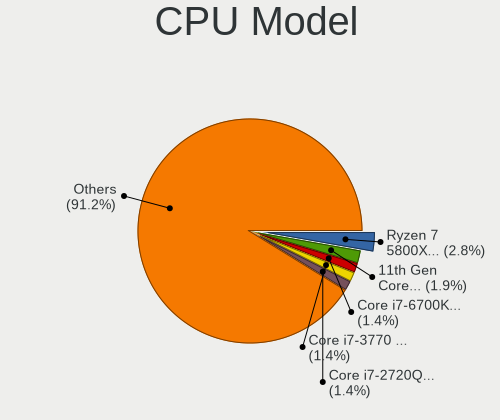
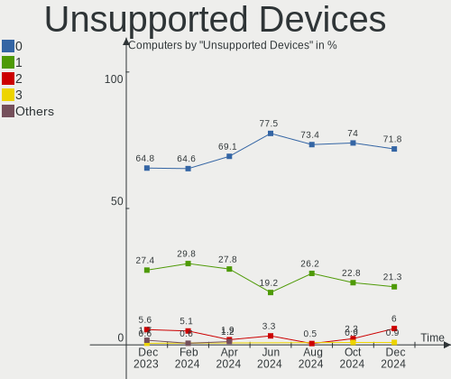

Pop!_OS Hardware Trends
-----------------------

A project to identify most popular hardware characteristics and track their change
over time based on data collected by Pop!_OS users at https://Linux-Hardware.org.

Anyone can contribute to the study by uploading probes of their computers by
the [hw-probe](https://github.com/linuxhw/hw-probe) tool:

    sudo -E hw-probe -all -upload

This is a report for all computer types. See also reports for [desktops](/Dist/Pop!_OS/Desktop/README.md) and [notebooks](/Dist/Pop!_OS/Notebook/README.md).

Full-feature report is available here: https://linux-hardware.org/?view=trends

Period: Nov, 2020.

Contents
--------

- [ OS                       ](#os)
- [ OS Family                ](#os-family)
- [ Kernel                   ](#kernel)
- [ Kernel Family            ](#kernel-family)
- [ Kernel Major Ver.        ](#kernel-major-ver)
- [ Arch                     ](#arch)
- [ DE                       ](#de)
- [ Display Server           ](#display-server)
- [ Display Manager          ](#display-manager)
- [ OS Lang                  ](#os-lang)
- [ Boot Mode                ](#boot-mode)
- [ Filesystem               ](#filesystem)
- [ Part. scheme             ](#part-scheme)
- [ Dual Boot with Linux/BSD ](#dual-boot-with-linux/bsd)
- [ Dual Boot (Win)          ](#dual-boot-win)
- [ Country                  ](#country)
- [ City                     ](#city)
- [ Vendor                   ](#vendor)
- [ Model                    ](#model)
- [ Model Family             ](#model-family)
- [ MFG Year                 ](#mfg-year)
- [ Form Factor              ](#form-factor)
- [ Secure Boot              ](#secure-boot)
- [ Coreboot                 ](#coreboot)
- [ RAM Size                 ](#ram-size)
- [ RAM Used                 ](#ram-used)
- [ Has CD-ROM               ](#has-cd-rom)
- [ Total Drives             ](#total-drives)
- [ Has Ethernet             ](#has-ethernet)
- [ Drive Vendor             ](#drive-vendor)
- [ Drive Model              ](#drive-model)
- [ HDD Vendor               ](#hdd-vendor)
- [ SSD Vendor               ](#ssd-vendor)
- [ Drive Kind               ](#drive-kind)
- [ Drive Connector          ](#drive-connector)
- [ Drive Size               ](#drive-size)
- [ Space Total              ](#space-total)
- [ Space Used               ](#space-used)
- [ Malfunc. Drives          ](#malfunc-drives)
- [ Malfunc. Drive Vendor    ](#malfunc-drive-vendor)
- [ Malfunc. HDD Vendor      ](#malfunc-hdd-vendor)
- [ Malfunc. Drive Kind      ](#malfunc-drive-kind)
- [ Failed Drives            ](#failed-drives)
- [ Failed Drive Vendor      ](#failed-drive-vendor)
- [ Drive Status             ](#drive-status)
- [ Storage Vendor           ](#storage-vendor)
- [ Storage Model            ](#storage-model)
- [ Storage Kind             ](#storage-kind)
- [ CPU Vendor               ](#cpu-vendor)
- [ CPU Model                ](#cpu-model)
- [ CPU Model Family         ](#cpu-model-family)
- [ CPU Cores                ](#cpu-cores)
- [ CPU Sockets              ](#cpu-sockets)
- [ CPU Threads              ](#cpu-threads)
- [ CPU Op-Modes             ](#cpu-op-modes)
- [ CPU Microcode            ](#cpu-microcode)
- [ CPU Microarch            ](#cpu-microarch)
- [ GPU Vendor               ](#gpu-vendor)
- [ GPU Model                ](#gpu-model)
- [ GPU Combo                ](#gpu-combo)
- [ GPU Driver               ](#gpu-driver)
- [ GPU Memory               ](#gpu-memory)
- [ Monitor Vendor           ](#monitor-vendor)
- [ Monitor Model            ](#monitor-model)
- [ Monitor Resolution       ](#monitor-resolution)
- [ Monitor Diagonal         ](#monitor-diagonal)
- [ Monitor Width            ](#monitor-width)
- [ Aspect Ratio             ](#aspect-ratio)
- [ Monitor Area             ](#monitor-area)
- [ Pixel Density            ](#pixel-density)
- [ Multiple Monitors        ](#multiple-monitors)
- [ Net Controller Vendor    ](#net-controller-vendor)
- [ Net Controller Model     ](#net-controller-model)
- [ Wireless Vendor          ](#wireless-vendor)
- [ Wireless Model           ](#wireless-model)
- [ Ethernet Vendor          ](#ethernet-vendor)
- [ Ethernet Model           ](#ethernet-model)
- [ Net Controller Kind      ](#net-controller-kind)
- [ Used Controller          ](#used-controller)
- [ NICs                     ](#nics)
- [ Memory Vendor            ](#memory-vendor)
- [ Memory Model             ](#memory-model)
- [ Memory Kind              ](#memory-kind)
- [ Memory Form Factor       ](#memory-form-factor)
- [ Memory Size              ](#memory-size)
- [ Memory Speed             ](#memory-speed)
- [ Sound Vendor             ](#sound-vendor)
- [ Sound Model              ](#sound-model)
- [ Camera Vendor            ](#camera-vendor)
- [ Camera Model             ](#camera-model)
- [ Fingerprint Vendor       ](#fingerprint-vendor)
- [ Fingerprint Model        ](#fingerprint-model)
- [ Chipcard Vendor          ](#chipcard-vendor)
- [ Chipcard Model           ](#chipcard-model)
- [ Printer Vendor           ](#printer-vendor)
- [ Printer Model            ](#printer-model)
- [ Scanner Vendor           ](#scanner-vendor)
- [ Scanner Model            ](#scanner-model)
- [ Bluetooth Vendor         ](#bluetooth-vendor)
- [ Bluetooth Model          ](#bluetooth-model)
- [ Unsupported Devices      ](#unsupported-devices)
- [ Unsupported Device Types ](#unsupported-device-types)

OS
--

Installed operating systems

| Name          | Computers | Percent |
|---------------|-----------|---------|
| Pop!_OS 20.10 | 201       | 74.72%  |
| Pop!_OS 20.04 | 67        | 24.91%  |
| Pop!_OS 18.04 | 1         | 0.37%   |

OS Family
---------

OS without a version

| Name    | Computers | Percent |
|---------|-----------|---------|
| Pop!_OS | 269       | 100%    |

Kernel
------

Version of the Linux kernel

| Version                  | Computers | Percent |
|--------------------------|-----------|---------|
| 5.8.0-7630-generic       | 121       | 44.98%  |
| 5.8.0-7625-generic       | 106       | 39.41%  |
| 5.4.0-7642-generic       | 24        | 8.92%   |
| 5.8.18-050818-generic    | 2         | 0.74%   |
| 5.8.17-050817-generic    | 2         | 0.74%   |
| 5.4.0-7634-generic       | 2         | 0.74%   |
| 5.9.9-xanmod1            | 1         | 0.37%   |
| 5.9.3-050903-generic     | 1         | 0.37%   |
| 5.9.11-xanmod1           | 1         | 0.37%   |
| 5.8.9-050809-generic     | 1         | 0.37%   |
| 5.8.16-tkg-bmq           | 1         | 0.37%   |
| 5.8.12-050812-generic    | 1         | 0.37%   |
| 5.8.11-050811-generic    | 1         | 0.37%   |
| 5.4.0-7626-generic       | 1         | 0.37%   |
| 5.4.0-7625-generic       | 1         | 0.37%   |
| 5.3.0-7648-generic       | 1         | 0.37%   |
| 5.10.0-051000rc4-generic | 1         | 0.37%   |
| 5.10.0-051000rc2-generic | 1         | 0.37%   |

Kernel Family
-------------

Linux kernel without a distro release

| Version | Computers | Percent |
|---------|-----------|---------|
| 5.8.0   | 227       | 84.39%  |
| 5.4.0   | 28        | 10.41%  |
| 5.8.18  | 2         | 0.74%   |
| 5.8.17  | 2         | 0.74%   |
| 5.10.0  | 2         | 0.74%   |
| 5.9.9   | 1         | 0.37%   |
| 5.9.3   | 1         | 0.37%   |
| 5.9.11  | 1         | 0.37%   |
| 5.8.9   | 1         | 0.37%   |
| 5.8.16  | 1         | 0.37%   |
| 5.8.12  | 1         | 0.37%   |
| 5.8.11  | 1         | 0.37%   |
| 5.3.0   | 1         | 0.37%   |

Kernel Major Ver.
-----------------

Linux kernel major version

| Version | Computers | Percent |
|---------|-----------|---------|
| 5.8     | 235       | 87.36%  |
| 5.4     | 28        | 10.41%  |
| 5.9     | 3         | 1.12%   |
| 5.10    | 2         | 0.74%   |
| 5.3     | 1         | 0.37%   |

Arch
----

OS architecture (x86_64, i586, etc.)

| Name   | Computers | Percent |
|--------|-----------|---------|
| x86_64 | 269       | 100%    |

DE
--

Desktop Environment

| Name       | Computers | Percent |
|------------|-----------|---------|
| GNOME      | 255       | 94.8%   |
| KDE        | 4         | 1.49%   |
| X-Cinnamon | 2         | 0.74%   |
| KDE5       | 2         | 0.74%   |
| XFCE       | 1         | 0.37%   |
| MATE       | 1         | 0.37%   |
| LXQt       | 1         | 0.37%   |
| i3         | 1         | 0.37%   |
| Budgie     | 1         | 0.37%   |
| Unknown    | 1         | 0.37%   |

Display Server
--------------

X11 or Wayland

| Name    | Computers | Percent |
|---------|-----------|---------|
| X11     | 261       | 97.03%  |
| Wayland | 5         | 1.86%   |
| Tty     | 2         | 0.74%   |
| Unknown | 1         | 0.37%   |

Display Manager
---------------

SDDM, LightDM, etc.

| Name    | Computers | Percent |
|---------|-----------|---------|
| Unknown | 226       | 84.01%  |
| GDM     | 42        | 15.61%  |
| TDM     | 1         | 0.37%   |

OS Lang
-------

Language

| Lang    | Computers | Percent |
|---------|-----------|---------|
| en_US   | 156       | 57.99%  |
| en_GB   | 27        | 10.04%  |
| pt_BR   | 19        | 7.06%   |
| de_DE   | 12        | 4.46%   |
| C       | 11        | 4.09%   |
| en_CA   | 9         | 3.35%   |
| ru_RU   | 7         | 2.6%    |
| fr_FR   | 7         | 2.6%    |
| en_AU   | 5         | 1.86%   |
| es_ES   | 4         | 1.49%   |
| it_IT   | 3         | 1.12%   |
| pl_PL   | 2         | 0.74%   |
| tr_TR   | 1         | 0.37%   |
| sv_SE   | 1         | 0.37%   |
| sk_SK   | 1         | 0.37%   |
| pt_PT   | 1         | 0.37%   |
| nl_NL   | 1         | 0.37%   |
| fr_CA   | 1         | 0.37%   |
| Unknown | 1         | 0.37%   |

Boot Mode
---------

EFI or BIOS

| Mode | Computers | Percent |
|------|-----------|---------|
| BIOS | 221       | 82.16%  |
| EFI  | 48        | 17.84%  |

Filesystem
----------

Type of filesystem

| Type    | Computers | Percent |
|---------|-----------|---------|
| Ext4    | 261       | 97.03%  |
| Overlay | 5         | 1.86%   |
| Btrfs   | 2         | 0.74%   |
| Xfs     | 1         | 0.37%   |

Part. scheme
------------

Scheme of partitioning

| Type    | Computers | Percent |
|---------|-----------|---------|
| Unknown | 226       | 84.01%  |
| GPT     | 38        | 14.13%  |
| MBR     | 5         | 1.86%   |

Dual Boot with Linux/BSD
------------------------

Hosting more than one Linux/BSD

| Dual boot | Computers | Percent |
|-----------|-----------|---------|
| No        | 261       | 97.03%  |
| Yes       | 8         | 2.97%   |

Dual Boot (Win)
---------------

Hosting Linux and Windows

| Dual boot | Computers | Percent |
|-----------|-----------|---------|
| No        | 250       | 92.94%  |
| Yes       | 19        | 7.06%   |

Country
-------

Geographic location (country)

| Country        | Computers | Percent |
|----------------|-----------|---------|
| USA            | 82        | 30.48%  |
| Brazil         | 25        | 9.29%   |
| Germany        | 21        | 7.81%   |
| UK             | 14        | 5.2%    |
| Canada         | 14        | 5.2%    |
| Netherlands    | 8         | 2.97%   |
| India          | 8         | 2.97%   |
| France         | 8         | 2.97%   |
| Spain          | 7         | 2.6%    |
| Russia         | 7         | 2.6%    |
| Italy          | 6         | 2.23%   |
| Sweden         | 5         | 1.86%   |
| Australia      | 5         | 1.86%   |
| Ukraine        | 4         | 1.49%   |
| Mexico         | 4         | 1.49%   |
| Turkey         | 3         | 1.12%   |
| Slovenia       | 3         | 1.12%   |
| Romania        | 3         | 1.12%   |
| Poland         | 3         | 1.12%   |
| Norway         | 3         | 1.12%   |
| Greece         | 3         | 1.12%   |
| Switzerland    | 2         | 0.74%   |
| South Africa   | 2         | 0.74%   |
| Philippines    | 2         | 0.74%   |
| Japan          | 2         | 0.74%   |
| Austria        | 2         | 0.74%   |
| Argentina      | 2         | 0.74%   |
| UAE            | 1         | 0.37%   |
| Slovakia       | 1         | 0.37%   |
| Serbia         | 1         | 0.37%   |
| Saudi Arabia   | 1         | 0.37%   |
| Portugal       | 1         | 0.37%   |
| New Zealand    | 1         | 0.37%   |
| Mauritius      | 1         | 0.37%   |
| Malaysia       | 1         | 0.37%   |
| Latvia         | 1         | 0.37%   |
| Jordan         | 1         | 0.37%   |
| Ireland        | 1         | 0.37%   |
| Iran           | 1         | 0.37%   |
| Hungary        | 1         | 0.37%   |
| Hong Kong      | 1         | 0.37%   |
| Finland        | 1         | 0.37%   |
| Denmark        | 1         | 0.37%   |
| Czech Republic | 1         | 0.37%   |
| Croatia        | 1         | 0.37%   |
| Belgium        | 1         | 0.37%   |
| Belarus        | 1         | 0.37%   |
| Unknown        | 1         | 0.37%   |

City
----

Geographic location (city)

| City                   | Computers | Percent |
|------------------------|-----------|---------|
| São Paulo             | 4         | 1.49%   |
| Orlando                | 4         | 1.49%   |
| Miami                  | 3         | 1.12%   |
| Los Angeles            | 3         | 1.12%   |
| Brasília              | 3         | 1.12%   |
| Vancouver              | 2         | 0.74%   |
| Sydney                 | 2         | 0.74%   |
| Seattle                | 2         | 0.74%   |
| Ribeirão Preto        | 2         | 0.74%   |
| Palermo                | 2         | 0.74%   |
| Munich                 | 2         | 0.74%   |
| Moscow                 | 2         | 0.74%   |
| Kyiv                   | 2         | 0.74%   |
| Houston                | 2         | 0.74%   |
| Erftstadt              | 2         | 0.74%   |
| Dallas                 | 2         | 0.74%   |
| Cologne                | 2         | 0.74%   |
| Chennai                | 2         | 0.74%   |
| Barcelona              | 2         | 0.74%   |
| Austin                 | 2         | 0.74%   |
| Alicante               | 2         | 0.74%   |
| Zurich                 | 1         | 0.37%   |
| Zhashkiv               | 1         | 0.37%   |
| Zagreb                 | 1         | 0.37%   |
| Wurzburg               | 1         | 0.37%   |
| Wrocław               | 1         | 0.37%   |
| Woodland Hills         | 1         | 0.37%   |
| Westlake               | 1         | 0.37%   |
| West Lafayette         | 1         | 0.37%   |
| West Jordan            | 1         | 0.37%   |
| Wellington             | 1         | 0.37%   |
| Waxahachie             | 1         | 0.37%   |
| Watertown              | 1         | 0.37%   |
| Washington             | 1         | 0.37%   |
| Warragul               | 1         | 0.37%   |
| Wantirna South         | 1         | 0.37%   |
| Walbridge              | 1         | 0.37%   |
| Volzhskiy              | 1         | 0.37%   |
| Vitebsk                | 1         | 0.37%   |
| Villa Heights          | 1         | 0.37%   |
| Vienna                 | 1         | 0.37%   |
| Verona                 | 1         | 0.37%   |
| Utrecht                | 1         | 0.37%   |
| Uppsala                | 1         | 0.37%   |
| Ukiah                  | 1         | 0.37%   |
| UEbach-Palenberg       | 1         | 0.37%   |
| Târgu Mureş          | 1         | 0.37%   |
| Târgovişte           | 1         | 0.37%   |
| Tucson                 | 1         | 0.37%   |
| Trivandrum             | 1         | 0.37%   |
| Trenton                | 1         | 0.37%   |
| Toronto                | 1         | 0.37%   |
| Tire                   | 1         | 0.37%   |
| Thessaloniki           | 1         | 0.37%   |
| The Hague              | 1         | 0.37%   |
| Taquari                | 1         | 0.37%   |
| Tangocho-taiza         | 1         | 0.37%   |
| São José dos Campos  | 1         | 0.37%   |
| São Bernardo do Campo | 1         | 0.37%   |
| Swindon                | 1         | 0.37%   |

Vendor
------

Motherboard manufacturer

| Name                | Computers | Percent |
|---------------------|-----------|---------|
| Lenovo              | 46        | 17.1%   |
| ASUSTek Computer    | 45        | 16.73%  |
| Dell                | 29        | 10.78%  |
| Hewlett-Packard     | 28        | 10.41%  |
| Gigabyte Technology | 28        | 10.41%  |
| MSI                 | 20        | 7.43%   |
| ASRock              | 9         | 3.35%   |
| Acer                | 9         | 3.35%   |
| Toshiba             | 8         | 2.97%   |
| System76            | 8         | 2.97%   |
| Apple               | 6         | 2.23%   |
| Sony                | 5         | 1.86%   |
| Intel               | 5         | 1.86%   |
| Microsoft           | 3         | 1.12%   |
| Supermicro          | 2         | 0.74%   |
| Positivo            | 2         | 0.74%   |
| Pegatron            | 2         | 0.74%   |
| HASEE Computer      | 2         | 0.74%   |
| Teclast             | 1         | 0.37%   |
| PC Specialist       | 1         | 0.37%   |
| Packard Bell        | 1         | 0.37%   |
| Notebook            | 1         | 0.37%   |
| NEC Computers       | 1         | 0.37%   |
| Medion              | 1         | 0.37%   |
| IBM                 | 1         | 0.37%   |
| HUAWEI              | 1         | 0.37%   |
| HOUTER              | 1         | 0.37%   |
| Google              | 1         | 0.37%   |
| Chuwi               | 1         | 0.37%   |
| Acidanthera         | 1         | 0.37%   |

Model
-----

Motherboard model

| Name                          | Computers | Percent |
|-------------------------------|-----------|---------|
| ASUS All Series               | 4         | 1.49%   |
| System76 Gazelle              | 3         | 1.12%   |
| System76 Oryx Pro             | 2         | 0.74%   |
| MSI MS-7C02                   | 2         | 0.74%   |
| MSI MS-7B86                   | 2         | 0.74%   |
| HP Laptop 14-dk0xxx           | 2         | 0.74%   |
| Gigabyte B550I AORUS PRO AX   | 2         | 0.74%   |
| Gigabyte B450M S2H            | 2         | 0.74%   |
| Gigabyte B450M DS3H           | 2         | 0.74%   |
| Dell XPS 15 9550              | 2         | 0.74%   |
| ASUS TUF GAMING X570-PLUS     | 2         | 0.74%   |
| ASUS PRIME B450M-A            | 2         | 0.74%   |
| Acer Aspire E5-575G           | 2         | 0.74%   |
| Toshiba Satellite U940        | 1         | 0.37%   |
| Toshiba Satellite S50-B       | 1         | 0.37%   |
| Toshiba Satellite P50t-B      | 1         | 0.37%   |
| Toshiba Satellite L655        | 1         | 0.37%   |
| Toshiba Satellite L40         | 1         | 0.37%   |
| Toshiba Satellite C850-D9K    | 1         | 0.37%   |
| Toshiba Satellite C660D       | 1         | 0.37%   |
| Toshiba Satellite C650D       | 1         | 0.37%   |
| Teclast F7 Plus               | 1         | 0.37%   |
| System76 Lemur Pro            | 1         | 0.37%   |
| System76 Galago Pro           | 1         | 0.37%   |
| System76 Darter Pro           | 1         | 0.37%   |
| Supermicro X8DTH-i/6/iF/6F    | 1         | 0.37%   |
| Supermicro X7DVL              | 1         | 0.37%   |
| Sony VPCZ133GX                | 1         | 0.37%   |
| Sony VPCSB35FB                | 1         | 0.37%   |
| Sony VPCEH32FX                | 1         | 0.37%   |
| Sony VGN-SZ71VN_X             | 1         | 0.37%   |
| Sony VGN-AR21B                | 1         | 0.37%   |
| Positivo POS-PQ45AU           | 1         | 0.37%   |
| Positivo POS-EIH61CR          | 1         | 0.37%   |
| Pegatron p6-2100z             | 1         | 0.37%   |
| Pegatron IPMH61P1             | 1         | 0.37%   |
| PC Specialist GK7NR0R         | 1         | 0.37%   |
| Packard Bell ENNS44HR         | 1         | 0.37%   |
| Notebook NH50_70RA            | 1         | 0.37%   |
| NEC Computers PC-MK36LBZCHEAM | 1         | 0.37%   |
| MSI Prestige 15 A10SC         | 1         | 0.37%   |
| MSI MS-7C91                   | 1         | 0.37%   |
| MSI MS-7C52                   | 1         | 0.37%   |
| MSI MS-7C37                   | 1         | 0.37%   |
| MSI MS-7B87                   | 1         | 0.37%   |
| MSI MS-7B58                   | 1         | 0.37%   |
| MSI MS-7B22                   | 1         | 0.37%   |
| MSI MS-7A71                   | 1         | 0.37%   |
| MSI MS-7A70                   | 1         | 0.37%   |
| MSI MS-7921                   | 1         | 0.37%   |
| MSI MS-7917                   | 1         | 0.37%   |
| MSI MEGA BOOK S430            | 1         | 0.37%   |
| MSI GS70 2OD                  | 1         | 0.37%   |
| MSI GS63VR 6RF                | 1         | 0.37%   |
| MSI GP73 Leopard 8RE          | 1         | 0.37%   |
| MSI GP60 2PE                  | 1         | 0.37%   |
| Microsoft Surface Pro 4       | 1         | 0.37%   |
| Microsoft Surface Pro 3       | 1         | 0.37%   |
| Microsoft Surface Book        | 1         | 0.37%   |
| Medion Akoya P5286 E/B549     | 1         | 0.37%   |

Model Family
------------

Motherboard model prefix

| Name                          | Computers | Percent |
|-------------------------------|-----------|---------|
| Lenovo ThinkPad               | 23        | 8.55%   |
| Dell Inspiron                 | 14        | 5.2%    |
| Lenovo IdeaPad                | 10        | 3.72%   |
| Toshiba Satellite             | 8         | 2.97%   |
| ASUS ROG                      | 8         | 2.97%   |
| Dell XPS                      | 7         | 2.6%    |
| HP Laptop                     | 6         | 2.23%   |
| ASUS PRIME                    | 6         | 2.23%   |
| Gigabyte B450                 | 5         | 1.86%   |
| ASUS TUF                      | 5         | 1.86%   |
| Acer Aspire                   | 5         | 1.86%   |
| Lenovo Yoga                   | 4         | 1.49%   |
| HP Compaq                     | 4         | 1.49%   |
| Gigabyte B450M                | 4         | 1.49%   |
| ASUS All                      | 4         | 1.49%   |
| System76 Gazelle              | 3         | 1.12%   |
| Microsoft Surface             | 3         | 1.12%   |
| HP ProBook                    | 3         | 1.12%   |
| HP ENVY                       | 3         | 1.12%   |
| System76 Oryx                 | 2         | 0.74%   |
| MSI MS-7C02                   | 2         | 0.74%   |
| MSI MS-7B86                   | 2         | 0.74%   |
| Lenovo MIIX                   | 2         | 0.74%   |
| Lenovo Legion                 | 2         | 0.74%   |
| HP Spectre                    | 2         | 0.74%   |
| HP Pavilion                   | 2         | 0.74%   |
| Gigabyte X570                 | 2         | 0.74%   |
| Gigabyte TRX40                | 2         | 0.74%   |
| Gigabyte B550I                | 2         | 0.74%   |
| Dell Venue                    | 2         | 0.74%   |
| Dell Precision                | 2         | 0.74%   |
| Dell OptiPlex                 | 2         | 0.74%   |
| Dell Latitude                 | 2         | 0.74%   |
| ASUS ZenBook                  | 2         | 0.74%   |
| ASUS SABERTOOTH               | 2         | 0.74%   |
| Teclast F7                    | 1         | 0.37%   |
| System76 Lemur                | 1         | 0.37%   |
| System76 Galago               | 1         | 0.37%   |
| System76 Darter               | 1         | 0.37%   |
| Supermicro X8DTH-i            | 1         | 0.37%   |
| Supermicro X7DVL              | 1         | 0.37%   |
| Sony VPCZ133GX                | 1         | 0.37%   |
| Sony VPCSB35FB                | 1         | 0.37%   |
| Sony VPCEH32FX                | 1         | 0.37%   |
| Sony VGN-SZ71VN               | 1         | 0.37%   |
| Sony VGN-AR21B                | 1         | 0.37%   |
| Positivo POS-PQ45AU           | 1         | 0.37%   |
| Positivo POS-EIH61CR          | 1         | 0.37%   |
| Pegatron p6-2100z             | 1         | 0.37%   |
| Pegatron IPMH61P1             | 1         | 0.37%   |
| PC Specialist GK7NR0R         | 1         | 0.37%   |
| Packard Bell ENNS44HR         | 1         | 0.37%   |
| Notebook NH50                 | 1         | 0.37%   |
| NEC Computers PC-MK36LBZCHEAM | 1         | 0.37%   |
| MSI Prestige                  | 1         | 0.37%   |
| MSI MS-7C91                   | 1         | 0.37%   |
| MSI MS-7C52                   | 1         | 0.37%   |
| MSI MS-7C37                   | 1         | 0.37%   |
| MSI MS-7B87                   | 1         | 0.37%   |
| MSI MS-7B58                   | 1         | 0.37%   |

MFG Year
--------

Motherboard manufacture year

| Year | Computers | Percent |
|------|-----------|---------|
| 2020 | 75        | 27.88%  |
| 2019 | 64        | 23.79%  |
| 2018 | 29        | 10.78%  |
| 2014 | 15        | 5.58%   |
| 2013 | 15        | 5.58%   |
| 2012 | 14        | 5.2%    |
| 2011 | 14        | 5.2%    |
| 2015 | 11        | 4.09%   |
| 2010 | 10        | 3.72%   |
| 2017 | 7         | 2.6%    |
| 2008 | 5         | 1.86%   |
| 2016 | 4         | 1.49%   |
| 2009 | 3         | 1.12%   |
| 2007 | 3         | 1.12%   |

Form Factor
-----------

Physical design of the computer

| Name        | Computers | Percent |
|-------------|-----------|---------|
| Notebook    | 139       | 51.67%  |
| Desktop     | 105       | 39.03%  |
| Convertible | 12        | 4.46%   |
| Tablet      | 5         | 1.86%   |
| Mini pc     | 3         | 1.12%   |
| Server      | 3         | 1.12%   |
| All in one  | 2         | 0.74%   |

Secure Boot
-----------

Enabled or disabled

| State    | Computers | Percent |
|----------|-----------|---------|
| Disabled | 269       | 100%    |

Coreboot
--------

Have coreboot on board

| Used | Computers | Percent |
|------|-----------|---------|
| No   | 266       | 98.88%  |
| Yes  | 3         | 1.12%   |

RAM Size
--------

Total RAM memory

| Size in GB  | Computers | Percent |
|-------------|-----------|---------|
| 16.01-24.0  | 75        | 27.88%  |
| 4.01-8.0    | 56        | 20.82%  |
| 8.01-16.0   | 48        | 17.84%  |
| 3.01-4.0    | 39        | 14.5%   |
| 32.01-64.0  | 22        | 8.18%   |
| 24.01-32.0  | 12        | 4.46%   |
| 64.01-256.0 | 10        | 3.72%   |
| 1.01-2.0    | 6         | 2.23%   |
| 2.01-3.0    | 1         | 0.37%   |

RAM Used
--------

Used RAM memory

| Used GB    | Computers | Percent |
|------------|-----------|---------|
| 1.01-2.0   | 88        | 32.71%  |
| 2.01-3.0   | 81        | 30.11%  |
| 4.01-8.0   | 53        | 19.7%   |
| 3.01-4.0   | 38        | 14.13%  |
| 8.01-16.0  | 6         | 2.23%   |
| 0.01-1.0   | 2         | 0.74%   |
| 16.01-24.0 | 1         | 0.37%   |

Has CD-ROM
----------

Has CD-ROM on board

| Presented | Computers | Percent |
|-----------|-----------|---------|
| No        | 182       | 67.66%  |
| Yes       | 87        | 32.34%  |

Total Drives
------------

Number of drives on board

| Drives | Computers | Percent |
|--------|-----------|---------|
| 1      | 147       | 54.65%  |
| 2      | 66        | 24.54%  |
| 3      | 32        | 11.9%   |
| 4      | 15        | 5.58%   |
| 5      | 3         | 1.12%   |
| 0      | 3         | 1.12%   |
| 8      | 2         | 0.74%   |
| 6      | 1         | 0.37%   |

Has Ethernet
------------

Has Ethernet on board

| Presented | Computers | Percent |
|-----------|-----------|---------|
| Yes       | 220       | 81.78%  |
| No        | 49        | 18.22%  |

Drive Vendor
------------

Hard drive vendors

| Vendor                    | Computers | Drives | Percent |
|---------------------------|-----------|--------|---------|
| Samsung Electronics       | 84        | 106    | 20.39%  |
| Seagate                   | 66        | 79     | 16.02%  |
| WDC                       | 47        | 54     | 11.41%  |
| Toshiba                   | 30        | 30     | 7.28%   |
| Kingston                  | 27        | 32     | 6.55%   |
| SanDisk                   | 22        | 24     | 5.34%   |
| SK Hynix                  | 15        | 16     | 3.64%   |
| Intel                     | 14        | 18     | 3.4%    |
| Unknown                   | 13        | 15     | 3.16%   |
| Crucial                   | 11        | 11     | 2.67%   |
| Phison                    | 8         | 9      | 1.94%   |
| Micron Technology         | 8         | 8      | 1.94%   |
| A-DATA Technology         | 8         | 10     | 1.94%   |
| PNY                       | 7         | 7      | 1.7%    |
| Hitachi                   | 6         | 6      | 1.46%   |
| Silicon Motion            | 5         | 5      | 1.21%   |
| XPG                       | 4         | 4      | 0.97%   |
| Micron/Crucial Technology | 4         | 4      | 0.97%   |
| HGST                      | 3         | 3      | 0.73%   |
| China                     | 3         | 3      | 0.73%   |
| LITEON                    | 2         | 2      | 0.49%   |
| Fujitsu                   | 2         | 2      | 0.49%   |
| Apple                     | 2         | 2      | 0.49%   |
| Transcend                 | 1         | 1      | 0.24%   |
| Team                      | 1         | 1      | 0.24%   |
| SPCC                      | 1         | 2      | 0.24%   |
| PLEXTOR                   | 1         | 1      | 0.24%   |
| Patriot                   | 1         | 1      | 0.24%   |
| OWC                       | 1         | 1      | 0.24%   |
| OCZ                       | 1         | 1      | 0.24%   |
| NVMe                      | 1         | 1      | 0.24%   |
| MKNSSDPL                  | 1         | 1      | 0.24%   |
| Maxtor                    | 1         | 1      | 0.24%   |
| Lenovo                    | 1         | 1      | 0.24%   |
| KIOXIA-EXCERIA            | 1         | 1      | 0.24%   |
| KIOXIA-E                  | 1         | 1      | 0.24%   |
| KIOXIA                    | 1         | 1      | 0.24%   |
| Kingmax                   | 1         | 1      | 0.24%   |
| JMicron                   | 1         | 1      | 0.24%   |
| Intenso                   | 1         | 1      | 0.24%   |
| HPE                       | 1         | 1      | 0.24%   |
| GOODRAM                   | 1         | 1      | 0.24%   |
| Corsair                   | 1         | 1      | 0.24%   |
| ADATA Technology          | 1         | 1      | 0.24%   |

Drive Model
-----------

Hard drive models

| Model                                | Computers | Percent |
|--------------------------------------|-----------|---------|
| Samsung SSD 860 EVO 1TB              | 10        | 2.2%    |
| Kingston SA400S37240G 240GB SSD      | 10        | 2.2%    |
| Seagate ST1000DM010-2EP102 1TB       | 6         | 1.32%   |
| Samsung NVMe SSD Drive 500GB         | 6         | 1.32%   |
| Samsung NVMe SSD Drive 256GB         | 6         | 1.32%   |
| Samsung NVMe SSD Drive 250GB         | 6         | 1.32%   |
| Toshiba MQ01ABD100 1TB               | 5         | 1.1%    |
| Seagate ST9500325AS 500GB            | 5         | 1.1%    |
| Seagate ST500DM002-1BD142 500GB      | 5         | 1.1%    |
| Seagate ST2000DM008-2FR102 2TB       | 5         | 1.1%    |
| Samsung SSD 850 EVO 250GB            | 5         | 1.1%    |
| Samsung NVMe SSD Drive 512GB         | 5         | 1.1%    |
| Samsung NVMe SSD Drive 1TB           | 5         | 1.1%    |
| Intel NVMe SSD Drive 512GB           | 5         | 1.1%    |
| SK Hynix NVMe SSD Drive 256GB        | 4         | 0.88%   |
| Seagate ST1000LM035-1RK172 1TB       | 4         | 0.88%   |
| Samsung SSD 860 EVO 500GB            | 4         | 0.88%   |
| Samsung SSD 850 EVO 500GB            | 4         | 0.88%   |
| Kingston SA400S37480G 480GB SSD      | 4         | 0.88%   |
| WDC WDS240G2G0B-00EPW0 240GB SSD     | 3         | 0.66%   |
| WDC WD10EZEX-08WN4A0 1TB             | 3         | 0.66%   |
| WDC WD10EZEX-00BN5A0 1TB             | 3         | 0.66%   |
| Unknown MMC Card  32GB               | 3         | 0.66%   |
| Toshiba NVMe SSD Drive 512GB         | 3         | 0.66%   |
| SK Hynix NVMe SSD Drive 512GB        | 3         | 0.66%   |
| Seagate ST31000524AS 1TB             | 3         | 0.66%   |
| Seagate ST1000LM048-2E7172 1TB       | 3         | 0.66%   |
| Seagate ST1000DM003-1ER162 1TB       | 3         | 0.66%   |
| Sandisk NVMe SSD Drive 512GB         | 3         | 0.66%   |
| Sandisk NVMe SSD Drive 500GB         | 3         | 0.66%   |
| Samsung SSD 970 EVO 500GB            | 3         | 0.66%   |
| Samsung SSD 840 EVO 250GB            | 3         | 0.66%   |
| Micron/Crucial NVMe SSD Drive 1TB    | 3         | 0.66%   |
| Kingston SA400S37120G 120GB SSD      | 3         | 0.66%   |
| HGST HTS721010A9E630 1TB             | 3         | 0.66%   |
| Crucial CT480BX500SSD1 480GB         | 3         | 0.66%   |
| XPG NVMe SSD Drive 256GB             | 2         | 0.44%   |
| WDC WDS500G2B0B-00YS70 500GB SSD     | 2         | 0.44%   |
| WDC WDS240G2G0A-00JH30 240GB SSD     | 2         | 0.44%   |
| WDC WD3200AAKS-75L9A0 320GB          | 2         | 0.44%   |
| WDC WD30EZRX-00MMMB0 3TB             | 2         | 0.44%   |
| WDC WD10SPZX-24Z10 1TB               | 2         | 0.44%   |
| Unknown MMC Card  64GB               | 2         | 0.44%   |
| Silicon Motion NVMe SSD Drive 1TB    | 2         | 0.44%   |
| Seagate ST8000DM004-2CX188 8TB       | 2         | 0.44%   |
| Seagate ST500LT012-1DG142 500GB      | 2         | 0.44%   |
| Seagate ST2000DX001-1NS164 2TB       | 2         | 0.44%   |
| Seagate ST1000LX015-1U7172 1TB       | 2         | 0.44%   |
| Seagate ST1000LM024 HN-M101MBB 1TB   | 2         | 0.44%   |
| Seagate ST1000DM003-1CH162 1TB       | 2         | 0.44%   |
| SanDisk SSD PLUS 240GB               | 2         | 0.44%   |
| SanDisk SSD G5 BICS4 1TB             | 2         | 0.44%   |
| Samsung SSD 970 EVO Plus 1TB         | 2         | 0.44%   |
| Samsung SSD 860 EVO 250GB            | 2         | 0.44%   |
| Samsung NVMe SSD Drive 128GB         | 2         | 0.44%   |
| Samsung MZ7TY256HDHP-000L7 256GB SSD | 2         | 0.44%   |
| Samsung MZ7TD512HAGM-000L1 512GB SSD | 2         | 0.44%   |
| Samsung HD103SJ 1TB                  | 2         | 0.44%   |
| PNY CS900 120GB SSD                  | 2         | 0.44%   |
| Phison Sabrent Rocket 4.0 1TB        | 2         | 0.44%   |

HDD Vendor
----------

Hard disk drive vendors

| Vendor              | Computers | Drives | Percent |
|---------------------|-----------|--------|---------|
| Seagate             | 62        | 73     | 46.27%  |
| WDC                 | 35        | 39     | 26.12%  |
| Toshiba             | 20        | 20     | 14.93%  |
| Hitachi             | 6         | 6      | 4.48%   |
| Samsung Electronics | 4         | 4      | 2.99%   |
| HGST                | 3         | 3      | 2.24%   |
| Fujitsu             | 2         | 2      | 1.49%   |
| Unknown             | 1         | 1      | 0.75%   |
| Apple               | 1         | 1      | 0.75%   |

SSD Vendor
----------

Solid state drive vendors

| Vendor              | Computers | Drives | Percent |
|---------------------|-----------|--------|---------|
| Samsung Electronics | 50        | 60     | 29.94%  |
| Kingston            | 23        | 26     | 13.77%  |
| SanDisk             | 14        | 15     | 8.38%   |
| WDC                 | 12        | 12     | 7.19%   |
| Crucial             | 11        | 11     | 6.59%   |
| Micron Technology   | 8         | 8      | 4.79%   |
| PNY                 | 7         | 7      | 4.19%   |
| A-DATA Technology   | 7         | 9      | 4.19%   |
| SK Hynix            | 6         | 6      | 3.59%   |
| Toshiba             | 4         | 4      | 2.4%    |
| Intel               | 3         | 4      | 1.8%    |
| China               | 3         | 3      | 1.8%    |
| Unknown             | 2         | 2      | 1.2%    |
| Transcend           | 1         | 1      | 0.6%    |
| Team                | 1         | 1      | 0.6%    |
| SPCC                | 1         | 2      | 0.6%    |
| Seagate             | 1         | 1      | 0.6%    |
| PLEXTOR             | 1         | 1      | 0.6%    |
| Patriot             | 1         | 1      | 0.6%    |
| OWC                 | 1         | 1      | 0.6%    |
| OCZ                 | 1         | 1      | 0.6%    |
| Maxtor              | 1         | 1      | 0.6%    |
| LITEON              | 1         | 1      | 0.6%    |
| KIOXIA-EXCERIA      | 1         | 1      | 0.6%    |
| KIOXIA-E            | 1         | 1      | 0.6%    |
| Kingmax             | 1         | 1      | 0.6%    |
| Intenso             | 1         | 1      | 0.6%    |
| GOODRAM             | 1         | 1      | 0.6%    |
| Corsair             | 1         | 1      | 0.6%    |
| Apple               | 1         | 1      | 0.6%    |

Drive Kind
----------

HDD or SSD

| Kind    | Computers | Drives | Percent |
|---------|-----------|--------|---------|
| SSD     | 141       | 185    | 37.4%   |
| HDD     | 119       | 149    | 31.56%  |
| NVMe    | 99        | 118    | 26.26%  |
| MMC     | 9         | 11     | 2.39%   |
| Unknown | 9         | 9      | 2.39%   |

Drive Connector
---------------

SATA, SAS, NVMe, etc.

| Type | Computers | Drives | Percent |
|------|-----------|--------|---------|
| SATA | 205       | 329    | 62.69%  |
| NVMe | 99        | 118    | 30.28%  |
| SAS  | 14        | 14     | 4.28%   |
| MMC  | 9         | 11     | 2.75%   |

Drive Size
----------

Size of hard drive

| Size in TB | Computers | Drives | Percent |
|------------|-----------|--------|---------|
| 0.01-0.5   | 151       | 195    | 56.34%  |
| 0.51-1.0   | 81        | 99     | 30.22%  |
| 1.01-2.0   | 17        | 19     | 6.34%   |
| 2.01-3.0   | 8         | 10     | 2.99%   |
| 3.01-4.0   | 5         | 5      | 1.87%   |
| 4.01-10.0  | 5         | 5      | 1.87%   |
| 10.01-20.0 | 1         | 1      | 0.37%   |

Space Total
-----------

Amount of disk space available on the file system

| Size in GB     | Computers | Percent |
|----------------|-----------|---------|
| 101-250        | 89        | 33.09%  |
| 251-500        | 74        | 27.51%  |
| 501-1000       | 35        | 13.01%  |
| 1001-2000      | 20        | 7.43%   |
| 51-100         | 17        | 6.32%   |
| More than 3000 | 11        | 4.09%   |
| 21-50          | 10        | 3.72%   |
| 1-20           | 7         | 2.6%    |
| 2001-3000      | 5         | 1.86%   |
| Unknown        | 1         | 0.37%   |

Space Used
----------

Amount of used disk space

| Used GB        | Computers | Percent |
|----------------|-----------|---------|
| 1-20           | 106       | 39.41%  |
| 21-50          | 52        | 19.33%  |
| 51-100         | 35        | 13.01%  |
| 101-250        | 34        | 12.64%  |
| 251-500        | 15        | 5.58%   |
| 501-1000       | 14        | 5.2%    |
| More than 3000 | 4         | 1.49%   |
| 2001-3000      | 4         | 1.49%   |
| 1001-2000      | 4         | 1.49%   |
| Unknown        | 1         | 0.37%   |

Malfunc. Drives
---------------

Drive models with a malfunction

| Model                          | Computers | Drives | Percent |
|--------------------------------|-----------|--------|---------|
| Toshiba MQ01ABD032 320GB       | 1         | 1      | 25%     |
| Seagate ST1000LM049-2GH172 1TB | 1         | 1      | 25%     |
| Intenso SSD 128GB              | 1         | 1      | 25%     |
| Hitachi HTS547550A9E384 500GB  | 1         | 1      | 25%     |

Malfunc. Drive Vendor
---------------------

Vendors of faulty drives

| Vendor  | Computers | Drives | Percent |
|---------|-----------|--------|---------|
| Toshiba | 1         | 1      | 25%     |
| Seagate | 1         | 1      | 25%     |
| Intenso | 1         | 1      | 25%     |
| Hitachi | 1         | 1      | 25%     |

Malfunc. HDD Vendor
-------------------

Vendors of faulty HDD drives

| Vendor  | Computers | Drives | Percent |
|---------|-----------|--------|---------|
| Toshiba | 1         | 1      | 33.33%  |
| Seagate | 1         | 1      | 33.33%  |
| Hitachi | 1         | 1      | 33.33%  |

Malfunc. Drive Kind
-------------------

Kinds of faulty drives

| Kind | Computers | Drives | Percent |
|------|-----------|--------|---------|
| HDD  | 3         | 3      | 75%     |
| SSD  | 1         | 1      | 25%     |

Failed Drives
-------------

Failed drive models

Zero info for selected period =(

Failed Drive Vendor
-------------------

Failed drive vendors

Zero info for selected period =(

Drive Status
------------

Number of failed and malfunc. drives

| Status   | Computers | Drives | Percent |
|----------|-----------|--------|---------|
| Detected | 229       | 398    | 84.5%   |
| Works    | 39        | 70     | 14.39%  |
| Malfunc  | 3         | 4      | 1.11%   |

Storage Vendor
--------------

Storage controller vendors

| Vendor                       | Computers | Percent |
|------------------------------|-----------|---------|
| Intel                        | 173       | 47.92%  |
| AMD                          | 67        | 18.56%  |
| Samsung Electronics          | 39        | 10.8%   |
| SK Hynix                     | 9         | 2.49%   |
| Sandisk                      | 9         | 2.49%   |
| Phison Electronics           | 8         | 2.22%   |
| ASMedia Technology           | 8         | 2.22%   |
| Toshiba America Info Systems | 6         | 1.66%   |
| Marvell Technology Group     | 6         | 1.66%   |
| Silicon Motion               | 5         | 1.39%   |
| Kingston Technology Company  | 5         | 1.39%   |
| ADATA Technology             | 5         | 1.39%   |
| Nvidia                       | 4         | 1.11%   |
| Micron/Crucial Technology    | 4         | 1.11%   |
| JMicron Technology           | 3         | 0.83%   |
| Seagate Technology           | 2         | 0.55%   |
| LSI Logic / Symbios Logic    | 2         | 0.55%   |
| VIA Technologies             | 1         | 0.28%   |
| Realtek Semiconductor        | 1         | 0.28%   |
| Lite-On Technology           | 1         | 0.28%   |
| Lenovo                       | 1         | 0.28%   |
| KIOXIA                       | 1         | 0.28%   |
| Broadcom / LSI               | 1         | 0.28%   |

Storage Model
-------------

Storage controller models

| Model                                                                                   | Computers | Percent |
|-----------------------------------------------------------------------------------------|-----------|---------|
| AMD FCH SATA Controller [AHCI mode]                                                     | 54        | 12.89%  |
| Samsung Electronics NVMe SSD Controller SM981/PM981/PM983                               | 25        | 5.97%   |
| AMD 400 Series Chipset SATA Controller                                                  | 22        | 5.25%   |
| Intel 82801 Mobile SATA Controller [RAID mode]                                          | 15        | 3.58%   |
| Intel Sunrise Point-LP SATA Controller [AHCI mode]                                      | 14        | 3.34%   |
| Intel 7 Series Chipset Family 6-port SATA Controller [AHCI mode]                        | 12        | 2.86%   |
| Intel SSD 660P Series                                                                   | 11        | 2.63%   |
| Intel 8 Series/C220 Series Chipset Family 6-port SATA Controller 1 [AHCI mode]          | 9         | 2.15%   |
| Intel 6 Series/C200 Series Chipset Family 6 port Mobile SATA AHCI Controller            | 9         | 2.15%   |
| Intel Cannon Lake Mobile PCH SATA AHCI Controller                                       | 8         | 1.91%   |
| Intel 9 Series Chipset Family SATA Controller [AHCI Mode]                               | 8         | 1.91%   |
| ASMedia Technology ASM1062 Serial ATA Controller                                        | 8         | 1.91%   |
| SK Hynix Non-Volatile memory controller                                                 | 7         | 1.67%   |
| Samsung Electronics Electronics Non-Volatile memory controller                          | 7         | 1.67%   |
| Samsung Electronics NVMe SSD Controller SM951/PM951                                     | 6         | 1.43%   |
| Intel Cannon Lake PCH SATA AHCI Controller                                              | 6         | 1.43%   |
| Intel 8 Series SATA Controller 1 [AHCI mode]                                            | 6         | 1.43%   |
| Intel 200 Series PCH SATA controller [AHCI mode]                                        | 6         | 1.43%   |
| Silicon Motion Non-Volatile memory controller                                           | 5         | 1.19%   |
| Intel HM170/QM170 Chipset SATA Controller [AHCI Mode]                                   | 5         | 1.19%   |
| Intel Comet Lake SATA AHCI Controller                                                   | 5         | 1.19%   |
| Intel 5 Series/3400 Series Chipset 6 port SATA AHCI Controller                          | 5         | 1.19%   |
| AMD SB7x0/SB8x0/SB9x0 SATA Controller [AHCI mode]                                       | 5         | 1.19%   |
| AMD SATA controller                                                                     | 5         | 1.19%   |
| Sandisk WD Black 2019/PC SN750 NVMe SSD                                                 | 4         | 0.95%   |
| Phison Electronics E16 PCIe4 NVMe Controller                                            | 4         | 0.95%   |
| Intel Wildcat Point-LP SATA Controller [AHCI Mode]                                      | 4         | 0.95%   |
| Intel Cannon Point-LP SATA Controller [AHCI Mode]                                       | 4         | 0.95%   |
| Intel 7 Series/C210 Series Chipset Family 6-port SATA Controller [AHCI mode]            | 4         | 0.95%   |
| Intel 400 Series Chipset Family SATA AHCI Controller                                    | 4         | 0.95%   |
| Toshiba America Info Systems XG4 NVMe SSD Controller                                    | 3         | 0.72%   |
| Phison Electronics E12 NVMe Controller                                                  | 3         | 0.72%   |
| Kingston Technology Company A2000 NVMe SSD                                              | 3         | 0.72%   |
| Intel SATA Controller [RAID mode]                                                       | 3         | 0.72%   |
| Intel SATA controller                                                                   | 3         | 0.72%   |
| Intel C610/X99 series chipset sSATA Controller [AHCI mode]                              | 3         | 0.72%   |
| Intel 82801JI (ICH10 Family) 4 port SATA IDE Controller #1                              | 3         | 0.72%   |
| Intel 82801JI (ICH10 Family) 2 port SATA IDE Controller #2                              | 3         | 0.72%   |
| Intel 82801G (ICH7 Family) IDE Controller                                               | 3         | 0.72%   |
| Intel 6 Series/C200 Series Chipset Family Desktop SATA Controller (IDE mode, ports 4-5) | 3         | 0.72%   |
| Intel 6 Series/C200 Series Chipset Family Desktop SATA Controller (IDE mode, ports 0-3) | 3         | 0.72%   |
| Intel 6 Series/C200 Series Chipset Family 6 port Desktop SATA AHCI Controller           | 3         | 0.72%   |
| Intel 5 Series/3400 Series Chipset 4 port SATA AHCI Controller                          | 3         | 0.72%   |
| ADATA Technology XPG SX8200 Pro PCIe Gen3x4 M.2 2280 Solid State Drive                  | 3         | 0.72%   |
| Toshiba America Info Systems BG3 NVMe SSD Controller                                    | 2         | 0.48%   |
| SK Hynix BC501 NVMe Solid State Drive 512GB                                             | 2         | 0.48%   |
| Seagate Technology Non-Volatile memory controller                                       | 2         | 0.48%   |
| Sandisk WD Blue SN550 NVMe SSD                                                          | 2         | 0.48%   |
| Sandisk PC SN520 NVMe SSD                                                               | 2         | 0.48%   |
| Nvidia MCP79 AHCI Controller                                                            | 2         | 0.48%   |
| Micron/Crucial Technology P1 NVMe PCIe SSD                                              | 2         | 0.48%   |
| Micron/Crucial Technology Non-Volatile memory controller                                | 2         | 0.48%   |
| Marvell Technology Group 88SE9172 SATA 6Gb/s Controller                                 | 2         | 0.48%   |
| Marvell Technology Group 88SE9128 PCIe SATA 6 Gb/s RAID controller with HyperDuo        | 2         | 0.48%   |
| Kingston Technology Company Non-Volatile memory controller                              | 2         | 0.48%   |
| JMicron Technology JMB363 SATA/IDE Controller                                           | 2         | 0.48%   |
| Intel NM10/ICH7 Family SATA Controller [IDE mode]                                       | 2         | 0.48%   |
| Intel C610/X99 series chipset 6-Port SATA Controller [AHCI mode]                        | 2         | 0.48%   |
| Intel C600/X79 series chipset SATA RAID Controller                                      | 2         | 0.48%   |
| Intel C600/X79 series chipset 6-Port SATA AHCI Controller                               | 2         | 0.48%   |

Storage Kind
------------

Kind of storage controller (IDE, SATA, NVMe, SAS, ...)

| Kind | Computers | Percent |
|------|-----------|---------|
| SATA | 206       | 58.19%  |
| NVMe | 99        | 27.97%  |
| IDE  | 24        | 6.78%   |
| RAID | 21        | 5.93%   |
| SAS  | 4         | 1.13%   |

CPU Vendor
----------

Processor vendors

| Vendor | Computers | Percent |
|--------|-----------|---------|
| Intel  | 191       | 71%     |
| AMD    | 78        | 29%     |

CPU Model
---------

Processor models

| Model                                          | Computers | Percent |
|------------------------------------------------|-----------|---------|
| Intel Core i7-8565U CPU @ 1.80GHz              | 7         | 2.6%    |
| AMD Ryzen 5 3600 6-Core Processor              | 7         | 2.6%    |
| Intel Core i7-9750H CPU @ 2.60GHz              | 5         | 1.86%   |
| Intel Core i7-10510U CPU @ 1.80GHz             | 5         | 1.86%   |
| Intel Core i5-10210U CPU @ 1.60GHz             | 5         | 1.86%   |
| AMD Ryzen 7 3700X 8-Core Processor             | 5         | 1.86%   |
| Intel Core i7-6700HQ CPU @ 2.60GHz             | 4         | 1.49%   |
| Intel Core i5-8250U CPU @ 1.60GHz              | 4         | 1.49%   |
| Intel Core i5-3210M CPU @ 2.50GHz              | 4         | 1.49%   |
| AMD Ryzen 5 3400G with Radeon Vega Graphics    | 4         | 1.49%   |
| Intel Core i7-8700 CPU @ 3.20GHz               | 3         | 1.12%   |
| Intel Core i7-4790 CPU @ 3.60GHz               | 3         | 1.12%   |
| Intel Core i7-2600 CPU @ 3.40GHz               | 3         | 1.12%   |
| Intel Core i7-10750H CPU @ 2.60GHz             | 3         | 1.12%   |
| Intel Core i5-7200U CPU @ 2.50GHz              | 3         | 1.12%   |
| Intel Core i5-6300U CPU @ 2.40GHz              | 3         | 1.12%   |
| Intel Core i5-6200U CPU @ 2.30GHz              | 3         | 1.12%   |
| Intel Core 2 Duo CPU E8400 @ 3.00GHz           | 3         | 1.12%   |
| AMD Ryzen Threadripper 3970X 32-Core Processor | 3         | 1.12%   |
| AMD Ryzen 5 3500U with Radeon Vega Mobile Gfx  | 3         | 1.12%   |
| AMD Ryzen 5 2600 Six-Core Processor            | 3         | 1.12%   |
| AMD Ryzen 5 2500U with Radeon Vega Mobile Gfx  | 3         | 1.12%   |
| Intel Xeon CPU X5650 @ 2.67GHz                 | 2         | 0.74%   |
| Intel Pentium CPU B950 @ 2.10GHz               | 2         | 0.74%   |
| Intel Core i7-8850H CPU @ 2.60GHz              | 2         | 0.74%   |
| Intel Core i7-8750H CPU @ 2.20GHz              | 2         | 0.74%   |
| Intel Core i7-7700HQ CPU @ 2.80GHz             | 2         | 0.74%   |
| Intel Core i7-4710HQ CPU @ 2.50GHz             | 2         | 0.74%   |
| Intel Core i7-3960X CPU @ 3.30GHz              | 2         | 0.74%   |
| Intel Core i7-2670QM CPU @ 2.20GHz             | 2         | 0.74%   |
| Intel Core i5-9300H CPU @ 2.40GHz              | 2         | 0.74%   |
| Intel Core i5-8265U CPU @ 1.60GHz              | 2         | 0.74%   |
| Intel Core i5-6500 CPU @ 3.20GHz               | 2         | 0.74%   |
| Intel Core i5-4460 CPU @ 3.20GHz               | 2         | 0.74%   |
| Intel Core i5-3570K CPU @ 3.40GHz              | 2         | 0.74%   |
| Intel Core i5-2450M CPU @ 2.50GHz              | 2         | 0.74%   |
| Intel Core i5 CPU 650 @ 3.20GHz                | 2         | 0.74%   |
| Intel Atom x5-Z8350 CPU @ 1.44GHz              | 2         | 0.74%   |
| AMD Ryzen 7 4700U with Radeon Graphics         | 2         | 0.74%   |
| AMD Ryzen 7 3800X 8-Core Processor             | 2         | 0.74%   |
| AMD Ryzen 7 2700X Eight-Core Processor         | 2         | 0.74%   |
| AMD Ryzen 5 4500U with Radeon Graphics         | 2         | 0.74%   |
| AMD Ryzen 5 2600X Six-Core Processor           | 2         | 0.74%   |
| AMD Ryzen 5 1600 Six-Core Processor            | 2         | 0.74%   |
| AMD E-450 APU with Radeon HD Graphics          | 2         | 0.74%   |
| AMD A4-5000 APU with Radeon HD Graphics        | 2         | 0.74%   |
| Intel Xeon CPU W3670 @ 3.20GHz                 | 1         | 0.37%   |
| Intel Xeon CPU L5640 @ 2.27GHz                 | 1         | 0.37%   |
| Intel Xeon CPU E5450 @ 3.00GHz                 | 1         | 0.37%   |
| Intel Xeon CPU E5-2690 v3 @ 2.60GHz            | 1         | 0.37%   |
| Intel Xeon CPU E5-2689 0 @ 2.60GHz             | 1         | 0.37%   |
| Intel Xeon CPU E5-2680 v2 @ 2.80GHz            | 1         | 0.37%   |
| Intel Xeon CPU E5-2678 v3 @ 2.50GHz            | 1         | 0.37%   |
| Intel Xeon CPU E5-1650 v3 @ 3.50GHz            | 1         | 0.37%   |
| Intel Xeon CPU E3-1231 v3 @ 3.40GHz            | 1         | 0.37%   |
| Intel Pentium Silver N5000 CPU @ 1.10GHz       | 1         | 0.37%   |
| Intel Pentium Gold G5400 CPU @ 3.70GHz         | 1         | 0.37%   |
| Intel Pentium Dual-Core CPU T4500 @ 2.30GHz    | 1         | 0.37%   |
| Intel Pentium Dual CPU T2330 @ 1.60GHz         | 1         | 0.37%   |
| Intel Pentium CPU B980 @ 2.40GHz               | 1         | 0.37%   |

CPU Model Family
----------------

Processor model prefix

| Model                   | Computers | Percent |
|-------------------------|-----------|---------|
| Intel Core i7           | 77        | 28.62%  |
| Intel Core i5           | 52        | 19.33%  |
| AMD Ryzen 5             | 31        | 11.52%  |
| Intel Core i3           | 17        | 6.32%   |
| AMD Ryzen 7             | 13        | 4.83%   |
| Intel Xeon              | 11        | 4.09%   |
| Intel Core 2 Duo        | 6         | 2.23%   |
| Intel Celeron           | 6         | 2.23%   |
| Intel Core 2 Quad       | 4         | 1.49%   |
| AMD Ryzen 9             | 4         | 1.49%   |
| AMD Ryzen 3             | 4         | 1.49%   |
| Intel Pentium           | 3         | 1.12%   |
| Intel Core i9           | 3         | 1.12%   |
| Intel Atom              | 3         | 1.12%   |
| AMD Ryzen Threadripper  | 3         | 1.12%   |
| AMD Ryzen 5 PRO         | 3         | 1.12%   |
| AMD E                   | 3         | 1.12%   |
| AMD A6                  | 3         | 1.12%   |
| AMD A4                  | 3         | 1.12%   |
| Intel Core m3           | 2         | 0.74%   |
| Intel Core M            | 2         | 0.74%   |
| AMD Ryzen 7 PRO         | 2         | 0.74%   |
| AMD FX                  | 2         | 0.74%   |
| AMD Athlon              | 2         | 0.74%   |
| Intel Pentium Silver    | 1         | 0.37%   |
| Intel Pentium Gold      | 1         | 0.37%   |
| Intel Pentium Dual-Core | 1         | 0.37%   |
| Intel Pentium Dual      | 1         | 0.37%   |
| Intel Core 2            | 1         | 0.37%   |
| AMD Phenom II X4        | 1         | 0.37%   |
| AMD Mobile Sempron      | 1         | 0.37%   |
| AMD Athlon II X2        | 1         | 0.37%   |
| AMD A12                 | 1         | 0.37%   |
| AMD A10                 | 1         | 0.37%   |

CPU Cores
---------

Number of processor cores

| Number | Computers | Percent |
|--------|-----------|---------|
| 4      | 103       | 38.29%  |
| 2      | 86        | 31.97%  |
| 6      | 42        | 15.61%  |
| 8      | 24        | 8.92%   |
| 12     | 4         | 1.49%   |
| 32     | 3         | 1.12%   |
| 1      | 3         | 1.12%   |
| 24     | 2         | 0.74%   |
| 16     | 1         | 0.37%   |
| 10     | 1         | 0.37%   |

CPU Sockets
-----------

Number of sockets

| Number | Computers | Percent |
|--------|-----------|---------|
| 1      | 264       | 98.14%  |
| 2      | 5         | 1.86%   |

CPU Threads
-----------

Threads per core (Hyper-Threading)

| Number | Computers | Percent |
|--------|-----------|---------|
| 2      | 208       | 77.32%  |
| 1      | 61        | 22.68%  |

CPU Op-Modes
------------

CPU Operation Modes (32-bit, 64-bit)

| Op mode        | Computers | Percent |
|----------------|-----------|---------|
| 32-bit, 64-bit | 269       | 100%    |

CPU Microcode
-------------

Microcode number

| Number     | Computers | Percent |
|------------|-----------|---------|
| Unknown    | 203       | 75.46%  |
| 0x906ea    | 7         | 2.6%    |
| 0x806ec    | 6         | 2.23%   |
| 0x306c3    | 6         | 2.23%   |
| 0x806e9    | 4         | 1.49%   |
| 0x206a7    | 3         | 1.12%   |
| 0xa0652    | 2         | 0.74%   |
| 0x806ea    | 2         | 0.74%   |
| 0x40651    | 2         | 0.74%   |
| 0x1067a    | 2         | 0.74%   |
| 0x08701021 | 2         | 0.74%   |
| 0x08108109 | 2         | 0.74%   |
| 0x0810100b | 2         | 0.74%   |
| 0x906ec    | 1         | 0.37%   |
| 0x906e9    | 1         | 0.37%   |
| 0x806eb    | 1         | 0.37%   |
| 0x706e5    | 1         | 0.37%   |
| 0x506e3    | 1         | 0.37%   |
| 0x406e3    | 1         | 0.37%   |
| 0x406c4    | 1         | 0.37%   |
| 0x306f2    | 1         | 0.37%   |
| 0x306e4    | 1         | 0.37%   |
| 0x306d4    | 1         | 0.37%   |
| 0x306a9    | 1         | 0.37%   |
| 0x206d6    | 1         | 0.37%   |
| 0x206c2    | 1         | 0.37%   |
| 0x20655    | 1         | 0.37%   |
| 0x20652    | 1         | 0.37%   |
| 0x106e5    | 1         | 0.37%   |
| 0x10676    | 1         | 0.37%   |
| 0x08701013 | 1         | 0.37%   |
| 0x08600106 | 1         | 0.37%   |
| 0x08600104 | 1         | 0.37%   |
| 0x08600103 | 1         | 0.37%   |
| 0x08301039 | 1         | 0.37%   |
| 0x08108102 | 1         | 0.37%   |
| 0x0800820d | 1         | 0.37%   |
| 0x06006118 | 1         | 0.37%   |
| 0x05000119 | 1         | 0.37%   |

CPU Microarch
-------------

Microarchitecture

| Name            | Computers | Percent |
|-----------------|-----------|---------|
| KabyLake        | 58        | 21.56%  |
| Zen 2           | 33        | 12.27%  |
| Haswell         | 27        | 10.04%  |
| Zen+            | 22        | 8.18%   |
| SandyBridge     | 21        | 7.81%   |
| Skylake         | 17        | 6.32%   |
| IvyBridge       | 16        | 5.95%   |
| Westmere        | 12        | 4.46%   |
| Penryn          | 11        | 4.09%   |
| Zen             | 6         | 2.23%   |
| Silvermont      | 6         | 2.23%   |
| CometLake       | 5         | 1.86%   |
| Broadwell       | 5         | 1.86%   |
| Piledriver      | 4         | 1.49%   |
| Excavator       | 4         | 1.49%   |
| Nehalem         | 3         | 1.12%   |
| IceLake         | 3         | 1.12%   |
| Goldmont plus   | 3         | 1.12%   |
| Core            | 3         | 1.12%   |
| Bobcat          | 3         | 1.12%   |
| K10             | 2         | 0.74%   |
| Jaguar          | 2         | 0.74%   |
| K8 Hammer       | 1         | 0.37%   |
| K8 & K10 hybrid | 1         | 0.37%   |
| Goldmont        | 1         | 0.37%   |

GPU Vendor
----------

Vendors of graphics cards

| Vendor                     | Computers | Percent |
|----------------------------|-----------|---------|
| Intel                      | 138       | 42.07%  |
| Nvidia                     | 104       | 31.71%  |
| AMD                        | 84        | 25.61%  |
| Matrox Electronics Systems | 2         | 0.61%   |

GPU Model
---------

Graphics card models

| Model                                                                                    | Computers | Percent |
|------------------------------------------------------------------------------------------|-----------|---------|
| Intel UHD Graphics                                                                       | 15        | 4.48%   |
| Intel 2nd Generation Core Processor Family Integrated Graphics Controller                | 14        | 4.18%   |
| AMD Picasso                                                                              | 13        | 3.88%   |
| Intel UHD Graphics 630 (Mobile)                                                          | 12        | 3.58%   |
| AMD Renoir                                                                               | 12        | 3.58%   |
| AMD Ellesmere [Radeon RX 470/480/570/570X/580/580X/590]                                  | 12        | 3.58%   |
| Intel 3rd Gen Core processor Graphics Controller                                         | 10        | 2.99%   |
| Intel UHD Graphics 620 (Whiskey Lake)                                                    | 9         | 2.69%   |
| Nvidia TU117M [GeForce GTX 1650 Mobile / Max-Q]                                          | 7         | 2.09%   |
| Nvidia GP104 [GeForce GTX 1070]                                                          | 7         | 2.09%   |
| Intel Skylake GT2 [HD Graphics 520]                                                      | 7         | 2.09%   |
| AMD Navi 10 [Radeon RX 5600 OEM/5600 XT / 5700/5700 XT]                                  | 7         | 2.09%   |
| Intel HD Graphics 620                                                                    | 6         | 1.79%   |
| Intel Haswell-ULT Integrated Graphics Controller                                         | 6         | 1.79%   |
| Intel Core Processor Integrated Graphics Controller                                      | 6         | 1.79%   |
| Intel 4th Gen Core Processor Integrated Graphics Controller                              | 6         | 1.79%   |
| Nvidia TU106M [GeForce RTX 2060 Mobile]                                                  | 5         | 1.49%   |
| Nvidia TU104 [GeForce RTX 2070 SUPER]                                                    | 5         | 1.49%   |
| Intel Xeon E3-1200 v3/4th Gen Core Processor Integrated Graphics Controller              | 5         | 1.49%   |
| Intel UHD Graphics 620                                                                   | 5         | 1.49%   |
| Intel HD Graphics 530                                                                    | 5         | 1.49%   |
| Nvidia GP107 [GeForce GTX 1050 Ti]                                                       | 4         | 1.19%   |
| Intel Atom/Celeron/Pentium Processor x5-E8000/J3xxx/N3xxx Integrated Graphics Controller | 4         | 1.19%   |
| Nvidia TU117 [GeForce GTX 1650]                                                          | 3         | 0.9%    |
| Nvidia TU116 [GeForce GTX 1660 SUPER]                                                    | 3         | 0.9%    |
| Nvidia GP107 [GeForce GTX 1050]                                                          | 3         | 0.9%    |
| Nvidia GP106M [GeForce GTX 1060 Mobile]                                                  | 3         | 0.9%    |
| Nvidia GP106 [GeForce GTX 1060 6GB]                                                      | 3         | 0.9%    |
| Nvidia GM107M [GeForce GTX 960M]                                                         | 3         | 0.9%    |
| Intel UHD Graphics 605                                                                   | 3         | 0.9%    |
| Intel 4 Series Chipset Integrated Graphics Controller                                    | 3         | 0.9%    |
| AMD Raven Ridge [Radeon Vega Series / Radeon Vega Mobile Series]                         | 3         | 0.9%    |
| Nvidia TU117M                                                                            | 2         | 0.6%    |
| Nvidia TU106 [GeForce RTX 2060 SUPER]                                                    | 2         | 0.6%    |
| Nvidia TU106 [GeForce RTX 2060 Rev. A]                                                   | 2         | 0.6%    |
| Nvidia GT218M [GeForce 310M]                                                             | 2         | 0.6%    |
| Nvidia GP107M [GeForce GTX 1050 Ti Mobile]                                               | 2         | 0.6%    |
| Nvidia GP107M [GeForce GTX 1050 Mobile]                                                  | 2         | 0.6%    |
| Nvidia GM206 [GeForce GTX 960]                                                           | 2         | 0.6%    |
| Nvidia GM204 [GeForce GTX 970]                                                           | 2         | 0.6%    |
| Nvidia GM108M [GeForce MX110]                                                            | 2         | 0.6%    |
| Nvidia GK107M [GeForce GT 750M]                                                          | 2         | 0.6%    |
| Intel Xeon E3-1200 v2/3rd Gen Core processor Graphics Controller                         | 2         | 0.6%    |
| Intel Iris Plus Graphics G1 (Ice Lake)                                                   | 2         | 0.6%    |
| Intel HD Graphics 630                                                                    | 2         | 0.6%    |
| Intel HD Graphics 5500                                                                   | 2         | 0.6%    |
| Intel HD Graphics 5300                                                                   | 2         | 0.6%    |
| Intel Atom Processor Z36xxx/Z37xxx Series Graphics & Display                             | 2         | 0.6%    |
| AMD Wrestler [Radeon HD 6320]                                                            | 2         | 0.6%    |
| AMD Wani [Radeon R5/R6/R7 Graphics]                                                      | 2         | 0.6%    |
| AMD Topaz XT [Radeon R7 M260/M265 / M340/M360 / M440/M445 / 530/535 / 620/625 Mobile]    | 2         | 0.6%    |
| AMD Sun XT [Radeon HD 8670A/8670M/8690M / R5 M330 / M430 / Radeon 520 Mobile]            | 2         | 0.6%    |
| AMD Stoney [Radeon R2/R3/R4/R5 Graphics]                                                 | 2         | 0.6%    |
| AMD Kabini [Radeon HD 8330]                                                              | 2         | 0.6%    |
| Nvidia TU116M [GeForce GTX 1660 Ti Mobile]                                               | 1         | 0.3%    |
| Nvidia TU116 [GeForce GTX 1660 Ti]                                                       | 1         | 0.3%    |
| Nvidia TU106M [GeForce RTX 2060 Max-Q]                                                   | 1         | 0.3%    |
| Nvidia TU106 [GeForce RTX 2070 Rev. A]                                                   | 1         | 0.3%    |
| Nvidia TU104M [GeForce RTX 2080 SUPER Mobile / Max-Q]                                    | 1         | 0.3%    |
| Nvidia TU104 [GeForce RTX 2080]                                                          | 1         | 0.3%    |

GPU Combo
---------

Combinations of graphics cards

| Name            | Computers | Percent |
|-----------------|-----------|---------|
| 1 x Intel       | 88        | 32.71%  |
| 1 x AMD         | 64        | 23.79%  |
| 1 x Nvidia      | 57        | 21.19%  |
| Intel + Nvidia  | 35        | 13.01%  |
| Intel + AMD     | 11        | 4.09%   |
| AMD + Nvidia    | 7         | 2.6%    |
| 2 x Nvidia      | 4         | 1.49%   |
| 2 x AMD         | 1         | 0.37%   |
| Nvidia + Matrox | 1         | 0.37%   |
| AMD + Matrox    | 1         | 0.37%   |

GPU Driver
----------

Free vs proprietary

| Driver      | Computers | Percent |
|-------------|-----------|---------|
| Free        | 176       | 65.43%  |
| Proprietary | 84        | 31.23%  |
| Unknown     | 9         | 3.35%   |

GPU Memory
----------

Total video memory

| Size in GB | Computers | Percent |
|------------|-----------|---------|
| Unknown    | 179       | 66.54%  |
| 1.01-2.0   | 22        | 8.18%   |
| 3.01-4.0   | 21        | 7.81%   |
| 7.01-8.0   | 19        | 7.06%   |
| 5.01-6.0   | 16        | 5.95%   |
| 0.51-1.0   | 7         | 2.6%    |
| 0.01-0.5   | 3         | 1.12%   |
| 2.01-3.0   | 1         | 0.37%   |
| 8.01-16.0  | 1         | 0.37%   |

Monitor Vendor
--------------

Monitor vendors

| Vendor                  | Computers | Percent |
|-------------------------|-----------|---------|
| Samsung Electronics     | 48        | 15.53%  |
| AU Optronics            | 32        | 10.36%  |
| Chimei Innolux          | 31        | 10.03%  |
| LG Display              | 25        | 8.09%   |
| Dell                    | 24        | 7.77%   |
| BOE                     | 23        | 7.44%   |
| Goldstar                | 18        | 5.83%   |
| Hewlett-Packard         | 14        | 4.53%   |
| Acer                    | 13        | 4.21%   |
| AOC                     | 8         | 2.59%   |
| Apple                   | 6         | 1.94%   |
| Ancor Communications    | 6         | 1.94%   |
| Sharp                   | 5         | 1.62%   |
| PANDA                   | 5         | 1.62%   |
| Lenovo                  | 5         | 1.62%   |
| Sony                    | 4         | 1.29%   |
| ViewSonic               | 3         | 0.97%   |
| Sceptre Tech            | 3         | 0.97%   |
| Pixio                   | 3         | 0.97%   |
| Iiyama                  | 3         | 0.97%   |
| Chi Mei Optoelectronics | 3         | 0.97%   |
| BenQ                    | 3         | 0.97%   |
| Vizio                   | 2         | 0.65%   |
| Toshiba                 | 2         | 0.65%   |
| Panasonic               | 2         | 0.65%   |
| MSI                     | 2         | 0.65%   |
| ASUSTek Computer        | 2         | 0.65%   |
| USR                     | 1         | 0.32%   |
| SAC                     | 1         | 0.32%   |
| Nvidia                  | 1         | 0.32%   |
| MStar                   | 1         | 0.32%   |
| MLK                     | 1         | 0.32%   |
| Medion                  | 1         | 0.32%   |
| InfoVision              | 1         | 0.32%   |
| Hitachi                 | 1         | 0.32%   |
| HannStar                | 1         | 0.32%   |
| Gigabyte Technology     | 1         | 0.32%   |
| Element                 | 1         | 0.32%   |
| Beko                    | 1         | 0.32%   |
| ATN                     | 1         | 0.32%   |
| ASA                     | 1         | 0.32%   |

Monitor Model
-------------

Monitor models

| Model                                                                 | Computers | Percent |
|-----------------------------------------------------------------------|-----------|---------|
| Goldstar LG ULTRAWIDE GSM59F1 1920x1080 580x240mm 24.7-inch           | 4         | 1.27%   |
| Samsung Electronics S24F350 SAM0D20 1920x1080 521x293mm 23.5-inch     | 3         | 0.96%   |
| Goldstar FULL HD GSM5B55 1920x1080 480x270mm 21.7-inch                | 3         | 0.96%   |
| Chimei Innolux LCD Monitor CMN1735 1920x1080 382x215mm 17.3-inch      | 3         | 0.96%   |
| Chimei Innolux LCD Monitor CMN15E8 1920x1080 344x193mm 15.5-inch      | 3         | 0.96%   |
| Chimei Innolux LCD Monitor CMN14D4 1920x1080 309x173mm 13.9-inch      | 3         | 0.96%   |
| ViewSonic VX2252 Series VSCDC2E 1920x1080 477x268mm 21.5-inch         | 2         | 0.64%   |
| Sharp LCD Monitor SHP143E 3840x2160 346x194mm 15.6-inch               | 2         | 0.64%   |
| Samsung Electronics C27F390 SAM0D32 1920x1080 600x340mm 27.2-inch     | 2         | 0.64%   |
| Pixio PX329 PNS0329 2560x1440 697x392mm 31.5-inch                     | 2         | 0.64%   |
| PANDA LCD Monitor NCP004D 1920x1080 344x194mm 15.5-inch               | 2         | 0.64%   |
| LG Display LCD Monitor LGD02DC 1366x768 344x194mm 15.5-inch           | 2         | 0.64%   |
| Goldstar Ultra HD GSM5B08 3840x2160 600x340mm 27.2-inch               | 2         | 0.64%   |
| Chimei Innolux LCD Monitor CMN15F5 1920x1080 344x193mm 15.5-inch      | 2         | 0.64%   |
| Chimei Innolux LCD Monitor CMN15E7 1920x1080 344x193mm 15.5-inch      | 2         | 0.64%   |
| Chimei Innolux LCD Monitor CMN14D6 1366x768 309x173mm 13.9-inch       | 2         | 0.64%   |
| Chimei Innolux LCD Monitor CMN14D5 1920x1080 309x173mm 13.9-inch      | 2         | 0.64%   |
| BOE LCD Monitor BOE06A4 1366x768 344x194mm 15.5-inch                  | 2         | 0.64%   |
| BOE LCD Monitor BOE0675 1366x768 344x194mm 15.5-inch                  | 2         | 0.64%   |
| AU Optronics LCD Monitor AUO5B2D 1920x1080 293x162mm 13.2-inch        | 2         | 0.64%   |
| AU Optronics LCD Monitor AUO403D 1920x1080 309x173mm 13.9-inch        | 2         | 0.64%   |
| AU Optronics LCD Monitor AUO21ED 1920x1080 344x194mm 15.5-inch        | 2         | 0.64%   |
| AOC 27G2G4 AOC2702 1920x1080 598x336mm 27.0-inch                      | 2         | 0.64%   |
| AOC 2778G5 AOC2778 1920x1080 598x336mm 27.0-inch                      | 2         | 0.64%   |
| Ancor Communications VS278 ACI27A1 1920x1080 598x336mm 27.0-inch      | 2         | 0.64%   |
| Acer H236HL ACR0318 1920x1080 509x286mm 23.0-inch                     | 2         | 0.64%   |
| Vizio VO37LFHDTV10A VIZ0043 1920x1080 820x460mm 37.0-inch             | 1         | 0.32%   |
| Vizio VA220E VIZ0021 1920x540 640x360mm 28.9-inch                     | 1         | 0.32%   |
| ViewSonic VX2450 SERIES VSCE226 1920x1080 525x297mm 23.7-inch         | 1         | 0.32%   |
| USR 2CH 1080 USR0100 1920x1080 708x398mm 32.0-inch                    | 1         | 0.32%   |
| Toshiba TV TSB2017 3840x2160                                          | 1         | 0.32%   |
| Toshiba TV TSB0200 1920x1080 530x300mm 24.0-inch                      | 1         | 0.32%   |
| Sony TV SNY5A01 1280x720 1600x900mm 72.3-inch                         | 1         | 0.32%   |
| Sony TV SNY0902 1920x1080 1600x900mm 72.3-inch                        | 1         | 0.32%   |
| Sony SDM-HS95P SNY2500 1280x1024 376x301mm 19.0-inch                  | 1         | 0.32%   |
| Sony Nvidia Defaul t Flat Panel SNY06FA 1600x900 360x200mm 16.2-inch  | 1         | 0.32%   |
| Sharp LQ156D1JX01 SHP1414 3840x2160 346x194mm 15.6-inch               | 1         | 0.32%   |
| Sharp LCD Monitor SHP13F8 3200x1800 346x194mm 15.6-inch               | 1         | 0.32%   |
| Sharp HDMI SHP10AB 1920x1080 1329x748mm 60.0-inch                     | 1         | 0.32%   |
| Sceptre Tech H32 SPT0CB8 1920x1080 575x323mm 26.0-inch                | 1         | 0.32%   |
| Sceptre Tech E248W-1920 SPT099D 1920x1080 443x249mm 20.0-inch         | 1         | 0.32%   |
| Sceptre Tech C32 SPT0CB3 1920x1080 544x303mm 24.5-inch                | 1         | 0.32%   |
| Samsung Electronics U32H85x SAM0E3C 3840x2160 697x392mm 31.5-inch     | 1         | 0.32%   |
| Samsung Electronics U32H85x SAM0E3B 3840x2160 700x390mm 31.5-inch     | 1         | 0.32%   |
| Samsung Electronics U28E590 SAM0C4E 3840x2160 608x345mm 27.5-inch     | 1         | 0.32%   |
| Samsung Electronics U28E590 SAM0C4D 3840x2160 607x345mm 27.5-inch     | 1         | 0.32%   |
| Samsung Electronics U24E590 SAM0CD3 3840x2160 521x293mm 23.5-inch     | 1         | 0.32%   |
| Samsung Electronics T22B350 SAM0938 1920x1080 477x268mm 21.5-inch     | 1         | 0.32%   |
| Samsung Electronics SyncMaster SAM060C 1920x1080 510x290mm 23.1-inch  | 1         | 0.32%   |
| Samsung Electronics SyncMaster SAM0579 1920x1080                      | 1         | 0.32%   |
| Samsung Electronics SyncMaster SAM043F 1920x1200 518x324mm 24.1-inch  | 1         | 0.32%   |
| Samsung Electronics SyncMaster SAM03DA 1680x1050 433x270mm 20.1-inch  | 1         | 0.32%   |
| Samsung Electronics SyncMaster SAM0350 1440x900 428x255mm 19.6-inch   | 1         | 0.32%   |
| Samsung Electronics SyncMaster SAM01F9 1280x1024 376x301mm 19.0-inch  | 1         | 0.32%   |
| Samsung Electronics SMB2440L SAM069F 1920x1080 521x293mm 23.5-inch    | 1         | 0.32%   |
| Samsung Electronics SA300/SA350 SAM078F 1920x1080 477x268mm 21.5-inch | 1         | 0.32%   |
| Samsung Electronics S27B350 SAM08DC 1920x1080 598x336mm 27.0-inch     | 1         | 0.32%   |
| Samsung Electronics S22E450 SAM0C92 1920x1080 477x268mm 21.5-inch     | 1         | 0.32%   |
| Samsung Electronics S22B300 SAM08AB 1920x1080 477x268mm 21.5-inch     | 1         | 0.32%   |
| Samsung Electronics S19B300 SAM08A6 1366x768 410x230mm 18.5-inch      | 1         | 0.32%   |

Monitor Resolution
------------------

Monitor screen resolution

| Resolution         | Computers | Percent |
|--------------------|-----------|---------|
| 1920x1080 (FHD)    | 150       | 52.82%  |
| 1366x768 (WXGA)    | 40        | 14.08%  |
| 3840x2160 (4K)     | 24        | 8.45%   |
| 2560x1440 (QHD)    | 22        | 7.75%   |
| 1680x1050 (WSXGA+) | 7         | 2.46%   |
| 1280x1024 (SXGA)   | 7         | 2.46%   |
| 1920x1200 (WUXGA)  | 6         | 2.11%   |
| 3440x1440          | 4         | 1.41%   |
| 2560x1080          | 4         | 1.41%   |
| 1600x900 (HD+)     | 3         | 1.06%   |
| 1440x900 (WXGA+)   | 3         | 1.06%   |
| 1280x800 (WXGA)    | 3         | 1.06%   |
| 2560x1600          | 2         | 0.7%    |
| 1280x720 (HD)      | 2         | 0.7%    |
| 3840x1600          | 1         | 0.35%   |
| 3840x1080          | 1         | 0.35%   |
| 3200x1800 (QHD+)   | 1         | 0.35%   |
| 2736x1824          | 1         | 0.35%   |
| 2160x1440          | 1         | 0.35%   |
| 1920x540           | 1         | 0.35%   |
| 1024x768 (XGA)     | 1         | 0.35%   |

Monitor Diagonal
----------------

Diagonal size in inches

| Inches  | Computers | Percent |
|---------|-----------|---------|
| 15      | 72        | 23.53%  |
| 27      | 38        | 12.42%  |
| 13      | 31        | 10.13%  |
| 21      | 21        | 6.86%   |
| 14      | 20        | 6.54%   |
| 24      | 19        | 6.21%   |
| 23      | 19        | 6.21%   |
| 17      | 15        | 4.9%    |
| 31      | 13        | 4.25%   |
| 34      | 6         | 1.96%   |
| 19      | 6         | 1.96%   |
| 18      | 5         | 1.63%   |
| 11      | 5         | 1.63%   |
| 72      | 4         | 1.31%   |
| Unknown | 4         | 1.31%   |
| 40      | 3         | 0.98%   |
| 32      | 3         | 0.98%   |
| 22      | 3         | 0.98%   |
| 20      | 3         | 0.98%   |
| 12      | 3         | 0.98%   |
| 84      | 2         | 0.65%   |
| 37      | 2         | 0.65%   |
| 60      | 1         | 0.33%   |
| 54      | 1         | 0.33%   |
| 52      | 1         | 0.33%   |
| 49      | 1         | 0.33%   |
| 47      | 1         | 0.33%   |
| 35      | 1         | 0.33%   |
| 29      | 1         | 0.33%   |
| 26      | 1         | 0.33%   |
| 25      | 1         | 0.33%   |

Monitor Width
-------------

Physical width

| Width in mm | Computers | Percent |
|-------------|-----------|---------|
| 301-350     | 111       | 37.25%  |
| 501-600     | 67        | 22.48%  |
| 401-500     | 32        | 10.74%  |
| 201-300     | 21        | 7.05%   |
| 351-400     | 19        | 6.38%   |
| 601-700     | 18        | 6.04%   |
| 701-800     | 9         | 3.02%   |
| 801-900     | 6         | 2.01%   |
| 1501-2000   | 6         | 2.01%   |
| 1001-1500   | 5         | 1.68%   |
| Unknown     | 4         | 1.34%   |

Aspect Ratio
------------

Proportional relationship between the width and the height

| Ratio   | Computers | Percent |
|---------|-----------|---------|
| 16/9    | 224       | 84.21%  |
| 16/10   | 23        | 8.65%   |
| 21/9    | 8         | 3.01%   |
| 5/4     | 7         | 2.63%   |
| 4/3     | 1         | 0.38%   |
| 32/9    | 1         | 0.38%   |
| 3/2     | 1         | 0.38%   |
| Unknown | 1         | 0.38%   |

Monitor Area
------------

Area in inch²

| Area in inch² | Computers | Percent |
|----------------|-----------|---------|
| 101-110        | 72        | 23.92%  |
| 81-90          | 40        | 13.29%  |
| 201-250        | 40        | 13.29%  |
| 301-350        | 38        | 12.62%  |
| 351-500        | 23        | 7.64%   |
| 151-200        | 16        | 5.32%   |
| 251-300        | 13        | 4.32%   |
| 71-80          | 12        | 3.99%   |
| 121-130        | 12        | 3.99%   |
| More than 1000 | 9         | 2.99%   |
| 141-150        | 7         | 2.33%   |
| 501-1000       | 7         | 2.33%   |
| 51-60          | 5         | 1.66%   |
| Unknown        | 4         | 1.33%   |
| 61-70          | 2         | 0.66%   |
| 131-140        | 1         | 0.33%   |

Pixel Density
-------------

Pixels per inch

| Density       | Computers | Percent |
|---------------|-----------|---------|
| 51-100        | 92        | 31.19%  |
| 121-160       | 85        | 28.81%  |
| 101-120       | 71        | 24.07%  |
| 161-240       | 26        | 8.81%   |
| 1-50          | 9         | 3.05%   |
| More than 240 | 8         | 2.71%   |
| Unknown       | 4         | 1.36%   |

Multiple Monitors
-----------------

Total monitors connected

| Total | Computers | Percent |
|-------|-----------|---------|
| 1     | 200       | 74.35%  |
| 2     | 52        | 19.33%  |
| 0     | 11        | 4.09%   |
| 3     | 6         | 2.23%   |

Net Controller Vendor
---------------------

Controller vendors

| Vendor                                 | Computers | Percent |
|----------------------------------------|-----------|---------|
| Intel                                  | 144       | 35.12%  |
| Realtek Semiconductor                  | 136       | 33.17%  |
| Qualcomm Atheros                       | 47        | 11.46%  |
| Broadcom Inc. and subsidiaries         | 22        | 5.37%   |
| Marvell Technology Group               | 6         | 1.46%   |
| Broadcom Limited                       | 6         | 1.46%   |
| TP-Link                                | 5         | 1.22%   |
| Ralink Technology                      | 4         | 0.98%   |
| Qualcomm Atheros Communications        | 4         | 0.98%   |
| Nvidia                                 | 3         | 0.73%   |
| Lenovo                                 | 3         | 0.73%   |
| ASIX Electronics                       | 3         | 0.73%   |
| Samsung Electronics                    | 2         | 0.49%   |
| Ralink                                 | 2         | 0.49%   |
| Motorola PCS                           | 2         | 0.49%   |
| Xiaomi                                 | 1         | 0.24%   |
| VIA Technologies                       | 1         | 0.24%   |
| Sony Ericsson Mobile Communications AB | 1         | 0.24%   |
| OPPO Electronics                       | 1         | 0.24%   |
| OnePlus Technology (Shenzhen)          | 1         | 0.24%   |
| NetGear                                | 1         | 0.24%   |
| Microchip Technology                   | 1         | 0.24%   |
| Micro Star International               | 1         | 0.24%   |
| MediaTek                               | 1         | 0.24%   |
| Input Club                             | 1         | 0.24%   |
| IBM                                    | 1         | 0.24%   |
| Holtek Semiconductor                   | 1         | 0.24%   |
| FIBOCOM                                | 1         | 0.24%   |
| Ericsson Business Mobile Networks      | 1         | 0.24%   |
| Dresden Elektronik                     | 1         | 0.24%   |
| D-Link System                          | 1         | 0.24%   |
| Broadcom                               | 1         | 0.24%   |
| AVM                                    | 1         | 0.24%   |
| ASUSTek Computer                       | 1         | 0.24%   |
| Aquantia                               | 1         | 0.24%   |
| 3Com                                   | 1         | 0.24%   |

Net Controller Model
--------------------

Controller models

| Model                                                                     | Computers | Percent |
|---------------------------------------------------------------------------|-----------|---------|
| Realtek RTL8111/8168/8411 PCI Express Gigabit Ethernet Controller         | 95        | 19.59%  |
| Intel Wi-Fi 6 AX200                                                       | 25        | 5.15%   |
| Realtek RTL810xE PCI Express Fast Ethernet controller                     | 17        | 3.51%   |
| Intel I211 Gigabit Network Connection                                     | 10        | 2.06%   |
| Intel Comet Lake PCH-LP CNVi WiFi                                         | 10        | 2.06%   |
| Intel Wireless-AC 9560 [Jefferson Peak]                                   | 9         | 1.86%   |
| Intel Wireless 8265 / 8275                                                | 9         | 1.86%   |
| Intel Wireless 8260                                                       | 9         | 1.86%   |
| Qualcomm Atheros QCA9377 802.11ac Wireless Network Adapter                | 8         | 1.65%   |
| Intel Wireless 7265                                                       | 7         | 1.44%   |
| Intel 82579LM Gigabit Network Connection (Lewisville)                     | 7         | 1.44%   |
| Realtek RTL88x2bu [AC1200 Techkey]                                        | 6         | 1.24%   |
| Realtek RTL8821CE 802.11ac PCIe Wireless Network Adapter                  | 6         | 1.24%   |
| Realtek RTL8153 Gigabit Ethernet Adapter                                  | 6         | 1.24%   |
| Qualcomm Atheros AR9285 Wireless Network Adapter (PCI-Express)            | 6         | 1.24%   |
| Intel Wireless 7260                                                       | 6         | 1.24%   |
| Intel Ethernet Connection (7) I219-V                                      | 6         | 1.24%   |
| Realtek RTL8822BE 802.11a/b/g/n/ac WiFi adapter                           | 5         | 1.03%   |
| Qualcomm Atheros QCA9565 / AR9565 Wireless Network Adapter                | 5         | 1.03%   |
| Qualcomm Atheros AR9462 Wireless Network Adapter                          | 5         | 1.03%   |
| Qualcomm Atheros AR8151 v2.0 Gigabit Ethernet                             | 5         | 1.03%   |
| Intel Wireless-AC 9260                                                    | 5         | 1.03%   |
| Intel Dual Band Wireless-AC 3168NGW [Stone Peak]                          | 5         | 1.03%   |
| Intel Cannon Point-LP CNVi [Wireless-AC]                                  | 5         | 1.03%   |
| Realtek RTL8822CE 802.11ac PCIe Wireless Network Adapter                  | 4         | 0.82%   |
| Realtek RTL8125 2.5GbE Controller                                         | 4         | 0.82%   |
| Intel Comet Lake PCH CNVi WiFi                                            | 4         | 0.82%   |
| Intel Centrino Advanced-N 6205 [Taylor Peak]                              | 4         | 0.82%   |
| Intel 82579V Gigabit Network Connection                                   | 4         | 0.82%   |
| Broadcom Inc. and subsidiaries BCM4313 802.11bgn Wireless Network Adapter | 4         | 0.82%   |
| TP-Link TL-WN823N v2/v3 [Realtek RTL8192EU]                               | 3         | 0.62%   |
| Realtek RTL8821AE 802.11ac PCIe Wireless Network Adapter                  | 3         | 0.62%   |
| Realtek RTL8188EUS 802.11n Wireless Network Adapter                       | 3         | 0.62%   |
| Qualcomm Atheros Killer E220x Gigabit Ethernet Controller                 | 3         | 0.62%   |
| Qualcomm Atheros AR9271 802.11n                                           | 3         | 0.62%   |
| Qualcomm Atheros AR928X Wireless Network Adapter (PCI-Express)            | 3         | 0.62%   |
| Marvell Group 88W8897 [AVASTAR] 802.11ac Wireless                         | 3         | 0.62%   |
| Intel Wireless 3160                                                       | 3         | 0.62%   |
| Intel Ethernet Connection I217-V                                          | 3         | 0.62%   |
| Intel Ethernet Connection (4) I219-LM                                     | 3         | 0.62%   |
| Intel Ethernet Connection (2) I219-V                                      | 3         | 0.62%   |
| Intel Ethernet Connection (2) I218-V                                      | 3         | 0.62%   |
| Broadcom Inc. and subsidiaries BCM4331 802.11a/b/g/n                      | 3         | 0.62%   |
| TP-Link 802.11ac WLAN Adapter                                             | 2         | 0.41%   |
| Realtek RTL8723AE PCIe Wireless Network Adapter                           | 2         | 0.41%   |
| Realtek RTL8188CE 802.11b/g/n WiFi Adapter                                | 2         | 0.41%   |
| Ralink RT2870/RT3070 Wireless Adapter                                     | 2         | 0.41%   |
| Ralink MT7601U Wireless Adapter                                           | 2         | 0.41%   |
| Qualcomm Atheros QCA6174 802.11ac Wireless Network Adapter                | 2         | 0.41%   |
| Qualcomm Atheros Killer E2500 Gigabit Ethernet Controller                 | 2         | 0.41%   |
| Qualcomm Atheros Killer E2400 Gigabit Ethernet Controller                 | 2         | 0.41%   |
| Qualcomm Atheros AR8162 Fast Ethernet                                     | 2         | 0.41%   |
| Qualcomm Atheros AR8161 Gigabit Ethernet                                  | 2         | 0.41%   |
| Motorola PCS moto g(7) optimo maxx(XT1955DL)                              | 2         | 0.41%   |
| Marvell Group 88E8056 PCI-E Gigabit Ethernet Controller                   | 2         | 0.41%   |
| Intel Wireless 3165                                                       | 2         | 0.41%   |
| Intel Killer Wi-Fi 6 AX1650i 160MHz Wireless Network Adapter (201NGW)     | 2         | 0.41%   |
| Intel I210 Gigabit Network Connection                                     | 2         | 0.41%   |
| Intel Ethernet Connection I219-V                                          | 2         | 0.41%   |
| Intel Ethernet Connection (7) I219-LM                                     | 2         | 0.41%   |

Wireless Vendor
---------------

Wireless vendors

| Vendor                          | Computers | Percent |
|---------------------------------|-----------|---------|
| Intel                           | 114       | 50%     |
| Realtek Semiconductor           | 38        | 16.67%  |
| Qualcomm Atheros                | 31        | 13.6%   |
| Broadcom Inc. and subsidiaries  | 16        | 7.02%   |
| TP-Link                         | 5         | 2.19%   |
| Broadcom Limited                | 5         | 2.19%   |
| Ralink Technology               | 4         | 1.75%   |
| Qualcomm Atheros Communications | 4         | 1.75%   |
| Marvell Technology Group        | 3         | 1.32%   |
| Ralink                          | 2         | 0.88%   |
| NetGear                         | 1         | 0.44%   |
| Micro Star International        | 1         | 0.44%   |
| MediaTek                        | 1         | 0.44%   |
| FIBOCOM                         | 1         | 0.44%   |
| AVM                             | 1         | 0.44%   |
| ASUSTek Computer                | 1         | 0.44%   |

Wireless Model
--------------

Wireless models

| Model                                                                     | Computers | Percent |
|---------------------------------------------------------------------------|-----------|---------|
| Intel Wi-Fi 6 AX200                                                       | 25        | 10.82%  |
| Intel Comet Lake PCH-LP CNVi WiFi                                         | 10        | 4.33%   |
| Intel Wireless-AC 9560 [Jefferson Peak]                                   | 9         | 3.9%    |
| Intel Wireless 8265 / 8275                                                | 9         | 3.9%    |
| Intel Wireless 8260                                                       | 9         | 3.9%    |
| Qualcomm Atheros QCA9377 802.11ac Wireless Network Adapter                | 8         | 3.46%   |
| Intel Wireless 7265                                                       | 7         | 3.03%   |
| Realtek RTL88x2bu [AC1200 Techkey]                                        | 6         | 2.6%    |
| Realtek RTL8821CE 802.11ac PCIe Wireless Network Adapter                  | 6         | 2.6%    |
| Qualcomm Atheros AR9285 Wireless Network Adapter (PCI-Express)            | 6         | 2.6%    |
| Intel Wireless 7260                                                       | 6         | 2.6%    |
| Realtek RTL8822BE 802.11a/b/g/n/ac WiFi adapter                           | 5         | 2.16%   |
| Qualcomm Atheros QCA9565 / AR9565 Wireless Network Adapter                | 5         | 2.16%   |
| Qualcomm Atheros AR9462 Wireless Network Adapter                          | 5         | 2.16%   |
| Intel Wireless-AC 9260                                                    | 5         | 2.16%   |
| Intel Dual Band Wireless-AC 3168NGW [Stone Peak]                          | 5         | 2.16%   |
| Intel Cannon Point-LP CNVi [Wireless-AC]                                  | 5         | 2.16%   |
| Realtek RTL8822CE 802.11ac PCIe Wireless Network Adapter                  | 4         | 1.73%   |
| Intel Comet Lake PCH CNVi WiFi                                            | 4         | 1.73%   |
| Intel Centrino Advanced-N 6205 [Taylor Peak]                              | 4         | 1.73%   |
| Broadcom Inc. and subsidiaries BCM4313 802.11bgn Wireless Network Adapter | 4         | 1.73%   |
| TP-Link TL-WN823N v2/v3 [Realtek RTL8192EU]                               | 3         | 1.3%    |
| Realtek RTL8821AE 802.11ac PCIe Wireless Network Adapter                  | 3         | 1.3%    |
| Realtek RTL8188EUS 802.11n Wireless Network Adapter                       | 3         | 1.3%    |
| Qualcomm Atheros AR9271 802.11n                                           | 3         | 1.3%    |
| Qualcomm Atheros AR928X Wireless Network Adapter (PCI-Express)            | 3         | 1.3%    |
| Marvell Group 88W8897 [AVASTAR] 802.11ac Wireless                         | 3         | 1.3%    |
| Intel Wireless 3160                                                       | 3         | 1.3%    |
| Broadcom Inc. and subsidiaries BCM4331 802.11a/b/g/n                      | 3         | 1.3%    |
| TP-Link 802.11ac WLAN Adapter                                             | 2         | 0.87%   |
| Realtek RTL8723AE PCIe Wireless Network Adapter                           | 2         | 0.87%   |
| Realtek RTL8188CE 802.11b/g/n WiFi Adapter                                | 2         | 0.87%   |
| Ralink RT2870/RT3070 Wireless Adapter                                     | 2         | 0.87%   |
| Ralink MT7601U Wireless Adapter                                           | 2         | 0.87%   |
| Qualcomm Atheros QCA6174 802.11ac Wireless Network Adapter                | 2         | 0.87%   |
| Intel Wireless 3165                                                       | 2         | 0.87%   |
| Intel Killer Wi-Fi 6 AX1650i 160MHz Wireless Network Adapter (201NGW)     | 2         | 0.87%   |
| Intel Centrino Advanced-N 6200                                            | 2         | 0.87%   |
| Broadcom Limited BCM43602 802.11ac Wireless LAN SoC                       | 2         | 0.87%   |
| Broadcom Inc. and subsidiaries BCM4360 802.11ac Wireless Network Adapter  | 2         | 0.87%   |
| Realtek RTL8812AE 802.11ac PCIe Wireless Network Adapter                  | 1         | 0.43%   |
| Realtek RTL8811AU 802.11a/b/g/n/ac WLAN Adapter                           | 1         | 0.43%   |
| Realtek RTL8723BU 802.11b/g/n WLAN Adapter                                | 1         | 0.43%   |
| Realtek RTL8723BE PCIe Wireless Network Adapter                           | 1         | 0.43%   |
| Realtek RTL8192CE PCIe Wireless Network Adapter                           | 1         | 0.43%   |
| Realtek RTL8191SEvA Wireless LAN Controller                               | 1         | 0.43%   |
| Realtek RTL8188EE Wireless Network Adapter                                | 1         | 0.43%   |
| Realtek RTL8187B Wireless Adapter                                         | 1         | 0.43%   |
| Realtek 802.11ac NIC                                                      | 1         | 0.43%   |
| Ralink RT5392 PCIe Wireless Network Adapter                               | 1         | 0.43%   |
| Ralink RT2800 802.11n PCI                                                 | 1         | 0.43%   |
| Qualcomm Atheros Ubiquiti WiFiStationEXT 802.11n [Atheros AR9271]         | 1         | 0.43%   |
| Qualcomm Atheros AR93xx Wireless Network Adapter                          | 1         | 0.43%   |
| Qualcomm Atheros AR9227 Wireless Network Adapter                          | 1         | 0.43%   |
| NetGear A6100 AC600 DB Wireless Adapter [Realtek RTL8811AU]               | 1         | 0.43%   |
| Micro Star International RT2573                                           | 1         | 0.43%   |
| MediaTek WiFi                                                             | 1         | 0.43%   |
| Intel Wireless Gigabit 17265 Device                                       | 1         | 0.43%   |
| Intel WiFi Link 5100                                                      | 1         | 0.43%   |
| Intel PRO/Wireless 4965 AG or AGN [Kedron] Network Connection             | 1         | 0.43%   |

Ethernet Vendor
---------------

Ethernet vendors

| Vendor                         | Computers | Percent |
|--------------------------------|-----------|---------|
| Realtek Semiconductor          | 119       | 49.17%  |
| Intel                          | 66        | 27.27%  |
| Qualcomm Atheros               | 19        | 7.85%   |
| Broadcom Inc. and subsidiaries | 11        | 4.55%   |
| Nvidia                         | 3         | 1.24%   |
| Marvell Technology Group       | 3         | 1.24%   |
| Lenovo                         | 3         | 1.24%   |
| ASIX Electronics               | 3         | 1.24%   |
| Samsung Electronics            | 2         | 0.83%   |
| Motorola PCS                   | 2         | 0.83%   |
| Xiaomi                         | 1         | 0.41%   |
| VIA Technologies               | 1         | 0.41%   |
| OPPO Electronics               | 1         | 0.41%   |
| OnePlus Technology (Shenzhen)  | 1         | 0.41%   |
| Microchip Technology           | 1         | 0.41%   |
| IBM                            | 1         | 0.41%   |
| D-Link System                  | 1         | 0.41%   |
| Broadcom Limited               | 1         | 0.41%   |
| Broadcom                       | 1         | 0.41%   |
| Aquantia                       | 1         | 0.41%   |
| 3Com                           | 1         | 0.41%   |

Ethernet Model
--------------

Ethernet models

| Model                                                                   | Computers | Percent |
|-------------------------------------------------------------------------|-----------|---------|
| Realtek RTL8111/8168/8411 PCI Express Gigabit Ethernet Controller       | 95        | 38.15%  |
| Realtek RTL810xE PCI Express Fast Ethernet controller                   | 17        | 6.83%   |
| Intel I211 Gigabit Network Connection                                   | 10        | 4.02%   |
| Intel 82579LM Gigabit Network Connection (Lewisville)                   | 7         | 2.81%   |
| Realtek RTL8153 Gigabit Ethernet Adapter                                | 6         | 2.41%   |
| Intel Ethernet Connection (7) I219-V                                    | 6         | 2.41%   |
| Qualcomm Atheros AR8151 v2.0 Gigabit Ethernet                           | 5         | 2.01%   |
| Realtek RTL8125 2.5GbE Controller                                       | 4         | 1.61%   |
| Intel 82579V Gigabit Network Connection                                 | 4         | 1.61%   |
| Qualcomm Atheros Killer E220x Gigabit Ethernet Controller               | 3         | 1.2%    |
| Intel Ethernet Connection I217-V                                        | 3         | 1.2%    |
| Intel Ethernet Connection (4) I219-LM                                   | 3         | 1.2%    |
| Intel Ethernet Connection (2) I219-V                                    | 3         | 1.2%    |
| Intel Ethernet Connection (2) I218-V                                    | 3         | 1.2%    |
| Qualcomm Atheros Killer E2500 Gigabit Ethernet Controller               | 2         | 0.8%    |
| Qualcomm Atheros Killer E2400 Gigabit Ethernet Controller               | 2         | 0.8%    |
| Qualcomm Atheros AR8162 Fast Ethernet                                   | 2         | 0.8%    |
| Qualcomm Atheros AR8161 Gigabit Ethernet                                | 2         | 0.8%    |
| Motorola PCS moto g(7) optimo maxx(XT1955DL)                            | 2         | 0.8%    |
| Marvell Group 88E8056 PCI-E Gigabit Ethernet Controller                 | 2         | 0.8%    |
| Intel I210 Gigabit Network Connection                                   | 2         | 0.8%    |
| Intel Ethernet Connection I219-V                                        | 2         | 0.8%    |
| Intel Ethernet Connection (7) I219-LM                                   | 2         | 0.8%    |
| Intel Ethernet Connection (2) I218-LM                                   | 2         | 0.8%    |
| Intel 82567LM-3 Gigabit Network Connection                              | 2         | 0.8%    |
| Broadcom Inc. and subsidiaries NetXtreme BCM57765 Gigabit Ethernet PCIe | 2         | 0.8%    |
| Xiaomi Mi/Redmi series (RNDIS + ADB)                                    | 1         | 0.4%    |
| VIA VT6105/VT6106S [Rhine-III]                                          | 1         | 0.4%    |
| Samsung GT-I9070 (network tethering, USB debugging enabled)             | 1         | 0.4%    |
| Samsung Galaxy series, misc. (tethering mode)                           | 1         | 0.4%    |
| Realtek RTL8152 Fast Ethernet Adapter                                   | 1         | 0.4%    |
| Realtek RTL-8100/8101L/8139 PCI Fast Ethernet Adapter                   | 1         | 0.4%    |
| Qualcomm Atheros AR8152 v2.0 Fast Ethernet                              | 1         | 0.4%    |
| Qualcomm Atheros AR8152 v1.1 Fast Ethernet                              | 1         | 0.4%    |
| Qualcomm Atheros AR8121/AR8113/AR8114 Gigabit or Fast Ethernet          | 1         | 0.4%    |
| OPPO SDM665-IDP _SN:6FFE58A5                                            | 1         | 0.4%    |
| OnePlus (Shenzhen) IN2013                                               | 1         | 0.4%    |
| Nvidia MCP79 Ethernet                                                   | 1         | 0.4%    |
| Nvidia MCP77 Ethernet                                                   | 1         | 0.4%    |
| Nvidia MCP51 Ethernet Controller                                        | 1         | 0.4%    |
| Microchip LAN7500 Ethernet 10/100/1000 Adapter                          | 1         | 0.4%    |
| Marvell Group 88E8055 PCI-E Gigabit Ethernet Controller                 | 1         | 0.4%    |
| Lenovo ThinkPad TBT3 LAN                                                | 1         | 0.4%    |
| Lenovo ThinkPad TBT 3 Dock                                              | 1         | 0.4%    |
| Lenovo ThinkPad Dock Ethernet [Realtek RTL8153B]                        | 1         | 0.4%    |
| Intel PRO/100 VE Network Connection                                     | 1         | 0.4%    |
| Intel Ethernet Controller 10G X550T                                     | 1         | 0.4%    |
| Intel Ethernet Connection I219-LM                                       | 1         | 0.4%    |
| Intel Ethernet Connection I218-LM                                       | 1         | 0.4%    |
| Intel Ethernet Connection I217-LM                                       | 1         | 0.4%    |
| Intel Ethernet Connection (4) I219-V                                    | 1         | 0.4%    |
| Intel Ethernet Connection (3) I218-V                                    | 1         | 0.4%    |
| Intel Ethernet Connection (12) I219-V                                   | 1         | 0.4%    |
| Intel Ethernet Connection (10) I219-V                                   | 1         | 0.4%    |
| Intel 82580 Gigabit Network Connection                                  | 1         | 0.4%    |
| Intel 82578DM Gigabit Network Connection                                | 1         | 0.4%    |
| Intel 82578DC Gigabit Network Connection                                | 1         | 0.4%    |
| Intel 82577LM Gigabit Network Connection                                | 1         | 0.4%    |
| Intel 82577LC Gigabit Network Connection                                | 1         | 0.4%    |
| Intel 82576 Gigabit Network Connection                                  | 1         | 0.4%    |

Net Controller Kind
-------------------

Ethernet, WiFi or modem

| Kind     | Computers | Percent |
|----------|-----------|---------|
| Ethernet | 220       | 49.66%  |
| WiFi     | 218       | 49.21%  |
| Modem    | 3         | 0.68%   |
| Unknown  | 2         | 0.45%   |

Used Controller
---------------

Currently used network controller

| Kind     | Computers | Percent |
|----------|-----------|---------|
| WiFi     | 202       | 50.25%  |
| Ethernet | 198       | 49.25%  |
| Modem    | 1         | 0.25%   |
| Unknown  | 1         | 0.25%   |

NICs
----

Total network controllers on board

| Total | Computers | Percent |
|-------|-----------|---------|
| 2     | 147       | 54.65%  |
| 1     | 107       | 39.78%  |
| 3     | 12        | 4.46%   |
| 0     | 2         | 0.74%   |
| 5     | 1         | 0.37%   |

Memory Vendor
-------------

Memory module vendors

| Vendor              | Computers | Percent |
|---------------------|-----------|---------|
| Samsung Electronics | 14        | 30.43%  |
| SK Hynix            | 9         | 19.57%  |
| Kingston            | 7         | 15.22%  |
| Corsair             | 7         | 15.22%  |
| Micron Technology   | 4         | 8.7%    |
| Crucial             | 3         | 6.52%   |
| Unknown             | 1         | 2.17%   |
| A-DATA Technology   | 1         | 2.17%   |

Memory Model
------------

Memory module models

| Model                                                                         | Computers | Percent |
|-------------------------------------------------------------------------------|-----------|---------|
| Samsung RAM M471A5244CB0-CRC 4GB SODIMM DDR4 2667MT/s                         | 2         | 4.17%   |
| Unknown RAM Module 2048MB SODIMM DDR3 1600MT/s                                | 1         | 2.08%   |
| SK Hynix RAM Module 2048MB SODIMM DDR3 1333MT/s                               | 1         | 2.08%   |
| SK Hynix RAM HMT41GS6AFR8A-PB 8GB SODIMM DDR3 1600MT/s                        | 1         | 2.08%   |
| SK Hynix RAM HMT112S6DFR8C-H9 1024MB SODIMM DDR3 1333MT/s                     | 1         | 2.08%   |
| SK Hynix RAM HMA82GS6JJR8N-VK 16GB SODIMM DDR4 2667MT/s                       | 1         | 2.08%   |
| SK Hynix RAM HMA81GS6DJR8N-VK 8192MB SODIMM DDR4 2667MT/s                     | 1         | 2.08%   |
| SK Hynix RAM HMA81GS6CJR8N-VK 8192MB SODIMM DDR4 2667MT/s                     | 1         | 2.08%   |
| SK Hynix RAM HMA81GS6AFR8N-UH 8192MB SODIMM DDR4 2667MT/s                     | 1         | 2.08%   |
| SK Hynix RAM H9CCNNNBJTALAR-NVD 4096MB Row Of Chips LPDDR3 2133MT/s           | 1         | 2.08%   |
| SK Hynix RAM C8CDD4B4B2B5D3B6C1C6D2B6C1ADD0C2A0A0 2048MB SODIMM DDR3 1600MT/s | 1         | 2.08%   |
| Samsung RAM Module 8192MB SODIMM DDR4 2667MT/s                                | 1         | 2.08%   |
| Samsung RAM M471B5273DH0-CH9 4096MB SODIMM DDR3 1334MT/s                      | 1         | 2.08%   |
| Samsung RAM M471B1G73DB0-YK0 8GB SODIMM DDR3 1600MT/s                         | 1         | 2.08%   |
| Samsung RAM M471A4G43MB1-CTD 32GB SODIMM DDR4 2667MT/s                        | 1         | 2.08%   |
| Samsung RAM M471A2K43DB1-CTD 16GB SODIMM DDR4 2667MT/s                        | 1         | 2.08%   |
| Samsung RAM M471A1K43DB1-CWE 8192MB SODIMM DDR4 3200MT/s                      | 1         | 2.08%   |
| Samsung RAM M471A1K43DB1-CTD 8192MB SODIMM DDR4 2667MT/s                      | 1         | 2.08%   |
| Samsung RAM M471A1K43CB1-CTD 8192MB SODIMM DDR4 2667MT/s                      | 1         | 2.08%   |
| Samsung RAM M393B5173FH0-CF8 4096MB DIMM DDR3 1066MT/s                        | 1         | 2.08%   |
| Samsung RAM M393B5170EH1-CH9 4096MB DIMM 1333MT/s                             | 1         | 2.08%   |
| Samsung RAM M378A2K43CB1-CTD 16384MB DIMM DDR4 2667MT/s                       | 1         | 2.08%   |
| Samsung RAM K4E6E3 4EC-EGCG 4096MB Row Of Chips LPDDR3 2133MT/s               | 1         | 2.08%   |
| Micron RAM Module 4096MB SODIMM DDR3 1333MT/s                                 | 1         | 2.08%   |
| Micron RAM 8ATF1G64HZ-3G2J1 8GB SODIMM DDR4 3200MT/s                          | 1         | 2.08%   |
| Micron RAM 16ATF4G64AZ-2G6B1 32GB DIMM DDR4 2666MT/s                          | 1         | 2.08%   |
| Micron RAM 16ATF2G64HZ-2G6J1 16GB SODIMM DDR4 2667MT/s                        | 1         | 2.08%   |
| Kingston RAM KHX4000C19D4/8GX 8192MB DIMM DDR4 3600MT/s                       | 1         | 2.08%   |
| Kingston RAM KHX3200C16D4/8GX 8GB DIMM DDR4 3533MT/s                          | 1         | 2.08%   |
| Kingston RAM KHX1600C10D3/4G 4096MB DIMM DDR3 1866MT/s                        | 1         | 2.08%   |
| Kingston RAM ACR26D4S9S8ME-8 8192MB SODIMM DDR4 2667MT/s                      | 1         | 2.08%   |
| Kingston RAM 9905712-034.A00G 16384MB SODIMM DDR4 2400MT/s                    | 1         | 2.08%   |
| Kingston RAM 9905458-026.A00LF 4GB DIMM DDR3 1333MT/s                         | 1         | 2.08%   |
| Kingston RAM 9905428-186.A00LF 8192MB SODIMM DDR3 1600MT/s                    | 1         | 2.08%   |
| Kingston RAM 9905428-136.A00LF 8192MB SODIMM DDR3 1600MT/s                    | 1         | 2.08%   |
| Crucial RAM CT16G4SFD824A.C16FHD 16GB SODIMM DDR4 2400MT/s                    | 1         | 2.08%   |
| Crucial RAM CT16G4SFD824A.C16FBD 16GB SODIMM DDR4 2400MT/s                    | 1         | 2.08%   |
| Crucial RAM BLT4G3D1608DT1TX0. 4096MB DIMM DDR3 1600MT/s                      | 1         | 2.08%   |
| Crucial RAM BL16G30C15U4B.M16FE1 16384MB DIMM DDR4 2667MT/s                   | 1         | 2.08%   |
| Corsair RAM CMW64GX4M2D3600C18 32GB DIMM DDR4 3600MT/s                        | 1         | 2.08%   |
| Corsair RAM CMT32GX4M2C3200C16 16384MB DIMM DDR4 3200MT/s                     | 1         | 2.08%   |
| Corsair RAM CMSX16GX4M1A2400C16 16384MB SODIMM DDR4 2400MT/s                  | 1         | 2.08%   |
| Corsair RAM CMK8GX4M1D3000C16 8GB DIMM DDR4 3200MT/s                          | 1         | 2.08%   |
| Corsair RAM CMK16GX4M2Z3600C14 8192MB DIMM DDR4 3600MT/s                      | 1         | 2.08%   |
| Corsair RAM CMK16GX4M2E3200C16 8192MB DIMM DDR4 3200MT/s                      | 1         | 2.08%   |
| Corsair RAM CM4X16GE2666C18S4 16384MB SODIMM DDR4 2667MT/s                    | 1         | 2.08%   |
| A-DATA RAM Module 8192MB SODIMM DDR4 2667MT/s                                 | 1         | 2.08%   |

Memory Kind
-----------

Memory module kinds

| Kind   | Computers | Percent |
|--------|-----------|---------|
| DDR4   | 28        | 65.12%  |
| DDR3   | 13        | 30.23%  |
| LPDDR3 | 2         | 4.65%   |

Memory Form Factor
------------------

Physical design of the memory module

| Name         | Computers | Percent |
|--------------|-----------|---------|
| SODIMM       | 27        | 62.79%  |
| DIMM         | 14        | 32.56%  |
| Row Of Chips | 2         | 4.65%   |

Memory Size
-----------

Memory module size

| Size  | Computers | Percent |
|-------|-----------|---------|
| 8192  | 18        | 39.13%  |
| 4096  | 11        | 23.91%  |
| 16384 | 10        | 21.74%  |
| 32768 | 3         | 6.52%   |
| 2048  | 3         | 6.52%   |
| 1024  | 1         | 2.17%   |

Memory Speed
------------

Memory module speed

| Speed | Computers | Percent |
|-------|-----------|---------|
| 2667  | 17        | 37.78%  |
| 1600  | 6         | 13.33%  |
| 3200  | 5         | 11.11%  |
| 1333  | 4         | 8.89%   |
| 3600  | 3         | 6.67%   |
| 2400  | 3         | 6.67%   |
| 2133  | 2         | 4.44%   |
| 3533  | 1         | 2.22%   |
| 2666  | 1         | 2.22%   |
| 1866  | 1         | 2.22%   |
| 1334  | 1         | 2.22%   |
| 1066  | 1         | 2.22%   |

Sound Vendor
------------

Sound card vendors

| Vendor                     | Computers | Percent |
|----------------------------|-----------|---------|
| Intel                      | 177       | 44.36%  |
| AMD                        | 92        | 23.06%  |
| Nvidia                     | 88        | 22.06%  |
| Texas Instruments          | 3         | 0.75%   |
| Logitech                   | 3         | 0.75%   |
| Lenovo                     | 3         | 0.75%   |
| C-Media Electronics        | 3         | 0.75%   |
| Giga-Byte Technology       | 2         | 0.5%    |
| Focusrite-Novation         | 2         | 0.5%    |
| Creative Labs              | 2         | 0.5%    |
| Yamaha                     | 1         | 0.25%   |
| Unknown                    | 1         | 0.25%   |
| Turtle Beach               | 1         | 0.25%   |
| Sony                       | 1         | 0.25%   |
| SAVITECH                   | 1         | 0.25%   |
| Samsung Electronics        | 1         | 0.25%   |
| RODE Microphones           | 1         | 0.25%   |
| Realtek Semiconductor      | 1         | 0.25%   |
| PreSonus Audio Electronics | 1         | 0.25%   |
| Microsoft                  | 1         | 0.25%   |
| Mad Catz                   | 1         | 0.25%   |
| M-Audio                    | 1         | 0.25%   |
| Kingston Technology        | 1         | 0.25%   |
| JMTek                      | 1         | 0.25%   |
| Hewlett-Packard            | 1         | 0.25%   |
| Griffin Technology         | 1         | 0.25%   |
| GN Netcom                  | 1         | 0.25%   |
| Dell                       | 1         | 0.25%   |
| Creative Technology        | 1         | 0.25%   |
| Corsair                    | 1         | 0.25%   |
| Blue Microphones           | 1         | 0.25%   |
| BEHRINGER International    | 1         | 0.25%   |
| AudioQuest                 | 1         | 0.25%   |
| Afatech                    | 1         | 0.25%   |

Sound Model
-----------

Sound card models

| Model                                                                      | Computers | Percent |
|----------------------------------------------------------------------------|-----------|---------|
| AMD Family 17h (Models 10h-1fh) HD Audio Controller                        | 31        | 6.51%   |
| Intel Sunrise Point-LP HD Audio                                            | 22        | 4.62%   |
| AMD Starship/Matisse HD Audio Controller                                   | 20        | 4.2%    |
| Intel Cannon Lake PCH cAVS                                                 | 19        | 3.99%   |
| Intel 7 Series/C216 Chipset Family High Definition Audio Controller        | 16        | 3.36%   |
| Intel 6 Series/C200 Series Chipset Family High Definition Audio Controller | 16        | 3.36%   |
| AMD Raven/Raven2/Fenghuang HDMI/DP Audio Controller                        | 15        | 3.15%   |
| AMD Ellesmere HDMI Audio [Radeon RX 470/480 / 570/580/590]                 | 12        | 2.52%   |
| Nvidia TU106 High Definition Audio Controller                              | 11        | 2.31%   |
| Nvidia GP107GL High Definition Audio Controller                            | 11        | 2.31%   |
| Intel Xeon E3-1200 v3/4th Gen Core Processor HD Audio Controller           | 11        | 2.31%   |
| Intel Comet Lake PCH-LP cAVS                                               | 11        | 2.31%   |
| AMD Renoir Radeon High Definition Audio Controller                         | 11        | 2.31%   |
| Nvidia TU107 GeForce GTX 1650 High Definition Audio Controller             | 10        | 2.1%    |
| Intel 8 Series/C220 Series Chipset High Definition Audio Controller        | 10        | 2.1%    |
| Intel Cannon Point-LP High Definition Audio Controller                     | 9         | 1.89%   |
| Intel 5 Series/3400 Series Chipset High Definition Audio                   | 9         | 1.89%   |
| AMD Family 17h (Models 00h-0fh) HD Audio Controller                        | 9         | 1.89%   |
| Nvidia GP104 High Definition Audio Controller                              | 8         | 1.68%   |
| Intel 9 Series Chipset Family HD Audio Controller                          | 8         | 1.68%   |
| Nvidia TU104 HD Audio Controller                                           | 7         | 1.47%   |
| Nvidia GP106 High Definition Audio Controller                              | 7         | 1.47%   |
| AMD Navi 10 HDMI Audio                                                     | 7         | 1.47%   |
| Intel Haswell-ULT HD Audio Controller                                      | 6         | 1.26%   |
| Intel 8 Series HD Audio Controller                                         | 6         | 1.26%   |
| AMD SBx00 Azalia (Intel HDA)                                               | 6         | 1.26%   |
| Nvidia TU116 High Definition Audio Controller                              | 5         | 1.05%   |
| Intel Broadwell-U Audio Controller                                         | 5         | 1.05%   |
| Intel 200 Series PCH HD Audio                                              | 5         | 1.05%   |
| Intel 100 Series/C230 Series Chipset Family HD Audio Controller            | 5         | 1.05%   |
| AMD FCH Azalia Controller                                                  | 5         | 1.05%   |
| Nvidia GM107 High Definition Audio Controller [GeForce 940MX]              | 4         | 0.84%   |
| Intel Comet Lake PCH cAVS                                                  | 4         | 0.84%   |
| Intel C600/X79 series chipset High Definition Audio Controller             | 4         | 0.84%   |
| AMD Kabini HDMI/DP Audio                                                   | 4         | 0.84%   |
| AMD Family 15h (Models 60h-6fh) Audio Controller                           | 4         | 0.84%   |
| Texas Instruments PCM2902 Audio Codec                                      | 3         | 0.63%   |
| Nvidia High Definition Audio Controller                                    | 3         | 0.63%   |
| Nvidia GM206 High Definition Audio Controller                              | 3         | 0.63%   |
| Nvidia GF119 HDMI Audio Controller                                         | 3         | 0.63%   |
| Intel Wildcat Point-LP High Definition Audio Controller                    | 3         | 0.63%   |
| Intel Smart Sound Technology Audio Controller                              | 3         | 0.63%   |
| Intel NM10/ICH7 Family High Definition Audio Controller                    | 3         | 0.63%   |
| Intel C610/X99 series chipset HD Audio Controller                          | 3         | 0.63%   |
| Intel 82801JI (ICH10 Family) HD Audio Controller                           | 3         | 0.63%   |
| Intel 82801I (ICH9 Family) HD Audio Controller                             | 3         | 0.63%   |
| Nvidia MCP79 High Definition Audio                                         | 2         | 0.42%   |
| Nvidia GM204 High Definition Audio Controller                              | 2         | 0.42%   |
| Nvidia GK107 HDMI Audio Controller                                         | 2         | 0.42%   |
| Nvidia GK106 HDMI Audio Controller                                         | 2         | 0.42%   |
| Nvidia GK104 HDMI Audio Controller                                         | 2         | 0.42%   |
| Intel CM238 HD Audio Controller                                            | 2         | 0.42%   |
| Intel Celeron/Pentium Silver Processor High Definition Audio               | 2         | 0.42%   |
| Intel Atom Processor Z36xxx/Z37xxx Series High Definition Audio Controller | 2         | 0.42%   |
| Intel 82801JD/DO (ICH10 Family) HD Audio Controller                        | 2         | 0.42%   |
| Intel 82801H (ICH8 Family) HD Audio Controller                             | 2         | 0.42%   |
| Giga-Byte Technology USB Audio                                             | 2         | 0.42%   |
| AMD Turks HDMI Audio [Radeon HD 6500/6600 / 6700M Series]                  | 2         | 0.42%   |
| AMD Trinity HDMI Audio Controller                                          | 2         | 0.42%   |
| AMD RV670/680 HDMI Audio [Radeon HD 3690/3800 Series]                      | 2         | 0.42%   |

Camera Vendor
-------------

Camera device vendors

| Vendor                                 | Computers | Percent |
|----------------------------------------|-----------|---------|
| Chicony Electronics                    | 45        | 28.48%  |
| IMC Networks                           | 16        | 10.13%  |
| Microdia                               | 13        | 8.23%   |
| Acer                                   | 13        | 8.23%   |
| Realtek Semiconductor                  | 10        | 6.33%   |
| Logitech                               | 9         | 5.7%    |
| Sunplus Innovation Technology          | 7         | 4.43%   |
| Apple                                  | 7         | 4.43%   |
| Lite-On Technology                     | 5         | 3.16%   |
| Cheng Uei Precision Industry (Foxlink) | 5         | 3.16%   |
| Alcor Micro                            | 4         | 2.53%   |
| Syntek                                 | 3         | 1.9%    |
| Ricoh                                  | 3         | 1.9%    |
| Luxvisions Innotech Limited            | 3         | 1.9%    |
| Z-Star Microelectronics                | 2         | 1.27%   |
| Suyin                                  | 2         | 1.27%   |
| Microsoft                              | 2         | 1.27%   |
| Quanta                                 | 1         | 0.63%   |
| Primax Electronics                     | 1         | 0.63%   |
| Novatek Microelectronics               | 1         | 0.63%   |
| MacroSilicon                           | 1         | 0.63%   |
| Linux Foundation                       | 1         | 0.63%   |
| Jieli Technology                       | 1         | 0.63%   |
| Intel                                  | 1         | 0.63%   |
| Importek                               | 1         | 0.63%   |
| Huawei Technologies                    | 1         | 0.63%   |

Camera Model
------------

Camera device models

| Model                                                          | Computers | Percent |
|----------------------------------------------------------------|-----------|---------|
| Chicony Integrated Camera                                      | 17        | 10.49%  |
| Microdia Integrated_Webcam_HD                                  | 9         | 5.56%   |
| Chicony USB2.0 Camera                                          | 6         | 3.7%    |
| IMC Networks Integrated Camera                                 | 5         | 3.09%   |
| Chicony HD Webcam                                              | 4         | 2.47%   |
| Sunplus HD WebCam                                              | 3         | 1.85%   |
| Realtek Integrated_Webcam_HD                                   | 3         | 1.85%   |
| Logitech HD Pro Webcam C920                                    | 3         | 1.85%   |
| IMC Networks USB2.0 HD UVC WebCam                              | 3         | 1.85%   |
| Chicony TOSHIBA Web Camera - HD                                | 3         | 1.85%   |
| Apple iPhone 5/5C/5S/6/SE                                      | 3         | 1.85%   |
| Acer BisonCam,NB Pro                                           | 3         | 1.85%   |
| Syntek EasyCamera                                              | 2         | 1.23%   |
| Sunplus Integrated_Webcam_HD                                   | 2         | 1.23%   |
| Luxvisions Innotech Limited HP TrueVision HD Camera            | 2         | 1.23%   |
| Logitech Webcam C270                                           | 2         | 1.23%   |
| Lite-On HP HD Camera                                           | 2         | 1.23%   |
| IMC Networks HP TrueVision HD Camera                           | 2         | 1.23%   |
| Chicony Lenovo EasyCamera                                      | 2         | 1.23%   |
| Chicony HP Wide Vision HD Camera                               | 2         | 1.23%   |
| Chicony HD User Facing                                         | 2         | 1.23%   |
| Cheng Uei Precision Industry (Foxlink) HP TrueVision HD Camera | 2         | 1.23%   |
| Apple FaceTime HD Camera                                       | 2         | 1.23%   |
| Apple Built-in iSight                                          | 2         | 1.23%   |
| Acer Integrated Camera                                         | 2         | 1.23%   |
| Z-Star Venus USB2.0 Camera                                     | 1         | 0.62%   |
| Z-Star Lenovo ThinkCentre Web Camera                           | 1         | 0.62%   |
| Syntek Integrated Camera                                       | 1         | 0.62%   |
| Suyin Integrated_Webcam_HD                                     | 1         | 0.62%   |
| Suyin 1.3M HD WebCam                                           | 1         | 0.62%   |
| Sunplus HP TrueVision HD Camera                                | 1         | 0.62%   |
| Sunplus HP Truevision Full HD                                  | 1         | 0.62%   |
| Ricoh Visual Communication Camera VGP-VCC7 [R5U870]            | 1         | 0.62%   |
| Ricoh Visual Communication Camera VGP-VCC2 [R5U870]            | 1         | 0.62%   |
| Ricoh Sony Visual Communication Camera                         | 1         | 0.62%   |
| Realtek USB2.0 VGA UVC WebCam                                  | 1         | 0.62%   |
| Realtek USB2.0 HD UVC WebCam                                   | 1         | 0.62%   |
| Realtek USB Camera                                             | 1         | 0.62%   |
| Realtek Laptop_Integrated_Webcam_HD                            | 1         | 0.62%   |
| Realtek Integrated_Webcam_FHD                                  | 1         | 0.62%   |
| Realtek Integrated_Webcam_8M                                   | 1         | 0.62%   |
| Realtek Integrated Webcam                                      | 1         | 0.62%   |
| Realtek HD WebCam                                              | 1         | 0.62%   |
| Quanta HD WebCam                                               | 1         | 0.62%   |
| Primax HP HD Webcam [Fixed]                                    | 1         | 0.62%   |
| Novatek HP High Definition 2MP Webcam                          | 1         | 0.62%   |
| Microsoft Xbox NUI Camera                                      | 1         | 0.62%   |
| Microsoft LifeCam Rear                                         | 1         | 0.62%   |
| Microsoft LifeCam Front                                        | 1         | 0.62%   |
| Microdia USB 2.0 Camera                                        | 1         | 0.62%   |
| Microdia Sonix USB 2.0 Camera                                  | 1         | 0.62%   |
| Microdia Sonix 1.3 MP Laptop Integrated Webcam                 | 1         | 0.62%   |
| Microdia Laptop_Integrated_Webcam_HD                           | 1         | 0.62%   |
| MacroSilicon USB Video                                         | 1         | 0.62%   |
| Luxvisions Innotech Limited HP HD Camera                       | 1         | 0.62%   |
| Logitech Webcam C930e                                          | 1         | 0.62%   |
| Logitech HD Webcam C525                                        | 1         | 0.62%   |
| Logitech C922 Pro Stream Webcam                                | 1         | 0.62%   |
| Logitech B525 HD Webcam                                        | 1         | 0.62%   |
| Lite-On Integrated Camera                                      | 1         | 0.62%   |

Fingerprint Vendor
------------------

Fingerprint sensor vendors

| Vendor                     | Computers | Percent |
|----------------------------|-----------|---------|
| Synaptics                  | 16        | 48.48%  |
| Validity Sensors           | 7         | 21.21%  |
| Shenzhen Goodix Technology | 6         | 18.18%  |
| Upek                       | 2         | 6.06%   |
| LighTuning Technology      | 1         | 3.03%   |
| AuthenTec                  | 1         | 3.03%   |

Fingerprint Model
-----------------

Fingerprint sensor models

| Model                                                  | Computers | Percent |
|--------------------------------------------------------|-----------|---------|
| Unknown                                                | 6         | 18.18%  |
| Synaptics Prometheus MIS Touch Fingerprint Reader      | 4         | 12.12%  |
| Validity Sensors VFS 5011 fingerprint sensor           | 3         | 9.09%   |
| Synaptics Metallica MIS Touch Fingerprint Reader       | 3         | 9.09%   |
| Shenzhen Goodix  FingerPrint Device                    | 3         | 9.09%   |
| Shenzhen Goodix Fingerprint Reader                     | 3         | 9.09%   |
| Synaptics  WBDI                                        | 2         | 6.06%   |
| Validity Sensors VFS5011 Fingerprint Reader            | 1         | 3.03%   |
| Validity Sensors VFS495 Fingerprint Reader             | 1         | 3.03%   |
| Validity Sensors VFS491                                | 1         | 3.03%   |
| Validity Sensors Synaptics WBDI                        | 1         | 3.03%   |
| Upek TCS5B Fingerprint sensor                          | 1         | 3.03%   |
| Upek Biometric Touchchip/Touchstrip Fingerprint Sensor | 1         | 3.03%   |
| Synaptics WBDI Device                                  | 1         | 3.03%   |
| LighTuning EgisTec Touch Fingerprint Sensor            | 1         | 3.03%   |
| AuthenTec AES1660 Fingerprint Sensor                   | 1         | 3.03%   |

Chipcard Vendor
---------------

Chipcard module vendors

| Vendor      | Computers | Percent |
|-------------|-----------|---------|
| Alcor Micro | 4         | 57.14%  |
| Upek        | 1         | 14.29%  |
| Lenovo      | 1         | 14.29%  |
| Broadcom    | 1         | 14.29%  |

Chipcard Model
--------------

Chipcard module models

| Model                                                                        | Computers | Percent |
|------------------------------------------------------------------------------|-----------|---------|
| Alcor Micro AU9540 Smartcard Reader                                          | 4         | 57.14%  |
| Upek TouchChip Fingerprint Coprocessor (WBF advanced mode)                   | 1         | 14.29%  |
| Lenovo Integrated Smart Card Reader                                          | 1         | 14.29%  |
| Broadcom BCM5880 Secure Applications Processor with fingerprint touch sensor | 1         | 14.29%  |

Printer Vendor
--------------

Printer device vendors

| Vendor             | Computers | Percent |
|--------------------|-----------|---------|
| Seiko Epson        | 4         | 50%     |
| Hewlett-Packard    | 2         | 25%     |
| Fuji Xerox         | 1         | 12.5%   |
| Brother Industries | 1         | 12.5%   |

Printer Model
-------------

Printer device models

| Model                       | Computers | Percent |
|-----------------------------|-----------|---------|
| Seiko Epson L4150 Series    | 1         | 12.5%   |
| Seiko Epson L395 Series     | 1         | 12.5%   |
| Seiko Epson L3110 Series    | 1         | 12.5%   |
| Seiko Epson ET-3760 Series  | 1         | 12.5%   |
| HP Deskjet 3050 J610 series | 1         | 12.5%   |
| HP Deskjet 2540 series      | 1         | 12.5%   |
| Fuji Xerox DocuPrint P355 d | 1         | 12.5%   |
| Brother DCP-7030            | 1         | 12.5%   |

Scanner Vendor
--------------

Scanner device vendors

| Vendor          | Computers | Percent |
|-----------------|-----------|---------|
| Hewlett-Packard | 1         | 50%     |
| Canon           | 1         | 50%     |

Scanner Model
-------------

Scanner device models

| Model                   | Computers | Percent |
|-------------------------|-----------|---------|
| HP ScanJet 2400c        | 1         | 50%     |
| Canon CanoScan LiDE 210 | 1         | 50%     |

Bluetooth Vendor
----------------

Controller vendors

| Vendor                          | Computers | Percent |
|---------------------------------|-----------|---------|
| Intel                           | 98        | 54.75%  |
| Realtek Semiconductor           | 13        | 7.26%   |
| Broadcom                        | 13        | 7.26%   |
| Qualcomm Atheros Communications | 11        | 6.15%   |
| Cambridge Silicon Radio         | 8         | 4.47%   |
| Apple                           | 7         | 3.91%   |
| Lite-On Technology              | 6         | 3.35%   |
| Foxconn / Hon Hai               | 5         | 2.79%   |
| Toshiba                         | 3         | 1.68%   |
| Marvell Semiconductor           | 3         | 1.68%   |
| IMC Networks                    | 3         | 1.68%   |
| ASUSTek Computer                | 3         | 1.68%   |
| USI                             | 1         | 0.56%   |
| Realtek                         | 1         | 0.56%   |
| Hewlett-Packard                 | 1         | 0.56%   |
| Dell                            | 1         | 0.56%   |
| Conwise Technology              | 1         | 0.56%   |
| Alps Electric                   | 1         | 0.56%   |

Bluetooth Model
---------------

Controller models

| Model                                                                               | Computers | Percent |
|-------------------------------------------------------------------------------------|-----------|---------|
| Intel Bluetooth wireless interface                                                  | 34        | 18.99%  |
| Intel AX200 Bluetooth                                                               | 25        | 13.97%  |
| Intel Bluetooth 9460/9560 Jefferson Peak (JfP)                                      | 16        | 8.94%   |
| Intel Bluetooth Device                                                              | 11        | 6.15%   |
| Qualcomm Atheros  Bluetooth Device                                                  | 8         | 4.47%   |
| Cambridge Silicon Radio Bluetooth Dongle (HCI mode)                                 | 8         | 4.47%   |
| Realtek Bluetooth Radio                                                             | 5         | 2.79%   |
| Intel Wireless-AC 9260 Bluetooth Adapter                                            | 5         | 2.79%   |
| Intel Wireless-AC 3168 Bluetooth                                                    | 5         | 2.79%   |
| Realtek  Bluetooth 4.2 Adapter                                                      | 4         | 2.23%   |
| Lite-On Bluetooth Device                                                            | 4         | 2.23%   |
| Foxconn / Hon Hai Bluetooth Device                                                  | 4         | 2.23%   |
| Apple Bluetooth Host Controller                                                     | 4         | 2.23%   |
| IMC Networks Bluetooth Radio                                                        | 3         | 1.68%   |
| Broadcom BCM20702A0 Bluetooth 4.0                                                   | 3         | 1.68%   |
| Toshiba RT Bluetooth Radio                                                          | 2         | 1.12%   |
| Realtek RTL8822BE Bluetooth 4.2 Adapter                                             | 2         | 1.12%   |
| Realtek RTL8821A Bluetooth                                                          | 2         | 1.12%   |
| Qualcomm Atheros AR9462 Bluetooth                                                   | 2         | 1.12%   |
| Marvell Bluetooth and Wireless LAN Composite                                        | 2         | 1.12%   |
| Broadcom BCM20703A1 Bluetooth 4.1 + LE                                              | 2         | 1.12%   |
| ASUS Bluetooth Radio                                                                | 2         | 1.12%   |
| Apple Bluetooth USB Host Controller                                                 | 2         | 1.12%   |
| USI Bluetooth Module BCM92070                                                       | 1         | 0.56%   |
| Toshiba Askey Bluetooth Module                                                      | 1         | 0.56%   |
| Realtek Bluetooth Radio                                                             | 1         | 0.56%   |
| Qualcomm Atheros AR3012 Bluetooth 4.0                                               | 1         | 0.56%   |
| Marvell Bluetooth and Wireless LAN Composite Device                                 | 1         | 0.56%   |
| Lite-On Bluetooth Radio                                                             | 1         | 0.56%   |
| Lite-On Atheros AR3012 Bluetooth                                                    | 1         | 0.56%   |
| Intel Centrino Bluetooth Wireless Transceiver                                       | 1         | 0.56%   |
| Intel Centrino Advanced-N 6230 Bluetooth adapter                                    | 1         | 0.56%   |
| HP Bluetooth Adapter                                                                | 1         | 0.56%   |
| Foxconn / Hon Hai Foxconn T77H114 BCM2070 [Single-Chip Bluetooth 2.1 + EDR Adapter] | 1         | 0.56%   |
| Dell Wireless 365 Bluetooth                                                         | 1         | 0.56%   |
| Conwise CW6622                                                                      | 1         | 0.56%   |
| Broadcom HP Portable SoftSailing                                                    | 1         | 0.56%   |
| Broadcom Bluetooth 2.1 Device                                                       | 1         | 0.56%   |
| Broadcom BCM43142 Bluetooth 4.0                                                     | 1         | 0.56%   |
| Broadcom BCM20702A0                                                                 | 1         | 0.56%   |
| Broadcom BCM20702 Bluetooth 4.0 [ThinkPad]                                          | 1         | 0.56%   |
| Broadcom BCM2070 Bluetooth 2.1 + EDR                                                | 1         | 0.56%   |
| Broadcom BCM2045B (BDC-2.1)                                                         | 1         | 0.56%   |
| Broadcom BCM2045 Bluetooth                                                          | 1         | 0.56%   |
| ASUS Broadcom BCM20702 Single-Chip Bluetooth 4.0 + LE                               | 1         | 0.56%   |
| Apple Built-in Bluetooth 2.0+EDR HCI                                                | 1         | 0.56%   |
| Alps Electric BCM2046 Bluetooth Device                                              | 1         | 0.56%   |

Unsupported Devices
-------------------

Total unsupported devices on board

| Total | Computers | Percent |
|-------|-----------|---------|
| 0     | 196       | 72.86%  |
| 1     | 53        | 19.7%   |
| 2     | 17        | 6.32%   |
| 4     | 2         | 0.74%   |
| 3     | 1         | 0.37%   |

Unsupported Device Types
------------------------

Types of unsupported devices

| Type                     | Computers | Percent |
|--------------------------|-----------|---------|
| Fingerprint reader       | 31        | 33.33%  |
| Multimedia controller    | 16        | 17.2%   |
| Net/wireless             | 14        | 15.05%  |
| Graphics card            | 12        | 12.9%   |
| Chipcard                 | 6         | 6.45%   |
| Communication controller | 4         | 4.3%    |
| Unassigned class         | 3         | 3.23%   |
| Camera                   | 3         | 3.23%   |
| Storage/ide              | 1         | 1.08%   |
| Storage                  | 1         | 1.08%   |
| Network                  | 1         | 1.08%   |
| Card reader              | 1         | 1.08%   |

