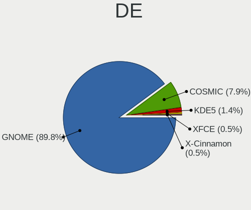

Pop!_OS - Hardware Trends
-------------------------

A project to identify most popular hardware characteristics and track their change
over time based on data collected by Linux users at https://Linux-Hardware.org.

Anyone can contribute to this report by the [hw-probe](https://github.com/linuxhw/hw-probe) tool:

    sudo -E hw-probe -all -upload

This is a report for all computer types. See also reports for [desktops](/Dist/Pop!_OS/Desktop/README.md) and [notebooks](/Dist/Pop!_OS/Notebook/README.md).

This report is for one last month. Overall report since the beginning of time: [TestDays](https://github.com/linuxhw/TestDays)

Period: Nov, 2023.

Contents
--------

* [ System ](#system)
  - [ OS                       ](#os)
  - [ OS Family                ](#os-family)
  - [ Kernel                   ](#kernel)
  - [ Kernel Family            ](#kernel-family)
  - [ Kernel Major Ver.        ](#kernel-major-ver)
  - [ Arch                     ](#arch)
  - [ DE                       ](#de)
  - [ Display Server           ](#display-server)
  - [ Display Manager          ](#display-manager)
  - [ OS Lang                  ](#os-lang)
  - [ Boot Mode                ](#boot-mode)
  - [ Filesystem               ](#filesystem)
  - [ Part. scheme             ](#part-scheme)
  - [ Dual Boot with Linux/BSD ](#dual-boot-with-linuxbsd)
  - [ Dual Boot (Win)          ](#dual-boot-win)

* [ Board ](#board)
  - [ Vendor                   ](#vendor)
  - [ Model                    ](#model)
  - [ Model Family             ](#model-family)
  - [ MFG Year                 ](#mfg-year)
  - [ Form Factor              ](#form-factor)
  - [ Secure Boot              ](#secure-boot)
  - [ Coreboot                 ](#coreboot)
  - [ RAM Size                 ](#ram-size)
  - [ RAM Used                 ](#ram-used)
  - [ Total Drives             ](#total-drives)
  - [ Has CD-ROM               ](#has-cd-rom)
  - [ Has Ethernet             ](#has-ethernet)
  - [ Has WiFi                 ](#has-wifi)
  - [ Has Bluetooth            ](#has-bluetooth)

* [ Location ](#location)
  - [ Country                  ](#country)
  - [ City                     ](#city)

* [ Drives ](#drives)
  - [ Drive Vendor             ](#drive-vendor)
  - [ Drive Model              ](#drive-model)
  - [ HDD Vendor               ](#hdd-vendor)
  - [ SSD Vendor               ](#ssd-vendor)
  - [ Drive Kind               ](#drive-kind)
  - [ Drive Connector          ](#drive-connector)
  - [ Drive Size               ](#drive-size)
  - [ Space Total              ](#space-total)
  - [ Space Used               ](#space-used)
  - [ Malfunc. Drives          ](#malfunc-drives)
  - [ Malfunc. Drive Vendor    ](#malfunc-drive-vendor)
  - [ Malfunc. HDD Vendor      ](#malfunc-hdd-vendor)
  - [ Malfunc. Drive Kind      ](#malfunc-drive-kind)
  - [ Failed Drives            ](#failed-drives)
  - [ Failed Drive Vendor      ](#failed-drive-vendor)
  - [ Drive Status             ](#drive-status)

* [ Storage controller ](#storage-controller)
  - [ Storage Vendor           ](#storage-vendor)
  - [ Storage Model            ](#storage-model)
  - [ Storage Kind             ](#storage-kind)

* [ Processor ](#processor)
  - [ CPU Vendor               ](#cpu-vendor)
  - [ CPU Model                ](#cpu-model)
  - [ CPU Model Family         ](#cpu-model-family)
  - [ CPU Cores                ](#cpu-cores)
  - [ CPU Sockets              ](#cpu-sockets)
  - [ CPU Threads              ](#cpu-threads)
  - [ CPU Op-Modes             ](#cpu-op-modes)
  - [ CPU Microcode            ](#cpu-microcode)
  - [ CPU Microarch            ](#cpu-microarch)

* [ Graphics ](#graphics)
  - [ GPU Vendor               ](#gpu-vendor)
  - [ GPU Model                ](#gpu-model)
  - [ GPU Combo                ](#gpu-combo)
  - [ GPU Driver               ](#gpu-driver)
  - [ GPU Memory               ](#gpu-memory)

* [ Monitor ](#monitor)
  - [ Monitor Vendor           ](#monitor-vendor)
  - [ Monitor Model            ](#monitor-model)
  - [ Monitor Resolution       ](#monitor-resolution)
  - [ Monitor Diagonal         ](#monitor-diagonal)
  - [ Monitor Width            ](#monitor-width)
  - [ Aspect Ratio             ](#aspect-ratio)
  - [ Monitor Area             ](#monitor-area)
  - [ Pixel Density            ](#pixel-density)
  - [ Multiple Monitors        ](#multiple-monitors)

* [ Network ](#network)
  - [ Net Controller Vendor    ](#net-controller-vendor)
  - [ Net Controller Model     ](#net-controller-model)
  - [ Wireless Vendor          ](#wireless-vendor)
  - [ Wireless Model           ](#wireless-model)
  - [ Ethernet Vendor          ](#ethernet-vendor)
  - [ Ethernet Model           ](#ethernet-model)
  - [ Net Controller Kind      ](#net-controller-kind)
  - [ Used Controller          ](#used-controller)
  - [ NICs                     ](#nics)
  - [ IPv6                     ](#ipv6)

* [ Bluetooth ](#bluetooth)
  - [ Bluetooth Vendor         ](#bluetooth-vendor)
  - [ Bluetooth Model          ](#bluetooth-model)

* [ Sound ](#sound)
  - [ Sound Vendor             ](#sound-vendor)
  - [ Sound Model              ](#sound-model)

* [ Memory ](#memory)
  - [ Memory Vendor            ](#memory-vendor)
  - [ Memory Model             ](#memory-model)
  - [ Memory Kind              ](#memory-kind)
  - [ Memory Form Factor       ](#memory-form-factor)
  - [ Memory Size              ](#memory-size)
  - [ Memory Speed             ](#memory-speed)

* [ Printers & scanners ](#printers--scanners)
  - [ Printer Vendor           ](#printer-vendor)
  - [ Printer Model            ](#printer-model)
  - [ Scanner Vendor           ](#scanner-vendor)
  - [ Scanner Model            ](#scanner-model)

* [ Camera ](#camera)
  - [ Camera Vendor            ](#camera-vendor)
  - [ Camera Model             ](#camera-model)

* [ Security ](#security)
  - [ Fingerprint Vendor       ](#fingerprint-vendor)
  - [ Fingerprint Model        ](#fingerprint-model)
  - [ Chipcard Vendor          ](#chipcard-vendor)
  - [ Chipcard Model           ](#chipcard-model)

* [ Unsupported ](#unsupported)
  - [ Unsupported Devices      ](#unsupported-devices)
  - [ Unsupported Device Types ](#unsupported-device-types)

System
------

OS
--

Installed operating systems

| Name          | Computers | Percent |
|---------------|-----------|---------|
| Pop!_OS 22.04 | 198       | 99.5%   |
| Pop!_OS 20.10 | 1         | 0.5%    |

OS Family
---------

OS without a version

| Name    | Computers | Percent |
|---------|-----------|---------|
| Pop!_OS | 199       | 100%    |

Kernel
------

Version of the Linux kernel

| Version                 | Computers | Percent |
|-------------------------|-----------|---------|
| 6.5.6-76060506-generic  | 154       | 77.39%  |
| 6.5.4-76060504-generic  | 27        | 13.57%  |
| 6.5.12-x64v3-xanmod1    | 2         | 1.01%   |
| 6.4.6-76060406-generic  | 2         | 1.01%   |
| 6.2.6-76060206-generic  | 2         | 1.01%   |
| 6.0.6-76060006-generic  | 2         | 1.01%   |
| 5.17.5-76051705-generic | 2         | 1.01%   |
| 6.5.8-x64v1-xanmod1     | 1         | 0.5%    |
| 6.5.7-060507-generic    | 1         | 0.5%    |
| 6.5.10-x64v3-xanmod1    | 1         | 0.5%    |
| 6.5.10-x64v2-xanmod1    | 1         | 0.5%    |
| 6.0.12-76060006-generic | 1         | 0.5%    |
| 5.15.0-89-lowlatency    | 1         | 0.5%    |
| 5.15.0-1043-raspi       | 1         | 0.5%    |
| 5.11.0-7614-generic     | 1         | 0.5%    |

Kernel Family
-------------

Linux kernel without a distro release

| Version | Computers | Percent |
|---------|-----------|---------|
| 6.5.6   | 154       | 77.39%  |
| 6.5.4   | 27        | 13.57%  |
| 6.5.12  | 2         | 1.01%   |
| 6.5.10  | 2         | 1.01%   |
| 6.4.6   | 2         | 1.01%   |
| 6.2.6   | 2         | 1.01%   |
| 6.0.6   | 2         | 1.01%   |
| 5.17.5  | 2         | 1.01%   |
| 5.15.0  | 2         | 1.01%   |
| 6.5.8   | 1         | 0.5%    |
| 6.5.7   | 1         | 0.5%    |
| 6.0.12  | 1         | 0.5%    |
| 5.11.0  | 1         | 0.5%    |

Kernel Major Ver.
-----------------

Linux kernel major version

| Version | Computers | Percent |
|---------|-----------|---------|
| 6.5     | 187       | 93.97%  |
| 6.0     | 3         | 1.51%   |
| 6.4     | 2         | 1.01%   |
| 6.2     | 2         | 1.01%   |
| 5.17    | 2         | 1.01%   |
| 5.15    | 2         | 1.01%   |
| 5.11    | 1         | 0.5%    |

Arch
----

OS architecture (x86_64, i586, etc.)

| Name    | Computers | Percent |
|---------|-----------|---------|
| x86_64  | 198       | 99.5%   |
| aarch64 | 1         | 0.5%    |

DE
--

Desktop Environment

| Name            | Computers | Percent |
|-----------------|-----------|---------|
| GNOME           | 195       | 97.99%  |
| Unity           | 1         | 0.5%    |
| i3              | 1         | 0.5%    |
| GNOME Flashback | 1         | 0.5%    |
| Unknown         | 1         | 0.5%    |

Display Server
--------------

X11 or Wayland

| Name    | Computers | Percent |
|---------|-----------|---------|
| X11     | 191       | 95.98%  |
| Wayland | 7         | 3.52%   |
| Unknown | 1         | 0.5%    |

Display Manager
---------------

SDDM, LightDM, etc.

| Name    | Computers | Percent |
|---------|-----------|---------|
| Unknown | 143       | 71.86%  |
| GDM3    | 56        | 28.14%  |

OS Lang
-------

Language

| Lang    | Computers | Percent |
|---------|-----------|---------|
| en_US   | 106       | 53.27%  |
| de_DE   | 16        | 8.04%   |
| C       | 14        | 7.04%   |
| en_GB   | 11        | 5.53%   |
| pt_BR   | 8         | 4.02%   |
| it_IT   | 8         | 4.02%   |
| en_AU   | 6         | 3.02%   |
| tr_TR   | 3         | 1.51%   |
| pl_PL   | 3         | 1.51%   |
| nb_NO   | 3         | 1.51%   |
| en_CA   | 3         | 1.51%   |
| zh_TW   | 2         | 1.01%   |
| en_NZ   | 2         | 1.01%   |
| ru_RU   | 1         | 0.5%    |
| pt_PT   | 1         | 0.5%    |
| nl_BE   | 1         | 0.5%    |
| hu_HU   | 1         | 0.5%    |
| fur_IT  | 1         | 0.5%    |
| fr_FR   | 1         | 0.5%    |
| es_CO   | 1         | 0.5%    |
| es_CL   | 1         | 0.5%    |
| en_ZA   | 1         | 0.5%    |
| en_IN   | 1         | 0.5%    |
| de_CH   | 1         | 0.5%    |
| da_DK   | 1         | 0.5%    |
| cs_CZ   | 1         | 0.5%    |
| Unknown | 1         | 0.5%    |

Boot Mode
---------

EFI or BIOS

| Mode | Computers | Percent |
|------|-----------|---------|
| BIOS | 143       | 71.86%  |
| EFI  | 56        | 28.14%  |

Filesystem
----------

Type of filesystem

| Type    | Computers | Percent |
|---------|-----------|---------|
| Ext4    | 189       | 94.97%  |
| Overlay | 5         | 2.51%   |
| Btrfs   | 3         | 1.51%   |
| Zfs     | 2         | 1.01%   |

Part. scheme
------------

Scheme of partitioning

| Type    | Computers | Percent |
|---------|-----------|---------|
| Unknown | 142       | 71.36%  |
| GPT     | 57        | 28.64%  |

Dual Boot with Linux/BSD
------------------------

Hosting more than one Linux/BSD

| Dual boot | Computers | Percent |
|-----------|-----------|---------|
| No        | 189       | 94.97%  |
| Yes       | 10        | 5.03%   |

Dual Boot (Win)
---------------

Hosting Linux and Windows

| Dual boot | Computers | Percent |
|-----------|-----------|---------|
| No        | 177       | 88.94%  |
| Yes       | 22        | 11.06%  |

Board
-----

Vendor
------

Motherboard manufacturer

| Name                    | Computers | Percent |
|-------------------------|-----------|---------|
| Lenovo                  | 35        | 17.59%  |
| ASUSTek Computer        | 35        | 17.59%  |
| Hewlett-Packard         | 25        | 12.56%  |
| Dell                    | 24        | 12.06%  |
| MSI                     | 22        | 11.06%  |
| Gigabyte Technology     | 12        | 6.03%   |
| ASRock                  | 9         | 4.52%   |
| Apple                   | 7         | 3.52%   |
| Acer                    | 7         | 3.52%   |
| System76                | 4         | 2.01%   |
| Intel                   | 4         | 2.01%   |
| Notebook                | 3         | 1.51%   |
| Google                  | 2         | 1.01%   |
| Tactus                  | 1         | 0.5%    |
| Samsung Electronics     | 1         | 0.5%    |
| Raspberry Pi Foundation | 1         | 0.5%    |
| LG Electronics          | 1         | 0.5%    |
| HONOR                   | 1         | 0.5%    |
| HC Technology.          | 1         | 0.5%    |
| Casper                  | 1         | 0.5%    |
| ASRockRack              | 1         | 0.5%    |
| AMI                     | 1         | 0.5%    |
| Unknown                 | 1         | 0.5%    |

Model
-----

Motherboard model

| Name                                       | Computers | Percent |
|--------------------------------------------|-----------|---------|
| System76 Lemur Pro                         | 2         | 1.01%   |
| Notebook PA70Hx                            | 2         | 1.01%   |
| MSI MS-7C95                                | 2         | 1.01%   |
| MSI MS-7B86                                | 2         | 1.01%   |
| Lenovo Legion 5 15ACH6H 82JU               | 2         | 1.01%   |
| Lenovo IdeaPad Gaming 3 15IAH7 82S9        | 2         | 1.01%   |
| ASUS ROG STRIX B550-F GAMING               | 2         | 1.01%   |
| ASUS All Series                            | 2         | 1.01%   |
| ASRock B760M PG Riptide                    | 2         | 1.01%   |
| Apple MacBookPro8,1                        | 2         | 1.01%   |
| Tactus GeoFlex 140                         | 1         | 0.5%    |
| System76 Oryx Pro                          | 1         | 0.5%    |
| System76 Adder WS                          | 1         | 0.5%    |
| Samsung RC530/RC730                        | 1         | 0.5%    |
| RPi Raspberry Pi                           | 1         | 0.5%    |
| Notebook NS5x_NS7xPU                       | 1         | 0.5%    |
| MSI Stealth 16Studio A13VG                 | 1         | 0.5%    |
| MSI Prestige 15 A10SC                      | 1         | 0.5%    |
| MSI Prestige 14Evo A11M                    | 1         | 0.5%    |
| MSI MS-7C90                                | 1         | 0.5%    |
| MSI MS-7C51                                | 1         | 0.5%    |
| MSI MS-7C35                                | 1         | 0.5%    |
| MSI MS-7C02                                | 1         | 0.5%    |
| MSI MS-7B98                                | 1         | 0.5%    |
| MSI MS-7B45                                | 1         | 0.5%    |
| MSI MS-7A38                                | 1         | 0.5%    |
| MSI MS-7978                                | 1         | 0.5%    |
| MSI MS-7821                                | 1         | 0.5%    |
| MSI Katana GF66 11UE                       | 1         | 0.5%    |
| MSI GT70                                   | 1         | 0.5%    |
| MSI GE76 Raider 11UE                       | 1         | 0.5%    |
| MSI Delta 15 A5EFK                         | 1         | 0.5%    |
| MSI Cyborg 15 A12VF                        | 1         | 0.5%    |
| MSI Bravo 15 C7VE                          | 1         | 0.5%    |
| LG 16T90R-K.ADB9U1                         | 1         | 0.5%    |
| Lenovo Yoga Pro 9 14IRP8 83BU              | 1         | 0.5%    |
| Lenovo Yoga C930-13IKB 81C4                | 1         | 0.5%    |
| Lenovo Y720-15IKB 80VR                     | 1         | 0.5%    |
| Lenovo ThinkPad X260 20F5A28AUK            | 1         | 0.5%    |
| Lenovo ThinkPad X1 Tablet Gen 3 20KKS0TX00 | 1         | 0.5%    |

Model Family
------------

Motherboard model prefix

| Name              | Computers | Percent |
|-------------------|-----------|---------|
| Lenovo ThinkPad   | 13        | 6.53%   |
| Lenovo IdeaPad    | 12        | 6.03%   |
| ASUS ROG          | 9         | 4.52%   |
| Dell XPS          | 7         | 3.52%   |
| Acer Aspire       | 6         | 3.02%   |
| Dell Precision    | 5         | 2.51%   |
| Dell Latitude     | 5         | 2.51%   |
| Dell Inspiron     | 5         | 2.51%   |
| Lenovo Legion     | 4         | 2.01%   |
| HP Pavilion       | 4         | 2.01%   |
| ASUS PRIME        | 4         | 2.01%   |
| HP ProBook        | 3         | 1.51%   |
| HP EliteDesk      | 3         | 1.51%   |
| ASUS ASUS         | 3         | 1.51%   |
| System76 Lemur    | 2         | 1.01%   |
| Notebook PA70Hx   | 2         | 1.01%   |
| MSI Prestige      | 2         | 1.01%   |
| MSI MS-7C95       | 2         | 1.01%   |
| MSI MS-7B86       | 2         | 1.01%   |
| Lenovo Yoga       | 2         | 1.01%   |
| HP Victus         | 2         | 1.01%   |
| HP Laptop         | 2         | 1.01%   |
| HP ENVY           | 2         | 1.01%   |
| HP EliteBook      | 2         | 1.01%   |
| Gigabyte X570     | 2         | 1.01%   |
| ASUS VivoBook     | 2         | 1.01%   |
| ASUS TUF          | 2         | 1.01%   |
| ASUS All          | 2         | 1.01%   |
| ASRock B760M      | 2         | 1.01%   |
| ASRock B450       | 2         | 1.01%   |
| Apple MacBookPro8 | 2         | 1.01%   |
| Tactus GeoFlex    | 1         | 0.5%    |
| System76 Oryx     | 1         | 0.5%    |
| System76 Adder    | 1         | 0.5%    |
| Samsung RC530     | 1         | 0.5%    |
| RPi Raspberry     | 1         | 0.5%    |
| Notebook NS5x     | 1         | 0.5%    |
| MSI Stealth       | 1         | 0.5%    |
| MSI MS-7C90       | 1         | 0.5%    |
| MSI MS-7C51       | 1         | 0.5%    |

MFG Year
--------

Motherboard manufacture year

| Year    | Computers | Percent |
|---------|-----------|---------|
| 2023    | 23        | 11.56%  |
| 2021    | 23        | 11.56%  |
| 2017    | 21        | 10.55%  |
| 2022    | 20        | 10.05%  |
| 2020    | 19        | 9.55%   |
| 2019    | 17        | 8.54%   |
| 2018    | 15        | 7.54%   |
| 2012    | 13        | 6.53%   |
| 2011    | 12        | 6.03%   |
| 2016    | 7         | 3.52%   |
| 2015    | 7         | 3.52%   |
| 2013    | 7         | 3.52%   |
| 2014    | 6         | 3.02%   |
| 2010    | 4         | 2.01%   |
| 2008    | 2         | 1.01%   |
| 2009    | 1         | 0.5%    |
| 2007    | 1         | 0.5%    |
| Unknown | 1         | 0.5%    |

Form Factor
-----------

Physical design of the computer

| Name           | Computers | Percent |
|----------------|-----------|---------|
| Notebook       | 109       | 54.77%  |
| Desktop        | 71        | 35.68%  |
| Convertible    | 8         | 4.02%   |
| Mini pc        | 4         | 2.01%   |
| All in one     | 3         | 1.51%   |
| Tablet         | 2         | 1.01%   |
| System on chip | 1         | 0.5%    |
| Server         | 1         | 0.5%    |

Secure Boot
-----------

Enabled or disabled

| State    | Computers | Percent |
|----------|-----------|---------|
| Disabled | 199       | 100%    |

Coreboot
--------

Have coreboot on board

| Used | Computers | Percent |
|------|-----------|---------|
| No   | 193       | 96.98%  |
| Yes  | 6         | 3.02%   |

RAM Size
--------

Total RAM memory

| Size in GB  | Computers | Percent |
|-------------|-----------|---------|
| 16.01-24.0  | 48        | 24.12%  |
| 4.01-8.0    | 45        | 22.61%  |
| 32.01-64.0  | 40        | 20.1%   |
| 8.01-16.0   | 24        | 12.06%  |
| 3.01-4.0    | 17        | 8.54%   |
| 64.01-256.0 | 16        | 8.04%   |
| 24.01-32.0  | 9         | 4.52%   |

RAM Used
--------

Used RAM memory

| Used GB    | Computers | Percent |
|------------|-----------|---------|
| 4.01-8.0   | 87        | 43.72%  |
| 3.01-4.0   | 35        | 17.59%  |
| 8.01-16.0  | 35        | 17.59%  |
| 2.01-3.0   | 29        | 14.57%  |
| 16.01-24.0 | 6         | 3.02%   |
| 1.01-2.0   | 6         | 3.02%   |
| 24.01-32.0 | 1         | 0.5%    |

Total Drives
------------

Number of drives on board

| Drives | Computers | Percent |
|--------|-----------|---------|
| 1      | 112       | 56.28%  |
| 2      | 58        | 29.15%  |
| 3      | 15        | 7.54%   |
| 4      | 11        | 5.53%   |
| 5      | 2         | 1.01%   |
| 9      | 1         | 0.5%    |

Has CD-ROM
----------

Has CD-ROM on board

| Presented | Computers | Percent |
|-----------|-----------|---------|
| No        | 157       | 78.89%  |
| Yes       | 42        | 21.11%  |

Has Ethernet
------------

Has Ethernet on board

| Presented | Computers | Percent |
|-----------|-----------|---------|
| Yes       | 162       | 81.41%  |
| No        | 37        | 18.59%  |

Has WiFi
--------

Has WiFi module

| Presented | Computers | Percent |
|-----------|-----------|---------|
| Yes       | 168       | 84.42%  |
| No        | 31        | 15.58%  |

Has Bluetooth
-------------

Has Bluetooth module

| Presented | Computers | Percent |
|-----------|-----------|---------|
| Yes       | 148       | 74.37%  |
| No        | 51        | 25.63%  |

Location
--------

Country
-------

Geographic location (country)

| Country      | Computers | Percent |
|--------------|-----------|---------|
| USA          | 50        | 25.13%  |
| Germany      | 20        | 10.05%  |
| Italy        | 17        | 8.54%   |
| Brazil       | 12        | 6.03%   |
| Canada       | 9         | 4.52%   |
| Norway       | 8         | 4.02%   |
| UK           | 7         | 3.52%   |
| Australia    | 6         | 3.02%   |
| Switzerland  | 4         | 2.01%   |
| Poland       | 4         | 2.01%   |
| New Zealand  | 4         | 2.01%   |
| France       | 4         | 2.01%   |
| Turkey       | 3         | 1.51%   |
| Portugal     | 3         | 1.51%   |
| Netherlands  | 3         | 1.51%   |
| India        | 3         | 1.51%   |
| Denmark      | 3         | 1.51%   |
| Taiwan       | 2         | 1.01%   |
| Sweden       | 2         | 1.01%   |
| Saudi Arabia | 2         | 1.01%   |
| Russia       | 2         | 1.01%   |
| Kazakhstan   | 2         | 1.01%   |
| Hungary      | 2         | 1.01%   |
| Belgium      | 2         | 1.01%   |
| Austria      | 2         | 1.01%   |
| UAE          | 1         | 0.5%    |
| Spain        | 1         | 0.5%    |
| South Africa | 1         | 0.5%    |
| Slovakia     | 1         | 0.5%    |
| Serbia       | 1         | 0.5%    |
| Romania      | 1         | 0.5%    |
| Philippines  | 1         | 0.5%    |
| Pakistan     | 1         | 0.5%    |
| Nepal        | 1         | 0.5%    |
| Moldova      | 1         | 0.5%    |
| Mexico       | 1         | 0.5%    |
| Malaysia     | 1         | 0.5%    |
| Kenya        | 1         | 0.5%    |
| Ireland      | 1         | 0.5%    |
| Hong Kong    | 1         | 0.5%    |

City
----

Geographic location (city)

| City              | Computers | Percent |
|-------------------|-----------|---------|
| Sydney            | 3         | 1.51%   |
| Milano            | 3         | 1.51%   |
| Berlin            | 3         | 1.51%   |
| Winnipeg          | 2         | 1.01%   |
| Stuttgart         | 2         | 1.01%   |
| Southwark         | 2         | 1.01%   |
| Porto             | 2         | 1.01%   |
| Pisa              | 2         | 1.01%   |
| Perth             | 2         | 1.01%   |
| New York          | 2         | 1.01%   |
| Minneapolis       | 2         | 1.01%   |
| Madrid            | 2         | 1.01%   |
| Cologne           | 2         | 1.01%   |
| Austin            | 2         | 1.01%   |
| Aurora            | 2         | 1.01%   |
| Zurich            | 1         | 0.5%    |
| Yekaterinburg     | 1         | 0.5%    |
| West Palm Beach   | 1         | 0.5%    |
| Wellington        | 1         | 0.5%    |
| Weilburg          | 1         | 0.5%    |
| Washington        | 1         | 0.5%    |
| Warsaw            | 1         | 0.5%    |
| Warnsveld         | 1         | 0.5%    |
| Vratsa            | 1         | 0.5%    |
| Vitry-sur-Seine   | 1         | 0.5%    |
| Vienna            | 1         | 0.5%    |
| Vicenza           | 1         | 0.5%    |
| Viborg            | 1         | 0.5%    |
| Ust-Kamenogorsk   | 1         | 0.5%    |
| Ulan-Ude          | 1         | 0.5%    |
| Udine             | 1         | 0.5%    |
| Tulsa             | 1         | 0.5%    |
| Trondheim         | 1         | 0.5%    |
| Timbauba          | 1         | 0.5%    |
| Temuco            | 1         | 0.5%    |
| Tbilisi           | 1         | 0.5%    |
| Tartu             | 1         | 0.5%    |
| Szigetszentmiklos | 1         | 0.5%    |
| Szentendre        | 1         | 0.5%    |
| Swidnica          | 1         | 0.5%    |

Drives
------

Drive Vendor
------------

Hard drive vendors

| Vendor                      | Computers | Drives | Percent |
|-----------------------------|-----------|--------|---------|
| Samsung Electronics         | 72        | 94     | 24.91%  |
| Seagate                     | 26        | 33     | 9%      |
| WDC                         | 25        | 27     | 8.65%   |
| SanDisk                     | 21        | 24     | 7.27%   |
| Kingston                    | 13        | 16     | 4.5%    |
| Toshiba                     | 12        | 12     | 4.15%   |
| Micron Technology           | 12        | 12     | 4.15%   |
| Crucial                     | 11        | 14     | 3.81%   |
| SK hynix                    | 7         | 7      | 2.42%   |
| Phison Electronics          | 7         | 7      | 2.42%   |
| Unknown                     | 6         | 6      | 2.08%   |
| Intel                       | 6         | 6      | 2.08%   |
| Hitachi                     | 6         | 7      | 2.08%   |
| HGST                        | 6         | 8      | 2.08%   |
| Silicon Motion              | 5         | 5      | 1.73%   |
| China                       | 5         | 5      | 1.73%   |
| Apple                       | 5         | 5      | 1.73%   |
| A-DATA Technology           | 5         | 5      | 1.73%   |
| Micron/Crucial Technology   | 4         | 5      | 1.38%   |
| KIOXIA                      | 3         | 3      | 1.04%   |
| Kingston Technology Company | 3         | 3      | 1.04%   |
| JMicron Technology          | 3         | 3      | 1.04%   |
| Transcend                   | 2         | 2      | 0.69%   |
| T-FORCE                     | 2         | 2      | 0.69%   |
| PNY                         | 2         | 2      | 0.69%   |
| WXC-R1                      | 1         | 1      | 0.35%   |
| Team                        | 1         | 1      | 0.35%   |
| SSK                         | 1         | 1      | 0.35%   |
| SPCC                        | 1         | 1      | 0.35%   |
| SABRENT                     | 1         | 1      | 0.35%   |
| Realtek Semiconductor       | 1         | 1      | 0.35%   |
| PC611 NV                    | 1         | 1      | 0.35%   |
| Patriot                     | 1         | 1      | 0.35%   |
| Netac                       | 1         | 1      | 0.35%   |
| LITEONIT                    | 1         | 1      | 0.35%   |
| LITEON                      | 1         | 1      | 0.35%   |
| Lexar                       | 1         | 1      | 0.35%   |
| Intenso                     | 1         | 1      | 0.35%   |
| Hikvision                   | 1         | 1      | 0.35%   |
| Dogfish                     | 1         | 1      | 0.35%   |

Drive Model
-----------

Hard drive models

| Model                                                 | Computers | Percent |
|-------------------------------------------------------|-----------|---------|
| Samsung NVMe SSD Controller SM981/PM981/PM983 250GB   | 15        | 4.75%   |
| Samsung NVMe SSD Controller PM9A1/PM9A3/980PRO 2TB    | 8         | 2.53%   |
| Kingston SA400S37240G 240GB SSD                       | 5         | 1.58%   |
| Sandisk WD Black SN850 1024GB                         | 4         | 1.27%   |
| Silicon Motion SM2263EN/SM2263XT SSD Controller 256GB | 3         | 0.95%   |
| Seagate ST2000DM001-1ER164 2TB                        | 3         | 0.95%   |
| Seagate ST2000DM001-1CH164 2TB                        | 3         | 0.95%   |
| Samsung SSD 980 PRO 500GB                             | 3         | 0.95%   |
| Samsung SSD 850 EVO 250GB                             | 3         | 0.95%   |
| Micron/Crucial P2 NVMe PCIe SSD 1TB                   | 3         | 0.95%   |
| WDC WDS100T2B0A-00SM50 1TB SSD                        | 2         | 0.63%   |
| WDC WD20EZRZ-00Z5HB0 2TB                              | 2         | 0.63%   |
| Unknown MMC Card  32GB                                | 2         | 0.63%   |
| Toshiba XG6 NVMe SSD Controller 512GB                 | 2         | 0.63%   |
| Toshiba MQ04ABF100 1TB                                | 2         | 0.63%   |
| SK hynix PC801 NVMe 1TB                               | 2         | 0.63%   |
| Seagate ST2000LM003 HN-M201RAD 2TB                    | 2         | 0.63%   |
| Seagate ST1000LM049-2GH172 1TB                        | 2         | 0.63%   |
| Seagate BUP Slim BL 1TB                               | 2         | 0.63%   |
| Sandisk WD Blue SN570 1TB                             | 2         | 0.63%   |
| Sandisk WD Blue SN550 NVMe SSD 512GB                  | 2         | 0.63%   |
| Sandisk WD Black SN750 / PC SN730 NVMe SSD 500GB      | 2         | 0.63%   |
| SanDisk SSD PLUS 1000GB                               | 2         | 0.63%   |
| Samsung SSD 980 PRO 1TB                               | 2         | 0.63%   |
| Samsung SSD 970 EVO Plus 1TB                          | 2         | 0.63%   |
| Samsung SSD 970 EVO 1TB                               | 2         | 0.63%   |
| Samsung SSD 860 QVO 1TB                               | 2         | 0.63%   |
| Samsung SSD 860 EVO 500GB                             | 2         | 0.63%   |
| Samsung SSD 860 EVO 1TB                               | 2         | 0.63%   |
| Samsung SSD 850 EVO 500GB                             | 2         | 0.63%   |
| Samsung SSD 850 EVO 1TB                               | 2         | 0.63%   |
| Samsung NVMe SSD Controller SM961/PM961/SM963 256GB   | 2         | 0.63%   |
| Samsung MZVL21T0HCLR-00B00 1TB                        | 2         | 0.63%   |
| Samsung MZALQ256HBJD-00BL2 256GB                      | 2         | 0.63%   |
| Phison PS5013 E13 NVMe Controller 512GB               | 2         | 0.63%   |
| Kingston SNVS500G 500GB                               | 2         | 0.63%   |
| JMicron Tech 250GB                                    | 2         | 0.63%   |
| Intel SSDPEKNW512GZL 512GB                            | 2         | 0.63%   |
| Hitachi HDS721010CLA332 1TB                           | 2         | 0.63%   |
| HGST HTS721010A9E630 1TB                              | 2         | 0.63%   |

HDD Vendor
----------

Hard disk drive vendors

| Vendor              | Computers | Drives | Percent |
|---------------------|-----------|--------|---------|
| Seagate             | 26        | 33     | 39.39%  |
| WDC                 | 14        | 16     | 21.21%  |
| Toshiba             | 8         | 8      | 12.12%  |
| Hitachi             | 6         | 7      | 9.09%   |
| HGST                | 6         | 8      | 9.09%   |
| Samsung Electronics | 4         | 4      | 6.06%   |
| Apple               | 2         | 2      | 3.03%   |

SSD Vendor
----------

Solid state drive vendors

| Vendor              | Computers | Drives | Percent |
|---------------------|-----------|--------|---------|
| Samsung Electronics | 23        | 29     | 28.05%  |
| Kingston            | 9         | 10     | 10.98%  |
| Crucial             | 8         | 9      | 9.76%   |
| WDC                 | 5         | 5      | 6.1%    |
| China               | 5         | 5      | 6.1%    |
| A-DATA Technology   | 4         | 4      | 4.88%   |
| SanDisk             | 3         | 3      | 3.66%   |
| Micron Technology   | 3         | 3      | 3.66%   |
| Apple               | 3         | 3      | 3.66%   |
| PNY                 | 2         | 2      | 2.44%   |
| Transcend           | 1         | 1      | 1.22%   |
| Toshiba             | 1         | 1      | 1.22%   |
| Team                | 1         | 1      | 1.22%   |
| T-FORCE             | 1         | 1      | 1.22%   |
| SPCC                | 1         | 1      | 1.22%   |
| Patriot             | 1         | 1      | 1.22%   |
| Netac               | 1         | 1      | 1.22%   |
| LITEONIT            | 1         | 1      | 1.22%   |
| LITEON              | 1         | 1      | 1.22%   |
| Lexar               | 1         | 1      | 1.22%   |
| JMicron Technology  | 1         | 1      | 1.22%   |
| Intenso             | 1         | 1      | 1.22%   |
| Intel               | 1         | 1      | 1.22%   |
| Hikvision           | 1         | 1      | 1.22%   |
| Dogfish             | 1         | 1      | 1.22%   |
| Corsair             | 1         | 1      | 1.22%   |
| ASMT                | 1         | 1      | 1.22%   |

Drive Kind
----------

HDD or SSD

| Kind    | Computers | Drives | Percent |
|---------|-----------|--------|---------|
| NVMe    | 124       | 155    | 47.33%  |
| SSD     | 71        | 90     | 27.1%   |
| HDD     | 56        | 78     | 21.37%  |
| Unknown | 7         | 8      | 2.67%   |
| MMC     | 4         | 4      | 1.53%   |

Drive Connector
---------------

SATA, SAS, NVMe, etc.

| Type | Computers | Drives | Percent |
|------|-----------|--------|---------|
| NVMe | 123       | 153    | 50.41%  |
| SATA | 105       | 162    | 43.03%  |
| SAS  | 12        | 16     | 4.92%   |
| MMC  | 4         | 4      | 1.64%   |

Drive Size
----------

Size of hard drive

| Size in TB | Computers | Drives | Percent |
|------------|-----------|--------|---------|
| 0.01-0.5   | 70        | 81     | 52.24%  |
| 0.51-1.0   | 42        | 54     | 31.34%  |
| 1.01-2.0   | 16        | 19     | 11.94%  |
| 3.01-4.0   | 4         | 12     | 2.99%   |
| 2.01-3.0   | 1         | 1      | 0.75%   |
| 4.01-10.0  | 1         | 1      | 0.75%   |

Space Total
-----------

Amount of disk space available on the file system

| Size in GB     | Computers | Percent |
|----------------|-----------|---------|
| 251-500        | 51        | 25.63%  |
| 101-250        | 49        | 24.62%  |
| 501-1000       | 47        | 23.62%  |
| 1001-2000      | 27        | 13.57%  |
| More than 3000 | 9         | 4.52%   |
| 1-20           | 6         | 3.02%   |
| 51-100         | 5         | 2.51%   |
| 2001-3000      | 3         | 1.51%   |
| 21-50          | 1         | 0.5%    |
| Unknown        | 1         | 0.5%    |

Space Used
----------

Amount of used disk space

| Used GB        | Computers | Percent |
|----------------|-----------|---------|
| 1-20           | 50        | 25.13%  |
| 21-50          | 45        | 22.61%  |
| 101-250        | 32        | 16.08%  |
| 51-100         | 28        | 14.07%  |
| 251-500        | 19        | 9.55%   |
| 501-1000       | 15        | 7.54%   |
| 1001-2000      | 7         | 3.52%   |
| More than 3000 | 1         | 0.5%    |
| 2001-3000      | 1         | 0.5%    |
| Unknown        | 1         | 0.5%    |

Malfunc. Drives
---------------

Drive models with a malfunction

| Model                                       | Computers | Drives | Percent |
|---------------------------------------------|-----------|--------|---------|
| WDC WD20EZRZ-00Z5HB0 2TB                    | 1         | 1      | 9.09%   |
| WDC WD10EZEX-00BN5A0 1TB                    | 1         | 1      | 9.09%   |
| Seagate ST1000LM049-2GH172 1TB              | 1         | 1      | 9.09%   |
| Samsung Electronics SSD PM810 2.5 7mm 128GB | 1         | 1      | 9.09%   |
| Samsung Electronics SSD 980 PRO 500GB       | 1         | 1      | 9.09%   |
| Samsung Electronics SSD 970 EVO Plus 1TB    | 1         | 1      | 9.09%   |
| Samsung Electronics SSD 850 EVO 1TB         | 1         | 1      | 9.09%   |
| Samsung Electronics HD154UI 1TB             | 1         | 1      | 9.09%   |
| Hitachi HDS721010CLA332 1TB                 | 1         | 1      | 9.09%   |
| Apple HDD ST1000DM003 1TB                   | 1         | 1      | 9.09%   |
| A-DATA Technology SSD S599 64GB             | 1         | 1      | 9.09%   |

Malfunc. Drive Vendor
---------------------

Vendors of faulty drives

| Vendor              | Computers | Drives | Percent |
|---------------------|-----------|--------|---------|
| Samsung Electronics | 4         | 5      | 44.44%  |
| WDC                 | 1         | 2      | 11.11%  |
| Seagate             | 1         | 1      | 11.11%  |
| Hitachi             | 1         | 1      | 11.11%  |
| Apple               | 1         | 1      | 11.11%  |
| A-DATA Technology   | 1         | 1      | 11.11%  |

Malfunc. HDD Vendor
-------------------

Vendors of faulty HDD drives

| Vendor              | Computers | Drives | Percent |
|---------------------|-----------|--------|---------|
| WDC                 | 1         | 2      | 20%     |
| Seagate             | 1         | 1      | 20%     |
| Samsung Electronics | 1         | 1      | 20%     |
| Hitachi             | 1         | 1      | 20%     |
| Apple               | 1         | 1      | 20%     |

Malfunc. Drive Kind
-------------------

Kinds of faulty drives

| Kind | Computers | Drives | Percent |
|------|-----------|--------|---------|
| HDD  | 5         | 6      | 50%     |
| SSD  | 3         | 3      | 30%     |
| NVMe | 2         | 2      | 20%     |

Failed Drives
-------------

Failed drive models

Zero info for selected period =(

Failed Drive Vendor
-------------------

Failed drive vendors

Zero info for selected period =(

Drive Status
------------

Number of failed and malfunc. drives

| Status   | Computers | Drives | Percent |
|----------|-----------|--------|---------|
| Detected | 147       | 244    | 70%     |
| Works    | 54        | 80     | 25.71%  |
| Malfunc  | 9         | 11     | 4.29%   |

Storage controller
------------------

Storage Vendor
--------------

Storage controller vendors

| Vendor                       | Computers | Percent |
|------------------------------|-----------|---------|
| Intel                        | 106       | 35.45%  |
| Samsung Electronics          | 53        | 17.73%  |
| AMD                          | 49        | 16.39%  |
| SanDisk                      | 25        | 8.36%   |
| Micron Technology            | 9         | 3.01%   |
| Kingston Technology Company  | 9         | 3.01%   |
| SK hynix                     | 7         | 2.34%   |
| Phison Electronics           | 7         | 2.34%   |
| Micron/Crucial Technology    | 7         | 2.34%   |
| Silicon Motion               | 6         | 2.01%   |
| ASMedia Technology           | 4         | 1.34%   |
| Toshiba America Info Systems | 3         | 1%      |
| Marvell Technology Group     | 3         | 1%      |
| KIOXIA                       | 3         | 1%      |
| Realtek Semiconductor        | 2         | 0.67%   |
| Transcend                    | 1         | 0.33%   |
| Solidigm                     | 1         | 0.33%   |
| Nvidia                       | 1         | 0.33%   |
| JMicron Technology           | 1         | 0.33%   |
| INNOGRIT                     | 1         | 0.33%   |
| ADATA Technology             | 1         | 0.33%   |

Storage Model
-------------

Storage controller models

| Model                                                                          | Computers | Percent |
|--------------------------------------------------------------------------------|-----------|---------|
| AMD FCH SATA Controller [AHCI mode]                                            | 38        | 11.76%  |
| Samsung NVMe SSD Controller SM981/PM981/PM983                                  | 26        | 8.05%   |
| Samsung NVMe SSD Controller PM9A1/PM9A3/980PRO                                 | 16        | 4.95%   |
| Intel Volume Management Device NVMe RAID Controller                            | 11        | 3.41%   |
| Intel Sunrise Point-LP SATA Controller [AHCI mode]                             | 11        | 3.41%   |
| AMD 500 Series Chipset SATA Controller                                         | 9         | 2.79%   |
| AMD 400 Series Chipset SATA Controller                                         | 9         | 2.79%   |
| Samsung NVMe SSD Controller 980 (DRAM-less)                                    | 8         | 2.48%   |
| Intel 6 Series/C200 Series Chipset Family 6 port Mobile SATA AHCI Controller   | 8         | 2.48%   |
| Silicon Motion SM2263EN/SM2263XT (DRAM-less) NVMe SSD Controllers              | 6         | 1.86%   |
| Micron/Crucial P2 [Nick P2] / P3 / P3 Plus NVMe PCIe SSD (DRAM-less)           | 6         | 1.86%   |
| Intel Q170/Q150/B150/H170/H110/Z170/CM236 Chipset SATA Controller [AHCI Mode]  | 6         | 1.86%   |
| Intel 8 Series/C220 Series Chipset Family 6-port SATA Controller 1 [AHCI mode] | 6         | 1.86%   |
| SanDisk WD PC SN810 / Black SN850 NVMe SSD                                     | 5         | 1.55%   |
| Intel 7 Series Chipset Family 6-port SATA Controller [AHCI mode]               | 5         | 1.55%   |
| Intel Volume Management Device NVMe RAID Controller Intel Corporation          | 4         | 1.24%   |
| Intel SATA Controller [RAID mode]                                              | 4         | 1.24%   |
| Intel HM170/QM170 Chipset SATA Controller [AHCI Mode]                          | 4         | 1.24%   |
| Intel Comet Lake SATA AHCI Controller                                          | 4         | 1.24%   |
| Intel 200 Series PCH SATA controller [AHCI mode]                               | 4         | 1.24%   |
| ASMedia ASM1062 Serial ATA Controller                                          | 4         | 1.24%   |
| Toshiba America Info Systems XG6 NVMe SSD Controller                           | 3         | 0.93%   |
| SK hynix Platinum P41/PC801 NVMe Solid State Drive                             | 3         | 0.93%   |
| SanDisk WD PC SN540 / Green SN350 NVMe SSD 1 TB (DRAM-less)                    | 3         | 0.93%   |
| SanDisk Ultra 3D / WD Blue SN550 NVMe SSD                                      | 3         | 0.93%   |
| SanDisk Extreme Pro / WD Black SN750 / PC SN730 / Red SN700 NVMe SSD           | 3         | 0.93%   |
| Intel SSD 670p Series [Keystone Harbor]                                        | 3         | 0.93%   |
| Intel Cannon Lake PCH SATA AHCI Controller                                     | 3         | 0.93%   |
| Intel Cannon Lake Mobile PCH SATA AHCI Controller                              | 3         | 0.93%   |
| Intel 82801 Mobile SATA Controller [RAID mode]                                 | 3         | 0.93%   |
| SanDisk WD Blue SN500 / PC SN520 x2 M.2 2280 NVMe SSD                          | 2         | 0.62%   |
| Sandisk WD Black SN850X NVMe SSD                                               | 2         | 0.62%   |
| SanDisk WD Black SN770 / PC SN740 256GB / PC SN560 (DRAM-less) NVMe SSD        | 2         | 0.62%   |
| SanDisk Ultra 3D / WD Blue SN570 NVMe SSD (DRAM-less)                          | 2         | 0.62%   |
| Samsung NVMe SSD Controller SM961/PM961/SM963                                  | 2         | 0.62%   |
| Phison PS5013-E13 PCIe3 NVMe Controller (DRAM-less)                            | 2         | 0.62%   |
| Phison E12 NVMe Controller                                                     | 2         | 0.62%   |
| Micron 2400 NVMe SSD (DRAM-less)                                               | 2         | 0.62%   |
| Micron 2300 NVMe SSD [Santana]                                                 | 2         | 0.62%   |
| Micron 2210 NVMe SSD [Cobain]                                                  | 2         | 0.62%   |

Storage Kind
------------

Kind of storage controller (IDE, SATA, NVMe, SAS, ...)

| Kind | Computers | Percent |
|------|-----------|---------|
| SATA | 133       | 46.83%  |
| NVMe | 124       | 43.66%  |
| RAID | 22        | 7.75%   |
| IDE  | 5         | 1.76%   |

Processor
---------

CPU Vendor
----------

Processor vendors

| Vendor | Computers | Percent |
|--------|-----------|---------|
| Intel  | 137       | 68.84%  |
| AMD    | 61        | 30.65%  |
| ARM    | 1         | 0.5%    |

CPU Model
---------

Processor models

| Model                                           | Computers | Percent |
|-------------------------------------------------|-----------|---------|
| Intel Core i7-6700 CPU @ 3.40GHz                | 5         | 2.51%   |
| AMD Ryzen 7 5800X 8-Core Processor              | 5         | 2.51%   |
| Intel Core i7-8550U CPU @ 1.80GHz               | 4         | 2.01%   |
| Intel 11th Gen Core i5-1135G7 @ 2.40GHz         | 4         | 2.01%   |
| AMD Ryzen 7 5800H with Radeon Graphics          | 4         | 2.01%   |
| Intel Core i7-7700HQ CPU @ 2.80GHz              | 3         | 1.51%   |
| Intel Core i5-6200U CPU @ 2.30GHz               | 3         | 1.51%   |
| Intel 13th Gen Core i9-13900H                   | 3         | 1.51%   |
| AMD Ryzen 9 5950X 16-Core Processor             | 3         | 1.51%   |
| AMD Ryzen 9 5900X 12-Core Processor             | 3         | 1.51%   |
| AMD Ryzen 7 2700X Eight-Core Processor          | 3         | 1.51%   |
| AMD Ryzen 5 3500U with Radeon Vega Mobile Gfx   | 3         | 1.51%   |
| Intel Core i7-9700K CPU @ 3.60GHz               | 2         | 1.01%   |
| Intel Core i7-8650U CPU @ 1.90GHz               | 2         | 1.01%   |
| Intel Core i7-6600U CPU @ 2.60GHz               | 2         | 1.01%   |
| Intel Core i7-2600K CPU @ 3.40GHz               | 2         | 1.01%   |
| Intel Core i5-7200U CPU @ 2.50GHz               | 2         | 1.01%   |
| Intel Core i5-6600K CPU @ 3.50GHz               | 2         | 1.01%   |
| Intel Core i5-6300U CPU @ 2.40GHz               | 2         | 1.01%   |
| Intel Core i5-2520M CPU @ 2.50GHz               | 2         | 1.01%   |
| Intel Core i3-10105F CPU @ 3.70GHz              | 2         | 1.01%   |
| Intel 13th Gen Core i7-13700KF                  | 2         | 1.01%   |
| Intel 12th Gen Core i7-12700H                   | 2         | 1.01%   |
| Intel 12th Gen Core i7-1260P                    | 2         | 1.01%   |
| Intel 12th Gen Core i5-12500H                   | 2         | 1.01%   |
| Intel 12th Gen Core i5-12450H                   | 2         | 1.01%   |
| Intel 11th Gen Core i7-1185G7 @ 3.00GHz         | 2         | 1.01%   |
| Intel 11th Gen Core i7-11800H @ 2.30GHz         | 2         | 1.01%   |
| AMD Ryzen 5 PRO 2400G with Radeon Vega Graphics | 2         | 1.01%   |
| AMD Ryzen 5 7600 6-Core Processor               | 2         | 1.01%   |
| AMD Ryzen 5 5600H with Radeon Graphics          | 2         | 1.01%   |
| Intel Xeon CPU E5-2697 v2 @ 2.70GHz             | 1         | 0.5%    |
| Intel Xeon CPU E5-2652 v3 @ 2.30GHz             | 1         | 0.5%    |
| Intel Xeon CPU E5-1650 v2 @ 3.50GHz             | 1         | 0.5%    |
| Intel Xeon CPU E3-1505M v6 @ 3.00GHz            | 1         | 0.5%    |
| Intel Pentium Dual CPU T2370 @ 1.73GHz          | 1         | 0.5%    |
| Intel Core i7-9750H CPU @ 2.60GHz               | 1         | 0.5%    |
| Intel Core i7-9700T CPU @ 2.00GHz               | 1         | 0.5%    |
| Intel Core i7-8086K CPU @ 4.00GHz               | 1         | 0.5%    |
| Intel Core i7-7820HQ CPU @ 2.90GHz              | 1         | 0.5%    |

CPU Model Family
----------------

Processor model prefix

| Model                  | Computers | Percent |
|------------------------|-----------|---------|
| Intel Core i7          | 42        | 21.11%  |
| Intel Core i5          | 42        | 21.11%  |
| Other                  | 34        | 17.09%  |
| AMD Ryzen 5            | 22        | 11.06%  |
| AMD Ryzen 7            | 20        | 10.05%  |
| Intel Core i3          | 9         | 4.52%   |
| AMD Ryzen 9            | 8         | 4.02%   |
| Intel Xeon             | 4         | 2.01%   |
| Intel Celeron          | 4         | 2.01%   |
| Intel Core 2 Duo       | 2         | 1.01%   |
| AMD Ryzen 5 PRO        | 2         | 1.01%   |
| AMD Ryzen 3            | 2         | 1.01%   |
| Intel Pentium Dual     | 1         | 0.5%    |
| AMD Ryzen Threadripper | 1         | 0.5%    |
| AMD E2                 | 1         | 0.5%    |
| AMD E                  | 1         | 0.5%    |
| AMD Athlon 64 X2       | 1         | 0.5%    |
| AMD A6                 | 1         | 0.5%    |
| AMD A12                | 1         | 0.5%    |
| AMD A10                | 1         | 0.5%    |

CPU Cores
---------

Number of processor cores

| Number  | Computers | Percent |
|---------|-----------|---------|
| 4       | 71        | 35.68%  |
| 2       | 44        | 22.11%  |
| 8       | 28        | 14.07%  |
| 6       | 26        | 13.07%  |
| 12      | 11        | 5.53%   |
| 14      | 7         | 3.52%   |
| 16      | 6         | 3.02%   |
| 10      | 4         | 2.01%   |
| 24      | 1         | 0.5%    |
| Unknown | 1         | 0.5%    |

CPU Sockets
-----------

Number of sockets

| Number  | Computers | Percent |
|---------|-----------|---------|
| 1       | 198       | 99.5%   |
| Unknown | 1         | 0.5%    |

CPU Threads
-----------

Threads per core (Hyper-Threading)

| Number  | Computers | Percent |
|---------|-----------|---------|
| 2       | 168       | 84.42%  |
| 1       | 30        | 15.08%  |
| Unknown | 1         | 0.5%    |

CPU Op-Modes
------------

CPU Operation Modes (32-bit, 64-bit)

| Op mode        | Computers | Percent |
|----------------|-----------|---------|
| 32-bit, 64-bit | 198       | 99.5%   |
| 64-bit         | 1         | 0.5%    |

CPU Microcode
-------------

Microcode number

| Number     | Computers | Percent |
|------------|-----------|---------|
| Unknown    | 180       | 90.45%  |
| 0x0a601203 | 2         | 1.01%   |
| 0x0a50000c | 2         | 1.01%   |
| 0x0a20102b | 2         | 1.01%   |
| 0x08108109 | 2         | 1.01%   |
| 0x0800820d | 2         | 1.01%   |
| 0x906a4    | 1         | 0.5%    |
| 0x806e9    | 1         | 0.5%    |
| 0x0a704103 | 1         | 0.5%    |
| 0x0a704101 | 1         | 0.5%    |
| 0x0a20120a | 1         | 0.5%    |
| 0x08608103 | 1         | 0.5%    |
| 0x08108102 | 1         | 0.5%    |
| 0x08101016 | 1         | 0.5%    |
| 0x08001137 | 1         | 0.5%    |

CPU Microarch
-------------

Microarchitecture

| Name             | Computers | Percent |
|------------------|-----------|---------|
| KabyLake         | 31        | 15.58%  |
| Unknown          | 29        | 14.57%  |
| Zen 3            | 21        | 10.55%  |
| Skylake          | 16        | 8.04%   |
| Haswell          | 14        | 7.04%   |
| SandyBridge      | 12        | 6.03%   |
| Zen+             | 11        | 5.53%   |
| IvyBridge        | 11        | 5.53%   |
| TigerLake        | 9         | 4.52%   |
| Alderlake Hybrid | 9         | 4.52%   |
| Zen 2            | 7         | 3.52%   |
| CometLake        | 6         | 3.02%   |
| Zen              | 4         | 2.01%   |
| Westmere         | 4         | 2.01%   |
| Penryn           | 2         | 1.01%   |
| IceLake          | 2         | 1.01%   |
| Goldmont plus    | 2         | 1.01%   |
| Bobcat           | 2         | 1.01%   |
| Silvermont       | 1         | 0.5%    |
| Piledriver       | 1         | 0.5%    |
| K8 Hammer        | 1         | 0.5%    |
| K10 Llano        | 1         | 0.5%    |
| Excavator        | 1         | 0.5%    |
| Core             | 1         | 0.5%    |
| Broadwell        | 1         | 0.5%    |

Graphics
--------

GPU Vendor
----------

Vendors of graphics cards

| Vendor            | Computers | Percent |
|-------------------|-----------|---------|
| Intel             | 109       | 44.67%  |
| Nvidia            | 80        | 32.79%  |
| AMD               | 54        | 22.13%  |
| ASPEED Technology | 1         | 0.41%   |

GPU Model
---------

Graphics card models

| Model                                                                       | Computers | Percent |
|-----------------------------------------------------------------------------|-----------|---------|
| Intel 2nd Generation Core Processor Family Integrated Graphics Controller   | 9         | 3.54%   |
| Intel UHD Graphics 620                                                      | 8         | 3.15%   |
| Intel TigerLake-LP GT2 [Iris Xe Graphics]                                   | 8         | 3.15%   |
| Intel Skylake GT2 [HD Graphics 520]                                         | 7         | 2.76%   |
| Intel Raptor Lake-P [Iris Xe Graphics]                                      | 6         | 2.36%   |
| Intel HD Graphics 530                                                       | 5         | 1.97%   |
| Intel Alder Lake-P GT2 [Iris Xe Graphics]                                   | 5         | 1.97%   |
| Intel 3rd Gen Core processor Graphics Controller                            | 5         | 1.97%   |
| AMD Raphael                                                                 | 5         | 1.97%   |
| AMD Picasso/Raven 2 [Radeon Vega Series / Radeon Vega Mobile Series]        | 5         | 1.97%   |
| AMD Ellesmere [Radeon RX 470/480/570/570X/580/580X/590]                     | 5         | 1.97%   |
| Nvidia GA106M [GeForce RTX 3060 Mobile / Max-Q]                             | 4         | 1.57%   |
| Nvidia AD107M [GeForce RTX 4060 Max-Q / Mobile]                             | 4         | 1.57%   |
| Nvidia AD106M [GeForce RTX 4070 Max-Q / Mobile]                             | 4         | 1.57%   |
| Intel Xeon E3-1200 v3/4th Gen Core Processor Integrated Graphics Controller | 4         | 1.57%   |
| Intel HD Graphics 620                                                       | 4         | 1.57%   |
| Intel Haswell-ULT Integrated Graphics Controller                            | 4         | 1.57%   |
| Intel CometLake-U GT2 [UHD Graphics]                                        | 4         | 1.57%   |
| AMD Navi 21 [Radeon RX 6800/6800 XT / 6900 XT]                              | 4         | 1.57%   |
| AMD Cezanne [Radeon Vega Series / Radeon Vega Mobile Series]                | 4         | 1.57%   |
| Nvidia TU117M [GeForce GTX 1650 Mobile / Max-Q]                             | 3         | 1.18%   |
| Nvidia TU106 [GeForce RTX 2060 Rev. A]                                      | 3         | 1.18%   |
| Nvidia GP104 [GeForce GTX 1070]                                             | 3         | 1.18%   |
| Nvidia GA107M [GeForce RTX 3050 Mobile]                                     | 3         | 1.18%   |
| Nvidia GA102 [GeForce RTX 3080 Ti]                                          | 3         | 1.18%   |
| Nvidia AD107 [GeForce RTX 4060]                                             | 3         | 1.18%   |
| Intel HD Graphics 630                                                       | 3         | 1.18%   |
| Intel Core Processor Integrated Graphics Controller                         | 3         | 1.18%   |
| Intel CoffeeLake-H GT2 [UHD Graphics 630]                                   | 3         | 1.18%   |
| AMD Renoir [Radeon RX Vega 6 (Ryzen 4000/5000 Mobile Series)]               | 3         | 1.18%   |
| Nvidia TU117 [GeForce GTX 1650]                                             | 2         | 0.79%   |
| Nvidia TU116 [GeForce GTX 1660 SUPER]                                       | 2         | 0.79%   |
| Nvidia TU116 [GeForce GTX 1650 SUPER]                                       | 2         | 0.79%   |
| Nvidia GP102 [GeForce GTX 1080 Ti]                                          | 2         | 0.79%   |
| Nvidia GM107GLM [Quadro M1200 Mobile]                                       | 2         | 0.79%   |
| Nvidia GA107M [GeForce RTX 3050 Ti Mobile]                                  | 2         | 0.79%   |
| Nvidia AD107M [GeForce RTX 4050 Max-Q / Mobile]                             | 2         | 0.79%   |
| Nvidia AD106 [GeForce RTX 4060 Ti 16GB]                                     | 2         | 0.79%   |
| Nvidia AD102 [GeForce RTX 4090]                                             | 2         | 0.79%   |
| Intel Xeon E3-1200 v2/3rd Gen Core processor Graphics Controller            | 2         | 0.79%   |

GPU Combo
---------

Combinations of graphics cards

| Name           | Computers | Percent |
|----------------|-----------|---------|
| 1 x Intel      | 72        | 36.18%  |
| 1 x Nvidia     | 40        | 20.1%   |
| 1 x AMD        | 35        | 17.59%  |
| Intel + Nvidia | 31        | 15.58%  |
| 2 x AMD        | 9         | 4.52%   |
| AMD + Nvidia   | 7         | 3.52%   |
| Intel + AMD    | 2         | 1.01%   |
| Other          | 1         | 0.5%    |
| 2 x Nvidia     | 1         | 0.5%    |
| AMD + ASPEED   | 1         | 0.5%    |

GPU Driver
----------

Free vs proprietary

| Driver      | Computers | Percent |
|-------------|-----------|---------|
| Free        | 127       | 63.82%  |
| Proprietary | 71        | 35.68%  |
| Unknown     | 1         | 0.5%    |

GPU Memory
----------

Total video memory

| Size in GB | Computers | Percent |
|------------|-----------|---------|
| Unknown    | 169       | 84.92%  |
| 8.01-16.0  | 9         | 4.52%   |
| 1.01-2.0   | 5         | 2.51%   |
| 7.01-8.0   | 4         | 2.01%   |
| 3.01-4.0   | 4         | 2.01%   |
| 0.01-0.5   | 3         | 1.51%   |
| 5.01-6.0   | 2         | 1.01%   |
| 0.51-1.0   | 2         | 1.01%   |
| 2.01-3.0   | 1         | 0.5%    |

Monitor
-------

Monitor Vendor
--------------

Monitor vendors

| Vendor                  | Computers | Percent |
|-------------------------|-----------|---------|
| Samsung Electronics     | 31        | 12.92%  |
| LG Display              | 28        | 11.67%  |
| AU Optronics            | 25        | 10.42%  |
| Dell                    | 21        | 8.75%   |
| Chimei Innolux          | 20        | 8.33%   |
| BOE                     | 17        | 7.08%   |
| Goldstar                | 13        | 5.42%   |
| Sharp                   | 9         | 3.75%   |
| BenQ                    | 6         | 2.5%    |
| Apple                   | 6         | 2.5%    |
| Acer                    | 6         | 2.5%    |
| Philips                 | 5         | 2.08%   |
| Lenovo                  | 5         | 2.08%   |
| AOC                     | 5         | 2.08%   |
| Ancor Communications    | 4         | 1.67%   |
| ViewSonic               | 3         | 1.25%   |
| MSI                     | 3         | 1.25%   |
| Hewlett-Packard         | 3         | 1.25%   |
| InfoVision              | 2         | 0.83%   |
| Iiyama                  | 2         | 0.83%   |
| Chi Mei Optoelectronics | 2         | 0.83%   |
| ASUSTek Computer        | 2         | 0.83%   |
| Valve                   | 1         | 0.42%   |
| Unknown (XXX)           | 1         | 0.42%   |
| UGD                     | 1         | 0.42%   |
| TMX                     | 1         | 0.42%   |
| SKG                     | 1         | 0.42%   |
| RTK                     | 1         | 0.42%   |
| Panasonic               | 1         | 0.42%   |
| Packard Bell            | 1         | 0.42%   |
| Onkyo                   | 1         | 0.42%   |
| MPI                     | 1         | 0.42%   |
| Medion                  | 1         | 0.42%   |
| Huion                   | 1         | 0.42%   |
| HUAWEI                  | 1         | 0.42%   |
| Hitachi                 | 1         | 0.42%   |
| GJX                     | 1         | 0.42%   |
| Gateway                 | 1         | 0.42%   |
| Fluid                   | 1         | 0.42%   |
| eMachines               | 1         | 0.42%   |

Monitor Model
-------------

Monitor models

| Model                                                               | Computers | Percent |
|---------------------------------------------------------------------|-----------|---------|
| Chimei Innolux LCD Monitor CMN1521 1920x1080 344x193mm 15.5-inch    | 3         | 1.23%   |
| Chimei Innolux LCD Monitor CMN14D4 1920x1080 309x173mm 13.9-inch    | 3         | 1.23%   |
| Samsung Electronics LU28R55 SAM1016 3840x2160 632x360mm 28.6-inch   | 2         | 0.82%   |
| Samsung Electronics LC34G55T SAM711A 1720x1440 800x340mm 34.2-inch  | 2         | 0.82%   |
| Samsung Electronics C24F390 SAM0D2C 1920x1080 521x293mm 23.5-inch   | 2         | 0.82%   |
| LG Display LCD Monitor LGD056D 1920x1080 382x215mm 17.3-inch        | 2         | 0.82%   |
| Goldstar HDR 4K GSM7750 3840x2160 697x392mm 31.5-inch               | 2         | 0.82%   |
| Chimei Innolux LCD Monitor CMN15DB 1366x768 344x193mm 15.5-inch     | 2         | 0.82%   |
| AU Optronics LCD Monitor AUO403D 1920x1080 309x174mm 14.0-inch      | 2         | 0.82%   |
| AU Optronics LCD Monitor AUO243D 1920x1080 309x173mm 13.9-inch      | 2         | 0.82%   |
| Apple LCD Monitor APP9CCB 1280x800 286x179mm 13.3-inch              | 2         | 0.82%   |
| ViewSonic VX2252 Series VSCDC2E 1920x1080 477x268mm 21.5-inch       | 1         | 0.41%   |
| ViewSonic VX2240w-2 VSCDF20 1680x1050 474x296mm 22.0-inch           | 1         | 0.41%   |
| ViewSonic VA2446 SERIES VSC732E 1920x1080 521x293mm 23.5-inch       | 1         | 0.41%   |
| Valve Index HMD VLV91A8                                             | 1         | 0.41%   |
| Unknown (XXX) Beyond TV XXX2851 3840x2160 1209x680mm 54.6-inch      | 1         | 0.41%   |
| UGD Artist13.3pro UGD1302 1920x1080 294x165mm 13.3-inch             | 1         | 0.41%   |
| TMX TL160ADMP03-0 TMX1603 2560x1600 345x215mm 16.0-inch             | 1         | 0.41%   |
| SKG H27T22 SKG2702 2560x1440 597x336mm 27.0-inch                    | 1         | 0.41%   |
| Sharp LQ156M1JW03 SHP155D 1920x1080 344x194mm 15.5-inch             | 1         | 0.41%   |
| Sharp LCD Monitor SHP1548 1920x1200 288x180mm 13.4-inch             | 1         | 0.41%   |
| Sharp LCD Monitor SHP1515 1920x1200 336x210mm 15.6-inch             | 1         | 0.41%   |
| Sharp LCD Monitor SHP14BA 1920x1080 344x194mm 15.5-inch             | 1         | 0.41%   |
| Sharp LCD Monitor SHP14A8 3840x2400 288x180mm 13.4-inch             | 1         | 0.41%   |
| Sharp LCD Monitor SHP14A1 3840x2160 344x194mm 15.5-inch             | 1         | 0.41%   |
| Sharp LCD Monitor SHP1479 1920x1280 259x173mm 12.3-inch             | 1         | 0.41%   |
| Sharp LCD Monitor SHP1453 1920x1080 346x194mm 15.6-inch             | 1         | 0.41%   |
| Sharp HDMI SHP0FE9 1360x768 820x460mm 37.0-inch                     | 1         | 0.41%   |
| Samsung Electronics U32J59x SAM0F33 3840x2160 697x392mm 31.5-inch   | 1         | 0.41%   |
| Samsung Electronics U28E590 SAM0C4D 3840x2160 610x350mm 27.7-inch   | 1         | 0.41%   |
| Samsung Electronics T24E390 SAM0DB2 1920x1080 521x293mm 23.5-inch   | 1         | 0.41%   |
| Samsung Electronics SyncMaster SAM04D5 1920x540                     | 1         | 0.41%   |
| Samsung Electronics SyncMaster SAM02AD 1440x900 410x257mm 19.1-inch | 1         | 0.41%   |
| Samsung Electronics S32D850 SAM0BCC 2560x1440 708x398mm 32.0-inch   | 1         | 0.41%   |
| Samsung Electronics S24F350 SAM0D20 1920x1080 521x293mm 23.5-inch   | 1         | 0.41%   |
| Samsung Electronics S24D390 SAM0B65 1920x1080 521x293mm 23.5-inch   | 1         | 0.41%   |
| Samsung Electronics S22F350 SAM0D1A 1920x1080 477x268mm 21.5-inch   | 1         | 0.41%   |
| Samsung Electronics S20D300 SAM0B37 1600x900 432x240mm 19.5-inch    | 1         | 0.41%   |
| Samsung Electronics LS49AG95 SAM71AC 3840x1080 1193x336mm 48.8-inch | 1         | 0.41%   |
| Samsung Electronics LF24T35 SAM707D 1920x1080 528x297mm 23.9-inch   | 1         | 0.41%   |

Monitor Resolution
------------------

Monitor screen resolution

| Resolution         | Computers | Percent |
|--------------------|-----------|---------|
| 1920x1080 (FHD)    | 105       | 46.46%  |
| 1366x768 (WXGA)    | 25        | 11.06%  |
| 3840x2160 (4K)     | 21        | 9.29%   |
| 2560x1440 (QHD)    | 16        | 7.08%   |
| 1920x1200 (WUXGA)  | 9         | 3.98%   |
| 1600x900 (HD+)     | 8         | 3.54%   |
| 3440x1440          | 7         | 3.1%    |
| 2560x1600          | 4         | 1.77%   |
| 2560x1080          | 4         | 1.77%   |
| 1680x1050 (WSXGA+) | 4         | 1.77%   |
| 3840x1080          | 3         | 1.33%   |
| 2880x1800          | 3         | 1.33%   |
| 1280x800 (WXGA)    | 3         | 1.33%   |
| 3840x2400          | 2         | 0.88%   |
| 1440x900 (WXGA+)   | 2         | 0.88%   |
| 1280x1024 (SXGA)   | 2         | 0.88%   |
| 3072x1920          | 1         | 0.44%   |
| 3000x2000          | 1         | 0.44%   |
| 2048x1152          | 1         | 0.44%   |
| 1920x540           | 1         | 0.44%   |
| 1920x1280          | 1         | 0.44%   |
| 1360x768           | 1         | 0.44%   |
| 1280x720 (HD)      | 1         | 0.44%   |
| Unknown            | 1         | 0.44%   |

Monitor Diagonal
----------------

Diagonal size in inches

| Inches  | Computers | Percent |
|---------|-----------|---------|
| 15      | 50        | 21.01%  |
| 14      | 25        | 10.5%   |
| 27      | 24        | 10.08%  |
| 13      | 21        | 8.82%   |
| 23      | 16        | 6.72%   |
| 21      | 15        | 6.3%    |
| 31      | 12        | 5.04%   |
| 24      | 12        | 5.04%   |
| 17      | 12        | 5.04%   |
| 16      | 10        | 4.2%    |
| 34      | 9         | 3.78%   |
| 48      | 3         | 1.26%   |
| 32      | 3         | 1.26%   |
| 28      | 3         | 1.26%   |
| 22      | 3         | 1.26%   |
| 12      | 3         | 1.26%   |
| 84      | 2         | 0.84%   |
| 20      | 2         | 0.84%   |
| 19      | 2         | 0.84%   |
| 18      | 2         | 0.84%   |
| Unknown | 2         | 0.84%   |
| 54      | 1         | 0.42%   |
| 42      | 1         | 0.42%   |
| 37      | 1         | 0.42%   |
| 35      | 1         | 0.42%   |
| 25      | 1         | 0.42%   |
| 11      | 1         | 0.42%   |
| 8       | 1         | 0.42%   |

Monitor Width
-------------

Physical width

| Width in mm | Computers | Percent |
|-------------|-----------|---------|
| 301-350     | 92        | 38.66%  |
| 501-600     | 47        | 19.75%  |
| 401-500     | 24        | 10.08%  |
| 601-700     | 21        | 8.82%   |
| 201-300     | 16        | 6.72%   |
| 351-400     | 14        | 5.88%   |
| 701-800     | 11        | 4.62%   |
| 1001-1500   | 4         | 1.68%   |
| 801-900     | 3         | 1.26%   |
| 1501-2000   | 2         | 0.84%   |
| Unknown     | 2         | 0.84%   |
| 101-200     | 1         | 0.42%   |
| 901-1000    | 1         | 0.42%   |

Aspect Ratio
------------

Proportional relationship between the width and the height

| Ratio   | Computers | Percent |
|---------|-----------|---------|
| 16/9    | 162       | 77.14%  |
| 16/10   | 27        | 12.86%  |
| 21/9    | 11        | 5.24%   |
| 32/9    | 4         | 1.9%    |
| 3/2     | 3         | 1.43%   |
| 5/4     | 1         | 0.48%   |
| 4/3     | 1         | 0.48%   |
| Unknown | 1         | 0.48%   |

Monitor Area
------------

Area in inch

| Area in inch | Computers | Percent |
|----------------|-----------|---------|
| 101-110        | 51        | 21.7%   |
| 201-250        | 39        | 16.6%   |
| 81-90          | 33        | 14.04%  |
| 351-500        | 27        | 11.49%  |
| 301-350        | 24        | 10.21%  |
| 121-130        | 12        | 5.11%   |
| 71-80          | 11        | 4.68%   |
| 151-200        | 8         | 3.4%    |
| 111-120        | 8         | 3.4%    |
| 501-1000       | 5         | 2.13%   |
| More than 1000 | 3         | 1.28%   |
| 61-70          | 3         | 1.28%   |
| 141-150        | 3         | 1.28%   |
| 251-300        | 2         | 0.85%   |
| 91-100         | 2         | 0.85%   |
| Unknown        | 2         | 0.85%   |
| 51-60          | 1         | 0.43%   |
| 1-40           | 1         | 0.43%   |

Pixel Density
-------------

Pixels per inch

| Density       | Computers | Percent |
|---------------|-----------|---------|
| 121-160       | 77        | 33.77%  |
| 51-100        | 63        | 27.63%  |
| 101-120       | 57        | 25%     |
| 161-240       | 15        | 6.58%   |
| More than 240 | 10        | 4.39%   |
| 1-50          | 4         | 1.75%   |
| Unknown       | 2         | 0.88%   |

Multiple Monitors
-----------------

Total monitors connected

| Total | Computers | Percent |
|-------|-----------|---------|
| 1     | 153       | 76.88%  |
| 2     | 43        | 21.61%  |
| 3     | 3         | 1.51%   |

Network
-------

Net Controller Vendor
---------------------

Controller vendors

| Vendor                            | Computers | Percent |
|-----------------------------------|-----------|---------|
| Intel                             | 112       | 38.23%  |
| Realtek Semiconductor             | 99        | 33.79%  |
| Qualcomm Atheros                  | 27        | 9.22%   |
| Broadcom                          | 15        | 5.12%   |
| MediaTek                          | 10        | 3.41%   |
| TP-Link                           | 3         | 1.02%   |
| Ralink                            | 3         | 1.02%   |
| NetGear                           | 3         | 1.02%   |
| Broadcom Limited                  | 3         | 1.02%   |
| Aquantia                          | 3         | 1.02%   |
| Sierra Wireless                   | 2         | 0.68%   |
| Marvell Technology Group          | 2         | 0.68%   |
| ASIX Electronics                  | 2         | 0.68%   |
| Ralink Technology                 | 1         | 0.34%   |
| Nvidia                            | 1         | 0.34%   |
| Microsoft                         | 1         | 0.34%   |
| Linksys                           | 1         | 0.34%   |
| Google                            | 1         | 0.34%   |
| Ericsson Business Mobile Networks | 1         | 0.34%   |
| Conexant Systems                  | 1         | 0.34%   |
| AVM                               | 1         | 0.34%   |
| ASUSTek Computer                  | 1         | 0.34%   |

Net Controller Model
--------------------

Controller models

| Model                                                             | Computers | Percent |
|-------------------------------------------------------------------|-----------|---------|
| Realtek RTL8111/8168/8411 PCI Express Gigabit Ethernet Controller | 69        | 19.6%   |
| Intel Wi-Fi 6 AX200                                               | 13        | 3.69%   |
| Intel Wireless 8265 / 8275                                        | 10        | 2.84%   |
| Intel I211 Gigabit Network Connection                             | 9         | 2.56%   |
| Realtek RTL8153 Gigabit Ethernet Adapter                          | 8         | 2.27%   |
| Realtek RTL8125 2.5GbE Controller                                 | 8         | 2.27%   |
| Intel Raptor Lake PCH CNVi WiFi                                   | 8         | 2.27%   |
| Intel Ethernet Controller I225-V                                  | 8         | 2.27%   |
| Realtek RTL8852BE PCIe 802.11ax Wireless Network Controller       | 7         | 1.99%   |
| Qualcomm Atheros QCA9377 802.11ac Wireless Network Adapter        | 6         | 1.7%    |
| Qualcomm Atheros AR9485 Wireless Network Adapter                  | 6         | 1.7%    |
| Intel Wireless 7265                                               | 6         | 1.7%    |
| Intel Wi-Fi 6 AX210/AX211/AX411 160MHz                            | 6         | 1.7%    |
| Intel Wi-Fi 6 AX201                                               | 6         | 1.7%    |
| Intel Dual Band Wireless-AC 3168NGW [Stone Peak]                  | 6         | 1.7%    |
| Intel Alder Lake-P PCH CNVi WiFi                                  | 6         | 1.7%    |
| Qualcomm Atheros QCA6174 802.11ac Wireless Network Adapter        | 5         | 1.42%   |
| Intel Wireless 8260                                               | 5         | 1.42%   |
| Realtek RTL8852AE 802.11ax PCIe Wireless Network Adapter          | 4         | 1.14%   |
| Realtek RTL810xE PCI Express Fast Ethernet controller             | 4         | 1.14%   |
| MediaTek MT7921K (RZ608) Wi-Fi 6E 80MHz                           | 4         | 1.14%   |
| MediaTek MT7921 802.11ax PCI Express Wireless Network Adapter     | 4         | 1.14%   |
| Intel Ethernet Connection I219-LM                                 | 4         | 1.14%   |
| Intel Ethernet Connection (2) I219-V                              | 4         | 1.14%   |
| Realtek RTL8822BE 802.11a/b/g/n/ac WiFi adapter                   | 3         | 0.85%   |
| Intel Ethernet Connection (7) I219-V                              | 3         | 0.85%   |
| Intel Ethernet Connection (5) I219-LM                             | 3         | 0.85%   |
| Intel Comet Lake PCH-LP CNVi WiFi                                 | 3         | 0.85%   |
| Intel Centrino Advanced-N 6205 [Taylor Peak]                      | 3         | 0.85%   |
| Intel 82579V Gigabit Network Connection                           | 3         | 0.85%   |
| Intel 82579LM Gigabit Network Connection (Lewisville)             | 3         | 0.85%   |
| Broadcom BCM4360 802.11ac Dual Band Wireless Network Adapter      | 3         | 0.85%   |
| Realtek RTL88x2bu [AC1200 Techkey]                                | 2         | 0.57%   |
| Realtek RTL8822CE 802.11ac PCIe Wireless Network Adapter          | 2         | 0.57%   |
| Realtek RTL8821CE 802.11ac PCIe Wireless Network Adapter          | 2         | 0.57%   |
| Realtek Killer E3000 2.5GbE Controller                            | 2         | 0.57%   |
| Ralink RT3290 Wireless 802.11n 1T/1R PCIe                         | 2         | 0.57%   |
| Qualcomm Atheros Killer E2500 Gigabit Ethernet Controller         | 2         | 0.57%   |
| Qualcomm Atheros Killer E220x Gigabit Ethernet Controller         | 2         | 0.57%   |
| Qualcomm Atheros AR8161 Gigabit Ethernet                          | 2         | 0.57%   |

Wireless Vendor
---------------

Wireless vendors

| Vendor                | Computers | Percent |
|-----------------------|-----------|---------|
| Intel                 | 87        | 49.71%  |
| Realtek Semiconductor | 27        | 15.43%  |
| Qualcomm Atheros      | 21        | 12%     |
| Broadcom              | 12        | 6.86%   |
| MediaTek              | 10        | 5.71%   |
| TP-Link               | 3         | 1.71%   |
| Ralink                | 3         | 1.71%   |
| NetGear               | 3         | 1.71%   |
| Sierra Wireless       | 2         | 1.14%   |
| Broadcom Limited      | 2         | 1.14%   |
| Ralink Technology     | 1         | 0.57%   |
| Microsoft             | 1         | 0.57%   |
| Linksys               | 1         | 0.57%   |
| AVM                   | 1         | 0.57%   |
| ASUSTek Computer      | 1         | 0.57%   |

Wireless Model
--------------

Wireless models

| Model                                                                | Computers | Percent |
|----------------------------------------------------------------------|-----------|---------|
| Intel Wi-Fi 6 AX200                                                  | 13        | 7.43%   |
| Intel Wireless 8265 / 8275                                           | 10        | 5.71%   |
| Intel Raptor Lake PCH CNVi WiFi                                      | 8         | 4.57%   |
| Realtek RTL8852BE PCIe 802.11ax Wireless Network Controller          | 7         | 4%      |
| Qualcomm Atheros QCA9377 802.11ac Wireless Network Adapter           | 6         | 3.43%   |
| Qualcomm Atheros AR9485 Wireless Network Adapter                     | 6         | 3.43%   |
| Intel Wireless 7265                                                  | 6         | 3.43%   |
| Intel Wi-Fi 6 AX210/AX211/AX411 160MHz                               | 6         | 3.43%   |
| Intel Wi-Fi 6 AX201                                                  | 6         | 3.43%   |
| Intel Dual Band Wireless-AC 3168NGW [Stone Peak]                     | 6         | 3.43%   |
| Intel Alder Lake-P PCH CNVi WiFi                                     | 6         | 3.43%   |
| Qualcomm Atheros QCA6174 802.11ac Wireless Network Adapter           | 5         | 2.86%   |
| Intel Wireless 8260                                                  | 5         | 2.86%   |
| Realtek RTL8852AE 802.11ax PCIe Wireless Network Adapter             | 4         | 2.29%   |
| MediaTek MT7921K (RZ608) Wi-Fi 6E 80MHz                              | 4         | 2.29%   |
| MediaTek MT7921 802.11ax PCI Express Wireless Network Adapter        | 4         | 2.29%   |
| Realtek RTL8822BE 802.11a/b/g/n/ac WiFi adapter                      | 3         | 1.71%   |
| Intel Comet Lake PCH-LP CNVi WiFi                                    | 3         | 1.71%   |
| Intel Centrino Advanced-N 6205 [Taylor Peak]                         | 3         | 1.71%   |
| Broadcom BCM4360 802.11ac Dual Band Wireless Network Adapter         | 3         | 1.71%   |
| Realtek RTL88x2bu [AC1200 Techkey]                                   | 2         | 1.14%   |
| Realtek RTL8822CE 802.11ac PCIe Wireless Network Adapter             | 2         | 1.14%   |
| Realtek RTL8821CE 802.11ac PCIe Wireless Network Adapter             | 2         | 1.14%   |
| Ralink RT3290 Wireless 802.11n 1T/1R PCIe                            | 2         | 1.14%   |
| MediaTek MT7922 802.11ax PCI Express Wireless Network Adapter        | 2         | 1.14%   |
| Intel Wireless 7260                                                  | 2         | 1.14%   |
| Intel Cannon Lake PCH CNVi WiFi                                      | 2         | 1.14%   |
| Broadcom Limited BCM4360 802.11ac Dual Band Wireless Network Adapter | 2         | 1.14%   |
| Broadcom BCM4331 802.11a/b/g/n                                       | 2         | 1.14%   |
| Broadcom BCM43228 802.11a/b/g/n                                      | 2         | 1.14%   |
| TP-Link TL-WN722N v2/v3 [Realtek RTL8188EUS]                         | 1         | 0.57%   |
| TP-Link Archer T9UH v1 [Realtek RTL8814AU]                           | 1         | 0.57%   |
| TP-Link AC600 wireless Realtek RTL8811AU [Archer T2U Nano]           | 1         | 0.57%   |
| Sierra Wireless EM7455                                               | 1         | 0.57%   |
| Sierra Wireless EM7430 Qualcomm Snapdragon X7 LTE-A                  | 1         | 0.57%   |
| Realtek RTL8852BE PCIe 802.11ax Wireless Network Controller [1T1R]   | 1         | 0.57%   |
| Realtek RTL8821AE 802.11ac PCIe Wireless Network Adapter             | 1         | 0.57%   |
| Realtek RTL8723BE PCIe Wireless Network Adapter                      | 1         | 0.57%   |
| Realtek RTL8191SU 802.11n WLAN Adapter                               | 1         | 0.57%   |
| Realtek RTL8191SEvA Wireless LAN Controller                          | 1         | 0.57%   |

Ethernet Vendor
---------------

Ethernet vendors

| Vendor                   | Computers | Percent |
|--------------------------|-----------|---------|
| Realtek Semiconductor    | 90        | 52.02%  |
| Intel                    | 57        | 32.95%  |
| Broadcom                 | 9         | 5.2%    |
| Qualcomm Atheros         | 7         | 4.05%   |
| Aquantia                 | 3         | 1.73%   |
| Marvell Technology Group | 2         | 1.16%   |
| ASIX Electronics         | 2         | 1.16%   |
| Nvidia                   | 1         | 0.58%   |
| Google                   | 1         | 0.58%   |
| Broadcom Limited         | 1         | 0.58%   |

Ethernet Model
--------------

Ethernet models

| Model                                                             | Computers | Percent |
|-------------------------------------------------------------------|-----------|---------|
| Realtek RTL8111/8168/8411 PCI Express Gigabit Ethernet Controller | 69        | 39.43%  |
| Intel I211 Gigabit Network Connection                             | 9         | 5.14%   |
| Realtek RTL8153 Gigabit Ethernet Adapter                          | 8         | 4.57%   |
| Realtek RTL8125 2.5GbE Controller                                 | 8         | 4.57%   |
| Intel Ethernet Controller I225-V                                  | 8         | 4.57%   |
| Realtek RTL810xE PCI Express Fast Ethernet controller             | 4         | 2.29%   |
| Intel Ethernet Connection I219-LM                                 | 4         | 2.29%   |
| Intel Ethernet Connection (2) I219-V                              | 4         | 2.29%   |
| Intel Ethernet Connection (7) I219-V                              | 3         | 1.71%   |
| Intel Ethernet Connection (5) I219-LM                             | 3         | 1.71%   |
| Intel 82579V Gigabit Network Connection                           | 3         | 1.71%   |
| Intel 82579LM Gigabit Network Connection (Lewisville)             | 3         | 1.71%   |
| Realtek Killer E3000 2.5GbE Controller                            | 2         | 1.14%   |
| Qualcomm Atheros Killer E2500 Gigabit Ethernet Controller         | 2         | 1.14%   |
| Qualcomm Atheros Killer E220x Gigabit Ethernet Controller         | 2         | 1.14%   |
| Qualcomm Atheros AR8161 Gigabit Ethernet                          | 2         | 1.14%   |
| Marvell Group 88E8040 PCI-E Fast Ethernet Controller              | 2         | 1.14%   |
| Intel Ethernet Connection (4) I219-LM                             | 2         | 1.14%   |
| Intel Ethernet Connection (13) I219-V                             | 2         | 1.14%   |
| Intel Ethernet Connection (11) I219-V                             | 2         | 1.14%   |
| Broadcom NetXtreme BCM57765 Gigabit Ethernet PCIe                 | 2         | 1.14%   |
| ASIX AX88179 Gigabit Ethernet                                     | 2         | 1.14%   |
| Aquantia AQC107 NBase-T/IEEE 802.3bz Ethernet Controller [AQtion] | 2         | 1.14%   |
| Qualcomm Atheros Killer E2400 Gigabit Ethernet Controller         | 1         | 0.57%   |
| Nvidia MCP61 Ethernet                                             | 1         | 0.57%   |
| Intel I210 Gigabit Network Connection                             | 1         | 0.57%   |
| Intel Ethernet Controller I226-V                                  | 1         | 0.57%   |
| Intel Ethernet Controller I225-LM                                 | 1         | 0.57%   |
| Intel Ethernet Controller I219-V                                  | 1         | 0.57%   |
| Intel Ethernet Connection I219-V                                  | 1         | 0.57%   |
| Intel Ethernet Connection I217-V                                  | 1         | 0.57%   |
| Intel Ethernet Connection (7) I219-LM                             | 1         | 0.57%   |
| Intel Ethernet Connection (4) I219-V                              | 1         | 0.57%   |
| Intel Ethernet Connection (3) I218-V                              | 1         | 0.57%   |
| Intel Ethernet Connection (2) I219-LM                             | 1         | 0.57%   |
| Intel Ethernet Connection (2) I218-V                              | 1         | 0.57%   |
| Intel Ethernet Connection (13) I219-LM                            | 1         | 0.57%   |
| Intel Ethernet Connection (10) I219-LM                            | 1         | 0.57%   |
| Intel 82578DM Gigabit Network Connection                          | 1         | 0.57%   |
| Intel 82577LC Gigabit Network Connection                          | 1         | 0.57%   |

Net Controller Kind
-------------------

Ethernet, WiFi or modem

| Kind     | Computers | Percent |
|----------|-----------|---------|
| WiFi     | 168       | 50.76%  |
| Ethernet | 161       | 48.64%  |
| Modem    | 2         | 0.6%    |

Used Controller
---------------

Currently used network controller

| Kind     | Computers | Percent |
|----------|-----------|---------|
| WiFi     | 122       | 58.94%  |
| Ethernet | 85        | 41.06%  |

NICs
----

Total network controllers on board

| Total | Computers | Percent |
|-------|-----------|---------|
| 2     | 110       | 55.28%  |
| 1     | 81        | 40.7%   |
| 3     | 5         | 2.51%   |
| 5     | 1         | 0.5%    |
| 4     | 1         | 0.5%    |
| 0     | 1         | 0.5%    |

IPv6
----

IPv6 vs IPv4

| Used | Computers | Percent |
|------|-----------|---------|
| No   | 132       | 66.33%  |
| Yes  | 67        | 33.67%  |

Bluetooth
---------

Bluetooth Vendor
----------------

Controller vendors

| Vendor                          | Computers | Percent |
|---------------------------------|-----------|---------|
| Intel                           | 76        | 50.33%  |
| Realtek Semiconductor           | 15        | 9.93%   |
| Qualcomm Atheros Communications | 11        | 7.28%   |
| Cambridge Silicon Radio         | 9         | 5.96%   |
| IMC Networks                    | 7         | 4.64%   |
| MediaTek                        | 6         | 3.97%   |
| Apple                           | 6         | 3.97%   |
| Lite-On Technology              | 4         | 2.65%   |
| Foxconn / Hon Hai               | 4         | 2.65%   |
| Broadcom                        | 4         | 2.65%   |
| ASUSTek Computer                | 3         | 1.99%   |
| Ralink                          | 2         | 1.32%   |
| Dell                            | 2         | 1.32%   |
| TP-Link                         | 1         | 0.66%   |
| Hewlett-Packard                 | 1         | 0.66%   |

Bluetooth Model
---------------

Controller models

| Model                                               | Computers | Percent |
|-----------------------------------------------------|-----------|---------|
| Intel Bluetooth wireless interface                  | 18        | 11.92%  |
| Intel Bluetooth Device                              | 13        | 8.61%   |
| Intel AX200 Bluetooth                               | 13        | 8.61%   |
| Intel AX201 Bluetooth                               | 12        | 7.95%   |
| Realtek Bluetooth Radio                             | 10        | 6.62%   |
| Cambridge Silicon Radio Bluetooth Dongle (HCI mode) | 9         | 5.96%   |
| Qualcomm Atheros  Bluetooth Device                  | 6         | 3.97%   |
| MediaTek Wireless_Device                            | 6         | 3.97%   |
| Intel Wireless-AC 3168 Bluetooth                    | 6         | 3.97%   |
| Intel AX210 Bluetooth                               | 6         | 3.97%   |
| Intel Bluetooth 9460/9560 Jefferson Peak (JfP)      | 5         | 3.31%   |
| Apple Bluetooth Host Controller                     | 5         | 3.31%   |
| IMC Networks Bluetooth Radio                        | 4         | 2.65%   |
| Realtek  Bluetooth 4.2 Adapter                      | 2         | 1.32%   |
| Ralink RT3290 Bluetooth                             | 2         | 1.32%   |
| Qualcomm Atheros QCA61x4 Bluetooth 4.0              | 2         | 1.32%   |
| Lite-On Qualcomm Atheros QCA9377 Bluetooth          | 2         | 1.32%   |
| IMC Networks Wireless_Device                        | 2         | 1.32%   |
| Foxconn / Hon Hai MediaTek Bluetooth Adapter        | 2         | 1.32%   |
| Broadcom BCM2045B (BDC-2.1)                         | 2         | 1.32%   |
| TP-Link TP-Cdj+ UB5A Adapter                        | 1         | 0.66%   |
| Realtek RTL8822BE Bluetooth 4.2 Adapter             | 1         | 0.66%   |
| Realtek RTL8723B Bluetooth                          | 1         | 0.66%   |
| Realtek 802.11ac WLAN Adapter                       | 1         | 0.66%   |
| Qualcomm Atheros Bluetooth USB Host Controller      | 1         | 0.66%   |
| Qualcomm Atheros Bluetooth                          | 1         | 0.66%   |
| Qualcomm Atheros AR3011 Bluetooth                   | 1         | 0.66%   |
| Lite-On Bluetooth Radio                             | 1         | 0.66%   |
| Lite-On Bluetooth Device                            | 1         | 0.66%   |
| Intel Wireless-AC 9260 Bluetooth Adapter            | 1         | 0.66%   |
| Intel Centrino Bluetooth Wireless Transceiver       | 1         | 0.66%   |
| Intel Centrino Advanced-N 6230 Bluetooth adapter    | 1         | 0.66%   |
| IMC Networks Bluetooth USB Host Controller          | 1         | 0.66%   |
| HP Broadcom 2070 Bluetooth Combo                    | 1         | 0.66%   |
| Foxconn / Hon Hai Bluetooth Adapter                 | 1         | 0.66%   |
| Foxconn / Hon Hai BCM2045A0                         | 1         | 0.66%   |
| Dell DW375 Bluetooth Module                         | 1         | 0.66%   |
| Dell BT Mini-Receiver                               | 1         | 0.66%   |
| Broadcom BCM20702A0 Bluetooth 4.0                   | 1         | 0.66%   |
| Broadcom BCM20702 Bluetooth 4.0 [ThinkPad]          | 1         | 0.66%   |

Sound
-----

Sound Vendor
------------

Sound card vendors

| Vendor                               | Computers | Percent |
|--------------------------------------|-----------|---------|
| Intel                                | 136       | 41.85%  |
| AMD                                  | 71        | 21.85%  |
| Nvidia                               | 69        | 21.23%  |
| C-Media Electronics                  | 9         | 2.77%   |
| Logitech                             | 4         | 1.23%   |
| Razer USA                            | 3         | 0.92%   |
| Valve Software                       | 2         | 0.62%   |
| Thesycon Systemsoftware & Consulting | 2         | 0.62%   |
| Kingston Technology                  | 2         | 0.62%   |
| Generalplus Technology               | 2         | 0.62%   |
| EasyPass Industrial                  | 2         | 0.62%   |
| DSEA A/S                             | 2         | 0.62%   |
| Creative Technology                  | 2         | 0.62%   |
| Creative Labs                        | 2         | 0.62%   |
| ASUSTek Computer                     | 2         | 0.62%   |
| Thomann                              | 1         | 0.31%   |
| STMicroelectronics                   | 1         | 0.31%   |
| Solid State System                   | 1         | 0.31%   |
| Realtek Semiconductor                | 1         | 0.31%   |
| Plantronics                          | 1         | 0.31%   |
| Lautsprecher Teufel                  | 1         | 0.31%   |
| JMTek                                | 1         | 0.31%   |
| GYROCOM C&C                          | 1         | 0.31%   |
| GN Netcom                            | 1         | 0.31%   |
| Focusrite-Novation                   | 1         | 0.31%   |
| Dell                                 | 1         | 0.31%   |
| DCMT Technology                      | 1         | 0.31%   |
| Corsair                              | 1         | 0.31%   |
| Audeze                               | 1         | 0.31%   |
| Astro Gaming                         | 1         | 0.31%   |

Sound Model
-----------

Sound card models

| Model                                                                      | Computers | Percent |
|----------------------------------------------------------------------------|-----------|---------|
| AMD Family 17h/19h HD Audio Controller                                     | 30        | 7.77%   |
| Intel Sunrise Point-LP HD Audio                                            | 21        | 5.44%   |
| Nvidia Audio device                                                        | 19        | 4.92%   |
| AMD Starship/Matisse HD Audio Controller                                   | 16        | 4.15%   |
| Intel 6 Series/C200 Series Chipset Family High Definition Audio Controller | 11        | 2.85%   |
| AMD Renoir Radeon High Definition Audio Controller                         | 11        | 2.85%   |
| Intel Alder Lake PCH-P High Definition Audio Controller                    | 10        | 2.59%   |
| AMD Rembrandt Radeon High Definition Audio Controller                      | 10        | 2.59%   |
| Intel Tiger Lake-LP Smart Sound Technology Audio Controller                | 9         | 2.33%   |
| Intel 7 Series/C216 Chipset Family High Definition Audio Controller        | 9         | 2.33%   |
| AMD Family 17h (Models 00h-0fh) HD Audio Controller                        | 8         | 2.07%   |
| Nvidia TU116 High Definition Audio Controller                              | 7         | 1.81%   |
| Intel Raptor Lake-P/U/H cAVS                                               | 7         | 1.81%   |
| Intel 8 Series/C220 Series Chipset High Definition Audio Controller        | 7         | 1.81%   |
| AMD Raven/Raven2/Fenghuang HDMI/DP Audio Controller                        | 7         | 1.81%   |
| Intel Cannon Lake PCH cAVS                                                 | 6         | 1.55%   |
| Intel 100 Series/C230 Series Chipset Family HD Audio Controller            | 6         | 1.55%   |
| AMD Navi 21/23 HDMI/DP Audio Controller                                    | 6         | 1.55%   |
| Nvidia GP104 High Definition Audio Controller                              | 5         | 1.3%    |
| Nvidia GA106 High Definition Audio Controller                              | 5         | 1.3%    |
| Intel Comet Lake PCH-LP cAVS                                               | 5         | 1.3%    |
| Intel CM238 HD Audio Controller                                            | 5         | 1.3%    |
| AMD Ellesmere HDMI Audio [Radeon RX 470/480 / 570/580/590]                 | 5         | 1.3%    |
| Nvidia TU106 High Definition Audio Controller                              | 4         | 1.04%   |
| Nvidia GA104 High Definition Audio Controller                              | 4         | 1.04%   |
| Nvidia GA102 High Definition Audio Controller                              | 4         | 1.04%   |
| Intel Xeon E3-1200 v3/4th Gen Core Processor HD Audio Controller           | 4         | 1.04%   |
| Intel Haswell-ULT HD Audio Controller                                      | 4         | 1.04%   |
| Intel 8 Series HD Audio Controller                                         | 4         | 1.04%   |
| Intel 5 Series/3400 Series Chipset High Definition Audio                   | 4         | 1.04%   |
| Intel 200 Series PCH HD Audio                                              | 4         | 1.04%   |
| AMD Navi 31 HDMI/DP Audio                                                  | 4         | 1.04%   |
| AMD FCH Azalia Controller                                                  | 4         | 1.04%   |
| Nvidia TU107 GeForce GTX 1650 High Definition Audio Controller             | 3         | 0.78%   |
| Nvidia GP106 High Definition Audio Controller                              | 3         | 0.78%   |
| Nvidia GM107 High Definition Audio Controller [GeForce 940MX]              | 3         | 0.78%   |
| Nvidia GF108 High Definition Audio Controller                              | 3         | 0.78%   |
| Intel Comet Lake PCH cAVS                                                  | 3         | 0.78%   |
| Intel 700 Series Chipset Family Precise Touch and Stylus Port #1           | 3         | 0.78%   |
| Valve Software Valve VR Radio & HMD Mic                                    | 2         | 0.52%   |

Memory
------

Memory Vendor
-------------

Memory module vendors

| Vendor              | Computers | Percent |
|---------------------|-----------|---------|
| SK hynix            | 16        | 23.19%  |
| Samsung Electronics | 12        | 17.39%  |
| Micron Technology   | 10        | 14.49%  |
| Corsair             | 8         | 11.59%  |
| G.Skill             | 5         | 7.25%   |
| Crucial             | 5         | 7.25%   |
| Kingston            | 4         | 5.8%    |
| Wilk                | 1         | 1.45%   |
| Unknown (ABCD)      | 1         | 1.45%   |
| Unknown             | 1         | 1.45%   |
| Team                | 1         | 1.45%   |
| Ramaxel Technology  | 1         | 1.45%   |
| Patriot             | 1         | 1.45%   |
| Juhor               | 1         | 1.45%   |
| A-DATA Technology   | 1         | 1.45%   |
| Unknown             | 1         | 1.45%   |

Memory Model
------------

Memory module models

| Model                                                             | Computers | Percent |
|-------------------------------------------------------------------|-----------|---------|
| SK hynix RAM HMCG78AGBSA095N 16GB SODIMM DDR5 5600MT/s            | 2         | 2.67%   |
| Samsung RAM M471A5244CB0-CWE 4GB SODIMM DDR4 3200MT/s             | 2         | 2.67%   |
| Samsung RAM M471A5244CB0-CTD 4GB SODIMM DDR4 3266MT/s             | 2         | 2.67%   |
| Samsung RAM M471A1K43CB1-CRC 8GB SODIMM DDR4 2667MT/s             | 2         | 2.67%   |
| Micron RAM 4ATF51264HZ-3G2J1 4GB SODIMM DDR4 3200MT/s             | 2         | 2.67%   |
| Micron RAM 16ATF2G64HZ-2G3E1 16GB SODIMM DDR4 2667MT/s            | 2         | 2.67%   |
| Wilk RAM GR2666S464L19/16G 16GB SODIMM DDR4 2667MT/s              | 1         | 1.33%   |
| Unknown RAM Module 16GB DIMM DDR4 2667MT/s                        | 1         | 1.33%   |
| Unknown RAM Module 16GB DIMM DDR4 2400MT/s                        | 1         | 1.33%   |
| Unknown (ABCD) RAM 123456789012345678 1536MB DIMM LPDDR4 2400MT/s | 1         | 1.33%   |
| Team RAM TEAMGROUP-UD4-3200 16GB DIMM DDR4 3800MT/s               | 1         | 1.33%   |
| SK hynix RAM Module 8GB DIMM DDR4 2667MT/s                        | 1         | 1.33%   |
| SK hynix RAM HMT451U6BFR8C-PB 4GB DIMM DDR3 1600MT/s              | 1         | 1.33%   |
| SK hynix RAM HMCG78AGBSA092N 16GB SODIMM DDR5 5600MT/s            | 1         | 1.33%   |
| SK hynix RAM HMCG66AGBSA092N 8GB SODIMM DDR5 5600MT/s             | 1         | 1.33%   |
| SK hynix RAM HMAA2GS6CJR8N-XN 16GB SODIMM DDR4 3200MT/s           | 1         | 1.33%   |
| SK hynix RAM HMAA1GS6CJR6N-XN 8GB SODIMM DDR4 3200MT/s            | 1         | 1.33%   |
| SK hynix RAM HMA851S6CJR6N-XN 4GB Row Of Chips DDR4 3200MT/s      | 1         | 1.33%   |
| SK hynix RAM HMA851S6CJR6N-VK 4GB SODIMM DDR4 2667MT/s            | 1         | 1.33%   |
| SK hynix RAM HMA82GS6CJR8N-VK 16GB SODIMM DDR4 2667MT/s           | 1         | 1.33%   |
| SK hynix RAM HMA81GS6AFR8N-UH 8GB SODIMM DDR4 2667MT/s            | 1         | 1.33%   |
| SK hynix RAM HMA41GS6AFR8N-TF 8GB SODIMM DDR4 2667MT/s            | 1         | 1.33%   |
| SK hynix RAM HCNNNFAMMLXR-NEE 4GB Row Of Chips LPDDR4 4267MT/s    | 1         | 1.33%   |
| SK hynix RAM H9JCNNNFA5MLYR-N6E 4GB Row Of Chips LPDDR5 6400MT/s  | 1         | 1.33%   |
| SK hynix RAM H9HCNNNFAMALTR-NEE 16GB Row Of Chips LPDDR4 3733MT/s | 1         | 1.33%   |
| SK hynix RAM H58G56BK7BX068 2GB Row Of Chips LPDDR5 6400MT/s      | 1         | 1.33%   |
| Samsung RAM Module 1GB Row Of Chips LPDDR4 4267MT/s               | 1         | 1.33%   |
| Samsung RAM M471A2G43AB2-CWE 16GB SODIMM DDR4 3200MT/s            | 1         | 1.33%   |
| Samsung RAM M425R2GA3BB0-CQKOL 16GB SODIMM DDR5 4800MT/s          | 1         | 1.33%   |
| Samsung RAM M378A1K43DB2-CVF 8GB DIMM DDR4 2933MT/s               | 1         | 1.33%   |
| Samsung RAM M3 78T2953EZ3-CE7 1GB DIMM DDR2 667MT/s               | 1         | 1.33%   |
| Samsung RAM M3 78T2863EHS-CF7 1GB DIMM DDR2 800MT/s               | 1         | 1.33%   |
| Samsung RAM K4EBE304EB-EGCG 8GB Row Of Chips LPDDR3 2133MT/s      | 1         | 1.33%   |
| Ramaxel RAM RMSA3310MF96HAF-3200 8GB SODIMM DDR4 3200MT/s         | 1         | 1.33%   |
| Patriot RAM PSD48G320081 8GB DIMM DDR4 3200MT/s                   | 1         | 1.33%   |
| Micron RAM MTC8C1084S1SC48BA1 16GB SODIMM DDR5 4800MT/s           | 1         | 1.33%   |
| Micron RAM MT40A512M16TB-062E:R 4GB Row Of Chips DDR4 3200MT/s    | 1         | 1.33%   |
| Micron RAM ATF2G64AZ-3G2F1 16GB SODIMM DDR4 3200MT/s              | 1         | 1.33%   |
| Micron RAM 4ATF1G64HZ-3G2E2 8GB SODIMM DDR4 3200MT/s              | 1         | 1.33%   |
| Micron RAM 16JTF1G64AZ-1G6E1 8GB DIMM DDR3 1600MT/s               | 1         | 1.33%   |

Memory Kind
-----------

Memory module kinds

| Kind   | Computers | Percent |
|--------|-----------|---------|
| DDR4   | 37        | 62.71%  |
| DDR5   | 7         | 11.86%  |
| DDR3   | 5         | 8.47%   |
| LPDDR4 | 4         | 6.78%   |
| LPDDR5 | 3         | 5.08%   |
| SDRAM  | 1         | 1.69%   |
| LPDDR3 | 1         | 1.69%   |
| DDR2   | 1         | 1.69%   |

Memory Form Factor
------------------

Physical design of the memory module

| Name         | Computers | Percent |
|--------------|-----------|---------|
| SODIMM       | 28        | 47.46%  |
| DIMM         | 22        | 37.29%  |
| Row Of Chips | 9         | 15.25%  |

Memory Size
-----------

Memory module size

| Size  | Computers | Percent |
|-------|-----------|---------|
| 16384 | 24        | 36.92%  |
| 8192  | 20        | 30.77%  |
| 4096  | 12        | 18.46%  |
| 32768 | 6         | 9.23%   |
| 1024  | 2         | 3.08%   |
| 2048  | 1         | 1.54%   |

Memory Speed
------------

Memory module speed

| Speed | Computers | Percent |
|-------|-----------|---------|
| 3200  | 14        | 21.21%  |
| 2667  | 13        | 19.7%   |
| 2400  | 6         | 9.09%   |
| 5600  | 4         | 6.06%   |
| 4800  | 4         | 6.06%   |
| 1600  | 4         | 6.06%   |
| 6400  | 3         | 4.55%   |
| 3600  | 3         | 4.55%   |
| 4267  | 2         | 3.03%   |
| 3733  | 2         | 3.03%   |
| 3266  | 2         | 3.03%   |
| 2933  | 2         | 3.03%   |
| 4400  | 1         | 1.52%   |
| 3800  | 1         | 1.52%   |
| 3000  | 1         | 1.52%   |
| 2133  | 1         | 1.52%   |
| 1867  | 1         | 1.52%   |
| 800   | 1         | 1.52%   |
| 667   | 1         | 1.52%   |

Printers & scanners
-------------------

Printer Vendor
--------------

Printer device vendors

| Vendor          | Computers | Percent |
|-----------------|-----------|---------|
| Hewlett-Packard | 2         | 50%     |
| Dymo-CoStar     | 2         | 50%     |

Printer Model
-------------

Printer device models

| Model                       | Computers | Percent |
|-----------------------------|-----------|---------|
| Dymo-CoStar LabelWriter 450 | 2         | 50%     |
| HP LaserJet Pro M201dw      | 1         | 25%     |
| HP Deskjet F2280 series     | 1         | 25%     |

Scanner Vendor
--------------

Scanner device vendors

| Vendor          | Computers | Percent |
|-----------------|-----------|---------|
| Hewlett-Packard | 1         | 100%    |

Scanner Model
-------------

Scanner device models

| Model            | Computers | Percent |
|------------------|-----------|---------|
| HP ScanJet 82x0C | 1         | 100%    |

Camera
------

Camera Vendor
-------------

Camera device vendors

| Vendor                                 | Computers | Percent |
|----------------------------------------|-----------|---------|
| Chicony Electronics                    | 28        | 21.54%  |
| IMC Networks                           | 15        | 11.54%  |
| Bison Electronics                      | 13        | 10%     |
| Microdia                               | 12        | 9.23%   |
| Sunplus Innovation Technology          | 8         | 6.15%   |
| Realtek Semiconductor                  | 8         | 6.15%   |
| Quanta                                 | 5         | 3.85%   |
| Luxvisions Innotech Limited            | 5         | 3.85%   |
| Logitech                               | 5         | 3.85%   |
| Apple                                  | 5         | 3.85%   |
| Syntek                                 | 3         | 2.31%   |
| Valve Software                         | 2         | 1.54%   |
| Samsung Electronics                    | 2         | 1.54%   |
| OmniVision Technologies                | 2         | 1.54%   |
| Lite-On Technology                     | 2         | 1.54%   |
| Cheng Uei Precision Industry (Foxlink) | 2         | 1.54%   |
| Trust                                  | 1         | 0.77%   |
| Tripath Technology                     | 1         | 0.77%   |
| Suyin                                  | 1         | 0.77%   |
| SunplusIT                              | 1         | 0.77%   |
| Sonix Technology                       | 1         | 0.77%   |
| Silicon Motion                         | 1         | 0.77%   |
| Shinetech                              | 1         | 0.77%   |
| Microsoft                              | 1         | 0.77%   |
| icSpring                               | 1         | 0.77%   |
| Generalplus Technology                 | 1         | 0.77%   |
| Creative Technology                    | 1         | 0.77%   |
| Alcor Micro                            | 1         | 0.77%   |
| Acer                                   | 1         | 0.77%   |

Camera Model
------------

Camera device models

| Model                                         | Computers | Percent |
|-----------------------------------------------|-----------|---------|
| Chicony Integrated Camera                     | 9         | 6.82%   |
| IMC Networks Integrated Camera                | 6         | 4.55%   |
| Bison Integrated Camera                       | 6         | 4.55%   |
| Microdia Integrated_Webcam_HD                 | 5         | 3.79%   |
| IMC Networks USB2.0 HD UVC WebCam             | 4         | 3.03%   |
| Realtek Integrated_Webcam_HD                  | 3         | 2.27%   |
| Logitech C920 PRO HD Webcam                   | 3         | 2.27%   |
| Chicony USB2.0 Camera                         | 3         | 2.27%   |
| Valve Software 3D Camera                      | 2         | 1.52%   |
| Syntek Integrated Camera                      | 2         | 1.52%   |
| Samsung Galaxy series, misc. (MTP mode)       | 2         | 1.52%   |
| Microdia Webcam Vitade AF                     | 2         | 1.52%   |
| Luxvisions Innotech Limited Integrated Camera | 2         | 1.52%   |
| Lite-On Integrated Camera                     | 2         | 1.52%   |
| IMC Networks EasyCamera                       | 2         | 1.52%   |
| Chicony HP Wide Vision HD Camera              | 2         | 1.52%   |
| Bison HD Webcam                               | 2         | 1.52%   |
| Apple iPhone 5/5C/5S/6/SE/7/8/X/XR            | 2         | 1.52%   |
| Apple FaceTime HD Camera                      | 2         | 1.52%   |
| Trust Full HD Webcam                          | 1         | 0.76%   |
| Tripath USB Camera                            | 1         | 0.76%   |
| Syntek Lenovo EasyCamera                      | 1         | 0.76%   |
| Suyin HP Webcam-101                           | 1         | 0.76%   |
| SunplusIT HP True Vision HD Camera            | 1         | 0.76%   |
| Sunplus Laptop_Integrated_Webcam_FHD          | 1         | 0.76%   |
| Sunplus Integrated_Webcam_HD                  | 1         | 0.76%   |
| Sunplus HD WebCam                             | 1         | 0.76%   |
| Sunplus HD User Facing                        | 1         | 0.76%   |
| Sunplus HD 720P webcam                        | 1         | 0.76%   |
| Sunplus FHD Camera Microphone                 | 1         | 0.76%   |
| Sunplus ASUS Webcam                           | 1         | 0.76%   |
| Sunplus 1.3M HD WebCam                        | 1         | 0.76%   |
| Sonix USB2.0 HD UVC WebCam                    | 1         | 0.76%   |
| Silicon Motion WebCam SCB-1100N               | 1         | 0.76%   |
| Shinetech USB2.0 FHD UVC WebCam               | 1         | 0.76%   |
| Realtek USB Camera                            | 1         | 0.76%   |
| Realtek Integrated Webcam HD                  | 1         | 0.76%   |
| Realtek HP Truevision HD                      | 1         | 0.76%   |
| Realtek HD WebCam                             | 1         | 0.76%   |
| Realtek Built-In Video Camera                 | 1         | 0.76%   |

Security
--------

Fingerprint Vendor
------------------

Fingerprint sensor vendors

| Vendor                             | Computers | Percent |
|------------------------------------|-----------|---------|
| Validity Sensors                   | 7         | 36.84%  |
| Synaptics                          | 7         | 36.84%  |
| Shenzhen Goodix Technology         | 2         | 10.53%  |
| Realtek USB2.0 Finger Print Bridge | 1         | 5.26%   |
| LighTuning Technology              | 1         | 5.26%   |
| Elan Microelectronics              | 1         | 5.26%   |

Fingerprint Model
-----------------

Fingerprint sensor models

| Model                                                           | Computers | Percent |
|-----------------------------------------------------------------|-----------|---------|
| Synaptics WBDI Fingerprint Reader USB 086                       | 2         | 10.53%  |
| Synaptics WBDI Device                                           | 2         | 10.53%  |
| Shenzhen Goodix  FingerPrint Device                             | 2         | 10.53%  |
| Validity Sensors VFS5011 Fingerprint Reader                     | 1         | 5.26%   |
| Validity Sensors VFS491                                         | 1         | 5.26%   |
| Validity Sensors VFS451 Fingerprint Reader                      | 1         | 5.26%   |
| Validity Sensors VFS 5011 fingerprint sensor                    | 1         | 5.26%   |
| Validity Sensors Synaptics WBDI                                 | 1         | 5.26%   |
| Validity Sensors Synaptics VFS7552 Touch Fingerprint Sensor     | 1         | 5.26%   |
| Validity Sensors Swipe Fingerprint Sensor                       | 1         | 5.26%   |
| Synaptics  WBDI                                                 | 1         | 5.26%   |
| Synaptics Metallica MOH Touch Fingerprint Reader                | 1         | 5.26%   |
| Synaptics Metallica MIS Touch Fingerprint Reader                | 1         | 5.26%   |
| Realtek USB2.0 Finger Print Bridge FocalTech Fingerprint Device | 1         | 5.26%   |
| LighTuning EgisTec Touch Fingerprint Sensor                     | 1         | 5.26%   |
| Elan ELAN:ARM-M4                                                | 1         | 5.26%   |

Chipcard Vendor
---------------

Chipcard module vendors

| Vendor   | Computers | Percent |
|----------|-----------|---------|
| Broadcom | 4         | 80%     |
| O2 Micro | 1         | 20%     |

Chipcard Model
--------------

Chipcard module models

| Model                                | Computers | Percent |
|--------------------------------------|-----------|---------|
| Broadcom 5880                        | 3         | 60%     |
| O2 Micro OZ776 CCID Smartcard Reader | 1         | 20%     |
| Broadcom 58200                       | 1         | 20%     |

Unsupported
-----------

Unsupported Devices
-------------------

Total unsupported devices on board

| Total | Computers | Percent |
|-------|-----------|---------|
| 0     | 135       | 67.84%  |
| 1     | 59        | 29.65%  |
| 2     | 5         | 2.51%   |

Unsupported Device Types
------------------------

Types of unsupported devices

| Type                     | Computers | Percent |
|--------------------------|-----------|---------|
| Fingerprint reader       | 19        | 27.14%  |
| Net/wireless             | 17        | 24.29%  |
| Multimedia controller    | 9         | 12.86%  |
| Graphics card            | 8         | 11.43%  |
| Chipcard                 | 5         | 7.14%   |
| Camera                   | 4         | 5.71%   |
| Bluetooth                | 3         | 4.29%   |
| Unassigned class         | 1         | 1.43%   |
| Storage                  | 1         | 1.43%   |
| Net/ethernet             | 1         | 1.43%   |
| Modem                    | 1         | 1.43%   |
| Communication controller | 1         | 1.43%   |

