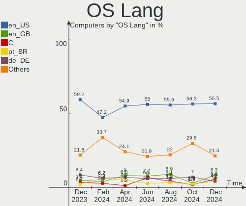
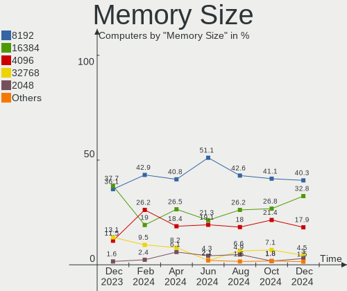

Pop!_OS - Hardware Trends
-------------------------

A project to identify most popular hardware characteristics and track their change
over time based on data collected by Linux users at https://Linux-Hardware.org.

Anyone can contribute to this report by the [hw-probe](https://github.com/linuxhw/hw-probe) tool:

    sudo -E hw-probe -all -upload

This is a report for all computer types. See also reports for [desktops](/Dist/Pop!_OS/Desktop/README.md) and [notebooks](/Dist/Pop!_OS/Notebook/README.md).

This report is for one last month. Overall report since the beginning of time: [TestDays](https://github.com/linuxhw/TestDays)

Period: Feb, 2023.

Contents
--------

* [ System ](#system)
  - [ OS                       ](#os)
  - [ OS Family                ](#os-family)
  - [ Kernel                   ](#kernel)
  - [ Kernel Family            ](#kernel-family)
  - [ Kernel Major Ver.        ](#kernel-major-ver)
  - [ Arch                     ](#arch)
  - [ DE                       ](#de)
  - [ Display Server           ](#display-server)
  - [ Display Manager          ](#display-manager)
  - [ OS Lang                  ](#os-lang)
  - [ Boot Mode                ](#boot-mode)
  - [ Filesystem               ](#filesystem)
  - [ Part. scheme             ](#part-scheme)
  - [ Dual Boot with Linux/BSD ](#dual-boot-with-linuxbsd)
  - [ Dual Boot (Win)          ](#dual-boot-win)

* [ Board ](#board)
  - [ Vendor                   ](#vendor)
  - [ Model                    ](#model)
  - [ Model Family             ](#model-family)
  - [ MFG Year                 ](#mfg-year)
  - [ Form Factor              ](#form-factor)
  - [ Secure Boot              ](#secure-boot)
  - [ Coreboot                 ](#coreboot)
  - [ RAM Size                 ](#ram-size)
  - [ RAM Used                 ](#ram-used)
  - [ Total Drives             ](#total-drives)
  - [ Has CD-ROM               ](#has-cd-rom)
  - [ Has Ethernet             ](#has-ethernet)
  - [ Has WiFi                 ](#has-wifi)
  - [ Has Bluetooth            ](#has-bluetooth)

* [ Location ](#location)
  - [ Country                  ](#country)
  - [ City                     ](#city)

* [ Drives ](#drives)
  - [ Drive Vendor             ](#drive-vendor)
  - [ Drive Model              ](#drive-model)
  - [ HDD Vendor               ](#hdd-vendor)
  - [ SSD Vendor               ](#ssd-vendor)
  - [ Drive Kind               ](#drive-kind)
  - [ Drive Connector          ](#drive-connector)
  - [ Drive Size               ](#drive-size)
  - [ Space Total              ](#space-total)
  - [ Space Used               ](#space-used)
  - [ Malfunc. Drives          ](#malfunc-drives)
  - [ Malfunc. Drive Vendor    ](#malfunc-drive-vendor)
  - [ Malfunc. HDD Vendor      ](#malfunc-hdd-vendor)
  - [ Malfunc. Drive Kind      ](#malfunc-drive-kind)
  - [ Failed Drives            ](#failed-drives)
  - [ Failed Drive Vendor      ](#failed-drive-vendor)
  - [ Drive Status             ](#drive-status)

* [ Storage controller ](#storage-controller)
  - [ Storage Vendor           ](#storage-vendor)
  - [ Storage Model            ](#storage-model)
  - [ Storage Kind             ](#storage-kind)

* [ Processor ](#processor)
  - [ CPU Vendor               ](#cpu-vendor)
  - [ CPU Model                ](#cpu-model)
  - [ CPU Model Family         ](#cpu-model-family)
  - [ CPU Cores                ](#cpu-cores)
  - [ CPU Sockets              ](#cpu-sockets)
  - [ CPU Threads              ](#cpu-threads)
  - [ CPU Op-Modes             ](#cpu-op-modes)
  - [ CPU Microcode            ](#cpu-microcode)
  - [ CPU Microarch            ](#cpu-microarch)

* [ Graphics ](#graphics)
  - [ GPU Vendor               ](#gpu-vendor)
  - [ GPU Model                ](#gpu-model)
  - [ GPU Combo                ](#gpu-combo)
  - [ GPU Driver               ](#gpu-driver)
  - [ GPU Memory               ](#gpu-memory)

* [ Monitor ](#monitor)
  - [ Monitor Vendor           ](#monitor-vendor)
  - [ Monitor Model            ](#monitor-model)
  - [ Monitor Resolution       ](#monitor-resolution)
  - [ Monitor Diagonal         ](#monitor-diagonal)
  - [ Monitor Width            ](#monitor-width)
  - [ Aspect Ratio             ](#aspect-ratio)
  - [ Monitor Area             ](#monitor-area)
  - [ Pixel Density            ](#pixel-density)
  - [ Multiple Monitors        ](#multiple-monitors)

* [ Network ](#network)
  - [ Net Controller Vendor    ](#net-controller-vendor)
  - [ Net Controller Model     ](#net-controller-model)
  - [ Wireless Vendor          ](#wireless-vendor)
  - [ Wireless Model           ](#wireless-model)
  - [ Ethernet Vendor          ](#ethernet-vendor)
  - [ Ethernet Model           ](#ethernet-model)
  - [ Net Controller Kind      ](#net-controller-kind)
  - [ Used Controller          ](#used-controller)
  - [ NICs                     ](#nics)
  - [ IPv6                     ](#ipv6)

* [ Bluetooth ](#bluetooth)
  - [ Bluetooth Vendor         ](#bluetooth-vendor)
  - [ Bluetooth Model          ](#bluetooth-model)

* [ Sound ](#sound)
  - [ Sound Vendor             ](#sound-vendor)
  - [ Sound Model              ](#sound-model)

* [ Memory ](#memory)
  - [ Memory Vendor            ](#memory-vendor)
  - [ Memory Model             ](#memory-model)
  - [ Memory Kind              ](#memory-kind)
  - [ Memory Form Factor       ](#memory-form-factor)
  - [ Memory Size              ](#memory-size)
  - [ Memory Speed             ](#memory-speed)

* [ Printers & scanners ](#printers--scanners)
  - [ Printer Vendor           ](#printer-vendor)
  - [ Printer Model            ](#printer-model)
  - [ Scanner Vendor           ](#scanner-vendor)
  - [ Scanner Model            ](#scanner-model)

* [ Camera ](#camera)
  - [ Camera Vendor            ](#camera-vendor)
  - [ Camera Model             ](#camera-model)

* [ Security ](#security)
  - [ Fingerprint Vendor       ](#fingerprint-vendor)
  - [ Fingerprint Model        ](#fingerprint-model)
  - [ Chipcard Vendor          ](#chipcard-vendor)
  - [ Chipcard Model           ](#chipcard-model)

* [ Unsupported ](#unsupported)
  - [ Unsupported Devices      ](#unsupported-devices)
  - [ Unsupported Device Types ](#unsupported-device-types)

System
------

OS
--

Installed operating systems

| Name          | Computers | Percent |
|---------------|-----------|---------|
| Pop!_OS 22.04 | 222       | 99.55%  |
| Pop!_OS 20.04 | 1         | 0.45%   |

OS Family
---------

OS without a version

| Name    | Computers | Percent |
|---------|-----------|---------|
| Pop!_OS | 223       | 100%    |

Kernel
------

Version of the Linux kernel

| Version                  | Computers | Percent |
|--------------------------|-----------|---------|
| 6.0.12-76060006-generic  | 166       | 74.44%  |
| 6.1.11-76060111-generic  | 36        | 16.14%  |
| 6.0.6-76060006-generic   | 5         | 2.24%   |
| 6.1.0-1006-oem           | 3         | 1.35%   |
| 6.1.9-060109-generic     | 1         | 0.45%   |
| 6.1.8-surface            | 1         | 0.45%   |
| 6.1.14-x64v2-xanmod1     | 1         | 0.45%   |
| 6.1.13-x64v3-xanmod1     | 1         | 0.45%   |
| 6.1.12-x64v3-xanmod1     | 1         | 0.45%   |
| 6.1.12-surface           | 1         | 0.45%   |
| 6.1.11-060111-generic    | 1         | 0.45%   |
| 5.19.0-76051900-generic  | 1         | 0.45%   |
| 5.18.10-76051810-generic | 1         | 0.45%   |
| 5.17.5-76051705-generic  | 1         | 0.45%   |
| 5.17.0-1020-oem          | 1         | 0.45%   |
| 5.15.87-xanmod1          | 1         | 0.45%   |
| 5.15.0-60-lowlatency     | 1         | 0.45%   |

Kernel Family
-------------

Linux kernel without a distro release

| Version | Computers | Percent |
|---------|-----------|---------|
| 6.0.12  | 166       | 74.44%  |
| 6.1.11  | 37        | 16.59%  |
| 6.0.6   | 5         | 2.24%   |
| 6.1.0   | 3         | 1.35%   |
| 6.1.12  | 2         | 0.9%    |
| 6.1.9   | 1         | 0.45%   |
| 6.1.8   | 1         | 0.45%   |
| 6.1.14  | 1         | 0.45%   |
| 6.1.13  | 1         | 0.45%   |
| 5.19.0  | 1         | 0.45%   |
| 5.18.10 | 1         | 0.45%   |
| 5.17.5  | 1         | 0.45%   |
| 5.17.0  | 1         | 0.45%   |
| 5.15.87 | 1         | 0.45%   |
| 5.15.0  | 1         | 0.45%   |

Kernel Major Ver.
-----------------

Linux kernel major version

| Version | Computers | Percent |
|---------|-----------|---------|
| 6.0     | 171       | 76.68%  |
| 6.1     | 46        | 20.63%  |
| 5.17    | 2         | 0.9%    |
| 5.15    | 2         | 0.9%    |
| 5.19    | 1         | 0.45%   |
| 5.18    | 1         | 0.45%   |

Arch
----

OS architecture (x86_64, i586, etc.)

| Name   | Computers | Percent |
|--------|-----------|---------|
| x86_64 | 223       | 100%    |

DE
--

Desktop Environment

| Name  | Computers | Percent |
|-------|-----------|---------|
| GNOME | 221       | 99.1%   |
| KDE5  | 2         | 0.9%    |

Display Server
--------------

X11 or Wayland

| Name    | Computers | Percent |
|---------|-----------|---------|
| X11     | 215       | 96.41%  |
| Wayland | 7         | 3.14%   |
| Unknown | 1         | 0.45%   |

Display Manager
---------------

SDDM, LightDM, etc.

| Name    | Computers | Percent |
|---------|-----------|---------|
| Unknown | 180       | 80.72%  |
| GDM3    | 42        | 18.83%  |
| GDM     | 1         | 0.45%   |

OS Lang
-------

Language

| Lang  | Computers | Percent |
|-------|-----------|---------|
| en_US | 147       | 65.92%  |
| de_DE | 14        | 6.28%   |
| en_GB | 13        | 5.83%   |
| pt_BR | 8         | 3.59%   |
| C     | 5         | 2.24%   |
| fr_FR | 4         | 1.79%   |
| es_ES | 4         | 1.79%   |
| ru_RU | 3         | 1.35%   |
| pl_PL | 3         | 1.35%   |
| it_IT | 3         | 1.35%   |
| en_CA | 3         | 1.35%   |
| sv_SE | 2         | 0.9%    |
| nb_NO | 2         | 0.9%    |
| fi_FI | 2         | 0.9%    |
| en_NZ | 2         | 0.9%    |
| en_AU | 2         | 0.9%    |
| pt_PT | 1         | 0.45%   |
| nl_BE | 1         | 0.45%   |
| lv_LV | 1         | 0.45%   |
| et_EE | 1         | 0.45%   |
| de_CH | 1         | 0.45%   |
| cs_CZ | 1         | 0.45%   |

Boot Mode
---------

EFI or BIOS

| Mode | Computers | Percent |
|------|-----------|---------|
| BIOS | 183       | 82.06%  |
| EFI  | 40        | 17.94%  |

Filesystem
----------

Type of filesystem

| Type    | Computers | Percent |
|---------|-----------|---------|
| Ext4    | 211       | 94.62%  |
| Btrfs   | 7         | 3.14%   |
| Xfs     | 2         | 0.9%    |
| Overlay | 2         | 0.9%    |
| Zfs     | 1         | 0.45%   |

Part. scheme
------------

Scheme of partitioning

| Type    | Computers | Percent |
|---------|-----------|---------|
| Unknown | 179       | 80.27%  |
| GPT     | 40        | 17.94%  |
| MBR     | 4         | 1.79%   |

Dual Boot with Linux/BSD
------------------------

Hosting more than one Linux/BSD

| Dual boot | Computers | Percent |
|-----------|-----------|---------|
| No        | 219       | 98.21%  |
| Yes       | 4         | 1.79%   |

Dual Boot (Win)
---------------

Hosting Linux and Windows

| Dual boot | Computers | Percent |
|-----------|-----------|---------|
| No        | 210       | 94.17%  |
| Yes       | 13        | 5.83%   |

Board
-----

Vendor
------

Motherboard manufacturer

| Name                    | Computers | Percent |
|-------------------------|-----------|---------|
| Lenovo                  | 36        | 16.14%  |
| Dell                    | 36        | 16.14%  |
| ASUSTek Computer        | 29        | 13%     |
| Hewlett-Packard         | 23        | 10.31%  |
| Gigabyte Technology     | 17        | 7.62%   |
| Apple                   | 14        | 6.28%   |
| Acer                    | 12        | 5.38%   |
| MSI                     | 11        | 4.93%   |
| ASRock                  | 6         | 2.69%   |
| System76                | 4         | 1.79%   |
| Alienware               | 4         | 1.79%   |
| Toshiba                 | 2         | 0.9%    |
| Timi                    | 2         | 0.9%    |
| Sony                    | 2         | 0.9%    |
| Intel                   | 2         | 0.9%    |
| AZW                     | 2         | 0.9%    |
| ZOTAC                   | 1         | 0.45%   |
| VANT                    | 1         | 0.45%   |
| TUXEDO                  | 1         | 0.45%   |
| Star Labs               | 1         | 0.45%   |
| Samsung Electronics     | 1         | 0.45%   |
| Razer                   | 1         | 0.45%   |
| Packard Bell            | 1         | 0.45%   |
| OriginPC                | 1         | 0.45%   |
| ONE-NETBOOK TECHNOLOGY  | 1         | 0.45%   |
| Notebook                | 1         | 0.45%   |
| Microsoft               | 1         | 0.45%   |
| MACHINIST               | 1         | 0.45%   |
| HUAWEI                  | 1         | 0.45%   |
| Huanan                  | 1         | 0.45%   |
| HONOR                   | 1         | 0.45%   |
| HCL Infosystems Limited | 1         | 0.45%   |
| Haier                   | 1         | 0.45%   |
| GPU Company             | 1         | 0.45%   |
| Google                  | 1         | 0.45%   |
| Fujitsu                 | 1         | 0.45%   |
| Biostar                 | 1         | 0.45%   |

Model
-----

Motherboard model

| Name                                               | Computers | Percent |
|----------------------------------------------------|-----------|---------|
| MSI MS-7D32                                        | 2         | 0.9%    |
| HP EliteBook 830 G5                                | 2         | 0.9%    |
| Gigabyte X570 AORUS ELITE                          | 2         | 0.9%    |
| AZW SER                                            | 2         | 0.9%    |
| ASUS TUF Gaming X570-PLUS                          | 2         | 0.9%    |
| ASUS PRIME B550M-A                                 | 2         | 0.9%    |
| ASUS All Series                                    | 2         | 0.9%    |
| Apple MacBookPro9,2                                | 2         | 0.9%    |
| Apple iMac10,1                                     | 2         | 0.9%    |
| Acer Swift SF114-34                                | 2         | 0.9%    |
| Acer Aspire A315-59                                | 2         | 0.9%    |
| ZOTAC MEK1                                         | 1         | 0.45%   |
| VANT MOOVE3-14                                     | 1         | 0.45%   |
| TUXEDO Polaris AMD Gen3 (CZN)                      | 1         | 0.45%   |
| Toshiba Satellite C855-233                         | 1         | 0.45%   |
| Toshiba Satellite C855-1T5                         | 1         | 0.45%   |
| Timi RedmiBook Pro 15S                             | 1         | 0.45%   |
| Timi Mi NoteBook Ultra                             | 1         | 0.45%   |
| System76 Thelio                                    | 1         | 0.45%   |
| System76 Lemur Pro                                 | 1         | 0.45%   |
| System76 Gazelle                                   | 1         | 0.45%   |
| System76 Galago Pro                                | 1         | 0.45%   |
| Star Labs StarBook                                 | 1         | 0.45%   |
| Sony VPCZ12V9R                                     | 1         | 0.45%   |
| Sony VPCEG27FM                                     | 1         | 0.45%   |
| Samsung DeskTop System                             | 1         | 0.45%   |
| Razer Blade 15 Base Model (Early 2020) - RZ09-0328 | 1         | 0.45%   |
| Packard Bell EasyNote TS11HR                       | 1         | 0.45%   |
| OriginPC Voyager a1600                             | 1         | 0.45%   |
| ONE-NETBOOK TECHNOLOGY ONE XPLAYER                 | 1         | 0.45%   |
| Notebook NJ50_70CU                                 | 1         | 0.45%   |
| MSI Prestige 14Evo A11M                            | 1         | 0.45%   |
| MSI MS-7E06                                        | 1         | 0.45%   |
| MSI MS-7D25                                        | 1         | 0.45%   |
| MSI MS-7D19                                        | 1         | 0.45%   |
| MSI MS-7C02                                        | 1         | 0.45%   |
| MSI MS-7B86                                        | 1         | 0.45%   |
| MSI MS-7B17                                        | 1         | 0.45%   |
| MSI MS-7592                                        | 1         | 0.45%   |
| MSI GF63 Thin 9RCX                                 | 1         | 0.45%   |

Model Family
------------

Motherboard model prefix

| Name                | Computers | Percent |
|---------------------|-----------|---------|
| Lenovo ThinkPad     | 18        | 8.07%   |
| Dell Precision      | 8         | 3.59%   |
| Dell Latitude       | 8         | 3.59%   |
| Lenovo IdeaPad      | 7         | 3.14%   |
| HP EliteBook        | 7         | 3.14%   |
| Acer Aspire         | 7         | 3.14%   |
| Dell Inspiron       | 6         | 2.69%   |
| HP Pavilion         | 4         | 1.79%   |
| Dell XPS            | 4         | 1.79%   |
| ASUS VivoBook       | 4         | 1.79%   |
| ASUS TUF            | 4         | 1.79%   |
| ASUS ROG            | 4         | 1.79%   |
| ASUS PRIME          | 4         | 1.79%   |
| HP Laptop           | 3         | 1.35%   |
| Gigabyte X570       | 3         | 1.35%   |
| Dell OptiPlex       | 3         | 1.35%   |
| Dell G15            | 3         | 1.35%   |
| ASUS Zenbook        | 3         | 1.35%   |
| Apple MacBookPro11  | 3         | 1.35%   |
| Acer Swift          | 3         | 1.35%   |
| Toshiba Satellite   | 2         | 0.9%    |
| MSI MS-7D32         | 2         | 0.9%    |
| Lenovo ThinkStation | 2         | 0.9%    |
| Lenovo Legion       | 2         | 0.9%    |
| HP EliteDesk        | 2         | 0.9%    |
| AZW SER             | 2         | 0.9%    |
| ASUS All            | 2         | 0.9%    |
| Apple MacBookPro9   | 2         | 0.9%    |
| Apple iMac10        | 2         | 0.9%    |
| ZOTAC MEK1          | 1         | 0.45%   |
| VANT MOOVE3-14      | 1         | 0.45%   |
| TUXEDO Polaris      | 1         | 0.45%   |
| Timi RedmiBook      | 1         | 0.45%   |
| Timi Mi             | 1         | 0.45%   |
| System76 Thelio     | 1         | 0.45%   |
| System76 Lemur      | 1         | 0.45%   |
| System76 Gazelle    | 1         | 0.45%   |
| System76 Galago     | 1         | 0.45%   |
| Star Labs StarBook  | 1         | 0.45%   |
| Sony VPCZ12V9R      | 1         | 0.45%   |

MFG Year
--------

Motherboard manufacture year

| Year | Computers | Percent |
|------|-----------|---------|
| 2022 | 31        | 13.9%   |
| 2021 | 29        | 13%     |
| 2020 | 28        | 12.56%  |
| 2019 | 26        | 11.66%  |
| 2018 | 22        | 9.87%   |
| 2015 | 13        | 5.83%   |
| 2013 | 13        | 5.83%   |
| 2017 | 12        | 5.38%   |
| 2011 | 12        | 5.38%   |
| 2012 | 11        | 4.93%   |
| 2014 | 7         | 3.14%   |
| 2009 | 7         | 3.14%   |
| 2016 | 5         | 2.24%   |
| 2023 | 2         | 0.9%    |
| 2010 | 2         | 0.9%    |
| 2008 | 2         | 0.9%    |
| 2007 | 1         | 0.45%   |

Form Factor
-----------

Physical design of the computer

| Name        | Computers | Percent |
|-------------|-----------|---------|
| Notebook    | 130       | 58.3%   |
| Desktop     | 75        | 33.63%  |
| Convertible | 6         | 2.69%   |
| Mini pc     | 5         | 2.24%   |
| All in one  | 4         | 1.79%   |
| Tablet      | 2         | 0.9%    |
| Server      | 1         | 0.45%   |

Secure Boot
-----------

Enabled or disabled

| State    | Computers | Percent |
|----------|-----------|---------|
| Disabled | 222       | 99.55%  |
| Enabled  | 1         | 0.45%   |

Coreboot
--------

Have coreboot on board

| Used | Computers | Percent |
|------|-----------|---------|
| No   | 219       | 98.21%  |
| Yes  | 4         | 1.79%   |

RAM Size
--------

Total RAM memory

| Size in GB  | Computers | Percent |
|-------------|-----------|---------|
| 16.01-24.0  | 66        | 29.6%   |
| 4.01-8.0    | 44        | 19.73%  |
| 32.01-64.0  | 39        | 17.49%  |
| 8.01-16.0   | 38        | 17.04%  |
| 3.01-4.0    | 17        | 7.62%   |
| 64.01-256.0 | 10        | 4.48%   |
| 24.01-32.0  | 6         | 2.69%   |
| 2.01-3.0    | 3         | 1.35%   |

RAM Used
--------

Used RAM memory

| Used GB    | Computers | Percent |
|------------|-----------|---------|
| 4.01-8.0   | 88        | 39.46%  |
| 2.01-3.0   | 46        | 20.63%  |
| 3.01-4.0   | 42        | 18.83%  |
| 8.01-16.0  | 25        | 11.21%  |
| 1.01-2.0   | 17        | 7.62%   |
| 16.01-24.0 | 3         | 1.35%   |
| 24.01-32.0 | 1         | 0.45%   |
| 0.51-1.0   | 1         | 0.45%   |

Total Drives
------------

Number of drives on board

| Drives | Computers | Percent |
|--------|-----------|---------|
| 1      | 128       | 57.4%   |
| 2      | 63        | 28.25%  |
| 3      | 13        | 5.83%   |
| 4      | 9         | 4.04%   |
| 5      | 8         | 3.59%   |
| 6      | 1         | 0.45%   |
| 0      | 1         | 0.45%   |

Has CD-ROM
----------

Has CD-ROM on board

| Presented | Computers | Percent |
|-----------|-----------|---------|
| No        | 171       | 76.68%  |
| Yes       | 52        | 23.32%  |

Has Ethernet
------------

Has Ethernet on board

| Presented | Computers | Percent |
|-----------|-----------|---------|
| Yes       | 182       | 81.61%  |
| No        | 41        | 18.39%  |

Has WiFi
--------

Has WiFi module

| Presented | Computers | Percent |
|-----------|-----------|---------|
| Yes       | 187       | 83.86%  |
| No        | 36        | 16.14%  |

Has Bluetooth
-------------

Has Bluetooth module

| Presented | Computers | Percent |
|-----------|-----------|---------|
| Yes       | 160       | 71.75%  |
| No        | 63        | 28.25%  |

Location
--------

Country
-------

Geographic location (country)

| Country     | Computers | Percent |
|-------------|-----------|---------|
| USA         | 83        | 37.22%  |
| Germany     | 18        | 8.07%   |
| UK          | 11        | 4.93%   |
| Brazil      | 11        | 4.93%   |
| Italy       | 8         | 3.59%   |
| Poland      | 7         | 3.14%   |
| India       | 6         | 2.69%   |
| France      | 6         | 2.69%   |
| Canada      | 6         | 2.69%   |
| Finland     | 5         | 2.24%   |
| Australia   | 5         | 2.24%   |
| Spain       | 4         | 1.79%   |
| Russia      | 4         | 1.79%   |
| Sweden      | 3         | 1.35%   |
| Romania     | 3         | 1.35%   |
| Norway      | 3         | 1.35%   |
| New Zealand | 3         | 1.35%   |
| Hungary     | 3         | 1.35%   |
| Belgium     | 3         | 1.35%   |
| UAE         | 2         | 0.9%    |
| Thailand    | 2         | 0.9%    |
| Switzerland | 2         | 0.9%    |
| Serbia      | 2         | 0.9%    |
| Portugal    | 2         | 0.9%    |
| Netherlands | 2         | 0.9%    |
| Malaysia    | 2         | 0.9%    |
| Ireland     | 2         | 0.9%    |
| Georgia     | 2         | 0.9%    |
| Czechia     | 2         | 0.9%    |
| Vietnam     | 1         | 0.45%   |
| Ukraine     | 1         | 0.45%   |
| Sri Lanka   | 1         | 0.45%   |
| Slovakia    | 1         | 0.45%   |
| Philippines | 1         | 0.45%   |
| Pakistan    | 1         | 0.45%   |
| Latvia      | 1         | 0.45%   |
| Estonia     | 1         | 0.45%   |
| Chile       | 1         | 0.45%   |
| Bulgaria    | 1         | 0.45%   |
| Austria     | 1         | 0.45%   |

City
----

Geographic location (city)

| City          | Computers | Percent |
|---------------|-----------|---------|
| Seattle       | 4         | 1.79%   |
| Helsinki      | 4         | 1.79%   |
| Moscow        | 3         | 1.35%   |
| Bamberg       | 3         | 1.35%   |
| Auckland      | 3         | 1.35%   |
| Tbilisi       | 2         | 0.9%    |
| Szeged        | 2         | 0.9%    |
| Prague        | 2         | 0.9%    |
| Oslo          | 2         | 0.9%    |
| New York      | 2         | 0.9%    |
| Milano        | 2         | 0.9%    |
| Memphis       | 2         | 0.9%    |
| Melbourne     | 2         | 0.9%    |
| London        | 2         | 0.9%    |
| Lodz          | 2         | 0.9%    |
| Kenosha       | 2         | 0.9%    |
| Hamburg       | 2         | 0.9%    |
| Denver        | 2         | 0.9%    |
| Dallas        | 2         | 0.9%    |
| Canberra      | 2         | 0.9%    |
| Bury          | 2         | 0.9%    |
| Bucharest     | 2         | 0.9%    |
| Belgrade      | 2         | 0.9%    |
| Abu Dhabi     | 2         | 0.9%    |
| Zevio         | 1         | 0.45%   |
| Yonkers       | 1         | 0.45%   |
| Williamsburg  | 1         | 0.45%   |
| Wietzendorf   | 1         | 0.45%   |
| Wiesbaden     | 1         | 0.45%   |
| West Dundee   | 1         | 0.45%   |
| Vitória      | 1         | 0.45%   |
| Viking        | 1         | 0.45%   |
| Van Nuys      | 1         | 0.45%   |
| Valencia      | 1         | 0.45%   |
| Uxbridge      | 1         | 0.45%   |
| Troisdorf     | 1         | 0.45%   |
| Trenton       | 1         | 0.45%   |
| Traverse City | 1         | 0.45%   |
| Tracy         | 1         | 0.45%   |
| Toronto       | 1         | 0.45%   |

Drives
------

Drive Vendor
------------

Hard drive vendors

| Vendor                       | Computers | Drives | Percent |
|------------------------------|-----------|--------|---------|
| Samsung Electronics          | 76        | 91     | 22.42%  |
| WDC                          | 37        | 44     | 10.91%  |
| Sandisk                      | 32        | 34     | 9.44%   |
| Seagate                      | 30        | 32     | 8.85%   |
| Unknown                      | 13        | 14     | 3.83%   |
| Toshiba                      | 12        | 13     | 3.54%   |
| SK hynix                     | 11        | 12     | 3.24%   |
| Crucial                      | 11        | 13     | 3.24%   |
| Kingston                     | 10        | 11     | 2.95%   |
| Intel                        | 10        | 13     | 2.95%   |
| Apple                        | 9         | 9      | 2.65%   |
| Micron Technology            | 8         | 9      | 2.36%   |
| HGST                         | 7         | 7      | 2.06%   |
| PNY                          | 6         | 7      | 1.77%   |
| Phison Electronics           | 4         | 5      | 1.18%   |
| Micron/Crucial Technology    | 4         | 4      | 1.18%   |
| ADATA Technology             | 4         | 4      | 1.18%   |
| A-DATA Technology            | 4         | 4      | 1.18%   |
| Silicon Motion               | 3         | 3      | 0.88%   |
| Realtek Semiconductor        | 3         | 3      | 0.88%   |
| JMicron Technology           | 3         | 3      | 0.88%   |
| XPG                          | 2         | 2      | 0.59%   |
| Verbatim                     | 2         | 2      | 0.59%   |
| Transcend                    | 2         | 2      | 0.59%   |
| Shenzhen Longsys Electronics | 2         | 3      | 0.59%   |
| Patriot                      | 2         | 2      | 0.59%   |
| OCZ                          | 2         | 2      | 0.59%   |
| LITEON                       | 2         | 2      | 0.59%   |
| Gigabyte Technology          | 2         | 2      | 0.59%   |
| China                        | 2         | 2      | 0.59%   |
| Wibtek                       | 1         | 1      | 0.29%   |
| USB                          | 1         | 1      | 0.29%   |
| Timetec                      | 1         | 1      | 0.29%   |
| Team                         | 1         | 2      | 0.29%   |
| Star Drive                   | 1         | 1      | 0.29%   |
| SPCC                         | 1         | 1      | 0.29%   |
| RZX                          | 1         | 1      | 0.29%   |
| Realtek                      | 1         | 1      | 0.29%   |
| OWC                          | 1         | 1      | 0.29%   |
| MAXIO Technology (Hangzhou)  | 1         | 1      | 0.29%   |

Drive Model
-----------

Hard drive models

| Model                                                           | Computers | Percent |
|-----------------------------------------------------------------|-----------|---------|
| Samsung NVMe SSD Controller SM981/PM981/PM983 250GB             | 22        | 5.96%   |
| Samsung NVMe SSD Controller PM9A1/PM9A3/980PRO 960GB            | 10        | 2.71%   |
| Samsung SSD 980 1TB                                             | 5         | 1.36%   |
| Unknown SD/MMC/MS PRO 16GB                                      | 4         | 1.08%   |
| Unknown MMC Card  64GB                                          | 4         | 1.08%   |
| Samsung NVMe SSD Controller SM961/PM961/SM963 512GB             | 4         | 1.08%   |
| Crucial CT240BX500SSD1 240GB                                    | 4         | 1.08%   |
| SK hynix BC501 NVMe Solid State Drive 512GB                     | 3         | 0.81%   |
| Seagate ST1000LM035-1RK172 1TB                                  | 3         | 0.81%   |
| Sandisk WD Blue SN570 1TB                                       | 3         | 0.81%   |
| Sandisk WD Blue SN550 NVMe SSD 1TB                              | 3         | 0.81%   |
| Sandisk WD Black SN750 / PC SN730 NVMe SSD 512GB                | 3         | 0.81%   |
| Samsung SSD 860 EVO 1TB                                         | 3         | 0.81%   |
| Samsung SSD 850 EVO 250GB                                       | 3         | 0.81%   |
| Micron/Crucial P2 NVMe PCIe SSD 1TB                             | 3         | 0.81%   |
| Intel SSD 660P Series 1024GB                                    | 3         | 0.81%   |
| HGST HTS545050A7E680 500GB                                      | 3         | 0.81%   |
| ADATA XPG SX8200 Pro PCIe Gen3x4 M.2 2280 Solid State Drive 2TB | 3         | 0.81%   |
| WDC WD5000LPCX-60VHAT0 500GB                                    | 2         | 0.54%   |
| WDC WD10SPZX-21Z10T0 1TB                                        | 2         | 0.54%   |
| WDC WD10EZEX-00WN4A0 1TB                                        | 2         | 0.54%   |
| WDC PC SN730 SDBPNTY-1T00-1101 1TB                              | 2         | 0.54%   |
| Verbatim Vi550 S3 512GB                                         | 2         | 0.54%   |
| Unknown DA4128  128GB                                           | 2         | 0.54%   |
| Toshiba MQ04ABF100 1TB                                          | 2         | 0.54%   |
| Toshiba HDWD130 3TB                                             | 2         | 0.54%   |
| SK hynix SC401 SATA 256GB SSD                                   | 2         | 0.54%   |
| Silicon Motion SM2263EN/SM2263XT SSD Controller 512GB           | 2         | 0.54%   |
| Seagate ST500DM002-1BD142 500GB                                 | 2         | 0.54%   |
| Seagate ST4000DM004-2CV104 4TB                                  | 2         | 0.54%   |
| Seagate ST2000LM015-2E8174 2TB                                  | 2         | 0.54%   |
| Seagate ST2000DM001-1ER164 2TB                                  | 2         | 0.54%   |
| Seagate ST1000LM024 HN-M101MBB 1TB                              | 2         | 0.54%   |
| SanDisk SSD PLUS 1000GB                                         | 2         | 0.54%   |
| SanDisk NVMe SSD Drive 512GB                                    | 2         | 0.54%   |
| Samsung SSD 980 500GB                                           | 2         | 0.54%   |
| Samsung SSD 970 EVO Plus 500GB                                  | 2         | 0.54%   |
| Samsung SSD 860 EVO 500GB                                       | 2         | 0.54%   |
| Samsung SSD 850 EVO 500GB                                       | 2         | 0.54%   |
| Samsung SSD 850 EVO 1TB                                         | 2         | 0.54%   |

HDD Vendor
----------

Hard disk drive vendors

| Vendor              | Computers | Drives | Percent |
|---------------------|-----------|--------|---------|
| WDC                 | 29        | 34     | 34.94%  |
| Seagate             | 28        | 30     | 33.73%  |
| Toshiba             | 8         | 9      | 9.64%   |
| HGST                | 7         | 7      | 8.43%   |
| Unknown             | 4         | 4      | 4.82%   |
| Apple               | 3         | 3      | 3.61%   |
| JMicron Technology  | 2         | 2      | 2.41%   |
| Samsung Electronics | 1         | 1      | 1.2%    |
| Hitachi             | 1         | 1      | 1.2%    |

SSD Vendor
----------

Solid state drive vendors

| Vendor              | Computers | Drives | Percent |
|---------------------|-----------|--------|---------|
| Samsung Electronics | 27        | 30     | 25.23%  |
| SanDisk             | 13        | 14     | 12.15%  |
| Crucial             | 10        | 12     | 9.35%   |
| Kingston            | 8         | 9      | 7.48%   |
| PNY                 | 6         | 7      | 5.61%   |
| WDC                 | 4         | 5      | 3.74%   |
| Apple               | 4         | 4      | 3.74%   |
| SK hynix            | 3         | 4      | 2.8%    |
| Intel               | 3         | 4      | 2.8%    |
| A-DATA Technology   | 3         | 3      | 2.8%    |
| Transcend           | 2         | 2      | 1.87%   |
| Patriot             | 2         | 2      | 1.87%   |
| OCZ                 | 2         | 2      | 1.87%   |
| Micron Technology   | 2         | 2      | 1.87%   |
| China               | 2         | 2      | 1.87%   |
| Toshiba             | 1         | 1      | 0.93%   |
| Timetec             | 1         | 1      | 0.93%   |
| Team                | 1         | 2      | 0.93%   |
| SPCC                | 1         | 1      | 0.93%   |
| Seagate             | 1         | 1      | 0.93%   |
| RZX                 | 1         | 1      | 0.93%   |
| OWC                 | 1         | 1      | 0.93%   |
| LITEONIT            | 1         | 1      | 0.93%   |
| LITEON              | 1         | 1      | 0.93%   |
| LDLC                | 1         | 1      | 0.93%   |
| KIOXIA-EXCERIA      | 1         | 1      | 0.93%   |
| KingSpec            | 1         | 1      | 0.93%   |
| KingDian            | 1         | 1      | 0.93%   |
| Intenso             | 1         | 1      | 0.93%   |
| INTEL SS            | 1         | 1      | 0.93%   |
| Dogfish             | 1         | 1      | 0.93%   |

Drive Kind
----------

HDD or SSD

| Kind    | Computers | Drives | Percent |
|---------|-----------|--------|---------|
| NVMe    | 117       | 149    | 39.53%  |
| SSD     | 85        | 119    | 28.72%  |
| HDD     | 75        | 91     | 25.34%  |
| MMC     | 10        | 10     | 3.38%   |
| Unknown | 9         | 11     | 3.04%   |

Drive Connector
---------------

SATA, SAS, NVMe, etc.

| Type | Computers | Drives | Percent |
|------|-----------|--------|---------|
| SATA | 129       | 197    | 46.4%   |
| NVMe | 117       | 148    | 42.09%  |
| SAS  | 22        | 25     | 7.91%   |
| MMC  | 10        | 10     | 3.6%    |

Drive Size
----------

Size of hard drive

| Size in TB | Computers | Drives | Percent |
|------------|-----------|--------|---------|
| 0.01-0.5   | 89        | 113    | 54.94%  |
| 0.51-1.0   | 53        | 72     | 32.72%  |
| 1.01-2.0   | 12        | 15     | 7.41%   |
| 3.01-4.0   | 4         | 4      | 2.47%   |
| 2.01-3.0   | 2         | 3      | 1.23%   |
| 4.01-10.0  | 2         | 3      | 1.23%   |

Space Total
-----------

Amount of disk space available on the file system

| Size in GB     | Computers | Percent |
|----------------|-----------|---------|
| 101-250        | 58        | 26.01%  |
| 251-500        | 55        | 24.66%  |
| 501-1000       | 47        | 21.08%  |
| 1001-2000      | 20        | 8.97%   |
| 2001-3000      | 13        | 5.83%   |
| More than 3000 | 10        | 4.48%   |
| 51-100         | 9         | 4.04%   |
| 21-50          | 5         | 2.24%   |
| 1-20           | 5         | 2.24%   |
| Unknown        | 1         | 0.45%   |

Space Used
----------

Amount of used disk space

| Used GB        | Computers | Percent |
|----------------|-----------|---------|
| 21-50          | 56        | 25.11%  |
| 1-20           | 53        | 23.77%  |
| 51-100         | 35        | 15.7%   |
| 101-250        | 29        | 13%     |
| 501-1000       | 18        | 8.07%   |
| 251-500        | 17        | 7.62%   |
| 1001-2000      | 8         | 3.59%   |
| More than 3000 | 3         | 1.35%   |
| 2001-3000      | 3         | 1.35%   |
| Unknown        | 1         | 0.45%   |

Malfunc. Drives
---------------

Drive models with a malfunction

| Model                                      | Computers | Drives | Percent |
|--------------------------------------------|-----------|--------|---------|
| WDC WD3200BEKT-60PVMT0 320GB               | 1         | 1      | 25%     |
| Toshiba THNSNK256GVN8 M.2 2280 256GB SSD   | 1         | 1      | 25%     |
| Micron Technology 9200_MTFDHAL1T9TCT 1.9TB | 1         | 1      | 25%     |
| HGST HTS545050A7E680 500GB                 | 1         | 1      | 25%     |

Malfunc. Drive Vendor
---------------------

Vendors of faulty drives

| Vendor            | Computers | Drives | Percent |
|-------------------|-----------|--------|---------|
| WDC               | 1         | 1      | 25%     |
| Toshiba           | 1         | 1      | 25%     |
| Micron Technology | 1         | 1      | 25%     |
| HGST              | 1         | 1      | 25%     |

Malfunc. HDD Vendor
-------------------

Vendors of faulty HDD drives

| Vendor | Computers | Drives | Percent |
|--------|-----------|--------|---------|
| WDC    | 1         | 1      | 50%     |
| HGST   | 1         | 1      | 50%     |

Malfunc. Drive Kind
-------------------

Kinds of faulty drives

| Kind | Computers | Drives | Percent |
|------|-----------|--------|---------|
| HDD  | 2         | 2      | 50%     |
| NVMe | 1         | 1      | 25%     |
| SSD  | 1         | 1      | 25%     |

Failed Drives
-------------

Failed drive models

| Model                   | Computers | Drives | Percent |
|-------------------------|-----------|--------|---------|
| KingDian S400 120GB SSD | 1         | 1      | 100%    |

Failed Drive Vendor
-------------------

Failed drive vendors

| Vendor   | Computers | Drives | Percent |
|----------|-----------|--------|---------|
| KingDian | 1         | 1      | 100%    |

Drive Status
------------

Number of failed and malfunc. drives

| Status   | Computers | Drives | Percent |
|----------|-----------|--------|---------|
| Detected | 189       | 322    | 81.47%  |
| Works    | 38        | 53     | 16.38%  |
| Malfunc  | 4         | 4      | 1.72%   |
| Failed   | 1         | 1      | 0.43%   |

Storage controller
------------------

Storage Vendor
--------------

Storage controller vendors

| Vendor                       | Computers | Percent |
|------------------------------|-----------|---------|
| Intel                        | 125       | 40.06%  |
| Samsung Electronics          | 54        | 17.31%  |
| AMD                          | 50        | 16.03%  |
| SanDisk                      | 24        | 7.69%   |
| SK hynix                     | 8         | 2.56%   |
| Phison Electronics           | 7         | 2.24%   |
| Micron Technology            | 6         | 1.92%   |
| ADATA Technology             | 6         | 1.92%   |
| Micron/Crucial Technology    | 5         | 1.6%    |
| Realtek Semiconductor        | 4         | 1.28%   |
| Toshiba America Info Systems | 3         | 0.96%   |
| Silicon Motion               | 3         | 0.96%   |
| Nvidia                       | 3         | 0.96%   |
| Kingston Technology Company  | 3         | 0.96%   |
| ASMedia Technology           | 3         | 0.96%   |
| Shenzhen Longsys Electronics | 2         | 0.64%   |
| Apple                        | 2         | 0.64%   |
| MAXIO Technology (Hangzhou)  | 1         | 0.32%   |
| Marvell Technology Group     | 1         | 0.32%   |
| KIOXIA                       | 1         | 0.32%   |
| Broadcom / LSI               | 1         | 0.32%   |

Storage Model
-------------

Storage controller models

| Model                                                                          | Computers | Percent |
|--------------------------------------------------------------------------------|-----------|---------|
| AMD FCH SATA Controller [AHCI mode]                                            | 30        | 8.47%   |
| Samsung NVMe SSD Controller SM981/PM981/PM983                                  | 28        | 7.91%   |
| Intel Volume Management Device NVMe RAID Controller                            | 15        | 4.24%   |
| Samsung NVMe SSD Controller 980                                                | 12        | 3.39%   |
| Intel 8 Series/C220 Series Chipset Family 6-port SATA Controller 1 [AHCI mode] | 12        | 3.39%   |
| Samsung NVMe SSD Controller PM9A1/PM9A3/980PRO                                 | 11        | 3.11%   |
| AMD 500 Series Chipset SATA Controller                                         | 10        | 2.82%   |
| Intel Sunrise Point-LP SATA Controller [AHCI mode]                             | 8         | 2.26%   |
| Intel 7 Series Chipset Family 6-port SATA Controller [AHCI mode]               | 8         | 2.26%   |
| SanDisk WD Black SN750 / PC SN730 NVMe SSD                                     | 7         | 1.98%   |
| Intel Wildcat Point-LP SATA Controller [AHCI Mode]                             | 7         | 1.98%   |
| Intel 82801 Mobile SATA Controller [RAID mode]                                 | 7         | 1.98%   |
| Intel 6 Series/C200 Series Chipset Family 6 port Mobile SATA AHCI Controller   | 7         | 1.98%   |
| AMD 400 Series Chipset SATA Controller                                         | 7         | 1.98%   |
| Intel Tiger Lake-LP SATA Controller                                            | 6         | 1.69%   |
| Intel Alder Lake-P SATA AHCI Controller                                        | 6         | 1.69%   |
| SanDisk WD Blue SN550 NVMe SSD                                                 | 5         | 1.41%   |
| SanDisk Non-Volatile memory controller                                         | 5         | 1.41%   |
| Samsung NVMe SSD Controller SM961/PM961/SM963                                  | 5         | 1.41%   |
| Micron Non-Volatile memory controller                                          | 5         | 1.41%   |
| Intel Cannon Lake Mobile PCH SATA AHCI Controller                              | 5         | 1.41%   |
| Intel 200 Series PCH SATA controller [AHCI mode]                               | 5         | 1.41%   |
| SanDisk WD Blue SN570 NVMe SSD                                                 | 4         | 1.13%   |
| Intel SSD 660P Series                                                          | 4         | 1.13%   |
| Intel Q170/Q150/B150/H170/H110/Z170/CM236 Chipset SATA Controller [AHCI Mode]  | 4         | 1.13%   |
| Intel Alder Lake-S PCH SATA Controller [AHCI Mode]                             | 4         | 1.13%   |
| Intel 8 Series SATA Controller 1 [AHCI mode]                                   | 4         | 1.13%   |
| AMD SB7x0/SB8x0/SB9x0 IDE Controller                                           | 4         | 1.13%   |
| SK hynix Gold P31/PC711 NVMe Solid State Drive                                 | 3         | 0.85%   |
| SK hynix BC501 NVMe Solid State Drive                                          | 3         | 0.85%   |
| Silicon Motion SM2263EN/SM2263XT SSD Controller                                | 3         | 0.85%   |
| Nvidia MCP79 AHCI Controller                                                   | 3         | 0.85%   |
| Micron/Crucial P2 NVMe PCIe SSD                                                | 3         | 0.85%   |
| Kingston Company Company Non-Volatile memory controller                        | 3         | 0.85%   |
| Intel SATA Controller [RAID mode]                                              | 3         | 0.85%   |
| Intel Comet Lake SATA AHCI Controller                                          | 3         | 0.85%   |
| Intel Cannon Lake PCH SATA AHCI Controller                                     | 3         | 0.85%   |
| Intel C610/X99 series chipset sSATA Controller [AHCI mode]                     | 3         | 0.85%   |
| ASMedia ASM1062 Serial ATA Controller                                          | 3         | 0.85%   |
| AMD SB7x0/SB8x0/SB9x0 SATA Controller [AHCI mode]                              | 3         | 0.85%   |

Storage Kind
------------

Kind of storage controller (IDE, SATA, NVMe, SAS, ...)

| Kind | Computers | Percent |
|------|-----------|---------|
| SATA | 155       | 49.36%  |
| NVMe | 117       | 37.26%  |
| RAID | 26        | 8.28%   |
| IDE  | 15        | 4.78%   |
| SAS  | 1         | 0.32%   |

Processor
---------

CPU Vendor
----------

Processor vendors

| Vendor | Computers | Percent |
|--------|-----------|---------|
| Intel  | 160       | 71.75%  |
| AMD    | 63        | 28.25%  |

CPU Model
---------

Processor models

| Model                                         | Computers | Percent |
|-----------------------------------------------|-----------|---------|
| Intel 11th Gen Core i5-1135G7 @ 2.40GHz       | 6         | 2.69%   |
| Intel 12th Gen Core i7-12700H                 | 4         | 1.79%   |
| Intel Core i7-8750H CPU @ 2.20GHz             | 3         | 1.35%   |
| Intel Core i5-8350U CPU @ 1.70GHz             | 3         | 1.35%   |
| Intel Core i5-8250U CPU @ 1.60GHz             | 3         | 1.35%   |
| Intel Core i5-5300U CPU @ 2.30GHz             | 3         | 1.35%   |
| AMD Ryzen 7 5800X 8-Core Processor            | 3         | 1.35%   |
| AMD Ryzen 7 5800H with Radeon Graphics        | 3         | 1.35%   |
| Intel Pentium Silver N6000 @ 1.10GHz          | 2         | 0.9%    |
| Intel Core i7-9750H CPU @ 2.60GHz             | 2         | 0.9%    |
| Intel Core i7-8700K CPU @ 3.70GHz             | 2         | 0.9%    |
| Intel Core i7-8565U CPU @ 1.80GHz             | 2         | 0.9%    |
| Intel Core i7-5500U CPU @ 2.40GHz             | 2         | 0.9%    |
| Intel Core i7-4790 CPU @ 3.60GHz              | 2         | 0.9%    |
| Intel Core i7-4770 CPU @ 3.40GHz              | 2         | 0.9%    |
| Intel Core i7-2620M CPU @ 2.70GHz             | 2         | 0.9%    |
| Intel Core i7-10750H CPU @ 2.60GHz            | 2         | 0.9%    |
| Intel Core i5-8500T CPU @ 2.10GHz             | 2         | 0.9%    |
| Intel Core i5-7300U CPU @ 2.60GHz             | 2         | 0.9%    |
| Intel Core i5-7200U CPU @ 2.50GHz             | 2         | 0.9%    |
| Intel Core i5-3320M CPU @ 2.60GHz             | 2         | 0.9%    |
| Intel Core i5-3210M CPU @ 2.50GHz             | 2         | 0.9%    |
| Intel Core i5-10210U CPU @ 1.60GHz            | 2         | 0.9%    |
| Intel Core 2 Duo CPU E7600 @ 3.06GHz          | 2         | 0.9%    |
| Intel 12th Gen Core i9-12900H                 | 2         | 0.9%    |
| Intel 12th Gen Core i7-1260P                  | 2         | 0.9%    |
| Intel 12th Gen Core i7-1255U                  | 2         | 0.9%    |
| Intel 12th Gen Core i5-12600K                 | 2         | 0.9%    |
| Intel 12th Gen Core i5-1235U                  | 2         | 0.9%    |
| Intel 11th Gen Core i7-1185G7 @ 3.00GHz       | 2         | 0.9%    |
| AMD Ryzen 9 5900X 12-Core Processor           | 2         | 0.9%    |
| AMD Ryzen 7 6800H with Radeon Graphics        | 2         | 0.9%    |
| AMD Ryzen 7 5700X 8-Core Processor            | 2         | 0.9%    |
| AMD Ryzen 7 5700G with Radeon Graphics        | 2         | 0.9%    |
| AMD Ryzen 7 2700 Eight-Core Processor         | 2         | 0.9%    |
| AMD Ryzen 5 PRO 5650U with Radeon Graphics    | 2         | 0.9%    |
| AMD Ryzen 5 5600G with Radeon Graphics        | 2         | 0.9%    |
| AMD Ryzen 5 3600 6-Core Processor             | 2         | 0.9%    |
| AMD Ryzen 5 3500U with Radeon Vega Mobile Gfx | 2         | 0.9%    |
| AMD Ryzen 5 2400G with Radeon Vega Graphics   | 2         | 0.9%    |

CPU Model Family
----------------

Processor model prefix

| Model                  | Computers | Percent |
|------------------------|-----------|---------|
| Intel Core i7          | 44        | 19.73%  |
| Intel Core i5          | 40        | 17.94%  |
| Other                  | 37        | 16.59%  |
| AMD Ryzen 7            | 22        | 9.87%   |
| AMD Ryzen 5            | 15        | 6.73%   |
| Intel Core i3          | 10        | 4.48%   |
| Intel Core 2 Duo       | 9         | 4.04%   |
| Intel Xeon             | 8         | 3.59%   |
| AMD Ryzen 9            | 6         | 2.69%   |
| Intel Pentium Silver   | 3         | 1.35%   |
| Intel Pentium          | 3         | 1.35%   |
| Intel Celeron          | 3         | 1.35%   |
| AMD FX                 | 3         | 1.35%   |
| Intel Core i9          | 2         | 0.9%    |
| AMD Ryzen 7 PRO        | 2         | 0.9%    |
| AMD Ryzen 5 PRO        | 2         | 0.9%    |
| AMD A10                | 2         | 0.9%    |
| Intel Xeon Gold        | 1         | 0.45%   |
| Intel Core M           | 1         | 0.45%   |
| Intel Core 2 Quad      | 1         | 0.45%   |
| AMD Ryzen Threadripper | 1         | 0.45%   |
| AMD Ryzen 3 PRO        | 1         | 0.45%   |
| AMD Ryzen 3            | 1         | 0.45%   |
| AMD PRO A8             | 1         | 0.45%   |
| AMD Phenom II X4       | 1         | 0.45%   |
| AMD Athlon X4          | 1         | 0.45%   |
| AMD Athlon II X4       | 1         | 0.45%   |
| AMD A8                 | 1         | 0.45%   |
| AMD A6                 | 1         | 0.45%   |

CPU Cores
---------

Number of processor cores

| Number | Computers | Percent |
|--------|-----------|---------|
| 4      | 77        | 34.53%  |
| 2      | 61        | 27.35%  |
| 6      | 30        | 13.45%  |
| 8      | 28        | 12.56%  |
| 12     | 8         | 3.59%   |
| 14     | 6         | 2.69%   |
| 10     | 6         | 2.69%   |
| 16     | 3         | 1.35%   |
| 40     | 1         | 0.45%   |
| 36     | 1         | 0.45%   |
| 24     | 1         | 0.45%   |
| 3      | 1         | 0.45%   |

CPU Sockets
-----------

Number of sockets

| Number | Computers | Percent |
|--------|-----------|---------|
| 1      | 221       | 99.1%   |
| 2      | 2         | 0.9%    |

CPU Threads
-----------

Threads per core (Hyper-Threading)

| Number | Computers | Percent |
|--------|-----------|---------|
| 2      | 183       | 82.06%  |
| 1      | 40        | 17.94%  |

CPU Op-Modes
------------

CPU Operation Modes (32-bit, 64-bit)

| Op mode        | Computers | Percent |
|----------------|-----------|---------|
| 32-bit, 64-bit | 223       | 100%    |

CPU Microcode
-------------

Microcode number

| Number     | Computers | Percent |
|------------|-----------|---------|
| Unknown    | 177       | 79.37%  |
| 0x906a4    | 3         | 1.35%   |
| 0x806ea    | 3         | 1.35%   |
| 0x806c1    | 3         | 1.35%   |
| 0x306d4    | 3         | 1.35%   |
| 0x306a9    | 3         | 1.35%   |
| 0x906ea    | 2         | 0.9%    |
| 0x906c0    | 2         | 0.9%    |
| 0x906a3    | 2         | 0.9%    |
| 0x806e9    | 2         | 0.9%    |
| 0x40651    | 2         | 0.9%    |
| 0x1067a    | 2         | 0.9%    |
| 0x0a50000d | 2         | 0.9%    |
| 0x0a201016 | 2         | 0.9%    |
| 0x08701021 | 2         | 0.9%    |
| 0x90672    | 1         | 0.45%   |
| 0x806eb    | 1         | 0.45%   |
| 0x506e3    | 1         | 0.45%   |
| 0x50657    | 1         | 0.45%   |
| 0x206a7    | 1         | 0.45%   |
| 0x10676    | 1         | 0.45%   |
| 0x0a50000c | 1         | 0.45%   |
| 0x0a404102 | 1         | 0.45%   |
| 0x0a201205 | 1         | 0.45%   |
| 0x08608103 | 1         | 0.45%   |
| 0x08600106 | 1         | 0.45%   |
| 0x08101016 | 1         | 0.45%   |
| 0x07030106 | 1         | 0.45%   |

CPU Microarch
-------------

Microarchitecture

| Name             | Computers | Percent |
|------------------|-----------|---------|
| KabyLake         | 40        | 17.94%  |
| Haswell          | 23        | 10.31%  |
| Unknown          | 22        | 9.87%   |
| Zen 3            | 20        | 8.97%   |
| TigerLake        | 15        | 6.73%   |
| Zen 2            | 10        | 4.48%   |
| Broadwell        | 10        | 4.48%   |
| Skylake          | 9         | 4.04%   |
| SandyBridge      | 9         | 4.04%   |
| Penryn           | 9         | 4.04%   |
| IvyBridge        | 9         | 4.04%   |
| Zen+             | 7         | 3.14%   |
| Zen              | 6         | 2.69%   |
| Alderlake Hybrid | 6         | 2.69%   |
| CometLake        | 5         | 2.24%   |
| Piledriver       | 4         | 1.79%   |
| Westmere         | 3         | 1.35%   |
| Goldmont plus    | 3         | 1.35%   |
| Excavator        | 3         | 1.35%   |
| Tremont          | 2         | 0.9%    |
| Puma             | 2         | 0.9%    |
| K10              | 2         | 0.9%    |
| Steamroller      | 1         | 0.45%   |
| Nehalem          | 1         | 0.45%   |
| IceLake          | 1         | 0.45%   |
| Core             | 1         | 0.45%   |

Graphics
--------

GPU Vendor
----------

Vendors of graphics cards

| Vendor | Computers | Percent |
|--------|-----------|---------|
| Intel  | 123       | 45.72%  |
| Nvidia | 78        | 29%     |
| AMD    | 68        | 25.28%  |

GPU Model
---------

Graphics card models

| Model                                                                       | Computers | Percent |
|-----------------------------------------------------------------------------|-----------|---------|
| Intel TigerLake-LP GT2 [Iris Xe Graphics]                                   | 12        | 4.4%    |
| Intel Alder Lake-P Integrated Graphics Controller                           | 9         | 3.3%    |
| Intel UHD Graphics 620                                                      | 8         | 2.93%   |
| Intel 2nd Generation Core Processor Family Integrated Graphics Controller   | 8         | 2.93%   |
| AMD Cezanne [Radeon Vega Series / Radeon Vega Mobile Series]                | 8         | 2.93%   |
| Intel HD Graphics 620                                                       | 7         | 2.56%   |
| Intel HD Graphics 5500                                                      | 7         | 2.56%   |
| Intel CoffeeLake-H GT2 [UHD Graphics 630]                                   | 6         | 2.2%    |
| Intel 3rd Gen Core processor Graphics Controller                            | 6         | 2.2%    |
| AMD Rembrandt [Radeon 680M]                                                 | 6         | 2.2%    |
| AMD Picasso/Raven 2 [Radeon Vega Series / Radeon Vega Mobile Series]        | 6         | 2.2%    |
| Intel HD Graphics 530                                                       | 5         | 1.83%   |
| AMD Ellesmere [Radeon RX 470/480/570/570X/580/580X/590]                     | 5         | 1.83%   |
| Intel Haswell-ULT Integrated Graphics Controller                            | 4         | 1.47%   |
| Intel CoffeeLake-S GT2 [UHD Graphics 630]                                   | 4         | 1.47%   |
| Intel Alder Lake-UP3 GT2 [Iris Xe Graphics]                                 | 4         | 1.47%   |
| AMD Navi 22 [Radeon RX 6700/6700 XT/6750 XT / 6800M/6850M XT]               | 4         | 1.47%   |
| Nvidia GP104 [GeForce GTX 1070]                                             | 3         | 1.1%    |
| Nvidia GA106M [GeForce RTX 3060 Mobile / Max-Q]                             | 3         | 1.1%    |
| Intel WhiskeyLake-U GT2 [UHD Graphics 620]                                  | 3         | 1.1%    |
| Intel Core Processor Integrated Graphics Controller                         | 3         | 1.1%    |
| Intel CometLake-U GT2 [UHD Graphics]                                        | 3         | 1.1%    |
| Intel 4th Gen Core Processor Integrated Graphics Controller                 | 3         | 1.1%    |
| AMD Renoir                                                                  | 3         | 1.1%    |
| AMD Navi 23 [Radeon RX 6600/6600 XT/6600M]                                  | 3         | 1.1%    |
| Nvidia TU117M [GeForce GTX 1650 Ti Mobile]                                  | 2         | 0.73%   |
| Nvidia TU117M [GeForce GTX 1650 Mobile / Max-Q]                             | 2         | 0.73%   |
| Nvidia TU106M [GeForce RTX 2060 Mobile]                                     | 2         | 0.73%   |
| Nvidia GP108M [GeForce MX150]                                               | 2         | 0.73%   |
| Nvidia GP107M [GeForce GTX 1050 Ti Mobile]                                  | 2         | 0.73%   |
| Nvidia GM206GL [Quadro M2000]                                               | 2         | 0.73%   |
| Nvidia GM204 [GeForce GTX 970]                                              | 2         | 0.73%   |
| Nvidia GA107M [GeForce RTX 3050 Mobile]                                     | 2         | 0.73%   |
| Nvidia GA107BM [GeForce RTX 3050 Ti Mobile]                                 | 2         | 0.73%   |
| Nvidia GA104 [GeForce RTX 3070 Ti]                                          | 2         | 0.73%   |
| Nvidia GA104 [GeForce RTX 3060 Ti Lite Hash Rate]                           | 2         | 0.73%   |
| Intel Xeon E3-1200 v3/4th Gen Core Processor Integrated Graphics Controller | 2         | 0.73%   |
| Intel Tiger Lake-LP GT2 [UHD Graphics G4]                                   | 2         | 0.73%   |
| Intel Mobile 4 Series Chipset Integrated Graphics Controller                | 2         | 0.73%   |
| Intel JasperLake [UHD Graphics]                                             | 2         | 0.73%   |

GPU Combo
---------

Combinations of graphics cards

| Name               | Computers | Percent |
|--------------------|-----------|---------|
| 1 x Intel          | 88        | 39.46%  |
| 1 x AMD            | 50        | 22.42%  |
| 1 x Nvidia         | 42        | 18.83%  |
| Intel + Nvidia     | 23        | 10.31%  |
| AMD + Nvidia       | 10        | 4.48%   |
| Intel + AMD        | 6         | 2.69%   |
| 2 x AMD            | 2         | 0.9%    |
| Other              | 1         | 0.45%   |
| Intel + 2 x Nvidia | 1         | 0.45%   |

GPU Driver
----------

Free vs proprietary

| Driver      | Computers | Percent |
|-------------|-----------|---------|
| Free        | 157       | 70.4%   |
| Proprietary | 62        | 27.8%   |
| Unknown     | 4         | 1.79%   |

GPU Memory
----------

Total video memory

| Size in GB | Computers | Percent |
|------------|-----------|---------|
| Unknown    | 191       | 85.65%  |
| 1.01-2.0   | 6         | 2.69%   |
| 8.01-16.0  | 6         | 2.69%   |
| 5.01-6.0   | 5         | 2.24%   |
| 0.01-0.5   | 5         | 2.24%   |
| 7.01-8.0   | 4         | 1.79%   |
| 0.51-1.0   | 4         | 1.79%   |
| 3.01-4.0   | 2         | 0.9%    |

Monitor
-------

Monitor Vendor
--------------

Monitor vendors

| Vendor                  | Computers | Percent |
|-------------------------|-----------|---------|
| AU Optronics            | 34        | 12.98%  |
| Samsung Electronics     | 29        | 11.07%  |
| Chimei Innolux          | 28        | 10.69%  |
| BOE                     | 22        | 8.4%    |
| Goldstar                | 18        | 6.87%   |
| LG Display              | 17        | 6.49%   |
| Dell                    | 16        | 6.11%   |
| Acer                    | 13        | 4.96%   |
| Apple                   | 11        | 4.2%    |
| Sharp                   | 6         | 2.29%   |
| Hewlett-Packard         | 5         | 1.91%   |
| BenQ                    | 5         | 1.91%   |
| AOC                     | 5         | 1.91%   |
| Ancor Communications    | 5         | 1.91%   |
| Lenovo                  | 4         | 1.53%   |
| ASUSTek Computer        | 4         | 1.53%   |
| Sony                    | 3         | 1.15%   |
| Philips                 | 3         | 1.15%   |
| PANDA                   | 3         | 1.15%   |
| Iiyama                  | 3         | 1.15%   |
| Vizio                   | 2         | 0.76%   |
| ViewSonic               | 2         | 0.76%   |
| TMX                     | 2         | 0.76%   |
| Sceptre Tech            | 2         | 0.76%   |
| Insignia                | 2         | 0.76%   |
| CSO                     | 2         | 0.76%   |
| Xiaomi                  | 1         | 0.38%   |
| Vestel Elektronik       | 1         | 0.38%   |
| Valve                   | 1         | 0.38%   |
| Planar                  | 1         | 0.38%   |
| Pixio                   | 1         | 0.38%   |
| Pioneer                 | 1         | 0.38%   |
| MSI                     | 1         | 0.38%   |
| InfoVision              | 1         | 0.38%   |
| HUAWEI                  | 1         | 0.38%   |
| HKC                     | 1         | 0.38%   |
| HDC                     | 1         | 0.38%   |
| HannStar Display        | 1         | 0.38%   |
| CTV                     | 1         | 0.38%   |
| Chi Mei Optoelectronics | 1         | 0.38%   |

Monitor Model
-------------

Monitor models

| Model                                                                  | Computers | Percent |
|------------------------------------------------------------------------|-----------|---------|
| Chimei Innolux LCD Monitor CMN14D4 1920x1080 309x173mm 13.9-inch       | 3         | 1.11%   |
| AU Optronics LCD Monitor AUO21ED 1920x1080 344x193mm 15.5-inch         | 3         | 1.11%   |
| TMX TL156MDMP01-0 TMX1560 3200x2000 336x210mm 15.6-inch                | 2         | 0.74%   |
| Samsung Electronics LF24T35 SAM707D 1920x1080 528x297mm 23.9-inch      | 2         | 0.74%   |
| Samsung Electronics LCD Monitor SAM0C26 1920x1080 1209x680mm 54.6-inch | 2         | 0.74%   |
| Samsung Electronics C49RG9x SAM0F9C 3840x1080 1193x336mm 48.8-inch     | 2         | 0.74%   |
| LG Display LCD Monitor LGD05E5 1920x1080 344x194mm 15.5-inch           | 2         | 0.74%   |
| LG Display LCD Monitor LGD02D8 1366x768 277x156mm 12.5-inch            | 2         | 0.74%   |
| Goldstar IPS FULLHD GSM5AB8 1920x1080 480x270mm 21.7-inch              | 2         | 0.74%   |
| Goldstar HDR 4K GSM7706 3840x2160 600x340mm 27.2-inch                  | 2         | 0.74%   |
| Goldstar FULL HD GSM5B55 1920x1080 480x270mm 21.7-inch                 | 2         | 0.74%   |
| Chimei Innolux LCD Monitor CMN15E7 1920x1080 344x193mm 15.5-inch       | 2         | 0.74%   |
| Chimei Innolux LCD Monitor CMN15DB 1366x768 344x193mm 15.5-inch        | 2         | 0.74%   |
| Chimei Innolux LCD Monitor CMN15B7 1366x768 344x194mm 15.5-inch        | 2         | 0.74%   |
| AU Optronics LCD Monitor AUO472D 1920x1080 293x165mm 13.2-inch         | 2         | 0.74%   |
| AU Optronics LCD Monitor AUO403D 1920x1080 309x173mm 13.9-inch         | 2         | 0.74%   |
| AU Optronics LCD Monitor AUO133D 1920x1080 309x173mm 13.9-inch         | 2         | 0.74%   |
| Acer KG271U ACR0623 2560x1440 597x336mm 27.0-inch                      | 2         | 0.74%   |
| Xiaomi Mi TV XMD00E2 3840x2160 800x450mm 36.1-inch                     | 1         | 0.37%   |
| Vizio E3D320VX VIZ0079 1920x1080 698x393mm 31.5-inch                   | 1         | 0.37%   |
| Vizio D32f-E1 VIZ1027 1920x1080 698x392mm 31.5-inch                    | 1         | 0.37%   |
| ViewSonic VG930m-3 VSC991E 1280x1024 376x301mm 19.0-inch               | 1         | 0.37%   |
| ViewSonic VA2413wm VSC2222 1920x1080 521x293mm 23.5-inch               | 1         | 0.37%   |
| Vestel Elektronik 42 FHD_LCD-TV VES3700 1920x540                       | 1         | 0.37%   |
| Valve LCD Monitor VLV91A8                                              | 1         | 0.37%   |
| Sony TV SNYF301 1920x1080                                              | 1         | 0.37%   |
| Sony TV *00 SNYF303 1920x1080 1218x685mm 55.0-inch                     | 1         | 0.37%   |
| Sony LCD MS_0025 1920x1080 291x164mm 13.2-inch                         | 1         | 0.37%   |
| Sharp LQ156M1JW26 SHP1532 1920x1080 344x194mm 15.5-inch                | 1         | 0.37%   |
| Sharp LQ134N1JW55 SHP1558 1920x1200 288x180mm 13.4-inch                | 1         | 0.37%   |
| Sharp LCD Monitor SHP1526 1920x1280 274x183mm 13.0-inch                | 1         | 0.37%   |
| Sharp LCD Monitor SHP14D0 3840x2400 336x210mm 15.6-inch                | 1         | 0.37%   |
| Sharp LCD Monitor SHP1479 1920x1280 259x173mm 12.3-inch                | 1         | 0.37%   |
| Sharp LCD Monitor SHP144A 3200x1800 294x165mm 13.3-inch                | 1         | 0.37%   |
| Sceptre Tech Sceptre F24 SPT09AB 1920x1080 521x293mm 23.5-inch         | 1         | 0.37%   |
| Sceptre Tech E32 SPT0CB8 1366x768 575x323mm 26.0-inch                  | 1         | 0.37%   |
| Samsung Electronics T24D390 SAM0B6E 1920x1080 521x293mm 23.5-inch      | 1         | 0.37%   |
| Samsung Electronics SyncMaster SAM0426 1920x1200                       | 1         | 0.37%   |
| Samsung Electronics SyncMaster SAM02E3 1440x900 367x229mm 17.0-inch    | 1         | 0.37%   |
| Samsung Electronics SMS24A350H SAM07D5 1920x1080 531x299mm 24.0-inch   | 1         | 0.37%   |

Monitor Resolution
------------------

Monitor screen resolution

| Resolution         | Computers | Percent |
|--------------------|-----------|---------|
| 1920x1080 (FHD)    | 123       | 49.2%   |
| 1366x768 (WXGA)    | 25        | 10%     |
| 2560x1440 (QHD)    | 23        | 9.2%    |
| 3840x2160 (4K)     | 22        | 8.8%    |
| 3440x1440          | 6         | 2.4%    |
| 1280x800 (WXGA)    | 6         | 2.4%    |
| 3840x1080          | 4         | 1.6%    |
| 2880x1800          | 4         | 1.6%    |
| 2560x1600          | 4         | 1.6%    |
| 1920x1200 (WUXGA)  | 4         | 1.6%    |
| 1600x900 (HD+)     | 4         | 1.6%    |
| 2560x1080          | 3         | 1.2%    |
| 1280x1024 (SXGA)   | 3         | 1.2%    |
| 3200x2000          | 2         | 0.8%    |
| 1920x1280          | 2         | 0.8%    |
| 1680x1050 (WSXGA+) | 2         | 0.8%    |
| Unknown            | 2         | 0.8%    |
| 4480x1440          | 1         | 0.4%    |
| 3840x2400          | 1         | 0.4%    |
| 3840x1100          | 1         | 0.4%    |
| 3200x1800 (QHD+)   | 1         | 0.4%    |
| 3072x1920          | 1         | 0.4%    |
| 2736x1824          | 1         | 0.4%    |
| 2304x1440          | 1         | 0.4%    |
| 1920x540           | 1         | 0.4%    |
| 1600x2560          | 1         | 0.4%    |
| 1440x900 (WXGA+)   | 1         | 0.4%    |
| 1360x768           | 1         | 0.4%    |

Monitor Diagonal
----------------

Diagonal size in inches

| Inches  | Computers | Percent |
|---------|-----------|---------|
| 15      | 63        | 23.77%  |
| 13      | 33        | 12.45%  |
| 27      | 30        | 11.32%  |
| 24      | 20        | 7.55%   |
| 14      | 19        | 7.17%   |
| 23      | 13        | 4.91%   |
| 21      | 12        | 4.53%   |
| 31      | 11        | 4.15%   |
| 34      | 9         | 3.4%    |
| 17      | 8         | 3.02%   |
| 12      | 8         | 3.02%   |
| Unknown | 7         | 2.64%   |
| 16      | 4         | 1.51%   |
| 84      | 3         | 1.13%   |
| 48      | 3         | 1.13%   |
| 32      | 3         | 1.13%   |
| 20      | 3         | 1.13%   |
| 60      | 2         | 0.75%   |
| 49      | 2         | 0.75%   |
| 19      | 2         | 0.75%   |
| 18      | 2         | 0.75%   |
| 75      | 1         | 0.38%   |
| 72      | 1         | 0.38%   |
| 65      | 1         | 0.38%   |
| 54      | 1         | 0.38%   |
| 36      | 1         | 0.38%   |
| 33      | 1         | 0.38%   |
| 26      | 1         | 0.38%   |
| 8       | 1         | 0.38%   |

Monitor Width
-------------

Physical width

| Width in mm | Computers | Percent |
|-------------|-----------|---------|
| 301-350     | 102       | 40.16%  |
| 501-600     | 54        | 21.26%  |
| 201-300     | 25        | 9.84%   |
| 401-500     | 18        | 7.09%   |
| 701-800     | 13        | 5.12%   |
| 601-700     | 12        | 4.72%   |
| 1001-1500   | 9         | 3.54%   |
| 351-400     | 8         | 3.15%   |
| Unknown     | 7         | 2.76%   |
| 1501-2000   | 5         | 1.97%   |
| 101-200     | 1         | 0.39%   |

Aspect Ratio
------------

Proportional relationship between the width and the height

| Ratio   | Computers | Percent |
|---------|-----------|---------|
| 16/9    | 177       | 77.97%  |
| 16/10   | 26        | 11.45%  |
| 21/9    | 9         | 3.96%   |
| 32/9    | 4         | 1.76%   |
| 5/4     | 3         | 1.32%   |
| 3/2     | 3         | 1.32%   |
| Unknown | 2         | 0.88%   |
| 4/3     | 1         | 0.44%   |
| 3.40    | 1         | 0.44%   |
| 0.63    | 1         | 0.44%   |

Monitor Area
------------

Area in inch²

| Area in inch² | Computers | Percent |
|----------------|-----------|---------|
| 101-110        | 63        | 23.77%  |
| 201-250        | 40        | 15.09%  |
| 81-90          | 37        | 13.96%  |
| 301-350        | 31        | 11.7%   |
| 351-500        | 23        | 8.68%   |
| 71-80          | 15        | 5.66%   |
| More than 1000 | 10        | 3.77%   |
| 151-200        | 8         | 3.02%   |
| 61-70          | 7         | 2.64%   |
| Unknown        | 7         | 2.64%   |
| 501-1000       | 5         | 1.89%   |
| 141-150        | 4         | 1.51%   |
| 121-130        | 4         | 1.51%   |
| 111-120        | 4         | 1.51%   |
| 251-300        | 3         | 1.13%   |
| 131-140        | 2         | 0.75%   |
| 51-60          | 1         | 0.38%   |
| 1-40           | 1         | 0.38%   |

Pixel Density
-------------

Pixels per inch

| Density       | Computers | Percent |
|---------------|-----------|---------|
| 121-160       | 80        | 31.37%  |
| 51-100        | 67        | 26.27%  |
| 101-120       | 60        | 23.53%  |
| 161-240       | 22        | 8.63%   |
| More than 240 | 11        | 4.31%   |
| 1-50          | 8         | 3.14%   |
| Unknown       | 7         | 2.75%   |

Multiple Monitors
-----------------

Total monitors connected

| Total | Computers | Percent |
|-------|-----------|---------|
| 1     | 163       | 73.09%  |
| 2     | 48        | 21.52%  |
| 3     | 6         | 2.69%   |
| 0     | 6         | 2.69%   |

Network
-------

Net Controller Vendor
---------------------

Controller vendors

| Vendor                        | Computers | Percent |
|-------------------------------|-----------|---------|
| Intel                         | 129       | 39.94%  |
| Realtek Semiconductor         | 105       | 32.51%  |
| Qualcomm Atheros              | 25        | 7.74%   |
| Broadcom                      | 13        | 4.02%   |
| MediaTek                      | 9         | 2.79%   |
| TP-Link                       | 7         | 2.17%   |
| ASIX Electronics              | 4         | 1.24%   |
| Qualcomm                      | 3         | 0.93%   |
| Nvidia                        | 3         | 0.93%   |
| D-Link System                 | 3         | 0.93%   |
| Broadcom Limited              | 3         | 0.93%   |
| OnePlus Technology (Shenzhen) | 2         | 0.62%   |
| Marvell Technology Group      | 2         | 0.62%   |
| Dell                          | 2         | 0.62%   |
| Aquantia                      | 2         | 0.62%   |
| Xiaomi                        | 1         | 0.31%   |
| VIA Technologies              | 1         | 0.31%   |
| T & A Mobile Phones           | 1         | 0.31%   |
| Samsung Electronics           | 1         | 0.31%   |
| Ralink Technology             | 1         | 0.31%   |
| QinHeng Electronics           | 1         | 0.31%   |
| Linksys                       | 1         | 0.31%   |
| InterBiometrics               | 1         | 0.31%   |
| Huawei Technologies           | 1         | 0.31%   |
| Hewlett-Packard               | 1         | 0.31%   |
| DisplayLink                   | 1         | 0.31%   |

Net Controller Model
--------------------

Controller models

| Model                                                             | Computers | Percent |
|-------------------------------------------------------------------|-----------|---------|
| Realtek RTL8111/8168/8411 PCI Express Gigabit Ethernet Controller | 72        | 18.09%  |
| Intel Wi-Fi 6 AX200                                               | 16        | 4.02%   |
| Intel Wireless 8265 / 8275                                        | 14        | 3.52%   |
| Intel Wi-Fi 6 AX201                                               | 13        | 3.27%   |
| Intel Alder Lake-P PCH CNVi WiFi                                  | 11        | 2.76%   |
| Realtek RTL8821CE 802.11ac PCIe Wireless Network Adapter          | 7         | 1.76%   |
| Realtek RTL8153 Gigabit Ethernet Adapter                          | 7         | 1.76%   |
| Qualcomm Atheros QCA9377 802.11ac Wireless Network Adapter        | 7         | 1.76%   |
| Intel Wireless-AC 9260                                            | 7         | 1.76%   |
| Intel I211 Gigabit Network Connection                             | 7         | 1.76%   |
| Intel Ethernet Controller I225-V                                  | 7         | 1.76%   |
| Realtek RTL8125 2.5GbE Controller                                 | 6         | 1.51%   |
| Realtek RTL810xE PCI Express Fast Ethernet controller             | 6         | 1.51%   |
| Intel Wireless 7265                                               | 6         | 1.51%   |
| Intel Ethernet Connection (4) I219-LM                             | 6         | 1.51%   |
| Intel 82579LM Gigabit Network Connection (Lewisville)             | 6         | 1.51%   |
| Intel Ethernet Connection (3) I218-LM                             | 5         | 1.26%   |
| Intel Ethernet Connection (2) I219-LM                             | 5         | 1.26%   |
| Intel Centrino Advanced-N 6205 [Taylor Peak]                      | 5         | 1.26%   |
| Intel Cannon Lake PCH CNVi WiFi                                   | 5         | 1.26%   |
| Realtek RTL8822BE 802.11a/b/g/n/ac WiFi adapter                   | 4         | 1.01%   |
| Qualcomm Atheros QCA9565 / AR9565 Wireless Network Adapter        | 4         | 1.01%   |
| MediaTek MT7921 802.11ax PCI Express Wireless Network Adapter     | 4         | 1.01%   |
| Intel Ethernet Connection I217-LM                                 | 4         | 1.01%   |
| TP-Link 802.11ac NIC                                              | 3         | 0.75%   |
| Realtek Killer E2600 Gigabit Ethernet Controller                  | 3         | 0.75%   |
| Qualcomm QCNFA765 Wireless Network Adapter                        | 3         | 0.75%   |
| Qualcomm Atheros Killer E2500 Gigabit Ethernet Controller         | 3         | 0.75%   |
| Nvidia MCP79 Ethernet                                             | 3         | 0.75%   |
| MediaTek MT7922 802.11ax PCI Express Wireless Network Adapter     | 3         | 0.75%   |
| Intel Wireless 3165                                               | 3         | 0.75%   |
| Intel Gemini Lake PCH CNVi WiFi                                   | 3         | 0.75%   |
| Intel Ethernet Connection (7) I219-LM                             | 3         | 0.75%   |
| Intel Comet Lake PCH-LP CNVi WiFi                                 | 3         | 0.75%   |
| Intel Comet Lake PCH CNVi WiFi                                    | 3         | 0.75%   |
| Broadcom NetXtreme BCM57765 Gigabit Ethernet PCIe                 | 3         | 0.75%   |
| Broadcom BCM4331 802.11a/b/g/n                                    | 3         | 0.75%   |
| Realtek RTL8723AE PCIe Wireless Network Adapter                   | 2         | 0.5%    |
| Realtek RTL8188EE Wireless Network Adapter                        | 2         | 0.5%    |
| Qualcomm Atheros QCA6174 802.11ac Wireless Network Adapter        | 2         | 0.5%    |

Wireless Vendor
---------------

Wireless vendors

| Vendor                | Computers | Percent |
|-----------------------|-----------|---------|
| Intel                 | 111       | 56.92%  |
| Realtek Semiconductor | 27        | 13.85%  |
| Qualcomm Atheros      | 19        | 9.74%   |
| Broadcom              | 11        | 5.64%   |
| TP-Link               | 7         | 3.59%   |
| MediaTek              | 7         | 3.59%   |
| Qualcomm              | 3         | 1.54%   |
| D-Link System         | 3         | 1.54%   |
| Dell                  | 2         | 1.03%   |
| Broadcom Limited      | 2         | 1.03%   |
| Ralink Technology     | 1         | 0.51%   |
| Linksys               | 1         | 0.51%   |
| Hewlett-Packard       | 1         | 0.51%   |

Wireless Model
--------------

Wireless models

| Model                                                                      | Computers | Percent |
|----------------------------------------------------------------------------|-----------|---------|
| Intel Wi-Fi 6 AX200                                                        | 16        | 8.12%   |
| Intel Wireless 8265 / 8275                                                 | 14        | 7.11%   |
| Intel Wi-Fi 6 AX201                                                        | 13        | 6.6%    |
| Intel Alder Lake-P PCH CNVi WiFi                                           | 11        | 5.58%   |
| Realtek RTL8821CE 802.11ac PCIe Wireless Network Adapter                   | 7         | 3.55%   |
| Qualcomm Atheros QCA9377 802.11ac Wireless Network Adapter                 | 7         | 3.55%   |
| Intel Wireless-AC 9260                                                     | 7         | 3.55%   |
| Intel Wireless 7265                                                        | 6         | 3.05%   |
| Intel Centrino Advanced-N 6205 [Taylor Peak]                               | 5         | 2.54%   |
| Intel Cannon Lake PCH CNVi WiFi                                            | 5         | 2.54%   |
| Realtek RTL8822BE 802.11a/b/g/n/ac WiFi adapter                            | 4         | 2.03%   |
| Qualcomm Atheros QCA9565 / AR9565 Wireless Network Adapter                 | 4         | 2.03%   |
| TP-Link 802.11ac NIC                                                       | 3         | 1.52%   |
| Qualcomm QCNFA765 Wireless Network Adapter                                 | 3         | 1.52%   |
| MediaTek MT7922 802.11ax PCI Express Wireless Network Adapter              | 3         | 1.52%   |
| Intel Wireless 3165                                                        | 3         | 1.52%   |
| Intel Gemini Lake PCH CNVi WiFi                                            | 3         | 1.52%   |
| Intel Comet Lake PCH-LP CNVi WiFi                                          | 3         | 1.52%   |
| Intel Comet Lake PCH CNVi WiFi                                             | 3         | 1.52%   |
| Broadcom BCM4331 802.11a/b/g/n                                             | 3         | 1.52%   |
| Realtek RTL8723AE PCIe Wireless Network Adapter                            | 2         | 1.02%   |
| Realtek RTL8188EE Wireless Network Adapter                                 | 2         | 1.02%   |
| Qualcomm Atheros QCA6174 802.11ac Wireless Network Adapter                 | 2         | 1.02%   |
| Qualcomm Atheros AR928X Wireless Network Adapter (PCI-Express)             | 2         | 1.02%   |
| Qualcomm Atheros AR9287 Wireless Network Adapter (PCI-Express)             | 2         | 1.02%   |
| MediaTek MT7921 802.11ax PCI Express Wireless Network Adapter              | 2         | 1.02%   |
| Intel Wireless 7260                                                        | 2         | 1.02%   |
| Intel Wireless 3160                                                        | 2         | 1.02%   |
| Intel Wi-Fi 6 AX210/AX211/AX411 160MHz                                     | 2         | 1.02%   |
| Intel Wi-Fi 6 AX201 160MHz                                                 | 2         | 1.02%   |
| Intel Cannon Point-LP CNVi [Wireless-AC]                                   | 2         | 1.02%   |
| Intel Alder Lake-S PCH CNVi WiFi                                           | 2         | 1.02%   |
| D-Link System AirPlus G DWL-G122 Wireless Adapter(rev.C1) [Ralink RT2571W] | 2         | 1.02%   |
| Broadcom BCM4322 802.11a/b/g/n Wireless LAN Controller                     | 2         | 1.02%   |
| Broadcom BCM4321 802.11a/b/g/n                                             | 2         | 1.02%   |
| TP-Link TL-WN722N v2/v3 [Realtek RTL8188EUS]                               | 1         | 0.51%   |
| TP-Link Archer T4UH v2 [Realtek RTL8812AU]                                 | 1         | 0.51%   |
| TP-Link Archer T2U PLUS [RTL8821AU]                                        | 1         | 0.51%   |
| TP-Link 802.11n NIC                                                        | 1         | 0.51%   |
| Realtek RTL88x2bu [AC1200 Techkey]                                         | 1         | 0.51%   |

Ethernet Vendor
---------------

Ethernet vendors

| Vendor                        | Computers | Percent |
|-------------------------------|-----------|---------|
| Realtek Semiconductor         | 96        | 49.48%  |
| Intel                         | 60        | 30.93%  |
| Qualcomm Atheros              | 10        | 5.15%   |
| Broadcom                      | 6         | 3.09%   |
| ASIX Electronics              | 4         | 2.06%   |
| Nvidia                        | 3         | 1.55%   |
| OnePlus Technology (Shenzhen) | 2         | 1.03%   |
| MediaTek                      | 2         | 1.03%   |
| Marvell Technology Group      | 2         | 1.03%   |
| Aquantia                      | 2         | 1.03%   |
| Xiaomi                        | 1         | 0.52%   |
| VIA Technologies              | 1         | 0.52%   |
| T & A Mobile Phones           | 1         | 0.52%   |
| Samsung Electronics           | 1         | 0.52%   |
| Huawei Technologies           | 1         | 0.52%   |
| DisplayLink                   | 1         | 0.52%   |
| Broadcom Limited              | 1         | 0.52%   |

Ethernet Model
--------------

Ethernet models

| Model                                                             | Computers | Percent |
|-------------------------------------------------------------------|-----------|---------|
| Realtek RTL8111/8168/8411 PCI Express Gigabit Ethernet Controller | 72        | 36.36%  |
| Realtek RTL8153 Gigabit Ethernet Adapter                          | 7         | 3.54%   |
| Intel I211 Gigabit Network Connection                             | 7         | 3.54%   |
| Intel Ethernet Controller I225-V                                  | 7         | 3.54%   |
| Realtek RTL8125 2.5GbE Controller                                 | 6         | 3.03%   |
| Realtek RTL810xE PCI Express Fast Ethernet controller             | 6         | 3.03%   |
| Intel Ethernet Connection (4) I219-LM                             | 6         | 3.03%   |
| Intel 82579LM Gigabit Network Connection (Lewisville)             | 6         | 3.03%   |
| Intel Ethernet Connection (3) I218-LM                             | 5         | 2.53%   |
| Intel Ethernet Connection (2) I219-LM                             | 5         | 2.53%   |
| Intel Ethernet Connection I217-LM                                 | 4         | 2.02%   |
| Realtek Killer E2600 Gigabit Ethernet Controller                  | 3         | 1.52%   |
| Qualcomm Atheros Killer E2500 Gigabit Ethernet Controller         | 3         | 1.52%   |
| Nvidia MCP79 Ethernet                                             | 3         | 1.52%   |
| Intel Ethernet Connection (7) I219-LM                             | 3         | 1.52%   |
| Broadcom NetXtreme BCM57765 Gigabit Ethernet PCIe                 | 3         | 1.52%   |
| Qualcomm Atheros Killer E2400 Gigabit Ethernet Controller         | 2         | 1.01%   |
| Qualcomm Atheros AR8151 v2.0 Gigabit Ethernet                     | 2         | 1.01%   |
| OnePlus (Shenzhen) Android                                        | 2         | 1.01%   |
| MediaTek MT7921 802.11ax PCI Express Wireless Network Adapter     | 2         | 1.01%   |
| Marvell Group 88E8058 PCI-E Gigabit Ethernet Controller           | 2         | 1.01%   |
| Intel I210 Gigabit Network Connection                             | 2         | 1.01%   |
| Intel Ethernet Connection (2) I219-V                              | 2         | 1.01%   |
| Intel Ethernet Connection (2) I218-LM                             | 2         | 1.01%   |
| Intel 82567LM Gigabit Network Connection                          | 2         | 1.01%   |
| ASIX AX88772B                                                     | 2         | 1.01%   |
| ASIX AX88179 Gigabit Ethernet                                     | 2         | 1.01%   |
| Xiaomi Mi/Redmi series (RNDIS)                                    | 1         | 0.51%   |
| VIA VT6105/VT6106S [Rhine-III]                                    | 1         | 0.51%   |
| T & A Mobile Phones A509DL                                        | 1         | 0.51%   |
| Samsung Galaxy series, misc. (tethering mode)                     | 1         | 0.51%   |
| Realtek RTL-8100/8101L/8139 PCI Fast Ethernet Adapter             | 1         | 0.51%   |
| Realtek Killer E3000 2.5GbE Controller                            | 1         | 0.51%   |
| Qualcomm Atheros AR8162 Fast Ethernet                             | 1         | 0.51%   |
| Qualcomm Atheros AR8161 Gigabit Ethernet                          | 1         | 0.51%   |
| Qualcomm Atheros AR8151 v1.0 Gigabit Ethernet                     | 1         | 0.51%   |
| Intel WiMAX Connection 2400m                                      | 1         | 0.51%   |
| Intel Ethernet Connection I218-LM                                 | 1         | 0.51%   |
| Intel Ethernet Connection I217-V                                  | 1         | 0.51%   |
| Intel Ethernet Connection (7) I219-V                              | 1         | 0.51%   |

Net Controller Kind
-------------------

Ethernet, WiFi or modem

| Kind     | Computers | Percent |
|----------|-----------|---------|
| WiFi     | 187       | 50.4%   |
| Ethernet | 181       | 48.79%  |
| Modem    | 2         | 0.54%   |
| Unknown  | 1         | 0.27%   |

Used Controller
---------------

Currently used network controller

| Kind     | Computers | Percent |
|----------|-----------|---------|
| WiFi     | 143       | 60.08%  |
| Ethernet | 95        | 39.92%  |

NICs
----

Total network controllers on board

| Total | Computers | Percent |
|-------|-----------|---------|
| 2     | 127       | 56.95%  |
| 1     | 90        | 40.36%  |
| 3     | 4         | 1.79%   |
| 0     | 2         | 0.9%    |

IPv6
----

IPv6 vs IPv4

| Used | Computers | Percent |
|------|-----------|---------|
| No   | 162       | 72.65%  |
| Yes  | 61        | 27.35%  |

Bluetooth
---------

Bluetooth Vendor
----------------

Controller vendors

| Vendor                          | Computers | Percent |
|---------------------------------|-----------|---------|
| Intel                           | 93        | 57.76%  |
| Realtek Semiconductor           | 14        | 8.7%    |
| Qualcomm Atheros Communications | 12        | 7.45%   |
| Apple                           | 11        | 6.83%   |
| Foxconn / Hon Hai               | 9         | 5.59%   |
| Cambridge Silicon Radio         | 5         | 3.11%   |
| IMC Networks                    | 4         | 2.48%   |
| Broadcom                        | 3         | 1.86%   |
| TP-Link                         | 2         | 1.24%   |
| Dell                            | 2         | 1.24%   |
| Unknown                         | 1         | 0.62%   |
| Opticis                         | 1         | 0.62%   |
| MediaTek                        | 1         | 0.62%   |
| Lite-On Technology              | 1         | 0.62%   |
| Dynex                           | 1         | 0.62%   |
| ASUSTek Computer                | 1         | 0.62%   |

Bluetooth Model
---------------

Controller models

| Model                                                    | Computers | Percent |
|----------------------------------------------------------|-----------|---------|
| Intel AX201 Bluetooth                                    | 24        | 14.91%  |
| Intel Bluetooth wireless interface                       | 23        | 14.29%  |
| Intel AX200 Bluetooth                                    | 16        | 9.94%   |
| Intel Bluetooth 9460/9560 Jefferson Peak (JfP)           | 13        | 8.07%   |
| Qualcomm Atheros  Bluetooth Device                       | 8         | 4.97%   |
| Realtek  Bluetooth 4.2 Adapter                           | 7         | 4.35%   |
| Intel Wireless-AC 9260 Bluetooth Adapter                 | 7         | 4.35%   |
| Intel Bluetooth Device                                   | 6         | 3.73%   |
| Realtek Bluetooth Radio                                  | 5         | 3.11%   |
| Foxconn / Hon Hai Wireless_Device                        | 5         | 3.11%   |
| Cambridge Silicon Radio Bluetooth Dongle (HCI mode)      | 5         | 3.11%   |
| Apple Bluetooth Host Controller                          | 4         | 2.48%   |
| Foxconn / Hon Hai Bluetooth Device                       | 3         | 1.86%   |
| Apple Bluetooth USB Host Controller                      | 3         | 1.86%   |
| TP-Link TPuLink UB500 Adapter                            | 2         | 1.24%   |
| Realtek RTL8822BE Bluetooth 4.2 Adapter                  | 2         | 1.24%   |
| Intel AX210 Bluetooth                                    | 2         | 1.24%   |
| IMC Networks Bluetooth Radio                             | 2         | 1.24%   |
| Apple Built-in Bluetooth 2.0+EDR HCI                     | 2         | 1.24%   |
| Apple Bluetooth HCI                                      | 2         | 1.24%   |
| Unknown Bluetooth Device                                 | 1         | 0.62%   |
| Qualcomm Atheros QCA61x4 Bluetooth 4.0                   | 1         | 0.62%   |
| Qualcomm Atheros AR3012 Bluetooth 4.0                    | 1         | 0.62%   |
| Qualcomm Atheros AR3012 Bluetooth                        | 1         | 0.62%   |
| Qualcomm Atheros AR3011 Bluetooth                        | 1         | 0.62%   |
| Opticis Bluetooth Radio                                  | 1         | 0.62%   |
| MediaTek Wireless_Device                                 | 1         | 0.62%   |
| Lite-On Wireless_Device                                  | 1         | 0.62%   |
| Intel Wireless-AC 3168 Bluetooth                         | 1         | 0.62%   |
| Intel Centrino Advanced-N 6230 Bluetooth adapter         | 1         | 0.62%   |
| IMC Networks Wireless_Device                             | 1         | 0.62%   |
| IMC Networks Bluetooth Device                            | 1         | 0.62%   |
| Foxconn / Hon Hai BCM20702A0                             | 1         | 0.62%   |
| Dynex Bluetooth 4.0 Adapter [Broadcom, 1.12, BCM20702A0] | 1         | 0.62%   |
| Dell Wireless 365 Bluetooth                              | 1         | 0.62%   |
| Dell Broadcom BCM20702A0 Bluetooth                       | 1         | 0.62%   |
| Broadcom BCM20702A0 Bluetooth 4.0                        | 1         | 0.62%   |
| Broadcom BCM20702 Bluetooth 4.0 [ThinkPad]               | 1         | 0.62%   |
| Broadcom BCM2045B (BDC-2.1)                              | 1         | 0.62%   |
| ASUS ASUS USB-BT500                                      | 1         | 0.62%   |

Sound
-----

Sound Vendor
------------

Sound card vendors

| Vendor                      | Computers | Percent |
|-----------------------------|-----------|---------|
| Intel                       | 155       | 45.86%  |
| AMD                         | 81        | 23.96%  |
| Nvidia                      | 62        | 18.34%  |
| C-Media Electronics         | 6         | 1.78%   |
| Logitech                    | 5         | 1.48%   |
| Realtek Semiconductor       | 2         | 0.59%   |
| Razer USA                   | 2         | 0.59%   |
| Micro Star International    | 2         | 0.59%   |
| Kingston Technology         | 2         | 0.59%   |
| Generalplus Technology      | 2         | 0.59%   |
| BEHRINGER International     | 2         | 0.59%   |
| Valve Software              | 1         | 0.3%    |
| SteelSeries ApS             | 1         | 0.3%    |
| Schiit Audio                | 1         | 0.3%    |
| Samson Technologies         | 1         | 0.3%    |
| Marshall Electronics        | 1         | 0.3%    |
| M-Audio                     | 1         | 0.3%    |
| KTMicro                     | 1         | 0.3%    |
| GYROCOM C&C                 | 1         | 0.3%    |
| Giga-Byte Technology        | 1         | 0.3%    |
| FiiO Electronics Technology | 1         | 0.3%    |
| DSEA A/S                    | 1         | 0.3%    |
| Dell                        | 1         | 0.3%    |
| Corsair                     | 1         | 0.3%    |
| B & W Group                 | 1         | 0.3%    |
| ASUSTek Computer            | 1         | 0.3%    |
| Apple                       | 1         | 0.3%    |
| Antlion Audio               | 1         | 0.3%    |

Sound Model
-----------

Sound card models

| Model                                                                      | Computers | Percent |
|----------------------------------------------------------------------------|-----------|---------|
| AMD Family 17h/19h HD Audio Controller                                     | 30        | 7.44%   |
| Intel Sunrise Point-LP HD Audio                                            | 17        | 4.22%   |
| Intel 8 Series/C220 Series Chipset High Definition Audio Controller        | 16        | 3.97%   |
| Intel Tiger Lake-LP Smart Sound Technology Audio Controller                | 15        | 3.72%   |
| AMD Starship/Matisse HD Audio Controller                                   | 15        | 3.72%   |
| Intel Alder Lake PCH-P High Definition Audio Controller                    | 13        | 3.23%   |
| AMD Renoir Radeon High Definition Audio Controller                         | 12        | 2.98%   |
| Intel Cannon Lake PCH cAVS                                                 | 11        | 2.73%   |
| Intel 7 Series/C216 Chipset Family High Definition Audio Controller        | 10        | 2.48%   |
| Intel Wildcat Point-LP High Definition Audio Controller                    | 9         | 2.23%   |
| Intel Broadwell-U Audio Controller                                         | 9         | 2.23%   |
| AMD Navi 21/23 HDMI/DP Audio Controller                                    | 9         | 2.23%   |
| Nvidia GA104 High Definition Audio Controller                              | 8         | 1.99%   |
| Intel 6 Series/C200 Series Chipset Family High Definition Audio Controller | 8         | 1.99%   |
| AMD Raven/Raven2/Fenghuang HDMI/DP Audio Controller                        | 8         | 1.99%   |
| Nvidia GA106 High Definition Audio Controller                              | 6         | 1.49%   |
| Intel 100 Series/C230 Series Chipset Family HD Audio Controller            | 6         | 1.49%   |
| AMD Ellesmere HDMI Audio [Radeon RX 470/480 / 570/580/590]                 | 6         | 1.49%   |
| Nvidia GP104 High Definition Audio Controller                              | 5         | 1.24%   |
| Nvidia Audio device                                                        | 5         | 1.24%   |
| Intel Xeon E3-1200 v3/4th Gen Core Processor HD Audio Controller           | 5         | 1.24%   |
| Intel Haswell-ULT HD Audio Controller                                      | 5         | 1.24%   |
| Intel 8 Series HD Audio Controller                                         | 5         | 1.24%   |
| Intel 200 Series PCH HD Audio                                              | 5         | 1.24%   |
| AMD Rembrandt Radeon High Definition Audio Controller                      | 5         | 1.24%   |
| AMD FCH Azalia Controller                                                  | 5         | 1.24%   |
| AMD Family 17h (Models 00h-0fh) HD Audio Controller                        | 5         | 1.24%   |
| Nvidia TU106 High Definition Audio Controller                              | 4         | 0.99%   |
| Nvidia GP107GL High Definition Audio Controller                            | 4         | 0.99%   |
| Nvidia GF108 High Definition Audio Controller                              | 4         | 0.99%   |
| Intel Comet Lake PCH-LP cAVS                                               | 4         | 0.99%   |
| Intel Comet Lake PCH cAVS                                                  | 4         | 0.99%   |
| Intel Cannon Point-LP High Definition Audio Controller                     | 4         | 0.99%   |
| Intel Alder Lake-S HD Audio Controller                                     | 4         | 0.99%   |
| AMD SBx00 Azalia (Intel HDA)                                               | 4         | 0.99%   |
| AMD Oland/Hainan/Cape Verde/Pitcairn HDMI Audio [Radeon HD 7000 Series]    | 4         | 0.99%   |
| Nvidia TU116 High Definition Audio Controller                              | 3         | 0.74%   |
| Nvidia MCP79 High Definition Audio                                         | 3         | 0.74%   |
| Nvidia GM204 High Definition Audio Controller                              | 3         | 0.74%   |
| Intel Celeron/Pentium Silver Processor High Definition Audio               | 3         | 0.74%   |

Memory
------

Memory Vendor
-------------

Memory module vendors

| Vendor              | Computers | Percent |
|---------------------|-----------|---------|
| SK hynix            | 18        | 33.33%  |
| Samsung Electronics | 13        | 24.07%  |
| Micron Technology   | 6         | 11.11%  |
| Corsair             | 4         | 7.41%   |
| Unknown             | 2         | 3.7%    |
| Kingston            | 2         | 3.7%    |
| Unknown (09B6)      | 1         | 1.85%   |
| Unknown (09A4)      | 1         | 1.85%   |
| Smart               | 1         | 1.85%   |
| Neo Forza           | 1         | 1.85%   |
| Kllisre             | 1         | 1.85%   |
| GSkill              | 1         | 1.85%   |
| G.Skill             | 1         | 1.85%   |
| CSX                 | 1         | 1.85%   |
| Unknown             | 1         | 1.85%   |

Memory Model
------------

Memory module models

| Model                                                          | Computers | Percent |
|----------------------------------------------------------------|-----------|---------|
| SK hynix RAM HMT451S6BFR8A-PB 4GB SODIMM DDR3 1600MT/s         | 2         | 3.51%   |
| Samsung RAM U6E3S4AA-MGCR 1GB Row Of Chips LPDDR4 4267MT/s     | 2         | 3.51%   |
| Unknown RAM Module 4GB Row Of Chips LPDDR3 1867MT/s            | 1         | 1.75%   |
| Unknown RAM Module 2GB SODIMM DDR2 800MT/s                     | 1         | 1.75%   |
| Unknown (09B6) RAM 16D2666CL190 16GB SODIMM DDR4 2667MT/s      | 1         | 1.75%   |
| Unknown (09A4) RAM 16D2666CL190 16GB SODIMM DDR4 2667MT/s      | 1         | 1.75%   |
| Smart RAM SH564568FJ8NZRNSDG 2GB SODIMM DDR3 1600MT/s          | 1         | 1.75%   |
| Smart RAM SH564128FJ8NZRNSDG 4GB SODIMM DDR3 1600MT/s          | 1         | 1.75%   |
| SK hynix RAM Module 4GB SODIMM DDR3 1600MT/s                   | 1         | 1.75%   |
| SK hynix RAM Module 16GB SODIMM DDR4 3200MT/s                  | 1         | 1.75%   |
| SK hynix RAM Module 16GB SODIMM DDR4 2400MT/s                  | 1         | 1.75%   |
| SK hynix RAM HMT451S6AFR8C-PB 4GB SODIMM DDR3 1600MT/s         | 1         | 1.75%   |
| SK hynix RAM HMT451S6AFR8A-PB 4GB SODIMM DDR3 1600MT/s         | 1         | 1.75%   |
| SK hynix RAM HMT425S6AFR6A-PB 2GB SODIMM DDR3 1600MT/s         | 1         | 1.75%   |
| SK hynix RAM HMT41GS6BFR8A-PB 8GB SODIMM DDR3 1600MT/s         | 1         | 1.75%   |
| SK hynix RAM HMT351S6CFR8A-PB 4GB SODIMM DDR3 1600MT/s         | 1         | 1.75%   |
| SK hynix RAM HMT351S6BFR8C-PB 4GB SODIMM DDR3 1600MT/s         | 1         | 1.75%   |
| SK hynix RAM HMT112S6AFP8C-G7N0 1GB SODIMM DDR3 1066MT/s       | 1         | 1.75%   |
| SK hynix RAM HMAA1GS6CJR6N-XN 8GB Row Of Chips DDR4 3200MT/s   | 1         | 1.75%   |
| SK hynix RAM HMAA1GS6CJR6N-XN 8192MB SODIMM DDR4 3200MT/s      | 1         | 1.75%   |
| SK hynix RAM HMA851S6DJR6N-XN 4GB SODIMM DDR4 3200MT/s         | 1         | 1.75%   |
| SK hynix RAM HMA82GS6JJR8N-VK 16GB SODIMM DDR4 2667MT/s        | 1         | 1.75%   |
| SK hynix RAM HMA82GS6AFR8N-UH 16GB SODIMM DDR4 2667MT/s        | 1         | 1.75%   |
| SK hynix RAM HMA82GR7CJR8N-XN 16GB DIMM DDR4 3200MT/s          | 1         | 1.75%   |
| SK hynix RAM HMA81GS6AFR8N-UH 8GB SODIMM DDR4 2667MT/s         | 1         | 1.75%   |
| SK hynix RAM HCNNNCRMBLPR-NEE 1GB Row Of Chips LPDDR4 4267MT/s | 1         | 1.75%   |
| Samsung RAM UBE3D4AA-MGCR 2GB Row Of Chips LPDDR4 4267MT/s     | 1         | 1.75%   |
| Samsung RAM P4AAF165WA-BCWDE 8GB SODIMM DDR4 3200MT/s          | 1         | 1.75%   |
| Samsung RAM Module 4GB SODIMM DDR3 1867MT/s                    | 1         | 1.75%   |
| Samsung RAM Module 16GB SODIMM DDR4 3200MT/s                   | 1         | 1.75%   |
| Samsung RAM M471B5673FH0-CH9 2GB SODIMM DDR3 1334MT/s          | 1         | 1.75%   |
| Samsung RAM M471B5173DB0-YK0 4GB SODIMM DDR3 1600MT/s          | 1         | 1.75%   |
| Samsung RAM M471A2G43BB2-CWE 16GB SODIMM DDR4 3200MT/s         | 1         | 1.75%   |
| Samsung RAM M425R1GB4BB0-CQKOL 8GB SODIMM DDR5 4800MT/s        | 1         | 1.75%   |
| Samsung RAM K4EBE304EC-EGCG 8GB Row Of Chips LPDDR3 2133MT/s   | 1         | 1.75%   |
| Samsung RAM K4EBE304EB-EGCG 8GB Row Of Chips LPDDR3 2133MT/s   | 1         | 1.75%   |
| Samsung RAM K4A8G165WC-BCTD 4GB SODIMM DDR4 2667MT/s           | 1         | 1.75%   |
| Neo Forza RAM NMSO480E82-3200E 8GB SODIMM DDR4 3200MT/s        | 1         | 1.75%   |
| Micron RAM Module 8GB SODIMM DDR4 2400MT/s                     | 1         | 1.75%   |
| Micron RAM Module 4GB Row Of Chips LPDDR5 6400MT/s             | 1         | 1.75%   |

Memory Kind
-----------

Memory module kinds

| Kind   | Computers | Percent |
|--------|-----------|---------|
| DDR4   | 27        | 55.1%   |
| DDR3   | 12        | 24.49%  |
| LPDDR4 | 4         | 8.16%   |
| LPDDR3 | 3         | 6.12%   |
| LPDDR5 | 1         | 2.04%   |
| DDR5   | 1         | 2.04%   |
| DDR2   | 1         | 2.04%   |

Memory Form Factor
------------------

Physical design of the memory module

| Name         | Computers | Percent |
|--------------|-----------|---------|
| SODIMM       | 32        | 65.31%  |
| Row Of Chips | 9         | 18.37%  |
| DIMM         | 8         | 16.33%  |

Memory Size
-----------

Memory module size

| Size  | Computers | Percent |
|-------|-----------|---------|
| 4096  | 18        | 32.73%  |
| 8192  | 15        | 27.27%  |
| 16384 | 13        | 23.64%  |
| 2048  | 6         | 10.91%  |
| 32768 | 2         | 3.64%   |
| 1024  | 1         | 1.82%   |

Memory Speed
------------

Memory module speed

| Speed | Computers | Percent |
|-------|-----------|---------|
| 3200  | 12        | 24%     |
| 1600  | 8         | 16%     |
| 2667  | 7         | 14%     |
| 4267  | 4         | 8%      |
| 3600  | 3         | 6%      |
| 2400  | 2         | 4%      |
| 2133  | 2         | 4%      |
| 1867  | 2         | 4%      |
| 6400  | 1         | 2%      |
| 4800  | 1         | 2%      |
| 3800  | 1         | 2%      |
| 3466  | 1         | 2%      |
| 3000  | 1         | 2%      |
| 1334  | 1         | 2%      |
| 1333  | 1         | 2%      |
| 1067  | 1         | 2%      |
| 1066  | 1         | 2%      |
| 800   | 1         | 2%      |

Printers & scanners
-------------------

Printer Vendor
--------------

Printer device vendors

| Vendor             | Computers | Percent |
|--------------------|-----------|---------|
| Hewlett-Packard    | 3         | 75%     |
| STMicroelectronics | 1         | 25%     |

Printer Model
-------------

Printer device models

| Model                                                     | Computers | Percent |
|-----------------------------------------------------------|-----------|---------|
| STMicroelectronics LED badge -- mini LED display -- 11x44 | 1         | 25%     |
| HP OfficeJet 3830 series                                  | 1         | 25%     |
| HP Ink Tank 110 series                                    | 1         | 25%     |
| HP DeskJet 2620 All-in-One Printer                        | 1         | 25%     |

Scanner Vendor
--------------

Scanner device vendors

Zero info for selected period =(

Scanner Model
-------------

Scanner device models

Zero info for selected period =(

Camera
------

Camera Vendor
-------------

Camera device vendors

| Vendor                                 | Computers | Percent |
|----------------------------------------|-----------|---------|
| Chicony Electronics                    | 22        | 15.49%  |
| Microdia                               | 18        | 12.68%  |
| IMC Networks                           | 18        | 12.68%  |
| Acer                                   | 13        | 9.15%   |
| Apple                                  | 11        | 7.75%   |
| Quanta                                 | 10        | 7.04%   |
| Realtek Semiconductor                  | 9         | 6.34%   |
| Sunplus Innovation Technology          | 6         | 4.23%   |
| Logitech                               | 5         | 3.52%   |
| Lite-On Technology                     | 5         | 3.52%   |
| Cheng Uei Precision Industry (Foxlink) | 5         | 3.52%   |
| Luxvisions Innotech Limited            | 4         | 2.82%   |
| Creative Technology                    | 3         | 2.11%   |
| Sonix Technology                       | 2         | 1.41%   |
| Microsoft                              | 2         | 1.41%   |
| Trust                                  | 1         | 0.7%    |
| Syntek                                 | 1         | 0.7%    |
| Suyin                                  | 1         | 0.7%    |
| Ruision                                | 1         | 0.7%    |
| Ricoh                                  | 1         | 0.7%    |
| Lenovo                                 | 1         | 0.7%    |
| HD WEBCAM                              | 1         | 0.7%    |
| Alpha Imaging Technology               | 1         | 0.7%    |
| Unknown                                | 1         | 0.7%    |

Camera Model
------------

Camera device models

| Model                                    | Computers | Percent |
|------------------------------------------|-----------|---------|
| Microdia Integrated_Webcam_HD            | 9         | 6.21%   |
| IMC Networks Integrated Camera           | 6         | 4.14%   |
| IMC Networks USB2.0 HD UVC WebCam        | 5         | 3.45%   |
| Chicony Integrated Camera                | 5         | 3.45%   |
| Acer BisonCam,NB Pro                     | 5         | 3.45%   |
| Realtek Integrated_Webcam_HD             | 4         | 2.76%   |
| Quanta ACER HD User Facing               | 4         | 2.76%   |
| Apple iPhone 5/5C/5S/6/SE                | 4         | 2.76%   |
| Apple Built-in iSight                    | 4         | 2.76%   |
| Lite-On HP HD Webcam                     | 3         | 2.07%   |
| Chicony HD Webcam                        | 3         | 2.07%   |
| Apple FaceTime HD Camera                 | 3         | 2.07%   |
| Acer Integrated Camera                   | 3         | 2.07%   |
| Sunplus XiaoMi USB 2.0 Webcam            | 2         | 1.38%   |
| Sunplus Integrated_Webcam_HD             | 2         | 1.38%   |
| Sonix USB2.0 HD UVC WebCam               | 2         | 1.38%   |
| Realtek Integrated Webcam                | 2         | 1.38%   |
| Quanta HD User Facing                    | 2         | 1.38%   |
| Microdia Integrated Webcam               | 2         | 1.38%   |
| Luxvisions Innotech Limited HP HD Camera | 2         | 1.38%   |
| Logitech Webcam C270                     | 2         | 1.38%   |
| IMC Networks HD Camera                   | 2         | 1.38%   |
| Chicony Lenovo Integrated Camera (0.3MP) | 2         | 1.38%   |
| Chicony HP HD Camera                     | 2         | 1.38%   |
| Chicony HD User Facing                   | 2         | 1.38%   |
| Trust USB Camera                         | 1         | 0.69%   |
| Syntek Integrated Camera                 | 1         | 0.69%   |
| Suyin 1.3M HD WebCam                     | 1         | 0.69%   |
| Sunplus SunplusIT PC Camera              | 1         | 0.69%   |
| Sunplus Laptop_Integrated_Webcam_HD      | 1         | 0.69%   |
| Ruision UVC Camera                       | 1         | 0.69%   |
| Ricoh Sony Visual Communication Camera   | 1         | 0.69%   |
| Realtek MTD camera                       | 1         | 0.69%   |
| Realtek Integrated Webcam HD             | 1         | 0.69%   |
| Realtek HP Truevision HD                 | 1         | 0.69%   |
| Quanta Laptop_Integrated_Webcam_2HDM     | 1         | 0.69%   |
| Quanta HP Webcam                         | 1         | 0.69%   |
| Quanta HP TrueVision HD Camera           | 1         | 0.69%   |
| Quanta HD Webcam                         | 1         | 0.69%   |
| Microsoft LifeCam HD-5000                | 1         | 0.69%   |

Security
--------

Fingerprint Vendor
------------------

Fingerprint sensor vendors

| Vendor                     | Computers | Percent |
|----------------------------|-----------|---------|
| Synaptics                  | 8         | 33.33%  |
| Validity Sensors           | 6         | 25%     |
| Shenzhen Goodix Technology | 4         | 16.67%  |
| Upek                       | 2         | 8.33%   |
| Elan Microelectronics      | 2         | 8.33%   |
| LighTuning Technology      | 1         | 4.17%   |
| AuthenTec                  | 1         | 4.17%   |

Fingerprint Model
-----------------

Fingerprint sensor models

| Model                                                                      | Computers | Percent |
|----------------------------------------------------------------------------|-----------|---------|
| Unknown                                                                    | 3         | 12.5%   |
| Validity Sensors VFS495 Fingerprint Reader                                 | 2         | 8.33%   |
| Validity Sensors Synaptics VFS7552 Touch Fingerprint Sensor with PurePrint | 2         | 8.33%   |
| Synaptics Prometheus MIS Touch Fingerprint Reader                          | 2         | 8.33%   |
| Synaptics Metallica MIS Touch Fingerprint Reader                           | 2         | 8.33%   |
| Shenzhen Goodix Fingerprint Reader                                         | 2         | 8.33%   |
| Validity Sensors VFS 5011 fingerprint sensor                               | 1         | 4.17%   |
| Validity Sensors Synaptics WBDI                                            | 1         | 4.17%   |
| Upek TCS5B Fingerprint sensor                                              | 1         | 4.17%   |
| Upek Biometric Touchchip/Touchstrip Fingerprint Sensor                     | 1         | 4.17%   |
| Synaptics Metallica MOH Touch Fingerprint Reader                           | 1         | 4.17%   |
| Shenzhen Goodix  Fingerprint Device                                        | 1         | 4.17%   |
| Shenzhen Goodix FingerPrint                                                | 1         | 4.17%   |
| LighTuning EgisTec Touch Fingerprint Sensor                                | 1         | 4.17%   |
| Elan ELAN:Fingerprint                                                      | 1         | 4.17%   |
| Elan ELAN:ARM-M4                                                           | 1         | 4.17%   |
| AuthenTec Fingerprint Sensor                                               | 1         | 4.17%   |

Chipcard Vendor
---------------

Chipcard module vendors

| Vendor   | Computers | Percent |
|----------|-----------|---------|
| Broadcom | 6         | 75%     |
| Upek     | 1         | 12.5%   |
| O2 Micro | 1         | 12.5%   |

Chipcard Model
--------------

Chipcard module models

| Model                                                                        | Computers | Percent |
|------------------------------------------------------------------------------|-----------|---------|
| Broadcom BCM5880 Secure Applications Processor with fingerprint swipe sensor | 3         | 37.5%   |
| Broadcom 5880                                                                | 2         | 25%     |
| Upek TouchChip Fingerprint Coprocessor (WBF advanced mode)                   | 1         | 12.5%   |
| O2 Micro OZ776 CCID Smartcard Reader                                         | 1         | 12.5%   |
| Broadcom 58200                                                               | 1         | 12.5%   |

Unsupported
-----------

Unsupported Devices
-------------------

Total unsupported devices on board

| Total | Computers | Percent |
|-------|-----------|---------|
| 0     | 153       | 68.61%  |
| 1     | 63        | 28.25%  |
| 2     | 7         | 3.14%   |

Unsupported Device Types
------------------------

Types of unsupported devices

| Type                     | Computers | Percent |
|--------------------------|-----------|---------|
| Fingerprint reader       | 23        | 29.87%  |
| Graphics card            | 12        | 15.58%  |
| Multimedia controller    | 10        | 12.99%  |
| Net/wireless             | 9         | 11.69%  |
| Chipcard                 | 8         | 10.39%  |
| Unassigned class         | 5         | 6.49%   |
| Camera                   | 3         | 3.9%    |
| Card reader              | 2         | 2.6%    |
| Storage/raid             | 1         | 1.3%    |
| Storage/nvme             | 1         | 1.3%    |
| Storage/ide              | 1         | 1.3%    |
| Sound                    | 1         | 1.3%    |
| Communication controller | 1         | 1.3%    |

