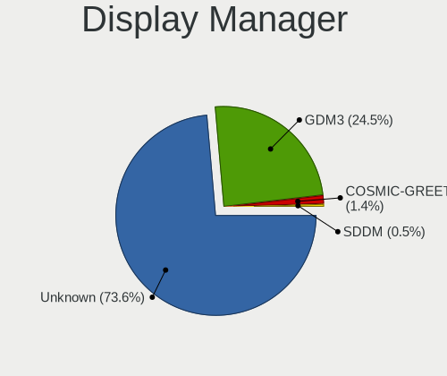
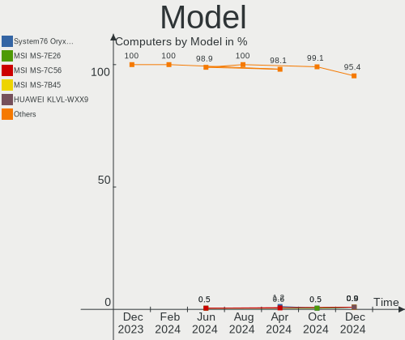
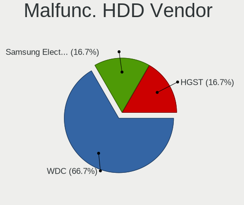
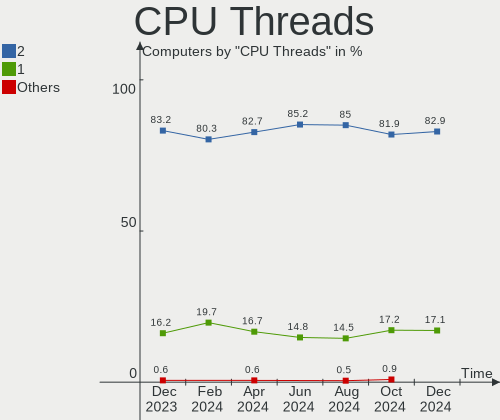
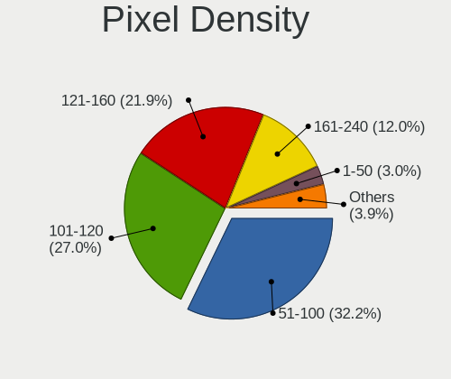
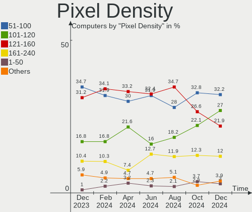
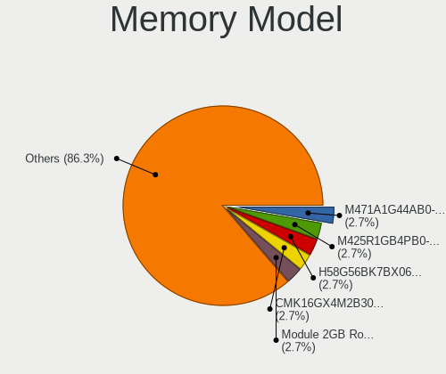

Pop!_OS - Hardware Trends
-------------------------

A project to identify most popular hardware characteristics and track their change
over time based on data collected by Linux users at https://Linux-Hardware.org.

Anyone can contribute to this report by the [hw-probe](https://github.com/linuxhw/hw-probe) tool:

    sudo -E hw-probe -all -upload

This is a report for all computer types. See also reports for [desktops](/Dist/Pop!_OS/Desktop/README.md) and [notebooks](/Dist/Pop!_OS/Notebook/README.md).

This report is for one last month. Overall report since the beginning of time: [TestDays](https://github.com/linuxhw/TestDays)

Period: Oct, 2023.

Contents
--------

* [ System ](#system)
  - [ OS                       ](#os)
  - [ OS Family                ](#os-family)
  - [ Kernel                   ](#kernel)
  - [ Kernel Family            ](#kernel-family)
  - [ Kernel Major Ver.        ](#kernel-major-ver)
  - [ Arch                     ](#arch)
  - [ DE                       ](#de)
  - [ Display Server           ](#display-server)
  - [ Display Manager          ](#display-manager)
  - [ OS Lang                  ](#os-lang)
  - [ Boot Mode                ](#boot-mode)
  - [ Filesystem               ](#filesystem)
  - [ Part. scheme             ](#part-scheme)
  - [ Dual Boot with Linux/BSD ](#dual-boot-with-linuxbsd)
  - [ Dual Boot (Win)          ](#dual-boot-win)

* [ Board ](#board)
  - [ Vendor                   ](#vendor)
  - [ Model                    ](#model)
  - [ Model Family             ](#model-family)
  - [ MFG Year                 ](#mfg-year)
  - [ Form Factor              ](#form-factor)
  - [ Secure Boot              ](#secure-boot)
  - [ Coreboot                 ](#coreboot)
  - [ RAM Size                 ](#ram-size)
  - [ RAM Used                 ](#ram-used)
  - [ Total Drives             ](#total-drives)
  - [ Has CD-ROM               ](#has-cd-rom)
  - [ Has Ethernet             ](#has-ethernet)
  - [ Has WiFi                 ](#has-wifi)
  - [ Has Bluetooth            ](#has-bluetooth)

* [ Location ](#location)
  - [ Country                  ](#country)
  - [ City                     ](#city)

* [ Drives ](#drives)
  - [ Drive Vendor             ](#drive-vendor)
  - [ Drive Model              ](#drive-model)
  - [ HDD Vendor               ](#hdd-vendor)
  - [ SSD Vendor               ](#ssd-vendor)
  - [ Drive Kind               ](#drive-kind)
  - [ Drive Connector          ](#drive-connector)
  - [ Drive Size               ](#drive-size)
  - [ Space Total              ](#space-total)
  - [ Space Used               ](#space-used)
  - [ Malfunc. Drives          ](#malfunc-drives)
  - [ Malfunc. Drive Vendor    ](#malfunc-drive-vendor)
  - [ Malfunc. HDD Vendor      ](#malfunc-hdd-vendor)
  - [ Malfunc. Drive Kind      ](#malfunc-drive-kind)
  - [ Failed Drives            ](#failed-drives)
  - [ Failed Drive Vendor      ](#failed-drive-vendor)
  - [ Drive Status             ](#drive-status)

* [ Storage controller ](#storage-controller)
  - [ Storage Vendor           ](#storage-vendor)
  - [ Storage Model            ](#storage-model)
  - [ Storage Kind             ](#storage-kind)

* [ Processor ](#processor)
  - [ CPU Vendor               ](#cpu-vendor)
  - [ CPU Model                ](#cpu-model)
  - [ CPU Model Family         ](#cpu-model-family)
  - [ CPU Cores                ](#cpu-cores)
  - [ CPU Sockets              ](#cpu-sockets)
  - [ CPU Threads              ](#cpu-threads)
  - [ CPU Op-Modes             ](#cpu-op-modes)
  - [ CPU Microcode            ](#cpu-microcode)
  - [ CPU Microarch            ](#cpu-microarch)

* [ Graphics ](#graphics)
  - [ GPU Vendor               ](#gpu-vendor)
  - [ GPU Model                ](#gpu-model)
  - [ GPU Combo                ](#gpu-combo)
  - [ GPU Driver               ](#gpu-driver)
  - [ GPU Memory               ](#gpu-memory)

* [ Monitor ](#monitor)
  - [ Monitor Vendor           ](#monitor-vendor)
  - [ Monitor Model            ](#monitor-model)
  - [ Monitor Resolution       ](#monitor-resolution)
  - [ Monitor Diagonal         ](#monitor-diagonal)
  - [ Monitor Width            ](#monitor-width)
  - [ Aspect Ratio             ](#aspect-ratio)
  - [ Monitor Area             ](#monitor-area)
  - [ Pixel Density            ](#pixel-density)
  - [ Multiple Monitors        ](#multiple-monitors)

* [ Network ](#network)
  - [ Net Controller Vendor    ](#net-controller-vendor)
  - [ Net Controller Model     ](#net-controller-model)
  - [ Wireless Vendor          ](#wireless-vendor)
  - [ Wireless Model           ](#wireless-model)
  - [ Ethernet Vendor          ](#ethernet-vendor)
  - [ Ethernet Model           ](#ethernet-model)
  - [ Net Controller Kind      ](#net-controller-kind)
  - [ Used Controller          ](#used-controller)
  - [ NICs                     ](#nics)
  - [ IPv6                     ](#ipv6)

* [ Bluetooth ](#bluetooth)
  - [ Bluetooth Vendor         ](#bluetooth-vendor)
  - [ Bluetooth Model          ](#bluetooth-model)

* [ Sound ](#sound)
  - [ Sound Vendor             ](#sound-vendor)
  - [ Sound Model              ](#sound-model)

* [ Memory ](#memory)
  - [ Memory Vendor            ](#memory-vendor)
  - [ Memory Model             ](#memory-model)
  - [ Memory Kind              ](#memory-kind)
  - [ Memory Form Factor       ](#memory-form-factor)
  - [ Memory Size              ](#memory-size)
  - [ Memory Speed             ](#memory-speed)

* [ Printers & scanners ](#printers--scanners)
  - [ Printer Vendor           ](#printer-vendor)
  - [ Printer Model            ](#printer-model)
  - [ Scanner Vendor           ](#scanner-vendor)
  - [ Scanner Model            ](#scanner-model)

* [ Camera ](#camera)
  - [ Camera Vendor            ](#camera-vendor)
  - [ Camera Model             ](#camera-model)

* [ Security ](#security)
  - [ Fingerprint Vendor       ](#fingerprint-vendor)
  - [ Fingerprint Model        ](#fingerprint-model)
  - [ Chipcard Vendor          ](#chipcard-vendor)
  - [ Chipcard Model           ](#chipcard-model)

* [ Unsupported ](#unsupported)
  - [ Unsupported Devices      ](#unsupported-devices)
  - [ Unsupported Device Types ](#unsupported-device-types)

System
------

OS
--

Installed operating systems

| Name          | Computers | Percent |
|---------------|-----------|---------|
| Pop!_OS 22.04 | 215       | 99.54%  |
| Pop!_OS 20.04 | 1         | 0.46%   |

OS Family
---------

OS without a version

| Name    | Computers | Percent |
|---------|-----------|---------|
| Pop!_OS | 216       | 100%    |

Kernel
------

Version of the Linux kernel

| Version                  | Computers | Percent |
|--------------------------|-----------|---------|
| 6.5.4-76060504-generic   | 97        | 44.91%  |
| 6.5.6-76060506-generic   | 60        | 27.78%  |
| 6.4.6-76060406-generic   | 42        | 19.44%  |
| 6.2.6-76060206-generic   | 8         | 3.7%    |
| 5.19.0-76051900-generic  | 2         | 0.93%   |
| 6.5.7-x64v3-xanmod1      | 1         | 0.46%   |
| 6.5.7-060507-generic     | 1         | 0.46%   |
| 6.5.5-x64v3-xanmod1      | 1         | 0.46%   |
| 6.2.0-76060200-generic   | 1         | 0.46%   |
| 6.0.12-76060012-generic  | 1         | 0.46%   |
| 6.0.12-76060006-generic  | 1         | 0.46%   |
| 5.17.15-76051715-generic | 1         | 0.46%   |

Kernel Family
-------------

Linux kernel without a distro release

| Version | Computers | Percent |
|---------|-----------|---------|
| 6.5.4   | 97        | 44.91%  |
| 6.5.6   | 60        | 27.78%  |
| 6.4.6   | 42        | 19.44%  |
| 6.2.6   | 8         | 3.7%    |
| 6.5.7   | 2         | 0.93%   |
| 6.0.12  | 2         | 0.93%   |
| 5.19.0  | 2         | 0.93%   |
| 6.5.5   | 1         | 0.46%   |
| 6.2.0   | 1         | 0.46%   |
| 5.17.15 | 1         | 0.46%   |

Kernel Major Ver.
-----------------

Linux kernel major version

| Version | Computers | Percent |
|---------|-----------|---------|
| 6.5     | 160       | 74.07%  |
| 6.4     | 42        | 19.44%  |
| 6.2     | 9         | 4.17%   |
| 6.0     | 2         | 0.93%   |
| 5.19    | 2         | 0.93%   |
| 5.17    | 1         | 0.46%   |

Arch
----

OS architecture (x86_64, i586, etc.)

| Name   | Computers | Percent |
|--------|-----------|---------|
| x86_64 | 216       | 100%    |

DE
--

Desktop Environment

| Name  | Computers | Percent |
|-------|-----------|---------|
| GNOME | 214       | 99.07%  |
| KDE5  | 2         | 0.93%   |

Display Server
--------------

X11 or Wayland

| Name    | Computers | Percent |
|---------|-----------|---------|
| X11     | 204       | 94.44%  |
| Wayland | 12        | 5.56%   |

Display Manager
---------------

SDDM, LightDM, etc.

| Name    | Computers | Percent |
|---------|-----------|---------|
| Unknown | 164       | 75.93%  |
| GDM3    | 52        | 24.07%  |

OS Lang
-------

Language

| Lang  | Computers | Percent |
|-------|-----------|---------|
| en_US | 118       | 54.63%  |
| de_DE | 14        | 6.48%   |
| pt_BR | 12        | 5.56%   |
| en_GB | 11        | 5.09%   |
| C     | 10        | 4.63%   |
| en_AU | 9         | 4.17%   |
| fr_FR | 8         | 3.7%    |
| en_CA | 4         | 1.85%   |
| nb_NO | 3         | 1.39%   |
| en_IN | 3         | 1.39%   |
| en_DK | 3         | 1.39%   |
| ru_RU | 2         | 0.93%   |
| pl_PL | 2         | 0.93%   |
| ko_KR | 2         | 0.93%   |
| it_IT | 2         | 0.93%   |
| es_ES | 2         | 0.93%   |
| en_NZ | 2         | 0.93%   |
| tr_TR | 1         | 0.46%   |
| nl_NL | 1         | 0.46%   |
| fr_CA | 1         | 0.46%   |
| fi_FI | 1         | 0.46%   |
| es_CR | 1         | 0.46%   |
| es_CL | 1         | 0.46%   |
| es_AR | 1         | 0.46%   |
| de_CH | 1         | 0.46%   |
| da_DK | 1         | 0.46%   |

Boot Mode
---------

EFI or BIOS

| Mode | Computers | Percent |
|------|-----------|---------|
| BIOS | 165       | 76.39%  |
| EFI  | 51        | 23.61%  |

Filesystem
----------

Type of filesystem

| Type    | Computers | Percent |
|---------|-----------|---------|
| Ext4    | 207       | 95.83%  |
| Btrfs   | 6         | 2.78%   |
| Overlay | 3         | 1.39%   |

Part. scheme
------------

Scheme of partitioning

| Type    | Computers | Percent |
|---------|-----------|---------|
| Unknown | 164       | 75.93%  |
| GPT     | 51        | 23.61%  |
| MBR     | 1         | 0.46%   |

Dual Boot with Linux/BSD
------------------------

Hosting more than one Linux/BSD

| Dual boot | Computers | Percent |
|-----------|-----------|---------|
| No        | 212       | 98.15%  |
| Yes       | 4         | 1.85%   |

Dual Boot (Win)
---------------

Hosting Linux and Windows

| Dual boot | Computers | Percent |
|-----------|-----------|---------|
| No        | 193       | 89.35%  |
| Yes       | 23        | 10.65%  |

Board
-----

Vendor
------

Motherboard manufacturer

| Name                | Computers | Percent |
|---------------------|-----------|---------|
| ASUSTek Computer    | 38        | 17.59%  |
| Hewlett-Packard     | 29        | 13.43%  |
| Lenovo              | 28        | 12.96%  |
| Dell                | 23        | 10.65%  |
| MSI                 | 16        | 7.41%   |
| Gigabyte Technology | 16        | 7.41%   |
| Apple               | 11        | 5.09%   |
| Acer                | 11        | 5.09%   |
| System76            | 7         | 3.24%   |
| ASRock              | 6         | 2.78%   |
| Samsung Electronics | 3         | 1.39%   |
| Intel               | 3         | 1.39%   |
| Huanan              | 2         | 0.93%   |
| Unknown             | 2         | 0.93%   |
| Toshiba             | 1         | 0.46%   |
| SLIMBOOK            | 1         | 0.46%   |
| Razer               | 1         | 0.46%   |
| Panasonic           | 1         | 0.46%   |
| Notebook            | 1         | 0.46%   |
| Microsoft           | 1         | 0.46%   |
| MECHREVO            | 1         | 0.46%   |
| Maibenben           | 1         | 0.46%   |
| LG Electronics      | 1         | 0.46%   |
| Kllisre             | 1         | 0.46%   |
| HUAWEI              | 1         | 0.46%   |
| HONOR               | 1         | 0.46%   |
| Haier               | 1         | 0.46%   |
| Google              | 1         | 0.46%   |
| Gateway             | 1         | 0.46%   |
| EUROCOM             | 1         | 0.46%   |
| eMachines           | 1         | 0.46%   |
| Danuri              | 1         | 0.46%   |
| Biostar             | 1         | 0.46%   |
| ASRockRack          | 1         | 0.46%   |
| Alienware           | 1         | 0.46%   |

Model
-----

Motherboard model

| Name                                | Computers | Percent |
|-------------------------------------|-----------|---------|
| Apple MacBookAir6,2                 | 4         | 1.85%   |
| Unknown                             | 3         | 1.39%   |
| System76 Darter Pro                 | 2         | 0.93%   |
| MSI MS-7D25                         | 2         | 0.93%   |
| MSI MS-7C37                         | 2         | 0.93%   |
| Lenovo ThinkBook 15 G2 ARE 20VG     | 2         | 0.93%   |
| Dell Latitude 5520                  | 2         | 0.93%   |
| ASUS ROG STRIX B550-F GAMING        | 2         | 0.93%   |
| ASUS PRIME B450M-A                  | 2         | 0.93%   |
| Toshiba Satellite C70D-B            | 1         | 0.46%   |
| System76 Thelio Mega                | 1         | 0.46%   |
| System76 Serval WS                  | 1         | 0.46%   |
| System76 Lemur Pro                  | 1         | 0.46%   |
| System76 Gazelle                    | 1         | 0.46%   |
| System76 Adder WS                   | 1         | 0.46%   |
| SLIMBOOK TITAN                      | 1         | 0.46%   |
| Samsung 700A4K                      | 1         | 0.46%   |
| Samsung 550XCJ/550XCR               | 1         | 0.46%   |
| Samsung 355V4C/356V4C/3445VC/3545VC | 1         | 0.46%   |
| Razer Blade                         | 1         | 0.46%   |
| Panasonic CF-31SBM08DM              | 1         | 0.46%   |
| Notebook P9XXEN_EF_ED               | 1         | 0.46%   |
| MSI Sword 15 A11UD                  | 1         | 0.46%   |
| MSI MS-7E06                         | 1         | 0.46%   |
| MSI MS-7D30                         | 1         | 0.46%   |
| MSI MS-7C56                         | 1         | 0.46%   |
| MSI MS-7C52                         | 1         | 0.46%   |
| MSI MS-7B93                         | 1         | 0.46%   |
| MSI MS-7B79                         | 1         | 0.46%   |
| MSI MS-7A32                         | 1         | 0.46%   |
| MSI GP66 Leopard 11UG               | 1         | 0.46%   |
| MSI GF65 Thin 9SEXR                 | 1         | 0.46%   |
| MSI GE62 2QF                        | 1         | 0.46%   |
| MSI Cyborg 15 A12VF                 | 1         | 0.46%   |
| Microsoft Surface Laptop            | 1         | 0.46%   |
| MECHREVO WUJIE14 PRO                | 1         | 0.46%   |
| Maibenben MaiBook X series          | 1         | 0.46%   |
| LG 16T90R-K.ADB9U1                  | 1         | 0.46%   |
| Lenovo Z50-70 20354                 | 1         | 0.46%   |
| Lenovo Yoga Slim 7 Pro 14ACH5 82MS  | 1         | 0.46%   |

Model Family
------------

Motherboard model prefix

| Name               | Computers | Percent |
|--------------------|-----------|---------|
| Acer Aspire        | 9         | 4.17%   |
| Lenovo ThinkPad    | 8         | 3.7%    |
| Dell Latitude      | 7         | 3.24%   |
| Dell Inspiron      | 7         | 3.24%   |
| ASUS ROG           | 7         | 3.24%   |
| ASUS PRIME         | 7         | 3.24%   |
| Lenovo IdeaPad     | 5         | 2.31%   |
| ASUS VivoBook      | 5         | 2.31%   |
| HP EliteBook       | 4         | 1.85%   |
| Dell OptiPlex      | 4         | 1.85%   |
| Apple MacBookAir6  | 4         | 1.85%   |
| Lenovo Yoga        | 3         | 1.39%   |
| Lenovo ThinkBook   | 3         | 1.39%   |
| HP ProBook         | 3         | 1.39%   |
| HP Pavilion        | 3         | 1.39%   |
| ASUS TUF           | 3         | 1.39%   |
| Unknown            | 3         | 1.39%   |
| System76 Darter    | 2         | 0.93%   |
| MSI MS-7D25        | 2         | 0.93%   |
| MSI MS-7C37        | 2         | 0.93%   |
| Lenovo ThinkCentre | 2         | 0.93%   |
| Lenovo Legion      | 2         | 0.93%   |
| HP ZBook           | 2         | 0.93%   |
| HP Laptop          | 2         | 0.93%   |
| HP Compaq          | 2         | 0.93%   |
| Gigabyte Z390      | 2         | 0.93%   |
| Dell XPS           | 2         | 0.93%   |
| Dell PowerEdge     | 2         | 0.93%   |
| ASUS Zenbook       | 2         | 0.93%   |
| ASUS ASUS          | 2         | 0.93%   |
| Apple MacBookPro11 | 2         | 0.93%   |
| Toshiba Satellite  | 1         | 0.46%   |
| System76 Thelio    | 1         | 0.46%   |
| System76 Serval    | 1         | 0.46%   |
| System76 Lemur     | 1         | 0.46%   |
| System76 Gazelle   | 1         | 0.46%   |
| System76 Adder     | 1         | 0.46%   |
| SLIMBOOK TITAN     | 1         | 0.46%   |
| Samsung 700A4K     | 1         | 0.46%   |
| Samsung 550XCJ     | 1         | 0.46%   |

MFG Year
--------

Motherboard manufacture year

| Year | Computers | Percent |
|------|-----------|---------|
| 2021 | 34        | 15.74%  |
| 2023 | 25        | 11.57%  |
| 2020 | 25        | 11.57%  |
| 2022 | 22        | 10.19%  |
| 2019 | 22        | 10.19%  |
| 2013 | 14        | 6.48%   |
| 2014 | 13        | 6.02%   |
| 2018 | 12        | 5.56%   |
| 2015 | 9         | 4.17%   |
| 2012 | 9         | 4.17%   |
| 2017 | 8         | 3.7%    |
| 2016 | 7         | 3.24%   |
| 2011 | 6         | 2.78%   |
| 2010 | 6         | 2.78%   |
| 2009 | 2         | 0.93%   |
| 2007 | 2         | 0.93%   |

Form Factor
-----------

Physical design of the computer

| Name        | Computers | Percent |
|-------------|-----------|---------|
| Notebook    | 121       | 56.02%  |
| Desktop     | 75        | 34.72%  |
| Convertible | 6         | 2.78%   |
| Server      | 5         | 2.31%   |
| All in one  | 4         | 1.85%   |
| Mini pc     | 3         | 1.39%   |
| Tablet      | 2         | 0.93%   |

Secure Boot
-----------

Enabled or disabled

| State    | Computers | Percent |
|----------|-----------|---------|
| Disabled | 215       | 99.54%  |
| Enabled  | 1         | 0.46%   |

Coreboot
--------

Have coreboot on board

| Used | Computers | Percent |
|------|-----------|---------|
| No   | 209       | 96.76%  |
| Yes  | 7         | 3.24%   |

RAM Size
--------

Total RAM memory

| Size in GB  | Computers | Percent |
|-------------|-----------|---------|
| 16.01-24.0  | 59        | 27.31%  |
| 8.01-16.0   | 40        | 18.52%  |
| 4.01-8.0    | 39        | 18.06%  |
| 32.01-64.0  | 35        | 16.2%   |
| 64.01-256.0 | 17        | 7.87%   |
| 3.01-4.0    | 14        | 6.48%   |
| 24.01-32.0  | 8         | 3.7%    |
| 1.01-2.0    | 3         | 1.39%   |
| 2.01-3.0    | 1         | 0.46%   |

RAM Used
--------

Used RAM memory

| Used GB    | Computers | Percent |
|------------|-----------|---------|
| 4.01-8.0   | 97        | 44.91%  |
| 3.01-4.0   | 46        | 21.3%   |
| 2.01-3.0   | 35        | 16.2%   |
| 8.01-16.0  | 27        | 12.5%   |
| 1.01-2.0   | 6         | 2.78%   |
| 16.01-24.0 | 2         | 0.93%   |
| 32.01-64.0 | 1         | 0.46%   |
| 24.01-32.0 | 1         | 0.46%   |
| 0.51-1.0   | 1         | 0.46%   |

Total Drives
------------

Number of drives on board

| Drives | Computers | Percent |
|--------|-----------|---------|
| 1      | 117       | 54.17%  |
| 2      | 60        | 27.78%  |
| 3      | 23        | 10.65%  |
| 4      | 7         | 3.24%   |
| 7      | 4         | 1.85%   |
| 6      | 3         | 1.39%   |
| 11     | 1         | 0.46%   |
| 5      | 1         | 0.46%   |

Has CD-ROM
----------

Has CD-ROM on board

| Presented | Computers | Percent |
|-----------|-----------|---------|
| No        | 172       | 79.63%  |
| Yes       | 44        | 20.37%  |

Has Ethernet
------------

Has Ethernet on board

| Presented | Computers | Percent |
|-----------|-----------|---------|
| Yes       | 174       | 80.56%  |
| No        | 42        | 19.44%  |

Has WiFi
--------

Has WiFi module

| Presented | Computers | Percent |
|-----------|-----------|---------|
| Yes       | 180       | 83.33%  |
| No        | 36        | 16.67%  |

Has Bluetooth
-------------

Has Bluetooth module

| Presented | Computers | Percent |
|-----------|-----------|---------|
| Yes       | 163       | 75.46%  |
| No        | 53        | 24.54%  |

Location
--------

Country
-------

Geographic location (country)

| Country       | Computers | Percent |
|---------------|-----------|---------|
| USA           | 57        | 26.39%  |
| Germany       | 18        | 8.33%   |
| Brazil        | 17        | 7.87%   |
| UK            | 11        | 5.09%   |
| Canada        | 10        | 4.63%   |
| France        | 9         | 4.17%   |
| Australia     | 9         | 4.17%   |
| India         | 7         | 3.24%   |
| Norway        | 6         | 2.78%   |
| Russia        | 5         | 2.31%   |
| Switzerland   | 4         | 1.85%   |
| Sweden        | 4         | 1.85%   |
| Spain         | 4         | 1.85%   |
| Poland        | 4         | 1.85%   |
| Netherlands   | 4         | 1.85%   |
| Italy         | 4         | 1.85%   |
| Finland       | 4         | 1.85%   |
| Portugal      | 3         | 1.39%   |
| Belgium       | 3         | 1.39%   |
| South Korea   | 2         | 0.93%   |
| New Zealand   | 2         | 0.93%   |
| Denmark       | 2         | 0.93%   |
| Czechia       | 2         | 0.93%   |
| Bulgaria      | 2         | 0.93%   |
| Argentina     | 2         | 0.93%   |
| Uzbekistan    | 1         | 0.46%   |
| Turkey        | 1         | 0.46%   |
| Thailand      | 1         | 0.46%   |
| Sri Lanka     | 1         | 0.46%   |
| South Africa  | 1         | 0.46%   |
| Serbia        | 1         | 0.46%   |
| Romania       | 1         | 0.46%   |
| Latvia        | 1         | 0.46%   |
| Kuwait        | 1         | 0.46%   |
| Kazakhstan    | 1         | 0.46%   |
| Indonesia     | 1         | 0.46%   |
| Hong Kong     | 1         | 0.46%   |
| Greece        | 1         | 0.46%   |
| Ghana         | 1         | 0.46%   |
| French Guiana | 1         | 0.46%   |

City
----

Geographic location (city)

| City                  | Computers | Percent |
|-----------------------|-----------|---------|
| Helsinki              | 3         | 1.39%   |
| Warsaw                | 2         | 0.93%   |
| Sydney                | 2         | 0.93%   |
| Sofia                 | 2         | 0.93%   |
| Sao Paulo             | 2         | 0.93%   |
| Sao Jose do Rio Preto | 2         | 0.93%   |
| Melbourne             | 2         | 0.93%   |
| Mansfield             | 2         | 0.93%   |
| Madison               | 2         | 0.93%   |
| Louisville            | 2         | 0.93%   |
| Hyderabad             | 2         | 0.93%   |
| East Los Angeles      | 2         | 0.93%   |
| Charlotte             | 2         | 0.93%   |
| Calgary               | 2         | 0.93%   |
| Bodø                 | 2         | 0.93%   |
| Bo                    | 2         | 0.93%   |
| Berlin                | 2         | 0.93%   |
| Bedburg               | 2         | 0.93%   |
| Zurich                | 1         | 0.46%   |
| Yekaterinburg         | 1         | 0.46%   |
| Wyckoff               | 1         | 0.46%   |
| Wuppertal             | 1         | 0.46%   |
| Weilheim              | 1         | 0.46%   |
| Waterbury             | 1         | 0.46%   |
| Warten                | 1         | 0.46%   |
| Wantagh               | 1         | 0.46%   |
| Wanchai               | 1         | 0.46%   |
| Virginia Beach        | 1         | 0.46%   |
| Vestal                | 1         | 0.46%   |
| Ust-Kamenogorsk       | 1         | 0.46%   |
| Urgench               | 1         | 0.46%   |
| Uberlândia           | 1         | 0.46%   |
| Troy                  | 1         | 0.46%   |
| Trondheim             | 1         | 0.46%   |
| Toulouse              | 1         | 0.46%   |
| Toronto               | 1         | 0.46%   |
| Tokat Province        | 1         | 0.46%   |
| Thalwil               | 1         | 0.46%   |
| Tauranga              | 1         | 0.46%   |
| Tampa                 | 1         | 0.46%   |

Drives
------

Drive Vendor
------------

Hard drive vendors

| Vendor                         | Computers | Drives | Percent |
|--------------------------------|-----------|--------|---------|
| Samsung Electronics            | 67        | 87     | 19.94%  |
| Seagate                        | 44        | 62     | 13.1%   |
| SanDisk                        | 28        | 30     | 8.33%   |
| WDC                            | 25        | 33     | 7.44%   |
| Kingston                       | 15        | 15     | 4.46%   |
| Toshiba                        | 11        | 11     | 3.27%   |
| Crucial                        | 11        | 13     | 3.27%   |
| Apple                          | 10        | 10     | 2.98%   |
| SK hynix                       | 9         | 9      | 2.68%   |
| Phison Electronics             | 9         | 10     | 2.68%   |
| Micron Technology              | 8         | 8      | 2.38%   |
| HGST                           | 7         | 9      | 2.08%   |
| KIOXIA                         | 6         | 6      | 1.79%   |
| Hitachi                        | 6         | 7      | 1.79%   |
| China                          | 6         | 7      | 1.79%   |
| Unknown                        | 4         | 5      | 1.19%   |
| Kingston Technology Company    | 4         | 5      | 1.19%   |
| Intel                          | 4         | 5      | 1.19%   |
| Team                           | 3         | 3      | 0.89%   |
| Silicon Motion                 | 3         | 3      | 0.89%   |
| Netac                          | 3         | 3      | 0.89%   |
| KingSpec                       | 3         | 3      | 0.89%   |
| ADATA Technology               | 3         | 3      | 0.89%   |
| SPCC                           | 2         | 2      | 0.6%    |
| Realtek Semiconductor          | 2         | 2      | 0.6%    |
| OCZ                            | 2         | 2      | 0.6%    |
| Micron/Crucial Technology      | 2         | 4      | 0.6%    |
| KIOXIA-EXCERIA                 | 2         | 2      | 0.6%    |
| Gigabyte Technology            | 2         | 2      | 0.6%    |
| A-DATA Technology              | 2         | 2      | 0.6%    |
| Unknown                        | 2         | 2      | 0.6%    |
| Yangtze Memory Technologies    | 1         | 1      | 0.3%    |
| Yangtze Memory                 | 1         | 1      | 0.3%    |
| WALRAM                         | 1         | 1      | 0.3%    |
| UMIS                           | 1         | 1      | 0.3%    |
| Transcend                      | 1         | 1      | 0.3%    |
| Solid State Storage Technology | 1         | 1      | 0.3%    |
| Solid State Storage            | 1         | 1      | 0.3%    |
| Seapiy                         | 1         | 1      | 0.3%    |
| SABRENT                        | 1         | 1      | 0.3%    |

Drive Model
-----------

Hard drive models

| Model                                                 | Computers | Percent |
|-------------------------------------------------------|-----------|---------|
| Samsung NVMe SSD Controller PM9A1/PM9A3/980PRO 1TB    | 11        | 2.95%   |
| Samsung NVMe SSD Controller SM981/PM981/PM983 1TB     | 10        | 2.68%   |
| Seagate ST2000DM008-2FR102 2TB                        | 4         | 1.07%   |
| Seagate ST1000LM024 HN-M101MBB 1TB                    | 4         | 1.07%   |
| Sandisk WD Blue SN550 NVMe SSD 1TB                    | 4         | 1.07%   |
| Samsung SSD 850 EVO 500GB                             | 4         | 1.07%   |
| Samsung NVMe SSD Controller SM961/PM961/SM963 121GB   | 4         | 1.07%   |
| Phison E12 NVMe Controller 1TB                        | 4         | 1.07%   |
| Seagate ST9500325AS 500GB                             | 3         | 0.8%    |
| Seagate Expansion Desk 3TB                            | 3         | 0.8%    |
| Sandisk WD Black SN750 / PC SN730 NVMe SSD 1024GB     | 3         | 0.8%    |
| Samsung SSD 980 PRO 2TB                               | 3         | 0.8%    |
| Samsung SSD 980 1TB                                   | 3         | 0.8%    |
| Samsung SSD 970 EVO Plus 1TB                          | 3         | 0.8%    |
| Samsung SSD 870 QVO 1TB                               | 3         | 0.8%    |
| Samsung SSD 850 EVO 250GB                             | 3         | 0.8%    |
| Kingston SV300S37A120G 120GB SSD                      | 3         | 0.8%    |
| Intel SSD 660P Series 1024GB                          | 3         | 0.8%    |
| Unknown NVMe SSD Drive 2TB                            | 2         | 0.54%   |
| Toshiba MQ04ABF100 1TB                                | 2         | 0.54%   |
| Toshiba HDWD130 3TB                                   | 2         | 0.54%   |
| Silicon Motion SM2263EN/SM2263XT SSD Controller 256GB | 2         | 0.54%   |
| Seagate ST4000DM004-2CV104 4TB                        | 2         | 0.54%   |
| Seagate ST2000LM015-2E8174 2TB                        | 2         | 0.54%   |
| Seagate ST2000DM008-2UB102 2TB                        | 2         | 0.54%   |
| Seagate ST1000LM048-2E7172 1TB                        | 2         | 0.54%   |
| Seagate ST1000LM035-1RK172 1TB                        | 2         | 0.54%   |
| Seagate Expansion 1TB                                 | 2         | 0.54%   |
| Sandisk WD Black 2018/SN750 / PC SN720 NVMe SSD 1TB   | 2         | 0.54%   |
| SanDisk NVMe SSD Drive 512GB                          | 2         | 0.54%   |
| Samsung SSD 980 500GB                                 | 2         | 0.54%   |
| Samsung SSD 860 EVO 500GB                             | 2         | 0.54%   |
| Samsung MZVL21T0HCLR-00B00 1TB                        | 2         | 0.54%   |
| Samsung MZALQ512HBLU-00BL2 512GB                      | 2         | 0.54%   |
| Micron 2210_MTFDHBA512QFD 512GB                       | 2         | 0.54%   |
| KIOXIA-EXCERIA SATA SSD 480GB                         | 2         | 0.54%   |
| Kingston Company SNV2S1000G 1TB                       | 2         | 0.54%   |
| Kingston SA400S37240G 240GB SSD                       | 2         | 0.54%   |
| Crucial CT240BX500SSD1 240GB                          | 2         | 0.54%   |
| China SSD 240GB                                       | 2         | 0.54%   |

HDD Vendor
----------

Hard disk drive vendors

| Vendor              | Computers | Drives | Percent |
|---------------------|-----------|--------|---------|
| Seagate             | 43        | 59     | 47.78%  |
| WDC                 | 19        | 24     | 21.11%  |
| HGST                | 7         | 9      | 7.78%   |
| Toshiba             | 6         | 6      | 6.67%   |
| Hitachi             | 6         | 7      | 6.67%   |
| Samsung Electronics | 3         | 3      | 3.33%   |
| Apple               | 3         | 3      | 3.33%   |
| Fujitsu             | 1         | 1      | 1.11%   |
| External            | 1         | 1      | 1.11%   |
| DELLBOSS            | 1         | 1      | 1.11%   |

SSD Vendor
----------

Solid state drive vendors

| Vendor              | Computers | Drives | Percent |
|---------------------|-----------|--------|---------|
| Samsung Electronics | 22        | 25     | 21.36%  |
| Kingston            | 10        | 10     | 9.71%   |
| Crucial             | 9         | 9      | 8.74%   |
| Apple               | 7         | 7      | 6.8%    |
| WDC                 | 6         | 7      | 5.83%   |
| SanDisk             | 6         | 6      | 5.83%   |
| China               | 6         | 7      | 5.83%   |
| Team                | 3         | 3      | 2.91%   |
| SK hynix            | 3         | 3      | 2.91%   |
| KingSpec            | 3         | 3      | 2.91%   |
| SPCC                | 2         | 2      | 1.94%   |
| OCZ                 | 2         | 2      | 1.94%   |
| Netac               | 2         | 2      | 1.94%   |
| KIOXIA-EXCERIA      | 2         | 2      | 1.94%   |
| WALRAM              | 1         | 1      | 0.97%   |
| Transcend           | 1         | 1      | 0.97%   |
| Toshiba             | 1         | 1      | 0.97%   |
| Seagate             | 1         | 1      | 0.97%   |
| SABRENT             | 1         | 1      | 0.97%   |
| PNY                 | 1         | 1      | 0.97%   |
| Plextor             | 1         | 1      | 0.97%   |
| Patriot             | 1         | 2      | 0.97%   |
| Micron Technology   | 1         | 1      | 0.97%   |
| LITEONIT            | 1         | 1      | 0.97%   |
| Intenso             | 1         | 1      | 0.97%   |
| Intel               | 1         | 2      | 0.97%   |
| Integral            | 1         | 1      | 0.97%   |
| Hewlett-Packard     | 1         | 1      | 0.97%   |
| GOODRAM             | 1         | 1      | 0.97%   |
| Gigabyte Technology | 1         | 1      | 0.97%   |
| Apacer              | 1         | 1      | 0.97%   |
| AGI                 | 1         | 1      | 0.97%   |
| A-DATA Technology   | 1         | 1      | 0.97%   |
| Unknown             | 1         | 1      | 0.97%   |

Drive Kind
----------

HDD or SSD

| Kind    | Computers | Drives | Percent |
|---------|-----------|--------|---------|
| NVMe    | 125       | 162    | 41.53%  |
| SSD     | 88        | 110    | 29.24%  |
| HDD     | 78        | 114    | 25.91%  |
| Unknown | 7         | 7      | 2.33%   |
| MMC     | 3         | 4      | 1%      |

Drive Connector
---------------

SATA, SAS, NVMe, etc.

| Type | Computers | Drives | Percent |
|------|-----------|--------|---------|
| SATA | 130       | 217    | 48.33%  |
| NVMe | 125       | 162    | 46.47%  |
| SAS  | 11        | 14     | 4.09%   |
| MMC  | 3         | 4      | 1.12%   |

Drive Size
----------

Size of hard drive

| Size in TB | Computers | Drives | Percent |
|------------|-----------|--------|---------|
| 0.01-0.5   | 83        | 105    | 45.86%  |
| 0.51-1.0   | 54        | 59     | 29.83%  |
| 1.01-2.0   | 24        | 29     | 13.26%  |
| 3.01-4.0   | 8         | 15     | 4.42%   |
| 2.01-3.0   | 7         | 8      | 3.87%   |
| 4.01-10.0  | 3         | 3      | 1.66%   |
| 10.01-20.0 | 2         | 5      | 1.1%    |

Space Total
-----------

Amount of disk space available on the file system

| Size in GB     | Computers | Percent |
|----------------|-----------|---------|
| 101-250        | 60        | 27.78%  |
| 251-500        | 51        | 23.61%  |
| 501-1000       | 50        | 23.15%  |
| More than 3000 | 20        | 9.26%   |
| 1001-2000      | 19        | 8.8%    |
| 2001-3000      | 8         | 3.7%    |
| 51-100         | 4         | 1.85%   |
| 1-20           | 3         | 1.39%   |
| 21-50          | 1         | 0.46%   |

Space Used
----------

Amount of used disk space

| Used GB        | Computers | Percent |
|----------------|-----------|---------|
| 1-20           | 56        | 25.93%  |
| 21-50          | 52        | 24.07%  |
| 101-250        | 36        | 16.67%  |
| 51-100         | 27        | 12.5%   |
| 251-500        | 16        | 7.41%   |
| 501-1000       | 10        | 4.63%   |
| More than 3000 | 8         | 3.7%    |
| 1001-2000      | 7         | 3.24%   |
| 2001-3000      | 4         | 1.85%   |

Malfunc. Drives
---------------

Drive models with a malfunction

| Model                                    | Computers | Drives | Percent |
|------------------------------------------|-----------|--------|---------|
| WDC WD20PURZ-85AKKY0 2TB                 | 1         | 1      | 14.29%  |
| WDC WD20PURX-64P6ZY0 2TB                 | 1         | 1      | 14.29%  |
| WDC WD10EZEX-60ZF5A0 1TB                 | 1         | 1      | 14.29%  |
| Seagate ST4000DX001-1CE168 4TB           | 1         | 1      | 14.29%  |
| Seagate ST31000524NS 1TB                 | 1         | 1      | 14.29%  |
| Samsung Electronics SSD 970 EVO Plus 1TB | 1         | 1      | 14.29%  |
| LITEON CL1-8D512 512GB                   | 1         | 1      | 14.29%  |

Malfunc. Drive Vendor
---------------------

Vendors of faulty drives

| Vendor              | Computers | Drives | Percent |
|---------------------|-----------|--------|---------|
| WDC                 | 3         | 3      | 42.86%  |
| Seagate             | 2         | 2      | 28.57%  |
| Samsung Electronics | 1         | 1      | 14.29%  |
| LITEON              | 1         | 1      | 14.29%  |

Malfunc. HDD Vendor
-------------------

Vendors of faulty HDD drives

| Vendor  | Computers | Drives | Percent |
|---------|-----------|--------|---------|
| WDC     | 3         | 3      | 60%     |
| Seagate | 2         | 2      | 40%     |

Malfunc. Drive Kind
-------------------

Kinds of faulty drives

| Kind | Computers | Drives | Percent |
|------|-----------|--------|---------|
| HDD  | 4         | 5      | 66.67%  |
| NVMe | 2         | 2      | 33.33%  |

Failed Drives
-------------

Failed drive models

Zero info for selected period =(

Failed Drive Vendor
-------------------

Failed drive vendors

Zero info for selected period =(

Drive Status
------------

Number of failed and malfunc. drives

| Status   | Computers | Drives | Percent |
|----------|-----------|--------|---------|
| Detected | 171       | 308    | 75%     |
| Works    | 52        | 82     | 22.81%  |
| Malfunc  | 5         | 7      | 2.19%   |

Storage controller
------------------

Storage Vendor
--------------

Storage controller vendors

| Vendor                                  | Computers | Percent |
|-----------------------------------------|-----------|---------|
| Intel                                   | 102       | 31.48%  |
| AMD                                     | 54        | 16.67%  |
| Samsung Electronics                     | 53        | 16.36%  |
| SanDisk                                 | 24        | 7.41%   |
| Phison Electronics                      | 11        | 3.4%    |
| Kingston Technology Company             | 9         | 2.78%   |
| ASMedia Technology                      | 8         | 2.47%   |
| Micron Technology                       | 7         | 2.16%   |
| SK hynix                                | 6         | 1.85%   |
| Marvell Technology Group                | 6         | 1.85%   |
| KIOXIA                                  | 6         | 1.85%   |
| Micron/Crucial Technology               | 5         | 1.54%   |
| Toshiba America Info Systems            | 4         | 1.23%   |
| Silicon Motion                          | 4         | 1.23%   |
| Nvidia                                  | 4         | 1.23%   |
| ADATA Technology                        | 4         | 1.23%   |
| Yangtze Memory Technologies             | 2         | 0.62%   |
| Solidigm                                | 2         | 0.62%   |
| Solid State Storage Technology          | 2         | 0.62%   |
| Realtek Semiconductor                   | 2         | 0.62%   |
| LSI Logic / Symbios Logic               | 2         | 0.62%   |
| Broadcom / LSI                          | 2         | 0.62%   |
| Shenzhen Unionmemory Information System | 1         | 0.31%   |
| Seagate Technology                      | 1         | 0.31%   |
| MAXIO Technology (Hangzhou)             | 1         | 0.31%   |
| Lite-On Technology                      | 1         | 0.31%   |
| Hewlett-Packard                         | 1         | 0.31%   |

Storage Model
-------------

Storage controller models

| Model                                                                          | Computers | Percent |
|--------------------------------------------------------------------------------|-----------|---------|
| AMD FCH SATA Controller [AHCI mode]                                            | 39        | 10.96%  |
| Samsung NVMe SSD Controller PM9A1/PM9A3/980PRO                                 | 18        | 5.06%   |
| Samsung NVMe SSD Controller SM981/PM981/PM983                                  | 15        | 4.21%   |
| Samsung NVMe SSD Controller 980 (DRAM-less)                                    | 11        | 3.09%   |
| Intel 8 Series/C220 Series Chipset Family 6-port SATA Controller 1 [AHCI mode] | 11        | 3.09%   |
| AMD 400 Series Chipset SATA Controller                                         | 9         | 2.53%   |
| AMD 500 Series Chipset SATA Controller                                         | 8         | 2.25%   |
| ASMedia ASM1062 Serial ATA Controller                                          | 7         | 1.97%   |
| Intel Volume Management Device NVMe RAID Controller                            | 6         | 1.69%   |
| Intel 8 Series SATA Controller 1 [AHCI mode]                                   | 6         | 1.69%   |
| Samsung NVMe SSD Controller SM961/PM961/SM963                                  | 5         | 1.4%    |
| Intel Sunrise Point-LP SATA Controller [AHCI mode]                             | 5         | 1.4%    |
| Intel Comet Lake SATA AHCI Controller                                          | 5         | 1.4%    |
| Intel 200 Series PCH SATA controller [AHCI mode]                               | 5         | 1.4%    |
| SanDisk Ultra 3D / WD Blue SN550 NVMe SSD                                      | 4         | 1.12%   |
| Phison E12 NVMe Controller                                                     | 4         | 1.12%   |
| Micron/Crucial P2 [Nick P2] / P3 / P3 Plus NVMe PCIe SSD (DRAM-less)           | 4         | 1.12%   |
| Kingston Company NV2 NVMe SSD SM2267XT                                         | 4         | 1.12%   |
| Intel SATA Controller [RAID mode]                                              | 4         | 1.12%   |
| Intel 7 Series Chipset Family 6-port SATA Controller [AHCI mode]               | 4         | 1.12%   |
| Toshiba America Info Systems XG6 NVMe SSD Controller                           | 3         | 0.84%   |
| Silicon Motion SM2263EN/SM2263XT (DRAM-less) NVMe SSD Controllers              | 3         | 0.84%   |
| SanDisk Extreme Pro / WD Black SN750 / PC SN730 / Red SN700 NVMe SSD           | 3         | 0.84%   |
| Marvell Group 88SS9183 PCIe SSD Controller                                     | 3         | 0.84%   |
| KIOXIA NVMe SSD Controller BG5 (DRAM-less)                                     | 3         | 0.84%   |
| KIOXIA NVMe SSD Controller BG4 (DRAM-less)                                     | 3         | 0.84%   |
| Intel SSD 660P Series                                                          | 3         | 0.84%   |
| Intel Q170/Q150/B150/H170/H110/Z170/CM236 Chipset SATA Controller [AHCI Mode]  | 3         | 0.84%   |
| Intel Cannon Lake PCH SATA AHCI Controller                                     | 3         | 0.84%   |
| Intel Cannon Lake Mobile PCH SATA AHCI Controller                              | 3         | 0.84%   |
| Intel Alder Lake-S PCH SATA Controller [AHCI Mode]                             | 3         | 0.84%   |
| Intel 82801 Mobile SATA Controller [RAID mode]                                 | 3         | 0.84%   |
| Intel 700 Series Chipset Family SATA AHCI Controller                           | 3         | 0.84%   |
| Intel 6 Series/C200 Series Chipset Family 6 port Mobile SATA AHCI Controller   | 3         | 0.84%   |
| Intel 500 Series Chipset Family SATA AHCI Controller                           | 3         | 0.84%   |
| AMD SB7x0/SB8x0/SB9x0 SATA Controller [AHCI mode]                              | 3         | 0.84%   |
| SK hynix BC501 NVMe Solid State Drive                                          | 2         | 0.56%   |
| Sandisk WD PC SN740 NVMe SSD 512GB (DRAM-less)                                 | 2         | 0.56%   |
| SanDisk WD Green SN350 240GB (DRAM-less) / SN560E NVMe SSD                     | 2         | 0.56%   |
| Sandisk WD Black SN850X NVMe SSD                                               | 2         | 0.56%   |

Storage Kind
------------

Kind of storage controller (IDE, SATA, NVMe, SAS, ...)

| Kind | Computers | Percent |
|------|-----------|---------|
| SATA | 147       | 48.04%  |
| NVMe | 124       | 40.52%  |
| RAID | 19        | 6.21%   |
| IDE  | 13        | 4.25%   |
| SAS  | 2         | 0.65%   |
| SCSI | 1         | 0.33%   |

Processor
---------

CPU Vendor
----------

Processor vendors

| Vendor | Computers | Percent |
|--------|-----------|---------|
| Intel  | 143       | 66.2%   |
| AMD    | 73        | 33.8%   |

CPU Model
---------

Processor models

| Model                                         | Computers | Percent |
|-----------------------------------------------|-----------|---------|
| Intel 11th Gen Core i7-1165G7 @ 2.80GHz       | 5         | 2.31%   |
| Intel 11th Gen Core i7-11800H @ 2.30GHz       | 4         | 1.85%   |
| AMD Ryzen 5 4500U with Radeon Graphics        | 4         | 1.85%   |
| AMD Ryzen 5 3600 6-Core Processor             | 4         | 1.85%   |
| Intel Core i7-9750H CPU @ 2.60GHz             | 3         | 1.39%   |
| Intel Core i7-9700K CPU @ 3.60GHz             | 3         | 1.39%   |
| Intel Core i7-2600 CPU @ 3.40GHz              | 3         | 1.39%   |
| Intel Core i5-6500 CPU @ 3.20GHz              | 3         | 1.39%   |
| Intel 13th Gen Core i9-13900H                 | 3         | 1.39%   |
| AMD Ryzen 9 5950X 16-Core Processor           | 3         | 1.39%   |
| AMD Ryzen 5 5500U with Radeon Graphics        | 3         | 1.39%   |
| Intel Core i7-8750H CPU @ 2.20GHz             | 2         | 0.93%   |
| Intel Core i7-7700K CPU @ 4.20GHz             | 2         | 0.93%   |
| Intel Core i7-6600U CPU @ 2.60GHz             | 2         | 0.93%   |
| Intel Core i7-4720HQ CPU @ 2.60GHz            | 2         | 0.93%   |
| Intel Core i7-3770 CPU @ 3.40GHz              | 2         | 0.93%   |
| Intel Core i7-10750H CPU @ 2.60GHz            | 2         | 0.93%   |
| Intel Core i7-10710U CPU @ 1.10GHz            | 2         | 0.93%   |
| Intel Core i7-10510U CPU @ 1.80GHz            | 2         | 0.93%   |
| Intel Core i5-8350U CPU @ 1.70GHz             | 2         | 0.93%   |
| Intel Core i5-7200U CPU @ 2.50GHz             | 2         | 0.93%   |
| Intel Core i5-4260U CPU @ 1.40GHz             | 2         | 0.93%   |
| Intel Core i5-4250U CPU @ 1.30GHz             | 2         | 0.93%   |
| Intel Core i3-3220 CPU @ 3.30GHz              | 2         | 0.93%   |
| Intel 13th Gen Core i9-13900HX                | 2         | 0.93%   |
| Intel 13th Gen Core i7-1355U                  | 2         | 0.93%   |
| Intel 13th Gen Core i5-13600K                 | 2         | 0.93%   |
| Intel 13th Gen Core i5-1340P                  | 2         | 0.93%   |
| Intel 12th Gen Core i7-12700H                 | 2         | 0.93%   |
| Intel 12th Gen Core i5-1235U                  | 2         | 0.93%   |
| AMD Ryzen 9 3900X 12-Core Processor           | 2         | 0.93%   |
| AMD Ryzen 7 PRO 5850U with Radeon Graphics    | 2         | 0.93%   |
| AMD Ryzen 7 5800X 8-Core Processor            | 2         | 0.93%   |
| AMD Ryzen 7 3750H with Radeon Vega Mobile Gfx | 2         | 0.93%   |
| AMD Ryzen 5 2600 Six-Core Processor           | 2         | 0.93%   |
| Intel Xeon Platinum 8160 CPU @ 2.10GHz        | 1         | 0.46%   |
| Intel Xeon CPU X3430 @ 2.40GHz                | 1         | 0.46%   |
| Intel Xeon CPU E5520 @ 2.27GHz                | 1         | 0.46%   |
| Intel Xeon CPU E5503 @ 2.00GHz                | 1         | 0.46%   |
| Intel Xeon CPU E5-2699 v3 @ 2.30GHz           | 1         | 0.46%   |

CPU Model Family
----------------

Processor model prefix

| Model                  | Computers | Percent |
|------------------------|-----------|---------|
| Intel Core i7          | 45        | 20.83%  |
| Other                  | 39        | 18.06%  |
| Intel Core i5          | 38        | 17.59%  |
| AMD Ryzen 5            | 28        | 12.96%  |
| AMD Ryzen 7            | 18        | 8.33%   |
| AMD Ryzen 9            | 9         | 4.17%   |
| Intel Xeon             | 7         | 3.24%   |
| Intel Core i3          | 4         | 1.85%   |
| Intel Core 2 Duo       | 3         | 1.39%   |
| AMD Ryzen 7 PRO        | 3         | 1.39%   |
| AMD A10                | 3         | 1.39%   |
| Intel Celeron          | 2         | 0.93%   |
| AMD FX                 | 2         | 0.93%   |
| AMD Athlon II X2       | 2         | 0.93%   |
| Intel Xeon Platinum    | 1         | 0.46%   |
| Intel Pentium Silver   | 1         | 0.46%   |
| Intel Pentium Gold     | 1         | 0.46%   |
| Intel Pentium          | 1         | 0.46%   |
| Intel Core 2           | 1         | 0.46%   |
| AMD Ryzen Threadripper | 1         | 0.46%   |
| AMD Ryzen 5 PRO        | 1         | 0.46%   |
| AMD Ryzen 3            | 1         | 0.46%   |
| AMD E2                 | 1         | 0.46%   |
| AMD E1                 | 1         | 0.46%   |
| AMD E                  | 1         | 0.46%   |
| AMD Athlon II X4       | 1         | 0.46%   |
| AMD Athlon             | 1         | 0.46%   |

CPU Cores
---------

Number of processor cores

| Number | Computers | Percent |
|--------|-----------|---------|
| 4      | 62        | 28.7%   |
| 2      | 47        | 21.76%  |
| 6      | 38        | 17.59%  |
| 8      | 34        | 15.74%  |
| 12     | 9         | 4.17%   |
| 16     | 8         | 3.7%    |
| 14     | 8         | 3.7%    |
| 10     | 6         | 2.78%   |
| 24     | 2         | 0.93%   |
| 48     | 1         | 0.46%   |
| 18     | 1         | 0.46%   |

CPU Sockets
-----------

Number of sockets

| Number | Computers | Percent |
|--------|-----------|---------|
| 1      | 214       | 99.07%  |
| 2      | 2         | 0.93%   |

CPU Threads
-----------

Threads per core (Hyper-Threading)

| Number | Computers | Percent |
|--------|-----------|---------|
| 2      | 178       | 82.41%  |
| 1      | 38        | 17.59%  |

CPU Op-Modes
------------

CPU Operation Modes (32-bit, 64-bit)

| Op mode        | Computers | Percent |
|----------------|-----------|---------|
| 32-bit, 64-bit | 216       | 100%    |

CPU Microcode
-------------

Microcode number

| Number     | Computers | Percent |
|------------|-----------|---------|
| Unknown    | 197       | 91.2%   |
| 0x0a704103 | 3         | 1.39%   |
| 0x0a601203 | 2         | 0.93%   |
| 0x0a50000d | 2         | 0.93%   |
| 0x0a20120a | 2         | 0.93%   |
| 0x08608103 | 2         | 0.93%   |
| 0x0a50000c | 1         | 0.46%   |
| 0x0a404102 | 1         | 0.46%   |
| 0x08701030 | 1         | 0.46%   |
| 0x08701021 | 1         | 0.46%   |
| 0x08600106 | 1         | 0.46%   |
| 0x08600103 | 1         | 0.46%   |
| 0x0800820d | 1         | 0.46%   |
| 0x010000c8 | 1         | 0.46%   |

CPU Microarch
-------------

Microarchitecture

| Name             | Computers | Percent |
|------------------|-----------|---------|
| Unknown          | 33        | 15.28%  |
| Haswell          | 27        | 12.5%   |
| KabyLake         | 25        | 11.57%  |
| Zen 3            | 18        | 8.33%   |
| Zen 2            | 16        | 7.41%   |
| Zen+             | 12        | 5.56%   |
| Alderlake Hybrid | 11        | 5.09%   |
| Skylake          | 10        | 4.63%   |
| IvyBridge        | 10        | 4.63%   |
| CometLake        | 10        | 4.63%   |
| TigerLake        | 7         | 3.24%   |
| SandyBridge      | 7         | 3.24%   |
| Icelake          | 4         | 1.85%   |
| Broadwell        | 4         | 1.85%   |
| Nehalem          | 3         | 1.39%   |
| K10              | 3         | 1.39%   |
| Excavator        | 3         | 1.39%   |
| Penryn           | 2         | 0.93%   |
| Core             | 2         | 0.93%   |
| Bobcat           | 2         | 0.93%   |
| Zen              | 1         | 0.46%   |
| Westmere         | 1         | 0.46%   |
| Steamroller      | 1         | 0.46%   |
| Silvermont       | 1         | 0.46%   |
| Puma             | 1         | 0.46%   |
| Piledriver       | 1         | 0.46%   |
| Goldmont plus    | 1         | 0.46%   |

Graphics
--------

GPU Vendor
----------

Vendors of graphics cards

| Vendor                     | Computers | Percent |
|----------------------------|-----------|---------|
| Intel                      | 105       | 39.77%  |
| Nvidia                     | 90        | 34.09%  |
| AMD                        | 66        | 25%     |
| Matrox Electronics Systems | 2         | 0.76%   |
| ASPEED Technology          | 1         | 0.38%   |

GPU Model
---------

Graphics card models

| Model                                                                       | Computers | Percent |
|-----------------------------------------------------------------------------|-----------|---------|
| Intel Haswell-ULT Integrated Graphics Controller                            | 12        | 4.48%   |
| Intel TigerLake-LP GT2 [Iris Xe Graphics]                                   | 7         | 2.61%   |
| Intel Raptor Lake-P [Iris Xe Graphics]                                      | 7         | 2.61%   |
| AMD Picasso/Raven 2 [Radeon Vega Series / Radeon Vega Mobile Series]        | 7         | 2.61%   |
| AMD Cezanne [Radeon Vega Series / Radeon Vega Mobile Series]                | 7         | 2.61%   |
| Intel TigerLake-H GT1 [UHD Graphics]                                        | 6         | 2.24%   |
| AMD Renoir [Radeon RX Vega 6 (Ryzen 4000/5000 Mobile Series)]               | 6         | 2.24%   |
| AMD Ellesmere [Radeon RX 470/480/570/570X/580/580X/590]                     | 6         | 2.24%   |
| Nvidia TU106M [GeForce RTX 2060 Mobile]                                     | 5         | 1.87%   |
| Intel CoffeeLake-H GT2 [UHD Graphics 630]                                   | 5         | 1.87%   |
| Intel UHD Graphics 620                                                      | 4         | 1.49%   |
| Intel CometLake-U GT2 [UHD Graphics]                                        | 4         | 1.49%   |
| Intel Alder Lake-P GT2 [Iris Xe Graphics]                                   | 4         | 1.49%   |
| Intel 3rd Gen Core processor Graphics Controller                            | 4         | 1.49%   |
| AMD Phoenix1                                                                | 4         | 1.49%   |
| AMD Lucienne                                                                | 4         | 1.49%   |
| Nvidia TU104 [GeForce RTX 2070 SUPER]                                       | 3         | 1.12%   |
| Nvidia GA107M [GeForce RTX 3050 Mobile]                                     | 3         | 1.12%   |
| Nvidia GA104M [GeForce RTX 3070 Mobile / Max-Q]                             | 3         | 1.12%   |
| Nvidia AD107M [GeForce RTX 4060 Max-Q / Mobile]                             | 3         | 1.12%   |
| Intel Xeon E3-1200 v3/4th Gen Core Processor Integrated Graphics Controller | 3         | 1.12%   |
| Intel HD Graphics 530                                                       | 3         | 1.12%   |
| Intel CometLake-H GT2 [UHD Graphics]                                        | 3         | 1.12%   |
| Intel Comet Lake UHD Graphics                                               | 3         | 1.12%   |
| Intel Alder Lake-UP3 GT2 [Iris Xe Graphics]                                 | 3         | 1.12%   |
| Intel 4th Gen Core Processor Integrated Graphics Controller                 | 3         | 1.12%   |
| AMD Wani [Radeon R5/R6/R7 Graphics]                                         | 3         | 1.12%   |
| AMD Rembrandt [Radeon 680M]                                                 | 3         | 1.12%   |
| AMD Navi 22 [Radeon RX 6700/6700 XT/6750 XT / 6800M/6850M XT]               | 3         | 1.12%   |
| Nvidia TU117M [GeForce GTX 1650 Mobile / Max-Q]                             | 2         | 0.75%   |
| Nvidia TU116M [GeForce GTX 1660 Ti Mobile]                                  | 2         | 0.75%   |
| Nvidia TU106 [GeForce RTX 2060 Rev. A]                                      | 2         | 0.75%   |
| Nvidia GP104 [GeForce GTX 1070 Ti]                                          | 2         | 0.75%   |
| Nvidia GF116M [GeForce GT 560M]                                             | 2         | 0.75%   |
| Nvidia GA107M [GeForce RTX 3050 Ti Mobile]                                  | 2         | 0.75%   |
| Nvidia GA106 [GeForce RTX 3060]                                             | 2         | 0.75%   |
| Nvidia GA106 [GeForce RTX 3060 Lite Hash Rate]                              | 2         | 0.75%   |
| Nvidia GA104 [GeForce RTX 3070 Ti]                                          | 2         | 0.75%   |
| Nvidia AD107M [GeForce RTX 4050 Max-Q / Mobile]                             | 2         | 0.75%   |
| Intel Xeon E3-1200 v2/3rd Gen Core processor Graphics Controller            | 2         | 0.75%   |

GPU Combo
---------

Combinations of graphics cards

| Name            | Computers | Percent |
|-----------------|-----------|---------|
| 1 x Intel       | 69        | 31.94%  |
| 1 x Nvidia      | 48        | 22.22%  |
| 1 x AMD         | 48        | 22.22%  |
| Intel + Nvidia  | 30        | 13.89%  |
| AMD + Nvidia    | 11        | 5.09%   |
| 2 x AMD         | 4         | 1.85%   |
| Intel + AMD     | 3         | 1.39%   |
| Nvidia + Matrox | 1         | 0.46%   |
| 1 x Matrox      | 1         | 0.46%   |
| 1 x ASPEED      | 1         | 0.46%   |

GPU Driver
----------

Free vs proprietary

| Driver      | Computers | Percent |
|-------------|-----------|---------|
| Free        | 137       | 63.43%  |
| Proprietary | 71        | 32.87%  |
| Unknown     | 8         | 3.7%    |

GPU Memory
----------

Total video memory

| Size in GB | Computers | Percent |
|------------|-----------|---------|
| Unknown    | 182       | 84.26%  |
| 1.01-2.0   | 8         | 3.7%    |
| 8.01-16.0  | 7         | 3.24%   |
| 0.01-0.5   | 7         | 3.24%   |
| 7.01-8.0   | 3         | 1.39%   |
| 5.01-6.0   | 3         | 1.39%   |
| 3.01-4.0   | 2         | 0.93%   |
| 2.01-3.0   | 2         | 0.93%   |
| 16.01-24.0 | 1         | 0.46%   |
| 0.51-1.0   | 1         | 0.46%   |

Monitor
-------

Monitor Vendor
--------------

Monitor vendors

| Vendor               | Computers | Percent |
|----------------------|-----------|---------|
| AU Optronics         | 29        | 11.93%  |
| BOE                  | 27        | 11.11%  |
| Samsung Electronics  | 24        | 9.88%   |
| Chimei Innolux       | 20        | 8.23%   |
| LG Display           | 18        | 7.41%   |
| Goldstar             | 17        | 7%      |
| Dell                 | 15        | 6.17%   |
| AOC                  | 9         | 3.7%    |
| Apple                | 8         | 3.29%   |
| Acer                 | 8         | 3.29%   |
| Sharp                | 6         | 2.47%   |
| Hewlett-Packard      | 6         | 2.47%   |
| Ancor Communications | 6         | 2.47%   |
| Iiyama               | 5         | 2.06%   |
| InfoVision           | 4         | 1.65%   |
| Sony                 | 3         | 1.23%   |
| ASUSTek Computer     | 3         | 1.23%   |
| ViewSonic            | 2         | 0.82%   |
| Philips              | 2         | 0.82%   |
| Panasonic            | 2         | 0.82%   |
| Mi                   | 2         | 0.82%   |
| Lenovo               | 2         | 0.82%   |
| HKC                  | 2         | 0.82%   |
| Hitachi              | 2         | 0.82%   |
| Gigabyte Technology  | 2         | 0.82%   |
| BenQ                 | 2         | 0.82%   |
| AGO                  | 2         | 0.82%   |
| TMA                  | 1         | 0.41%   |
| SKG                  | 1         | 0.41%   |
| Sceptre Tech         | 1         | 0.41%   |
| PANDA                | 1         | 0.41%   |
| ONN                  | 1         | 0.41%   |
| NEW                  | 1         | 0.41%   |
| NEC Computers        | 1         | 0.41%   |
| MSI                  | 1         | 0.41%   |
| Medion               | 1         | 0.41%   |
| HUAWEI               | 1         | 0.41%   |
| Gateway              | 1         | 0.41%   |
| Fujitsu Siemens      | 1         | 0.41%   |
| Eizo                 | 1         | 0.41%   |

Monitor Model
-------------

Monitor models

| Model                                                                 | Computers | Percent |
|-----------------------------------------------------------------------|-----------|---------|
| Chimei Innolux LCD Monitor CMN14D4 1920x1080 309x173mm 13.9-inch      | 3         | 1.18%   |
| Apple Color LCD APP9CDF 1440x900 286x179mm 13.3-inch                  | 3         | 1.18%   |
| Samsung Electronics U28E590 SAM0C4D 3840x2160 610x350mm 27.7-inch     | 2         | 0.78%   |
| Mi Monitor XMI3446 3440x1440 800x330mm 34.1-inch                      | 2         | 0.78%   |
| LG Display LCD Monitor LGD046F 1920x1080 345x194mm 15.6-inch          | 2         | 0.78%   |
| Goldstar ULTRAGEAR GSM5B7F 2560x1440 597x336mm 27.0-inch              | 2         | 0.78%   |
| Gigabyte Technology G34WQC A GBT3403 3440x1440 797x334mm 34.0-inch    | 2         | 0.78%   |
| Chimei Innolux LCD Monitor CMN15F5 1920x1080 344x193mm 15.5-inch      | 2         | 0.78%   |
| Chimei Innolux LCD Monitor CMN15E7 1920x1080 344x193mm 15.5-inch      | 2         | 0.78%   |
| BOE LCD Monitor BOE090F 1920x1080 344x194mm 15.5-inch                 | 2         | 0.78%   |
| BOE LCD Monitor BOE08D5 1920x1080 344x194mm 15.5-inch                 | 2         | 0.78%   |
| AU Optronics LCD Monitor AUOD0ED 1920x1080 344x193mm 15.5-inch        | 2         | 0.78%   |
| AU Optronics LCD Monitor AUO408D 1920x1080 309x174mm 14.0-inch        | 2         | 0.78%   |
| AU Optronics LCD Monitor AUO243D 1920x1080 309x173mm 13.9-inch        | 2         | 0.78%   |
| Apple Color LCD APP9CF0 1440x900 290x180mm 13.4-inch                  | 2         | 0.78%   |
| AOC 27G1G4 AOC2701 1920x1080 598x336mm 27.0-inch                      | 2         | 0.78%   |
| ViewSonic VE710s VSCF518 1280x1024 338x270mm 17.0-inch                | 1         | 0.39%   |
| ViewSonic VA2012wSERIES VSC6A1C 1680x1050 433x271mm 20.1-inch         | 1         | 0.39%   |
| TMA TL140ADXP24-0 TMA2004 2880x1800 300x190mm 14.0-inch               | 1         | 0.39%   |
| Sony TV SNY5304 1600x900                                              | 1         | 0.39%   |
| Sony TV *30 SNYF305 3840x2160 1218x685mm 55.0-inch                    | 1         | 0.39%   |
| Sony 55P605 SNY0408 640x480 1220x680mm 55.0-inch                      | 1         | 0.39%   |
| SKG DEXP DF24H1 SKG2413 1920x1080 597x336mm 27.0-inch                 | 1         | 0.39%   |
| Sharp LQ173M1JW12 SHP1563 1920x1080 382x215mm 17.3-inch               | 1         | 0.39%   |
| Sharp LQ156M1JW03 SHP155D 1920x1080 344x194mm 15.5-inch               | 1         | 0.39%   |
| Sharp LQ140M1JW49 SHP1523 1920x1080 309x174mm 14.0-inch               | 1         | 0.39%   |
| Sharp LCD Monitor SHP14E0 1920x1280 259x173mm 12.3-inch               | 1         | 0.39%   |
| Sharp LCD Monitor SHP14BA 1920x1080 340x190mm 15.3-inch               | 1         | 0.39%   |
| Sharp LCD Monitor SHP1484 1920x1080 294x165mm 13.3-inch               | 1         | 0.39%   |
| Sceptre Tech Sceptre F27 SPT0AD7 1920x1080 600x330mm 27.0-inch        | 1         | 0.39%   |
| Samsung Electronics T24B301 SAM098E 1920x1080 521x293mm 23.5-inch     | 1         | 0.39%   |
| Samsung Electronics SyncMaster SAM04E5 1920x1080 477x268mm 21.5-inch  | 1         | 0.39%   |
| Samsung Electronics SyncMaster SAM027F 1680x1050 474x296mm 22.0-inch  | 1         | 0.39%   |
| Samsung Electronics SyncMaster SAM0255 1680x1050 474x296mm 22.0-inch  | 1         | 0.39%   |
| Samsung Electronics SMBX2331 SAM076E 1920x1080 509x286mm 23.0-inch    | 1         | 0.39%   |
| Samsung Electronics SEC-700A4K SEM0324 1920x1080 527x296mm 23.8-inch  | 1         | 0.39%   |
| Samsung Electronics S27E330 SAM0D90 1920x1080 598x336mm 27.0-inch     | 1         | 0.39%   |
| Samsung Electronics S24B300 SAM08CC 1920x1080 521x293mm 23.5-inch     | 1         | 0.39%   |
| Samsung Electronics LCD Monitor SEC544B 1600x900 382x214mm 17.2-inch  | 1         | 0.39%   |
| Samsung Electronics LCD Monitor SDC4193 2880x1800 302x189mm 14.0-inch | 1         | 0.39%   |

Monitor Resolution
------------------

Monitor screen resolution

| Resolution         | Computers | Percent |
|--------------------|-----------|---------|
| 1920x1080 (FHD)    | 119       | 50.64%  |
| 3840x2160 (4K)     | 23        | 9.79%   |
| 1366x768 (WXGA)    | 23        | 9.79%   |
| 2560x1440 (QHD)    | 13        | 5.53%   |
| 1600x900 (HD+)     | 9         | 3.83%   |
| 3440x1440          | 7         | 2.98%   |
| 1920x1200 (WUXGA)  | 6         | 2.55%   |
| 1680x1050 (WSXGA+) | 5         | 2.13%   |
| 1440x900 (WXGA+)   | 5         | 2.13%   |
| 2880x1800          | 4         | 1.7%    |
| 2560x1600          | 4         | 1.7%    |
| 2560x1080          | 4         | 1.7%    |
| 2240x1400          | 2         | 0.85%   |
| 1920x1280          | 2         | 0.85%   |
| 1280x1024 (SXGA)   | 2         | 0.85%   |
| 3840x2400          | 1         | 0.43%   |
| 3840x1080          | 1         | 0.43%   |
| 3072x1920          | 1         | 0.43%   |
| 2880x1620          | 1         | 0.43%   |
| 2520x1680          | 1         | 0.43%   |
| 1920x540           | 1         | 0.43%   |
| 1280x720 (HD)      | 1         | 0.43%   |

Monitor Diagonal
----------------

Diagonal size in inches

| Inches  | Computers | Percent |
|---------|-----------|---------|
| 15      | 63        | 25.61%  |
| 27      | 29        | 11.79%  |
| 23      | 23        | 9.35%   |
| 13      | 23        | 9.35%   |
| 14      | 15        | 6.1%    |
| 24      | 14        | 5.69%   |
| 21      | 10        | 4.07%   |
| 17      | 10        | 4.07%   |
| 34      | 9         | 3.66%   |
| 31      | 9         | 3.66%   |
| 16      | 9         | 3.66%   |
| 12      | 5         | 2.03%   |
| 22      | 4         | 1.63%   |
| 84      | 3         | 1.22%   |
| 20      | 3         | 1.22%   |
| 19      | 3         | 1.22%   |
| 72      | 2         | 0.81%   |
| 55      | 2         | 0.81%   |
| 48      | 2         | 0.81%   |
| 57      | 1         | 0.41%   |
| 40      | 1         | 0.41%   |
| 39      | 1         | 0.41%   |
| 32      | 1         | 0.41%   |
| 28      | 1         | 0.41%   |
| 25      | 1         | 0.41%   |
| 18      | 1         | 0.41%   |
| Unknown | 1         | 0.41%   |

Monitor Width
-------------

Physical width

| Width in mm | Computers | Percent |
|-------------|-----------|---------|
| 301-350     | 97        | 40.25%  |
| 501-600     | 57        | 23.65%  |
| 401-500     | 20        | 8.3%    |
| 201-300     | 17        | 7.05%   |
| 601-700     | 15        | 6.22%   |
| 351-400     | 12        | 4.98%   |
| 701-800     | 10        | 4.15%   |
| 1501-2000   | 5         | 2.07%   |
| 1001-1500   | 5         | 2.07%   |
| 801-900     | 1         | 0.41%   |
| 901-1000    | 1         | 0.41%   |
| Unknown     | 1         | 0.41%   |

Aspect Ratio
------------

Proportional relationship between the width and the height

| Ratio | Computers | Percent |
|-------|-----------|---------|
| 16/9  | 172       | 78.18%  |
| 16/10 | 29        | 13.18%  |
| 21/9  | 11        | 5%      |
| 3/2   | 3         | 1.36%   |
| 5/4   | 2         | 0.91%   |
| 4/3   | 2         | 0.91%   |
| 32/9  | 1         | 0.45%   |

Monitor Area
------------

Area in inch²

| Area in inch² | Computers | Percent |
|----------------|-----------|---------|
| 101-110        | 64        | 26.12%  |
| 201-250        | 44        | 17.96%  |
| 81-90          | 31        | 12.65%  |
| 301-350        | 29        | 11.84%  |
| 351-500        | 19        | 7.76%   |
| More than 1000 | 9         | 3.67%   |
| 71-80          | 9         | 3.67%   |
| 121-130        | 9         | 3.67%   |
| 251-300        | 8         | 3.27%   |
| 111-120        | 8         | 3.27%   |
| 151-200        | 6         | 2.45%   |
| 61-70          | 3         | 1.22%   |
| 501-1000       | 3         | 1.22%   |
| 141-150        | 2         | 0.82%   |
| Unknown        | 1         | 0.41%   |

Pixel Density
-------------

Pixels per inch

| Density       | Computers | Percent |
|---------------|-----------|---------|
| 121-160       | 82        | 34.6%   |
| 51-100        | 74        | 31.22%  |
| 101-120       | 45        | 18.99%  |
| 161-240       | 22        | 9.28%   |
| More than 240 | 8         | 3.38%   |
| 1-50          | 5         | 2.11%   |
| Unknown       | 1         | 0.42%   |

Multiple Monitors
-----------------

Total monitors connected

| Total | Computers | Percent |
|-------|-----------|---------|
| 1     | 154       | 71.3%   |
| 2     | 41        | 18.98%  |
| 0     | 13        | 6.02%   |
| 3     | 5         | 2.31%   |
| 4     | 3         | 1.39%   |

Network
-------

Net Controller Vendor
---------------------

Controller vendors

| Vendor                          | Computers | Percent |
|---------------------------------|-----------|---------|
| Realtek Semiconductor           | 119       | 36.28%  |
| Intel                           | 111       | 33.84%  |
| Qualcomm Atheros                | 26        | 7.93%   |
| Broadcom                        | 17        | 5.18%   |
| MediaTek                        | 12        | 3.66%   |
| Broadcom Limited                | 10        | 3.05%   |
| TP-Link                         | 4         | 1.22%   |
| ASUSTek Computer                | 4         | 1.22%   |
| Qualcomm Atheros Communications | 3         | 0.91%   |
| Nvidia                          | 3         | 0.91%   |
| Microsoft                       | 3         | 0.91%   |
| Ralink Technology               | 2         | 0.61%   |
| Google                          | 2         | 0.61%   |
| ASIX Electronics                | 2         | 0.61%   |
| Xiaomi                          | 1         | 0.3%    |
| Samsung Electronics             | 1         | 0.3%    |
| Ralink                          | 1         | 0.3%    |
| Qualcomm                        | 1         | 0.3%    |
| NetGear                         | 1         | 0.3%    |
| Marvell Technology Group        | 1         | 0.3%    |
| InterBiometrics                 | 1         | 0.3%    |
| Hewlett-Packard                 | 1         | 0.3%    |
| Aquantia                        | 1         | 0.3%    |
| American Megatrends             | 1         | 0.3%    |

Net Controller Model
--------------------

Controller models

| Model                                                                | Computers | Percent |
|----------------------------------------------------------------------|-----------|---------|
| Realtek RTL8111/8168/8411 PCI Express Gigabit Ethernet Controller    | 76        | 19.84%  |
| Intel Wi-Fi 6 AX200                                                  | 15        | 3.92%   |
| Realtek RTL8125 2.5GbE Controller                                    | 10        | 2.61%   |
| Intel Ethernet Controller I225-V                                     | 8         | 2.09%   |
| Broadcom Limited BCM4360 802.11ac Dual Band Wireless Network Adapter | 8         | 2.09%   |
| Realtek RTL8852BE PCIe 802.11ax Wireless Network Controller          | 7         | 1.83%   |
| Realtek RTL8822CE 802.11ac PCIe Wireless Network Adapter             | 7         | 1.83%   |
| Realtek RTL8153 Gigabit Ethernet Adapter                             | 7         | 1.83%   |
| Realtek RTL810xE PCI Express Fast Ethernet controller                | 7         | 1.83%   |
| Intel Wi-Fi 6 AX201                                                  | 7         | 1.83%   |
| Intel Raptor Lake PCH CNVi WiFi                                      | 6         | 1.57%   |
| Intel Comet Lake PCH-LP CNVi WiFi                                    | 6         | 1.57%   |
| Qualcomm Atheros QCA9377 802.11ac Wireless Network Adapter           | 5         | 1.31%   |
| Qualcomm Atheros QCA6174 802.11ac Wireless Network Adapter           | 5         | 1.31%   |
| MediaTek MT7921 802.11ax PCI Express Wireless Network Adapter        | 5         | 1.31%   |
| Intel Wireless 8265 / 8275                                           | 5         | 1.31%   |
| Intel Wi-Fi 6 AX210/AX211/AX411 160MHz                               | 5         | 1.31%   |
| Intel I211 Gigabit Network Connection                                | 5         | 1.31%   |
| Intel Alder Lake-P PCH CNVi WiFi                                     | 5         | 1.31%   |
| Qualcomm Atheros AR9485 Wireless Network Adapter                     | 4         | 1.04%   |
| Intel Tiger Lake PCH CNVi WiFi                                       | 4         | 1.04%   |
| Intel Ethernet Connection I217-LM                                    | 4         | 1.04%   |
| Intel Dual Band Wireless-AC 3168NGW [Stone Peak]                     | 4         | 1.04%   |
| Intel Cannon Lake PCH CNVi WiFi                                      | 4         | 1.04%   |
| Intel 700 Series Chipset Family Wi-Fi                                | 4         | 1.04%   |
| Realtek RTL8821CE 802.11ac PCIe Wireless Network Adapter             | 3         | 0.78%   |
| Realtek 802.11ac NIC                                                 | 3         | 0.78%   |
| Qualcomm Atheros QCA9565 / AR9565 Wireless Network Adapter           | 3         | 0.78%   |
| MediaTek MT7922 802.11ax PCI Express Wireless Network Adapter        | 3         | 0.78%   |
| Intel Wireless 8260                                                  | 3         | 0.78%   |
| Intel Wireless 7260                                                  | 3         | 0.78%   |
| Intel Wireless 3160                                                  | 3         | 0.78%   |
| Intel Alder Lake-S PCH CNVi WiFi                                     | 3         | 0.78%   |
| Intel 82579LM Gigabit Network Connection (Lewisville)                | 3         | 0.78%   |
| Broadcom BCM43142 802.11b/g/n                                        | 3         | 0.78%   |
| Realtek RTL8852AE 802.11ax PCIe Wireless Network Adapter             | 2         | 0.52%   |
| Realtek RTL8723BU 802.11b/g/n WLAN Adapter                           | 2         | 0.52%   |
| Realtek RTL8188EUS 802.11n Wireless Network Adapter                  | 2         | 0.52%   |
| Realtek Killer E3000 2.5GbE Controller                               | 2         | 0.52%   |
| Qualcomm Atheros AR9271 802.11n                                      | 2         | 0.52%   |

Wireless Vendor
---------------

Wireless vendors

| Vendor                          | Computers | Percent |
|---------------------------------|-----------|---------|
| Intel                           | 88        | 46.32%  |
| Realtek Semiconductor           | 32        | 16.84%  |
| Qualcomm Atheros                | 20        | 10.53%  |
| MediaTek                        | 12        | 6.32%   |
| Broadcom Limited                | 10        | 5.26%   |
| Broadcom                        | 9         | 4.74%   |
| TP-Link                         | 4         | 2.11%   |
| Qualcomm Atheros Communications | 3         | 1.58%   |
| Microsoft                       | 3         | 1.58%   |
| ASUSTek Computer                | 3         | 1.58%   |
| Ralink Technology               | 2         | 1.05%   |
| Ralink                          | 1         | 0.53%   |
| Qualcomm                        | 1         | 0.53%   |
| NetGear                         | 1         | 0.53%   |
| Marvell Technology Group        | 1         | 0.53%   |

Wireless Model
--------------

Wireless models

| Model                                                                | Computers | Percent |
|----------------------------------------------------------------------|-----------|---------|
| Intel Wi-Fi 6 AX200                                                  | 15        | 7.85%   |
| Broadcom Limited BCM4360 802.11ac Dual Band Wireless Network Adapter | 8         | 4.19%   |
| Realtek RTL8852BE PCIe 802.11ax Wireless Network Controller          | 7         | 3.66%   |
| Realtek RTL8822CE 802.11ac PCIe Wireless Network Adapter             | 7         | 3.66%   |
| Intel Wi-Fi 6 AX201                                                  | 7         | 3.66%   |
| Intel Raptor Lake PCH CNVi WiFi                                      | 6         | 3.14%   |
| Intel Comet Lake PCH-LP CNVi WiFi                                    | 6         | 3.14%   |
| Qualcomm Atheros QCA9377 802.11ac Wireless Network Adapter           | 5         | 2.62%   |
| Qualcomm Atheros QCA6174 802.11ac Wireless Network Adapter           | 5         | 2.62%   |
| MediaTek MT7921 802.11ax PCI Express Wireless Network Adapter        | 5         | 2.62%   |
| Intel Wireless 8265 / 8275                                           | 5         | 2.62%   |
| Intel Wi-Fi 6 AX210/AX211/AX411 160MHz                               | 5         | 2.62%   |
| Intel Alder Lake-P PCH CNVi WiFi                                     | 5         | 2.62%   |
| Qualcomm Atheros AR9485 Wireless Network Adapter                     | 4         | 2.09%   |
| Intel Tiger Lake PCH CNVi WiFi                                       | 4         | 2.09%   |
| Intel Dual Band Wireless-AC 3168NGW [Stone Peak]                     | 4         | 2.09%   |
| Intel Cannon Lake PCH CNVi WiFi                                      | 4         | 2.09%   |
| Intel 700 Series Chipset Family Wi-Fi                                | 4         | 2.09%   |
| Realtek RTL8821CE 802.11ac PCIe Wireless Network Adapter             | 3         | 1.57%   |
| Realtek 802.11ac NIC                                                 | 3         | 1.57%   |
| Qualcomm Atheros QCA9565 / AR9565 Wireless Network Adapter           | 3         | 1.57%   |
| MediaTek MT7922 802.11ax PCI Express Wireless Network Adapter        | 3         | 1.57%   |
| Intel Wireless 8260                                                  | 3         | 1.57%   |
| Intel Wireless 7260                                                  | 3         | 1.57%   |
| Intel Wireless 3160                                                  | 3         | 1.57%   |
| Intel Alder Lake-S PCH CNVi WiFi                                     | 3         | 1.57%   |
| Broadcom BCM43142 802.11b/g/n                                        | 3         | 1.57%   |
| Realtek RTL8852AE 802.11ax PCIe Wireless Network Adapter             | 2         | 1.05%   |
| Realtek RTL8723BU 802.11b/g/n WLAN Adapter                           | 2         | 1.05%   |
| Realtek RTL8188EUS 802.11n Wireless Network Adapter                  | 2         | 1.05%   |
| Qualcomm Atheros AR9271 802.11n                                      | 2         | 1.05%   |
| Qualcomm Atheros AR9287 Wireless Network Adapter (PCI-Express)       | 2         | 1.05%   |
| Microsoft Xbox Wireless Adapter for Windows                          | 2         | 1.05%   |
| MediaTek Wi-Fi 6E MT7902 Wireless Network Adapter                    | 2         | 1.05%   |
| MediaTek MT7921K (RZ608) Wi-Fi 6E 80MHz                              | 2         | 1.05%   |
| Intel Wireless-AC 9260                                               | 2         | 1.05%   |
| Intel Comet Lake PCH CNVi WiFi                                       | 2         | 1.05%   |
| Intel Cannon Point-LP CNVi [Wireless-AC]                             | 2         | 1.05%   |
| Broadcom BCM4322 802.11a/b/g/n Wireless LAN Controller               | 2         | 1.05%   |
| TP-Link TL-WN823N v2/v3 [Realtek RTL8192EU]                          | 1         | 0.52%   |

Ethernet Vendor
---------------

Ethernet vendors

| Vendor                | Computers | Percent |
|-----------------------|-----------|---------|
| Realtek Semiconductor | 104       | 55.32%  |
| Intel                 | 54        | 28.72%  |
| Broadcom              | 10        | 5.32%   |
| Qualcomm Atheros      | 7         | 3.72%   |
| Nvidia                | 3         | 1.6%    |
| Google                | 2         | 1.06%   |
| ASIX Electronics      | 2         | 1.06%   |
| Xiaomi                | 1         | 0.53%   |
| Samsung Electronics   | 1         | 0.53%   |
| Hewlett-Packard       | 1         | 0.53%   |
| ASUSTek Computer      | 1         | 0.53%   |
| Aquantia              | 1         | 0.53%   |
| American Megatrends   | 1         | 0.53%   |

Ethernet Model
--------------

Ethernet models

| Model                                                             | Computers | Percent |
|-------------------------------------------------------------------|-----------|---------|
| Realtek RTL8111/8168/8411 PCI Express Gigabit Ethernet Controller | 76        | 39.79%  |
| Realtek RTL8125 2.5GbE Controller                                 | 10        | 5.24%   |
| Intel Ethernet Controller I225-V                                  | 8         | 4.19%   |
| Realtek RTL8153 Gigabit Ethernet Adapter                          | 7         | 3.66%   |
| Realtek RTL810xE PCI Express Fast Ethernet controller             | 7         | 3.66%   |
| Intel I211 Gigabit Network Connection                             | 5         | 2.62%   |
| Intel Ethernet Connection I217-LM                                 | 4         | 2.09%   |
| Intel 82579LM Gigabit Network Connection (Lewisville)             | 3         | 1.57%   |
| Realtek Killer E3000 2.5GbE Controller                            | 2         | 1.05%   |
| Qualcomm Atheros AR8151 v2.0 Gigabit Ethernet                     | 2         | 1.05%   |
| Nvidia MCP61 Ethernet                                             | 2         | 1.05%   |
| Intel I210 Gigabit Network Connection                             | 2         | 1.05%   |
| Intel Ethernet Connection I219-LM                                 | 2         | 1.05%   |
| Intel Ethernet Connection (7) I219-V                              | 2         | 1.05%   |
| Intel Ethernet Connection (5) I219-LM                             | 2         | 1.05%   |
| Intel Ethernet Connection (4) I219-LM                             | 2         | 1.05%   |
| Intel Ethernet Connection (2) I219-V                              | 2         | 1.05%   |
| Intel Ethernet Connection (2) I219-LM                             | 2         | 1.05%   |
| Intel Ethernet Connection (16) I219-V                             | 2         | 1.05%   |
| Intel Ethernet Connection (13) I219-LM                            | 2         | 1.05%   |
| Google Nexus/Pixel Device (tether)                                | 2         | 1.05%   |
| Broadcom NetXtreme BCM57766 Gigabit Ethernet PCIe                 | 2         | 1.05%   |
| Broadcom NetXtreme BCM5761 Gigabit Ethernet PCIe                  | 2         | 1.05%   |
| ASIX AX88179 Gigabit Ethernet                                     | 2         | 1.05%   |
| Xiaomi Mi/Redmi series (RNDIS + ADB)                              | 1         | 0.52%   |
| Samsung GT-I9070 (network tethering, USB debugging enabled)       | 1         | 0.52%   |
| Realtek USB 10/100/1G/2.5G LAN                                    | 1         | 0.52%   |
| Realtek PCIe GbE Family Controller                                | 1         | 0.52%   |
| Realtek Killer E2600 Gigabit Ethernet Controller                  | 1         | 0.52%   |
| Qualcomm Atheros QCA8171 Gigabit Ethernet                         | 1         | 0.52%   |
| Qualcomm Atheros Killer E2500 Gigabit Ethernet Controller         | 1         | 0.52%   |
| Qualcomm Atheros Killer E2400 Gigabit Ethernet Controller         | 1         | 0.52%   |
| Qualcomm Atheros Killer E220x Gigabit Ethernet Controller         | 1         | 0.52%   |
| Qualcomm Atheros AR8161 Gigabit Ethernet                          | 1         | 0.52%   |
| Nvidia MCP79 Ethernet                                             | 1         | 0.52%   |
| Intel Ethernet Controller X550                                    | 1         | 0.52%   |
| Intel Ethernet Controller I219-V                                  | 1         | 0.52%   |
| Intel Ethernet Connection I218-LM                                 | 1         | 0.52%   |
| Intel Ethernet Connection (7) I219-LM                             | 1         | 0.52%   |
| Intel Ethernet Connection (6) I219-V                              | 1         | 0.52%   |

Net Controller Kind
-------------------

Ethernet, WiFi or modem

| Kind     | Computers | Percent |
|----------|-----------|---------|
| WiFi     | 180       | 50.7%   |
| Ethernet | 174       | 49.01%  |
| Modem    | 1         | 0.28%   |

Used Controller
---------------

Currently used network controller

| Kind     | Computers | Percent |
|----------|-----------|---------|
| WiFi     | 143       | 61.64%  |
| Ethernet | 89        | 38.36%  |

NICs
----

Total network controllers on board

| Total | Computers | Percent |
|-------|-----------|---------|
| 2     | 119       | 55.09%  |
| 1     | 89        | 41.2%   |
| 3     | 5         | 2.31%   |
| 0     | 2         | 0.93%   |
| 4     | 1         | 0.46%   |

IPv6
----

IPv6 vs IPv4

| Used | Computers | Percent |
|------|-----------|---------|
| No   | 142       | 65.74%  |
| Yes  | 74        | 34.26%  |

Bluetooth
---------

Bluetooth Vendor
----------------

Controller vendors

| Vendor                          | Computers | Percent |
|---------------------------------|-----------|---------|
| Intel                           | 79        | 46.75%  |
| Realtek Semiconductor           | 20        | 11.83%  |
| Apple                           | 12        | 7.1%    |
| IMC Networks                    | 10        | 5.92%   |
| Cambridge Silicon Radio         | 10        | 5.92%   |
| Qualcomm Atheros Communications | 7         | 4.14%   |
| Foxconn / Hon Hai               | 7         | 4.14%   |
| Broadcom                        | 5         | 2.96%   |
| Lite-On Technology              | 4         | 2.37%   |
| ASUSTek Computer                | 4         | 2.37%   |
| TP-Link                         | 2         | 1.18%   |
| MediaTek                        | 2         | 1.18%   |
| USI                             | 1         | 0.59%   |
| Toshiba                         | 1         | 0.59%   |
| Realtek                         | 1         | 0.59%   |
| Ralink                          | 1         | 0.59%   |
| Marvell Semiconductor           | 1         | 0.59%   |
| Hewlett-Packard                 | 1         | 0.59%   |
| Dell                            | 1         | 0.59%   |

Bluetooth Model
---------------

Controller models

| Model                                               | Computers | Percent |
|-----------------------------------------------------|-----------|---------|
| Realtek Bluetooth Radio                             | 18        | 10.65%  |
| Intel Bluetooth Device                              | 16        | 9.47%   |
| Intel AX201 Bluetooth                               | 15        | 8.88%   |
| Intel Bluetooth wireless interface                  | 14        | 8.28%   |
| Intel AX200 Bluetooth                               | 13        | 7.69%   |
| Cambridge Silicon Radio Bluetooth Dongle (HCI mode) | 10        | 5.92%   |
| Intel Bluetooth 9460/9560 Jefferson Peak (JfP)      | 9         | 5.33%   |
| IMC Networks Wireless_Device                        | 6         | 3.55%   |
| Apple Bluetooth USB Host Controller                 | 6         | 3.55%   |
| Apple Bluetooth Host Controller                     | 6         | 3.55%   |
| Intel AX210 Bluetooth                               | 5         | 2.96%   |
| Intel Wireless-AC 3168 Bluetooth                    | 4         | 2.37%   |
| Foxconn / Hon Hai Wireless_Device                   | 4         | 2.37%   |
| Qualcomm Atheros  Bluetooth Device                  | 3         | 1.78%   |
| ASUS ASUS USB-BT500                                 | 3         | 1.78%   |
| TP-Link UB500 Adapter                               | 2         | 1.18%   |
| Qualcomm Atheros AR9462 Bluetooth                   | 2         | 1.18%   |
| MediaTek Wireless_Device                            | 2         | 1.18%   |
| Lite-On Bluetooth Device                            | 2         | 1.18%   |
| Intel Wireless-AC 9260 Bluetooth Adapter            | 2         | 1.18%   |
| IMC Networks Bluetooth Radio                        | 2         | 1.18%   |
| Foxconn / Hon Hai Bluetooth Device                  | 2         | 1.18%   |
| Broadcom BCM20702A0 Bluetooth 4.0                   | 2         | 1.18%   |
| USI Bluetooth Device                                | 1         | 0.59%   |
| Toshiba BCM43142A0                                  | 1         | 0.59%   |
| Realtek RTL8821A Bluetooth                          | 1         | 0.59%   |
| Realtek  Bluetooth 4.2 Adapter                      | 1         | 0.59%   |
| Realtek Bluetooth Radio                             | 1         | 0.59%   |
| Ralink RT3290 Bluetooth                             | 1         | 0.59%   |
| Qualcomm Atheros AR3012 Bluetooth 4.0               | 1         | 0.59%   |
| Qualcomm Atheros AR3011 Bluetooth                   | 1         | 0.59%   |
| Marvell Bluetooth and Wireless LAN Composite        | 1         | 0.59%   |
| Lite-On Qualcomm Atheros QCA9377 Bluetooth          | 1         | 0.59%   |
| Lite-On Atheros AR3012 Bluetooth                    | 1         | 0.59%   |
| Intel Centrino Bluetooth Wireless Transceiver       | 1         | 0.59%   |
| IMC Networks Bluetooth Device                       | 1         | 0.59%   |
| IMC Networks BCM20702A0                             | 1         | 0.59%   |
| HP Broadcom 2070 Bluetooth Combo                    | 1         | 0.59%   |
| Foxconn / Hon Hai Broadcom BCM20702A1 Bluetooth     | 1         | 0.59%   |
| Dell BCM20702A0 Bluetooth Module                    | 1         | 0.59%   |

Sound
-----

Sound Vendor
------------

Sound card vendors

| Vendor                   | Computers | Percent |
|--------------------------|-----------|---------|
| Intel                    | 137       | 41.39%  |
| AMD                      | 79        | 23.87%  |
| Nvidia                   | 76        | 22.96%  |
| C-Media Electronics      | 7         | 2.11%   |
| Razer USA                | 3         | 0.91%   |
| Logitech                 | 3         | 0.91%   |
| SteelSeries ApS          | 2         | 0.6%    |
| Kingston Technology      | 2         | 0.6%    |
| GN Netcom                | 2         | 0.6%    |
| Giga-Byte Technology     | 2         | 0.6%    |
| Creative Labs            | 2         | 0.6%    |
| ASUSTek Computer         | 2         | 0.6%    |
| Texas Instruments        | 1         | 0.3%    |
| Tenx Technology          | 1         | 0.3%    |
| Samson Technologies      | 1         | 0.3%    |
| Plantronics              | 1         | 0.3%    |
| Micro Star International | 1         | 0.3%    |
| JMTek                    | 1         | 0.3%    |
| Jieli Technology         | 1         | 0.3%    |
| Generalplus Technology   | 1         | 0.3%    |
| Dell                     | 1         | 0.3%    |
| Corsair                  | 1         | 0.3%    |
| Comtrue                  | 1         | 0.3%    |
| Blue Microphones         | 1         | 0.3%    |
| BEHRINGER International  | 1         | 0.3%    |
| AOKEO                    | 1         | 0.3%    |

Sound Model
-----------

Sound card models

| Model                                                                      | Computers | Percent |
|----------------------------------------------------------------------------|-----------|---------|
| AMD Family 17h/19h HD Audio Controller                                     | 39        | 9.58%   |
| AMD Renoir Radeon High Definition Audio Controller                         | 19        | 4.67%   |
| AMD Starship/Matisse HD Audio Controller                                   | 17        | 4.18%   |
| Nvidia Audio device                                                        | 14        | 3.44%   |
| Intel 8 Series/C220 Series Chipset High Definition Audio Controller        | 13        | 3.19%   |
| Intel Haswell-ULT HD Audio Controller                                      | 12        | 2.95%   |
| Intel 8 Series HD Audio Controller                                         | 12        | 2.95%   |
| Intel 7 Series/C216 Chipset Family High Definition Audio Controller        | 10        | 2.46%   |
| Intel Sunrise Point-LP HD Audio                                            | 9         | 2.21%   |
| Intel Raptor Lake-P/U/H cAVS                                               | 9         | 2.21%   |
| AMD Rembrandt Radeon High Definition Audio Controller                      | 9         | 2.21%   |
| Nvidia TU106 High Definition Audio Controller                              | 8         | 1.97%   |
| Nvidia GA104 High Definition Audio Controller                              | 8         | 1.97%   |
| Intel Cannon Lake PCH cAVS                                                 | 8         | 1.97%   |
| Intel Alder Lake PCH-P High Definition Audio Controller                    | 8         | 1.97%   |
| Intel Tiger Lake-LP Smart Sound Technology Audio Controller                | 7         | 1.72%   |
| Intel Comet Lake PCH-LP cAVS                                               | 7         | 1.72%   |
| AMD Ellesmere HDMI Audio [Radeon RX 470/480 / 570/580/590]                 | 7         | 1.72%   |
| Nvidia TU116 High Definition Audio Controller                              | 6         | 1.47%   |
| Intel Xeon E3-1200 v3/4th Gen Core Processor HD Audio Controller           | 6         | 1.47%   |
| Intel Tiger Lake-H HD Audio Controller                                     | 6         | 1.47%   |
| Intel 6 Series/C200 Series Chipset Family High Definition Audio Controller | 6         | 1.47%   |
| Intel 200 Series PCH HD Audio                                              | 6         | 1.47%   |
| AMD Raven/Raven2/Fenghuang HDMI/DP Audio Controller                        | 6         | 1.47%   |
| Nvidia GA106 High Definition Audio Controller                              | 5         | 1.23%   |
| AMD Navi 21/23 HDMI/DP Audio Controller                                    | 5         | 1.23%   |
| Nvidia GA102 High Definition Audio Controller                              | 4         | 0.98%   |
| Intel Broadwell-U Audio Controller                                         | 4         | 0.98%   |
| Intel Alder Lake-S HD Audio Controller                                     | 4         | 0.98%   |
| Intel 700 Series Chipset Family Precise Touch and Stylus Port #1           | 4         | 0.98%   |
| Intel 100 Series/C230 Series Chipset Family HD Audio Controller            | 4         | 0.98%   |
| AMD Kabini HDMI/DP Audio                                                   | 4         | 0.98%   |
| AMD Family 17h (Models 00h-0fh) HD Audio Controller                        | 4         | 0.98%   |
| Nvidia TU104 HD Audio Controller                                           | 3         | 0.74%   |
| Intel Wildcat Point-LP High Definition Audio Controller                    | 3         | 0.74%   |
| Intel Smart Sound Technology (SST) Audio Controller                        | 3         | 0.74%   |
| Intel Comet Lake PCH cAVS                                                  | 3         | 0.74%   |
| AMD SBx00 Azalia (Intel HDA)                                               | 3         | 0.74%   |
| AMD FCH Azalia Controller                                                  | 3         | 0.74%   |
| AMD Family 15h (Models 60h-6fh) Audio Controller                           | 3         | 0.74%   |

Memory
------

Memory Vendor
-------------

Memory module vendors

| Vendor              | Computers | Percent |
|---------------------|-----------|---------|
| SK hynix            | 16        | 25%     |
| Samsung Electronics | 13        | 20.31%  |
| Micron Technology   | 8         | 12.5%   |
| Kingston            | 7         | 10.94%  |
| Corsair             | 5         | 7.81%   |
| Crucial             | 4         | 6.25%   |
| Unknown             | 4         | 6.25%   |
| G.Skill             | 3         | 4.69%   |
| Unknown             | 1         | 1.56%   |
| Team                | 1         | 1.56%   |
| Smart               | 1         | 1.56%   |
| Patriot             | 1         | 1.56%   |

Memory Model
------------

Memory module models

| Model                                                            | Computers | Percent |
|------------------------------------------------------------------|-----------|---------|
| Unknown                                                          | 4         | 5.71%   |
| Samsung RAM M471A1G44BB0-CWE 8GB SODIMM DDR4 3200MT/s            | 3         | 4.29%   |
| Samsung RAM M471A1K43EB1-CWE 8GB SODIMM DDR4 3200MT/s            | 2         | 2.86%   |
| Samsung RAM M425R2GA3BB0-CQKOD 16GB SODIMM DDR5 4800MT/s         | 2         | 2.86%   |
| G.Skill RAM F4-3200C16-8GTZR 8GB DIMM DDR4 3200MT/s              | 2         | 2.86%   |
| Unknown RAM Module 8GB DIMM DDR3 1333MT/s                        | 1         | 1.43%   |
| Team RAM TEAMGROUP-SD4-3200 8GB SODIMM DDR4 3200MT/s             | 1         | 1.43%   |
| Smart RAM SMS4TDC8C1K0446FCG 8GB DDR4 2667MT/s                   | 1         | 1.43%   |
| SK hynix RAM Module 8GB SODIMM DDR3 1600MT/s                     | 1         | 1.43%   |
| SK hynix RAM Module 32GB SODIMM DDR5 4800MT/s                    | 1         | 1.43%   |
| SK hynix RAM Module 2GB SODIMM DDR3 1600MT/s                     | 1         | 1.43%   |
| SK hynix RAM Module 2GB SODIMM DDR3 1067MT/s                     | 1         | 1.43%   |
| SK hynix RAM Module 2GB Row Of Chips LPDDR4 4267MT/s             | 1         | 1.43%   |
| SK hynix RAM Module 16GB SODIMM DDR4 3200MT/s                    | 1         | 1.43%   |
| SK hynix RAM HMT41GS6BFR8A-PB 8192MB SODIMM DDR3 1600MT/s        | 1         | 1.43%   |
| SK hynix RAM HMAA1GS6CMR6N-VK 8GB SODIMM DDR4 2667MT/s           | 1         | 1.43%   |
| SK hynix RAM HMA851S6CJR6N-XN 4GB SODIMM DDR4 3200MT/s           | 1         | 1.43%   |
| SK hynix RAM HMA82GS6JJR8N-VK 16GB SODIMM DDR4 2667MT/s          | 1         | 1.43%   |
| SK hynix RAM HMA81GS6JJR8N-VK 8GB SODIMM DDR4 2667MT/s           | 1         | 1.43%   |
| SK hynix RAM HMA81GS6DJR8N-XN 8GB SODIMM DDR4 3200MT/s           | 1         | 1.43%   |
| SK hynix RAM HMA81GS6DJR8N-VK 8GB SODIMM DDR4 2667MT/s           | 1         | 1.43%   |
| SK hynix RAM HMA81GS6CJR8N-VK 8GB SODIMM DDR4 2667MT/s           | 1         | 1.43%   |
| SK hynix RAM HMA42GR7AFR4N-TF 16GB DIMM DDR4 2133MT/s            | 1         | 1.43%   |
| SK hynix RAM H9JCNNNFA5MLYR-N6E 4GB Row Of Chips LPDDR5 6400MT/s | 1         | 1.43%   |
| SK hynix RAM H9JCNNNBK3MLYR-N6E 1GB Row Of Chips LPDDR5 6400MT/s | 1         | 1.43%   |
| Samsung RAM M471A5244CB0-CWE 4GB SODIMM DDR4 3200MT/s            | 1         | 1.43%   |
| Samsung RAM M471A2G43AB2-CWE 16GB SODIMM DDR4 3200MT/s           | 1         | 1.43%   |
| Samsung RAM M471A1K43CB1-CRC 8GB SODIMM DDR4 2667MT/s            | 1         | 1.43%   |
| Samsung RAM M471A1G44BB0-CWE 8GB Row Of Chips DDR4 3200MT/s      | 1         | 1.43%   |
| Samsung RAM M471A1G44AB0-CWE 8GB SODIMM DDR4 3200MT/s            | 1         | 1.43%   |
| Samsung RAM M425R2GA3BB0-CWMOD 16GB SODIMM DDR5 5600MT/s         | 1         | 1.43%   |
| Samsung RAM M425R1GB4BB0-CWMOD 8GB SODIMM DDR5 5600MT/s          | 1         | 1.43%   |
| Samsung RAM M378B5273DH0-CH9 4096MB DIMM DDR3 2133MT/s           | 1         | 1.43%   |
| Samsung RAM K4EBE304ED-EGCG 8GB Row Of Chips LPDDR3 2133MT/s     | 1         | 1.43%   |
| Patriot RAM 3600 C18 Series 8GB DIMM DDR4 3600MT/s               | 1         | 1.43%   |
| Micron RAM MT62F512M32D2DR-031 2GB Row Of Chips LPDDR5 6400MT/s  | 1         | 1.43%   |
| Micron RAM MT40A1G16RC-062E:B 8GB Row Of Chips DDR4 3200MT/s     | 1         | 1.43%   |
| Micron RAM Module 4GB Row Of Chips LPDDR5 6400MT/s               | 1         | 1.43%   |
| Micron RAM 8ATF1G64HZ-2G6E1 8GB SODIMM DDR4 2667MT/s             | 1         | 1.43%   |
| Micron RAM 4ATF1G64HZ-3G2F1 8GB SODIMM DDR4 3200MT/s             | 1         | 1.43%   |

Memory Kind
-----------

Memory module kinds

| Kind   | Computers | Percent |
|--------|-----------|---------|
| DDR4   | 34        | 58.62%  |
| DDR5   | 10        | 17.24%  |
| LPDDR5 | 6         | 10.34%  |
| DDR3   | 6         | 10.34%  |
| LPDDR4 | 1         | 1.72%   |
| LPDDR3 | 1         | 1.72%   |

Memory Form Factor
------------------

Physical design of the memory module

| Name         | Computers | Percent |
|--------------|-----------|---------|
| SODIMM       | 34        | 56.67%  |
| DIMM         | 15        | 25%     |
| Row Of Chips | 10        | 16.67%  |
| Unknown      | 1         | 1.67%   |

Memory Size
-----------

Memory module size

| Size  | Computers | Percent |
|-------|-----------|---------|
| 8192  | 30        | 48.39%  |
| 16384 | 15        | 24.19%  |
| 32768 | 8         | 12.9%   |
| 4096  | 5         | 8.06%   |
| 2048  | 4         | 6.45%   |

Memory Speed
------------

Memory module speed

| Speed | Computers | Percent |
|-------|-----------|---------|
| 3200  | 16        | 26.67%  |
| 4800  | 7         | 11.67%  |
| 2667  | 7         | 11.67%  |
| 3600  | 6         | 10%     |
| 6400  | 5         | 8.33%   |
| 2133  | 3         | 5%      |
| 1600  | 3         | 5%      |
| 5600  | 2         | 3.33%   |
| 1333  | 2         | 3.33%   |
| 5500  | 1         | 1.67%   |
| 5200  | 1         | 1.67%   |
| 4267  | 1         | 1.67%   |
| 3800  | 1         | 1.67%   |
| 3533  | 1         | 1.67%   |
| 3266  | 1         | 1.67%   |
| 2800  | 1         | 1.67%   |
| 2400  | 1         | 1.67%   |
| 1067  | 1         | 1.67%   |

Printers & scanners
-------------------

Printer Vendor
--------------

Printer device vendors

| Vendor             | Computers | Percent |
|--------------------|-----------|---------|
| Hewlett-Packard    | 1         | 25%     |
| Dymo-CoStar        | 1         | 25%     |
| Canon              | 1         | 25%     |
| Brother Industries | 1         | 25%     |

Printer Model
-------------

Printer device models

| Model                       | Computers | Percent |
|-----------------------------|-----------|---------|
| HP LaserJet 1018            | 1         | 25%     |
| Dymo-CoStar LabelWriter 450 | 1         | 25%     |
| Canon PIXMA MX490 Series    | 1         | 25%     |
| Brother HL-5250DN Printer   | 1         | 25%     |

Scanner Vendor
--------------

Scanner device vendors

| Vendor          | Computers | Percent |
|-----------------|-----------|---------|
| Seiko Epson     | 1         | 50%     |
| Hewlett-Packard | 1         | 50%     |

Scanner Model
-------------

Scanner device models

| Model                                 | Computers | Percent |
|---------------------------------------|-----------|---------|
| Seiko Epson GT-X770 [Perfection V500] | 1         | 50%     |
| HP Scanjet G2710                      | 1         | 50%     |

Camera
------

Camera Vendor
-------------

Camera device vendors

| Vendor                                 | Computers | Percent |
|----------------------------------------|-----------|---------|
| Chicony Electronics                    | 27        | 21.26%  |
| IMC Networks                           | 15        | 11.81%  |
| Realtek Semiconductor                  | 10        | 7.87%   |
| Quanta                                 | 10        | 7.87%   |
| Syntek                                 | 8         | 6.3%    |
| Sunplus Innovation Technology          | 7         | 5.51%   |
| Bison Electronics                      | 7         | 5.51%   |
| Microdia                               | 6         | 4.72%   |
| Logitech                               | 6         | 4.72%   |
| Sonix Technology                       | 4         | 3.15%   |
| Samsung Electronics                    | 4         | 3.15%   |
| Luxvisions Innotech Limited            | 4         | 3.15%   |
| Apple                                  | 4         | 3.15%   |
| Cheng Uei Precision Industry (Foxlink) | 3         | 2.36%   |
| YGTek                                  | 1         | 0.79%   |
| Y Media                                | 1         | 0.79%   |
| Suyin                                  | 1         | 0.79%   |
| SN0002                                 | 1         | 0.79%   |
| Silicon Motion                         | 1         | 0.79%   |
| Hewlett-Packard                        | 1         | 0.79%   |
| Goodong                                | 1         | 0.79%   |
| Generalplus Technology                 | 1         | 0.79%   |
| Anker Innovations Limited              | 1         | 0.79%   |
| ALi                                    | 1         | 0.79%   |
| Acer                                   | 1         | 0.79%   |
| Unknown                                | 1         | 0.79%   |

Camera Model
------------

Camera device models

| Model                                         | Computers | Percent |
|-----------------------------------------------|-----------|---------|
| Chicony Integrated Camera                     | 9         | 6.98%   |
| Syntek Integrated Camera                      | 6         | 4.65%   |
| IMC Networks USB2.0 HD UVC WebCam             | 6         | 4.65%   |
| Samsung Galaxy series, misc. (MTP mode)       | 4         | 3.1%    |
| Realtek Integrated_Webcam_HD                  | 4         | 3.1%    |
| Microdia Integrated_Webcam_HD                 | 3         | 2.33%   |
| IMC Networks Integrated Camera                | 3         | 2.33%   |
| Chicony USB2.0 Camera                         | 3         | 2.33%   |
| Chicony HP HD Camera                          | 3         | 2.33%   |
| Chicony HD WebCam                             | 3         | 2.33%   |
| Bison BisonCam,NB Pro                         | 3         | 2.33%   |
| Syntek Lenovo EasyCamera                      | 2         | 1.55%   |
| Sunplus Integrated_Webcam_HD                  | 2         | 1.55%   |
| Sunplus ASUS Webcam                           | 2         | 1.55%   |
| Sonix USB2.0 HD UVC WebCam                    | 2         | 1.55%   |
| Quanta HP HD Camera                           | 2         | 1.55%   |
| Luxvisions Innotech Limited Integrated Camera | 2         | 1.55%   |
| IMC Networks USB2.0 UVC HD Webcam             | 2         | 1.55%   |
| Bison HD Webcam                               | 2         | 1.55%   |
| Apple Built-in iSight                         | 2         | 1.55%   |
| YGTek Webcam                                  | 1         | 0.78%   |
| Y Media USB Camera                            | 1         | 0.78%   |
| Suyin HP 2.0MP High Definition Webcam         | 1         | 0.78%   |
| Sunplus MTD Camera                            | 1         | 0.78%   |
| Sunplus HD WebCam                             | 1         | 0.78%   |
| Sunplus Full HD webcam                        | 1         | 0.78%   |
| Sonix USB2.0 FHD UVC WebCam                   | 1         | 0.78%   |
| Sonix Integrated Webcam_FHD                   | 1         | 0.78%   |
| SN0002 1080P Web Camera                       | 1         | 0.78%   |
| Silicon Motion WebCam SC-13HDL11939N          | 1         | 0.78%   |
| Realtek USB2.0-Camera                         | 1         | 0.78%   |
| Realtek USB Camera                            | 1         | 0.78%   |
| Realtek Lenovo EasyCamera                     | 1         | 0.78%   |
| Realtek Integrated_Webcam_8M                  | 1         | 0.78%   |
| Realtek Integrated_Webcam_5M                  | 1         | 0.78%   |
| Realtek Integrated Webcam HD                  | 1         | 0.78%   |
| Realtek HD WebCam                             | 1         | 0.78%   |
| Quanta VGA WebCam                             | 1         | 0.78%   |
| Quanta USB2.0 HD UVC WebCam                   | 1         | 0.78%   |
| Quanta USB webcam                             | 1         | 0.78%   |

Security
--------

Fingerprint Vendor
------------------

Fingerprint sensor vendors

| Vendor                     | Computers | Percent |
|----------------------------|-----------|---------|
| Synaptics                  | 9         | 42.86%  |
| Validity Sensors           | 7         | 33.33%  |
| Shenzhen Goodix Technology | 2         | 9.52%   |
| Elan Microelectronics      | 2         | 9.52%   |
| Upek                       | 1         | 4.76%   |

Fingerprint Model
-----------------

Fingerprint sensor models

| Model                                                                      | Computers | Percent |
|----------------------------------------------------------------------------|-----------|---------|
| Validity Sensors VFS495 Fingerprint Reader                                 | 4         | 19.05%  |
| Synaptics Metallica MIS Touch Fingerprint Reader                           | 2         | 9.52%   |
| Validity Sensors VFS451 Fingerprint Reader                                 | 1         | 4.76%   |
| Validity Sensors VFS 5011 fingerprint sensor                               | 1         | 4.76%   |
| Validity Sensors Synaptics VFS7552 Touch Fingerprint Sensor with PurePrint | 1         | 4.76%   |
| Upek Biometric Touchchip/Touchstrip Fingerprint Sensor                     | 1         | 4.76%   |
| Synaptics WBDI                                                             | 1         | 4.76%   |
| Synaptics UWP WBDI Device                                                  | 1         | 4.76%   |
| Synaptics UWP WBDI                                                         | 1         | 4.76%   |
| Synaptics TouchPad                                                         | 1         | 4.76%   |
| Synaptics  FS7604 Touch Fingerprint Sensor with PurePrint                  | 1         | 4.76%   |
| Synaptics Prometheus MIS Touch Fingerprint Reader                          | 1         | 4.76%   |
| Synaptics FS7604 Touch Fingerprint Sensor with PurePrint                   | 1         | 4.76%   |
| Shenzhen Goodix  FingerPrint Device                                        | 1         | 4.76%   |
| Shenzhen Goodix Fingerprint Reader                                         | 1         | 4.76%   |
| Elan ELAN:Fingerprint                                                      | 1         | 4.76%   |
| Elan ELAN:ARM-M4                                                           | 1         | 4.76%   |

Chipcard Vendor
---------------

Chipcard module vendors

| Vendor                | Computers | Percent |
|-----------------------|-----------|---------|
| Broadcom              | 5         | 55.56%  |
| Alcor Micro           | 3         | 33.33%  |
| Realtek Semiconductor | 1         | 11.11%  |

Chipcard Model
--------------

Chipcard module models

| Model                                                                        | Computers | Percent |
|------------------------------------------------------------------------------|-----------|---------|
| Broadcom 58200                                                               | 3         | 33.33%  |
| Alcor Micro AU9540 Smartcard Reader                                          | 3         | 33.33%  |
| Realtek Semiconductor Smart Card Reader Interface                            | 1         | 11.11%  |
| Broadcom BCM5880 Secure Applications Processor with fingerprint touch sensor | 1         | 11.11%  |
| Broadcom BCM5880 Secure Applications Processor with fingerprint swipe sensor | 1         | 11.11%  |

Unsupported
-----------

Unsupported Devices
-------------------

Total unsupported devices on board

| Total | Computers | Percent |
|-------|-----------|---------|
| 0     | 133       | 61.57%  |
| 1     | 68        | 31.48%  |
| 2     | 15        | 6.94%   |

Unsupported Device Types
------------------------

Types of unsupported devices

| Type                     | Computers | Percent |
|--------------------------|-----------|---------|
| Fingerprint reader       | 21        | 22.11%  |
| Multimedia controller    | 19        | 20%     |
| Net/wireless             | 16        | 16.84%  |
| Graphics card            | 12        | 12.63%  |
| Chipcard                 | 8         | 8.42%   |
| Bluetooth                | 7         | 7.37%   |
| Sound                    | 3         | 3.16%   |
| Unassigned class         | 2         | 2.11%   |
| Net/ethernet             | 2         | 2.11%   |
| Camera                   | 2         | 2.11%   |
| Storage/raid             | 1         | 1.05%   |
| Network                  | 1         | 1.05%   |
| Communication controller | 1         | 1.05%   |

