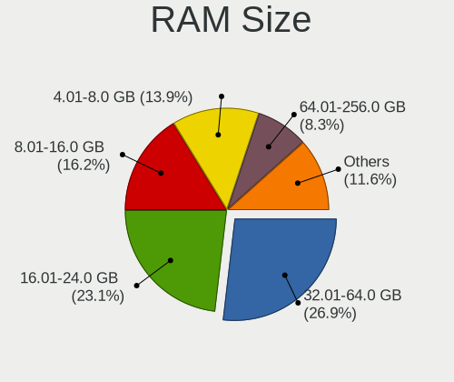
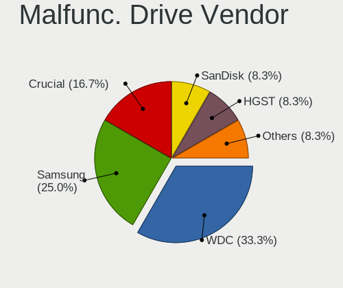
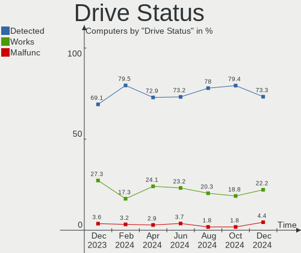
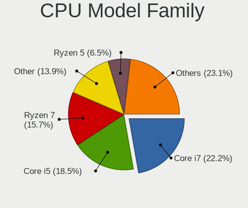
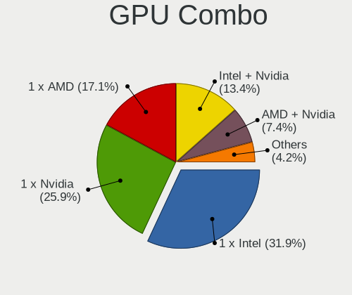
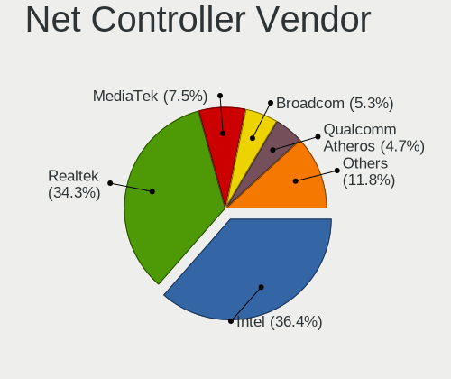
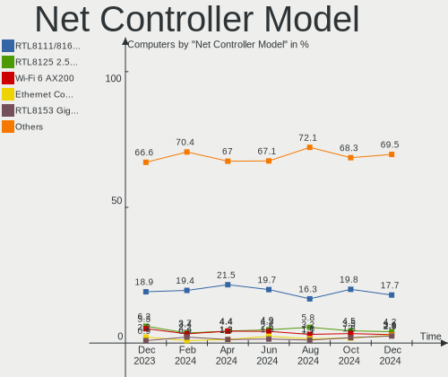
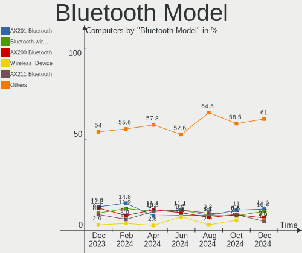
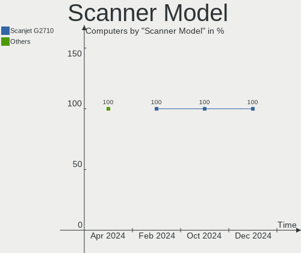

Pop!_OS - Hardware Trends
-------------------------

A project to identify most popular hardware characteristics and track their change
over time based on data collected by Linux users at https://Linux-Hardware.org.

Anyone can contribute to this report by the [hw-probe](https://github.com/linuxhw/hw-probe) tool:

    sudo -E hw-probe -all -upload

This is a report for all computer types. See also reports for [desktops](/Dist/Pop!_OS/Desktop/README.md) and [notebooks](/Dist/Pop!_OS/Notebook/README.md).

This report is for one last month. Overall report since the beginning of time: [TestCoverage](https://github.com/linuxhw/TestCoverage)

Period: Aug, 2022.

Contents
--------

* [ System ](#system)
  - [ OS                       ](#os)
  - [ OS Family                ](#os-family)
  - [ Kernel                   ](#kernel)
  - [ Kernel Family            ](#kernel-family)
  - [ Kernel Major Ver.        ](#kernel-major-ver)
  - [ Arch                     ](#arch)
  - [ DE                       ](#de)
  - [ Display Server           ](#display-server)
  - [ Display Manager          ](#display-manager)
  - [ OS Lang                  ](#os-lang)
  - [ Boot Mode                ](#boot-mode)
  - [ Filesystem               ](#filesystem)
  - [ Part. scheme             ](#part-scheme)
  - [ Dual Boot with Linux/BSD ](#dual-boot-with-linuxbsd)
  - [ Dual Boot (Win)          ](#dual-boot-win)

* [ Board ](#board)
  - [ Vendor                   ](#vendor)
  - [ Model                    ](#model)
  - [ Model Family             ](#model-family)
  - [ MFG Year                 ](#mfg-year)
  - [ Form Factor              ](#form-factor)
  - [ Secure Boot              ](#secure-boot)
  - [ Coreboot                 ](#coreboot)
  - [ RAM Size                 ](#ram-size)
  - [ RAM Used                 ](#ram-used)
  - [ Total Drives             ](#total-drives)
  - [ Has CD-ROM               ](#has-cd-rom)
  - [ Has Ethernet             ](#has-ethernet)
  - [ Has WiFi                 ](#has-wifi)
  - [ Has Bluetooth            ](#has-bluetooth)

* [ Location ](#location)
  - [ Country                  ](#country)
  - [ City                     ](#city)

* [ Drives ](#drives)
  - [ Drive Vendor             ](#drive-vendor)
  - [ Drive Model              ](#drive-model)
  - [ HDD Vendor               ](#hdd-vendor)
  - [ SSD Vendor               ](#ssd-vendor)
  - [ Drive Kind               ](#drive-kind)
  - [ Drive Connector          ](#drive-connector)
  - [ Drive Size               ](#drive-size)
  - [ Space Total              ](#space-total)
  - [ Space Used               ](#space-used)
  - [ Malfunc. Drives          ](#malfunc-drives)
  - [ Malfunc. Drive Vendor    ](#malfunc-drive-vendor)
  - [ Malfunc. HDD Vendor      ](#malfunc-hdd-vendor)
  - [ Malfunc. Drive Kind      ](#malfunc-drive-kind)
  - [ Failed Drives            ](#failed-drives)
  - [ Failed Drive Vendor      ](#failed-drive-vendor)
  - [ Drive Status             ](#drive-status)

* [ Storage controller ](#storage-controller)
  - [ Storage Vendor           ](#storage-vendor)
  - [ Storage Model            ](#storage-model)
  - [ Storage Kind             ](#storage-kind)

* [ Processor ](#processor)
  - [ CPU Vendor               ](#cpu-vendor)
  - [ CPU Model                ](#cpu-model)
  - [ CPU Model Family         ](#cpu-model-family)
  - [ CPU Cores                ](#cpu-cores)
  - [ CPU Sockets              ](#cpu-sockets)
  - [ CPU Threads              ](#cpu-threads)
  - [ CPU Op-Modes             ](#cpu-op-modes)
  - [ CPU Microcode            ](#cpu-microcode)
  - [ CPU Microarch            ](#cpu-microarch)

* [ Graphics ](#graphics)
  - [ GPU Vendor               ](#gpu-vendor)
  - [ GPU Model                ](#gpu-model)
  - [ GPU Combo                ](#gpu-combo)
  - [ GPU Driver               ](#gpu-driver)
  - [ GPU Memory               ](#gpu-memory)

* [ Monitor ](#monitor)
  - [ Monitor Vendor           ](#monitor-vendor)
  - [ Monitor Model            ](#monitor-model)
  - [ Monitor Resolution       ](#monitor-resolution)
  - [ Monitor Diagonal         ](#monitor-diagonal)
  - [ Monitor Width            ](#monitor-width)
  - [ Aspect Ratio             ](#aspect-ratio)
  - [ Monitor Area             ](#monitor-area)
  - [ Pixel Density            ](#pixel-density)
  - [ Multiple Monitors        ](#multiple-monitors)

* [ Network ](#network)
  - [ Net Controller Vendor    ](#net-controller-vendor)
  - [ Net Controller Model     ](#net-controller-model)
  - [ Wireless Vendor          ](#wireless-vendor)
  - [ Wireless Model           ](#wireless-model)
  - [ Ethernet Vendor          ](#ethernet-vendor)
  - [ Ethernet Model           ](#ethernet-model)
  - [ Net Controller Kind      ](#net-controller-kind)
  - [ Used Controller          ](#used-controller)
  - [ NICs                     ](#nics)
  - [ IPv6                     ](#ipv6)

* [ Bluetooth ](#bluetooth)
  - [ Bluetooth Vendor         ](#bluetooth-vendor)
  - [ Bluetooth Model          ](#bluetooth-model)

* [ Sound ](#sound)
  - [ Sound Vendor             ](#sound-vendor)
  - [ Sound Model              ](#sound-model)

* [ Memory ](#memory)
  - [ Memory Vendor            ](#memory-vendor)
  - [ Memory Model             ](#memory-model)
  - [ Memory Kind              ](#memory-kind)
  - [ Memory Form Factor       ](#memory-form-factor)
  - [ Memory Size              ](#memory-size)
  - [ Memory Speed             ](#memory-speed)

* [ Printers & scanners ](#printers--scanners)
  - [ Printer Vendor           ](#printer-vendor)
  - [ Printer Model            ](#printer-model)
  - [ Scanner Vendor           ](#scanner-vendor)
  - [ Scanner Model            ](#scanner-model)

* [ Camera ](#camera)
  - [ Camera Vendor            ](#camera-vendor)
  - [ Camera Model             ](#camera-model)

* [ Security ](#security)
  - [ Fingerprint Vendor       ](#fingerprint-vendor)
  - [ Fingerprint Model        ](#fingerprint-model)
  - [ Chipcard Vendor          ](#chipcard-vendor)
  - [ Chipcard Model           ](#chipcard-model)

* [ Unsupported ](#unsupported)
  - [ Unsupported Devices      ](#unsupported-devices)
  - [ Unsupported Device Types ](#unsupported-device-types)

System
------

OS
--

Installed operating systems

| Name          | Computers | Percent |
|---------------|-----------|---------|
| Pop!_OS 22.04 | 220       | 97.35%  |
| Pop!_OS 21.10 | 3         | 1.33%   |
| Pop!_OS 20.04 | 3         | 1.33%   |

OS Family
---------

OS without a version

| Name    | Computers | Percent |
|---------|-----------|---------|
| Pop!_OS | 226       | 100%    |

Kernel
------

Version of the Linux kernel

| Version                              | Computers | Percent |
|--------------------------------------|-----------|---------|
| 5.18.10-76051810-generic             | 134       | 59.29%  |
| 5.19.0-76051900-generic              | 73        | 32.3%   |
| 5.17.5-76051705-generic              | 9         | 3.98%   |
| 5.17.15-76051715-generic             | 4         | 1.77%   |
| 6.0.0-060000rc1daily20220820-generic | 1         | 0.44%   |
| 5.19.3-051903-generic                | 1         | 0.44%   |
| 5.19.0-xanmod1-x64v2                 | 1         | 0.44%   |
| 5.18.16-xanmod1                      | 1         | 0.44%   |
| 5.15.0-46-generic                    | 1         | 0.44%   |
| 5.13.0-7620-generic                  | 1         | 0.44%   |

Kernel Family
-------------

Linux kernel without a distro release

| Version | Computers | Percent |
|---------|-----------|---------|
| 5.18.10 | 134       | 59.29%  |
| 5.19.0  | 74        | 32.74%  |
| 5.17.5  | 9         | 3.98%   |
| 5.17.15 | 4         | 1.77%   |
| 6.0.0   | 1         | 0.44%   |
| 5.19.3  | 1         | 0.44%   |
| 5.18.16 | 1         | 0.44%   |
| 5.15.0  | 1         | 0.44%   |
| 5.13.0  | 1         | 0.44%   |

Kernel Major Ver.
-----------------

Linux kernel major version

| Version | Computers | Percent |
|---------|-----------|---------|
| 5.18    | 135       | 59.73%  |
| 5.19    | 75        | 33.19%  |
| 5.17    | 13        | 5.75%   |
| 6.0     | 1         | 0.44%   |
| 5.15    | 1         | 0.44%   |
| 5.13    | 1         | 0.44%   |

Arch
----

OS architecture (x86_64, i586, etc.)

| Name   | Computers | Percent |
|--------|-----------|---------|
| x86_64 | 226       | 100%    |

DE
--

Desktop Environment

| Name            | Computers | Percent |
|-----------------|-----------|---------|
| GNOME           | 211       | 93.36%  |
| KDE5            | 7         | 3.1%    |
| Unknown         | 3         | 1.33%   |
| X-Cinnamon      | 2         | 0.88%   |
| LXQt            | 1         | 0.44%   |
| GNOME Flashback | 1         | 0.44%   |
| Cinnamon        | 1         | 0.44%   |

Display Server
--------------

X11 or Wayland

| Name    | Computers | Percent |
|---------|-----------|---------|
| X11     | 212       | 93.81%  |
| Wayland | 10        | 4.42%   |
| Unknown | 3         | 1.33%   |
| Tty     | 1         | 0.44%   |

Display Manager
---------------

SDDM, LightDM, etc.

| Name    | Computers | Percent |
|---------|-----------|---------|
| Unknown | 170       | 75.22%  |
| GDM3    | 54        | 23.89%  |
| SDDM    | 1         | 0.44%   |
| GDM     | 1         | 0.44%   |

OS Lang
-------

Language

| Lang    | Computers | Percent |
|---------|-----------|---------|
| en_US   | 143       | 63.27%  |
| en_GB   | 14        | 6.19%   |
| pt_BR   | 13        | 5.75%   |
| de_DE   | 11        | 4.87%   |
| C       | 9         | 3.98%   |
| en_AU   | 8         | 3.54%   |
| en_CA   | 4         | 1.77%   |
| fr_FR   | 2         | 0.88%   |
| es_ES   | 2         | 0.88%   |
| en_IN   | 2         | 0.88%   |
| en_IE   | 2         | 0.88%   |
| Unknown | 2         | 0.88%   |
| sv_SE   | 1         | 0.44%   |
| sr_RS   | 1         | 0.44%   |
| pt_PT   | 1         | 0.44%   |
| pl_PL   | 1         | 0.44%   |
| nb_NO   | 1         | 0.44%   |
| ja_JP   | 1         | 0.44%   |
| it_IT   | 1         | 0.44%   |
| fr_CH   | 1         | 0.44%   |
| fr_CA   | 1         | 0.44%   |
| es_MX   | 1         | 0.44%   |
| es_CO   | 1         | 0.44%   |
| es_CL   | 1         | 0.44%   |
| en_FI   | 1         | 0.44%   |
| de_CH   | 1         | 0.44%   |

Boot Mode
---------

EFI or BIOS

| Mode | Computers | Percent |
|------|-----------|---------|
| BIOS | 173       | 76.55%  |
| EFI  | 53        | 23.45%  |

Filesystem
----------

Type of filesystem

| Type    | Computers | Percent |
|---------|-----------|---------|
| Ext4    | 210       | 92.92%  |
| Btrfs   | 9         | 3.98%   |
| Overlay | 7         | 3.1%    |

Part. scheme
------------

Scheme of partitioning

| Type    | Computers | Percent |
|---------|-----------|---------|
| Unknown | 167       | 73.89%  |
| GPT     | 54        | 23.89%  |
| MBR     | 5         | 2.21%   |

Dual Boot with Linux/BSD
------------------------

Hosting more than one Linux/BSD

| Dual boot | Computers | Percent |
|-----------|-----------|---------|
| No        | 221       | 97.79%  |
| Yes       | 5         | 2.21%   |

Dual Boot (Win)
---------------

Hosting Linux and Windows

| Dual boot | Computers | Percent |
|-----------|-----------|---------|
| No        | 203       | 89.82%  |
| Yes       | 23        | 10.18%  |

Board
-----

Vendor
------

Motherboard manufacturer

| Name                   | Computers | Percent |
|------------------------|-----------|---------|
| ASUSTek Computer       | 40        | 17.7%   |
| Lenovo                 | 38        | 16.81%  |
| Dell                   | 26        | 11.5%   |
| Hewlett-Packard        | 22        | 9.73%   |
| MSI                    | 20        | 8.85%   |
| Gigabyte Technology    | 14        | 6.19%   |
| Apple                  | 13        | 5.75%   |
| Acer                   | 13        | 5.75%   |
| System76               | 6         | 2.65%   |
| Intel                  | 6         | 2.65%   |
| ASRock                 | 6         | 2.65%   |
| Samsung Electronics    | 3         | 1.33%   |
| Toshiba                | 2         | 0.88%   |
| HUAWEI                 | 2         | 0.88%   |
| GPU Company            | 2         | 0.88%   |
| BESSTAR Tech           | 2         | 0.88%   |
| Positivo               | 1         | 0.44%   |
| Panasonic              | 1         | 0.44%   |
| Notebook               | 1         | 0.44%   |
| HONOR                  | 1         | 0.44%   |
| GEO                    | 1         | 0.44%   |
| Gateway                | 1         | 0.44%   |
| AZW                    | 1         | 0.44%   |
| Avell High Performance | 1         | 0.44%   |
| Alienware              | 1         | 0.44%   |
| Acidanthera            | 1         | 0.44%   |
| Unknown                | 1         | 0.44%   |

Model
-----

Motherboard model

| Name                                        | Computers | Percent |
|---------------------------------------------|-----------|---------|
| System76 Oryx Pro                           | 3         | 1.33%   |
| MSI Prestige 15 A10SC                       | 2         | 0.88%   |
| MSI GF63 Thin 11UD                          | 2         | 0.88%   |
| Dell XPS 9320                               | 2         | 0.88%   |
| Dell XPS 15 9520                            | 2         | 0.88%   |
| Dell Latitude 7275                          | 2         | 0.88%   |
| BESSTAR Tech UM700                          | 2         | 0.88%   |
| ASUS X556UQK                                | 2         | 0.88%   |
| ASUS TUF Gaming B550-PLUS                   | 2         | 0.88%   |
| ASUS ROG STRIX B550-F GAMING                | 2         | 0.88%   |
| ASUS All Series                             | 2         | 0.88%   |
| Acer Swift SFX14-41G                        | 2         | 0.88%   |
| Toshiba Satellite C850                      | 1         | 0.44%   |
| Toshiba Satellite C845                      | 1         | 0.44%   |
| System76 Thelio                             | 1         | 0.44%   |
| System76 Gazelle                            | 1         | 0.44%   |
| System76 Galago UltraPro                    | 1         | 0.44%   |
| Samsung 3570R/370R/470R/450R/510R/4450RV    | 1         | 0.44%   |
| Samsung 305E4A/305E5A/305E7A                | 1         | 0.44%   |
| Samsung 300E4C/300E5C/300E7C                | 1         | 0.44%   |
| Positivo W942SV_SV1                         | 1         | 0.44%   |
| Panasonic FZ55-1                            | 1         | 0.44%   |
| Notebook NV4XMB,ME,MZ                       | 1         | 0.44%   |
| MSI PS63 Modern 8RC                         | 1         | 0.44%   |
| MSI MS-7D54                                 | 1         | 0.44%   |
| MSI MS-7D25                                 | 1         | 0.44%   |
| MSI MS-7C91                                 | 1         | 0.44%   |
| MSI MS-7C02                                 | 1         | 0.44%   |
| MSI MS-7B89                                 | 1         | 0.44%   |
| MSI MS-7B86                                 | 1         | 0.44%   |
| MSI MS-7B22                                 | 1         | 0.44%   |
| MSI MS-7A32                                 | 1         | 0.44%   |
| MSI MS-7A15                                 | 1         | 0.44%   |
| MSI MS-7971                                 | 1         | 0.44%   |
| MSI MS-7821                                 | 1         | 0.44%   |
| MSI MS-7721                                 | 1         | 0.44%   |
| MSI MS-7693                                 | 1         | 0.44%   |
| MSI Katana GF76 11UD                        | 1         | 0.44%   |
| MSI GF63 Thin 10UC                          | 1         | 0.44%   |
| Lenovo Yoga 7 15ITL5 82BJ                   | 1         | 0.44%   |
| Lenovo XiaoXinPro 16 ARH7 82SN              | 1         | 0.44%   |
| Lenovo V330 81AX                            | 1         | 0.44%   |
| Lenovo V15-IIL 82C5                         | 1         | 0.44%   |
| Lenovo ThinkPad X1 Extreme Gen 5 21DECTO1WW | 1         | 0.44%   |
| Lenovo ThinkPad W520 4270CTO                | 1         | 0.44%   |
| Lenovo ThinkPad T580 20L9CTO1WW             | 1         | 0.44%   |
| Lenovo ThinkPad T470p 20J7S0CF00            | 1         | 0.44%   |
| Lenovo ThinkPad T450s 20BWS1RT00            | 1         | 0.44%   |
| Lenovo ThinkPad T16 Gen 1 21CH000JUS        | 1         | 0.44%   |
| Lenovo ThinkPad P15 Gen 2i 20YQ0014GE       | 1         | 0.44%   |
| Lenovo ThinkPad L590 20Q7001HGE             | 1         | 0.44%   |
| Lenovo ThinkPad E470c 20H3A000CD            | 1         | 0.44%   |
| Lenovo ThinkPad E15 Gen 2 20T8000RMH        | 1         | 0.44%   |
| Lenovo ThinkPad E14 Gen 4 21ECS00000        | 1         | 0.44%   |
| Lenovo ThinkPad E14 Gen 2 20TB0029BO        | 1         | 0.44%   |
| Lenovo ThinkPad E14 Gen 2 20TA009AUS        | 1         | 0.44%   |
| Lenovo ThinkPad 20M8S1K100                  | 1         | 0.44%   |
| Lenovo ThinkCentre M82 2756BH7              | 1         | 0.44%   |
| Lenovo ThinkBook 15p 20V3                   | 1         | 0.44%   |
| Lenovo Legion 5 Pro 16ARH7H 82RG            | 1         | 0.44%   |

Model Family
------------

Motherboard model prefix

| Name               | Computers | Percent |
|--------------------|-----------|---------|
| Lenovo ThinkPad    | 14        | 6.19%   |
| Lenovo IdeaPad     | 13        | 5.75%   |
| ASUS ROG           | 13        | 5.75%   |
| Acer Aspire        | 10        | 4.42%   |
| Dell XPS           | 8         | 3.54%   |
| Dell Inspiron      | 8         | 3.54%   |
| Dell Latitude      | 6         | 2.65%   |
| HP ENVY            | 4         | 1.77%   |
| HP Compaq          | 4         | 1.77%   |
| System76 Oryx      | 3         | 1.33%   |
| MSI GF63           | 3         | 1.33%   |
| Lenovo Legion      | 3         | 1.33%   |
| HP Laptop          | 3         | 1.33%   |
| HP EliteDesk       | 3         | 1.33%   |
| HP EliteBook       | 3         | 1.33%   |
| ASUS Zenbook       | 3         | 1.33%   |
| ASUS TUF           | 3         | 1.33%   |
| Toshiba Satellite  | 2         | 0.88%   |
| MSI Prestige       | 2         | 0.88%   |
| HP Pavilion        | 2         | 0.88%   |
| Gigabyte B450M     | 2         | 0.88%   |
| Gigabyte B450      | 2         | 0.88%   |
| BESSTAR Tech UM700 | 2         | 0.88%   |
| ASUS X556UQK       | 2         | 0.88%   |
| ASUS PRIME         | 2         | 0.88%   |
| ASUS All           | 2         | 0.88%   |
| Acer Swift         | 2         | 0.88%   |
| System76 Thelio    | 1         | 0.44%   |
| System76 Gazelle   | 1         | 0.44%   |
| System76 Galago    | 1         | 0.44%   |
| Samsung 3570R      | 1         | 0.44%   |
| Samsung 305E4A     | 1         | 0.44%   |
| Samsung 300E4C     | 1         | 0.44%   |
| Positivo W942SV    | 1         | 0.44%   |
| Panasonic FZ55-1   | 1         | 0.44%   |
| Notebook NV4XMB    | 1         | 0.44%   |
| MSI PS63           | 1         | 0.44%   |
| MSI MS-7D54        | 1         | 0.44%   |
| MSI MS-7D25        | 1         | 0.44%   |
| MSI MS-7C91        | 1         | 0.44%   |
| MSI MS-7C02        | 1         | 0.44%   |
| MSI MS-7B89        | 1         | 0.44%   |
| MSI MS-7B86        | 1         | 0.44%   |
| MSI MS-7B22        | 1         | 0.44%   |
| MSI MS-7A32        | 1         | 0.44%   |
| MSI MS-7A15        | 1         | 0.44%   |
| MSI MS-7971        | 1         | 0.44%   |
| MSI MS-7821        | 1         | 0.44%   |
| MSI MS-7721        | 1         | 0.44%   |
| MSI MS-7693        | 1         | 0.44%   |
| MSI Katana         | 1         | 0.44%   |
| Lenovo Yoga        | 1         | 0.44%   |
| Lenovo XiaoXinPro  | 1         | 0.44%   |
| Lenovo V330        | 1         | 0.44%   |
| Lenovo V15-IIL     | 1         | 0.44%   |
| Lenovo ThinkCentre | 1         | 0.44%   |
| Lenovo ThinkBook   | 1         | 0.44%   |
| Lenovo IdeaCentre  | 1         | 0.44%   |
| Lenovo Erazer      | 1         | 0.44%   |
| Intel NUC6CAYH     | 1         | 0.44%   |

MFG Year
--------

Motherboard manufacture year

| Year | Computers | Percent |
|------|-----------|---------|
| 2021 | 35        | 15.49%  |
| 2020 | 30        | 13.27%  |
| 2022 | 23        | 10.18%  |
| 2018 | 23        | 10.18%  |
| 2019 | 22        | 9.73%   |
| 2012 | 16        | 7.08%   |
| 2013 | 13        | 5.75%   |
| 2011 | 12        | 5.31%   |
| 2017 | 11        | 4.87%   |
| 2014 | 9         | 3.98%   |
| 2016 | 8         | 3.54%   |
| 2015 | 8         | 3.54%   |
| 2010 | 6         | 2.65%   |
| 2009 | 6         | 2.65%   |
| 2008 | 2         | 0.88%   |
| 2007 | 2         | 0.88%   |

Form Factor
-----------

Physical design of the computer

| Name        | Computers | Percent |
|-------------|-----------|---------|
| Notebook    | 134       | 59.29%  |
| Desktop     | 72        | 31.86%  |
| Convertible | 8         | 3.54%   |
| Mini pc     | 4         | 1.77%   |
| All in one  | 4         | 1.77%   |
| Tablet      | 3         | 1.33%   |
| Server      | 1         | 0.44%   |

Secure Boot
-----------

Enabled or disabled

| State    | Computers | Percent |
|----------|-----------|---------|
| Disabled | 226       | 100%    |

Coreboot
--------

Have coreboot on board

| Used | Computers | Percent |
|------|-----------|---------|
| No   | 223       | 98.67%  |
| Yes  | 3         | 1.33%   |

RAM Size
--------

Total RAM memory

| Size in GB  | Computers | Percent |
|-------------|-----------|---------|
| 16.01-24.0  | 69        | 30.53%  |
| 8.01-16.0   | 47        | 20.8%   |
| 4.01-8.0    | 45        | 19.91%  |
| 32.01-64.0  | 30        | 13.27%  |
| 3.01-4.0    | 20        | 8.85%   |
| 64.01-256.0 | 9         | 3.98%   |
| 24.01-32.0  | 3         | 1.33%   |
| 2.01-3.0    | 2         | 0.88%   |
| 1.01-2.0    | 1         | 0.44%   |

RAM Used
--------

Used RAM memory

| Used GB   | Computers | Percent |
|-----------|-----------|---------|
| 2.01-3.0  | 73        | 32.3%   |
| 3.01-4.0  | 56        | 24.78%  |
| 4.01-8.0  | 52        | 23.01%  |
| 1.01-2.0  | 29        | 12.83%  |
| 8.01-16.0 | 16        | 7.08%   |

Total Drives
------------

Number of drives on board

| Drives | Computers | Percent |
|--------|-----------|---------|
| 1      | 141       | 62.39%  |
| 2      | 52        | 23.01%  |
| 3      | 19        | 8.41%   |
| 4      | 6         | 2.65%   |
| 5      | 4         | 1.77%   |
| 7      | 2         | 0.88%   |
| 6      | 2         | 0.88%   |

Has CD-ROM
----------

Has CD-ROM on board

| Presented | Computers | Percent |
|-----------|-----------|---------|
| No        | 170       | 75.22%  |
| Yes       | 56        | 24.78%  |

Has Ethernet
------------

Has Ethernet on board

| Presented | Computers | Percent |
|-----------|-----------|---------|
| Yes       | 182       | 80.53%  |
| No        | 44        | 19.47%  |

Has WiFi
--------

Has WiFi module

| Presented | Computers | Percent |
|-----------|-----------|---------|
| Yes       | 197       | 87.17%  |
| No        | 29        | 12.83%  |

Has Bluetooth
-------------

Has Bluetooth module

| Presented | Computers | Percent |
|-----------|-----------|---------|
| Yes       | 162       | 71.68%  |
| No        | 64        | 28.32%  |

Location
--------

Country
-------

Geographic location (country)

| Country      | Computers | Percent |
|--------------|-----------|---------|
| USA          | 77        | 34.07%  |
| Brazil       | 20        | 8.85%   |
| Germany      | 17        | 7.52%   |
| UK           | 10        | 4.42%   |
| Canada       | 10        | 4.42%   |
| Australia    | 8         | 3.54%   |
| Norway       | 6         | 2.65%   |
| Netherlands  | 6         | 2.65%   |
| India        | 5         | 2.21%   |
| Romania      | 4         | 1.77%   |
| Belgium      | 4         | 1.77%   |
| Switzerland  | 3         | 1.33%   |
| Sweden       | 3         | 1.33%   |
| Spain        | 3         | 1.33%   |
| Serbia       | 3         | 1.33%   |
| Russia       | 3         | 1.33%   |
| Philippines  | 3         | 1.33%   |
| France       | 3         | 1.33%   |
| Vietnam      | 2         | 0.88%   |
| Saudi Arabia | 2         | 0.88%   |
| Poland       | 2         | 0.88%   |
| Lithuania    | 2         | 0.88%   |
| Ireland      | 2         | 0.88%   |
| Indonesia    | 2         | 0.88%   |
| Hungary      | 2         | 0.88%   |
| Greece       | 2         | 0.88%   |
| Tunisia      | 1         | 0.44%   |
| Thailand     | 1         | 0.44%   |
| Slovenia     | 1         | 0.44%   |
| Slovakia     | 1         | 0.44%   |
| Singapore    | 1         | 0.44%   |
| New Zealand  | 1         | 0.44%   |
| Mexico       | 1         | 0.44%   |
| Kazakhstan   | 1         | 0.44%   |
| Japan        | 1         | 0.44%   |
| Italy        | 1         | 0.44%   |
| Israel       | 1         | 0.44%   |
| Iraq         | 1         | 0.44%   |
| Finland      | 1         | 0.44%   |
| Egypt        | 1         | 0.44%   |
| Czechia      | 1         | 0.44%   |
| Colombia     | 1         | 0.44%   |
| China        | 1         | 0.44%   |
| Chile        | 1         | 0.44%   |
| Bulgaria     | 1         | 0.44%   |
| Bangladesh   | 1         | 0.44%   |
| Austria      | 1         | 0.44%   |
| Argentina    | 1         | 0.44%   |

City
----

Geographic location (city)

| City                | Computers | Percent |
|---------------------|-----------|---------|
| Seattle             | 4         | 1.77%   |
| Rio de Janeiro      | 4         | 1.77%   |
| Oslo                | 3         | 1.33%   |
| London              | 3         | 1.33%   |
| Danville            | 3         | 1.33%   |
| Brisbane            | 3         | 1.33%   |
| Berlin              | 3         | 1.33%   |
| Victoria            | 2         | 0.88%   |
| Stockholm           | 2         | 0.88%   |
| Spokane             | 2         | 0.88%   |
| Riverside           | 2         | 0.88%   |
| Ribeirao Preto      | 2         | 0.88%   |
| Minneapolis         | 2         | 0.88%   |
| Melbourne           | 2         | 0.88%   |
| Madrid              | 2         | 0.88%   |
| Ho Chi Minh City    | 2         | 0.88%   |
| Frankfurt am Main   | 2         | 0.88%   |
| Calgary             | 2         | 0.88%   |
| Bucharest           | 2         | 0.88%   |
| Belgrade            | 2         | 0.88%   |
| Asheville           | 2         | 0.88%   |
| Zurich              | 1         | 0.44%   |
| Žilina             | 1         | 0.44%   |
| Wilmette            | 1         | 0.44%   |
| Werder              | 1         | 0.44%   |
| Weimar              | 1         | 0.44%   |
| Weil am Rhein       | 1         | 0.44%   |
| Waynesville         | 1         | 0.44%   |
| Waterbury           | 1         | 0.44%   |
| Washington          | 1         | 0.44%   |
| Vilvoorde           | 1         | 0.44%   |
| Vilnius             | 1         | 0.44%   |
| Vancouver           | 1         | 0.44%   |
| Valparaiso de Goias | 1         | 0.44%   |
| Ust-Kamenogorsk     | 1         | 0.44%   |
| Union               | 1         | 0.44%   |
| Ulyanovsk           | 1         | 0.44%   |
| Tunis               | 1         | 0.44%   |
| Trondheim           | 1         | 0.44%   |
| Trois-Rivières     | 1         | 0.44%   |
| Toeroekbalint       | 1         | 0.44%   |
| Tilburg             | 1         | 0.44%   |
| Thornton            | 1         | 0.44%   |
| Tasikmalaya         | 1         | 0.44%   |
| Tanza               | 1         | 0.44%   |
| Tacoma              | 1         | 0.44%   |
| Sydney              | 1         | 0.44%   |
| Sutton              | 1         | 0.44%   |
| Sulingen            | 1         | 0.44%   |
| St Petersburg       | 1         | 0.44%   |
| Spring              | 1         | 0.44%   |
| Speyer              | 1         | 0.44%   |
| Sostanj             | 1         | 0.44%   |
| Sofia               | 1         | 0.44%   |
| Singapore           | 1         | 0.44%   |
| Siliguri            | 1         | 0.44%   |
| Siegen              | 1         | 0.44%   |
| Sete Lagoas         | 1         | 0.44%   |
| Santiago            | 1         | 0.44%   |
| San Pedro           | 1         | 0.44%   |

Drives
------

Drive Vendor
------------

Hard drive vendors

| Vendor                         | Computers | Drives | Percent |
|--------------------------------|-----------|--------|---------|
| Samsung Electronics            | 66        | 81     | 19.88%  |
| WDC                            | 47        | 55     | 14.16%  |
| Seagate                        | 34        | 42     | 10.24%  |
| SanDisk                        | 19        | 20     | 5.72%   |
| Crucial                        | 19        | 21     | 5.72%   |
| Toshiba                        | 15        | 16     | 4.52%   |
| Kingston                       | 15        | 17     | 4.52%   |
| SK hynix                       | 14        | 14     | 4.22%   |
| Intel                          | 9         | 9      | 2.71%   |
| Apple                          | 8         | 9      | 2.41%   |
| Unknown                        | 7         | 8      | 2.11%   |
| Phison                         | 7         | 7      | 2.11%   |
| Micron Technology              | 7         | 8      | 2.11%   |
| PNY                            | 5         | 6      | 1.51%   |
| Micron/Crucial Technology      | 5         | 5      | 1.51%   |
| Hitachi                        | 5         | 6      | 1.51%   |
| Unknown                        | 5         | 5      | 1.51%   |
| HGST                           | 4         | 4      | 1.2%    |
| China                          | 4         | 4      | 1.2%    |
| Silicon Motion                 | 3         | 3      | 0.9%    |
| A-DATA Technology              | 3         | 3      | 0.9%    |
| Team                           | 2         | 2      | 0.6%    |
| OCZ                            | 2         | 2      | 0.6%    |
| LITEON                         | 2         | 2      | 0.6%    |
| KingSpec                       | 2         | 2      | 0.6%    |
| WALRAM                         | 1         | 1      | 0.3%    |
| W800S                          | 1         | 1      | 0.3%    |
| Union Memory (Shenzhen)        | 1         | 1      | 0.3%    |
| UMIS                           | 1         | 1      | 0.3%    |
| TrekStor                       | 1         | 1      | 0.3%    |
| Teutons                        | 1         | 1      | 0.3%    |
| SPCC                           | 1         | 1      | 0.3%    |
| Solid State Storage Technology | 1         | 1      | 0.3%    |
| Plextor                        | 1         | 1      | 0.3%    |
| Patriot                        | 1         | 1      | 0.3%    |
| Netac                          | 1         | 1      | 0.3%    |
| Maxtor                         | 1         | 1      | 0.3%    |
| KXG60ZNV                       | 1         | 1      | 0.3%    |
| KIOXIA                         | 1         | 1      | 0.3%    |
| KingFast                       | 1         | 1      | 0.3%    |
| HS-SSD-C100                    | 1         | 1      | 0.3%    |
| Hikvision                      | 1         | 1      | 0.3%    |
| Hewlett-Packard                | 1         | 1      | 0.3%    |
| GOODRAM                        | 1         | 1      | 0.3%    |
| Fujitsu                        | 1         | 1      | 0.3%    |
| Corsair                        | 1         | 1      | 0.3%    |
| Asm                            | 1         | 1      | 0.3%    |
| Apacer                         | 1         | 1      | 0.3%    |

Drive Model
-----------

Hard drive models

| Model                             | Computers | Percent |
|-----------------------------------|-----------|---------|
| Samsung NVMe SSD Drive 1TB        | 9         | 2.45%   |
| Samsung NVMe SSD Drive 2TB        | 7         | 1.91%   |
| Samsung NVMe SSD Drive 512GB      | 5         | 1.36%   |
| Unknown                           | 5         | 1.36%   |
| Seagate ST1000LM035-1RK172 1TB    | 4         | 1.09%   |
| Samsung SSD 850 EVO 500GB         | 4         | 1.09%   |
| Samsung NVMe SSD Drive 256GB      | 4         | 1.09%   |
| Micron/Crucial NVMe SSD Drive 1TB | 4         | 1.09%   |
| Kingston SA400S37240G 240GB SSD   | 4         | 1.09%   |
| Kingston NVMe SSD Drive 512GB     | 4         | 1.09%   |
| Crucial CT240BX500SSD1 240GB      | 4         | 1.09%   |
| Unknown SD/MMC/MS PRO 128GB       | 3         | 0.82%   |
| Toshiba MQ01ABD100 1TB            | 3         | 0.82%   |
| SK hynix NVMe SSD Drive 1024GB    | 3         | 0.82%   |
| Seagate ST1000DM003-1ER162 1TB    | 3         | 0.82%   |
| SanDisk NVMe SSD Drive 1TB        | 3         | 0.82%   |
| SanDisk NVMe SSD Drive 1024GB     | 3         | 0.82%   |
| Samsung SSD 860 EVO M.2 500GB     | 3         | 0.82%   |
| Samsung SSD 860 EVO 1TB           | 3         | 0.82%   |
| PNY CS900 500GB SSD               | 3         | 0.82%   |
| Crucial CT1000BX500SSD1 1TB       | 3         | 0.82%   |
| WDC WDS500G2B0A-00SM50 500GB SSD  | 2         | 0.54%   |
| WDC WD10SPZX-24Z10 1TB            | 2         | 0.54%   |
| Toshiba DT01ACA050 500GB          | 2         | 0.54%   |
| SK hynix NVMe SSD Drive 2TB       | 2         | 0.54%   |
| Seagate ST500LT012-9WS142 500GB   | 2         | 0.54%   |
| Seagate ST2000DM008-2FR102 2TB    | 2         | 0.54%   |
| Seagate ST1000DM010-2EP102 1TB    | 2         | 0.54%   |
| Seagate ST1000DM003-1CH162 1TB    | 2         | 0.54%   |
| SanDisk NVMe SSD Drive 500GB      | 2         | 0.54%   |
| SanDisk NVMe SSD Drive 256GB      | 2         | 0.54%   |
| Samsung SSD 980 PRO 1TB           | 2         | 0.54%   |
| Samsung SSD 970 EVO Plus 1TB      | 2         | 0.54%   |
| Samsung SSD 870 EVO 250GB         | 2         | 0.54%   |
| Samsung SSD 860 EVO 500GB         | 2         | 0.54%   |
| Samsung NVMe SSD Drive 500GB      | 2         | 0.54%   |
| Samsung NVMe SSD Drive 250GB      | 2         | 0.54%   |
| Phison NVMe SSD Drive 2TB         | 2         | 0.54%   |
| Micron NVMe SSD Drive 1024GB      | 2         | 0.54%   |
| Micron MTFDKBA1T0TFH 1TB          | 2         | 0.54%   |
| Kingston SA400S37480G 480GB SSD   | 2         | 0.54%   |
| Kingston SA400S37120G 120GB SSD   | 2         | 0.54%   |
| Kingston OM8PCP3512F-AI1 512GB    | 2         | 0.54%   |
| Intel NVMe SSD Drive 512GB        | 2         | 0.54%   |
| Hitachi HTS547550A9E384 500GB     | 2         | 0.54%   |
| Crucial CT2000MX500SSD1 2TB       | 2         | 0.54%   |
| WDC WDS250G2B0B-00YS70 250GB SSD  | 1         | 0.27%   |
| WDC WDS120G2G0A-00JH30 120GB SSD  | 1         | 0.27%   |
| WDC WDBNCE5000PNC 500GB SSD       | 1         | 0.27%   |
| WDC WD80EDAZ-11TA3A0 8TB          | 1         | 0.27%   |
| WDC WD8003FRYZ-01JPDB1 8TB        | 1         | 0.27%   |
| WDC WD7500AALX-009BA0 752GB       | 1         | 0.27%   |
| WDC WD6400BPVT-75HXZT1 640GB      | 1         | 0.27%   |
| WDC WD5003ABYX-01WERA0 500GB      | 1         | 0.27%   |
| WDC WD5000LPLX-08ZNTT0 500GB      | 1         | 0.27%   |
| WDC WD5000BPVT-80HXZT1 500GB      | 1         | 0.27%   |
| WDC WD5000BPVT-75HXZT1 500GB      | 1         | 0.27%   |
| WDC WD5000BPKX-60HPJT0 500GB      | 1         | 0.27%   |
| WDC WD5000BPKT-80PK4T0 500GB      | 1         | 0.27%   |
| WDC WD5000BPKT-00PK4T0 500GB      | 1         | 0.27%   |

HDD Vendor
----------

Hard disk drive vendors

| Vendor              | Computers | Drives | Percent |
|---------------------|-----------|--------|---------|
| WDC                 | 40        | 45     | 38.83%  |
| Seagate             | 30        | 37     | 29.13%  |
| Toshiba             | 11        | 12     | 10.68%  |
| Hitachi             | 5         | 6      | 4.85%   |
| Samsung Electronics | 4         | 5      | 3.88%   |
| HGST                | 4         | 4      | 3.88%   |
| Unknown             | 3         | 3      | 2.91%   |
| Apple               | 3         | 3      | 2.91%   |
| Maxtor              | 1         | 1      | 0.97%   |
| Fujitsu             | 1         | 1      | 0.97%   |
| Asm                 | 1         | 1      | 0.97%   |

SSD Vendor
----------

Solid state drive vendors

| Vendor              | Computers | Drives | Percent |
|---------------------|-----------|--------|---------|
| Samsung Electronics | 26        | 32     | 25.74%  |
| Crucial             | 17        | 19     | 16.83%  |
| SanDisk             | 8         | 8      | 7.92%   |
| Kingston            | 8         | 8      | 7.92%   |
| WDC                 | 5         | 5      | 4.95%   |
| PNY                 | 5         | 6      | 4.95%   |
| Intel               | 4         | 4      | 3.96%   |
| China               | 3         | 3      | 2.97%   |
| Apple               | 3         | 3      | 2.97%   |
| Toshiba             | 2         | 2      | 1.98%   |
| SK hynix            | 2         | 2      | 1.98%   |
| OCZ                 | 2         | 2      | 1.98%   |
| LITEON              | 2         | 2      | 1.98%   |
| KingSpec            | 2         | 2      | 1.98%   |
| A-DATA Technology   | 2         | 2      | 1.98%   |
| TrekStor            | 1         | 1      | 0.99%   |
| Teutons             | 1         | 1      | 0.99%   |
| Team                | 1         | 1      | 0.99%   |
| Plextor             | 1         | 1      | 0.99%   |
| Patriot             | 1         | 1      | 0.99%   |
| Netac               | 1         | 1      | 0.99%   |
| HS-SSD-C100         | 1         | 1      | 0.99%   |
| Hikvision           | 1         | 1      | 0.99%   |
| GOODRAM             | 1         | 1      | 0.99%   |
| Apacer              | 1         | 1      | 0.99%   |

Drive Kind
----------

HDD or SSD

| Kind    | Computers | Drives | Percent |
|---------|-----------|--------|---------|
| NVMe    | 108       | 128    | 35.53%  |
| HDD     | 91        | 118    | 29.93%  |
| SSD     | 89        | 110    | 29.28%  |
| Unknown | 9         | 11     | 2.96%   |
| MMC     | 7         | 7      | 2.3%    |

Drive Connector
---------------

SATA, SAS, NVMe, etc.

| Type | Computers | Drives | Percent |
|------|-----------|--------|---------|
| SATA | 145       | 222    | 53.51%  |
| NVMe | 108       | 128    | 39.85%  |
| SAS  | 11        | 17     | 4.06%   |
| MMC  | 7         | 7      | 2.58%   |

Drive Size
----------

Size of hard drive

| Size in TB | Computers | Drives | Percent |
|------------|-----------|--------|---------|
| 0.01-0.5   | 101       | 128    | 54.01%  |
| 0.51-1.0   | 59        | 69     | 31.55%  |
| 1.01-2.0   | 15        | 15     | 8.02%   |
| 3.01-4.0   | 8         | 10     | 4.28%   |
| 4.01-10.0  | 3         | 4      | 1.6%    |
| 2.01-3.0   | 1         | 2      | 0.53%   |

Space Total
-----------

Amount of disk space available on the file system

| Size in GB     | Computers | Percent |
|----------------|-----------|---------|
| 101-250        | 61        | 26.99%  |
| 251-500        | 52        | 23.01%  |
| 501-1000       | 51        | 22.57%  |
| 1001-2000      | 24        | 10.62%  |
| 2001-3000      | 12        | 5.31%   |
| More than 3000 | 11        | 4.87%   |
| 51-100         | 6         | 2.65%   |
| 1-20           | 5         | 2.21%   |
| 21-50          | 2         | 0.88%   |
| Unknown        | 2         | 0.88%   |

Space Used
----------

Amount of used disk space

| Used GB        | Computers | Percent |
|----------------|-----------|---------|
| 1-20           | 81        | 35.84%  |
| 21-50          | 44        | 19.47%  |
| 51-100         | 27        | 11.95%  |
| 101-250        | 26        | 11.5%   |
| 251-500        | 19        | 8.41%   |
| 501-1000       | 15        | 6.64%   |
| 1001-2000      | 7         | 3.1%    |
| More than 3000 | 4         | 1.77%   |
| Unknown        | 2         | 0.88%   |
| 2001-3000      | 1         | 0.44%   |

Malfunc. Drives
---------------

Drive models with a malfunction

| Model                                        | Computers | Drives | Percent |
|----------------------------------------------|-----------|--------|---------|
| WDC WD20EFRX-68AX9N0 2TB                     | 1         | 1      | 12.5%   |
| Team TM8FP4004T 4TB                          | 1         | 1      | 12.5%   |
| Seagate ST320LM001 HN-M320MBB 320GB          | 1         | 1      | 12.5%   |
| Seagate ST2000DM006-2DM164 2TB               | 1         | 1      | 12.5%   |
| Samsung Electronics SSD 850 EVO 500GB        | 1         | 1      | 12.5%   |
| Samsung Electronics SSD 840 PRO Series 512GB | 1         | 1      | 12.5%   |
| Samsung Electronics HD103SI 1TB              | 1         | 1      | 12.5%   |
| Plextor PX-128M6M 128GB SSD                  | 1         | 1      | 12.5%   |

Malfunc. Drive Vendor
---------------------

Vendors of faulty drives

| Vendor              | Computers | Drives | Percent |
|---------------------|-----------|--------|---------|
| Samsung Electronics | 3         | 3      | 42.86%  |
| WDC                 | 1         | 1      | 14.29%  |
| Team                | 1         | 1      | 14.29%  |
| Seagate             | 1         | 2      | 14.29%  |
| Plextor             | 1         | 1      | 14.29%  |

Malfunc. HDD Vendor
-------------------

Vendors of faulty HDD drives

| Vendor              | Computers | Drives | Percent |
|---------------------|-----------|--------|---------|
| WDC                 | 1         | 1      | 33.33%  |
| Seagate             | 1         | 2      | 33.33%  |
| Samsung Electronics | 1         | 1      | 33.33%  |

Malfunc. Drive Kind
-------------------

Kinds of faulty drives

| Kind | Computers | Drives | Percent |
|------|-----------|--------|---------|
| SSD  | 3         | 3      | 42.86%  |
| HDD  | 3         | 4      | 42.86%  |
| NVMe | 1         | 1      | 14.29%  |

Failed Drives
-------------

Failed drive models

| Model                             | Computers | Drives | Percent |
|-----------------------------------|-----------|--------|---------|
| Samsung Electronics HM321HI 320GB | 1         | 1      | 100%    |

Failed Drive Vendor
-------------------

Failed drive vendors

| Vendor              | Computers | Drives | Percent |
|---------------------|-----------|--------|---------|
| Samsung Electronics | 1         | 1      | 100%    |

Drive Status
------------

Number of failed and malfunc. drives

| Status   | Computers | Drives | Percent |
|----------|-----------|--------|---------|
| Detected | 175       | 285    | 71.72%  |
| Works    | 62        | 80     | 25.41%  |
| Malfunc  | 6         | 8      | 2.46%   |
| Failed   | 1         | 1      | 0.41%   |

Storage controller
------------------

Storage Vendor
--------------

Storage controller vendors

| Vendor                         | Computers | Percent |
|--------------------------------|-----------|---------|
| Intel                          | 129       | 40.69%  |
| AMD                            | 55        | 17.35%  |
| Samsung Electronics            | 45        | 14.2%   |
| SanDisk                        | 16        | 5.05%   |
| SK hynix                       | 12        | 3.79%   |
| Phison Electronics             | 9         | 2.84%   |
| Kingston Technology Company    | 8         | 2.52%   |
| Micron/Crucial Technology      | 6         | 1.89%   |
| Micron Technology              | 6         | 1.89%   |
| Nvidia                         | 5         | 1.58%   |
| Silicon Motion                 | 4         | 1.26%   |
| Marvell Technology Group       | 4         | 1.26%   |
| ASMedia Technology             | 4         | 1.26%   |
| Union Memory (Shenzhen)        | 2         | 0.63%   |
| Toshiba America Info Systems   | 2         | 0.63%   |
| Seagate Technology             | 2         | 0.63%   |
| Apple                          | 2         | 0.63%   |
| Solid State Storage Technology | 1         | 0.32%   |
| Silicon Image                  | 1         | 0.32%   |
| Realtek Semiconductor          | 1         | 0.32%   |
| LSI Logic / Symbios Logic      | 1         | 0.32%   |
| KIOXIA                         | 1         | 0.32%   |
| ADATA Technology               | 1         | 0.32%   |

Storage Model
-------------

Storage controller models

| Model                                                                            | Computers | Percent |
|----------------------------------------------------------------------------------|-----------|---------|
| AMD FCH SATA Controller [AHCI mode]                                              | 39        | 11.21%  |
| Samsung NVMe SSD Controller SM981/PM981/PM983                                    | 16        | 4.6%    |
| Samsung NVMe SSD Controller PM9A1/PM9A3/980PRO                                   | 14        | 4.02%   |
| Intel Sunrise Point-LP SATA Controller [AHCI mode]                               | 13        | 3.74%   |
| Intel Volume Management Device NVMe RAID Controller                              | 12        | 3.45%   |
| AMD 400 Series Chipset SATA Controller                                           | 11        | 3.16%   |
| Samsung NVMe SSD Controller 980                                                  | 10        | 2.87%   |
| Intel 82801 Mobile SATA Controller [RAID mode]                                   | 10        | 2.87%   |
| Intel 8 Series/C220 Series Chipset Family 6-port SATA Controller 1 [AHCI mode]   | 10        | 2.87%   |
| AMD 500 Series Chipset SATA Controller                                           | 9         | 2.59%   |
| Intel 7 Series Chipset Family 6-port SATA Controller [AHCI mode]                 | 8         | 2.3%    |
| SanDisk WD Blue SN550 NVMe SSD                                                   | 7         | 2.01%   |
| Micron Non-Volatile memory controller                                            | 6         | 1.72%   |
| Kingston Company Company Non-Volatile memory controller                          | 6         | 1.72%   |
| SK hynix Non-Volatile memory controller                                          | 5         | 1.44%   |
| SK hynix Gold P31 SSD                                                            | 5         | 1.44%   |
| Samsung NVMe SSD Controller SM961/PM961/SM963                                    | 5         | 1.44%   |
| Phison E12 NVMe Controller                                                       | 5         | 1.44%   |
| Intel 500 Series Chipset Family SATA AHCI Controller                             | 5         | 1.44%   |
| Intel 400 Series Chipset Family SATA AHCI Controller                             | 5         | 1.44%   |
| Silicon Motion SM2263EN/SM2263XT SSD Controller                                  | 4         | 1.15%   |
| SanDisk Non-Volatile memory controller                                           | 4         | 1.15%   |
| Intel Wildcat Point-LP SATA Controller [AHCI Mode]                               | 4         | 1.15%   |
| Intel Tiger Lake-LP SATA Controller                                              | 4         | 1.15%   |
| Intel Q170/Q150/B150/H170/H110/Z170/CM236 Chipset SATA Controller [AHCI Mode]    | 4         | 1.15%   |
| Intel 7 Series/C210 Series Chipset Family 6-port SATA Controller [AHCI mode]     | 4         | 1.15%   |
| Intel 6 Series/C200 Series Chipset Family 6 port Mobile SATA AHCI Controller     | 4         | 1.15%   |
| ASMedia ASM1062 Serial ATA Controller                                            | 4         | 1.15%   |
| Micron/Crucial P1 NVMe PCIe SSD                                                  | 3         | 0.86%   |
| Intel Ice Lake-LP SATA Controller [AHCI mode]                                    | 3         | 0.86%   |
| Intel Comet Lake SATA AHCI Controller                                            | 3         | 0.86%   |
| Intel Cannon Lake PCH SATA AHCI Controller                                       | 3         | 0.86%   |
| Intel Alder Lake-S PCH SATA Controller [AHCI Mode]                               | 3         | 0.86%   |
| Intel 5 Series/3400 Series Chipset 4 port SATA AHCI Controller                   | 3         | 0.86%   |
| AMD X370 Series Chipset SATA Controller                                          | 3         | 0.86%   |
| AMD SB7x0/SB8x0/SB9x0 SATA Controller [AHCI mode]                                | 3         | 0.86%   |
| SanDisk WD PC SN810 / Black SN850 NVMe SSD                                       | 2         | 0.57%   |
| Phison PS5013 E13 NVMe Controller                                                | 2         | 0.57%   |
| Micron/Crucial P2 NVMe PCIe SSD                                                  | 2         | 0.57%   |
| Kingston Company OM3PDP3 NVMe SSD                                                | 2         | 0.57%   |
| Intel SSD 660P Series                                                            | 2         | 0.57%   |
| Intel SATA Controller [RAID mode]                                                | 2         | 0.57%   |
| Intel Non-Volatile memory controller                                             | 2         | 0.57%   |
| Intel Cannon Point-LP SATA Controller [AHCI Mode]                                | 2         | 0.57%   |
| Intel 9 Series Chipset Family SATA Controller [AHCI Mode]                        | 2         | 0.57%   |
| Intel 6 Series/C200 Series Chipset Family 6 port Desktop SATA AHCI Controller    | 2         | 0.57%   |
| Intel 5 Series/3400 Series Chipset 4 port SATA IDE Controller                    | 2         | 0.57%   |
| Intel 5 Series/3400 Series Chipset 2 port SATA IDE Controller                    | 2         | 0.57%   |
| Intel 200 Series PCH SATA controller [AHCI mode]                                 | 2         | 0.57%   |
| Apple ANS2 NVMe Controller                                                       | 2         | 0.57%   |
| AMD SB7x0/SB8x0/SB9x0 IDE Controller                                             | 2         | 0.57%   |
| Union Memory (Shenzhen) Non-Volatile memory controller                           | 1         | 0.29%   |
| Union Memory (Shenzhen) AM630 PCIe 4.0 x4 NVMe SSD Controller                    | 1         | 0.29%   |
| Toshiba America Info Systems XG6 NVMe SSD Controller                             | 1         | 0.29%   |
| Toshiba America Info Systems Toshiba America Info Non-Volatile memory controller | 1         | 0.29%   |
| Solid State Storage Non-Volatile memory controller                               | 1         | 0.29%   |
| SK hynix BC511                                                                   | 1         | 0.29%   |
| SK hynix BC501 NVMe Solid State Drive                                            | 1         | 0.29%   |
| Silicon Image SiI 3114 [SATALink/SATARaid] Serial ATA Controller                 | 1         | 0.29%   |
| Seagate FireCuda 530 SSD                                                         | 1         | 0.29%   |

Storage Kind
------------

Kind of storage controller (IDE, SATA, NVMe, SAS, ...)

| Kind | Computers | Percent |
|------|-----------|---------|
| SATA | 159       | 51.79%  |
| NVMe | 107       | 34.85%  |
| RAID | 25        | 8.14%   |
| IDE  | 15        | 4.89%   |
| SAS  | 1         | 0.33%   |

Processor
---------

CPU Vendor
----------

Processor vendors

| Vendor | Computers | Percent |
|--------|-----------|---------|
| Intel  | 153       | 67.7%   |
| AMD    | 73        | 32.3%   |

CPU Model
---------

Processor models

| Model                                         | Computers | Percent |
|-----------------------------------------------|-----------|---------|
| Intel 11th Gen Core i7-11800H @ 2.30GHz       | 5         | 2.21%   |
| Intel 11th Gen Core i7-1165G7 @ 2.80GHz       | 5         | 2.21%   |
| Intel 11th Gen Core i5-1135G7 @ 2.40GHz       | 5         | 2.21%   |
| AMD Ryzen 5 5600X 6-Core Processor            | 5         | 2.21%   |
| Intel Core i5-8250U CPU @ 1.60GHz             | 4         | 1.77%   |
| Intel Core i7-8565U CPU @ 1.80GHz             | 3         | 1.33%   |
| Intel Core i7-10750H CPU @ 2.60GHz            | 3         | 1.33%   |
| Intel 12th Gen Core i7-12700H                 | 3         | 1.33%   |
| AMD Ryzen 7 6800H with Radeon Graphics        | 3         | 1.33%   |
| AMD Ryzen 5 3600 6-Core Processor             | 3         | 1.33%   |
| Intel Core m5-6Y57 CPU @ 1.10GHz              | 2         | 0.88%   |
| Intel Core i7-8750H CPU @ 2.20GHz             | 2         | 0.88%   |
| Intel Core i7-4700HQ CPU @ 2.40GHz            | 2         | 0.88%   |
| Intel Core i7-3630QM CPU @ 2.40GHz            | 2         | 0.88%   |
| Intel Core i7-10710U CPU @ 1.10GHz            | 2         | 0.88%   |
| Intel Core i5-9600K CPU @ 3.70GHz             | 2         | 0.88%   |
| Intel Core i5-8265U CPU @ 1.60GHz             | 2         | 0.88%   |
| Intel Core i5-7200U CPU @ 2.50GHz             | 2         | 0.88%   |
| Intel Core i5-6600 CPU @ 3.30GHz              | 2         | 0.88%   |
| Intel Core i5-6200U CPU @ 2.30GHz             | 2         | 0.88%   |
| Intel Core i5-3230M CPU @ 2.60GHz             | 2         | 0.88%   |
| Intel Core i5-2400 CPU @ 3.10GHz              | 2         | 0.88%   |
| Intel Core i5-1035G1 CPU @ 1.00GHz            | 2         | 0.88%   |
| Intel Core i3-5005U CPU @ 2.00GHz             | 2         | 0.88%   |
| Intel Core i3-10110U CPU @ 2.10GHz            | 2         | 0.88%   |
| Intel 12th Gen Core i9-12900HK                | 2         | 0.88%   |
| Intel 12th Gen Core i7-1280P                  | 2         | 0.88%   |
| Intel 11th Gen Core i5-11400H @ 2.70GHz       | 2         | 0.88%   |
| AMD Ryzen 9 5950X 16-Core Processor           | 2         | 0.88%   |
| AMD Ryzen 9 5900HX with Radeon Graphics       | 2         | 0.88%   |
| AMD Ryzen 9 3900X 12-Core Processor           | 2         | 0.88%   |
| AMD Ryzen 7 3750H with Radeon Vega Mobile Gfx | 2         | 0.88%   |
| AMD Ryzen 7 3700X 8-Core Processor            | 2         | 0.88%   |
| AMD Ryzen 7 3700U with Radeon Vega Mobile Gfx | 2         | 0.88%   |
| AMD Ryzen 5 5600G with Radeon Graphics        | 2         | 0.88%   |
| AMD Ryzen 5 5500U with Radeon Graphics        | 2         | 0.88%   |
| AMD Ryzen 5 3500U with Radeon Vega Mobile Gfx | 2         | 0.88%   |
| AMD Ryzen 3 3200U with Radeon Vega Mobile Gfx | 2         | 0.88%   |
| Intel Xeon CPU X3430 @ 2.40GHz                | 1         | 0.44%   |
| Intel Pentium Silver N5030 CPU @ 1.10GHz      | 1         | 0.44%   |
| Intel Pentium Gold G7400                      | 1         | 0.44%   |
| Intel Pentium Gold 7505 @ 2.00GHz             | 1         | 0.44%   |
| Intel Pentium Dual-Core CPU T4300 @ 2.10GHz   | 1         | 0.44%   |
| Intel Pentium Dual-Core CPU E5200 @ 2.50GHz   | 1         | 0.44%   |
| Intel Pentium D CPU 3.20GHz                   | 1         | 0.44%   |
| Intel Pentium CPU P6100 @ 2.00GHz             | 1         | 0.44%   |
| Intel Pentium CPU B970 @ 2.30GHz              | 1         | 0.44%   |
| Intel Core i9-10980XE CPU @ 3.00GHz           | 1         | 0.44%   |
| Intel Core i7-9700 CPU @ 3.00GHz              | 1         | 0.44%   |
| Intel Core i7-8665U CPU @ 1.90GHz             | 1         | 0.44%   |
| Intel Core i7-8650U CPU @ 1.90GHz             | 1         | 0.44%   |
| Intel Core i7-8550U CPU @ 1.80GHz             | 1         | 0.44%   |
| Intel Core i7-7820X CPU @ 3.60GHz             | 1         | 0.44%   |
| Intel Core i7-7820HQ CPU @ 2.90GHz            | 1         | 0.44%   |
| Intel Core i7-7700HQ CPU @ 2.80GHz            | 1         | 0.44%   |
| Intel Core i7-7600U CPU @ 2.80GHz             | 1         | 0.44%   |
| Intel Core i7-6700HQ CPU @ 2.60GHz            | 1         | 0.44%   |
| Intel Core i7-6700 CPU @ 3.40GHz              | 1         | 0.44%   |
| Intel Core i7-6600U CPU @ 2.60GHz             | 1         | 0.44%   |
| Intel Core i7-5557U CPU @ 3.10GHz             | 1         | 0.44%   |

CPU Model Family
----------------

Processor model prefix

| Model                   | Computers | Percent |
|-------------------------|-----------|---------|
| Intel Core i7           | 45        | 19.91%  |
| Intel Core i5           | 45        | 19.91%  |
| Other                   | 29        | 12.83%  |
| AMD Ryzen 7             | 22        | 9.73%   |
| AMD Ryzen 5             | 21        | 9.29%   |
| Intel Core i3           | 11        | 4.87%   |
| AMD Ryzen 9             | 9         | 3.98%   |
| Intel Core 2 Duo        | 5         | 2.21%   |
| Intel Celeron           | 5         | 2.21%   |
| AMD Ryzen 3             | 3         | 1.33%   |
| AMD FX                  | 3         | 1.33%   |
| AMD A4                  | 3         | 1.33%   |
| Intel Pentium Gold      | 2         | 0.88%   |
| Intel Pentium Dual-Core | 2         | 0.88%   |
| Intel Pentium           | 2         | 0.88%   |
| Intel Core m5           | 2         | 0.88%   |
| AMD Ryzen 7 PRO         | 2         | 0.88%   |
| AMD A8                  | 2         | 0.88%   |
| AMD A10                 | 2         | 0.88%   |
| Intel Xeon              | 1         | 0.44%   |
| Intel Pentium Silver    | 1         | 0.44%   |
| Intel Pentium D         | 1         | 0.44%   |
| Intel Core i9           | 1         | 0.44%   |
| Intel Core 2 Quad       | 1         | 0.44%   |
| AMD Phenom II X4        | 1         | 0.44%   |
| AMD Athlon II X4        | 1         | 0.44%   |
| AMD Athlon II X2        | 1         | 0.44%   |
| AMD Athlon              | 1         | 0.44%   |
| AMD A6                  | 1         | 0.44%   |
| AMD A12                 | 1         | 0.44%   |

CPU Cores
---------

Number of processor cores

| Number | Computers | Percent |
|--------|-----------|---------|
| 4      | 77        | 34.07%  |
| 2      | 66        | 29.2%   |
| 8      | 33        | 14.6%   |
| 6      | 32        | 14.16%  |
| 14     | 7         | 3.1%    |
| 12     | 4         | 1.77%   |
| 16     | 3         | 1.33%   |
| 18     | 1         | 0.44%   |
| 10     | 1         | 0.44%   |
| 3      | 1         | 0.44%   |
| 1      | 1         | 0.44%   |

CPU Sockets
-----------

Number of sockets

| Number | Computers | Percent |
|--------|-----------|---------|
| 1      | 226       | 100%    |

CPU Threads
-----------

Threads per core (Hyper-Threading)

| Number | Computers | Percent |
|--------|-----------|---------|
| 2      | 184       | 81.42%  |
| 1      | 42        | 18.58%  |

CPU Op-Modes
------------

CPU Operation Modes (32-bit, 64-bit)

| Op mode        | Computers | Percent |
|----------------|-----------|---------|
| 32-bit, 64-bit | 226       | 100%    |

CPU Microcode
-------------

Microcode number

| Number     | Computers | Percent |
|------------|-----------|---------|
| Unknown    | 163       | 72.12%  |
| 0x806c1    | 6         | 2.65%   |
| 0x906a3    | 5         | 2.21%   |
| 0x806ea    | 5         | 2.21%   |
| 0xa0652    | 4         | 1.77%   |
| 0x806ec    | 4         | 1.77%   |
| 0x0a404101 | 4         | 1.77%   |
| 0x806d1    | 3         | 1.33%   |
| 0x706a8    | 2         | 0.88%   |
| 0x306a9    | 2         | 0.88%   |
| 0x206a7    | 2         | 0.88%   |
| 0x0a50000c | 2         | 0.88%   |
| 0x06003106 | 2         | 0.88%   |
| 0xa0660    | 1         | 0.44%   |
| 0xa0653    | 1         | 0.44%   |
| 0x906ed    | 1         | 0.44%   |
| 0x906ec    | 1         | 0.44%   |
| 0x906ea    | 1         | 0.44%   |
| 0x906c0    | 1         | 0.44%   |
| 0x906a4    | 1         | 0.44%   |
| 0x806e9    | 1         | 0.44%   |
| 0x506e3    | 1         | 0.44%   |
| 0x50657    | 1         | 0.44%   |
| 0x306d4    | 1         | 0.44%   |
| 0x306c3    | 1         | 0.44%   |
| 0x1067a    | 1         | 0.44%   |
| 0x0a201016 | 1         | 0.44%   |
| 0x08701021 | 1         | 0.44%   |
| 0x08701013 | 1         | 0.44%   |
| 0x08608103 | 1         | 0.44%   |
| 0x08600104 | 1         | 0.44%   |
| 0x08600103 | 1         | 0.44%   |
| 0x08108109 | 1         | 0.44%   |
| 0x08108102 | 1         | 0.44%   |
| 0x08001129 | 1         | 0.44%   |

CPU Microarch
-------------

Microarchitecture

| Name             | Computers | Percent |
|------------------|-----------|---------|
| KabyLake         | 29        | 12.83%  |
| Zen 3            | 21        | 9.29%   |
| Unknown          | 21        | 9.29%   |
| IvyBridge        | 15        | 6.64%   |
| Haswell          | 15        | 6.64%   |
| Zen+             | 14        | 6.19%   |
| Skylake          | 13        | 5.75%   |
| TigerLake        | 12        | 5.31%   |
| SandyBridge      | 10        | 4.42%   |
| Zen 2            | 9         | 3.98%   |
| Penryn           | 8         | 3.54%   |
| CometLake        | 8         | 3.54%   |
| IceLake          | 7         | 3.1%    |
| Piledriver       | 6         | 2.65%   |
| Alderlake Hybrid | 6         | 2.65%   |
| Westmere         | 5         | 2.21%   |
| Broadwell        | 5         | 2.21%   |
| Zen              | 4         | 1.77%   |
| Nehalem          | 3         | 1.33%   |
| K10 Llano        | 3         | 1.33%   |
| K10              | 3         | 1.33%   |
| Steamroller      | 2         | 0.88%   |
| Goldmont plus    | 2         | 0.88%   |
| Tremont          | 1         | 0.44%   |
| Silvermont       | 1         | 0.44%   |
| NetBurst         | 1         | 0.44%   |
| Goldmont         | 1         | 0.44%   |
| Excavator        | 1         | 0.44%   |

Graphics
--------

GPU Vendor
----------

Vendors of graphics cards

| Vendor                     | Computers | Percent |
|----------------------------|-----------|---------|
| Intel                      | 117       | 42.55%  |
| AMD                        | 79        | 28.73%  |
| Nvidia                     | 78        | 28.36%  |
| Matrox Electronics Systems | 1         | 0.36%   |

GPU Model
---------

Graphics card models

| Model                                                                                 | Computers | Percent |
|---------------------------------------------------------------------------------------|-----------|---------|
| Intel TigerLake-LP GT2 [Iris Xe Graphics]                                             | 10        | 3.56%   |
| AMD Picasso/Raven 2 [Radeon Vega Series / Radeon Vega Mobile Series]                  | 10        | 3.56%   |
| AMD Cezanne                                                                           | 10        | 3.56%   |
| Nvidia GA107M [GeForce RTX 3050 Ti Mobile]                                            | 8         | 2.85%   |
| Intel Alder Lake-P Integrated Graphics Controller                                     | 8         | 2.85%   |
| Intel 3rd Gen Core processor Graphics Controller                                      | 8         | 2.85%   |
| Intel 2nd Generation Core Processor Family Integrated Graphics Controller             | 8         | 2.85%   |
| AMD Rembrandt [Radeon 680M]                                                           | 7         | 2.49%   |
| Intel WhiskeyLake-U GT2 [UHD Graphics 620]                                            | 6         | 2.14%   |
| Intel UHD Graphics 620                                                                | 6         | 2.14%   |
| Intel TigerLake-H GT1 [UHD Graphics]                                                  | 6         | 2.14%   |
| Intel CometLake-H GT2 [UHD Graphics]                                                  | 5         | 1.78%   |
| AMD Navi 10 [Radeon RX 5600 OEM/5600 XT / 5700/5700 XT]                               | 5         | 1.78%   |
| Nvidia GP107 [GeForce GTX 1050 Ti]                                                    | 4         | 1.42%   |
| Nvidia GA107M [GeForce RTX 3050 Mobile]                                               | 4         | 1.42%   |
| Intel Skylake GT2 [HD Graphics 520]                                                   | 4         | 1.42%   |
| Intel HD Graphics 620                                                                 | 4         | 1.42%   |
| Intel CometLake-U GT2 [UHD Graphics]                                                  | 4         | 1.42%   |
| Intel 4th Gen Core Processor Integrated Graphics Controller                           | 4         | 1.42%   |
| AMD Ellesmere [Radeon RX 470/480/570/570X/580/580X/590]                               | 4         | 1.42%   |
| Intel HD Graphics 5500                                                                | 3         | 1.07%   |
| Intel Core Processor Integrated Graphics Controller                                   | 3         | 1.07%   |
| AMD Navi 23 [Radeon RX 6600/6600 XT/6600M]                                            | 3         | 1.07%   |
| AMD Navi 22 [Radeon RX 6700/6700 XT/6750 XT / 6800M]                                  | 3         | 1.07%   |
| AMD Lucienne                                                                          | 3         | 1.07%   |
| Nvidia TU117M [GeForce GTX 1650 Ti Mobile]                                            | 2         | 0.71%   |
| Nvidia TU117M [GeForce GTX 1650 Mobile / Max-Q]                                       | 2         | 0.71%   |
| Nvidia TU106M [GeForce RTX 2060 Mobile]                                               | 2         | 0.71%   |
| Nvidia GT218 [GeForce 210]                                                            | 2         | 0.71%   |
| Nvidia GP108M [GeForce MX230]                                                         | 2         | 0.71%   |
| Nvidia GP107M [GeForce GTX 1050 Mobile]                                               | 2         | 0.71%   |
| Nvidia GM108M [GeForce 940MX]                                                         | 2         | 0.71%   |
| Nvidia GM107M [GeForce GTX 850M]                                                      | 2         | 0.71%   |
| Nvidia GK104 [GeForce GTX 770]                                                        | 2         | 0.71%   |
| Nvidia GA106M [GeForce RTX 3060 Mobile / Max-Q]                                       | 2         | 0.71%   |
| Intel Tiger Lake UHD Graphics                                                         | 2         | 0.71%   |
| Intel Mobile 4 Series Chipset Integrated Graphics Controller                          | 2         | 0.71%   |
| Intel IvyBridge GT2 [HD Graphics 4000]                                                | 2         | 0.71%   |
| Intel Iris Plus Graphics G7                                                           | 2         | 0.71%   |
| Intel Iris Plus Graphics G1 (Ice Lake)                                                | 2         | 0.71%   |
| Intel HD Graphics 630                                                                 | 2         | 0.71%   |
| Intel HD Graphics 515                                                                 | 2         | 0.71%   |
| Intel Haswell-ULT Integrated Graphics Controller                                      | 2         | 0.71%   |
| Intel Comet Lake UHD Graphics                                                         | 2         | 0.71%   |
| Intel CoffeeLake-H GT2 [UHD Graphics 630]                                             | 2         | 0.71%   |
| Intel AlderLake-S GT1                                                                 | 2         | 0.71%   |
| AMD Topaz XT [Radeon R7 M260/M265 / M340/M360 / M440/M445 / 530/535 / 620/625 Mobile] | 2         | 0.71%   |
| AMD Renoir                                                                            | 2         | 0.71%   |
| AMD Raven Ridge [Radeon Vega Series / Radeon Vega Mobile Series]                      | 2         | 0.71%   |
| AMD Navi 21 [Radeon RX 6800/6800 XT / 6900 XT]                                        | 2         | 0.71%   |
| AMD Barcelo                                                                           | 2         | 0.71%   |
| AMD Baffin [Radeon RX 460/560D / Pro 450/455/460/555/555X/560/560X]                   | 2         | 0.71%   |
| Nvidia TU117GLM [T1200 Laptop GPU]                                                    | 1         | 0.36%   |
| Nvidia TU116M [GeForce GTX 1660 Ti Mobile]                                            | 1         | 0.36%   |
| Nvidia TU116 [GeForce GTX 1660]                                                       | 1         | 0.36%   |
| Nvidia TU116 [GeForce GTX 1660 Ti]                                                    | 1         | 0.36%   |
| Nvidia TU116 [GeForce GTX 1660 SUPER]                                                 | 1         | 0.36%   |
| Nvidia TU116 [GeForce GTX 1650 SUPER]                                                 | 1         | 0.36%   |
| Nvidia TU106M [GeForce RTX 2070 Mobile / Max-Q Refresh]                               | 1         | 0.36%   |
| Nvidia TU104 [GeForce RTX 2080 Rev. A]                                                | 1         | 0.36%   |

GPU Combo
---------

Combinations of graphics cards

| Name           | Computers | Percent |
|----------------|-----------|---------|
| 1 x Intel      | 78        | 34.51%  |
| 1 x AMD        | 62        | 27.43%  |
| 1 x Nvidia     | 36        | 15.93%  |
| Intel + Nvidia | 32        | 14.16%  |
| AMD + Nvidia   | 10        | 4.42%   |
| 2 x AMD        | 4         | 1.77%   |
| Intel + AMD    | 3         | 1.33%   |
| 1 x Matrox     | 1         | 0.44%   |

GPU Driver
----------

Free vs proprietary

| Driver      | Computers | Percent |
|-------------|-----------|---------|
| Free        | 161       | 71.24%  |
| Proprietary | 60        | 26.55%  |
| Unknown     | 5         | 2.21%   |

GPU Memory
----------

Total video memory

| Size in GB | Computers | Percent |
|------------|-----------|---------|
| Unknown    | 191       | 84.51%  |
| 1.01-2.0   | 10        | 4.42%   |
| 7.01-8.0   | 7         | 3.1%    |
| 0.01-0.5   | 6         | 2.65%   |
| 3.01-4.0   | 5         | 2.21%   |
| 5.01-6.0   | 3         | 1.33%   |
| 8.01-16.0  | 2         | 0.88%   |
| 2.01-3.0   | 1         | 0.44%   |
| 0.51-1.0   | 1         | 0.44%   |

Monitor
-------

Monitor Vendor
--------------

Monitor vendors

| Vendor               | Computers | Percent |
|----------------------|-----------|---------|
| AU Optronics         | 43        | 16.67%  |
| BOE                  | 29        | 11.24%  |
| Samsung Electronics  | 27        | 10.47%  |
| Dell                 | 23        | 8.91%   |
| Chimei Innolux       | 23        | 8.91%   |
| Goldstar             | 15        | 5.81%   |
| LG Display           | 14        | 5.43%   |
| Apple                | 13        | 5.04%   |
| Hewlett-Packard      | 9         | 3.49%   |
| Sharp                | 8         | 3.1%    |
| Lenovo               | 7         | 2.71%   |
| BenQ                 | 5         | 1.94%   |
| Ancor Communications | 5         | 1.94%   |
| Acer                 | 5         | 1.94%   |
| PANDA                | 4         | 1.55%   |
| ASUSTek Computer     | 4         | 1.55%   |
| Philips              | 3         | 1.16%   |
| Vizio                | 2         | 0.78%   |
| MSI                  | 2         | 0.78%   |
| InfoVision           | 2         | 0.78%   |
| AOC                  | 2         | 0.78%   |
| ViewSonic            | 1         | 0.39%   |
| Unknown              | 1         | 0.39%   |
| TMX                  | 1         | 0.39%   |
| STA                  | 1         | 0.39%   |
| LLL                  | 1         | 0.39%   |
| KON                  | 1         | 0.39%   |
| Kogan                | 1         | 0.39%   |
| Iiyama               | 1         | 0.39%   |
| HUAWEI               | 1         | 0.39%   |
| Gigabyte Technology  | 1         | 0.39%   |
| CSO                  | 1         | 0.39%   |
| Compal               | 1         | 0.39%   |
| Arnos Instruments    | 1         | 0.39%   |

Monitor Model
-------------

Monitor models

| Model                                                                   | Computers | Percent |
|-------------------------------------------------------------------------|-----------|---------|
| PANDA LCD Monitor NCP004D 1920x1080 344x194mm 15.5-inch                 | 3         | 1.11%   |
| Chimei Innolux LCD Monitor CMN15F5 1920x1080 344x193mm 15.5-inch        | 3         | 1.11%   |
| Chimei Innolux LCD Monitor CMN15E8 1920x1080 344x193mm 15.5-inch        | 3         | 1.11%   |
| AU Optronics LCD Monitor AUO22EC 1366x768 344x193mm 15.5-inch           | 3         | 1.11%   |
| Sharp LCD Monitor SHP1547 1920x1200 288x180mm 13.4-inch                 | 2         | 0.74%   |
| Sharp LCD Monitor SHP144F 1920x1080 276x156mm 12.5-inch                 | 2         | 0.74%   |
| Samsung Electronics LCD Monitor SDC4171 2880x1800 302x189mm 14.0-inch   | 2         | 0.74%   |
| Samsung Electronics LCD Monitor SDC324C 1920x1080 344x194mm 15.5-inch   | 2         | 0.74%   |
| Goldstar ULTRAWIDE GSM7770 2560x1080 798x334mm 34.1-inch                | 2         | 0.74%   |
| Dell P2317H DEL40F4 1920x1080 509x286mm 23.0-inch                       | 2         | 0.74%   |
| BOE LCD Monitor BOE098E 1920x1080 344x194mm 15.5-inch                   | 2         | 0.74%   |
| AU Optronics LCD Monitor AUO80ED 1920x1080 340x190mm 15.3-inch          | 2         | 0.74%   |
| AU Optronics LCD Monitor AUO5B2D 1920x1080 293x162mm 13.2-inch          | 2         | 0.74%   |
| AU Optronics LCD Monitor AUO38ED 1920x1080 344x193mm 15.5-inch          | 2         | 0.74%   |
| AU Optronics LCD Monitor AUO26EC 1366x768 344x193mm 15.5-inch           | 2         | 0.74%   |
| Apple LCD Monitor APP9C5F 1280x800 286x179mm 13.3-inch                  | 2         | 0.74%   |
| Apple iMac APPA012 1920x1080 475x267mm 21.5-inch                        | 2         | 0.74%   |
| Apple Color LCD APPA03D 2560x1600 286x179mm 13.3-inch                   | 2         | 0.74%   |
| Ancor Communications ASUS VH242H ACI24F3 1920x1080 521x293mm 23.5-inch  | 2         | 0.74%   |
| Vizio VA19L HDTV10T VIZ0019 1920x540 640x360mm 28.9-inch                | 1         | 0.37%   |
| Vizio D32hn-E0 VIZ1031 1366x768 698x392mm 31.5-inch                     | 1         | 0.37%   |
| ViewSonic VE710s VSCF518 1280x1024 338x270mm 17.0-inch                  | 1         | 0.37%   |
| Unknown SMART TV 0563 1920x1080 1209x680mm 54.6-inch                    | 1         | 0.37%   |
| TMX TL156MDMP11-0 TMX1560 3200x2000 336x210mm 15.6-inch                 | 1         | 0.37%   |
| STA SEMP LEDTV STA0030 1920x1080 708x398mm 32.0-inch                    | 1         | 0.37%   |
| Sharp LQ134N1JW52 SHP151E 1920x1200 290x180mm 13.4-inch                 | 1         | 0.37%   |
| Sharp LL-153A-B SHP2163 1024x768 304x228mm 15.0-inch                    | 1         | 0.37%   |
| Sharp LCD Monitor SHP1548 1920x1200 288x180mm 13.4-inch                 | 1         | 0.37%   |
| Sharp LCD Monitor SHP1516 3840x2400 336x210mm 15.6-inch                 | 1         | 0.37%   |
| Samsung Electronics U32J59x SAM0F52 3840x2160 697x392mm 31.5-inch       | 1         | 0.37%   |
| Samsung Electronics U28E590 SAM0C4C 3840x2160 608x345mm 27.5-inch       | 1         | 0.37%   |
| Samsung Electronics SyncMaster SAM055C 1920x1200                        | 1         | 0.37%   |
| Samsung Electronics SyncMaster SAM026F 1280x1024 376x301mm 19.0-inch    | 1         | 0.37%   |
| Samsung Electronics SMB2030N SAM0634 1600x900 443x249mm 20.0-inch       | 1         | 0.37%   |
| Samsung Electronics S19F350 SAM0D46 1366x768 410x230mm 18.5-inch        | 1         | 0.37%   |
| Samsung Electronics Odyssey G50A SAM7181 2560x1440 597x336mm 27.0-inch  | 1         | 0.37%   |
| Samsung Electronics Odyssey G50A SAM7180 2560x1440 597x336mm 27.0-inch  | 1         | 0.37%   |
| Samsung Electronics LF27T35 SAM707F 1920x1080 598x337mm 27.0-inch       | 1         | 0.37%   |
| Samsung Electronics LCD Monitor SEC544B 1600x900 382x215mm 17.3-inch    | 1         | 0.37%   |
| Samsung Electronics LCD Monitor SEC5442 1440x900 303x190mm 14.1-inch    | 1         | 0.37%   |
| Samsung Electronics LCD Monitor SEC3354 1600x900 382x215mm 17.3-inch    | 1         | 0.37%   |
| Samsung Electronics LCD Monitor SDC4154 2880x1800 302x189mm 14.0-inch   | 1         | 0.37%   |
| Samsung Electronics LCD Monitor SDC414D 3456x2160 336x210mm 15.6-inch   | 1         | 0.37%   |
| Samsung Electronics LCD Monitor SAM0F14 3840x2160 1872x1053mm 84.6-inch | 1         | 0.37%   |
| Samsung Electronics LCD Monitor SAM0C39 1920x1080 885x498mm 40.0-inch   | 1         | 0.37%   |
| Samsung Electronics LCD Monitor SAM08FE 1920x1080                       | 1         | 0.37%   |
| Samsung Electronics LCD Monitor SAM07BA 1920x1080 480x270mm 21.7-inch   | 1         | 0.37%   |
| Samsung Electronics LCD Monitor SAM0667 1920x1080                       | 1         | 0.37%   |
| Samsung Electronics LCD Monitor SAM032A 1920x540                        | 1         | 0.37%   |
| Samsung Electronics LC32G7xT SAM7058 2560x1440 698x393mm 31.5-inch      | 1         | 0.37%   |
| Samsung Electronics LC24RG50 SAM0F90 1920x1080 532x304mm 24.1-inch      | 1         | 0.37%   |
| Samsung Electronics C32F39M SAM100B 1920x1080 698x393mm 31.5-inch       | 1         | 0.37%   |
| Samsung Electronics C27FG7x SAM0E41 1920x1080 598x337mm 27.0-inch       | 1         | 0.37%   |
| Samsung Electronics C24F390 SAM0D2C 1920x1080 520x290mm 23.4-inch       | 1         | 0.37%   |
| Philips PHL 276E9Q PHLC17B 1920x1080 598x336mm 27.0-inch                | 1         | 0.37%   |
| Philips PHL 246V5 PHLC0C5 1920x1080 531x299mm 24.0-inch                 | 1         | 0.37%   |
| Philips 249CQH PHLC0A5 1920x1080 531x299mm 24.0-inch                    | 1         | 0.37%   |
| PANDA LCD Monitor NCP0050 1920x1080 309x174mm 14.0-inch                 | 1         | 0.37%   |
| MSI Optix G241VC MSI1462 1920x1080 521x294mm 23.6-inch                  | 1         | 0.37%   |
| MSI G24C4 MSI3BA0 1920x1080 521x293mm 23.5-inch                         | 1         | 0.37%   |

Monitor Resolution
------------------

Monitor screen resolution

| Resolution         | Computers | Percent |
|--------------------|-----------|---------|
| 1920x1080 (FHD)    | 121       | 48.99%  |
| 1366x768 (WXGA)    | 34        | 13.77%  |
| 2560x1440 (QHD)    | 17        | 6.88%   |
| 3840x2160 (4K)     | 13        | 5.26%   |
| 1920x1200 (WUXGA)  | 9         | 3.64%   |
| 2560x1600          | 7         | 2.83%   |
| 1600x900 (HD+)     | 7         | 2.83%   |
| 3440x1440          | 6         | 2.43%   |
| 2560x1080          | 6         | 2.43%   |
| 1280x1024 (SXGA)   | 6         | 2.43%   |
| 2880x1800          | 5         | 2.02%   |
| 1440x900 (WXGA+)   | 4         | 1.62%   |
| 1920x540           | 3         | 1.21%   |
| 3840x2400          | 2         | 0.81%   |
| 1680x1050 (WSXGA+) | 2         | 0.81%   |
| 1280x800 (WXGA)    | 2         | 0.81%   |
| 3456x2160          | 1         | 0.4%    |
| 3200x2000          | 1         | 0.4%    |
| 1024x768 (XGA)     | 1         | 0.4%    |

Monitor Diagonal
----------------

Diagonal size in inches

| Inches  | Computers | Percent |
|---------|-----------|---------|
| 15      | 71        | 27%     |
| 13      | 34        | 12.93%  |
| 27      | 21        | 7.98%   |
| 24      | 18        | 6.84%   |
| 23      | 18        | 6.84%   |
| 14      | 18        | 6.84%   |
| 17      | 14        | 5.32%   |
| 31      | 11        | 4.18%   |
| 34      | 10        | 3.8%    |
| 21      | 8         | 3.04%   |
| 19      | 6         | 2.28%   |
| 16      | 6         | 2.28%   |
| Unknown | 4         | 1.52%   |
| 20      | 3         | 1.14%   |
| 18      | 3         | 1.14%   |
| 35      | 2         | 0.76%   |
| 32      | 2         | 0.76%   |
| 12      | 2         | 0.76%   |
| 84      | 1         | 0.38%   |
| 72      | 1         | 0.38%   |
| 54      | 1         | 0.38%   |
| 47      | 1         | 0.38%   |
| 46      | 1         | 0.38%   |
| 44      | 1         | 0.38%   |
| 37      | 1         | 0.38%   |
| 29      | 1         | 0.38%   |
| 28      | 1         | 0.38%   |
| 26      | 1         | 0.38%   |
| 25      | 1         | 0.38%   |
| 22      | 1         | 0.38%   |

Monitor Width
-------------

Physical width

| Width in mm | Computers | Percent |
|-------------|-----------|---------|
| 301-350     | 113       | 44.31%  |
| 501-600     | 50        | 19.61%  |
| 201-300     | 19        | 7.45%   |
| 351-400     | 18        | 7.06%   |
| 601-700     | 15        | 5.88%   |
| 401-500     | 15        | 5.88%   |
| 701-800     | 12        | 4.71%   |
| Unknown     | 4         | 1.57%   |
| 801-900     | 3         | 1.18%   |
| 1001-1500   | 3         | 1.18%   |
| 1501-2000   | 2         | 0.78%   |
| 901-1000    | 1         | 0.39%   |

Aspect Ratio
------------

Proportional relationship between the width and the height

| Ratio | Computers | Percent |
|-------|-----------|---------|
| 16/9  | 180       | 76.92%  |
| 16/10 | 34        | 14.53%  |
| 21/9  | 12        | 5.13%   |
| 5/4   | 5         | 2.14%   |
| 6/5   | 1         | 0.43%   |
| 4/3   | 1         | 0.43%   |
| 32/9  | 1         | 0.43%   |

Monitor Area
------------

Area in inch²

| Area in inch² | Computers | Percent |
|----------------|-----------|---------|
| 101-110        | 70        | 27.13%  |
| 81-90          | 38        | 14.73%  |
| 201-250        | 35        | 13.57%  |
| 351-500        | 26        | 10.08%  |
| 301-350        | 22        | 8.53%   |
| 71-80          | 14        | 5.43%   |
| 151-200        | 11        | 4.26%   |
| 121-130        | 11        | 4.26%   |
| 111-120        | 7         | 2.71%   |
| 251-300        | 6         | 2.33%   |
| 501-1000       | 4         | 1.55%   |
| Unknown        | 4         | 1.55%   |
| More than 1000 | 3         | 1.16%   |
| 141-150        | 3         | 1.16%   |
| 61-70          | 2         | 0.78%   |
| 131-140        | 2         | 0.78%   |

Pixel Density
-------------

Pixels per inch

| Density       | Computers | Percent |
|---------------|-----------|---------|
| 121-160       | 82        | 32.41%  |
| 51-100        | 71        | 28.06%  |
| 101-120       | 59        | 23.32%  |
| 161-240       | 25        | 9.88%   |
| More than 240 | 7         | 2.77%   |
| 1-50          | 5         | 1.98%   |
| Unknown       | 4         | 1.58%   |

Multiple Monitors
-----------------

Total monitors connected

| Total | Computers | Percent |
|-------|-----------|---------|
| 1     | 178       | 78.76%  |
| 2     | 36        | 15.93%  |
| 3     | 7         | 3.1%    |
| 0     | 4         | 1.77%   |
| 4     | 1         | 0.44%   |

Network
-------

Net Controller Vendor
---------------------

Controller vendors

| Vendor                   | Computers | Percent |
|--------------------------|-----------|---------|
| Realtek Semiconductor    | 126       | 35.39%  |
| Intel                    | 120       | 33.71%  |
| Qualcomm Atheros         | 32        | 8.99%   |
| Broadcom                 | 25        | 7.02%   |
| MediaTek                 | 11        | 3.09%   |
| TP-Link                  | 7         | 1.97%   |
| Broadcom Limited         | 6         | 1.69%   |
| Nvidia                   | 4         | 1.12%   |
| Samsung Electronics      | 3         | 0.84%   |
| Ralink Technology        | 2         | 0.56%   |
| NetGear                  | 2         | 0.56%   |
| Microsoft                | 2         | 0.56%   |
| Marvell Technology Group | 2         | 0.56%   |
| ASIX Electronics         | 2         | 0.56%   |
| U-Blox                   | 1         | 0.28%   |
| Sierra Wireless          | 1         | 0.28%   |
| Ralink                   | 1         | 0.28%   |
| Qualcomm                 | 1         | 0.28%   |
| OPPO Electronics         | 1         | 0.28%   |
| Mellanox Technologies    | 1         | 0.28%   |
| Manta                    | 1         | 0.28%   |
| Lenovo                   | 1         | 0.28%   |
| InterBiometrics          | 1         | 0.28%   |
| Fibocom                  | 1         | 0.28%   |
| Aquantia                 | 1         | 0.28%   |
| Apple                    | 1         | 0.28%   |

Net Controller Model
--------------------

Controller models

| Model                                                                                         | Computers | Percent |
|-----------------------------------------------------------------------------------------------|-----------|---------|
| Realtek RTL8111/8168/8411 PCI Express Gigabit Ethernet Controller                             | 80        | 19.46%  |
| Intel Wi-Fi 6 AX200                                                                           | 17        | 4.14%   |
| Realtek RTL8153 Gigabit Ethernet Adapter                                                      | 12        | 2.92%   |
| Realtek RTL810xE PCI Express Fast Ethernet controller                                         | 11        | 2.68%   |
| Qualcomm Atheros QCA9377 802.11ac Wireless Network Adapter                                    | 10        | 2.43%   |
| Intel Wireless 8265 / 8275                                                                    | 10        | 2.43%   |
| Intel Wi-Fi 6 AX201                                                                           | 10        | 2.43%   |
| Realtek RTL8125 2.5GbE Controller                                                             | 9         | 2.19%   |
| Intel Ethernet Controller I225-V                                                              | 8         | 1.95%   |
| Intel Alder Lake-P PCH CNVi WiFi                                                              | 8         | 1.95%   |
| Intel 82579LM Gigabit Network Connection (Lewisville)                                         | 7         | 1.7%    |
| Intel Wireless 7265                                                                           | 6         | 1.46%   |
| Intel Tiger Lake PCH CNVi WiFi                                                                | 6         | 1.46%   |
| Intel I211 Gigabit Network Connection                                                         | 6         | 1.46%   |
| Qualcomm Atheros AR9485 Wireless Network Adapter                                              | 5         | 1.22%   |
| Intel Wireless-AC 9260                                                                        | 5         | 1.22%   |
| Intel Wireless 7260                                                                           | 5         | 1.22%   |
| Intel Comet Lake PCH CNVi WiFi                                                                | 5         | 1.22%   |
| Realtek RTL8822CE 802.11ac PCIe Wireless Network Adapter                                      | 4         | 0.97%   |
| Realtek RTL8821CE 802.11ac PCIe Wireless Network Adapter                                      | 4         | 0.97%   |
| MediaTek WLAN controller                                                                      | 4         | 0.97%   |
| MediaTek MT7921 802.11ax PCI Express Wireless Network Adapter                                 | 4         | 0.97%   |
| Intel Wireless 8260                                                                           | 4         | 0.97%   |
| Realtek Realtek Network controller                                                            | 3         | 0.73%   |
| Realtek 802.11ac NIC                                                                          | 3         | 0.73%   |
| Qualcomm Atheros AR928X Wireless Network Adapter (PCI-Express)                                | 3         | 0.73%   |
| Qualcomm Atheros AR9285 Wireless Network Adapter (PCI-Express)                                | 3         | 0.73%   |
| Intel Cannon Lake PCH CNVi WiFi                                                               | 3         | 0.73%   |
| Broadcom NetXtreme BCM57766 Gigabit Ethernet PCIe                                             | 3         | 0.73%   |
| Broadcom BCM43142 802.11b/g/n                                                                 | 3         | 0.73%   |
| TP-Link TL-WN722N v2                                                                          | 2         | 0.49%   |
| TP-Link AC600 wireless Realtek RTL8811AU [Archer T2U Nano]                                    | 2         | 0.49%   |
| Samsung Galaxy series, misc. (tethering mode)                                                 | 2         | 0.49%   |
| Realtek RTL8852AE 802.11ax PCIe Wireless Network Adapter                                      | 2         | 0.49%   |
| Realtek RTL8822BE 802.11a/b/g/n/ac WiFi adapter                                               | 2         | 0.49%   |
| Realtek Realtek 8812AU/8821AU 802.11ac WLAN Adapter [USB Wireless Dual-Band Adapter 2.4/5Ghz] | 2         | 0.49%   |
| Qualcomm Atheros Killer E2500 Gigabit Ethernet Controller                                     | 2         | 0.49%   |
| Qualcomm Atheros AR9287 Wireless Network Adapter (PCI-Express)                                | 2         | 0.49%   |
| Qualcomm Atheros AR8151 v2.0 Gigabit Ethernet                                                 | 2         | 0.49%   |
| Nvidia MCP79 Ethernet                                                                         | 2         | 0.49%   |
| NetGear A6210                                                                                 | 2         | 0.49%   |
| MediaTek MT7922 802.11ax PCI Express Wireless Network Adapter                                 | 2         | 0.49%   |
| Intel Wi-Fi 6 AX210/AX211/AX411 160MHz                                                        | 2         | 0.49%   |
| Intel Ethernet Connection I219-LM                                                             | 2         | 0.49%   |
| Intel Ethernet Connection I217-V                                                              | 2         | 0.49%   |
| Intel Ethernet Connection I217-LM                                                             | 2         | 0.49%   |
| Intel Ethernet Connection (7) I219-V                                                          | 2         | 0.49%   |
| Intel Ethernet Connection (2) I219-V                                                          | 2         | 0.49%   |
| Intel Dual Band Wireless-AC 3168NGW [Stone Peak]                                              | 2         | 0.49%   |
| Intel Comet Lake PCH-LP CNVi WiFi                                                             | 2         | 0.49%   |
| Intel Centrino Ultimate-N 6300                                                                | 2         | 0.49%   |
| Intel Centrino Advanced-N 6235                                                                | 2         | 0.49%   |
| Intel Cannon Point-LP CNVi [Wireless-AC]                                                      | 2         | 0.49%   |
| Broadcom NetLink BCM57785 Gigabit Ethernet PCIe                                               | 2         | 0.49%   |
| Broadcom NetLink BCM57780 Gigabit Ethernet PCIe                                               | 2         | 0.49%   |
| Broadcom BCM4364 802.11ac Wireless Network Adapter                                            | 2         | 0.49%   |
| Broadcom BCM43602 802.11ac Wireless LAN SoC                                                   | 2         | 0.49%   |
| Broadcom BCM4360 802.11ac Wireless Network Adapter                                            | 2         | 0.49%   |
| Broadcom BCM43224 802.11a/b/g/n                                                               | 2         | 0.49%   |
| Broadcom BCM4322 802.11a/b/g/n Wireless LAN Controller                                        | 2         | 0.49%   |

Wireless Vendor
---------------

Wireless vendors

| Vendor                | Computers | Percent |
|-----------------------|-----------|---------|
| Intel                 | 101       | 48.79%  |
| Realtek Semiconductor | 31        | 14.98%  |
| Qualcomm Atheros      | 26        | 12.56%  |
| Broadcom              | 17        | 8.21%   |
| MediaTek              | 11        | 5.31%   |
| TP-Link               | 7         | 3.38%   |
| Broadcom Limited      | 4         | 1.93%   |
| Ralink Technology     | 2         | 0.97%   |
| NetGear               | 2         | 0.97%   |
| Microsoft             | 2         | 0.97%   |
| Sierra Wireless       | 1         | 0.48%   |
| Ralink                | 1         | 0.48%   |
| Qualcomm              | 1         | 0.48%   |
| Fibocom               | 1         | 0.48%   |

Wireless Model
--------------

Wireless models

| Model                                                                                         | Computers | Percent |
|-----------------------------------------------------------------------------------------------|-----------|---------|
| Intel Wi-Fi 6 AX200                                                                           | 17        | 8.13%   |
| Qualcomm Atheros QCA9377 802.11ac Wireless Network Adapter                                    | 10        | 4.78%   |
| Intel Wireless 8265 / 8275                                                                    | 10        | 4.78%   |
| Intel Wi-Fi 6 AX201                                                                           | 10        | 4.78%   |
| Intel Alder Lake-P PCH CNVi WiFi                                                              | 8         | 3.83%   |
| Intel Wireless 7265                                                                           | 6         | 2.87%   |
| Intel Tiger Lake PCH CNVi WiFi                                                                | 6         | 2.87%   |
| Qualcomm Atheros AR9485 Wireless Network Adapter                                              | 5         | 2.39%   |
| Intel Wireless-AC 9260                                                                        | 5         | 2.39%   |
| Intel Wireless 7260                                                                           | 5         | 2.39%   |
| Intel Comet Lake PCH CNVi WiFi                                                                | 5         | 2.39%   |
| Realtek RTL8822CE 802.11ac PCIe Wireless Network Adapter                                      | 4         | 1.91%   |
| Realtek RTL8821CE 802.11ac PCIe Wireless Network Adapter                                      | 4         | 1.91%   |
| MediaTek WLAN controller                                                                      | 4         | 1.91%   |
| MediaTek MT7921 802.11ax PCI Express Wireless Network Adapter                                 | 4         | 1.91%   |
| Intel Wireless 8260                                                                           | 4         | 1.91%   |
| Realtek Realtek Network controller                                                            | 3         | 1.44%   |
| Realtek 802.11ac NIC                                                                          | 3         | 1.44%   |
| Qualcomm Atheros AR928X Wireless Network Adapter (PCI-Express)                                | 3         | 1.44%   |
| Qualcomm Atheros AR9285 Wireless Network Adapter (PCI-Express)                                | 3         | 1.44%   |
| Intel Cannon Lake PCH CNVi WiFi                                                               | 3         | 1.44%   |
| Broadcom BCM43142 802.11b/g/n                                                                 | 3         | 1.44%   |
| TP-Link TL-WN722N v2                                                                          | 2         | 0.96%   |
| TP-Link AC600 wireless Realtek RTL8811AU [Archer T2U Nano]                                    | 2         | 0.96%   |
| Realtek RTL8852AE 802.11ax PCIe Wireless Network Adapter                                      | 2         | 0.96%   |
| Realtek RTL8822BE 802.11a/b/g/n/ac WiFi adapter                                               | 2         | 0.96%   |
| Realtek Realtek 8812AU/8821AU 802.11ac WLAN Adapter [USB Wireless Dual-Band Adapter 2.4/5Ghz] | 2         | 0.96%   |
| Qualcomm Atheros AR9287 Wireless Network Adapter (PCI-Express)                                | 2         | 0.96%   |
| NetGear A6210                                                                                 | 2         | 0.96%   |
| MediaTek MT7922 802.11ax PCI Express Wireless Network Adapter                                 | 2         | 0.96%   |
| Intel Wi-Fi 6 AX210/AX211/AX411 160MHz                                                        | 2         | 0.96%   |
| Intel Dual Band Wireless-AC 3168NGW [Stone Peak]                                              | 2         | 0.96%   |
| Intel Comet Lake PCH-LP CNVi WiFi                                                             | 2         | 0.96%   |
| Intel Centrino Ultimate-N 6300                                                                | 2         | 0.96%   |
| Intel Centrino Advanced-N 6235                                                                | 2         | 0.96%   |
| Intel Cannon Point-LP CNVi [Wireless-AC]                                                      | 2         | 0.96%   |
| Broadcom BCM4364 802.11ac Wireless Network Adapter                                            | 2         | 0.96%   |
| Broadcom BCM43602 802.11ac Wireless LAN SoC                                                   | 2         | 0.96%   |
| Broadcom BCM4360 802.11ac Wireless Network Adapter                                            | 2         | 0.96%   |
| Broadcom BCM43224 802.11a/b/g/n                                                               | 2         | 0.96%   |
| Broadcom BCM4322 802.11a/b/g/n Wireless LAN Controller                                        | 2         | 0.96%   |
| TP-Link TL-WN823N v2/v3 [Realtek RTL8192EU]                                                   | 1         | 0.48%   |
| TP-Link Archer T4UH wireless Realtek 8812AU                                                   | 1         | 0.48%   |
| TP-Link Archer T2U PLUS [RTL8821AU]                                                           | 1         | 0.48%   |
| Sierra Wireless EM7511 Qualcomm Snapdragon™ X16 LTE-A                                  | 1         | 0.48%   |
| Realtek RTL8821AE 802.11ac PCIe Wireless Network Adapter                                      | 1         | 0.48%   |
| Realtek RTL8814AU 802.11a/b/g/n/ac Wireless Adapter                                           | 1         | 0.48%   |
| Realtek RTL8723BU 802.11b/g/n WLAN Adapter                                                    | 1         | 0.48%   |
| Realtek RTL8723AE PCIe Wireless Network Adapter                                               | 1         | 0.48%   |
| Realtek RTL8192EU 802.11b/g/n WLAN Adapter                                                    | 1         | 0.48%   |
| Realtek RTL8192EE PCIe Wireless Network Adapter                                               | 1         | 0.48%   |
| Realtek RTL8188EUS 802.11n Wireless Network Adapter                                           | 1         | 0.48%   |
| Realtek RTL8188EE Wireless Network Adapter                                                    | 1         | 0.48%   |
| Realtek RTL8188CUS 802.11n WLAN Adapter                                                       | 1         | 0.48%   |
| Realtek RTL8188CE 802.11b/g/n WiFi Adapter                                                    | 1         | 0.48%   |
| Realtek 802.11n WLAN Adapter                                                                  | 1         | 0.48%   |
| Ralink RT2501/RT2573 Wireless Adapter                                                         | 1         | 0.48%   |
| Ralink MT7601U Wireless Adapter                                                               | 1         | 0.48%   |
| Ralink RT3290 Wireless 802.11n 1T/1R PCIe                                                     | 1         | 0.48%   |
| Qualcomm QCNFA765 Wireless Network Adapter                                                    | 1         | 0.48%   |

Ethernet Vendor
---------------

Ethernet vendors

| Vendor                   | Computers | Percent |
|--------------------------|-----------|---------|
| Realtek Semiconductor    | 110       | 56.7%   |
| Intel                    | 48        | 24.74%  |
| Broadcom                 | 11        | 5.67%   |
| Qualcomm Atheros         | 7         | 3.61%   |
| Nvidia                   | 4         | 2.06%   |
| Samsung Electronics      | 3         | 1.55%   |
| Marvell Technology Group | 2         | 1.03%   |
| Broadcom Limited         | 2         | 1.03%   |
| ASIX Electronics         | 2         | 1.03%   |
| OPPO Electronics         | 1         | 0.52%   |
| Mellanox Technologies    | 1         | 0.52%   |
| Lenovo                   | 1         | 0.52%   |
| Aquantia                 | 1         | 0.52%   |
| Apple                    | 1         | 0.52%   |

Ethernet Model
--------------

Ethernet models

| Model                                                             | Computers | Percent |
|-------------------------------------------------------------------|-----------|---------|
| Realtek RTL8111/8168/8411 PCI Express Gigabit Ethernet Controller | 80        | 40.4%   |
| Realtek RTL8153 Gigabit Ethernet Adapter                          | 12        | 6.06%   |
| Realtek RTL810xE PCI Express Fast Ethernet controller             | 11        | 5.56%   |
| Realtek RTL8125 2.5GbE Controller                                 | 9         | 4.55%   |
| Intel Ethernet Controller I225-V                                  | 8         | 4.04%   |
| Intel 82579LM Gigabit Network Connection (Lewisville)             | 7         | 3.54%   |
| Intel I211 Gigabit Network Connection                             | 6         | 3.03%   |
| Broadcom NetXtreme BCM57766 Gigabit Ethernet PCIe                 | 3         | 1.52%   |
| Samsung Galaxy series, misc. (tethering mode)                     | 2         | 1.01%   |
| Qualcomm Atheros Killer E2500 Gigabit Ethernet Controller         | 2         | 1.01%   |
| Qualcomm Atheros AR8151 v2.0 Gigabit Ethernet                     | 2         | 1.01%   |
| Nvidia MCP79 Ethernet                                             | 2         | 1.01%   |
| Intel Ethernet Connection I219-LM                                 | 2         | 1.01%   |
| Intel Ethernet Connection I217-V                                  | 2         | 1.01%   |
| Intel Ethernet Connection I217-LM                                 | 2         | 1.01%   |
| Intel Ethernet Connection (7) I219-V                              | 2         | 1.01%   |
| Intel Ethernet Connection (2) I219-V                              | 2         | 1.01%   |
| Broadcom NetLink BCM57785 Gigabit Ethernet PCIe                   | 2         | 1.01%   |
| Broadcom NetLink BCM57780 Gigabit Ethernet PCIe                   | 2         | 1.01%   |
| ASIX AX88179 Gigabit Ethernet                                     | 2         | 1.01%   |
| Samsung GT-I9070 (network tethering, USB debugging enabled)       | 1         | 0.51%   |
| Realtek Killer E3000 2.5GbE Controller                            | 1         | 0.51%   |
| Realtek Killer E2500 Gigabit Ethernet Controller                  | 1         | 0.51%   |
| Qualcomm Atheros Killer E220x Gigabit Ethernet Controller         | 1         | 0.51%   |
| Qualcomm Atheros AR8161 Gigabit Ethernet                          | 1         | 0.51%   |
| Qualcomm Atheros AR8152 v2.0 Fast Ethernet                        | 1         | 0.51%   |
| OPPO 9R                                                           | 1         | 0.51%   |
| Nvidia MCP77 Ethernet                                             | 1         | 0.51%   |
| Nvidia MCP61 Ethernet                                             | 1         | 0.51%   |
| Mellanox MT27500 Family [ConnectX-3]                              | 1         | 0.51%   |
| Marvell Group 88E8058 PCI-E Gigabit Ethernet Controller           | 1         | 0.51%   |
| Marvell Group 88E8056 PCI-E Gigabit Ethernet Controller           | 1         | 0.51%   |
| Lenovo ThinkPad TBT 3 Dock                                        | 1         | 0.51%   |
| Intel I210 Gigabit Network Connection                             | 1         | 0.51%   |
| Intel Ethernet Controller I225-LM                                 | 1         | 0.51%   |
| Intel Ethernet Connection (6) I219-V                              | 1         | 0.51%   |
| Intel Ethernet Connection (6) I219-LM                             | 1         | 0.51%   |
| Intel Ethernet Connection (5) I219-LM                             | 1         | 0.51%   |
| Intel Ethernet Connection (4) I219-LM                             | 1         | 0.51%   |
| Intel Ethernet Connection (3) I218-V                              | 1         | 0.51%   |
| Intel Ethernet Connection (3) I218-LM                             | 1         | 0.51%   |
| Intel Ethernet Connection (2) I219-LM                             | 1         | 0.51%   |
| Intel Ethernet Connection (17) I219-V                             | 1         | 0.51%   |
| Intel Ethernet Connection (13) I219-V                             | 1         | 0.51%   |
| Intel 82579V Gigabit Network Connection                           | 1         | 0.51%   |
| Intel 82578DC Gigabit Network Connection                          | 1         | 0.51%   |
| Intel 82573L Gigabit Ethernet Controller                          | 1         | 0.51%   |
| Intel 82567LM-3 Gigabit Network Connection                        | 1         | 0.51%   |
| Intel 82567LM Gigabit Network Connection                          | 1         | 0.51%   |
| Intel 82566DM-2 Gigabit Network Connection                        | 1         | 0.51%   |
| Broadcom NetXtreme II BCM5716 Gigabit Ethernet                    | 1         | 0.51%   |
| Broadcom NetXtreme BCM5764M Gigabit Ethernet PCIe                 | 1         | 0.51%   |
| Broadcom NetXtreme BCM5762 Gigabit Ethernet PCIe                  | 1         | 0.51%   |
| Broadcom NetLink BCM5787 Gigabit Ethernet PCI Express             | 1         | 0.51%   |
| Broadcom Limited NetXtreme BCM5761 Gigabit Ethernet PCIe          | 1         | 0.51%   |
| Broadcom Limited NetLink BCM57780 Gigabit Ethernet PCIe           | 1         | 0.51%   |
| Aquantia AQC107 NBase-T/IEEE 802.3bz Ethernet Controller [AQtion] | 1         | 0.51%   |
| Apple Ethernet Adapter [A1277]                                    | 1         | 0.51%   |

Net Controller Kind
-------------------

Ethernet, WiFi or modem

| Kind     | Computers | Percent |
|----------|-----------|---------|
| WiFi     | 197       | 51.57%  |
| Ethernet | 181       | 47.38%  |
| Modem    | 2         | 0.52%   |
| Unknown  | 2         | 0.52%   |

Used Controller
---------------

Currently used network controller

| Kind     | Computers | Percent |
|----------|-----------|---------|
| WiFi     | 149       | 62.61%  |
| Ethernet | 89        | 37.39%  |

NICs
----

Total network controllers on board

| Total | Computers | Percent |
|-------|-----------|---------|
| 2     | 130       | 57.52%  |
| 1     | 89        | 39.38%  |
| 3     | 5         | 2.21%   |
| 0     | 2         | 0.88%   |

IPv6
----

IPv6 vs IPv4

| Used | Computers | Percent |
|------|-----------|---------|
| No   | 159       | 70.35%  |
| Yes  | 67        | 29.65%  |

Bluetooth
---------

Bluetooth Vendor
----------------

Controller vendors

| Vendor                          | Computers | Percent |
|---------------------------------|-----------|---------|
| Intel                           | 92        | 56.44%  |
| Realtek Semiconductor           | 14        | 8.59%   |
| Qualcomm Atheros Communications | 10        | 6.13%   |
| IMC Networks                    | 10        | 6.13%   |
| Apple                           | 9         | 5.52%   |
| Lite-On Technology              | 6         | 3.68%   |
| Cambridge Silicon Radio         | 6         | 3.68%   |
| Broadcom                        | 5         | 3.07%   |
| Foxconn / Hon Hai               | 3         | 1.84%   |
| Dell                            | 2         | 1.23%   |
| USI                             | 1         | 0.61%   |
| Realtek                         | 1         | 0.61%   |
| Ralink                          | 1         | 0.61%   |
| MediaTek                        | 1         | 0.61%   |
| Edimax Technology               | 1         | 0.61%   |
| ASUSTek Computer                | 1         | 0.61%   |

Bluetooth Model
---------------

Controller models

| Model                                               | Computers | Percent |
|-----------------------------------------------------|-----------|---------|
| Intel Bluetooth wireless interface                  | 26        | 15.95%  |
| Intel AX201 Bluetooth                               | 20        | 12.27%  |
| Intel AX200 Bluetooth                               | 16        | 9.82%   |
| Intel Bluetooth 9460/9560 Jefferson Peak (JfP)      | 11        | 6.75%   |
| Realtek Bluetooth Radio                             | 10        | 6.13%   |
| Intel Bluetooth Device                              | 8         | 4.91%   |
| Qualcomm Atheros  Bluetooth Device                  | 7         | 4.29%   |
| Cambridge Silicon Radio Bluetooth Dongle (HCI mode) | 6         | 3.68%   |
| IMC Networks Wireless_Device                        | 5         | 3.07%   |
| Intel Wireless-AC 9260 Bluetooth Adapter            | 4         | 2.45%   |
| Apple Bluetooth USB Host Controller                 | 4         | 2.45%   |
| Realtek  Bluetooth 4.2 Adapter                      | 3         | 1.84%   |
| Lite-On Wireless_Device                             | 3         | 1.84%   |
| Intel Wireless-AC 3168 Bluetooth                    | 2         | 1.23%   |
| Intel Centrino Bluetooth Wireless Transceiver       | 2         | 1.23%   |
| Intel AX210 Bluetooth                               | 2         | 1.23%   |
| IMC Networks Bluetooth Device                       | 2         | 1.23%   |
| IMC Networks Atheros AR3012 Bluetooth 4.0 Adapter   | 2         | 1.23%   |
| Foxconn / Hon Hai Wireless_Device                   | 2         | 1.23%   |
| Broadcom BCM43142 Bluetooth 4.0                     | 2         | 1.23%   |
| Apple Built-in Bluetooth 2.0+EDR HCI                | 2         | 1.23%   |
| Apple Bluetooth Host Controller                     | 2         | 1.23%   |
| USI Bluetooth Device                                | 1         | 0.61%   |
| Realtek RTL8821A Bluetooth                          | 1         | 0.61%   |
| Realtek Bluetooth Radio                             | 1         | 0.61%   |
| Ralink RT3290 Bluetooth                             | 1         | 0.61%   |
| Qualcomm Atheros QCA61x4 Bluetooth 4.0              | 1         | 0.61%   |
| Qualcomm Atheros AR3012 Bluetooth 4.0               | 1         | 0.61%   |
| Qualcomm Atheros AR3011 Bluetooth                   | 1         | 0.61%   |
| MediaTek Wireless_Device                            | 1         | 0.61%   |
| Lite-On Broadcom BCM43142A0 Bluetooth Device        | 1         | 0.61%   |
| Lite-On Bluetooth Device                            | 1         | 0.61%   |
| Lite-On BCM43142A0                                  | 1         | 0.61%   |
| Intel Centrino Advanced-N 6230 Bluetooth adapter    | 1         | 0.61%   |
| IMC Networks Bluetooth USB Host Controller          | 1         | 0.61%   |
| Foxconn / Hon Hai Bluetooth USB Host Controller     | 1         | 0.61%   |
| Edimax Bluetooth Adapter                            | 1         | 0.61%   |
| Dell Wireless 370 Bluetooth Mini-card               | 1         | 0.61%   |
| Dell Broadcom BCM20702A0 Bluetooth                  | 1         | 0.61%   |
| Broadcom HP Portable Bumble Bee                     | 1         | 0.61%   |
| Broadcom BCM20702A0 Bluetooth 4.0                   | 1         | 0.61%   |
| Broadcom BCM2045B (BDC-2.1)                         | 1         | 0.61%   |
| ASUS Bluetooth Radio                                | 1         | 0.61%   |
| Apple Bluetooth HCI                                 | 1         | 0.61%   |

Sound
-----

Sound Vendor
------------

Sound card vendors

| Vendor                               | Computers | Percent |
|--------------------------------------|-----------|---------|
| Intel                                | 150       | 46.15%  |
| AMD                                  | 84        | 25.85%  |
| Nvidia                               | 57        | 17.54%  |
| C-Media Electronics                  | 8         | 2.46%   |
| Sennheiser Communications            | 2         | 0.62%   |
| Logitech                             | 2         | 0.62%   |
| GN Netcom                            | 2         | 0.62%   |
| Apple                                | 2         | 0.62%   |
| Trust                                | 1         | 0.31%   |
| Thesycon Systemsoftware & Consulting | 1         | 0.31%   |
| Texas Instruments                    | 1         | 0.31%   |
| Razer USA                            | 1         | 0.31%   |
| Plantronics                          | 1         | 0.31%   |
| No brand                             | 1         | 0.31%   |
| Midiplus                             | 1         | 0.31%   |
| Lenovo                               | 1         | 0.31%   |
| Kingston Technology                  | 1         | 0.31%   |
| JMTek                                | 1         | 0.31%   |
| Focusrite-Novation                   | 1         | 0.31%   |
| Creative Labs                        | 1         | 0.31%   |
| Corsair                              | 1         | 0.31%   |
| BEHRINGER International              | 1         | 0.31%   |
| Audio-Technica                       | 1         | 0.31%   |
| ASUSTek Computer                     | 1         | 0.31%   |
| Astro Gaming                         | 1         | 0.31%   |
| Ableton                              | 1         | 0.31%   |

Sound Model
-----------

Sound card models

| Model                                                                      | Computers | Percent |
|----------------------------------------------------------------------------|-----------|---------|
| AMD Family 17h/19h HD Audio Controller                                     | 37        | 9.2%    |
| Intel Sunrise Point-LP HD Audio                                            | 16        | 3.98%   |
| Intel 7 Series/C216 Chipset Family High Definition Audio Controller        | 16        | 3.98%   |
| AMD Renoir Radeon High Definition Audio Controller                         | 16        | 3.98%   |
| AMD Starship/Matisse HD Audio Controller                                   | 14        | 3.48%   |
| Intel Tiger Lake-LP Smart Sound Technology Audio Controller                | 12        | 2.99%   |
| AMD Raven/Raven2/Fenghuang HDMI/DP Audio Controller                        | 12        | 2.99%   |
| Intel 8 Series/C220 Series Chipset High Definition Audio Controller        | 11        | 2.74%   |
| AMD Navi 21/23 HDMI/DP Audio Controller                                    | 10        | 2.49%   |
| AMD FCH Azalia Controller                                                  | 9         | 2.24%   |
| Intel Alder Lake PCH-P High Definition Audio Controller                    | 8         | 1.99%   |
| Intel 6 Series/C200 Series Chipset Family High Definition Audio Controller | 8         | 1.99%   |
| Intel Tiger Lake-H HD Audio Controller                                     | 7         | 1.74%   |
| Intel Cannon Point-LP High Definition Audio Controller                     | 7         | 1.74%   |
| Intel Comet Lake PCH-LP cAVS                                               | 6         | 1.49%   |
| Intel Cannon Lake PCH cAVS                                                 | 6         | 1.49%   |
| Intel 5 Series/3400 Series Chipset High Definition Audio                   | 6         | 1.49%   |
| AMD Family 17h (Models 00h-0fh) HD Audio Controller                        | 6         | 1.49%   |
| Nvidia TU116 High Definition Audio Controller                              | 5         | 1.24%   |
| Nvidia GP107GL High Definition Audio Controller                            | 5         | 1.24%   |
| Nvidia Audio device                                                        | 5         | 1.24%   |
| Intel Xeon E3-1200 v3/4th Gen Core Processor HD Audio Controller           | 5         | 1.24%   |
| Intel Wildcat Point-LP High Definition Audio Controller                    | 5         | 1.24%   |
| Intel Comet Lake PCH cAVS                                                  | 5         | 1.24%   |
| Intel Broadwell-U Audio Controller                                         | 5         | 1.24%   |
| Intel 100 Series/C230 Series Chipset Family HD Audio Controller            | 5         | 1.24%   |
| AMD Rembrandt Radeon High Definition Audio Controller                      | 5         | 1.24%   |
| AMD Navi 10 HDMI Audio                                                     | 5         | 1.24%   |
| Nvidia GK104 HDMI Audio Controller                                         | 4         | 1%      |
| Nvidia GA106 High Definition Audio Controller                              | 4         | 1%      |
| Nvidia GA104 High Definition Audio Controller                              | 4         | 1%      |
| Intel Ice Lake-LP Smart Sound Technology Audio Controller                  | 4         | 1%      |
| C-Media Electronics Audio Adapter (Unitek Y-247A)                          | 4         | 1%      |
| AMD Ellesmere HDMI Audio [Radeon RX 470/480 / 570/580/590]                 | 4         | 1%      |
| AMD Baffin HDMI/DP Audio [Radeon RX 550 640SP / RX 560/560X]               | 4         | 1%      |
| Nvidia TU106 High Definition Audio Controller                              | 3         | 0.75%   |
| Nvidia TU104 HD Audio Controller                                           | 3         | 0.75%   |
| Nvidia GP104 High Definition Audio Controller                              | 3         | 0.75%   |
| Nvidia GK107 HDMI Audio Controller                                         | 3         | 0.75%   |
| Intel Alder Lake-S HD Audio Controller                                     | 3         | 0.75%   |
| Intel 82801I (ICH9 Family) HD Audio Controller                             | 3         | 0.75%   |
| AMD Trinity HDMI Audio Controller                                          | 3         | 0.75%   |
| AMD Oland/Hainan/Cape Verde/Pitcairn HDMI Audio [Radeon HD 7000 Series]    | 3         | 0.75%   |
| Nvidia TU107 GeForce GTX 1650 High Definition Audio Controller             | 2         | 0.5%    |
| Nvidia MCP79 High Definition Audio                                         | 2         | 0.5%    |
| Nvidia High Definition Audio Controller                                    | 2         | 0.5%    |
| Nvidia GP106 High Definition Audio Controller                              | 2         | 0.5%    |
| Logitech G560 Gaming Speaker                                               | 2         | 0.5%    |
| Intel Haswell-ULT HD Audio Controller                                      | 2         | 0.5%    |
| Intel Crystal Well HD Audio Controller                                     | 2         | 0.5%    |
| Intel CM238 HD Audio Controller                                            | 2         | 0.5%    |
| Intel Celeron/Pentium Silver Processor High Definition Audio               | 2         | 0.5%    |
| Intel 9 Series Chipset Family HD Audio Controller                          | 2         | 0.5%    |
| Intel 8 Series HD Audio Controller                                         | 2         | 0.5%    |
| Intel 200 Series PCH HD Audio                                              | 2         | 0.5%    |
| Apple Audio Device                                                         | 2         | 0.5%    |
| AMD Tahiti HDMI Audio [Radeon HD 7870 XT / 7950/7970]                      | 2         | 0.5%    |
| AMD SBx00 Azalia (Intel HDA)                                               | 2         | 0.5%    |
| AMD RV710/730 HDMI Audio [Radeon HD 4000 series]                           | 2         | 0.5%    |
| AMD Cedar HDMI Audio [Radeon HD 5400/6300/7300 Series]                     | 2         | 0.5%    |

Memory
------

Memory Vendor
-------------

Memory module vendors

| Vendor              | Computers | Percent |
|---------------------|-----------|---------|
| Samsung Electronics | 21        | 27.63%  |
| Micron Technology   | 15        | 19.74%  |
| SK hynix            | 12        | 15.79%  |
| Kingston            | 6         | 7.89%   |
| Crucial             | 5         | 6.58%   |
| Corsair             | 5         | 6.58%   |
| Unknown             | 2         | 2.63%   |
| Unknown (ABCD)      | 1         | 1.32%   |
| Teikon              | 1         | 1.32%   |
| Smart               | 1         | 1.32%   |
| Ramaxel Technology  | 1         | 1.32%   |
| Nanya Technology    | 1         | 1.32%   |
| GSkill              | 1         | 1.32%   |
| G.Skill             | 1         | 1.32%   |
| Avant               | 1         | 1.32%   |
| A-DATA Technology   | 1         | 1.32%   |
| Unknown             | 1         | 1.32%   |

Memory Model
------------

Memory module models

| Model                                                               | Computers | Percent |
|---------------------------------------------------------------------|-----------|---------|
| Samsung RAM M471A5244CB0-CWE 4GB Row Of Chips DDR4 3200MT/s         | 3         | 3.61%   |
| Samsung RAM M471A1K43EB1-CWE 8GB SODIMM DDR4 3200MT/s               | 2         | 2.41%   |
| Samsung RAM M471A1K43DB1-CWE 8GB SODIMM DDR4 3200MT/s               | 2         | 2.41%   |
| Micron RAM MT62F1G32D4DR-031 WT 4GB Row Of Chips 6400MT/s           | 2         | 2.41%   |
| Micron RAM 8ATF1G64HZ-3G2J1 8GB SODIMM DDR4 3200MT/s                | 2         | 2.41%   |
| Corsair RAM CMK16GX4M2B3200C16 8GB DIMM DDR4 3600MT/s               | 2         | 2.41%   |
| Unknown RAM Module 4GB DIMM 1333MT/s                                | 1         | 1.2%    |
| Unknown RAM Module 2GB Row Of Chips LPDDR4 4267MT/s                 | 1         | 1.2%    |
| Unknown RAM Module 2GB DIMM 1333MT/s                                | 1         | 1.2%    |
| Unknown (ABCD) RAM 123456789012345678 2048MB SODIMM LPDDR4 2400MT/s | 1         | 1.2%    |
| Teikon RAM TMT451U6BFR8C-PBHJ 4GB DIMM DDR3 1600MT/s                | 1         | 1.2%    |
| Smart RAM SG564568FG8NWKF-Z1 2GB SODIMM DDR2 800MT/s                | 1         | 1.2%    |
| SK hynix RAM HMT351S6EFR8A-PB 4GB SODIMM DDR3 1600MT/s              | 1         | 1.2%    |
| SK hynix RAM HMT351S6CFR8C-PB 4GB SODIMM DDR3 1600MT/s              | 1         | 1.2%    |
| SK hynix RAM HMCG88MEBSA092N 32GB SODIMM 4800MT/s                   | 1         | 1.2%    |
| SK hynix RAM HMCG78MEBSA095N 16GB SODIMM 4800MT/s                   | 1         | 1.2%    |
| SK hynix RAM HMCG78MEBSA092N 16GB SODIMM 4800MT/s                   | 1         | 1.2%    |
| SK hynix RAM HMAA1GS6CJR6N-XN 8GB SODIMM DDR4 3200MT/s              | 1         | 1.2%    |
| SK hynix RAM HMA851S6JJR6N-VK 4096MB SODIMM DDR4 2667MT/s           | 1         | 1.2%    |
| SK hynix RAM HMA851S6AFR6N-UH 4GB SODIMM DDR4 2400MT/s              | 1         | 1.2%    |
| SK hynix RAM HMA82GU6DJR8N-WM 16GB DIMM DDR4 2933MT/s               | 1         | 1.2%    |
| SK hynix RAM HMA81GS6JJR8N-VK 8GB SODIMM DDR4 2667MT/s              | 1         | 1.2%    |
| SK hynix RAM HMA81GS6DJR8N-XN 8GB SODIMM DDR4 3200MT/s              | 1         | 1.2%    |
| SK hynix RAM H9JCNNNCP3MLYR-N6E 2GB Row Of Chips 6400MT/s           | 1         | 1.2%    |
| SK hynix RAM H9CCNNNCLGALAR-NVD 8GB Row Of Chips LPDDR3 2133MT/s    | 1         | 1.2%    |
| Samsung RAM MT471A1K43DB1-CTD 8GB SODIMM DDR4 3200MT/s              | 1         | 1.2%    |
| Samsung RAM Module 8GB Row Of Chips DDR4 2400MT/s                   | 1         | 1.2%    |
| Samsung RAM M471B5773CHS-CH9 2GB SODIMM DDR3 4199MT/s               | 1         | 1.2%    |
| Samsung RAM M471B5273CM0-CH9 4GB SODIMM DDR3 1334MT/s               | 1         | 1.2%    |
| Samsung RAM M471B1G73QH0-YK0 8GB SODIMM DDR3 1600MT/s               | 1         | 1.2%    |
| Samsung RAM M471A5244CB0-CWE 4GB SODIMM DDR4 3200MT/s               | 1         | 1.2%    |
| Samsung RAM M471A5244CB0-CTD 4096MB SODIMM DDR4 3266MT/s            | 1         | 1.2%    |
| Samsung RAM M471A5244CB0-CRC 4GB SODIMM DDR4 2667MT/s               | 1         | 1.2%    |
| Samsung RAM M471A1K43DB1-CTD 8GB SODIMM DDR4 2667MT/s               | 1         | 1.2%    |
| Samsung RAM M471A1K43CB1-CTD 8GB SODIMM DDR4 2667MT/s               | 1         | 1.2%    |
| Samsung RAM M471A1K43CB1-CRC 8GB SODIMM DDR4 2667MT/s               | 1         | 1.2%    |
| Samsung RAM M471A1G44AB0-CWE 8GB SODIMM DDR4 3200MT/s               | 1         | 1.2%    |
| Samsung RAM M471A1G44AB0-CWE 8GB Row Of Chips DDR4 3200MT/s         | 1         | 1.2%    |
| Samsung RAM M425R4GA3BB0-CQKOL 32GB SODIMM 4800MT/s                 | 1         | 1.2%    |
| Samsung RAM M425R4GA3BB0-CQKOD 32GB SODIMM 4800MT/s                 | 1         | 1.2%    |
| Samsung RAM M425R1GB4BB0-CQKOL 8GB SODIMM 4800MT/s                  | 1         | 1.2%    |
| Samsung RAM M378B5173EB0-CK0 4GB DIMM DDR3 1600MT/s                 | 1         | 1.2%    |
| Ramaxel RAM RMSA3310ME96HAF-3200 8GB SODIMM DDR4 3200MT/s           | 1         | 1.2%    |
| Nanya RAM NT2GT64U8HD0BN-AD 2GB SODIMM DDR2 2048MT/s                | 1         | 1.2%    |
| Micron RAM MT62F1G32D4DR-031B 2GB Row Of Chips 6400MT/s             | 1         | 1.2%    |
| Micron RAM MT53E1G32D2NP-046 8GB SODIMM LPDDR4 4266MT/s             | 1         | 1.2%    |
| Micron RAM M471A5244BB0-CPB 4GB SODIMM DDR4 2400MT/s                | 1         | 1.2%    |
| Micron RAM 8KTF51264HZ-1G9P2 4GB SODIMM DDR3 1867MT/s               | 1         | 1.2%    |
| Micron RAM 8ATF1G64HZ-2G6H1 8GB SODIMM DDR4 2667MT/s                | 1         | 1.2%    |
| Micron RAM 8ATF1G64HZ-2G3H1R 8GB SODIMM DDR4 2400MT/s               | 1         | 1.2%    |
| Micron RAM 53E1G32D4NQ-046 2GB Row Of Chips LPDDR4 4267MT/s         | 1         | 1.2%    |
| Micron RAM 4ATF51264HZ-3G2R1 4GB SODIMM DDR4 3200MT/s               | 1         | 1.2%    |
| Micron RAM 4ATF51264HZ-3G2J1 4GB SODIMM DDR4 3200MT/s               | 1         | 1.2%    |
| Micron RAM 4ATF51264HZ-2G6E1 4GB SODIMM DDR4 2667MT/s               | 1         | 1.2%    |
| Micron RAM 4ATF51264HZ-2G3B2 4GB SODIMM DDR4 2400MT/s               | 1         | 1.2%    |
| Kingston RAM Module 16GB DIMM DDR4 2666MT/s                         | 1         | 1.2%    |
| Kingston RAM KHX2133C14D4/4G 4GB DIMM DDR4 2933MT/s                 | 1         | 1.2%    |
| Kingston RAM ACR512X64D3S13C9G 4GB SODIMM DDR3 1334MT/s             | 1         | 1.2%    |
| Kingston RAM 9905702-136.A00G 8GB DIMM DDR4 2667MT/s                | 1         | 1.2%    |
| Kingston RAM 9905700-086.A00G 8GB SODIMM DDR4 3200MT/s              | 1         | 1.2%    |

Memory Kind
-----------

Memory module kinds

| Kind    | Computers | Percent |
|---------|-----------|---------|
| DDR4    | 40        | 58.82%  |
| DDR3    | 8         | 11.76%  |
| Unknown | 7         | 10.29%  |
| LPDDR5  | 4         | 5.88%   |
| LPDDR4  | 4         | 5.88%   |
| SDRAM   | 2         | 2.94%   |
| LPDDR3  | 1         | 1.47%   |
| DDR5    | 1         | 1.47%   |
| DDR2    | 1         | 1.47%   |

Memory Form Factor
------------------

Physical design of the memory module

| Name         | Computers | Percent |
|--------------|-----------|---------|
| SODIMM       | 43        | 63.24%  |
| Row Of Chips | 13        | 19.12%  |
| DIMM         | 12        | 17.65%  |

Memory Size
-----------

Memory module size

| Size  | Computers | Percent |
|-------|-----------|---------|
| 8192  | 29        | 39.19%  |
| 4096  | 24        | 32.43%  |
| 16384 | 9         | 12.16%  |
| 2048  | 7         | 9.46%   |
| 32768 | 5         | 6.76%   |

Memory Speed
------------

Memory module speed

| Speed | Computers | Percent |
|-------|-----------|---------|
| 3200  | 20        | 27.03%  |
| 2667  | 12        | 16.22%  |
| 4800  | 6         | 8.11%   |
| 2400  | 6         | 8.11%   |
| 6400  | 5         | 6.76%   |
| 1600  | 5         | 6.76%   |
| 3600  | 3         | 4.05%   |
| 4267  | 2         | 2.7%    |
| 2933  | 2         | 2.7%    |
| 1334  | 2         | 2.7%    |
| 4266  | 1         | 1.35%   |
| 4199  | 1         | 1.35%   |
| 3466  | 1         | 1.35%   |
| 3266  | 1         | 1.35%   |
| 2733  | 1         | 1.35%   |
| 2666  | 1         | 1.35%   |
| 2133  | 1         | 1.35%   |
| 2048  | 1         | 1.35%   |
| 1867  | 1         | 1.35%   |
| 1333  | 1         | 1.35%   |
| 800   | 1         | 1.35%   |

Printers & scanners
-------------------

Printer Vendor
--------------

Printer device vendors

| Vendor              | Computers | Percent |
|---------------------|-----------|---------|
| Seiko Epson         | 1         | 33.33%  |
| Prolific Technology | 1         | 33.33%  |
| Canon               | 1         | 33.33%  |

Printer Model
-------------

Printer device models

| Model                         | Computers | Percent |
|-------------------------------|-----------|---------|
| Seiko Epson ET-2800 Series    | 1         | 33.33%  |
| Prolific PL2305 Parallel Port | 1         | 33.33%  |
| Canon TR8500 series           | 1         | 33.33%  |

Scanner Vendor
--------------

Scanner device vendors

| Vendor | Computers | Percent |
|--------|-----------|---------|
| Canon  | 1         | 100%    |

Scanner Model
-------------

Scanner device models

| Model                      | Computers | Percent |
|----------------------------|-----------|---------|
| Canon CanoScan N650U/N656U | 1         | 100%    |

Camera
------

Camera Vendor
-------------

Camera device vendors

| Vendor                                 | Computers | Percent |
|----------------------------------------|-----------|---------|
| Chicony Electronics                    | 25        | 16.67%  |
| Acer                                   | 18        | 12%     |
| IMC Networks                           | 15        | 10%     |
| Realtek Semiconductor                  | 13        | 8.67%   |
| Microdia                               | 13        | 8.67%   |
| Logitech                               | 9         | 6%      |
| Quanta                                 | 8         | 5.33%   |
| Apple                                  | 7         | 4.67%   |
| Syntek                                 | 6         | 4%      |
| Sunplus Innovation Technology          | 5         | 3.33%   |
| Lite-On Technology                     | 5         | 3.33%   |
| Suyin                                  | 3         | 2%      |
| Microsoft                              | 3         | 2%      |
| Z-Star Microelectronics                | 2         | 1.33%   |
| Razer USA                              | 2         | 1.33%   |
| Luxvisions Innotech Limited            | 2         | 1.33%   |
| KYE Systems (Mouse Systems)            | 2         | 1.33%   |
| Jieli Technology                       | 2         | 1.33%   |
| SN0002                                 | 1         | 0.67%   |
| Silicon Motion                         | 1         | 0.67%   |
| SHENZHEN AONI ELECTRONIC               | 1         | 0.67%   |
| Samsung Electronics                    | 1         | 0.67%   |
| Primax Electronics                     | 1         | 0.67%   |
| Oculus VR                              | 1         | 0.67%   |
| MacroSilicon                           | 1         | 0.67%   |
| Creative Technology                    | 1         | 0.67%   |
| Cheng Uei Precision Industry (Foxlink) | 1         | 0.67%   |
| AVerMedia Technologies                 | 1         | 0.67%   |

Camera Model
------------

Camera device models

| Model                                             | Computers | Percent |
|---------------------------------------------------|-----------|---------|
| Microdia Integrated_Webcam_HD                     | 7         | 4.61%   |
| Realtek Integrated_Webcam_HD                      | 6         | 3.95%   |
| IMC Networks USB2.0 HD UVC WebCam                 | 6         | 3.95%   |
| Chicony Integrated Camera                         | 6         | 3.95%   |
| Syntek Integrated Camera                          | 5         | 3.29%   |
| Acer Integrated Camera                            | 5         | 3.29%   |
| IMC Networks Integrated Camera                    | 4         | 2.63%   |
| Acer HD Webcam                                    | 4         | 2.63%   |
| Quanta HD User Facing                             | 3         | 1.97%   |
| Chicony USB2.0 VGA UVC WebCam                     | 3         | 1.97%   |
| Apple FaceTime HD Camera (Built-in)               | 3         | 1.97%   |
| Acer BisonCam,NB Pro                              | 3         | 1.97%   |
| Suyin 1.3M HD WebCam                              | 2         | 1.32%   |
| Microdia USB 2.0 Camera                           | 2         | 1.32%   |
| Microdia Integrated Webcam                        | 2         | 1.32%   |
| Logitech Webcam C925e                             | 2         | 1.32%   |
| Logitech HD Pro Webcam C920                       | 2         | 1.32%   |
| Lite-On HP Wide Vision HD Camera                  | 2         | 1.32%   |
| KYE Systems (Mouse Systems) PC-LM1E Camera        | 2         | 1.32%   |
| Jieli USB PHY 2.0                                 | 2         | 1.32%   |
| Chicony HD User Facing                            | 2         | 1.32%   |
| Acer Integrated RGB Camera                        | 2         | 1.32%   |
| Z-Star WebCam SC-03FFL11739P                      | 1         | 0.66%   |
| Z-Star A4 TECH USB2.0 PC Camera E                 | 1         | 0.66%   |
| Syntek EasyCamera                                 | 1         | 0.66%   |
| Suyin Laptop_Integrated_Webcam_HD                 | 1         | 0.66%   |
| Sunplus HD WebCam                                 | 1         | 0.66%   |
| Sunplus HD 720P webcam                            | 1         | 0.66%   |
| Sunplus Depstech webcam MIC                       | 1         | 0.66%   |
| Sunplus ASUS Webcam                               | 1         | 0.66%   |
| Sunplus ASUS USB2.0 Webcam                        | 1         | 0.66%   |
| SN0002 1080P Web Camera                           | 1         | 0.66%   |
| Silicon Motion WebCam SC-13HDL11939N              | 1         | 0.66%   |
| SHENZHEN AONI ELECTRONIC NexiGo N940P 2K Webcam   | 1         | 0.66%   |
| Samsung Galaxy series, misc. (MTP mode)           | 1         | 0.66%   |
| Realtek USB2.0 HD UVC WebCam                      | 1         | 0.66%   |
| Realtek USB2.0 camera                             | 1         | 0.66%   |
| Realtek USB Camera                                | 1         | 0.66%   |
| Realtek Intergrated Camera 5M                     | 1         | 0.66%   |
| Realtek Intergrated Camera 2M                     | 1         | 0.66%   |
| Realtek Integrated Camera                         | 1         | 0.66%   |
| Realtek HP "Truevision HD" laptop camera          | 1         | 0.66%   |
| Realtek Acer 640 x 480 laptop camera              | 1         | 0.66%   |
| Razer USA Razer Kiyo Pro                          | 1         | 0.66%   |
| Razer USA Gaming Webcam [Kiyo]                    | 1         | 0.66%   |
| Quanta HP Wide Vision HD Camera                   | 1         | 0.66%   |
| Quanta HP TrueVision HD Camera                    | 1         | 0.66%   |
| Quanta HP HD Camera                               | 1         | 0.66%   |
| Quanta hm1091_techfront                           | 1         | 0.66%   |
| Quanta HD Camera                                  | 1         | 0.66%   |
| Primax HP HD Webcam [Fixed]                       | 1         | 0.66%   |
| Oculus VR Quest 2                                 | 1         | 0.66%   |
| Microsoft Microsoft LifeCam Studio              | 1         | 0.66%   |
| Microsoft LifeCam HD-3000                         | 1         | 0.66%   |
| Microsoft LifeCam Cinema                          | 1         | 0.66%   |
| Microdia Webcam SC-10HDD12636P                    | 1         | 0.66%   |
| Microdia Laptop_Integrated_Webcam_HD              | 1         | 0.66%   |
| MacroSilicon USB Video                            | 1         | 0.66%   |
| Luxvisions Innotech Limited Integrated RGB Camera | 1         | 0.66%   |
| Luxvisions Innotech Limited Integrated Camera     | 1         | 0.66%   |

Security
--------

Fingerprint Vendor
------------------

Fingerprint sensor vendors

| Vendor                     | Computers | Percent |
|----------------------------|-----------|---------|
| Synaptics                  | 10        | 40%     |
| Shenzhen Goodix Technology | 7         | 28%     |
| Validity Sensors           | 5         | 20%     |
| LighTuning Technology      | 2         | 8%      |
| Upek                       | 1         | 4%      |

Fingerprint Model
-----------------

Fingerprint sensor models

| Model                                                       | Computers | Percent |
|-------------------------------------------------------------|-----------|---------|
| Unknown                                                     | 6         | 24%     |
| Shenzhen Goodix  Fingerprint Device                         | 5         | 20%     |
| Shenzhen Goodix Fingerprint Reader                          | 2         | 8%      |
| Validity Sensors VFS495 Fingerprint Reader                  | 1         | 4%      |
| Validity Sensors VFS491                                     | 1         | 4%      |
| Validity Sensors Synaptics WBDI                             | 1         | 4%      |
| Validity Sensors Synaptics VFS7552 Touch Fingerprint Sensor | 1         | 4%      |
| Validity Sensors Fingerprint scanner                        | 1         | 4%      |
| Upek Biometric Touchchip/Touchstrip Fingerprint Sensor      | 1         | 4%      |
| Synaptics WBDI Device                                       | 1         | 4%      |
| Synaptics  WBDI                                             | 1         | 4%      |
| Synaptics Prometheus MIS Touch Fingerprint Reader           | 1         | 4%      |
| Synaptics Metallica MIS Touch Fingerprint Reader            | 1         | 4%      |
| LighTuning Fingerprint Sensor                               | 1         | 4%      |
| LighTuning ES603 Swipe Fingerprint Sensor                   | 1         | 4%      |

Chipcard Vendor
---------------

Chipcard module vendors

| Vendor      | Computers | Percent |
|-------------|-----------|---------|
| Broadcom    | 4         | 57.14%  |
| Alcor Micro | 3         | 42.86%  |

Chipcard Model
--------------

Chipcard module models

| Model                                          | Computers | Percent |
|------------------------------------------------|-----------|---------|
| Alcor Micro AU9540 Smartcard Reader            | 3         | 42.86%  |
| Broadcom BCM5880 Secure Applications Processor | 2         | 28.57%  |
| Broadcom 5880                                  | 1         | 14.29%  |
| Broadcom 58200                                 | 1         | 14.29%  |

Unsupported
-----------

Unsupported Devices
-------------------

Total unsupported devices on board

| Total | Computers | Percent |
|-------|-----------|---------|
| 0     | 153       | 67.7%   |
| 1     | 56        | 24.78%  |
| 2     | 13        | 5.75%   |
| 3     | 4         | 1.77%   |

Unsupported Device Types
------------------------

Types of unsupported devices

| Type                  | Computers | Percent |
|-----------------------|-----------|---------|
| Fingerprint reader    | 23        | 25.27%  |
| Net/wireless          | 18        | 19.78%  |
| Multimedia controller | 13        | 14.29%  |
| Graphics card         | 13        | 14.29%  |
| Chipcard              | 7         | 7.69%   |
| Camera                | 5         | 5.49%   |
| Sound                 | 4         | 4.4%    |
| Net/ethernet          | 3         | 3.3%    |
| Bluetooth             | 3         | 3.3%    |
| Storage               | 1         | 1.1%    |
| Network               | 1         | 1.1%    |

