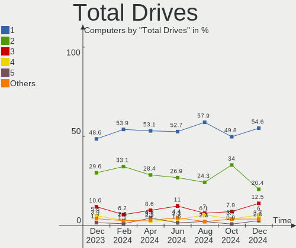
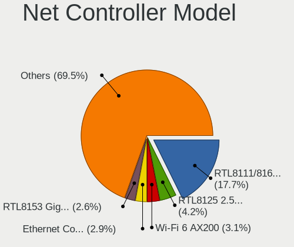
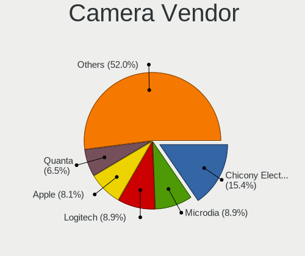

Pop!_OS Hardware Trends
-----------------------

A project to identify most popular hardware characteristics and track their change
over time based on data collected by Pop!_OS users at https://Linux-Hardware.org.

Anyone can contribute to this report by the [hw-probe](https://github.com/linuxhw/hw-probe) tool:

    sudo -E hw-probe -all -upload

This is a report for all computer types. See also reports for [desktops](/Dist/Pop!_OS/Desktop/README.md) and [notebooks](/Dist/Pop!_OS/Notebook/README.md).

Full-feature report is available here: https://linux-hardware.org/?view=trends

Period: Jan, 2022.

Contents
--------

* [ System ](#system)
  - [ OS                       ](#os)
  - [ OS Family                ](#os-family)
  - [ Kernel                   ](#kernel)
  - [ Kernel Family            ](#kernel-family)
  - [ Kernel Major Ver.        ](#kernel-major-ver)
  - [ Arch                     ](#arch)
  - [ DE                       ](#de)
  - [ Display Server           ](#display-server)
  - [ Display Manager          ](#display-manager)
  - [ OS Lang                  ](#os-lang)
  - [ Boot Mode                ](#boot-mode)
  - [ Filesystem               ](#filesystem)
  - [ Part. scheme             ](#part-scheme)
  - [ Dual Boot with Linux/BSD ](#dual-boot-with-linuxbsd)
  - [ Dual Boot (Win)          ](#dual-boot-win)

* [ Board ](#board)
  - [ Vendor                   ](#vendor)
  - [ Model                    ](#model)
  - [ Model Family             ](#model-family)
  - [ MFG Year                 ](#mfg-year)
  - [ Form Factor              ](#form-factor)
  - [ Secure Boot              ](#secure-boot)
  - [ Coreboot                 ](#coreboot)
  - [ RAM Size                 ](#ram-size)
  - [ RAM Used                 ](#ram-used)
  - [ Total Drives             ](#total-drives)
  - [ Has CD-ROM               ](#has-cd-rom)
  - [ Has Ethernet             ](#has-ethernet)
  - [ Has WiFi                 ](#has-wifi)
  - [ Has Bluetooth            ](#has-bluetooth)

* [ Location ](#location)
  - [ Country                  ](#country)
  - [ City                     ](#city)

* [ Drives ](#drives)
  - [ Drive Vendor             ](#drive-vendor)
  - [ Drive Model              ](#drive-model)
  - [ HDD Vendor               ](#hdd-vendor)
  - [ SSD Vendor               ](#ssd-vendor)
  - [ Drive Kind               ](#drive-kind)
  - [ Drive Connector          ](#drive-connector)
  - [ Drive Size               ](#drive-size)
  - [ Space Total              ](#space-total)
  - [ Space Used               ](#space-used)
  - [ Malfunc. Drives          ](#malfunc-drives)
  - [ Malfunc. Drive Vendor    ](#malfunc-drive-vendor)
  - [ Malfunc. HDD Vendor      ](#malfunc-hdd-vendor)
  - [ Malfunc. Drive Kind      ](#malfunc-drive-kind)
  - [ Failed Drives            ](#failed-drives)
  - [ Failed Drive Vendor      ](#failed-drive-vendor)
  - [ Drive Status             ](#drive-status)

* [ Storage controller ](#storage-controller)
  - [ Storage Vendor           ](#storage-vendor)
  - [ Storage Model            ](#storage-model)
  - [ Storage Kind             ](#storage-kind)

* [ Processor ](#processor)
  - [ CPU Vendor               ](#cpu-vendor)
  - [ CPU Model                ](#cpu-model)
  - [ CPU Model Family         ](#cpu-model-family)
  - [ CPU Cores                ](#cpu-cores)
  - [ CPU Sockets              ](#cpu-sockets)
  - [ CPU Threads              ](#cpu-threads)
  - [ CPU Op-Modes             ](#cpu-op-modes)
  - [ CPU Microcode            ](#cpu-microcode)
  - [ CPU Microarch            ](#cpu-microarch)

* [ Graphics ](#graphics)
  - [ GPU Vendor               ](#gpu-vendor)
  - [ GPU Model                ](#gpu-model)
  - [ GPU Combo                ](#gpu-combo)
  - [ GPU Driver               ](#gpu-driver)
  - [ GPU Memory               ](#gpu-memory)

* [ Monitor ](#monitor)
  - [ Monitor Vendor           ](#monitor-vendor)
  - [ Monitor Model            ](#monitor-model)
  - [ Monitor Resolution       ](#monitor-resolution)
  - [ Monitor Diagonal         ](#monitor-diagonal)
  - [ Monitor Width            ](#monitor-width)
  - [ Aspect Ratio             ](#aspect-ratio)
  - [ Monitor Area             ](#monitor-area)
  - [ Pixel Density            ](#pixel-density)
  - [ Multiple Monitors        ](#multiple-monitors)

* [ Network ](#network)
  - [ Net Controller Vendor    ](#net-controller-vendor)
  - [ Net Controller Model     ](#net-controller-model)
  - [ Wireless Vendor          ](#wireless-vendor)
  - [ Wireless Model           ](#wireless-model)
  - [ Ethernet Vendor          ](#ethernet-vendor)
  - [ Ethernet Model           ](#ethernet-model)
  - [ Net Controller Kind      ](#net-controller-kind)
  - [ Used Controller          ](#used-controller)
  - [ NICs                     ](#nics)
  - [ IPv6                     ](#ipv6)

* [ Bluetooth ](#bluetooth)
  - [ Bluetooth Vendor         ](#bluetooth-vendor)
  - [ Bluetooth Model          ](#bluetooth-model)

* [ Sound ](#sound)
  - [ Sound Vendor             ](#sound-vendor)
  - [ Sound Model              ](#sound-model)

* [ Memory ](#memory)
  - [ Memory Vendor            ](#memory-vendor)
  - [ Memory Model             ](#memory-model)
  - [ Memory Kind              ](#memory-kind)
  - [ Memory Form Factor       ](#memory-form-factor)
  - [ Memory Size              ](#memory-size)
  - [ Memory Speed             ](#memory-speed)

* [ Printers & scanners ](#printers--scanners)
  - [ Printer Vendor           ](#printer-vendor)
  - [ Printer Model            ](#printer-model)
  - [ Scanner Vendor           ](#scanner-vendor)
  - [ Scanner Model            ](#scanner-model)

* [ Camera ](#camera)
  - [ Camera Vendor            ](#camera-vendor)
  - [ Camera Model             ](#camera-model)

* [ Security ](#security)
  - [ Fingerprint Vendor       ](#fingerprint-vendor)
  - [ Fingerprint Model        ](#fingerprint-model)
  - [ Chipcard Vendor          ](#chipcard-vendor)
  - [ Chipcard Model           ](#chipcard-model)

* [ Unsupported ](#unsupported)
  - [ Unsupported Devices      ](#unsupported-devices)
  - [ Unsupported Device Types ](#unsupported-device-types)

System
------

OS
--

Installed operating systems

| Name          | Computers | Percent |
|---------------|-----------|---------|
| Pop!_OS 21.10 | 267       | 80.42%  |
| Pop!_OS 20.04 | 34        | 10.24%  |
| Pop!_OS 21.04 | 27        | 8.13%   |
| Pop!_OS 20.10 | 4         | 1.2%    |

OS Family
---------

OS without a version

| Name    | Computers | Percent |
|---------|-----------|---------|
| Pop!_OS | 332       | 100%    |

Kernel
------

Version of the Linux kernel

| Version                  | Computers | Percent |
|--------------------------|-----------|---------|
| 5.15.11-76051511-generic | 92        | 27.71%  |
| 5.15.8-76051508-generic  | 91        | 27.41%  |
| 5.15.15-76051515-generic | 72        | 21.69%  |
| 5.15.5-76051505-generic  | 44        | 13.25%  |
| 5.13.0-7620-generic      | 10        | 3.01%   |
| 5.13.0-7614-generic      | 5         | 1.51%   |
| 5.11.0-7620-generic      | 4         | 1.2%    |
| 5.8.0-7642-generic       | 2         | 0.6%    |
| 5.8.0-7630-generic       | 2         | 0.6%    |
| 5.11.0-7633-generic      | 2         | 0.6%    |
| 5.4.0-7642-generic       | 1         | 0.3%    |
| 5.16.3-xanmod1           | 1         | 0.3%    |
| 5.16.1-051601-generic    | 1         | 0.3%    |
| 5.16.0-051600-lowlatency | 1         | 0.3%    |
| 5.15.15-xanmod1          | 1         | 0.3%    |
| 5.15.13-051513-generic   | 1         | 0.3%    |
| 5.15.12-xanmod1          | 1         | 0.3%    |
| 5.13.0-1012-raspi        | 1         | 0.3%    |

Kernel Family
-------------

Linux kernel without a distro release

| Version | Computers | Percent |
|---------|-----------|---------|
| 5.15.11 | 92        | 27.71%  |
| 5.15.8  | 91        | 27.41%  |
| 5.15.15 | 73        | 21.99%  |
| 5.15.5  | 44        | 13.25%  |
| 5.13.0  | 16        | 4.82%   |
| 5.11.0  | 6         | 1.81%   |
| 5.8.0   | 4         | 1.2%    |
| 5.4.0   | 1         | 0.3%    |
| 5.16.3  | 1         | 0.3%    |
| 5.16.1  | 1         | 0.3%    |
| 5.16.0  | 1         | 0.3%    |
| 5.15.13 | 1         | 0.3%    |
| 5.15.12 | 1         | 0.3%    |

Kernel Major Ver.
-----------------

Linux kernel major version

| Version | Computers | Percent |
|---------|-----------|---------|
| 5.15    | 302       | 90.96%  |
| 5.13    | 16        | 4.82%   |
| 5.11    | 6         | 1.81%   |
| 5.8     | 4         | 1.2%    |
| 5.16    | 3         | 0.9%    |
| 5.4     | 1         | 0.3%    |

Arch
----

OS architecture (x86_64, i586, etc.)

| Name    | Computers | Percent |
|---------|-----------|---------|
| x86_64  | 331       | 99.7%   |
| aarch64 | 1         | 0.3%    |

DE
--

Desktop Environment

| Name            | Computers | Percent |
|-----------------|-----------|---------|
| GNOME           | 323       | 97.29%  |
| KDE5            | 4         | 1.2%    |
| XFCE            | 1         | 0.3%    |
| MATE            | 1         | 0.3%    |
| GNOME Flashback | 1         | 0.3%    |
| Cinnamon        | 1         | 0.3%    |
| Unknown         | 1         | 0.3%    |

Display Server
--------------

X11 or Wayland

| Name    | Computers | Percent |
|---------|-----------|---------|
| X11     | 320       | 96.39%  |
| Wayland | 11        | 3.31%   |
| Unknown | 1         | 0.3%    |

Display Manager
---------------

SDDM, LightDM, etc.

| Name    | Computers | Percent |
|---------|-----------|---------|
| Unknown | 262       | 78.92%  |
| GDM     | 68        | 20.48%  |
| GDM3    | 2         | 0.6%    |

OS Lang
-------

Language

| Lang    | Computers | Percent |
|---------|-----------|---------|
| en_US   | 192       | 57.83%  |
| pt_BR   | 23        | 6.93%   |
| en_GB   | 18        | 5.42%   |
| de_DE   | 12        | 3.61%   |
| en_CA   | 11        | 3.31%   |
| en_AU   | 9         | 2.71%   |
| fr_FR   | 8         | 2.41%   |
| C       | 8         | 2.41%   |
| ru_RU   | 6         | 1.81%   |
| nl_NL   | 5         | 1.51%   |
| it_IT   | 5         | 1.51%   |
| sv_SE   | 3         | 0.9%    |
| es_ES   | 3         | 0.9%    |
| en_IN   | 3         | 0.9%    |
| pt_PT   | 2         | 0.6%    |
| pl_PL   | 2         | 0.6%    |
| nb_NO   | 2         | 0.6%    |
| hr_HR   | 2         | 0.6%    |
| fr_CA   | 2         | 0.6%    |
| es_MX   | 2         | 0.6%    |
| en_DK   | 2         | 0.6%    |
| Unknown | 2         | 0.6%    |
| tr_TR   | 1         | 0.3%    |
| ro_RO   | 1         | 0.3%    |
| nl_BE   | 1         | 0.3%    |
| fi_FI   | 1         | 0.3%    |
| es_PE   | 1         | 0.3%    |
| es_CL   | 1         | 0.3%    |
| es_AR   | 1         | 0.3%    |
| en_IL   | 1         | 0.3%    |
| da_DK   | 1         | 0.3%    |
| cs_CZ   | 1         | 0.3%    |

Boot Mode
---------

EFI or BIOS

| Mode | Computers | Percent |
|------|-----------|---------|
| BIOS | 267       | 80.42%  |
| EFI  | 65        | 19.58%  |

Filesystem
----------

Type of filesystem

| Type    | Computers | Percent |
|---------|-----------|---------|
| Ext4    | 321       | 96.69%  |
| Btrfs   | 6         | 1.81%   |
| Overlay | 4         | 1.2%    |
| Xfs     | 1         | 0.3%    |

Part. scheme
------------

Scheme of partitioning

| Type    | Computers | Percent |
|---------|-----------|---------|
| Unknown | 261       | 78.61%  |
| GPT     | 64        | 19.28%  |
| MBR     | 7         | 2.11%   |

Dual Boot with Linux/BSD
------------------------

Hosting more than one Linux/BSD

| Dual boot | Computers | Percent |
|-----------|-----------|---------|
| No        | 321       | 96.69%  |
| Yes       | 11        | 3.31%   |

Dual Boot (Win)
---------------

Hosting Linux and Windows

| Dual boot | Computers | Percent |
|-----------|-----------|---------|
| No        | 303       | 91.27%  |
| Yes       | 29        | 8.73%   |

Board
-----

Vendor
------

Motherboard manufacturer

| Name                    | Computers | Percent |
|-------------------------|-----------|---------|
| ASUSTek Computer        | 61        | 18.37%  |
| Dell                    | 52        | 15.66%  |
| Lenovo                  | 42        | 12.65%  |
| Hewlett-Packard         | 39        | 11.75%  |
| Gigabyte Technology     | 27        | 8.13%   |
| Acer                    | 25        | 7.53%   |
| MSI                     | 18        | 5.42%   |
| Apple                   | 14        | 4.22%   |
| ASRock                  | 11        | 3.31%   |
| System76                | 10        | 3.01%   |
| Intel                   | 4         | 1.2%    |
| Samsung Electronics     | 3         | 0.9%    |
| Positivo                | 3         | 0.9%    |
| HUAWEI                  | 3         | 0.9%    |
| Alienware               | 3         | 0.9%    |
| Toshiba                 | 2         | 0.6%    |
| Pegatron                | 2         | 0.6%    |
| Huanan                  | 2         | 0.6%    |
| Sony                    | 1         | 0.3%    |
| Raspberry Pi Foundation | 1         | 0.3%    |
| Monster                 | 1         | 0.3%    |
| Microsoft               | 1         | 0.3%    |
| Medion                  | 1         | 0.3%    |
| Google                  | 1         | 0.3%    |
| Gateway                 | 1         | 0.3%    |
| Dynabook                | 1         | 0.3%    |
| Biostar                 | 1         | 0.3%    |
| BESSTAR Tech            | 1         | 0.3%    |
| Avell High Performance  | 1         | 0.3%    |

Model
-----

Motherboard model

| Name                             | Computers | Percent |
|----------------------------------|-----------|---------|
| ASUS All Series                  | 5         | 1.51%   |
| Gigabyte X470 AORUS ULTRA GAMING | 3         | 0.9%    |
| Dell OptiPlex 9020               | 3         | 0.9%    |
| System76 Serval                  | 2         | 0.6%    |
| System76 Oryx Pro                | 2         | 0.6%    |
| System76 Lemur Pro               | 2         | 0.6%    |
| System76 Galago Pro              | 2         | 0.6%    |
| Lenovo IdeaPad 3 15ADA05 81W1    | 2         | 0.6%    |
| HP Pavilion 15                   | 2         | 0.6%    |
| HP Notebook                      | 2         | 0.6%    |
| HP EliteBook 840 G6              | 2         | 0.6%    |
| Gigabyte AB350-Gaming 3          | 2         | 0.6%    |
| Dell XPS 8930                    | 2         | 0.6%    |
| Dell Vostro 1520                 | 2         | 0.6%    |
| Dell OptiPlex 7040               | 2         | 0.6%    |
| Dell OptiPlex 3010               | 2         | 0.6%    |
| Dell Inspiron 570                | 2         | 0.6%    |
| Dell Inspiron 3583               | 2         | 0.6%    |
| ASUS ZenBook UX325EA_UX325EA     | 2         | 0.6%    |
| ASUS TUF GAMING X570-PRO         | 2         | 0.6%    |
| ASUS TUF GAMING X570-PLUS        | 2         | 0.6%    |
| Acer Nitro AN515-55              | 2         | 0.6%    |
| Acer Aspire A315-42              | 2         | 0.6%    |
| Toshiba TECRA Z50-A              | 1         | 0.3%    |
| Toshiba Satellite A205           | 1         | 0.3%    |
| System76 Thelio                  | 1         | 0.3%    |
| System76 Serval WS               | 1         | 0.3%    |
| Sony VGN-FE31H                   | 1         | 0.3%    |
| Samsung R530/R730                | 1         | 0.3%    |
| Samsung 930QDB                   | 1         | 0.3%    |
| Samsung 340XAA/350XAA/550XAA     | 1         | 0.3%    |
| RPi Raspberry Pi                 | 1         | 0.3%    |
| Positivo SW6H                    | 1         | 0.3%    |
| Positivo S14SL01                 | 1         | 0.3%    |
| Positivo Mobile                  | 1         | 0.3%    |
| Pegatron NY799AA-ABA p6243w      | 1         | 0.3%    |
| Pegatron AV321AV-ABA e9180t      | 1         | 0.3%    |
| MSI MS-B09611                    | 1         | 0.3%    |
| MSI MS-7C52                      | 1         | 0.3%    |
| MSI MS-7C37                      | 1         | 0.3%    |
| MSI MS-7B89                      | 1         | 0.3%    |
| MSI MS-7B85                      | 1         | 0.3%    |
| MSI MS-7B28                      | 1         | 0.3%    |
| MSI MS-7B17                      | 1         | 0.3%    |
| MSI MS-7917                      | 1         | 0.3%    |
| MSI MS-7817                      | 1         | 0.3%    |
| MSI MS-7788                      | 1         | 0.3%    |
| MSI GS66 Stealth 10SFS           | 1         | 0.3%    |
| MSI GS60 2PC Ghost               | 1         | 0.3%    |
| MSI GL65 Leopard 10SFKV          | 1         | 0.3%    |
| MSI GF75 Thin 10UEK              | 1         | 0.3%    |
| MSI GF65 Thin 9SD                | 1         | 0.3%    |
| MSI GF63 Thin 9SCXR              | 1         | 0.3%    |
| MSI GE72 2QE                     | 1         | 0.3%    |
| MSI GE62 2QF                     | 1         | 0.3%    |
| Monster HUMA H4 V4.1             | 1         | 0.3%    |
| Microsoft Surface Pro 3          | 1         | 0.3%    |
| Medion BEAST X25                 | 1         | 0.3%    |
| Lenovo Yoga Slim 7 14ITL05 82A3  | 1         | 0.3%    |
| Lenovo Yoga Slim 7 14ARE05 82A2  | 1         | 0.3%    |

Model Family
------------

Motherboard model prefix

| Name                  | Computers | Percent |
|-----------------------|-----------|---------|
| Acer Aspire           | 19        | 5.72%   |
| Lenovo ThinkPad       | 16        | 4.82%   |
| Dell Inspiron         | 16        | 4.82%   |
| Dell OptiPlex         | 11        | 3.31%   |
| Dell Latitude         | 10        | 3.01%   |
| HP Pavilion           | 9         | 2.71%   |
| ASUS TUF              | 9         | 2.71%   |
| ASUS ROG              | 9         | 2.71%   |
| Lenovo IdeaPad        | 8         | 2.41%   |
| ASUS PRIME            | 7         | 2.11%   |
| HP EliteBook          | 6         | 1.81%   |
| Dell XPS              | 6         | 1.81%   |
| ASUS All              | 5         | 1.51%   |
| Lenovo Yoga           | 4         | 1.2%    |
| HP OMEN               | 4         | 1.2%    |
| Dell Vostro           | 4         | 1.2%    |
| Acer Nitro            | 4         | 1.2%    |
| System76 Serval       | 3         | 0.9%    |
| Lenovo ThinkBook      | 3         | 0.9%    |
| Lenovo Legion         | 3         | 0.9%    |
| HP Laptop             | 3         | 0.9%    |
| Gigabyte X470         | 3         | 0.9%    |
| Dell Precision        | 3         | 0.9%    |
| ASUS ZenBook          | 3         | 0.9%    |
| ASUS ASUS             | 3         | 0.9%    |
| System76 Oryx         | 2         | 0.6%    |
| System76 Lemur        | 2         | 0.6%    |
| System76 Galago       | 2         | 0.6%    |
| Lenovo ThinkCentre    | 2         | 0.6%    |
| HP Spectre            | 2         | 0.6%    |
| HP ProBook            | 2         | 0.6%    |
| HP Notebook           | 2         | 0.6%    |
| HP ENVY               | 2         | 0.6%    |
| HP Compaq             | 2         | 0.6%    |
| HP 255                | 2         | 0.6%    |
| Gigabyte Z390         | 2         | 0.6%    |
| Gigabyte X570         | 2         | 0.6%    |
| Gigabyte X399         | 2         | 0.6%    |
| Gigabyte B550         | 2         | 0.6%    |
| Gigabyte AB350-Gaming | 2         | 0.6%    |
| ASUS VivoBook         | 2         | 0.6%    |
| ASUS SABERTOOTH       | 2         | 0.6%    |
| ASUS P6T              | 2         | 0.6%    |
| ASUS M5A97            | 2         | 0.6%    |
| Apple iMac12          | 2         | 0.6%    |
| Toshiba TECRA         | 1         | 0.3%    |
| Toshiba Satellite     | 1         | 0.3%    |
| System76 Thelio       | 1         | 0.3%    |
| Sony VGN-FE31H        | 1         | 0.3%    |
| Samsung R530          | 1         | 0.3%    |
| Samsung 930QDB        | 1         | 0.3%    |
| Samsung 340XAA        | 1         | 0.3%    |
| RPi Raspberry         | 1         | 0.3%    |
| Positivo SW6H         | 1         | 0.3%    |
| Positivo S14SL01      | 1         | 0.3%    |
| Positivo Mobile       | 1         | 0.3%    |
| Pegatron NY799AA-ABA  | 1         | 0.3%    |
| Pegatron AV321AV-ABA  | 1         | 0.3%    |
| MSI MS-B09611         | 1         | 0.3%    |
| MSI MS-7C52           | 1         | 0.3%    |

MFG Year
--------

Motherboard manufacture year

| Year    | Computers | Percent |
|---------|-----------|---------|
| 2020    | 50        | 15.06%  |
| 2019    | 41        | 12.35%  |
| 2021    | 34        | 10.24%  |
| 2018    | 34        | 10.24%  |
| 2017    | 26        | 7.83%   |
| 2014    | 22        | 6.63%   |
| 2015    | 21        | 6.33%   |
| 2013    | 19        | 5.72%   |
| 2012    | 18        | 5.42%   |
| 2010    | 15        | 4.52%   |
| 2009    | 15        | 4.52%   |
| 2016    | 12        | 3.61%   |
| 2011    | 12        | 3.61%   |
| 2008    | 9         | 2.71%   |
| 2022    | 1         | 0.3%    |
| 2007    | 1         | 0.3%    |
| 2006    | 1         | 0.3%    |
| Unknown | 1         | 0.3%    |

Form Factor
-----------

Physical design of the computer

| Name           | Computers | Percent |
|----------------|-----------|---------|
| Notebook       | 187       | 56.33%  |
| Desktop        | 122       | 36.75%  |
| Convertible    | 9         | 2.71%   |
| All in one     | 8         | 2.41%   |
| Mini pc        | 3         | 0.9%    |
| Tablet         | 2         | 0.6%    |
| System on chip | 1         | 0.3%    |

Secure Boot
-----------

Enabled or disabled

| State    | Computers | Percent |
|----------|-----------|---------|
| Disabled | 332       | 100%    |

Coreboot
--------

Have coreboot on board

| Used | Computers | Percent |
|------|-----------|---------|
| No   | 326       | 98.19%  |
| Yes  | 6         | 1.81%   |

RAM Size
--------

Total RAM memory

| Size in GB  | Computers | Percent |
|-------------|-----------|---------|
| 16.01-24.0  | 95        | 28.61%  |
| 4.01-8.0    | 90        | 27.11%  |
| 8.01-16.0   | 51        | 15.36%  |
| 32.01-64.0  | 36        | 10.84%  |
| 3.01-4.0    | 36        | 10.84%  |
| 64.01-256.0 | 14        | 4.22%   |
| 24.01-32.0  | 8         | 2.41%   |
| 1.01-2.0    | 2         | 0.6%    |

RAM Used
--------

Used RAM memory

| Used GB    | Computers | Percent |
|------------|-----------|---------|
| 2.01-3.0   | 113       | 34.04%  |
| 1.01-2.0   | 84        | 25.3%   |
| 4.01-8.0   | 63        | 18.98%  |
| 3.01-4.0   | 58        | 17.47%  |
| 8.01-16.0  | 12        | 3.61%   |
| 32.01-64.0 | 1         | 0.3%    |
| 16.01-24.0 | 1         | 0.3%    |

Total Drives
------------

Number of drives on board

| Drives | Computers | Percent |
|--------|-----------|---------|
| 1      | 190       | 57.23%  |
| 2      | 80        | 24.1%   |
| 3      | 35        | 10.54%  |
| 4      | 15        | 4.52%   |
| 5      | 6         | 1.81%   |
| 6      | 4         | 1.2%    |
| 20     | 1         | 0.3%    |
| 0      | 1         | 0.3%    |

Has CD-ROM
----------

Has CD-ROM on board

| Presented | Computers | Percent |
|-----------|-----------|---------|
| No        | 229       | 68.98%  |
| Yes       | 103       | 31.02%  |

Has Ethernet
------------

Has Ethernet on board

| Presented | Computers | Percent |
|-----------|-----------|---------|
| Yes       | 285       | 85.84%  |
| No        | 47        | 14.16%  |

Has WiFi
--------

Has WiFi module

| Presented | Computers | Percent |
|-----------|-----------|---------|
| Yes       | 275       | 82.83%  |
| No        | 57        | 17.17%  |

Has Bluetooth
-------------

Has Bluetooth module

| Presented | Computers | Percent |
|-----------|-----------|---------|
| Yes       | 226       | 68.07%  |
| No        | 106       | 31.93%  |

Location
--------

Country
-------

Geographic location (country)

| Country                | Computers | Percent |
|------------------------|-----------|---------|
| USA                    | 107       | 32.23%  |
| Brazil                 | 36        | 10.84%  |
| Canada                 | 23        | 6.93%   |
| Germany                | 15        | 4.52%   |
| UK                     | 11        | 3.31%   |
| Australia              | 11        | 3.31%   |
| Netherlands            | 10        | 3.01%   |
| Sweden                 | 9         | 2.71%   |
| France                 | 9         | 2.71%   |
| India                  | 8         | 2.41%   |
| Russia                 | 7         | 2.11%   |
| Italy                  | 7         | 2.11%   |
| Romania                | 6         | 1.81%   |
| Portugal               | 5         | 1.51%   |
| Norway                 | 5         | 1.51%   |
| Poland                 | 4         | 1.2%    |
| Mexico                 | 4         | 1.2%    |
| Croatia                | 3         | 0.9%    |
| Argentina              | 3         | 0.9%    |
| Ukraine                | 2         | 0.6%    |
| Turkey                 | 2         | 0.6%    |
| Spain                  | 2         | 0.6%    |
| Philippines            | 2         | 0.6%    |
| Peru                   | 2         | 0.6%    |
| Israel                 | 2         | 0.6%    |
| Ireland                | 2         | 0.6%    |
| Hungary                | 2         | 0.6%    |
| Denmark                | 2         | 0.6%    |
| Czechia                | 2         | 0.6%    |
| Chile                  | 2         | 0.6%    |
| Belgium                | 2         | 0.6%    |
| Austria                | 2         | 0.6%    |
| Zambia                 | 1         | 0.3%    |
| Vietnam                | 1         | 0.3%    |
| Taiwan                 | 1         | 0.3%    |
| Switzerland            | 1         | 0.3%    |
| South Africa           | 1         | 0.3%    |
| Slovenia               | 1         | 0.3%    |
| Serbia                 | 1         | 0.3%    |
| New Zealand            | 1         | 0.3%    |
| Moldova                | 1         | 0.3%    |
| Lithuania              | 1         | 0.3%    |
| Japan                  | 1         | 0.3%    |
| Iraq                   | 1         | 0.3%    |
| Iceland                | 1         | 0.3%    |
| Finland                | 1         | 0.3%    |
| Estonia                | 1         | 0.3%    |
| El Salvador            | 1         | 0.3%    |
| Colombia               | 1         | 0.3%    |
| China                  | 1         | 0.3%    |
| Bulgaria               | 1         | 0.3%    |
| Bosnia and Herzegovina | 1         | 0.3%    |
| Bangladesh             | 1         | 0.3%    |
| Bahamas                | 1         | 0.3%    |
| Algeria                | 1         | 0.3%    |

City
----

Geographic location (city)

| City              | Computers | Percent |
|-------------------|-----------|---------|
| Sydney            | 5         | 1.51%   |
| S??o Paulo        | 3         | 0.9%    |
| Montreal          | 3         | 0.9%    |
| Cincinnati        | 3         | 0.9%    |
| Browning          | 3         | 0.9%    |
| Washington        | 2         | 0.6%    |
| Warsaw            | 2         | 0.6%    |
| Vila Velha        | 2         | 0.6%    |
| Vienna            | 2         | 0.6%    |
| St Petersburg     | 2         | 0.6%    |
| Spring            | 2         | 0.6%    |
| Salem             | 2         | 0.6%    |
| Paris             | 2         | 0.6%    |
| Melbourne         | 2         | 0.6%    |
| Malmo             | 2         | 0.6%    |
| Lincoln           | 2         | 0.6%    |
| Jacksonville      | 2         | 0.6%    |
| Halifax           | 2         | 0.6%    |
| Groningen         | 2         | 0.6%    |
| Gothenburg        | 2         | 0.6%    |
| Frankfurt am Main | 2         | 0.6%    |
| Fortaleza         | 2         | 0.6%    |
| Denver            | 2         | 0.6%    |
| Dallas            | 2         | 0.6%    |
| Coimbra           | 2         | 0.6%    |
| Chicago           | 2         | 0.6%    |
| Buenos Aires      | 2         | 0.6%    |
| Budapest          | 2         | 0.6%    |
| Bucharest         | 2         | 0.6%    |
| Bozeman           | 2         | 0.6%    |
| Bordeaux          | 2         | 0.6%    |
| Zwijndrecht       | 1         | 0.3%    |
| Zavidovici        | 1         | 0.3%    |
| Zapre??i?‡        | 1         | 0.3%    |
| Zapopan           | 1         | 0.3%    |
| Zagreb            | 1         | 0.3%    |
| Yekaterinburg     | 1         | 0.3%    |
| Yalta             | 1         | 0.3%    |
| Wuppertal         | 1         | 0.3%    |
| West Hartford     | 1         | 0.3%    |
| Wasilla           | 1         | 0.3%    |
| Vratimov          | 1         | 0.3%    |
| Voluntari         | 1         | 0.3%    |
| Vit??ria          | 1         | 0.3%    |
| Viseu             | 1         | 0.3%    |
| Vilnius           | 1         | 0.3%    |
| Vigo              | 1         | 0.3%    |
| Victoria          | 1         | 0.3%    |
| Vicosa            | 1         | 0.3%    |
| Vanlose           | 1         | 0.3%    |
| Valrico           | 1         | 0.3%    |
| Valdivia          | 1         | 0.3%    |
| Vaellingby        | 1         | 0.3%    |
| Ume??             | 1         | 0.3%    |
| Uden              | 1         | 0.3%    |
| Tuxtla Guti?©rrez | 1         | 0.3%    |
| Turin             | 1         | 0.3%    |
| Tiraspol          | 1         | 0.3%    |
| Thouarce          | 1         | 0.3%    |
| Thoothukudi       | 1         | 0.3%    |

Drives
------

Drive Vendor
------------

Hard drive vendors

| Vendor                       | Computers | Drives | Percent |
|------------------------------|-----------|--------|---------|
| Samsung Electronics          | 96        | 124    | 18.46%  |
| Seagate                      | 72        | 87     | 13.85%  |
| WDC                          | 66        | 75     | 12.69%  |
| SanDisk                      | 33        | 35     | 6.35%   |
| Kingston                     | 32        | 33     | 6.15%   |
| Toshiba                      | 31        | 33     | 5.96%   |
| SK Hynix                     | 18        | 19     | 3.46%   |
| Intel                        | 16        | 17     | 3.08%   |
| Crucial                      | 16        | 18     | 3.08%   |
| A-DATA Technology            | 13        | 14     | 2.5%    |
| Unknown                      | 11        | 14     | 2.12%   |
| Hitachi                      | 11        | 13     | 2.12%   |
| Micron Technology            | 10        | 10     | 1.92%   |
| HGST                         | 10        | 13     | 1.92%   |
| Silicon Motion               | 7         | 7      | 1.35%   |
| Phison                       | 6         | 7      | 1.15%   |
| China                        | 6         | 8      | 1.15%   |
| PNY                          | 5         | 5      | 0.96%   |
| KingSpec                     | 4         | 4      | 0.77%   |
| Apple                        | 4         | 4      | 0.77%   |
| Micron/Crucial Technology    | 3         | 4      | 0.58%   |
| MAXTOR                       | 3         | 4      | 0.58%   |
| KIOXIA                       | 3         | 3      | 0.58%   |
| Corsair                      | 3         | 3      | 0.58%   |
| ADATA Technology             | 3         | 4      | 0.58%   |
| XPG                          | 2         | 2      | 0.38%   |
| SPCC                         | 2         | 2      | 0.38%   |
| Realtek Semiconductor        | 2         | 2      | 0.38%   |
| OCZ                          | 2         | 2      | 0.38%   |
| KIOXIA-EXCERIA               | 2         | 2      | 0.38%   |
| KingFast                     | 2         | 3      | 0.38%   |
| KingDian                     | 2         | 2      | 0.38%   |
| Fujitsu                      | 2         | 2      | 0.38%   |
| Unknown                      | 2         | 2      | 0.38%   |
| WDS100T1                     | 1         | 1      | 0.19%   |
| walram                       | 1         | 1      | 0.19%   |
| UMIS                         | 1         | 1      | 0.19%   |
| TrekStor                     | 1         | 1      | 0.19%   |
| Team                         | 1         | 1      | 0.19%   |
| TAMMUZ                       | 1         | 1      | 0.19%   |
| Shenzhen Longsys Electronics | 1         | 1      | 0.19%   |
| SATAFIRM                     | 1         | 1      | 0.19%   |
| Sasmung                      | 1         | 1      | 0.19%   |
| Phison Electronics           | 1         | 1      | 0.19%   |
| Netac                        | 1         | 1      | 0.19%   |
| Mushkin                      | 1         | 1      | 0.19%   |
| LITEON                       | 1         | 1      | 0.19%   |
| Lexar                        | 1         | 1      | 0.19%   |
| LaCie                        | 1         | 1      | 0.19%   |
| Intenso                      | 1         | 1      | 0.19%   |
| INNOVATION IT                | 1         | 1      | 0.19%   |
| HUAWEI                       | 1         | 1      | 0.19%   |
| Glyph                        | 1         | 1      | 0.19%   |
| Apacer                       | 1         | 1      | 0.19%   |

Drive Model
-----------

Hard drive models

| Model                               | Computers | Percent |
|-------------------------------------|-----------|---------|
| Samsung NVMe SSD Drive 1TB          | 13        | 2.28%   |
| Kingston SA400S37240G 240GB SSD     | 8         | 1.4%    |
| Samsung NVMe SSD Drive 1024GB       | 7         | 1.23%   |
| Seagate ST500DM002-1BD142 500GB     | 6         | 1.05%   |
| Seagate ST2000DM008-2FR102 2TB      | 6         | 1.05%   |
| Sandisk NVMe SSD Drive 1TB          | 6         | 1.05%   |
| Samsung NVMe SSD Drive 512GB        | 6         | 1.05%   |
| Samsung NVMe SSD Drive 500GB        | 6         | 1.05%   |
| Kingston SA400S37480G 480GB SSD     | 6         | 1.05%   |
| Seagate ST1000LM035-1RK172 1TB      | 5         | 0.88%   |
| Sandisk NVMe SSD Drive 512GB        | 5         | 0.88%   |
| Sandisk NVMe SSD Drive 500GB        | 5         | 0.88%   |
| HGST HTS721010A9E630 1TB            | 5         | 0.88%   |
| Toshiba MQ01ABD100 1TB              | 4         | 0.7%    |
| Samsung SSD 860 EVO 500GB           | 4         | 0.7%    |
| Samsung NVMe SSD Drive 2TB          | 4         | 0.7%    |
| Samsung NVMe SSD Drive 256GB        | 4         | 0.7%    |
| Samsung NVMe SSD Drive 250GB        | 4         | 0.7%    |
| Crucial CT480BX500SSD1 480GB        | 4         | 0.7%    |
| WDC WDS120G2G0A-00JH30 120GB SSD    | 3         | 0.53%   |
| WDC WD10SPZX-24Z10 1TB              | 3         | 0.53%   |
| Unknown SD/MMC/MS PRO 128GB         | 3         | 0.53%   |
| Unknown MMC Card  128GB             | 3         | 0.53%   |
| Toshiba MQ04ABF100 1TB              | 3         | 0.53%   |
| Toshiba DT01ACA200 2TB              | 3         | 0.53%   |
| Toshiba DT01ACA100 1TB              | 3         | 0.53%   |
| Seagate ST9320325AS 320GB           | 3         | 0.53%   |
| Seagate ST4000DM004-2CV104 4TB      | 3         | 0.53%   |
| Seagate ST1000LX015-1U7172 1TB      | 3         | 0.53%   |
| Seagate ST1000LM024 HN-M101MBB 1TB  | 3         | 0.53%   |
| Seagate ST1000DM003-1CH162 1TB      | 3         | 0.53%   |
| Samsung SSD 970 EVO Plus 250GB      | 3         | 0.53%   |
| Samsung SSD 870 QVO 1TB             | 3         | 0.53%   |
| Samsung SSD 860 EVO 1TB             | 3         | 0.53%   |
| Intel NVMe SSD Drive 512GB          | 3         | 0.53%   |
| ADATA NVMe SSD Drive 512GB          | 3         | 0.53%   |
| WDC WDS240G2G0B-00EPW0 240GB SSD    | 2         | 0.35%   |
| WDC WDS100T2B0C-00PXH0 1TB          | 2         | 0.35%   |
| WDC WDBNCE5000PNC 500GB SSD         | 2         | 0.35%   |
| WDC WD3200BEVT-22ZCT0 320GB         | 2         | 0.35%   |
| WDC WD10EZEX-08WN4A0 1TB            | 2         | 0.35%   |
| WDC WD10EZEX-00WN4A0 1TB            | 2         | 0.35%   |
| WDC WD1002FAEX-00Z3A0 1TB           | 2         | 0.35%   |
| Toshiba THNSNJ128G8NU 128GB SSD     | 2         | 0.35%   |
| Toshiba MQ01ABF050 500GB            | 2         | 0.35%   |
| Toshiba KBG30ZMS128G 128GB NVMe SSD | 2         | 0.35%   |
| SK Hynix NVMe SSD Drive 512GB       | 2         | 0.35%   |
| SK Hynix NVMe SSD Drive 256GB       | 2         | 0.35%   |
| SK Hynix NVMe SSD Drive 1024GB      | 2         | 0.35%   |
| Silicon Motion NVMe SSD Drive 512GB | 2         | 0.35%   |
| Silicon Motion NVMe SSD Drive 256GB | 2         | 0.35%   |
| Seagate ST950032 5AS 500GB          | 2         | 0.35%   |
| Seagate ST500LT012-1DG142 500GB     | 2         | 0.35%   |
| Seagate ST500LM012 HN-M500MBB 500GB | 2         | 0.35%   |
| Seagate ST500LM000-1EJ162 500GB     | 2         | 0.35%   |
| Seagate ST2000DM006-2DM164 2TB      | 2         | 0.35%   |
| Seagate ST1000LM049-2GH172 1TB      | 2         | 0.35%   |
| SanDisk SSD PLUS 480GB              | 2         | 0.35%   |
| SanDisk SSD PLUS 240GB              | 2         | 0.35%   |
| SanDisk SDSSDA120G 120GB            | 2         | 0.35%   |

HDD Vendor
----------

Hard disk drive vendors

| Vendor              | Computers | Drives | Percent |
|---------------------|-----------|--------|---------|
| Seagate             | 66        | 77     | 39.52%  |
| WDC                 | 48        | 56     | 28.74%  |
| Toshiba             | 19        | 19     | 11.38%  |
| Hitachi             | 11        | 13     | 6.59%   |
| HGST                | 10        | 13     | 5.99%   |
| Unknown             | 3         | 5      | 1.8%    |
| Samsung Electronics | 3         | 4      | 1.8%    |
| MAXTOR              | 3         | 4      | 1.8%    |
| Fujitsu             | 2         | 2      | 1.2%    |
| SATAFIRM            | 1         | 1      | 0.6%    |
| Glyph               | 1         | 1      | 0.6%    |

SSD Vendor
----------

Solid state drive vendors

| Vendor              | Computers | Drives | Percent |
|---------------------|-----------|--------|---------|
| Samsung Electronics | 44        | 51     | 25.29%  |
| Kingston            | 25        | 25     | 14.37%  |
| SanDisk             | 13        | 14     | 7.47%   |
| Crucial             | 13        | 15     | 7.47%   |
| A-DATA Technology   | 12        | 12     | 6.9%    |
| WDC                 | 11        | 11     | 6.32%   |
| Toshiba             | 6         | 7      | 3.45%   |
| Intel               | 6         | 6      | 3.45%   |
| China               | 6         | 8      | 3.45%   |
| SK Hynix            | 5         | 5      | 2.87%   |
| PNY                 | 4         | 4      | 2.3%    |
| KingSpec            | 4         | 4      | 2.3%    |
| Apple               | 3         | 3      | 1.72%   |
| SPCC                | 2         | 2      | 1.15%   |
| OCZ                 | 2         | 2      | 1.15%   |
| Micron Technology   | 2         | 2      | 1.15%   |
| KingDian            | 2         | 2      | 1.15%   |
| Corsair             | 2         | 2      | 1.15%   |
| TrekStor            | 1         | 1      | 0.57%   |
| Team                | 1         | 1      | 0.57%   |
| TAMMUZ              | 1         | 1      | 0.57%   |
| Seagate             | 1         | 1      | 0.57%   |
| Sasmung             | 1         | 1      | 0.57%   |
| Netac               | 1         | 1      | 0.57%   |
| LITEON              | 1         | 1      | 0.57%   |
| Lexar               | 1         | 1      | 0.57%   |
| KingFast            | 1         | 1      | 0.57%   |
| INNOVATION IT       | 1         | 1      | 0.57%   |
| Apacer              | 1         | 1      | 0.57%   |
| Unknown             | 1         | 1      | 0.57%   |

Drive Kind
----------

HDD or SSD

| Kind    | Computers | Drives | Percent |
|---------|-----------|--------|---------|
| NVMe    | 153       | 192    | 33.26%  |
| SSD     | 150       | 187    | 32.61%  |
| HDD     | 139       | 195    | 30.22%  |
| Unknown | 11        | 15     | 2.39%   |
| MMC     | 7         | 8      | 1.52%   |

Drive Connector
---------------

SATA, SAS, NVMe, etc.

| Type | Computers | Drives | Percent |
|------|-----------|--------|---------|
| SATA | 238       | 363    | 56.94%  |
| NVMe | 153       | 192    | 36.6%   |
| SAS  | 20        | 34     | 4.78%   |
| MMC  | 7         | 8      | 1.67%   |

Drive Size
----------

Size of hard drive

| Size in TB | Computers | Drives | Percent |
|------------|-----------|--------|---------|
| 0.01-0.5   | 170       | 224    | 56.11%  |
| 0.51-1.0   | 94        | 109    | 31.02%  |
| 1.01-2.0   | 27        | 30     | 8.91%   |
| 3.01-4.0   | 5         | 7      | 1.65%   |
| 4.01-10.0  | 4         | 8      | 1.32%   |
| 2.01-3.0   | 3         | 4      | 0.99%   |

Space Total
-----------

Amount of disk space available on the file system

| Size in GB     | Computers | Percent |
|----------------|-----------|---------|
| 101-250        | 93        | 28.01%  |
| 251-500        | 91        | 27.41%  |
| 501-1000       | 67        | 20.18%  |
| 1001-2000      | 32        | 9.64%   |
| More than 3000 | 14        | 4.22%   |
| 51-100         | 13        | 3.92%   |
| 2001-3000      | 10        | 3.01%   |
| 1-20           | 6         | 1.81%   |
| 21-50          | 4         | 1.2%    |
| Unknown        | 2         | 0.6%    |

Space Used
----------

Amount of used disk space

| Used GB        | Computers | Percent |
|----------------|-----------|---------|
| 1-20           | 111       | 33.43%  |
| 21-50          | 77        | 23.19%  |
| 101-250        | 44        | 13.25%  |
| 51-100         | 34        | 10.24%  |
| 251-500        | 31        | 9.34%   |
| 501-1000       | 19        | 5.72%   |
| 1001-2000      | 9         | 2.71%   |
| More than 3000 | 3         | 0.9%    |
| 2001-3000      | 2         | 0.6%    |
| Unknown        | 2         | 0.6%    |

Malfunc. Drives
---------------

Drive models with a malfunction

| Model                                 | Computers | Drives | Percent |
|---------------------------------------|-----------|--------|---------|
| WDC WD10EZEX-00WN4A0 1TB              | 1         | 1      | 12.5%   |
| Toshiba MQ01ABD100 1TB                | 1         | 1      | 12.5%   |
| SK Hynix SC210 mSATA 256GB SSD        | 1         | 1      | 12.5%   |
| Seagate ST500LM012 HN-M500MBB 500GB   | 1         | 1      | 12.5%   |
| Seagate ST500DM002-1BD142 500GB       | 1         | 1      | 12.5%   |
| Samsung Electronics SSD 840 EVO 250GB | 1         | 1      | 12.5%   |
| Kingston SA400S37240G 240GB SSD       | 1         | 1      | 12.5%   |
| HGST HTS721010A9E630 1TB              | 1         | 1      | 12.5%   |

Malfunc. Drive Vendor
---------------------

Vendors of faulty drives

| Vendor              | Computers | Drives | Percent |
|---------------------|-----------|--------|---------|
| Seagate             | 2         | 2      | 25%     |
| WDC                 | 1         | 1      | 12.5%   |
| Toshiba             | 1         | 1      | 12.5%   |
| SK Hynix            | 1         | 1      | 12.5%   |
| Samsung Electronics | 1         | 1      | 12.5%   |
| Kingston            | 1         | 1      | 12.5%   |
| HGST                | 1         | 1      | 12.5%   |

Malfunc. HDD Vendor
-------------------

Vendors of faulty HDD drives

| Vendor  | Computers | Drives | Percent |
|---------|-----------|--------|---------|
| Seagate | 2         | 2      | 40%     |
| WDC     | 1         | 1      | 20%     |
| Toshiba | 1         | 1      | 20%     |
| HGST    | 1         | 1      | 20%     |

Malfunc. Drive Kind
-------------------

Kinds of faulty drives

| Kind | Computers | Drives | Percent |
|------|-----------|--------|---------|
| HDD  | 4         | 5      | 57.14%  |
| SSD  | 3         | 3      | 42.86%  |

Failed Drives
-------------

Failed drive models

Zero info for selected period =(

Failed Drive Vendor
-------------------

Failed drive vendors

Zero info for selected period =(

Drive Status
------------

Number of failed and malfunc. drives

| Status   | Computers | Drives | Percent |
|----------|-----------|--------|---------|
| Detected | 266       | 482    | 77.1%   |
| Works    | 72        | 107    | 20.87%  |
| Malfunc  | 7         | 8      | 2.03%   |

Storage controller
------------------

Storage Vendor
--------------

Storage controller vendors

| Vendor                       | Computers | Percent |
|------------------------------|-----------|---------|
| Intel                        | 211       | 43.96%  |
| AMD                          | 76        | 15.83%  |
| Samsung Electronics          | 64        | 13.33%  |
| Sandisk                      | 27        | 5.63%   |
| SK Hynix                     | 13        | 2.71%   |
| Phison Electronics           | 9         | 1.88%   |
| Micron Technology            | 8         | 1.67%   |
| Toshiba America Info Systems | 7         | 1.46%   |
| Silicon Motion               | 7         | 1.46%   |
| Marvell Technology Group     | 7         | 1.46%   |
| Kingston Technology Company  | 7         | 1.46%   |
| Nvidia                       | 6         | 1.25%   |
| Micron/Crucial Technology    | 6         | 1.25%   |
| ASMedia Technology           | 6         | 1.25%   |
| KIOXIA                       | 5         | 1.04%   |
| JMicron Technology           | 4         | 0.83%   |
| ADATA Technology             | 4         | 0.83%   |
| Seagate Technology           | 3         | 0.63%   |
| Realtek Semiconductor        | 3         | 0.63%   |
| Adaptec                      | 2         | 0.42%   |
| Union Memory (Shenzhen)      | 1         | 0.21%   |
| Silicon Image                | 1         | 0.21%   |
| Shenzhen Longsys Electronics | 1         | 0.21%   |
| LSI Logic / Symbios Logic    | 1         | 0.21%   |
| Broadcom / LSI               | 1         | 0.21%   |

Storage Model
-------------

Storage controller models

| Model                                                                          | Computers | Percent |
|--------------------------------------------------------------------------------|-----------|---------|
| AMD FCH SATA Controller [AHCI mode]                                            | 56        | 10.53%  |
| Samsung NVMe SSD Controller SM981/PM981/PM983                                  | 36        | 6.77%   |
| Intel Sunrise Point-LP SATA Controller [AHCI mode]                             | 17        | 3.2%    |
| Intel 8 Series/C220 Series Chipset Family 6-port SATA Controller 1 [AHCI mode] | 15        | 2.82%   |
| Intel 82801 Mobile SATA Controller [RAID mode]                                 | 12        | 2.26%   |
| Intel 8 Series SATA Controller 1 [AHCI mode]                                   | 12        | 2.26%   |
| Intel 7 Series Chipset Family 6-port SATA Controller [AHCI mode]               | 10        | 1.88%   |
| Samsung NVMe SSD Controller 980                                                | 9         | 1.69%   |
| Intel Volume Management Device NVMe RAID Controller                            | 9         | 1.69%   |
| AMD 400 Series Chipset SATA Controller                                         | 9         | 1.69%   |
| Samsung NVMe SSD Controller SM961/PM961/SM963                                  | 8         | 1.5%    |
| Samsung NVMe SSD Controller PM9A1/PM9A3/980PRO                                 | 8         | 1.5%    |
| Micron Non-Volatile memory controller                                          | 8         | 1.5%    |
| Intel SATA Controller [RAID mode]                                              | 8         | 1.5%    |
| Intel Cannon Lake PCH SATA AHCI Controller                                     | 8         | 1.5%    |
| Intel Cannon Lake Mobile PCH SATA AHCI Controller                              | 8         | 1.5%    |
| Intel 400 Series Chipset Family SATA AHCI Controller                           | 8         | 1.5%    |
| Intel 82801IBM/IEM (ICH9M/ICH9M-E) 4 port SATA Controller [AHCI mode]          | 7         | 1.32%   |
| Intel 6 Series/C200 Series Chipset Family 6 port Desktop SATA AHCI Controller  | 7         | 1.32%   |
| AMD Starship/Matisse Chipset SATA Controller [AHCI mode]                       | 7         | 1.32%   |
| AMD SB7x0/SB8x0/SB9x0 SATA Controller [AHCI mode]                              | 7         | 1.32%   |
| Silicon Motion SM2263EN/SM2263XT SSD Controller                                | 6         | 1.13%   |
| Sandisk WD Blue SN550 NVMe SSD                                                 | 6         | 1.13%   |
| Sandisk WD Black SN750 / PC SN730 NVMe SSD                                     | 6         | 1.13%   |
| Sandisk Non-Volatile memory controller                                         | 6         | 1.13%   |
| Intel Comet Lake SATA AHCI Controller                                          | 6         | 1.13%   |
| Intel Cannon Point-LP SATA Controller [AHCI Mode]                              | 6         | 1.13%   |
| Intel 9 Series Chipset Family SATA Controller [AHCI Mode]                      | 6         | 1.13%   |
| Intel 6 Series/C200 Series Chipset Family 6 port Mobile SATA AHCI Controller   | 6         | 1.13%   |
| ASMedia ASM1062 Serial ATA Controller                                          | 6         | 1.13%   |
| AMD FCH SATA Controller D                                                      | 6         | 1.13%   |
| SK Hynix Gold P31 SSD                                                          | 5         | 0.94%   |
| Phison E12 NVMe Controller                                                     | 5         | 0.94%   |
| Micron/Crucial NVMe Controller                                                 | 5         | 0.94%   |
| Intel Wildcat Point-LP SATA Controller [AHCI Mode]                             | 5         | 0.94%   |
| Intel SSD 660P Series                                                          | 5         | 0.94%   |
| Intel HM170/QM170 Chipset SATA Controller [AHCI Mode]                          | 5         | 0.94%   |
| Intel 82801HM/HEM (ICH8M/ICH8M-E) SATA Controller [AHCI mode]                  | 5         | 0.94%   |
| Intel 82801HM/HEM (ICH8M/ICH8M-E) IDE Controller                               | 5         | 0.94%   |
| Intel 7 Series/C210 Series Chipset Family 6-port SATA Controller [AHCI mode]   | 5         | 0.94%   |
| Intel 500 Series Chipset Family SATA AHCI Controller                           | 5         | 0.94%   |
| Sandisk WD PC SN810 / Black SN850 NVMe SSD                                     | 4         | 0.75%   |
| KIOXIA Non-Volatile memory controller                                          | 4         | 0.75%   |
| Intel 82801JI (ICH10 Family) SATA AHCI Controller                              | 4         | 0.75%   |
| Intel 5 Series/3400 Series Chipset 6 port SATA AHCI Controller                 | 4         | 0.75%   |
| AMD 300 Series Chipset SATA Controller                                         | 4         | 0.75%   |
| SK Hynix BC511                                                                 | 3         | 0.56%   |
| SK Hynix BC501 NVMe Solid State Drive                                          | 3         | 0.56%   |
| Sandisk PC SN520 NVMe SSD                                                      | 3         | 0.56%   |
| Nvidia MCP79 AHCI Controller                                                   | 3         | 0.56%   |
| Kingston Company Company Non-Volatile memory controller                        | 3         | 0.56%   |
| Intel Tiger Lake-LP SATA Controller [AHCI mode]                                | 3         | 0.56%   |
| Intel Q170/Q150/B150/H170/H110/Z170/CM236 Chipset SATA Controller [AHCI Mode]  | 3         | 0.56%   |
| Intel 200 Series PCH SATA controller [AHCI mode]                               | 3         | 0.56%   |
| AMD SB7x0/SB8x0/SB9x0 IDE Controller                                           | 3         | 0.56%   |
| ADATA Non-Volatile memory controller                                           | 3         | 0.56%   |
| Toshiba America Info Systems XG6 NVMe SSD Controller                           | 2         | 0.38%   |
| Toshiba America Info Systems XG4 NVMe SSD Controller                           | 2         | 0.38%   |
| Sandisk WD Black 2018/SN750 / PC SN720 NVMe SSD                                | 2         | 0.38%   |
| Realtek Realtek Non-Volatile memory controller                                 | 2         | 0.38%   |

Storage Kind
------------

Kind of storage controller (IDE, SATA, NVMe, SAS, ...)

| Kind | Computers | Percent |
|------|-----------|---------|
| SATA | 254       | 54.39%  |
| NVMe | 152       | 32.55%  |
| RAID | 32        | 6.85%   |
| IDE  | 26        | 5.57%   |
| SCSI | 2         | 0.43%   |
| SAS  | 1         | 0.21%   |

Processor
---------

CPU Vendor
----------

Processor vendors

| Vendor | Computers | Percent |
|--------|-----------|---------|
| Intel  | 236       | 71.08%  |
| AMD    | 95        | 28.61%  |
| ARM    | 1         | 0.3%    |

CPU Model
---------

Processor models

| Model                                         | Computers | Percent |
|-----------------------------------------------|-----------|---------|
| Intel 11th Gen Core i7-1165G7 @ 2.80GHz       | 10        | 3.01%   |
| Intel 11th Gen Core i5-1135G7 @ 2.40GHz       | 7         | 2.11%   |
| AMD Ryzen 5 3600 6-Core Processor             | 6         | 1.81%   |
| Intel Core i7-10750H CPU @ 2.60GHz            | 5         | 1.51%   |
| Intel Core i7-8700 CPU @ 3.20GHz              | 4         | 1.2%    |
| Intel Core i7-8565U CPU @ 1.80GHz             | 4         | 1.2%    |
| Intel Core i7-8550U CPU @ 1.80GHz             | 4         | 1.2%    |
| Intel Core i7-7700HQ CPU @ 2.80GHz            | 4         | 1.2%    |
| Intel Core i7-4790 CPU @ 3.60GHz              | 4         | 1.2%    |
| Intel Core i5-8300H CPU @ 2.30GHz             | 4         | 1.2%    |
| Intel 11th Gen Core i7-11800H @ 2.30GHz       | 4         | 1.2%    |
| AMD Ryzen 7 5800H with Radeon Graphics        | 4         | 1.2%    |
| AMD Ryzen 7 4700U with Radeon Graphics        | 4         | 1.2%    |
| Intel Core i7-9750H CPU @ 2.60GHz             | 3         | 0.9%    |
| Intel Core i7-6500U CPU @ 2.50GHz             | 3         | 0.9%    |
| Intel Core i5-9300H CPU @ 2.40GHz             | 3         | 0.9%    |
| Intel Core i5-8265U CPU @ 1.60GHz             | 3         | 0.9%    |
| Intel Core i5-4590 CPU @ 3.30GHz              | 3         | 0.9%    |
| Intel Core i5-4200U CPU @ 1.60GHz             | 3         | 0.9%    |
| Intel Core i5-3230M CPU @ 2.60GHz             | 3         | 0.9%    |
| Intel Core i5-10300H CPU @ 2.50GHz            | 3         | 0.9%    |
| Intel Core i5-10210U CPU @ 1.60GHz            | 3         | 0.9%    |
| AMD Ryzen 9 5900HX with Radeon Graphics       | 3         | 0.9%    |
| AMD Ryzen 5 5600X 6-Core Processor            | 3         | 0.9%    |
| AMD Ryzen 3 3200U with Radeon Vega Mobile Gfx | 3         | 0.9%    |
| AMD FX-8350 Eight-Core Processor              | 3         | 0.9%    |
| Intel Core i9-9900K CPU @ 3.60GHz             | 2         | 0.6%    |
| Intel Core i7-4790K CPU @ 4.00GHz             | 2         | 0.6%    |
| Intel Core i7-4600U CPU @ 2.10GHz             | 2         | 0.6%    |
| Intel Core i7-4510U CPU @ 2.00GHz             | 2         | 0.6%    |
| Intel Core i7-1065G7 CPU @ 1.30GHz            | 2         | 0.6%    |
| Intel Core i5-8250U CPU @ 1.60GHz             | 2         | 0.6%    |
| Intel Core i5-7200U CPU @ 2.50GHz             | 2         | 0.6%    |
| Intel Core i5-5300U CPU @ 2.30GHz             | 2         | 0.6%    |
| Intel Core i5-4250U CPU @ 1.30GHz             | 2         | 0.6%    |
| Intel Core i5-3320M CPU @ 2.60GHz             | 2         | 0.6%    |
| Intel Core i5-3210M CPU @ 2.50GHz             | 2         | 0.6%    |
| Intel Core i5-2500K CPU @ 3.30GHz             | 2         | 0.6%    |
| Intel Core i5-10400 CPU @ 2.90GHz             | 2         | 0.6%    |
| Intel Core i5 CPU M 540 @ 2.53GHz             | 2         | 0.6%    |
| Intel Core i3-8145U CPU @ 2.10GHz             | 2         | 0.6%    |
| Intel Core i3-7100U CPU @ 2.40GHz             | 2         | 0.6%    |
| Intel Core i3-7020U CPU @ 2.30GHz             | 2         | 0.6%    |
| Intel Core i3-4030U CPU @ 1.90GHz             | 2         | 0.6%    |
| Intel Core 2 Duo CPU T6400 @ 2.00GHz          | 2         | 0.6%    |
| Intel Core 2 Duo CPU P7550 @ 2.26GHz          | 2         | 0.6%    |
| AMD Ryzen 9 5950X 16-Core Processor           | 2         | 0.6%    |
| AMD Ryzen 9 3900X 12-Core Processor           | 2         | 0.6%    |
| AMD Ryzen 7 5800X 8-Core Processor            | 2         | 0.6%    |
| AMD Ryzen 7 5700G with Radeon Graphics        | 2         | 0.6%    |
| AMD Ryzen 7 3750H with Radeon Vega Mobile Gfx | 2         | 0.6%    |
| AMD Ryzen 7 3700X 8-Core Processor            | 2         | 0.6%    |
| AMD Ryzen 7 3700U with Radeon Vega Mobile Gfx | 2         | 0.6%    |
| AMD Ryzen 7 2700X Eight-Core Processor        | 2         | 0.6%    |
| AMD Ryzen 5 4600H with Radeon Graphics        | 2         | 0.6%    |
| AMD Ryzen 5 2500U with Radeon Vega Mobile Gfx | 2         | 0.6%    |
| AMD Ryzen 5 1600 Six-Core Processor           | 2         | 0.6%    |
| AMD Ryzen 3 3250U with Radeon Graphics        | 2         | 0.6%    |
| AMD Ryzen 3 3200G with Radeon Vega Graphics   | 2         | 0.6%    |
| AMD FX-6350 Six-Core Processor                | 2         | 0.6%    |

CPU Model Family
----------------

Processor model prefix

| Model                   | Computers | Percent |
|-------------------------|-----------|---------|
| Intel Core i5           | 75        | 22.59%  |
| Intel Core i7           | 74        | 22.29%  |
| Other                   | 29        | 8.73%   |
| AMD Ryzen 7             | 25        | 7.53%   |
| AMD Ryzen 5             | 24        | 7.23%   |
| Intel Core i3           | 22        | 6.63%   |
| Intel Core 2 Duo        | 16        | 4.82%   |
| AMD Ryzen 9             | 10        | 3.01%   |
| AMD Ryzen 3             | 8         | 2.41%   |
| AMD FX                  | 7         | 2.11%   |
| Intel Xeon              | 6         | 1.81%   |
| Intel Pentium           | 3         | 0.9%    |
| Intel Core i9           | 3         | 0.9%    |
| Intel Celeron           | 3         | 0.9%    |
| AMD Athlon II X4        | 3         | 0.9%    |
| AMD Athlon              | 3         | 0.9%    |
| AMD A6                  | 3         | 0.9%    |
| Intel Core 2 Quad       | 2         | 0.6%    |
| Intel Atom              | 2         | 0.6%    |
| AMD Sempron             | 2         | 0.6%    |
| AMD Ryzen Threadripper  | 2         | 0.6%    |
| AMD A8                  | 2         | 0.6%    |
| AMD A4                  | 2         | 0.6%    |
| Intel Pentium Dual-Core | 1         | 0.3%    |
| Intel Genuine           | 1         | 0.3%    |
| Intel Core m5           | 1         | 0.3%    |
| Intel Core 2            | 1         | 0.3%    |
| AMD Phenom II X6        | 1         | 0.3%    |
| AMD Athlon X2           | 1         | 0.3%    |

CPU Cores
---------

Number of processor cores

| Number | Computers | Percent |
|--------|-----------|---------|
| 4      | 131       | 39.46%  |
| 2      | 107       | 32.23%  |
| 8      | 40        | 12.05%  |
| 6      | 38        | 11.45%  |
| 12     | 7         | 2.11%   |
| 16     | 4         | 1.2%    |
| 3      | 3         | 0.9%    |
| 1      | 2         | 0.6%    |

CPU Sockets
-----------

Number of sockets

| Number | Computers | Percent |
|--------|-----------|---------|
| 1      | 331       | 99.7%   |
| 2      | 1         | 0.3%    |

CPU Threads
-----------

Threads per core (Hyper-Threading)

| Number | Computers | Percent |
|--------|-----------|---------|
| 2      | 258       | 77.71%  |
| 1      | 74        | 22.29%  |

CPU Op-Modes
------------

CPU Operation Modes (32-bit, 64-bit)

| Op mode        | Computers | Percent |
|----------------|-----------|---------|
| 32-bit, 64-bit | 331       | 99.7%   |
| 64-bit         | 1         | 0.3%    |

CPU Microcode
-------------

Microcode number

| Number     | Computers | Percent |
|------------|-----------|---------|
| Unknown    | 259       | 78.01%  |
| 0x806c1    | 8         | 2.41%   |
| 0x806ec    | 5         | 1.51%   |
| 0x906ea    | 4         | 1.2%    |
| 0x906e9    | 4         | 1.2%    |
| 0x08108102 | 4         | 1.2%    |
| 0xa0652    | 3         | 0.9%    |
| 0x806ea    | 3         | 0.9%    |
| 0x806d1    | 3         | 0.9%    |
| 0x406e3    | 3         | 0.9%    |
| 0x08600104 | 3         | 0.9%    |
| 0x906ed    | 2         | 0.6%    |
| 0x40651    | 2         | 0.6%    |
| 0x306a9    | 2         | 0.6%    |
| 0x0a50000c | 2         | 0.6%    |
| 0x0a201016 | 2         | 0.6%    |
| 0x08600106 | 2         | 0.6%    |
| 0x08001138 | 2         | 0.6%    |
| 0xa0660    | 1         | 0.3%    |
| 0xa0653    | 1         | 0.3%    |
| 0x806e9    | 1         | 0.3%    |
| 0x706e5    | 1         | 0.3%    |
| 0x6f6      | 1         | 0.3%    |
| 0x506e3    | 1         | 0.3%    |
| 0x306d4    | 1         | 0.3%    |
| 0x306c3    | 1         | 0.3%    |
| 0x206a7    | 1         | 0.3%    |
| 0x20655    | 1         | 0.3%    |
| 0x20652    | 1         | 0.3%    |
| 0x1067a    | 1         | 0.3%    |
| 0x0a201009 | 1         | 0.3%    |
| 0x08701013 | 1         | 0.3%    |
| 0x08108109 | 1         | 0.3%    |
| 0x08101007 | 1         | 0.3%    |
| 0x0800820d | 1         | 0.3%    |
| 0x06006705 | 1         | 0.3%    |
| 0x010000db | 1         | 0.3%    |

CPU Microarch
-------------

Microarchitecture

| Name            | Computers | Percent |
|-----------------|-----------|---------|
| KabyLake        | 60        | 18.07%  |
| Haswell         | 40        | 12.05%  |
| Zen+            | 21        | 6.33%   |
| Zen 2           | 20        | 6.02%   |
| Zen 3           | 19        | 5.72%   |
| SandyBridge     | 19        | 5.72%   |
| TigerLake       | 18        | 5.42%   |
| IvyBridge       | 18        | 5.42%   |
| Penryn          | 16        | 4.82%   |
| CometLake       | 15        | 4.52%   |
| Zen             | 11        | 3.31%   |
| Skylake         | 11        | 3.31%   |
| Westmere        | 9         | 2.71%   |
| Piledriver      | 7         | 2.11%   |
| Broadwell       | 7         | 2.11%   |
| Unknown         | 7         | 2.11%   |
| Nehalem         | 5         | 1.51%   |
| IceLake         | 5         | 1.51%   |
| K10             | 4         | 1.2%    |
| Excavator       | 4         | 1.2%    |
| Core            | 4         | 1.2%    |
| Silvermont      | 3         | 0.9%    |
| Puma            | 3         | 0.9%    |
| Steamroller     | 2         | 0.6%    |
| K8 Hammer       | 1         | 0.3%    |
| K8 & K10 hybrid | 1         | 0.3%    |
| Jaguar          | 1         | 0.3%    |
| Bonnell         | 1         | 0.3%    |

Graphics
--------

GPU Vendor
----------

Vendors of graphics cards

| Vendor | Computers | Percent |
|--------|-----------|---------|
| Intel  | 180       | 43.9%   |
| Nvidia | 137       | 33.41%  |
| AMD    | 93        | 22.68%  |

GPU Model
---------

Graphics card models

| Model                                                                                    | Computers | Percent |
|------------------------------------------------------------------------------------------|-----------|---------|
| Intel TigerLake-LP GT2 [Iris Xe Graphics]                                                | 18        | 4.3%    |
| AMD Picasso/Raven 2 [Radeon Vega Series / Radeon Vega Mobile Series]                     | 15        | 3.58%   |
| Intel 2nd Generation Core Processor Family Integrated Graphics Controller                | 14        | 3.34%   |
| Intel Haswell-ULT Integrated Graphics Controller                                         | 13        | 3.1%    |
| Intel 3rd Gen Core processor Graphics Controller                                         | 12        | 2.86%   |
| AMD Cezanne                                                                              | 12        | 2.86%   |
| Intel WhiskeyLake-U GT2 [UHD Graphics 620]                                               | 10        | 2.39%   |
| Intel CoffeeLake-H GT2 [UHD Graphics 630]                                                | 10        | 2.39%   |
| AMD Ellesmere [Radeon RX 470/480/570/570X/580/580X/590]                                  | 10        | 2.39%   |
| Nvidia GA106M [GeForce RTX 3060 Mobile / Max-Q]                                          | 9         | 2.15%   |
| Intel CometLake-H GT2 [UHD Graphics]                                                     | 8         | 1.91%   |
| AMD Renoir                                                                               | 8         | 1.91%   |
| Intel Mobile 4 Series Chipset Integrated Graphics Controller                             | 7         | 1.67%   |
| Intel HD Graphics 620                                                                    | 7         | 1.67%   |
| Nvidia GP107 [GeForce GTX 1050 Ti]                                                       | 6         | 1.43%   |
| Intel Xeon E3-1200 v3/4th Gen Core Processor Integrated Graphics Controller              | 6         | 1.43%   |
| Intel UHD Graphics 620                                                                   | 6         | 1.43%   |
| Intel Skylake GT2 [HD Graphics 520]                                                      | 6         | 1.43%   |
| Intel CoffeeLake-S GT2 [UHD Graphics 630]                                                | 6         | 1.43%   |
| Nvidia TU104 [GeForce RTX 2070 SUPER]                                                    | 5         | 1.19%   |
| Intel TigerLake-H GT1 [UHD Graphics]                                                     | 5         | 1.19%   |
| Intel HD Graphics 630                                                                    | 5         | 1.19%   |
| Intel HD Graphics 5500                                                                   | 5         | 1.19%   |
| Intel Core Processor Integrated Graphics Controller                                      | 5         | 1.19%   |
| Intel 4th Gen Core Processor Integrated Graphics Controller                              | 5         | 1.19%   |
| Nvidia TU106M [GeForce RTX 2060 Mobile]                                                  | 4         | 0.95%   |
| Nvidia GP107M [GeForce GTX 1050 Ti Mobile]                                               | 4         | 0.95%   |
| Intel Xeon E3-1200 v2/3rd Gen Core processor Graphics Controller                         | 4         | 0.95%   |
| Intel CometLake-U GT2 [UHD Graphics]                                                     | 4         | 0.95%   |
| AMD Stoney [Radeon R2/R3/R4/R5 Graphics]                                                 | 4         | 0.95%   |
| AMD Raven Ridge [Radeon Vega Series / Radeon Vega Mobile Series]                         | 4         | 0.95%   |
| Nvidia TU117M [GeForce GTX 1650 Ti Mobile]                                               | 3         | 0.72%   |
| Nvidia TU116 [GeForce GTX 1660 SUPER]                                                    | 3         | 0.72%   |
| Nvidia TU106M [GeForce RTX 2070 Mobile / Max-Q Refresh]                                  | 3         | 0.72%   |
| Nvidia TU106 [GeForce RTX 2060 Rev. A]                                                   | 3         | 0.72%   |
| Nvidia GP108 [GeForce GT 1030]                                                           | 3         | 0.72%   |
| Nvidia GM204 [GeForce GTX 970]                                                           | 3         | 0.72%   |
| Nvidia GK208B [GeForce GT 710]                                                           | 3         | 0.72%   |
| Nvidia GF117M [GeForce 610M/710M/810M/820M / GT 620M/625M/630M/720M]                     | 3         | 0.72%   |
| Nvidia GA104M [GeForce RTX 3080 Mobile / Max-Q 8GB/16GB]                                 | 3         | 0.72%   |
| Intel Mobile GM965/GL960 Integrated Graphics Controller (secondary)                      | 3         | 0.72%   |
| Intel Mobile GM965/GL960 Integrated Graphics Controller (primary)                        | 3         | 0.72%   |
| AMD Navi 10 [Radeon RX 5600 OEM/5600 XT / 5700/5700 XT]                                  | 3         | 0.72%   |
| AMD Mullins [Radeon R4/R5 Graphics]                                                      | 3         | 0.72%   |
| AMD Cedar [Radeon HD 5000/6000/7350/8350 Series]                                         | 3         | 0.72%   |
| Nvidia TU117M                                                                            | 2         | 0.48%   |
| Nvidia TU106 [GeForce RTX 2060 SUPER]                                                    | 2         | 0.48%   |
| Nvidia GP108M [GeForce MX330]                                                            | 2         | 0.48%   |
| Nvidia GP108M [GeForce MX150]                                                            | 2         | 0.48%   |
| Nvidia GP107M [GeForce GTX 1050 Mobile]                                                  | 2         | 0.48%   |
| Nvidia GP106BM [GeForce GTX 1060 Mobile 6GB]                                             | 2         | 0.48%   |
| Nvidia GP106 [GeForce GTX 1060 6GB]                                                      | 2         | 0.48%   |
| Nvidia GP104 [GeForce GTX 1080]                                                          | 2         | 0.48%   |
| Nvidia GP104 [GeForce GTX 1070]                                                          | 2         | 0.48%   |
| Nvidia GM108M [GeForce 840M]                                                             | 2         | 0.48%   |
| Nvidia GM107 [GeForce GTX 750 Ti]                                                        | 2         | 0.48%   |
| Intel Iris Plus Graphics G7                                                              | 2         | 0.48%   |
| Intel HD Graphics 530                                                                    | 2         | 0.48%   |
| Intel Atom/Celeron/Pentium Processor x5-E8000/J3xxx/N3xxx Integrated Graphics Controller | 2         | 0.48%   |
| AMD RS880 [Radeon HD 4200]                                                               | 2         | 0.48%   |

GPU Combo
---------

Combinations of graphics cards

| Name           | Computers | Percent |
|----------------|-----------|---------|
| 1 x Intel      | 113       | 34.04%  |
| 1 x Nvidia     | 73        | 21.99%  |
| 1 x AMD        | 69        | 20.78%  |
| Intel + Nvidia | 51        | 15.36%  |
| AMD + Nvidia   | 12        | 3.61%   |
| Intel + AMD    | 8         | 2.41%   |
| 2 x AMD        | 4         | 1.2%    |
| Other          | 1         | 0.3%    |
| 2 x Nvidia     | 1         | 0.3%    |

GPU Driver
----------

Free vs proprietary

| Driver      | Computers | Percent |
|-------------|-----------|---------|
| Free        | 204       | 61.45%  |
| Proprietary | 114       | 34.34%  |
| Unknown     | 14        | 4.22%   |

GPU Memory
----------

Total video memory

| Size in GB | Computers | Percent |
|------------|-----------|---------|
| Unknown    | 215       | 64.76%  |
| 3.01-4.0   | 27        | 8.13%   |
| 5.01-6.0   | 26        | 7.83%   |
| 1.01-2.0   | 26        | 7.83%   |
| 7.01-8.0   | 20        | 6.02%   |
| 0.01-0.5   | 7         | 2.11%   |
| 0.51-1.0   | 5         | 1.51%   |
| 8.01-16.0  | 4         | 1.2%    |
| 2.01-3.0   | 1         | 0.3%    |
| 16.01-24.0 | 1         | 0.3%    |

Monitor
-------

Monitor Vendor
--------------

Monitor vendors

| Vendor                  | Computers | Percent |
|-------------------------|-----------|---------|
| AU Optronics            | 41        | 10.65%  |
| Samsung Electronics     | 38        | 9.87%   |
| LG Display              | 30        | 7.79%   |
| Chimei Innolux          | 30        | 7.79%   |
| BOE                     | 30        | 7.79%   |
| Goldstar                | 24        | 6.23%   |
| Dell                    | 21        | 5.45%   |
| AOC                     | 16        | 4.16%   |
| Hewlett-Packard         | 13        | 3.38%   |
| Apple                   | 12        | 3.12%   |
| Ancor Communications    | 12        | 3.12%   |
| Acer                    | 11        | 2.86%   |
| BenQ                    | 10        | 2.6%    |
| Sharp                   | 9         | 2.34%   |
| PANDA                   | 9         | 2.34%   |
| Philips                 | 8         | 2.08%   |
| Lenovo                  | 7         | 1.82%   |
| ViewSonic               | 6         | 1.56%   |
| ASUSTek Computer        | 6         | 1.56%   |
| Chi Mei Optoelectronics | 5         | 1.3%    |
| Sony                    | 4         | 1.04%   |
| Viotek                  | 2         | 0.52%   |
| Videoseven              | 2         | 0.52%   |
| Vestel Elektronik       | 2         | 0.52%   |
| TMX                     | 2         | 0.52%   |
| Sceptre Tech            | 2         | 0.52%   |
| ONN                     | 2         | 0.52%   |
| MSI                     | 2         | 0.52%   |
| InfoVision              | 2         | 0.52%   |
| Iiyama                  | 2         | 0.52%   |
| Gigabyte Technology     | 2         | 0.52%   |
| YTH                     | 1         | 0.26%   |
| Vizio                   | 1         | 0.26%   |
| Unknown (XXX)           | 1         | 0.26%   |
| STA                     | 1         | 0.26%   |
| Sanyo                   | 1         | 0.26%   |
| RTK                     | 1         | 0.26%   |
| Planar                  | 1         | 0.26%   |
| Onkyo                   | 1         | 0.26%   |
| MiTAC                   | 1         | 0.26%   |
| Mi                      | 1         | 0.26%   |
| KON                     | 1         | 0.26%   |
| Insignia                | 1         | 0.26%   |
| InnoLux Display         | 1         | 0.26%   |
| Hitachi                 | 1         | 0.26%   |
| HannStar                | 1         | 0.26%   |
| GKK                     | 1         | 0.26%   |
| Gateway                 | 1         | 0.26%   |
| Envision                | 1         | 0.26%   |
| Element                 | 1         | 0.26%   |
| Eizo                    | 1         | 0.26%   |
| CVT                     | 1         | 0.26%   |
| CSO                     | 1         | 0.26%   |
| AUS                     | 1         | 0.26%   |

Monitor Model
-------------

Monitor models

| Model                                                                 | Computers | Percent |
|-----------------------------------------------------------------------|-----------|---------|
| Samsung Electronics LCD Monitor SDC324C 1920x1080 344x194mm 15.5-inch | 3         | 0.77%   |
| PANDA LCD Monitor NCP004D 1920x1080 344x194mm 15.5-inch               | 3         | 0.77%   |
| Goldstar HDR 4K GSM7706 3840x2160 600x340mm 27.2-inch                 | 3         | 0.77%   |
| Chimei Innolux LCD Monitor CMN14D4 1920x1080 309x173mm 13.9-inch      | 3         | 0.77%   |
| Videoseven D19W12C IGM19C1 1440x900 408x255mm 18.9-inch               | 2         | 0.51%   |
| Vestel Elektronik LCD Monitor VES3700 1920x540                        | 2         | 0.51%   |
| TMX TL156VDXP01 TMX1560 1920x1080 344x194mm 15.5-inch                 | 2         | 0.51%   |
| Samsung Electronics LCD Monitor SEC5441 1366x768 344x194mm 15.5-inch  | 2         | 0.51%   |
| Samsung Electronics LCD Monitor SDC4158 1920x1080 294x165mm 13.3-inch | 2         | 0.51%   |
| PANDA LCD Monitor NCP0040 1920x1080 344x194mm 15.5-inch               | 2         | 0.51%   |
| ONN ONA24HB19T01 ONN0101 1920x1080 517x323mm 24.0-inch                | 2         | 0.51%   |
| LG Display LCD Monitor LGD05E5 1920x1080 344x194mm 15.5-inch          | 2         | 0.51%   |
| Lenovo LCD Monitor LEN40BA 1920x1080 344x194mm 15.5-inch              | 2         | 0.51%   |
| Goldstar HDR WFHD GSM7714 2560x1080 798x334mm 34.1-inch               | 2         | 0.51%   |
| Gigabyte Technology M27Q GBT270D 2560x1440 596x335mm 26.9-inch        | 2         | 0.51%   |
| Dell U2415 DELA0BA 1920x1200 518x324mm 24.1-inch                      | 2         | 0.51%   |
| Chimei Innolux LCD Monitor CMN15E6 1366x768 344x193mm 15.5-inch       | 2         | 0.51%   |
| Chimei Innolux LCD Monitor CMN15DC 1366x768 344x193mm 15.5-inch       | 2         | 0.51%   |
| Chimei Innolux LCD Monitor CMN15D5 1920x1080 344x193mm 15.5-inch      | 2         | 0.51%   |
| Chimei Innolux LCD Monitor CMN1521 1920x1080 344x193mm 15.5-inch      | 2         | 0.51%   |
| Chimei Innolux LCD Monitor CMN14D5 1920x1080 309x173mm 13.9-inch      | 2         | 0.51%   |
| BOE LCD Monitor BOE0812 1920x1080 344x194mm 15.5-inch                 | 2         | 0.51%   |
| BOE LCD Monitor BOE07CE 1366x768 344x193mm 15.5-inch                  | 2         | 0.51%   |
| BenQ GL2460 BNQ78CE 1920x1080 531x299mm 24.0-inch                     | 2         | 0.51%   |
| BenQ BL3200 BNQ8017 2560x1440 708x398mm 32.0-inch                     | 2         | 0.51%   |
| AU Optronics LCD Monitor AUO683D 1920x1080 309x174mm 14.0-inch        | 2         | 0.51%   |
| AU Optronics LCD Monitor AUO403D 1920x1080 309x173mm 13.9-inch        | 2         | 0.51%   |
| AU Optronics LCD Monitor AUO38ED 1920x1080 344x193mm 15.5-inch        | 2         | 0.51%   |
| AOC U2790B AOC2790 3840x2160 597x336mm 27.0-inch                      | 2         | 0.51%   |
| AOC 24G2W1G4 AOC2402 1920x1080 527x296mm 23.8-inch                    | 2         | 0.51%   |
| Ancor Communications VS278 ACI27A1 1920x1080 598x336mm 27.0-inch      | 2         | 0.51%   |
| YTH YTH156PC YTH1560 1920x1080 600x330mm 27.0-inch                    | 1         | 0.26%   |
| Vizio E50 VIZ1035 4096x2160 1100x620mm 49.7-inch                      | 1         | 0.26%   |
| Viotek VIOTEKNB32C VTK3200 1920x1080 698x393mm 31.5-inch              | 1         | 0.26%   |
| Viotek GN34CW VTK3400 3440x1440 795x334mm 33.9-inch                   | 1         | 0.26%   |
| ViewSonic XG2401 SERIES VSCBB31 1920x1080 531x299mm 24.0-inch         | 1         | 0.26%   |
| ViewSonic VX3276-QHD VSCE635 2560x1440 698x393mm 31.5-inch            | 1         | 0.26%   |
| ViewSonic VG1655 VSCD239 1920x1080 344x194mm 15.5-inch                | 1         | 0.26%   |
| ViewSonic VA903 SERIES VSC111E 1280x1024 376x301mm 19.0-inch          | 1         | 0.26%   |
| ViewSonic VA2226w-11 VSC2051 1680x1050 495x291mm 22.6-inch            | 1         | 0.26%   |
| ViewSonic VA2012wSERIES VSC6A1C 1680x1050 433x271mm 20.1-inch         | 1         | 0.26%   |
| Unknown (XXX) Beyond TV XXX2851 3840x2160 1209x680mm 54.6-inch        | 1         | 0.26%   |
| STA XR140EA1T STA0450 1366x768 310x174mm 14.0-inch                    | 1         | 0.26%   |
| Sony TV SNY9C01 1920x1080                                             | 1         | 0.26%   |
| Sony TV SNY2701 1920x1080 880x490mm 39.7-inch                         | 1         | 0.26%   |
| Sony TV *30 SNY7905 3840x2160 1218x685mm 55.0-inch                    | 1         | 0.26%   |
| Sony LG TV SSCR SNY05D1 3840x2160                                     | 1         | 0.26%   |
| Sharp LQ156M1JW03 SHP14C5 1920x1080 344x194mm 15.5-inch               | 1         | 0.26%   |
| Sharp LQ134N1JW52 SHP151E 1920x1200 288x180mm 13.4-inch               | 1         | 0.26%   |
| Sharp LCD Monitor SHP14AD 3840x2160 294x165mm 13.3-inch               | 1         | 0.26%   |
| Sharp LCD Monitor SHP148D 3840x2160 344x194mm 15.5-inch               | 1         | 0.26%   |
| Sharp LCD Monitor SHP1484 1920x1080 294x165mm 13.3-inch               | 1         | 0.26%   |
| Sharp LCD Monitor SHP1476 3840x2160 346x194mm 15.6-inch               | 1         | 0.26%   |
| Sharp LCD Monitor SHP1461 3200x1800 294x165mm 13.3-inch               | 1         | 0.26%   |
| Sharp LCD Monitor SHP1449 1920x1080 294x165mm 13.3-inch               | 1         | 0.26%   |
| Sharp LCD Monitor SHP1421 3200x1800 294x165mm 13.3-inch               | 1         | 0.26%   |
| Sceptre Tech Sceptre E24 SPT099D 1920x1080 521x293mm 23.5-inch        | 1         | 0.26%   |
| Sceptre Tech E22 SPT08D5 1920x1080 521x293mm 23.5-inch                | 1         | 0.26%   |
| Sanyo LCD SAN0B01 1920x540                                            | 1         | 0.26%   |
| Samsung Electronics U32R59x SAM0F95 3840x2160 697x392mm 31.5-inch     | 1         | 0.26%   |

Monitor Resolution
------------------

Monitor screen resolution

| Resolution         | Computers | Percent |
|--------------------|-----------|---------|
| 1920x1080 (FHD)    | 168       | 46.03%  |
| 1366x768 (WXGA)    | 59        | 16.16%  |
| 3840x2160 (4K)     | 40        | 10.96%  |
| 2560x1440 (QHD)    | 20        | 5.48%   |
| 1440x900 (WXGA+)   | 10        | 2.74%   |
| 1680x1050 (WSXGA+) | 9         | 2.47%   |
| 1600x900 (HD+)     | 8         | 2.19%   |
| 1920x1200 (WUXGA)  | 7         | 1.92%   |
| 1280x800 (WXGA)    | 7         | 1.92%   |
| 1280x1024 (SXGA)   | 6         | 1.64%   |
| 3440x1440          | 5         | 1.37%   |
| 2560x1080          | 4         | 1.1%    |
| 3200x1800 (QHD+)   | 3         | 0.82%   |
| 2560x1600          | 3         | 0.82%   |
| 3200x2000          | 2         | 0.55%   |
| 2880x1800          | 2         | 0.55%   |
| 1920x540           | 2         | 0.55%   |
| 1360x768           | 2         | 0.55%   |
| 1024x768 (XGA)     | 2         | 0.55%   |
| 4480x1440          | 1         | 0.27%   |
| 3840x1080          | 1         | 0.27%   |
| 2160x1440          | 1         | 0.27%   |
| 2048x1152          | 1         | 0.27%   |
| 1280x720 (HD)      | 1         | 0.27%   |
| Unknown            | 1         | 0.27%   |

Monitor Diagonal
----------------

Diagonal size in inches

| Inches  | Computers | Percent |
|---------|-----------|---------|
| 15      | 104       | 27.15%  |
| 13      | 44        | 11.49%  |
| 27      | 40        | 10.44%  |
| 24      | 27        | 7.05%   |
| 14      | 27        | 7.05%   |
| 23      | 17        | 4.44%   |
| 21      | 16        | 4.18%   |
| 17      | 15        | 3.92%   |
| 31      | 12        | 3.13%   |
| 34      | 8         | 2.09%   |
| 19      | 8         | 2.09%   |
| 18      | 8         | 2.09%   |
| 20      | 6         | 1.57%   |
| 12      | 6         | 1.57%   |
| Unknown | 6         | 1.57%   |
| 84      | 5         | 1.31%   |
| 22      | 5         | 1.31%   |
| 32      | 4         | 1.04%   |
| 72      | 3         | 0.78%   |
| 26      | 3         | 0.78%   |
| 16      | 3         | 0.78%   |
| 54      | 2         | 0.52%   |
| 48      | 2         | 0.52%   |
| 46      | 2         | 0.52%   |
| 25      | 2         | 0.52%   |
| 11      | 2         | 0.52%   |
| 64      | 1         | 0.26%   |
| 55      | 1         | 0.26%   |
| 43      | 1         | 0.26%   |
| 40      | 1         | 0.26%   |
| 39      | 1         | 0.26%   |
| 35      | 1         | 0.26%   |

Monitor Width
-------------

Physical width

| Width in mm | Computers | Percent |
|-------------|-----------|---------|
| 301-350     | 152       | 40.21%  |
| 501-600     | 79        | 20.9%   |
| 401-500     | 38        | 10.05%  |
| 201-300     | 33        | 8.73%   |
| 351-400     | 20        | 5.29%   |
| 601-700     | 18        | 4.76%   |
| 701-800     | 12        | 3.17%   |
| 1501-2000   | 8         | 2.12%   |
| 1001-1500   | 8         | 2.12%   |
| Unknown     | 6         | 1.59%   |
| 801-900     | 3         | 0.79%   |
| 901-1000    | 1         | 0.26%   |

Aspect Ratio
------------

Proportional relationship between the width and the height

| Ratio   | Computers | Percent |
|---------|-----------|---------|
| 16/9    | 280       | 81.4%   |
| 16/10   | 41        | 11.92%  |
| 21/9    | 9         | 2.62%   |
| 5/4     | 7         | 2.03%   |
| 4/3     | 2         | 0.58%   |
| 32/9    | 2         | 0.58%   |
| 3/2     | 1         | 0.29%   |
| 1.96    | 1         | 0.29%   |
| Unknown | 1         | 0.29%   |

Monitor Area
------------

Area in inch²

| Area in inch² | Computers | Percent |
|----------------|-----------|---------|
| 101-110        | 105       | 27.7%   |
| 81-90          | 49        | 12.93%  |
| 201-250        | 47        | 12.4%   |
| 301-350        | 41        | 10.82%  |
| 351-500        | 25        | 6.6%    |
| 151-200        | 24        | 6.33%   |
| 71-80          | 22        | 5.8%    |
| More than 1000 | 12        | 3.17%   |
| 251-300        | 12        | 3.17%   |
| 121-130        | 11        | 2.9%    |
| 141-150        | 7         | 1.85%   |
| 501-1000       | 7         | 1.85%   |
| Unknown        | 6         | 1.58%   |
| 61-70          | 5         | 1.32%   |
| 51-60          | 2         | 0.53%   |
| 111-120        | 2         | 0.53%   |
| 131-140        | 1         | 0.26%   |
| 91-100         | 1         | 0.26%   |

Pixel Density
-------------

Pixels per inch

| Density       | Computers | Percent |
|---------------|-----------|---------|
| 51-100        | 123       | 33.51%  |
| 121-160       | 105       | 28.61%  |
| 101-120       | 81        | 22.07%  |
| 161-240       | 31        | 8.45%   |
| More than 240 | 13        | 3.54%   |
| 1-50          | 8         | 2.18%   |
| Unknown       | 6         | 1.63%   |

Multiple Monitors
-----------------

Total monitors connected

| Total | Computers | Percent |
|-------|-----------|---------|
| 1     | 245       | 73.8%   |
| 2     | 67        | 20.18%  |
| 0     | 12        | 3.61%   |
| 3     | 8         | 2.41%   |

Network
-------

Net Controller Vendor
---------------------

Controller vendors

| Vendor                            | Computers | Percent |
|-----------------------------------|-----------|---------|
| Realtek Semiconductor             | 180       | 33.58%  |
| Intel                             | 180       | 33.58%  |
| Qualcomm Atheros                  | 54        | 10.07%  |
| Broadcom                          | 36        | 6.72%   |
| Ralink Technology                 | 11        | 2.05%   |
| MEDIATEK                          | 9         | 1.68%   |
| Marvell Technology Group          | 8         | 1.49%   |
| Nvidia                            | 6         | 1.12%   |
| Samsung Electronics               | 5         | 0.93%   |
| Ralink                            | 4         | 0.75%   |
| Google                            | 4         | 0.75%   |
| TP-Link                           | 3         | 0.56%   |
| Microsoft                         | 3         | 0.56%   |
| Linksys                           | 3         | 0.56%   |
| Broadcom Limited                  | 3         | 0.56%   |
| ASIX Electronics                  | 3         | 0.56%   |
| Sierra Wireless                   | 2         | 0.37%   |
| Huawei Technologies               | 2         | 0.37%   |
| D-Link                            | 2         | 0.37%   |
| Sitecom Europe                    | 1         | 0.19%   |
| OPPO Electronics                  | 1         | 0.19%   |
| NetGear                           | 1         | 0.19%   |
| Motorola PCS                      | 1         | 0.19%   |
| Mercucys                          | 1         | 0.19%   |
| Lenovo                            | 1         | 0.19%   |
| JMicron Technology                | 1         | 0.19%   |
| InterBiometrics                   | 1         | 0.19%   |
| Hewlett-Packard                   | 1         | 0.19%   |
| Ericsson Business Mobile Networks | 1         | 0.19%   |
| DisplayLink                       | 1         | 0.19%   |
| Dell                              | 1         | 0.19%   |
| Chu Yuen Enterprise               | 1         | 0.19%   |
| Belkin Components                 | 1         | 0.19%   |
| Attansic Technology               | 1         | 0.19%   |
| ASUSTek Computer                  | 1         | 0.19%   |
| Aquantia                          | 1         | 0.19%   |
| Accton Technology                 | 1         | 0.19%   |

Net Controller Model
--------------------

Controller models

| Model                                                             | Computers | Percent |
|-------------------------------------------------------------------|-----------|---------|
| Realtek RTL8111/8168/8411 PCI Express Gigabit Ethernet Controller | 123       | 19.94%  |
| Intel Wi-Fi 6 AX200                                               | 29        | 4.7%    |
| Realtek RTL810xE PCI Express Fast Ethernet controller             | 17        | 2.76%   |
| Intel Wi-Fi 6 AX201                                               | 17        | 2.76%   |
| Qualcomm Atheros QCA9377 802.11ac Wireless Network Adapter        | 16        | 2.59%   |
| Intel I211 Gigabit Network Connection                             | 13        | 2.11%   |
| Intel Wireless 8265 / 8275                                        | 10        | 1.62%   |
| Intel Comet Lake PCH CNVi WiFi                                    | 9         | 1.46%   |
| Intel 82579LM Gigabit Network Connection (Lewisville)             | 9         | 1.46%   |
| Intel Ethernet Controller I225-V                                  | 8         | 1.3%    |
| Intel Cannon Lake PCH CNVi WiFi                                   | 8         | 1.3%    |
| Realtek RTL8822CE 802.11ac PCIe Wireless Network Adapter          | 7         | 1.13%   |
| Realtek RTL8153 Gigabit Ethernet Adapter                          | 7         | 1.13%   |
| Realtek RTL8125 2.5GbE Controller                                 | 7         | 1.13%   |
| Intel Wireless-AC 9260                                            | 7         | 1.13%   |
| Intel Wireless 7260                                               | 7         | 1.13%   |
| Intel Ethernet Connection (7) I219-V                              | 7         | 1.13%   |
| Realtek RTL8821CE 802.11ac PCIe Wireless Network Adapter          | 6         | 0.97%   |
| Qualcomm Atheros QCA6174 802.11ac Wireless Network Adapter        | 6         | 0.97%   |
| Qualcomm Atheros Killer E220x Gigabit Ethernet Controller         | 6         | 0.97%   |
| MEDIATEK MT7921 802.11ax PCI Express Wireless Network Adapter     | 6         | 0.97%   |
| Intel Wireless 7265                                               | 6         | 0.97%   |
| Intel Ethernet Connection I217-LM                                 | 6         | 0.97%   |
| Intel Dual Band Wireless-AC 3168NGW [Stone Peak]                  | 6         | 0.97%   |
| Broadcom BCM43142 802.11b/g/n                                     | 6         | 0.97%   |
| Intel Comet Lake PCH-LP CNVi WiFi                                 | 5         | 0.81%   |
| Samsung Galaxy series, misc. (tethering mode)                     | 4         | 0.65%   |
| Realtek RTL8852AE 802.11ax PCIe Wireless Network Adapter          | 4         | 0.65%   |
| Realtek RTL8822BE 802.11a/b/g/n/ac WiFi adapter                   | 4         | 0.65%   |
| Realtek Killer E2600 Gigabit Ethernet Controller                  | 4         | 0.65%   |
| Realtek 802.11ac NIC                                              | 4         | 0.65%   |
| Qualcomm Atheros Killer E2500 Gigabit Ethernet Controller         | 4         | 0.65%   |
| Intel Tiger Lake PCH CNVi WiFi                                    | 4         | 0.65%   |
| Intel Ethernet Connection (2) I218-V                              | 4         | 0.65%   |
| Intel Cannon Point-LP CNVi [Wireless-AC]                          | 4         | 0.65%   |
| Google Nexus/Pixel Device (tether)                                | 4         | 0.65%   |
| Broadcom BCM4322 802.11a/b/g/n Wireless LAN Controller            | 4         | 0.65%   |
| Realtek RTL88x2bu [AC1200 Techkey]                                | 3         | 0.49%   |
| Realtek RTL8188EUS 802.11n Wireless Network Adapter               | 3         | 0.49%   |
| Realtek RTL8188CE 802.11b/g/n WiFi Adapter                        | 3         | 0.49%   |
| Ralink RT2870/RT3070 Wireless Adapter                             | 3         | 0.49%   |
| Ralink MT7601U Wireless Adapter                                   | 3         | 0.49%   |
| Qualcomm Atheros QCA9565 / AR9565 Wireless Network Adapter        | 3         | 0.49%   |
| Qualcomm Atheros Killer E2400 Gigabit Ethernet Controller         | 3         | 0.49%   |
| Qualcomm Atheros AR928X Wireless Network Adapter (PCI-Express)    | 3         | 0.49%   |
| Qualcomm Atheros AR9287 Wireless Network Adapter (PCI-Express)    | 3         | 0.49%   |
| Qualcomm Atheros AR9285 Wireless Network Adapter (PCI-Express)    | 3         | 0.49%   |
| Nvidia MCP79 Ethernet                                             | 3         | 0.49%   |
| Marvell Group 88E8058 PCI-E Gigabit Ethernet Controller           | 3         | 0.49%   |
| Intel Wireless 3160                                               | 3         | 0.49%   |
| Intel Wi-Fi 6 AX210/AX211/AX411 160MHz                            | 3         | 0.49%   |
| Intel Ethernet Connection I218-LM                                 | 3         | 0.49%   |
| Intel Ethernet Connection I217-V                                  | 3         | 0.49%   |
| Intel Ethernet Connection (3) I218-LM                             | 3         | 0.49%   |
| Intel Centrino Advanced-N 6205 [Taylor Peak]                      | 3         | 0.49%   |
| Broadcom NetXtreme BCM57765 Gigabit Ethernet PCIe                 | 3         | 0.49%   |
| Broadcom NetLink BCM57780 Gigabit Ethernet PCIe                   | 3         | 0.49%   |
| Broadcom BCM43228 802.11a/b/g/n                                   | 3         | 0.49%   |
| Broadcom BCM4321 802.11a/b/g/n                                    | 3         | 0.49%   |
| Broadcom BCM4313 802.11bgn Wireless Network Adapter               | 3         | 0.49%   |

Wireless Vendor
---------------

Wireless vendors

| Vendor                   | Computers | Percent |
|--------------------------|-----------|---------|
| Intel                    | 143       | 47.99%  |
| Realtek Semiconductor    | 44        | 14.77%  |
| Qualcomm Atheros         | 40        | 13.42%  |
| Broadcom                 | 25        | 8.39%   |
| Ralink Technology        | 11        | 3.69%   |
| MEDIATEK                 | 8         | 2.68%   |
| Ralink                   | 4         | 1.34%   |
| TP-Link                  | 3         | 1.01%   |
| Microsoft                | 3         | 1.01%   |
| Linksys                  | 3         | 1.01%   |
| Sierra Wireless          | 2         | 0.67%   |
| D-Link                   | 2         | 0.67%   |
| Broadcom Limited         | 2         | 0.67%   |
| Sitecom Europe           | 1         | 0.34%   |
| NetGear                  | 1         | 0.34%   |
| Mercucys                 | 1         | 0.34%   |
| Marvell Technology Group | 1         | 0.34%   |
| Chu Yuen Enterprise      | 1         | 0.34%   |
| Belkin Components        | 1         | 0.34%   |
| ASUSTek Computer         | 1         | 0.34%   |
| Accton Technology        | 1         | 0.34%   |

Wireless Model
--------------

Wireless models

| Model                                                                | Computers | Percent |
|----------------------------------------------------------------------|-----------|---------|
| Intel Wi-Fi 6 AX200                                                  | 29        | 9.67%   |
| Intel Wi-Fi 6 AX201                                                  | 17        | 5.67%   |
| Qualcomm Atheros QCA9377 802.11ac Wireless Network Adapter           | 16        | 5.33%   |
| Intel Wireless 8265 / 8275                                           | 10        | 3.33%   |
| Intel Comet Lake PCH CNVi WiFi                                       | 9         | 3%      |
| Intel Cannon Lake PCH CNVi WiFi                                      | 8         | 2.67%   |
| Realtek RTL8822CE 802.11ac PCIe Wireless Network Adapter             | 7         | 2.33%   |
| Intel Wireless-AC 9260                                               | 7         | 2.33%   |
| Intel Wireless 7260                                                  | 7         | 2.33%   |
| Realtek RTL8821CE 802.11ac PCIe Wireless Network Adapter             | 6         | 2%      |
| Qualcomm Atheros QCA6174 802.11ac Wireless Network Adapter           | 6         | 2%      |
| MEDIATEK MT7921 802.11ax PCI Express Wireless Network Adapter        | 6         | 2%      |
| Intel Wireless 7265                                                  | 6         | 2%      |
| Intel Dual Band Wireless-AC 3168NGW [Stone Peak]                     | 6         | 2%      |
| Broadcom BCM43142 802.11b/g/n                                        | 6         | 2%      |
| Intel Comet Lake PCH-LP CNVi WiFi                                    | 5         | 1.67%   |
| Realtek RTL8852AE 802.11ax PCIe Wireless Network Adapter             | 4         | 1.33%   |
| Realtek RTL8822BE 802.11a/b/g/n/ac WiFi adapter                      | 4         | 1.33%   |
| Realtek 802.11ac NIC                                                 | 4         | 1.33%   |
| Intel Tiger Lake PCH CNVi WiFi                                       | 4         | 1.33%   |
| Intel Cannon Point-LP CNVi [Wireless-AC]                             | 4         | 1.33%   |
| Broadcom BCM4322 802.11a/b/g/n Wireless LAN Controller               | 4         | 1.33%   |
| Realtek RTL88x2bu [AC1200 Techkey]                                   | 3         | 1%      |
| Realtek RTL8188EUS 802.11n Wireless Network Adapter                  | 3         | 1%      |
| Realtek RTL8188CE 802.11b/g/n WiFi Adapter                           | 3         | 1%      |
| Ralink RT2870/RT3070 Wireless Adapter                                | 3         | 1%      |
| Ralink MT7601U Wireless Adapter                                      | 3         | 1%      |
| Qualcomm Atheros QCA9565 / AR9565 Wireless Network Adapter           | 3         | 1%      |
| Qualcomm Atheros AR928X Wireless Network Adapter (PCI-Express)       | 3         | 1%      |
| Qualcomm Atheros AR9287 Wireless Network Adapter (PCI-Express)       | 3         | 1%      |
| Qualcomm Atheros AR9285 Wireless Network Adapter (PCI-Express)       | 3         | 1%      |
| Intel Wireless 3160                                                  | 3         | 1%      |
| Intel Wi-Fi 6 AX210/AX211/AX411 160MHz                               | 3         | 1%      |
| Intel Centrino Advanced-N 6205 [Taylor Peak]                         | 3         | 1%      |
| Broadcom BCM43228 802.11a/b/g/n                                      | 3         | 1%      |
| Broadcom BCM4321 802.11a/b/g/n                                       | 3         | 1%      |
| Broadcom BCM4313 802.11bgn Wireless Network Adapter                  | 3         | 1%      |
| TP-Link 802.11ac WLAN Adapter                                        | 2         | 0.67%   |
| Realtek RTL8812AE 802.11ac PCIe Wireless Network Adapter             | 2         | 0.67%   |
| Realtek RTL8188EE Wireless Network Adapter                           | 2         | 0.67%   |
| Ralink RT5572 Wireless Adapter                                       | 2         | 0.67%   |
| Ralink RT5370 Wireless Adapter                                       | 2         | 0.67%   |
| Ralink RT3290 Wireless 802.11n 1T/1R PCIe                            | 2         | 0.67%   |
| Qualcomm Atheros AR93xx Wireless Network Adapter                     | 2         | 0.67%   |
| Microsoft XBOX ACC                                                   | 2         | 0.67%   |
| MEDIATEK MT7630e 802.11bgn Wireless Network Adapter                  | 2         | 0.67%   |
| Linksys AE1000 v1 802.11n [Ralink RT3572]                            | 2         | 0.67%   |
| Intel Wireless 8260                                                  | 2         | 0.67%   |
| Intel Wireless 3165                                                  | 2         | 0.67%   |
| Intel WiFi Link 5100                                                 | 2         | 0.67%   |
| Intel Ice Lake-LP PCH CNVi WiFi                                      | 2         | 0.67%   |
| Intel Dual Band Wireless-AC 3165 Plus Bluetooth                      | 2         | 0.67%   |
| Intel Centrino Ultimate-N 6300                                       | 2         | 0.67%   |
| D-Link DWA-131 Wireless N Nano Adapter (Rev. E1) [Realtek RTL8192EU] | 2         | 0.67%   |
| Broadcom BCM4350 802.11ac Wireless Network Adapter                   | 2         | 0.67%   |
| TP-Link TL-WN823N v2/v3 [Realtek RTL8192EU]                          | 1         | 0.33%   |
| Sitecom Europe 802.11n WLAN Adapter                                  | 1         | 0.33%   |
| Sierra Wireless EM7455                                               | 1         | 0.33%   |
| Sierra Wireless EM7305                                               | 1         | 0.33%   |
| Realtek RTL8821AE 802.11ac PCIe Wireless Network Adapter             | 1         | 0.33%   |

Ethernet Vendor
---------------

Ethernet vendors

| Vendor                   | Computers | Percent |
|--------------------------|-----------|---------|
| Realtek Semiconductor    | 156       | 50.65%  |
| Intel                    | 85        | 27.6%   |
| Qualcomm Atheros         | 17        | 5.52%   |
| Broadcom                 | 14        | 4.55%   |
| Marvell Technology Group | 7         | 2.27%   |
| Nvidia                   | 6         | 1.95%   |
| Samsung Electronics      | 5         | 1.62%   |
| Google                   | 4         | 1.3%    |
| ASIX Electronics         | 3         | 0.97%   |
| Huawei Technologies      | 2         | 0.65%   |
| OPPO Electronics         | 1         | 0.32%   |
| Motorola PCS             | 1         | 0.32%   |
| MediaTek                 | 1         | 0.32%   |
| Lenovo                   | 1         | 0.32%   |
| JMicron Technology       | 1         | 0.32%   |
| DisplayLink              | 1         | 0.32%   |
| Broadcom Limited         | 1         | 0.32%   |
| Attansic Technology      | 1         | 0.32%   |
| Aquantia                 | 1         | 0.32%   |

Ethernet Model
--------------

Ethernet models

| Model                                                             | Computers | Percent |
|-------------------------------------------------------------------|-----------|---------|
| Realtek RTL8111/8168/8411 PCI Express Gigabit Ethernet Controller | 123       | 39.3%   |
| Realtek RTL810xE PCI Express Fast Ethernet controller             | 17        | 5.43%   |
| Intel I211 Gigabit Network Connection                             | 13        | 4.15%   |
| Intel 82579LM Gigabit Network Connection (Lewisville)             | 9         | 2.88%   |
| Intel Ethernet Controller I225-V                                  | 8         | 2.56%   |
| Realtek RTL8153 Gigabit Ethernet Adapter                          | 7         | 2.24%   |
| Realtek RTL8125 2.5GbE Controller                                 | 7         | 2.24%   |
| Intel Ethernet Connection (7) I219-V                              | 7         | 2.24%   |
| Qualcomm Atheros Killer E220x Gigabit Ethernet Controller         | 6         | 1.92%   |
| Intel Ethernet Connection I217-LM                                 | 6         | 1.92%   |
| Samsung Galaxy series, misc. (tethering mode)                     | 4         | 1.28%   |
| Realtek Killer E2600 Gigabit Ethernet Controller                  | 4         | 1.28%   |
| Qualcomm Atheros Killer E2500 Gigabit Ethernet Controller         | 4         | 1.28%   |
| Intel Ethernet Connection (2) I218-V                              | 4         | 1.28%   |
| Google Nexus/Pixel Device (tether)                                | 4         | 1.28%   |
| Qualcomm Atheros Killer E2400 Gigabit Ethernet Controller         | 3         | 0.96%   |
| Nvidia MCP79 Ethernet                                             | 3         | 0.96%   |
| Marvell Group 88E8058 PCI-E Gigabit Ethernet Controller           | 3         | 0.96%   |
| Intel Ethernet Connection I218-LM                                 | 3         | 0.96%   |
| Intel Ethernet Connection I217-V                                  | 3         | 0.96%   |
| Intel Ethernet Connection (3) I218-LM                             | 3         | 0.96%   |
| Broadcom NetXtreme BCM57765 Gigabit Ethernet PCIe                 | 3         | 0.96%   |
| Broadcom NetLink BCM57780 Gigabit Ethernet PCIe                   | 3         | 0.96%   |
| Qualcomm Atheros AR8151 v2.0 Gigabit Ethernet                     | 2         | 0.64%   |
| Nvidia MCP61 Ethernet                                             | 2         | 0.64%   |
| Marvell Group 88E8056 PCI-E Gigabit Ethernet Controller           | 2         | 0.64%   |
| Marvell Group 88E8040 PCI-E Fast Ethernet Controller              | 2         | 0.64%   |
| Intel Ethernet Connection I218-V                                  | 2         | 0.64%   |
| Intel Ethernet Connection (6) I219-V                              | 2         | 0.64%   |
| Intel Ethernet Connection (4) I219-V                              | 2         | 0.64%   |
| Intel Ethernet Connection (2) I219-LM                             | 2         | 0.64%   |
| Intel Ethernet Connection (13) I219-V                             | 2         | 0.64%   |
| Intel Ethernet Connection (11) I219-V                             | 2         | 0.64%   |
| Intel 82579V Gigabit Network Connection                           | 2         | 0.64%   |
| Huawei SNE-LX1                                                    | 2         | 0.64%   |
| Broadcom NetLink BCM57788 Gigabit Ethernet PCIe                   | 2         | 0.64%   |
| Broadcom NetLink BCM57785 Gigabit Ethernet PCIe                   | 2         | 0.64%   |
| ASIX AX88179 Gigabit Ethernet                                     | 2         | 0.64%   |
| Samsung GT-I9070 (network tethering, USB debugging enabled)       | 1         | 0.32%   |
| Qualcomm Atheros QCA8172 Fast Ethernet                            | 1         | 0.32%   |
| Qualcomm Atheros AR8152 v2.0 Fast Ethernet                        | 1         | 0.32%   |
| OPPO RMX3381                                                      | 1         | 0.32%   |
| Nvidia MCP77 Ethernet                                             | 1         | 0.32%   |
| Motorola PCS Moto G (4)                                           | 1         | 0.32%   |
| MediaTek Infinix HOT 10T                                          | 1         | 0.32%   |
| Lenovo USB-C Dock Ethernet                                        | 1         | 0.32%   |
| JMicron JMC250 PCI Express Gigabit Ethernet Controller            | 1         | 0.32%   |
| Intel PRO/100 VE Network Connection                               | 1         | 0.32%   |
| Intel I210 Gigabit Network Connection                             | 1         | 0.32%   |
| Intel Ethernet controller                                         | 1         | 0.32%   |
| Intel Ethernet Connection I219-V                                  | 1         | 0.32%   |
| Intel Ethernet Connection I219-LM                                 | 1         | 0.32%   |
| Intel Ethernet Connection (6) I219-LM                             | 1         | 0.32%   |
| Intel Ethernet Connection (5) I219-LM                             | 1         | 0.32%   |
| Intel Ethernet Connection (4) I219-LM                             | 1         | 0.32%   |
| Intel Ethernet Connection (14) I219-V                             | 1         | 0.32%   |
| Intel Ethernet Connection (10) I219-V                             | 1         | 0.32%   |
| Intel 82583V Gigabit Network Connection                           | 1         | 0.32%   |
| Intel 82578DM Gigabit Network Connection                          | 1         | 0.32%   |
| Intel 82574L Gigabit Network Connection                           | 1         | 0.32%   |

Net Controller Kind
-------------------

Ethernet, WiFi or modem

| Kind     | Computers | Percent |
|----------|-----------|---------|
| Ethernet | 285       | 50.53%  |
| WiFi     | 275       | 48.76%  |
| Modem    | 4         | 0.71%   |

Used Controller
---------------

Currently used network controller

| Kind     | Computers | Percent |
|----------|-----------|---------|
| WiFi     | 251       | 50.5%   |
| Ethernet | 245       | 49.3%   |
| Modem    | 1         | 0.2%    |

NICs
----

Total network controllers on board

| Total | Computers | Percent |
|-------|-----------|---------|
| 2     | 193       | 58.13%  |
| 1     | 127       | 38.25%  |
| 3     | 10        | 3.01%   |
| 4     | 1         | 0.3%    |
| 0     | 1         | 0.3%    |

IPv6
----

IPv6 vs IPv4

| Used | Computers | Percent |
|------|-----------|---------|
| No   | 226       | 68.07%  |
| Yes  | 106       | 31.93%  |

Bluetooth
---------

Bluetooth Vendor
----------------

Controller vendors

| Vendor                          | Computers | Percent |
|---------------------------------|-----------|---------|
| Intel                           | 120       | 52.17%  |
| Realtek Semiconductor           | 19        | 8.26%   |
| Broadcom                        | 14        | 6.09%   |
| Qualcomm Atheros Communications | 13        | 5.65%   |
| Lite-On Technology              | 13        | 5.65%   |
| Cambridge Silicon Radio         | 12        | 5.22%   |
| Apple                           | 12        | 5.22%   |
| IMC Networks                    | 10        | 4.35%   |
| Foxconn / Hon Hai               | 6         | 2.61%   |
| Dell                            | 4         | 1.74%   |
| Ralink                          | 2         | 0.87%   |
| TP-Link                         | 1         | 0.43%   |
| Realtek                         | 1         | 0.43%   |
| Marvell Semiconductor           | 1         | 0.43%   |
| Creative Technology             | 1         | 0.43%   |
| ASUSTek Computer                | 1         | 0.43%   |

Bluetooth Model
---------------

Controller models

| Model                                               | Computers | Percent |
|-----------------------------------------------------|-----------|---------|
| Intel Bluetooth Device                              | 77        | 33.48%  |
| Intel Bluetooth 9460/9560 Jefferson Peak (JfP)      | 16        | 6.96%   |
| Cambridge Silicon Radio Bluetooth Dongle (HCI mode) | 12        | 5.22%   |
| Realtek Bluetooth Radio                             | 11        | 4.78%   |
| Qualcomm Atheros  Bluetooth Device                  | 10        | 4.35%   |
| Intel Bluetooth wireless interface                  | 10        | 4.35%   |
| Lite-On Qualcomm Atheros QCA9377 Bluetooth          | 9         | 3.91%   |
| Realtek  Bluetooth 4.2 Adapter                      | 7         | 3.04%   |
| Intel Wireless-AC 9260 Bluetooth Adapter            | 7         | 3.04%   |
| Intel Wireless-AC 3168 Bluetooth                    | 6         | 2.61%   |
| IMC Networks Wireless_Device                        | 5         | 2.17%   |
| IMC Networks Bluetooth Radio                        | 5         | 2.17%   |
| Apple Built-in Bluetooth 2.0+EDR HCI                | 4         | 1.74%   |
| Intel AX210 Bluetooth                               | 3         | 1.3%    |
| Broadcom BCM2045B (BDC-2.1)                         | 3         | 1.3%    |
| Apple Bluetooth Host Controller                     | 3         | 1.3%    |
| Apple Bluetooth HCI                                 | 3         | 1.3%    |
| Ralink RT3290 Bluetooth                             | 2         | 0.87%   |
| Lite-On Bluetooth Radio                             | 2         | 0.87%   |
| Foxconn / Hon Hai BT                                | 2         | 0.87%   |
| Foxconn / Hon Hai Bluetooth Device                  | 2         | 0.87%   |
| Broadcom BCM43142 Bluetooth 4.0                     | 2         | 0.87%   |
| Broadcom BCM20702A0 Bluetooth 4.0                   | 2         | 0.87%   |
| Apple Bluetooth USB Host Controller                 | 2         | 0.87%   |
| TP-Link UB500 Adapter                               | 1         | 0.43%   |
| Realtek RTL8822BE Bluetooth 4.2 Adapter             | 1         | 0.43%   |
| Realtek Bluetooth Radio                             | 1         | 0.43%   |
| Qualcomm Atheros QCA61x4 Bluetooth 4.0              | 1         | 0.43%   |
| Qualcomm Atheros AR3012 Bluetooth 4.0               | 1         | 0.43%   |
| Qualcomm Atheros AR3011 Bluetooth                   | 1         | 0.43%   |
| Marvell Bluetooth and Wireless LAN Composite Device | 1         | 0.43%   |
| Lite-On Bluetooth 4.0 [Broadcom BCM20702A0]         | 1         | 0.43%   |
| Lite-On BCM43142A0                                  | 1         | 0.43%   |
| Intel Centrino Bluetooth Wireless Transceiver       | 1         | 0.43%   |
| Foxconn / Hon Hai Wireless_Device                   | 1         | 0.43%   |
| Foxconn / Hon Hai BCM43142A0 broadcom bluetooth     | 1         | 0.43%   |
| Dell Wireless 370 Bluetooth Mini-card               | 1         | 0.43%   |
| Dell Wireless 365 Bluetooth                         | 1         | 0.43%   |
| Dell Wireless 355 Bluetooth                         | 1         | 0.43%   |
| Dell BCM20702A0 Bluetooth Module                    | 1         | 0.43%   |
| Creative Bluetooth Audio W2                         | 1         | 0.43%   |
| Broadcom HP Portable Bumble Bee                     | 1         | 0.43%   |
| Broadcom HP Bluetooth Module                        | 1         | 0.43%   |
| Broadcom BCM43142A0 Bluetooth Device                | 1         | 0.43%   |
| Broadcom BCM43142A0 Bluetooth 4.0                   | 1         | 0.43%   |
| Broadcom BCM2070 Bluetooth Device                   | 1         | 0.43%   |
| Broadcom BCM2045B (BDC-2.1) [Bluetooth Controller]  | 1         | 0.43%   |
| Broadcom BCM2045A0                                  | 1         | 0.43%   |
| ASUS Broadcom BCM20702A0 Bluetooth                  | 1         | 0.43%   |

Sound
-----

Sound Vendor
------------

Sound card vendors

| Vendor                        | Computers | Percent |
|-------------------------------|-----------|---------|
| Intel                         | 230       | 46.84%  |
| AMD                           | 109       | 22.2%   |
| Nvidia                        | 107       | 21.79%  |
| Kingston Technology           | 5         | 1.02%   |
| C-Media Electronics           | 5         | 1.02%   |
| Logitech                      | 4         | 0.81%   |
| SteelSeries ApS               | 3         | 0.61%   |
| Razer USA                     | 3         | 0.61%   |
| Plantronics                   | 3         | 0.61%   |
| Texas Instruments             | 2         | 0.41%   |
| Generalplus Technology        | 2         | 0.41%   |
| ASUSTek Computer              | 2         | 0.41%   |
| Valve Software                | 1         | 0.2%    |
| Sennheiser Communications     | 1         | 0.2%    |
| SAVITECH                      | 1         | 0.2%    |
| ROCCAT                        | 1         | 0.2%    |
| Realtek Semiconductor         | 1         | 0.2%    |
| OnePlus Technology (Shenzhen) | 1         | 0.2%    |
| Lenovo                        | 1         | 0.2%    |
| JMTek                         | 1         | 0.2%    |
| GN Netcom                     | 1         | 0.2%    |
| FIFINE Microphones            | 1         | 0.2%    |
| Dell                          | 1         | 0.2%    |
| Creative Labs                 | 1         | 0.2%    |
| BR25                          | 1         | 0.2%    |
| BigBen Interactive            | 1         | 0.2%    |
| Betop                         | 1         | 0.2%    |
| AudioQuest                    | 1         | 0.2%    |

Sound Model
-----------

Sound card models

| Model                                                                      | Computers | Percent |
|----------------------------------------------------------------------------|-----------|---------|
| AMD Family 17h (Models 10h-1fh) HD Audio Controller                        | 41        | 6.94%   |
| Intel Sunrise Point-LP HD Audio                                            | 23        | 3.89%   |
| Intel 7 Series/C216 Chipset Family High Definition Audio Controller        | 20        | 3.38%   |
| Intel Cannon Lake PCH cAVS                                                 | 19        | 3.21%   |
| Intel Tiger Lake-LP Smart Sound Technology Audio Controller                | 18        | 3.05%   |
| Intel 8 Series/C220 Series Chipset High Definition Audio Controller        | 18        | 3.05%   |
| AMD Starship/Matisse HD Audio Controller                                   | 18        | 3.05%   |
| AMD Renoir Radeon High Definition Audio Controller                         | 17        | 2.88%   |
| AMD Raven/Raven2/Fenghuang HDMI/DP Audio Controller                        | 17        | 2.88%   |
| Intel 6 Series/C200 Series Chipset Family High Definition Audio Controller | 16        | 2.71%   |
| Intel Haswell-ULT HD Audio Controller                                      | 14        | 2.37%   |
| Intel 8 Series HD Audio Controller                                         | 14        | 2.37%   |
| Nvidia TU106 High Definition Audio Controller                              | 13        | 2.2%    |
| Intel Xeon E3-1200 v3/4th Gen Core Processor HD Audio Controller           | 12        | 2.03%   |
| AMD Family 17h (Models 00h-0fh) HD Audio Controller                        | 12        | 2.03%   |
| Nvidia GP107GL High Definition Audio Controller                            | 11        | 1.86%   |
| Intel Comet Lake PCH cAVS                                                  | 11        | 1.86%   |
| Intel Cannon Point-LP High Definition Audio Controller                     | 11        | 1.86%   |
| Nvidia Audio device                                                        | 10        | 1.69%   |
| AMD Ellesmere HDMI Audio [Radeon RX 470/480 / 570/580/590]                 | 10        | 1.69%   |
| Intel 82801I (ICH9 Family) HD Audio Controller                             | 9         | 1.52%   |
| AMD SBx00 Azalia (Intel HDA)                                               | 9         | 1.52%   |
| Nvidia TU104 HD Audio Controller                                           | 8         | 1.35%   |
| Intel 5 Series/3400 Series Chipset High Definition Audio                   | 8         | 1.35%   |
| Nvidia GA104 High Definition Audio Controller                              | 7         | 1.18%   |
| Intel Broadwell-U Audio Controller                                         | 7         | 1.18%   |
| Intel 9 Series Chipset Family HD Audio Controller                          | 7         | 1.18%   |
| AMD FCH Azalia Controller                                                  | 7         | 1.18%   |
| Nvidia TU116 High Definition Audio Controller                              | 6         | 1.02%   |
| Nvidia TU107 GeForce GTX 1650 High Definition Audio Controller             | 6         | 1.02%   |
| Intel Wildcat Point-LP High Definition Audio Controller                    | 6         | 1.02%   |
| Intel CM238 HD Audio Controller                                            | 6         | 1.02%   |
| AMD Navi 10 HDMI Audio                                                     | 6         | 1.02%   |
| Nvidia GP106 High Definition Audio Controller                              | 5         | 0.85%   |
| Nvidia GK208 HDMI/DP Audio Controller                                      | 5         | 0.85%   |
| Intel Tiger Lake-H HD Audio Controller                                     | 5         | 0.85%   |
| Intel Comet Lake PCH-LP cAVS                                               | 5         | 0.85%   |
| Intel 82801JI (ICH10 Family) HD Audio Controller                           | 5         | 0.85%   |
| Intel 82801H (ICH8 Family) HD Audio Controller                             | 5         | 0.85%   |
| Nvidia GP104 High Definition Audio Controller                              | 4         | 0.68%   |
| Nvidia GM107 High Definition Audio Controller [GeForce 940MX]              | 4         | 0.68%   |
| Nvidia GF108 High Definition Audio Controller                              | 4         | 0.68%   |
| Intel 200 Series PCH HD Audio                                              | 4         | 0.68%   |
| Intel 100 Series/C230 Series Chipset Family HD Audio Controller            | 4         | 0.68%   |
| AMD Kabini HDMI/DP Audio                                                   | 4         | 0.68%   |
| AMD High Definition Audio Controller                                       | 4         | 0.68%   |
| AMD Family 15h (Models 60h-6fh) Audio Controller                           | 4         | 0.68%   |
| Nvidia MCP79 High Definition Audio                                         | 3         | 0.51%   |
| Nvidia GP108 High Definition Audio Controller                              | 3         | 0.51%   |
| Nvidia GM204 High Definition Audio Controller                              | 3         | 0.51%   |
| Nvidia GK104 HDMI Audio Controller                                         | 3         | 0.51%   |
| Intel NM10/ICH7 Family High Definition Audio Controller                    | 3         | 0.51%   |
| C-Media Electronics Blue Snowball                                          | 3         | 0.51%   |
| AMD Oland/Hainan/Cape Verde/Pitcairn HDMI Audio [Radeon HD 7000 Series]    | 3         | 0.51%   |
| AMD Navi 21 HDMI Audio [Radeon RX 6800/6800 XT / 6900 XT]                  | 3         | 0.51%   |
| AMD Barts HDMI Audio [Radeon HD 6790/6850/6870 / 7720 OEM]                 | 3         | 0.51%   |
| Texas Instruments PCM2902 Audio Codec                                      | 2         | 0.34%   |
| SteelSeries ApS SteelSeries Arctis 7                                       | 2         | 0.34%   |
| Nvidia MCP61 High Definition Audio                                         | 2         | 0.34%   |
| Nvidia GM206 High Definition Audio Controller                              | 2         | 0.34%   |

Memory
------

Memory Vendor
-------------

Memory module vendors

| Vendor              | Computers | Percent |
|---------------------|-----------|---------|
| Samsung Electronics | 18        | 19.57%  |
| Micron Technology   | 17        | 18.48%  |
| SK Hynix            | 14        | 15.22%  |
| Kingston            | 13        | 14.13%  |
| Crucial             | 7         | 7.61%   |
| Unknown             | 4         | 4.35%   |
| Team                | 3         | 3.26%   |
| Neo Forza           | 3         | 3.26%   |
| G.Skill             | 3         | 3.26%   |
| Smart               | 2         | 2.17%   |
| Ramaxel Technology  | 2         | 2.17%   |
| Corsair             | 2         | 2.17%   |
| Goldkey             | 1         | 1.09%   |
| Apacer              | 1         | 1.09%   |
| A-DATA Technology   | 1         | 1.09%   |
| Unknown             | 1         | 1.09%   |

Memory Model
------------

Memory module models

| Model                                                               | Computers | Percent |
|---------------------------------------------------------------------|-----------|---------|
| Samsung RAM M471A1G44AB0-CWE 8192MB SODIMM DDR4 3200MT/s            | 5         | 5.15%   |
| Neo Forza RAM NMSO432F82-3200E 32GB SODIMM DDR4 3200MT/s            | 3         | 3.09%   |
| Micron RAM 4ATF1G64HZ-3G2E1 8GB SODIMM DDR4 3200MT/s                | 2         | 2.06%   |
| Unknown RAM Module 8GB SODIMM DDR4 2400MT/s                         | 1         | 1.03%   |
| Unknown RAM Module 4GB SODIMM LPDDR3 1600MT/s                       | 1         | 1.03%   |
| Unknown RAM Module 4GB SODIMM DDR3 1333MT/s                         | 1         | 1.03%   |
| Unknown RAM Module 2GB SODIMM DDR2                                  | 1         | 1.03%   |
| Team RAM TEAMGROUP-UD4-3200 16384MB DIMM DDR4 3200MT/s              | 1         | 1.03%   |
| Team RAM TEAMGROUP-UD4-2666 8GB DIMM DDR4 2667MT/s                  | 1         | 1.03%   |
| Team RAM TEAMGROUP-SD4-3200 32GB SODIMM DDR4 3200MT/s               | 1         | 1.03%   |
| Smart RAM SH564128FH8NZPHSCR 4GB SODIMM DDR3 1333MT/s               | 1         | 1.03%   |
| Smart RAM SG564568FG8NWKF-Z1 2GB SODIMM DDR2 800MT/s                | 1         | 1.03%   |
| SK Hynix RAM Module 2GB SODIMM DDR3 1600MT/s                        | 1         | 1.03%   |
| SK Hynix RAM HMT41GS6DFR8A-PB 8GB SODIMM DDR3 1600MT/s              | 1         | 1.03%   |
| SK Hynix RAM HMAB2GS6AMR6N-XN 16384MB SODIMM DDR4 3200MT/s          | 1         | 1.03%   |
| SK Hynix RAM HMAA1GS6CJR6N-XN 8GB SODIMM DDR4 3200MT/s              | 1         | 1.03%   |
| SK Hynix RAM HMA851S6CJR6N-VK 4GB SODIMM DDR4 2667MT/s              | 1         | 1.03%   |
| SK Hynix RAM HMA851S6CJR6N-VK 4096MB Row Of Chips DDR4 2667MT/s     | 1         | 1.03%   |
| SK Hynix RAM HMA82GS6AFR8N-UH 16GB SODIMM DDR4 2667MT/s             | 1         | 1.03%   |
| SK Hynix RAM HMA81GU6CJR8N-VK 8GB DIMM DDR4 2667MT/s                | 1         | 1.03%   |
| SK Hynix RAM HMA81GS6JJR8N-VK 8192MB SODIMM DDR4 2667MT/s           | 1         | 1.03%   |
| SK Hynix RAM HMA81GS6CJR8N-VK 8GB SODIMM DDR4 2667MT/s              | 1         | 1.03%   |
| SK Hynix RAM HMA81GS6AFR8N-UH 8192MB SODIMM DDR4 2667MT/s           | 1         | 1.03%   |
| SK Hynix RAM HMA41GU6AFR8N-TF 8192MB DIMM DDR4 2465MT/s             | 1         | 1.03%   |
| SK Hynix RAM H9HCNNNCPUMLHR-NME 4GB SODIMM LPDDR4 3733MT/s          | 1         | 1.03%   |
| SK Hynix RAM H5AN8G6NCJR-VKC 4GB SODIMM DDR4 2667MT/s               | 1         | 1.03%   |
| Samsung RAM UBE3D4AA-MGCR 8GB Row Of Chips LPDDR4 4267MT/s          | 1         | 1.03%   |
| Samsung RAM Module 2GB DIMM DDR3 1066MT/s                           | 1         | 1.03%   |
| Samsung RAM Module 1GB DIMM DDR3 1066MT/s                           | 1         | 1.03%   |
| Samsung RAM M471B1G73DB0-YK0 8GB SODIMM DDR3 1600MT/s               | 1         | 1.03%   |
| Samsung RAM M471A4G43MB1-CTD 32GB SODIMM DDR4 2667MT/s              | 1         | 1.03%   |
| Samsung RAM M471A4G43AB1-CWE 32GB SODIMM DDR4 3200MT/s              | 1         | 1.03%   |
| Samsung RAM M471A2K43DB1-CWE 16GB SODIMM DDR4 3200MT/s              | 1         | 1.03%   |
| Samsung RAM M471A1K43DB1-CTD 8GB SODIMM DDR4 2667MT/s               | 1         | 1.03%   |
| Samsung RAM M471A1K43CB1-CTD 8GB SODIMM DDR4 2667MT/s               | 1         | 1.03%   |
| Samsung RAM M471A1K43CB1-CRC 8GB SODIMM DDR4 2667MT/s               | 1         | 1.03%   |
| Samsung RAM M471A1G44AB0-CWE 8GB Row Of Chips DDR4 3200MT/s         | 1         | 1.03%   |
| Samsung RAM M378B5273CH0-CH9 4096MB DIMM DDR3 1867MT/s              | 1         | 1.03%   |
| Samsung RAM M378A2G43MX3-CTD 16GB DIMM DDR4 2666MT/s                | 1         | 1.03%   |
| Samsung RAM K4EBE304EC-EGCG 8GB Row Of Chips LPDDR3 2133MT/s        | 1         | 1.03%   |
| Samsung RAM K4AAG165WA-BCTD 8192MB SODIMM DDR4 2667MT/s             | 1         | 1.03%   |
| Ramaxel RAM RMT3170MN68F9F1600 4GB SODIMM DDR3 1600MT/s             | 1         | 1.03%   |
| Ramaxel RAM RMSA3300ME78HBF-2666 16GB SODIMM DDR4 2667MT/s          | 1         | 1.03%   |
| Micron RAM MTA4ATF51264HZ-2G3B2 4096MB Row Of Chips DDR4 2400MT/s   | 1         | 1.03%   |
| Micron RAM MT8KTF51264HZ-1G6 4GB SODIMM DDR3 1600MT/s               | 1         | 1.03%   |
| Micron RAM MT53E1G32D4NQ-046WTE 8192MB Row Of Chips LPDDR4 4266MT/s | 1         | 1.03%   |
| Micron RAM MT53E1G32D2NP-046 8GB SODIMM LPDDR4 4266MT/s             | 1         | 1.03%   |
| Micron RAM Module 8GB SODIMM DDR4 3200MT/s                          | 1         | 1.03%   |
| Micron RAM Module 8GB Row Of Chips LPDDR4 4267MT/s                  | 1         | 1.03%   |
| Micron RAM 8ATF51264HZ-2G1B1 4GB SODIMM DDR4 2667MT/s               | 1         | 1.03%   |
| Micron RAM 8ATF2G64HZ-3G2E1 16GB SODIMM DDR4 3200MT/s               | 1         | 1.03%   |
| Micron RAM 8ATF1G64HZ-3G2J1 8GB SODIMM DDR4 3200MT/s                | 1         | 1.03%   |
| Micron RAM 8ATF1G64HZ-2G3B1 8192MB SODIMM DDR4 2400MT/s             | 1         | 1.03%   |
| Micron RAM 4ATF51264HZ-2G6E1 4GB SODIMM DDR4 2667MT/s               | 1         | 1.03%   |
| Micron RAM 4ATF51264HZ-2G3B1 4GB SODIMM DDR4 2400MT/s               | 1         | 1.03%   |
| Micron RAM 16KTF1G64HZ-1G6E1 8192MB SODIMM DDR3 1600MT/s            | 1         | 1.03%   |
| Micron RAM 16ATF2G64HZ-3G2J1 16GB SODIMM DDR4 3200MT/s              | 1         | 1.03%   |
| Micron RAM 16ATF2G64HZ-2G6E1 16GB SODIMM DDR4 2667MT/s              | 1         | 1.03%   |
| Kingston RAM LV32D4S2S8HD-8 8GB SODIMM DDR4 3200MT/s                | 1         | 1.03%   |
| Kingston RAM KHX3200C16D4/16GX 16GB DIMM DDR4 3600MT/s              | 1         | 1.03%   |

Memory Kind
-----------

Memory module kinds

| Kind    | Computers | Percent |
|---------|-----------|---------|
| DDR4    | 54        | 72%     |
| DDR3    | 11        | 14.67%  |
| LPDDR4  | 5         | 6.67%   |
| LPDDR3  | 2         | 2.67%   |
| DDR2    | 2         | 2.67%   |
| Unknown | 1         | 1.33%   |

Memory Form Factor
------------------

Physical design of the memory module

| Name         | Computers | Percent |
|--------------|-----------|---------|
| SODIMM       | 54        | 72%     |
| DIMM         | 14        | 18.67%  |
| Row Of Chips | 7         | 9.33%   |

Memory Size
-----------

Memory module size

| Size  | Computers | Percent |
|-------|-----------|---------|
| 8192  | 42        | 48.28%  |
| 16384 | 18        | 20.69%  |
| 4096  | 15        | 17.24%  |
| 32768 | 7         | 8.05%   |
| 2048  | 4         | 4.6%    |
| 1024  | 1         | 1.15%   |

Memory Speed
------------

Memory module speed

| Speed   | Computers | Percent |
|---------|-----------|---------|
| 3200    | 23        | 27.38%  |
| 2667    | 23        | 27.38%  |
| 2400    | 8         | 9.52%   |
| 1600    | 8         | 9.52%   |
| 2133    | 3         | 3.57%   |
| 4267    | 2         | 2.38%   |
| 4266    | 2         | 2.38%   |
| 3733    | 2         | 2.38%   |
| 3600    | 2         | 2.38%   |
| 800     | 2         | 2.38%   |
| 2933    | 1         | 1.19%   |
| 2666    | 1         | 1.19%   |
| 2465    | 1         | 1.19%   |
| 1867    | 1         | 1.19%   |
| 1866    | 1         | 1.19%   |
| 1334    | 1         | 1.19%   |
| 1333    | 1         | 1.19%   |
| 1066    | 1         | 1.19%   |
| Unknown | 1         | 1.19%   |

Printers & scanners
-------------------

Printer Vendor
--------------

Printer device vendors

| Vendor              | Computers | Percent |
|---------------------|-----------|---------|
| Hewlett-Packard     | 2         | 25%     |
| Canon               | 2         | 25%     |
| Brother Industries  | 2         | 25%     |
| Samsung Electronics | 1         | 12.5%   |
| Dymo-CoStar         | 1         | 12.5%   |

Printer Model
-------------

Printer device models

| Model                       | Computers | Percent |
|-----------------------------|-----------|---------|
| Samsung SCX-3400 Series     | 1         | 12.5%   |
| HP ENVY Photo 7800 series   | 1         | 12.5%   |
| HP DeskJet 2130 series      | 1         | 12.5%   |
| Dymo-CoStar LabelWriter 450 | 1         | 12.5%   |
| Canon LiDE 400              | 1         | 12.5%   |
| Canon GX7000 series         | 1         | 12.5%   |
| Brother MFC-L2700DW         | 1         | 12.5%   |
| Brother HL-1110 series      | 1         | 12.5%   |

Scanner Vendor
--------------

Scanner device vendors

Zero info for selected period =(

Scanner Model
-------------

Scanner device models

Zero info for selected period =(

Camera
------

Camera Vendor
-------------

Camera device vendors

| Vendor                                 | Computers | Percent |
|----------------------------------------|-----------|---------|
| Chicony Electronics                    | 50        | 24.04%  |
| IMC Networks                           | 23        | 11.06%  |
| Microdia                               | 20        | 9.62%   |
| Realtek Semiconductor                  | 18        | 8.65%   |
| Logitech                               | 17        | 8.17%   |
| Acer                                   | 15        | 7.21%   |
| Quanta                                 | 9         | 4.33%   |
| Apple                                  | 9         | 4.33%   |
| Sunplus Innovation Technology          | 7         | 3.37%   |
| Suyin                                  | 5         | 2.4%    |
| Lite-On Technology                     | 5         | 2.4%    |
| Cheng Uei Precision Industry (Foxlink) | 5         | 2.4%    |
| Luxvisions Innotech Limited            | 4         | 1.92%   |
| Syntek                                 | 3         | 1.44%   |
| Samsung Electronics                    | 2         | 0.96%   |
| Microsoft                              | 2         | 0.96%   |
| WaveRider Communications               | 1         | 0.48%   |
| Valve Software                         | 1         | 0.48%   |
| Unknown                                | 1         | 0.48%   |
| Sunplus Technology                     | 1         | 0.48%   |
| Sonix Technology                       | 1         | 0.48%   |
| Silicon Motion                         | 1         | 0.48%   |
| OmniVision Technologies                | 1         | 0.48%   |
| Intel                                  | 1         | 0.48%   |
| GenesysLogic Technology                | 1         | 0.48%   |
| Genesys Logic                          | 1         | 0.48%   |
| GEMBIRD                                | 1         | 0.48%   |
| DigiTech                               | 1         | 0.48%   |
| AVerMedia Technologies                 | 1         | 0.48%   |
| ARC International                      | 1         | 0.48%   |

Camera Model
------------

Camera device models

| Model                                                       | Computers | Percent |
|-------------------------------------------------------------|-----------|---------|
| Chicony Integrated Camera                                   | 10        | 4.78%   |
| Realtek Integrated_Webcam_HD                                | 9         | 4.31%   |
| IMC Networks USB2.0 HD UVC WebCam                           | 9         | 4.31%   |
| Microdia Integrated_Webcam_HD                               | 8         | 3.83%   |
| Chicony HD Webcam                                           | 8         | 3.83%   |
| IMC Networks Integrated Camera                              | 7         | 3.35%   |
| Apple Built-in iSight                                       | 5         | 2.39%   |
| Logitech HD Pro Webcam C920                                 | 4         | 1.91%   |
| Chicony HP Wide Vision HD Camera                            | 4         | 1.91%   |
| Acer Integrated Camera                                      | 4         | 1.91%   |
| Syntek Integrated Camera                                    | 3         | 1.44%   |
| Microdia Laptop_Integrated_Webcam_2M                        | 3         | 1.44%   |
| Luxvisions Innotech Limited HP Wide Vision HD Camera        | 3         | 1.44%   |
| Chicony VGA WebCam                                          | 3         | 1.44%   |
| Chicony USB2.0 Camera                                       | 3         | 1.44%   |
| Chicony HD User Facing                                      | 3         | 1.44%   |
| Acer BisonCam,NB Pro                                        | 3         | 1.44%   |
| Sunplus Integrated_Webcam_HD                                | 2         | 0.96%   |
| Sunplus Asus Webcam                                         | 2         | 0.96%   |
| Samsung Galaxy A5 (MTP)                                     | 2         | 0.96%   |
| Realtek VGA WebCam                                          | 2         | 0.96%   |
| Realtek HD WebCam                                           | 2         | 0.96%   |
| Quanta HP TrueVision HD Camera                              | 2         | 0.96%   |
| Quanta HD User Facing                                       | 2         | 0.96%   |
| Microdia Sonix Integrated Webcam                            | 2         | 0.96%   |
| Microdia Laptop_Integrated_Webcam_HD                        | 2         | 0.96%   |
| Logitech C922 Pro Stream Webcam                             | 2         | 0.96%   |
| Lite-On HP HD Camera                                        | 2         | 0.96%   |
| IMC Networks USB2.0 VGA UVC WebCam                          | 2         | 0.96%   |
| Chicony USB 2.0 Camera                                      | 2         | 0.96%   |
| Chicony HP HD Webcam [Fixed]                                | 2         | 0.96%   |
| Chicony HP HD Webcam                                        | 2         | 0.96%   |
| Apple FaceTime HD Camera (Built-in)                         | 2         | 0.96%   |
| Acer HD Webcam                                              | 2         | 0.96%   |
| Acer BisonCam, NB Pro                                       | 2         | 0.96%   |
| WaveRider USB 2.0 Camera                                    | 1         | 0.48%   |
| Valve Software 3D Camera                                    | 1         | 0.48%   |
| Unknown 720p HD Camera                                      | 1         | 0.48%   |
| Suyin WebCam                                                | 1         | 0.48%   |
| Suyin USB 2.0 Webcam Device                                 | 1         | 0.48%   |
| Suyin Integrated_Webcam_HD                                  | 1         | 0.48%   |
| Suyin HD WebCam                                             | 1         | 0.48%   |
| Suyin 1.3M WebCam (notebook emachines E730, Acer sub-brand) | 1         | 0.48%   |
| Sunplus 1.3M HD WebCam                                      | 1         | 0.48%   |
| Sunplus SPCA2087 PC Camera                                  | 1         | 0.48%   |
| Sunplus Integrated Webcam                                   | 1         | 0.48%   |
| Sunplus HD WebCam                                           | 1         | 0.48%   |
| Sonix USB2.0 HD UVC WebCam                                  | 1         | 0.48%   |
| Silicon Motion Web Camera                                   | 1         | 0.48%   |
| Realtek USB2.0 HD UVC WebCam                                | 1         | 0.48%   |
| Realtek USB Camera                                          | 1         | 0.48%   |
| Realtek Integrated Webcam HD                                | 1         | 0.48%   |
| Realtek Integrated Camera                                   | 1         | 0.48%   |
| Realtek Asus laptop camera                                  | 1         | 0.48%   |
| Quanta VGA WebCam                                           | 1         | 0.48%   |
| Quanta HP Wide Vision HD Camera                             | 1         | 0.48%   |
| Quanta HP Webcam                                            | 1         | 0.48%   |
| Quanta HP True Vision HD Camera                             | 1         | 0.48%   |
| Quanta HD Webcam                                            | 1         | 0.48%   |
| OmniVision Monitor Integrated Webcam                        | 1         | 0.48%   |

Security
--------

Fingerprint Vendor
------------------

Fingerprint sensor vendors

| Vendor                     | Computers | Percent |
|----------------------------|-----------|---------|
| Validity Sensors           | 9         | 30%     |
| Synaptics                  | 9         | 30%     |
| Shenzhen Goodix Technology | 8         | 26.67%  |
| Upek                       | 3         | 10%     |
| AuthenTec                  | 1         | 3.33%   |

Fingerprint Model
-----------------

Fingerprint sensor models

| Model                                                      | Computers | Percent |
|------------------------------------------------------------|-----------|---------|
| Shenzhen Goodix  Fingerprint Device                        | 6         | 20%     |
| Validity Sensors VFS495 Fingerprint Reader                 | 3         | 10%     |
| Upek Biometric Touchchip/Touchstrip Fingerprint Sensor     | 3         | 10%     |
| Unknown                                                    | 3         | 10%     |
| Validity Sensors VFS 5011 fingerprint sensor               | 2         | 6.67%   |
| Validity Sensors Synaptics WBDI                            | 2         | 6.67%   |
| Synaptics WBDI Device                                      | 2         | 6.67%   |
| Synaptics  VFS7552 Touch Fingerprint Sensor with PurePrint | 2         | 6.67%   |
| Shenzhen Goodix Fingerprint Reader                         | 2         | 6.67%   |
| Validity Sensors VFS7552 Touch Fingerprint Sensor          | 1         | 3.33%   |
| Validity Sensors VFS491                                    | 1         | 3.33%   |
| Synaptics  WBDI                                            | 1         | 3.33%   |
| Synaptics Metallica MIS Touch Fingerprint Reader           | 1         | 3.33%   |
| AuthenTec AES2810                                          | 1         | 3.33%   |

Chipcard Vendor
---------------

Chipcard module vendors

| Vendor      | Computers | Percent |
|-------------|-----------|---------|
| Broadcom    | 6         | 50%     |
| O2 Micro    | 2         | 16.67%  |
| Alcor Micro | 2         | 16.67%  |
| Upek        | 1         | 8.33%   |
| OmniKey     | 1         | 8.33%   |

Chipcard Model
--------------

Chipcard module models

| Model                                                                        | Computers | Percent |
|------------------------------------------------------------------------------|-----------|---------|
| O2 Micro OZ776 CCID Smartcard Reader                                         | 2         | 16.67%  |
| Broadcom BCM5880 Secure Applications Processor                               | 2         | 16.67%  |
| Broadcom 5880                                                                | 2         | 16.67%  |
| Alcor Micro AU9540 Smartcard Reader                                          | 2         | 16.67%  |
| Upek TouchChip Fingerprint Coprocessor (WBF advanced mode)                   | 1         | 8.33%   |
| OmniKey CardMan 1021                                                         | 1         | 8.33%   |
| Broadcom BCM5880 Secure Applications Processor with fingerprint swipe sensor | 1         | 8.33%   |
| Broadcom 58200                                                               | 1         | 8.33%   |

Unsupported
-----------

Unsupported Devices
-------------------

Total unsupported devices on board

| Total | Computers | Percent |
|-------|-----------|---------|
| 0     | 240       | 72.29%  |
| 1     | 80        | 24.1%   |
| 2     | 11        | 3.31%   |
| 3     | 1         | 0.3%    |

Unsupported Device Types
------------------------

Types of unsupported devices

| Type                     | Computers | Percent |
|--------------------------|-----------|---------|
| Fingerprint reader       | 30        | 28.3%   |
| Net/wireless             | 26        | 24.53%  |
| Graphics card            | 17        | 16.04%  |
| Multimedia controller    | 11        | 10.38%  |
| Chipcard                 | 11        | 10.38%  |
| Bluetooth                | 4         | 3.77%   |
| Unassigned class         | 2         | 1.89%   |
| Storage/raid             | 1         | 0.94%   |
| Storage                  | 1         | 0.94%   |
| Communication controller | 1         | 0.94%   |
| Card reader              | 1         | 0.94%   |
| Camera                   | 1         | 0.94%   |

