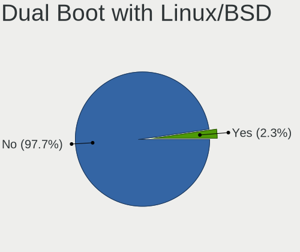
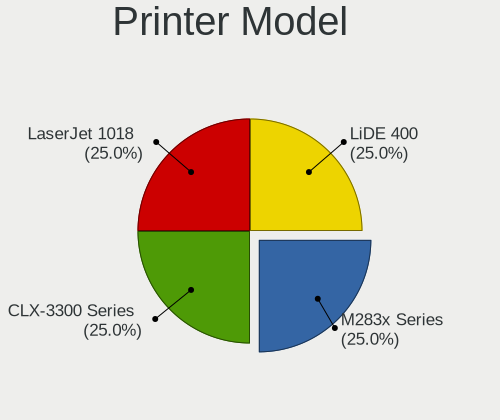
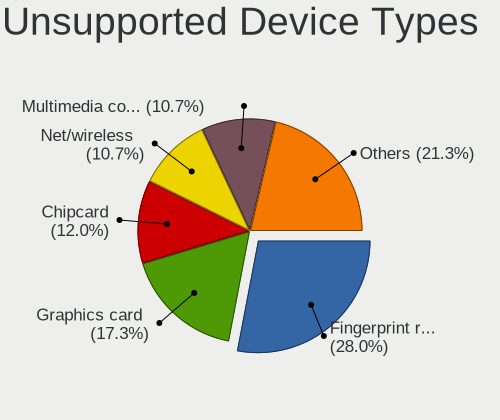

Pop!_OS Hardware Trends
-----------------------

A project to identify most popular hardware characteristics and track their change
over time based on data collected by Pop!_OS users at https://Linux-Hardware.org.

Anyone can contribute to the study by uploading probes of their computers by
the [hw-probe](https://github.com/linuxhw/hw-probe) tool:

    sudo -E hw-probe -all -upload

This is a report for all computer types. See also reports for [desktops](/Dist/Pop!_OS/Desktop/README.md) and [notebooks](/Dist/Pop!_OS/Notebook/README.md).

Full-feature report is available here: https://linux-hardware.org/?view=trends

Period: May, 2021.

Contents
--------

- [ OS                       ](#os)
- [ OS Family                ](#os-family)
- [ Kernel                   ](#kernel)
- [ Kernel Family            ](#kernel-family)
- [ Kernel Major Ver.        ](#kernel-major-ver)
- [ Arch                     ](#arch)
- [ DE                       ](#de)
- [ Display Server           ](#display-server)
- [ Display Manager          ](#display-manager)
- [ OS Lang                  ](#os-lang)
- [ Boot Mode                ](#boot-mode)
- [ Filesystem               ](#filesystem)
- [ Part. scheme             ](#part-scheme)
- [ Dual Boot with Linux/BSD ](#dual-boot-with-linux/bsd)
- [ Dual Boot (Win)          ](#dual-boot-win)
- [ Country                  ](#country)
- [ City                     ](#city)
- [ Vendor                   ](#vendor)
- [ Model                    ](#model)
- [ Model Family             ](#model-family)
- [ MFG Year                 ](#mfg-year)
- [ Form Factor              ](#form-factor)
- [ Secure Boot              ](#secure-boot)
- [ Coreboot                 ](#coreboot)
- [ RAM Size                 ](#ram-size)
- [ RAM Used                 ](#ram-used)
- [ Has CD-ROM               ](#has-cd-rom)
- [ Total Drives             ](#total-drives)
- [ Has Ethernet             ](#has-ethernet)
- [ Has WiFi                 ](#has-wifi)
- [ Has Bluetooth            ](#has-bluetooth)
- [ Drive Vendor             ](#drive-vendor)
- [ Drive Model              ](#drive-model)
- [ HDD Vendor               ](#hdd-vendor)
- [ SSD Vendor               ](#ssd-vendor)
- [ Drive Kind               ](#drive-kind)
- [ Drive Connector          ](#drive-connector)
- [ Drive Size               ](#drive-size)
- [ Space Total              ](#space-total)
- [ Space Used               ](#space-used)
- [ Malfunc. Drives          ](#malfunc-drives)
- [ Malfunc. Drive Vendor    ](#malfunc-drive-vendor)
- [ Malfunc. HDD Vendor      ](#malfunc-hdd-vendor)
- [ Malfunc. Drive Kind      ](#malfunc-drive-kind)
- [ Failed Drives            ](#failed-drives)
- [ Failed Drive Vendor      ](#failed-drive-vendor)
- [ Drive Status             ](#drive-status)
- [ Storage Vendor           ](#storage-vendor)
- [ Storage Model            ](#storage-model)
- [ Storage Kind             ](#storage-kind)
- [ CPU Vendor               ](#cpu-vendor)
- [ CPU Model                ](#cpu-model)
- [ CPU Model Family         ](#cpu-model-family)
- [ CPU Cores                ](#cpu-cores)
- [ CPU Sockets              ](#cpu-sockets)
- [ CPU Threads              ](#cpu-threads)
- [ CPU Op-Modes             ](#cpu-op-modes)
- [ CPU Microcode            ](#cpu-microcode)
- [ CPU Microarch            ](#cpu-microarch)
- [ GPU Vendor               ](#gpu-vendor)
- [ GPU Model                ](#gpu-model)
- [ GPU Combo                ](#gpu-combo)
- [ GPU Driver               ](#gpu-driver)
- [ GPU Memory               ](#gpu-memory)
- [ Monitor Vendor           ](#monitor-vendor)
- [ Monitor Model            ](#monitor-model)
- [ Monitor Resolution       ](#monitor-resolution)
- [ Monitor Diagonal         ](#monitor-diagonal)
- [ Monitor Width            ](#monitor-width)
- [ Aspect Ratio             ](#aspect-ratio)
- [ Monitor Area             ](#monitor-area)
- [ Pixel Density            ](#pixel-density)
- [ Multiple Monitors        ](#multiple-monitors)
- [ Net Controller Vendor    ](#net-controller-vendor)
- [ Net Controller Model     ](#net-controller-model)
- [ Wireless Vendor          ](#wireless-vendor)
- [ Wireless Model           ](#wireless-model)
- [ Ethernet Vendor          ](#ethernet-vendor)
- [ Ethernet Model           ](#ethernet-model)
- [ Net Controller Kind      ](#net-controller-kind)
- [ Used Controller          ](#used-controller)
- [ NICs                     ](#nics)
- [ IPv6                     ](#ipv6)
- [ Memory Vendor            ](#memory-vendor)
- [ Memory Model             ](#memory-model)
- [ Memory Kind              ](#memory-kind)
- [ Memory Form Factor       ](#memory-form-factor)
- [ Memory Size              ](#memory-size)
- [ Memory Speed             ](#memory-speed)
- [ Sound Vendor             ](#sound-vendor)
- [ Sound Model              ](#sound-model)
- [ Camera Vendor            ](#camera-vendor)
- [ Camera Model             ](#camera-model)
- [ Fingerprint Vendor       ](#fingerprint-vendor)
- [ Fingerprint Model        ](#fingerprint-model)
- [ Chipcard Vendor          ](#chipcard-vendor)
- [ Chipcard Model           ](#chipcard-model)
- [ Printer Vendor           ](#printer-vendor)
- [ Printer Model            ](#printer-model)
- [ Scanner Vendor           ](#scanner-vendor)
- [ Scanner Model            ](#scanner-model)
- [ Bluetooth Vendor         ](#bluetooth-vendor)
- [ Bluetooth Model          ](#bluetooth-model)
- [ Unsupported Devices      ](#unsupported-devices)
- [ Unsupported Device Types ](#unsupported-device-types)

OS
--

Installed operating systems

| Name          | Computers | Percent |
|---------------|-----------|---------|
| Pop!_OS 20.10 | 190       | 78.19%  |
| Pop!_OS 20.04 | 51        | 20.99%  |
| Pop!_OS 21.04 | 2         | 0.82%   |

OS Family
---------

OS without a version

| Name    | Computers | Percent |
|---------|-----------|---------|
| Pop!_OS | 243       | 100%    |

Kernel
------

Version of the Linux kernel

| Version                | Computers | Percent |
|------------------------|-----------|---------|
| 5.11.0-7614-generic    | 190       | 78.19%  |
| 5.11.0-7612-generic    | 29        | 11.93%  |
| 5.8.0-7642-generic     | 12        | 4.94%   |
| 5.8.0-7630-generic     | 3         | 1.23%   |
| 5.4.0-7634-generic     | 3         | 1.23%   |
| 5.12.7-051207-generic  | 1         | 0.41%   |
| 5.12.6-xanmod1         | 1         | 0.41%   |
| 5.12.6-surface         | 1         | 0.41%   |
| 5.11.17-xanmod1        | 1         | 0.41%   |
| 5.11.0-051100-generic  | 1         | 0.41%   |
| 5.10.30-051030-generic | 1         | 0.41%   |

Kernel Family
-------------

Linux kernel without a distro release

| Version | Computers | Percent |
|---------|-----------|---------|
| 5.11.0  | 220       | 90.53%  |
| 5.8.0   | 15        | 6.17%   |
| 5.4.0   | 3         | 1.23%   |
| 5.12.6  | 2         | 0.82%   |
| 5.12.7  | 1         | 0.41%   |
| 5.11.17 | 1         | 0.41%   |
| 5.10.30 | 1         | 0.41%   |

Kernel Major Ver.
-----------------

Linux kernel major version

| Version | Computers | Percent |
|---------|-----------|---------|
| 5.11    | 221       | 90.95%  |
| 5.8     | 15        | 6.17%   |
| 5.4     | 3         | 1.23%   |
| 5.12    | 3         | 1.23%   |
| 5.10    | 1         | 0.41%   |

Arch
----

OS architecture (x86_64, i586, etc.)

| Name   | Computers | Percent |
|--------|-----------|---------|
| x86_64 | 243       | 100%    |

DE
--

Desktop Environment

| Name            | Computers | Percent |
|-----------------|-----------|---------|
| GNOME           | 231       | 95.06%  |
| KDE             | 6         | 2.47%   |
| MATE            | 2         | 0.82%   |
| XFCE            | 1         | 0.41%   |
| KDE5            | 1         | 0.41%   |
| GNOME Flashback | 1         | 0.41%   |
| Unknown         | 1         | 0.41%   |

Display Server
--------------

X11 or Wayland

| Name    | Computers | Percent |
|---------|-----------|---------|
| X11     | 238       | 97.94%  |
| Wayland | 4         | 1.65%   |
| Unknown | 1         | 0.41%   |

Display Manager
---------------

SDDM, LightDM, etc.

| Name    | Computers | Percent |
|---------|-----------|---------|
| Unknown | 209       | 86.01%  |
| GDM     | 33        | 13.58%  |
| SDDM    | 1         | 0.41%   |

OS Lang
-------

Language

| Lang    | Computers | Percent |
|---------|-----------|---------|
| en_US   | 140       | 57.61%  |
| pt_BR   | 20        | 8.23%   |
| en_GB   | 19        | 7.82%   |
| de_DE   | 12        | 4.94%   |
| fr_FR   | 9         | 3.7%    |
| it_IT   | 7         | 2.88%   |
| C       | 7         | 2.88%   |
| es_ES   | 5         | 2.06%   |
| ru_RU   | 4         | 1.65%   |
| en_AU   | 4         | 1.65%   |
| tr_TR   | 3         | 1.23%   |
| pl_PL   | 3         | 1.23%   |
| en_CA   | 3         | 1.23%   |
| sk_SK   | 2         | 0.82%   |
| zh_TW   | 1         | 0.41%   |
| sv_SE   | 1         | 0.41%   |
| pt_PT   | 1         | 0.41%   |
| nl_NL   | 1         | 0.41%   |
| Unknown | 1         | 0.41%   |

Boot Mode
---------

EFI or BIOS

| Mode | Computers | Percent |
|------|-----------|---------|
| BIOS | 213       | 87.65%  |
| EFI  | 30        | 12.35%  |

Filesystem
----------

Type of filesystem

| Type    | Computers | Percent |
|---------|-----------|---------|
| Ext4    | 234       | 96.3%   |
| Btrfs   | 5         | 2.06%   |
| Overlay | 4         | 1.65%   |

Part. scheme
------------

Scheme of partitioning

| Type    | Computers | Percent |
|---------|-----------|---------|
| Unknown | 208       | 85.6%   |
| GPT     | 29        | 11.93%  |
| MBR     | 6         | 2.47%   |

Dual Boot with Linux/BSD
------------------------

Hosting more than one Linux/BSD

| Dual boot | Computers | Percent |
|-----------|-----------|---------|
| No        | 238       | 97.94%  |
| Yes       | 5         | 2.06%   |

Dual Boot (Win)
---------------

Hosting Linux and Windows

| Dual boot | Computers | Percent |
|-----------|-----------|---------|
| No        | 232       | 95.47%  |
| Yes       | 11        | 4.53%   |

Country
-------

Geographic location (country)

| Country                | Computers | Percent |
|------------------------|-----------|---------|
| USA                    | 76        | 31.28%  |
| Brazil                 | 24        | 9.88%   |
| Germany                | 14        | 5.76%   |
| UK                     | 13        | 5.35%   |
| India                  | 11        | 4.53%   |
| Italy                  | 8         | 3.29%   |
| France                 | 8         | 3.29%   |
| Russia                 | 6         | 2.47%   |
| Canada                 | 6         | 2.47%   |
| Netherlands            | 5         | 2.06%   |
| Greece                 | 5         | 2.06%   |
| Spain                  | 4         | 1.65%   |
| South Africa           | 4         | 1.65%   |
| Poland                 | 4         | 1.65%   |
| Chile                  | 4         | 1.65%   |
| Australia              | 4         | 1.65%   |
| Turkey                 | 3         | 1.23%   |
| Switzerland            | 3         | 1.23%   |
| Sweden                 | 3         | 1.23%   |
| Ukraine                | 2         | 0.82%   |
| Slovakia               | 2         | 0.82%   |
| Philippines            | 2         | 0.82%   |
| Peru                   | 2         | 0.82%   |
| Japan                  | 2         | 0.82%   |
| Jamaica                | 2         | 0.82%   |
| China                  | 2         | 0.82%   |
| Bulgaria               | 2         | 0.82%   |
| Austria                | 2         | 0.82%   |
| Tunisia                | 1         | 0.41%   |
| Taiwan                 | 1         | 0.41%   |
| Singapore              | 1         | 0.41%   |
| Serbia                 | 1         | 0.41%   |
| Saudi Arabia           | 1         | 0.41%   |
| Romania                | 1         | 0.41%   |
| Qatar                  | 1         | 0.41%   |
| Portugal               | 1         | 0.41%   |
| Luxembourg             | 1         | 0.41%   |
| Lithuania              | 1         | 0.41%   |
| Latvia                 | 1         | 0.41%   |
| Israel                 | 1         | 0.41%   |
| Iran                   | 1         | 0.41%   |
| Indonesia              | 1         | 0.41%   |
| Hungary                | 1         | 0.41%   |
| Finland                | 1         | 0.41%   |
| Egypt                  | 1         | 0.41%   |
| Bosnia and Herzegovina | 1         | 0.41%   |
| Belgium                | 1         | 0.41%   |
| Bangladesh             | 1         | 0.41%   |

City
----

Geographic location (city)

| City                | Computers | Percent |
|---------------------|-----------|---------|
| São Paulo          | 5         | 2.06%   |
| Dallas              | 4         | 1.65%   |
| Athens              | 3         | 1.23%   |
| Vienna              | 2         | 0.82%   |
| Thessaloniki        | 2         | 0.82%   |
| São Carlos         | 2         | 0.82%   |
| St Petersburg       | 2         | 0.82%   |
| Rio de Janeiro      | 2         | 0.82%   |
| Phoenix             | 2         | 0.82%   |
| Morehead City       | 2         | 0.82%   |
| Montego Bay         | 2         | 0.82%   |
| Milan               | 2         | 0.82%   |
| Miami               | 2         | 0.82%   |
| Melbourne           | 2         | 0.82%   |
| Lucknow             | 2         | 0.82%   |
| Johannesburg        | 2         | 0.82%   |
| Istanbul            | 2         | 0.82%   |
| Hyderabad           | 2         | 0.82%   |
| Houston             | 2         | 0.82%   |
| Hamilton            | 2         | 0.82%   |
| Brierley Hill       | 2         | 0.82%   |
| Berlin              | 2         | 0.82%   |
| Bengaluru           | 2         | 0.82%   |
| Beijing             | 2         | 0.82%   |
| Alexandria          | 2         | 0.82%   |
| Östersund          | 1         | 0.41%   |
| Zurich              | 1         | 0.41%   |
| Zeist               | 1         | 0.41%   |
| Woincourt           | 1         | 0.41%   |
| Witbank             | 1         | 0.41%   |
| Winston-Salem       | 1         | 0.41%   |
| West Jordan         | 1         | 0.41%   |
| Wausau              | 1         | 0.41%   |
| Waterford           | 1         | 0.41%   |
| Warsaw              | 1         | 0.41%   |
| Vouneuil-sous-Biard | 1         | 0.41%   |
| Viña del Mar       | 1         | 0.41%   |
| Viganello           | 1         | 0.41%   |
| Victoria            | 1         | 0.41%   |
| Venlo               | 1         | 0.41%   |
| Vancouver           | 1         | 0.41%   |
| Van Nuys            | 1         | 0.41%   |
| Udine               | 1         | 0.41%   |
| Torrington          | 1         | 0.41%   |
| Toronto             | 1         | 0.41%   |
| Topeka              | 1         | 0.41%   |
| Tokyo               | 1         | 0.41%   |
| Thousand Oaks       | 1         | 0.41%   |
| Thetford-Mines      | 1         | 0.41%   |
| The Hague           | 1         | 0.41%   |
| Tel Aviv            | 1         | 0.41%   |
| Tehran              | 1         | 0.41%   |
| Sydney              | 1         | 0.41%   |
| Surat               | 1         | 0.41%   |
| Strassen            | 1         | 0.41%   |
| St. Gallen          | 1         | 0.41%   |
| St Albans           | 1         | 0.41%   |
| Srednyaya Akhtuba   | 1         | 0.41%   |
| Springfield         | 1         | 0.41%   |
| South Pasadena      | 1         | 0.41%   |

Vendor
------

Motherboard manufacturer

| Name                           | Computers | Percent |
|--------------------------------|-----------|---------|
| ASUSTek Computer               | 46        | 18.93%  |
| Hewlett-Packard                | 35        | 14.4%   |
| Dell                           | 32        | 13.17%  |
| Lenovo                         | 26        | 10.7%   |
| Gigabyte Technology            | 22        | 9.05%   |
| Acer                           | 15        | 6.17%   |
| ASRock                         | 11        | 4.53%   |
| MSI                            | 10        | 4.12%   |
| Apple                          | 8         | 3.29%   |
| System76                       | 3         | 1.23%   |
| Notebook                       | 3         | 1.23%   |
| Google                         | 3         | 1.23%   |
| Sony                           | 2         | 0.82%   |
| Razer                          | 2         | 0.82%   |
| Fujitsu                        | 2         | 0.82%   |
| Alienware                      | 2         | 0.82%   |
| ZOTAC                          | 1         | 0.41%   |
| TYAN Computer                  | 1         | 0.41%   |
| Supermicro                     | 1         | 0.41%   |
| Samsung Electronics            | 1         | 0.41%   |
| Purism                         | 1         | 0.41%   |
| Positivo                       | 1         | 0.41%   |
| Pegatron                       | 1         | 0.41%   |
| Packard Bell                   | 1         | 0.41%   |
| OEM                            | 1         | 0.41%   |
| Minix                          | 1         | 0.41%   |
| Microsoft                      | 1         | 0.41%   |
| Metabox                        | 1         | 0.41%   |
| MAXSUN                         | 1         | 0.41%   |
| Matsushita Electric Industrial | 1         | 0.41%   |
| LG Electronics                 | 1         | 0.41%   |
| Irbis                          | 1         | 0.41%   |
| Intel                          | 1         | 0.41%   |
| Huanan                         | 1         | 0.41%   |
| HOUTER                         | 1         | 0.41%   |
| Fujitsu Siemens                | 1         | 0.41%   |
| Biostar                        | 1         | 0.41%   |

Model
-----

Motherboard model

| Name                                                  | Computers | Percent |
|-------------------------------------------------------|-----------|---------|
| MSI MS-7B86                                           | 3         | 1.23%   |
| Gigabyte B450M DS3H                                   | 3         | 1.23%   |
| System76 Thelio Major                                 | 2         | 0.82%   |
| HP Stream Notebook PC 11                              | 2         | 0.82%   |
| ASUS TUF GAMING B550-PLUS                             | 2         | 0.82%   |
| ASUS T100HAN                                          | 2         | 0.82%   |
| ASRock B365 Pro4                                      | 2         | 0.82%   |
| Apple MacBookPro8,1                                   | 2         | 0.82%   |
| Acer Swift SF314-42                                   | 2         | 0.82%   |
| ZOTAC ZBOXNANO-AD10                                   | 1         | 0.41%   |
| TYAN S5517                                            | 1         | 0.41%   |
| System76 Darter Pro                                   | 1         | 0.41%   |
| Supermicro X9SCI/X9SCA                                | 1         | 0.41%   |
| Sony SVL24117FLB                                      | 1         | 0.41%   |
| Sony SVE14A1V1EB                                      | 1         | 0.41%   |
| Samsung 340XAA/350XAA/550XAA                          | 1         | 0.41%   |
| Razer Blade Stealth 13 Late 2019                      | 1         | 0.41%   |
| Razer Blade 15 Advanced Model (Early 2020) - RZ09-033 | 1         | 0.41%   |
| Purism Librem 15 v4                                   | 1         | 0.41%   |
| Positivo MOBILE                                       | 1         | 0.41%   |
| Pegatron BK139AA-ABA 600-1120                         | 1         | 0.41%   |
| Packard Bell oneTwo L5871                             | 1         | 0.41%   |
| OEM U50SI1                                            | 1         | 0.41%   |
| Notebook W65_67SF                                     | 1         | 0.41%   |
| Notebook PCx0Dx                                       | 1         | 0.41%   |
| Notebook NHxxRZQ                                      | 1         | 0.41%   |
| MSI MS-7C02                                           | 1         | 0.41%   |
| MSI MS-7B89                                           | 1         | 0.41%   |
| MSI MS-7A70                                           | 1         | 0.41%   |
| MSI MS-7A39                                           | 1         | 0.41%   |
| MSI MS-7A38                                           | 1         | 0.41%   |
| MSI MS-7522                                           | 1         | 0.41%   |
| MSI GV62 7RD                                          | 1         | 0.41%   |
| Minix Z83-4                                           | 1         | 0.41%   |
| Microsoft Surface Pro 2                               | 1         | 0.41%   |
| Metabox Alpha-X NH58RHQ                               | 1         | 0.41%   |
| MAXSUN MS-B85-BTC                                     | 1         | 0.41%   |
| Matsushita Electric Industrial CF-74JDMBD2M           | 1         | 0.41%   |
| LG R590-X.ARU4BT                                      | 1         | 0.41%   |
| Lenovo Yoga 530-14IKB 81EK                            | 1         | 0.41%   |
| Lenovo Y720-15IKB 80VR                                | 1         | 0.41%   |
| Lenovo ThinkPad Yoga 11e 20DAS01D00                   | 1         | 0.41%   |
| Lenovo ThinkPad X260 20F5S3H000                       | 1         | 0.41%   |
| Lenovo ThinkPad X230 23243PU                          | 1         | 0.41%   |
| Lenovo ThinkPad X1 Extreme Gen 3 20TK001HUS           | 1         | 0.41%   |
| Lenovo ThinkPad X1 Carbon 6th 20KH002FUS              | 1         | 0.41%   |
| Lenovo ThinkPad X1 Carbon 4th 20FCS0LP01              | 1         | 0.41%   |
| Lenovo ThinkPad T420 4236RM8                          | 1         | 0.41%   |
| Lenovo ThinkPad Edge E440 20C5A0ME00                  | 1         | 0.41%   |
| Lenovo ThinkPad E595 20NF001PTX                       | 1         | 0.41%   |
| Lenovo ThinkPad E555 20DHA001RT                       | 1         | 0.41%   |
| Lenovo ThinkPad E450 20DC004UUS                       | 1         | 0.41%   |
| Lenovo ThinkPad 10 2nd 20E4S0UD01                     | 1         | 0.41%   |
| Lenovo ThinkCentre M910q 10MUS0FQ00                   | 1         | 0.41%   |
| Lenovo ThinkCentre M720q 10T8S8UQ00                   | 1         | 0.41%   |
| Lenovo Legion 5 15ARH05 82B5                          | 1         | 0.41%   |
| Lenovo IdeaPad Y560                                   | 1         | 0.41%   |
| Lenovo IdeaPad 330S-15ARR 81FB                        | 1         | 0.41%   |
| Lenovo IdeaPad 320-15IKB 80YH                         | 1         | 0.41%   |
| Lenovo IdeaPad 310-15ISK 80SM                         | 1         | 0.41%   |

Model Family
------------

Motherboard model prefix

| Name                                        | Computers | Percent |
|---------------------------------------------|-----------|---------|
| Lenovo ThinkPad                             | 12        | 4.94%   |
| Acer Aspire                                 | 11        | 4.53%   |
| Dell Inspiron                               | 9         | 3.7%    |
| ASUS ROG                                    | 8         | 3.29%   |
| Dell XPS                                    | 7         | 2.88%   |
| Dell Latitude                               | 7         | 2.88%   |
| Lenovo IdeaPad                              | 6         | 2.47%   |
| HP Compaq                                   | 5         | 2.06%   |
| ASUS PRIME                                  | 5         | 2.06%   |
| HP Laptop                                   | 4         | 1.65%   |
| HP EliteBook                                | 4         | 1.65%   |
| Dell Precision                              | 4         | 1.65%   |
| ASUS TUF                                    | 4         | 1.65%   |
| MSI MS-7B86                                 | 3         | 1.23%   |
| HP ProBook                                  | 3         | 1.23%   |
| HP Pavilion                                 | 3         | 1.23%   |
| HP ENVY                                     | 3         | 1.23%   |
| Gigabyte B450M                              | 3         | 1.23%   |
| Dell Vostro                                 | 3         | 1.23%   |
| System76 Thelio                             | 2         | 0.82%   |
| Razer Blade                                 | 2         | 0.82%   |
| Lenovo ThinkCentre                          | 2         | 0.82%   |
| HP Stream                                   | 2         | 0.82%   |
| Gigabyte B450                               | 2         | 0.82%   |
| ASUS VivoBook                               | 2         | 0.82%   |
| ASUS T100HAN                                | 2         | 0.82%   |
| ASUS P7P55D                                 | 2         | 0.82%   |
| ASUS Maximus                                | 2         | 0.82%   |
| ASUS ASUS                                   | 2         | 0.82%   |
| ASRock B365                                 | 2         | 0.82%   |
| Apple MacBookPro8                           | 2         | 0.82%   |
| Acer Swift                                  | 2         | 0.82%   |
| ZOTAC ZBOXNANO-AD10                         | 1         | 0.41%   |
| TYAN S5517                                  | 1         | 0.41%   |
| System76 Darter                             | 1         | 0.41%   |
| Supermicro X9SCI                            | 1         | 0.41%   |
| Sony SVL24117FLB                            | 1         | 0.41%   |
| Sony SVE14A1V1EB                            | 1         | 0.41%   |
| Samsung 340XAA                              | 1         | 0.41%   |
| Purism Librem                               | 1         | 0.41%   |
| Positivo MOBILE                             | 1         | 0.41%   |
| Pegatron BK139AA-ABA                        | 1         | 0.41%   |
| Packard Bell oneTwo                         | 1         | 0.41%   |
| OEM U50SI1                                  | 1         | 0.41%   |
| Notebook W65                                | 1         | 0.41%   |
| Notebook PCx0Dx                             | 1         | 0.41%   |
| Notebook NHxxRZQ                            | 1         | 0.41%   |
| MSI MS-7C02                                 | 1         | 0.41%   |
| MSI MS-7B89                                 | 1         | 0.41%   |
| MSI MS-7A70                                 | 1         | 0.41%   |
| MSI MS-7A39                                 | 1         | 0.41%   |
| MSI MS-7A38                                 | 1         | 0.41%   |
| MSI MS-7522                                 | 1         | 0.41%   |
| MSI GV62                                    | 1         | 0.41%   |
| Minix Z83-4                                 | 1         | 0.41%   |
| Microsoft Surface                           | 1         | 0.41%   |
| Metabox Alpha-X                             | 1         | 0.41%   |
| MAXSUN MS-B85-BTC                           | 1         | 0.41%   |
| Matsushita Electric Industrial CF-74JDMBD2M | 1         | 0.41%   |
| LG R590-X.ARU4BT                            | 1         | 0.41%   |

MFG Year
--------

Motherboard manufacture year

| Year | Computers | Percent |
|------|-----------|---------|
| 2020 | 47        | 19.34%  |
| 2019 | 37        | 15.23%  |
| 2021 | 34        | 13.99%  |
| 2018 | 21        | 8.64%   |
| 2012 | 19        | 7.82%   |
| 2011 | 14        | 5.76%   |
| 2013 | 13        | 5.35%   |
| 2016 | 12        | 4.94%   |
| 2015 | 11        | 4.53%   |
| 2017 | 9         | 3.7%    |
| 2014 | 8         | 3.29%   |
| 2010 | 6         | 2.47%   |
| 2009 | 5         | 2.06%   |
| 2008 | 5         | 2.06%   |
| 2007 | 2         | 0.82%   |

Form Factor
-----------

Physical design of the computer

| Name        | Computers | Percent |
|-------------|-----------|---------|
| Notebook    | 126       | 51.85%  |
| Desktop     | 99        | 40.74%  |
| Mini pc     | 7         | 2.88%   |
| Convertible | 6         | 2.47%   |
| Tablet      | 3         | 1.23%   |
| All in one  | 2         | 0.82%   |

Secure Boot
-----------

Enabled or disabled

| State    | Computers | Percent |
|----------|-----------|---------|
| Disabled | 243       | 100%    |

Coreboot
--------

Have coreboot on board

| Used | Computers | Percent |
|------|-----------|---------|
| No   | 239       | 98.35%  |
| Yes  | 4         | 1.65%   |

RAM Size
--------

Total RAM memory

| Size in GB  | Computers | Percent |
|-------------|-----------|---------|
| 16.01-24.0  | 66        | 27.16%  |
| 8.01-16.0   | 50        | 20.58%  |
| 4.01-8.0    | 49        | 20.16%  |
| 3.01-4.0    | 35        | 14.4%   |
| 32.01-64.0  | 23        | 9.47%   |
| 1.01-2.0    | 10        | 4.12%   |
| 64.01-256.0 | 7         | 2.88%   |
| 2.01-3.0    | 2         | 0.82%   |
| 24.01-32.0  | 1         | 0.41%   |

RAM Used
--------

Used RAM memory

| Used GB    | Computers | Percent |
|------------|-----------|---------|
| 1.01-2.0   | 102       | 41.98%  |
| 2.01-3.0   | 63        | 25.93%  |
| 3.01-4.0   | 34        | 13.99%  |
| 4.01-8.0   | 33        | 13.58%  |
| 8.01-16.0  | 8         | 3.29%   |
| 0.51-1.0   | 2         | 0.82%   |
| 16.01-24.0 | 1         | 0.41%   |

Has CD-ROM
----------

Has CD-ROM on board

| Presented | Computers | Percent |
|-----------|-----------|---------|
| No        | 155       | 63.79%  |
| Yes       | 88        | 36.21%  |

Total Drives
------------

Number of drives on board

| Drives | Computers | Percent |
|--------|-----------|---------|
| 1      | 134       | 55.14%  |
| 2      | 72        | 29.63%  |
| 3      | 19        | 7.82%   |
| 4      | 9         | 3.7%    |
| 5      | 4         | 1.65%   |
| 6      | 3         | 1.23%   |
| 8      | 1         | 0.41%   |
| 7      | 1         | 0.41%   |

Has Ethernet
------------

Has Ethernet on board

| Presented | Computers | Percent |
|-----------|-----------|---------|
| Yes       | 208       | 85.6%   |
| No        | 35        | 14.4%   |

Has WiFi
--------

Has WiFi module

| Presented | Computers | Percent |
|-----------|-----------|---------|
| Yes       | 185       | 76.13%  |
| No        | 58        | 23.87%  |

Has Bluetooth
-------------

Has Bluetooth module

| Presented | Computers | Percent |
|-----------|-----------|---------|
| Yes       | 147       | 60.49%  |
| No        | 96        | 39.51%  |

Drive Vendor
------------

Hard drive vendors

| Vendor                    | Computers | Drives | Percent |
|---------------------------|-----------|--------|---------|
| Seagate                   | 61        | 73     | 15.97%  |
| WDC                       | 59        | 64     | 15.45%  |
| Samsung Electronics       | 46        | 54     | 12.04%  |
| SanDisk                   | 24        | 24     | 6.28%   |
| Toshiba                   | 23        | 23     | 6.02%   |
| Kingston                  | 20        | 20     | 5.24%   |
| Unknown                   | 17        | 20     | 4.45%   |
| Crucial                   | 16        | 17     | 4.19%   |
| SK Hynix                  | 13        | 17     | 3.4%    |
| Intel                     | 11        | 11     | 2.88%   |
| A-DATA Technology         | 10        | 11     | 2.62%   |
| China                     | 9         | 12     | 2.36%   |
| HGST                      | 8         | 8      | 2.09%   |
| Phison                    | 6         | 6      | 1.57%   |
| Hitachi                   | 6         | 6      | 1.57%   |
| Silicon Motion            | 5         | 5      | 1.31%   |
| PNY                       | 4         | 4      | 1.05%   |
| Micron/Crucial Technology | 4         | 5      | 1.05%   |
| OCZ                       | 3         | 3      | 0.79%   |
| Micron Technology         | 3         | 4      | 0.79%   |
| Apple                     | 3         | 4      | 0.79%   |
| Team                      | 2         | 2      | 0.52%   |
| SABRENT                   | 2         | 2      | 0.52%   |
| LITEONIT                  | 2         | 2      | 0.52%   |
| Lite-On                   | 2         | 2      | 0.52%   |
| KingSpec                  | 2         | 2      | 0.52%   |
| Hewlett-Packard           | 2         | 2      | 0.52%   |
| VisionTek                 | 1         | 2      | 0.26%   |
| Vaseky                    | 1         | 1      | 0.26%   |
| Union Memory (Shenzhen)   | 1         | 4      | 0.26%   |
| Union Memory              | 1         | 1      | 0.26%   |
| UNIC2                     | 1         | 1      | 0.26%   |
| TCSUNBOW                  | 1         | 1      | 0.26%   |
| SPCC                      | 1         | 1      | 0.26%   |
| Realtek Semiconductor     | 1         | 1      | 0.26%   |
| Patriot                   | 1         | 1      | 0.26%   |
| Mushkin                   | 1         | 1      | 0.26%   |
| Maxtor                    | 1         | 1      | 0.26%   |
| Magnetic Data             | 1         | 1      | 0.26%   |
| JMicron                   | 1         | 1      | 0.26%   |
| H/W RAID                  | 1         | 1      | 0.26%   |
| External                  | 1         | 1      | 0.26%   |
| Cyclone                   | 1         | 1      | 0.26%   |
| Corsair                   | 1         | 2      | 0.26%   |
| ASMT                      | 1         | 1      | 0.26%   |
| Apacer                    | 1         | 1      | 0.26%   |

Drive Model
-----------

Hard drive models

| Model                               | Computers | Percent |
|-------------------------------------|-----------|---------|
| Kingston SA400S37240G 240GB SSD     | 9         | 2.2%    |
| Unknown MMC Card  32GB              | 7         | 1.71%   |
| Seagate ST1000LM035-1RK172 1TB      | 7         | 1.71%   |
| Seagate ST2000DM008-2FR102 2TB      | 6         | 1.47%   |
| Seagate ST1000DM003-1CH162 1TB      | 5         | 1.22%   |
| Samsung NVMe SSD Drive 1TB          | 5         | 1.22%   |
| Unknown MMC Card  64GB              | 4         | 0.98%   |
| Sandisk NVMe SSD Drive 500GB        | 4         | 0.98%   |
| Samsung NVMe SSD Drive 500GB        | 4         | 0.98%   |
| Intel NVMe SSD Drive 512GB          | 4         | 0.98%   |
| WDC WD10SPZX-21Z10T0 1TB            | 3         | 0.73%   |
| WDC WD10JPVX-22JC3T0 1TB            | 3         | 0.73%   |
| Unknown SD/MMC/MS PRO 8GB           | 3         | 0.73%   |
| Toshiba NVMe SSD Drive 512GB        | 3         | 0.73%   |
| Toshiba HDWD110 1TB                 | 3         | 0.73%   |
| SK Hynix NVMe SSD Drive 512GB       | 3         | 0.73%   |
| Seagate ST500LM012 HN-M500MBB 500GB | 3         | 0.73%   |
| Seagate ST1000LM024 HN-M101MBB 1TB  | 3         | 0.73%   |
| Sandisk NVMe SSD Drive 1TB          | 3         | 0.73%   |
| Samsung NVMe SSD Drive 512GB        | 3         | 0.73%   |
| Kingston SA400S37480G 480GB SSD     | 3         | 0.73%   |
| Intel NVMe SSD Drive 1024GB         | 3         | 0.73%   |
| Crucial CT240BX500SSD1 240GB        | 3         | 0.73%   |
| A-DATA SU650 120GB SSD              | 3         | 0.73%   |
| WDC WDS500G2B0A-00SM50 500GB SSD    | 2         | 0.49%   |
| WDC WDS240G2G0A-00JH30 240GB SSD    | 2         | 0.49%   |
| WDC WDS120G2G0B-00EPW0 120GB SSD    | 2         | 0.49%   |
| WDC WD7500BPKT-75PK4T0 752GB        | 2         | 0.49%   |
| WDC WD20EZAZ-00GGJB0 2TB            | 2         | 0.49%   |
| WDC WD10JPVX-60JC3T0 1TB            | 2         | 0.49%   |
| WDC WD10JPCX-24UE4T0 1TB            | 2         | 0.49%   |
| Unknown MMC Card  16GB              | 2         | 0.49%   |
| Unknown MMC Card  128GB             | 2         | 0.49%   |
| Silicon Motion NVMe SSD Drive 256GB | 2         | 0.49%   |
| Seagate ST500DM002-1BD142 500GB     | 2         | 0.49%   |
| Seagate ST4000DM004-2CV104 4TB      | 2         | 0.49%   |
| Seagate ST4000DM000-1F2168 4TB      | 2         | 0.49%   |
| Seagate ST3500418AS 500GB           | 2         | 0.49%   |
| Seagate ST3500312CS 500GB           | 2         | 0.49%   |
| Seagate ST31000524AS 1TB            | 2         | 0.49%   |
| Seagate ST2000LM007-1R8174 2TB      | 2         | 0.49%   |
| Seagate Expansion 2TB               | 2         | 0.49%   |
| SanDisk SSD PLUS 240GB              | 2         | 0.49%   |
| Samsung SSD 970 EVO Plus 500GB      | 2         | 0.49%   |
| Samsung SSD 860 QVO 1TB             | 2         | 0.49%   |
| Samsung SSD 850 PRO 256GB           | 2         | 0.49%   |
| Samsung SSD 850 EVO 500GB           | 2         | 0.49%   |
| Samsung SSD 850 EVO 1TB             | 2         | 0.49%   |
| Samsung NVMe SSD Drive 1024GB       | 2         | 0.49%   |
| SABRENT Disk 240GB                  | 2         | 0.49%   |
| Phison NVMe SSD Drive 256GB         | 2         | 0.49%   |
| Phison NVMe SSD Drive 1TB           | 2         | 0.49%   |
| Micron/Crucial NVMe SSD Drive 500GB | 2         | 0.49%   |
| Micron NVMe SSD Drive 512GB         | 2         | 0.49%   |
| Kingston SUV400S37240G 240GB SSD    | 2         | 0.49%   |
| KingSpec T-64 64GB                  | 2         | 0.49%   |
| HGST HTS725050A7E630 500GB          | 2         | 0.49%   |
| HGST HTS541075A9E680 752GB          | 2         | 0.49%   |
| Crucial CT500MX500SSD1 500GB        | 2         | 0.49%   |
| China SATA SSD 240GB                | 2         | 0.49%   |

HDD Vendor
----------

Hard disk drive vendors

| Vendor              | Computers | Drives | Percent |
|---------------------|-----------|--------|---------|
| Seagate             | 58        | 69     | 40.28%  |
| WDC                 | 48        | 52     | 33.33%  |
| Toshiba             | 14        | 14     | 9.72%   |
| HGST                | 8         | 8      | 5.56%   |
| Hitachi             | 6         | 6      | 4.17%   |
| Samsung Electronics | 5         | 5      | 3.47%   |
| Maxtor              | 1         | 1      | 0.69%   |
| Magnetic Data       | 1         | 1      | 0.69%   |
| JMicron             | 1         | 1      | 0.69%   |
| ASMT                | 1         | 1      | 0.69%   |
| Apple               | 1         | 1      | 0.69%   |

SSD Vendor
----------

Solid state drive vendors

| Vendor              | Computers | Drives | Percent |
|---------------------|-----------|--------|---------|
| Samsung Electronics | 23        | 25     | 17.29%  |
| Kingston            | 18        | 18     | 13.53%  |
| SanDisk             | 15        | 15     | 11.28%  |
| Crucial             | 15        | 15     | 11.28%  |
| WDC                 | 10        | 10     | 7.52%   |
| China               | 9         | 12     | 6.77%   |
| A-DATA Technology   | 8         | 8      | 6.02%   |
| PNY                 | 4         | 4      | 3.01%   |
| Toshiba             | 3         | 3      | 2.26%   |
| SK Hynix            | 3         | 3      | 2.26%   |
| Seagate             | 3         | 3      | 2.26%   |
| OCZ                 | 3         | 3      | 2.26%   |
| Intel               | 3         | 3      | 2.26%   |
| SABRENT             | 2         | 2      | 1.5%    |
| LITEONIT            | 2         | 2      | 1.5%    |
| KingSpec            | 2         | 2      | 1.5%    |
| Hewlett-Packard     | 2         | 2      | 1.5%    |
| UNIC2               | 1         | 1      | 0.75%   |
| Team                | 1         | 1      | 0.75%   |
| TCSUNBOW            | 1         | 1      | 0.75%   |
| SPCC                | 1         | 1      | 0.75%   |
| Patriot             | 1         | 1      | 0.75%   |
| Cyclone             | 1         | 1      | 0.75%   |
| Apple               | 1         | 1      | 0.75%   |
| Apacer              | 1         | 1      | 0.75%   |

Drive Kind
----------

HDD or SSD

| Kind    | Computers | Drives | Percent |
|---------|-----------|--------|---------|
| HDD     | 123       | 159    | 36.07%  |
| SSD     | 119       | 138    | 34.9%   |
| NVMe    | 76        | 105    | 22.29%  |
| MMC     | 15        | 16     | 4.4%    |
| Unknown | 8         | 9      | 2.35%   |

Drive Connector
---------------

SATA, SAS, NVMe, etc.

| Type | Computers | Drives | Percent |
|------|-----------|--------|---------|
| SATA | 191       | 291    | 64.53%  |
| NVMe | 76        | 104    | 25.68%  |
| MMC  | 15        | 16     | 5.07%   |
| SAS  | 14        | 16     | 4.73%   |

Drive Size
----------

Size of hard drive

| Size in TB | Computers | Drives | Percent |
|------------|-----------|--------|---------|
| 0.01-0.5   | 144       | 177    | 56.92%  |
| 0.51-1.0   | 72        | 78     | 28.46%  |
| 1.01-2.0   | 22        | 24     | 8.7%    |
| 3.01-4.0   | 9         | 12     | 3.56%   |
| 2.01-3.0   | 4         | 4      | 1.58%   |
| 20.01-50.0 | 1         | 1      | 0.4%    |
| 10.01-20.0 | 1         | 1      | 0.4%    |

Space Total
-----------

Amount of disk space available on the file system

| Size in GB     | Computers | Percent |
|----------------|-----------|---------|
| 101-250        | 73        | 30.04%  |
| 251-500        | 58        | 23.87%  |
| 501-1000       | 41        | 16.87%  |
| 1001-2000      | 22        | 9.05%   |
| 51-100         | 16        | 6.58%   |
| 2001-3000      | 11        | 4.53%   |
| More than 3000 | 7         | 2.88%   |
| 21-50          | 7         | 2.88%   |
| 1-20           | 7         | 2.88%   |
| Unknown        | 1         | 0.41%   |

Space Used
----------

Amount of used disk space

| Used GB        | Computers | Percent |
|----------------|-----------|---------|
| 1-20           | 105       | 43.21%  |
| 21-50          | 46        | 18.93%  |
| 51-100         | 31        | 12.76%  |
| 101-250        | 25        | 10.29%  |
| 501-1000       | 15        | 6.17%   |
| 251-500        | 10        | 4.12%   |
| 1001-2000      | 7         | 2.88%   |
| More than 3000 | 2         | 0.82%   |
| 2001-3000      | 1         | 0.41%   |
| Unknown        | 1         | 0.41%   |

Malfunc. Drives
---------------

Drive models with a malfunction

| Model                             | Computers | Drives | Percent |
|-----------------------------------|-----------|--------|---------|
| Seagate ST500LT012-9WS142 500GB   | 1         | 1      | 25%     |
| Kingston SV300S37A120G 120GB SSD  | 1         | 1      | 25%     |
| China ESA3ASA2PSTBT120GB SSD      | 1         | 1      | 25%     |
| A-DATA Technology SU800 512GB SSD | 1         | 1      | 25%     |

Malfunc. Drive Vendor
---------------------

Vendors of faulty drives

| Vendor            | Computers | Drives | Percent |
|-------------------|-----------|--------|---------|
| Seagate           | 1         | 1      | 25%     |
| Kingston          | 1         | 1      | 25%     |
| China             | 1         | 1      | 25%     |
| A-DATA Technology | 1         | 1      | 25%     |

Malfunc. HDD Vendor
-------------------

Vendors of faulty HDD drives

| Vendor  | Computers | Drives | Percent |
|---------|-----------|--------|---------|
| Seagate | 1         | 1      | 100%    |

Malfunc. Drive Kind
-------------------

Kinds of faulty drives

| Kind | Computers | Drives | Percent |
|------|-----------|--------|---------|
| SSD  | 3         | 3      | 75%     |
| HDD  | 1         | 1      | 25%     |

Failed Drives
-------------

Failed drive models

Zero info for selected period =(

Failed Drive Vendor
-------------------

Failed drive vendors

Zero info for selected period =(

Drive Status
------------

Number of failed and malfunc. drives

| Status   | Computers | Drives | Percent |
|----------|-----------|--------|---------|
| Detected | 211       | 369    | 84.06%  |
| Works    | 36        | 54     | 14.34%  |
| Malfunc  | 4         | 4      | 1.59%   |

Storage Vendor
--------------

Storage controller vendors

| Vendor                           | Computers | Percent |
|----------------------------------|-----------|---------|
| Intel                            | 152       | 47.2%   |
| AMD                              | 62        | 19.25%  |
| Samsung Electronics              | 23        | 7.14%   |
| Sandisk                          | 11        | 3.42%   |
| SK Hynix                         | 10        | 3.11%   |
| Phison Electronics               | 8         | 2.48%   |
| ASMedia Technology               | 8         | 2.48%   |
| Toshiba America Info Systems     | 6         | 1.86%   |
| Silicon Motion                   | 6         | 1.86%   |
| JMicron Technology               | 6         | 1.86%   |
| Nvidia                           | 5         | 1.55%   |
| Micron/Crucial Technology        | 5         | 1.55%   |
| Marvell Technology Group         | 5         | 1.55%   |
| Micron Technology                | 3         | 0.93%   |
| ADATA Technology                 | 3         | 0.93%   |
| Union Memory (Shenzhen)          | 2         | 0.62%   |
| Lite-On Technology               | 2         | 0.62%   |
| Kingston Technology Company      | 2         | 0.62%   |
| Silicon Integrated Systems [SiS] | 1         | 0.31%   |
| Realtek Semiconductor            | 1         | 0.31%   |
| Apple                            | 1         | 0.31%   |

Storage Model
-------------

Storage controller models

| Model                                                                                   | Computers | Percent |
|-----------------------------------------------------------------------------------------|-----------|---------|
| AMD FCH SATA Controller [AHCI mode]                                                     | 41        | 10.99%  |
| Samsung NVMe SSD Controller SM981/PM981/PM983                                           | 17        | 4.56%   |
| AMD 400 Series Chipset SATA Controller                                                  | 17        | 4.56%   |
| Intel Sunrise Point-LP SATA Controller [AHCI mode]                                      | 15        | 4.02%   |
| Intel 82801 Mobile SATA Controller [RAID mode]                                          | 14        | 3.75%   |
| Intel 6 Series/C200 Series Chipset Family 6 port Mobile SATA AHCI Controller            | 10        | 2.68%   |
| Intel 8 Series/C220 Series Chipset Family 6-port SATA Controller 1 [AHCI mode]          | 9         | 2.41%   |
| Sandisk WD Blue SN550 NVMe SSD                                                          | 8         | 2.14%   |
| Intel 7 Series Chipset Family 6-port SATA Controller [AHCI mode]                        | 8         | 2.14%   |
| Intel SSD 660P Series                                                                   | 7         | 1.88%   |
| Intel 6 Series/C200 Series Chipset Family 6 port Desktop SATA AHCI Controller           | 7         | 1.88%   |
| ASMedia ASM1062 Serial ATA Controller                                                   | 7         | 1.88%   |
| Intel 8 Series SATA Controller 1 [AHCI mode]                                            | 6         | 1.61%   |
| AMD Starship/Matisse Chipset SATA Controller [AHCI mode]                                | 6         | 1.61%   |
| AMD SB7x0/SB8x0/SB9x0 SATA Controller [AHCI mode]                                       | 6         | 1.61%   |
| SK Hynix BC511                                                                          | 5         | 1.34%   |
| Phison E12 NVMe Controller                                                              | 5         | 1.34%   |
| Intel Q170/Q150/B150/H170/H110/Z170/CM236 Chipset SATA Controller [AHCI Mode]           | 5         | 1.34%   |
| Intel 200 Series PCH SATA controller [AHCI mode]                                        | 5         | 1.34%   |
| AMD SB7x0/SB8x0/SB9x0 IDE Controller                                                    | 5         | 1.34%   |
| Silicon Motion SM2263EN/SM2263XT SSD Controller                                         | 4         | 1.07%   |
| JMicron JMB363 SATA/IDE Controller                                                      | 4         | 1.07%   |
| Intel Wildcat Point-LP SATA Controller [AHCI Mode]                                      | 4         | 1.07%   |
| Intel SATA Controller [RAID mode]                                                       | 4         | 1.07%   |
| Intel Cannon Point-LP SATA Controller [AHCI Mode]                                       | 4         | 1.07%   |
| Intel Cannon Lake Mobile PCH SATA AHCI Controller                                       | 4         | 1.07%   |
| Micron Non-Volatile memory controller                                                   | 3         | 0.8%    |
| Intel Volume Management Device NVMe RAID Controller                                     | 3         | 0.8%    |
| Intel HM170/QM170 Chipset SATA Controller [AHCI Mode]                                   | 3         | 0.8%    |
| Intel Cannon Lake PCH SATA AHCI Controller                                              | 3         | 0.8%    |
| Intel 9 Series Chipset Family SATA Controller [AHCI Mode]                               | 3         | 0.8%    |
| Intel 82801IBM/IEM (ICH9M/ICH9M-E) 4 port SATA Controller [AHCI mode]                   | 3         | 0.8%    |
| Intel 82801HM/HEM (ICH8M/ICH8M-E) SATA Controller [AHCI mode]                           | 3         | 0.8%    |
| Intel 82801HM/HEM (ICH8M/ICH8M-E) IDE Controller                                        | 3         | 0.8%    |
| Intel 7 Series/C210 Series Chipset Family 6-port SATA Controller [AHCI mode]            | 3         | 0.8%    |
| Intel 7 Series/C210 Series Chipset Family 4-port SATA Controller [IDE mode]             | 3         | 0.8%    |
| Intel 7 Series/C210 Series Chipset Family 2-port SATA Controller [IDE mode]             | 3         | 0.8%    |
| Intel 6 Series/C200 Series Chipset Family Desktop SATA Controller (IDE mode, ports 4-5) | 3         | 0.8%    |
| Intel 6 Series/C200 Series Chipset Family Desktop SATA Controller (IDE mode, ports 0-3) | 3         | 0.8%    |
| Intel 5 Series/3400 Series Chipset 6 port SATA AHCI Controller                          | 3         | 0.8%    |
| AMD SB7x0/SB8x0/SB9x0 SATA Controller [IDE mode]                                        | 3         | 0.8%    |
| Union Memory (Shenzhen) Non-Volatile memory controller                                  | 2         | 0.54%   |
| Toshiba America Info Systems XG6 NVMe SSD Controller                                    | 2         | 0.54%   |
| Toshiba America Info Systems Toshiba America Info Non-Volatile memory controller        | 2         | 0.54%   |
| SK Hynix Non-Volatile memory controller                                                 | 2         | 0.54%   |
| Silicon Motion SM2262/SM2262EN SSD Controller                                           | 2         | 0.54%   |
| Samsung NVMe SSD Controller PM9A1/PM9A3/980PRO                                          | 2         | 0.54%   |
| Phison E16 PCIe4 NVMe Controller                                                        | 2         | 0.54%   |
| Nvidia MCP61 SATA Controller                                                            | 2         | 0.54%   |
| Nvidia MCP61 IDE                                                                        | 2         | 0.54%   |
| Micron/Crucial P1 NVMe PCIe SSD                                                         | 2         | 0.54%   |
| Micron/Crucial NVMe Controller                                                          | 2         | 0.54%   |
| Micron/Crucial Non-Volatile memory controller                                           | 2         | 0.54%   |
| Lite-On Non-Volatile memory controller                                                  | 2         | 0.54%   |
| JMicron JMB362 SATA Controller                                                          | 2         | 0.54%   |
| Intel Tiger Lake-LP SATA Controller [AHCI mode]                                         | 2         | 0.54%   |
| Intel Celeron/Pentium Silver Processor SATA Controller                                  | 2         | 0.54%   |
| Intel C610/X99 series chipset 6-Port SATA Controller [AHCI mode]                        | 2         | 0.54%   |
| Intel Atom Processor E3800 Series SATA AHCI Controller                                  | 2         | 0.54%   |
| Intel 82801IR/IO/IH (ICH9R/DO/DH) 4 port SATA Controller [IDE mode]                     | 2         | 0.54%   |

Storage Kind
------------

Kind of storage controller (IDE, SATA, NVMe, SAS, ...)

| Kind | Computers | Percent |
|------|-----------|---------|
| SATA | 183       | 59.03%  |
| NVMe | 77        | 24.84%  |
| IDE  | 29        | 9.35%   |
| RAID | 21        | 6.77%   |

CPU Vendor
----------

Processor vendors

| Vendor | Computers | Percent |
|--------|-----------|---------|
| Intel  | 174       | 71.6%   |
| AMD    | 69        | 28.4%   |

CPU Model
---------

Processor models

| Model                                       | Computers | Percent |
|---------------------------------------------|-----------|---------|
| AMD Ryzen 7 3700X 8-Core Processor          | 5         | 2.06%   |
| AMD Ryzen 5 3600 6-Core Processor           | 5         | 2.06%   |
| AMD Ryzen 5 5600X 6-Core Processor          | 4         | 1.65%   |
| Intel Core i7-9750H CPU @ 2.60GHz           | 3         | 1.23%   |
| Intel Core i7-8550U CPU @ 1.80GHz           | 3         | 1.23%   |
| Intel Core i7-10750H CPU @ 2.60GHz          | 3         | 1.23%   |
| Intel Core i5-8265U CPU @ 1.60GHz           | 3         | 1.23%   |
| Intel Core i5-6200U CPU @ 2.30GHz           | 3         | 1.23%   |
| Intel Core i5-2520M CPU @ 2.50GHz           | 3         | 1.23%   |
| Intel Core i3-8145U CPU @ 2.10GHz           | 3         | 1.23%   |
| Intel Core i3-6006U CPU @ 2.00GHz           | 3         | 1.23%   |
| AMD Ryzen 5 1600 Six-Core Processor         | 3         | 1.23%   |
| AMD Ryzen 3 3200G with Radeon Vega Graphics | 3         | 1.23%   |
| Intel Core i9-10885H CPU @ 2.40GHz          | 2         | 0.82%   |
| Intel Core i7-8650U CPU @ 1.90GHz           | 2         | 0.82%   |
| Intel Core i7-7700HQ CPU @ 2.80GHz          | 2         | 0.82%   |
| Intel Core i7-6500U CPU @ 2.50GHz           | 2         | 0.82%   |
| Intel Core i7-5500U CPU @ 2.40GHz           | 2         | 0.82%   |
| Intel Core i7-3770K CPU @ 3.50GHz           | 2         | 0.82%   |
| Intel Core i7-2640M CPU @ 2.80GHz           | 2         | 0.82%   |
| Intel Core i7-2600 CPU @ 3.40GHz            | 2         | 0.82%   |
| Intel Core i5-9300H CPU @ 2.40GHz           | 2         | 0.82%   |
| Intel Core i5-8250U CPU @ 1.60GHz           | 2         | 0.82%   |
| Intel Core i5-7200U CPU @ 2.50GHz           | 2         | 0.82%   |
| Intel Core i5-6500 CPU @ 3.20GHz            | 2         | 0.82%   |
| Intel Core i5-4590 CPU @ 3.30GHz            | 2         | 0.82%   |
| Intel Core i5-4300U CPU @ 1.90GHz           | 2         | 0.82%   |
| Intel Core i5-4200M CPU @ 2.50GHz           | 2         | 0.82%   |
| Intel Core i5-3570 CPU @ 3.40GHz            | 2         | 0.82%   |
| Intel Core i5-3330 CPU @ 3.00GHz            | 2         | 0.82%   |
| Intel Core i5-3320M CPU @ 2.60GHz           | 2         | 0.82%   |
| Intel Core i5-3210M CPU @ 2.50GHz           | 2         | 0.82%   |
| Intel Core i5-2400 CPU @ 3.10GHz            | 2         | 0.82%   |
| Intel Core i3-7020U CPU @ 2.30GHz           | 2         | 0.82%   |
| Intel Core i3 CPU M 330 @ 2.13GHz           | 2         | 0.82%   |
| Intel Core 2 Duo CPU P8600 @ 2.40GHz        | 2         | 0.82%   |
| Intel Celeron CPU N2840 @ 2.16GHz           | 2         | 0.82%   |
| Intel Atom x5-Z8500 CPU @ 1.44GHz           | 2         | 0.82%   |
| AMD Ryzen 9 4900HS with Radeon Graphics     | 2         | 0.82%   |
| AMD Ryzen 9 3900X 12-Core Processor         | 2         | 0.82%   |
| AMD Ryzen 7 4800H with Radeon Graphics      | 2         | 0.82%   |
| AMD Ryzen 7 4700U with Radeon Graphics      | 2         | 0.82%   |
| AMD Ryzen 5 2400G with Radeon Vega Graphics | 2         | 0.82%   |
| AMD FX-6300 Six-Core Processor              | 2         | 0.82%   |
| AMD A8-5550M APU with Radeon HD Graphics    | 2         | 0.82%   |
| Intel Xeon W-2145 CPU @ 3.70GHz             | 1         | 0.41%   |
| Intel Xeon CPU E5-2640 v3 @ 2.60GHz         | 1         | 0.41%   |
| Intel Xeon CPU E5-1680 v2 @ 3.00GHz         | 1         | 0.41%   |
| Intel Xeon CPU E5-1620 v3 @ 3.50GHz         | 1         | 0.41%   |
| Intel Xeon CPU E31220 @ 3.10GHz             | 1         | 0.41%   |
| Intel Xeon CPU E3-1275L v3 @ 2.70GHz        | 1         | 0.41%   |
| Intel Xeon CPU E3-1275 v5 @ 3.60GHz         | 1         | 0.41%   |
| Intel Pentium D CPU 3.20GHz                 | 1         | 0.41%   |
| Intel Pentium CPU G850 @ 2.90GHz            | 1         | 0.41%   |
| Intel Pentium CPU G630 @ 2.70GHz            | 1         | 0.41%   |
| Intel Pentium CPU G4400 @ 3.30GHz           | 1         | 0.41%   |
| Intel Pentium CPU G3420 @ 3.20GHz           | 1         | 0.41%   |
| Intel Core i9-9900K CPU @ 3.60GHz           | 1         | 0.41%   |
| Intel Core i9-9880H CPU @ 2.30GHz           | 1         | 0.41%   |
| Intel Core i7-9850H CPU @ 2.60GHz           | 1         | 0.41%   |

CPU Model Family
----------------

Processor model prefix

| Model                  | Computers | Percent |
|------------------------|-----------|---------|
| Intel Core i5          | 56        | 23.05%  |
| Intel Core i7          | 55        | 22.63%  |
| Intel Core i3          | 20        | 8.23%   |
| AMD Ryzen 5            | 19        | 7.82%   |
| AMD Ryzen 7            | 11        | 4.53%   |
| Intel Celeron          | 9         | 3.7%    |
| Intel Core 2 Duo       | 8         | 3.29%   |
| Intel Xeon             | 7         | 2.88%   |
| AMD Ryzen 3            | 6         | 2.47%   |
| AMD FX                 | 6         | 2.47%   |
| Other                  | 5         | 2.06%   |
| Intel Atom             | 5         | 2.06%   |
| AMD Ryzen 9            | 5         | 2.06%   |
| Intel Pentium          | 4         | 1.65%   |
| Intel Core i9          | 4         | 1.65%   |
| AMD A8                 | 4         | 1.65%   |
| AMD Athlon 64 X2       | 3         | 1.23%   |
| AMD Ryzen Threadripper | 2         | 0.82%   |
| AMD Ryzen 5 PRO        | 2         | 0.82%   |
| AMD Athlon II X2       | 2         | 0.82%   |
| AMD A10                | 2         | 0.82%   |
| Intel Pentium D        | 1         | 0.41%   |
| Intel Core 2 Quad      | 1         | 0.41%   |
| AMD Turion II Neo      | 1         | 0.41%   |
| AMD Ryzen 7 PRO        | 1         | 0.41%   |
| AMD Phenom II X4       | 1         | 0.41%   |
| AMD Phenom II X3       | 1         | 0.41%   |
| AMD E                  | 1         | 0.41%   |
| AMD C-50               | 1         | 0.41%   |

CPU Cores
---------

Number of processor cores

| Number | Computers | Percent |
|--------|-----------|---------|
| 2      | 95        | 39.09%  |
| 4      | 86        | 35.39%  |
| 6      | 27        | 11.11%  |
| 8      | 26        | 10.7%   |
| 3      | 4         | 1.65%   |
| 12     | 2         | 0.82%   |
| 32     | 1         | 0.41%   |
| 24     | 1         | 0.41%   |
| 1      | 1         | 0.41%   |

CPU Sockets
-----------

Number of sockets

| Number | Computers | Percent |
|--------|-----------|---------|
| 1      | 243       | 100%    |

CPU Threads
-----------

Threads per core (Hyper-Threading)

| Number | Computers | Percent |
|--------|-----------|---------|
| 2      | 173       | 71.19%  |
| 1      | 70        | 28.81%  |

CPU Op-Modes
------------

CPU Operation Modes (32-bit, 64-bit)

| Op mode        | Computers | Percent |
|----------------|-----------|---------|
| 32-bit, 64-bit | 243       | 100%    |

CPU Microcode
-------------

Microcode number

| Number     | Computers | Percent |
|------------|-----------|---------|
| Unknown    | 196       | 80.66%  |
| 0x806e9    | 4         | 1.65%   |
| 0xa0652    | 3         | 1.23%   |
| 0x906ea    | 3         | 1.23%   |
| 0x806eb    | 3         | 1.23%   |
| 0x806ea    | 3         | 1.23%   |
| 0x706e5    | 2         | 0.82%   |
| 0x506e3    | 2         | 0.82%   |
| 0x306c3    | 2         | 0.82%   |
| 0x206a7    | 2         | 0.82%   |
| 0x106e5    | 2         | 0.82%   |
| 0x08701021 | 2         | 0.82%   |
| 0x08600106 | 2         | 0.82%   |
| 0xa0671    | 1         | 0.41%   |
| 0x906ed    | 1         | 0.41%   |
| 0x906e9    | 1         | 0.41%   |
| 0x806ec    | 1         | 0.41%   |
| 0x806c1    | 1         | 0.41%   |
| 0x40651    | 1         | 0.41%   |
| 0x306f2    | 1         | 0.41%   |
| 0x306a9    | 1         | 0.41%   |
| 0x0a201009 | 1         | 0.41%   |
| 0x08600104 | 1         | 0.41%   |
| 0x08600102 | 1         | 0.41%   |
| 0x08108102 | 1         | 0.41%   |
| 0x0800820d | 1         | 0.41%   |
| 0x06003109 | 1         | 0.41%   |
| 0x06000852 | 1         | 0.41%   |
| 0x0600063e | 1         | 0.41%   |
| 0x05000029 | 1         | 0.41%   |

CPU Microarch
-------------

Microarchitecture

| Name          | Computers | Percent |
|---------------|-----------|---------|
| KabyLake      | 41        | 16.87%  |
| Zen 2         | 24        | 9.88%   |
| Haswell       | 24        | 9.88%   |
| SandyBridge   | 21        | 8.64%   |
| Skylake       | 19        | 7.82%   |
| IvyBridge     | 18        | 7.41%   |
| Zen+          | 11        | 4.53%   |
| CometLake     | 9         | 3.7%    |
| Silvermont    | 8         | 3.29%   |
| Zen 3         | 6         | 2.47%   |
| Piledriver    | 6         | 2.47%   |
| Nehalem       | 6         | 2.47%   |
| Zen           | 5         | 2.06%   |
| Penryn        | 5         | 2.06%   |
| K10           | 5         | 2.06%   |
| Core          | 5         | 2.06%   |
| IceLake       | 4         | 1.65%   |
| Broadwell     | 4         | 1.65%   |
| Westmere      | 3         | 1.23%   |
| TigerLake     | 3         | 1.23%   |
| Steamroller   | 3         | 1.23%   |
| K8 Hammer     | 3         | 1.23%   |
| Goldmont plus | 2         | 0.82%   |
| Excavator     | 2         | 0.82%   |
| Bobcat        | 2         | 0.82%   |
| Puma          | 1         | 0.41%   |
| NetBurst      | 1         | 0.41%   |
| Bulldozer     | 1         | 0.41%   |
| Bonnell       | 1         | 0.41%   |

GPU Vendor
----------

Vendors of graphics cards

| Vendor                           | Computers | Percent |
|----------------------------------|-----------|---------|
| Intel                            | 131       | 45.33%  |
| Nvidia                           | 90        | 31.14%  |
| AMD                              | 66        | 22.84%  |
| Silicon Integrated Systems [SiS] | 1         | 0.35%   |
| Matrox Electronics Systems       | 1         | 0.35%   |

GPU Model
---------

Graphics card models

| Model                                                                                    | Computers | Percent |
|------------------------------------------------------------------------------------------|-----------|---------|
| Intel 2nd Generation Core Processor Family Integrated Graphics Controller                | 17        | 5.76%   |
| Intel Skylake GT2 [HD Graphics 520]                                                      | 9         | 3.05%   |
| AMD Renoir                                                                               | 9         | 3.05%   |
| Intel UHD Graphics 620                                                                   | 8         | 2.71%   |
| Intel CometLake-H GT2 [UHD Graphics]                                                     | 8         | 2.71%   |
| Intel CoffeeLake-H GT2 [UHD Graphics 630]                                                | 8         | 2.71%   |
| Intel 3rd Gen Core processor Graphics Controller                                         | 8         | 2.71%   |
| AMD Ellesmere [Radeon RX 470/480/570/570X/580/580X/590]                                  | 7         | 2.37%   |
| Intel WhiskeyLake-U GT2 [UHD Graphics 620]                                               | 6         | 2.03%   |
| Intel Haswell-ULT Integrated Graphics Controller                                         | 6         | 2.03%   |
| Nvidia TU117M [GeForce GTX 1650 Ti Mobile]                                               | 5         | 1.69%   |
| Nvidia GM206 [GeForce GTX 960]                                                           | 5         | 1.69%   |
| Intel HD Graphics 620                                                                    | 5         | 1.69%   |
| Intel 4th Gen Core Processor Integrated Graphics Controller                              | 5         | 1.69%   |
| AMD Picasso                                                                              | 5         | 1.69%   |
| Nvidia GK208B [GeForce GT 710]                                                           | 4         | 1.36%   |
| Intel Xeon E3-1200 v3/4th Gen Core Processor Integrated Graphics Controller              | 4         | 1.36%   |
| Intel HD Graphics 630                                                                    | 4         | 1.36%   |
| Intel HD Graphics 5500                                                                   | 4         | 1.36%   |
| Intel Atom/Celeron/Pentium Processor x5-E8000/J3xxx/N3xxx Integrated Graphics Controller | 4         | 1.36%   |
| Intel Atom Processor Z36xxx/Z37xxx Series Graphics & Display                             | 4         | 1.36%   |
| AMD Navi 14 [Radeon RX 5500/5500M / Pro 5500M]                                           | 4         | 1.36%   |
| Nvidia TU106M [GeForce RTX 2060 Max-Q]                                                   | 3         | 1.02%   |
| Nvidia GM204 [GeForce GTX 970]                                                           | 3         | 1.02%   |
| Intel Xeon E3-1200 v2/3rd Gen Core processor Graphics Controller                         | 3         | 1.02%   |
| Intel CoffeeLake-S GT2 [UHD Graphics 630]                                                | 3         | 1.02%   |
| AMD Topaz XT [Radeon R7 M260/M265 / M340/M360 / M440/M445 / 530/535 / 620/625 Mobile]    | 3         | 1.02%   |
| AMD Raven Ridge [Radeon Vega Series / Radeon Vega Mobile Series]                         | 3         | 1.02%   |
| Nvidia TU117M [GeForce GTX 1650 Mobile / Max-Q]                                          | 2         | 0.68%   |
| Nvidia TU116 [GeForce GTX 1660]                                                          | 2         | 0.68%   |
| Nvidia TU106 [GeForce RTX 2060 SUPER]                                                    | 2         | 0.68%   |
| Nvidia GP107M [GeForce GTX 1050 Mobile]                                                  | 2         | 0.68%   |
| Nvidia GP107 [GeForce GTX 1050 Ti]                                                       | 2         | 0.68%   |
| Nvidia GP106M [GeForce GTX 1060 Mobile]                                                  | 2         | 0.68%   |
| Nvidia GP106 [GeForce GTX 1060 6GB]                                                      | 2         | 0.68%   |
| Nvidia GM107 [GeForce GTX 750 Ti]                                                        | 2         | 0.68%   |
| Nvidia GK208M [GeForce GT 740M]                                                          | 2         | 0.68%   |
| Nvidia GF119 [GeForce GT 610]                                                            | 2         | 0.68%   |
| Nvidia GA106 [GeForce RTX 3060]                                                          | 2         | 0.68%   |
| Nvidia GA104 [GeForce RTX 3070]                                                          | 2         | 0.68%   |
| Intel TigerLake-LP GT2 [Iris Xe Graphics]                                                | 2         | 0.68%   |
| Intel Mobile GM965/GL960 Integrated Graphics Controller (secondary)                      | 2         | 0.68%   |
| Intel Mobile GM965/GL960 Integrated Graphics Controller (primary)                        | 2         | 0.68%   |
| Intel Mobile 4 Series Chipset Integrated Graphics Controller                             | 2         | 0.68%   |
| Intel Iris Plus Graphics G1 (Ice Lake)                                                   | 2         | 0.68%   |
| Intel HD Graphics 530                                                                    | 2         | 0.68%   |
| Intel GeminiLake [UHD Graphics 600]                                                      | 2         | 0.68%   |
| Intel Core Processor Integrated Graphics Controller                                      | 2         | 0.68%   |
| AMD Sun XT [Radeon HD 8670A/8670M/8690M / R5 M330 / M430 / Radeon 520 Mobile]            | 2         | 0.68%   |
| AMD Richland [Radeon HD 8550G]                                                           | 2         | 0.68%   |
| AMD Kaveri [Radeon R6/R7 Graphics]                                                       | 2         | 0.68%   |
| AMD Cedar [Radeon HD 5000/6000/7350/8350 Series]                                         | 2         | 0.68%   |
| Silicon Integrated Systems [SiS] 771/671 PCIE VGA Display Adapter                        | 1         | 0.34%   |
| Nvidia TU117M                                                                            | 1         | 0.34%   |
| Nvidia TU116M [GeForce GTX 1660 Ti Mobile]                                               | 1         | 0.34%   |
| Nvidia TU116 [GeForce GTX 1660 SUPER]                                                    | 1         | 0.34%   |
| Nvidia TU106M [GeForce RTX 2070 Mobile]                                                  | 1         | 0.34%   |
| Nvidia TU106 [GeForce RTX 2060 Rev. A]                                                   | 1         | 0.34%   |
| Nvidia TU104M [GeForce RTX 2070 SUPER Mobile / Max-Q]                                    | 1         | 0.34%   |
| Nvidia TU104GL [Quadro RTX 4000]                                                         | 1         | 0.34%   |

GPU Combo
---------

Combinations of graphics cards

| Name           | Computers | Percent |
|----------------|-----------|---------|
| 1 x Intel      | 90        | 37.04%  |
| 1 x Nvidia     | 52        | 21.4%   |
| 1 x AMD        | 51        | 20.99%  |
| Intel + Nvidia | 31        | 12.76%  |
| Intel + AMD    | 7         | 2.88%   |
| AMD + Nvidia   | 5         | 2.06%   |
| 2 x AMD        | 3         | 1.23%   |
| 2 x Nvidia     | 2         | 0.82%   |
| 1 x SiS        | 1         | 0.41%   |
| 1 x Matrox     | 1         | 0.41%   |

GPU Driver
----------

Free vs proprietary

| Driver      | Computers | Percent |
|-------------|-----------|---------|
| Free        | 160       | 65.84%  |
| Proprietary | 70        | 28.81%  |
| Unknown     | 13        | 5.35%   |

GPU Memory
----------

Total video memory

| Size in GB | Computers | Percent |
|------------|-----------|---------|
| Unknown    | 174       | 71.6%   |
| 1.01-2.0   | 21        | 8.64%   |
| 3.01-4.0   | 17        | 7%      |
| 5.01-6.0   | 12        | 4.94%   |
| 7.01-8.0   | 6         | 2.47%   |
| 8.01-16.0  | 4         | 1.65%   |
| 0.01-0.5   | 4         | 1.65%   |
| 0.51-1.0   | 3         | 1.23%   |
| 2.01-3.0   | 2         | 0.82%   |

Monitor Vendor
--------------

Monitor vendors

| Vendor               | Computers | Percent |
|----------------------|-----------|---------|
| Samsung Electronics  | 31        | 12.02%  |
| AU Optronics         | 29        | 11.24%  |
| Chimei Innolux       | 25        | 9.69%   |
| LG Display           | 23        | 8.91%   |
| BOE                  | 19        | 7.36%   |
| Dell                 | 18        | 6.98%   |
| Hewlett-Packard      | 12        | 4.65%   |
| Goldstar             | 12        | 4.65%   |
| Acer                 | 12        | 4.65%   |
| Sharp                | 10        | 3.88%   |
| Philips              | 8         | 3.1%    |
| AOC                  | 7         | 2.71%   |
| Apple                | 6         | 2.33%   |
| BenQ                 | 5         | 1.94%   |
| Ancor Communications | 5         | 1.94%   |
| Sony                 | 3         | 1.16%   |
| PANDA                | 3         | 1.16%   |
| ViewSonic            | 2         | 0.78%   |
| Lenovo               | 2         | 0.78%   |
| Hitachi              | 2         | 0.78%   |
| Eizo                 | 2         | 0.78%   |
| ASUSTek Computer     | 2         | 0.78%   |
| Toshiba              | 1         | 0.39%   |
| Sceptre Tech         | 1         | 0.39%   |
| RCA                  | 1         | 0.39%   |
| Pixio                | 1         | 0.39%   |
| NEC Computers        | 1         | 0.39%   |
| MSI                  | 1         | 0.39%   |
| LINK Technologies    | 1         | 0.39%   |
| LG Philips           | 1         | 0.39%   |
| InfoVision           | 1         | 0.39%   |
| Iiyama               | 1         | 0.39%   |
| Hyundai ImageQuest   | 1         | 0.39%   |
| Huion                | 1         | 0.39%   |
| Gigabyte Technology  | 1         | 0.39%   |
| Fujitsu Siemens      | 1         | 0.39%   |
| Element              | 1         | 0.39%   |
| Denver               | 1         | 0.39%   |
| CVT                  | 1         | 0.39%   |
| CSO                  | 1         | 0.39%   |
| CMN                  | 1         | 0.39%   |
| CHE                  | 1         | 0.39%   |

Monitor Model
-------------

Monitor models

| Model                                                                 | Computers | Percent |
|-----------------------------------------------------------------------|-----------|---------|
| Chimei Innolux LCD Monitor CMN15DC 1366x768 344x193mm 15.5-inch       | 5         | 1.9%    |
| Goldstar LG ULTRAWIDE GSM59F1 1920x1080 580x240mm 24.7-inch           | 4         | 1.52%   |
| AU Optronics LCD Monitor AUO106C 1366x768 277x156mm 12.5-inch         | 3         | 1.14%   |
| PANDA LCD Monitor NCP004D 1920x1080 344x194mm 15.5-inch               | 2         | 0.76%   |
| LG Display LCD Monitor LGD05E5 1920x1080 344x194mm 15.5-inch          | 2         | 0.76%   |
| LG Display LCD Monitor LGD039F 1366x768 345x194mm 15.6-inch           | 2         | 0.76%   |
| LG Display LCD Monitor LGD02E9 1366x768 309x174mm 14.0-inch           | 2         | 0.76%   |
| Hewlett-Packard V270 HPN3521 1920x1080 598x336mm 27.0-inch            | 2         | 0.76%   |
| Chimei Innolux LCD Monitor CMN15F5 1920x1080 344x193mm 15.5-inch      | 2         | 0.76%   |
| Chimei Innolux LCD Monitor CMN15D5 1920x1080 340x190mm 15.3-inch      | 2         | 0.76%   |
| Chimei Innolux LCD Monitor CMN15D3 1920x1080 344x193mm 15.5-inch      | 2         | 0.76%   |
| Chimei Innolux LCD Monitor CMN14D4 1920x1080 309x173mm 13.9-inch      | 2         | 0.76%   |
| Chimei Innolux LCD Monitor CMN1136 1366x768 256x144mm 11.6-inch       | 2         | 0.76%   |
| BOE LCD Monitor BOE06A4 1366x768 344x194mm 15.5-inch                  | 2         | 0.76%   |
| AU Optronics LCD Monitor AUO38ED 1920x1080 340x190mm 15.3-inch        | 2         | 0.76%   |
| AU Optronics LCD Monitor AUO183C 1366x768 309x173mm 13.9-inch         | 2         | 0.76%   |
| Apple LCD Monitor APP9CC5 1280x800 286x179mm 13.3-inch                | 2         | 0.76%   |
| ViewSonic VA2719 Series VSCC132 1920x1080 598x336mm 27.0-inch         | 1         | 0.38%   |
| ViewSonic VA2037 SERIES VSCCC2C 1600x900 432x240mm 19.5-inch          | 1         | 0.38%   |
| Toshiba LCD-MONITOR LCDE780 1280x1024 340x270mm 17.1-inch             | 1         | 0.38%   |
| Sony TV SNYEE01 1920x1080 1600x900mm 72.3-inch                        | 1         | 0.38%   |
| Sony TV SNYEA01 1920x1080 1600x900mm 72.3-inch                        | 1         | 0.38%   |
| Sony TV SNYDB01 1920x1080 1600x900mm 72.3-inch                        | 1         | 0.38%   |
| Sony LCD Monitor SNY0025 1920x1080 530x300mm 24.0-inch                | 1         | 0.38%   |
| Sharp LQ156M1JW16 SHP14F4 1920x1080 344x194mm 15.5-inch               | 1         | 0.38%   |
| Sharp LQ140M1JW49 SHP1523 1920x1080 309x174mm 14.0-inch               | 1         | 0.38%   |
| Sharp LCD Monitor SHP14D6 3840x2400 366x229mm 17.0-inch               | 1         | 0.38%   |
| Sharp LCD Monitor SHP14BA 1920x1080 344x194mm 15.5-inch               | 1         | 0.38%   |
| Sharp LCD Monitor SHP14B8 1920x1080 294x165mm 13.3-inch               | 1         | 0.38%   |
| Sharp LCD Monitor SHP1485 1920x1080 294x165mm 13.3-inch               | 1         | 0.38%   |
| Sharp LCD Monitor SHP1479 1920x1280 259x173mm 12.3-inch               | 1         | 0.38%   |
| Sharp LCD Monitor SHP146A 1920x1080 294x165mm 13.3-inch               | 1         | 0.38%   |
| Sharp LCD Monitor SHP144A 3200x1800 294x165mm 13.3-inch               | 1         | 0.38%   |
| Sharp LC55LBU591C SHP4353 3840x2160 800x450mm 36.1-inch               | 1         | 0.38%   |
| Sceptre Tech Sceptre C35 SPT0DB7 3440x1440 820x350mm 35.1-inch        | 1         | 0.38%   |
| Samsung Electronics T22C310 SAM0AE9 1920x1080 477x268mm 21.5-inch     | 1         | 0.38%   |
| Samsung Electronics SyncMaster SAM0579 1920x1080                      | 1         | 0.38%   |
| Samsung Electronics SyncMaster SAM03E4 1680x1050 474x296mm 22.0-inch  | 1         | 0.38%   |
| Samsung Electronics S34J55x SAM0F71 3440x1440 797x333mm 34.0-inch     | 1         | 0.38%   |
| Samsung Electronics S24F350 SAM0D21 1680x1050 520x290mm 23.4-inch     | 1         | 0.38%   |
| Samsung Electronics S24F350 SAM0D20 1920x1080 521x293mm 23.5-inch     | 1         | 0.38%   |
| Samsung Electronics S24E650 SAM0C86 1920x1200 518x324mm 24.1-inch     | 1         | 0.38%   |
| Samsung Electronics S24E390 SAM0C1A 1920x1080 520x290mm 23.4-inch     | 1         | 0.38%   |
| Samsung Electronics S23B300 SAM08AE 1680x1050 510x290mm 23.1-inch     | 1         | 0.38%   |
| Samsung Electronics S22R35x SAM103A 1920x1080 476x268mm 21.5-inch     | 1         | 0.38%   |
| Samsung Electronics S22B420 SAM0979 1680x1050 473x291mm 21.9-inch     | 1         | 0.38%   |
| Samsung Electronics S19B150 SAM08A2 1366x768 410x230mm 18.5-inch      | 1         | 0.38%   |
| Samsung Electronics LCD Monitor SEC544B 1600x900 382x214mm 17.2-inch  | 1         | 0.38%   |
| Samsung Electronics LCD Monitor SEC5448 1920x1080 344x194mm 15.5-inch | 1         | 0.38%   |
| Samsung Electronics LCD Monitor SEC3242 1920x1080 230x130mm 10.4-inch | 1         | 0.38%   |
| Samsung Electronics LCD Monitor SEC315A 1366x768 344x194mm 15.5-inch  | 1         | 0.38%   |
| Samsung Electronics LCD Monitor SEC3157 1280x800 300x190mm 14.0-inch  | 1         | 0.38%   |
| Samsung Electronics LCD Monitor SDC5844 1920x1080 344x194mm 15.5-inch | 1         | 0.38%   |
| Samsung Electronics LCD Monitor SDC484E 1600x900 309x174mm 14.0-inch  | 1         | 0.38%   |
| Samsung Electronics LCD Monitor SDC434B 3840x2160 340x190mm 15.3-inch | 1         | 0.38%   |
| Samsung Electronics LCD Monitor SDC4141 1366x768 340x190mm 15.3-inch  | 1         | 0.38%   |
| Samsung Electronics LCD Monitor SAM0E96 1920x1080 885x498mm 40.0-inch | 1         | 0.38%   |
| Samsung Electronics LCD Monitor SAM0D42 1920x540                      | 1         | 0.38%   |
| Samsung Electronics LCD Monitor SAM0D3B 4096x2160 950x540mm 43.0-inch | 1         | 0.38%   |
| Samsung Electronics LCD Monitor SAM0B30 1920x1080 890x500mm 40.2-inch | 1         | 0.38%   |

Monitor Resolution
------------------

Monitor screen resolution

| Resolution         | Computers | Percent |
|--------------------|-----------|---------|
| 1920x1080 (FHD)    | 111       | 44.94%  |
| 1366x768 (WXGA)    | 46        | 18.62%  |
| 1600x900 (HD+)     | 18        | 7.29%   |
| 3840x2160 (4K)     | 14        | 5.67%   |
| 2560x1440 (QHD)    | 11        | 4.45%   |
| 1440x900 (WXGA+)   | 7         | 2.83%   |
| 1280x1024 (SXGA)   | 7         | 2.83%   |
| 1680x1050 (WSXGA+) | 6         | 2.43%   |
| 3440x1440          | 5         | 2.02%   |
| 2560x1080          | 5         | 2.02%   |
| 1280x800 (WXGA)    | 4         | 1.62%   |
| 2880x1800          | 2         | 0.81%   |
| 2560x1600          | 2         | 0.81%   |
| 1920x1200 (WUXGA)  | 2         | 0.81%   |
| 1024x768 (XGA)     | 2         | 0.81%   |
| 3840x2400          | 1         | 0.4%    |
| 3840x1600          | 1         | 0.4%    |
| 3840x1080          | 1         | 0.4%    |
| 3200x1800 (QHD+)   | 1         | 0.4%    |
| 1920x1280          | 1         | 0.4%    |

Monitor Diagonal
----------------

Diagonal size in inches

| Inches  | Computers | Percent |
|---------|-----------|---------|
| 15      | 65        | 25%     |
| 13      | 21        | 8.08%   |
| 14      | 20        | 7.69%   |
| 27      | 19        | 7.31%   |
| 23      | 16        | 6.15%   |
| 17      | 15        | 5.77%   |
| 24      | 14        | 5.38%   |
| 21      | 13        | 5%      |
| 34      | 9         | 3.46%   |
| 19      | 9         | 3.46%   |
| 31      | 8         | 3.08%   |
| 22      | 6         | 2.31%   |
| 12      | 6         | 2.31%   |
| Unknown | 5         | 1.92%   |
| 18      | 4         | 1.54%   |
| 11      | 4         | 1.54%   |
| 84      | 3         | 1.15%   |
| 72      | 3         | 1.15%   |
| 20      | 3         | 1.15%   |
| 40      | 2         | 0.77%   |
| 26      | 2         | 0.77%   |
| 65      | 1         | 0.38%   |
| 54      | 1         | 0.38%   |
| 49      | 1         | 0.38%   |
| 46      | 1         | 0.38%   |
| 43      | 1         | 0.38%   |
| 39      | 1         | 0.38%   |
| 37      | 1         | 0.38%   |
| 36      | 1         | 0.38%   |
| 35      | 1         | 0.38%   |
| 33      | 1         | 0.38%   |
| 32      | 1         | 0.38%   |
| 25      | 1         | 0.38%   |
| 10      | 1         | 0.38%   |

Monitor Width
-------------

Physical width

| Width in mm | Computers | Percent |
|-------------|-----------|---------|
| 301-350     | 98        | 38.13%  |
| 501-600     | 49        | 19.07%  |
| 401-500     | 31        | 12.06%  |
| 201-300     | 23        | 8.95%   |
| 351-400     | 14        | 5.45%   |
| 701-800     | 12        | 4.67%   |
| 601-700     | 9         | 3.5%    |
| 1501-2000   | 6         | 2.33%   |
| 801-900     | 5         | 1.95%   |
| Unknown     | 5         | 1.95%   |
| 1001-1500   | 4         | 1.56%   |
| 901-1000    | 1         | 0.39%   |

Aspect Ratio
------------

Proportional relationship between the width and the height

| Ratio   | Computers | Percent |
|---------|-----------|---------|
| 16/9    | 186       | 79.15%  |
| 16/10   | 24        | 10.21%  |
| 21/9    | 11        | 4.68%   |
| 5/4     | 7         | 2.98%   |
| 4/3     | 3         | 1.28%   |
| Unknown | 2         | 0.85%   |
| 32/9    | 1         | 0.43%   |
| 3/2     | 1         | 0.43%   |

Monitor Area
------------

Area in inch²

| Area in inch² | Computers | Percent |
|----------------|-----------|---------|
| 101-110        | 66        | 25.38%  |
| 201-250        | 43        | 16.54%  |
| 81-90          | 32        | 12.31%  |
| 351-500        | 20        | 7.69%   |
| 301-350        | 19        | 7.31%   |
| 151-200        | 16        | 6.15%   |
| 121-130        | 10        | 3.85%   |
| More than 1000 | 8         | 3.08%   |
| 71-80          | 8         | 3.08%   |
| 501-1000       | 8         | 3.08%   |
| 251-300        | 7         | 2.69%   |
| 61-70          | 6         | 2.31%   |
| 141-150        | 6         | 2.31%   |
| Unknown        | 5         | 1.92%   |
| 51-60          | 4         | 1.54%   |
| 41-50          | 1         | 0.38%   |
| 131-140        | 1         | 0.38%   |

Pixel Density
-------------

Pixels per inch

| Density       | Computers | Percent |
|---------------|-----------|---------|
| 51-100        | 87        | 34.66%  |
| 101-120       | 72        | 28.69%  |
| 121-160       | 64        | 25.5%   |
| 161-240       | 10        | 3.98%   |
| More than 240 | 7         | 2.79%   |
| 1-50          | 6         | 2.39%   |
| Unknown       | 5         | 1.99%   |

Multiple Monitors
-----------------

Total monitors connected

| Total | Computers | Percent |
|-------|-----------|---------|
| 1     | 191       | 78.6%   |
| 2     | 36        | 14.81%  |
| 0     | 15        | 6.17%   |
| 4     | 1         | 0.41%   |

Net Controller Vendor
---------------------

Controller vendors

| Vendor                                | Computers | Percent |
|---------------------------------------|-----------|---------|
| Realtek Semiconductor                 | 132       | 35.29%  |
| Intel                                 | 114       | 30.48%  |
| Qualcomm Atheros                      | 41        | 10.96%  |
| Broadcom                              | 27        | 7.22%   |
| Ralink Technology                     | 8         | 2.14%   |
| TP-Link                               | 6         | 1.6%    |
| Ralink                                | 6         | 1.6%    |
| Marvell Technology Group              | 4         | 1.07%   |
| Broadcom Limited                      | 4         | 1.07%   |
| Nvidia                                | 3         | 0.8%    |
| Sierra Wireless                       | 2         | 0.53%   |
| Samsung Electronics                   | 2         | 0.53%   |
| Qualcomm Atheros Communications       | 2         | 0.53%   |
| Microsoft                             | 2         | 0.53%   |
| MEDIATEK                              | 2         | 0.53%   |
| InterBiometrics                       | 2         | 0.53%   |
| Dell                                  | 2         | 0.53%   |
| AVM                                   | 2         | 0.53%   |
| Xiaomi                                | 1         | 0.27%   |
| Silicon Integrated Systems [SiS]      | 1         | 0.27%   |
| Qualcomm                              | 1         | 0.27%   |
| OPPO Electronics                      | 1         | 0.27%   |
| Motorola PCS                          | 1         | 0.27%   |
| Mellanox Technologies                 | 1         | 0.27%   |
| Linksys                               | 1         | 0.27%   |
| Edimax Technology                     | 1         | 0.27%   |
| D-Link System                         | 1         | 0.27%   |
| ARTERY Technology                     | 1         | 0.27%   |
| Aquantia                              | 1         | 0.27%   |
| 802.11g Adapter [Linksys WUSB54GC v3] | 1         | 0.27%   |
| 3Com                                  | 1         | 0.27%   |

Net Controller Model
--------------------

Controller models

| Model                                                             | Computers | Percent |
|-------------------------------------------------------------------|-----------|---------|
| Realtek RTL8111/8168/8411 PCI Express Gigabit Ethernet Controller | 98        | 22.79%  |
| Intel Wi-Fi 6 AX200                                               | 21        | 4.88%   |
| Realtek RTL810xE PCI Express Fast Ethernet controller             | 12        | 2.79%   |
| Qualcomm Atheros QCA9377 802.11ac Wireless Network Adapter        | 11        | 2.56%   |
| Intel 82579LM Gigabit Network Connection (Lewisville)             | 11        | 2.56%   |
| Realtek RTL8153 Gigabit Ethernet Adapter                          | 10        | 2.33%   |
| Intel Wireless 7265                                               | 9         | 2.09%   |
| Qualcomm Atheros AR9485 Wireless Network Adapter                  | 8         | 1.86%   |
| Intel I211 Gigabit Network Connection                             | 8         | 1.86%   |
| Intel Wireless 7260                                               | 7         | 1.63%   |
| Intel Comet Lake PCH CNVi WiFi                                    | 6         | 1.4%    |
| Realtek RTL8188EUS 802.11n Wireless Network Adapter               | 5         | 1.16%   |
| Realtek RTL8125 2.5GbE Controller                                 | 5         | 1.16%   |
| Intel Wireless 8265 / 8275                                        | 5         | 1.16%   |
| Realtek RTL8821CE 802.11ac PCIe Wireless Network Adapter          | 4         | 0.93%   |
| Realtek RTL8723BE PCIe Wireless Network Adapter                   | 4         | 0.93%   |
| Ralink RT3290 Wireless 802.11n 1T/1R PCIe                         | 4         | 0.93%   |
| Intel Ethernet Connection I217-LM                                 | 4         | 0.93%   |
| Intel Ethernet Connection (2) I219-LM                             | 4         | 0.93%   |
| Intel Centrino Advanced-N 6205 [Taylor Peak]                      | 4         | 0.93%   |
| Intel Cannon Point-LP CNVi [Wireless-AC]                          | 4         | 0.93%   |
| Broadcom BCM43228 802.11a/b/g/n                                   | 4         | 0.93%   |
| Realtek RTL8822BE 802.11a/b/g/n/ac WiFi adapter                   | 3         | 0.7%    |
| Qualcomm Atheros QCA6174 802.11ac Wireless Network Adapter        | 3         | 0.7%    |
| Qualcomm Atheros AR9462 Wireless Network Adapter                  | 3         | 0.7%    |
| Qualcomm Atheros AR9285 Wireless Network Adapter (PCI-Express)    | 3         | 0.7%    |
| Intel Wireless 8260                                               | 3         | 0.7%    |
| Intel I210 Gigabit Network Connection                             | 3         | 0.7%    |
| Intel Ethernet Connection (2) I219-V                              | 3         | 0.7%    |
| Intel Dual Band Wireless-AC 3168NGW [Stone Peak]                  | 3         | 0.7%    |
| Intel Cannon Lake PCH CNVi WiFi                                   | 3         | 0.7%    |
| Broadcom NetXtreme BCM57765 Gigabit Ethernet PCIe                 | 3         | 0.7%    |
| Broadcom BCM4331 802.11a/b/g/n                                    | 3         | 0.7%    |
| Broadcom BCM43142 802.11b/g/n                                     | 3         | 0.7%    |
| Broadcom BCM4313 802.11bgn Wireless Network Adapter               | 3         | 0.7%    |
| TP-Link TL-WN722N v2/v3 [Realtek RTL8188EUS]                      | 2         | 0.47%   |
| Realtek RTL8723DE Wireless Network Adapter                        | 2         | 0.47%   |
| Realtek RTL8192CU 802.11n WLAN Adapter                            | 2         | 0.47%   |
| Realtek RTL-8110SC/8169SC Gigabit Ethernet                        | 2         | 0.47%   |
| Ralink RT5572 Wireless Adapter                                    | 2         | 0.47%   |
| Ralink RT5370 Wireless Adapter                                    | 2         | 0.47%   |
| Ralink RT2870/RT3070 Wireless Adapter                             | 2         | 0.47%   |
| Ralink MT7601U Wireless Adapter                                   | 2         | 0.47%   |
| Qualcomm Atheros QCA9565 / AR9565 Wireless Network Adapter        | 2         | 0.47%   |
| Qualcomm Atheros QCA8171 Gigabit Ethernet                         | 2         | 0.47%   |
| Qualcomm Atheros Killer E2400 Gigabit Ethernet Controller         | 2         | 0.47%   |
| Qualcomm Atheros AR9271 802.11n                                   | 2         | 0.47%   |
| Qualcomm Atheros AR8151 v2.0 Gigabit Ethernet                     | 2         | 0.47%   |
| Qualcomm Atheros AR8131 Gigabit Ethernet                          | 2         | 0.47%   |
| Nvidia MCP61 Ethernet                                             | 2         | 0.47%   |
| MEDIATEK Network controller                                       | 2         | 0.47%   |
| Marvell Group 88E8056 PCI-E Gigabit Ethernet Controller           | 2         | 0.47%   |
| InterBiometrics Io                                                | 2         | 0.47%   |
| Intel Wi-Fi 6 AX201                                               | 2         | 0.47%   |
| Intel Ice Lake-LP PCH CNVi WiFi                                   | 2         | 0.47%   |
| Intel Ethernet Connection I219-V                                  | 2         | 0.47%   |
| Intel Ethernet Connection I218-LM                                 | 2         | 0.47%   |
| Intel Ethernet Connection (7) I219-V                              | 2         | 0.47%   |
| Intel Ethernet Connection (2) I218-V                              | 2         | 0.47%   |
| Intel Centrino Wireless-N 1000 [Condor Peak]                      | 2         | 0.47%   |

Wireless Vendor
---------------

Wireless vendors

| Vendor                                | Computers | Percent |
|---------------------------------------|-----------|---------|
| Intel                                 | 83        | 42.78%  |
| Qualcomm Atheros                      | 32        | 16.49%  |
| Realtek Semiconductor                 | 25        | 12.89%  |
| Broadcom                              | 21        | 10.82%  |
| Ralink Technology                     | 8         | 4.12%   |
| Ralink                                | 6         | 3.09%   |
| TP-Link                               | 5         | 2.58%   |
| Sierra Wireless                       | 2         | 1.03%   |
| Qualcomm Atheros Communications       | 2         | 1.03%   |
| Microsoft                             | 2         | 1.03%   |
| AVM                                   | 2         | 1.03%   |
| Qualcomm                              | 1         | 0.52%   |
| Linksys                               | 1         | 0.52%   |
| Edimax Technology                     | 1         | 0.52%   |
| Dell                                  | 1         | 0.52%   |
| Broadcom Limited                      | 1         | 0.52%   |
| 802.11g Adapter [Linksys WUSB54GC v3] | 1         | 0.52%   |

Wireless Model
--------------

Wireless models

| Model                                                          | Computers | Percent |
|----------------------------------------------------------------|-----------|---------|
| Intel Wi-Fi 6 AX200                                            | 21        | 10.77%  |
| Qualcomm Atheros QCA9377 802.11ac Wireless Network Adapter     | 11        | 5.64%   |
| Intel Wireless 7265                                            | 9         | 4.62%   |
| Qualcomm Atheros AR9485 Wireless Network Adapter               | 8         | 4.1%    |
| Intel Wireless 7260                                            | 7         | 3.59%   |
| Intel Comet Lake PCH CNVi WiFi                                 | 6         | 3.08%   |
| Realtek RTL8188EUS 802.11n Wireless Network Adapter            | 5         | 2.56%   |
| Intel Wireless 8265 / 8275                                     | 5         | 2.56%   |
| Realtek RTL8821CE 802.11ac PCIe Wireless Network Adapter       | 4         | 2.05%   |
| Realtek RTL8723BE PCIe Wireless Network Adapter                | 4         | 2.05%   |
| Ralink RT3290 Wireless 802.11n 1T/1R PCIe                      | 4         | 2.05%   |
| Intel Centrino Advanced-N 6205 [Taylor Peak]                   | 4         | 2.05%   |
| Intel Cannon Point-LP CNVi [Wireless-AC]                       | 4         | 2.05%   |
| Broadcom BCM43228 802.11a/b/g/n                                | 4         | 2.05%   |
| Realtek RTL8822BE 802.11a/b/g/n/ac WiFi adapter                | 3         | 1.54%   |
| Qualcomm Atheros QCA6174 802.11ac Wireless Network Adapter     | 3         | 1.54%   |
| Qualcomm Atheros AR9462 Wireless Network Adapter               | 3         | 1.54%   |
| Qualcomm Atheros AR9285 Wireless Network Adapter (PCI-Express) | 3         | 1.54%   |
| Intel Wireless 8260                                            | 3         | 1.54%   |
| Intel Dual Band Wireless-AC 3168NGW [Stone Peak]               | 3         | 1.54%   |
| Intel Cannon Lake PCH CNVi WiFi                                | 3         | 1.54%   |
| Broadcom BCM4331 802.11a/b/g/n                                 | 3         | 1.54%   |
| Broadcom BCM43142 802.11b/g/n                                  | 3         | 1.54%   |
| Broadcom BCM4313 802.11bgn Wireless Network Adapter            | 3         | 1.54%   |
| TP-Link TL-WN722N v2/v3 [Realtek RTL8188EUS]                   | 2         | 1.03%   |
| Realtek RTL8723DE Wireless Network Adapter                     | 2         | 1.03%   |
| Realtek RTL8192CU 802.11n WLAN Adapter                         | 2         | 1.03%   |
| Ralink RT5572 Wireless Adapter                                 | 2         | 1.03%   |
| Ralink RT5370 Wireless Adapter                                 | 2         | 1.03%   |
| Ralink RT2870/RT3070 Wireless Adapter                          | 2         | 1.03%   |
| Ralink MT7601U Wireless Adapter                                | 2         | 1.03%   |
| Qualcomm Atheros QCA9565 / AR9565 Wireless Network Adapter     | 2         | 1.03%   |
| Qualcomm Atheros AR9271 802.11n                                | 2         | 1.03%   |
| Intel Wi-Fi 6 AX201                                            | 2         | 1.03%   |
| Intel Ice Lake-LP PCH CNVi WiFi                                | 2         | 1.03%   |
| Intel Centrino Wireless-N 1000 [Condor Peak]                   | 2         | 1.03%   |
| Broadcom BCM43602 802.11ac Wireless LAN SoC                    | 2         | 1.03%   |
| AVM Fritz!WLAN N [Atheros AR9001U]                             | 2         | 1.03%   |
| TP-Link Archer T4U ver.3                                       | 1         | 0.51%   |
| TP-Link Archer T3U [Realtek RTL8812BU]                         | 1         | 0.51%   |
| TP-Link 802.11ac WLAN Adapter                                  | 1         | 0.51%   |
| Sierra Wireless EM7455                                         | 1         | 0.51%   |
| Sierra Wireless EM7345 4G LTE                                  | 1         | 0.51%   |
| Realtek RTL8822CE 802.11ac PCIe Wireless Network Adapter       | 1         | 0.51%   |
| Realtek RTL8813AE 802.11ac PCIe Wireless Network Adapter       | 1         | 0.51%   |
| Realtek RTL8811AU 802.11a/b/g/n/ac WLAN Adapter                | 1         | 0.51%   |
| Realtek RTL8192CE PCIe Wireless Network Adapter                | 1         | 0.51%   |
| Realtek RTL8188CE 802.11b/g/n WiFi Adapter                     | 1         | 0.51%   |
| Realtek 802.11ac NIC                                           | 1         | 0.51%   |
| Ralink RT3092 Wireless 802.11n 2T/2R PCIe                      | 1         | 0.51%   |
| Ralink RT3090 Wireless 802.11n 1T/1R PCIe                      | 1         | 0.51%   |
| Qualcomm QCA6390 Wireless Network Adapter [AX500-DBS (2x2)]    | 1         | 0.51%   |
| Qualcomm Atheros AR9287 Wireless Network Adapter (PCI-Express) | 1         | 0.51%   |
| Qualcomm Atheros AR9227 Wireless Network Adapter               | 1         | 0.51%   |
| Microsoft XBOX ACC                                             | 1         | 0.51%   |
| Microsoft Xbox 360 Wireless Adapter                            | 1         | 0.51%   |
| Linksys WUSB6100M 802.11a/b/g/n/ac Wireless Adapter            | 1         | 0.51%   |
| Intel Wireless-AC 9260                                         | 1         | 0.51%   |
| Intel Wireless 3165                                            | 1         | 0.51%   |
| Intel Wireless 3160                                            | 1         | 0.51%   |

Ethernet Vendor
---------------

Ethernet vendors

| Vendor                           | Computers | Percent |
|----------------------------------|-----------|---------|
| Realtek Semiconductor            | 123       | 56.68%  |
| Intel                            | 54        | 24.88%  |
| Broadcom                         | 11        | 5.07%   |
| Qualcomm Atheros                 | 10        | 4.61%   |
| Marvell Technology Group         | 4         | 1.84%   |
| Nvidia                           | 3         | 1.38%   |
| Broadcom Limited                 | 3         | 1.38%   |
| Samsung Electronics              | 2         | 0.92%   |
| Xiaomi                           | 1         | 0.46%   |
| TP-Link                          | 1         | 0.46%   |
| Silicon Integrated Systems [SiS] | 1         | 0.46%   |
| OPPO Electronics                 | 1         | 0.46%   |
| D-Link System                    | 1         | 0.46%   |
| Aquantia                         | 1         | 0.46%   |
| 3Com                             | 1         | 0.46%   |

Ethernet Model
--------------

Ethernet models

| Model                                                             | Computers | Percent |
|-------------------------------------------------------------------|-----------|---------|
| Realtek RTL8111/8168/8411 PCI Express Gigabit Ethernet Controller | 98        | 43.17%  |
| Realtek RTL810xE PCI Express Fast Ethernet controller             | 12        | 5.29%   |
| Intel 82579LM Gigabit Network Connection (Lewisville)             | 11        | 4.85%   |
| Realtek RTL8153 Gigabit Ethernet Adapter                          | 10        | 4.41%   |
| Intel I211 Gigabit Network Connection                             | 8         | 3.52%   |
| Realtek RTL8125 2.5GbE Controller                                 | 5         | 2.2%    |
| Intel Ethernet Connection I217-LM                                 | 4         | 1.76%   |
| Intel Ethernet Connection (2) I219-LM                             | 4         | 1.76%   |
| Intel I210 Gigabit Network Connection                             | 3         | 1.32%   |
| Intel Ethernet Connection (2) I219-V                              | 3         | 1.32%   |
| Broadcom NetXtreme BCM57765 Gigabit Ethernet PCIe                 | 3         | 1.32%   |
| Realtek RTL-8110SC/8169SC Gigabit Ethernet                        | 2         | 0.88%   |
| Qualcomm Atheros QCA8171 Gigabit Ethernet                         | 2         | 0.88%   |
| Qualcomm Atheros Killer E2400 Gigabit Ethernet Controller         | 2         | 0.88%   |
| Qualcomm Atheros AR8151 v2.0 Gigabit Ethernet                     | 2         | 0.88%   |
| Qualcomm Atheros AR8131 Gigabit Ethernet                          | 2         | 0.88%   |
| Nvidia MCP61 Ethernet                                             | 2         | 0.88%   |
| Marvell Group 88E8056 PCI-E Gigabit Ethernet Controller           | 2         | 0.88%   |
| Intel Ethernet Connection I219-V                                  | 2         | 0.88%   |
| Intel Ethernet Connection I218-LM                                 | 2         | 0.88%   |
| Intel Ethernet Connection (7) I219-V                              | 2         | 0.88%   |
| Intel Ethernet Connection (2) I218-V                              | 2         | 0.88%   |
| Intel 82583V Gigabit Network Connection                           | 2         | 0.88%   |
| Intel 82579V Gigabit Network Connection                           | 2         | 0.88%   |
| Intel 82574L Gigabit Network Connection                           | 2         | 0.88%   |
| Broadcom Limited NetLink BCM57780 Gigabit Ethernet PCIe           | 2         | 0.88%   |
| Xiaomi Mi/Redmi series (RNDIS)                                    | 1         | 0.44%   |
| TP-Link UE300 10/100/1000 LAN (ethernet mode) [Realtek RTL8153]   | 1         | 0.44%   |
| Silicon Integrated Systems [SiS] 191 Gigabit Ethernet Adapter     | 1         | 0.44%   |
| Samsung GT-I9070 (network tethering, USB debugging enabled)       | 1         | 0.44%   |
| Samsung Galaxy series, misc. (tethering mode)                     | 1         | 0.44%   |
| Realtek Killer E3000 2.5GbE Controller                            | 1         | 0.44%   |
| Qualcomm Atheros Attansic L1 Gigabit Ethernet                     | 1         | 0.44%   |
| Qualcomm Atheros AR8152 v2.0 Fast Ethernet                        | 1         | 0.44%   |
| OPPO SDM665-IDP _SN:58DDC4D7                                      | 1         | 0.44%   |
| Nvidia MCP51 Ethernet Controller                                  | 1         | 0.44%   |
| Marvell Group 88E8072 PCI-E Gigabit Ethernet Controller           | 1         | 0.44%   |
| Marvell Group 88E8040 PCI-E Fast Ethernet Controller              | 1         | 0.44%   |
| Intel Ethernet Controller I225-V                                  | 1         | 0.44%   |
| Intel Ethernet Connection I219-LM                                 | 1         | 0.44%   |
| Intel Ethernet Connection I217-V                                  | 1         | 0.44%   |
| Intel Ethernet Connection (7) I219-LM                             | 1         | 0.44%   |
| Intel Ethernet Connection (6) I219-V                              | 1         | 0.44%   |
| Intel Ethernet Connection (4) I219-LM                             | 1         | 0.44%   |
| Intel Ethernet Connection (3) I218-V                              | 1         | 0.44%   |
| Intel Ethernet Connection (14) I219-V                             | 1         | 0.44%   |
| Intel 82577LM Gigabit Network Connection                          | 1         | 0.44%   |
| Intel 82567LM Gigabit Network Connection                          | 1         | 0.44%   |
| Intel 82566DM-2 Gigabit Network Connection                        | 1         | 0.44%   |
| D-Link System DGE-528T Gigabit Ethernet Adapter                   | 1         | 0.44%   |
| Broadcom NetXtreme BCM57786 Gigabit Ethernet PCIe                 | 1         | 0.44%   |
| Broadcom NetXtreme BCM57766 Gigabit Ethernet PCIe                 | 1         | 0.44%   |
| Broadcom NetXtreme BCM57762 Gigabit Ethernet PCIe                 | 1         | 0.44%   |
| Broadcom NetXtreme BCM57761 Gigabit Ethernet PCIe                 | 1         | 0.44%   |
| Broadcom NetXtreme BCM5764M Gigabit Ethernet PCIe                 | 1         | 0.44%   |
| Broadcom NetXtreme BCM5761 Gigabit Ethernet PCIe                  | 1         | 0.44%   |
| Broadcom NetXtreme BCM5723 Gigabit Ethernet PCIe                  | 1         | 0.44%   |
| Broadcom NetLink BCM5906M Fast Ethernet PCI Express               | 1         | 0.44%   |
| Broadcom NetLink BCM57781 Gigabit Ethernet PCIe                   | 1         | 0.44%   |
| Broadcom Limited NetLink BCM5787M Gigabit Ethernet PCI Express    | 1         | 0.44%   |

Net Controller Kind
-------------------

Ethernet, WiFi or modem

| Kind     | Computers | Percent |
|----------|-----------|---------|
| Ethernet | 208       | 51.87%  |
| WiFi     | 185       | 46.13%  |
| Modem    | 4         | 1%      |
| Unknown  | 4         | 1%      |

Used Controller
---------------

Currently used network controller

| Kind     | Computers | Percent |
|----------|-----------|---------|
| Ethernet | 193       | 52.45%  |
| WiFi     | 173       | 47.01%  |
| Modem    | 1         | 0.27%   |
| Unknown  | 1         | 0.27%   |

NICs
----

Total network controllers on board

| Total | Computers | Percent |
|-------|-----------|---------|
| 2     | 133       | 54.73%  |
| 1     | 101       | 41.56%  |
| 0     | 5         | 2.06%   |
| 4     | 2         | 0.82%   |
| 3     | 2         | 0.82%   |

IPv6
----

IPv6 vs IPv4

| Used | Computers | Percent |
|------|-----------|---------|
| No   | 172       | 70.78%  |
| Yes  | 71        | 29.22%  |

Memory Vendor
-------------

Memory module vendors

| Vendor              | Computers | Percent |
|---------------------|-----------|---------|
| SK Hynix            | 12        | 22.22%  |
| Samsung Electronics | 11        | 20.37%  |
| Kingston            | 7         | 12.96%  |
| Unknown             | 5         | 9.26%   |
| Micron Technology   | 5         | 9.26%   |
| Corsair             | 3         | 5.56%   |
| Patriot             | 2         | 3.7%    |
| A-DATA Technology   | 2         | 3.7%    |
| Teikon              | 1         | 1.85%   |
| Smart               | 1         | 1.85%   |
| Ramaxel Technology  | 1         | 1.85%   |
| Goldkey             | 1         | 1.85%   |
| G.Skill             | 1         | 1.85%   |
| Elpida              | 1         | 1.85%   |
| Crucial             | 1         | 1.85%   |

Memory Model
------------

Memory module models

| Model                                                               | Computers | Percent |
|---------------------------------------------------------------------|-----------|---------|
| SK Hynix RAM HMA81GS6JJR8N-VK 8192MB SODIMM DDR4 2667MT/s           | 2         | 3.64%   |
| SK Hynix RAM HMA81GS6AFR8N-UH 8GB SODIMM DDR4 2667MT/s              | 2         | 3.64%   |
| Samsung RAM M471A1K43CB1-CRC 8192MB SODIMM DDR4 2667MT/s            | 2         | 3.64%   |
| Unknown RAM Module 4096MB DIMM DDR 1333MT/s                         | 1         | 1.82%   |
| Unknown RAM Module 4096MB DIMM 1600MT/s                             | 1         | 1.82%   |
| Unknown RAM Module 16384MB Row Of Chips LPDDR4 4267MT/s             | 1         | 1.82%   |
| Unknown RAM Module 1024MB DIMM DDR2 667MT/s                         | 1         | 1.82%   |
| Unknown RAM D4 8G 8GB DIMM DDR4 2666MT/s                            | 1         | 1.82%   |
| Teikon RAM TMT251S6FR8C-H9HC 4096MB SODIMM DDR3 1333MT/s            | 1         | 1.82%   |
| Smart RAM SH564128FH8NZPHSCR 4096MB SODIMM DDR3 1333MT/s            | 1         | 1.82%   |
| SK Hynix RAM Module 16384MB SODIMM DDR4 3200MT/s                    | 1         | 1.82%   |
| SK Hynix RAM HMT351S6BFR8C-H9 4GB SODIMM DDR3 1333MT/s              | 1         | 1.82%   |
| SK Hynix RAM HMT325U6BFR8C-H9 2GB DIMM DDR3 1333MT/s                | 1         | 1.82%   |
| SK Hynix RAM HMT125S6BFR8C-H9 2048MB SODIMM DDR3 1333MT/s           | 1         | 1.82%   |
| SK Hynix RAM HMAA4GS6AJR8N-XN 32GB SODIMM DDR4 3200MT/s             | 1         | 1.82%   |
| SK Hynix RAM HMA851S6DJR6N-XN 4096MB SODIMM DDR4 3200MT/s           | 1         | 1.82%   |
| SK Hynix RAM HMA81GS6CJR8N-VK 8192MB SODIMM DDR4 2667MT/s           | 1         | 1.82%   |
| SK Hynix RAM H9CCNNNCLTMLAR-NUD 8192MB Row Of Chips LPDDR3 1867MT/s | 1         | 1.82%   |
| Samsung RAM M471B5173BH0-YK0 4096MB SODIMM DDR3 1600MT/s            | 1         | 1.82%   |
| Samsung RAM M471A5244BB0-CRC 4096MB SODIMM DDR4 2400MT/s            | 1         | 1.82%   |
| Samsung RAM M471A4G43MB1-CTD 32GB SODIMM DDR4 2667MT/s              | 1         | 1.82%   |
| Samsung RAM M471A2K43DB1-CWE 16384MB SODIMM DDR4 3200MT/s           | 1         | 1.82%   |
| Samsung RAM M471A1K43CB1-CTD 8192MB SODIMM DDR4 2667MT/s            | 1         | 1.82%   |
| Samsung RAM M378B5173EB0-CK0 4GB DIMM DDR3 1600MT/s                 | 1         | 1.82%   |
| Samsung RAM K4UBE3D4AA-MGCL 8192MB Row Of Chips LPDDR4 4267MT/s     | 1         | 1.82%   |
| Samsung RAM K4F6E3S4HM-MGCJ 4096MB SODIMM LPDDR4 3733MT/s           | 1         | 1.82%   |
| Samsung RAM K4EBE304EB-EGCG 8GB Row Of Chips LPDDR3 2133MT/s        | 1         | 1.82%   |
| Samsung RAM K4E6E304EC-EGCG 4096MB Row Of Chips LPDDR3 2133MT/s     | 1         | 1.82%   |
| Ramaxel RAM RMSA3260MD78HAF-2666 8GB SODIMM DDR4 2667MT/s           | 1         | 1.82%   |
| Patriot RAM PSD44G240082S 4096MB SODIMM DDR4 2400MT/s               | 1         | 1.82%   |
| Patriot RAM 4133 C19 Series 8192MB DIMM DDR4 3600MT/s               | 1         | 1.82%   |
| Micron RAM H9CCNNNCLTMLAR-NUD 8192MB Row Of Chips LPDDR3 1867MT/s   | 1         | 1.82%   |
| Micron RAM 8ATF2G64HZ-3G2E2 16384MB SODIMM DDR4 3200MT/s            | 1         | 1.82%   |
| Micron RAM 4ATS1G64HZ-2G6E1 8192MB Row Of Chips DDR4 2667MT/s       | 1         | 1.82%   |
| Micron RAM 4ATF51264HZ-2G3B1 4096MB SODIMM DDR4 2400MT/s            | 1         | 1.82%   |
| Micron RAM 16KTF1G64HZ-1G9P1 8192MB SODIMM DDR3 1867MT/s            | 1         | 1.82%   |
| Kingston RAM X7C75G-HYC 4096MB SODIMM DDR3 1867MT/s                 | 1         | 1.82%   |
| Kingston RAM KHX2666C15S4/8G 8192MB SODIMM DDR4 2667MT/s            | 1         | 1.82%   |
| Kingston RAM KHX2400C11D3/8GX 8GB DIMM DDR3 2400MT/s                | 1         | 1.82%   |
| Kingston RAM 99P5428-002.A00LF 8192MB DIMM DDR4 2667MT/s            | 1         | 1.82%   |
| Kingston RAM 9965669-008.A03G 16384MB DIMM DDR4 2133MT/s            | 1         | 1.82%   |
| Kingston RAM 9905624-059.A00G 8192MB SODIMM DDR4 2667MT/s           | 1         | 1.82%   |
| Kingston RAM 9905624-026.A00G 8192MB SODIMM DDR4 2400MT/s           | 1         | 1.82%   |
| Goldkey RAM GKE800SO102408-2400 8192MB SODIMM DDR4 2400MT/s         | 1         | 1.82%   |
| G.Skill RAM F4-3600C18-32GVK 32GB DIMM DDR4 3600MT/s                | 1         | 1.82%   |
| Elpida RAM EBJ41UF8BCS0-DJ-F 4096MB SODIMM DDR3 1334MT/s            | 1         | 1.82%   |
| Crucial RAM BL8G26C16U4W.8FD 8192MB DIMM DDR4 3000MT/s              | 1         | 1.82%   |
| Corsair RAM CMWX8GD3200C16W4 8192MB DIMM DDR4 3200MT/s              | 1         | 1.82%   |
| Corsair RAM CMSX32GX4M2A2666C18 16384MB SODIMM DDR4 2667MT/s        | 1         | 1.82%   |
| Corsair RAM CMK16GX4M2B3200C16 8GB DIMM DDR4 3600MT/s               | 1         | 1.82%   |
| A-DATA RAM DDR4 3200 8GB DIMM DDR4 3200MT/s                         | 1         | 1.82%   |
| A-DATA RAM AE4S240038G17-BHYA 8192MB SODIMM DDR4 2400MT/s           | 1         | 1.82%   |

Memory Kind
-----------

Memory module kinds

| Kind    | Computers | Percent |
|---------|-----------|---------|
| DDR4    | 28        | 62.22%  |
| DDR3    | 8         | 17.78%  |
| LPDDR4  | 3         | 6.67%   |
| LPDDR3  | 3         | 6.67%   |
| DDR2    | 1         | 2.22%   |
| DDR     | 1         | 2.22%   |
| Unknown | 1         | 2.22%   |

Memory Form Factor
------------------

Physical design of the memory module

| Name         | Computers | Percent |
|--------------|-----------|---------|
| SODIMM       | 26        | 57.78%  |
| DIMM         | 13        | 28.89%  |
| Row Of Chips | 6         | 13.33%  |

Memory Size
-----------

Memory module size

| Size  | Computers | Percent |
|-------|-----------|---------|
| 8192  | 22        | 45.83%  |
| 4096  | 12        | 25%     |
| 16384 | 7         | 14.58%  |
| 32768 | 4         | 8.33%   |
| 2048  | 2         | 4.17%   |
| 1024  | 1         | 2.08%   |

Memory Speed
------------

Memory module speed

| Speed | Computers | Percent |
|-------|-----------|---------|
| 2667  | 13        | 26.53%  |
| 3200  | 7         | 14.29%  |
| 2400  | 6         | 12.24%  |
| 1333  | 5         | 10.2%   |
| 3600  | 3         | 6.12%   |
| 2133  | 3         | 6.12%   |
| 1867  | 3         | 6.12%   |
| 1600  | 3         | 6.12%   |
| 4267  | 2         | 4.08%   |
| 3733  | 1         | 2.04%   |
| 3000  | 1         | 2.04%   |
| 1334  | 1         | 2.04%   |
| 667   | 1         | 2.04%   |

Sound Vendor
------------

Sound card vendors

| Vendor                                          | Computers | Percent |
|-------------------------------------------------|-----------|---------|
| Intel                                           | 165       | 47.41%  |
| AMD                                             | 79        | 22.7%   |
| Nvidia                                          | 73        | 20.98%  |
| C-Media Electronics                             | 6         | 1.72%   |
| Plantronics                                     | 3         | 0.86%   |
| Logitech                                        | 3         | 0.86%   |
| JMTek                                           | 3         | 0.86%   |
| Texas Instruments                               | 2         | 0.57%   |
| SteelSeries ApS                                 | 2         | 0.57%   |
| Realtek Semiconductor                           | 2         | 0.57%   |
| Giga-Byte Technology                            | 2         | 0.57%   |
| Corsair                                         | 2         | 0.57%   |
| Silicon Integrated Systems [SiS]                | 1         | 0.29%   |
| Licensed by Sony Computer Entertainment America | 1         | 0.29%   |
| Kingston Technology                             | 1         | 0.29%   |
| Bose                                            | 1         | 0.29%   |
| BEHRINGER International                         | 1         | 0.29%   |
| Apple                                           | 1         | 0.29%   |

Sound Model
-----------

Sound card models

| Model                                                                      | Computers | Percent |
|----------------------------------------------------------------------------|-----------|---------|
| Intel Sunrise Point-LP HD Audio                                            | 26        | 6.33%   |
| AMD Starship/Matisse HD Audio Controller                                   | 20        | 4.87%   |
| AMD Family 17h (Models 10h-1fh) HD Audio Controller                        | 20        | 4.87%   |
| Intel 6 Series/C200 Series Chipset Family High Definition Audio Controller | 19        | 4.62%   |
| Intel 7 Series/C216 Chipset Family High Definition Audio Controller        | 16        | 3.89%   |
| Intel 8 Series/C220 Series Chipset High Definition Audio Controller        | 12        | 2.92%   |
| Intel Cannon Lake PCH cAVS                                                 | 11        | 2.68%   |
| AMD SBx00 Azalia (Intel HDA)                                               | 10        | 2.43%   |
| AMD Renoir Radeon High Definition Audio Controller                         | 9         | 2.19%   |
| Intel Xeon E3-1200 v3/4th Gen Core Processor HD Audio Controller           | 8         | 1.95%   |
| Intel Comet Lake PCH cAVS                                                  | 8         | 1.95%   |
| AMD Raven/Raven2/Fenghuang HDMI/DP Audio Controller                        | 8         | 1.95%   |
| Nvidia TU107 GeForce GTX 1650 High Definition Audio Controller             | 7         | 1.7%    |
| Nvidia TU106 High Definition Audio Controller                              | 7         | 1.7%    |
| Intel Cannon Point-LP High Definition Audio Controller                     | 7         | 1.7%    |
| Intel 5 Series/3400 Series Chipset High Definition Audio                   | 7         | 1.7%    |
| Intel 100 Series/C230 Series Chipset Family HD Audio Controller            | 7         | 1.7%    |
| AMD Ellesmere HDMI Audio [Radeon RX 470/480 / 570/580/590]                 | 7         | 1.7%    |
| Intel Haswell-ULT HD Audio Controller                                      | 6         | 1.46%   |
| Intel 8 Series HD Audio Controller                                         | 6         | 1.46%   |
| Intel 200 Series PCH HD Audio                                              | 6         | 1.46%   |
| AMD FCH Azalia Controller                                                  | 6         | 1.46%   |
| AMD Family 17h (Models 00h-0fh) HD Audio Controller                        | 6         | 1.46%   |
| Nvidia GP106 High Definition Audio Controller                              | 5         | 1.22%   |
| Intel 82801I (ICH9 Family) HD Audio Controller                             | 5         | 1.22%   |
| Nvidia TU116 High Definition Audio Controller                              | 4         | 0.97%   |
| Nvidia GP107GL High Definition Audio Controller                            | 4         | 0.97%   |
| Nvidia GM206 High Definition Audio Controller                              | 4         | 0.97%   |
| Nvidia GK208 HDMI/DP Audio Controller                                      | 4         | 0.97%   |
| Nvidia GF119 HDMI Audio Controller                                         | 4         | 0.97%   |
| Intel Wildcat Point-LP High Definition Audio Controller                    | 4         | 0.97%   |
| Intel Broadwell-U Audio Controller                                         | 4         | 0.97%   |
| Intel Atom Processor Z36xxx/Z37xxx Series High Definition Audio Controller | 4         | 0.97%   |
| C-Media Electronics USB Audio Device                                       | 4         | 0.97%   |
| AMD Oland/Hainan/Cape Verde/Pitcairn HDMI Audio [Radeon HD 7000 Series]    | 4         | 0.97%   |
| AMD Navi 10 HDMI Audio                                                     | 4         | 0.97%   |
| Nvidia TU104 HD Audio Controller                                           | 3         | 0.73%   |
| Nvidia GM204 High Definition Audio Controller                              | 3         | 0.73%   |
| Nvidia GK107 HDMI Audio Controller                                         | 3         | 0.73%   |
| Nvidia GF108 High Definition Audio Controller                              | 3         | 0.73%   |
| Nvidia GA104 High Definition Audio Controller                              | 3         | 0.73%   |
| Nvidia Audio device                                                        | 3         | 0.73%   |
| Intel Tiger Lake-LP Smart Sound Technology Audio Controller                | 3         | 0.73%   |
| Intel Ice Lake-LP Smart Sound Technology Audio Controller                  | 3         | 0.73%   |
| Intel CM238 HD Audio Controller                                            | 3         | 0.73%   |
| Intel 9 Series Chipset Family HD Audio Controller                          | 3         | 0.73%   |
| Intel 82801H (ICH8 Family) HD Audio Controller                             | 3         | 0.73%   |
| AMD Turks HDMI Audio [Radeon HD 6500/6600 / 6700M Series]                  | 3         | 0.73%   |
| AMD Kaveri HDMI/DP Audio Controller                                        | 3         | 0.73%   |
| Texas Instruments PCM2902 Audio Codec                                      | 2         | 0.49%   |
| Realtek Semiconductor USB Audio                                            | 2         | 0.49%   |
| Nvidia MCP61 High Definition Audio                                         | 2         | 0.49%   |
| Nvidia GM107 High Definition Audio Controller [GeForce 940MX]              | 2         | 0.49%   |
| Nvidia GK106 HDMI Audio Controller                                         | 2         | 0.49%   |
| Nvidia GF116 High Definition Audio Controller                              | 2         | 0.49%   |
| JMTek USB PnP Audio Device                                                 | 2         | 0.49%   |
| Intel NM10/ICH7 Family High Definition Audio Controller                    | 2         | 0.49%   |
| Intel Celeron/Pentium Silver Processor High Definition Audio               | 2         | 0.49%   |
| Intel C610/X99 series chipset HD Audio Controller                          | 2         | 0.49%   |
| Intel C600/X79 series chipset High Definition Audio Controller             | 2         | 0.49%   |

Camera Vendor
-------------

Camera device vendors

| Vendor                                 | Computers | Percent |
|----------------------------------------|-----------|---------|
| Chicony Electronics                    | 37        | 28.46%  |
| Realtek Semiconductor                  | 13        | 10%     |
| IMC Networks                           | 11        | 8.46%   |
| Acer                                   | 11        | 8.46%   |
| Quanta                                 | 9         | 6.92%   |
| Microdia                               | 9         | 6.92%   |
| Cheng Uei Precision Industry (Foxlink) | 9         | 6.92%   |
| Logitech                               | 6         | 4.62%   |
| Apple                                  | 5         | 3.85%   |
| Suyin                                  | 2         | 1.54%   |
| Sunplus Innovation Technology          | 2         | 1.54%   |
| OmniVision Technologies                | 2         | 1.54%   |
| Lite-On Technology                     | 2         | 1.54%   |
| Z-Star Microelectronics                | 1         | 0.77%   |
| Syntek                                 | 1         | 0.77%   |
| Silicon Motion                         | 1         | 0.77%   |
| SiGma Micro                            | 1         | 0.77%   |
| Samsung Electronics                    | 1         | 0.77%   |
| Microsoft                              | 1         | 0.77%   |
| Luxvisions Innotech Limited            | 1         | 0.77%   |
| KYE Systems (Mouse Systems)            | 1         | 0.77%   |
| Jieli Technology                       | 1         | 0.77%   |
| Foxconn / Hon Hai                      | 1         | 0.77%   |
| AVerMedia Technologies                 | 1         | 0.77%   |
| ALi                                    | 1         | 0.77%   |

Camera Model
------------

Camera device models

| Model                                               | Computers | Percent |
|-----------------------------------------------------|-----------|---------|
| Chicony Integrated Camera                           | 7         | 5.34%   |
| Chicony HD WebCam                                   | 7         | 5.34%   |
| Realtek Integrated_Webcam_HD                        | 6         | 4.58%   |
| Quanta HD User Facing                               | 4         | 3.05%   |
| Microdia Integrated_Webcam_HD                       | 3         | 2.29%   |
| IMC Networks USB2.0 HD UVC WebCam                   | 3         | 2.29%   |
| IMC Networks Integrated Camera                      | 3         | 2.29%   |
| Chicony HP Wide Vision HD Camera                    | 3         | 2.29%   |
| Cheng Uei Precision Industry (Foxlink) Webcam       | 3         | 2.29%   |
| Acer Integrated Camera                              | 3         | 2.29%   |
| Acer BisonCam,NB Pro                                | 3         | 2.29%   |
| OmniVision OV2640 Webcam                            | 2         | 1.53%   |
| Logitech HD Pro Webcam C920                         | 2         | 1.53%   |
| Chicony USB2.0 HD UVC WebCam                        | 2         | 1.53%   |
| Chicony Lenovo EasyCamera                           | 2         | 1.53%   |
| Apple FaceTime HD Camera                            | 2         | 1.53%   |
| Acer EasyCamera                                     | 2         | 1.53%   |
| Z-Star Venus USB2.0 Camera                          | 1         | 0.76%   |
| Syntek Integrated Camera                            | 1         | 0.76%   |
| Suyin HP Truevision HD                              | 1         | 0.76%   |
| Suyin 1.3M WebCam                                   | 1         | 0.76%   |
| Sunplus Integrated_Webcam_HD                        | 1         | 0.76%   |
| Sunplus Integrated Webcam                           | 1         | 0.76%   |
| Silicon Motion Web Camera                           | 1         | 0.76%   |
| SiGma Micro WebCam SiGma Micro                      | 1         | 0.76%   |
| Samsung Galaxy A5 (MTP)                             | 1         | 0.76%   |
| Realtek USB2.0-Camera                               | 1         | 0.76%   |
| Realtek USB2.0 camera                               | 1         | 0.76%   |
| Realtek Integrated Webcam HD                        | 1         | 0.76%   |
| Realtek Integrated Webcam                           | 1         | 0.76%   |
| Realtek HP Truevision HD                            | 1         | 0.76%   |
| Realtek HD WebCam                                   | 1         | 0.76%   |
| Realtek EasyCamera                                  | 1         | 0.76%   |
| Quanta LG Webcam                                    | 1         | 0.76%   |
| Quanta Laptop_Integrated_Webcam_2HDM                | 1         | 0.76%   |
| Quanta HP Wide version HD                           | 1         | 0.76%   |
| Quanta HP TrueVision HD Camera                      | 1         | 0.76%   |
| Quanta HP HD Camera                                 | 1         | 0.76%   |
| Microsoft Rear LifeCam                              | 1         | 0.76%   |
| Microsoft Front LifeCam                             | 1         | 0.76%   |
| Microdia Webcam Vitade AF                           | 1         | 0.76%   |
| Microdia Laptop_Integrated_Webcam_HD                | 1         | 0.76%   |
| Microdia Laptop_Integrated_Webcam_E4HD              | 1         | 0.76%   |
| Microdia Laptop_Integrated_Webcam_1.3M              | 1         | 0.76%   |
| Microdia Integrated Webcam HD                       | 1         | 0.76%   |
| Microdia Integrated Webcam                          | 1         | 0.76%   |
| Luxvisions Innotech Limited HP TrueVision HD Camera | 1         | 0.76%   |
| Logitech Webcam C270                                | 1         | 0.76%   |
| Logitech Portable Webcam C905                       | 1         | 0.76%   |
| Logitech HD Webcam C910                             | 1         | 0.76%   |
| Logitech HD Webcam C615                             | 1         | 0.76%   |
| Lite-On Integrated Camera                           | 1         | 0.76%   |
| Lite-On HP HD Webcam                                | 1         | 0.76%   |
| KYE Systems (Mouse Systems) FaceCam 1000X           | 1         | 0.76%   |
| Jieli USB PHY 2.0                                   | 1         | 0.76%   |
| IMC Networks USB2.0 UVC HD Webcam                   | 1         | 0.76%   |
| IMC Networks USB2.0 UVC 2M WebCam                   | 1         | 0.76%   |
| IMC Networks Lenovo EasyCamera                      | 1         | 0.76%   |
| IMC Networks EasyCamera                             | 1         | 0.76%   |
| IMC Networks 2M Integrated Webcam                   | 1         | 0.76%   |

Fingerprint Vendor
------------------

Fingerprint sensor vendors

| Vendor                     | Computers | Percent |
|----------------------------|-----------|---------|
| Validity Sensors           | 11        | 55%     |
| Synaptics                  | 6         | 30%     |
| STMicroelectronics         | 1         | 5%      |
| Shenzhen Goodix Technology | 1         | 5%      |
| Elan Microelectronics      | 1         | 5%      |

Fingerprint Model
-----------------

Fingerprint sensor models

| Model                                                     | Computers | Percent |
|-----------------------------------------------------------|-----------|---------|
| Validity Sensors VFS495 Fingerprint Reader                | 4         | 20%     |
| Validity Sensors VFS7552 Touch Fingerprint Sensor         | 2         | 10%     |
| Validity Sensors VFS5011 Fingerprint Reader               | 2         | 10%     |
| Validity Sensors Swipe Fingerprint Sensor                 | 2         | 10%     |
| Unknown                                                   | 2         | 10%     |
| Validity Sensors VFS7500 Touch Fingerprint Sensor         | 1         | 5%      |
| Synaptics  WBDI                                           | 1         | 5%      |
| Synaptics  FS7604 Touch Fingerprint Sensor with PurePrint | 1         | 5%      |
| Synaptics Prometheus MIS Touch Fingerprint Reader         | 1         | 5%      |
| Synaptics Metallica MIS Touch Fingerprint Reader          | 1         | 5%      |
| STMicroelectronics Fingerprint Reader                     | 1         | 5%      |
| Shenzhen Goodix FingerPrint                               | 1         | 5%      |
| Elan ELAN:Fingerprint                                     | 1         | 5%      |

Chipcard Vendor
---------------

Chipcard module vendors

| Vendor              | Computers | Percent |
|---------------------|-----------|---------|
| Broadcom            | 8         | 72.73%  |
| Upek                | 1         | 9.09%   |
| O2 Micro            | 1         | 9.09%   |
| Giesecke & Devrient | 1         | 9.09%   |

Chipcard Model
--------------

Chipcard module models

| Model                                                                        | Computers | Percent |
|------------------------------------------------------------------------------|-----------|---------|
| Broadcom BCM5880 Secure Applications Processor with fingerprint swipe sensor | 3         | 27.27%  |
| Broadcom BCM5880 Secure Applications Processor                               | 3         | 27.27%  |
| Upek TouchChip Fingerprint Coprocessor (WBF advanced mode)                   | 1         | 9.09%   |
| O2 Micro OZ776 CCID Smartcard Reader                                         | 1         | 9.09%   |
| Giesecke & Devrient StarSign CUT                                             | 1         | 9.09%   |
| Broadcom 5880                                                                | 1         | 9.09%   |
| Broadcom 58200                                                               | 1         | 9.09%   |

Printer Vendor
--------------

Printer device vendors

| Vendor             | Computers | Percent |
|--------------------|-----------|---------|
| Hewlett-Packard    | 2         | 28.57%  |
| Canon              | 2         | 28.57%  |
| Brother Industries | 2         | 28.57%  |
| Dymo-CoStar        | 1         | 14.29%  |

Printer Model
-------------

Printer device models

| Model                                  | Computers | Percent |
|----------------------------------------|-----------|---------|
| HP PSC-1315/PSC-1317                   | 1         | 14.29%  |
| HP Deskjet 3050 J610 series            | 1         | 14.29%  |
| Dymo-CoStar DYMO LabelWriter 330 Turbo | 1         | 14.29%  |
| Canon MF4700 Series                    | 1         | 14.29%  |
| Canon G4010 series                     | 1         | 14.29%  |
| Brother MFC-7460DN                     | 1         | 14.29%  |
| Brother MFC-5440CN                     | 1         | 14.29%  |

Scanner Vendor
--------------

Scanner device vendors

| Vendor | Computers | Percent |
|--------|-----------|---------|
| Canon  | 1         | 100%    |

Scanner Model
-------------

Scanner device models

| Model                                  | Computers | Percent |
|----------------------------------------|-----------|---------|
| Canon CanoScan LiDE 50/LiDE 35/LiDE 40 | 1         | 100%    |

Bluetooth Vendor
----------------

Controller vendors

| Vendor                          | Computers | Percent |
|---------------------------------|-----------|---------|
| Intel                           | 69        | 46.31%  |
| Realtek Semiconductor           | 12        | 8.05%   |
| Qualcomm Atheros Communications | 12        | 8.05%   |
| Cambridge Silicon Radio         | 10        | 6.71%   |
| Lite-On Technology              | 9         | 6.04%   |
| Apple                           | 7         | 4.7%    |
| IMC Networks                    | 6         | 4.03%   |
| Broadcom                        | 6         | 4.03%   |
| Ralink                          | 4         | 2.68%   |
| Foxconn / Hon Hai               | 3         | 2.01%   |
| Dell                            | 3         | 2.01%   |
| ASUSTek Computer                | 3         | 2.01%   |
| Qcom                            | 1         | 0.67%   |
| Marvell Semiconductor           | 1         | 0.67%   |
| Hewlett-Packard                 | 1         | 0.67%   |
| Foxconn International           | 1         | 0.67%   |
| Alps Electric                   | 1         | 0.67%   |

Bluetooth Model
---------------

Controller models

| Model                                               | Computers | Percent |
|-----------------------------------------------------|-----------|---------|
| Intel Bluetooth Device                              | 21        | 14.09%  |
| Intel AX200 Bluetooth                               | 20        | 13.42%  |
| Intel Bluetooth wireless interface                  | 15        | 10.07%  |
| Cambridge Silicon Radio Bluetooth Dongle (HCI mode) | 10        | 6.71%   |
| Qualcomm Atheros  Bluetooth Device                  | 8         | 5.37%   |
| Intel Bluetooth 9460/9560 Jefferson Peak (JfP)      | 8         | 5.37%   |
| Realtek Bluetooth Radio                             | 7         | 4.7%    |
| Lite-On Qualcomm Atheros QCA9377 Bluetooth          | 5         | 3.36%   |
| Apple Bluetooth Host Controller                     | 5         | 3.36%   |
| Ralink RT3290 Bluetooth                             | 4         | 2.68%   |
| Qualcomm Atheros AR3011 Bluetooth                   | 3         | 2.01%   |
| Intel Wireless-AC 3168 Bluetooth                    | 3         | 2.01%   |
| Broadcom HP Portable Bumble Bee                     | 3         | 2.01%   |
| Realtek RTL8822BE Bluetooth 4.2 Adapter             | 2         | 1.34%   |
| Realtek  Bluetooth 4.2 Adapter                      | 2         | 1.34%   |
| Lite-On Atheros AR3012 Bluetooth                    | 2         | 1.34%   |
| IMC Networks Wireless_Device                        | 2         | 1.34%   |
| Dell BCM20702A0                                     | 2         | 1.34%   |
| Broadcom BCM43142A0 Bluetooth Device                | 2         | 1.34%   |
| ASUS Broadcom BCM20702A0 Bluetooth                  | 2         | 1.34%   |
| Apple Bluetooth USB Host Controller                 | 2         | 1.34%   |
| Realtek RTL8723B Bluetooth                          | 1         | 0.67%   |
| Qualcomm Atheros Bluetooth USB Host Controller      | 1         | 0.67%   |
| Qcom Broadcom Bluetooth USB                         | 1         | 0.67%   |
| Marvell Bluetooth and Wireless LAN Composite Device | 1         | 0.67%   |
| Lite-On Qualcomm Atheros Bluetooth                  | 1         | 0.67%   |
| Lite-On Bluetooth Device                            | 1         | 0.67%   |
| Intel Wireless-AC 9260 Bluetooth Adapter            | 1         | 0.67%   |
| Intel Centrino Bluetooth Wireless Transceiver       | 1         | 0.67%   |
| IMC Networks Bluetooth Radio                        | 1         | 0.67%   |
| IMC Networks BCM20702A0                             | 1         | 0.67%   |
| IMC Networks Atheros AR3012 Bluetooth 4.0 Adapter   | 1         | 0.67%   |
| IMC Networks Atheros AR3012 Bluetooth               | 1         | 0.67%   |
| HP Bluetooth 2.0 Interface [Broadcom BCM2045]       | 1         | 0.67%   |
| Foxconn International BCM43142A0 Bluetooth module   | 1         | 0.67%   |
| Foxconn / Hon Hai Bluetooth USB Host Controller     | 1         | 0.67%   |
| Foxconn / Hon Hai Bluetooth Device                  | 1         | 0.67%   |
| Foxconn / Hon Hai BCM20702A0                        | 1         | 0.67%   |
| Dell Wireless 355 Bluetooth                         | 1         | 0.67%   |
| Broadcom BCM2045B (BDC-2.1)                         | 1         | 0.67%   |
| ASUS ASUS USB-BT500                                 | 1         | 0.67%   |
| Alps Electric UGTZ4 Bluetooth                       | 1         | 0.67%   |

Unsupported Devices
-------------------

Total unsupported devices on board

| Total | Computers | Percent |
|-------|-----------|---------|
| 0     | 165       | 67.9%   |
| 1     | 67        | 27.57%  |
| 2     | 11        | 4.53%   |

Unsupported Device Types
------------------------

Types of unsupported devices

| Type                     | Computers | Percent |
|--------------------------|-----------|---------|
| Fingerprint reader       | 20        | 23.26%  |
| Graphics card            | 16        | 18.6%   |
| Multimedia controller    | 11        | 12.79%  |
| Chipcard                 | 11        | 12.79%  |
| Net/wireless             | 7         | 8.14%   |
| Bluetooth                | 6         | 6.98%   |
| Sound                    | 3         | 3.49%   |
| Unassigned class         | 2         | 2.33%   |
| Storage                  | 2         | 2.33%   |
| Network                  | 2         | 2.33%   |
| Communication controller | 2         | 2.33%   |
| Storage/nvme             | 1         | 1.16%   |
| Firewire controller      | 1         | 1.16%   |
| Card reader              | 1         | 1.16%   |
| Camera                   | 1         | 1.16%   |

