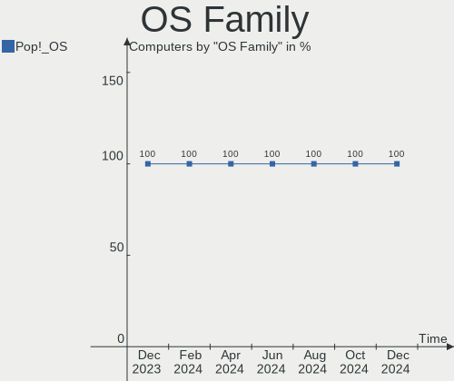

Pop!_OS - Hardware Trends
-------------------------

A project to identify most popular hardware characteristics and track their change
over time based on data collected by Linux users at https://Linux-Hardware.org.

Anyone can contribute to this report by the [hw-probe](https://github.com/linuxhw/hw-probe) tool:

    sudo -E hw-probe -all -upload

This is a report for all computer types. See also reports for [desktops](/Dist/Pop!_OS/Desktop/README.md) and [notebooks](/Dist/Pop!_OS/Notebook/README.md).

This report is for one last month. Overall report since the beginning of time: [TestCoverage](https://github.com/linuxhw/TestCoverage)

Period: Nov, 2022.

Contents
--------

* [ System ](#system)
  - [ OS                       ](#os)
  - [ OS Family                ](#os-family)
  - [ Kernel                   ](#kernel)
  - [ Kernel Family            ](#kernel-family)
  - [ Kernel Major Ver.        ](#kernel-major-ver)
  - [ Arch                     ](#arch)
  - [ DE                       ](#de)
  - [ Display Server           ](#display-server)
  - [ Display Manager          ](#display-manager)
  - [ OS Lang                  ](#os-lang)
  - [ Boot Mode                ](#boot-mode)
  - [ Filesystem               ](#filesystem)
  - [ Part. scheme             ](#part-scheme)
  - [ Dual Boot with Linux/BSD ](#dual-boot-with-linuxbsd)
  - [ Dual Boot (Win)          ](#dual-boot-win)

* [ Board ](#board)
  - [ Vendor                   ](#vendor)
  - [ Model                    ](#model)
  - [ Model Family             ](#model-family)
  - [ MFG Year                 ](#mfg-year)
  - [ Form Factor              ](#form-factor)
  - [ Secure Boot              ](#secure-boot)
  - [ Coreboot                 ](#coreboot)
  - [ RAM Size                 ](#ram-size)
  - [ RAM Used                 ](#ram-used)
  - [ Total Drives             ](#total-drives)
  - [ Has CD-ROM               ](#has-cd-rom)
  - [ Has Ethernet             ](#has-ethernet)
  - [ Has WiFi                 ](#has-wifi)
  - [ Has Bluetooth            ](#has-bluetooth)

* [ Location ](#location)
  - [ Country                  ](#country)
  - [ City                     ](#city)

* [ Drives ](#drives)
  - [ Drive Vendor             ](#drive-vendor)
  - [ Drive Model              ](#drive-model)
  - [ HDD Vendor               ](#hdd-vendor)
  - [ SSD Vendor               ](#ssd-vendor)
  - [ Drive Kind               ](#drive-kind)
  - [ Drive Connector          ](#drive-connector)
  - [ Drive Size               ](#drive-size)
  - [ Space Total              ](#space-total)
  - [ Space Used               ](#space-used)
  - [ Malfunc. Drives          ](#malfunc-drives)
  - [ Malfunc. Drive Vendor    ](#malfunc-drive-vendor)
  - [ Malfunc. HDD Vendor      ](#malfunc-hdd-vendor)
  - [ Malfunc. Drive Kind      ](#malfunc-drive-kind)
  - [ Failed Drives            ](#failed-drives)
  - [ Failed Drive Vendor      ](#failed-drive-vendor)
  - [ Drive Status             ](#drive-status)

* [ Storage controller ](#storage-controller)
  - [ Storage Vendor           ](#storage-vendor)
  - [ Storage Model            ](#storage-model)
  - [ Storage Kind             ](#storage-kind)

* [ Processor ](#processor)
  - [ CPU Vendor               ](#cpu-vendor)
  - [ CPU Model                ](#cpu-model)
  - [ CPU Model Family         ](#cpu-model-family)
  - [ CPU Cores                ](#cpu-cores)
  - [ CPU Sockets              ](#cpu-sockets)
  - [ CPU Threads              ](#cpu-threads)
  - [ CPU Op-Modes             ](#cpu-op-modes)
  - [ CPU Microcode            ](#cpu-microcode)
  - [ CPU Microarch            ](#cpu-microarch)

* [ Graphics ](#graphics)
  - [ GPU Vendor               ](#gpu-vendor)
  - [ GPU Model                ](#gpu-model)
  - [ GPU Combo                ](#gpu-combo)
  - [ GPU Driver               ](#gpu-driver)
  - [ GPU Memory               ](#gpu-memory)

* [ Monitor ](#monitor)
  - [ Monitor Vendor           ](#monitor-vendor)
  - [ Monitor Model            ](#monitor-model)
  - [ Monitor Resolution       ](#monitor-resolution)
  - [ Monitor Diagonal         ](#monitor-diagonal)
  - [ Monitor Width            ](#monitor-width)
  - [ Aspect Ratio             ](#aspect-ratio)
  - [ Monitor Area             ](#monitor-area)
  - [ Pixel Density            ](#pixel-density)
  - [ Multiple Monitors        ](#multiple-monitors)

* [ Network ](#network)
  - [ Net Controller Vendor    ](#net-controller-vendor)
  - [ Net Controller Model     ](#net-controller-model)
  - [ Wireless Vendor          ](#wireless-vendor)
  - [ Wireless Model           ](#wireless-model)
  - [ Ethernet Vendor          ](#ethernet-vendor)
  - [ Ethernet Model           ](#ethernet-model)
  - [ Net Controller Kind      ](#net-controller-kind)
  - [ Used Controller          ](#used-controller)
  - [ NICs                     ](#nics)
  - [ IPv6                     ](#ipv6)

* [ Bluetooth ](#bluetooth)
  - [ Bluetooth Vendor         ](#bluetooth-vendor)
  - [ Bluetooth Model          ](#bluetooth-model)

* [ Sound ](#sound)
  - [ Sound Vendor             ](#sound-vendor)
  - [ Sound Model              ](#sound-model)

* [ Memory ](#memory)
  - [ Memory Vendor            ](#memory-vendor)
  - [ Memory Model             ](#memory-model)
  - [ Memory Kind              ](#memory-kind)
  - [ Memory Form Factor       ](#memory-form-factor)
  - [ Memory Size              ](#memory-size)
  - [ Memory Speed             ](#memory-speed)

* [ Printers & scanners ](#printers--scanners)
  - [ Printer Vendor           ](#printer-vendor)
  - [ Printer Model            ](#printer-model)
  - [ Scanner Vendor           ](#scanner-vendor)
  - [ Scanner Model            ](#scanner-model)

* [ Camera ](#camera)
  - [ Camera Vendor            ](#camera-vendor)
  - [ Camera Model             ](#camera-model)

* [ Security ](#security)
  - [ Fingerprint Vendor       ](#fingerprint-vendor)
  - [ Fingerprint Model        ](#fingerprint-model)
  - [ Chipcard Vendor          ](#chipcard-vendor)
  - [ Chipcard Model           ](#chipcard-model)

* [ Unsupported ](#unsupported)
  - [ Unsupported Devices      ](#unsupported-devices)
  - [ Unsupported Device Types ](#unsupported-device-types)

System
------

OS
--

Installed operating systems

| Name          | Computers | Percent |
|---------------|-----------|---------|
| Pop!_OS 22.04 | 217       | 97.75%  |
| Pop!_OS 20.04 | 3         | 1.35%   |
| Pop!_OS 21.10 | 2         | 0.9%    |

OS Family
---------

OS without a version

| Name    | Computers | Percent |
|---------|-----------|---------|
| Pop!_OS | 222       | 100%    |

Kernel
------

Version of the Linux kernel

| Version                  | Computers | Percent |
|--------------------------|-----------|---------|
| 6.0.6-76060006-generic   | 120       | 54.05%  |
| 6.0.3-76060003-generic   | 38        | 17.12%  |
| 6.0.2-76060002-generic   | 34        | 15.32%  |
| 5.19.0-76051900-generic  | 9         | 4.05%   |
| 5.18.10-76051810-generic | 5         | 2.25%   |
| 5.17.5-76051705-generic  | 5         | 2.25%   |
| 5.19.16-76051916-generic | 3         | 1.35%   |
| 6.0.9-060009-generic     | 2         | 0.9%    |
| 6.0.9-x64v1-xanmod1      | 1         | 0.45%   |
| 6.0.8-x64v1-xanmod1      | 1         | 0.45%   |
| 6.0.7-x64v1-xanmod1      | 1         | 0.45%   |
| 6.0.6-060006-generic     | 1         | 0.45%   |
| 5.17.15-76051715-generic | 1         | 0.45%   |
| 5.15.5-76051505-generic  | 1         | 0.45%   |

Kernel Family
-------------

Linux kernel without a distro release

| Version | Computers | Percent |
|---------|-----------|---------|
| 6.0.6   | 121       | 54.5%   |
| 6.0.3   | 38        | 17.12%  |
| 6.0.2   | 34        | 15.32%  |
| 5.19.0  | 9         | 4.05%   |
| 5.18.10 | 5         | 2.25%   |
| 5.17.5  | 5         | 2.25%   |
| 6.0.9   | 3         | 1.35%   |
| 5.19.16 | 3         | 1.35%   |
| 6.0.8   | 1         | 0.45%   |
| 6.0.7   | 1         | 0.45%   |
| 5.17.15 | 1         | 0.45%   |
| 5.15.5  | 1         | 0.45%   |

Kernel Major Ver.
-----------------

Linux kernel major version

| Version | Computers | Percent |
|---------|-----------|---------|
| 6.0     | 198       | 89.19%  |
| 5.19    | 12        | 5.41%   |
| 5.17    | 6         | 2.7%    |
| 5.18    | 5         | 2.25%   |
| 5.15    | 1         | 0.45%   |

Arch
----

OS architecture (x86_64, i586, etc.)

| Name   | Computers | Percent |
|--------|-----------|---------|
| x86_64 | 222       | 100%    |

DE
--

Desktop Environment

| Name       | Computers | Percent |
|------------|-----------|---------|
| GNOME      | 216       | 97.3%   |
| X-Cinnamon | 3         | 1.35%   |
| KDE5       | 3         | 1.35%   |

Display Server
--------------

X11 or Wayland

| Name    | Computers | Percent |
|---------|-----------|---------|
| X11     | 208       | 93.69%  |
| Wayland | 13        | 5.86%   |
| Unknown | 1         | 0.45%   |

Display Manager
---------------

SDDM, LightDM, etc.

| Name    | Computers | Percent |
|---------|-----------|---------|
| Unknown | 162       | 72.97%  |
| GDM3    | 56        | 25.23%  |
| GDM     | 3         | 1.35%   |
| LightDM | 1         | 0.45%   |

OS Lang
-------

Language

| Lang    | Computers | Percent |
|---------|-----------|---------|
| en_US   | 132       | 59.46%  |
| en_GB   | 24        | 10.81%  |
| de_DE   | 14        | 6.31%   |
| pt_BR   | 9         | 4.05%   |
| it_IT   | 8         | 3.6%    |
| es_ES   | 5         | 2.25%   |
| en_CA   | 5         | 2.25%   |
| pl_PL   | 3         | 1.35%   |
| fr_FR   | 3         | 1.35%   |
| fi_FI   | 3         | 1.35%   |
| nb_NO   | 2         | 0.9%    |
| es_CL   | 2         | 0.9%    |
| en_AU   | 2         | 0.9%    |
| C       | 2         | 0.9%    |
| ru_RU   | 1         | 0.45%   |
| pt_PT   | 1         | 0.45%   |
| nl_NL   | 1         | 0.45%   |
| ja_JP   | 1         | 0.45%   |
| fr_CA   | 1         | 0.45%   |
| en_SG   | 1         | 0.45%   |
| en_IE   | 1         | 0.45%   |
| Unknown | 1         | 0.45%   |

Boot Mode
---------

EFI or BIOS

| Mode | Computers | Percent |
|------|-----------|---------|
| BIOS | 166       | 74.77%  |
| EFI  | 56        | 25.23%  |

Filesystem
----------

Type of filesystem

| Type    | Computers | Percent |
|---------|-----------|---------|
| Ext4    | 211       | 95.05%  |
| Btrfs   | 9         | 4.05%   |
| Overlay | 2         | 0.9%    |

Part. scheme
------------

Scheme of partitioning

| Type    | Computers | Percent |
|---------|-----------|---------|
| Unknown | 161       | 72.52%  |
| GPT     | 58        | 26.13%  |
| MBR     | 3         | 1.35%   |

Dual Boot with Linux/BSD
------------------------

Hosting more than one Linux/BSD

| Dual boot | Computers | Percent |
|-----------|-----------|---------|
| No        | 216       | 97.3%   |
| Yes       | 6         | 2.7%    |

Dual Boot (Win)
---------------

Hosting Linux and Windows

| Dual boot | Computers | Percent |
|-----------|-----------|---------|
| No        | 201       | 90.54%  |
| Yes       | 21        | 9.46%   |

Board
-----

Vendor
------

Motherboard manufacturer

| Name                | Computers | Percent |
|---------------------|-----------|---------|
| Lenovo              | 34        | 15.32%  |
| ASUSTek Computer    | 34        | 15.32%  |
| Hewlett-Packard     | 30        | 13.51%  |
| Dell                | 28        | 12.61%  |
| MSI                 | 21        | 9.46%   |
| Acer                | 13        | 5.86%   |
| Gigabyte Technology | 11        | 4.95%   |
| ASRock              | 8         | 3.6%    |
| Apple               | 8         | 3.6%    |
| System76            | 4         | 1.8%    |
| Toshiba             | 3         | 1.35%   |
| Samsung Electronics | 3         | 1.35%   |
| HUAWEI              | 3         | 1.35%   |
| Intel               | 2         | 0.9%    |
| Google              | 2         | 0.9%    |
| Wortmann AG         | 1         | 0.45%   |
| Valve               | 1         | 0.45%   |
| Timi                | 1         | 0.45%   |
| Razer x Lambda      | 1         | 0.45%   |
| Positivo            | 1         | 0.45%   |
| Pegatron            | 1         | 0.45%   |
| PC Specialist       | 1         | 0.45%   |
| OEGStone            | 1         | 0.45%   |
| Microsoft           | 1         | 0.45%   |
| GPU Company         | 1         | 0.45%   |
| Fujitsu             | 1         | 0.45%   |
| Foxconn             | 1         | 0.45%   |
| Colorful Technology | 1         | 0.45%   |
| Clevo               | 1         | 0.45%   |
| BESSTAR Tech        | 1         | 0.45%   |
| ATOPNUC             | 1         | 0.45%   |
| Alienware           | 1         | 0.45%   |
| Unknown             | 1         | 0.45%   |

Model
-----

Motherboard model

| Name                                                                                     | Computers | Percent |
|------------------------------------------------------------------------------------------|-----------|---------|
| MSI MS-7C52                                                                              | 2         | 0.9%    |
| HP Pavilion Aero Laptop 13-be0xxx                                                        | 2         | 0.9%    |
| ASUS ROG STRIX B550-F GAMING                                                             | 2         | 0.9%    |
| Acer Swift SF314-42                                                                      | 2         | 0.9%    |
| Acer Aspire A515-57                                                                      | 2         | 0.9%    |
| Wortmann AG TERRA_MOBILE_1542                                                            | 1         | 0.45%   |
| Valve Jupiter                                                                            | 1         | 0.45%   |
| Toshiba Satellite L775D                                                                  | 1         | 0.45%   |
| Toshiba Satellite L500                                                                   | 1         | 0.45%   |
| Toshiba Satellite L350                                                                   | 1         | 0.45%   |
| Timi TM1613                                                                              | 1         | 0.45%   |
| System76 Thelio                                                                          | 1         | 0.45%   |
| System76 Oryx Pro                                                                        | 1         | 0.45%   |
| System76 Lemur Pro                                                                       | 1         | 0.45%   |
| System76 Galago Pro                                                                      | 1         | 0.45%   |
| Samsung 500R4K/500R5H/5400RK/501R5H/5500RH/500R5S                                        | 1         | 0.45%   |
| Samsung 355V4C/355V4X/355V5C/355V5X/356V4C/356V4X/356V5C/356V5X/3445VC/3445VX/3545VC/354 | 1         | 0.45%   |
| Samsung 350V5C/351V5C/3540VC/3440VC                                                      | 1         | 0.45%   |
| Razer x Lambda TensorBook (late 2021)                                                    | 1         | 0.45%   |
| Positivo POS-EIH61CR                                                                     | 1         | 0.45%   |
| Pegatron 600-1352                                                                        | 1         | 0.45%   |
| PC Specialist Elimina Iv 15                                                              | 1         | 0.45%   |
| OEGStone NOTCHA-322                                                                      | 1         | 0.45%   |
| MSI p7-1235                                                                              | 1         | 0.45%   |
| MSI MS-7D31                                                                              | 1         | 0.45%   |
| MSI MS-7D18                                                                              | 1         | 0.45%   |
| MSI MS-7C92                                                                              | 1         | 0.45%   |
| MSI MS-7C56                                                                              | 1         | 0.45%   |
| MSI MS-7C35                                                                              | 1         | 0.45%   |
| MSI MS-7B84                                                                              | 1         | 0.45%   |
| MSI MS-7B51                                                                              | 1         | 0.45%   |
| MSI MS-7B09                                                                              | 1         | 0.45%   |
| MSI MS-7A38                                                                              | 1         | 0.45%   |
| MSI MS-7A34                                                                              | 1         | 0.45%   |
| MSI MS-7916                                                                              | 1         | 0.45%   |
| MSI MS-7788                                                                              | 1         | 0.45%   |
| MSI MS-1688                                                                              | 1         | 0.45%   |
| MSI Modern 14 B5M                                                                        | 1         | 0.45%   |
| MSI Modern 14 B11SB                                                                      | 1         | 0.45%   |
| MSI Katana GF76 11UG                                                                     | 1         | 0.45%   |

Model Family
------------

Motherboard model prefix

| Name               | Computers | Percent |
|--------------------|-----------|---------|
| Lenovo ThinkPad    | 14        | 6.31%   |
| Lenovo IdeaPad     | 9         | 4.05%   |
| Dell Inspiron      | 8         | 3.6%    |
| ASUS VivoBook      | 7         | 3.15%   |
| ASUS ROG           | 7         | 3.15%   |
| Acer Aspire        | 7         | 3.15%   |
| Dell Precision     | 6         | 2.7%    |
| HP ProBook         | 5         | 2.25%   |
| Dell Latitude      | 5         | 2.25%   |
| ASUS ASUS          | 5         | 2.25%   |
| Lenovo Yoga        | 4         | 1.8%    |
| HP ENVY            | 4         | 1.8%    |
| Toshiba Satellite  | 3         | 1.35%   |
| Lenovo ThinkBook   | 3         | 1.35%   |
| HP Pavilion        | 3         | 1.35%   |
| HP EliteBook       | 3         | 1.35%   |
| Dell XPS           | 3         | 1.35%   |
| ASUS TUF           | 3         | 1.35%   |
| Acer Swift         | 3         | 1.35%   |
| MSI MS-7C52        | 2         | 0.9%    |
| MSI Modern         | 2         | 0.9%    |
| Lenovo ThinkCentre | 2         | 0.9%    |
| Lenovo Legion      | 2         | 0.9%    |
| HP ZBook           | 2         | 0.9%    |
| HP Spectre         | 2         | 0.9%    |
| HP ProDesk         | 2         | 0.9%    |
| HP Laptop          | 2         | 0.9%    |
| Dell OptiPlex      | 2         | 0.9%    |
| ASUS ZenBook       | 2         | 0.9%    |
| Acer Nitro         | 2         | 0.9%    |
| Wortmann AG TERRA  | 1         | 0.45%   |
| Valve Jupiter      | 1         | 0.45%   |
| Timi TM1613        | 1         | 0.45%   |
| System76 Thelio    | 1         | 0.45%   |
| System76 Oryx      | 1         | 0.45%   |
| System76 Lemur     | 1         | 0.45%   |
| System76 Galago    | 1         | 0.45%   |
| Samsung 500R4K     | 1         | 0.45%   |
| Samsung 355V4C     | 1         | 0.45%   |
| Samsung 350V5C     | 1         | 0.45%   |

MFG Year
--------

Motherboard manufacture year

| Year | Computers | Percent |
|------|-----------|---------|
| 2021 | 35        | 15.77%  |
| 2020 | 35        | 15.77%  |
| 2022 | 26        | 11.71%  |
| 2019 | 20        | 9.01%   |
| 2012 | 17        | 7.66%   |
| 2018 | 14        | 6.31%   |
| 2016 | 14        | 6.31%   |
| 2015 | 14        | 6.31%   |
| 2013 | 12        | 5.41%   |
| 2010 | 10        | 4.5%    |
| 2017 | 8         | 3.6%    |
| 2011 | 5         | 2.25%   |
| 2014 | 4         | 1.8%    |
| 2008 | 4         | 1.8%    |
| 2009 | 3         | 1.35%   |
| 2007 | 1         | 0.45%   |

Form Factor
-----------

Physical design of the computer

| Name        | Computers | Percent |
|-------------|-----------|---------|
| Notebook    | 134       | 60.36%  |
| Desktop     | 71        | 31.98%  |
| Convertible | 13        | 5.86%   |
| Mini pc     | 2         | 0.9%    |
| Tablet      | 1         | 0.45%   |
| All in one  | 1         | 0.45%   |

Secure Boot
-----------

Enabled or disabled

| State    | Computers | Percent |
|----------|-----------|---------|
| Disabled | 222       | 100%    |

Coreboot
--------

Have coreboot on board

| Used | Computers | Percent |
|------|-----------|---------|
| No   | 217       | 97.75%  |
| Yes  | 5         | 2.25%   |

RAM Size
--------

Total RAM memory

| Size in GB      | Computers | Percent |
|-----------------|-----------|---------|
| 4.01-8.0        | 66        | 29.73%  |
| 16.01-24.0      | 61        | 27.48%  |
| 8.01-16.0       | 36        | 16.22%  |
| 32.01-64.0      | 27        | 12.16%  |
| 3.01-4.0        | 16        | 7.21%   |
| 64.01-256.0     | 9         | 4.05%   |
| 24.01-32.0      | 5         | 2.25%   |
| More than 256.0 | 1         | 0.45%   |
| 2.01-3.0        | 1         | 0.45%   |

RAM Used
--------

Used RAM memory

| Used GB    | Computers | Percent |
|------------|-----------|---------|
| 3.01-4.0   | 71        | 31.98%  |
| 2.01-3.0   | 59        | 26.58%  |
| 4.01-8.0   | 54        | 24.32%  |
| 1.01-2.0   | 21        | 9.46%   |
| 8.01-16.0  | 14        | 6.31%   |
| 16.01-24.0 | 2         | 0.9%    |
| 24.01-32.0 | 1         | 0.45%   |

Total Drives
------------

Number of drives on board

| Drives | Computers | Percent |
|--------|-----------|---------|
| 1      | 143       | 64.41%  |
| 2      | 48        | 21.62%  |
| 3      | 15        | 6.76%   |
| 4      | 10        | 4.5%    |
| 5      | 3         | 1.35%   |
| 10     | 1         | 0.45%   |
| 7      | 1         | 0.45%   |
| 0      | 1         | 0.45%   |

Has CD-ROM
----------

Has CD-ROM on board

| Presented | Computers | Percent |
|-----------|-----------|---------|
| No        | 176       | 79.28%  |
| Yes       | 46        | 20.72%  |

Has Ethernet
------------

Has Ethernet on board

| Presented | Computers | Percent |
|-----------|-----------|---------|
| Yes       | 174       | 78.38%  |
| No        | 48        | 21.62%  |

Has WiFi
--------

Has WiFi module

| Presented | Computers | Percent |
|-----------|-----------|---------|
| Yes       | 192       | 86.49%  |
| No        | 30        | 13.51%  |

Has Bluetooth
-------------

Has Bluetooth module

| Presented | Computers | Percent |
|-----------|-----------|---------|
| Yes       | 166       | 74.77%  |
| No        | 56        | 25.23%  |

Location
--------

Country
-------

Geographic location (country)

| Country      | Computers | Percent |
|--------------|-----------|---------|
| USA          | 59        | 26.58%  |
| UK           | 16        | 7.21%   |
| Italy        | 16        | 7.21%   |
| Germany      | 16        | 7.21%   |
| Brazil       | 15        | 6.76%   |
| Canada       | 8         | 3.6%    |
| India        | 7         | 3.15%   |
| Spain        | 6         | 2.7%    |
| France       | 6         | 2.7%    |
| Finland      | 6         | 2.7%    |
| Netherlands  | 5         | 2.25%   |
| Sweden       | 4         | 1.8%    |
| Poland       | 4         | 1.8%    |
| Indonesia    | 4         | 1.8%    |
| Greece       | 4         | 1.8%    |
| Russia       | 3         | 1.35%   |
| Portugal     | 3         | 1.35%   |
| Norway       | 3         | 1.35%   |
| Chile        | 3         | 1.35%   |
| Australia    | 3         | 1.35%   |
| Turkey       | 2         | 0.9%    |
| Switzerland  | 2         | 0.9%    |
| South Africa | 2         | 0.9%    |
| Singapore    | 2         | 0.9%    |
| Romania      | 2         | 0.9%    |
| Japan        | 2         | 0.9%    |
| Belgium      | 2         | 0.9%    |
| UAE          | 1         | 0.45%   |
| South Korea  | 1         | 0.45%   |
| Slovakia     | 1         | 0.45%   |
| Saudi Arabia | 1         | 0.45%   |
| Philippines  | 1         | 0.45%   |
| Pakistan     | 1         | 0.45%   |
| Malta        | 1         | 0.45%   |
| Malaysia     | 1         | 0.45%   |
| Luxembourg   | 1         | 0.45%   |
| Israel       | 1         | 0.45%   |
| Ireland      | 1         | 0.45%   |
| Hungary      | 1         | 0.45%   |
| Honduras     | 1         | 0.45%   |

City
----

Geographic location (city)

| City                | Computers | Percent |
|---------------------|-----------|---------|
| Helsinki            | 4         | 1.8%    |
| Berlin              | 4         | 1.8%    |
| Rome                | 3         | 1.35%   |
| Jakarta             | 3         | 1.35%   |
| Virginia Beach      | 2         | 0.9%    |
| Stuttgart           | 2         | 0.9%    |
| Spring Hill         | 2         | 0.9%    |
| Singapore           | 2         | 0.9%    |
| Sao Paulo           | 2         | 0.9%    |
| Salt Lake City      | 2         | 0.9%    |
| Palm Bay            | 2         | 0.9%    |
| Moscow              | 2         | 0.9%    |
| Milan               | 2         | 0.9%    |
| Meadville           | 2         | 0.9%    |
| Lincoln             | 2         | 0.9%    |
| Istanbul            | 2         | 0.9%    |
| Bologna             | 2         | 0.9%    |
| Bengaluru           | 2         | 0.9%    |
| Athens              | 2         | 0.9%    |
| Amsterdam           | 2         | 0.9%    |
| Zurich              | 1         | 0.45%   |
| Zejtun              | 1         | 0.45%   |
| Zanesville          | 1         | 0.45%   |
| York                | 1         | 0.45%   |
| Yongsan-gu          | 1         | 0.45%   |
| Yokohama            | 1         | 0.45%   |
| Wyalusing           | 1         | 0.45%   |
| Wilmington          | 1         | 0.45%   |
| Williamsburg        | 1         | 0.45%   |
| Whitby              | 1         | 0.45%   |
| Weston-super-Mare   | 1         | 0.45%   |
| West Hartford       | 1         | 0.45%   |
| Watertown           | 1         | 0.45%   |
| Washougal           | 1         | 0.45%   |
| Warsaw              | 1         | 0.45%   |
| Warner Robins       | 1         | 0.45%   |
| Villeurbanne        | 1         | 0.45%   |
| Veldhoven           | 1         | 0.45%   |
| Varzea Paulista     | 1         | 0.45%   |
| Valparaiso de Goias | 1         | 0.45%   |

Drives
------

Drive Vendor
------------

Hard drive vendors

| Vendor                      | Computers | Drives | Percent |
|-----------------------------|-----------|--------|---------|
| Samsung Electronics         | 59        | 67     | 17.99%  |
| WDC                         | 43        | 49     | 13.11%  |
| Sandisk                     | 32        | 33     | 9.76%   |
| Seagate                     | 24        | 28     | 7.32%   |
| Kingston                    | 17        | 18     | 5.18%   |
| Intel                       | 13        | 17     | 3.96%   |
| SK hynix                    | 12        | 12     | 3.66%   |
| Phison Electronics          | 12        | 14     | 3.66%   |
| Unknown                     | 11        | 15     | 3.35%   |
| Crucial                     | 11        | 12     | 3.35%   |
| Toshiba                     | 10        | 10     | 3.05%   |
| SPCC                        | 6         | 6      | 1.83%   |
| PNY                         | 6         | 6      | 1.83%   |
| Micron Technology           | 6         | 6      | 1.83%   |
| Apple                       | 5         | 5      | 1.52%   |
| Micron/Crucial Technology   | 4         | 4      | 1.22%   |
| A-DATA Technology           | 4         | 4      | 1.22%   |
| Kingston Technology Company | 3         | 3      | 0.91%   |
| China                       | 3         | 4      | 0.91%   |
| Silicon Motion              | 2         | 2      | 0.61%   |
| Phison                      | 2         | 2      | 0.61%   |
| Patriot                     | 2         | 2      | 0.61%   |
| OCZ                         | 2         | 2      | 0.61%   |
| Netac                       | 2         | 2      | 0.61%   |
| LITEONIT                    | 2         | 2      | 0.61%   |
| Lexar                       | 2         | 2      | 0.61%   |
| Hitachi                     | 2         | 2      | 0.61%   |
| HGST                        | 2         | 2      | 0.61%   |
| XPG                         | 1         | 2      | 0.3%    |
| W800S                       | 1         | 1      | 0.3%    |
| Verbatim                    | 1         | 1      | 0.3%    |
| V-GeN                       | 1         | 1      | 0.3%    |
| Union Memory (Shenzhen)     | 1         | 1      | 0.3%    |
| UMIS                        | 1         | 1      | 0.3%    |
| Team                        | 1         | 1      | 0.3%    |
| Solid State Storage         | 1         | 1      | 0.3%    |
| SCY                         | 1         | 1      | 0.3%    |
| Palit                       | 1         | 1      | 0.3%    |
| MaxDigital                  | 1         | 1      | 0.3%    |
| LITEON                      | 1         | 1      | 0.3%    |

Drive Model
-----------

Hard drive models

| Model                                                | Computers | Percent |
|------------------------------------------------------|-----------|---------|
| Samsung NVMe SSD Controller SM981/PM981/PM983 1TB    | 11        | 3.13%   |
| Samsung NVMe SSD Controller SM961/PM961/SM963 250GB  | 6         | 1.7%    |
| Phison E12 NVMe Controller 2TB                       | 5         | 1.42%   |
| Kingston SA400S37240G 240GB SSD                      | 5         | 1.42%   |
| Sandisk WD Black SN750 / PC SN730 NVMe SSD 1024GB    | 4         | 1.14%   |
| Samsung SSD 850 EVO 500GB                            | 4         | 1.14%   |
| Samsung NVMe SSD Controller PM9A1/PM9A3/980PRO 250GB | 4         | 1.14%   |
| Intel SSD 660P Series 512GB                          | 4         | 1.14%   |
| Seagate ST1000LM035-1RK172 1TB                       | 3         | 0.85%   |
| Sandisk WD Blue SN550 NVMe SSD 1TB                   | 3         | 0.85%   |
| Samsung SSD 980 500GB                                | 3         | 0.85%   |
| Phison PS5013 E13 NVMe Controller 256GB              | 3         | 0.85%   |
| Phison E16 PCIe4 NVMe Controller 1TB                 | 3         | 0.85%   |
| Crucial CT250MX500SSD1 250GB                         | 3         | 0.85%   |
| WDC WDS500G2B0B-00YS70 500GB SSD                     | 2         | 0.57%   |
| WDC WDS240G2G0A-00JH30 240GB SSD                     | 2         | 0.57%   |
| WDC WDS100T2B0A-00SM50 1TB SSD                       | 2         | 0.57%   |
| WDC WD10EZEX-21WN4A0 1TB                             | 2         | 0.57%   |
| WDC WD10EZEX-08WN4A0 1TB                             | 2         | 0.57%   |
| WDC WD10EARX-00N0YB0 1TB                             | 2         | 0.57%   |
| Unknown NVMe SSD Drive 1TB                           | 2         | 0.57%   |
| Unknown MMC Card  64GB                               | 2         | 0.57%   |
| Unknown MMC Card  32GB                               | 2         | 0.57%   |
| SPCC Solid State Disk 512GB                          | 2         | 0.57%   |
| SK hynix PC801 NVMe 1TB                              | 2         | 0.57%   |
| SK hynix HFM512GD3JX016N 512GB                       | 2         | 0.57%   |
| SK hynix BC501 NVMe Solid State Drive 512GB          | 2         | 0.57%   |
| Seagate ST1000DM010-2EP102 1TB                       | 2         | 0.57%   |
| Sandisk WD Blue SN570 500GB                          | 2         | 0.57%   |
| Sandisk WD Blue SN500 / PC SN520 NVMe SSD 512GB      | 2         | 0.57%   |
| SanDisk SSD PLUS 120GB                               | 2         | 0.57%   |
| Samsung SSD 980 1TB                                  | 2         | 0.57%   |
| Samsung SSD 970 EVO Plus 2TB                         | 2         | 0.57%   |
| Samsung SSD 970 EVO Plus 1TB                         | 2         | 0.57%   |
| Samsung SSD 870 EVO 250GB                            | 2         | 0.57%   |
| Samsung NVMe SSD Controller SM951/PM951 256GB        | 2         | 0.57%   |
| Samsung MZALQ256HAJD-000L2 256GB                     | 2         | 0.57%   |
| Micron/Crucial P2 NVMe PCIe SSD 250GB                | 2         | 0.57%   |
| Lexar Disk 500GB                                     | 2         | 0.57%   |
| Kingston Company SNV2S250G 250GB                     | 2         | 0.57%   |

HDD Vendor
----------

Hard disk drive vendors

| Vendor              | Computers | Drives | Percent |
|---------------------|-----------|--------|---------|
| WDC                 | 30        | 35     | 46.15%  |
| Seagate             | 23        | 27     | 35.38%  |
| Toshiba             | 5         | 5      | 7.69%   |
| Hitachi             | 2         | 2      | 3.08%   |
| HGST                | 2         | 2      | 3.08%   |
| Unknown             | 1         | 1      | 1.54%   |
| Samsung Electronics | 1         | 1      | 1.54%   |
| ASMT                | 1         | 1      | 1.54%   |

SSD Vendor
----------

Solid state drive vendors

| Vendor              | Computers | Drives | Percent |
|---------------------|-----------|--------|---------|
| Samsung Electronics | 16        | 18     | 15.53%  |
| Kingston            | 13        | 14     | 12.62%  |
| Crucial             | 10        | 11     | 9.71%   |
| WDC                 | 9         | 9      | 8.74%   |
| SanDisk             | 9         | 9      | 8.74%   |
| PNY                 | 5         | 5      | 4.85%   |
| Apple               | 5         | 5      | 4.85%   |
| SPCC                | 3         | 3      | 2.91%   |
| China               | 3         | 4      | 2.91%   |
| A-DATA Technology   | 3         | 3      | 2.91%   |
| Patriot             | 2         | 2      | 1.94%   |
| OCZ                 | 2         | 2      | 1.94%   |
| Netac               | 2         | 2      | 1.94%   |
| LITEONIT            | 2         | 2      | 1.94%   |
| Intel               | 2         | 2      | 1.94%   |
| Verbatim            | 1         | 1      | 0.97%   |
| Toshiba             | 1         | 1      | 0.97%   |
| Team                | 1         | 1      | 0.97%   |
| SK hynix            | 1         | 1      | 0.97%   |
| Palit               | 1         | 1      | 0.97%   |
| Micron Technology   | 1         | 1      | 0.97%   |
| LITEON              | 1         | 1      | 0.97%   |
| KingSpec            | 1         | 1      | 0.97%   |
| KingDian            | 1         | 1      | 0.97%   |
| JMicron Technology  | 1         | 1      | 0.97%   |
| Intenso             | 1         | 1      | 0.97%   |
| GOODRAM             | 1         | 1      | 0.97%   |
| Emtec               | 1         | 1      | 0.97%   |
| Corsair             | 1         | 1      | 0.97%   |
| BAITITON            | 1         | 1      | 0.97%   |
| AMD                 | 1         | 1      | 0.97%   |
| Unknown             | 1         | 1      | 0.97%   |

Drive Kind
----------

HDD or SSD

| Kind    | Computers | Drives | Percent |
|---------|-----------|--------|---------|
| NVMe    | 129       | 159    | 44.64%  |
| SSD     | 87        | 108    | 30.1%   |
| HDD     | 55        | 74     | 19.03%  |
| Unknown | 11        | 12     | 3.81%   |
| MMC     | 7         | 9      | 2.42%   |

Drive Connector
---------------

SATA, SAS, NVMe, etc.

| Type | Computers | Drives | Percent |
|------|-----------|--------|---------|
| NVMe | 129       | 159    | 47.96%  |
| SATA | 118       | 177    | 43.87%  |
| SAS  | 15        | 17     | 5.58%   |
| MMC  | 7         | 9      | 2.6%    |

Drive Size
----------

Size of hard drive

| Size in TB | Computers | Drives | Percent |
|------------|-----------|--------|---------|
| 0.01-0.5   | 84        | 113    | 60%     |
| 0.51-1.0   | 42        | 50     | 30%     |
| 1.01-2.0   | 8         | 9      | 5.71%   |
| 3.01-4.0   | 2         | 3      | 1.43%   |
| 2.01-3.0   | 2         | 2      | 1.43%   |
| 4.01-10.0  | 2         | 5      | 1.43%   |

Space Total
-----------

Amount of disk space available on the file system

| Size in GB     | Computers | Percent |
|----------------|-----------|---------|
| 101-250        | 67        | 30.18%  |
| 251-500        | 56        | 25.23%  |
| 501-1000       | 49        | 22.07%  |
| 1001-2000      | 22        | 9.91%   |
| More than 3000 | 9         | 4.05%   |
| 51-100         | 7         | 3.15%   |
| 21-50          | 5         | 2.25%   |
| 2001-3000      | 5         | 2.25%   |
| 1-20           | 2         | 0.9%    |

Space Used
----------

Amount of used disk space

| Used GB        | Computers | Percent |
|----------------|-----------|---------|
| 1-20           | 59        | 26.58%  |
| 21-50          | 46        | 20.72%  |
| 101-250        | 45        | 20.27%  |
| 251-500        | 30        | 13.51%  |
| 51-100         | 19        | 8.56%   |
| 501-1000       | 12        | 5.41%   |
| More than 3000 | 5         | 2.25%   |
| 1001-2000      | 5         | 2.25%   |
| 2001-3000      | 1         | 0.45%   |

Malfunc. Drives
---------------

Drive models with a malfunction

| Model                                       | Computers | Drives | Percent |
|---------------------------------------------|-----------|--------|---------|
| WDC WD20EFRX-68AX9N0 2TB                    | 1         | 1      | 25%     |
| SK hynix BC501 NVMe Solid State Drive 512GB | 1         | 1      | 25%     |
| Seagate ST1000LM024 HN-M101MBB 1TB          | 1         | 1      | 25%     |
| Intel SSDSCKKF240H6L 240GB                  | 1         | 1      | 25%     |

Malfunc. Drive Vendor
---------------------

Vendors of faulty drives

| Vendor   | Computers | Drives | Percent |
|----------|-----------|--------|---------|
| WDC      | 1         | 1      | 25%     |
| SK hynix | 1         | 1      | 25%     |
| Seagate  | 1         | 1      | 25%     |
| Intel    | 1         | 1      | 25%     |

Malfunc. HDD Vendor
-------------------

Vendors of faulty HDD drives

| Vendor  | Computers | Drives | Percent |
|---------|-----------|--------|---------|
| WDC     | 1         | 1      | 50%     |
| Seagate | 1         | 1      | 50%     |

Malfunc. Drive Kind
-------------------

Kinds of faulty drives

| Kind | Computers | Drives | Percent |
|------|-----------|--------|---------|
| HDD  | 2         | 2      | 50%     |
| NVMe | 1         | 1      | 25%     |
| SSD  | 1         | 1      | 25%     |

Failed Drives
-------------

Failed drive models

Zero info for selected period =(

Failed Drive Vendor
-------------------

Failed drive vendors

Zero info for selected period =(

Drive Status
------------

Number of failed and malfunc. drives

| Status   | Computers | Drives | Percent |
|----------|-----------|--------|---------|
| Detected | 171       | 279    | 73.39%  |
| Works    | 58        | 79     | 24.89%  |
| Malfunc  | 4         | 4      | 1.72%   |

Storage controller
------------------

Storage Vendor
--------------

Storage controller vendors

| Vendor                         | Computers | Percent |
|--------------------------------|-----------|---------|
| Intel                          | 122       | 38.01%  |
| AMD                            | 50        | 15.58%  |
| Samsung Electronics            | 49        | 15.26%  |
| SanDisk                        | 27        | 8.41%   |
| Phison Electronics             | 17        | 5.3%    |
| SK hynix                       | 11        | 3.43%   |
| Kingston Technology Company    | 7         | 2.18%   |
| Micron/Crucial Technology      | 5         | 1.56%   |
| Micron Technology              | 5         | 1.56%   |
| ASMedia Technology             | 5         | 1.56%   |
| Toshiba America Info Systems   | 3         | 0.93%   |
| Nvidia                         | 3         | 0.93%   |
| Marvell Technology Group       | 3         | 0.93%   |
| Union Memory (Shenzhen)        | 2         | 0.62%   |
| Solid State Storage Technology | 2         | 0.62%   |
| Silicon Motion                 | 2         | 0.62%   |
| KIOXIA                         | 2         | 0.62%   |
| INNOGRIT                       | 2         | 0.62%   |
| ADATA Technology               | 2         | 0.62%   |
| LSI Logic / Symbios Logic      | 1         | 0.31%   |
| Lite-On Technology             | 1         | 0.31%   |

Storage Model
-------------

Storage controller models

| Model                                                                          | Computers | Percent |
|--------------------------------------------------------------------------------|-----------|---------|
| AMD FCH SATA Controller [AHCI mode]                                            | 33        | 9.3%    |
| Samsung NVMe SSD Controller SM981/PM981/PM983                                  | 16        | 4.51%   |
| Samsung NVMe SSD Controller 980                                                | 14        | 3.94%   |
| Intel Volume Management Device NVMe RAID Controller                            | 14        | 3.94%   |
| AMD 500 Series Chipset SATA Controller                                         | 12        | 3.38%   |
| Intel 82801 Mobile SATA Controller [RAID mode]                                 | 11        | 3.1%    |
| SanDisk Non-Volatile memory controller                                         | 9         | 2.54%   |
| Phison E12 NVMe Controller                                                     | 9         | 2.54%   |
| Intel Sunrise Point-LP SATA Controller [AHCI mode]                             | 9         | 2.54%   |
| Samsung NVMe SSD Controller SM961/PM961/SM963                                  | 7         | 1.97%   |
| Intel 7 Series Chipset Family 6-port SATA Controller [AHCI mode]               | 7         | 1.97%   |
| Intel 6 Series/C200 Series Chipset Family 6 port Desktop SATA AHCI Controller  | 7         | 1.97%   |
| Intel Q170/Q150/B150/H170/H110/Z170/CM236 Chipset SATA Controller [AHCI Mode]  | 6         | 1.69%   |
| AMD 400 Series Chipset SATA Controller                                         | 6         | 1.69%   |
| SanDisk WD Blue SN550 NVMe SSD                                                 | 5         | 1.41%   |
| SanDisk WD Black SN750 / PC SN730 NVMe SSD                                     | 5         | 1.41%   |
| Samsung NVMe SSD Controller PM9A1/PM9A3/980PRO                                 | 5         | 1.41%   |
| Micron Non-Volatile memory controller                                          | 5         | 1.41%   |
| Intel SSD 660P Series                                                          | 5         | 1.41%   |
| Intel Non-Volatile memory controller                                           | 5         | 1.41%   |
| Intel Cannon Lake Mobile PCH SATA AHCI Controller                              | 5         | 1.41%   |
| Intel 8 Series/C220 Series Chipset Family 6-port SATA Controller 1 [AHCI mode] | 5         | 1.41%   |
| Intel 400 Series Chipset Family SATA AHCI Controller                           | 5         | 1.41%   |
| ASMedia ASM1062 Serial ATA Controller                                          | 5         | 1.41%   |
| SK hynix Gold P31/PC711 NVMe Solid State Drive                                 | 4         | 1.13%   |
| SanDisk WD Blue SN570 NVMe SSD                                                 | 4         | 1.13%   |
| Phison PS5013 E13 NVMe Controller                                              | 4         | 1.13%   |
| Phison E16 PCIe4 NVMe Controller                                               | 4         | 1.13%   |
| Kingston Company Company Non-Volatile memory controller                        | 4         | 1.13%   |
| Intel 5 Series/3400 Series Chipset 4 port SATA AHCI Controller                 | 4         | 1.13%   |
| Samsung NVMe SSD Controller SM951/PM951                                        | 3         | 0.85%   |
| Intel Wildcat Point-LP SATA Controller [AHCI Mode]                             | 3         | 0.85%   |
| Intel Celeron/Pentium Silver Processor SATA Controller                         | 3         | 0.85%   |
| Intel Cannon Lake PCH SATA AHCI Controller                                     | 3         | 0.85%   |
| Intel Alder Lake-P SATA AHCI Controller                                        | 3         | 0.85%   |
| Intel 8 Series SATA Controller 1 [AHCI mode]                                   | 3         | 0.85%   |
| Intel 5 Series/3400 Series Chipset 6 port SATA AHCI Controller                 | 3         | 0.85%   |
| AMD SB7x0/SB8x0/SB9x0 SATA Controller [AHCI mode]                              | 3         | 0.85%   |
| Solid State Storage Non-Volatile memory controller                             | 2         | 0.56%   |
| SK hynix Non-Volatile memory controller                                        | 2         | 0.56%   |

Storage Kind
------------

Kind of storage controller (IDE, SATA, NVMe, SAS, ...)

| Kind | Computers | Percent |
|------|-----------|---------|
| SATA | 148       | 46.84%  |
| NVMe | 128       | 40.51%  |
| RAID | 28        | 8.86%   |
| IDE  | 12        | 3.8%    |

Processor
---------

CPU Vendor
----------

Processor vendors

| Vendor | Computers | Percent |
|--------|-----------|---------|
| Intel  | 149       | 67.12%  |
| AMD    | 73        | 32.88%  |

CPU Model
---------

Processor models

| Model                                         | Computers | Percent |
|-----------------------------------------------|-----------|---------|
| Intel 11th Gen Core i5-1135G7 @ 2.40GHz       | 6         | 2.7%    |
| AMD Ryzen 5 5500U with Radeon Graphics        | 6         | 2.7%    |
| Intel Core i5-8265U CPU @ 1.60GHz             | 4         | 1.8%    |
| Intel 12th Gen Core i5-1235U                  | 4         | 1.8%    |
| Intel 11th Gen Core i7-1165G7 @ 2.80GHz       | 4         | 1.8%    |
| AMD Ryzen 5 5600X 6-Core Processor            | 4         | 1.8%    |
| Intel Core i7-8750H CPU @ 2.20GHz             | 3         | 1.35%   |
| Intel Core i7-8565U CPU @ 1.80GHz             | 3         | 1.35%   |
| Intel Core i7-8550U CPU @ 1.80GHz             | 3         | 1.35%   |
| Intel Core i5-8250U CPU @ 1.60GHz             | 3         | 1.35%   |
| Intel Core i5-6300U CPU @ 2.40GHz             | 3         | 1.35%   |
| AMD Ryzen 7 5800H with Radeon Graphics        | 3         | 1.35%   |
| AMD Ryzen 5 3500U with Radeon Vega Mobile Gfx | 3         | 1.35%   |
| Intel Core i7-9750H CPU @ 2.60GHz             | 2         | 0.9%    |
| Intel Core i7-8700K CPU @ 3.70GHz             | 2         | 0.9%    |
| Intel Core i7-6600U CPU @ 2.60GHz             | 2         | 0.9%    |
| Intel Core i7-4790 CPU @ 3.60GHz              | 2         | 0.9%    |
| Intel Core i7-4700MQ CPU @ 2.40GHz            | 2         | 0.9%    |
| Intel Core i7-3630QM CPU @ 2.40GHz            | 2         | 0.9%    |
| Intel Core i7-2600 CPU @ 3.40GHz              | 2         | 0.9%    |
| Intel Core i5-6500 CPU @ 3.20GHz              | 2         | 0.9%    |
| Intel Core i5-6200U CPU @ 2.30GHz             | 2         | 0.9%    |
| Intel Core i5-2400 CPU @ 3.10GHz              | 2         | 0.9%    |
| Intel Core i5-1035G1 CPU @ 1.00GHz            | 2         | 0.9%    |
| Intel Core i5-10300H CPU @ 2.50GHz            | 2         | 0.9%    |
| Intel Core i5-10210U CPU @ 1.60GHz            | 2         | 0.9%    |
| Intel Core i3-4005U CPU @ 1.70GHz             | 2         | 0.9%    |
| Intel 12th Gen Core i9-12900H                 | 2         | 0.9%    |
| Intel 12th Gen Core i7-12700H                 | 2         | 0.9%    |
| Intel 12th Gen Core i5-12500H                 | 2         | 0.9%    |
| Intel 11th Gen Core i7-11800H @ 2.30GHz       | 2         | 0.9%    |
| AMD Ryzen 9 5950X 16-Core Processor           | 2         | 0.9%    |
| AMD Ryzen 9 5900X 12-Core Processor           | 2         | 0.9%    |
| AMD Ryzen 7 6800H with Radeon Graphics        | 2         | 0.9%    |
| AMD Ryzen 7 5700U with Radeon Graphics        | 2         | 0.9%    |
| AMD Ryzen 7 4800H with Radeon Graphics        | 2         | 0.9%    |
| AMD Ryzen 7 3700X 8-Core Processor            | 2         | 0.9%    |
| AMD Ryzen 5 5600U with Radeon Graphics        | 2         | 0.9%    |
| AMD Ryzen 5 3600X 6-Core Processor            | 2         | 0.9%    |
| AMD Ryzen 5 3600 6-Core Processor             | 2         | 0.9%    |

CPU Model Family
----------------

Processor model prefix

| Model                   | Computers | Percent |
|-------------------------|-----------|---------|
| Intel Core i5           | 47        | 21.17%  |
| Intel Core i7           | 45        | 20.27%  |
| Other                   | 33        | 14.86%  |
| AMD Ryzen 5             | 29        | 13.06%  |
| AMD Ryzen 7             | 19        | 8.56%   |
| Intel Celeron           | 7         | 3.15%   |
| AMD Ryzen 9             | 6         | 2.7%    |
| Intel Core i3           | 5         | 2.25%   |
| Intel Core 2 Duo        | 5         | 2.25%   |
| Intel Xeon              | 4         | 1.8%    |
| AMD Ryzen Threadripper  | 3         | 1.35%   |
| AMD Ryzen 3 PRO         | 3         | 1.35%   |
| AMD FX                  | 3         | 1.35%   |
| Intel Pentium           | 2         | 0.9%    |
| AMD Ryzen 3             | 2         | 0.9%    |
| AMD A8                  | 2         | 0.9%    |
| Intel Pentium Dual-Core | 1         | 0.45%   |
| Intel Core 2 Quad       | 1         | 0.45%   |
| Intel Core 2            | 1         | 0.45%   |
| AMD Turion 64 X2 Mobile | 1         | 0.45%   |
| AMD Ryzen 5 PRO         | 1         | 0.45%   |
| AMD Phenom II X6        | 1         | 0.45%   |
| AMD A4                  | 1         | 0.45%   |

CPU Cores
---------

Number of processor cores

| Number | Computers | Percent |
|--------|-----------|---------|
| 4      | 84        | 37.84%  |
| 2      | 51        | 22.97%  |
| 6      | 40        | 18.02%  |
| 8      | 23        | 10.36%  |
| 12     | 7         | 3.15%   |
| 10     | 6         | 2.7%    |
| 16     | 4         | 1.8%    |
| 14     | 4         | 1.8%    |
| 64     | 1         | 0.45%   |
| 24     | 1         | 0.45%   |
| 3      | 1         | 0.45%   |

CPU Sockets
-----------

Number of sockets

| Number | Computers | Percent |
|--------|-----------|---------|
| 1      | 222       | 100%    |

CPU Threads
-----------

Threads per core (Hyper-Threading)

| Number | Computers | Percent |
|--------|-----------|---------|
| 2      | 182       | 81.98%  |
| 1      | 40        | 18.02%  |

CPU Op-Modes
------------

CPU Operation Modes (32-bit, 64-bit)

| Op mode        | Computers | Percent |
|----------------|-----------|---------|
| 32-bit, 64-bit | 222       | 100%    |

CPU Microcode
-------------

Microcode number

| Number     | Computers | Percent |
|------------|-----------|---------|
| Unknown    | 160       | 72.07%  |
| 0x806c1    | 5         | 2.25%   |
| 0x0a50000c | 5         | 2.25%   |
| 0x906a4    | 4         | 1.8%    |
| 0x306a9    | 4         | 1.8%    |
| 0x906ea    | 3         | 1.35%   |
| 0x806ec    | 3         | 1.35%   |
| 0x806d1    | 3         | 1.35%   |
| 0x08701021 | 3         | 1.35%   |
| 0x08608103 | 3         | 1.35%   |
| 0xa0652    | 2         | 0.9%    |
| 0x906a3    | 2         | 0.9%    |
| 0x506e3    | 2         | 0.9%    |
| 0x406e3    | 2         | 0.9%    |
| 0x40651    | 2         | 0.9%    |
| 0x0a404101 | 2         | 0.9%    |
| 0x08600104 | 2         | 0.9%    |
| 0x08108109 | 2         | 0.9%    |
| 0x90672    | 1         | 0.45%   |
| 0x806ea    | 1         | 0.45%   |
| 0x806e9    | 1         | 0.45%   |
| 0x706a1    | 1         | 0.45%   |
| 0x306d4    | 1         | 0.45%   |
| 0x306c3    | 1         | 0.45%   |
| 0x206a7    | 1         | 0.45%   |
| 0x1067a    | 1         | 0.45%   |
| 0x0a50000d | 1         | 0.45%   |
| 0x0a20120a | 1         | 0.45%   |
| 0x0a201205 | 1         | 0.45%   |
| 0x08608102 | 1         | 0.45%   |
| 0x08600106 | 1         | 0.45%   |

CPU Microarch
-------------

Microarchitecture

| Name             | Computers | Percent |
|------------------|-----------|---------|
| KabyLake         | 29        | 13.06%  |
| Unknown          | 24        | 10.81%  |
| Zen 3            | 21        | 9.46%   |
| Zen 2            | 18        | 8.11%   |
| Haswell          | 15        | 6.76%   |
| Skylake          | 14        | 6.31%   |
| TigerLake        | 13        | 5.86%   |
| IvyBridge        | 12        | 5.41%   |
| SandyBridge      | 10        | 4.5%    |
| Zen+             | 7         | 3.15%   |
| Broadwell        | 7         | 3.15%   |
| Alderlake Hybrid | 7         | 3.15%   |
| Westmere         | 6         | 2.7%    |
| Penryn           | 6         | 2.7%    |
| CometLake        | 6         | 2.7%    |
| Piledriver       | 5         | 2.25%   |
| IceLake          | 5         | 2.25%   |
| Zen              | 4         | 1.8%    |
| Silvermont       | 3         | 1.35%   |
| Goldmont plus    | 3         | 1.35%   |
| Core             | 2         | 0.9%    |
| Nehalem          | 1         | 0.45%   |
| K8 Hammer        | 1         | 0.45%   |
| K10 Llano        | 1         | 0.45%   |
| K10              | 1         | 0.45%   |
| Excavator        | 1         | 0.45%   |

Graphics
--------

GPU Vendor
----------

Vendors of graphics cards

| Vendor | Computers | Percent |
|--------|-----------|---------|
| Intel  | 124       | 45.26%  |
| Nvidia | 83        | 30.29%  |
| AMD    | 67        | 24.45%  |

GPU Model
---------

Graphics card models

| Model                                                                       | Computers | Percent |
|-----------------------------------------------------------------------------|-----------|---------|
| Intel TigerLake-LP GT2 [Iris Xe Graphics]                                   | 12        | 4.32%   |
| AMD Cezanne [Radeon Vega Series / Radeon Vega Mobile Series]                | 10        | 3.6%    |
| Intel Skylake GT2 [HD Graphics 520]                                         | 8         | 2.88%   |
| Intel 3rd Gen Core processor Graphics Controller                            | 8         | 2.88%   |
| AMD Renoir                                                                  | 8         | 2.88%   |
| AMD Lucienne                                                                | 8         | 2.88%   |
| Intel WhiskeyLake-U GT2 [UHD Graphics 620]                                  | 7         | 2.52%   |
| Intel Alder Lake-P Integrated Graphics Controller                           | 7         | 2.52%   |
| Intel UHD Graphics 620                                                      | 6         | 2.16%   |
| Intel Core Processor Integrated Graphics Controller                         | 6         | 2.16%   |
| AMD Picasso/Raven 2 [Radeon Vega Series / Radeon Vega Mobile Series]        | 6         | 2.16%   |
| Intel HD Graphics 530                                                       | 5         | 1.8%    |
| Intel CometLake-H GT2 [UHD Graphics]                                        | 5         | 1.8%    |
| Intel CoffeeLake-H GT2 [UHD Graphics 630]                                   | 5         | 1.8%    |
| Intel Alder Lake-UP3 GT2 [Iris Xe Graphics]                                 | 5         | 1.8%    |
| Intel 2nd Generation Core Processor Family Integrated Graphics Controller   | 5         | 1.8%    |
| Nvidia TU117M [GeForce GTX 1650 Mobile / Max-Q]                             | 4         | 1.44%   |
| Nvidia GA107M [GeForce RTX 3050 Ti Mobile]                                  | 4         | 1.44%   |
| Nvidia GA106M [GeForce RTX 3060 Mobile / Max-Q]                             | 4         | 1.44%   |
| Intel HD Graphics 5500                                                      | 4         | 1.44%   |
| Intel Haswell-ULT Integrated Graphics Controller                            | 4         | 1.44%   |
| Nvidia TU117 [GeForce GTX 1650]                                             | 3         | 1.08%   |
| Nvidia GM108M [GeForce 940M]                                                | 3         | 1.08%   |
| Nvidia GF108 [GeForce GT 730]                                               | 3         | 1.08%   |
| Intel Xeon E3-1200 v3/4th Gen Core Processor Integrated Graphics Controller | 3         | 1.08%   |
| Intel GeminiLake [UHD Graphics 600]                                         | 3         | 1.08%   |
| Intel CometLake-U GT2 [UHD Graphics]                                        | 3         | 1.08%   |
| Intel 4th Gen Core Processor Integrated Graphics Controller                 | 3         | 1.08%   |
| AMD Rembrandt [Radeon 680M]                                                 | 3         | 1.08%   |
| AMD Navi 23 [Radeon RX 6600/6600 XT/6600M]                                  | 3         | 1.08%   |
| AMD Navi 10 [Radeon RX 5600 OEM/5600 XT / 5700/5700 XT]                     | 3         | 1.08%   |
| AMD Ellesmere [Radeon RX 470/480/570/570X/580/580X/590]                     | 3         | 1.08%   |
| Nvidia TU117M [GeForce MX450]                                               | 2         | 0.72%   |
| Nvidia TU116 [GeForce GTX 1660 Ti]                                          | 2         | 0.72%   |
| Nvidia TU116 [GeForce GTX 1660 SUPER]                                       | 2         | 0.72%   |
| Nvidia GP108M [GeForce MX250]                                               | 2         | 0.72%   |
| Nvidia GP107 [GeForce GTX 1050 Ti]                                          | 2         | 0.72%   |
| Nvidia GP104 [GeForce GTX 1080]                                             | 2         | 0.72%   |
| Nvidia GM108M [GeForce 940MX]                                               | 2         | 0.72%   |
| Nvidia GA107M [GeForce RTX 3050 Mobile]                                     | 2         | 0.72%   |

GPU Combo
---------

Combinations of graphics cards

| Name               | Computers | Percent |
|--------------------|-----------|---------|
| 1 x Intel          | 83        | 37.39%  |
| 1 x AMD            | 49        | 22.07%  |
| 1 x Nvidia         | 38        | 17.12%  |
| Intel + Nvidia     | 33        | 14.86%  |
| AMD + Nvidia       | 10        | 4.5%    |
| Intel + AMD        | 6         | 2.7%    |
| 2 x AMD            | 2         | 0.9%    |
| Intel + 2 x Nvidia | 1         | 0.45%   |

GPU Driver
----------

Free vs proprietary

| Driver      | Computers | Percent |
|-------------|-----------|---------|
| Free        | 152       | 68.47%  |
| Proprietary | 62        | 27.93%  |
| Unknown     | 8         | 3.6%    |

GPU Memory
----------

Total video memory

| Size in GB | Computers | Percent |
|------------|-----------|---------|
| Unknown    | 188       | 84.68%  |
| 0.01-0.5   | 10        | 4.5%    |
| 1.01-2.0   | 8         | 3.6%    |
| 5.01-6.0   | 5         | 2.25%   |
| 3.01-4.0   | 5         | 2.25%   |
| 7.01-8.0   | 2         | 0.9%    |
| 8.01-16.0  | 2         | 0.9%    |
| 0.51-1.0   | 2         | 0.9%    |

Monitor
-------

Monitor Vendor
--------------

Monitor vendors

| Vendor               | Computers | Percent |
|----------------------|-----------|---------|
| AU Optronics         | 34        | 13.08%  |
| Samsung Electronics  | 33        | 12.69%  |
| BOE                  | 28        | 10.77%  |
| Chimei Innolux       | 27        | 10.38%  |
| Goldstar             | 19        | 7.31%   |
| LG Display           | 18        | 6.92%   |
| Dell                 | 11        | 4.23%   |
| Acer                 | 10        | 3.85%   |
| Apple                | 8         | 3.08%   |
| Hewlett-Packard      | 7         | 2.69%   |
| Sharp                | 5         | 1.92%   |
| BenQ                 | 5         | 1.92%   |
| ASUSTek Computer     | 5         | 1.92%   |
| Philips              | 4         | 1.54%   |
| Ancor Communications | 4         | 1.54%   |
| PANDA                | 3         | 1.15%   |
| Lenovo               | 3         | 1.15%   |
| CSO                  | 3         | 1.15%   |
| AOC                  | 3         | 1.15%   |
| ViewSonic            | 2         | 0.77%   |
| Sony                 | 2         | 0.77%   |
| Pioneer              | 2         | 0.77%   |
| Panasonic            | 2         | 0.77%   |
| MSI                  | 2         | 0.77%   |
| InfoVision           | 2         | 0.77%   |
| Iiyama               | 2         | 0.77%   |
| ___                  | 1         | 0.38%   |
| Vizio                | 1         | 0.38%   |
| Valve                | 1         | 0.38%   |
| Unknown              | 1         | 0.38%   |
| Sceptre Tech         | 1         | 0.38%   |
| Pixio                | 1         | 0.38%   |
| LLL                  | 1         | 0.38%   |
| LG Philips           | 1         | 0.38%   |
| KON                  | 1         | 0.38%   |
| JVC                  | 1         | 0.38%   |
| Insignia             | 1         | 0.38%   |
| HVR                  | 1         | 0.38%   |
| Gigabyte Technology  | 1         | 0.38%   |
| Fujitsu Siemens      | 1         | 0.38%   |

Monitor Model
-------------

Monitor models

| Model                                                                | Computers | Percent |
|----------------------------------------------------------------------|-----------|---------|
| Chimei Innolux LCD Monitor CMN14D4 1920x1080 309x173mm 13.9-inch     | 5         | 1.87%   |
| Goldstar Ultra HD GSM5B08 3840x2160 600x340mm 27.2-inch              | 3         | 1.12%   |
| Goldstar LG ULTRAWIDE GSM59F1 2560x1080 670x280mm 28.6-inch          | 3         | 1.12%   |
| BOE LCD Monitor BOE0A56 1920x1080 344x194mm 15.5-inch                | 3         | 1.12%   |
| AU Optronics LCD Monitor AUO61ED 1920x1080 344x193mm 15.5-inch       | 3         | 1.12%   |
| Sony TV *00 SNYF303 1920x1080 1218x685mm 55.0-inch                   | 2         | 0.75%   |
| Samsung Electronics LF24T35 SAM707D 1920x1080 528x297mm 23.9-inch    | 2         | 0.75%   |
| PANDA LCD Monitor NCP004D 1920x1080 344x194mm 15.5-inch              | 2         | 0.75%   |
| Goldstar FULL HD GSM5B55 1920x1080 480x270mm 21.7-inch               | 2         | 0.75%   |
| Chimei Innolux LCD Monitor CMN1521 1920x1080 344x193mm 15.5-inch     | 2         | 0.75%   |
| Chimei Innolux LCD Monitor CMN14D5 1920x1080 309x173mm 13.9-inch     | 2         | 0.75%   |
| AU Optronics LCD Monitor AUO6496 1920x1200 286x178mm 13.3-inch       | 2         | 0.75%   |
| AU Optronics LCD Monitor AUO463D 1920x1080 309x174mm 14.0-inch       | 2         | 0.75%   |
| AU Optronics LCD Monitor AUO21EC 1366x768 344x193mm 15.5-inch        | 2         | 0.75%   |
| AU Optronics LCD Monitor AUO133D 1920x1080 309x173mm 13.9-inch       | 2         | 0.75%   |
| Apple Color LCD APP9CC7 1280x800 286x179mm 13.3-inch                 | 2         | 0.75%   |
| ___ LCD TV ___9000 1360x768                                          | 1         | 0.37%   |
| Vizio E241i-B1 VIZ1005 1920x1080 521x293mm 23.5-inch                 | 1         | 0.37%   |
| ViewSonic VX2457 VSCB931 1920x1080 521x293mm 23.5-inch               | 1         | 0.37%   |
| ViewSonic VA2465 SERIES VSCB730 1920x1080 521x293mm 23.5-inch        | 1         | 0.37%   |
| Valve ANX7530 U VLV3001 800x1280 100x150mm 7.1-inch                  | 1         | 0.37%   |
| Unknown LCD TV 9000 1360x768 1600x900mm 72.3-inch                    | 1         | 0.37%   |
| Sharp LQ156M1JW30 SHP153F 1920x1080 344x194mm 15.5-inch              | 1         | 0.37%   |
| Sharp LQ134N1JW52 SHP151E 1920x1200 288x180mm 13.4-inch              | 1         | 0.37%   |
| Sharp LCD Monitor SHP1449 1920x1080 294x165mm 13.3-inch              | 1         | 0.37%   |
| Sharp LCD Monitor SHP1447 1920x1080 294x165mm 13.3-inch              | 1         | 0.37%   |
| Sharp LC-42LB261U SHP4243 1920x1080 930x523mm 42.0-inch              | 1         | 0.37%   |
| Sceptre Tech E27 SPT0ABF 1920x1080 521x293mm 23.5-inch               | 1         | 0.37%   |
| Samsung Electronics U32R59x SAM0F94 3840x2160 697x392mm 31.5-inch    | 1         | 0.37%   |
| Samsung Electronics U28E590 SAM0C4D 3840x2160 610x350mm 27.7-inch    | 1         | 0.37%   |
| Samsung Electronics U28E510 SAM0D64 3840x2160 608x345mm 27.5-inch    | 1         | 0.37%   |
| Samsung Electronics T22D390 SAM0B6B 1920x1080 477x268mm 21.5-inch    | 1         | 0.37%   |
| Samsung Electronics SyncMaster SAM0601 1600x900                      | 1         | 0.37%   |
| Samsung Electronics SyncMaster SAM01BA 1280x1024 380x300mm 19.1-inch | 1         | 0.37%   |
| Samsung Electronics SMS24A350H SAM07D5 1920x1080 531x299mm 24.0-inch | 1         | 0.37%   |
| Samsung Electronics S24F350 SAM0D20 1920x1080 521x293mm 23.5-inch    | 1         | 0.37%   |
| Samsung Electronics S24E650 SAM0CB8 1920x1080 521x293mm 23.5-inch    | 1         | 0.37%   |
| Samsung Electronics S24D390 SAM0B65 1920x1080 521x293mm 23.5-inch    | 1         | 0.37%   |
| Samsung Electronics S24D340 SAM0BBB 1920x1080 531x299mm 24.0-inch    | 1         | 0.37%   |
| Samsung Electronics S24D330 SAM0D92 1920x1080 531x299mm 24.0-inch    | 1         | 0.37%   |

Monitor Resolution
------------------

Monitor screen resolution

| Resolution         | Computers | Percent |
|--------------------|-----------|---------|
| 1920x1080 (FHD)    | 121       | 50%     |
| 1366x768 (WXGA)    | 32        | 13.22%  |
| 3840x2160 (4K)     | 21        | 8.68%   |
| 2560x1440 (QHD)    | 12        | 4.96%   |
| 1600x900 (HD+)     | 8         | 3.31%   |
| 1920x1200 (WUXGA)  | 6         | 2.48%   |
| 1440x900 (WXGA+)   | 6         | 2.48%   |
| 2880x1800          | 5         | 2.07%   |
| 3440x1440          | 4         | 1.65%   |
| 2560x1600          | 4         | 1.65%   |
| 2560x1080          | 4         | 1.65%   |
| 1280x800 (WXGA)    | 4         | 1.65%   |
| 1360x768           | 3         | 1.24%   |
| 1680x1050 (WSXGA+) | 2         | 0.83%   |
| 800x1280           | 1         | 0.41%   |
| 3840x2400          | 1         | 0.41%   |
| 3840x1600          | 1         | 0.41%   |
| 3120x2080          | 1         | 0.41%   |
| 2880x1600          | 1         | 0.41%   |
| 2160x1440          | 1         | 0.41%   |
| 1920x540           | 1         | 0.41%   |
| 1400x1050          | 1         | 0.41%   |
| 1280x720 (HD)      | 1         | 0.41%   |
| 1280x1024 (SXGA)   | 1         | 0.41%   |

Monitor Diagonal
----------------

Diagonal size in inches

| Inches  | Computers | Percent |
|---------|-----------|---------|
| 15      | 60        | 22.81%  |
| 13      | 40        | 15.21%  |
| 27      | 23        | 8.75%   |
| 23      | 23        | 8.75%   |
| 14      | 21        | 7.98%   |
| 24      | 17        | 6.46%   |
| 17      | 12        | 4.56%   |
| 34      | 8         | 3.04%   |
| 21      | 8         | 3.04%   |
| 31      | 6         | 2.28%   |
| 18      | 6         | 2.28%   |
| Unknown | 6         | 2.28%   |
| 16      | 5         | 1.9%    |
| 32      | 4         | 1.52%   |
| 19      | 3         | 1.14%   |
| 11      | 3         | 1.14%   |
| 75      | 2         | 0.76%   |
| 20      | 2         | 0.76%   |
| 12      | 2         | 0.76%   |
| 84      | 1         | 0.38%   |
| 72      | 1         | 0.38%   |
| 48      | 1         | 0.38%   |
| 47      | 1         | 0.38%   |
| 44      | 1         | 0.38%   |
| 42      | 1         | 0.38%   |
| 40      | 1         | 0.38%   |
| 37      | 1         | 0.38%   |
| 33      | 1         | 0.38%   |
| 29      | 1         | 0.38%   |
| 22      | 1         | 0.38%   |
| 7       | 1         | 0.38%   |

Monitor Width
-------------

Physical width

| Width in mm | Computers | Percent |
|-------------|-----------|---------|
| 301-350     | 103       | 39.92%  |
| 501-600     | 52        | 20.16%  |
| 201-300     | 26        | 10.08%  |
| 401-500     | 20        | 7.75%   |
| 351-400     | 14        | 5.43%   |
| 601-700     | 13        | 5.04%   |
| 701-800     | 12        | 4.65%   |
| Unknown     | 6         | 2.33%   |
| 1501-2000   | 4         | 1.55%   |
| 801-900     | 3         | 1.16%   |
| 1001-1500   | 2         | 0.78%   |
| 901-1000    | 2         | 0.78%   |
| 1-100       | 1         | 0.39%   |

Aspect Ratio
------------

Proportional relationship between the width and the height

| Ratio | Computers | Percent |
|-------|-----------|---------|
| 16/9  | 181       | 80.8%   |
| 16/10 | 28        | 12.5%   |
| 21/9  | 9         | 4.02%   |
| 3/2   | 2         | 0.89%   |
| 5/4   | 1         | 0.45%   |
| 4/3   | 1         | 0.45%   |
| 32/9  | 1         | 0.45%   |
| 0.67  | 1         | 0.45%   |

Monitor Area
------------

Area in inch

| Area in inch | Computers | Percent |
|----------------|-----------|---------|
| 101-110        | 61        | 23.37%  |
| 81-90          | 45        | 17.24%  |
| 201-250        | 42        | 16.09%  |
| 301-350        | 23        | 8.81%   |
| 351-500        | 20        | 7.66%   |
| 71-80          | 14        | 5.36%   |
| 151-200        | 8         | 3.07%   |
| 121-130        | 8         | 3.07%   |
| 141-150        | 7         | 2.68%   |
| Unknown        | 6         | 2.3%    |
| More than 1000 | 5         | 1.92%   |
| 501-1000       | 5         | 1.92%   |
| 111-120        | 4         | 1.53%   |
| 51-60          | 3         | 1.15%   |
| 131-140        | 3         | 1.15%   |
| 61-70          | 2         | 0.77%   |
| 251-300        | 2         | 0.77%   |
| 91-100         | 2         | 0.77%   |
| 1-40           | 1         | 0.38%   |

Pixel Density
-------------

Pixels per inch

| Density       | Computers | Percent |
|---------------|-----------|---------|
| 121-160       | 83        | 33.07%  |
| 51-100        | 69        | 27.49%  |
| 101-120       | 50        | 19.92%  |
| 161-240       | 29        | 11.55%  |
| More than 240 | 7         | 2.79%   |
| 1-50          | 7         | 2.79%   |
| Unknown       | 6         | 2.39%   |

Multiple Monitors
-----------------

Total monitors connected

| Total | Computers | Percent |
|-------|-----------|---------|
| 1     | 167       | 75.23%  |
| 2     | 35        | 15.77%  |
| 3     | 9         | 4.05%   |
| 0     | 9         | 4.05%   |
| 4     | 2         | 0.9%    |

Network
-------

Net Controller Vendor
---------------------

Controller vendors

| Vendor                   | Computers | Percent |
|--------------------------|-----------|---------|
| Intel                    | 123       | 36.94%  |
| Realtek Semiconductor    | 118       | 35.44%  |
| Qualcomm Atheros         | 30        | 9.01%   |
| Broadcom                 | 15        | 4.5%    |
| MediaTek                 | 11        | 3.3%    |
| Broadcom Limited         | 6         | 1.8%    |
| ASIX Electronics         | 5         | 1.5%    |
| TP-Link                  | 4         | 1.2%    |
| Ralink Technology        | 3         | 0.9%    |
| NetGear                  | 3         | 0.9%    |
| Nvidia                   | 2         | 0.6%    |
| Marvell Technology Group | 2         | 0.6%    |
| DisplayLink              | 2         | 0.6%    |
| D-Link                   | 2         | 0.6%    |
| Sierra Wireless          | 1         | 0.3%    |
| Samsung Electronics      | 1         | 0.3%    |
| Ralink                   | 1         | 0.3%    |
| Microsoft                | 1         | 0.3%    |
| InterBiometrics          | 1         | 0.3%    |
| Huawei Technologies      | 1         | 0.3%    |
| Accton Technology        | 1         | 0.3%    |

Net Controller Model
--------------------

Controller models

| Model                                                                   | Computers | Percent |
|-------------------------------------------------------------------------|-----------|---------|
| Realtek RTL8111/8168/8411 PCI Express Gigabit Ethernet Controller       | 73        | 18.77%  |
| Intel Wi-Fi 6 AX200                                                     | 23        | 5.91%   |
| Intel Wi-Fi 6 AX201                                                     | 11        | 2.83%   |
| Intel Alder Lake-P PCH CNVi WiFi                                        | 11        | 2.83%   |
| Realtek RTL8153 Gigabit Ethernet Adapter                                | 10        | 2.57%   |
| Realtek RTL8125 2.5GbE Controller                                       | 10        | 2.57%   |
| Realtek RTL810xE PCI Express Fast Ethernet controller                   | 9         | 2.31%   |
| Intel I211 Gigabit Network Connection                                   | 8         | 2.06%   |
| Intel Wireless 8260                                                     | 7         | 1.8%    |
| Realtek RTL8822CE 802.11ac PCIe Wireless Network Adapter                | 6         | 1.54%   |
| MediaTek MT7921 802.11ax PCI Express Wireless Network Adapter           | 6         | 1.54%   |
| Realtek RTL8852AE 802.11ax PCIe Wireless Network Adapter                | 5         | 1.29%   |
| Qualcomm Atheros QCA9377 802.11ac Wireless Network Adapter              | 5         | 1.29%   |
| Intel Wireless 8265 / 8275                                              | 5         | 1.29%   |
| Intel Wireless 7265                                                     | 5         | 1.29%   |
| Intel Wi-Fi 6 AX210/AX211/AX411 160MHz                                  | 5         | 1.29%   |
| Intel Ethernet Controller I225-V                                        | 5         | 1.29%   |
| Intel Comet Lake PCH CNVi WiFi                                          | 5         | 1.29%   |
| Intel Cannon Point-LP CNVi [Wireless-AC]                                | 5         | 1.29%   |
| Intel Cannon Lake PCH CNVi WiFi                                         | 5         | 1.29%   |
| Intel 82579LM Gigabit Network Connection (Lewisville)                   | 5         | 1.29%   |
| Qualcomm Atheros QCA9565 / AR9565 Wireless Network Adapter              | 4         | 1.03%   |
| Qualcomm Atheros QCA6174 802.11ac Wireless Network Adapter              | 4         | 1.03%   |
| Intel Ethernet Connection I219-LM                                       | 4         | 1.03%   |
| ASIX AX88179 Gigabit Ethernet                                           | 4         | 1.03%   |
| Realtek RTL8821CE 802.11ac PCIe Wireless Network Adapter                | 3         | 0.77%   |
| Realtek 802.11ac NIC                                                    | 3         | 0.77%   |
| Qualcomm Atheros Killer E2400 Gigabit Ethernet Controller               | 3         | 0.77%   |
| Qualcomm Atheros AR9485 Wireless Network Adapter                        | 3         | 0.77%   |
| NetGear A6100 AC600 DB Wireless Adapter [Realtek RTL8811AU]             | 3         | 0.77%   |
| MediaTek MT7922 802.11ax PCI Express Wireless Network Adapter           | 3         | 0.77%   |
| Intel Wireless 7260                                                     | 3         | 0.77%   |
| Intel Ethernet Connection I217-LM                                       | 3         | 0.77%   |
| Intel Dual Band Wireless-AC 3168NGW [Stone Peak]                        | 3         | 0.77%   |
| TP-Link TL-WN823N v2/v3 [Realtek RTL8192EU]                             | 2         | 0.51%   |
| Realtek Realtek Network controller                                      | 2         | 0.51%   |
| Realtek Killer E2500 Gigabit Ethernet Controller                        | 2         | 0.51%   |
| Qualcomm Atheros Killer E220x Gigabit Ethernet Controller               | 2         | 0.51%   |
| Qualcomm Atheros AR8151 v2.0 Gigabit Ethernet                           | 2         | 0.51%   |
| Qualcomm Atheros AR242x / AR542x Wireless Network Adapter (PCI-Express) | 2         | 0.51%   |

Wireless Vendor
---------------

Wireless vendors

| Vendor                   | Computers | Percent |
|--------------------------|-----------|---------|
| Intel                    | 106       | 52.48%  |
| Realtek Semiconductor    | 31        | 15.35%  |
| Qualcomm Atheros         | 21        | 10.4%   |
| Broadcom                 | 13        | 6.44%   |
| MediaTek                 | 11        | 5.45%   |
| Broadcom Limited         | 4         | 1.98%   |
| TP-Link                  | 3         | 1.49%   |
| Ralink Technology        | 3         | 1.49%   |
| NetGear                  | 3         | 1.49%   |
| D-Link                   | 2         | 0.99%   |
| Sierra Wireless          | 1         | 0.5%    |
| Ralink                   | 1         | 0.5%    |
| Microsoft                | 1         | 0.5%    |
| Marvell Technology Group | 1         | 0.5%    |
| Accton Technology        | 1         | 0.5%    |

Wireless Model
--------------

Wireless models

| Model                                                                   | Computers | Percent |
|-------------------------------------------------------------------------|-----------|---------|
| Intel Wi-Fi 6 AX200                                                     | 23        | 11.33%  |
| Intel Wi-Fi 6 AX201                                                     | 11        | 5.42%   |
| Intel Alder Lake-P PCH CNVi WiFi                                        | 11        | 5.42%   |
| Intel Wireless 8260                                                     | 7         | 3.45%   |
| Realtek RTL8822CE 802.11ac PCIe Wireless Network Adapter                | 6         | 2.96%   |
| MediaTek MT7921 802.11ax PCI Express Wireless Network Adapter           | 6         | 2.96%   |
| Realtek RTL8852AE 802.11ax PCIe Wireless Network Adapter                | 5         | 2.46%   |
| Qualcomm Atheros QCA9377 802.11ac Wireless Network Adapter              | 5         | 2.46%   |
| Intel Wireless 8265 / 8275                                              | 5         | 2.46%   |
| Intel Wireless 7265                                                     | 5         | 2.46%   |
| Intel Wi-Fi 6 AX210/AX211/AX411 160MHz                                  | 5         | 2.46%   |
| Intel Comet Lake PCH CNVi WiFi                                          | 5         | 2.46%   |
| Intel Cannon Point-LP CNVi [Wireless-AC]                                | 5         | 2.46%   |
| Intel Cannon Lake PCH CNVi WiFi                                         | 5         | 2.46%   |
| Qualcomm Atheros QCA9565 / AR9565 Wireless Network Adapter              | 4         | 1.97%   |
| Qualcomm Atheros QCA6174 802.11ac Wireless Network Adapter              | 4         | 1.97%   |
| Realtek RTL8821CE 802.11ac PCIe Wireless Network Adapter                | 3         | 1.48%   |
| Realtek 802.11ac NIC                                                    | 3         | 1.48%   |
| Qualcomm Atheros AR9485 Wireless Network Adapter                        | 3         | 1.48%   |
| NetGear A6100 AC600 DB Wireless Adapter [Realtek RTL8811AU]             | 3         | 1.48%   |
| MediaTek MT7922 802.11ax PCI Express Wireless Network Adapter           | 3         | 1.48%   |
| Intel Wireless 7260                                                     | 3         | 1.48%   |
| Intel Dual Band Wireless-AC 3168NGW [Stone Peak]                        | 3         | 1.48%   |
| TP-Link TL-WN823N v2/v3 [Realtek RTL8192EU]                             | 2         | 0.99%   |
| Realtek Realtek Network controller                                      | 2         | 0.99%   |
| Qualcomm Atheros AR242x / AR542x Wireless Network Adapter (PCI-Express) | 2         | 0.99%   |
| Intel Wireless-AC 9260                                                  | 2         | 0.99%   |
| Intel Wireless Gigabit 17265                                            | 2         | 0.99%   |
| Intel Wireless 3165                                                     | 2         | 0.99%   |
| Intel Comet Lake PCH-LP CNVi WiFi                                       | 2         | 0.99%   |
| Intel Centrino Advanced-N 6235                                          | 2         | 0.99%   |
| Intel Alder Lake-S PCH CNVi WiFi                                        | 2         | 0.99%   |
| Broadcom Limited BCM4360 802.11ac Wireless Network Adapter              | 2         | 0.99%   |
| Broadcom BCM4360 802.11ac Wireless Network Adapter                      | 2         | 0.99%   |
| Broadcom BCM4313 802.11bgn Wireless Network Adapter                     | 2         | 0.99%   |
| TP-Link TL-WN722N v2/v3 [Realtek RTL8188EUS]                            | 1         | 0.49%   |
| Sierra Wireless EM7455                                                  | 1         | 0.49%   |
| Realtek RTL8822BE 802.11a/b/g/n/ac WiFi adapter                         | 1         | 0.49%   |
| Realtek RTL8814AU 802.11a/b/g/n/ac Wireless Adapter                     | 1         | 0.49%   |
| Realtek RTL8812AU 802.11a/b/g/n/ac 2T2R DB WLAN Adapter                 | 1         | 0.49%   |

Ethernet Vendor
---------------

Ethernet vendors

| Vendor                   | Computers | Percent |
|--------------------------|-----------|---------|
| Realtek Semiconductor    | 101       | 55.8%   |
| Intel                    | 51        | 28.18%  |
| Qualcomm Atheros         | 9         | 4.97%   |
| Broadcom                 | 5         | 2.76%   |
| ASIX Electronics         | 5         | 2.76%   |
| Nvidia                   | 2         | 1.1%    |
| DisplayLink              | 2         | 1.1%    |
| Broadcom Limited         | 2         | 1.1%    |
| TP-Link                  | 1         | 0.55%   |
| Samsung Electronics      | 1         | 0.55%   |
| Marvell Technology Group | 1         | 0.55%   |
| Huawei Technologies      | 1         | 0.55%   |

Ethernet Model
--------------

Ethernet models

| Model                                                             | Computers | Percent |
|-------------------------------------------------------------------|-----------|---------|
| Realtek RTL8111/8168/8411 PCI Express Gigabit Ethernet Controller | 73        | 39.46%  |
| Realtek RTL8153 Gigabit Ethernet Adapter                          | 10        | 5.41%   |
| Realtek RTL8125 2.5GbE Controller                                 | 10        | 5.41%   |
| Realtek RTL810xE PCI Express Fast Ethernet controller             | 9         | 4.86%   |
| Intel I211 Gigabit Network Connection                             | 8         | 4.32%   |
| Intel Ethernet Controller I225-V                                  | 5         | 2.7%    |
| Intel 82579LM Gigabit Network Connection (Lewisville)             | 5         | 2.7%    |
| Intel Ethernet Connection I219-LM                                 | 4         | 2.16%   |
| ASIX AX88179 Gigabit Ethernet                                     | 4         | 2.16%   |
| Qualcomm Atheros Killer E2400 Gigabit Ethernet Controller         | 3         | 1.62%   |
| Intel Ethernet Connection I217-LM                                 | 3         | 1.62%   |
| Realtek Killer E2500 Gigabit Ethernet Controller                  | 2         | 1.08%   |
| Qualcomm Atheros Killer E220x Gigabit Ethernet Controller         | 2         | 1.08%   |
| Qualcomm Atheros AR8151 v2.0 Gigabit Ethernet                     | 2         | 1.08%   |
| Intel Ethernet Connection (7) I219-V                              | 2         | 1.08%   |
| Intel Ethernet Connection (4) I219-V                              | 2         | 1.08%   |
| Intel Ethernet Connection (3) I218-LM                             | 2         | 1.08%   |
| Intel Ethernet Connection (2) I219-V                              | 2         | 1.08%   |
| Intel Ethernet Connection (2) I218-V                              | 2         | 1.08%   |
| Intel Ethernet Connection (16) I219-V                             | 2         | 1.08%   |
| Broadcom NetXtreme BCM5764M Gigabit Ethernet PCIe                 | 2         | 1.08%   |
| TP-Link UE300 10/100/1000 LAN (ethernet mode) [Realtek RTL8153]   | 1         | 0.54%   |
| Samsung GT-I9070 (network tethering, USB debugging enabled)       | 1         | 0.54%   |
| Qualcomm Atheros AR8161 Gigabit Ethernet                          | 1         | 0.54%   |
| Qualcomm Atheros AR8121/AR8113/AR8114 Gigabit or Fast Ethernet    | 1         | 0.54%   |
| Nvidia MCP77 Ethernet                                             | 1         | 0.54%   |
| Nvidia MCP67 Ethernet                                             | 1         | 0.54%   |
| Marvell Group 88E8040 PCI-E Fast Ethernet Controller              | 1         | 0.54%   |
| Intel Ethernet Controller X550                                    | 1         | 0.54%   |
| Intel Ethernet Connection I218-LM                                 | 1         | 0.54%   |
| Intel Ethernet Connection (7) I219-LM                             | 1         | 0.54%   |
| Intel Ethernet Connection (6) I219-V                              | 1         | 0.54%   |
| Intel Ethernet Connection (3) I218-V                              | 1         | 0.54%   |
| Intel Ethernet Connection (2) I219-LM                             | 1         | 0.54%   |
| Intel Ethernet Connection (2) I218-LM                             | 1         | 0.54%   |
| Intel Ethernet Connection (17) I219-LM                            | 1         | 0.54%   |
| Intel Ethernet Connection (13) I219-V                             | 1         | 0.54%   |
| Intel Ethernet Connection (11) I219-LM                            | 1         | 0.54%   |
| Intel 82579V Gigabit Network Connection                           | 1         | 0.54%   |
| Intel 82578DM Gigabit Network Connection                          | 1         | 0.54%   |

Net Controller Kind
-------------------

Ethernet, WiFi or modem

| Kind     | Computers | Percent |
|----------|-----------|---------|
| WiFi     | 193       | 52.59%  |
| Ethernet | 173       | 47.14%  |
| Modem    | 1         | 0.27%   |

Used Controller
---------------

Currently used network controller

| Kind     | Computers | Percent |
|----------|-----------|---------|
| WiFi     | 160       | 67.8%   |
| Ethernet | 76        | 32.2%   |

NICs
----

Total network controllers on board

| Total | Computers | Percent |
|-------|-----------|---------|
| 2     | 112       | 50.45%  |
| 1     | 104       | 46.85%  |
| 3     | 6         | 2.7%    |

IPv6
----

IPv6 vs IPv4

| Used | Computers | Percent |
|------|-----------|---------|
| No   | 152       | 68.47%  |
| Yes  | 70        | 31.53%  |

Bluetooth
---------

Bluetooth Vendor
----------------

Controller vendors

| Vendor                          | Computers | Percent |
|---------------------------------|-----------|---------|
| Intel                           | 97        | 58.08%  |
| Realtek Semiconductor           | 12        | 7.19%   |
| Qualcomm Atheros Communications | 11        | 6.59%   |
| Cambridge Silicon Radio         | 9         | 5.39%   |
| Apple                           | 8         | 4.79%   |
| Lite-On Technology              | 7         | 4.19%   |
| IMC Networks                    | 6         | 3.59%   |
| Foxconn / Hon Hai               | 4         | 2.4%    |
| MediaTek                        | 2         | 1.2%    |
| Hewlett-Packard                 | 2         | 1.2%    |
| Broadcom                        | 2         | 1.2%    |
| Toshiba                         | 1         | 0.6%    |
| Realtek                         | 1         | 0.6%    |
| Micro Star International        | 1         | 0.6%    |
| Marvell Semiconductor           | 1         | 0.6%    |
| HTC (High Tech Computer)        | 1         | 0.6%    |
| Dell                            | 1         | 0.6%    |
| ASUSTek Computer                | 1         | 0.6%    |

Bluetooth Model
---------------

Controller models

| Model                                                                | Computers | Percent |
|----------------------------------------------------------------------|-----------|---------|
| Intel Bluetooth wireless interface                                   | 21        | 12.57%  |
| Intel AX201 Bluetooth                                                | 21        | 12.57%  |
| Intel AX200 Bluetooth                                                | 21        | 12.57%  |
| Intel Bluetooth 9460/9560 Jefferson Peak (JfP)                       | 11        | 6.59%   |
| Realtek Bluetooth Radio                                              | 10        | 5.99%   |
| Intel Bluetooth Device                                               | 9         | 5.39%   |
| Cambridge Silicon Radio Bluetooth Dongle (HCI mode)                  | 9         | 5.39%   |
| Qualcomm Atheros  Bluetooth Device                                   | 5         | 2.99%   |
| Intel AX210 Bluetooth                                                | 5         | 2.99%   |
| Apple Bluetooth Host Controller                                      | 5         | 2.99%   |
| Foxconn / Hon Hai Wireless_Device                                    | 4         | 2.4%    |
| Qualcomm Atheros AR9462 Bluetooth                                    | 3         | 1.8%    |
| Intel Wireless-AC 3168 Bluetooth                                     | 3         | 1.8%    |
| Intel Centrino Bluetooth Wireless Transceiver                        | 3         | 1.8%    |
| IMC Networks Bluetooth Radio                                         | 3         | 1.8%    |
| Apple Bluetooth USB Host Controller                                  | 3         | 1.8%    |
| Realtek  Bluetooth 4.2 Adapter                                       | 2         | 1.2%    |
| Qualcomm Atheros AR3012 Bluetooth 4.0                                | 2         | 1.2%    |
| MediaTek Wireless_Device                                             | 2         | 1.2%    |
| Lite-On Wireless_Device                                              | 2         | 1.2%    |
| Lite-On Qualcomm Atheros QCA9377 Bluetooth                           | 2         | 1.2%    |
| Lite-On Bluetooth Device                                             | 2         | 1.2%    |
| Intel Wireless-AC 9260 Bluetooth Adapter                             | 2         | 1.2%    |
| IMC Networks Wireless_Device                                         | 2         | 1.2%    |
| Toshiba Askey for                                                    | 1         | 0.6%    |
| Realtek Bluetooth Radio                                              | 1         | 0.6%    |
| Qualcomm Atheros QCA61x4 Bluetooth 4.0                               | 1         | 0.6%    |
| Micro Star International Motorola Bluetooth 2.1+EDR Device           | 1         | 0.6%    |
| Marvell Bluetooth and Wireless LAN Composite                         | 1         | 0.6%    |
| Lite-On Bluetooth Radio                                              | 1         | 0.6%    |
| Intel Centrino Advanced-N 6230 Bluetooth adapter                     | 1         | 0.6%    |
| IMC Networks BCM20702A0                                              | 1         | 0.6%    |
| HTC (High Tech Computer) Vive Hub Bluetooth 4.1 (Broadcom BCM920703) | 1         | 0.6%    |
| HP Broadcom 2070 Bluetooth Combo                                     | 1         | 0.6%    |
| HP Bluetooth 2.0 Interface [Broadcom BCM2045]                        | 1         | 0.6%    |
| Dell BCM20702A0 Bluetooth Module                                     | 1         | 0.6%    |
| Broadcom HP Bluethunder                                              | 1         | 0.6%    |
| Broadcom BCM43142 Bluetooth 4.0                                      | 1         | 0.6%    |
| ASUS Broadcom BCM20702 Single-Chip Bluetooth 4.0 + LE                | 1         | 0.6%    |

Sound
-----

Sound Vendor
------------

Sound card vendors

| Vendor                                          | Computers | Percent |
|-------------------------------------------------|-----------|---------|
| Intel                                           | 146       | 44.24%  |
| AMD                                             | 80        | 24.24%  |
| Nvidia                                          | 64        | 19.39%  |
| Razer USA                                       | 4         | 1.21%   |
| Logitech                                        | 3         | 0.91%   |
| C-Media Electronics                             | 3         | 0.91%   |
| ASUSTek Computer                                | 3         | 0.91%   |
| Realtek Semiconductor                           | 2         | 0.61%   |
| Plantronics                                     | 2         | 0.61%   |
| JMTek                                           | 2         | 0.61%   |
| Generalplus Technology                          | 2         | 0.61%   |
| Focusrite-Novation                              | 2         | 0.61%   |
| Turtle Beach                                    | 1         | 0.3%    |
| Trust                                           | 1         | 0.3%    |
| SAVITECH                                        | 1         | 0.3%    |
| Samson Technologies                             | 1         | 0.3%    |
| Nordic Semiconductor ASA                        | 1         | 0.3%    |
| Micro Star International                        | 1         | 0.3%    |
| Mark of the Unicorn                             | 1         | 0.3%    |
| Licensed by Sony Computer Entertainment America | 1         | 0.3%    |
| Lenovo                                          | 1         | 0.3%    |
| Kingston Technology                             | 1         | 0.3%    |
| JBL                                             | 1         | 0.3%    |
| HTC (High Tech Computer)                        | 1         | 0.3%    |
| Hewlett-Packard                                 | 1         | 0.3%    |
| Creative Technology                             | 1         | 0.3%    |
| Creative Labs                                   | 1         | 0.3%    |
| Conexant Systems                                | 1         | 0.3%    |
| Blue Microphones                                | 1         | 0.3%    |

Sound Model
-----------

Sound card models

| Model                                                                      | Computers | Percent |
|----------------------------------------------------------------------------|-----------|---------|
| AMD Family 17h/19h HD Audio Controller                                     | 35        | 8.82%   |
| AMD Renoir Radeon High Definition Audio Controller                         | 25        | 6.3%    |
| AMD Starship/Matisse HD Audio Controller                                   | 21        | 5.29%   |
| Intel Sunrise Point-LP HD Audio                                            | 16        | 4.03%   |
| Intel Tiger Lake-LP Smart Sound Technology Audio Controller                | 13        | 3.27%   |
| Intel Alder Lake PCH-P High Definition Audio Controller                    | 13        | 3.27%   |
| Intel 7 Series/C216 Chipset Family High Definition Audio Controller        | 11        | 2.77%   |
| Intel 6 Series/C200 Series Chipset Family High Definition Audio Controller | 9         | 2.27%   |
| Intel Cannon Lake PCH cAVS                                                 | 8         | 2.02%   |
| Intel 8 Series/C220 Series Chipset High Definition Audio Controller        | 8         | 2.02%   |
| Nvidia GA104 High Definition Audio Controller                              | 7         | 1.76%   |
| Nvidia Audio device                                                        | 7         | 1.76%   |
| Intel Cannon Point-LP High Definition Audio Controller                     | 7         | 1.76%   |
| Intel 5 Series/3400 Series Chipset High Definition Audio                   | 7         | 1.76%   |
| AMD Navi 21/23 HDMI/DP Audio Controller                                    | 7         | 1.76%   |
| Nvidia TU116 High Definition Audio Controller                              | 6         | 1.51%   |
| Nvidia TU107 GeForce GTX 1650 High Definition Audio Controller             | 6         | 1.51%   |
| Nvidia GA106 High Definition Audio Controller                              | 6         | 1.51%   |
| Intel Xeon E3-1200 v3/4th Gen Core Processor HD Audio Controller           | 6         | 1.51%   |
| Intel Wildcat Point-LP High Definition Audio Controller                    | 6         | 1.51%   |
| Intel Comet Lake PCH cAVS                                                  | 6         | 1.51%   |
| Intel Broadwell-U Audio Controller                                         | 6         | 1.51%   |
| Intel 100 Series/C230 Series Chipset Family HD Audio Controller            | 6         | 1.51%   |
| AMD Raven/Raven2/Fenghuang HDMI/DP Audio Controller                        | 6         | 1.51%   |
| Nvidia GA102 High Definition Audio Controller                              | 5         | 1.26%   |
| AMD Family 17h (Models 00h-0fh) HD Audio Controller                        | 5         | 1.26%   |
| Nvidia TU106 High Definition Audio Controller                              | 4         | 1.01%   |
| Nvidia GP104 High Definition Audio Controller                              | 4         | 1.01%   |
| Intel Tiger Lake-H HD Audio Controller                                     | 4         | 1.01%   |
| Intel Haswell-ULT HD Audio Controller                                      | 4         | 1.01%   |
| Intel 8 Series HD Audio Controller                                         | 4         | 1.01%   |
| AMD Rembrandt Radeon High Definition Audio Controller                      | 4         | 1.01%   |
| Nvidia GK107 HDMI Audio Controller                                         | 3         | 0.76%   |
| Nvidia GF108 High Definition Audio Controller                              | 3         | 0.76%   |
| Intel Ice Lake-LP Smart Sound Technology Audio Controller                  | 3         | 0.76%   |
| Intel Comet Lake PCH-LP cAVS                                               | 3         | 0.76%   |
| Intel Celeron/Pentium Silver Processor High Definition Audio               | 3         | 0.76%   |
| Intel 82801I (ICH9 Family) HD Audio Controller                             | 3         | 0.76%   |
| AMD SBx00 Azalia (Intel HDA)                                               | 3         | 0.76%   |
| AMD Navi 10 HDMI Audio                                                     | 3         | 0.76%   |

Memory
------

Memory Vendor
-------------

Memory module vendors

| Vendor                       | Computers | Percent |
|------------------------------|-----------|---------|
| Samsung Electronics          | 16        | 23.19%  |
| SK hynix                     | 12        | 17.39%  |
| Micron Technology            | 11        | 15.94%  |
| Crucial                      | 6         | 8.7%    |
| G.Skill                      | 4         | 5.8%    |
| Kingston                     | 3         | 4.35%   |
| Corsair                      | 3         | 4.35%   |
| Unknown                      | 3         | 4.35%   |
| Unknown                      | 1         | 1.45%   |
| Team                         | 1         | 1.45%   |
| Ramaxel Technology           | 1         | 1.45%   |
| Patriot Memory (PDP Systems) | 1         | 1.45%   |
| Patriot                      | 1         | 1.45%   |
| Neo Forza                    | 1         | 1.45%   |
| Goldkey                      | 1         | 1.45%   |
| Gold Key                     | 1         | 1.45%   |
| GLOWAY                       | 1         | 1.45%   |
| ChangXin Memory              | 1         | 1.45%   |
| A-DATA Technology            | 1         | 1.45%   |

Memory Model
------------

Memory module models

| Model                                                                     | Computers | Percent |
|---------------------------------------------------------------------------|-----------|---------|
| SK hynix RAM HMAA1GS6CJR6N-XN 8GB SODIMM DDR4 3200MT/s                    | 4         | 5.56%   |
| Micron RAM 4ATF1G64HZ-3G2E1 8GB SODIMM DDR4 3200MT/s                      | 3         | 4.17%   |
| Unknown                                                                   | 3         | 4.17%   |
| Micron RAM 8ATF1G64HZ-3G2R1 8GB SODIMM DDR4 3200MT/s                      | 2         | 2.78%   |
| Unknown RAM Module 4GB DIMM DDR3 1333MT/s                                 | 1         | 1.39%   |
| Team RAM TEAMGROUP-UD4-3000 8GB DIMM DDR4 3200MT/s                        | 1         | 1.39%   |
| SK hynix RAM Module 4GB SODIMM DDR4 2400MT/s                              | 1         | 1.39%   |
| SK hynix RAM Module 4GB SODIMM DDR3 1600MT/s                              | 1         | 1.39%   |
| SK hynix RAM HMT41GS6BFR8A-PB 8GB SODIMM DDR3 1600MT/s                    | 1         | 1.39%   |
| SK hynix RAM HMT41GS6AFR8A-PB 8GB SODIMM DDR3 1600MT/s                    | 1         | 1.39%   |
| SK hynix RAM HMA851S6DJR6N-XN 4GB SODIMM DDR4 3200MT/s                    | 1         | 1.39%   |
| SK hynix RAM HMA81GS6DJR8N-XN 8GB SODIMM DDR4 3200MT/s                    | 1         | 1.39%   |
| SK hynix RAM HMA451U6AFR8N-TF 4GB DIMM DDR4 2133MT/s                      | 1         | 1.39%   |
| SK hynix RAM 232323232323232323232323232323232323 2GB SODIMM DDR2 800MT/s | 1         | 1.39%   |
| SK hynix RAM 020202020202020202020202020202020202 2GB SODIMM DDR2 800MT/s | 1         | 1.39%   |
| Samsung RAM Module 8GB Row Of Chips LPDDR3 2133MT/s                       | 1         | 1.39%   |
| Samsung RAM Module 16GB SODIMM DDR4 2400MT/s                              | 1         | 1.39%   |
| Samsung RAM M471B5273DH0-CK0 4GB SODIMM DDR3 1600MT/s                     | 1         | 1.39%   |
| Samsung RAM M471B5273CH0-CK0 4GB SODIMM DDR3 1600MT/s                     | 1         | 1.39%   |
| Samsung RAM M471B5173DB0-YK0 4096MB SODIMM DDR3 1600MT/s                  | 1         | 1.39%   |
| Samsung RAM M471B1G73QH0-YK0 8GB SODIMM DDR3 1600MT/s                     | 1         | 1.39%   |
| Samsung RAM M471B1G73EB0-YK0 8GB SODIMM DDR3 1600MT/s                     | 1         | 1.39%   |
| Samsung RAM M471A5244CB0-CTD 4GB SODIMM DDR4 3266MT/s                     | 1         | 1.39%   |
| Samsung RAM M471A4G43AB1-CWE 32GB SODIMM DDR4 3200MT/s                    | 1         | 1.39%   |
| Samsung RAM M471A2K43CB1-CTD 16GB SODIMM DDR4 8400MT/s                    | 1         | 1.39%   |
| Samsung RAM M471A2G43AB2-CWE 16GB SODIMM DDR4 3200MT/s                    | 1         | 1.39%   |
| Samsung RAM M471A1K43DB1-CWE 8192MB SODIMM DDR4 3200MT/s                  | 1         | 1.39%   |
| Samsung RAM M471A1K43BB0-CPB 8GB SODIMM DDR4 2133MT/s                     | 1         | 1.39%   |
| Samsung RAM M471A1G44BB0-CWE 8GB SODIMM DDR4 3200MT/s                     | 1         | 1.39%   |
| Samsung RAM M425R1GB4BB0-CQKOL 8GB SODIMM 4800MT/s                        | 1         | 1.39%   |
| Samsung RAM K4E6E304EE-EGCF 4GB SODIMM LPDDR3 1867MT/s                    | 1         | 1.39%   |
| Samsung RAM K4E6E304EE-EGCF 4GB Chip LPDDR3 1867MT/s                      | 1         | 1.39%   |
| Samsung RAM K4A8G165WC-BCTD 4GB SODIMM DDR4 2667MT/s                      | 1         | 1.39%   |
| Ramaxel RAM RMSA3310MJ86H9F-3200 4GB Row Of Chips DDR4 3200MT/s           | 1         | 1.39%   |
| Patriot RAM PSD48G240081 8GB DIMM DDR4 2800MT/s                           | 1         | 1.39%   |
| Patriot Memory (PDP Systems) RAM 3200 C18 Series 8GB DIMM DDR4 3333MT/s   | 1         | 1.39%   |
| Neo Forza RAM NMSO416E82-3200E 16GB SODIMM DDR4 3200MT/s                  | 1         | 1.39%   |
| Micron RAM MT62F2G32D8DR-031 WT 8GB Row Of Chips LPDDR5 6400MT/s          | 1         | 1.39%   |
| Micron RAM MT40A1G16RC-062E:B 8GB SODIMM DDR4 3200MT/s                    | 1         | 1.39%   |
| Micron RAM 53E512M32D2NP-046 1GB Row Of Chips LPDDR4 4267MT/s             | 1         | 1.39%   |

Memory Kind
-----------

Memory module kinds

| Kind   | Computers | Percent |
|--------|-----------|---------|
| DDR4   | 42        | 66.67%  |
| DDR3   | 11        | 17.46%  |
| LPDDR5 | 3         | 4.76%   |
| LPDDR4 | 3         | 4.76%   |
| LPDDR3 | 2         | 3.17%   |
| DDR5   | 1         | 1.59%   |
| DDR2   | 1         | 1.59%   |

Memory Form Factor
------------------

Physical design of the memory module

| Name         | Computers | Percent |
|--------------|-----------|---------|
| SODIMM       | 43        | 66.15%  |
| DIMM         | 13        | 20%     |
| Row Of Chips | 8         | 12.31%  |
| Chip         | 1         | 1.54%   |

Memory Size
-----------

Memory module size

| Size  | Computers | Percent |
|-------|-----------|---------|
| 8192  | 32        | 47.76%  |
| 4096  | 15        | 22.39%  |
| 16384 | 14        | 20.9%   |
| 32768 | 3         | 4.48%   |
| 2048  | 2         | 2.99%   |
| 1024  | 1         | 1.49%   |

Memory Speed
------------

Memory module speed

| Speed | Computers | Percent |
|-------|-----------|---------|
| 3200  | 26        | 38.81%  |
| 2667  | 9         | 13.43%  |
| 1600  | 9         | 13.43%  |
| 6400  | 3         | 4.48%   |
| 3600  | 3         | 4.48%   |
| 2133  | 3         | 4.48%   |
| 2400  | 2         | 2.99%   |
| 8400  | 1         | 1.49%   |
| 4800  | 1         | 1.49%   |
| 4267  | 1         | 1.49%   |
| 4266  | 1         | 1.49%   |
| 3733  | 1         | 1.49%   |
| 3333  | 1         | 1.49%   |
| 3266  | 1         | 1.49%   |
| 2800  | 1         | 1.49%   |
| 1867  | 1         | 1.49%   |
| 1334  | 1         | 1.49%   |
| 1333  | 1         | 1.49%   |
| 800   | 1         | 1.49%   |

Printers & scanners
-------------------

Printer Vendor
--------------

Printer device vendors

| Vendor             | Computers | Percent |
|--------------------|-----------|---------|
| Canon              | 2         | 40%     |
| Xerox              | 1         | 20%     |
| Hewlett-Packard    | 1         | 20%     |
| Brother Industries | 1         | 20%     |

Printer Model
-------------

Printer device models

| Model                     | Computers | Percent |
|---------------------------|-----------|---------|
| Xerox B215                | 1         | 20%     |
| HP ENVY 5000 series       | 1         | 20%     |
| Canon PIXMA MX920 Series  | 1         | 20%     |
| Canon PIXMA MG2500 Series | 1         | 20%     |
| Brother HL-2130 series    | 1         | 20%     |

Scanner Vendor
--------------

Scanner device vendors

Zero info for selected period =(

Scanner Model
-------------

Scanner device models

Zero info for selected period =(

Camera
------

Camera Vendor
-------------

Camera device vendors

| Vendor                                 | Computers | Percent |
|----------------------------------------|-----------|---------|
| Chicony Electronics                    | 35        | 22.58%  |
| IMC Networks                           | 19        | 12.26%  |
| Acer                                   | 16        | 10.32%  |
| Microdia                               | 15        | 9.68%   |
| Logitech                               | 10        | 6.45%   |
| Realtek Semiconductor                  | 9         | 5.81%   |
| Quanta                                 | 8         | 5.16%   |
| Luxvisions Innotech Limited            | 7         | 4.52%   |
| Cheng Uei Precision Industry (Foxlink) | 6         | 3.87%   |
| Apple                                  | 4         | 2.58%   |
| Syntek                                 | 3         | 1.94%   |
| Sonix Technology                       | 3         | 1.94%   |
| Silicon Motion                         | 2         | 1.29%   |
| Microsoft                              | 2         | 1.29%   |
| Lite-On Technology                     | 2         | 1.29%   |
| Cubeternet                             | 2         | 1.29%   |
| Z-Star Microelectronics                | 1         | 0.65%   |
| Suyin                                  | 1         | 0.65%   |
| Sunplus Innovation Technology          | 1         | 0.65%   |
| Samsung Electronics                    | 1         | 0.65%   |
| Razer USA                              | 1         | 0.65%   |
| Owon                                   | 1         | 0.65%   |
| LG Electronics                         | 1         | 0.65%   |
| HTC (High Tech Computer)               | 1         | 0.65%   |
| Goodong Industry                       | 1         | 0.65%   |
| Generalplus Technology                 | 1         | 0.65%   |
| Elgato Systems                         | 1         | 0.65%   |
| DJKANA19IDX53W                         | 1         | 0.65%   |

Camera Model
------------

Camera device models

| Model                                                           | Computers | Percent |
|-----------------------------------------------------------------|-----------|---------|
| IMC Networks Integrated Camera                                  | 8         | 5.13%   |
| IMC Networks USB2.0 HD UVC WebCam                               | 7         | 4.49%   |
| Chicony Integrated Camera                                       | 7         | 4.49%   |
| Microdia Integrated_Webcam_HD                                   | 5         | 3.21%   |
| Realtek Integrated_Webcam_HD                                    | 4         | 2.56%   |
| Acer Integrated Camera                                          | 4         | 2.56%   |
| Acer HD Webcam                                                  | 4         | 2.56%   |
| Acer BisonCam,NB Pro                                            | 4         | 2.56%   |
| Logitech Webcam C270                                            | 3         | 1.92%   |
| Logitech HD Pro Webcam C920                                     | 3         | 1.92%   |
| Chicony HP Wide Vision HD Camera                                | 3         | 1.92%   |
| Chicony HD WebCam                                               | 3         | 1.92%   |
| Chicony HD User Facing                                          | 3         | 1.92%   |
| Syntek Integrated Camera                                        | 2         | 1.28%   |
| Sonix USB2.0 FHD UVC WebCam                                     | 2         | 1.28%   |
| Realtek USB Camera                                              | 2         | 1.28%   |
| Quanta USB2.0 HD UVC WebCam                                     | 2         | 1.28%   |
| Quanta HD User Facing                                           | 2         | 1.28%   |
| Quanta ACER HD User Facing                                      | 2         | 1.28%   |
| Microdia Laptop_Integrated_Webcam_HD                            | 2         | 1.28%   |
| Microdia Integrated_Webcam_FHD                                  | 2         | 1.28%   |
| Luxvisions Innotech Limited Integrated RGB Camera               | 2         | 1.28%   |
| Luxvisions Innotech Limited HP HD Camera                        | 2         | 1.28%   |
| IMC Networks USB2.0 VGA UVC WebCam                              | 2         | 1.28%   |
| Chicony VGA WebCam                                              | 2         | 1.28%   |
| Chicony USB2.0 Camera                                           | 2         | 1.28%   |
| Chicony Integrated Camera (1280x720@30)                         | 2         | 1.28%   |
| Chicony HP HD Webcam                                            | 2         | 1.28%   |
| Chicony HP HD Camera                                            | 2         | 1.28%   |
| Cheng Uei Precision Industry (Foxlink) HP Wide Vision HD Camera | 2         | 1.28%   |
| Apple Built-in iSight                                           | 2         | 1.28%   |
| Z-Star WebCam SC-03FFL11739P                                    | 1         | 0.64%   |
| Syntek Integrated RGB Camera                                    | 1         | 0.64%   |
| Suyin Integrated_Webcam_HD                                      | 1         | 0.64%   |
| Sunplus Dell E5570 integrated webcam                            | 1         | 0.64%   |
| Sonix USB2.0 HD UVC WebCam                                      | 1         | 0.64%   |
| Silicon Motion WebCam SC-13HDL11939N                            | 1         | 0.64%   |
| Silicon Motion ATIV VGA Camera                                  | 1         | 0.64%   |
| Samsung Galaxy series, misc. (MTP mode)                         | 1         | 0.64%   |
| Realtek Webcam                                                  | 1         | 0.64%   |

Security
--------

Fingerprint Vendor
------------------

Fingerprint sensor vendors

| Vendor                             | Computers | Percent |
|------------------------------------|-----------|---------|
| Synaptics                          | 12        | 31.58%  |
| Validity Sensors                   | 11        | 28.95%  |
| Shenzhen Goodix Technology         | 6         | 15.79%  |
| Elan Microelectronics              | 4         | 10.53%  |
| Realtek USB2.0 Finger Print Bridge | 3         | 7.89%   |
| LighTuning Technology              | 1         | 2.63%   |
| AuthenTec                          | 1         | 2.63%   |

Fingerprint Model
-----------------

Fingerprint sensor models

| Model                                                                      | Computers | Percent |
|----------------------------------------------------------------------------|-----------|---------|
| Validity Sensors VFS495 Fingerprint Reader                                 | 4         | 10.53%  |
| Synaptics Prometheus MIS Touch Fingerprint Reader                          | 4         | 10.53%  |
| Unknown                                                                    | 4         | 10.53%  |
| Shenzhen Goodix  Fingerprint Device                                        | 3         | 7.89%   |
| Shenzhen Goodix Fingerprint Reader                                         | 3         | 7.89%   |
| Realtek USB2.0 Finger Print Bridge FocalTech Fingerprint Device            | 3         | 7.89%   |
| Elan ELAN:ARM-M4                                                           | 3         | 7.89%   |
| Validity Sensors VFS7500 Touch Fingerprint Sensor                          | 2         | 5.26%   |
| Validity Sensors VFS 5011 fingerprint sensor                               | 2         | 5.26%   |
| Validity Sensors VFS451 Fingerprint Reader                                 | 1         | 2.63%   |
| Validity Sensors Synaptics VFS7552 Touch Fingerprint Sensor with PurePrint | 1         | 2.63%   |
| Validity Sensors Fingerprint scanner                                       | 1         | 2.63%   |
| Synaptics  WBDI                                                            | 1         | 2.63%   |
| Synaptics  VFS7552 Touch Fingerprint Sensor with PurePrint                 | 1         | 2.63%   |
| Synaptics Metallica MOH Touch Fingerprint Reader                           | 1         | 2.63%   |
| Synaptics Metallica MIS Touch Fingerprint Reader                           | 1         | 2.63%   |
| LighTuning ES603 Swipe Fingerprint Sensor                                  | 1         | 2.63%   |
| Elan ELAN:Fingerprint                                                      | 1         | 2.63%   |
| AuthenTec AES2501 Fingerprint Sensor                                       | 1         | 2.63%   |

Chipcard Vendor
---------------

Chipcard module vendors

| Vendor      | Computers | Percent |
|-------------|-----------|---------|
| Broadcom    | 7         | 53.85%  |
| Alcor Micro | 6         | 46.15%  |

Chipcard Model
--------------

Chipcard module models

| Model                                          | Computers | Percent |
|------------------------------------------------|-----------|---------|
| Alcor Micro AU9540 Smartcard Reader            | 6         | 46.15%  |
| Broadcom 58200                                 | 3         | 23.08%  |
| Broadcom BCM5880 Secure Applications Processor | 2         | 15.38%  |
| Broadcom 5880                                  | 2         | 15.38%  |

Unsupported
-----------

Unsupported Devices
-------------------

Total unsupported devices on board

| Total | Computers | Percent |
|-------|-----------|---------|
| 0     | 134       | 60.36%  |
| 1     | 72        | 32.43%  |
| 2     | 13        | 5.86%   |
| 3     | 3         | 1.35%   |

Unsupported Device Types
------------------------

Types of unsupported devices

| Type                     | Computers | Percent |
|--------------------------|-----------|---------|
| Fingerprint reader       | 38        | 35.51%  |
| Net/wireless             | 16        | 14.95%  |
| Graphics card            | 15        | 14.02%  |
| Chipcard                 | 13        | 12.15%  |
| Multimedia controller    | 11        | 10.28%  |
| Unassigned class         | 3         | 2.8%    |
| Bluetooth                | 3         | 2.8%    |
| Sound                    | 2         | 1.87%   |
| Net/ethernet             | 2         | 1.87%   |
| Camera                   | 2         | 1.87%   |
| Modem                    | 1         | 0.93%   |
| Communication controller | 1         | 0.93%   |

