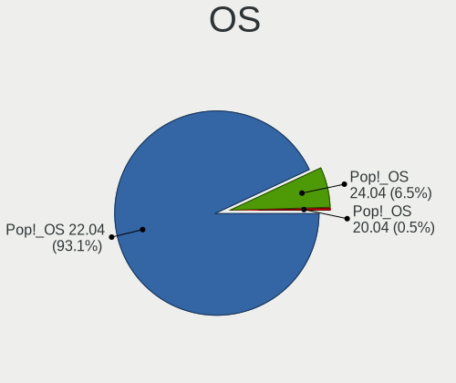
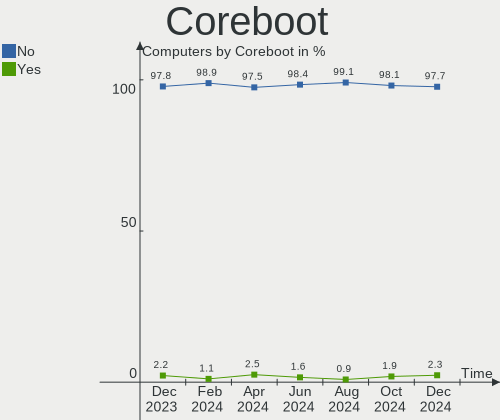
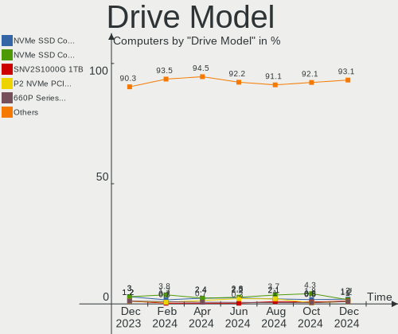
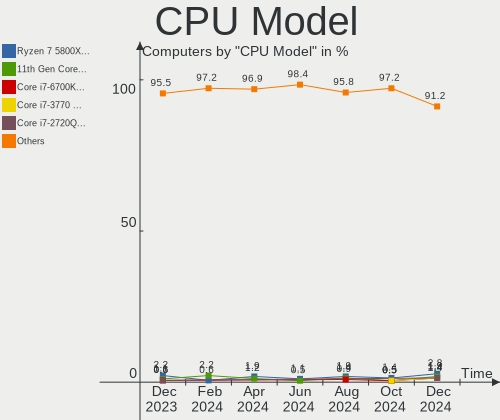
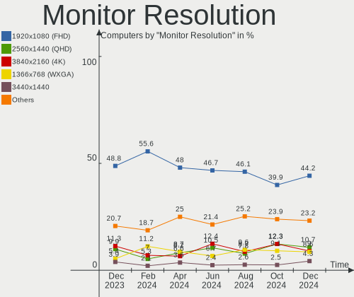
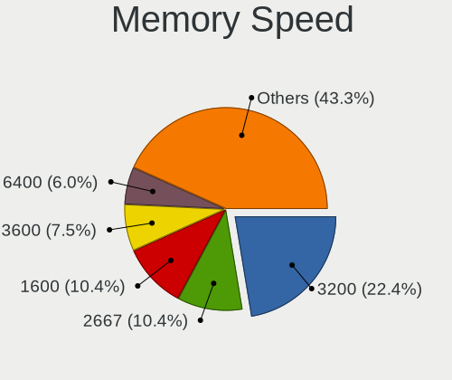

Pop!_OS - Hardware Trends
-------------------------

A project to identify most popular hardware characteristics and track their change
over time based on data collected by Linux users at https://Linux-Hardware.org.

Anyone can contribute to this report by the [hw-probe](https://github.com/linuxhw/hw-probe) tool:

    sudo -E hw-probe -all -upload

This is a report for all computer types. See also reports for [desktops](/Dist/Pop!_OS/Desktop/README.md) and [notebooks](/Dist/Pop!_OS/Notebook/README.md).

This report is for one last month. Overall report since the beginning of time: [TestDays](https://github.com/linuxhw/TestDays)

Period: Mar, 2023.

Contents
--------

* [ System ](#system)
  - [ OS                       ](#os)
  - [ OS Family                ](#os-family)
  - [ Kernel                   ](#kernel)
  - [ Kernel Family            ](#kernel-family)
  - [ Kernel Major Ver.        ](#kernel-major-ver)
  - [ Arch                     ](#arch)
  - [ DE                       ](#de)
  - [ Display Server           ](#display-server)
  - [ Display Manager          ](#display-manager)
  - [ OS Lang                  ](#os-lang)
  - [ Boot Mode                ](#boot-mode)
  - [ Filesystem               ](#filesystem)
  - [ Part. scheme             ](#part-scheme)
  - [ Dual Boot with Linux/BSD ](#dual-boot-with-linuxbsd)
  - [ Dual Boot (Win)          ](#dual-boot-win)

* [ Board ](#board)
  - [ Vendor                   ](#vendor)
  - [ Model                    ](#model)
  - [ Model Family             ](#model-family)
  - [ MFG Year                 ](#mfg-year)
  - [ Form Factor              ](#form-factor)
  - [ Secure Boot              ](#secure-boot)
  - [ Coreboot                 ](#coreboot)
  - [ RAM Size                 ](#ram-size)
  - [ RAM Used                 ](#ram-used)
  - [ Total Drives             ](#total-drives)
  - [ Has CD-ROM               ](#has-cd-rom)
  - [ Has Ethernet             ](#has-ethernet)
  - [ Has WiFi                 ](#has-wifi)
  - [ Has Bluetooth            ](#has-bluetooth)

* [ Location ](#location)
  - [ Country                  ](#country)
  - [ City                     ](#city)

* [ Drives ](#drives)
  - [ Drive Vendor             ](#drive-vendor)
  - [ Drive Model              ](#drive-model)
  - [ HDD Vendor               ](#hdd-vendor)
  - [ SSD Vendor               ](#ssd-vendor)
  - [ Drive Kind               ](#drive-kind)
  - [ Drive Connector          ](#drive-connector)
  - [ Drive Size               ](#drive-size)
  - [ Space Total              ](#space-total)
  - [ Space Used               ](#space-used)
  - [ Malfunc. Drives          ](#malfunc-drives)
  - [ Malfunc. Drive Vendor    ](#malfunc-drive-vendor)
  - [ Malfunc. HDD Vendor      ](#malfunc-hdd-vendor)
  - [ Malfunc. Drive Kind      ](#malfunc-drive-kind)
  - [ Failed Drives            ](#failed-drives)
  - [ Failed Drive Vendor      ](#failed-drive-vendor)
  - [ Drive Status             ](#drive-status)

* [ Storage controller ](#storage-controller)
  - [ Storage Vendor           ](#storage-vendor)
  - [ Storage Model            ](#storage-model)
  - [ Storage Kind             ](#storage-kind)

* [ Processor ](#processor)
  - [ CPU Vendor               ](#cpu-vendor)
  - [ CPU Model                ](#cpu-model)
  - [ CPU Model Family         ](#cpu-model-family)
  - [ CPU Cores                ](#cpu-cores)
  - [ CPU Sockets              ](#cpu-sockets)
  - [ CPU Threads              ](#cpu-threads)
  - [ CPU Op-Modes             ](#cpu-op-modes)
  - [ CPU Microcode            ](#cpu-microcode)
  - [ CPU Microarch            ](#cpu-microarch)

* [ Graphics ](#graphics)
  - [ GPU Vendor               ](#gpu-vendor)
  - [ GPU Model                ](#gpu-model)
  - [ GPU Combo                ](#gpu-combo)
  - [ GPU Driver               ](#gpu-driver)
  - [ GPU Memory               ](#gpu-memory)

* [ Monitor ](#monitor)
  - [ Monitor Vendor           ](#monitor-vendor)
  - [ Monitor Model            ](#monitor-model)
  - [ Monitor Resolution       ](#monitor-resolution)
  - [ Monitor Diagonal         ](#monitor-diagonal)
  - [ Monitor Width            ](#monitor-width)
  - [ Aspect Ratio             ](#aspect-ratio)
  - [ Monitor Area             ](#monitor-area)
  - [ Pixel Density            ](#pixel-density)
  - [ Multiple Monitors        ](#multiple-monitors)

* [ Network ](#network)
  - [ Net Controller Vendor    ](#net-controller-vendor)
  - [ Net Controller Model     ](#net-controller-model)
  - [ Wireless Vendor          ](#wireless-vendor)
  - [ Wireless Model           ](#wireless-model)
  - [ Ethernet Vendor          ](#ethernet-vendor)
  - [ Ethernet Model           ](#ethernet-model)
  - [ Net Controller Kind      ](#net-controller-kind)
  - [ Used Controller          ](#used-controller)
  - [ NICs                     ](#nics)
  - [ IPv6                     ](#ipv6)

* [ Bluetooth ](#bluetooth)
  - [ Bluetooth Vendor         ](#bluetooth-vendor)
  - [ Bluetooth Model          ](#bluetooth-model)

* [ Sound ](#sound)
  - [ Sound Vendor             ](#sound-vendor)
  - [ Sound Model              ](#sound-model)

* [ Memory ](#memory)
  - [ Memory Vendor            ](#memory-vendor)
  - [ Memory Model             ](#memory-model)
  - [ Memory Kind              ](#memory-kind)
  - [ Memory Form Factor       ](#memory-form-factor)
  - [ Memory Size              ](#memory-size)
  - [ Memory Speed             ](#memory-speed)

* [ Printers & scanners ](#printers--scanners)
  - [ Printer Vendor           ](#printer-vendor)
  - [ Printer Model            ](#printer-model)
  - [ Scanner Vendor           ](#scanner-vendor)
  - [ Scanner Model            ](#scanner-model)

* [ Camera ](#camera)
  - [ Camera Vendor            ](#camera-vendor)
  - [ Camera Model             ](#camera-model)

* [ Security ](#security)
  - [ Fingerprint Vendor       ](#fingerprint-vendor)
  - [ Fingerprint Model        ](#fingerprint-model)
  - [ Chipcard Vendor          ](#chipcard-vendor)
  - [ Chipcard Model           ](#chipcard-model)

* [ Unsupported ](#unsupported)
  - [ Unsupported Devices      ](#unsupported-devices)
  - [ Unsupported Device Types ](#unsupported-device-types)

System
------

OS
--

Installed operating systems

| Name          | Computers | Percent |
|---------------|-----------|---------|
| Pop!_OS 22.04 | 269       | 97.82%  |
| Pop!_OS 21.04 | 2         | 0.73%   |
| Pop!_OS 20.04 | 2         | 0.73%   |
| Pop!_OS 21.10 | 1         | 0.36%   |
| Pop!_OS 20.10 | 1         | 0.36%   |

OS Family
---------

OS without a version

| Name    | Computers | Percent |
|---------|-----------|---------|
| Pop!_OS | 275       | 100%    |

Kernel
------

Version of the Linux kernel

| Version                  | Computers | Percent |
|--------------------------|-----------|---------|
| 6.2.0-76060200-generic   | 109       | 39.64%  |
| 6.1.11-76060111-generic  | 57        | 20.73%  |
| 6.2.6-76060206-generic   | 53        | 19.27%  |
| 6.0.12-76060006-generic  | 37        | 13.45%  |
| 6.0.6-76060006-generic   | 2         | 0.73%   |
| 5.18.10-76051810-generic | 2         | 0.73%   |
| 6.2.6-060206-generic     | 1         | 0.36%   |
| 6.2.2-x64v3-xanmod1      | 1         | 0.36%   |
| 6.2.2-surface            | 1         | 0.36%   |
| 6.2.1-060201-generic     | 1         | 0.36%   |
| 6.1.9-x64v1-xanmod1      | 1         | 0.36%   |
| 6.1.18-x64v2-xanmod1     | 1         | 0.36%   |
| 6.0.2-76060002-generic   | 1         | 0.36%   |
| 6.0.12-76060012-generic  | 1         | 0.36%   |
| 5.8.0-7625-generic       | 1         | 0.36%   |
| 5.19.0-76051900-generic  | 1         | 0.36%   |
| 5.17.15-76051715-generic | 1         | 0.36%   |
| 5.16.15-76051615-generic | 1         | 0.36%   |
| 5.15.11-76051511-generic | 1         | 0.36%   |
| 5.15.0-1024-raspi        | 1         | 0.36%   |
| 5.11.0-7614-generic      | 1         | 0.36%   |

Kernel Family
-------------

Linux kernel without a distro release

| Version | Computers | Percent |
|---------|-----------|---------|
| 6.2.0   | 109       | 39.64%  |
| 6.1.11  | 57        | 20.73%  |
| 6.2.6   | 54        | 19.64%  |
| 6.0.12  | 38        | 13.82%  |
| 6.2.2   | 2         | 0.73%   |
| 6.0.6   | 2         | 0.73%   |
| 5.18.10 | 2         | 0.73%   |
| 6.2.1   | 1         | 0.36%   |
| 6.1.9   | 1         | 0.36%   |
| 6.1.18  | 1         | 0.36%   |
| 6.0.2   | 1         | 0.36%   |
| 5.8.0   | 1         | 0.36%   |
| 5.19.0  | 1         | 0.36%   |
| 5.17.15 | 1         | 0.36%   |
| 5.16.15 | 1         | 0.36%   |
| 5.15.11 | 1         | 0.36%   |
| 5.15.0  | 1         | 0.36%   |
| 5.11.0  | 1         | 0.36%   |

Kernel Major Ver.
-----------------

Linux kernel major version

| Version | Computers | Percent |
|---------|-----------|---------|
| 6.2     | 166       | 60.36%  |
| 6.1     | 59        | 21.45%  |
| 6.0     | 41        | 14.91%  |
| 5.18    | 2         | 0.73%   |
| 5.15    | 2         | 0.73%   |
| 5.8     | 1         | 0.36%   |
| 5.19    | 1         | 0.36%   |
| 5.17    | 1         | 0.36%   |
| 5.16    | 1         | 0.36%   |
| 5.11    | 1         | 0.36%   |

Arch
----

OS architecture (x86_64, i586, etc.)

| Name    | Computers | Percent |
|---------|-----------|---------|
| x86_64  | 274       | 99.64%  |
| aarch64 | 1         | 0.36%   |

DE
--

Desktop Environment

| Name    | Computers | Percent |
|---------|-----------|---------|
| GNOME   | 267       | 97.09%  |
| KDE5    | 4         | 1.45%   |
| Unknown | 3         | 1.09%   |
| Unity   | 1         | 0.36%   |

Display Server
--------------

X11 or Wayland

| Name    | Computers | Percent |
|---------|-----------|---------|
| X11     | 263       | 95.64%  |
| Wayland | 9         | 3.27%   |
| Unknown | 3         | 1.09%   |

Display Manager
---------------

SDDM, LightDM, etc.

| Name    | Computers | Percent |
|---------|-----------|---------|
| Unknown | 213       | 77.45%  |
| GDM3    | 60        | 21.82%  |
| SDDM    | 1         | 0.36%   |
| GDM     | 1         | 0.36%   |

OS Lang
-------

Language

| Lang    | Computers | Percent |
|---------|-----------|---------|
| en_US   | 177       | 64.36%  |
| de_DE   | 13        | 4.73%   |
| en_GB   | 12        | 4.36%   |
| pt_BR   | 11        | 4%      |
| C       | 9         | 3.27%   |
| en_AU   | 5         | 1.82%   |
| ru_RU   | 4         | 1.45%   |
| nb_NO   | 4         | 1.45%   |
| fr_FR   | 4         | 1.45%   |
| en_CA   | 4         | 1.45%   |
| it_IT   | 3         | 1.09%   |
| fi_FI   | 3         | 1.09%   |
| en_DK   | 3         | 1.09%   |
| Unknown | 3         | 1.09%   |
| pt_PT   | 2         | 0.73%   |
| pl_PL   | 2         | 0.73%   |
| es_ES   | 2         | 0.73%   |
| es_CL   | 2         | 0.73%   |
| tr_TR   | 1         | 0.36%   |
| sv_SE   | 1         | 0.36%   |
| nl_NL   | 1         | 0.36%   |
| hu_HU   | 1         | 0.36%   |
| fr_BE   | 1         | 0.36%   |
| es_UY   | 1         | 0.36%   |
| en_ZA   | 1         | 0.36%   |
| en_IE   | 1         | 0.36%   |
| de_AT   | 1         | 0.36%   |
| Default | 1         | 0.36%   |
| da_DK   | 1         | 0.36%   |
| cs_CZ   | 1         | 0.36%   |

Boot Mode
---------

EFI or BIOS

| Mode | Computers | Percent |
|------|-----------|---------|
| BIOS | 217       | 78.91%  |
| EFI  | 58        | 21.09%  |

Filesystem
----------

Type of filesystem

| Type    | Computers | Percent |
|---------|-----------|---------|
| Ext4    | 262       | 95.27%  |
| Btrfs   | 8         | 2.91%   |
| Overlay | 4         | 1.45%   |
| Xfs     | 1         | 0.36%   |

Part. scheme
------------

Scheme of partitioning

| Type    | Computers | Percent |
|---------|-----------|---------|
| Unknown | 210       | 76.36%  |
| GPT     | 59        | 21.45%  |
| MBR     | 6         | 2.18%   |

Dual Boot with Linux/BSD
------------------------

Hosting more than one Linux/BSD

| Dual boot | Computers | Percent |
|-----------|-----------|---------|
| No        | 268       | 97.45%  |
| Yes       | 7         | 2.55%   |

Dual Boot (Win)
---------------

Hosting Linux and Windows

| Dual boot | Computers | Percent |
|-----------|-----------|---------|
| No        | 252       | 91.64%  |
| Yes       | 23        | 8.36%   |

Board
-----

Vendor
------

Motherboard manufacturer

| Name                    | Computers | Percent |
|-------------------------|-----------|---------|
| Lenovo                  | 43        | 15.64%  |
| ASUSTek Computer        | 42        | 15.27%  |
| Hewlett-Packard         | 38        | 13.82%  |
| Dell                    | 26        | 9.45%   |
| Gigabyte Technology     | 22        | 8%      |
| MSI                     | 16        | 5.82%   |
| Apple                   | 16        | 5.82%   |
| Acer                    | 12        | 4.36%   |
| ASRock                  | 9         | 3.27%   |
| System76                | 3         | 1.09%   |
| Razer                   | 3         | 1.09%   |
| Positivo                | 3         | 1.09%   |
| Google                  | 3         | 1.09%   |
| TUXEDO                  | 2         | 0.73%   |
| Toshiba                 | 2         | 0.73%   |
| Supermicro              | 2         | 0.73%   |
| Samsung Electronics     | 2         | 0.73%   |
| Microsoft               | 2         | 0.73%   |
| Intel                   | 2         | 0.73%   |
| HUAWEI                  | 2         | 0.73%   |
| Fujitsu                 | 2         | 0.73%   |
| Unknown                 | 2         | 0.73%   |
| ZOTAC                   | 1         | 0.36%   |
| Win element             | 1         | 0.36%   |
| Sony                    | 1         | 0.36%   |
| Semp Toshiba            | 1         | 0.36%   |
| SAGER                   | 1         | 0.36%   |
| Raspberry Pi Foundation | 1         | 0.36%   |
| Positivo Bahia - VAIO   | 1         | 0.36%   |
| Multilaser              | 1         | 0.36%   |
| Maibenben               | 1         | 0.36%   |
| Huanan                  | 1         | 0.36%   |
| HONOR                   | 1         | 0.36%   |
| HCL Infosystems Limited | 1         | 0.36%   |
| GPU Company             | 1         | 0.36%   |
| GPD                     | 1         | 0.36%   |
| Gateway                 | 1         | 0.36%   |
| Foxconn                 | 1         | 0.36%   |
| Biostar                 | 1         | 0.36%   |
| BESSTAR Tech            | 1         | 0.36%   |

Model
-----

Motherboard model

| Name                                                                                     | Computers | Percent |
|------------------------------------------------------------------------------------------|-----------|---------|
| HP Dev One Notebook PC                                                                   | 3         | 1.09%   |
| ASUS All Series                                                                          | 3         | 1.09%   |
| System76 Lemur Pro                                                                       | 2         | 0.73%   |
| MSI MS-7C91                                                                              | 2         | 0.73%   |
| MSI MS-7A34                                                                              | 2         | 0.73%   |
| Gigabyte A320M-S2H                                                                       | 2         | 0.73%   |
| Dell OptiPlex 9020                                                                       | 2         | 0.73%   |
| Dell Latitude E7240                                                                      | 2         | 0.73%   |
| Dell Latitude 5420                                                                       | 2         | 0.73%   |
| ASUS TUF Gaming X570-PLUS                                                                | 2         | 0.73%   |
| ASUS SABERTOOTH 990FX R2.0                                                               | 2         | 0.73%   |
| ASUS ROG CROSSHAIR VIII HERO                                                             | 2         | 0.73%   |
| Apple MacBookPro8,1                                                                      | 2         | 0.73%   |
| Apple MacBookPro12,1                                                                     | 2         | 0.73%   |
| Apple MacBookAir7,2                                                                      | 2         | 0.73%   |
| Apple MacBook5,1                                                                         | 2         | 0.73%   |
| Acer Nitro AN515-58                                                                      | 2         | 0.73%   |
| Unknown                                                                                  | 2         | 0.73%   |
| ZOTAC ZBOX-ECM73070C/53060C                                                              | 1         | 0.36%   |
| Win element M600                                                                         | 1         | 0.36%   |
| TUXEDO Pulse 14 Gen1                                                                     | 1         | 0.36%   |
| TUXEDO InfinityBook S 14 Gen6                                                            | 1         | 0.36%   |
| Toshiba Satellite Pro C50-A-1E2                                                          | 1         | 0.36%   |
| Toshiba Satellite C55-C                                                                  | 1         | 0.36%   |
| System76 Pangolin                                                                        | 1         | 0.36%   |
| Supermicro X9SAE                                                                         | 1         | 0.36%   |
| Supermicro X10SLV                                                                        | 1         | 0.36%   |
| Sony VPCZ12V9R                                                                           | 1         | 0.36%   |
| Semp Toshiba IS 1413G                                                                    | 1         | 0.36%   |
| Samsung R430/R480/R440                                                                   | 1         | 0.36%   |
| Samsung 350V5C/350V5X/350V4C/350V4X/351V5C/351V5X/351V4C/351V4X/3540VC/3540VX/3440VC/344 | 1         | 0.36%   |
| SAGER X8100                                                                              | 1         | 0.36%   |
| Razer Blade Stealth 13 (Early 2020) - RZ09-0310                                          | 1         | 0.36%   |
| Razer Blade 15 Advanced Model (Early 2021) - RZ09-036                                    | 1         | 0.36%   |
| Razer Blade                                                                              | 1         | 0.36%   |
| RPi Raspberry Pi                                                                         | 1         | 0.36%   |
| Positivo POS-PIQ77CL                                                                     | 1         | 0.36%   |
| Positivo N1250                                                                           | 1         | 0.36%   |
| Positivo Mobile                                                                          | 1         | 0.36%   |
| Positivo Bahia - VAIO VJFE41F11X-XXXXXX                                                  | 1         | 0.36%   |

Model Family
------------

Motherboard model prefix

| Name               | Computers | Percent |
|--------------------|-----------|---------|
| Lenovo ThinkPad    | 21        | 7.64%   |
| Lenovo IdeaPad     | 14        | 5.09%   |
| ASUS ROG           | 10        | 3.64%   |
| HP EliteBook       | 7         | 2.55%   |
| ASUS PRIME         | 6         | 2.18%   |
| Acer Aspire        | 6         | 2.18%   |
| HP Pavilion        | 5         | 1.82%   |
| Dell OptiPlex      | 5         | 1.82%   |
| Dell Latitude      | 5         | 1.82%   |
| Dell Inspiron      | 5         | 1.82%   |
| Dell XPS           | 4         | 1.45%   |
| ASUS Zenbook       | 4         | 1.45%   |
| Acer Nitro         | 4         | 1.45%   |
| Razer Blade        | 3         | 1.09%   |
| HP ZBook           | 3         | 1.09%   |
| HP ProBook         | 3         | 1.09%   |
| HP Dev             | 3         | 1.09%   |
| HP Compaq          | 3         | 1.09%   |
| Gigabyte X570      | 3         | 1.09%   |
| ASUS VivoBook      | 3         | 1.09%   |
| ASUS TUF           | 3         | 1.09%   |
| ASUS SABERTOOTH    | 3         | 1.09%   |
| ASUS ASUS          | 3         | 1.09%   |
| ASUS All           | 3         | 1.09%   |
| Toshiba Satellite  | 2         | 0.73%   |
| System76 Lemur     | 2         | 0.73%   |
| MSI MS-7C91        | 2         | 0.73%   |
| MSI MS-7A34        | 2         | 0.73%   |
| Microsoft Surface  | 2         | 0.73%   |
| Lenovo Yoga        | 2         | 0.73%   |
| Lenovo Legion      | 2         | 0.73%   |
| HP Spectre         | 2         | 0.73%   |
| HP ProLiant        | 2         | 0.73%   |
| HP Laptop          | 2         | 0.73%   |
| HP ENVY            | 2         | 0.73%   |
| Gigabyte B550M     | 2         | 0.73%   |
| Gigabyte A320M-S2H | 2         | 0.73%   |
| Dell Precision     | 2         | 0.73%   |
| Apple MacBookPro9  | 2         | 0.73%   |
| Apple MacBookPro8  | 2         | 0.73%   |

MFG Year
--------

Motherboard manufacture year

| Year    | Computers | Percent |
|---------|-----------|---------|
| 2022    | 42        | 15.27%  |
| 2021    | 35        | 12.73%  |
| 2020    | 33        | 12%     |
| 2018    | 29        | 10.55%  |
| 2019    | 22        | 8%      |
| 2012    | 20        | 7.27%   |
| 2015    | 16        | 5.82%   |
| 2013    | 16        | 5.82%   |
| 2011    | 14        | 5.09%   |
| 2014    | 11        | 4%      |
| 2017    | 9         | 3.27%   |
| 2010    | 9         | 3.27%   |
| 2009    | 5         | 1.82%   |
| 2008    | 4         | 1.45%   |
| 2023    | 3         | 1.09%   |
| 2016    | 3         | 1.09%   |
| Unknown | 2         | 0.73%   |
| 2007    | 1         | 0.36%   |
| 2005    | 1         | 0.36%   |

Form Factor
-----------

Physical design of the computer

| Name           | Computers | Percent |
|----------------|-----------|---------|
| Notebook       | 159       | 57.82%  |
| Desktop        | 95        | 34.55%  |
| Convertible    | 7         | 2.55%   |
| Mini pc        | 5         | 1.82%   |
| All in one     | 3         | 1.09%   |
| Server         | 3         | 1.09%   |
| Tablet         | 2         | 0.73%   |
| System on chip | 1         | 0.36%   |

Secure Boot
-----------

Enabled or disabled

| State    | Computers | Percent |
|----------|-----------|---------|
| Disabled | 275       | 100%    |

Coreboot
--------

Have coreboot on board

| Used | Computers | Percent |
|------|-----------|---------|
| No   | 270       | 98.18%  |
| Yes  | 5         | 1.82%   |

RAM Size
--------

Total RAM memory

| Size in GB  | Computers | Percent |
|-------------|-----------|---------|
| 16.01-24.0  | 72        | 26.18%  |
| 4.01-8.0    | 55        | 20%     |
| 8.01-16.0   | 52        | 18.91%  |
| 32.01-64.0  | 47        | 17.09%  |
| 3.01-4.0    | 19        | 6.91%   |
| 64.01-256.0 | 17        | 6.18%   |
| 24.01-32.0  | 9         | 3.27%   |
| 2.01-3.0    | 2         | 0.73%   |
| 1.01-2.0    | 2         | 0.73%   |

RAM Used
--------

Used RAM memory

| Used GB    | Computers | Percent |
|------------|-----------|---------|
| 4.01-8.0   | 123       | 44.73%  |
| 3.01-4.0   | 52        | 18.91%  |
| 2.01-3.0   | 50        | 18.18%  |
| 8.01-16.0  | 31        | 11.27%  |
| 1.01-2.0   | 15        | 5.45%   |
| 16.01-24.0 | 2         | 0.73%   |
| 32.01-64.0 | 1         | 0.36%   |
| 24.01-32.0 | 1         | 0.36%   |

Total Drives
------------

Number of drives on board

| Drives | Computers | Percent |
|--------|-----------|---------|
| 1      | 148       | 53.82%  |
| 2      | 84        | 30.55%  |
| 3      | 19        | 6.91%   |
| 4      | 12        | 4.36%   |
| 5      | 6         | 2.18%   |
| 7      | 2         | 0.73%   |
| 6      | 2         | 0.73%   |
| 8      | 1         | 0.36%   |
| 0      | 1         | 0.36%   |

Has CD-ROM
----------

Has CD-ROM on board

| Presented | Computers | Percent |
|-----------|-----------|---------|
| No        | 213       | 77.45%  |
| Yes       | 62        | 22.55%  |

Has Ethernet
------------

Has Ethernet on board

| Presented | Computers | Percent |
|-----------|-----------|---------|
| Yes       | 225       | 81.82%  |
| No        | 50        | 18.18%  |

Has WiFi
--------

Has WiFi module

| Presented | Computers | Percent |
|-----------|-----------|---------|
| Yes       | 226       | 82.18%  |
| No        | 49        | 17.82%  |

Has Bluetooth
-------------

Has Bluetooth module

| Presented | Computers | Percent |
|-----------|-----------|---------|
| Yes       | 192       | 69.82%  |
| No        | 83        | 30.18%  |

Location
--------

Country
-------

Geographic location (country)

| Country      | Computers | Percent |
|--------------|-----------|---------|
| USA          | 102       | 37.09%  |
| Germany      | 23        | 8.36%   |
| Brazil       | 18        | 6.55%   |
| UK           | 10        | 3.64%   |
| Canada       | 10        | 3.64%   |
| Norway       | 8         | 2.91%   |
| Australia    | 7         | 2.55%   |
| Mexico       | 6         | 2.18%   |
| India        | 6         | 2.18%   |
| Finland      | 6         | 2.18%   |
| Russia       | 5         | 1.82%   |
| Portugal     | 5         | 1.82%   |
| France       | 5         | 1.82%   |
| Poland       | 4         | 1.45%   |
| Netherlands  | 4         | 1.45%   |
| Italy        | 4         | 1.45%   |
| Chile        | 4         | 1.45%   |
| Sweden       | 3         | 1.09%   |
| South Africa | 3         | 1.09%   |
| Denmark      | 3         | 1.09%   |
| Czechia      | 3         | 1.09%   |
| Vietnam      | 2         | 0.73%   |
| Turkey       | 2         | 0.73%   |
| Switzerland  | 2         | 0.73%   |
| Spain        | 2         | 0.73%   |
| Philippines  | 2         | 0.73%   |
| Latvia       | 2         | 0.73%   |
| Ireland      | 2         | 0.73%   |
| Indonesia    | 2         | 0.73%   |
| Bolivia      | 2         | 0.73%   |
| Austria      | 2         | 0.73%   |
| Uruguay      | 1         | 0.36%   |
| Tunisia      | 1         | 0.36%   |
| Taiwan       | 1         | 0.36%   |
| Slovakia     | 1         | 0.36%   |
| Serbia       | 1         | 0.36%   |
| Puerto Rico  | 1         | 0.36%   |
| Nigeria      | 1         | 0.36%   |
| Morocco      | 1         | 0.36%   |
| Japan        | 1         | 0.36%   |

City
----

Geographic location (city)

| City         | Computers | Percent |
|--------------|-----------|---------|
| Munich       | 4         | 1.45%   |
| Sipoo        | 3         | 1.09%   |
| Sao Paulo    | 3         | 1.09%   |
| Santiago     | 3         | 1.09%   |
| Phoenix      | 3         | 1.09%   |
| Moss         | 3         | 1.09%   |
| Minneapolis  | 3         | 1.09%   |
| Chicago      | 3         | 1.09%   |
| Brasília    | 3         | 1.09%   |
| Westwood     | 2         | 0.73%   |
| Vancouver    | 2         | 0.73%   |
| Seattle      | 2         | 0.73%   |
| Reno         | 2         | 0.73%   |
| Portland     | 2         | 0.73%   |
| Polomolok    | 2         | 0.73%   |
| Ogre         | 2         | 0.73%   |
| Notodden     | 2         | 0.73%   |
| New York     | 2         | 0.73%   |
| Mexico City  | 2         | 0.73%   |
| Melbourne    | 2         | 0.73%   |
| Martinez     | 2         | 0.73%   |
| Lisbon       | 2         | 0.73%   |
| Johannesburg | 2         | 0.73%   |
| Hyderabad    | 2         | 0.73%   |
| Helsinki     | 2         | 0.73%   |
| Hanoi        | 2         | 0.73%   |
| El Paso      | 2         | 0.73%   |
| Denver       | 2         | 0.73%   |
| Cleveland    | 2         | 0.73%   |
| Cancún      | 2         | 0.73%   |
| Browning     | 2         | 0.73%   |
| Bengaluru    | 2         | 0.73%   |
| Youngstown   | 1         | 0.36%   |
| Winchester   | 1         | 0.36%   |
| Wiesbaden    | 1         | 0.36%   |
| Widen        | 1         | 0.36%   |
| Whitehorse   | 1         | 0.36%   |
| West Orange  | 1         | 0.36%   |
| Weatherford  | 1         | 0.36%   |
| Waverly      | 1         | 0.36%   |

Drives
------

Drive Vendor
------------

Hard drive vendors

| Vendor                      | Computers | Drives | Percent |
|-----------------------------|-----------|--------|---------|
| Samsung Electronics         | 87        | 118    | 21.07%  |
| WDC                         | 42        | 46     | 10.17%  |
| Seagate                     | 31        | 40     | 7.51%   |
| SanDisk                     | 30        | 34     | 7.26%   |
| SK hynix                    | 22        | 22     | 5.33%   |
| Toshiba                     | 18        | 18     | 4.36%   |
| Kingston                    | 16        | 19     | 3.87%   |
| Crucial                     | 16        | 19     | 3.87%   |
| Micron Technology           | 14        | 14     | 3.39%   |
| Phison Electronics          | 9         | 10     | 2.18%   |
| Micron/Crucial Technology   | 9         | 10     | 2.18%   |
| Kingston Technology Company | 9         | 9      | 2.18%   |
| Intel                       | 9         | 11     | 2.18%   |
| Apple                       | 8         | 9      | 1.94%   |
| Unknown                     | 7         | 8      | 1.69%   |
| Hitachi                     | 6         | 6      | 1.45%   |
| HGST                        | 6         | 6      | 1.45%   |
| China                       | 6         | 6      | 1.45%   |
| PNY                         | 4         | 4      | 0.97%   |
| A-DATA Technology           | 4         | 4      | 0.97%   |
| Unknown                     | 4         | 4      | 0.97%   |
| Transcend                   | 3         | 3      | 0.73%   |
| SPCC                        | 3         | 3      | 0.73%   |
| Solid State Storage         | 3         | 3      | 0.73%   |
| Patriot                     | 3         | 3      | 0.73%   |
| KIOXIA                      | 3         | 3      | 0.73%   |
| Intenso                     | 3         | 3      | 0.73%   |
| Mushkin                     | 2         | 3      | 0.48%   |
| LITEONIT                    | 2         | 2      | 0.48%   |
| Leven                       | 2         | 2      | 0.48%   |
| Hewlett-Packard             | 2         | 5      | 0.48%   |
| ASMT                        | 2         | 3      | 0.48%   |
| Wibtek                      | 1         | 1      | 0.24%   |
| WALRAM                      | 1         | 1      | 0.24%   |
| VICK                        | 1         | 1      | 0.24%   |
| Verbatim                    | 1         | 1      | 0.24%   |
| Union Memory (Shenzhen)     | 1         | 1      | 0.24%   |
| Teclast                     | 1         | 1      | 0.24%   |
| TEAM TM8                    | 1         | 1      | 0.24%   |
| T-FORCE                     | 1         | 1      | 0.24%   |

Drive Model
-----------

Hard drive models

| Model                                               | Computers | Percent |
|-----------------------------------------------------|-----------|---------|
| Samsung NVMe SSD Controller SM981/PM981/PM983 250GB | 16        | 3.56%   |
| Samsung NVMe SSD Controller PM9A1/PM9A3/980PRO 1TB  | 11        | 2.44%   |
| Micron/Crucial P2 NVMe PCIe SSD 1TB                 | 6         | 1.33%   |
| Kingston Company A2000 NVMe SSD 500GB               | 5         | 1.11%   |
| Samsung SSD 860 EVO 500GB                           | 4         | 0.89%   |
| Samsung SSD 860 EVO 1TB                             | 4         | 0.89%   |
| Phison E12 NVMe Controller 256GB                    | 4         | 0.89%   |
| Kingston SA400S37240G 240GB SSD                     | 4         | 0.89%   |
| Unknown                                             | 4         | 0.89%   |
| Toshiba MQ04ABF100 1TB                              | 3         | 0.67%   |
| SK hynix BC511 512GB                                | 3         | 0.67%   |
| Seagate ST1000DM003-1CH162 1TB                      | 3         | 0.67%   |
| Samsung SSD 980 PRO 1TB                             | 3         | 0.67%   |
| Samsung SSD 980 1TB                                 | 3         | 0.67%   |
| Samsung SSD 850 EVO 500GB                           | 3         | 0.67%   |
| Samsung SSD 850 EVO 250GB                           | 3         | 0.67%   |
| Samsung SSD 840 PRO Series 256GB                    | 3         | 0.67%   |
| Phison PS5013 E13 NVMe Controller 256GB             | 3         | 0.67%   |
| HGST HTS721010A9E630 1TB                            | 3         | 0.67%   |
| Crucial CT480BX500SSD1 480GB                        | 3         | 0.67%   |
| Crucial CT1000MX500SSD1 1TB                         | 3         | 0.67%   |
| Apple SSD SM0128G 121GB                             | 3         | 0.67%   |
| WDC WDS240G2G0A-00JH30 240GB SSD                    | 2         | 0.44%   |
| WDC WD10SPZX-00Z10T0 1TB                            | 2         | 0.44%   |
| Unknown SD/MMC/MS PRO 64GB                          | 2         | 0.44%   |
| Toshiba DT01ACA100 1TB                              | 2         | 0.44%   |
| SK hynix SHGP31-1000GM 1TB                          | 2         | 0.44%   |
| SK hynix PC711 HFS001TDE9X073N 1TB                  | 2         | 0.44%   |
| SK hynix HFM512GD3JX013N 512GB                      | 2         | 0.44%   |
| SK hynix BC711 NVMe 512GB                           | 2         | 0.44%   |
| SK hynix BC501 NVMe Solid State Drive 512GB         | 2         | 0.44%   |
| Seagate ST500LT012-1DG142 500GB                     | 2         | 0.44%   |
| Seagate ST500DM002-1BD142 500GB                     | 2         | 0.44%   |
| Seagate ST1000LM035-1RK172 1TB                      | 2         | 0.44%   |
| Sandisk WD Blue SN500 / PC SN520 NVMe SSD 512GB     | 2         | 0.44%   |
| Sandisk WD Black SN850 1TB                          | 2         | 0.44%   |
| Sandisk WD Black SN750 / PC SN730 NVMe SSD 1TB      | 2         | 0.44%   |
| SanDisk SSD PLUS 1000GB                             | 2         | 0.44%   |
| SanDisk NVMe SSD Drive 1TB                          | 2         | 0.44%   |
| Samsung SSD 990 PRO 2TB                             | 2         | 0.44%   |

HDD Vendor
----------

Hard disk drive vendors

| Vendor              | Computers | Drives | Percent |
|---------------------|-----------|--------|---------|
| WDC                 | 32        | 36     | 32.65%  |
| Seagate             | 28        | 36     | 28.57%  |
| Toshiba             | 12        | 12     | 12.24%  |
| Hitachi             | 6         | 6      | 6.12%   |
| HGST                | 6         | 6      | 6.12%   |
| Samsung Electronics | 3         | 3      | 3.06%   |
| Apple               | 3         | 3      | 3.06%   |
| Unknown             | 2         | 2      | 2.04%   |
| ASMT                | 2         | 3      | 2.04%   |
| SABRENT             | 1         | 2      | 1.02%   |
| PHD 3.0             | 1         | 1      | 1.02%   |
| Intenso             | 1         | 1      | 1.02%   |
| Fujitsu             | 1         | 1      | 1.02%   |

SSD Vendor
----------

Solid state drive vendors

| Vendor              | Computers | Drives | Percent |
|---------------------|-----------|--------|---------|
| Samsung Electronics | 38        | 51     | 26.95%  |
| Crucial             | 15        | 18     | 10.64%  |
| SanDisk             | 13        | 14     | 9.22%   |
| Kingston            | 12        | 13     | 8.51%   |
| China               | 6         | 6      | 4.26%   |
| WDC                 | 5         | 5      | 3.55%   |
| Apple               | 5         | 5      | 3.55%   |
| PNY                 | 4         | 4      | 2.84%   |
| Transcend           | 3         | 3      | 2.13%   |
| Patriot             | 3         | 3      | 2.13%   |
| A-DATA Technology   | 3         | 3      | 2.13%   |
| Toshiba             | 2         | 2      | 1.42%   |
| SPCC                | 2         | 2      | 1.42%   |
| SK hynix            | 2         | 2      | 1.42%   |
| Mushkin             | 2         | 3      | 1.42%   |
| Micron Technology   | 2         | 2      | 1.42%   |
| LITEONIT            | 2         | 2      | 1.42%   |
| Intenso             | 2         | 2      | 1.42%   |
| Intel               | 2         | 3      | 1.42%   |
| Hewlett-Packard     | 2         | 5      | 1.42%   |
| VICK                | 1         | 1      | 0.71%   |
| Verbatim            | 1         | 1      | 0.71%   |
| Teclast             | 1         | 1      | 0.71%   |
| TEAM TM8            | 1         | 1      | 0.71%   |
| Seagate             | 1         | 1      | 0.71%   |
| ORTIAL              | 1         | 1      | 0.71%   |
| Netac               | 1         | 1      | 0.71%   |
| LITEON              | 1         | 1      | 0.71%   |
| Leven               | 1         | 1      | 0.71%   |
| KingSpec            | 1         | 1      | 0.71%   |
| KingDian            | 1         | 1      | 0.71%   |
| JMicron Technology  | 1         | 1      | 0.71%   |
| Dogfish             | 1         | 1      | 0.71%   |
| Apacer              | 1         | 1      | 0.71%   |
| Advantech           | 1         | 1      | 0.71%   |
| Unknown             | 1         | 1      | 0.71%   |

Drive Kind
----------

HDD or SSD

| Kind    | Computers | Drives | Percent |
|---------|-----------|--------|---------|
| NVMe    | 141       | 186    | 39.39%  |
| SSD     | 118       | 164    | 32.96%  |
| HDD     | 85        | 112    | 23.74%  |
| Unknown | 9         | 11     | 2.51%   |
| MMC     | 5         | 6      | 1.4%    |

Drive Connector
---------------

SATA, SAS, NVMe, etc.

| Type | Computers | Drives | Percent |
|------|-----------|--------|---------|
| SATA | 161       | 263    | 49.24%  |
| NVMe | 140       | 185    | 42.81%  |
| SAS  | 21        | 25     | 6.42%   |
| MMC  | 5         | 6      | 1.53%   |

Drive Size
----------

Size of hard drive

| Size in TB | Computers | Drives | Percent |
|------------|-----------|--------|---------|
| 0.01-0.5   | 115       | 164    | 55.02%  |
| 0.51-1.0   | 70        | 82     | 33.49%  |
| 1.01-2.0   | 14        | 20     | 6.7%    |
| 4.01-10.0  | 4         | 4      | 1.91%   |
| 3.01-4.0   | 3         | 3      | 1.44%   |
| 2.01-3.0   | 3         | 3      | 1.44%   |

Space Total
-----------

Amount of disk space available on the file system

| Size in GB     | Computers | Percent |
|----------------|-----------|---------|
| 251-500        | 82        | 29.82%  |
| 101-250        | 67        | 24.36%  |
| 501-1000       | 64        | 23.27%  |
| 1001-2000      | 28        | 10.18%  |
| More than 3000 | 11        | 4%      |
| 2001-3000      | 6         | 2.18%   |
| 51-100         | 6         | 2.18%   |
| 1-20           | 5         | 1.82%   |
| Unknown        | 5         | 1.82%   |
| 21-50          | 1         | 0.36%   |

Space Used
----------

Amount of used disk space

| Used GB        | Computers | Percent |
|----------------|-----------|---------|
| 21-50          | 72        | 26.18%  |
| 1-20           | 55        | 20%     |
| 51-100         | 43        | 15.64%  |
| 101-250        | 35        | 12.73%  |
| 251-500        | 34        | 12.36%  |
| 501-1000       | 19        | 6.91%   |
| 1001-2000      | 7         | 2.55%   |
| Unknown        | 5         | 1.82%   |
| 2001-3000      | 3         | 1.09%   |
| More than 3000 | 2         | 0.73%   |

Malfunc. Drives
---------------

Drive models with a malfunction

| Model                                        | Computers | Drives | Percent |
|----------------------------------------------|-----------|--------|---------|
| WDC WD15EADS-00P8B0 1TB                      | 1         | 1      | 16.67%  |
| WDC WD10JPVX-60JC3T0 1TB                     | 1         | 1      | 16.67%  |
| SK hynix PC711 HFS001TDE9X073N 1TB           | 1         | 1      | 16.67%  |
| Samsung Electronics MZVLB512HAJQ-000L7 512GB | 1         | 1      | 16.67%  |
| Kingston SA400S37120G 120GB SSD              | 1         | 1      | 16.67%  |
| HGST HTS541075A9E680 752GB                   | 1         | 1      | 16.67%  |

Malfunc. Drive Vendor
---------------------

Vendors of faulty drives

| Vendor              | Computers | Drives | Percent |
|---------------------|-----------|--------|---------|
| WDC                 | 2         | 2      | 33.33%  |
| SK hynix            | 1         | 1      | 16.67%  |
| Samsung Electronics | 1         | 1      | 16.67%  |
| Kingston            | 1         | 1      | 16.67%  |
| HGST                | 1         | 1      | 16.67%  |

Malfunc. HDD Vendor
-------------------

Vendors of faulty HDD drives

| Vendor | Computers | Drives | Percent |
|--------|-----------|--------|---------|
| WDC    | 2         | 2      | 66.67%  |
| HGST   | 1         | 1      | 33.33%  |

Malfunc. Drive Kind
-------------------

Kinds of faulty drives

| Kind | Computers | Drives | Percent |
|------|-----------|--------|---------|
| HDD  | 3         | 3      | 50%     |
| NVMe | 2         | 2      | 33.33%  |
| SSD  | 1         | 1      | 16.67%  |

Failed Drives
-------------

Failed drive models

Zero info for selected period =(

Failed Drive Vendor
-------------------

Failed drive vendors

Zero info for selected period =(

Drive Status
------------

Number of failed and malfunc. drives

| Status   | Computers | Drives | Percent |
|----------|-----------|--------|---------|
| Detected | 218       | 375    | 76.22%  |
| Works    | 62        | 98     | 21.68%  |
| Malfunc  | 6         | 6      | 2.1%    |

Storage controller
------------------

Storage Vendor
--------------

Storage controller vendors

| Vendor                         | Computers | Percent |
|--------------------------------|-----------|---------|
| Intel                          | 143       | 35.84%  |
| AMD                            | 70        | 17.54%  |
| Samsung Electronics            | 56        | 14.04%  |
| SK hynix                       | 20        | 5.01%   |
| SanDisk                        | 20        | 5.01%   |
| Kingston Technology Company    | 14        | 3.51%   |
| Micron Technology              | 12        | 3.01%   |
| Phison Electronics             | 11        | 2.76%   |
| Micron/Crucial Technology      | 10        | 2.51%   |
| Toshiba America Info Systems   | 6         | 1.5%    |
| Marvell Technology Group       | 6         | 1.5%    |
| ASMedia Technology             | 6         | 1.5%    |
| Solid State Storage Technology | 4         | 1%      |
| Nvidia                         | 4         | 1%      |
| Silicon Motion                 | 3         | 0.75%   |
| JMicron Technology             | 3         | 0.75%   |
| KIOXIA                         | 2         | 0.5%    |
| Hewlett-Packard                | 2         | 0.5%    |
| Union Memory (Shenzhen)        | 1         | 0.25%   |
| Seagate Technology             | 1         | 0.25%   |
| Realtek Semiconductor          | 1         | 0.25%   |
| Broadcom / LSI                 | 1         | 0.25%   |
| Apple                          | 1         | 0.25%   |
| ADATA Technology               | 1         | 0.25%   |
| Adaptec                        | 1         | 0.25%   |

Storage Model
-------------

Storage controller models

| Model                                                                          | Computers | Percent |
|--------------------------------------------------------------------------------|-----------|---------|
| AMD FCH SATA Controller [AHCI mode]                                            | 52        | 11.66%  |
| Samsung NVMe SSD Controller SM981/PM981/PM983                                  | 25        | 5.61%   |
| Samsung NVMe SSD Controller PM9A1/PM9A3/980PRO                                 | 17        | 3.81%   |
| Intel 8 Series/C220 Series Chipset Family 6-port SATA Controller 1 [AHCI mode] | 14        | 3.14%   |
| Intel Volume Management Device NVMe RAID Controller                            | 13        | 2.91%   |
| SK hynix Gold P31/PC711 NVMe Solid State Drive                                 | 12        | 2.69%   |
| Micron NVMe Storage Controller                                                 | 12        | 2.69%   |
| Intel 6 Series/C200 Series Chipset Family 6 port Mobile SATA AHCI Controller   | 11        | 2.47%   |
| AMD 500 Series Chipset SATA Controller                                         | 10        | 2.24%   |
| Intel Sunrise Point-LP SATA Controller [AHCI mode]                             | 8         | 1.79%   |
| AMD 400 Series Chipset SATA Controller                                         | 8         | 1.79%   |
| Samsung NVMe SSD Controller 980                                                | 7         | 1.57%   |
| Intel Wildcat Point-LP SATA Controller [AHCI Mode]                             | 7         | 1.57%   |
| Micron/Crucial P2 NVMe PCIe SSD                                                | 6         | 1.35%   |
| Intel Cannon Lake Mobile PCH SATA AHCI Controller                              | 6         | 1.35%   |
| Intel Alder Lake-P SATA AHCI Controller                                        | 6         | 1.35%   |
| Intel 7 Series/C210 Series Chipset Family 6-port SATA Controller [AHCI mode]   | 6         | 1.35%   |
| Intel 7 Series Chipset Family 6-port SATA Controller [AHCI mode]               | 6         | 1.35%   |
| ASMedia ASM1062 Serial ATA Controller                                          | 6         | 1.35%   |
| Kingston Company A2000 NVMe SSD                                                | 5         | 1.12%   |
| Intel 82801 Mobile SATA Controller [RAID mode]                                 | 5         | 1.12%   |
| Intel 8 Series SATA Controller 1 [AHCI mode]                                   | 5         | 1.12%   |
| AMD SB7x0/SB8x0/SB9x0 SATA Controller [AHCI mode]                              | 5         | 1.12%   |
| AMD 300 Series Chipset SATA Controller                                         | 5         | 1.12%   |
| Solid State Storage Non-Volatile memory controller                             | 4         | 0.9%    |
| SanDisk NVMe Controller                                                        | 4         | 0.9%    |
| SanDisk Non-Volatile memory controller                                         | 4         | 0.9%    |
| Samsung NVMe SSD Controller SM961/PM961/SM963                                  | 4         | 0.9%    |
| Phison E12 NVMe Controller                                                     | 4         | 0.9%    |
| Kingston Company Company Non-Volatile memory controller                        | 4         | 0.9%    |
| Intel Tiger Lake-LP SATA Controller                                            | 4         | 0.9%    |
| Intel SATA Controller [RAID mode]                                              | 4         | 0.9%    |
| Intel Comet Lake SATA AHCI Controller                                          | 4         | 0.9%    |
| Intel Celeron/Pentium Silver Processor SATA Controller                         | 4         | 0.9%    |
| Intel 500 Series Chipset Family SATA AHCI Controller                           | 4         | 0.9%    |
| Toshiba America Info Systems XG6 NVMe SSD Controller                           | 3         | 0.67%   |
| SK hynix BC511                                                                 | 3         | 0.67%   |
| Sandisk Western Digital WD Black SN850X NVMe SSD                               | 3         | 0.67%   |
| SanDisk WD Blue SN550 NVMe SSD                                                 | 3         | 0.67%   |
| Samsung Electronics SATA controller                                            | 3         | 0.67%   |

Storage Kind
------------

Kind of storage controller (IDE, SATA, NVMe, SAS, ...)

| Kind | Computers | Percent |
|------|-----------|---------|
| SATA | 185       | 49.87%  |
| NVMe | 139       | 37.47%  |
| RAID | 29        | 7.82%   |
| IDE  | 16        | 4.31%   |
| SAS  | 1         | 0.27%   |
| SCSI | 1         | 0.27%   |

Processor
---------

CPU Vendor
----------

Processor vendors

| Vendor | Computers | Percent |
|--------|-----------|---------|
| Intel  | 182       | 66.18%  |
| AMD    | 92        | 33.45%  |
| ARM    | 1         | 0.36%   |

CPU Model
---------

Processor models

| Model                                         | Computers | Percent |
|-----------------------------------------------|-----------|---------|
| Intel 11th Gen Core i7-1165G7 @ 2.80GHz       | 6         | 2.18%   |
| Intel Core i7-9750H CPU @ 2.60GHz             | 5         | 1.82%   |
| AMD Ryzen 9 5950X 16-Core Processor           | 5         | 1.82%   |
| AMD Ryzen 5 5500U with Radeon Graphics        | 5         | 1.82%   |
| Intel Core i5-8250U CPU @ 1.60GHz             | 4         | 1.45%   |
| Intel 12th Gen Core i5-12500H                 | 4         | 1.45%   |
| AMD Ryzen 7 PRO 5850U with Radeon Graphics    | 4         | 1.45%   |
| AMD Ryzen 5 5600G with Radeon Graphics        | 4         | 1.45%   |
| Intel Core i7-8550U CPU @ 1.80GHz             | 3         | 1.09%   |
| Intel Core i7-4790 CPU @ 3.60GHz              | 3         | 1.09%   |
| Intel Core i3-5005U CPU @ 2.00GHz             | 3         | 1.09%   |
| Intel 12th Gen Core i9-12900H                 | 3         | 1.09%   |
| Intel 11th Gen Core i3-1115G4 @ 3.00GHz       | 3         | 1.09%   |
| AMD Ryzen 7 7700X 8-Core Processor            | 3         | 1.09%   |
| AMD Ryzen 7 5800X3D 8-Core Processor          | 3         | 1.09%   |
| AMD Ryzen 7 5700U with Radeon Graphics        | 3         | 1.09%   |
| AMD Ryzen 7 4800H with Radeon Graphics        | 3         | 1.09%   |
| AMD Ryzen 5 5600X 6-Core Processor            | 3         | 1.09%   |
| AMD Ryzen 5 2500U with Radeon Vega Mobile Gfx | 3         | 1.09%   |
| Intel Core i7-8750H CPU @ 2.20GHz             | 2         | 0.73%   |
| Intel Core i7-8650U CPU @ 1.90GHz             | 2         | 0.73%   |
| Intel Core i7-6820HQ CPU @ 2.70GHz            | 2         | 0.73%   |
| Intel Core i7-6700HQ CPU @ 2.60GHz            | 2         | 0.73%   |
| Intel Core i7-4790K CPU @ 4.00GHz             | 2         | 0.73%   |
| Intel Core i7-2620M CPU @ 2.70GHz             | 2         | 0.73%   |
| Intel Core i7-10750H CPU @ 2.60GHz            | 2         | 0.73%   |
| Intel Core i7-1065G7 CPU @ 1.30GHz            | 2         | 0.73%   |
| Intel Core i7-10510U CPU @ 1.80GHz            | 2         | 0.73%   |
| Intel Core i5-8350U CPU @ 1.70GHz             | 2         | 0.73%   |
| Intel Core i5-6300U CPU @ 2.40GHz             | 2         | 0.73%   |
| Intel Core i5-5257U CPU @ 2.70GHz             | 2         | 0.73%   |
| Intel Core i5-4590 CPU @ 3.30GHz              | 2         | 0.73%   |
| Intel Core i5-3317U CPU @ 1.70GHz             | 2         | 0.73%   |
| Intel Core i5-2520M CPU @ 2.50GHz             | 2         | 0.73%   |
| Intel Core i3-4000M CPU @ 2.40GHz             | 2         | 0.73%   |
| Intel Core 2 Duo CPU P8600 @ 2.40GHz          | 2         | 0.73%   |
| Intel Celeron N4020 CPU @ 1.10GHz             | 2         | 0.73%   |
| Intel 12th Gen Core i7-12700H                 | 2         | 0.73%   |
| Intel 12th Gen Core i5-1235U                  | 2         | 0.73%   |
| Intel 11th Gen Core i7-1185G7 @ 3.00GHz       | 2         | 0.73%   |

CPU Model Family
----------------

Processor model prefix

| Model                   | Computers | Percent |
|-------------------------|-----------|---------|
| Intel Core i7           | 63        | 22.91%  |
| Intel Core i5           | 42        | 15.27%  |
| Other                   | 33        | 12%     |
| AMD Ryzen 5             | 30        | 10.91%  |
| AMD Ryzen 7             | 29        | 10.55%  |
| Intel Core i3           | 15        | 5.45%   |
| AMD Ryzen 9             | 12        | 4.36%   |
| Intel Core 2 Duo        | 8         | 2.91%   |
| Intel Celeron           | 8         | 2.91%   |
| Intel Xeon              | 7         | 2.55%   |
| AMD Ryzen 7 PRO         | 5         | 1.82%   |
| AMD Ryzen 3             | 3         | 1.09%   |
| AMD FX                  | 3         | 1.09%   |
| Intel Core i9           | 2         | 0.73%   |
| AMD Ryzen 5 PRO         | 2         | 0.73%   |
| AMD Athlon X4           | 2         | 0.73%   |
| Intel Pentium Silver    | 1         | 0.36%   |
| Intel Pentium Dual-Core | 1         | 0.36%   |
| Intel Pentium D         | 1         | 0.36%   |
| Intel Pentium           | 1         | 0.36%   |
| Intel Core 2 Quad       | 1         | 0.36%   |
| AMD Ryzen Threadripper  | 1         | 0.36%   |
| AMD Phenom II X6        | 1         | 0.36%   |
| AMD Phenom II X4        | 1         | 0.36%   |
| AMD E                   | 1         | 0.36%   |
| AMD Athlon X2           | 1         | 0.36%   |
| AMD A8                  | 1         | 0.36%   |

CPU Cores
---------

Number of processor cores

| Number  | Computers | Percent |
|---------|-----------|---------|
| 4       | 88        | 32%     |
| 2       | 68        | 24.73%  |
| 6       | 44        | 16%     |
| 8       | 43        | 15.64%  |
| 16      | 9         | 3.27%   |
| 12      | 9         | 3.27%   |
| 14      | 7         | 2.55%   |
| 10      | 5         | 1.82%   |
| 1       | 1         | 0.36%   |
| Unknown | 1         | 0.36%   |

CPU Sockets
-----------

Number of sockets

| Number  | Computers | Percent |
|---------|-----------|---------|
| 1       | 272       | 98.91%  |
| 2       | 2         | 0.73%   |
| Unknown | 1         | 0.36%   |

CPU Threads
-----------

Threads per core (Hyper-Threading)

| Number  | Computers | Percent |
|---------|-----------|---------|
| 2       | 227       | 82.55%  |
| 1       | 47        | 17.09%  |
| Unknown | 1         | 0.36%   |

CPU Op-Modes
------------

CPU Operation Modes (32-bit, 64-bit)

| Op mode        | Computers | Percent |
|----------------|-----------|---------|
| 32-bit, 64-bit | 274       | 99.64%  |
| 64-bit         | 1         | 0.36%   |

CPU Microcode
-------------

Microcode number

| Number     | Computers | Percent |
|------------|-----------|---------|
| Unknown    | 233       | 84.73%  |
| 0x0a404101 | 5         | 1.82%   |
| 0x806c1    | 4         | 1.45%   |
| 0x906a3    | 3         | 1.09%   |
| 0x0a601203 | 3         | 1.09%   |
| 0x0a50000c | 3         | 1.09%   |
| 0x0a201016 | 2         | 0.73%   |
| 0x08608103 | 2         | 0.73%   |
| 0xa0655    | 1         | 0.36%   |
| 0xa0652    | 1         | 0.36%   |
| 0x906ed    | 1         | 0.36%   |
| 0x806e9    | 1         | 0.36%   |
| 0x806d1    | 1         | 0.36%   |
| 0x506e3    | 1         | 0.36%   |
| 0x406f1    | 1         | 0.36%   |
| 0x406e3    | 1         | 0.36%   |
| 0x40651    | 1         | 0.36%   |
| 0x306c3    | 1         | 0.36%   |
| 0x206a7    | 1         | 0.36%   |
| 0x1067a    | 1         | 0.36%   |
| 0x10676    | 1         | 0.36%   |
| 0x0a404102 | 1         | 0.36%   |
| 0x0a201025 | 1         | 0.36%   |
| 0x08701013 | 1         | 0.36%   |
| 0x08600106 | 1         | 0.36%   |
| 0x08600103 | 1         | 0.36%   |
| 0x08108109 | 1         | 0.36%   |
| 0x07030106 | 1         | 0.36%   |

CPU Microarch
-------------

Microarchitecture

| Name             | Computers | Percent |
|------------------|-----------|---------|
| KabyLake         | 37        | 13.45%  |
| Unknown          | 35        | 12.73%  |
| Zen 3            | 32        | 11.64%  |
| Haswell          | 25        | 9.09%   |
| SandyBridge      | 18        | 6.55%   |
| TigerLake        | 14        | 5.09%   |
| IvyBridge        | 13        | 4.73%   |
| Zen 2            | 12        | 4.36%   |
| Broadwell        | 12        | 4.36%   |
| Zen              | 9         | 3.27%   |
| Skylake          | 9         | 3.27%   |
| Penryn           | 9         | 3.27%   |
| Zen+             | 7         | 2.55%   |
| CometLake        | 7         | 2.55%   |
| Alderlake Hybrid | 6         | 2.18%   |
| Goldmont plus    | 5         | 1.82%   |
| Westmere         | 4         | 1.45%   |
| Piledriver       | 3         | 1.09%   |
| Nehalem          | 3         | 1.09%   |
| Icelake          | 3         | 1.09%   |
| Silvermont       | 2         | 0.73%   |
| K10              | 2         | 0.73%   |
| Core             | 2         | 0.73%   |
| Steamroller      | 1         | 0.36%   |
| Puma             | 1         | 0.36%   |
| NetBurst         | 1         | 0.36%   |
| K8 & K10 hybrid  | 1         | 0.36%   |
| Excavator        | 1         | 0.36%   |
| Bobcat           | 1         | 0.36%   |

Graphics
--------

GPU Vendor
----------

Vendors of graphics cards

| Vendor | Computers | Percent |
|--------|-----------|---------|
| Intel  | 144       | 42.73%  |
| Nvidia | 110       | 32.64%  |
| AMD    | 83        | 24.63%  |

GPU Model
---------

Graphics card models

| Model                                                                       | Computers | Percent |
|-----------------------------------------------------------------------------|-----------|---------|
| AMD Cezanne [Radeon Vega Series / Radeon Vega Mobile Series]                | 13        | 3.76%   |
| Intel UHD Graphics 620                                                      | 11        | 3.18%   |
| Intel TigerLake-LP GT2 [Iris Xe Graphics]                                   | 11        | 3.18%   |
| Intel 2nd Generation Core Processor Family Integrated Graphics Controller   | 11        | 3.18%   |
| Intel Alder Lake-P Integrated Graphics Controller                           | 10        | 2.89%   |
| Intel Xeon E3-1200 v3/4th Gen Core Processor Integrated Graphics Controller | 8         | 2.31%   |
| Intel CoffeeLake-H GT2 [UHD Graphics 630]                                   | 8         | 2.31%   |
| AMD Lucienne                                                                | 8         | 2.31%   |
| Intel 3rd Gen Core processor Graphics Controller                            | 7         | 2.02%   |
| AMD Rembrandt [Radeon 680M]                                                 | 7         | 2.02%   |
| Intel HD Graphics 5500                                                      | 6         | 1.73%   |
| AMD Renoir                                                                  | 6         | 1.73%   |
| AMD Raphael                                                                 | 6         | 1.73%   |
| AMD Ellesmere [Radeon RX 470/480/570/570X/580/580X/590]                     | 6         | 1.73%   |
| Nvidia GA107M [GeForce RTX 3050 Ti Mobile]                                  | 5         | 1.45%   |
| Nvidia GA104 [GeForce RTX 3070 Ti]                                          | 5         | 1.45%   |
| Intel HD Graphics 530                                                       | 5         | 1.45%   |
| Intel Haswell-ULT Integrated Graphics Controller                            | 5         | 1.45%   |
| Intel GeminiLake [UHD Graphics 600]                                         | 5         | 1.45%   |
| AMD Raven Ridge [Radeon Vega Series / Radeon Vega Mobile Series]            | 5         | 1.45%   |
| Nvidia GA106M [GeForce RTX 3060 Mobile / Max-Q]                             | 4         | 1.16%   |
| Intel HD Graphics 620                                                       | 4         | 1.16%   |
| Intel CometLake-U GT2 [UHD Graphics]                                        | 4         | 1.16%   |
| Intel CometLake-H GT2 [UHD Graphics]                                        | 4         | 1.16%   |
| Intel 4th Gen Core Processor Integrated Graphics Controller                 | 4         | 1.16%   |
| AMD Picasso/Raven 2 [Radeon Vega Series / Radeon Vega Mobile Series]        | 4         | 1.16%   |
| Nvidia TU117M [GeForce GTX 1650 Mobile / Max-Q]                             | 3         | 0.87%   |
| Nvidia GP107 [GeForce GTX 1050 Ti]                                          | 3         | 0.87%   |
| Nvidia GM204 [GeForce GTX 970]                                              | 3         | 0.87%   |
| Intel Tiger Lake-LP GT2 [UHD Graphics G4]                                   | 3         | 0.87%   |
| Intel Skylake GT2 [HD Graphics 520]                                         | 3         | 0.87%   |
| Intel Core Processor Integrated Graphics Controller                         | 3         | 0.87%   |
| Intel 4 Series Chipset Integrated Graphics Controller                       | 3         | 0.87%   |
| AMD Navi 31 [Radeon RX 7900 XT/7900 XTX]                                    | 3         | 0.87%   |
| AMD Navi 23 [Radeon RX 6600/6600 XT/6600M]                                  | 3         | 0.87%   |
| Nvidia TU117M [GeForce GTX 1650 Ti Mobile]                                  | 2         | 0.58%   |
| Nvidia TU117GLM [Quadro T1000 Mobile]                                       | 2         | 0.58%   |
| Nvidia TU116M [GeForce GTX 1660 Ti Mobile]                                  | 2         | 0.58%   |
| Nvidia TU116 [GeForce GTX 1660 SUPER]                                       | 2         | 0.58%   |
| Nvidia TU106M [GeForce RTX 2060 Mobile]                                     | 2         | 0.58%   |

GPU Combo
---------

Combinations of graphics cards

| Name           | Computers | Percent |
|----------------|-----------|---------|
| 1 x Intel      | 95        | 34.55%  |
| 1 x AMD        | 59        | 21.45%  |
| 1 x Nvidia     | 53        | 19.27%  |
| Intel + Nvidia | 42        | 15.27%  |
| AMD + Nvidia   | 13        | 4.73%   |
| 2 x AMD        | 6         | 2.18%   |
| Intel + AMD    | 3         | 1.09%   |
| Other          | 2         | 0.73%   |
| 2 x Nvidia     | 2         | 0.73%   |

GPU Driver
----------

Free vs proprietary

| Driver      | Computers | Percent |
|-------------|-----------|---------|
| Free        | 183       | 66.55%  |
| Proprietary | 84        | 30.55%  |
| Unknown     | 8         | 2.91%   |

GPU Memory
----------

Total video memory

| Size in GB | Computers | Percent |
|------------|-----------|---------|
| Unknown    | 237       | 86.18%  |
| 0.01-0.5   | 9         | 3.27%   |
| 3.01-4.0   | 7         | 2.55%   |
| 1.01-2.0   | 5         | 1.82%   |
| 8.01-16.0  | 5         | 1.82%   |
| 7.01-8.0   | 4         | 1.45%   |
| 0.51-1.0   | 3         | 1.09%   |
| 5.01-6.0   | 2         | 0.73%   |
| 16.01-24.0 | 2         | 0.73%   |
| 2.01-3.0   | 1         | 0.36%   |

Monitor
-------

Monitor Vendor
--------------

Monitor vendors

| Vendor                  | Computers | Percent |
|-------------------------|-----------|---------|
| AU Optronics            | 36        | 11.73%  |
| Samsung Electronics     | 34        | 11.07%  |
| Chimei Innolux          | 31        | 10.1%   |
| BOE                     | 30        | 9.77%   |
| Goldstar                | 22        | 7.17%   |
| LG Display              | 21        | 6.84%   |
| Dell                    | 21        | 6.84%   |
| Apple                   | 12        | 3.91%   |
| Hewlett-Packard         | 8         | 2.61%   |
| ASUSTek Computer        | 7         | 2.28%   |
| AOC                     | 6         | 1.95%   |
| Acer                    | 6         | 1.95%   |
| InfoVision              | 5         | 1.63%   |
| Sharp                   | 4         | 1.3%    |
| Sceptre Tech            | 4         | 1.3%    |
| Philips                 | 4         | 1.3%    |
| PANDA                   | 4         | 1.3%    |
| NEC Computers           | 4         | 1.3%    |
| Ancor Communications    | 4         | 1.3%    |
| Vizio                   | 2         | 0.65%   |
| Toshiba                 | 2         | 0.65%   |
| Insignia                | 2         | 0.65%   |
| Iiyama                  | 2         | 0.65%   |
| HannStar                | 2         | 0.65%   |
| Gigabyte Technology     | 2         | 0.65%   |
| CSO                     | 2         | 0.65%   |
| Chi Mei Optoelectronics | 2         | 0.65%   |
| BenQ                    | 2         | 0.65%   |
| ViewSonic               | 1         | 0.33%   |
| Unknown                 | 1         | 0.33%   |
| TFC                     | 1         | 0.33%   |
| TCL                     | 1         | 0.33%   |
| Sony                    | 1         | 0.33%   |
| SFX                     | 1         | 0.33%   |
| RTK                     | 1         | 0.33%   |
| Panasonic               | 1         | 0.33%   |
| ONN                     | 1         | 0.33%   |
| MSI                     | 1         | 0.33%   |
| LG Electronics          | 1         | 0.33%   |
| Lenovo                  | 1         | 0.33%   |

Monitor Model
-------------

Monitor models

| Model                                                                 | Computers | Percent |
|-----------------------------------------------------------------------|-----------|---------|
| Chimei Innolux LCD Monitor CMN1521 1920x1080 344x193mm 15.5-inch      | 7         | 2.24%   |
| Chimei Innolux LCD Monitor CMN15F5 1920x1080 344x193mm 15.5-inch      | 4         | 1.28%   |
| InfoVision LCD Monitor IVO8C78 1920x1080 309x174mm 14.0-inch          | 3         | 0.96%   |
| Samsung Electronics LCD Monitor SDC4951 1366x768 344x194mm 15.5-inch  | 2         | 0.64%   |
| Samsung Electronics LCD Monitor SDC4141 3840x2160 344x194mm 15.5-inch | 2         | 0.64%   |
| NEC Computers P403 NEC692B 1920x1080 886x498mm 40.0-inch              | 2         | 0.64%   |
| LG Display LCD Monitor LGD0259 1920x1080 345x194mm 15.6-inch          | 2         | 0.64%   |
| Goldstar ULTRAGEAR GSM776F 2560x1440 697x392mm 31.5-inch              | 2         | 0.64%   |
| Goldstar FULL HD GSM5B55 1920x1080 480x270mm 21.7-inch                | 2         | 0.64%   |
| Dell UP2720Q DELA140 3840x2160 597x336mm 27.0-inch                    | 2         | 0.64%   |
| Dell U2410 DELF016 1920x1200 518x324mm 24.1-inch                      | 2         | 0.64%   |
| Chimei Innolux LCD Monitor CMN15C6 1366x768 344x193mm 15.5-inch       | 2         | 0.64%   |
| Chimei Innolux LCD Monitor CMN14D5 1920x1080 309x173mm 13.9-inch      | 2         | 0.64%   |
| Chimei Innolux LCD Monitor CMN1408 1920x1080 309x173mm 13.9-inch      | 2         | 0.64%   |
| BOE LCD Monitor BOE07B4 1366x768 344x194mm 15.5-inch                  | 2         | 0.64%   |
| AU Optronics LCD Monitor AUOD1ED 1920x1080 344x193mm 15.5-inch        | 2         | 0.64%   |
| AU Optronics LCD Monitor AUO623D 1920x1080 309x174mm 14.0-inch        | 2         | 0.64%   |
| AU Optronics LCD Monitor AUO21ED 1920x1080 344x194mm 15.5-inch        | 2         | 0.64%   |
| AU Optronics LCD Monitor AUO133D 1920x1080 309x173mm 13.9-inch        | 2         | 0.64%   |
| Apple LCD Monitor APP9CC5 1280x800 286x179mm 13.3-inch                | 2         | 0.64%   |
| Apple Color LCD APPA01B 1440x900 286x179mm 13.3-inch                  | 2         | 0.64%   |
| Vizio E55u-D2 VIZ1018 3840x2160 1209x680mm 54.6-inch                  | 1         | 0.32%   |
| Vizio D32f-E1 VIZ1027 1920x1080 698x392mm 31.5-inch                   | 1         | 0.32%   |
| ViewSonic VA2249 Series VSC7B2E 1920x1080 476x268mm 21.5-inch         | 1         | 0.32%   |
| Unknown LCD Monitor Dell AW3418DW 3440x1440                           | 1         | 0.32%   |
| Toshiba TV TSB2017 3840x2160                                          | 1         | 0.32%   |
| Toshiba TV TSB0206 1920x1080                                          | 1         | 0.32%   |
| TFC TF2421 TFC2421 1920x1080 527x296mm 23.8-inch                      | 1         | 0.32%   |
| TCL 75S555 TCL5335 3840x2160 1660x930mm 74.9-inch                     | 1         | 0.32%   |
| Sony Nvidia Defaul t Flat Panel MS_0025 1920x1080 360x200mm 16.2-inch | 1         | 0.32%   |
| Sharp LQ173M1JW12 SHP1563 1920x1080 382x215mm 17.3-inch               | 1         | 0.32%   |
| Sharp LQ156T1JW03 SHP1529 2560x1440 344x194mm 15.5-inch               | 1         | 0.32%   |
| Sharp LCD Monitor SHP149A 1920x1080 344x194mm 15.5-inch               | 1         | 0.32%   |
| Sharp LCD Monitor SHP1484 1920x1080 294x165mm 13.3-inch               | 1         | 0.32%   |
| SFX HDMI2.0 KVM SFX0100 1920x1080 708x398mm 32.0-inch                 | 1         | 0.32%   |
| Sceptre Tech Sceptre F24 SPT09AB 1920x1080 520x320mm 24.0-inch        | 1         | 0.32%   |
| Sceptre Tech Sceptre C35 SPT0DB7 3440x1440 819x346mm 35.0-inch        | 1         | 0.32%   |
| Sceptre Tech Sceptre B34 SPT0D52 2560x1080 797x334mm 34.0-inch        | 1         | 0.32%   |
| Sceptre Tech E24 SPT099D 1920x1080 409x230mm 18.5-inch                | 1         | 0.32%   |
| Samsung Electronics U32R59x SAM0F94 3840x2160 697x392mm 31.5-inch     | 1         | 0.32%   |

Monitor Resolution
------------------

Monitor screen resolution

| Resolution         | Computers | Percent |
|--------------------|-----------|---------|
| 1920x1080 (FHD)    | 134       | 44.67%  |
| 1366x768 (WXGA)    | 42        | 14%     |
| 3840x2160 (4K)     | 36        | 12%     |
| 2560x1440 (QHD)    | 24        | 8%      |
| 3440x1440          | 8         | 2.67%   |
| 1920x1200 (WUXGA)  | 8         | 2.67%   |
| 1440x900 (WXGA+)   | 7         | 2.33%   |
| 1280x800 (WXGA)    | 6         | 2%      |
| 2560x1600          | 5         | 1.67%   |
| 2560x1080          | 4         | 1.33%   |
| 1600x900 (HD+)     | 4         | 1.33%   |
| 1280x1024 (SXGA)   | 4         | 1.33%   |
| 2880x1800          | 3         | 1%      |
| 1680x1050 (WSXGA+) | 3         | 1%      |
| 3072x1920          | 2         | 0.67%   |
| 1360x768           | 2         | 0.67%   |
| 4480x1440          | 1         | 0.33%   |
| 3840x1100          | 1         | 0.33%   |
| 3840x1080          | 1         | 0.33%   |
| 2736x1824          | 1         | 0.33%   |
| 2288x1287          | 1         | 0.33%   |
| 1920x540           | 1         | 0.33%   |
| 1600x1200          | 1         | 0.33%   |
| Unknown            | 1         | 0.33%   |

Monitor Diagonal
----------------

Diagonal size in inches

| Inches  | Computers | Percent |
|---------|-----------|---------|
| 15      | 64        | 20.92%  |
| 13      | 39        | 12.75%  |
| 14      | 32        | 10.46%  |
| 27      | 26        | 8.5%    |
| 24      | 22        | 7.19%   |
| 31      | 16        | 5.23%   |
| 17      | 15        | 4.9%    |
| 21      | 14        | 4.58%   |
| 34      | 9         | 2.94%   |
| 23      | 8         | 2.61%   |
| 19      | 8         | 2.61%   |
| 12      | 6         | 1.96%   |
| 84      | 4         | 1.31%   |
| 40      | 4         | 1.31%   |
| 16      | 4         | 1.31%   |
| Unknown | 4         | 1.31%   |
| 74      | 3         | 0.98%   |
| 72      | 3         | 0.98%   |
| 32      | 3         | 0.98%   |
| 20      | 3         | 0.98%   |
| 11      | 3         | 0.98%   |
| 28      | 2         | 0.65%   |
| 25      | 2         | 0.65%   |
| 22      | 2         | 0.65%   |
| 18      | 2         | 0.65%   |
| 54      | 1         | 0.33%   |
| 52      | 1         | 0.33%   |
| 49      | 1         | 0.33%   |
| 48      | 1         | 0.33%   |
| 46      | 1         | 0.33%   |
| 38      | 1         | 0.33%   |
| 35      | 1         | 0.33%   |
| 29      | 1         | 0.33%   |

Monitor Width
-------------

Physical width

| Width in mm | Computers | Percent |
|-------------|-----------|---------|
| 301-350     | 120       | 40.4%   |
| 501-600     | 51        | 17.17%  |
| 201-300     | 28        | 9.43%   |
| 401-500     | 25        | 8.42%   |
| 601-700     | 22        | 7.41%   |
| 351-400     | 15        | 5.05%   |
| 701-800     | 11        | 3.7%    |
| 1501-2000   | 10        | 3.37%   |
| 801-900     | 6         | 2.02%   |
| 1001-1500   | 5         | 1.68%   |
| Unknown     | 4         | 1.35%   |

Aspect Ratio
------------

Proportional relationship between the width and the height

| Ratio   | Computers | Percent |
|---------|-----------|---------|
| 16/9    | 221       | 78.93%  |
| 16/10   | 36        | 12.86%  |
| 21/9    | 11        | 3.93%   |
| 5/4     | 5         | 1.79%   |
| Unknown | 3         | 1.07%   |
| 4/3     | 1         | 0.36%   |
| 32/9    | 1         | 0.36%   |
| 3/2     | 1         | 0.36%   |
| 3.40    | 1         | 0.36%   |

Monitor Area
------------

Area in inch²

| Area in inch² | Computers | Percent |
|----------------|-----------|---------|
| 101-110        | 65        | 21.31%  |
| 81-90          | 55        | 18.03%  |
| 201-250        | 36        | 11.8%   |
| 351-500        | 29        | 9.51%   |
| 301-350        | 26        | 8.52%   |
| 71-80          | 15        | 4.92%   |
| 151-200        | 14        | 4.59%   |
| More than 1000 | 13        | 4.26%   |
| 121-130        | 11        | 3.61%   |
| 251-300        | 10        | 3.28%   |
| 501-1000       | 8         | 2.62%   |
| 61-70          | 5         | 1.64%   |
| 141-150        | 5         | 1.64%   |
| 51-60          | 4         | 1.31%   |
| Unknown        | 4         | 1.31%   |
| 111-120        | 3         | 0.98%   |
| 131-140        | 1         | 0.33%   |
| 91-100         | 1         | 0.33%   |

Pixel Density
-------------

Pixels per inch

| Density       | Computers | Percent |
|---------------|-----------|---------|
| 121-160       | 95        | 32.09%  |
| 51-100        | 83        | 28.04%  |
| 101-120       | 69        | 23.31%  |
| 161-240       | 22        | 7.43%   |
| More than 240 | 14        | 4.73%   |
| 1-50          | 9         | 3.04%   |
| Unknown       | 4         | 1.35%   |

Multiple Monitors
-----------------

Total monitors connected

| Total | Computers | Percent |
|-------|-----------|---------|
| 1     | 210       | 76.36%  |
| 2     | 53        | 19.27%  |
| 0     | 10        | 3.64%   |
| 3     | 2         | 0.73%   |

Network
-------

Net Controller Vendor
---------------------

Controller vendors

| Vendor                            | Computers | Percent |
|-----------------------------------|-----------|---------|
| Intel                             | 145       | 36.71%  |
| Realtek Semiconductor             | 144       | 36.46%  |
| Qualcomm Atheros                  | 27        | 6.84%   |
| Broadcom                          | 18        | 4.56%   |
| MediaTek                          | 15        | 3.8%    |
| Broadcom Limited                  | 5         | 1.27%   |
| Ralink                            | 4         | 1.01%   |
| NetGear                           | 4         | 1.01%   |
| Marvell Technology Group          | 4         | 1.01%   |
| Nvidia                            | 3         | 0.76%   |
| Google                            | 3         | 0.76%   |
| Xiaomi                            | 2         | 0.51%   |
| Samsung Electronics               | 2         | 0.51%   |
| DisplayLink                       | 2         | 0.51%   |
| D-Link System                     | 2         | 0.51%   |
| ASIX Electronics                  | 2         | 0.51%   |
| Aquantia                          | 2         | 0.51%   |
| ZyDAS                             | 1         | 0.25%   |
| TP-Link                           | 1         | 0.25%   |
| Ralink Technology                 | 1         | 0.25%   |
| OnePlus Technology (Shenzhen)     | 1         | 0.25%   |
| Linksys                           | 1         | 0.25%   |
| Lenovo                            | 1         | 0.25%   |
| JMicron Technology                | 1         | 0.25%   |
| Ericsson Business Mobile Networks | 1         | 0.25%   |
| Belkin Components                 | 1         | 0.25%   |
| American Megatrends               | 1         | 0.25%   |
| Accton Technology                 | 1         | 0.25%   |

Net Controller Model
--------------------

Controller models

| Model                                                             | Computers | Percent |
|-------------------------------------------------------------------|-----------|---------|
| Realtek RTL8111/8168/8411 PCI Express Gigabit Ethernet Controller | 87        | 17.94%  |
| Intel Wi-Fi 6 AX200                                               | 26        | 5.36%   |
| Realtek RTL8125 2.5GbE Controller                                 | 16        | 3.3%    |
| Intel Wi-Fi 6 AX201                                               | 13        | 2.68%   |
| Intel I211 Gigabit Network Connection                             | 12        | 2.47%   |
| Intel Alder Lake-P PCH CNVi WiFi                                  | 11        | 2.27%   |
| Realtek RTL8822CE 802.11ac PCIe Wireless Network Adapter          | 10        | 2.06%   |
| Realtek RTL8153 Gigabit Ethernet Adapter                          | 10        | 2.06%   |
| Intel Wireless 8265 / 8275                                        | 9         | 1.86%   |
| Intel 82579LM Gigabit Network Connection (Lewisville)             | 9         | 1.86%   |
| Realtek RTL8821CE 802.11ac PCIe Wireless Network Adapter          | 8         | 1.65%   |
| Realtek RTL810xE PCI Express Fast Ethernet controller             | 8         | 1.65%   |
| Qualcomm Atheros QCA9565 / AR9565 Wireless Network Adapter        | 8         | 1.65%   |
| Intel Wireless 7265                                               | 7         | 1.44%   |
| Realtek RTL8852BE PCIe 802.11ax Wireless Network Controller       | 6         | 1.24%   |
| MediaTek MT7921 802.11ax PCI Express Wireless Network Adapter     | 6         | 1.24%   |
| Intel Ethernet Controller I225-V                                  | 6         | 1.24%   |
| Intel Dual Band Wireless-AC 3168NGW [Stone Peak]                  | 6         | 1.24%   |
| Realtek Killer E2600 Gigabit Ethernet Controller                  | 5         | 1.03%   |
| Intel Wireless-AC 9260                                            | 5         | 1.03%   |
| Intel Wireless 7260                                               | 5         | 1.03%   |
| Intel Ethernet Connection I217-LM                                 | 5         | 1.03%   |
| Intel Ethernet Connection (4) I219-LM                             | 5         | 1.03%   |
| Realtek USB 10/100/1G/2.5G LAN                                    | 4         | 0.82%   |
| MediaTek MT7922 802.11ax PCI Express Wireless Network Adapter     | 4         | 0.82%   |
| MediaTek MT7921K (RZ608) Wi-Fi 6E 80MHz                           | 4         | 0.82%   |
| Intel Wireless 8260                                               | 4         | 0.82%   |
| Intel Ethernet Connection (7) I219-V                              | 4         | 0.82%   |
| Broadcom NetXtreme BCM57765 Gigabit Ethernet PCIe                 | 4         | 0.82%   |
| Broadcom BCM4360 802.11ac Wireless Network Adapter                | 4         | 0.82%   |
| Broadcom BCM4331 802.11a/b/g/n                                    | 4         | 0.82%   |
| Qualcomm Atheros QCA9377 802.11ac Wireless Network Adapter        | 3         | 0.62%   |
| Qualcomm Atheros QCA6174 802.11ac Wireless Network Adapter        | 3         | 0.62%   |
| Qualcomm Atheros AR9485 Wireless Network Adapter                  | 3         | 0.62%   |
| Qualcomm Atheros AR9462 Wireless Network Adapter                  | 3         | 0.62%   |
| Qualcomm Atheros AR9285 Wireless Network Adapter (PCI-Express)    | 3         | 0.62%   |
| Nvidia MCP79 Ethernet                                             | 3         | 0.62%   |
| Intel Wi-Fi 6 AX210/AX211/AX411 160MHz                            | 3         | 0.62%   |
| Intel Ethernet Connection I217-V                                  | 3         | 0.62%   |
| Intel Comet Lake PCH CNVi WiFi                                    | 3         | 0.62%   |

Wireless Vendor
---------------

Wireless vendors

| Vendor                   | Computers | Percent |
|--------------------------|-----------|---------|
| Intel                    | 114       | 49.35%  |
| Realtek Semiconductor    | 43        | 18.61%  |
| Qualcomm Atheros         | 24        | 10.39%  |
| MediaTek                 | 15        | 6.49%   |
| Broadcom                 | 15        | 6.49%   |
| Ralink                   | 4         | 1.73%   |
| NetGear                  | 4         | 1.73%   |
| Broadcom Limited         | 4         | 1.73%   |
| ZyDAS                    | 1         | 0.43%   |
| TP-Link                  | 1         | 0.43%   |
| Ralink Technology        | 1         | 0.43%   |
| Marvell Technology Group | 1         | 0.43%   |
| Linksys                  | 1         | 0.43%   |
| D-Link System            | 1         | 0.43%   |
| Belkin Components        | 1         | 0.43%   |
| Accton Technology        | 1         | 0.43%   |

Wireless Model
--------------

Wireless models

| Model                                                          | Computers | Percent |
|----------------------------------------------------------------|-----------|---------|
| Intel Wi-Fi 6 AX200                                            | 26        | 11.21%  |
| Intel Wi-Fi 6 AX201                                            | 13        | 5.6%    |
| Intel Alder Lake-P PCH CNVi WiFi                               | 11        | 4.74%   |
| Realtek RTL8822CE 802.11ac PCIe Wireless Network Adapter       | 10        | 4.31%   |
| Intel Wireless 8265 / 8275                                     | 9         | 3.88%   |
| Realtek RTL8821CE 802.11ac PCIe Wireless Network Adapter       | 8         | 3.45%   |
| Qualcomm Atheros QCA9565 / AR9565 Wireless Network Adapter     | 8         | 3.45%   |
| Intel Wireless 7265                                            | 7         | 3.02%   |
| Realtek RTL8852BE PCIe 802.11ax Wireless Network Controller    | 6         | 2.59%   |
| MediaTek MT7921 802.11ax PCI Express Wireless Network Adapter  | 6         | 2.59%   |
| Intel Dual Band Wireless-AC 3168NGW [Stone Peak]               | 6         | 2.59%   |
| Intel Wireless-AC 9260                                         | 5         | 2.16%   |
| Intel Wireless 7260                                            | 5         | 2.16%   |
| MediaTek MT7922 802.11ax PCI Express Wireless Network Adapter  | 4         | 1.72%   |
| MediaTek MT7921K (RZ608) Wi-Fi 6E 80MHz                        | 4         | 1.72%   |
| Intel Wireless 8260                                            | 4         | 1.72%   |
| Broadcom BCM4360 802.11ac Wireless Network Adapter             | 4         | 1.72%   |
| Broadcom BCM4331 802.11a/b/g/n                                 | 4         | 1.72%   |
| Qualcomm Atheros QCA9377 802.11ac Wireless Network Adapter     | 3         | 1.29%   |
| Qualcomm Atheros QCA6174 802.11ac Wireless Network Adapter     | 3         | 1.29%   |
| Qualcomm Atheros AR9485 Wireless Network Adapter               | 3         | 1.29%   |
| Qualcomm Atheros AR9462 Wireless Network Adapter               | 3         | 1.29%   |
| Qualcomm Atheros AR9285 Wireless Network Adapter (PCI-Express) | 3         | 1.29%   |
| Intel Wi-Fi 6 AX210/AX211/AX411 160MHz                         | 3         | 1.29%   |
| Intel Comet Lake PCH CNVi WiFi                                 | 3         | 1.29%   |
| Intel Centrino Advanced-N 6205 [Taylor Peak]                   | 3         | 1.29%   |
| Intel Cannon Lake PCH CNVi WiFi                                | 3         | 1.29%   |
| Broadcom BCM43142 802.11b/g/n                                  | 3         | 1.29%   |
| Realtek RTL8812AE 802.11ac PCIe Wireless Network Adapter       | 2         | 0.86%   |
| Realtek RTL8188EUS 802.11n Wireless Network Adapter            | 2         | 0.86%   |
| Realtek RTL8188CE 802.11b/g/n WiFi Adapter                     | 2         | 0.86%   |
| Realtek 802.11ac NIC                                           | 2         | 0.86%   |
| NetGear A6150                                                  | 2         | 0.86%   |
| Intel Tiger Lake PCH CNVi WiFi                                 | 2         | 0.86%   |
| Intel Ice Lake-LP PCH CNVi WiFi                                | 2         | 0.86%   |
| Intel Dual Band Wireless-AC 3165 Plus Bluetooth                | 2         | 0.86%   |
| Intel Centrino Ultimate-N 6300                                 | 2         | 0.86%   |
| Broadcom Limited BCM4360 802.11ac Wireless Network Adapter     | 2         | 0.86%   |
| Broadcom BCM4322 802.11a/b/g/n Wireless LAN Controller         | 2         | 0.86%   |
| ZyDAS ZD1211B 802.11g                                          | 1         | 0.43%   |

Ethernet Vendor
---------------

Ethernet vendors

| Vendor                   | Computers | Percent |
|--------------------------|-----------|---------|
| Realtek Semiconductor    | 125       | 51.87%  |
| Intel                    | 77        | 31.95%  |
| Broadcom                 | 8         | 3.32%   |
| Qualcomm Atheros         | 7         | 2.9%    |
| Nvidia                   | 3         | 1.24%   |
| Marvell Technology Group | 3         | 1.24%   |
| Google                   | 3         | 1.24%   |
| Xiaomi                   | 2         | 0.83%   |
| Samsung Electronics      | 2         | 0.83%   |
| DisplayLink              | 2         | 0.83%   |
| ASIX Electronics         | 2         | 0.83%   |
| Aquantia                 | 2         | 0.83%   |
| Lenovo                   | 1         | 0.41%   |
| JMicron Technology       | 1         | 0.41%   |
| D-Link System            | 1         | 0.41%   |
| Broadcom Limited         | 1         | 0.41%   |
| American Megatrends      | 1         | 0.41%   |

Ethernet Model
--------------

Ethernet models

| Model                                                                          | Computers | Percent |
|--------------------------------------------------------------------------------|-----------|---------|
| Realtek RTL8111/8168/8411 PCI Express Gigabit Ethernet Controller              | 87        | 34.66%  |
| Realtek RTL8125 2.5GbE Controller                                              | 16        | 6.37%   |
| Intel I211 Gigabit Network Connection                                          | 12        | 4.78%   |
| Realtek RTL8153 Gigabit Ethernet Adapter                                       | 10        | 3.98%   |
| Intel 82579LM Gigabit Network Connection (Lewisville)                          | 9         | 3.59%   |
| Realtek RTL810xE PCI Express Fast Ethernet controller                          | 8         | 3.19%   |
| Intel Ethernet Controller I225-V                                               | 6         | 2.39%   |
| Realtek Killer E2600 Gigabit Ethernet Controller                               | 5         | 1.99%   |
| Intel Ethernet Connection I217-LM                                              | 5         | 1.99%   |
| Intel Ethernet Connection (4) I219-LM                                          | 5         | 1.99%   |
| Realtek USB 10/100/1G/2.5G LAN                                                 | 4         | 1.59%   |
| Intel Ethernet Connection (7) I219-V                                           | 4         | 1.59%   |
| Broadcom NetXtreme BCM57765 Gigabit Ethernet PCIe                              | 4         | 1.59%   |
| Nvidia MCP79 Ethernet                                                          | 3         | 1.2%    |
| Intel Ethernet Connection I217-V                                               | 3         | 1.2%    |
| Intel 82579V Gigabit Network Connection                                        | 3         | 1.2%    |
| Xiaomi Mi/Redmi series (RNDIS)                                                 | 2         | 0.8%    |
| Qualcomm Atheros QCA8171 Gigabit Ethernet                                      | 2         | 0.8%    |
| Qualcomm Atheros Killer E2400 Gigabit Ethernet Controller                      | 2         | 0.8%    |
| Intel I210 Gigabit Network Connection                                          | 2         | 0.8%    |
| Intel Ethernet Connection (3) I218-LM                                          | 2         | 0.8%    |
| Intel Ethernet Connection (2) I219-V                                           | 2         | 0.8%    |
| Intel Ethernet Connection (2) I219-LM                                          | 2         | 0.8%    |
| Intel Ethernet Connection (16) I219-LM                                         | 2         | 0.8%    |
| Intel Ethernet Connection (13) I219-V                                          | 2         | 0.8%    |
| DisplayLink HP Port Replicator (Composite Device)                              | 2         | 0.8%    |
| ASIX AX88179 Gigabit Ethernet                                                  | 2         | 0.8%    |
| Samsung GT-I9070 (network tethering, USB debugging enabled)                    | 1         | 0.4%    |
| Samsung Galaxy series, misc. (tethering mode)                                  | 1         | 0.4%    |
| Realtek RTL8152 Fast Ethernet Adapter                                          | 1         | 0.4%    |
| Realtek Killer E3000 2.5GbE Controller                                         | 1         | 0.4%    |
| Qualcomm Atheros Killer E220x Gigabit Ethernet Controller                      | 1         | 0.4%    |
| Qualcomm Atheros AR8152 v2.0 Fast Ethernet                                     | 1         | 0.4%    |
| Qualcomm Atheros AR8151 v2.0 Gigabit Ethernet                                  | 1         | 0.4%    |
| Marvell Group Yukon Optima 88E8059 [PCIe Gigabit Ethernet Controller with AVB] | 1         | 0.4%    |
| Marvell Group 88E8058 PCI-E Gigabit Ethernet Controller                        | 1         | 0.4%    |
| Marvell Group 88E8040 PCI-E Fast Ethernet Controller                           | 1         | 0.4%    |
| Lenovo ThinkPad Lan                                                            | 1         | 0.4%    |
| JMicron JMC250 PCI Express Gigabit Ethernet Controller                         | 1         | 0.4%    |
| Intel WiMAX Connection 2400m                                                   | 1         | 0.4%    |

Net Controller Kind
-------------------

Ethernet, WiFi or modem

| Kind     | Computers | Percent |
|----------|-----------|---------|
| WiFi     | 226       | 50%     |
| Ethernet | 224       | 49.56%  |
| Modem    | 1         | 0.22%   |
| Unknown  | 1         | 0.22%   |

Used Controller
---------------

Currently used network controller

| Kind     | Computers | Percent |
|----------|-----------|---------|
| WiFi     | 176       | 60.9%   |
| Ethernet | 113       | 39.1%   |

NICs
----

Total network controllers on board

| Total | Computers | Percent |
|-------|-----------|---------|
| 2     | 151       | 54.91%  |
| 1     | 108       | 39.27%  |
| 3     | 10        | 3.64%   |
| 0     | 4         | 1.45%   |
| 4     | 2         | 0.73%   |

IPv6
----

IPv6 vs IPv4

| Used | Computers | Percent |
|------|-----------|---------|
| No   | 184       | 66.91%  |
| Yes  | 91        | 33.09%  |

Bluetooth
---------

Bluetooth Vendor
----------------

Controller vendors

| Vendor                          | Computers | Percent |
|---------------------------------|-----------|---------|
| Intel                           | 101       | 52.06%  |
| Realtek Semiconductor           | 26        | 13.4%   |
| Qualcomm Atheros Communications | 14        | 7.22%   |
| Apple                           | 14        | 7.22%   |
| Cambridge Silicon Radio         | 6         | 3.09%   |
| Broadcom                        | 6         | 3.09%   |
| Foxconn / Hon Hai               | 5         | 2.58%   |
| Lite-On Technology              | 4         | 2.06%   |
| IMC Networks                    | 4         | 2.06%   |
| MediaTek                        | 3         | 1.55%   |
| Toshiba                         | 2         | 1.03%   |
| Realtek                         | 2         | 1.03%   |
| TP-Link                         | 1         | 0.52%   |
| Ralink Technology               | 1         | 0.52%   |
| Micro Star International        | 1         | 0.52%   |
| Marvell Semiconductor           | 1         | 0.52%   |
| Hewlett-Packard                 | 1         | 0.52%   |
| Fujitsu                         | 1         | 0.52%   |
| ASUSTek Computer                | 1         | 0.52%   |

Bluetooth Model
---------------

Controller models

| Model                                               | Computers | Percent |
|-----------------------------------------------------|-----------|---------|
| Intel AX200 Bluetooth                               | 25        | 12.89%  |
| Intel Bluetooth wireless interface                  | 24        | 12.37%  |
| Intel AX201 Bluetooth                               | 24        | 12.37%  |
| Realtek Bluetooth Radio                             | 19        | 9.79%   |
| Qualcomm Atheros  Bluetooth Device                  | 7         | 3.61%   |
| Intel Wireless-AC 3168 Bluetooth                    | 6         | 3.09%   |
| Intel Bluetooth Device                              | 6         | 3.09%   |
| Intel Bluetooth 9460/9560 Jefferson Peak (JfP)      | 6         | 3.09%   |
| Cambridge Silicon Radio Bluetooth Dongle (HCI mode) | 6         | 3.09%   |
| Apple Bluetooth Host Controller                     | 6         | 3.09%   |
| Realtek  Bluetooth 4.2 Adapter                      | 5         | 2.58%   |
| Intel Wireless-AC 9260 Bluetooth Adapter            | 5         | 2.58%   |
| Apple Bluetooth USB Host Controller                 | 5         | 2.58%   |
| Qualcomm Atheros AR3012 Bluetooth 4.0               | 3         | 1.55%   |
| MediaTek Wireless_Device                            | 3         | 1.55%   |
| Intel AX210 Bluetooth                               | 3         | 1.55%   |
| IMC Networks Bluetooth Device                       | 3         | 1.55%   |
| Foxconn / Hon Hai Wireless_Device                   | 3         | 1.55%   |
| Realtek Bluetooth Radio                             | 2         | 1.03%   |
| Qualcomm Atheros AR3011 Bluetooth                   | 2         | 1.03%   |
| Lite-On Wireless_Device                             | 2         | 1.03%   |
| Lite-On Bluetooth Radio                             | 2         | 1.03%   |
| Apple Bluetooth HCI                                 | 2         | 1.03%   |
| TP-Link UB500 Adapter                               | 1         | 0.52%   |
| Toshiba BCM43142A0                                  | 1         | 0.52%   |
| Toshiba Atheros AR3012 Bluetooth                    | 1         | 0.52%   |
| Realtek RTL8821A Bluetooth                          | 1         | 0.52%   |
| Realtek RTL8723B Bluetooth                          | 1         | 0.52%   |
| Ralink CSR BS8510                                   | 1         | 0.52%   |
| Qualcomm Atheros QCA61x4 Bluetooth 4.0              | 1         | 0.52%   |
| Qualcomm Atheros AR3012 Bluetooth                   | 1         | 0.52%   |
| Micro Star International Bluetooth Dongle           | 1         | 0.52%   |
| Marvell Bluetooth and Wireless LAN Composite        | 1         | 0.52%   |
| Intel Centrino Bluetooth Wireless Transceiver       | 1         | 0.52%   |
| Intel Centrino Advanced-N 6230 Bluetooth adapter    | 1         | 0.52%   |
| IMC Networks Wireless_Device                        | 1         | 0.52%   |
| HP Broadcom 2070 Bluetooth Combo                    | 1         | 0.52%   |
| Fujitsu Bluetooth Radio                             | 1         | 0.52%   |
| Foxconn / Hon Hai Broadcom BCM20702 Bluetooth       | 1         | 0.52%   |
| Foxconn / Hon Hai Bluetooth Device                  | 1         | 0.52%   |

Sound
-----

Sound Vendor
------------

Sound card vendors

| Vendor                      | Computers | Percent |
|-----------------------------|-----------|---------|
| Intel                       | 176       | 41.03%  |
| AMD                         | 105       | 24.48%  |
| Nvidia                      | 90        | 20.98%  |
| ASUSTek Computer            | 6         | 1.4%    |
| Sony                        | 4         | 0.93%   |
| C-Media Electronics         | 4         | 0.93%   |
| Logitech                    | 3         | 0.7%    |
| JMTek                       | 3         | 0.7%    |
| Generalplus Technology      | 3         | 0.7%    |
| Razer USA                   | 2         | 0.47%   |
| Micro Star International    | 2         | 0.47%   |
| Medeli Electronics          | 2         | 0.47%   |
| Kingston Technology         | 2         | 0.47%   |
| Focusrite-Novation          | 2         | 0.47%   |
| DSEA A/S                    | 2         | 0.47%   |
| Creative Labs               | 2         | 0.47%   |
| Corsair                     | 2         | 0.47%   |
| Blue Microphones            | 2         | 0.47%   |
| XMOS                        | 1         | 0.23%   |
| VIA Technologies            | 1         | 0.23%   |
| Turtle Beach                | 1         | 0.23%   |
| SteelSeries ApS             | 1         | 0.23%   |
| Sennheiser Communications   | 1         | 0.23%   |
| Plantronics                 | 1         | 0.23%   |
| Lenovo                      | 1         | 0.23%   |
| Hewlett-Packard             | 1         | 0.23%   |
| Harman International        | 1         | 0.23%   |
| FiiO Electronics Technology | 1         | 0.23%   |
| Elite Silicon               | 1         | 0.23%   |
| DCMT Technology             | 1         | 0.23%   |
| Creative Technology         | 1         | 0.23%   |
| Cambridge Silicon Radio     | 1         | 0.23%   |
| Best Buy                    | 1         | 0.23%   |
| Areson Technology           | 1         | 0.23%   |
| Apple                       | 1         | 0.23%   |

Sound Model
-----------

Sound card models

| Model                                                                      | Computers | Percent |
|----------------------------------------------------------------------------|-----------|---------|
| AMD Family 17h/19h HD Audio Controller                                     | 51        | 9.75%   |
| AMD Renoir Radeon High Definition Audio Controller                         | 28        | 5.35%   |
| AMD Starship/Matisse HD Audio Controller                                   | 19        | 3.63%   |
| Intel Sunrise Point-LP HD Audio                                            | 18        | 3.44%   |
| Intel 8 Series/C220 Series Chipset High Definition Audio Controller        | 17        | 3.25%   |
| Nvidia GA104 High Definition Audio Controller                              | 14        | 2.68%   |
| Intel Tiger Lake-LP Smart Sound Technology Audio Controller                | 14        | 2.68%   |
| Intel 7 Series/C216 Chipset Family High Definition Audio Controller        | 14        | 2.68%   |
| Intel 6 Series/C200 Series Chipset Family High Definition Audio Controller | 14        | 2.68%   |
| Intel Alder Lake PCH-P High Definition Audio Controller                    | 13        | 2.49%   |
| Intel Xeon E3-1200 v3/4th Gen Core Processor HD Audio Controller           | 12        | 2.29%   |
| Intel Cannon Lake PCH cAVS                                                 | 12        | 2.29%   |
| Intel Wildcat Point-LP High Definition Audio Controller                    | 11        | 2.1%    |
| Intel Broadwell-U Audio Controller                                         | 11        | 2.1%    |
| AMD Rembrandt Radeon High Definition Audio Controller                      | 11        | 2.1%    |
| AMD Raven/Raven2/Fenghuang HDMI/DP Audio Controller                        | 8         | 1.53%   |
| Nvidia GP107GL High Definition Audio Controller                            | 7         | 1.34%   |
| AMD Navi 21/23 HDMI/DP Audio Controller                                    | 7         | 1.34%   |
| Nvidia TU107 GeForce GTX 1650 High Definition Audio Controller             | 6         | 1.15%   |
| Nvidia GA106 High Definition Audio Controller                              | 6         | 1.15%   |
| Nvidia Audio device                                                        | 6         | 1.15%   |
| Intel Comet Lake PCH cAVS                                                  | 6         | 1.15%   |
| AMD SBx00 Azalia (Intel HDA)                                               | 6         | 1.15%   |
| AMD Family 17h (Models 00h-0fh) HD Audio Controller                        | 6         | 1.15%   |
| AMD Ellesmere HDMI Audio [Radeon RX 470/480 / 570/580/590]                 | 6         | 1.15%   |
| Nvidia TU116 High Definition Audio Controller                              | 5         | 0.96%   |
| Nvidia GP104 High Definition Audio Controller                              | 5         | 0.96%   |
| Nvidia GM204 High Definition Audio Controller                              | 5         | 0.96%   |
| Intel Haswell-ULT HD Audio Controller                                      | 5         | 0.96%   |
| Intel Celeron/Pentium Silver Processor High Definition Audio               | 5         | 0.96%   |
| Intel 8 Series HD Audio Controller                                         | 5         | 0.96%   |
| Intel 100 Series/C230 Series Chipset Family HD Audio Controller            | 5         | 0.96%   |
| Nvidia GK107 HDMI Audio Controller                                         | 4         | 0.76%   |
| Intel Tiger Lake-H HD Audio Controller                                     | 4         | 0.76%   |
| Intel Comet Lake PCH-LP cAVS                                               | 4         | 0.76%   |
| Intel 5 Series/3400 Series Chipset High Definition Audio                   | 4         | 0.76%   |
| Sony DualShock 4 [CUH-ZCT2x]                                               | 3         | 0.57%   |
| Nvidia TU106 High Definition Audio Controller                              | 3         | 0.57%   |
| Nvidia TU104 HD Audio Controller                                           | 3         | 0.57%   |
| Nvidia MCP79 High Definition Audio                                         | 3         | 0.57%   |

Memory
------

Memory Vendor
-------------

Memory module vendors

| Vendor              | Computers | Percent |
|---------------------|-----------|---------|
| Samsung Electronics | 22        | 30.56%  |
| SK hynix            | 15        | 20.83%  |
| G.Skill             | 7         | 9.72%   |
| Micron Technology   | 5         | 6.94%   |
| Crucial             | 4         | 5.56%   |
| Unknown             | 3         | 4.17%   |
| Corsair             | 3         | 4.17%   |
| Unknown (ABCD)      | 2         | 2.78%   |
| Smart               | 2         | 2.78%   |
| Kingston            | 2         | 2.78%   |
| A-DATA Technology   | 2         | 2.78%   |
| Transcend           | 1         | 1.39%   |
| Team                | 1         | 1.39%   |
| Ramaxel Technology  | 1         | 1.39%   |
| PNY                 | 1         | 1.39%   |
| CSX                 | 1         | 1.39%   |

Memory Model
------------

Memory module models

| Model                                                            | Computers | Percent |
|------------------------------------------------------------------|-----------|---------|
| Samsung RAM M471A1K43EB1-CWE 8GB SODIMM DDR4 3200MT/s            | 3         | 4.05%   |
| SK hynix RAM HMA82GS6JJR8N-VK 16GB SODIMM DDR4 2667MT/s          | 2         | 2.7%    |
| Samsung RAM Module 4GB SODIMM DDR3 1867MT/s                      | 2         | 2.7%    |
| Samsung RAM M471A1G44AB0-CWE 8GB SODIMM DDR4 3200MT/s            | 2         | 2.7%    |
| Unknown RAM Module 4GB Chip DDR4 2133MT/s                        | 1         | 1.35%   |
| Unknown RAM Module 2GB SODIMM DDR2 800MT/s                       | 1         | 1.35%   |
| Unknown RAM Module 2GB DIMM 400MT/s                              | 1         | 1.35%   |
| Unknown (ABCD) RAM 123456789012345678 2GB SODIMM LPDDR4 2400MT/s | 1         | 1.35%   |
| Unknown (ABCD) RAM 123456789012345678 1GB DIMM DDR3 2400MT/s     | 1         | 1.35%   |
| Transcend RAM Module 16GB SODIMM DDR4 3200MT/s                   | 1         | 1.35%   |
| Team RAM TEAMGROUP-UD4-3200 8GB DIMM DDR4 3800MT/s               | 1         | 1.35%   |
| Smart RAM SH564128FJ8NWRNSQG 4GB SODIMM DDR3 1600MT/s            | 1         | 1.35%   |
| Smart RAM SG564568FG8NWKFSQR 2GB SODIMM DDR2 800MT/s             | 1         | 1.35%   |
| SK hynix RAM Module 2GB Row Of Chips LPDDR4 4267MT/s             | 1         | 1.35%   |
| SK hynix RAM Module 16GB SODIMM DDR4 3200MT/s                    | 1         | 1.35%   |
| SK hynix RAM Module 16GB SODIMM DDR4 2667MT/s                    | 1         | 1.35%   |
| SK hynix RAM HMT84GL7DMR4A-PB 32GB DIMM DDR3 1600MT/s            | 1         | 1.35%   |
| SK hynix RAM HMT451S6AFR8A-PB 4GB SODIMM DDR3 1600MT/s           | 1         | 1.35%   |
| SK hynix RAM HMT41GS6BFR8A-PB 8GB SODIMM DDR3 1600MT/s           | 1         | 1.35%   |
| SK hynix RAM HMT351U6CFR8C-PB 4GB DIMM DDR3 1600MT/s             | 1         | 1.35%   |
| SK hynix RAM HMCG78MEBSA092N 16GB SODIMM DDR5 4800MT/s           | 1         | 1.35%   |
| SK hynix RAM HMAA4GS6AJR8N-XN 32GB SODIMM DDR4 3200MT/s          | 1         | 1.35%   |
| SK hynix RAM HMA81GS6DJR8N-XN 8GB SODIMM DDR4 3200MT/s           | 1         | 1.35%   |
| SK hynix RAM H9JCNNNFA5MLYR-N6E 8GB Row Of Chips LPDDR5 6400MT/s | 1         | 1.35%   |
| SK hynix RAM H9JCNNNFA5MLYR-N6E 8GB DIMM LPDDR5 6400MT/s         | 1         | 1.35%   |
| SK hynix RAM H9JCNNNCP3MLYR-N6E 4GB Row Of Chips LPDDR5 6400MT/s | 1         | 1.35%   |
| SK hynix RAM H5ANAG6NCMR-XNC 8GB SODIMM DDR4 3200MT/s            | 1         | 1.35%   |
| Samsung RAM M471B1G73EB0-YK0 8GB SODIMM DDR3 1600MT/s            | 1         | 1.35%   |
| Samsung RAM M471B1G73DB0-YK0 8GB SODIMM DDR3 1600MT/s            | 1         | 1.35%   |
| Samsung RAM M471A5244CB0-CWE 4GB Row Of Chips DDR4 3200MT/s      | 1         | 1.35%   |
| Samsung RAM M471A4G43AB1-CWE 32GB SODIMM DDR4 3200MT/s           | 1         | 1.35%   |
| Samsung RAM M471A2K43DB1-CWE 16GB SODIMM DDR4 3200MT/s           | 1         | 1.35%   |
| Samsung RAM M471A2K43CB1-CTD 16GB SODIMM DDR4 8400MT/s           | 1         | 1.35%   |
| Samsung RAM M471A1K43CB1-CTD 8GB SODIMM DDR4 2667MT/s            | 1         | 1.35%   |
| Samsung RAM M471A1G44BB0-CWE 8GB SODIMM DDR4 3200MT/s            | 1         | 1.35%   |
| Samsung RAM M425R4GA3BB0-CQKOL 32GB SODIMM DDR5 4800MT/s         | 1         | 1.35%   |
| Samsung RAM M425R1GB4BB0-CQKOL 8GB SODIMM DDR5 4800MT/s          | 1         | 1.35%   |
| Samsung RAM M4 70T5663QZ3-CF7 2GB SODIMM DDR2 2048MT/s           | 1         | 1.35%   |
| Samsung RAM M393A2G40EB1-CPB 16GB DIMM DDR4 2133MT/s             | 1         | 1.35%   |
| Samsung RAM M378A2K43CB1-CTD 16GB DIMM DDR4 3200MT/s             | 1         | 1.35%   |

Memory Kind
-----------

Memory module kinds

| Kind    | Computers | Percent |
|---------|-----------|---------|
| DDR4    | 35        | 51.47%  |
| DDR3    | 14        | 20.59%  |
| DDR5    | 6         | 8.82%   |
| LPDDR5  | 5         | 7.35%   |
| LPDDR4  | 3         | 4.41%   |
| DDR2    | 2         | 2.94%   |
| SDRAM   | 1         | 1.47%   |
| LPDDR3  | 1         | 1.47%   |
| Unknown | 1         | 1.47%   |

Memory Form Factor
------------------

Physical design of the memory module

| Name         | Computers | Percent |
|--------------|-----------|---------|
| SODIMM       | 39        | 57.35%  |
| DIMM         | 19        | 27.94%  |
| Row Of Chips | 8         | 11.76%  |
| Chip         | 1         | 1.47%   |
| Unknown      | 1         | 1.47%   |

Memory Size
-----------

Memory module size

| Size  | Computers | Percent |
|-------|-----------|---------|
| 8192  | 23        | 32.39%  |
| 16384 | 17        | 23.94%  |
| 4096  | 17        | 23.94%  |
| 32768 | 9         | 12.68%  |
| 2048  | 5         | 7.04%   |

Memory Speed
------------

Memory module speed

| Speed | Computers | Percent |
|-------|-----------|---------|
| 3200  | 21        | 29.58%  |
| 1600  | 10        | 14.08%  |
| 2667  | 7         | 9.86%   |
| 4800  | 6         | 8.45%   |
| 6400  | 5         | 7.04%   |
| 1867  | 4         | 5.63%   |
| 2400  | 3         | 4.23%   |
| 3800  | 2         | 2.82%   |
| 2133  | 2         | 2.82%   |
| 1333  | 2         | 2.82%   |
| 800   | 2         | 2.82%   |
| 8400  | 1         | 1.41%   |
| 4400  | 1         | 1.41%   |
| 4267  | 1         | 1.41%   |
| 3866  | 1         | 1.41%   |
| 3400  | 1         | 1.41%   |
| 2048  | 1         | 1.41%   |
| 400   | 1         | 1.41%   |

Printers & scanners
-------------------

Printer Vendor
--------------

Printer device vendors

| Vendor              | Computers | Percent |
|---------------------|-----------|---------|
| Samsung Electronics | 1         | 25%     |
| Hewlett-Packard     | 1         | 25%     |
| Dell                | 1         | 25%     |
| Canon               | 1         | 25%     |

Printer Model
-------------

Printer device models

| Model                           | Computers | Percent |
|---------------------------------|-----------|---------|
| Samsung M2020 Series            | 1         | 25%     |
| HP Ink Tank Wireless 410 series | 1         | 25%     |
| Dell Laser Printer 1720         | 1         | 25%     |
| Canon PIXMA MX920 Series        | 1         | 25%     |

Scanner Vendor
--------------

Scanner device vendors

| Vendor | Computers | Percent |
|--------|-----------|---------|
| Canon  | 1         | 100%    |

Scanner Model
-------------

Scanner device models

| Model                        | Computers | Percent |
|------------------------------|-----------|---------|
| Canon CanoScan 9000F Mark II | 1         | 100%    |

Camera
------

Camera Vendor
-------------

Camera device vendors

| Vendor                                 | Computers | Percent |
|----------------------------------------|-----------|---------|
| Chicony Electronics                    | 44        | 24.18%  |
| Logitech                               | 16        | 8.79%   |
| IMC Networks                           | 14        | 7.69%   |
| Apple                                  | 14        | 7.69%   |
| Acer                                   | 13        | 7.14%   |
| Sunplus Innovation Technology          | 11        | 6.04%   |
| Quanta                                 | 11        | 6.04%   |
| Microdia                               | 11        | 6.04%   |
| Realtek Semiconductor                  | 10        | 5.49%   |
| Luxvisions Innotech Limited            | 5         | 2.75%   |
| Syntek                                 | 4         | 2.2%    |
| Lite-On Technology                     | 4         | 2.2%    |
| Generalplus Technology                 | 3         | 1.65%   |
| Cheng Uei Precision Industry (Foxlink) | 3         | 1.65%   |
| Z-Star Microelectronics                | 2         | 1.1%    |
| Suyin                                  | 2         | 1.1%    |
| Samsung Electronics                    | 2         | 1.1%    |
| Alcor Micro                            | 2         | 1.1%    |
| Y Media                                | 1         | 0.55%   |
| Tripath Technology                     | 1         | 0.55%   |
| Tobii Technology AB                    | 1         | 0.55%   |
| SunplusIT                              | 1         | 0.55%   |
| Ruision                                | 1         | 0.55%   |
| Ricoh                                  | 1         | 0.55%   |
| Razer USA                              | 1         | 0.55%   |
| Primax Electronics                     | 1         | 0.55%   |
| Goodong                                | 1         | 0.55%   |
| eMeet-200611                           | 1         | 0.55%   |
| ALi                                    | 1         | 0.55%   |

Camera Model
------------

Camera device models

| Model                                               | Computers | Percent |
|-----------------------------------------------------|-----------|---------|
| Chicony Integrated Camera                           | 17        | 9.14%   |
| IMC Networks USB2.0 HD UVC WebCam                   | 8         | 4.3%    |
| Microdia Integrated_Webcam_HD                       | 6         | 3.23%   |
| Logitech HD Pro Webcam C920                         | 5         | 2.69%   |
| Apple iPhone 5/5C/5S/6/SE/7/8/X                     | 5         | 2.69%   |
| Quanta HP HD Camera                                 | 4         | 2.15%   |
| Chicony HP HD Camera                                | 4         | 2.15%   |
| Chicony HD Webcam                                   | 4         | 2.15%   |
| Apple FaceTime HD Camera                            | 4         | 2.15%   |
| Apple Built-in iSight                               | 4         | 2.15%   |
| Acer Integrated Camera                              | 4         | 2.15%   |
| Sunplus Integrated_Webcam_HD                        | 3         | 1.61%   |
| Realtek Integrated_Webcam_HD                        | 3         | 1.61%   |
| Quanta HD User Facing                               | 3         | 1.61%   |
| Logitech Webcam C270                                | 3         | 1.61%   |
| IMC Networks Integrated Camera                      | 3         | 1.61%   |
| Syntek Integrated Camera                            | 2         | 1.08%   |
| Suyin HP TrueVision HD                              | 2         | 1.08%   |
| Sunplus Laptop_Integrated_Webcam_1.3M               | 2         | 1.08%   |
| Samsung Galaxy A5 (MTP)                             | 2         | 1.08%   |
| Realtek Integrated Webcam                           | 2         | 1.08%   |
| Realtek EasyCamera                                  | 2         | 1.08%   |
| Microdia Integrated Webcam                          | 2         | 1.08%   |
| Luxvisions Innotech Limited Integrated RGB Camera   | 2         | 1.08%   |
| Luxvisions Innotech Limited HP TrueVision HD Camera | 2         | 1.08%   |
| Lite-On TOSHIBA Web Camera - HD                     | 2         | 1.08%   |
| Generalplus GENERAL WEBCAM                          | 2         | 1.08%   |
| Chicony USB2.0 HD UVC WebCam                        | 2         | 1.08%   |
| Chicony USB2.0 Camera                               | 2         | 1.08%   |
| Chicony HP Wide Vision HD Camera                    | 2         | 1.08%   |
| Chicony HD User Facing                              | 2         | 1.08%   |
| Chicony ACER HD User Facing                         | 2         | 1.08%   |
| Acer SunplusIT Integrated Camera                    | 2         | 1.08%   |
| Acer BisonCam,NB Pro                                | 2         | 1.08%   |
| Z-Star WebCam SCB-1900N                             | 1         | 0.54%   |
| Z-Star HoverCam T3N                                 | 1         | 0.54%   |
| Y Media USB Camera                                  | 1         | 0.54%   |
| Tripath USB Camera                                  | 1         | 0.54%   |
| Tobii AB EyeChip                                    | 1         | 0.54%   |
| Syntek Lenovo EasyCamera                            | 1         | 0.54%   |

Security
--------

Fingerprint Vendor
------------------

Fingerprint sensor vendors

| Vendor                     | Computers | Percent |
|----------------------------|-----------|---------|
| Synaptics                  | 16        | 41.03%  |
| Validity Sensors           | 12        | 30.77%  |
| Shenzhen Goodix Technology | 5         | 12.82%  |
| Upek                       | 2         | 5.13%   |
| LighTuning Technology      | 2         | 5.13%   |
| Elan Microelectronics      | 2         | 5.13%   |

Fingerprint Model
-----------------

Fingerprint sensor models

| Model                                                                      | Computers | Percent |
|----------------------------------------------------------------------------|-----------|---------|
| Synaptics Prometheus MIS Touch Fingerprint Reader                          | 6         | 15.38%  |
| Validity Sensors VFS471 Fingerprint Reader                                 | 3         | 7.69%   |
| Synaptics Metallica MIS Touch Fingerprint Reader                           | 3         | 7.69%   |
| Shenzhen Goodix  Fingerprint Device                                        | 3         | 7.69%   |
| Validity Sensors Synaptics VFS7552 Touch Fingerprint Sensor with PurePrint | 2         | 5.13%   |
| Synaptics WBDI Fingerprint Reader USB 086                                  | 2         | 5.13%   |
| Synaptics UWP WBDI                                                         | 2         | 5.13%   |
| Shenzhen Goodix Fingerprint Reader                                         | 2         | 5.13%   |
| Validity Sensors VFS7500 Touch Fingerprint Sensor                          | 1         | 2.56%   |
| Validity Sensors VFS495 Fingerprint Reader                                 | 1         | 2.56%   |
| Validity Sensors VFS491                                                    | 1         | 2.56%   |
| Validity Sensors VFS451 Fingerprint Reader                                 | 1         | 2.56%   |
| Validity Sensors VFS 5011 fingerprint sensor                               | 1         | 2.56%   |
| Validity Sensors Synaptics WBDI                                            | 1         | 2.56%   |
| Validity Sensors Swipe Fingerprint Sensor                                  | 1         | 2.56%   |
| Upek TCS5B Fingerprint sensor                                              | 1         | 2.56%   |
| Upek Biometric Touchchip/Touchstrip Fingerprint Sensor                     | 1         | 2.56%   |
| Synaptics  VFS7552 Touch Fingerprint Sensor with PurePrint                 | 1         | 2.56%   |
| Synaptics  FS7604 Touch Fingerprint Sensor with PurePrint                  | 1         | 2.56%   |
| Synaptics Metallica MOH Touch Fingerprint Reader                           | 1         | 2.56%   |
| LighTuning ES603 Swipe Fingerprint Sensor                                  | 1         | 2.56%   |
| LighTuning EgisTec Touch Fingerprint Sensor                                | 1         | 2.56%   |
| Elan fingerprint sensor [FeinTech FPS00200]                                | 1         | 2.56%   |
| Elan ELAN:Fingerprint                                                      | 1         | 2.56%   |

Chipcard Vendor
---------------

Chipcard module vendors

| Vendor                | Computers | Percent |
|-----------------------|-----------|---------|
| Broadcom              | 5         | 62.5%   |
| Alcor Micro           | 2         | 25%     |
| Gemalto (was Gemplus) | 1         | 12.5%   |

Chipcard Model
--------------

Chipcard module models

| Model                                                                        | Computers | Percent |
|------------------------------------------------------------------------------|-----------|---------|
| Broadcom 58200                                                               | 3         | 37.5%   |
| Alcor Micro AU9540 Smartcard Reader                                          | 2         | 25%     |
| Gemalto (was Gemplus) GemPC Twin SmartCard Reader                            | 1         | 12.5%   |
| Broadcom BCM5880 Secure Applications Processor with fingerprint swipe sensor | 1         | 12.5%   |
| Broadcom BCM5880 Secure Applications Processor                               | 1         | 12.5%   |

Unsupported
-----------

Unsupported Devices
-------------------

Total unsupported devices on board

| Total | Computers | Percent |
|-------|-----------|---------|
| 0     | 185       | 67.27%  |
| 1     | 72        | 26.18%  |
| 2     | 17        | 6.18%   |
| 3     | 1         | 0.36%   |

Unsupported Device Types
------------------------

Types of unsupported devices

| Type                     | Computers | Percent |
|--------------------------|-----------|---------|
| Fingerprint reader       | 38        | 35.85%  |
| Graphics card            | 18        | 16.98%  |
| Multimedia controller    | 16        | 15.09%  |
| Net/wireless             | 13        | 12.26%  |
| Chipcard                 | 8         | 7.55%   |
| Camera                   | 3         | 2.83%   |
| Unassigned class         | 2         | 1.89%   |
| Storage/nvme             | 1         | 0.94%   |
| Sound                    | 1         | 0.94%   |
| Net/ethernet             | 1         | 0.94%   |
| Modem                    | 1         | 0.94%   |
| Firewire controller      | 1         | 0.94%   |
| Communication controller | 1         | 0.94%   |
| Card reader              | 1         | 0.94%   |
| Bluetooth                | 1         | 0.94%   |

