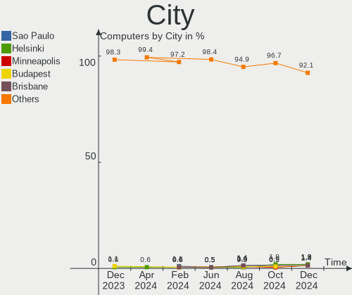
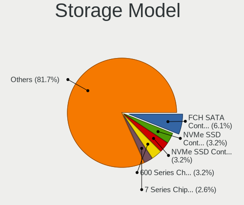

Pop!_OS - Hardware Trends
-------------------------

A project to identify most popular hardware characteristics and track their change
over time based on data collected by Linux users at https://Linux-Hardware.org.

Anyone can contribute to this report by the [hw-probe](https://github.com/linuxhw/hw-probe) tool:

    sudo -E hw-probe -all -upload

This is a report for all computer types. See also reports for [desktops](/Dist/Pop!_OS/Desktop/README.md) and [notebooks](/Dist/Pop!_OS/Notebook/README.md).

This report is for one last month. Overall report since the beginning of time: [TestDays](https://github.com/linuxhw/TestDays)

Period: Dec, 2024.

Contents
--------

* [ System ](#system)
  - [ OS                       ](#os)
  - [ OS Family                ](#os-family)
  - [ Kernel                   ](#kernel)
  - [ Kernel Family            ](#kernel-family)
  - [ Kernel Major Ver.        ](#kernel-major-ver)
  - [ Arch                     ](#arch)
  - [ DE                       ](#de)
  - [ Display Server           ](#display-server)
  - [ Display Manager          ](#display-manager)
  - [ OS Lang                  ](#os-lang)
  - [ Boot Mode                ](#boot-mode)
  - [ Filesystem               ](#filesystem)
  - [ Part. scheme             ](#part-scheme)
  - [ Dual Boot with Linux/BSD ](#dual-boot-with-linuxbsd)
  - [ Dual Boot (Win)          ](#dual-boot-win)

* [ Board ](#board)
  - [ Vendor                   ](#vendor)
  - [ Model                    ](#model)
  - [ Model Family             ](#model-family)
  - [ MFG Year                 ](#mfg-year)
  - [ Form Factor              ](#form-factor)
  - [ Secure Boot              ](#secure-boot)
  - [ Coreboot                 ](#coreboot)
  - [ RAM Size                 ](#ram-size)
  - [ RAM Used                 ](#ram-used)
  - [ Total Drives             ](#total-drives)
  - [ Has CD-ROM               ](#has-cd-rom)
  - [ Has Ethernet             ](#has-ethernet)
  - [ Has WiFi                 ](#has-wifi)
  - [ Has Bluetooth            ](#has-bluetooth)

* [ Location ](#location)
  - [ Country                  ](#country)
  - [ City                     ](#city)

* [ Drives ](#drives)
  - [ Drive Vendor             ](#drive-vendor)
  - [ Drive Model              ](#drive-model)
  - [ HDD Vendor               ](#hdd-vendor)
  - [ SSD Vendor               ](#ssd-vendor)
  - [ Drive Kind               ](#drive-kind)
  - [ Drive Connector          ](#drive-connector)
  - [ Drive Size               ](#drive-size)
  - [ Space Total              ](#space-total)
  - [ Space Used               ](#space-used)
  - [ Malfunc. Drives          ](#malfunc-drives)
  - [ Malfunc. Drive Vendor    ](#malfunc-drive-vendor)
  - [ Malfunc. HDD Vendor      ](#malfunc-hdd-vendor)
  - [ Malfunc. Drive Kind      ](#malfunc-drive-kind)
  - [ Failed Drives            ](#failed-drives)
  - [ Failed Drive Vendor      ](#failed-drive-vendor)
  - [ Drive Status             ](#drive-status)

* [ Storage controller ](#storage-controller)
  - [ Storage Vendor           ](#storage-vendor)
  - [ Storage Model            ](#storage-model)
  - [ Storage Kind             ](#storage-kind)

* [ Processor ](#processor)
  - [ CPU Vendor               ](#cpu-vendor)
  - [ CPU Model                ](#cpu-model)
  - [ CPU Model Family         ](#cpu-model-family)
  - [ CPU Cores                ](#cpu-cores)
  - [ CPU Sockets              ](#cpu-sockets)
  - [ CPU Threads              ](#cpu-threads)
  - [ CPU Op-Modes             ](#cpu-op-modes)
  - [ CPU Microcode            ](#cpu-microcode)
  - [ CPU Microarch            ](#cpu-microarch)

* [ Graphics ](#graphics)
  - [ GPU Vendor               ](#gpu-vendor)
  - [ GPU Model                ](#gpu-model)
  - [ GPU Combo                ](#gpu-combo)
  - [ GPU Driver               ](#gpu-driver)
  - [ GPU Memory               ](#gpu-memory)

* [ Monitor ](#monitor)
  - [ Monitor Vendor           ](#monitor-vendor)
  - [ Monitor Model            ](#monitor-model)
  - [ Monitor Resolution       ](#monitor-resolution)
  - [ Monitor Diagonal         ](#monitor-diagonal)
  - [ Monitor Width            ](#monitor-width)
  - [ Aspect Ratio             ](#aspect-ratio)
  - [ Monitor Area             ](#monitor-area)
  - [ Pixel Density            ](#pixel-density)
  - [ Multiple Monitors        ](#multiple-monitors)

* [ Network ](#network)
  - [ Net Controller Vendor    ](#net-controller-vendor)
  - [ Net Controller Model     ](#net-controller-model)
  - [ Wireless Vendor          ](#wireless-vendor)
  - [ Wireless Model           ](#wireless-model)
  - [ Ethernet Vendor          ](#ethernet-vendor)
  - [ Ethernet Model           ](#ethernet-model)
  - [ Net Controller Kind      ](#net-controller-kind)
  - [ Used Controller          ](#used-controller)
  - [ NICs                     ](#nics)
  - [ IPv6                     ](#ipv6)

* [ Bluetooth ](#bluetooth)
  - [ Bluetooth Vendor         ](#bluetooth-vendor)
  - [ Bluetooth Model          ](#bluetooth-model)

* [ Sound ](#sound)
  - [ Sound Vendor             ](#sound-vendor)
  - [ Sound Model              ](#sound-model)

* [ Memory ](#memory)
  - [ Memory Vendor            ](#memory-vendor)
  - [ Memory Model             ](#memory-model)
  - [ Memory Kind              ](#memory-kind)
  - [ Memory Form Factor       ](#memory-form-factor)
  - [ Memory Size              ](#memory-size)
  - [ Memory Speed             ](#memory-speed)

* [ Printers & scanners ](#printers--scanners)
  - [ Printer Vendor           ](#printer-vendor)
  - [ Printer Model            ](#printer-model)
  - [ Scanner Vendor           ](#scanner-vendor)
  - [ Scanner Model            ](#scanner-model)

* [ Camera ](#camera)
  - [ Camera Vendor            ](#camera-vendor)
  - [ Camera Model             ](#camera-model)

* [ Security ](#security)
  - [ Fingerprint Vendor       ](#fingerprint-vendor)
  - [ Fingerprint Model        ](#fingerprint-model)
  - [ Chipcard Vendor          ](#chipcard-vendor)
  - [ Chipcard Model           ](#chipcard-model)

* [ Unsupported ](#unsupported)
  - [ Unsupported Devices      ](#unsupported-devices)
  - [ Unsupported Device Types ](#unsupported-device-types)

System
------

OS
--

Installed operating systems

| Name          | Computers | Percent |
|---------------|-----------|---------|
| Pop!_OS 22.04 | 201       | 93.06%  |
| Pop!_OS 24.04 | 14        | 6.48%   |
| Pop!_OS 20.04 | 1         | 0.46%   |

OS Family
---------

OS without a version

| Name    | Computers | Percent |
|---------|-----------|---------|
| Pop!_OS | 216       | 100%    |

Kernel
------

Version of the Linux kernel

| Version                             | Computers | Percent |
|-------------------------------------|-----------|---------|
| 6.9.3-76060903-generic              | 208       | 96.3%   |
| 6.0.12-76060006-generic             | 2         | 0.93%   |
| 6.8.0-76060800daily20240311-generic | 1         | 0.46%   |
| 6.2.6-76060206-generic              | 1         | 0.46%   |
| 6.12.3-surface-2                    | 1         | 0.46%   |
| 6.12.2-3-liquorix-amd64             | 1         | 0.46%   |
| 6.0.6-76060006-generic              | 1         | 0.46%   |
| 6.0.12-76060012-generic             | 1         | 0.46%   |

Kernel Family
-------------

Linux kernel without a distro release

| Version | Computers | Percent |
|---------|-----------|---------|
| 6.9.3   | 208       | 96.3%   |
| 6.0.12  | 3         | 1.39%   |
| 6.8.0   | 1         | 0.46%   |
| 6.2.6   | 1         | 0.46%   |
| 6.12.3  | 1         | 0.46%   |
| 6.12.2  | 1         | 0.46%   |
| 6.0.6   | 1         | 0.46%   |

Kernel Major Ver.
-----------------

Linux kernel major version

| Version | Computers | Percent |
|---------|-----------|---------|
| 6.9     | 208       | 96.3%   |
| 6.0     | 4         | 1.85%   |
| 6.12    | 2         | 0.93%   |
| 6.8     | 1         | 0.46%   |
| 6.2     | 1         | 0.46%   |

Arch
----

OS architecture (x86_64, i586, etc.)

| Name   | Computers | Percent |
|--------|-----------|---------|
| x86_64 | 216       | 100%    |

DE
--

Desktop Environment

| Name       | Computers | Percent |
|------------|-----------|---------|
| GNOME      | 194       | 89.81%  |
| COSMIC     | 17        | 7.87%   |
| KDE5       | 3         | 1.39%   |
| XFCE       | 1         | 0.46%   |
| X-Cinnamon | 1         | 0.46%   |

Display Server
--------------

X11 or Wayland

| Name    | Computers | Percent |
|---------|-----------|---------|
| X11     | 184       | 85.19%  |
| Wayland | 31        | 14.35%  |
| Unknown | 1         | 0.46%   |

Display Manager
---------------

SDDM, LightDM, etc.

| Name           | Computers | Percent |
|----------------|-----------|---------|
| Unknown        | 159       | 73.61%  |
| GDM3           | 53        | 24.54%  |
| COSMIC-GREETER | 3         | 1.39%   |
| SDDM           | 1         | 0.46%   |

OS Lang
-------

Language

| Lang  | Computers | Percent |
|-------|-----------|---------|
| en_US | 122       | 56.48%  |
| en_GB | 18        | 8.33%   |
| C     | 12        | 5.56%   |
| pt_BR | 9         | 4.17%   |
| de_DE | 9         | 4.17%   |
| en_CA | 6         | 2.78%   |
| en_AU | 6         | 2.78%   |
| it_IT | 4         | 1.85%   |
| hu_HU | 4         | 1.85%   |
| fr_FR | 4         | 1.85%   |
| pl_PL | 3         | 1.39%   |
| nl_NL | 2         | 0.93%   |
| fi_FI | 2         | 0.93%   |
| de_CH | 2         | 0.93%   |
| zh_CN | 1         | 0.46%   |
| tr_TR | 1         | 0.46%   |
| sv_SE | 1         | 0.46%   |
| sl_SI | 1         | 0.46%   |
| nn_NO | 1         | 0.46%   |
| es_US | 1         | 0.46%   |
| es_PA | 1         | 0.46%   |
| es_CL | 1         | 0.46%   |
| es_BO | 1         | 0.46%   |
| en_PH | 1         | 0.46%   |
| en_IE | 1         | 0.46%   |
| de_AT | 1         | 0.46%   |
| cs_CZ | 1         | 0.46%   |

Boot Mode
---------

EFI or BIOS

| Mode | Computers | Percent |
|------|-----------|---------|
| BIOS | 171       | 79.17%  |
| EFI  | 45        | 20.83%  |

Filesystem
----------

Type of filesystem

| Type    | Computers | Percent |
|---------|-----------|---------|
| Ext4    | 208       | 96.3%   |
| Overlay | 5         | 2.31%   |
| Btrfs   | 3         | 1.39%   |

Part. scheme
------------

Scheme of partitioning

| Type    | Computers | Percent |
|---------|-----------|---------|
| Unknown | 158       | 73.15%  |
| GPT     | 50        | 23.15%  |
| MBR     | 8         | 3.7%    |

Dual Boot with Linux/BSD
------------------------

Hosting more than one Linux/BSD

| Dual boot | Computers | Percent |
|-----------|-----------|---------|
| No        | 211       | 97.69%  |
| Yes       | 5         | 2.31%   |

Dual Boot (Win)
---------------

Hosting Linux and Windows

| Dual boot | Computers | Percent |
|-----------|-----------|---------|
| No        | 197       | 91.2%   |
| Yes       | 19        | 8.8%    |

Board
-----

Vendor
------

Motherboard manufacturer

| Name                                 | Computers | Percent |
|--------------------------------------|-----------|---------|
| ASUSTek Computer                     | 42        | 19.44%  |
| Lenovo                               | 28        | 12.96%  |
| Dell                                 | 25        | 11.57%  |
| Gigabyte Technology                  | 18        | 8.33%   |
| Hewlett-Packard                      | 17        | 7.87%   |
| MSI                                  | 15        | 6.94%   |
| Apple                                | 13        | 6.02%   |
| ASRock                               | 12        | 5.56%   |
| Acer                                 | 10        | 4.63%   |
| System76                             | 6         | 2.78%   |
| Fujitsu                              | 4         | 1.85%   |
| HUAWEI                               | 3         | 1.39%   |
| Framework                            | 3         | 1.39%   |
| Intel                                | 2         | 0.93%   |
| AZW                                  | 2         | 0.93%   |
| Supermicro                           | 1         | 0.46%   |
| Shenzhen Meigao Electronic Equipment | 1         | 0.46%   |
| Positivo                             | 1         | 0.46%   |
| Notebook                             | 1         | 0.46%   |
| Microsoft                            | 1         | 0.46%   |
| Medion                               | 1         | 0.46%   |
| LG Electronics                       | 1         | 0.46%   |
| JGINYUE                              | 1         | 0.46%   |
| Google                               | 1         | 0.46%   |
| Eluktronics                          | 1         | 0.46%   |
| ECS                                  | 1         | 0.46%   |
| Chuwi                                | 1         | 0.46%   |
| Biostar                              | 1         | 0.46%   |
| AMI                                  | 1         | 0.46%   |
| Alienware                            | 1         | 0.46%   |
| Unknown                              | 1         | 0.46%   |

Model
-----

Motherboard model

| Name                                              | Computers | Percent |
|---------------------------------------------------|-----------|---------|
| System76 Oryx Pro                                 | 2         | 0.93%   |
| MSI MS-7E26                                       | 2         | 0.93%   |
| MSI MS-7C56                                       | 2         | 0.93%   |
| MSI MS-7B45                                       | 2         | 0.93%   |
| HUAWEI KLVL-WXX9                                  | 2         | 0.93%   |
| Gigabyte X570 AORUS ULTRA                         | 2         | 0.93%   |
| Framework Laptop 16 (AMD Ryzen 7040 Series)       | 2         | 0.93%   |
| Dell Precision WorkStation T3500                  | 2         | 0.93%   |
| Apple MacBookPro9,2                               | 2         | 0.93%   |
| Apple MacBookPro8,1                               | 2         | 0.93%   |
| Apple MacBookPro10,1                              | 2         | 0.93%   |
| System76 Thelio                                   | 1         | 0.46%   |
| System76 Lemur Pro                                | 1         | 0.46%   |
| System76 Gazelle                                  | 1         | 0.46%   |
| System76 Galago Pro                               | 1         | 0.46%   |
| Supermicro X9DRD-iF/LF                            | 1         | 0.46%   |
| Shenzhen Meigao Electronic Equipment Venus series | 1         | 0.46%   |
| Positivo POS-EIH61CQ                              | 1         | 0.46%   |
| Notebook N85_N87,HJ,HJ1,HK1                       | 1         | 0.46%   |
| MSI MS-7E07                                       | 1         | 0.46%   |
| MSI MS-7D73                                       | 1         | 0.46%   |
| MSI MS-7D30                                       | 1         | 0.46%   |
| MSI MS-7D20                                       | 1         | 0.46%   |
| MSI MS-7D08                                       | 1         | 0.46%   |
| MSI MS-7C37                                       | 1         | 0.46%   |
| MSI MS-7B86                                       | 1         | 0.46%   |
| MSI MS-7A59                                       | 1         | 0.46%   |
| MSI MS-7978                                       | 1         | 0.46%   |
| Microsoft Surface Book                            | 1         | 0.46%   |
| Medion S6445 MD61489                              | 1         | 0.46%   |
| LG 17ZB90R-K.ADC8U1                               | 1         | 0.46%   |
| Lenovo Yoga Pro 7 14AHP9 83E3                     | 1         | 0.46%   |
| Lenovo Yoga C940-14IIL 81Q9                       | 1         | 0.46%   |
| Lenovo ThinkPad X270 20HN001HUS                   | 1         | 0.46%   |
| Lenovo ThinkPad X230 2306CTO                      | 1         | 0.46%   |
| Lenovo ThinkPad X1 Extreme Gen 3 20TK001EUS       | 1         | 0.46%   |
| Lenovo ThinkPad X1 Carbon Gen 9 20XW004QUS        | 1         | 0.46%   |
| Lenovo ThinkPad X1 Carbon 7th 20QD001FZA          | 1         | 0.46%   |
| Lenovo ThinkPad T420s 417032U                     | 1         | 0.46%   |
| Lenovo ThinkPad T14 Gen 4 21K4S0GJ05              | 1         | 0.46%   |

Model Family
------------

Motherboard model prefix

| Name               | Computers | Percent |
|--------------------|-----------|---------|
| Lenovo ThinkPad    | 12        | 5.56%   |
| Dell Latitude      | 8         | 3.7%    |
| Acer Aspire        | 8         | 3.7%    |
| Dell Inspiron      | 7         | 3.24%   |
| ASUS ROG           | 7         | 3.24%   |
| ASUS PRIME         | 6         | 2.78%   |
| Lenovo IdeaPad     | 5         | 2.31%   |
| HP Pavilion        | 4         | 1.85%   |
| Gigabyte X570      | 3         | 1.39%   |
| Framework Laptop   | 3         | 1.39%   |
| Dell Precision     | 3         | 1.39%   |
| ASUS VivoBook      | 3         | 1.39%   |
| ASUS TUF           | 3         | 1.39%   |
| ASUS ASUS          | 3         | 1.39%   |
| Apple MacBookPro8  | 3         | 1.39%   |
| System76 Oryx      | 2         | 0.93%   |
| MSI MS-7E26        | 2         | 0.93%   |
| MSI MS-7C56        | 2         | 0.93%   |
| MSI MS-7B45        | 2         | 0.93%   |
| Lenovo Yoga        | 2         | 0.93%   |
| Lenovo ThinkCentre | 2         | 0.93%   |
| Lenovo ThinkBook   | 2         | 0.93%   |
| Lenovo Legion      | 2         | 0.93%   |
| HUAWEI KLVL-WXX9   | 2         | 0.93%   |
| HP Spectre         | 2         | 0.93%   |
| HP EliteBook       | 2         | 0.93%   |
| HP Compaq          | 2         | 0.93%   |
| Gigabyte Z390      | 2         | 0.93%   |
| Gigabyte X870      | 2         | 0.93%   |
| Gigabyte B550      | 2         | 0.93%   |
| Dell XPS           | 2         | 0.93%   |
| Dell OptiPlex      | 2         | 0.93%   |
| ASRock X570        | 2         | 0.93%   |
| ASRock B450M       | 2         | 0.93%   |
| Apple MacBookPro9  | 2         | 0.93%   |
| Apple MacBookPro10 | 2         | 0.93%   |
| System76 Thelio    | 1         | 0.46%   |
| System76 Lemur     | 1         | 0.46%   |
| System76 Gazelle   | 1         | 0.46%   |
| System76 Galago    | 1         | 0.46%   |

MFG Year
--------

Motherboard manufacture year

| Year | Computers | Percent |
|------|-----------|---------|
| 2021 | 28        | 12.96%  |
| 2023 | 22        | 10.19%  |
| 2018 | 19        | 8.8%    |
| 2024 | 18        | 8.33%   |
| 2019 | 18        | 8.33%   |
| 2020 | 16        | 7.41%   |
| 2012 | 16        | 7.41%   |
| 2022 | 14        | 6.48%   |
| 2017 | 14        | 6.48%   |
| 2013 | 13        | 6.02%   |
| 2016 | 9         | 4.17%   |
| 2011 | 8         | 3.7%    |
| 2010 | 8         | 3.7%    |
| 2015 | 6         | 2.78%   |
| 2014 | 3         | 1.39%   |
| 2009 | 2         | 0.93%   |
| 2008 | 2         | 0.93%   |

Form Factor
-----------

Physical design of the computer

| Name        | Computers | Percent |
|-------------|-----------|---------|
| Desktop     | 101       | 46.76%  |
| Notebook    | 99        | 45.83%  |
| Convertible | 7         | 3.24%   |
| Mini pc     | 5         | 2.31%   |
| Tablet      | 2         | 0.93%   |
| All in one  | 1         | 0.46%   |
| Server      | 1         | 0.46%   |

Secure Boot
-----------

Enabled or disabled

| State    | Computers | Percent |
|----------|-----------|---------|
| Disabled | 215       | 99.54%  |
| Enabled  | 1         | 0.46%   |

Coreboot
--------

Have coreboot on board

| Used | Computers | Percent |
|------|-----------|---------|
| No   | 211       | 97.69%  |
| Yes  | 5         | 2.31%   |

RAM Size
--------

Total RAM memory

| Size in GB  | Computers | Percent |
|-------------|-----------|---------|
| 32.01-64.0  | 58        | 26.85%  |
| 16.01-24.0  | 50        | 23.15%  |
| 8.01-16.0   | 35        | 16.2%   |
| 4.01-8.0    | 30        | 13.89%  |
| 64.01-256.0 | 18        | 8.33%   |
| 24.01-32.0  | 13        | 6.02%   |
| 3.01-4.0    | 12        | 5.56%   |

RAM Used
--------

Used RAM memory

| Used GB    | Computers | Percent |
|------------|-----------|---------|
| 4.01-8.0   | 89        | 41.2%   |
| 8.01-16.0  | 50        | 23.15%  |
| 3.01-4.0   | 47        | 21.76%  |
| 2.01-3.0   | 17        | 7.87%   |
| 16.01-24.0 | 4         | 1.85%   |
| 1.01-2.0   | 4         | 1.85%   |
| 24.01-32.0 | 3         | 1.39%   |
| 32.01-64.0 | 2         | 0.93%   |

Total Drives
------------

Number of drives on board

| Drives | Computers | Percent |
|--------|-----------|---------|
| 1      | 118       | 54.63%  |
| 2      | 44        | 20.37%  |
| 3      | 27        | 12.5%   |
| 4      | 13        | 6.02%   |
| 5      | 6         | 2.78%   |
| 6      | 5         | 2.31%   |
| 22     | 1         | 0.46%   |
| 14     | 1         | 0.46%   |
| 11     | 1         | 0.46%   |

Has CD-ROM
----------

Has CD-ROM on board

| Presented | Computers | Percent |
|-----------|-----------|---------|
| No        | 171       | 79.17%  |
| Yes       | 45        | 20.83%  |

Has Ethernet
------------

Has Ethernet on board

| Presented | Computers | Percent |
|-----------|-----------|---------|
| Yes       | 180       | 83.33%  |
| No        | 36        | 16.67%  |

Has WiFi
--------

Has WiFi module

| Presented | Computers | Percent |
|-----------|-----------|---------|
| Yes       | 169       | 78.24%  |
| No        | 47        | 21.76%  |

Has Bluetooth
-------------

Has Bluetooth module

| Presented | Computers | Percent |
|-----------|-----------|---------|
| Yes       | 162       | 75%     |
| No        | 54        | 25%     |

Location
--------

Country
-------

Geographic location (country)

| Country         | Computers | Percent |
|-----------------|-----------|---------|
| USA             | 68        | 31.48%  |
| Germany         | 15        | 6.94%   |
| Brazil          | 15        | 6.94%   |
| UK              | 10        | 4.63%   |
| Canada          | 9         | 4.17%   |
| Italy           | 8         | 3.7%    |
| France          | 8         | 3.7%    |
| Netherlands     | 7         | 3.24%   |
| Hungary         | 7         | 3.24%   |
| Poland          | 6         | 2.78%   |
| Australia       | 6         | 2.78%   |
| Finland         | 4         | 1.85%   |
| Turkey          | 3         | 1.39%   |
| South Africa    | 3         | 1.39%   |
| Philippines     | 3         | 1.39%   |
| Indonesia       | 3         | 1.39%   |
| Denmark         | 3         | 1.39%   |
| Switzerland     | 2         | 0.93%   |
| Sweden          | 2         | 0.93%   |
| Norway          | 2         | 0.93%   |
| Mexico          | 2         | 0.93%   |
| India           | 2         | 0.93%   |
| Chile           | 2         | 0.93%   |
| Bulgaria        | 2         | 0.93%   |
| Austria         | 2         | 0.93%   |
| Ukraine         | 1         | 0.46%   |
| Thailand        | 1         | 0.46%   |
| Spain           | 1         | 0.46%   |
| Slovenia        | 1         | 0.46%   |
| Serbia          | 1         | 0.46%   |
| Saudi Arabia    | 1         | 0.46%   |
| Russia          | 1         | 0.46%   |
| Romania         | 1         | 0.46%   |
| Portugal        | 1         | 0.46%   |
| Panama          | 1         | 0.46%   |
| North Macedonia | 1         | 0.46%   |
| Nepal           | 1         | 0.46%   |
| Lithuania       | 1         | 0.46%   |
| Israel          | 1         | 0.46%   |
| Greece          | 1         | 0.46%   |

City
----

Geographic location (city)

| City         | Computers | Percent |
|--------------|-----------|---------|
| Sao Paulo    | 4         | 1.85%   |
| Helsinki     | 4         | 1.85%   |
| Minneapolis  | 3         | 1.39%   |
| Budapest     | 3         | 1.39%   |
| Brisbane     | 3         | 1.39%   |
| Berlin       | 3         | 1.39%   |
| Vienna       | 2         | 0.93%   |
| Sydney       | 2         | 0.93%   |
| Sofia        | 2         | 0.93%   |
| Poznan       | 2         | 0.93%   |
| Mississauga  | 2         | 0.93%   |
| Layton       | 2         | 0.93%   |
| Eau Claire   | 2         | 0.93%   |
| Chicago      | 2         | 0.93%   |
| Cambridge    | 2         | 0.93%   |
| Amsterdam    | 2         | 0.93%   |
| Aarhus       | 2         | 0.93%   |
| York         | 1         | 0.46%   |
| Yogyakarta   | 1         | 0.46%   |
| Wil          | 1         | 0.46%   |
| West Chester | 1         | 0.46%   |
| Warsaw       | 1         | 0.46%   |
| Voelklingen  | 1         | 0.46%   |
| Vilnius      | 1         | 0.46%   |
| Västerås   | 1         | 0.46%   |
| Vallejo      | 1         | 0.46%   |
| Tulsa        | 1         | 0.46%   |
| Trondheim    | 1         | 0.46%   |
| Toronto      | 1         | 0.46%   |
| Timmins      | 1         | 0.46%   |
| Thessaloniki | 1         | 0.46%   |
| The Villages | 1         | 0.46%   |
| The Hague    | 1         | 0.46%   |
| Tatabánya   | 1         | 0.46%   |
| Tábor       | 1         | 0.46%   |
| Strasbourg   | 1         | 0.46%   |
| Sterzing     | 1         | 0.46%   |
| Steelville   | 1         | 0.46%   |
| St Louis     | 1         | 0.46%   |
| Springdale   | 1         | 0.46%   |

Drives
------

Drive Vendor
------------

Hard drive vendors

| Vendor                      | Computers | Drives | Percent |
|-----------------------------|-----------|--------|---------|
| Samsung Electronics         | 65        | 86     | 18.21%  |
| WDC                         | 45        | 69     | 12.61%  |
| Seagate                     | 35        | 53     | 9.8%    |
| SanDisk                     | 26        | 33     | 7.28%   |
| Crucial                     | 16        | 17     | 4.48%   |
| Kingston                    | 15        | 17     | 4.2%    |
| Kingston Technology Company | 11        | 11     | 3.08%   |
| Toshiba                     | 9         | 9      | 2.52%   |
| Phison Electronics          | 9         | 10     | 2.52%   |
| Micron/Crucial Technology   | 9         | 10     | 2.52%   |
| SK hynix                    | 8         | 8      | 2.24%   |
| Micron Technology           | 8         | 9      | 2.24%   |
| Intel                       | 8         | 9      | 2.24%   |
| Unknown                     | 7         | 9      | 1.96%   |
| Hitachi                     | 6         | 8      | 1.68%   |
| Apple                       | 6         | 6      | 1.68%   |
| Phison                      | 5         | 5      | 1.4%    |
| China                       | 5         | 5      | 1.4%    |
| KIOXIA                      | 4         | 4      | 1.12%   |
| HGST                        | 4         | 4      | 1.12%   |
| A-DATA Technology           | 4         | 4      | 1.12%   |
| Team                        | 2         | 2      | 0.56%   |
| SABRENT                     | 2         | 2      | 0.56%   |
| Realtek Semiconductor       | 2         | 3      | 0.56%   |
| Patriot                     | 2         | 2      | 0.56%   |
| OCZ                         | 2         | 2      | 0.56%   |
| Netac                       | 2         | 2      | 0.56%   |
| KODAK                       | 2         | 2      | 0.56%   |
| Inland                      | 2         | 2      | 0.56%   |
| Fanxiang                    | 2         | 2      | 0.56%   |
| Corsair                     | 2         | 2      | 0.56%   |
| ASMT                        | 2         | 4      | 0.56%   |
| ADATA Technology            | 2         | 2      | 0.56%   |
| Unknown                     | 2         | 2      | 0.56%   |
| XrayDisk                    | 1         | 1      | 0.28%   |
| Win Memory                  | 1         | 1      | 0.28%   |
| WD MediaMax                 | 1         | 1      | 0.28%   |
| Verbatim                    | 1         | 1      | 0.28%   |
| USB                         | 1         | 1      | 0.28%   |
| Transcend                   | 1         | 1      | 0.28%   |

Drive Model
-----------

Hard drive models

| Model                                                 | Computers | Percent |
|-------------------------------------------------------|-----------|---------|
| Samsung NVMe SSD Controller PM9A1/PM9A3/980PRO 512GB  | 8         | 1.98%   |
| Samsung NVMe SSD Controller SM981/PM981/PM983 512GB   | 7         | 1.73%   |
| Kingston Company SNV2S1000G 1TB                       | 5         | 1.24%   |
| Micron/Crucial P2 NVMe PCIe SSD 500GB                 | 4         | 0.99%   |
| Intel SSD 660P Series 1024GB                          | 4         | 0.99%   |
| Seagate ST1000DM010-2EP102 1TB                        | 3         | 0.74%   |
| Samsung SSD 970 EVO Plus 2TB                          | 3         | 0.74%   |
| Samsung SSD 860 EVO 1TB                               | 3         | 0.74%   |
| Phison E12 NVMe Controller 480GB                      | 3         | 0.74%   |
| Phison 311CD0512GB                                    | 3         | 0.74%   |
| Crucial CT500MX500SSD1 500GB                          | 3         | 0.74%   |
| WDC WDS240G2G0A-00JH30 240GB SSD                      | 2         | 0.5%    |
| WDC WD20EZBX-00AYRA0 2TB                              | 2         | 0.5%    |
| WDC WD10JPVX-22JC3T0 1TB                              | 2         | 0.5%    |
| WDC WD10EZEX-08M2NA0 1TB                              | 2         | 0.5%    |
| Toshiba KXG6AZNV256G 256GB                            | 2         | 0.5%    |
| Seagate ST2000DM008-2FR102 2TB                        | 2         | 0.5%    |
| Seagate Expansion HDD 14TB                            | 2         | 0.5%    |
| Sandisk WD Blue SN580 1TB                             | 2         | 0.5%    |
| Sandisk WD Black 2018/SN750 / PC SN720 NVMe SSD 512GB | 2         | 0.5%    |
| SanDisk NVMe SSD Drive 2TB                            | 2         | 0.5%    |
| SanDisk NVMe SSD Drive 1TB                            | 2         | 0.5%    |
| Samsung SSD 870 QVO 1TB                               | 2         | 0.5%    |
| Samsung SSD 870 EVO 2TB                               | 2         | 0.5%    |
| Samsung SSD 860 EVO M.2 500GB                         | 2         | 0.5%    |
| Samsung SSD 850 EVO 250GB                             | 2         | 0.5%    |
| Samsung SSD 840 EVO 250GB                             | 2         | 0.5%    |
| SABRENT Disk 2TB                                      | 2         | 0.5%    |
| Phison PCIe SSD 512GB                                 | 2         | 0.5%    |
| Micron CT1000P3SSD8 1TB                               | 2         | 0.5%    |
| Kingston Company SNV2S2000G 2TB                       | 2         | 0.5%    |
| Kingston Company A2000 NVMe SSD 500GB                 | 2         | 0.5%    |
| Kingston SUV400S37120G 120GB SSD                      | 2         | 0.5%    |
| Kingston SA400S37120G 120GB SSD                       | 2         | 0.5%    |
| Intel SSDPEKNU512GZ 512GB                             | 2         | 0.5%    |
| Crucial CT500P3SSD8 500GB                             | 2         | 0.5%    |
| China SSD 1TB                                         | 2         | 0.5%    |
| Apple SSD SM512E 500GB                                | 2         | 0.5%    |
| Unknown                                               | 2         | 0.5%    |
| XrayDisk 240GB                                        | 1         | 0.25%   |

HDD Vendor
----------

Hard disk drive vendors

| Vendor              | Computers | Drives | Percent |
|---------------------|-----------|--------|---------|
| WDC                 | 35        | 57     | 37.23%  |
| Seagate             | 33        | 50     | 35.11%  |
| Hitachi             | 6         | 8      | 6.38%   |
| Toshiba             | 5         | 5      | 5.32%   |
| Samsung Electronics | 5         | 5      | 5.32%   |
| HGST                | 4         | 4      | 4.26%   |
| SABRENT             | 2         | 2      | 2.13%   |
| WD MediaMax         | 1         | 1      | 1.06%   |
| External            | 1         | 1      | 1.06%   |
| ASMT                | 1         | 3      | 1.06%   |
| Apple               | 1         | 1      | 1.06%   |

SSD Vendor
----------

Solid state drive vendors

| Vendor              | Computers | Drives | Percent |
|---------------------|-----------|--------|---------|
| Samsung Electronics | 28        | 35     | 25.23%  |
| SanDisk             | 10        | 13     | 9.01%   |
| Kingston            | 9         | 10     | 8.11%   |
| Crucial             | 9         | 9      | 8.11%   |
| WDC                 | 8         | 8      | 7.21%   |
| China               | 5         | 5      | 4.5%    |
| Apple               | 5         | 5      | 4.5%    |
| SK hynix            | 3         | 3      | 2.7%    |
| A-DATA Technology   | 3         | 3      | 2.7%    |
| Patriot             | 2         | 2      | 1.8%    |
| OCZ                 | 2         | 2      | 1.8%    |
| Netac               | 2         | 2      | 1.8%    |
| Micron Technology   | 2         | 3      | 1.8%    |
| KODAK               | 2         | 2      | 1.8%    |
| Inland              | 2         | 2      | 1.8%    |
| Win Memory          | 1         | 1      | 0.9%    |
| Verbatim            | 1         | 1      | 0.9%    |
| Transcend           | 1         | 1      | 0.9%    |
| Toshiba             | 1         | 1      | 0.9%    |
| TEAM T25            | 1         | 1      | 0.9%    |
| Team                | 1         | 1      | 0.9%    |
| T-FORCE             | 1         | 1      | 0.9%    |
| SPCC                | 1         | 1      | 0.9%    |
| Seagate             | 1         | 1      | 0.9%    |
| Plextor             | 1         | 2      | 0.9%    |
| Phison              | 1         | 1      | 0.9%    |
| OWC                 | 1         | 1      | 0.9%    |
| Intenso             | 1         | 1      | 0.9%    |
| GOODRAM             | 1         | 1      | 0.9%    |
| FORESEE             | 1         | 1      | 0.9%    |
| Fanxiang            | 1         | 1      | 0.9%    |
| Esmart              | 1         | 4      | 0.9%    |
| Corsair             | 1         | 1      | 0.9%    |
| Apacer              | 1         | 1      | 0.9%    |

Drive Kind
----------

HDD or SSD

| Kind    | Computers | Drives | Percent |
|---------|-----------|--------|---------|
| NVMe    | 127       | 166    | 40.84%  |
| SSD     | 94        | 127    | 30.23%  |
| HDD     | 76        | 137    | 24.44%  |
| Unknown | 9         | 10     | 2.89%   |
| MMC     | 5         | 6      | 1.61%   |

Drive Connector
---------------

SATA, SAS, NVMe, etc.

| Type | Computers | Drives | Percent |
|------|-----------|--------|---------|
| NVMe | 127       | 164    | 46.52%  |
| SATA | 124       | 249    | 45.42%  |
| SAS  | 17        | 27     | 6.23%   |
| MMC  | 5         | 6      | 1.83%   |

Drive Size
----------

Size of hard drive

| Size in TB | Computers | Drives | Percent |
|------------|-----------|--------|---------|
| 0.01-0.5   | 81        | 114    | 43.78%  |
| 0.51-1.0   | 52        | 61     | 28.11%  |
| 1.01-2.0   | 25        | 37     | 13.51%  |
| 3.01-4.0   | 11        | 19     | 5.95%   |
| 4.01-10.0  | 7         | 10     | 3.78%   |
| 10.01-20.0 | 5         | 16     | 2.7%    |
| 2.01-3.0   | 4         | 7      | 2.16%   |

Space Total
-----------

Amount of disk space available on the file system

| Size in GB     | Computers | Percent |
|----------------|-----------|---------|
| 251-500        | 57        | 26.39%  |
| 501-1000       | 53        | 24.54%  |
| 101-250        | 44        | 20.37%  |
| More than 3000 | 23        | 10.65%  |
| 1001-2000      | 23        | 10.65%  |
| 2001-3000      | 10        | 4.63%   |
| 1-20           | 4         | 1.85%   |
| 51-100         | 1         | 0.46%   |
| Unknown        | 1         | 0.46%   |

Space Used
----------

Amount of used disk space

| Used GB        | Computers | Percent |
|----------------|-----------|---------|
| 21-50          | 51        | 23.61%  |
| 1-20           | 45        | 20.83%  |
| 101-250        | 29        | 13.43%  |
| 51-100         | 28        | 12.96%  |
| 501-1000       | 20        | 9.26%   |
| 251-500        | 17        | 7.87%   |
| 1001-2000      | 11        | 5.09%   |
| More than 3000 | 9         | 4.17%   |
| 2001-3000      | 5         | 2.31%   |
| Unknown        | 1         | 0.46%   |

Malfunc. Drives
---------------

Drive models with a malfunction

| Model                                               | Computers | Drives | Percent |
|-----------------------------------------------------|-----------|--------|---------|
| WDC WD5000LPVX-75V0TT0 500GB                        | 1         | 1      | 8.33%   |
| WDC WD5000LPVX-28V0TT0 500GB                        | 1         | 1      | 8.33%   |
| WDC WD40EZRZ-00GXCB0 4TB                            | 1         | 1      | 8.33%   |
| WDC WD10JPVX-22JC3T0 1TB                            | 1         | 1      | 8.33%   |
| SanDisk SSD PLUS 240GB                              | 1         | 1      | 8.33%   |
| Samsung Electronics SSD 980 PRO 2TB                 | 1         | 1      | 8.33%   |
| Samsung Electronics SSD 980 PRO 1TB S5GXNF0R522804M | 1         | 1      | 8.33%   |
| Samsung Electronics HD501LJ 500GB                   | 1         | 1      | 8.33%   |
| HGST HTS721010A9E630 1TB                            | 1         | 1      | 8.33%   |
| Crucial CT500P1SSD8 500GB                           | 1         | 1      | 8.33%   |
| Crucial CT2000MX500SSD1 2TB                         | 1         | 1      | 8.33%   |
| A-DATA Technology SX8200PNP 1TB                     | 1         | 1      | 8.33%   |

Malfunc. Drive Vendor
---------------------

Vendors of faulty drives

| Vendor              | Computers | Drives | Percent |
|---------------------|-----------|--------|---------|
| WDC                 | 4         | 4      | 33.33%  |
| Samsung Electronics | 3         | 3      | 25%     |
| Crucial             | 2         | 2      | 16.67%  |
| SanDisk             | 1         | 1      | 8.33%   |
| HGST                | 1         | 1      | 8.33%   |
| A-DATA Technology   | 1         | 1      | 8.33%   |

Malfunc. HDD Vendor
-------------------

Vendors of faulty HDD drives

| Vendor              | Computers | Drives | Percent |
|---------------------|-----------|--------|---------|
| WDC                 | 4         | 4      | 66.67%  |
| Samsung Electronics | 1         | 1      | 16.67%  |
| HGST                | 1         | 1      | 16.67%  |

Malfunc. Drive Kind
-------------------

Kinds of faulty drives

| Kind | Computers | Drives | Percent |
|------|-----------|--------|---------|
| HDD  | 5         | 6      | 45.45%  |
| NVMe | 4         | 4      | 36.36%  |
| SSD  | 2         | 2      | 18.18%  |

Failed Drives
-------------

Failed drive models

Zero info for selected period =(

Failed Drive Vendor
-------------------

Failed drive vendors

Zero info for selected period =(

Drive Status
------------

Number of failed and malfunc. drives

| Status   | Computers | Drives | Percent |
|----------|-----------|--------|---------|
| Detected | 165       | 357    | 73.33%  |
| Works    | 50        | 77     | 22.22%  |
| Malfunc  | 10        | 12     | 4.44%   |

Storage controller
------------------

Storage Vendor
--------------

Storage controller vendors

| Vendor                       | Computers | Percent |
|------------------------------|-----------|---------|
| Intel                        | 121       | 37.93%  |
| AMD                          | 47        | 14.73%  |
| Samsung Electronics          | 38        | 11.91%  |
| SanDisk                      | 20        | 6.27%   |
| Kingston Technology Company  | 16        | 5.02%   |
| Micron/Crucial Technology    | 15        | 4.7%    |
| Phison Electronics           | 14        | 4.39%   |
| Micron Technology            | 7         | 2.19%   |
| ASMedia Technology           | 6         | 1.88%   |
| SK hynix                     | 5         | 1.57%   |
| MAXIO Technology (Hangzhou)  | 4         | 1.25%   |
| KIOXIA                       | 4         | 1.25%   |
| Toshiba America Info Systems | 3         | 0.94%   |
| Nvidia                       | 3         | 0.94%   |
| Marvell Technology Group     | 3         | 0.94%   |
| JMicron Technology           | 3         | 0.94%   |
| Realtek Semiconductor        | 2         | 0.63%   |
| ADATA Technology             | 2         | 0.63%   |
| Solidigm                     | 1         | 0.31%   |
| Silicon Motion               | 1         | 0.31%   |
| Seagate Technology           | 1         | 0.31%   |
| LSI Logic / Symbios Logic    | 1         | 0.31%   |
| Dell                         | 1         | 0.31%   |
| Broadcom / LSI               | 1         | 0.31%   |

Storage Model
-------------

Storage controller models

| Model                                                                          | Computers | Percent |
|--------------------------------------------------------------------------------|-----------|---------|
| AMD FCH SATA Controller [AHCI mode]                                            | 21        | 6.09%   |
| Samsung NVMe SSD Controller SM981/PM981/PM983                                  | 11        | 3.19%   |
| Samsung NVMe SSD Controller PM9A1/PM9A3/980PRO                                 | 11        | 3.19%   |
| AMD 600 Series Chipset SATA Controller                                         | 11        | 3.19%   |
| Intel 7 Series Chipset Family 6-port SATA Controller [AHCI mode]               | 9         | 2.61%   |
| AMD 500 Series Chipset SATA Controller                                         | 9         | 2.61%   |
| Intel 6 Series/C200 Series Chipset Family 6 port Mobile SATA AHCI Controller   | 8         | 2.32%   |
| Intel 200 Series PCH SATA controller [AHCI mode]                               | 8         | 2.32%   |
| Intel Sunrise Point-LP SATA Controller [AHCI mode]                             | 7         | 2.03%   |
| Samsung NVMe SSD Controller 980 (DRAM-less)                                    | 6         | 1.74%   |
| Micron/Crucial P2 [Nick P2] / P3 / P3 Plus NVMe PCIe SSD (DRAM-less)           | 6         | 1.74%   |
| Intel Volume Management Device NVMe RAID Controller Intel Corporation          | 6         | 1.74%   |
| Intel Volume Management Device NVMe RAID Controller                            | 6         | 1.74%   |
| Intel SATA Controller [RAID mode]                                              | 6         | 1.74%   |
| Intel Q170/Q150/B150/H170/H110/Z170/CM236 Chipset SATA Controller [AHCI Mode]  | 6         | 1.74%   |
| Intel 8 Series/C220 Series Chipset Family 6-port SATA Controller 1 [AHCI mode] | 6         | 1.74%   |
| Intel 7 Series/C210 Series Chipset Family 6-port SATA Controller [AHCI mode]   | 6         | 1.74%   |
| Intel 500 Series Chipset Family SATA AHCI Controller                           | 6         | 1.74%   |
| Intel Alder Lake-S PCH SATA Controller [AHCI Mode]                             | 5         | 1.45%   |
| ASMedia ASM1061/ASM1062 Serial ATA Controller                                  | 5         | 1.45%   |
| AMD 400 Series Chipset SATA Controller                                         | 5         | 1.45%   |
| Micron 2550 NVMe SSD (DRAM-less)                                               | 4         | 1.16%   |
| Kingston Company NV2 NVMe SSD [E21T] (DRAM-less)                               | 4         | 1.16%   |
| Intel SSD 660P Series                                                          | 4         | 1.16%   |
| Sandisk WD Black SN850X NVMe SSD                                               | 3         | 0.87%   |
| SanDisk Extreme Pro / WD Black SN750 / PC SN730 / Red SN700 NVMe SSD           | 3         | 0.87%   |
| Samsung NVMe SSD Controller S4LV008[Pascal]                                    | 3         | 0.87%   |
| Samsung NVMe SSD Controller PM9C1a (DRAM-less)                                 | 3         | 0.87%   |
| Phison PS5021-E21 PCIe4 NVMe Controller (DRAM-less)                            | 3         | 0.87%   |
| Phison PS5013-E13 PCIe3 NVMe Controller (DRAM-less)                            | 3         | 0.87%   |
| Phison E18 PCIe4 NVMe Controller                                               | 3         | 0.87%   |
| Phison E12 NVMe Controller                                                     | 3         | 0.87%   |
| Micron/Crucial P3 Plus NVMe PCIe SSD (DRAM-less)                               | 3         | 0.87%   |
| MAXIO (Hangzhou) NVMe SSD Controller MAP1202 (DRAM-less)                       | 3         | 0.87%   |
| Kingston Company NV2 NVMe SSD [SM2267XT] (DRAM-less)                           | 3         | 0.87%   |
| Intel Raptor Lake SATA AHCI Controller                                         | 3         | 0.87%   |
| Intel HM170/QM170 Chipset SATA Controller [AHCI Mode]                          | 3         | 0.87%   |
| Intel Cannon Lake Mobile PCH SATA AHCI Controller                              | 3         | 0.87%   |
| Intel Alder Lake-P SATA AHCI Controller                                        | 3         | 0.87%   |
| Intel 82801 Mobile SATA Controller [RAID mode]                                 | 3         | 0.87%   |

Storage Kind
------------

Kind of storage controller (IDE, SATA, NVMe, SAS, ...)

| Kind | Computers | Percent |
|------|-----------|---------|
| SATA | 147       | 47.73%  |
| NVMe | 126       | 40.91%  |
| RAID | 25        | 8.12%   |
| IDE  | 9         | 2.92%   |
| SAS  | 1         | 0.32%   |

Processor
---------

CPU Vendor
----------

Processor vendors

| Vendor | Computers | Percent |
|--------|-----------|---------|
| Intel  | 148       | 68.52%  |
| AMD    | 68        | 31.48%  |

CPU Model
---------

Processor models

| Model                                      | Computers | Percent |
|--------------------------------------------|-----------|---------|
| AMD Ryzen 7 5800X 8-Core Processor         | 6         | 2.78%   |
| Intel 11th Gen Core i5-1135G7 @ 2.40GHz    | 4         | 1.85%   |
| Intel Core i7-6700K CPU @ 4.00GHz          | 3         | 1.39%   |
| Intel Core i7-3770 CPU @ 3.40GHz           | 3         | 1.39%   |
| Intel Core i7-2720QM CPU @ 2.20GHz         | 3         | 1.39%   |
| Intel Core i5-3210M CPU @ 2.50GHz          | 3         | 1.39%   |
| Intel 11th Gen Core i7-1165G7 @ 2.80GHz    | 3         | 1.39%   |
| AMD Ryzen 9 5900X 12-Core Processor        | 3         | 1.39%   |
| AMD Ryzen 5 5600X 6-Core Processor         | 3         | 1.39%   |
| AMD Ryzen 5 5600 6-Core Processor          | 3         | 1.39%   |
| Intel N100                                 | 2         | 0.93%   |
| Intel Core Ultra 7 155H                    | 2         | 0.93%   |
| Intel Core i7-8850H CPU @ 2.60GHz          | 2         | 0.93%   |
| Intel Core i7-7700K CPU @ 4.20GHz          | 2         | 0.93%   |
| Intel Core i7-7700HQ CPU @ 2.80GHz         | 2         | 0.93%   |
| Intel Core i7-6600U CPU @ 2.60GHz          | 2         | 0.93%   |
| Intel Core i7-3720QM CPU @ 2.60GHz         | 2         | 0.93%   |
| Intel Core i7-3615QM CPU @ 2.30GHz         | 2         | 0.93%   |
| Intel Core i7-10700 CPU @ 2.90GHz          | 2         | 0.93%   |
| Intel Core i7-10510U CPU @ 1.80GHz         | 2         | 0.93%   |
| Intel Core i5-8400 CPU @ 2.80GHz           | 2         | 0.93%   |
| Intel Core i5-8365U CPU @ 1.60GHz          | 2         | 0.93%   |
| Intel Core i5-8265U CPU @ 1.60GHz          | 2         | 0.93%   |
| Intel Core i5-7500 CPU @ 3.40GHz           | 2         | 0.93%   |
| Intel Core i5-7200U CPU @ 2.50GHz          | 2         | 0.93%   |
| Intel 13th Gen Core i7-1360P               | 2         | 0.93%   |
| AMD Ryzen 9 7940HS w/ Radeon 780M Graphics | 2         | 0.93%   |
| AMD Ryzen 7 7840HS w/ Radeon 780M Graphics | 2         | 0.93%   |
| AMD Ryzen 7 5700X3D 8-Core Processor       | 2         | 0.93%   |
| AMD Ryzen 7 5700G with Radeon Graphics     | 2         | 0.93%   |
| AMD Ryzen 7 4800H with Radeon Graphics     | 2         | 0.93%   |
| AMD Ryzen 7 1800X Eight-Core Processor     | 2         | 0.93%   |
| AMD Ryzen 5 7600X 6-Core Processor         | 2         | 0.93%   |
| AMD FX-8350 Eight-Core Processor           | 2         | 0.93%   |
| Intel Xeon CPU X5650 @ 2.67GHz             | 1         | 0.46%   |
| Intel Xeon CPU W5580 @ 3.20GHz             | 1         | 0.46%   |
| Intel Xeon CPU W3565 @ 3.20GHz             | 1         | 0.46%   |
| Intel Xeon CPU E5-2690 v4 @ 2.60GHz        | 1         | 0.46%   |
| Intel Xeon CPU E5-2665 0 @ 2.40GHz         | 1         | 0.46%   |
| Intel Xeon CPU E5-1650 v2 @ 3.50GHz        | 1         | 0.46%   |

CPU Model Family
----------------

Processor model prefix

| Model                  | Computers | Percent |
|------------------------|-----------|---------|
| Intel Core i7          | 48        | 22.22%  |
| Intel Core i5          | 40        | 18.52%  |
| AMD Ryzen 7            | 34        | 15.74%  |
| Other                  | 30        | 13.89%  |
| AMD Ryzen 5            | 14        | 6.48%   |
| AMD Ryzen 9            | 10        | 4.63%   |
| Intel Core i3          | 9         | 4.17%   |
| Intel Xeon             | 8         | 3.7%    |
| Intel Core i9          | 3         | 1.39%   |
| Intel Pentium          | 2         | 0.93%   |
| Intel Core 2 Duo       | 2         | 0.93%   |
| Intel Core             | 2         | 0.93%   |
| Intel Atom             | 2         | 0.93%   |
| AMD Phenom II X4       | 2         | 0.93%   |
| AMD FX                 | 2         | 0.93%   |
| Intel Pentium Silver   | 1         | 0.46%   |
| Intel Celeron          | 1         | 0.46%   |
| AMD Ryzen Threadripper | 1         | 0.46%   |
| AMD Ryzen 7 PRO        | 1         | 0.46%   |
| AMD Ryzen 3            | 1         | 0.46%   |
| AMD Athlon             | 1         | 0.46%   |
| AMD A8                 | 1         | 0.46%   |
| AMD A10                | 1         | 0.46%   |

CPU Cores
---------

Number of processor cores

| Number | Computers | Percent |
|--------|-----------|---------|
| 4      | 73        | 33.8%   |
| 8      | 45        | 20.83%  |
| 2      | 38        | 17.59%  |
| 6      | 30        | 13.89%  |
| 12     | 8         | 3.7%    |
| 16     | 7         | 3.24%   |
| 10     | 6         | 2.78%   |
| 14     | 4         | 1.85%   |
| 24     | 3         | 1.39%   |
| 20     | 1         | 0.46%   |
| 1      | 1         | 0.46%   |

CPU Sockets
-----------

Number of sockets

| Number | Computers | Percent |
|--------|-----------|---------|
| 1      | 215       | 99.54%  |
| 2      | 1         | 0.46%   |

CPU Threads
-----------

Threads per core (Hyper-Threading)

| Number | Computers | Percent |
|--------|-----------|---------|
| 2      | 179       | 82.87%  |
| 1      | 37        | 17.13%  |

CPU Op-Modes
------------

CPU Operation Modes (32-bit, 64-bit)

| Op mode        | Computers | Percent |
|----------------|-----------|---------|
| 32-bit, 64-bit | 216       | 100%    |

CPU Microcode
-------------

Microcode number

| Number  | Computers | Percent |
|---------|-----------|---------|
| Unknown | 216       | 100%    |

CPU Microarch
-------------

Microarchitecture

| Name             | Computers | Percent |
|------------------|-----------|---------|
| Unknown          | 44        | 20.37%  |
| KabyLake         | 36        | 16.67%  |
| Zen 3            | 24        | 11.11%  |
| IvyBridge        | 18        | 8.33%   |
| SandyBridge      | 12        | 5.56%   |
| Haswell          | 12        | 5.56%   |
| Skylake          | 11        | 5.09%   |
| TigerLake        | 10        | 4.63%   |
| CometLake        | 8         | 3.7%    |
| Alderlake Hybrid | 6         | 2.78%   |
| Zen 2            | 5         | 2.31%   |
| Zen+             | 3         | 1.39%   |
| Zen              | 3         | 1.39%   |
| Penryn           | 3         | 1.39%   |
| IceLake          | 3         | 1.39%   |
| Broadwell        | 3         | 1.39%   |
| Westmere         | 2         | 0.93%   |
| Piledriver       | 2         | 0.93%   |
| Nehalem          | 2         | 0.93%   |
| K10              | 2         | 0.93%   |
| Silvermont       | 1         | 0.46%   |
| K10 Llano        | 1         | 0.46%   |
| Gracemont        | 1         | 0.46%   |
| Goldmont plus    | 1         | 0.46%   |
| Goldmont         | 1         | 0.46%   |
| Excavator        | 1         | 0.46%   |
| Core             | 1         | 0.46%   |

Graphics
--------

GPU Vendor
----------

Vendors of graphics cards

| Vendor                     | Computers | Percent |
|----------------------------|-----------|---------|
| Intel                      | 108       | 39.42%  |
| Nvidia                     | 103       | 37.59%  |
| AMD                        | 62        | 22.63%  |
| Matrox Electronics Systems | 1         | 0.36%   |

GPU Model
---------

Graphics card models

| Model                                                                       | Computers | Percent |
|-----------------------------------------------------------------------------|-----------|---------|
| Intel TigerLake-LP GT2 [Iris Xe Graphics]                                   | 10        | 3.6%    |
| Intel 3rd Gen Core processor Graphics Controller                            | 9         | 3.24%   |
| Intel 2nd Generation Core Processor Family Integrated Graphics Controller   | 9         | 3.24%   |
| AMD Raphael                                                                 | 9         | 3.24%   |
| Intel Raptor Lake-P [Iris Xe Graphics]                                      | 6         | 2.16%   |
| Intel HD Graphics 630                                                       | 6         | 2.16%   |
| Intel CoffeeLake-H GT2 [UHD Graphics 630]                                   | 6         | 2.16%   |
| AMD Phoenix1                                                                | 6         | 2.16%   |
| Nvidia GP107 [GeForce GTX 1050 Ti]                                          | 5         | 1.8%    |
| Intel WhiskeyLake-U GT2 [UHD Graphics 620]                                  | 5         | 1.8%    |
| Intel HD Graphics 620                                                       | 5         | 1.8%    |
| Nvidia GA104 [GeForce RTX 3060 Ti Lite Hash Rate]                           | 4         | 1.44%   |
| Intel Skylake GT2 [HD Graphics 520]                                         | 4         | 1.44%   |
| AMD Navi 32 [Radeon RX 7700 XT / 7800 XT]                                   | 4         | 1.44%   |
| Nvidia TU116 [GeForce GTX 1660 Ti]                                          | 3         | 1.08%   |
| Nvidia GP108 [GeForce GT 1030]                                              | 3         | 1.08%   |
| Nvidia GP107M [GeForce GTX 1050 Ti Mobile]                                  | 3         | 1.08%   |
| Nvidia GK104 [GeForce GTX 760]                                              | 3         | 1.08%   |
| Nvidia AD107M [GeForce RTX 4050 Max-Q / Mobile]                             | 3         | 1.08%   |
| Nvidia AD106 [GeForce RTX 4060 Ti]                                          | 3         | 1.08%   |
| Intel Xeon E3-1200 v3/4th Gen Core Processor Integrated Graphics Controller | 3         | 1.08%   |
| Intel Xeon E3-1200 v2/3rd Gen Core processor Graphics Controller            | 3         | 1.08%   |
| Intel UHD Graphics 620                                                      | 3         | 1.08%   |
| Intel HD Graphics 530                                                       | 3         | 1.08%   |
| Intel Haswell-ULT Integrated Graphics Controller                            | 3         | 1.08%   |
| Intel CometLake-H GT2 [UHD Graphics]                                        | 3         | 1.08%   |
| Intel 4th Gen Core Processor Integrated Graphics Controller                 | 3         | 1.08%   |
| AMD Rembrandt [Radeon 680M]                                                 | 3         | 1.08%   |
| AMD Phoenix3                                                                | 3         | 1.08%   |
| AMD Cezanne [Radeon Vega Series / Radeon Vega Mobile Series]                | 3         | 1.08%   |
| Nvidia TU116 [GeForce GTX 1660 SUPER]                                       | 2         | 0.72%   |
| Nvidia GP104 [GeForce GTX 1080]                                             | 2         | 0.72%   |
| Nvidia GP104 [GeForce GTX 1070]                                             | 2         | 0.72%   |
| Nvidia GP102 [GeForce GTX 1080 Ti]                                          | 2         | 0.72%   |
| Nvidia GM204 [GeForce GTX 970]                                              | 2         | 0.72%   |
| Nvidia GK208B [GeForce GT 710]                                              | 2         | 0.72%   |
| Nvidia GA106 [GeForce RTX 3060 Lite Hash Rate]                              | 2         | 0.72%   |
| Nvidia GA104 [GeForce RTX 3060]                                             | 2         | 0.72%   |
| Nvidia AD104 [GeForce RTX 4070]                                             | 2         | 0.72%   |
| Nvidia AD102 [GeForce RTX 4090]                                             | 2         | 0.72%   |

GPU Combo
---------

Combinations of graphics cards

| Name                 | Computers | Percent |
|----------------------|-----------|---------|
| 1 x Intel            | 69        | 31.94%  |
| 1 x Nvidia           | 56        | 25.93%  |
| 1 x AMD              | 37        | 17.13%  |
| Intel + Nvidia       | 29        | 13.43%  |
| AMD + Nvidia         | 16        | 7.41%   |
| Intel + AMD          | 4         | 1.85%   |
| 2 x AMD              | 3         | 1.39%   |
| 2 x AMD + 2 x Nvidia | 1         | 0.46%   |
| Nvidia + Matrox      | 1         | 0.46%   |

GPU Driver
----------

Free vs proprietary

| Driver      | Computers | Percent |
|-------------|-----------|---------|
| Free        | 116       | 53.7%   |
| Proprietary | 82        | 37.96%  |
| Unknown     | 18        | 8.33%   |

GPU Memory
----------

Total video memory

| Size in GB | Computers | Percent |
|------------|-----------|---------|
| Unknown    | 171       | 79.17%  |
| 8.01-16.0  | 9         | 4.17%   |
| 0.01-0.5   | 8         | 3.7%    |
| 7.01-8.0   | 7         | 3.24%   |
| 1.01-2.0   | 7         | 3.24%   |
| 5.01-6.0   | 6         | 2.78%   |
| 3.01-4.0   | 4         | 1.85%   |
| 16.01-24.0 | 3         | 1.39%   |
| 0.51-1.0   | 1         | 0.46%   |

Monitor
-------

Monitor Vendor
--------------

Monitor vendors

| Vendor               | Computers | Percent |
|----------------------|-----------|---------|
| Samsung Electronics  | 35        | 13.83%  |
| BOE                  | 24        | 9.49%   |
| Goldstar             | 21        | 8.3%    |
| AU Optronics         | 21        | 8.3%    |
| Chimei Innolux       | 20        | 7.91%   |
| Acer                 | 13        | 5.14%   |
| LG Display           | 11        | 4.35%   |
| AOC                  | 11        | 4.35%   |
| Apple                | 10        | 3.95%   |
| ASUSTek Computer     | 8         | 3.16%   |
| Hewlett-Packard      | 7         | 2.77%   |
| Dell                 | 7         | 2.77%   |
| Philips              | 6         | 2.37%   |
| BenQ                 | 6         | 2.37%   |
| Ancor Communications | 6         | 2.37%   |
| Sharp                | 3         | 1.19%   |
| Sceptre Tech         | 3         | 1.19%   |
| PANDA                | 3         | 1.19%   |
| Lenovo               | 3         | 1.19%   |
| Iiyama               | 3         | 1.19%   |
| HUAWEI               | 3         | 1.19%   |
| Vizio                | 2         | 0.79%   |
| ViewSonic            | 2         | 0.79%   |
| RTK                  | 2         | 0.79%   |
| MSI                  | 2         | 0.79%   |
| Gigabyte Technology  | 2         | 0.79%   |
| CSO                  | 2         | 0.79%   |
| ZSC                  | 1         | 0.4%    |
| XVision              | 1         | 0.4%    |
| Vestel Elektronik    | 1         | 0.4%    |
| Valve                | 1         | 0.4%    |
| SuperFrame           | 1         | 0.4%    |
| Sony                 | 1         | 0.4%    |
| SKG                  | 1         | 0.4%    |
| Panasonic            | 1         | 0.4%    |
| NEC Computers        | 1         | 0.4%    |
| MPI                  | 1         | 0.4%    |
| ITE                  | 1         | 0.4%    |
| InnoLux Display      | 1         | 0.4%    |
| Huion                | 1         | 0.4%    |

Monitor Model
-------------

Monitor models

| Model                                                                 | Computers | Percent |
|-----------------------------------------------------------------------|-----------|---------|
| Chimei Innolux LCD Monitor CMN15E8 1920x1080 344x193mm 15.5-inch      | 3         | 1.15%   |
| BOE LCD Monitor BOE0893 2160x1440 296x197mm 14.0-inch                 | 3         | 1.15%   |
| Samsung Electronics LC34G55T SAM7119 3440x1440 798x334mm 34.1-inch    | 2         | 0.77%   |
| Samsung Electronics LC32G7xT SAM7058 2560x1440 698x393mm 31.5-inch    | 2         | 0.77%   |
| Samsung Electronics C27F390 SAM0D32 1920x1080 600x340mm 27.2-inch     | 2         | 0.77%   |
| PANDA LCD Monitor NCP004D 1920x1080 344x194mm 15.5-inch               | 2         | 0.77%   |
| Goldstar ULTRAGEAR GSM7766 2560x1440 697x392mm 31.5-inch              | 2         | 0.77%   |
| Goldstar LG TV SSCR2 GSMC0C8 3840x2160                                | 2         | 0.77%   |
| Goldstar 22EA53 GSM59A6 1920x1080 477x268mm 21.5-inch                 | 2         | 0.77%   |
| Chimei Innolux LCD Monitor CMN15F5 1920x1080 344x193mm 15.5-inch      | 2         | 0.77%   |
| Chimei Innolux LCD Monitor CMN15CA 1366x768 344x193mm 15.5-inch       | 2         | 0.77%   |
| BOE LCD Monitor BOE0BC9 2560x1600 345x215mm 16.0-inch                 | 2         | 0.77%   |
| AU Optronics LCD Monitor AUO38ED 1920x1080 344x193mm 15.5-inch        | 2         | 0.77%   |
| AU Optronics LCD Monitor AUO2E3C 1366x768 309x173mm 13.9-inch         | 2         | 0.77%   |
| ASUSTek Computer VG2791R AUS2708 1920x1080 597x336mm 27.0-inch        | 2         | 0.77%   |
| ASUSTek Computer VG24V AUS2420 1920x1080 521x293mm 23.5-inch          | 2         | 0.77%   |
| Apple LCD Monitor APP9CCB 1280x800 286x179mm 13.3-inch                | 2         | 0.77%   |
| Apple Color LCD APPA00E 2880x1800 331x207mm 15.4-inch                 | 2         | 0.77%   |
| AOC Q3279WG5B AOC3279 2560x1440 725x428mm 33.1-inch                   | 2         | 0.77%   |
| ZSC Display ZSC2520 2520x1680 344x215mm 16.0-inch                     | 1         | 0.38%   |
| XVision 32XS510 XVS3393 1920x1080 380x300mm 19.1-inch                 | 1         | 0.38%   |
| Vizio VXW20LHDTV10A VIZ0035 1366x768 440x250mm 19.9-inch              | 1         | 0.38%   |
| Vizio D48-D0 VIZ1004 1920x1080 1070x610mm 48.5-inch                   | 1         | 0.38%   |
| ViewSonic VX3276-FHD VSCE735 1920x1080 698x393mm 31.5-inch            | 1         | 0.38%   |
| ViewSonic VX2703 SERIES VSCF62B 1920x1080 597x336mm 27.0-inch         | 1         | 0.38%   |
| Vestel Elektronik 49FHD_LCD_TV VES3700 1920x1080 1280x720mm 57.8-inch | 1         | 0.38%   |
| Valve Index HMD VLV91A8                                               | 1         | 0.38%   |
| SuperFrame SFP2701G SUE2712 2560x1440 530x280mm 23.6-inch             | 1         | 0.38%   |
| Sony TV SNYDC02 1920x1080 708x398mm 32.0-inch                         | 1         | 0.38%   |
| SKG H27P22S SKG2723 3840x2160 600x330mm 27.0-inch                     | 1         | 0.38%   |
| Sharp LQ133M1JW28 SHP1483 1920x1080 294x165mm 13.3-inch               | 1         | 0.38%   |
| Sharp LCD Monitor SHP1417 1366x768 256x144mm 11.6-inch                | 1         | 0.38%   |
| Sharp LC-42LB150U SHP4233 1920x1080 853x480mm 38.5-inch               | 1         | 0.38%   |
| Sceptre Tech Sceptre Z27 SPT6B0B 3840x2160 598x336mm 27.0-inch        | 1         | 0.38%   |
| Sceptre Tech Sceptre F24 SPT09AB 1920x1080 526x296mm 23.8-inch        | 1         | 0.38%   |
| Sceptre Tech E248W-1920 SPT099D 1920x1080 443x249mm 20.0-inch         | 1         | 0.38%   |
| Samsung Electronics SyncMaster SAM060A 1920x1080                      | 1         | 0.38%   |
| Samsung Electronics SyncMaster SAM027D 1680x1050 433x271mm 20.1-inch  | 1         | 0.38%   |
| Samsung Electronics S24F350 SAM0D20 1920x1080 521x293mm 23.5-inch     | 1         | 0.38%   |
| Samsung Electronics S24E650C SAM0CD7 1920x1080 521x293mm 23.5-inch    | 1         | 0.38%   |

Monitor Resolution
------------------

Monitor screen resolution

| Resolution         | Computers | Percent |
|--------------------|-----------|---------|
| 1920x1080 (FHD)    | 103       | 44.21%  |
| 2560x1440 (QHD)    | 25        | 10.73%  |
| 3840x2160 (4K)     | 21        | 9.01%   |
| 1366x768 (WXGA)    | 20        | 8.58%   |
| 3440x1440          | 10        | 4.29%   |
| 1920x1200 (WUXGA)  | 9         | 3.86%   |
| 2880x1800          | 7         | 3%      |
| 2560x1600          | 6         | 2.58%   |
| 1440x900 (WXGA+)   | 5         | 2.15%   |
| 2560x1080          | 4         | 1.72%   |
| 1280x800 (WXGA)    | 4         | 1.72%   |
| 2160x1440          | 3         | 1.29%   |
| 1600x900 (HD+)     | 3         | 1.29%   |
| 1280x1024 (SXGA)   | 3         | 1.29%   |
| 1680x1050 (WSXGA+) | 2         | 0.86%   |
| 800x480            | 1         | 0.43%   |
| 3840x1600          | 1         | 0.43%   |
| 3840x1080          | 1         | 0.43%   |
| 3072x1920          | 1         | 0.43%   |
| 2560x1700          | 1         | 0.43%   |
| 2520x1680          | 1         | 0.43%   |
| 2256x1504          | 1         | 0.43%   |
| Unknown            | 1         | 0.43%   |

Monitor Diagonal
----------------

Diagonal size in inches

| Inches  | Computers | Percent |
|---------|-----------|---------|
| 15      | 46        | 18.4%   |
| 27      | 24        | 9.6%    |
| 24      | 24        | 9.6%    |
| 14      | 22        | 8.8%    |
| 21      | 18        | 7.2%    |
| 13      | 17        | 6.8%    |
| 31      | 16        | 6.4%    |
| 34      | 13        | 5.2%    |
| 23      | 13        | 5.2%    |
| 16      | 10        | 4%      |
| 17      | 7         | 2.8%    |
| 84      | 4         | 1.6%    |
| 19      | 4         | 1.6%    |
| 46      | 3         | 1.2%    |
| 12      | 3         | 1.2%    |
| Unknown | 3         | 1.2%    |
| 72      | 2         | 0.8%    |
| 54      | 2         | 0.8%    |
| 48      | 2         | 0.8%    |
| 40      | 2         | 0.8%    |
| 33      | 2         | 0.8%    |
| 20      | 2         | 0.8%    |
| 65      | 1         | 0.4%    |
| 49      | 1         | 0.4%    |
| 38      | 1         | 0.4%    |
| 37      | 1         | 0.4%    |
| 36      | 1         | 0.4%    |
| 35      | 1         | 0.4%    |
| 32      | 1         | 0.4%    |
| 26      | 1         | 0.4%    |
| 22      | 1         | 0.4%    |
| 18      | 1         | 0.4%    |
| 11      | 1         | 0.4%    |

Monitor Width
-------------

Physical width

| Width in mm | Computers | Percent |
|-------------|-----------|---------|
| 301-350     | 80        | 33.06%  |
| 501-600     | 52        | 21.49%  |
| 401-500     | 23        | 9.5%    |
| 601-700     | 20        | 8.26%   |
| 201-300     | 18        | 7.44%   |
| 701-800     | 17        | 7.02%   |
| 351-400     | 10        | 4.13%   |
| 1001-1500   | 8         | 3.31%   |
| 1501-2000   | 6         | 2.48%   |
| 801-900     | 5         | 2.07%   |
| Unknown     | 3         | 1.24%   |

Aspect Ratio
------------

Proportional relationship between the width and the height

| Ratio   | Computers | Percent |
|---------|-----------|---------|
| 16/9    | 153       | 69.55%  |
| 16/10   | 38        | 17.27%  |
| 21/9    | 15        | 6.82%   |
| 3/2     | 6         | 2.73%   |
| 5/4     | 4         | 1.82%   |
| 32/9    | 1         | 0.45%   |
| 2.12    | 1         | 0.45%   |
| 1.00    | 1         | 0.45%   |
| Unknown | 1         | 0.45%   |

Monitor Area
------------

Area in inch²

| Area in inch² | Computers | Percent |
|----------------|-----------|---------|
| 101-110        | 46        | 19.01%  |
| 201-250        | 42        | 17.36%  |
| 351-500        | 33        | 13.64%  |
| 81-90          | 29        | 11.98%  |
| 301-350        | 24        | 9.92%   |
| More than 1000 | 11        | 4.55%   |
| 111-120        | 10        | 4.13%   |
| 71-80          | 9         | 3.72%   |
| 501-1000       | 9         | 3.72%   |
| 151-200        | 8         | 3.31%   |
| 251-300        | 5         | 2.07%   |
| 121-130        | 5         | 2.07%   |
| Unknown        | 3         | 1.24%   |
| 61-70          | 2         | 0.83%   |
| 141-150        | 2         | 0.83%   |
| 91-100         | 2         | 0.83%   |
| 51-60          | 1         | 0.41%   |
| 131-140        | 1         | 0.41%   |

Pixel Density
-------------

Pixels per inch

| Density       | Computers | Percent |
|---------------|-----------|---------|
| 51-100        | 75        | 32.19%  |
| 101-120       | 63        | 27.04%  |
| 121-160       | 51        | 21.89%  |
| 161-240       | 28        | 12.02%  |
| 1-50          | 7         | 3%      |
| More than 240 | 6         | 2.58%   |
| Unknown       | 3         | 1.29%   |

Multiple Monitors
-----------------

Total monitors connected

| Total | Computers | Percent |
|-------|-----------|---------|
| 1     | 161       | 74.54%  |
| 2     | 36        | 16.67%  |
| 3     | 9         | 4.17%   |
| 0     | 8         | 3.7%    |
| 4     | 2         | 0.93%   |

Network
-------

Net Controller Vendor
---------------------

Controller vendors

| Vendor                     | Computers | Percent |
|----------------------------|-----------|---------|
| Intel                      | 117       | 36.45%  |
| Realtek Semiconductor      | 110       | 34.27%  |
| MediaTek                   | 24        | 7.48%   |
| Broadcom                   | 17        | 5.3%    |
| Qualcomm Atheros           | 15        | 4.67%   |
| TP-Link                    | 5         | 1.56%   |
| D-Link                     | 3         | 0.93%   |
| Broadcom Limited           | 3         | 0.93%   |
| Samsung Electronics        | 2         | 0.62%   |
| Nvidia                     | 2         | 0.62%   |
| Marvell Technology Group   | 2         | 0.62%   |
| Linksys                    | 2         | 0.62%   |
| Lenovo                     | 2         | 0.62%   |
| ASIX Electronics           | 2         | 0.62%   |
| Aquantia                   | 2         | 0.62%   |
| Xiaomi                     | 1         | 0.31%   |
| U-Blox                     | 1         | 0.31%   |
| Qualcomm Technologies      | 1         | 0.31%   |
| Qualcomm                   | 1         | 0.31%   |
| QinHeng Electronics        | 1         | 0.31%   |
| Microsoft                  | 1         | 0.31%   |
| InterBiometrics            | 1         | 0.31%   |
| Hewlett-Packard            | 1         | 0.31%   |
| Fibocom                    | 1         | 0.31%   |
| DisplayLink                | 1         | 0.31%   |
| Dell                       | 1         | 0.31%   |
| ArteryTek                  | 1         | 0.31%   |
| American Future Technology | 1         | 0.31%   |

Net Controller Model
--------------------

Controller models

| Model                                                                  | Computers | Percent |
|------------------------------------------------------------------------|-----------|---------|
| Realtek RTL8111/8168/8211/8411 PCI Express Gigabit Ethernet Controller | 68        | 17.71%  |
| Realtek RTL8125 2.5GbE Controller                                      | 16        | 4.17%   |
| Intel Wi-Fi 6 AX200                                                    | 12        | 3.13%   |
| Intel Ethernet Controller I225-V                                       | 11        | 2.86%   |
| Realtek RTL8153 Gigabit Ethernet Adapter                               | 10        | 2.6%    |
| MediaTek MT7922 802.11ax PCI Express Wireless Network Adapter          | 9         | 2.34%   |
| Intel I211 Gigabit Network Connection                                  | 9         | 2.34%   |
| Intel Wi-Fi 6 AX201                                                    | 8         | 2.08%   |
| Intel 82579LM Gigabit Network Connection (Lewisville)                  | 8         | 2.08%   |
| Intel Wi-Fi 6E(802.11ax) AX210/AX1675* 2x2 [Typhoon Peak]              | 7         | 1.82%   |
| Intel Ethernet Connection (2) I219-V                                   | 7         | 1.82%   |
| Realtek RTL810xE PCI Express Fast Ethernet controller                  | 6         | 1.56%   |
| Intel Wireless 8265 / 8275                                             | 6         | 1.56%   |
| Intel Wireless 8260                                                    | 6         | 1.56%   |
| Broadcom BCM4331 802.11a/b/g/n                                         | 6         | 1.56%   |
| Qualcomm Atheros QCA9565 / AR9565 Wireless Network Adapter             | 5         | 1.3%    |
| MediaTek MT7921 802.11ax PCI Express Wireless Network Adapter          | 5         | 1.3%    |
| Intel Alder Lake-S PCH CNVi WiFi                                       | 5         | 1.3%    |
| Broadcom NetXtreme BCM57765 Gigabit Ethernet PCIe                      | 5         | 1.3%    |
| Realtek 802.11ac NIC                                                   | 4         | 1.04%   |
| MediaTek MT7921K (RZ608) Wi-Fi 6E 80MHz                                | 4         | 1.04%   |
| Intel Wi-Fi 5(802.11ac) Wireless-AC 9x6x [Thunder Peak]                | 4         | 1.04%   |
| Intel Raptor Lake PCH CNVi WiFi                                        | 4         | 1.04%   |
| Intel Comet Lake PCH CNVi WiFi                                         | 4         | 1.04%   |
| Intel Cannon Lake PCH CNVi WiFi                                        | 4         | 1.04%   |
| Realtek RTL8822CE 802.11ac PCIe Wireless Network Adapter               | 3         | 0.78%   |
| Realtek RTL8821CE 802.11ac PCIe Wireless Network Adapter               | 3         | 0.78%   |
| Qualcomm Atheros QCA9377 802.11ac Wireless Network Adapter             | 3         | 0.78%   |
| Intel Wireless 7265                                                    | 3         | 0.78%   |
| Intel Wireless 7260                                                    | 3         | 0.78%   |
| Intel Raptor Lake-S PCH CNVi WiFi                                      | 3         | 0.78%   |
| Intel Ethernet Connection (7) I219-V                                   | 3         | 0.78%   |
| Intel Ethernet Connection (7) I219-LM                                  | 3         | 0.78%   |
| Intel Dual Band Wireless-AC 3168NGW [Stone Peak]                       | 3         | 0.78%   |
| Intel Centrino Ultimate-N 6300                                         | 3         | 0.78%   |
| D-Link 802.11ac NIC                                                    | 3         | 0.78%   |
| Broadcom BCM4360 802.11ac Dual Band Wireless Network Adapter           | 3         | 0.78%   |
| Samsung Galaxy series, misc. (tethering mode)                          | 2         | 0.52%   |
| Realtek RTL8852BE PCIe 802.11ax Wireless Network Controller            | 2         | 0.52%   |
| Realtek RTL8812AE 802.11ac PCIe Wireless Network Adapter               | 2         | 0.52%   |

Wireless Vendor
---------------

Wireless vendors

| Vendor                   | Computers | Percent |
|--------------------------|-----------|---------|
| Intel                    | 89        | 51.45%  |
| Realtek Semiconductor    | 22        | 12.72%  |
| MediaTek                 | 19        | 10.98%  |
| Qualcomm Atheros         | 12        | 6.94%   |
| Broadcom                 | 12        | 6.94%   |
| TP-Link                  | 4         | 2.31%   |
| D-Link                   | 3         | 1.73%   |
| Broadcom Limited         | 3         | 1.73%   |
| Linksys                  | 2         | 1.16%   |
| Qualcomm Technologies    | 1         | 0.58%   |
| Qualcomm                 | 1         | 0.58%   |
| Microsoft                | 1         | 0.58%   |
| Marvell Technology Group | 1         | 0.58%   |
| Hewlett-Packard          | 1         | 0.58%   |
| Fibocom                  | 1         | 0.58%   |
| Dell                     | 1         | 0.58%   |

Wireless Model
--------------

Wireless models

| Model                                                         | Computers | Percent |
|---------------------------------------------------------------|-----------|---------|
| Intel Wi-Fi 6 AX200                                           | 12        | 6.9%    |
| Intel Wi-Fi 6 AX201                                           | 8         | 4.6%    |
| MediaTek MT7922 802.11ax PCI Express Wireless Network Adapter | 7         | 4.02%   |
| Intel Wi-Fi 6E(802.11ax) AX210/AX1675* 2x2 [Typhoon Peak]     | 7         | 4.02%   |
| Intel Wireless 8265 / 8275                                    | 6         | 3.45%   |
| Intel Wireless 8260                                           | 6         | 3.45%   |
| Broadcom BCM4331 802.11a/b/g/n                                | 6         | 3.45%   |
| Qualcomm Atheros QCA9565 / AR9565 Wireless Network Adapter    | 5         | 2.87%   |
| MediaTek MT7921 802.11ax PCI Express Wireless Network Adapter | 5         | 2.87%   |
| Intel Alder Lake-S PCH CNVi WiFi                              | 5         | 2.87%   |
| Realtek 802.11ac NIC                                          | 4         | 2.3%    |
| MediaTek MT7921K (RZ608) Wi-Fi 6E 80MHz                       | 4         | 2.3%    |
| Intel Wi-Fi 5(802.11ac) Wireless-AC 9x6x [Thunder Peak]       | 4         | 2.3%    |
| Intel Raptor Lake PCH CNVi WiFi                               | 4         | 2.3%    |
| Intel Comet Lake PCH CNVi WiFi                                | 4         | 2.3%    |
| Intel Cannon Lake PCH CNVi WiFi                               | 4         | 2.3%    |
| Realtek RTL8822CE 802.11ac PCIe Wireless Network Adapter      | 3         | 1.72%   |
| Realtek RTL8821CE 802.11ac PCIe Wireless Network Adapter      | 3         | 1.72%   |
| Qualcomm Atheros QCA9377 802.11ac Wireless Network Adapter    | 3         | 1.72%   |
| Intel Wireless 7265                                           | 3         | 1.72%   |
| Intel Wireless 7260                                           | 3         | 1.72%   |
| Intel Raptor Lake-S PCH CNVi WiFi                             | 3         | 1.72%   |
| Intel Dual Band Wireless-AC 3168NGW [Stone Peak]              | 3         | 1.72%   |
| Intel Centrino Ultimate-N 6300                                | 3         | 1.72%   |
| D-Link 802.11ac NIC                                           | 3         | 1.72%   |
| Broadcom BCM4360 802.11ac Dual Band Wireless Network Adapter  | 3         | 1.72%   |
| Realtek RTL8852BE PCIe 802.11ax Wireless Network Controller   | 2         | 1.15%   |
| Realtek RTL8812AE 802.11ac PCIe Wireless Network Adapter      | 2         | 1.15%   |
| Realtek RTL8723BE PCIe Wireless Network Adapter               | 2         | 1.15%   |
| Qualcomm Atheros AR9485 Wireless Network Adapter              | 2         | 1.15%   |
| MediaTek Wi-Fi 6E MT7902 Wireless Network Adapter             | 2         | 1.15%   |
| Intel Wireless 3165                                           | 2         | 1.15%   |
| Intel Ice Lake-LP PCH CNVi WiFi                               | 2         | 1.15%   |
| Intel Comet Lake PCH-LP CNVi WiFi                             | 2         | 1.15%   |
| Intel Cannon Point-LP CNVi [Wireless-AC]                      | 2         | 1.15%   |
| Intel Alder Lake-P PCH CNVi WiFi                              | 2         | 1.15%   |
| Broadcom Limited BCM4331 802.11a/b/g/n                        | 2         | 1.15%   |
| TP-Link TL-WN722N v2/v3 [Realtek RTL8188EUS]                  | 1         | 0.57%   |
| TP-Link RTL8812AU Archer T4U 802.11ac                         | 1         | 0.57%   |
| TP-Link Archer T2U PLUS [RTL8821AU]                           | 1         | 0.57%   |

Ethernet Vendor
---------------

Ethernet vendors

| Vendor                   | Computers | Percent |
|--------------------------|-----------|---------|
| Realtek Semiconductor    | 100       | 50.25%  |
| Intel                    | 64        | 32.16%  |
| Broadcom                 | 12        | 6.03%   |
| MediaTek                 | 5         | 2.51%   |
| Qualcomm Atheros         | 4         | 2.01%   |
| Samsung Electronics      | 2         | 1.01%   |
| Nvidia                   | 2         | 1.01%   |
| Lenovo                   | 2         | 1.01%   |
| ASIX Electronics         | 2         | 1.01%   |
| Aquantia                 | 2         | 1.01%   |
| Xiaomi                   | 1         | 0.5%    |
| TP-Link                  | 1         | 0.5%    |
| Marvell Technology Group | 1         | 0.5%    |
| DisplayLink              | 1         | 0.5%    |

Ethernet Model
--------------

Ethernet models

| Model                                                                  | Computers | Percent |
|------------------------------------------------------------------------|-----------|---------|
| Realtek RTL8111/8168/8211/8411 PCI Express Gigabit Ethernet Controller | 68        | 33.17%  |
| Realtek RTL8125 2.5GbE Controller                                      | 16        | 7.8%    |
| Intel Ethernet Controller I225-V                                       | 11        | 5.37%   |
| Realtek RTL8153 Gigabit Ethernet Adapter                               | 10        | 4.88%   |
| Intel I211 Gigabit Network Connection                                  | 9         | 4.39%   |
| Intel 82579LM Gigabit Network Connection (Lewisville)                  | 8         | 3.9%    |
| Intel Ethernet Connection (2) I219-V                                   | 7         | 3.41%   |
| Realtek RTL810xE PCI Express Fast Ethernet controller                  | 6         | 2.93%   |
| Broadcom NetXtreme BCM57765 Gigabit Ethernet PCIe                      | 5         | 2.44%   |
| Intel Ethernet Connection (7) I219-V                                   | 3         | 1.46%   |
| Intel Ethernet Connection (7) I219-LM                                  | 3         | 1.46%   |
| Samsung Galaxy series, misc. (tethering mode)                          | 2         | 0.98%   |
| MediaTek WLAN controller                                               | 2         | 0.98%   |
| MediaTek MT7922 802.11ax PCI Express Wireless Network Adapter          | 2         | 0.98%   |
| Intel Ethernet Controller I226-V                                       | 2         | 0.98%   |
| Intel Ethernet Connection I217-V                                       | 2         | 0.98%   |
| Intel Ethernet Connection (4) I219-LM                                  | 2         | 0.98%   |
| Intel CNVi: Wi-Fi                                                      | 2         | 0.98%   |
| Intel 82579V Gigabit Network Connection                                | 2         | 0.98%   |
| Broadcom NetXtreme BCM57762 Gigabit Ethernet PCIe                      | 2         | 0.98%   |
| Broadcom NetXtreme BCM5761 Gigabit Ethernet PCIe                       | 2         | 0.98%   |
| ASIX AX88179 Gigabit Ethernet                                          | 2         | 0.98%   |
| Xiaomi Mi/Redmi series (RNDIS)                                         | 1         | 0.49%   |
| TP-Link UE300 10/100/1000 LAN (ethernet mode) [Realtek RTL8153]        | 1         | 0.49%   |
| Realtek USB 10/100/1G/2.5G LAN                                         | 1         | 0.49%   |
| Realtek RTL8152 Fast Ethernet Adapter                                  | 1         | 0.49%   |
| Realtek Realtek Network controller                                     | 1         | 0.49%   |
| Realtek PCIe GbE Family Controller                                     | 1         | 0.49%   |
| Realtek Killer E2600 GbE Controller                                    | 1         | 0.49%   |
| Qualcomm Atheros QCA8171 Gigabit Ethernet                              | 1         | 0.49%   |
| Qualcomm Atheros Killer E2400 Gigabit Ethernet Controller              | 1         | 0.49%   |
| Qualcomm Atheros Killer E220x Gigabit Ethernet Controller              | 1         | 0.49%   |
| Qualcomm Atheros AR8151 v2.0 Gigabit Ethernet                          | 1         | 0.49%   |
| Nvidia MCP79 Ethernet                                                  | 1         | 0.49%   |
| Nvidia MCP61 Ethernet                                                  | 1         | 0.49%   |
| MediaTek Infinix SMART 5                                               | 1         | 0.49%   |
| Marvell Group 88E8056 PCI-E Gigabit Ethernet Controller                | 1         | 0.49%   |
| Lenovo USB-C Dock Ethernet                                             | 1         | 0.49%   |
| Lenovo ThinkPad TBT 3 Dock                                             | 1         | 0.49%   |
| Intel Wi-Fi 7(802.11be) AX1775*/AX1790*/BE20*/BE401/BE1750* 2x2        | 1         | 0.49%   |

Net Controller Kind
-------------------

Ethernet, WiFi or modem

| Kind     | Computers | Percent |
|----------|-----------|---------|
| Ethernet | 180       | 50.99%  |
| WiFi     | 168       | 47.59%  |
| Modem    | 5         | 1.42%   |

Used Controller
---------------

Currently used network controller

| Kind     | Computers | Percent |
|----------|-----------|---------|
| WiFi     | 119       | 52.89%  |
| Ethernet | 106       | 47.11%  |

NICs
----

Total network controllers on board

| Total | Computers | Percent |
|-------|-----------|---------|
| 2     | 112       | 51.85%  |
| 1     | 97        | 44.91%  |
| 3     | 6         | 2.78%   |
| 4     | 1         | 0.46%   |

IPv6
----

IPv6 vs IPv4

| Used | Computers | Percent |
|------|-----------|---------|
| No   | 147       | 68.06%  |
| Yes  | 69        | 31.94%  |

Bluetooth
---------

Bluetooth Vendor
----------------

Controller vendors

| Vendor                          | Computers | Percent |
|---------------------------------|-----------|---------|
| Intel                           | 78        | 47.56%  |
| Apple                           | 13        | 7.93%   |
| Realtek Semiconductor           | 11        | 6.71%   |
| Foxconn / Hon Hai               | 11        | 6.71%   |
| MediaTek                        | 9         | 5.49%   |
| Qualcomm Atheros Communications | 6         | 3.66%   |
| IMC Networks                    | 6         | 3.66%   |
| Cambridge Silicon Radio         | 6         | 3.66%   |
| Lite-On Technology              | 5         | 3.05%   |
| Realtek                         | 4         | 2.44%   |
| ASUSTek Computer                | 4         | 2.44%   |
| Broadcom                        | 3         | 1.83%   |
| USI                             | 2         | 1.22%   |
| TP-Link                         | 2         | 1.22%   |
| Marvell Semiconductor           | 1         | 0.61%   |
| Hewlett-Packard                 | 1         | 0.61%   |
| Dell                            | 1         | 0.61%   |
| Actions                         | 1         | 0.61%   |

Bluetooth Model
---------------

Controller models

| Model                                               | Computers | Percent |
|-----------------------------------------------------|-----------|---------|
| Intel AX201 Bluetooth                               | 19        | 11.59%  |
| Intel Bluetooth wireless interface                  | 17        | 10.37%  |
| Intel AX200 Bluetooth                               | 11        | 6.71%   |
| MediaTek Wireless_Device                            | 9         | 5.49%   |
| Intel AX211 Bluetooth                               | 8         | 4.88%   |
| Apple Bluetooth Host Controller                     | 8         | 4.88%   |
| Realtek Bluetooth Radio                             | 7         | 4.27%   |
| Intel Bluetooth 9460/9560 Jefferson Peak (JfP)      | 7         | 4.27%   |
| Intel AX210 Bluetooth                               | 6         | 3.66%   |
| Cambridge Silicon Radio Bluetooth Dongle (HCI mode) | 6         | 3.66%   |
| IMC Networks Wireless_Device                        | 5         | 3.05%   |
| Foxconn / Hon Hai Wireless_Device                   | 5         | 3.05%   |
| Apple Bluetooth USB Host Controller                 | 5         | 3.05%   |
| Realtek Bluetooth Radio                             | 4         | 2.44%   |
| Intel Wireless-AC 9260 Bluetooth Adapter            | 4         | 2.44%   |
| Intel Wireless-AC 3168 Bluetooth                    | 3         | 1.83%   |
| USI Bluetooth Device                                | 2         | 1.22%   |
| TP-Link TP-Link Bluetooth USB Adapter               | 2         | 1.22%   |
| Qualcomm Atheros  Bluetooth Device                  | 2         | 1.22%   |
| Qualcomm Atheros AR3012 Bluetooth 4.0               | 2         | 1.22%   |
| Lite-On Qualcomm Atheros QCA9377 Bluetooth          | 2         | 1.22%   |
| Foxconn / Hon Hai Bluetooth Radio                   | 2         | 1.22%   |
| ASUS Broadcom BCM20702A0 Bluetooth                  | 2         | 1.22%   |
| Realtek RTL8822BE Bluetooth 4.2 Adapter             | 1         | 0.61%   |
| Realtek RTL8723B Bluetooth                          | 1         | 0.61%   |
| Realtek Bluetooth 5.3 Radio                         | 1         | 0.61%   |
| Realtek 802.11ac WLAN Adapter                       | 1         | 0.61%   |
| Qualcomm Atheros AR9462 Bluetooth                   | 1         | 0.61%   |
| Qualcomm Atheros AR3011 Bluetooth                   | 1         | 0.61%   |
| Marvell Bluetooth and Wireless LAN Composite        | 1         | 0.61%   |
| Lite-On Wireless_Device                             | 1         | 0.61%   |
| Lite-On Qualcomm Atheros Bluetooth                  | 1         | 0.61%   |
| Lite-On Atheros AR3012 Bluetooth                    | 1         | 0.61%   |
| Intel Centrino Bluetooth Wireless Transceiver       | 1         | 0.61%   |
| Intel Centrino Advanced-N 6230 Bluetooth adapter    | 1         | 0.61%   |
| Intel Bluetooth Device                              | 1         | 0.61%   |
| IMC Networks Bluetooth Radio                        | 1         | 0.61%   |
| HP Broadcom 2070 Bluetooth Combo                    | 1         | 0.61%   |
| Foxconn / Hon Hai MediaTek MT7921 Bluetooth         | 1         | 0.61%   |
| Foxconn / Hon Hai MediaTek Bluetooth Adapter        | 1         | 0.61%   |

Sound
-----

Sound Vendor
------------

Sound card vendors

| Vendor                      | Computers | Percent |
|-----------------------------|-----------|---------|
| Intel                       | 145       | 38.77%  |
| Nvidia                      | 93        | 24.87%  |
| AMD                         | 75        | 20.05%  |
| C-Media Electronics         | 7         | 1.87%   |
| Logitech                    | 5         | 1.34%   |
| Micro Star International    | 4         | 1.07%   |
| Jieli Technology            | 3         | 0.8%    |
| Creative Technology         | 3         | 0.8%    |
| ASUSTek Computer            | 3         | 0.8%    |
| Texas Instruments           | 2         | 0.53%   |
| SteelSeries ApS             | 2         | 0.53%   |
| Razer USA                   | 2         | 0.53%   |
| Lenovo                      | 2         | 0.53%   |
| Kingston Technology         | 2         | 0.53%   |
| JMTek                       | 2         | 0.53%   |
| FiiO Electronics Technology | 2         | 0.53%   |
| XMOS                        | 1         | 0.27%   |
| Walmart                     | 1         | 0.27%   |
| Valve Software              | 1         | 0.27%   |
| Tenx Technology             | 1         | 0.27%   |
| Sony                        | 1         | 0.27%   |
| Sennheiser Communications   | 1         | 0.27%   |
| RODE Microphones            | 1         | 0.27%   |
| Medeli Electronics          | 1         | 0.27%   |
| KTMicro                     | 1         | 0.27%   |
| Giga-Byte Technology        | 1         | 0.27%   |
| Focusrite-Novation          | 1         | 0.27%   |
| fifine Microphones          | 1         | 0.27%   |
| Elgato Systems              | 1         | 0.27%   |
| DSEA A/S                    | 1         | 0.27%   |
| Dell                        | 1         | 0.27%   |
| Creative Labs               | 1         | 0.27%   |
| Corsair                     | 1         | 0.27%   |
| Audio-Technica              | 1         | 0.27%   |
| Astro Gaming                | 1         | 0.27%   |
| Arturia                     | 1         | 0.27%   |
| Apple                       | 1         | 0.27%   |
| AKAI Professional M.I.      | 1         | 0.27%   |

Sound Model
-----------

Sound card models

| Model                                                                      | Computers | Percent |
|----------------------------------------------------------------------------|-----------|---------|
| AMD Family 17h/19h/1ah HD Audio Controller                                 | 33        | 7.62%   |
| AMD Starship/Matisse HD Audio Controller                                   | 21        | 4.85%   |
| AMD Rembrandt Radeon High Definition Audio Controller                      | 20        | 4.62%   |
| Intel 7 Series/C216 Chipset Family High Definition Audio Controller        | 15        | 3.46%   |
| Intel 6 Series/C200 Series Chipset Family High Definition Audio Controller | 13        | 3%      |
| Intel Sunrise Point-LP HD Audio                                            | 12        | 2.77%   |
| Intel Tiger Lake-LP Smart Sound Technology Audio Controller                | 10        | 2.31%   |
| AMD Renoir Radeon High Definition Audio Controller                         | 10        | 2.31%   |
| Intel Cannon Lake PCH cAVS                                                 | 9         | 2.08%   |
| Intel 200 Series PCH HD Audio                                              | 9         | 2.08%   |
| Nvidia GA104 High Definition Audio Controller                              | 8         | 1.85%   |
| Intel 8 Series/C220 Series Chipset High Definition Audio Controller        | 8         | 1.85%   |
| Intel 100 Series/C230 Series Chipset Family HD Audio Controller            | 8         | 1.85%   |
| AMD Navi 31 HDMI/DP Audio                                                  | 8         | 1.85%   |
| Nvidia TU116 High Definition Audio Controller                              | 7         | 1.62%   |
| Nvidia GP107GL High Definition Audio Controller                            | 7         | 1.62%   |
| Intel Xeon E3-1200 v3/4th Gen Core Processor HD Audio Controller           | 7         | 1.62%   |
| Nvidia GP104 High Definition Audio Controller                              | 6         | 1.39%   |
| Intel Raptor Lake-P/U/H cAVS                                               | 6         | 1.39%   |
| Nvidia TU106 High Definition Audio Controller                              | 5         | 1.15%   |
| Nvidia GK104 HDMI Audio Controller                                         | 5         | 1.15%   |
| Nvidia GA106 High Definition Audio Controller                              | 5         | 1.15%   |
| Nvidia AD107 High Definition Audio Controller                              | 5         | 1.15%   |
| Intel Cannon Point-LP High Definition Audio Controller                     | 5         | 1.15%   |
| Intel Alder Lake-S HD Audio Controller                                     | 5         | 1.15%   |
| AMD Navi 21/23 HDMI/DP Audio Controller                                    | 5         | 1.15%   |
| Nvidia GA102 High Definition Audio Controller                              | 4         | 0.92%   |
| Nvidia AD106M High Definition Audio Controller                             | 4         | 0.92%   |
| Nvidia AD104 High Definition Audio Controller                              | 4         | 0.92%   |
| Micro Star International USB Audio                                         | 4         | 0.92%   |
| Intel Smart Sound Technology (SST) Audio Controller                        | 4         | 0.92%   |
| Intel Raptor Lake High Definition Audio Controller                         | 4         | 0.92%   |
| Intel Comet Lake PCH cAVS                                                  | 4         | 0.92%   |
| C-Media Electronics Blue Snowball                                          | 4         | 0.92%   |
| Nvidia TU107 GeForce GTX 1650 High Definition Audio Controller             | 3         | 0.69%   |
| Nvidia GP108 High Definition Audio Controller                              | 3         | 0.69%   |
| Nvidia GK107 HDMI Audio Controller                                         | 3         | 0.69%   |
| Nvidia GA107 High Definition Audio Controller                              | 3         | 0.69%   |
| Nvidia Audio device                                                        | 3         | 0.69%   |
| Intel Ice Lake-LP Smart Sound Technology Audio Controller                  | 3         | 0.69%   |

Memory
------

Memory Vendor
-------------

Memory module vendors

| Vendor              | Computers | Percent |
|---------------------|-----------|---------|
| Samsung Electronics | 18        | 26.09%  |
| SK hynix            | 8         | 11.59%  |
| Kingston            | 8         | 11.59%  |
| Corsair             | 8         | 11.59%  |
| Micron Technology   | 7         | 10.14%  |
| G.Skill             | 5         | 7.25%   |
| Crucial             | 4         | 5.8%    |
| A-DATA Technology   | 2         | 2.9%    |
| Unknown             | 2         | 2.9%    |
| Unknown (0B92)      | 1         | 1.45%   |
| Unknown             | 1         | 1.45%   |
| Team                | 1         | 1.45%   |
| Ramaxel Technology  | 1         | 1.45%   |
| Neo Forza           | 1         | 1.45%   |
| Goldkey             | 1         | 1.45%   |
| Elpida              | 1         | 1.45%   |

Memory Model
------------

Memory module models

| Model                                                            | Computers | Percent |
|------------------------------------------------------------------|-----------|---------|
| SK hynix RAM H58G56BK7BX068 4GB Row Of Chips LPDDR5 7500MT/s     | 2         | 2.74%   |
| Samsung RAM M471A1G44AB0-CWE 8GB Row Of Chips DDR4 3200MT/s      | 2         | 2.74%   |
| Samsung RAM M425R1GB4PB0-CWMOL 8GB SODIMM DDR5 5600MT/s          | 2         | 2.74%   |
| Corsair RAM CMK16GX4M2B3000C15 8GB DIMM DDR4 3600MT/s            | 2         | 2.74%   |
| Unknown                                                          | 2         | 2.74%   |
| Unknown RAM Module 4GB SODIMM DDR3 1600MT/s                      | 1         | 1.37%   |
| Unknown (0B92) RAM Module 8GB DIMM DDR3                          | 1         | 1.37%   |
| Team RAM TEAMGROUP-SD4-3200 32GB Row Of Chips DDR4 3200MT/s      | 1         | 1.37%   |
| SK hynix RAM HMT351U6CFR8C-H9 4GB DIMM DDR3 1600MT/s             | 1         | 1.37%   |
| SK hynix RAM HMAG68EXNSA051N 8GB SODIMM DDR4 3200MT/s            | 1         | 1.37%   |
| SK hynix RAM HMAA2GS6CJR8N-XN 16GB SODIMM DDR4 3200MT/s          | 1         | 1.37%   |
| SK hynix RAM H9HCNNNCPMMLXR-NEE 2GB Row Of Chips LPDDR4 4267MT/s | 1         | 1.37%   |
| SK hynix RAM H9CCNNNBJTALAR-NVD 4GB Row Of Chips LPDDR3 2133MT/s | 1         | 1.37%   |
| SK hynix RAM GKE160SO102408-3000 16GB SODIMM DDR4 3000MT/s       | 1         | 1.37%   |
| Samsung RAM Module 3GB Row Of Chips LPDDR5 6400MT/s              | 1         | 1.37%   |
| Samsung RAM M471B5173EB0-YK0 4GB SODIMM DDR3 1600MT/s            | 1         | 1.37%   |
| Samsung RAM M471B5173DB0-YK0 4GB SODIMM DDR3 1600MT/s            | 1         | 1.37%   |
| Samsung RAM M471A2K43EB1-CWE 16GB SODIMM DDR4 3200MT/s           | 1         | 1.37%   |
| Samsung RAM M471A2K43DB1-CWE 16GB SODIMM DDR4 3200MT/s           | 1         | 1.37%   |
| Samsung RAM M471A2K43DB1-CTD 16GB SODIMM DDR4 2667MT/s           | 1         | 1.37%   |
| Samsung RAM M471A2G44BM0-CWE 16GB SODIMM DDR4 3200MT/s           | 1         | 1.37%   |
| Samsung RAM M471A2G44AM0-CWE 16GB SODIMM DDR4 3200MT/s           | 1         | 1.37%   |
| Samsung RAM M471A1K43DB1-CTD 8GB SODIMM DDR4 2667MT/s            | 1         | 1.37%   |
| Samsung RAM M471A1K43CB1-CTD 8GB SODIMM DDR4 2667MT/s            | 1         | 1.37%   |
| Samsung RAM M471A1K43CB1-CRC 8GB SODIMM DDR4 2667MT/s            | 1         | 1.37%   |
| Samsung RAM M471A1G44CB0-CWE 8GB SODIMM DDR4 3200MT/s            | 1         | 1.37%   |
| Samsung RAM M471A1G44AB0-CWE 8GB SODIMM DDR4 3200MT/s            | 1         | 1.37%   |
| Samsung RAM M378B1G73EB0-YK0 8GB DIMM DDR3 1600MT/s              | 1         | 1.37%   |
| Samsung RAM K4F6E3S4HM-MGCj 4GB Row Of Chips LPDDR4 3733MT/s     | 1         | 1.37%   |
| Samsung RAM K4AAG165WB-BCWE 8GB Row Of Chips DDR4 3200MT/s       | 1         | 1.37%   |
| Ramaxel RAM RMSA3260ME78HAF-2666 8GB SODIMM DDR4 2667MT/s        | 1         | 1.37%   |
| Neo Forza RAM NMSO432F82-3200E 32GB SODIMM DDR4 3200MT/s         | 1         | 1.37%   |
| Micron RAM MTC4C10163S1SC56BD1 8GB SODIMM DDR5 5600MT/s          | 1         | 1.37%   |
| Micron RAM MT62F1G32D2DS-026 WT 4GB SODIMM LPDDR5 7500MT/s       | 1         | 1.37%   |
| Micron RAM MT53E1G32D2NP-046 8GB SODIMM LPDDR4 4266MT/s          | 1         | 1.37%   |
| Micron RAM MT40A512M16TB-062E:R 4GB Row Of Chips DDR4 3200MT/s   | 1         | 1.37%   |
| Micron RAM 9ASF1G72PZ-2G6D1 8GB DIMM DDR4 2667MT/s               | 1         | 1.37%   |
| Micron RAM 8ATF2G64HZ-3G2E1 8GB Row Of Chips DDR4 3200MT/s       | 1         | 1.37%   |
| Micron RAM 53E512M32D2NP-046 1GB Row Of Chips LPDDR4 4267MT/s    | 1         | 1.37%   |
| Kingston RAM KHX3200C16D4/16GX 16GB DIMM DDR4 3600MT/s           | 1         | 1.37%   |

Memory Kind
-----------

Memory module kinds

| Kind   | Computers | Percent |
|--------|-----------|---------|
| DDR4   | 36        | 57.14%  |
| DDR5   | 8         | 12.7%   |
| DDR3   | 7         | 11.11%  |
| LPDDR5 | 6         | 9.52%   |
| LPDDR4 | 4         | 6.35%   |
| LPDDR3 | 2         | 3.17%   |

Memory Form Factor
------------------

Physical design of the memory module

| Name         | Computers | Percent |
|--------------|-----------|---------|
| SODIMM       | 27        | 42.86%  |
| DIMM         | 20        | 31.75%  |
| Row Of Chips | 15        | 23.81%  |
| Unknown      | 1         | 1.59%   |

Memory Size
-----------

Memory module size

| Size  | Computers | Percent |
|-------|-----------|---------|
| 8192  | 27        | 40.3%   |
| 16384 | 22        | 32.84%  |
| 4096  | 12        | 17.91%  |
| 32768 | 3         | 4.48%   |
| 2048  | 2         | 2.99%   |
| 3072  | 1         | 1.49%   |

Memory Speed
------------

Memory module speed

| Speed   | Computers | Percent |
|---------|-----------|---------|
| 3200    | 15        | 22.39%  |
| 2667    | 7         | 10.45%  |
| 1600    | 7         | 10.45%  |
| 3600    | 5         | 7.46%   |
| 6400    | 4         | 5.97%   |
| 5600    | 4         | 5.97%   |
| 7500    | 3         | 4.48%   |
| 4800    | 3         | 4.48%   |
| 3733    | 3         | 4.48%   |
| 4267    | 2         | 2.99%   |
| 2400    | 2         | 2.99%   |
| 7467    | 1         | 1.49%   |
| 4266    | 1         | 1.49%   |
| 3866    | 1         | 1.49%   |
| 3800    | 1         | 1.49%   |
| 3534    | 1         | 1.49%   |
| 3467    | 1         | 1.49%   |
| 3400    | 1         | 1.49%   |
| 3000    | 1         | 1.49%   |
| 2800    | 1         | 1.49%   |
| 2133    | 1         | 1.49%   |
| 1866    | 1         | 1.49%   |
| Unknown | 1         | 1.49%   |

Printers & scanners
-------------------

Printer Vendor
--------------

Printer device vendors

| Vendor              | Computers | Percent |
|---------------------|-----------|---------|
| Samsung Electronics | 2         | 50%     |
| Hewlett-Packard     | 1         | 25%     |
| Canon               | 1         | 25%     |

Printer Model
-------------

Printer device models

| Model                   | Computers | Percent |
|-------------------------|-----------|---------|
| Samsung M283x Series    | 1         | 25%     |
| Samsung CLX-3300 Series | 1         | 25%     |
| HP LaserJet 1018        | 1         | 25%     |
| Canon LiDE 400          | 1         | 25%     |

Scanner Vendor
--------------

Scanner device vendors

| Vendor          | Computers | Percent |
|-----------------|-----------|---------|
| Hewlett-Packard | 1         | 100%    |

Scanner Model
-------------

Scanner device models

| Model            | Computers | Percent |
|------------------|-----------|---------|
| HP Scanjet G2710 | 1         | 100%    |

Camera
------

Camera Vendor
-------------

Camera device vendors

| Vendor                                 | Computers | Percent |
|----------------------------------------|-----------|---------|
| Chicony Electronics                    | 19        | 15.45%  |
| Microdia                               | 11        | 8.94%   |
| Logitech                               | 11        | 8.94%   |
| Apple                                  | 10        | 8.13%   |
| Quanta                                 | 8         | 6.5%    |
| Sunplus Innovation Technology          | 7         | 5.69%   |
| IMC Networks                           | 7         | 5.69%   |
| Realtek Semiconductor                  | 6         | 4.88%   |
| Syntek                                 | 5         | 4.07%   |
| Luxvisions Innotech Limited            | 5         | 4.07%   |
| Bison Electronics                      | 5         | 4.07%   |
| Sonix Technology                       | 3         | 2.44%   |
| Cheng Uei Precision Industry (Foxlink) | 3         | 2.44%   |
| Z-Star Microelectronics                | 2         | 1.63%   |
| Suyin                                  | 2         | 1.63%   |
| Shinetech                              | 2         | 1.63%   |
| Samsung Electronics                    | 2         | 1.63%   |
| Lite-On Technology                     | 2         | 1.63%   |
| Acer                                   | 2         | 1.63%   |
| Valve Software                         | 1         | 0.81%   |
| Silicon Motion                         | 1         | 0.81%   |
| Razer USA                              | 1         | 0.81%   |
| Microsoft                              | 1         | 0.81%   |
| Linux Foundation                       | 1         | 0.81%   |
| kingcome                               | 1         | 0.81%   |
| Jieli Technology                       | 1         | 0.81%   |
| HYGD-220831-A                          | 1         | 0.81%   |
| Huawei Technologies                    | 1         | 0.81%   |
| Generalplus Technology                 | 1         | 0.81%   |
| Crestron                               | 1         | 0.81%   |

Camera Model
------------

Camera device models

| Model                                            | Computers | Percent |
|--------------------------------------------------|-----------|---------|
| Chicony Integrated Camera                        | 6         | 4.84%   |
| Apple FaceTime HD Camera                         | 5         | 4.03%   |
| Syntek Integrated Camera                         | 4         | 3.23%   |
| Microdia Integrated_Webcam_HD                    | 4         | 3.23%   |
| Quanta ACER HD User Facing                       | 3         | 2.42%   |
| Sunplus Integrated_Webcam_HD                     | 2         | 1.61%   |
| Sunplus DICOTA 4K                                | 2         | 1.61%   |
| Sonix USB2.0 HD UVC WebCam                       | 2         | 1.61%   |
| Samsung Galaxy series, misc. (MTP mode)          | 2         | 1.61%   |
| Realtek Laptop Camera                            | 2         | 1.61%   |
| Realtek Integrated_Webcam_FHD                    | 2         | 1.61%   |
| Quanta VGA WebCam                                | 2         | 1.61%   |
| Luxvisions Innotech Limited Integrated Camera    | 2         | 1.61%   |
| Logitech HD Pro Webcam C920                      | 2         | 1.61%   |
| Logitech C922 Pro Stream Webcam                  | 2         | 1.61%   |
| Logitech BRIO Ultra HD Webcam                    | 2         | 1.61%   |
| IMC Networks Integrated Camera                   | 2         | 1.61%   |
| Chicony HP Wide Vision HD Camera                 | 2         | 1.61%   |
| Cheng Uei Precision Industry (Foxlink) HD Camera | 2         | 1.61%   |
| Bison SunplusIT Integrated Camera                | 2         | 1.61%   |
| Bison Integrated Camera                          | 2         | 1.61%   |
| Apple FaceTime HD Camera (Built-in)              | 2         | 1.61%   |
| Acer BisonCam,NB Pro                             | 2         | 1.61%   |
| Z-Star Vega USB 2.0 Camera                       | 1         | 0.81%   |
| Z-Star Lenovo USB2.0 UVC Camera                  | 1         | 0.81%   |
| Valve Software 3D Camera                         | 1         | 0.81%   |
| Syntek Lenovo EasyCamera                         | 1         | 0.81%   |
| Suyin Integrated Webcam                          | 1         | 0.81%   |
| Suyin HP Truevision HD                           | 1         | 0.81%   |
| Sunplus Laptop Integrated Webcam FHD             | 1         | 0.81%   |
| Sunplus HD WebCam                                | 1         | 0.81%   |
| Sunplus Dell Integrated HD Webcam                | 1         | 0.81%   |
| Sonix USB2.0 FHD UVC WebCam                      | 1         | 0.81%   |
| Silicon Motion NCM-G102                          | 1         | 0.81%   |
| ShineTech USB2.0 HD UVC WebCam                   | 1         | 0.81%   |
| Shinetech USB2.0 FHD UVC WebCam                  | 1         | 0.81%   |
| Realtek LG Camera                                | 1         | 0.81%   |
| Realtek Integrated_Webcam_8M                     | 1         | 0.81%   |
| Razer USA Gaming Webcam [Kiyo]                   | 1         | 0.81%   |
| Quanta Laptop_Integrated_Webcam_2HDM             | 1         | 0.81%   |

Security
--------

Fingerprint Vendor
------------------

Fingerprint sensor vendors

| Vendor                     | Computers | Percent |
|----------------------------|-----------|---------|
| Synaptics                  | 10        | 47.62%  |
| Validity Sensors           | 5         | 23.81%  |
| Shenzhen Goodix Technology | 4         | 19.05%  |
| LighTuning Technology      | 1         | 4.76%   |
| AuthenTec                  | 1         | 4.76%   |

Fingerprint Model
-----------------

Fingerprint sensor models

| Model                                                                      | Computers | Percent |
|----------------------------------------------------------------------------|-----------|---------|
| Synaptics Prometheus MIS Touch Fingerprint Reader                          | 4         | 19.05%  |
| Shenzhen Goodix  Fingerprint Device                                        | 4         | 19.05%  |
| Validity Sensors VFS5011 Fingerprint Reader                                | 1         | 4.76%   |
| Validity Sensors VFS495 Fingerprint Reader                                 | 1         | 4.76%   |
| Validity Sensors VFS451 Fingerprint Reader                                 | 1         | 4.76%   |
| Validity Sensors Synaptics WBDI                                            | 1         | 4.76%   |
| Validity Sensors Synaptics VFS7552 Touch Fingerprint Sensor with PurePrint | 1         | 4.76%   |
| Synaptics WBDI                                                             | 1         | 4.76%   |
| Synaptics UWP WBDI                                                         | 1         | 4.76%   |
| Synaptics TouchPad                                                         | 1         | 4.76%   |
| Synaptics Prometheus Fingerprint Reader                                    | 1         | 4.76%   |
| Synaptics Metallica MIS Touch Fingerprint Reader                           | 1         | 4.76%   |
| Synaptics FS7604 Touch Fingerprint Sensor with PurePrint                   | 1         | 4.76%   |
| LighTuning ES603 Swipe Fingerprint Sensor                                  | 1         | 4.76%   |
| AuthenTec Fingerprint Sensor                                               | 1         | 4.76%   |

Chipcard Vendor
---------------

Chipcard module vendors

| Vendor           | Computers | Percent |
|------------------|-----------|---------|
| Broadcom         | 5         | 45.45%  |
| Alcor Micro      | 4         | 36.36%  |
| SCM Microsystems | 1         | 9.09%   |
| O2 Micro         | 1         | 9.09%   |

Chipcard Model
--------------

Chipcard module models

| Model                                                  | Computers | Percent |
|--------------------------------------------------------|-----------|---------|
| Alcor Micro AU9540 Smartcard Reader                    | 4         | 36.36%  |
| Broadcom 58200                                         | 3         | 27.27%  |
| SCM Microsystems SCR331-LC1 / SCR3310 SmartCard Reader | 1         | 9.09%   |
| O2 Micro OZ776 CCID Smartcard Reader                   | 1         | 9.09%   |
| Broadcom BCM5880 Secure Applications Processor         | 1         | 9.09%   |
| Broadcom 5880                                          | 1         | 9.09%   |

Unsupported
-----------

Unsupported Devices
-------------------

Total unsupported devices on board

| Total | Computers | Percent |
|-------|-----------|---------|
| 0     | 155       | 71.76%  |
| 1     | 46        | 21.3%   |
| 2     | 13        | 6.02%   |
| 3     | 2         | 0.93%   |

Unsupported Device Types
------------------------

Types of unsupported devices

| Type                     | Computers | Percent |
|--------------------------|-----------|---------|
| Fingerprint reader       | 21        | 28%     |
| Graphics card            | 13        | 17.33%  |
| Chipcard                 | 9         | 12%     |
| Net/wireless             | 8         | 10.67%  |
| Multimedia controller    | 8         | 10.67%  |
| Camera                   | 5         | 6.67%   |
| Network                  | 2         | 2.67%   |
| Bluetooth                | 2         | 2.67%   |
| Unassigned class         | 1         | 1.33%   |
| Storage/raid             | 1         | 1.33%   |
| Storage                  | 1         | 1.33%   |
| Sound                    | 1         | 1.33%   |
| Net/ethernet             | 1         | 1.33%   |
| Communication controller | 1         | 1.33%   |
| Card reader              | 1         | 1.33%   |

