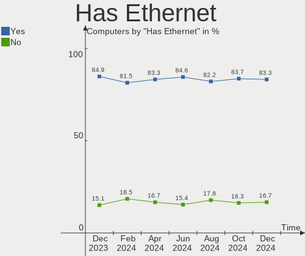
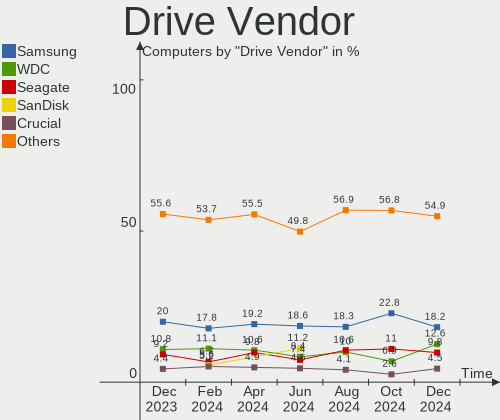
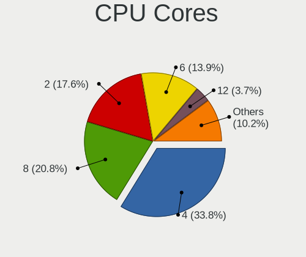
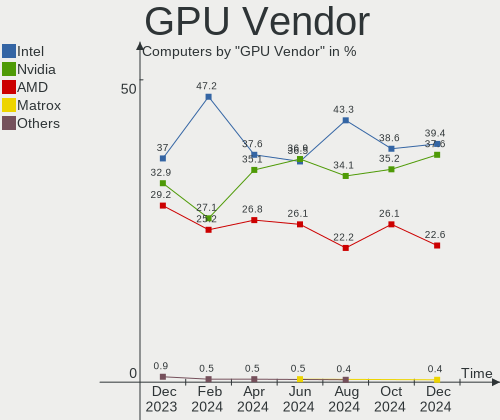
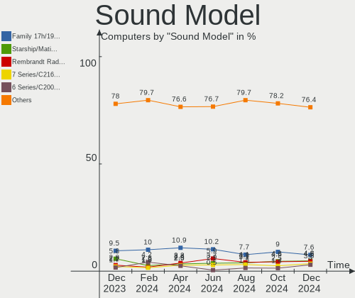

Pop!_OS Hardware Trends
-----------------------

A project to identify most popular hardware characteristics and track their change
over time based on data collected by Pop!_OS users at https://Linux-Hardware.org.

Anyone can contribute to the study by uploading probes of their computers by
the [hw-probe](https://github.com/linuxhw/hw-probe) tool:

    sudo -E hw-probe -all -upload

This is a report for all computer types. See also reports for [desktops](/Dist/Pop!_OS/Desktop/README.md) and [notebooks](/Dist/Pop!_OS/Notebook/README.md).

Full-feature report is available here: https://linux-hardware.org/?view=trends

Period: Mar, 2021.

Contents
--------

- [ OS                       ](#os)
- [ OS Family                ](#os-family)
- [ Kernel                   ](#kernel)
- [ Kernel Family            ](#kernel-family)
- [ Kernel Major Ver.        ](#kernel-major-ver)
- [ Arch                     ](#arch)
- [ DE                       ](#de)
- [ Display Server           ](#display-server)
- [ Display Manager          ](#display-manager)
- [ OS Lang                  ](#os-lang)
- [ Boot Mode                ](#boot-mode)
- [ Filesystem               ](#filesystem)
- [ Part. scheme             ](#part-scheme)
- [ Dual Boot with Linux/BSD ](#dual-boot-with-linux/bsd)
- [ Dual Boot (Win)          ](#dual-boot-win)
- [ Country                  ](#country)
- [ City                     ](#city)
- [ Vendor                   ](#vendor)
- [ Model                    ](#model)
- [ Model Family             ](#model-family)
- [ MFG Year                 ](#mfg-year)
- [ Form Factor              ](#form-factor)
- [ Secure Boot              ](#secure-boot)
- [ Coreboot                 ](#coreboot)
- [ RAM Size                 ](#ram-size)
- [ RAM Used                 ](#ram-used)
- [ Has CD-ROM               ](#has-cd-rom)
- [ Total Drives             ](#total-drives)
- [ Has Ethernet             ](#has-ethernet)
- [ Has WiFi                 ](#has-wifi)
- [ Has Bluetooth            ](#has-bluetooth)
- [ Drive Vendor             ](#drive-vendor)
- [ Drive Model              ](#drive-model)
- [ HDD Vendor               ](#hdd-vendor)
- [ SSD Vendor               ](#ssd-vendor)
- [ Drive Kind               ](#drive-kind)
- [ Drive Connector          ](#drive-connector)
- [ Drive Size               ](#drive-size)
- [ Space Total              ](#space-total)
- [ Space Used               ](#space-used)
- [ Malfunc. Drives          ](#malfunc-drives)
- [ Malfunc. Drive Vendor    ](#malfunc-drive-vendor)
- [ Malfunc. HDD Vendor      ](#malfunc-hdd-vendor)
- [ Malfunc. Drive Kind      ](#malfunc-drive-kind)
- [ Failed Drives            ](#failed-drives)
- [ Failed Drive Vendor      ](#failed-drive-vendor)
- [ Drive Status             ](#drive-status)
- [ Storage Vendor           ](#storage-vendor)
- [ Storage Model            ](#storage-model)
- [ Storage Kind             ](#storage-kind)
- [ CPU Vendor               ](#cpu-vendor)
- [ CPU Model                ](#cpu-model)
- [ CPU Model Family         ](#cpu-model-family)
- [ CPU Cores                ](#cpu-cores)
- [ CPU Sockets              ](#cpu-sockets)
- [ CPU Threads              ](#cpu-threads)
- [ CPU Op-Modes             ](#cpu-op-modes)
- [ CPU Microcode            ](#cpu-microcode)
- [ CPU Microarch            ](#cpu-microarch)
- [ GPU Vendor               ](#gpu-vendor)
- [ GPU Model                ](#gpu-model)
- [ GPU Combo                ](#gpu-combo)
- [ GPU Driver               ](#gpu-driver)
- [ GPU Memory               ](#gpu-memory)
- [ Monitor Vendor           ](#monitor-vendor)
- [ Monitor Model            ](#monitor-model)
- [ Monitor Resolution       ](#monitor-resolution)
- [ Monitor Diagonal         ](#monitor-diagonal)
- [ Monitor Width            ](#monitor-width)
- [ Aspect Ratio             ](#aspect-ratio)
- [ Monitor Area             ](#monitor-area)
- [ Pixel Density            ](#pixel-density)
- [ Multiple Monitors        ](#multiple-monitors)
- [ Net Controller Vendor    ](#net-controller-vendor)
- [ Net Controller Model     ](#net-controller-model)
- [ Wireless Vendor          ](#wireless-vendor)
- [ Wireless Model           ](#wireless-model)
- [ Ethernet Vendor          ](#ethernet-vendor)
- [ Ethernet Model           ](#ethernet-model)
- [ Net Controller Kind      ](#net-controller-kind)
- [ Used Controller          ](#used-controller)
- [ NICs                     ](#nics)
- [ IPv6                     ](#ipv6)
- [ Memory Vendor            ](#memory-vendor)
- [ Memory Model             ](#memory-model)
- [ Memory Kind              ](#memory-kind)
- [ Memory Form Factor       ](#memory-form-factor)
- [ Memory Size              ](#memory-size)
- [ Memory Speed             ](#memory-speed)
- [ Sound Vendor             ](#sound-vendor)
- [ Sound Model              ](#sound-model)
- [ Camera Vendor            ](#camera-vendor)
- [ Camera Model             ](#camera-model)
- [ Fingerprint Vendor       ](#fingerprint-vendor)
- [ Fingerprint Model        ](#fingerprint-model)
- [ Chipcard Vendor          ](#chipcard-vendor)
- [ Chipcard Model           ](#chipcard-model)
- [ Printer Vendor           ](#printer-vendor)
- [ Printer Model            ](#printer-model)
- [ Scanner Vendor           ](#scanner-vendor)
- [ Scanner Model            ](#scanner-model)
- [ Bluetooth Vendor         ](#bluetooth-vendor)
- [ Bluetooth Model          ](#bluetooth-model)
- [ Unsupported Devices      ](#unsupported-devices)
- [ Unsupported Device Types ](#unsupported-device-types)

OS
--

Installed operating systems

| Name          | Computers | Percent |
|---------------|-----------|---------|
| Pop!_OS 20.10 | 241       | 76.51%  |
| Pop!_OS 20.04 | 74        | 23.49%  |

OS Family
---------

OS without a version

| Name    | Computers | Percent |
|---------|-----------|---------|
| Pop!_OS | 315       | 100%    |

Kernel
------

Version of the Linux kernel

| Version                      | Computers | Percent |
|------------------------------|-----------|---------|
| 5.8.0-7642-generic           | 260       | 82.54%  |
| 5.8.0-7630-generic           | 15        | 4.76%   |
| 5.11.0-7612-generic          | 10        | 3.17%   |
| 5.4.0-7634-generic           | 9         | 2.86%   |
| 5.11.0-051100-generic        | 3         | 0.95%   |
| 5.10.23-xanmod1              | 2         | 0.63%   |
| 5.9.6-050906-generic         | 1         | 0.32%   |
| 5.8.0-7625-generic           | 1         | 0.32%   |
| 5.4.0-7642-generic           | 1         | 0.32%   |
| 5.11.8-051108-generic        | 1         | 0.32%   |
| 5.11.5-051105-generic        | 1         | 0.32%   |
| 5.11.3-051103-generic        | 1         | 0.32%   |
| 5.11.0-4.2-liquorix-amd64    | 1         | 0.32%   |
| 5.11.0-3.1-liquorix-amd64    | 1         | 0.32%   |
| 5.10.4-051004-lowlatency     | 1         | 0.32%   |
| 5.10.26-051026-generic       | 1         | 0.32%   |
| 5.10.25-xanmod1              | 1         | 0.32%   |
| 5.10.24-xanmod1              | 1         | 0.32%   |
| 5.10.20-xanmod1              | 1         | 0.32%   |
| 5.10.13-051013-generic       | 1         | 0.32%   |
| 5.10.0+                      | 1         | 0.32%   |
| 5.1.15-surface-linux-surface | 1         | 0.32%   |

Kernel Family
-------------

Linux kernel without a distro release

| Version | Computers | Percent |
|---------|-----------|---------|
| 5.8.0   | 276       | 87.62%  |
| 5.11.0  | 15        | 4.76%   |
| 5.4.0   | 10        | 3.17%   |
| 5.10.23 | 2         | 0.63%   |
| 5.9.6   | 1         | 0.32%   |
| 5.11.8  | 1         | 0.32%   |
| 5.11.5  | 1         | 0.32%   |
| 5.11.3  | 1         | 0.32%   |
| 5.10.4  | 1         | 0.32%   |
| 5.10.26 | 1         | 0.32%   |
| 5.10.25 | 1         | 0.32%   |
| 5.10.24 | 1         | 0.32%   |
| 5.10.20 | 1         | 0.32%   |
| 5.10.13 | 1         | 0.32%   |
| 5.10.0  | 1         | 0.32%   |
| 5.1.15  | 1         | 0.32%   |

Kernel Major Ver.
-----------------

Linux kernel major version

| Version | Computers | Percent |
|---------|-----------|---------|
| 5.8     | 276       | 87.62%  |
| 5.11    | 18        | 5.71%   |
| 5.4     | 10        | 3.17%   |
| 5.10    | 9         | 2.86%   |
| 5.9     | 1         | 0.32%   |
| 5.1     | 1         | 0.32%   |

Arch
----

OS architecture (x86_64, i586, etc.)

| Name   | Computers | Percent |
|--------|-----------|---------|
| x86_64 | 315       | 100%    |

DE
--

Desktop Environment

| Name            | Computers | Percent |
|-----------------|-----------|---------|
| GNOME           | 296       | 93.97%  |
| KDE             | 7         | 2.22%   |
| X-Cinnamon      | 5         | 1.59%   |
| KDE5            | 2         | 0.63%   |
| GNOME Flashback | 2         | 0.63%   |
| XFCE            | 1         | 0.32%   |
| Deepin          | 1         | 0.32%   |
| Unknown         | 1         | 0.32%   |

Display Server
--------------

X11 or Wayland

| Name    | Computers | Percent |
|---------|-----------|---------|
| X11     | 309       | 98.1%   |
| Wayland | 5         | 1.59%   |
| Unknown | 1         | 0.32%   |

Display Manager
---------------

SDDM, LightDM, etc.

| Name    | Computers | Percent |
|---------|-----------|---------|
| Unknown | 264       | 83.81%  |
| GDM     | 48        | 15.24%  |
| TDM     | 2         | 0.63%   |
| SDDM    | 1         | 0.32%   |

OS Lang
-------

Language

| Lang    | Computers | Percent |
|---------|-----------|---------|
| en_US   | 190       | 60.32%  |
| pt_BR   | 30        | 9.52%   |
| en_GB   | 17        | 5.4%    |
| de_DE   | 14        | 4.44%   |
| en_AU   | 9         | 2.86%   |
| it_IT   | 8         | 2.54%   |
| en_CA   | 8         | 2.54%   |
| es_ES   | 7         | 2.22%   |
| fr_FR   | 6         | 1.9%    |
| C       | 6         | 1.9%    |
| pl_PL   | 4         | 1.27%   |
| ru_RU   | 3         | 0.95%   |
| uk_UA   | 2         | 0.63%   |
| sv_SE   | 2         | 0.63%   |
| nl_NL   | 2         | 0.63%   |
| zh_CN   | 1         | 0.32%   |
| szl_PL  | 1         | 0.32%   |
| pt_PT   | 1         | 0.32%   |
| nl_BE   | 1         | 0.32%   |
| en_ZA   | 1         | 0.32%   |
| da_DK   | 1         | 0.32%   |
| Unknown | 1         | 0.32%   |

Boot Mode
---------

EFI or BIOS

| Mode | Computers | Percent |
|------|-----------|---------|
| BIOS | 274       | 86.98%  |
| EFI  | 41        | 13.02%  |

Filesystem
----------

Type of filesystem

| Type    | Computers | Percent |
|---------|-----------|---------|
| Ext4    | 307       | 97.46%  |
| Btrfs   | 4         | 1.27%   |
| Overlay | 3         | 0.95%   |
| Xfs     | 1         | 0.32%   |

Part. scheme
------------

Scheme of partitioning

| Type    | Computers | Percent |
|---------|-----------|---------|
| Unknown | 264       | 83.81%  |
| GPT     | 41        | 13.02%  |
| MBR     | 10        | 3.17%   |

Dual Boot with Linux/BSD
------------------------

Hosting more than one Linux/BSD

| Dual boot | Computers | Percent |
|-----------|-----------|---------|
| No        | 307       | 97.46%  |
| Yes       | 8         | 2.54%   |

Dual Boot (Win)
---------------

Hosting Linux and Windows

| Dual boot | Computers | Percent |
|-----------|-----------|---------|
| No        | 292       | 92.7%   |
| Yes       | 23        | 7.3%    |

Country
-------

Geographic location (country)

| Country      | Computers | Percent |
|--------------|-----------|---------|
| USA          | 105       | 33.33%  |
| Brazil       | 35        | 11.11%  |
| Germany      | 25        | 7.94%   |
| Italy        | 13        | 4.13%   |
| Australia    | 11        | 3.49%   |
| Canada       | 10        | 3.17%   |
| UK           | 9         | 2.86%   |
| Poland       | 8         | 2.54%   |
| France       | 8         | 2.54%   |
| Netherlands  | 7         | 2.22%   |
| Spain        | 6         | 1.9%    |
| Sweden       | 5         | 1.59%   |
| South Africa | 5         | 1.59%   |
| Austria      | 5         | 1.59%   |
| Russia       | 4         | 1.27%   |
| Portugal     | 4         | 1.27%   |
| Japan        | 4         | 1.27%   |
| India        | 4         | 1.27%   |
| Vietnam      | 3         | 0.95%   |
| Switzerland  | 3         | 0.95%   |
| Serbia       | 3         | 0.95%   |
| Mexico       | 3         | 0.95%   |
| Belgium      | 3         | 0.95%   |
| Ukraine      | 2         | 0.63%   |
| Romania      | 2         | 0.63%   |
| Malaysia     | 2         | 0.63%   |
| Indonesia    | 2         | 0.63%   |
| Greece       | 2         | 0.63%   |
| Denmark      | 2         | 0.63%   |
| Colombia     | 2         | 0.63%   |
| Bulgaria     | 2         | 0.63%   |
| UAE          | 1         | 0.32%   |
| Turkey       | 1         | 0.32%   |
| Tanzania     | 1         | 0.32%   |
| Slovakia     | 1         | 0.32%   |
| Philippines  | 1         | 0.32%   |
| Norway       | 1         | 0.32%   |
| Kenya        | 1         | 0.32%   |
| Jordan       | 1         | 0.32%   |
| Israel       | 1         | 0.32%   |
| Iran         | 1         | 0.32%   |
| Iceland      | 1         | 0.32%   |
| El Salvador  | 1         | 0.32%   |
| Egypt        | 1         | 0.32%   |
| Czechia      | 1         | 0.32%   |
| Chile        | 1         | 0.32%   |
| Argentina    | 1         | 0.32%   |

City
----

Geographic location (city)

| City           | Computers | Percent |
|----------------|-----------|---------|
| Browning       | 9         | 2.86%   |
| São Paulo     | 7         | 2.22%   |
| Milan          | 7         | 2.22%   |
| Vienna         | 3         | 0.95%   |
| San Antonio    | 3         | 0.95%   |
| Hanoi          | 3         | 0.95%   |
| Giesen         | 3         | 0.95%   |
| Brisbane       | 3         | 0.95%   |
| Amsterdam      | 3         | 0.95%   |
| Tokyo          | 2         | 0.63%   |
| Tallahassee    | 2         | 0.63%   |
| Sofia          | 2         | 0.63%   |
| Puebla City    | 2         | 0.63%   |
| Poznan         | 2         | 0.63%   |
| Perth          | 2         | 0.63%   |
| Munich         | 2         | 0.63%   |
| Gothenburg     | 2         | 0.63%   |
| Fortaleza      | 2         | 0.63%   |
| Charlotte      | 2         | 0.63%   |
| Aurora         | 2         | 0.63%   |
| Athens         | 2         | 0.63%   |
| Zottegem       | 1         | 0.32%   |
| Zielona Góra  | 1         | 0.32%   |
| Zarqa          | 1         | 0.32%   |
| Yokosuka       | 1         | 0.32%   |
| Yeovil         | 1         | 0.32%   |
| Wylie          | 1         | 0.32%   |
| Wydrze         | 1         | 0.32%   |
| Woodland Hills | 1         | 0.32%   |
| Winter Springs | 1         | 0.32%   |
| Windsor        | 1         | 0.32%   |
| Willow Springs | 1         | 0.32%   |
| West Jordan    | 1         | 0.32%   |
| Wessington     | 1         | 0.32%   |
| Wasilla        | 1         | 0.32%   |
| Washington     | 1         | 0.32%   |
| Warsaw         | 1         | 0.32%   |
| Voelklingen    | 1         | 0.32%   |
| Victoria       | 1         | 0.32%   |
| Vancouver      | 1         | 0.32%   |
| Ulyanovsk      | 1         | 0.32%   |
| Uberlândia    | 1         | 0.32%   |
| Turin          | 1         | 0.32%   |
| Tucson         | 1         | 0.32%   |
| Toulouse       | 1         | 0.32%   |
| Toronto        | 1         | 0.32%   |
| Titusville     | 1         | 0.32%   |
| Tetbury        | 1         | 0.32%   |
| Terrebonne     | 1         | 0.32%   |
| Temple         | 1         | 0.32%   |
| Telfs          | 1         | 0.32%   |
| Tel Aviv       | 1         | 0.32%   |
| Tehran         | 1         | 0.32%   |
| Taunton        | 1         | 0.32%   |
| Taubate        | 1         | 0.32%   |
| Sydney         | 1         | 0.32%   |
| Sutton         | 1         | 0.32%   |
| Sulsted        | 1         | 0.32%   |
| Stockholm      | 1         | 0.32%   |
| Stillwater     | 1         | 0.32%   |

Vendor
------

Motherboard manufacturer

| Name                  | Computers | Percent |
|-----------------------|-----------|---------|
| ASUSTek Computer      | 49        | 15.56%  |
| Dell                  | 42        | 13.33%  |
| Lenovo                | 37        | 11.75%  |
| Gigabyte Technology   | 34        | 10.79%  |
| Hewlett-Packard       | 30        | 9.52%   |
| MSI                   | 23        | 7.3%    |
| ASRock                | 14        | 4.44%   |
| Apple                 | 12        | 3.81%   |
| Acer                  | 10        | 3.17%   |
| System76              | 8         | 2.54%   |
| Intel                 | 8         | 2.54%   |
| Microsoft             | 5         | 1.59%   |
| Toshiba               | 3         | 0.95%   |
| Positivo              | 3         | 0.95%   |
| Notebook              | 3         | 0.95%   |
| Alienware             | 3         | 0.95%   |
| TUXEDO                | 2         | 0.63%   |
| Samsung Electronics   | 2         | 0.63%   |
| Razer                 | 2         | 0.63%   |
| LINCPLUS              | 2         | 0.63%   |
| HUAWEI                | 2         | 0.63%   |
| Google                | 2         | 0.63%   |
| Fujitsu               | 2         | 0.63%   |
| Biostar               | 2         | 0.63%   |
| Unknown               | 2         | 0.63%   |
| Timi                  | 1         | 0.32%   |
| Supermicro            | 1         | 0.32%   |
| Sony                  | 1         | 0.32%   |
| Pegatron              | 1         | 0.32%   |
| PCWare                | 1         | 0.32%   |
| Panasonic             | 1         | 0.32%   |
| OVERPOWERED           | 1         | 0.32%   |
| OEM                   | 1         | 0.32%   |
| Huanan                | 1         | 0.32%   |
| HOUTER                | 1         | 0.32%   |
| EVOO Products Company | 1         | 0.32%   |
| EVGA                  | 1         | 0.32%   |
| Eluktronics           | 1         | 0.32%   |

Model
-----

Motherboard model

| Name                                   | Computers | Percent |
|----------------------------------------|-----------|---------|
| Dell OptiPlex 9020                     | 8         | 2.54%   |
| MSI MS-7C37                            | 4         | 1.27%   |
| System76 Darter Pro                    | 3         | 0.95%   |
| Microsoft Surface Pro                  | 3         | 0.95%   |
| HP Laptop 15-db1xxx                    | 3         | 0.95%   |
| Gigabyte B450M DS3H                    | 3         | 0.95%   |
| Dell XPS 17 9700                       | 3         | 0.95%   |
| MSI MS-7B86                            | 2         | 0.63%   |
| Microsoft Surface Pro 3                | 2         | 0.63%   |
| LINCPLUS P1                            | 2         | 0.63%   |
| Lenovo Legion 5 15ARH05 82B5           | 2         | 0.63%   |
| HUAWEI MACH-WX9                        | 2         | 0.63%   |
| HP Notebook                            | 2         | 0.63%   |
| Gigabyte B450 AORUS M                  | 2         | 0.63%   |
| Dell XPS 8700                          | 2         | 0.63%   |
| Dell XPS 15 9500                       | 2         | 0.63%   |
| ASUS VivoBook_ASUSLaptop X509DA_M509DA | 2         | 0.63%   |
| ASUS PRIME Z390-A                      | 2         | 0.63%   |
| ASUS K42Jc                             | 2         | 0.63%   |
| ASUS CROSSHAIR V FORMULA-Z             | 2         | 0.63%   |
| ASUS All Series                        | 2         | 0.63%   |
| Unknown                                | 2         | 0.63%   |
| TUXEDO InfinityBook S 14 v5            | 1         | 0.32%   |
| TUXEDO Aura 15 Gen1                    | 1         | 0.32%   |
| Toshiba Satellite Pro L450             | 1         | 0.32%   |
| Toshiba Satellite E55-A                | 1         | 0.32%   |
| Toshiba PORTEGE Z30-A                  | 1         | 0.32%   |
| Timi RedmiBook 16                      | 1         | 0.32%   |
| System76 Serval WS                     | 1         | 0.32%   |
| System76 Lemur Pro                     | 1         | 0.32%   |
| System76 Gazelle                       | 1         | 0.32%   |
| System76 Galago UltraPro               | 1         | 0.32%   |
| System76 Bonobo WS                     | 1         | 0.32%   |
| Supermicro X9SRH-7F/7TF                | 1         | 0.32%   |
| Sony SVE14A1V1EB                       | 1         | 0.32%   |
| Samsung RF511/RF411/RF711              | 1         | 0.32%   |
| Samsung 900X3C/900X3D/900X4C/900X4D    | 1         | 0.32%   |
| Razer Blade Stealth                    | 1         | 0.32%   |
| Razer Blade                            | 1         | 0.32%   |
| Positivo POS-EIH61CR                   | 1         | 0.32%   |
| Positivo H14BU08                       | 1         | 0.32%   |
| Positivo C14CR01                       | 1         | 0.32%   |
| Pegatron A15                           | 1         | 0.32%   |
| PCWare APMCP61-D3                      | 1         | 0.32%   |
| Panasonic CF-53JCLBX1M                 | 1         | 0.32%   |
| OVERPOWERED OP-LP2                     | 1         | 0.32%   |
| OEM KabyLake                           | 1         | 0.32%   |
| Notebook P9XXEN_EF_ED                  | 1         | 0.32%   |
| Notebook N8xxEP6                       | 1         | 0.32%   |
| Notebook N15_N17RD1                    | 1         | 0.32%   |
| MSI Stealth 15M A11SEK                 | 1         | 0.32%   |
| MSI s5620br                            | 1         | 0.32%   |
| MSI Prestige 15 A10SC                  | 1         | 0.32%   |
| MSI P75 Creator 9SF                    | 1         | 0.32%   |
| MSI MS-7D09                            | 1         | 0.32%   |
| MSI MS-7C82                            | 1         | 0.32%   |
| MSI MS-7C02                            | 1         | 0.32%   |
| MSI MS-7B89                            | 1         | 0.32%   |
| MSI MS-7B78                            | 1         | 0.32%   |
| MSI MS-7B45                            | 1         | 0.32%   |

Model Family
------------

Motherboard model prefix

| Name                   | Computers | Percent |
|------------------------|-----------|---------|
| Lenovo ThinkPad        | 17        | 5.4%    |
| Dell OptiPlex          | 13        | 4.13%   |
| Dell Inspiron          | 12        | 3.81%   |
| ASUS PRIME             | 9         | 2.86%   |
| Dell XPS               | 8         | 2.54%   |
| HP Pavilion            | 7         | 2.22%   |
| ASUS ROG               | 7         | 2.22%   |
| Acer Aspire            | 7         | 2.22%   |
| Lenovo IdeaPad         | 6         | 1.9%    |
| Microsoft Surface      | 5         | 1.59%   |
| HP Laptop              | 5         | 1.59%   |
| MSI MS-7C37            | 4         | 1.27%   |
| Dell Latitude          | 4         | 1.27%   |
| ASUS VivoBook          | 4         | 1.27%   |
| System76 Darter        | 3         | 0.95%   |
| Lenovo Yoga            | 3         | 0.95%   |
| Lenovo Legion          | 3         | 0.95%   |
| HP ProBook             | 3         | 0.95%   |
| Gigabyte B450M         | 3         | 0.95%   |
| Gigabyte B450          | 3         | 0.95%   |
| ASUS TUF               | 3         | 0.95%   |
| Toshiba Satellite      | 2         | 0.63%   |
| Razer Blade            | 2         | 0.63%   |
| MSI MS-7B86            | 2         | 0.63%   |
| LINCPLUS P1            | 2         | 0.63%   |
| Lenovo MIIX            | 2         | 0.63%   |
| HUAWEI MACH-WX9        | 2         | 0.63%   |
| HP Notebook            | 2         | 0.63%   |
| HP ENVY                | 2         | 0.63%   |
| HP EliteBook           | 2         | 0.63%   |
| HP Compaq              | 2         | 0.63%   |
| Gigabyte Z390          | 2         | 0.63%   |
| Gigabyte B550          | 2         | 0.63%   |
| Fujitsu LIFEBOOK       | 2         | 0.63%   |
| Dell Precision         | 2         | 0.63%   |
| Dell G3                | 2         | 0.63%   |
| ASUS K42Jc             | 2         | 0.63%   |
| ASUS CROSSHAIR         | 2         | 0.63%   |
| ASUS All               | 2         | 0.63%   |
| Acer Swift             | 2         | 0.63%   |
| Unknown                | 2         | 0.63%   |
| TUXEDO InfinityBook    | 1         | 0.32%   |
| TUXEDO Aura            | 1         | 0.32%   |
| Toshiba PORTEGE        | 1         | 0.32%   |
| Timi RedmiBook         | 1         | 0.32%   |
| System76 Serval        | 1         | 0.32%   |
| System76 Lemur         | 1         | 0.32%   |
| System76 Gazelle       | 1         | 0.32%   |
| System76 Galago        | 1         | 0.32%   |
| System76 Bonobo        | 1         | 0.32%   |
| Supermicro X9SRH-7F    | 1         | 0.32%   |
| Sony SVE14A1V1EB       | 1         | 0.32%   |
| Samsung RF511          | 1         | 0.32%   |
| Samsung 900X3C         | 1         | 0.32%   |
| Positivo POS-EIH61CR   | 1         | 0.32%   |
| Positivo H14BU08       | 1         | 0.32%   |
| Positivo C14CR01       | 1         | 0.32%   |
| Pegatron A15           | 1         | 0.32%   |
| PCWare APMCP61-D3      | 1         | 0.32%   |
| Panasonic CF-53JCLBX1M | 1         | 0.32%   |

MFG Year
--------

Motherboard manufacture year

| Year    | Computers | Percent |
|---------|-----------|---------|
| 2020    | 81        | 25.71%  |
| 2019    | 51        | 16.19%  |
| 2018    | 43        | 13.65%  |
| 2013    | 19        | 6.03%   |
| 2015    | 18        | 5.71%   |
| 2021    | 15        | 4.76%   |
| 2012    | 15        | 4.76%   |
| 2011    | 15        | 4.76%   |
| 2017    | 12        | 3.81%   |
| 2016    | 12        | 3.81%   |
| 2014    | 12        | 3.81%   |
| 2010    | 11        | 3.49%   |
| 2008    | 6         | 1.9%    |
| 2009    | 4         | 1.27%   |
| Unknown | 1         | 0.32%   |

Form Factor
-----------

Physical design of the computer

| Name        | Computers | Percent |
|-------------|-----------|---------|
| Notebook    | 153       | 48.57%  |
| Desktop     | 138       | 43.81%  |
| Tablet      | 7         | 2.22%   |
| Convertible | 6         | 1.9%    |
| Mini pc     | 5         | 1.59%   |
| All in one  | 5         | 1.59%   |
| Server      | 1         | 0.32%   |

Secure Boot
-----------

Enabled or disabled

| State    | Computers | Percent |
|----------|-----------|---------|
| Disabled | 315       | 100%    |

Coreboot
--------

Have coreboot on board

| Used | Computers | Percent |
|------|-----------|---------|
| No   | 310       | 98.41%  |
| Yes  | 5         | 1.59%   |

RAM Size
--------

Total RAM memory

| Size in GB      | Computers | Percent |
|-----------------|-----------|---------|
| 16.01-24.0      | 87        | 27.62%  |
| 4.01-8.0        | 64        | 20.32%  |
| 8.01-16.0       | 56        | 17.78%  |
| 3.01-4.0        | 45        | 14.29%  |
| 32.01-64.0      | 35        | 11.11%  |
| 64.01-256.0     | 13        | 4.13%   |
| 24.01-32.0      | 6         | 1.9%    |
| 1.01-2.0        | 6         | 1.9%    |
| 2.01-3.0        | 2         | 0.63%   |
| More than 256.0 | 1         | 0.32%   |

RAM Used
--------

Used RAM memory

| Used GB    | Computers | Percent |
|------------|-----------|---------|
| 2.01-3.0   | 99        | 31.43%  |
| 1.01-2.0   | 99        | 31.43%  |
| 4.01-8.0   | 54        | 17.14%  |
| 3.01-4.0   | 48        | 15.24%  |
| 8.01-16.0  | 11        | 3.49%   |
| 16.01-24.0 | 3         | 0.95%   |
| 24.01-32.0 | 1         | 0.32%   |

Has CD-ROM
----------

Has CD-ROM on board

| Presented | Computers | Percent |
|-----------|-----------|---------|
| No        | 227       | 72.06%  |
| Yes       | 88        | 27.94%  |

Total Drives
------------

Number of drives on board

| Drives | Computers | Percent |
|--------|-----------|---------|
| 1      | 166       | 52.7%   |
| 2      | 93        | 29.52%  |
| 3      | 29        | 9.21%   |
| 4      | 13        | 4.13%   |
| 5      | 7         | 2.22%   |
| 0      | 3         | 0.95%   |
| 6      | 2         | 0.63%   |
| 11     | 1         | 0.32%   |
| 7      | 1         | 0.32%   |

Has Ethernet
------------

Has Ethernet on board

| Presented | Computers | Percent |
|-----------|-----------|---------|
| Yes       | 274       | 86.98%  |
| No        | 41        | 13.02%  |

Has WiFi
--------

Has WiFi module

| Presented | Computers | Percent |
|-----------|-----------|---------|
| Yes       | 255       | 80.95%  |
| No        | 60        | 19.05%  |

Has Bluetooth
-------------

Has Bluetooth module

| Presented | Computers | Percent |
|-----------|-----------|---------|
| Yes       | 208       | 66.03%  |
| No        | 107       | 33.97%  |

Drive Vendor
------------

Hard drive vendors

| Vendor                    | Computers | Drives | Percent |
|---------------------------|-----------|--------|---------|
| Samsung Electronics       | 88        | 109    | 18.22%  |
| Seagate                   | 79        | 91     | 16.36%  |
| WDC                       | 67        | 87     | 13.87%  |
| SanDisk                   | 36        | 40     | 7.45%   |
| Toshiba                   | 25        | 26     | 5.18%   |
| Kingston                  | 25        | 29     | 5.18%   |
| Unknown                   | 19        | 21     | 3.93%   |
| Crucial                   | 19        | 22     | 3.93%   |
| Intel                     | 15        | 18     | 3.11%   |
| SK Hynix                  | 14        | 14     | 2.9%    |
| Hitachi                   | 13        | 13     | 2.69%   |
| Micron/Crucial Technology | 6         | 7      | 1.24%   |
| A-DATA Technology         | 6         | 6      | 1.24%   |
| Phison                    | 5         | 5      | 1.04%   |
| Micron Technology         | 5         | 6      | 1.04%   |
| HGST                      | 5         | 5      | 1.04%   |
| China                     | 5         | 5      | 1.04%   |
| SPCC                      | 4         | 4      | 0.83%   |
| Transcend                 | 3         | 3      | 0.62%   |
| Apple                     | 3         | 3      | 0.62%   |
| Sabrent                   | 2         | 3      | 0.41%   |
| OCZ                       | 2         | 2      | 0.41%   |
| MAXTOR                    | 2         | 2      | 0.41%   |
| LITEONIT                  | 2         | 2      | 0.41%   |
| LITEON                    | 2         | 2      | 0.41%   |
| KingDian                  | 2         | 2      | 0.41%   |
| Corsair                   | 2         | 3      | 0.41%   |
| ASMT                      | 2         | 2      | 0.41%   |
| Apacer                    | 2         | 2      | 0.41%   |
| ZOTAC                     | 1         | 1      | 0.21%   |
| W800S                     | 1         | 1      | 0.21%   |
| USB                       | 1         | 1      | 0.21%   |
| Union Memory (Shenzhen)   | 1         | 1      | 0.21%   |
| Union Memory              | 1         | 1      | 0.21%   |
| TO Exter                  | 1         | 2      | 0.21%   |
| SMART                     | 1         | 1      | 0.21%   |
| Silicon Motion            | 1         | 1      | 0.21%   |
| Realtek Semiconductor     | 1         | 1      | 0.21%   |
| PNY                       | 1         | 1      | 0.21%   |
| Phison Electronics        | 1         | 1      | 0.21%   |
| Patriot                   | 1         | 1      | 0.21%   |
| PALIT                     | 1         | 1      | 0.21%   |
| OWC                       | 1         | 1      | 0.21%   |
| KIOXIA-EXCERIA            | 1         | 1      | 0.21%   |
| KIOXIA                    | 1         | 1      | 0.21%   |
| Intenso                   | 1         | 1      | 0.21%   |
| HS-SSD-C100               | 1         | 1      | 0.21%   |
| HGST HTS                  | 1         | 1      | 0.21%   |
| Hewlett-Packard           | 1         | 1      | 0.21%   |
| GLOWAY                    | 1         | 1      | 0.21%   |
| Fujitsu                   | 1         | 1      | 0.21%   |
| ADATA Technology          | 1         | 1      | 0.21%   |

Drive Model
-----------

Hard drive models

| Model                                   | Computers | Percent |
|-----------------------------------------|-----------|---------|
| Samsung NVMe SSD Drive 1TB              | 12        | 2.29%   |
| Seagate ST500DM002-1BD142 500GB         | 10        | 1.9%    |
| Samsung NVMe SSD Drive 500GB            | 9         | 1.71%   |
| Sandisk NVMe SSD Drive 1TB              | 7         | 1.33%   |
| Kingston SA400S37480G 480GB SSD         | 7         | 1.33%   |
| Samsung SSD 860 EVO 500GB               | 6         | 1.14%   |
| WDC WD10EZEX-08WN4A0 1TB                | 5         | 0.95%   |
| Seagate ST1000LM035-1RK172 1TB          | 5         | 0.95%   |
| Seagate ST1000DM010-2EP102 1TB          | 5         | 0.95%   |
| Samsung SSD 860 EVO 1TB                 | 5         | 0.95%   |
| Samsung SSD 850 EVO 250GB               | 5         | 0.95%   |
| Samsung NVMe SSD Drive 250GB            | 5         | 0.95%   |
| Samsung NVMe SSD Drive 1024GB           | 5         | 0.95%   |
| Kingston SA400S37240G 240GB SSD         | 5         | 0.95%   |
| Intel NVMe SSD Drive 512GB              | 5         | 0.95%   |
| Unknown MMC Card  64GB                  | 4         | 0.76%   |
| Toshiba MQ01ABD100 1TB                  | 4         | 0.76%   |
| Seagate ST500LT012-1DG142 500GB         | 4         | 0.76%   |
| Seagate ST1000LM049-2GH172 1TB          | 4         | 0.76%   |
| Seagate Expansion 1TB                   | 4         | 0.76%   |
| SanDisk SDSSDA240G 240GB                | 4         | 0.76%   |
| Samsung NVMe SSD Drive 512GB            | 4         | 0.76%   |
| Kingston SA400S37120G 120GB SSD         | 4         | 0.76%   |
| Intel NVMe SSD Drive 1024GB             | 4         | 0.76%   |
| Crucial CT240BX500SSD1 240GB            | 4         | 0.76%   |
| WDC WD5000AAKX-75U6AA0 500GB            | 3         | 0.57%   |
| Unknown NVMe SSD Drive 256GB            | 3         | 0.57%   |
| Unknown MMC Card  32GB                  | 3         | 0.57%   |
| Toshiba DT01ACA100 1TB                  | 3         | 0.57%   |
| SK Hynix NVMe SSD Drive 256GB           | 3         | 0.57%   |
| Seagate ST1000LM024 HN-M101MBB 1TB      | 3         | 0.57%   |
| Seagate Expansion Desk 8TB              | 3         | 0.57%   |
| SanDisk SSD PLUS 1000GB                 | 3         | 0.57%   |
| Sandisk NVMe SSD Drive 256GB            | 3         | 0.57%   |
| Samsung SSD 970 EVO Plus 500GB          | 3         | 0.57%   |
| Samsung SSD 850 EVO 500GB               | 3         | 0.57%   |
| Samsung NVMe SSD Drive 256GB            | 3         | 0.57%   |
| Micron/Crucial NVMe SSD Drive 500GB     | 3         | 0.57%   |
| Crucial CT1000MX500SSD1 1TB             | 3         | 0.57%   |
| WDC WDS240G2G0B-00EPW0 240GB SSD        | 2         | 0.38%   |
| WDC WD800JD-75MSA3 80GB                 | 2         | 0.38%   |
| WDC WD30EZRZ-00GXCB0 3TB                | 2         | 0.38%   |
| WDC WD2500KS-00MJB0 250GB               | 2         | 0.38%   |
| WDC WD20EZAZ-00GGJB0 2TB                | 2         | 0.38%   |
| WDC WD10JPVX-22JC3T0 1TB                | 2         | 0.38%   |
| Transcend TS128GMSA230S 128GB SSD       | 2         | 0.38%   |
| Toshiba MK5065GSXF 500GB                | 2         | 0.38%   |
| Toshiba DT01ACA200 2TB                  | 2         | 0.38%   |
| SK Hynix NVMe SSD Drive 1024GB          | 2         | 0.38%   |
| SK Hynix HFS256G3AMNB-2200A 256GB SSD   | 2         | 0.38%   |
| SK Hynix HFS256G39TND-N210A 256GB SSD   | 2         | 0.38%   |
| SK Hynix BC511 HFM512GDJTNI-82A0A 512GB | 2         | 0.38%   |
| Seagate ST9500325AS 500GB               | 2         | 0.38%   |
| Seagate ST31000524AS 1TB                | 2         | 0.38%   |
| Seagate ST2000LX001-1RG174 2TB          | 2         | 0.38%   |
| Seagate ST2000DM008-2FR102 2TB          | 2         | 0.38%   |
| Seagate ST2000DM001-1ER164 2TB          | 2         | 0.38%   |
| Seagate ST2000DM001-1CH164 2TB          | 2         | 0.38%   |
| Seagate ST1000LM014-1EJ164 1TB          | 2         | 0.38%   |
| Sandisk NVMe SSD Drive 512GB            | 2         | 0.38%   |

HDD Vendor
----------

Hard disk drive vendors

| Vendor              | Computers | Drives | Percent |
|---------------------|-----------|--------|---------|
| Seagate             | 78        | 90     | 41.05%  |
| WDC                 | 54        | 71     | 28.42%  |
| Toshiba             | 23        | 24     | 12.11%  |
| Hitachi             | 13        | 13     | 6.84%   |
| Samsung Electronics | 8         | 9      | 4.21%   |
| HGST                | 5         | 5      | 2.63%   |
| Maxtor              | 2         | 2      | 1.05%   |
| Apple               | 2         | 2      | 1.05%   |
| USB                 | 1         | 1      | 0.53%   |
| TO Exter            | 1         | 2      | 0.53%   |
| Sabrent             | 1         | 2      | 0.53%   |
| HGST HTS            | 1         | 1      | 0.53%   |
| Fujitsu             | 1         | 1      | 0.53%   |

SSD Vendor
----------

Solid state drive vendors

| Vendor              | Computers | Drives | Percent |
|---------------------|-----------|--------|---------|
| Samsung Electronics | 36        | 43     | 21.82%  |
| Kingston            | 23        | 27     | 13.94%  |
| SanDisk             | 22        | 25     | 13.33%  |
| Crucial             | 19        | 22     | 11.52%  |
| WDC                 | 11        | 11     | 6.67%   |
| A-DATA Technology   | 6         | 6      | 3.64%   |
| China               | 5         | 5      | 3.03%   |
| SPCC                | 4         | 4      | 2.42%   |
| SK Hynix            | 4         | 4      | 2.42%   |
| Transcend           | 3         | 3      | 1.82%   |
| Micron Technology   | 3         | 4      | 1.82%   |
| Unknown             | 2         | 2      | 1.21%   |
| OCZ                 | 2         | 2      | 1.21%   |
| LITEONIT            | 2         | 2      | 1.21%   |
| KingDian            | 2         | 2      | 1.21%   |
| Corsair             | 2         | 3      | 1.21%   |
| Apacer              | 2         | 2      | 1.21%   |
| ZOTAC               | 1         | 1      | 0.61%   |
| W800S               | 1         | 1      | 0.61%   |
| Toshiba             | 1         | 1      | 0.61%   |
| SMART               | 1         | 1      | 0.61%   |
| SABRENT             | 1         | 1      | 0.61%   |
| PNY                 | 1         | 1      | 0.61%   |
| Patriot             | 1         | 1      | 0.61%   |
| PALIT               | 1         | 1      | 0.61%   |
| OWC                 | 1         | 1      | 0.61%   |
| LITEON              | 1         | 1      | 0.61%   |
| KIOXIA-EXCERIA      | 1         | 1      | 0.61%   |
| Intenso             | 1         | 1      | 0.61%   |
| Intel               | 1         | 2      | 0.61%   |
| Hewlett-Packard     | 1         | 1      | 0.61%   |
| GLOWAY              | 1         | 1      | 0.61%   |
| ASMT                | 1         | 1      | 0.61%   |
| Apple               | 1         | 1      | 0.61%   |

Drive Kind
----------

HDD or SSD

| Kind    | Computers | Drives | Percent |
|---------|-----------|--------|---------|
| HDD     | 153       | 223    | 36%     |
| SSD     | 147       | 185    | 34.59%  |
| NVMe    | 107       | 131    | 25.18%  |
| MMC     | 11        | 11     | 2.59%   |
| Unknown | 7         | 8      | 1.65%   |

Drive Connector
---------------

SATA, SAS, NVMe, etc.

| Type | Computers | Drives | Percent |
|------|-----------|--------|---------|
| SATA | 242       | 391    | 63.52%  |
| NVMe | 107       | 131    | 28.08%  |
| SAS  | 21        | 25     | 5.51%   |
| MMC  | 11        | 11     | 2.89%   |

Drive Size
----------

Size of hard drive

| Size in TB | Computers | Drives | Percent |
|------------|-----------|--------|---------|
| 0.01-0.5   | 174       | 231    | 55.77%  |
| 0.51-1.0   | 93        | 114    | 29.81%  |
| 1.01-2.0   | 28        | 31     | 8.97%   |
| 2.01-3.0   | 6         | 8      | 1.92%   |
| 4.01-10.0  | 6         | 15     | 1.92%   |
| 3.01-4.0   | 3         | 7      | 0.96%   |
| 10.01-20.0 | 2         | 2      | 0.64%   |

Space Total
-----------

Amount of disk space available on the file system

| Size in GB     | Computers | Percent |
|----------------|-----------|---------|
| 101-250        | 85        | 26.98%  |
| 251-500        | 83        | 26.35%  |
| 501-1000       | 60        | 19.05%  |
| 1001-2000      | 27        | 8.57%   |
| More than 3000 | 20        | 6.35%   |
| 51-100         | 18        | 5.71%   |
| 2001-3000      | 8         | 2.54%   |
| 1-20           | 6         | 1.9%    |
| 21-50          | 5         | 1.59%   |
| Unknown        | 3         | 0.95%   |

Space Used
----------

Amount of used disk space

| Used GB        | Computers | Percent |
|----------------|-----------|---------|
| 1-20           | 127       | 40.32%  |
| 21-50          | 50        | 15.87%  |
| 101-250        | 39        | 12.38%  |
| 51-100         | 33        | 10.48%  |
| 251-500        | 27        | 8.57%   |
| 501-1000       | 15        | 4.76%   |
| 1001-2000      | 12        | 3.81%   |
| More than 3000 | 7         | 2.22%   |
| Unknown        | 3         | 0.95%   |
| 2001-3000      | 2         | 0.63%   |

Malfunc. Drives
---------------

Drive models with a malfunction

| Model                                        | Computers | Drives | Percent |
|----------------------------------------------|-----------|--------|---------|
| Toshiba DT01ACA050 500GB                     | 1         | 1      | 12.5%   |
| Seagate ST500LT012-1DG142 500GB              | 1         | 1      | 12.5%   |
| Seagate ST3750528AS 752GB                    | 1         | 1      | 12.5%   |
| Seagate ST1000LM024 HN-M101MBB 1TB           | 1         | 1      | 12.5%   |
| SanDisk SD9SN8W-128G-1006 128GB SSD          | 1         | 1      | 12.5%   |
| Samsung Electronics SSD 840 PRO Series 256GB | 1         | 1      | 12.5%   |
| Samsung Electronics HD403LJ 400GB            | 1         | 1      | 12.5%   |
| Crucial CT525MX300SSD1 528GB                 | 1         | 1      | 12.5%   |

Malfunc. Drive Vendor
---------------------

Vendors of faulty drives

| Vendor              | Computers | Drives | Percent |
|---------------------|-----------|--------|---------|
| Seagate             | 3         | 3      | 37.5%   |
| Samsung Electronics | 2         | 2      | 25%     |
| Toshiba             | 1         | 1      | 12.5%   |
| SanDisk             | 1         | 1      | 12.5%   |
| Crucial             | 1         | 1      | 12.5%   |

Malfunc. HDD Vendor
-------------------

Vendors of faulty HDD drives

| Vendor              | Computers | Drives | Percent |
|---------------------|-----------|--------|---------|
| Seagate             | 3         | 3      | 60%     |
| Toshiba             | 1         | 1      | 20%     |
| Samsung Electronics | 1         | 1      | 20%     |

Malfunc. Drive Kind
-------------------

Kinds of faulty drives

| Kind | Computers | Drives | Percent |
|------|-----------|--------|---------|
| HDD  | 5         | 5      | 62.5%   |
| SSD  | 3         | 3      | 37.5%   |

Failed Drives
-------------

Failed drive models

Zero info for selected period =(

Failed Drive Vendor
-------------------

Failed drive vendors

Zero info for selected period =(

Drive Status
------------

Number of failed and malfunc. drives

| Status   | Computers | Drives | Percent |
|----------|-----------|--------|---------|
| Detected | 270       | 485    | 83.08%  |
| Works    | 47        | 65     | 14.46%  |
| Malfunc  | 8         | 8      | 2.46%   |

Storage Vendor
--------------

Storage controller vendors

| Vendor                         | Computers | Percent |
|--------------------------------|-----------|---------|
| Intel                          | 201       | 47.74%  |
| AMD                            | 76        | 18.05%  |
| Samsung Electronics            | 47        | 11.16%  |
| Sandisk                        | 18        | 4.28%   |
| ASMedia Technology             | 14        | 3.33%   |
| SK Hynix                       | 10        | 2.38%   |
| Nvidia                         | 9         | 2.14%   |
| Marvell Technology Group       | 8         | 1.9%    |
| Phison Electronics             | 6         | 1.43%   |
| Micron/Crucial Technology      | 6         | 1.43%   |
| JMicron Technology             | 6         | 1.43%   |
| Union Memory (Shenzhen)        | 2         | 0.48%   |
| Solid State Storage Technology | 2         | 0.48%   |
| Realtek Semiconductor          | 2         | 0.48%   |
| Micron Technology              | 2         | 0.48%   |
| Kingston Technology Company    | 2         | 0.48%   |
| Broadcom / LSI                 | 2         | 0.48%   |
| VIA Technologies               | 1         | 0.24%   |
| Toshiba America Info Systems   | 1         | 0.24%   |
| Silicon Motion                 | 1         | 0.24%   |
| Shenzhen Longsys Electronics   | 1         | 0.24%   |
| LSI Logic / Symbios Logic      | 1         | 0.24%   |
| Lite-On Technology             | 1         | 0.24%   |
| KIOXIA                         | 1         | 0.24%   |
| ADATA Technology               | 1         | 0.24%   |

Storage Model
-------------

Storage controller models

| Model                                                                                   | Computers | Percent |
|-----------------------------------------------------------------------------------------|-----------|---------|
| AMD FCH SATA Controller [AHCI mode]                                                     | 59        | 12.42%  |
| Samsung NVMe SSD Controller SM981/PM981/PM983                                           | 37        | 7.79%   |
| Intel SATA Controller [RAID mode]                                                       | 17        | 3.58%   |
| AMD 400 Series Chipset SATA Controller                                                  | 17        | 3.58%   |
| Intel 7 Series Chipset Family 6-port SATA Controller [AHCI mode]                        | 15        | 3.16%   |
| Intel Sunrise Point-LP SATA Controller [AHCI mode]                                      | 14        | 2.95%   |
| ASMedia ASM1062 Serial ATA Controller                                                   | 14        | 2.95%   |
| Intel 8 Series SATA Controller 1 [AHCI mode]                                            | 11        | 2.32%   |
| Intel 6 Series/C200 Series Chipset Family 6 port Mobile SATA AHCI Controller            | 11        | 2.32%   |
| Intel 8 Series/C220 Series Chipset Family 6-port SATA Controller 1 [AHCI mode]          | 10        | 2.11%   |
| Intel 6 Series/C200 Series Chipset Family 6 port Desktop SATA AHCI Controller           | 10        | 2.11%   |
| Intel 200 Series PCH SATA controller [AHCI mode]                                        | 9         | 1.89%   |
| Intel 82801 Mobile SATA Controller [RAID mode]                                          | 8         | 1.68%   |
| AMD Starship/Matisse Chipset SATA Controller [AHCI mode]                                | 8         | 1.68%   |
| Sandisk WD Blue SN550 NVMe SSD                                                          | 7         | 1.47%   |
| Intel SSD 660P Series                                                                   | 7         | 1.47%   |
| Intel Cannon Lake PCH SATA AHCI Controller                                              | 7         | 1.47%   |
| Samsung NVMe SSD Controller SM961/PM961/SM963                                           | 6         | 1.26%   |
| Intel Wildcat Point-LP SATA Controller [AHCI Mode]                                      | 6         | 1.26%   |
| Intel NM10/ICH7 Family SATA Controller [IDE mode]                                       | 6         | 1.26%   |
| Intel Comet Lake SATA AHCI Controller                                                   | 6         | 1.26%   |
| Intel Cannon Lake Mobile PCH SATA AHCI Controller                                       | 6         | 1.26%   |
| AMD SB7x0/SB8x0/SB9x0 SATA Controller [AHCI mode]                                       | 6         | 1.26%   |
| Micron/Crucial Non-Volatile memory controller                                           | 5         | 1.05%   |
| Intel 5 Series/3400 Series Chipset 4 port SATA AHCI Controller                          | 5         | 1.05%   |
| SK Hynix BC511                                                                          | 4         | 0.84%   |
| Intel SSD 600P Series                                                                   | 4         | 0.84%   |
| Intel Q170/Q150/B150/H170/H110/Z170/CM236 Chipset SATA Controller [AHCI Mode]           | 4         | 0.84%   |
| Intel Cannon Point-LP SATA Controller [AHCI Mode]                                       | 4         | 0.84%   |
| Intel 9 Series Chipset Family SATA Controller [AHCI Mode]                               | 4         | 0.84%   |
| Intel 7 Series/C210 Series Chipset Family 6-port SATA Controller [AHCI mode]            | 4         | 0.84%   |
| Intel 6 Series/C200 Series Chipset Family Desktop SATA Controller (IDE mode, ports 4-5) | 4         | 0.84%   |
| Intel 6 Series/C200 Series Chipset Family Desktop SATA Controller (IDE mode, ports 0-3) | 4         | 0.84%   |
| AMD FCH SATA Controller D                                                               | 4         | 0.84%   |
| SK Hynix Non-Volatile memory controller                                                 | 3         | 0.63%   |
| Phison E16 PCIe4 NVMe Controller                                                        | 3         | 0.63%   |
| Phison E12 NVMe Controller                                                              | 3         | 0.63%   |
| Nvidia MCP89 SATA Controller (AHCI mode)                                                | 3         | 0.63%   |
| Intel Non-Volatile memory controller                                                    | 3         | 0.63%   |
| Intel HM170/QM170 Chipset SATA Controller [AHCI Mode]                                   | 3         | 0.63%   |
| Intel Celeron/Pentium Silver Processor SATA Controller                                  | 3         | 0.63%   |
| Intel C600/X79 series chipset 6-Port SATA AHCI Controller                               | 3         | 0.63%   |
| Intel 5 Series/3400 Series Chipset 6 port SATA AHCI Controller                          | 3         | 0.63%   |
| Intel 400 Series Chipset Family SATA AHCI Controller                                    | 3         | 0.63%   |
| AMD SB7x0/SB8x0/SB9x0 IDE Controller                                                    | 3         | 0.63%   |
| AMD 300 Series Chipset SATA Controller                                                  | 3         | 0.63%   |
| Solid State Storage Non-Volatile memory controller                                      | 2         | 0.42%   |
| SK Hynix BC501 NVMe Solid State Drive 512GB                                             | 2         | 0.42%   |
| Sandisk WD Blue SN500 / PC SN520 NVMe SSD                                               | 2         | 0.42%   |
| Sandisk WD Black SN750 / PC SN730 NVMe SSD                                              | 2         | 0.42%   |
| Sandisk WD Black 2018/SN750 / PC SN720 NVMe SSD                                         | 2         | 0.42%   |
| Sandisk PC SN520 NVMe SSD                                                               | 2         | 0.42%   |
| Realtek RTS5763DL NVMe SSD Controller                                                   | 2         | 0.42%   |
| Nvidia MCP79 AHCI Controller                                                            | 2         | 0.42%   |
| Nvidia MCP61 SATA Controller                                                            | 2         | 0.42%   |
| Nvidia MCP51 Serial ATA Controller                                                      | 2         | 0.42%   |
| Micron Non-Volatile memory controller                                                   | 2         | 0.42%   |
| Marvell Group 88SE9230 PCIe 2.0 x2 4-port SATA 6 Gb/s RAID Controller                   | 2         | 0.42%   |
| Marvell Group 88SE9172 SATA 6Gb/s Controller                                            | 2         | 0.42%   |
| JMicron JMB363 SATA/IDE Controller                                                      | 2         | 0.42%   |

Storage Kind
------------

Kind of storage controller (IDE, SATA, NVMe, SAS, ...)

| Kind | Computers | Percent |
|------|-----------|---------|
| SATA | 230       | 57.79%  |
| NVMe | 106       | 26.63%  |
| IDE  | 30        | 7.54%   |
| RAID | 29        | 7.29%   |
| SAS  | 3         | 0.75%   |

CPU Vendor
----------

Processor vendors

| Vendor | Computers | Percent |
|--------|-----------|---------|
| Intel  | 226       | 71.75%  |
| AMD    | 89        | 28.25%  |

CPU Model
---------

Processor models

| Model                                         | Computers | Percent |
|-----------------------------------------------|-----------|---------|
| Intel Core i5-4590 CPU @ 3.30GHz              | 8         | 2.54%   |
| AMD Ryzen 5 2600 Six-Core Processor           | 8         | 2.54%   |
| Intel Core i7-10510U CPU @ 1.80GHz            | 7         | 2.22%   |
| Intel Core i7-8750H CPU @ 2.20GHz             | 5         | 1.59%   |
| Intel Core i5-2450M CPU @ 2.50GHz             | 5         | 1.59%   |
| AMD Ryzen 7 4800H with Radeon Graphics        | 5         | 1.59%   |
| Intel Core i7-8550U CPU @ 1.80GHz             | 4         | 1.27%   |
| Intel Core i5-3320M CPU @ 2.60GHz             | 4         | 1.27%   |
| Intel Core i5 CPU M 460 @ 2.53GHz             | 4         | 1.27%   |
| AMD Ryzen 9 3900X 12-Core Processor           | 4         | 1.27%   |
| AMD Ryzen 5 3500U with Radeon Vega Mobile Gfx | 4         | 1.27%   |
| AMD Ryzen 3 3200U with Radeon Vega Mobile Gfx | 4         | 1.27%   |
| Intel Core i9-10885H CPU @ 2.40GHz            | 3         | 0.95%   |
| Intel Core i7-8565U CPU @ 1.80GHz             | 3         | 0.95%   |
| Intel Core i7-2600 CPU @ 3.40GHz              | 3         | 0.95%   |
| Intel Core i7-10875H CPU @ 2.30GHz            | 3         | 0.95%   |
| Intel Core i5-8250U CPU @ 1.60GHz             | 3         | 0.95%   |
| Intel Core i5-7200U CPU @ 2.50GHz             | 3         | 0.95%   |
| Intel Core i5-6200U CPU @ 2.30GHz             | 3         | 0.95%   |
| Intel Core i5-4570 CPU @ 3.20GHz              | 3         | 0.95%   |
| Intel Core 2 Duo CPU P8600 @ 2.40GHz          | 3         | 0.95%   |
| AMD Ryzen 7 3700X 8-Core Processor            | 3         | 0.95%   |
| AMD Ryzen 7 2700X Eight-Core Processor        | 3         | 0.95%   |
| AMD Ryzen 5 4500U with Radeon Graphics        | 3         | 0.95%   |
| AMD FX-8350 Eight-Core Processor              | 3         | 0.95%   |
| Intel Core i9-9900K CPU @ 3.60GHz             | 2         | 0.63%   |
| Intel Core i7-8700K CPU @ 3.70GHz             | 2         | 0.63%   |
| Intel Core i7-7700K CPU @ 4.20GHz             | 2         | 0.63%   |
| Intel Core i7-7500U CPU @ 2.70GHz             | 2         | 0.63%   |
| Intel Core i7-6700HQ CPU @ 2.60GHz            | 2         | 0.63%   |
| Intel Core i7-6500U CPU @ 2.50GHz             | 2         | 0.63%   |
| Intel Core i7-4790K CPU @ 4.00GHz             | 2         | 0.63%   |
| Intel Core i7-4790 CPU @ 3.60GHz              | 2         | 0.63%   |
| Intel Core i7-2600K CPU @ 3.40GHz             | 2         | 0.63%   |
| Intel Core i7-10750H CPU @ 2.60GHz            | 2         | 0.63%   |
| Intel Core i5-9600K CPU @ 3.70GHz             | 2         | 0.63%   |
| Intel Core i5-9400F CPU @ 2.90GHz             | 2         | 0.63%   |
| Intel Core i5-8265U CPU @ 1.60GHz             | 2         | 0.63%   |
| Intel Core i5-7300U CPU @ 2.60GHz             | 2         | 0.63%   |
| Intel Core i5-5200U CPU @ 2.20GHz             | 2         | 0.63%   |
| Intel Core i5-4460 CPU @ 3.20GHz              | 2         | 0.63%   |
| Intel Core i5-4200U CPU @ 1.60GHz             | 2         | 0.63%   |
| Intel Core i5-3317U CPU @ 1.70GHz             | 2         | 0.63%   |
| Intel Core i5-3210M CPU @ 2.50GHz             | 2         | 0.63%   |
| Intel Core i5-2400 CPU @ 3.10GHz              | 2         | 0.63%   |
| Intel Core i3-8100 CPU @ 3.60GHz              | 2         | 0.63%   |
| Intel Core i3-5005U CPU @ 2.00GHz             | 2         | 0.63%   |
| Intel Core i3-4030U CPU @ 1.90GHz             | 2         | 0.63%   |
| Intel Core i3-2120 CPU @ 3.30GHz              | 2         | 0.63%   |
| Intel Core 2 Duo CPU E8400 @ 3.00GHz          | 2         | 0.63%   |
| Intel Celeron N4000 CPU @ 1.10GHz             | 2         | 0.63%   |
| Intel Atom x5-Z8350 CPU @ 1.44GHz             | 2         | 0.63%   |
| Intel 11th Gen Core i5-1135G7 @ 2.40GHz       | 2         | 0.63%   |
| AMD Ryzen 9 3950X 16-Core Processor           | 2         | 0.63%   |
| AMD Ryzen 7 PRO 4750U with Radeon Graphics    | 2         | 0.63%   |
| AMD Ryzen 7 4700U with Radeon Graphics        | 2         | 0.63%   |
| AMD Ryzen 7 3800X 8-Core Processor            | 2         | 0.63%   |
| AMD Ryzen 7 1700 Eight-Core Processor         | 2         | 0.63%   |
| AMD Ryzen 5 5600X 6-Core Processor            | 2         | 0.63%   |
| AMD Ryzen 5 3600X 6-Core Processor            | 2         | 0.63%   |

CPU Model Family
----------------

Processor model prefix

| Model                   | Computers | Percent |
|-------------------------|-----------|---------|
| Intel Core i7           | 79        | 25.08%  |
| Intel Core i5           | 79        | 25.08%  |
| AMD Ryzen 5             | 25        | 7.94%   |
| AMD Ryzen 7             | 22        | 6.98%   |
| Intel Core i3           | 18        | 5.71%   |
| Intel Core 2 Duo        | 9         | 2.86%   |
| Intel Core i9           | 8         | 2.54%   |
| Intel Celeron           | 8         | 2.54%   |
| Intel Xeon              | 7         | 2.22%   |
| AMD Ryzen 9             | 7         | 2.22%   |
| AMD Ryzen 3             | 6         | 1.9%    |
| Other                   | 5         | 1.59%   |
| AMD FX                  | 5         | 1.59%   |
| Intel Pentium Dual-Core | 4         | 1.27%   |
| AMD A8                  | 3         | 0.95%   |
| AMD A6                  | 3         | 0.95%   |
| Intel Core m3           | 2         | 0.63%   |
| Intel Core 2            | 2         | 0.63%   |
| Intel Atom              | 2         | 0.63%   |
| AMD Turion 64 X2 Mobile | 2         | 0.63%   |
| AMD Ryzen 7 PRO         | 2         | 0.63%   |
| AMD Ryzen 5 PRO         | 2         | 0.63%   |
| AMD Phenom II X4        | 2         | 0.63%   |
| AMD A4                  | 2         | 0.63%   |
| AMD A10                 | 2         | 0.63%   |
| Intel Pentium Gold      | 1         | 0.32%   |
| Intel Pentium 4         | 1         | 0.32%   |
| Intel Pentium           | 1         | 0.32%   |
| Intel Core M            | 1         | 0.32%   |
| Intel Core 2 Quad       | 1         | 0.32%   |
| AMD Ryzen Threadripper  | 1         | 0.32%   |
| AMD Phenom              | 1         | 0.32%   |
| AMD Athlon X4           | 1         | 0.32%   |
| AMD Athlon II X2        | 1         | 0.32%   |

CPU Cores
---------

Number of processor cores

| Number | Computers | Percent |
|--------|-----------|---------|
| 4      | 114       | 36.19%  |
| 2      | 109       | 34.6%   |
| 6      | 40        | 12.7%   |
| 8      | 38        | 12.06%  |
| 12     | 5         | 1.59%   |
| 1      | 4         | 1.27%   |
| 16     | 3         | 0.95%   |
| 10     | 2         | 0.63%   |

CPU Sockets
-----------

Number of sockets

| Number | Computers | Percent |
|--------|-----------|---------|
| 1      | 314       | 99.68%  |
| 2      | 1         | 0.32%   |

CPU Threads
-----------

Threads per core (Hyper-Threading)

| Number | Computers | Percent |
|--------|-----------|---------|
| 2      | 234       | 74.29%  |
| 1      | 81        | 25.71%  |

CPU Op-Modes
------------

CPU Operation Modes (32-bit, 64-bit)

| Op mode        | Computers | Percent |
|----------------|-----------|---------|
| 32-bit, 64-bit | 315       | 100%    |

CPU Microcode
-------------

Microcode number

| Number     | Computers | Percent |
|------------|-----------|---------|
| Unknown    | 254       | 80.63%  |
| 0x306c3    | 8         | 2.54%   |
| 0x906ea    | 4         | 1.27%   |
| 0x806ea    | 4         | 1.27%   |
| 0x40651    | 4         | 1.27%   |
| 0x0800820d | 4         | 1.27%   |
| 0x206a7    | 3         | 0.95%   |
| 0xa0652    | 2         | 0.63%   |
| 0x906ed    | 2         | 0.63%   |
| 0x906e9    | 2         | 0.63%   |
| 0x806ec    | 2         | 0.63%   |
| 0x806eb    | 2         | 0.63%   |
| 0x806e9    | 2         | 0.63%   |
| 0x1067a    | 2         | 0.63%   |
| 0x08108102 | 2         | 0.63%   |
| 0xa0660    | 1         | 0.32%   |
| 0x806c1    | 1         | 0.32%   |
| 0x706e5    | 1         | 0.32%   |
| 0x706a1    | 1         | 0.32%   |
| 0x6fd      | 1         | 0.32%   |
| 0x506e3    | 1         | 0.32%   |
| 0x406e3    | 1         | 0.32%   |
| 0x40661    | 1         | 0.32%   |
| 0x306e4    | 1         | 0.32%   |
| 0x206d7    | 1         | 0.32%   |
| 0x206c2    | 1         | 0.32%   |
| 0x08701021 | 1         | 0.32%   |
| 0x08701013 | 1         | 0.32%   |
| 0x08600106 | 1         | 0.32%   |
| 0x08600103 | 1         | 0.32%   |
| 0x08600102 | 1         | 0.32%   |
| 0x08001122 | 1         | 0.32%   |
| 0x06001119 | 1         | 0.32%   |

CPU Microarch
-------------

Microarchitecture

| Name          | Computers | Percent |
|---------------|-----------|---------|
| KabyLake      | 64        | 20.32%  |
| Haswell       | 36        | 11.43%  |
| Zen 2         | 29        | 9.21%   |
| SandyBridge   | 28        | 8.89%   |
| Zen+          | 27        | 8.57%   |
| IvyBridge     | 24        | 7.62%   |
| CometLake     | 15        | 4.76%   |
| Skylake       | 12        | 3.81%   |
| Penryn        | 12        | 3.81%   |
| Westmere      | 11        | 3.49%   |
| Zen           | 6         | 1.9%    |
| Piledriver    | 6         | 1.9%    |
| Broadwell     | 6         | 1.9%    |
| K10           | 5         | 1.59%   |
| Excavator     | 5         | 1.59%   |
| Silvermont    | 4         | 1.27%   |
| Core          | 4         | 1.27%   |
| Zen 3         | 3         | 0.95%   |
| TigerLake     | 3         | 0.95%   |
| Puma          | 3         | 0.95%   |
| Goldmont plus | 3         | 0.95%   |
| Steamroller   | 2         | 0.63%   |
| Nehalem       | 2         | 0.63%   |
| K8 Hammer     | 2         | 0.63%   |
| NetBurst      | 1         | 0.32%   |
| IceLake       | 1         | 0.32%   |
| Bulldozer     | 1         | 0.32%   |

GPU Vendor
----------

Vendors of graphics cards

| Vendor                     | Computers | Percent |
|----------------------------|-----------|---------|
| Intel                      | 170       | 42.93%  |
| Nvidia                     | 136       | 34.34%  |
| AMD                        | 89        | 22.47%  |
| Matrox Electronics Systems | 1         | 0.25%   |

GPU Model
---------

Graphics card models

| Model                                                                                    | Computers | Percent |
|------------------------------------------------------------------------------------------|-----------|---------|
| Intel 2nd Generation Core Processor Family Integrated Graphics Controller                | 19        | 4.7%    |
| Intel 3rd Gen Core processor Graphics Controller                                         | 14        | 3.47%   |
| Intel Xeon E3-1200 v3/4th Gen Core Processor Integrated Graphics Controller              | 13        | 3.22%   |
| AMD Renoir                                                                               | 13        | 3.22%   |
| AMD Picasso                                                                              | 12        | 2.97%   |
| Intel Haswell-ULT Integrated Graphics Controller                                         | 11        | 2.72%   |
| Intel CometLake-H GT2 [UHD Graphics]                                                     | 9         | 2.23%   |
| Intel CoffeeLake-H GT2 [UHD Graphics 630]                                                | 9         | 2.23%   |
| AMD Ellesmere [Radeon RX 470/480/570/570X/580/580X/590]                                  | 9         | 2.23%   |
| Nvidia GP107 [GeForce GTX 1050 Ti]                                                       | 8         | 1.98%   |
| Intel UHD Graphics 620                                                                   | 8         | 1.98%   |
| Intel CometLake-U GT2 [UHD Graphics]                                                     | 8         | 1.98%   |
| Intel HD Graphics 620                                                                    | 7         | 1.73%   |
| Intel Core Processor Integrated Graphics Controller                                      | 7         | 1.73%   |
| Nvidia TU117M [GeForce GTX 1650 Ti Mobile]                                               | 6         | 1.49%   |
| Nvidia TU106M [GeForce RTX 2060 Max-Q]                                                   | 6         | 1.49%   |
| Intel WhiskeyLake-U GT2 [UHD Graphics 620]                                               | 6         | 1.49%   |
| Intel Skylake GT2 [HD Graphics 520]                                                      | 6         | 1.49%   |
| AMD Navi 10 [Radeon RX 5600 OEM/5600 XT / 5700/5700 XT]                                  | 6         | 1.49%   |
| Nvidia GP108M [GeForce MX150]                                                            | 5         | 1.24%   |
| Intel HD Graphics 5500                                                                   | 5         | 1.24%   |
| AMD Sun XT [Radeon HD 8670A/8670M/8690M / R5 M330 / M430 / Radeon 520 Mobile]            | 5         | 1.24%   |
| AMD Lexa PRO [Radeon 540/540X/550/550X / RX 540X/550/550X]                               | 5         | 1.24%   |
| Nvidia TU106M [GeForce RTX 2060 Mobile]                                                  | 4         | 0.99%   |
| Nvidia GP104 [GeForce GTX 1070]                                                          | 4         | 0.99%   |
| Nvidia GP102 [GeForce GTX 1080 Ti]                                                       | 4         | 0.99%   |
| Nvidia GM107 [GeForce GTX 750 Ti]                                                        | 4         | 0.99%   |
| Intel HD Graphics 630                                                                    | 4         | 0.99%   |
| Intel 4th Gen Core Processor Integrated Graphics Controller                              | 4         | 0.99%   |
| Nvidia TU116 [GeForce GTX 1660 Ti]                                                       | 3         | 0.74%   |
| Nvidia TU116 [GeForce GTX 1660 SUPER]                                                    | 3         | 0.74%   |
| Nvidia MCP89 [GeForce 320M]                                                              | 3         | 0.74%   |
| Nvidia GP108 [GeForce GT 1030]                                                           | 3         | 0.74%   |
| Nvidia GP106M [GeForce GTX 1060 Mobile]                                                  | 3         | 0.74%   |
| Nvidia GP106 [GeForce GTX 1060 6GB]                                                      | 3         | 0.74%   |
| Nvidia GM108M [GeForce MX110]                                                            | 3         | 0.74%   |
| Intel Xeon E3-1200 v2/3rd Gen Core processor Graphics Controller                         | 3         | 0.74%   |
| Intel TigerLake GT2 [Iris Xe Graphics]                                                   | 3         | 0.74%   |
| Intel HD Graphics 530                                                                    | 3         | 0.74%   |
| Intel GeminiLake [UHD Graphics 600]                                                      | 3         | 0.74%   |
| Intel CometLake-S GT2 [UHD Graphics 630]                                                 | 3         | 0.74%   |
| Intel CoffeeLake-S GT2 [UHD Graphics 630]                                                | 3         | 0.74%   |
| Intel Atom/Celeron/Pentium Processor x5-E8000/J3xxx/N3xxx Integrated Graphics Controller | 3         | 0.74%   |
| Intel 4 Series Chipset Integrated Graphics Controller                                    | 3         | 0.74%   |
| AMD Topaz XT [Radeon R7 M260/M265 / M340/M360 / M440/M445 / 530/535 / 620/625 Mobile]    | 3         | 0.74%   |
| AMD Stoney [Radeon R2/R3/R4/R5 Graphics]                                                 | 3         | 0.74%   |
| Nvidia TU116M [GeForce GTX 1660 Ti Mobile]                                               | 2         | 0.5%    |
| Nvidia TU116 [GeForce GTX 1660]                                                          | 2         | 0.5%    |
| Nvidia TU104 [GeForce RTX 2070 SUPER]                                                    | 2         | 0.5%    |
| Nvidia GT218 [GeForce 8400 GS Rev. 3]                                                    | 2         | 0.5%    |
| Nvidia GP107M [GeForce GTX 1050 Mobile]                                                  | 2         | 0.5%    |
| Nvidia GP106 [GeForce GTX 1060 3GB]                                                      | 2         | 0.5%    |
| Nvidia GM204 [GeForce GTX 970]                                                           | 2         | 0.5%    |
| Nvidia GM108M [GeForce 940MX]                                                            | 2         | 0.5%    |
| Nvidia GM107M [GeForce GTX 960M]                                                         | 2         | 0.5%    |
| Nvidia GM107M [GeForce GTX 950M]                                                         | 2         | 0.5%    |
| Nvidia GF119M [Quadro NVS 4200M]                                                         | 2         | 0.5%    |
| Nvidia GF119 [GeForce GT 610]                                                            | 2         | 0.5%    |
| Nvidia GF110 [GeForce GTX 570 Rev. 2]                                                    | 2         | 0.5%    |
| Intel 82G33/G31 Express Integrated Graphics Controller                                   | 2         | 0.5%    |

GPU Combo
---------

Combinations of graphics cards

| Name            | Computers | Percent |
|-----------------|-----------|---------|
| 1 x Intel       | 102       | 32.38%  |
| 1 x Nvidia      | 75        | 23.81%  |
| 1 x AMD         | 63        | 20%     |
| Intel + Nvidia  | 48        | 15.24%  |
| Intel + AMD     | 10        | 3.17%   |
| AMD + Nvidia    | 8         | 2.54%   |
| 2 x AMD         | 7         | 2.22%   |
| 2 x Nvidia      | 1         | 0.32%   |
| Nvidia + Matrox | 1         | 0.32%   |

GPU Driver
----------

Free vs proprietary

| Driver      | Computers | Percent |
|-------------|-----------|---------|
| Free        | 194       | 61.59%  |
| Proprietary | 107       | 33.97%  |
| Unknown     | 14        | 4.44%   |

GPU Memory
----------

Total video memory

| Size in GB | Computers | Percent |
|------------|-----------|---------|
| Unknown    | 217       | 68.89%  |
| 5.01-6.0   | 24        | 7.62%   |
| 3.01-4.0   | 24        | 7.62%   |
| 1.01-2.0   | 23        | 7.3%    |
| 7.01-8.0   | 15        | 4.76%   |
| 2.01-3.0   | 4         | 1.27%   |
| 8.01-16.0  | 4         | 1.27%   |
| 0.01-0.5   | 3         | 0.95%   |
| 0.51-1.0   | 1         | 0.32%   |

Monitor Vendor
--------------

Monitor vendors

| Vendor                  | Computers | Percent |
|-------------------------|-----------|---------|
| LG Display              | 42        | 12.46%  |
| Samsung Electronics     | 38        | 11.28%  |
| AU Optronics            | 34        | 10.09%  |
| Dell                    | 30        | 8.9%    |
| Goldstar                | 23        | 6.82%   |
| Chimei Innolux          | 23        | 6.82%   |
| Acer                    | 18        | 5.34%   |
| BOE                     | 17        | 5.04%   |
| Ancor Communications    | 13        | 3.86%   |
| Sharp                   | 9         | 2.67%   |
| BenQ                    | 8         | 2.37%   |
| PANDA                   | 7         | 2.08%   |
| Hewlett-Packard         | 7         | 2.08%   |
| Lenovo                  | 6         | 1.78%   |
| Apple                   | 6         | 1.78%   |
| AOC                     | 6         | 1.78%   |
| ASUSTek Computer        | 5         | 1.48%   |
| ViewSonic               | 4         | 1.19%   |
| Philips                 | 4         | 1.19%   |
| SGT                     | 3         | 0.89%   |
| InfoVision              | 3         | 0.89%   |
| Vizio                   | 2         | 0.59%   |
| Toshiba                 | 2         | 0.59%   |
| Seiki                   | 2         | 0.59%   |
| Sceptre Tech            | 2         | 0.59%   |
| Panasonic               | 2         | 0.59%   |
| MSI                     | 2         | 0.59%   |
| Medion Akoya            | 2         | 0.59%   |
| JDI                     | 2         | 0.59%   |
| Gigabyte Technology     | 2         | 0.59%   |
| Westinghouse            | 1         | 0.3%    |
| Unknown                 | 1         | 0.3%    |
| STD                     | 1         | 0.3%    |
| Sony                    | 1         | 0.3%    |
| NEC Computers           | 1         | 0.3%    |
| ITE                     | 1         | 0.3%    |
| Insignia                | 1         | 0.3%    |
| Iiyama                  | 1         | 0.3%    |
| HannStar                | 1         | 0.3%    |
| Hannspree               | 1         | 0.3%    |
| Elo Touch               | 1         | 0.3%    |
| Eizo                    | 1         | 0.3%    |
| Chi Mei Optoelectronics | 1         | 0.3%    |

Monitor Model
-------------

Monitor models

| Model                                                                 | Computers | Percent |
|-----------------------------------------------------------------------|-----------|---------|
| Acer V246HQL ACR0424 1920x1080 521x293mm 23.5-inch                    | 8         | 2.31%   |
| Goldstar LG ULTRAWIDE GSM59F1 1920x1080 580x240mm 24.7-inch           | 6         | 1.73%   |
| Sharp LCD Monitor SHP14D6 3840x2400 366x229mm 17.0-inch               | 3         | 0.87%   |
| Samsung Electronics LCD Monitor SEC5441 1366x768 344x194mm 15.5-inch  | 3         | 0.87%   |
| Samsung Electronics C27F390 SAM0D32 1920x1080 600x340mm 27.2-inch     | 3         | 0.87%   |
| PANDA LCD Monitor NCP004D 1920x1080 344x194mm 15.5-inch               | 3         | 0.87%   |
| LG Display LCD Monitor LGD05E5 1920x1080 344x194mm 15.5-inch          | 3         | 0.87%   |
| LG Display LCD Monitor LGD0555 2736x1824 260x173mm 12.3-inch          | 3         | 0.87%   |
| LG Display LCD Monitor LGD018B 1366x768 310x174mm 14.0-inch           | 3         | 0.87%   |
| Sharp LCD Monitor SHP14D1 1920x1200 336x210mm 15.6-inch               | 2         | 0.58%   |
| SGT LC156LF1L_03 SGT1560 1920x1080 345x194mm 15.6-inch                | 2         | 0.58%   |
| Samsung Electronics LCD Monitor SEC3542 2160x1440 250x170mm 11.9-inch | 2         | 0.58%   |
| Samsung Electronics C32F391 SAM0D34 1920x1080 698x393mm 31.5-inch     | 2         | 0.58%   |
| PANDA LM156LF1L03 NCP001C 1920x1080 344x194mm 15.5-inch               | 2         | 0.58%   |
| PANDA LC133LF1L02 NCP0019 1920x1080 294x165mm 13.3-inch               | 2         | 0.58%   |
| Panasonic TV MEIA296 1920x1080 1280x720mm 57.8-inch                   | 2         | 0.58%   |
| Medion Akoya MD20491 MEC5201 1920x1080 521x293mm 23.5-inch            | 2         | 0.58%   |
| LG Display LCD Monitor LGD05FA 1920x1080 309x174mm 14.0-inch          | 2         | 0.58%   |
| Lenovo LCD Monitor LEN40B1 1600x900 344x194mm 15.5-inch               | 2         | 0.58%   |
| JDI LCD Monitor JDI422A 3000x2000 293x196mm 13.9-inch                 | 2         | 0.58%   |
| Goldstar HDR WFHD GSM7714 2560x1080 798x334mm 34.1-inch               | 2         | 0.58%   |
| Chimei Innolux LCD Monitor CMN15F5 1920x1080 344x193mm 15.5-inch      | 2         | 0.58%   |
| Chimei Innolux LCD Monitor CMN15E6 1366x768 344x193mm 15.5-inch       | 2         | 0.58%   |
| Chimei Innolux LCD Monitor CMN15DC 1366x768 344x193mm 15.5-inch       | 2         | 0.58%   |
| BOE LCD Monitor BOE08DF 1920x1080 344x194mm 15.5-inch                 | 2         | 0.58%   |
| BOE LCD Monitor BOE06A4 1366x768 344x194mm 15.5-inch                  | 2         | 0.58%   |
| AU Optronics LCD Monitor AUO81EC 1366x768 344x193mm 15.5-inch         | 2         | 0.58%   |
| AU Optronics LCD Monitor AUO403D 1920x1080 309x173mm 13.9-inch        | 2         | 0.58%   |
| AU Optronics LCD Monitor AUO21ED 1920x1080 344x194mm 15.5-inch        | 2         | 0.58%   |
| AU Optronics LCD Monitor AUO10ED 1920x1080 344x193mm 15.5-inch        | 2         | 0.58%   |
| AU Optronics LCD Monitor AUO106C 1366x768 277x156mm 12.5-inch         | 2         | 0.58%   |
| ASUSTek Computer VA24E AUS24D1 1920x1080 527x296mm 23.8-inch          | 2         | 0.58%   |
| Ancor Communications VS248 ACI2498 1920x1080 531x299mm 24.0-inch      | 2         | 0.58%   |
| Ancor Communications ASUS VC239 ACI23C4 1920x1080 510x290mm 23.1-inch | 2         | 0.58%   |
| Westinghouse L1975NW WDE5150 1440x900 408x255mm 18.9-inch             | 1         | 0.29%   |
| Vizio VO47LFHDTV10A VIZ0033 1920x1080 1040x590mm 47.1-inch            | 1         | 0.29%   |
| Vizio D55-D2 VIZ1004 1920x1080 477x268mm 21.5-inch                    | 1         | 0.29%   |
| ViewSonic XG2401 SERIES VSCBB31 1920x1080 531x299mm 24.0-inch         | 1         | 0.29%   |
| ViewSonic VX2250 SERIES VSCCB25 1920x1080 477x268mm 21.5-inch         | 1         | 0.29%   |
| ViewSonic VX2240w VSC6B20 1680x1050 495x291mm 22.6-inch               | 1         | 0.29%   |
| ViewSonic VG2755-2K VSC4E37 2560x1440 597x336mm 27.0-inch             | 1         | 0.29%   |
| Unknown LCD Monitor SAMSUNG 1920x1080                                 | 1         | 0.29%   |
| Toshiba TV TSB0206 1920x1080 886x498mm 40.0-inch                      | 1         | 0.29%   |
| Toshiba TV TSB0205 1360x768 930x523mm 42.0-inch                       | 1         | 0.29%   |
| Toshiba TV TSB0106 1280x720 1050x590mm 47.4-inch                      | 1         | 0.29%   |
| STD STD HDMI TV STD00C7 1920x1080 698x392mm 31.5-inch                 | 1         | 0.29%   |
| Sony TV SNYEF03 1680x1050 1600x900mm 72.3-inch                        | 1         | 0.29%   |
| Sharp LQ156M1JW16 SHP14F4 1920x1080 344x194mm 15.5-inch               | 1         | 0.29%   |
| Sharp LQ133Z1JW26 SHP1493 3200x1800 294x165mm 13.3-inch               | 1         | 0.29%   |
| Sharp LCD Monitor SHP14D0 3840x2400 336x210mm 15.6-inch               | 1         | 0.29%   |
| Sharp LCD Monitor SHP14A1 3840x2160 344x194mm 15.5-inch               | 1         | 0.29%   |
| SGT ZISSU'S 15.6' SGT0184 1920x1080 410x230mm 18.5-inch               | 1         | 0.29%   |
| Seiki SC32FI SEK3201 1680x1050 698x392mm 31.5-inch                    | 1         | 0.29%   |
| Seiki SC323FI SEK3270 1680x1050 710x400mm 32.1-inch                   | 1         | 0.29%   |
| Sceptre Tech Sceptre L27 SPT0AB8 1920x1080 598x336mm 27.0-inch        | 1         | 0.29%   |
| Sceptre Tech Sceptre C24 SPT09AB 1920x1080 530x300mm 24.0-inch        | 1         | 0.29%   |
| Sceptre Tech H32 SPT0CB8 1920x1080 575x323mm 26.0-inch                | 1         | 0.29%   |
| Samsung Electronics U32R59x SAM0F94 3840x2160 697x392mm 31.5-inch     | 1         | 0.29%   |
| Samsung Electronics U32J59x SAM0F35 3840x2160 697x392mm 31.5-inch     | 1         | 0.29%   |
| Samsung Electronics U28E590 SAM0C4D 3840x2160 607x345mm 27.5-inch     | 1         | 0.29%   |

Monitor Resolution
------------------

Monitor screen resolution

| Resolution         | Computers | Percent |
|--------------------|-----------|---------|
| 1920x1080 (FHD)    | 163       | 50.31%  |
| 1366x768 (WXGA)    | 51        | 15.74%  |
| 3840x2160 (4K)     | 20        | 6.17%   |
| 2560x1440 (QHD)    | 15        | 4.63%   |
| 2560x1080          | 13        | 4.01%   |
| 1920x1200 (WUXGA)  | 9         | 2.78%   |
| 1600x900 (HD+)     | 9         | 2.78%   |
| 1440x900 (WXGA+)   | 8         | 2.47%   |
| 3440x1440          | 6         | 1.85%   |
| 1680x1050 (WSXGA+) | 6         | 1.85%   |
| 3840x2400          | 4         | 1.23%   |
| 1360x768           | 4         | 1.23%   |
| 2736x1824          | 3         | 0.93%   |
| 3000x2000          | 2         | 0.62%   |
| 2160x1440          | 2         | 0.62%   |
| 1280x1024 (SXGA)   | 2         | 0.62%   |
| 1024x768 (XGA)     | 2         | 0.62%   |
| 3200x1800 (QHD+)   | 1         | 0.31%   |
| 2880x1800          | 1         | 0.31%   |
| 1920x540           | 1         | 0.31%   |
| 1600x1200          | 1         | 0.31%   |
| 1280x800 (WXGA)    | 1         | 0.31%   |

Monitor Diagonal
----------------

Diagonal size in inches

| Inches  | Computers | Percent |
|---------|-----------|---------|
| 15      | 90        | 26.63%  |
| 23      | 33        | 9.76%   |
| 24      | 32        | 9.47%   |
| 27      | 29        | 8.58%   |
| 14      | 27        | 7.99%   |
| 13      | 21        | 6.21%   |
| 21      | 17        | 5.03%   |
| 34      | 15        | 4.44%   |
| 17      | 14        | 4.14%   |
| 31      | 8         | 2.37%   |
| 84      | 7         | 2.07%   |
| 20      | 5         | 1.48%   |
| 12      | 5         | 1.48%   |
| 72      | 3         | 0.89%   |
| 47      | 3         | 0.89%   |
| 22      | 3         | 0.89%   |
| 19      | 3         | 0.89%   |
| 18      | 3         | 0.89%   |
| 40      | 2         | 0.59%   |
| 35      | 2         | 0.59%   |
| 28      | 2         | 0.59%   |
| 26      | 2         | 0.59%   |
| 16      | 2         | 0.59%   |
| Unknown | 2         | 0.59%   |
| 74      | 1         | 0.3%    |
| 49      | 1         | 0.3%    |
| 48      | 1         | 0.3%    |
| 42      | 1         | 0.3%    |
| 33      | 1         | 0.3%    |
| 32      | 1         | 0.3%    |
| 25      | 1         | 0.3%    |
| 11      | 1         | 0.3%    |

Monitor Width
-------------

Physical width

| Width in mm | Computers | Percent |
|-------------|-----------|---------|
| 301-350     | 126       | 37.95%  |
| 501-600     | 91        | 27.41%  |
| 401-500     | 31        | 9.34%   |
| 701-800     | 17        | 5.12%   |
| 351-400     | 17        | 5.12%   |
| 201-300     | 17        | 5.12%   |
| 601-700     | 11        | 3.31%   |
| 1501-2000   | 10        | 3.01%   |
| 1001-1500   | 5         | 1.51%   |
| 801-900     | 4         | 1.2%    |
| Unknown     | 2         | 0.6%    |
| 901-1000    | 1         | 0.3%    |

Aspect Ratio
------------

Proportional relationship between the width and the height

| Ratio   | Computers | Percent |
|---------|-----------|---------|
| 16/9    | 245       | 80.59%  |
| 16/10   | 28        | 9.21%   |
| 21/9    | 19        | 6.25%   |
| 3/2     | 5         | 1.64%   |
| 4/3     | 3         | 0.99%   |
| 5/4     | 2         | 0.66%   |
| Unknown | 2         | 0.66%   |

Monitor Area
------------

Area in inch²

| Area in inch² | Computers | Percent |
|----------------|-----------|---------|
| 101-110        | 91        | 27.25%  |
| 201-250        | 66        | 19.76%  |
| 81-90          | 40        | 11.98%  |
| 301-350        | 30        | 8.98%   |
| 351-500        | 25        | 7.49%   |
| 251-300        | 16        | 4.79%   |
| 151-200        | 16        | 4.79%   |
| More than 1000 | 11        | 3.29%   |
| 121-130        | 11        | 3.29%   |
| 71-80          | 8         | 2.4%    |
| 501-1000       | 6         | 1.8%    |
| 61-70          | 5         | 1.5%    |
| 141-150        | 4         | 1.2%    |
| Unknown        | 2         | 0.6%    |
| 51-60          | 1         | 0.3%    |
| 131-140        | 1         | 0.3%    |
| 111-120        | 1         | 0.3%    |

Pixel Density
-------------

Pixels per inch

| Density       | Computers | Percent |
|---------------|-----------|---------|
| 51-100        | 118       | 36.76%  |
| 101-120       | 87        | 27.1%   |
| 121-160       | 81        | 25.23%  |
| More than 240 | 12        | 3.74%   |
| 161-240       | 12        | 3.74%   |
| 1-50          | 9         | 2.8%    |
| Unknown       | 2         | 0.62%   |

Multiple Monitors
-----------------

Total monitors connected

| Total | Computers | Percent |
|-------|-----------|---------|
| 1     | 245       | 77.78%  |
| 2     | 45        | 14.29%  |
| 0     | 17        | 5.4%    |
| 3     | 8         | 2.54%   |

Net Controller Vendor
---------------------

Controller vendors

| Vendor                          | Computers | Percent |
|---------------------------------|-----------|---------|
| Realtek Semiconductor           | 176       | 37.13%  |
| Intel                           | 155       | 32.7%   |
| Qualcomm Atheros                | 45        | 9.49%   |
| Broadcom Inc. and subsidiaries  | 26        | 5.49%   |
| Marvell Technology Group        | 7         | 1.48%   |
| TP-Link                         | 6         | 1.27%   |
| Samsung Electronics             | 5         | 1.05%   |
| Ralink Technology               | 5         | 1.05%   |
| Nvidia                          | 5         | 1.05%   |
| Qualcomm Atheros Communications | 4         | 0.84%   |
| Qualcomm                        | 4         | 0.84%   |
| Xiaomi                          | 3         | 0.63%   |
| JMicron Technology              | 3         | 0.63%   |
| ASUSTek Computer                | 3         | 0.63%   |
| ASIX Electronics                | 3         | 0.63%   |
| Ralink                          | 2         | 0.42%   |
| Lenovo                          | 2         | 0.42%   |
| ICS Advent                      | 2         | 0.42%   |
| Huawei Technologies             | 2         | 0.42%   |
| Edimax Technology               | 2         | 0.42%   |
| Broadcom Limited                | 2         | 0.42%   |
| Broadcom                        | 2         | 0.42%   |
| VIA Technologies                | 1         | 0.21%   |
| Texas Instruments               | 1         | 0.21%   |
| NetGear                         | 1         | 0.21%   |
| Motorola PCS                    | 1         | 0.21%   |
| Linksys                         | 1         | 0.21%   |
| LG Electronics                  | 1         | 0.21%   |
| Dell                            | 1         | 0.21%   |
| D-Link System                   | 1         | 0.21%   |
| D-Link                          | 1         | 0.21%   |
| AVM                             | 1         | 0.21%   |

Net Controller Model
--------------------

Controller models

| Model                                                                        | Computers | Percent |
|------------------------------------------------------------------------------|-----------|---------|
| Realtek RTL8111/8168/8411 PCI Express Gigabit Ethernet Controller            | 124       | 21.68%  |
| Intel Wi-Fi 6 AX200                                                          | 22        | 3.85%   |
| Realtek RTL810xE PCI Express Fast Ethernet controller                        | 17        | 2.97%   |
| Intel 82579LM Gigabit Network Connection (Lewisville)                        | 16        | 2.8%    |
| Realtek RTL8821CE 802.11ac PCIe Wireless Network Adapter                     | 12        | 2.1%    |
| Intel I211 Gigabit Network Connection                                        | 11        | 1.92%   |
| Intel Ethernet Connection I217-LM                                            | 11        | 1.92%   |
| Realtek 802.11ac NIC                                                         | 9         | 1.57%   |
| Intel Wireless 8265 / 8275                                                   | 9         | 1.57%   |
| Intel Dual Band Wireless-AC 3168NGW [Stone Peak]                             | 9         | 1.57%   |
| Qualcomm Atheros QCA9377 802.11ac Wireless Network Adapter                   | 8         | 1.4%    |
| Intel Wireless-AC 9560 [Jefferson Peak]                                      | 8         | 1.4%    |
| Intel Ethernet Connection (7) I219-V                                         | 8         | 1.4%    |
| Intel Ethernet Connection (2) I219-V                                         | 8         | 1.4%    |
| Intel Comet Lake PCH CNVi WiFi                                               | 8         | 1.4%    |
| Qualcomm Atheros AR9285 Wireless Network Adapter (PCI-Express)               | 7         | 1.22%   |
| Qualcomm Atheros AR8151 v2.0 Gigabit Ethernet                                | 7         | 1.22%   |
| Intel Wireless-AC 9260                                                       | 7         | 1.22%   |
| Intel Wireless 7265                                                          | 7         | 1.22%   |
| Intel Wireless 7260                                                          | 7         | 1.22%   |
| Intel Centrino Advanced-N 6205 [Taylor Peak]                                 | 7         | 1.22%   |
| Realtek RTL88x2bu [AC1200 Techkey]                                           | 6         | 1.05%   |
| Realtek RTL8822CE 802.11ac PCIe Wireless Network Adapter                     | 6         | 1.05%   |
| Realtek RTL8153 Gigabit Ethernet Adapter                                     | 6         | 1.05%   |
| Intel Comet Lake PCH-LP CNVi WiFi                                            | 6         | 1.05%   |
| Samsung Galaxy series, misc. (tethering mode)                                | 5         | 0.87%   |
| Realtek RTL8723BE PCIe Wireless Network Adapter                              | 5         | 0.87%   |
| Realtek RTL8125 2.5GbE Controller                                            | 5         | 0.87%   |
| Qualcomm Atheros QCA9565 / AR9565 Wireless Network Adapter                   | 5         | 0.87%   |
| Marvell Group 88W8897 [AVASTAR] 802.11ac Wireless                            | 5         | 0.87%   |
| Intel Dual Band Wireless-AC 3165 Plus Bluetooth                              | 5         | 0.87%   |
| Broadcom Inc. and subsidiaries NetXtreme BCM57765 Gigabit Ethernet PCIe      | 5         | 0.87%   |
| Realtek RTL8188EE Wireless Network Adapter                                   | 4         | 0.7%    |
| Qualcomm Atheros QCA6174 802.11ac Wireless Network Adapter                   | 4         | 0.7%    |
| Qualcomm Atheros AR9485 Wireless Network Adapter                             | 4         | 0.7%    |
| Intel 82579V Gigabit Network Connection                                      | 4         | 0.7%    |
| Broadcom Inc. and subsidiaries BCM43142 802.11b/g/n                          | 4         | 0.7%    |
| Realtek RTL8822BE 802.11a/b/g/n/ac WiFi adapter                              | 3         | 0.52%   |
| Realtek RTL8188EUS 802.11n Wireless Network Adapter                          | 3         | 0.52%   |
| Ralink MT7601U Wireless Adapter                                              | 3         | 0.52%   |
| Qualcomm QCA6390 Wireless Network Adapter [AX500-DBS (2x2)]                  | 3         | 0.52%   |
| Qualcomm Atheros AR9271 802.11n                                              | 3         | 0.52%   |
| Qualcomm Atheros AR93xx Wireless Network Adapter                             | 3         | 0.52%   |
| JMicron JMC250 PCI Express Gigabit Ethernet Controller                       | 3         | 0.52%   |
| Intel Wireless 8260                                                          | 3         | 0.52%   |
| Intel Wireless 3160                                                          | 3         | 0.52%   |
| Intel Ethernet Controller I225-V                                             | 3         | 0.52%   |
| Intel Ethernet Connection I217-V                                             | 3         | 0.52%   |
| Intel Centrino Ultimate-N 6300                                               | 3         | 0.52%   |
| Intel Cannon Point-LP CNVi [Wireless-AC]                                     | 3         | 0.52%   |
| Broadcom Inc. and subsidiaries BCM4331 802.11a/b/g/n                         | 3         | 0.52%   |
| Broadcom Inc. and subsidiaries BCM4322 802.11a/b/g/n Wireless LAN Controller | 3         | 0.52%   |
| ASUS 802.11ac NIC                                                            | 3         | 0.52%   |
| ASIX AX88179 Gigabit Ethernet                                                | 3         | 0.52%   |
| Xiaomi Mi/Redmi series (RNDIS)                                               | 2         | 0.35%   |
| TP-Link TL-WN821N Version 5 RTL8192EU                                        | 2         | 0.35%   |
| Realtek RTL8723DE Wireless Network Adapter                                   | 2         | 0.35%   |
| Qualcomm Atheros QCA8171 Gigabit Ethernet                                    | 2         | 0.35%   |
| Qualcomm Atheros Killer E2500 Gigabit Ethernet Controller                    | 2         | 0.35%   |
| Qualcomm Atheros Killer E2400 Gigabit Ethernet Controller                    | 2         | 0.35%   |

Wireless Vendor
---------------

Wireless vendors

| Vendor                          | Computers | Percent |
|---------------------------------|-----------|---------|
| Intel                           | 118       | 43.7%   |
| Realtek Semiconductor           | 58        | 21.48%  |
| Qualcomm Atheros                | 34        | 12.59%  |
| Broadcom Inc. and subsidiaries  | 19        | 7.04%   |
| TP-Link                         | 6         | 2.22%   |
| Ralink Technology               | 5         | 1.85%   |
| Marvell Technology Group        | 5         | 1.85%   |
| Qualcomm Atheros Communications | 4         | 1.48%   |
| Qualcomm                        | 3         | 1.11%   |
| ASUSTek Computer                | 3         | 1.11%   |
| Ralink                          | 2         | 0.74%   |
| Edimax Technology               | 2         | 0.74%   |
| Broadcom Limited                | 2         | 0.74%   |
| Broadcom                        | 2         | 0.74%   |
| Texas Instruments               | 1         | 0.37%   |
| NetGear                         | 1         | 0.37%   |
| Linksys                         | 1         | 0.37%   |
| Dell                            | 1         | 0.37%   |
| D-Link System                   | 1         | 0.37%   |
| D-Link                          | 1         | 0.37%   |
| AVM                             | 1         | 0.37%   |

Wireless Model
--------------

Wireless models

| Model                                                                        | Computers | Percent |
|------------------------------------------------------------------------------|-----------|---------|
| Intel Wi-Fi 6 AX200                                                          | 22        | 8.06%   |
| Realtek RTL8821CE 802.11ac PCIe Wireless Network Adapter                     | 12        | 4.4%    |
| Realtek 802.11ac NIC                                                         | 9         | 3.3%    |
| Intel Wireless 8265 / 8275                                                   | 9         | 3.3%    |
| Intel Dual Band Wireless-AC 3168NGW [Stone Peak]                             | 9         | 3.3%    |
| Qualcomm Atheros QCA9377 802.11ac Wireless Network Adapter                   | 8         | 2.93%   |
| Intel Wireless-AC 9560 [Jefferson Peak]                                      | 8         | 2.93%   |
| Intel Comet Lake PCH CNVi WiFi                                               | 8         | 2.93%   |
| Qualcomm Atheros AR9285 Wireless Network Adapter (PCI-Express)               | 7         | 2.56%   |
| Intel Wireless-AC 9260                                                       | 7         | 2.56%   |
| Intel Wireless 7265                                                          | 7         | 2.56%   |
| Intel Wireless 7260                                                          | 7         | 2.56%   |
| Intel Centrino Advanced-N 6205 [Taylor Peak]                                 | 7         | 2.56%   |
| Realtek RTL88x2bu [AC1200 Techkey]                                           | 6         | 2.2%    |
| Realtek RTL8822CE 802.11ac PCIe Wireless Network Adapter                     | 6         | 2.2%    |
| Intel Comet Lake PCH-LP CNVi WiFi                                            | 6         | 2.2%    |
| Realtek RTL8723BE PCIe Wireless Network Adapter                              | 5         | 1.83%   |
| Qualcomm Atheros QCA9565 / AR9565 Wireless Network Adapter                   | 5         | 1.83%   |
| Marvell Group 88W8897 [AVASTAR] 802.11ac Wireless                            | 5         | 1.83%   |
| Intel Dual Band Wireless-AC 3165 Plus Bluetooth                              | 5         | 1.83%   |
| Realtek RTL8188EE Wireless Network Adapter                                   | 4         | 1.47%   |
| Qualcomm Atheros QCA6174 802.11ac Wireless Network Adapter                   | 4         | 1.47%   |
| Qualcomm Atheros AR9485 Wireless Network Adapter                             | 4         | 1.47%   |
| Broadcom Inc. and subsidiaries BCM43142 802.11b/g/n                          | 4         | 1.47%   |
| Realtek RTL8822BE 802.11a/b/g/n/ac WiFi adapter                              | 3         | 1.1%    |
| Realtek RTL8188EUS 802.11n Wireless Network Adapter                          | 3         | 1.1%    |
| Ralink MT7601U Wireless Adapter                                              | 3         | 1.1%    |
| Qualcomm QCA6390 Wireless Network Adapter [AX500-DBS (2x2)]                  | 3         | 1.1%    |
| Qualcomm Atheros AR9271 802.11n                                              | 3         | 1.1%    |
| Qualcomm Atheros AR93xx Wireless Network Adapter                             | 3         | 1.1%    |
| Intel Wireless 8260                                                          | 3         | 1.1%    |
| Intel Wireless 3160                                                          | 3         | 1.1%    |
| Intel Centrino Ultimate-N 6300                                               | 3         | 1.1%    |
| Intel Cannon Point-LP CNVi [Wireless-AC]                                     | 3         | 1.1%    |
| Broadcom Inc. and subsidiaries BCM4331 802.11a/b/g/n                         | 3         | 1.1%    |
| Broadcom Inc. and subsidiaries BCM4322 802.11a/b/g/n Wireless LAN Controller | 3         | 1.1%    |
| ASUS 802.11ac NIC                                                            | 3         | 1.1%    |
| TP-Link TL-WN821N Version 5 RTL8192EU                                        | 2         | 0.73%   |
| Realtek RTL8723DE Wireless Network Adapter                                   | 2         | 0.73%   |
| Qualcomm Atheros AR9462 Wireless Network Adapter                             | 2         | 0.73%   |
| Intel Wireless 3165                                                          | 2         | 0.73%   |
| Intel Wi-Fi 6E AX210 160MHz                                                  | 2         | 0.73%   |
| Intel Wi-Fi 6 AX201                                                          | 2         | 0.73%   |
| Intel Centrino Advanced-N 6235                                               | 2         | 0.73%   |
| Broadcom Limited BCM4331 802.11a/b/g/n                                       | 2         | 0.73%   |
| Broadcom Inc. and subsidiaries BCM4360 802.11ac Wireless Network Adapter     | 2         | 0.73%   |
| Broadcom Inc. and subsidiaries BCM43224 802.11a/b/g/n                        | 2         | 0.73%   |
| Broadcom Inc. and subsidiaries BCM4313 802.11bgn Wireless Network Adapter    | 2         | 0.73%   |
| TP-Link TL-WN823N v2/v3 [Realtek RTL8192EU]                                  | 1         | 0.37%   |
| TP-Link TL-WN822N Version 4 RTL8192EU                                        | 1         | 0.37%   |
| TP-Link Archer T4U ver.3                                                     | 1         | 0.37%   |
| TP-Link AC600 wireless Realtek RTL8811AU [Archer T2U Nano]                   | 1         | 0.37%   |
| Texas Instruments ACX 111 54Mbps Wireless Interface                          | 1         | 0.37%   |
| Realtek RTL8723BU 802.11b/g/n WLAN Adapter                                   | 1         | 0.37%   |
| Realtek RTL8192EU 802.11b/g/n WLAN Adapter                                   | 1         | 0.37%   |
| Realtek RTL8192EE PCIe Wireless Network Adapter                              | 1         | 0.37%   |
| Realtek RTL8192CU 802.11n WLAN Adapter                                       | 1         | 0.37%   |
| Realtek RTL8192CE PCIe Wireless Network Adapter                              | 1         | 0.37%   |
| Realtek RTL8191SEvB Wireless LAN Controller                                  | 1         | 0.37%   |
| Realtek RTL8188SU 802.11n WLAN Adapter                                       | 1         | 0.37%   |

Ethernet Vendor
---------------

Ethernet vendors

| Vendor                         | Computers | Percent |
|--------------------------------|-----------|---------|
| Realtek Semiconductor          | 152       | 52.41%  |
| Intel                          | 79        | 27.24%  |
| Qualcomm Atheros               | 16        | 5.52%   |
| Broadcom Inc. and subsidiaries | 13        | 4.48%   |
| Samsung Electronics            | 5         | 1.72%   |
| Nvidia                         | 5         | 1.72%   |
| Xiaomi                         | 3         | 1.03%   |
| JMicron Technology             | 3         | 1.03%   |
| ASIX Electronics               | 3         | 1.03%   |
| Marvell Technology Group       | 2         | 0.69%   |
| Lenovo                         | 2         | 0.69%   |
| ICS Advent                     | 2         | 0.69%   |
| Huawei Technologies            | 2         | 0.69%   |
| VIA Technologies               | 1         | 0.34%   |
| Qualcomm                       | 1         | 0.34%   |
| LG Electronics                 | 1         | 0.34%   |

Ethernet Model
--------------

Ethernet models

| Model                                                                         | Computers | Percent |
|-------------------------------------------------------------------------------|-----------|---------|
| Realtek RTL8111/8168/8411 PCI Express Gigabit Ethernet Controller             | 124       | 41.61%  |
| Realtek RTL810xE PCI Express Fast Ethernet controller                         | 17        | 5.7%    |
| Intel 82579LM Gigabit Network Connection (Lewisville)                         | 16        | 5.37%   |
| Intel I211 Gigabit Network Connection                                         | 11        | 3.69%   |
| Intel Ethernet Connection I217-LM                                             | 11        | 3.69%   |
| Intel Ethernet Connection (7) I219-V                                          | 8         | 2.68%   |
| Intel Ethernet Connection (2) I219-V                                          | 8         | 2.68%   |
| Qualcomm Atheros AR8151 v2.0 Gigabit Ethernet                                 | 7         | 2.35%   |
| Realtek RTL8153 Gigabit Ethernet Adapter                                      | 6         | 2.01%   |
| Samsung Galaxy series, misc. (tethering mode)                                 | 5         | 1.68%   |
| Realtek RTL8125 2.5GbE Controller                                             | 5         | 1.68%   |
| Broadcom Inc. and subsidiaries NetXtreme BCM57765 Gigabit Ethernet PCIe       | 5         | 1.68%   |
| Intel 82579V Gigabit Network Connection                                       | 4         | 1.34%   |
| JMicron JMC250 PCI Express Gigabit Ethernet Controller                        | 3         | 1.01%   |
| Intel Ethernet Controller I225-V                                              | 3         | 1.01%   |
| Intel Ethernet Connection I217-V                                              | 3         | 1.01%   |
| ASIX AX88179 Gigabit Ethernet                                                 | 3         | 1.01%   |
| Xiaomi Mi/Redmi series (RNDIS)                                                | 2         | 0.67%   |
| Qualcomm Atheros QCA8171 Gigabit Ethernet                                     | 2         | 0.67%   |
| Qualcomm Atheros Killer E2500 Gigabit Ethernet Controller                     | 2         | 0.67%   |
| Qualcomm Atheros Killer E2400 Gigabit Ethernet Controller                     | 2         | 0.67%   |
| Nvidia MCP79 Ethernet                                                         | 2         | 0.67%   |
| Intel Ethernet Connection (4) I219-LM                                         | 2         | 0.67%   |
| Intel Ethernet Connection (2) I218-V                                          | 2         | 0.67%   |
| Intel 82583V Gigabit Network Connection                                       | 2         | 0.67%   |
| Huawei FLA-LX3                                                                | 2         | 0.67%   |
| Broadcom Inc. and subsidiaries NetXtreme BCM57766 Gigabit Ethernet PCIe       | 2         | 0.67%   |
| Broadcom Inc. and subsidiaries NetXtreme BCM5764M Gigabit Ethernet PCIe       | 2         | 0.67%   |
| Broadcom Inc. and subsidiaries NetXtreme BCM5754 Gigabit Ethernet PCI Express | 2         | 0.67%   |
| Xiaomi Mi/Redmi series (RNDIS + ADB)                                          | 1         | 0.34%   |
| VIA VT6102/VT6103 [Rhine-II]                                                  | 1         | 0.34%   |
| Realtek RTL8152 Fast Ethernet Adapter                                         | 1         | 0.34%   |
| Realtek Killer E3000 2.5GbE Controller                                        | 1         | 0.34%   |
| Qualcomm Nokia 6300 4G                                                        | 1         | 0.34%   |
| Qualcomm Atheros Killer E220x Gigabit Ethernet Controller                     | 1         | 0.34%   |
| Qualcomm Atheros AR8151 v1.0 Gigabit Ethernet                                 | 1         | 0.34%   |
| Qualcomm Atheros AR8131 Gigabit Ethernet                                      | 1         | 0.34%   |
| Nvidia MCP89 Ethernet                                                         | 1         | 0.34%   |
| Nvidia MCP61 Ethernet                                                         | 1         | 0.34%   |
| Nvidia MCP51 Ethernet Controller                                              | 1         | 0.34%   |
| Marvell Group 88E8056 PCI-E Gigabit Ethernet Controller                       | 1         | 0.34%   |
| Marvell Group 88E8055 PCI-E Gigabit Ethernet Controller                       | 1         | 0.34%   |
| LG G2 Android Phone [tethering mode]                                          | 1         | 0.34%   |
| Lenovo ThinkPad TBT 3 Dock                                                    | 1         | 0.34%   |
| Lenovo ThinkPad Lan                                                           | 1         | 0.34%   |
| Intel WiMAX Connection 2400m                                                  | 1         | 0.34%   |
| Intel I350 Gigabit Network Connection                                         | 1         | 0.34%   |
| Intel I210 Gigabit Network Connection                                         | 1         | 0.34%   |
| Intel Ethernet Connection I219-V                                              | 1         | 0.34%   |
| Intel Ethernet Connection I219-LM                                             | 1         | 0.34%   |
| Intel Ethernet Connection I218-LM                                             | 1         | 0.34%   |
| Intel Ethernet Connection (6) I219-V                                          | 1         | 0.34%   |
| Intel Ethernet Connection (4) I219-V                                          | 1         | 0.34%   |
| Intel Ethernet Connection (2) I219-LM                                         | 1         | 0.34%   |
| Intel Ethernet Connection (2) I218-LM                                         | 1         | 0.34%   |
| Intel 82578DM Gigabit Network Connection                                      | 1         | 0.34%   |
| Intel 82578DC Gigabit Network Connection                                      | 1         | 0.34%   |
| Intel 82577LM Gigabit Network Connection                                      | 1         | 0.34%   |
| Intel 82567LM-3 Gigabit Network Connection                                    | 1         | 0.34%   |
| Intel 82567LM-2 Gigabit Network Connection                                    | 1         | 0.34%   |

Net Controller Kind
-------------------

Ethernet, WiFi or modem

| Kind     | Computers | Percent |
|----------|-----------|---------|
| Ethernet | 274       | 51.7%   |
| WiFi     | 255       | 48.11%  |
| Unknown  | 1         | 0.19%   |

Used Controller
---------------

Currently used network controller

| Kind     | Computers | Percent |
|----------|-----------|---------|
| Ethernet | 256       | 53.22%  |
| WiFi     | 225       | 46.78%  |

NICs
----

Total network controllers on board

| Total | Computers | Percent |
|-------|-----------|---------|
| 2     | 163       | 51.75%  |
| 1     | 136       | 43.17%  |
| 3     | 11        | 3.49%   |
| 0     | 4         | 1.27%   |
| 10    | 1         | 0.32%   |

IPv6
----

IPv6 vs IPv4

| Used | Computers | Percent |
|------|-----------|---------|
| No   | 236       | 74.92%  |
| Yes  | 79        | 25.08%  |

Memory Vendor
-------------

Memory module vendors

| Vendor              | Computers | Percent |
|---------------------|-----------|---------|
| Samsung Electronics | 14        | 21.88%  |
| SK Hynix            | 10        | 15.63%  |
| Micron Technology   | 10        | 15.63%  |
| Kingston            | 6         | 9.38%   |
| G.Skill             | 6         | 9.38%   |
| Crucial             | 6         | 9.38%   |
| Ramaxel Technology  | 3         | 4.69%   |
| Unknown             | 2         | 3.13%   |
| Corsair             | 2         | 3.13%   |
| Unknown (ABCD)      | 1         | 1.56%   |
| Smart               | 1         | 1.56%   |
| Patriot             | 1         | 1.56%   |
| GOODRAM             | 1         | 1.56%   |
| A-DATA Technology   | 1         | 1.56%   |

Memory Model
------------

Memory module models

| Model                                                               | Computers | Percent |
|---------------------------------------------------------------------|-----------|---------|
| G.Skill RAM F4-3200C16-8GVKB 8GB DIMM DDR4 3200MT/s                 | 3         | 4.41%   |
| SK Hynix RAM HMA851S6CJR6N-VK 4096MB SODIMM DDR4 2667MT/s           | 2         | 2.94%   |
| Samsung RAM M471A1G44AB0-CTD 8192MB SODIMM DDR4 2667MT/s            | 2         | 2.94%   |
| Micron RAM 8KTF51264HZ-1G6E1 4096MB SODIMM DDR3 1600MT/s            | 2         | 2.94%   |
| Unknown RAM Module 2048MB DIMM DDR2 800MT/s                         | 1         | 1.47%   |
| Unknown RAM HMDS308GU728D1CBC 8192MB DIMM DDR3 1600MT/s             | 1         | 1.47%   |
| Unknown (ABCD) RAM 123456789012345678 4096MB SODIMM DDR4 2400MT/s   | 1         | 1.47%   |
| Smart RAM SH564128FJ8NWRNSQR 4GB SODIMM DDR3 1600MT/s               | 1         | 1.47%   |
| SK Hynix RAM Module 16384MB SODIMM DDR4 3200MT/s                    | 1         | 1.47%   |
| SK Hynix RAM HMT451U6BFR8C-PB 4096MB DIMM DDR3 1600MT/s             | 1         | 1.47%   |
| SK Hynix RAM HMT425S6AFR6A-PB 2GB SODIMM DDR3 1600MT/s              | 1         | 1.47%   |
| SK Hynix RAM HMA851S6JJR6N-VK 4GB SODIMM DDR4 2667MT/s              | 1         | 1.47%   |
| SK Hynix RAM HMA82GS6AFR8N-UH 16384MB SODIMM DDR4 2400MT/s          | 1         | 1.47%   |
| SK Hynix RAM HMA81GS6DJR8N-XN 8GB SODIMM DDR4 3200MT/s              | 1         | 1.47%   |
| SK Hynix RAM H9HCNNNCPUMLHR-NME 4GB SODIMM LPDDR4 3733MT/s          | 1         | 1.47%   |
| SK Hynix RAM H9CCNNN8GTALAR-NUD 2048MB Row Of Chips LPDDR3 1867MT/s | 1         | 1.47%   |
| Samsung RAM M471B5173QH0-YK0 4096MB SODIMM DDR3 1600MT/s            | 1         | 1.47%   |
| Samsung RAM M471A5244CB0-CWE 4096MB Row Of Chips DDR4 3200MT/s      | 1         | 1.47%   |
| Samsung RAM M471A4G43MB1-CTD 32GB SODIMM DDR4 2667MT/s              | 1         | 1.47%   |
| Samsung RAM M471A2K43CB1-CTD 16384MB SODIMM DDR4 2667MT/s           | 1         | 1.47%   |
| Samsung RAM M471A1K43DB1-CTD 8192MB SODIMM DDR4 2667MT/s            | 1         | 1.47%   |
| Samsung RAM M471A1K43BB0-CPB 8192MB SODIMM DDR4 2133MT/s            | 1         | 1.47%   |
| Samsung RAM M471A1G44AB0-CWE 8GB Row Of Chips DDR4 3200MT/s         | 1         | 1.47%   |
| Samsung RAM M471A1G44AB0-CWE 8192MB SODIMM DDR4 3200MT/s            | 1         | 1.47%   |
| Samsung RAM M393B1K70DH0-YH9 8192MB DIMM 1333MT/s                   | 1         | 1.47%   |
| Samsung RAM M378B5273DH0-CH9 4096MB DIMM 2133MT/s                   | 1         | 1.47%   |
| Samsung RAM M378A2K43CB1-CRC 16384MB DIMM DDR4 2400MT/s             | 1         | 1.47%   |
| Samsung RAM K4EBE304EB-EGCG 8192MB Row Of Chips LPDDR3 2133MT/s     | 1         | 1.47%   |
| Samsung RAM K4EBE3 4EC-EGCG 8192MB Row Of Chips LPDDR3 2133MT/s     | 1         | 1.47%   |
| Ramaxel RAM RMSA3320MJ78HAF-3200 8192MB SODIMM DDR4 3200MT/s        | 1         | 1.47%   |
| Ramaxel RAM RMSA3260MD78HAF-2666 8GB SODIMM DDR4 2667MT/s           | 1         | 1.47%   |
| Ramaxel RAM RMR5040ED58E9W160 4096MB DIMM DDR3 1333MT/s             | 1         | 1.47%   |
| Patriot RAM 2666 C16 Series 8192MB DIMM DDR4 2667MT/s               | 1         | 1.47%   |
| Micron RAM MT52L1G32D4PG-093 8GB Row Of Chips LPDDR3 2133MT/s       | 1         | 1.47%   |
| Micron RAM 8ATF1G64HZ-2G6H1 8192MB SODIMM DDR4 2667MT/s             | 1         | 1.47%   |
| Micron RAM 8ATF1G64HZ-2G6E1 8192MB SODIMM DDR4 2667MT/s             | 1         | 1.47%   |
| Micron RAM 4ATF51264HZ-2G3E1 4GB SODIMM DDR4 2667MT/s               | 1         | 1.47%   |
| Micron RAM 16KTF1G64HZ-1G6E1 8GB SODIMM DDR3 1600MT/s               | 1         | 1.47%   |
| Micron RAM 16JTF1G64AZ-1G6E1 8192MB DIMM DDR3 1600MT/s              | 1         | 1.47%   |
| Micron RAM 16ATF2G64HZ-3G2J1 16384MB SODIMM DDR4 3200MT/s           | 1         | 1.47%   |
| Micron RAM 16ATF2G64HZ-2G6E1 16384MB SODIMM DDR4 2667MT/s           | 1         | 1.47%   |
| Kingston RAM KHX2666C16/8G 8192MB DIMM DDR4 3200MT/s                | 1         | 1.47%   |
| Kingston RAM KHX2400C15/8G 8GB DIMM DDR4 2933MT/s                   | 1         | 1.47%   |
| Kingston RAM KHX2400C12D4/8GX 8192MB DIMM DDR4 2400MT/s             | 1         | 1.47%   |
| Kingston RAM KHX1866C10D3/8G 8GB DIMM DDR3 2133MT/s                 | 1         | 1.47%   |
| Kingston RAM KHX1600C10D3/8G 8192MB DIMM DDR3 1867MT/s              | 1         | 1.47%   |
| Kingston RAM CL16-18-18 D4-3200 16GB DIMM DDR4 3200MT/s             | 1         | 1.47%   |
| Kingston RAM ACR26D4S9S1KA-4 4096MB SODIMM DDR4 2667MT/s            | 1         | 1.47%   |
| Kingston RAM 9905428-087.A00G 8192MB SODIMM DDR3 1600MT/s           | 1         | 1.47%   |
| GOODRAM RAM GR2666S464L19S/8G 8192MB SODIMM DDR4 2667MT/s           | 1         | 1.47%   |
| G.Skill RAM F4-4000C18-8GTZRB 8192MB DIMM DDR4 2133MT/s             | 1         | 1.47%   |
| G.Skill RAM F3-2133C10-8GAB 8192MB DIMM DDR3 1333MT/s               | 1         | 1.47%   |
| G.Skill RAM F3-1600C9-8GRSL 8192MB SODIMM DDR3 1600MT/s             | 1         | 1.47%   |
| Crucial RAM CT8G4SFS8266.C8FN 8192MB SODIMM DDR4 2667MT/s           | 1         | 1.47%   |
| Crucial RAM CT8G4DFS8266.M8FD 8192MB DIMM DDR4 2667MT/s             | 1         | 1.47%   |
| Crucial RAM CT51264BD160B.C16 4096MB DIMM DDR3 1333MT/s             | 1         | 1.47%   |
| Crucial RAM CT16G4SFD824A.C16FN 16384MB SODIMM DDR4 2400MT/s        | 1         | 1.47%   |
| Crucial RAM CT16G4SFD824A.C16FBD 16384MB SODIMM DDR4 2667MT/s       | 1         | 1.47%   |
| Crucial RAM CT16G4SFD8213.C16FAD 16384MB SODIMM DDR4 2133MT/s       | 1         | 1.47%   |
| Crucial RAM BLS8G4D26BFSEK.8FD 8192MB DIMM DDR4 2666MT/s            | 1         | 1.47%   |

Memory Kind
-----------

Memory module kinds

| Kind   | Computers | Percent |
|--------|-----------|---------|
| DDR4   | 33        | 61.11%  |
| DDR3   | 14        | 25.93%  |
| LPDDR3 | 4         | 7.41%   |
| LPDDR4 | 2         | 3.7%    |
| DDR2   | 1         | 1.85%   |

Memory Form Factor
------------------

Physical design of the memory module

| Name         | Computers | Percent |
|--------------|-----------|---------|
| SODIMM       | 29        | 52.73%  |
| DIMM         | 20        | 36.36%  |
| Row Of Chips | 6         | 10.91%  |

Memory Size
-----------

Memory module size

| Size  | Computers | Percent |
|-------|-----------|---------|
| 8192  | 31        | 51.67%  |
| 4096  | 14        | 23.33%  |
| 16384 | 10        | 16.67%  |
| 2048  | 4         | 6.67%   |
| 32768 | 1         | 1.67%   |

Memory Speed
------------

Memory module speed

| Speed | Computers | Percent |
|-------|-----------|---------|
| 2667  | 14        | 24.14%  |
| 3200  | 11        | 18.97%  |
| 1600  | 9         | 15.52%  |
| 2133  | 8         | 13.79%  |
| 2400  | 5         | 8.62%   |
| 1333  | 4         | 6.9%    |
| 1867  | 2         | 3.45%   |
| 3733  | 1         | 1.72%   |
| 3466  | 1         | 1.72%   |
| 2933  | 1         | 1.72%   |
| 2666  | 1         | 1.72%   |
| 800   | 1         | 1.72%   |

Sound Vendor
------------

Sound card vendors

| Vendor                               | Computers | Percent |
|--------------------------------------|-----------|---------|
| Intel                                | 214       | 44.21%  |
| Nvidia                               | 109       | 22.52%  |
| AMD                                  | 107       | 22.11%  |
| C-Media Electronics                  | 13        | 2.69%   |
| Logitech                             | 7         | 1.45%   |
| Razer USA                            | 3         | 0.62%   |
| Texas Instruments                    | 2         | 0.41%   |
| JMTek                                | 2         | 0.41%   |
| Hewlett-Packard                      | 2         | 0.41%   |
| Focusrite-Novation                   | 2         | 0.41%   |
| Creative Labs                        | 2         | 0.41%   |
| Yamaha                               | 1         | 0.21%   |
| VIA Technologies                     | 1         | 0.21%   |
| Turtle Beach                         | 1         | 0.21%   |
| Thesycon Systemsoftware & Consulting | 1         | 0.21%   |
| Sony                                 | 1         | 0.21%   |
| Sonicstar                            | 1         | 0.21%   |
| SAVITECH                             | 1         | 0.21%   |
| Samson Technologies                  | 1         | 0.21%   |
| Nordic Semiconductor ASA             | 1         | 0.21%   |
| M-Audio                              | 1         | 0.21%   |
| LG Electronics                       | 1         | 0.21%   |
| Lenovo                               | 1         | 0.21%   |
| GYROCOM C&C                          | 1         | 0.21%   |
| FENDER MUSICAL INSTRUMENTS           | 1         | 0.21%   |
| EasyPass Industrial                  | 1         | 0.21%   |
| Creative Technology                  | 1         | 0.21%   |
| Corsair                              | 1         | 0.21%   |
| ClearOne Communications              | 1         | 0.21%   |
| Blue Microphones                     | 1         | 0.21%   |
| Barco Display Systems                | 1         | 0.21%   |
| ASUSTek Computer                     | 1         | 0.21%   |

Sound Model
-----------

Sound card models

| Model                                                                             | Computers | Percent |
|-----------------------------------------------------------------------------------|-----------|---------|
| Intel 6 Series/C200 Series Chipset Family High Definition Audio Controller        | 27        | 4.68%   |
| AMD Family 17h (Models 10h-1fh) HD Audio Controller                               | 26        | 4.51%   |
| Intel Sunrise Point-LP HD Audio                                                   | 24        | 4.16%   |
| Intel 7 Series/C216 Chipset Family High Definition Audio Controller               | 22        | 3.81%   |
| Intel Cannon Lake PCH cAVS                                                        | 19        | 3.29%   |
| Intel 8 Series/C220 Series Chipset High Definition Audio Controller               | 19        | 3.29%   |
| AMD Starship/Matisse HD Audio Controller                                          | 19        | 3.29%   |
| AMD Family 17h (Models 00h-0fh) HD Audio Controller                               | 19        | 3.29%   |
| Intel Xeon E3-1200 v3/4th Gen Core Processor HD Audio Controller                  | 17        | 2.95%   |
| Nvidia TU106 High Definition Audio Controller                                     | 13        | 2.25%   |
| Nvidia GP107GL High Definition Audio Controller                                   | 12        | 2.08%   |
| AMD Raven/Raven2/Fenghuang HDMI/DP Audio Controller                               | 12        | 2.08%   |
| Nvidia TU116 High Definition Audio Controller                                     | 11        | 1.91%   |
| Intel Haswell-ULT HD Audio Controller                                             | 11        | 1.91%   |
| Intel Comet Lake PCH cAVS                                                         | 11        | 1.91%   |
| Intel 8 Series HD Audio Controller                                                | 11        | 1.91%   |
| Intel 5 Series/3400 Series Chipset High Definition Audio                          | 10        | 1.73%   |
| AMD Renoir Radeon High Definition Audio Controller                                | 10        | 1.73%   |
| Intel Comet Lake PCH-LP cAVS                                                      | 9         | 1.56%   |
| AMD Ellesmere HDMI Audio [Radeon RX 470/480 / 570/580/590]                        | 9         | 1.56%   |
| Nvidia GP106 High Definition Audio Controller                                     | 8         | 1.39%   |
| Intel 200 Series PCH HD Audio                                                     | 8         | 1.39%   |
| AMD SBx00 Azalia (Intel HDA)                                                      | 8         | 1.39%   |
| AMD Navi 10 HDMI Audio                                                            | 8         | 1.39%   |
| Nvidia GM107 High Definition Audio Controller [GeForce 940MX]                     | 7         | 1.21%   |
| Intel Cannon Point-LP High Definition Audio Controller                            | 7         | 1.21%   |
| Intel 100 Series/C230 Series Chipset Family HD Audio Controller                   | 7         | 1.21%   |
| AMD FCH Azalia Controller                                                         | 7         | 1.21%   |
| AMD Baffin HDMI/DP Audio [Radeon RX 550 640SP / RX 560/560X]                      | 7         | 1.21%   |
| Intel Broadwell-U Audio Controller                                                | 6         | 1.04%   |
| Nvidia TU107 GeForce GTX 1650 High Definition Audio Controller                    | 5         | 0.87%   |
| Nvidia TU104 HD Audio Controller                                                  | 5         | 0.87%   |
| Nvidia GF119 HDMI Audio Controller                                                | 5         | 0.87%   |
| Intel Wildcat Point-LP High Definition Audio Controller                           | 5         | 0.87%   |
| Intel NM10/ICH7 Family High Definition Audio Controller                           | 5         | 0.87%   |
| C-Media Electronics XIBERIA                                                       | 5         | 0.87%   |
| AMD Oland/Hainan/Cape Verde/Pitcairn HDMI Audio [Radeon HD 7000 Series]           | 5         | 0.87%   |
| AMD Kabini HDMI/DP Audio                                                          | 5         | 0.87%   |
| AMD Family 15h (Models 60h-6fh) Audio Controller                                  | 5         | 0.87%   |
| Nvidia High Definition Audio Controller                                           | 4         | 0.69%   |
| Nvidia GP104 High Definition Audio Controller                                     | 4         | 0.69%   |
| Nvidia GP102 HDMI Audio Controller                                                | 4         | 0.69%   |
| Nvidia GM204 High Definition Audio Controller                                     | 4         | 0.69%   |
| Intel 9 Series Chipset Family HD Audio Controller                                 | 4         | 0.69%   |
| Nvidia MCP89 High Definition Audio                                                | 3         | 0.52%   |
| Nvidia GP108 High Definition Audio Controller                                     | 3         | 0.52%   |
| Nvidia GK107 HDMI Audio Controller                                                | 3         | 0.52%   |
| Nvidia GF108 High Definition Audio Controller                                     | 3         | 0.52%   |
| Intel Tiger Lake-LP Smart Sound Technology Audio Controller                       | 3         | 0.52%   |
| Intel Celeron/Pentium Silver Processor High Definition Audio                      | 3         | 0.52%   |
| Intel 82801JI (ICH10 Family) HD Audio Controller                                  | 3         | 0.52%   |
| C-Media Electronics Audio Adapter (Unitek Y-247A)                                 | 3         | 0.52%   |
| AMD High Definition Audio Controller                                              | 3         | 0.52%   |
| AMD Caicos HDMI Audio [Radeon HD 6450 / 7450/8450/8490 OEM / R5 230/235/235X OEM] | 3         | 0.52%   |
| Texas Instruments PCM2902 Audio Codec                                             | 2         | 0.35%   |
| Razer USA Kraken Tournament Edition                                               | 2         | 0.35%   |
| Nvidia MCP79 High Definition Audio                                                | 2         | 0.35%   |
| Nvidia MCP61 High Definition Audio                                                | 2         | 0.35%   |
| Nvidia MCP51 High Definition Audio                                                | 2         | 0.35%   |
| Nvidia GF110 High Definition Audio Controller                                     | 2         | 0.35%   |

Camera Vendor
-------------

Camera device vendors

| Vendor                                 | Computers | Percent |
|----------------------------------------|-----------|---------|
| Chicony Electronics                    | 45        | 26.16%  |
| Realtek Semiconductor                  | 14        | 8.14%   |
| IMC Networks                           | 14        | 8.14%   |
| Microdia                               | 12        | 6.98%   |
| Logitech                               | 12        | 6.98%   |
| Acer                                   | 12        | 6.98%   |
| Apple                                  | 10        | 5.81%   |
| Cheng Uei Precision Industry (Foxlink) | 9         | 5.23%   |
| Sunplus Innovation Technology          | 7         | 4.07%   |
| Syntek                                 | 5         | 2.91%   |
| Suyin                                  | 5         | 2.91%   |
| Quanta                                 | 4         | 2.33%   |
| Silicon Motion                         | 3         | 1.74%   |
| Microsoft                              | 3         | 1.74%   |
| Luxvisions Innotech Limited            | 3         | 1.74%   |
| Ricoh                                  | 2         | 1.16%   |
| Intel                                  | 2         | 1.16%   |
| ARC International                      | 2         | 1.16%   |
| Razer USA                              | 1         | 0.58%   |
| Lite-On Technology                     | 1         | 0.58%   |
| LG Electronics                         | 1         | 0.58%   |
| Importek                               | 1         | 0.58%   |
| Foxconn / Hon Hai                      | 1         | 0.58%   |
| Aveo Technology                        | 1         | 0.58%   |
| Alcor Micro                            | 1         | 0.58%   |
| A4Tech                                 | 1         | 0.58%   |

Camera Model
------------

Camera device models

| Model                                                          | Computers | Percent |
|----------------------------------------------------------------|-----------|---------|
| Chicony Integrated Camera                                      | 9         | 5.08%   |
| Realtek Integrated_Webcam_HD                                   | 6         | 3.39%   |
| Chicony USB2.0 Camera                                          | 6         | 3.39%   |
| Chicony HD WebCam                                              | 6         | 3.39%   |
| Microdia Integrated_Webcam_HD                                  | 5         | 2.82%   |
| Logitech HD Pro Webcam C920                                    | 4         | 2.26%   |
| IMC Networks Integrated Camera                                 | 4         | 2.26%   |
| Chicony USB 2.0 Camera                                         | 4         | 2.26%   |
| Chicony HP TrueVision HD                                       | 4         | 2.26%   |
| Apple Built-in iSight                                          | 4         | 2.26%   |
| Acer HD Webcam                                                 | 4         | 2.26%   |
| Acer BisonCam,NB Pro                                           | 4         | 2.26%   |
| Syntek Integrated Camera                                       | 3         | 1.69%   |
| Sunplus Integrated_Webcam_HD                                   | 3         | 1.69%   |
| Microdia Webcam Vitade AF                                      | 3         | 1.69%   |
| Microdia Laptop_Integrated_Webcam_HD                           | 3         | 1.69%   |
| IMC Networks USB2.0 VGA UVC WebCam                             | 3         | 1.69%   |
| IMC Networks USB2.0 HD UVC WebCam                              | 3         | 1.69%   |
| Apple FaceTime HD Camera (Built-in)                            | 3         | 1.69%   |
| Syntek EasyCamera                                              | 2         | 1.13%   |
| Realtek USB2.0 camera                                          | 2         | 1.13%   |
| Realtek Integrated Webcam                                      | 2         | 1.13%   |
| Microsoft LifeCam Rear                                         | 2         | 1.13%   |
| Microsoft LifeCam Front                                        | 2         | 1.13%   |
| Logitech C922 Pro Stream Webcam                                | 2         | 1.13%   |
| IMC Networks HP TrueVision HD Camera                           | 2         | 1.13%   |
| Chicony USB2.0 VGA UVC WebCam                                  | 2         | 1.13%   |
| Chicony Lenovo Integrated Camera (0.3MP)                       | 2         | 1.13%   |
| Chicony Integrated Camera (1280x720@30)                        | 2         | 1.13%   |
| Chicony HP HD Webcam                                           | 2         | 1.13%   |
| Cheng Uei Precision Industry (Foxlink) HP TrueVision HD Camera | 2         | 1.13%   |
| Cheng Uei Precision Industry (Foxlink) HP Truevision HD        | 2         | 1.13%   |
| Cheng Uei Precision Industry (Foxlink) HD Camera               | 2         | 1.13%   |
| ARC International Camera                                       | 2         | 1.13%   |
| Apple iPhone 5/5C/5S/6/SE                                      | 2         | 1.13%   |
| Apple FaceTime HD Camera                                       | 2         | 1.13%   |
| Acer Lenovo EasyCamera                                         | 2         | 1.13%   |
| Acer Integrated Camera                                         | 2         | 1.13%   |
| Suyin WebCam                                                   | 1         | 0.56%   |
| Suyin Lenovo EasyCamera                                        | 1         | 0.56%   |
| Suyin Laptop_Integrated_Webcam_HD                              | 1         | 0.56%   |
| Suyin HP TrueVision HD                                         | 1         | 0.56%   |
| Suyin HD WebCam                                                | 1         | 0.56%   |
| Sunplus USB Camera                                             | 1         | 0.56%   |
| Sunplus Laptop_Integrated_Webcam_FHD                           | 1         | 0.56%   |
| Sunplus HP HD Webcam [Fixed]                                   | 1         | 0.56%   |
| Sunplus Dell Integrated Webcam                                 | 1         | 0.56%   |
| Silicon Motion WebCam SCB-1100N                                | 1         | 0.56%   |
| Silicon Motion Webcam SC-13HDL11624N [Namuga Co., Ltd.]        | 1         | 0.56%   |
| Silicon Motion 300k Pixel Camera                               | 1         | 0.56%   |
| Ricoh Pavilion Webcam [R5U870]                                 | 1         | 0.56%   |
| Ricoh Laptop_Integrated_Webcam_FHD                             | 1         | 0.56%   |
| Realtek USB Camera                                             | 1         | 0.56%   |
| Realtek Lenovo EasyCamera                                      | 1         | 0.56%   |
| Realtek Integrated_Webcam_FHD                                  | 1         | 0.56%   |
| Realtek HD WebCam                                              | 1         | 0.56%   |
| Razer USA Gaming Webcam [Kiyo]                                 | 1         | 0.56%   |
| Quanta VGA WebCam                                              | 1         | 0.56%   |
| Quanta HP HD Camera                                            | 1         | 0.56%   |
| Quanta HD Webcam                                               | 1         | 0.56%   |

Fingerprint Vendor
------------------

Fingerprint sensor vendors

| Vendor                     | Computers | Percent |
|----------------------------|-----------|---------|
| Synaptics                  | 13        | 34.21%  |
| Shenzhen Goodix Technology | 10        | 26.32%  |
| Validity Sensors           | 8         | 21.05%  |
| Upek                       | 3         | 7.89%   |
| LighTuning Technology      | 3         | 7.89%   |
| AuthenTec                  | 1         | 2.63%   |

Fingerprint Model
-----------------

Fingerprint sensor models

| Model                                                     | Computers | Percent |
|-----------------------------------------------------------|-----------|---------|
| Shenzhen Goodix FingerPrint                               | 6         | 15.79%  |
| Unknown                                                   | 5         | 13.16%  |
| Validity Sensors VFS495 Fingerprint Reader                | 3         | 7.89%   |
| Upek Biometric Touchchip/Touchstrip Fingerprint Sensor    | 3         | 7.89%   |
| Shenzhen Goodix  FingerPrint Device                       | 3         | 7.89%   |
| Validity Sensors Swipe Fingerprint Sensor                 | 2         | 5.26%   |
| Synaptics  WBDI                                           | 2         | 5.26%   |
| Synaptics  FS7604 Touch Fingerprint Sensor with PurePrint | 2         | 5.26%   |
| Synaptics Prometheus MIS Touch Fingerprint Reader         | 2         | 5.26%   |
| Synaptics Metallica MIS Touch Fingerprint Reader          | 2         | 5.26%   |
| Validity Sensors VFS7500 Touch Fingerprint Sensor         | 1         | 2.63%   |
| Validity Sensors VFS491                                   | 1         | 2.63%   |
| Validity Sensors Synaptics WBDI                           | 1         | 2.63%   |
| Shenzhen Goodix Fingerprint Reader                        | 1         | 2.63%   |
| LighTuning Fingerprint Reader                             | 1         | 2.63%   |
| LighTuning ES603 Swipe Fingerprint Sensor                 | 1         | 2.63%   |
| LighTuning EgisTec Touch Fingerprint Sensor               | 1         | 2.63%   |
| AuthenTec AES1600                                         | 1         | 2.63%   |

Chipcard Vendor
---------------

Chipcard module vendors

| Vendor      | Computers | Percent |
|-------------|-----------|---------|
| Broadcom    | 4         | 50%     |
| Alcor Micro | 2         | 25%     |
| Upek        | 1         | 12.5%   |
| O2 Micro    | 1         | 12.5%   |

Chipcard Model
--------------

Chipcard module models

| Model                                                                        | Computers | Percent |
|------------------------------------------------------------------------------|-----------|---------|
| Broadcom BCM5880 Secure Applications Processor with fingerprint swipe sensor | 2         | 25%     |
| Broadcom BCM5880 Secure Applications Processor                               | 2         | 25%     |
| Alcor Micro AU9540 Smartcard Reader                                          | 2         | 25%     |
| Upek TouchChip Fingerprint Coprocessor (WBF advanced mode)                   | 1         | 12.5%   |
| O2 Micro OZ776 CCID Smartcard Reader                                         | 1         | 12.5%   |

Printer Vendor
--------------

Printer device vendors

| Vendor      | Computers | Percent |
|-------------|-----------|---------|
| Canon       | 3         | 75%     |
| Seiko Epson | 1         | 25%     |

Printer Model
-------------

Printer device models

| Model                            | Computers | Percent |
|----------------------------------|-----------|---------|
| Seiko Epson ET-3750 Series       | 1         | 25%     |
| Canon PIXMA MX920 Series         | 1         | 25%     |
| Canon PIXMA MG3600 Series        | 1         | 25%     |
| Canon LaserShot LBP-1120 Printer | 1         | 25%     |

Scanner Vendor
--------------

Scanner device vendors

Zero info for selected period =(

Scanner Model
-------------

Scanner device models

Zero info for selected period =(

Bluetooth Vendor
----------------

Controller vendors

| Vendor                          | Computers | Percent |
|---------------------------------|-----------|---------|
| Intel                           | 101       | 47.87%  |
| Realtek Semiconductor           | 20        | 9.48%   |
| Cambridge Silicon Radio         | 18        | 8.53%   |
| Qualcomm Atheros Communications | 15        | 7.11%   |
| Apple                           | 12        | 5.69%   |
| Broadcom                        | 11        | 5.21%   |
| Lite-On Technology              | 7         | 3.32%   |
| ASUSTek Computer                | 6         | 2.84%   |
| Marvell Semiconductor           | 5         | 2.37%   |
| IMC Networks                    | 5         | 2.37%   |
| Dell                            | 4         | 1.9%    |
| Foxconn / Hon Hai               | 3         | 1.42%   |
| Realtek                         | 1         | 0.47%   |
| Ralink                          | 1         | 0.47%   |
| Hewlett-Packard                 | 1         | 0.47%   |
| Foxconn International           | 1         | 0.47%   |

Bluetooth Model
---------------

Controller models

| Model                                                 | Computers | Percent |
|-------------------------------------------------------|-----------|---------|
| Intel Bluetooth wireless interface                    | 32        | 15.17%  |
| Intel Bluetooth Device                                | 25        | 11.85%  |
| Intel AX200 Bluetooth                                 | 22        | 10.43%  |
| Cambridge Silicon Radio Bluetooth Dongle (HCI mode)   | 18        | 8.53%   |
| Realtek Bluetooth Radio                               | 14        | 6.64%   |
| Intel Bluetooth 9460/9560 Jefferson Peak (JfP)        | 13        | 6.16%   |
| Apple Bluetooth Host Controller                       | 7         | 3.32%   |
| Qualcomm Atheros  Bluetooth Device                    | 6         | 2.84%   |
| Intel Wireless-AC 9260 Bluetooth Adapter              | 6         | 2.84%   |
| Realtek  Bluetooth 4.2 Adapter                        | 4         | 1.9%    |
| Lite-On Qualcomm Atheros QCA9377 Bluetooth            | 4         | 1.9%    |
| IMC Networks Bluetooth Radio                          | 4         | 1.9%    |
| Qualcomm Atheros QCA61x4 Bluetooth 4.0                | 3         | 1.42%   |
| Qualcomm Atheros AR3011 Bluetooth                     | 3         | 1.42%   |
| Marvell Bluetooth and Wireless LAN Composite          | 3         | 1.42%   |
| Intel Centrino Bluetooth Wireless Transceiver         | 3         | 1.42%   |
| Broadcom BCM43142 Bluetooth 4.0                       | 3         | 1.42%   |
| Broadcom BCM2045B (BDC-2.1)                           | 3         | 1.42%   |
| Apple Bluetooth USB Host Controller                   | 3         | 1.42%   |
| Realtek 802.11n WLAN Adapter                          | 2         | 0.95%   |
| Qualcomm Atheros AR9462 Bluetooth                     | 2         | 0.95%   |
| Marvell Bluetooth and Wireless LAN Composite Device   | 2         | 0.95%   |
| Dell DW375 Bluetooth Module                           | 2         | 0.95%   |
| Dell BCM20702A0 Bluetooth Module                      | 2         | 0.95%   |
| Broadcom BCM20702A0 Bluetooth 4.0                     | 2         | 0.95%   |
| ASUS Broadcom BCM20702A0 Bluetooth                    | 2         | 0.95%   |
| ASUS Bluetooth Radio                                  | 2         | 0.95%   |
| Apple Built-in Bluetooth 2.0+EDR HCI                  | 2         | 0.95%   |
| Realtek Bluetooth Radio                               | 1         | 0.47%   |
| Ralink RT3290 Bluetooth                               | 1         | 0.47%   |
| Qualcomm Atheros Bluetooth USB Host Controller        | 1         | 0.47%   |
| Lite-On Bluetooth Radio                               | 1         | 0.47%   |
| Lite-On Bluetooth Device                              | 1         | 0.47%   |
| Lite-On Atheros AR3012 Bluetooth                      | 1         | 0.47%   |
| IMC Networks Atheros AR3012 Bluetooth 4.0 Adapter     | 1         | 0.47%   |
| HP Bluetooth 2.0 Interface [Broadcom BCM2045]         | 1         | 0.47%   |
| Foxconn International BCM43142A0 Bluetooth module     | 1         | 0.47%   |
| Foxconn / Hon Hai Broadcom Bluetooth 2.1 Device       | 1         | 0.47%   |
| Foxconn / Hon Hai Bluetooth Device                    | 1         | 0.47%   |
| Foxconn / Hon Hai BCM20702A0                          | 1         | 0.47%   |
| Broadcom HP Portable SoftSailing                      | 1         | 0.47%   |
| Broadcom HP Portable Bumble Bee                       | 1         | 0.47%   |
| Broadcom BCM2070 Bluetooth Device                     | 1         | 0.47%   |
| ASUS Broadcom BCM20702 Single-Chip Bluetooth 4.0 + LE | 1         | 0.47%   |
| ASUS BCM20702A0                                       | 1         | 0.47%   |

Unsupported Devices
-------------------

Total unsupported devices on board

| Total | Computers | Percent |
|-------|-----------|---------|
| 0     | 200       | 63.49%  |
| 1     | 100       | 31.75%  |
| 2     | 12        | 3.81%   |
| 3     | 3         | 0.95%   |

Unsupported Device Types
------------------------

Types of unsupported devices

| Type                     | Computers | Percent |
|--------------------------|-----------|---------|
| Fingerprint reader       | 38        | 29.23%  |
| Net/wireless             | 30        | 23.08%  |
| Multimedia controller    | 19        | 14.62%  |
| Graphics card            | 18        | 13.85%  |
| Chipcard                 | 8         | 6.15%   |
| Communication controller | 4         | 3.08%   |
| Unassigned class         | 2         | 1.54%   |
| Storage                  | 2         | 1.54%   |
| Net/ethernet             | 2         | 1.54%   |
| Camera                   | 2         | 1.54%   |
| Storage/raid             | 1         | 0.77%   |
| Storage/nvme             | 1         | 0.77%   |
| Sound                    | 1         | 0.77%   |
| Card reader              | 1         | 0.77%   |
| Bluetooth                | 1         | 0.77%   |

