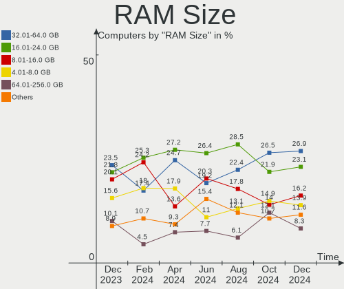
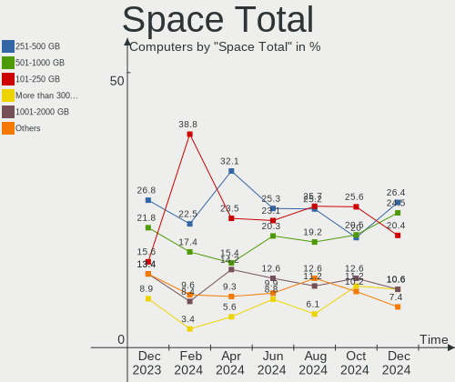
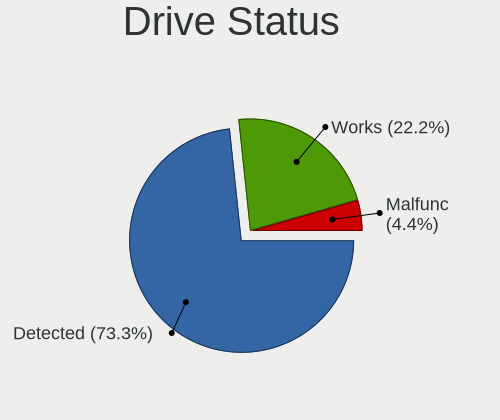
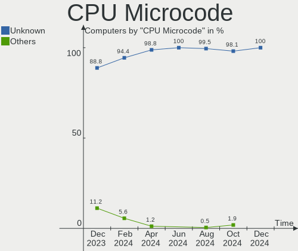
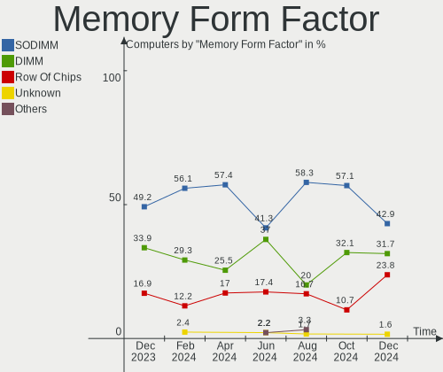
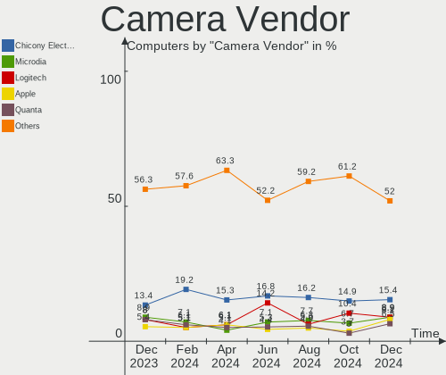
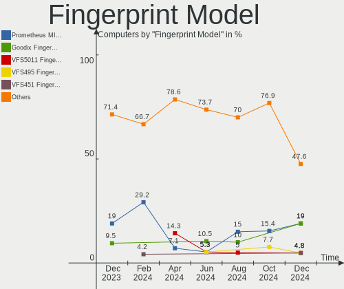

Pop!_OS - Hardware Trends
-------------------------

A project to identify most popular hardware characteristics and track their change
over time based on data collected by Linux users at https://Linux-Hardware.org.

Anyone can contribute to this report by the [hw-probe](https://github.com/linuxhw/hw-probe) tool:

    sudo -E hw-probe -all -upload

This is a report for all computer types. See also reports for [desktops](/Dist/Pop!_OS/Desktop/README.md) and [notebooks](/Dist/Pop!_OS/Notebook/README.md).

This report is for one last month. Overall report since the beginning of time: [TestCoverage](https://github.com/linuxhw/TestCoverage)

Period: May, 2022.

Contents
--------

* [ System ](#system)
  - [ OS                       ](#os)
  - [ OS Family                ](#os-family)
  - [ Kernel                   ](#kernel)
  - [ Kernel Family            ](#kernel-family)
  - [ Kernel Major Ver.        ](#kernel-major-ver)
  - [ Arch                     ](#arch)
  - [ DE                       ](#de)
  - [ Display Server           ](#display-server)
  - [ Display Manager          ](#display-manager)
  - [ OS Lang                  ](#os-lang)
  - [ Boot Mode                ](#boot-mode)
  - [ Filesystem               ](#filesystem)
  - [ Part. scheme             ](#part-scheme)
  - [ Dual Boot with Linux/BSD ](#dual-boot-with-linuxbsd)
  - [ Dual Boot (Win)          ](#dual-boot-win)

* [ Board ](#board)
  - [ Vendor                   ](#vendor)
  - [ Model                    ](#model)
  - [ Model Family             ](#model-family)
  - [ MFG Year                 ](#mfg-year)
  - [ Form Factor              ](#form-factor)
  - [ Secure Boot              ](#secure-boot)
  - [ Coreboot                 ](#coreboot)
  - [ RAM Size                 ](#ram-size)
  - [ RAM Used                 ](#ram-used)
  - [ Total Drives             ](#total-drives)
  - [ Has CD-ROM               ](#has-cd-rom)
  - [ Has Ethernet             ](#has-ethernet)
  - [ Has WiFi                 ](#has-wifi)
  - [ Has Bluetooth            ](#has-bluetooth)

* [ Location ](#location)
  - [ Country                  ](#country)
  - [ City                     ](#city)

* [ Drives ](#drives)
  - [ Drive Vendor             ](#drive-vendor)
  - [ Drive Model              ](#drive-model)
  - [ HDD Vendor               ](#hdd-vendor)
  - [ SSD Vendor               ](#ssd-vendor)
  - [ Drive Kind               ](#drive-kind)
  - [ Drive Connector          ](#drive-connector)
  - [ Drive Size               ](#drive-size)
  - [ Space Total              ](#space-total)
  - [ Space Used               ](#space-used)
  - [ Malfunc. Drives          ](#malfunc-drives)
  - [ Malfunc. Drive Vendor    ](#malfunc-drive-vendor)
  - [ Malfunc. HDD Vendor      ](#malfunc-hdd-vendor)
  - [ Malfunc. Drive Kind      ](#malfunc-drive-kind)
  - [ Failed Drives            ](#failed-drives)
  - [ Failed Drive Vendor      ](#failed-drive-vendor)
  - [ Drive Status             ](#drive-status)

* [ Storage controller ](#storage-controller)
  - [ Storage Vendor           ](#storage-vendor)
  - [ Storage Model            ](#storage-model)
  - [ Storage Kind             ](#storage-kind)

* [ Processor ](#processor)
  - [ CPU Vendor               ](#cpu-vendor)
  - [ CPU Model                ](#cpu-model)
  - [ CPU Model Family         ](#cpu-model-family)
  - [ CPU Cores                ](#cpu-cores)
  - [ CPU Sockets              ](#cpu-sockets)
  - [ CPU Threads              ](#cpu-threads)
  - [ CPU Op-Modes             ](#cpu-op-modes)
  - [ CPU Microcode            ](#cpu-microcode)
  - [ CPU Microarch            ](#cpu-microarch)

* [ Graphics ](#graphics)
  - [ GPU Vendor               ](#gpu-vendor)
  - [ GPU Model                ](#gpu-model)
  - [ GPU Combo                ](#gpu-combo)
  - [ GPU Driver               ](#gpu-driver)
  - [ GPU Memory               ](#gpu-memory)

* [ Monitor ](#monitor)
  - [ Monitor Vendor           ](#monitor-vendor)
  - [ Monitor Model            ](#monitor-model)
  - [ Monitor Resolution       ](#monitor-resolution)
  - [ Monitor Diagonal         ](#monitor-diagonal)
  - [ Monitor Width            ](#monitor-width)
  - [ Aspect Ratio             ](#aspect-ratio)
  - [ Monitor Area             ](#monitor-area)
  - [ Pixel Density            ](#pixel-density)
  - [ Multiple Monitors        ](#multiple-monitors)

* [ Network ](#network)
  - [ Net Controller Vendor    ](#net-controller-vendor)
  - [ Net Controller Model     ](#net-controller-model)
  - [ Wireless Vendor          ](#wireless-vendor)
  - [ Wireless Model           ](#wireless-model)
  - [ Ethernet Vendor          ](#ethernet-vendor)
  - [ Ethernet Model           ](#ethernet-model)
  - [ Net Controller Kind      ](#net-controller-kind)
  - [ Used Controller          ](#used-controller)
  - [ NICs                     ](#nics)
  - [ IPv6                     ](#ipv6)

* [ Bluetooth ](#bluetooth)
  - [ Bluetooth Vendor         ](#bluetooth-vendor)
  - [ Bluetooth Model          ](#bluetooth-model)

* [ Sound ](#sound)
  - [ Sound Vendor             ](#sound-vendor)
  - [ Sound Model              ](#sound-model)

* [ Memory ](#memory)
  - [ Memory Vendor            ](#memory-vendor)
  - [ Memory Model             ](#memory-model)
  - [ Memory Kind              ](#memory-kind)
  - [ Memory Form Factor       ](#memory-form-factor)
  - [ Memory Size              ](#memory-size)
  - [ Memory Speed             ](#memory-speed)

* [ Printers & scanners ](#printers--scanners)
  - [ Printer Vendor           ](#printer-vendor)
  - [ Printer Model            ](#printer-model)
  - [ Scanner Vendor           ](#scanner-vendor)
  - [ Scanner Model            ](#scanner-model)

* [ Camera ](#camera)
  - [ Camera Vendor            ](#camera-vendor)
  - [ Camera Model             ](#camera-model)

* [ Security ](#security)
  - [ Fingerprint Vendor       ](#fingerprint-vendor)
  - [ Fingerprint Model        ](#fingerprint-model)
  - [ Chipcard Vendor          ](#chipcard-vendor)
  - [ Chipcard Model           ](#chipcard-model)

* [ Unsupported ](#unsupported)
  - [ Unsupported Devices      ](#unsupported-devices)
  - [ Unsupported Device Types ](#unsupported-device-types)

System
------

OS
--

Installed operating systems

| Name          | Computers | Percent |
|---------------|-----------|---------|
| Pop!_OS 22.04 | 265       | 86.32%  |
| Pop!_OS 21.10 | 30        | 9.77%   |
| Pop!_OS 20.04 | 6         | 1.95%   |
| Pop!_OS 21.04 | 3         | 0.98%   |
| Pop!_OS 20.10 | 3         | 0.98%   |

OS Family
---------

OS without a version

| Name    | Computers | Percent |
|---------|-----------|---------|
| Pop!_OS | 307       | 100%    |

Kernel
------

Version of the Linux kernel

| Version                  | Computers | Percent |
|--------------------------|-----------|---------|
| 5.17.5-76051705-generic  | 218       | 71.01%  |
| 5.16.19-76051619-generic | 66        | 21.5%   |
| 5.16.15-76051615-generic | 3         | 0.98%   |
| 5.17.7-051707-generic    | 2         | 0.65%   |
| 5.17.5-051705-generic    | 2         | 0.65%   |
| 5.11.0-7614-generic      | 2         | 0.65%   |
| 5.8.0-7630-generic       | 1         | 0.33%   |
| 5.4.0-7625-generic       | 1         | 0.33%   |
| 5.18.0-051800rc1-generic | 1         | 0.33%   |
| 5.17.9-051709-generic    | 1         | 0.33%   |
| 5.17.6-051706-generic    | 1         | 0.33%   |
| 5.17.4-051704-generic    | 1         | 0.33%   |
| 5.17.0-051700-generic    | 1         | 0.33%   |
| 5.16.11-76051611-generic | 1         | 0.33%   |
| 5.15.5-76051505-generic  | 1         | 0.33%   |
| 5.15.15-76051515-generic | 1         | 0.33%   |
| 5.15.11-76051511-generic | 1         | 0.33%   |
| 5.13.0-7620-generic      | 1         | 0.33%   |
| 5.13.0-7614-generic      | 1         | 0.33%   |
| 5.13.0-1011-raspi        | 1         | 0.33%   |

Kernel Family
-------------

Linux kernel without a distro release

| Version | Computers | Percent |
|---------|-----------|---------|
| 5.17.5  | 220       | 71.66%  |
| 5.16.19 | 66        | 21.5%   |
| 5.16.15 | 3         | 0.98%   |
| 5.13.0  | 3         | 0.98%   |
| 5.17.7  | 2         | 0.65%   |
| 5.11.0  | 2         | 0.65%   |
| 5.8.0   | 1         | 0.33%   |
| 5.4.0   | 1         | 0.33%   |
| 5.18.0  | 1         | 0.33%   |
| 5.17.9  | 1         | 0.33%   |
| 5.17.6  | 1         | 0.33%   |
| 5.17.4  | 1         | 0.33%   |
| 5.17.0  | 1         | 0.33%   |
| 5.16.11 | 1         | 0.33%   |
| 5.15.5  | 1         | 0.33%   |
| 5.15.15 | 1         | 0.33%   |
| 5.15.11 | 1         | 0.33%   |

Kernel Major Ver.
-----------------

Linux kernel major version

| Version | Computers | Percent |
|---------|-----------|---------|
| 5.17    | 226       | 73.62%  |
| 5.16    | 70        | 22.8%   |
| 5.15    | 3         | 0.98%   |
| 5.13    | 3         | 0.98%   |
| 5.11    | 2         | 0.65%   |
| 5.8     | 1         | 0.33%   |
| 5.4     | 1         | 0.33%   |
| 5.18    | 1         | 0.33%   |

Arch
----

OS architecture (x86_64, i586, etc.)

| Name    | Computers | Percent |
|---------|-----------|---------|
| x86_64  | 306       | 99.67%  |
| aarch64 | 1         | 0.33%   |

DE
--

Desktop Environment

| Name            | Computers | Percent |
|-----------------|-----------|---------|
| GNOME           | 301       | 98.05%  |
| Unknown         | 2         | 0.65%   |
| X-Cinnamon      | 1         | 0.33%   |
| LXQt            | 1         | 0.33%   |
| KDE5            | 1         | 0.33%   |
| GNOME Flashback | 1         | 0.33%   |

Display Server
--------------

X11 or Wayland

| Name    | Computers | Percent |
|---------|-----------|---------|
| X11     | 294       | 95.77%  |
| Wayland | 12        | 3.91%   |
| Unknown | 1         | 0.33%   |

Display Manager
---------------

SDDM, LightDM, etc.

| Name    | Computers | Percent |
|---------|-----------|---------|
| Unknown | 241       | 78.5%   |
| GDM3    | 56        | 18.24%  |
| GDM     | 9         | 2.93%   |
| SDDM    | 1         | 0.33%   |

OS Lang
-------

Language

| Lang    | Computers | Percent |
|---------|-----------|---------|
| en_US   | 188       | 61.24%  |
| en_GB   | 22        | 7.17%   |
| de_DE   | 15        | 4.89%   |
| pt_BR   | 12        | 3.91%   |
| fr_FR   | 12        | 3.91%   |
| en_AU   | 9         | 2.93%   |
| pl_PL   | 6         | 1.95%   |
| C       | 6         | 1.95%   |
| it_IT   | 5         | 1.63%   |
| es_ES   | 4         | 1.3%    |
| sv_SE   | 2         | 0.65%   |
| ru_RU   | 2         | 0.65%   |
| pt_PT   | 2         | 0.65%   |
| en_NZ   | 2         | 0.65%   |
| en_IN   | 2         | 0.65%   |
| en_CA   | 2         | 0.65%   |
| de_CH   | 2         | 0.65%   |
| Unknown | 2         | 0.65%   |
| nl_NL   | 1         | 0.33%   |
| nb_NO   | 1         | 0.33%   |
| ja_JP   | 1         | 0.33%   |
| fr_CA   | 1         | 0.33%   |
| fr_BE   | 1         | 0.33%   |
| fi_FI   | 1         | 0.33%   |
| es_PE   | 1         | 0.33%   |
| es_GT   | 1         | 0.33%   |
| en_PH   | 1         | 0.33%   |
| en_IL   | 1         | 0.33%   |
| en_IE   | 1         | 0.33%   |
| cs_CZ   | 1         | 0.33%   |

Boot Mode
---------

EFI or BIOS

| Mode | Computers | Percent |
|------|-----------|---------|
| BIOS | 245       | 79.8%   |
| EFI  | 62        | 20.2%   |

Filesystem
----------

Type of filesystem

| Type    | Computers | Percent |
|---------|-----------|---------|
| Ext4    | 295       | 96.09%  |
| Btrfs   | 9         | 2.93%   |
| Overlay | 2         | 0.65%   |
| Xfs     | 1         | 0.33%   |

Part. scheme
------------

Scheme of partitioning

| Type    | Computers | Percent |
|---------|-----------|---------|
| Unknown | 239       | 77.85%  |
| GPT     | 63        | 20.52%  |
| MBR     | 5         | 1.63%   |

Dual Boot with Linux/BSD
------------------------

Hosting more than one Linux/BSD

| Dual boot | Computers | Percent |
|-----------|-----------|---------|
| No        | 297       | 96.74%  |
| Yes       | 10        | 3.26%   |

Dual Boot (Win)
---------------

Hosting Linux and Windows

| Dual boot | Computers | Percent |
|-----------|-----------|---------|
| No        | 275       | 89.58%  |
| Yes       | 32        | 10.42%  |

Board
-----

Vendor
------

Motherboard manufacturer

| Name                    | Computers | Percent |
|-------------------------|-----------|---------|
| ASUSTek Computer        | 58        | 18.89%  |
| Dell                    | 35        | 11.4%   |
| Hewlett-Packard         | 33        | 10.75%  |
| Lenovo                  | 32        | 10.42%  |
| Gigabyte Technology     | 25        | 8.14%   |
| MSI                     | 21        | 6.84%   |
| Apple                   | 18        | 5.86%   |
| Acer                    | 15        | 4.89%   |
| ASRock                  | 14        | 4.56%   |
| System76                | 6         | 1.95%   |
| Toshiba                 | 5         | 1.63%   |
| Samsung Electronics     | 5         | 1.63%   |
| Intel                   | 5         | 1.63%   |
| Google                  | 4         | 1.3%    |
| Microsoft               | 3         | 0.98%   |
| Alienware               | 3         | 0.98%   |
| PC Specialist           | 2         | 0.65%   |
| HUAWEI                  | 2         | 0.65%   |
| Fujitsu                 | 2         | 0.65%   |
| TUXEDO                  | 1         | 0.33%   |
| Supermicro              | 1         | 0.33%   |
| SIEMENS                 | 1         | 0.33%   |
| Semp Toshiba            | 1         | 0.33%   |
| Razer                   | 1         | 0.33%   |
| Raspberry Pi Foundation | 1         | 0.33%   |
| Positivo                | 1         | 0.33%   |
| NZXT                    | 1         | 0.33%   |
| Monster                 | 1         | 0.33%   |
| Medion                  | 1         | 0.33%   |
| LG Electronics          | 1         | 0.33%   |
| Intel Client Systems    | 1         | 0.33%   |
| Infinix                 | 1         | 0.33%   |
| Framework               | 1         | 0.33%   |
| Foxconn                 | 1         | 0.33%   |
| ECS                     | 1         | 0.33%   |
| AZW                     | 1         | 0.33%   |
| A-DATA Technology       | 1         | 0.33%   |
| Unknown                 | 1         | 0.33%   |

Model
-----

Motherboard model

| Name                                               | Computers | Percent |
|----------------------------------------------------|-----------|---------|
| ASUS All Series                                    | 4         | 1.3%    |
| System76 Oryx Pro                                  | 3         | 0.98%   |
| HP Pavilion Notebook                               | 3         | 0.98%   |
| Samsung 550XCJ/550XCR                              | 2         | 0.65%   |
| HP OMEN Laptop 15-en0xxx                           | 2         | 0.65%   |
| Google Lulu                                        | 2         | 0.65%   |
| Gigabyte Z170-HD3P                                 | 2         | 0.65%   |
| Gigabyte X570 AORUS ELITE                          | 2         | 0.65%   |
| Gigabyte B450 AORUS M                              | 2         | 0.65%   |
| Dell OptiPlex 3020                                 | 2         | 0.65%   |
| ASUS ROG CROSSHAIR VIII DARK HERO                  | 2         | 0.65%   |
| ASUS PRIME B450M-A                                 | 2         | 0.65%   |
| Apple MacBookAir7,2                                | 2         | 0.65%   |
| Apple MacBookAir6,2                                | 2         | 0.65%   |
| Acer Aspire A515-45                                | 2         | 0.65%   |
| Unknown                                            | 2         | 0.65%   |
| Toshiba Satellite P850                             | 1         | 0.33%   |
| Toshiba Satellite L755                             | 1         | 0.33%   |
| Toshiba Satellite L50D-C                           | 1         | 0.33%   |
| Toshiba QOSMIO X770                                | 1         | 0.33%   |
| Toshiba PORTEGE R830                               | 1         | 0.33%   |
| System76 Thelio Major                              | 1         | 0.33%   |
| System76 Pangolin                                  | 1         | 0.33%   |
| System76 Galago Pro                                | 1         | 0.33%   |
| Supermicro X8SIL                                   | 1         | 0.33%   |
| SIEMENS SIMATIC BOX PC 627B/PANEL PC 677B Profibus | 1         | 0.33%   |
| Semp Toshiba IS 1413G                              | 1         | 0.33%   |
| Samsung RV411/RV511/E3511/S3511/RV711/E3411        | 1         | 0.33%   |
| Samsung 950QCG                                     | 1         | 0.33%   |
| Samsung 800G5M/800G5W                              | 1         | 0.33%   |
| Razer Blade 14 - RZ09-0370                         | 1         | 0.33%   |
| RPi Raspberry Pi                                   | 1         | 0.33%   |
| Positivo POS-MI945AA                               | 1         | 0.33%   |
| PC Specialist NP5x_NP6x_NP7xPNK_PNH_PNJ            | 1         | 0.33%   |
| PC Specialist NH5x_7xDCx_DDx                       | 1         | 0.33%   |
| NZXT N7 B550                                       | 1         | 0.33%   |
| MSI MS-7D52                                        | 1         | 0.33%   |
| MSI MS-7C91                                        | 1         | 0.33%   |
| MSI MS-7C37                                        | 1         | 0.33%   |
| MSI MS-7B86                                        | 1         | 0.33%   |
| MSI MS-7B12                                        | 1         | 0.33%   |
| MSI MS-7A74                                        | 1         | 0.33%   |
| MSI MS-7A71                                        | 1         | 0.33%   |
| MSI MS-7A40                                        | 1         | 0.33%   |
| MSI MS-7A37                                        | 1         | 0.33%   |
| MSI MS-7A32                                        | 1         | 0.33%   |
| MSI MS-7A16                                        | 1         | 0.33%   |
| MSI MS-7817                                        | 1         | 0.33%   |
| MSI MS-7693                                        | 1         | 0.33%   |
| MSI Modern 15 A10RAS                               | 1         | 0.33%   |
| MSI Modern 14 A10M                                 | 1         | 0.33%   |
| MSI Katana GF76 12UGS                              | 1         | 0.33%   |
| MSI GS65 Stealth 8SG                               | 1         | 0.33%   |
| MSI GS63 7RD                                       | 1         | 0.33%   |
| MSI GP76 Leopard 11UG                              | 1         | 0.33%   |
| MSI GF63 Thin 10SCXR                               | 1         | 0.33%   |
| MSI A55PV.AR3510D                                  | 1         | 0.33%   |
| Monster TULPAR T5 V14.1                            | 1         | 0.33%   |
| Microsoft Surface Pro 6                            | 1         | 0.33%   |
| Microsoft Surface Pro 3                            | 1         | 0.33%   |

Model Family
------------

Motherboard model prefix

| Name                 | Computers | Percent |
|----------------------|-----------|---------|
| ASUS ROG             | 18        | 5.86%   |
| Lenovo ThinkPad      | 14        | 4.56%   |
| Dell Inspiron        | 10        | 3.26%   |
| Acer Aspire          | 10        | 3.26%   |
| Dell XPS             | 9         | 2.93%   |
| HP Pavilion          | 7         | 2.28%   |
| ASUS PRIME           | 6         | 1.95%   |
| HP EliteBook         | 5         | 1.63%   |
| Lenovo IdeaPad       | 4         | 1.3%    |
| HP OMEN              | 4         | 1.3%    |
| HP Laptop            | 4         | 1.3%    |
| Dell OptiPlex        | 4         | 1.3%    |
| ASUS All             | 4         | 1.3%    |
| Toshiba Satellite    | 3         | 0.98%   |
| System76 Oryx        | 3         | 0.98%   |
| Microsoft Surface    | 3         | 0.98%   |
| Lenovo Legion        | 3         | 0.98%   |
| Gigabyte X570        | 3         | 0.98%   |
| Gigabyte B450        | 3         | 0.98%   |
| Dell Vostro          | 3         | 0.98%   |
| Dell Precision       | 3         | 0.98%   |
| Dell Latitude        | 3         | 0.98%   |
| ASUS VivoBook        | 3         | 0.98%   |
| Samsung 550XCJ       | 2         | 0.65%   |
| MSI Modern           | 2         | 0.65%   |
| Lenovo ThinkCentre   | 2         | 0.65%   |
| HP Spectre           | 2         | 0.65%   |
| HP ProBook           | 2         | 0.65%   |
| HP EliteDesk         | 2         | 0.65%   |
| Google Lulu          | 2         | 0.65%   |
| Gigabyte Z170-HD3P   | 2         | 0.65%   |
| ASUS TUF             | 2         | 0.65%   |
| ASRock B450          | 2         | 0.65%   |
| Apple MacBookPro14   | 2         | 0.65%   |
| Apple MacBookAir7    | 2         | 0.65%   |
| Apple MacBookAir6    | 2         | 0.65%   |
| Alienware Aurora     | 2         | 0.65%   |
| Acer TravelMate      | 2         | 0.65%   |
| Acer Nitro           | 2         | 0.65%   |
| Unknown              | 2         | 0.65%   |
| Toshiba QOSMIO       | 1         | 0.33%   |
| Toshiba PORTEGE      | 1         | 0.33%   |
| System76 Thelio      | 1         | 0.33%   |
| System76 Pangolin    | 1         | 0.33%   |
| System76 Galago      | 1         | 0.33%   |
| Supermicro X8SIL     | 1         | 0.33%   |
| SIEMENS SIMATIC      | 1         | 0.33%   |
| Semp Toshiba IS      | 1         | 0.33%   |
| Samsung RV411        | 1         | 0.33%   |
| Samsung 950QCG       | 1         | 0.33%   |
| Samsung 800G5M       | 1         | 0.33%   |
| Razer Blade          | 1         | 0.33%   |
| RPi Raspberry        | 1         | 0.33%   |
| Positivo POS-MI945AA | 1         | 0.33%   |
| PC Specialist NP5x   | 1         | 0.33%   |
| PC Specialist NH5x   | 1         | 0.33%   |
| NZXT N7              | 1         | 0.33%   |
| MSI MS-7D52          | 1         | 0.33%   |
| MSI MS-7C91          | 1         | 0.33%   |
| MSI MS-7C37          | 1         | 0.33%   |

MFG Year
--------

Motherboard manufacture year

| Year    | Computers | Percent |
|---------|-----------|---------|
| 2021    | 46        | 14.98%  |
| 2020    | 45        | 14.66%  |
| 2018    | 36        | 11.73%  |
| 2019    | 32        | 10.42%  |
| 2016    | 22        | 7.17%   |
| 2017    | 21        | 6.84%   |
| 2011    | 19        | 6.19%   |
| 2015    | 15        | 4.89%   |
| 2014    | 15        | 4.89%   |
| 2013    | 12        | 3.91%   |
| 2012    | 12        | 3.91%   |
| 2009    | 12        | 3.91%   |
| 2022    | 7         | 2.28%   |
| 2008    | 6         | 1.95%   |
| 2010    | 5         | 1.63%   |
| 2007    | 1         | 0.33%   |
| Unknown | 1         | 0.33%   |

Form Factor
-----------

Physical design of the computer

| Name           | Computers | Percent |
|----------------|-----------|---------|
| Notebook       | 165       | 53.75%  |
| Desktop        | 115       | 37.46%  |
| Convertible    | 11        | 3.58%   |
| Mini pc        | 8         | 2.61%   |
| All in one     | 4         | 1.3%    |
| Tablet         | 3         | 0.98%   |
| System on chip | 1         | 0.33%   |

Secure Boot
-----------

Enabled or disabled

| State    | Computers | Percent |
|----------|-----------|---------|
| Disabled | 307       | 100%    |

Coreboot
--------

Have coreboot on board

| Used | Computers | Percent |
|------|-----------|---------|
| No   | 300       | 97.72%  |
| Yes  | 7         | 2.28%   |

RAM Size
--------

Total RAM memory

| Size in GB      | Computers | Percent |
|-----------------|-----------|---------|
| 16.01-24.0      | 73        | 23.78%  |
| 4.01-8.0        | 63        | 20.52%  |
| 8.01-16.0       | 58        | 18.89%  |
| 32.01-64.0      | 57        | 18.57%  |
| 3.01-4.0        | 34        | 11.07%  |
| 64.01-256.0     | 14        | 4.56%   |
| 24.01-32.0      | 4         | 1.3%    |
| More than 256.0 | 2         | 0.65%   |
| 1.01-2.0        | 2         | 0.65%   |

RAM Used
--------

Used RAM memory

| Used GB    | Computers | Percent |
|------------|-----------|---------|
| 2.01-3.0   | 94        | 30.62%  |
| 4.01-8.0   | 76        | 24.76%  |
| 3.01-4.0   | 66        | 21.5%   |
| 1.01-2.0   | 52        | 16.94%  |
| 8.01-16.0  | 13        | 4.23%   |
| 16.01-24.0 | 5         | 1.63%   |
| 24.01-32.0 | 1         | 0.33%   |

Total Drives
------------

Number of drives on board

| Drives | Computers | Percent |
|--------|-----------|---------|
| 1      | 148       | 48.21%  |
| 2      | 110       | 35.83%  |
| 3      | 28        | 9.12%   |
| 4      | 9         | 2.93%   |
| 5      | 5         | 1.63%   |
| 6      | 3         | 0.98%   |
| 10     | 1         | 0.33%   |
| 9      | 1         | 0.33%   |
| 7      | 1         | 0.33%   |
| 0      | 1         | 0.33%   |

Has CD-ROM
----------

Has CD-ROM on board

| Presented | Computers | Percent |
|-----------|-----------|---------|
| No        | 234       | 76.22%  |
| Yes       | 73        | 23.78%  |

Has Ethernet
------------

Has Ethernet on board

| Presented | Computers | Percent |
|-----------|-----------|---------|
| Yes       | 258       | 84.04%  |
| No        | 49        | 15.96%  |

Has WiFi
--------

Has WiFi module

| Presented | Computers | Percent |
|-----------|-----------|---------|
| Yes       | 261       | 85.02%  |
| No        | 46        | 14.98%  |

Has Bluetooth
-------------

Has Bluetooth module

| Presented | Computers | Percent |
|-----------|-----------|---------|
| Yes       | 219       | 71.34%  |
| No        | 88        | 28.66%  |

Location
--------

Country
-------

Geographic location (country)

| Country               | Computers | Percent |
|-----------------------|-----------|---------|
| USA                   | 105       | 34.2%   |
| Germany               | 21        | 6.84%   |
| Brazil                | 20        | 6.51%   |
| UK                    | 17        | 5.54%   |
| Australia             | 14        | 4.56%   |
| France                | 13        | 4.23%   |
| India                 | 9         | 2.93%   |
| Canada                | 8         | 2.61%   |
| Sweden                | 6         | 1.95%   |
| Switzerland           | 5         | 1.63%   |
| Russia                | 5         | 1.63%   |
| Poland                | 5         | 1.63%   |
| Norway                | 5         | 1.63%   |
| Italy                 | 5         | 1.63%   |
| Turkey                | 4         | 1.3%    |
| New Zealand           | 4         | 1.3%    |
| Spain                 | 3         | 0.98%   |
| Philippines           | 3         | 0.98%   |
| Netherlands           | 3         | 0.98%   |
| Finland               | 3         | 0.98%   |
| Thailand              | 2         | 0.65%   |
| South Africa          | 2         | 0.65%   |
| Saudi Arabia          | 2         | 0.65%   |
| Portugal              | 2         | 0.65%   |
| Peru                  | 2         | 0.65%   |
| Panama                | 2         | 0.65%   |
| Mexico                | 2         | 0.65%   |
| Malaysia              | 2         | 0.65%   |
| Ireland               | 2         | 0.65%   |
| Hungary               | 2         | 0.65%   |
| Hong Kong             | 2         | 0.65%   |
| Greece                | 2         | 0.65%   |
| Czechia               | 2         | 0.65%   |
| Croatia               | 2         | 0.65%   |
| Austria               | 2         | 0.65%   |
| Vietnam               | 1         | 0.33%   |
| South Korea           | 1         | 0.33%   |
| Slovenia              | 1         | 0.33%   |
| Serbia                | 1         | 0.33%   |
| Romania               | 1         | 0.33%   |
| Republic of the Congo | 1         | 0.33%   |
| Nicaragua             | 1         | 0.33%   |
| Morocco               | 1         | 0.33%   |
| Lithuania             | 1         | 0.33%   |
| Jordan                | 1         | 0.33%   |
| Japan                 | 1         | 0.33%   |
| Iraq                  | 1         | 0.33%   |
| Indonesia             | 1         | 0.33%   |
| Guatemala             | 1         | 0.33%   |
| Egypt                 | 1         | 0.33%   |
| Bulgaria              | 1         | 0.33%   |
| Belgium               | 1         | 0.33%   |
| Azerbaijan            | 1         | 0.33%   |
| Argentina             | 1         | 0.33%   |

City
----

Geographic location (city)

| City                | Computers | Percent |
|---------------------|-----------|---------|
| Sydney              | 4         | 1.3%    |
| Istanbul            | 4         | 1.3%    |
| Zurich              | 3         | 0.98%   |
| Sao Paulo           | 3         | 0.98%   |
| Warsaw              | 2         | 0.65%   |
| Vienna              | 2         | 0.65%   |
| Tallahassee         | 2         | 0.65%   |
| Stuttgart           | 2         | 0.65%   |
| San Jose            | 2         | 0.65%   |
| San Francisco       | 2         | 0.65%   |
| San Antonio         | 2         | 0.65%   |
| Riyadh              | 2         | 0.65%   |
| Rio de Janeiro      | 2         | 0.65%   |
| Quezon City         | 2         | 0.65%   |
| Paris               | 2         | 0.65%   |
| Panama City         | 2         | 0.65%   |
| Oslo                | 2         | 0.65%   |
| Norwalk             | 2         | 0.65%   |
| Moscow              | 2         | 0.65%   |
| Melbourne           | 2         | 0.65%   |
| Mannheim            | 2         | 0.65%   |
| London              | 2         | 0.65%   |
| Helsinki            | 2         | 0.65%   |
| Elk Grove           | 2         | 0.65%   |
| Durham              | 2         | 0.65%   |
| Danville            | 2         | 0.65%   |
| Chicago             | 2         | 0.65%   |
| Charlotte           | 2         | 0.65%   |
| Central             | 2         | 0.65%   |
| Catunda             | 2         | 0.65%   |
| Budapest            | 2         | 0.65%   |
| Brisbane            | 2         | 0.65%   |
| Boise               | 2         | 0.65%   |
| Berlin              | 2         | 0.65%   |
| Bengaluru           | 2         | 0.65%   |
| Bamberg             | 2         | 0.65%   |
| Auckland            | 2         | 0.65%   |
| Żyrardów          | 1         | 0.33%   |
| Zaragoza            | 1         | 0.33%   |
| Zapopan             | 1         | 0.33%   |
| Zagreb              | 1         | 0.33%   |
| Yogyakarta          | 1         | 0.33%   |
| Woodstock           | 1         | 0.33%   |
| Winnipeg            | 1         | 0.33%   |
| Wichita             | 1         | 0.33%   |
| Weston-super-Mare   | 1         | 0.33%   |
| Wendorf             | 1         | 0.33%   |
| Weimar              | 1         | 0.33%   |
| Walker              | 1         | 0.33%   |
| Visakhapatnam       | 1         | 0.33%   |
| Vilnius             | 1         | 0.33%   |
| Vila Velha          | 1         | 0.33%   |
| Victoriaville       | 1         | 0.33%   |
| Ventura             | 1         | 0.33%   |
| Valparaiso          | 1         | 0.33%   |
| Union               | 1         | 0.33%   |
| Uhldingen-Muhlhofen | 1         | 0.33%   |
| Turku               | 1         | 0.33%   |
| Turin               | 1         | 0.33%   |
| Tucson              | 1         | 0.33%   |

Drives
------

Drive Vendor
------------

Hard drive vendors

| Vendor                    | Computers | Drives | Percent |
|---------------------------|-----------|--------|---------|
| Samsung Electronics       | 96        | 120    | 19.63%  |
| Seagate                   | 62        | 80     | 12.68%  |
| WDC                       | 55        | 66     | 11.25%  |
| SanDisk                   | 37        | 39     | 7.57%   |
| Toshiba                   | 31        | 32     | 6.34%   |
| Kingston                  | 26        | 28     | 5.32%   |
| Crucial                   | 17        | 20     | 3.48%   |
| Phison                    | 14        | 14     | 2.86%   |
| Hitachi                   | 13        | 14     | 2.66%   |
| Unknown                   | 12        | 13     | 2.45%   |
| SK Hynix                  | 12        | 12     | 2.45%   |
| Micron Technology         | 12        | 13     | 2.45%   |
| Intel                     | 11        | 13     | 2.25%   |
| Apple                     | 10        | 12     | 2.04%   |
| A-DATA Technology         | 9         | 9      | 1.84%   |
| Silicon Motion            | 8         | 10     | 1.64%   |
| HGST                      | 7         | 7      | 1.43%   |
| SPCC                      | 4         | 5      | 0.82%   |
| PNY                       | 4         | 4      | 0.82%   |
| KIOXIA                    | 4         | 4      | 0.82%   |
| Patriot                   | 3         | 3      | 0.61%   |
| MyDigitalSSD              | 3         | 3      | 0.61%   |
| ADATA Technology          | 3         | 3      | 0.61%   |
| Union Memory (Shenzhen)   | 2         | 2      | 0.41%   |
| PNY USB                   | 2         | 2      | 0.41%   |
| Micron/Crucial Technology | 2         | 2      | 0.41%   |
| Lexar                     | 2         | 2      | 0.41%   |
| KingSpec                  | 2         | 2      | 0.41%   |
| Hewlett-Packard           | 2         | 2      | 0.41%   |
| China                     | 2         | 3      | 0.41%   |
| ASMT                      | 2         | 2      | 0.41%   |
| XPG                       | 1         | 1      | 0.2%    |
| USB3.0                    | 1         | 1      | 0.2%    |
| TurXun                    | 1         | 1      | 0.2%    |
| TO Exter                  | 1         | 1      | 0.2%    |
| Team                      | 1         | 1      | 0.2%    |
| SABRENT                   | 1         | 1      | 0.2%    |
| Realtek Semiconductor     | 1         | 1      | 0.2%    |
| OCZ                       | 1         | 1      | 0.2%    |
| Mass                      | 1         | 1      | 0.2%    |
| LITEONIT                  | 1         | 1      | 0.2%    |
| LITEON                    | 1         | 1      | 0.2%    |
| Intenso                   | 1         | 1      | 0.2%    |
| INTEL SS                  | 1         | 1      | 0.2%    |
| HS-SSD-C100               | 1         | 1      | 0.2%    |
| Gigabyte Technology       | 1         | 1      | 0.2%    |
| Fujitsu                   | 1         | 1      | 0.2%    |
| FORESEE                   | 1         | 1      | 0.2%    |
| Apacer                    | 1         | 1      | 0.2%    |
| Aarvex                    | 1         | 1      | 0.2%    |
| Unknown                   | 1         | 1      | 0.2%    |

Drive Model
-----------

Hard drive models

| Model                               | Computers | Percent |
|-------------------------------------|-----------|---------|
| Samsung NVMe SSD Drive 500GB        | 14        | 2.58%   |
| Samsung NVMe SSD Drive 1TB          | 13        | 2.4%    |
| Kingston SA400S37240G 240GB SSD     | 8         | 1.48%   |
| Sandisk NVMe SSD Drive 1TB          | 7         | 1.29%   |
| Samsung NVMe SSD Drive 2TB          | 7         | 1.29%   |
| SK Hynix NVMe SSD Drive 512GB       | 6         | 1.11%   |
| Samsung NVMe SSD Drive 256GB        | 6         | 1.11%   |
| Seagate ST4000DM004-2CV104 4TB      | 5         | 0.92%   |
| Seagate ST2000DM008-2FR102 2TB      | 5         | 0.92%   |
| Sandisk NVMe SSD Drive 512GB        | 5         | 0.92%   |
| Samsung SSD 970 EVO Plus 1TB        | 5         | 0.92%   |
| Samsung NVMe SSD Drive 512GB        | 5         | 0.92%   |
| Crucial CT1000MX500SSD1 1TB         | 5         | 0.92%   |
| Seagate ST1000LM049-2GH172 1TB      | 4         | 0.74%   |
| Seagate ST1000DM010-2EP102 1TB      | 4         | 0.74%   |
| Samsung SSD 980 PRO 1TB             | 4         | 0.74%   |
| Samsung SSD 860 EVO 1TB             | 4         | 0.74%   |
| Samsung NVMe SSD Drive 1024GB       | 4         | 0.74%   |
| Unknown MMC Card  64GB              | 3         | 0.55%   |
| Unknown MMC Card  32GB              | 3         | 0.55%   |
| Toshiba NVMe SSD Drive 512GB        | 3         | 0.55%   |
| Toshiba MQ04ABF100 1TB              | 3         | 0.55%   |
| Toshiba KBG30ZMS128G 128GB NVMe SSD | 3         | 0.55%   |
| Toshiba HDWD120 2TB                 | 3         | 0.55%   |
| SPCC Solid State Disk 512GB         | 3         | 0.55%   |
| Seagate ST500LM012 HN-M500MBB 500GB | 3         | 0.55%   |
| Seagate ST500DM002-1BD142 500GB     | 3         | 0.55%   |
| Sandisk NVMe SSD Drive 500GB        | 3         | 0.55%   |
| Sandisk NVMe SSD Drive 2TB          | 3         | 0.55%   |
| Samsung SSD 970 EVO Plus 2TB        | 3         | 0.55%   |
| Samsung SSD 860 EVO 500GB           | 3         | 0.55%   |
| Samsung SSD 850 EVO 500GB           | 3         | 0.55%   |
| Samsung SSD 850 EVO 250GB           | 3         | 0.55%   |
| Samsung NVMe SSD Drive 250GB        | 3         | 0.55%   |
| PNY CS900 240GB SSD                 | 3         | 0.55%   |
| Phison NVMe SSD Drive 2TB           | 3         | 0.55%   |
| Phison NVMe SSD Drive 1TB           | 3         | 0.55%   |
| Micron NVMe SSD Drive 1024GB        | 3         | 0.55%   |
| Crucial CT1000BX500SSD1 1TB         | 3         | 0.55%   |
| Apple SSD SM0128G 121GB             | 3         | 0.55%   |
| ADATA NVMe SSD Drive 256GB          | 3         | 0.55%   |
| WDC WDS500G2B0C-00PXH0 500GB        | 2         | 0.37%   |
| WDC WDS500G2B0A-00SM50 500GB SSD    | 2         | 0.37%   |
| WDC WD20EZRZ-00Z5HB0 2TB            | 2         | 0.37%   |
| WDC WD10JPVX-60JC3T0 1TB            | 2         | 0.37%   |
| WDC WD10EZEX-08M2NA0 1TB            | 2         | 0.37%   |
| WDC WD10EZEX-00WN4A0 1TB            | 2         | 0.37%   |
| Unknown MMC Card  128GB             | 2         | 0.37%   |
| Toshiba MQ01ABD100 1TB              | 2         | 0.37%   |
| Toshiba MK5075GSX 500GB             | 2         | 0.37%   |
| Toshiba HDWD110 1TB                 | 2         | 0.37%   |
| Toshiba DT01ACA200 2TB              | 2         | 0.37%   |
| SK Hynix NVMe SSD Drive 1024GB      | 2         | 0.37%   |
| Silicon Motion NVMe SSD Drive 512GB | 2         | 0.37%   |
| Silicon Motion NVMe SSD Drive 256GB | 2         | 0.37%   |
| Silicon Motion NVMe SSD Drive 128GB | 2         | 0.37%   |
| Seagate ST4000DM000-1F2168 4TB      | 2         | 0.37%   |
| Seagate ST2000LX001-1RG174 2TB      | 2         | 0.37%   |
| Seagate ST2000LM007-1R8174 2TB      | 2         | 0.37%   |
| Seagate ST2000DM006-2DM164 2TB      | 2         | 0.37%   |

HDD Vendor
----------

Hard disk drive vendors

| Vendor              | Computers | Drives | Percent |
|---------------------|-----------|--------|---------|
| Seagate             | 59        | 74     | 40.97%  |
| WDC                 | 36        | 44     | 25%     |
| Toshiba             | 22        | 23     | 15.28%  |
| Hitachi             | 13        | 14     | 9.03%   |
| HGST                | 7         | 7      | 4.86%   |
| Samsung Electronics | 2         | 2      | 1.39%   |
| ASMT                | 2         | 2      | 1.39%   |
| Apple               | 2         | 2      | 1.39%   |
| SABRENT             | 1         | 1      | 0.69%   |

SSD Vendor
----------

Solid state drive vendors

| Vendor              | Computers | Drives | Percent |
|---------------------|-----------|--------|---------|
| Samsung Electronics | 32        | 40     | 20.92%  |
| Kingston            | 20        | 20     | 13.07%  |
| SanDisk             | 18        | 18     | 11.76%  |
| Crucial             | 14        | 17     | 9.15%   |
| WDC                 | 10        | 10     | 6.54%   |
| A-DATA Technology   | 8         | 8      | 5.23%   |
| Apple               | 7         | 7      | 4.58%   |
| Intel               | 5         | 5      | 3.27%   |
| PNY                 | 4         | 4      | 2.61%   |
| SPCC                | 3         | 3      | 1.96%   |
| Patriot             | 3         | 3      | 1.96%   |
| MyDigitalSSD        | 3         | 3      | 1.96%   |
| Micron Technology   | 3         | 3      | 1.96%   |
| Toshiba             | 2         | 2      | 1.31%   |
| PNY USB             | 2         | 2      | 1.31%   |
| Lexar               | 2         | 2      | 1.31%   |
| KingSpec            | 2         | 2      | 1.31%   |
| Hewlett-Packard     | 2         | 2      | 1.31%   |
| China               | 2         | 3      | 1.31%   |
| USB3.0              | 1         | 1      | 0.65%   |
| TO Exter            | 1         | 1      | 0.65%   |
| SK Hynix            | 1         | 1      | 0.65%   |
| OCZ                 | 1         | 1      | 0.65%   |
| LITEONIT            | 1         | 1      | 0.65%   |
| INTEL SS            | 1         | 1      | 0.65%   |
| Gigabyte Technology | 1         | 1      | 0.65%   |
| Fujitsu             | 1         | 1      | 0.65%   |
| FORESEE             | 1         | 1      | 0.65%   |
| Apacer              | 1         | 1      | 0.65%   |
| Aarvex              | 1         | 1      | 0.65%   |

Drive Kind
----------

HDD or SSD

| Kind    | Computers | Drives | Percent |
|---------|-----------|--------|---------|
| NVMe    | 152       | 207    | 35.51%  |
| SSD     | 138       | 165    | 32.24%  |
| HDD     | 119       | 169    | 27.8%   |
| MMC     | 12        | 13     | 2.8%    |
| Unknown | 7         | 7      | 1.64%   |

Drive Connector
---------------

SATA, SAS, NVMe, etc.

| Type | Computers | Drives | Percent |
|------|-----------|--------|---------|
| SATA | 204       | 314    | 52.31%  |
| NVMe | 152       | 205    | 38.97%  |
| SAS  | 22        | 29     | 5.64%   |
| MMC  | 12        | 13     | 3.08%   |

Drive Size
----------

Size of hard drive

| Size in TB | Computers | Drives | Percent |
|------------|-----------|--------|---------|
| 0.01-0.5   | 138       | 174    | 49.82%  |
| 0.51-1.0   | 79        | 90     | 28.52%  |
| 1.01-2.0   | 33        | 36     | 11.91%  |
| 3.01-4.0   | 17        | 21     | 6.14%   |
| 4.01-10.0  | 5         | 7      | 1.81%   |
| 2.01-3.0   | 4         | 4      | 1.44%   |
| 10.01-20.0 | 1         | 2      | 0.36%   |

Space Total
-----------

Amount of disk space available on the file system

| Size in GB     | Computers | Percent |
|----------------|-----------|---------|
| 101-250        | 83        | 27.04%  |
| 251-500        | 81        | 26.38%  |
| 501-1000       | 59        | 19.22%  |
| 1001-2000      | 32        | 10.42%  |
| More than 3000 | 20        | 6.51%   |
| 2001-3000      | 9         | 2.93%   |
| 51-100         | 8         | 2.61%   |
| 21-50          | 7         | 2.28%   |
| 1-20           | 5         | 1.63%   |
| Unknown        | 3         | 0.98%   |

Space Used
----------

Amount of used disk space

| Used GB        | Computers | Percent |
|----------------|-----------|---------|
| 1-20           | 88        | 28.66%  |
| 21-50          | 70        | 22.8%   |
| 101-250        | 48        | 15.64%  |
| 51-100         | 38        | 12.38%  |
| 251-500        | 24        | 7.82%   |
| 1001-2000      | 14        | 4.56%   |
| 501-1000       | 13        | 4.23%   |
| More than 3000 | 6         | 1.95%   |
| 2001-3000      | 3         | 0.98%   |
| Unknown        | 3         | 0.98%   |

Malfunc. Drives
---------------

Drive models with a malfunction

| Model                                 | Computers | Drives | Percent |
|---------------------------------------|-----------|--------|---------|
| WDC WD10JPVX-60JC3T0 1TB              | 1         | 1      | 14.29%  |
| Seagate ST9320325AS 320GB             | 1         | 1      | 14.29%  |
| Seagate ST500LM030-2E717D 500GB       | 1         | 1      | 14.29%  |
| Samsung Electronics SSD 850 PRO 256GB | 1         | 1      | 14.29%  |
| Kingston SV300S37A240G 240GB SSD      | 1         | 1      | 14.29%  |
| Intel SSDPEKNW010T8 1TB               | 1         | 1      | 14.29%  |
| Hitachi HDP725050GLA360 500GB         | 1         | 1      | 14.29%  |

Malfunc. Drive Vendor
---------------------

Vendors of faulty drives

| Vendor              | Computers | Drives | Percent |
|---------------------|-----------|--------|---------|
| Seagate             | 2         | 2      | 28.57%  |
| WDC                 | 1         | 1      | 14.29%  |
| Samsung Electronics | 1         | 1      | 14.29%  |
| Kingston            | 1         | 1      | 14.29%  |
| Intel               | 1         | 1      | 14.29%  |
| Hitachi             | 1         | 1      | 14.29%  |

Malfunc. HDD Vendor
-------------------

Vendors of faulty HDD drives

| Vendor  | Computers | Drives | Percent |
|---------|-----------|--------|---------|
| Seagate | 2         | 2      | 50%     |
| WDC     | 1         | 1      | 25%     |
| Hitachi | 1         | 1      | 25%     |

Malfunc. Drive Kind
-------------------

Kinds of faulty drives

| Kind | Computers | Drives | Percent |
|------|-----------|--------|---------|
| HDD  | 4         | 4      | 57.14%  |
| SSD  | 2         | 2      | 28.57%  |
| NVMe | 1         | 1      | 14.29%  |

Failed Drives
-------------

Failed drive models

Zero info for selected period =(

Failed Drive Vendor
-------------------

Failed drive vendors

Zero info for selected period =(

Drive Status
------------

Number of failed and malfunc. drives

| Status   | Computers | Drives | Percent |
|----------|-----------|--------|---------|
| Detected | 248       | 444    | 75.61%  |
| Works    | 73        | 110    | 22.26%  |
| Malfunc  | 7         | 7      | 2.13%   |

Storage controller
------------------

Storage Vendor
--------------

Storage controller vendors

| Vendor                       | Computers | Percent |
|------------------------------|-----------|---------|
| Intel                        | 171       | 37.75%  |
| AMD                          | 78        | 17.22%  |
| Samsung Electronics          | 73        | 16.11%  |
| Sandisk                      | 26        | 5.74%   |
| Phison Electronics           | 16        | 3.53%   |
| SK Hynix                     | 11        | 2.43%   |
| Silicon Motion               | 10        | 2.21%   |
| Micron Technology            | 9         | 1.99%   |
| ASMedia Technology           | 9         | 1.99%   |
| Toshiba America Info Systems | 8         | 1.77%   |
| Nvidia                       | 6         | 1.32%   |
| ADATA Technology             | 5         | 1.1%    |
| Micron/Crucial Technology    | 4         | 0.88%   |
| Marvell Technology Group     | 4         | 0.88%   |
| Kingston Technology Company  | 4         | 0.88%   |
| Seagate Technology           | 3         | 0.66%   |
| KIOXIA                       | 3         | 0.66%   |
| JMicron Technology           | 3         | 0.66%   |
| Union Memory (Shenzhen)      | 2         | 0.44%   |
| Apple                        | 2         | 0.44%   |
| Unknown                      | 1         | 0.22%   |
| Silicon Image                | 1         | 0.22%   |
| Realtek Semiconductor        | 1         | 0.22%   |
| LSI Logic / Symbios Logic    | 1         | 0.22%   |
| Lite-On Technology           | 1         | 0.22%   |
| Broadcom / LSI               | 1         | 0.22%   |

Storage Model
-------------

Storage controller models

| Model                                                                          | Computers | Percent |
|--------------------------------------------------------------------------------|-----------|---------|
| AMD FCH SATA Controller [AHCI mode]                                            | 61        | 11.96%  |
| Samsung NVMe SSD Controller SM981/PM981/PM983                                  | 47        | 9.22%   |
| AMD 400 Series Chipset SATA Controller                                         | 16        | 3.14%   |
| Intel 8 Series/C220 Series Chipset Family 6-port SATA Controller 1 [AHCI mode] | 11        | 2.16%   |
| Silicon Motion SM2263EN/SM2263XT SSD Controller                                | 10        | 1.96%   |
| Samsung NVMe SSD Controller PM9A1/PM9A3/980PRO                                 | 10        | 1.96%   |
| Intel Sunrise Point-LP SATA Controller [AHCI mode]                             | 10        | 1.96%   |
| Intel Q170/Q150/B150/H170/H110/Z170/CM236 Chipset SATA Controller [AHCI Mode]  | 10        | 1.96%   |
| Intel 82801 Mobile SATA Controller [RAID mode]                                 | 10        | 1.96%   |
| Phison E12 NVMe Controller                                                     | 9         | 1.76%   |
| Micron Non-Volatile memory controller                                          | 9         | 1.76%   |
| SK Hynix Gold P31 SSD                                                          | 8         | 1.57%   |
| Intel HM170/QM170 Chipset SATA Controller [AHCI Mode]                          | 8         | 1.57%   |
| Intel 7 Series Chipset Family 6-port SATA Controller [AHCI mode]               | 8         | 1.57%   |
| Intel 6 Series/C200 Series Chipset Family 6 port Mobile SATA AHCI Controller   | 8         | 1.57%   |
| ASMedia ASM1062 Serial ATA Controller                                          | 8         | 1.57%   |
| Sandisk WD Blue SN550 NVMe SSD                                                 | 7         | 1.37%   |
| Samsung NVMe SSD Controller SM961/PM961/SM963                                  | 7         | 1.37%   |
| Intel Volume Management Device NVMe RAID Controller                            | 7         | 1.37%   |
| Intel 8 Series SATA Controller 1 [AHCI mode]                                   | 7         | 1.37%   |
| Intel 200 Series PCH SATA controller [AHCI mode]                               | 7         | 1.37%   |
| Sandisk WD Black SN750 / PC SN730 NVMe SSD                                     | 6         | 1.18%   |
| Intel 400 Series Chipset Family SATA AHCI Controller                           | 6         | 1.18%   |
| AMD SB7x0/SB8x0/SB9x0 IDE Controller                                           | 6         | 1.18%   |
| Samsung Electronics SATA controller                                            | 5         | 0.98%   |
| Intel Wildcat Point-LP SATA Controller [AHCI Mode]                             | 5         | 0.98%   |
| Intel Comet Lake SATA AHCI Controller                                          | 5         | 0.98%   |
| Intel Cannon Lake Mobile PCH SATA AHCI Controller                              | 5         | 0.98%   |
| Intel Alder Lake-S PCH SATA Controller [AHCI Mode]                             | 5         | 0.98%   |
| Intel 6 Series/C200 Series Chipset Family 6 port Desktop SATA AHCI Controller  | 5         | 0.98%   |
| AMD 500 Series Chipset SATA Controller                                         | 5         | 0.98%   |
| Sandisk WD PC SN810 / Black SN850 NVMe SSD                                     | 4         | 0.78%   |
| Sandisk WD Black 2018/SN750 / PC SN720 NVMe SSD                                | 4         | 0.78%   |
| Sandisk Non-Volatile memory controller                                         | 4         | 0.78%   |
| Samsung NVMe SSD Controller 980                                                | 4         | 0.78%   |
| Nvidia MCP79 AHCI Controller                                                   | 4         | 0.78%   |
| Intel SSD 660P Series                                                          | 4         | 0.78%   |
| Intel SATA Controller [RAID mode]                                              | 4         | 0.78%   |
| Intel NM10/ICH7 Family SATA Controller [IDE mode]                              | 4         | 0.78%   |
| Intel Cannon Point-LP SATA Controller [AHCI Mode]                              | 4         | 0.78%   |
| Intel Cannon Lake PCH SATA AHCI Controller                                     | 4         | 0.78%   |
| Intel 82801IBM/IEM (ICH9M/ICH9M-E) 4 port SATA Controller [AHCI mode]          | 4         | 0.78%   |
| Intel 82801G (ICH7 Family) IDE Controller                                      | 4         | 0.78%   |
| AMD SB7x0/SB8x0/SB9x0 SATA Controller [IDE mode]                               | 4         | 0.78%   |
| AMD SB7x0/SB8x0/SB9x0 SATA Controller [AHCI mode]                              | 4         | 0.78%   |
| Toshiba America Info Systems XG6 NVMe SSD Controller                           | 3         | 0.59%   |
| Toshiba America Info Systems BG3 NVMe SSD Controller                           | 3         | 0.59%   |
| Samsung NVMe SSD Controller SM951/PM951                                        | 3         | 0.59%   |
| Phison E16 PCIe4 NVMe Controller                                               | 3         | 0.59%   |
| KIOXIA Non-Volatile memory controller                                          | 3         | 0.59%   |
| Intel 500 Series Chipset Family SATA AHCI Controller                           | 3         | 0.59%   |
| AMD X370 Series Chipset SATA Controller                                        | 3         | 0.59%   |
| AMD 300 Series Chipset SATA Controller                                         | 3         | 0.59%   |
| ADATA Non-Volatile memory controller                                           | 3         | 0.59%   |
| Seagate FireCuda 530 SSD                                                       | 2         | 0.39%   |
| Sandisk WD Blue SN500 / PC SN520 NVMe SSD                                      | 2         | 0.39%   |
| Phison E18 PCIe4 NVMe Controller                                               | 2         | 0.39%   |
| Micron/Crucial P1 NVMe PCIe SSD                                                | 2         | 0.39%   |
| Kingston Company A2000 NVMe SSD                                                | 2         | 0.39%   |
| JMicron JMB361 AHCI/IDE                                                        | 2         | 0.39%   |

Storage Kind
------------

Kind of storage controller (IDE, SATA, NVMe, SAS, ...)

| Kind | Computers | Percent |
|------|-----------|---------|
| SATA | 223       | 51.98%  |
| NVMe | 153       | 35.66%  |
| RAID | 29        | 6.76%   |
| IDE  | 22        | 5.13%   |
| SAS  | 2         | 0.47%   |

Processor
---------

CPU Vendor
----------

Processor vendors

| Vendor | Computers | Percent |
|--------|-----------|---------|
| Intel  | 210       | 68.4%   |
| AMD    | 96        | 31.27%  |
| ARM    | 1         | 0.33%   |

CPU Model
---------

Processor models

| Model                                         | Computers | Percent |
|-----------------------------------------------|-----------|---------|
| Intel 11th Gen Core i7-11800H @ 2.30GHz       | 8         | 2.61%   |
| Intel Core i7-7700HQ CPU @ 2.80GHz            | 7         | 2.28%   |
| Intel Core i7-10750H CPU @ 2.60GHz            | 6         | 1.95%   |
| AMD Ryzen 7 5700U with Radeon Graphics        | 6         | 1.95%   |
| Intel Core i7-8565U CPU @ 1.80GHz             | 4         | 1.3%    |
| Intel Core i7-7700K CPU @ 4.20GHz             | 4         | 1.3%    |
| Intel Core i7-6700K CPU @ 4.00GHz             | 4         | 1.3%    |
| Intel Core i7-10510U CPU @ 1.80GHz            | 4         | 1.3%    |
| AMD Ryzen 9 5900X 12-Core Processor           | 4         | 1.3%    |
| AMD Ryzen 9 3900X 12-Core Processor           | 4         | 1.3%    |
| AMD Ryzen 7 5800X 8-Core Processor            | 4         | 1.3%    |
| Intel Core i7-8750H CPU @ 2.20GHz             | 3         | 0.98%   |
| Intel Core i7-7500U CPU @ 2.70GHz             | 3         | 0.98%   |
| Intel Core i7-2600 CPU @ 3.40GHz              | 3         | 0.98%   |
| Intel Core i5-7200U CPU @ 2.50GHz             | 3         | 0.98%   |
| Intel Core i5-1035G1 CPU @ 1.00GHz            | 3         | 0.98%   |
| Intel Core i5-10210U CPU @ 1.60GHz            | 3         | 0.98%   |
| Intel 11th Gen Core i7-1165G7 @ 2.80GHz       | 3         | 0.98%   |
| AMD Ryzen 9 5950X 16-Core Processor           | 3         | 0.98%   |
| AMD Ryzen 7 5700G with Radeon Graphics        | 3         | 0.98%   |
| AMD Ryzen 7 4800H with Radeon Graphics        | 3         | 0.98%   |
| AMD Ryzen 7 3700X 8-Core Processor            | 3         | 0.98%   |
| AMD Ryzen 5 2600X Six-Core Processor          | 3         | 0.98%   |
| AMD Ryzen 5 1600X Six-Core Processor          | 3         | 0.98%   |
| AMD A8-7410 APU with AMD Radeon R5 Graphics   | 3         | 0.98%   |
| Intel Core i9-10900X CPU @ 3.70GHz            | 2         | 0.65%   |
| Intel Core i7-9750H CPU @ 2.60GHz             | 2         | 0.65%   |
| Intel Core i7-8700K CPU @ 3.70GHz             | 2         | 0.65%   |
| Intel Core i7-8550U CPU @ 1.80GHz             | 2         | 0.65%   |
| Intel Core i7-6700 CPU @ 3.40GHz              | 2         | 0.65%   |
| Intel Core i7-4790K CPU @ 4.00GHz             | 2         | 0.65%   |
| Intel Core i7-4650U CPU @ 1.70GHz             | 2         | 0.65%   |
| Intel Core i7-10870H CPU @ 2.20GHz            | 2         | 0.65%   |
| Intel Core i7-1065G7 CPU @ 1.30GHz            | 2         | 0.65%   |
| Intel Core i5-8250U CPU @ 1.60GHz             | 2         | 0.65%   |
| Intel Core i5-7400 CPU @ 3.00GHz              | 2         | 0.65%   |
| Intel Core i5-4200U CPU @ 1.60GHz             | 2         | 0.65%   |
| Intel Core i3-8100 CPU @ 3.60GHz              | 2         | 0.65%   |
| Intel Core i3-5005U CPU @ 2.00GHz             | 2         | 0.65%   |
| Intel Core i3-3217U CPU @ 1.80GHz             | 2         | 0.65%   |
| Intel Core 2 Duo CPU P8600 @ 2.40GHz          | 2         | 0.65%   |
| Intel Core 2 Duo CPU P7350 @ 2.00GHz          | 2         | 0.65%   |
| Intel 12th Gen Core i7-12700H                 | 2         | 0.65%   |
| Intel 12th Gen Core i5-12600K                 | 2         | 0.65%   |
| AMD Ryzen 9 5900HX with Radeon Graphics       | 2         | 0.65%   |
| AMD Ryzen 7 PRO 4750U with Radeon Graphics    | 2         | 0.65%   |
| AMD Ryzen 7 2700X Eight-Core Processor        | 2         | 0.65%   |
| AMD Ryzen 7 1700 Eight-Core Processor         | 2         | 0.65%   |
| AMD Ryzen 5 3600X 6-Core Processor            | 2         | 0.65%   |
| AMD Ryzen 5 3600 6-Core Processor             | 2         | 0.65%   |
| AMD Ryzen 5 3500U with Radeon Vega Mobile Gfx | 2         | 0.65%   |
| AMD Ryzen 3 3250U with Radeon Graphics        | 2         | 0.65%   |
| AMD FX-8350 Eight-Core Processor              | 2         | 0.65%   |
| AMD FX-6300 Six-Core Processor                | 2         | 0.65%   |
| AMD A6-7310 APU with AMD Radeon R4 Graphics   | 2         | 0.65%   |
| Intel Xeon CPU X5670 @ 2.93GHz                | 1         | 0.33%   |
| Intel Xeon CPU X3430 @ 2.40GHz                | 1         | 0.33%   |
| Intel Xeon CPU E5540 @ 2.53GHz                | 1         | 0.33%   |
| Intel Xeon CPU E5-2687W 0 @ 3.10GHz           | 1         | 0.33%   |
| Intel Xeon CPU E5-2620 0 @ 2.00GHz            | 1         | 0.33%   |

CPU Model Family
----------------

Processor model prefix

| Model                  | Computers | Percent |
|------------------------|-----------|---------|
| Intel Core i7          | 82        | 26.71%  |
| Intel Core i5          | 45        | 14.66%  |
| AMD Ryzen 7            | 27        | 8.79%   |
| Other                  | 25        | 8.14%   |
| AMD Ryzen 5            | 24        | 7.82%   |
| Intel Core i3          | 20        | 6.51%   |
| AMD Ryzen 9            | 17        | 5.54%   |
| Intel Core 2 Duo       | 11        | 3.58%   |
| Intel Xeon             | 6         | 1.95%   |
| Intel Celeron          | 6         | 1.95%   |
| Intel Pentium          | 5         | 1.63%   |
| Intel Core i9          | 5         | 1.63%   |
| AMD FX                 | 4         | 1.3%    |
| AMD A8                 | 4         | 1.3%    |
| AMD Ryzen 7 PRO        | 3         | 0.98%   |
| AMD Ryzen 3            | 3         | 0.98%   |
| AMD A6                 | 3         | 0.98%   |
| Intel Core 2 Quad      | 2         | 0.65%   |
| AMD Ryzen Threadripper | 2         | 0.65%   |
| AMD Phenom             | 2         | 0.65%   |
| Intel Pentium Silver   | 1         | 0.33%   |
| Intel Pentium Gold     | 1         | 0.33%   |
| Intel Pentium Dual     | 1         | 0.33%   |
| Intel Core 2           | 1         | 0.33%   |
| Intel Atom             | 1         | 0.33%   |
| AMD Sempron            | 1         | 0.33%   |
| AMD Ryzen 5 PRO        | 1         | 0.33%   |
| AMD PRO A10            | 1         | 0.33%   |
| AMD Phenom II X6       | 1         | 0.33%   |
| AMD Phenom II X3       | 1         | 0.33%   |
| AMD Athlon II X2       | 1         | 0.33%   |

CPU Cores
---------

Number of processor cores

| Number  | Computers | Percent |
|---------|-----------|---------|
| 4       | 108       | 35.18%  |
| 2       | 82        | 26.71%  |
| 8       | 52        | 16.94%  |
| 6       | 37        | 12.05%  |
| 12      | 10        | 3.26%   |
| 16      | 6         | 1.95%   |
| 10      | 4         | 1.3%    |
| 3       | 3         | 0.98%   |
| 14      | 2         | 0.65%   |
| 32      | 1         | 0.33%   |
| 24      | 1         | 0.33%   |
| Unknown | 1         | 0.33%   |

CPU Sockets
-----------

Number of sockets

| Number  | Computers | Percent |
|---------|-----------|---------|
| 1       | 303       | 98.7%   |
| 2       | 3         | 0.98%   |
| Unknown | 1         | 0.33%   |

CPU Threads
-----------

Threads per core (Hyper-Threading)

| Number  | Computers | Percent |
|---------|-----------|---------|
| 2       | 244       | 79.48%  |
| 1       | 62        | 20.2%   |
| Unknown | 1         | 0.33%   |

CPU Op-Modes
------------

CPU Operation Modes (32-bit, 64-bit)

| Op mode        | Computers | Percent |
|----------------|-----------|---------|
| 32-bit, 64-bit | 306       | 99.67%  |
| 64-bit         | 1         | 0.33%   |

CPU Microcode
-------------

Microcode number

| Number     | Computers | Percent |
|------------|-----------|---------|
| Unknown    | 234       | 76.22%  |
| 0x806ec    | 5         | 1.63%   |
| 0x806d1    | 5         | 1.63%   |
| 0x706e5    | 5         | 1.63%   |
| 0x906e9    | 4         | 1.3%    |
| 0x0800820d | 4         | 1.3%    |
| 0x806ea    | 3         | 0.98%   |
| 0x40651    | 3         | 0.98%   |
| 0x08600106 | 3         | 0.98%   |
| 0xa0652    | 2         | 0.65%   |
| 0x906ea    | 2         | 0.65%   |
| 0x90672    | 2         | 0.65%   |
| 0x806eb    | 2         | 0.65%   |
| 0x806e9    | 2         | 0.65%   |
| 0x506e3    | 2         | 0.65%   |
| 0x0a50000c | 2         | 0.65%   |
| 0x08608103 | 2         | 0.65%   |
| 0x08001138 | 2         | 0.65%   |
| 0x906ec    | 1         | 0.33%   |
| 0x906a3    | 1         | 0.33%   |
| 0x806c2    | 1         | 0.33%   |
| 0x806c1    | 1         | 0.33%   |
| 0x50657    | 1         | 0.33%   |
| 0x406e3    | 1         | 0.33%   |
| 0x306c3    | 1         | 0.33%   |
| 0x206a7    | 1         | 0.33%   |
| 0x106a5    | 1         | 0.33%   |
| 0x1067a    | 1         | 0.33%   |
| 0x10676    | 1         | 0.33%   |
| 0x0a404101 | 1         | 0.33%   |
| 0x0a201016 | 1         | 0.33%   |
| 0x08701021 | 1         | 0.33%   |
| 0x08600104 | 1         | 0.33%   |
| 0x08600103 | 1         | 0.33%   |
| 0x08301039 | 1         | 0.33%   |
| 0x08108109 | 1         | 0.33%   |
| 0x08101016 | 1         | 0.33%   |
| 0x0810100b | 1         | 0.33%   |
| 0x08001137 | 1         | 0.33%   |
| 0x0600611a | 1         | 0.33%   |
| 0x06000852 | 1         | 0.33%   |

CPU Microarch
-------------

Microarchitecture

| Name             | Computers | Percent |
|------------------|-----------|---------|
| KabyLake         | 60        | 19.54%  |
| Zen 3            | 25        | 8.14%   |
| Zen 2            | 24        | 7.82%   |
| Haswell          | 24        | 7.82%   |
| Unknown          | 19        | 6.19%   |
| SandyBridge      | 17        | 5.54%   |
| Skylake          | 15        | 4.89%   |
| CometLake        | 14        | 4.56%   |
| Penryn           | 13        | 4.23%   |
| Zen+             | 12        | 3.91%   |
| IvyBridge        | 12        | 3.91%   |
| Icelake          | 12        | 3.91%   |
| Zen              | 8         | 2.61%   |
| Broadwell        | 8         | 2.61%   |
| TigerLake        | 6         | 1.95%   |
| Westmere         | 5         | 1.63%   |
| Puma             | 5         | 1.63%   |
| K10              | 5         | 1.63%   |
| Silvermont       | 4         | 1.3%    |
| Piledriver       | 4         | 1.3%    |
| Nehalem          | 3         | 0.98%   |
| Excavator        | 3         | 0.98%   |
| Alderlake Hybrid | 3         | 0.98%   |
| Core             | 2         | 0.65%   |
| K10 Llano        | 1         | 0.33%   |
| Jaguar           | 1         | 0.33%   |
| Goldmont plus    | 1         | 0.33%   |
| Goldmont         | 1         | 0.33%   |

Graphics
--------

GPU Vendor
----------

Vendors of graphics cards

| Vendor                     | Computers | Percent |
|----------------------------|-----------|---------|
| Intel                      | 149       | 39.63%  |
| Nvidia                     | 131       | 34.84%  |
| AMD                        | 95        | 25.27%  |
| Matrox Electronics Systems | 1         | 0.27%   |

GPU Model
---------

Graphics card models

| Model                                                                                    | Computers | Percent |
|------------------------------------------------------------------------------------------|-----------|---------|
| Intel Haswell-ULT Integrated Graphics Controller                                         | 11        | 2.84%   |
| Intel CometLake-H GT2 [UHD Graphics]                                                     | 10        | 2.58%   |
| AMD Cezanne                                                                              | 10        | 2.58%   |
| Intel HD Graphics 630                                                                    | 9         | 2.33%   |
| Intel 2nd Generation Core Processor Family Integrated Graphics Controller                | 9         | 2.33%   |
| AMD Renoir                                                                               | 9         | 2.33%   |
| Intel HD Graphics 620                                                                    | 8         | 2.07%   |
| Intel CoffeeLake-H GT2 [UHD Graphics 630]                                                | 7         | 1.81%   |
| Intel 3rd Gen Core processor Graphics Controller                                         | 7         | 1.81%   |
| AMD Navi 10 [Radeon RX 5600 OEM/5600 XT / 5700/5700 XT]                                  | 7         | 1.81%   |
| Nvidia GA106M [GeForce RTX 3060 Mobile / Max-Q]                                          | 6         | 1.55%   |
| Nvidia GA104M [GeForce RTX 3070 Mobile / Max-Q]                                          | 6         | 1.55%   |
| Intel WhiskeyLake-U GT2 [UHD Graphics 620]                                               | 6         | 1.55%   |
| Intel UHD Graphics 620                                                                   | 6         | 1.55%   |
| Intel TigerLake-LP GT2 [Iris Xe Graphics]                                                | 6         | 1.55%   |
| Intel CometLake-U GT2 [UHD Graphics]                                                     | 6         | 1.55%   |
| AMD Lucienne                                                                             | 6         | 1.55%   |
| Nvidia GP107M [GeForce GTX 1050 Mobile]                                                  | 5         | 1.29%   |
| Intel TigerLake-H GT1 [UHD Graphics]                                                     | 5         | 1.29%   |
| AMD Picasso/Raven 2 [Radeon Vega Series / Radeon Vega Mobile Series]                     | 5         | 1.29%   |
| AMD Navi 21 [Radeon RX 6800/6800 XT / 6900 XT]                                           | 5         | 1.29%   |
| AMD Mullins [Radeon R4/R5 Graphics]                                                      | 5         | 1.29%   |
| AMD Ellesmere [Radeon RX 470/480/570/570X/580/580X/590]                                  | 5         | 1.29%   |
| Nvidia TU117M                                                                            | 4         | 1.03%   |
| Nvidia GP108M [GeForce MX330]                                                            | 4         | 1.03%   |
| Nvidia GP107 [GeForce GTX 1050 Ti]                                                       | 4         | 1.03%   |
| Nvidia GP106 [GeForce GTX 1060 6GB]                                                      | 4         | 1.03%   |
| Intel Skylake GT2 [HD Graphics 520]                                                      | 4         | 1.03%   |
| Intel Mobile 4 Series Chipset Integrated Graphics Controller                             | 4         | 1.03%   |
| Intel Iris Plus Graphics G1 (Ice Lake)                                                   | 4         | 1.03%   |
| Intel HD Graphics 5500                                                                   | 4         | 1.03%   |
| Intel HD Graphics 530                                                                    | 4         | 1.03%   |
| Intel 4th Gen Core Processor Integrated Graphics Controller                              | 4         | 1.03%   |
| Nvidia TU116M [GeForce GTX 1660 Ti Mobile]                                               | 3         | 0.78%   |
| Nvidia GP108M [GeForce MX250]                                                            | 3         | 0.78%   |
| Nvidia GP106M [GeForce GTX 1060 Mobile]                                                  | 3         | 0.78%   |
| Nvidia GP106 [GeForce GTX 1060 3GB]                                                      | 3         | 0.78%   |
| Nvidia GK208B [GeForce GT 710]                                                           | 3         | 0.78%   |
| Nvidia GA107M [GeForce RTX 3050 Ti Mobile]                                               | 3         | 0.78%   |
| Nvidia GA104 [GeForce RTX 3060 Ti]                                                       | 3         | 0.78%   |
| Intel Iris Plus Graphics G7                                                              | 3         | 0.78%   |
| Intel Atom/Celeron/Pentium Processor x5-E8000/J3xxx/N3xxx Integrated Graphics Controller | 3         | 0.78%   |
| AMD Navi 23 [Radeon RX 6600/6600 XT/6600M]                                               | 3         | 0.78%   |
| AMD Juniper XT [Radeon HD 5770]                                                          | 3         | 0.78%   |
| AMD Cedar [Radeon HD 5000/6000/7350/8350 Series]                                         | 3         | 0.78%   |
| Nvidia TU117M [GeForce GTX 1650 Ti Mobile]                                               | 2         | 0.52%   |
| Nvidia TU104 [GeForce RTX 2080 SUPER]                                                    | 2         | 0.52%   |
| Nvidia TU102 [GeForce RTX 2080 Ti Rev. A]                                                | 2         | 0.52%   |
| Nvidia GP108M [GeForce MX150]                                                            | 2         | 0.52%   |
| Nvidia GP108 [GeForce GT 1030]                                                           | 2         | 0.52%   |
| Nvidia GP104 [GeForce GTX 1080]                                                          | 2         | 0.52%   |
| Nvidia GP104 [GeForce GTX 1070]                                                          | 2         | 0.52%   |
| Nvidia GM107M [GeForce GTX 950M]                                                         | 2         | 0.52%   |
| Nvidia GM107M [GeForce GTX 860M]                                                         | 2         | 0.52%   |
| Nvidia GA106 [GeForce RTX 3060]                                                          | 2         | 0.52%   |
| Nvidia GA106 [GeForce RTX 3060 Lite Hash Rate]                                           | 2         | 0.52%   |
| Nvidia GA104 [GeForce RTX 3070 Ti]                                                       | 2         | 0.52%   |
| Nvidia GA102 [GeForce RTX 3080 Ti]                                                       | 2         | 0.52%   |
| Intel Iris Graphics 6100                                                                 | 2         | 0.52%   |
| Intel HD Graphics 6000                                                                   | 2         | 0.52%   |

GPU Combo
---------

Combinations of graphics cards

| Name             | Computers | Percent |
|------------------|-----------|---------|
| 1 x Intel        | 92        | 29.97%  |
| 1 x AMD          | 72        | 23.45%  |
| 1 x Nvidia       | 63        | 20.52%  |
| Intel + Nvidia   | 51        | 16.61%  |
| AMD + Nvidia     | 12        | 3.91%   |
| 2 x AMD          | 6         | 1.95%   |
| 2 x Nvidia       | 4         | 1.3%    |
| Intel + AMD      | 4         | 1.3%    |
| Other            | 1         | 0.33%   |
| 1 x Matrox       | 1         | 0.33%   |
| AMD + 2 x Nvidia | 1         | 0.33%   |

GPU Driver
----------

Free vs proprietary

| Driver      | Computers | Percent |
|-------------|-----------|---------|
| Free        | 186       | 60.59%  |
| Proprietary | 114       | 37.13%  |
| Unknown     | 7         | 2.28%   |

GPU Memory
----------

Total video memory

| Size in GB | Computers | Percent |
|------------|-----------|---------|
| Unknown    | 208       | 67.75%  |
| 7.01-8.0   | 23        | 7.49%   |
| 3.01-4.0   | 21        | 6.84%   |
| 1.01-2.0   | 16        | 5.21%   |
| 5.01-6.0   | 13        | 4.23%   |
| 8.01-16.0  | 12        | 3.91%   |
| 0.01-0.5   | 7         | 2.28%   |
| 2.01-3.0   | 3         | 0.98%   |
| 0.51-1.0   | 3         | 0.98%   |
| 32.01-64.0 | 1         | 0.33%   |

Monitor
-------

Monitor Vendor
--------------

Monitor vendors

| Vendor               | Computers | Percent |
|----------------------|-----------|---------|
| Samsung Electronics  | 35        | 9.94%   |
| LG Display           | 33        | 9.38%   |
| AU Optronics         | 33        | 9.38%   |
| BOE                  | 32        | 9.09%   |
| Chimei Innolux       | 30        | 8.52%   |
| Dell                 | 27        | 7.67%   |
| Goldstar             | 22        | 6.25%   |
| Apple                | 13        | 3.69%   |
| Acer                 | 12        | 3.41%   |
| Sharp                | 11        | 3.13%   |
| ASUSTek Computer     | 11        | 3.13%   |
| AOC                  | 10        | 2.84%   |
| Ancor Communications | 10        | 2.84%   |
| Hewlett-Packard      | 9         | 2.56%   |
| BenQ                 | 7         | 1.99%   |
| PANDA                | 6         | 1.7%    |
| Lenovo               | 6         | 1.7%    |
| InfoVision           | 4         | 1.14%   |
| Iiyama               | 4         | 1.14%   |
| Vizio                | 3         | 0.85%   |
| NEC Computers        | 3         | 0.85%   |
| Gigabyte Technology  | 3         | 0.85%   |
| Sceptre Tech         | 2         | 0.57%   |
| MSI                  | 2         | 0.57%   |
| ___                  | 1         | 0.28%   |
| VOXICON              | 1         | 0.28%   |
| Viotek               | 1         | 0.28%   |
| ViewSonic            | 1         | 0.28%   |
| Unknown (XXX)        | 1         | 0.28%   |
| Unknown              | 1         | 0.28%   |
| TMX                  | 1         | 0.28%   |
| Sony                 | 1         | 0.28%   |
| SGT                  | 1         | 0.28%   |
| Positivo             | 1         | 0.28%   |
| Pioneer              | 1         | 0.28%   |
| Philips              | 1         | 0.28%   |
| Orion                | 1         | 0.28%   |
| Onkyo                | 1         | 0.28%   |
| LG Electronics       | 1         | 0.28%   |
| Huion                | 1         | 0.28%   |
| HJC                  | 1         | 0.28%   |
| Hannspree            | 1         | 0.28%   |
| Element              | 1         | 0.28%   |
| Eizo                 | 1         | 0.28%   |
| DZX                  | 1         | 0.28%   |
| Denver               | 1         | 0.28%   |
| CSO                  | 1         | 0.28%   |
| Unknown              | 1         | 0.28%   |

Monitor Model
-------------

Monitor models

| Model                                                                   | Computers | Percent |
|-------------------------------------------------------------------------|-----------|---------|
| Dell P2419H DELD0DA 1920x1080 527x296mm 23.8-inch                       | 4         | 1.13%   |
| Dell S2716DG DELA0D1 2560x1440 598x336mm 27.0-inch                      | 3         | 0.85%   |
| AU Optronics LCD Monitor AUO21ED 1920x1080 344x194mm 15.5-inch          | 3         | 0.85%   |
| AU Optronics LCD Monitor AUO139E 1600x900 382x214mm 17.2-inch           | 3         | 0.85%   |
| ASUSTek Computer VG249 AUS2421 1920x1080 527x296mm 23.8-inch            | 3         | 0.85%   |
| Vizio V435-H1 VIZ1039 3840x2160 941x529mm 42.5-inch                     | 2         | 0.56%   |
| Sharp LCD Monitor SHP14D1 1920x1200 336x210mm 15.6-inch                 | 2         | 0.56%   |
| Sharp LCD Monitor SHP149A 1920x1080 344x194mm 15.5-inch                 | 2         | 0.56%   |
| Samsung Electronics LCD Monitor SDC834D 1920x1080 293x165mm 13.2-inch   | 2         | 0.56%   |
| PANDA LCD Monitor NCP004D 1920x1080 344x194mm 15.5-inch                 | 2         | 0.56%   |
| LG Display LCD Monitor LGD0555 1536x1024 263x175mm 12.4-inch            | 2         | 0.56%   |
| LG Display LCD Monitor LGD046F 1920x1080 344x194mm 15.5-inch            | 2         | 0.56%   |
| LG Display LCD Monitor LGD02DC 1366x768 344x194mm 15.5-inch             | 2         | 0.56%   |
| Goldstar ULTRAWIDE GSM59F1 2560x1080 673x284mm 28.8-inch                | 2         | 0.56%   |
| Goldstar LG HDR 4K GSM7750 3840x2160 700x400mm 31.7-inch                | 2         | 0.56%   |
| Goldstar HDR WFHD GSM7714 2560x1080 798x334mm 34.1-inch                 | 2         | 0.56%   |
| Dell U2212HM DELD048 1920x1080 475x267mm 21.5-inch                      | 2         | 0.56%   |
| Dell P2317H DEL40F4 1920x1080 509x286mm 23.0-inch                       | 2         | 0.56%   |
| Dell AW3821DW DELA17F 3840x1600 880x367mm 37.5-inch                     | 2         | 0.56%   |
| Chimei Innolux LCD Monitor CMN15E3 1920x1080 344x193mm 15.5-inch        | 2         | 0.56%   |
| Chimei Innolux LCD Monitor CMN15C4 1920x1080 344x193mm 15.5-inch        | 2         | 0.56%   |
| BOE LCD Monitor BOE0974 2560x1440 344x194mm 15.5-inch                   | 2         | 0.56%   |
| BOE LCD Monitor BOE08D7 1920x1080 309x174mm 14.0-inch                   | 2         | 0.56%   |
| BOE LCD Monitor BOE0812 1920x1080 344x194mm 15.5-inch                   | 2         | 0.56%   |
| BenQ GW2765 BNQ78D6 2560x1440 597x336mm 27.0-inch                       | 2         | 0.56%   |
| AU Optronics LCD Monitor AUO4999 1920x1080 344x193mm 15.5-inch          | 2         | 0.56%   |
| AU Optronics LCD Monitor AUO38ED 1920x1080 344x193mm 15.5-inch          | 2         | 0.56%   |
| Apple Color LCD APP9CDF 1440x900 286x179mm 13.3-inch                    | 2         | 0.56%   |
| AOC 24G1WG4 AOC2401 1920x1080 521x293mm 23.5-inch                       | 2         | 0.56%   |
| Ancor Communications ASUS VP228 ACI22C3 1920x1080 476x268mm 21.5-inch   | 2         | 0.56%   |
| ___ LCDTV16 ___9000 1360x768                                            | 1         | 0.28%   |
| VOXICON D27Q0 DUS2700 2560x1440 597x336mm 27.0-inch                     | 1         | 0.28%   |
| Vizio D320-B1 VIZ0095 1360x768 697x392mm 31.5-inch                      | 1         | 0.28%   |
| Viotek VIOTEKGN27C2 VTK0027 1920x1080 598x336mm 27.0-inch               | 1         | 0.28%   |
| ViewSonic VA2261 Series VSC0F30 1920x1080 477x268mm 21.5-inch           | 1         | 0.28%   |
| Unknown LCDTV16 9000 1360x768 1600x900mm 72.3-inch                      | 1         | 0.28%   |
| Unknown (XXX) SMART TV XXX2851 3840x2160                                | 1         | 0.28%   |
| TMX TL140BDXP01-0 TMX1400 2560x1440 310x174mm 14.0-inch                 | 1         | 0.28%   |
| Sony TV SNYC901 1920x1080                                               | 1         | 0.28%   |
| Sharp LQ173M1JW05 SHP14EC 1920x1080 380x210mm 17.1-inch                 | 1         | 0.28%   |
| Sharp LCD Monitor SHP14F9 1920x1200 288x180mm 13.4-inch                 | 1         | 0.28%   |
| Sharp LCD Monitor SHP14CB 1920x1200 288x180mm 13.4-inch                 | 1         | 0.28%   |
| Sharp LCD Monitor SHP14BA 1920x1080 344x194mm 15.5-inch                 | 1         | 0.28%   |
| Sharp LCD Monitor SHP14AE 1920x1080 294x165mm 13.3-inch                 | 1         | 0.28%   |
| Sharp LCD Monitor SHP1476 3840x2160 346x194mm 15.6-inch                 | 1         | 0.28%   |
| Sharp LCD Monitor SHP146A 1920x1080 294x165mm 13.3-inch                 | 1         | 0.28%   |
| SGT HS160PC SGTA450 1920x1080 354x199mm 16.0-inch                       | 1         | 0.28%   |
| Sceptre Tech Sceptre P30 SPT0BCC 2560x1080 690x291mm 29.5-inch          | 1         | 0.28%   |
| Sceptre Tech Sceptre M25 SPT09FB 1920x1080 544x303mm 24.5-inch          | 1         | 0.28%   |
| Samsung Electronics T22B300 SAM092D 1920x1080 477x268mm 21.5-inch       | 1         | 0.28%   |
| Samsung Electronics SyncMaster SAM0604 1920x1080                        | 1         | 0.28%   |
| Samsung Electronics SyncMaster SAM0598 1360x768 410x230mm 18.5-inch     | 1         | 0.28%   |
| Samsung Electronics SyncMaster SAM031F 1680x1050 474x296mm 22.0-inch    | 1         | 0.28%   |
| Samsung Electronics SMS24A450/460 SAM0838 1920x1080 531x299mm 24.0-inch | 1         | 0.28%   |
| Samsung Electronics SMBX2440 SAM068A 1920x1080 531x299mm 24.0-inch      | 1         | 0.28%   |
| Samsung Electronics SA300/SA350 SAM0788 1366x768 410x230mm 18.5-inch    | 1         | 0.28%   |
| Samsung Electronics S32F351 SAM0D24 1920x1080 700x390mm 31.5-inch       | 1         | 0.28%   |
| Samsung Electronics S24E390 SAM0C1A 1920x1080 521x293mm 23.5-inch       | 1         | 0.28%   |
| Samsung Electronics S23B550 SAM0919 1920x1080 510x287mm 23.0-inch       | 1         | 0.28%   |
| Samsung Electronics S22C300 SAM0A20 1920x1080 477x268mm 21.5-inch       | 1         | 0.28%   |

Monitor Resolution
------------------

Monitor screen resolution

| Resolution         | Computers | Percent |
|--------------------|-----------|---------|
| 1920x1080 (FHD)    | 168       | 50.15%  |
| 1366x768 (WXGA)    | 43        | 12.84%  |
| 2560x1440 (QHD)    | 26        | 7.76%   |
| 3840x2160 (4K)     | 22        | 6.57%   |
| 1600x900 (HD+)     | 10        | 2.99%   |
| 1920x1200 (WUXGA)  | 8         | 2.39%   |
| 2560x1080          | 7         | 2.09%   |
| 1680x1050 (WSXGA+) | 7         | 2.09%   |
| 1440x900 (WXGA+)   | 7         | 2.09%   |
| 3440x1440          | 6         | 1.79%   |
| 2560x1600          | 6         | 1.79%   |
| 1280x1024 (SXGA)   | 4         | 1.19%   |
| 3840x1600          | 3         | 0.9%    |
| 1360x768           | 3         | 0.9%    |
| 3840x1080          | 2         | 0.6%    |
| 2880x1800          | 2         | 0.6%    |
| 2736x1824          | 2         | 0.6%    |
| 2160x1440          | 2         | 0.6%    |
| 1280x800 (WXGA)    | 2         | 0.6%    |
| 3840x1200          | 1         | 0.3%    |
| 2256x1504          | 1         | 0.3%    |
| 1920x540           | 1         | 0.3%    |
| 1280x1080          | 1         | 0.3%    |
| Unknown            | 1         | 0.3%    |

Monitor Diagonal
----------------

Diagonal size in inches

| Inches  | Computers | Percent |
|---------|-----------|---------|
| 15      | 91        | 26.3%   |
| 13      | 38        | 10.98%  |
| 27      | 29        | 8.38%   |
| 24      | 29        | 8.38%   |
| 23      | 23        | 6.65%   |
| 14      | 20        | 5.78%   |
| 21      | 17        | 4.91%   |
| 17      | 16        | 4.62%   |
| 31      | 13        | 3.76%   |
| 34      | 11        | 3.18%   |
| 72      | 5         | 1.45%   |
| 22      | 5         | 1.45%   |
| 12      | 5         | 1.45%   |
| Unknown | 5         | 1.45%   |
| 20      | 4         | 1.16%   |
| 11      | 4         | 1.16%   |
| 54      | 3         | 0.87%   |
| 37      | 3         | 0.87%   |
| 25      | 3         | 0.87%   |
| 19      | 3         | 0.87%   |
| 18      | 3         | 0.87%   |
| 16      | 3         | 0.87%   |
| 26      | 2         | 0.58%   |
| 65      | 1         | 0.29%   |
| 49      | 1         | 0.29%   |
| 48      | 1         | 0.29%   |
| 47      | 1         | 0.29%   |
| 43      | 1         | 0.29%   |
| 42      | 1         | 0.29%   |
| 35      | 1         | 0.29%   |
| 32      | 1         | 0.29%   |
| 30      | 1         | 0.29%   |
| 29      | 1         | 0.29%   |
| 28      | 1         | 0.29%   |

Monitor Width
-------------

Physical width

| Width in mm | Computers | Percent |
|-------------|-----------|---------|
| 301-350     | 130       | 37.9%   |
| 501-600     | 81        | 23.62%  |
| 201-300     | 32        | 9.33%   |
| 401-500     | 29        | 8.45%   |
| 601-700     | 18        | 5.25%   |
| 351-400     | 18        | 5.25%   |
| 701-800     | 12        | 3.5%    |
| 1001-1500   | 8         | 2.33%   |
| 1501-2000   | 5         | 1.46%   |
| Unknown     | 5         | 1.46%   |
| 801-900     | 4         | 1.17%   |
| 901-1000    | 1         | 0.29%   |

Aspect Ratio
------------

Proportional relationship between the width and the height

| Ratio   | Computers | Percent |
|---------|-----------|---------|
| 16/9    | 255       | 79.44%  |
| 16/10   | 35        | 10.9%   |
| 21/9    | 17        | 5.3%    |
| 3/2     | 5         | 1.56%   |
| 5/4     | 4         | 1.25%   |
| 32/9    | 2         | 0.62%   |
| Unknown | 2         | 0.62%   |
| 3.20    | 1         | 0.31%   |

Monitor Area
------------

Area in inch²

| Area in inch² | Computers | Percent |
|----------------|-----------|---------|
| 101-110        | 92        | 26.9%   |
| 201-250        | 59        | 17.25%  |
| 81-90          | 40        | 11.7%   |
| 301-350        | 32        | 9.36%   |
| 351-500        | 27        | 7.89%   |
| 71-80          | 20        | 5.85%   |
| 121-130        | 14        | 4.09%   |
| 251-300        | 13        | 3.8%    |
| 151-200        | 10        | 2.92%   |
| More than 1000 | 9         | 2.63%   |
| 501-1000       | 7         | 2.05%   |
| 141-150        | 5         | 1.46%   |
| Unknown        | 5         | 1.46%   |
| 51-60          | 4         | 1.17%   |
| 61-70          | 3         | 0.88%   |
| 111-120        | 2         | 0.58%   |

Pixel Density
-------------

Pixels per inch

| Density       | Computers | Percent |
|---------------|-----------|---------|
| 121-160       | 106       | 32.12%  |
| 51-100        | 95        | 28.79%  |
| 101-120       | 85        | 25.76%  |
| 161-240       | 26        | 7.88%   |
| 1-50          | 7         | 2.12%   |
| More than 240 | 6         | 1.82%   |
| Unknown       | 5         | 1.52%   |

Multiple Monitors
-----------------

Total monitors connected

| Total | Computers | Percent |
|-------|-----------|---------|
| 1     | 244       | 79.48%  |
| 2     | 52        | 16.94%  |
| 0     | 7         | 2.28%   |
| 3     | 4         | 1.3%    |

Network
-------

Net Controller Vendor
---------------------

Controller vendors

| Vendor                        | Computers | Percent |
|-------------------------------|-----------|---------|
| Realtek Semiconductor         | 169       | 34.56%  |
| Intel                         | 162       | 33.13%  |
| Qualcomm Atheros              | 48        | 9.82%   |
| Broadcom                      | 26        | 5.32%   |
| MEDIATEK                      | 11        | 2.25%   |
| Broadcom Limited              | 9         | 1.84%   |
| Marvell Technology Group      | 7         | 1.43%   |
| TP-Link                       | 6         | 1.23%   |
| Nvidia                        | 5         | 1.02%   |
| NetGear                       | 5         | 1.02%   |
| Aquantia                      | 5         | 1.02%   |
| Ralink Technology             | 4         | 0.82%   |
| Ralink                        | 4         | 0.82%   |
| ASIX Electronics              | 4         | 0.82%   |
| Samsung Electronics           | 3         | 0.61%   |
| ASUSTek Computer              | 3         | 0.61%   |
| Microsoft                     | 2         | 0.41%   |
| Xiaomi                        | 1         | 0.2%    |
| Sitecom Europe                | 1         | 0.2%    |
| Siemens                       | 1         | 0.2%    |
| Qualcomm                      | 1         | 0.2%    |
| Prolific Technology           | 1         | 0.2%    |
| OnePlus Technology (Shenzhen) | 1         | 0.2%    |
| Mellanox Technologies         | 1         | 0.2%    |
| Linksys                       | 1         | 0.2%    |
| Lenovo                        | 1         | 0.2%    |
| Hewlett-Packard               | 1         | 0.2%    |
| Google                        | 1         | 0.2%    |
| Gemtek                        | 1         | 0.2%    |
| DisplayLink                   | 1         | 0.2%    |
| Dell                          | 1         | 0.2%    |
| D-Link                        | 1         | 0.2%    |
| Accton Technology             | 1         | 0.2%    |

Net Controller Model
--------------------

Controller models

| Model                                                             | Computers | Percent |
|-------------------------------------------------------------------|-----------|---------|
| Realtek RTL8111/8168/8411 PCI Express Gigabit Ethernet Controller | 112       | 19.68%  |
| Intel Wi-Fi 6 AX200                                               | 31        | 5.45%   |
| Intel I211 Gigabit Network Connection                             | 20        | 3.51%   |
| Realtek RTL8125 2.5GbE Controller                                 | 19        | 3.34%   |
| Realtek RTL810xE PCI Express Fast Ethernet controller             | 14        | 2.46%   |
| Qualcomm Atheros QCA9565 / AR9565 Wireless Network Adapter        | 11        | 1.93%   |
| Intel Wireless 8265 / 8275                                        | 10        | 1.76%   |
| Intel Wi-Fi 6 AX210/AX211/AX411 160MHz                            | 10        | 1.76%   |
| Intel Comet Lake PCH CNVi WiFi                                    | 10        | 1.76%   |
| Intel Ethernet Controller I225-V                                  | 8         | 1.41%   |
| Intel Dual Band Wireless-AC 3168NGW [Stone Peak]                  | 8         | 1.41%   |
| Intel Comet Lake PCH-LP CNVi WiFi                                 | 8         | 1.41%   |
| Intel Cannon Point-LP CNVi [Wireless-AC]                          | 8         | 1.41%   |
| Broadcom Limited BCM4360 802.11ac Wireless Network Adapter        | 8         | 1.41%   |
| MEDIATEK MT7921 802.11ax PCI Express Wireless Network Adapter     | 7         | 1.23%   |
| Intel Tiger Lake PCH CNVi WiFi                                    | 7         | 1.23%   |
| Intel Ethernet Connection (2) I219-V                              | 7         | 1.23%   |
| Intel 82579LM Gigabit Network Connection (Lewisville)             | 7         | 1.23%   |
| Realtek RTL8153 Gigabit Ethernet Adapter                          | 6         | 1.05%   |
| Realtek RTL8822CE 802.11ac PCIe Wireless Network Adapter          | 5         | 0.88%   |
| Realtek RTL8821CE 802.11ac PCIe Wireless Network Adapter          | 5         | 0.88%   |
| Qualcomm Atheros QCA9377 802.11ac Wireless Network Adapter        | 5         | 0.88%   |
| Qualcomm Atheros QCA6174 802.11ac Wireless Network Adapter        | 5         | 0.88%   |
| Intel Wireless 7265                                               | 5         | 0.88%   |
| Intel Ice Lake-LP PCH CNVi WiFi                                   | 5         | 0.88%   |
| Qualcomm Atheros AR9462 Wireless Network Adapter                  | 4         | 0.7%    |
| Nvidia MCP79 Ethernet                                             | 4         | 0.7%    |
| Intel Wireless-AC 9260                                            | 4         | 0.7%    |
| Intel Wireless 7260                                               | 4         | 0.7%    |
| Intel Alder Lake-S PCH CNVi WiFi                                  | 4         | 0.7%    |
| Broadcom BCM4360 802.11ac Wireless Network Adapter                | 4         | 0.7%    |
| Realtek RTL8852AE 802.11ax PCIe Wireless Network Adapter          | 3         | 0.53%   |
| Realtek 802.11ac NIC                                              | 3         | 0.53%   |
| Qualcomm Atheros Killer E2500 Gigabit Ethernet Controller         | 3         | 0.53%   |
| Qualcomm Atheros Killer E220x Gigabit Ethernet Controller         | 3         | 0.53%   |
| Qualcomm Atheros AR9485 Wireless Network Adapter                  | 3         | 0.53%   |
| Qualcomm Atheros AR928X Wireless Network Adapter (PCI-Express)    | 3         | 0.53%   |
| Qualcomm Atheros AR9285 Wireless Network Adapter (PCI-Express)    | 3         | 0.53%   |
| Qualcomm Atheros AR8151 v2.0 Gigabit Ethernet                     | 3         | 0.53%   |
| Marvell Group 88W8897 [AVASTAR] 802.11ac Wireless                 | 3         | 0.53%   |
| Intel Wireless 8260                                               | 3         | 0.53%   |
| Intel Wi-Fi 6 AX201                                               | 3         | 0.53%   |
| Intel Ethernet Connection I217-LM                                 | 3         | 0.53%   |
| Intel Ethernet Connection (7) I219-V                              | 3         | 0.53%   |
| Intel Ethernet Connection (4) I219-V                              | 3         | 0.53%   |
| Intel Cannon Lake PCH CNVi WiFi                                   | 3         | 0.53%   |
| Intel 82574L Gigabit Network Connection                           | 3         | 0.53%   |
| Broadcom BCM4322 802.11a/b/g/n Wireless LAN Controller            | 3         | 0.53%   |
| Broadcom BCM43142 802.11b/g/n                                     | 3         | 0.53%   |
| ASIX AX88179 Gigabit Ethernet                                     | 3         | 0.53%   |
| TP-Link TL-WN722N v2/v3 [Realtek RTL8188EUS]                      | 2         | 0.35%   |
| TP-Link 802.11ac NIC                                              | 2         | 0.35%   |
| Samsung Galaxy series, misc. (tethering mode)                     | 2         | 0.35%   |
| Realtek RTL88x2bu [AC1200 Techkey]                                | 2         | 0.35%   |
| Realtek RTL8188EUS 802.11n Wireless Network Adapter               | 2         | 0.35%   |
| Realtek Killer E2600 Gigabit Ethernet Controller                  | 2         | 0.35%   |
| Qualcomm Atheros AR9287 Wireless Network Adapter (PCI-Express)    | 2         | 0.35%   |
| Qualcomm Atheros AR8161 Gigabit Ethernet                          | 2         | 0.35%   |
| NetGear A6210                                                     | 2         | 0.35%   |
| NetGear A6100 AC600 DB Wireless Adapter [Realtek RTL8811AU]       | 2         | 0.35%   |

Wireless Vendor
---------------

Wireless vendors

| Vendor                   | Computers | Percent |
|--------------------------|-----------|---------|
| Intel                    | 136       | 49.1%   |
| Qualcomm Atheros         | 37        | 13.36%  |
| Realtek Semiconductor    | 30        | 10.83%  |
| Broadcom                 | 21        | 7.58%   |
| MEDIATEK                 | 11        | 3.97%   |
| Broadcom Limited         | 9         | 3.25%   |
| TP-Link                  | 6         | 2.17%   |
| NetGear                  | 5         | 1.81%   |
| Ralink Technology        | 4         | 1.44%   |
| Ralink                   | 4         | 1.44%   |
| Marvell Technology Group | 3         | 1.08%   |
| ASUSTek Computer         | 3         | 1.08%   |
| Microsoft                | 2         | 0.72%   |
| Sitecom Europe           | 1         | 0.36%   |
| Linksys                  | 1         | 0.36%   |
| Gemtek                   | 1         | 0.36%   |
| Dell                     | 1         | 0.36%   |
| D-Link                   | 1         | 0.36%   |
| Accton Technology        | 1         | 0.36%   |

Wireless Model
--------------

Wireless models

| Model                                                                                         | Computers | Percent |
|-----------------------------------------------------------------------------------------------|-----------|---------|
| Intel Wi-Fi 6 AX200                                                                           | 31        | 11.07%  |
| Qualcomm Atheros QCA9565 / AR9565 Wireless Network Adapter                                    | 11        | 3.93%   |
| Intel Wireless 8265 / 8275                                                                    | 10        | 3.57%   |
| Intel Wi-Fi 6 AX210/AX211/AX411 160MHz                                                        | 10        | 3.57%   |
| Intel Comet Lake PCH CNVi WiFi                                                                | 10        | 3.57%   |
| Intel Dual Band Wireless-AC 3168NGW [Stone Peak]                                              | 8         | 2.86%   |
| Intel Comet Lake PCH-LP CNVi WiFi                                                             | 8         | 2.86%   |
| Intel Cannon Point-LP CNVi [Wireless-AC]                                                      | 8         | 2.86%   |
| Broadcom Limited BCM4360 802.11ac Wireless Network Adapter                                    | 8         | 2.86%   |
| MEDIATEK MT7921 802.11ax PCI Express Wireless Network Adapter                                 | 7         | 2.5%    |
| Intel Tiger Lake PCH CNVi WiFi                                                                | 7         | 2.5%    |
| Realtek RTL8822CE 802.11ac PCIe Wireless Network Adapter                                      | 5         | 1.79%   |
| Realtek RTL8821CE 802.11ac PCIe Wireless Network Adapter                                      | 5         | 1.79%   |
| Qualcomm Atheros QCA9377 802.11ac Wireless Network Adapter                                    | 5         | 1.79%   |
| Qualcomm Atheros QCA6174 802.11ac Wireless Network Adapter                                    | 5         | 1.79%   |
| Intel Wireless 7265                                                                           | 5         | 1.79%   |
| Intel Ice Lake-LP PCH CNVi WiFi                                                               | 5         | 1.79%   |
| Qualcomm Atheros AR9462 Wireless Network Adapter                                              | 4         | 1.43%   |
| Intel Wireless-AC 9260                                                                        | 4         | 1.43%   |
| Intel Wireless 7260                                                                           | 4         | 1.43%   |
| Intel Alder Lake-S PCH CNVi WiFi                                                              | 4         | 1.43%   |
| Broadcom BCM4360 802.11ac Wireless Network Adapter                                            | 4         | 1.43%   |
| Realtek RTL8852AE 802.11ax PCIe Wireless Network Adapter                                      | 3         | 1.07%   |
| Realtek 802.11ac NIC                                                                          | 3         | 1.07%   |
| Qualcomm Atheros AR9485 Wireless Network Adapter                                              | 3         | 1.07%   |
| Qualcomm Atheros AR928X Wireless Network Adapter (PCI-Express)                                | 3         | 1.07%   |
| Qualcomm Atheros AR9285 Wireless Network Adapter (PCI-Express)                                | 3         | 1.07%   |
| Marvell Group 88W8897 [AVASTAR] 802.11ac Wireless                                             | 3         | 1.07%   |
| Intel Wireless 8260                                                                           | 3         | 1.07%   |
| Intel Wi-Fi 6 AX201                                                                           | 3         | 1.07%   |
| Intel Cannon Lake PCH CNVi WiFi                                                               | 3         | 1.07%   |
| Broadcom BCM4322 802.11a/b/g/n Wireless LAN Controller                                        | 3         | 1.07%   |
| Broadcom BCM43142 802.11b/g/n                                                                 | 3         | 1.07%   |
| TP-Link TL-WN722N v2/v3 [Realtek RTL8188EUS]                                                  | 2         | 0.71%   |
| TP-Link 802.11ac NIC                                                                          | 2         | 0.71%   |
| Realtek RTL88x2bu [AC1200 Techkey]                                                            | 2         | 0.71%   |
| Realtek RTL8188EUS 802.11n Wireless Network Adapter                                           | 2         | 0.71%   |
| Qualcomm Atheros AR9287 Wireless Network Adapter (PCI-Express)                                | 2         | 0.71%   |
| NetGear A6210                                                                                 | 2         | 0.71%   |
| NetGear A6100 AC600 DB Wireless Adapter [Realtek RTL8811AU]                                   | 2         | 0.71%   |
| Intel Wireless Gigabit 17265                                                                  | 2         | 0.71%   |
| Intel Wireless 3165                                                                           | 2         | 0.71%   |
| Intel Alder Lake-P PCH CNVi WiFi                                                              | 2         | 0.71%   |
| Broadcom BCM43602 802.11ac Wireless LAN SoC                                                   | 2         | 0.71%   |
| Broadcom BCM4321 802.11a/b/g/n                                                                | 2         | 0.71%   |
| TP-Link TL-WN823N v2/v3 [Realtek RTL8192EU]                                                   | 1         | 0.36%   |
| TP-Link Archer T1U 802.11a/n/ac Wireless Adapter [MediaTek MT7610U]                           | 1         | 0.36%   |
| Sitecom Europe WL-344 Wireless Adapter 300N X2 [Ralink RT3071]                                | 1         | 0.36%   |
| Realtek RTL8822BE 802.11a/b/g/n/ac WiFi adapter                                               | 1         | 0.36%   |
| Realtek RTL8811AU 802.11a/b/g/n/ac WLAN Adapter                                               | 1         | 0.36%   |
| Realtek RTL8723BE PCIe Wireless Network Adapter                                               | 1         | 0.36%   |
| Realtek RTL8723AE PCIe Wireless Network Adapter                                               | 1         | 0.36%   |
| Realtek RTL8192EU 802.11b/g/n WLAN Adapter                                                    | 1         | 0.36%   |
| Realtek RTL8191SEvA Wireless LAN Controller                                                   | 1         | 0.36%   |
| Realtek RTL8188SU 802.11n WLAN Adapter                                                        | 1         | 0.36%   |
| Realtek RTL8188EE Wireless Network Adapter                                                    | 1         | 0.36%   |
| Realtek RTL8188CE 802.11b/g/n WiFi Adapter                                                    | 1         | 0.36%   |
| Realtek RTL-8185 IEEE 802.11a/b/g Wireless LAN Controller                                     | 1         | 0.36%   |
| Realtek Realtek 8812AU/8821AU 802.11ac WLAN Adapter [USB Wireless Dual-Band Adapter 2.4/5Ghz] | 1         | 0.36%   |
| Ralink RT5372 Wireless Adapter                                                                | 1         | 0.36%   |

Ethernet Vendor
---------------

Ethernet vendors

| Vendor                        | Computers | Percent |
|-------------------------------|-----------|---------|
| Realtek Semiconductor         | 155       | 55.56%  |
| Intel                         | 74        | 26.52%  |
| Qualcomm Atheros              | 15        | 5.38%   |
| Broadcom                      | 8         | 2.87%   |
| Nvidia                        | 5         | 1.79%   |
| Aquantia                      | 5         | 1.79%   |
| Marvell Technology Group      | 4         | 1.43%   |
| ASIX Electronics              | 4         | 1.43%   |
| Samsung Electronics           | 3         | 1.08%   |
| Xiaomi                        | 1         | 0.36%   |
| Qualcomm                      | 1         | 0.36%   |
| OnePlus Technology (Shenzhen) | 1         | 0.36%   |
| Mellanox Technologies         | 1         | 0.36%   |
| Lenovo                        | 1         | 0.36%   |
| DisplayLink                   | 1         | 0.36%   |

Ethernet Model
--------------

Ethernet models

| Model                                                             | Computers | Percent |
|-------------------------------------------------------------------|-----------|---------|
| Realtek RTL8111/8168/8411 PCI Express Gigabit Ethernet Controller | 112       | 39.44%  |
| Intel I211 Gigabit Network Connection                             | 20        | 7.04%   |
| Realtek RTL8125 2.5GbE Controller                                 | 19        | 6.69%   |
| Realtek RTL810xE PCI Express Fast Ethernet controller             | 14        | 4.93%   |
| Intel Ethernet Controller I225-V                                  | 8         | 2.82%   |
| Intel Ethernet Connection (2) I219-V                              | 7         | 2.46%   |
| Intel 82579LM Gigabit Network Connection (Lewisville)             | 7         | 2.46%   |
| Realtek RTL8153 Gigabit Ethernet Adapter                          | 6         | 2.11%   |
| Nvidia MCP79 Ethernet                                             | 4         | 1.41%   |
| Qualcomm Atheros Killer E2500 Gigabit Ethernet Controller         | 3         | 1.06%   |
| Qualcomm Atheros Killer E220x Gigabit Ethernet Controller         | 3         | 1.06%   |
| Qualcomm Atheros AR8151 v2.0 Gigabit Ethernet                     | 3         | 1.06%   |
| Intel Ethernet Connection I217-LM                                 | 3         | 1.06%   |
| Intel Ethernet Connection (7) I219-V                              | 3         | 1.06%   |
| Intel Ethernet Connection (4) I219-V                              | 3         | 1.06%   |
| Intel 82574L Gigabit Network Connection                           | 3         | 1.06%   |
| ASIX AX88179 Gigabit Ethernet                                     | 3         | 1.06%   |
| Samsung Galaxy series, misc. (tethering mode)                     | 2         | 0.7%    |
| Realtek Killer E2600 Gigabit Ethernet Controller                  | 2         | 0.7%    |
| Qualcomm Atheros AR8161 Gigabit Ethernet                          | 2         | 0.7%    |
| Marvell Group 88E8058 PCI-E Gigabit Ethernet Controller           | 2         | 0.7%    |
| Intel Ethernet Connection (6) I219-V                              | 2         | 0.7%    |
| Intel Ethernet Connection (2) I219-LM                             | 2         | 0.7%    |
| Intel 82579V Gigabit Network Connection                           | 2         | 0.7%    |
| Intel 82567LM Gigabit Network Connection                          | 2         | 0.7%    |
| Broadcom NetXtreme BCM5764M Gigabit Ethernet PCIe                 | 2         | 0.7%    |
| Aquantia AQC107 NBase-T/IEEE 802.3bz Ethernet Controller [AQtion] | 2         | 0.7%    |
| Xiaomi Mi/Redmi series (RNDIS + ADB)                              | 1         | 0.35%   |
| Samsung GT-I9070 (network tethering, USB debugging enabled)       | 1         | 0.35%   |
| Realtek Realtek Ethernet controller                               | 1         | 0.35%   |
| Realtek Killer E3000 2.5GbE Controller                            | 1         | 0.35%   |
| Realtek Killer E2500 Gigabit Ethernet Controller                  | 1         | 0.35%   |
| Qualcomm Redmi Note 9S                                            | 1         | 0.35%   |
| Qualcomm Atheros QCA8171 Gigabit Ethernet                         | 1         | 0.35%   |
| Qualcomm Atheros AR8152 v2.0 Fast Ethernet                        | 1         | 0.35%   |
| Qualcomm Atheros AR8131 Gigabit Ethernet                          | 1         | 0.35%   |
| Qualcomm Atheros AR8121/AR8113/AR8114 Gigabit or Fast Ethernet    | 1         | 0.35%   |
| OnePlus (Shenzhen) OnePlus                                        | 1         | 0.35%   |
| Nvidia MCP61 Ethernet                                             | 1         | 0.35%   |
| Mellanox MT27500 Family [ConnectX-3]                              | 1         | 0.35%   |
| Marvell Group 88E8071 PCI-E Gigabit Ethernet Controller           | 1         | 0.35%   |
| Marvell Group 88E8040 PCI-E Fast Ethernet Controller              | 1         | 0.35%   |
| Lenovo ThinkPad TBT3 LAN                                          | 1         | 0.35%   |
| Intel I210 Gigabit Network Connection                             | 1         | 0.35%   |
| Intel Ethernet Controller I225-LM                                 | 1         | 0.35%   |
| Intel Ethernet Connection I219-V                                  | 1         | 0.35%   |
| Intel Ethernet Connection I219-LM                                 | 1         | 0.35%   |
| Intel Ethernet Connection I218-LM                                 | 1         | 0.35%   |
| Intel Ethernet Connection (6) I219-LM                             | 1         | 0.35%   |
| Intel Ethernet Connection (4) I219-LM                             | 1         | 0.35%   |
| Intel Ethernet Connection (3) I218-LM                             | 1         | 0.35%   |
| Intel Ethernet Connection (2) I218-V                              | 1         | 0.35%   |
| Intel Ethernet Connection (17) I219-V                             | 1         | 0.35%   |
| Intel Ethernet Connection (11) I219-V                             | 1         | 0.35%   |
| Intel Ethernet Connection (10) I219-V                             | 1         | 0.35%   |
| Intel Centrino Advanced-N + WiMAX 6250                            | 1         | 0.35%   |
| Intel 82583V Gigabit Network Connection                           | 1         | 0.35%   |
| Intel 82577LM Gigabit Network Connection                          | 1         | 0.35%   |
| Intel 82573L Gigabit Ethernet Controller                          | 1         | 0.35%   |
| DisplayLink Dell Universal Dock D6000                             | 1         | 0.35%   |

Net Controller Kind
-------------------

Ethernet, WiFi or modem

| Kind     | Computers | Percent |
|----------|-----------|---------|
| WiFi     | 262       | 50.19%  |
| Ethernet | 255       | 48.85%  |
| Modem    | 3         | 0.57%   |
| Unknown  | 2         | 0.38%   |

Used Controller
---------------

Currently used network controller

| Kind     | Computers | Percent |
|----------|-----------|---------|
| WiFi     | 194       | 62.18%  |
| Ethernet | 118       | 37.82%  |

NICs
----

Total network controllers on board

| Total | Computers | Percent |
|-------|-----------|---------|
| 2     | 168       | 54.72%  |
| 1     | 120       | 39.09%  |
| 3     | 16        | 5.21%   |
| 4     | 2         | 0.65%   |
| 0     | 1         | 0.33%   |

IPv6
----

IPv6 vs IPv4

| Used | Computers | Percent |
|------|-----------|---------|
| No   | 232       | 75.57%  |
| Yes  | 75        | 24.43%  |

Bluetooth
---------

Bluetooth Vendor
----------------

Controller vendors

| Vendor                          | Computers | Percent |
|---------------------------------|-----------|---------|
| Intel                           | 125       | 56.82%  |
| Apple                           | 17        | 7.73%   |
| Qualcomm Atheros Communications | 13        | 5.91%   |
| IMC Networks                    | 13        | 5.91%   |
| Realtek Semiconductor           | 10        | 4.55%   |
| Foxconn / Hon Hai               | 10        | 4.55%   |
| Cambridge Silicon Radio         | 9         | 4.09%   |
| Broadcom                        | 6         | 2.73%   |
| Lite-On Technology              | 5         | 2.27%   |
| Toshiba                         | 2         | 0.91%   |
| Marvell Semiconductor           | 2         | 0.91%   |
| Hewlett-Packard                 | 2         | 0.91%   |
| ASUSTek Computer                | 2         | 0.91%   |
| Realtek                         | 1         | 0.45%   |
| Ralink                          | 1         | 0.45%   |
| MediaTek                        | 1         | 0.45%   |
| Foxconn International           | 1         | 0.45%   |

Bluetooth Model
---------------

Controller models

| Model                                               | Computers | Percent |
|-----------------------------------------------------|-----------|---------|
| Intel AX200 Bluetooth                               | 29        | 13.18%  |
| Intel AX201 Bluetooth                               | 26        | 11.82%  |
| Intel Bluetooth wireless interface                  | 24        | 10.91%  |
| Intel Bluetooth 9460/9560 Jefferson Peak (JfP)      | 21        | 9.55%   |
| Intel AX210 Bluetooth                               | 10        | 4.55%   |
| Cambridge Silicon Radio Bluetooth Dongle (HCI mode) | 9         | 4.09%   |
| Apple Bluetooth USB Host Controller                 | 9         | 4.09%   |
| Intel Wireless-AC 3168 Bluetooth                    | 8         | 3.64%   |
| Realtek Bluetooth Radio                             | 7         | 3.18%   |
| Qualcomm Atheros  Bluetooth Device                  | 7         | 3.18%   |
| IMC Networks Bluetooth Device                       | 5         | 2.27%   |
| Foxconn / Hon Hai Bluetooth Device                  | 5         | 2.27%   |
| Qualcomm Atheros QCA61x4 Bluetooth 4.0              | 4         | 1.82%   |
| IMC Networks Wireless_Device                        | 4         | 1.82%   |
| Foxconn / Hon Hai Wireless_Device                   | 4         | 1.82%   |
| Apple Bluetooth Host Controller                     | 4         | 1.82%   |
| Intel Wireless-AC 9260 Bluetooth Adapter            | 3         | 1.36%   |
| Realtek  Bluetooth 4.2 Adapter                      | 2         | 0.91%   |
| Marvell Bluetooth and Wireless LAN Composite        | 2         | 0.91%   |
| Lite-On Bluetooth Device                            | 2         | 0.91%   |
| Intel Bluetooth Device                              | 2         | 0.91%   |
| IMC Networks Bluetooth Radio                        | 2         | 0.91%   |
| Apple Built-in Bluetooth 2.0+EDR HCI                | 2         | 0.91%   |
| Apple Bluetooth HCI                                 | 2         | 0.91%   |
| Toshiba RT Bluetooth Radio                          | 1         | 0.45%   |
| Toshiba Bluetooth Radio                             | 1         | 0.45%   |
| Realtek 802.11ac WLAN Adapter                       | 1         | 0.45%   |
| Realtek Bluetooth Radio                             | 1         | 0.45%   |
| Ralink RT3290 Bluetooth                             | 1         | 0.45%   |
| Qualcomm Atheros AR3012 Bluetooth 4.0               | 1         | 0.45%   |
| Qualcomm Atheros AR3011 Bluetooth                   | 1         | 0.45%   |
| MediaTek Wireless_Device                            | 1         | 0.45%   |
| Lite-On Wireless_Device                             | 1         | 0.45%   |
| Lite-On Qualcomm Atheros Bluetooth                  | 1         | 0.45%   |
| Lite-On Atheros AR3012 Bluetooth                    | 1         | 0.45%   |
| Intel Centrino Bluetooth Wireless Transceiver       | 1         | 0.45%   |
| Intel Centrino Advanced-N 6230 Bluetooth adapter    | 1         | 0.45%   |
| IMC Networks Bluetooth USB Host Controller          | 1         | 0.45%   |
| IMC Networks BCM20702A0                             | 1         | 0.45%   |
| HP Broadcom 2070 Bluetooth Combo                    | 1         | 0.45%   |
| HP Bluetooth 2.0 Interface [Broadcom BCM2045]       | 1         | 0.45%   |
| Foxconn International BCM43142A0 Bluetooth module   | 1         | 0.45%   |
| Foxconn / Hon Hai Acer Module                       | 1         | 0.45%   |
| Broadcom HP Portable SoftSailing                    | 1         | 0.45%   |
| Broadcom BCM43142A0 Bluetooth 4.0                   | 1         | 0.45%   |
| Broadcom BCM43142 Bluetooth 4.0                     | 1         | 0.45%   |
| Broadcom BCM20702A0 Bluetooth 4.0                   | 1         | 0.45%   |
| Broadcom BCM20702A0                                 | 1         | 0.45%   |
| Broadcom BCM2045B (BDC-2.1)                         | 1         | 0.45%   |
| ASUS Bluetooth Radio                                | 1         | 0.45%   |
| ASUS ASUS USB-BT500                                 | 1         | 0.45%   |

Sound
-----

Sound Vendor
------------

Sound card vendors

| Vendor                               | Computers | Percent |
|--------------------------------------|-----------|---------|
| Intel                                | 200       | 42.28%  |
| AMD                                  | 111       | 23.47%  |
| Nvidia                               | 101       | 21.35%  |
| C-Media Electronics                  | 7         | 1.48%   |
| Logitech                             | 4         | 0.85%   |
| Corsair                              | 4         | 0.85%   |
| SteelSeries ApS                      | 3         | 0.63%   |
| Kingston Technology                  | 3         | 0.63%   |
| JMTek                                | 3         | 0.63%   |
| GN Netcom                            | 3         | 0.63%   |
| Focusrite-Novation                   | 3         | 0.63%   |
| Sennheiser Communications            | 2         | 0.42%   |
| Razer USA                            | 2         | 0.42%   |
| Lenovo                               | 2         | 0.42%   |
| Hewlett-Packard                      | 2         | 0.42%   |
| ASUSTek Computer                     | 2         | 0.42%   |
| Antlion Audio                        | 2         | 0.42%   |
| Unknown                              | 1         | 0.21%   |
| Turtle Beach                         | 1         | 0.21%   |
| Thesycon Systemsoftware & Consulting | 1         | 0.21%   |
| Sony                                 | 1         | 0.21%   |
| Shenzhen Rapoo Technology            | 1         | 0.21%   |
| SAVITECH                             | 1         | 0.21%   |
| Samsung Electronics                  | 1         | 0.21%   |
| Realtek Semiconductor                | 1         | 0.21%   |
| Native Instruments                   | 1         | 0.21%   |
| Microsoft                            | 1         | 0.21%   |
| Micro Star International             | 1         | 0.21%   |
| JOUNIVO JV601                        | 1         | 0.21%   |
| Giga-Byte Technology                 | 1         | 0.21%   |
| DEXP BK-20                           | 1         | 0.21%   |
| Creative Labs                        | 1         | 0.21%   |
| CMX Systems                          | 1         | 0.21%   |
| Cambridge Silicon Radio              | 1         | 0.21%   |
| BEHRINGER International              | 1         | 0.21%   |
| Apple                                | 1         | 0.21%   |

Sound Model
-----------

Sound card models

| Model                                                                                             | Computers | Percent |
|---------------------------------------------------------------------------------------------------|-----------|---------|
| AMD Family 17h/19h HD Audio Controller                                                            | 37        | 6.49%   |
| AMD Starship/Matisse HD Audio Controller                                                          | 26        | 4.56%   |
| AMD Renoir Radeon High Definition Audio Controller                                                | 22        | 3.86%   |
| Intel Sunrise Point-LP HD Audio                                                                   | 20        | 3.51%   |
| Intel 6 Series/C200 Series Chipset Family High Definition Audio Controller                        | 16        | 2.81%   |
| Nvidia GA104 High Definition Audio Controller                                                     | 15        | 2.63%   |
| AMD Family 17h (Models 00h-0fh) HD Audio Controller                                               | 13        | 2.28%   |
| Nvidia Audio device                                                                               | 12        | 2.11%   |
| Intel Comet Lake PCH cAVS                                                                         | 12        | 2.11%   |
| Intel Cannon Lake PCH cAVS                                                                        | 12        | 2.11%   |
| Intel 8 Series/C220 Series Chipset High Definition Audio Controller                               | 12        | 2.11%   |
| Intel 100 Series/C230 Series Chipset Family HD Audio Controller                                   | 12        | 2.11%   |
| AMD Navi 21/23 HDMI/DP Audio Controller                                                           | 12        | 2.11%   |
| Intel Haswell-ULT HD Audio Controller                                                             | 11        | 1.93%   |
| Intel 8 Series HD Audio Controller                                                                | 11        | 1.93%   |
| Intel 7 Series/C216 Chipset Family High Definition Audio Controller                               | 11        | 1.93%   |
| Nvidia GP106 High Definition Audio Controller                                                     | 10        | 1.75%   |
| Intel Tiger Lake-H HD Audio Controller                                                            | 9         | 1.58%   |
| Intel CM238 HD Audio Controller                                                                   | 9         | 1.58%   |
| Nvidia GP107GL High Definition Audio Controller                                                   | 8         | 1.4%    |
| Intel Wildcat Point-LP High Definition Audio Controller                                           | 8         | 1.4%    |
| Intel Comet Lake PCH-LP cAVS                                                                      | 8         | 1.4%    |
| Intel Cannon Point-LP High Definition Audio Controller                                            | 8         | 1.4%    |
| Intel Broadwell-U Audio Controller                                                                | 8         | 1.4%    |
| Nvidia TU107 GeForce GTX 1650 High Definition Audio Controller                                    | 7         | 1.23%   |
| Intel 200 Series PCH HD Audio                                                                     | 7         | 1.23%   |
| AMD SBx00 Azalia (Intel HDA)                                                                      | 7         | 1.23%   |
| AMD Raven/Raven2/Fenghuang HDMI/DP Audio Controller                                               | 7         | 1.23%   |
| AMD Navi 10 HDMI Audio                                                                            | 7         | 1.23%   |
| AMD Kabini HDMI/DP Audio                                                                          | 7         | 1.23%   |
| AMD FCH Azalia Controller                                                                         | 7         | 1.23%   |
| Intel Tiger Lake-LP Smart Sound Technology Audio Controller                                       | 6         | 1.05%   |
| Intel Ice Lake-LP Smart Sound Technology Audio Controller                                         | 6         | 1.05%   |
| AMD Juniper HDMI Audio [Radeon HD 5700 Series]                                                    | 6         | 1.05%   |
| Nvidia TU116 High Definition Audio Controller                                                     | 5         | 0.88%   |
| Nvidia TU106 High Definition Audio Controller                                                     | 5         | 0.88%   |
| Nvidia TU104 HD Audio Controller                                                                  | 5         | 0.88%   |
| Nvidia GP104 High Definition Audio Controller                                                     | 5         | 0.88%   |
| Intel Xeon E3-1200 v3/4th Gen Core Processor HD Audio Controller                                  | 5         | 0.88%   |
| Intel Alder Lake-S HD Audio Controller                                                            | 5         | 0.88%   |
| Intel 5 Series/3400 Series Chipset High Definition Audio                                          | 5         | 0.88%   |
| AMD Ellesmere HDMI Audio [Radeon RX 470/480 / 570/580/590]                                        | 5         | 0.88%   |
| Nvidia MCP79 High Definition Audio                                                                | 4         | 0.7%    |
| Nvidia GK104 HDMI Audio Controller                                                                | 4         | 0.7%    |
| Nvidia GA102 High Definition Audio Controller                                                     | 4         | 0.7%    |
| Intel 82801I (ICH9 Family) HD Audio Controller                                                    | 4         | 0.7%    |
| AMD Baffin HDMI/DP Audio [Radeon RX 550 640SP / RX 560/560X]                                      | 4         | 0.7%    |
| Nvidia GK208 HDMI/DP Audio Controller                                                             | 3         | 0.53%   |
| Nvidia GK107 HDMI Audio Controller                                                                | 3         | 0.53%   |
| Kingston Technology HyperX 7.1 Audio                                                              | 3         | 0.53%   |
| Intel NM10/ICH7 Family High Definition Audio Controller                                           | 3         | 0.53%   |
| AMD Family 15h (Models 60h-6fh) Audio Controller                                                  | 3         | 0.53%   |
| AMD Cedar HDMI Audio [Radeon HD 5400/6300/7300 Series]                                            | 3         | 0.53%   |
| Nvidia TU102 High Definition Audio Controller                                                     | 2         | 0.35%   |
| Nvidia GP108 High Definition Audio Controller                                                     | 2         | 0.35%   |
| Nvidia GM107 High Definition Audio Controller [GeForce 940MX]                                     | 2         | 0.35%   |
| JMTek USB PnP Audio Device                                                                        | 2         | 0.35%   |
| Intel Audio device                                                                                | 2         | 0.35%   |
| Intel Atom/Celeron/Pentium Processor x5-E8000/J3xxx/N3xxx Series High Definition Audio Controller | 2         | 0.35%   |
| Intel Alder Lake PCH-P High Definition Audio Controller                                           | 2         | 0.35%   |

Memory
------

Memory Vendor
-------------

Memory module vendors

| Vendor              | Computers | Percent |
|---------------------|-----------|---------|
| Samsung Electronics | 21        | 24.14%  |
| Corsair             | 14        | 16.09%  |
| SK Hynix            | 9         | 10.34%  |
| Crucial             | 9         | 10.34%  |
| Micron Technology   | 8         | 9.2%    |
| Kingston            | 5         | 5.75%   |
| Unknown             | 4         | 4.6%    |
| G.Skill             | 4         | 4.6%    |
| Smart               | 3         | 3.45%   |
| Team                | 2         | 2.3%    |
| Unknown (8A02)      | 1         | 1.15%   |
| Timetec             | 1         | 1.15%   |
| Patriot Memory      | 1         | 1.15%   |
| Neo Forza           | 1         | 1.15%   |
| Lenovo              | 1         | 1.15%   |
| Avant               | 1         | 1.15%   |
| A-DATA Technology   | 1         | 1.15%   |
| Unknown             | 1         | 1.15%   |

Memory Model
------------

Memory module models

| Model                                                         | Computers | Percent |
|---------------------------------------------------------------|-----------|---------|
| Samsung RAM M471A2K43CB1-CTD 16GB SODIMM DDR4 2667MT/s        | 3         | 3.33%   |
| SK Hynix RAM HMAA1GS6CJR6N-XN 8GB SODIMM DDR4 3200MT/s        | 2         | 2.22%   |
| Samsung RAM M471A1K43CB1-CTD 8GB SODIMM DDR4 2667MT/s         | 2         | 2.22%   |
| Unknown RAM Module 8GB Row Of Chips LPDDR4 4267MT/s           | 1         | 1.11%   |
| Unknown RAM Module 2GB Row Of Chips LPDDR4 4267MT/s           | 1         | 1.11%   |
| Unknown RAM Module 16GB DIMM DDR4 3600MT/s                    | 1         | 1.11%   |
| Unknown RAM 1333EL Series 4096MB DIMM DDR3 1600MT/s           | 1         | 1.11%   |
| Unknown (8A02) RAM 8G2400MHz 8GB SODIMM DDR4 2667MT/s         | 1         | 1.11%   |
| Timetec RAM 32NUS2R8-32G 32GB SODIMM DDR4 3200MT/s            | 1         | 1.11%   |
| Team RAM TEAMGROUP-UD4-3200 8GB DIMM DDR4 3200MT/s            | 1         | 1.11%   |
| Team RAM TEAMGROUP-UD4-3000 8GB DIMM DDR4 3000MT/s            | 1         | 1.11%   |
| Smart RAM SMS4WEC8C1K0446FCG 8GB SODIMM DDR4 3200MT/s         | 1         | 1.11%   |
| Smart RAM SG564568FG8NWKFSQR 2GB SODIMM DDR2 800MT/s          | 1         | 1.11%   |
| Smart RAM SF4641G8CKHIWDFSEG 8GB SODIMM DDR4 2133MT/s         | 1         | 1.11%   |
| SK Hynix RAM Module 4GB SODIMM DDR3 1600MT/s                  | 1         | 1.11%   |
| SK Hynix RAM Module 2GB SODIMM DDR3 1600MT/s                  | 1         | 1.11%   |
| SK Hynix RAM Module 16GB SODIMM DDR4 3200MT/s                 | 1         | 1.11%   |
| SK Hynix RAM HMT451S6BFR8A-PB 4GB SODIMM DDR3 1600MT/s        | 1         | 1.11%   |
| SK Hynix RAM HMA81GS6DJR8N-XN 8GB SODIMM DDR4 3200MT/s        | 1         | 1.11%   |
| SK Hynix RAM HMA81GS6CJR8N-XN 8GB SODIMM DDR4 3200MT/s        | 1         | 1.11%   |
| SK Hynix RAM HMA41GS6AFR8N-TF 8GB SODIMM DDR4 2667MT/s        | 1         | 1.11%   |
| Samsung RAM Module 8GB Row Of Chips LPDDR3 2133MT/s           | 1         | 1.11%   |
| Samsung RAM Module 4GB SODIMM LPDDR3 2133MT/s                 | 1         | 1.11%   |
| Samsung RAM M471A5244CB0-CWE 4GB Row Of Chips DDR4 3200MT/s   | 1         | 1.11%   |
| Samsung RAM M471A5244CB0-CTD 4GB SODIMM DDR4 3266MT/s         | 1         | 1.11%   |
| Samsung RAM M471A5244CB0-CTD 4GB Row Of Chips DDR4 2667MT/s   | 1         | 1.11%   |
| Samsung RAM M471A5244CB0-CRC 4GB SODIMM DDR4 2667MT/s         | 1         | 1.11%   |
| Samsung RAM M471A4G43MB1-CTD 32GB SODIMM DDR4 2667MT/s        | 1         | 1.11%   |
| Samsung RAM M471A2K43CB1-CRC 16384MB SODIMM DDR4 2667MT/s     | 1         | 1.11%   |
| Samsung RAM M471A2G44AM0-CWE 16GB SODIMM DDR4 3200MT/s        | 1         | 1.11%   |
| Samsung RAM M471A2G43AB2-CWE 16GB SODIMM DDR4 3200MT/s        | 1         | 1.11%   |
| Samsung RAM M471A1K43EB1-CWE 8GB SODIMM DDR4 3200MT/s         | 1         | 1.11%   |
| Samsung RAM M471A1K43BB0-CPB 8GB SODIMM DDR4 2133MT/s         | 1         | 1.11%   |
| Samsung RAM M471A1G44AB0-CWE 8GB SODIMM DDR4 3200MT/s         | 1         | 1.11%   |
| Samsung RAM M425R1GB4BB0-CQKOL 8GB SODIMM 4800MT/s            | 1         | 1.11%   |
| Samsung RAM M425R1GB4BB0-CQKOD 8192MB SODIMM 4800MT/s         | 1         | 1.11%   |
| Samsung RAM M4 70T5663QZ3-CF7 2GB SODIMM DDR2 2048MT/s        | 1         | 1.11%   |
| Samsung RAM K4UBE3D4AA-MGCL 8GB Row Of Chips LPDDR4 4267MT/s  | 1         | 1.11%   |
| Samsung RAM K4E6E304EC-EGCG 4GB Row Of Chips LPDDR3 2133MT/s  | 1         | 1.11%   |
| Patriot Memory RAM 4400 C19 Series 8GB DIMM DDR4 3000MT/s     | 1         | 1.11%   |
| Neo Forza RAM NMSO480E82-3200E 8GB SODIMM DDR4 3200MT/s       | 1         | 1.11%   |
| Micron RAM MT53E1G32D4NQ-053 8GB Row Of Chips LPDDR4 3733MT/s | 1         | 1.11%   |
| Micron RAM MT53E1G32D4NQ-046 8GB Row Of Chips LPDDR4 4267MT/s | 1         | 1.11%   |
| Micron RAM M378A1K43BB2G3A141 8GB DIMM DDR4 2400MT/s          | 1         | 1.11%   |
| Micron RAM K4A8G165WB-BCRC 8GB Row Of Chips LPDDR4 3333MT/s   | 1         | 1.11%   |
| Micron RAM F7251U64F9333G 4GB DIMM DDR3 1333MT/s              | 1         | 1.11%   |
| Micron RAM 8ATF1G64HZ-3G2R1 8192MB SODIMM DDR4 3200MT/s       | 1         | 1.11%   |
| Micron RAM 8ATF1G64HZ-2G6H1 8GB SODIMM DDR4 2667MT/s          | 1         | 1.11%   |
| Micron RAM 4ATF51264HZ-2G6E3 4GB SODIMM DDR4 2667MT/s         | 1         | 1.11%   |
| Lenovo RAM Module 32GB SODIMM DDR4 3200MT/s                   | 1         | 1.11%   |
| Kingston RAM LV32D4S2S8HD-8 8GB SODIMM DDR4 3200MT/s          | 1         | 1.11%   |
| Kingston RAM KHX3200C20S4/16G 16GB SODIMM DDR4 3200MT/s       | 1         | 1.11%   |
| Kingston RAM KHX1866C10D3/8G 8GB DIMM DDR3 1867MT/s           | 1         | 1.11%   |
| Kingston RAM KF3200C20S4/16G 16GB SODIMM DDR4 3200MT/s        | 1         | 1.11%   |
| Kingston RAM 9905700-097.A00G 8GB SODIMM DDR4 3200MT/s        | 1         | 1.11%   |
| G.Skill RAM F4-3600C18-8GVK 8GB DIMM DDR4 3600MT/s            | 1         | 1.11%   |
| G.Skill RAM F4-3200C16-8GVKB 8GB DIMM DDR4 3200MT/s           | 1         | 1.11%   |
| G.Skill RAM F4-3200C16-4GVKB 4GB DIMM DDR4 3200MT/s           | 1         | 1.11%   |
| G.Skill RAM F4-3000C16-8GISB 8GB DIMM DDR4 3200MT/s           | 1         | 1.11%   |
| Crucial RAM CT8G4SFS832A.C8FP 8GB SODIMM DDR4 3200MT/s        | 1         | 1.11%   |

Memory Kind
-----------

Memory module kinds

| Kind    | Computers | Percent |
|---------|-----------|---------|
| DDR4    | 57        | 73.08%  |
| DDR3    | 8         | 10.26%  |
| LPDDR4  | 6         | 7.69%   |
| LPDDR3  | 3         | 3.85%   |
| DDR2    | 2         | 2.56%   |
| SDRAM   | 1         | 1.28%   |
| Unknown | 1         | 1.28%   |

Memory Form Factor
------------------

Physical design of the memory module

| Name         | Computers | Percent |
|--------------|-----------|---------|
| SODIMM       | 43        | 55.13%  |
| DIMM         | 25        | 32.05%  |
| Row Of Chips | 10        | 12.82%  |

Memory Size
-----------

Memory module size

| Size  | Computers | Percent |
|-------|-----------|---------|
| 8192  | 41        | 50%     |
| 16384 | 17        | 20.73%  |
| 4096  | 13        | 15.85%  |
| 32768 | 7         | 8.54%   |
| 2048  | 4         | 4.88%   |

Memory Speed
------------

Memory module speed

| Speed | Computers | Percent |
|-------|-----------|---------|
| 3200  | 24        | 28.92%  |
| 2667  | 16        | 19.28%  |
| 2133  | 9         | 10.84%  |
| 1600  | 5         | 6.02%   |
| 4267  | 4         | 4.82%   |
| 3600  | 4         | 4.82%   |
| 2400  | 4         | 4.82%   |
| 3466  | 2         | 2.41%   |
| 3266  | 2         | 2.41%   |
| 3000  | 2         | 2.41%   |
| 1333  | 2         | 2.41%   |
| 800   | 2         | 2.41%   |
| 4800  | 1         | 1.2%    |
| 3733  | 1         | 1.2%    |
| 3333  | 1         | 1.2%    |
| 3100  | 1         | 1.2%    |
| 2800  | 1         | 1.2%    |
| 2666  | 1         | 1.2%    |
| 2048  | 1         | 1.2%    |

Printers & scanners
-------------------

Printer Vendor
--------------

Printer device vendors

| Vendor              | Computers | Percent |
|---------------------|-----------|---------|
| Hewlett-Packard     | 3         | 50%     |
| Samsung Electronics | 2         | 33.33%  |
| Brother Industries  | 1         | 16.67%  |

Printer Model
-------------

Printer device models

| Model                           | Computers | Percent |
|---------------------------------|-----------|---------|
| Samsung SCX-3400 Series         | 1         | 16.67%  |
| Samsung M2070 Series            | 1         | 16.67%  |
| HP LaserJet P2035               | 1         | 16.67%  |
| HP Ink Tank Wireless 410 series | 1         | 16.67%  |
| HP ENVY Pro 6400 series         | 1         | 16.67%  |
| Brother HL-2130 series          | 1         | 16.67%  |

Scanner Vendor
--------------

Scanner device vendors

| Vendor | Computers | Percent |
|--------|-----------|---------|
| Canon  | 1         | 100%    |

Scanner Model
-------------

Scanner device models

| Model                  | Computers | Percent |
|------------------------|-----------|---------|
| Canon CanoScan LiDE 60 | 1         | 100%    |

Camera
------

Camera Vendor
-------------

Camera device vendors

| Vendor                                 | Computers | Percent |
|----------------------------------------|-----------|---------|
| Chicony Electronics                    | 39        | 20.74%  |
| Realtek Semiconductor                  | 21        | 11.17%  |
| IMC Networks                           | 16        | 8.51%   |
| Microdia                               | 15        | 7.98%   |
| Acer                                   | 15        | 7.98%   |
| Logitech                               | 14        | 7.45%   |
| Sunplus Innovation Technology          | 12        | 6.38%   |
| Apple                                  | 10        | 5.32%   |
| Quanta                                 | 9         | 4.79%   |
| Syntek                                 | 5         | 2.66%   |
| Cheng Uei Precision Industry (Foxlink) | 5         | 2.66%   |
| Silicon Motion                         | 4         | 2.13%   |
| Suyin                                  | 3         | 1.6%    |
| Samsung Electronics                    | 3         | 1.6%    |
| Alcor Micro                            | 3         | 1.6%    |
| Sunplus IT                             | 2         | 1.06%   |
| Razer USA                              | 2         | 1.06%   |
| Z-Star Microelectronics                | 1         | 0.53%   |
| Unknown                                | 1         | 0.53%   |
| SunplusIT                              | 1         | 0.53%   |
| Sonix Technology                       | 1         | 0.53%   |
| Nokia Mobile Phones                    | 1         | 0.53%   |
| Microsoft                              | 1         | 0.53%   |
| Luxvisions Innotech Limited            | 1         | 0.53%   |
| Jieli Technology                       | 1         | 0.53%   |
| GenesysLogic Technology                | 1         | 0.53%   |
| Creative Technology                    | 1         | 0.53%   |

Camera Model
------------

Camera device models

| Model                                            | Computers | Percent |
|--------------------------------------------------|-----------|---------|
| Realtek Integrated_Webcam_HD                     | 11        | 5.79%   |
| Chicony HD Webcam                                | 8         | 4.21%   |
| Microdia Integrated_Webcam_HD                    | 6         | 3.16%   |
| IMC Networks Integrated Camera                   | 6         | 3.16%   |
| Syntek Integrated Camera                         | 5         | 2.63%   |
| Logitech Webcam C270                             | 5         | 2.63%   |
| Apple Built-in iSight                            | 5         | 2.63%   |
| Acer BisonCam,NB Pro                             | 5         | 2.63%   |
| Logitech HD Pro Webcam C920                      | 4         | 2.11%   |
| Chicony Integrated Camera                        | 4         | 2.11%   |
| Apple iPhone 5/5C/5S/6/SE                        | 4         | 2.11%   |
| Silicon Motion Web Camera                        | 3         | 1.58%   |
| Samsung Galaxy A5 (MTP)                          | 3         | 1.58%   |
| Quanta HD User Facing                            | 3         | 1.58%   |
| IMC Networks USB2.0 HD UVC WebCam                | 3         | 1.58%   |
| Chicony Integrated 5M Camera                     | 3         | 1.58%   |
| Chicony HP HD Camera                             | 3         | 1.58%   |
| Acer SunplusIT Integrated Camera                 | 3         | 1.58%   |
| Sunplus IT AUKEY PC-LM1 USB Camera               | 2         | 1.05%   |
| Sunplus SPCA2281 Web Camera                      | 2         | 1.05%   |
| Sunplus Integrated_Webcam_HD                     | 2         | 1.05%   |
| Sunplus HD WebCam                                | 2         | 1.05%   |
| Sunplus 1.3M HD WebCam                           | 2         | 1.05%   |
| Realtek Integrated Webcam HD                     | 2         | 1.05%   |
| Razer USA Gaming Webcam [Kiyo]                   | 2         | 1.05%   |
| Quanta HP HD Camera                              | 2         | 1.05%   |
| Microdia Integrated Camera                       | 2         | 1.05%   |
| Logitech C922 Pro Stream Webcam                  | 2         | 1.05%   |
| IMC Networks USB2.0 VGA UVC WebCam               | 2         | 1.05%   |
| Chicony USB2.0 VGA UVC WebCam                    | 2         | 1.05%   |
| Chicony USB2.0 HD UVC WebCam                     | 2         | 1.05%   |
| Chicony TOSHIBA Web Camera - HD                  | 2         | 1.05%   |
| Chicony HP Wide Vision HD                        | 2         | 1.05%   |
| Chicony HP TrueVision HD Camera                  | 2         | 1.05%   |
| Cheng Uei Precision Industry (Foxlink) HP Webcam | 2         | 1.05%   |
| Acer Integrated Camera                           | 2         | 1.05%   |
| Acer HD Webcam                                   | 2         | 1.05%   |
| Acer EasyCamera                                  | 2         | 1.05%   |
| Z-Star Sirius USB2.0 Camera                      | 1         | 0.53%   |
| Unknown 720p HD Camera                           | 1         | 0.53%   |
| Suyin HP Truevision HD                           | 1         | 0.53%   |
| Suyin HD WebCam                                  | 1         | 0.53%   |
| Suyin 1.3M HD WebCam                             | 1         | 0.53%   |
| SunplusIT USB 2.0 Camera                         | 1         | 0.53%   |
| Sunplus Laptop Integrated Webcam FHD             | 1         | 0.53%   |
| Sunplus Integrated Webcam                        | 1         | 0.53%   |
| Sunplus Canyon CNS-CWC5 Webcam                   | 1         | 0.53%   |
| Sunplus Asus Webcam                              | 1         | 0.53%   |
| Sonix USB2.0 HD UVC WebCam                       | 1         | 0.53%   |
| Silicon Motion WebCam SCB-0385N                  | 1         | 0.53%   |
| Realtek USB2.0 HD UVC WebCam                     | 1         | 0.53%   |
| Realtek USB Camera                               | 1         | 0.53%   |
| Realtek LENOVO LBG 720P CAM                      | 1         | 0.53%   |
| Realtek Lenovo EasyCamera                        | 1         | 0.53%   |
| Realtek Laptop Camera                            | 1         | 0.53%   |
| Realtek HP Truevision HD                         | 1         | 0.53%   |
| Realtek HP "Truevision HD" laptop camera         | 1         | 0.53%   |
| Realtek EasyCamera                               | 1         | 0.53%   |
| Quanta VGA WebCam                                | 1         | 0.53%   |
| Quanta HP Wide Vision HD Camera                  | 1         | 0.53%   |

Security
--------

Fingerprint Vendor
------------------

Fingerprint sensor vendors

| Vendor                     | Computers | Percent |
|----------------------------|-----------|---------|
| Synaptics                  | 14        | 43.75%  |
| Validity Sensors           | 6         | 18.75%  |
| Shenzhen Goodix Technology | 6         | 18.75%  |
| Upek                       | 2         | 6.25%   |
| AuthenTec                  | 2         | 6.25%   |
| Samsung Electronics        | 1         | 3.13%   |
| Elan Microelectronics      | 1         | 3.13%   |

Fingerprint Model
-----------------

Fingerprint sensor models

| Model                                                     | Computers | Percent |
|-----------------------------------------------------------|-----------|---------|
| Synaptics Prometheus MIS Touch Fingerprint Reader         | 5         | 15.63%  |
| Unknown                                                   | 5         | 15.63%  |
| Shenzhen Goodix FingerPrint                               | 3         | 9.38%   |
| Upek Biometric Touchchip/Touchstrip Fingerprint Sensor    | 2         | 6.25%   |
| Shenzhen Goodix Fingerprint Reader                        | 2         | 6.25%   |
| Validity Sensors VFS7552 Touch Fingerprint Sensor         | 1         | 3.13%   |
| Validity Sensors VFS495 Fingerprint Reader                | 1         | 3.13%   |
| Validity Sensors VFS491                                   | 1         | 3.13%   |
| Validity Sensors VFS 5011 fingerprint sensor              | 1         | 3.13%   |
| Validity Sensors Swipe Fingerprint Sensor                 | 1         | 3.13%   |
| Validity Sensors Fingerprint scanner                      | 1         | 3.13%   |
| Synaptics WBDI Device                                     | 1         | 3.13%   |
| Synaptics  WBDI                                           | 1         | 3.13%   |
| Synaptics  FS7604 Touch Fingerprint Sensor with PurePrint | 1         | 3.13%   |
| Synaptics Metallica MIS Touch Fingerprint Reader          | 1         | 3.13%   |
| Shenzhen Goodix  Fingerprint Device                       | 1         | 3.13%   |
| Samsung Fingerprint Sensor Device - 730B                  | 1         | 3.13%   |
| Elan ELAN:ARM-M4                                          | 1         | 3.13%   |
| AuthenTec AES2810                                         | 1         | 3.13%   |
| AuthenTec AES2550 Fingerprint Sensor                      | 1         | 3.13%   |

Chipcard Vendor
---------------

Chipcard module vendors

| Vendor                | Computers | Percent |
|-----------------------|-----------|---------|
| Alcor Micro           | 3         | 37.5%   |
| O2 Micro              | 2         | 25%     |
| SCM Microsystems      | 1         | 12.5%   |
| Realtek Semiconductor | 1         | 12.5%   |
| Broadcom              | 1         | 12.5%   |

Chipcard Model
--------------

Chipcard module models

| Model                                                  | Computers | Percent |
|--------------------------------------------------------|-----------|---------|
| Alcor Micro AU9540 Smartcard Reader                    | 3         | 37.5%   |
| O2 Micro OZ776 CCID Smartcard Reader                   | 2         | 25%     |
| SCM Microsystems SCR331-LC1 / SCR3310 SmartCard Reader | 1         | 12.5%   |
| Realtek Semiconductor Smart Card Reader Interface      | 1         | 12.5%   |
| Broadcom BCM5880 Secure Applications Processor         | 1         | 12.5%   |

Unsupported
-----------

Unsupported Devices
-------------------

Total unsupported devices on board

| Total | Computers | Percent |
|-------|-----------|---------|
| 0     | 213       | 69.38%  |
| 1     | 74        | 24.1%   |
| 2     | 13        | 4.23%   |
| 3     | 5         | 1.63%   |
| 5     | 1         | 0.33%   |
| 4     | 1         | 0.33%   |

Unsupported Device Types
------------------------

Types of unsupported devices

| Type                     | Computers | Percent |
|--------------------------|-----------|---------|
| Fingerprint reader       | 30        | 25.42%  |
| Net/wireless             | 23        | 19.49%  |
| Multimedia controller    | 19        | 16.1%   |
| Bluetooth                | 13        | 11.02%  |
| Graphics card            | 10        | 8.47%   |
| Chipcard                 | 8         | 6.78%   |
| Communication controller | 4         | 3.39%   |
| Storage/ide              | 3         | 2.54%   |
| Sound                    | 3         | 2.54%   |
| Network                  | 2         | 1.69%   |
| Modem                    | 2         | 1.69%   |
| Card reader              | 1         | 0.85%   |

