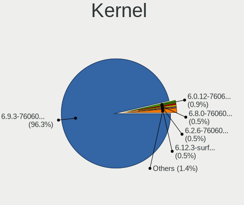
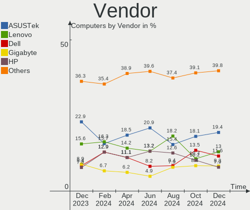
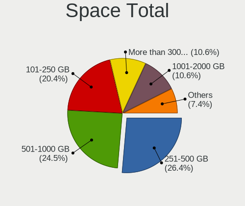
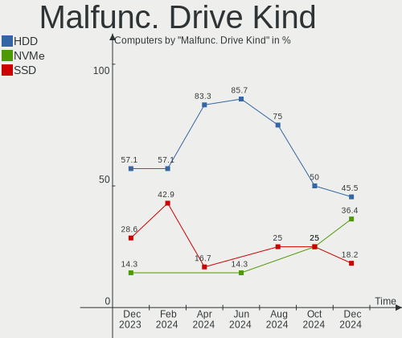

Pop!_OS - Hardware Trends
-------------------------

A project to identify most popular hardware characteristics and track their change
over time based on data collected by Linux users at https://Linux-Hardware.org.

Anyone can contribute to this report by the [hw-probe](https://github.com/linuxhw/hw-probe) tool:

    sudo -E hw-probe -all -upload

This is a report for all computer types. See also reports for [desktops](/Dist/Pop!_OS/Desktop/README.md) and [notebooks](/Dist/Pop!_OS/Notebook/README.md).

This report is for one last month. Overall report since the beginning of time: [TestCoverage](https://github.com/linuxhw/TestCoverage)

Period: Oct, 2022.

Contents
--------

* [ System ](#system)
  - [ OS                       ](#os)
  - [ OS Family                ](#os-family)
  - [ Kernel                   ](#kernel)
  - [ Kernel Family            ](#kernel-family)
  - [ Kernel Major Ver.        ](#kernel-major-ver)
  - [ Arch                     ](#arch)
  - [ DE                       ](#de)
  - [ Display Server           ](#display-server)
  - [ Display Manager          ](#display-manager)
  - [ OS Lang                  ](#os-lang)
  - [ Boot Mode                ](#boot-mode)
  - [ Filesystem               ](#filesystem)
  - [ Part. scheme             ](#part-scheme)
  - [ Dual Boot with Linux/BSD ](#dual-boot-with-linuxbsd)
  - [ Dual Boot (Win)          ](#dual-boot-win)

* [ Board ](#board)
  - [ Vendor                   ](#vendor)
  - [ Model                    ](#model)
  - [ Model Family             ](#model-family)
  - [ MFG Year                 ](#mfg-year)
  - [ Form Factor              ](#form-factor)
  - [ Secure Boot              ](#secure-boot)
  - [ Coreboot                 ](#coreboot)
  - [ RAM Size                 ](#ram-size)
  - [ RAM Used                 ](#ram-used)
  - [ Total Drives             ](#total-drives)
  - [ Has CD-ROM               ](#has-cd-rom)
  - [ Has Ethernet             ](#has-ethernet)
  - [ Has WiFi                 ](#has-wifi)
  - [ Has Bluetooth            ](#has-bluetooth)

* [ Location ](#location)
  - [ Country                  ](#country)
  - [ City                     ](#city)

* [ Drives ](#drives)
  - [ Drive Vendor             ](#drive-vendor)
  - [ Drive Model              ](#drive-model)
  - [ HDD Vendor               ](#hdd-vendor)
  - [ SSD Vendor               ](#ssd-vendor)
  - [ Drive Kind               ](#drive-kind)
  - [ Drive Connector          ](#drive-connector)
  - [ Drive Size               ](#drive-size)
  - [ Space Total              ](#space-total)
  - [ Space Used               ](#space-used)
  - [ Malfunc. Drives          ](#malfunc-drives)
  - [ Malfunc. Drive Vendor    ](#malfunc-drive-vendor)
  - [ Malfunc. HDD Vendor      ](#malfunc-hdd-vendor)
  - [ Malfunc. Drive Kind      ](#malfunc-drive-kind)
  - [ Failed Drives            ](#failed-drives)
  - [ Failed Drive Vendor      ](#failed-drive-vendor)
  - [ Drive Status             ](#drive-status)

* [ Storage controller ](#storage-controller)
  - [ Storage Vendor           ](#storage-vendor)
  - [ Storage Model            ](#storage-model)
  - [ Storage Kind             ](#storage-kind)

* [ Processor ](#processor)
  - [ CPU Vendor               ](#cpu-vendor)
  - [ CPU Model                ](#cpu-model)
  - [ CPU Model Family         ](#cpu-model-family)
  - [ CPU Cores                ](#cpu-cores)
  - [ CPU Sockets              ](#cpu-sockets)
  - [ CPU Threads              ](#cpu-threads)
  - [ CPU Op-Modes             ](#cpu-op-modes)
  - [ CPU Microcode            ](#cpu-microcode)
  - [ CPU Microarch            ](#cpu-microarch)

* [ Graphics ](#graphics)
  - [ GPU Vendor               ](#gpu-vendor)
  - [ GPU Model                ](#gpu-model)
  - [ GPU Combo                ](#gpu-combo)
  - [ GPU Driver               ](#gpu-driver)
  - [ GPU Memory               ](#gpu-memory)

* [ Monitor ](#monitor)
  - [ Monitor Vendor           ](#monitor-vendor)
  - [ Monitor Model            ](#monitor-model)
  - [ Monitor Resolution       ](#monitor-resolution)
  - [ Monitor Diagonal         ](#monitor-diagonal)
  - [ Monitor Width            ](#monitor-width)
  - [ Aspect Ratio             ](#aspect-ratio)
  - [ Monitor Area             ](#monitor-area)
  - [ Pixel Density            ](#pixel-density)
  - [ Multiple Monitors        ](#multiple-monitors)

* [ Network ](#network)
  - [ Net Controller Vendor    ](#net-controller-vendor)
  - [ Net Controller Model     ](#net-controller-model)
  - [ Wireless Vendor          ](#wireless-vendor)
  - [ Wireless Model           ](#wireless-model)
  - [ Ethernet Vendor          ](#ethernet-vendor)
  - [ Ethernet Model           ](#ethernet-model)
  - [ Net Controller Kind      ](#net-controller-kind)
  - [ Used Controller          ](#used-controller)
  - [ NICs                     ](#nics)
  - [ IPv6                     ](#ipv6)

* [ Bluetooth ](#bluetooth)
  - [ Bluetooth Vendor         ](#bluetooth-vendor)
  - [ Bluetooth Model          ](#bluetooth-model)

* [ Sound ](#sound)
  - [ Sound Vendor             ](#sound-vendor)
  - [ Sound Model              ](#sound-model)

* [ Memory ](#memory)
  - [ Memory Vendor            ](#memory-vendor)
  - [ Memory Model             ](#memory-model)
  - [ Memory Kind              ](#memory-kind)
  - [ Memory Form Factor       ](#memory-form-factor)
  - [ Memory Size              ](#memory-size)
  - [ Memory Speed             ](#memory-speed)

* [ Printers & scanners ](#printers--scanners)
  - [ Printer Vendor           ](#printer-vendor)
  - [ Printer Model            ](#printer-model)
  - [ Scanner Vendor           ](#scanner-vendor)
  - [ Scanner Model            ](#scanner-model)

* [ Camera ](#camera)
  - [ Camera Vendor            ](#camera-vendor)
  - [ Camera Model             ](#camera-model)

* [ Security ](#security)
  - [ Fingerprint Vendor       ](#fingerprint-vendor)
  - [ Fingerprint Model        ](#fingerprint-model)
  - [ Chipcard Vendor          ](#chipcard-vendor)
  - [ Chipcard Model           ](#chipcard-model)

* [ Unsupported ](#unsupported)
  - [ Unsupported Devices      ](#unsupported-devices)
  - [ Unsupported Device Types ](#unsupported-device-types)

System
------

OS
--

Installed operating systems

| Name          | Computers | Percent |
|---------------|-----------|---------|
| Pop!_OS 22.04 | 253       | 98.83%  |
| Pop!_OS 21.10 | 1         | 0.39%   |
| Pop!_OS 21.04 | 1         | 0.39%   |
| Pop!_OS 20.04 | 1         | 0.39%   |

OS Family
---------

OS without a version

| Name    | Computers | Percent |
|---------|-----------|---------|
| Pop!_OS | 256       | 100%    |

Kernel
------

Version of the Linux kernel

| Version                  | Computers | Percent |
|--------------------------|-----------|---------|
| 5.19.0-76051900-generic  | 144       | 56.25%  |
| 6.0.2-76060002-generic   | 49        | 19.14%  |
| 5.19.16-76051916-generic | 39        | 15.23%  |
| 5.18.10-76051810-generic | 5         | 1.95%   |
| 5.17.5-76051705-generic  | 4         | 1.56%   |
| 5.16.19-76051619-generic | 3         | 1.17%   |
| 6.0.2-x64v1-xanmod1      | 2         | 0.78%   |
| 5.19.12-xanmod1          | 2         | 0.78%   |
| 5.17.15-76051715-generic | 2         | 0.78%   |
| 6.0.2-x64v2-xanmod1      | 1         | 0.39%   |
| 6.0.0-060000-generic     | 1         | 0.39%   |
| 5.19.14-xanmod1          | 1         | 0.39%   |
| 5.19.0-051900-generic    | 1         | 0.39%   |
| 5.15.11-76051511-generic | 1         | 0.39%   |
| 5.15.0-1017-raspi        | 1         | 0.39%   |

Kernel Family
-------------

Linux kernel without a distro release

| Version | Computers | Percent |
|---------|-----------|---------|
| 5.19.0  | 145       | 56.64%  |
| 6.0.2   | 52        | 20.31%  |
| 5.19.16 | 39        | 15.23%  |
| 5.18.10 | 5         | 1.95%   |
| 5.17.5  | 4         | 1.56%   |
| 5.16.19 | 3         | 1.17%   |
| 5.19.12 | 2         | 0.78%   |
| 5.17.15 | 2         | 0.78%   |
| 6.0.0   | 1         | 0.39%   |
| 5.19.14 | 1         | 0.39%   |
| 5.15.11 | 1         | 0.39%   |
| 5.15.0  | 1         | 0.39%   |

Kernel Major Ver.
-----------------

Linux kernel major version

| Version | Computers | Percent |
|---------|-----------|---------|
| 5.19    | 187       | 73.05%  |
| 6.0     | 53        | 20.7%   |
| 5.17    | 6         | 2.34%   |
| 5.18    | 5         | 1.95%   |
| 5.16    | 3         | 1.17%   |
| 5.15    | 2         | 0.78%   |

Arch
----

OS architecture (x86_64, i586, etc.)

| Name    | Computers | Percent |
|---------|-----------|---------|
| x86_64  | 255       | 99.61%  |
| aarch64 | 1         | 0.39%   |

DE
--

Desktop Environment

| Name            | Computers | Percent |
|-----------------|-----------|---------|
| GNOME           | 249       | 97.27%  |
| X-Cinnamon      | 3         | 1.17%   |
| KDE5            | 2         | 0.78%   |
| GNOME Flashback | 1         | 0.39%   |
| Unknown         | 1         | 0.39%   |

Display Server
--------------

X11 or Wayland

| Name    | Computers | Percent |
|---------|-----------|---------|
| X11     | 246       | 96.09%  |
| Wayland | 10        | 3.91%   |

Display Manager
---------------

SDDM, LightDM, etc.

| Name    | Computers | Percent |
|---------|-----------|---------|
| Unknown | 182       | 71.09%  |
| GDM3    | 72        | 28.13%  |
| GDM     | 2         | 0.78%   |

OS Lang
-------

Language

| Lang    | Computers | Percent |
|---------|-----------|---------|
| en_US   | 136       | 53.13%  |
| en_GB   | 24        | 9.38%   |
| pt_BR   | 17        | 6.64%   |
| it_IT   | 16        | 6.25%   |
| de_DE   | 9         | 3.52%   |
| en_CA   | 7         | 2.73%   |
| en_AU   | 7         | 2.73%   |
| fi_FI   | 6         | 2.34%   |
| es_ES   | 5         | 1.95%   |
| C       | 5         | 1.95%   |
| pl_PL   | 3         | 1.17%   |
| es_AR   | 3         | 1.17%   |
| nl_NL   | 2         | 0.78%   |
| nb_NO   | 2         | 0.78%   |
| fr_FR   | 2         | 0.78%   |
| es_MX   | 2         | 0.78%   |
| en_IE   | 2         | 0.78%   |
| zh_TW   | 1         | 0.39%   |
| tr_TR   | 1         | 0.39%   |
| fr_CH   | 1         | 0.39%   |
| en_IN   | 1         | 0.39%   |
| en_DK   | 1         | 0.39%   |
| de_AT   | 1         | 0.39%   |
| cs_CZ   | 1         | 0.39%   |
| Unknown | 1         | 0.39%   |

Boot Mode
---------

EFI or BIOS

| Mode | Computers | Percent |
|------|-----------|---------|
| BIOS | 187       | 73.05%  |
| EFI  | 69        | 26.95%  |

Filesystem
----------

Type of filesystem

| Type    | Computers | Percent |
|---------|-----------|---------|
| Ext4    | 241       | 94.14%  |
| Btrfs   | 10        | 3.91%   |
| Overlay | 5         | 1.95%   |

Part. scheme
------------

Scheme of partitioning

| Type    | Computers | Percent |
|---------|-----------|---------|
| Unknown | 181       | 70.7%   |
| GPT     | 73        | 28.52%  |
| MBR     | 2         | 0.78%   |

Dual Boot with Linux/BSD
------------------------

Hosting more than one Linux/BSD

| Dual boot | Computers | Percent |
|-----------|-----------|---------|
| No        | 244       | 95.31%  |
| Yes       | 12        | 4.69%   |

Dual Boot (Win)
---------------

Hosting Linux and Windows

| Dual boot | Computers | Percent |
|-----------|-----------|---------|
| No        | 223       | 87.11%  |
| Yes       | 33        | 12.89%  |

Board
-----

Vendor
------

Motherboard manufacturer

| Name                    | Computers | Percent |
|-------------------------|-----------|---------|
| ASUSTek Computer        | 49        | 19.14%  |
| Hewlett-Packard         | 31        | 12.11%  |
| Lenovo                  | 29        | 11.33%  |
| Dell                    | 29        | 11.33%  |
| MSI                     | 22        | 8.59%   |
| Gigabyte Technology     | 13        | 5.08%   |
| ASRock                  | 11        | 4.3%    |
| Apple                   | 11        | 4.3%    |
| Acer                    | 11        | 4.3%    |
| System76                | 9         | 3.52%   |
| Intel                   | 6         | 2.34%   |
| Sony                    | 3         | 1.17%   |
| Samsung Electronics     | 3         | 1.17%   |
| Toshiba                 | 2         | 0.78%   |
| Razer                   | 2         | 0.78%   |
| Pegatron                | 2         | 0.78%   |
| Microsoft               | 2         | 0.78%   |
| Google                  | 2         | 0.78%   |
| Fujitsu                 | 2         | 0.78%   |
| Alienware               | 2         | 0.78%   |
| Valve                   | 1         | 0.39%   |
| Tactus                  | 1         | 0.39%   |
| Razer x Lambda          | 1         | 0.39%   |
| Raspberry Pi Foundation | 1         | 0.39%   |
| Positivo                | 1         | 0.39%   |
| Novatech                | 1         | 0.39%   |
| Notebook                | 1         | 0.39%   |
| Micro Electronics       | 1         | 0.39%   |
| KELYX ARGENTINA         | 1         | 0.39%   |
| IP3 Tech                | 1         | 0.39%   |
| HUAWEI                  | 1         | 0.39%   |
| GPU Company             | 1         | 0.39%   |
| Framework               | 1         | 0.39%   |
| Avell High Performance  | 1         | 0.39%   |
| AMI                     | 1         | 0.39%   |

Model
-----

Motherboard model

| Name                                  | Computers | Percent |
|---------------------------------------|-----------|---------|
| System76 Lemur Pro                    | 4         | 1.56%   |
| ASUS All Series                       | 4         | 1.56%   |
| System76 Oryx Pro                     | 2         | 0.78%   |
| Intel Meerkat                         | 2         | 0.78%   |
| HP ProBook 450 G8 Notebook PC         | 2         | 0.78%   |
| HP Pavilion Gaming Laptop 15-dk0xxx   | 2         | 0.78%   |
| HP Pavilion g6                        | 2         | 0.78%   |
| HP Compaq Elite 8300 USDT             | 2         | 0.78%   |
| Gigabyte B550 AORUS ELITE V2          | 2         | 0.78%   |
| Dell XPS 15 9520                      | 2         | 0.78%   |
| Dell Latitude E7240                   | 2         | 0.78%   |
| ASUS ROG STRIX B450-F GAMING          | 2         | 0.78%   |
| ASUS ROG CROSSHAIR VIII HERO          | 2         | 0.78%   |
| Apple MacBookAir6,2                   | 2         | 0.78%   |
| Valve Jupiter                         | 1         | 0.39%   |
| Toshiba Satellite Pro S500            | 1         | 0.39%   |
| Toshiba Satellite C855-1T5            | 1         | 0.39%   |
| Tactus GeoBook 140                    | 1         | 0.39%   |
| System76 Gazelle                      | 1         | 0.39%   |
| System76 Galago Pro                   | 1         | 0.39%   |
| System76 Darter Pro                   | 1         | 0.39%   |
| Sony VPCEH3LFX                        | 1         | 0.39%   |
| Sony VPCEB46FG                        | 1         | 0.39%   |
| Sony SVL24117FLB                      | 1         | 0.39%   |
| Samsung 950XDB/951XDB/950XDY          | 1         | 0.39%   |
| Samsung 800G5M/800G5W                 | 1         | 0.39%   |
| Samsung 550XDA                        | 1         | 0.39%   |
| Razer x Lambda TensorBook (late 2021) | 1         | 0.39%   |
| Razer Blade 15 (2022) - RZ09-0421     | 1         | 0.39%   |
| Razer Blade                           | 1         | 0.39%   |
| RPi Raspberry Pi                      | 1         | 0.39%   |
| Positivo Mobile                       | 1         | 0.39%   |
| Pegatron VC821AA-AB9 m9782pt          | 1         | 0.39%   |
| Pegatron h8-1444eo                    | 1         | 0.39%   |
| Novatech NLx0MU                       | 1         | 0.39%   |
| Notebook NV4xPZ                       | 1         | 0.39%   |
| MSI Prestige 15 A12UC                 | 1         | 0.39%   |
| MSI Prestige 14Evo A11M               | 1         | 0.39%   |
| MSI MS-7D54                           | 1         | 0.39%   |
| MSI MS-7D25                           | 1         | 0.39%   |

Model Family
------------

Motherboard model prefix

| Name               | Computers | Percent |
|--------------------|-----------|---------|
| ASUS ROG           | 16        | 6.25%   |
| ASUS TUF           | 10        | 3.91%   |
| Lenovo ThinkPad    | 9         | 3.52%   |
| Acer Aspire        | 9         | 3.52%   |
| HP Pavilion        | 8         | 3.13%   |
| HP Laptop          | 8         | 3.13%   |
| Dell Latitude      | 8         | 3.13%   |
| Dell XPS           | 7         | 2.73%   |
| Lenovo IdeaPad     | 6         | 2.34%   |
| Dell Inspiron      | 6         | 2.34%   |
| ASUS PRIME         | 6         | 2.34%   |
| ASUS ZenBook       | 5         | 1.95%   |
| System76 Lemur     | 4         | 1.56%   |
| Lenovo ThinkCentre | 4         | 1.56%   |
| HP Compaq          | 4         | 1.56%   |
| ASUS All           | 4         | 1.56%   |
| Apple MacBookPro5  | 4         | 1.56%   |
| Lenovo Legion      | 3         | 1.17%   |
| HP ProBook         | 3         | 1.17%   |
| HP ENVY            | 3         | 1.17%   |
| HP EliteBook       | 3         | 1.17%   |
| ASRock B450M       | 3         | 1.17%   |
| Toshiba Satellite  | 2         | 0.78%   |
| System76 Oryx      | 2         | 0.78%   |
| Razer Blade        | 2         | 0.78%   |
| MSI Prestige       | 2         | 0.78%   |
| Microsoft Surface  | 2         | 0.78%   |
| Lenovo Yoga        | 2         | 0.78%   |
| Intel Meerkat      | 2         | 0.78%   |
| Gigabyte B550      | 2         | 0.78%   |
| Fujitsu LIFEBOOK   | 2         | 0.78%   |
| Dell OptiPlex      | 2         | 0.78%   |
| ASUS ASUS          | 2         | 0.78%   |
| ASRock X570        | 2         | 0.78%   |
| ASRock B450        | 2         | 0.78%   |
| Apple MacBookAir6  | 2         | 0.78%   |
| Valve Jupiter      | 1         | 0.39%   |
| Tactus GeoBook     | 1         | 0.39%   |
| System76 Gazelle   | 1         | 0.39%   |
| System76 Galago    | 1         | 0.39%   |

MFG Year
--------

Motherboard manufacture year

| Year    | Computers | Percent |
|---------|-----------|---------|
| 2021    | 39        | 15.23%  |
| 2020    | 37        | 14.45%  |
| 2019    | 31        | 12.11%  |
| 2022    | 25        | 9.77%   |
| 2018    | 25        | 9.77%   |
| 2017    | 16        | 6.25%   |
| 2012    | 15        | 5.86%   |
| 2016    | 11        | 4.3%    |
| 2014    | 11        | 4.3%    |
| 2013    | 10        | 3.91%   |
| 2009    | 9         | 3.52%   |
| 2010    | 8         | 3.13%   |
| 2015    | 7         | 2.73%   |
| 2011    | 5         | 1.95%   |
| 2007    | 5         | 1.95%   |
| 2008    | 1         | 0.39%   |
| Unknown | 1         | 0.39%   |

Form Factor
-----------

Physical design of the computer

| Name           | Computers | Percent |
|----------------|-----------|---------|
| Notebook       | 153       | 59.77%  |
| Desktop        | 86        | 33.59%  |
| Convertible    | 7         | 2.73%   |
| Mini pc        | 4         | 1.56%   |
| Tablet         | 3         | 1.17%   |
| System on chip | 1         | 0.39%   |
| All in one     | 1         | 0.39%   |
| Server         | 1         | 0.39%   |

Secure Boot
-----------

Enabled or disabled

| State    | Computers | Percent |
|----------|-----------|---------|
| Disabled | 256       | 100%    |

Coreboot
--------

Have coreboot on board

| Used | Computers | Percent |
|------|-----------|---------|
| No   | 248       | 96.88%  |
| Yes  | 8         | 3.13%   |

RAM Size
--------

Total RAM memory

| Size in GB  | Computers | Percent |
|-------------|-----------|---------|
| 16.01-24.0  | 70        | 27.34%  |
| 32.01-64.0  | 59        | 23.05%  |
| 4.01-8.0    | 52        | 20.31%  |
| 8.01-16.0   | 38        | 14.84%  |
| 3.01-4.0    | 23        | 8.98%   |
| 64.01-256.0 | 11        | 4.3%    |
| 24.01-32.0  | 3         | 1.17%   |

RAM Used
--------

Used RAM memory

| Used GB     | Computers | Percent |
|-------------|-----------|---------|
| 2.01-3.0    | 81        | 31.64%  |
| 4.01-8.0    | 77        | 30.08%  |
| 3.01-4.0    | 52        | 20.31%  |
| 1.01-2.0    | 24        | 9.38%   |
| 8.01-16.0   | 16        | 6.25%   |
| 16.01-24.0  | 4         | 1.56%   |
| 32.01-64.0  | 1         | 0.39%   |
| 64.01-256.0 | 1         | 0.39%   |

Total Drives
------------

Number of drives on board

| Drives | Computers | Percent |
|--------|-----------|---------|
| 1      | 141       | 55.08%  |
| 2      | 67        | 26.17%  |
| 3      | 24        | 9.38%   |
| 4      | 13        | 5.08%   |
| 5      | 5         | 1.95%   |
| 6      | 3         | 1.17%   |
| 19     | 1         | 0.39%   |
| 10     | 1         | 0.39%   |
| 7      | 1         | 0.39%   |

Has CD-ROM
----------

Has CD-ROM on board

| Presented | Computers | Percent |
|-----------|-----------|---------|
| No        | 202       | 78.91%  |
| Yes       | 54        | 21.09%  |

Has Ethernet
------------

Has Ethernet on board

| Presented | Computers | Percent |
|-----------|-----------|---------|
| Yes       | 206       | 80.47%  |
| No        | 50        | 19.53%  |

Has WiFi
--------

Has WiFi module

| Presented | Computers | Percent |
|-----------|-----------|---------|
| Yes       | 208       | 81.25%  |
| No        | 48        | 18.75%  |

Has Bluetooth
-------------

Has Bluetooth module

| Presented | Computers | Percent |
|-----------|-----------|---------|
| Yes       | 186       | 72.66%  |
| No        | 70        | 27.34%  |

Location
--------

Country
-------

Geographic location (country)

| Country      | Computers | Percent |
|--------------|-----------|---------|
| USA          | 61        | 23.83%  |
| Italy        | 31        | 12.11%  |
| Brazil       | 20        | 7.81%   |
| UK           | 13        | 5.08%   |
| Germany      | 12        | 4.69%   |
| Canada       | 12        | 4.69%   |
| Australia    | 8         | 3.13%   |
| Spain        | 7         | 2.73%   |
| Poland       | 7         | 2.73%   |
| Norway       | 7         | 2.73%   |
| Finland      | 7         | 2.73%   |
| Netherlands  | 5         | 1.95%   |
| Mexico       | 5         | 1.95%   |
| India        | 5         | 1.95%   |
| France       | 5         | 1.95%   |
| Argentina    | 5         | 1.95%   |
| Thailand     | 4         | 1.56%   |
| Portugal     | 4         | 1.56%   |
| Indonesia    | 3         | 1.17%   |
| Turkey       | 2         | 0.78%   |
| Slovakia     | 2         | 0.78%   |
| Serbia       | 2         | 0.78%   |
| Russia       | 2         | 0.78%   |
| Philippines  | 2         | 0.78%   |
| Ireland      | 2         | 0.78%   |
| Denmark      | 2         | 0.78%   |
| Czechia      | 2         | 0.78%   |
| Austria      | 2         | 0.78%   |
| Venezuela    | 1         | 0.39%   |
| Switzerland  | 1         | 0.39%   |
| Sweden       | 1         | 0.39%   |
| South Africa | 1         | 0.39%   |
| New Zealand  | 1         | 0.39%   |
| Lithuania    | 1         | 0.39%   |
| Kuwait       | 1         | 0.39%   |
| Japan        | 1         | 0.39%   |
| Hungary      | 1         | 0.39%   |
| Hong Kong    | 1         | 0.39%   |
| Guatemala    | 1         | 0.39%   |
| Greece       | 1         | 0.39%   |

City
----

Geographic location (city)

| City           | Computers | Percent |
|----------------|-----------|---------|
| Milan          | 10        | 3.91%   |
| Edmonton       | 5         | 1.95%   |
| Sao Paulo      | 3         | 1.17%   |
| Rome           | 3         | 1.17%   |
| Oslo           | 3         | 1.17%   |
| Newark         | 3         | 1.17%   |
| Melbourne      | 3         | 1.17%   |
| Helsinki       | 3         | 1.17%   |
| Hamburg        | 3         | 1.17%   |
| Tampere        | 2         | 0.78%   |
| St Petersburg  | 2         | 0.78%   |
| Seattle        | 2         | 0.78%   |
| Rio de Janeiro | 2         | 0.78%   |
| Queretaro      | 2         | 0.78%   |
| Oulu           | 2         | 0.78%   |
| Madrid         | 2         | 0.78%   |
| Lisbon         | 2         | 0.78%   |
| Juiz de Fora   | 2         | 0.78%   |
| Hudson         | 2         | 0.78%   |
| Fort Collins   | 2         | 0.78%   |
| Dallas         | 2         | 0.78%   |
| Brzeg          | 2         | 0.78%   |
| Brisbane       | 2         | 0.78%   |
| Belgrade       | 2         | 0.78%   |
| Bargo          | 2         | 0.78%   |
| Bangkok        | 2         | 0.78%   |
| Zurich         | 1         | 0.39%   |
| Zbysov         | 1         | 0.39%   |
| Zamberk        | 1         | 0.39%   |
| Worksop        | 1         | 0.39%   |
| Winter Park    | 1         | 0.39%   |
| Winnenden      | 1         | 0.39%   |
| Wildeshausen   | 1         | 0.39%   |
| Whanganui      | 1         | 0.39%   |
| Warrensburg    | 1         | 0.39%   |
| Wallaceburg    | 1         | 0.39%   |
| Walkersville   | 1         | 0.39%   |
| Vigo           | 1         | 0.39%   |
| Vienna         | 1         | 0.39%   |
| Victoria       | 1         | 0.39%   |

Drives
------

Drive Vendor
------------

Hard drive vendors

| Vendor                    | Computers | Drives | Percent |
|---------------------------|-----------|--------|---------|
| Samsung Electronics       | 69        | 87     | 16.83%  |
| WDC                       | 51        | 60     | 12.44%  |
| Seagate                   | 43        | 53     | 10.49%  |
| Sandisk                   | 29        | 30     | 7.07%   |
| Kingston                  | 26        | 26     | 6.34%   |
| Toshiba                   | 22        | 24     | 5.37%   |
| Crucial                   | 20        | 24     | 4.88%   |
| SK hynix                  | 17        | 19     | 4.15%   |
| Unknown                   | 12        | 18     | 2.93%   |
| Micron Technology         | 11        | 11     | 2.68%   |
| Intel                     | 11        | 11     | 2.68%   |
| HGST                      | 10        | 10     | 2.44%   |
| Phison Electronics        | 7         | 10     | 1.71%   |
| Micron/Crucial Technology | 7         | 7      | 1.71%   |
| PNY                       | 6         | 6      | 1.46%   |
| Hitachi                   | 6         | 7      | 1.46%   |
| Apple                     | 6         | 6      | 1.46%   |
| A-DATA Technology         | 6         | 6      | 1.46%   |
| China                     | 5         | 5      | 1.22%   |
| Netac                     | 4         | 4      | 0.98%   |
| KIOXIA                    | 4         | 4      | 0.98%   |
| Silicon Motion            | 3         | 4      | 0.73%   |
| Phison                    | 3         | 3      | 0.73%   |
| Team                      | 2         | 2      | 0.49%   |
| LITEON                    | 2         | 2      | 0.49%   |
| JMicron Technology        | 2         | 11     | 0.49%   |
| HS-SSD-C100               | 2         | 2      | 0.49%   |
| ADATA Technology          | 2         | 2      | 0.49%   |
| Yeyian                    | 1         | 1      | 0.24%   |
| XPG                       | 1         | 1      | 0.24%   |
| W800S                     | 1         | 1      | 0.24%   |
| TCSUNBOW                  | 1         | 1      | 0.24%   |
| SPCC                      | 1         | 1      | 0.24%   |
| ROG                       | 1         | 1      | 0.24%   |
| Realtek Semiconductor     | 1         | 1      | 0.24%   |
| Patriot                   | 1         | 1      | 0.24%   |
| OCZ                       | 1         | 1      | 0.24%   |
| O2 Micro                  | 1         | 1      | 0.24%   |
| LITEONIT                  | 1         | 1      | 0.24%   |
| LaCie                     | 1         | 1      | 0.24%   |

Drive Model
-----------

Hard drive models

| Model                                                 | Computers | Percent |
|-------------------------------------------------------|-----------|---------|
| Samsung NVMe SSD Controller SM981/PM981/PM983 500GB   | 11        | 2.43%   |
| Samsung NVMe SSD Controller PM9A1/PM9A3/980PRO 250GB  | 7         | 1.55%   |
| Phison E12 NVMe Controller 2TB                        | 7         | 1.55%   |
| Sandisk WD Blue SN550 NVMe SSD 1TB                    | 6         | 1.32%   |
| Kingston SA400S37240G 240GB SSD                       | 6         | 1.32%   |
| Seagate ST1000DM010-2EP102 1TB                        | 5         | 1.1%    |
| HGST HTS721010A9E630 1TB                              | 5         | 1.1%    |
| Toshiba MQ01ABD100 1TB                                | 4         | 0.88%   |
| Sandisk WD Black SN750 / PC SN730 NVMe SSD 1TB        | 4         | 0.88%   |
| Samsung SSD 850 EVO 250GB                             | 4         | 0.88%   |
| Kingston SV300S37A120G 120GB SSD                      | 4         | 0.88%   |
| Kingston SA400S37480G 480GB SSD                       | 4         | 0.88%   |
| Crucial CT240BX500SSD1 240GB                          | 4         | 0.88%   |
| Crucial CT1000MX500SSD1 1TB                           | 4         | 0.88%   |
| WDC WD5000LPVX-22V0TT0 500GB                          | 3         | 0.66%   |
| Toshiba XG6 NVMe SSD Controller 512GB                 | 3         | 0.66%   |
| Seagate ST2000DM008-2FR102 2TB                        | 3         | 0.66%   |
| Seagate ST1000LM035-1RK172 1TB                        | 3         | 0.66%   |
| Sandisk WD Black SN850 1TB                            | 3         | 0.66%   |
| Samsung SSD 860 EVO 1TB                               | 3         | 0.66%   |
| Samsung SSD 850 EVO 500GB                             | 3         | 0.66%   |
| Samsung SSD 850 EVO 1TB                               | 3         | 0.66%   |
| Samsung NVMe SSD Controller SM961/PM961/SM963 250GB   | 3         | 0.66%   |
| PNY ELITE PSSD 240GB                                  | 3         | 0.66%   |
| Crucial CT500MX500SSD1 500GB                          | 3         | 0.66%   |
| Crucial CT1000BX500SSD1 1TB                           | 3         | 0.66%   |
| WDC WDS500G2B0A-00SM50 500GB SSD                      | 2         | 0.44%   |
| WDC WDS100T2B0A-00SM50 1TB SSD                        | 2         | 0.44%   |
| WDC WD10SPZX-24Z10 1TB                                | 2         | 0.44%   |
| Unknown MMC Card  32GB                                | 2         | 0.44%   |
| Unknown MMC Card  128GB                               | 2         | 0.44%   |
| Toshiba DT01ACA100 1TB                                | 2         | 0.44%   |
| SK hynix HFM512GD3JX013N 512GB                        | 2         | 0.44%   |
| SK hynix BC711 NVMe 512GB                             | 2         | 0.44%   |
| SK hynix BC501 NVMe Solid State Drive 512GB           | 2         | 0.44%   |
| Silicon Motion SM2263EN/SM2263XT SSD Controller 256GB | 2         | 0.44%   |
| Seagate ST8000DM004-2CX188 8TB                        | 2         | 0.44%   |
| Seagate ST1000LM049-2GH172 1TB                        | 2         | 0.44%   |
| Seagate ST1000DM003-1ER162 1TB                        | 2         | 0.44%   |
| Seagate Expansion 2TB                                 | 2         | 0.44%   |

HDD Vendor
----------

Hard disk drive vendors

| Vendor             | Computers | Drives | Percent |
|--------------------|-----------|--------|---------|
| Seagate            | 43        | 53     | 39.81%  |
| WDC                | 34        | 39     | 31.48%  |
| Toshiba            | 12        | 13     | 11.11%  |
| HGST               | 10        | 10     | 9.26%   |
| Hitachi            | 6         | 7      | 5.56%   |
| Unknown            | 1         | 5      | 0.93%   |
| JMicron Technology | 1         | 6      | 0.93%   |
| Apple              | 1         | 1      | 0.93%   |

SSD Vendor
----------

Solid state drive vendors

| Vendor              | Computers | Drives | Percent |
|---------------------|-----------|--------|---------|
| Samsung Electronics | 32        | 37     | 22.07%  |
| Kingston            | 22        | 22     | 15.17%  |
| Crucial             | 19        | 22     | 13.1%   |
| WDC                 | 12        | 12     | 8.28%   |
| SanDisk             | 11        | 11     | 7.59%   |
| PNY                 | 6         | 6      | 4.14%   |
| China               | 5         | 5      | 3.45%   |
| Apple               | 5         | 5      | 3.45%   |
| Netac               | 4         | 4      | 2.76%   |
| A-DATA Technology   | 4         | 4      | 2.76%   |
| SK hynix            | 3         | 4      | 2.07%   |
| Intel               | 3         | 3      | 2.07%   |
| Toshiba             | 2         | 2      | 1.38%   |
| Team                | 2         | 2      | 1.38%   |
| LITEON              | 2         | 2      | 1.38%   |
| Yeyian              | 1         | 1      | 0.69%   |
| TCSUNBOW            | 1         | 1      | 0.69%   |
| SPCC                | 1         | 1      | 0.69%   |
| Patriot             | 1         | 1      | 0.69%   |
| OCZ                 | 1         | 1      | 0.69%   |
| Micron Technology   | 1         | 1      | 0.69%   |
| LITEONIT            | 1         | 1      | 0.69%   |
| KingDian            | 1         | 1      | 0.69%   |
| Intenso             | 1         | 1      | 0.69%   |
| FORESEE             | 1         | 1      | 0.69%   |
| Emtec               | 1         | 1      | 0.69%   |
| BAITITON            | 1         | 1      | 0.69%   |
| ASMedia             | 1         | 1      | 0.69%   |

Drive Kind
----------

HDD or SSD

| Kind    | Computers | Drives | Percent |
|---------|-----------|--------|---------|
| NVMe    | 135       | 166    | 36.49%  |
| SSD     | 129       | 154    | 34.86%  |
| HDD     | 87        | 134    | 23.51%  |
| MMC     | 10        | 10     | 2.7%    |
| Unknown | 9         | 14     | 2.43%   |

Drive Connector
---------------

SATA, SAS, NVMe, etc.

| Type | Computers | Drives | Percent |
|------|-----------|--------|---------|
| SATA | 167       | 270    | 50.61%  |
| NVMe | 135       | 165    | 40.91%  |
| SAS  | 18        | 33     | 5.45%   |
| MMC  | 10        | 10     | 3.03%   |

Drive Size
----------

Size of hard drive

| Size in TB | Computers | Drives | Percent |
|------------|-----------|--------|---------|
| 0.01-0.5   | 116       | 144    | 51.79%  |
| 0.51-1.0   | 73        | 89     | 32.59%  |
| 1.01-2.0   | 17        | 19     | 7.59%   |
| 2.01-3.0   | 7         | 10     | 3.13%   |
| 4.01-10.0  | 6         | 13     | 2.68%   |
| 3.01-4.0   | 4         | 6      | 1.79%   |
| 10.01-20.0 | 1         | 7      | 0.45%   |

Space Total
-----------

Amount of disk space available on the file system

| Size in GB     | Computers | Percent |
|----------------|-----------|---------|
| 101-250        | 76        | 29.69%  |
| 501-1000       | 62        | 24.22%  |
| 251-500        | 60        | 23.44%  |
| 1001-2000      | 24        | 9.38%   |
| More than 3000 | 11        | 4.3%    |
| 2001-3000      | 10        | 3.91%   |
| 21-50          | 4         | 1.56%   |
| 1-20           | 4         | 1.56%   |
| 51-100         | 4         | 1.56%   |
| Unknown        | 1         | 0.39%   |

Space Used
----------

Amount of used disk space

| Used GB        | Computers | Percent |
|----------------|-----------|---------|
| 1-20           | 68        | 26.56%  |
| 21-50          | 50        | 19.53%  |
| 101-250        | 46        | 17.97%  |
| 51-100         | 40        | 15.63%  |
| 251-500        | 20        | 7.81%   |
| 501-1000       | 18        | 7.03%   |
| 1001-2000      | 5         | 1.95%   |
| More than 3000 | 4         | 1.56%   |
| 2001-3000      | 4         | 1.56%   |
| Unknown        | 1         | 0.39%   |

Malfunc. Drives
---------------

Drive models with a malfunction

| Model                                 | Computers | Drives | Percent |
|---------------------------------------|-----------|--------|---------|
| WDC WDS240G2G0A-00JH30 240GB SSD      | 1         | 1      | 14.29%  |
| WDC WD60EFRX-68L0BN1 6TB              | 1         | 1      | 14.29%  |
| WDC WD10EZEX-60WN4A0 1TB              | 1         | 1      | 14.29%  |
| SK hynix HFS128G39TND-N210A 128GB SSD | 1         | 1      | 14.29%  |
| Samsung Electronics SSD 850 EVO 250GB | 1         | 1      | 14.29%  |
| HGST HTS725050A7E630 500GB            | 1         | 1      | 14.29%  |
| BAITITON BT58SSD08M 128GB             | 1         | 1      | 14.29%  |

Malfunc. Drive Vendor
---------------------

Vendors of faulty drives

| Vendor              | Computers | Drives | Percent |
|---------------------|-----------|--------|---------|
| WDC                 | 3         | 3      | 42.86%  |
| SK hynix            | 1         | 1      | 14.29%  |
| Samsung Electronics | 1         | 1      | 14.29%  |
| HGST                | 1         | 1      | 14.29%  |
| BAITITON            | 1         | 1      | 14.29%  |

Malfunc. HDD Vendor
-------------------

Vendors of faulty HDD drives

| Vendor | Computers | Drives | Percent |
|--------|-----------|--------|---------|
| WDC    | 2         | 2      | 66.67%  |
| HGST   | 1         | 1      | 33.33%  |

Malfunc. Drive Kind
-------------------

Kinds of faulty drives

| Kind | Computers | Drives | Percent |
|------|-----------|--------|---------|
| SSD  | 4         | 4      | 57.14%  |
| HDD  | 3         | 3      | 42.86%  |

Failed Drives
-------------

Failed drive models

Zero info for selected period =(

Failed Drive Vendor
-------------------

Failed drive vendors

Zero info for selected period =(

Drive Status
------------

Number of failed and malfunc. drives

| Status   | Computers | Drives | Percent |
|----------|-----------|--------|---------|
| Detected | 191       | 354    | 70.48%  |
| Works    | 73        | 117    | 26.94%  |
| Malfunc  | 7         | 7      | 2.58%   |

Storage controller
------------------

Storage Vendor
--------------

Storage controller vendors

| Vendor                         | Computers | Percent |
|--------------------------------|-----------|---------|
| Intel                          | 141       | 37.6%   |
| AMD                            | 69        | 18.4%   |
| Samsung Electronics            | 46        | 12.27%  |
| SanDisk                        | 27        | 7.2%    |
| SK hynix                       | 14        | 3.73%   |
| Phison Electronics             | 11        | 2.93%   |
| Micron Technology              | 10        | 2.67%   |
| Micron/Crucial Technology      | 9         | 2.4%    |
| Toshiba America Info Systems   | 8         | 2.13%   |
| Nvidia                         | 7         | 1.87%   |
| ASMedia Technology             | 6         | 1.6%    |
| KIOXIA                         | 5         | 1.33%   |
| Kingston Technology Company    | 5         | 1.33%   |
| Marvell Technology Group       | 4         | 1.07%   |
| ADATA Technology               | 4         | 1.07%   |
| Silicon Motion                 | 3         | 0.8%    |
| Realtek Semiconductor          | 2         | 0.53%   |
| Solid State Storage Technology | 1         | 0.27%   |
| O2 Micro                       | 1         | 0.27%   |
| LSI Logic / Symbios Logic      | 1         | 0.27%   |
| JMicron Technology             | 1         | 0.27%   |

Storage Model
-------------

Storage controller models

| Model                                                                          | Computers | Percent |
|--------------------------------------------------------------------------------|-----------|---------|
| AMD FCH SATA Controller [AHCI mode]                                            | 52        | 12.65%  |
| Samsung NVMe SSD Controller SM981/PM981/PM983                                  | 17        | 4.14%   |
| AMD 400 Series Chipset SATA Controller                                         | 14        | 3.41%   |
| Samsung NVMe SSD Controller PM9A1/PM9A3/980PRO                                 | 12        | 2.92%   |
| Intel Volume Management Device NVMe RAID Controller                            | 11        | 2.68%   |
| Micron Non-Volatile memory controller                                          | 10        | 2.43%   |
| Intel Sunrise Point-LP SATA Controller [AHCI mode]                             | 10        | 2.43%   |
| Intel 82801 Mobile SATA Controller [RAID mode]                                 | 10        | 2.43%   |
| SanDisk WD Blue SN550 NVMe SSD                                                 | 9         | 2.19%   |
| Samsung NVMe SSD Controller 980                                                | 9         | 2.19%   |
| Phison E12 NVMe Controller                                                     | 9         | 2.19%   |
| Intel Cannon Lake Mobile PCH SATA AHCI Controller                              | 9         | 2.19%   |
| AMD 500 Series Chipset SATA Controller                                         | 9         | 2.19%   |
| SK hynix Gold P31 SSD                                                          | 7         | 1.7%    |
| Intel 500 Series Chipset Family SATA AHCI Controller                           | 7         | 1.7%    |
| SanDisk WD Black SN750 / PC SN730 NVMe SSD                                     | 6         | 1.46%   |
| Intel 8 Series/C220 Series Chipset Family 6-port SATA Controller 1 [AHCI mode] | 6         | 1.46%   |
| Intel 8 Series SATA Controller 1 [AHCI mode]                                   | 6         | 1.46%   |
| Intel 7 Series Chipset Family 6-port SATA Controller [AHCI mode]               | 6         | 1.46%   |
| Samsung NVMe SSD Controller SM961/PM961/SM963                                  | 5         | 1.22%   |
| KIOXIA NVMe SSD Controller BG4                                                 | 5         | 1.22%   |
| Intel SSD 660P Series                                                          | 5         | 1.22%   |
| Intel HM170/QM170 Chipset SATA Controller [AHCI Mode]                          | 5         | 1.22%   |
| Intel 5 Series/3400 Series Chipset 4 port SATA AHCI Controller                 | 5         | 1.22%   |
| ASMedia ASM1062 Serial ATA Controller                                          | 5         | 1.22%   |
| Toshiba America Info Systems XG6 NVMe SSD Controller                           | 4         | 0.97%   |
| SK hynix Non-Volatile memory controller                                        | 4         | 0.97%   |
| SanDisk WD PC SN810 / Black SN850 NVMe SSD                                     | 4         | 0.97%   |
| Nvidia MCP79 AHCI Controller                                                   | 4         | 0.97%   |
| Micron/Crucial Non-Volatile memory controller                                  | 4         | 0.97%   |
| Kingston Company Company Non-Volatile memory controller                        | 4         | 0.97%   |
| Intel Tiger Lake-LP SATA Controller                                            | 4         | 0.97%   |
| Intel 400 Series Chipset Family SATA AHCI Controller                           | 4         | 0.97%   |
| AMD 300 Series Chipset SATA Controller                                         | 4         | 0.97%   |
| SK hynix BC501 NVMe Solid State Drive                                          | 3         | 0.73%   |
| SanDisk Non-Volatile memory controller                                         | 3         | 0.73%   |
| Micron/Crucial NVMe Controller                                                 | 3         | 0.73%   |
| Intel Wildcat Point-LP SATA Controller [AHCI Mode]                             | 3         | 0.73%   |
| Intel SATA Controller [RAID mode]                                              | 3         | 0.73%   |
| Intel Celeron/Pentium Silver Processor SATA Controller                         | 3         | 0.73%   |

Storage Kind
------------

Kind of storage controller (IDE, SATA, NVMe, SAS, ...)

| Kind | Computers | Percent |
|------|-----------|---------|
| SATA | 185       | 51.39%  |
| NVMe | 134       | 37.22%  |
| RAID | 24        | 6.67%   |
| IDE  | 16        | 4.44%   |
| SAS  | 1         | 0.28%   |

Processor
---------

CPU Vendor
----------

Processor vendors

| Vendor | Computers | Percent |
|--------|-----------|---------|
| Intel  | 172       | 67.19%  |
| AMD    | 83        | 32.42%  |
| ARM    | 1         | 0.39%   |

CPU Model
---------

Processor models

| Model                                         | Computers | Percent |
|-----------------------------------------------|-----------|---------|
| Intel Core i7-9750H CPU @ 2.60GHz             | 8         | 3.13%   |
| Intel 11th Gen Core i7-1165G7 @ 2.80GHz       | 8         | 3.13%   |
| Intel 11th Gen Core i7-11800H @ 2.30GHz       | 5         | 1.95%   |
| Intel Core i7-7700HQ CPU @ 2.80GHz            | 4         | 1.56%   |
| Intel Core i7-10750H CPU @ 2.60GHz            | 4         | 1.56%   |
| AMD Ryzen 9 5950X 16-Core Processor           | 4         | 1.56%   |
| AMD Ryzen 7 5800X 8-Core Processor            | 4         | 1.56%   |
| AMD Ryzen 5 3600 6-Core Processor             | 4         | 1.56%   |
| Intel Core i7-8750H CPU @ 2.20GHz             | 3         | 1.17%   |
| Intel Core i7-8565U CPU @ 1.80GHz             | 3         | 1.17%   |
| Intel Core i5-7200U CPU @ 2.50GHz             | 3         | 1.17%   |
| Intel 12th Gen Core i7-12700H                 | 3         | 1.17%   |
| Intel 11th Gen Core i7-1185G7 @ 3.00GHz       | 3         | 1.17%   |
| Intel 11th Gen Core i5-1135G7 @ 2.40GHz       | 3         | 1.17%   |
| AMD Ryzen 7 3800X 8-Core Processor            | 3         | 1.17%   |
| AMD Ryzen 5 3500U with Radeon Vega Mobile Gfx | 3         | 1.17%   |
| Intel Core i7-8550U CPU @ 1.80GHz             | 2         | 0.78%   |
| Intel Core i7-6700HQ CPU @ 2.60GHz            | 2         | 0.78%   |
| Intel Core i7-6500U CPU @ 2.50GHz             | 2         | 0.78%   |
| Intel Core i7-4790K CPU @ 4.00GHz             | 2         | 0.78%   |
| Intel Core i7-10510U CPU @ 1.80GHz            | 2         | 0.78%   |
| Intel Core i5-8300H CPU @ 2.30GHz             | 2         | 0.78%   |
| Intel Core i5-8265U CPU @ 1.60GHz             | 2         | 0.78%   |
| Intel Core i5-7300HQ CPU @ 2.50GHz            | 2         | 0.78%   |
| Intel Core i5-6200U CPU @ 2.30GHz             | 2         | 0.78%   |
| Intel Core i5-5200U CPU @ 2.20GHz             | 2         | 0.78%   |
| Intel Core i5-4300U CPU @ 1.90GHz             | 2         | 0.78%   |
| Intel Core i5-4250U CPU @ 1.30GHz             | 2         | 0.78%   |
| Intel Core i5-3340M CPU @ 2.70GHz             | 2         | 0.78%   |
| Intel Core 2 Duo CPU P8600 @ 2.40GHz          | 2         | 0.78%   |
| Intel Celeron N4020 CPU @ 1.10GHz             | 2         | 0.78%   |
| Intel 12th Gen Core i7-12800H                 | 2         | 0.78%   |
| Intel 12th Gen Core i7-1260P                  | 2         | 0.78%   |
| AMD Ryzen 9 7950X 16-Core Processor           | 2         | 0.78%   |
| AMD Ryzen 9 5900HX with Radeon Graphics       | 2         | 0.78%   |
| AMD Ryzen 7 5825U with Radeon Graphics        | 2         | 0.78%   |
| AMD Ryzen 7 5700G with Radeon Graphics        | 2         | 0.78%   |
| AMD Ryzen 7 4800HS with Radeon Graphics       | 2         | 0.78%   |
| AMD Ryzen 7 3700X 8-Core Processor            | 2         | 0.78%   |
| AMD Ryzen 7 2700X Eight-Core Processor        | 2         | 0.78%   |

CPU Model Family
----------------

Processor model prefix

| Model                   | Computers | Percent |
|-------------------------|-----------|---------|
| Intel Core i7           | 57        | 22.27%  |
| Intel Core i5           | 47        | 18.36%  |
| Other                   | 42        | 16.41%  |
| AMD Ryzen 5             | 27        | 10.55%  |
| AMD Ryzen 7             | 21        | 8.2%    |
| AMD Ryzen 9             | 11        | 4.3%    |
| Intel Core 2 Duo        | 8         | 3.13%   |
| AMD Ryzen 3             | 7         | 2.73%   |
| Intel Core i3           | 6         | 2.34%   |
| Intel Celeron           | 5         | 1.95%   |
| Intel Xeon              | 3         | 1.17%   |
| Intel Pentium           | 3         | 1.17%   |
| Intel Pentium Dual-Core | 2         | 0.78%   |
| AMD Ryzen 5 PRO         | 2         | 0.78%   |
| AMD FX                  | 2         | 0.78%   |
| AMD A4                  | 2         | 0.78%   |
| AMD A10                 | 2         | 0.78%   |
| Intel Pentium Dual      | 1         | 0.39%   |
| Intel Core 2 Quad       | 1         | 0.39%   |
| AMD Turion 64 X2 Mobile | 1         | 0.39%   |
| AMD Phenom II X4        | 1         | 0.39%   |
| AMD Athlon X4           | 1         | 0.39%   |
| AMD Athlon 64           | 1         | 0.39%   |
| AMD Athlon              | 1         | 0.39%   |
| AMD A8                  | 1         | 0.39%   |
| AMD A6                  | 1         | 0.39%   |

CPU Cores
---------

Number of processor cores

| Number  | Computers | Percent |
|---------|-----------|---------|
| 4       | 86        | 33.59%  |
| 2       | 64        | 25%     |
| 6       | 45        | 17.58%  |
| 8       | 34        | 13.28%  |
| 16      | 8         | 3.13%   |
| 14      | 8         | 3.13%   |
| 12      | 6         | 2.34%   |
| 1       | 3         | 1.17%   |
| 3       | 1         | 0.39%   |
| Unknown | 1         | 0.39%   |

CPU Sockets
-----------

Number of sockets

| Number  | Computers | Percent |
|---------|-----------|---------|
| 1       | 255       | 99.61%  |
| Unknown | 1         | 0.39%   |

CPU Threads
-----------

Threads per core (Hyper-Threading)

| Number  | Computers | Percent |
|---------|-----------|---------|
| 2       | 208       | 81.25%  |
| 1       | 47        | 18.36%  |
| Unknown | 1         | 0.39%   |

CPU Op-Modes
------------

CPU Operation Modes (32-bit, 64-bit)

| Op mode        | Computers | Percent |
|----------------|-----------|---------|
| 32-bit, 64-bit | 255       | 99.61%  |
| 64-bit         | 1         | 0.39%   |

CPU Microcode
-------------

Microcode number

| Number     | Computers | Percent |
|------------|-----------|---------|
| Unknown    | 180       | 70.31%  |
| 0x806c1    | 8         | 3.13%   |
| 0x906a3    | 7         | 2.73%   |
| 0x806d1    | 5         | 1.95%   |
| 0x906e9    | 4         | 1.56%   |
| 0x306a9    | 4         | 1.56%   |
| 0x906ea    | 3         | 1.17%   |
| 0x806ec    | 3         | 1.17%   |
| 0x0a201016 | 3         | 1.17%   |
| 0x08600104 | 3         | 1.17%   |
| 0xa0652    | 2         | 0.78%   |
| 0x906ed    | 2         | 0.78%   |
| 0x806eb    | 2         | 0.78%   |
| 0x40651    | 2         | 0.78%   |
| 0x206a7    | 2         | 0.78%   |
| 0x0a50000c | 2         | 0.78%   |
| 0x08701021 | 2         | 0.78%   |
| 0x08108109 | 2         | 0.78%   |
| 0xa0671    | 1         | 0.39%   |
| 0x906ec    | 1         | 0.39%   |
| 0x90672    | 1         | 0.39%   |
| 0x806ea    | 1         | 0.39%   |
| 0x806e9    | 1         | 0.39%   |
| 0x706e5    | 1         | 0.39%   |
| 0x706a8    | 1         | 0.39%   |
| 0x506e3    | 1         | 0.39%   |
| 0x406e3    | 1         | 0.39%   |
| 0x306d4    | 1         | 0.39%   |
| 0x0a601201 | 1         | 0.39%   |
| 0x0a50000b | 1         | 0.39%   |
| 0x0a404102 | 1         | 0.39%   |
| 0x08608103 | 1         | 0.39%   |
| 0x08608102 | 1         | 0.39%   |
| 0x08600106 | 1         | 0.39%   |
| 0x08108102 | 1         | 0.39%   |
| 0x0800820d | 1         | 0.39%   |
| 0x08001105 | 1         | 0.39%   |
| 0x0600611a | 1         | 0.39%   |

CPU Microarch
-------------

Microarchitecture

| Name             | Computers | Percent |
|------------------|-----------|---------|
| KabyLake         | 44        | 17.19%  |
| Zen 3            | 23        | 8.98%   |
| Zen 2            | 20        | 7.81%   |
| Unknown          | 19        | 7.42%   |
| Haswell          | 18        | 7.03%   |
| Zen+             | 16        | 6.25%   |
| TigerLake        | 15        | 5.86%   |
| IvyBridge        | 13        | 5.08%   |
| Skylake          | 10        | 3.91%   |
| Penryn           | 10        | 3.91%   |
| SandyBridge      | 7         | 2.73%   |
| Icelake          | 7         | 2.73%   |
| CometLake        | 7         | 2.73%   |
| Alderlake Hybrid | 7         | 2.73%   |
| Westmere         | 6         | 2.34%   |
| Zen              | 5         | 1.95%   |
| Broadwell        | 5         | 1.95%   |
| Silvermont       | 4         | 1.56%   |
| Piledriver       | 4         | 1.56%   |
| Excavator        | 4         | 1.56%   |
| Goldmont plus    | 3         | 1.17%   |
| Nehalem          | 2         | 0.78%   |
| K8 Hammer        | 2         | 0.78%   |
| Core             | 2         | 0.78%   |
| Steamroller      | 1         | 0.39%   |
| Puma             | 1         | 0.39%   |
| K10              | 1         | 0.39%   |

Graphics
--------

GPU Vendor
----------

Vendors of graphics cards

| Vendor                     | Computers | Percent |
|----------------------------|-----------|---------|
| Intel                      | 135       | 42.86%  |
| Nvidia                     | 108       | 34.29%  |
| AMD                        | 71        | 22.54%  |
| Matrox Electronics Systems | 1         | 0.32%   |

GPU Model
---------

Graphics card models

| Model                                                                       | Computers | Percent |
|-----------------------------------------------------------------------------|-----------|---------|
| Intel TigerLake-LP GT2 [Iris Xe Graphics]                                   | 14        | 4.35%   |
| Intel CoffeeLake-H GT2 [UHD Graphics 630]                                   | 14        | 4.35%   |
| Intel Alder Lake-P Integrated Graphics Controller                           | 11        | 3.42%   |
| AMD Picasso/Raven 2 [Radeon Vega Series / Radeon Vega Mobile Series]        | 10        | 3.11%   |
| Intel Haswell-ULT Integrated Graphics Controller                            | 8         | 2.48%   |
| Intel HD Graphics 630                                                       | 7         | 2.17%   |
| AMD Cezanne                                                                 | 7         | 2.17%   |
| Intel TigerLake-H GT1 [UHD Graphics]                                        | 6         | 1.86%   |
| Intel CometLake-H GT2 [UHD Graphics]                                        | 6         | 1.86%   |
| Intel 3rd Gen Core processor Graphics Controller                            | 6         | 1.86%   |
| Intel 2nd Generation Core Processor Family Integrated Graphics Controller   | 6         | 1.86%   |
| AMD Renoir                                                                  | 6         | 1.86%   |
| AMD Navi 23 [Radeon RX 6600/6600 XT/6600M]                                  | 6         | 1.86%   |
| Nvidia GA106M [GeForce RTX 3060 Mobile / Max-Q]                             | 5         | 1.55%   |
| Intel Xeon E3-1200 v3/4th Gen Core Processor Integrated Graphics Controller | 5         | 1.55%   |
| Intel WhiskeyLake-U GT2 [UHD Graphics 620]                                  | 5         | 1.55%   |
| Intel Skylake GT2 [HD Graphics 520]                                         | 5         | 1.55%   |
| Nvidia TU116M [GeForce GTX 1660 Ti Mobile]                                  | 4         | 1.24%   |
| Nvidia TU106M [GeForce RTX 2060 Mobile]                                     | 4         | 1.24%   |
| Nvidia GP107 [GeForce GTX 1050 Ti]                                          | 4         | 1.24%   |
| Nvidia GP106M [GeForce GTX 1060 Mobile]                                     | 4         | 1.24%   |
| Nvidia GA107M [GeForce RTX 3050 Ti Mobile]                                  | 4         | 1.24%   |
| Nvidia GA107M [GeForce RTX 3050 Mobile]                                     | 4         | 1.24%   |
| Nvidia C79 [GeForce 9400M]                                                  | 4         | 1.24%   |
| Intel UHD Graphics 620                                                      | 4         | 1.24%   |
| Intel HD Graphics 620                                                       | 4         | 1.24%   |
| Intel Core Processor Integrated Graphics Controller                         | 4         | 1.24%   |
| AMD Navi 21 [Radeon RX 6800/6800 XT / 6900 XT]                              | 4         | 1.24%   |
| Nvidia TU117M                                                               | 3         | 0.93%   |
| Nvidia GP107M [GeForce GTX 1050 Mobile]                                     | 3         | 0.93%   |
| Nvidia GP106 [GeForce GTX 1060 6GB]                                         | 3         | 0.93%   |
| Nvidia GA102 [GeForce RTX 3080 Lite Hash Rate]                              | 3         | 0.93%   |
| Intel Xeon E3-1200 v2/3rd Gen Core processor Graphics Controller            | 3         | 0.93%   |
| Intel HD Graphics 5500                                                      | 3         | 0.93%   |
| Intel GeminiLake [UHD Graphics 600]                                         | 3         | 0.93%   |
| Intel CometLake-U GT2 [UHD Graphics]                                        | 3         | 0.93%   |
| AMD Stoney [Radeon R2/R3/R4/R5 Graphics]                                    | 3         | 0.93%   |
| AMD Navi 22 [Radeon RX 6700/6700 XT/6750 XT / 6800M]                        | 3         | 0.93%   |
| AMD Ellesmere [Radeon RX 470/480/570/570X/580/580X/590]                     | 3         | 0.93%   |
| Nvidia TU117M [GeForce GTX 1650 Mobile / Max-Q]                             | 2         | 0.62%   |

GPU Combo
---------

Combinations of graphics cards

| Name           | Computers | Percent |
|----------------|-----------|---------|
| 1 x Intel      | 84        | 32.81%  |
| 1 x Nvidia     | 54        | 21.09%  |
| 1 x AMD        | 53        | 20.7%   |
| Intel + Nvidia | 43        | 16.8%   |
| AMD + Nvidia   | 8         | 3.13%   |
| 2 x AMD        | 5         | 1.95%   |
| Intel + AMD    | 5         | 1.95%   |
| 2 x Nvidia     | 2         | 0.78%   |
| Other          | 1         | 0.39%   |
| 1 x Matrox     | 1         | 0.39%   |

GPU Driver
----------

Free vs proprietary

| Driver      | Computers | Percent |
|-------------|-----------|---------|
| Free        | 159       | 62.11%  |
| Proprietary | 89        | 34.77%  |
| Unknown     | 8         | 3.13%   |

GPU Memory
----------

Total video memory

| Size in GB | Computers | Percent |
|------------|-----------|---------|
| Unknown    | 216       | 84.38%  |
| 5.01-6.0   | 11        | 4.3%    |
| 1.01-2.0   | 8         | 3.13%   |
| 7.01-8.0   | 7         | 2.73%   |
| 0.01-0.5   | 6         | 2.34%   |
| 3.01-4.0   | 4         | 1.56%   |
| 8.01-16.0  | 3         | 1.17%   |
| 0.51-1.0   | 1         | 0.39%   |

Monitor
-------

Monitor Vendor
--------------

Monitor vendors

| Vendor                  | Computers | Percent |
|-------------------------|-----------|---------|
| AU Optronics            | 40        | 13.47%  |
| Samsung Electronics     | 31        | 10.44%  |
| LG Display              | 30        | 10.1%   |
| Chimei Innolux          | 24        | 8.08%   |
| BOE                     | 23        | 7.74%   |
| Goldstar                | 21        | 7.07%   |
| Dell                    | 12        | 4.04%   |
| Ancor Communications    | 11        | 3.7%    |
| Hewlett-Packard         | 10        | 3.37%   |
| AOC                     | 10        | 3.37%   |
| Acer                    | 8         | 2.69%   |
| Sharp                   | 7         | 2.36%   |
| BenQ                    | 7         | 2.36%   |
| PANDA                   | 6         | 2.02%   |
| ASUSTek Computer        | 6         | 2.02%   |
| Lenovo                  | 5         | 1.68%   |
| Apple                   | 5         | 1.68%   |
| ViewSonic               | 4         | 1.35%   |
| Philips                 | 4         | 1.35%   |
| MSI                     | 4         | 1.35%   |
| Sony                    | 2         | 0.67%   |
| Panasonic               | 2         | 0.67%   |
| NEC Computers           | 2         | 0.67%   |
| CSO                     | 2         | 0.67%   |
| Vizio                   | 1         | 0.34%   |
| Unknown (XXX)           | 1         | 0.34%   |
| TXD                     | 1         | 0.34%   |
| TMX                     | 1         | 0.34%   |
| Sceptre Tech            | 1         | 0.34%   |
| Mi                      | 1         | 0.34%   |
| LLL                     | 1         | 0.34%   |
| LGD                     | 1         | 0.34%   |
| InnoLux Display         | 1         | 0.34%   |
| InfoVision              | 1         | 0.34%   |
| Iiyama                  | 1         | 0.34%   |
| HUAWEI                  | 1         | 0.34%   |
| ELD                     | 1         | 0.34%   |
| Eizo                    | 1         | 0.34%   |
| Denver                  | 1         | 0.34%   |
| Chi Mei Optoelectronics | 1         | 0.34%   |

Monitor Model
-------------

Monitor models

| Model                                                                 | Computers | Percent |
|-----------------------------------------------------------------------|-----------|---------|
| Chimei Innolux LCD Monitor CMN14D5 1920x1080 309x173mm 13.9-inch      | 6         | 1.99%   |
| MSI G241V E2 MSI3BA7 1920x1080 527x296mm 23.8-inch                    | 3         | 1%      |
| LG Display LCD Monitor LGD05E5 1920x1080 344x194mm 15.5-inch          | 3         | 1%      |
| Dell U2412M DELA07A 1920x1200 518x324mm 24.1-inch                     | 3         | 1%      |
| Sharp LCD Monitor SHP149A 1920x1080 344x194mm 15.5-inch               | 2         | 0.66%   |
| Samsung Electronics LCD Monitor SDC414D 3456x2160 336x210mm 15.6-inch | 2         | 0.66%   |
| Samsung Electronics LC49G95T SAM7053 3840x1080 1193x336mm 48.8-inch   | 2         | 0.66%   |
| PANDA LCD Monitor NCP002D 1920x1080 344x194mm 15.5-inch               | 2         | 0.66%   |
| Lenovo LEN L27i-28 LEN65E0 1920x1080 598x336mm 27.0-inch              | 2         | 0.66%   |
| Hewlett-Packard 22fw HPN3541 1920x1080 476x268mm 21.5-inch            | 2         | 0.66%   |
| Goldstar ULTRAWIDE GSM59F1 2560x1080 798x334mm 34.1-inch              | 2         | 0.66%   |
| Goldstar HDR WFHD GSM7714 2560x1080 798x334mm 34.1-inch               | 2         | 0.66%   |
| Chimei Innolux LCD Monitor CMN14D4 1920x1080 309x173mm 13.9-inch      | 2         | 0.66%   |
| Chimei Innolux LCD Monitor CMN1239 1920x1080 276x155mm 12.5-inch      | 2         | 0.66%   |
| BOE LCD Monitor BOE0812 1920x1080 344x194mm 15.5-inch                 | 2         | 0.66%   |
| BenQ G2420HD BNQ7840 1920x1080 531x299mm 24.0-inch                    | 2         | 0.66%   |
| AU Optronics LCD Monitor AUO71EC 1366x768 344x193mm 15.5-inch         | 2         | 0.66%   |
| AU Optronics LCD Monitor AUO70EC 1366x768 344x193mm 15.5-inch         | 2         | 0.66%   |
| AU Optronics LCD Monitor AUO40EC 1366x768 344x193mm 15.5-inch         | 2         | 0.66%   |
| AU Optronics LCD Monitor AUO38ED 1920x1080 344x193mm 15.5-inch        | 2         | 0.66%   |
| AU Optronics LCD Monitor AUO21ED 1920x1080 344x193mm 15.5-inch        | 2         | 0.66%   |
| ASUSTek Computer VZ249 AUS24CC 1920x1080 527x296mm 23.8-inch          | 2         | 0.66%   |
| Apple Color LCD APP9CF0 1440x900 290x180mm 13.4-inch                  | 2         | 0.66%   |
| AOC 2770 AOC2770 1920x1080 598x336mm 27.0-inch                        | 2         | 0.66%   |
| AOC 24G1WG3 AOC2401 1920x1080 521x293mm 23.5-inch                     | 2         | 0.66%   |
| Ancor Communications VG248 ACI24E1 1920x1080 531x299mm 24.0-inch      | 2         | 0.66%   |
| Ancor Communications VE247 ACI2493 1920x1080 531x299mm 24.0-inch      | 2         | 0.66%   |
| Vizio E421VO VIZ0090 1920x1080 930x530mm 42.1-inch                    | 1         | 0.33%   |
| ViewSonic VX3276-FHD VSCE735 1920x1080 698x393mm 31.5-inch            | 1         | 0.33%   |
| ViewSonic VX2776-4K-mhd VSC7137 3840x2160 608x355mm 27.7-inch         | 1         | 0.33%   |
| ViewSonic VE710s VSCF518 1280x1024 338x270mm 17.0-inch                | 1         | 0.33%   |
| ViewSonic LCD Monitor VSC732E 1920x1080 520x290mm 23.4-inch           | 1         | 0.33%   |
| Unknown (XXX) Beyond TV XXX2851 1920x1080 1209x680mm 54.6-inch        | 1         | 0.33%   |
| TXD HDMI TXD7825 1440x900 408x255mm 18.9-inch                         | 1         | 0.33%   |
| TMX TL140BDXP01-0 TMX1400 2560x1440 310x174mm 14.0-inch               | 1         | 0.33%   |
| Sony LCD Monitor SNY05FA 1366x768 310x170mm 13.9-inch                 | 1         | 0.33%   |
| Sony HD FORU SNY1A02 1920x1080                                        | 1         | 0.33%   |
| Sharp LQ156T1JW03 SHP1529 2560x1440 344x194mm 15.5-inch               | 1         | 0.33%   |
| Sharp LQ135P1JX51 SHP14B3 2256x1504 285x190mm 13.5-inch               | 1         | 0.33%   |
| Sharp LQ133T1JW17 SHP1409 2560x1440 294x165mm 13.3-inch               | 1         | 0.33%   |

Monitor Resolution
------------------

Monitor screen resolution

| Resolution         | Computers | Percent |
|--------------------|-----------|---------|
| 1920x1080 (FHD)    | 145       | 52.73%  |
| 1366x768 (WXGA)    | 31        | 11.27%  |
| 2560x1440 (QHD)    | 19        | 6.91%   |
| 3840x2160 (4K)     | 17        | 6.18%   |
| 1920x1200 (WUXGA)  | 13        | 4.73%   |
| 3440x1440          | 10        | 3.64%   |
| 2560x1080          | 8         | 2.91%   |
| 1600x900 (HD+)     | 7         | 2.55%   |
| 3840x1080          | 3         | 1.09%   |
| 1440x900 (WXGA+)   | 3         | 1.09%   |
| 1280x1024 (SXGA)   | 3         | 1.09%   |
| 3456x2160          | 2         | 0.73%   |
| 2880x1800          | 2         | 0.73%   |
| 2256x1504          | 2         | 0.73%   |
| 800x1280           | 1         | 0.36%   |
| 3840x1100          | 1         | 0.36%   |
| 3072x1920          | 1         | 0.36%   |
| 2160x1440          | 1         | 0.36%   |
| 1920x515           | 1         | 0.36%   |
| 1920x1280          | 1         | 0.36%   |
| 1680x1050 (WSXGA+) | 1         | 0.36%   |
| 1600x1200          | 1         | 0.36%   |
| 1280x800 (WXGA)    | 1         | 0.36%   |
| 1280x720 (HD)      | 1         | 0.36%   |

Monitor Diagonal
----------------

Diagonal size in inches

| Inches  | Computers | Percent |
|---------|-----------|---------|
| 15      | 79        | 26.51%  |
| 24      | 31        | 10.4%   |
| 14      | 24        | 8.05%   |
| 13      | 24        | 8.05%   |
| 27      | 22        | 7.38%   |
| 17      | 19        | 6.38%   |
| 23      | 16        | 5.37%   |
| 34      | 15        | 5.03%   |
| 31      | 13        | 4.36%   |
| 21      | 12        | 4.03%   |
| 12      | 6         | 2.01%   |
| Unknown | 6         | 2.01%   |
| 48      | 3         | 1.01%   |
| 32      | 3         | 1.01%   |
| 22      | 3         | 1.01%   |
| 35      | 2         | 0.67%   |
| 28      | 2         | 0.67%   |
| 19      | 2         | 0.67%   |
| 18      | 2         | 0.67%   |
| 16      | 2         | 0.67%   |
| 72      | 1         | 0.34%   |
| 61      | 1         | 0.34%   |
| 54      | 1         | 0.34%   |
| 47      | 1         | 0.34%   |
| 46      | 1         | 0.34%   |
| 44      | 1         | 0.34%   |
| 42      | 1         | 0.34%   |
| 40      | 1         | 0.34%   |
| 36      | 1         | 0.34%   |
| 25      | 1         | 0.34%   |
| 20      | 1         | 0.34%   |
| 11      | 1         | 0.34%   |

Monitor Width
-------------

Physical width

| Width in mm | Computers | Percent |
|-------------|-----------|---------|
| 301-350     | 121       | 41.87%  |
| 501-600     | 58        | 20.07%  |
| 401-500     | 20        | 6.92%   |
| 601-700     | 19        | 6.57%   |
| 701-800     | 18        | 6.23%   |
| 201-300     | 17        | 5.88%   |
| 351-400     | 16        | 5.54%   |
| 1001-1500   | 7         | 2.42%   |
| Unknown     | 6         | 2.08%   |
| 801-900     | 4         | 1.38%   |
| 901-1000    | 2         | 0.69%   |
| 1501-2000   | 1         | 0.35%   |

Aspect Ratio
------------

Proportional relationship between the width and the height

| Ratio   | Computers | Percent |
|---------|-----------|---------|
| 16/9    | 203       | 76.6%   |
| 16/10   | 27        | 10.19%  |
| 21/9    | 18        | 6.79%   |
| 5/4     | 4         | 1.51%   |
| 3/2     | 4         | 1.51%   |
| 32/9    | 3         | 1.13%   |
| Unknown | 3         | 1.13%   |
| 3.73    | 1         | 0.38%   |
| 3.40    | 1         | 0.38%   |
| 0.62    | 1         | 0.38%   |

Monitor Area
------------

Area in inch

| Area in inch | Computers | Percent |
|----------------|-----------|---------|
| 101-110        | 78        | 26.53%  |
| 201-250        | 48        | 16.33%  |
| 81-90          | 42        | 14.29%  |
| 351-500        | 33        | 11.22%  |
| 301-350        | 22        | 7.48%   |
| 121-130        | 14        | 4.76%   |
| 251-300        | 11        | 3.74%   |
| 501-1000       | 9         | 3.06%   |
| 61-70          | 6         | 2.04%   |
| 141-150        | 6         | 2.04%   |
| Unknown        | 6         | 2.04%   |
| 71-80          | 5         | 1.7%    |
| 151-200        | 5         | 1.7%    |
| More than 1000 | 3         | 1.02%   |
| 51-60          | 2         | 0.68%   |
| 111-120        | 2         | 0.68%   |
| 131-140        | 1         | 0.34%   |
| 91-100         | 1         | 0.34%   |

Pixel Density
-------------

Pixels per inch

| Density       | Computers | Percent |
|---------------|-----------|---------|
| 121-160       | 101       | 36.2%   |
| 51-100        | 88        | 31.54%  |
| 101-120       | 50        | 17.92%  |
| 161-240       | 21        | 7.53%   |
| More than 240 | 8         | 2.87%   |
| Unknown       | 6         | 2.15%   |
| 1-50          | 5         | 1.79%   |

Multiple Monitors
-----------------

Total monitors connected

| Total | Computers | Percent |
|-------|-----------|---------|
| 1     | 184       | 71.88%  |
| 2     | 53        | 20.7%   |
| 0     | 13        | 5.08%   |
| 3     | 6         | 2.34%   |

Network
-------

Net Controller Vendor
---------------------

Controller vendors

| Vendor                   | Computers | Percent |
|--------------------------|-----------|---------|
| Intel                    | 152       | 39.07%  |
| Realtek Semiconductor    | 140       | 35.99%  |
| Qualcomm Atheros         | 29        | 7.46%   |
| Broadcom                 | 15        | 3.86%   |
| MediaTek                 | 9         | 2.31%   |
| Nvidia                   | 6         | 1.54%   |
| Broadcom Limited         | 5         | 1.29%   |
| Marvell Technology Group | 4         | 1.03%   |
| DisplayLink              | 4         | 1.03%   |
| Samsung Electronics      | 3         | 0.77%   |
| TP-Link                  | 2         | 0.51%   |
| Sierra Wireless          | 2         | 0.51%   |
| Ralink Technology        | 2         | 0.51%   |
| Ralink                   | 2         | 0.51%   |
| Lenovo                   | 2         | 0.51%   |
| Huawei Technologies      | 2         | 0.51%   |
| Google                   | 2         | 0.51%   |
| D-Link                   | 2         | 0.51%   |
| Qualcomm                 | 1         | 0.26%   |
| NetGear                  | 1         | 0.26%   |
| Microsoft                | 1         | 0.26%   |
| JMicron Technology       | 1         | 0.26%   |
| Dell                     | 1         | 0.26%   |
| Aquantia                 | 1         | 0.26%   |

Net Controller Model
--------------------

Controller models

| Model                                                             | Computers | Percent |
|-------------------------------------------------------------------|-----------|---------|
| Realtek RTL8111/8168/8411 PCI Express Gigabit Ethernet Controller | 89        | 19.96%  |
| Intel Wi-Fi 6 AX200                                               | 22        | 4.93%   |
| Realtek RTL8125 2.5GbE Controller                                 | 17        | 3.81%   |
| Realtek RTL8153 Gigabit Ethernet Adapter                          | 11        | 2.47%   |
| Intel I211 Gigabit Network Connection                             | 11        | 2.47%   |
| Intel Wi-Fi 6 AX201                                               | 10        | 2.24%   |
| Intel Alder Lake-P PCH CNVi WiFi                                  | 10        | 2.24%   |
| Intel Ethernet Controller I225-V                                  | 9         | 2.02%   |
| Realtek RTL8821CE 802.11ac PCIe Wireless Network Adapter          | 8         | 1.79%   |
| Realtek RTL810xE PCI Express Fast Ethernet controller             | 8         | 1.79%   |
| Intel Cannon Lake PCH CNVi WiFi                                   | 8         | 1.79%   |
| Intel Wireless-AC 9260                                            | 7         | 1.57%   |
| Intel Wi-Fi 6 AX210/AX211/AX411 160MHz                            | 7         | 1.57%   |
| Intel 82579LM Gigabit Network Connection (Lewisville)             | 7         | 1.57%   |
| Intel Wireless 8265 / 8275                                        | 6         | 1.35%   |
| Intel Comet Lake PCH CNVi WiFi                                    | 6         | 1.35%   |
| Realtek RTL88x2bu [AC1200 Techkey]                                | 5         | 1.12%   |
| Realtek RTL8822CE 802.11ac PCIe Wireless Network Adapter          | 5         | 1.12%   |
| Qualcomm Atheros QCA9565 / AR9565 Wireless Network Adapter        | 5         | 1.12%   |
| Intel Wireless 8260                                               | 5         | 1.12%   |
| Realtek RTL8822BE 802.11a/b/g/n/ac WiFi adapter                   | 4         | 0.9%    |
| Qualcomm Atheros QCA9377 802.11ac Wireless Network Adapter        | 4         | 0.9%    |
| Nvidia MCP79 Ethernet                                             | 4         | 0.9%    |
| MediaTek MT7921 802.11ax PCI Express Wireless Network Adapter     | 4         | 0.9%    |
| Intel Wireless 7260                                               | 4         | 0.9%    |
| Intel Tiger Lake PCH CNVi WiFi                                    | 4         | 0.9%    |
| Intel Ethernet Connection (2) I219-V                              | 4         | 0.9%    |
| Intel Ethernet Connection (2) I218-V                              | 4         | 0.9%    |
| Intel Comet Lake PCH-LP CNVi WiFi                                 | 4         | 0.9%    |
| Intel Cannon Point-LP CNVi [Wireless-AC]                          | 4         | 0.9%    |
| Broadcom BCM4322 802.11a/b/g/n Wireless LAN Controller            | 4         | 0.9%    |
| Samsung Galaxy series, misc. (tethering mode)                     | 3         | 0.67%   |
| Qualcomm Atheros QCA6174 802.11ac Wireless Network Adapter        | 3         | 0.67%   |
| Qualcomm Atheros Killer E2500 Gigabit Ethernet Controller         | 3         | 0.67%   |
| Qualcomm Atheros AR9485 Wireless Network Adapter                  | 3         | 0.67%   |
| Qualcomm Atheros AR9285 Wireless Network Adapter (PCI-Express)    | 3         | 0.67%   |
| Intel Wireless 7265                                               | 3         | 0.67%   |
| Intel Ethernet Connection I218-LM                                 | 3         | 0.67%   |
| Intel Ethernet Connection I217-LM                                 | 3         | 0.67%   |
| Intel Dual Band Wireless-AC 3168NGW [Stone Peak]                  | 3         | 0.67%   |

Wireless Vendor
---------------

Wireless vendors

| Vendor                   | Computers | Percent |
|--------------------------|-----------|---------|
| Intel                    | 120       | 54.79%  |
| Realtek Semiconductor    | 38        | 17.35%  |
| Qualcomm Atheros         | 23        | 10.5%   |
| Broadcom                 | 11        | 5.02%   |
| MediaTek                 | 9         | 4.11%   |
| Broadcom Limited         | 4         | 1.83%   |
| TP-Link                  | 2         | 0.91%   |
| Sierra Wireless          | 2         | 0.91%   |
| Ralink Technology        | 2         | 0.91%   |
| Ralink                   | 2         | 0.91%   |
| Qualcomm                 | 1         | 0.46%   |
| NetGear                  | 1         | 0.46%   |
| Microsoft                | 1         | 0.46%   |
| Marvell Technology Group | 1         | 0.46%   |
| Dell                     | 1         | 0.46%   |
| D-Link                   | 1         | 0.46%   |

Wireless Model
--------------

Wireless models

| Model                                                          | Computers | Percent |
|----------------------------------------------------------------|-----------|---------|
| Intel Wi-Fi 6 AX200                                            | 22        | 10.05%  |
| Intel Wi-Fi 6 AX201                                            | 10        | 4.57%   |
| Intel Alder Lake-P PCH CNVi WiFi                               | 10        | 4.57%   |
| Realtek RTL8821CE 802.11ac PCIe Wireless Network Adapter       | 8         | 3.65%   |
| Intel Cannon Lake PCH CNVi WiFi                                | 8         | 3.65%   |
| Intel Wireless-AC 9260                                         | 7         | 3.2%    |
| Intel Wi-Fi 6 AX210/AX211/AX411 160MHz                         | 7         | 3.2%    |
| Intel Wireless 8265 / 8275                                     | 6         | 2.74%   |
| Intel Comet Lake PCH CNVi WiFi                                 | 6         | 2.74%   |
| Realtek RTL88x2bu [AC1200 Techkey]                             | 5         | 2.28%   |
| Realtek RTL8822CE 802.11ac PCIe Wireless Network Adapter       | 5         | 2.28%   |
| Qualcomm Atheros QCA9565 / AR9565 Wireless Network Adapter     | 5         | 2.28%   |
| Intel Wireless 8260                                            | 5         | 2.28%   |
| Realtek RTL8822BE 802.11a/b/g/n/ac WiFi adapter                | 4         | 1.83%   |
| Qualcomm Atheros QCA9377 802.11ac Wireless Network Adapter     | 4         | 1.83%   |
| MediaTek MT7921 802.11ax PCI Express Wireless Network Adapter  | 4         | 1.83%   |
| Intel Wireless 7260                                            | 4         | 1.83%   |
| Intel Tiger Lake PCH CNVi WiFi                                 | 4         | 1.83%   |
| Intel Comet Lake PCH-LP CNVi WiFi                              | 4         | 1.83%   |
| Intel Cannon Point-LP CNVi [Wireless-AC]                       | 4         | 1.83%   |
| Broadcom BCM4322 802.11a/b/g/n Wireless LAN Controller         | 4         | 1.83%   |
| Qualcomm Atheros QCA6174 802.11ac Wireless Network Adapter     | 3         | 1.37%   |
| Qualcomm Atheros AR9485 Wireless Network Adapter               | 3         | 1.37%   |
| Qualcomm Atheros AR9285 Wireless Network Adapter (PCI-Express) | 3         | 1.37%   |
| Intel Wireless 7265                                            | 3         | 1.37%   |
| Intel Dual Band Wireless-AC 3168NGW [Stone Peak]               | 3         | 1.37%   |
| Broadcom Limited BCM4360 802.11ac Wireless Network Adapter     | 3         | 1.37%   |
| Realtek RTL8852AE 802.11ax PCIe Wireless Network Adapter       | 2         | 0.91%   |
| Realtek RTL8814AU 802.11a/b/g/n/ac Wireless Adapter            | 2         | 0.91%   |
| Realtek RTL8812AE 802.11ac PCIe Wireless Network Adapter       | 2         | 0.91%   |
| Realtek RTL8192EE PCIe Wireless Network Adapter                | 2         | 0.91%   |
| Ralink RT5390 Wireless 802.11n 1T/1R PCIe                      | 2         | 0.91%   |
| Qualcomm Atheros AR928X Wireless Network Adapter (PCI-Express) | 2         | 0.91%   |
| MediaTek MT7921K (RZ608) Wi-Fi 6E 80MHz                        | 2         | 0.91%   |
| Intel Wireless 3165                                            | 2         | 0.91%   |
| Intel Wireless 3160                                            | 2         | 0.91%   |
| Intel Ice Lake-LP PCH CNVi WiFi                                | 2         | 0.91%   |
| Intel Dual Band Wireless-AC 3165 Plus Bluetooth                | 2         | 0.91%   |
| Intel Centrino Advanced-N 6235                                 | 2         | 0.91%   |
| Intel Centrino Advanced-N 6205 [Taylor Peak]                   | 2         | 0.91%   |

Ethernet Vendor
---------------

Ethernet vendors

| Vendor                   | Computers | Percent |
|--------------------------|-----------|---------|
| Realtek Semiconductor    | 122       | 55.71%  |
| Intel                    | 61        | 27.85%  |
| Qualcomm Atheros         | 7         | 3.2%    |
| Nvidia                   | 6         | 2.74%   |
| DisplayLink              | 4         | 1.83%   |
| Broadcom                 | 4         | 1.83%   |
| Samsung Electronics      | 3         | 1.37%   |
| Marvell Technology Group | 3         | 1.37%   |
| Lenovo                   | 2         | 0.91%   |
| Google                   | 2         | 0.91%   |
| JMicron Technology       | 1         | 0.46%   |
| Huawei Technologies      | 1         | 0.46%   |
| D-Link                   | 1         | 0.46%   |
| Broadcom Limited         | 1         | 0.46%   |
| Aquantia                 | 1         | 0.46%   |

Ethernet Model
--------------

Ethernet models

| Model                                                                          | Computers | Percent |
|--------------------------------------------------------------------------------|-----------|---------|
| Realtek RTL8111/8168/8411 PCI Express Gigabit Ethernet Controller              | 89        | 39.38%  |
| Realtek RTL8125 2.5GbE Controller                                              | 17        | 7.52%   |
| Realtek RTL8153 Gigabit Ethernet Adapter                                       | 11        | 4.87%   |
| Intel I211 Gigabit Network Connection                                          | 11        | 4.87%   |
| Intel Ethernet Controller I225-V                                               | 9         | 3.98%   |
| Realtek RTL810xE PCI Express Fast Ethernet controller                          | 8         | 3.54%   |
| Intel 82579LM Gigabit Network Connection (Lewisville)                          | 7         | 3.1%    |
| Nvidia MCP79 Ethernet                                                          | 4         | 1.77%   |
| Intel Ethernet Connection (2) I219-V                                           | 4         | 1.77%   |
| Intel Ethernet Connection (2) I218-V                                           | 4         | 1.77%   |
| Samsung Galaxy series, misc. (tethering mode)                                  | 3         | 1.33%   |
| Qualcomm Atheros Killer E2500 Gigabit Ethernet Controller                      | 3         | 1.33%   |
| Intel Ethernet Connection I218-LM                                              | 3         | 1.33%   |
| Intel Ethernet Connection I217-LM                                              | 3         | 1.33%   |
| Lenovo Mini Dock                                                               | 2         | 0.88%   |
| Intel Ethernet Connection I219-V                                               | 2         | 0.88%   |
| Intel Ethernet Connection (13) I219-V                                          | 2         | 0.88%   |
| Intel 82566DM-2 Gigabit Network Connection                                     | 2         | 0.88%   |
| DisplayLink Dell Universal Dock D6000                                          | 2         | 0.88%   |
| Realtek RTL8152 Fast Ethernet Adapter                                          | 1         | 0.44%   |
| Realtek Killer E2600 Gigabit Ethernet Controller                               | 1         | 0.44%   |
| Realtek Killer E2500 Gigabit Ethernet Controller                               | 1         | 0.44%   |
| Qualcomm Atheros QCA8171 Gigabit Ethernet                                      | 1         | 0.44%   |
| Qualcomm Atheros Killer E2400 Gigabit Ethernet Controller                      | 1         | 0.44%   |
| Qualcomm Atheros Killer E220x Gigabit Ethernet Controller                      | 1         | 0.44%   |
| Qualcomm Atheros AR8161 Gigabit Ethernet                                       | 1         | 0.44%   |
| Nvidia MCP89 Ethernet                                                          | 1         | 0.44%   |
| Nvidia MCP67 Ethernet                                                          | 1         | 0.44%   |
| Marvell Group Yukon Optima 88E8059 [PCIe Gigabit Ethernet Controller with AVB] | 1         | 0.44%   |
| Marvell Group 88E8058 PCI-E Gigabit Ethernet Controller                        | 1         | 0.44%   |
| Marvell Group 88E8055 PCI-E Gigabit Ethernet Controller                        | 1         | 0.44%   |
| JMicron JMC250 PCI Express Gigabit Ethernet Controller                         | 1         | 0.44%   |
| Intel Ethernet controller                                                      | 1         | 0.44%   |
| Intel Ethernet Connection I217-V                                               | 1         | 0.44%   |
| Intel Ethernet Connection (7) I219-V                                           | 1         | 0.44%   |
| Intel Ethernet Connection (7) I219-LM                                          | 1         | 0.44%   |
| Intel Ethernet Connection (6) I219-V                                           | 1         | 0.44%   |
| Intel Ethernet Connection (4) I219-V                                           | 1         | 0.44%   |
| Intel Ethernet Connection (4) I219-LM                                          | 1         | 0.44%   |
| Intel Ethernet Connection (3) I218-LM                                          | 1         | 0.44%   |

Net Controller Kind
-------------------

Ethernet, WiFi or modem

| Kind     | Computers | Percent |
|----------|-----------|---------|
| WiFi     | 208       | 50.24%  |
| Ethernet | 205       | 49.52%  |
| Modem    | 1         | 0.24%   |

Used Controller
---------------

Currently used network controller

| Kind     | Computers | Percent |
|----------|-----------|---------|
| WiFi     | 161       | 59.85%  |
| Ethernet | 108       | 40.15%  |

NICs
----

Total network controllers on board

| Total | Computers | Percent |
|-------|-----------|---------|
| 2     | 135       | 52.73%  |
| 1     | 112       | 43.75%  |
| 3     | 6         | 2.34%   |
| 0     | 3         | 1.17%   |

IPv6
----

IPv6 vs IPv4

| Used | Computers | Percent |
|------|-----------|---------|
| No   | 173       | 67.58%  |
| Yes  | 83        | 32.42%  |

Bluetooth
---------

Bluetooth Vendor
----------------

Controller vendors

| Vendor                          | Computers | Percent |
|---------------------------------|-----------|---------|
| Intel                           | 110       | 59.14%  |
| Realtek Semiconductor           | 17        | 9.14%   |
| Cambridge Silicon Radio         | 17        | 9.14%   |
| Apple                           | 10        | 5.38%   |
| Qualcomm Atheros Communications | 8         | 4.3%    |
| IMC Networks                    | 7         | 3.76%   |
| Lite-On Technology              | 3         | 1.61%   |
| Foxconn / Hon Hai               | 3         | 1.61%   |
| TP-Link                         | 2         | 1.08%   |
| MediaTek                        | 2         | 1.08%   |
| Broadcom                        | 2         | 1.08%   |
| Taiyo Yuden                     | 1         | 0.54%   |
| Realtek                         | 1         | 0.54%   |
| Marvell Semiconductor           | 1         | 0.54%   |
| Dynex                           | 1         | 0.54%   |
| ASUSTek Computer                | 1         | 0.54%   |

Bluetooth Model
---------------

Controller models

| Model                                                    | Computers | Percent |
|----------------------------------------------------------|-----------|---------|
| Intel Bluetooth wireless interface                       | 23        | 12.37%  |
| Intel AX201 Bluetooth                                    | 22        | 11.83%  |
| Intel AX200 Bluetooth                                    | 22        | 11.83%  |
| Intel Bluetooth 9460/9560 Jefferson Peak (JfP)           | 17        | 9.14%   |
| Cambridge Silicon Radio Bluetooth Dongle (HCI mode)      | 17        | 9.14%   |
| Realtek Bluetooth Radio                                  | 9         | 4.84%   |
| Intel Bluetooth Device                                   | 8         | 4.3%    |
| Intel AX210 Bluetooth                                    | 7         | 3.76%   |
| Realtek  Bluetooth 4.2 Adapter                           | 6         | 3.23%   |
| Intel Wireless-AC 9260 Bluetooth Adapter                 | 5         | 2.69%   |
| Apple Bluetooth Host Controller                          | 5         | 2.69%   |
| Qualcomm Atheros  Bluetooth Device                       | 4         | 2.15%   |
| IMC Networks Wireless_Device                             | 4         | 2.15%   |
| Apple Bluetooth USB Host Controller                      | 4         | 2.15%   |
| Intel Wireless-AC 3168 Bluetooth                         | 3         | 1.61%   |
| Intel Centrino Bluetooth Wireless Transceiver            | 3         | 1.61%   |
| TP-Link TPuLink UB500 Adapter                            | 2         | 1.08%   |
| Realtek RTL8822BE Bluetooth 4.2 Adapter                  | 2         | 1.08%   |
| Qualcomm Atheros QCA61x4 Bluetooth 4.0                   | 2         | 1.08%   |
| MediaTek Wireless_Device                                 | 2         | 1.08%   |
| Lite-On Atheros AR3012 Bluetooth                         | 2         | 1.08%   |
| IMC Networks Bluetooth Radio                             | 2         | 1.08%   |
| Foxconn / Hon Hai Wireless_Device                        | 2         | 1.08%   |
| Taiyo Yuden Bluetooth Device                             | 1         | 0.54%   |
| Realtek Bluetooth Radio                                  | 1         | 0.54%   |
| Qualcomm Atheros Bluetooth                               | 1         | 0.54%   |
| Qualcomm Atheros AR3012 Bluetooth 4.0                    | 1         | 0.54%   |
| Marvell Bluetooth and Wireless LAN Composite             | 1         | 0.54%   |
| Lite-On Qualcomm Atheros QCA9377 Bluetooth               | 1         | 0.54%   |
| IMC Networks Bluetooth Device                            | 1         | 0.54%   |
| Foxconn / Hon Hai Bluetooth USB Host Controller          | 1         | 0.54%   |
| Dynex Bluetooth 4.0 Adapter [Broadcom, 1.12, BCM20702A0] | 1         | 0.54%   |
| Broadcom BCM43142A0 Bluetooth Device                     | 1         | 0.54%   |
| Broadcom BCM43142 Bluetooth 4.0                          | 1         | 0.54%   |
| ASUS Broadcom BCM20702 Single-Chip Bluetooth 4.0 + LE    | 1         | 0.54%   |
| Apple Bluetooth HCI                                      | 1         | 0.54%   |

Sound
-----

Sound Vendor
------------

Sound card vendors

| Vendor                   | Computers | Percent |
|--------------------------|-----------|---------|
| Intel                    | 166       | 41.6%   |
| AMD                      | 91        | 22.81%  |
| Nvidia                   | 89        | 22.31%  |
| Logitech                 | 7         | 1.75%   |
| Razer USA                | 6         | 1.5%    |
| JMTek                    | 5         | 1.25%   |
| Lenovo                   | 3         | 0.75%   |
| Creative Technology      | 3         | 0.75%   |
| C-Media Electronics      | 3         | 0.75%   |
| Blue Microphones         | 3         | 0.75%   |
| Kingston Technology      | 2         | 0.5%    |
| GN Netcom                | 2         | 0.5%    |
| Generalplus Technology   | 2         | 0.5%    |
| Focusrite-Novation       | 2         | 0.5%    |
| ASUSTek Computer         | 2         | 0.5%    |
| Turtle Beach             | 1         | 0.25%   |
| Trust                    | 1         | 0.25%   |
| Texas Instruments        | 1         | 0.25%   |
| Samsung Electronics      | 1         | 0.25%   |
| RODE Microphones         | 1         | 0.25%   |
| Reloop                   | 1         | 0.25%   |
| Plantronics              | 1         | 0.25%   |
| Micro Star International | 1         | 0.25%   |
| Hewlett-Packard          | 1         | 0.25%   |
| Drop                     | 1         | 0.25%   |
| Creative Labs            | 1         | 0.25%   |
| B & W Group              | 1         | 0.25%   |
| Astro Gaming             | 1         | 0.25%   |

Sound Model
-----------

Sound card models

| Model                                                                      | Computers | Percent |
|----------------------------------------------------------------------------|-----------|---------|
| AMD Family 17h/19h HD Audio Controller                                     | 35        | 7.37%   |
| AMD Starship/Matisse HD Audio Controller                                   | 25        | 5.26%   |
| AMD Renoir Radeon High Definition Audio Controller                         | 18        | 3.79%   |
| Intel Cannon Lake PCH cAVS                                                 | 17        | 3.58%   |
| AMD Navi 21/23 HDMI/DP Audio Controller                                    | 17        | 3.58%   |
| Intel Tiger Lake-LP Smart Sound Technology Audio Controller                | 15        | 3.16%   |
| Intel Sunrise Point-LP HD Audio                                            | 13        | 2.74%   |
| Intel 7 Series/C216 Chipset Family High Definition Audio Controller        | 12        | 2.53%   |
| AMD Raven/Raven2/Fenghuang HDMI/DP Audio Controller                        | 12        | 2.53%   |
| Intel Tiger Lake-H HD Audio Controller                                     | 11        | 2.32%   |
| Intel Alder Lake PCH-P High Definition Audio Controller                    | 11        | 2.32%   |
| Nvidia TU106 High Definition Audio Controller                              | 10        | 2.11%   |
| Nvidia TU116 High Definition Audio Controller                              | 9         | 1.89%   |
| Nvidia GP106 High Definition Audio Controller                              | 9         | 1.89%   |
| Nvidia GA106 High Definition Audio Controller                              | 9         | 1.89%   |
| Intel Haswell-ULT HD Audio Controller                                      | 8         | 1.68%   |
| Intel 8 Series HD Audio Controller                                         | 8         | 1.68%   |
| Nvidia GP107GL High Definition Audio Controller                            | 7         | 1.47%   |
| Intel CM238 HD Audio Controller                                            | 7         | 1.47%   |
| Intel 8 Series/C220 Series Chipset High Definition Audio Controller        | 7         | 1.47%   |
| Intel 6 Series/C200 Series Chipset Family High Definition Audio Controller | 7         | 1.47%   |
| AMD Family 17h (Models 00h-0fh) HD Audio Controller                        | 7         | 1.47%   |
| Intel Comet Lake PCH cAVS                                                  | 6         | 1.26%   |
| Intel Cannon Point-LP High Definition Audio Controller                     | 6         | 1.26%   |
| Intel 5 Series/3400 Series Chipset High Definition Audio                   | 6         | 1.26%   |
| Nvidia TU107 GeForce GTX 1650 High Definition Audio Controller             | 5         | 1.05%   |
| Nvidia GP104 High Definition Audio Controller                              | 5         | 1.05%   |
| Nvidia GK107 HDMI Audio Controller                                         | 5         | 1.05%   |
| Nvidia GA104 High Definition Audio Controller                              | 5         | 1.05%   |
| Intel Xeon E3-1200 v3/4th Gen Core Processor HD Audio Controller           | 5         | 1.05%   |
| Intel 82801I (ICH9 Family) HD Audio Controller                             | 5         | 1.05%   |
| Intel 100 Series/C230 Series Chipset Family HD Audio Controller            | 5         | 1.05%   |
| Nvidia MCP79 High Definition Audio                                         | 4         | 0.84%   |
| Nvidia GA102 High Definition Audio Controller                              | 4         | 0.84%   |
| Nvidia Audio device                                                        | 4         | 0.84%   |
| JMTek USB PnP Audio Device                                                 | 4         | 0.84%   |
| Intel Wildcat Point-LP High Definition Audio Controller                    | 4         | 0.84%   |
| Intel Comet Lake PCH-LP cAVS                                               | 4         | 0.84%   |
| Intel Broadwell-U Audio Controller                                         | 4         | 0.84%   |
| AMD FCH Azalia Controller                                                  | 4         | 0.84%   |

Memory
------

Memory Vendor
-------------

Memory module vendors

| Vendor              | Computers | Percent |
|---------------------|-----------|---------|
| Samsung Electronics | 28        | 30.77%  |
| Micron Technology   | 14        | 15.38%  |
| SK hynix            | 11        | 12.09%  |
| Corsair             | 11        | 12.09%  |
| Kingston            | 10        | 10.99%  |
| Crucial             | 7         | 7.69%   |
| Unknown             | 2         | 2.2%    |
| Team                | 1         | 1.1%    |
| Neo Forza           | 1         | 1.1%    |
| Nanya Technology    | 1         | 1.1%    |
| Goldkey             | 1         | 1.1%    |
| Gold Key            | 1         | 1.1%    |
| G.Skill             | 1         | 1.1%    |
| Elpida              | 1         | 1.1%    |
| A-DATA Technology   | 1         | 1.1%    |

Memory Model
------------

Memory module models

| Model                                                            | Computers | Percent |
|------------------------------------------------------------------|-----------|---------|
| Samsung RAM M471A1K43CB1-CTD 8GB SODIMM DDR4 2667MT/s            | 3         | 3.09%   |
| Samsung RAM M471A5244CB0-CRC 4GB SODIMM DDR4 2667MT/s            | 2         | 2.06%   |
| Samsung RAM M471A1G44AB0-CWE 8GB SODIMM DDR4 3200MT/s            | 2         | 2.06%   |
| Micron RAM 8ATF1G64HZ-3G2R1 8GB SODIMM DDR4 3200MT/s             | 2         | 2.06%   |
| Micron RAM 8ATF1G64HZ-3G2J1 8GB SODIMM DDR4 3200MT/s             | 2         | 2.06%   |
| Micron RAM 4ATF1G64HZ-3G2E2 8GB SODIMM DDR4 3200MT/s             | 2         | 2.06%   |
| Corsair RAM CMK16GX4M2B3200C16 8192MB DIMM DDR4 3600MT/s         | 2         | 2.06%   |
| Unknown RAM Module 4GB DIMM DDR3 1333MT/s                        | 1         | 1.03%   |
| Unknown RAM 3600 C20 Series 32GB DIMM DDR4 3666MT/s              | 1         | 1.03%   |
| Team RAM TEAMGROUP-UD4-2400 16GB DIMM DDR4 2400MT/s              | 1         | 1.03%   |
| SK hynix RAM HMT451S6AFR8A-PB 4GB SODIMM DDR3 1600MT/s           | 1         | 1.03%   |
| SK hynix RAM HMT351S6EFR8A-PB 4GB SODIMM DDR3 1600MT/s           | 1         | 1.03%   |
| SK hynix RAM HMCG78MEBSA095N 16GB SODIMM DDR5 4800MT/s           | 1         | 1.03%   |
| SK hynix RAM HMAB2GS6AMR6N-XN 16GB SODIMM DDR4 3200MT/s          | 1         | 1.03%   |
| SK hynix RAM HMAA1GS6CJR6N-XN 8GB SODIMM DDR4 3200MT/s           | 1         | 1.03%   |
| SK hynix RAM HMAA1GS6CJR6N-XN 8GB Row Of Chips DDR4 3200MT/s     | 1         | 1.03%   |
| SK hynix RAM HMA851S6DJR6N-XN 4GB SODIMM DDR4 3200MT/s           | 1         | 1.03%   |
| SK hynix RAM HMA81GS6DJR8N-XN 8GB SODIMM DDR4 3200MT/s           | 1         | 1.03%   |
| SK hynix RAM HMA81GS6CJR8N-VK 8GB SODIMM DDR4 2667MT/s           | 1         | 1.03%   |
| SK hynix RAM HMA81GS6AFR8N-UH 8GB SODIMM DDR4 2667MT/s           | 1         | 1.03%   |
| SK hynix RAM H9HCNNNCPMMLXR-NEE 2GB Row Of Chips LPDDR4 4267MT/s | 1         | 1.03%   |
| Samsung RAM UBE3D4AB-MGCL 2GB Row Of Chips LPDDR4 4267MT/s       | 1         | 1.03%   |
| Samsung RAM Module 16GB SODIMM DDR4 3200MT/s                     | 1         | 1.03%   |
| Samsung RAM M471B5673EH1-CH9 2GB SODIMM DDR3 1334MT/s            | 1         | 1.03%   |
| Samsung RAM M471B5173QH0-YK0 4GB SODIMM DDR3 1600MT/s            | 1         | 1.03%   |
| Samsung RAM M471B5173DB0-YK0 4GB SODIMM DDR3 1600MT/s            | 1         | 1.03%   |
| Samsung RAM M471B1G73QH0-YK0 8GB SODIMM DDR3 1600MT/s            | 1         | 1.03%   |
| Samsung RAM M471B1G73EB0-YK0 8GB SODIMM DDR3 1600MT/s            | 1         | 1.03%   |
| Samsung RAM M471A5244CB0-CWE 4GB SODIMM DDR4 3200MT/s            | 1         | 1.03%   |
| Samsung RAM M471A5244CB0-CTD 4GB Row Of Chips DDR4 2667MT/s      | 1         | 1.03%   |
| Samsung RAM M471A4G43MB1-CTD 32GB SODIMM DDR4 2667MT/s           | 1         | 1.03%   |
| Samsung RAM M471A4G43AB1-CWE 32GB SODIMM DDR4 3200MT/s           | 1         | 1.03%   |
| Samsung RAM M471A2K43EB1-CWE 16GB SODIMM DDR4 3200MT/s           | 1         | 1.03%   |
| Samsung RAM M471A2K43DB1-CTD 16GB SODIMM DDR4 2667MT/s           | 1         | 1.03%   |
| Samsung RAM M471A1K43EB1-CWE 8GB SODIMM DDR4 3200MT/s            | 1         | 1.03%   |
| Samsung RAM M471A1K43DB1-CTD 8GB SODIMM DDR4 2667MT/s            | 1         | 1.03%   |
| Samsung RAM M471A1G44BB0-CWE 8GB SODIMM DDR4 3200MT/s            | 1         | 1.03%   |
| Samsung RAM M471A1G44AB0-CTD 8GB SODIMM DDR4 2667MT/s            | 1         | 1.03%   |
| Samsung RAM M425R2GA3BB0-CQKOL 16GB SODIMM DDR5 4800MT/s         | 1         | 1.03%   |
| Samsung RAM M425R1GB4BB0-CQKOL 8GB SODIMM DDR5 4800MT/s          | 1         | 1.03%   |

Memory Kind
-----------

Memory module kinds

| Kind   | Computers | Percent |
|--------|-----------|---------|
| DDR4   | 59        | 74.68%  |
| DDR3   | 9         | 11.39%  |
| DDR5   | 5         | 6.33%   |
| LPDDR4 | 3         | 3.8%    |
| LPDDR5 | 2         | 2.53%   |
| LPDDR3 | 1         | 1.27%   |

Memory Form Factor
------------------

Physical design of the memory module

| Name         | Computers | Percent |
|--------------|-----------|---------|
| SODIMM       | 56        | 70%     |
| DIMM         | 16        | 20%     |
| Row Of Chips | 8         | 10%     |

Memory Size
-----------

Memory module size

| Size  | Computers | Percent |
|-------|-----------|---------|
| 8192  | 46        | 52.87%  |
| 16384 | 18        | 20.69%  |
| 4096  | 15        | 17.24%  |
| 32768 | 6         | 6.9%    |
| 2048  | 2         | 2.3%    |

Memory Speed
------------

Memory module speed

| Speed | Computers | Percent |
|-------|-----------|---------|
| 3200  | 28        | 32.94%  |
| 2667  | 19        | 22.35%  |
| 2400  | 8         | 9.41%   |
| 1600  | 7         | 8.24%   |
| 4800  | 5         | 5.88%   |
| 4267  | 3         | 3.53%   |
| 6400  | 2         | 2.35%   |
| 3600  | 2         | 2.35%   |
| 2133  | 2         | 2.35%   |
| 3800  | 1         | 1.18%   |
| 3733  | 1         | 1.18%   |
| 3666  | 1         | 1.18%   |
| 3400  | 1         | 1.18%   |
| 3000  | 1         | 1.18%   |
| 1334  | 1         | 1.18%   |
| 1333  | 1         | 1.18%   |
| 1200  | 1         | 1.18%   |
| 1067  | 1         | 1.18%   |

Printers & scanners
-------------------

Printer Vendor
--------------

Printer device vendors

| Vendor             | Computers | Percent |
|--------------------|-----------|---------|
| Brother Industries | 2         | 66.67%  |
| ICS Advent         | 1         | 33.33%  |

Printer Model
-------------

Printer device models

| Model                       | Computers | Percent |
|-----------------------------|-----------|---------|
| Brother HL-2130 series      | 2         | 66.67%  |
| ICS Advent Parallel Adapter | 1         | 33.33%  |

Scanner Vendor
--------------

Scanner device vendors

Zero info for selected period =(

Scanner Model
-------------

Scanner device models

Zero info for selected period =(

Camera
------

Camera Vendor
-------------

Camera device vendors

| Vendor                                 | Computers | Percent |
|----------------------------------------|-----------|---------|
| Chicony Electronics                    | 34        | 19.65%  |
| IMC Networks                           | 21        | 12.14%  |
| Microdia                               | 19        | 10.98%  |
| Acer                                   | 17        | 9.83%   |
| Logitech                               | 14        | 8.09%   |
| Apple                                  | 10        | 5.78%   |
| Realtek Semiconductor                  | 9         | 5.2%    |
| Quanta                                 | 8         | 4.62%   |
| Sunplus Innovation Technology          | 7         | 4.05%   |
| Luxvisions Innotech Limited            | 5         | 2.89%   |
| Cheng Uei Precision Industry (Foxlink) | 4         | 2.31%   |
| Syntek                                 | 3         | 1.73%   |
| Microsoft                              | 3         | 1.73%   |
| Suyin                                  | 2         | 1.16%   |
| SunplusIT                              | 2         | 1.16%   |
| Z-Star Microelectronics                | 1         | 0.58%   |
| Unknown                                | 1         | 0.58%   |
| Tobii Technology AB                    | 1         | 0.58%   |
| Sonix Technology                       | 1         | 0.58%   |
| Silicon Motion                         | 1         | 0.58%   |
| Razer USA                              | 1         | 0.58%   |
| Pixart Imaging                         | 1         | 0.58%   |
| MacroSilicon                           | 1         | 0.58%   |
| Lite-On Technology                     | 1         | 0.58%   |
| LG Electronics                         | 1         | 0.58%   |
| Lenovo                                 | 1         | 0.58%   |
| Intel                                  | 1         | 0.58%   |
| Cubeternet                             | 1         | 0.58%   |
| Celestron                              | 1         | 0.58%   |
| ARC International                      | 1         | 0.58%   |

Camera Model
------------

Camera device models

| Model                                               | Computers | Percent |
|-----------------------------------------------------|-----------|---------|
| Microdia Integrated_Webcam_HD                       | 12        | 6.9%    |
| IMC Networks USB2.0 HD UVC WebCam                   | 8         | 4.6%    |
| Chicony USB2.0 Camera                               | 8         | 4.6%    |
| Logitech Webcam C270                                | 6         | 3.45%   |
| IMC Networks Integrated Camera                      | 6         | 3.45%   |
| Apple Built-in iSight                               | 6         | 3.45%   |
| Chicony HD WebCam                                   | 5         | 2.87%   |
| Acer HD Webcam                                      | 4         | 2.3%    |
| Syntek Integrated Camera                            | 3         | 1.72%   |
| Quanta HP TrueVision HD Camera                      | 3         | 1.72%   |
| Luxvisions Innotech Limited HP TrueVision HD Camera | 3         | 1.72%   |
| Logitech HD Pro Webcam C920                         | 3         | 1.72%   |
| IMC Networks USB2.0 HD IR UVC WebCam                | 3         | 1.72%   |
| Chicony Integrated Camera                           | 3         | 1.72%   |
| Apple iPhone 5/5C/5S/6/SE                           | 3         | 1.72%   |
| Acer Lenovo EasyCamera                              | 3         | 1.72%   |
| Sunplus Laptop Integrated WebCam HD                 | 2         | 1.15%   |
| Realtek Integrated Webcam                           | 2         | 1.15%   |
| Quanta HP Wide Vision HD Camera                     | 2         | 1.15%   |
| Microsoft LifeCam HD-3000                           | 2         | 1.15%   |
| Microdia USB 2.0 Camera                             | 2         | 1.15%   |
| Microdia Integrated_Webcam_FHD                      | 2         | 1.15%   |
| Luxvisions Innotech Limited HP HD Camera            | 2         | 1.15%   |
| Logitech StreamCam                                  | 2         | 1.15%   |
| IMC Networks Integrated RGB Camera                  | 2         | 1.15%   |
| Chicony USB 2.0 Camera                              | 2         | 1.15%   |
| Chicony Integrated Camera (1280x720@30)             | 2         | 1.15%   |
| Chicony HP Truevision HD                            | 2         | 1.15%   |
| Acer SunplusIT Integrated Camera                    | 2         | 1.15%   |
| Acer BisonCam,NB Pro                                | 2         | 1.15%   |
| Z-Star Sirius USB2.0 Camera                         | 1         | 0.57%   |
| Unknown 720p HD Camera                              | 1         | 0.57%   |
| Tobii AB EyeChip                                    | 1         | 0.57%   |
| Suyin Lenovo EasyCamera Integrated Webcam           | 1         | 0.57%   |
| Suyin HP TrueVision HD Integrated Webcam            | 1         | 0.57%   |
| SunplusIT USB camera                                | 1         | 0.57%   |
| SunplusIT 5M-A2SP Webcam                            | 1         | 0.57%   |
| Sunplus USB 2.0 Camera                              | 1         | 0.57%   |
| Sunplus Laptop_Integrated_Webcam_FHD                | 1         | 0.57%   |
| Sunplus Laptop_Integrated_Webcam_1.3M               | 1         | 0.57%   |

Security
--------

Fingerprint Vendor
------------------

Fingerprint sensor vendors

| Vendor                     | Computers | Percent |
|----------------------------|-----------|---------|
| Validity Sensors           | 5         | 25%     |
| Synaptics                  | 5         | 25%     |
| Shenzhen Goodix Technology | 4         | 20%     |
| LighTuning Technology      | 2         | 10%     |
| Elan Microelectronics      | 2         | 10%     |
| AuthenTec                  | 2         | 10%     |

Fingerprint Model
-----------------

Fingerprint sensor models

| Model                                             | Computers | Percent |
|---------------------------------------------------|-----------|---------|
| Synaptics Prometheus MIS Touch Fingerprint Reader | 2         | 10%     |
| Shenzhen Goodix Fingerprint Reader                | 2         | 10%     |
| LighTuning EgisTec_ES603                          | 2         | 10%     |
| Elan ELAN:ARM-M4                                  | 2         | 10%     |
| Unknown                                           | 2         | 10%     |
| Validity Sensors VFS7500 Touch Fingerprint Sensor | 1         | 5%      |
| Validity Sensors VFS495 Fingerprint Reader        | 1         | 5%      |
| Validity Sensors VFS Fingerprint sensor           | 1         | 5%      |
| Validity Sensors VFS 5011 fingerprint sensor      | 1         | 5%      |
| Validity Sensors Swipe Fingerprint Sensor         | 1         | 5%      |
| Synaptics Metallica MOH Touch Fingerprint Reader  | 1         | 5%      |
| Shenzhen Goodix  FingerPrint Device               | 1         | 5%      |
| Shenzhen Goodix FingerPrint                       | 1         | 5%      |
| AuthenTec Fingerprint Sensor                      | 1         | 5%      |
| AuthenTec AES2550 Fingerprint Sensor              | 1         | 5%      |

Chipcard Vendor
---------------

Chipcard module vendors

| Vendor      | Computers | Percent |
|-------------|-----------|---------|
| Broadcom    | 4         | 50%     |
| Alcor Micro | 3         | 37.5%   |
| O2 Micro    | 1         | 12.5%   |

Chipcard Model
--------------

Chipcard module models

| Model                                                                        | Computers | Percent |
|------------------------------------------------------------------------------|-----------|---------|
| Alcor Micro AU9540 Smartcard Reader                                          | 3         | 37.5%   |
| Broadcom 58200                                                               | 2         | 25%     |
| O2 Micro OZ776 CCID Smartcard Reader                                         | 1         | 12.5%   |
| Broadcom BCM5880 Secure Applications Processor with fingerprint swipe sensor | 1         | 12.5%   |
| Broadcom BCM5880 Secure Applications Processor                               | 1         | 12.5%   |

Unsupported
-----------

Unsupported Devices
-------------------

Total unsupported devices on board

| Total | Computers | Percent |
|-------|-----------|---------|
| 0     | 197       | 76.95%  |
| 1     | 47        | 18.36%  |
| 2     | 10        | 3.91%   |
| 3     | 2         | 0.78%   |

Unsupported Device Types
------------------------

Types of unsupported devices

| Type                     | Computers | Percent |
|--------------------------|-----------|---------|
| Fingerprint reader       | 20        | 28.57%  |
| Graphics card            | 12        | 17.14%  |
| Multimedia controller    | 10        | 14.29%  |
| Net/wireless             | 8         | 11.43%  |
| Chipcard                 | 7         | 10%     |
| Camera                   | 5         | 7.14%   |
| Storage                  | 2         | 2.86%   |
| Sound                    | 2         | 2.86%   |
| Unassigned class         | 1         | 1.43%   |
| Net/ethernet             | 1         | 1.43%   |
| Modem                    | 1         | 1.43%   |
| Communication controller | 1         | 1.43%   |

