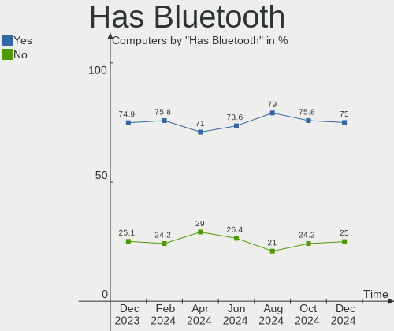
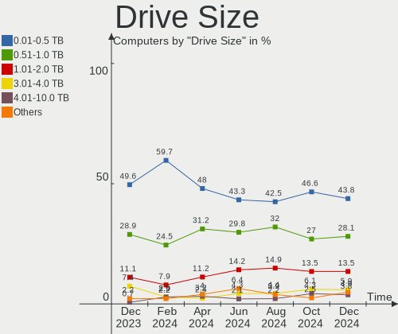
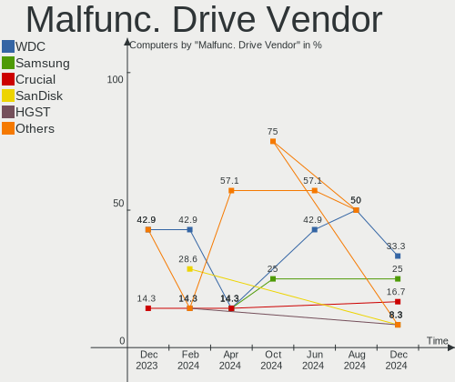
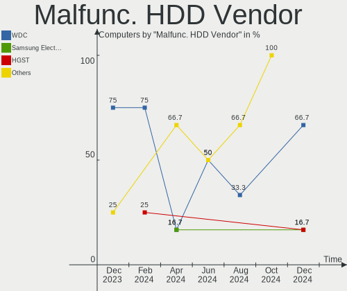
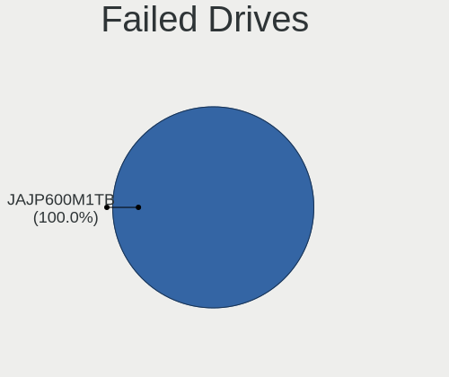
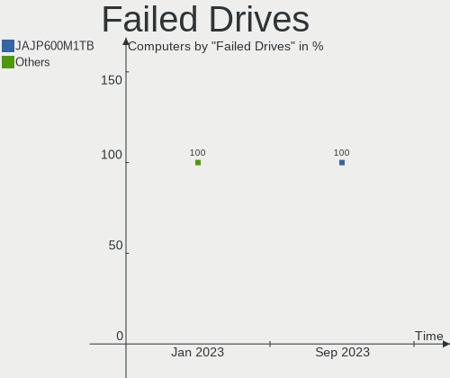
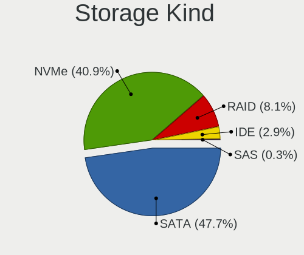
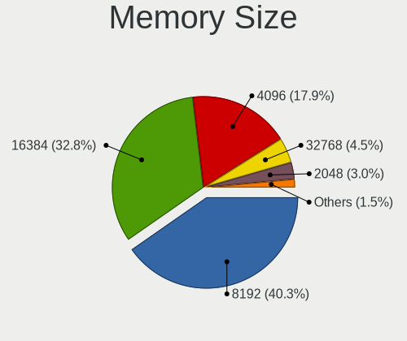
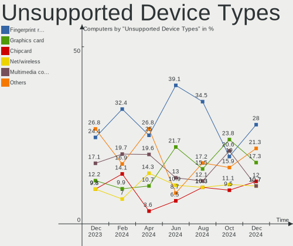

Pop!_OS Hardware Trends
-----------------------

A project to identify most popular hardware characteristics and track their change
over time based on data collected by Pop!_OS users at https://Linux-Hardware.org.

Anyone can contribute to this report by the [hw-probe](https://github.com/linuxhw/hw-probe) tool:

    sudo -E hw-probe -all -upload

This is a report for all computer types. See also reports for [desktops](/Dist/Pop!_OS/Desktop/README.md) and [notebooks](/Dist/Pop!_OS/Notebook/README.md).

Full-feature report is available here: https://linux-hardware.org/?view=trends

Period: Mar, 2022.

Contents
--------

* [ System ](#system)
  - [ OS                       ](#os)
  - [ OS Family                ](#os-family)
  - [ Kernel                   ](#kernel)
  - [ Kernel Family            ](#kernel-family)
  - [ Kernel Major Ver.        ](#kernel-major-ver)
  - [ Arch                     ](#arch)
  - [ DE                       ](#de)
  - [ Display Server           ](#display-server)
  - [ Display Manager          ](#display-manager)
  - [ OS Lang                  ](#os-lang)
  - [ Boot Mode                ](#boot-mode)
  - [ Filesystem               ](#filesystem)
  - [ Part. scheme             ](#part-scheme)
  - [ Dual Boot with Linux/BSD ](#dual-boot-with-linuxbsd)
  - [ Dual Boot (Win)          ](#dual-boot-win)

* [ Board ](#board)
  - [ Vendor                   ](#vendor)
  - [ Model                    ](#model)
  - [ Model Family             ](#model-family)
  - [ MFG Year                 ](#mfg-year)
  - [ Form Factor              ](#form-factor)
  - [ Secure Boot              ](#secure-boot)
  - [ Coreboot                 ](#coreboot)
  - [ RAM Size                 ](#ram-size)
  - [ RAM Used                 ](#ram-used)
  - [ Total Drives             ](#total-drives)
  - [ Has CD-ROM               ](#has-cd-rom)
  - [ Has Ethernet             ](#has-ethernet)
  - [ Has WiFi                 ](#has-wifi)
  - [ Has Bluetooth            ](#has-bluetooth)

* [ Location ](#location)
  - [ Country                  ](#country)
  - [ City                     ](#city)

* [ Drives ](#drives)
  - [ Drive Vendor             ](#drive-vendor)
  - [ Drive Model              ](#drive-model)
  - [ HDD Vendor               ](#hdd-vendor)
  - [ SSD Vendor               ](#ssd-vendor)
  - [ Drive Kind               ](#drive-kind)
  - [ Drive Connector          ](#drive-connector)
  - [ Drive Size               ](#drive-size)
  - [ Space Total              ](#space-total)
  - [ Space Used               ](#space-used)
  - [ Malfunc. Drives          ](#malfunc-drives)
  - [ Malfunc. Drive Vendor    ](#malfunc-drive-vendor)
  - [ Malfunc. HDD Vendor      ](#malfunc-hdd-vendor)
  - [ Malfunc. Drive Kind      ](#malfunc-drive-kind)
  - [ Failed Drives            ](#failed-drives)
  - [ Failed Drive Vendor      ](#failed-drive-vendor)
  - [ Drive Status             ](#drive-status)

* [ Storage controller ](#storage-controller)
  - [ Storage Vendor           ](#storage-vendor)
  - [ Storage Model            ](#storage-model)
  - [ Storage Kind             ](#storage-kind)

* [ Processor ](#processor)
  - [ CPU Vendor               ](#cpu-vendor)
  - [ CPU Model                ](#cpu-model)
  - [ CPU Model Family         ](#cpu-model-family)
  - [ CPU Cores                ](#cpu-cores)
  - [ CPU Sockets              ](#cpu-sockets)
  - [ CPU Threads              ](#cpu-threads)
  - [ CPU Op-Modes             ](#cpu-op-modes)
  - [ CPU Microcode            ](#cpu-microcode)
  - [ CPU Microarch            ](#cpu-microarch)

* [ Graphics ](#graphics)
  - [ GPU Vendor               ](#gpu-vendor)
  - [ GPU Model                ](#gpu-model)
  - [ GPU Combo                ](#gpu-combo)
  - [ GPU Driver               ](#gpu-driver)
  - [ GPU Memory               ](#gpu-memory)

* [ Monitor ](#monitor)
  - [ Monitor Vendor           ](#monitor-vendor)
  - [ Monitor Model            ](#monitor-model)
  - [ Monitor Resolution       ](#monitor-resolution)
  - [ Monitor Diagonal         ](#monitor-diagonal)
  - [ Monitor Width            ](#monitor-width)
  - [ Aspect Ratio             ](#aspect-ratio)
  - [ Monitor Area             ](#monitor-area)
  - [ Pixel Density            ](#pixel-density)
  - [ Multiple Monitors        ](#multiple-monitors)

* [ Network ](#network)
  - [ Net Controller Vendor    ](#net-controller-vendor)
  - [ Net Controller Model     ](#net-controller-model)
  - [ Wireless Vendor          ](#wireless-vendor)
  - [ Wireless Model           ](#wireless-model)
  - [ Ethernet Vendor          ](#ethernet-vendor)
  - [ Ethernet Model           ](#ethernet-model)
  - [ Net Controller Kind      ](#net-controller-kind)
  - [ Used Controller          ](#used-controller)
  - [ NICs                     ](#nics)
  - [ IPv6                     ](#ipv6)

* [ Bluetooth ](#bluetooth)
  - [ Bluetooth Vendor         ](#bluetooth-vendor)
  - [ Bluetooth Model          ](#bluetooth-model)

* [ Sound ](#sound)
  - [ Sound Vendor             ](#sound-vendor)
  - [ Sound Model              ](#sound-model)

* [ Memory ](#memory)
  - [ Memory Vendor            ](#memory-vendor)
  - [ Memory Model             ](#memory-model)
  - [ Memory Kind              ](#memory-kind)
  - [ Memory Form Factor       ](#memory-form-factor)
  - [ Memory Size              ](#memory-size)
  - [ Memory Speed             ](#memory-speed)

* [ Printers & scanners ](#printers--scanners)
  - [ Printer Vendor           ](#printer-vendor)
  - [ Printer Model            ](#printer-model)
  - [ Scanner Vendor           ](#scanner-vendor)
  - [ Scanner Model            ](#scanner-model)

* [ Camera ](#camera)
  - [ Camera Vendor            ](#camera-vendor)
  - [ Camera Model             ](#camera-model)

* [ Security ](#security)
  - [ Fingerprint Vendor       ](#fingerprint-vendor)
  - [ Fingerprint Model        ](#fingerprint-model)
  - [ Chipcard Vendor          ](#chipcard-vendor)
  - [ Chipcard Model           ](#chipcard-model)

* [ Unsupported ](#unsupported)
  - [ Unsupported Devices      ](#unsupported-devices)
  - [ Unsupported Device Types ](#unsupported-device-types)

System
------

OS
--

Installed operating systems

| Name          | Computers | Percent |
|---------------|-----------|---------|
| Pop!_OS 21.10 | 260       | 85.25%  |
| Pop!_OS 20.04 | 35        | 11.48%  |
| Pop!_OS 21.04 | 10        | 3.28%   |

OS Family
---------

OS without a version

| Name    | Computers | Percent |
|---------|-----------|---------|
| Pop!_OS | 305       | 100%    |

Kernel
------

Version of the Linux kernel

| Version                  | Computers | Percent |
|--------------------------|-----------|---------|
| 5.16.11-76051611-generic | 229       | 75.08%  |
| 5.15.23-76051523-generic | 26        | 8.52%   |
| 5.15.15-76051515-generic | 21        | 6.89%   |
| 5.15.11-76051511-generic | 8         | 2.62%   |
| 5.16.15-76051615-generic | 4         | 1.31%   |
| 5.13.0-7614-generic      | 3         | 0.98%   |
| 5.15.8-76051508-generic  | 2         | 0.66%   |
| 5.13.0-1017-raspi        | 2         | 0.66%   |
| 5.11.0-7620-generic      | 2         | 0.66%   |
| 5.4.0-7634-generic       | 1         | 0.33%   |
| 5.16.16-xanmod1          | 1         | 0.33%   |
| 5.16.13-051613-generic   | 1         | 0.33%   |
| 5.15.5-76051505-generic  | 1         | 0.33%   |
| 5.15.0-76051500-generic  | 1         | 0.33%   |
| 5.13.0-7620-generic      | 1         | 0.33%   |
| 5.13.0-1022-raspi        | 1         | 0.33%   |
| 4.9.0-040900-generic     | 1         | 0.33%   |

Kernel Family
-------------

Linux kernel without a distro release

| Version | Computers | Percent |
|---------|-----------|---------|
| 5.16.11 | 229       | 75.08%  |
| 5.15.23 | 26        | 8.52%   |
| 5.15.15 | 21        | 6.89%   |
| 5.15.11 | 8         | 2.62%   |
| 5.13.0  | 7         | 2.3%    |
| 5.16.15 | 4         | 1.31%   |
| 5.15.8  | 2         | 0.66%   |
| 5.11.0  | 2         | 0.66%   |
| 5.4.0   | 1         | 0.33%   |
| 5.16.16 | 1         | 0.33%   |
| 5.16.13 | 1         | 0.33%   |
| 5.15.5  | 1         | 0.33%   |
| 5.15.0  | 1         | 0.33%   |
| 4.9.0   | 1         | 0.33%   |

Kernel Major Ver.
-----------------

Linux kernel major version

| Version | Computers | Percent |
|---------|-----------|---------|
| 5.16    | 235       | 77.05%  |
| 5.15    | 59        | 19.34%  |
| 5.13    | 7         | 2.3%    |
| 5.11    | 2         | 0.66%   |
| 5.4     | 1         | 0.33%   |
| 4.9     | 1         | 0.33%   |

Arch
----

OS architecture (x86_64, i586, etc.)

| Name    | Computers | Percent |
|---------|-----------|---------|
| x86_64  | 302       | 99.02%  |
| aarch64 | 3         | 0.98%   |

DE
--

Desktop Environment

| Name            | Computers | Percent |
|-----------------|-----------|---------|
| GNOME           | 299       | 98.03%  |
| KDE5            | 4         | 1.31%   |
| GNOME Flashback | 1         | 0.33%   |
| Unknown         | 1         | 0.33%   |

Display Server
--------------

X11 or Wayland

| Name    | Computers | Percent |
|---------|-----------|---------|
| X11     | 295       | 96.72%  |
| Wayland | 9         | 2.95%   |
| Unknown | 1         | 0.33%   |

Display Manager
---------------

SDDM, LightDM, etc.

| Name    | Computers | Percent |
|---------|-----------|---------|
| Unknown | 246       | 80.66%  |
| GDM     | 58        | 19.02%  |
| GDM3    | 1         | 0.33%   |

OS Lang
-------

Language

| Lang  | Computers | Percent |
|-------|-----------|---------|
| en_US | 169       | 55.41%  |
| en_GB | 28        | 9.18%   |
| pt_BR | 25        | 8.2%    |
| de_DE | 13        | 4.26%   |
| C     | 9         | 2.95%   |
| it_IT | 8         | 2.62%   |
| en_AU | 7         | 2.3%    |
| pt_PT | 5         | 1.64%   |
| fr_FR | 4         | 1.31%   |
| en_CA | 4         | 1.31%   |
| pl_PL | 3         | 0.98%   |
| es_ES | 3         | 0.98%   |
| ru_RU | 2         | 0.66%   |
| nb_NO | 2         | 0.66%   |
| ja_JP | 2         | 0.66%   |
| hr_HR | 2         | 0.66%   |
| en_ZA | 2         | 0.66%   |
| en_IE | 2         | 0.66%   |
| en_DK | 2         | 0.66%   |
| cs_CZ | 2         | 0.66%   |
| zh_CN | 1         | 0.33%   |
| vi_VN | 1         | 0.33%   |
| sk_SK | 1         | 0.33%   |
| nl_BE | 1         | 0.33%   |
| lt_LT | 1         | 0.33%   |
| fr_CA | 1         | 0.33%   |
| fi_FI | 1         | 0.33%   |
| es_MX | 1         | 0.33%   |
| en_SG | 1         | 0.33%   |
| en_IN | 1         | 0.33%   |
| da_DK | 1         | 0.33%   |

Boot Mode
---------

EFI or BIOS

| Mode | Computers | Percent |
|------|-----------|---------|
| BIOS | 252       | 82.62%  |
| EFI  | 53        | 17.38%  |

Filesystem
----------

Type of filesystem

| Type    | Computers | Percent |
|---------|-----------|---------|
| Ext4    | 294       | 96.39%  |
| Btrfs   | 5         | 1.64%   |
| Overlay | 4         | 1.31%   |
| Xfs     | 2         | 0.66%   |

Part. scheme
------------

Scheme of partitioning

| Type    | Computers | Percent |
|---------|-----------|---------|
| Unknown | 245       | 80.33%  |
| GPT     | 52        | 17.05%  |
| MBR     | 8         | 2.62%   |

Dual Boot with Linux/BSD
------------------------

Hosting more than one Linux/BSD

| Dual boot | Computers | Percent |
|-----------|-----------|---------|
| No        | 296       | 97.05%  |
| Yes       | 9         | 2.95%   |

Dual Boot (Win)
---------------

Hosting Linux and Windows

| Dual boot | Computers | Percent |
|-----------|-----------|---------|
| No        | 284       | 93.11%  |
| Yes       | 21        | 6.89%   |

Board
-----

Vendor
------

Motherboard manufacturer

| Name                    | Computers | Percent |
|-------------------------|-----------|---------|
| ASUSTek Computer        | 61        | 20%     |
| Dell                    | 51        | 16.72%  |
| Lenovo                  | 33        | 10.82%  |
| MSI                     | 30        | 9.84%   |
| Hewlett-Packard         | 19        | 6.23%   |
| Gigabyte Technology     | 18        | 5.9%    |
| Acer                    | 14        | 4.59%   |
| ASRock                  | 11        | 3.61%   |
| Apple                   | 9         | 2.95%   |
| Toshiba                 | 6         | 1.97%   |
| System76                | 6         | 1.97%   |
| Intel                   | 6         | 1.97%   |
| Raspberry Pi Foundation | 3         | 0.98%   |
| Notebook                | 3         | 0.98%   |
| HUAWEI                  | 3         | 0.98%   |
| Samsung Electronics     | 2         | 0.66%   |
| Razer                   | 2         | 0.66%   |
| Positivo Bahia - VAIO   | 2         | 0.66%   |
| Positivo                | 2         | 0.66%   |
| Pegatron                | 2         | 0.66%   |
| Medion                  | 2         | 0.66%   |
| Foxconn                 | 2         | 0.66%   |
| ECS                     | 2         | 0.66%   |
| Avell High Performance  | 2         | 0.66%   |
| Sony                    | 1         | 0.33%   |
| Schenker                | 1         | 0.33%   |
| PC Specialist           | 1         | 0.33%   |
| MOTILE                  | 1         | 0.33%   |
| Minix                   | 1         | 0.33%   |
| Itautec                 | 1         | 0.33%   |
| Google                  | 1         | 0.33%   |
| Fujitsu Siemens         | 1         | 0.33%   |
| Fujitsu                 | 1         | 0.33%   |
| Chuwi                   | 1         | 0.33%   |
| Biostar                 | 1         | 0.33%   |
| AZW                     | 1         | 0.33%   |
| Alienware               | 1         | 0.33%   |
| Unknown                 | 1         | 0.33%   |

Model
-----

Motherboard model

| Name                                               | Computers | Percent |
|----------------------------------------------------|-----------|---------|
| ASUS All Series                                    | 5         | 1.64%   |
| RPi Raspberry Pi                                   | 3         | 0.98%   |
| System76 Oryx Pro                                  | 2         | 0.66%   |
| System76 Lemur Pro                                 | 2         | 0.66%   |
| Razer Blade 15 Base Model (Early 2020) - RZ09-0328 | 2         | 0.66%   |
| Positivo Bahia - VAIO VJFE42F11X-XXXXXX            | 2         | 0.66%   |
| MSI MS-7C02                                        | 2         | 0.66%   |
| MSI MS-7B84                                        | 2         | 0.66%   |
| Lenovo IdeaPad S145-15IIL 82DJ                     | 2         | 0.66%   |
| Lenovo IdeaPad 3 15ITL6 82H8                       | 2         | 0.66%   |
| Lenovo IdeaPad 3 15ALC6 82MF                       | 2         | 0.66%   |
| Intel H61                                          | 2         | 0.66%   |
| Dell Latitude E6410                                | 2         | 0.66%   |
| ASUS TUF GAMING X570-PLUS                          | 2         | 0.66%   |
| ASUS ROG Zephyrus G15 GA503QR_GA503QR              | 2         | 0.66%   |
| Toshiba Satellite P50-B-10V                        | 1         | 0.33%   |
| Toshiba Satellite L10W-B-101                       | 1         | 0.33%   |
| Toshiba Satellite C855D                            | 1         | 0.33%   |
| Toshiba Satellite C850-1GD                         | 1         | 0.33%   |
| Toshiba Satellite C70D-B                           | 1         | 0.33%   |
| Toshiba Satellite A135                             | 1         | 0.33%   |
| System76 Thelio                                    | 1         | 0.33%   |
| System76 Gazelle                                   | 1         | 0.33%   |
| Sony SVE15115FXS                                   | 1         | 0.33%   |
| Schenker XMG CORE (CZN/E21)                        | 1         | 0.33%   |
| Samsung 340XAA/350XAA/550XAA                       | 1         | 0.33%   |
| Samsung 270E5K/270E5Q/271E5K/2570EK                | 1         | 0.33%   |
| Positivo Q464C                                     | 1         | 0.33%   |
| Positivo POS-EIH61CR                               | 1         | 0.33%   |
| Pegatron h8-1380t                                  | 1         | 0.33%   |
| Pegatron 520-1108el                                | 1         | 0.33%   |
| PC Specialist NH5xAx                               | 1         | 0.33%   |
| Notebook PCx0Dx                                    | 1         | 0.33%   |
| Notebook P65xHP                                    | 1         | 0.33%   |
| Notebook NV4XMB,ME,MZ                              | 1         | 0.33%   |
| MSI WL377AA-ABZ HPE-192it                          | 1         | 0.33%   |
| MSI MS-7D09                                        | 1         | 0.33%   |
| MSI MS-7C89                                        | 1         | 0.33%   |
| MSI MS-7C84                                        | 1         | 0.33%   |
| MSI MS-7C09                                        | 1         | 0.33%   |
| MSI MS-7B86                                        | 1         | 0.33%   |
| MSI MS-7B22                                        | 1         | 0.33%   |
| MSI MS-7A74                                        | 1         | 0.33%   |
| MSI MS-7A33                                        | 1         | 0.33%   |
| MSI MS-7A32                                        | 1         | 0.33%   |
| MSI MS-7971                                        | 1         | 0.33%   |
| MSI MS-7923                                        | 1         | 0.33%   |
| MSI MS-7917                                        | 1         | 0.33%   |
| MSI MS-7677                                        | 1         | 0.33%   |
| MSI MS-7673                                        | 1         | 0.33%   |
| MSI MS-7529                                        | 1         | 0.33%   |
| MSI Modern 14 B11M                                 | 1         | 0.33%   |
| MSI Modern 14 B10MW                                | 1         | 0.33%   |
| MSI Katana GF76 11UD                               | 1         | 0.33%   |
| MSI GV62 8RD                                       | 1         | 0.33%   |
| MSI GT70 2OC/2OD                                   | 1         | 0.33%   |
| MSI GS60 6QE                                       | 1         | 0.33%   |
| MSI GS30 2M Shadow                                 | 1         | 0.33%   |
| MSI GF63 Thin 9SC                                  | 1         | 0.33%   |
| MSI GE72 2QF                                       | 1         | 0.33%   |

Model Family
------------

Motherboard model prefix

| Name                                    | Computers | Percent |
|-----------------------------------------|-----------|---------|
| Dell Latitude                           | 17        | 5.57%   |
| Lenovo ThinkPad                         | 13        | 4.26%   |
| Dell Inspiron                           | 13        | 4.26%   |
| ASUS ROG                                | 11        | 3.61%   |
| Lenovo IdeaPad                          | 10        | 3.28%   |
| Acer Aspire                             | 10        | 3.28%   |
| ASUS PRIME                              | 8         | 2.62%   |
| Dell OptiPlex                           | 7         | 2.3%    |
| Toshiba Satellite                       | 6         | 1.97%   |
| Dell XPS                                | 6         | 1.97%   |
| HP EliteBook                            | 5         | 1.64%   |
| ASUS VivoBook                           | 5         | 1.64%   |
| ASUS TUF                                | 5         | 1.64%   |
| ASUS All                                | 5         | 1.64%   |
| RPi Raspberry                           | 3         | 0.98%   |
| HP EliteDesk                            | 3         | 0.98%   |
| Acer Swift                              | 3         | 0.98%   |
| System76 Oryx                           | 2         | 0.66%   |
| System76 Lemur                          | 2         | 0.66%   |
| Razer Blade                             | 2         | 0.66%   |
| Positivo Bahia - VAIO VJFE42F11X-XXXXXX | 2         | 0.66%   |
| MSI MS-7C02                             | 2         | 0.66%   |
| MSI MS-7B84                             | 2         | 0.66%   |
| MSI Modern                              | 2         | 0.66%   |
| Lenovo Legion                           | 2         | 0.66%   |
| Intel H61                               | 2         | 0.66%   |
| HP Pavilion                             | 2         | 0.66%   |
| HP Compaq                               | 2         | 0.66%   |
| Gigabyte X570                           | 2         | 0.66%   |
| Gigabyte B550                           | 2         | 0.66%   |
| Dell System                             | 2         | 0.66%   |
| ASUS Maximus                            | 2         | 0.66%   |
| ASUS ASUS                               | 2         | 0.66%   |
| ASRock X570                             | 2         | 0.66%   |
| Apple MacBookPro9                       | 2         | 0.66%   |
| System76 Thelio                         | 1         | 0.33%   |
| System76 Gazelle                        | 1         | 0.33%   |
| Sony SVE15115FXS                        | 1         | 0.33%   |
| Schenker XMG                            | 1         | 0.33%   |
| Samsung 340XAA                          | 1         | 0.33%   |
| Samsung 270E5K                          | 1         | 0.33%   |
| Positivo Q464C                          | 1         | 0.33%   |
| Positivo POS-EIH61CR                    | 1         | 0.33%   |
| Pegatron h8-1380t                       | 1         | 0.33%   |
| Pegatron 520-1108el                     | 1         | 0.33%   |
| PC Specialist NH5xAx                    | 1         | 0.33%   |
| Notebook PCx0Dx                         | 1         | 0.33%   |
| Notebook P65xHP                         | 1         | 0.33%   |
| Notebook NV4XMB                         | 1         | 0.33%   |
| MSI WL377AA-ABZ                         | 1         | 0.33%   |
| MSI MS-7D09                             | 1         | 0.33%   |
| MSI MS-7C89                             | 1         | 0.33%   |
| MSI MS-7C84                             | 1         | 0.33%   |
| MSI MS-7C09                             | 1         | 0.33%   |
| MSI MS-7B86                             | 1         | 0.33%   |
| MSI MS-7B22                             | 1         | 0.33%   |
| MSI MS-7A74                             | 1         | 0.33%   |
| MSI MS-7A33                             | 1         | 0.33%   |
| MSI MS-7A32                             | 1         | 0.33%   |
| MSI MS-7971                             | 1         | 0.33%   |

MFG Year
--------

Motherboard manufacture year

| Year    | Computers | Percent |
|---------|-----------|---------|
| 2020    | 43        | 14.1%   |
| 2021    | 38        | 12.46%  |
| 2018    | 33        | 10.82%  |
| 2019    | 29        | 9.51%   |
| 2012    | 25        | 8.2%    |
| 2014    | 20        | 6.56%   |
| 2013    | 20        | 6.56%   |
| 2011    | 20        | 6.56%   |
| 2017    | 19        | 6.23%   |
| 2015    | 17        | 5.57%   |
| 2016    | 12        | 3.93%   |
| 2010    | 11        | 3.61%   |
| 2009    | 6         | 1.97%   |
| 2008    | 4         | 1.31%   |
| 2007    | 3         | 0.98%   |
| Unknown | 3         | 0.98%   |
| 2022    | 1         | 0.33%   |
| 2006    | 1         | 0.33%   |

Form Factor
-----------

Physical design of the computer

| Name           | Computers | Percent |
|----------------|-----------|---------|
| Notebook       | 165       | 54.1%   |
| Desktop        | 125       | 40.98%  |
| Mini pc        | 4         | 1.31%   |
| System on chip | 3         | 0.98%   |
| Tablet         | 3         | 0.98%   |
| Convertible    | 3         | 0.98%   |
| All in one     | 1         | 0.33%   |
| Server         | 1         | 0.33%   |

Secure Boot
-----------

Enabled or disabled

| State    | Computers | Percent |
|----------|-----------|---------|
| Disabled | 302       | 99.02%  |
| Enabled  | 3         | 0.98%   |

Coreboot
--------

Have coreboot on board

| Used | Computers | Percent |
|------|-----------|---------|
| No   | 301       | 98.69%  |
| Yes  | 4         | 1.31%   |

RAM Size
--------

Total RAM memory

| Size in GB      | Computers | Percent |
|-----------------|-----------|---------|
| 16.01-24.0      | 81        | 26.56%  |
| 4.01-8.0        | 67        | 21.97%  |
| 8.01-16.0       | 54        | 17.7%   |
| 32.01-64.0      | 53        | 17.38%  |
| 3.01-4.0        | 34        | 11.15%  |
| 64.01-256.0     | 7         | 2.3%    |
| 24.01-32.0      | 4         | 1.31%   |
| More than 256.0 | 2         | 0.66%   |
| 2.01-3.0        | 2         | 0.66%   |
| 1.01-2.0        | 1         | 0.33%   |

RAM Used
--------

Used RAM memory

| Used GB    | Computers | Percent |
|------------|-----------|---------|
| 2.01-3.0   | 96        | 31.48%  |
| 1.01-2.0   | 77        | 25.25%  |
| 3.01-4.0   | 56        | 18.36%  |
| 4.01-8.0   | 54        | 17.7%   |
| 8.01-16.0  | 17        | 5.57%   |
| 16.01-24.0 | 4         | 1.31%   |
| 24.01-32.0 | 1         | 0.33%   |

Total Drives
------------

Number of drives on board

| Drives | Computers | Percent |
|--------|-----------|---------|
| 1      | 168       | 55.08%  |
| 2      | 82        | 26.89%  |
| 3      | 36        | 11.8%   |
| 4      | 9         | 2.95%   |
| 5      | 5         | 1.64%   |
| 6      | 4         | 1.31%   |
| 0      | 1         | 0.33%   |

Has CD-ROM
----------

Has CD-ROM on board

| Presented | Computers | Percent |
|-----------|-----------|---------|
| No        | 218       | 71.48%  |
| Yes       | 87        | 28.52%  |

Has Ethernet
------------

Has Ethernet on board

| Presented | Computers | Percent |
|-----------|-----------|---------|
| Yes       | 261       | 85.57%  |
| No        | 44        | 14.43%  |

Has WiFi
--------

Has WiFi module

| Presented | Computers | Percent |
|-----------|-----------|---------|
| Yes       | 249       | 81.64%  |
| No        | 56        | 18.36%  |

Has Bluetooth
-------------

Has Bluetooth module

| Presented | Computers | Percent |
|-----------|-----------|---------|
| Yes       | 194       | 63.61%  |
| No        | 111       | 36.39%  |

Location
--------

Country
-------

Geographic location (country)

| Country      | Computers | Percent |
|--------------|-----------|---------|
| USA          | 92        | 30.16%  |
| Brazil       | 34        | 11.15%  |
| UK           | 18        | 5.9%    |
| Germany      | 17        | 5.57%   |
| Italy        | 13        | 4.26%   |
| Australia    | 11        | 3.61%   |
| Netherlands  | 8         | 2.62%   |
| Canada       | 8         | 2.62%   |
| Portugal     | 7         | 2.3%    |
| France       | 7         | 2.3%    |
| Russia       | 5         | 1.64%   |
| Poland       | 5         | 1.64%   |
| Norway       | 5         | 1.64%   |
| Turkey       | 4         | 1.31%   |
| Spain        | 4         | 1.31%   |
| South Africa | 4         | 1.31%   |
| Ireland      | 4         | 1.31%   |
| India        | 4         | 1.31%   |
| Denmark      | 4         | 1.31%   |
| Switzerland  | 3         | 0.98%   |
| Mexico       | 3         | 0.98%   |
| Ecuador      | 3         | 0.98%   |
| Czechia      | 3         | 0.98%   |
| Croatia      | 3         | 0.98%   |
| Slovakia     | 2         | 0.66%   |
| Saudi Arabia | 2         | 0.66%   |
| Romania      | 2         | 0.66%   |
| Luxembourg   | 2         | 0.66%   |
| Lithuania    | 2         | 0.66%   |
| Japan        | 2         | 0.66%   |
| Greece       | 2         | 0.66%   |
| Belgium      | 2         | 0.66%   |
| Vietnam      | 1         | 0.33%   |
| Thailand     | 1         | 0.33%   |
| Singapore    | 1         | 0.33%   |
| Philippines  | 1         | 0.33%   |
| Nigeria      | 1         | 0.33%   |
| New Zealand  | 1         | 0.33%   |
| Malaysia     | 1         | 0.33%   |
| Latvia       | 1         | 0.33%   |
| Israel       | 1         | 0.33%   |
| Iran         | 1         | 0.33%   |
| Iceland      | 1         | 0.33%   |
| Hong Kong    | 1         | 0.33%   |
| Finland      | 1         | 0.33%   |
| Costa Rica   | 1         | 0.33%   |
| China        | 1         | 0.33%   |
| Chile        | 1         | 0.33%   |
| Bulgaria     | 1         | 0.33%   |
| Bangladesh   | 1         | 0.33%   |
| Austria      | 1         | 0.33%   |
| Argentina    | 1         | 0.33%   |

City
----

Geographic location (city)

| City                   | Computers | Percent |
|------------------------|-----------|---------|
| Sydney                 | 3         | 0.98%   |
| Rome                   | 3         | 0.98%   |
| Zagreb                 | 2         | 0.66%   |
| Tuam                   | 2         | 0.66%   |
| The Hague              | 2         | 0.66%   |
| Sao Vicente            | 2         | 0.66%   |
| Rio de Janeiro         | 2         | 0.66%   |
| Reading                | 2         | 0.66%   |
| Prague                 | 2         | 0.66%   |
| Porto                  | 2         | 0.66%   |
| New York               | 2         | 0.66%   |
| Miami                  | 2         | 0.66%   |
| Manaus                 | 2         | 0.66%   |
| Houston                | 2         | 0.66%   |
| Düsseldorf            | 2         | 0.66%   |
| Dublin                 | 2         | 0.66%   |
| Danville               | 2         | 0.66%   |
| Dallas                 | 2         | 0.66%   |
| Cuiabá                | 2         | 0.66%   |
| Cape Town              | 2         | 0.66%   |
| Brooklyn               | 2         | 0.66%   |
| Bozeman                | 2         | 0.66%   |
| Belo Horizonte         | 2         | 0.66%   |
| Barberton              | 2         | 0.66%   |
| Atlantic Beach         | 2         | 0.66%   |
| Atlanta                | 2         | 0.66%   |
| Zoetermeer             | 1         | 0.33%   |
| Žilina                | 1         | 0.33%   |
| Zephyrhills            | 1         | 0.33%   |
| Zacatecas City         | 1         | 0.33%   |
| Yaroslavl              | 1         | 0.33%   |
| Wylie                  | 1         | 0.33%   |
| Woodstock              | 1         | 0.33%   |
| Winterthur             | 1         | 0.33%   |
| Wichita                | 1         | 0.33%   |
| Well                   | 1         | 0.33%   |
| Warsaw                 | 1         | 0.33%   |
| Warrenton              | 1         | 0.33%   |
| Walterboro             | 1         | 0.33%   |
| Walsall                | 1         | 0.33%   |
| Viña del Mar          | 1         | 0.33%   |
| Vilnius                | 1         | 0.33%   |
| Villingen-Schwenningen | 1         | 0.33%   |
| Vila Velha             | 1         | 0.33%   |
| Vienna                 | 1         | 0.33%   |
| Vicksburg              | 1         | 0.33%   |
| Viana do Castelo       | 1         | 0.33%   |
| Versfelde              | 1         | 0.33%   |
| Vargem Alta            | 1         | 0.33%   |
| Vanlose                | 1         | 0.33%   |
| Ulm                    | 1         | 0.33%   |
| Ufa                    | 1         | 0.33%   |
| Tzaneen                | 1         | 0.33%   |
| Turin                  | 1         | 0.33%   |
| Tuen Mun               | 1         | 0.33%   |
| Tucson                 | 1         | 0.33%   |
| Tubarao                | 1         | 0.33%   |
| Tempe                  | 1         | 0.33%   |
| Tehran                 | 1         | 0.33%   |
| Tallahassee            | 1         | 0.33%   |

Drives
------

Drive Vendor
------------

Hard drive vendors

| Vendor                         | Computers | Drives | Percent |
|--------------------------------|-----------|--------|---------|
| Samsung Electronics            | 83        | 100    | 17.74%  |
| WDC                            | 69        | 81     | 14.74%  |
| Seagate                        | 62        | 68     | 13.25%  |
| Sandisk                        | 35        | 38     | 7.48%   |
| Kingston                       | 24        | 27     | 5.13%   |
| Toshiba                        | 17        | 18     | 3.63%   |
| SK Hynix                       | 15        | 15     | 3.21%   |
| Crucial                        | 15        | 17     | 3.21%   |
| Unknown                        | 13        | 15     | 2.78%   |
| Intel                          | 12        | 14     | 2.56%   |
| Hitachi                        | 12        | 18     | 2.56%   |
| A-DATA Technology              | 10        | 10     | 2.14%   |
| Micron Technology              | 9         | 10     | 1.92%   |
| Silicon Motion                 | 7         | 7      | 1.5%    |
| HGST                           | 7         | 7      | 1.5%    |
| Solid State Storage Technology | 6         | 6      | 1.28%   |
| China                          | 6         | 6      | 1.28%   |
| SPCC                           | 5         | 6      | 1.07%   |
| Transcend                      | 4         | 4      | 0.85%   |
| Phison                         | 4         | 4      | 0.85%   |
| Micron/Crucial Technology      | 4         | 4      | 0.85%   |
| Apple                          | 4         | 4      | 0.85%   |
| ADATA Technology               | 4         | 5      | 0.85%   |
| PNY                            | 3         | 3      | 0.64%   |
| Patriot                        | 3         | 3      | 0.64%   |
| KIOXIA                         | 3         | 3      | 0.64%   |
| XPG                            | 2         | 2      | 0.43%   |
| Team                           | 2         | 2      | 0.43%   |
| SABRENT                        | 2         | 2      | 0.43%   |
| Lexar                          | 2         | 2      | 0.43%   |
| KingSpec                       | 2         | 3      | 0.43%   |
| Hewlett-Packard                | 2         | 2      | 0.43%   |
| UMIS                           | 1         | 1      | 0.21%   |
| Teutons                        | 1         | 1      | 0.21%   |
| SSSTC                          | 1         | 1      | 0.21%   |
| Realtek Semiconductor          | 1         | 1      | 0.21%   |
| oyunkey                        | 1         | 1      | 0.21%   |
| OCZ                            | 1         | 1      | 0.21%   |
| Netac                          | 1         | 1      | 0.21%   |
| LITEONIT                       | 1         | 2      | 0.21%   |
| Kingchuxing                    | 1         | 1      | 0.21%   |
| JetDrive                       | 1         | 1      | 0.21%   |
| Intenso                        | 1         | 1      | 0.21%   |
| GOODRAM                        | 1         | 1      | 0.21%   |
| Gigabyte Technology            | 1         | 1      | 0.21%   |
| DOGFISH                        | 1         | 1      | 0.21%   |
| Corsair                        | 1         | 1      | 0.21%   |
| Colorful                       | 1         | 1      | 0.21%   |
| C300-CTF                       | 1         | 1      | 0.21%   |
| Argon                          | 1         | 1      | 0.21%   |
| AMD                            | 1         | 1      | 0.21%   |
| Unknown                        | 1         | 1      | 0.21%   |

Drive Model
-----------

Hard drive models

| Model                                    | Computers | Percent |
|------------------------------------------|-----------|---------|
| Samsung NVMe SSD Drive 1TB               | 13        | 2.55%   |
| Sandisk NVMe SSD Drive 1TB               | 10        | 1.96%   |
| Samsung NVMe SSD Drive 500GB             | 7         | 1.37%   |
| Samsung SSD 850 EVO 250GB                | 6         | 1.18%   |
| Solid State Storage NVMe SSD Drive 256GB | 5         | 0.98%   |
| Samsung SSD 860 EVO 500GB                | 5         | 0.98%   |
| Samsung SSD 850 EVO 500GB                | 5         | 0.98%   |
| Samsung NVMe SSD Drive 512GB             | 5         | 0.98%   |
| WDC WDS100T2B0A-00SM50 1TB SSD           | 4         | 0.78%   |
| WDC WD10SPZX-24Z10 1TB                   | 4         | 0.78%   |
| WDC WD10EZEX-08WN4A0 1TB                 | 4         | 0.78%   |
| SK Hynix NVMe SSD Drive 512GB            | 4         | 0.78%   |
| Sandisk NVMe SSD Drive 256GB             | 4         | 0.78%   |
| Micron NVMe SSD Drive 512GB              | 4         | 0.78%   |
| Kingston SA400S37240G 240GB SSD          | 4         | 0.78%   |
| Kingston SA400S37120G 120GB SSD          | 4         | 0.78%   |
| Intel NVMe SSD Drive 512GB               | 4         | 0.78%   |
| WDC WDS240G2G0A-00JH30 240GB SSD         | 3         | 0.59%   |
| Unknown MMC Card  64GB                   | 3         | 0.59%   |
| Toshiba NVMe SSD Drive 256GB             | 3         | 0.59%   |
| SPCC Solid State Disk 256GB              | 3         | 0.59%   |
| SK Hynix NVMe SSD Drive 256GB            | 3         | 0.59%   |
| Silicon Motion NVMe SSD Drive 256GB      | 3         | 0.59%   |
| Seagate ST1000LM035-1RK172 1TB           | 3         | 0.59%   |
| Seagate ST1000LM024 HN-M101MBB 1TB       | 3         | 0.59%   |
| Seagate ST1000DM010-2EP102 1TB           | 3         | 0.59%   |
| Sandisk NVMe SSD Drive 500GB             | 3         | 0.59%   |
| Samsung SSD 970 EVO Plus 500GB           | 3         | 0.59%   |
| Samsung SSD 870 QVO 1TB                  | 3         | 0.59%   |
| HGST HTS721010A9E630 1TB                 | 3         | 0.59%   |
| Crucial CT500MX500SSD1 500GB             | 3         | 0.59%   |
| WDC WDS500G2B0A-00SM50 500GB SSD         | 2         | 0.39%   |
| WDC WDS100T2B0C-00PXH0 1TB               | 2         | 0.39%   |
| WDC WD5000AAKX-75U6AA0 500GB             | 2         | 0.39%   |
| WDC WD3200AAJS-60Z0A0 320GB              | 2         | 0.39%   |
| WDC WD20EZRZ-00Z5HB0 2TB                 | 2         | 0.39%   |
| WDC WD20EZAZ-00GGJB0 2TB                 | 2         | 0.39%   |
| WDC WD10EZEX-60WN4A0 1TB                 | 2         | 0.39%   |
| WDC WD10EZEX-60M2NA0 1TB                 | 2         | 0.39%   |
| Unknown SD/MMC/MS PRO 32GB               | 2         | 0.39%   |
| Unknown MMC Card  32GB                   | 2         | 0.39%   |
| Unknown MMC Card  128GB                  | 2         | 0.39%   |
| Toshiba MQ01ABD100 1TB                   | 2         | 0.39%   |
| SK Hynix NVMe SSD Drive 1024GB           | 2         | 0.39%   |
| Seagate ST9500420AS 500GB                | 2         | 0.39%   |
| Seagate ST9500325AS 500GB                | 2         | 0.39%   |
| Seagate ST500VT000-1DK142 500GB          | 2         | 0.39%   |
| Seagate ST500LM000-1EJ162 500GB          | 2         | 0.39%   |
| Seagate ST500DM002-1BD142 500GB          | 2         | 0.39%   |
| Seagate ST3500413AS 500GB                | 2         | 0.39%   |
| Seagate ST3500312CS 500GB                | 2         | 0.39%   |
| Seagate ST2000DM008-2FR102 2TB           | 2         | 0.39%   |
| Seagate ST2000DM006-2DM164 2TB           | 2         | 0.39%   |
| Seagate ST1000DM003-1CH162 1TB           | 2         | 0.39%   |
| SanDisk SSD PLUS 120GB                   | 2         | 0.39%   |
| Sandisk NVMe SSD Drive 512GB             | 2         | 0.39%   |
| Samsung SSD PM851 2.5 7mm 256GB          | 2         | 0.39%   |
| Samsung SSD 870 EVO 500GB                | 2         | 0.39%   |
| Samsung SSD 860 EVO 1TB                  | 2         | 0.39%   |
| Samsung SSD 850 EVO 120GB                | 2         | 0.39%   |

HDD Vendor
----------

Hard disk drive vendors

| Vendor              | Computers | Drives | Percent |
|---------------------|-----------|--------|---------|
| Seagate             | 58        | 64     | 37.91%  |
| WDC                 | 54        | 63     | 35.29%  |
| Toshiba             | 12        | 12     | 7.84%   |
| Hitachi             | 12        | 18     | 7.84%   |
| HGST                | 7         | 7      | 4.58%   |
| Samsung Electronics | 4         | 5      | 2.61%   |
| Unknown             | 3         | 4      | 1.96%   |
| SABRENT             | 2         | 2      | 1.31%   |
| Apple               | 1         | 1      | 0.65%   |

SSD Vendor
----------

Solid state drive vendors

| Vendor              | Computers | Drives | Percent |
|---------------------|-----------|--------|---------|
| Samsung Electronics | 43        | 51     | 26.22%  |
| Kingston            | 17        | 19     | 10.37%  |
| SanDisk             | 15        | 15     | 9.15%   |
| Crucial             | 15        | 17     | 9.15%   |
| WDC                 | 13        | 13     | 7.93%   |
| A-DATA Technology   | 7         | 7      | 4.27%   |
| China               | 6         | 6      | 3.66%   |
| SPCC                | 5         | 6      | 3.05%   |
| Transcend           | 3         | 3      | 1.83%   |
| SK Hynix            | 3         | 3      | 1.83%   |
| Seagate             | 3         | 3      | 1.83%   |
| PNY                 | 3         | 3      | 1.83%   |
| Patriot             | 3         | 3      | 1.83%   |
| Micron Technology   | 3         | 3      | 1.83%   |
| Apple               | 3         | 3      | 1.83%   |
| Team                | 2         | 2      | 1.22%   |
| Lexar               | 2         | 2      | 1.22%   |
| KingSpec            | 2         | 3      | 1.22%   |
| Intel               | 2         | 3      | 1.22%   |
| Hewlett-Packard     | 2         | 2      | 1.22%   |
| Toshiba             | 1         | 1      | 0.61%   |
| Teutons             | 1         | 1      | 0.61%   |
| OCZ                 | 1         | 1      | 0.61%   |
| Netac               | 1         | 1      | 0.61%   |
| LITEONIT            | 1         | 2      | 0.61%   |
| Intenso             | 1         | 1      | 0.61%   |
| GOODRAM             | 1         | 1      | 0.61%   |
| DOGFISH             | 1         | 1      | 0.61%   |
| Corsair             | 1         | 1      | 0.61%   |
| Colorful            | 1         | 1      | 0.61%   |
| Argon               | 1         | 1      | 0.61%   |
| AMD                 | 1         | 1      | 0.61%   |

Drive Kind
----------

HDD or SSD

| Kind    | Computers | Drives | Percent |
|---------|-----------|--------|---------|
| SSD     | 140       | 180    | 33.65%  |
| HDD     | 132       | 176    | 31.73%  |
| NVMe    | 128       | 154    | 30.77%  |
| MMC     | 10        | 11     | 2.4%    |
| Unknown | 6         | 6      | 1.44%   |

Drive Connector
---------------

SATA, SAS, NVMe, etc.

| Type | Computers | Drives | Percent |
|------|-----------|--------|---------|
| SATA | 214       | 334    | 57.84%  |
| NVMe | 128       | 154    | 34.59%  |
| SAS  | 18        | 28     | 4.86%   |
| MMC  | 10        | 11     | 2.7%    |

Drive Size
----------

Size of hard drive

| Size in TB | Computers | Drives | Percent |
|------------|-----------|--------|---------|
| 0.01-0.5   | 162       | 217    | 60%     |
| 0.51-1.0   | 82        | 102    | 30.37%  |
| 1.01-2.0   | 15        | 20     | 5.56%   |
| 3.01-4.0   | 4         | 7      | 1.48%   |
| 2.01-3.0   | 4         | 7      | 1.48%   |
| 4.01-10.0  | 3         | 3      | 1.11%   |

Space Total
-----------

Amount of disk space available on the file system

| Size in GB     | Computers | Percent |
|----------------|-----------|---------|
| 101-250        | 96        | 31.48%  |
| 251-500        | 79        | 25.9%   |
| 501-1000       | 58        | 19.02%  |
| 1001-2000      | 24        | 7.87%   |
| More than 3000 | 14        | 4.59%   |
| 51-100         | 12        | 3.93%   |
| 21-50          | 8         | 2.62%   |
| 2001-3000      | 7         | 2.3%    |
| 1-20           | 6         | 1.97%   |
| Unknown        | 1         | 0.33%   |

Space Used
----------

Amount of used disk space

| Used GB        | Computers | Percent |
|----------------|-----------|---------|
| 1-20           | 100       | 32.79%  |
| 21-50          | 62        | 20.33%  |
| 101-250        | 47        | 15.41%  |
| 51-100         | 41        | 13.44%  |
| 251-500        | 24        | 7.87%   |
| 501-1000       | 17        | 5.57%   |
| 1001-2000      | 8         | 2.62%   |
| More than 3000 | 4         | 1.31%   |
| 2001-3000      | 1         | 0.33%   |
| Unknown        | 1         | 0.33%   |

Malfunc. Drives
---------------

Drive models with a malfunction

| Model                             | Computers | Drives | Percent |
|-----------------------------------|-----------|--------|---------|
| WDC WD10SPZX-24Z10 1TB            | 1         | 1      | 11.11%  |
| WDC WD10EZEX-60M2NA0 1TB          | 1         | 1      | 11.11%  |
| Toshiba MQ01ABD100 1TB            | 1         | 1      | 11.11%  |
| Toshiba HDWD110 1TB               | 1         | 1      | 11.11%  |
| SPCC Solid State Disk 256GB       | 1         | 1      | 11.11%  |
| Seagate ST1000LM035-1RK172 1TB    | 1         | 1      | 11.11%  |
| Hitachi HTS727550A9E364 500GB     | 1         | 1      | 11.11%  |
| Hitachi HDP725050GLA360 500GB     | 1         | 1      | 11.11%  |
| A-DATA Technology SX6000PNP 512GB | 1         | 1      | 11.11%  |

Malfunc. Drive Vendor
---------------------

Vendors of faulty drives

| Vendor            | Computers | Drives | Percent |
|-------------------|-----------|--------|---------|
| WDC               | 2         | 2      | 22.22%  |
| Toshiba           | 2         | 2      | 22.22%  |
| Hitachi           | 2         | 2      | 22.22%  |
| SPCC              | 1         | 1      | 11.11%  |
| Seagate           | 1         | 1      | 11.11%  |
| A-DATA Technology | 1         | 1      | 11.11%  |

Malfunc. HDD Vendor
-------------------

Vendors of faulty HDD drives

| Vendor  | Computers | Drives | Percent |
|---------|-----------|--------|---------|
| WDC     | 2         | 2      | 28.57%  |
| Toshiba | 2         | 2      | 28.57%  |
| Hitachi | 2         | 2      | 28.57%  |
| Seagate | 1         | 1      | 14.29%  |

Malfunc. Drive Kind
-------------------

Kinds of faulty drives

| Kind | Computers | Drives | Percent |
|------|-----------|--------|---------|
| HDD  | 7         | 7      | 77.78%  |
| NVMe | 1         | 1      | 11.11%  |
| SSD  | 1         | 1      | 11.11%  |

Failed Drives
-------------

Failed drive models

| Model                  | Computers | Drives | Percent |
|------------------------|-----------|--------|---------|
| Patriot Pyro SSD 120GB | 1         | 1      | 100%    |

Failed Drive Vendor
-------------------

Failed drive vendors

| Vendor  | Computers | Drives | Percent |
|---------|-----------|--------|---------|
| Patriot | 1         | 1      | 100%    |

Drive Status
------------

Number of failed and malfunc. drives

| Status   | Computers | Drives | Percent |
|----------|-----------|--------|---------|
| Detected | 251       | 443    | 80.19%  |
| Works    | 52        | 74     | 16.61%  |
| Malfunc  | 9         | 9      | 2.88%   |
| Failed   | 1         | 1      | 0.32%   |

Storage controller
------------------

Storage Vendor
--------------

Storage controller vendors

| Vendor                           | Computers | Percent |
|----------------------------------|-----------|---------|
| Intel                            | 203       | 47.43%  |
| AMD                              | 64        | 14.95%  |
| Samsung Electronics              | 46        | 10.75%  |
| Sandisk                          | 24        | 5.61%   |
| SK Hynix                         | 11        | 2.57%   |
| Silicon Motion                   | 8         | 1.87%   |
| JMicron Technology               | 8         | 1.87%   |
| Solid State Storage Technology   | 7         | 1.64%   |
| Kingston Technology Company      | 7         | 1.64%   |
| ADATA Technology                 | 7         | 1.64%   |
| Micron Technology                | 6         | 1.4%    |
| ASMedia Technology               | 6         | 1.4%    |
| Toshiba America Info Systems     | 5         | 1.17%   |
| Phison Electronics               | 5         | 1.17%   |
| Nvidia                           | 4         | 0.93%   |
| Micron/Crucial Technology        | 4         | 0.93%   |
| Realtek Semiconductor            | 3         | 0.7%    |
| Marvell Technology Group         | 3         | 0.7%    |
| KIOXIA                           | 3         | 0.7%    |
| Unknown                          | 1         | 0.23%   |
| Union Memory (Shenzhen)          | 1         | 0.23%   |
| Silicon Integrated Systems [SiS] | 1         | 0.23%   |
| Broadcom / LSI                   | 1         | 0.23%   |

Storage Model
-------------

Storage controller models

| Model                                                                                   | Computers | Percent |
|-----------------------------------------------------------------------------------------|-----------|---------|
| AMD FCH SATA Controller [AHCI mode]                                                     | 48        | 10.08%  |
| Samsung NVMe SSD Controller SM981/PM981/PM983                                           | 20        | 4.2%    |
| Intel Sunrise Point-LP SATA Controller [AHCI mode]                                      | 14        | 2.94%   |
| Intel 8 Series/C220 Series Chipset Family 6-port SATA Controller 1 [AHCI mode]          | 14        | 2.94%   |
| Intel 82801 Mobile SATA Controller [RAID mode]                                          | 13        | 2.73%   |
| Intel 6 Series/C200 Series Chipset Family 6 port Desktop SATA AHCI Controller           | 13        | 2.73%   |
| AMD 400 Series Chipset SATA Controller                                                  | 11        | 2.31%   |
| Intel 7 Series Chipset Family 6-port SATA Controller [AHCI mode]                        | 10        | 2.1%    |
| Samsung NVMe SSD Controller PM9A1/PM9A3/980PRO                                          | 9         | 1.89%   |
| Silicon Motion SM2263EN/SM2263XT SSD Controller                                         | 8         | 1.68%   |
| Intel Volume Management Device NVMe RAID Controller                                     | 8         | 1.68%   |
| Intel Q170/Q150/B150/H170/H110/Z170/CM236 Chipset SATA Controller [AHCI Mode]           | 8         | 1.68%   |
| Intel Cannon Lake Mobile PCH SATA AHCI Controller                                       | 8         | 1.68%   |
| Intel 8 Series SATA Controller 1 [AHCI mode]                                            | 8         | 1.68%   |
| Intel 500 Series Chipset Family SATA AHCI Controller                                    | 8         | 1.68%   |
| Solid State Storage Non-Volatile memory controller                                      | 7         | 1.47%   |
| SK Hynix Gold P31 SSD                                                                   | 7         | 1.47%   |
| Sandisk Non-Volatile memory controller                                                  | 7         | 1.47%   |
| Samsung NVMe SSD Controller 980                                                         | 7         | 1.47%   |
| Micron Non-Volatile memory controller                                                   | 6         | 1.26%   |
| Intel SATA Controller [RAID mode]                                                       | 6         | 1.26%   |
| Intel Cannon Lake PCH SATA AHCI Controller                                              | 6         | 1.26%   |
| Intel 7 Series/C210 Series Chipset Family 6-port SATA Controller [AHCI mode]            | 6         | 1.26%   |
| Intel 6 Series/C200 Series Chipset Family Desktop SATA Controller (IDE mode, ports 4-5) | 6         | 1.26%   |
| Intel 6 Series/C200 Series Chipset Family Desktop SATA Controller (IDE mode, ports 0-3) | 6         | 1.26%   |
| Intel 400 Series Chipset Family SATA AHCI Controller                                    | 6         | 1.26%   |
| AMD 500 Series Chipset SATA Controller                                                  | 6         | 1.26%   |
| Samsung NVMe SSD Controller SM961/PM961/SM963                                           | 5         | 1.05%   |
| Intel Wildcat Point-LP SATA Controller [AHCI Mode]                                      | 5         | 1.05%   |
| Intel 9 Series Chipset Family SATA Controller [AHCI Mode]                               | 5         | 1.05%   |
| ASMedia ASM1062 Serial ATA Controller                                                   | 5         | 1.05%   |
| ADATA Non-Volatile memory controller                                                    | 5         | 1.05%   |
| Sandisk WD Blue SN550 NVMe SSD                                                          | 4         | 0.84%   |
| Sandisk WD Black SN750 / PC SN730 NVMe SSD                                              | 4         | 0.84%   |
| Sandisk WD Black 2018/SN750 / PC SN720 NVMe SSD                                         | 4         | 0.84%   |
| Intel Non-Volatile memory controller                                                    | 4         | 0.84%   |
| Intel Ice Lake-LP SATA Controller [AHCI mode]                                           | 4         | 0.84%   |
| Intel 82801IBM/IEM (ICH9M/ICH9M-E) 4 port SATA Controller [AHCI mode]                   | 4         | 0.84%   |
| Intel 6 Series/C200 Series Chipset Family 6 port Mobile SATA AHCI Controller            | 4         | 0.84%   |
| Intel 5 Series/3400 Series Chipset 6 port SATA AHCI Controller                          | 4         | 0.84%   |
| Intel 200 Series PCH SATA controller [AHCI mode]                                        | 4         | 0.84%   |
| AMD SB7x0/SB8x0/SB9x0 SATA Controller [AHCI mode]                                       | 4         | 0.84%   |
| Sandisk WD Blue SN500 / PC SN520 NVMe SSD                                               | 3         | 0.63%   |
| Samsung NVMe SSD Controller SM951/PM951                                                 | 3         | 0.63%   |
| Realtek Realtek Non-Volatile memory controller                                          | 3         | 0.63%   |
| Phison E12 NVMe Controller                                                              | 3         | 0.63%   |
| KIOXIA Non-Volatile memory controller                                                   | 3         | 0.63%   |
| Kingston Company U-SNS8154P3 NVMe SSD                                                   | 3         | 0.63%   |
| Kingston Company Company Non-Volatile memory controller                                 | 3         | 0.63%   |
| JMicron JMB362 SATA Controller                                                          | 3         | 0.63%   |
| Intel SSD Pro 7600p/760p/E 6100p Series                                                 | 3         | 0.63%   |
| Intel SSD 660P Series                                                                   | 3         | 0.63%   |
| Intel HM170/QM170 Chipset SATA Controller [AHCI Mode]                                   | 3         | 0.63%   |
| Intel Comet Lake SATA AHCI Controller                                                   | 3         | 0.63%   |
| Intel Cannon Point-LP SATA Controller [AHCI Mode]                                       | 3         | 0.63%   |
| Intel 5 Series/3400 Series Chipset 4 port SATA IDE Controller                           | 3         | 0.63%   |
| Intel 5 Series/3400 Series Chipset 2 port SATA IDE Controller                           | 3         | 0.63%   |
| Toshiba America Info Systems Toshiba America Info Non-Volatile memory controller        | 2         | 0.42%   |
| SK Hynix Non-Volatile memory controller                                                 | 2         | 0.42%   |
| Sandisk WD Blue SN570 NVMe SSD                                                          | 2         | 0.42%   |

Storage Kind
------------

Kind of storage controller (IDE, SATA, NVMe, SAS, ...)

| Kind | Computers | Percent |
|------|-----------|---------|
| SATA | 225       | 55.01%  |
| NVMe | 127       | 31.05%  |
| RAID | 30        | 7.33%   |
| IDE  | 26        | 6.36%   |
| SAS  | 1         | 0.24%   |

Processor
---------

CPU Vendor
----------

Processor vendors

| Vendor | Computers | Percent |
|--------|-----------|---------|
| Intel  | 228       | 74.75%  |
| AMD    | 74        | 24.26%  |
| ARM    | 3         | 0.98%   |

CPU Model
---------

Processor models

| Model                                         | Computers | Percent |
|-----------------------------------------------|-----------|---------|
| Intel 11th Gen Core i7-1165G7 @ 2.80GHz       | 8         | 2.62%   |
| Intel Core i5-8250U CPU @ 1.60GHz             | 6         | 1.97%   |
| Intel Core i7-8750H CPU @ 2.20GHz             | 5         | 1.64%   |
| Intel Core i5-10210U CPU @ 1.60GHz            | 5         | 1.64%   |
| Intel Core i7-4790K CPU @ 4.00GHz             | 4         | 1.31%   |
| Intel 11th Gen Core i7-11800H @ 2.30GHz       | 4         | 1.31%   |
| Intel 11th Gen Core i5-1135G7 @ 2.40GHz       | 4         | 1.31%   |
| AMD Ryzen 7 3700X 8-Core Processor            | 4         | 1.31%   |
| AMD Ryzen 5 3600 6-Core Processor             | 4         | 1.31%   |
| Intel Core i7-9750H CPU @ 2.60GHz             | 3         | 0.98%   |
| Intel Core i7-4600U CPU @ 2.10GHz             | 3         | 0.98%   |
| Intel Core i7-2600K CPU @ 3.40GHz             | 3         | 0.98%   |
| Intel Core i7-10750H CPU @ 2.60GHz            | 3         | 0.98%   |
| Intel Core i7-10510U CPU @ 1.80GHz            | 3         | 0.98%   |
| Intel Core i5-9300H CPU @ 2.40GHz             | 3         | 0.98%   |
| Intel Core i5-7200U CPU @ 2.50GHz             | 3         | 0.98%   |
| Intel Core i5-6500 CPU @ 3.20GHz              | 3         | 0.98%   |
| Intel Core i5-4200U CPU @ 1.60GHz             | 3         | 0.98%   |
| Intel Core i5-3470 CPU @ 3.20GHz              | 3         | 0.98%   |
| Intel Core i5-2500K CPU @ 3.30GHz             | 3         | 0.98%   |
| Intel Core i5-2400 CPU @ 3.10GHz              | 3         | 0.98%   |
| Intel Core i5-1035G1 CPU @ 1.00GHz            | 3         | 0.98%   |
| Intel Core i3-3240 CPU @ 3.40GHz              | 3         | 0.98%   |
| Intel Atom x5-Z8350 CPU @ 1.44GHz             | 3         | 0.98%   |
| Intel 11th Gen Core i7-1185G7 @ 3.00GHz       | 3         | 0.98%   |
| ARM Processor                                 | 3         | 0.98%   |
| AMD Ryzen 7 5700U with Radeon Graphics        | 3         | 0.98%   |
| AMD Ryzen 5 4500U with Radeon Graphics        | 3         | 0.98%   |
| Intel Core m5-6Y57 CPU @ 1.10GHz              | 2         | 0.66%   |
| Intel Core i9-9900K CPU @ 3.60GHz             | 2         | 0.66%   |
| Intel Core i7-7700HQ CPU @ 2.80GHz            | 2         | 0.66%   |
| Intel Core i7-6700HQ CPU @ 2.60GHz            | 2         | 0.66%   |
| Intel Core i7-5500U CPU @ 2.40GHz             | 2         | 0.66%   |
| Intel Core i7-4790 CPU @ 3.60GHz              | 2         | 0.66%   |
| Intel Core i7-4770 CPU @ 3.40GHz              | 2         | 0.66%   |
| Intel Core i7-4710HQ CPU @ 2.50GHz            | 2         | 0.66%   |
| Intel Core i5-8265U CPU @ 1.60GHz             | 2         | 0.66%   |
| Intel Core i5-7400 CPU @ 3.00GHz              | 2         | 0.66%   |
| Intel Core i5-6200U CPU @ 2.30GHz             | 2         | 0.66%   |
| Intel Core i5-3570K CPU @ 3.40GHz             | 2         | 0.66%   |
| Intel Core i5-3317U CPU @ 1.70GHz             | 2         | 0.66%   |
| Intel Core i5-3210M CPU @ 2.50GHz             | 2         | 0.66%   |
| Intel Core i5-2520M CPU @ 2.50GHz             | 2         | 0.66%   |
| Intel Core i5-10300H CPU @ 2.50GHz            | 2         | 0.66%   |
| Intel Core i5 CPU M 560 @ 2.67GHz             | 2         | 0.66%   |
| Intel Core i3-8145U CPU @ 2.10GHz             | 2         | 0.66%   |
| Intel Core i3-8100 CPU @ 3.60GHz              | 2         | 0.66%   |
| Intel Core i3-4005U CPU @ 1.70GHz             | 2         | 0.66%   |
| Intel Celeron CPU N2840 @ 2.16GHz             | 2         | 0.66%   |
| AMD Ryzen 9 5900HS with Radeon Graphics       | 2         | 0.66%   |
| AMD Ryzen 7 PRO 5850U with Radeon Graphics    | 2         | 0.66%   |
| AMD Ryzen 7 5700G with Radeon Graphics        | 2         | 0.66%   |
| AMD Ryzen 7 2700X Eight-Core Processor        | 2         | 0.66%   |
| AMD Ryzen 7 1700X Eight-Core Processor        | 2         | 0.66%   |
| AMD Ryzen 5 5600X 6-Core Processor            | 2         | 0.66%   |
| AMD Ryzen 5 5500U with Radeon Graphics        | 2         | 0.66%   |
| AMD Ryzen 5 3500U with Radeon Vega Mobile Gfx | 2         | 0.66%   |
| AMD Ryzen 5 2600 Six-Core Processor           | 2         | 0.66%   |
| AMD A8-3850 APU with Radeon HD Graphics       | 2         | 0.66%   |
| Intel Xeon CPU X3470 @ 2.93GHz                | 1         | 0.33%   |

CPU Model Family
----------------

Processor model prefix

| Model                   | Computers | Percent |
|-------------------------|-----------|---------|
| Intel Core i5           | 78        | 25.57%  |
| Intel Core i7           | 69        | 22.62%  |
| Other                   | 29        | 9.51%   |
| AMD Ryzen 5             | 23        | 7.54%   |
| Intel Core i3           | 18        | 5.9%    |
| AMD Ryzen 7             | 18        | 5.9%    |
| Intel Celeron           | 9         | 2.95%   |
| AMD Ryzen 9             | 6         | 1.97%   |
| Intel Xeon              | 5         | 1.64%   |
| Intel Core 2 Duo        | 5         | 1.64%   |
| Intel Core i9           | 4         | 1.31%   |
| AMD A8                  | 4         | 1.31%   |
| Intel Pentium           | 3         | 0.98%   |
| Intel Atom              | 3         | 0.98%   |
| AMD Ryzen 7 PRO         | 3         | 0.98%   |
| AMD A4                  | 3         | 0.98%   |
| Intel Pentium Dual-Core | 2         | 0.66%   |
| Intel Core m5           | 2         | 0.66%   |
| AMD Ryzen 3             | 2         | 0.66%   |
| AMD FX                  | 2         | 0.66%   |
| AMD A6                  | 2         | 0.66%   |
| Intel Pentium Gold      | 1         | 0.33%   |
| Intel Genuine           | 1         | 0.33%   |
| Intel Core 2 Quad       | 1         | 0.33%   |
| Intel Core 2            | 1         | 0.33%   |
| AMD Turion 64 X2 Mobile | 1         | 0.33%   |
| AMD Ryzen Threadripper  | 1         | 0.33%   |
| AMD Ryzen Embedded      | 1         | 0.33%   |
| AMD PRO A10             | 1         | 0.33%   |
| AMD Phenom II X6        | 1         | 0.33%   |
| AMD Phenom II X4        | 1         | 0.33%   |
| AMD Phenom              | 1         | 0.33%   |
| AMD E                   | 1         | 0.33%   |
| AMD Athlon II X4        | 1         | 0.33%   |
| AMD Athlon              | 1         | 0.33%   |
| AMD A10                 | 1         | 0.33%   |

CPU Cores
---------

Number of processor cores

| Number | Computers | Percent |
|--------|-----------|---------|
| 4      | 131       | 42.95%  |
| 2      | 86        | 28.2%   |
| 6      | 38        | 12.46%  |
| 8      | 37        | 12.13%  |
| 16     | 3         | 0.98%   |
| 12     | 3         | 0.98%   |
| 3      | 2         | 0.66%   |
| 1      | 2         | 0.66%   |
| 32     | 1         | 0.33%   |
| 20     | 1         | 0.33%   |
| 10     | 1         | 0.33%   |

CPU Sockets
-----------

Number of sockets

| Number | Computers | Percent |
|--------|-----------|---------|
| 1      | 303       | 99.34%  |
| 2      | 2         | 0.66%   |

CPU Threads
-----------

Threads per core (Hyper-Threading)

| Number | Computers | Percent |
|--------|-----------|---------|
| 2      | 228       | 74.75%  |
| 1      | 77        | 25.25%  |

CPU Op-Modes
------------

CPU Operation Modes (32-bit, 64-bit)

| Op mode        | Computers | Percent |
|----------------|-----------|---------|
| 32-bit, 64-bit | 303       | 99.34%  |
| 64-bit         | 2         | 0.66%   |

CPU Microcode
-------------

Microcode number

| Number     | Computers | Percent |
|------------|-----------|---------|
| Unknown    | 240       | 78.69%  |
| 0x906ea    | 6         | 1.97%   |
| 0x806ea    | 5         | 1.64%   |
| 0x806c1    | 5         | 1.64%   |
| 0x306a9    | 5         | 1.64%   |
| 0x806ec    | 4         | 1.31%   |
| 0x306c3    | 4         | 1.31%   |
| 0xa0652    | 3         | 0.98%   |
| 0x506e3    | 3         | 0.98%   |
| 0x0a50000c | 3         | 0.98%   |
| 0x40651    | 2         | 0.66%   |
| 0x206a7    | 2         | 0.66%   |
| 0x1067a    | 2         | 0.66%   |
| 0x08701013 | 2         | 0.66%   |
| 0x08608103 | 2         | 0.66%   |
| 0x906ed    | 1         | 0.33%   |
| 0x906ec    | 1         | 0.33%   |
| 0x906eb    | 1         | 0.33%   |
| 0x906e9    | 1         | 0.33%   |
| 0x806e9    | 1         | 0.33%   |
| 0x806d1    | 1         | 0.33%   |
| 0x706e5    | 1         | 0.33%   |
| 0x406c4    | 1         | 0.33%   |
| 0x08701021 | 1         | 0.33%   |
| 0x08608102 | 1         | 0.33%   |
| 0x08600106 | 1         | 0.33%   |
| 0x08108109 | 1         | 0.33%   |
| 0x08108102 | 1         | 0.33%   |
| 0x0800820d | 1         | 0.33%   |
| 0x08001138 | 1         | 0.33%   |
| 0x07030105 | 1         | 0.33%   |
| 0x0600611a | 1         | 0.33%   |

CPU Microarch
-------------

Microarchitecture

| Name          | Computers | Percent |
|---------------|-----------|---------|
| KabyLake      | 55        | 18.03%  |
| Haswell       | 32        | 10.49%  |
| IvyBridge     | 25        | 8.2%    |
| SandyBridge   | 22        | 7.21%   |
| Zen 2         | 19        | 6.23%   |
| TigerLake     | 17        | 5.57%   |
| Unknown       | 16        | 5.25%   |
| Zen 3         | 14        | 4.59%   |
| Skylake       | 14        | 4.59%   |
| CometLake     | 12        | 3.93%   |
| Zen+          | 10        | 3.28%   |
| Penryn        | 10        | 3.28%   |
| Westmere      | 8         | 2.62%   |
| Broadwell     | 8         | 2.62%   |
| Zen           | 7         | 2.3%    |
| Silvermont    | 5         | 1.64%   |
| IceLake       | 5         | 1.64%   |
| Piledriver    | 4         | 1.31%   |
| K10           | 4         | 1.31%   |
| Nehalem       | 3         | 0.98%   |
| K10 Llano     | 3         | 0.98%   |
| Puma          | 2         | 0.66%   |
| Goldmont plus | 2         | 0.66%   |
| Excavator     | 2         | 0.66%   |
| Core          | 2         | 0.66%   |
| K8 Hammer     | 1         | 0.33%   |
| Jaguar        | 1         | 0.33%   |
| Bulldozer     | 1         | 0.33%   |
| Bobcat        | 1         | 0.33%   |

Graphics
--------

GPU Vendor
----------

Vendors of graphics cards

| Vendor                           | Computers | Percent |
|----------------------------------|-----------|---------|
| Intel                            | 163       | 44.05%  |
| Nvidia                           | 124       | 33.51%  |
| AMD                              | 81        | 21.89%  |
| Silicon Integrated Systems [SiS] | 1         | 0.27%   |
| Matrox Electronics Systems       | 1         | 0.27%   |

GPU Model
---------

Graphics card models

| Model                                                                                    | Computers | Percent |
|------------------------------------------------------------------------------------------|-----------|---------|
| Intel TigerLake-LP GT2 [Iris Xe Graphics]                                                | 17        | 4.52%   |
| Intel Haswell-ULT Integrated Graphics Controller                                         | 11        | 2.93%   |
| Intel CoffeeLake-H GT2 [UHD Graphics 630]                                                | 11        | 2.93%   |
| Intel 2nd Generation Core Processor Family Integrated Graphics Controller                | 11        | 2.93%   |
| Intel 3rd Gen Core processor Graphics Controller                                         | 10        | 2.66%   |
| AMD Cezanne                                                                              | 9         | 2.39%   |
| Intel CometLake-U GT2 [UHD Graphics]                                                     | 8         | 2.13%   |
| Intel UHD Graphics 620                                                                   | 7         | 1.86%   |
| Intel CometLake-H GT2 [UHD Graphics]                                                     | 7         | 1.86%   |
| Intel 4th Gen Core Processor Integrated Graphics Controller                              | 7         | 1.86%   |
| AMD Ellesmere [Radeon RX 470/480/570/570X/580/580X/590]                                  | 7         | 1.86%   |
| AMD Renoir                                                                               | 6         | 1.6%    |
| AMD Picasso/Raven 2 [Radeon Vega Series / Radeon Vega Mobile Series]                     | 6         | 1.6%    |
| Nvidia TU117M [GeForce GTX 1650 Mobile / Max-Q]                                          | 5         | 1.33%   |
| Intel Xeon E3-1200 v2/3rd Gen Core processor Graphics Controller                         | 5         | 1.33%   |
| Intel HD Graphics 530                                                                    | 5         | 1.33%   |
| Intel CoffeeLake-S GT2 [UHD Graphics 630]                                                | 5         | 1.33%   |
| AMD Lucienne                                                                             | 5         | 1.33%   |
| Nvidia TU116 [GeForce GTX 1660 SUPER]                                                    | 4         | 1.06%   |
| Nvidia GP107 [GeForce GTX 1050 Ti]                                                       | 4         | 1.06%   |
| Nvidia GP106M [GeForce GTX 1060 Mobile]                                                  | 4         | 1.06%   |
| Nvidia GP106 [GeForce GTX 1060 6GB]                                                      | 4         | 1.06%   |
| Nvidia GA106 [GeForce RTX 3060 Lite Hash Rate]                                           | 4         | 1.06%   |
| Intel WhiskeyLake-U GT2 [UHD Graphics 620]                                               | 4         | 1.06%   |
| Intel TigerLake-H GT1 [UHD Graphics]                                                     | 4         | 1.06%   |
| Intel HD Graphics 620                                                                    | 4         | 1.06%   |
| Intel HD Graphics 5500                                                                   | 4         | 1.06%   |
| Intel Core Processor Integrated Graphics Controller                                      | 4         | 1.06%   |
| Nvidia TU117M [GeForce GTX 1650 Ti Mobile]                                               | 3         | 0.8%    |
| Nvidia GT218 [GeForce 210]                                                               | 3         | 0.8%    |
| Nvidia GP106 [GeForce GTX 1060 3GB]                                                      | 3         | 0.8%    |
| Nvidia GK208B [GeForce GT 710]                                                           | 3         | 0.8%    |
| Nvidia GA106 [GeForce RTX 3060]                                                          | 3         | 0.8%    |
| Intel Xeon E3-1200 v3/4th Gen Core Processor Integrated Graphics Controller              | 3         | 0.8%    |
| Intel Mobile 4 Series Chipset Integrated Graphics Controller                             | 3         | 0.8%    |
| Intel Iris Plus Graphics G1 (Ice Lake)                                                   | 3         | 0.8%    |
| Intel Atom/Celeron/Pentium Processor x5-E8000/J3xxx/N3xxx Integrated Graphics Controller | 3         | 0.8%    |
| AMD Vega 10 XL/XT [Radeon RX Vega 56/64]                                                 | 3         | 0.8%    |
| AMD Topaz XT [Radeon R7 M260/M265 / M340/M360 / M440/M445 / 530/535 / 620/625 Mobile]    | 3         | 0.8%    |
| AMD Raven Ridge [Radeon Vega Series / Radeon Vega Mobile Series]                         | 3         | 0.8%    |
| AMD Oland [Radeon HD 8570 / R5 430 OEM / R7 240/340 / Radeon 520 OEM]                    | 3         | 0.8%    |
| Nvidia TU117M                                                                            | 2         | 0.53%   |
| Nvidia TU116M [GeForce GTX 1660 Ti Mobile]                                               | 2         | 0.53%   |
| Nvidia TU106M [GeForce RTX 2070 Mobile / Max-Q Refresh]                                  | 2         | 0.53%   |
| Nvidia TU106 [GeForce RTX 2070 Rev. A]                                                   | 2         | 0.53%   |
| Nvidia TU106 [GeForce RTX 2060 Rev. A]                                                   | 2         | 0.53%   |
| Nvidia TU104 [GeForce RTX 2080 SUPER]                                                    | 2         | 0.53%   |
| Nvidia GT218M [NVS 3100M]                                                                | 2         | 0.53%   |
| Nvidia GP108M [GeForce MX230]                                                            | 2         | 0.53%   |
| Nvidia GP107M [GeForce GTX 1050 Ti Mobile]                                               | 2         | 0.53%   |
| Nvidia GP104 [GeForce GTX 1070]                                                          | 2         | 0.53%   |
| Nvidia GP102 [GeForce GTX 1080 Ti]                                                       | 2         | 0.53%   |
| Nvidia GM206 [GeForce GTX 950]                                                           | 2         | 0.53%   |
| Nvidia GM204M [GeForce GTX 970M]                                                         | 2         | 0.53%   |
| Nvidia GM204 [GeForce GTX 970]                                                           | 2         | 0.53%   |
| Nvidia GM107M [GeForce GTX 860M]                                                         | 2         | 0.53%   |
| Nvidia GM107 [GeForce GTX 750 Ti]                                                        | 2         | 0.53%   |
| Nvidia GF117M [GeForce 610M/710M/810M/820M / GT 620M/625M/630M/720M]                     | 2         | 0.53%   |
| Nvidia GA107M [GeForce RTX 3050 Ti Mobile]                                               | 2         | 0.53%   |
| Nvidia GA106M [GeForce RTX 3060 Mobile / Max-Q]                                          | 2         | 0.53%   |

GPU Combo
---------

Combinations of graphics cards

| Name                    | Computers | Percent |
|-------------------------|-----------|---------|
| 1 x Intel               | 107       | 35.08%  |
| 1 x Nvidia              | 70        | 22.95%  |
| 1 x AMD                 | 64        | 20.98%  |
| Intel + Nvidia          | 41        | 13.44%  |
| AMD + Nvidia            | 8         | 2.62%   |
| Intel + AMD             | 6         | 1.97%   |
| Other                   | 3         | 0.98%   |
| 2 x AMD                 | 3         | 0.98%   |
| 2 x Nvidia + 1 x Matrox | 1         | 0.33%   |
| 2 x Nvidia              | 1         | 0.33%   |
| 1 x SiS                 | 1         | 0.33%   |

GPU Driver
----------

Free vs proprietary

| Driver      | Computers | Percent |
|-------------|-----------|---------|
| Free        | 199       | 65.25%  |
| Proprietary | 96        | 31.48%  |
| Unknown     | 10        | 3.28%   |

GPU Memory
----------

Total video memory

| Size in GB | Computers | Percent |
|------------|-----------|---------|
| Unknown    | 205       | 67.21%  |
| 3.01-4.0   | 20        | 6.56%   |
| 1.01-2.0   | 19        | 6.23%   |
| 7.01-8.0   | 14        | 4.59%   |
| 5.01-6.0   | 14        | 4.59%   |
| 8.01-16.0  | 12        | 3.93%   |
| 0.01-0.5   | 9         | 2.95%   |
| 2.01-3.0   | 6         | 1.97%   |
| 0.51-1.0   | 4         | 1.31%   |
| 16.01-24.0 | 2         | 0.66%   |

Monitor
-------

Monitor Vendor
--------------

Monitor vendors

| Vendor                  | Computers | Percent |
|-------------------------|-----------|---------|
| Samsung Electronics     | 40        | 11.59%  |
| AU Optronics            | 34        | 9.86%   |
| BOE                     | 33        | 9.57%   |
| LG Display              | 31        | 8.99%   |
| Dell                    | 29        | 8.41%   |
| Chimei Innolux          | 29        | 8.41%   |
| Goldstar                | 20        | 5.8%    |
| BenQ                    | 14        | 4.06%   |
| Acer                    | 12        | 3.48%   |
| AOC                     | 10        | 2.9%    |
| Hewlett-Packard         | 7         | 2.03%   |
| Apple                   | 7         | 2.03%   |
| Sharp                   | 6         | 1.74%   |
| Lenovo                  | 6         | 1.74%   |
| Ancor Communications    | 6         | 1.74%   |
| Philips                 | 5         | 1.45%   |
| PANDA                   | 5         | 1.45%   |
| MSI                     | 5         | 1.45%   |
| Chi Mei Optoelectronics | 5         | 1.45%   |
| ASUSTek Computer        | 5         | 1.45%   |
| Iiyama                  | 4         | 1.16%   |
| Sceptre Tech            | 3         | 0.87%   |
| HUAWEI                  | 3         | 0.87%   |
| Vizio                   | 2         | 0.58%   |
| ViewSonic               | 2         | 0.58%   |
| RTK                     | 2         | 0.58%   |
| ONN                     | 2         | 0.58%   |
| Fujitsu Siemens         | 2         | 0.58%   |
| Wacom                   | 1         | 0.29%   |
| Viotek                  | 1         | 0.29%   |
| Videoseven              | 1         | 0.29%   |
| Sony                    | 1         | 0.29%   |
| SLD                     | 1         | 0.29%   |
| Qushimei                | 1         | 0.29%   |
| Pixio                   | 1         | 0.29%   |
| MStar                   | 1         | 0.29%   |
| KTC                     | 1         | 0.29%   |
| InfoVision              | 1         | 0.29%   |
| Hyundai ImageQuest      | 1         | 0.29%   |
| GDH                     | 1         | 0.29%   |
| Element                 | 1         | 0.29%   |
| Daewoo                  | 1         | 0.29%   |
| CVT                     | 1         | 0.29%   |
| CSO                     | 1         | 0.29%   |

Monitor Model
-------------

Monitor models

| Model                                                                    | Computers | Percent |
|--------------------------------------------------------------------------|-----------|---------|
| AU Optronics LCD Monitor AUO21ED 1920x1080 344x194mm 15.5-inch           | 4         | 1.14%   |
| MSI Optix MAG27C MSI1462 1920x1080 598x336mm 27.0-inch                   | 3         | 0.85%   |
| HUAWEI AD80HW HWV2402 1920x1080 527x296mm 23.8-inch                      | 3         | 0.85%   |
| Chimei Innolux LCD Monitor CMN15E6 1366x768 344x193mm 15.5-inch          | 3         | 0.85%   |
| Chimei Innolux LCD Monitor CMN14D5 1920x1080 309x173mm 13.9-inch         | 3         | 0.85%   |
| Chimei Innolux LCD Monitor CMN14D4 1920x1080 309x173mm 13.9-inch         | 3         | 0.85%   |
| AU Optronics LCD Monitor AUO71EC 1366x768 344x193mm 15.5-inch            | 3         | 0.85%   |
| AU Optronics LCD Monitor AUO403D 1920x1080 309x174mm 14.0-inch           | 3         | 0.85%   |
| Samsung Electronics T22C310 SAM0AE9 1920x1080 477x268mm 21.5-inch        | 2         | 0.57%   |
| Samsung Electronics S24E390 SAM0C1A 1920x1080 521x293mm 23.5-inch        | 2         | 0.57%   |
| Samsung Electronics LCD Monitor SAM094E 1920x1080 890x500mm 40.2-inch    | 2         | 0.57%   |
| Samsung Electronics LCD Monitor SAM0900 1366x768 700x390mm 31.5-inch     | 2         | 0.57%   |
| Samsung Electronics C24F390 SAM0D2C 1920x1080 521x293mm 23.5-inch        | 2         | 0.57%   |
| ONN ONA18HO015 ONN0101 1920x1080 698x393mm 31.5-inch                     | 2         | 0.57%   |
| LG Display LCD Monitor LGD046F 1920x1080 345x194mm 15.6-inch             | 2         | 0.57%   |
| LG Display LCD Monitor LGD033A 1366x768 344x194mm 15.5-inch              | 2         | 0.57%   |
| Goldstar ULTRAWIDE GSM59F1 2560x1080 673x284mm 28.8-inch                 | 2         | 0.57%   |
| Dell P2419H DELD0DA 1920x1080 527x296mm 23.8-inch                        | 2         | 0.57%   |
| Chimei Innolux P130ZFA-BA1 CMN8201 2160x1440 275x183mm 13.0-inch         | 2         | 0.57%   |
| Chimei Innolux LCD Monitor CMN15F5 1920x1080 344x193mm 15.5-inch         | 2         | 0.57%   |
| Chi Mei Optoelectronics LCD Monitor CMO15A4 1366x768 344x194mm 15.5-inch | 2         | 0.57%   |
| BOE LCD Monitor BOE0974 2560x1440 344x194mm 15.5-inch                    | 2         | 0.57%   |
| BOE LCD Monitor BOE0973 2560x1440 344x194mm 15.5-inch                    | 2         | 0.57%   |
| BOE LCD Monitor BOE084E 1920x1080 382x215mm 17.3-inch                    | 2         | 0.57%   |
| BOE LCD Monitor BOE0823 1920x1080 382x215mm 17.3-inch                    | 2         | 0.57%   |
| BOE LCD Monitor BOE07F6 1920x1080 309x174mm 14.0-inch                    | 2         | 0.57%   |
| BOE LCD Monitor BOE07DB 1920x1080 309x174mm 14.0-inch                    | 2         | 0.57%   |
| BenQ G2420HD BNQ7840 1920x1080 531x299mm 24.0-inch                       | 2         | 0.57%   |
| AU Optronics LCD Monitor AUO38ED 1920x1080 344x193mm 15.5-inch           | 2         | 0.57%   |
| AU Optronics LCD Monitor AUO10ED 1920x1080 344x193mm 15.5-inch           | 2         | 0.57%   |
| AOC Q27G2WG4 AOC2702 2560x1440 597x336mm 27.0-inch                       | 2         | 0.57%   |
| Wacom Cintiq 16 WAC1064 1920x1080 344x193mm 15.5-inch                    | 1         | 0.28%   |
| Vizio E220VA VIZ0070 1920x1080 476x268mm 21.5-inch                       | 1         | 0.28%   |
| Vizio D55u-D1 VIZ1011 3840x2160 1209x680mm 54.6-inch                     | 1         | 0.28%   |
| Viotek GNV34CB VTK0034 2560x1080 797x334mm 34.0-inch                     | 1         | 0.28%   |
| ViewSonic VA2719-2K VSC6B34 2560x1440 597x336mm 27.0-inch                | 1         | 0.28%   |
| ViewSonic VA2256 Series VSC3136 1920x1080 476x268mm 21.5-inch            | 1         | 0.28%   |
| Videoseven D19W12C IGM19C1 1440x900 408x255mm 18.9-inch                  | 1         | 0.28%   |
| Sony TV SNY9C01 1920x1080                                                | 1         | 0.28%   |
| SLD LCD Monitor SLD003C 1366x768 309x173mm 13.9-inch                     | 1         | 0.28%   |
| Sharp LCD Monitor SHP14D1 1920x1200 336x210mm 15.6-inch                  | 1         | 0.28%   |
| Sharp LCD Monitor SHP14AD 3840x2160 294x165mm 13.3-inch                  | 1         | 0.28%   |
| Sharp LCD Monitor SHP148D 3840x2160 344x194mm 15.5-inch                  | 1         | 0.28%   |
| Sharp LCD Monitor SHP144F 1920x1080 276x156mm 12.5-inch                  | 1         | 0.28%   |
| Sharp LCD Monitor SHP1449 1920x1080 294x165mm 13.3-inch                  | 1         | 0.28%   |
| Sharp LCD Monitor SHP143E 3840x2160 346x194mm 15.6-inch                  | 1         | 0.28%   |
| Sceptre Tech E248BV-FMQR SPT09A2 1920x1080                               | 1         | 0.28%   |
| Sceptre Tech E24 SPT09B4 1920x1080 575x323mm 26.0-inch                   | 1         | 0.28%   |
| Sceptre Tech E24 SPT099D 1920x1080 521x293mm 23.5-inch                   | 1         | 0.28%   |
| Sceptre Tech E22 SPT08D5 1920x1080 409x230mm 18.5-inch                   | 1         | 0.28%   |
| Samsung Electronics U32J59x SAM0F35 3840x2160 700x390mm 31.5-inch        | 1         | 0.28%   |
| Samsung Electronics SyncMaster SAM0604 1920x1080                         | 1         | 0.28%   |
| Samsung Electronics SyncMaster SAM0595 2048x1152 510x287mm 23.0-inch     | 1         | 0.28%   |
| Samsung Electronics SyncMaster SAM03F1 1680x1050                         | 1         | 0.28%   |
| Samsung Electronics SMBX2331 SAM076F 1920x1080 509x286mm 23.0-inch       | 1         | 0.28%   |
| Samsung Electronics SMB2230 SAM063F 1920x1080 477x268mm 21.5-inch        | 1         | 0.28%   |
| Samsung Electronics S27E590 SAM0C5D 1920x1080 598x336mm 27.0-inch        | 1         | 0.28%   |
| Samsung Electronics S24F350 SAM0D20 1920x1080 521x293mm 23.5-inch        | 1         | 0.28%   |
| Samsung Electronics S24D590 SAM0B47 1920x1080 521x293mm 23.5-inch        | 1         | 0.28%   |
| Samsung Electronics S24D300 SAM0B42 1920x1080 531x299mm 24.0-inch        | 1         | 0.28%   |

Monitor Resolution
------------------

Monitor screen resolution

| Resolution         | Computers | Percent |
|--------------------|-----------|---------|
| 1920x1080 (FHD)    | 167       | 51.7%   |
| 1366x768 (WXGA)    | 47        | 14.55%  |
| 3840x2160 (4K)     | 28        | 8.67%   |
| 2560x1440 (QHD)    | 22        | 6.81%   |
| 1920x1200 (WUXGA)  | 12        | 3.72%   |
| 1600x900 (HD+)     | 9         | 2.79%   |
| 1440x900 (WXGA+)   | 9         | 2.79%   |
| 3440x1440          | 5         | 1.55%   |
| 2560x1080          | 4         | 1.24%   |
| 2160x1440          | 3         | 0.93%   |
| 1680x1050 (WSXGA+) | 3         | 0.93%   |
| 1360x768           | 3         | 0.93%   |
| 1280x800 (WXGA)    | 2         | 0.62%   |
| 1280x1024 (SXGA)   | 2         | 0.62%   |
| 3840x1200          | 1         | 0.31%   |
| 3840x1080          | 1         | 0.31%   |
| 3000x2000          | 1         | 0.31%   |
| 2560x1700          | 1         | 0.31%   |
| 2256x1504          | 1         | 0.31%   |
| 2048x1152          | 1         | 0.31%   |
| 1920x800           | 1         | 0.31%   |

Monitor Diagonal
----------------

Diagonal size in inches

| Inches  | Computers | Percent |
|---------|-----------|---------|
| 15      | 87        | 25.07%  |
| 24      | 35        | 10.09%  |
| 27      | 29        | 8.36%   |
| 13      | 29        | 8.36%   |
| 23      | 24        | 6.92%   |
| 21      | 22        | 6.34%   |
| 14      | 21        | 6.05%   |
| 17      | 19        | 5.48%   |
| 31      | 14        | 4.03%   |
| 34      | 9         | 2.59%   |
| 18      | 8         | 2.31%   |
| 26      | 5         | 1.44%   |
| 19      | 5         | 1.44%   |
| 22      | 4         | 1.15%   |
| 84      | 3         | 0.86%   |
| 72      | 3         | 0.86%   |
| 54      | 3         | 0.86%   |
| 46      | 3         | 0.86%   |
| 12      | 3         | 0.86%   |
| 11      | 3         | 0.86%   |
| Unknown | 3         | 0.86%   |
| 43      | 2         | 0.58%   |
| 42      | 2         | 0.58%   |
| 32      | 2         | 0.58%   |
| 25      | 2         | 0.58%   |
| 52      | 1         | 0.29%   |
| 48      | 1         | 0.29%   |
| 47      | 1         | 0.29%   |
| 44      | 1         | 0.29%   |
| 40      | 1         | 0.29%   |
| 39      | 1         | 0.29%   |
| 10      | 1         | 0.29%   |

Monitor Width
-------------

Physical width

| Width in mm | Computers | Percent |
|-------------|-----------|---------|
| 301-350     | 121       | 35.69%  |
| 501-600     | 84        | 24.78%  |
| 401-500     | 39        | 11.5%   |
| 201-300     | 23        | 6.78%   |
| 351-400     | 20        | 5.9%    |
| 601-700     | 16        | 4.72%   |
| 701-800     | 11        | 3.24%   |
| 1001-1500   | 10        | 2.95%   |
| 1501-2000   | 6         | 1.77%   |
| 901-1000    | 4         | 1.18%   |
| Unknown     | 3         | 0.88%   |
| 801-900     | 2         | 0.59%   |

Aspect Ratio
------------

Proportional relationship between the width and the height

| Ratio | Computers | Percent |
|-------|-----------|---------|
| 16/9  | 255       | 84.44%  |
| 16/10 | 28        | 9.27%   |
| 21/9  | 9         | 2.98%   |
| 3/2   | 6         | 1.99%   |
| 5/4   | 2         | 0.66%   |
| 32/9  | 1         | 0.33%   |
| 3.20  | 1         | 0.33%   |

Monitor Area
------------

Area in inch²

| Area in inch² | Computers | Percent |
|----------------|-----------|---------|
| 101-110        | 86        | 25.07%  |
| 201-250        | 67        | 19.53%  |
| 81-90          | 39        | 11.37%  |
| 301-350        | 31        | 9.04%   |
| 351-500        | 25        | 7.29%   |
| 121-130        | 16        | 4.66%   |
| 251-300        | 15        | 4.37%   |
| 71-80          | 12        | 3.5%    |
| 501-1000       | 12        | 3.5%    |
| More than 1000 | 10        | 2.92%   |
| 151-200        | 10        | 2.92%   |
| 141-150        | 8         | 2.33%   |
| 51-60          | 3         | 0.87%   |
| Unknown        | 3         | 0.87%   |
| 61-70          | 2         | 0.58%   |
| 131-140        | 2         | 0.58%   |
| 41-50          | 1         | 0.29%   |
| 91-100         | 1         | 0.29%   |

Pixel Density
-------------

Pixels per inch

| Density       | Computers | Percent |
|---------------|-----------|---------|
| 51-100        | 105       | 31.72%  |
| 121-160       | 94        | 28.4%   |
| 101-120       | 84        | 25.38%  |
| 161-240       | 23        | 6.95%   |
| 1-50          | 14        | 4.23%   |
| More than 240 | 8         | 2.42%   |
| Unknown       | 3         | 0.91%   |

Multiple Monitors
-----------------

Total monitors connected

| Total | Computers | Percent |
|-------|-----------|---------|
| 1     | 235       | 77.05%  |
| 2     | 55        | 18.03%  |
| 0     | 9         | 2.95%   |
| 3     | 6         | 1.97%   |

Network
-------

Net Controller Vendor
---------------------

Controller vendors

| Vendor                           | Computers | Percent |
|----------------------------------|-----------|---------|
| Realtek Semiconductor            | 176       | 36.59%  |
| Intel                            | 170       | 35.34%  |
| Qualcomm Atheros                 | 50        | 10.4%   |
| Broadcom                         | 21        | 4.37%   |
| TP-Link                          | 9         | 1.87%   |
| Microsoft                        | 6         | 1.25%   |
| MEDIATEK                         | 6         | 1.25%   |
| Broadcom Limited                 | 5         | 1.04%   |
| Xiaomi                           | 3         | 0.62%   |
| Samsung Electronics              | 3         | 0.62%   |
| Ralink Technology                | 3         | 0.62%   |
| Ralink                           | 3         | 0.62%   |
| Nvidia                           | 3         | 0.62%   |
| Google                           | 3         | 0.62%   |
| DisplayLink                      | 3         | 0.62%   |
| Qualcomm                         | 2         | 0.42%   |
| Mercucys                         | 2         | 0.42%   |
| Marvell Technology Group         | 2         | 0.42%   |
| Huawei Technologies              | 2         | 0.42%   |
| ASIX Electronics                 | 2         | 0.42%   |
| Silicon Integrated Systems [SiS] | 1         | 0.21%   |
| ROCCAT                           | 1         | 0.21%   |
| OnePlus Technology (Shenzhen)    | 1         | 0.21%   |
| Linksys                          | 1         | 0.21%   |
| InterBiometrics                  | 1         | 0.21%   |
| Belkin Components                | 1         | 0.21%   |
| Aquantia                         | 1         | 0.21%   |

Net Controller Model
--------------------

Controller models

| Model                                                             | Computers | Percent |
|-------------------------------------------------------------------|-----------|---------|
| Realtek RTL8111/8168/8411 PCI Express Gigabit Ethernet Controller | 118       | 21.42%  |
| Intel Wi-Fi 6 AX200                                               | 24        | 4.36%   |
| Realtek RTL810xE PCI Express Fast Ethernet controller             | 15        | 2.72%   |
| Intel Wi-Fi 6 AX201                                               | 12        | 2.18%   |
| Intel I211 Gigabit Network Connection                             | 12        | 2.18%   |
| Realtek RTL8153 Gigabit Ethernet Adapter                          | 11        | 2%      |
| Qualcomm Atheros QCA9377 802.11ac Wireless Network Adapter        | 11        | 2%      |
| Intel Wireless 8265 / 8275                                        | 10        | 1.81%   |
| Intel Cannon Lake PCH CNVi WiFi                                   | 9         | 1.63%   |
| Intel 82579LM Gigabit Network Connection (Lewisville)             | 9         | 1.63%   |
| Realtek RTL8125 2.5GbE Controller                                 | 8         | 1.45%   |
| Intel Comet Lake PCH-LP CNVi WiFi                                 | 8         | 1.45%   |
| Intel Wireless 7260                                               | 7         | 1.27%   |
| Qualcomm Atheros QCA9565 / AR9565 Wireless Network Adapter        | 6         | 1.09%   |
| Intel Ethernet Connection (7) I219-V                              | 6         | 1.09%   |
| Realtek RTL88x2bu [AC1200 Techkey]                                | 5         | 0.91%   |
| Realtek RTL8822CE 802.11ac PCIe Wireless Network Adapter          | 5         | 0.91%   |
| Qualcomm Atheros QCA6174 802.11ac Wireless Network Adapter        | 5         | 0.91%   |
| Microsoft XBOX ACC                                                | 5         | 0.91%   |
| MEDIATEK MT7921 802.11ax PCI Express Wireless Network Adapter     | 5         | 0.91%   |
| Intel Wireless-AC 9260                                            | 5         | 0.91%   |
| Intel Wireless 7265                                               | 5         | 0.91%   |
| Intel Wireless 3160                                               | 5         | 0.91%   |
| Intel Tiger Lake PCH CNVi WiFi                                    | 5         | 0.91%   |
| Intel Ethernet Connection (2) I219-V                              | 5         | 0.91%   |
| Intel Dual Band Wireless-AC 3168NGW [Stone Peak]                  | 5         | 0.91%   |
| Intel Centrino Ultimate-N 6300                                    | 5         | 0.91%   |
| Intel Cannon Point-LP CNVi [Wireless-AC]                          | 5         | 0.91%   |
| Realtek 802.11ac NIC                                              | 4         | 0.73%   |
| Qualcomm Atheros Killer E220x Gigabit Ethernet Controller         | 4         | 0.73%   |
| Intel Wireless 8260                                               | 4         | 0.73%   |
| Intel Wi-Fi 6 AX210/AX211/AX411 160MHz                            | 4         | 0.73%   |
| Intel Comet Lake PCH CNVi WiFi                                    | 4         | 0.73%   |
| Intel 82577LM Gigabit Network Connection                          | 4         | 0.73%   |
| Broadcom BCM43142 802.11b/g/n                                     | 4         | 0.73%   |
| Xiaomi Mi/Redmi series (RNDIS)                                    | 3         | 0.54%   |
| TP-Link TL-WN823N v2/v3 [Realtek RTL8192EU]                       | 3         | 0.54%   |
| Realtek RTL8821CE 802.11ac PCIe Wireless Network Adapter          | 3         | 0.54%   |
| Realtek Realtek Ethernet controller                               | 3         | 0.54%   |
| Qualcomm Atheros QCA8171 Gigabit Ethernet                         | 3         | 0.54%   |
| Qualcomm Atheros AR9485 Wireless Network Adapter                  | 3         | 0.54%   |
| Qualcomm Atheros AR9462 Wireless Network Adapter                  | 3         | 0.54%   |
| Qualcomm Atheros AR9285 Wireless Network Adapter (PCI-Express)    | 3         | 0.54%   |
| Qualcomm Atheros AR8161 Gigabit Ethernet                          | 3         | 0.54%   |
| Qualcomm Atheros AR8151 v2.0 Gigabit Ethernet                     | 3         | 0.54%   |
| Intel Ethernet Controller I225-V                                  | 3         | 0.54%   |
| Intel Ethernet Connection I217-LM                                 | 3         | 0.54%   |
| Intel Ethernet Connection (2) I219-LM                             | 3         | 0.54%   |
| Intel Ethernet Connection (2) I218-V                              | 3         | 0.54%   |
| Google Nexus/Pixel Device (tether)                                | 3         | 0.54%   |
| Broadcom BCM4352 802.11ac Wireless Network Adapter                | 3         | 0.54%   |
| TP-Link TL-WN722N v2/v3 [Realtek RTL8188EUS]                      | 2         | 0.36%   |
| Samsung Galaxy series, misc. (tethering mode)                     | 2         | 0.36%   |
| Realtek RTL8852AE 802.11ax PCIe Wireless Network Adapter          | 2         | 0.36%   |
| Realtek RTL8822BE 802.11a/b/g/n/ac WiFi adapter                   | 2         | 0.36%   |
| Realtek RTL8812AE 802.11ac PCIe Wireless Network Adapter          | 2         | 0.36%   |
| Realtek RTL8723BE PCIe Wireless Network Adapter                   | 2         | 0.36%   |
| Realtek RTL8188CUS 802.11n WLAN Adapter                           | 2         | 0.36%   |
| Ralink RT5390 Wireless 802.11n 1T/1R PCIe                         | 2         | 0.36%   |
| Qualcomm Atheros QCA8172 Fast Ethernet                            | 2         | 0.36%   |

Wireless Vendor
---------------

Wireless vendors

| Vendor                | Computers | Percent |
|-----------------------|-----------|---------|
| Intel                 | 134       | 51.54%  |
| Qualcomm Atheros      | 36        | 13.85%  |
| Realtek Semiconductor | 34        | 13.08%  |
| Broadcom              | 19        | 7.31%   |
| TP-Link               | 9         | 3.46%   |
| Microsoft             | 6         | 2.31%   |
| MediaTek              | 6         | 2.31%   |
| Broadcom Limited      | 5         | 1.92%   |
| Ralink Technology     | 3         | 1.15%   |
| Ralink                | 3         | 1.15%   |
| Mercucys              | 2         | 0.77%   |
| Qualcomm              | 1         | 0.38%   |
| Linksys               | 1         | 0.38%   |
| Belkin Components     | 1         | 0.38%   |

Wireless Model
--------------

Wireless models

| Model                                                          | Computers | Percent |
|----------------------------------------------------------------|-----------|---------|
| Intel Wi-Fi 6 AX200                                            | 24        | 9.23%   |
| Intel Wi-Fi 6 AX201                                            | 12        | 4.62%   |
| Qualcomm Atheros QCA9377 802.11ac Wireless Network Adapter     | 11        | 4.23%   |
| Intel Wireless 8265 / 8275                                     | 10        | 3.85%   |
| Intel Cannon Lake PCH CNVi WiFi                                | 9         | 3.46%   |
| Intel Comet Lake PCH-LP CNVi WiFi                              | 8         | 3.08%   |
| Intel Wireless 7260                                            | 7         | 2.69%   |
| Qualcomm Atheros QCA9565 / AR9565 Wireless Network Adapter     | 6         | 2.31%   |
| Realtek RTL88x2bu [AC1200 Techkey]                             | 5         | 1.92%   |
| Realtek RTL8822CE 802.11ac PCIe Wireless Network Adapter       | 5         | 1.92%   |
| Qualcomm Atheros QCA6174 802.11ac Wireless Network Adapter     | 5         | 1.92%   |
| Microsoft XBOX ACC                                             | 5         | 1.92%   |
| MEDIATEK MT7921 802.11ax PCI Express Wireless Network Adapter  | 5         | 1.92%   |
| Intel Wireless-AC 9260                                         | 5         | 1.92%   |
| Intel Wireless 7265                                            | 5         | 1.92%   |
| Intel Wireless 3160                                            | 5         | 1.92%   |
| Intel Tiger Lake PCH CNVi WiFi                                 | 5         | 1.92%   |
| Intel Dual Band Wireless-AC 3168NGW [Stone Peak]               | 5         | 1.92%   |
| Intel Centrino Ultimate-N 6300                                 | 5         | 1.92%   |
| Intel Cannon Point-LP CNVi [Wireless-AC]                       | 5         | 1.92%   |
| Realtek 802.11ac NIC                                           | 4         | 1.54%   |
| Intel Wireless 8260                                            | 4         | 1.54%   |
| Intel Comet Lake PCH CNVi WiFi                                 | 4         | 1.54%   |
| Broadcom BCM43142 802.11b/g/n                                  | 4         | 1.54%   |
| TP-Link TL-WN823N v2/v3 [Realtek RTL8192EU]                    | 3         | 1.15%   |
| Realtek RTL8821CE 802.11ac PCIe Wireless Network Adapter       | 3         | 1.15%   |
| Qualcomm Atheros AR9485 Wireless Network Adapter               | 3         | 1.15%   |
| Qualcomm Atheros AR9462 Wireless Network Adapter               | 3         | 1.15%   |
| Qualcomm Atheros AR9285 Wireless Network Adapter (PCI-Express) | 3         | 1.15%   |
| Intel Wi-Fi 6 AX210/AX211/AX411 160MHz                         | 3         | 1.15%   |
| Broadcom BCM4352 802.11ac Wireless Network Adapter             | 3         | 1.15%   |
| TP-Link TL-WN722N v2/v3 [Realtek RTL8188EUS]                   | 2         | 0.77%   |
| Realtek RTL8852AE 802.11ax PCIe Wireless Network Adapter       | 2         | 0.77%   |
| Realtek RTL8822BE 802.11a/b/g/n/ac WiFi adapter                | 2         | 0.77%   |
| Realtek RTL8812AE 802.11ac PCIe Wireless Network Adapter       | 2         | 0.77%   |
| Realtek RTL8723BE PCIe Wireless Network Adapter                | 2         | 0.77%   |
| Realtek RTL8188CUS 802.11n WLAN Adapter                        | 2         | 0.77%   |
| Ralink RT5390 Wireless 802.11n 1T/1R PCIe                      | 2         | 0.77%   |
| Qualcomm Atheros AR9287 Wireless Network Adapter (PCI-Express) | 2         | 0.77%   |
| Intel Wireless Gigabit 17265                                   | 2         | 0.77%   |
| Intel Wireless 3165                                            | 2         | 0.77%   |
| Intel WiFi Link 5100                                           | 2         | 0.77%   |
| Intel Ice Lake-LP PCH CNVi WiFi                                | 2         | 0.77%   |
| Intel Alder Lake-S PCH CNVi WiFi                               | 2         | 0.77%   |
| Broadcom Limited BCM4360 802.11ac Wireless Network Adapter     | 2         | 0.77%   |
| Broadcom BCM4360 802.11ac Wireless Network Adapter             | 2         | 0.77%   |
| Broadcom BCM4331 802.11a/b/g/n                                 | 2         | 0.77%   |
| Broadcom BCM43224 802.11a/b/g/n                                | 2         | 0.77%   |
| Broadcom BCM4322 802.11a/b/g/n Wireless LAN Controller         | 2         | 0.77%   |
| TP-Link TL-WN821N v5/v6 [RTL8192EU]                            | 1         | 0.38%   |
| TP-Link Archer T9UH v1 [Realtek RTL8814AU]                     | 1         | 0.38%   |
| TP-Link Archer T3U [Realtek RTL8812BU]                         | 1         | 0.38%   |
| TP-Link Archer T2U PLUS [RTL8821AU]                            | 1         | 0.38%   |
| Realtek RTL8811AU 802.11a/b/g/n/ac WLAN Adapter                | 1         | 0.38%   |
| Realtek RTL8723BU 802.11b/g/n WLAN Adapter                     | 1         | 0.38%   |
| Realtek RTL8192EE PCIe Wireless Network Adapter                | 1         | 0.38%   |
| Realtek RTL8188EUS 802.11n Wireless Network Adapter            | 1         | 0.38%   |
| Realtek RTL8188CE 802.11b/g/n WiFi Adapter                     | 1         | 0.38%   |
| Realtek 8821CE Wireless LAN 802.11ac PCIe NIC                  | 1         | 0.38%   |
| Realtek 802.11n                                                | 1         | 0.38%   |

Ethernet Vendor
---------------

Ethernet vendors

| Vendor                           | Computers | Percent |
|----------------------------------|-----------|---------|
| Realtek Semiconductor            | 157       | 55.28%  |
| Intel                            | 75        | 26.41%  |
| Qualcomm Atheros                 | 20        | 7.04%   |
| Broadcom                         | 7         | 2.46%   |
| Xiaomi                           | 3         | 1.06%   |
| Samsung Electronics              | 3         | 1.06%   |
| Nvidia                           | 3         | 1.06%   |
| Google                           | 3         | 1.06%   |
| DisplayLink                      | 3         | 1.06%   |
| Marvell Technology Group         | 2         | 0.7%    |
| Huawei Technologies              | 2         | 0.7%    |
| ASIX Electronics                 | 2         | 0.7%    |
| Silicon Integrated Systems [SiS] | 1         | 0.35%   |
| Qualcomm                         | 1         | 0.35%   |
| Broadcom Limited                 | 1         | 0.35%   |
| Aquantia                         | 1         | 0.35%   |

Ethernet Model
--------------

Ethernet models

| Model                                                             | Computers | Percent |
|-------------------------------------------------------------------|-----------|---------|
| Realtek RTL8111/8168/8411 PCI Express Gigabit Ethernet Controller | 118       | 40.97%  |
| Realtek RTL810xE PCI Express Fast Ethernet controller             | 15        | 5.21%   |
| Intel I211 Gigabit Network Connection                             | 12        | 4.17%   |
| Realtek RTL8153 Gigabit Ethernet Adapter                          | 11        | 3.82%   |
| Intel 82579LM Gigabit Network Connection (Lewisville)             | 9         | 3.13%   |
| Realtek RTL8125 2.5GbE Controller                                 | 8         | 2.78%   |
| Intel Ethernet Connection (7) I219-V                              | 6         | 2.08%   |
| Intel Ethernet Connection (2) I219-V                              | 5         | 1.74%   |
| Qualcomm Atheros Killer E220x Gigabit Ethernet Controller         | 4         | 1.39%   |
| Intel 82577LM Gigabit Network Connection                          | 4         | 1.39%   |
| Xiaomi Mi/Redmi series (RNDIS)                                    | 3         | 1.04%   |
| Realtek Realtek Ethernet controller                               | 3         | 1.04%   |
| Qualcomm Atheros QCA8171 Gigabit Ethernet                         | 3         | 1.04%   |
| Qualcomm Atheros AR8161 Gigabit Ethernet                          | 3         | 1.04%   |
| Qualcomm Atheros AR8151 v2.0 Gigabit Ethernet                     | 3         | 1.04%   |
| Intel Ethernet Controller I225-V                                  | 3         | 1.04%   |
| Intel Ethernet Connection I217-LM                                 | 3         | 1.04%   |
| Intel Ethernet Connection (2) I219-LM                             | 3         | 1.04%   |
| Intel Ethernet Connection (2) I218-V                              | 3         | 1.04%   |
| Google Nexus/Pixel Device (tether)                                | 3         | 1.04%   |
| Samsung Galaxy series, misc. (tethering mode)                     | 2         | 0.69%   |
| Qualcomm Atheros QCA8172 Fast Ethernet                            | 2         | 0.69%   |
| Qualcomm Atheros Killer E2400 Gigabit Ethernet Controller         | 2         | 0.69%   |
| Marvell Group 88E8040 PCI-E Fast Ethernet Controller              | 2         | 0.69%   |
| Intel Ethernet Connection I218-LM                                 | 2         | 0.69%   |
| Intel Ethernet Connection (6) I219-V                              | 2         | 0.69%   |
| Intel Ethernet Connection (4) I219-V                              | 2         | 0.69%   |
| Intel Ethernet Connection (14) I219-V                             | 2         | 0.69%   |
| Intel Ethernet Connection (13) I219-V                             | 2         | 0.69%   |
| Intel Ethernet Connection (10) I219-V                             | 2         | 0.69%   |
| Intel 82579V Gigabit Network Connection                           | 2         | 0.69%   |
| Intel 82578DM Gigabit Network Connection                          | 2         | 0.69%   |
| Intel 82574L Gigabit Network Connection                           | 2         | 0.69%   |
| Broadcom NetXtreme BCM57765 Gigabit Ethernet PCIe                 | 2         | 0.69%   |
| Broadcom NetXtreme BCM5764M Gigabit Ethernet PCIe                 | 2         | 0.69%   |
| ASIX AX88179 Gigabit Ethernet                                     | 2         | 0.69%   |
| Silicon Integrated Systems [SiS] 191 Gigabit Ethernet Adapter     | 1         | 0.35%   |
| Samsung GT-I9070 (network tethering, USB debugging enabled)       | 1         | 0.35%   |
| Realtek RTL-8110SC/8169SC Gigabit Ethernet                        | 1         | 0.35%   |
| Realtek Killer E2500 Gigabit Ethernet Controller                  | 1         | 0.35%   |
| Qualcomm Redmi Note 7                                             | 1         | 0.35%   |
| Qualcomm Atheros AR8162 Fast Ethernet                             | 1         | 0.35%   |
| Qualcomm Atheros AR8131 Gigabit Ethernet                          | 1         | 0.35%   |
| Qualcomm Atheros AR8121/AR8113/AR8114 Gigabit or Fast Ethernet    | 1         | 0.35%   |
| Nvidia MCP79 Ethernet                                             | 1         | 0.35%   |
| Nvidia MCP77 Ethernet                                             | 1         | 0.35%   |
| Nvidia MCP61 Ethernet                                             | 1         | 0.35%   |
| Intel Wi-Fi 6 AX210/AX211/AX411 160MHz                            | 1         | 0.35%   |
| Intel I350 Gigabit Network Connection                             | 1         | 0.35%   |
| Intel Ethernet Connection I219-V                                  | 1         | 0.35%   |
| Intel Ethernet Connection (7) I219-LM                             | 1         | 0.35%   |
| Intel Ethernet Connection (4) I219-LM                             | 1         | 0.35%   |
| Intel Ethernet Connection (3) I218-LM                             | 1         | 0.35%   |
| Intel Ethernet Connection (13) I219-LM                            | 1         | 0.35%   |
| Intel Ethernet Connection (12) I219-V                             | 1         | 0.35%   |
| Intel Ethernet Connection (11) I219-V                             | 1         | 0.35%   |
| Intel 82583V Gigabit Network Connection                           | 1         | 0.35%   |
| Intel 82576 Gigabit Network Connection                            | 1         | 0.35%   |
| Intel 82567LM-3 Gigabit Network Connection                        | 1         | 0.35%   |
| Intel 80003ES2LAN Gigabit Ethernet Controller (Copper)            | 1         | 0.35%   |

Net Controller Kind
-------------------

Ethernet, WiFi or modem

| Kind     | Computers | Percent |
|----------|-----------|---------|
| Ethernet | 262       | 50.97%  |
| WiFi     | 249       | 48.44%  |
| Unknown  | 2         | 0.39%   |
| Modem    | 1         | 0.19%   |

Used Controller
---------------

Currently used network controller

| Kind     | Computers | Percent |
|----------|-----------|---------|
| WiFi     | 202       | 55.8%   |
| Ethernet | 159       | 43.92%  |
| Unknown  | 1         | 0.28%   |

NICs
----

Total network controllers on board

| Total | Computers | Percent |
|-------|-----------|---------|
| 2     | 165       | 54.1%   |
| 1     | 122       | 40%     |
| 3     | 11        | 3.61%   |
| 0     | 5         | 1.64%   |
| 5     | 1         | 0.33%   |
| 4     | 1         | 0.33%   |

IPv6
----

IPv6 vs IPv4

| Used | Computers | Percent |
|------|-----------|---------|
| No   | 214       | 70.16%  |
| Yes  | 91        | 29.84%  |

Bluetooth
---------

Bluetooth Vendor
----------------

Controller vendors

| Vendor                          | Computers | Percent |
|---------------------------------|-----------|---------|
| Intel                           | 113       | 57.65%  |
| Qualcomm Atheros Communications | 16        | 8.16%   |
| Cambridge Silicon Radio         | 11        | 5.61%   |
| IMC Networks                    | 10        | 5.1%    |
| Apple                           | 9         | 4.59%   |
| Realtek Semiconductor           | 8         | 4.08%   |
| Broadcom                        | 8         | 4.08%   |
| Foxconn / Hon Hai               | 6         | 3.06%   |
| Lite-On Technology              | 4         | 2.04%   |
| TP-Link                         | 2         | 1.02%   |
| Toshiba                         | 2         | 1.02%   |
| Dell                            | 2         | 1.02%   |
| ASUSTek Computer                | 2         | 1.02%   |
| Realtek                         | 1         | 0.51%   |
| Hewlett-Packard                 | 1         | 0.51%   |
| Foxconn International           | 1         | 0.51%   |

Bluetooth Model
---------------

Controller models

| Model                                               | Computers | Percent |
|-----------------------------------------------------|-----------|---------|
| Intel Bluetooth wireless interface                  | 32        | 16.33%  |
| Intel AX201 Bluetooth                               | 24        | 12.24%  |
| Intel Bluetooth 9460/9560 Jefferson Peak (JfP)      | 21        | 10.71%  |
| Intel AX200 Bluetooth                               | 21        | 10.71%  |
| Cambridge Silicon Radio Bluetooth Dongle (HCI mode) | 11        | 5.61%   |
| Qualcomm Atheros  Bluetooth Device                  | 8         | 4.08%   |
| Realtek Bluetooth Radio                             | 7         | 3.57%   |
| Intel Wireless-AC 3168 Bluetooth                    | 5         | 2.55%   |
| Apple Bluetooth USB Host Controller                 | 5         | 2.55%   |
| Intel AX210 Bluetooth                               | 4         | 2.04%   |
| Foxconn / Hon Hai Bluetooth Device                  | 4         | 2.04%   |
| Qualcomm Atheros AR3012 Bluetooth 4.0               | 3         | 1.53%   |
| Intel Bluetooth Device                              | 3         | 1.53%   |
| IMC Networks Wireless_Device                        | 3         | 1.53%   |
| IMC Networks Bluetooth Radio                        | 3         | 1.53%   |
| IMC Networks Bluetooth Device                       | 3         | 1.53%   |
| Apple Bluetooth Host Controller                     | 3         | 1.53%   |
| TP-Link UB500 Adapter                               | 2         | 1.02%   |
| Qualcomm Atheros QCA61x4 Bluetooth 4.0              | 2         | 1.02%   |
| Lite-On Qualcomm Atheros QCA9377 Bluetooth          | 2         | 1.02%   |
| Intel Centrino Bluetooth Wireless Transceiver       | 2         | 1.02%   |
| Broadcom BCM20702A0 Bluetooth 4.0                   | 2         | 1.02%   |
| Toshiba Bluetooth Radio                             | 1         | 0.51%   |
| Toshiba BCM43142A0                                  | 1         | 0.51%   |
| Realtek RTL8822BE Bluetooth 4.2 Adapter             | 1         | 0.51%   |
| Realtek Bluetooth Radio                             | 1         | 0.51%   |
| Qualcomm Atheros Bluetooth USB Host Controller      | 1         | 0.51%   |
| Qualcomm Atheros AR9462 Bluetooth                   | 1         | 0.51%   |
| Qualcomm Atheros AR3011 Bluetooth                   | 1         | 0.51%   |
| Lite-On Wireless_Device                             | 1         | 0.51%   |
| Lite-On Atheros AR3012 Bluetooth                    | 1         | 0.51%   |
| Intel Centrino Advanced-N 6230 Bluetooth adapter    | 1         | 0.51%   |
| IMC Networks BCM20702A0                             | 1         | 0.51%   |
| HP Broadcom 2070 Bluetooth Combo                    | 1         | 0.51%   |
| Foxconn International BCM43142A0 Bluetooth module   | 1         | 0.51%   |
| Foxconn / Hon Hai Bluetooth USB Host Controller     | 1         | 0.51%   |
| Foxconn / Hon Hai BCM20702A0                        | 1         | 0.51%   |
| Dell DW375 Bluetooth Module                         | 1         | 0.51%   |
| Dell BCM20702A0 Bluetooth Module                    | 1         | 0.51%   |
| Broadcom HP Portable SoftSailing                    | 1         | 0.51%   |
| Broadcom Bluetooth Controller                       | 1         | 0.51%   |
| Broadcom BCM43142A0 Bluetooth 4.0                   | 1         | 0.51%   |
| Broadcom BCM20703A1 Bluetooth 4.1 + LE              | 1         | 0.51%   |
| Broadcom BCM20702 Bluetooth 4.0 [ThinkPad]          | 1         | 0.51%   |
| Broadcom BCM2045A0                                  | 1         | 0.51%   |
| ASUS BT-253 Bluetooth Adapter                       | 1         | 0.51%   |
| ASUS BCM20702A0                                     | 1         | 0.51%   |
| Apple Bluetooth HCI                                 | 1         | 0.51%   |

Sound
-----

Sound Vendor
------------

Sound card vendors

| Vendor                                       | Computers | Percent |
|----------------------------------------------|-----------|---------|
| Intel                                        | 220       | 47.11%  |
| Nvidia                                       | 99        | 21.2%   |
| AMD                                          | 91        | 19.49%  |
| C-Media Electronics                          | 6         | 1.28%   |
| Texas Instruments                            | 4         | 0.86%   |
| JMTek                                        | 4         | 0.86%   |
| GN Netcom                                    | 3         | 0.64%   |
| Focusrite-Novation                           | 3         | 0.64%   |
| SteelSeries ApS                              | 2         | 0.43%   |
| Samson Technologies                          | 2         | 0.43%   |
| Razer USA                                    | 2         | 0.43%   |
| Logitech                                     | 2         | 0.43%   |
| Kingston Technology                          | 2         | 0.43%   |
| FiiO Electronics Technology                  | 2         | 0.43%   |
| Creative Technology                          | 2         | 0.43%   |
| Creative Labs                                | 2         | 0.43%   |
| Corsair                                      | 2         | 0.43%   |
| ASUSTek Computer                             | 2         | 0.43%   |
| Zoran Co. Personal Media Division (Nogatech) | 1         | 0.21%   |
| Yamaha                                       | 1         | 0.21%   |
| Silicon Integrated Systems [SiS]             | 1         | 0.21%   |
| Sennheiser Communications                    | 1         | 0.21%   |
| Schiit Audio                                 | 1         | 0.21%   |
| RODE Microphones                             | 1         | 0.21%   |
| ROCCAT                                       | 1         | 0.21%   |
| Realtek Semiconductor                        | 1         | 0.21%   |
| Mark of the Unicorn                          | 1         | 0.21%   |
| M-Audio                                      | 1         | 0.21%   |
| iConnectivity                                | 1         | 0.21%   |
| HRT 2013 REV 1.0T2                           | 1         | 0.21%   |
| Hewlett-Packard                              | 1         | 0.21%   |
| Generalplus Technology                       | 1         | 0.21%   |
| Blue Microphones                             | 1         | 0.21%   |
| Astro Gaming                                 | 1         | 0.21%   |
| Alesis                                       | 1         | 0.21%   |

Sound Model
-----------

Sound card models

| Model                                                                             | Computers | Percent |
|-----------------------------------------------------------------------------------|-----------|---------|
| AMD Family 17h/19h HD Audio Controller                                            | 28        | 5.11%   |
| Intel 6 Series/C200 Series Chipset Family High Definition Audio Controller        | 25        | 4.56%   |
| Intel Cannon Lake PCH cAVS                                                        | 19        | 3.47%   |
| Intel 7 Series/C216 Chipset Family High Definition Audio Controller               | 19        | 3.47%   |
| AMD Starship/Matisse HD Audio Controller                                          | 18        | 3.28%   |
| AMD Renoir Radeon High Definition Audio Controller                                | 18        | 3.28%   |
| Intel Tiger Lake-LP Smart Sound Technology Audio Controller                       | 17        | 3.1%    |
| Intel 8 Series/C220 Series Chipset High Definition Audio Controller               | 17        | 3.1%    |
| Intel Sunrise Point-LP HD Audio                                                   | 15        | 2.74%   |
| Nvidia GP106 High Definition Audio Controller                                     | 12        | 2.19%   |
| Nvidia Audio device                                                               | 11        | 2.01%   |
| Intel 8 Series HD Audio Controller                                                | 11        | 2.01%   |
| Intel Xeon E3-1200 v3/4th Gen Core Processor HD Audio Controller                  | 10        | 1.82%   |
| Intel Haswell-ULT HD Audio Controller                                             | 10        | 1.82%   |
| Intel 100 Series/C230 Series Chipset Family HD Audio Controller                   | 10        | 1.82%   |
| Intel 5 Series/3400 Series Chipset High Definition Audio                          | 9         | 1.64%   |
| AMD Raven/Raven2/Fenghuang HDMI/DP Audio Controller                               | 9         | 1.64%   |
| AMD FCH Azalia Controller                                                         | 9         | 1.64%   |
| Nvidia TU106 High Definition Audio Controller                                     | 8         | 1.46%   |
| Intel Comet Lake PCH-LP cAVS                                                      | 8         | 1.46%   |
| Intel Comet Lake PCH cAVS                                                         | 8         | 1.46%   |
| Intel Broadwell-U Audio Controller                                                | 8         | 1.46%   |
| AMD Family 17h (Models 00h-0fh) HD Audio Controller                               | 8         | 1.46%   |
| Intel Tiger Lake-H HD Audio Controller                                            | 7         | 1.28%   |
| AMD Ellesmere HDMI Audio [Radeon RX 470/480 / 570/580/590]                        | 7         | 1.28%   |
| Nvidia TU116 High Definition Audio Controller                                     | 6         | 1.09%   |
| Nvidia TU107 GeForce GTX 1650 High Definition Audio Controller                    | 6         | 1.09%   |
| Nvidia GP107GL High Definition Audio Controller                                   | 6         | 1.09%   |
| Nvidia GA102 High Definition Audio Controller                                     | 6         | 1.09%   |
| Intel Cannon Point-LP High Definition Audio Controller                            | 6         | 1.09%   |
| AMD Oland/Hainan/Cape Verde/Pitcairn HDMI Audio [Radeon HD 7000 Series]           | 6         | 1.09%   |
| Nvidia GA104 High Definition Audio Controller                                     | 5         | 0.91%   |
| Intel Wildcat Point-LP High Definition Audio Controller                           | 5         | 0.91%   |
| Intel 9 Series Chipset Family HD Audio Controller                                 | 5         | 0.91%   |
| Intel 82801I (ICH9 Family) HD Audio Controller                                    | 5         | 0.91%   |
| Intel 200 Series PCH HD Audio                                                     | 5         | 0.91%   |
| AMD SBx00 Azalia (Intel HDA)                                                      | 5         | 0.91%   |
| Nvidia High Definition Audio Controller                                           | 4         | 0.73%   |
| Nvidia GM107 High Definition Audio Controller [GeForce 940MX]                     | 4         | 0.73%   |
| Nvidia GK208 HDMI/DP Audio Controller                                             | 4         | 0.73%   |
| Intel Ice Lake-LP Smart Sound Technology Audio Controller                         | 4         | 0.73%   |
| AMD Kabini HDMI/DP Audio                                                          | 4         | 0.73%   |
| Texas Instruments PCM2902 Audio Codec                                             | 3         | 0.55%   |
| Nvidia GM206 High Definition Audio Controller                                     | 3         | 0.55%   |
| Nvidia GM204 High Definition Audio Controller                                     | 3         | 0.55%   |
| Nvidia GK107 HDMI Audio Controller                                                | 3         | 0.55%   |
| Nvidia GK106 HDMI Audio Controller                                                | 3         | 0.55%   |
| JMTek USB PnP Audio Device                                                        | 3         | 0.55%   |
| Intel CM238 HD Audio Controller                                                   | 3         | 0.55%   |
| AMD Vega 10 HDMI Audio [Radeon Vega 56/64]                                        | 3         | 0.55%   |
| AMD Navi 10 HDMI Audio                                                            | 3         | 0.55%   |
| AMD Caicos HDMI Audio [Radeon HD 6450 / 7450/8450/8490 OEM / R5 230/235/235X OEM] | 3         | 0.55%   |
| AMD BeaverCreek HDMI Audio [Radeon HD 6500D and 6400G-6600G series]               | 3         | 0.55%   |
| Nvidia TU104 HD Audio Controller                                                  | 2         | 0.36%   |
| Nvidia GP104 High Definition Audio Controller                                     | 2         | 0.36%   |
| Nvidia GP102 HDMI Audio Controller                                                | 2         | 0.36%   |
| Intel USB PnP Sound Device                                                        | 2         | 0.36%   |
| Intel NM10/ICH7 Family High Definition Audio Controller                           | 2         | 0.36%   |
| Intel Comet Lake PCH-V cAVS                                                       | 2         | 0.36%   |
| Intel Celeron/Pentium Silver Processor High Definition Audio                      | 2         | 0.36%   |

Memory
------

Memory Vendor
-------------

Memory module vendors

| Vendor              | Computers | Percent |
|---------------------|-----------|---------|
| SK Hynix            | 14        | 17.72%  |
| Samsung Electronics | 13        | 16.46%  |
| Kingston            | 13        | 16.46%  |
| Micron Technology   | 12        | 15.19%  |
| Crucial             | 5         | 6.33%   |
| Corsair             | 5         | 6.33%   |
| Ramaxel Technology  | 3         | 3.8%    |
| G.Skill             | 3         | 3.8%    |
| Unknown             | 2         | 2.53%   |
| Goldkey             | 2         | 2.53%   |
| A-DATA Technology   | 2         | 2.53%   |
| SMART Brazil        | 1         | 1.27%   |
| Patriot             | 1         | 1.27%   |
| Neo Forza           | 1         | 1.27%   |
| Hewlett-Packard     | 1         | 1.27%   |
| Elpida              | 1         | 1.27%   |

Memory Model
------------

Memory module models

| Model                                                          | Computers | Percent |
|----------------------------------------------------------------|-----------|---------|
| SK Hynix RAM HMA851S6AFR6N-UH 4096MB SODIMM DDR4 2667MT/s      | 2         | 2.38%   |
| SK Hynix RAM HMA41GS6AFR8N-TF 8192MB SODIMM DDR4 2667MT/s      | 2         | 2.38%   |
| Samsung RAM M471A1G44AB0-CWE 8GB SODIMM DDR4 3200MT/s          | 2         | 2.38%   |
| Unknown RAM Module 4GB SODIMM DDR3 1600MT/s                    | 1         | 1.19%   |
| Unknown RAM Module 2GB DIMM SDRAM                              | 1         | 1.19%   |
| SMART Brazil RAM Module 4GB Row Of Chips DDR4 3200MT/s         | 1         | 1.19%   |
| SK Hynix RAM HMT451S6DFR8A-PB 4GB SODIMM DDR3 1600MT/s         | 1         | 1.19%   |
| SK Hynix RAM HMT351U6CFR8C-PB 4096MB DIMM DDR3 1800MT/s        | 1         | 1.19%   |
| SK Hynix RAM HMT325S6BFR8C-H9 2GB SODIMM 1600MT/s              | 1         | 1.19%   |
| SK Hynix RAM HMAB2GS6AMR6N-XN 16GB SODIMM DDR4 3200MT/s        | 1         | 1.19%   |
| SK Hynix RAM HMA851S6CJR6N-VK 4GB Row Of Chips DDR4 2667MT/s   | 1         | 1.19%   |
| SK Hynix RAM HMA82GS6DJR8N-VK 16384MB SODIMM DDR4 2667MT/s     | 1         | 1.19%   |
| SK Hynix RAM HMA82GS6AFR8N-UH 16GB SODIMM DDR4 2667MT/s        | 1         | 1.19%   |
| SK Hynix RAM HMA451U6AFR8N-TF 4GB DIMM DDR4 2133MT/s           | 1         | 1.19%   |
| SK Hynix RAM HCNNNCPMMLXR-NEE 2GB Row Of Chips LPDDR4 4267MT/s | 1         | 1.19%   |
| SK Hynix RAM H9HCNNNCPMMLXR-NEE 8192MB SODIMM LPDDR4 4266MT/s  | 1         | 1.19%   |
| Samsung RAM Module 8GB SODIMM DDR4 2400MT/s                    | 1         | 1.19%   |
| Samsung RAM Module 8GB Row Of Chips LPDDR3 2133MT/s            | 1         | 1.19%   |
| Samsung RAM M471B5173QH0-YK0 4096MB SODIMM DDR3 1600MT/s       | 1         | 1.19%   |
| Samsung RAM M471B5173CB0-YK0 4GB SODIMM DDR3 1600MT/s          | 1         | 1.19%   |
| Samsung RAM M471B1G73QH0-YK0 8GB SODIMM DDR3 1600MT/s          | 1         | 1.19%   |
| Samsung RAM M471B1G73BH0-CK0 8GB SODIMM DDR3 1600MT/s          | 1         | 1.19%   |
| Samsung RAM M471A5244CB0-CWE 4GB Row Of Chips DDR4 3200MT/s    | 1         | 1.19%   |
| Samsung RAM M471A5244CB0-CRC 4GB SODIMM DDR4 2667MT/s          | 1         | 1.19%   |
| Samsung RAM M471A4G43MB1-CTD 32GB SODIMM DDR4 2667MT/s         | 1         | 1.19%   |
| Samsung RAM M471A2K43DB1-CWE 16GB SODIMM DDR4 3200MT/s         | 1         | 1.19%   |
| Samsung RAM M471A1K43DB1-CTD 8192MB SODIMM DDR4 2667MT/s       | 1         | 1.19%   |
| Samsung RAM M471A1K43CB1-CTD 8192MB SODIMM DDR4 2667MT/s       | 1         | 1.19%   |
| Samsung RAM K4AAG165WA-BCTD 8GB SODIMM DDR4 2667MT/s           | 1         | 1.19%   |
| Ramaxel RAM RMT3170MN68F9F1600 4GB SODIMM DDR3 1600MT/s        | 1         | 1.19%   |
| Ramaxel RAM RMT3170EF68F9W1600 4GB SODIMM DDR3 1600MT/s        | 1         | 1.19%   |
| Ramaxel RAM RMSA3320MJ78HAF-3200 8GB SODIMM DDR4 3200MT/s      | 1         | 1.19%   |
| Patriot RAM PSD432G32002S 32GB SODIMM DDR4 3200MT/s            | 1         | 1.19%   |
| Neo Forza RAM NMSO480E82-3200E 8GB SODIMM DDR4 3200MT/s        | 1         | 1.19%   |
| Micron RAM MT52L1G32D4PG-093 8GB Row Of Chips LPDDR3 2133MT/s  | 1         | 1.19%   |
| Micron RAM 8JTF25664AZ-1G4H1 2GB DIMM DDR3 1333MT/s            | 1         | 1.19%   |
| Micron RAM 8ATF2G64HZ-3G2E1 16384MB SODIMM DDR4 3200MT/s       | 1         | 1.19%   |
| Micron RAM 8ATF1G64HZ-3G2J1 8GB SODIMM DDR4 3200MT/s           | 1         | 1.19%   |
| Micron RAM 8ATF1G64HZ-2G3H1 8GB SODIMM DDR4 2400MT/s           | 1         | 1.19%   |
| Micron RAM 8ATF1G64HZ-2G3E1 8192MB SODIMM DDR4 2400MT/s        | 1         | 1.19%   |
| Micron RAM 8ATF1G64HZ-2G3B1 8GB SODIMM DDR4 2400MT/s           | 1         | 1.19%   |
| Micron RAM 53E1G32D4NQ 2048MB Row Of Chips LPDDR4 4267MT/s     | 1         | 1.19%   |
| Micron RAM 53E1G32D2NP-046 2GB Row Of Chips LPDDR4 4267MT/s    | 1         | 1.19%   |
| Micron RAM 4ATF51264HZ-3G2J1 4GB Row Of Chips DDR4 3200MT/s    | 1         | 1.19%   |
| Micron RAM 4ATF51264HZ-2G6E1 4GB Row Of Chips DDR4 2667MT/s    | 1         | 1.19%   |
| Micron RAM 4ATF1G64HZ-3G2E1 8GB SODIMM DDR4 3200MT/s           | 1         | 1.19%   |
| Micron RAM 16KTF1G64HZ-1G6E1 8GB SODIMM DDR3 1600MT/s          | 1         | 1.19%   |
| Kingston RAM KN2M64-ETF 8GB SODIMM DDR3 1600MT/s               | 1         | 1.19%   |
| Kingston RAM KHX3200C16D4/8GX 8GB DIMM DDR4 3533MT/s           | 1         | 1.19%   |
| Kingston RAM KHX2666C15S4/16G 16GB SODIMM DDR4 2667MT/s        | 1         | 1.19%   |
| Kingston RAM KHX1600C10D3/8G 8GB DIMM DDR3 1867MT/s            | 1         | 1.19%   |
| Kingston RAM KF3200C16D4/16GX 16384MB DIMM DDR4 3200MT/s       | 1         | 1.19%   |
| Kingston RAM CBD26D4S9D8ME-16 16GB SODIMM DDR4 2667MT/s        | 1         | 1.19%   |
| Kingston RAM 99U5469-070.A00LF 4GB SODIMM DDR3 1600MT/s        | 1         | 1.19%   |
| Kingston RAM 99U5428-018.A00LF 8GB SODIMM DDR3 1600MT/s        | 1         | 1.19%   |
| Kingston RAM 9905744-066.A00G 32GB SODIMM DDR4 3200MT/s        | 1         | 1.19%   |
| Kingston RAM 9905704-007.A00G 4GB SODIMM DDR4 2400MT/s         | 1         | 1.19%   |
| Kingston RAM 9905702-136.A00G 8GB DIMM DDR4 2667MT/s           | 1         | 1.19%   |
| Kingston RAM 9905702-120.A00G 8GB DIMM DDR4 2667MT/s           | 1         | 1.19%   |
| Kingston RAM 9905700-072.A01G 16GB SODIMM DDR4 3200MT/s        | 1         | 1.19%   |

Memory Kind
-----------

Memory module kinds

| Kind   | Computers | Percent |
|--------|-----------|---------|
| DDR4   | 40        | 63.49%  |
| DDR3   | 14        | 22.22%  |
| LPDDR4 | 6         | 9.52%   |
| LPDDR3 | 2         | 3.17%   |
| SDRAM  | 1         | 1.59%   |

Memory Form Factor
------------------

Physical design of the memory module

| Name         | Computers | Percent |
|--------------|-----------|---------|
| SODIMM       | 40        | 61.54%  |
| DIMM         | 15        | 23.08%  |
| Row Of Chips | 10        | 15.38%  |

Memory Size
-----------

Memory module size

| Size  | Computers | Percent |
|-------|-----------|---------|
| 8192  | 34        | 49.28%  |
| 4096  | 17        | 24.64%  |
| 16384 | 10        | 14.49%  |
| 32768 | 4         | 5.8%    |
| 2048  | 4         | 5.8%    |

Memory Speed
------------

Memory module speed

| Speed   | Computers | Percent |
|---------|-----------|---------|
| 2667    | 19        | 27.94%  |
| 3200    | 15        | 22.06%  |
| 1600    | 11        | 16.18%  |
| 2400    | 7         | 10.29%  |
| 4267    | 3         | 4.41%   |
| 2133    | 3         | 4.41%   |
| 1333    | 2         | 2.94%   |
| 4266    | 1         | 1.47%   |
| 3600    | 1         | 1.47%   |
| 3533    | 1         | 1.47%   |
| 3466    | 1         | 1.47%   |
| 2800    | 1         | 1.47%   |
| 1867    | 1         | 1.47%   |
| 1800    | 1         | 1.47%   |
| Unknown | 1         | 1.47%   |

Printers & scanners
-------------------

Printer Vendor
--------------

Printer device vendors

| Vendor              | Computers | Percent |
|---------------------|-----------|---------|
| Hewlett-Packard     | 3         | 42.86%  |
| Brother Industries  | 2         | 28.57%  |
| Seiko Epson         | 1         | 14.29%  |
| Samsung Electronics | 1         | 14.29%  |

Printer Model
-------------

Printer device models

| Model                                | Computers | Percent |
|--------------------------------------|-----------|---------|
| Seiko Epson L395 Series              | 1         | 14.29%  |
| Samsung ML-1640 Series Laser Printer | 1         | 14.29%  |
| HP ENVY 4520 series                  | 1         | 14.29%  |
| HP DeskJet 2620 All-in-One Printer   | 1         | 14.29%  |
| HP Deskjet 1050 J410                 | 1         | 14.29%  |
| Brother HL-2270DW Laser Printer      | 1         | 14.29%  |
| Brother HL-2130 series               | 1         | 14.29%  |

Scanner Vendor
--------------

Scanner device vendors

Zero info for selected period =(

Scanner Model
-------------

Scanner device models

Zero info for selected period =(

Camera
------

Camera Vendor
-------------

Camera device vendors

| Vendor                                 | Computers | Percent |
|----------------------------------------|-----------|---------|
| Chicony Electronics                    | 34        | 19.88%  |
| Microdia                               | 22        | 12.87%  |
| Sunplus Innovation Technology          | 17        | 9.94%   |
| IMC Networks                           | 17        | 9.94%   |
| Acer                                   | 16        | 9.36%   |
| Logitech                               | 13        | 7.6%    |
| Realtek Semiconductor                  | 11        | 6.43%   |
| Apple                                  | 8         | 4.68%   |
| Quanta                                 | 7         | 4.09%   |
| Syntek                                 | 4         | 2.34%   |
| Suyin                                  | 3         | 1.75%   |
| Cheng Uei Precision Industry (Foxlink) | 3         | 1.75%   |
| Silicon Motion                         | 2         | 1.17%   |
| Importek                               | 2         | 1.17%   |
| Generalplus Technology                 | 2         | 1.17%   |
| Z-Star Microelectronics                | 1         | 0.58%   |
| USB Camera                             | 1         | 0.58%   |
| Unknown                                | 1         | 0.58%   |
| Trust                                  | 1         | 0.58%   |
| Ricoh                                  | 1         | 0.58%   |
| Primax Electronics                     | 1         | 0.58%   |
| Microsoft                              | 1         | 0.58%   |
| Luxvisions Innotech Limited            | 1         | 0.58%   |
| Hewlett-Packard                        | 1         | 0.58%   |
| Alcor Micro                            | 1         | 0.58%   |

Camera Model
------------

Camera device models

| Model                                            | Computers | Percent |
|--------------------------------------------------|-----------|---------|
| Microdia Integrated_Webcam_HD                    | 11        | 6.43%   |
| Chicony Integrated Camera                        | 7         | 4.09%   |
| Chicony HD WebCam                                | 7         | 4.09%   |
| Sunplus Integrated_Webcam_HD                     | 6         | 3.51%   |
| Realtek Integrated_Webcam_HD                     | 5         | 2.92%   |
| IMC Networks USB2.0 HD UVC WebCam                | 4         | 2.34%   |
| IMC Networks Integrated Camera                   | 4         | 2.34%   |
| Chicony USB2.0 Camera                            | 4         | 2.34%   |
| Acer HD Webcam                                   | 4         | 2.34%   |
| Syntek Integrated Camera                         | 3         | 1.75%   |
| Sunplus USB 2.0 Camera                           | 3         | 1.75%   |
| Microdia Laptop_Integrated_Webcam_HD             | 3         | 1.75%   |
| Logitech HD Pro Webcam C920                      | 3         | 1.75%   |
| Logitech C922 Pro Stream Webcam                  | 3         | 1.75%   |
| IMC Networks USB2.0 VGA UVC WebCam               | 3         | 1.75%   |
| Apple Built-in iSight                            | 3         | 1.75%   |
| Acer Integrated Camera                           | 3         | 1.75%   |
| Acer BisonCam,NB Pro                             | 3         | 1.75%   |
| Realtek USB Camera                               | 2         | 1.17%   |
| Realtek Lenovo EasyCamera                        | 2         | 1.17%   |
| Quanta HD User Facing                            | 2         | 1.17%   |
| Microdia Integrated Webcam                       | 2         | 1.17%   |
| Logitech Webcam C270                             | 2         | 1.17%   |
| IMC Networks USB Camera                          | 2         | 1.17%   |
| Chicony USB2.0 HD UVC WebCam                     | 2         | 1.17%   |
| Chicony TOSHIBA Web Camera - HD                  | 2         | 1.17%   |
| Chicony HD User Facing                           | 2         | 1.17%   |
| Cheng Uei Precision Industry (Foxlink) HD Camera | 2         | 1.17%   |
| Apple iPhone 5/5C/5S/6/SE                        | 2         | 1.17%   |
| Apple FaceTime HD Camera                         | 2         | 1.17%   |
| Z-Star Vimicro USB2.0 Camera                     | 1         | 0.58%   |
| USB Camera USB Camera                            | 1         | 0.58%   |
| Unknown ATIV VGA CAMERA                          | 1         | 0.58%   |
| Trust Full HD Webcam                             | 1         | 0.58%   |
| Syntek Lenovo EasyCamera                         | 1         | 0.58%   |
| Suyin HD WebCam                                  | 1         | 0.58%   |
| Suyin Asus Integrated Webcam [CN031B]            | 1         | 0.58%   |
| Suyin Acer HD Crystal Eye webcam                 | 1         | 0.58%   |
| Sunplus SPCA2087 PC Camera                       | 1         | 0.58%   |
| Sunplus Laptop_Integrated_Webcam_FHD             | 1         | 0.58%   |
| Sunplus Laptop Integrated Webcam HD              | 1         | 0.58%   |
| Sunplus Integrated Camera                        | 1         | 0.58%   |
| Sunplus HP Truevision HD                         | 1         | 0.58%   |
| Sunplus HD WebCam                                | 1         | 0.58%   |
| Sunplus Asus Webcam                              | 1         | 0.58%   |
| Sunplus 1.3M HD WebCam                           | 1         | 0.58%   |
| Silicon Motion Web Camera                        | 1         | 0.58%   |
| Silicon Motion NCM-G102                          | 1         | 0.58%   |
| Ricoh HD Webcam                                  | 1         | 0.58%   |
| Realtek Integrated Webcam HD                     | 1         | 0.58%   |
| Realtek Integrated Webcam                        | 1         | 0.58%   |
| Quanta VGA WebCam                                | 1         | 0.58%   |
| Quanta USB2.0 HD UVC WebCam                      | 1         | 0.58%   |
| Quanta Laptop_Integrated_Webcam_2HDM             | 1         | 0.58%   |
| Quanta HP HD Camera                              | 1         | 0.58%   |
| Quanta HD Webcam                                 | 1         | 0.58%   |
| Primax HP HD Webcam [Fixed]                      | 1         | 0.58%   |
| Microsoft LifeCam HD-3000                        | 1         | 0.58%   |
| Microdia Webcam Vitade AF                        | 1         | 0.58%   |
| Microdia USB 2.0 Camera                          | 1         | 0.58%   |

Security
--------

Fingerprint Vendor
------------------

Fingerprint sensor vendors

| Vendor                     | Computers | Percent |
|----------------------------|-----------|---------|
| Synaptics                  | 13        | 43.33%  |
| Shenzhen Goodix Technology | 8         | 26.67%  |
| Validity Sensors           | 6         | 20%     |
| Elan Microelectronics      | 2         | 6.67%   |
| Upek                       | 1         | 3.33%   |

Fingerprint Model
-----------------

Fingerprint sensor models

| Model                                                  | Computers | Percent |
|--------------------------------------------------------|-----------|---------|
| Synaptics Prometheus MIS Touch Fingerprint Reader      | 5         | 16.67%  |
| Shenzhen Goodix  FingerPrint Device                    | 4         | 13.33%  |
| Unknown                                                | 4         | 13.33%  |
| Shenzhen Goodix Fingerprint Reader                     | 3         | 10%     |
| Validity Sensors VFS451 Fingerprint Reader             | 2         | 6.67%   |
| Elan ELAN:Fingerprint                                  | 2         | 6.67%   |
| Validity Sensors VFS5011 Fingerprint Reader            | 1         | 3.33%   |
| Validity Sensors VFS495 Fingerprint Reader             | 1         | 3.33%   |
| Validity Sensors VFS491                                | 1         | 3.33%   |
| Validity Sensors VFS101 Fingerprint Reader             | 1         | 3.33%   |
| Upek Biometric Touchchip/Touchstrip Fingerprint Sensor | 1         | 3.33%   |
| Synaptics WBDI Device                                  | 1         | 3.33%   |
| Synaptics  WBDI                                        | 1         | 3.33%   |
| Synaptics Metallica MOH Touch Fingerprint Reader       | 1         | 3.33%   |
| Synaptics Metallica MIS Touch Fingerprint Reader       | 1         | 3.33%   |
| Shenzhen Goodix FingerPrint                            | 1         | 3.33%   |

Chipcard Vendor
---------------

Chipcard module vendors

| Vendor                    | Computers | Percent |
|---------------------------|-----------|---------|
| Broadcom                  | 8         | 53.33%  |
| O2 Micro                  | 2         | 13.33%  |
| Alcor Micro               | 2         | 13.33%  |
| Upek                      | 1         | 6.67%   |
| Lenovo                    | 1         | 6.67%   |
| Aladdin Knowledge Systems | 1         | 6.67%   |

Chipcard Model
--------------

Chipcard module models

| Model                                                                        | Computers | Percent |
|------------------------------------------------------------------------------|-----------|---------|
| Broadcom BCM5880 Secure Applications Processor with fingerprint swipe sensor | 3         | 20%     |
| O2 Micro OZ776 CCID Smartcard Reader                                         | 2         | 13.33%  |
| Broadcom BCM5880 Secure Applications Processor                               | 2         | 13.33%  |
| Broadcom 58200                                                               | 2         | 13.33%  |
| Alcor Micro AU9540 Smartcard Reader                                          | 2         | 13.33%  |
| Upek TouchChip Fingerprint Coprocessor (WBF advanced mode)                   | 1         | 6.67%   |
| Lenovo Integrated Smart Card Reader                                          | 1         | 6.67%   |
| Broadcom 5880                                                                | 1         | 6.67%   |
| Aladdin Knowledge Systems Token JC                                           | 1         | 6.67%   |

Unsupported
-----------

Unsupported Devices
-------------------

Total unsupported devices on board

| Total | Computers | Percent |
|-------|-----------|---------|
| 0     | 218       | 71.48%  |
| 1     | 67        | 21.97%  |
| 2     | 20        | 6.56%   |

Unsupported Device Types
------------------------

Types of unsupported devices

| Type                     | Computers | Percent |
|--------------------------|-----------|---------|
| Fingerprint reader       | 29        | 28.16%  |
| Net/wireless             | 23        | 22.33%  |
| Multimedia controller    | 14        | 13.59%  |
| Chipcard                 | 13        | 12.62%  |
| Graphics card            | 11        | 10.68%  |
| Sound                    | 3         | 2.91%   |
| Net/ethernet             | 2         | 1.94%   |
| Bluetooth                | 2         | 1.94%   |
| Unclassified device      | 1         | 0.97%   |
| Unassigned class         | 1         | 0.97%   |
| Storage                  | 1         | 0.97%   |
| Modem                    | 1         | 0.97%   |
| Communication controller | 1         | 0.97%   |
| Card reader              | 1         | 0.97%   |

