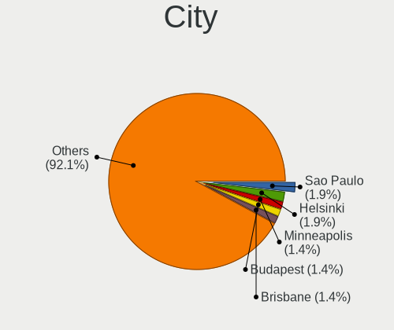

Pop!_OS - Hardware Trends
-------------------------

A project to identify most popular hardware characteristics and track their change
over time based on data collected by Linux users at https://Linux-Hardware.org.

Anyone can contribute to this report by the [hw-probe](https://github.com/linuxhw/hw-probe) tool:

    sudo -E hw-probe -all -upload

This is a report for all computer types. See also reports for [desktops](/Dist/Pop!_OS/Desktop/README.md) and [notebooks](/Dist/Pop!_OS/Notebook/README.md).

This report is for one last month. Overall report since the beginning of time: [TestDays](https://github.com/linuxhw/TestDays)

Period: Jul, 2023.

Contents
--------

* [ System ](#system)
  - [ OS                       ](#os)
  - [ OS Family                ](#os-family)
  - [ Kernel                   ](#kernel)
  - [ Kernel Family            ](#kernel-family)
  - [ Kernel Major Ver.        ](#kernel-major-ver)
  - [ Arch                     ](#arch)
  - [ DE                       ](#de)
  - [ Display Server           ](#display-server)
  - [ Display Manager          ](#display-manager)
  - [ OS Lang                  ](#os-lang)
  - [ Boot Mode                ](#boot-mode)
  - [ Filesystem               ](#filesystem)
  - [ Part. scheme             ](#part-scheme)
  - [ Dual Boot with Linux/BSD ](#dual-boot-with-linuxbsd)
  - [ Dual Boot (Win)          ](#dual-boot-win)

* [ Board ](#board)
  - [ Vendor                   ](#vendor)
  - [ Model                    ](#model)
  - [ Model Family             ](#model-family)
  - [ MFG Year                 ](#mfg-year)
  - [ Form Factor              ](#form-factor)
  - [ Secure Boot              ](#secure-boot)
  - [ Coreboot                 ](#coreboot)
  - [ RAM Size                 ](#ram-size)
  - [ RAM Used                 ](#ram-used)
  - [ Total Drives             ](#total-drives)
  - [ Has CD-ROM               ](#has-cd-rom)
  - [ Has Ethernet             ](#has-ethernet)
  - [ Has WiFi                 ](#has-wifi)
  - [ Has Bluetooth            ](#has-bluetooth)

* [ Location ](#location)
  - [ Country                  ](#country)
  - [ City                     ](#city)

* [ Drives ](#drives)
  - [ Drive Vendor             ](#drive-vendor)
  - [ Drive Model              ](#drive-model)
  - [ HDD Vendor               ](#hdd-vendor)
  - [ SSD Vendor               ](#ssd-vendor)
  - [ Drive Kind               ](#drive-kind)
  - [ Drive Connector          ](#drive-connector)
  - [ Drive Size               ](#drive-size)
  - [ Space Total              ](#space-total)
  - [ Space Used               ](#space-used)
  - [ Malfunc. Drives          ](#malfunc-drives)
  - [ Malfunc. Drive Vendor    ](#malfunc-drive-vendor)
  - [ Malfunc. HDD Vendor      ](#malfunc-hdd-vendor)
  - [ Malfunc. Drive Kind      ](#malfunc-drive-kind)
  - [ Failed Drives            ](#failed-drives)
  - [ Failed Drive Vendor      ](#failed-drive-vendor)
  - [ Drive Status             ](#drive-status)

* [ Storage controller ](#storage-controller)
  - [ Storage Vendor           ](#storage-vendor)
  - [ Storage Model            ](#storage-model)
  - [ Storage Kind             ](#storage-kind)

* [ Processor ](#processor)
  - [ CPU Vendor               ](#cpu-vendor)
  - [ CPU Model                ](#cpu-model)
  - [ CPU Model Family         ](#cpu-model-family)
  - [ CPU Cores                ](#cpu-cores)
  - [ CPU Sockets              ](#cpu-sockets)
  - [ CPU Threads              ](#cpu-threads)
  - [ CPU Op-Modes             ](#cpu-op-modes)
  - [ CPU Microcode            ](#cpu-microcode)
  - [ CPU Microarch            ](#cpu-microarch)

* [ Graphics ](#graphics)
  - [ GPU Vendor               ](#gpu-vendor)
  - [ GPU Model                ](#gpu-model)
  - [ GPU Combo                ](#gpu-combo)
  - [ GPU Driver               ](#gpu-driver)
  - [ GPU Memory               ](#gpu-memory)

* [ Monitor ](#monitor)
  - [ Monitor Vendor           ](#monitor-vendor)
  - [ Monitor Model            ](#monitor-model)
  - [ Monitor Resolution       ](#monitor-resolution)
  - [ Monitor Diagonal         ](#monitor-diagonal)
  - [ Monitor Width            ](#monitor-width)
  - [ Aspect Ratio             ](#aspect-ratio)
  - [ Monitor Area             ](#monitor-area)
  - [ Pixel Density            ](#pixel-density)
  - [ Multiple Monitors        ](#multiple-monitors)

* [ Network ](#network)
  - [ Net Controller Vendor    ](#net-controller-vendor)
  - [ Net Controller Model     ](#net-controller-model)
  - [ Wireless Vendor          ](#wireless-vendor)
  - [ Wireless Model           ](#wireless-model)
  - [ Ethernet Vendor          ](#ethernet-vendor)
  - [ Ethernet Model           ](#ethernet-model)
  - [ Net Controller Kind      ](#net-controller-kind)
  - [ Used Controller          ](#used-controller)
  - [ NICs                     ](#nics)
  - [ IPv6                     ](#ipv6)

* [ Bluetooth ](#bluetooth)
  - [ Bluetooth Vendor         ](#bluetooth-vendor)
  - [ Bluetooth Model          ](#bluetooth-model)

* [ Sound ](#sound)
  - [ Sound Vendor             ](#sound-vendor)
  - [ Sound Model              ](#sound-model)

* [ Memory ](#memory)
  - [ Memory Vendor            ](#memory-vendor)
  - [ Memory Model             ](#memory-model)
  - [ Memory Kind              ](#memory-kind)
  - [ Memory Form Factor       ](#memory-form-factor)
  - [ Memory Size              ](#memory-size)
  - [ Memory Speed             ](#memory-speed)

* [ Printers & scanners ](#printers--scanners)
  - [ Printer Vendor           ](#printer-vendor)
  - [ Printer Model            ](#printer-model)
  - [ Scanner Vendor           ](#scanner-vendor)
  - [ Scanner Model            ](#scanner-model)

* [ Camera ](#camera)
  - [ Camera Vendor            ](#camera-vendor)
  - [ Camera Model             ](#camera-model)

* [ Security ](#security)
  - [ Fingerprint Vendor       ](#fingerprint-vendor)
  - [ Fingerprint Model        ](#fingerprint-model)
  - [ Chipcard Vendor          ](#chipcard-vendor)
  - [ Chipcard Model           ](#chipcard-model)

* [ Unsupported ](#unsupported)
  - [ Unsupported Devices      ](#unsupported-devices)
  - [ Unsupported Device Types ](#unsupported-device-types)

System
------

OS
--

Installed operating systems

| Name          | Computers | Percent |
|---------------|-----------|---------|
| Pop!_OS 22.04 | 197       | 98.5%   |
| Pop!_OS 20.04 | 2         | 1%      |
| Pop!_OS 21.10 | 1         | 0.5%    |

OS Family
---------

OS without a version

| Name    | Computers | Percent |
|---------|-----------|---------|
| Pop!_OS | 200       | 100%    |

Kernel
------

Version of the Linux kernel

| Version                  | Computers | Percent |
|--------------------------|-----------|---------|
| 6.2.6-76060206-generic   | 182       | 91%     |
| 6.3.7-060307-generic     | 2         | 1%      |
| 6.0.12-76060012-generic  | 2         | 1%      |
| 5.19.0-76051900-generic  | 2         | 1%      |
| 5.17.5-76051705-generic  | 2         | 1%      |
| 6.5.0-rc2                | 1         | 0.5%    |
| 6.4.5-x64v2-xanmod1      | 1         | 0.5%    |
| 6.4.3-060403-generic     | 1         | 0.5%    |
| 6.4.2-surface            | 1         | 0.5%    |
| 6.4.0-060400-generic     | 1         | 0.5%    |
| 6.3.9-060309-generic     | 1         | 0.5%    |
| 6.3.8-x64v1-xanmod1      | 1         | 0.5%    |
| 6.2.0-76060200-generic   | 1         | 0.5%    |
| 6.0.2-76060002-generic   | 1         | 0.5%    |
| 5.16.11-76051611-generic | 1         | 0.5%    |

Kernel Family
-------------

Linux kernel without a distro release

| Version | Computers | Percent |
|---------|-----------|---------|
| 6.2.6   | 182       | 91%     |
| 6.3.7   | 2         | 1%      |
| 6.0.12  | 2         | 1%      |
| 5.19.0  | 2         | 1%      |
| 5.17.5  | 2         | 1%      |
| 6.5.0   | 1         | 0.5%    |
| 6.4.5   | 1         | 0.5%    |
| 6.4.3   | 1         | 0.5%    |
| 6.4.2   | 1         | 0.5%    |
| 6.4.0   | 1         | 0.5%    |
| 6.3.9   | 1         | 0.5%    |
| 6.3.8   | 1         | 0.5%    |
| 6.2.0   | 1         | 0.5%    |
| 6.0.2   | 1         | 0.5%    |
| 5.16.11 | 1         | 0.5%    |

Kernel Major Ver.
-----------------

Linux kernel major version

| Version | Computers | Percent |
|---------|-----------|---------|
| 6.2     | 183       | 91.5%   |
| 6.4     | 4         | 2%      |
| 6.3     | 4         | 2%      |
| 6.0     | 3         | 1.5%    |
| 5.19    | 2         | 1%      |
| 5.17    | 2         | 1%      |
| 6.5     | 1         | 0.5%    |
| 5.16    | 1         | 0.5%    |

Arch
----

OS architecture (x86_64, i586, etc.)

| Name   | Computers | Percent |
|--------|-----------|---------|
| x86_64 | 200       | 100%    |

DE
--

Desktop Environment

| Name       | Computers | Percent |
|------------|-----------|---------|
| GNOME      | 185       | 92.5%   |
| X-Cinnamon | 5         | 2.5%    |
| KDE5       | 4         | 2%      |
| Unknown    | 4         | 2%      |
| MATE       | 1         | 0.5%    |
| Cinnamon   | 1         | 0.5%    |

Display Server
--------------

X11 or Wayland

| Name    | Computers | Percent |
|---------|-----------|---------|
| X11     | 186       | 93%     |
| Wayland | 9         | 4.5%    |
| Unknown | 3         | 1.5%    |
| Tty     | 2         | 1%      |

Display Manager
---------------

SDDM, LightDM, etc.

| Name    | Computers | Percent |
|---------|-----------|---------|
| Unknown | 150       | 75%     |
| GDM3    | 48        | 24%     |
| SDDM    | 1         | 0.5%    |
| GDM     | 1         | 0.5%    |

OS Lang
-------

Language

| Lang    | Computers | Percent |
|---------|-----------|---------|
| en_US   | 121       | 60.5%   |
| en_GB   | 15        | 7.5%    |
| pt_BR   | 11        | 5.5%    |
| de_DE   | 7         | 3.5%    |
| es_ES   | 6         | 3%      |
| pl_PL   | 5         | 2.5%    |
| en_CA   | 5         | 2.5%    |
| C       | 4         | 2%      |
| it_IT   | 3         | 1.5%    |
| en_AU   | 3         | 1.5%    |
| Unknown | 3         | 1.5%    |
| pt_PT   | 2         | 1%      |
| ja_JP   | 2         | 1%      |
| da_DK   | 2         | 1%      |
| zh_CN   | 1         | 0.5%    |
| ru_UA   | 1         | 0.5%    |
| ru_RU   | 1         | 0.5%    |
| fr_FR   | 1         | 0.5%    |
| fr_CA   | 1         | 0.5%    |
| fi_FI   | 1         | 0.5%    |
| es_SV   | 1         | 0.5%    |
| es_CL   | 1         | 0.5%    |
| en_ZA   | 1         | 0.5%    |
| en_DK   | 1         | 0.5%    |
| de_CH   | 1         | 0.5%    |

Boot Mode
---------

EFI or BIOS

| Mode | Computers | Percent |
|------|-----------|---------|
| BIOS | 150       | 75%     |
| EFI  | 50        | 25%     |

Filesystem
----------

Type of filesystem

| Type    | Computers | Percent |
|---------|-----------|---------|
| Ext4    | 194       | 97%     |
| Overlay | 4         | 2%      |
| Btrfs   | 2         | 1%      |

Part. scheme
------------

Scheme of partitioning

| Type    | Computers | Percent |
|---------|-----------|---------|
| Unknown | 147       | 73.5%   |
| GPT     | 50        | 25%     |
| MBR     | 3         | 1.5%    |

Dual Boot with Linux/BSD
------------------------

Hosting more than one Linux/BSD

| Dual boot | Computers | Percent |
|-----------|-----------|---------|
| No        | 194       | 97%     |
| Yes       | 6         | 3%      |

Dual Boot (Win)
---------------

Hosting Linux and Windows

| Dual boot | Computers | Percent |
|-----------|-----------|---------|
| No        | 178       | 89%     |
| Yes       | 22        | 11%     |

Board
-----

Vendor
------

Motherboard manufacturer

| Name                | Computers | Percent |
|---------------------|-----------|---------|
| ASUSTek Computer    | 38        | 19%     |
| Dell                | 27        | 13.5%   |
| Hewlett-Packard     | 24        | 12%     |
| Lenovo              | 20        | 10%     |
| Apple               | 16        | 8%      |
| Gigabyte Technology | 15        | 7.5%    |
| MSI                 | 14        | 7%      |
| Acer                | 11        | 5.5%    |
| System76            | 5         | 2.5%    |
| ASRock              | 5         | 2.5%    |
| Notebook            | 3         | 1.5%    |
| Intel               | 3         | 1.5%    |
| Samsung Electronics | 2         | 1%      |
| Unknown             | 2         | 1%      |
| Toshiba             | 1         | 0.5%    |
| Timi                | 1         | 0.5%    |
| Sony                | 1         | 0.5%    |
| Semp Toshiba        | 1         | 0.5%    |
| Schenker            | 1         | 0.5%    |
| Positivo            | 1         | 0.5%    |
| PC Specialist       | 1         | 0.5%    |
| Panasonic           | 1         | 0.5%    |
| Microsoft           | 1         | 0.5%    |
| MACHINIST           | 1         | 0.5%    |
| LG Electronics      | 1         | 0.5%    |
| HUAWEI              | 1         | 0.5%    |
| Google              | 1         | 0.5%    |
| Biostar             | 1         | 0.5%    |
| Alienware           | 1         | 0.5%    |

Model
-----

Motherboard model

| Name                                | Computers | Percent |
|-------------------------------------|-----------|---------|
| ASUS All Series                     | 3         | 1.5%    |
| HP Laptop 15-da0xxx                 | 2         | 1%      |
| Gigabyte A320M-S2H                  | 2         | 1%      |
| ASUS ROG Strix G713PV_G713PV        | 2         | 1%      |
| ASUS ROG STRIX B550-F GAMING        | 2         | 1%      |
| Apple MacBookPro8,1                 | 2         | 1%      |
| Unknown                             | 2         | 1%      |
| Toshiba Satellite L750              | 1         | 0.5%    |
| Timi Xiaomi NoteBook Pro            | 1         | 0.5%    |
| System76 Thelio Mira                | 1         | 0.5%    |
| System76 Serval WS                  | 1         | 0.5%    |
| System76 Pangolin                   | 1         | 0.5%    |
| System76 Oryx Pro                   | 1         | 0.5%    |
| System76 Darter Pro                 | 1         | 0.5%    |
| Sony SVF1521A6EW                    | 1         | 0.5%    |
| Semp Toshiba IS 1413G               | 1         | 0.5%    |
| Schenker XMG NEO (CML/E20)          | 1         | 0.5%    |
| Samsung 350V5C/351V5C/3540VC/3440VC | 1         | 0.5%    |
| Samsung 300E5M/300E5L               | 1         | 0.5%    |
| Positivo POS-MIH61CF                | 1         | 0.5%    |
| PC Specialist Standard              | 1         | 0.5%    |
| Panasonic FZ55-1                    | 1         | 0.5%    |
| Notebook P7xxTM1                    | 1         | 0.5%    |
| Notebook NP5x_NP6x_NP7xRNJ_RNH      | 1         | 0.5%    |
| Notebook NH5x_7xDPx                 | 1         | 0.5%    |
| MSI NY523AA-ABM s5230la             | 1         | 0.5%    |
| MSI MS-7E07                         | 1         | 0.5%    |
| MSI MS-7E01                         | 1         | 0.5%    |
| MSI MS-7D76                         | 1         | 0.5%    |
| MSI MS-7C96                         | 1         | 0.5%    |
| MSI MS-7C94                         | 1         | 0.5%    |
| MSI MS-7B48                         | 1         | 0.5%    |
| MSI MS-7A34                         | 1         | 0.5%    |
| MSI MS-7850                         | 1         | 0.5%    |
| MSI Katana GF66 12UC                | 1         | 0.5%    |
| MSI GT72VR 6RD                      | 1         | 0.5%    |
| MSI GS66 Stealth 10SE               | 1         | 0.5%    |
| MSI GF63 Thin 10SCXR                | 1         | 0.5%    |
| MSI GF63 Thin 10SC                  | 1         | 0.5%    |
| Microsoft Surface Pro 6             | 1         | 0.5%    |

Model Family
------------

Motherboard model prefix

| Name               | Computers | Percent |
|--------------------|-----------|---------|
| ASUS ROG           | 16        | 8%      |
| Lenovo ThinkPad    | 9         | 4.5%    |
| Dell Latitude      | 8         | 4%      |
| Dell Inspiron      | 7         | 3.5%    |
| Acer Aspire        | 5         | 2.5%    |
| Lenovo IdeaPad     | 4         | 2%      |
| HP Laptop          | 4         | 2%      |
| HP EliteBook       | 4         | 2%      |
| Dell Precision     | 4         | 2%      |
| HP Pavilion        | 3         | 1.5%    |
| HP Compaq          | 3         | 1.5%    |
| Gigabyte A320M-S2H | 3         | 1.5%    |
| Dell XPS           | 3         | 1.5%    |
| ASUS VivoBook      | 3         | 1.5%    |
| ASUS TUF           | 3         | 1.5%    |
| ASUS PRIME         | 3         | 1.5%    |
| ASUS ASUS          | 3         | 1.5%    |
| ASUS All           | 3         | 1.5%    |
| MSI GF63           | 2         | 1%      |
| Lenovo Yoga        | 2         | 1%      |
| Lenovo Legion      | 2         | 1%      |
| HP ZBook           | 2         | 1%      |
| HP OMEN            | 2         | 1%      |
| HP ENVY            | 2         | 1%      |
| Gigabyte B550      | 2         | 1%      |
| Dell G15           | 2         | 1%      |
| Apple MacBookPro8  | 2         | 1%      |
| Acer Swift         | 2         | 1%      |
| Acer Nitro         | 2         | 1%      |
| Unknown            | 2         | 1%      |
| Toshiba Satellite  | 1         | 0.5%    |
| Timi Xiaomi        | 1         | 0.5%    |
| System76 Thelio    | 1         | 0.5%    |
| System76 Serval    | 1         | 0.5%    |
| System76 Pangolin  | 1         | 0.5%    |
| System76 Oryx      | 1         | 0.5%    |
| System76 Darter    | 1         | 0.5%    |
| Sony SVF1521A6EW   | 1         | 0.5%    |
| Semp Toshiba IS    | 1         | 0.5%    |
| Schenker XMG       | 1         | 0.5%    |

MFG Year
--------

Motherboard manufacture year

| Year | Computers | Percent |
|------|-----------|---------|
| 2020 | 30        | 15%     |
| 2022 | 23        | 11.5%   |
| 2021 | 22        | 11%     |
| 2019 | 21        | 10.5%   |
| 2018 | 20        | 10%     |
| 2023 | 11        | 5.5%    |
| 2017 | 11        | 5.5%    |
| 2013 | 10        | 5%      |
| 2012 | 10        | 5%      |
| 2016 | 9         | 4.5%    |
| 2015 | 8         | 4%      |
| 2011 | 8         | 4%      |
| 2014 | 6         | 3%      |
| 2009 | 6         | 3%      |
| 2010 | 4         | 2%      |
| 2007 | 1         | 0.5%    |

Form Factor
-----------

Physical design of the computer

| Name        | Computers | Percent |
|-------------|-----------|---------|
| Notebook    | 119       | 59.5%   |
| Desktop     | 66        | 33%     |
| Convertible | 5         | 2.5%    |
| Mini pc     | 4         | 2%      |
| All in one  | 4         | 2%      |
| Tablet      | 2         | 1%      |

Secure Boot
-----------

Enabled or disabled

| State    | Computers | Percent |
|----------|-----------|---------|
| Disabled | 200       | 100%    |

Coreboot
--------

Have coreboot on board

| Used | Computers | Percent |
|------|-----------|---------|
| No   | 197       | 98.5%   |
| Yes  | 3         | 1.5%    |

RAM Size
--------

Total RAM memory

| Size in GB  | Computers | Percent |
|-------------|-----------|---------|
| 32.01-64.0  | 47        | 23.5%   |
| 16.01-24.0  | 43        | 21.5%   |
| 4.01-8.0    | 41        | 20.5%   |
| 8.01-16.0   | 26        | 13%     |
| 64.01-256.0 | 18        | 9%      |
| 3.01-4.0    | 16        | 8%      |
| 24.01-32.0  | 8         | 4%      |
| 1.01-2.0    | 1         | 0.5%    |

RAM Used
--------

Used RAM memory

| Used GB    | Computers | Percent |
|------------|-----------|---------|
| 4.01-8.0   | 87        | 43.5%   |
| 8.01-16.0  | 36        | 18%     |
| 3.01-4.0   | 35        | 17.5%   |
| 2.01-3.0   | 27        | 13.5%   |
| 1.01-2.0   | 8         | 4%      |
| 16.01-24.0 | 6         | 3%      |
| 0.51-1.0   | 1         | 0.5%    |

Total Drives
------------

Number of drives on board

| Drives | Computers | Percent |
|--------|-----------|---------|
| 1      | 116       | 58%     |
| 2      | 48        | 24%     |
| 3      | 17        | 8.5%    |
| 4      | 12        | 6%      |
| 5      | 4         | 2%      |
| 0      | 3         | 1.5%    |

Has CD-ROM
----------

Has CD-ROM on board

| Presented | Computers | Percent |
|-----------|-----------|---------|
| No        | 153       | 76.5%   |
| Yes       | 47        | 23.5%   |

Has Ethernet
------------

Has Ethernet on board

| Presented | Computers | Percent |
|-----------|-----------|---------|
| Yes       | 175       | 87.5%   |
| No        | 25        | 12.5%   |

Has WiFi
--------

Has WiFi module

| Presented | Computers | Percent |
|-----------|-----------|---------|
| Yes       | 170       | 85%     |
| No        | 30        | 15%     |

Has Bluetooth
-------------

Has Bluetooth module

| Presented | Computers | Percent |
|-----------|-----------|---------|
| Yes       | 144       | 72%     |
| No        | 56        | 28%     |

Location
--------

Country
-------

Geographic location (country)

| Country      | Computers | Percent |
|--------------|-----------|---------|
| USA          | 65        | 32.5%   |
| Brazil       | 19        | 9.5%    |
| Canada       | 13        | 6.5%    |
| Germany      | 11        | 5.5%    |
| UK           | 8         | 4%      |
| Poland       | 6         | 3%      |
| Italy        | 6         | 3%      |
| Australia    | 6         | 3%      |
| Spain        | 5         | 2.5%    |
| Portugal     | 4         | 2%      |
| Netherlands  | 4         | 2%      |
| Mexico       | 3         | 1.5%    |
| Japan        | 3         | 1.5%    |
| India        | 3         | 1.5%    |
| Austria      | 3         | 1.5%    |
| Sweden       | 2         | 1%      |
| Russia       | 2         | 1%      |
| Panama       | 2         | 1%      |
| Malaysia     | 2         | 1%      |
| Israel       | 2         | 1%      |
| Finland      | 2         | 1%      |
| Denmark      | 2         | 1%      |
| Croatia      | 2         | 1%      |
| Chile        | 2         | 1%      |
| Bulgaria     | 2         | 1%      |
| Argentina    | 2         | 1%      |
| Ukraine      | 1         | 0.5%    |
| Turkey       | 1         | 0.5%    |
| Switzerland  | 1         | 0.5%    |
| South Africa | 1         | 0.5%    |
| Slovakia     | 1         | 0.5%    |
| Serbia       | 1         | 0.5%    |
| Romania      | 1         | 0.5%    |
| Qatar        | 1         | 0.5%    |
| Philippines  | 1         | 0.5%    |
| Peru         | 1         | 0.5%    |
| Norway       | 1         | 0.5%    |
| Kenya        | 1         | 0.5%    |
| Jamaica      | 1         | 0.5%    |
| Hungary      | 1         | 0.5%    |

City
----

Geographic location (city)

| City           | Computers | Percent |
|----------------|-----------|---------|
| Warsaw         | 3         | 1.5%    |
| Sao Paulo      | 3         | 1.5%    |
| San Francisco  | 3         | 1.5%    |
| Rio de Janeiro | 3         | 1.5%    |
| Lisbon         | 3         | 1.5%    |
| Vienna         | 2         | 1%      |
| Valencia       | 2         | 1%      |
| Seattle        | 2         | 1%      |
| Panama City    | 2         | 1%      |
| Orlando        | 2         | 1%      |
| Los Angeles    | 2         | 1%      |
| Livermore      | 2         | 1%      |
| Kelowna        | 2         | 1%      |
| Edinburgh      | 2         | 1%      |
| Denver         | 2         | 1%      |
| Delaplane      | 2         | 1%      |
| Bengaluru      | 2         | 1%      |
| Belo Horizonte | 2         | 1%      |
| Bamberg        | 2         | 1%      |
| Yokosuka       | 1         | 0.5%    |
| Wolvega        | 1         | 0.5%    |
| Willow Grove   | 1         | 0.5%    |
| Wetaskiwin     | 1         | 0.5%    |
| West Jordan    | 1         | 0.5%    |
| Wassenaar      | 1         | 0.5%    |
| Walsall        | 1         | 0.5%    |
| Walla Walla    | 1         | 0.5%    |
| Waco           | 1         | 0.5%    |
| Vinkovci       | 1         | 0.5%    |
| Vila-real      | 1         | 0.5%    |
| Vigo           | 1         | 0.5%    |
| Venice         | 1         | 0.5%    |
| Vendone        | 1         | 0.5%    |
| Varaždin      | 1         | 0.5%    |
| Trnava         | 1         | 0.5%    |
| Toluca         | 1         | 0.5%    |
| Tokyo          | 1         | 0.5%    |
| Theodore       | 1         | 0.5%    |
| Temuco         | 1         | 0.5%    |
| Tegucigalpa    | 1         | 0.5%    |

Drives
------

Drive Vendor
------------

Hard drive vendors

| Vendor                      | Computers | Drives | Percent |
|-----------------------------|-----------|--------|---------|
| Samsung Electronics         | 51        | 61     | 16.5%   |
| SanDisk                     | 30        | 30     | 9.71%   |
| Seagate                     | 28        | 32     | 9.06%   |
| WDC                         | 27        | 30     | 8.74%   |
| Kingston                    | 20        | 20     | 6.47%   |
| Toshiba                     | 15        | 15     | 4.85%   |
| SK hynix                    | 15        | 15     | 4.85%   |
| Intel                       | 15        | 18     | 4.85%   |
| Micron Technology           | 12        | 12     | 3.88%   |
| Apple                       | 11        | 12     | 3.56%   |
| Crucial                     | 10        | 11     | 3.24%   |
| Micron/Crucial Technology   | 8         | 9      | 2.59%   |
| Phison Electronics          | 7         | 8      | 2.27%   |
| Kingston Technology Company | 6         | 6      | 1.94%   |
| China                       | 5         | 6      | 1.62%   |
| Unknown                     | 4         | 5      | 1.29%   |
| KIOXIA                      | 4         | 4      | 1.29%   |
| A-DATA Technology           | 4         | 4      | 1.29%   |
| Hitachi                     | 3         | 3      | 0.97%   |
| ADATA Technology            | 3         | 3      | 0.97%   |
| Transcend                   | 2         | 2      | 0.65%   |
| SPCC                        | 2         | 2      | 0.65%   |
| Silicon Motion              | 2         | 2      | 0.65%   |
| Netac                       | 2         | 2      | 0.65%   |
| JMicron Technology          | 2         | 2      | 0.65%   |
| Unknown                     | 2         | 2      | 0.65%   |
| Verbatim                    | 1         | 1      | 0.32%   |
| UMIS                        | 1         | 1      | 0.32%   |
| TECH                        | 1         | 1      | 0.32%   |
| Solid State Storage         | 1         | 1      | 0.32%   |
| SABRENT                     | 1         | 1      | 0.32%   |
| ROG                         | 1         | 1      | 0.32%   |
| PNY                         | 1         | 1      | 0.32%   |
| MAXIO Technology (Hangzhou) | 1         | 1      | 0.32%   |
| MAX                         | 1         | 1      | 0.32%   |
| LITEONIT                    | 1         | 1      | 0.32%   |
| Lenovo                      | 1         | 1      | 0.32%   |
| KingSpec                    | 1         | 1      | 0.32%   |
| Intenso                     | 1         | 1      | 0.32%   |
| Hikvision                   | 1         | 1      | 0.32%   |

Drive Model
-----------

Hard drive models

| Model                                               | Computers | Percent |
|-----------------------------------------------------|-----------|---------|
| Samsung NVMe SSD Controller SM981/PM981/PM983 500GB | 9         | 2.76%   |
| Samsung NVMe SSD Controller PM9A1/PM9A3/980PRO 1TB  | 9         | 2.76%   |
| Phison E12 NVMe Controller 2TB                      | 5         | 1.53%   |
| Micron/Crucial P2 NVMe PCIe SSD 1TB                 | 5         | 1.53%   |
| Kingston SA400S37240G 240GB SSD                     | 5         | 1.53%   |
| Intel SSD 660P Series 1024GB                        | 5         | 1.53%   |
| Samsung SSD 860 EVO 1TB                             | 4         | 1.23%   |
| Seagate ST31000524AS 1TB                            | 3         | 0.92%   |
| Sandisk WD Black SN850 1TB                          | 3         | 0.92%   |
| Samsung SSD 990 PRO 2TB                             | 3         | 0.92%   |
| Micron 2400_MTFDKBA1T0QFM 1024GB                    | 3         | 0.92%   |
| Kingston SV300S37A120G 120GB SSD                    | 3         | 0.92%   |
| Kingston SA400S37120G 120GB SSD                     | 3         | 0.92%   |
| Crucial CT1000BX500SSD1 1TB                         | 3         | 0.92%   |
| Apple SSD SM0256F 256GB                             | 3         | 0.92%   |
| WDC WDS100T2B0A-00SM50 1TB SSD                      | 2         | 0.61%   |
| Unknown MMC Card  16GB                              | 2         | 0.61%   |
| Toshiba MQ04ABF100 1TB                              | 2         | 0.61%   |
| Toshiba MQ01ACF050 500GB                            | 2         | 0.61%   |
| Toshiba MQ01ABF050 500GB                            | 2         | 0.61%   |
| Toshiba MQ01ABD100 1TB                              | 2         | 0.61%   |
| Toshiba DT01ACA100 1TB                              | 2         | 0.61%   |
| SK hynix BC711 NVMe 512GB                           | 2         | 0.61%   |
| SK hynix BC501 NVMe Solid State Drive 512GB         | 2         | 0.61%   |
| Seagate ST500DM002-1BD142 500GB                     | 2         | 0.61%   |
| Seagate ST1000LM035-1RK172 1TB                      | 2         | 0.61%   |
| Seagate ST1000DM010-2EP102 1TB                      | 2         | 0.61%   |
| Sandisk WD_BLACK SN770 2TB                          | 2         | 0.61%   |
| Sandisk WD Black SN750 / PC SN730 NVMe SSD 1024GB   | 2         | 0.61%   |
| SanDisk SSD PLUS 480GB                              | 2         | 0.61%   |
| Sandisk PC SN520 NVMe SSD 512GB                     | 2         | 0.61%   |
| SanDisk NVMe SSD Drive 1TB                          | 2         | 0.61%   |
| Samsung SSD 970 EVO Plus 2TB                        | 2         | 0.61%   |
| Samsung SSD 870 QVO 1TB                             | 2         | 0.61%   |
| Samsung SSD 840 Series 120GB                        | 2         | 0.61%   |
| Samsung MZVL4512HBLU-00BTW 512GB                    | 2         | 0.61%   |
| Phison T-FORCE TM8FPZ001T 1TB                       | 2         | 0.61%   |
| Micron 1100 SATA 256GB SSD                          | 2         | 0.61%   |
| Kingston Company SNV2S1000G 1TB                     | 2         | 0.61%   |
| Kingston SV300S37A240G 240GB SSD                    | 2         | 0.61%   |

HDD Vendor
----------

Hard disk drive vendors

| Vendor              | Computers | Drives | Percent |
|---------------------|-----------|--------|---------|
| Seagate             | 27        | 31     | 43.55%  |
| WDC                 | 14        | 17     | 22.58%  |
| Toshiba             | 12        | 12     | 19.35%  |
| Hitachi             | 3         | 3      | 4.84%   |
| Samsung Electronics | 2         | 2      | 3.23%   |
| JMicron Technology  | 1         | 1      | 1.61%   |
| HGST                | 1         | 1      | 1.61%   |
| Apple               | 1         | 1      | 1.61%   |
| Unknown             | 1         | 1      | 1.61%   |

SSD Vendor
----------

Solid state drive vendors

| Vendor              | Computers | Drives | Percent |
|---------------------|-----------|--------|---------|
| Samsung Electronics | 17        | 19     | 17.17%  |
| Kingston            | 17        | 17     | 17.17%  |
| SanDisk             | 10        | 10     | 10.1%   |
| Crucial             | 8         | 8      | 8.08%   |
| Apple               | 8         | 8      | 8.08%   |
| WDC                 | 7         | 7      | 7.07%   |
| China               | 5         | 6      | 5.05%   |
| Micron Technology   | 4         | 4      | 4.04%   |
| SK hynix            | 3         | 3      | 3.03%   |
| A-DATA Technology   | 3         | 3      | 3.03%   |
| Transcend           | 2         | 2      | 2.02%   |
| Intel               | 2         | 3      | 2.02%   |
| Verbatim            | 1         | 1      | 1.01%   |
| SPCC                | 1         | 1      | 1.01%   |
| PNY                 | 1         | 1      | 1.01%   |
| Netac               | 1         | 1      | 1.01%   |
| MAX                 | 1         | 1      | 1.01%   |
| LITEONIT            | 1         | 1      | 1.01%   |
| Lenovo              | 1         | 1      | 1.01%   |
| KingSpec            | 1         | 1      | 1.01%   |
| Intenso             | 1         | 1      | 1.01%   |
| Gigabyte Technology | 1         | 1      | 1.01%   |
| Drevo               | 1         | 1      | 1.01%   |
| CT2000P3            | 1         | 1      | 1.01%   |
| ASMT                | 1         | 1      | 1.01%   |

Drive Kind
----------

HDD or SSD

| Kind    | Computers | Drives | Percent |
|---------|-----------|--------|---------|
| NVMe    | 119       | 155    | 44.57%  |
| SSD     | 87        | 103    | 32.58%  |
| HDD     | 54        | 69     | 20.22%  |
| MMC     | 4         | 5      | 1.5%    |
| Unknown | 3         | 3      | 1.12%   |

Drive Connector
---------------

SATA, SAS, NVMe, etc.

| Type | Computers | Drives | Percent |
|------|-----------|--------|---------|
| NVMe | 118       | 154    | 47.58%  |
| SATA | 117       | 164    | 47.18%  |
| SAS  | 9         | 12     | 3.63%   |
| MMC  | 4         | 5      | 1.61%   |

Drive Size
----------

Size of hard drive

| Size in TB | Computers | Drives | Percent |
|------------|-----------|--------|---------|
| 0.01-0.5   | 82        | 97     | 56.55%  |
| 0.51-1.0   | 43        | 52     | 29.66%  |
| 1.01-2.0   | 11        | 13     | 7.59%   |
| 3.01-4.0   | 4         | 5      | 2.76%   |
| 4.01-10.0  | 3         | 3      | 2.07%   |
| 2.01-3.0   | 1         | 1      | 0.69%   |
| 10.01-20.0 | 1         | 1      | 0.69%   |

Space Total
-----------

Amount of disk space available on the file system

| Size in GB     | Computers | Percent |
|----------------|-----------|---------|
| 101-250        | 63        | 31.5%   |
| 251-500        | 42        | 21%     |
| 501-1000       | 42        | 21%     |
| 1001-2000      | 21        | 10.5%   |
| 2001-3000      | 11        | 5.5%    |
| More than 3000 | 8         | 4%      |
| 51-100         | 6         | 3%      |
| 1-20           | 4         | 2%      |
| Unknown        | 3         | 1.5%    |

Space Used
----------

Amount of used disk space

| Used GB        | Computers | Percent |
|----------------|-----------|---------|
| 1-20           | 51        | 25.5%   |
| 21-50          | 39        | 19.5%   |
| 101-250        | 34        | 17%     |
| 251-500        | 26        | 13%     |
| 51-100         | 19        | 9.5%    |
| 501-1000       | 14        | 7%      |
| 1001-2000      | 10        | 5%      |
| Unknown        | 3         | 1.5%    |
| More than 3000 | 2         | 1%      |
| 2001-3000      | 2         | 1%      |

Malfunc. Drives
---------------

Drive models with a malfunction

| Model                          | Computers | Drives | Percent |
|--------------------------------|-----------|--------|---------|
| WDC WDS100T2B0B-00YS70 1TB SSD | 1         | 1      | 33.33%  |
| Seagate ST4000LM024-2AN17V 4TB | 1         | 1      | 33.33%  |
| Seagate ST3250310AS 250GB      | 1         | 1      | 33.33%  |

Malfunc. Drive Vendor
---------------------

Vendors of faulty drives

| Vendor  | Computers | Drives | Percent |
|---------|-----------|--------|---------|
| Seagate | 2         | 2      | 66.67%  |
| WDC     | 1         | 1      | 33.33%  |

Malfunc. HDD Vendor
-------------------

Vendors of faulty HDD drives

| Vendor  | Computers | Drives | Percent |
|---------|-----------|--------|---------|
| Seagate | 2         | 2      | 100%    |

Malfunc. Drive Kind
-------------------

Kinds of faulty drives

| Kind | Computers | Drives | Percent |
|------|-----------|--------|---------|
| HDD  | 2         | 2      | 66.67%  |
| SSD  | 1         | 1      | 33.33%  |

Failed Drives
-------------

Failed drive models

Zero info for selected period =(

Failed Drive Vendor
-------------------

Failed drive vendors

Zero info for selected period =(

Drive Status
------------

Number of failed and malfunc. drives

| Status   | Computers | Drives | Percent |
|----------|-----------|--------|---------|
| Detected | 146       | 249    | 71.22%  |
| Works    | 56        | 83     | 27.32%  |
| Malfunc  | 3         | 3      | 1.46%   |

Storage controller
------------------

Storage Vendor
--------------

Storage controller vendors

| Vendor                         | Computers | Percent |
|--------------------------------|-----------|---------|
| Intel                          | 115       | 38.46%  |
| AMD                            | 45        | 15.05%  |
| Samsung Electronics            | 39        | 13.04%  |
| SanDisk                        | 26        | 8.7%    |
| SK hynix                       | 12        | 4.01%   |
| Micron/Crucial Technology      | 10        | 3.34%   |
| Kingston Technology Company    | 9         | 3.01%   |
| Micron Technology              | 8         | 2.68%   |
| Phison Electronics             | 7         | 2.34%   |
| KIOXIA                         | 4         | 1.34%   |
| ADATA Technology               | 4         | 1.34%   |
| Toshiba America Info Systems   | 3         | 1%      |
| Silicon Motion                 | 2         | 0.67%   |
| Nvidia                         | 2         | 0.67%   |
| MAXIO Technology (Hangzhou)    | 2         | 0.67%   |
| ASMedia Technology             | 2         | 0.67%   |
| Apple                          | 2         | 0.67%   |
| Union Memory (Shenzhen)        | 1         | 0.33%   |
| Solidigm                       | 1         | 0.33%   |
| Solid State Storage Technology | 1         | 0.33%   |
| Seagate Technology             | 1         | 0.33%   |
| Realtek Semiconductor          | 1         | 0.33%   |
| Netac Technology               | 1         | 0.33%   |
| Marvell Technology Group       | 1         | 0.33%   |

Storage Model
-------------

Storage controller models

| Model                                                                          | Computers | Percent |
|--------------------------------------------------------------------------------|-----------|---------|
| AMD FCH SATA Controller [AHCI mode]                                            | 31        | 9.45%   |
| Samsung NVMe SSD Controller SM981/PM981/PM983                                  | 15        | 4.57%   |
| Samsung NVMe SSD Controller PM9A1/PM9A3/980PRO                                 | 11        | 3.35%   |
| Intel Volume Management Device NVMe RAID Controller                            | 11        | 3.35%   |
| AMD 500 Series Chipset SATA Controller                                         | 9         | 2.74%   |
| Intel Sunrise Point-LP SATA Controller [AHCI mode]                             | 8         | 2.44%   |
| Intel 82801 Mobile SATA Controller [RAID mode]                                 | 8         | 2.44%   |
| SK hynix Gold P31/BC711/PC711 NVMe Solid State Drive                           | 7         | 2.13%   |
| Micron/Crucial P2 [Nick P2] / P3 / P3 Plus NVMe PCIe SSD (DRAM-less)           | 7         | 2.13%   |
| Intel SSD 660P Series                                                          | 7         | 2.13%   |
| Intel 6 Series/C200 Series Chipset Family 6 port Mobile SATA AHCI Controller   | 7         | 2.13%   |
| Intel Comet Lake SATA AHCI Controller                                          | 6         | 1.83%   |
| Intel 7 Series Chipset Family 6-port SATA Controller [AHCI mode]               | 6         | 1.83%   |
| Intel 200 Series PCH SATA controller [AHCI mode]                               | 6         | 1.83%   |
| AMD 400 Series Chipset SATA Controller                                         | 6         | 1.83%   |
| SanDisk WD Black SN750 / PC SN730 NVMe SSD                                     | 5         | 1.52%   |
| Phison E12 NVMe Controller                                                     | 5         | 1.52%   |
| Intel SATA Controller [RAID mode]                                              | 5         | 1.52%   |
| Intel 8 Series/C220 Series Chipset Family 6-port SATA Controller 1 [AHCI mode] | 5         | 1.52%   |
| Intel 400 Series Chipset Family SATA AHCI Controller                           | 5         | 1.52%   |
| SanDisk WD Black SN770 / PC SN740 256GB / PC SN560 (DRAM-less) NVMe SSD        | 4         | 1.22%   |
| Micron 2400 NVMe SSD (DRAM-less)                                               | 4         | 1.22%   |
| Intel Cannon Lake Mobile PCH SATA AHCI Controller                              | 4         | 1.22%   |
| Intel 700 Series Chipset Family SATA AHCI Controller                           | 4         | 1.22%   |
| SanDisk WD PC SN810 / Black SN850 NVMe SSD                                     | 3         | 0.91%   |
| Samsung S4LN053X01 AHCI SSD Controller(Apple slot)                             | 3         | 0.91%   |
| Samsung NVMe SSD Controller S4LV008[Pascal]                                    | 3         | 0.91%   |
| Samsung NVMe SSD Controller PM9B1                                              | 3         | 0.91%   |
| Samsung NVMe SSD Controller 980                                                | 3         | 0.91%   |
| Kingston Company Company Non-Volatile memory controller                        | 3         | 0.91%   |
| Intel Tiger Lake-LP SATA Controller                                            | 3         | 0.91%   |
| Intel Q170/Q150/B150/H170/H110/Z170/CM236 Chipset SATA Controller [AHCI Mode]  | 3         | 0.91%   |
| Intel 7 Series/C210 Series Chipset Family 6-port SATA Controller [AHCI mode]   | 3         | 0.91%   |
| AMD FCH SATA Controller D                                                      | 3         | 0.91%   |
| Toshiba America Info Systems XG5 NVMe SSD Controller                           | 2         | 0.61%   |
| SK hynix BC511 NVMe SSD                                                        | 2         | 0.61%   |
| SK hynix BC501 NVMe Solid State Drive                                          | 2         | 0.61%   |
| Sandisk Western Digital WD Black SN850X NVMe SSD                               | 2         | 0.61%   |
| SanDisk WD Blue SN570 NVMe SSD 1TB                                             | 2         | 0.61%   |
| SanDisk WD Blue SN550 NVMe SSD                                                 | 2         | 0.61%   |

Storage Kind
------------

Kind of storage controller (IDE, SATA, NVMe, SAS, ...)

| Kind | Computers | Percent |
|------|-----------|---------|
| SATA | 133       | 46.83%  |
| NVMe | 118       | 41.55%  |
| RAID | 24        | 8.45%   |
| IDE  | 9         | 3.17%   |

Processor
---------

CPU Vendor
----------

Processor vendors

| Vendor | Computers | Percent |
|--------|-----------|---------|
| Intel  | 139       | 69.5%   |
| AMD    | 61        | 30.5%   |

CPU Model
---------

Processor models

| Model                                         | Computers | Percent |
|-----------------------------------------------|-----------|---------|
| Intel Core i7-9750H CPU @ 2.60GHz             | 4         | 2%      |
| Intel Core i7-10750H CPU @ 2.60GHz            | 4         | 2%      |
| Intel 11th Gen Core i5-1135G7 @ 2.40GHz       | 4         | 2%      |
| Intel Core i7-8565U CPU @ 1.80GHz             | 3         | 1.5%    |
| Intel Core i7-3770 CPU @ 3.40GHz              | 3         | 1.5%    |
| Intel Core i7-10510U CPU @ 1.80GHz            | 3         | 1.5%    |
| Intel Core i5-8250U CPU @ 1.60GHz             | 3         | 1.5%    |
| Intel Core i5-7200U CPU @ 2.50GHz             | 3         | 1.5%    |
| Intel Core i5-10210U CPU @ 1.60GHz            | 3         | 1.5%    |
| AMD Ryzen 9 7945HX with Radeon Graphics       | 3         | 1.5%    |
| AMD Ryzen 7 5700G with Radeon Graphics        | 3         | 1.5%    |
| Intel Core i7-8665U CPU @ 1.90GHz             | 2         | 1%      |
| Intel Core i7-8550U CPU @ 1.80GHz             | 2         | 1%      |
| Intel Core i7-6700HQ CPU @ 2.60GHz            | 2         | 1%      |
| Intel Core i7-4790K CPU @ 4.00GHz             | 2         | 1%      |
| Intel Core i7-4770 CPU @ 3.40GHz              | 2         | 1%      |
| Intel Core i5-4310U CPU @ 2.00GHz             | 2         | 1%      |
| Intel 13th Gen Core i7-13700H                 | 2         | 1%      |
| Intel 11th Gen Core i7-1185G7 @ 3.00GHz       | 2         | 1%      |
| AMD Ryzen 9 6900HS with Radeon Graphics       | 2         | 1%      |
| AMD Ryzen 9 5950X 16-Core Processor           | 2         | 1%      |
| AMD Ryzen 9 5900X 12-Core Processor           | 2         | 1%      |
| AMD Ryzen 7 PRO 5850U with Radeon Graphics    | 2         | 1%      |
| AMD Ryzen 7 5800X 8-Core Processor            | 2         | 1%      |
| AMD Ryzen 7 5700X 8-Core Processor            | 2         | 1%      |
| AMD Ryzen 7 4700U with Radeon Graphics        | 2         | 1%      |
| AMD Ryzen 7 3800XT 8-Core Processor           | 2         | 1%      |
| AMD Ryzen 7 3700U with Radeon Vega Mobile Gfx | 2         | 1%      |
| AMD Ryzen 5 5600X 6-Core Processor            | 2         | 1%      |
| Intel Xeon CPU E5-2673 v3 @ 2.40GHz           | 1         | 0.5%    |
| Intel Xeon CPU E5-2670 v3 @ 2.30GHz           | 1         | 0.5%    |
| Intel Xeon CPU E5-1620 v2 @ 3.70GHz           | 1         | 0.5%    |
| Intel Xeon CPU E3-1230 V2 @ 3.30GHz           | 1         | 0.5%    |
| Intel Pentium Dual-Core CPU T4500 @ 2.30GHz   | 1         | 0.5%    |
| Intel Pentium CPU G4400 @ 3.30GHz             | 1         | 0.5%    |
| Intel Pentium CPU G2030T @ 2.60GHz            | 1         | 0.5%    |
| Intel Pentium CPU 2117U @ 1.80GHz             | 1         | 0.5%    |
| Intel Core m5-6Y57 CPU @ 1.10GHz              | 1         | 0.5%    |
| Intel Core i9-9900KF CPU @ 3.60GHz            | 1         | 0.5%    |
| Intel Core i9-9880H CPU @ 2.30GHz             | 1         | 0.5%    |

CPU Model Family
----------------

Processor model prefix

| Model                   | Computers | Percent |
|-------------------------|-----------|---------|
| Intel Core i7           | 48        | 24%     |
| Intel Core i5           | 35        | 17.5%   |
| Other                   | 27        | 13.5%   |
| AMD Ryzen 7             | 23        | 11.5%   |
| AMD Ryzen 9             | 13        | 6.5%    |
| AMD Ryzen 5             | 11        | 5.5%    |
| Intel Core 2 Duo        | 7         | 3.5%    |
| Intel Core i3           | 6         | 3%      |
| Intel Xeon              | 4         | 2%      |
| Intel Core i9           | 4         | 2%      |
| AMD FX                  | 4         | 2%      |
| Intel Pentium           | 3         | 1.5%    |
| AMD Ryzen 3             | 3         | 1.5%    |
| Intel Celeron           | 2         | 1%      |
| AMD Ryzen 7 PRO         | 2         | 1%      |
| Intel Pentium Dual-Core | 1         | 0.5%    |
| Intel Core m5           | 1         | 0.5%    |
| Intel Atom              | 1         | 0.5%    |
| AMD Ryzen Threadripper  | 1         | 0.5%    |
| AMD Ryzen 5 PRO         | 1         | 0.5%    |
| AMD E1                  | 1         | 0.5%    |
| AMD E                   | 1         | 0.5%    |
| AMD A10                 | 1         | 0.5%    |

CPU Cores
---------

Number of processor cores

| Number | Computers | Percent |
|--------|-----------|---------|
| 4      | 66        | 33%     |
| 2      | 46        | 23%     |
| 8      | 36        | 18%     |
| 6      | 24        | 12%     |
| 12     | 10        | 5%      |
| 16     | 9         | 4.5%    |
| 14     | 7         | 3.5%    |
| 24     | 1         | 0.5%    |
| 10     | 1         | 0.5%    |

CPU Sockets
-----------

Number of sockets

| Number | Computers | Percent |
|--------|-----------|---------|
| 1      | 200       | 100%    |

CPU Threads
-----------

Threads per core (Hyper-Threading)

| Number | Computers | Percent |
|--------|-----------|---------|
| 2      | 168       | 84%     |
| 1      | 32        | 16%     |

CPU Op-Modes
------------

CPU Operation Modes (32-bit, 64-bit)

| Op mode        | Computers | Percent |
|----------------|-----------|---------|
| 32-bit, 64-bit | 200       | 100%    |

CPU Microcode
-------------

Microcode number

| Number     | Computers | Percent |
|------------|-----------|---------|
| Unknown    | 187       | 93.5%   |
| 0x0a601203 | 2         | 1%      |
| 0x0a50000c | 2         | 1%      |
| 0x0a404102 | 2         | 1%      |
| 0x906a3    | 1         | 0.5%    |
| 0x306a9    | 1         | 0.5%    |
| 0x0a404101 | 1         | 0.5%    |
| 0x0a20120a | 1         | 0.5%    |
| 0x0a201009 | 1         | 0.5%    |
| 0x08600106 | 1         | 0.5%    |
| 0x08600104 | 1         | 0.5%    |

CPU Microarch
-------------

Microarchitecture

| Name             | Computers | Percent |
|------------------|-----------|---------|
| KabyLake         | 40        | 20%     |
| Unknown          | 24        | 12%     |
| Zen 3            | 21        | 10.5%   |
| Haswell          | 15        | 7.5%    |
| IvyBridge        | 14        | 7%      |
| Skylake          | 10        | 5%      |
| Zen 2            | 9         | 4.5%    |
| TigerLake        | 9         | 4.5%    |
| CometLake        | 9         | 4.5%    |
| Zen+             | 8         | 4%      |
| SandyBridge      | 8         | 4%      |
| Alderlake Hybrid | 7         | 3.5%    |
| Penryn           | 6         | 3%      |
| Zen              | 3         | 1.5%    |
| Piledriver       | 3         | 1.5%    |
| Broadwell        | 3         | 1.5%    |
| Westmere         | 2         | 1%      |
| Goldmont         | 2         | 1%      |
| Core             | 2         | 1%      |
| Bobcat           | 2         | 1%      |
| Silvermont       | 1         | 0.5%    |
| Excavator        | 1         | 0.5%    |
| Bulldozer        | 1         | 0.5%    |

Graphics
--------

GPU Vendor
----------

Vendors of graphics cards

| Vendor | Computers | Percent |
|--------|-----------|---------|
| Intel  | 105       | 40.7%   |
| Nvidia | 88        | 34.11%  |
| AMD    | 65        | 25.19%  |

GPU Model
---------

Graphics card models

| Model                                                                                 | Computers | Percent |
|---------------------------------------------------------------------------------------|-----------|---------|
| AMD Cezanne [Radeon Vega Series / Radeon Vega Mobile Series]                          | 9         | 3.4%    |
| Intel TigerLake-LP GT2 [Iris Xe Graphics]                                             | 8         | 3.02%   |
| AMD Ellesmere [Radeon RX 470/480/570/570X/580/580X/590]                               | 8         | 3.02%   |
| Intel WhiskeyLake-U GT2 [UHD Graphics 620]                                            | 7         | 2.64%   |
| Intel UHD Graphics 620                                                                | 7         | 2.64%   |
| Intel CometLake-U GT2 [UHD Graphics]                                                  | 7         | 2.64%   |
| Intel CometLake-H GT2 [UHD Graphics]                                                  | 7         | 2.64%   |
| Intel CoffeeLake-H GT2 [UHD Graphics 630]                                             | 7         | 2.64%   |
| Intel 3rd Gen Core processor Graphics Controller                                      | 7         | 2.64%   |
| Intel 2nd Generation Core Processor Family Integrated Graphics Controller             | 7         | 2.64%   |
| AMD Raphael                                                                           | 7         | 2.64%   |
| Nvidia GA106M [GeForce RTX 3060 Mobile / Max-Q]                                       | 6         | 2.26%   |
| Nvidia TU117M [GeForce GTX 1650 Mobile / Max-Q]                                       | 5         | 1.89%   |
| Intel Alder Lake-P Integrated Graphics Controller                                     | 5         | 1.89%   |
| AMD Rembrandt [Radeon 680M]                                                           | 5         | 1.89%   |
| Intel HD Graphics 620                                                                 | 4         | 1.51%   |
| AMD Picasso/Raven 2 [Radeon Vega Series / Radeon Vega Mobile Series]                  | 4         | 1.51%   |
| Nvidia TU117M                                                                         | 3         | 1.13%   |
| Nvidia AD107M [GeForce RTX 4060 Max-Q / Mobile]                                       | 3         | 1.13%   |
| Intel HD Graphics 530                                                                 | 3         | 1.13%   |
| Intel Haswell-ULT Integrated Graphics Controller                                      | 3         | 1.13%   |
| AMD Renoir                                                                            | 3         | 1.13%   |
| Nvidia TU116 [GeForce GTX 1660 SUPER]                                                 | 2         | 0.75%   |
| Nvidia TU106M [GeForce RTX 2060 Mobile]                                               | 2         | 0.75%   |
| Nvidia GP108GLM [Quadro P520]                                                         | 2         | 0.75%   |
| Nvidia GP106 [GeForce GTX 1060 6GB]                                                   | 2         | 0.75%   |
| Nvidia GP102 [GeForce GTX 1080 Ti]                                                    | 2         | 0.75%   |
| Nvidia GA106 [GeForce RTX 3060 Lite Hash Rate]                                        | 2         | 0.75%   |
| Nvidia GA104M [GeForce RTX 3070 Mobile / Max-Q]                                       | 2         | 0.75%   |
| Nvidia GA104 [Geforce RTX 3070 Ti Laptop GPU]                                         | 2         | 0.75%   |
| Nvidia GA104 [GeForce RTX 3060 Ti Lite Hash Rate]                                     | 2         | 0.75%   |
| Nvidia AD106M [GeForce RTX 4070 Max-Q / Mobile]                                       | 2         | 0.75%   |
| Nvidia AD102 [GeForce RTX 4090]                                                       | 2         | 0.75%   |
| Intel Xeon E3-1200 v3/4th Gen Core Processor Integrated Graphics Controller           | 2         | 0.75%   |
| Intel TigerLake-H GT1 [UHD Graphics]                                                  | 2         | 0.75%   |
| Intel Skylake GT2 [HD Graphics 520]                                                   | 2         | 0.75%   |
| Intel Raptor Lake-S GT1 [UHD Graphics 770]                                            | 2         | 0.75%   |
| Intel HD Graphics 630                                                                 | 2         | 0.75%   |
| Intel CoffeeLake-S GT2 [UHD Graphics 630]                                             | 2         | 0.75%   |
| AMD Topaz XT [Radeon R7 M260/M265 / M340/M360 / M440/M445 / 530/535 / 620/625 Mobile] | 2         | 0.75%   |

GPU Combo
---------

Combinations of graphics cards

| Name           | Computers | Percent |
|----------------|-----------|---------|
| 1 x Intel      | 57        | 28.5%   |
| 1 x Nvidia     | 41        | 20.5%   |
| 1 x AMD        | 38        | 19%     |
| Intel + Nvidia | 36        | 18%     |
| AMD + Nvidia   | 10        | 5%      |
| Intel + AMD    | 9         | 4.5%    |
| 2 x AMD        | 8         | 4%      |
| Other          | 1         | 0.5%    |

GPU Driver
----------

Free vs proprietary

| Driver      | Computers | Percent |
|-------------|-----------|---------|
| Free        | 125       | 62.5%   |
| Proprietary | 72        | 36%     |
| Unknown     | 3         | 1.5%    |

GPU Memory
----------

Total video memory

| Size in GB | Computers | Percent |
|------------|-----------|---------|
| Unknown    | 167       | 83.5%   |
| 3.01-4.0   | 7         | 3.5%    |
| 1.01-2.0   | 7         | 3.5%    |
| 7.01-8.0   | 6         | 3%      |
| 5.01-6.0   | 5         | 2.5%    |
| 0.01-0.5   | 5         | 2.5%    |
| 16.01-24.0 | 3         | 1.5%    |

Monitor
-------

Monitor Vendor
--------------

Monitor vendors

| Vendor                  | Computers | Percent |
|-------------------------|-----------|---------|
| BOE                     | 29        | 12.08%  |
| AU Optronics            | 27        | 11.25%  |
| Samsung Electronics     | 22        | 9.17%   |
| Chimei Innolux          | 21        | 8.75%   |
| Dell                    | 17        | 7.08%   |
| LG Display              | 16        | 6.67%   |
| Goldstar                | 14        | 5.83%   |
| Hewlett-Packard         | 13        | 5.42%   |
| Apple                   | 12        | 5%      |
| AOC                     | 9         | 3.75%   |
| Ancor Communications    | 7         | 2.92%   |
| Sharp                   | 6         | 2.5%    |
| BenQ                    | 5         | 2.08%   |
| CSO                     | 4         | 1.67%   |
| ASUSTek Computer        | 4         | 1.67%   |
| Acer                    | 4         | 1.67%   |
| ViewSonic               | 3         | 1.25%   |
| MSI                     | 3         | 1.25%   |
| Lenovo                  | 3         | 1.25%   |
| Philips                 | 2         | 0.83%   |
| InfoVision              | 2         | 0.83%   |
| Iiyama                  | 2         | 0.83%   |
| Gigabyte Technology     | 2         | 0.83%   |
| Chi Mei Optoelectronics | 2         | 0.83%   |
| Toshiba                 | 1         | 0.42%   |
| Tech Concepts           | 1         | 0.42%   |
| Sceptre Tech            | 1         | 0.42%   |
| RGT                     | 1         | 0.42%   |
| PANDA                   | 1         | 0.42%   |
| NEC Computers           | 1         | 0.42%   |
| MSD                     | 1         | 0.42%   |
| JRY                     | 1         | 0.42%   |
| HKC                     | 1         | 0.42%   |
| DZX                     | 1         | 0.42%   |
| DENON                   | 1         | 0.42%   |

Monitor Model
-------------

Monitor models

| Model                                                                  | Computers | Percent |
|------------------------------------------------------------------------|-----------|---------|
| Chimei Innolux LCD Monitor CMN1521 1920x1080 344x193mm 15.5-inch       | 4         | 1.65%   |
| AU Optronics LCD Monitor AUO21ED 1920x1080 344x194mm 15.5-inch         | 3         | 1.23%   |
| Samsung Electronics LF24T35 SAM707D 1920x1080 528x297mm 23.9-inch      | 2         | 0.82%   |
| Samsung Electronics C49RG9x SAM0F9C 3840x1080 1193x336mm 48.8-inch     | 2         | 0.82%   |
| LG Display LCD Monitor LGD05E5 1920x1080 344x194mm 15.5-inch           | 2         | 0.82%   |
| Dell S2722DGM DEL423A 2560x1440 597x336mm 27.0-inch                    | 2         | 0.82%   |
| Dell P2317H DEL40F3 1920x1080 509x286mm 23.0-inch                      | 2         | 0.82%   |
| Chimei Innolux LCD Monitor CMN15F5 1920x1080 344x193mm 15.5-inch       | 2         | 0.82%   |
| Chimei Innolux LCD Monitor CMN1512 1920x1080 344x193mm 15.5-inch       | 2         | 0.82%   |
| Chimei Innolux LCD Monitor CMN14D4 1920x1080 309x173mm 13.9-inch       | 2         | 0.82%   |
| BOE NE173QHM-NZ2 BOE0B69 2560x1440 381x214mm 17.2-inch                 | 2         | 0.82%   |
| BOE LCD Monitor BOE0A55 2560x1440 344x194mm 15.5-inch                  | 2         | 0.82%   |
| BOE LCD Monitor BOE0974 2560x1440 344x194mm 15.5-inch                  | 2         | 0.82%   |
| AU Optronics LCD Monitor AUO403D 1920x1080 309x174mm 14.0-inch         | 2         | 0.82%   |
| Apple Color LCD APP9CDF 1440x900 286x179mm 13.3-inch                   | 2         | 0.82%   |
| AOC 1970W AOC1970 1366x768 410x230mm 18.5-inch                         | 2         | 0.82%   |
| ViewSonic VX2758-SERIES VSCA738 2560x1440 598x336mm 27.0-inch          | 1         | 0.41%   |
| ViewSonic VX2252 Series VSCDC2E 1920x1080 477x268mm 21.5-inch          | 1         | 0.41%   |
| ViewSonic VA2465 SERIES VSCB730 1920x1080 521x293mm 23.5-inch          | 1         | 0.41%   |
| Toshiba TV TSB0105 1920x1080 708x398mm 32.0-inch                       | 1         | 0.41%   |
| Tech Concepts LCD Monitor MT5531 1920x1080                             | 1         | 0.41%   |
| Sharp LQ156M1JW03 SHP14C5 1920x1080 344x194mm 15.5-inch                | 1         | 0.41%   |
| Sharp LCD SHP10A2 1360x768                                             | 1         | 0.41%   |
| Sharp LCD Monitor SHP1517 3840x2400 366x229mm 17.0-inch                | 1         | 0.41%   |
| Sharp LCD Monitor SHP14B9 3840x2160 344x194mm 15.5-inch                | 1         | 0.41%   |
| Sharp LCD Monitor SHP144F 1920x1080 276x156mm 12.5-inch                | 1         | 0.41%   |
| Sharp LCD Monitor SHP144A 3200x1800 294x165mm 13.3-inch                | 1         | 0.41%   |
| Sceptre Tech U435CV-UMC SPT1109 3840x2160 575x323mm 26.0-inch          | 1         | 0.41%   |
| Samsung Electronics U32R59x SAM0F94 3840x2160 697x392mm 31.5-inch      | 1         | 0.41%   |
| Samsung Electronics U32J59x SAM0F34 3840x2160 697x392mm 31.5-inch      | 1         | 0.41%   |
| Samsung Electronics SyncMaster SAM055C 1920x1200                       | 1         | 0.41%   |
| Samsung Electronics SyncMaster SAM0471 1360x768 344x194mm 15.5-inch    | 1         | 0.41%   |
| Samsung Electronics SMBX2331 SAM076F 1920x1080 509x286mm 23.0-inch     | 1         | 0.41%   |
| Samsung Electronics S24R35x SAM100E 1920x1080 527x296mm 23.8-inch      | 1         | 0.41%   |
| Samsung Electronics S24D330 SAM0D92 1920x1080 531x299mm 24.0-inch      | 1         | 0.41%   |
| Samsung Electronics S22F350 SAM0D1A 1920x1080 477x268mm 21.5-inch      | 1         | 0.41%   |
| Samsung Electronics Odyssey Ark SAM72C3 3840x2160 1210x680mm 54.6-inch | 1         | 0.41%   |
| Samsung Electronics LU28R55 SAM1015 3840x2160 632x360mm 28.6-inch      | 1         | 0.41%   |
| Samsung Electronics LS28AG700N SAM7177 3840x2160 632x360mm 28.6-inch   | 1         | 0.41%   |
| Samsung Electronics LCD Monitor SEC315A 1366x768 344x194mm 15.5-inch   | 1         | 0.41%   |

Monitor Resolution
------------------

Monitor screen resolution

| Resolution         | Computers | Percent |
|--------------------|-----------|---------|
| 1920x1080 (FHD)    | 105       | 46.67%  |
| 1366x768 (WXGA)    | 28        | 12.44%  |
| 3840x2160 (4K)     | 22        | 9.78%   |
| 2560x1440 (QHD)    | 20        | 8.89%   |
| 2560x1600          | 7         | 3.11%   |
| 1920x1200 (WUXGA)  | 7         | 3.11%   |
| 3440x1440          | 6         | 2.67%   |
| 1440x900 (WXGA+)   | 6         | 2.67%   |
| 1680x1050 (WSXGA+) | 4         | 1.78%   |
| 1280x800 (WXGA)    | 4         | 1.78%   |
| 3840x1080          | 2         | 0.89%   |
| 3072x1920          | 2         | 0.89%   |
| 2560x1080          | 2         | 0.89%   |
| 1600x900 (HD+)     | 2         | 0.89%   |
| 1360x768           | 2         | 0.89%   |
| 3840x2400          | 1         | 0.44%   |
| 3200x1800 (QHD+)   | 1         | 0.44%   |
| 2880x1800          | 1         | 0.44%   |
| 2736x1824          | 1         | 0.44%   |
| 2160x1440          | 1         | 0.44%   |
| 1280x1024 (SXGA)   | 1         | 0.44%   |

Monitor Diagonal
----------------

Diagonal size in inches

| Inches  | Computers | Percent |
|---------|-----------|---------|
| 15      | 60        | 25.32%  |
| 24      | 24        | 10.13%  |
| 13      | 23        | 9.7%    |
| 27      | 21        | 8.86%   |
| 23      | 14        | 5.91%   |
| 14      | 14        | 5.91%   |
| 17      | 11        | 4.64%   |
| 31      | 10        | 4.22%   |
| 21      | 10        | 4.22%   |
| 16      | 7         | 2.95%   |
| 34      | 6         | 2.53%   |
| 18      | 5         | 2.11%   |
| Unknown | 5         | 2.11%   |
| 12      | 4         | 1.69%   |
| 19      | 3         | 1.27%   |
| 48      | 2         | 0.84%   |
| 40      | 2         | 0.84%   |
| 28      | 2         | 0.84%   |
| 25      | 2         | 0.84%   |
| 22      | 2         | 0.84%   |
| 20      | 2         | 0.84%   |
| 11      | 2         | 0.84%   |
| 84      | 1         | 0.42%   |
| 72      | 1         | 0.42%   |
| 54      | 1         | 0.42%   |
| 47      | 1         | 0.42%   |
| 35      | 1         | 0.42%   |
| 32      | 1         | 0.42%   |

Monitor Width
-------------

Physical width

| Width in mm | Computers | Percent |
|-------------|-----------|---------|
| 301-350     | 91        | 39.39%  |
| 501-600     | 52        | 22.51%  |
| 401-500     | 21        | 9.09%   |
| 201-300     | 19        | 8.23%   |
| 601-700     | 15        | 6.49%   |
| 351-400     | 12        | 5.19%   |
| 701-800     | 7         | 3.03%   |
| Unknown     | 5         | 2.16%   |
| 1001-1500   | 4         | 1.73%   |
| 801-900     | 3         | 1.3%    |
| 1501-2000   | 2         | 0.87%   |

Aspect Ratio
------------

Proportional relationship between the width and the height

| Ratio   | Computers | Percent |
|---------|-----------|---------|
| 16/9    | 161       | 76.67%  |
| 16/10   | 34        | 16.19%  |
| 21/9    | 8         | 3.81%   |
| 32/9    | 2         | 0.95%   |
| 3/2     | 2         | 0.95%   |
| Unknown | 2         | 0.95%   |
| 5/4     | 1         | 0.48%   |

Monitor Area
------------

Area in inch²

| Area in inch² | Computers | Percent |
|----------------|-----------|---------|
| 101-110        | 60        | 25.86%  |
| 201-250        | 36        | 15.52%  |
| 81-90          | 28        | 12.07%  |
| 301-350        | 21        | 9.05%   |
| 351-500        | 20        | 8.62%   |
| 251-300        | 11        | 4.74%   |
| 121-130        | 11        | 4.74%   |
| 71-80          | 9         | 3.88%   |
| 111-120        | 7         | 3.02%   |
| 151-200        | 6         | 2.59%   |
| 141-150        | 5         | 2.16%   |
| Unknown        | 5         | 2.16%   |
| 501-1000       | 4         | 1.72%   |
| More than 1000 | 3         | 1.29%   |
| 61-70          | 3         | 1.29%   |
| 51-60          | 2         | 0.86%   |
| 91-100         | 1         | 0.43%   |

Pixel Density
-------------

Pixels per inch

| Density       | Computers | Percent |
|---------------|-----------|---------|
| 121-160       | 74        | 32.89%  |
| 51-100        | 63        | 28%     |
| 101-120       | 48        | 21.33%  |
| 161-240       | 26        | 11.56%  |
| More than 240 | 6         | 2.67%   |
| Unknown       | 5         | 2.22%   |
| 1-50          | 3         | 1.33%   |

Multiple Monitors
-----------------

Total monitors connected

| Total | Computers | Percent |
|-------|-----------|---------|
| 1     | 152       | 76%     |
| 2     | 38        | 19%     |
| 3     | 7         | 3.5%    |
| 0     | 3         | 1.5%    |

Network
-------

Net Controller Vendor
---------------------

Controller vendors

| Vendor                     | Computers | Percent |
|----------------------------|-----------|---------|
| Realtek Semiconductor      | 116       | 35.91%  |
| Intel                      | 112       | 34.67%  |
| Qualcomm Atheros           | 21        | 6.5%    |
| Broadcom                   | 18        | 5.57%   |
| MediaTek                   | 13        | 4.02%   |
| Ralink                     | 6         | 1.86%   |
| TP-Link                    | 5         | 1.55%   |
| Broadcom Limited           | 5         | 1.55%   |
| Samsung Electronics        | 4         | 1.24%   |
| Marvell Technology Group   | 2         | 0.62%   |
| Linksys                    | 2         | 0.62%   |
| Aquantia                   | 2         | 0.62%   |
| ZTE WCDMA Technologies MSM | 1         | 0.31%   |
| Xiaomi                     | 1         | 0.31%   |
| U-Blox                     | 1         | 0.31%   |
| Sierra Wireless            | 1         | 0.31%   |
| Ralink Technology          | 1         | 0.31%   |
| OPPO Electronics           | 1         | 0.31%   |
| Nvidia                     | 1         | 0.31%   |
| NetGear                    | 1         | 0.31%   |
| Motorola PCS               | 1         | 0.31%   |
| Lenovo                     | 1         | 0.31%   |
| InterBiometrics            | 1         | 0.31%   |
| Huawei Technologies        | 1         | 0.31%   |
| Edimax Technology          | 1         | 0.31%   |
| DisplayLink                | 1         | 0.31%   |
| Dell                       | 1         | 0.31%   |
| ASIX Electronics           | 1         | 0.31%   |
| Arduino SA                 | 1         | 0.31%   |

Net Controller Model
--------------------

Controller models

| Model                                                             | Computers | Percent |
|-------------------------------------------------------------------|-----------|---------|
| Realtek RTL8111/8168/8411 PCI Express Gigabit Ethernet Controller | 72        | 18.95%  |
| Realtek RTL8125 2.5GbE Controller                                 | 15        | 3.95%   |
| Intel Wi-Fi 6 AX200                                               | 15        | 3.95%   |
| Intel I211 Gigabit Network Connection                             | 11        | 2.89%   |
| Intel Wi-Fi 6 AX201                                               | 9         | 2.37%   |
| Realtek RTL8153 Gigabit Ethernet Adapter                          | 8         | 2.11%   |
| Realtek RTL810xE PCI Express Fast Ethernet controller             | 8         | 2.11%   |
| Intel Wireless 8265 / 8275                                        | 8         | 2.11%   |
| Intel Comet Lake PCH CNVi WiFi                                    | 8         | 2.11%   |
| MediaTek MT7922 802.11ax PCI Express Wireless Network Adapter     | 7         | 1.84%   |
| Intel Comet Lake PCH-LP CNVi WiFi                                 | 7         | 1.84%   |
| Intel Alder Lake-P PCH CNVi WiFi                                  | 7         | 1.84%   |
| Intel Dual Band Wireless-AC 3168NGW [Stone Peak]                  | 6         | 1.58%   |
| Intel Wireless 8260                                               | 5         | 1.32%   |
| Intel Ethernet Controller I225-V                                  | 5         | 1.32%   |
| Intel Cannon Point-LP CNVi [Wireless-AC]                          | 5         | 1.32%   |
| Realtek 802.11ac NIC                                              | 4         | 1.05%   |
| Qualcomm Atheros QCA9377 802.11ac Wireless Network Adapter        | 4         | 1.05%   |
| Qualcomm Atheros AR8151 v2.0 Gigabit Ethernet                     | 4         | 1.05%   |
| Intel Wi-Fi 6 AX210/AX211/AX411 160MHz                            | 4         | 1.05%   |
| Intel 700 Series Chipset Family Wi-Fi                             | 4         | 1.05%   |
| Realtek Killer E2600 Gigabit Ethernet Controller                  | 3         | 0.79%   |
| Qualcomm Atheros AR9485 Wireless Network Adapter                  | 3         | 0.79%   |
| MediaTek MT7921K (RZ608) Wi-Fi 6E 80MHz                           | 3         | 0.79%   |
| MediaTek MT7921 802.11ax PCI Express Wireless Network Adapter     | 3         | 0.79%   |
| Intel Wireless-AC 9260                                            | 3         | 0.79%   |
| Intel Wireless 7260                                               | 3         | 0.79%   |
| Intel Ethernet Connection (6) I219-V                              | 3         | 0.79%   |
| Broadcom NetXtreme BCM57766 Gigabit Ethernet PCIe                 | 3         | 0.79%   |
| Broadcom NetXtreme BCM57765 Gigabit Ethernet PCIe                 | 3         | 0.79%   |
| Broadcom Limited BCM4360 802.11ac Wireless Network Adapter        | 3         | 0.79%   |
| Broadcom BCM43224 802.11a/b/g/n                                   | 3         | 0.79%   |
| TP-Link 802.11ac WLAN Adapter                                     | 2         | 0.53%   |
| Samsung GT-I9070 (network tethering, USB debugging enabled)       | 2         | 0.53%   |
| Samsung Galaxy series, misc. (tethering mode)                     | 2         | 0.53%   |
| Realtek RTL8822CE 802.11ac PCIe Wireless Network Adapter          | 2         | 0.53%   |
| Realtek RTL8821CE 802.11ac PCIe Wireless Network Adapter          | 2         | 0.53%   |
| Realtek RTL8152 Fast Ethernet Adapter                             | 2         | 0.53%   |
| Ralink RT3290 Wireless 802.11n 1T/1R PCIe                         | 2         | 0.53%   |
| Qualcomm Atheros QCA9565 / AR9565 Wireless Network Adapter        | 2         | 0.53%   |

Wireless Vendor
---------------

Wireless vendors

| Vendor                   | Computers | Percent |
|--------------------------|-----------|---------|
| Intel                    | 94        | 52.51%  |
| Realtek Semiconductor    | 19        | 10.61%  |
| Broadcom                 | 15        | 8.38%   |
| Qualcomm Atheros         | 14        | 7.82%   |
| MediaTek                 | 13        | 7.26%   |
| Ralink                   | 6         | 3.35%   |
| TP-Link                  | 5         | 2.79%   |
| Broadcom Limited         | 5         | 2.79%   |
| Linksys                  | 2         | 1.12%   |
| Sierra Wireless          | 1         | 0.56%   |
| Ralink Technology        | 1         | 0.56%   |
| NetGear                  | 1         | 0.56%   |
| Marvell Technology Group | 1         | 0.56%   |
| Edimax Technology        | 1         | 0.56%   |
| Dell                     | 1         | 0.56%   |

Wireless Model
--------------

Wireless models

| Model                                                          | Computers | Percent |
|----------------------------------------------------------------|-----------|---------|
| Intel Wi-Fi 6 AX200                                            | 15        | 8.33%   |
| Intel Wi-Fi 6 AX201                                            | 9         | 5%      |
| Intel Wireless 8265 / 8275                                     | 8         | 4.44%   |
| Intel Comet Lake PCH CNVi WiFi                                 | 8         | 4.44%   |
| MediaTek MT7922 802.11ax PCI Express Wireless Network Adapter  | 7         | 3.89%   |
| Intel Comet Lake PCH-LP CNVi WiFi                              | 7         | 3.89%   |
| Intel Alder Lake-P PCH CNVi WiFi                               | 7         | 3.89%   |
| Intel Dual Band Wireless-AC 3168NGW [Stone Peak]               | 6         | 3.33%   |
| Intel Wireless 8260                                            | 5         | 2.78%   |
| Intel Cannon Point-LP CNVi [Wireless-AC]                       | 5         | 2.78%   |
| Realtek 802.11ac NIC                                           | 4         | 2.22%   |
| Qualcomm Atheros QCA9377 802.11ac Wireless Network Adapter     | 4         | 2.22%   |
| Intel Wi-Fi 6 AX210/AX211/AX411 160MHz                         | 4         | 2.22%   |
| Intel 700 Series Chipset Family Wi-Fi                          | 4         | 2.22%   |
| Qualcomm Atheros AR9485 Wireless Network Adapter               | 3         | 1.67%   |
| MediaTek MT7921K (RZ608) Wi-Fi 6E 80MHz                        | 3         | 1.67%   |
| MediaTek MT7921 802.11ax PCI Express Wireless Network Adapter  | 3         | 1.67%   |
| Intel Wireless-AC 9260                                         | 3         | 1.67%   |
| Intel Wireless 7260                                            | 3         | 1.67%   |
| Broadcom Limited BCM4360 802.11ac Wireless Network Adapter     | 3         | 1.67%   |
| Broadcom BCM43224 802.11a/b/g/n                                | 3         | 1.67%   |
| TP-Link 802.11ac WLAN Adapter                                  | 2         | 1.11%   |
| Realtek RTL8822CE 802.11ac PCIe Wireless Network Adapter       | 2         | 1.11%   |
| Realtek RTL8821CE 802.11ac PCIe Wireless Network Adapter       | 2         | 1.11%   |
| Ralink RT3290 Wireless 802.11n 1T/1R PCIe                      | 2         | 1.11%   |
| Qualcomm Atheros QCA9565 / AR9565 Wireless Network Adapter     | 2         | 1.11%   |
| Qualcomm Atheros QCA6174 802.11ac Wireless Network Adapter     | 2         | 1.11%   |
| Qualcomm Atheros AR9285 Wireless Network Adapter (PCI-Express) | 2         | 1.11%   |
| Intel Wireless 7265                                            | 2         | 1.11%   |
| Intel Tiger Lake PCH CNVi WiFi                                 | 2         | 1.11%   |
| Intel Alder Lake-S PCH CNVi WiFi                               | 2         | 1.11%   |
| Broadcom BCM4364 802.11ac Wireless Network Adapter             | 2         | 1.11%   |
| Broadcom BCM4360 802.11ac Wireless Network Adapter             | 2         | 1.11%   |
| Broadcom BCM4331 802.11a/b/g/n                                 | 2         | 1.11%   |
| Broadcom BCM43142 802.11b/g/n                                  | 2         | 1.11%   |
| TP-Link TL-WN823N v2/v3 [Realtek RTL8192EU]                    | 1         | 0.56%   |
| TP-Link AC600 wireless Realtek RTL8811AU [Archer T2U Nano]     | 1         | 0.56%   |
| TP-Link 802.11ac NIC                                           | 1         | 0.56%   |
| Sierra Wireless EM7511 Qualcomm Snapdragon™ X16 LTE-A   | 1         | 0.56%   |
| Realtek RTL88x2bu [AC1200 Techkey]                             | 1         | 0.56%   |

Ethernet Vendor
---------------

Ethernet vendors

| Vendor                     | Computers | Percent |
|----------------------------|-----------|---------|
| Realtek Semiconductor      | 109       | 56.19%  |
| Intel                      | 52        | 26.8%   |
| Qualcomm Atheros           | 10        | 5.15%   |
| Broadcom                   | 9         | 4.64%   |
| Samsung Electronics        | 2         | 1.03%   |
| Aquantia                   | 2         | 1.03%   |
| ZTE WCDMA Technologies MSM | 1         | 0.52%   |
| Xiaomi                     | 1         | 0.52%   |
| OPPO Electronics           | 1         | 0.52%   |
| Nvidia                     | 1         | 0.52%   |
| Motorola PCS               | 1         | 0.52%   |
| Marvell Technology Group   | 1         | 0.52%   |
| Lenovo                     | 1         | 0.52%   |
| Huawei Technologies        | 1         | 0.52%   |
| DisplayLink                | 1         | 0.52%   |
| ASIX Electronics           | 1         | 0.52%   |

Ethernet Model
--------------

Ethernet models

| Model                                                             | Computers | Percent |
|-------------------------------------------------------------------|-----------|---------|
| Realtek RTL8111/8168/8411 PCI Express Gigabit Ethernet Controller | 72        | 36.92%  |
| Realtek RTL8125 2.5GbE Controller                                 | 15        | 7.69%   |
| Intel I211 Gigabit Network Connection                             | 11        | 5.64%   |
| Realtek RTL8153 Gigabit Ethernet Adapter                          | 8         | 4.1%    |
| Realtek RTL810xE PCI Express Fast Ethernet controller             | 8         | 4.1%    |
| Intel Ethernet Controller I225-V                                  | 5         | 2.56%   |
| Qualcomm Atheros AR8151 v2.0 Gigabit Ethernet                     | 4         | 2.05%   |
| Realtek Killer E2600 Gigabit Ethernet Controller                  | 3         | 1.54%   |
| Intel Ethernet Connection (6) I219-V                              | 3         | 1.54%   |
| Broadcom NetXtreme BCM57766 Gigabit Ethernet PCIe                 | 3         | 1.54%   |
| Broadcom NetXtreme BCM57765 Gigabit Ethernet PCIe                 | 3         | 1.54%   |
| Samsung Galaxy series, misc. (tethering mode)                     | 2         | 1.03%   |
| Realtek RTL8152 Fast Ethernet Adapter                             | 2         | 1.03%   |
| Qualcomm Atheros Killer E2500 Gigabit Ethernet Controller         | 2         | 1.03%   |
| Qualcomm Atheros Killer E220x Gigabit Ethernet Controller         | 2         | 1.03%   |
| Intel Ethernet Connection I219-LM                                 | 2         | 1.03%   |
| Intel Ethernet Connection I218-LM                                 | 2         | 1.03%   |
| Intel Ethernet Connection I217-LM                                 | 2         | 1.03%   |
| Intel Ethernet Connection (6) I219-LM                             | 2         | 1.03%   |
| Intel Ethernet Connection (5) I219-LM                             | 2         | 1.03%   |
| Intel Ethernet Connection (4) I219-LM                             | 2         | 1.03%   |
| Intel Ethernet Connection (2) I219-V                              | 2         | 1.03%   |
| Intel Ethernet Connection (2) I219-LM                             | 2         | 1.03%   |
| Intel Ethernet Connection (10) I219-V                             | 2         | 1.03%   |
| Intel 82579LM Gigabit Network Connection (Lewisville)             | 2         | 1.03%   |
| Intel 82574L Gigabit Network Connection                           | 2         | 1.03%   |
| ZTE WCDMA MSM USB SCSI CD-ROM                                     | 1         | 0.51%   |
| Xiaomi Mi/Redmi series (RNDIS)                                    | 1         | 0.51%   |
| Realtek Killer E3000 2.5GbE Controller                            | 1         | 0.51%   |
| Qualcomm Atheros Killer E2400 Gigabit Ethernet Controller         | 1         | 0.51%   |
| Qualcomm Atheros AR8131 Gigabit Ethernet                          | 1         | 0.51%   |
| OPPO SM6375-QRD _SN:F4A23F05                                      | 1         | 0.51%   |
| Nvidia MCP79 Ethernet                                             | 1         | 0.51%   |
| Motorola PCS XT1032                                               | 1         | 0.51%   |
| Marvell Group 88E8058 PCI-E Gigabit Ethernet Controller           | 1         | 0.51%   |
| Lenovo ThinkPad TBT3 LAN                                          | 1         | 0.51%   |
| Intel Killer E3100 2.5 Gigabit Ethernet Controller                | 1         | 0.51%   |
| Intel Ethernet Connection (7) I219-LM                             | 1         | 0.51%   |
| Intel Ethernet Connection (4) I219-V                              | 1         | 0.51%   |
| Intel Ethernet Connection (2) I218-V                              | 1         | 0.51%   |

Net Controller Kind
-------------------

Ethernet, WiFi or modem

| Kind     | Computers | Percent |
|----------|-----------|---------|
| Ethernet | 176       | 50%     |
| WiFi     | 171       | 48.58%  |
| Modem    | 5         | 1.42%   |

Used Controller
---------------

Currently used network controller

| Kind     | Computers | Percent |
|----------|-----------|---------|
| WiFi     | 122       | 56.74%  |
| Ethernet | 93        | 43.26%  |

NICs
----

Total network controllers on board

| Total | Computers | Percent |
|-------|-----------|---------|
| 2     | 126       | 63%     |
| 1     | 68        | 34%     |
| 3     | 5         | 2.5%    |
| 5     | 1         | 0.5%    |

IPv6
----

IPv6 vs IPv4

| Used | Computers | Percent |
|------|-----------|---------|
| No   | 145       | 72.5%   |
| Yes  | 55        | 27.5%   |

Bluetooth
---------

Bluetooth Vendor
----------------

Controller vendors

| Vendor                          | Computers | Percent |
|---------------------------------|-----------|---------|
| Intel                           | 87        | 59.59%  |
| Apple                           | 14        | 9.59%   |
| Realtek Semiconductor           | 8         | 5.48%   |
| Qualcomm Atheros Communications | 8         | 5.48%   |
| Foxconn / Hon Hai               | 8         | 5.48%   |
| Cambridge Silicon Radio         | 6         | 4.11%   |
| IMC Networks                    | 4         | 2.74%   |
| Ralink                          | 2         | 1.37%   |
| MediaTek                        | 2         | 1.37%   |
| TP-Link                         | 1         | 0.68%   |
| Marvell Semiconductor           | 1         | 0.68%   |
| Lite-On Technology              | 1         | 0.68%   |
| Integrated System Solution      | 1         | 0.68%   |
| Dell                            | 1         | 0.68%   |
| Broadcom                        | 1         | 0.68%   |
| ASUSTek Computer                | 1         | 0.68%   |

Bluetooth Model
---------------

Controller models

| Model                                                 | Computers | Percent |
|-------------------------------------------------------|-----------|---------|
| Intel AX201 Bluetooth                                 | 24        | 16.44%  |
| Intel Bluetooth wireless interface                    | 16        | 10.96%  |
| Intel AX200 Bluetooth                                 | 14        | 9.59%   |
| Intel Bluetooth 9460/9560 Jefferson Peak (JfP)        | 12        | 8.22%   |
| Intel Bluetooth Device                                | 8         | 5.48%   |
| Intel Wireless-AC 3168 Bluetooth                      | 6         | 4.11%   |
| Foxconn / Hon Hai Wireless_Device                     | 6         | 4.11%   |
| Cambridge Silicon Radio Bluetooth Dongle (HCI mode)   | 6         | 4.11%   |
| Apple Bluetooth USB Host Controller                   | 6         | 4.11%   |
| Realtek Bluetooth Radio                               | 5         | 3.42%   |
| Apple Bluetooth Host Controller                       | 5         | 3.42%   |
| Qualcomm Atheros  Bluetooth Device                    | 4         | 2.74%   |
| Intel AX210 Bluetooth                                 | 4         | 2.74%   |
| Realtek  Bluetooth 4.2 Adapter                        | 2         | 1.37%   |
| Ralink RT3290 Bluetooth                               | 2         | 1.37%   |
| MediaTek Wireless_Device                              | 2         | 1.37%   |
| Intel Wireless-AC 9260 Bluetooth Adapter              | 2         | 1.37%   |
| IMC Networks Bluetooth Radio                          | 2         | 1.37%   |
| Foxconn / Hon Hai MediaTek Bluetooth Adapter          | 2         | 1.37%   |
| Apple Built-in Bluetooth 2.0+EDR HCI                  | 2         | 1.37%   |
| TP-Link UB500 Adapter                                 | 1         | 0.68%   |
| Realtek RTL8821A Bluetooth                            | 1         | 0.68%   |
| Qualcomm Atheros QCA61x4 Bluetooth 4.0                | 1         | 0.68%   |
| Qualcomm Atheros Bluetooth USB Host Controller        | 1         | 0.68%   |
| Qualcomm Atheros AR3012 Bluetooth 4.0                 | 1         | 0.68%   |
| Qualcomm Atheros AR3011 Bluetooth                     | 1         | 0.68%   |
| Marvell Bluetooth and Wireless LAN Composite          | 1         | 0.68%   |
| Lite-On Atheros AR3012 Bluetooth                      | 1         | 0.68%   |
| Intel Centrino Advanced-N 6230 Bluetooth adapter      | 1         | 0.68%   |
| Integrated System Solution KY-BT100 Bluetooth Adapter | 1         | 0.68%   |
| IMC Networks Wireless_Device                          | 1         | 0.68%   |
| IMC Networks Bluetooth Device                         | 1         | 0.68%   |
| Dell Broadcom BCM20702A0 Bluetooth                    | 1         | 0.68%   |
| Broadcom BCM20702 Bluetooth 4.0 [ThinkPad]            | 1         | 0.68%   |
| ASUS Bluetooth Radio                                  | 1         | 0.68%   |
| Apple Bluetooth HCI                                   | 1         | 0.68%   |

Sound
-----

Sound Vendor
------------

Sound card vendors

| Vendor                     | Computers | Percent |
|----------------------------|-----------|---------|
| Intel                      | 135       | 40.54%  |
| AMD                        | 75        | 22.52%  |
| Nvidia                     | 72        | 21.62%  |
| Kingston Technology        | 7         | 2.1%    |
| C-Media Electronics        | 7         | 2.1%    |
| JMTek                      | 4         | 1.2%    |
| Plantronics                | 3         | 0.9%    |
| Creative Technology        | 3         | 0.9%    |
| ASUSTek Computer           | 3         | 0.9%    |
| Texas Instruments          | 2         | 0.6%    |
| GN Netcom                  | 2         | 0.6%    |
| Generalplus Technology     | 2         | 0.6%    |
| Apple                      | 2         | 0.6%    |
| SteelSeries ApS            | 1         | 0.3%    |
| Samsung Electronics        | 1         | 0.3%    |
| Realtek Semiconductor      | 1         | 0.3%    |
| PreSonus Audio Electronics | 1         | 0.3%    |
| Native Instruments         | 1         | 0.3%    |
| Micro Star International   | 1         | 0.3%    |
| Logitech                   | 1         | 0.3%    |
| Lenovo                     | 1         | 0.3%    |
| Hewlett-Packard            | 1         | 0.3%    |
| Goldvish                   | 1         | 0.3%    |
| Focusrite-Novation         | 1         | 0.3%    |
| Evolution Electronics      | 1         | 0.3%    |
| DSEA A/S                   | 1         | 0.3%    |
| Creative Labs              | 1         | 0.3%    |
| Behringer.......           | 1         | 0.3%    |
| Unknown                    | 1         | 0.3%    |

Sound Model
-----------

Sound card models

| Model                                                                      | Computers | Percent |
|----------------------------------------------------------------------------|-----------|---------|
| AMD Family 17h/19h HD Audio Controller                                     | 34        | 8.81%   |
| Intel Sunrise Point-LP HD Audio                                            | 14        | 3.63%   |
| AMD Starship/Matisse HD Audio Controller                                   | 14        | 3.63%   |
| AMD Renoir Radeon High Definition Audio Controller                         | 13        | 3.37%   |
| Intel 6 Series/C200 Series Chipset Family High Definition Audio Controller | 11        | 2.85%   |
| Nvidia GA104 High Definition Audio Controller                              | 10        | 2.59%   |
| Intel 7 Series/C216 Chipset Family High Definition Audio Controller        | 10        | 2.59%   |
| Intel Tiger Lake-LP Smart Sound Technology Audio Controller                | 9         | 2.33%   |
| Intel Comet Lake PCH cAVS                                                  | 9         | 2.33%   |
| Intel 8 Series/C220 Series Chipset High Definition Audio Controller        | 9         | 2.33%   |
| AMD Rembrandt Radeon High Definition Audio Controller                      | 9         | 2.33%   |
| AMD Ellesmere HDMI Audio [Radeon RX 470/480 / 570/580/590]                 | 9         | 2.33%   |
| Nvidia GA106 High Definition Audio Controller                              | 8         | 2.07%   |
| Nvidia Audio device                                                        | 7         | 1.81%   |
| Intel Comet Lake PCH-LP cAVS                                               | 7         | 1.81%   |
| Intel Cannon Point-LP High Definition Audio Controller                     | 7         | 1.81%   |
| Intel Cannon Lake PCH cAVS                                                 | 7         | 1.81%   |
| Intel Alder Lake PCH-P High Definition Audio Controller                    | 7         | 1.81%   |
| Intel 200 Series PCH HD Audio                                              | 7         | 1.81%   |
| AMD Raven/Raven2/Fenghuang HDMI/DP Audio Controller                        | 6         | 1.55%   |
| AMD Navi 21/23 HDMI/DP Audio Controller                                    | 6         | 1.55%   |
| Nvidia TU107 GeForce GTX 1650 High Definition Audio Controller             | 5         | 1.3%    |
| Nvidia GA102 High Definition Audio Controller                              | 5         | 1.3%    |
| Intel 700 Series Chipset Family Precise Touch and Stylus Port #1           | 5         | 1.3%    |
| Nvidia TU116 High Definition Audio Controller                              | 4         | 1.04%   |
| Nvidia TU106 High Definition Audio Controller                              | 4         | 1.04%   |
| Nvidia GP106 High Definition Audio Controller                              | 4         | 1.04%   |
| Intel 100 Series/C230 Series Chipset Family HD Audio Controller            | 4         | 1.04%   |
| AMD SBx00 Azalia (Intel HDA)                                               | 4         | 1.04%   |
| AMD Family 17h (Models 00h-0fh) HD Audio Controller                        | 4         | 1.04%   |
| Nvidia TU104 HD Audio Controller                                           | 3         | 0.78%   |
| Nvidia GK104 HDMI Audio Controller                                         | 3         | 0.78%   |
| JMTek USB PnP Audio Device                                                 | 3         | 0.78%   |
| Intel Xeon E3-1200 v3/4th Gen Core Processor HD Audio Controller           | 3         | 0.78%   |
| Intel Wildcat Point-LP High Definition Audio Controller                    | 3         | 0.78%   |
| Intel Haswell-ULT HD Audio Controller                                      | 3         | 0.78%   |
| Intel Broadwell-U Audio Controller                                         | 3         | 0.78%   |
| Intel 82801I (ICH9 Family) HD Audio Controller                             | 3         | 0.78%   |
| Intel 8 Series HD Audio Controller                                         | 3         | 0.78%   |
| AMD Navi 31 HDMI/DP Audio                                                  | 3         | 0.78%   |

Memory
------

Memory Vendor
-------------

Memory module vendors

| Vendor              | Computers | Percent |
|---------------------|-----------|---------|
| Samsung Electronics | 16        | 23.53%  |
| SK hynix            | 9         | 13.24%  |
| Micron Technology   | 9         | 13.24%  |
| Crucial             | 8         | 11.76%  |
| Kingston            | 7         | 10.29%  |
| Corsair             | 6         | 8.82%   |
| G.Skill             | 5         | 7.35%   |
| Ramaxel Technology  | 2         | 2.94%   |
| Elpida              | 2         | 2.94%   |
| Smart               | 1         | 1.47%   |
| Patriot             | 1         | 1.47%   |
| Goldkey             | 1         | 1.47%   |
| Unknown             | 1         | 1.47%   |

Memory Model
------------

Memory module models

| Model                                                            | Computers | Percent |
|------------------------------------------------------------------|-----------|---------|
| SK hynix RAM HMA81GS6DJR8N-XN 8GB SODIMM DDR4 3200MT/s           | 2         | 2.78%   |
| SK hynix RAM HMA81GS6CJR8N-VK 8GB SODIMM DDR4 2667MT/s           | 2         | 2.78%   |
| Samsung RAM M425R1GB4BB0-CQKOL 8GB SODIMM DDR5 4800MT/s          | 2         | 2.78%   |
| Ramaxel RAM RMSA3260ME78HAF-2666 8GB SODIMM DDR4 2667MT/s        | 2         | 2.78%   |
| Micron RAM 4ATS1G64HZ-2G6E1 8GB SODIMM DDR4 2667MT/s             | 2         | 2.78%   |
| Smart RAM SF4642G8CK8IEHLSBG 16GB SODIMM DDR4 2667MT/s           | 1         | 1.39%   |
| SK hynix RAM Module 16GB SODIMM DDR5 4800MT/s                    | 1         | 1.39%   |
| SK hynix RAM Module 16GB SODIMM DDR4 2667MT/s                    | 1         | 1.39%   |
| SK hynix RAM HMCG88MEBSA092N 32GB SODIMM DDR5 4800MT/s           | 1         | 1.39%   |
| SK hynix RAM HMA851S6CJR6N-VK 4GB SODIMM DDR4 2667MT/s           | 1         | 1.39%   |
| SK hynix RAM HMA82GS6JJR8N-VK 16GB SODIMM DDR4 2667MT/s          | 1         | 1.39%   |
| SK hynix RAM H9CCNNNCLGALAR-NVD 8GB Row Of Chips LPDDR3 2133MT/s | 1         | 1.39%   |
| Samsung RAM Module 8GB SODIMM DDR4 2667MT/s                      | 1         | 1.39%   |
| Samsung RAM Module 16GB SODIMM DDR4 3200MT/s                     | 1         | 1.39%   |
| Samsung RAM M471B1G73DB0-YK0 8GB SODIMM DDR3 1600MT/s            | 1         | 1.39%   |
| Samsung RAM M471A5244CB0-CTD 4GB SODIMM DDR4 3266MT/s            | 1         | 1.39%   |
| Samsung RAM M471A2K43DB1-CTD 16GB SODIMM DDR4 2667MT/s           | 1         | 1.39%   |
| Samsung RAM M471A2K43CB1-CTD 16GB SODIMM DDR4 8400MT/s           | 1         | 1.39%   |
| Samsung RAM M471A1K43EB1-CWE 8GB SODIMM DDR4 3200MT/s            | 1         | 1.39%   |
| Samsung RAM M471A1K43CB1-CRC 8GB SODIMM DDR4 2667MT/s            | 1         | 1.39%   |
| Samsung RAM M471A1G44AB0-CWE 8GB SODIMM DDR4 3200MT/s            | 1         | 1.39%   |
| Samsung RAM M471A1G44AB0-CWE 8GB Row Of Chips DDR4 3200MT/s      | 1         | 1.39%   |
| Samsung RAM M425R2GA3BB0-CQKOD 16GB SODIMM DDR5 4800MT/s         | 1         | 1.39%   |
| Samsung RAM M378B5173QH0-CK0 4GB DIMM DDR3 1600MT/s              | 1         | 1.39%   |
| Samsung RAM M378B5173DB0-CK0 4GB DIMM DDR3 1600MT/s              | 1         | 1.39%   |
| Samsung RAM K4E6E304EC-EGCG 4GB Row Of Chips LPDDR3 2133MT/s     | 1         | 1.39%   |
| Samsung RAM K3LKBKB@BM-MGCP 2GB Row Of Chips LPDDR5 6400MT/s     | 1         | 1.39%   |
| Patriot RAM 1600 CL10 Series 8192MB DIMM DDR3 1600MT/s           | 1         | 1.39%   |
| Micron RAM MTC8C1084S1SC48BA1 16GB SODIMM DDR5 4800MT/s          | 1         | 1.39%   |
| Micron RAM MTC4C10163S1SC48BA1 8GB SODIMM DDR5 4800MT/s          | 1         | 1.39%   |
| Micron RAM MT62F1G32D4DR-031 WT 4GB Row Of Chips LPDDR5 6400MT/s | 1         | 1.39%   |
| Micron RAM MT53E1G32D4NQ-046 8GB Row Of Chips LPDDR4 4267MT/s    | 1         | 1.39%   |
| Micron RAM Module 2GB SODIMM DDR2 667MT/s                        | 1         | 1.39%   |
| Micron RAM 4ATF51264HZ-2G6E1 4GB SODIMM DDR4 2667MT/s            | 1         | 1.39%   |
| Micron RAM 4ATF1G64HZ-3G2E1 8GB SODIMM DDR4 3200MT/s             | 1         | 1.39%   |
| Kingston RAM KHX2133C14/8G 8GB DIMM DDR4 2400MT/s                | 1         | 1.39%   |
| Kingston RAM KHX1600C10D3/8GX 8GB DIMM DDR3 1600MT/s             | 1         | 1.39%   |
| Kingston RAM KHX1600C10D3/8G 8GB DIMM DDR3 1600MT/s              | 1         | 1.39%   |
| Kingston RAM HP5189-2180-HYE 2GB DIMM DDR2 800MT/s               | 1         | 1.39%   |
| Kingston RAM HP26D4S9S8MHF-8 8GB SODIMM DDR4 2667MT/s            | 1         | 1.39%   |

Memory Kind
-----------

Memory module kinds

| Kind   | Computers | Percent |
|--------|-----------|---------|
| DDR4   | 32        | 55.17%  |
| DDR5   | 10        | 17.24%  |
| DDR3   | 9         | 15.52%  |
| LPDDR5 | 2         | 3.45%   |
| LPDDR3 | 2         | 3.45%   |
| DDR2   | 2         | 3.45%   |
| LPDDR4 | 1         | 1.72%   |

Memory Form Factor
------------------

Physical design of the memory module

| Name         | Computers | Percent |
|--------------|-----------|---------|
| SODIMM       | 40        | 68.97%  |
| DIMM         | 12        | 20.69%  |
| Row Of Chips | 6         | 10.34%  |

Memory Size
-----------

Memory module size

| Size  | Computers | Percent |
|-------|-----------|---------|
| 8192  | 29        | 48.33%  |
| 16384 | 15        | 25%     |
| 32768 | 7         | 11.67%  |
| 4096  | 7         | 11.67%  |
| 2048  | 2         | 3.33%   |

Memory Speed
------------

Memory module speed

| Speed | Computers | Percent |
|-------|-----------|---------|
| 2667  | 20        | 30.77%  |
| 3200  | 9         | 13.85%  |
| 1600  | 8         | 12.31%  |
| 4800  | 7         | 10.77%  |
| 6400  | 3         | 4.62%   |
| 3600  | 2         | 3.08%   |
| 2400  | 2         | 3.08%   |
| 2133  | 2         | 3.08%   |
| 1867  | 2         | 3.08%   |
| 8400  | 1         | 1.54%   |
| 6600  | 1         | 1.54%   |
| 5200  | 1         | 1.54%   |
| 4267  | 1         | 1.54%   |
| 3266  | 1         | 1.54%   |
| 3000  | 1         | 1.54%   |
| 2666  | 1         | 1.54%   |
| 1866  | 1         | 1.54%   |
| 800   | 1         | 1.54%   |
| 667   | 1         | 1.54%   |

Printers & scanners
-------------------

Printer Vendor
--------------

Printer device vendors

| Vendor          | Computers | Percent |
|-----------------|-----------|---------|
| Hewlett-Packard | 1         | 100%    |

Printer Model
-------------

Printer device models

| Model                  | Computers | Percent |
|------------------------|-----------|---------|
| HP LaserJet Pro M201dw | 1         | 100%    |

Scanner Vendor
--------------

Scanner device vendors

| Vendor          | Computers | Percent |
|-----------------|-----------|---------|
| Seiko Epson     | 1         | 50%     |
| Hewlett-Packard | 1         | 50%     |

Scanner Model
-------------

Scanner device models

| Model                                             | Computers | Percent |
|---------------------------------------------------|-----------|---------|
| Seiko Epson GT-7200U [Perfection 1250/1250 PHOTO] | 1         | 50%     |
| HP ScanJet 82x0C                                  | 1         | 50%     |

Camera
------

Camera Vendor
-------------

Camera device vendors

| Vendor                                 | Computers | Percent |
|----------------------------------------|-----------|---------|
| Chicony Electronics                    | 24        | 17.39%  |
| Microdia                               | 15        | 10.87%  |
| IMC Networks                           | 12        | 8.7%    |
| Realtek Semiconductor                  | 10        | 7.25%   |
| Logitech                               | 10        | 7.25%   |
| Apple                                  | 10        | 7.25%   |
| Sunplus Innovation Technology          | 9         | 6.52%   |
| Quanta                                 | 9         | 6.52%   |
| Acer                                   | 8         | 5.8%    |
| Lite-On Technology                     | 5         | 3.62%   |
| Luxvisions Innotech Limited            | 4         | 2.9%    |
| Bison Electronics                      | 4         | 2.9%    |
| Syntek                                 | 2         | 1.45%   |
| Silicon Motion                         | 2         | 1.45%   |
| Cheng Uei Precision Industry (Foxlink) | 2         | 1.45%   |
| Suyin                                  | 1         | 0.72%   |
| Sonix Technology                       | 1         | 0.72%   |
| SN0002                                 | 1         | 0.72%   |
| Samsung Electronics                    | 1         | 0.72%   |
| Primax Electronics                     | 1         | 0.72%   |
| Owon                                   | 1         | 0.72%   |
| Microsoft                              | 1         | 0.72%   |
| Dell                                   | 1         | 0.72%   |
| Cubeternet                             | 1         | 0.72%   |
| Anker PowerConf C200                   | 1         | 0.72%   |
| Alcor Micro                            | 1         | 0.72%   |
| Unknown                                | 1         | 0.72%   |

Camera Model
------------

Camera device models

| Model                                    | Computers | Percent |
|------------------------------------------|-----------|---------|
| Realtek Integrated_Webcam_HD             | 6         | 4.32%   |
| Microdia Integrated_Webcam_HD            | 6         | 4.32%   |
| IMC Networks USB2.0 HD UVC WebCam        | 6         | 4.32%   |
| Chicony Integrated Camera                | 5         | 3.6%    |
| Chicony HD Webcam                        | 4         | 2.88%   |
| Sunplus Integrated_Webcam_HD             | 3         | 2.16%   |
| Quanta HD User Facing                    | 3         | 2.16%   |
| Apple FaceTime HD Camera (Built-in)      | 3         | 2.16%   |
| Apple Built-in iSight                    | 3         | 2.16%   |
| Acer BisonCam,NB Pro                     | 3         | 2.16%   |
| Syntek Integrated Camera                 | 2         | 1.44%   |
| Quanta HP TrueVision HD Camera           | 2         | 1.44%   |
| Microdia USB 2.0 Camera                  | 2         | 1.44%   |
| Microdia Laptop_Integrated_Webcam_HD     | 2         | 1.44%   |
| Microdia Integrated Webcam               | 2         | 1.44%   |
| Logitech HD Pro Webcam C920              | 2         | 1.44%   |
| Logitech C920 PRO HD Webcam              | 2         | 1.44%   |
| Lite-On HP HD Camera                     | 2         | 1.44%   |
| IMC Networks USB2.0 VGA UVC WebCam       | 2         | 1.44%   |
| Chicony ThinkPad T490 Webcam             | 2         | 1.44%   |
| Chicony HP HD Camera                     | 2         | 1.44%   |
| Apple FaceTime HD Camera                 | 2         | 1.44%   |
| Apple FaceTime Camera                    | 2         | 1.44%   |
| Acer HD Webcam                           | 2         | 1.44%   |
| Suyin Acer/HP Integrated Webcam [CN0314] | 1         | 0.72%   |
| Sunplus XiaoMi USB 2.0 Webcam            | 1         | 0.72%   |
| Sunplus video capture device             | 1         | 0.72%   |
| Sunplus Laptop_Integrated_Webcam_1.3M    | 1         | 0.72%   |
| Sunplus FULL HD webcam                   | 1         | 0.72%   |
| Sunplus Asus Webcam                      | 1         | 0.72%   |
| Sunplus 1080P Webcam                     | 1         | 0.72%   |
| Sonix USB2.0 HD UVC WebCam               | 1         | 0.72%   |
| SN0002 HIK 1080P USB CAMERA              | 1         | 0.72%   |
| Silicon Motion WebCam SC-13HDL11939N     | 1         | 0.72%   |
| Silicon Motion Web Camera                | 1         | 0.72%   |
| Samsung Galaxy series, misc. (MTP mode)  | 1         | 0.72%   |
| Realtek Integrated Camera                | 1         | 0.72%   |
| Realtek HP Truevision HD                 | 1         | 0.72%   |
| Realtek Front Camera                     | 1         | 0.72%   |
| Realtek Bluetooth Radio                  | 1         | 0.72%   |

Security
--------

Fingerprint Vendor
------------------

Fingerprint sensor vendors

| Vendor                     | Computers | Percent |
|----------------------------|-----------|---------|
| Synaptics                  | 12        | 54.55%  |
| Validity Sensors           | 6         | 27.27%  |
| Shenzhen Goodix Technology | 2         | 9.09%   |
| LighTuning Technology      | 1         | 4.55%   |
| Elan Microelectronics      | 1         | 4.55%   |

Fingerprint Model
-----------------

Fingerprint sensor models

| Model                                                    | Computers | Percent |
|----------------------------------------------------------|-----------|---------|
| Synaptics Prometheus MIS Touch Fingerprint Reader        | 3         | 13.64%  |
| Validity Sensors VFS495 Fingerprint Reader               | 2         | 9.09%   |
| Synaptics WBDI Device                                    | 2         | 9.09%   |
| Synaptics Metallica MIS Touch Fingerprint Reader         | 2         | 9.09%   |
| Synaptics FS7604 Touch Fingerprint Sensor with PurePrint | 2         | 9.09%   |
| Synaptics Fingerprint reader [HP G6]                     | 2         | 9.09%   |
| Shenzhen Goodix Fingerprint Reader                       | 2         | 9.09%   |
| Validity Sensors VFS7552 Touch Fingerprint Sensor        | 1         | 4.55%   |
| Validity Sensors VFS5011 Fingerprint Reader              | 1         | 4.55%   |
| Validity Sensors Synaptics WBDI                          | 1         | 4.55%   |
| Validity Sensors Swipe Fingerprint Sensor                | 1         | 4.55%   |
| Synaptics WBDI                                           | 1         | 4.55%   |
| LighTuning EgisTec Touch Fingerprint Sensor              | 1         | 4.55%   |
| Elan ELAN:ARM-M4                                         | 1         | 4.55%   |

Chipcard Vendor
---------------

Chipcard module vendors

| Vendor      | Computers | Percent |
|-------------|-----------|---------|
| Broadcom    | 8         | 66.67%  |
| Alcor Micro | 2         | 16.67%  |
| Upek        | 1         | 8.33%   |
| Lenovo      | 1         | 8.33%   |

Chipcard Model
--------------

Chipcard module models

| Model                                                      | Computers | Percent |
|------------------------------------------------------------|-----------|---------|
| Broadcom 5880                                              | 3         | 25%     |
| Broadcom 58200                                             | 3         | 25%     |
| Broadcom BCM5880 Secure Applications Processor             | 2         | 16.67%  |
| Alcor Micro AU9540 Smartcard Reader                        | 2         | 16.67%  |
| Upek TouchChip Fingerprint Coprocessor (WBF advanced mode) | 1         | 8.33%   |
| Lenovo Integrated Smart Card Reader                        | 1         | 8.33%   |

Unsupported
-----------

Unsupported Devices
-------------------

Total unsupported devices on board

| Total | Computers | Percent |
|-------|-----------|---------|
| 0     | 136       | 68%     |
| 1     | 55        | 27.5%   |
| 2     | 7         | 3.5%    |
| 3     | 2         | 1%      |

Unsupported Device Types
------------------------

Types of unsupported devices

| Type                     | Computers | Percent |
|--------------------------|-----------|---------|
| Fingerprint reader       | 22        | 29.73%  |
| Net/wireless             | 11        | 14.86%  |
| Chipcard                 | 11        | 14.86%  |
| Graphics card            | 10        | 13.51%  |
| Multimedia controller    | 9         | 12.16%  |
| Bluetooth                | 4         | 5.41%   |
| Sound                    | 3         | 4.05%   |
| Unassigned class         | 1         | 1.35%   |
| Net/ethernet             | 1         | 1.35%   |
| Communication controller | 1         | 1.35%   |
| Camera                   | 1         | 1.35%   |

