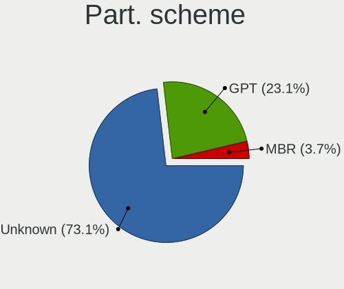

Pop!_OS Hardware Trends
-----------------------

A project to identify most popular hardware characteristics and track their change
over time based on data collected by Pop!_OS users at https://Linux-Hardware.org.

Anyone can contribute to the study by uploading probes of their computers by
the [hw-probe](https://github.com/linuxhw/hw-probe) tool:

    sudo -E hw-probe -all -upload

This is a report for all computer types. See also reports for [desktops](/Dist/Pop!_OS/Desktop/README.md) and [notebooks](/Dist/Pop!_OS/Notebook/README.md).

Full-feature report is available here: https://linux-hardware.org/?view=trends

Period: May, 2020.

Contents
--------

- [ OS                       ](#os)
- [ OS Family                ](#os-family)
- [ Kernel                   ](#kernel)
- [ Kernel Family            ](#kernel-family)
- [ Kernel Major Ver.        ](#kernel-major-ver)
- [ Arch                     ](#arch)
- [ DE                       ](#de)
- [ Display Server           ](#display-server)
- [ Display Manager          ](#display-manager)
- [ OS Lang                  ](#os-lang)
- [ Boot Mode                ](#boot-mode)
- [ Filesystem               ](#filesystem)
- [ Part. scheme             ](#part-scheme)
- [ Dual Boot with Linux/BSD ](#dual-boot-with-linux/bsd)
- [ Dual Boot (Win)          ](#dual-boot-win)
- [ Country                  ](#country)
- [ City                     ](#city)
- [ Vendor                   ](#vendor)
- [ Model                    ](#model)
- [ Model Family             ](#model-family)
- [ MFG Year                 ](#mfg-year)
- [ Form Factor              ](#form-factor)
- [ Secure Boot              ](#secure-boot)
- [ Coreboot                 ](#coreboot)
- [ RAM Size                 ](#ram-size)
- [ RAM Used                 ](#ram-used)
- [ Drive Vendor             ](#drive-vendor)
- [ Drive Model              ](#drive-model)
- [ Drive Kind               ](#drive-kind)
- [ Drive Connector          ](#drive-connector)
- [ Drive Size               ](#drive-size)
- [ Space Total              ](#space-total)
- [ Space Used               ](#space-used)
- [ Malfunc. Drives          ](#malfunc-drives)
- [ Malfunc. Drive Vendor    ](#malfunc-drive-vendor)
- [ Malfunc. Drive Kind      ](#malfunc-drive-kind)
- [ Failed Drives            ](#failed-drives)
- [ Failed Drive Vendor      ](#failed-drive-vendor)
- [ Drive Status             ](#drive-status)
- [ Storage Vendor           ](#storage-vendor)
- [ Storage Model            ](#storage-model)
- [ Storage Kind             ](#storage-kind)
- [ CPU Vendor               ](#cpu-vendor)
- [ CPU Model                ](#cpu-model)
- [ CPU Model Family         ](#cpu-model-family)
- [ CPU Cores                ](#cpu-cores)
- [ CPU Sockets              ](#cpu-sockets)
- [ CPU Threads              ](#cpu-threads)
- [ CPU Op-Modes             ](#cpu-op-modes)
- [ CPU Microcode            ](#cpu-microcode)
- [ CPU Microarch            ](#cpu-microarch)
- [ GPU Vendor               ](#gpu-vendor)
- [ GPU Model                ](#gpu-model)
- [ GPU Combo                ](#gpu-combo)
- [ GPU Driver               ](#gpu-driver)
- [ GPU Memory               ](#gpu-memory)
- [ Monitor Vendor           ](#monitor-vendor)
- [ Monitor Model            ](#monitor-model)
- [ Monitor Resolution       ](#monitor-resolution)
- [ Monitor Diagonal         ](#monitor-diagonal)
- [ Monitor Width            ](#monitor-width)
- [ Aspect Ratio             ](#aspect-ratio)
- [ Monitor Area             ](#monitor-area)
- [ Pixel Density            ](#pixel-density)
- [ Multiple Monitors        ](#multiple-monitors)
- [ Net Controller Vendor    ](#net-controller-vendor)
- [ Net Controller Model     ](#net-controller-model)
- [ Net Controller Kind      ](#net-controller-kind)
- [ Used Controller          ](#used-controller)
- [ NICs                     ](#nics)
- [ Unsupported Devices      ](#unsupported-devices)
- [ Unsupported Device Types ](#unsupported-device-types)

OS
--

Installed operating systems

| Name          | Computers | Percent |
|---------------|-----------|---------|
| Pop!_OS 20.04 | 268       | 99.26%  |
| Pop!_OS 19.10 | 2         | 0.74%   |

OS Family
---------

OS without a version

| Name    | Computers | Percent |
|---------|-----------|---------|
| Pop!_OS | 270       | 100%    |

Kernel
------

Version of the Linux kernel

| Version                   | Computers | Percent |
|---------------------------|-----------|---------|
| 5.4.0-7626-generic        | 133       | 49.26%  |
| 5.4.0-7629-generic        | 58        | 21.48%  |
| 5.4.0-7625-generic        | 54        | 20%     |
| 5.4.0-7634-generic        | 14        | 5.19%   |
| 5.4.0-7624-generic        | 3         | 1.11%   |
| 5.6.7-050607-generic      | 2         | 0.74%   |
| 5.3.0-7648-generic        | 2         | 0.74%   |
| 5.6.14-xanmod1            | 1         | 0.37%   |
| 5.6.12                    | 1         | 0.37%   |
| 5.6.10-xanmod1            | 1         | 0.37%   |
| 5.6.0-11.2-liquorix-amd64 | 1         | 0.37%   |

Kernel Family
-------------

Linux kernel without a distro release

| Version | Computers | Percent |
|---------|-----------|---------|
| 5.4.0   | 262       | 97.04%  |
| 5.6.7   | 2         | 0.74%   |
| 5.3.0   | 2         | 0.74%   |
| 5.6.14  | 1         | 0.37%   |
| 5.6.12  | 1         | 0.37%   |
| 5.6.10  | 1         | 0.37%   |
| 5.6.0   | 1         | 0.37%   |

Kernel Major Ver.
-----------------

Linux kernel major version

| Version | Computers | Percent |
|---------|-----------|---------|
| 5.4     | 262       | 97.04%  |
| 5.6     | 6         | 2.22%   |
| 5.3     | 2         | 0.74%   |

Arch
----

OS architecture (x86_64, i586, etc.)

| Name   | Computers | Percent |
|--------|-----------|---------|
| x86_64 | 270       | 100%    |

DE
--

Desktop Environment

| Name     | Computers | Percent |
|----------|-----------|---------|
| GNOME    | 263       | 97.41%  |
| MATE     | 2         | 0.74%   |
| KDE      | 2         | 0.74%   |
| LXQt     | 1         | 0.37%   |
| Cinnamon | 1         | 0.37%   |
| Unknown  | 1         | 0.37%   |

Display Server
--------------

X11 or Wayland

| Name    | Computers | Percent |
|---------|-----------|---------|
| X11     | 268       | 99.26%  |
| Wayland | 2         | 0.74%   |

Display Manager
---------------

SDDM, LightDM, etc.

| Name    | Computers | Percent |
|---------|-----------|---------|
| Unknown | 250       | 92.59%  |
| GDM     | 20        | 7.41%   |

OS Lang
-------

Language

| Lang    | Computers | Percent |
|---------|-----------|---------|
| en_US   | 152       | 56.3%   |
| pt_BR   | 21        | 7.78%   |
| en_GB   | 20        | 7.41%   |
| de_DE   | 12        | 4.44%   |
| en_AU   | 11        | 4.07%   |
| es_ES   | 9         | 3.33%   |
| en_CA   | 8         | 2.96%   |
| it_IT   | 7         | 2.59%   |
| C       | 6         | 2.22%   |
| tr_TR   | 3         | 1.11%   |
| nl_NL   | 3         | 1.11%   |
| hr_HR   | 2         | 0.74%   |
| fr_FR   | 2         | 0.74%   |
| fr_CA   | 2         | 0.74%   |
| es_AR   | 2         | 0.74%   |
| zh_TW   | 1         | 0.37%   |
| sk_SK   | 1         | 0.37%   |
| ru_RU   | 1         | 0.37%   |
| pt_PT   | 1         | 0.37%   |
| pl_PL   | 1         | 0.37%   |
| nl_BE   | 1         | 0.37%   |
| hu_HU   | 1         | 0.37%   |
| fi_FI   | 1         | 0.37%   |
| da_DK   | 1         | 0.37%   |
| Unknown | 1         | 0.37%   |

Boot Mode
---------

EFI or BIOS

| Mode | Computers | Percent |
|------|-----------|---------|
| EFI  | 168       | 62.22%  |
| BIOS | 102       | 37.78%  |

Filesystem
----------

Type of filesystem

| Type    | Computers | Percent |
|---------|-----------|---------|
| Ext4    | 263       | 97.41%  |
| Btrfs   | 4         | 1.48%   |
| Overlay | 2         | 0.74%   |
| Xfs     | 1         | 0.37%   |

Part. scheme
------------

Scheme of partitioning

| Type    | Computers | Percent |
|---------|-----------|---------|
| Unknown | 257       | 95.19%  |
| GPT     | 10        | 3.7%    |
| MBR     | 3         | 1.11%   |

Dual Boot with Linux/BSD
------------------------

Hosting more than one Linux/BSD

| Dual boot | Computers | Percent |
|-----------|-----------|---------|
| No        | 266       | 98.52%  |
| Yes       | 4         | 1.48%   |

Dual Boot (Win)
---------------

Hosting Linux and Windows

| Dual boot | Computers | Percent |
|-----------|-----------|---------|
| No        | 261       | 96.67%  |
| Yes       | 9         | 3.33%   |

Country
-------

Geographic location (country)

| Country                | Computers | Percent |
|------------------------|-----------|---------|
| USA                    | 79        | 29.26%  |
| Brazil                 | 23        | 8.52%   |
| Germany                | 16        | 5.93%   |
| Canada                 | 16        | 5.93%   |
| UK                     | 13        | 4.81%   |
| Australia              | 10        | 3.7%    |
| Italy                  | 8         | 2.96%   |
| India                  | 6         | 2.22%   |
| Switzerland            | 4         | 1.48%   |
| Sweden                 | 4         | 1.48%   |
| Spain                  | 4         | 1.48%   |
| France                 | 4         | 1.48%   |
| Chile                  | 4         | 1.48%   |
| Austria                | 4         | 1.48%   |
| Turkey                 | 3         | 1.11%   |
| South Africa           | 3         | 1.11%   |
| Romania                | 3         | 1.11%   |
| Portugal               | 3         | 1.11%   |
| Poland                 | 3         | 1.11%   |
| Philippines            | 3         | 1.11%   |
| Netherlands            | 3         | 1.11%   |
| Mexico                 | 3         | 1.11%   |
| Ireland                | 3         | 1.11%   |
| Belgium                | 3         | 1.11%   |
| Vietnam                | 2         | 0.74%   |
| Singapore              | 2         | 0.74%   |
| Russia                 | 2         | 0.74%   |
| Kenya                  | 2         | 0.74%   |
| Japan                  | 2         | 0.74%   |
| Finland                | 2         | 0.74%   |
| Denmark                | 2         | 0.74%   |
| Croatia                | 2         | 0.74%   |
| Algeria                | 2         | 0.74%   |
| Zimbabwe               | 1         | 0.37%   |
| Zambia                 | 1         | 0.37%   |
| Thailand               | 1         | 0.37%   |
| Tanzania               | 1         | 0.37%   |
| Taiwan                 | 1         | 0.37%   |
| Slovakia               | 1         | 0.37%   |
| Norway                 | 1         | 0.37%   |
| New Zealand            | 1         | 0.37%   |
| Nepal                  | 1         | 0.37%   |
| Malaysia               | 1         | 0.37%   |
| Macedonia              | 1         | 0.37%   |
| Iran                   | 1         | 0.37%   |
| Indonesia              | 1         | 0.37%   |
| Iceland                | 1         | 0.37%   |
| Guyana                 | 1         | 0.37%   |
| Guam                   | 1         | 0.37%   |
| Greenland              | 1         | 0.37%   |
| Greece                 | 1         | 0.37%   |
| Fiji                   | 1         | 0.37%   |
| Estonia                | 1         | 0.37%   |
| Egypt                  | 1         | 0.37%   |
| Czech Republic         | 1         | 0.37%   |
| Colombia               | 1         | 0.37%   |
| Bulgaria               | 1         | 0.37%   |
| Bosnia and Herzegovina | 1         | 0.37%   |
| Bolivia                | 1         | 0.37%   |
| Argentina              | 1         | 0.37%   |

City
----

Geographic location (city)

| City                   | Computers | Percent |
|------------------------|-----------|---------|
| Melbourne              | 4         | 1.48%   |
| Toronto                | 3         | 1.11%   |
| Los Angeles            | 3         | 1.11%   |
| Zurich                 | 2         | 0.74%   |
| Zagreb                 | 2         | 0.74%   |
| Winnipeg               | 2         | 0.74%   |
| Vienna                 | 2         | 0.74%   |
| São Paulo             | 2         | 0.74%   |
| Sydney                 | 2         | 0.74%   |
| Singapore              | 2         | 0.74%   |
| Santiago               | 2         | 0.74%   |
| Rotterdam              | 2         | 0.74%   |
| Ratzeburg              | 2         | 0.74%   |
| Nairobi                | 2         | 0.74%   |
| Milan                  | 2         | 0.74%   |
| London                 | 2         | 0.74%   |
| Lisbon                 | 2         | 0.74%   |
| Johannesburg           | 2         | 0.74%   |
| Houston                | 2         | 0.74%   |
| Hamburg                | 2         | 0.74%   |
| Georgetown             | 2         | 0.74%   |
| Dublin                 | 2         | 0.74%   |
| Cricklewood            | 2         | 0.74%   |
| Chihuahua City         | 2         | 0.74%   |
| Bucharest              | 2         | 0.74%   |
| Brooklyn               | 2         | 0.74%   |
| Berlin                 | 2         | 0.74%   |
| Zielona Góra          | 1         | 0.37%   |
| Xalapa                 | 1         | 0.37%   |
| Wrocław               | 1         | 0.37%   |
| Woodstock              | 1         | 0.37%   |
| Wildomar               | 1         | 0.37%   |
| Wettingen              | 1         | 0.37%   |
| Wenatchee              | 1         | 0.37%   |
| Welver                 | 1         | 0.37%   |
| Wasilla                | 1         | 0.37%   |
| Washington             | 1         | 0.37%   |
| Warsaw                 | 1         | 0.37%   |
| Virginia Beach         | 1         | 0.37%   |
| Versailles             | 1         | 0.37%   |
| Verdun                 | 1         | 0.37%   |
| Vallda                 | 1         | 0.37%   |
| Valdivia               | 1         | 0.37%   |
| Tuscaloosa             | 1         | 0.37%   |
| Turin                  | 1         | 0.37%   |
| Troy                   | 1         | 0.37%   |
| Trois-Rivières        | 1         | 0.37%   |
| Toledo                 | 1         | 0.37%   |
| Tokyo                  | 1         | 0.37%   |
| Thane                  | 1         | 0.37%   |
| Tempe                  | 1         | 0.37%   |
| Tehran                 | 1         | 0.37%   |
| Tarlac City            | 1         | 0.37%   |
| Tampere                | 1         | 0.37%   |
| Tambov                 | 1         | 0.37%   |
| Tallinn                | 1         | 0.37%   |
| Taichung               | 1         | 0.37%   |
| São Luís             | 1         | 0.37%   |
| São José dos Campos  | 1         | 0.37%   |
| São Bernardo do Campo | 1         | 0.37%   |

Vendor
------

Motherboard manufacturer

| Name                | Computers | Percent |
|---------------------|-----------|---------|
| Dell                | 45        | 16.67%  |
| Lenovo              | 39        | 14.44%  |
| ASUSTek Computer    | 34        | 12.59%  |
| Hewlett-Packard     | 33        | 12.22%  |
| Gigabyte Technology | 20        | 7.41%   |
| Acer                | 20        | 7.41%   |
| MSI                 | 13        | 4.81%   |
| Sony                | 7         | 2.59%   |
| ASRock              | 7         | 2.59%   |
| Apple               | 6         | 2.22%   |
| Samsung Electronics | 5         | 1.85%   |
| Toshiba             | 4         | 1.48%   |
| System76            | 4         | 1.48%   |
| HUAWEI              | 4         | 1.48%   |
| Google              | 4         | 1.48%   |
| Intel               | 3         | 1.11%   |
| TUXEDO              | 2         | 0.74%   |
| Razer               | 2         | 0.74%   |
| PCWare              | 2         | 0.74%   |
| Notebook            | 2         | 0.74%   |
| Microsoft           | 2         | 0.74%   |
| Chuwi               | 2         | 0.74%   |
| Positivo            | 1         | 0.37%   |
| Pegatron            | 1         | 0.37%   |
| Login Informatica   | 1         | 0.37%   |
| LG Electronics      | 1         | 0.37%   |
| Gateway             | 1         | 0.37%   |
| Fujitsu             | 1         | 0.37%   |
| EVOO Products       | 1         | 0.37%   |
| eMachines           | 1         | 0.37%   |
| Alienware           | 1         | 0.37%   |
| Unknown             | 1         | 0.37%   |

Model
-----

Motherboard model

| Name                                                                                                 | Computers | Percent |
|------------------------------------------------------------------------------------------------------|-----------|---------|
| ASUS All Series                                                                                      | 5         | 1.85%   |
| Lenovo MIIX 310-10ICR 80SG                                                                           | 3         | 1.11%   |
| Dell XPS 15 7590                                                                                     | 3         | 1.11%   |
| Toshiba Satellite C55-B                                                                              | 2         | 0.74%   |
| MSI MS-7B87                                                                                          | 2         | 0.74%   |
| Lenovo ThinkPad X1 Extreme 2nd 20QVCTO1WW                                                            | 2         | 0.74%   |
| Lenovo IdeaPad 330-15IKB 81DE                                                                        | 2         | 0.74%   |
| Lenovo IdeaPad 330-14AST 81D5                                                                        | 2         | 0.74%   |
| HUAWEI KPL-W0X                                                                                       | 2         | 0.74%   |
| HP Stream Notebook PC 14                                                                             | 2         | 0.74%   |
| HP Spectre x360 Convertible                                                                          | 2         | 0.74%   |
| HP Pavilion dv6                                                                                      | 2         | 0.74%   |
| Gigabyte Z77-D3H                                                                                     | 2         | 0.74%   |
| Dell XPS 15 9570                                                                                     | 2         | 0.74%   |
| Dell Inspiron N5110                                                                                  | 2         | 0.74%   |
| Dell Inspiron 5767                                                                                   | 2         | 0.74%   |
| Dell Inspiron 3521                                                                                   | 2         | 0.74%   |
| ASUS SABERTOOTH 990FX                                                                                | 2         | 0.74%   |
| ASUS PRIME B450M-A                                                                                   | 2         | 0.74%   |
| Acer Predator PH315-52                                                                               | 2         | 0.74%   |
| Unknown                                                                                              | 2         | 0.74%   |
| TUXEDO P65_P67RGRERA                                                                                 | 1         | 0.37%   |
| Toshiba TECRA R940                                                                                   | 1         | 0.37%   |
| Toshiba Satellite C870-1DD                                                                           | 1         | 0.37%   |
| System76 Thelio Major                                                                                | 1         | 0.37%   |
| System76 Serval WS                                                                                   | 1         | 0.37%   |
| System76 Oryx Pro                                                                                    | 1         | 0.37%   |
| System76 Gazelle                                                                                     | 1         | 0.37%   |
| Sony VPCF234FD                                                                                       | 1         | 0.37%   |
| Sony VPCF136FM                                                                                       | 1         | 0.37%   |
| Sony VPCEB1S1E                                                                                       | 1         | 0.37%   |
| Sony VGN-TZ250N                                                                                      | 1         | 0.37%   |
| Sony SVP13215PXB                                                                                     | 1         | 0.37%   |
| Sony SVP13215CDB                                                                                     | 1         | 0.37%   |
| Sony SVF1532H1EW                                                                                     | 1         | 0.37%   |
| Samsung Electronics RC530/RC730                                                                      | 1         | 0.37%   |
| Samsung Electronics 535U3C                                                                           | 1         | 0.37%   |
| Samsung Electronics 500R5L/501R5L/500R5P                                                             | 1         | 0.37%   |
| Samsung Electronics 350V5C/350V5X/350V4C/350V4X/351V5C/351V5X/351V4C/351V4X/3540VC/3540VX/3440VC/344 | 1         | 0.37%   |
| Samsung Electronics 300E5K/300E5Q                                                                    | 1         | 0.37%   |
| Razer Blade Stealth 13 Late 2019                                                                     | 1         | 0.37%   |
| Razer Blade                                                                                          | 1         | 0.37%   |
| Positivo C14CR21TV                                                                                   | 1         | 0.37%   |
| Pegatron Pro 3010 Small Form Factor PC                                                               | 1         | 0.37%   |
| PCWare IPX1800G1                                                                                     | 1         | 0.37%   |
| PCWare IPMH310G                                                                                      | 1         | 0.37%   |
| Notebook PB50_70RF,RD,RC                                                                             | 1         | 0.37%   |
| Notebook P7xxTM1                                                                                     | 1         | 0.37%   |
| MSI s5650br                                                                                          | 1         | 0.37%   |
| MSI MS-7C52                                                                                          | 1         | 0.37%   |
| MSI MS-7C35                                                                                          | 1         | 0.37%   |
| MSI MS-7B98                                                                                          | 1         | 0.37%   |
| MSI MS-7A34                                                                                          | 1         | 0.37%   |
| MSI MS-7971                                                                                          | 1         | 0.37%   |
| MSI MS-7640                                                                                          | 1         | 0.37%   |
| MSI MS-7586                                                                                          | 1         | 0.37%   |
| MSI MS-163A                                                                                          | 1         | 0.37%   |
| MSI GX700                                                                                            | 1         | 0.37%   |
| MSI GE62 6QF                                                                                         | 1         | 0.37%   |
| Microsoft Surface Pro 4                                                                              | 1         | 0.37%   |

Model Family
------------

Motherboard model prefix

| Name                       | Computers | Percent |
|----------------------------|-----------|---------|
| Dell Inspiron              | 15        | 5.56%   |
| Acer Aspire                | 15        | 5.56%   |
| Lenovo ThinkPad            | 13        | 4.81%   |
| Dell Latitude              | 12        | 4.44%   |
| Lenovo IdeaPad             | 10        | 3.7%    |
| Dell XPS                   | 8         | 2.96%   |
| ASUS PRIME                 | 8         | 2.96%   |
| HP Pavilion                | 5         | 1.85%   |
| ASUS All                   | 5         | 1.85%   |
| Lenovo Yoga                | 4         | 1.48%   |
| Lenovo MIIX                | 4         | 1.48%   |
| HP ProBook                 | 4         | 1.48%   |
| HP ENVY                    | 4         | 1.48%   |
| Dell OptiPlex              | 4         | 1.48%   |
| Toshiba Satellite          | 3         | 1.11%   |
| HP Spectre                 | 3         | 1.11%   |
| HP EliteBook               | 3         | 1.11%   |
| ASUS TUF                   | 3         | 1.11%   |
| ASUS ROG                   | 3         | 1.11%   |
| Razer Blade                | 2         | 0.74%   |
| MSI MS-7B87                | 2         | 0.74%   |
| Microsoft Surface          | 2         | 0.74%   |
| HUAWEI KPL-W0X             | 2         | 0.74%   |
| HP Stream                  | 2         | 0.74%   |
| HP OMEN                    | 2         | 0.74%   |
| HP Compaq                  | 2         | 0.74%   |
| Gigabyte Z77-D3H           | 2         | 0.74%   |
| Gigabyte B450M             | 2         | 0.74%   |
| Dell Vostro                | 2         | 0.74%   |
| Dell Studio                | 2         | 0.74%   |
| ASUS ZenBook               | 2         | 0.74%   |
| ASUS SABERTOOTH            | 2         | 0.74%   |
| Acer Predator              | 2         | 0.74%   |
| Acer Nitro                 | 2         | 0.74%   |
| Unknown                    | 2         | 0.74%   |
| TUXEDO P65                 | 1         | 0.37%   |
| Toshiba TECRA              | 1         | 0.37%   |
| System76 Thelio            | 1         | 0.37%   |
| System76 Serval            | 1         | 0.37%   |
| System76 Oryx              | 1         | 0.37%   |
| System76 Gazelle           | 1         | 0.37%   |
| Sony VPCF234FD             | 1         | 0.37%   |
| Sony VPCF136FM             | 1         | 0.37%   |
| Sony VPCEB1S1E             | 1         | 0.37%   |
| Sony VGN-TZ250N            | 1         | 0.37%   |
| Sony SVP13215PXB           | 1         | 0.37%   |
| Sony SVP13215CDB           | 1         | 0.37%   |
| Sony SVF1532H1EW           | 1         | 0.37%   |
| Samsung Electronics RC530  | 1         | 0.37%   |
| Samsung Electronics 535U3C | 1         | 0.37%   |
| Samsung Electronics 500R5L | 1         | 0.37%   |
| Samsung Electronics 350V5C | 1         | 0.37%   |
| Samsung Electronics 300E5K | 1         | 0.37%   |
| Positivo C14CR21TV         | 1         | 0.37%   |
| Pegatron Pro               | 1         | 0.37%   |
| PCWare IPX1800G1           | 1         | 0.37%   |
| PCWare IPMH310G            | 1         | 0.37%   |
| Notebook PB50              | 1         | 0.37%   |
| Notebook P7xxTM1           | 1         | 0.37%   |
| MSI s5650br                | 1         | 0.37%   |

MFG Year
--------

Motherboard manufacture year

| Year | Computers | Percent |
|------|-----------|---------|
| 2019 | 81        | 30%     |
| 2018 | 34        | 12.59%  |
| 2020 | 28        | 10.37%  |
| 2013 | 22        | 8.15%   |
| 2012 | 19        | 7.04%   |
| 2014 | 18        | 6.67%   |
| 2017 | 14        | 5.19%   |
| 2011 | 13        | 4.81%   |
| 2010 | 11        | 4.07%   |
| 2016 | 10        | 3.7%    |
| 2015 | 9         | 3.33%   |
| 2009 | 4         | 1.48%   |
| 2008 | 4         | 1.48%   |
| 2007 | 3         | 1.11%   |

Form Factor
-----------

Physical design of the computer

| Name        | Computers | Percent |
|-------------|-----------|---------|
| Notebook    | 156       | 57.78%  |
| Desktop     | 85        | 31.48%  |
| Convertible | 13        | 4.81%   |
| Tablet      | 8         | 2.96%   |
| All in one  | 4         | 1.48%   |
| Mini pc     | 3         | 1.11%   |
| Server      | 1         | 0.37%   |

Secure Boot
-----------

Enabled or disabled

| State    | Computers | Percent |
|----------|-----------|---------|
| Disabled | 269       | 99.63%  |
| Enabled  | 1         | 0.37%   |

Coreboot
--------

Have coreboot on board

| Used | Computers | Percent |
|------|-----------|---------|
| No   | 266       | 98.52%  |
| Yes  | 4         | 1.48%   |

RAM Size
--------

Total RAM memory

| Size in GB  | Computers | Percent |
|-------------|-----------|---------|
| 16.01-24.0  | 75        | 27.78%  |
| 4.01-8.0    | 57        | 21.11%  |
| 8.01-16.0   | 56        | 20.74%  |
| 3.01-4.0    | 43        | 15.93%  |
| 32.01-64.0  | 20        | 7.41%   |
| 1.01-2.0    | 7         | 2.59%   |
| 64.01-256.0 | 6         | 2.22%   |
| 24.01-32.0  | 5         | 1.85%   |
| 2.01-3.0    | 1         | 0.37%   |

RAM Used
--------

Used RAM memory

| Used GB    | Computers | Percent |
|------------|-----------|---------|
| 1.01-2.0   | 95        | 35.19%  |
| 2.01-3.0   | 85        | 31.48%  |
| 3.01-4.0   | 50        | 18.52%  |
| 4.01-8.0   | 37        | 13.7%   |
| 8.01-16.0  | 2         | 0.74%   |
| 16.01-24.0 | 1         | 0.37%   |

Drive Vendor
------------

Hard drive vendors

| Vendor              | Computers | Drives  | Percent |
|---------------------|-----------|---------|---------|
| WDC                 | 64        | 75      | 21.05%  |
| Samsung Electronics | 47        | 58      | 15.46%  |
| Seagate             | 43        | 49      | 14.14%  |
| Unknown             | 16        | 19      | 5.26%   |
| Toshiba             | 15        | 15      | 4.93%   |
| Kingston            | 15        | 15      | 4.93%   |
| Crucial             | 15        | 15      | 4.93%   |
| Hitachi             | 14        | 14      | 4.61%   |
| SanDisk             | 9         | 9       | 2.96%   |
| HGST                | 9         | 9       | 2.96%   |
| SK Hynix            | 6         | 6       | 1.97%   |
| PNY                 | 4         | 4       | 1.32%   |
| Micron Technology   | 4         | 4       | 1.32%   |
| A-DATA Technology   | 4         | 4       | 1.32%   |
| Transcend           | 3         | 3       | 0.99%   |
| LITEONIT            | 3         | 3       | 0.99%   |
| LITEON              | 3         | 3       | 0.99%   |
| Corsair             | 3         | 3       | 0.99%   |
| China               | 3         | 3       | 0.99%   |
| TO Exter            | 2         | 2       | 0.66%   |
| SPCC                | 2         | 2       | 0.66%   |
| OCZ                 | 2         | 2       | 0.66%   |
| Intel               | 2         | 2       | 0.66%   |
| BHT                 | 2         | 2       | 0.66%   |
| Apple               | 2         | 2       | 0.66%   |
| XPG                 | 1         | 1       | 0.33%   |
| Team                | 1         | 1       | 0.33%   |
| T-FORCE             | 1         | 1       | 0.33%   |
| Patriot             | 1         | 1       | 0.33%   |
| Netac               | 1         | 1       | 0.33%   |
| MGS                 | 1         | 1       | 0.33%   |
| KIOXIA              | 1         | 1       | 0.33%   |
| KingSpec            | 1         | 1       | 0.33%   |
| HL-DT-ST            | 1         | Unknown | 0.33%   |
| Hewlett-Packard     | 1         | 1       | 0.33%   |
| Generic             | 1         | 1       | 0.33%   |
| External            | 1         | 1       | 0.33%   |

Drive Model
-----------

Hard drive models

| Model                        | Computers | Percent |
|------------------------------|-----------|---------|
| SSD 850 EVO 250GB            | 7         | 2.1%    |
| MMC Card  64GB               | 6         | 1.8%    |
| MMC Card  32GB               | 6         | 1.8%    |
| ST1000LM035-1RK172 1TB       | 4         | 1.2%    |
| SA400S37240G 240GB SSD       | 4         | 1.2%    |
| HTS721010A9E630 1TB          | 4         | 1.2%    |
| WDS240G2G0A-00JH30 240GB SSD | 3         | 0.9%    |
| ST500DM002-1BD142 500GB      | 3         | 0.9%    |
| ST2000LX001-1RG174 2TB       | 3         | 0.9%    |
| SSD 860 EVO 500GB            | 3         | 0.9%    |
| SSD 860 EVO 250GB            | 3         | 0.9%    |
| SSD 840 EVO 500GB            | 3         | 0.9%    |
| SSD 840 EVO 250GB            | 3         | 0.9%    |
| MQ01ABD100 1TB               | 3         | 0.9%    |
| MMC Card  16GB               | 3         | 0.9%    |
| HTS545050A7E380 500GB        | 3         | 0.9%    |
| CT120BX500SSD1 120GB         | 3         | 0.9%    |
| CS900 120GB SSD              | 3         | 0.9%    |
| WR202A1032G 670215F5 32GB    | 2         | 0.6%    |
| WDS500G2B0B-00YS70 500GB SSD | 2         | 0.6%    |
| WDS100T2B0B-00YS70 1TB SSD   | 2         | 0.6%    |
| WD5000LPCX-24VHAT0 500GB     | 2         | 0.6%    |
| WD3200AAKS-75B3A0 320GB      | 2         | 0.6%    |
| WD2500AAKX-75U6AA0 250GB     | 2         | 0.6%    |
| WD2003FZEX-00Z4SA0 2TB       | 2         | 0.6%    |
| WD10SPZX-24Z10 1TB           | 2         | 0.6%    |
| WD10EZEX-08WN4A0 1TB         | 2         | 0.6%    |
| SUV400S37120G 120GB SSD      | 2         | 0.6%    |
| ST500LT012-9WS142 500GB      | 2         | 0.6%    |
| ST2000DM006-2DM164 2TB       | 2         | 0.6%    |
| ST2000DM001-1ER164 2TB       | 2         | 0.6%    |
| SSD 970 EVO Plus 1TB         | 2         | 0.6%    |
| SSD 860 EVO 1TB              | 2         | 0.6%    |
| SSD 850 EVO 500GB            | 2         | 0.6%    |
| Solid State Disk 256GB       | 2         | 0.6%    |
| SA400S37480G 480GB SSD       | 2         | 0.6%    |
| SA400S37120G 120GB SSD       | 2         | 0.6%    |
| nal USB 3.0 1TB              | 2         | 0.6%    |
| HTS543232A7A384 320GB        | 2         | 0.6%    |
| HTS541010A9E680 1TB          | 2         | 0.6%    |
| HD103SJ 1TB                  | 2         | 0.6%    |
| Force 3 SSD 240GB            | 2         | 0.6%    |
| DT01ACA100 1TB               | 2         | 0.6%    |
| CT500MX500SSD1 500GB         | 2         | 0.6%    |
| CT1000MX500SSD1 1TB          | 2         | 0.6%    |
| X300 MSATA 256GB SSD         | 1         | 0.3%    |
| WDS500G2B0A 500GB SSD        | 1         | 0.3%    |
| WDS250G1B0A-00H9H0 250GB SSD | 1         | 0.3%    |
| WDS240G2G0B-00EPW0 240GB SSD | 1         | 0.3%    |
| WDBNCE5000PNC 500GB SSD      | 1         | 0.3%    |
| WDBNCE0020PNC 2TB SSD        | 1         | 0.3%    |
| WD7500BPVX-60JC3T0 752GB     | 1         | 0.3%    |
| WD7500BPVT-75HXZT3 752GB     | 1         | 0.3%    |
| WD7500BPVT-00HXZT1 752GB     | 1         | 0.3%    |
| WD7500BPKT-75PK4T0 752GB     | 1         | 0.3%    |
| WD6400BEVT-22A0RT0 640GB     | 1         | 0.3%    |
| WD6400AAKS-22A7B2 640GB      | 1         | 0.3%    |
| WD5001AALS-00L3B2 500GB      | 1         | 0.3%    |
| WD5000LPVX-75V0TT0 500GB     | 1         | 0.3%    |
| WD5000LPVX-22V0TT0 500GB     | 1         | 0.3%    |

Drive Kind
----------

HDD or SSD

| Kind    | Computers | Drives | Percent |
|---------|-----------|--------|---------|
| HDD     | 126       | 149    | 43.75%  |
| SSD     | 123       | 144    | 42.71%  |
| MMC     | 16        | 19     | 5.56%   |
| NVMe    | 12        | 12     | 4.17%   |
| Unknown | 11        | 10     | 3.82%   |

Drive Connector
---------------

SATA, SAS, NVMe, etc.

| Type | Computers | Drives | Percent |
|------|-----------|--------|---------|
| SATA | 209       | 292    | 84.27%  |
| MMC  | 16        | 19     | 6.45%   |
| NVMe | 12        | 12     | 4.84%   |
| SAS  | 11        | 11     | 4.44%   |

Drive Size
----------

Size of hard drive

| Size in TB | Computers | Drives | Percent |
|------------|-----------|--------|---------|
| 0.01-0.5   | 169       | 210    | 60.36%  |
| 0.51-1.0   | 81        | 90     | 28.93%  |
| 1.01-2.0   | 20        | 22     | 7.14%   |
| 2.01-3.0   | 4         | 4      | 1.43%   |
| 4.01-10.0  | 3         | 4      | 1.07%   |
| 3.01-4.0   | 2         | 3      | 0.71%   |
| 10.01-20.0 | 1         | 1      | 0.36%   |

Space Total
-----------

Amount of disk space available on the file system

| Size in GB     | Computers | Percent |
|----------------|-----------|---------|
| 101-250        | 83        | 30.74%  |
| 251-500        | 75        | 27.78%  |
| 501-1000       | 41        | 15.19%  |
| 1001-2000      | 24        | 8.89%   |
| 51-100         | 18        | 6.67%   |
| 21-50          | 12        | 4.44%   |
| More than 3000 | 7         | 2.59%   |
| 2001-3000      | 5         | 1.85%   |
| 1-20           | 4         | 1.48%   |
| Unknown        | 1         | 0.37%   |

Space Used
----------

Amount of used disk space

| Used GB        | Computers | Percent |
|----------------|-----------|---------|
| 1-20           | 135       | 50%     |
| 21-50          | 49        | 18.15%  |
| 101-250        | 25        | 9.26%   |
| 51-100         | 23        | 8.52%   |
| 251-500        | 20        | 7.41%   |
| 501-1000       | 9         | 3.33%   |
| More than 3000 | 4         | 1.48%   |
| 1001-2000      | 4         | 1.48%   |
| Unknown        | 1         | 0.37%   |

Malfunc. Drives
---------------

Drive models with a malfunction

| Model                   | Computers | Drives | Percent |
|-------------------------|-----------|--------|---------|
| WD3200AAKS-75B3A0 320GB | 2         | 2      | 50%     |
| HD103SJ 1TB             | 2         | 2      | 50%     |

Malfunc. Drive Vendor
---------------------

Vendors of faulty drives

| Vendor              | Computers | Drives | Percent |
|---------------------|-----------|--------|---------|
| WDC                 | 2         | 2      | 50%     |
| Samsung Electronics | 2         | 2      | 50%     |

Malfunc. Drive Kind
-------------------

Kinds of faulty drives

| Kind | Computers | Drives | Percent |
|------|-----------|--------|---------|
| HDD  | 2         | 4      | 100%    |

Failed Drives
-------------

Failed drive models

Zero info for selected period =(

Failed Drive Vendor
-------------------

Failed drive vendors

Zero info for selected period =(

Drive Status
------------

Number of failed and malfunc. drives

| Status   | Computers | Drives | Percent |
|----------|-----------|--------|---------|
| Detected | 209       | 301    | 90.48%  |
| Works    | 20        | 29     | 8.66%   |
| Malfunc  | 2         | 4      | 0.87%   |

Storage Vendor
--------------

Storage controller vendors

| Vendor                           | Computers | Percent |
|----------------------------------|-----------|---------|
| Intel                            | 179       | 54.91%  |
| AMD                              | 59        | 18.1%   |
| Samsung Electronics              | 34        | 10.43%  |
| Phison Electronics               | 8         | 2.45%   |
| Sandisk                          | 7         | 2.15%   |
| Toshiba America Info Systems     | 5         | 1.53%   |
| SK Hynix                         | 5         | 1.53%   |
| JMicron Technology               | 5         | 1.53%   |
| Silicon Motion                   | 3         | 0.92%   |
| Nvidia                           | 2         | 0.61%   |
| KIOXIA                           | 2         | 0.61%   |
| Kingston Technology Company      | 2         | 0.61%   |
| ASMedia Technology               | 2         | 0.61%   |
| ADATA Technology                 | 2         | 0.61%   |
| Union Memory (Shenzhen)          | 1         | 0.31%   |
| Silicon Integrated Systems [SiS] | 1         | 0.31%   |
| Silicon Image                    | 1         | 0.31%   |
| Seagate Technology               | 1         | 0.31%   |
| Realtek Semiconductor            | 1         | 0.31%   |
| Micron/Crucial Technology        | 1         | 0.31%   |
| Marvell Technology Group         | 1         | 0.31%   |
| LSI Logic / Symbios Logic        | 1         | 0.31%   |
| HighPoint Technologies           | 1         | 0.31%   |
| Broadcom / LSI                   | 1         | 0.31%   |
| Adaptec                          | 1         | 0.31%   |

Storage Model
-------------

Storage controller models

| Model                                                                      | Computers | Percent |
|----------------------------------------------------------------------------|-----------|---------|
| FCH SATA Controller [AHCI mode]                                            | 49        | 13.1%   |
| 82801 Mobile SATA Controller [RAID mode]                                   | 23        | 6.15%   |
| NVMe SSD Controller SM981/PM981/PM983                                      | 22        | 5.88%   |
| Sunrise Point-LP SATA Controller [AHCI mode]                               | 18        | 4.81%   |
| 7 Series Chipset Family 6-port SATA Controller [AHCI mode]                 | 17        | 4.55%   |
| Non-Volatile memory controller                                             | 15        | 4.01%   |
| Cannon Lake Mobile PCH SATA AHCI Controller                                | 13        | 3.48%   |
| 8 Series SATA Controller 1 [AHCI mode]                                     | 12        | 3.21%   |
| 6 Series/C200 Series Chipset Family 6 port Mobile SATA AHCI Controller     | 12        | 3.21%   |
| 400 Series Chipset SATA Controller                                         | 12        | 3.21%   |
| HM170/QM170 Chipset SATA Controller [AHCI Mode]                            | 8         | 2.14%   |
| 8 Series/C220 Series Chipset Family 6-port SATA Controller 1 [AHCI mode]   | 8         | 2.14%   |
| 7 Series/C210 Series Chipset Family 6-port SATA Controller [AHCI mode]     | 6         | 1.6%    |
| 6 Series/C200 Series Chipset Family 6 port Desktop SATA AHCI Controller    | 6         | 1.6%    |
| SSD 660P Series                                                            | 5         | 1.34%   |
| SB7x0/SB8x0/SB9x0 SATA Controller [AHCI mode]                              | 5         | 1.34%   |
| SATA Controller [RAID mode]                                                | 5         | 1.34%   |
| NVMe SSD Controller SM961/PM961                                            | 5         | 1.34%   |
| Cannon Lake PCH SATA AHCI Controller                                       | 5         | 1.34%   |
| Wildcat Point-LP SATA Controller [AHCI Mode]                               | 4         | 1.07%   |
| NVMe SSD Controller SM951/PM951                                            | 4         | 1.07%   |
| E16 PCIe4 NVMe Controller                                                  | 4         | 1.07%   |
| 200 Series PCH SATA controller [AHCI mode]                                 | 4         | 1.07%   |
| WD Black 2018/PC SN720 NVMe SSD                                            | 3         | 0.8%    |
| Toshiba America Info Non-Volatile memory controller                        | 3         | 0.8%    |
| SB7x0/SB8x0/SB9x0 SATA Controller [IDE mode]                               | 3         | 0.8%    |
| SB7x0/SB8x0/SB9x0 IDE Controller                                           | 3         | 0.8%    |
| Q170/Q150/B150/H170/H110/Z170/CM236 Chipset SATA Controller [AHCI Mode]    | 3         | 0.8%    |
| JMB368 IDE controller                                                      | 3         | 0.8%    |
| E12 NVMe Controller                                                        | 3         | 0.8%    |
| Comet Lake SATA AHCI Controller                                            | 3         | 0.8%    |
| 82801HM/HEM (ICH8M/ICH8M-E) SATA Controller [AHCI mode]                    | 3         | 0.8%    |
| 82801HM/HEM (ICH8M/ICH8M-E) IDE Controller                                 | 3         | 0.8%    |
| 5 Series/3400 Series Chipset 6 port SATA AHCI Controller                   | 3         | 0.8%    |
| XPG SX8200 Pro PCIe Gen3x4 M.2 2280 Solid State Drive                      | 2         | 0.53%   |
| X370 Series Chipset SATA Controller                                        | 2         | 0.53%   |
| WD Black 2018/PC SN520 NVMe SSD                                            | 2         | 0.53%   |
| NM10/ICH7 Family SATA Controller [IDE mode]                                | 2         | 0.53%   |
| MCP61 SATA Controller                                                      | 2         | 0.53%   |
| MCP61 IDE                                                                  | 2         | 0.53%   |
| JMB362 SATA Controller                                                     | 2         | 0.53%   |
| FCH SATA Controller D                                                      | 2         | 0.53%   |
| FCH IDE Controller                                                         | 2         | 0.53%   |
| Cannon Point-LP SATA Controller [AHCI Mode]                                | 2         | 0.53%   |
| BC501 NVMe Solid State Drive 512GB                                         | 2         | 0.53%   |
| Atom/Celeron/Pentium Processor x5-E8000/J3xxx/N3xxx Series SATA Controller | 2         | 0.53%   |
| ASM1062 Serial ATA Controller                                              | 2         | 0.53%   |
| 82801JI (ICH10 Family) SATA AHCI Controller                                | 2         | 0.53%   |
| 82801JD/DO (ICH10 Family) SATA AHCI Controller                             | 2         | 0.53%   |
| 82801IBM/IEM (ICH9M/ICH9M-E) 4 port SATA Controller [AHCI mode]            | 2         | 0.53%   |
| 5 Series/3400 Series Chipset 4 port SATA IDE Controller                    | 2         | 0.53%   |
| 5 Series/3400 Series Chipset 4 port SATA AHCI Controller                   | 2         | 0.53%   |
| 5 Series/3400 Series Chipset 2 port SATA IDE Controller                    | 2         | 0.53%   |
| 4 Series Chipset PT IDER Controller                                        | 2         | 0.53%   |
| 300 Series Chipset SATA Controller                                         | 2         | 0.53%   |
| XP941 PCIe SSD                                                             | 1         | 0.27%   |
| XG4 NVMe SSD Controller                                                    | 1         | 0.27%   |
| WD Black NVMe SSD                                                          | 1         | 0.27%   |
| Technology Company Non-Volatile memory controller                          | 1         | 0.27%   |
| SiI 3531 [SATALink/SATARaid] Serial ATA Controller                         | 1         | 0.27%   |

Storage Kind
------------

Kind of storage controller (IDE, SATA, NVMe, SAS, ...)

| Kind | Computers | Percent |
|------|-----------|---------|
| SATA | 201       | 60.54%  |
| NVMe | 74        | 22.29%  |
| RAID | 34        | 10.24%  |
| IDE  | 22        | 6.63%   |
| SCSI | 1         | 0.3%    |

CPU Vendor
----------

Processor vendors

| Vendor | Computers | Percent |
|--------|-----------|---------|
| Intel  | 204       | 75.56%  |
| AMD    | 66        | 24.44%  |

CPU Model
---------

Processor models

| Model                                           | Computers | Percent |
|-------------------------------------------------|-----------|---------|
| Intel Core i7-9750H CPU @ 2.60GHz               | 10        | 3.7%    |
| AMD Ryzen 5 2500U with Radeon Vega Mobile Gfx   | 6         | 2.22%   |
| Intel Core i7-8750H CPU @ 2.20GHz               | 5         | 1.85%   |
| Intel Core i7-8550U CPU @ 1.80GHz               | 5         | 1.85%   |
| Intel Core i7-6500U CPU @ 2.50GHz               | 5         | 1.85%   |
| Intel Core i7-2670QM CPU @ 2.20GHz              | 5         | 1.85%   |
| Intel Core i5-4210U CPU @ 1.70GHz               | 5         | 1.85%   |
| Intel Atom x5-Z8350 CPU @ 1.44GHz               | 5         | 1.85%   |
| Intel Core i7-6700HQ CPU @ 2.60GHz              | 4         | 1.48%   |
| Intel Core i5-8250U CPU @ 1.60GHz               | 4         | 1.48%   |
| Intel Core i7-7700HQ CPU @ 2.80GHz              | 3         | 1.11%   |
| Intel Core i7-7500U CPU @ 2.70GHz               | 3         | 1.11%   |
| Intel Core i7-5500U CPU @ 2.40GHz               | 3         | 1.11%   |
| Intel Core i7-3770 CPU @ 3.40GHz                | 3         | 1.11%   |
| Intel Core i7-3520M CPU @ 2.90GHz               | 3         | 1.11%   |
| Intel Core i5-6300U CPU @ 2.40GHz               | 3         | 1.11%   |
| Intel Core i5-4200U CPU @ 1.60GHz               | 3         | 1.11%   |
| Intel Core i5-3337U CPU @ 1.80GHz               | 3         | 1.11%   |
| Intel Core i3-3217U CPU @ 1.80GHz               | 3         | 1.11%   |
| AMD Ryzen 5 3600 6-Core Processor               | 3         | 1.11%   |
| AMD Ryzen 5 2600 Six-Core Processor             | 3         | 1.11%   |
| Intel Core i7-9700F CPU @ 3.00GHz               | 2         | 0.74%   |
| Intel Core i7-8565U CPU @ 1.80GHz               | 2         | 0.74%   |
| Intel Core i7-4700HQ CPU @ 2.40GHz              | 2         | 0.74%   |
| Intel Core i7-3770K CPU @ 3.50GHz               | 2         | 0.74%   |
| Intel Core i7-2630QM CPU @ 2.00GHz              | 2         | 0.74%   |
| Intel Core i7-1065G7 CPU @ 1.30GHz              | 2         | 0.74%   |
| Intel Core i7-10510U CPU @ 1.80GHz              | 2         | 0.74%   |
| Intel Core i7 CPU Q 720 @ 1.60GHz               | 2         | 0.74%   |
| Intel Core i5-8300H CPU @ 2.30GHz               | 2         | 0.74%   |
| Intel Core i5-8265U CPU @ 1.60GHz               | 2         | 0.74%   |
| Intel Core i5-5300U CPU @ 2.30GHz               | 2         | 0.74%   |
| Intel Core i5-3320M CPU @ 2.60GHz               | 2         | 0.74%   |
| Intel Core i5-3210M CPU @ 2.50GHz               | 2         | 0.74%   |
| Intel Core i5-2520M CPU @ 2.50GHz               | 2         | 0.74%   |
| Intel Core i5-2400S CPU @ 2.50GHz               | 2         | 0.74%   |
| Intel Core i3-3110M CPU @ 2.40GHz               | 2         | 0.74%   |
| Intel Core 2 Duo CPU E8400 @ 3.00GHz            | 2         | 0.74%   |
| AMD Ryzen 9 3950X 16-Core Processor             | 2         | 0.74%   |
| AMD Ryzen 9 3900X 12-Core Processor             | 2         | 0.74%   |
| AMD Ryzen 7 3700U with Radeon Vega Mobile Gfx   | 2         | 0.74%   |
| AMD Ryzen 7 2700X Eight-Core Processor          | 2         | 0.74%   |
| AMD Ryzen 3 3200G with Radeon Vega Graphics     | 2         | 0.74%   |
| AMD Ryzen 3 2200G with Radeon Vega Graphics     | 2         | 0.74%   |
| AMD Phenom II X6 1055T Processor                | 2         | 0.74%   |
| AMD A4-9125 RADEON R3, 4 COMPUTE CORES 2C+2G    | 2         | 0.74%   |
| AMD A4 Micro-6400T APU + AMD Radeon R3 Graphics | 2         | 0.74%   |
| Intel Xeon E-2276M CPU @ 2.80GHz                | 1         | 0.37%   |
| Intel Xeon CPU X3470 @ 2.93GHz                  | 1         | 0.37%   |
| Intel Xeon CPU L5640 @ 2.27GHz                  | 1         | 0.37%   |
| Intel Xeon CPU E31220 @ 3.10GHz                 | 1         | 0.37%   |
| Intel Xeon CPU E3-1240 v3 @ 3.40GHz             | 1         | 0.37%   |
| Intel Pentium Dual-Core CPU T4200 @ 2.00GHz     | 1         | 0.37%   |
| Intel Pentium Dual-Core CPU E5400 @ 2.70GHz     | 1         | 0.37%   |
| Intel Pentium Dual CPU E2140 @ 1.60GHz          | 1         | 0.37%   |
| Intel Pentium CPU G645 @ 2.90GHz                | 1         | 0.37%   |
| Intel Pentium CPU G4400 @ 3.30GHz               | 1         | 0.37%   |
| Intel Core m5-6Y57 CPU @ 1.10GHz                | 1         | 0.37%   |
| Intel Core m3-8100Y CPU @ 1.10GHz               | 1         | 0.37%   |
| Intel Core m3-6Y30 CPU @ 0.90GHz                | 1         | 0.37%   |

CPU Model Family
----------------

Processor model prefix

| Model                   | Computers | Percent |
|-------------------------|-----------|---------|
| Intel Core i7           | 89        | 32.96%  |
| Intel Core i5           | 57        | 21.11%  |
| Intel Core i3           | 16        | 5.93%   |
| AMD Ryzen 5             | 16        | 5.93%   |
| Intel Celeron           | 10        | 3.7%    |
| Intel Core 2 Duo        | 7         | 2.59%   |
| AMD Ryzen 7             | 7         | 2.59%   |
| Intel Xeon              | 5         | 1.85%   |
| Intel Atom              | 5         | 1.85%   |
| AMD Ryzen 3             | 5         | 1.85%   |
| AMD A8                  | 5         | 1.85%   |
| Intel Core i9           | 4         | 1.48%   |
| AMD Ryzen 9             | 4         | 1.48%   |
| AMD FX                  | 4         | 1.48%   |
| AMD A6                  | 4         | 1.48%   |
| AMD A4                  | 4         | 1.48%   |
| AMD Ryzen Threadripper  | 3         | 1.11%   |
| Intel Pentium Dual-Core | 2         | 0.74%   |
| Intel Pentium           | 2         | 0.74%   |
| Intel Core m3           | 2         | 0.74%   |
| Intel Core 2 Quad       | 2         | 0.74%   |
| AMD Phenom II X6        | 2         | 0.74%   |
| AMD Phenom II X4        | 2         | 0.74%   |
| AMD E2                  | 2         | 0.74%   |
| AMD E1                  | 2         | 0.74%   |
| AMD A10                 | 2         | 0.74%   |
| Intel Pentium Dual      | 1         | 0.37%   |
| Intel Core m5           | 1         | 0.37%   |
| Intel Core 2            | 1         | 0.37%   |
| AMD Turion II           | 1         | 0.37%   |
| AMD Athlon II X3        | 1         | 0.37%   |
| AMD Athlon II           | 1         | 0.37%   |
| AMD Athlon              | 1         | 0.37%   |

CPU Cores
---------

Number of processor cores

| Number | Computers | Percent |
|--------|-----------|---------|
| 2      | 112       | 41.48%  |
| 4      | 102       | 37.78%  |
| 6      | 33        | 12.22%  |
| 8      | 11        | 4.07%   |
| 12     | 3         | 1.11%   |
| 1      | 3         | 1.11%   |
| 16     | 2         | 0.74%   |
| 3      | 2         | 0.74%   |
| 32     | 1         | 0.37%   |
| 24     | 1         | 0.37%   |

CPU Sockets
-----------

Number of sockets

| Number | Computers | Percent |
|--------|-----------|---------|
| 1      | 269       | 99.63%  |
| 2      | 1         | 0.37%   |

CPU Threads
-----------

Threads per core (Hyper-Threading)

| Number | Computers | Percent |
|--------|-----------|---------|
| 2      | 200       | 74.07%  |
| 1      | 70        | 25.93%  |

CPU Op-Modes
------------

CPU Operation Modes (32-bit, 64-bit)

| Op mode        | Computers | Percent |
|----------------|-----------|---------|
| 32-bit, 64-bit | 270       | 100%    |

CPU Microcode
-------------

Microcode number

| Number     | Computers | Percent |
|------------|-----------|---------|
| 0x306a9    | 26        | 9.63%   |
| 0x906ea    | 20        | 7.41%   |
| Unknown    | 20        | 7.41%   |
| 0x206a7    | 19        | 7.04%   |
| 0x406e3    | 14        | 5.19%   |
| 0x40651    | 12        | 4.44%   |
| 0x306c3    | 11        | 4.07%   |
| 0x806ea    | 10        | 3.7%    |
| 0x806ec    | 8         | 2.96%   |
| 0x506e3    | 8         | 2.96%   |
| 0x1067a    | 8         | 2.96%   |
| 0x08701013 | 8         | 2.96%   |
| 0x406c4    | 7         | 2.59%   |
| 0x906ed    | 6         | 2.22%   |
| 0x806e9    | 5         | 1.85%   |
| 0x306d4    | 5         | 1.85%   |
| 0x106e5    | 5         | 1.85%   |
| 0x0810100b | 5         | 1.85%   |
| 0x0800820d | 5         | 1.85%   |
| 0x07030105 | 5         | 1.85%   |
| 0x06001119 | 5         | 1.85%   |
| 0x08108102 | 4         | 1.48%   |
| 0x010000c8 | 4         | 1.48%   |
| 0x20655    | 3         | 1.11%   |
| 0x08108109 | 3         | 1.11%   |
| 0x06006705 | 3         | 1.11%   |
| 0x906ec    | 2         | 0.74%   |
| 0x906e9    | 2         | 0.74%   |
| 0x706e5    | 2         | 0.74%   |
| 0x6fd      | 2         | 0.74%   |
| 0x08301025 | 2         | 0.74%   |
| 0x08101007 | 2         | 0.74%   |
| 0x08001138 | 2         | 0.74%   |
| 0x06000852 | 2         | 0.74%   |
| 0x05000119 | 2         | 0.74%   |
| 0x010000dc | 2         | 0.74%   |
| 0xa0660    | 1         | 0.37%   |
| 0x906eb    | 1         | 0.37%   |
| 0x806eb    | 1         | 0.37%   |
| 0x706a1    | 1         | 0.37%   |
| 0x6fa      | 1         | 0.37%   |
| 0x6f2      | 1         | 0.37%   |
| 0x506c9    | 1         | 0.37%   |
| 0x406c3    | 1         | 0.37%   |
| 0x40661    | 1         | 0.37%   |
| 0x30678    | 1         | 0.37%   |
| 0x30673    | 1         | 0.37%   |
| 0x206c2    | 1         | 0.37%   |
| 0x20652    | 1         | 0.37%   |
| 0x10676    | 1         | 0.37%   |
| 0x08101016 | 1         | 0.37%   |
| 0x08101013 | 1         | 0.37%   |
| 0x08001105 | 1         | 0.37%   |
| 0x06003109 | 1         | 0.37%   |
| 0x06003106 | 1         | 0.37%   |
| 0x0600063e | 1         | 0.37%   |
| 0x03000027 | 1         | 0.37%   |

CPU Microarch
-------------

Microarchitecture

| Name          | Computers | Percent |
|---------------|-----------|---------|
| Skylake       | 78        | 28.89%  |
| IvyBridge     | 26        | 9.63%   |
| Haswell       | 26        | 9.63%   |
| SandyBridge   | 23        | 8.52%   |
| Core          | 14        | 5.19%   |
| Zen+          | 13        | 4.81%   |
| Zen           | 13        | 4.81%   |
| Zen 2         | 10        | 3.7%    |
| Silvermont    | 10        | 3.7%    |
| Piledriver    | 8         | 2.96%   |
| K10           | 7         | 2.59%   |
| Nehalem       | 6         | 2.22%   |
| KabyLake      | 6         | 2.22%   |
| Broadwell     | 6         | 2.22%   |
| Westmere      | 5         | 1.85%   |
| Puma          | 5         | 1.85%   |
| Steamroller   | 3         | 1.11%   |
| Excavator     | 3         | 1.11%   |
| Icelake       | 2         | 0.74%   |
| Bobcat        | 2         | 0.74%   |
| K10 Llano     | 1         | 0.37%   |
| Goldmont plus | 1         | 0.37%   |
| Goldmont      | 1         | 0.37%   |
| Bulldozer     | 1         | 0.37%   |

GPU Vendor
----------

Vendors of graphics cards

| Vendor                           | Computers | Percent |
|----------------------------------|-----------|---------|
| Intel                            | 162       | 48.65%  |
| Nvidia                           | 94        | 28.23%  |
| AMD                              | 75        | 22.52%  |
| Silicon Integrated Systems [SiS] | 1         | 0.3%    |
| Matrox Electronics Systems       | 1         | 0.3%    |

GPU Model
---------

Graphics card models

| Model                                                                              | Computers | Percent |
|------------------------------------------------------------------------------------|-----------|---------|
| UHD Graphics 630 (Mobile)                                                          | 21        | 6.18%   |
| 2nd Generation Core Processor Family Integrated Graphics Controller                | 19        | 5.59%   |
| 3rd Gen Core processor Graphics Controller                                         | 17        | 5%      |
| Haswell-ULT Integrated Graphics Controller                                         | 14        | 4.12%   |
| Skylake GT2 [HD Graphics 520]                                                      | 10        | 2.94%   |
| UHD Graphics 620                                                                   | 9         | 2.65%   |
| Raven Ridge [Radeon Vega Series / Radeon Vega Mobile Series]                       | 8         | 2.35%   |
| Atom/Celeron/Pentium Processor x5-E8000/J3xxx/N3xxx Integrated Graphics Controller | 8         | 2.35%   |
| Picasso                                                                            | 6         | 1.76%   |
| HD Graphics 5500                                                                   | 6         | 1.76%   |
| HD Graphics 530                                                                    | 6         | 1.76%   |
| Ellesmere [Radeon RX 470/480/570/570X/580/580X/590]                                | 6         | 1.76%   |
| 4th Gen Core Processor Integrated Graphics Controller                              | 6         | 1.76%   |
| UHD Graphics 620 (Whiskey Lake)                                                    | 5         | 1.47%   |
| UHD Graphics                                                                       | 5         | 1.47%   |
| TU117M [GeForce GTX 1650 Mobile / Max-Q]                                           | 5         | 1.47%   |
| Topaz XT [Radeon R7 M260/M265 / M340/M360 / M440/M445 / 530/535 / 620/625 Mobile]  | 5         | 1.47%   |
| HD Graphics 620                                                                    | 5         | 1.47%   |
| GP108M [GeForce MX150]                                                             | 4         | 1.18%   |
| GP107M [GeForce GTX 1050 Mobile]                                                   | 4         | 1.18%   |
| GP107 [GeForce GTX 1050 Ti]                                                        | 4         | 1.18%   |
| GP106 [GeForce GTX 1060 6GB]                                                       | 4         | 1.18%   |
| Xeon E3-1200 v2/3rd Gen Core processor Graphics Controller                         | 3         | 0.88%   |
| Whistler [Radeon HD 6730M/6770M/7690M XT]                                          | 3         | 0.88%   |
| Thames [Radeon HD 7500M/7600M Series]                                              | 3         | 0.88%   |
| Stoney [Radeon R2/R3/R4/R5 Graphics]                                               | 3         | 0.88%   |
| Navi 10 [Radeon RX 5600 OEM/5600 XT / 5700/5700 XT]                                | 3         | 0.88%   |
| HD Graphics 630                                                                    | 3         | 0.88%   |
| GP107M [GeForce GTX 1050 Ti Mobile]                                                | 3         | 0.88%   |
| GP104 [GeForce GTX 1080]                                                           | 3         | 0.88%   |
| GK208B [GeForce GT 710]                                                            | 3         | 0.88%   |
| Cedar [Radeon HD 5000/6000/7350/8350 Series]                                       | 3         | 0.88%   |
| Baffin [Radeon RX 460/560D / Pro 450/455/460/555/555X/560/560X]                    | 3         | 0.88%   |
| UHD Graphics 630 (Desktop)                                                         | 2         | 0.59%   |
| TU116M [GeForce GTX 1660 Ti Mobile]                                                | 2         | 0.59%   |
| TU116 [GeForce GTX 1660 SUPER]                                                     | 2         | 0.59%   |
| TU106M [GeForce RTX 2060 Mobile]                                                   | 2         | 0.59%   |
| Thames [Radeon HD 7550M/7570M/7650M]                                               | 2         | 0.59%   |
| Tahiti XT [Radeon HD 7970/8970 OEM / R9 280X]                                      | 2         | 0.59%   |
| Park [Mobility Radeon HD 5430/5450/5470]                                           | 2         | 0.59%   |
| Mullins [Radeon R4/R5 Graphics]                                                    | 2         | 0.59%   |
| Mullins [Radeon R3E Graphics]                                                      | 2         | 0.59%   |
| Mobile 4 Series Chipset Integrated Graphics Controller                             | 2         | 0.59%   |
| Kaveri [Radeon R7 Graphics]                                                        | 2         | 0.59%   |
| Iris Plus Graphics G7                                                              | 2         | 0.59%   |
| Iris Graphics 540                                                                  | 2         | 0.59%   |
| HD Graphics 515                                                                    | 2         | 0.59%   |
| GT218 [GeForce 210]                                                                | 2         | 0.59%   |
| GP102 [GeForce GTX 1080 Ti]                                                        | 2         | 0.59%   |
| GM204M [GeForce GTX 970M]                                                          | 2         | 0.59%   |
| GM108M [GeForce 940MX]                                                             | 2         | 0.59%   |
| GM107M [GeForce GTX 960M]                                                          | 2         | 0.59%   |
| GM107M [GeForce GTX 950M]                                                          | 2         | 0.59%   |
| GF108M [GeForce GT 525M]                                                           | 2         | 0.59%   |
| G84M [GeForce 8600M GT]                                                            | 2         | 0.59%   |
| Atom Processor Z36xxx/Z37xxx Series Graphics & Display                             | 2         | 0.59%   |
| 82G33/G31 Express Integrated Graphics Controller                                   | 2         | 0.59%   |
| 4 Series Chipset Integrated Graphics Controller                                    | 2         | 0.59%   |
| Wrestler [Radeon HD 7340]                                                          | 1         | 0.29%   |
| Wrestler [Radeon HD 7310]                                                          | 1         | 0.29%   |

GPU Combo
---------

Combinations of graphics cards

| Name           | Computers | Percent |
|----------------|-----------|---------|
| 1 x Intel      | 98        | 36.3%   |
| 1 x AMD        | 55        | 20.37%  |
| Intel + Nvidia | 49        | 18.15%  |
| 1 x Nvidia     | 44        | 16.3%   |
| Intel + AMD    | 15        | 5.56%   |
| 2 x AMD        | 6         | 2.22%   |
| 1 x SiS        | 1         | 0.37%   |
| 1 x Matrox     | 1         | 0.37%   |
| AMD + Nvidia   | 1         | 0.37%   |

GPU Driver
----------

Free vs proprietary

| Driver      | Computers | Percent |
|-------------|-----------|---------|
| Free        | 186       | 68.89%  |
| Proprietary | 75        | 27.78%  |
| Unknown     | 9         | 3.33%   |

GPU Memory
----------

Total video memory

| Size in GB | Computers | Percent |
|------------|-----------|---------|
| Unknown    | 129       | 47.78%  |
| 1.01-2.0   | 35        | 12.96%  |
| 3.01-4.0   | 24        | 8.89%   |
| 0.01-0.5   | 24        | 8.89%   |
| 0.51-1.0   | 21        | 7.78%   |
| 7.01-8.0   | 18        | 6.67%   |
| 5.01-6.0   | 12        | 4.44%   |
| 2.01-3.0   | 4         | 1.48%   |
| 8.01-16.0  | 3         | 1.11%   |

Monitor Vendor
--------------

Monitor vendors

| Vendor                  | Computers | Percent |
|-------------------------|-----------|---------|
| AU Optronics            | 42        | 14.74%  |
| Samsung Electronics     | 31        | 10.88%  |
| LG Display              | 26        | 9.12%   |
| Dell                    | 26        | 9.12%   |
| Chimei Innolux          | 22        | 7.72%   |
| BOE                     | 21        | 7.37%   |
| Goldstar                | 11        | 3.86%   |
| Sharp                   | 10        | 3.51%   |
| AOC                     | 8         | 2.81%   |
| Acer                    | 8         | 2.81%   |
| ViewSonic               | 5         | 1.75%   |
| Sony                    | 5         | 1.75%   |
| Hewlett-Packard         | 5         | 1.75%   |
| Chi Mei Optoelectronics | 5         | 1.75%   |
| BenQ                    | 5         | 1.75%   |
| Iiyama                  | 4         | 1.4%    |
| Apple                   | 4         | 1.4%    |
| Ancor Communications    | 4         | 1.4%    |
| Vizio                   | 3         | 1.05%   |
| Toshiba                 | 3         | 1.05%   |
| Philips                 | 3         | 1.05%   |
| Panasonic               | 3         | 1.05%   |
| Lenovo                  | 3         | 1.05%   |
| InfoVision              | 3         | 1.05%   |
| ONN                     | 2         | 0.7%    |
| InnoLux Display         | 2         | 0.7%    |
| FOX                     | 2         | 0.7%    |
| Eizo                    | 2         | 0.7%    |
| Xerox                   | 1         | 0.35%   |
| Viotek                  | 1         | 0.35%   |
| TIANMA XM               | 1         | 0.35%   |
| Seiki                   | 1         | 0.35%   |
| Sceptre Tech            | 1         | 0.35%   |
| PNS                     | 1         | 0.35%   |
| PANDA                   | 1         | 0.35%   |
| MStar                   | 1         | 0.35%   |
| LGD                     | 1         | 0.35%   |
| Insignia                | 1         | 0.35%   |
| Hitachi                 | 1         | 0.35%   |
| GKK                     | 1         | 0.35%   |
| Fujitsu Siemens         | 1         | 0.35%   |
| DZX                     | 1         | 0.35%   |
| CHR                     | 1         | 0.35%   |
| CHD                     | 1         | 0.35%   |
| ASUSTek Computer        | 1         | 0.35%   |

Monitor Model
-------------

Monitor models

| Model                                               | Computers | Percent |
|-----------------------------------------------------|-----------|---------|
| U2718Q DELA0EC 3840x2160 609x349mm 27.6-inch        | 3         | 1.03%   |
| LCD Monitor LGD046F 1920x1080 344x194mm 15.5-inch   | 3         | 1.03%   |
| LCD Monitor LGD02DC 1366x768 344x194mm 15.5-inch    | 3         | 1.03%   |
| LCD Monitor AUO22EC 1366x768 344x193mm 15.5-inch    | 3         | 1.03%   |
| LCD Monitor AUO106C 1366x768 277x156mm 12.5-inch    | 3         | 1.03%   |
| VVX13F009G00 MEI96A2 1920x1080 290x170mm 13.2-inch  | 2         | 0.69%   |
| SE2417HG DELD08D 1920x1080 521x293mm 23.5-inch      | 2         | 0.69%   |
| ONA18HO015 ONN0101 1920x1080 698x393mm 31.5-inch    | 2         | 0.69%   |
| LCD Monitor SHP14BA 1920x1080 344x194mm 15.5-inch   | 2         | 0.69%   |
| LCD Monitor SEC5441 1366x768 344x194mm 15.5-inch    | 2         | 0.69%   |
| LCD Monitor SDC5441 1366x768 340x190mm 15.3-inch    | 2         | 0.69%   |
| LCD Monitor SDC4146 1366x768 344x194mm 15.5-inch    | 2         | 0.69%   |
| LCD Monitor LGD05C0 1920x1080 344x194mm 15.5-inch   | 2         | 0.69%   |
| LCD Monitor CMN15D2 1920x1080 340x190mm 15.3-inch   | 2         | 0.69%   |
| LCD Monitor CMN14D4 1920x1080 309x173mm 13.9-inch   | 2         | 0.69%   |
| LCD Monitor CMN14C3 1366x768 309x173mm 13.9-inch    | 2         | 0.69%   |
| LCD Monitor CMN14A1 1366x768 309x174mm 14.0-inch    | 2         | 0.69%   |
| LCD Monitor BOE0695 1920x1080 380x210mm 17.1-inch   | 2         | 0.69%   |
| LCD Monitor AUO82ED 1920x1080 344x194mm 15.5-inch   | 2         | 0.69%   |
| LCD Monitor AUO41ED 1920x1080 344x193mm 15.5-inch   | 2         | 0.69%   |
| LCD Monitor AUO38ED 1920x1080 340x190mm 15.3-inch   | 2         | 0.69%   |
| LCD Monitor AUO206C 1366x768 277x156mm 12.5-inch    | 2         | 0.69%   |
| LCD Monitor AUO10ED 1920x1080 344x193mm 15.5-inch   | 2         | 0.69%   |
| FBC TV FOX9C01 1366x768 698x393mm 31.5-inch         | 2         | 0.69%   |
| Color LCD SDCA029 2160x1440 252x168mm 11.9-inch     | 2         | 0.69%   |
| 24GM77 GSM5A92 1920x1080 530x300mm 24.0-inch        | 2         | 0.69%   |
| 2009W DEL4042 1680x1050 433x270mm 20.1-inch         | 2         | 0.69%   |
| Z1 DZX1560 1920x1080 477x268mm 21.5-inch            | 1         | 0.34%   |
| XA7-17i XER77B2 1280x1024 337x270mm 17.0-inch       | 1         | 0.34%   |
| w2338h HWP281C 1920x1080 509x286mm 23.0-inch        | 1         | 0.34%   |
| VX2450 SERIES VSCE226 1920x1080 525x297mm 23.7-inch | 1         | 0.34%   |
| VP2771 VSCCC32 2560x1440 597x336mm 27.0-inch        | 1         | 0.34%   |
| VIOTEKGN27C2 VTK0027 1920x1080 598x336mm 27.0-inch  | 1         | 0.34%   |
| VG278 AUS2720 1920x1080 598x336mm 27.0-inch         | 1         | 0.34%   |
| VE247 ACI2493 1920x1080 531x299mm 24.0-inch         | 1         | 0.34%   |
| VA2265 SERIES VSCB330 1920x1080 476x268mm 21.5-inch | 1         | 0.34%   |
| VA1903a VSC8A31 1280x720 410x230mm 18.5-inch        | 1         | 0.34%   |
| V320 GSM597A 1920x1080 509x286mm 23.0-inch          | 1         | 0.34%   |
| V226HQL ACR0335 1920x1080 477x268mm 21.5-inch       | 1         | 0.34%   |
| V223W ACR0027 1680x1050 473x296mm 22.0-inch         | 1         | 0.34%   |
| ULTRAWIDE GSM76E4 3440x1440 800x335mm 34.1-inch     | 1         | 0.34%   |
| Ultra HD GSM5B08 3840x2160 600x340mm 27.2-inch      | 1         | 0.34%   |
| U2515H DELD06E 1920x1080 550x310mm 24.9-inch        | 1         | 0.34%   |
| U2419HX DEL41A0 1920x1080 527x296mm 23.8-inch       | 1         | 0.34%   |
| U2413 DELF046 1920x1080 520x320mm 24.0-inch         | 1         | 0.34%   |
| U2412M DELA07A 1920x1200 518x324mm 24.1-inch        | 1         | 0.34%   |
| TV_MONITOR MST0030 1440x900 1150x650mm 52.0-inch    | 1         | 0.34%   |
| TV SNYA401 1920x1080 1600x900mm 72.3-inch           | 1         | 0.34%   |
| TV MEIA296 1920x1080 1280x720mm 57.8-inch           | 1         | 0.34%   |
| TV *00 SNYF503 1920x1080 1218x685mm 55.0-inch       | 1         | 0.34%   |
| SyncMaster SAM0472 1440x900 367x229mm 17.0-inch     | 1         | 0.34%   |
| SyncMaster SAM0274 1440x900 410x257mm 19.1-inch     | 1         | 0.34%   |
| SV470XVT1A VIZ0044 1920x1080 1040x580mm 46.9-inch   | 1         | 0.34%   |
| ST2421L DELA06B 1920x1080 531x299mm 24.0-inch       | 1         | 0.34%   |
| ST2310 DELF01D 1920x1080 510x287mm 23.0-inch        | 1         | 0.34%   |
| ST2310 DELF01C 1920x1080 510x287mm 23.0-inch        | 1         | 0.34%   |
| SP1908FP DEL4030 1280x1024 376x301mm 19.0-inch      | 1         | 0.34%   |
| SMS27A550H SAM07CC 1920x1080 600x340mm 27.2-inch    | 1         | 0.34%   |
| SMB2220N SAM06A2 1920x1080 477x268mm 21.5-inch      | 1         | 0.34%   |
| SE26HY10 SEK2610 1366x768 580x310mm 25.9-inch       | 1         | 0.34%   |

Monitor Resolution
------------------

Monitor screen resolution

| Resolution         | Computers | Percent |
|--------------------|-----------|---------|
| 1920x1080 (FHD)    | 119       | 44.4%   |
| 1366x768 (WXGA)    | 65        | 24.25%  |
| 3840x2160 (4K)     | 19        | 7.09%   |
| 1600x900 (HD+)     | 14        | 5.22%   |
| 2560x1440 (QHD)    | 10        | 3.73%   |
| 1280x1024 (SXGA)   | 7         | 2.61%   |
| 1680x1050 (WSXGA+) | 6         | 2.24%   |
| 1440x900 (WXGA+)   | 5         | 1.87%   |
| 3000x2000          | 3         | 1.12%   |
| 1920x1200 (WUXGA)  | 3         | 1.12%   |
| 2880x1800          | 2         | 0.75%   |
| 2160x1440          | 2         | 0.75%   |
| 1920x540           | 2         | 0.75%   |
| 1280x800 (WXGA)    | 2         | 0.75%   |
| 3440x1440          | 1         | 0.37%   |
| 3200x1800 (QHD+)   | 1         | 0.37%   |
| 2736x1824          | 1         | 0.37%   |
| 2720x1024          | 1         | 0.37%   |
| 2560x1080          | 1         | 0.37%   |
| 2048x1152          | 1         | 0.37%   |
| 1360x768           | 1         | 0.37%   |
| 1080x2160          | 1         | 0.37%   |
| Unknown            | 1         | 0.37%   |

Monitor Diagonal
----------------

Diagonal size in inches

| Inches  | Computers | Percent |
|---------|-----------|---------|
| 15      | 82        | 28.77%  |
| 13      | 34        | 11.93%  |
| 23      | 25        | 8.77%   |
| 27      | 20        | 7.02%   |
| 17      | 19        | 6.67%   |
| 14      | 16        | 5.61%   |
| 24      | 15        | 5.26%   |
| 21      | 14        | 4.91%   |
| 12      | 8         | 2.81%   |
| 19      | 7         | 2.46%   |
| 31      | 6         | 2.11%   |
| 18      | 6         | 2.11%   |
| 22      | 4         | 1.4%    |
| 20      | 4         | 1.4%    |
| 32      | 3         | 1.05%   |
| 16      | 3         | 1.05%   |
| Unknown | 3         | 1.05%   |
| 72      | 2         | 0.7%    |
| 34      | 2         | 0.7%    |
| 25      | 2         | 0.7%    |
| 11      | 2         | 0.7%    |
| 84      | 1         | 0.35%   |
| 55      | 1         | 0.35%   |
| 54      | 1         | 0.35%   |
| 48      | 1         | 0.35%   |
| 46      | 1         | 0.35%   |
| 41      | 1         | 0.35%   |
| 33      | 1         | 0.35%   |
| 5       | 1         | 0.35%   |

Monitor Width
-------------

Physical width

| Width in mm | Computers | Percent |
|-------------|-----------|---------|
| 301-350     | 119       | 42.35%  |
| 501-600     | 53        | 18.86%  |
| 401-500     | 31        | 11.03%  |
| 351-400     | 25        | 8.9%    |
| 201-300     | 25        | 8.9%    |
| 601-700     | 10        | 3.56%   |
| 701-800     | 6         | 2.14%   |
| 1001-1500   | 4         | 1.42%   |
| 1501-2000   | 3         | 1.07%   |
| Unknown     | 3         | 1.07%   |
| 901-1000    | 1         | 0.36%   |
| 1-100       | 1         | 0.36%   |

Aspect Ratio
------------

Proportional relationship between the width and the height

| Ratio   | Computers | Percent |
|---------|-----------|---------|
| 16/9    | 209       | 84.27%  |
| 16/10   | 20        | 8.06%   |
| 5/4     | 7         | 2.82%   |
| 3/2     | 6         | 2.42%   |
| 21/9    | 2         | 0.81%   |
| Unknown | 2         | 0.81%   |
| 32/9    | 1         | 0.4%    |
| 0.50    | 1         | 0.4%    |

Monitor Area
------------

Area in inch²

| Area in inch² | Computers | Percent |
|----------------|-----------|---------|
| 101-110        | 82        | 29.08%  |
| 81-90          | 38        | 13.48%  |
| 201-250        | 37        | 13.12%  |
| 151-200        | 25        | 8.87%   |
| 301-350        | 20        | 7.09%   |
| 121-130        | 18        | 6.38%   |
| 71-80          | 12        | 4.26%   |
| 351-500        | 12        | 4.26%   |
| 61-70          | 8         | 2.84%   |
| 251-300        | 8         | 2.84%   |
| 141-150        | 6         | 2.13%   |
| More than 1000 | 5         | 1.77%   |
| 501-1000       | 3         | 1.06%   |
| Unknown        | 3         | 1.06%   |
| 51-60          | 2         | 0.71%   |
| 1-40           | 1         | 0.35%   |
| 111-120        | 1         | 0.35%   |
| 91-100         | 1         | 0.35%   |

Pixel Density
-------------

Pixels per inch

| Density       | Computers | Percent |
|---------------|-----------|---------|
| 101-120       | 81        | 29.78%  |
| 121-160       | 80        | 29.41%  |
| 51-100        | 72        | 26.47%  |
| More than 240 | 14        | 5.15%   |
| 161-240       | 14        | 5.15%   |
| 1-50          | 8         | 2.94%   |
| Unknown       | 3         | 1.1%    |

Multiple Monitors
-----------------

Total monitors connected

| Total | Computers | Percent |
|-------|-----------|---------|
| 1     | 208       | 77.04%  |
| 2     | 46        | 17.04%  |
| 0     | 11        | 4.07%   |
| 3     | 5         | 1.85%   |

Net Controller Vendor
---------------------

Controller vendors

| Vendor                         | Computers | Percent |
|--------------------------------|-----------|---------|
| Intel                          | 43        | 57.33%  |
| Realtek Semiconductor          | 12        | 16%     |
| OnePlus                        | 2         | 2.67%   |
| LG Electronics                 | 2         | 2.67%   |
| Broadcom Inc. and subsidiaries | 2         | 2.67%   |
| TP-Link                        | 1         | 1.33%   |
| T & A Mobile Phones            | 1         | 1.33%   |
| Samsung Electronics            | 1         | 1.33%   |
| Nvidia                         | 1         | 1.33%   |
| Lenovo                         | 1         | 1.33%   |
| InterBiometrics                | 1         | 1.33%   |
| Huawei Technologies            | 1         | 1.33%   |
| Hewlett-Packard                | 1         | 1.33%   |
| DisplayLink                    | 1         | 1.33%   |
| Dell                           | 1         | 1.33%   |
| D-Link System                  | 1         | 1.33%   |
| D-Link                         | 1         | 1.33%   |
| ASIX Electronics               | 1         | 1.33%   |
| Arduino SA                     | 1         | 1.33%   |

Net Controller Model
--------------------

Controller models

| Model                                                     | Computers | Percent |
|-----------------------------------------------------------|-----------|---------|
| Wi-Fi 6 AX200                                             | 12        | 14.46%  |
| 82579LM Gigabit Network Connection (Lewisville)           | 12        | 14.46%  |
| I211 Gigabit Network Connection                           | 8         | 9.64%   |
| RTL8153 Gigabit Ethernet Adapter                          | 7         | 8.43%   |
| Wireless 8265 / 8275                                      | 4         | 4.82%   |
| Centrino Advanced-N 6205 [Taylor Peak]                    | 3         | 3.61%   |
| HD1907                                                    | 2         | 2.41%   |
| G2 Android Phone [tethering mode]                         | 2         | 2.41%   |
| BCM4331 802.11a/b/g/n                                     | 2         | 2.41%   |
| 82567LM-3 Gigabit Network Connection                      | 2         | 2.41%   |
| USB 10/100 LAN                                            | 1         | 1.2%    |
| ThinkPad TBT3 LAN                                         | 1         | 1.2%    |
| RTL8723DE Wireless Network Adapter                        | 1         | 1.2%    |
| RTL8152 Fast Ethernet Adapter                             | 1         | 1.2%    |
| RTL8125 2.5GbE Controller                                 | 1         | 1.2%    |
| RTL8111/8168/8411 PCI Express Gigabit Ethernet Controller | 1         | 1.2%    |
| RTL810xE PCI Express Fast Ethernet controller             | 1         | 1.2%    |
| Mega 2560 R3 (CDC ACM)                                    | 1         | 1.2%    |
| MCP61 Ethernet                                            | 1         | 1.2%    |
| lt4120 Snapdragon X5 LTE                                  | 1         | 1.2%    |
| Io                                                        | 1         | 1.2%    |
| I210 Gigabit Network Connection                           | 1         | 1.2%    |
| GO-USB-N150 N Adapter                                     | 1         | 1.2%    |
| Galaxy series, misc. (tethering mode)                     | 1         | 1.2%    |
| FIG-LX1                                                   | 1         | 1.2%    |
| DWA-140 RangeBooster N Adapter(rev.B2) [Ralink RT3072]    | 1         | 1.2%    |
| DW5811e Snapdragon™ X7 LTE                           | 1         | 1.2%    |
| Dell Universal Dock D6000                                 | 1         | 1.2%    |
| Centrino Ultimate-N 6300                                  | 1         | 1.2%    |
| Centrino Advanced-N 6235                                  | 1         | 1.2%    |
| Centrino Advanced-N 6200                                  | 1         | 1.2%    |
| Centrino Advanced-N + WiMAX 6250 [Kilmer Peak]            | 1         | 1.2%    |
| AX88179 Gigabit Ethernet                                  | 1         | 1.2%    |
| Alcatel 5024A                                             | 1         | 1.2%    |
| 82578DM Gigabit Network Connection                        | 1         | 1.2%    |
| 82577LM Gigabit Network Connection                        | 1         | 1.2%    |
| 82576 Gigabit Network Connection                          | 1         | 1.2%    |
| 82574L Gigabit Network Connection                         | 1         | 1.2%    |
| 82567V-2 Gigabit Network Connection                       | 1         | 1.2%    |

Net Controller Kind
-------------------

Ethernet, WiFi or modem

| Kind     | Computers | Percent |
|----------|-----------|---------|
| Ethernet | 49        | 61.25%  |
| WiFi     | 29        | 36.25%  |
| Modem    | 2         | 2.5%    |

Used Controller
---------------

Currently used network controller

| Kind     | Computers | Percent |
|----------|-----------|---------|
| Ethernet | 30        | 61.22%  |
| WiFi     | 19        | 38.78%  |

NICs
----

Total network controllers on board

| Total | Computers | Percent |
|-------|-----------|---------|
| 2     | 152       | 56.3%   |
| 1     | 105       | 38.89%  |
| 0     | 10        | 3.7%    |
| 3     | 2         | 0.74%   |
| 4     | 1         | 0.37%   |

Unsupported Devices
-------------------

Total unsupported devices on board

| Total | Computers | Percent |
|-------|-----------|---------|
| 0     | 180       | 66.67%  |
| 1     | 74        | 27.41%  |
| 2     | 16        | 5.93%   |

Unsupported Device Types
------------------------

Types of unsupported devices

| Type                     | Computers | Percent |
|--------------------------|-----------|---------|
| Fingerprint reader       | 37        | 34.91%  |
| Chipcard                 | 15        | 14.15%  |
| Net/wireless             | 14        | 13.21%  |
| Graphics card            | 13        | 12.26%  |
| Net/ethernet             | 7         | 6.6%    |
| Multimedia controller    | 5         | 4.72%   |
| Storage/raid             | 3         | 2.83%   |
| Storage                  | 3         | 2.83%   |
| Camera                   | 3         | 2.83%   |
| Communication controller | 2         | 1.89%   |
| Storage/nvme             | 1         | 0.94%   |
| Storage/ide              | 1         | 0.94%   |
| Modem                    | 1         | 0.94%   |
| Bluetooth                | 1         | 0.94%   |

