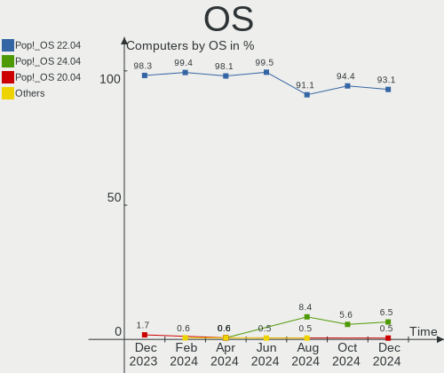
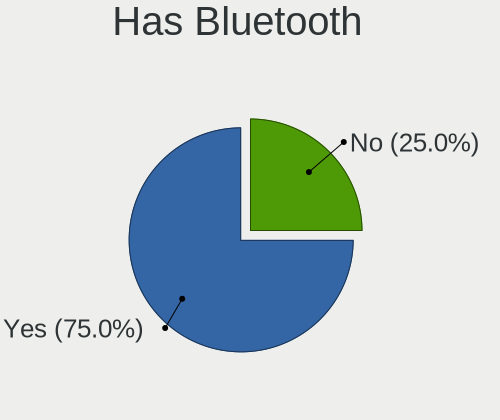
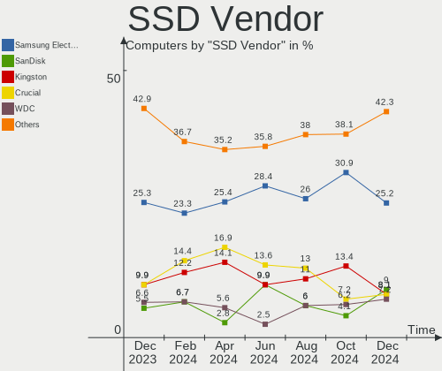
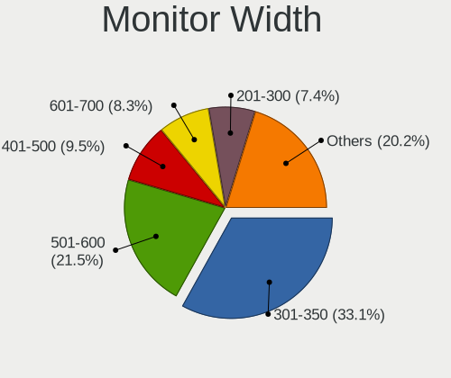
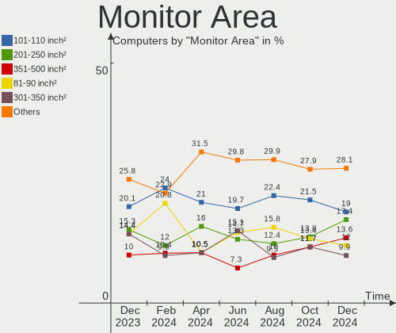
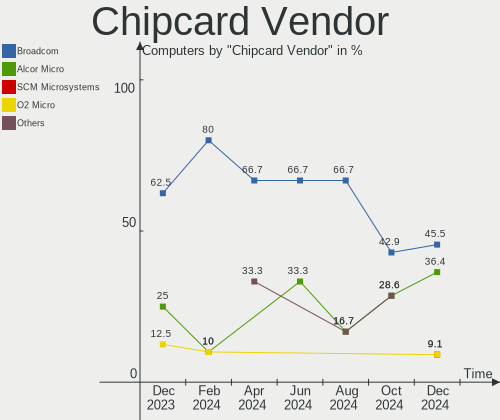

Pop!_OS - Hardware Trends
-------------------------

A project to identify most popular hardware characteristics and track their change
over time based on data collected by Linux users at https://Linux-Hardware.org.

Anyone can contribute to this report by the [hw-probe](https://github.com/linuxhw/hw-probe) tool:

    sudo -E hw-probe -all -upload

This is a report for all computer types. See also reports for [desktops](/Dist/Pop!_OS/Desktop/README.md) and [notebooks](/Dist/Pop!_OS/Notebook/README.md).

This report is for one last month. Overall report since the beginning of time: [TestDays](https://github.com/linuxhw/TestDays)

Period: Apr, 2024.

Contents
--------

* [ System ](#system)
  - [ OS                       ](#os)
  - [ OS Family                ](#os-family)
  - [ Kernel                   ](#kernel)
  - [ Kernel Family            ](#kernel-family)
  - [ Kernel Major Ver.        ](#kernel-major-ver)
  - [ Arch                     ](#arch)
  - [ DE                       ](#de)
  - [ Display Server           ](#display-server)
  - [ Display Manager          ](#display-manager)
  - [ OS Lang                  ](#os-lang)
  - [ Boot Mode                ](#boot-mode)
  - [ Filesystem               ](#filesystem)
  - [ Part. scheme             ](#part-scheme)
  - [ Dual Boot with Linux/BSD ](#dual-boot-with-linuxbsd)
  - [ Dual Boot (Win)          ](#dual-boot-win)

* [ Board ](#board)
  - [ Vendor                   ](#vendor)
  - [ Model                    ](#model)
  - [ Model Family             ](#model-family)
  - [ MFG Year                 ](#mfg-year)
  - [ Form Factor              ](#form-factor)
  - [ Secure Boot              ](#secure-boot)
  - [ Coreboot                 ](#coreboot)
  - [ RAM Size                 ](#ram-size)
  - [ RAM Used                 ](#ram-used)
  - [ Total Drives             ](#total-drives)
  - [ Has CD-ROM               ](#has-cd-rom)
  - [ Has Ethernet             ](#has-ethernet)
  - [ Has WiFi                 ](#has-wifi)
  - [ Has Bluetooth            ](#has-bluetooth)

* [ Location ](#location)
  - [ Country                  ](#country)
  - [ City                     ](#city)

* [ Drives ](#drives)
  - [ Drive Vendor             ](#drive-vendor)
  - [ Drive Model              ](#drive-model)
  - [ HDD Vendor               ](#hdd-vendor)
  - [ SSD Vendor               ](#ssd-vendor)
  - [ Drive Kind               ](#drive-kind)
  - [ Drive Connector          ](#drive-connector)
  - [ Drive Size               ](#drive-size)
  - [ Space Total              ](#space-total)
  - [ Space Used               ](#space-used)
  - [ Malfunc. Drives          ](#malfunc-drives)
  - [ Malfunc. Drive Vendor    ](#malfunc-drive-vendor)
  - [ Malfunc. HDD Vendor      ](#malfunc-hdd-vendor)
  - [ Malfunc. Drive Kind      ](#malfunc-drive-kind)
  - [ Failed Drives            ](#failed-drives)
  - [ Failed Drive Vendor      ](#failed-drive-vendor)
  - [ Drive Status             ](#drive-status)

* [ Storage controller ](#storage-controller)
  - [ Storage Vendor           ](#storage-vendor)
  - [ Storage Model            ](#storage-model)
  - [ Storage Kind             ](#storage-kind)

* [ Processor ](#processor)
  - [ CPU Vendor               ](#cpu-vendor)
  - [ CPU Model                ](#cpu-model)
  - [ CPU Model Family         ](#cpu-model-family)
  - [ CPU Cores                ](#cpu-cores)
  - [ CPU Sockets              ](#cpu-sockets)
  - [ CPU Threads              ](#cpu-threads)
  - [ CPU Op-Modes             ](#cpu-op-modes)
  - [ CPU Microcode            ](#cpu-microcode)
  - [ CPU Microarch            ](#cpu-microarch)

* [ Graphics ](#graphics)
  - [ GPU Vendor               ](#gpu-vendor)
  - [ GPU Model                ](#gpu-model)
  - [ GPU Combo                ](#gpu-combo)
  - [ GPU Driver               ](#gpu-driver)
  - [ GPU Memory               ](#gpu-memory)

* [ Monitor ](#monitor)
  - [ Monitor Vendor           ](#monitor-vendor)
  - [ Monitor Model            ](#monitor-model)
  - [ Monitor Resolution       ](#monitor-resolution)
  - [ Monitor Diagonal         ](#monitor-diagonal)
  - [ Monitor Width            ](#monitor-width)
  - [ Aspect Ratio             ](#aspect-ratio)
  - [ Monitor Area             ](#monitor-area)
  - [ Pixel Density            ](#pixel-density)
  - [ Multiple Monitors        ](#multiple-monitors)

* [ Network ](#network)
  - [ Net Controller Vendor    ](#net-controller-vendor)
  - [ Net Controller Model     ](#net-controller-model)
  - [ Wireless Vendor          ](#wireless-vendor)
  - [ Wireless Model           ](#wireless-model)
  - [ Ethernet Vendor          ](#ethernet-vendor)
  - [ Ethernet Model           ](#ethernet-model)
  - [ Net Controller Kind      ](#net-controller-kind)
  - [ Used Controller          ](#used-controller)
  - [ NICs                     ](#nics)
  - [ IPv6                     ](#ipv6)

* [ Bluetooth ](#bluetooth)
  - [ Bluetooth Vendor         ](#bluetooth-vendor)
  - [ Bluetooth Model          ](#bluetooth-model)

* [ Sound ](#sound)
  - [ Sound Vendor             ](#sound-vendor)
  - [ Sound Model              ](#sound-model)

* [ Memory ](#memory)
  - [ Memory Vendor            ](#memory-vendor)
  - [ Memory Model             ](#memory-model)
  - [ Memory Kind              ](#memory-kind)
  - [ Memory Form Factor       ](#memory-form-factor)
  - [ Memory Size              ](#memory-size)
  - [ Memory Speed             ](#memory-speed)

* [ Printers & scanners ](#printers--scanners)
  - [ Printer Vendor           ](#printer-vendor)
  - [ Printer Model            ](#printer-model)
  - [ Scanner Vendor           ](#scanner-vendor)
  - [ Scanner Model            ](#scanner-model)

* [ Camera ](#camera)
  - [ Camera Vendor            ](#camera-vendor)
  - [ Camera Model             ](#camera-model)

* [ Security ](#security)
  - [ Fingerprint Vendor       ](#fingerprint-vendor)
  - [ Fingerprint Model        ](#fingerprint-model)
  - [ Chipcard Vendor          ](#chipcard-vendor)
  - [ Chipcard Model           ](#chipcard-model)

* [ Unsupported ](#unsupported)
  - [ Unsupported Devices      ](#unsupported-devices)
  - [ Unsupported Device Types ](#unsupported-device-types)

System
------

OS
--

Installed operating systems

| Name          | Computers | Percent |
|---------------|-----------|---------|
| Pop!_OS 22.04 | 159       | 98.15%  |
| Pop!_OS 24.04 | 1         | 0.62%   |
| Pop!_OS 21.10 | 1         | 0.62%   |
| Pop!_OS 20.04 | 1         | 0.62%   |

OS Family
---------

OS without a version

| Name    | Computers | Percent |
|---------|-----------|---------|
| Pop!_OS | 162       | 100%    |

Kernel
------

Version of the Linux kernel

| Version                             | Computers | Percent |
|-------------------------------------|-----------|---------|
| 6.8.0-76060800daily20240311-generic | 141       | 87.04%  |
| 6.6.10-76060610-generic             | 13        | 8.02%   |
| 6.8.6-surface-1                     | 1         | 0.62%   |
| 6.8.0-1004-raspi                    | 1         | 0.62%   |
| 6.6.6-76060606-generic              | 1         | 0.62%   |
| 6.5.6-76060506-generic              | 1         | 0.62%   |
| 6.5.4-76060504-generic              | 1         | 0.62%   |
| 6.2.6-76060206-generic              | 1         | 0.62%   |
| 6.0.12-76060012-generic             | 1         | 0.62%   |
| 5.18.10-76051810-generic            | 1         | 0.62%   |

Kernel Family
-------------

Linux kernel without a distro release

| Version | Computers | Percent |
|---------|-----------|---------|
| 6.8.0   | 142       | 87.65%  |
| 6.6.10  | 13        | 8.02%   |
| 6.8.6   | 1         | 0.62%   |
| 6.6.6   | 1         | 0.62%   |
| 6.5.6   | 1         | 0.62%   |
| 6.5.4   | 1         | 0.62%   |
| 6.2.6   | 1         | 0.62%   |
| 6.0.12  | 1         | 0.62%   |
| 5.18.10 | 1         | 0.62%   |

Kernel Major Ver.
-----------------

Linux kernel major version

| Version | Computers | Percent |
|---------|-----------|---------|
| 6.8     | 143       | 88.27%  |
| 6.6     | 14        | 8.64%   |
| 6.5     | 2         | 1.23%   |
| 6.2     | 1         | 0.62%   |
| 6.0     | 1         | 0.62%   |
| 5.18    | 1         | 0.62%   |

Arch
----

OS architecture (x86_64, i586, etc.)

| Name    | Computers | Percent |
|---------|-----------|---------|
| x86_64  | 161       | 99.38%  |
| aarch64 | 1         | 0.62%   |

DE
--

Desktop Environment

| Name       | Computers | Percent |
|------------|-----------|---------|
| GNOME      | 157       | 96.91%  |
| KDE5       | 3         | 1.85%   |
| X-Cinnamon | 1         | 0.62%   |
| awesome    | 1         | 0.62%   |

Display Server
--------------

X11 or Wayland

| Name    | Computers | Percent |
|---------|-----------|---------|
| X11     | 151       | 93.21%  |
| Wayland | 11        | 6.79%   |

Display Manager
---------------

SDDM, LightDM, etc.

| Name    | Computers | Percent |
|---------|-----------|---------|
| Unknown | 115       | 70.99%  |
| GDM3    | 45        | 27.78%  |
| SDDM    | 1         | 0.62%   |
| GDM     | 1         | 0.62%   |

OS Lang
-------

Language

| Lang  | Computers | Percent |
|-------|-----------|---------|
| en_US | 89        | 54.94%  |
| en_GB | 13        | 8.02%   |
| de_DE | 11        | 6.79%   |
| pt_BR | 8         | 4.94%   |
| fr_FR | 5         | 3.09%   |
| en_AU | 4         | 2.47%   |
| es_ES | 3         | 1.85%   |
| en_CA | 3         | 1.85%   |
| ru_RU | 2         | 1.23%   |
| it_IT | 2         | 1.23%   |
| es_CL | 2         | 1.23%   |
| de_CH | 2         | 1.23%   |
| C     | 2         | 1.23%   |
| zh_CN | 1         | 0.62%   |
| tr_TR | 1         | 0.62%   |
| sv_SE | 1         | 0.62%   |
| sk_SK | 1         | 0.62%   |
| ro_RO | 1         | 0.62%   |
| pt_PT | 1         | 0.62%   |
| pl_PL | 1         | 0.62%   |
| nb_NO | 1         | 0.62%   |
| es_US | 1         | 0.62%   |
| es_MX | 1         | 0.62%   |
| en_ZW | 1         | 0.62%   |
| en_ZA | 1         | 0.62%   |
| en_IN | 1         | 0.62%   |
| en_DK | 1         | 0.62%   |
| de_AT | 1         | 0.62%   |
| cs_CZ | 1         | 0.62%   |

Boot Mode
---------

EFI or BIOS

| Mode | Computers | Percent |
|------|-----------|---------|
| BIOS | 117       | 72.22%  |
| EFI  | 45        | 27.78%  |

Filesystem
----------

Type of filesystem

| Type  | Computers | Percent |
|-------|-----------|---------|
| Ext4  | 159       | 98.15%  |
| Btrfs | 3         | 1.85%   |

Part. scheme
------------

Scheme of partitioning

| Type    | Computers | Percent |
|---------|-----------|---------|
| Unknown | 115       | 70.99%  |
| GPT     | 45        | 27.78%  |
| MBR     | 2         | 1.23%   |

Dual Boot with Linux/BSD
------------------------

Hosting more than one Linux/BSD

| Dual boot | Computers | Percent |
|-----------|-----------|---------|
| No        | 159       | 98.15%  |
| Yes       | 3         | 1.85%   |

Dual Boot (Win)
---------------

Hosting Linux and Windows

| Dual boot | Computers | Percent |
|-----------|-----------|---------|
| No        | 137       | 84.57%  |
| Yes       | 25        | 15.43%  |

Board
-----

Vendor
------

Motherboard manufacturer

| Name                    | Computers | Percent |
|-------------------------|-----------|---------|
| ASUSTek Computer        | 30        | 18.52%  |
| Lenovo                  | 23        | 14.2%   |
| Hewlett-Packard         | 18        | 11.11%  |
| Dell                    | 18        | 11.11%  |
| Acer                    | 12        | 7.41%   |
| MSI                     | 11        | 6.79%   |
| Gigabyte Technology     | 10        | 6.17%   |
| ASRock                  | 8         | 4.94%   |
| Apple                   | 7         | 4.32%   |
| System76                | 5         | 3.09%   |
| Intel                   | 3         | 1.85%   |
| Supermicro              | 2         | 1.23%   |
| Alienware               | 2         | 1.23%   |
| Toshiba                 | 1         | 0.62%   |
| Samsung Electronics     | 1         | 0.62%   |
| Raspberry Pi Foundation | 1         | 0.62%   |
| Microsoft               | 1         | 0.62%   |
| Medion                  | 1         | 0.62%   |
| Itautec                 | 1         | 0.62%   |
| HUAWEI                  | 1         | 0.62%   |
| Huanan                  | 1         | 0.62%   |
| GPD                     | 1         | 0.62%   |
| Google                  | 1         | 0.62%   |
| Biostar                 | 1         | 0.62%   |
| BESSTAR Tech            | 1         | 0.62%   |
| Unknown                 | 1         | 0.62%   |

Model
-----

Motherboard model

| Name                                     | Computers | Percent |
|------------------------------------------|-----------|---------|
| System76 Oryx Pro                        | 2         | 1.23%   |
| System76 Lemur Pro                       | 2         | 1.23%   |
| Dell Precision 5680                      | 2         | 1.23%   |
| ASUS VivoBook_ASUSLaptop M1605XA_M1605XA | 2         | 1.23%   |
| ASUS TUF Gaming B650M-E WIFI             | 2         | 1.23%   |
| Toshiba Satellite L755D                  | 1         | 0.62%   |
| System76 Thelio Mira                     | 1         | 0.62%   |
| Supermicro X12SPA-TF                     | 1         | 0.62%   |
| Supermicro Mediasite Recorder            | 1         | 0.62%   |
| Samsung 940X3G/930X3G                    | 1         | 0.62%   |
| RPi Raspberry Pi 5 Model B Rev 1.0       | 1         | 0.62%   |
| MSI Titan GT77HX 13VI                    | 1         | 0.62%   |
| MSI MS-7C95                              | 1         | 0.62%   |
| MSI MS-7C92                              | 1         | 0.62%   |
| MSI MS-7C56                              | 1         | 0.62%   |
| MSI MS-7C02                              | 1         | 0.62%   |
| MSI MS-7A74                              | 1         | 0.62%   |
| MSI MS-7821                              | 1         | 0.62%   |
| MSI MS-7693                              | 1         | 0.62%   |
| MSI Modern 15 A5M                        | 1         | 0.62%   |
| MSI Katana 15 B12VGK                     | 1         | 0.62%   |
| MSI GE62VR 6RF                           | 1         | 0.62%   |
| Microsoft Surface Laptop Go 2            | 1         | 0.62%   |
| Medion Akoya E6227                       | 1         | 0.62%   |
| Lenovo ThinkPad X1 Yoga Gen 7 21CD0073GE | 1         | 0.62%   |
| Lenovo ThinkPad X1 Extreme 20MF000MUS    | 1         | 0.62%   |
| Lenovo ThinkPad T470s 20HFCT01WW         | 1         | 0.62%   |
| Lenovo ThinkPad T470 20HEA0TLUS          | 1         | 0.62%   |
| Lenovo ThinkPad T14s Gen 2a 20XGS0G400   | 1         | 0.62%   |
| Lenovo ThinkPad T14s Gen 1 20UJS36000    | 1         | 0.62%   |
| Lenovo ThinkPad S5-S540 20B30077GE       | 1         | 0.62%   |
| Lenovo ThinkPad P50 20ENCTO1WW           | 1         | 0.62%   |
| Lenovo ThinkPad L14 Gen 2a 20X6S1DS0P    | 1         | 0.62%   |
| Lenovo ThinkPad E470 20H10056MZ          | 1         | 0.62%   |
| Lenovo ThinkPad E16 Gen 1 21JN003MAU     | 1         | 0.62%   |
| Lenovo Slim Pro 9 14IRP8 83BV            | 1         | 0.62%   |
| Lenovo LOQ 15IRH8 82XV                   | 1         | 0.62%   |
| Lenovo Legion Pro 5 16ARX8 82WM          | 1         | 0.62%   |
| Lenovo Legion 5 17ACH6H 82JY             | 1         | 0.62%   |
| Lenovo Legion 5 15ARH05H 82B1            | 1         | 0.62%   |

Model Family
------------

Motherboard model prefix

| Name                 | Computers | Percent |
|----------------------|-----------|---------|
| Lenovo ThinkPad      | 11        | 6.79%   |
| ASUS TUF             | 6         | 3.7%    |
| Acer Aspire          | 6         | 3.7%    |
| Lenovo IdeaPad       | 5         | 3.09%   |
| Dell Inspiron        | 5         | 3.09%   |
| Lenovo Legion        | 4         | 2.47%   |
| HP OMEN              | 4         | 2.47%   |
| HP EliteBook         | 4         | 2.47%   |
| Dell Latitude        | 4         | 2.47%   |
| ASUS ROG             | 4         | 2.47%   |
| ASUS PRIME           | 4         | 2.47%   |
| Dell XPS             | 3         | 1.85%   |
| Dell Precision       | 3         | 1.85%   |
| ASUS VivoBook        | 3         | 1.85%   |
| Acer Nitro           | 3         | 1.85%   |
| System76 Oryx        | 2         | 1.23%   |
| System76 Lemur       | 2         | 1.23%   |
| HP Pavilion          | 2         | 1.23%   |
| Dell OptiPlex        | 2         | 1.23%   |
| ASUS ASUS            | 2         | 1.23%   |
| ASRock B450M         | 2         | 1.23%   |
| Toshiba Satellite    | 1         | 0.62%   |
| System76 Thelio      | 1         | 0.62%   |
| Supermicro X12SPA-TF | 1         | 0.62%   |
| Supermicro Mediasite | 1         | 0.62%   |
| Samsung 940X3G       | 1         | 0.62%   |
| RPi Raspberry        | 1         | 0.62%   |
| MSI Titan            | 1         | 0.62%   |
| MSI MS-7C95          | 1         | 0.62%   |
| MSI MS-7C92          | 1         | 0.62%   |
| MSI MS-7C56          | 1         | 0.62%   |
| MSI MS-7C02          | 1         | 0.62%   |
| MSI MS-7A74          | 1         | 0.62%   |
| MSI MS-7821          | 1         | 0.62%   |
| MSI MS-7693          | 1         | 0.62%   |
| MSI Modern           | 1         | 0.62%   |
| MSI Katana           | 1         | 0.62%   |
| MSI GE62VR           | 1         | 0.62%   |
| Microsoft Surface    | 1         | 0.62%   |
| Medion Akoya         | 1         | 0.62%   |

MFG Year
--------

Motherboard manufacture year

| Year    | Computers | Percent |
|---------|-----------|---------|
| 2021    | 23        | 14.2%   |
| 2020    | 19        | 11.73%  |
| 2023    | 18        | 11.11%  |
| 2022    | 15        | 9.26%   |
| 2017    | 10        | 6.17%   |
| 2015    | 10        | 6.17%   |
| 2012    | 10        | 6.17%   |
| 2019    | 9         | 5.56%   |
| 2013    | 9         | 5.56%   |
| 2018    | 7         | 4.32%   |
| 2011    | 6         | 3.7%    |
| 2010    | 6         | 3.7%    |
| 2016    | 5         | 3.09%   |
| 2014    | 5         | 3.09%   |
| 2024    | 4         | 2.47%   |
| 2009    | 3         | 1.85%   |
| 2008    | 2         | 1.23%   |
| Unknown | 1         | 0.62%   |

Form Factor
-----------

Physical design of the computer

| Name           | Computers | Percent |
|----------------|-----------|---------|
| Notebook       | 85        | 52.47%  |
| Desktop        | 65        | 40.12%  |
| Convertible    | 5         | 3.09%   |
| Mini pc        | 2         | 1.23%   |
| All in one     | 2         | 1.23%   |
| System on chip | 1         | 0.62%   |
| Tablet         | 1         | 0.62%   |
| Server         | 1         | 0.62%   |

Secure Boot
-----------

Enabled or disabled

| State    | Computers | Percent |
|----------|-----------|---------|
| Disabled | 162       | 100%    |

Coreboot
--------

Have coreboot on board

| Used | Computers | Percent |
|------|-----------|---------|
| No   | 158       | 97.53%  |
| Yes  | 4         | 2.47%   |

RAM Size
--------

Total RAM memory

| Size in GB  | Computers | Percent |
|-------------|-----------|---------|
| 16.01-24.0  | 44        | 27.16%  |
| 32.01-64.0  | 40        | 24.69%  |
| 4.01-8.0    | 29        | 17.9%   |
| 8.01-16.0   | 22        | 13.58%  |
| 64.01-256.0 | 12        | 7.41%   |
| 3.01-4.0    | 9         | 5.56%   |
| 24.01-32.0  | 4         | 2.47%   |
| 2.01-3.0    | 1         | 0.62%   |
| 1.01-2.0    | 1         | 0.62%   |

RAM Used
--------

Used RAM memory

| Used GB    | Computers | Percent |
|------------|-----------|---------|
| 4.01-8.0   | 73        | 45.06%  |
| 8.01-16.0  | 30        | 18.52%  |
| 3.01-4.0   | 28        | 17.28%  |
| 2.01-3.0   | 20        | 12.35%  |
| 1.01-2.0   | 7         | 4.32%   |
| 16.01-24.0 | 4         | 2.47%   |

Total Drives
------------

Number of drives on board

| Drives | Computers | Percent |
|--------|-----------|---------|
| 1      | 86        | 53.09%  |
| 2      | 46        | 28.4%   |
| 3      | 14        | 8.64%   |
| 5      | 7         | 4.32%   |
| 6      | 4         | 2.47%   |
| 4      | 4         | 2.47%   |
| 7      | 1         | 0.62%   |

Has CD-ROM
----------

Has CD-ROM on board

| Presented | Computers | Percent |
|-----------|-----------|---------|
| No        | 132       | 81.48%  |
| Yes       | 30        | 18.52%  |

Has Ethernet
------------

Has Ethernet on board

| Presented | Computers | Percent |
|-----------|-----------|---------|
| Yes       | 136       | 83.95%  |
| No        | 26        | 16.05%  |

Has WiFi
--------

Has WiFi module

| Presented | Computers | Percent |
|-----------|-----------|---------|
| Yes       | 131       | 80.86%  |
| No        | 31        | 19.14%  |

Has Bluetooth
-------------

Has Bluetooth module

| Presented | Computers | Percent |
|-----------|-----------|---------|
| Yes       | 115       | 70.99%  |
| No        | 47        | 29.01%  |

Location
--------

Country
-------

Geographic location (country)

| Country      | Computers | Percent |
|--------------|-----------|---------|
| USA          | 46        | 28.4%   |
| Brazil       | 14        | 8.64%   |
| Germany      | 12        | 7.41%   |
| UK           | 10        | 6.17%   |
| Canada       | 9         | 5.56%   |
| Australia    | 5         | 3.09%   |
| Russia       | 4         | 2.47%   |
| Poland       | 4         | 2.47%   |
| Netherlands  | 4         | 2.47%   |
| Austria      | 4         | 2.47%   |
| Switzerland  | 3         | 1.85%   |
| Spain        | 3         | 1.85%   |
| Norway       | 3         | 1.85%   |
| France       | 3         | 1.85%   |
| Thailand     | 2         | 1.23%   |
| South Africa | 2         | 1.23%   |
| Italy        | 2         | 1.23%   |
| India        | 2         | 1.23%   |
| Greece       | 2         | 1.23%   |
| Czechia      | 2         | 1.23%   |
| Chile        | 2         | 1.23%   |
| Ukraine      | 1         | 0.62%   |
| UAE          | 1         | 0.62%   |
| Turkey       | 1         | 0.62%   |
| Tunisia      | 1         | 0.62%   |
| Taiwan       | 1         | 0.62%   |
| Sweden       | 1         | 0.62%   |
| Slovakia     | 1         | 0.62%   |
| Romania      | 1         | 0.62%   |
| Puerto Rico  | 1         | 0.62%   |
| Portugal     | 1         | 0.62%   |
| Philippines  | 1         | 0.62%   |
| New Zealand  | 1         | 0.62%   |
| Nepal        | 1         | 0.62%   |
| Mexico       | 1         | 0.62%   |
| Malaysia     | 1         | 0.62%   |
| Ireland      | 1         | 0.62%   |
| Iran         | 1         | 0.62%   |
| Finland      | 1         | 0.62%   |
| Egypt        | 1         | 0.62%   |

City
----

Geographic location (city)

| City           | Computers | Percent |
|----------------|-----------|---------|
| Warsaw         | 2         | 1.23%   |
| Vienna         | 2         | 1.23%   |
| Sydney         | 2         | 1.23%   |
| Seattle        | 2         | 1.23%   |
| Radford        | 2         | 1.23%   |
| Providence     | 2         | 1.23%   |
| Prague         | 2         | 1.23%   |
| New York       | 2         | 1.23%   |
| Melbourne      | 2         | 1.23%   |
| Los Angeles    | 2         | 1.23%   |
| Contagem       | 2         | 1.23%   |
| Berlin         | 2         | 1.23%   |
| Wroclaw        | 1         | 0.62%   |
| Winnipeg       | 1         | 0.62%   |
| Wichita Falls  | 1         | 0.62%   |
| Wichita        | 1         | 0.62%   |
| Wageningen     | 1         | 0.62%   |
| Virden         | 1         | 0.62%   |
| Viña del Mar  | 1         | 0.62%   |
| Viersen        | 1         | 0.62%   |
| Uba            | 1         | 0.62%   |
| Tzaneen        | 1         | 0.62%   |
| Tunis          | 1         | 0.62%   |
| Tulsa          | 1         | 0.62%   |
| Trondheim      | 1         | 0.62%   |
| Toronto        | 1         | 0.62%   |
| Tonypandy      | 1         | 0.62%   |
| Toa Baja       | 1         | 0.62%   |
| Tirana         | 1         | 0.62%   |
| Tepic          | 1         | 0.62%   |
| Temuco         | 1         | 0.62%   |
| Tehran         | 1         | 0.62%   |
| Taipei         | 1         | 0.62%   |
| Swift Current  | 1         | 0.62%   |
| Sunshine Coast | 1         | 0.62%   |
| St Louis       | 1         | 0.62%   |
| St Austell     | 1         | 0.62%   |
| Spring Hill    | 1         | 0.62%   |
| Southwark      | 1         | 0.62%   |
| Someren        | 1         | 0.62%   |

Drives
------

Drive Vendor
------------

Hard drive vendors

| Vendor                       | Computers | Drives | Percent |
|------------------------------|-----------|--------|---------|
| Samsung Electronics          | 51        | 66     | 19.25%  |
| WDC                          | 28        | 29     | 10.57%  |
| Seagate                      | 26        | 35     | 9.81%   |
| Kingston                     | 16        | 17     | 6.04%   |
| Toshiba                      | 15        | 17     | 5.66%   |
| SanDisk                      | 14        | 14     | 5.28%   |
| Crucial                      | 13        | 15     | 4.91%   |
| Micron Technology            | 11        | 11     | 4.15%   |
| SK hynix                     | 9         | 9      | 3.4%    |
| Unknown                      | 8         | 8      | 3.02%   |
| Phison Electronics           | 7         | 8      | 2.64%   |
| Intel                        | 7         | 7      | 2.64%   |
| Silicon Motion               | 5         | 5      | 1.89%   |
| SPCC                         | 4         | 4      | 1.51%   |
| Netac                        | 3         | 3      | 1.13%   |
| MAXIO Technology (Hangzhou)  | 3         | 3      | 1.13%   |
| KIOXIA                       | 3         | 3      | 1.13%   |
| Kingston Technology Company  | 3         | 3      | 1.13%   |
| Hitachi                      | 3         | 3      | 1.13%   |
| China                        | 3         | 3      | 1.13%   |
| Apple                        | 3         | 3      | 1.13%   |
| LITEON                       | 2         | 2      | 0.75%   |
| KingDian                     | 2         | 2      | 0.75%   |
| HGST                         | 2         | 2      | 0.75%   |
| ASMT                         | 2         | 2      | 0.75%   |
| WD MediaMax                  | 1         | 1      | 0.38%   |
| WALRAM                       | 1         | 1      | 0.38%   |
| Verbatim                     | 1         | 1      | 0.38%   |
| UMIS                         | 1         | 1      | 0.38%   |
| Shenzhen Longsys Electronics | 1         | 1      | 0.38%   |
| Realtek                      | 1         | 1      | 0.38%   |
| Phison                       | 1         | 1      | 0.38%   |
| Patriot                      | 1         | 2      | 0.38%   |
| OCZ                          | 1         | 1      | 0.38%   |
| Micron/Crucial Technology    | 1         | 1      | 0.38%   |
| MaxDigital                   | 1         | 1      | 0.38%   |
| LITEONIT                     | 1         | 1      | 0.38%   |
| Lexar                        | 1         | 2      | 0.38%   |
| KIOXIA-EXCERIA               | 1         | 1      | 0.38%   |
| KingSpec                     | 1         | 1      | 0.38%   |

Drive Model
-----------

Hard drive models

| Model                                                 | Computers | Percent |
|-------------------------------------------------------|-----------|---------|
| Samsung NVMe SSD Controller SM981/PM981/PM983 1TB     | 7         | 2.41%   |
| Samsung NVMe SSD Controller PM9A1/PM9A3/980PRO 1TB    | 7         | 2.41%   |
| Silicon Motion SM2263EN/SM2263XT SSD Controller 256GB | 4         | 1.37%   |
| Sandisk WD Blue SN550 NVMe SSD 2TB                    | 4         | 1.37%   |
| WDC WD10EZEX-00WN4A0 1TB                              | 3         | 1.03%   |
| Toshiba XG6 NVMe SSD Controller 1024GB                | 3         | 1.03%   |
| Seagate ST1000DM010-2EP102 1TB                        | 3         | 1.03%   |
| SanDisk NVMe SSD Drive 1TB                            | 3         | 1.03%   |
| Samsung SSD 850 EVO 500GB                             | 3         | 1.03%   |
| Kingston SA400S37480G 480GB SSD                       | 3         | 1.03%   |
| Crucial CT1000MX500SSD1 1TB                           | 3         | 1.03%   |
| Unknown NVMe SSD Drive 1TB                            | 2         | 0.69%   |
| Seagate ST500LT012-1DG142 500GB                       | 2         | 0.69%   |
| Seagate Expansion 2TB                                 | 2         | 0.69%   |
| Samsung SSD 860 EVO 500GB                             | 2         | 0.69%   |
| Samsung MZVLB1T0HBLR-000L2 1TB                        | 2         | 0.69%   |
| Samsung MZALQ512HALU-000L2 512GB                      | 2         | 0.69%   |
| Phison E12 NVMe Controller 2TB                        | 2         | 0.69%   |
| Micron 2450_MTFDKBA512TFK 512GB                       | 2         | 0.69%   |
| Micron 2400_MTFDKBA512QFM 512GB                       | 2         | 0.69%   |
| Kingston SV300S37A240G 240GB SSD                      | 2         | 0.69%   |
| Kingston SNVS500G 500GB                               | 2         | 0.69%   |
| Kingston SA400S37240G 240GB SSD                       | 2         | 0.69%   |
| Intel SSD 660P Series 1024GB                          | 2         | 0.69%   |
| Crucial CT2000MX500SSD1 2TB                           | 2         | 0.69%   |
| ASMT USB 3.0 TOSATA 120GB                             | 2         | 0.69%   |
| WDC WDS500G2B0C-00PXH0 500GB                          | 1         | 0.34%   |
| WDC WDS500G2B0A-00SM50 500GB SSD                      | 1         | 0.34%   |
| WDC WDS240G2G0A-00JH30 240GB SSD                      | 1         | 0.34%   |
| WDC WDS100T2B0A-00SM50 1TB SSD                        | 1         | 0.34%   |
| WDC WDBRPG5000ANC-WRSN 500GB                          | 1         | 0.34%   |
| WDC WD80EMAZ-00WJTA0 8TB                              | 1         | 0.34%   |
| WDC WD8002FZWX-00BKUA0 8TB                            | 1         | 0.34%   |
| WDC WD6400AAKS-65A7B0 640GB                           | 1         | 0.34%   |
| WDC WD60EFAX-68JH4N0 6TB                              | 1         | 0.34%   |
| WDC WD5000BPVT-22HXZT3 500GB                          | 1         | 0.34%   |
| WDC WD5000AAKX-08ERMA0 500GB                          | 1         | 0.34%   |
| WDC WD3200BPVT-22JJ5T0 320GB                          | 1         | 0.34%   |
| WDC WD3200BEVT-11ZCT0 320GB                           | 1         | 0.34%   |
| WDC WD30EZRZ-00GXCB0 3TB                              | 1         | 0.34%   |

HDD Vendor
----------

Hard disk drive vendors

| Vendor              | Computers | Drives | Percent |
|---------------------|-----------|--------|---------|
| Seagate             | 25        | 33     | 38.46%  |
| WDC                 | 20        | 21     | 30.77%  |
| Toshiba             | 9         | 10     | 13.85%  |
| Hitachi             | 3         | 3      | 4.62%   |
| Samsung Electronics | 2         | 2      | 3.08%   |
| HGST                | 2         | 2      | 3.08%   |
| Apple               | 2         | 2      | 3.08%   |
| WD MediaMax         | 1         | 1      | 1.54%   |
| Unknown             | 1         | 1      | 1.54%   |

SSD Vendor
----------

Solid state drive vendors

| Vendor              | Computers | Drives | Percent |
|---------------------|-----------|--------|---------|
| Samsung Electronics | 19        | 23     | 26.39%  |
| Crucial             | 12        | 13     | 16.67%  |
| Kingston            | 10        | 11     | 13.89%  |
| WDC                 | 4         | 4      | 5.56%   |
| Toshiba             | 2         | 2      | 2.78%   |
| SPCC                | 2         | 2      | 2.78%   |
| SanDisk             | 2         | 2      | 2.78%   |
| LITEON              | 2         | 2      | 2.78%   |
| KingDian            | 2         | 2      | 2.78%   |
| China               | 2         | 2      | 2.78%   |
| WALRAM              | 1         | 1      | 1.39%   |
| Verbatim            | 1         | 1      | 1.39%   |
| SK hynix            | 1         | 1      | 1.39%   |
| Patriot             | 1         | 2      | 1.39%   |
| OCZ                 | 1         | 1      | 1.39%   |
| Netac               | 1         | 1      | 1.39%   |
| LITEONIT            | 1         | 1      | 1.39%   |
| Lexar               | 1         | 2      | 1.39%   |
| KingSpec            | 1         | 1      | 1.39%   |
| Intenso             | 1         | 1      | 1.39%   |
| Intel               | 1         | 1      | 1.39%   |
| Gigabyte Technology | 1         | 2      | 1.39%   |
| Apple               | 1         | 1      | 1.39%   |
| Apacer              | 1         | 1      | 1.39%   |
| A-DATA Technology   | 1         | 1      | 1.39%   |

Drive Kind
----------

HDD or SSD

| Kind    | Computers | Drives | Percent |
|---------|-----------|--------|---------|
| NVMe    | 98        | 131    | 43.75%  |
| SSD     | 63        | 81     | 28.13%  |
| HDD     | 52        | 75     | 23.21%  |
| Unknown | 7         | 8      | 3.13%   |
| MMC     | 4         | 4      | 1.79%   |

Drive Connector
---------------

SATA, SAS, NVMe, etc.

| Type | Computers | Drives | Percent |
|------|-----------|--------|---------|
| NVMe | 98        | 130    | 48.51%  |
| SATA | 91        | 155    | 45.05%  |
| SAS  | 9         | 10     | 4.46%   |
| MMC  | 4         | 4      | 1.98%   |

Drive Size
----------

Size of hard drive

| Size in TB | Computers | Drives | Percent |
|------------|-----------|--------|---------|
| 0.01-0.5   | 62        | 79     | 49.6%   |
| 0.51-1.0   | 36        | 46     | 28.8%   |
| 1.01-2.0   | 15        | 19     | 12%     |
| 2.01-3.0   | 4         | 4      | 3.2%    |
| 4.01-10.0  | 4         | 4      | 3.2%    |
| 3.01-4.0   | 3         | 3      | 2.4%    |
| 10.01-20.0 | 1         | 1      | 0.8%    |

Space Total
-----------

Amount of disk space available on the file system

| Size in GB     | Computers | Percent |
|----------------|-----------|---------|
| 251-500        | 52        | 32.1%   |
| 101-250        | 38        | 23.46%  |
| 501-1000       | 25        | 15.43%  |
| 1001-2000      | 23        | 14.2%   |
| More than 3000 | 9         | 5.56%   |
| 2001-3000      | 7         | 4.32%   |
| 21-50          | 4         | 2.47%   |
| 51-100         | 4         | 2.47%   |

Space Used
----------

Amount of used disk space

| Used GB        | Computers | Percent |
|----------------|-----------|---------|
| 1-20           | 46        | 28.4%   |
| 21-50          | 26        | 16.05%  |
| 101-250        | 25        | 15.43%  |
| 51-100         | 23        | 14.2%   |
| 251-500        | 15        | 9.26%   |
| 501-1000       | 13        | 8.02%   |
| 1001-2000      | 8         | 4.94%   |
| More than 3000 | 5         | 3.09%   |
| 2001-3000      | 1         | 0.62%   |

Malfunc. Drives
---------------

Drive models with a malfunction

| Model                             | Computers | Drives | Percent |
|-----------------------------------|-----------|--------|---------|
| WDC WD20EFRX-68AX9N0 2TB          | 1         | 1      | 12.5%   |
| Toshiba MQ01ABD100 1TB            | 1         | 1      | 12.5%   |
| Seagate ST3750640AS 752GB         | 1         | 1      | 12.5%   |
| Seagate ST320LT009-9WC142 320GB   | 1         | 1      | 12.5%   |
| Seagate ST2000DM001-1CH164 2TB    | 1         | 1      | 12.5%   |
| Seagate ST1500DL003-9VT16L 1TB    | 1         | 1      | 12.5%   |
| Samsung Electronics HD502HI 500GB | 1         | 1      | 12.5%   |
| Crucial CT480M500SSD1 480GB       | 1         | 1      | 12.5%   |

Malfunc. Drive Vendor
---------------------

Vendors of faulty drives

| Vendor              | Computers | Drives | Percent |
|---------------------|-----------|--------|---------|
| Seagate             | 3         | 4      | 42.86%  |
| WDC                 | 1         | 1      | 14.29%  |
| Toshiba             | 1         | 1      | 14.29%  |
| Samsung Electronics | 1         | 1      | 14.29%  |
| Crucial             | 1         | 1      | 14.29%  |

Malfunc. HDD Vendor
-------------------

Vendors of faulty HDD drives

| Vendor              | Computers | Drives | Percent |
|---------------------|-----------|--------|---------|
| Seagate             | 3         | 4      | 50%     |
| WDC                 | 1         | 1      | 16.67%  |
| Toshiba             | 1         | 1      | 16.67%  |
| Samsung Electronics | 1         | 1      | 16.67%  |

Malfunc. Drive Kind
-------------------

Kinds of faulty drives

| Kind | Computers | Drives | Percent |
|------|-----------|--------|---------|
| HDD  | 5         | 7      | 83.33%  |
| SSD  | 1         | 1      | 16.67%  |

Failed Drives
-------------

Failed drive models

Zero info for selected period =(

Failed Drive Vendor
-------------------

Failed drive vendors

Zero info for selected period =(

Drive Status
------------

Number of failed and malfunc. drives

| Status   | Computers | Drives | Percent |
|----------|-----------|--------|---------|
| Detected | 125       | 226    | 73.1%   |
| Works    | 41        | 65     | 23.98%  |
| Malfunc  | 5         | 8      | 2.92%   |

Storage controller
------------------

Storage Vendor
--------------

Storage controller vendors

| Vendor                       | Computers | Percent |
|------------------------------|-----------|---------|
| Intel                        | 90        | 36.14%  |
| AMD                          | 39        | 15.66%  |
| Samsung Electronics          | 34        | 13.65%  |
| SanDisk                      | 16        | 6.43%   |
| Micron Technology            | 11        | 4.42%   |
| Phison Electronics           | 9         | 3.61%   |
| Kingston Technology Company  | 9         | 3.61%   |
| SK hynix                     | 8         | 3.21%   |
| Silicon Motion               | 6         | 2.41%   |
| KIOXIA                       | 5         | 2.01%   |
| Toshiba America Info Systems | 4         | 1.61%   |
| Solidigm                     | 3         | 1.2%    |
| Micron/Crucial Technology    | 3         | 1.2%    |
| MAXIO Technology (Hangzhou)  | 3         | 1.2%    |
| JMicron Technology           | 2         | 0.8%    |
| ASMedia Technology           | 2         | 0.8%    |
| Union Memory (Shenzhen)      | 1         | 0.4%    |
| Shenzhen Longsys Electronics | 1         | 0.4%    |
| Nvidia                       | 1         | 0.4%    |
| Netac Technology             | 1         | 0.4%    |
| Biwin Storage Technology     | 1         | 0.4%    |

Storage Model
-------------

Storage controller models

| Model                                                                          | Computers | Percent |
|--------------------------------------------------------------------------------|-----------|---------|
| AMD FCH SATA Controller [AHCI mode]                                            | 21        | 7.78%   |
| Samsung NVMe SSD Controller PM9A1/PM9A3/980PRO                                 | 12        | 4.44%   |
| Samsung NVMe SSD Controller SM981/PM981/PM983                                  | 10        | 3.7%    |
| AMD 400 Series Chipset SATA Controller                                         | 8         | 2.96%   |
| Samsung NVMe SSD Controller 980 (DRAM-less)                                    | 7         | 2.59%   |
| SanDisk Ultra 3D / WD Blue SN550 NVMe SSD                                      | 6         | 2.22%   |
| Intel Volume Management Device NVMe RAID Controller                            | 6         | 2.22%   |
| Intel 8 Series SATA Controller 1 [AHCI mode]                                   | 6         | 2.22%   |
| Intel 6 Series/C200 Series Chipset Family 6 port Mobile SATA AHCI Controller   | 6         | 2.22%   |
| AMD 600 Series Chipset SATA Controller                                         | 6         | 2.22%   |
| Silicon Motion SM2263EN/SM2263XT (DRAM-less) NVMe SSD Controllers              | 5         | 1.85%   |
| Intel Volume Management Device NVMe RAID Controller Intel Corporation          | 5         | 1.85%   |
| Intel Sunrise Point-LP SATA Controller [AHCI mode]                             | 5         | 1.85%   |
| Intel Cannon Lake Mobile PCH SATA AHCI Controller                              | 5         | 1.85%   |
| Intel 8 Series/C220 Series Chipset Family 6-port SATA Controller 1 [AHCI mode] | 5         | 1.85%   |
| Intel 200 Series PCH SATA controller [AHCI mode]                               | 5         | 1.85%   |
| AMD 500 Series Chipset SATA Controller                                         | 5         | 1.85%   |
| Toshiba America Info Systems XG6 NVMe SSD Controller                           | 4         | 1.48%   |
| Samsung NVMe SSD Controller S4LV008[Pascal]                                    | 4         | 1.48%   |
| Micron 2450 NVMe SSD [HendrixV] (DRAM-less)                                    | 4         | 1.48%   |
| Intel 7 Series/C210 Series Chipset Family 6-port SATA Controller [AHCI mode]   | 4         | 1.48%   |
| Intel 7 Series Chipset Family 6-port SATA Controller [AHCI mode]               | 4         | 1.48%   |
| SK hynix Platinum P41/PC801 NVMe Solid State Drive                             | 3         | 1.11%   |
| Phison E18 PCIe4 NVMe Controller                                               | 3         | 1.11%   |
| Phison E12 NVMe Controller                                                     | 3         | 1.11%   |
| MAXIO (Hangzhou) NVMe SSD Controller MAP1602 (DRAM-less)                       | 3         | 1.11%   |
| Intel SATA Controller [RAID mode]                                              | 3         | 1.11%   |
| Intel Q170/Q150/B150/H170/H110/Z170/CM236 Chipset SATA Controller [AHCI Mode]  | 3         | 1.11%   |
| Intel HM170/QM170 Chipset SATA Controller [AHCI Mode]                          | 3         | 1.11%   |
| AMD SB7x0/SB8x0/SB9x0 SATA Controller [IDE mode]                               | 3         | 1.11%   |
| AMD SB7x0/SB8x0/SB9x0 IDE Controller                                           | 3         | 1.11%   |
| Solidigm P44 Pro NVMe SSD [Hollywood Beach]                                    | 2         | 0.74%   |
| SK hynix Gold P31/BC711/PC711 NVMe Solid State Drive                           | 2         | 0.74%   |
| SK hynix BC511 NVMe SSD                                                        | 2         | 0.74%   |
| SanDisk WD PC SN810 / Black SN850 NVMe SSD                                     | 2         | 0.74%   |
| Sandisk WD Black SN850X NVMe SSD                                               | 2         | 0.74%   |
| SanDisk Extreme Pro / WD Black SN750 / PC SN730 / Red SN700 NVMe SSD           | 2         | 0.74%   |
| Samsung NVMe SSD Controller SM961/PM961/SM963                                  | 2         | 0.74%   |
| Micron 2550 NVMe SSD (DRAM-less)                                               | 2         | 0.74%   |
| Micron 2400 NVMe SSD (DRAM-less)                                               | 2         | 0.74%   |

Storage Kind
------------

Kind of storage controller (IDE, SATA, NVMe, SAS, ...)

| Kind | Computers | Percent |
|------|-----------|---------|
| SATA | 113       | 48.09%  |
| NVMe | 98        | 41.7%   |
| RAID | 15        | 6.38%   |
| IDE  | 9         | 3.83%   |

Processor
---------

CPU Vendor
----------

Processor vendors

| Vendor | Computers | Percent |
|--------|-----------|---------|
| Intel  | 103       | 63.58%  |
| AMD    | 58        | 35.8%   |
| ARM    | 1         | 0.62%   |

CPU Model
---------

Processor models

| Model                                      | Computers | Percent |
|--------------------------------------------|-----------|---------|
| AMD Ryzen 7 5800H with Radeon Graphics     | 5         | 3.09%   |
| AMD Ryzen 7 7800X3D 8-Core Processor       | 4         | 2.47%   |
| Intel Core i7-9750H CPU @ 2.60GHz          | 3         | 1.85%   |
| Intel Core i7-6700 CPU @ 3.40GHz           | 3         | 1.85%   |
| Intel Core i5-3210M CPU @ 2.50GHz          | 3         | 1.85%   |
| AMD Ryzen 7 5800X 8-Core Processor         | 3         | 1.85%   |
| AMD Ryzen 5 3600 6-Core Processor          | 3         | 1.85%   |
| Intel Xeon CPU E5-2620 v3 @ 2.40GHz        | 2         | 1.23%   |
| Intel Pentium Silver N6000 @ 1.10GHz       | 2         | 1.23%   |
| Intel Core i9-14900HX                      | 2         | 1.23%   |
| Intel Core i7-7700K CPU @ 4.20GHz          | 2         | 1.23%   |
| Intel Core i7-10700 CPU @ 2.90GHz          | 2         | 1.23%   |
| Intel Core i5-4200U CPU @ 1.60GHz          | 2         | 1.23%   |
| Intel Core i3-3240 CPU @ 3.40GHz           | 2         | 1.23%   |
| Intel 13th Gen Core i7-13700H              | 2         | 1.23%   |
| Intel 11th Gen Core i7-1165G7 @ 2.80GHz    | 2         | 1.23%   |
| Intel 11th Gen Core i5-1135G7 @ 2.40GHz    | 2         | 1.23%   |
| AMD Ryzen 9 7940HS w/ Radeon 780M Graphics | 2         | 1.23%   |
| AMD Ryzen 9 5950X 16-Core Processor        | 2         | 1.23%   |
| AMD Ryzen 7 4800H with Radeon Graphics     | 2         | 1.23%   |
| AMD Ryzen 7 4700U with Radeon Graphics     | 2         | 1.23%   |
| AMD Ryzen 7 2700 Eight-Core Processor      | 2         | 1.23%   |
| AMD Ryzen 5 PRO 5650U with Radeon Graphics | 2         | 1.23%   |
| AMD Ryzen 5 5600X 6-Core Processor         | 2         | 1.23%   |
| AMD Ryzen 5 5600G with Radeon Graphics     | 2         | 1.23%   |
| Intel Xeon Silver 4314 CPU @ 2.40GHz       | 1         | 0.62%   |
| Intel Xeon CPU E5450 @ 3.00GHz             | 1         | 0.62%   |
| Intel Xeon CPU E5-2687W v3 @ 3.10GHz       | 1         | 0.62%   |
| Intel Xeon CPU E5-1620 v3 @ 3.50GHz        | 1         | 0.62%   |
| Intel Xeon CPU E3-1505M v5 @ 2.80GHz       | 1         | 0.62%   |
| Intel Pentium Gold G7400                   | 1         | 0.62%   |
| Intel Pentium CPU N3540 @ 2.16GHz          | 1         | 0.62%   |
| Intel Genuine CPU 0000 @ 1.70GHz           | 1         | 0.62%   |
| Intel Core Ultra 7 155U                    | 1         | 0.62%   |
| Intel Core Ultra 7 155H                    | 1         | 0.62%   |
| Intel Core m3-6Y30 CPU @ 0.90GHz           | 1         | 0.62%   |
| Intel Core i7-9850H CPU @ 2.60GHz          | 1         | 0.62%   |
| Intel Core i7-8850H CPU @ 2.60GHz          | 1         | 0.62%   |
| Intel Core i7-8700 CPU @ 3.20GHz           | 1         | 0.62%   |
| Intel Core i7-7700HQ CPU @ 2.80GHz         | 1         | 0.62%   |

CPU Model Family
----------------

Processor model prefix

| Model                | Computers | Percent |
|----------------------|-----------|---------|
| Intel Core i5        | 28        | 17.28%  |
| Intel Core i7        | 25        | 15.43%  |
| AMD Ryzen 7          | 25        | 15.43%  |
| Other                | 19        | 11.73%  |
| AMD Ryzen 5          | 12        | 7.41%   |
| Intel Core i3        | 8         | 4.94%   |
| AMD Ryzen 9          | 7         | 4.32%   |
| Intel Xeon           | 6         | 3.7%    |
| Intel Celeron        | 5         | 3.09%   |
| AMD Ryzen 5 PRO      | 4         | 2.47%   |
| AMD FX               | 3         | 1.85%   |
| Intel Pentium Silver | 2         | 1.23%   |
| Intel Core i9        | 2         | 1.23%   |
| Intel Core 2 Duo     | 2         | 1.23%   |
| Intel Core           | 2         | 1.23%   |
| Intel Xeon Silver    | 1         | 0.62%   |
| Intel Pentium Gold   | 1         | 0.62%   |
| Intel Pentium        | 1         | 0.62%   |
| Intel Genuine        | 1         | 0.62%   |
| Intel Core m3        | 1         | 0.62%   |
| AMD Ryzen 3          | 1         | 0.62%   |
| AMD Phenom II X6     | 1         | 0.62%   |
| AMD Athlon X4        | 1         | 0.62%   |
| AMD Athlon           | 1         | 0.62%   |
| AMD A8               | 1         | 0.62%   |
| AMD A6               | 1         | 0.62%   |
| AMD A10              | 1         | 0.62%   |

CPU Cores
---------

Number of processor cores

| Number  | Computers | Percent |
|---------|-----------|---------|
| 4       | 42        | 25.93%  |
| 2       | 38        | 23.46%  |
| 8       | 32        | 19.75%  |
| 6       | 26        | 16.05%  |
| 10      | 6         | 3.7%    |
| 14      | 5         | 3.09%   |
| 16      | 4         | 2.47%   |
| 24      | 3         | 1.85%   |
| 12      | 3         | 1.85%   |
| 20      | 2         | 1.23%   |
| Unknown | 1         | 0.62%   |

CPU Sockets
-----------

Number of sockets

| Number  | Computers | Percent |
|---------|-----------|---------|
| 1       | 160       | 98.77%  |
| 2       | 1         | 0.62%   |
| Unknown | 1         | 0.62%   |

CPU Threads
-----------

Threads per core (Hyper-Threading)

| Number  | Computers | Percent |
|---------|-----------|---------|
| 2       | 134       | 82.72%  |
| 1       | 27        | 16.67%  |
| Unknown | 1         | 0.62%   |

CPU Op-Modes
------------

CPU Operation Modes (32-bit, 64-bit)

| Op mode        | Computers | Percent |
|----------------|-----------|---------|
| 32-bit, 64-bit | 162       | 100%    |

CPU Microcode
-------------

Microcode number

| Number     | Computers | Percent |
|------------|-----------|---------|
| Unknown    | 160       | 98.77%  |
| 0x40651    | 1         | 0.62%   |
| 0x0a50000c | 1         | 0.62%   |

CPU Microarch
-------------

Microarchitecture

| Name             | Computers | Percent |
|------------------|-----------|---------|
| Unknown          | 30        | 18.52%  |
| KabyLake         | 21        | 12.96%  |
| Zen 3            | 19        | 11.73%  |
| Haswell          | 13        | 8.02%   |
| Zen 2            | 12        | 7.41%   |
| IvyBridge        | 9         | 5.56%   |
| Skylake          | 8         | 4.94%   |
| SandyBridge      | 8         | 4.94%   |
| Alderlake Hybrid | 8         | 4.94%   |
| Zen+             | 5         | 3.09%   |
| TigerLake        | 4         | 2.47%   |
| Piledriver       | 4         | 2.47%   |
| CometLake        | 4         | 2.47%   |
| Silvermont       | 3         | 1.85%   |
| Penryn           | 3         | 1.85%   |
| Westmere         | 2         | 1.23%   |
| Nehalem          | 2         | 1.23%   |
| K10 Llano        | 1         | 0.62%   |
| K10              | 1         | 0.62%   |
| IceLake          | 1         | 0.62%   |
| Goldmont plus    | 1         | 0.62%   |
| Excavator        | 1         | 0.62%   |
| Bulldozer        | 1         | 0.62%   |
| Broadwell        | 1         | 0.62%   |

Graphics
--------

GPU Vendor
----------

Vendors of graphics cards

| Vendor            | Computers | Percent |
|-------------------|-----------|---------|
| Intel             | 77        | 37.56%  |
| Nvidia            | 72        | 35.12%  |
| AMD               | 55        | 26.83%  |
| ASPEED Technology | 1         | 0.49%   |

GPU Model
---------

Graphics card models

| Model                                                                     | Computers | Percent |
|---------------------------------------------------------------------------|-----------|---------|
| AMD Cezanne [Radeon Vega Series / Radeon Vega Mobile Series]              | 10        | 4.72%   |
| AMD Renoir [Radeon RX Vega 6 (Ryzen 4000/5000 Mobile Series)]             | 7         | 3.3%    |
| Intel Haswell-ULT Integrated Graphics Controller                          | 6         | 2.83%   |
| Intel CoffeeLake-H GT2 [UHD Graphics 630]                                 | 6         | 2.83%   |
| AMD Raphael                                                               | 6         | 2.83%   |
| Intel 2nd Generation Core Processor Family Integrated Graphics Controller | 5         | 2.36%   |
| Nvidia GA106M [GeForce RTX 3060 Mobile / Max-Q]                           | 4         | 1.89%   |
| Nvidia AD107M [GeForce RTX 4050 Max-Q / Mobile]                           | 4         | 1.89%   |
| Intel TigerLake-LP GT2 [Iris Xe Graphics]                                 | 4         | 1.89%   |
| Intel Raptor Lake-P [Iris Xe Graphics]                                    | 4         | 1.89%   |
| Intel CoffeeLake-S GT2 [UHD Graphics 630]                                 | 4         | 1.89%   |
| Intel 3rd Gen Core processor Graphics Controller                          | 4         | 1.89%   |
| AMD Phoenix1                                                              | 4         | 1.89%   |
| Nvidia TU117M [GeForce GTX 1650 Mobile / Max-Q]                           | 3         | 1.42%   |
| Nvidia TU117 [GeForce GTX 1650]                                           | 3         | 1.42%   |
| Nvidia GM204 [GeForce GTX 970]                                            | 3         | 1.42%   |
| Intel Raptor Lake-S UHD Graphics                                          | 3         | 1.42%   |
| Intel HD Graphics 620                                                     | 3         | 1.42%   |
| Intel HD Graphics 530                                                     | 3         | 1.42%   |
| AMD Rembrandt [Radeon 680M]                                               | 3         | 1.42%   |
| AMD Picasso/Raven 2 [Radeon Vega Series / Radeon Vega Mobile Series]      | 3         | 1.42%   |
| AMD Lexa PRO [Radeon 540/540X/550/550X / RX 540X/550/550X]                | 3         | 1.42%   |
| Nvidia TU116M [GeForce GTX 1660 Ti Mobile]                                | 2         | 0.94%   |
| Nvidia TU106 [GeForce RTX 2060 SUPER]                                     | 2         | 0.94%   |
| Nvidia GP108 [GeForce GT 1030]                                            | 2         | 0.94%   |
| Nvidia GP107M [GeForce GTX 1050 Ti Mobile]                                | 2         | 0.94%   |
| Nvidia GP107M [GeForce GTX 1050 Mobile]                                   | 2         | 0.94%   |
| Nvidia GP107 [GeForce GTX 1050 Ti]                                        | 2         | 0.94%   |
| Nvidia GA107GLM [RTX A1000 6GB Laptop GPU]                                | 2         | 0.94%   |
| Nvidia GA107 [GeForce RTX 2050]                                           | 2         | 0.94%   |
| Nvidia GA106 [GeForce RTX 3060 Lite Hash Rate]                            | 2         | 0.94%   |
| Nvidia GA104 [GeForce RTX 3060 Ti]                                        | 2         | 0.94%   |
| Nvidia AD102 [GeForce RTX 4090]                                           | 2         | 0.94%   |
| Intel Skylake GT2 [HD Graphics 520]                                       | 2         | 0.94%   |
| Intel JasperLake [UHD Graphics]                                           | 2         | 0.94%   |
| Intel HD Graphics 630                                                     | 2         | 0.94%   |
| Intel Atom Processor Z36xxx/Z37xxx Series Graphics & Display              | 2         | 0.94%   |
| Intel Alder Lake-UP3 GT2 [Iris Xe Graphics]                               | 2         | 0.94%   |
| Intel Alder Lake-P GT2 [Iris Xe Graphics]                                 | 2         | 0.94%   |
| Intel 4 Series Chipset Integrated Graphics Controller                     | 2         | 0.94%   |

GPU Combo
---------

Combinations of graphics cards

| Name            | Computers | Percent |
|-----------------|-----------|---------|
| 1 x Intel       | 48        | 29.63%  |
| 1 x Nvidia      | 37        | 22.84%  |
| 1 x AMD         | 29        | 17.9%   |
| Intel + Nvidia  | 20        | 12.35%  |
| AMD + Nvidia    | 14        | 8.64%   |
| 2 x AMD         | 7         | 4.32%   |
| Intel + AMD     | 5         | 3.09%   |
| Other           | 1         | 0.62%   |
| Nvidia + ASPEED | 1         | 0.62%   |

GPU Driver
----------

Free vs proprietary

| Driver      | Computers | Percent |
|-------------|-----------|---------|
| Free        | 92        | 56.79%  |
| Proprietary | 63        | 38.89%  |
| Unknown     | 7         | 4.32%   |

GPU Memory
----------

Total video memory

| Size in GB | Computers | Percent |
|------------|-----------|---------|
| Unknown    | 129       | 79.63%  |
| 0.01-0.5   | 9         | 5.56%   |
| 1.01-2.0   | 7         | 4.32%   |
| 3.01-4.0   | 6         | 3.7%    |
| 7.01-8.0   | 4         | 2.47%   |
| 8.01-16.0  | 4         | 2.47%   |
| 5.01-6.0   | 1         | 0.62%   |
| 2.01-3.0   | 1         | 0.62%   |
| 16.01-24.0 | 1         | 0.62%   |

Monitor
-------

Monitor Vendor
--------------

Monitor vendors

| Vendor               | Computers | Percent |
|----------------------|-----------|---------|
| Samsung Electronics  | 28        | 13.4%   |
| AU Optronics         | 27        | 12.92%  |
| Goldstar             | 19        | 9.09%   |
| Chimei Innolux       | 18        | 8.61%   |
| Dell                 | 14        | 6.7%    |
| BOE                  | 14        | 6.7%    |
| LG Display           | 10        | 4.78%   |
| Hewlett-Packard      | 8         | 3.83%   |
| Ancor Communications | 6         | 2.87%   |
| AOC                  | 5         | 2.39%   |
| Acer                 | 5         | 2.39%   |
| BenQ                 | 4         | 1.91%   |
| ViewSonic            | 3         | 1.44%   |
| Philips              | 3         | 1.44%   |
| Gigabyte Technology  | 3         | 1.44%   |
| ASUSTek Computer     | 3         | 1.44%   |
| Apple                | 3         | 1.44%   |
| Sony                 | 2         | 0.96%   |
| Sharp                | 2         | 0.96%   |
| RTK                  | 2         | 0.96%   |
| NEC Computers        | 2         | 0.96%   |
| Lenovo               | 2         | 0.96%   |
| Iiyama               | 2         | 0.96%   |
| Huion                | 2         | 0.96%   |
| CSO                  | 2         | 0.96%   |
| Vizio                | 1         | 0.48%   |
| VIE                  | 1         | 0.48%   |
| Valve                | 1         | 0.48%   |
| Unknown (XXX)        | 1         | 0.48%   |
| Unknown              | 1         | 0.48%   |
| TMA                  | 1         | 0.48%   |
| S2-Tek               | 1         | 0.48%   |
| PANDA                | 1         | 0.48%   |
| Panasonic            | 1         | 0.48%   |
| OEM                  | 1         | 0.48%   |
| Mi                   | 1         | 0.48%   |
| JDI                  | 1         | 0.48%   |
| InfoVision           | 1         | 0.48%   |
| HKC                  | 1         | 0.48%   |
| GDH                  | 1         | 0.48%   |

Monitor Model
-------------

Monitor models

| Model                                                                 | Computers | Percent |
|-----------------------------------------------------------------------|-----------|---------|
| Chimei Innolux LCD Monitor CMN1521 1920x1080 344x193mm 15.5-inch      | 3         | 1.4%    |
| Samsung Electronics LCD Monitor SEC544B 1600x900 310x174mm 14.0-inch  | 2         | 0.93%   |
| Goldstar ULTRAWIDE GSM5AE2 3440x1440 800x335mm 34.1-inch              | 2         | 0.93%   |
| Goldstar ULTRAWIDE GSM59F1 2560x1080 673x284mm 28.8-inch              | 2         | 0.93%   |
| Goldstar ULTRAGEAR GSM775C 1920x1080 698x393mm 31.5-inch              | 2         | 0.93%   |
| Goldstar ULTRAGEAR GSM5BD3 2560x1440 697x392mm 31.5-inch              | 2         | 0.93%   |
| Goldstar HDR WFHD GSM7714 2560x1080 798x334mm 34.1-inch               | 2         | 0.93%   |
| Chimei Innolux LCD Monitor CMN1618 1920x1200 344x215mm 16.0-inch      | 2         | 0.93%   |
| Chimei Innolux LCD Monitor CMN140A 1920x1080 309x173mm 13.9-inch      | 2         | 0.93%   |
| AU Optronics LCD Monitor AUO61ED 1920x1080 344x194mm 15.5-inch        | 2         | 0.93%   |
| AU Optronics LCD Monitor AUO31A6 1920x1200 344x215mm 16.0-inch        | 2         | 0.93%   |
| Vizio E280i-A1 VIZ1002 1360x768 607x345mm 27.5-inch                   | 1         | 0.47%   |
| ViewSonic VX922 VSCAD1C 1280x1024 372x302mm 18.9-inch                 | 1         | 0.47%   |
| ViewSonic VP2365 SERIES VSC7C28 1920x1080 509x286mm 23.0-inch         | 1         | 0.47%   |
| ViewSonic VG2439 SERIES VSCD22B 1920x1080 521x293mm 23.5-inch         | 1         | 0.47%   |
| VIE R270Q144 VIE2700 2560x1440 598x336mm 27.0-inch                    | 1         | 0.47%   |
| Valve Index HMD VLV91A8 2880x1600                                     | 1         | 0.47%   |
| Unknown LCD Monitor FFFF 2288x1287 2550x2550mm 142.0-inch             | 1         | 0.47%   |
| Unknown (XXX) Beyond TV XXX2851 3840x2160 1209x680mm 54.6-inch        | 1         | 0.47%   |
| TMA TM140VDHP21 TMA2025 1920x1200 301x188mm 14.0-inch                 | 1         | 0.47%   |
| Sony TV SNY6702 1360x768                                              | 1         | 0.47%   |
| Sony TV SNY1403 1920x1080                                             | 1         | 0.47%   |
| Sharp LCD Monitor SHP1593 1920x1200 288x180mm 13.4-inch               | 1         | 0.47%   |
| Sharp LCD Monitor SHP14BA 1920x1080 344x194mm 15.5-inch               | 1         | 0.47%   |
| Samsung Electronics U32J59x SAM0F35 3840x2160 700x390mm 31.5-inch     | 1         | 0.47%   |
| Samsung Electronics T24B301 SAM098E 1920x1080 521x293mm 23.5-inch     | 1         | 0.47%   |
| Samsung Electronics SyncMaster SAM0497 1600x900 443x249mm 20.0-inch   | 1         | 0.47%   |
| Samsung Electronics SMBX1931N SAM0768 1366x768 410x230mm 18.5-inch    | 1         | 0.47%   |
| Samsung Electronics SMB2430HD SAM0711 1920x1080 531x299mm 24.0-inch   | 1         | 0.47%   |
| Samsung Electronics SMB2330H SAM064A 1920x1080 509x286mm 23.0-inch    | 1         | 0.47%   |
| Samsung Electronics SMB2230N SAM0635 1920x1080 477x268mm 21.5-inch    | 1         | 0.47%   |
| Samsung Electronics SA300/SA350 SAM0795 1920x1080 521x293mm 23.5-inch | 1         | 0.47%   |
| Samsung Electronics S27D590 SAM0B49 1920x1080 598x336mm 27.0-inch     | 1         | 0.47%   |
| Samsung Electronics S24E650 SAM0CB8 1920x1080 521x293mm 23.5-inch     | 1         | 0.47%   |
| Samsung Electronics S22A33x SAM7122 1920x1080 479x260mm 21.5-inch     | 1         | 0.47%   |
| Samsung Electronics LS28AG700N SAM7177 3840x2160 632x360mm 28.6-inch  | 1         | 0.47%   |
| Samsung Electronics LS27A600U SAM7172 2560x1440 597x337mm 27.0-inch   | 1         | 0.47%   |
| Samsung Electronics LCD Monitor SEC3848 1920x1200 367x230mm 17.1-inch | 1         | 0.47%   |
| Samsung Electronics LCD Monitor SEC3150 1366x768 344x193mm 15.5-inch  | 1         | 0.47%   |
| Samsung Electronics LCD Monitor SDC4C51 1366x768 344x194mm 15.5-inch  | 1         | 0.47%   |

Monitor Resolution
------------------

Monitor screen resolution

| Resolution         | Computers | Percent |
|--------------------|-----------|---------|
| 1920x1080 (FHD)    | 94        | 47.96%  |
| 1366x768 (WXGA)    | 18        | 9.18%   |
| 2560x1440 (QHD)    | 16        | 8.16%   |
| 3840x2160 (4K)     | 13        | 6.63%   |
| 1920x1200 (WUXGA)  | 9         | 4.59%   |
| 3440x1440          | 7         | 3.57%   |
| 1600x900 (HD+)     | 6         | 3.06%   |
| 2560x1600          | 5         | 2.55%   |
| 2560x1080          | 5         | 2.55%   |
| 1680x1050 (WSXGA+) | 4         | 2.04%   |
| 1360x768           | 3         | 1.53%   |
| 1280x1024 (SXGA)   | 3         | 1.53%   |
| 3072x1920          | 2         | 1.02%   |
| 3840x2400          | 1         | 0.51%   |
| 3840x1200          | 1         | 0.51%   |
| 3840x1080          | 1         | 0.51%   |
| 3200x1800 (QHD+)   | 1         | 0.51%   |
| 2880x1800          | 1         | 0.51%   |
| 2736x1824          | 1         | 0.51%   |
| 2288x1287          | 1         | 0.51%   |
| 1920x540           | 1         | 0.51%   |
| 1440x900 (WXGA+)   | 1         | 0.51%   |
| 1280x800 (WXGA)    | 1         | 0.51%   |
| Unknown            | 1         | 0.51%   |

Monitor Diagonal
----------------

Diagonal size in inches

| Inches  | Computers | Percent |
|---------|-----------|---------|
| 15      | 40        | 19.51%  |
| 27      | 21        | 10.24%  |
| 24      | 19        | 9.27%   |
| 13      | 18        | 8.78%   |
| 23      | 13        | 6.34%   |
| 16      | 11        | 5.37%   |
| 14      | 11        | 5.37%   |
| 34      | 10        | 4.88%   |
| 31      | 9         | 4.39%   |
| 21      | 8         | 3.9%    |
| 17      | 8         | 3.9%    |
| 19      | 4         | 1.95%   |
| 18      | 4         | 1.95%   |
| 22      | 3         | 1.46%   |
| 11      | 3         | 1.46%   |
| 84      | 2         | 0.98%   |
| 72      | 2         | 0.98%   |
| 40      | 2         | 0.98%   |
| 20      | 2         | 0.98%   |
| 12      | 2         | 0.98%   |
| Unknown | 2         | 0.98%   |
| 142     | 1         | 0.49%   |
| 54      | 1         | 0.49%   |
| 52      | 1         | 0.49%   |
| 48      | 1         | 0.49%   |
| 47      | 1         | 0.49%   |
| 43      | 1         | 0.49%   |
| 42      | 1         | 0.49%   |
| 38      | 1         | 0.49%   |
| 35      | 1         | 0.49%   |
| 32      | 1         | 0.49%   |
| 28      | 1         | 0.49%   |

Monitor Width
-------------

Physical width

| Width in mm    | Computers | Percent |
|----------------|-----------|---------|
| 301-350        | 70        | 35.18%  |
| 501-600        | 46        | 23.12%  |
| 401-500        | 18        | 9.05%   |
| 201-300        | 13        | 6.53%   |
| 601-700        | 12        | 6.03%   |
| 351-400        | 12        | 6.03%   |
| 701-800        | 11        | 5.53%   |
| 1001-1500      | 5         | 2.51%   |
| 801-900        | 4         | 2.01%   |
| 1501-2000      | 4         | 2.01%   |
| Unknown        | 2         | 1.01%   |
| More than 2000 | 1         | 0.5%    |
| 901-1000       | 1         | 0.5%    |

Aspect Ratio
------------

Proportional relationship between the width and the height

| Ratio   | Computers | Percent |
|---------|-----------|---------|
| 16/9    | 136       | 75.14%  |
| 16/10   | 25        | 13.81%  |
| 21/9    | 11        | 6.08%   |
| 5/4     | 3         | 1.66%   |
| 4/3     | 1         | 0.55%   |
| 32/9    | 1         | 0.55%   |
| 3/2     | 1         | 0.55%   |
| 3.20    | 1         | 0.55%   |
| 1.00    | 1         | 0.55%   |
| Unknown | 1         | 0.55%   |

Monitor Area
------------

Area in inch²

| Area in inch² | Computers | Percent |
|----------------|-----------|---------|
| 101-110        | 42        | 21%     |
| 201-250        | 32        | 16%     |
| 81-90          | 21        | 10.5%   |
| 351-500        | 21        | 10.5%   |
| 301-350        | 21        | 10.5%   |
| 111-120        | 10        | 5%      |
| 151-200        | 9         | 4.5%    |
| More than 1000 | 7         | 3.5%    |
| 71-80          | 7         | 3.5%    |
| 501-1000       | 7         | 3.5%    |
| 121-130        | 6         | 3%      |
| 251-300        | 5         | 2.5%    |
| 141-150        | 4         | 2%      |
| 51-60          | 3         | 1.5%    |
| Unknown        | 2         | 1%      |
| 61-70          | 1         | 0.5%    |
| 131-140        | 1         | 0.5%    |
| 91-100         | 1         | 0.5%    |

Pixel Density
-------------

Pixels per inch

| Density       | Computers | Percent |
|---------------|-----------|---------|
| 121-160       | 64        | 33.68%  |
| 51-100        | 57        | 30%     |
| 101-120       | 41        | 21.58%  |
| 161-240       | 14        | 7.37%   |
| More than 240 | 6         | 3.16%   |
| 1-50          | 6         | 3.16%   |
| Unknown       | 2         | 1.05%   |

Multiple Monitors
-----------------

Total monitors connected

| Total | Computers | Percent |
|-------|-----------|---------|
| 1     | 113       | 69.75%  |
| 2     | 36        | 22.22%  |
| 3     | 9         | 5.56%   |
| 4     | 2         | 1.23%   |
| 0     | 2         | 1.23%   |

Network
-------

Net Controller Vendor
---------------------

Controller vendors

| Vendor                | Computers | Percent |
|-----------------------|-----------|---------|
| Realtek Semiconductor | 93        | 37.05%  |
| Intel                 | 85        | 33.86%  |
| Qualcomm Atheros      | 18        | 7.17%   |
| MediaTek              | 15        | 5.98%   |
| Broadcom              | 13        | 5.18%   |
| TP-Link               | 6         | 2.39%   |
| Broadcom Limited      | 4         | 1.59%   |
| Ralink Technology     | 2         | 0.8%    |
| Lenovo                | 2         | 0.8%    |
| Xiaomi                | 1         | 0.4%    |
| Samsung Electronics   | 1         | 0.4%    |
| Raspberry Pi          | 1         | 0.4%    |
| Ralink                | 1         | 0.4%    |
| Qualcomm              | 1         | 0.4%    |
| Nvidia                | 1         | 0.4%    |
| Motorola PCS          | 1         | 0.4%    |
| InterBiometrics       | 1         | 0.4%    |
| Insyde Software       | 1         | 0.4%    |
| D-Link                | 1         | 0.4%    |
| ASUSTek Computer      | 1         | 0.4%    |
| ASIX Electronics      | 1         | 0.4%    |
| Aquantia              | 1         | 0.4%    |

Net Controller Model
--------------------

Controller models

| Model                                                                  | Computers | Percent |
|------------------------------------------------------------------------|-----------|---------|
| Realtek RTL8111/8168/8211/8411 PCI Express Gigabit Ethernet Controller | 64        | 21.55%  |
| Realtek RTL8125 2.5GbE Controller                                      | 13        | 4.38%   |
| Intel Wi-Fi 6 AX200                                                    | 13        | 4.38%   |
| MediaTek MT7921 802.11ax PCI Express Wireless Network Adapter          | 8         | 2.69%   |
| Intel Wireless 7260                                                    | 6         | 2.02%   |
| Realtek RTL810xE PCI Express Fast Ethernet controller                  | 5         | 1.68%   |
| Intel Cannon Lake PCH CNVi WiFi                                        | 5         | 1.68%   |
| Realtek RTL8153 Gigabit Ethernet Adapter                               | 4         | 1.35%   |
| MediaTek Wi-Fi 6E MT7902 Wireless Network Adapter                      | 4         | 1.35%   |
| Intel Wi-Fi 6 AX201                                                    | 4         | 1.35%   |
| Intel Raptor Lake-S PCH CNVi WiFi                                      | 4         | 1.35%   |
| Intel Raptor Lake PCH CNVi WiFi                                        | 4         | 1.35%   |
| Intel I211 Gigabit Network Connection                                  | 4         | 1.35%   |
| Intel Ethernet Controller I225-V                                       | 4         | 1.35%   |
| Intel Alder Lake-P PCH CNVi WiFi                                       | 4         | 1.35%   |
| Broadcom NetXtreme BCM57766 Gigabit Ethernet PCIe                      | 4         | 1.35%   |
| Realtek RTL8852BE PCIe 802.11ax Wireless Network Controller            | 3         | 1.01%   |
| Realtek RTL8852AE 802.11ax PCIe Wireless Network Adapter               | 3         | 1.01%   |
| Realtek RTL8188EUS 802.11n Wireless Network Adapter                    | 3         | 1.01%   |
| Realtek Killer E3000 2.5GbE Controller                                 | 3         | 1.01%   |
| Qualcomm Atheros QCA9377 802.11ac Wireless Network Adapter             | 3         | 1.01%   |
| Qualcomm Atheros QCA6174 802.11ac Wireless Network Adapter             | 3         | 1.01%   |
| MediaTek MT7921K (RZ608) Wi-Fi 6E 80MHz                                | 3         | 1.01%   |
| Intel Wireless 8265 / 8275                                             | 3         | 1.01%   |
| Intel Wi-Fi 6E(802.11ax) AX210/AX1675* 2x2 [Typhoon Peak]              | 3         | 1.01%   |
| Intel Ethernet Connection (7) I219-LM                                  | 3         | 1.01%   |
| Intel Ethernet Connection (2) I219-V                                   | 3         | 1.01%   |
| Intel 82579LM Gigabit Network Connection (Lewisville)                  | 3         | 1.01%   |
| Broadcom BCM4331 802.11a/b/g/n                                         | 3         | 1.01%   |
| TP-Link AC600 wireless Realtek RTL8811AU [Archer T2U Nano]             | 2         | 0.67%   |
| Realtek RTL8822CE 802.11ac PCIe Wireless Network Adapter               | 2         | 0.67%   |
| Realtek RTL8188FTV 802.11b/g/n 1T1R 2.4G WLAN Adapter                  | 2         | 0.67%   |
| Qualcomm Atheros QCA9565 / AR9565 Wireless Network Adapter             | 2         | 0.67%   |
| Qualcomm Atheros Killer E2400 Gigabit Ethernet Controller              | 2         | 0.67%   |
| Qualcomm Atheros AR9287 Wireless Network Adapter (PCI-Express)         | 2         | 0.67%   |
| Intel Wireless 8260                                                    | 2         | 0.67%   |
| Intel Wireless 7265                                                    | 2         | 0.67%   |
| Intel Wireless 3165                                                    | 2         | 0.67%   |
| Intel Wi-Fi 7(802.11be) AX1775*/AX1790*/BE20*/BE401/BE1750* 2x2        | 2         | 0.67%   |
| Intel Wi-Fi 6 AX201 160MHz                                             | 2         | 0.67%   |

Wireless Vendor
---------------

Wireless vendors

| Vendor                | Computers | Percent |
|-----------------------|-----------|---------|
| Intel                 | 70        | 50.72%  |
| Realtek Semiconductor | 20        | 14.49%  |
| MediaTek              | 15        | 10.87%  |
| Qualcomm Atheros      | 13        | 9.42%   |
| Broadcom              | 8         | 5.8%    |
| TP-Link               | 5         | 3.62%   |
| Broadcom Limited      | 3         | 2.17%   |
| Ralink Technology     | 2         | 1.45%   |
| Ralink                | 1         | 0.72%   |
| ASUSTek Computer      | 1         | 0.72%   |

Wireless Model
--------------

Wireless models

| Model                                                                | Computers | Percent |
|----------------------------------------------------------------------|-----------|---------|
| Intel Wi-Fi 6 AX200                                                  | 13        | 9.35%   |
| MediaTek MT7921 802.11ax PCI Express Wireless Network Adapter        | 8         | 5.76%   |
| Intel Wireless 7260                                                  | 6         | 4.32%   |
| Intel Cannon Lake PCH CNVi WiFi                                      | 5         | 3.6%    |
| MediaTek Wi-Fi 6E MT7902 Wireless Network Adapter                    | 4         | 2.88%   |
| Intel Wi-Fi 6 AX201                                                  | 4         | 2.88%   |
| Intel Raptor Lake-S PCH CNVi WiFi                                    | 4         | 2.88%   |
| Intel Raptor Lake PCH CNVi WiFi                                      | 4         | 2.88%   |
| Intel Alder Lake-P PCH CNVi WiFi                                     | 4         | 2.88%   |
| Realtek RTL8852BE PCIe 802.11ax Wireless Network Controller          | 3         | 2.16%   |
| Realtek RTL8852AE 802.11ax PCIe Wireless Network Adapter             | 3         | 2.16%   |
| Realtek RTL8188EUS 802.11n Wireless Network Adapter                  | 3         | 2.16%   |
| Qualcomm Atheros QCA9377 802.11ac Wireless Network Adapter           | 3         | 2.16%   |
| Qualcomm Atheros QCA6174 802.11ac Wireless Network Adapter           | 3         | 2.16%   |
| MediaTek MT7921K (RZ608) Wi-Fi 6E 80MHz                              | 3         | 2.16%   |
| Intel Wireless 8265 / 8275                                           | 3         | 2.16%   |
| Intel Wi-Fi 6E(802.11ax) AX210/AX1675* 2x2 [Typhoon Peak]            | 3         | 2.16%   |
| Broadcom BCM4331 802.11a/b/g/n                                       | 3         | 2.16%   |
| TP-Link AC600 wireless Realtek RTL8811AU [Archer T2U Nano]           | 2         | 1.44%   |
| Realtek RTL8822CE 802.11ac PCIe Wireless Network Adapter             | 2         | 1.44%   |
| Realtek RTL8188FTV 802.11b/g/n 1T1R 2.4G WLAN Adapter                | 2         | 1.44%   |
| Qualcomm Atheros QCA9565 / AR9565 Wireless Network Adapter           | 2         | 1.44%   |
| Qualcomm Atheros AR9287 Wireless Network Adapter (PCI-Express)       | 2         | 1.44%   |
| Intel Wireless 8260                                                  | 2         | 1.44%   |
| Intel Wireless 7265                                                  | 2         | 1.44%   |
| Intel Wireless 3165                                                  | 2         | 1.44%   |
| Intel Wi-Fi 6 AX201 160MHz                                           | 2         | 1.44%   |
| Intel Dual Band Wireless-AC 3168NGW [Stone Peak]                     | 2         | 1.44%   |
| Intel Centrino Advanced-N 6205 [Taylor Peak]                         | 2         | 1.44%   |
| Intel Alder Lake-S PCH CNVi WiFi                                     | 2         | 1.44%   |
| Broadcom Limited BCM4360 802.11ac Dual Band Wireless Network Adapter | 2         | 1.44%   |
| TP-Link TL-WN823N v2/v3 [Realtek RTL8192EU]                          | 1         | 0.72%   |
| TP-Link Archer T9UH v1 [Realtek RTL8814AU]                           | 1         | 0.72%   |
| TP-Link 802.11ac WLAN Adapter                                        | 1         | 0.72%   |
| Realtek RTL88x2bu [AC1200 Techkey]                                   | 1         | 0.72%   |
| Realtek RTL8852CE PCIe 802.11ax Wireless Network Controller          | 1         | 0.72%   |
| Realtek RTL8821CE 802.11ac PCIe Wireless Network Adapter             | 1         | 0.72%   |
| Realtek RTL8192EU 802.11b/g/n WLAN Adapter                           | 1         | 0.72%   |
| Realtek RTL8192EE PCIe Wireless Network Adapter                      | 1         | 0.72%   |
| Realtek RTL8188EE Wireless Network Adapter                           | 1         | 0.72%   |

Ethernet Vendor
---------------

Ethernet vendors

| Vendor                | Computers | Percent |
|-----------------------|-----------|---------|
| Realtek Semiconductor | 89        | 58.55%  |
| Intel                 | 34        | 22.37%  |
| Broadcom              | 9         | 5.92%   |
| Qualcomm Atheros      | 6         | 3.95%   |
| Lenovo                | 2         | 1.32%   |
| Xiaomi                | 1         | 0.66%   |
| TP-Link               | 1         | 0.66%   |
| Samsung Electronics   | 1         | 0.66%   |
| Raspberry Pi          | 1         | 0.66%   |
| Qualcomm              | 1         | 0.66%   |
| Nvidia                | 1         | 0.66%   |
| Motorola PCS          | 1         | 0.66%   |
| Insyde Software       | 1         | 0.66%   |
| D-Link                | 1         | 0.66%   |
| Broadcom Limited      | 1         | 0.66%   |
| ASIX Electronics      | 1         | 0.66%   |
| Aquantia              | 1         | 0.66%   |

Ethernet Model
--------------

Ethernet models

| Model                                                                  | Computers | Percent |
|------------------------------------------------------------------------|-----------|---------|
| Realtek RTL8111/8168/8211/8411 PCI Express Gigabit Ethernet Controller | 64        | 40.76%  |
| Realtek RTL8125 2.5GbE Controller                                      | 13        | 8.28%   |
| Realtek RTL810xE PCI Express Fast Ethernet controller                  | 5         | 3.18%   |
| Realtek RTL8153 Gigabit Ethernet Adapter                               | 4         | 2.55%   |
| Intel I211 Gigabit Network Connection                                  | 4         | 2.55%   |
| Intel Ethernet Controller I225-V                                       | 4         | 2.55%   |
| Broadcom NetXtreme BCM57766 Gigabit Ethernet PCIe                      | 4         | 2.55%   |
| Realtek Killer E3000 2.5GbE Controller                                 | 3         | 1.91%   |
| Intel Ethernet Connection (7) I219-LM                                  | 3         | 1.91%   |
| Intel Ethernet Connection (2) I219-V                                   | 3         | 1.91%   |
| Intel 82579LM Gigabit Network Connection (Lewisville)                  | 3         | 1.91%   |
| Qualcomm Atheros Killer E2400 Gigabit Ethernet Controller              | 2         | 1.27%   |
| Intel I210 Gigabit Network Connection                                  | 2         | 1.27%   |
| Intel Ethernet Connection (4) I219-LM                                  | 2         | 1.27%   |
| Intel 82574L Gigabit Network Connection                                | 2         | 1.27%   |
| Broadcom NetXtreme BCM57765 Gigabit Ethernet PCIe                      | 2         | 1.27%   |
| Xiaomi Mi/Redmi series (RNDIS)                                         | 1         | 0.64%   |
| TP-Link UE300 10/100/1000 LAN (ethernet mode) [Realtek RTL8153]        | 1         | 0.64%   |
| Samsung GT-I9070 (network tethering, USB debugging enabled)            | 1         | 0.64%   |
| Realtek USB 10/100/1G/2.5G LAN                                         | 1         | 0.64%   |
| Realtek Killer E2600 GbE Controller                                    | 1         | 0.64%   |
| Raspberry Pi RP1 PCIe 2.0 South Bridge                                 | 1         | 0.64%   |
| Qualcomm Nokia G42 5G                                                  | 1         | 0.64%   |
| Qualcomm Atheros Killer E220x Gigabit Ethernet Controller              | 1         | 0.64%   |
| Qualcomm Atheros AR8152 v2.0 Fast Ethernet                             | 1         | 0.64%   |
| Qualcomm Atheros AR8151 v2.0 Gigabit Ethernet                          | 1         | 0.64%   |
| Qualcomm Atheros AR8131 Gigabit Ethernet                               | 1         | 0.64%   |
| Nvidia MCP77 Ethernet                                                  | 1         | 0.64%   |
| Motorola PCS moto g(7) power                                           | 1         | 0.64%   |
| Lenovo USB-C Dock Ethernet                                             | 1         | 0.64%   |
| Lenovo RTL8153 Gigabit Ethernet [ThinkPad OneLink Pro Dock]            | 1         | 0.64%   |
| Intel WiMAX Connection 2400m                                           | 1         | 0.64%   |
| Intel Wi-Fi 7(802.11be) AX1775*/AX1790*/BE20*/BE401/BE1750* 2x2        | 1         | 0.64%   |
| Intel Ethernet Connection I218-LM                                      | 1         | 0.64%   |
| Intel Ethernet Connection I217-LM                                      | 1         | 0.64%   |
| Intel Ethernet Connection (5) I219-LM                                  | 1         | 0.64%   |
| Intel Ethernet Connection (23) I219-V                                  | 1         | 0.64%   |
| Intel Ethernet Connection (2) I219-LM                                  | 1         | 0.64%   |
| Intel Ethernet Connection (2) I218-LM                                  | 1         | 0.64%   |
| Intel Ethernet Connection (11) I219-V                                  | 1         | 0.64%   |

Net Controller Kind
-------------------

Ethernet, WiFi or modem

| Kind     | Computers | Percent |
|----------|-----------|---------|
| Ethernet | 136       | 50.94%  |
| WiFi     | 130       | 48.69%  |
| Modem    | 1         | 0.37%   |

Used Controller
---------------

Currently used network controller

| Kind     | Computers | Percent |
|----------|-----------|---------|
| WiFi     | 100       | 57.47%  |
| Ethernet | 74        | 42.53%  |

NICs
----

Total network controllers on board

| Total | Computers | Percent |
|-------|-----------|---------|
| 2     | 87        | 53.7%   |
| 1     | 66        | 40.74%  |
| 3     | 8         | 4.94%   |
| 0     | 1         | 0.62%   |

IPv6
----

IPv6 vs IPv4

| Used | Computers | Percent |
|------|-----------|---------|
| No   | 108       | 66.67%  |
| Yes  | 54        | 33.33%  |

Bluetooth
---------

Bluetooth Vendor
----------------

Controller vendors

| Vendor                          | Computers | Percent |
|---------------------------------|-----------|---------|
| Intel                           | 62        | 53.45%  |
| Realtek Semiconductor           | 9         | 7.76%   |
| Apple                           | 8         | 6.9%    |
| IMC Networks                    | 7         | 6.03%   |
| Cambridge Silicon Radio         | 7         | 6.03%   |
| Qualcomm Atheros Communications | 6         | 5.17%   |
| Foxconn / Hon Hai               | 4         | 3.45%   |
| MediaTek                        | 3         | 2.59%   |
| Broadcom                        | 3         | 2.59%   |
| Lite-On Technology              | 2         | 1.72%   |
| ASUSTek Computer                | 2         | 1.72%   |
| TP-Link                         | 1         | 0.86%   |
| Ralink                          | 1         | 0.86%   |
| Hewlett-Packard                 | 1         | 0.86%   |

Bluetooth Model
---------------

Controller models

| Model                                               | Computers | Percent |
|-----------------------------------------------------|-----------|---------|
| Intel AX200 Bluetooth                               | 13        | 11.21%  |
| Intel AX211 Bluetooth                               | 12        | 10.34%  |
| Intel Bluetooth wireless interface                  | 10        | 8.62%   |
| Intel AX201 Bluetooth                               | 9         | 7.76%   |
| Intel Bluetooth 9460/9560 Jefferson Peak (JfP)      | 7         | 6.03%   |
| Cambridge Silicon Radio Bluetooth Dongle (HCI mode) | 7         | 6.03%   |
| Realtek Bluetooth Radio                             | 6         | 5.17%   |
| IMC Networks Wireless_Device                        | 6         | 5.17%   |
| Qualcomm Atheros  Bluetooth Device                  | 4         | 3.45%   |
| Intel Bluetooth Device                              | 4         | 3.45%   |
| Foxconn / Hon Hai MediaTek Bluetooth Adapter        | 4         | 3.45%   |
| Apple Bluetooth Host Controller                     | 4         | 3.45%   |
| MediaTek Wireless_Device                            | 3         | 2.59%   |
| Apple Bluetooth USB Host Controller                 | 3         | 2.59%   |
| Realtek 802.11ac WLAN Adapter                       | 2         | 1.72%   |
| Intel Wireless-AC 9260 Bluetooth Adapter            | 2         | 1.72%   |
| Intel Wireless-AC 3168 Bluetooth                    | 2         | 1.72%   |
| Intel AX210 Bluetooth                               | 2         | 1.72%   |
| Broadcom BCM20702A0 Bluetooth 4.0                   | 2         | 1.72%   |
| TP-Link UB500 Adapter                               | 1         | 0.86%   |
| Realtek  Bluetooth 4.2 Adapter                      | 1         | 0.86%   |
| Ralink RT3290 Bluetooth                             | 1         | 0.86%   |
| Qualcomm Atheros AR9462 Bluetooth                   | 1         | 0.86%   |
| Qualcomm Atheros AR3011 Bluetooth                   | 1         | 0.86%   |
| Lite-On Wireless_Device                             | 1         | 0.86%   |
| Lite-On Atheros AR3012 Bluetooth                    | 1         | 0.86%   |
| Intel Centrino Bluetooth Wireless Transceiver       | 1         | 0.86%   |
| IMC Networks Bluetooth Radio                        | 1         | 0.86%   |
| HP Bluetooth 2.0 Interface [Broadcom BCM2045]       | 1         | 0.86%   |
| Broadcom BCM43142A0 Bluetooth 4.0                   | 1         | 0.86%   |
| ASUS Qualcomm Bluetooth 4.1                         | 1         | 0.86%   |
| ASUS ASUS USB-BT500                                 | 1         | 0.86%   |
| Apple Built-in Bluetooth 2.0+EDR HCI                | 1         | 0.86%   |

Sound
-----

Sound Vendor
------------

Sound card vendors

| Vendor              | Computers | Percent |
|---------------------|-----------|---------|
| Intel               | 104       | 38.95%  |
| Nvidia              | 66        | 24.72%  |
| AMD                 | 65        | 24.34%  |
| Kingston Technology | 4         | 1.5%    |
| C-Media Electronics | 4         | 1.5%    |
| Logitech            | 2         | 0.75%   |
| Lenovo              | 2         | 0.75%   |
| JMTek               | 2         | 0.75%   |
| Creative Technology | 2         | 0.75%   |
| Texas Instruments   | 1         | 0.37%   |
| SteelSeries ApS     | 1         | 0.37%   |
| Sony                | 1         | 0.37%   |
| SM950T Microphone   | 1         | 0.37%   |
| NZXT                | 1         | 0.37%   |
| Hewlett-Packard     | 1         | 0.37%   |
| GN Netcom           | 1         | 0.37%   |
| Focusrite-Novation  | 1         | 0.37%   |
| FIFINE Microphones  | 1         | 0.37%   |
| Dell                | 1         | 0.37%   |
| Corsair             | 1         | 0.37%   |
| Cooler Master       | 1         | 0.37%   |
| Astro Gaming        | 1         | 0.37%   |
| ASRock              | 1         | 0.37%   |
| Arturia             | 1         | 0.37%   |
| Unknown             | 1         | 0.37%   |

Sound Model
-----------

Sound card models

| Model                                                                      | Computers | Percent |
|----------------------------------------------------------------------------|-----------|---------|
| AMD Family 17h/19h HD Audio Controller                                     | 35        | 10.94%  |
| Nvidia Audio device                                                        | 15        | 4.69%   |
| AMD Renoir Radeon High Definition Audio Controller                         | 14        | 4.38%   |
| AMD Rembrandt Radeon High Definition Audio Controller                      | 12        | 3.75%   |
| AMD Starship/Matisse HD Audio Controller                                   | 11        | 3.44%   |
| Intel 7 Series/C216 Chipset Family High Definition Audio Controller        | 9         | 2.81%   |
| Nvidia GP107GL High Definition Audio Controller                            | 8         | 2.5%    |
| Intel Cannon Lake PCH cAVS                                                 | 8         | 2.5%    |
| Intel 6 Series/C200 Series Chipset Family High Definition Audio Controller | 8         | 2.5%    |
| Intel Sunrise Point-LP HD Audio                                            | 7         | 2.19%   |
| Nvidia GA106 High Definition Audio Controller                              | 6         | 1.88%   |
| Intel Haswell-ULT HD Audio Controller                                      | 6         | 1.88%   |
| Intel 8 Series HD Audio Controller                                         | 6         | 1.88%   |
| Intel 200 Series PCH HD Audio                                              | 6         | 1.88%   |
| AMD Navi 21/23 HDMI/DP Audio Controller                                    | 6         | 1.88%   |
| Nvidia TU107 GeForce GTX 1650 High Definition Audio Controller             | 5         | 1.56%   |
| Nvidia GA104 High Definition Audio Controller                              | 5         | 1.56%   |
| Intel Raptor Lake High Definition Audio Controller                         | 5         | 1.56%   |
| Intel Alder Lake PCH-P High Definition Audio Controller                    | 5         | 1.56%   |
| Intel 8 Series/C220 Series Chipset High Definition Audio Controller        | 5         | 1.56%   |
| Nvidia TU116 High Definition Audio Controller                              | 4         | 1.25%   |
| Intel Tiger Lake-LP Smart Sound Technology Audio Controller                | 4         | 1.25%   |
| Intel Raptor Lake-P/U/H cAVS                                               | 4         | 1.25%   |
| Intel 100 Series/C230 Series Chipset Family HD Audio Controller            | 4         | 1.25%   |
| AMD FCH Azalia Controller                                                  | 4         | 1.25%   |
| AMD Baffin HDMI/DP Audio [Radeon RX 550 640SP / RX 560/560X]               | 4         | 1.25%   |
| Nvidia GM204 High Definition Audio Controller                              | 3         | 0.94%   |
| Intel 5 Series/3400 Series Chipset High Definition Audio                   | 3         | 0.94%   |
| AMD SBx00 Azalia (Intel HDA)                                               | 3         | 0.94%   |
| AMD Raven/Raven2/Fenghuang HDMI/DP Audio Controller                        | 3         | 0.94%   |
| AMD Navi 31 HDMI/DP Audio                                                  | 3         | 0.94%   |
| Nvidia TU106 High Definition Audio Controller                              | 2         | 0.63%   |
| Nvidia TU104 HD Audio Controller                                           | 2         | 0.63%   |
| Nvidia GP108 High Definition Audio Controller                              | 2         | 0.63%   |
| Nvidia GP106 High Definition Audio Controller                              | 2         | 0.63%   |
| Nvidia GM107 High Definition Audio Controller [GeForce 940MX]              | 2         | 0.63%   |
| Nvidia GK107 HDMI Audio Controller                                         | 2         | 0.63%   |
| Nvidia AD102 High Definition Audio Controller                              | 2         | 0.63%   |
| Kingston Technology HyperX 7.1 Audio                                       | 2         | 0.63%   |
| Intel Smart Sound Technology (SST) Audio Controller                        | 2         | 0.63%   |

Memory
------

Memory Vendor
-------------

Memory module vendors

| Vendor                       | Computers | Percent |
|------------------------------|-----------|---------|
| Samsung Electronics          | 15        | 30%     |
| Micron Technology            | 15        | 30%     |
| SK hynix                     | 4         | 8%      |
| Corsair                      | 4         | 8%      |
| Crucial                      | 3         | 6%      |
| Unknown                      | 2         | 4%      |
| Unknown                      | 1         | 2%      |
| PNY                          | 1         | 2%      |
| Patriot Memory (PDP Systems) | 1         | 2%      |
| Kingston                     | 1         | 2%      |
| G.Skill                      | 1         | 2%      |
| Elpida                       | 1         | 2%      |
| Apacer                       | 1         | 2%      |

Memory Model
------------

Memory module models

| Model                                                                     | Computers | Percent |
|---------------------------------------------------------------------------|-----------|---------|
| Samsung RAM M425R4GA3BB0-CQKOL 32GB SODIMM DDR5 4800MT/s                  | 2         | 3.85%   |
| Samsung RAM M425R1GB4BB0-CQKOD 8GB SODIMM DDR5 4800MT/s                   | 2         | 3.85%   |
| Unknown                                                                   | 2         | 3.85%   |
| Unknown RAM Module 4GB DIMM DDR3 800MT/s                                  | 1         | 1.92%   |
| SK hynix RAM Module 2GB SODIMM DDR3 1600MT/s                              | 1         | 1.92%   |
| SK hynix RAM HMAA1GS6CJR6N-XN 8GB SODIMM DDR4 3200MT/s                    | 1         | 1.92%   |
| SK hynix RAM HMA851S6DJR6N-XN 4GB SODIMM DDR4 3200MT/s                    | 1         | 1.92%   |
| SK hynix RAM HMA81GR7AFR8N-UH 8GB DIMM DDR4 2400MT/s                      | 1         | 1.92%   |
| Samsung RAM U6E3S4AA-MGCR 1GB Row Of Chips LPDDR4 4267MT/s                | 1         | 1.92%   |
| Samsung RAM Module 4GB SODIMM LPDDR3 1867MT/s                             | 1         | 1.92%   |
| Samsung RAM Module 2048MB SODIMM DDR3 1600MT/s                            | 1         | 1.92%   |
| Samsung RAM Module 16GB SODIMM DDR4 2667MT/s                              | 1         | 1.92%   |
| Samsung RAM M471B5173QH0-YK0 4GB SODIMM DDR3 1600MT/s                     | 1         | 1.92%   |
| Samsung RAM M471A5244CB0-CWE 4GB SODIMM DDR4 3200MT/s                     | 1         | 1.92%   |
| Samsung RAM M471A1K43EB1-CWE 8GB SODIMM DDR4 3200MT/s                     | 1         | 1.92%   |
| Samsung RAM M471A1K43DB1-CTD 8GB SODIMM DDR4 2667MT/s                     | 1         | 1.92%   |
| Samsung RAM M471A1G44BB0-CWE 8GB SODIMM DDR4 3200MT/s                     | 1         | 1.92%   |
| Samsung RAM M425R4GA3BB0-CQKOD 32GB SODIMM DDR5 4800MT/s                  | 1         | 1.92%   |
| Samsung RAM M425R2GA3PB0-CWMOL 16GB SODIMM DDR5 5600MT/s                  | 1         | 1.92%   |
| Samsung RAM K4F6E3S4HM-MGCj 4GB Row Of Chips LPDDR4 3733MT/s              | 1         | 1.92%   |
| Samsung RAM K3LKBKB@BM-MGCP 2GB Row Of Chips LPDDR5 6400MT/s              | 1         | 1.92%   |
| PNY RAM 16GF2X16QFHH36-135-K 16GB DIMM DDR4 3200MT/s                      | 1         | 1.92%   |
| Patriot Memory (PDP Systems) RAM PSD516G480081S 16GB SODIMM DDR5 4800MT/s | 1         | 1.92%   |
| Micron RAM MTC4C10163S1SC56BG1 8GB SODIMM DDR5 5600MT/s                   | 1         | 1.92%   |
| Micron RAM MT62F4G32D8DV-026 WT 16GB SODIMM LPDDR5 7500MT/s               | 1         | 1.92%   |
| Micron RAM MT62F2G32D4DS-026 WT 8GB Row Of Chips LPDDR5 6400MT/s          | 1         | 1.92%   |
| Micron RAM MT62F1G32D4DR-031 WT 4GB Row Of Chips LPDDR5 6400MT/s          | 1         | 1.92%   |
| Micron RAM MT62F1G32D4DR-031 2GB Row Of Chips LPDDR5 6400MT/s             | 1         | 1.92%   |
| Micron RAM MT40A512M16TB-062E:J 4GB SODIMM DDR4 3200MT/s                  | 1         | 1.92%   |
| Micron RAM M378A1K43BB2G3A141 8GB DIMM DDR4 2400MT/s                      | 1         | 1.92%   |
| Micron RAM 8ATF2G64HZ-3G2E2 16GB SODIMM DDR4 3200MT/s                     | 1         | 1.92%   |
| Micron RAM 53E1G32D2NP-046 2GB Row Of Chips LPDDR4 4267MT/s               | 1         | 1.92%   |
| Micron RAM 4ATF1G64HZ-3G2F1 8GB SODIMM DDR4 3200MT/s                      | 1         | 1.92%   |
| Micron RAM 4ATF1G64HZ-3G2E2 8GB SODIMM DDR4 3200MT/s                      | 1         | 1.92%   |
| Micron RAM 18ASF1G72PZ-2G1A2 8GB DIMM DDR4 2400MT/s                       | 1         | 1.92%   |
| Micron RAM 16HTF25664HY-800J1 2GB SODIMM DDR2 800MT/s                     | 1         | 1.92%   |
| Micron RAM 16ATF2G64HZ-2G6E1 16GB SODIMM DDR4 2667MT/s                    | 1         | 1.92%   |
| Micron RAM 16ATF1G64HZ-2G1A2 8GB SODIMM DDR4 2133MT/s                     | 1         | 1.92%   |
| Kingston RAM HP37D4U1S8MR-8XR 8GB DIMM DDR4 3200MT/s                      | 1         | 1.92%   |
| G.Skill RAM F5-6000J3238G32G 32GB DIMM DDR5 4800MT/s                      | 1         | 1.92%   |

Memory Kind
-----------

Memory module kinds

| Kind   | Computers | Percent |
|--------|-----------|---------|
| DDR4   | 22        | 46.81%  |
| DDR5   | 10        | 21.28%  |
| LPDDR5 | 6         | 12.77%  |
| DDR3   | 4         | 8.51%   |
| LPDDR4 | 3         | 6.38%   |
| SDRAM  | 1         | 2.13%   |
| LPDDR3 | 1         | 2.13%   |

Memory Form Factor
------------------

Physical design of the memory module

| Name         | Computers | Percent |
|--------------|-----------|---------|
| SODIMM       | 27        | 57.45%  |
| DIMM         | 12        | 25.53%  |
| Row Of Chips | 8         | 17.02%  |

Memory Size
-----------

Memory module size

| Size  | Computers | Percent |
|-------|-----------|---------|
| 8192  | 20        | 40.82%  |
| 16384 | 13        | 26.53%  |
| 4096  | 9         | 18.37%  |
| 32768 | 4         | 8.16%   |
| 2048  | 3         | 6.12%   |

Memory Speed
------------

Memory module speed

| Speed | Computers | Percent |
|-------|-----------|---------|
| 3200  | 12        | 25%     |
| 4800  | 7         | 14.58%  |
| 6400  | 6         | 12.5%   |
| 2667  | 3         | 6.25%   |
| 2400  | 3         | 6.25%   |
| 1600  | 3         | 6.25%   |
| 5600  | 2         | 4.17%   |
| 4267  | 2         | 4.17%   |
| 3733  | 2         | 4.17%   |
| 7500  | 1         | 2.08%   |
| 3800  | 1         | 2.08%   |
| 3600  | 1         | 2.08%   |
| 3000  | 1         | 2.08%   |
| 2133  | 1         | 2.08%   |
| 2048  | 1         | 2.08%   |
| 1867  | 1         | 2.08%   |
| 800   | 1         | 2.08%   |

Printers & scanners
-------------------

Printer Vendor
--------------

Printer device vendors

| Vendor             | Computers | Percent |
|--------------------|-----------|---------|
| Brother Industries | 2         | 50%     |
| Pantum             | 1         | 25%     |
| Canon              | 1         | 25%     |

Printer Model
-------------

Printer device models

| Model                     | Computers | Percent |
|---------------------------|-----------|---------|
| Pantum P2500W-series      | 1         | 25%     |
| Canon PIXMA MG2500 Series | 1         | 25%     |
| Brother Printer           | 1         | 25%     |
| Brother HL-2240D series   | 1         | 25%     |

Scanner Vendor
--------------

Scanner device vendors

| Vendor         | Computers | Percent |
|----------------|-----------|---------|
| Mustek Systems | 1         | 100%    |

Scanner Model
-------------

Scanner device models

| Model                              | Computers | Percent |
|------------------------------------|-----------|---------|
| Mustek Systems ScanExpress 1200 UB | 1         | 100%    |

Camera
------

Camera Vendor
-------------

Camera device vendors

| Vendor                                 | Computers | Percent |
|----------------------------------------|-----------|---------|
| Chicony Electronics                    | 15        | 15.15%  |
| Bison Electronics                      | 8         | 8.08%   |
| Realtek Semiconductor                  | 7         | 7.07%   |
| Logitech                               | 6         | 6.06%   |
| Apple                                  | 6         | 6.06%   |
| Acer                                   | 6         | 6.06%   |
| Quanta                                 | 5         | 5.05%   |
| IMC Networks                           | 5         | 5.05%   |
| Syntek                                 | 4         | 4.04%   |
| Microdia                               | 4         | 4.04%   |
| Suyin                                  | 3         | 3.03%   |
| Sunplus Innovation Technology          | 3         | 3.03%   |
| Sonix Technology                       | 3         | 3.03%   |
| Luxvisions Innotech Limited            | 3         | 3.03%   |
| Lite-On Technology                     | 3         | 3.03%   |
| Cheng Uei Precision Industry (Foxlink) | 2         | 2.02%   |
| BillionPixels                          | 2         | 2.02%   |
| ValueHD                                | 1         | 1.01%   |
| USB3.0 HD Audio Capture                | 1         | 1.01%   |
| Tripath Technology                     | 1         | 1.01%   |
| Tobii Technology AB                    | 1         | 1.01%   |
| Silicon Motion                         | 1         | 1.01%   |
| Samsung Electronics                    | 1         | 1.01%   |
| Primax Electronics                     | 1         | 1.01%   |
| Omnivision                             | 1         | 1.01%   |
| Lenovo                                 | 1         | 1.01%   |
| Generalplus Technology                 | 1         | 1.01%   |
| Cubeternet                             | 1         | 1.01%   |
| Creative Technology                    | 1         | 1.01%   |
| Aveo Technology                        | 1         | 1.01%   |
| ARC International                      | 1         | 1.01%   |

Camera Model
------------

Camera device models

| Model                                           | Computers | Percent |
|-------------------------------------------------|-----------|---------|
| Chicony Integrated Camera                       | 5         | 5.05%   |
| Acer Integrated Camera                          | 5         | 5.05%   |
| Syntek Integrated Camera                        | 4         | 4.04%   |
| Bison Integrated Camera                         | 3         | 3.03%   |
| Sonix USB2.0 HD UVC WebCam                      | 2         | 2.02%   |
| Realtek Integrated_Webcam_HD                    | 2         | 2.02%   |
| Microdia Integrated_Webcam_HD                   | 2         | 2.02%   |
| Lite-On Integrated Camera                       | 2         | 2.02%   |
| Chicony USB2.0 Camera                           | 2         | 2.02%   |
| Chicony HP Truevision HD camera                 | 2         | 2.02%   |
| Bison HD Webcam                                 | 2         | 2.02%   |
| Bison BisonCam,NB Pro                           | 2         | 2.02%   |
| BillionPixels USB2.0 HD UVC WebCam              | 2         | 2.02%   |
| Apple FaceTime HD Camera (Built-in)             | 2         | 2.02%   |
| Apple FaceTime HD Camera                        | 2         | 2.02%   |
| ValueHD HD Camera                               | 1         | 1.01%   |
| USB3.0 HD Audio Capture USB3.0 HD Video Capture | 1         | 1.01%   |
| Tripath USB Camera                              | 1         | 1.01%   |
| Tobii AB EyeChip                                | 1         | 1.01%   |
| Suyin Integrated Webcam                         | 1         | 1.01%   |
| Suyin HD WebCam                                 | 1         | 1.01%   |
| Suyin 1.3M HD WebCam                            | 1         | 1.01%   |
| Sunplus USB2.0 Camera                           | 1         | 1.01%   |
| Sunplus Laptop Integrated Webcam FHD            | 1         | 1.01%   |
| Sunplus Integrated_Webcam_HD                    | 1         | 1.01%   |
| Sonix USB2.0 FHD UVC WebCam                     | 1         | 1.01%   |
| Silicon Motion WebCam SC-10HDP12B24N            | 1         | 1.01%   |
| Samsung Galaxy series, misc. (MTP mode)         | 1         | 1.01%   |
| Realtek USB2.0 HD UVC WebCam                    | 1         | 1.01%   |
| Realtek USB Camera                              | 1         | 1.01%   |
| Realtek HP Wide Vision HD Camera                | 1         | 1.01%   |
| Realtek HP Truevision HD                        | 1         | 1.01%   |
| Realtek Bluetooth Radio                         | 1         | 1.01%   |
| Quanta HP Wide Vision HD Camera                 | 1         | 1.01%   |
| Quanta HD Webcam                                | 1         | 1.01%   |
| Quanta HD User Facing                           | 1         | 1.01%   |
| Quanta HD Camera                                | 1         | 1.01%   |
| Quanta ACER HD User Facing                      | 1         | 1.01%   |
| Primax HP HD Webcam [Fixed]                     | 1         | 1.01%   |
| Omnivision Scanner Mouse                        | 1         | 1.01%   |

Security
--------

Fingerprint Vendor
------------------

Fingerprint sensor vendors

| Vendor                             | Computers | Percent |
|------------------------------------|-----------|---------|
| Validity Sensors                   | 6         | 46.15%  |
| Synaptics                          | 4         | 30.77%  |
| Realtek USB2.0 Finger Print Bridge | 1         | 7.69%   |
| Elan Microelectronics              | 1         | 7.69%   |
| AuthenTec                          | 1         | 7.69%   |

Fingerprint Model
-----------------

Fingerprint sensor models

| Model                                                           | Computers | Percent |
|-----------------------------------------------------------------|-----------|---------|
| Validity Sensors VFS5011 Fingerprint Reader                     | 2         | 15.38%  |
| Validity Sensors VFS7500 Touch Fingerprint Sensor               | 1         | 7.69%   |
| Validity Sensors VFS471 Fingerprint Reader                      | 1         | 7.69%   |
| Validity Sensors Synaptics WBDI                                 | 1         | 7.69%   |
| Validity Sensors Swipe Fingerprint Sensor                       | 1         | 7.69%   |
| Synaptics TouchPad                                              | 1         | 7.69%   |
| Synaptics Prometheus MIS Touch Fingerprint Reader               | 1         | 7.69%   |
| Synaptics Metallica MIS Touch Fingerprint Reader                | 1         | 7.69%   |
| Synaptics Fingerprint reader [HP G6]                            | 1         | 7.69%   |
| Realtek USB2.0 Finger Print Bridge FocalTech Fingerprint Device | 1         | 7.69%   |
| Elan ELAN:Fingerprint                                           | 1         | 7.69%   |
| AuthenTec AES2810                                               | 1         | 7.69%   |

Chipcard Vendor
---------------

Chipcard module vendors

| Vendor              | Computers | Percent |
|---------------------|-----------|---------|
| Broadcom            | 2         | 66.67%  |
| Chicony Electronics | 1         | 33.33%  |

Chipcard Model
--------------

Chipcard module models

| Model                                                                        | Computers | Percent |
|------------------------------------------------------------------------------|-----------|---------|
| Chicony Electronics HP Skylab USB Smartcard Keyboard                         | 1         | 33.33%  |
| Broadcom BCM5880 Secure Applications Processor with fingerprint swipe sensor | 1         | 33.33%  |
| Broadcom 58200                                                               | 1         | 33.33%  |

Unsupported
-----------

Unsupported Devices
-------------------

Total unsupported devices on board

| Total | Computers | Percent |
|-------|-----------|---------|
| 0     | 113       | 69.75%  |
| 1     | 45        | 27.78%  |
| 5     | 2         | 1.23%   |
| 2     | 2         | 1.23%   |

Unsupported Device Types
------------------------

Types of unsupported devices

| Type                     | Computers | Percent |
|--------------------------|-----------|---------|
| Fingerprint reader       | 13        | 24.07%  |
| Multimedia controller    | 11        | 20.37%  |
| Net/wireless             | 8         | 14.81%  |
| Graphics card            | 5         | 9.26%   |
| Camera                   | 5         | 9.26%   |
| Unassigned class         | 3         | 5.56%   |
| Chipcard                 | 2         | 3.7%    |
| Bluetooth                | 2         | 3.7%    |
| Storage                  | 1         | 1.85%   |
| Sound                    | 1         | 1.85%   |
| Modem                    | 1         | 1.85%   |
| Communication controller | 1         | 1.85%   |
| Card reader              | 1         | 1.85%   |

