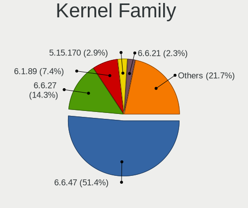
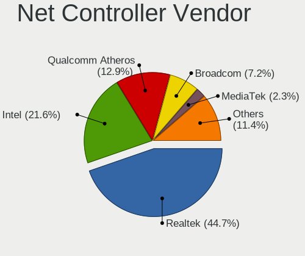
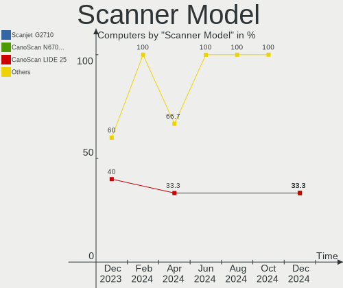
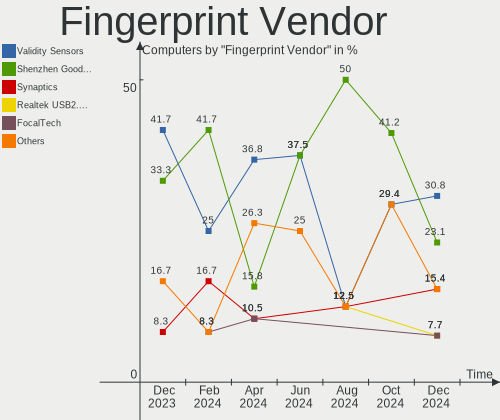
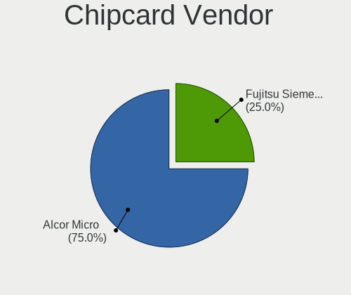

ROSA - Hardware Trends
----------------------

A project to identify most popular hardware characteristics and track their change
over time based on data collected by Linux users at https://Linux-Hardware.org.

Anyone can contribute to this report by the [hw-probe](https://github.com/linuxhw/hw-probe) tool:

    sudo -E hw-probe -all -upload

This is a report for all computer types. See also reports for [desktops](/Dist/ROSA/Desktop/README.md) and [notebooks](/Dist/ROSA/Notebook/README.md).

This report is for one last month. Overall report since the beginning of time: [TestDays](https://github.com/linuxhw/TestDays)

Period: Jun, 2023.

Contents
--------

* [ System ](#system)
  - [ OS                       ](#os)
  - [ OS Family                ](#os-family)
  - [ Kernel                   ](#kernel)
  - [ Kernel Family            ](#kernel-family)
  - [ Kernel Major Ver.        ](#kernel-major-ver)
  - [ Arch                     ](#arch)
  - [ DE                       ](#de)
  - [ Display Server           ](#display-server)
  - [ Display Manager          ](#display-manager)
  - [ OS Lang                  ](#os-lang)
  - [ Boot Mode                ](#boot-mode)
  - [ Filesystem               ](#filesystem)
  - [ Part. scheme             ](#part-scheme)
  - [ Dual Boot with Linux/BSD ](#dual-boot-with-linuxbsd)
  - [ Dual Boot (Win)          ](#dual-boot-win)

* [ Board ](#board)
  - [ Vendor                   ](#vendor)
  - [ Model                    ](#model)
  - [ Model Family             ](#model-family)
  - [ MFG Year                 ](#mfg-year)
  - [ Form Factor              ](#form-factor)
  - [ Secure Boot              ](#secure-boot)
  - [ Coreboot                 ](#coreboot)
  - [ RAM Size                 ](#ram-size)
  - [ RAM Used                 ](#ram-used)
  - [ Total Drives             ](#total-drives)
  - [ Has CD-ROM               ](#has-cd-rom)
  - [ Has Ethernet             ](#has-ethernet)
  - [ Has WiFi                 ](#has-wifi)
  - [ Has Bluetooth            ](#has-bluetooth)

* [ Location ](#location)
  - [ Country                  ](#country)
  - [ City                     ](#city)

* [ Drives ](#drives)
  - [ Drive Vendor             ](#drive-vendor)
  - [ Drive Model              ](#drive-model)
  - [ HDD Vendor               ](#hdd-vendor)
  - [ SSD Vendor               ](#ssd-vendor)
  - [ Drive Kind               ](#drive-kind)
  - [ Drive Connector          ](#drive-connector)
  - [ Drive Size               ](#drive-size)
  - [ Space Total              ](#space-total)
  - [ Space Used               ](#space-used)
  - [ Malfunc. Drives          ](#malfunc-drives)
  - [ Malfunc. Drive Vendor    ](#malfunc-drive-vendor)
  - [ Malfunc. HDD Vendor      ](#malfunc-hdd-vendor)
  - [ Malfunc. Drive Kind      ](#malfunc-drive-kind)
  - [ Failed Drives            ](#failed-drives)
  - [ Failed Drive Vendor      ](#failed-drive-vendor)
  - [ Drive Status             ](#drive-status)

* [ Storage controller ](#storage-controller)
  - [ Storage Vendor           ](#storage-vendor)
  - [ Storage Model            ](#storage-model)
  - [ Storage Kind             ](#storage-kind)

* [ Processor ](#processor)
  - [ CPU Vendor               ](#cpu-vendor)
  - [ CPU Model                ](#cpu-model)
  - [ CPU Model Family         ](#cpu-model-family)
  - [ CPU Cores                ](#cpu-cores)
  - [ CPU Sockets              ](#cpu-sockets)
  - [ CPU Threads              ](#cpu-threads)
  - [ CPU Op-Modes             ](#cpu-op-modes)
  - [ CPU Microcode            ](#cpu-microcode)
  - [ CPU Microarch            ](#cpu-microarch)

* [ Graphics ](#graphics)
  - [ GPU Vendor               ](#gpu-vendor)
  - [ GPU Model                ](#gpu-model)
  - [ GPU Combo                ](#gpu-combo)
  - [ GPU Driver               ](#gpu-driver)
  - [ GPU Memory               ](#gpu-memory)

* [ Monitor ](#monitor)
  - [ Monitor Vendor           ](#monitor-vendor)
  - [ Monitor Model            ](#monitor-model)
  - [ Monitor Resolution       ](#monitor-resolution)
  - [ Monitor Diagonal         ](#monitor-diagonal)
  - [ Monitor Width            ](#monitor-width)
  - [ Aspect Ratio             ](#aspect-ratio)
  - [ Monitor Area             ](#monitor-area)
  - [ Pixel Density            ](#pixel-density)
  - [ Multiple Monitors        ](#multiple-monitors)

* [ Network ](#network)
  - [ Net Controller Vendor    ](#net-controller-vendor)
  - [ Net Controller Model     ](#net-controller-model)
  - [ Wireless Vendor          ](#wireless-vendor)
  - [ Wireless Model           ](#wireless-model)
  - [ Ethernet Vendor          ](#ethernet-vendor)
  - [ Ethernet Model           ](#ethernet-model)
  - [ Net Controller Kind      ](#net-controller-kind)
  - [ Used Controller          ](#used-controller)
  - [ NICs                     ](#nics)
  - [ IPv6                     ](#ipv6)

* [ Bluetooth ](#bluetooth)
  - [ Bluetooth Vendor         ](#bluetooth-vendor)
  - [ Bluetooth Model          ](#bluetooth-model)

* [ Sound ](#sound)
  - [ Sound Vendor             ](#sound-vendor)
  - [ Sound Model              ](#sound-model)

* [ Memory ](#memory)
  - [ Memory Vendor            ](#memory-vendor)
  - [ Memory Model             ](#memory-model)
  - [ Memory Kind              ](#memory-kind)
  - [ Memory Form Factor       ](#memory-form-factor)
  - [ Memory Size              ](#memory-size)
  - [ Memory Speed             ](#memory-speed)

* [ Printers & scanners ](#printers--scanners)
  - [ Printer Vendor           ](#printer-vendor)
  - [ Printer Model            ](#printer-model)
  - [ Scanner Vendor           ](#scanner-vendor)
  - [ Scanner Model            ](#scanner-model)

* [ Camera ](#camera)
  - [ Camera Vendor            ](#camera-vendor)
  - [ Camera Model             ](#camera-model)

* [ Security ](#security)
  - [ Fingerprint Vendor       ](#fingerprint-vendor)
  - [ Fingerprint Model        ](#fingerprint-model)
  - [ Chipcard Vendor          ](#chipcard-vendor)
  - [ Chipcard Model           ](#chipcard-model)

* [ Unsupported ](#unsupported)
  - [ Unsupported Devices      ](#unsupported-devices)
  - [ Unsupported Device Types ](#unsupported-device-types)

System
------

OS
--

Installed operating systems

| Name         | Computers | Percent |
|--------------|-----------|---------|
| ROSA 12.4    | 137       | 83.03%  |
| ROSA R11.1   | 7         | 4.24%   |
| ROSA 12      | 7         | 4.24%   |
| ROSA 12.3    | 6         | 3.64%   |
| ROSA 13.0    | 2         | 1.21%   |
| ROSA 12.2    | 2         | 1.21%   |
| ROSA 12.1    | 2         | 1.21%   |
| ROSA R11     | 1         | 0.61%   |
| ROSA 2019.05 | 1         | 0.61%   |

OS Family
---------

OS without a version

| Name | Computers | Percent |
|------|-----------|---------|
| ROSA | 165       | 100%    |

Kernel
------

Version of the Linux kernel

| Version                                   | Computers | Percent |
|-------------------------------------------|-----------|---------|
| 6.1.20-generic-2rosa2021.1-x86_64         | 117       | 70.91%  |
| 5.15.103-generic-1rosa2021.1-i686         | 6         | 3.64%   |
| 5.10.176-generic-1rosa2021.1-x86_64       | 5         | 3.03%   |
| 6.1.34-generic-1rosa2021.1-x86_64         | 4         | 2.42%   |
| 5.15.75-generic-1rosa2021.1-x86_64        | 4         | 2.42%   |
| 5.10.74-generic-2rosa2021.1-x86_64        | 4         | 2.42%   |
| 5.4.83-generic-2rosa-i586                 | 3         | 1.82%   |
| 5.15.103-generic-1rosa2021.1-x86_64       | 3         | 1.82%   |
| 6.1.34-generic-1rosa2023.1-x86_64         | 2         | 1.21%   |
| 6.1.30.xm1-1.klp-xanmod-rosa2021.1-x86_64 | 2         | 1.21%   |
| 6.3.9.xm1-1.klp-xanmod-rosa2021.1-x86_64  | 1         | 0.61%   |
| 6.3.7-generic-1rosa2021.1-x86_64          | 1         | 0.61%   |
| 6.2.12.xm1-1.klp-xanmod-rosa2021.1-x86_64 | 1         | 0.61%   |
| 6.1.27-generic-1rosa2023.1-x86_64         | 1         | 0.61%   |
| 6.0.12.xm1-1.klp-xanmod-rosa2021.1-x86_64 | 1         | 0.61%   |
| 5.4.83-generic-2rosa-x86_64               | 1         | 0.61%   |
| 5.4.32-generic-2rosa-x86_64               | 1         | 0.61%   |
| 5.4.32-generic-2rosa-i586                 | 1         | 0.61%   |
| 5.4.139-nickel-4rosa2019.05-x86_64        | 1         | 0.61%   |
| 5.15.79-generic-1rosa2021.1-x86_64        | 1         | 0.61%   |
| 5.15.75-generic-1rosa2021.1-i686          | 1         | 0.61%   |
| 5.10.74-generic-2rosa2021.1-i586          | 1         | 0.61%   |
| 5.10.155-generic-1rosa2021.1-x86_64       | 1         | 0.61%   |
| 4.15.0-desktop-45.1rosa-x86_64            | 1         | 0.61%   |
| 4.15.0-desktop-122.124.1rosa-i586         | 1         | 0.61%   |

Kernel Family
-------------

Linux kernel without a distro release

| Version  | Computers | Percent |
|----------|-----------|---------|
| 6.1.20   | 117       | 70.91%  |
| 5.15.103 | 9         | 5.45%   |
| 6.1.34   | 6         | 3.64%   |
| 5.15.75  | 5         | 3.03%   |
| 5.10.74  | 5         | 3.03%   |
| 5.10.176 | 5         | 3.03%   |
| 5.4.83   | 4         | 2.42%   |
| 6.1.30   | 2         | 1.21%   |
| 5.4.32   | 2         | 1.21%   |
| 4.15.0   | 2         | 1.21%   |
| 6.3.9    | 1         | 0.61%   |
| 6.3.7    | 1         | 0.61%   |
| 6.2.12   | 1         | 0.61%   |
| 6.1.27   | 1         | 0.61%   |
| 6.0.12   | 1         | 0.61%   |
| 5.4.139  | 1         | 0.61%   |
| 5.15.79  | 1         | 0.61%   |
| 5.10.155 | 1         | 0.61%   |

Kernel Major Ver.
-----------------

Linux kernel major version

| Version | Computers | Percent |
|---------|-----------|---------|
| 6.1     | 126       | 76.36%  |
| 5.15    | 15        | 9.09%   |
| 5.10    | 11        | 6.67%   |
| 5.4     | 7         | 4.24%   |
| 6.3     | 2         | 1.21%   |
| 4.15    | 2         | 1.21%   |
| 6.2     | 1         | 0.61%   |
| 6.0     | 1         | 0.61%   |

Arch
----

OS architecture (x86_64, i586, etc.)

| Name   | Computers | Percent |
|--------|-----------|---------|
| x86_64 | 152       | 92.12%  |
| i686   | 13        | 7.88%   |

DE
--

Desktop Environment

| Name    | Computers | Percent |
|---------|-----------|---------|
| KDE5    | 100       | 60.61%  |
| GNOME   | 41        | 24.85%  |
| LXQt    | 13        | 7.88%   |
| KDE4    | 9         | 5.45%   |
| i3      | 1         | 0.61%   |
| Unknown | 1         | 0.61%   |

Display Server
--------------

X11 or Wayland

| Name    | Computers | Percent |
|---------|-----------|---------|
| Wayland | 125       | 75.76%  |
| X11     | 39        | 23.64%  |
| Tty     | 1         | 0.61%   |

Display Manager
---------------

SDDM, LightDM, etc.

| Name    | Computers | Percent |
|---------|-----------|---------|
| SDDM    | 98        | 59.39%  |
| GDM     | 48        | 29.09%  |
| LightDM | 9         | 5.45%   |
| KDM     | 9         | 5.45%   |
| Unknown | 1         | 0.61%   |

OS Lang
-------

Language

| Lang    | Computers | Percent |
|---------|-----------|---------|
| ru_RU   | 151       | 91.52%  |
| de_DE   | 4         | 2.42%   |
| es_ES   | 3         | 1.82%   |
| en_US   | 2         | 1.21%   |
| ro_RO   | 1         | 0.61%   |
| pl_PL   | 1         | 0.61%   |
| en_GB   | 1         | 0.61%   |
| de_CH   | 1         | 0.61%   |
| Unknown | 1         | 0.61%   |

Boot Mode
---------

EFI or BIOS

| Mode | Computers | Percent |
|------|-----------|---------|
| EFI  | 98        | 59.39%  |
| BIOS | 67        | 40.61%  |

Filesystem
----------

Type of filesystem

| Type  | Computers | Percent |
|-------|-----------|---------|
| Ext4  | 153       | 92.73%  |
| Btrfs | 11        | 6.67%   |
| Aufs  | 1         | 0.61%   |

Part. scheme
------------

Scheme of partitioning

| Type | Computers | Percent |
|------|-----------|---------|
| GPT  | 108       | 65.45%  |
| MBR  | 57        | 34.55%  |

Dual Boot with Linux/BSD
------------------------

Hosting more than one Linux/BSD

| Dual boot | Computers | Percent |
|-----------|-----------|---------|
| No        | 127       | 76.97%  |
| Yes       | 38        | 23.03%  |

Dual Boot (Win)
---------------

Hosting Linux and Windows

| Dual boot | Computers | Percent |
|-----------|-----------|---------|
| No        | 87        | 52.73%  |
| Yes       | 78        | 47.27%  |

Board
-----

Vendor
------

Motherboard manufacturer

| Name                     | Computers | Percent |
|--------------------------|-----------|---------|
| ASUSTek Computer         | 36        | 21.82%  |
| Gigabyte Technology      | 21        | 12.73%  |
| Lenovo                   | 20        | 12.12%  |
| Hewlett-Packard          | 15        | 9.09%   |
| Acer                     | 15        | 9.09%   |
| MSI                      | 14        | 8.48%   |
| ASRock                   | 6         | 3.64%   |
| Samsung Electronics      | 5         | 3.03%   |
| Dell                     | 5         | 3.03%   |
| Unknown                  | 4         | 2.42%   |
| Huanan                   | 3         | 1.82%   |
| Toshiba                  | 2         | 1.21%   |
| Apple                    | 2         | 1.21%   |
| Zvezda                   | 1         | 0.61%   |
| WeiBu                    | 1         | 0.61%   |
| Timi                     | 1         | 0.61%   |
| Sony                     | 1         | 0.61%   |
| Quanta                   | 1         | 0.61%   |
| Packard Bell             | 1         | 0.61%   |
| NCR                      | 1         | 0.61%   |
| MAINBRD                  | 1         | 0.61%   |
| Maibenben                | 1         | 0.61%   |
| Intel                    | 1         | 0.61%   |
| INFERIT                  | 1         | 0.61%   |
| HIPER Technology Limited | 1         | 0.61%   |
| eMachines                | 1         | 0.61%   |
| DEXP                     | 1         | 0.61%   |
| Clevo                    | 1         | 0.61%   |
| AMI                      | 1         | 0.61%   |
| 3Logic Group             | 1         | 0.61%   |

Model
-----

Motherboard model

| Name                                  | Computers | Percent |
|---------------------------------------|-----------|---------|
| Unknown                               | 6         | 3.64%   |
| ASUS All Series                       | 3         | 1.82%   |
| Lenovo ThinkCentre M820z 10SDS01600   | 2         | 1.21%   |
| ASUS PRIME H510M-K                    | 2         | 1.21%   |
| Acer AOD257                           | 2         | 1.21%   |
| Zvezda Altair Z                       | 1         | 0.61%   |
| WeiBu OEM                             | 1         | 0.61%   |
| Toshiba Satellite U300                | 1         | 0.61%   |
| Toshiba Satellite L30                 | 1         | 0.61%   |
| Timi RedmiBook Pro 14S                | 1         | 0.61%   |
| Sony SVF1521L1RB                      | 1         | 0.61%   |
| Samsung P29/28/26                     | 1         | 0.61%   |
| Samsung N102                          | 1         | 0.61%   |
| Samsung 355V4C/356V4C/3445VC/3545VC   | 1         | 0.61%   |
| Samsung 350V5C/351V5C/3540VC/3440VC   | 1         | 0.61%   |
| Samsung 305V4A/305V5A/3415VA          | 1         | 0.61%   |
| Quanta TWH                            | 1         | 0.61%   |
| Packard Bell EasyNote TE69CX          | 1         | 0.61%   |
| NCR Estoril                           | 1         | 0.61%   |
| MSI OPTIMUS                           | 1         | 0.61%   |
| MSI MS-7D22                           | 1         | 0.61%   |
| MSI MS-7B79                           | 1         | 0.61%   |
| MSI MS-7A74                           | 1         | 0.61%   |
| MSI MS-7895                           | 1         | 0.61%   |
| MSI MS-7817                           | 1         | 0.61%   |
| MSI MS-7758                           | 1         | 0.61%   |
| MSI MS-7641                           | 1         | 0.61%   |
| MSI MS-7267                           | 1         | 0.61%   |
| MSI MPG B560 Trident A (MS-B926)      | 1         | 0.61%   |
| MSI Katana GF66 12UE                  | 1         | 0.61%   |
| MSI GX60 1AC                          | 1         | 0.61%   |
| MSI GL65 Leopard 10SCSR               | 1         | 0.61%   |
| MSI Delta 15 A5EFK                    | 1         | 0.61%   |
| MAINBRD OPS62A-SHA                    | 1         | 0.61%   |
| Maibenben MaiBook M                   | 1         | 0.61%   |
| Lenovo ThinkPad X61 7674GS3           | 1         | 0.61%   |
| Lenovo ThinkPad SL410 2842RN9         | 1         | 0.61%   |
| Lenovo ThinkPad P17 Gen 1 20SN003YUS  | 1         | 0.61%   |
| Lenovo ThinkPad P16s Gen 1 21CKCTO1WW | 1         | 0.61%   |
| Lenovo ThinkCentre M715q 10VGS0AW00   | 1         | 0.61%   |

Model Family
------------

Motherboard model prefix

| Name                  | Computers | Percent |
|-----------------------|-----------|---------|
| Acer Aspire           | 10        | 6.06%   |
| ASUS PRIME            | 7         | 4.24%   |
| HP Pavilion           | 6         | 3.64%   |
| Unknown               | 6         | 3.64%   |
| Lenovo ThinkPad       | 4         | 2.42%   |
| Dell Inspiron         | 4         | 2.42%   |
| ASUS VivoBook         | 4         | 2.42%   |
| Lenovo ThinkCentre    | 3         | 1.82%   |
| Lenovo IdeaPad        | 3         | 1.82%   |
| ASUS ROG              | 3         | 1.82%   |
| ASUS All              | 3         | 1.82%   |
| Toshiba Satellite     | 2         | 1.21%   |
| Lenovo Legion         | 2         | 1.21%   |
| Lenovo B590           | 2         | 1.21%   |
| Gigabyte H410M        | 2         | 1.21%   |
| Gigabyte B550         | 2         | 1.21%   |
| Gigabyte B450M        | 2         | 1.21%   |
| ASUS TUF              | 2         | 1.21%   |
| ASUS M5A78L-M         | 2         | 1.21%   |
| Acer Extensa          | 2         | 1.21%   |
| Acer AOD257           | 2         | 1.21%   |
| Zvezda Altair         | 1         | 0.61%   |
| WeiBu OEM             | 1         | 0.61%   |
| Timi RedmiBook        | 1         | 0.61%   |
| Sony SVF1521L1RB      | 1         | 0.61%   |
| Samsung P29           | 1         | 0.61%   |
| Samsung N102          | 1         | 0.61%   |
| Samsung 355V4C        | 1         | 0.61%   |
| Samsung 350V5C        | 1         | 0.61%   |
| Samsung 305V4A        | 1         | 0.61%   |
| Quanta TWH            | 1         | 0.61%   |
| Packard Bell EasyNote | 1         | 0.61%   |
| NCR Estoril           | 1         | 0.61%   |
| MSI OPTIMUS           | 1         | 0.61%   |
| MSI MS-7D22           | 1         | 0.61%   |
| MSI MS-7B79           | 1         | 0.61%   |
| MSI MS-7A74           | 1         | 0.61%   |
| MSI MS-7895           | 1         | 0.61%   |
| MSI MS-7817           | 1         | 0.61%   |
| MSI MS-7758           | 1         | 0.61%   |

MFG Year
--------

Motherboard manufacture year

| Year | Computers | Percent |
|------|-----------|---------|
| 2021 | 23        | 13.94%  |
| 2018 | 16        | 9.7%    |
| 2011 | 16        | 9.7%    |
| 2022 | 14        | 8.48%   |
| 2013 | 14        | 8.48%   |
| 2012 | 14        | 8.48%   |
| 2020 | 11        | 6.67%   |
| 2019 | 9         | 5.45%   |
| 2008 | 7         | 4.24%   |
| 2017 | 6         | 3.64%   |
| 2009 | 6         | 3.64%   |
| 2007 | 6         | 3.64%   |
| 2015 | 4         | 2.42%   |
| 2014 | 4         | 2.42%   |
| 2010 | 4         | 2.42%   |
| 2006 | 4         | 2.42%   |
| 2023 | 3         | 1.82%   |
| 2016 | 3         | 1.82%   |
| 2005 | 1         | 0.61%   |

Form Factor
-----------

Physical design of the computer

| Name       | Computers | Percent |
|------------|-----------|---------|
| Notebook   | 86        | 52.12%  |
| Desktop    | 72        | 43.64%  |
| All in one | 3         | 1.82%   |
| Mini pc    | 2         | 1.21%   |
| Server     | 2         | 1.21%   |

Secure Boot
-----------

Enabled or disabled

| State    | Computers | Percent |
|----------|-----------|---------|
| Disabled | 165       | 100%    |

Coreboot
--------

Have coreboot on board

| Used | Computers | Percent |
|------|-----------|---------|
| No   | 165       | 100%    |

RAM Size
--------

Total RAM memory

| Size in GB      | Computers | Percent |
|-----------------|-----------|---------|
| 4.01-8.0        | 43        | 26.06%  |
| 16.01-24.0      | 32        | 19.39%  |
| 3.01-4.0        | 30        | 18.18%  |
| 8.01-16.0       | 20        | 12.12%  |
| 32.01-64.0      | 12        | 7.27%   |
| 1.01-2.0        | 10        | 6.06%   |
| 2.01-3.0        | 8         | 4.85%   |
| 24.01-32.0      | 4         | 2.42%   |
| 0.51-1.0        | 3         | 1.82%   |
| 64.01-256.0     | 2         | 1.21%   |
| More than 256.0 | 1         | 0.61%   |

RAM Used
--------

Used RAM memory

| Used GB   | Computers | Percent |
|-----------|-----------|---------|
| 1.01-2.0  | 88        | 53.33%  |
| 0.51-1.0  | 34        | 20.61%  |
| 2.01-3.0  | 22        | 13.33%  |
| 4.01-8.0  | 11        | 6.67%   |
| 3.01-4.0  | 7         | 4.24%   |
| 0.01-0.5  | 2         | 1.21%   |
| 8.01-16.0 | 1         | 0.61%   |

Total Drives
------------

Number of drives on board

| Drives | Computers | Percent |
|--------|-----------|---------|
| 1      | 95        | 57.58%  |
| 2      | 41        | 24.85%  |
| 3      | 17        | 10.3%   |
| 4      | 6         | 3.64%   |
| 5      | 4         | 2.42%   |
| 9      | 1         | 0.61%   |
| 0      | 1         | 0.61%   |

Has CD-ROM
----------

Has CD-ROM on board

| Presented | Computers | Percent |
|-----------|-----------|---------|
| No        | 110       | 66.67%  |
| Yes       | 55        | 33.33%  |

Has Ethernet
------------

Has Ethernet on board

| Presented | Computers | Percent |
|-----------|-----------|---------|
| Yes       | 149       | 90.3%   |
| No        | 16        | 9.7%    |

Has WiFi
--------

Has WiFi module

| Presented | Computers | Percent |
|-----------|-----------|---------|
| Yes       | 110       | 66.67%  |
| No        | 55        | 33.33%  |

Has Bluetooth
-------------

Has Bluetooth module

| Presented | Computers | Percent |
|-----------|-----------|---------|
| Yes       | 88        | 53.33%  |
| No        | 77        | 46.67%  |

Location
--------

Country
-------

Geographic location (country)

| Country     | Computers | Percent |
|-------------|-----------|---------|
| Russia      | 146       | 88.48%  |
| Germany     | 5         | 3.03%   |
| Belarus     | 4         | 2.42%   |
| Uruguay     | 1         | 0.61%   |
| Ukraine     | 1         | 0.61%   |
| UK          | 1         | 0.61%   |
| Switzerland | 1         | 0.61%   |
| Spain       | 1         | 0.61%   |
| Romania     | 1         | 0.61%   |
| Poland      | 1         | 0.61%   |
| Moldova     | 1         | 0.61%   |
| Kazakhstan  | 1         | 0.61%   |
| France      | 1         | 0.61%   |

City
----

Geographic location (city)

| City             | Computers | Percent |
|------------------|-----------|---------|
| Moscow           | 34        | 20.61%  |
| St Petersburg    | 7         | 4.24%   |
| Novosibirsk      | 6         | 3.64%   |
| Yekaterinburg    | 5         | 3.03%   |
| Rostov-on-Don    | 4         | 2.42%   |
| Yakutsk          | 3         | 1.82%   |
| Volgograd        | 3         | 1.82%   |
| Tyumen           | 3         | 1.82%   |
| Surgut           | 3         | 1.82%   |
| Saratov          | 3         | 1.82%   |
| Samara           | 3         | 1.82%   |
| Perm             | 3         | 1.82%   |
| Nizhniy Novgorod | 3         | 1.82%   |
| Minsk            | 3         | 1.82%   |
| Chelyabinsk      | 3         | 1.82%   |
| Tambov           | 2         | 1.21%   |
| Stavropol        | 2         | 1.21%   |
| Ryazan           | 2         | 1.21%   |
| Kursk            | 2         | 1.21%   |
| Krasnodar        | 2         | 1.21%   |
| Khabarovsk       | 2         | 1.21%   |
| Irkutsk          | 2         | 1.21%   |
| Hanover          | 2         | 1.21%   |
| Zlatoust         | 1         | 0.61%   |
| Yevpatoriya      | 1         | 0.61%   |
| Yelan'           | 1         | 0.61%   |
| Yaroslavl        | 1         | 0.61%   |
| Worthing         | 1         | 0.61%   |
| Vyborg           | 1         | 0.61%   |
| Voskresensk      | 1         | 0.61%   |
| Vologda          | 1         | 0.61%   |
| Ustyuzhna        | 1         | 0.61%   |
| Ulan-Ude         | 1         | 0.61%   |
| Tuttlingen       | 1         | 0.61%   |
| Tsarskoye Selo   | 1         | 0.61%   |
| Touget           | 1         | 0.61%   |
| Tolyatti         | 1         | 0.61%   |
| Taman'           | 1         | 0.61%   |
| Syzran'          | 1         | 0.61%   |
| Strelitsa        | 1         | 0.61%   |

Drives
------

Drive Vendor
------------

Hard drive vendors

| Vendor              | Computers | Drives | Percent |
|---------------------|-----------|--------|---------|
| WDC                 | 39        | 49     | 15.66%  |
| Seagate             | 32        | 34     | 12.85%  |
| Samsung Electronics | 23        | 25     | 9.24%   |
| Toshiba             | 21        | 22     | 8.43%   |
| Kingston            | 13        | 20     | 5.22%   |
| Hitachi             | 10        | 10     | 4.02%   |
| A-DATA Technology   | 9         | 10     | 3.61%   |
| Crucial             | 8         | 8      | 3.21%   |
| Intel               | 7         | 7      | 2.81%   |
| HGST                | 6         | 6      | 2.41%   |
| SanDisk             | 5         | 6      | 2.01%   |
| Netac               | 5         | 6      | 2.01%   |
| Unknown             | 4         | 4      | 1.61%   |
| SPCC                | 4         | 4      | 1.61%   |
| KingSpec            | 4         | 4      | 1.61%   |
| China               | 4         | 4      | 1.61%   |
| SK hynix            | 3         | 3      | 1.2%    |
| OCZ                 | 3         | 3      | 1.2%    |
| Micron Technology   | 3         | 3      | 1.2%    |
| Apacer              | 3         | 3      | 1.2%    |
| AMD                 | 3         | 3      | 1.2%    |
| Patriot             | 2         | 2      | 0.8%    |
| Maxtor              | 2         | 2      | 0.8%    |
| Intenso             | 2         | 3      | 0.8%    |
| Gigabyte Technology | 2         | 2      | 0.8%    |
| Fujitsu             | 2         | 2      | 0.8%    |
| Fanxiang            | 2         | 3      | 0.8%    |
| Unknown             | 2         | 2      | 0.8%    |
| ZM                  | 1         | 1      | 0.4%    |
| Zheino              | 1         | 1      | 0.4%    |
| XrayDisk            | 1         | 1      | 0.4%    |
| XPG                 | 1         | 1      | 0.4%    |
| Transcend           | 1         | 1      | 0.4%    |
| SILICONMOTION       | 1         | 1      | 0.4%    |
| SCY                 | 1         | 1      | 0.4%    |
| Qumo                | 1         | 1      | 0.4%    |
| Q600S               | 1         | 1      | 0.4%    |
| Plextor             | 1         | 1      | 0.4%    |
| Phison Electronics  | 1         | 1      | 0.4%    |
| MARSHAL             | 1         | 1      | 0.4%    |

Drive Model
-----------

Hard drive models

| Model                                | Computers | Percent |
|--------------------------------------|-----------|---------|
| Toshiba MQ01ABF050 500GB             | 9         | 3.36%   |
| Seagate ST1000DM010-2EP102 1TB       | 4         | 1.49%   |
| Kingston SA400S37240G 240GB SSD      | 3         | 1.12%   |
| HGST HTS545050A7E380 500GB           | 3         | 1.12%   |
| Crucial CT240BX500SSD1 240GB         | 3         | 1.12%   |
| WDC WDS240G2G0A-00JH30 240GB SSD     | 2         | 0.75%   |
| WDC WD10EZEX-00BBHA0 1TB             | 2         | 0.75%   |
| Toshiba MQ01ABD100 1TB               | 2         | 0.75%   |
| Toshiba DT01ACA100 1TB               | 2         | 0.75%   |
| SPCC Solid State Disk 256GB          | 2         | 0.75%   |
| Seagate ST2000DM008-2UB102 2TB       | 2         | 0.75%   |
| Seagate ST1000LM048-2E7172 1TB       | 2         | 0.75%   |
| Seagate ST1000DM003-1ER162 1TB       | 2         | 0.75%   |
| SanDisk NVMe SSD Drive 1TB           | 2         | 0.75%   |
| Samsung SSD 970 EVO Plus 500GB       | 2         | 0.75%   |
| Samsung SSD 860 EVO 250GB            | 2         | 0.75%   |
| Micron MTFDHBA512QFD-1AX1AABHA 512GB | 2         | 0.75%   |
| Kingston SV300S37A120G 120GB SSD     | 2         | 0.75%   |
| Kingston SKC2500M8250G 250GB         | 2         | 0.75%   |
| Intel SSDPEKNU512GZ 512GB            | 2         | 0.75%   |
| Hitachi HTS547550A9E384 500GB        | 2         | 0.75%   |
| HGST HTS545050A7E680 500GB           | 2         | 0.75%   |
| Crucial CT250MX500SSD1 250GB         | 2         | 0.75%   |
| A-DATA SX8200PNP 512GB               | 2         | 0.75%   |
| A-DATA SU655 120GB SSD               | 2         | 0.75%   |
| Unknown                              | 2         | 0.75%   |
| ZM SSD 256GB                         | 1         | 0.37%   |
| Zheino CHN-25SATAA3-480 480GB SSD    | 1         | 0.37%   |
| XrayDisk 512GB SSD                   | 1         | 0.37%   |
| XPG GAMMIX S5 512GB                  | 1         | 0.37%   |
| WDC WDS500G2X0C-00L350 500GB         | 1         | 0.37%   |
| WDC WDS500G2B0A-00SM50 500GB SSD     | 1         | 0.37%   |
| WDC WDS480G2G0A-00JH30 480GB SSD     | 1         | 0.37%   |
| WDC WDS250G2B0A 250GB SSD            | 1         | 0.37%   |
| WDC WD800JD-22MSA1 80GB              | 1         | 0.37%   |
| WDC WD6400BPVT-24HXZT1 640GB         | 1         | 0.37%   |
| WDC WD5001AALS-00L3B2 500GB          | 1         | 0.37%   |
| WDC WD5000LPVX-22V0TT0 500GB         | 1         | 0.37%   |
| WDC WD5000LPLX-08ZNTT0 500GB         | 1         | 0.37%   |
| WDC WD5000LPCX-21VHAT0 500GB         | 1         | 0.37%   |

HDD Vendor
----------

Hard disk drive vendors

| Vendor              | Computers | Drives | Percent |
|---------------------|-----------|--------|---------|
| WDC                 | 32        | 39     | 29.36%  |
| Seagate             | 31        | 33     | 28.44%  |
| Toshiba             | 21        | 22     | 19.27%  |
| Hitachi             | 10        | 10     | 9.17%   |
| HGST                | 6         | 6      | 5.5%    |
| Samsung Electronics | 3         | 3      | 2.75%   |
| Fujitsu             | 2         | 2      | 1.83%   |
| Unknown             | 1         | 1      | 0.92%   |
| Maxtor              | 1         | 1      | 0.92%   |
| MARSHAL             | 1         | 1      | 0.92%   |
| Apple               | 1         | 1      | 0.92%   |

SSD Vendor
----------

Solid state drive vendors

| Vendor              | Computers | Drives | Percent |
|---------------------|-----------|--------|---------|
| Kingston            | 10        | 15     | 11.24%  |
| Samsung Electronics | 9         | 9      | 10.11%  |
| Crucial             | 7         | 7      | 7.87%   |
| WDC                 | 6         | 6      | 6.74%   |
| A-DATA Technology   | 5         | 5      | 5.62%   |
| SPCC                | 4         | 4      | 4.49%   |
| Netac               | 4         | 4      | 4.49%   |
| KingSpec            | 4         | 4      | 4.49%   |
| China               | 4         | 4      | 4.49%   |
| OCZ                 | 3         | 3      | 3.37%   |
| AMD                 | 3         | 3      | 3.37%   |
| Patriot             | 2         | 2      | 2.25%   |
| Intenso             | 2         | 3      | 2.25%   |
| Apacer              | 2         | 2      | 2.25%   |
| ZM                  | 1         | 1      | 1.12%   |
| Zheino              | 1         | 1      | 1.12%   |
| XrayDisk            | 1         | 1      | 1.12%   |
| Transcend           | 1         | 1      | 1.12%   |
| SILICONMOTION       | 1         | 1      | 1.12%   |
| Seagate             | 1         | 1      | 1.12%   |
| SanDisk             | 1         | 1      | 1.12%   |
| Q600S               | 1         | 1      | 1.12%   |
| Plextor             | 1         | 1      | 1.12%   |
| Maxtor              | 1         | 1      | 1.12%   |
| Kimtigo             | 1         | 1      | 1.12%   |
| Intel               | 1         | 1      | 1.12%   |
| HS-SSD-C100         | 1         | 1      | 1.12%   |
| Hewlett-Packard     | 1         | 1      | 1.12%   |
| HEORIADY            | 1         | 1      | 1.12%   |
| GOODRAM             | 1         | 1      | 1.12%   |
| Fanxiang            | 1         | 1      | 1.12%   |
| External            | 1         | 1      | 1.12%   |
| ExeGate             | 1         | 1      | 1.12%   |
| Digma               | 1         | 1      | 1.12%   |
| DEXP                | 1         | 1      | 1.12%   |
| BAITITON            | 1         | 1      | 1.12%   |
| Azerty              | 1         | 1      | 1.12%   |
| Unknown             | 1         | 1      | 1.12%   |

Drive Kind
----------

HDD or SSD

| Kind | Computers | Drives | Percent |
|------|-----------|--------|---------|
| HDD  | 97        | 119    | 44.5%   |
| SSD  | 72        | 95     | 33.03%  |
| NVMe | 47        | 60     | 21.56%  |
| MMC  | 2         | 2      | 0.92%   |

Drive Connector
---------------

SATA, SAS, NVMe, etc.

| Type | Computers | Drives | Percent |
|------|-----------|--------|---------|
| SATA | 138       | 212    | 73.02%  |
| NVMe | 47        | 60     | 24.87%  |
| SAS  | 2         | 2      | 1.06%   |
| MMC  | 2         | 2      | 1.06%   |

Drive Size
----------

Size of hard drive

| Size in TB | Computers | Drives | Percent |
|------------|-----------|--------|---------|
| 0.01-0.5   | 113       | 146    | 66.08%  |
| 0.51-1.0   | 44        | 50     | 25.73%  |
| 1.01-2.0   | 11        | 15     | 6.43%   |
| 3.01-4.0   | 1         | 1      | 0.58%   |
| 2.01-3.0   | 1         | 1      | 0.58%   |
| 4.01-10.0  | 1         | 1      | 0.58%   |

Space Total
-----------

Amount of disk space available on the file system

| Size in GB     | Computers | Percent |
|----------------|-----------|---------|
| 101-250        | 51        | 30.91%  |
| 251-500        | 47        | 28.48%  |
| 501-1000       | 21        | 12.73%  |
| 1-20           | 13        | 7.88%   |
| 21-50          | 10        | 6.06%   |
| 1001-2000      | 9         | 5.45%   |
| 51-100         | 7         | 4.24%   |
| 2001-3000      | 5         | 3.03%   |
| More than 3000 | 2         | 1.21%   |

Space Used
----------

Amount of used disk space

| Used GB   | Computers | Percent |
|-----------|-----------|---------|
| 1-20      | 112       | 67.88%  |
| 21-50     | 19        | 11.52%  |
| 251-500   | 9         | 5.45%   |
| 101-250   | 8         | 4.85%   |
| 1001-2000 | 7         | 4.24%   |
| 51-100    | 6         | 3.64%   |
| 501-1000  | 4         | 2.42%   |

Malfunc. Drives
---------------

Drive models with a malfunction

| Model                              | Computers | Drives | Percent |
|------------------------------------|-----------|--------|---------|
| Toshiba MQ01ABF050 500GB           | 4         | 4      | 7.69%   |
| XrayDisk 512GB SSD                 | 1         | 1      | 1.92%   |
| WDC WDS240G2G0A-00JH30 240GB SSD   | 1         | 1      | 1.92%   |
| WDC WD800JD-22MSA1 80GB            | 1         | 1      | 1.92%   |
| WDC WD5000LPCX-21VHAT0 500GB       | 1         | 1      | 1.92%   |
| WDC WD5000AAKX-221CA1 500GB        | 1         | 1      | 1.92%   |
| WDC WD5000AAKX-00ERMA0 500GB       | 1         | 1      | 1.92%   |
| WDC WD5000AADS-00S9B0 500GB        | 1         | 1      | 1.92%   |
| WDC WD3200BPVT-35ZEST0 320GB       | 1         | 1      | 1.92%   |
| WDC WD2005FBYZ-01YCBB3 2TB         | 1         | 1      | 1.92%   |
| WDC WD2002FAEX-007BA0 2TB          | 1         | 1      | 1.92%   |
| WDC WD10PURZ-85U8XY0 1TB           | 1         | 1      | 1.92%   |
| WDC WD Green 2.5 480GB SSD         | 1         | 1      | 1.92%   |
| Toshiba MQ01ABD100 1TB             | 1         | 1      | 1.92%   |
| Toshiba MK6034GSX 64GB             | 1         | 1      | 1.92%   |
| Toshiba MK1637GSX 160GB            | 1         | 1      | 1.92%   |
| SPCC Solid State Disk 256GB        | 1         | 1      | 1.92%   |
| Seagate ST9500325AS 500GB          | 1         | 1      | 1.92%   |
| Seagate ST9320325AS 320GB          | 1         | 1      | 1.92%   |
| Seagate ST3500418AS 500GB          | 1         | 1      | 1.92%   |
| Seagate ST3320418AS 320GB          | 1         | 1      | 1.92%   |
| Seagate ST3250318AS 250GB          | 1         | 1      | 1.92%   |
| Seagate ST3250310AS 250GB          | 1         | 1      | 1.92%   |
| Seagate ST320LT020-9YG142 320GB    | 1         | 1      | 1.92%   |
| Seagate ST3000DM003-1F216N 3TB     | 1         | 1      | 1.92%   |
| Seagate ST1000LM048-2E7172 1TB     | 1         | 1      | 1.92%   |
| Seagate ST1000LM024 HN-M101MBB 1TB | 1         | 1      | 1.92%   |
| Seagate ST1000DM003-9YN162 1TB     | 1         | 1      | 1.92%   |
| Seagate ST1000DM003-1CH162 1TB     | 1         | 1      | 1.92%   |
| Seagate OOS500G128M 500GB          | 1         | 1      | 1.92%   |
| Samsung Electronics HN-M101MBB 1TB | 1         | 1      | 1.92%   |
| Samsung Electronics HM250HJ 250GB  | 1         | 1      | 1.92%   |
| OCZ ONYX 32GB SSD                  | 1         | 1      | 1.92%   |
| OCZ AGILITY3 120GB SSD             | 1         | 1      | 1.92%   |
| Maxtor STM3250310AS 250GB          | 1         | 1      | 1.92%   |
| MARSHAL MAL2250SA-T54 250GB        | 1         | 1      | 1.92%   |
| HS-SSD-C100 SSD 480G               | 1         | 1      | 1.92%   |
| Hitachi HTS545032B9A300 320GB      | 1         | 1      | 1.92%   |
| Hitachi HTS545025B9A300 250GB      | 1         | 1      | 1.92%   |
| Hitachi HTS542516K9SA00 160GB      | 1         | 1      | 1.92%   |

Malfunc. Drive Vendor
---------------------

Vendors of faulty drives

| Vendor              | Computers | Drives | Percent |
|---------------------|-----------|--------|---------|
| Seagate             | 12        | 13     | 23.53%  |
| WDC                 | 11        | 11     | 21.57%  |
| Toshiba             | 7         | 7      | 13.73%  |
| Hitachi             | 5         | 5      | 9.8%    |
| Samsung Electronics | 2         | 2      | 3.92%   |
| OCZ                 | 2         | 2      | 3.92%   |
| Fujitsu             | 2         | 2      | 3.92%   |
| XrayDisk            | 1         | 1      | 1.96%   |
| SPCC                | 1         | 1      | 1.96%   |
| Maxtor              | 1         | 1      | 1.96%   |
| MARSHAL             | 1         | 1      | 1.96%   |
| HS-SSD-C100         | 1         | 1      | 1.96%   |
| HGST                | 1         | 1      | 1.96%   |
| China               | 1         | 1      | 1.96%   |
| BAITITON            | 1         | 1      | 1.96%   |
| AMD                 | 1         | 1      | 1.96%   |
| A-DATA Technology   | 1         | 1      | 1.96%   |

Malfunc. HDD Vendor
-------------------

Vendors of faulty HDD drives

| Vendor              | Computers | Drives | Percent |
|---------------------|-----------|--------|---------|
| Seagate             | 12        | 13     | 30%     |
| WDC                 | 9         | 9      | 22.5%   |
| Toshiba             | 7         | 7      | 17.5%   |
| Hitachi             | 5         | 5      | 12.5%   |
| Samsung Electronics | 2         | 2      | 5%      |
| Fujitsu             | 2         | 2      | 5%      |
| Maxtor              | 1         | 1      | 2.5%    |
| MARSHAL             | 1         | 1      | 2.5%    |
| HGST                | 1         | 1      | 2.5%    |

Malfunc. Drive Kind
-------------------

Kinds of faulty drives

| Kind | Computers | Drives | Percent |
|------|-----------|--------|---------|
| HDD  | 39        | 41     | 78%     |
| SSD  | 11        | 11     | 22%     |

Failed Drives
-------------

Failed drive models

| Model                         | Computers | Drives | Percent |
|-------------------------------|-----------|--------|---------|
| Toshiba DT01ACA100 1TB        | 1         | 1      | 50%     |
| Hitachi HTS547550A9E384 500GB | 1         | 1      | 50%     |

Failed Drive Vendor
-------------------

Failed drive vendors

| Vendor  | Computers | Drives | Percent |
|---------|-----------|--------|---------|
| Toshiba | 1         | 1      | 50%     |
| Hitachi | 1         | 1      | 50%     |

Drive Status
------------

Number of failed and malfunc. drives

| Status   | Computers | Drives | Percent |
|----------|-----------|--------|---------|
| Works    | 136       | 213    | 70.47%  |
| Malfunc  | 48        | 52     | 24.87%  |
| Detected | 7         | 9      | 3.63%   |
| Failed   | 2         | 2      | 1.04%   |

Storage controller
------------------

Storage Vendor
--------------

Storage controller vendors

| Vendor                           | Computers | Percent |
|----------------------------------|-----------|---------|
| Intel                            | 121       | 56.28%  |
| AMD                              | 35        | 16.28%  |
| Samsung Electronics              | 13        | 6.05%   |
| SanDisk                          | 7         | 3.26%   |
| Phison Electronics               | 5         | 2.33%   |
| ADATA Technology                 | 5         | 2.33%   |
| Kingston Technology Company      | 4         | 1.86%   |
| JMicron Technology               | 4         | 1.86%   |
| SK hynix                         | 3         | 1.4%    |
| Micron Technology                | 3         | 1.4%    |
| VIA Technologies                 | 2         | 0.93%   |
| Nvidia                           | 2         | 0.93%   |
| INNOGRIT                         | 2         | 0.93%   |
| TenaFe                           | 1         | 0.47%   |
| Silicon Motion                   | 1         | 0.47%   |
| Shenzhen Shichuangyi Electronics | 1         | 0.47%   |
| Realtek Semiconductor            | 1         | 0.47%   |
| Netac Technology                 | 1         | 0.47%   |
| Micron/Crucial Technology        | 1         | 0.47%   |
| LSI Logic / Symbios Logic        | 1         | 0.47%   |
| KIOXIA                           | 1         | 0.47%   |
| Broadcom / LSI                   | 1         | 0.47%   |

Storage Model
-------------

Storage controller models

| Model                                                                          | Computers | Percent |
|--------------------------------------------------------------------------------|-----------|---------|
| AMD FCH SATA Controller [AHCI mode]                                            | 17        | 6.64%   |
| Intel 7 Series Chipset Family 6-port SATA Controller [AHCI mode]               | 11        | 4.3%    |
| Intel Sunrise Point-LP SATA Controller [AHCI mode]                             | 7         | 2.73%   |
| Intel 6 Series/C200 Series Chipset Family 6 port Mobile SATA AHCI Controller   | 7         | 2.73%   |
| Intel NM10/ICH7 Family SATA Controller [IDE mode]                              | 6         | 2.34%   |
| Intel 8 Series/C220 Series Chipset Family 6-port SATA Controller 1 [AHCI mode] | 6         | 2.34%   |
| Intel 8 Series SATA Controller 1 [AHCI mode]                                   | 6         | 2.34%   |
| AMD SB7x0/SB8x0/SB9x0 IDE Controller                                           | 6         | 2.34%   |
| Samsung NVMe SSD Controller SM981/PM981/PM983                                  | 5         | 1.95%   |
| Intel Cannon Lake PCH SATA AHCI Controller                                     | 5         | 1.95%   |
| Intel 82801HM/HEM (ICH8M/ICH8M-E) IDE Controller                               | 5         | 1.95%   |
| Intel 82801G (ICH7 Family) IDE Controller                                      | 5         | 1.95%   |
| Intel 500 Series Chipset Family SATA AHCI Controller                           | 5         | 1.95%   |
| AMD SB7x0/SB8x0/SB9x0 SATA Controller [IDE mode]                               | 5         | 1.95%   |
| AMD 400 Series Chipset SATA Controller                                         | 5         | 1.95%   |
| Samsung NVMe SSD Controller PM9A1/PM9A3/980PRO                                 | 4         | 1.56%   |
| Intel Volume Management Device NVMe RAID Controller                            | 4         | 1.56%   |
| Intel Tiger Lake-LP SATA Controller                                            | 4         | 1.56%   |
| Intel Celeron/Pentium Silver Processor SATA Controller                         | 4         | 1.56%   |
| Intel Alder Lake-S PCH SATA Controller [AHCI Mode]                             | 4         | 1.56%   |
| Intel 82801HM/HEM (ICH8M/ICH8M-E) SATA Controller [AHCI mode]                  | 4         | 1.56%   |
| AMD 500 Series Chipset SATA Controller                                         | 4         | 1.56%   |
| Samsung NVMe SSD Controller 980                                                | 3         | 1.17%   |
| Intel SSD 660P Series                                                          | 3         | 1.17%   |
| Intel NM10/ICH7 Family SATA Controller [AHCI mode]                             | 3         | 1.17%   |
| Intel 7 Series/C210 Series Chipset Family 6-port SATA Controller [AHCI mode]   | 3         | 1.17%   |
| Intel 6 Series/C200 Series Chipset Family 6 port Desktop SATA AHCI Controller  | 3         | 1.17%   |
| Intel 200 Series PCH SATA controller [AHCI mode]                               | 3         | 1.17%   |
| ADATA XPG SX8200 Pro PCIe Gen3x4 M.2 2280 Solid State Drive                    | 3         | 1.17%   |
| SK hynix Gold P31/BC711/PC711 NVMe Solid State Drive                           | 2         | 0.78%   |
| SanDisk WD Blue SN570 NVMe SSD 1TB                                             | 2         | 0.78%   |
| SanDisk WD Blue SN550 NVMe SSD                                                 | 2         | 0.78%   |
| SanDisk WD Black 2018/SN750 / PC SN720 NVMe SSD                                | 2         | 0.78%   |
| Phison PS5013 E13 NVMe Controller                                              | 2         | 0.78%   |
| Phison E16 PCIe4 NVMe Controller                                               | 2         | 0.78%   |
| Micron NVMe Storage Controller                                                 | 2         | 0.78%   |
| Kingston Company KC2000 NVMe SSD                                               | 2         | 0.78%   |
| JMicron JMB368 IDE controller                                                  | 2         | 0.78%   |
| JMicron JMB363 SATA/IDE Controller                                             | 2         | 0.78%   |
| Intel Non-Volatile memory controller                                           | 2         | 0.78%   |

Storage Kind
------------

Kind of storage controller (IDE, SATA, NVMe, SAS, ...)

| Kind | Computers | Percent |
|------|-----------|---------|
| SATA | 131       | 59.01%  |
| NVMe | 47        | 21.17%  |
| IDE  | 35        | 15.77%  |
| RAID | 8         | 3.6%    |
| SCSI | 1         | 0.45%   |

Processor
---------

CPU Vendor
----------

Processor vendors

| Vendor | Computers | Percent |
|--------|-----------|---------|
| Intel  | 128       | 77.58%  |
| AMD    | 37        | 22.42%  |

CPU Model
---------

Processor models

| Model                                       | Computers | Percent |
|---------------------------------------------|-----------|---------|
| Intel 11th Gen Core i5-1135G7 @ 2.40GHz     | 4         | 2.42%   |
| Intel Core i5-7200U CPU @ 2.50GHz           | 3         | 1.82%   |
| Intel Core i3-10100F CPU @ 3.60GHz          | 3         | 1.82%   |
| Intel Xeon CPU E5450 @ 3.00GHz              | 2         | 1.21%   |
| Intel Pentium Dual-Core CPU E6300 @ 2.80GHz | 2         | 1.21%   |
| Intel Pentium D CPU 2.80GHz                 | 2         | 1.21%   |
| Intel Pentium CPU 2117U @ 1.80GHz           | 2         | 1.21%   |
| Intel Core i7-9750H CPU @ 2.60GHz           | 2         | 1.21%   |
| Intel Core i7-2670QM CPU @ 2.20GHz          | 2         | 1.21%   |
| Intel Core i7-10750H CPU @ 2.60GHz          | 2         | 1.21%   |
| Intel Core i5-9400 CPU @ 2.90GHz            | 2         | 1.21%   |
| Intel Core i5-3210M CPU @ 2.50GHz           | 2         | 1.21%   |
| Intel Core i3-4010U CPU @ 1.70GHz           | 2         | 1.21%   |
| Intel Celeron G4900 CPU @ 3.10GHz           | 2         | 1.21%   |
| Intel 12th Gen Core i5-12400F               | 2         | 1.21%   |
| Intel Xeon Gold 5317 CPU @ 3.00GHz          | 1         | 0.61%   |
| Intel Xeon CPU X3470 @ 2.93GHz              | 1         | 0.61%   |
| Intel Xeon CPU E5405 @ 2.00GHz              | 1         | 0.61%   |
| Intel Xeon CPU E5-2680 v3 @ 2.50GHz         | 1         | 0.61%   |
| Intel Xeon CPU E5-2678 v3 @ 2.50GHz         | 1         | 0.61%   |
| Intel Xeon CPU E5-2640 0 @ 2.50GHz          | 1         | 0.61%   |
| Intel Xeon CPU E31270 @ 3.40GHz             | 1         | 0.61%   |
| Intel Xeon CPU E3-1246 v3 @ 3.50GHz         | 1         | 0.61%   |
| Intel Xeon CPU E3-1240 V2 @ 3.40GHz         | 1         | 0.61%   |
| Intel Pentium Silver N5000 CPU @ 1.10GHz    | 1         | 0.61%   |
| Intel Pentium Dual-Core CPU T4300 @ 2.10GHz | 1         | 0.61%   |
| Intel Pentium Dual CPU T3400 @ 2.16GHz      | 1         | 0.61%   |
| Intel Pentium D CPU 3.40GHz                 | 1         | 0.61%   |
| Intel Pentium CPU G3260 @ 3.30GHz           | 1         | 0.61%   |
| Intel Pentium CPU G3240 @ 3.10GHz           | 1         | 0.61%   |
| Intel Pentium CPU B960 @ 2.20GHz            | 1         | 0.61%   |
| Intel Pentium CPU 4417U @ 2.30GHz           | 1         | 0.61%   |
| Intel Pentium 3556U @ 1.70GHz               | 1         | 0.61%   |
| Intel Core i7-8700K CPU @ 3.70GHz           | 1         | 0.61%   |
| Intel Core i7-6700HQ CPU @ 2.60GHz          | 1         | 0.61%   |
| Intel Core i7-4770 CPU @ 3.40GHz            | 1         | 0.61%   |
| Intel Core i7-4650U CPU @ 1.70GHz           | 1         | 0.61%   |
| Intel Core i7-3520M CPU @ 2.90GHz           | 1         | 0.61%   |
| Intel Core i7-3517U CPU @ 1.90GHz           | 1         | 0.61%   |
| Intel Core i5-9600K CPU @ 3.70GHz           | 1         | 0.61%   |

CPU Model Family
----------------

Processor model prefix

| Model                   | Computers | Percent |
|-------------------------|-----------|---------|
| Intel Core i5           | 25        | 15.15%  |
| Intel Core i3           | 21        | 12.73%  |
| Other                   | 16        | 9.7%    |
| Intel Core i7           | 12        | 7.27%   |
| Intel Celeron           | 12        | 7.27%   |
| Intel Xeon              | 10        | 6.06%   |
| AMD Ryzen 5             | 8         | 4.85%   |
| Intel Pentium           | 7         | 4.24%   |
| Intel Core 2 Duo        | 7         | 4.24%   |
| AMD Ryzen 7             | 7         | 4.24%   |
| Intel Atom              | 4         | 2.42%   |
| AMD FX                  | 4         | 2.42%   |
| Intel Pentium Dual-Core | 3         | 1.82%   |
| Intel Pentium D         | 3         | 1.82%   |
| AMD A10                 | 3         | 1.82%   |
| Intel Core 2 Quad       | 2         | 1.21%   |
| Intel Celeron M         | 2         | 1.21%   |
| AMD Ryzen 3             | 2         | 1.21%   |
| AMD A4                  | 2         | 1.21%   |
| Intel Xeon Gold         | 1         | 0.61%   |
| Intel Pentium Silver    | 1         | 0.61%   |
| Intel Pentium Dual      | 1         | 0.61%   |
| Intel Core Duo          | 1         | 0.61%   |
| AMD Sempron             | 1         | 0.61%   |
| AMD Ryzen 9             | 1         | 0.61%   |
| AMD Ryzen 5 PRO         | 1         | 0.61%   |
| AMD Phenom II X4        | 1         | 0.61%   |
| AMD E2                  | 1         | 0.61%   |
| AMD E1                  | 1         | 0.61%   |
| AMD Athlon II X4        | 1         | 0.61%   |
| AMD Athlon II X2        | 1         | 0.61%   |
| AMD Athlon              | 1         | 0.61%   |
| AMD A8                  | 1         | 0.61%   |
| AMD A6                  | 1         | 0.61%   |

CPU Cores
---------

Number of processor cores

| Number | Computers | Percent |
|--------|-----------|---------|
| 2      | 74        | 44.85%  |
| 4      | 41        | 24.85%  |
| 6      | 23        | 13.94%  |
| 8      | 11        | 6.67%   |
| 1      | 10        | 6.06%   |
| 24     | 2         | 1.21%   |
| 12     | 2         | 1.21%   |
| 14     | 1         | 0.61%   |
| 10     | 1         | 0.61%   |

CPU Sockets
-----------

Number of sockets

| Number | Computers | Percent |
|--------|-----------|---------|
| 1      | 163       | 98.79%  |
| 2      | 2         | 1.21%   |

CPU Threads
-----------

Threads per core (Hyper-Threading)

| Number | Computers | Percent |
|--------|-----------|---------|
| 2      | 105       | 63.64%  |
| 1      | 60        | 36.36%  |

CPU Op-Modes
------------

CPU Operation Modes (32-bit, 64-bit)

| Op mode        | Computers | Percent |
|----------------|-----------|---------|
| 32-bit, 64-bit | 161       | 97.58%  |
| 32-bit         | 4         | 2.42%   |

CPU Microcode
-------------

Microcode number

| Number     | Computers | Percent |
|------------|-----------|---------|
| 0x306a9    | 14        | 8.48%   |
| 0x206a7    | 11        | 6.67%   |
| 0x1067a    | 9         | 5.45%   |
| 0x306c3    | 8         | 4.85%   |
| Unknown    | 7         | 4.24%   |
| 0x906ea    | 6         | 3.64%   |
| 0x40651    | 6         | 3.64%   |
| 0x806c1    | 5         | 3.03%   |
| 0xa0653    | 4         | 2.42%   |
| 0x806e9    | 4         | 2.42%   |
| 0x6fd      | 4         | 2.42%   |
| 0x106ca    | 3         | 1.82%   |
| 0x10676    | 3         | 1.82%   |
| 0x0a50000d | 3         | 1.82%   |
| 0x0a50000c | 3         | 1.82%   |
| 0x06001116 | 3         | 1.82%   |
| 0xf64      | 2         | 1.21%   |
| 0xa0671    | 2         | 1.21%   |
| 0xa0652    | 2         | 1.21%   |
| 0x906a3    | 2         | 1.21%   |
| 0x90675    | 2         | 1.21%   |
| 0x806ea    | 2         | 1.21%   |
| 0x806d1    | 2         | 1.21%   |
| 0x706a8    | 2         | 1.21%   |
| 0x706a1    | 2         | 1.21%   |
| 0x406e3    | 2         | 1.21%   |
| 0x306f2    | 2         | 1.21%   |
| 0x08600106 | 2         | 1.21%   |
| 0x08101016 | 2         | 1.21%   |
| 0x0800820d | 2         | 1.21%   |
| 0x0600081c | 2         | 1.21%   |
| 0x010000c8 | 2         | 1.21%   |
| 0xf47      | 1         | 0.61%   |
| 0xb06f2    | 1         | 0.61%   |
| 0xa0655    | 1         | 0.61%   |
| 0x906ed    | 1         | 0.61%   |
| 0x906ec    | 1         | 0.61%   |
| 0x906e9    | 1         | 0.61%   |
| 0x90672    | 1         | 0.61%   |
| 0x806ec    | 1         | 0.61%   |

CPU Microarch
-------------

Microarchitecture

| Name             | Computers | Percent |
|------------------|-----------|---------|
| KabyLake         | 20        | 12.12%  |
| Haswell          | 16        | 9.7%    |
| IvyBridge        | 14        | 8.48%   |
| SandyBridge      | 12        | 7.27%   |
| Penryn           | 12        | 7.27%   |
| CometLake        | 8         | 4.85%   |
| Zen 3            | 7         | 4.24%   |
| Piledriver       | 7         | 4.24%   |
| Alderlake Hybrid | 7         | 4.24%   |
| Icelake          | 6         | 3.64%   |
| Core             | 6         | 3.64%   |
| Zen 2            | 5         | 3.03%   |
| TigerLake        | 5         | 3.03%   |
| Zen              | 4         | 2.42%   |
| Goldmont plus    | 4         | 2.42%   |
| Bonnell          | 4         | 2.42%   |
| Skylake          | 3         | 1.82%   |
| P6               | 3         | 1.82%   |
| NetBurst         | 3         | 1.82%   |
| K10              | 3         | 1.82%   |
| Zen+             | 2         | 1.21%   |
| Silvermont       | 2         | 1.21%   |
| Unknown          | 2         | 1.21%   |
| Steamroller      | 1         | 0.61%   |
| Puma             | 1         | 0.61%   |
| Nehalem          | 1         | 0.61%   |
| K8 Hammer        | 1         | 0.61%   |
| K10 Llano        | 1         | 0.61%   |
| Goldmont         | 1         | 0.61%   |
| Excavator        | 1         | 0.61%   |
| Bulldozer        | 1         | 0.61%   |
| Broadwell        | 1         | 0.61%   |
| Bobcat           | 1         | 0.61%   |

Graphics
--------

GPU Vendor
----------

Vendors of graphics cards

| Vendor                     | Computers | Percent |
|----------------------------|-----------|---------|
| Intel                      | 88        | 44.22%  |
| Nvidia                     | 61        | 30.65%  |
| AMD                        | 46        | 23.12%  |
| Matrox Electronics Systems | 2         | 1.01%   |
| VIA Technologies           | 1         | 0.5%    |
| ASPEED Technology          | 1         | 0.5%    |

GPU Model
---------

Graphics card models

| Model                                                                         | Computers | Percent |
|-------------------------------------------------------------------------------|-----------|---------|
| Intel 3rd Gen Core processor Graphics Controller                              | 10        | 4.74%   |
| Intel 2nd Generation Core Processor Family Integrated Graphics Controller     | 10        | 4.74%   |
| Intel Haswell-ULT Integrated Graphics Controller                              | 6         | 2.84%   |
| AMD Cezanne [Radeon Vega Series / Radeon Vega Mobile Series]                  | 6         | 2.84%   |
| Intel TigerLake-LP GT2 [Iris Xe Graphics]                                     | 5         | 2.37%   |
| Intel Mobile GM965/GL960 Integrated Graphics Controller (secondary)           | 4         | 1.9%    |
| Intel Mobile GM965/GL960 Integrated Graphics Controller (primary)             | 4         | 1.9%    |
| Nvidia GK208B [GeForce GT 710]                                                | 3         | 1.42%   |
| Nvidia GF117M [GeForce 610M/710M/810M/820M / GT 620M/625M/630M/720M]          | 3         | 1.42%   |
| Intel HD Graphics 620                                                         | 3         | 1.42%   |
| Intel GeminiLake [UHD Graphics 600]                                           | 3         | 1.42%   |
| Intel Atom Processor D4xx/D5xx/N4xx/N5xx Integrated Graphics Controller       | 3         | 1.42%   |
| AMD Thames [Radeon HD 7500M/7600M Series]                                     | 3         | 1.42%   |
| AMD Raven Ridge [Radeon Vega Series / Radeon Vega Mobile Series]              | 3         | 1.42%   |
| Nvidia TU116M [GeForce GTX 1660 Ti Mobile]                                    | 2         | 0.95%   |
| Nvidia TU116 [GeForce GTX 1660]                                               | 2         | 0.95%   |
| Nvidia GM206 [GeForce GTX 960]                                                | 2         | 0.95%   |
| Nvidia GK208B [GeForce GT 730]                                                | 2         | 0.95%   |
| Nvidia GF116 [GeForce GTX 550 Ti]                                             | 2         | 0.95%   |
| Nvidia GF108 [GeForce GT 630]                                                 | 2         | 0.95%   |
| Nvidia GA107M [GeForce RTX 3050 Ti Mobile]                                    | 2         | 0.95%   |
| Nvidia GA106M [GeForce RTX 3060 Mobile / Max-Q]                               | 2         | 0.95%   |
| Nvidia GA102 [GeForce RTX 3080 Lite Hash Rate]                                | 2         | 0.95%   |
| Matrox Electronics Systems MGA G200e [Pilot] ServerEngines (SEP1)             | 2         | 0.95%   |
| Intel TigerLake-H GT1 [UHD Graphics]                                          | 2         | 0.95%   |
| Intel Skylake GT2 [HD Graphics 520]                                           | 2         | 0.95%   |
| Intel Mobile 945GSE Express Integrated Graphics Controller                    | 2         | 0.95%   |
| Intel Mobile 945GM/GMS/GME, 943/940GML Express Integrated Graphics Controller | 2         | 0.95%   |
| Intel Mobile 4 Series Chipset Integrated Graphics Controller                  | 2         | 0.95%   |
| Intel CometLake-H GT2 [UHD Graphics]                                          | 2         | 0.95%   |
| Intel CoffeeLake-S GT2 [UHD Graphics 630]                                     | 2         | 0.95%   |
| Intel CoffeeLake-S GT1 [UHD Graphics 610]                                     | 2         | 0.95%   |
| Intel CoffeeLake-H GT2 [UHD Graphics 630]                                     | 2         | 0.95%   |
| Intel Alder Lake-P Integrated Graphics Controller                             | 2         | 0.95%   |
| Intel 82G33/G31 Express Integrated Graphics Controller                        | 2         | 0.95%   |
| Intel 4 Series Chipset Integrated Graphics Controller                         | 2         | 0.95%   |
| AMD Navi 23 [Radeon RX 6650 XT / 6700S / 6800S]                               | 2         | 0.95%   |
| AMD Navi 22 [Radeon RX 6700/6700 XT/6750 XT / 6800M/6850M XT]                 | 2         | 0.95%   |
| AMD Juniper PRO [Radeon HD 5750]                                              | 2         | 0.95%   |
| AMD Ellesmere [Radeon RX 470/480/570/570X/580/580X/590]                       | 2         | 0.95%   |

GPU Combo
---------

Combinations of graphics cards

| Name            | Computers | Percent |
|-----------------|-----------|---------|
| 1 x Intel       | 61        | 36.97%  |
| 1 x AMD         | 34        | 20.61%  |
| 1 x Nvidia      | 32        | 19.39%  |
| Intel + Nvidia  | 22        | 13.33%  |
| 2 x AMD         | 6         | 3.64%   |
| Intel + AMD     | 3         | 1.82%   |
| AMD + Nvidia    | 3         | 1.82%   |
| Nvidia + Matrox | 2         | 1.21%   |
| 1 x VIA         | 1         | 0.61%   |
| 1 x ASPEED      | 1         | 0.61%   |

GPU Driver
----------

Free vs proprietary

| Driver      | Computers | Percent |
|-------------|-----------|---------|
| Free        | 144       | 87.27%  |
| Proprietary | 20        | 12.12%  |
| Unknown     | 1         | 0.61%   |

GPU Memory
----------

Total video memory

| Size in GB | Computers | Percent |
|------------|-----------|---------|
| Unknown    | 78        | 47.27%  |
| 1.01-2.0   | 23        | 13.94%  |
| 0.01-0.5   | 21        | 12.73%  |
| 0.51-1.0   | 17        | 10.3%   |
| 3.01-4.0   | 10        | 6.06%   |
| 8.01-16.0  | 6         | 3.64%   |
| 5.01-6.0   | 5         | 3.03%   |
| 7.01-8.0   | 4         | 2.42%   |
| 2.01-3.0   | 1         | 0.61%   |

Monitor
-------

Monitor Vendor
--------------

Monitor vendors

| Vendor                  | Computers | Percent |
|-------------------------|-----------|---------|
| Samsung Electronics     | 25        | 15.53%  |
| AU Optronics            | 18        | 11.18%  |
| BOE                     | 17        | 10.56%  |
| Chimei Innolux          | 10        | 6.21%   |
| Acer                    | 10        | 6.21%   |
| BenQ                    | 8         | 4.97%   |
| Philips                 | 7         | 4.35%   |
| LG Display              | 7         | 4.35%   |
| Lenovo                  | 6         | 3.73%   |
| Hewlett-Packard         | 6         | 3.73%   |
| Chi Mei Optoelectronics | 6         | 3.73%   |
| Goldstar                | 5         | 3.11%   |
| ViewSonic               | 3         | 1.86%   |
| LG Philips              | 3         | 1.86%   |
| Dell                    | 3         | 1.86%   |
| Apple                   | 3         | 1.86%   |
| Sharp                   | 2         | 1.24%   |
| HKC                     | 2         | 1.24%   |
| ASUSTek Computer        | 2         | 1.24%   |
| AOC                     | 2         | 1.24%   |
| XYK                     | 1         | 0.62%   |
| Unknown (XXX)           | 1         | 0.62%   |
| Unknown                 | 1         | 0.62%   |
| Toshiba                 | 1         | 0.62%   |
| Sony                    | 1         | 0.62%   |
| PAR                     | 1         | 0.62%   |
| Packard Bell            | 1         | 0.62%   |
| NEC Computers           | 1         | 0.62%   |
| MSI                     | 1         | 0.62%   |
| Mi                      | 1         | 0.62%   |
| KTC                     | 1         | 0.62%   |
| KDC                     | 1         | 0.62%   |
| JRY                     | 1         | 0.62%   |
| Iiyama                  | 1         | 0.62%   |
| CPT                     | 1         | 0.62%   |
| Ancor Communications    | 1         | 0.62%   |

Monitor Model
-------------

Monitor models

| Model                                                                | Computers | Percent |
|----------------------------------------------------------------------|-----------|---------|
| LG Display LCD Monitor LGD033A 1366x768 344x194mm 15.5-inch          | 3         | 1.86%   |
| AU Optronics LCD Monitor AUO38ED 1920x1080 344x193mm 15.5-inch       | 3         | 1.86%   |
| Samsung Electronics SyncMaster SAM036F 1440x900 428x255mm 19.6-inch  | 2         | 1.24%   |
| Samsung Electronics SyncMaster SAM02AD 1440x900 410x257mm 19.1-inch  | 2         | 1.24%   |
| Philips PHL 243V7 PHLC155 1920x1080 527x296mm 23.8-inch              | 2         | 1.24%   |
| Lenovo LCD Monitor LEN1201 1920x1080 476x268mm 21.5-inch             | 2         | 1.24%   |
| Chimei Innolux LCD Monitor CMN1738 1920x1080 381x214mm 17.2-inch     | 2         | 1.24%   |
| Chimei Innolux LCD Monitor CMN1521 1920x1080 344x193mm 15.5-inch     | 2         | 1.24%   |
| BOE LCD Monitor BOE0700 1920x1080 344x194mm 15.5-inch                | 2         | 1.24%   |
| BenQ GW2270 BNQ78DB 1920x1080 480x270mm 21.7-inch                    | 2         | 1.24%   |
| AU Optronics LCD Monitor AUO61D2 1024x600 222x125mm 10.0-inch        | 2         | 1.24%   |
| Acer AL1511 ACRAD14 1024x768 304x228mm 15.0-inch                     | 2         | 1.24%   |
| XYK 21.5 XYK2150 1920x1080 477x268mm 21.5-inch                       | 1         | 0.62%   |
| ViewSonic VX2457 VSCB931 1920x1080 521x293mm 23.5-inch               | 1         | 0.62%   |
| ViewSonic VX2363 Series VSC6B2F 1920x1080 509x286mm 23.0-inch        | 1         | 0.62%   |
| ViewSonic VX1940w VSC6A20 1680x1050 408x255mm 18.9-inch              | 1         | 0.62%   |
| Unknown MS306 0030 1920x1080 708x398mm 32.0-inch                     | 1         | 0.62%   |
| Unknown (XXX) Beyond TV XXX2851 3840x2160 1209x680mm 54.6-inch       | 1         | 0.62%   |
| Toshiba ScreenXpert TSB8888 1080x2160                                | 1         | 0.62%   |
| Sony TV SNYC901 1920x1080                                            | 1         | 0.62%   |
| Sharp LQ156M1JW03 SHP155D 1920x1080 344x194mm 15.5-inch              | 1         | 0.62%   |
| Sharp LCD Monitor SHP1540 1920x1080 309x174mm 14.0-inch              | 1         | 0.62%   |
| Samsung Electronics U32J59x SAM0F52 3840x2160 697x392mm 31.5-inch    | 1         | 0.62%   |
| Samsung Electronics SyncMaster SAM05CD 1920x1080                     | 1         | 0.62%   |
| Samsung Electronics SyncMaster SAM0594 1680x1050 459x296mm 21.5-inch | 1         | 0.62%   |
| Samsung Electronics SyncMaster SAM036E 1280x1024 376x301mm 19.0-inch | 1         | 0.62%   |
| Samsung Electronics SyncMaster SAM021B 1400x1050 408x300mm 19.9-inch | 1         | 0.62%   |
| Samsung Electronics SyncMaster SAM01B7 1280x1024 338x270mm 17.0-inch | 1         | 0.62%   |
| Samsung Electronics SyncMaster SAM011F 1280x1024 376x301mm 19.0-inch | 1         | 0.62%   |
| Samsung Electronics SyncMaster SAM011E 1280x1024 338x270mm 17.0-inch | 1         | 0.62%   |
| Samsung Electronics SyncMaster SAM0022 1280x1024 312x234mm 15.4-inch | 1         | 0.62%   |
| Samsung Electronics SMB1930NW SAM0633 1440x900 408x255mm 18.9-inch   | 1         | 0.62%   |
| Samsung Electronics S24E391 SAM0C12 1920x1080 521x293mm 23.5-inch    | 1         | 0.62%   |
| Samsung Electronics LCD Monitor SEC5741 1280x800 261x163mm 12.1-inch | 1         | 0.62%   |
| Samsung Electronics LCD Monitor SEC4C4E 1024x600 223x125mm 10.1-inch | 1         | 0.62%   |
| Samsung Electronics LCD Monitor SEC4256 1600x900 382x215mm 17.3-inch | 1         | 0.62%   |
| Samsung Electronics LCD Monitor SEC3945 1280x800 331x207mm 15.4-inch | 1         | 0.62%   |
| Samsung Electronics LCD Monitor SEC324A 1366x768 344x194mm 15.5-inch | 1         | 0.62%   |
| Samsung Electronics LCD Monitor SEC3152 1366x768 344x194mm 15.5-inch | 1         | 0.62%   |
| Samsung Electronics LCD Monitor SEC3030 1024x600 223x125mm 10.1-inch | 1         | 0.62%   |

Monitor Resolution
------------------

Monitor screen resolution

| Resolution         | Computers | Percent |
|--------------------|-----------|---------|
| 1920x1080 (FHD)    | 67        | 42.68%  |
| 1366x768 (WXGA)    | 32        | 20.38%  |
| 1280x800 (WXGA)    | 10        | 6.37%   |
| 1280x1024 (SXGA)   | 10        | 6.37%   |
| 1440x900 (WXGA+)   | 9         | 5.73%   |
| 2560x1440 (QHD)    | 7         | 4.46%   |
| 2560x1600          | 4         | 2.55%   |
| 1600x900 (HD+)     | 4         | 2.55%   |
| 3840x2160 (4K)     | 3         | 1.91%   |
| 1024x600           | 3         | 1.91%   |
| 2560x1080          | 2         | 1.27%   |
| 1680x1050 (WSXGA+) | 2         | 1.27%   |
| 1024x768 (XGA)     | 2         | 1.27%   |
| 1920x1200 (WUXGA)  | 1         | 0.64%   |
| 1400x1050          | 1         | 0.64%   |

Monitor Diagonal
----------------

Diagonal size in inches

| Inches  | Computers | Percent |
|---------|-----------|---------|
| 15      | 50        | 31.06%  |
| 19      | 17        | 10.56%  |
| 23      | 13        | 8.07%   |
| 24      | 12        | 7.45%   |
| 21      | 11        | 6.83%   |
| 17      | 11        | 6.83%   |
| 14      | 8         | 4.97%   |
| 13      | 8         | 4.97%   |
| 27      | 5         | 3.11%   |
| 31      | 3         | 1.86%   |
| 18      | 3         | 1.86%   |
| 16      | 3         | 1.86%   |
| 10      | 3         | 1.86%   |
| 32      | 2         | 1.24%   |
| 20      | 2         | 1.24%   |
| 12      | 2         | 1.24%   |
| 72      | 1         | 0.62%   |
| 54      | 1         | 0.62%   |
| 34      | 1         | 0.62%   |
| 33      | 1         | 0.62%   |
| 29      | 1         | 0.62%   |
| 26      | 1         | 0.62%   |
| 11      | 1         | 0.62%   |
| Unknown | 1         | 0.62%   |

Monitor Width
-------------

Physical width

| Width in mm | Computers | Percent |
|-------------|-----------|---------|
| 301-350     | 63        | 39.62%  |
| 501-600     | 30        | 18.87%  |
| 401-500     | 27        | 16.98%  |
| 351-400     | 16        | 10.06%  |
| 201-300     | 12        | 7.55%   |
| 701-800     | 4         | 2.52%   |
| 601-700     | 4         | 2.52%   |
| 1501-2000   | 1         | 0.63%   |
| 1001-1500   | 1         | 0.63%   |
| Unknown     | 1         | 0.63%   |

Aspect Ratio
------------

Proportional relationship between the width and the height

| Ratio | Computers | Percent |
|-------|-----------|---------|
| 16/9  | 116       | 74.84%  |
| 16/10 | 22        | 14.19%  |
| 5/4   | 8         | 5.16%   |
| 4/3   | 5         | 3.23%   |
| 3/2   | 2         | 1.29%   |
| 21/9  | 2         | 1.29%   |

Monitor Area
------------

Area in inch

| Area in inch | Computers | Percent |
|----------------|-----------|---------|
| 101-110        | 50        | 31.45%  |
| 201-250        | 28        | 17.61%  |
| 151-200        | 23        | 14.47%  |
| 81-90          | 12        | 7.55%   |
| 121-130        | 9         | 5.66%   |
| 351-500        | 7         | 4.4%    |
| 301-350        | 7         | 4.4%    |
| 141-150        | 5         | 3.14%   |
| 71-80          | 4         | 2.52%   |
| 41-50          | 3         | 1.89%   |
| 111-120        | 3         | 1.89%   |
| More than 1000 | 2         | 1.26%   |
| 61-70          | 2         | 1.26%   |
| 251-300        | 2         | 1.26%   |
| 51-60          | 1         | 0.63%   |
| Unknown        | 1         | 0.63%   |

Pixel Density
-------------

Pixels per inch

| Density | Computers | Percent |
|---------|-----------|---------|
| 51-100  | 67        | 42.14%  |
| 101-120 | 45        | 28.3%   |
| 121-160 | 39        | 24.53%  |
| 161-240 | 5         | 3.14%   |
| 1-50    | 2         | 1.26%   |
| Unknown | 1         | 0.63%   |

Multiple Monitors
-----------------

Total monitors connected

| Total | Computers | Percent |
|-------|-----------|---------|
| 1     | 155       | 93.94%  |
| 2     | 9         | 5.45%   |
| 0     | 1         | 0.61%   |

Network
-------

Net Controller Vendor
---------------------

Controller vendors

| Vendor                     | Computers | Percent |
|----------------------------|-----------|---------|
| Realtek Semiconductor      | 112       | 44.62%  |
| Intel                      | 60        | 23.9%   |
| Qualcomm Atheros           | 28        | 11.16%  |
| Broadcom                   | 16        | 6.37%   |
| Ralink Technology          | 6         | 2.39%   |
| Broadcom Limited           | 6         | 2.39%   |
| TP-Link                    | 5         | 1.99%   |
| Ralink                     | 4         | 1.59%   |
| MediaTek                   | 4         | 1.59%   |
| Huawei Technologies        | 2         | 0.8%    |
| ASIX Electronics           | 2         | 0.8%    |
| ZTE WCDMA Technologies MSM | 1         | 0.4%    |
| Qualcomm                   | 1         | 0.4%    |
| Marvell Technology Group   | 1         | 0.4%    |
| Hewlett-Packard            | 1         | 0.4%    |
| Glory                      | 1         | 0.4%    |
| AMD                        | 1         | 0.4%    |

Net Controller Model
--------------------

Controller models

| Model                                                             | Computers | Percent |
|-------------------------------------------------------------------|-----------|---------|
| Realtek RTL8111/8168/8411 PCI Express Gigabit Ethernet Controller | 77        | 28.52%  |
| Realtek RTL810xE PCI Express Fast Ethernet controller             | 14        | 5.19%   |
| Qualcomm Atheros AR9485 Wireless Network Adapter                  | 8         | 2.96%   |
| Realtek RTL8821CE 802.11ac PCIe Wireless Network Adapter          | 5         | 1.85%   |
| Realtek RTL8125 2.5GbE Controller                                 | 5         | 1.85%   |
| Ralink MT7601U Wireless Adapter                                   | 5         | 1.85%   |
| Intel Wi-Fi 6 AX210/AX211/AX411 160MHz                            | 4         | 1.48%   |
| Intel Dual Band Wireless-AC 3165 Plus Bluetooth                   | 4         | 1.48%   |
| Qualcomm Atheros QCA9565 / AR9565 Wireless Network Adapter        | 3         | 1.11%   |
| Qualcomm Atheros QCA9377 802.11ac Wireless Network Adapter        | 3         | 1.11%   |
| Qualcomm Atheros AR9285 Wireless Network Adapter (PCI-Express)    | 3         | 1.11%   |
| MediaTek MT7921 802.11ax PCI Express Wireless Network Adapter     | 3         | 1.11%   |
| Intel Wi-Fi 6 AX200                                               | 3         | 1.11%   |
| Intel Ethernet Controller I225-V                                  | 3         | 1.11%   |
| Intel Dual Band Wireless-AC 3168NGW [Stone Peak]                  | 3         | 1.11%   |
| Intel Comet Lake PCH CNVi WiFi                                    | 3         | 1.11%   |
| Intel Cannon Lake PCH CNVi WiFi                                   | 3         | 1.11%   |
| Broadcom BCM43142 802.11b/g/n                                     | 3         | 1.11%   |
| TP-Link Archer T4U ver.3                                          | 2         | 0.74%   |
| Realtek RTL8723BE PCIe Wireless Network Adapter                   | 2         | 0.74%   |
| Realtek RTL8188EE Wireless Network Adapter                        | 2         | 0.74%   |
| Ralink RT3290 Wireless 802.11n 1T/1R PCIe                         | 2         | 0.74%   |
| Qualcomm Atheros AR8162 Fast Ethernet                             | 2         | 0.74%   |
| Qualcomm Atheros AR8151 v2.0 Gigabit Ethernet                     | 2         | 0.74%   |
| Intel Wireless 8265 / 8275                                        | 2         | 0.74%   |
| Intel Wireless 7265                                               | 2         | 0.74%   |
| Intel Wireless 3165                                               | 2         | 0.74%   |
| Intel Wi-Fi 6 AX201                                               | 2         | 0.74%   |
| Intel PRO/Wireless 3945ABG [Golan] Network Connection             | 2         | 0.74%   |
| Intel I210 Gigabit Network Connection                             | 2         | 0.74%   |
| Intel Ethernet Connection (17) I219-V                             | 2         | 0.74%   |
| Intel Ethernet Connection (14) I219-V                             | 2         | 0.74%   |
| Intel Ethernet Connection (13) I219-V                             | 2         | 0.74%   |
| Intel Ethernet Connection (11) I219-V                             | 2         | 0.74%   |
| Intel Centrino Wireless-N 100                                     | 2         | 0.74%   |
| Intel Alder Lake-P PCH CNVi WiFi                                  | 2         | 0.74%   |
| Intel 82579LM Gigabit Network Connection (Lewisville)             | 2         | 0.74%   |
| Broadcom NetXtreme BCM5764M Gigabit Ethernet PCIe                 | 2         | 0.74%   |
| Broadcom NetLink BCM5787M Gigabit Ethernet PCI Express            | 2         | 0.74%   |
| Broadcom BCM4313 802.11bgn Wireless Network Adapter               | 2         | 0.74%   |

Wireless Vendor
---------------

Wireless vendors

| Vendor                | Computers | Percent |
|-----------------------|-----------|---------|
| Intel                 | 41        | 36.61%  |
| Qualcomm Atheros      | 19        | 16.96%  |
| Realtek Semiconductor | 18        | 16.07%  |
| Broadcom              | 11        | 9.82%   |
| Ralink Technology     | 6         | 5.36%   |
| TP-Link               | 5         | 4.46%   |
| Ralink                | 4         | 3.57%   |
| Broadcom Limited      | 4         | 3.57%   |
| MediaTek              | 3         | 2.68%   |
| Qualcomm              | 1         | 0.89%   |

Wireless Model
--------------

Wireless models

| Model                                                          | Computers | Percent |
|----------------------------------------------------------------|-----------|---------|
| Qualcomm Atheros AR9485 Wireless Network Adapter               | 8         | 7.14%   |
| Realtek RTL8821CE 802.11ac PCIe Wireless Network Adapter       | 5         | 4.46%   |
| Ralink MT7601U Wireless Adapter                                | 5         | 4.46%   |
| Intel Wi-Fi 6 AX210/AX211/AX411 160MHz                         | 4         | 3.57%   |
| Intel Dual Band Wireless-AC 3165 Plus Bluetooth                | 4         | 3.57%   |
| Qualcomm Atheros QCA9565 / AR9565 Wireless Network Adapter     | 3         | 2.68%   |
| Qualcomm Atheros QCA9377 802.11ac Wireless Network Adapter     | 3         | 2.68%   |
| Qualcomm Atheros AR9285 Wireless Network Adapter (PCI-Express) | 3         | 2.68%   |
| MediaTek MT7921 802.11ax PCI Express Wireless Network Adapter  | 3         | 2.68%   |
| Intel Wi-Fi 6 AX200                                            | 3         | 2.68%   |
| Intel Dual Band Wireless-AC 3168NGW [Stone Peak]               | 3         | 2.68%   |
| Intel Comet Lake PCH CNVi WiFi                                 | 3         | 2.68%   |
| Intel Cannon Lake PCH CNVi WiFi                                | 3         | 2.68%   |
| Broadcom BCM43142 802.11b/g/n                                  | 3         | 2.68%   |
| TP-Link Archer T4U ver.3                                       | 2         | 1.79%   |
| Realtek RTL8723BE PCIe Wireless Network Adapter                | 2         | 1.79%   |
| Realtek RTL8188EE Wireless Network Adapter                     | 2         | 1.79%   |
| Ralink RT3290 Wireless 802.11n 1T/1R PCIe                      | 2         | 1.79%   |
| Intel Wireless 8265 / 8275                                     | 2         | 1.79%   |
| Intel Wireless 7265                                            | 2         | 1.79%   |
| Intel Wireless 3165                                            | 2         | 1.79%   |
| Intel Wi-Fi 6 AX201                                            | 2         | 1.79%   |
| Intel PRO/Wireless 3945ABG [Golan] Network Connection          | 2         | 1.79%   |
| Intel Centrino Wireless-N 100                                  | 2         | 1.79%   |
| Intel Alder Lake-P PCH CNVi WiFi                               | 2         | 1.79%   |
| Broadcom BCM4313 802.11bgn Wireless Network Adapter            | 2         | 1.79%   |
| Broadcom BCM4312 802.11b/g LP-PHY                              | 2         | 1.79%   |
| TP-Link TL-WN822N Version 4 RTL8192EU                          | 1         | 0.89%   |
| TP-Link TL-WN821N v5/v6 [RTL8192EU]                            | 1         | 0.89%   |
| TP-Link AC600 wireless Realtek RTL8811AU [Archer T2U Nano]     | 1         | 0.89%   |
| Realtek RTL8852BE PCIe 802.11ax Wireless Network Controller    | 1         | 0.89%   |
| Realtek RTL8852AE WiFi 6 802.11ax PCIe Adapter                 | 1         | 0.89%   |
| Realtek RTL8852AE 802.11ax PCIe Wireless Network Adapter       | 1         | 0.89%   |
| Realtek RTL8822BE 802.11a/b/g/n/ac WiFi adapter                | 1         | 0.89%   |
| Realtek RTL8723DE Wireless Network Adapter                     | 1         | 0.89%   |
| Realtek RTL8192CU 802.11n WLAN Adapter                         | 1         | 0.89%   |
| Realtek RTL8188EUS 802.11n Wireless Network Adapter            | 1         | 0.89%   |
| Realtek RTL8188CE 802.11b/g/n WiFi Adapter                     | 1         | 0.89%   |
| Realtek 802.11n WLAN Adapter                                   | 1         | 0.89%   |
| Ralink RT2870/RT3070 Wireless Adapter                          | 1         | 0.89%   |

Ethernet Vendor
---------------

Ethernet vendors

| Vendor                     | Computers | Percent |
|----------------------------|-----------|---------|
| Realtek Semiconductor      | 101       | 64.74%  |
| Intel                      | 26        | 16.67%  |
| Qualcomm Atheros           | 11        | 7.05%   |
| Broadcom                   | 8         | 5.13%   |
| Huawei Technologies        | 2         | 1.28%   |
| Broadcom Limited           | 2         | 1.28%   |
| ASIX Electronics           | 2         | 1.28%   |
| ZTE WCDMA Technologies MSM | 1         | 0.64%   |
| MediaTek                   | 1         | 0.64%   |
| Marvell Technology Group   | 1         | 0.64%   |
| Hewlett-Packard            | 1         | 0.64%   |

Ethernet Model
--------------

Ethernet models

| Model                                                                | Computers | Percent |
|----------------------------------------------------------------------|-----------|---------|
| Realtek RTL8111/8168/8411 PCI Express Gigabit Ethernet Controller    | 77        | 49.36%  |
| Realtek RTL810xE PCI Express Fast Ethernet controller                | 14        | 8.97%   |
| Realtek RTL8125 2.5GbE Controller                                    | 5         | 3.21%   |
| Intel Ethernet Controller I225-V                                     | 3         | 1.92%   |
| Qualcomm Atheros AR8162 Fast Ethernet                                | 2         | 1.28%   |
| Qualcomm Atheros AR8151 v2.0 Gigabit Ethernet                        | 2         | 1.28%   |
| Intel I210 Gigabit Network Connection                                | 2         | 1.28%   |
| Intel Ethernet Connection (17) I219-V                                | 2         | 1.28%   |
| Intel Ethernet Connection (14) I219-V                                | 2         | 1.28%   |
| Intel Ethernet Connection (13) I219-V                                | 2         | 1.28%   |
| Intel Ethernet Connection (11) I219-V                                | 2         | 1.28%   |
| Intel 82579LM Gigabit Network Connection (Lewisville)                | 2         | 1.28%   |
| Broadcom NetXtreme BCM5764M Gigabit Ethernet PCIe                    | 2         | 1.28%   |
| Broadcom NetLink BCM5787M Gigabit Ethernet PCI Express               | 2         | 1.28%   |
| ASIX AX88179 Gigabit Ethernet                                        | 2         | 1.28%   |
| ZTE WCDMA MSM Android                                                | 1         | 0.64%   |
| Realtek RTL8152 Fast Ethernet Adapter                                | 1         | 0.64%   |
| Realtek RTL-8110SC/8169SC Gigabit Ethernet                           | 1         | 0.64%   |
| Realtek RTL-8100/8101L/8139 PCI Fast Ethernet Adapter                | 1         | 0.64%   |
| Realtek PCIe GbE Family Controller                                   | 1         | 0.64%   |
| Realtek Killer E2600 Gigabit Ethernet Controller                     | 1         | 0.64%   |
| Qualcomm Atheros QCA8171 Gigabit Ethernet                            | 1         | 0.64%   |
| Qualcomm Atheros Killer E220x Gigabit Ethernet Controller            | 1         | 0.64%   |
| Qualcomm Atheros AR8161 Gigabit Ethernet                             | 1         | 0.64%   |
| Qualcomm Atheros AR8151 v1.0 Gigabit Ethernet                        | 1         | 0.64%   |
| Qualcomm Atheros AR8132 Fast Ethernet                                | 1         | 0.64%   |
| Qualcomm Atheros AR8131 Gigabit Ethernet                             | 1         | 0.64%   |
| Qualcomm Atheros AR8121/AR8113/AR8114 Gigabit or Fast Ethernet       | 1         | 0.64%   |
| MediaTek WP15                                                        | 1         | 0.64%   |
| Marvell Group 88E8040 PCI-E Fast Ethernet Controller                 | 1         | 0.64%   |
| Intel Ethernet Connection I217-LM                                    | 1         | 0.64%   |
| Intel Ethernet Connection (7) I219-V                                 | 1         | 0.64%   |
| Intel Ethernet Connection (6) I219-V                                 | 1         | 0.64%   |
| Intel Ethernet Connection (2) I219-V                                 | 1         | 0.64%   |
| Intel Ethernet Connection (10) I219-V                                | 1         | 0.64%   |
| Intel 82801EB/ER (ICH5/ICH5R) integrated LAN Controller              | 1         | 0.64%   |
| Intel 82579V Gigabit Network Connection                              | 1         | 0.64%   |
| Intel 82567LM-3 Gigabit Network Connection                           | 1         | 0.64%   |
| Intel 82566MM Gigabit Network Connection                             | 1         | 0.64%   |
| Intel 82562ET/EZ/GT/GZ - PRO/100 VE (LOM) Ethernet Controller Mobile | 1         | 0.64%   |

Net Controller Kind
-------------------

Ethernet, WiFi or modem

| Kind     | Computers | Percent |
|----------|-----------|---------|
| Ethernet | 149       | 57.09%  |
| WiFi     | 110       | 42.15%  |
| Modem    | 2         | 0.77%   |

Used Controller
---------------

Currently used network controller

| Kind     | Computers | Percent |
|----------|-----------|---------|
| Ethernet | 86        | 51.19%  |
| WiFi     | 82        | 48.81%  |

NICs
----

Total network controllers on board

| Total | Computers | Percent |
|-------|-----------|---------|
| 2     | 84        | 50.91%  |
| 1     | 77        | 46.67%  |
| 3     | 2         | 1.21%   |
| 0     | 2         | 1.21%   |

IPv6
----

IPv6 vs IPv4

| Used | Computers | Percent |
|------|-----------|---------|
| No   | 153       | 92.73%  |
| Yes  | 12        | 7.27%   |

Bluetooth
---------

Bluetooth Vendor
----------------

Controller vendors

| Vendor                          | Computers | Percent |
|---------------------------------|-----------|---------|
| Intel                           | 32        | 36.36%  |
| Realtek Semiconductor           | 12        | 13.64%  |
| Cambridge Silicon Radio         | 10        | 11.36%  |
| Qualcomm Atheros Communications | 7         | 7.95%   |
| IMC Networks                    | 6         | 6.82%   |
| Lite-On Technology              | 5         | 5.68%   |
| Foxconn / Hon Hai               | 3         | 3.41%   |
| Apple                           | 3         | 3.41%   |
| Ralink                          | 2         | 2.27%   |
| Foxconn International           | 2         | 2.27%   |
| USI                             | 1         | 1.14%   |
| Toshiba                         | 1         | 1.14%   |
| Opticis                         | 1         | 1.14%   |
| Hewlett-Packard                 | 1         | 1.14%   |
| Fujitsu                         | 1         | 1.14%   |
| Dell                            | 1         | 1.14%   |

Bluetooth Model
---------------

Controller models

| Model                                               | Computers | Percent |
|-----------------------------------------------------|-----------|---------|
| Realtek Bluetooth Radio                             | 10        | 11.36%  |
| Intel Bluetooth wireless interface                  | 10        | 11.36%  |
| Cambridge Silicon Radio Bluetooth Dongle (HCI mode) | 10        | 11.36%  |
| Intel AX201 Bluetooth                               | 9         | 10.23%  |
| Qualcomm Atheros AR3012 Bluetooth 4.0               | 4         | 4.55%   |
| Intel Wireless-AC 3168 Bluetooth                    | 3         | 3.41%   |
| Intel Bluetooth 9460/9560 Jefferson Peak (JfP)      | 3         | 3.41%   |
| Intel AX210 Bluetooth                               | 3         | 3.41%   |
| Intel AX200 Bluetooth                               | 3         | 3.41%   |
| Ralink RT3290 Bluetooth                             | 2         | 2.27%   |
| IMC Networks Wireless_Device                        | 2         | 2.27%   |
| IMC Networks Atheros AR3012 Bluetooth 4.0 Adapter   | 2         | 2.27%   |
| Foxconn International BCM43142A0 Bluetooth module   | 2         | 2.27%   |
| Apple Bluetooth USB Host Controller                 | 2         | 2.27%   |
| USI Bluetooth Device                                | 1         | 1.14%   |
| Toshiba Integrated Bluetooth HCI                    | 1         | 1.14%   |
| Realtek RTL8723B Bluetooth                          | 1         | 1.14%   |
| Realtek  Bluetooth 4.2 Adapter                      | 1         | 1.14%   |
| Qualcomm Atheros  Bluetooth Device                  | 1         | 1.14%   |
| Qualcomm Atheros Bluetooth (AR3011)                 | 1         | 1.14%   |
| Qualcomm Atheros AR3011 Bluetooth                   | 1         | 1.14%   |
| Opticis Bluetooth Radio                             | 1         | 1.14%   |
| Lite-On Wireless_Device                             | 1         | 1.14%   |
| Lite-On Qualcomm Atheros QCA9377 Bluetooth          | 1         | 1.14%   |
| Lite-On Broadcom BCM43142A0 Bluetooth Device        | 1         | 1.14%   |
| Lite-On Bluetooth Device                            | 1         | 1.14%   |
| Lite-On Atheros AR3012 Bluetooth                    | 1         | 1.14%   |
| Intel Centrino Bluetooth Wireless Transceiver       | 1         | 1.14%   |
| IMC Networks Bluetooth Radio                        | 1         | 1.14%   |
| IMC Networks Bluetooth Device                       | 1         | 1.14%   |
| HP Broadcom 2070 Bluetooth Combo                    | 1         | 1.14%   |
| Fujitsu Bluetooth Device                            | 1         | 1.14%   |
| Foxconn / Hon Hai Broadcom BCM20702 Bluetooth       | 1         | 1.14%   |
| Foxconn / Hon Hai Bluetooth Device                  | 1         | 1.14%   |
| Foxconn / Hon Hai BCM43142A0                        | 1         | 1.14%   |
| Dell Wireless 355 Bluetooth                         | 1         | 1.14%   |
| Apple Bluetooth Host Controller                     | 1         | 1.14%   |

Sound
-----

Sound Vendor
------------

Sound card vendors

| Vendor                   | Computers | Percent |
|--------------------------|-----------|---------|
| Intel                    | 119       | 51.97%  |
| AMD                      | 49        | 21.4%   |
| Nvidia                   | 44        | 19.21%  |
| C-Media Electronics      | 5         | 2.18%   |
| Generalplus Technology   | 2         | 0.87%   |
| XMOS                     | 1         | 0.44%   |
| VIA Technologies         | 1         | 0.44%   |
| Texas Instruments        | 1         | 0.44%   |
| Razer USA                | 1         | 0.44%   |
| Nordic Semiconductor ASA | 1         | 0.44%   |
| Lenovo                   | 1         | 0.44%   |
| JMTek                    | 1         | 0.44%   |
| FIFINE Microphones       | 1         | 0.44%   |
| Creative Labs            | 1         | 0.44%   |
| Audient                  | 1         | 0.44%   |

Sound Model
-----------

Sound card models

| Model                                                                      | Computers | Percent |
|----------------------------------------------------------------------------|-----------|---------|
| Intel 7 Series/C216 Chipset Family High Definition Audio Controller        | 15        | 5.58%   |
| AMD Family 17h/19h HD Audio Controller                                     | 14        | 5.2%    |
| Intel 6 Series/C200 Series Chipset Family High Definition Audio Controller | 11        | 4.09%   |
| Intel NM10/ICH7 Family High Definition Audio Controller                    | 10        | 3.72%   |
| Intel Sunrise Point-LP HD Audio                                            | 8         | 2.97%   |
| Intel Cannon Lake PCH cAVS                                                 | 8         | 2.97%   |
| AMD Renoir Radeon High Definition Audio Controller                         | 8         | 2.97%   |
| AMD FCH Azalia Controller                                                  | 8         | 2.97%   |
| AMD SBx00 Azalia (Intel HDA)                                               | 7         | 2.6%    |
| Intel Haswell-ULT HD Audio Controller                                      | 6         | 2.23%   |
| Intel 8 Series/C220 Series Chipset High Definition Audio Controller        | 6         | 2.23%   |
| Intel 8 Series HD Audio Controller                                         | 6         | 2.23%   |
| AMD Navi 21/23 HDMI/DP Audio Controller                                    | 6         | 2.23%   |
| Nvidia TU116 High Definition Audio Controller                              | 5         | 1.86%   |
| Nvidia TU107 GeForce GTX 1650 High Definition Audio Controller             | 5         | 1.86%   |
| Nvidia GK208 HDMI/DP Audio Controller                                      | 5         | 1.86%   |
| Nvidia GF108 High Definition Audio Controller                              | 5         | 1.86%   |
| Intel Tiger Lake-LP Smart Sound Technology Audio Controller                | 5         | 1.86%   |
| Intel 82801H (ICH8 Family) HD Audio Controller                             | 5         | 1.86%   |
| Intel Tiger Lake-H HD Audio Controller                                     | 4         | 1.49%   |
| Intel Comet Lake PCH cAVS                                                  | 4         | 1.49%   |
| Intel Celeron/Pentium Silver Processor High Definition Audio               | 4         | 1.49%   |
| Intel Alder Lake-S HD Audio Controller                                     | 4         | 1.49%   |
| Intel 82801I (ICH9 Family) HD Audio Controller                             | 4         | 1.49%   |
| AMD Trinity HDMI Audio Controller                                          | 4         | 1.49%   |
| Nvidia GF116 High Definition Audio Controller                              | 3         | 1.12%   |
| Nvidia GA106 High Definition Audio Controller                              | 3         | 1.12%   |
| Nvidia GA102 High Definition Audio Controller                              | 3         | 1.12%   |
| Intel Smart Sound Technology (SST) Audio Controller                        | 3         | 1.12%   |
| Intel 200 Series PCH HD Audio                                              | 3         | 1.12%   |
| AMD Starship/Matisse HD Audio Controller                                   | 3         | 1.12%   |
| AMD Raven/Raven2/Fenghuang HDMI/DP Audio Controller                        | 3         | 1.12%   |
| AMD Juniper HDMI Audio [Radeon HD 5700 Series]                             | 3         | 1.12%   |
| AMD Family 17h (Models 00h-0fh) HD Audio Controller                        | 3         | 1.12%   |
| Nvidia GP107GL High Definition Audio Controller                            | 2         | 0.74%   |
| Nvidia GP106 High Definition Audio Controller                              | 2         | 0.74%   |
| Nvidia GM206 High Definition Audio Controller                              | 2         | 0.74%   |
| Nvidia GA104 High Definition Audio Controller                              | 2         | 0.74%   |
| Intel Xeon E3-1200 v3/4th Gen Core Processor HD Audio Controller           | 2         | 0.74%   |
| Intel Cannon Point-LP High Definition Audio Controller                     | 2         | 0.74%   |

Memory
------

Memory Vendor
-------------

Memory module vendors

| Vendor              | Computers | Percent |
|---------------------|-----------|---------|
| Samsung Electronics | 32        | 16.75%  |
| Unknown             | 30        | 15.71%  |
| Kingston            | 24        | 12.57%  |
| SK hynix            | 22        | 11.52%  |
| Micron Technology   | 13        | 6.81%   |
| Crucial             | 10        | 5.24%   |
| A-DATA Technology   | 10        | 5.24%   |
| Elpida              | 5         | 2.62%   |
| Patriot             | 4         | 2.09%   |
| AMD                 | 4         | 2.09%   |
| Nanya Technology    | 3         | 1.57%   |
| Goldkey             | 3         | 1.57%   |
| G.Skill             | 3         | 1.57%   |
| Corsair             | 3         | 1.57%   |
| Unknown             | 3         | 1.57%   |
| Unknown (ABCD)      | 2         | 1.05%   |
| Apacer              | 2         | 1.05%   |
| Unknown (0x0100)    | 1         | 0.52%   |
| Unifosa             | 1         | 0.52%   |
| Transcend           | 1         | 0.52%   |
| Team                | 1         | 0.52%   |
| Silicon Power       | 1         | 0.52%   |
| Shenzhen Longsys    | 1         | 0.52%   |
| SHARETRONIC         | 1         | 0.52%   |
| Ramos Technology    | 1         | 0.52%   |
| Ramaxel Technology  | 1         | 0.52%   |
| Qumo                | 1         | 0.52%   |
| Patriot Memory      | 1         | 0.52%   |
| Kimtigo             | 1         | 0.52%   |
| Avant               | 1         | 0.52%   |
| Atermiter           | 1         | 0.52%   |
| Apac                | 1         | 0.52%   |
| Ankowall            | 1         | 0.52%   |
| ACPI Digital        | 1         | 0.52%   |
| 48spaces            | 1         | 0.52%   |

Memory Model
------------

Memory module models

| Model                                                   | Computers | Percent |
|---------------------------------------------------------|-----------|---------|
| Samsung RAM M471A5244CB0-CRC 4GB SODIMM DDR4 2667MT/s   | 4         | 1.93%   |
| Samsung RAM M471A5244CB0-CTD 4GB SODIMM DDR4 3266MT/s   | 3         | 1.45%   |
| Samsung RAM M471A2K43EB1-CWE 16GB SODIMM DDR4 3200MT/s  | 3         | 1.45%   |
| Unknown                                                 | 3         | 1.45%   |
| Unknown RAM Module 4GB SODIMM DDR3 1600MT/s             | 2         | 0.97%   |
| Unknown RAM Module 4GB SODIMM DDR3 1333MT/s             | 2         | 0.97%   |
| Unknown RAM Module 2GB SODIMM DDR2 667MT/s              | 2         | 0.97%   |
| Unknown RAM Module 2GB DIMM 800MT/s                     | 2         | 0.97%   |
| Unknown RAM Module 1GB SODIMM DDR2 667MT/s              | 2         | 0.97%   |
| Unknown RAM Module 1GB DIMM 800MT/s                     | 2         | 0.97%   |
| SK hynix RAM HMA851S6CJR6N-VK 8GB SODIMM DDR4 2667MT/s  | 2         | 0.97%   |
| SK hynix RAM HMA81GU6CJR8N-XN 8GB DIMM DDR4 3200MT/s    | 2         | 0.97%   |
| SK hynix RAM HMA81GS6JJR8N-VK 8GB SODIMM DDR4 2667MT/s  | 2         | 0.97%   |
| Samsung RAM M471A1G44AB0-CWE 8GB SODIMM DDR4 3200MT/s   | 2         | 0.97%   |
| Samsung RAM M471A1G43DB0-CPB 8GB SODIMM DDR4 2667MT/s   | 2         | 0.97%   |
| Kingston RAM KF3200C16D4/8GX 8GB DIMM DDR4 3600MT/s     | 2         | 0.97%   |
| Elpida RAM EBJ41UF8BCS0-DJ-F 4GB SODIMM DDR3 1334MT/s   | 2         | 0.97%   |
| Crucial RAM CT8G4DFS8266.M8FE 8192MB DIMM DDR4 2667MT/s | 2         | 0.97%   |
| A-DATA RAM DDR4 3200 8GB DIMM DDR4 3600MT/s             | 2         | 0.97%   |
| Unknown RAM Module 8GB SODIMM DDR3 1333MT/s             | 1         | 0.48%   |
| Unknown RAM Module 8GB DIMM 1600MT/s                    | 1         | 0.48%   |
| Unknown RAM Module 8GB DIMM 1333MT/s                    | 1         | 0.48%   |
| Unknown RAM Module 512MB DIMM DDR2 800MT/s              | 1         | 0.48%   |
| Unknown RAM Module 512MB DIMM DDR2 533MT/s              | 1         | 0.48%   |
| Unknown RAM Module 512MB DIMM 800MT/s                   | 1         | 0.48%   |
| Unknown RAM Module 512MB DIMM 667MT/s                   | 1         | 0.48%   |
| Unknown RAM Module 4GB SODIMM DDR4 2133MT/s             | 1         | 0.48%   |
| Unknown RAM Module 4GB SODIMM DDR3                      | 1         | 0.48%   |
| Unknown RAM Module 4GB DIMM DDR 1333MT/s                | 1         | 0.48%   |
| Unknown RAM Module 4GB DIMM 1600MT/s                    | 1         | 0.48%   |
| Unknown RAM Module 2GB SODIMM DDR2 533MT/s              | 1         | 0.48%   |
| Unknown RAM Module 2GB DIMM SDRAM                       | 1         | 0.48%   |
| Unknown RAM Module 2GB DIMM DDR2 800MT/s                | 1         | 0.48%   |
| Unknown RAM Module 2GB DIMM DDR2 667MT/s                | 1         | 0.48%   |
| Unknown RAM Module 2GB DIMM 400MT/s                     | 1         | 0.48%   |
| Unknown RAM Module 2GB DIMM 1333MT/s                    | 1         | 0.48%   |
| Unknown RAM Module 256MB SODIMM DDR                     | 1         | 0.48%   |
| Unknown RAM Module 2048MB DIMM DDR2 800MT/s             | 1         | 0.48%   |
| Unknown RAM Module 1GB SODIMM DRAM                      | 1         | 0.48%   |
| Unknown RAM Module 1GB SODIMM DDR2 533MT/s              | 1         | 0.48%   |

Memory Kind
-----------

Memory module kinds

| Kind    | Computers | Percent |
|---------|-----------|---------|
| DDR4    | 68        | 40.96%  |
| DDR3    | 56        | 33.73%  |
| DDR2    | 14        | 8.43%   |
| Unknown | 12        | 7.23%   |
| SDRAM   | 6         | 3.61%   |
| LPDDR4  | 6         | 3.61%   |
| DDR     | 2         | 1.2%    |
| LPDDR5  | 1         | 0.6%    |
| DRAM    | 1         | 0.6%    |

Memory Form Factor
------------------

Physical design of the memory module

| Name         | Computers | Percent |
|--------------|-----------|---------|
| SODIMM       | 87        | 53.37%  |
| DIMM         | 72        | 44.17%  |
| Row Of Chips | 4         | 2.45%   |

Memory Size
-----------

Memory module size

| Size  | Computers | Percent |
|-------|-----------|---------|
| 8192  | 59        | 32.42%  |
| 4096  | 57        | 31.32%  |
| 2048  | 25        | 13.74%  |
| 16384 | 16        | 8.79%   |
| 1024  | 14        | 7.69%   |
| 32768 | 7         | 3.85%   |
| 512   | 3         | 1.65%   |
| 256   | 1         | 0.55%   |

Memory Speed
------------

Memory module speed

| Speed   | Computers | Percent |
|---------|-----------|---------|
| 1600    | 39        | 21.55%  |
| 3200    | 25        | 13.81%  |
| 2667    | 22        | 12.15%  |
| 1333    | 14        | 7.73%   |
| 3600    | 11        | 6.08%   |
| 667     | 11        | 6.08%   |
| 800     | 9         | 4.97%   |
| 2133    | 6         | 3.31%   |
| Unknown | 5         | 2.76%   |
| 3266    | 4         | 2.21%   |
| 2400    | 4         | 2.21%   |
| 1866    | 3         | 1.66%   |
| 1334    | 3         | 1.66%   |
| 533     | 3         | 1.66%   |
| 4267    | 2         | 1.1%    |
| 1867    | 2         | 1.1%    |
| 400     | 2         | 1.1%    |
| 6400    | 1         | 0.55%   |
| 4333    | 1         | 0.55%   |
| 4199    | 1         | 0.55%   |
| 3866    | 1         | 0.55%   |
| 3733    | 1         | 0.55%   |
| 3333    | 1         | 0.55%   |
| 3000    | 1         | 0.55%   |
| 2800    | 1         | 0.55%   |
| 2666    | 1         | 0.55%   |
| 2134    | 1         | 0.55%   |
| 2048    | 1         | 0.55%   |
| 1639    | 1         | 0.55%   |
| 1596    | 1         | 0.55%   |
| 1067    | 1         | 0.55%   |
| 1066    | 1         | 0.55%   |
| 975     | 1         | 0.55%   |

Printers & scanners
-------------------

Printer Vendor
--------------

Printer device vendors

| Vendor          | Computers | Percent |
|-----------------|-----------|---------|
| Hewlett-Packard | 2         | 33.33%  |
| Canon           | 2         | 33.33%  |
| Pantum          | 1         | 16.67%  |
| NCR             | 1         | 16.67%  |

Printer Model
-------------

Printer device models

| Model                    | Computers | Percent |
|--------------------------|-----------|---------|
| Pantum M6500 series      | 1         | 16.67%  |
| NCR Receipt Printer      | 1         | 16.67%  |
| HP Smart Tank 500 series | 1         | 16.67%  |
| HP Deskjet 1050 J410     | 1         | 16.67%  |
| Canon MF4010 series      | 1         | 16.67%  |
| Canon LBP6020            | 1         | 16.67%  |

Scanner Vendor
--------------

Scanner device vendors

| Vendor          | Computers | Percent |
|-----------------|-----------|---------|
| Hewlett-Packard | 1         | 100%    |

Scanner Model
-------------

Scanner device models

| Model              | Computers | Percent |
|--------------------|-----------|---------|
| HP ScanJet 3400cse | 1         | 100%    |

Camera
------

Camera Vendor
-------------

Camera device vendors

| Vendor                                 | Computers | Percent |
|----------------------------------------|-----------|---------|
| Acer                                   | 12        | 13.64%  |
| Chicony Electronics                    | 11        | 12.5%   |
| Realtek Semiconductor                  | 8         | 9.09%   |
| IMC Networks                           | 7         | 7.95%   |
| Suyin                                  | 6         | 6.82%   |
| Sunplus Innovation Technology          | 4         | 4.55%   |
| Silicon Motion                         | 3         | 3.41%   |
| Quanta                                 | 3         | 3.41%   |
| Logitech                               | 3         | 3.41%   |
| Syntek                                 | 2         | 2.27%   |
| GEMBIRD                                | 2         | 2.27%   |
| Cubeternet                             | 2         | 2.27%   |
| Cheng Uei Precision Industry (Foxlink) | 2         | 2.27%   |
| Apple                                  | 2         | 2.27%   |
| Alcor Micro                            | 2         | 2.27%   |
| Z-Star Microelectronics                | 1         | 1.14%   |
| USB Camera CS                          | 1         | 1.14%   |
| SunplusIT                              | 1         | 1.14%   |
| Sonix Technology                       | 1         | 1.14%   |
| OmniVision Technologies                | 1         | 1.14%   |
| Microsoft                              | 1         | 1.14%   |
| Microdia                               | 1         | 1.14%   |
| Luxvisions Innotech Limited            | 1         | 1.14%   |
| Lite-On Technology                     | 1         | 1.14%   |
| lihappe8                               | 1         | 1.14%   |
| Lenovo                                 | 1         | 1.14%   |
| HYGD-220628-A                          | 1         | 1.14%   |
| Hopewin Electronic Material            | 1         | 1.14%   |
| Hewlett-Packard                        | 1         | 1.14%   |
| Genesys Logic                          | 1         | 1.14%   |
| Generalplus Technology                 | 1         | 1.14%   |
| Bison Electronics                      | 1         | 1.14%   |
| ALi                                    | 1         | 1.14%   |
| A4Tech                                 | 1         | 1.14%   |

Camera Model
------------

Camera device models

| Model                                                   | Computers | Percent |
|---------------------------------------------------------|-----------|---------|
| IMC Networks USB2.0 HD UVC WebCam                       | 5         | 5.68%   |
| Acer Integrated Camera                                  | 4         | 4.55%   |
| Acer Lenovo Integrated Webcam                           | 3         | 3.41%   |
| Syntek Integrated Camera                                | 2         | 2.27%   |
| Suyin 1.3M HD WebCam                                    | 2         | 2.27%   |
| Realtek USB2.0 HD UVC WebCam                            | 2         | 2.27%   |
| Chicony VGA WebCam                                      | 2         | 2.27%   |
| Chicony USB 2.0 camera                                  | 2         | 2.27%   |
| Chicony HP Truevision HD                                | 2         | 2.27%   |
| Cheng Uei Precision Industry (Foxlink) HP TrueVision HD | 2         | 2.27%   |
| Alcor Micro Asus Integrated Webcam                      | 2         | 2.27%   |
| Acer HD Webcam                                          | 2         | 2.27%   |
| Z-Star A4 TECH USB2.0 PC Camera J                       | 1         | 1.14%   |
| USB Camera CS USB Camera CS                             | 1         | 1.14%   |
| Suyin WebCam                                            | 1         | 1.14%   |
| Suyin USB Webcam                                        | 1         | 1.14%   |
| Suyin Acer/HP Integrated Webcam [CN0314]                | 1         | 1.14%   |
| Suyin Acer CrystalEye Webcam                            | 1         | 1.14%   |
| SunplusIT HP TrueVision HD Camera                       | 1         | 1.14%   |
| Sunplus XiaoMi USB 2.0 Webcam                           | 1         | 1.14%   |
| Sunplus Integrated_Webcam_HD                            | 1         | 1.14%   |
| Sunplus FHD Camera Microphone                           | 1         | 1.14%   |
| Sunplus 1.3M HD WebCam                                  | 1         | 1.14%   |
| Sonix USB2.0 HD UVC WebCam                              | 1         | 1.14%   |
| Silicon Motion WebCam SCB-0355N                         | 1         | 1.14%   |
| Silicon Motion WebCam SC-13HDL11939N                    | 1         | 1.14%   |
| Silicon Motion WebCam SC-0311139N                       | 1         | 1.14%   |
| Realtek USB2.0 VGA UVC WebCam                           | 1         | 1.14%   |
| Realtek USB Camera                                      | 1         | 1.14%   |
| Realtek Integrated_Webcam_HD                            | 1         | 1.14%   |
| Realtek HP Truevision HD                                | 1         | 1.14%   |
| Realtek FULL HD 1080P Webcam                            | 1         | 1.14%   |
| Realtek EasyCamera                                      | 1         | 1.14%   |
| Quanta USB HD Webcam                                    | 1         | 1.14%   |
| Quanta HP TrueVision HD Camera                          | 1         | 1.14%   |
| Quanta HD User Facing                                   | 1         | 1.14%   |
| OmniVision OV2640 Webcam                                | 1         | 1.14%   |
| Microsoft LifeCam VX-2000                               | 1         | 1.14%   |
| Microdia USB 2.0 Camera                                 | 1         | 1.14%   |
| Luxvisions Innotech Limited HP Wide Vision HD Camera    | 1         | 1.14%   |

Security
--------

Fingerprint Vendor
------------------

Fingerprint sensor vendors

| Vendor                | Computers | Percent |
|-----------------------|-----------|---------|
| Validity Sensors      | 3         | 50%     |
| Synaptics             | 1         | 16.67%  |
| STMicroelectronics    | 1         | 16.67%  |
| Elan Microelectronics | 1         | 16.67%  |

Fingerprint Model
-----------------

Fingerprint sensor models

| Model                                                       | Computers | Percent |
|-------------------------------------------------------------|-----------|---------|
| Validity Sensors VFS5011 Fingerprint Reader                 | 1         | 16.67%  |
| Validity Sensors VFS471 Fingerprint Reader                  | 1         | 16.67%  |
| Validity Sensors Synaptics VFS7552 Touch Fingerprint Sensor | 1         | 16.67%  |
| Synaptics Prometheus MIS Touch Fingerprint Reader           | 1         | 16.67%  |
| STMicroelectronics Fingerprint Reader                       | 1         | 16.67%  |
| Elan ELAN:ARM-M4                                            | 1         | 16.67%  |

Chipcard Vendor
---------------

Chipcard module vendors

| Vendor      | Computers | Percent |
|-------------|-----------|---------|
| Alcor Micro | 1         | 100%    |

Chipcard Model
--------------

Chipcard module models

| Model                               | Computers | Percent |
|-------------------------------------|-----------|---------|
| Alcor Micro AU9540 Smartcard Reader | 1         | 100%    |

Unsupported
-----------

Unsupported Devices
-------------------

Total unsupported devices on board

| Total | Computers | Percent |
|-------|-----------|---------|
| 0     | 145       | 87.88%  |
| 1     | 19        | 11.52%  |
| 3     | 1         | 0.61%   |

Unsupported Device Types
------------------------

Types of unsupported devices

| Type                     | Computers | Percent |
|--------------------------|-----------|---------|
| Graphics card            | 8         | 38.1%   |
| Fingerprint reader       | 6         | 28.57%  |
| Unassigned class         | 3         | 14.29%  |
| Bluetooth                | 2         | 9.52%   |
| Storage                  | 1         | 4.76%   |
| Communication controller | 1         | 4.76%   |

