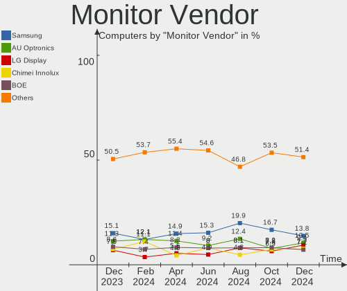

ROSA Hardware Trends
--------------------

A project to identify most popular hardware characteristics and track their change
over time based on data collected by ROSA users at https://Linux-Hardware.org.

Anyone can contribute to the study by uploading probes of their computers by
the [hw-probe](https://github.com/linuxhw/hw-probe) tool:

    sudo hw-probe -all -upload

This is a report for all computer types. See also reports for [desktops](/Dist/ROSA/Desktop/README.md) and [notebooks](/Dist/ROSA/Notebook/README.md).

Full-feature report is available here: https://linux-hardware.org/?view=trends

Period: Dec, 2019.

Contents
--------

- [ OS                       ](#os)
- [ OS Family                ](#os-family)
- [ Kernel                   ](#kernel)
- [ Kernel Family            ](#kernel-family)
- [ Kernel Major Ver.        ](#kernel-major-ver)
- [ Arch                     ](#arch)
- [ DE                       ](#de)
- [ Display Server           ](#display-server)
- [ OS Lang                  ](#os-lang)
- [ Boot Mode                ](#boot-mode)
- [ Filesystem               ](#filesystem)
- [ Dual Boot with Linux     ](#dual-boot-with-linux)
- [ Dual Boot (Win)          ](#dual-boot-win)
- [ Country                  ](#country)
- [ City                     ](#city)
- [ Vendor                   ](#vendor)
- [ Model                    ](#model)
- [ Model Family             ](#model-family)
- [ MFG Year                 ](#mfg-year)
- [ Form Factor              ](#form-factor)
- [ Secure Boot              ](#secure-boot)
- [ Coreboot                 ](#coreboot)
- [ RAM Size                 ](#ram-size)
- [ RAM Used                 ](#ram-used)
- [ Drive Vendor             ](#drive-vendor)
- [ Drive Model              ](#drive-model)
- [ Drive Kind               ](#drive-kind)
- [ Drive Connector          ](#drive-connector)
- [ Drive Size               ](#drive-size)
- [ Space Total              ](#space-total)
- [ Space Used               ](#space-used)
- [ Malfunc. Drives          ](#malfunc-drives)
- [ Malfunc. Drive Vendor    ](#malfunc-drive-vendor)
- [ Malfunc. Drive Kind      ](#malfunc-drive-kind)
- [ Failed Drives            ](#failed-drives)
- [ Failed Drive Vendor      ](#failed-drive-vendor)
- [ Drive Status             ](#drive-status)
- [ CPU Vendor               ](#cpu-vendor)
- [ CPU Model                ](#cpu-model)
- [ CPU Model Family         ](#cpu-model-family)
- [ CPU Cores                ](#cpu-cores)
- [ CPU Sockets              ](#cpu-sockets)
- [ CPU Threads              ](#cpu-threads)
- [ CPU Op-Modes             ](#cpu-op-modes)
- [ CPU Microarch            ](#cpu-microarch)
- [ CPU Microcode            ](#cpu-microcode)
- [ GPU Vendor               ](#gpu-vendor)
- [ GPU Model                ](#gpu-model)
- [ GPU Combo                ](#gpu-combo)
- [ GPU Driver               ](#gpu-driver)
- [ GPU Memory               ](#gpu-memory)
- [ Monitor Vendor           ](#monitor-vendor)
- [ Monitor Model            ](#monitor-model)
- [ Monitor Resolution       ](#monitor-resolution)
- [ Monitor Diagonal         ](#monitor-diagonal)
- [ Monitor Width            ](#monitor-width)
- [ Aspect Ratio             ](#aspect-ratio)
- [ Monitor Area             ](#monitor-area)
- [ Pixel Density            ](#pixel-density)
- [ Multiple Monitors        ](#multiple-monitors)
- [ Net Controller Vendor    ](#net-controller-vendor)
- [ Net Controller Model     ](#net-controller-model)
- [ Net Controller Kind      ](#net-controller-kind)
- [ Used Controller          ](#used-controller)
- [ NICs                     ](#nics)
- [ Unsupported Devices      ](#unsupported-devices)
- [ Unsupported Device Types ](#unsupported-device-types)

OS
--

Installed operating systems

| Name               | Computers | Percent |
|--------------------|-----------|---------|
| ROSA R11           | 303       | 86.32%  |
| ROSA R8.1          | 25        | 7.12%   |
| ROSA R10           | 16        | 4.56%   |
| ROSA R9            | 2         | 0.57%   |
| ROSA R12           | 2         | 0.57%   |
| ROSA R9-R11        | 1         | 0.28%   |
| ROSA Nickel 2019.0 | 1         | 0.28%   |
| RED X3             | 1         | 0.28%   |

OS Family
---------

OS without a version

| Name | Computers | Percent |
|------|-----------|---------|
| ROSA | 351       | 100%    |

Kernel
------

Version of the Linux kernel

| Version                          | Computers | Percent |
|----------------------------------|-----------|---------|
| 4.15.0-desktop-68.5rosa-x86_64   | 97        | 27.64%  |
| 4.15.0-desktop-45.1rosa-x86_64   | 82        | 23.36%  |
| 4.9.155-nrj-desktop-1rosa-x86_64 | 33        | 9.4%    |
| 4.15.0-desktop-60.7rosa-x86_64   | 24        | 6.84%   |
| 4.15.0-desktop-45.1rosa-i586     | 20        | 5.7%    |
| 4.15.0-desktop-68.5rosa-i586     | 17        | 4.84%   |
| 4.9.60-nrj-desktop-1rosa-x86_64  | 11        | 3.13%   |
| 4.9.155-nrj-desktop-1rosa-i586   | 11        | 3.13%   |
| 4.1.38-nrj-desktop-2rosa-x86_64  | 5         | 1.42%   |
| 4.1.38-nrj-desktop-2rosa-i586    | 5         | 1.42%   |
| 5.0.0-desktop-37.1rosa-x86_64    | 3         | 0.85%   |
| 4.9.60-nrj-desktop-1rosa-i586    | 3         | 0.85%   |
| 4.9.124-nrj-desktop-1rosa-x86_64 | 3         | 0.85%   |
| 4.15.0-desktop-60.7rosa-i586     | 3         | 0.85%   |
| 5.4.0-desktop-8.1rosa-x86_64     | 2         | 0.57%   |
| 5.3.0-desktop-24.1rosa-x86_64    | 2         | 0.57%   |
| 5.0.0-desktop-38.1rosa-x86_64    | 2         | 0.57%   |
| 4.9.9-nrj-desktop-1rosa-x86_64   | 2         | 0.57%   |
| 4.9.20-nrj-desktop-1rosa-x86_64  | 2         | 0.57%   |
| 4.9.155-nrj-laptop-1rosa-x86_64  | 2         | 0.57%   |
| 4.9.124-nrj-desktop-1rosa-i586   | 2         | 0.57%   |
| 4.19.0-desktop-13.1rosa-x86_64   | 2         | 0.57%   |
| 5.4.0-desktop-9.1rosa-x86_64     | 1         | 0.28%   |
| 5.3.11-nrj-desktop-2rosa-x86_64  | 1         | 0.28%   |
| 5.3.11-nickel-6rosa-x86_64       | 1         | 0.28%   |
| 5.3.0-desktop-26.1rosa-x86_64    | 1         | 0.28%   |
| 5.2.0-desktop-15.1rosa-x86_64    | 1         | 0.28%   |
| 5.0.0-desktop-33.1rosa-x86_64    | 1         | 0.28%   |
| 5.0.0-desktop-28.1rosa-x86_64    | 1         | 0.28%   |
| 4.9.9-nrj-desktop-1rosa-i586     | 1         | 0.28%   |
| 4.9.20-nrj-desktop-1rosa-i586    | 1         | 0.28%   |
| 4.19.53-nrj-desktop-1rosa-x86_64 | 1         | 0.28%   |
| 4.18.0-desktop-26.2rosa-x86_64   | 1         | 0.28%   |
| 4.15.0-desktop-54.3rosa-x86_64   | 1         | 0.28%   |
| 4.15.0-desktop-54.1rosa-i586     | 1         | 0.28%   |
| 4.15.0-desktop-47.2rosa-x86_64   | 1         | 0.28%   |
| 4.15.0-desktop-47.2rosa-i586     | 1         | 0.28%   |
| 4.15.0-desktop-42.2rosa-x86_64   | 1         | 0.28%   |
| 4.1.25-nrj-desktop-1rosa-x86_64  | 1         | 0.28%   |
| 3.10.0-957.21.3.el7.x86_64       | 1         | 0.28%   |

Kernel Family
-------------

Linux kernel without a distro release

| Version | Computers | Percent |
|---------|-----------|---------|
| 4.15.0  | 248       | 70.66%  |
| 4.9.155 | 46        | 13.11%  |
| 4.9.60  | 14        | 3.99%   |
| 4.1.38  | 10        | 2.85%   |
| 5.0.0   | 7         | 1.99%   |
| 4.9.124 | 5         | 1.42%   |
| 5.4.0   | 3         | 0.85%   |
| 5.3.0   | 3         | 0.85%   |
| 4.9.9   | 3         | 0.85%   |
| 4.9.20  | 3         | 0.85%   |
| 5.3.11  | 2         | 0.57%   |
| 4.19.0  | 2         | 0.57%   |
| 5.2.0   | 1         | 0.28%   |
| 4.19.53 | 1         | 0.28%   |
| 4.18.0  | 1         | 0.28%   |
| 4.1.25  | 1         | 0.28%   |
| 3.10.0  | 1         | 0.28%   |

Kernel Major Ver.
-----------------

Linux kernel major version

| Version | Computers | Percent |
|---------|-----------|---------|
| 4.15    | 248       | 70.66%  |
| 4.9     | 71        | 20.23%  |
| 4.1     | 11        | 3.13%   |
| 5.0     | 7         | 1.99%   |
| 5.3     | 5         | 1.42%   |
| 5.4     | 3         | 0.85%   |
| 4.19    | 3         | 0.85%   |
| 5.2     | 1         | 0.28%   |
| 4.18    | 1         | 0.28%   |
| 3.10    | 1         | 0.28%   |

Arch
----

OS architecture (x86_64, i586, etc.)

| Name   | Computers | Percent |
|--------|-----------|---------|
| x86_64 | 286       | 81.48%  |
| i686   | 65        | 18.52%  |

DE
--

Desktop Environment

| Name | Computers | Percent |
|------|-----------|---------|
| KDE5 | 325       | 92.59%  |
| XFCE | 16        | 4.56%   |
| LXQt | 8         | 2.28%   |
| MATE | 2         | 0.57%   |

Display Server
--------------

X11 or Wayland

| Name    | Computers | Percent |
|---------|-----------|---------|
| Unknown | 351       | 100%    |

OS Lang
-------

Language

| Lang    | Computers | Percent |
|---------|-----------|---------|
| Unknown | 351       | 100%    |

Boot Mode
---------

EFI or BIOS

| Mode | Computers | Percent |
|------|-----------|---------|
| BIOS | 278       | 79.2%   |
| EFI  | 73        | 20.8%   |

Filesystem
----------

Type of filesystem

| Type  | Computers | Percent |
|-------|-----------|---------|
| Ext4  | 334       | 95.16%  |
| Btrfs | 9         | 2.56%   |
| Ext3  | 6         | 1.71%   |
| Xfs   | 1         | 0.28%   |
| Ext2  | 1         | 0.28%   |

Dual Boot with Linux
--------------------

Hosting more than one Linux

| Dual boot | Computers | Percent |
|-----------|-----------|---------|
| No        | 271       | 77.21%  |
| Yes       | 80        | 22.79%  |

Dual Boot (Win)
---------------

Hosting Linux and Windows

| Dual boot | Computers | Percent |
|-----------|-----------|---------|
| No        | 207       | 58.97%  |
| Yes       | 144       | 41.03%  |

Country
-------

Geographic location (country)

| Country              | Computers | Percent |
|----------------------|-----------|---------|
| Russia               | 255       | 72.65%  |
| Ukraine              | 23        | 6.55%   |
| France               | 8         | 2.28%   |
| Belarus              | 8         | 2.28%   |
| Poland               | 7         | 1.99%   |
| Germany              | 6         | 1.71%   |
| Kazakhstan           | 5         | 1.42%   |
| USA                  | 4         | 1.14%   |
| Italy                | 4         | 1.14%   |
| UK                   | 3         | 0.85%   |
| Canada               | 3         | 0.85%   |
| Brazil               | 3         | 0.85%   |
| Latvia               | 2         | 0.57%   |
| Bulgaria             | 2         | 0.57%   |
| Turkey               | 1         | 0.28%   |
| Tunisia              | 1         | 0.28%   |
| Spain                | 1         | 0.28%   |
| Singapore            | 1         | 0.28%   |
| Serbia               | 1         | 0.28%   |
| Senegal              | 1         | 0.28%   |
| Romania              | 1         | 0.28%   |
| Moldova, Republic of | 1         | 0.28%   |
| Moldova              | 1         | 0.28%   |
| Lithuania            | 1         | 0.28%   |
| Israel               | 1         | 0.28%   |
| Ireland              | 1         | 0.28%   |
| Indonesia            | 1         | 0.28%   |
| Finland              | 1         | 0.28%   |
| Estonia              | 1         | 0.28%   |
| Czech Republic       | 1         | 0.28%   |
| Azerbaijan           | 1         | 0.28%   |
| Australia            | 1         | 0.28%   |

City
----

Geographic location (city)

| City              | Computers | Percent |
|-------------------|-----------|---------|
| Moscow            | 47        | 13.39%  |
| St Petersburg     | 13        | 3.7%    |
| Novosibirsk       | 11        | 3.13%   |
| Yekaterinburg     | 10        | 2.85%   |
| Vogue             | 7         | 1.99%   |
| Rostov-on-Don     | 6         | 1.71%   |
| Samara            | 5         | 1.42%   |
| Omsk              | 5         | 1.42%   |
| Saratov           | 4         | 1.14%   |
| Kemerovo          | 4         | 1.14%   |
| Zheleznodorozhnyy | 3         | 0.85%   |
| Volgograd         | 3         | 0.85%   |
| Vladivostok       | 3         | 0.85%   |
| Vitebsk           | 3         | 0.85%   |
| Tyumen            | 3         | 0.85%   |
| Nizhny Tagil      | 3         | 0.85%   |
| Kyiv              | 3         | 0.85%   |
| Krasnodar         | 3         | 0.85%   |
| Irkutsk           | 3         | 0.85%   |
| Donetsk           | 3         | 0.85%   |
| Chelyabinsk       | 3         | 0.85%   |
| Yoshkar-Ola       | 2         | 0.57%   |
| Voronezh          | 2         | 0.57%   |
| Vladikavkaz       | 2         | 0.57%   |
| Ulyanovsk         | 2         | 0.57%   |
| Tver              | 2         | 0.57%   |
| Tula              | 2         | 0.57%   |
| Stavropol         | 2         | 0.57%   |
| Stary Oskol       | 2         | 0.57%   |
| Ryazan            | 2         | 0.57%   |
| Rome              | 2         | 0.57%   |
| Poltava           | 2         | 0.57%   |
| Perm              | 2         | 0.57%   |
| Penza             | 2         | 0.57%   |
| Orenburg          | 2         | 0.57%   |
| Novoye Devyatkino | 2         | 0.57%   |
| Novorossiysk      | 2         | 0.57%   |
| Nova Serrana      | 2         | 0.57%   |
| Nizhnevartovsk    | 2         | 0.57%   |
| Minsk             | 2         | 0.57%   |
| Luhansk           | 2         | 0.57%   |
| Kursk             | 2         | 0.57%   |
| Krasnoyarsk       | 2         | 0.57%   |
| Kirov             | 2         | 0.57%   |
| Kharkiv           | 2         | 0.57%   |
| Khabarovsk        | 2         | 0.57%   |
| Kaluga            | 2         | 0.57%   |
| Gatchina          | 2         | 0.57%   |
| Barnaul           | 2         | 0.57%   |
| Abakan            | 2         | 0.57%   |
| Łapy             | 1         | 0.28%   |
| Zlatoust          | 1         | 0.28%   |
| Zelenograd        | 1         | 0.28%   |
| Yaroslavl         | 1         | 0.28%   |
| Weinsberg         | 1         | 0.28%   |
| Warsaw            | 1         | 0.28%   |
| Vladimir          | 1         | 0.28%   |
| Vishnëvogorsk    | 1         | 0.28%   |
| Verkhniye Sergi   | 1         | 0.28%   |
| Ventspils         | 1         | 0.28%   |

Vendor
------

Motherboard manufacturer

| Name                | Computers | Percent |
|---------------------|-----------|---------|
| ASUSTek Computer    | 76        | 21.65%  |
| Lenovo              | 39        | 11.11%  |
| Gigabyte Technology | 37        | 10.54%  |
| Hewlett-Packard     | 32        | 9.12%   |
| ASRock              | 25        | 7.12%   |
| Acer                | 23        | 6.55%   |
| Dell                | 21        | 5.98%   |
| MSI                 | 16        | 4.56%   |
| Samsung Electronics | 12        | 3.42%   |
| Sony                | 7         | 1.99%   |
| Intel               | 7         | 1.99%   |
| Packard Bell        | 5         | 1.42%   |
| Unknown             | 5         | 1.42%   |
| Toshiba             | 4         | 1.14%   |
| eMachines           | 4         | 1.14%   |
| Pegatron            | 3         | 0.85%   |
| Fujitsu             | 3         | 0.85%   |
| ECS                 | 3         | 0.85%   |
| Notebook            | 2         | 0.57%   |
| Medion              | 2         | 0.57%   |
| Fujitsu Siemens     | 2         | 0.57%   |
| DEXP                | 2         | 0.57%   |
| Chuwi               | 2         | 0.57%   |
| Biostar             | 2         | 0.57%   |
| Apple               | 2         | 0.57%   |
| ZOTAC               | 1         | 0.28%   |
| WinFast             | 1         | 0.28%   |
| SiS Technology      | 1         | 0.28%   |
| Semp Toshiba        | 1         | 0.28%   |
| Panasonic           | 1         | 0.28%   |
| MEGA                | 1         | 0.28%   |
| Maibenben           | 1         | 0.28%   |
| LG Electronics      | 1         | 0.28%   |
| EPoX Computer       | 1         | 0.28%   |
| ELSA                | 1         | 0.28%   |
| Compaq              | 1         | 0.28%   |
| Compal              | 1         | 0.28%   |
| Clevo               | 1         | 0.28%   |
| Alienware           | 1         | 0.28%   |
| ABIT                | 1         | 0.28%   |

Model
-----

Motherboard model

| Name                               | Computers | Percent |
|------------------------------------|-----------|---------|
| Unknown                            | 7         | 1.99%   |
| Pavilion g6                        | 4         | 1.14%   |
| B570e HuronRiver Platform          | 3         | 0.85%   |
| A68HM-K                            | 3         | 0.85%   |
| X550MJ                             | 2         | 0.57%   |
| V580c 20160                        | 2         | 0.57%   |
| OptiPlex 760                       | 2         | 0.57%   |
| MS-7996                            | 2         | 0.57%   |
| MS-7592                            | 2         | 0.57%   |
| M5A99X EVO R2.0                    | 2         | 0.57%   |
| M5A97 R2.0                         | 2         | 0.57%   |
| M5A78L-M/USB3                      | 2         | 0.57%   |
| M5A78L-M LX3                       | 2         | 0.57%   |
| M3N78D FX                          | 2         | 0.57%   |
| Laptop 15-bw0xx                    | 2         | 0.57%   |
| IdeaPad 330-15AST 81D6             | 2         | 0.57%   |
| Hero Book                          | 2         | 0.57%   |
| H77-DS3H                           | 2         | 0.57%   |
| G50-45 80E3                        | 2         | 0.57%   |
| G50-30 80G0                        | 2         | 0.57%   |
| G31M-ES2L                          | 2         | 0.57%   |
| F5SL                               | 2         | 0.57%   |
| B75-D3V                            | 2         | 0.57%   |
| Aspire A315-21                     | 2         | 0.57%   |
| 970A-DS3P                          | 2         | 0.57%   |
| 350V5C/351V5C/3540VC/3440VC        | 2         | 0.57%   |
| 300V3A/300V4A/300V5A/200A4B/200A5B | 2         | 0.57%   |
| Z97 Anniversary                    | 1         | 0.28%   |
| Z77 Extreme4                       | 1         | 0.28%   |
| Z77 Extreme3                       | 1         | 0.28%   |
| Z68P-DS3                           | 1         | 0.28%   |
| Z370 AORUS Gaming 5                | 1         | 0.28%   |
| Z200 Workstation                   | 1         | 0.28%   |
| Z170 Extreme4                      | 1         | 0.28%   |
| Y50-70 20378                       | 1         | 0.28%   |
| XiaoMai6                           | 1         | 0.28%   |
| X75VC                              | 1         | 0.28%   |
| X553MA                             | 1         | 0.28%   |
| X51R                               | 1         | 0.28%   |
| WIM2120                            | 1         | 0.28%   |
| W65_67SB                           | 1         | 0.28%   |
| VPCS118EC                          | 1         | 0.28%   |
| VPCL22S1R                          | 1         | 0.28%   |
| VPCEH36EF                          | 1         | 0.28%   |
| VPCEB13EB                          | 1         | 0.28%   |
| VivoBook 15_ASUS Laptop X542UF     | 1         | 0.28%   |
| VGN-SZ7RMN_B                       | 1         | 0.28%   |
| VGN-FW11ZRU                        | 1         | 0.28%   |
| V560                               | 1         | 0.28%   |
| V310-15ISK 80SY                    | 1         | 0.28%   |
| V145-15AST 81MT                    | 1         | 0.28%   |
| UX330UA                            | 1         | 0.28%   |
| UX31A                              | 1         | 0.28%   |
| U31SD                              | 1         | 0.28%   |
| U24E                               | 1         | 0.28%   |
| ThinkPad X230 2320LFG              | 1         | 0.28%   |
| ThinkPad T60 1952VKC               | 1         | 0.28%   |
| ThinkPad T540p 20BFS02S01          | 1         | 0.28%   |
| ThinkPad T400 6475GC8              | 1         | 0.28%   |
| ThinkPad SL510 2875RS2             | 1         | 0.28%   |

Model Family
------------

Motherboard model prefix

| Name                       | Computers | Percent |
|----------------------------|-----------|---------|
| Acer Aspire                | 21        | 5.98%   |
| Dell Inspiron              | 10        | 2.85%   |
| HP Pavilion                | 9         | 2.56%   |
| Lenovo IdeaPad             | 8         | 2.28%   |
| Unknown                    | 7         | 1.99%   |
| Lenovo ThinkPad            | 5         | 1.42%   |
| HP Laptop                  | 5         | 1.42%   |
| Dell OptiPlex              | 5         | 1.42%   |
| Dell Latitude              | 5         | 1.42%   |
| ASUS M5A78L-M              | 5         | 1.42%   |
| Toshiba Satellite          | 4         | 1.14%   |
| HP Compaq                  | 4         | 1.14%   |
| Samsung Electronics 300V3A | 3         | 0.85%   |
| Packard Bell EasyNote      | 3         | 0.85%   |
| Lenovo B570e               | 3         | 0.85%   |
| HP ProBook                 | 3         | 0.85%   |
| ASUS PRIME                 | 3         | 0.85%   |
| ASUS M5A97                 | 3         | 0.85%   |
| ASUS A68HM-K               | 3         | 0.85%   |
| Samsung Electronics 350V5C | 2         | 0.57%   |
| Packard Bell DOT           | 2         | 0.57%   |
| MSI MS-7996                | 2         | 0.57%   |
| MSI MS-7592                | 2         | 0.57%   |
| Lenovo V580c               | 2         | 0.57%   |
| Lenovo ThinkCentre         | 2         | 0.57%   |
| Lenovo G50-45              | 2         | 0.57%   |
| Lenovo G50-30              | 2         | 0.57%   |
| Gigabyte H77-DS3H          | 2         | 0.57%   |
| Gigabyte G31M-ES2L         | 2         | 0.57%   |
| Gigabyte B75-D3V           | 2         | 0.57%   |
| Gigabyte 970A-DS3P         | 2         | 0.57%   |
| Fujitsu ESPRIMO            | 2         | 0.57%   |
| Chuwi Hero                 | 2         | 0.57%   |
| ASUS X550MJ                | 2         | 0.57%   |
| ASUS M5A99X                | 2         | 0.57%   |
| ASUS F5SL                  | 2         | 0.57%   |
| ASRock Z77                 | 2         | 0.57%   |
| ASRock M3N78D              | 2         | 0.57%   |
| ASRock B450M-HDV           | 2         | 0.57%   |
| Acer Extensa               | 2         | 0.57%   |
| ZOTAC NM10                 | 1         | 0.28%   |
| WinFast 6100M2MA           | 1         | 0.28%   |
| Sony VPCS118EC             | 1         | 0.28%   |
| Sony VPCL22S1R             | 1         | 0.28%   |
| Sony VPCEH36EF             | 1         | 0.28%   |
| Sony VPCEB13EB             | 1         | 0.28%   |
| Sony VGN-SZ7RMN            | 1         | 0.28%   |
| Sony VGN-FW11ZRU           | 1         | 0.28%   |
| Sony SVE1713M1RW           | 1         | 0.28%   |
| SiS Technology SiS-650GX   | 1         | 0.28%   |
| Semp Toshiba IS            | 1         | 0.28%   |
| Samsung Electronics R508   | 1         | 0.28%   |
| Samsung Electronics NC210  | 1         | 0.28%   |
| Samsung Electronics N250P  | 1         | 0.28%   |
| Samsung Electronics N150P  | 1         | 0.28%   |
| Samsung Electronics 300E4Z | 1         | 0.28%   |
| Samsung Electronics 300E4C | 1         | 0.28%   |
| Samsung Electronics 300E4A | 1         | 0.28%   |
| Pegatron PC-B2105          | 1         | 0.28%   |
| Pegatron C15B              | 1         | 0.28%   |

MFG Year
--------

Motherboard manufacture year

| Year | Computers | Percent |
|------|-----------|---------|
| 2012 | 39        | 11.11%  |
| 2011 | 36        | 10.26%  |
| 2010 | 35        | 9.97%   |
| 2013 | 33        | 9.4%    |
| 2009 | 28        | 7.98%   |
| 2015 | 27        | 7.69%   |
| 2018 | 25        | 7.12%   |
| 2014 | 23        | 6.55%   |
| 2008 | 22        | 6.27%   |
| 2019 | 21        | 5.98%   |
| 2016 | 18        | 5.13%   |
| 2007 | 15        | 4.27%   |
| 2017 | 9         | 2.56%   |
| 2006 | 9         | 2.56%   |
| 2005 | 5         | 1.42%   |
| 2003 | 3         | 0.85%   |
| 2004 | 2         | 0.57%   |
| 2002 | 1         | 0.28%   |

Form Factor
-----------

Physical design of the computer

| Name       | Computers | Percent |
|------------|-----------|---------|
| Desktop    | 176       | 50.14%  |
| Notebook   | 170       | 48.43%  |
| All in one | 3         | 0.85%   |
| Mini pc    | 2         | 0.57%   |

Secure Boot
-----------

Enabled or disabled

| State    | Computers | Percent |
|----------|-----------|---------|
| Disabled | 308       | 87.75%  |
| Unknown  | 43        | 12.25%  |

Coreboot
--------

Have coreboot on board

| Used | Computers | Percent |
|------|-----------|---------|
| No   | 351       | 100%    |

RAM Size
--------

Total RAM memory

| Size in GB | Computers | Percent |
|------------|-----------|---------|
| 3.01-4.0   | 137       | 39.03%  |
| 4.01-8.0   | 68        | 19.37%  |
| 8.01-16.0  | 60        | 17.09%  |
| 1.01-2.0   | 41        | 11.68%  |
| 16.01-24.0 | 19        | 5.41%   |
| 2.01-3.0   | 16        | 4.56%   |
| 32.01-64.0 | 5         | 1.42%   |
| 0.01-1.0   | 4         | 1.14%   |
| 24.01-32.0 | 1         | 0.28%   |

RAM Used
--------

Used RAM memory

| Used GB  | Computers | Percent |
|----------|-----------|---------|
| 0.01-1.0 | 174       | 49.57%  |
| 1.01-2.0 | 137       | 39.03%  |
| 2.01-3.0 | 29        | 8.26%   |
| 3.01-4.0 | 7         | 1.99%   |
| 4.01-8.0 | 4         | 1.14%   |

Drive Vendor
------------

Hard drive vendors

| Vendor              | Computers | Drives  | Percent |
|---------------------|-----------|---------|---------|
| Seagate             | 109       | 129     | 23.9%   |
| WDC                 | 106       | 127     | 23.25%  |
| Hitachi             | 40        | 45      | 8.77%   |
| Toshiba             | 38        | 38      | 8.33%   |
| Samsung Electronics | 25        | 26      | 5.48%   |
| Kingston            | 20        | 21      | 4.39%   |
| SanDisk             | 10        | 10      | 2.19%   |
| Unknown             | 9         | 9       | 1.97%   |
| SPCC                | 9         | 9       | 1.97%   |
| HGST                | 9         | 11      | 1.97%   |
| China               | 7         | 7       | 1.54%   |
| Crucial             | 6         | 6       | 1.32%   |
| Fujitsu             | 5         | 5       | 1.1%    |
| A-DATA Technology   | 5         | 5       | 1.1%    |
| Transcend           | 4         | 4       | 0.88%   |
| Intel               | 4         | 5       | 0.88%   |
| PLEXTOR             | 3         | 3       | 0.66%   |
| KingSpec            | 3         | 3       | 0.66%   |
| KINGMAX             | 3         | 3       | 0.66%   |
| HL-DT-ST            | 3         | Unknown | 0.66%   |
| Gigabyte Technology | 3         | 3       | 0.66%   |
| Zheino              | 2         | 2       | 0.44%   |
| Team                | 2         | 2       | 0.44%   |
| Patriot             | 2         | 2       | 0.44%   |
| OCZ                 | 2         | 2       | 0.44%   |
| Maxtor              | 2         | 2       | 0.44%   |
| LITEONIT            | 2         | 3       | 0.44%   |
| LITEON              | 2         | 2       | 0.44%   |
| KingDian            | 2         | 2       | 0.44%   |
| IBM/Hitachi         | 2         | 2       | 0.44%   |
| GOODRAM             | 2         | 3       | 0.44%   |
| Corsair             | 2         | 2       | 0.44%   |
| Apacer              | 2         | 2       | 0.44%   |
| Verbatim            | 1         | 1       | 0.22%   |
| SK Hynix            | 1         | 1       | 0.22%   |
| Silicon Motion      | 1         | 1       | 0.22%   |
| SABRENT             | 1         | 1       | 0.22%   |
| oyunkey             | 1         | 1       | 0.22%   |
| Micron Technology   | 1         | 1       | 0.22%   |
| LONDISK             | 1         | 1       | 0.22%   |
| HUAWEI              | 1         | 1       | 0.22%   |
| HS-SSD-C100         | 1         | 1       | 0.22%   |
| Hewlett-Packard     | 1         | 1       | 0.22%   |
| Apple               | 1         | 1       | 0.22%   |

Drive Model
-----------

Hard drive models

| Model                        | Computers | Percent |
|------------------------------|-----------|---------|
| ST500DM002-1BD142 500GB      | 7         | 1.38%   |
| ST3500418AS 500GB            | 6         | 1.18%   |
| ST380011A 80GB               | 5         | 0.98%   |
| MQ01ABF050 500GB             | 5         | 0.98%   |
| WDS240G2G0A-00JH30 240GB SSD | 4         | 0.79%   |
| WD5000AAKX-001CA0 500GB      | 4         | 0.79%   |
| ST3250410AS 250GB            | 4         | 0.79%   |
| ST3250310AS 250GB            | 4         | 0.79%   |
| ST3160815AS 160GB            | 4         | 0.79%   |
| Solid State Disk 256GB       | 4         | 0.79%   |
| HTS547575A9E384 752GB        | 4         | 0.79%   |
| WD10JPVX-22JC3T0 1TB         | 3         | 0.59%   |
| WD10EZEX-08WN4A0 1TB         | 3         | 0.59%   |
| ST9500325AS 500GB            | 3         | 0.59%   |
| ST500LT012-1DG142 500GB      | 3         | 0.59%   |
| ST1000DM003-1CH162 1TB       | 3         | 0.59%   |
| ST1000DM003-1CH1 1TB         | 3         | 0.59%   |
| SSD 120GB                    | 3         | 0.59%   |
| SA400S37240G 240GB SSD       | 3         | 0.59%   |
| SA400S3 240GB SSD            | 3         | 0.59%   |
| MQ04ABF100 1TB               | 3         | 0.59%   |
| MQ01ABD100 1TB               | 3         | 0.59%   |
| MQ01ABD050 500GB             | 3         | 0.59%   |
| HTS547550A9E384 500GB        | 3         | 0.59%   |
| HTS545050A7E680 500GB        | 3         | 0.59%   |
| HDS72105 500GB               | 3         | 0.59%   |
| DVDRAM GUC0N 1GB             | 3         | 0.59%   |
| DT01ACA050 500GB             | 3         | 0.59%   |
| WDS480G2G0A-00JH30 480GB SSD | 2         | 0.39%   |
| WDS250G2B0B 250GB SSD        | 2         | 0.39%   |
| WDS240G2G0B-00EPW0 240GB SSD | 2         | 0.39%   |
| WD5000LPCX-2 500GB           | 2         | 0.39%   |
| WD5000LPCX-00VHAT0 500GB     | 2         | 0.39%   |
| WD5000AAKX-0 500GB           | 2         | 0.39%   |
| WD5000AADS-00S9B0 500GB      | 2         | 0.39%   |
| WD3200BPVT-22ZEST0 320GB     | 2         | 0.39%   |
| WD3200BEVT-80A0RT0 320GB     | 2         | 0.39%   |
| WD3200AAJS-00L7A0 320GB      | 2         | 0.39%   |
| WD1200BEVS-22UST0 120GB      | 2         | 0.39%   |
| WD10EZEX-60WN4A0 1TB         | 2         | 0.39%   |
| WD10EZEX-22MFCA0 1TB         | 2         | 0.39%   |
| WD10EZEX-00BN5A0 1TB         | 2         | 0.39%   |
| WD10EARX-00N0YB0 1TB         | 2         | 0.39%   |
| SV300S3 120GB SSD            | 2         | 0.39%   |
| ST9320423AS 320GB            | 2         | 0.39%   |
| ST500LT012-9WS142 500GB      | 2         | 0.39%   |
| ST380815AS 80GB              | 2         | 0.39%   |
| ST380811AS 80GB              | 2         | 0.39%   |
| ST380215AS 80GB              | 2         | 0.39%   |
| ST3250620AS 250GB            | 2         | 0.39%   |
| ST3250620A 250GB             | 2         | 0.39%   |
| ST320LT020-9YG142 320GB      | 2         | 0.39%   |
| ST3160318AS 160GB            | 2         | 0.39%   |
| ST3120827AS 120GB            | 2         | 0.39%   |
| ST31000528AS 1TB             | 2         | 0.39%   |
| ST2000DM008-2FR102 2TB       | 2         | 0.39%   |
| ST1000LM024 HN-M101MBB 1TB   | 2         | 0.39%   |
| SSD 860 EVO 500GB            | 2         | 0.39%   |
| SSD 750 EVO 250GB            | 2         | 0.39%   |
| SSD 60GB                     | 2         | 0.39%   |

Drive Kind
----------

HDD or SSD

| Kind    | Computers | Drives | Percent |
|---------|-----------|--------|---------|
| HDD     | 281       | 362    | 68.04%  |
| SSD     | 117       | 130    | 28.33%  |
| MMC     | 8         | 10     | 1.94%   |
| Unknown | 4         | 1      | 0.97%   |
| NVMe    | 3         | 3      | 0.73%   |

Drive Connector
---------------

SATA, SAS, NVMe, etc.

| Type | Computers | Drives | Percent |
|------|-----------|--------|---------|
| SATA | 345       | 491    | 95.57%  |
| MMC  | 8         | 10     | 2.22%   |
| SAS  | 5         | 2      | 1.39%   |
| NVMe | 3         | 3      | 0.83%   |

Drive Size
----------

Size of hard drive

| Size in TB | Computers | Drives | Percent |
|------------|-----------|--------|---------|
| 0.01-0.5   | 299       | 399    | 76.28%  |
| 0.51-1.0   | 83        | 97     | 21.17%  |
| 1.01-2.0   | 7         | 7      | 1.79%   |
| 2.01-3.0   | 3         | 3      | 0.77%   |

Space Total
-----------

Amount of disk space available on the file system

| Size in GB     | Computers | Percent |
|----------------|-----------|---------|
| 101-250        | 114       | 32.48%  |
| 251-500        | 82        | 23.36%  |
| 1-20           | 44        | 12.54%  |
| 51-100         | 38        | 10.83%  |
| 501-1000       | 34        | 9.69%   |
| 21-50          | 25        | 7.12%   |
| 1001-2000      | 11        | 3.13%   |
| 2001-3000      | 2         | 0.57%   |
| More than 3000 | 1         | 0.28%   |

Space Used
----------

Amount of used disk space

| Used GB   | Computers | Percent |
|-----------|-----------|---------|
| 1-20      | 239       | 68.09%  |
| 101-250   | 30        | 8.55%   |
| 21-50     | 29        | 8.26%   |
| 51-100    | 23        | 6.55%   |
| 251-500   | 17        | 4.84%   |
| 501-1000  | 10        | 2.85%   |
| 1001-2000 | 3         | 0.85%   |

Malfunc. Drives
---------------

Drive models with a malfunction

| Model                    | Computers | Drives | Percent |
|--------------------------|-----------|--------|---------|
| ST500DM002-1BD142 500GB  | 4         | 4      | 2.45%   |
| ST9500325AS 500GB        | 3         | 3      | 1.84%   |
| ST3500418AS 500GB        | 3         | 3      | 1.84%   |
| ST3250410AS 250GB        | 3         | 3      | 1.84%   |
| WD5000AAKX-001CA0 500GB  | 2         | 2      | 1.23%   |
| WD3200AAJS-00L7A0 320GB  | 2         | 2      | 1.23%   |
| ST9320423AS 320GB        | 2         | 2      | 1.23%   |
| ST500LT012-9WS142 500GB  | 2         | 2      | 1.23%   |
| ST500LT012-1DG142 500GB  | 2         | 2      | 1.23%   |
| ST380011A 80GB           | 2         | 2      | 1.23%   |
| ST3250310AS 250GB        | 2         | 2      | 1.23%   |
| ST3160815AS 160GB        | 2         | 2      | 1.23%   |
| SSD 60GB                 | 2         | 2      | 1.23%   |
| MQ01ABD050 500GB         | 2         | 2      | 1.23%   |
| MQ01ABD032 320GB         | 2         | 2      | 1.23%   |
| MK3259GSXP 320GB         | 2         | 2      | 1.23%   |
| HTS547575A9E384 752GB    | 2         | 2      | 1.23%   |
| HTS547564A9E384 640GB    | 2         | 2      | 1.23%   |
| HTS545050A7E680 500GB    | 2         | 2      | 1.23%   |
| HTS541612J9SA00 120GB    | 2         | 2      | 1.23%   |
| HDT722525DLA380 250GB    | 2         | 2      | 1.23%   |
| HD080HJ 80GB             | 2         | 2      | 1.23%   |
| XM11 128GB-V2 SSD        | 1         | 1      | 0.61%   |
| WD800JD-00MSA1 80GB      | 1         | 1      | 0.61%   |
| WD800BB-56JKC0 80GB      | 1         | 1      | 0.61%   |
| WD5000LPCX-24C6HT0 500GB | 1         | 1      | 0.61%   |
| WD5000BPVT-55HXZT3 500GB | 1         | 1      | 0.61%   |
| WD5000BEVT-75A0RT0 500GB | 1         | 1      | 0.61%   |
| WD5000AAKX-0 500GB       | 1         | 1      | 0.61%   |
| WD5000AAKS-00A7B0 500GB  | 1         | 1      | 0.61%   |
| WD5000AADS-00S9B0 500GB  | 1         | 1      | 0.61%   |
| WD3200BEVT-80A0RT0 320GB | 1         | 1      | 0.61%   |
| WD3200AAKS-00SBA0 320GB  | 1         | 1      | 0.61%   |
| WD3200AAJS-56M0A0 320GB  | 1         | 1      | 0.61%   |
| WD3200AAJS-00B4A0 320GB  | 1         | 1      | 0.61%   |
| WD2500LPCX-24C6HT0 250GB | 1         | 1      | 0.61%   |
| WD2500BEVT-35A23T0 250GB | 1         | 1      | 0.61%   |
| WD2500BEVT-3 250GB       | 1         | 1      | 0.61%   |
| WD2500AAJS-00L7A0 250GB  | 1         | 1      | 0.61%   |
| WD2500AAJS-00B4A0 250GB  | 1         | 1      | 0.61%   |
| WD20EURS-63S48Y0 2TB     | 1         | 1      | 0.61%   |
| WD1600JS-60NCB1 160GB    | 1         | 1      | 0.61%   |
| WD1600JS-00NCB1 160GB    | 1         | 1      | 0.61%   |
| WD1600BEVS-07RST0 160GB  | 1         | 1      | 0.61%   |
| WD1600AAJS-00PSA0 160GB  | 1         | 1      | 0.61%   |
| WD1200BB-00GUC0 120GB    | 1         | 1      | 0.61%   |
| WD10EZRX-00L 1TB         | 1         | 1      | 0.61%   |
| WD10EZEX-75WN4A0 1TB     | 1         | 1      | 0.61%   |
| WD10EZEX-60ZF5A0 1TB     | 1         | 1      | 0.61%   |
| WD10EZEX-08WN4A0 1TB     | 1         | 1      | 0.61%   |
| WD10EZEX-07ZF5A0 1TB     | 1         | 1      | 0.61%   |
| WD10EARX-00N0YB0 1TB     | 1         | 1      | 0.61%   |
| WD10EARS-00Y5B1 1TB      | 1         | 1      | 0.61%   |
| WD10EARS-00MVWB0 1TB     | 1         | 1      | 0.61%   |
| WD10EALX-009BA0 1TB      | 1         | 1      | 0.61%   |
| SX900 64GB SSD           | 1         | 1      | 0.61%   |
| SV300S37A120G 120GB SSD  | 1         | 1      | 0.61%   |
| SV0411N 40GB             | 1         | 1      | 0.61%   |
| ST98823AS 80GB           | 1         | 1      | 0.61%   |
| ST980811AS 80GB          | 1         | 1      | 0.61%   |

Malfunc. Drive Vendor
---------------------

Vendors of faulty drives

| Vendor              | Computers | Drives | Percent |
|---------------------|-----------|--------|---------|
| Seagate             | 55        | 59     | 37.16%  |
| WDC                 | 28        | 36     | 18.92%  |
| Hitachi             | 17        | 18     | 11.49%  |
| Toshiba             | 15        | 15     | 10.14%  |
| Samsung Electronics | 12        | 12     | 8.11%   |
| HGST                | 3         | 4      | 2.03%   |
| A-DATA Technology   | 3         | 3      | 2.03%   |
| Kingston            | 2         | 2      | 1.35%   |
| KingSpec            | 2         | 2      | 1.35%   |
| KINGMAX             | 2         | 2      | 1.35%   |
| IBM/Hitachi         | 2         | 2      | 1.35%   |
| Corsair             | 2         | 2      | 1.35%   |
| Zheino              | 1         | 1      | 0.68%   |
| Silicon Motion      | 1         | 1      | 0.68%   |
| Maxtor              | 1         | 1      | 0.68%   |
| LITEONIT            | 1         | 2      | 0.68%   |
| Intel               | 1         | 1      | 0.68%   |

Malfunc. Drive Kind
-------------------

Kinds of faulty drives

| Kind | Computers | Drives | Percent |
|------|-----------|--------|---------|
| HDD  | 126       | 147    | 89.36%  |
| SSD  | 14        | 15     | 9.93%   |
| NVMe | 1         | 1      | 0.71%   |

Failed Drives
-------------

Failed drive models

| Model                   | Computers | Drives | Percent |
|-------------------------|-----------|--------|---------|
| WD5000AAKS-00V1A0 500GB | 1         | 1      | 20%     |
| WD1600BEVT-22ZCT0 160GB | 1         | 1      | 20%     |
| ST380815AS 80GB         | 1         | 1      | 20%     |
| HTS54322 250GB          | 1         | 1      | 20%     |
| HD642JJ 640GB           | 1         | 1      | 20%     |

Failed Drive Vendor
-------------------

Failed drive vendors

| Vendor              | Computers | Drives | Percent |
|---------------------|-----------|--------|---------|
| WDC                 | 2         | 2      | 40%     |
| Seagate             | 1         | 1      | 20%     |
| Samsung Electronics | 1         | 1      | 20%     |
| Hitachi             | 1         | 1      | 20%     |

Drive Status
------------

Number of failed and malfunc. drives

| Status   | Computers | Drives | Percent |
|----------|-----------|--------|---------|
| Works    | 256       | 323    | 61.54%  |
| Malfunc  | 140       | 163    | 33.65%  |
| Detected | 15        | 15     | 3.61%   |
| Failed   | 5         | 5      | 1.2%    |

CPU Vendor
----------

Processor vendors

| Vendor       | Computers | Percent |
|--------------|-----------|---------|
| Intel        | 248       | 70.66%  |
| AMD          | 101       | 28.77%  |
| CentaurHauls | 2         | 0.57%   |

CPU Model
---------

Processor models

| Model                                       | Computers | Percent |
|---------------------------------------------|-----------|---------|
| Intel Pentium CPU B940 @ 2.00GHz            | 6         | 1.71%   |
| Intel Pentium CPU B950 @ 2.10GHz            | 4         | 1.14%   |
| Intel Core i5-3210M CPU @ 2.50GHz           | 4         | 1.14%   |
| Intel Core i3 CPU 550 @ 3.20GHz             | 4         | 1.14%   |
| AMD FX-8300 Eight-Core Processor            | 4         | 1.14%   |
| AMD Athlon II X2 250 Processor              | 4         | 1.14%   |
| Intel Pentium Dual CPU E2200 @ 2.20GHz      | 3         | 0.85%   |
| Intel Pentium CPU N3540 @ 2.16GHz           | 3         | 0.85%   |
| Intel Pentium CPU B960 @ 2.20GHz            | 3         | 0.85%   |
| Intel Pentium 4 CPU 3.00GHz                 | 3         | 0.85%   |
| Intel Core i7-3770 CPU @ 3.40GHz            | 3         | 0.85%   |
| Intel Core i5-2430M CPU @ 2.40GHz           | 3         | 0.85%   |
| Intel Core i5 CPU M 480 @ 2.67GHz           | 3         | 0.85%   |
| Intel Core i3-3120M CPU @ 2.50GHz           | 3         | 0.85%   |
| Intel Core i3-3110M CPU @ 2.40GHz           | 3         | 0.85%   |
| Intel Core i3-2350M CPU @ 2.30GHz           | 3         | 0.85%   |
| Intel Core 2 Duo CPU E7500 @ 2.93GHz        | 3         | 0.85%   |
| Intel Core 2 Duo CPU E6750 @ 2.66GHz        | 3         | 0.85%   |
| Intel Atom CPU N455 @ 1.66GHz               | 3         | 0.85%   |
| AMD Athlon II X2 240 Processor              | 3         | 0.85%   |
| AMD Athlon 64 X2 Dual Core Processor 6000+  | 3         | 0.85%   |
| AMD Athlon 64 X2 Dual Core Processor 5200+  | 3         | 0.85%   |
| AMD A6-4400M APU with Radeon HD Graphics    | 3         | 0.85%   |
| Intel Pentium Gold G5400 CPU @ 3.70GHz      | 2         | 0.57%   |
| Intel Pentium Dual-Core CPU T4500 @ 2.30GHz | 2         | 0.57%   |
| Intel Pentium Dual-Core CPU T4200 @ 2.00GHz | 2         | 0.57%   |
| Intel Pentium Dual-Core CPU E6300 @ 2.80GHz | 2         | 0.57%   |
| Intel Pentium D CPU 2.80GHz                 | 2         | 0.57%   |
| Intel Pentium 3558U @ 1.70GHz               | 2         | 0.57%   |
| Intel Core i7-4710HQ CPU @ 2.50GHz          | 2         | 0.57%   |
| Intel Core i7-2600 CPU @ 3.40GHz            | 2         | 0.57%   |
| Intel Core i5-3450 CPU @ 3.10GHz            | 2         | 0.57%   |
| Intel Core i5-3230M CPU @ 2.60GHz           | 2         | 0.57%   |
| Intel Core i5-2520M CPU @ 2.50GHz           | 2         | 0.57%   |
| Intel Core i5-2450M CPU @ 2.50GHz           | 2         | 0.57%   |
| Intel Core i5 CPU 750 @ 2.67GHz             | 2         | 0.57%   |
| Intel Core i3-6006U CPU @ 2.00GHz           | 2         | 0.57%   |
| Intel Core i3-5005U CPU @ 2.00GHz           | 2         | 0.57%   |
| Intel Core i3-3240 CPU @ 3.40GHz            | 2         | 0.57%   |
| Intel Core i3-2310M CPU @ 2.10GHz           | 2         | 0.57%   |
| Intel Core i3 CPU M 370 @ 2.40GHz           | 2         | 0.57%   |
| Intel Core i3 CPU 540 @ 3.07GHz             | 2         | 0.57%   |
| Intel Core 2 Duo CPU T5750 @ 2.00GHz        | 2         | 0.57%   |
| Intel Core 2 Duo CPU E8500 @ 3.16GHz        | 2         | 0.57%   |
| Intel Core 2 Duo CPU E8400 @ 3.00GHz        | 2         | 0.57%   |
| Intel Core 2 CPU T7200 @ 2.00GHz            | 2         | 0.57%   |
| Intel Core 2 CPU 6300 @ 1.86GHz             | 2         | 0.57%   |
| Intel Celeron CPU N3050 @ 1.60GHz           | 2         | 0.57%   |
| Intel Celeron CPU N2840 @ 2.16GHz           | 2         | 0.57%   |
| Intel Celeron CPU J1800 @ 2.41GHz           | 2         | 0.57%   |
| Intel Celeron CPU G530 @ 2.40GHz            | 2         | 0.57%   |
| Intel Celeron CPU 900 @ 2.20GHz             | 2         | 0.57%   |
| Intel Celeron CPU 1.70GHz                   | 2         | 0.57%   |
| Intel Atom x5-E8000 CPU @ 1.04GHz           | 2         | 0.57%   |
| Intel Atom CPU D525 @ 1.80GHz               | 2         | 0.57%   |
| AMD Turion 64 X2 Mobile Technology TL-56    | 2         | 0.57%   |
| AMD FX-8350 Eight-Core Processor            | 2         | 0.57%   |
| AMD FX-6300 Six-Core Processor              | 2         | 0.57%   |
| AMD E1-6010 APU with AMD Radeon R2 Graphics | 2         | 0.57%   |
| AMD E-450 APU with Radeon HD Graphics       | 2         | 0.57%   |

CPU Model Family
----------------

Processor model prefix

| Model                   | Computers | Percent |
|-------------------------|-----------|---------|
| Intel Core i5           | 47        | 13.39%  |
| Intel Core i3           | 44        | 12.54%  |
| Intel Pentium           | 30        | 8.55%   |
| Intel Celeron           | 27        | 7.69%   |
| Intel Core 2 Duo        | 25        | 7.12%   |
| Intel Core i7           | 18        | 5.13%   |
| AMD Athlon 64 X2        | 14        | 3.99%   |
| Intel Pentium Dual-Core | 12        | 3.42%   |
| AMD Athlon II X2        | 12        | 3.42%   |
| Intel Atom              | 10        | 2.85%   |
| AMD FX                  | 10        | 2.85%   |
| Intel Pentium Dual      | 8         | 2.28%   |
| AMD A6                  | 8         | 2.28%   |
| AMD A4                  | 8         | 2.28%   |
| Intel Core 2            | 7         | 1.99%   |
| Intel Pentium 4         | 5         | 1.42%   |
| AMD A8                  | 5         | 1.42%   |
| AMD Ryzen 3             | 4         | 1.14%   |
| AMD E1                  | 4         | 1.14%   |
| AMD A10                 | 4         | 1.14%   |
| Intel Genuine           | 3         | 0.85%   |
| Intel Core 2 Quad       | 3         | 0.85%   |
| AMD Ryzen 5             | 3         | 0.85%   |
| AMD Phenom II X4        | 3         | 0.85%   |
| AMD Athlon II X4        | 3         | 0.85%   |
| AMD Athlon 64           | 3         | 0.85%   |
| Intel Xeon              | 2         | 0.57%   |
| Intel Pentium Gold      | 2         | 0.57%   |
| Intel Pentium D         | 2         | 0.57%   |
| Intel Celeron M         | 2         | 0.57%   |
| AMD Turion 64 X2 Mobile | 2         | 0.57%   |
| AMD Phenom II           | 2         | 0.57%   |
| AMD E2                  | 2         | 0.57%   |
| AMD E                   | 2         | 0.57%   |
| AMD Athlon              | 2         | 0.57%   |
| Intel Core 2 Solo       | 1         | 0.28%   |
| CentaurHauls VIA Nano   | 1         | 0.28%   |
| CentaurHauls VIA Eden   | 1         | 0.28%   |
| AMD Turion II           | 1         | 0.28%   |
| AMD Ryzen 9             | 1         | 0.28%   |
| AMD Phenom II X6        | 1         | 0.28%   |
| AMD Phenom II X3        | 1         | 0.28%   |
| AMD Phenom              | 1         | 0.28%   |
| AMD Athlon X4           | 1         | 0.28%   |
| AMD Athlon X2           | 1         | 0.28%   |
| AMD Athlon Neo X2       | 1         | 0.28%   |
| AMD Athlon II X3        | 1         | 0.28%   |
| AMD Athlon II           | 1         | 0.28%   |

CPU Cores
---------

Number of processor cores

| Number | Computers | Percent |
|--------|-----------|---------|
| 2      | 237       | 67.52%  |
| 4      | 70        | 19.94%  |
| 1      | 33        | 9.4%    |
| 6      | 5         | 1.42%   |
| 3      | 5         | 1.42%   |
| 12     | 1         | 0.28%   |

CPU Sockets
-----------

Number of sockets

| Number | Computers | Percent |
|--------|-----------|---------|
| 1      | 351       | 100%    |

CPU Threads
-----------

Threads per core (Hyper-Threading)

| Number | Computers | Percent |
|--------|-----------|---------|
| 1      | 210       | 59.83%  |
| 2      | 141       | 40.17%  |

CPU Op-Modes
------------

CPU Operation Modes (32-bit, 64-bit)

| Op mode        | Computers | Percent |
|----------------|-----------|---------|
| 32-bit, 64-bit | 342       | 97.44%  |
| 32-bit         | 8         | 2.28%   |
| Unknown        | 1         | 0.28%   |

CPU Microarch
-------------

Microarchitecture

| Name        | Computers | Percent |
|-------------|-----------|---------|
| Core        | 60        | 17.09%  |
| SandyBridge | 47        | 13.39%  |
| IvyBridge   | 32        | 9.12%   |
| K10         | 25        | 7.12%   |
| Skylake     | 22        | 6.27%   |
| Haswell     | 21        | 5.98%   |
| Piledriver  | 20        | 5.7%    |
| K8 Hammer   | 20        | 5.7%    |
| Westmere    | 19        | 5.41%   |
| Silvermont  | 16        | 4.56%   |
| NetBurst    | 11        | 3.13%   |
| Excavator   | 10        | 2.85%   |
| Broadwell   | 6         | 1.71%   |
| Bonnell     | 6         | 1.71%   |
| Unknown     | 6         | 1.71%   |
| Puma        | 5         | 1.42%   |
| Zen         | 4         | 1.14%   |
| Zen+        | 3         | 0.85%   |
| P6          | 3         | 0.85%   |
| Jaguar      | 3         | 0.85%   |
| Steamroller | 2         | 0.57%   |
| Nehalem     | 2         | 0.57%   |
| K10 Llano   | 2         | 0.57%   |
| Bobcat      | 2         | 0.57%   |
| Zen 2       | 1         | 0.28%   |
| KabyLake    | 1         | 0.28%   |
| K6          | 1         | 0.28%   |
| Bulldozer   | 1         | 0.28%   |

CPU Microcode
-------------

Microcode number

| Number     | Computers | Percent |
|------------|-----------|---------|
| 0x206a7    | 45        | 12.82%  |
| Unknown    | 33        | 9.4%    |
| 0x306a9    | 30        | 8.55%   |
| 0x1067a    | 22        | 6.27%   |
| 0x010000c8 | 18        | 5.13%   |
| 0x20655    | 16        | 4.56%   |
| 0x306c3    | 15        | 4.27%   |
| 0x6fd      | 14        | 3.99%   |
| 0x06001119 | 11        | 3.13%   |
| 0x10676    | 8         | 2.28%   |
| 0x06000852 | 8         | 2.28%   |
| 0x506e3    | 7         | 1.99%   |
| 0x30678    | 7         | 1.99%   |
| 0x6fb      | 6         | 1.71%   |
| 0x6f6      | 6         | 1.71%   |
| 0x40651    | 6         | 1.71%   |
| 0x306d4    | 6         | 1.71%   |
| 0x406e3    | 5         | 1.42%   |
| 0x406c4    | 5         | 1.42%   |
| 0x106ca    | 5         | 1.42%   |
| 0x07030105 | 5         | 1.42%   |
| 0x06006705 | 5         | 1.42%   |
| 0xf43      | 3         | 0.85%   |
| 0x906ea    | 3         | 0.85%   |
| 0x906e9    | 3         | 0.85%   |
| 0x0700010f | 3         | 0.85%   |
| 0xf47      | 2         | 0.57%   |
| 0xf13      | 2         | 0.57%   |
| 0x806ea    | 2         | 0.57%   |
| 0x6e8      | 2         | 0.57%   |
| 0x406c3    | 2         | 0.57%   |
| 0x206d7    | 2         | 0.57%   |
| 0x106e5    | 2         | 0.57%   |
| 0x08108102 | 2         | 0.57%   |
| 0x0810100b | 2         | 0.57%   |
| 0x06006704 | 2         | 0.57%   |
| 0x06003106 | 2         | 0.57%   |
| 0x05000119 | 2         | 0.57%   |
| 0x03000027 | 2         | 0.57%   |
| 0x010000c7 | 2         | 0.57%   |
| 0x01000095 | 2         | 0.57%   |
| 0xf65      | 1         | 0.28%   |
| 0xf41      | 1         | 0.28%   |
| 0xf34      | 1         | 0.28%   |
| 0xf29      | 1         | 0.28%   |
| 0xf24      | 1         | 0.28%   |
| 0x906eb    | 1         | 0.28%   |
| 0x806ec    | 1         | 0.28%   |
| 0x6f2      | 1         | 0.28%   |
| 0x6ec      | 1         | 0.28%   |
| 0x30673    | 1         | 0.28%   |
| 0x30661    | 1         | 0.28%   |
| 0x206c2    | 1         | 0.28%   |
| 0x20652    | 1         | 0.28%   |
| 0x106c2    | 1         | 0.28%   |
| 0x10677    | 1         | 0.28%   |
| 0x10661    | 1         | 0.28%   |
| 0x08701013 | 1         | 0.28%   |
| 0x08108109 | 1         | 0.28%   |
| 0x08101016 | 1         | 0.28%   |

GPU Vendor
----------

Vendors of graphics cards

| Vendor           | Computers | Percent |
|------------------|-----------|---------|
| Intel            | 158       | 39.21%  |
| Nvidia           | 133       | 33%     |
| AMD              | 110       | 27.3%   |
| VIA Technologies | 2         | 0.5%    |

GPU Model
---------

Graphics card models

| Model                                                                              | Computers | Percent |
|------------------------------------------------------------------------------------|-----------|---------|
| 2nd Generation Core Processor Family Integrated Graphics Controller                | 37        | 8.77%   |
| 3rd Gen Core processor Graphics Controller                                         | 16        | 3.79%   |
| Mobile 4 Series Chipset Integrated Graphics Controller                             | 10        | 2.37%   |
| Core Processor Integrated Graphics Controller                                      | 9         | 2.13%   |
| Atom Processor Z36xxx/Z37xxx Series Graphics & Display                             | 9         | 2.13%   |
| Stoney [Radeon R2/R3/R4/R5 Graphics]                                               | 7         | 1.66%   |
| Atom/Celeron/Pentium Processor x5-E8000/J3xxx/N3xxx Integrated Graphics Controller | 7         | 1.66%   |
| 4th Gen Core Processor Integrated Graphics Controller                              | 7         | 1.66%   |
| 4 Series Chipset Integrated Graphics Controller                                    | 7         | 1.66%   |
| Xeon E3-1200 v2/3rd Gen Core processor Graphics Controller                         | 6         | 1.42%   |
| GT218 [GeForce 210]                                                                | 6         | 1.42%   |
| GK208B [GeForce GT 710]                                                            | 6         | 1.42%   |
| GF117M [GeForce 610M/710M/810M/820M / GT 620M/625M/630M/720M]                      | 6         | 1.42%   |
| Thames [Radeon HD 7500M/7600M Series]                                              | 5         | 1.18%   |
| RS780L [Radeon 3000]                                                               | 5         | 1.18%   |
| HD Graphics 5500                                                                   | 5         | 1.18%   |
| Haswell-ULT Integrated Graphics Controller                                         | 5         | 1.18%   |
| GP107 [GeForce GTX 1050 Ti]                                                        | 5         | 1.18%   |
| GF108 [GeForce GT 430]                                                             | 5         | 1.18%   |
| G94 [GeForce 9600 GT]                                                              | 5         | 1.18%   |
| Raven Ridge [Radeon Vega Series / Radeon Vega Mobile Series]                       | 4         | 0.95%   |
| Mobile GM965/GL960 Integrated Graphics Controller (secondary)                      | 4         | 0.95%   |
| Mobile GM965/GL960 Integrated Graphics Controller (primary)                        | 4         | 0.95%   |
| GT218M [GeForce 310M]                                                              | 4         | 0.95%   |
| GT215 [GeForce GT 240]                                                             | 4         | 0.95%   |
| GM107 [GeForce GTX 750 Ti]                                                         | 4         | 0.95%   |
| Atom Processor D4xx/D5xx/N4xx/N5xx Integrated Graphics Controller                  | 4         | 0.95%   |
| Trinity 2 [Radeon HD 7520G]                                                        | 3         | 0.71%   |
| Skylake GT2 [HD Graphics 520]                                                      | 3         | 0.71%   |
| Seymour [Radeon HD 6400M/7400M Series]                                             | 3         | 0.71%   |
| RV620/M82 [Mobility Radeon HD 3450/3470]                                           | 3         | 0.71%   |
| Picasso                                                                            | 3         | 0.71%   |
| Park [Mobility Radeon HD 5430]                                                     | 3         | 0.71%   |
| Park [Mobility Radeon HD 5430/5450/5470]                                           | 3         | 0.71%   |
| GP106 [GeForce GTX 1060 3GB]                                                       | 3         | 0.71%   |
| GK208B [GeForce GT 730]                                                            | 3         | 0.71%   |
| GK107 [GeForce GTX 650]                                                            | 3         | 0.71%   |
| GF119M [GeForce GT 520MX]                                                          | 3         | 0.71%   |
| GF108M [GeForce GT 540M]                                                           | 3         | 0.71%   |
| Ellesmere [Radeon RX 470/480/570/570X/580/580X/590]                                | 3         | 0.71%   |
| 82G33/G31 Express Integrated Graphics Controller                                   | 3         | 0.71%   |
| Xeon E3-1200 v3/4th Gen Core Processor Integrated Graphics Controller              | 2         | 0.47%   |
| Wrestler [Radeon HD 6320]                                                          | 2         | 0.47%   |
| Wani [Radeon R5/R6/R7 Graphics]                                                    | 2         | 0.47%   |
| Turks XT [Radeon HD 6670/7670]                                                     | 2         | 0.47%   |
| Topaz XT [Radeon R7 M260/M265 / M340/M360 / M440/M445 / 530/535 / 620/625 Mobile]  | 2         | 0.47%   |
| RS740 [Radeon 2100]                                                                | 2         | 0.47%   |
| RS690M [Radeon Xpress 1200/1250/1270]                                              | 2         | 0.47%   |
| Robson CE [Radeon HD 6370M/7370M]                                                  | 2         | 0.47%   |
| Richland [Radeon HD 8370D]                                                         | 2         | 0.47%   |
| RC410M [Mobility Radeon Xpress 200M]                                               | 2         | 0.47%   |
| NV43 [GeForce 6600]                                                                | 2         | 0.47%   |
| NV36 [GeForce FX 5700]                                                             | 2         | 0.47%   |
| Mullins [Radeon R3 Graphics]                                                       | 2         | 0.47%   |
| Mullins [Radeon R2 Graphics]                                                       | 2         | 0.47%   |
| Mobile 945GM/GMS/GME, 943/940GML Express Integrated Graphics Controller            | 2         | 0.47%   |
| Mobile 945GM/GMS, 943/940GML Express Integrated Graphics Controller                | 2         | 0.47%   |
| Madison [Mobility Radeon HD 5650/5750 / 6530M/6550M]                               | 2         | 0.47%   |
| Lexa PRO [Radeon 540/540X/550/550X / RX 540X/550/550X]                             | 2         | 0.47%   |
| Kabini [Radeon HD 8240 / R3 Series]                                                | 2         | 0.47%   |

GPU Combo
---------

Combinations of graphics cards

| Name           | Computers | Percent |
|----------------|-----------|---------|
| 1 x Intel      | 107       | 30.48%  |
| 1 x Nvidia     | 98        | 27.92%  |
| 1 x AMD        | 84        | 23.93%  |
| Intel + Nvidia | 33        | 9.4%    |
| Intel + AMD    | 13        | 3.7%    |
| 2 x AMD        | 12        | 3.42%   |
| 1 x VIA        | 2         | 0.57%   |
| 2 x Nvidia     | 1         | 0.28%   |
| AMD + Nvidia   | 1         | 0.28%   |

GPU Driver
----------

Free vs proprietary

| Driver      | Computers | Percent |
|-------------|-----------|---------|
| Free        | 300       | 85.47%  |
| Proprietary | 29        | 8.26%   |
| Unknown     | 22        | 6.27%   |

GPU Memory
----------

Total video memory

| Size in GB | Computers | Percent |
|------------|-----------|---------|
| 1.01-2.0   | 133       | 37.89%  |
| 0.01-0.5   | 96        | 27.35%  |
| 0.51-1.0   | 45        | 12.82%  |
| Unknown    | 45        | 12.82%  |
| 3.01-4.0   | 24        | 6.84%   |
| 2.01-3.0   | 4         | 1.14%   |
| 7.01-8.0   | 3         | 0.85%   |
| 5.01-6.0   | 1         | 0.28%   |

Monitor Vendor
--------------

Monitor vendors

| Vendor                  | Computers | Percent |
|-------------------------|-----------|---------|
| Samsung Electronics     | 70        | 21.15%  |
| AU Optronics            | 39        | 11.78%  |
| Goldstar                | 34        | 10.27%  |
| LG Display              | 28        | 8.46%   |
| Chimei Innolux          | 17        | 5.14%   |
| BenQ                    | 16        | 4.83%   |
| Acer                    | 15        | 4.53%   |
| Dell                    | 13        | 3.93%   |
| Chi Mei Optoelectronics | 12        | 3.63%   |
| BOE                     | 11        | 3.32%   |
| Lenovo                  | 9         | 2.72%   |
| NEC Computers           | 8         | 2.42%   |
| Ancor Communications    | 8         | 2.42%   |
| Philips                 | 7         | 2.11%   |
| Hewlett-Packard         | 7         | 2.11%   |
| ViewSonic               | 6         | 1.81%   |
| AOC                     | 4         | 1.21%   |
| Sony                    | 3         | 0.91%   |
| LG Philips              | 3         | 0.91%   |
| CPT                     | 3         | 0.91%   |
| InfoVision              | 2         | 0.6%    |
| HannStar                | 2         | 0.6%    |
| Apple                   | 2         | 0.6%    |
| Toshiba                 | 1         | 0.3%    |
| Rolsen                  | 1         | 0.3%    |
| PVS                     | 1         | 0.3%    |
| PANDA                   | 1         | 0.3%    |
| Panasonic               | 1         | 0.3%    |
| OUT                     | 1         | 0.3%    |
| MTD                     | 1         | 0.3%    |
| Medion                  | 1         | 0.3%    |
| Haier                   | 1         | 0.3%    |
| Fujitsu Siemens         | 1         | 0.3%    |
| Eizo                    | 1         | 0.3%    |
| BBK                     | 1         | 0.3%    |

Monitor Model
-------------

Monitor models

| Model                                               | Computers | Percent |
|-----------------------------------------------------|-----------|---------|
| LCD Monitor AUO21EC 1366x768 340x190mm 15.3-inch    | 5         | 1.51%   |
| W1943 GSM4BAD 1024x768 410x230mm 18.5-inch          | 4         | 1.2%    |
| LCD Monitor LGD02DC 1366x768 344x194mm 15.5-inch    | 4         | 1.2%    |
| LCD Monitor SEC3245 1366x768 344x194mm 15.5-inch    | 3         | 0.9%    |
| LCD Monitor LGD033A 1366x768 340x190mm 15.3-inch    | 3         | 0.9%    |
| LCD Monitor LEN40B0 1366x768 344x194mm 15.5-inch    | 3         | 0.9%    |
| LCD Monitor CMO15A7 1366x768 350x190mm 15.7-inch    | 3         | 0.9%    |
| LCD Monitor CMO15A2 1366x768 344x193mm 15.5-inch    | 3         | 0.9%    |
| LCD Monitor CMN15D5 1920x1080 340x190mm 15.3-inch   | 3         | 0.9%    |
| W1934 GSM4B7A 1440x900 410x260mm 19.1-inch          | 2         | 0.6%    |
| U2415 DELA0BA 1920x1080 518x324mm 24.1-inch         | 2         | 0.6%    |
| SyncMaster SAM011E 1280x1024 338x270mm 17.0-inch    | 2         | 0.6%    |
| P170S DEL4058 1280x1024 338x270mm 17.0-inch         | 2         | 0.6%    |
| MP59G GSM5B34 1920x1080 480x270mm 21.7-inch         | 2         | 0.6%    |
| LCD73V NEC66C2 1280x1024 338x270mm 17.0-inch        | 2         | 0.6%    |
| LCD Monitor SEC3847 1440x900 367x230mm 17.1-inch    | 2         | 0.6%    |
| LCD Monitor SEC3649 1366x768 309x174mm 14.0-inch    | 2         | 0.6%    |
| LCD Monitor SEC3152 1366x768 344x194mm 15.5-inch    | 2         | 0.6%    |
| LCD Monitor LGD02F2 1366x768 344x194mm 15.5-inch    | 2         | 0.6%    |
| LCD Monitor CPT1401 1280x800 331x207mm 15.4-inch    | 2         | 0.6%    |
| LCD Monitor CMO1526 1280x800 331x207mm 15.4-inch    | 2         | 0.6%    |
| LCD Monitor CMN15DB 1366x768 344x193mm 15.5-inch    | 2         | 0.6%    |
| LCD Monitor CMN15B7 1366x768 340x190mm 15.3-inch    | 2         | 0.6%    |
| LCD Monitor BOE0672 1366x768 344x194mm 15.5-inch    | 2         | 0.6%    |
| LCD Monitor AUO38ED 1920x1080 340x190mm 15.3-inch   | 2         | 0.6%    |
| LCD Monitor AUO2E3C 1366x768 309x173mm 13.9-inch    | 2         | 0.6%    |
| LCD Monitor AUO26EC 1366x768 344x193mm 15.5-inch    | 2         | 0.6%    |
| LCD Monitor AUO22EC 1366x768 344x193mm 15.5-inch    | 2         | 0.6%    |
| LCD Monitor AUO205C 1366x768 256x144mm 11.6-inch    | 2         | 0.6%    |
| LCD Monitor AUO159E 1600x900 380x210mm 17.1-inch    | 2         | 0.6%    |
| LCD Monitor AUO10EC 1366x768 340x190mm 15.3-inch    | 2         | 0.6%    |
| L1753S GSM446F 1280x1024 340x270mm 17.1-inch        | 2         | 0.6%    |
| GW2255 BNQ78CD 1920x1080 480x270mm 21.7-inch        | 2         | 0.6%    |
| AL1716 ACR06B4 1280x1024 338x271mm 17.1-inch        | 2         | 0.6%    |
| 22EN33 GSM597C 1920x1080 480x270mm 21.7-inch        | 2         | 0.6%    |
| ZOWIE XL LCD BNQ7F3F 1920x1080 530x300mm 24.0-inch  | 1         | 0.3%    |
| W2234 GSM56B8 1680x1050 474x296mm 22.0-inch         | 1         | 0.3%    |
| w1907 HWP26A2 1440x900 408x255mm 18.9-inch          | 1         | 0.3%    |
| VX2263 Series VSC692F 1920x1080 476x268mm 21.5-inch | 1         | 0.3%    |
| VX2253 Series VSC0A28 1920x1080 476x268mm 21.5-inch | 1         | 0.3%    |
| VW2430 BNQ7B2E 1920x1080 530x300mm 24.0-inch        | 1         | 0.3%    |
| VG2436 SERIES VSCF126 1920x1080 525x297mm 23.7-inch | 1         | 0.3%    |
| VA926g SERIES VSC5F27 1280x1024 376x301mm 19.0-inch | 1         | 0.3%    |
| VA2445 SERIES VSC712E 1920x1080 521x293mm 23.5-inch | 1         | 0.3%    |
| VA220HQ ACR050A 1920x1080 477x268mm 21.5-inch       | 1         | 0.3%    |
| VA1938 Series VSC0626 1366x768 410x230mm 18.5-inch  | 1         | 0.3%    |
| V223W ACR0027 1680x1050 473x296mm 22.0-inch         | 1         | 0.3%    |
| V223W ACR001B 1680x1050 474x296mm 22.0-inch         | 1         | 0.3%    |
| V2220H BNQ7B0E 1920x1080 477x268mm 21.5-inch        | 1         | 0.3%    |
| V193HQ ACR00F9 1366x768 410x230mm 18.5-inch         | 1         | 0.3%    |
| V173 ACR0023 1280x1024 340x270mm 17.1-inch          | 1         | 0.3%    |
| ULTRAWIDE GSM76F9 2560x1080 531x298mm 24.0-inch     | 1         | 0.3%    |
| U3277 AOC3277 3840x2160 710x400mm 32.1-inch         | 1         | 0.3%    |
| U2312HM DEL4072 1920x1080 510x290mm 23.1-inch       | 1         | 0.3%    |
| TV TSB010E 1920x1080 1020x570mm 46.0-inch           | 1         | 0.3%    |
| TV SNYEB01 1360x768 1600x900mm 72.3-inch            | 1         | 0.3%    |
| TV MEIA296 1920x1080 1280x720mm 57.8-inch           | 1         | 0.3%    |
| TV      BBK0B01 1920x1080 700x390mm 31.5-inch       | 1         | 0.3%    |
| T19B300 SAM0926 1366x768 410x230mm 18.5-inch        | 1         | 0.3%    |
| SyncMaster SAM0570 1920x1080 510x287mm 23.0-inch    | 1         | 0.3%    |

Monitor Resolution
------------------

Monitor screen resolution

| Resolution         | Computers | Percent |
|--------------------|-----------|---------|
| 1366x768 (WXGA)    | 107       | 33.02%  |
| 1920x1080 (FHD)    | 90        | 27.78%  |
| 1280x1024 (SXGA)   | 42        | 12.96%  |
| 1600x900 (HD+)     | 18        | 5.56%   |
| 1280x800 (WXGA)    | 17        | 5.25%   |
| 1680x1050 (WSXGA+) | 12        | 3.7%    |
| 1440x900 (WXGA+)   | 11        | 3.4%    |
| 1024x768 (XGA)     | 8         | 2.47%   |
| 1360x768           | 6         | 1.85%   |
| 1024x600           | 3         | 0.93%   |
| 3840x2160 (4K)     | 2         | 0.62%   |
| 1600x1200          | 2         | 0.62%   |
| 1280x720 (HD)      | 2         | 0.62%   |
| 2560x1440 (QHD)    | 1         | 0.31%   |
| 2560x1080          | 1         | 0.31%   |
| 1920x540           | 1         | 0.31%   |
| 1920x1440          | 1         | 0.31%   |

Monitor Diagonal
----------------

Diagonal size in inches

| Inches  | Computers | Percent |
|---------|-----------|---------|
| 15      | 104       | 31.52%  |
| 17      | 46        | 13.94%  |
| 21      | 39        | 11.82%  |
| 18      | 18        | 5.45%   |
| 13      | 18        | 5.45%   |
| 23      | 17        | 5.15%   |
| 19      | 16        | 4.85%   |
| 14      | 13        | 3.94%   |
| 24      | 10        | 3.03%   |
| 22      | 8         | 2.42%   |
| 20      | 8         | 2.42%   |
| 31      | 7         | 2.12%   |
| 12      | 5         | 1.52%   |
| 27      | 4         | 1.21%   |
| 10      | 4         | 1.21%   |
| 11      | 3         | 0.91%   |
| 40      | 2         | 0.61%   |
| 16      | 2         | 0.61%   |
| Unknown | 2         | 0.61%   |
| 72      | 1         | 0.3%    |
| 54      | 1         | 0.3%    |
| 52      | 1         | 0.3%    |
| 43      | 1         | 0.3%    |

Monitor Width
-------------

Physical width

| Width in mm | Computers | Percent |
|-------------|-----------|---------|
| 301-350     | 154       | 46.95%  |
| 401-500     | 78        | 23.78%  |
| 501-600     | 31        | 9.45%   |
| 351-400     | 26        | 7.93%   |
| 201-300     | 24        | 7.32%   |
| 601-700     | 6         | 1.83%   |
| 801-900     | 2         | 0.61%   |
| 1001-1500   | 2         | 0.61%   |
| Unknown     | 2         | 0.61%   |
| 701-800     | 1         | 0.3%    |
| 1501-2000   | 1         | 0.3%    |
| 901-1000    | 1         | 0.3%    |

Aspect Ratio
------------

Proportional relationship between the width and the height

| Ratio | Computers | Percent |
|-------|-----------|---------|
| 16/9  | 223       | 70.13%  |
| 16/10 | 42        | 13.21%  |
| 5/4   | 41        | 12.89%  |
| 4/3   | 12        | 3.77%   |

Monitor Area
------------

Area in inch²

| Area in inch² | Computers | Percent |
|----------------|-----------|---------|
| 101-110        | 102       | 30.91%  |
| 151-200        | 53        | 16.06%  |
| 201-250        | 46        | 13.94%  |
| 141-150        | 46        | 13.94%  |
| 81-90          | 19        | 5.76%   |
| 121-130        | 14        | 4.24%   |
| 71-80          | 11        | 3.33%   |
| 351-500        | 7         | 2.12%   |
| 61-70          | 4         | 1.21%   |
| 41-50          | 4         | 1.21%   |
| 301-350        | 4         | 1.21%   |
| More than 1000 | 3         | 0.91%   |
| 51-60          | 3         | 0.91%   |
| 501-1000       | 3         | 0.91%   |
| 91-100         | 3         | 0.91%   |
| 251-300        | 2         | 0.61%   |
| 131-140        | 2         | 0.61%   |
| 111-120        | 2         | 0.61%   |
| Unknown        | 2         | 0.61%   |

Pixel Density
-------------

Pixels per inch

| Density | Computers | Percent |
|---------|-----------|---------|
| 101-120 | 151       | 46.46%  |
| 51-100  | 134       | 41.23%  |
| 121-160 | 27        | 8.31%   |
| 161-240 | 6         | 1.85%   |
| 1-50    | 5         | 1.54%   |
| Unknown | 2         | 0.62%   |

Multiple Monitors
-----------------

Total monitors connected

| Total | Computers | Percent |
|-------|-----------|---------|
| 1     | 329       | 93.73%  |
| 2     | 17        | 4.84%   |
| 0     | 5         | 1.42%   |

Net Controller Vendor
---------------------

Controller vendors

| Vendor                                 | Computers | Percent |
|----------------------------------------|-----------|---------|
| Intel                                  | 28        | 36.84%  |
| Nvidia                                 | 14        | 18.42%  |
| Realtek Semiconductor                  | 10        | 13.16%  |
| Huawei Technologies                    | 8         | 10.53%  |
| MediaTek                               | 3         | 3.95%   |
| LSI                                    | 2         | 2.63%   |
| D-Link                                 | 2         | 2.63%   |
| Broadcom Inc. and subsidiaries         | 2         | 2.63%   |
| ZTE WCDMA Technologies MSM             | 1         | 1.32%   |
| VIA Technologies                       | 1         | 1.32%   |
| T & A Mobile Phones                    | 1         | 1.32%   |
| Sony Ericsson Mobile Communications AB | 1         | 1.32%   |
| Hewlett-Packard                        | 1         | 1.32%   |
| ASIX Electronics                       | 1         | 1.32%   |
| Android                                | 1         | 1.32%   |

Net Controller Model
--------------------

Controller models

| Model                                                  | Computers | Percent |
|--------------------------------------------------------|-----------|---------|
| MCP61 Ethernet                                         | 6         | 7.32%   |
| 82579LM Gigabit Network Connection (Lewisville)        | 6         | 7.32%   |
| RTL8723DE Wireless Network Adapter                     | 5         | 6.1%    |
| MCP51 Ethernet Controller                              | 4         | 4.88%   |
| E398 LTE/UMTS/GSM Modem/Networkcard                    | 4         | 4.88%   |
| Power Ice Evo                                          | 3         | 3.66%   |
| E353/E3131 34GB                                        | 3         | 3.66%   |
| Centrino Advanced-N 6205 [Taylor Peak]                 | 3         | 3.66%   |
| 82579V Gigabit Network Connection                      | 3         | 3.66%   |
| 82567LM-3 Gigabit Network Connection                   | 3         | 3.66%   |
| 82566DM-2 Gigabit Network Connection                   | 3         | 3.66%   |
| RTL8723BU 802.11n WLAN Adapter                         | 2         | 2.44%   |
| MCP55 Ethernet                                         | 2         | 2.44%   |
| LT WinModem                                            | 2         | 2.44%   |
| CK804 Ethernet Controller                              | 2         | 2.44%   |
| BCM4401-B0 100Base-TX                                  | 2         | 2.44%   |
| 82567V-2 Gigabit Network Connection                    | 2         | 2.44%   |
| ZTE Mobile Broadband Station                           | 1         | 1.22%   |
| Wi-Fi 6 AX200                                          | 1         | 1.22%   |
| SDM636-MTP _SN:5F93851E                                | 1         | 1.22%   |
| RTL8192EE PCIe Wireless Network Adapter                | 1         | 1.22%   |
| RTL8187 Wireless LAN Adapter                           | 1         | 1.22%   |
| RTL810xE PCI Express Fast Ethernet controller          | 1         | 1.22%   |
| PRO/100 VM Network Connection                          | 1         | 1.22%   |
| I211 Gigabit Network Connection                        | 1         | 1.22%   |
| hs2350 HSPA+ MobileBroadband                           | 1         | 1.22%   |
| H4113                                                  | 1         | 1.22%   |
| DWA-160 Xtreme N Dual Band USB Adapter(rev.C1)         | 1         | 1.22%   |
| DWA-140 RangeBooster N Adapter(rev.B3) [Ralink RT5372] | 1         | 1.22%   |
| DLI-TL20                                               | 1         | 1.22%   |
| Centrino Ultimate-N 6300                               | 1         | 1.22%   |
| Centrino Advanced-N 6235                               | 1         | 1.22%   |
| Centrino Advanced-N 6200                               | 1         | 1.22%   |
| AX88772B                                               | 1         | 1.22%   |
| ALCATEL ONETOUCH PIXI 3 (3.5)                          | 1         | 1.22%   |
| AC'97 Modem Controller                                 | 1         | 1.22%   |
| 82578DM Gigabit Network Connection                     | 1         | 1.22%   |
| 82578DC Gigabit Network Connection                     | 1         | 1.22%   |
| 82577LM Gigabit Network Connection                     | 1         | 1.22%   |
| 82574L Gigabit Network Connection                      | 1         | 1.22%   |
| 82567LM Gigabit Network Connection                     | 1         | 1.22%   |
| 82566MM Gigabit Network Connection                     | 1         | 1.22%   |
| 82566DC Gigabit Network Connection                     | 1         | 1.22%   |
| 82562GT 10/100 Network Connection                      | 1         | 1.22%   |

Net Controller Kind
-------------------

Ethernet, WiFi or modem

| Kind     | Computers | Percent |
|----------|-----------|---------|
| Ethernet | 54        | 67.5%   |
| WiFi     | 18        | 22.5%   |
| Modem    | 8         | 10%     |

Used Controller
---------------

Currently used network controller

| Kind     | Computers | Percent |
|----------|-----------|---------|
| Ethernet | 32        | 76.19%  |
| WiFi     | 10        | 23.81%  |

NICs
----

Total network controllers on board

| Total | Computers | Percent |
|-------|-----------|---------|
| 2     | 187       | 53.28%  |
| 1     | 158       | 45.01%  |
| 0     | 4         | 1.14%   |
| 3     | 2         | 0.57%   |

Unsupported Devices
-------------------

Total unsupported devices on board

| Total | Computers | Percent |
|-------|-----------|---------|
| 0     | 275       | 78.35%  |
| 1     | 64        | 18.23%  |
| 2     | 11        | 3.13%   |
| 3     | 1         | 0.28%   |

Unsupported Device Types
------------------------

Types of unsupported devices

| Type                  | Computers | Percent |
|-----------------------|-----------|---------|
| Graphics card         | 43        | 49.43%  |
| Fingerprint reader    | 15        | 17.24%  |
| Net/wireless          | 10        | 11.49%  |
| Multimedia controller | 5         | 5.75%   |
| Chipcard              | 5         | 5.75%   |
| Network               | 4         | 4.6%    |
| Modem                 | 2         | 2.3%    |
| Bluetooth             | 2         | 2.3%    |
| Storage               | 1         | 1.15%   |

