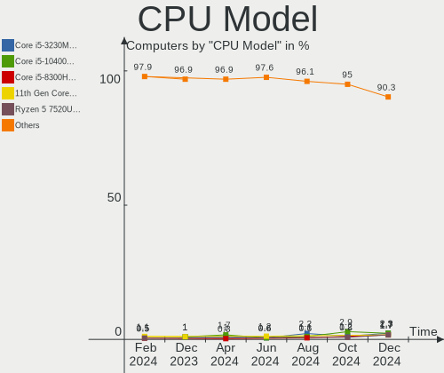
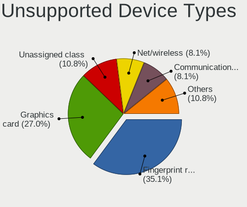

ROSA Hardware Trends
--------------------

A project to identify most popular hardware characteristics and track their change
over time based on data collected by ROSA users at https://Linux-Hardware.org.

Anyone can contribute to the study by uploading probes of their computers by
the [hw-probe](https://github.com/linuxhw/hw-probe) tool:

    sudo -E hw-probe -all -upload

This is a report for all computer types. See also reports for [desktops](/Dist/ROSA/Desktop/README.md) and [notebooks](/Dist/ROSA/Notebook/README.md).

Full-feature report is available here: https://linux-hardware.org/?view=trends

Period: Apr, 2021.

Contents
--------

- [ OS                       ](#os)
- [ OS Family                ](#os-family)
- [ Kernel                   ](#kernel)
- [ Kernel Family            ](#kernel-family)
- [ Kernel Major Ver.        ](#kernel-major-ver)
- [ Arch                     ](#arch)
- [ DE                       ](#de)
- [ Display Server           ](#display-server)
- [ Display Manager          ](#display-manager)
- [ OS Lang                  ](#os-lang)
- [ Boot Mode                ](#boot-mode)
- [ Filesystem               ](#filesystem)
- [ Part. scheme             ](#part-scheme)
- [ Dual Boot with Linux/BSD ](#dual-boot-with-linux/bsd)
- [ Dual Boot (Win)          ](#dual-boot-win)
- [ Country                  ](#country)
- [ City                     ](#city)
- [ Vendor                   ](#vendor)
- [ Model                    ](#model)
- [ Model Family             ](#model-family)
- [ MFG Year                 ](#mfg-year)
- [ Form Factor              ](#form-factor)
- [ Secure Boot              ](#secure-boot)
- [ Coreboot                 ](#coreboot)
- [ RAM Size                 ](#ram-size)
- [ RAM Used                 ](#ram-used)
- [ Has CD-ROM               ](#has-cd-rom)
- [ Total Drives             ](#total-drives)
- [ Has Ethernet             ](#has-ethernet)
- [ Has WiFi                 ](#has-wifi)
- [ Has Bluetooth            ](#has-bluetooth)
- [ Drive Vendor             ](#drive-vendor)
- [ Drive Model              ](#drive-model)
- [ HDD Vendor               ](#hdd-vendor)
- [ SSD Vendor               ](#ssd-vendor)
- [ Drive Kind               ](#drive-kind)
- [ Drive Connector          ](#drive-connector)
- [ Drive Size               ](#drive-size)
- [ Space Total              ](#space-total)
- [ Space Used               ](#space-used)
- [ Malfunc. Drives          ](#malfunc-drives)
- [ Malfunc. Drive Vendor    ](#malfunc-drive-vendor)
- [ Malfunc. HDD Vendor      ](#malfunc-hdd-vendor)
- [ Malfunc. Drive Kind      ](#malfunc-drive-kind)
- [ Failed Drives            ](#failed-drives)
- [ Failed Drive Vendor      ](#failed-drive-vendor)
- [ Drive Status             ](#drive-status)
- [ Storage Vendor           ](#storage-vendor)
- [ Storage Model            ](#storage-model)
- [ Storage Kind             ](#storage-kind)
- [ CPU Vendor               ](#cpu-vendor)
- [ CPU Model                ](#cpu-model)
- [ CPU Model Family         ](#cpu-model-family)
- [ CPU Cores                ](#cpu-cores)
- [ CPU Sockets              ](#cpu-sockets)
- [ CPU Threads              ](#cpu-threads)
- [ CPU Op-Modes             ](#cpu-op-modes)
- [ CPU Microcode            ](#cpu-microcode)
- [ CPU Microarch            ](#cpu-microarch)
- [ GPU Vendor               ](#gpu-vendor)
- [ GPU Model                ](#gpu-model)
- [ GPU Combo                ](#gpu-combo)
- [ GPU Driver               ](#gpu-driver)
- [ GPU Memory               ](#gpu-memory)
- [ Monitor Vendor           ](#monitor-vendor)
- [ Monitor Model            ](#monitor-model)
- [ Monitor Resolution       ](#monitor-resolution)
- [ Monitor Diagonal         ](#monitor-diagonal)
- [ Monitor Width            ](#monitor-width)
- [ Aspect Ratio             ](#aspect-ratio)
- [ Monitor Area             ](#monitor-area)
- [ Pixel Density            ](#pixel-density)
- [ Multiple Monitors        ](#multiple-monitors)
- [ Net Controller Vendor    ](#net-controller-vendor)
- [ Net Controller Model     ](#net-controller-model)
- [ Wireless Vendor          ](#wireless-vendor)
- [ Wireless Model           ](#wireless-model)
- [ Ethernet Vendor          ](#ethernet-vendor)
- [ Ethernet Model           ](#ethernet-model)
- [ Net Controller Kind      ](#net-controller-kind)
- [ Used Controller          ](#used-controller)
- [ NICs                     ](#nics)
- [ IPv6                     ](#ipv6)
- [ Memory Vendor            ](#memory-vendor)
- [ Memory Model             ](#memory-model)
- [ Memory Kind              ](#memory-kind)
- [ Memory Form Factor       ](#memory-form-factor)
- [ Memory Size              ](#memory-size)
- [ Memory Speed             ](#memory-speed)
- [ Sound Vendor             ](#sound-vendor)
- [ Sound Model              ](#sound-model)
- [ Camera Vendor            ](#camera-vendor)
- [ Camera Model             ](#camera-model)
- [ Fingerprint Vendor       ](#fingerprint-vendor)
- [ Fingerprint Model        ](#fingerprint-model)
- [ Chipcard Vendor          ](#chipcard-vendor)
- [ Chipcard Model           ](#chipcard-model)
- [ Printer Vendor           ](#printer-vendor)
- [ Printer Model            ](#printer-model)
- [ Scanner Vendor           ](#scanner-vendor)
- [ Scanner Model            ](#scanner-model)
- [ Bluetooth Vendor         ](#bluetooth-vendor)
- [ Bluetooth Model          ](#bluetooth-model)
- [ Unsupported Devices      ](#unsupported-devices)
- [ Unsupported Device Types ](#unsupported-device-types)

OS
--

Installed operating systems

| Name         | Computers | Percent |
|--------------|-----------|---------|
| ROSA R11.1   | 153       | 79.27%  |
| ROSA R11     | 21        | 10.88%  |
| ROSA R12     | 14        | 7.25%   |
| ROSA R8.1    | 2         | 1.04%   |
| ROSA R9      | 1         | 0.52%   |
| ROSA R10     | 1         | 0.52%   |
| ROSA 2019.05 | 1         | 0.52%   |

OS Family
---------

OS without a version

| Name | Computers | Percent |
|------|-----------|---------|
| ROSA | 193       | 100%    |

Kernel
------

Version of the Linux kernel

| Version                             | Computers | Percent |
|-------------------------------------|-----------|---------|
| 5.4.32-generic-2rosa-x86_64         | 51        | 26.42%  |
| 5.4.83-generic-2rosa-x86_64         | 37        | 19.17%  |
| 4.15.0-desktop-122.124.1rosa-x86_64 | 25        | 12.95%  |
| 4.15.0-desktop-45.1rosa-x86_64      | 19        | 9.84%   |
| 5.4.32-generic-2rosa-i586           | 14        | 7.25%   |
| 4.15.0-desktop-45.1rosa-i586        | 6         | 3.11%   |
| 4.15.0-desktop-122.124.1rosa-i586   | 6         | 3.11%   |
| 5.4.83-generic-2rosa-i586           | 5         | 2.59%   |
| 5.10.28-generic-1rosa2019.1-x86_64  | 4         | 2.07%   |
| 5.4.83-generic-2rosa2019.1-x86_64   | 2         | 1.04%   |
| 5.11.0-desktop-11.12.1rosa-x86_64   | 2         | 1.04%   |
| 5.10.33-generic-3rosa2019.1-x86_64  | 2         | 1.04%   |
| 5.10.32-generic-2rosa2019.1-x86_64  | 2         | 1.04%   |
| 5.10.25-generic-1rosa2019.1-x86_64  | 2         | 1.04%   |
| 4.9.155-nrj-desktop-1rosa-x86_64    | 2         | 1.04%   |
| 5.7.0-rc7                           | 1         | 0.52%   |
| 5.5.19-generic-1rosa-x86_64         | 1         | 0.52%   |
| 5.4.72-generic-1rosa-x86_64         | 1         | 0.52%   |
| 5.4.60-nickel-4rosa2019.05-x86_64   | 1         | 0.52%   |
| 5.4.40-generic-1rosa-x86_64         | 1         | 0.52%   |
| 5.10.32-generic-3rosa2019.1-x86_64  | 1         | 0.52%   |
| 5.10.18-generic-1rosa2019.1-x86_64  | 1         | 0.52%   |
| 4.9.9-nrj-desktop-1rosa-i586        | 1         | 0.52%   |
| 4.9.60-nrj-desktop-1rosa-x86_64     | 1         | 0.52%   |
| 4.9.20-nrj-desktop-1rosa-x86_64     | 1         | 0.52%   |
| 4.9.155-nrj-desktop-1rosa-i586      | 1         | 0.52%   |
| 4.9.124-nrj-desktop-1rosa-i586      | 1         | 0.52%   |
| 4.15.0-desktop-68.5rosa-i586        | 1         | 0.52%   |
| 4.1.38-nrj-desktop-2rosa-x86_64     | 1         | 0.52%   |

Kernel Family
-------------

Linux kernel without a distro release

| Version | Computers | Percent |
|---------|-----------|---------|
| 5.4.32  | 65        | 33.68%  |
| 4.15.0  | 57        | 29.53%  |
| 5.4.83  | 44        | 22.8%   |
| 5.10.28 | 4         | 2.07%   |
| 5.10.32 | 3         | 1.55%   |
| 4.9.155 | 3         | 1.55%   |
| 5.11.0  | 2         | 1.04%   |
| 5.10.33 | 2         | 1.04%   |
| 5.10.25 | 2         | 1.04%   |
| 5.7.0   | 1         | 0.52%   |
| 5.5.19  | 1         | 0.52%   |
| 5.4.72  | 1         | 0.52%   |
| 5.4.60  | 1         | 0.52%   |
| 5.4.40  | 1         | 0.52%   |
| 5.10.18 | 1         | 0.52%   |
| 4.9.9   | 1         | 0.52%   |
| 4.9.60  | 1         | 0.52%   |
| 4.9.20  | 1         | 0.52%   |
| 4.9.124 | 1         | 0.52%   |
| 4.1.38  | 1         | 0.52%   |

Kernel Major Ver.
-----------------

Linux kernel major version

| Version | Computers | Percent |
|---------|-----------|---------|
| 5.4     | 112       | 58.03%  |
| 4.15    | 57        | 29.53%  |
| 5.10    | 12        | 6.22%   |
| 4.9     | 7         | 3.63%   |
| 5.11    | 2         | 1.04%   |
| 5.7     | 1         | 0.52%   |
| 5.5     | 1         | 0.52%   |
| 4.1     | 1         | 0.52%   |

Arch
----

OS architecture (x86_64, i586, etc.)

| Name   | Computers | Percent |
|--------|-----------|---------|
| x86_64 | 158       | 81.87%  |
| i686   | 35        | 18.13%  |

DE
--

Desktop Environment

| Name    | Computers | Percent |
|---------|-----------|---------|
| KDE4    | 117       | 60.62%  |
| KDE5    | 54        | 27.98%  |
| LXQt    | 12        | 6.22%   |
| GNOME   | 5         | 2.59%   |
| XFCE    | 3         | 1.55%   |
| LXDE    | 1         | 0.52%   |
| Unknown | 1         | 0.52%   |

Display Server
--------------

X11 or Wayland

| Name    | Computers | Percent |
|---------|-----------|---------|
| X11     | 190       | 98.45%  |
| Wayland | 3         | 1.55%   |

Display Manager
---------------

SDDM, LightDM, etc.

| Name | Computers | Percent |
|------|-----------|---------|
| KDM  | 119       | 61.66%  |
| SDDM | 67        | 34.72%  |
| GDM  | 5         | 2.59%   |
| TDM  | 2         | 1.04%   |

OS Lang
-------

Language

| Lang    | Computers | Percent |
|---------|-----------|---------|
| ru_RU   | 152       | 78.76%  |
| Unknown | 25        | 12.95%  |
| pl_PL   | 3         | 1.55%   |
| fr_FR   | 3         | 1.55%   |
| es_ES   | 3         | 1.55%   |
| pt_BR   | 2         | 1.04%   |
| es_UY   | 1         | 0.52%   |
| es_MX   | 1         | 0.52%   |
| en_US   | 1         | 0.52%   |
| de_DE   | 1         | 0.52%   |
| de_AT   | 1         | 0.52%   |

Boot Mode
---------

EFI or BIOS

| Mode | Computers | Percent |
|------|-----------|---------|
| BIOS | 134       | 69.43%  |
| EFI  | 59        | 30.57%  |

Filesystem
----------

Type of filesystem

| Type  | Computers | Percent |
|-------|-----------|---------|
| Ext4  | 186       | 96.37%  |
| Btrfs | 7         | 3.63%   |

Part. scheme
------------

Scheme of partitioning

| Type    | Computers | Percent |
|---------|-----------|---------|
| MBR     | 118       | 61.14%  |
| GPT     | 74        | 38.34%  |
| Unknown | 1         | 0.52%   |

Dual Boot with Linux/BSD
------------------------

Hosting more than one Linux/BSD

| Dual boot | Computers | Percent |
|-----------|-----------|---------|
| No        | 135       | 69.95%  |
| Yes       | 58        | 30.05%  |

Dual Boot (Win)
---------------

Hosting Linux and Windows

| Dual boot | Computers | Percent |
|-----------|-----------|---------|
| No        | 98        | 50.78%  |
| Yes       | 95        | 49.22%  |

Country
-------

Geographic location (country)

| Country    | Computers | Percent |
|------------|-----------|---------|
| Russia     | 158       | 81.87%  |
| Ukraine    | 6         | 3.11%   |
| Poland     | 4         | 2.07%   |
| France     | 3         | 1.55%   |
| Serbia     | 2         | 1.04%   |
| Mexico     | 2         | 1.04%   |
| Kazakhstan | 2         | 1.04%   |
| Germany    | 2         | 1.04%   |
| Brazil     | 2         | 1.04%   |
| Belarus    | 2         | 1.04%   |
| Uruguay    | 1         | 0.52%   |
| Spain      | 1         | 0.52%   |
| Slovakia   | 1         | 0.52%   |
| Montenegro | 1         | 0.52%   |
| Latvia     | 1         | 0.52%   |
| Italy      | 1         | 0.52%   |
| Iran       | 1         | 0.52%   |
| Bulgaria   | 1         | 0.52%   |
| Austria    | 1         | 0.52%   |
| Argentina  | 1         | 0.52%   |

City
----

Geographic location (city)

| City              | Computers | Percent |
|-------------------|-----------|---------|
| Moscow            | 25        | 12.95%  |
| St Petersburg     | 11        | 5.7%    |
| Yekaterinburg     | 6         | 3.11%   |
| Rostov-on-Don     | 6         | 3.11%   |
| Novosibirsk       | 6         | 3.11%   |
| Krasnodar         | 6         | 3.11%   |
| Volgograd         | 5         | 2.59%   |
| Saratov           | 5         | 2.59%   |
| Yaroslavl         | 4         | 2.07%   |
| Nizhniy Novgorod  | 3         | 1.55%   |
| Kursk             | 3         | 1.55%   |
| Krasnoyarsk       | 3         | 1.55%   |
| Kemerovo          | 3         | 1.55%   |
| Warsaw            | 2         | 1.04%   |
| Srednyaya Akhtuba | 2         | 1.04%   |
| Sochi             | 2         | 1.04%   |
| Penza             | 2         | 1.04%   |
| Lipetsk           | 2         | 1.04%   |
| Kopeysk           | 2         | 1.04%   |
| Khabarovsk        | 2         | 1.04%   |
| Ivanovo           | 2         | 1.04%   |
| Elektrostal       | 2         | 1.04%   |
| Zvenigorod        | 1         | 0.52%   |
| Zernograd         | 1         | 0.52%   |
| Zaragoza          | 1         | 0.52%   |
| Yoshkar-Ola       | 1         | 0.52%   |
| Yakutsk           | 1         | 0.52%   |
| Witten            | 1         | 0.52%   |
| Voskresensk       | 1         | 0.52%   |
| Volokolamsk       | 1         | 0.52%   |
| Vologda           | 1         | 0.52%   |
| Vladivostok       | 1         | 0.52%   |
| Vladikavkaz       | 1         | 0.52%   |
| Vitebsk           | 1         | 0.52%   |
| Vienna            | 1         | 0.52%   |
| Ukhta             | 1         | 0.52%   |
| Tver              | 1         | 0.52%   |
| Tula              | 1         | 0.52%   |
| Tomsk             | 1         | 0.52%   |
| Tambov            | 1         | 0.52%   |
| Stary Oskol       | 1         | 0.52%   |
| Snizhna           | 1         | 0.52%   |
| Simferopol        | 1         | 0.52%   |
| Shāhīn Shahr    | 1         | 0.52%   |
| Shakhty           | 1         | 0.52%   |
| Shadrinsk         | 1         | 0.52%   |
| Seversk           | 1         | 0.52%   |
| Saransk           | 1         | 0.52%   |
| Sarai             | 1         | 0.52%   |
| Santos Lugares    | 1         | 0.52%   |
| Riga              | 1         | 0.52%   |
| Pyatigorsk        | 1         | 0.52%   |
| Pszczyna          | 1         | 0.52%   |
| Primorsk          | 1         | 0.52%   |
| Poltava           | 1         | 0.52%   |
| Podgorica         | 1         | 0.52%   |
| Perm              | 1         | 0.52%   |
| Pechora           | 1         | 0.52%   |
| Paris             | 1         | 0.52%   |
| Ozersk            | 1         | 0.52%   |

Vendor
------

Motherboard manufacturer

| Name                | Computers | Percent |
|---------------------|-----------|---------|
| ASUSTek Computer    | 56        | 29.02%  |
| Lenovo              | 25        | 12.95%  |
| Gigabyte Technology | 19        | 9.84%   |
| MSI                 | 17        | 8.81%   |
| Acer                | 13        | 6.74%   |
| ASRock              | 11        | 5.7%    |
| Samsung Electronics | 8         | 4.15%   |
| Dell                | 8         | 4.15%   |
| Hewlett-Packard     | 7         | 3.63%   |
| Pegatron            | 3         | 1.55%   |
| Packard Bell        | 3         | 1.55%   |
| Intel               | 3         | 1.55%   |
| Foxconn             | 3         | 1.55%   |
| Toshiba             | 2         | 1.04%   |
| Supermicro          | 2         | 1.04%   |
| Biostar             | 2         | 1.04%   |
| Unknown             | 2         | 1.04%   |
| WS                  | 1         | 0.52%   |
| Sony                | 1         | 0.52%   |
| RuggedPC            | 1         | 0.52%   |
| Medion              | 1         | 0.52%   |
| LG Electronics      | 1         | 0.52%   |
| Huanan              | 1         | 0.52%   |
| Fujitsu Siemens     | 1         | 0.52%   |
| ECS                 | 1         | 0.52%   |
| AmericanMegatrends  | 1         | 0.52%   |

Model
-----

Motherboard model

| Name                                        | Computers | Percent |
|---------------------------------------------|-----------|---------|
| ASUS PRIME A320M-K                          | 3         | 1.55%   |
| Packard Bell EasyNote TE11HC                | 2         | 1.04%   |
| Lenovo IdeaPad 320-15IAP 80XR               | 2         | 1.04%   |
| ASUS P8B75-V                                | 2         | 1.04%   |
| ASUS P5QPL-AM                               | 2         | 1.04%   |
| ASUS N61Jv                                  | 2         | 1.04%   |
| ASUS M5A78L-M LX3                           | 2         | 1.04%   |
| ASRock G41M-VS3                             | 2         | 1.04%   |
| Acer Aspire E1-522                          | 2         | 1.04%   |
| Acer AO722                                  | 2         | 1.04%   |
| Unknown                                     | 2         | 1.04%   |
| WS C116A                                    | 1         | 0.52%   |
| Toshiba Satellite L305                      | 1         | 0.52%   |
| Toshiba Satellite A200                      | 1         | 0.52%   |
| Supermicro Super Server                     | 1         | 0.52%   |
| Supermicro H8SGL                            | 1         | 0.52%   |
| Sony SVE1512D1RB                            | 1         | 0.52%   |
| Samsung RV411/RV511/E3511/S3511/RV711/E3411 | 1         | 0.52%   |
| Samsung RV411/RV511/E3511/S3511/RV711       | 1         | 0.52%   |
| Samsung R540/R580/R780/SA41/E452            | 1         | 0.52%   |
| Samsung R425/R525                           | 1         | 0.52%   |
| Samsung NC210/NC110                         | 1         | 0.52%   |
| Samsung N102                                | 1         | 0.52%   |
| Samsung 530U3C/530U4C/532U3C                | 1         | 0.52%   |
| Samsung 300E4A/300E5A/300E7A/3430EA/3530EA  | 1         | 0.52%   |
| RuggedPC RuggedPadY16                       | 1         | 0.52%   |
| Pegatron SAISHIAT2                          | 1         | 0.52%   |
| Pegatron KA842AA-AKD a6310.pl               | 1         | 0.52%   |
| Pegatron A17                                | 1         | 0.52%   |
| Packard Bell EasyNote TV43HC                | 1         | 0.52%   |
| MSI MS-7C51                                 | 1         | 0.52%   |
| MSI MS-7B93                                 | 1         | 0.52%   |
| MSI MS-7B24                                 | 1         | 0.52%   |
| MSI MS-7A74                                 | 1         | 0.52%   |
| MSI MS-7971                                 | 1         | 0.52%   |
| MSI MS-7836                                 | 1         | 0.52%   |
| MSI MS-7817                                 | 1         | 0.52%   |
| MSI MS-7788                                 | 1         | 0.52%   |
| MSI MS-7758                                 | 1         | 0.52%   |
| MSI MS-7680                                 | 1         | 0.52%   |
| MSI MS-7623                                 | 1         | 0.52%   |
| MSI MS-7583                                 | 1         | 0.52%   |
| MSI MS-7309                                 | 1         | 0.52%   |
| MSI M670                                    | 1         | 0.52%   |
| MSI GE70 0NC\0ND                            | 1         | 0.52%   |
| MSI CX61 2QC                                | 1         | 0.52%   |
| MSI Cubi N 8GL (MS-B171)                    | 1         | 0.52%   |
| Medion P6812                                | 1         | 0.52%   |
| LG K1-322DR                                 | 1         | 0.52%   |
| Lenovo Yoga S940-14IIL 81Q8                 | 1         | 0.52%   |
| Lenovo ThinkPad X1 1293RP9                  | 1         | 0.52%   |
| Lenovo ThinkPad T460s 20FAS5PA00            | 1         | 0.52%   |
| Lenovo ThinkPad T440s 20ARS2C200            | 1         | 0.52%   |
| Lenovo ThinkPad SL410 28748BG               | 1         | 0.52%   |
| Lenovo ThinkPad L520 5017BK4                | 1         | 0.52%   |
| Lenovo ThinkCentre M720t 10SRS76500         | 1         | 0.52%   |
| Lenovo ThinkCentre E73 10AS005VFR           | 1         | 0.52%   |
| Lenovo S10-3c 20074                         | 1         | 0.52%   |
| Lenovo IdeaPad 330-15ARR 81D2               | 1         | 0.52%   |
| Lenovo IdeaPad 300-15ISK 80Q7               | 1         | 0.52%   |

Model Family
------------

Motherboard model prefix

| Name                  | Computers | Percent |
|-----------------------|-----------|---------|
| Acer Aspire           | 9         | 4.66%   |
| ASUS PRIME            | 8         | 4.15%   |
| Lenovo ThinkPad       | 5         | 2.59%   |
| Lenovo IdeaPad        | 5         | 2.59%   |
| Dell Inspiron         | 5         | 2.59%   |
| ASUS P8H61-M          | 5         | 2.59%   |
| HP Compaq             | 4         | 2.07%   |
| ASUS M5A78L-M         | 4         | 2.07%   |
| Packard Bell EasyNote | 3         | 1.55%   |
| ASUS TUF              | 3         | 1.55%   |
| ASUS P5KPL-AM         | 3         | 1.55%   |
| Toshiba Satellite     | 2         | 1.04%   |
| Samsung RV411         | 2         | 1.04%   |
| Lenovo ThinkCentre    | 2         | 1.04%   |
| Lenovo B590           | 2         | 1.04%   |
| HP Laptop             | 2         | 1.04%   |
| ASUS P8B75-V          | 2         | 1.04%   |
| ASUS P5QPL-AM         | 2         | 1.04%   |
| ASUS N61Jv            | 2         | 1.04%   |
| ASRock G41M-VS3       | 2         | 1.04%   |
| Acer AO722            | 2         | 1.04%   |
| Unknown               | 2         | 1.04%   |
| WS C116A              | 1         | 0.52%   |
| Supermicro Super      | 1         | 0.52%   |
| Supermicro H8SGL      | 1         | 0.52%   |
| Sony SVE1512D1RB      | 1         | 0.52%   |
| Samsung R540          | 1         | 0.52%   |
| Samsung R425          | 1         | 0.52%   |
| Samsung NC210         | 1         | 0.52%   |
| Samsung N102          | 1         | 0.52%   |
| Samsung 530U3C        | 1         | 0.52%   |
| Samsung 300E4A        | 1         | 0.52%   |
| RuggedPC RuggedPadY16 | 1         | 0.52%   |
| Pegatron SAISHIAT2    | 1         | 0.52%   |
| Pegatron KA842AA-AKD  | 1         | 0.52%   |
| Pegatron A17          | 1         | 0.52%   |
| MSI MS-7C51           | 1         | 0.52%   |
| MSI MS-7B93           | 1         | 0.52%   |
| MSI MS-7B24           | 1         | 0.52%   |
| MSI MS-7A74           | 1         | 0.52%   |
| MSI MS-7971           | 1         | 0.52%   |
| MSI MS-7836           | 1         | 0.52%   |
| MSI MS-7817           | 1         | 0.52%   |
| MSI MS-7788           | 1         | 0.52%   |
| MSI MS-7758           | 1         | 0.52%   |
| MSI MS-7680           | 1         | 0.52%   |
| MSI MS-7623           | 1         | 0.52%   |
| MSI MS-7583           | 1         | 0.52%   |
| MSI MS-7309           | 1         | 0.52%   |
| MSI M670              | 1         | 0.52%   |
| MSI GE70              | 1         | 0.52%   |
| MSI CX61              | 1         | 0.52%   |
| MSI Cubi              | 1         | 0.52%   |
| Medion P6812          | 1         | 0.52%   |
| LG K1-322DR           | 1         | 0.52%   |
| Lenovo Yoga           | 1         | 0.52%   |
| Lenovo S10-3c         | 1         | 0.52%   |
| Lenovo IdeaCentre     | 1         | 0.52%   |
| Lenovo G580           | 1         | 0.52%   |
| Lenovo G560           | 1         | 0.52%   |

MFG Year
--------

Motherboard manufacture year

| Year | Computers | Percent |
|------|-----------|---------|
| 2013 | 23        | 11.92%  |
| 2011 | 23        | 11.92%  |
| 2012 | 19        | 9.84%   |
| 2010 | 19        | 9.84%   |
| 2009 | 17        | 8.81%   |
| 2019 | 16        | 8.29%   |
| 2018 | 13        | 6.74%   |
| 2020 | 12        | 6.22%   |
| 2016 | 11        | 5.7%    |
| 2007 | 10        | 5.18%   |
| 2014 | 7         | 3.63%   |
| 2008 | 7         | 3.63%   |
| 2017 | 5         | 2.59%   |
| 2015 | 5         | 2.59%   |
| 2006 | 2         | 1.04%   |
| 2005 | 2         | 1.04%   |
| 2004 | 2         | 1.04%   |

Form Factor
-----------

Physical design of the computer

| Name       | Computers | Percent |
|------------|-----------|---------|
| Desktop    | 111       | 57.51%  |
| Notebook   | 77        | 39.9%   |
| Server     | 2         | 1.04%   |
| Tablet     | 1         | 0.52%   |
| Mini pc    | 1         | 0.52%   |
| All in one | 1         | 0.52%   |

Secure Boot
-----------

Enabled or disabled

| State    | Computers | Percent |
|----------|-----------|---------|
| Disabled | 192       | 99.48%  |
| Enabled  | 1         | 0.52%   |

Coreboot
--------

Have coreboot on board

| Used | Computers | Percent |
|------|-----------|---------|
| No   | 193       | 100%    |

RAM Size
--------

Total RAM memory

| Size in GB  | Computers | Percent |
|-------------|-----------|---------|
| 3.01-4.0    | 62        | 32.12%  |
| 4.01-8.0    | 37        | 19.17%  |
| 8.01-16.0   | 30        | 15.54%  |
| 1.01-2.0    | 24        | 12.44%  |
| 16.01-24.0  | 20        | 10.36%  |
| 2.01-3.0    | 9         | 4.66%   |
| 32.01-64.0  | 6         | 3.11%   |
| 0.51-1.0    | 3         | 1.55%   |
| 24.01-32.0  | 1         | 0.52%   |
| 64.01-256.0 | 1         | 0.52%   |

RAM Used
--------

Used RAM memory

| Used GB  | Computers | Percent |
|----------|-----------|---------|
| 1.01-2.0 | 87        | 45.08%  |
| 0.51-1.0 | 73        | 37.82%  |
| 2.01-3.0 | 22        | 11.4%   |
| 0.01-0.5 | 6         | 3.11%   |
| 3.01-4.0 | 3         | 1.55%   |
| 4.01-8.0 | 2         | 1.04%   |

Has CD-ROM
----------

Has CD-ROM on board

| Presented | Computers | Percent |
|-----------|-----------|---------|
| Yes       | 118       | 61.14%  |
| No        | 75        | 38.86%  |

Total Drives
------------

Number of drives on board

| Drives | Computers | Percent |
|--------|-----------|---------|
| 1      | 111       | 57.51%  |
| 2      | 52        | 26.94%  |
| 3      | 16        | 8.29%   |
| 4      | 7         | 3.63%   |
| 6      | 2         | 1.04%   |
| 5      | 2         | 1.04%   |
| 0      | 2         | 1.04%   |
| 8      | 1         | 0.52%   |

Has Ethernet
------------

Has Ethernet on board

| Presented | Computers | Percent |
|-----------|-----------|---------|
| Yes       | 189       | 97.93%  |
| No        | 4         | 2.07%   |

Has WiFi
--------

Has WiFi module

| Presented | Computers | Percent |
|-----------|-----------|---------|
| Yes       | 111       | 57.51%  |
| No        | 82        | 42.49%  |

Has Bluetooth
-------------

Has Bluetooth module

| Presented | Computers | Percent |
|-----------|-----------|---------|
| No        | 137       | 70.98%  |
| Yes       | 56        | 29.02%  |

Drive Vendor
------------

Hard drive vendors

| Vendor              | Computers | Drives | Percent |
|---------------------|-----------|--------|---------|
| WDC                 | 75        | 93     | 26.98%  |
| Seagate             | 57        | 67     | 20.5%   |
| Hitachi             | 23        | 24     | 8.27%   |
| Samsung Electronics | 20        | 25     | 7.19%   |
| Toshiba             | 16        | 16     | 5.76%   |
| Kingston            | 12        | 12     | 4.32%   |
| Unknown             | 8         | 8      | 2.88%   |
| HGST                | 7         | 7      | 2.52%   |
| Apacer              | 7         | 7      | 2.52%   |
| A-DATA Technology   | 7         | 9      | 2.52%   |
| China               | 6         | 6      | 2.16%   |
| SPCC                | 5         | 5      | 1.8%    |
| Transcend           | 4         | 4      | 1.44%   |
| Smartbuy            | 3         | 3      | 1.08%   |
| KingSpec            | 3         | 3      | 1.08%   |
| Crucial             | 3         | 3      | 1.08%   |
| Silicon Motion      | 2         | 2      | 0.72%   |
| SanDisk             | 2         | 2      | 0.72%   |
| Intel               | 2         | 2      | 0.72%   |
| HUAWEI              | 2         | 2      | 0.72%   |
| XrayDisk            | 1         | 1      | 0.36%   |
| USB 3.0             | 1         | 1      | 0.36%   |
| Union Memory        | 1         | 1      | 0.36%   |
| PLEXTOR             | 1         | 1      | 0.36%   |
| Patriot             | 1         | 1      | 0.36%   |
| OCZ                 | 1         | 1      | 0.36%   |
| Maxtor              | 1         | 1      | 0.36%   |
| LDLC                | 1         | 1      | 0.36%   |
| KingDian            | 1         | 1      | 0.36%   |
| GLOWAY              | 1         | 1      | 0.36%   |
| Fujitsu             | 1         | 1      | 0.36%   |
| FOXLINE             | 1         | 1      | 0.36%   |
| FORESEE             | 1         | 1      | 0.36%   |
| AMD                 | 1         | 1      | 0.36%   |

Drive Model
-----------

Hard drive models

| Model                              | Computers | Percent |
|------------------------------------|-----------|---------|
| Seagate ST500DM002-1BD142 500GB    | 7         | 2.31%   |
| WDC WD10EZEX-08WN4A0 1TB           | 6         | 1.98%   |
| WDC WD10JPVX-22JC3T0 1TB           | 4         | 1.32%   |
| Kingston SA400S37240G 240GB SSD    | 4         | 1.32%   |
| Kingston SA400S37120G 120GB SSD    | 4         | 1.32%   |
| WDC WD2500BEVS-22UST0 250GB        | 3         | 0.99%   |
| Toshiba DT01ACA100 1TB             | 3         | 0.99%   |
| Seagate ST9320325AS 320GB          | 3         | 0.99%   |
| Seagate ST1000LM024 HN-M101MBB 1TB | 3         | 0.99%   |
| Seagate ST1000DM003-1CH162 1TB     | 3         | 0.99%   |
| Hitachi HTS547550A9E384 500GB      | 3         | 0.99%   |
| Hitachi HTS545032B9A300 320GB      | 3         | 0.99%   |
| A-DATA SU650 240GB SSD             | 3         | 0.99%   |
| WDC WDS500G2B0A-00SM50 500GB SSD   | 2         | 0.66%   |
| WDC WDS480G2G0A-00JH30 480GB SSD   | 2         | 0.66%   |
| WDC WDS240G2G0B-00EPW0 240GB SSD   | 2         | 0.66%   |
| WDC WDS240G2G0A-00JH30 240GB SSD   | 2         | 0.66%   |
| WDC WD5000AAKX-001CA0 500GB        | 2         | 0.66%   |
| WDC WD5000AADS-00S9B0 500GB        | 2         | 0.66%   |
| WDC WD3200BPVT-22JJ5T0 320GB       | 2         | 0.66%   |
| WDC WD10EADS-00M2B0 1TB            | 2         | 0.66%   |
| Toshiba DT01ACA050 500GB           | 2         | 0.66%   |
| SPCC Solid State Disk 128GB        | 2         | 0.66%   |
| Smartbuy SSD 120GB                 | 2         | 0.66%   |
| Seagate ST9500325AS 500GB          | 2         | 0.66%   |
| Seagate ST500LT012-1DG142 500GB    | 2         | 0.66%   |
| Seagate ST500DM005 HD502HJ 500GB   | 2         | 0.66%   |
| Seagate ST3250318AS 250GB          | 2         | 0.66%   |
| Seagate ST3250312AS 250GB          | 2         | 0.66%   |
| Seagate ST3250310AS 250GB          | 2         | 0.66%   |
| Seagate ST320LT020-9YG142 320GB    | 2         | 0.66%   |
| Seagate ST1000DM003-9YN162 1TB     | 2         | 0.66%   |
| Seagate ST1000DM003-1ER162 1TB     | 2         | 0.66%   |
| Samsung SSD 850 EVO 250GB          | 2         | 0.66%   |
| Samsung HD502HI 500GB              | 2         | 0.66%   |
| Kingston SHFS37A120G 120GB SSD     | 2         | 0.66%   |
| Hitachi HTS543232A7A384 320GB      | 2         | 0.66%   |
| Hitachi HDS721616PLA380 164GB      | 2         | 0.66%   |
| HGST HTS545050A7E380 500GB         | 2         | 0.66%   |
| Apacer AS350 240GB SSD             | 2         | 0.66%   |
| Apacer AS350 128GB SSD             | 2         | 0.66%   |
| Apacer AS340 240GB SSD             | 2         | 0.66%   |
| XrayDisk SSD 128GB                 | 1         | 0.33%   |
| WDC WDS120G2G0A-00JH30 120GB SSD   | 1         | 0.33%   |
| WDC WD800JD-55MSA1 80GB            | 1         | 0.33%   |
| WDC WD800BEVS-22RST0 80GB          | 1         | 0.33%   |
| WDC WD800BB-60JKA0 80GB            | 1         | 0.33%   |
| WDC WD800BB-00FRA0 80GB            | 1         | 0.33%   |
| WDC WD7500BPVT-75HXZT3 752GB       | 1         | 0.33%   |
| WDC WD7500AAKS-00RBA0 752GB        | 1         | 0.33%   |
| WDC WD5003AZEX-00K1GA0 500GB       | 1         | 0.33%   |
| WDC WD5001AALS-00L3B2 500GB        | 1         | 0.33%   |
| WDC WD5000LPVX-75V0TT0 500GB       | 1         | 0.33%   |
| WDC WD5000LPVX-22V0TT0 500GB       | 1         | 0.33%   |
| WDC WD5000LPVT-08G33T1 500GB       | 1         | 0.33%   |
| WDC WD5000LPCX-60VHAT0 500GB       | 1         | 0.33%   |
| WDC WD5000LPCX-24C6HT0 500GB       | 1         | 0.33%   |
| WDC WD5000LPCX-22VHAT1 500GB       | 1         | 0.33%   |
| WDC WD5000BPKX-00HPJT0 500GB       | 1         | 0.33%   |
| WDC WD5000BEKT-75KA9T0 500GB       | 1         | 0.33%   |

HDD Vendor
----------

Hard disk drive vendors

| Vendor              | Computers | Drives | Percent |
|---------------------|-----------|--------|---------|
| WDC                 | 71        | 83     | 38.8%   |
| Seagate             | 57        | 67     | 31.15%  |
| Hitachi             | 23        | 24     | 12.57%  |
| Toshiba             | 15        | 15     | 8.2%    |
| Samsung Electronics | 8         | 11     | 4.37%   |
| HGST                | 7         | 7      | 3.83%   |
| Maxtor              | 1         | 1      | 0.55%   |
| Fujitsu             | 1         | 1      | 0.55%   |

SSD Vendor
----------

Solid state drive vendors

| Vendor              | Computers | Drives | Percent |
|---------------------|-----------|--------|---------|
| Kingston            | 12        | 12     | 14.63%  |
| Samsung Electronics | 10        | 11     | 12.2%   |
| WDC                 | 9         | 9      | 10.98%  |
| Apacer              | 7         | 7      | 8.54%   |
| A-DATA Technology   | 7         | 9      | 8.54%   |
| China               | 6         | 6      | 7.32%   |
| SPCC                | 5         | 5      | 6.1%    |
| Transcend           | 3         | 3      | 3.66%   |
| Smartbuy            | 3         | 3      | 3.66%   |
| KingSpec            | 3         | 3      | 3.66%   |
| Crucial             | 3         | 3      | 3.66%   |
| SanDisk             | 2         | 2      | 2.44%   |
| Intel               | 2         | 2      | 2.44%   |
| XrayDisk            | 1         | 1      | 1.22%   |
| Toshiba             | 1         | 1      | 1.22%   |
| PLEXTOR             | 1         | 1      | 1.22%   |
| OCZ                 | 1         | 1      | 1.22%   |
| LDLC                | 1         | 1      | 1.22%   |
| KingDian            | 1         | 1      | 1.22%   |
| GLOWAY              | 1         | 1      | 1.22%   |
| FOXLINE             | 1         | 1      | 1.22%   |
| FORESEE             | 1         | 1      | 1.22%   |
| AMD                 | 1         | 1      | 1.22%   |

Drive Kind
----------

HDD or SSD

| Kind    | Computers | Drives | Percent |
|---------|-----------|--------|---------|
| HDD     | 155       | 209    | 62.75%  |
| SSD     | 72        | 85     | 29.15%  |
| NVMe    | 9         | 9      | 3.64%   |
| MMC     | 7         | 7      | 2.83%   |
| Unknown | 4         | 4      | 1.62%   |

Drive Connector
---------------

SATA, SAS, NVMe, etc.

| Type | Computers | Drives | Percent |
|------|-----------|--------|---------|
| SATA | 187       | 293    | 89.9%   |
| NVMe | 9         | 9      | 4.33%   |
| MMC  | 7         | 7      | 3.37%   |
| SAS  | 5         | 5      | 2.4%    |

Drive Size
----------

Size of hard drive

| Size in TB | Computers | Drives | Percent |
|------------|-----------|--------|---------|
| 0.01-0.5   | 167       | 214    | 70.76%  |
| 0.51-1.0   | 53        | 62     | 22.46%  |
| 1.01-2.0   | 7         | 8      | 2.97%   |
| 3.01-4.0   | 4         | 4      | 1.69%   |
| 2.01-3.0   | 3         | 4      | 1.27%   |
| 4.01-10.0  | 2         | 2      | 0.85%   |

Space Total
-----------

Amount of disk space available on the file system

| Size in GB     | Computers | Percent |
|----------------|-----------|---------|
| 101-250        | 57        | 29.53%  |
| 251-500        | 39        | 20.21%  |
| 1-20           | 25        | 12.95%  |
| 501-1000       | 24        | 12.44%  |
| 51-100         | 22        | 11.4%   |
| 21-50          | 13        | 6.74%   |
| 1001-2000      | 8         | 4.15%   |
| More than 3000 | 3         | 1.55%   |
| 2001-3000      | 1         | 0.52%   |
| Unknown        | 1         | 0.52%   |

Space Used
----------

Amount of used disk space

| Used GB        | Computers | Percent |
|----------------|-----------|---------|
| 1-20           | 139       | 72.02%  |
| 51-100         | 14        | 7.25%   |
| 21-50          | 13        | 6.74%   |
| 101-250        | 9         | 4.66%   |
| 251-500        | 8         | 4.15%   |
| 501-1000       | 5         | 2.59%   |
| 1001-2000      | 2         | 1.04%   |
| More than 3000 | 1         | 0.52%   |
| 2001-3000      | 1         | 0.52%   |
| Unknown        | 1         | 0.52%   |

Malfunc. Drives
---------------

Drive models with a malfunction

| Model                              | Computers | Drives | Percent |
|------------------------------------|-----------|--------|---------|
| Seagate ST500DM002-1BD142 500GB    | 4         | 4      | 4.49%   |
| WDC WD10JPVX-22JC3T0 1TB           | 2         | 2      | 2.25%   |
| Seagate ST3250310AS 250GB          | 2         | 2      | 2.25%   |
| Seagate ST1000DM003-1CH162 1TB     | 2         | 2      | 2.25%   |
| Samsung Electronics HD502HI 500GB  | 2         | 3      | 2.25%   |
| Hitachi HTS547550A9E384 500GB      | 2         | 2      | 2.25%   |
| Hitachi HTS545032B9A300 320GB      | 2         | 2      | 2.25%   |
| WDC WDS480G2G0A-00JH30 480GB SSD   | 1         | 1      | 1.12%   |
| WDC WDS240G2G0A-00JH30 240GB SSD   | 1         | 1      | 1.12%   |
| WDC WDS120G2G0A-00JH30 120GB SSD   | 1         | 1      | 1.12%   |
| WDC WD800BB-00FRA0 80GB            | 1         | 1      | 1.12%   |
| WDC WD7500AAKS-00RBA0 752GB        | 1         | 1      | 1.12%   |
| WDC WD5001AALS-00L3B2 500GB        | 1         | 1      | 1.12%   |
| WDC WD5000LPVT-08G33T1 500GB       | 1         | 1      | 1.12%   |
| WDC WD5000BEKT-75KA9T0 500GB       | 1         | 1      | 1.12%   |
| WDC WD5000AAKX-00ERMA0 500GB       | 1         | 1      | 1.12%   |
| WDC WD5000AAKX-003CA0 500GB        | 1         | 1      | 1.12%   |
| WDC WD5000AAKS-00V6A0 500GB        | 1         | 1      | 1.12%   |
| WDC WD5000AAKS-00V1A0 500GB        | 1         | 1      | 1.12%   |
| WDC WD5000AAKS-00A7B2 500GB        | 1         | 1      | 1.12%   |
| WDC WD5000AADS-00S9B0 500GB        | 1         | 1      | 1.12%   |
| WDC WD3200BPVT-22ZEST0 320GB       | 1         | 1      | 1.12%   |
| WDC WD3200BEVT-08A23T1 320GB       | 1         | 1      | 1.12%   |
| WDC WD3200AAJS-22B4A0 320GB        | 1         | 1      | 1.12%   |
| WDC WD3200AAJB-00J3A0 320GB        | 1         | 1      | 1.12%   |
| WDC WD2500BEVT-22ZCT0 250GB        | 1         | 1      | 1.12%   |
| WDC WD2500AAKS-00VSA0 250GB        | 1         | 1      | 1.12%   |
| WDC WD2003FYYS-02W0B0 2TB          | 1         | 1      | 1.12%   |
| WDC WD1600AAJS-00YZCA0 160GB       | 1         | 1      | 1.12%   |
| WDC WD10PURX-64E5EY0 1TB           | 1         | 1      | 1.12%   |
| WDC WD10EZEX-21WN4A0 1TB           | 1         | 1      | 1.12%   |
| WDC WD10EZEX-00RKKA0 1TB           | 1         | 1      | 1.12%   |
| WDC WD10EARS-00Y5B1 1TB            | 1         | 1      | 1.12%   |
| WDC WD10EADS-00M2B0 1TB            | 1         | 1      | 1.12%   |
| WDC WD1003FZEX-00MK2A0 1TB         | 1         | 1      | 1.12%   |
| Toshiba MK5065GSXN 500GB           | 1         | 1      | 1.12%   |
| Toshiba MK1059GSM 1TB              | 1         | 1      | 1.12%   |
| SPCC SSD162 120GB                  | 1         | 1      | 1.12%   |
| Silicon Motion 256GB               | 1         | 1      | 1.12%   |
| Seagate ST9500420AS 500GB          | 1         | 1      | 1.12%   |
| Seagate ST9500325AS 500GB          | 1         | 1      | 1.12%   |
| Seagate ST9160314AS 160GB          | 1         | 1      | 1.12%   |
| Seagate ST9120822AS 120GB          | 1         | 1      | 1.12%   |
| Seagate ST500LT012-9WS142 500GB    | 1         | 1      | 1.12%   |
| Seagate ST500DM005 HD502HJ 500GB   | 1         | 1      | 1.12%   |
| Seagate ST4000DM004-2CV104 4TB     | 1         | 1      | 1.12%   |
| Seagate ST380011A 80GB             | 1         | 1      | 1.12%   |
| Seagate ST3750640NS 752GB          | 1         | 2      | 1.12%   |
| Seagate ST3400620AS 400GB          | 1         | 1      | 1.12%   |
| Seagate ST3250318AS 250GB          | 1         | 1      | 1.12%   |
| Seagate ST320LT020-9YG142 320GB    | 1         | 1      | 1.12%   |
| Seagate ST3160827AS 160GB          | 1         | 1      | 1.12%   |
| Seagate ST3160318AS 160GB          | 1         | 1      | 1.12%   |
| Seagate ST3120213A 118GB           | 1         | 1      | 1.12%   |
| Seagate ST31000528AS 1TB           | 1         | 1      | 1.12%   |
| Seagate ST31000524AS 1TB           | 1         | 1      | 1.12%   |
| Seagate ST2000LM007-1R8174 2TB     | 1         | 1      | 1.12%   |
| Seagate ST1000LM024 HN-M101MBB 1TB | 1         | 1      | 1.12%   |
| Seagate ST1000DM003-9YN162 1TB     | 1         | 1      | 1.12%   |
| SanDisk SSD i100 24GB              | 1         | 1      | 1.12%   |

Malfunc. Drive Vendor
---------------------

Vendors of faulty drives

| Vendor              | Computers | Drives | Percent |
|---------------------|-----------|--------|---------|
| WDC                 | 29        | 30     | 33.33%  |
| Seagate             | 28        | 29     | 32.18%  |
| Hitachi             | 11        | 11     | 12.64%  |
| Samsung Electronics | 6         | 9      | 6.9%    |
| Toshiba             | 2         | 2      | 2.3%    |
| Kingston            | 2         | 2      | 2.3%    |
| HGST                | 2         | 2      | 2.3%    |
| SPCC                | 1         | 1      | 1.15%   |
| Silicon Motion      | 1         | 1      | 1.15%   |
| SanDisk             | 1         | 1      | 1.15%   |
| OCZ                 | 1         | 1      | 1.15%   |
| Maxtor              | 1         | 1      | 1.15%   |
| KingSpec            | 1         | 1      | 1.15%   |
| Fujitsu             | 1         | 1      | 1.15%   |

Malfunc. HDD Vendor
-------------------

Vendors of faulty HDD drives

| Vendor              | Computers | Drives | Percent |
|---------------------|-----------|--------|---------|
| Seagate             | 28        | 29     | 36.84%  |
| WDC                 | 26        | 27     | 34.21%  |
| Hitachi             | 11        | 11     | 14.47%  |
| Samsung Electronics | 5         | 8      | 6.58%   |
| Toshiba             | 2         | 2      | 2.63%   |
| HGST                | 2         | 2      | 2.63%   |
| Maxtor              | 1         | 1      | 1.32%   |
| Fujitsu             | 1         | 1      | 1.32%   |

Malfunc. Drive Kind
-------------------

Kinds of faulty drives

| Kind | Computers | Drives | Percent |
|------|-----------|--------|---------|
| HDD  | 72        | 81     | 86.75%  |
| SSD  | 10        | 10     | 12.05%  |
| NVMe | 1         | 1      | 1.2%    |

Failed Drives
-------------

Failed drive models

| Model                                            | Computers | Drives | Percent |
|--------------------------------------------------|-----------|--------|---------|
| WDC WD1600JB-00REA0 160GB                        | 1         | 1      | 33.33%  |
| Samsung Electronics MZNTY128HDHP-000L1 128GB SSD | 1         | 1      | 33.33%  |
| Hitachi HDS721010DLE630 1TB                      | 1         | 1      | 33.33%  |

Failed Drive Vendor
-------------------

Failed drive vendors

| Vendor              | Computers | Drives | Percent |
|---------------------|-----------|--------|---------|
| WDC                 | 1         | 1      | 33.33%  |
| Samsung Electronics | 1         | 1      | 33.33%  |
| Hitachi             | 1         | 1      | 33.33%  |

Drive Status
------------

Number of failed and malfunc. drives

| Status   | Computers | Drives | Percent |
|----------|-----------|--------|---------|
| Works    | 139       | 207    | 59.91%  |
| Malfunc  | 78        | 92     | 33.62%  |
| Detected | 12        | 12     | 5.17%   |
| Failed   | 3         | 3      | 1.29%   |

Storage Vendor
--------------

Storage controller vendors

| Vendor                           | Computers | Percent |
|----------------------------------|-----------|---------|
| Intel                            | 136       | 63.55%  |
| AMD                              | 43        | 20.09%  |
| Nvidia                           | 8         | 3.74%   |
| JMicron Technology               | 5         | 2.34%   |
| Silicon Motion                   | 4         | 1.87%   |
| Marvell Technology Group         | 4         | 1.87%   |
| Silicon Integrated Systems [SiS] | 3         | 1.4%    |
| Samsung Electronics              | 3         | 1.4%    |
| ASMedia Technology               | 3         | 1.4%    |
| Silicon Image                    | 2         | 0.93%   |
| Union Memory (Shenzhen)          | 1         | 0.47%   |
| Sandisk                          | 1         | 0.47%   |
| Promise Technology               | 1         | 0.47%   |

Storage Model
-------------

Storage controller models

| Model                                                                                   | Computers | Percent |
|-----------------------------------------------------------------------------------------|-----------|---------|
| AMD FCH SATA Controller [AHCI mode]                                                     | 23        | 7.88%   |
| Intel NM10/ICH7 Family SATA Controller [IDE mode]                                       | 20        | 6.85%   |
| Intel 82801G (ICH7 Family) IDE Controller                                               | 17        | 5.82%   |
| Intel 7 Series Chipset Family 6-port SATA Controller [AHCI mode]                        | 17        | 5.82%   |
| AMD SB7x0/SB8x0/SB9x0 IDE Controller                                                    | 12        | 4.11%   |
| AMD SB7x0/SB8x0/SB9x0 SATA Controller [IDE mode]                                        | 11        | 3.77%   |
| Intel 6 Series/C200 Series Chipset Family Desktop SATA Controller (IDE mode, ports 4-5) | 8         | 2.74%   |
| Intel 6 Series/C200 Series Chipset Family Desktop SATA Controller (IDE mode, ports 0-3) | 8         | 2.74%   |
| Intel 6 Series/C200 Series Chipset Family 6 port Desktop SATA AHCI Controller           | 8         | 2.74%   |
| Intel 5 Series/3400 Series Chipset 4 port SATA AHCI Controller                          | 8         | 2.74%   |
| Intel 6 Series/C200 Series Chipset Family 6 port Mobile SATA AHCI Controller            | 6         | 2.05%   |
| Intel 200 Series PCH SATA controller [AHCI mode]                                        | 6         | 2.05%   |
| AMD SB7x0/SB8x0/SB9x0 SATA Controller [AHCI mode]                                       | 6         | 2.05%   |
| Intel Sunrise Point-LP SATA Controller [AHCI mode]                                      | 5         | 1.71%   |
| Intel 8 Series/C220 Series Chipset Family 6-port SATA Controller 1 [AHCI mode]          | 5         | 1.71%   |
| AMD FCH SATA Controller D                                                               | 5         | 1.71%   |
| Intel SATA Controller [RAID mode]                                                       | 4         | 1.37%   |
| Intel NM10/ICH7 Family SATA Controller [AHCI mode]                                      | 4         | 1.37%   |
| Intel Cannon Lake PCH SATA AHCI Controller                                              | 4         | 1.37%   |
| Intel 82801JI (ICH10 Family) 4 port SATA IDE Controller #1                              | 4         | 1.37%   |
| Intel 82801JI (ICH10 Family) 2 port SATA IDE Controller #2                              | 4         | 1.37%   |
| Intel 82801IBM/IEM (ICH9M/ICH9M-E) 4 port SATA Controller [AHCI mode]                   | 4         | 1.37%   |
| Intel 82801HM/HEM (ICH8M/ICH8M-E) SATA Controller [AHCI mode]                           | 4         | 1.37%   |
| Intel 82801HM/HEM (ICH8M/ICH8M-E) IDE Controller                                        | 4         | 1.37%   |
| Silicon Motion SM2263EN/SM2263XT SSD Controller                                         | 3         | 1.03%   |
| Silicon Integrated Systems [SiS] 5513 IDE Controller                                    | 3         | 1.03%   |
| Nvidia MCP78S [GeForce 8200] IDE                                                        | 3         | 1.03%   |
| JMicron JMB368 IDE controller                                                           | 3         | 1.03%   |
| Intel 7 Series/C210 Series Chipset Family 6-port SATA Controller [AHCI mode]            | 3         | 1.03%   |
| ASMedia ASM1062 Serial ATA Controller                                                   | 3         | 1.03%   |
| AMD 400 Series Chipset SATA Controller                                                  | 3         | 1.03%   |
| Silicon Integrated Systems [SiS] SATA Controller / IDE mode                             | 2         | 0.68%   |
| Samsung NVMe SSD Controller SM981/PM981/PM983                                           | 2         | 0.68%   |
| Nvidia MCP78S [GeForce 8200] SATA Controller (non-AHCI mode)                            | 2         | 0.68%   |
| Marvell Group 88SE6111/6121 SATA II / PATA Controller                                   | 2         | 0.68%   |
| JMicron JMB363 SATA/IDE Controller                                                      | 2         | 0.68%   |
| Intel Q170/Q150/B150/H170/H110/Z170/CM236 Chipset SATA Controller [AHCI Mode]           | 2         | 0.68%   |
| Intel Celeron N3350/Pentium N4200/Atom E3900 Series SATA AHCI Controller                | 2         | 0.68%   |
| Intel Atom/Celeron/Pentium Processor x5-E8000/J3xxx/N3xxx Series SATA Controller        | 2         | 0.68%   |
| Intel 82801IB (ICH9) 2 port SATA Controller [IDE mode]                                  | 2         | 0.68%   |
| Intel 82801I (ICH9 Family) 2 port SATA Controller [IDE mode]                            | 2         | 0.68%   |
| Intel 82801FB/FBM/FR/FW/FRW (ICH6 Family) IDE Controller                                | 2         | 0.68%   |
| Intel 82801EB (ICH5) SATA Controller                                                    | 2         | 0.68%   |
| Intel 8 Series SATA Controller 1 [AHCI mode]                                            | 2         | 0.68%   |
| Intel 7 Series/C210 Series Chipset Family 4-port SATA Controller [IDE mode]             | 2         | 0.68%   |
| Intel 7 Series/C210 Series Chipset Family 2-port SATA Controller [IDE mode]             | 2         | 0.68%   |
| Intel 5 Series/3400 Series Chipset 4 port SATA IDE Controller                           | 2         | 0.68%   |
| Intel 5 Series/3400 Series Chipset 2 port SATA IDE Controller                           | 2         | 0.68%   |
| AMD X370 Series Chipset SATA Controller                                                 | 2         | 0.68%   |
| AMD FCH SATA Controller [IDE mode]                                                      | 2         | 0.68%   |
| AMD FCH IDE Controller                                                                  | 2         | 0.68%   |
| Union Memory (Shenzhen) Non-Volatile memory controller                                  | 1         | 0.34%   |
| Silicon Motion SM2262/SM2262EN SSD Controller                                           | 1         | 0.34%   |
| Silicon Image SiI 3132 Serial ATA Raid II Controller                                    | 1         | 0.34%   |
| Silicon Image SiI 3114 [SATALink/SATARaid] Serial ATA Controller                        | 1         | 0.34%   |
| Sandisk WD Black SN750 / PC SN730 NVMe SSD                                              | 1         | 0.34%   |
| Samsung NVMe Controller                                                                 | 1         | 0.34%   |
| Promise PDC20378 (FastTrak 378/SATA 378)                                                | 1         | 0.34%   |
| Nvidia MCP78S [GeForce 8200] AHCI Controller                                            | 1         | 0.34%   |
| Nvidia MCP67 IDE Controller                                                             | 1         | 0.34%   |

Storage Kind
------------

Kind of storage controller (IDE, SATA, NVMe, SAS, ...)

| Kind | Computers | Percent |
|------|-----------|---------|
| SATA | 131       | 58.74%  |
| IDE  | 75        | 33.63%  |
| NVMe | 9         | 4.04%   |
| RAID | 8         | 3.59%   |

CPU Vendor
----------

Processor vendors

| Vendor | Computers | Percent |
|--------|-----------|---------|
| Intel  | 141       | 73.06%  |
| AMD    | 52        | 26.94%  |

CPU Model
---------

Processor models

| Model                                         | Computers | Percent |
|-----------------------------------------------|-----------|---------|
| Intel Core i3-2100 CPU @ 3.10GHz              | 4         | 2.07%   |
| Intel Core 2 Duo CPU E8400 @ 3.00GHz          | 4         | 2.07%   |
| Intel Pentium Dual-Core CPU E5700 @ 3.00GHz   | 3         | 1.55%   |
| Intel Pentium CPU B960 @ 2.20GHz              | 3         | 1.55%   |
| Intel Core i5-3230M CPU @ 2.60GHz             | 3         | 1.55%   |
| Intel Pentium CPU P6200 @ 2.13GHz             | 2         | 1.04%   |
| Intel Pentium CPU G2030 @ 3.00GHz             | 2         | 1.04%   |
| Intel Core i5-9400F CPU @ 2.90GHz             | 2         | 1.04%   |
| Intel Core i5-3470 CPU @ 3.20GHz              | 2         | 1.04%   |
| Intel Core i3-3220 CPU @ 3.30GHz              | 2         | 1.04%   |
| Intel Core i3-2350M CPU @ 2.30GHz             | 2         | 1.04%   |
| Intel Core i3-2330M CPU @ 2.20GHz             | 2         | 1.04%   |
| Intel Core i3 CPU M 380 @ 2.53GHz             | 2         | 1.04%   |
| Intel Core i3 CPU M 350 @ 2.27GHz             | 2         | 1.04%   |
| Intel Core 2 Quad CPU Q6600 @ 2.40GHz         | 2         | 1.04%   |
| Intel Core 2 Duo CPU E7500 @ 2.93GHz          | 2         | 1.04%   |
| Intel Core 2 Duo CPU E4600 @ 2.40GHz          | 2         | 1.04%   |
| Intel Celeron CPU 847 @ 1.10GHz               | 2         | 1.04%   |
| Intel Atom CPU N455 @ 1.66GHz                 | 2         | 1.04%   |
| AMD Phenom II X6 1055T Processor              | 2         | 1.04%   |
| AMD C-60 APU with Radeon HD Graphics          | 2         | 1.04%   |
| AMD Athlon II X2 250 Processor                | 2         | 1.04%   |
| AMD A8-9600 RADEON R7, 10 COMPUTE CORES 4C+6G | 2         | 1.04%   |
| Intel Xeon CPU X3220 @ 2.40GHz                | 1         | 0.52%   |
| Intel Xeon CPU W3520 @ 2.67GHz                | 1         | 0.52%   |
| Intel Xeon CPU E5472 @ 3.00GHz                | 1         | 0.52%   |
| Intel Xeon CPU E5462 @ 2.80GHz                | 1         | 0.52%   |
| Intel Xeon CPU E5450 @ 3.00GHz                | 1         | 0.52%   |
| Intel Xeon CPU E5440 @ 2.83GHz                | 1         | 0.52%   |
| Intel Xeon CPU E5430 @ 2.66GHz                | 1         | 0.52%   |
| Intel Xeon CPU E5-2689 0 @ 2.60GHz            | 1         | 0.52%   |
| Intel Xeon CPU E5-2678 v3 @ 2.50GHz           | 1         | 0.52%   |
| Intel Xeon CPU E3-1230 v3 @ 3.30GHz           | 1         | 0.52%   |
| Intel Xeon CPU E3-1220 v6 @ 3.00GHz           | 1         | 0.52%   |
| Intel Pentium Gold G5420 CPU @ 3.80GHz        | 1         | 0.52%   |
| Intel Pentium Dual-Core CPU T4500 @ 2.30GHz   | 1         | 0.52%   |
| Intel Pentium Dual-Core CPU E6700 @ 3.20GHz   | 1         | 0.52%   |
| Intel Pentium Dual-Core CPU E5400 @ 2.70GHz   | 1         | 0.52%   |
| Intel Pentium Dual-Core CPU E5300 @ 2.60GHz   | 1         | 0.52%   |
| Intel Pentium Dual CPU T2390 @ 1.86GHz        | 1         | 0.52%   |
| Intel Pentium Dual CPU E2180 @ 2.00GHz        | 1         | 0.52%   |
| Intel Pentium Dual CPU E2140 @ 1.60GHz        | 1         | 0.52%   |
| Intel Pentium CPU N4200 @ 1.10GHz             | 1         | 0.52%   |
| Intel Pentium CPU N3700 @ 1.60GHz             | 1         | 0.52%   |
| Intel Pentium CPU G860 @ 3.00GHz              | 1         | 0.52%   |
| Intel Pentium CPU G630 @ 2.70GHz              | 1         | 0.52%   |
| Intel Pentium CPU G4600 @ 3.60GHz             | 1         | 0.52%   |
| Intel Pentium CPU G3240 @ 3.10GHz             | 1         | 0.52%   |
| Intel Pentium CPU G3220 @ 3.00GHz             | 1         | 0.52%   |
| Intel Pentium CPU G2020 @ 2.90GHz             | 1         | 0.52%   |
| Intel Pentium CPU B980 @ 2.40GHz              | 1         | 0.52%   |
| Intel Pentium CPU B970 @ 2.30GHz              | 1         | 0.52%   |
| Intel Pentium CPU 2020M @ 2.40GHz             | 1         | 0.52%   |
| Intel Pentium 4 CPU 3.20GHz                   | 1         | 0.52%   |
| Intel Pentium 4 CPU 3.00GHz                   | 1         | 0.52%   |
| Intel Pentium 4 CPU 2.80GHz                   | 1         | 0.52%   |
| Intel Pentium 4 CPU 2.40GHz                   | 1         | 0.52%   |
| Intel Genuine CPU T1600 @ 1.66GHz             | 1         | 0.52%   |
| Intel Core m3-6Y30 CPU @ 0.90GHz              | 1         | 0.52%   |
| Intel Core i7-9700 CPU @ 3.00GHz              | 1         | 0.52%   |

CPU Model Family
----------------

Processor model prefix

| Model                   | Computers | Percent |
|-------------------------|-----------|---------|
| Intel Core i5           | 26        | 13.47%  |
| Intel Core i3           | 22        | 11.4%   |
| Intel Pentium           | 18        | 9.33%   |
| Intel Core 2 Duo        | 13        | 6.74%   |
| Intel Celeron           | 12        | 6.22%   |
| Intel Xeon              | 11        | 5.7%    |
| Intel Core i7           | 9         | 4.66%   |
| Intel Pentium Dual-Core | 7         | 3.63%   |
| Intel Core 2 Quad       | 6         | 3.11%   |
| Intel Atom              | 5         | 2.59%   |
| AMD FX                  | 5         | 2.59%   |
| AMD Athlon II X2        | 5         | 2.59%   |
| Intel Pentium 4         | 4         | 2.07%   |
| AMD Athlon              | 4         | 2.07%   |
| AMD A8                  | 4         | 2.07%   |
| AMD A4                  | 4         | 2.07%   |
| Intel Pentium Dual      | 3         | 1.55%   |
| AMD Ryzen 7             | 3         | 1.55%   |
| AMD Ryzen 5             | 3         | 1.55%   |
| AMD Athlon 64 X2        | 3         | 1.55%   |
| AMD Turion 64 X2 Mobile | 2         | 1.04%   |
| AMD Ryzen 3             | 2         | 1.04%   |
| AMD Phenom II X6        | 2         | 1.04%   |
| AMD C-60                | 2         | 1.04%   |
| AMD A6                  | 2         | 1.04%   |
| Intel Pentium Gold      | 1         | 0.52%   |
| Intel Genuine           | 1         | 0.52%   |
| Intel Core m3           | 1         | 0.52%   |
| Intel Core 2            | 1         | 0.52%   |
| Intel Celeron M         | 1         | 0.52%   |
| AMD Turion II Dual-Core | 1         | 0.52%   |
| AMD Turion Dual-Core    | 1         | 0.52%   |
| AMD Ryzen 9             | 1         | 0.52%   |
| AMD Ryzen 3 PRO         | 1         | 0.52%   |
| AMD Phenom              | 1         | 0.52%   |
| AMD Opteron             | 1         | 0.52%   |
| AMD E1                  | 1         | 0.52%   |
| AMD C-70                | 1         | 0.52%   |
| AMD Athlon Dual Core    | 1         | 0.52%   |
| AMD Athlon 64           | 1         | 0.52%   |
| AMD A10                 | 1         | 0.52%   |

CPU Cores
---------

Number of processor cores

| Number | Computers | Percent |
|--------|-----------|---------|
| 2      | 114       | 59.07%  |
| 4      | 47        | 24.35%  |
| 1      | 12        | 6.22%   |
| 6      | 11        | 5.7%    |
| 8      | 5         | 2.59%   |
| 12     | 2         | 1.04%   |
| 3      | 2         | 1.04%   |

CPU Sockets
-----------

Number of sockets

| Number | Computers | Percent |
|--------|-----------|---------|
| 1      | 193       | 100%    |

CPU Threads
-----------

Threads per core (Hyper-Threading)

| Number | Computers | Percent |
|--------|-----------|---------|
| 1      | 121       | 62.69%  |
| 2      | 72        | 37.31%  |

CPU Op-Modes
------------

CPU Operation Modes (32-bit, 64-bit)

| Op mode        | Computers | Percent |
|----------------|-----------|---------|
| 32-bit, 64-bit | 188       | 97.41%  |
| 32-bit         | 5         | 2.59%   |

CPU Microcode
-------------

Microcode number

| Number     | Computers | Percent |
|------------|-----------|---------|
| 0x206a7    | 23        | 11.92%  |
| 0x306a9    | 20        | 10.36%  |
| 0x1067a    | 17        | 8.81%   |
| Unknown    | 10        | 5.18%   |
| 0x10676    | 8         | 4.15%   |
| 0x6fd      | 7         | 3.63%   |
| 0x306c3    | 6         | 3.11%   |
| 0x20655    | 6         | 3.11%   |
| 0x906ea    | 5         | 2.59%   |
| 0x906e9    | 5         | 2.59%   |
| 0x406e3    | 4         | 2.07%   |
| 0x20652    | 4         | 2.07%   |
| 0x0700010f | 4         | 2.07%   |
| 0x010000c8 | 4         | 2.07%   |
| 0x6fb      | 3         | 1.55%   |
| 0x106ca    | 3         | 1.55%   |
| 0x06000852 | 3         | 1.55%   |
| 0x05000119 | 3         | 1.55%   |
| 0xf29      | 2         | 1.04%   |
| 0x906ed    | 2         | 1.04%   |
| 0x906eb    | 2         | 1.04%   |
| 0x506c9    | 2         | 1.04%   |
| 0x406c4    | 2         | 1.04%   |
| 0x40651    | 2         | 1.04%   |
| 0x10661    | 2         | 1.04%   |
| 0x08701021 | 2         | 1.04%   |
| 0x08108109 | 2         | 1.04%   |
| 0x08001137 | 2         | 1.04%   |
| 0x07030105 | 2         | 1.04%   |
| 0x0600611a | 2         | 1.04%   |
| 0x010000dc | 2         | 1.04%   |
| 0xf49      | 1         | 0.52%   |
| 0xf34      | 1         | 0.52%   |
| 0x806e9    | 1         | 0.52%   |
| 0x706e5    | 1         | 0.52%   |
| 0x706a1    | 1         | 0.52%   |
| 0x6fa      | 1         | 0.52%   |
| 0x6f6      | 1         | 0.52%   |
| 0x6d8      | 1         | 0.52%   |
| 0x506e3    | 1         | 0.52%   |
| 0x406c3    | 1         | 0.52%   |
| 0x306f2    | 1         | 0.52%   |
| 0x306d4    | 1         | 0.52%   |
| 0x30661    | 1         | 0.52%   |
| 0x206d6    | 1         | 0.52%   |
| 0x106a5    | 1         | 0.52%   |
| 0x10677    | 1         | 0.52%   |
| 0x08701013 | 1         | 0.52%   |
| 0x08101016 | 1         | 0.52%   |
| 0x0810100b | 1         | 0.52%   |
| 0x0800820d | 1         | 0.52%   |
| 0x08001138 | 1         | 0.52%   |
| 0x08001129 | 1         | 0.52%   |
| 0x06006705 | 1         | 0.52%   |
| 0x06003106 | 1         | 0.52%   |
| 0x0600111f | 1         | 0.52%   |
| 0x0600084f | 1         | 0.52%   |
| 0x0600063e | 1         | 0.52%   |
| 0x03000027 | 1         | 0.52%   |
| 0x02000057 | 1         | 0.52%   |

CPU Microarch
-------------

Microarchitecture

| Name            | Computers | Percent |
|-----------------|-----------|---------|
| Penryn          | 26        | 13.47%  |
| SandyBridge     | 24        | 12.44%  |
| IvyBridge       | 20        | 10.36%  |
| KabyLake        | 15        | 7.77%   |
| Core            | 14        | 7.25%   |
| Westmere        | 10        | 5.18%   |
| K10             | 9         | 4.66%   |
| Haswell         | 9         | 4.66%   |
| K8 Hammer       | 7         | 3.63%   |
| Zen             | 6         | 3.11%   |
| Skylake         | 5         | 2.59%   |
| Piledriver      | 5         | 2.59%   |
| NetBurst        | 4         | 2.07%   |
| Jaguar          | 4         | 2.07%   |
| Bonnell         | 4         | 2.07%   |
| Zen+            | 3         | 1.55%   |
| Zen 2           | 3         | 1.55%   |
| Silvermont      | 3         | 1.55%   |
| Excavator       | 3         | 1.55%   |
| Bobcat          | 3         | 1.55%   |
| Puma            | 2         | 1.04%   |
| K8 & K10 hybrid | 2         | 1.04%   |
| K10 Llano       | 2         | 1.04%   |
| Goldmont        | 2         | 1.04%   |
| Bulldozer       | 2         | 1.04%   |
| Steamroller     | 1         | 0.52%   |
| P6              | 1         | 0.52%   |
| Nehalem         | 1         | 0.52%   |
| IceLake         | 1         | 0.52%   |
| Goldmont plus   | 1         | 0.52%   |
| Broadwell       | 1         | 0.52%   |

GPU Vendor
----------

Vendors of graphics cards

| Vendor                     | Computers | Percent |
|----------------------------|-----------|---------|
| Intel                      | 79        | 35.43%  |
| Nvidia                     | 78        | 34.98%  |
| AMD                        | 64        | 28.7%   |
| Matrox Electronics Systems | 1         | 0.45%   |
| ASPEED Technology          | 1         | 0.45%   |

GPU Model
---------

Graphics card models

| Model                                                                                    | Computers | Percent |
|------------------------------------------------------------------------------------------|-----------|---------|
| Intel 2nd Generation Core Processor Family Integrated Graphics Controller                | 19        | 8.23%   |
| Intel 3rd Gen Core processor Graphics Controller                                         | 8         | 3.46%   |
| Nvidia GF117M [GeForce 610M/710M/810M/820M / GT 620M/625M/630M/720M]                     | 7         | 3.03%   |
| Nvidia G94 [GeForce 9600 GT]                                                             | 6         | 2.6%    |
| Intel Xeon E3-1200 v2/3rd Gen Core processor Graphics Controller                         | 5         | 2.16%   |
| Nvidia GP107 [GeForce GTX 1050 Ti]                                                       | 4         | 1.73%   |
| Nvidia GK208B [GeForce GT 710]                                                           | 4         | 1.73%   |
| Intel Mobile 4 Series Chipset Integrated Graphics Controller                             | 4         | 1.73%   |
| Intel Core Processor Integrated Graphics Controller                                      | 4         | 1.73%   |
| Intel 4 Series Chipset Integrated Graphics Controller                                    | 4         | 1.73%   |
| AMD Ellesmere [Radeon RX 470/480/570/570X/580/580X/590]                                  | 4         | 1.73%   |
| Nvidia GK208BM [GeForce 920M]                                                            | 3         | 1.3%    |
| Intel Xeon E3-1200 v3/4th Gen Core Processor Integrated Graphics Controller              | 3         | 1.3%    |
| Intel Skylake GT2 [HD Graphics 520]                                                      | 3         | 1.3%    |
| Intel Mobile GM965/GL960 Integrated Graphics Controller (secondary)                      | 3         | 1.3%    |
| Intel Mobile GM965/GL960 Integrated Graphics Controller (primary)                        | 3         | 1.3%    |
| Intel CoffeeLake-S GT2 [UHD Graphics 630]                                                | 3         | 1.3%    |
| Intel Atom/Celeron/Pentium Processor x5-E8000/J3xxx/N3xxx Integrated Graphics Controller | 3         | 1.3%    |
| Intel Atom Processor D4xx/D5xx/N4xx/N5xx Integrated Graphics Controller                  | 3         | 1.3%    |
| AMD Navi 10 [Radeon RX 5600 OEM/5600 XT / 5700/5700 XT]                                  | 3         | 1.3%    |
| Nvidia GT218M [GeForce 315M]                                                             | 2         | 0.87%   |
| Nvidia GT218 [GeForce 210]                                                               | 2         | 0.87%   |
| Nvidia GT216M [GeForce GT 325M]                                                          | 2         | 0.87%   |
| Nvidia GT216 [GeForce GT 220]                                                            | 2         | 0.87%   |
| Nvidia GP108 [GeForce GT 1030]                                                           | 2         | 0.87%   |
| Nvidia GF119M [GeForce 610M]                                                             | 2         | 0.87%   |
| Nvidia GF108M [GeForce GT 540M]                                                          | 2         | 0.87%   |
| Nvidia GF108 [GeForce GT 440]                                                            | 2         | 0.87%   |
| Nvidia GF108 [GeForce GT 430]                                                            | 2         | 0.87%   |
| Nvidia G86 [GeForce 8500 GT]                                                             | 2         | 0.87%   |
| Nvidia C77 [GeForce 8200M G]                                                             | 2         | 0.87%   |
| Intel Haswell-ULT Integrated Graphics Controller                                         | 2         | 0.87%   |
| AMD Wrestler [Radeon HD 6290]                                                            | 2         | 0.87%   |
| AMD Topaz XT [Radeon R7 M260/M265 / M340/M360 / M440/M445 / 530/535 / 620/625 Mobile]    | 2         | 0.87%   |
| AMD RV730 XT [Radeon HD 4670]                                                            | 2         | 0.87%   |
| AMD RV620/M82 [Mobility Radeon HD 3450/3470]                                             | 2         | 0.87%   |
| AMD RS780L [Radeon 3000]                                                                 | 2         | 0.87%   |
| AMD Raven Ridge [Radeon Vega Series / Radeon Vega Mobile Series]                         | 2         | 0.87%   |
| AMD Picasso                                                                              | 2         | 0.87%   |
| AMD Park [Mobility Radeon HD 5430/5450/5470]                                             | 2         | 0.87%   |
| AMD Mullins [Radeon R3 Graphics]                                                         | 2         | 0.87%   |
| AMD Lexa PRO [Radeon 540/540X/550/550X / RX 540X/550/550X]                               | 2         | 0.87%   |
| AMD Kabini [Radeon HD 8400 / R3 Series]                                                  | 2         | 0.87%   |
| AMD Cedar [Radeon HD 5000/6000/7350/8350 Series]                                         | 2         | 0.87%   |
| Nvidia TU117 [GeForce GTX 1650]                                                          | 1         | 0.43%   |
| Nvidia TU116 [GeForce GTX 1660 SUPER]                                                    | 1         | 0.43%   |
| Nvidia NV36 [GeForce FX 5700LE]                                                          | 1         | 0.43%   |
| Nvidia GT200 [GeForce GTX 280]                                                           | 1         | 0.43%   |
| Nvidia GP107 [GeForce GTX 1050]                                                          | 1         | 0.43%   |
| Nvidia GP104 [GeForce GTX 1070]                                                          | 1         | 0.43%   |
| Nvidia GP102 [GeForce GTX 1080 Ti]                                                       | 1         | 0.43%   |
| Nvidia GM204 [GeForce GTX 970]                                                           | 1         | 0.43%   |
| Nvidia GM107 [GeForce GTX 750]                                                           | 1         | 0.43%   |
| Nvidia GM107 [GeForce GTX 750 Ti]                                                        | 1         | 0.43%   |
| Nvidia GK208 [GeForce GT 630 Rev. 2]                                                     | 1         | 0.43%   |
| Nvidia GK107M [GeForce GTX 660M]                                                         | 1         | 0.43%   |
| Nvidia GK107 [GeForce GT 640]                                                            | 1         | 0.43%   |
| Nvidia GK106 [GeForce GTX 660]                                                           | 1         | 0.43%   |
| Nvidia GF119M [GeForce GT 520MX]                                                         | 1         | 0.43%   |
| Nvidia GF119 [GeForce GT 705]                                                            | 1         | 0.43%   |

GPU Combo
---------

Combinations of graphics cards

| Name            | Computers | Percent |
|-----------------|-----------|---------|
| 1 x Nvidia      | 54        | 27.98%  |
| 1 x AMD         | 54        | 27.98%  |
| 1 x Intel       | 52        | 26.94%  |
| Intel + Nvidia  | 21        | 10.88%  |
| 2 x AMD         | 4         | 2.07%   |
| Intel + AMD     | 4         | 2.07%   |
| 2 x Nvidia      | 1         | 0.52%   |
| Nvidia + Matrox | 1         | 0.52%   |
| AMD + Nvidia    | 1         | 0.52%   |
| AMD + ASPEED    | 1         | 0.52%   |

GPU Driver
----------

Free vs proprietary

| Driver      | Computers | Percent |
|-------------|-----------|---------|
| Free        | 169       | 87.56%  |
| Proprietary | 16        | 8.29%   |
| Unknown     | 8         | 4.15%   |

GPU Memory
----------

Total video memory

| Size in GB | Computers | Percent |
|------------|-----------|---------|
| Unknown    | 48        | 24.87%  |
| 0.01-0.5   | 45        | 23.32%  |
| 0.51-1.0   | 42        | 21.76%  |
| 1.01-2.0   | 36        | 18.65%  |
| 3.01-4.0   | 15        | 7.77%   |
| 7.01-8.0   | 5         | 2.59%   |
| 5.01-6.0   | 1         | 0.52%   |
| 8.01-16.0  | 1         | 0.52%   |

Monitor Vendor
--------------

Monitor vendors

| Vendor                  | Computers | Percent |
|-------------------------|-----------|---------|
| Samsung Electronics     | 39        | 21.91%  |
| AU Optronics            | 18        | 10.11%  |
| Goldstar                | 15        | 8.43%   |
| Acer                    | 14        | 7.87%   |
| LG Display              | 11        | 6.18%   |
| Chi Mei Optoelectronics | 10        | 5.62%   |
| Chimei Innolux          | 9         | 5.06%   |
| ViewSonic               | 8         | 4.49%   |
| Philips                 | 7         | 3.93%   |
| Dell                    | 7         | 3.93%   |
| BenQ                    | 7         | 3.93%   |
| Lenovo                  | 4         | 2.25%   |
| LG Philips              | 3         | 1.69%   |
| BOE                     | 3         | 1.69%   |
| Sony                    | 2         | 1.12%   |
| NEC Computers           | 2         | 1.12%   |
| HannStar                | 2         | 1.12%   |
| AOC                     | 2         | 1.12%   |
| Sharp                   | 1         | 0.56%   |
| SGT                     | 1         | 0.56%   |
| RTD                     | 1         | 0.56%   |
| RoverScan               | 1         | 0.56%   |
| Positivo                | 1         | 0.56%   |
| Plain Tree Systems      | 1         | 0.56%   |
| Iiyama                  | 1         | 0.56%   |
| Hewlett-Packard         | 1         | 0.56%   |
| Fujitsu Siemens         | 1         | 0.56%   |
| Eizo                    | 1         | 0.56%   |
| CPT                     | 1         | 0.56%   |
| Belinea                 | 1         | 0.56%   |
| AVX                     | 1         | 0.56%   |
| ASUSTek Computer        | 1         | 0.56%   |
| Ancor Communications    | 1         | 0.56%   |

Monitor Model
-------------

Monitor models

| Model                                                                    | Computers | Percent |
|--------------------------------------------------------------------------|-----------|---------|
| LG Display LCD Monitor LGD033A 1366x768 340x190mm 15.3-inch              | 3         | 1.69%   |
| ViewSonic VX2253 Series VSC0A28 1920x1080 476x268mm 21.5-inch            | 2         | 1.12%   |
| Samsung Electronics SyncMaster SAM036E 1280x1024 376x301mm 19.0-inch     | 2         | 1.12%   |
| Samsung Electronics LCD Monitor SEC3245 1366x768 344x194mm 15.5-inch     | 2         | 1.12%   |
| NEC Computers LCD1990SXi NEC66AC 1280x1024 376x301mm 19.0-inch           | 2         | 1.12%   |
| Lenovo LCD Monitor LEN40A0 1366x768 309x174mm 14.0-inch                  | 2         | 1.12%   |
| Goldstar FULL HD GSM5B55 1920x1080 480x270mm 21.7-inch                   | 2         | 1.12%   |
| Chimei Innolux LCD Monitor CMN15DB 1366x768 344x193mm 15.5-inch          | 2         | 1.12%   |
| Chi Mei Optoelectronics LCD Monitor CMO15A7 1366x768 350x190mm 15.7-inch | 2         | 1.12%   |
| Chi Mei Optoelectronics LCD Monitor CMO1113 1366x768 256x144mm 11.6-inch | 2         | 1.12%   |
| AU Optronics LCD Monitor AUO26EC 1366x768 344x193mm 15.5-inch            | 2         | 1.12%   |
| ViewSonic VA916g SERIES VSC5E27 1280x1024 376x301mm 19.0-inch            | 1         | 0.56%   |
| ViewSonic VA903-3Series VSC701E 1280x1024 376x301mm 19.0-inch            | 1         | 0.56%   |
| ViewSonic VA2248 SERIES VSC0E28 1920x1080 477x268mm 21.5-inch            | 1         | 0.56%   |
| ViewSonic VA2231 Series VSC5C26 1920x1080 477x268mm 21.5-inch            | 1         | 0.56%   |
| ViewSonic VA1716wSERIES VSCF81F 1440x900 367x230mm 17.1-inch             | 1         | 0.56%   |
| ViewSonic VA1616wSERIES VSC0021 1366x768 348x197mm 15.7-inch             | 1         | 0.56%   |
| Sony TV SNYC901 1920x1080 1600x900mm 72.3-inch                           | 1         | 0.56%   |
| Sony TV SNY7A02 1360x768 576x324mm 26.0-inch                             | 1         | 0.56%   |
| Sharp LQ133M1JW01 SHP141B 1920x1080 294x165mm 13.3-inch                  | 1         | 0.56%   |
| SGT Split SGT0156 1920x1080 346x194mm 15.6-inch                          | 1         | 0.56%   |
| Samsung Electronics U32J59x SAM0F52 3840x2160 697x392mm 31.5-inch        | 1         | 0.56%   |
| Samsung Electronics U28E590 SAM0C4D 3840x2160 607x345mm 27.5-inch        | 1         | 0.56%   |
| Samsung Electronics SyncMaster SAM1156 1280x1024 312x234mm 15.4-inch     | 1         | 0.56%   |
| Samsung Electronics SyncMaster SAM0572 1280x1024 376x301mm 19.0-inch     | 1         | 0.56%   |
| Samsung Electronics SyncMaster SAM0499 1600x900 443x249mm 20.0-inch      | 1         | 0.56%   |
| Samsung Electronics SyncMaster SAM0370 1680x1050 459x296mm 21.5-inch     | 1         | 0.56%   |
| Samsung Electronics SyncMaster SAM036F 1440x900 428x255mm 19.6-inch      | 1         | 0.56%   |
| Samsung Electronics SyncMaster SAM0285 1440x900 410x257mm 19.1-inch      | 1         | 0.56%   |
| Samsung Electronics SyncMaster SAM027D 1680x1050 433x271mm 20.1-inch     | 1         | 0.56%   |
| Samsung Electronics SyncMaster SAM0247 1280x1024 376x301mm 19.0-inch     | 1         | 0.56%   |
| Samsung Electronics SyncMaster SAM01E1 1280x1024 376x301mm 19.0-inch     | 1         | 0.56%   |
| Samsung Electronics SyncMaster SAM01AD 1600x1200 410x310mm 20.2-inch     | 1         | 0.56%   |
| Samsung Electronics SyncMaster SAM0168 1280x1024 338x270mm 17.0-inch     | 1         | 0.56%   |
| Samsung Electronics SyncMaster SAM011D 1024x768 304x228mm 15.0-inch      | 1         | 0.56%   |
| Samsung Electronics SMT22A300 SAM087B 1920x1080 477x268mm 21.5-inch      | 1         | 0.56%   |
| Samsung Electronics S24F350 SAM0D20 1920x1080 521x293mm 23.5-inch        | 1         | 0.56%   |
| Samsung Electronics LCD Monitor SEC544B 1600x900 382x214mm 17.2-inch     | 1         | 0.56%   |
| Samsung Electronics LCD Monitor SEC5441 1366x768 344x194mm 15.5-inch     | 1         | 0.56%   |
| Samsung Electronics LCD Monitor SEC524D 1366x768 353x198mm 15.9-inch     | 1         | 0.56%   |
| Samsung Electronics LCD Monitor SEC4442 1280x800 303x190mm 14.1-inch     | 1         | 0.56%   |
| Samsung Electronics LCD Monitor SEC4245 1280x800 331x207mm 15.4-inch     | 1         | 0.56%   |
| Samsung Electronics LCD Monitor SEC3945 1280x800 331x207mm 15.4-inch     | 1         | 0.56%   |
| Samsung Electronics LCD Monitor SEC3451 1366x768 344x194mm 15.5-inch     | 1         | 0.56%   |
| Samsung Electronics LCD Monitor SEC324A 1366x768 344x194mm 15.5-inch     | 1         | 0.56%   |
| Samsung Electronics LCD Monitor SEC3242 1920x1080 230x130mm 10.4-inch    | 1         | 0.56%   |
| Samsung Electronics LCD Monitor SEC3152 1366x768 344x194mm 15.5-inch     | 1         | 0.56%   |
| Samsung Electronics LCD Monitor SEC3030 1024x600 223x125mm 10.1-inch     | 1         | 0.56%   |
| Samsung Electronics LCD Monitor SAM07D0 1920x1080 700x390mm 31.5-inch    | 1         | 0.56%   |
| Samsung Electronics LCD Monitor SAM0658 1920x1080 886x498mm 40.0-inch    | 1         | 0.56%   |
| Samsung Electronics LCD Monitor SAM0518 1920x1080                        | 1         | 0.56%   |
| Samsung Electronics LCD Monitor SAM02A4 1360x768                         | 1         | 0.56%   |
| Samsung Electronics LCD Monitor SAM02A2 1360x768 885x498mm 40.0-inch     | 1         | 0.56%   |
| Samsung Electronics C27JG5x SAM0F58 2560x1440 597x336mm 27.0-inch        | 1         | 0.56%   |
| Samsung Electronics C27F390 SAM0D32 1920x1080 600x340mm 27.2-inch        | 1         | 0.56%   |
| Samsung Electronics C24F390 SAM0D2C 1920x1080 520x290mm 23.4-inch        | 1         | 0.56%   |
| RTD LR761 RTD2023 1280x1024 307x230mm 15.1-inch                          | 1         | 0.56%   |
| RoverScan JM555 Slim DVM5552 1024x768 304x228mm 15.0-inch                | 1         | 0.56%   |
| Positivo FIT85X NON1801 1360x768 344x194mm 15.5-inch                     | 1         | 0.56%   |
| Plain Tree Systems LCD Monitor PTS05DD 1024x768 300x230mm 14.9-inch      | 1         | 0.56%   |

Monitor Resolution
------------------

Monitor screen resolution

| Resolution         | Computers | Percent |
|--------------------|-----------|---------|
| 1920x1080 (FHD)    | 49        | 27.53%  |
| 1366x768 (WXGA)    | 46        | 25.84%  |
| 1280x1024 (SXGA)   | 21        | 11.8%   |
| 1280x800 (WXGA)    | 12        | 6.74%   |
| 1600x900 (HD+)     | 9         | 5.06%   |
| 1360x768           | 7         | 3.93%   |
| 3840x2160 (4K)     | 6         | 3.37%   |
| 1440x900 (WXGA+)   | 6         | 3.37%   |
| 1680x1050 (WSXGA+) | 5         | 2.81%   |
| 2560x1440 (QHD)    | 4         | 2.25%   |
| 1024x768 (XGA)     | 4         | 2.25%   |
| 2560x1080          | 3         | 1.69%   |
| 1600x1200          | 2         | 1.12%   |
| 1024x600           | 2         | 1.12%   |
| 1920x1200 (WUXGA)  | 1         | 0.56%   |
| 1280x720 (HD)      | 1         | 0.56%   |

Monitor Diagonal
----------------

Diagonal size in inches

| Inches  | Computers | Percent |
|---------|-----------|---------|
| 15      | 58        | 32.58%  |
| 21      | 17        | 9.55%   |
| 19      | 17        | 9.55%   |
| 17      | 13        | 7.3%    |
| 27      | 10        | 5.62%   |
| 23      | 9         | 5.06%   |
| 18      | 9         | 5.06%   |
| 20      | 8         | 4.49%   |
| 24      | 6         | 3.37%   |
| 13      | 5         | 2.81%   |
| 14      | 4         | 2.25%   |
| 31      | 3         | 1.69%   |
| 11      | 3         | 1.69%   |
| 10      | 3         | 1.69%   |
| 40      | 2         | 1.12%   |
| 34      | 2         | 1.12%   |
| 26      | 2         | 1.12%   |
| 16      | 2         | 1.12%   |
| Unknown | 2         | 1.12%   |
| 72      | 1         | 0.56%   |
| 25      | 1         | 0.56%   |
| 22      | 1         | 0.56%   |

Monitor Width
-------------

Physical width

| Width in mm | Computers | Percent |
|-------------|-----------|---------|
| 301-350     | 70        | 39.55%  |
| 401-500     | 37        | 20.9%   |
| 501-600     | 27        | 15.25%  |
| 351-400     | 24        | 13.56%  |
| 201-300     | 8         | 4.52%   |
| 601-700     | 4         | 2.26%   |
| 801-900     | 2         | 1.13%   |
| 701-800     | 2         | 1.13%   |
| Unknown     | 2         | 1.13%   |
| 1501-2000   | 1         | 0.56%   |

Aspect Ratio
------------

Proportional relationship between the width and the height

| Ratio | Computers | Percent |
|-------|-----------|---------|
| 16/9  | 126       | 70.79%  |
| 16/10 | 22        | 12.36%  |
| 5/4   | 19        | 10.67%  |
| 4/3   | 7         | 3.93%   |
| 6/5   | 2         | 1.12%   |
| 21/9  | 2         | 1.12%   |

Monitor Area
------------

Area in inch²

| Area in inch² | Computers | Percent |
|----------------|-----------|---------|
| 101-110        | 58        | 32.58%  |
| 151-200        | 31        | 17.42%  |
| 201-250        | 28        | 15.73%  |
| 141-150        | 13        | 7.3%    |
| 301-350        | 11        | 6.18%   |
| 81-90          | 7         | 3.93%   |
| 351-500        | 5         | 2.81%   |
| 121-130        | 5         | 2.81%   |
| 51-60          | 3         | 1.69%   |
| 41-50          | 3         | 1.69%   |
| 251-300        | 3         | 1.69%   |
| 131-140        | 3         | 1.69%   |
| 71-80          | 2         | 1.12%   |
| 501-1000       | 2         | 1.12%   |
| Unknown        | 2         | 1.12%   |
| More than 1000 | 1         | 0.56%   |
| 111-120        | 1         | 0.56%   |

Pixel Density
-------------

Pixels per inch

| Density       | Computers | Percent |
|---------------|-----------|---------|
| 51-100        | 90        | 51.43%  |
| 101-120       | 62        | 35.43%  |
| 121-160       | 15        | 8.57%   |
| 1-50          | 3         | 1.71%   |
| 161-240       | 2         | 1.14%   |
| Unknown       | 2         | 1.14%   |
| More than 240 | 1         | 0.57%   |

Multiple Monitors
-----------------

Total monitors connected

| Total | Computers | Percent |
|-------|-----------|---------|
| 1     | 189       | 97.93%  |
| 2     | 2         | 1.04%   |
| 0     | 2         | 1.04%   |

Net Controller Vendor
---------------------

Controller vendors

| Vendor                            | Computers | Percent |
|-----------------------------------|-----------|---------|
| Realtek Semiconductor             | 119       | 40.75%  |
| Qualcomm Atheros                  | 55        | 18.84%  |
| Intel                             | 38        | 13.01%  |
| Broadcom                          | 18        | 6.16%   |
| Ralink Technology                 | 10        | 3.42%   |
| Nvidia                            | 7         | 2.4%    |
| Ralink                            | 6         | 2.05%   |
| Marvell Technology Group          | 5         | 1.71%   |
| Huawei Technologies               | 5         | 1.71%   |
| Samsung Electronics               | 4         | 1.37%   |
| TP-LINK                           | 3         | 1.03%   |
| Broadcom Limited                  | 3         | 1.03%   |
| Silicon Integrated Systems [SiS]  | 2         | 0.68%   |
| MediaTek                          | 2         | 0.68%   |
| JMicron Technology                | 2         | 0.68%   |
| D-Link System                     | 2         | 0.68%   |
| 3Com                              | 2         | 0.68%   |
| ZTE WCDMA Technologies MSM        | 1         | 0.34%   |
| U-Blox                            | 1         | 0.34%   |
| T & A Mobile Phones               | 1         | 0.34%   |
| Qualcomm                          | 1         | 0.34%   |
| Ericsson Business Mobile Networks | 1         | 0.34%   |
| Digitech Systems                  | 1         | 0.34%   |
| D-Link                            | 1         | 0.34%   |
| Attansic Technology               | 1         | 0.34%   |
| ASUSTek Computer                  | 1         | 0.34%   |

Net Controller Model
--------------------

Controller models

| Model                                                                   | Computers | Percent |
|-------------------------------------------------------------------------|-----------|---------|
| Realtek RTL8111/8168/8411 PCI Express Gigabit Ethernet Controller       | 82        | 24.85%  |
| Realtek RTL810xE PCI Express Fast Ethernet controller                   | 22        | 6.67%   |
| Qualcomm Atheros AR9285 Wireless Network Adapter (PCI-Express)          | 12        | 3.64%   |
| Qualcomm Atheros AR9485 Wireless Network Adapter                        | 9         | 2.73%   |
| Ralink MT7601U Wireless Adapter                                         | 8         | 2.42%   |
| Qualcomm Atheros AR8121/AR8113/AR8114 Gigabit or Fast Ethernet          | 7         | 2.12%   |
| Realtek RTL-8100/8101L/8139 PCI Fast Ethernet Adapter                   | 6         | 1.82%   |
| Qualcomm Atheros AR8152 v2.0 Fast Ethernet                              | 5         | 1.52%   |
| Qualcomm Atheros AR242x / AR542x Wireless Network Adapter (PCI-Express) | 5         | 1.52%   |
| Broadcom BCM43142 802.11b/g/n                                           | 5         | 1.52%   |
| Broadcom BCM4313 802.11bgn Wireless Network Adapter                     | 5         | 1.52%   |
| Samsung Galaxy series, misc. (tethering mode)                           | 4         | 1.21%   |
| Qualcomm Atheros QCA8171 Gigabit Ethernet                               | 4         | 1.21%   |
| Qualcomm Atheros AR8131 Gigabit Ethernet                                | 4         | 1.21%   |
| Intel Ethernet Connection (7) I219-V                                    | 4         | 1.21%   |
| Broadcom NetLink BCM57785 Gigabit Ethernet PCIe                         | 4         | 1.21%   |
| Realtek RTL8821AE 802.11ac PCIe Wireless Network Adapter                | 3         | 0.91%   |
| Realtek RTL8723BE PCIe Wireless Network Adapter                         | 3         | 0.91%   |
| Realtek RTL8192EU 802.11b/g/n WLAN Adapter                              | 3         | 0.91%   |
| Realtek RTL8192CU 802.11n WLAN Adapter                                  | 3         | 0.91%   |
| Ralink RT2561/RT61 rev B 802.11g                                        | 3         | 0.91%   |
| Qualcomm Atheros AR8151 v2.0 Gigabit Ethernet                           | 3         | 0.91%   |
| Nvidia MCP77 Ethernet                                                   | 3         | 0.91%   |
| Marvell Group 88E8040 PCI-E Fast Ethernet Controller                    | 3         | 0.91%   |
| Intel Wi-Fi 6 AX200                                                     | 3         | 0.91%   |
| Intel PRO/Wireless 3945ABG [Golan] Network Connection                   | 3         | 0.91%   |
| TP-Link TL-WN722N v2                                                    | 2         | 0.61%   |
| Silicon Integrated Systems [SiS] 191 Gigabit Ethernet Adapter           | 2         | 0.61%   |
| Realtek RTL8188EUS 802.11n Wireless Network Adapter                     | 2         | 0.61%   |
| Realtek RTL8188CE 802.11b/g/n WiFi Adapter                              | 2         | 0.61%   |
| Ralink RT3090 Wireless 802.11n 1T/1R PCIe                               | 2         | 0.61%   |
| Qualcomm Atheros QCA9565 / AR9565 Wireless Network Adapter              | 2         | 0.61%   |
| Qualcomm Atheros QCA9377 802.11ac Wireless Network Adapter              | 2         | 0.61%   |
| Qualcomm Atheros QCA8172 Fast Ethernet                                  | 2         | 0.61%   |
| Qualcomm Atheros AR8161 Gigabit Ethernet                                | 2         | 0.61%   |
| MediaTek GS100                                                          | 2         | 0.61%   |
| Marvell Group 88E8056 PCI-E Gigabit Ethernet Controller                 | 2         | 0.61%   |
| JMicron JMC250 PCI Express Gigabit Ethernet Controller                  | 2         | 0.61%   |
| Intel Wireless 8260                                                     | 2         | 0.61%   |
| Intel Wireless 7265                                                     | 2         | 0.61%   |
| Intel Wireless 7260                                                     | 2         | 0.61%   |
| Intel Wireless 3165                                                     | 2         | 0.61%   |
| Intel WiFi Link 5100                                                    | 2         | 0.61%   |
| Intel I211 Gigabit Network Connection                                   | 2         | 0.61%   |
| Intel Ethernet Connection (2) I219-V                                    | 2         | 0.61%   |
| Intel Dual Band Wireless-AC 3168NGW [Stone Peak]                        | 2         | 0.61%   |
| Intel 82579LM Gigabit Network Connection (Lewisville)                   | 2         | 0.61%   |
| Huawei Modem/Networkcard                                                | 2         | 0.61%   |
| Broadcom BCM4401-B0 100Base-TX                                          | 2         | 0.61%   |
| 3Com 3c905C-TX/TX-M [Tornado]                                           | 2         | 0.61%   |
| ZTE WCDMA MSM ZXIC Mobile Boardband                                     | 1         | 0.3%    |
| U-Blox [u-blox 7]                                                       | 1         | 0.3%    |
| TP-LINK USB 10/100 LAN                                                  | 1         | 0.3%    |
| T & A Mobile Phones Mobilebroadband                                     | 1         | 0.3%    |
| Realtek RTL8821CE 802.11ac PCIe Wireless Network Adapter                | 1         | 0.3%    |
| Realtek RTL8723DE Wireless Network Adapter                              | 1         | 0.3%    |
| Realtek RTL8723AE PCIe Wireless Network Adapter                         | 1         | 0.3%    |
| Realtek RTL8191SEvB Wireless LAN Controller                             | 1         | 0.3%    |
| Realtek RTL8187B Wireless Adapter                                       | 1         | 0.3%    |
| Realtek RTL8152 Fast Ethernet Adapter                                   | 1         | 0.3%    |

Wireless Vendor
---------------

Wireless vendors

| Vendor                | Computers | Percent |
|-----------------------|-----------|---------|
| Qualcomm Atheros      | 32        | 27.83%  |
| Intel                 | 27        | 23.48%  |
| Realtek Semiconductor | 23        | 20%     |
| Broadcom              | 12        | 10.43%  |
| Ralink Technology     | 10        | 8.7%    |
| Ralink                | 6         | 5.22%   |
| TP-Link               | 2         | 1.74%   |
| D-Link System         | 1         | 0.87%   |
| D-Link                | 1         | 0.87%   |
| ASUSTek Computer      | 1         | 0.87%   |

Wireless Model
--------------

Wireless models

| Model                                                                                         | Computers | Percent |
|-----------------------------------------------------------------------------------------------|-----------|---------|
| Qualcomm Atheros AR9285 Wireless Network Adapter (PCI-Express)                                | 12        | 10.43%  |
| Qualcomm Atheros AR9485 Wireless Network Adapter                                              | 9         | 7.83%   |
| Ralink MT7601U Wireless Adapter                                                               | 8         | 6.96%   |
| Qualcomm Atheros AR242x / AR542x Wireless Network Adapter (PCI-Express)                       | 5         | 4.35%   |
| Broadcom BCM43142 802.11b/g/n                                                                 | 5         | 4.35%   |
| Broadcom BCM4313 802.11bgn Wireless Network Adapter                                           | 5         | 4.35%   |
| Realtek RTL8821AE 802.11ac PCIe Wireless Network Adapter                                      | 3         | 2.61%   |
| Realtek RTL8723BE PCIe Wireless Network Adapter                                               | 3         | 2.61%   |
| Realtek RTL8192EU 802.11b/g/n WLAN Adapter                                                    | 3         | 2.61%   |
| Realtek RTL8192CU 802.11n WLAN Adapter                                                        | 3         | 2.61%   |
| Ralink RT2561/RT61 rev B 802.11g                                                              | 3         | 2.61%   |
| Intel Wi-Fi 6 AX200                                                                           | 3         | 2.61%   |
| Intel PRO/Wireless 3945ABG [Golan] Network Connection                                         | 3         | 2.61%   |
| TP-Link TL-WN722N v2                                                                          | 2         | 1.74%   |
| Realtek RTL8188EUS 802.11n Wireless Network Adapter                                           | 2         | 1.74%   |
| Realtek RTL8188CE 802.11b/g/n WiFi Adapter                                                    | 2         | 1.74%   |
| Ralink RT3090 Wireless 802.11n 1T/1R PCIe                                                     | 2         | 1.74%   |
| Qualcomm Atheros QCA9565 / AR9565 Wireless Network Adapter                                    | 2         | 1.74%   |
| Qualcomm Atheros QCA9377 802.11ac Wireless Network Adapter                                    | 2         | 1.74%   |
| Intel Wireless 8260                                                                           | 2         | 1.74%   |
| Intel Wireless 7265                                                                           | 2         | 1.74%   |
| Intel Wireless 7260                                                                           | 2         | 1.74%   |
| Intel Wireless 3165                                                                           | 2         | 1.74%   |
| Intel WiFi Link 5100                                                                          | 2         | 1.74%   |
| Intel Dual Band Wireless-AC 3168NGW [Stone Peak]                                              | 2         | 1.74%   |
| Realtek RTL8821CE 802.11ac PCIe Wireless Network Adapter                                      | 1         | 0.87%   |
| Realtek RTL8723DE Wireless Network Adapter                                                    | 1         | 0.87%   |
| Realtek RTL8723AE PCIe Wireless Network Adapter                                               | 1         | 0.87%   |
| Realtek RTL8191SEvB Wireless LAN Controller                                                   | 1         | 0.87%   |
| Realtek RTL8187B Wireless Adapter                                                             | 1         | 0.87%   |
| Realtek RTL-8185 IEEE 802.11a/b/g Wireless LAN Controller                                     | 1         | 0.87%   |
| Realtek Realtek 8812AU/8821AU 802.11ac WLAN Adapter [USB Wireless Dual-Band Adapter 2.4/5Ghz] | 1         | 0.87%   |
| Ralink RT5372 Wireless Adapter                                                                | 1         | 0.87%   |
| Ralink RT2070 Wireless Adapter                                                                | 1         | 0.87%   |
| Ralink RT5390 Wireless 802.11n 1T/1R PCIe                                                     | 1         | 0.87%   |
| Qualcomm Atheros AR9462 Wireless Network Adapter                                              | 1         | 0.87%   |
| Qualcomm Atheros AR93xx Wireless Network Adapter                                              | 1         | 0.87%   |
| Intel Wi-Fi 6 AX210/AX211/AX411 160MHz                                                        | 1         | 0.87%   |
| Intel Killer Wi-Fi 6 AX1650i 160MHz Wireless Network Adapter (201NGW)                         | 1         | 0.87%   |
| Intel Centrino Wireless-N 2230                                                                | 1         | 0.87%   |
| Intel Centrino Wireless-N 135                                                                 | 1         | 0.87%   |
| Intel Centrino Wireless-N 130                                                                 | 1         | 0.87%   |
| Intel Centrino Wireless-N 1030 [Rainbow Peak]                                                 | 1         | 0.87%   |
| Intel Centrino Wireless-N 1000 [Condor Peak]                                                  | 1         | 0.87%   |
| Intel Centrino Wireless-N 100                                                                 | 1         | 0.87%   |
| Intel Centrino Advanced-N 6235                                                                | 1         | 0.87%   |
| D-Link Wireless N Nano USB Adapter                                                            | 1         | 0.87%   |
| D-Link System DWA-125 Wireless N 150 Adapter(rev.A2) [Ralink RT3070]                          | 1         | 0.87%   |
| Broadcom BCM4352 802.11ac Wireless Network Adapter                                            | 1         | 0.87%   |
| Broadcom BCM4311 802.11b/g WLAN                                                               | 1         | 0.87%   |
| ASUS USB-N13 802.11n Network Adapter (rev. B1) [Realtek RTL8192CU]                            | 1         | 0.87%   |

Ethernet Vendor
---------------

Ethernet vendors

| Vendor                           | Computers | Percent |
|----------------------------------|-----------|---------|
| Realtek Semiconductor            | 111       | 54.41%  |
| Qualcomm Atheros                 | 33        | 16.18%  |
| Intel                            | 17        | 8.33%   |
| Broadcom                         | 8         | 3.92%   |
| Nvidia                           | 7         | 3.43%   |
| Marvell Technology Group         | 5         | 2.45%   |
| Samsung Electronics              | 4         | 1.96%   |
| Broadcom Limited                 | 3         | 1.47%   |
| Silicon Integrated Systems [SiS] | 2         | 0.98%   |
| MediaTek                         | 2         | 0.98%   |
| JMicron Technology               | 2         | 0.98%   |
| Huawei Technologies              | 2         | 0.98%   |
| 3Com                             | 2         | 0.98%   |
| ZTE WCDMA Technologies MSM       | 1         | 0.49%   |
| TP-LINK                          | 1         | 0.49%   |
| Qualcomm                         | 1         | 0.49%   |
| Digitech Systems                 | 1         | 0.49%   |
| D-Link System                    | 1         | 0.49%   |
| Attansic Technology              | 1         | 0.49%   |

Ethernet Model
--------------

Ethernet models

| Model                                                             | Computers | Percent |
|-------------------------------------------------------------------|-----------|---------|
| Realtek RTL8111/8168/8411 PCI Express Gigabit Ethernet Controller | 82        | 39.42%  |
| Realtek RTL810xE PCI Express Fast Ethernet controller             | 22        | 10.58%  |
| Qualcomm Atheros AR8121/AR8113/AR8114 Gigabit or Fast Ethernet    | 7         | 3.37%   |
| Realtek RTL-8100/8101L/8139 PCI Fast Ethernet Adapter             | 6         | 2.88%   |
| Qualcomm Atheros AR8152 v2.0 Fast Ethernet                        | 5         | 2.4%    |
| Samsung Galaxy series, misc. (tethering mode)                     | 4         | 1.92%   |
| Qualcomm Atheros QCA8171 Gigabit Ethernet                         | 4         | 1.92%   |
| Qualcomm Atheros AR8131 Gigabit Ethernet                          | 4         | 1.92%   |
| Intel Ethernet Connection (7) I219-V                              | 4         | 1.92%   |
| Broadcom NetLink BCM57785 Gigabit Ethernet PCIe                   | 4         | 1.92%   |
| Qualcomm Atheros AR8151 v2.0 Gigabit Ethernet                     | 3         | 1.44%   |
| Nvidia MCP77 Ethernet                                             | 3         | 1.44%   |
| Marvell Group 88E8040 PCI-E Fast Ethernet Controller              | 3         | 1.44%   |
| Silicon Integrated Systems [SiS] 191 Gigabit Ethernet Adapter     | 2         | 0.96%   |
| Qualcomm Atheros QCA8172 Fast Ethernet                            | 2         | 0.96%   |
| Qualcomm Atheros AR8161 Gigabit Ethernet                          | 2         | 0.96%   |
| MediaTek GS100                                                    | 2         | 0.96%   |
| Marvell Group 88E8056 PCI-E Gigabit Ethernet Controller           | 2         | 0.96%   |
| JMicron JMC250 PCI Express Gigabit Ethernet Controller            | 2         | 0.96%   |
| Intel I211 Gigabit Network Connection                             | 2         | 0.96%   |
| Intel Ethernet Connection (2) I219-V                              | 2         | 0.96%   |
| Intel 82579LM Gigabit Network Connection (Lewisville)             | 2         | 0.96%   |
| Broadcom BCM4401-B0 100Base-TX                                    | 2         | 0.96%   |
| 3Com 3c905C-TX/TX-M [Tornado]                                     | 2         | 0.96%   |
| ZTE WCDMA MSM ZXIC Mobile Boardband                               | 1         | 0.48%   |
| TP-LINK USB 10/100 LAN                                            | 1         | 0.48%   |
| Realtek RTL8152 Fast Ethernet Adapter                             | 1         | 0.48%   |
| Realtek RTL8125 2.5GbE Controller                                 | 1         | 0.48%   |
| Qualcomm Redmi Note 7                                             | 1         | 0.48%   |
| Qualcomm Atheros Killer E220x Gigabit Ethernet Controller         | 1         | 0.48%   |
| Qualcomm Atheros Attansic L2 Fast Ethernet                        | 1         | 0.48%   |
| Qualcomm Atheros Attansic L1 Gigabit Ethernet                     | 1         | 0.48%   |
| Qualcomm Atheros AR8162 Fast Ethernet                             | 1         | 0.48%   |
| Qualcomm Atheros AR8151 v1.0 Gigabit Ethernet                     | 1         | 0.48%   |
| Qualcomm Atheros AR8132 Fast Ethernet                             | 1         | 0.48%   |
| Nvidia MCP67 Ethernet                                             | 1         | 0.48%   |
| Nvidia MCP61 Ethernet                                             | 1         | 0.48%   |
| Nvidia MCP51 Ethernet Controller                                  | 1         | 0.48%   |
| Nvidia CK804 Ethernet Controller                                  | 1         | 0.48%   |
| Marvell Group 88E8001 Gigabit Ethernet Controller                 | 1         | 0.48%   |
| Intel I210 Gigabit Network Connection                             | 1         | 0.48%   |
| Intel Ethernet Connection I219-V                                  | 1         | 0.48%   |
| Intel Ethernet Connection I218-LM                                 | 1         | 0.48%   |
| Intel Ethernet Connection (3) I218-V                              | 1         | 0.48%   |
| Intel Ethernet Connection (2) I219-LM                             | 1         | 0.48%   |
| Intel 82574L Gigabit Network Connection                           | 1         | 0.48%   |
| Intel 82567LM-3 Gigabit Network Connection                        | 1         | 0.48%   |
| Intel 82557/8/9/0/1 Ethernet Pro 100                              | 1         | 0.48%   |
| Intel 82547EI Gigabit Ethernet Controller                         | 1         | 0.48%   |
| Huawei MAR-LX1M                                                   | 1         | 0.48%   |
| Huawei E353/E3131                                                 | 1         | 0.48%   |
| Digitech Systems LTE-D402                                         | 1         | 0.48%   |
| D-Link System RTL8139 Ethernet                                    | 1         | 0.48%   |
| Broadcom NetXtreme BCM5761 Gigabit Ethernet PCIe                  | 1         | 0.48%   |
| Broadcom NetLink BCM5906M Fast Ethernet PCI Express               | 1         | 0.48%   |
| Broadcom Limited NetXtreme BCM5764M Gigabit Ethernet PCIe         | 1         | 0.48%   |
| Broadcom Limited NetXtreme BCM5761 Gigabit Ethernet PCIe          | 1         | 0.48%   |
| Broadcom Limited NetLink BCM57780 Gigabit Ethernet PCIe           | 1         | 0.48%   |
| Attansic AR8152 v2.0 Fast Ethernet                                | 1         | 0.48%   |

Net Controller Kind
-------------------

Ethernet, WiFi or modem

| Kind     | Computers | Percent |
|----------|-----------|---------|
| Ethernet | 189       | 61.56%  |
| WiFi     | 111       | 36.16%  |
| Modem    | 7         | 2.28%   |

Used Controller
---------------

Currently used network controller

| Kind     | Computers | Percent |
|----------|-----------|---------|
| Ethernet | 95        | 50%     |
| WiFi     | 94        | 49.47%  |
| Modem    | 1         | 0.53%   |

NICs
----

Total network controllers on board

| Total | Computers | Percent |
|-------|-----------|---------|
| 1     | 96        | 49.74%  |
| 2     | 92        | 47.67%  |
| 0     | 3         | 1.55%   |
| 11    | 1         | 0.52%   |
| 3     | 1         | 0.52%   |

IPv6
----

IPv6 vs IPv4

| Used | Computers | Percent |
|------|-----------|---------|
| No   | 188       | 97.41%  |
| Yes  | 5         | 2.59%   |

Memory Vendor
-------------

Memory module vendors

| Vendor              | Computers | Percent |
|---------------------|-----------|---------|
| Unknown             | 73        | 33.95%  |
| Kingston            | 31        | 14.42%  |
| Samsung Electronics | 25        | 11.63%  |
| SK Hynix            | 21        | 9.77%   |
| Crucial             | 9         | 4.19%   |
| Micron Technology   | 6         | 2.79%   |
| Corsair             | 6         | 2.79%   |
| Ramaxel Technology  | 5         | 2.33%   |
| Elpida              | 5         | 2.33%   |
| AMD                 | 5         | 2.33%   |
| Patriot             | 4         | 1.86%   |
| A-DATA Technology   | 4         | 1.86%   |
| Nanya Technology    | 3         | 1.4%    |
| ASint Technology    | 3         | 1.4%    |
| Silicon Power       | 2         | 0.93%   |
| GOODRAM             | 2         | 0.93%   |
| 48spaces            | 2         | 0.93%   |
| Unknown (09DF)      | 1         | 0.47%   |
| Team                | 1         | 0.47%   |
| SHARETRONIC         | 1         | 0.47%   |
| S                   | 1         | 0.47%   |
| Reboto              | 1         | 0.47%   |
| Qumo                | 1         | 0.47%   |
| PNY                 | 1         | 0.47%   |
| G.Skill             | 1         | 0.47%   |
| Foxline             | 1         | 0.47%   |

Memory Model
------------

Memory module models

| Model                                                                        | Computers | Percent |
|------------------------------------------------------------------------------|-----------|---------|
| Unknown RAM Module 2048MB DIMM DDR2 800MT/s                                  | 9         | 3.66%   |
| Unknown RAM Module 2048MB DIMM 800MT/s                                       | 7         | 2.85%   |
| Unknown RAM Module 2048MB DIMM SDRAM                                         | 6         | 2.44%   |
| Unknown RAM Module 1024MB DIMM DDR2 667MT/s                                  | 4         | 1.63%   |
| Unknown RAM Module 4096MB DIMM DDR3 1600MT/s                                 | 3         | 1.22%   |
| Unknown RAM Module 4096MB DIMM 1600MT/s                                      | 3         | 1.22%   |
| Unknown RAM Module 1024MB DIMM DDR2 800MT/s                                  | 3         | 1.22%   |
| SK Hynix RAM HMT351S6CFR8C-PB 4096MB SODIMM DDR3 1600MT/s                    | 3         | 1.22%   |
| Unknown RAM Module 4096MB DIMM 400MT/s                                       | 2         | 0.81%   |
| Unknown RAM Module 4096MB DIMM 1333MT/s                                      | 2         | 0.81%   |
| Unknown RAM Module 2048MB DIMM 400MT/s                                       | 2         | 0.81%   |
| Unknown RAM Module 2048MB DIMM 1333MT/s                                      | 2         | 0.81%   |
| Unknown RAM Module 1024MB DIMM SDRAM                                         | 2         | 0.81%   |
| SK Hynix RAM HMT451S6MFR8C-PB 4GB SODIMM DDR3 1600MT/s                       | 2         | 0.81%   |
| SK Hynix RAM HMT451S6DFR8A-PB 4096MB SODIMM DDR3 1600MT/s                    | 2         | 0.81%   |
| Samsung RAM M471B5773DH0-CK0 2GB SODIMM DDR3 1600MT/s                        | 2         | 0.81%   |
| Samsung RAM M471B5173EB0-YK0 4GB SODIMM DDR3 1600MT/s                        | 2         | 0.81%   |
| Samsung RAM M378A1K43DB2-CTD 8192MB DIMM DDR4 4333MT/s                       | 2         | 0.81%   |
| Kingston RAM KHX2666C16/8G 8GB DIMM DDR4 3200MT/s                            | 2         | 0.81%   |
| Kingston RAM ACR16D3LS1NBG/4G 4096MB SODIMM DDR3 1600MT/s                    | 2         | 0.81%   |
| Crucial RAM CT4G4DFS824A.M8FG 4096MB DIMM DDR4 2400MT/s                      | 2         | 0.81%   |
| 48spaces RAM 012345678901234567890123456789012345 2048MB SODIMM DDR2 667MT/s | 2         | 0.81%   |
| Unknown SODIMM 1024MB SODIMM DDR2 667MT/s                                    | 1         | 0.41%   |
| Unknown RAM Module 8192MB DIMM DDR4 2667MT/s                                 | 1         | 0.41%   |
| Unknown RAM Module 8192MB DIMM DDR3 1600MT/s                                 | 1         | 0.41%   |
| Unknown RAM Module 8192MB DIMM DDR3 1333MT/s                                 | 1         | 0.41%   |
| Unknown RAM Module 8192MB DIMM 667MT/s                                       | 1         | 0.41%   |
| Unknown RAM Module 512MB DIMM SDRAM                                          | 1         | 0.41%   |
| Unknown RAM Module 512MB DIMM DDR2                                           | 1         | 0.41%   |
| Unknown RAM Module 512MB DIMM DDR                                            | 1         | 0.41%   |
| Unknown RAM Module 512MB DIMM 333MT/s                                        | 1         | 0.41%   |
| Unknown RAM Module 512MB DIMM                                                | 1         | 0.41%   |
| Unknown RAM Module 4096MB SODIMM DDR3 1600MT/s                               | 1         | 0.41%   |
| Unknown RAM Module 4096MB SODIMM DDR3 1333MT/s                               | 1         | 0.41%   |
| Unknown RAM Module 4096MB SODIMM DDR3 1067MT/s                               | 1         | 0.41%   |
| Unknown RAM Module 4096MB SODIMM DDR3                                        | 1         | 0.41%   |
| Unknown RAM Module 4096MB DIMM SDRAM 1066MT/s                                | 1         | 0.41%   |
| Unknown RAM Module 4096MB DIMM DDR3 1067MT/s                                 | 1         | 0.41%   |
| Unknown RAM Module 4096MB DIMM 800MT/s                                       | 1         | 0.41%   |
| Unknown RAM Module 4096MB Chip DDR4 2133MT/s                                 | 1         | 0.41%   |
| Unknown RAM Module 256MB DIMM SDRAM                                          | 1         | 0.41%   |
| Unknown RAM Module 256MB DIMM DDR2 667MT/s                                   | 1         | 0.41%   |
| Unknown RAM Module 2048MB SODIMM SDRAM                                       | 1         | 0.41%   |
| Unknown RAM Module 2048MB SODIMM DRAM 667MT/s                                | 1         | 0.41%   |
| Unknown RAM Module 2048MB SODIMM DRAM                                        | 1         | 0.41%   |
| Unknown RAM Module 2048MB SODIMM DDR2 800MT/s                                | 1         | 0.41%   |
| Unknown RAM Module 2048MB SODIMM DDR2 333MT/s                                | 1         | 0.41%   |
| Unknown RAM Module 2048MB SODIMM 667MT/s                                     | 1         | 0.41%   |
| Unknown RAM Module 2048MB DIMM DDR3 667MT/s                                  | 1         | 0.41%   |
| Unknown RAM Module 2048MB DIMM DDR3 1600MT/s                                 | 1         | 0.41%   |
| Unknown RAM Module 2048MB DIMM DDR3 1067MT/s                                 | 1         | 0.41%   |
| Unknown RAM Module 2048MB DIMM DDR2 667MT/s                                  | 1         | 0.41%   |
| Unknown RAM Module 2048MB DIMM DDR 800MT/s                                   | 1         | 0.41%   |
| Unknown RAM Module 2048MB DIMM 667MT/s                                       | 1         | 0.41%   |
| Unknown RAM Module 2048MB DIMM 1600MT/s                                      | 1         | 0.41%   |
| Unknown RAM Module 16384MB SODIMM DDR4 2400MT/s                              | 1         | 0.41%   |
| Unknown RAM Module 1024MB SODIMM SDRAM                                       | 1         | 0.41%   |
| Unknown RAM Module 1024MB SODIMM DRAM 667MT/s                                | 1         | 0.41%   |
| Unknown RAM Module 1024MB SODIMM DRAM                                        | 1         | 0.41%   |
| Unknown RAM Module 1024MB SODIMM DDR2 667MT/s                                | 1         | 0.41%   |

Memory Kind
-----------

Memory module kinds

| Kind    | Computers | Percent |
|---------|-----------|---------|
| DDR3    | 86        | 45.26%  |
| DDR4    | 33        | 17.37%  |
| DDR2    | 24        | 12.63%  |
| Unknown | 24        | 12.63%  |
| SDRAM   | 14        | 7.37%   |
| DDR     | 4         | 2.11%   |
| DRAM    | 3         | 1.58%   |
| LPDDR4  | 1         | 0.53%   |
| LPDDR3  | 1         | 0.53%   |

Memory Form Factor
------------------

Physical design of the memory module

| Name         | Computers | Percent |
|--------------|-----------|---------|
| DIMM         | 108       | 57.14%  |
| SODIMM       | 77        | 40.74%  |
| Row Of Chips | 2         | 1.06%   |
| Chip         | 2         | 1.06%   |

Memory Size
-----------

Memory module size

| Size  | Computers | Percent |
|-------|-----------|---------|
| 4096  | 72        | 32.88%  |
| 2048  | 71        | 32.42%  |
| 8192  | 38        | 17.35%  |
| 1024  | 23        | 10.5%   |
| 16384 | 6         | 2.74%   |
| 512   | 6         | 2.74%   |
| 256   | 2         | 0.91%   |
| 32767 | 1         | 0.46%   |

Memory Speed
------------

Memory module speed

| Speed   | Computers | Percent |
|---------|-----------|---------|
| 1600    | 52        | 25%     |
| 1333    | 26        | 12.5%   |
| 800     | 22        | 10.58%  |
| 667     | 18        | 8.65%   |
| Unknown | 17        | 8.17%   |
| 2400    | 13        | 6.25%   |
| 1067    | 10        | 4.81%   |
| 2667    | 7         | 3.37%   |
| 1334    | 7         | 3.37%   |
| 3200    | 4         | 1.92%   |
| 2133    | 4         | 1.92%   |
| 1066    | 4         | 1.92%   |
| 400     | 3         | 1.44%   |
| 4333    | 2         | 0.96%   |
| 2666    | 2         | 0.96%   |
| 1867    | 2         | 0.96%   |
| 333     | 2         | 0.96%   |
| 4267    | 1         | 0.48%   |
| 4199    | 1         | 0.48%   |
| 3533    | 1         | 0.48%   |
| 3466    | 1         | 0.48%   |
| 2933    | 1         | 0.48%   |
| 2800    | 1         | 0.48%   |
| 2733    | 1         | 0.48%   |
| 2048    | 1         | 0.48%   |
| 1866    | 1         | 0.48%   |
| 1776    | 1         | 0.48%   |
| 1639    | 1         | 0.48%   |
| 1332    | 1         | 0.48%   |
| 533     | 1         | 0.48%   |

Sound Vendor
------------

Sound card vendors

| Vendor                           | Computers | Percent |
|----------------------------------|-----------|---------|
| Intel                            | 135       | 50.94%  |
| AMD                              | 62        | 23.4%   |
| Nvidia                           | 56        | 21.13%  |
| Creative Labs                    | 4         | 1.51%   |
| Silicon Integrated Systems [SiS] | 3         | 1.13%   |
| C-Media Electronics              | 2         | 0.75%   |
| Generalplus Technology           | 1         | 0.38%   |
| Creative Technology              | 1         | 0.38%   |
| Cambridge Audio                  | 1         | 0.38%   |

Sound Model
-----------

Sound card models

| Model                                                                                             | Computers | Percent |
|---------------------------------------------------------------------------------------------------|-----------|---------|
| Intel NM10/ICH7 Family High Definition Audio Controller                                           | 24        | 7.89%   |
| Intel 7 Series/C216 Chipset Family High Definition Audio Controller                               | 22        | 7.24%   |
| Intel 6 Series/C200 Series Chipset Family High Definition Audio Controller                        | 21        | 6.91%   |
| AMD SBx00 Azalia (Intel HDA)                                                                      | 17        | 5.59%   |
| Nvidia GF108 High Definition Audio Controller                                                     | 11        | 3.62%   |
| AMD FCH Azalia Controller                                                                         | 11        | 3.62%   |
| Intel 5 Series/3400 Series Chipset High Definition Audio                                          | 10        | 3.29%   |
| Nvidia GK208 HDMI/DP Audio Controller                                                             | 8         | 2.63%   |
| Intel 82801I (ICH9 Family) HD Audio Controller                                                    | 7         | 2.3%    |
| Intel 200 Series PCH HD Audio                                                                     | 7         | 2.3%    |
| AMD Kabini HDMI/DP Audio                                                                          | 7         | 2.3%    |
| Intel 82801JI (ICH10 Family) HD Audio Controller                                                  | 6         | 1.97%   |
| Intel 8 Series/C220 Series Chipset High Definition Audio Controller                               | 6         | 1.97%   |
| Nvidia GP107GL High Definition Audio Controller                                                   | 5         | 1.64%   |
| Intel Sunrise Point-LP HD Audio                                                                   | 5         | 1.64%   |
| Intel Cannon Lake PCH cAVS                                                                        | 5         | 1.64%   |
| AMD Family 17h (Models 00h-0fh) HD Audio Controller                                               | 5         | 1.64%   |
| AMD Ellesmere HDMI Audio [Radeon RX 470/480 / 570/580/590]                                        | 5         | 1.64%   |
| AMD Cedar HDMI Audio [Radeon HD 5400/6300/7300 Series]                                            | 5         | 1.64%   |
| Nvidia High Definition Audio Controller                                                           | 4         | 1.32%   |
| Nvidia GT216 HDMI Audio Controller                                                                | 4         | 1.32%   |
| Intel 82801H (ICH8 Family) HD Audio Controller                                                    | 4         | 1.32%   |
| AMD Raven/Raven2/Fenghuang HDMI/DP Audio Controller                                               | 4         | 1.32%   |
| AMD Family 17h (Models 10h-1fh) HD Audio Controller                                               | 4         | 1.32%   |
| Nvidia MCP72XE/MCP72P/MCP78U/MCP78S High Definition Audio                                         | 3         | 0.99%   |
| Nvidia GF119 HDMI Audio Controller                                                                | 3         | 0.99%   |
| Intel Xeon E3-1200 v3/4th Gen Core Processor HD Audio Controller                                  | 3         | 0.99%   |
| Intel 100 Series/C230 Series Chipset Family HD Audio Controller                                   | 3         | 0.99%   |
| AMD Wrestler HDMI Audio                                                                           | 3         | 0.99%   |
| AMD Turks HDMI Audio [Radeon HD 6500/6600 / 6700M Series]                                         | 3         | 0.99%   |
| AMD Starship/Matisse HD Audio Controller                                                          | 3         | 0.99%   |
| AMD RV710/730 HDMI Audio [Radeon HD 4000 series]                                                  | 3         | 0.99%   |
| AMD Navi 10 HDMI Audio                                                                            | 3         | 0.99%   |
| AMD Family 15h (Models 60h-6fh) Audio Controller                                                  | 3         | 0.99%   |
| AMD Baffin HDMI/DP Audio [Radeon RX 550 640SP / RX 560/560X]                                      | 3         | 0.99%   |
| Silicon Integrated Systems [SiS] Azalia Audio Controller                                          | 2         | 0.66%   |
| Nvidia GP108 High Definition Audio Controller                                                     | 2         | 0.66%   |
| Nvidia GM107 High Definition Audio Controller [GeForce 940MX]                                     | 2         | 0.66%   |
| Nvidia GF116 High Definition Audio Controller                                                     | 2         | 0.66%   |
| Intel Haswell-ULT HD Audio Controller                                                             | 2         | 0.66%   |
| Intel Celeron N3350/Pentium N4200/Atom E3900 Series Audio Cluster                                 | 2         | 0.66%   |
| Intel Atom/Celeron/Pentium Processor x5-E8000/J3xxx/N3xxx Series High Definition Audio Controller | 2         | 0.66%   |
| Intel 82801EB/ER (ICH5/ICH5R) AC'97 Audio Controller                                              | 2         | 0.66%   |
| Intel 8 Series HD Audio Controller                                                                | 2         | 0.66%   |
| Creative Labs EMU20k2 [Sound Blaster X-Fi Titanium Series]                                        | 2         | 0.66%   |
| AMD RV610 HDMI Audio [Radeon HD 2350 PRO / 2400 PRO/XT / HD 3410]                                 | 2         | 0.66%   |
| AMD Oland/Hainan/Cape Verde/Pitcairn HDMI Audio [Radeon HD 7000 Series]                           | 2         | 0.66%   |
| AMD Juniper HDMI Audio [Radeon HD 5700 Series]                                                    | 2         | 0.66%   |
| Silicon Integrated Systems [SiS] SiS7012 AC'97 Sound Controller                                   | 1         | 0.33%   |
| Nvidia TU116 High Definition Audio Controller                                                     | 1         | 0.33%   |
| Nvidia TU107 GeForce GTX 1650 High Definition Audio Controller                                    | 1         | 0.33%   |
| Nvidia MCP67 High Definition Audio                                                                | 1         | 0.33%   |
| Nvidia MCP61 High Definition Audio                                                                | 1         | 0.33%   |
| Nvidia MCP55 High Definition Audio                                                                | 1         | 0.33%   |
| Nvidia MCP51 High Definition Audio                                                                | 1         | 0.33%   |
| Nvidia GP104 High Definition Audio Controller                                                     | 1         | 0.33%   |
| Nvidia GP102 HDMI Audio Controller                                                                | 1         | 0.33%   |
| Nvidia GM204 High Definition Audio Controller                                                     | 1         | 0.33%   |
| Nvidia GK107 HDMI Audio Controller                                                                | 1         | 0.33%   |
| Nvidia GK106 HDMI Audio Controller                                                                | 1         | 0.33%   |

Camera Vendor
-------------

Camera device vendors

| Vendor                        | Computers | Percent |
|-------------------------------|-----------|---------|
| Chicony Electronics           | 23        | 25.84%  |
| Logitech                      | 7         | 7.87%   |
| Silicon Motion                | 6         | 6.74%   |
| Realtek Semiconductor         | 6         | 6.74%   |
| Microdia                      | 6         | 6.74%   |
| Acer                          | 5         | 5.62%   |
| IMC Networks                  | 4         | 4.49%   |
| Z-Star Microelectronics       | 3         | 3.37%   |
| Suyin                         | 3         | 3.37%   |
| Sunplus Innovation Technology | 3         | 3.37%   |
| KYE Systems (Mouse Systems)   | 3         | 3.37%   |
| DigiTech                      | 2         | 2.25%   |
| Aveo Technology               | 2         | 2.25%   |
| ALi                           | 2         | 2.25%   |
| Alcor Micro                   | 2         | 2.25%   |
| A4Tech                        | 2         | 2.25%   |
| Unknown                       | 1         | 1.12%   |
| Telmax Communications         | 1         | 1.12%   |
| Sunplus Technology            | 1         | 1.12%   |
| Pixart Imaging                | 1         | 1.12%   |
| Microsoft                     | 1         | 1.12%   |
| Luxvisions Innotech Limited   | 1         | 1.12%   |
| Lenovo                        | 1         | 1.12%   |
| Hewlett-Packard               | 1         | 1.12%   |
| Genesys Logic                 | 1         | 1.12%   |
| Arkmicro Technologies         | 1         | 1.12%   |

Camera Model
------------

Camera device models

| Model                                               | Computers | Percent |
|-----------------------------------------------------|-----------|---------|
| Chicony Integrated Camera                           | 6         | 6.74%   |
| Sunplus HD WebCam                                   | 3         | 3.37%   |
| Silicon Motion WebCam SC-0311139N                   | 3         | 3.37%   |
| Logitech Webcam C270                                | 3         | 3.37%   |
| Chicony EasyCamera                                  | 3         | 3.37%   |
| Microdia Integrated Camera                          | 2         | 2.25%   |
| IMC Networks 2M Integrated Webcam                   | 2         | 2.25%   |
| DigiTech USB 2.0 PC Camera                          | 2         | 2.25%   |
| Chicony Lenovo EasyCamera                           | 2         | 2.25%   |
| Chicony HD WebCam                                   | 2         | 2.25%   |
| Chicony 1.3 MPixel UVC Webcam                       | 2         | 2.25%   |
| Aveo Camera                                         | 2         | 2.25%   |
| ALi Gateway Webcam                                  | 2         | 2.25%   |
| Acer Lenovo EasyCamera                              | 2         | 2.25%   |
| A4Tech FHD 1080P PC Camera                          | 2         | 2.25%   |
| Z-Star Venus USB2.0 Camera                          | 1         | 1.12%   |
| Z-Star Lenovo USB2.0 UVC Camera                     | 1         | 1.12%   |
| Z-Star Lenovo EasyCamera                            | 1         | 1.12%   |
| Telmax AbleScope                                    | 1         | 1.12%   |
| Suyin HP TrueVision HD                              | 1         | 1.12%   |
| Suyin HD WebCam                                     | 1         | 1.12%   |
| Suyin Acer/Lenovo Webcam [CN0316]                   | 1         | 1.12%   |
| Sunplus 1.3M HD WebCam                              | 1         | 1.12%   |
| Silicon Motion WebCam SCB-0385N                     | 1         | 1.12%   |
| Silicon Motion WebCam SCB-0355N                     | 1         | 1.12%   |
| Silicon Motion WebCam SC-13HDL12131N                | 1         | 1.12%   |
| Realtek USB2.0 VGA UVC WebCam                       | 1         | 1.12%   |
| Realtek USB Camera                                  | 1         | 1.12%   |
| Realtek Lenovo EasyCamera                           | 1         | 1.12%   |
| Realtek Integrated Webcam                           | 1         | 1.12%   |
| Realtek HD WebCam                                   | 1         | 1.12%   |
| Realtek Acer 640 x 480 laptop camera                | 1         | 1.12%   |
| Pixart Imaging GE 1.3 MP MiniCam Pro                | 1         | 1.12%   |
| Microsoft LifeCam VX-2000                           | 1         | 1.12%   |
| Microdia Lenovo EasyCamera                          | 1         | 1.12%   |
| Microdia Laptop_Integrated_Webcam_HD                | 1         | 1.12%   |
| Microdia Laptop_Integrated_Webcam_E4HD              | 1         | 1.12%   |
| Microdia Camera                                     | 1         | 1.12%   |
| Luxvisions Innotech Limited HP TrueVision HD Camera | 1         | 1.12%   |
| Logitech Webcam C250                                | 1         | 1.12%   |
| Logitech Webcam C170                                | 1         | 1.12%   |
| Logitech Quickcam 3000 For Business                 | 1         | 1.12%   |
| Logitech Logitech Webcam C100                       | 1         | 1.12%   |
| Lenovo Integrated Camera                            | 1         | 1.12%   |
| KYE Systems (Mouse Systems) Genius Webcam           | 1         | 1.12%   |
| KYE Systems (Mouse Systems) Genius iSlim 330        | 1         | 1.12%   |
| KYE Systems (Mouse Systems) Genius FaceCam 312      | 1         | 1.12%   |
| IMC Networks Integrated Webcam                      | 1         | 1.12%   |
| IMC Networks EasyCamera                             | 1         | 1.12%   |
| HP Webcam HD 4310                                   | 1         | 1.12%   |
| Genesys Logic Camera                                | 1         | 1.12%   |
| Chicony Webcam                                      | 1         | 1.12%   |
| Chicony UVC 1.00 device HD UVC WebCam               | 1         | 1.12%   |
| Chicony USB2.0 0.3M UVC WebCam                      | 1         | 1.12%   |
| Chicony USB 2.0 Camera                              | 1         | 1.12%   |
| Chicony HP Webcam                                   | 1         | 1.12%   |
| Chicony HD WebCam (Acer)                            | 1         | 1.12%   |
| Chicony Camera                                      | 1         | 1.12%   |
| Chicony 2.0M UVC Webcam / CNF7129                   | 1         | 1.12%   |
| Arkmicro USB2.0 PC CAMERA                           | 1         | 1.12%   |

Fingerprint Vendor
------------------

Fingerprint sensor vendors

| Vendor           | Computers | Percent |
|------------------|-----------|---------|
| Validity Sensors | 1         | 50%     |
| Upek             | 1         | 50%     |

Fingerprint Model
-----------------

Fingerprint sensor models

| Model                                                  | Computers | Percent |
|--------------------------------------------------------|-----------|---------|
| Validity Sensors Fingerprint scanner                   | 1         | 50%     |
| Upek Biometric Touchchip/Touchstrip Fingerprint Sensor | 1         | 50%     |

Chipcard Vendor
---------------

Chipcard module vendors

| Vendor      | Computers | Percent |
|-------------|-----------|---------|
| Alcor Micro | 1         | 50%     |
| Aktiv       | 1         | 50%     |

Chipcard Model
--------------

Chipcard module models

| Model                               | Computers | Percent |
|-------------------------------------|-----------|---------|
| Alcor Micro AU9540 Smartcard Reader | 1         | 50%     |
| Aktiv Rutoken lite                  | 1         | 50%     |

Printer Vendor
--------------

Printer device vendors

| Vendor                 | Computers | Percent |
|------------------------|-----------|---------|
| Brother Industries     | 6         | 37.5%   |
| Canon                  | 3         | 18.75%  |
| Seiko Epson            | 2         | 12.5%   |
| Samsung Electronics    | 2         | 12.5%   |
| Pantum                 | 1         | 6.25%   |
| Panasonic (Matsushita) | 1         | 6.25%   |
| Hewlett-Packard        | 1         | 6.25%   |

Printer Model
-------------

Printer device models

| Model                                                        | Computers | Percent |
|--------------------------------------------------------------|-----------|---------|
| Seiko Epson L120 Series                                      | 1         | 6.25%   |
| Seiko Epson L110 Series                                      | 1         | 6.25%   |
| Samsung ML-1865                                              | 1         | 6.25%   |
| Samsung ML-1660 Series                                       | 1         | 6.25%   |
| Pantum M6500 series                                          | 1         | 6.25%   |
| Panasonic (Matsushita) KX-MB2030 Multifunction Laser Printer | 1         | 6.25%   |
| HP Ink Tank 310 series                                       | 1         | 6.25%   |
| Canon PIXMA MP210                                            | 1         | 6.25%   |
| Canon MG2400 series                                          | 1         | 6.25%   |
| Canon LiDE 300                                               | 1         | 6.25%   |
| Brother DCP-T500W                                            | 1         | 6.25%   |
| Brother DCP-L8410CDW series                                  | 1         | 6.25%   |
| Brother DCP-L2500D                                           | 1         | 6.25%   |
| Brother DCP-7057 scanner/printer                             | 1         | 6.25%   |
| Brother DCP-7040                                             | 1         | 6.25%   |
| Brother DCP-7010                                             | 1         | 6.25%   |

Scanner Vendor
--------------

Scanner device vendors

| Vendor             | Computers | Percent |
|--------------------|-----------|---------|
| Canon              | 4         | 66.67%  |
| Ultima Electronics | 1         | 16.67%  |
| Hewlett-Packard    | 1         | 16.67%  |

Scanner Model
-------------

Scanner device models

| Model                   | Computers | Percent |
|-------------------------|-----------|---------|
| Canon CanoScan LiDE 110 | 2         | 33.33%  |
| Ultima Artec E+ 48U     | 1         | 16.67%  |
| HP ScanJet 3770         | 1         | 16.67%  |
| Canon CanoScan LiDE 120 | 1         | 16.67%  |
| Canon CanoScan          | 1         | 16.67%  |

Bluetooth Vendor
----------------

Controller vendors

| Vendor                          | Computers | Percent |
|---------------------------------|-----------|---------|
| Intel                           | 18        | 32.14%  |
| Realtek Semiconductor           | 8         | 14.29%  |
| Broadcom                        | 8         | 14.29%  |
| Qualcomm Atheros Communications | 5         | 8.93%   |
| Cambridge Silicon Radio         | 5         | 8.93%   |
| Lite-On Technology              | 3         | 5.36%   |
| Foxconn International           | 3         | 5.36%   |
| Foxconn / Hon Hai               | 3         | 5.36%   |
| IMC Networks                    | 1         | 1.79%   |
| Dell                            | 1         | 1.79%   |
| ASUSTek Computer                | 1         | 1.79%   |

Bluetooth Model
---------------

Controller models

| Model                                               | Computers | Percent |
|-----------------------------------------------------|-----------|---------|
| Intel Bluetooth Device                              | 10        | 17.86%  |
| Cambridge Silicon Radio Bluetooth Dongle (HCI mode) | 5         | 8.93%   |
| Intel Bluetooth wireless interface                  | 4         | 7.14%   |
| Realtek RTL8821A Bluetooth                          | 3         | 5.36%   |
| Qualcomm Atheros AR3011 Bluetooth                   | 3         | 5.36%   |
| Foxconn International BCM43142A0 Bluetooth module   | 3         | 5.36%   |
| Broadcom BCM2070 Bluetooth Device                   | 3         | 5.36%   |
| Realtek  Bluetooth 4.2 Adapter                      | 2         | 3.57%   |
| Realtek Bluetooth Radio                             | 2         | 3.57%   |
| Lite-On Atheros AR3012 Bluetooth                    | 2         | 3.57%   |
| Intel Wireless-AC 3168 Bluetooth                    | 2         | 3.57%   |
| Intel Centrino Advanced-N 6230 Bluetooth adapter    | 2         | 3.57%   |
| Foxconn / Hon Hai Bluetooth USB Host Controller     | 2         | 3.57%   |
| Broadcom BCM2045B (BDC-2.1)                         | 2         | 3.57%   |
| Realtek RTL8723B Bluetooth                          | 1         | 1.79%   |
| Qualcomm Atheros  Bluetooth Device                  | 1         | 1.79%   |
| Qualcomm Atheros AR3012 Bluetooth 4.0               | 1         | 1.79%   |
| Lite-On Qualcomm Atheros QCA9377 Bluetooth          | 1         | 1.79%   |
| IMC Networks Bluetooth                              | 1         | 1.79%   |
| Foxconn / Hon Hai Bluetooth Device                  | 1         | 1.79%   |
| Dell Wireless 355 Bluetooth                         | 1         | 1.79%   |
| Broadcom BCM43142 Bluetooth 4.0                     | 1         | 1.79%   |
| Broadcom BCM2070 Bluetooth 2.1 + EDR                | 1         | 1.79%   |
| Broadcom BCM2045 Bluetooth                          | 1         | 1.79%   |
| ASUS BT-270 Bluetooth Adapter                       | 1         | 1.79%   |

Unsupported Devices
-------------------

Total unsupported devices on board

| Total | Computers | Percent |
|-------|-----------|---------|
| 0     | 166       | 86.01%  |
| 1     | 20        | 10.36%  |
| 2     | 6         | 3.11%   |
| 4     | 1         | 0.52%   |

Unsupported Device Types
------------------------

Types of unsupported devices

| Type                     | Computers | Percent |
|--------------------------|-----------|---------|
| Graphics card            | 15        | 48.39%  |
| Net/wireless             | 4         | 12.9%   |
| Communication controller | 3         | 9.68%   |
| Fingerprint reader       | 2         | 6.45%   |
| Chipcard                 | 2         | 6.45%   |
| Unassigned class         | 1         | 3.23%   |
| Storage                  | 1         | 3.23%   |
| Sound                    | 1         | 3.23%   |
| Multimedia controller    | 1         | 3.23%   |
| Camera                   | 1         | 3.23%   |

