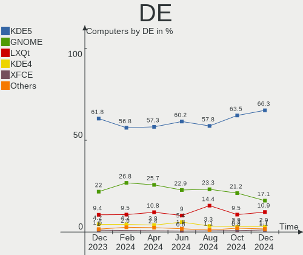
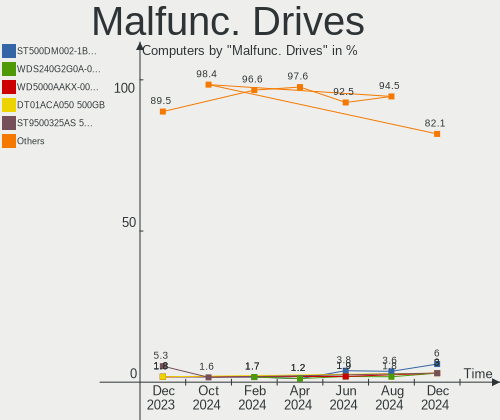
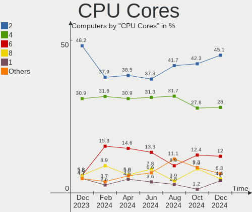
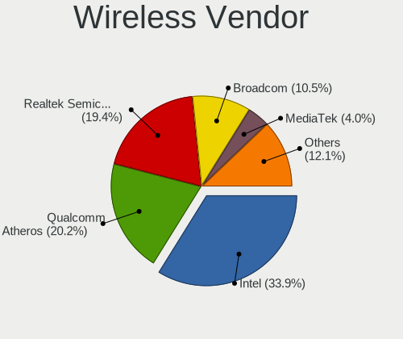
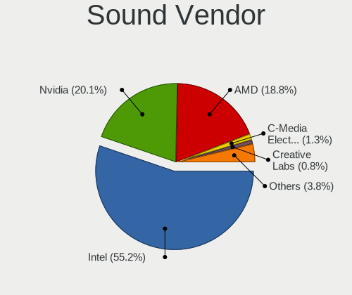

ROSA - Hardware Trends
----------------------

A project to identify most popular hardware characteristics and track their change
over time based on data collected by Linux users at https://Linux-Hardware.org.

Anyone can contribute to this report by the [hw-probe](https://github.com/linuxhw/hw-probe) tool:

    sudo -E hw-probe -all -upload

This is a report for all computer types. See also reports for [desktops](/Dist/ROSA/Desktop/README.md) and [notebooks](/Dist/ROSA/Notebook/README.md).

This report is for one last month. Overall report since the beginning of time: [TestCoverage](https://github.com/linuxhw/TestCoverage)

Period: Jul, 2022.

Contents
--------

* [ System ](#system)
  - [ OS                       ](#os)
  - [ OS Family                ](#os-family)
  - [ Kernel                   ](#kernel)
  - [ Kernel Family            ](#kernel-family)
  - [ Kernel Major Ver.        ](#kernel-major-ver)
  - [ Arch                     ](#arch)
  - [ DE                       ](#de)
  - [ Display Server           ](#display-server)
  - [ Display Manager          ](#display-manager)
  - [ OS Lang                  ](#os-lang)
  - [ Boot Mode                ](#boot-mode)
  - [ Filesystem               ](#filesystem)
  - [ Part. scheme             ](#part-scheme)
  - [ Dual Boot with Linux/BSD ](#dual-boot-with-linuxbsd)
  - [ Dual Boot (Win)          ](#dual-boot-win)

* [ Board ](#board)
  - [ Vendor                   ](#vendor)
  - [ Model                    ](#model)
  - [ Model Family             ](#model-family)
  - [ MFG Year                 ](#mfg-year)
  - [ Form Factor              ](#form-factor)
  - [ Secure Boot              ](#secure-boot)
  - [ Coreboot                 ](#coreboot)
  - [ RAM Size                 ](#ram-size)
  - [ RAM Used                 ](#ram-used)
  - [ Total Drives             ](#total-drives)
  - [ Has CD-ROM               ](#has-cd-rom)
  - [ Has Ethernet             ](#has-ethernet)
  - [ Has WiFi                 ](#has-wifi)
  - [ Has Bluetooth            ](#has-bluetooth)

* [ Location ](#location)
  - [ Country                  ](#country)
  - [ City                     ](#city)

* [ Drives ](#drives)
  - [ Drive Vendor             ](#drive-vendor)
  - [ Drive Model              ](#drive-model)
  - [ HDD Vendor               ](#hdd-vendor)
  - [ SSD Vendor               ](#ssd-vendor)
  - [ Drive Kind               ](#drive-kind)
  - [ Drive Connector          ](#drive-connector)
  - [ Drive Size               ](#drive-size)
  - [ Space Total              ](#space-total)
  - [ Space Used               ](#space-used)
  - [ Malfunc. Drives          ](#malfunc-drives)
  - [ Malfunc. Drive Vendor    ](#malfunc-drive-vendor)
  - [ Malfunc. HDD Vendor      ](#malfunc-hdd-vendor)
  - [ Malfunc. Drive Kind      ](#malfunc-drive-kind)
  - [ Failed Drives            ](#failed-drives)
  - [ Failed Drive Vendor      ](#failed-drive-vendor)
  - [ Drive Status             ](#drive-status)

* [ Storage controller ](#storage-controller)
  - [ Storage Vendor           ](#storage-vendor)
  - [ Storage Model            ](#storage-model)
  - [ Storage Kind             ](#storage-kind)

* [ Processor ](#processor)
  - [ CPU Vendor               ](#cpu-vendor)
  - [ CPU Model                ](#cpu-model)
  - [ CPU Model Family         ](#cpu-model-family)
  - [ CPU Cores                ](#cpu-cores)
  - [ CPU Sockets              ](#cpu-sockets)
  - [ CPU Threads              ](#cpu-threads)
  - [ CPU Op-Modes             ](#cpu-op-modes)
  - [ CPU Microcode            ](#cpu-microcode)
  - [ CPU Microarch            ](#cpu-microarch)

* [ Graphics ](#graphics)
  - [ GPU Vendor               ](#gpu-vendor)
  - [ GPU Model                ](#gpu-model)
  - [ GPU Combo                ](#gpu-combo)
  - [ GPU Driver               ](#gpu-driver)
  - [ GPU Memory               ](#gpu-memory)

* [ Monitor ](#monitor)
  - [ Monitor Vendor           ](#monitor-vendor)
  - [ Monitor Model            ](#monitor-model)
  - [ Monitor Resolution       ](#monitor-resolution)
  - [ Monitor Diagonal         ](#monitor-diagonal)
  - [ Monitor Width            ](#monitor-width)
  - [ Aspect Ratio             ](#aspect-ratio)
  - [ Monitor Area             ](#monitor-area)
  - [ Pixel Density            ](#pixel-density)
  - [ Multiple Monitors        ](#multiple-monitors)

* [ Network ](#network)
  - [ Net Controller Vendor    ](#net-controller-vendor)
  - [ Net Controller Model     ](#net-controller-model)
  - [ Wireless Vendor          ](#wireless-vendor)
  - [ Wireless Model           ](#wireless-model)
  - [ Ethernet Vendor          ](#ethernet-vendor)
  - [ Ethernet Model           ](#ethernet-model)
  - [ Net Controller Kind      ](#net-controller-kind)
  - [ Used Controller          ](#used-controller)
  - [ NICs                     ](#nics)
  - [ IPv6                     ](#ipv6)

* [ Bluetooth ](#bluetooth)
  - [ Bluetooth Vendor         ](#bluetooth-vendor)
  - [ Bluetooth Model          ](#bluetooth-model)

* [ Sound ](#sound)
  - [ Sound Vendor             ](#sound-vendor)
  - [ Sound Model              ](#sound-model)

* [ Memory ](#memory)
  - [ Memory Vendor            ](#memory-vendor)
  - [ Memory Model             ](#memory-model)
  - [ Memory Kind              ](#memory-kind)
  - [ Memory Form Factor       ](#memory-form-factor)
  - [ Memory Size              ](#memory-size)
  - [ Memory Speed             ](#memory-speed)

* [ Printers & scanners ](#printers--scanners)
  - [ Printer Vendor           ](#printer-vendor)
  - [ Printer Model            ](#printer-model)
  - [ Scanner Vendor           ](#scanner-vendor)
  - [ Scanner Model            ](#scanner-model)

* [ Camera ](#camera)
  - [ Camera Vendor            ](#camera-vendor)
  - [ Camera Model             ](#camera-model)

* [ Security ](#security)
  - [ Fingerprint Vendor       ](#fingerprint-vendor)
  - [ Fingerprint Model        ](#fingerprint-model)
  - [ Chipcard Vendor          ](#chipcard-vendor)
  - [ Chipcard Model           ](#chipcard-model)

* [ Unsupported ](#unsupported)
  - [ Unsupported Devices      ](#unsupported-devices)
  - [ Unsupported Device Types ](#unsupported-device-types)

System
------

OS
--

Installed operating systems

| Name       | Computers | Percent |
|------------|-----------|---------|
| ROSA 12.2  | 307       | 88.22%  |
| ROSA R11.1 | 31        | 8.91%   |
| ROSA 12.1  | 6         | 1.72%   |
| ROSA R11   | 3         | 0.86%   |
| ROSA R9    | 1         | 0.29%   |

OS Family
---------

OS without a version

| Name | Computers | Percent |
|------|-----------|---------|
| ROSA | 348       | 100%    |

Kernel
------

Version of the Linux kernel

| Version                                        | Computers | Percent |
|------------------------------------------------|-----------|---------|
| 5.10.74-generic-2rosa2021.1-x86_64             | 142       | 40.8%   |
| 5.10.118-generic-2rosa2021.1-x86_64            | 105       | 30.17%  |
| 5.15.43-generic-2rosa2021.1-x86_64             | 16        | 4.6%    |
| 5.18.8.xm1-1.klp-xanmod-rosa2021.1-x86_64      | 15        | 4.31%   |
| 5.17.11-generic-2rosa2021.1-x86_64             | 11        | 3.16%   |
| 5.4.83-generic-2rosa-i586                      | 8         | 2.3%    |
| 5.4.83-generic-2rosa-x86_64                    | 7         | 2.01%   |
| 5.4.32-generic-2rosa-i586                      | 5         | 1.44%   |
| 4.15.0-desktop-122.124.1rosa-x86_64            | 5         | 1.44%   |
| 5.4.32-generic-2rosa-x86_64                    | 4         | 1.15%   |
| 5.10.74-generic-2rosa2021.1-i586               | 3         | 0.86%   |
| 5.4.150-generic-1rosa2021.1-x86_64             | 2         | 0.57%   |
| 5.18.10.xm1-1.klp-xanmod-rosa2021.1-x86_64     | 2         | 0.57%   |
| 5.18.1.xm1-3.klp-xanmod-rosa2021.1-x86_64      | 2         | 0.57%   |
| 5.16.19-generic-2rosa2021.1-x86_64             | 2         | 0.57%   |
| 5.15.32-generic-6rosa2021.1-x86_64             | 2         | 0.57%   |
| 5.10.71-generic-1rosa2021.1-x86_64             | 2         | 0.57%   |
| 4.15.0-desktop-45.1rosa-i586                   | 2         | 0.57%   |
| 5.18.9-200.fc36.x86_64                         | 1         | 0.29%   |
| 5.18.3.xm1-1.klp-xanmod-rosa2021.1-x86_64      | 1         | 0.29%   |
| 5.18.2.xm1-3.klp-xanmod-rosa2021.1-x86_64      | 1         | 0.29%   |
| 5.18.15.xm1-1.klp-xanmod-rosa2021.1-x86_64     | 1         | 0.29%   |
| 5.18.14.xm1-1.klp-xanmod-rosa2021.1-x86_64     | 1         | 0.29%   |
| 5.18.13-generic-1rosa2021.1-x86_64             | 1         | 0.29%   |
| 5.18.11.xm1-1.klp-xanmod-rosa2021.1-x86_64     | 1         | 0.29%   |
| 5.15.58.xm1-1.klp-xanmod-lts-rosa2021.1-x86_64 | 1         | 0.29%   |
| 5.15.43-generic-1rosa2021.1-x86_64             | 1         | 0.29%   |
| 5.10.118-generic-2rosa2021.1-i586              | 1         | 0.29%   |
| 4.9.20-nrj-desktop-1rosa-x86_64                | 1         | 0.29%   |
| 4.9.155-nrj-desktop-1rosa-x86_64               | 1         | 0.29%   |
| 4.15.0-desktop-122.124.1rosa-i586              | 1         | 0.29%   |

Kernel Family
-------------

Linux kernel without a distro release

| Version  | Computers | Percent |
|----------|-----------|---------|
| 5.10.74  | 145       | 41.67%  |
| 5.10.118 | 106       | 30.46%  |
| 5.15.43  | 17        | 4.89%   |
| 5.4.83   | 15        | 4.31%   |
| 5.18.8   | 15        | 4.31%   |
| 5.17.11  | 11        | 3.16%   |
| 5.4.32   | 9         | 2.59%   |
| 4.15.0   | 8         | 2.3%    |
| 5.4.150  | 2         | 0.57%   |
| 5.18.10  | 2         | 0.57%   |
| 5.18.1   | 2         | 0.57%   |
| 5.16.19  | 2         | 0.57%   |
| 5.15.32  | 2         | 0.57%   |
| 5.10.71  | 2         | 0.57%   |
| 5.18.9   | 1         | 0.29%   |
| 5.18.3   | 1         | 0.29%   |
| 5.18.2   | 1         | 0.29%   |
| 5.18.15  | 1         | 0.29%   |
| 5.18.14  | 1         | 0.29%   |
| 5.18.13  | 1         | 0.29%   |
| 5.18.11  | 1         | 0.29%   |
| 5.15.58  | 1         | 0.29%   |
| 4.9.20   | 1         | 0.29%   |
| 4.9.155  | 1         | 0.29%   |

Kernel Major Ver.
-----------------

Linux kernel major version

| Version | Computers | Percent |
|---------|-----------|---------|
| 5.10    | 253       | 72.7%   |
| 5.4     | 26        | 7.47%   |
| 5.18    | 26        | 7.47%   |
| 5.15    | 20        | 5.75%   |
| 5.17    | 11        | 3.16%   |
| 4.15    | 8         | 2.3%    |
| 5.16    | 2         | 0.57%   |
| 4.9     | 2         | 0.57%   |

Arch
----

OS architecture (x86_64, i586, etc.)

| Name   | Computers | Percent |
|--------|-----------|---------|
| x86_64 | 328       | 94.25%  |
| i686   | 20        | 5.75%   |

DE
--

Desktop Environment

| Name  | Computers | Percent |
|-------|-----------|---------|
| KDE5  | 150       | 43.1%   |
| GNOME | 141       | 40.52%  |
| LXQt  | 28        | 8.05%   |
| KDE4  | 26        | 7.47%   |
| MATE  | 2         | 0.57%   |
| XFCE  | 1         | 0.29%   |

Display Server
--------------

X11 or Wayland

| Name    | Computers | Percent |
|---------|-----------|---------|
| Wayland | 269       | 77.3%   |
| X11     | 79        | 22.7%   |

Display Manager
---------------

SDDM, LightDM, etc.

| Name    | Computers | Percent |
|---------|-----------|---------|
| GDM     | 171       | 49.14%  |
| SDDM    | 146       | 41.95%  |
| KDM     | 26        | 7.47%   |
| LightDM | 5         | 1.44%   |

OS Lang
-------

Language

| Lang    | Computers | Percent |
|---------|-----------|---------|
| ru_RU   | 325       | 93.39%  |
| en_US   | 7         | 2.01%   |
| Unknown | 4         | 1.15%   |
| es_ES   | 3         | 0.86%   |
| pt_BR   | 2         | 0.57%   |
| pl_PL   | 2         | 0.57%   |
| ru_KZ   | 1         | 0.29%   |
| ja_JP   | 1         | 0.29%   |
| it_IT   | 1         | 0.29%   |
| es_MX   | 1         | 0.29%   |
| en_GB   | 1         | 0.29%   |

Boot Mode
---------

EFI or BIOS

| Mode | Computers | Percent |
|------|-----------|---------|
| EFI  | 189       | 54.31%  |
| BIOS | 159       | 45.69%  |

Filesystem
----------

Type of filesystem

| Type  | Computers | Percent |
|-------|-----------|---------|
| Ext4  | 331       | 95.11%  |
| Btrfs | 16        | 4.6%    |
| F2fs  | 1         | 0.29%   |

Part. scheme
------------

Scheme of partitioning

| Type    | Computers | Percent |
|---------|-----------|---------|
| GPT     | 234       | 67.24%  |
| MBR     | 113       | 32.47%  |
| Unknown | 1         | 0.29%   |

Dual Boot with Linux/BSD
------------------------

Hosting more than one Linux/BSD

| Dual boot | Computers | Percent |
|-----------|-----------|---------|
| No        | 247       | 70.98%  |
| Yes       | 101       | 29.02%  |

Dual Boot (Win)
---------------

Hosting Linux and Windows

| Dual boot | Computers | Percent |
|-----------|-----------|---------|
| No        | 178       | 51.15%  |
| Yes       | 170       | 48.85%  |

Board
-----

Vendor
------

Motherboard manufacturer

| Name                | Computers | Percent |
|---------------------|-----------|---------|
| ASUSTek Computer    | 94        | 27.01%  |
| Gigabyte Technology | 55        | 15.8%   |
| Lenovo              | 29        | 8.33%   |
| Acer                | 29        | 8.33%   |
| ASRock              | 25        | 7.18%   |
| Hewlett-Packard     | 18        | 5.17%   |
| MSI                 | 17        | 4.89%   |
| Dell                | 12        | 3.45%   |
| Intel               | 11        | 3.16%   |
| Sony                | 6         | 1.72%   |
| Toshiba             | 5         | 1.44%   |
| Biostar             | 5         | 1.44%   |
| Samsung Electronics | 4         | 1.15%   |
| ECS                 | 4         | 1.15%   |
| Aquarius            | 4         | 1.15%   |
| Packard Bell        | 3         | 0.86%   |
| Huanan              | 3         | 0.86%   |
| Unknown             | 3         | 0.86%   |
| Timi                | 2         | 0.57%   |
| Irbis               | 2         | 0.57%   |
| Insyde              | 2         | 0.57%   |
| THD                 | 1         | 0.29%   |
| Supermicro          | 1         | 0.29%   |
| Quanta              | 1         | 0.29%   |
| Pegatron            | 1         | 0.29%   |
| Notebook            | 1         | 0.29%   |
| MB                  | 1         | 0.29%   |
| Maibenben           | 1         | 0.29%   |
| MACHINIST           | 1         | 0.29%   |
| Kraftway            | 1         | 0.29%   |
| HONOR               | 1         | 0.29%   |
| Fujitsu             | 1         | 0.29%   |
| eMachines           | 1         | 0.29%   |
| Chuwi               | 1         | 0.29%   |
| American Megatrends | 1         | 0.29%   |
| 3Logic Group        | 1         | 0.29%   |

Model
-----

Motherboard model

| Name                                        | Computers | Percent |
|---------------------------------------------|-----------|---------|
| ASUS All Series                             | 8         | 2.3%    |
| Unknown                                     | 4         | 1.15%   |
| Intel X99                                   | 3         | 0.86%   |
| HP Pavilion g6                              | 3         | 0.86%   |
| ASUS M5A78L-M LX3                           | 3         | 0.86%   |
| Aquarius NS685U R11                         | 3         | 0.86%   |
| Acer Aspire A315-51                         | 3         | 0.86%   |
| Lenovo G580 20157                           | 2         | 0.57%   |
| Insyde CherryTrail                          | 2         | 0.57%   |
| HP Notebook                                 | 2         | 0.57%   |
| HP Laptop 15-db1xxx                         | 2         | 0.57%   |
| Gigabyte G31M-ES2L                          | 2         | 0.57%   |
| Gigabyte AB350M-DS3H V2                     | 2         | 0.57%   |
| Gigabyte A320M-S2H V2                       | 2         | 0.57%   |
| ECS GF8100VM-M5                             | 2         | 0.57%   |
| Dell OptiPlex 755                           | 2         | 0.57%   |
| ASUS PRIME X470-PRO                         | 2         | 0.57%   |
| ASUS PRIME B550-PLUS                        | 2         | 0.57%   |
| ASUS PRIME B450M-K                          | 2         | 0.57%   |
| ASUS PRIME A320M-K                          | 2         | 0.57%   |
| ASUS P5KPL-AM                               | 2         | 0.57%   |
| ASUS M5A97 R2.0                             | 2         | 0.57%   |
| ASUS H110M-R                                | 2         | 0.57%   |
| ASRock A320M-DVS R4.0                       | 2         | 0.57%   |
| Acer Aspire E5-573G                         | 2         | 0.57%   |
| Acer Aspire 5741G                           | 2         | 0.57%   |
| Acer Aspire 5730                            | 2         | 0.57%   |
| Toshiba Satellite L750D                     | 1         | 0.29%   |
| Toshiba Satellite C660                      | 1         | 0.29%   |
| Toshiba Satellite C55-B                     | 1         | 0.29%   |
| Toshiba Satellite A300                      | 1         | 0.29%   |
| Toshiba Satellite A200                      | 1         | 0.29%   |
| Timi TM1701                                 | 1         | 0.29%   |
| Timi Mi Laptop Pro 15 2020                  | 1         | 0.29%   |
| THD PX1                                     | 1         | 0.29%   |
| Supermicro C7Q67                            | 1         | 0.29%   |
| Sony VPCEL3S1R                              | 1         | 0.29%   |
| Sony VPCEH2E1R                              | 1         | 0.29%   |
| Sony VGN-TT31MR_N                           | 1         | 0.29%   |
| Sony VGN-FS515BR                            | 1         | 0.29%   |
| Sony SVE1512H1RW                            | 1         | 0.29%   |
| Sony SVE1511B1RW                            | 1         | 0.29%   |
| Samsung R530/R730/R540                      | 1         | 0.29%   |
| Samsung QX310/QX410/QX510/SF310/SF410/SF510 | 1         | 0.29%   |
| Samsung 350V5C/351V5C/3540VC/3440VC         | 1         | 0.29%   |
| Samsung 300E4C/300E5C/300E7C                | 1         | 0.29%   |
| Quanta TouchSmart 9300 Elite All-in-One PC  | 1         | 0.29%   |
| Pegatron IPPPV-D3G                          | 1         | 0.29%   |
| Packard Bell EasyNote TJ71                  | 1         | 0.29%   |
| Packard Bell EasyNote TE11HC                | 1         | 0.29%   |
| Packard Bell EasyNote LJ75                  | 1         | 0.29%   |
| Notebook W250EGQ / W270EGQ                  | 1         | 0.29%   |
| MSI MS-7D52                                 | 1         | 0.29%   |
| MSI MS-7C89                                 | 1         | 0.29%   |
| MSI MS-7C81                                 | 1         | 0.29%   |
| MSI MS-7C02                                 | 1         | 0.29%   |
| MSI MS-7B86                                 | 1         | 0.29%   |
| MSI MS-7B47                                 | 1         | 0.29%   |
| MSI MS-7A74                                 | 1         | 0.29%   |
| MSI MS-7A71                                 | 1         | 0.29%   |

Model Family
------------

Motherboard model prefix

| Name                  | Computers | Percent |
|-----------------------|-----------|---------|
| Acer Aspire           | 21        | 6.03%   |
| ASUS PRIME            | 14        | 4.02%   |
| Lenovo IdeaPad        | 8         | 2.3%    |
| ASUS All              | 8         | 2.3%    |
| HP Pavilion           | 6         | 1.72%   |
| Toshiba Satellite     | 5         | 1.44%   |
| HP Laptop             | 4         | 1.15%   |
| Gigabyte B550M        | 4         | 1.15%   |
| Dell OptiPlex         | 4         | 1.15%   |
| ASUS VivoBook         | 4         | 1.15%   |
| ASUS M5A78L-M         | 4         | 1.15%   |
| Unknown               | 4         | 1.15%   |
| Packard Bell EasyNote | 3         | 0.86%   |
| Lenovo ThinkPad       | 3         | 0.86%   |
| Intel X99             | 3         | 0.86%   |
| Gigabyte B450M        | 3         | 0.86%   |
| Gigabyte A320M-S2H    | 3         | 0.86%   |
| ASUS TUF              | 3         | 0.86%   |
| ASUS ROG              | 3         | 0.86%   |
| ASUS P8H61-M          | 3         | 0.86%   |
| Aquarius NS685U       | 3         | 0.86%   |
| Lenovo G580           | 2         | 0.57%   |
| Lenovo B590           | 2         | 0.57%   |
| Insyde CherryTrail    | 2         | 0.57%   |
| HP ProBook            | 2         | 0.57%   |
| HP Notebook           | 2         | 0.57%   |
| Gigabyte X570         | 2         | 0.57%   |
| Gigabyte X470         | 2         | 0.57%   |
| Gigabyte G31M-ES2L    | 2         | 0.57%   |
| Gigabyte AB350M-DS3H  | 2         | 0.57%   |
| ECS GF8100VM-M5       | 2         | 0.57%   |
| Dell Vostro           | 2         | 0.57%   |
| Dell Inspiron         | 2         | 0.57%   |
| ASUS SABERTOOTH       | 2         | 0.57%   |
| ASUS P5P43TD          | 2         | 0.57%   |
| ASUS P5KPL-AM         | 2         | 0.57%   |
| ASUS P5G41T-M         | 2         | 0.57%   |
| ASUS M5A97            | 2         | 0.57%   |
| ASUS H110M-R          | 2         | 0.57%   |
| ASUS H110M-A          | 2         | 0.57%   |
| ASRock B450M          | 2         | 0.57%   |
| ASRock A320M-DVS      | 2         | 0.57%   |
| Acer Swift            | 2         | 0.57%   |
| Acer Extensa          | 2         | 0.57%   |
| Timi TM1701           | 1         | 0.29%   |
| Timi Mi               | 1         | 0.29%   |
| THD PX1               | 1         | 0.29%   |
| Supermicro C7Q67      | 1         | 0.29%   |
| Sony VPCEL3S1R        | 1         | 0.29%   |
| Sony VPCEH2E1R        | 1         | 0.29%   |
| Sony VGN-TT31MR       | 1         | 0.29%   |
| Sony VGN-FS515BR      | 1         | 0.29%   |
| Sony SVE1512H1RW      | 1         | 0.29%   |
| Sony SVE1511B1RW      | 1         | 0.29%   |
| Samsung R530          | 1         | 0.29%   |
| Samsung QX310         | 1         | 0.29%   |
| Samsung 350V5C        | 1         | 0.29%   |
| Samsung 300E4C        | 1         | 0.29%   |
| Quanta TouchSmart     | 1         | 0.29%   |
| Pegatron IPPPV-D3G    | 1         | 0.29%   |

MFG Year
--------

Motherboard manufacture year

| Year | Computers | Percent |
|------|-----------|---------|
| 2012 | 40        | 11.49%  |
| 2018 | 35        | 10.06%  |
| 2021 | 25        | 7.18%   |
| 2020 | 25        | 7.18%   |
| 2019 | 25        | 7.18%   |
| 2011 | 22        | 6.32%   |
| 2009 | 22        | 6.32%   |
| 2008 | 22        | 6.32%   |
| 2016 | 21        | 6.03%   |
| 2017 | 20        | 5.75%   |
| 2010 | 20        | 5.75%   |
| 2014 | 18        | 5.17%   |
| 2013 | 16        | 4.6%    |
| 2015 | 14        | 4.02%   |
| 2007 | 11        | 3.16%   |
| 2022 | 8         | 2.3%    |
| 2006 | 3         | 0.86%   |
| 2005 | 1         | 0.29%   |

Form Factor
-----------

Physical design of the computer

| Name        | Computers | Percent |
|-------------|-----------|---------|
| Desktop     | 192       | 55.17%  |
| Notebook    | 146       | 41.95%  |
| All in one  | 4         | 1.15%   |
| Mini pc     | 3         | 0.86%   |
| Tablet      | 1         | 0.29%   |
| Convertible | 1         | 0.29%   |
| Server      | 1         | 0.29%   |

Secure Boot
-----------

Enabled or disabled

| State    | Computers | Percent |
|----------|-----------|---------|
| Disabled | 348       | 100%    |

Coreboot
--------

Have coreboot on board

| Used | Computers | Percent |
|------|-----------|---------|
| No   | 348       | 100%    |

RAM Size
--------

Total RAM memory

| Size in GB  | Computers | Percent |
|-------------|-----------|---------|
| 4.01-8.0    | 89        | 25.57%  |
| 3.01-4.0    | 67        | 19.25%  |
| 16.01-24.0  | 65        | 18.68%  |
| 8.01-16.0   | 63        | 18.1%   |
| 1.01-2.0    | 30        | 8.62%   |
| 32.01-64.0  | 21        | 6.03%   |
| 64.01-256.0 | 6         | 1.72%   |
| 2.01-3.0    | 5         | 1.44%   |
| 24.01-32.0  | 2         | 0.57%   |

RAM Used
--------

Used RAM memory

| Used GB   | Computers | Percent |
|-----------|-----------|---------|
| 1.01-2.0  | 198       | 56.9%   |
| 0.51-1.0  | 89        | 25.57%  |
| 2.01-3.0  | 42        | 12.07%  |
| 3.01-4.0  | 9         | 2.59%   |
| 4.01-8.0  | 6         | 1.72%   |
| 8.01-16.0 | 3         | 0.86%   |
| 0.01-0.5  | 1         | 0.29%   |

Total Drives
------------

Number of drives on board

| Drives | Computers | Percent |
|--------|-----------|---------|
| 1      | 171       | 49.14%  |
| 2      | 92        | 26.44%  |
| 3      | 44        | 12.64%  |
| 4      | 25        | 7.18%   |
| 5      | 11        | 3.16%   |
| 8      | 2         | 0.57%   |
| 6      | 2         | 0.57%   |
| 7      | 1         | 0.29%   |

Has CD-ROM
----------

Has CD-ROM on board

| Presented | Computers | Percent |
|-----------|-----------|---------|
| No        | 226       | 64.94%  |
| Yes       | 122       | 35.06%  |

Has Ethernet
------------

Has Ethernet on board

| Presented | Computers | Percent |
|-----------|-----------|---------|
| Yes       | 317       | 91.09%  |
| No        | 31        | 8.91%   |

Has WiFi
--------

Has WiFi module

| Presented | Computers | Percent |
|-----------|-----------|---------|
| Yes       | 202       | 58.05%  |
| No        | 146       | 41.95%  |

Has Bluetooth
-------------

Has Bluetooth module

| Presented | Computers | Percent |
|-----------|-----------|---------|
| No        | 188       | 54.02%  |
| Yes       | 160       | 45.98%  |

Location
--------

Country
-------

Geographic location (country)

| Country    | Computers | Percent |
|------------|-----------|---------|
| Russia     | 305       | 87.64%  |
| Ukraine    | 10        | 2.87%   |
| Belarus    | 9         | 2.59%   |
| Poland     | 4         | 1.15%   |
| Italy      | 2         | 0.57%   |
| India      | 2         | 0.57%   |
| Germany    | 2         | 0.57%   |
| Brazil     | 2         | 0.57%   |
| Uzbekistan | 1         | 0.29%   |
| UAE        | 1         | 0.29%   |
| Spain      | 1         | 0.29%   |
| Serbia     | 1         | 0.29%   |
| Peru       | 1         | 0.29%   |
| Pakistan   | 1         | 0.29%   |
| Mexico     | 1         | 0.29%   |
| Kyrgyzstan | 1         | 0.29%   |
| Kazakhstan | 1         | 0.29%   |
| Japan      | 1         | 0.29%   |
| Canada     | 1         | 0.29%   |
| Argentina  | 1         | 0.29%   |

City
----

Geographic location (city)

| City             | Computers | Percent |
|------------------|-----------|---------|
| Moscow           | 51        | 14.66%  |
| St Petersburg    | 16        | 4.6%    |
| Novosibirsk      | 16        | 4.6%    |
| Yekaterinburg    | 11        | 3.16%   |
| Perm             | 8         | 2.3%    |
| Rostov-on-Don    | 7         | 2.01%   |
| Krasnodar        | 7         | 2.01%   |
| Chelyabinsk      | 7         | 2.01%   |
| Voronezh         | 5         | 1.44%   |
| Volgograd        | 5         | 1.44%   |
| Saratov          | 5         | 1.44%   |
| Irkutsk          | 5         | 1.44%   |
| Yaroslavl        | 4         | 1.15%   |
| Tomsk            | 4         | 1.15%   |
| Surgut           | 4         | 1.15%   |
| Simferopol       | 4         | 1.15%   |
| Samara           | 4         | 1.15%   |
| Nizhniy Novgorod | 4         | 1.15%   |
| Krasnoyarsk      | 4         | 1.15%   |
| Khabarovsk       | 4         | 1.15%   |
| Izhevsk          | 4         | 1.15%   |
| Cheboksary       | 4         | 1.15%   |
| Barnaul          | 4         | 1.15%   |
| Vladivostok      | 3         | 0.86%   |
| Ufa              | 3         | 0.86%   |
| Tyumen           | 3         | 0.86%   |
| Penza            | 3         | 0.86%   |
| Orenburg         | 3         | 0.86%   |
| Novokuznetsk     | 3         | 0.86%   |
| Kazan’         | 3         | 0.86%   |
| Gomel            | 3         | 0.86%   |
| Belgorod         | 3         | 0.86%   |
| Zvenigorod       | 2         | 0.57%   |
| Warsaw           | 2         | 0.57%   |
| Vladimir         | 2         | 0.57%   |
| Ulan-Ude         | 2         | 0.57%   |
| Tver             | 2         | 0.57%   |
| Tula             | 2         | 0.57%   |
| Stavropol        | 2         | 0.57%   |
| Smolensk         | 2         | 0.57%   |
| Severodvinsk     | 2         | 0.57%   |
| Saransk          | 2         | 0.57%   |
| Ryazan           | 2         | 0.57%   |
| Podolsk          | 2         | 0.57%   |
| Omsk             | 2         | 0.57%   |
| Mytishchi        | 2         | 0.57%   |
| Kurgan           | 2         | 0.57%   |
| Kirov            | 2         | 0.57%   |
| Khimki           | 2         | 0.57%   |
| Kaluga           | 2         | 0.57%   |
| Kaliningrad      | 2         | 0.57%   |
| Blagoveshchensk  | 2         | 0.57%   |
| Zhodzina         | 1         | 0.29%   |
| Zheleznogorsk    | 1         | 0.29%   |
| Yoshkar-Ola      | 1         | 0.29%   |
| Yelets           | 1         | 0.29%   |
| Yasinovataya     | 1         | 0.29%   |
| Yalta            | 1         | 0.29%   |
| Yakhroma         | 1         | 0.29%   |
| Yablonovsky      | 1         | 0.29%   |

Drives
------

Drive Vendor
------------

Hard drive vendors

| Vendor              | Computers | Drives | Percent |
|---------------------|-----------|--------|---------|
| WDC                 | 116       | 136    | 18.99%  |
| Seagate             | 105       | 121    | 17.18%  |
| Samsung Electronics | 54        | 65     | 8.84%   |
| Toshiba             | 37        | 39     | 6.06%   |
| Kingston            | 31        | 33     | 5.07%   |
| Hitachi             | 29        | 32     | 4.75%   |
| A-DATA Technology   | 25        | 29     | 4.09%   |
| China               | 20        | 21     | 3.27%   |
| SPCC                | 15        | 15     | 2.45%   |
| HGST                | 12        | 13     | 1.96%   |
| SanDisk             | 11        | 11     | 1.8%    |
| Intel               | 11        | 15     | 1.8%    |
| SK hynix            | 10        | 10     | 1.64%   |
| Apacer              | 9         | 10     | 1.47%   |
| Netac               | 8         | 8      | 1.31%   |
| GOODRAM             | 8         | 8      | 1.31%   |
| Unknown             | 7         | 9      | 1.15%   |
| Smartbuy            | 7         | 8      | 1.15%   |
| Patriot             | 7         | 7      | 1.15%   |
| Plextor             | 6         | 6      | 0.98%   |
| Gigabyte Technology | 6         | 6      | 0.98%   |
| AMD                 | 6         | 6      | 0.98%   |
| Crucial             | 5         | 5      | 0.82%   |
| Phison              | 4         | 4      | 0.65%   |
| Maxtor              | 4         | 4      | 0.65%   |
| KingSpec            | 4         | 4      | 0.65%   |
| Transcend           | 3         | 3      | 0.49%   |
| OCZ                 | 3         | 3      | 0.49%   |
| Corsair             | 3         | 3      | 0.49%   |
| walram              | 2         | 2      | 0.33%   |
| UMIS                | 2         | 2      | 0.33%   |
| Silicon Motion      | 2         | 2      | 0.33%   |
| Kllisre             | 2         | 2      | 0.33%   |
| Intenso             | 2         | 2      | 0.33%   |
| Fujitsu             | 2         | 2      | 0.33%   |
| ASMT                | 2         | 4      | 0.33%   |
| Unknown             | 2         | 2      | 0.33%   |
| ZTE                 | 1         | 1      | 0.16%   |
| Yeyian              | 1         | 1      | 0.16%   |
| XrayDisk            | 1         | 1      | 0.16%   |
| XPG                 | 1         | 1      | 0.16%   |
| WDC WDS1            | 1         | 1      | 0.16%   |
| TO Exter            | 1         | 1      | 0.16%   |
| Team                | 1         | 1      | 0.16%   |
| T-FORCE             | 1         | 1      | 0.16%   |
| SATAFIRM            | 1         | 1      | 0.16%   |
| s60                 | 1         | 1      | 0.16%   |
| Reeinno             | 1         | 1      | 0.16%   |
| Realtek             | 1         | 1      | 0.16%   |
| Qumo                | 1         | 1      | 0.16%   |
| ORICO               | 1         | 1      | 0.16%   |
| OCZ-VERTEX3         | 1         | 1      | 0.16%   |
| MTFDDAK1            | 1         | 1      | 0.16%   |
| Micron Technology   | 1         | 1      | 0.16%   |
| LVCARDS             | 1         | 1      | 0.16%   |
| Londisk             | 1         | 1      | 0.16%   |
| KIOXIA              | 1         | 1      | 0.16%   |
| Kingmax             | 1         | 1      | 0.16%   |
| JMicron Technology  | 1         | 2      | 0.16%   |
| Hewlett-Packard     | 1         | 1      | 0.16%   |

Drive Model
-----------

Hard drive models

| Model                                | Computers | Percent |
|--------------------------------------|-----------|---------|
| Seagate ST1000DM010-2EP102 1TB       | 11        | 1.66%   |
| Seagate ST500DM002-1BD142 500GB      | 9         | 1.36%   |
| Seagate ST1000DM003-1CH162 1TB       | 8         | 1.21%   |
| Kingston SA400S37240G 240GB SSD      | 8         | 1.21%   |
| WDC WDS240G2G0A-00JH30 240GB SSD     | 7         | 1.06%   |
| Toshiba DT01ACA100 1TB               | 6         | 0.91%   |
| SPCC Solid State Disk 128GB          | 6         | 0.91%   |
| Seagate ST1000LM024 HN-M101MBB 1TB   | 5         | 0.76%   |
| Kingston SA400S37120G 120GB SSD      | 5         | 0.76%   |
| Hitachi HDS721010CLA332 1TB          | 5         | 0.76%   |
| WDC WD5000LPCX-21VHAT0 500GB         | 4         | 0.6%    |
| Toshiba HDWD110 1TB                  | 4         | 0.6%    |
| Seagate ST3500418AS 500GB            | 4         | 0.6%    |
| Seagate ST3500413AS 500GB            | 4         | 0.6%    |
| Seagate ST2000DM008-2FR102 2TB       | 4         | 0.6%    |
| Samsung SSD 860 EVO 250GB            | 4         | 0.6%    |
| Patriot Burst 120GB SSD              | 4         | 0.6%    |
| China SSD 120GB                      | 4         | 0.6%    |
| WDC WDS120G2G0A-00JH30 120GB SSD     | 3         | 0.45%   |
| WDC WD10SPZX-00Z10T0 1TB             | 3         | 0.45%   |
| WDC WD10EZEX-08WN4A0 1TB             | 3         | 0.45%   |
| Toshiba MQ04ABF100 1TB               | 3         | 0.45%   |
| SPCC Solid State Disk 256GB          | 3         | 0.45%   |
| Seagate ST500LT012-1DG142 500GB      | 3         | 0.45%   |
| Seagate ST2000DM001-1ER164 2TB       | 3         | 0.45%   |
| Samsung SSD 980 1TB                  | 3         | 0.45%   |
| Samsung SSD 970 EVO Plus 250GB       | 3         | 0.45%   |
| Samsung SSD 870 QVO 1TB              | 3         | 0.45%   |
| Samsung SSD 850 PRO 256GB            | 3         | 0.45%   |
| Samsung SSD 850 EVO 250GB            | 3         | 0.45%   |
| Netac SSD 256GB                      | 3         | 0.45%   |
| Kingston SV300S37A120G 120GB SSD     | 3         | 0.45%   |
| Kingston SA400S37480G 480GB SSD      | 3         | 0.45%   |
| Hitachi HTS545032B9A300 320GB        | 3         | 0.45%   |
| Gigabyte GP-GSM2NE3256GNTD 256GB     | 3         | 0.45%   |
| China 120GB SSD                      | 3         | 0.45%   |
| A-DATA SX8200PNP 256GB               | 3         | 0.45%   |
| A-DATA SU800NS38 256GB SSD           | 3         | 0.45%   |
| A-DATA SU650 120GB SSD               | 3         | 0.45%   |
| WDC WDS250G2B0C-00PXH0 250GB         | 2         | 0.3%    |
| WDC WDS120G2G0B-00EPW0 120GB SSD     | 2         | 0.3%    |
| WDC WD5000LPCX-60VHAT0 500GB         | 2         | 0.3%    |
| WDC WD5000BEVT-22A0RT0 500GB         | 2         | 0.3%    |
| WDC WD5000AAKX-08U6AA0 500GB         | 2         | 0.3%    |
| WDC WD5000AADS-00S9B0 500GB          | 2         | 0.3%    |
| WDC WD30EFRX-68EUZN0 3TB             | 2         | 0.3%    |
| WDC WD15EARS-00MVWB0 1TB             | 2         | 0.3%    |
| WDC WD10EZEX-75WN4A1 1TB             | 2         | 0.3%    |
| WDC WD10EZEX-21M2NA0 1TB             | 2         | 0.3%    |
| WDC WD10EZEX-00MFCA0 1TB             | 2         | 0.3%    |
| WDC PC SN730 SDBQNTY-512G-1001 512GB | 2         | 0.3%    |
| walram SSD 120G                      | 2         | 0.3%    |
| Unknown NCard  64GB                  | 2         | 0.3%    |
| UMIS RPJTJ256MEE1OWX 256GB           | 2         | 0.3%    |
| Transcend TS120GMTS820S 120GB SSD    | 2         | 0.3%    |
| Toshiba HDWD220 2TB                  | 2         | 0.3%    |
| Toshiba HDWD130 3TB                  | 2         | 0.3%    |
| Toshiba HDWD120 2TB                  | 2         | 0.3%    |
| SPCC Solid State Disk 120GB          | 2         | 0.3%    |
| Smartbuy SSD 256GB                   | 2         | 0.3%    |

HDD Vendor
----------

Hard disk drive vendors

| Vendor              | Computers | Drives | Percent |
|---------------------|-----------|--------|---------|
| Seagate             | 104       | 120    | 35.74%  |
| WDC                 | 92        | 107    | 31.62%  |
| Toshiba             | 34        | 36     | 11.68%  |
| Hitachi             | 29        | 32     | 9.97%   |
| HGST                | 12        | 13     | 4.12%   |
| Samsung Electronics | 10        | 10     | 3.44%   |
| Maxtor              | 4         | 4      | 1.37%   |
| Fujitsu             | 2         | 2      | 0.69%   |
| ASMT                | 2         | 4      | 0.69%   |
| SATAFIRM            | 1         | 1      | 0.34%   |
| Apple               | 1         | 1      | 0.34%   |

SSD Vendor
----------

Solid state drive vendors

| Vendor              | Computers | Drives | Percent |
|---------------------|-----------|--------|---------|
| Samsung Electronics | 27        | 30     | 11.79%  |
| Kingston            | 25        | 26     | 10.92%  |
| China               | 20        | 21     | 8.73%   |
| WDC                 | 18        | 18     | 7.86%   |
| A-DATA Technology   | 18        | 19     | 7.86%   |
| SPCC                | 13        | 13     | 5.68%   |
| SanDisk             | 11        | 11     | 4.8%    |
| Apacer              | 8         | 9      | 3.49%   |
| Smartbuy            | 7         | 8      | 3.06%   |
| Patriot             | 7         | 7      | 3.06%   |
| Netac               | 7         | 7      | 3.06%   |
| GOODRAM             | 7         | 7      | 3.06%   |
| Plextor             | 6         | 6      | 2.62%   |
| Intel               | 6         | 8      | 2.62%   |
| AMD                 | 6         | 6      | 2.62%   |
| Crucial             | 5         | 5      | 2.18%   |
| KingSpec            | 4         | 4      | 1.75%   |
| Transcend           | 3         | 3      | 1.31%   |
| OCZ                 | 3         | 3      | 1.31%   |
| Corsair             | 3         | 3      | 1.31%   |
| walram              | 2         | 2      | 0.87%   |
| Intenso             | 2         | 2      | 0.87%   |
| Gigabyte Technology | 2         | 2      | 0.87%   |
| Unknown             | 2         | 2      | 0.87%   |
| Yeyian              | 1         | 1      | 0.44%   |
| XrayDisk            | 1         | 1      | 0.44%   |
| TO Exter            | 1         | 1      | 0.44%   |
| Team                | 1         | 1      | 0.44%   |
| T-FORCE             | 1         | 1      | 0.44%   |
| SK hynix            | 1         | 1      | 0.44%   |
| s60                 | 1         | 1      | 0.44%   |
| Qumo                | 1         | 1      | 0.44%   |
| OCZ-VERTEX3         | 1         | 1      | 0.44%   |
| LVCARDS             | 1         | 1      | 0.44%   |
| Londisk             | 1         | 1      | 0.44%   |
| Kingmax             | 1         | 1      | 0.44%   |
| Hewlett-Packard     | 1         | 1      | 0.44%   |
| GAMER               | 1         | 1      | 0.44%   |
| BR                  | 1         | 1      | 0.44%   |
| BAITITON            | 1         | 1      | 0.44%   |
| Acer                | 1         | 1      | 0.44%   |

Drive Kind
----------

HDD or SSD

| Kind    | Computers | Drives | Percent |
|---------|-----------|--------|---------|
| HDD     | 230       | 330    | 44.66%  |
| SSD     | 190       | 239    | 36.89%  |
| NVMe    | 82        | 98     | 15.92%  |
| MMC     | 9         | 11     | 1.75%   |
| Unknown | 4         | 4      | 0.78%   |

Drive Connector
---------------

SATA, SAS, NVMe, etc.

| Type | Computers | Drives | Percent |
|------|-----------|--------|---------|
| SATA | 309       | 561    | 75.55%  |
| NVMe | 78        | 93     | 19.07%  |
| SAS  | 13        | 17     | 3.18%   |
| MMC  | 9         | 11     | 2.2%    |

Drive Size
----------

Size of hard drive

| Size in TB | Computers | Drives | Percent |
|------------|-----------|--------|---------|
| 0.01-0.5   | 258       | 364    | 60.28%  |
| 0.51-1.0   | 126       | 155    | 29.44%  |
| 1.01-2.0   | 29        | 34     | 6.78%   |
| 2.01-3.0   | 7         | 7      | 1.64%   |
| 3.01-4.0   | 5         | 6      | 1.17%   |
| 4.01-10.0  | 3         | 3      | 0.7%    |

Space Total
-----------

Amount of disk space available on the file system

| Size in GB     | Computers | Percent |
|----------------|-----------|---------|
| 101-250        | 116       | 33.33%  |
| 251-500        | 64        | 18.39%  |
| 501-1000       | 47        | 13.51%  |
| 1-20           | 40        | 11.49%  |
| 1001-2000      | 28        | 8.05%   |
| 51-100         | 20        | 5.75%   |
| 21-50          | 18        | 5.17%   |
| 2001-3000      | 9         | 2.59%   |
| More than 3000 | 6         | 1.72%   |

Space Used
----------

Amount of used disk space

| Used GB        | Computers | Percent |
|----------------|-----------|---------|
| 1-20           | 237       | 68.1%   |
| 21-50          | 29        | 8.33%   |
| 101-250        | 23        | 6.61%   |
| 51-100         | 18        | 5.17%   |
| 251-500        | 14        | 4.02%   |
| 1001-2000      | 14        | 4.02%   |
| 501-1000       | 11        | 3.16%   |
| More than 3000 | 2         | 0.57%   |

Malfunc. Drives
---------------

Drive models with a malfunction

| Model                              | Computers | Drives | Percent |
|------------------------------------|-----------|--------|---------|
| Seagate ST500DM002-1BD142 500GB    | 5         | 5      | 3.73%   |
| Seagate ST3500413AS 500GB          | 4         | 5      | 2.99%   |
| Seagate ST1000DM003-1CH162 1TB     | 4         | 6      | 2.99%   |
| Seagate ST3500418AS 500GB          | 3         | 4      | 2.24%   |
| WDC WDS240G2G0A-00JH30 240GB SSD   | 2         | 2      | 1.49%   |
| WDC WD5000BEVT-22A0RT0 500GB       | 2         | 2      | 1.49%   |
| WDC WD5000AAKX-08U6AA0 500GB       | 2         | 3      | 1.49%   |
| Seagate ST9320325AS 320GB          | 2         | 2      | 1.49%   |
| Seagate ST31500341AS 1TB           | 2         | 2      | 1.49%   |
| Seagate ST250DM000-1BD141 250GB    | 2         | 2      | 1.49%   |
| Seagate ST1000LM024 HN-M101MBB 1TB | 2         | 2      | 1.49%   |
| Hitachi HTS545032B9A300 320GB      | 2         | 2      | 1.49%   |
| Hitachi HDS721010CLA332 1TB        | 2         | 2      | 1.49%   |
| WDC WDS120G2G0A-00JH30 120GB SSD   | 1         | 1      | 0.75%   |
| WDC WD8000AARS-00Y5B1 800GB        | 1         | 1      | 0.75%   |
| WDC WD7500BPVT-60HXZT3 752GB       | 1         | 1      | 0.75%   |
| WDC WD7500AADS-00L5B1 752GB        | 1         | 1      | 0.75%   |
| WDC WD6401AALS-00J7B1 640GB        | 1         | 1      | 0.75%   |
| WDC WD5001AALS-00E3A0 500GB        | 1         | 1      | 0.75%   |
| WDC WD5000LPCX-60VHAT0 500GB       | 1         | 1      | 0.75%   |
| WDC WD5000BPVT-22HXZT1 500GB       | 1         | 1      | 0.75%   |
| WDC WD5000AAKX-60U6AA0 500GB       | 1         | 1      | 0.75%   |
| WDC WD5000AAKS-22A7B2 500GB        | 1         | 1      | 0.75%   |
| WDC WD5000AAKS-007AA0 500GB        | 1         | 1      | 0.75%   |
| WDC WD5000AADS-00S9B0 500GB        | 1         | 1      | 0.75%   |
| WDC WD3200AAKX-001CA0 320GB        | 1         | 1      | 0.75%   |
| WDC WD3200AAKS-00B3A0 320GB        | 1         | 1      | 0.75%   |
| WDC WD2500BEVT-22A23T0 250GB       | 1         | 1      | 0.75%   |
| WDC WD2500BEKT-60A25T1 250GB       | 1         | 1      | 0.75%   |
| WDC WD2500AAJS-00L7A0 250GB        | 1         | 1      | 0.75%   |
| WDC WD2500AAJB-00J3A0 250GB        | 1         | 1      | 0.75%   |
| WDC WD20EZRX-00D8PB0 2TB           | 1         | 1      | 0.75%   |
| WDC WD20EARX-00PASB0 2TB           | 1         | 1      | 0.75%   |
| WDC WD20EARS-00S8B1 2TB            | 1         | 1      | 0.75%   |
| WDC WD20EARS-00MVWB0 2TB           | 1         | 1      | 0.75%   |
| WDC WD1600AAJS-00L7A0 160GB        | 1         | 1      | 0.75%   |
| WDC WD15EARS-00MVWB0 1TB           | 1         | 1      | 0.75%   |
| WDC WD10JPVT-60A1YT0 1TB           | 1         | 2      | 0.75%   |
| WDC WD10EZEX-60ZF5A0 1TB           | 1         | 1      | 0.75%   |
| WDC WD10EZEX-60M2NA0 1TB           | 1         | 1      | 0.75%   |
| WDC WD10EALS-002BA0 1TB            | 1         | 1      | 0.75%   |
| WDC WD10EADS-00M2B0 1TB            | 1         | 1      | 0.75%   |
| walram SSD 120G                    | 1         | 1      | 0.75%   |
| Toshiba MQ04ABF100 1TB             | 1         | 1      | 0.75%   |
| Toshiba MQ01ABD050 500GB           | 1         | 1      | 0.75%   |
| Toshiba MK8025GAS 80GB             | 1         | 1      | 0.75%   |
| Toshiba MK6465GSX 640GB            | 1         | 1      | 0.75%   |
| Toshiba MK3259GSXP 320GB           | 1         | 1      | 0.75%   |
| Toshiba MK2546GSX 250GB            | 1         | 1      | 0.75%   |
| Toshiba HDWD105 500GB              | 1         | 1      | 0.75%   |
| SPCC SSD162 120GB                  | 1         | 1      | 0.75%   |
| SPCC M.2 SSD 128GB                 | 1         | 1      | 0.75%   |
| Seagate ST96812AS 64GB             | 1         | 1      | 0.75%   |
| Seagate ST9250315AS 250GB          | 1         | 1      | 0.75%   |
| Seagate ST9120822AS 120GB          | 1         | 1      | 0.75%   |
| Seagate ST500LT012-1DG142 500GB    | 1         | 1      | 0.75%   |
| Seagate ST500LM021-1KJ152 500GB    | 1         | 1      | 0.75%   |
| Seagate ST3750330NS 752GB          | 1         | 1      | 0.75%   |
| Seagate ST3500620AS 500GB          | 1         | 1      | 0.75%   |
| Seagate ST3500412AS 500GB          | 1         | 1      | 0.75%   |

Malfunc. Drive Vendor
---------------------

Vendors of faulty drives

| Vendor              | Computers | Drives | Percent |
|---------------------|-----------|--------|---------|
| Seagate             | 45        | 50     | 34.62%  |
| WDC                 | 32        | 37     | 24.62%  |
| Hitachi             | 13        | 13     | 10%     |
| Toshiba             | 7         | 7      | 5.38%   |
| Samsung Electronics | 4         | 4      | 3.08%   |
| China               | 4         | 4      | 3.08%   |
| Kingston            | 3         | 3      | 2.31%   |
| A-DATA Technology   | 3         | 3      | 2.31%   |
| SPCC                | 2         | 2      | 1.54%   |
| HGST                | 2         | 2      | 1.54%   |
| Fujitsu             | 2         | 2      | 1.54%   |
| walram              | 1         | 1      | 0.77%   |
| SanDisk             | 1         | 1      | 0.77%   |
| s60                 | 1         | 1      | 0.77%   |
| Qumo                | 1         | 1      | 0.77%   |
| Plextor             | 1         | 1      | 0.77%   |
| OCZ-VERTEX3         | 1         | 1      | 0.77%   |
| OCZ                 | 1         | 1      | 0.77%   |
| Netac               | 1         | 1      | 0.77%   |
| Intenso             | 1         | 1      | 0.77%   |
| Intel               | 1         | 1      | 0.77%   |
| Corsair             | 1         | 1      | 0.77%   |
| ASMT                | 1         | 2      | 0.77%   |
| Unknown             | 1         | 1      | 0.77%   |

Malfunc. HDD Vendor
-------------------

Vendors of faulty HDD drives

| Vendor              | Computers | Drives | Percent |
|---------------------|-----------|--------|---------|
| Seagate             | 45        | 50     | 43.27%  |
| WDC                 | 31        | 34     | 29.81%  |
| Hitachi             | 13        | 13     | 12.5%   |
| Toshiba             | 7         | 7      | 6.73%   |
| Samsung Electronics | 3         | 3      | 2.88%   |
| HGST                | 2         | 2      | 1.92%   |
| Fujitsu             | 2         | 2      | 1.92%   |
| ASMT                | 1         | 2      | 0.96%   |

Malfunc. Drive Kind
-------------------

Kinds of faulty drives

| Kind | Computers | Drives | Percent |
|------|-----------|--------|---------|
| HDD  | 93        | 113    | 78.15%  |
| SSD  | 25        | 27     | 21.01%  |
| NVMe | 1         | 1      | 0.84%   |

Failed Drives
-------------

Failed drive models

| Model                             | Computers | Drives | Percent |
|-----------------------------------|-----------|--------|---------|
| WDC WD5000LPCX-24VHAT0 500GB      | 1         | 1      | 20%     |
| WDC WD10EZEX-60WN4A0 1TB          | 1         | 1      | 20%     |
| Toshiba MQ01ABD032 320GB          | 1         | 1      | 20%     |
| Samsung Electronics HM320HJ 320GB | 1         | 1      | 20%     |
| Hitachi HDS721010CLA332 1TB       | 1         | 1      | 20%     |

Failed Drive Vendor
-------------------

Failed drive vendors

| Vendor              | Computers | Drives | Percent |
|---------------------|-----------|--------|---------|
| WDC                 | 2         | 2      | 40%     |
| Toshiba             | 1         | 1      | 20%     |
| Samsung Electronics | 1         | 1      | 20%     |
| Hitachi             | 1         | 1      | 20%     |

Drive Status
------------

Number of failed and malfunc. drives

| Status   | Computers | Drives | Percent |
|----------|-----------|--------|---------|
| Works    | 295       | 512    | 68.45%  |
| Malfunc  | 113       | 141    | 26.22%  |
| Detected | 19        | 24     | 4.41%   |
| Failed   | 4         | 5      | 0.93%   |

Storage controller
------------------

Storage Vendor
--------------

Storage controller vendors

| Vendor                       | Computers | Percent |
|------------------------------|-----------|---------|
| Intel                        | 236       | 54.88%  |
| AMD                          | 89        | 20.7%   |
| Samsung Electronics          | 21        | 4.88%   |
| Phison Electronics           | 11        | 2.56%   |
| SanDisk                      | 10        | 2.33%   |
| SK hynix                     | 8         | 1.86%   |
| Nvidia                       | 8         | 1.86%   |
| Silicon Motion               | 7         | 1.63%   |
| ASMedia Technology           | 7         | 1.63%   |
| Realtek Semiconductor        | 6         | 1.4%    |
| Kingston Technology Company  | 6         | 1.4%    |
| JMicron Technology           | 6         | 1.4%    |
| ADATA Technology             | 4         | 0.93%   |
| Marvell Technology Group     | 3         | 0.7%    |
| Union Memory (Shenzhen)      | 2         | 0.47%   |
| Toshiba America Info Systems | 2         | 0.47%   |
| KIOXIA                       | 2         | 0.47%   |
| VIA Technologies             | 1         | 0.23%   |
| Micron Technology            | 1         | 0.23%   |

Storage Model
-------------

Storage controller models

| Model                                                                                   | Computers | Percent |
|-----------------------------------------------------------------------------------------|-----------|---------|
| AMD FCH SATA Controller [AHCI mode]                                                     | 45        | 8.6%    |
| Intel 7 Series Chipset Family 6-port SATA Controller [AHCI mode]                        | 22        | 4.21%   |
| AMD SB7x0/SB8x0/SB9x0 IDE Controller                                                    | 17        | 3.25%   |
| Intel NM10/ICH7 Family SATA Controller [IDE mode]                                       | 15        | 2.87%   |
| Intel 8 Series/C220 Series Chipset Family 6-port SATA Controller 1 [AHCI mode]          | 15        | 2.87%   |
| Intel 6 Series/C200 Series Chipset Family 6 port Desktop SATA AHCI Controller           | 14        | 2.68%   |
| AMD SB7x0/SB8x0/SB9x0 SATA Controller [AHCI mode]                                       | 14        | 2.68%   |
| AMD 400 Series Chipset SATA Controller                                                  | 14        | 2.68%   |
| AMD SB7x0/SB8x0/SB9x0 SATA Controller [IDE mode]                                        | 13        | 2.49%   |
| Samsung NVMe SSD Controller SM981/PM981/PM983                                           | 11        | 2.1%    |
| Intel 200 Series PCH SATA controller [AHCI mode]                                        | 11        | 2.1%    |
| Intel Q170/Q150/B150/H170/H110/Z170/CM236 Chipset SATA Controller [AHCI Mode]           | 10        | 1.91%   |
| Intel 82801G (ICH7 Family) IDE Controller                                               | 10        | 1.91%   |
| Intel Comet Lake SATA AHCI Controller                                                   | 9         | 1.72%   |
| Intel 82801IBM/IEM (ICH9M/ICH9M-E) 4 port SATA Controller [AHCI mode]                   | 9         | 1.72%   |
| AMD FCH SATA Controller D                                                               | 9         | 1.72%   |
| Intel 7 Series/C210 Series Chipset Family 6-port SATA Controller [AHCI mode]            | 8         | 1.53%   |
| AMD 500 Series Chipset SATA Controller                                                  | 8         | 1.53%   |
| Silicon Motion SM2263EN/SM2263XT SSD Controller                                         | 7         | 1.34%   |
| Intel 5 Series/3400 Series Chipset 4 port SATA AHCI Controller                          | 7         | 1.34%   |
| ASMedia ASM1062 Serial ATA Controller                                                   | 7         | 1.34%   |
| Samsung NVMe SSD Controller 980                                                         | 6         | 1.15%   |
| Realtek Realtek Non-Volatile memory controller                                          | 6         | 1.15%   |
| Phison PS5013 E13 NVMe Controller                                                       | 6         | 1.15%   |
| Intel Sunrise Point-LP SATA Controller [AHCI mode]                                      | 6         | 1.15%   |
| Intel 6 Series/C200 Series Chipset Family Desktop SATA Controller (IDE mode, ports 4-5) | 6         | 1.15%   |
| Intel 6 Series/C200 Series Chipset Family Desktop SATA Controller (IDE mode, ports 0-3) | 6         | 1.15%   |
| Intel 6 Series/C200 Series Chipset Family 6 port Mobile SATA AHCI Controller            | 6         | 1.15%   |
| Intel SATA Controller [RAID mode]                                                       | 5         | 0.96%   |
| Intel C610/X99 series chipset 6-Port SATA Controller [AHCI mode]                        | 5         | 0.96%   |
| Intel 82801HM/HEM (ICH8M/ICH8M-E) IDE Controller                                        | 5         | 0.96%   |
| Intel 8 Series SATA Controller 1 [AHCI mode]                                            | 5         | 0.96%   |
| Intel 500 Series Chipset Family SATA AHCI Controller                                    | 5         | 0.96%   |
| Intel 400 Series Chipset Family SATA AHCI Controller                                    | 5         | 0.96%   |
| AMD 300 Series Chipset SATA Controller                                                  | 5         | 0.96%   |
| SanDisk WD Blue SN550 NVMe SSD                                                          | 4         | 0.76%   |
| Nvidia MCP78S [GeForce 8200] IDE                                                        | 4         | 0.76%   |
| Intel Wildcat Point-LP SATA Controller [AHCI Mode]                                      | 4         | 0.76%   |
| Intel NM10/ICH7 Family SATA Controller [AHCI mode]                                      | 4         | 0.76%   |
| Intel Atom Processor E3800 Series SATA AHCI Controller                                  | 4         | 0.76%   |
| Intel 9 Series Chipset Family SATA Controller [AHCI Mode]                               | 4         | 0.76%   |
| Intel 82801JI (ICH10 Family) 4 port SATA IDE Controller #1                              | 4         | 0.76%   |
| Intel 82801JI (ICH10 Family) 2 port SATA IDE Controller #2                              | 4         | 0.76%   |
| Intel 82801HM/HEM (ICH8M/ICH8M-E) SATA Controller [AHCI mode]                           | 4         | 0.76%   |
| ADATA XPG SX8200 Pro PCIe Gen3x4 M.2 2280 Solid State Drive                             | 4         | 0.76%   |
| SanDisk WD Black SN750 / PC SN730 NVMe SSD                                              | 3         | 0.57%   |
| Samsung NVMe SSD Controller SM961/PM961/SM963                                           | 3         | 0.57%   |
| Samsung NVMe SSD Controller PM9A1/PM9A3/980PRO                                          | 3         | 0.57%   |
| Phison E12 NVMe Controller                                                              | 3         | 0.57%   |
| Nvidia MCP78S [GeForce 8200] SATA Controller (non-AHCI mode)                            | 3         | 0.57%   |
| JMicron JMB368 IDE controller                                                           | 3         | 0.57%   |
| JMicron JMB363 SATA/IDE Controller                                                      | 3         | 0.57%   |
| Intel Volume Management Device NVMe RAID Controller                                     | 3         | 0.57%   |
| Intel Tiger Lake-LP SATA Controller                                                     | 3         | 0.57%   |
| Intel SSD 660P Series                                                                   | 3         | 0.57%   |
| Intel Celeron/Pentium Silver Processor SATA Controller                                  | 3         | 0.57%   |
| Intel Cannon Point-LP SATA Controller [AHCI Mode]                                       | 3         | 0.57%   |
| Intel Cannon Lake Mobile PCH SATA AHCI Controller                                       | 3         | 0.57%   |
| Intel Atom/Celeron/Pentium Processor x5-E8000/J3xxx/N3xxx Series SATA Controller        | 3         | 0.57%   |
| Intel 82801IR/IO/IH (ICH9R/DO/DH) 6 port SATA Controller [AHCI mode]                    | 3         | 0.57%   |

Storage Kind
------------

Kind of storage controller (IDE, SATA, NVMe, SAS, ...)

| Kind | Computers | Percent |
|------|-----------|---------|
| SATA | 281       | 63.72%  |
| NVMe | 77        | 17.46%  |
| IDE  | 73        | 16.55%  |
| RAID | 10        | 2.27%   |

Processor
---------

CPU Vendor
----------

Processor vendors

| Vendor | Computers | Percent |
|--------|-----------|---------|
| Intel  | 246       | 70.69%  |
| AMD    | 102       | 29.31%  |

CPU Model
---------

Processor models

| Model                                         | Computers | Percent |
|-----------------------------------------------|-----------|---------|
| Intel Core i7-7700K CPU @ 4.20GHz             | 5         | 1.44%   |
| Intel Core i5-7200U CPU @ 2.50GHz             | 4         | 1.15%   |
| Intel Core i5-4210U CPU @ 1.70GHz             | 4         | 1.15%   |
| Intel Core i5-10400 CPU @ 2.90GHz             | 4         | 1.15%   |
| Intel Core i5-10210U CPU @ 1.60GHz            | 4         | 1.15%   |
| Intel Core i3-10110U CPU @ 2.10GHz            | 4         | 1.15%   |
| AMD Phenom II X6 1055T Processor              | 4         | 1.15%   |
| Intel Core i7-2600K CPU @ 3.40GHz             | 3         | 0.86%   |
| Intel Core i5-8600K CPU @ 3.60GHz             | 3         | 0.86%   |
| Intel 11th Gen Core i5-1135G7 @ 2.40GHz       | 3         | 0.86%   |
| AMD Ryzen 7 2700X Eight-Core Processor        | 3         | 0.86%   |
| AMD Ryzen 7 2700 Eight-Core Processor         | 3         | 0.86%   |
| AMD Ryzen 5 3600 6-Core Processor             | 3         | 0.86%   |
| AMD Ryzen 5 1600 Six-Core Processor           | 3         | 0.86%   |
| AMD Ryzen 3 2200G with Radeon Vega Graphics   | 3         | 0.86%   |
| AMD A4-6300 APU with Radeon HD Graphics       | 3         | 0.86%   |
| Intel Xeon CPU E5-2666 v3 @ 2.90GHz           | 2         | 0.57%   |
| Intel Xeon CPU E5-1650 0 @ 3.20GHz            | 2         | 0.57%   |
| Intel Pentium Dual-Core CPU E6300 @ 2.80GHz   | 2         | 0.57%   |
| Intel Pentium Dual CPU E2180 @ 2.00GHz        | 2         | 0.57%   |
| Intel Pentium CPU G4600 @ 3.60GHz             | 2         | 0.57%   |
| Intel Core i7-8550U CPU @ 1.80GHz             | 2         | 0.57%   |
| Intel Core i7-4790K CPU @ 4.00GHz             | 2         | 0.57%   |
| Intel Core i7-4770 CPU @ 3.40GHz              | 2         | 0.57%   |
| Intel Core i7-3770 CPU @ 3.40GHz              | 2         | 0.57%   |
| Intel Core i7-3630QM CPU @ 2.40GHz            | 2         | 0.57%   |
| Intel Core i7-3610QM CPU @ 2.30GHz            | 2         | 0.57%   |
| Intel Core i5-9400F CPU @ 2.90GHz             | 2         | 0.57%   |
| Intel Core i5-8300H CPU @ 2.30GHz             | 2         | 0.57%   |
| Intel Core i5-8265U CPU @ 1.60GHz             | 2         | 0.57%   |
| Intel Core i5-8259U CPU @ 2.30GHz             | 2         | 0.57%   |
| Intel Core i5-8250U CPU @ 1.60GHz             | 2         | 0.57%   |
| Intel Core i5-7400 CPU @ 3.00GHz              | 2         | 0.57%   |
| Intel Core i5-6500 CPU @ 3.20GHz              | 2         | 0.57%   |
| Intel Core i5-5200U CPU @ 2.20GHz             | 2         | 0.57%   |
| Intel Core i5-3230M CPU @ 2.60GHz             | 2         | 0.57%   |
| Intel Core i5-3210M CPU @ 2.50GHz             | 2         | 0.57%   |
| Intel Core i5-2410M CPU @ 2.30GHz             | 2         | 0.57%   |
| Intel Core i5-2310 CPU @ 2.90GHz              | 2         | 0.57%   |
| Intel Core i5 CPU M 430 @ 2.27GHz             | 2         | 0.57%   |
| Intel Core i3-3240 CPU @ 3.40GHz              | 2         | 0.57%   |
| Intel Core i3-3220 CPU @ 3.30GHz              | 2         | 0.57%   |
| Intel Core i3-2310M CPU @ 2.10GHz             | 2         | 0.57%   |
| Intel Core i3-2120 CPU @ 3.30GHz              | 2         | 0.57%   |
| Intel Core 2 Duo CPU T5800 @ 2.00GHz          | 2         | 0.57%   |
| Intel Core 2 Duo CPU E7500 @ 2.93GHz          | 2         | 0.57%   |
| Intel Core 2 Duo CPU E4500 @ 2.20GHz          | 2         | 0.57%   |
| Intel Atom x5-Z8300 CPU @ 1.44GHz             | 2         | 0.57%   |
| Intel Atom CPU D525 @ 1.80GHz                 | 2         | 0.57%   |
| AMD Ryzen 7 3800X 8-Core Processor            | 2         | 0.57%   |
| AMD Ryzen 7 3700X 8-Core Processor            | 2         | 0.57%   |
| AMD Ryzen 5 PRO 4650G with Radeon Graphics    | 2         | 0.57%   |
| AMD Ryzen 5 3500U with Radeon Vega Mobile Gfx | 2         | 0.57%   |
| AMD Ryzen 5 2600 Six-Core Processor           | 2         | 0.57%   |
| AMD Ryzen 3 5300U with Radeon Graphics        | 2         | 0.57%   |
| AMD Ryzen 3 3200G with Radeon Vega Graphics   | 2         | 0.57%   |
| AMD Ryzen 3 1200 Quad-Core Processor          | 2         | 0.57%   |
| AMD Phenom II X4 945 Processor                | 2         | 0.57%   |
| AMD E-450 APU with Radeon HD Graphics         | 2         | 0.57%   |
| AMD Athlon II X2 250 Processor                | 2         | 0.57%   |

CPU Model Family
----------------

Processor model prefix

| Model                   | Computers | Percent |
|-------------------------|-----------|---------|
| Intel Core i5           | 72        | 20.69%  |
| Intel Core i7           | 34        | 9.77%   |
| Intel Core i3           | 28        | 8.05%   |
| Intel Pentium           | 20        | 5.75%   |
| Intel Xeon              | 17        | 4.89%   |
| AMD Ryzen 5             | 17        | 4.89%   |
| Intel Celeron           | 16        | 4.6%    |
| Intel Core 2 Duo        | 15        | 4.31%   |
| AMD Ryzen 7             | 12        | 3.45%   |
| Other                   | 11        | 3.16%   |
| AMD Ryzen 3             | 11        | 3.16%   |
| Intel Atom              | 9         | 2.59%   |
| AMD Athlon II X2        | 6         | 1.72%   |
| AMD A8                  | 6         | 1.72%   |
| Intel Pentium Dual-Core | 5         | 1.44%   |
| Intel Pentium Dual      | 5         | 1.44%   |
| AMD Phenom II X6        | 5         | 1.44%   |
| AMD FX                  | 5         | 1.44%   |
| Intel Genuine           | 4         | 1.15%   |
| Intel Core 2 Quad       | 4         | 1.15%   |
| AMD Ryzen 5 PRO         | 4         | 1.15%   |
| AMD Phenom II X4        | 4         | 1.15%   |
| AMD A4                  | 4         | 1.15%   |
| Intel Pentium Silver    | 3         | 0.86%   |
| AMD Athlon II X4        | 3         | 0.86%   |
| AMD Athlon              | 3         | 0.86%   |
| Intel Core 2            | 2         | 0.57%   |
| AMD Ryzen 3 PRO         | 2         | 0.57%   |
| AMD Phenom II           | 2         | 0.57%   |
| AMD Phenom              | 2         | 0.57%   |
| AMD E                   | 2         | 0.57%   |
| AMD Athlon 64 X2        | 2         | 0.57%   |
| AMD A6                  | 2         | 0.57%   |
| Intel Pentium M         | 1         | 0.29%   |
| Intel Pentium Gold      | 1         | 0.29%   |
| Intel Core m3           | 1         | 0.29%   |
| Intel Celeron M         | 1         | 0.29%   |
| AMD Turion II Dual-Core | 1         | 0.29%   |
| AMD Turion 64 X2 Mobile | 1         | 0.29%   |
| AMD Ryzen 9             | 1         | 0.29%   |
| AMD Ryzen 7 PRO         | 1         | 0.29%   |
| AMD Phenom II X3        | 1         | 0.29%   |
| AMD E2                  | 1         | 0.29%   |
| AMD A10                 | 1         | 0.29%   |

CPU Cores
---------

Number of processor cores

| Number  | Computers | Percent |
|---------|-----------|---------|
| 2       | 135       | 38.79%  |
| 4       | 129       | 37.07%  |
| 6       | 43        | 12.36%  |
| 8       | 15        | 4.31%   |
| 1       | 12        | 3.45%   |
| 3       | 5         | 1.44%   |
| 12      | 3         | 0.86%   |
| 10      | 3         | 0.86%   |
| 24      | 1         | 0.29%   |
| 16      | 1         | 0.29%   |
| Unknown | 1         | 0.29%   |

CPU Sockets
-----------

Number of sockets

| Number | Computers | Percent |
|--------|-----------|---------|
| 1      | 347       | 99.71%  |
| 2      | 1         | 0.29%   |

CPU Threads
-----------

Threads per core (Hyper-Threading)

| Number  | Computers | Percent |
|---------|-----------|---------|
| 2       | 190       | 54.6%   |
| 1       | 157       | 45.11%  |
| Unknown | 1         | 0.29%   |

CPU Op-Modes
------------

CPU Operation Modes (32-bit, 64-bit)

| Op mode        | Computers | Percent |
|----------------|-----------|---------|
| 32-bit, 64-bit | 343       | 98.56%  |
| 32-bit         | 5         | 1.44%   |

CPU Microcode
-------------

Microcode number

| Number     | Computers | Percent |
|------------|-----------|---------|
| 0x306a9    | 32        | 9.2%    |
| 0x206a7    | 25        | 7.18%   |
| 0x306c3    | 18        | 5.17%   |
| 0x1067a    | 18        | 5.17%   |
| 0x906ea    | 13        | 3.74%   |
| 0x906e9    | 12        | 3.45%   |
| 0x806ec    | 11        | 3.16%   |
| 0x6fd      | 11        | 3.16%   |
| 0x010000c8 | 11        | 3.16%   |
| 0x0800820d | 10        | 2.87%   |
| 0x08701021 | 8         | 2.3%    |
| 0x506e3    | 7         | 2.01%   |
| 0xa0653    | 6         | 1.72%   |
| 0x806ea    | 6         | 1.72%   |
| 0x306f2    | 6         | 1.72%   |
| 0x30678    | 6         | 1.72%   |
| Unknown    | 6         | 1.72%   |
| 0x806e9    | 5         | 1.44%   |
| 0x806c1    | 5         | 1.44%   |
| 0x40651    | 5         | 1.44%   |
| 0x08108109 | 5         | 1.44%   |
| 0x08101016 | 5         | 1.44%   |
| 0x06001119 | 5         | 1.44%   |
| 0x010000dc | 5         | 1.44%   |
| 0x406c3    | 4         | 1.15%   |
| 0x306d4    | 4         | 1.15%   |
| 0x206d7    | 4         | 1.15%   |
| 0x20655    | 4         | 1.15%   |
| 0x20652    | 4         | 1.15%   |
| 0x106ca    | 4         | 1.15%   |
| 0x08600106 | 4         | 1.15%   |
| 0x08108102 | 4         | 1.15%   |
| 0x06000852 | 4         | 1.15%   |
| 0x010000db | 4         | 1.15%   |
| 0x906c0    | 3         | 0.86%   |
| 0x08600104 | 3         | 0.86%   |
| 0x08001138 | 3         | 0.86%   |
| 0xa0655    | 2         | 0.57%   |
| 0xa0652    | 2         | 0.57%   |
| 0x90672    | 2         | 0.57%   |
| 0x706a8    | 2         | 0.57%   |
| 0x6fb      | 2         | 0.57%   |
| 0x6d8      | 2         | 0.57%   |
| 0x406c4    | 2         | 0.57%   |
| 0x10676    | 2         | 0.57%   |
| 0x0a50000c | 2         | 0.57%   |
| 0x0a201016 | 2         | 0.57%   |
| 0x07030105 | 2         | 0.57%   |
| 0x06006705 | 2         | 0.57%   |
| 0x06003106 | 2         | 0.57%   |
| 0x03000027 | 2         | 0.57%   |
| 0x010000c7 | 2         | 0.57%   |
| 0xa0671    | 1         | 0.29%   |
| 0x806d1    | 1         | 0.29%   |
| 0x706e5    | 1         | 0.29%   |
| 0x706a1    | 1         | 0.29%   |
| 0x6f7      | 1         | 0.29%   |
| 0x6f6      | 1         | 0.29%   |
| 0x6f2      | 1         | 0.29%   |
| 0x6ec      | 1         | 0.29%   |

CPU Microarch
-------------

Microarchitecture

| Name             | Computers | Percent |
|------------------|-----------|---------|
| KabyLake         | 47        | 13.51%  |
| IvyBridge        | 32        | 9.2%    |
| SandyBridge      | 29        | 8.33%   |
| Haswell          | 29        | 8.33%   |
| K10              | 26        | 7.47%   |
| Penryn           | 22        | 6.32%   |
| Zen+             | 19        | 5.46%   |
| Core             | 17        | 4.89%   |
| Zen 2            | 16        | 4.6%    |
| Silvermont       | 12        | 3.45%   |
| Zen              | 10        | 2.87%   |
| CometLake        | 10        | 2.87%   |
| Piledriver       | 9         | 2.59%   |
| Westmere         | 8         | 2.3%    |
| Skylake          | 7         | 2.01%   |
| TigerLake        | 5         | 1.44%   |
| Excavator        | 5         | 1.44%   |
| Broadwell        | 5         | 1.44%   |
| Bonnell          | 5         | 1.44%   |
| Zen 3            | 4         | 1.15%   |
| P6               | 4         | 1.15%   |
| Unknown          | 4         | 1.15%   |
| Tremont          | 3         | 0.86%   |
| K8 Hammer        | 3         | 0.86%   |
| Goldmont plus    | 3         | 0.86%   |
| Steamroller      | 2         | 0.57%   |
| Puma             | 2         | 0.57%   |
| Nehalem          | 2         | 0.57%   |
| K10 Llano        | 2         | 0.57%   |
| IceLake          | 2         | 0.57%   |
| Bobcat           | 2         | 0.57%   |
| Goldmont         | 1         | 0.29%   |
| Alderlake Hybrid | 1         | 0.29%   |

Graphics
--------

GPU Vendor
----------

Vendors of graphics cards

| Vendor            | Computers | Percent |
|-------------------|-----------|---------|
| Nvidia            | 168       | 42%     |
| Intel             | 141       | 35.25%  |
| AMD               | 90        | 22.5%   |
| ASPEED Technology | 1         | 0.25%   |

GPU Model
---------

Graphics card models

| Model                                                                                    | Computers | Percent |
|------------------------------------------------------------------------------------------|-----------|---------|
| Intel 3rd Gen Core processor Graphics Controller                                         | 17        | 4.09%   |
| Intel 2nd Generation Core Processor Family Integrated Graphics Controller                | 16        | 3.85%   |
| Nvidia GP107 [GeForce GTX 1050 Ti]                                                       | 14        | 3.37%   |
| AMD Ellesmere [Radeon RX 470/480/570/570X/580/580X/590]                                  | 11        | 2.64%   |
| Intel CometLake-U GT2 [UHD Graphics]                                                     | 9         | 2.16%   |
| AMD Picasso/Raven 2 [Radeon Vega Series / Radeon Vega Mobile Series]                     | 9         | 2.16%   |
| Nvidia GK208B [GeForce GT 710]                                                           | 8         | 1.92%   |
| AMD Renoir                                                                               | 7         | 1.68%   |
| Nvidia GT218 [GeForce 210]                                                               | 6         | 1.44%   |
| Nvidia GF116 [GeForce GTX 550 Ti]                                                        | 6         | 1.44%   |
| Intel Atom/Celeron/Pentium Processor x5-E8000/J3xxx/N3xxx Integrated Graphics Controller | 6         | 1.44%   |
| Intel Atom Processor Z36xxx/Z37xxx Series Graphics & Display                             | 6         | 1.44%   |
| Nvidia GP106 [GeForce GTX 1060 6GB]                                                      | 5         | 1.2%    |
| Nvidia GP104 [GeForce GTX 1070]                                                          | 5         | 1.2%    |
| Nvidia GF108 [GeForce GT 630]                                                            | 5         | 1.2%    |
| Intel Haswell-ULT Integrated Graphics Controller                                         | 5         | 1.2%    |
| Intel Core Processor Integrated Graphics Controller                                      | 5         | 1.2%    |
| Intel 4th Gen Core Processor Integrated Graphics Controller                              | 5         | 1.2%    |
| Nvidia GK208B [GeForce GT 730]                                                           | 4         | 0.96%   |
| Nvidia GK107 [GeForce GTX 650]                                                           | 4         | 0.96%   |
| Nvidia GF117M [GeForce 610M/710M/810M/820M / GT 620M/625M/630M/720M]                     | 4         | 0.96%   |
| Intel UHD Graphics 620                                                                   | 4         | 0.96%   |
| Intel TigerLake-LP GT2 [Iris Xe Graphics]                                                | 4         | 0.96%   |
| Intel Mobile GM965/GL960 Integrated Graphics Controller (secondary)                      | 4         | 0.96%   |
| Intel Mobile GM965/GL960 Integrated Graphics Controller (primary)                        | 4         | 0.96%   |
| Intel Mobile 4 Series Chipset Integrated Graphics Controller                             | 4         | 0.96%   |
| Intel HD Graphics 620                                                                    | 4         | 0.96%   |
| Intel HD Graphics 5500                                                                   | 4         | 0.96%   |
| AMD Raven Ridge [Radeon Vega Series / Radeon Vega Mobile Series]                         | 4         | 0.96%   |
| Nvidia TU117 [GeForce GTX 1650]                                                          | 3         | 0.72%   |
| Nvidia TU106 [GeForce RTX 2060 Rev. A]                                                   | 3         | 0.72%   |
| Nvidia GT215 [GeForce GT 240]                                                            | 3         | 0.72%   |
| Nvidia GP106 [GeForce GTX 1060 3GB]                                                      | 3         | 0.72%   |
| Nvidia GM206 [GeForce GTX 950]                                                           | 3         | 0.72%   |
| Nvidia GM107 [GeForce GTX 750 Ti]                                                        | 3         | 0.72%   |
| Nvidia GK104 [GeForce GTX 760]                                                           | 3         | 0.72%   |
| Nvidia G98M [GeForce 9300M GS]                                                           | 3         | 0.72%   |
| Intel Xeon E3-1200 v3/4th Gen Core Processor Integrated Graphics Controller              | 3         | 0.72%   |
| Intel Xeon E3-1200 v2/3rd Gen Core processor Graphics Controller                         | 3         | 0.72%   |
| Intel JasperLake [UHD Graphics]                                                          | 3         | 0.72%   |
| Intel CometLake-S GT2 [UHD Graphics 630]                                                 | 3         | 0.72%   |
| Intel CoffeeLake-S GT2 [UHD Graphics 630]                                                | 3         | 0.72%   |
| Intel CoffeeLake-H GT2 [UHD Graphics 630]                                                | 3         | 0.72%   |
| Intel Atom Processor D4xx/D5xx/N4xx/N5xx Integrated Graphics Controller                  | 3         | 0.72%   |
| AMD Stoney [Radeon R2/R3/R4/R5 Graphics]                                                 | 3         | 0.72%   |
| AMD Park [Mobility Radeon HD 5430/5450/5470]                                             | 3         | 0.72%   |
| AMD Navi 10 [Radeon RX 5600 OEM/5600 XT / 5700/5700 XT]                                  | 3         | 0.72%   |
| AMD Lexa PRO [Radeon 540/540X/550/550X / RX 540X/550/550X]                               | 3         | 0.72%   |
| Nvidia TU117M [GeForce GTX 1650 Ti Mobile]                                               | 2         | 0.48%   |
| Nvidia TU117M [GeForce GTX 1650 Mobile / Max-Q]                                          | 2         | 0.48%   |
| Nvidia TU116 [GeForce GTX 1650]                                                          | 2         | 0.48%   |
| Nvidia TU106M [GeForce RTX 2060 Mobile]                                                  | 2         | 0.48%   |
| Nvidia TU106 [GeForce RTX 2070 Rev. A]                                                   | 2         | 0.48%   |
| Nvidia GP107M [GeForce GTX 1050 Ti Mobile]                                               | 2         | 0.48%   |
| Nvidia GP107 [GeForce GTX 1050]                                                          | 2         | 0.48%   |
| Nvidia GM108M [GeForce 840M]                                                             | 2         | 0.48%   |
| Nvidia GM107 [GeForce GTX 750]                                                           | 2         | 0.48%   |
| Nvidia GK208BM [GeForce 920M]                                                            | 2         | 0.48%   |
| Nvidia GK107 [GeForce GT 740]                                                            | 2         | 0.48%   |
| Nvidia GK106 [GeForce GTX 660]                                                           | 2         | 0.48%   |

GPU Combo
---------

Combinations of graphics cards

| Name           | Computers | Percent |
|----------------|-----------|---------|
| 1 x Nvidia     | 124       | 35.63%  |
| 1 x Intel      | 96        | 27.59%  |
| 1 x AMD        | 69        | 19.83%  |
| Intel + Nvidia | 38        | 10.92%  |
| 2 x AMD        | 9         | 2.59%   |
| Intel + AMD    | 5         | 1.44%   |
| AMD + Nvidia   | 5         | 1.44%   |
| 2 x Nvidia     | 1         | 0.29%   |
| AMD + ASPEED   | 1         | 0.29%   |

GPU Driver
----------

Free vs proprietary

| Driver      | Computers | Percent |
|-------------|-----------|---------|
| Free        | 310       | 89.08%  |
| Proprietary | 26        | 7.47%   |
| Unknown     | 12        | 3.45%   |

GPU Memory
----------

Total video memory

| Size in GB | Computers | Percent |
|------------|-----------|---------|
| Unknown    | 120       | 34.48%  |
| 1.01-2.0   | 58        | 16.67%  |
| 0.51-1.0   | 55        | 15.8%   |
| 0.01-0.5   | 52        | 14.94%  |
| 3.01-4.0   | 32        | 9.2%    |
| 7.01-8.0   | 19        | 5.46%   |
| 5.01-6.0   | 8         | 2.3%    |
| 2.01-3.0   | 3         | 0.86%   |
| 8.01-16.0  | 1         | 0.29%   |

Monitor
-------

Monitor Vendor
--------------

Monitor vendors

| Vendor                  | Computers | Percent |
|-------------------------|-----------|---------|
| Samsung Electronics     | 74        | 21.83%  |
| Goldstar                | 38        | 11.21%  |
| AU Optronics            | 32        | 9.44%   |
| BOE                     | 25        | 7.37%   |
| LG Display              | 21        | 6.19%   |
| BenQ                    | 20        | 5.9%    |
| AOC                     | 15        | 4.42%   |
| Acer                    | 12        | 3.54%   |
| Chimei Innolux          | 11        | 3.24%   |
| Dell                    | 10        | 2.95%   |
| Philips                 | 9         | 2.65%   |
| ViewSonic               | 8         | 2.36%   |
| Chi Mei Optoelectronics | 8         | 2.36%   |
| LG Philips              | 6         | 1.77%   |
| Hewlett-Packard         | 6         | 1.77%   |
| Sony                    | 4         | 1.18%   |
| Lenovo                  | 4         | 1.18%   |
| Iiyama                  | 4         | 1.18%   |
| PANDA                   | 3         | 0.88%   |
| NEC Computers           | 3         | 0.88%   |
| ASUSTek Computer        | 3         | 0.88%   |
| Sharp                   | 2         | 0.59%   |
| AOpen                   | 2         | 0.59%   |
| AGO                     | 2         | 0.59%   |
| Panasonic               | 1         | 0.29%   |
| MiTAC                   | 1         | 0.29%   |
| KTC                     | 1         | 0.29%   |
| IOD                     | 1         | 0.29%   |
| InfoVision              | 1         | 0.29%   |
| HUAWEI                  | 1         | 0.29%   |
| Hitachi                 | 1         | 0.29%   |
| HannStar                | 1         | 0.29%   |
| Haier                   | 1         | 0.29%   |
| Fujitsu Siemens         | 1         | 0.29%   |
| Envision Peripherals    | 1         | 0.29%   |
| Daewoo                  | 1         | 0.29%   |
| CS_                     | 1         | 0.29%   |
| CPT                     | 1         | 0.29%   |
| CHR                     | 1         | 0.29%   |
| Ancor Communications    | 1         | 0.29%   |
| ADI                     | 1         | 0.29%   |

Monitor Model
-------------

Monitor models

| Model                                                                    | Computers | Percent |
|--------------------------------------------------------------------------|-----------|---------|
| Samsung Electronics S24D300 SAM0B43 1920x1080 531x299mm 24.0-inch        | 6         | 1.75%   |
| BOE LCD Monitor BOE09C5 1920x1080 341x192mm 15.4-inch                    | 5         | 1.46%   |
| Samsung Electronics S24F350 SAM0D20 1920x1080 521x293mm 23.5-inch        | 4         | 1.17%   |
| Samsung Electronics SyncMaster SAM01E1 1280x1024 376x301mm 19.0-inch     | 3         | 0.88%   |
| Goldstar FULL HD GSM5B55 1920x1080 480x270mm 21.7-inch                   | 3         | 0.88%   |
| AU Optronics LCD Monitor AUO22EC 1366x768 344x193mm 15.5-inch            | 3         | 0.88%   |
| AOC 27G2G4 AOC2702 1920x1080 598x336mm 27.0-inch                         | 3         | 0.88%   |
| ViewSonic VX2370 SERIES VSC342C 1920x1080 509x286mm 23.0-inch            | 2         | 0.58%   |
| Samsung Electronics SyncMaster SAM036E 1280x1024 376x301mm 19.0-inch     | 2         | 0.58%   |
| Samsung Electronics SyncMaster SAM022B 1280x1024 340x270mm 17.1-inch     | 2         | 0.58%   |
| Samsung Electronics LCD Monitor SEC5541 1366x768 344x193mm 15.5-inch     | 2         | 0.58%   |
| Samsung Electronics LCD Monitor SEC4252 1366x768 344x194mm 15.5-inch     | 2         | 0.58%   |
| Samsung Electronics LCD Monitor SEC3651 1366x768 344x194mm 15.5-inch     | 2         | 0.58%   |
| Samsung Electronics LCD Monitor SEC3253 1366x768 344x194mm 15.5-inch     | 2         | 0.58%   |
| Philips PHL 243V7 PHLC155 1920x1080 527x296mm 23.8-inch                  | 2         | 0.58%   |
| LG Philips LCD Monitor LPLE800 1280x800 304x190mm 14.1-inch              | 2         | 0.58%   |
| LG Philips LCD Monitor LPL3B01 1280x800 331x207mm 15.4-inch              | 2         | 0.58%   |
| LG Display LCD Monitor LGD03DE 1600x900 382x215mm 17.3-inch              | 2         | 0.58%   |
| LG Display LCD Monitor LGD033B 1366x768 344x194mm 15.5-inch              | 2         | 0.58%   |
| LG Display LCD Monitor LGD02DC 1366x768 344x194mm 15.5-inch              | 2         | 0.58%   |
| Goldstar W2042 GSM4E7E 1680x1050 434x270mm 20.1-inch                     | 2         | 0.58%   |
| Goldstar W1942 GSM4B6F 1440x900 408x255mm 18.9-inch                      | 2         | 0.58%   |
| Goldstar ULTRAWIDE GSM76F9 2560x1080 531x298mm 24.0-inch                 | 2         | 0.58%   |
| Goldstar ULTRAWIDE GSM59F1 2560x1080 673x284mm 28.8-inch                 | 2         | 0.58%   |
| Goldstar L1952S GSM4AE0 1280x1024 376x301mm 19.0-inch                    | 2         | 0.58%   |
| Goldstar L1718S GSM443C 1280x1024 338x270mm 17.0-inch                    | 2         | 0.58%   |
| Chimei Innolux LCD Monitor CMN15C9 1366x768 344x193mm 15.5-inch          | 2         | 0.58%   |
| Chimei Innolux LCD Monitor CMN15C4 1920x1080 344x193mm 15.5-inch         | 2         | 0.58%   |
| Chi Mei Optoelectronics LCD Monitor CMO1592 1366x768 344x193mm 15.5-inch | 2         | 0.58%   |
| BOE LCD Monitor BOE0675 1366x768 344x194mm 15.5-inch                     | 2         | 0.58%   |
| BenQ GW2480 BNQ78E7 1920x1080 527x296mm 23.8-inch                        | 2         | 0.58%   |
| AU Optronics LCD Monitor AUO21ED 1920x1080 344x194mm 15.5-inch           | 2         | 0.58%   |
| AU Optronics LCD Monitor AUO21EC 1366x768 344x193mm 15.5-inch            | 2         | 0.58%   |
| AOC 24G2W1G4 AOC2402 1920x1080 530x300mm 24.0-inch                       | 2         | 0.58%   |
| AOC 24G2W1G4 AOC2402 1920x1080 527x296mm 23.8-inch                       | 2         | 0.58%   |
| AOC 2260W AOC2260 1920x1080 477x268mm 21.5-inch                          | 2         | 0.58%   |
| AGO LCD Monitor AGO0001 1920x1080 256x192mm 12.6-inch                    | 2         | 0.58%   |
| Acer V226HQL ACR0335 1920x1080 477x268mm 21.5-inch                       | 2         | 0.58%   |
| ViewSonic VA926 Series VSC7D20 1280x1024 376x301mm 19.0-inch             | 1         | 0.29%   |
| ViewSonic VA2261 Series VSC0F30 1920x1080 477x268mm 21.5-inch            | 1         | 0.29%   |
| ViewSonic VA2238 SERIES VSC6E26 1920x1080 477x268mm 21.5-inch            | 1         | 0.29%   |
| ViewSonic VA1931 Series VSC5826 1366x768 410x230mm 18.5-inch             | 1         | 0.29%   |
| ViewSonic VA1916w-6 VSCF91F 1440x900 410x256mm 19.0-inch                 | 1         | 0.29%   |
| ViewSonic VA1911 SERIES VSCB72B 1366x768 410x230mm 18.5-inch             | 1         | 0.29%   |
| Sony TV SNYEB01 1360x768                                                 | 1         | 0.29%   |
| Sony TV SNYE903 1920x1080                                                | 1         | 0.29%   |
| Sony TV SNYC901 1920x1080                                                | 1         | 0.29%   |
| Sony SDM-HS95P SNY2600 1280x1024 376x301mm 19.0-inch                     | 1         | 0.29%   |
| Sharp LQ156M1JW01 SHP14C3 1920x1080 344x194mm 15.5-inch                  | 1         | 0.29%   |
| Sharp LCD Monitor SHP143E 3840x2160 346x194mm 15.6-inch                  | 1         | 0.29%   |
| Samsung Electronics U32J59x SAM0F52 3840x2160 697x392mm 31.5-inch        | 1         | 0.29%   |
| Samsung Electronics U32H85x SAM0E3C 3840x2160 697x392mm 31.5-inch        | 1         | 0.29%   |
| Samsung Electronics T24B301 SAM098E 1920x1080 521x293mm 23.5-inch        | 1         | 0.29%   |
| Samsung Electronics SyncMaster SAM0564 1360x768 410x230mm 18.5-inch      | 1         | 0.29%   |
| Samsung Electronics SyncMaster SAM04EA 1680x1050 478x300mm 22.2-inch     | 1         | 0.29%   |
| Samsung Electronics SyncMaster SAM03D0 1440x900 410x257mm 19.1-inch      | 1         | 0.29%   |
| Samsung Electronics SyncMaster SAM0370 1680x1050 459x296mm 21.5-inch     | 1         | 0.29%   |
| Samsung Electronics SyncMaster SAM0292 1280x1024 376x301mm 19.0-inch     | 1         | 0.29%   |
| Samsung Electronics SyncMaster SAM0285 1440x900 410x257mm 19.1-inch      | 1         | 0.29%   |
| Samsung Electronics SyncMaster SAM0255 1680x1050 474x296mm 22.0-inch     | 1         | 0.29%   |

Monitor Resolution
------------------

Monitor screen resolution

| Resolution         | Computers | Percent |
|--------------------|-----------|---------|
| 1920x1080 (FHD)    | 145       | 43.67%  |
| 1366x768 (WXGA)    | 68        | 20.48%  |
| 1280x1024 (SXGA)   | 28        | 8.43%   |
| 3840x2160 (4K)     | 15        | 4.52%   |
| 2560x1440 (QHD)    | 13        | 3.92%   |
| 1600x900 (HD+)     | 11        | 3.31%   |
| 1280x800 (WXGA)    | 11        | 3.31%   |
| 1680x1050 (WSXGA+) | 10        | 3.01%   |
| 2560x1080          | 6         | 1.81%   |
| 1440x900 (WXGA+)   | 5         | 1.51%   |
| 1920x1200 (WUXGA)  | 4         | 1.2%    |
| 2560x1600          | 3         | 0.9%    |
| 1360x768           | 3         | 0.9%    |
| 2288x1287          | 2         | 0.6%    |
| 1600x1200          | 2         | 0.6%    |
| 1024x768 (XGA)     | 2         | 0.6%    |
| 3440x1440          | 1         | 0.3%    |
| 2880x1920          | 1         | 0.3%    |
| 1280x720 (HD)      | 1         | 0.3%    |
| 1152x864           | 1         | 0.3%    |

Monitor Diagonal
----------------

Diagonal size in inches

| Inches  | Computers | Percent |
|---------|-----------|---------|
| 15      | 101       | 29.62%  |
| 21      | 32        | 9.38%   |
| 24      | 31        | 9.09%   |
| 23      | 30        | 8.8%    |
| 19      | 21        | 6.16%   |
| 17      | 21        | 6.16%   |
| 27      | 17        | 4.99%   |
| 14      | 10        | 2.93%   |
| 31      | 9         | 2.64%   |
| 18      | 9         | 2.64%   |
| 20      | 8         | 2.35%   |
| 13      | 8         | 2.35%   |
| 34      | 7         | 2.05%   |
| 22      | 7         | 2.05%   |
| 12      | 4         | 1.17%   |
| 84      | 3         | 0.88%   |
| 72      | 3         | 0.88%   |
| 16      | 3         | 0.88%   |
| 11      | 3         | 0.88%   |
| 52      | 2         | 0.59%   |
| 32      | 2         | 0.59%   |
| 26      | 2         | 0.59%   |
| Unknown | 2         | 0.59%   |
| 54      | 1         | 0.29%   |
| 46      | 1         | 0.29%   |
| 42      | 1         | 0.29%   |
| 40      | 1         | 0.29%   |
| 33      | 1         | 0.29%   |
| 29      | 1         | 0.29%   |

Monitor Width
-------------

Physical width

| Width in mm | Computers | Percent |
|-------------|-----------|---------|
| 301-350     | 125       | 37.54%  |
| 501-600     | 73        | 21.92%  |
| 401-500     | 63        | 18.92%  |
| 351-400     | 26        | 7.81%   |
| 201-300     | 12        | 3.6%    |
| 701-800     | 10        | 3%      |
| 601-700     | 10        | 3%      |
| 1501-2000   | 6         | 1.8%    |
| 1001-1500   | 4         | 1.2%    |
| Unknown     | 2         | 0.6%    |
| 801-900     | 1         | 0.3%    |
| 901-1000    | 1         | 0.3%    |

Aspect Ratio
------------

Proportional relationship between the width and the height

| Ratio | Computers | Percent |
|-------|-----------|---------|
| 16/9  | 245       | 74.7%   |
| 16/10 | 38        | 11.59%  |
| 5/4   | 27        | 8.23%   |
| 4/3   | 7         | 2.13%   |
| 21/9  | 7         | 2.13%   |
| 3/2   | 3         | 0.91%   |
| 6/5   | 1         | 0.3%    |

Monitor Area
------------

Area in inch²

| Area in inch² | Computers | Percent |
|----------------|-----------|---------|
| 101-110        | 101       | 30.15%  |
| 201-250        | 79        | 23.58%  |
| 151-200        | 40        | 11.94%  |
| 351-500        | 20        | 5.97%   |
| 301-350        | 19        | 5.67%   |
| 141-150        | 19        | 5.67%   |
| 81-90          | 13        | 3.88%   |
| More than 1000 | 9         | 2.69%   |
| 121-130        | 8         | 2.39%   |
| 71-80          | 7         | 2.09%   |
| 251-300        | 6         | 1.79%   |
| 51-60          | 3         | 0.9%    |
| 501-1000       | 3         | 0.9%    |
| 131-140        | 2         | 0.6%    |
| 111-120        | 2         | 0.6%    |
| Unknown        | 2         | 0.6%    |
| 61-70          | 1         | 0.3%    |
| 91-100         | 1         | 0.3%    |

Pixel Density
-------------

Pixels per inch

| Density       | Computers | Percent |
|---------------|-----------|---------|
| 51-100        | 162       | 49.39%  |
| 101-120       | 96        | 29.27%  |
| 121-160       | 50        | 15.24%  |
| 1-50          | 9         | 2.74%   |
| 161-240       | 7         | 2.13%   |
| More than 240 | 2         | 0.61%   |
| Unknown       | 2         | 0.61%   |

Multiple Monitors
-----------------

Total monitors connected

| Total | Computers | Percent |
|-------|-----------|---------|
| 1     | 302       | 86.78%  |
| 2     | 27        | 7.76%   |
| 0     | 19        | 5.46%   |

Network
-------

Net Controller Vendor
---------------------

Controller vendors

| Vendor                            | Computers | Percent |
|-----------------------------------|-----------|---------|
| Realtek Semiconductor             | 225       | 45.64%  |
| Intel                             | 86        | 17.44%  |
| Qualcomm Atheros                  | 82        | 16.63%  |
| Broadcom                          | 29        | 5.88%   |
| Ralink                            | 9         | 1.83%   |
| Broadcom Limited                  | 9         | 1.83%   |
| Ralink Technology                 | 8         | 1.62%   |
| Nvidia                            | 8         | 1.62%   |
| Marvell Technology Group          | 6         | 1.22%   |
| TP-Link                           | 4         | 0.81%   |
| Qualcomm Atheros Communications   | 4         | 0.81%   |
| ZTE WCDMA Technologies MSM        | 3         | 0.61%   |
| MediaTek                          | 3         | 0.61%   |
| Xiaomi                            | 2         | 0.41%   |
| Sundance Technology Inc / IC Plus | 2         | 0.41%   |
| D-Link System                     | 2         | 0.41%   |
| D-Link                            | 2         | 0.41%   |
| Vimtron Electronics               | 1         | 0.2%    |
| VIA Technologies                  | 1         | 0.2%    |
| Samsung Electronics               | 1         | 0.2%    |
| Research In Motion                | 1         | 0.2%    |
| IMC Networks                      | 1         | 0.2%    |
| Huawei Technologies               | 1         | 0.2%    |
| Attansic Technology               | 1         | 0.2%    |
| ASUSTek Computer                  | 1         | 0.2%    |
| ASIX Electronics                  | 1         | 0.2%    |

Net Controller Model
--------------------

Controller models

| Model                                                                      | Computers | Percent |
|----------------------------------------------------------------------------|-----------|---------|
| Realtek RTL8111/8168/8411 PCI Express Gigabit Ethernet Controller          | 182       | 33.15%  |
| Realtek RTL810xE PCI Express Fast Ethernet controller                      | 16        | 2.91%   |
| Qualcomm Atheros AR9285 Wireless Network Adapter (PCI-Express)             | 16        | 2.91%   |
| Qualcomm Atheros AR9485 Wireless Network Adapter                           | 13        | 2.37%   |
| Qualcomm Atheros QCA9377 802.11ac Wireless Network Adapter                 | 10        | 1.82%   |
| Intel Ethernet Connection (2) I219-V                                       | 8         | 1.46%   |
| Realtek RTL8125 2.5GbE Controller                                          | 7         | 1.28%   |
| Broadcom BCM43142 802.11b/g/n                                              | 7         | 1.28%   |
| Broadcom BCM4313 802.11bgn Wireless Network Adapter                        | 7         | 1.28%   |
| Realtek RTL8822CE 802.11ac PCIe Wireless Network Adapter                   | 6         | 1.09%   |
| Qualcomm Atheros QCA9565 / AR9565 Wireless Network Adapter                 | 6         | 1.09%   |
| Intel Wi-Fi 6 AX200                                                        | 6         | 1.09%   |
| Intel I211 Gigabit Network Connection                                      | 6         | 1.09%   |
| Realtek RTL8821CE 802.11ac PCIe Wireless Network Adapter                   | 5         | 0.91%   |
| Realtek RTL-8100/8101L/8139 PCI Fast Ethernet Adapter                      | 5         | 0.91%   |
| Qualcomm Atheros AR8161 Gigabit Ethernet                                   | 5         | 0.91%   |
| Qualcomm Atheros AR8151 v2.0 Gigabit Ethernet                              | 5         | 0.91%   |
| Qualcomm Atheros AR242x / AR542x Wireless Network Adapter (PCI-Express)    | 5         | 0.91%   |
| Intel Wireless 7265                                                        | 5         | 0.91%   |
| Intel 82579V Gigabit Network Connection                                    | 5         | 0.91%   |
| Ralink MT7601U Wireless Adapter                                            | 4         | 0.73%   |
| Qualcomm Atheros AR9462 Wireless Network Adapter                           | 4         | 0.73%   |
| Qualcomm Atheros AR8131 Gigabit Ethernet                                   | 4         | 0.73%   |
| Qualcomm Atheros AR8121/AR8113/AR8114 Gigabit or Fast Ethernet             | 4         | 0.73%   |
| Nvidia MCP77 Ethernet                                                      | 4         | 0.73%   |
| Intel Wireless 3165                                                        | 4         | 0.73%   |
| Intel Comet Lake PCH-LP CNVi WiFi                                          | 4         | 0.73%   |
| Intel Cannon Lake PCH CNVi WiFi                                            | 4         | 0.73%   |
| Intel 82574L Gigabit Network Connection                                    | 4         | 0.73%   |
| Realtek RTL8723DE Wireless Network Adapter                                 | 3         | 0.55%   |
| Realtek RTL8723BE PCIe Wireless Network Adapter                            | 3         | 0.55%   |
| Ralink RT3290 Wireless 802.11n 1T/1R PCIe                                  | 3         | 0.55%   |
| Qualcomm Atheros QCA8171 Gigabit Ethernet                                  | 3         | 0.55%   |
| Qualcomm Atheros QCA6174 802.11ac Wireless Network Adapter                 | 3         | 0.55%   |
| Qualcomm Atheros AR9271 802.11n                                            | 3         | 0.55%   |
| Qualcomm Atheros AR8162 Fast Ethernet                                      | 3         | 0.55%   |
| Qualcomm Atheros AR8132 Fast Ethernet                                      | 3         | 0.55%   |
| Intel Wireless-AC 9260                                                     | 3         | 0.55%   |
| Intel PRO/Wireless 3945ABG [Golan] Network Connection                      | 3         | 0.55%   |
| Intel Ethernet Connection (7) I219-V                                       | 3         | 0.55%   |
| Intel Dual Band Wireless-AC 3168NGW [Stone Peak]                           | 3         | 0.55%   |
| Intel Cannon Point-LP CNVi [Wireless-AC]                                   | 3         | 0.55%   |
| Broadcom NetLink BCM5906M Fast Ethernet PCI Express                        | 3         | 0.55%   |
| Broadcom Limited NetLink BCM57780 Gigabit Ethernet PCIe                    | 3         | 0.55%   |
| ZTE WCDMA MSM ZTE MSM                                                      | 2         | 0.36%   |
| Xiaomi Mi/Redmi series (RNDIS)                                             | 2         | 0.36%   |
| TP-Link 802.11n NIC                                                        | 2         | 0.36%   |
| Sundance Inc / IC Plus IC Plus IP100A Integrated 10/100 Ethernet MAC + PHY | 2         | 0.36%   |
| Realtek RTL8852AE 802.11ax PCIe Wireless Network Adapter                   | 2         | 0.36%   |
| Realtek RTL8169 PCI Gigabit Ethernet Controller                            | 2         | 0.36%   |
| Realtek 802.11ac NIC                                                       | 2         | 0.36%   |
| Ralink RT5370 Wireless Adapter                                             | 2         | 0.36%   |
| Ralink RT2870/RT3070 Wireless Adapter                                      | 2         | 0.36%   |
| Ralink RT5390 Wireless 802.11n 1T/1R PCIe                                  | 2         | 0.36%   |
| Qualcomm Atheros AR8152 v2.0 Fast Ethernet                                 | 2         | 0.36%   |
| Nvidia MCP61 Ethernet                                                      | 2         | 0.36%   |
| MediaTek MT7921 802.11ax PCI Express Wireless Network Adapter              | 2         | 0.36%   |
| Marvell Group 88E8071 PCI-E Gigabit Ethernet Controller                    | 2         | 0.36%   |
| Marvell Group 88E8040 PCI-E Fast Ethernet Controller                       | 2         | 0.36%   |
| Intel Wireless 8265 / 8275                                                 | 2         | 0.36%   |

Wireless Vendor
---------------

Wireless vendors

| Vendor                          | Computers | Percent |
|---------------------------------|-----------|---------|
| Qualcomm Atheros                | 59        | 28.92%  |
| Intel                           | 55        | 26.96%  |
| Realtek Semiconductor           | 33        | 16.18%  |
| Broadcom                        | 22        | 10.78%  |
| Ralink                          | 9         | 4.41%   |
| Ralink Technology               | 8         | 3.92%   |
| Broadcom Limited                | 5         | 2.45%   |
| TP-Link                         | 4         | 1.96%   |
| Qualcomm Atheros Communications | 4         | 1.96%   |
| MediaTek                        | 2         | 0.98%   |
| IMC Networks                    | 1         | 0.49%   |
| D-Link                          | 1         | 0.49%   |
| ASUSTek Computer                | 1         | 0.49%   |

Wireless Model
--------------

Wireless models

| Model                                                                                | Computers | Percent |
|--------------------------------------------------------------------------------------|-----------|---------|
| Qualcomm Atheros AR9285 Wireless Network Adapter (PCI-Express)                       | 16        | 7.84%   |
| Qualcomm Atheros AR9485 Wireless Network Adapter                                     | 13        | 6.37%   |
| Qualcomm Atheros QCA9377 802.11ac Wireless Network Adapter                           | 10        | 4.9%    |
| Broadcom BCM43142 802.11b/g/n                                                        | 7         | 3.43%   |
| Broadcom BCM4313 802.11bgn Wireless Network Adapter                                  | 7         | 3.43%   |
| Realtek RTL8822CE 802.11ac PCIe Wireless Network Adapter                             | 6         | 2.94%   |
| Qualcomm Atheros QCA9565 / AR9565 Wireless Network Adapter                           | 6         | 2.94%   |
| Intel Wi-Fi 6 AX200                                                                  | 6         | 2.94%   |
| Realtek RTL8821CE 802.11ac PCIe Wireless Network Adapter                             | 5         | 2.45%   |
| Qualcomm Atheros AR242x / AR542x Wireless Network Adapter (PCI-Express)              | 5         | 2.45%   |
| Intel Wireless 7265                                                                  | 5         | 2.45%   |
| Ralink MT7601U Wireless Adapter                                                      | 4         | 1.96%   |
| Qualcomm Atheros AR9462 Wireless Network Adapter                                     | 4         | 1.96%   |
| Intel Wireless 3165                                                                  | 4         | 1.96%   |
| Intel Comet Lake PCH-LP CNVi WiFi                                                    | 4         | 1.96%   |
| Intel Cannon Lake PCH CNVi WiFi                                                      | 4         | 1.96%   |
| Realtek RTL8723DE Wireless Network Adapter                                           | 3         | 1.47%   |
| Realtek RTL8723BE PCIe Wireless Network Adapter                                      | 3         | 1.47%   |
| Ralink RT3290 Wireless 802.11n 1T/1R PCIe                                            | 3         | 1.47%   |
| Qualcomm Atheros QCA6174 802.11ac Wireless Network Adapter                           | 3         | 1.47%   |
| Qualcomm Atheros AR9271 802.11n                                                      | 3         | 1.47%   |
| Intel Wireless-AC 9260                                                               | 3         | 1.47%   |
| Intel PRO/Wireless 3945ABG [Golan] Network Connection                                | 3         | 1.47%   |
| Intel Dual Band Wireless-AC 3168NGW [Stone Peak]                                     | 3         | 1.47%   |
| Intel Cannon Point-LP CNVi [Wireless-AC]                                             | 3         | 1.47%   |
| TP-Link 802.11n NIC                                                                  | 2         | 0.98%   |
| Realtek RTL8852AE 802.11ax PCIe Wireless Network Adapter                             | 2         | 0.98%   |
| Realtek 802.11ac NIC                                                                 | 2         | 0.98%   |
| Ralink RT5370 Wireless Adapter                                                       | 2         | 0.98%   |
| Ralink RT2870/RT3070 Wireless Adapter                                                | 2         | 0.98%   |
| Ralink RT5390 Wireless 802.11n 1T/1R PCIe                                            | 2         | 0.98%   |
| MediaTek MT7921 802.11ax PCI Express Wireless Network Adapter                        | 2         | 0.98%   |
| Intel Wireless 8265 / 8275                                                           | 2         | 0.98%   |
| Intel Wireless 7260                                                                  | 2         | 0.98%   |
| Intel WiFi Link 5100                                                                 | 2         | 0.98%   |
| Intel Wi-Fi 6 AX210/AX211/AX411 160MHz                                               | 2         | 0.98%   |
| Intel Wi-Fi 6 AX201 160MHz                                                           | 2         | 0.98%   |
| Intel Wi-Fi 6 AX201                                                                  | 2         | 0.98%   |
| Intel Comet Lake PCH CNVi WiFi                                                       | 2         | 0.98%   |
| Broadcom BCM43225 802.11b/g/n                                                        | 2         | 0.98%   |
| Broadcom BCM4312 802.11b/g LP-PHY                                                    | 2         | 0.98%   |
| TP-Link TL-WN722N v2/v3 [Realtek RTL8188EUS]                                         | 1         | 0.49%   |
| TP-Link AC600 wireless Realtek RTL8811AU [Archer T2U Nano]                           | 1         | 0.49%   |
| Realtek RTL88x2bu [AC1200 Techkey]                                                   | 1         | 0.49%   |
| Realtek RTL8821AE 802.11ac PCIe Wireless Network Adapter                             | 1         | 0.49%   |
| Realtek RTL8723BU 802.11b/g/n WLAN Adapter                                           | 1         | 0.49%   |
| Realtek RTL8723AU 802.11n WLAN Adapter                                               | 1         | 0.49%   |
| Realtek RTL8723AE PCIe Wireless Network Adapter                                      | 1         | 0.49%   |
| Realtek RTL8192EE PCIe Wireless Network Adapter                                      | 1         | 0.49%   |
| Realtek RTL8192CU 802.11n WLAN Adapter                                               | 1         | 0.49%   |
| Realtek RTL8192CE PCIe Wireless Network Adapter                                      | 1         | 0.49%   |
| Realtek RTL8191SEvB Wireless LAN Controller                                          | 1         | 0.49%   |
| Realtek RTL8188EUS 802.11n Wireless Network Adapter                                  | 1         | 0.49%   |
| Realtek RTL8188EE Wireless Network Adapter                                           | 1         | 0.49%   |
| Realtek RTL8188CE 802.11b/g/n WiFi Adapter                                           | 1         | 0.49%   |
| Ralink RT5392 PCIe Wireless Network Adapter                                          | 1         | 0.49%   |
| Ralink RT3090 Wireless 802.11n 1T/1R PCIe                                            | 1         | 0.49%   |
| Ralink RT3062 Wireless 802.11n 2T/2R                                                 | 1         | 0.49%   |
| Ralink RT2561/RT61 rev B 802.11g                                                     | 1         | 0.49%   |
| Qualcomm Atheros TP-Link TL-WN821N v3 / TL-WN822N v2 802.11n [Atheros AR7010+AR9287] | 1         | 0.49%   |

Ethernet Vendor
---------------

Ethernet vendors

| Vendor                            | Computers | Percent |
|-----------------------------------|-----------|---------|
| Realtek Semiconductor             | 213       | 63.39%  |
| Intel                             | 45        | 13.39%  |
| Qualcomm Atheros                  | 34        | 10.12%  |
| Broadcom                          | 9         | 2.68%   |
| Nvidia                            | 8         | 2.38%   |
| Marvell Technology Group          | 6         | 1.79%   |
| Broadcom Limited                  | 4         | 1.19%   |
| ZTE WCDMA Technologies MSM        | 2         | 0.6%    |
| Xiaomi                            | 2         | 0.6%    |
| Sundance Technology Inc / IC Plus | 2         | 0.6%    |
| D-Link System                     | 2         | 0.6%    |
| Vimtron Electronics               | 1         | 0.3%    |
| VIA Technologies                  | 1         | 0.3%    |
| Samsung Electronics               | 1         | 0.3%    |
| Research In Motion                | 1         | 0.3%    |
| MediaTek                          | 1         | 0.3%    |
| Huawei Technologies               | 1         | 0.3%    |
| D-Link                            | 1         | 0.3%    |
| Attansic Technology               | 1         | 0.3%    |
| ASIX Electronics                  | 1         | 0.3%    |

Ethernet Model
--------------

Ethernet models

| Model                                                                          | Computers | Percent |
|--------------------------------------------------------------------------------|-----------|---------|
| Realtek RTL8111/8168/8411 PCI Express Gigabit Ethernet Controller              | 182       | 53.06%  |
| Realtek RTL810xE PCI Express Fast Ethernet controller                          | 16        | 4.66%   |
| Intel Ethernet Connection (2) I219-V                                           | 8         | 2.33%   |
| Realtek RTL8125 2.5GbE Controller                                              | 7         | 2.04%   |
| Intel I211 Gigabit Network Connection                                          | 6         | 1.75%   |
| Realtek RTL-8100/8101L/8139 PCI Fast Ethernet Adapter                          | 5         | 1.46%   |
| Qualcomm Atheros AR8161 Gigabit Ethernet                                       | 5         | 1.46%   |
| Qualcomm Atheros AR8151 v2.0 Gigabit Ethernet                                  | 5         | 1.46%   |
| Intel 82579V Gigabit Network Connection                                        | 5         | 1.46%   |
| Qualcomm Atheros AR8131 Gigabit Ethernet                                       | 4         | 1.17%   |
| Qualcomm Atheros AR8121/AR8113/AR8114 Gigabit or Fast Ethernet                 | 4         | 1.17%   |
| Nvidia MCP77 Ethernet                                                          | 4         | 1.17%   |
| Intel 82574L Gigabit Network Connection                                        | 4         | 1.17%   |
| Qualcomm Atheros QCA8171 Gigabit Ethernet                                      | 3         | 0.87%   |
| Qualcomm Atheros AR8162 Fast Ethernet                                          | 3         | 0.87%   |
| Qualcomm Atheros AR8132 Fast Ethernet                                          | 3         | 0.87%   |
| Intel Ethernet Connection (7) I219-V                                           | 3         | 0.87%   |
| Broadcom NetLink BCM5906M Fast Ethernet PCI Express                            | 3         | 0.87%   |
| Broadcom Limited NetLink BCM57780 Gigabit Ethernet PCIe                        | 3         | 0.87%   |
| ZTE WCDMA MSM ZTE MSM                                                          | 2         | 0.58%   |
| Xiaomi Mi/Redmi series (RNDIS)                                                 | 2         | 0.58%   |
| Sundance Inc / IC Plus IC Plus IP100A Integrated 10/100 Ethernet MAC + PHY     | 2         | 0.58%   |
| Realtek RTL8169 PCI Gigabit Ethernet Controller                                | 2         | 0.58%   |
| Qualcomm Atheros AR8152 v2.0 Fast Ethernet                                     | 2         | 0.58%   |
| Nvidia MCP61 Ethernet                                                          | 2         | 0.58%   |
| Marvell Group 88E8071 PCI-E Gigabit Ethernet Controller                        | 2         | 0.58%   |
| Marvell Group 88E8040 PCI-E Fast Ethernet Controller                           | 2         | 0.58%   |
| Intel Ethernet Controller I225-V                                               | 2         | 0.58%   |
| Intel Ethernet Connection I217-LM                                              | 2         | 0.58%   |
| Intel Ethernet Connection (6) I219-V                                           | 2         | 0.58%   |
| Intel Ethernet Connection (2) I218-V                                           | 2         | 0.58%   |
| Intel 82579LM Gigabit Network Connection (Lewisville)                          | 2         | 0.58%   |
| Intel 82566DM-2 Gigabit Network Connection                                     | 2         | 0.58%   |
| D-Link System DGE-528T Gigabit Ethernet Adapter                                | 2         | 0.58%   |
| Broadcom NetLink BCM57785 Gigabit Ethernet PCIe                                | 2         | 0.58%   |
| Broadcom NetLink BCM57780 Gigabit Ethernet PCIe                                | 2         | 0.58%   |
| Vimtron Mobile Composite Device Bus                                            | 1         | 0.29%   |
| VIA VT6105/VT6106S [Rhine-III]                                                 | 1         | 0.29%   |
| Samsung Galaxy series, misc. (tethering mode)                                  | 1         | 0.29%   |
| Research In Motion BlackBerry                                                  | 1         | 0.29%   |
| Realtek RTL8152 Fast Ethernet Adapter                                          | 1         | 0.29%   |
| Realtek RTL-8110SC/8169SC Gigabit Ethernet                                     | 1         | 0.29%   |
| Realtek Realtek Ethernet controller                                            | 1         | 0.29%   |
| Qualcomm Atheros QCA8172 Fast Ethernet                                         | 1         | 0.29%   |
| Qualcomm Atheros Killer E2500 Gigabit Ethernet Controller                      | 1         | 0.29%   |
| Qualcomm Atheros Killer E2400 Gigabit Ethernet Controller                      | 1         | 0.29%   |
| Qualcomm Atheros Killer E220x Gigabit Ethernet Controller                      | 1         | 0.29%   |
| Qualcomm Atheros Attansic L1 Gigabit Ethernet                                  | 1         | 0.29%   |
| Nvidia MCP67 Ethernet                                                          | 1         | 0.29%   |
| Nvidia MCP55 Ethernet                                                          | 1         | 0.29%   |
| MediaTek moto e(6) plus                                                        | 1         | 0.29%   |
| Marvell Group Yukon Optima 88E8059 [PCIe Gigabit Ethernet Controller with AVB] | 1         | 0.29%   |
| Marvell Group 88E8042 PCI-E Fast Ethernet Controller                           | 1         | 0.29%   |
| Intel NM10/ICH7 Family LAN Controller                                          | 1         | 0.29%   |
| Intel I210 Gigabit Network Connection                                          | 1         | 0.29%   |
| Intel Ethernet Connection (4) I219-V                                           | 1         | 0.29%   |
| Intel Ethernet Connection (2) I218-LM                                          | 1         | 0.29%   |
| Intel Ethernet Connection (14) I219-V                                          | 1         | 0.29%   |
| Intel Ethernet Connection (12) I219-V                                          | 1         | 0.29%   |
| Intel Ethernet Connection (11) I219-V                                          | 1         | 0.29%   |

Net Controller Kind
-------------------

Ethernet, WiFi or modem

| Kind     | Computers | Percent |
|----------|-----------|---------|
| Ethernet | 318       | 60.8%   |
| WiFi     | 203       | 38.81%  |
| Modem    | 1         | 0.19%   |
| Unknown  | 1         | 0.19%   |

Used Controller
---------------

Currently used network controller

| Kind     | Computers | Percent |
|----------|-----------|---------|
| Ethernet | 185       | 53.62%  |
| WiFi     | 160       | 46.38%  |

NICs
----

Total network controllers on board

| Total | Computers | Percent |
|-------|-----------|---------|
| 2     | 169       | 48.56%  |
| 1     | 167       | 47.99%  |
| 0     | 10        | 2.87%   |
| 4     | 2         | 0.57%   |

IPv6
----

IPv6 vs IPv4

| Used | Computers | Percent |
|------|-----------|---------|
| No   | 334       | 95.98%  |
| Yes  | 14        | 4.02%   |

Bluetooth
---------

Bluetooth Vendor
----------------

Controller vendors

| Vendor                          | Computers | Percent |
|---------------------------------|-----------|---------|
| Intel                           | 44        | 26.99%  |
| Cambridge Silicon Radio         | 32        | 19.63%  |
| Qualcomm Atheros Communications | 19        | 11.66%  |
| Realtek Semiconductor           | 17        | 10.43%  |
| Broadcom                        | 11        | 6.75%   |
| IMC Networks                    | 10        | 6.13%   |
| Lite-On Technology              | 9         | 5.52%   |
| Foxconn / Hon Hai               | 5         | 3.07%   |
| Toshiba                         | 3         | 1.84%   |
| Ralink                          | 3         | 1.84%   |
| Foxconn International           | 2         | 1.23%   |
| Dell                            | 2         | 1.23%   |
| TP-Link                         | 1         | 0.61%   |
| Integrated System Solution      | 1         | 0.61%   |
| Fujitsu                         | 1         | 0.61%   |
| Chicony Electronics             | 1         | 0.61%   |
| Apple                           | 1         | 0.61%   |
| Alps Electric                   | 1         | 0.61%   |

Bluetooth Model
---------------

Controller models

| Model                                                 | Computers | Percent |
|-------------------------------------------------------|-----------|---------|
| Cambridge Silicon Radio Bluetooth Dongle (HCI mode)   | 32        | 19.63%  |
| Intel Bluetooth wireless interface                    | 14        | 8.59%   |
| Realtek Bluetooth Radio                               | 12        | 7.36%   |
| Intel Bluetooth 9460/9560 Jefferson Peak (JfP)        | 11        | 6.75%   |
| Qualcomm Atheros  Bluetooth Device                    | 8         | 4.91%   |
| Intel AX201 Bluetooth                                 | 6         | 3.68%   |
| Intel AX200 Bluetooth                                 | 6         | 3.68%   |
| Qualcomm Atheros AR3011 Bluetooth                     | 4         | 2.45%   |
| Realtek  Bluetooth 4.2 Adapter                        | 3         | 1.84%   |
| Ralink RT3290 Bluetooth                               | 3         | 1.84%   |
| Qualcomm Atheros AR3012 Bluetooth 4.0                 | 3         | 1.84%   |
| Lite-On Qualcomm Atheros QCA9377 Bluetooth            | 3         | 1.84%   |
| Intel Wireless-AC 3168 Bluetooth                      | 3         | 1.84%   |
| IMC Networks Bluetooth Radio                          | 3         | 1.84%   |
| Qualcomm Atheros Bluetooth                            | 2         | 1.23%   |
| Lite-On Bluetooth Device                              | 2         | 1.23%   |
| Intel Bluetooth Device                                | 2         | 1.23%   |
| Intel AX210 Bluetooth                                 | 2         | 1.23%   |
| IMC Networks Wireless_Device                          | 2         | 1.23%   |
| IMC Networks Bluetooth Device                         | 2         | 1.23%   |
| Foxconn International BCM43142A0 Bluetooth module     | 2         | 1.23%   |
| Foxconn / Hon Hai Bluetooth USB Host Controller       | 2         | 1.23%   |
| Foxconn / Hon Hai Bluetooth Device                    | 2         | 1.23%   |
| Broadcom BCM43142A0 Bluetooth 4.0                     | 2         | 1.23%   |
| Broadcom BCM2070 Bluetooth 2.1 + EDR                  | 2         | 1.23%   |
| TP-Link TP-hink UB500 Adapter                         | 1         | 0.61%   |
| Toshiba Integrated Bluetooth HCI                      | 1         | 0.61%   |
| Toshiba Integrated Bluetooth (Taiyo Yuden)            | 1         | 0.61%   |
| Toshiba Askey Bluetooth Module                        | 1         | 0.61%   |
| Realtek RTL8821A Bluetooth                            | 1         | 0.61%   |
| Realtek RTL8723B Bluetooth                            | 1         | 0.61%   |
| Qualcomm Atheros Bluetooth USB Host Controller        | 1         | 0.61%   |
| Qualcomm Atheros AR3012 Bluetooth                     | 1         | 0.61%   |
| Lite-On Broadcom BCM43142A0 Bluetooth Device          | 1         | 0.61%   |
| Lite-On Bluetooth Radio                               | 1         | 0.61%   |
| Lite-On BCM43142A0                                    | 1         | 0.61%   |
| Lite-On Atheros AR3012 Bluetooth                      | 1         | 0.61%   |
| Integrated System Solution KY-BT100 Bluetooth Adapter | 1         | 0.61%   |
| IMC Networks Bluetooth USB Host Controller            | 1         | 0.61%   |
| IMC Networks Atheros AR3012 Bluetooth 4.0 Adapter     | 1         | 0.61%   |
| IMC Networks Atheros AR3012 Bluetooth                 | 1         | 0.61%   |
| Fujitsu Bluetooth Device                              | 1         | 0.61%   |
| Foxconn / Hon Hai Acer Bluetooth module               | 1         | 0.61%   |
| Dell Wireless 355 Bluetooth                           | 1         | 0.61%   |
| Dell Broadcom BCM20702A0 Bluetooth                    | 1         | 0.61%   |
| Chicony Bluetooth (RTL8723BE)                         | 1         | 0.61%   |
| Broadcom HP Portable Valentine                        | 1         | 0.61%   |
| Broadcom HP Bluethunder                               | 1         | 0.61%   |
| Broadcom Bluetooth 3.0 USB Dongle                     | 1         | 0.61%   |
| Broadcom Bluetooth 2.1 Device                         | 1         | 0.61%   |
| Broadcom BCM20703A1 Bluetooth 4.1 + LE                | 1         | 0.61%   |
| Broadcom BCM20702A0 Bluetooth 4.0                     | 1         | 0.61%   |
| Broadcom BCM2070 Bluetooth Device                     | 1         | 0.61%   |
| Apple Bluetooth USB Host Controller                   | 1         | 0.61%   |
| Alps Electric BCM2046 Bluetooth Device                | 1         | 0.61%   |

Sound
-----

Sound Vendor
------------

Sound card vendors

| Vendor                     | Computers | Percent |
|----------------------------|-----------|---------|
| Intel                      | 238       | 44.16%  |
| Nvidia                     | 140       | 25.97%  |
| AMD                        | 116       | 21.52%  |
| C-Media Electronics        | 16        | 2.97%   |
| Razer USA                  | 3         | 0.56%   |
| Creative Labs              | 3         | 0.56%   |
| Texas Instruments          | 2         | 0.37%   |
| SteelSeries ApS            | 2         | 0.37%   |
| JMTek                      | 2         | 0.37%   |
| Creative Technology        | 2         | 0.37%   |
| ASUSTek Computer           | 2         | 0.37%   |
| XMOS                       | 1         | 0.19%   |
| Xiaomi                     | 1         | 0.19%   |
| VIA Technologies           | 1         | 0.19%   |
| Unknown                    | 1         | 0.19%   |
| PreSonus Audio Electronics | 1         | 0.19%   |
| Native Instruments         | 1         | 0.19%   |
| Micro Star International   | 1         | 0.19%   |
| Logitech                   | 1         | 0.19%   |
| Kingston Technology        | 1         | 0.19%   |
| EGO SYStems                | 1         | 0.19%   |
| Dell                       | 1         | 0.19%   |
| Conexant Systems           | 1         | 0.19%   |
| Biforst Technology         | 1         | 0.19%   |

Sound Model
-----------

Sound card models

| Model                                                                                             | Computers | Percent |
|---------------------------------------------------------------------------------------------------|-----------|---------|
| Intel 7 Series/C216 Chipset Family High Definition Audio Controller                               | 34        | 5.52%   |
| AMD SBx00 Azalia (Intel HDA)                                                                      | 28        | 4.55%   |
| AMD Family 17h/19h HD Audio Controller                                                            | 26        | 4.22%   |
| Intel 6 Series/C200 Series Chipset Family High Definition Audio Controller                        | 24        | 3.9%    |
| Intel NM10/ICH7 Family High Definition Audio Controller                                           | 23        | 3.73%   |
| Nvidia GP107GL High Definition Audio Controller                                                   | 17        | 2.76%   |
| Nvidia GK208 HDMI/DP Audio Controller                                                             | 15        | 2.44%   |
| Intel 8 Series/C220 Series Chipset High Definition Audio Controller                               | 14        | 2.27%   |
| Nvidia GF108 High Definition Audio Controller                                                     | 13        | 2.11%   |
| AMD Family 17h (Models 00h-0fh) HD Audio Controller                                               | 13        | 2.11%   |
| Nvidia High Definition Audio Controller                                                           | 12        | 1.95%   |
| Intel 82801I (ICH9 Family) HD Audio Controller                                                    | 12        | 1.95%   |
| Intel 200 Series PCH HD Audio                                                                     | 12        | 1.95%   |
| Intel 100 Series/C230 Series Chipset Family HD Audio Controller                                   | 11        | 1.79%   |
| AMD Raven/Raven2/Fenghuang HDMI/DP Audio Controller                                               | 11        | 1.79%   |
| AMD FCH Azalia Controller                                                                         | 11        | 1.79%   |
| AMD Ellesmere HDMI Audio [Radeon RX 470/480 / 570/580/590]                                        | 11        | 1.79%   |
| AMD Starship/Matisse HD Audio Controller                                                          | 10        | 1.62%   |
| AMD Renoir Radeon High Definition Audio Controller                                                | 10        | 1.62%   |
| Intel Sunrise Point-LP HD Audio                                                                   | 9         | 1.46%   |
| Intel Comet Lake PCH-LP cAVS                                                                      | 9         | 1.46%   |
| Intel 5 Series/3400 Series Chipset High Definition Audio                                          | 9         | 1.46%   |
| Nvidia TU106 High Definition Audio Controller                                                     | 8         | 1.3%    |
| Nvidia GP106 High Definition Audio Controller                                                     | 8         | 1.3%    |
| Nvidia GK107 HDMI Audio Controller                                                                | 8         | 1.3%    |
| Intel Xeon E3-1200 v3/4th Gen Core Processor HD Audio Controller                                  | 8         | 1.3%    |
| Intel Cannon Lake PCH cAVS                                                                        | 8         | 1.3%    |
| C-Media Electronics USB Audio Device                                                              | 8         | 1.3%    |
| Nvidia GM107 High Definition Audio Controller [GeForce 940MX]                                     | 7         | 1.14%   |
| Nvidia TU107 GeForce GTX 1650 High Definition Audio Controller                                    | 6         | 0.97%   |
| Nvidia GP104 High Definition Audio Controller                                                     | 6         | 0.97%   |
| Nvidia GF116 High Definition Audio Controller                                                     | 6         | 0.97%   |
| Intel C610/X99 series chipset HD Audio Controller                                                 | 6         | 0.97%   |
| Intel 82801JI (ICH10 Family) HD Audio Controller                                                  | 6         | 0.97%   |
| Nvidia TU116 High Definition Audio Controller                                                     | 5         | 0.81%   |
| Intel Tiger Lake-LP Smart Sound Technology Audio Controller                                       | 5         | 0.81%   |
| Intel Haswell-ULT HD Audio Controller                                                             | 5         | 0.81%   |
| Intel 82801H (ICH8 Family) HD Audio Controller                                                    | 5         | 0.81%   |
| Intel 8 Series HD Audio Controller                                                                | 5         | 0.81%   |
| AMD Family 15h (Models 60h-6fh) Audio Controller                                                  | 5         | 0.81%   |
| AMD Baffin HDMI/DP Audio [Radeon RX 550 640SP / RX 560/560X]                                      | 5         | 0.81%   |
| Nvidia MCP72XE/MCP72P/MCP78U/MCP78S High Definition Audio                                         | 4         | 0.65%   |
| Nvidia GT216 HDMI Audio Controller                                                                | 4         | 0.65%   |
| Nvidia GM206 High Definition Audio Controller                                                     | 4         | 0.65%   |
| Nvidia GK104 HDMI Audio Controller                                                                | 4         | 0.65%   |
| Intel Wildcat Point-LP High Definition Audio Controller                                           | 4         | 0.65%   |
| Intel Cannon Point-LP High Definition Audio Controller                                            | 4         | 0.65%   |
| Intel Broadwell-U Audio Controller                                                                | 4         | 0.65%   |
| Intel Audio device                                                                                | 4         | 0.65%   |
| Intel Atom/Celeron/Pentium Processor x5-E8000/J3xxx/N3xxx Series High Definition Audio Controller | 4         | 0.65%   |
| Intel Atom Processor Z36xxx/Z37xxx Series High Definition Audio Controller                        | 4         | 0.65%   |
| Intel 9 Series Chipset Family HD Audio Controller                                                 | 4         | 0.65%   |
| AMD Trinity HDMI Audio Controller                                                                 | 4         | 0.65%   |
| Nvidia GK106 HDMI Audio Controller                                                                | 3         | 0.49%   |
| Intel Comet Lake PCH-V cAVS                                                                       | 3         | 0.49%   |
| Intel Comet Lake PCH cAVS                                                                         | 3         | 0.49%   |
| Intel Celeron/Pentium Silver Processor High Definition Audio                                      | 3         | 0.49%   |
| AMD Oland/Hainan/Cape Verde/Pitcairn HDMI Audio [Radeon HD 7000 Series]                           | 3         | 0.49%   |
| AMD Navi 10 HDMI Audio                                                                            | 3         | 0.49%   |
| AMD Kabini HDMI/DP Audio                                                                          | 3         | 0.49%   |

Memory
------

Memory Vendor
-------------

Memory module vendors

| Vendor              | Computers | Percent |
|---------------------|-----------|---------|
| Unknown             | 86        | 21.18%  |
| Kingston            | 70        | 17.24%  |
| Samsung Electronics | 63        | 15.52%  |
| SK hynix            | 32        | 7.88%   |
| Micron Technology   | 19        | 4.68%   |
| Crucial             | 18        | 4.43%   |
| Corsair             | 18        | 4.43%   |
| AMD                 | 16        | 3.94%   |
| A-DATA Technology   | 15        | 3.69%   |
| Patriot             | 10        | 2.46%   |
| Elpida              | 9         | 2.22%   |
| Nanya Technology    | 7         | 1.72%   |
| GOODRAM             | 6         | 1.48%   |
| Foxline             | 6         | 1.48%   |
| Silicon Power       | 4         | 0.99%   |
| Unknown             | 4         | 0.99%   |
| Goldkey             | 3         | 0.74%   |
| Ramaxel Technology  | 2         | 0.49%   |
| Kingmax             | 2         | 0.49%   |
| Atermiter           | 2         | 0.49%   |
| Apacer              | 2         | 0.49%   |
| Unknown (ABCD)      | 1         | 0.25%   |
| Unknown (8AFD)      | 1         | 0.25%   |
| Toshiba             | 1         | 0.25%   |
| Super Talent        | 1         | 0.25%   |
| SHARETRONIC         | 1         | 0.25%   |
| Qumo                | 1         | 0.25%   |
| OCZ                 | 1         | 0.25%   |
| Lexar Co Limited    | 1         | 0.25%   |
| Kllisre             | 1         | 0.25%   |
| KingSpec            | 1         | 0.25%   |
| ASint Technology    | 1         | 0.25%   |
| Ankowall            | 1         | 0.25%   |

Memory Model
------------

Memory module models

| Model                                                          | Computers | Percent |
|----------------------------------------------------------------|-----------|---------|
| Unknown RAM Module 4GB DIMM 1333MT/s                           | 10        | 2.2%    |
| Unknown RAM Module 2GB DIMM 1333MT/s                           | 7         | 1.54%   |
| Unknown RAM Module 2GB DIMM 800MT/s                            | 5         | 1.1%    |
| Samsung RAM M471B5173QH0-YK0 4GB SODIMM DDR3 1600MT/s          | 5         | 1.1%    |
| Samsung RAM M471B5173EB0-YK0 4GB SODIMM DDR3 1600MT/s          | 5         | 1.1%    |
| Samsung RAM M471A5244CB0-CTD 4096MB SODIMM DDR4 3266MT/s       | 5         | 1.1%    |
| Unknown RAM Module 2GB SODIMM DDR2 667MT/s                     | 4         | 0.88%   |
| Unknown RAM Module 2GB DIMM DDR2 800MT/s                       | 4         | 0.88%   |
| Foxline RAM FL2666D4S19-8G 8GB SODIMM DDR4 2667MT/s            | 4         | 0.88%   |
| Unknown                                                        | 4         | 0.88%   |
| Unknown RAM Module 4GB SODIMM DDR4 2133MT/s                    | 3         | 0.66%   |
| Unknown RAM Module 4GB SODIMM DDR3                             | 3         | 0.66%   |
| Unknown RAM Module 2GB SODIMM DDR3 1066MT/s                    | 3         | 0.66%   |
| Unknown RAM Module 2GB DIMM DDR3 1333MT/s                      | 3         | 0.66%   |
| SK hynix RAM HMA851S6DJR6N-XN 4GB SODIMM DDR4 3200MT/s         | 3         | 0.66%   |
| Samsung RAM M471B5273DH0-CK0 4GB SODIMM DDR3 1600MT/s          | 3         | 0.66%   |
| Samsung RAM M471B5273DH0-CH9 4GB SODIMM DDR3 1334MT/s          | 3         | 0.66%   |
| Kingston RAM KHX3200C16D4/8GX 8GB DIMM DDR4 3600MT/s           | 3         | 0.66%   |
| Corsair RAM CMK16GX4M2D2666C16 8GB DIMM DDR4 2667MT/s          | 3         | 0.66%   |
| A-DATA RAM DDR4 3200 8GB DIMM DDR4 3400MT/s                    | 3         | 0.66%   |
| Unknown RAM Module 8GB DIMM DDR3 1333MT/s                      | 2         | 0.44%   |
| Unknown RAM Module 512MB SODIMM DDR2                           | 2         | 0.44%   |
| Unknown RAM Module 2GB SODIMM DDR3 1333MT/s                    | 2         | 0.44%   |
| Unknown RAM Module 2GB DIMM SDRAM                              | 2         | 0.44%   |
| Unknown RAM Module 2048MB DIMM DDR2 800MT/s                    | 2         | 0.44%   |
| Unknown RAM Module 2048MB DIMM DDR 800MT/s                     | 2         | 0.44%   |
| Unknown RAM Module 1GB SODIMM DDR                              | 2         | 0.44%   |
| Unknown RAM Module 1GB DIMM 667MT/s                            | 2         | 0.44%   |
| SK hynix RAM HYMP125S64CP8-S6 2GB SODIMM DDR 800MT/s           | 2         | 0.44%   |
| SK hynix RAM HMT451S6BFR8A-PB 4GB SODIMM DDR3 1600MT/s         | 2         | 0.44%   |
| SK hynix RAM HMA851S6CJR6N-VK 4GB SODIMM DDR4 2667MT/s         | 2         | 0.44%   |
| Silicon Power RAM DBLT4GN568S 4GB DIMM DDR3 1333MT/s           | 2         | 0.44%   |
| Samsung RAM M471B5773CHS-CH9 2GB SODIMM DDR3 4199MT/s          | 2         | 0.44%   |
| Samsung RAM M471B5273CH0-CH9 4GB SODIMM DDR3 1334MT/s          | 2         | 0.44%   |
| Samsung RAM M471B5173DB0-YK0 4GB SODIMM DDR3 1600MT/s          | 2         | 0.44%   |
| Samsung RAM M471A5244CB0-CWE 4096MB Row Of Chips DDR4 3200MT/s | 2         | 0.44%   |
| Samsung RAM M471A5244BB0-CWE 4GB SODIMM DDR4 3200MT/s          | 2         | 0.44%   |
| Samsung RAM M471A1K43EB1-CWE 8192MB SODIMM DDR4 3200MT/s       | 2         | 0.44%   |
| Samsung RAM M471A1K43CB1-CRC 8GB SODIMM DDR4 2667MT/s          | 2         | 0.44%   |
| Samsung RAM M471A1K43BB1-CRC 8GB SODIMM DDR4 2667MT/s          | 2         | 0.44%   |
| Samsung RAM M393B1K70DH0 8192MB DIMM DDR3 1866MT/s             | 2         | 0.44%   |
| Samsung RAM M378A5244CB0-CTD 4GB DIMM DDR4 3334MT/s            | 2         | 0.44%   |
| Samsung RAM M378A1K43BB2-CRC 8GB DIMM DDR4 3400MT/s            | 2         | 0.44%   |
| Patriot RAM 3200 C16 Series 8GB DIMM DDR4 3200MT/s             | 2         | 0.44%   |
| Micron RAM 4ATF51264HZ-3G2J1 4GB SODIMM DDR4 3200MT/s          | 2         | 0.44%   |
| Micron RAM 4ATF51264HZ-2G3B1 4GB SODIMM DDR4 2400MT/s          | 2         | 0.44%   |
| Micron RAM 4ATF1G64HZ-3G2E1 8GB SODIMM DDR4 3200MT/s           | 2         | 0.44%   |
| Kingston RAM LV32D4S2S8HD-8 8GB SODIMM DDR4 3200MT/s           | 2         | 0.44%   |
| Kingston RAM KHX2400C15/8G 8GB DIMM DDR4 2933MT/s              | 2         | 0.44%   |
| Kingston RAM KF2666C15S4/8G 8GB SODIMM DDR4 2667MT/s           | 2         | 0.44%   |
| Kingston RAM ACR16D3LFS1KBG/2G 2GB SODIMM DDR3 1600MT/s        | 2         | 0.44%   |
| Kingston RAM 99U5474-028.A00LF 4GB DIMM DDR3 1600MT/s          | 2         | 0.44%   |
| Kingston RAM 99U5469-041.A00LF 4GB SODIMM DDR3 1600MT/s        | 2         | 0.44%   |
| Kingston RAM 99P5474-013.A00LF 4GB DIMM DDR3 1600MT/s          | 2         | 0.44%   |
| Kingston RAM 9905702-136.A00G 8GB DIMM DDR4 2667MT/s           | 2         | 0.44%   |
| Kingston RAM 9905702-120.A00G 8GB DIMM DDR4 2667MT/s           | 2         | 0.44%   |
| Kingston RAM 9905471-001.A01LF 2GB DIMM 1600MT/s               | 2         | 0.44%   |
| GOODRAM RAM GR1600D364L11/8G 8GB DIMM DDR3 1600MT/s            | 2         | 0.44%   |
| Elpida RAM EBJ21UE8BDS0-AE-F 2GB SODIMM DDR3 1067MT/s          | 2         | 0.44%   |
| Crucial RAM CT8G4DFS824A.M8FH 8GB DIMM DDR4 2400MT/s           | 2         | 0.44%   |

Memory Kind
-----------

Memory module kinds

| Kind    | Computers | Percent |
|---------|-----------|---------|
| DDR4    | 136       | 38.86%  |
| DDR3    | 127       | 36.29%  |
| DDR2    | 34        | 9.71%   |
| Unknown | 32        | 9.14%   |
| SDRAM   | 11        | 3.14%   |
| DDR     | 6         | 1.71%   |
| LPDDR4  | 3         | 0.86%   |
| LPDDR3  | 1         | 0.29%   |

Memory Form Factor
------------------

Physical design of the memory module

| Name         | Computers | Percent |
|--------------|-----------|---------|
| DIMM         | 187       | 53.74%  |
| SODIMM       | 154       | 44.25%  |
| Row Of Chips | 7         | 2.01%   |

Memory Size
-----------

Memory module size

| Size  | Computers | Percent |
|-------|-----------|---------|
| 4096  | 130       | 33.51%  |
| 8192  | 118       | 30.41%  |
| 2048  | 84        | 21.65%  |
| 1024  | 24        | 6.19%   |
| 16384 | 21        | 5.41%   |
| 32768 | 6         | 1.55%   |
| 512   | 5         | 1.29%   |

Memory Speed
------------

Memory module speed

| Speed   | Computers | Percent |
|---------|-----------|---------|
| 1600    | 76        | 19.54%  |
| 1333    | 45        | 11.57%  |
| 2667    | 41        | 10.54%  |
| 3200    | 34        | 8.74%   |
| 2400    | 27        | 6.94%   |
| 800     | 25        | 6.43%   |
| 667     | 15        | 3.86%   |
| Unknown | 14        | 3.6%    |
| 2133    | 13        | 3.34%   |
| 1334    | 12        | 3.08%   |
| 3600    | 8         | 2.06%   |
| 2933    | 7         | 1.8%    |
| 1066    | 7         | 1.8%    |
| 3400    | 6         | 1.54%   |
| 400     | 6         | 1.54%   |
| 3266    | 5         | 1.29%   |
| 1067    | 5         | 1.29%   |
| 533     | 5         | 1.29%   |
| 2866    | 4         | 1.03%   |
| 2666    | 4         | 1.03%   |
| 4199    | 3         | 0.77%   |
| 3466    | 3         | 0.77%   |
| 1867    | 3         | 0.77%   |
| 1866    | 3         | 0.77%   |
| 4800    | 2         | 0.51%   |
| 3334    | 2         | 0.51%   |
| 3000    | 2         | 0.51%   |
| 1400    | 2         | 0.51%   |
| 975     | 2         | 0.51%   |
| 4267    | 1         | 0.26%   |
| 3733    | 1         | 0.26%   |
| 3333    | 1         | 0.26%   |
| 3066    | 1         | 0.26%   |
| 2733    | 1         | 0.26%   |
| 2048    | 1         | 0.26%   |
| 1800    | 1         | 0.26%   |
| 333     | 1         | 0.26%   |

Printers & scanners
-------------------

Printer Vendor
--------------

Printer device vendors

| Vendor              | Computers | Percent |
|---------------------|-----------|---------|
| Hewlett-Packard     | 6         | 31.58%  |
| Samsung Electronics | 4         | 21.05%  |
| Canon               | 4         | 21.05%  |
| Brother Industries  | 2         | 10.53%  |
| Xiaomi              | 1         | 5.26%   |
| Xerox               | 1         | 5.26%   |
| Pantum              | 1         | 5.26%   |

Printer Model
-------------

Printer device models

| Model                                | Computers | Percent |
|--------------------------------------|-----------|---------|
| Xiaomi MiMouse 2                     | 1         | 5.26%   |
| Xerox Phaser 3140 and 3155           | 1         | 5.26%   |
| Samsung SCX-4500 Laser Printer       | 1         | 5.26%   |
| Samsung SCX-4216F Scanner            | 1         | 5.26%   |
| Samsung ML-216x Series Laser Printer | 1         | 5.26%   |
| Samsung CLX-3180 Series              | 1         | 5.26%   |
| Pantum P2200 series                  | 1         | 5.26%   |
| HP LaserJet P2055 series             | 1         | 5.26%   |
| HP LaserJet P1005                    | 1         | 5.26%   |
| HP LaserJet 1020                     | 1         | 5.26%   |
| HP DeskJet 5810 series               | 1         | 5.26%   |
| HP DeskJet 2700 series               | 1         | 5.26%   |
| HP Deskjet 2050 J510                 | 1         | 5.26%   |
| Canon PIXMA MG2500 Series            | 1         | 5.26%   |
| Canon MG5600 series                  | 1         | 5.26%   |
| Canon LBP3010/LBP3018/LBP3050        | 1         | 5.26%   |
| Canon G2010 series                   | 1         | 5.26%   |
| Brother HL-1110 series               | 1         | 5.26%   |
| Brother DCP-7057 scanner/printer     | 1         | 5.26%   |

Scanner Vendor
--------------

Scanner device vendors

| Vendor      | Computers | Percent |
|-------------|-----------|---------|
| Canon       | 2         | 66.67%  |
| Seiko Epson | 1         | 33.33%  |

Scanner Model
-------------

Scanner device models

| Model                                                   | Computers | Percent |
|---------------------------------------------------------|-----------|---------|
| Seiko Epson GT-F720 [GT-S620/Perfection V30/V300 Photo] | 1         | 33.33%  |
| Canon CanoScan N670U/N676U/LiDE 20                      | 1         | 33.33%  |
| Canon CanoScan LiDE 100                                 | 1         | 33.33%  |

Camera
------

Camera Vendor
-------------

Camera device vendors

| Vendor                                 | Computers | Percent |
|----------------------------------------|-----------|---------|
| Chicony Electronics                    | 32        | 19.39%  |
| Acer                                   | 16        | 9.7%    |
| IMC Networks                           | 13        | 7.88%   |
| Logitech                               | 12        | 7.27%   |
| Suyin                                  | 9         | 5.45%   |
| Z-Star Microelectronics                | 8         | 4.85%   |
| Microdia                               | 8         | 4.85%   |
| Sunplus Innovation Technology          | 7         | 4.24%   |
| Realtek Semiconductor                  | 7         | 4.24%   |
| Quanta                                 | 6         | 3.64%   |
| Cheng Uei Precision Industry (Foxlink) | 6         | 3.64%   |
| Microsoft                              | 5         | 3.03%   |
| Silicon Motion                         | 4         | 2.42%   |
| Ricoh                                  | 3         | 1.82%   |
| ALi                                    | 3         | 1.82%   |
| Alcor Micro                            | 3         | 1.82%   |
| Unknown                                | 3         | 1.82%   |
| Syntek                                 | 2         | 1.21%   |
| Sonix Technology                       | 2         | 1.21%   |
| Hewlett-Packard                        | 2         | 1.21%   |
| Cubeternet                             | 2         | 1.21%   |
| Unknown                                | 1         | 0.61%   |
| SunplusIT                              | 1         | 0.61%   |
| Primax Electronics                     | 1         | 0.61%   |
| Luxvisions Innotech Limited            | 1         | 0.61%   |
| Lite-On Technology                     | 1         | 0.61%   |
| KYE Systems (Mouse Systems)            | 1         | 0.61%   |
| Jieli Technology                       | 1         | 0.61%   |
| Google                                 | 1         | 0.61%   |
| Fushicai                               | 1         | 0.61%   |
| DigiTech                               | 1         | 0.61%   |
| Dell                                   | 1         | 0.61%   |
| Aveo Technology                        | 1         | 0.61%   |

Camera Model
------------

Camera device models

| Model                                                       | Computers | Percent |
|-------------------------------------------------------------|-----------|---------|
| Logitech Webcam C270                                        | 7         | 4.24%   |
| Z-Star Venus USB2.0 Camera                                  | 6         | 3.64%   |
| Chicony HD WebCam                                           | 6         | 3.64%   |
| IMC Networks USB2.0 HD UVC WebCam                           | 5         | 3.03%   |
| Chicony Integrated Camera                                   | 4         | 2.42%   |
| Acer Lenovo Integrated Webcam                               | 4         | 2.42%   |
| Acer Integrated Camera                                      | 4         | 2.42%   |
| Suyin Acer/HP Integrated Webcam [CN0314]                    | 3         | 1.82%   |
| Quanta VGA WebCam                                           | 3         | 1.82%   |
| IMC Networks USB2.0 VGA UVC WebCam                          | 3         | 1.82%   |
| Acer Lenovo EasyCamera                                      | 3         | 1.82%   |
| Unknown                                                     | 3         | 1.82%   |
| Syntek Integrated Camera                                    | 2         | 1.21%   |
| Sunplus Laptop Integrated WebCam HD                         | 2         | 1.21%   |
| Sunplus ASUS USB2.0 Webcam                                  | 2         | 1.21%   |
| Ricoh USB2.0 Camera                                         | 2         | 1.21%   |
| Realtek USB Camera                                          | 2         | 1.21%   |
| Realtek Integrated_Webcam_HD                                | 2         | 1.21%   |
| Microsoft LifeCam VX-800                                    | 2         | 1.21%   |
| Microdia Amcrest AWC2198 USB Webcam                         | 2         | 1.21%   |
| IMC Networks Integrated Camera                              | 2         | 1.21%   |
| HP Webcam HD 4310                                           | 2         | 1.21%   |
| Cubeternet WebCam                                           | 2         | 1.21%   |
| Chicony XiaoMi USB 2.0 Webcam                               | 2         | 1.21%   |
| Chicony VGA Webcam                                          | 2         | 1.21%   |
| Chicony USB2.0 VGA UVC WebCam                               | 2         | 1.21%   |
| Chicony USB2.0 HD UVC WebCam                                | 2         | 1.21%   |
| Chicony USB 2.0 Camera                                      | 2         | 1.21%   |
| Cheng Uei Precision Industry (Foxlink) HP Webcam-101        | 2         | 1.21%   |
| ALi Gateway Webcam                                          | 2         | 1.21%   |
| Alcor Micro Asus Integrated Webcam                          | 2         | 1.21%   |
| Z-Star Vimicro USB Camera (Altair)                          | 1         | 0.61%   |
| Z-Star A4 TECH USB2.0 PC Camera J                           | 1         | 0.61%   |
| Unknown HD camera                                           | 1         | 0.61%   |
| Suyin UVC 1.3MPixel WebCam                                  | 1         | 0.61%   |
| Suyin USB 2.0 Camera                                        | 1         | 0.61%   |
| Suyin Sony Visual Communication Camera                      | 1         | 0.61%   |
| Suyin HP TrueVision HD Integrated Webcam                    | 1         | 0.61%   |
| Suyin HP Truevision HD                                      | 1         | 0.61%   |
| Suyin 1.3M WebCam (notebook emachines E730, Acer sub-brand) | 1         | 0.61%   |
| SunplusIT MTD camera                                        | 1         | 0.61%   |
| Sunplus Integrated_Webcam_HD                                | 1         | 0.61%   |
| Sunplus HP HD Webcam [Fixed]                                | 1         | 0.61%   |
| Sunplus HD WebCam                                           | 1         | 0.61%   |
| Sonix USB2.0 HD UVC WebCam                                  | 1         | 0.61%   |
| Sonix USB 2.0 Camera                                        | 1         | 0.61%   |
| Silicon Motion WebCam SCB-0370N                             | 1         | 0.61%   |
| Silicon Motion WebCam SC-13HDL11939N                        | 1         | 0.61%   |
| Silicon Motion WebCam SC-03FFL11939N                        | 1         | 0.61%   |
| Silicon Motion 300k Pixel Camera                            | 1         | 0.61%   |
| Ricoh Sony Vaio Integrated Webcam                           | 1         | 0.61%   |
| Realtek Integrated_Webcam_FHD                               | 1         | 0.61%   |
| Realtek HP Webcam                                           | 1         | 0.61%   |
| Realtek Acer 640 x 480 laptop camera                        | 1         | 0.61%   |
| Quanta HP Wide Vision HD Camera                             | 1         | 0.61%   |
| Quanta HP Webcam                                            | 1         | 0.61%   |
| Quanta HD User Facing                                       | 1         | 0.61%   |
| Primax HP HD Webcam [Fixed]                                 | 1         | 0.61%   |
| Microsoft Microsoft LifeCam HD-6000 for Notebooks         | 1         | 0.61%   |
| Microsoft LifeCam VX-2000                                   | 1         | 0.61%   |

Security
--------

Fingerprint Vendor
------------------

Fingerprint sensor vendors

| Vendor                     | Computers | Percent |
|----------------------------|-----------|---------|
| Validity Sensors           | 5         | 35.71%  |
| Elan Microelectronics      | 3         | 21.43%  |
| Synaptics                  | 2         | 14.29%  |
| Upek                       | 1         | 7.14%   |
| STMicroelectronics         | 1         | 7.14%   |
| Shenzhen Goodix Technology | 1         | 7.14%   |
| LighTuning Technology      | 1         | 7.14%   |

Fingerprint Model
-----------------

Fingerprint sensor models

| Model                                            | Computers | Percent |
|--------------------------------------------------|-----------|---------|
| Elan ELAN:Fingerprint                            | 3         | 21.43%  |
| Validity Sensors VFS5011 Fingerprint Reader      | 2         | 14.29%  |
| Validity Sensors Fingerprint scanner             | 2         | 14.29%  |
| Validity Sensors VFS491                          | 1         | 7.14%   |
| Upek TCS5B Fingerprint sensor                    | 1         | 7.14%   |
| Synaptics Metallica MOH Touch Fingerprint Reader | 1         | 7.14%   |
| Synaptics Metallica MIS Touch Fingerprint Reader | 1         | 7.14%   |
| STMicroelectronics Fingerprint Reader            | 1         | 7.14%   |
| Shenzhen Goodix  FingerPrint Device              | 1         | 7.14%   |
| LighTuning EgisTec Touch Fingerprint Sensor      | 1         | 7.14%   |

Chipcard Vendor
---------------

Chipcard module vendors

| Vendor      | Computers | Percent |
|-------------|-----------|---------|
| Broadcom    | 1         | 50%     |
| Alcor Micro | 1         | 50%     |

Chipcard Model
--------------

Chipcard module models

| Model                                          | Computers | Percent |
|------------------------------------------------|-----------|---------|
| Broadcom BCM5880 Secure Applications Processor | 1         | 50%     |
| Alcor Micro AU9540 Smartcard Reader            | 1         | 50%     |

Unsupported
-----------

Unsupported Devices
-------------------

Total unsupported devices on board

| Total | Computers | Percent |
|-------|-----------|---------|
| 0     | 287       | 82.47%  |
| 1     | 53        | 15.23%  |
| 2     | 8         | 2.3%    |

Unsupported Device Types
------------------------

Types of unsupported devices

| Type                  | Computers | Percent |
|-----------------------|-----------|---------|
| Graphics card         | 31        | 45.59%  |
| Fingerprint reader    | 14        | 20.59%  |
| Unassigned class      | 7         | 10.29%  |
| Net/wireless          | 5         | 7.35%   |
| Bluetooth             | 4         | 5.88%   |
| Multimedia controller | 2         | 2.94%   |
| Chipcard              | 2         | 2.94%   |
| Storage/ide           | 1         | 1.47%   |
| Sound                 | 1         | 1.47%   |
| Camera                | 1         | 1.47%   |

