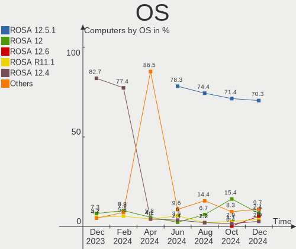
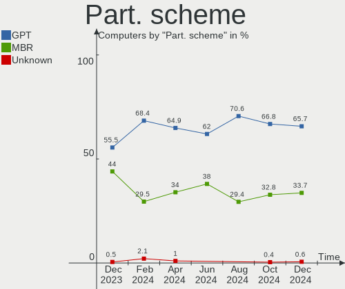
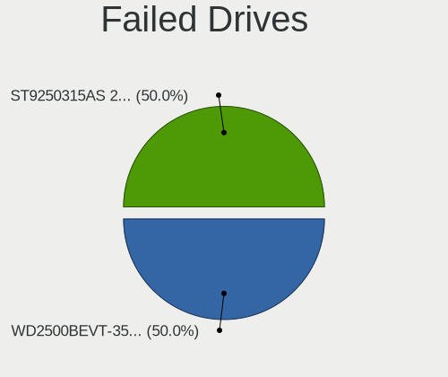
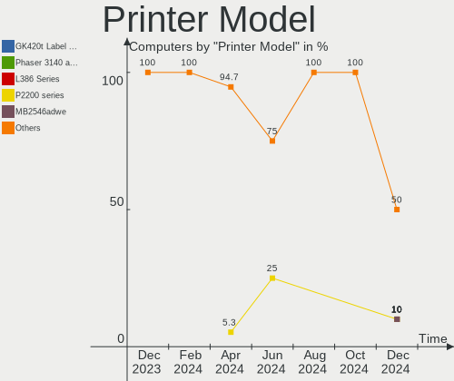

ROSA - Hardware Trends
----------------------

A project to identify most popular hardware characteristics and track their change
over time based on data collected by Linux users at https://Linux-Hardware.org.

Anyone can contribute to this report by the [hw-probe](https://github.com/linuxhw/hw-probe) tool:

    sudo -E hw-probe -all -upload

This is a report for all computer types. See also reports for [desktops](/Dist/ROSA/Desktop/README.md) and [notebooks](/Dist/ROSA/Notebook/README.md).

This report is for one last month. Overall report since the beginning of time: [TestCoverage](https://github.com/linuxhw/TestCoverage)

Period: Jun, 2022.

Contents
--------

* [ System ](#system)
  - [ OS                       ](#os)
  - [ OS Family                ](#os-family)
  - [ Kernel                   ](#kernel)
  - [ Kernel Family            ](#kernel-family)
  - [ Kernel Major Ver.        ](#kernel-major-ver)
  - [ Arch                     ](#arch)
  - [ DE                       ](#de)
  - [ Display Server           ](#display-server)
  - [ Display Manager          ](#display-manager)
  - [ OS Lang                  ](#os-lang)
  - [ Boot Mode                ](#boot-mode)
  - [ Filesystem               ](#filesystem)
  - [ Part. scheme             ](#part-scheme)
  - [ Dual Boot with Linux/BSD ](#dual-boot-with-linuxbsd)
  - [ Dual Boot (Win)          ](#dual-boot-win)

* [ Board ](#board)
  - [ Vendor                   ](#vendor)
  - [ Model                    ](#model)
  - [ Model Family             ](#model-family)
  - [ MFG Year                 ](#mfg-year)
  - [ Form Factor              ](#form-factor)
  - [ Secure Boot              ](#secure-boot)
  - [ Coreboot                 ](#coreboot)
  - [ RAM Size                 ](#ram-size)
  - [ RAM Used                 ](#ram-used)
  - [ Total Drives             ](#total-drives)
  - [ Has CD-ROM               ](#has-cd-rom)
  - [ Has Ethernet             ](#has-ethernet)
  - [ Has WiFi                 ](#has-wifi)
  - [ Has Bluetooth            ](#has-bluetooth)

* [ Location ](#location)
  - [ Country                  ](#country)
  - [ City                     ](#city)

* [ Drives ](#drives)
  - [ Drive Vendor             ](#drive-vendor)
  - [ Drive Model              ](#drive-model)
  - [ HDD Vendor               ](#hdd-vendor)
  - [ SSD Vendor               ](#ssd-vendor)
  - [ Drive Kind               ](#drive-kind)
  - [ Drive Connector          ](#drive-connector)
  - [ Drive Size               ](#drive-size)
  - [ Space Total              ](#space-total)
  - [ Space Used               ](#space-used)
  - [ Malfunc. Drives          ](#malfunc-drives)
  - [ Malfunc. Drive Vendor    ](#malfunc-drive-vendor)
  - [ Malfunc. HDD Vendor      ](#malfunc-hdd-vendor)
  - [ Malfunc. Drive Kind      ](#malfunc-drive-kind)
  - [ Failed Drives            ](#failed-drives)
  - [ Failed Drive Vendor      ](#failed-drive-vendor)
  - [ Drive Status             ](#drive-status)

* [ Storage controller ](#storage-controller)
  - [ Storage Vendor           ](#storage-vendor)
  - [ Storage Model            ](#storage-model)
  - [ Storage Kind             ](#storage-kind)

* [ Processor ](#processor)
  - [ CPU Vendor               ](#cpu-vendor)
  - [ CPU Model                ](#cpu-model)
  - [ CPU Model Family         ](#cpu-model-family)
  - [ CPU Cores                ](#cpu-cores)
  - [ CPU Sockets              ](#cpu-sockets)
  - [ CPU Threads              ](#cpu-threads)
  - [ CPU Op-Modes             ](#cpu-op-modes)
  - [ CPU Microcode            ](#cpu-microcode)
  - [ CPU Microarch            ](#cpu-microarch)

* [ Graphics ](#graphics)
  - [ GPU Vendor               ](#gpu-vendor)
  - [ GPU Model                ](#gpu-model)
  - [ GPU Combo                ](#gpu-combo)
  - [ GPU Driver               ](#gpu-driver)
  - [ GPU Memory               ](#gpu-memory)

* [ Monitor ](#monitor)
  - [ Monitor Vendor           ](#monitor-vendor)
  - [ Monitor Model            ](#monitor-model)
  - [ Monitor Resolution       ](#monitor-resolution)
  - [ Monitor Diagonal         ](#monitor-diagonal)
  - [ Monitor Width            ](#monitor-width)
  - [ Aspect Ratio             ](#aspect-ratio)
  - [ Monitor Area             ](#monitor-area)
  - [ Pixel Density            ](#pixel-density)
  - [ Multiple Monitors        ](#multiple-monitors)

* [ Network ](#network)
  - [ Net Controller Vendor    ](#net-controller-vendor)
  - [ Net Controller Model     ](#net-controller-model)
  - [ Wireless Vendor          ](#wireless-vendor)
  - [ Wireless Model           ](#wireless-model)
  - [ Ethernet Vendor          ](#ethernet-vendor)
  - [ Ethernet Model           ](#ethernet-model)
  - [ Net Controller Kind      ](#net-controller-kind)
  - [ Used Controller          ](#used-controller)
  - [ NICs                     ](#nics)
  - [ IPv6                     ](#ipv6)

* [ Bluetooth ](#bluetooth)
  - [ Bluetooth Vendor         ](#bluetooth-vendor)
  - [ Bluetooth Model          ](#bluetooth-model)

* [ Sound ](#sound)
  - [ Sound Vendor             ](#sound-vendor)
  - [ Sound Model              ](#sound-model)

* [ Memory ](#memory)
  - [ Memory Vendor            ](#memory-vendor)
  - [ Memory Model             ](#memory-model)
  - [ Memory Kind              ](#memory-kind)
  - [ Memory Form Factor       ](#memory-form-factor)
  - [ Memory Size              ](#memory-size)
  - [ Memory Speed             ](#memory-speed)

* [ Printers & scanners ](#printers--scanners)
  - [ Printer Vendor           ](#printer-vendor)
  - [ Printer Model            ](#printer-model)
  - [ Scanner Vendor           ](#scanner-vendor)
  - [ Scanner Model            ](#scanner-model)

* [ Camera ](#camera)
  - [ Camera Vendor            ](#camera-vendor)
  - [ Camera Model             ](#camera-model)

* [ Security ](#security)
  - [ Fingerprint Vendor       ](#fingerprint-vendor)
  - [ Fingerprint Model        ](#fingerprint-model)
  - [ Chipcard Vendor          ](#chipcard-vendor)
  - [ Chipcard Model           ](#chipcard-model)

* [ Unsupported ](#unsupported)
  - [ Unsupported Devices      ](#unsupported-devices)
  - [ Unsupported Device Types ](#unsupported-device-types)

System
------

OS
--

Installed operating systems

| Name         | Computers | Percent |
|--------------|-----------|---------|
| ROSA 12.2    | 262       | 86.47%  |
| ROSA R11.1   | 32        | 10.56%  |
| ROSA 12.1    | 5         | 1.65%   |
| ROSA R11     | 1         | 0.33%   |
| ROSA R10     | 1         | 0.33%   |
| ROSA 2019.05 | 1         | 0.33%   |
| ROSA 12      | 1         | 0.33%   |

OS Family
---------

OS without a version

| Name | Computers | Percent |
|------|-----------|---------|
| ROSA | 303       | 100%    |

Kernel
------

Version of the Linux kernel

| Version                                   | Computers | Percent |
|-------------------------------------------|-----------|---------|
| 5.10.74-generic-2rosa2021.1-x86_64        | 172       | 56.77%  |
| 5.10.118-generic-2rosa2021.1-x86_64       | 41        | 13.53%  |
| 5.4.83-generic-2rosa-x86_64               | 11        | 3.63%   |
| 5.18.3.xm1-1.klp-xanmod-rosa2021.1-x86_64 | 9         | 2.97%   |
| 5.18.1.xm1-3.klp-xanmod-rosa2021.1-x86_64 | 7         | 2.31%   |
| 5.17.11-generic-2rosa2021.1-x86_64        | 5         | 1.65%   |
| 5.17.11-generic-1rosa2021.1-x86_64        | 5         | 1.65%   |
| 4.15.0-desktop-122.124.1rosa-x86_64       | 5         | 1.65%   |
| 5.4.83-generic-2rosa-i586                 | 4         | 1.32%   |
| 5.15.43-generic-2rosa2021.1-x86_64        | 4         | 1.32%   |
| 5.15.32-generic-6rosa2021.1-x86_64        | 4         | 1.32%   |
| 5.10.74-generic-2rosa2021.1-i586          | 4         | 1.32%   |
| 5.4.32-generic-2rosa-x86_64               | 3         | 0.99%   |
| 5.18.6.xm1-1.klp-xanmod-rosa2021.1-x86_64 | 3         | 0.99%   |
| 5.18.4.xm1-1.klp-xanmod-rosa2021.1-x86_64 | 3         | 0.99%   |
| 4.15.0-desktop-122.124.1rosa-i586         | 3         | 0.99%   |
| 5.4.32-generic-2rosa-i586                 | 2         | 0.66%   |
| 5.18.2.xm1-3.klp-xanmod-rosa2021.1-x86_64 | 2         | 0.66%   |
| 5.4.139-nickel-4rosa2019.05-x86_64        | 1         | 0.33%   |
| 5.18.8.xm1-1.klp-xanmod-rosa2021.1-x86_64 | 1         | 0.33%   |
| 5.18.1-generic-2rosa2021.1-x86_64         | 1         | 0.33%   |
| 5.18.1-generic-1rosa2021.1-x86_64         | 1         | 0.33%   |
| 5.16.19-generic-2rosa2021.1-x86_64        | 1         | 0.33%   |
| 5.15.43-generic-1rosa2021.1-x86_64        | 1         | 0.33%   |
| 5.10.74-generic-2rosa2021.1-arm64         | 1         | 0.33%   |
| 5.10.71-generic-1rosa2021.1-x86_64        | 1         | 0.33%   |
| 5.10.118-generic-2rosa2021.1-i586         | 1         | 0.33%   |
| 5.10.118-generic-1rosa2021.1-x86_64       | 1         | 0.33%   |
| 4.9.60-nrj-desktop-1rosa-x86_64           | 1         | 0.33%   |
| 4.9.60-nrj-desktop-1rosa-i586             | 1         | 0.33%   |
| 4.9.155-nrj-desktop-1rosa-x86_64          | 1         | 0.33%   |
| 4.9.155-nrj-desktop-1rosa-i586            | 1         | 0.33%   |
| 4.15.0-desktop-45.1rosa-x86_64            | 1         | 0.33%   |
| 4.15.0-desktop-45.1rosa-i586              | 1         | 0.33%   |

Kernel Family
-------------

Linux kernel without a distro release

| Version  | Computers | Percent |
|----------|-----------|---------|
| 5.10.74  | 177       | 58.42%  |
| 5.10.118 | 43        | 14.19%  |
| 5.4.83   | 15        | 4.95%   |
| 5.17.11  | 10        | 3.3%    |
| 4.15.0   | 10        | 3.3%    |
| 5.18.3   | 9         | 2.97%   |
| 5.18.1   | 9         | 2.97%   |
| 5.4.32   | 5         | 1.65%   |
| 5.15.43  | 5         | 1.65%   |
| 5.15.32  | 4         | 1.32%   |
| 5.18.6   | 3         | 0.99%   |
| 5.18.4   | 3         | 0.99%   |
| 5.18.2   | 2         | 0.66%   |
| 4.9.60   | 2         | 0.66%   |
| 4.9.155  | 2         | 0.66%   |
| 5.4.139  | 1         | 0.33%   |
| 5.18.8   | 1         | 0.33%   |
| 5.16.19  | 1         | 0.33%   |
| 5.10.71  | 1         | 0.33%   |

Kernel Major Ver.
-----------------

Linux kernel major version

| Version | Computers | Percent |
|---------|-----------|---------|
| 5.10    | 221       | 72.94%  |
| 5.18    | 27        | 8.91%   |
| 5.4     | 21        | 6.93%   |
| 5.17    | 10        | 3.3%    |
| 4.15    | 10        | 3.3%    |
| 5.15    | 9         | 2.97%   |
| 4.9     | 4         | 1.32%   |
| 5.16    | 1         | 0.33%   |

Arch
----

OS architecture (x86_64, i586, etc.)

| Name    | Computers | Percent |
|---------|-----------|---------|
| x86_64  | 285       | 94.06%  |
| i686    | 17        | 5.61%   |
| aarch64 | 1         | 0.33%   |

DE
--

Desktop Environment

| Name  | Computers | Percent |
|-------|-----------|---------|
| KDE5  | 131       | 43.23%  |
| GNOME | 123       | 40.59%  |
| LXQt  | 24        | 7.92%   |
| KDE4  | 24        | 7.92%   |
| MATE  | 1         | 0.33%   |

Display Server
--------------

X11 or Wayland

| Name    | Computers | Percent |
|---------|-----------|---------|
| Wayland | 226       | 74.59%  |
| X11     | 77        | 25.41%  |

Display Manager
---------------

SDDM, LightDM, etc.

| Name    | Computers | Percent |
|---------|-----------|---------|
| GDM     | 146       | 48.18%  |
| SDDM    | 127       | 41.91%  |
| KDM     | 24        | 7.92%   |
| LightDM | 6         | 1.98%   |

OS Lang
-------

Language

| Lang    | Computers | Percent |
|---------|-----------|---------|
| ru_RU   | 282       | 93.07%  |
| en_US   | 4         | 1.32%   |
| de_DE   | 3         | 0.99%   |
| Unknown | 3         | 0.99%   |
| ru_UA   | 2         | 0.66%   |
| es_CO   | 2         | 0.66%   |
| sr_RS   | 1         | 0.33%   |
| pt_BR   | 1         | 0.33%   |
| pl_PL   | 1         | 0.33%   |
| lt_LT   | 1         | 0.33%   |
| hu_HU   | 1         | 0.33%   |
| es_ES   | 1         | 0.33%   |
| C       | 1         | 0.33%   |

Boot Mode
---------

EFI or BIOS

| Mode | Computers | Percent |
|------|-----------|---------|
| EFI  | 157       | 51.82%  |
| BIOS | 146       | 48.18%  |

Filesystem
----------

Type of filesystem

| Type  | Computers | Percent |
|-------|-----------|---------|
| Ext4  | 288       | 95.05%  |
| Btrfs | 12        | 3.96%   |
| Ext3  | 2         | 0.66%   |
| Xfs   | 1         | 0.33%   |

Part. scheme
------------

Scheme of partitioning

| Type    | Computers | Percent |
|---------|-----------|---------|
| GPT     | 197       | 65.02%  |
| MBR     | 105       | 34.65%  |
| Unknown | 1         | 0.33%   |

Dual Boot with Linux/BSD
------------------------

Hosting more than one Linux/BSD

| Dual boot | Computers | Percent |
|-----------|-----------|---------|
| No        | 227       | 74.92%  |
| Yes       | 76        | 25.08%  |

Dual Boot (Win)
---------------

Hosting Linux and Windows

| Dual boot | Computers | Percent |
|-----------|-----------|---------|
| Yes       | 160       | 52.81%  |
| No        | 143       | 47.19%  |

Board
-----

Vendor
------

Motherboard manufacturer

| Name                | Computers | Percent |
|---------------------|-----------|---------|
| ASUSTek Computer    | 58        | 19.14%  |
| Gigabyte Technology | 46        | 15.18%  |
| Acer                | 34        | 11.22%  |
| Lenovo              | 28        | 9.24%   |
| ASRock              | 25        | 8.25%   |
| Hewlett-Packard     | 22        | 7.26%   |
| MSI                 | 21        | 6.93%   |
| Dell                | 14        | 4.62%   |
| Samsung Electronics | 13        | 4.29%   |
| Intel               | 5         | 1.65%   |
| Toshiba             | 4         | 1.32%   |
| Unknown             | 4         | 1.32%   |
| Huanan              | 3         | 0.99%   |
| Aquarius            | 3         | 0.99%   |
| Sony                | 2         | 0.66%   |
| Packard Bell        | 2         | 0.66%   |
| eMachines           | 2         | 0.66%   |
| ECS                 | 2         | 0.66%   |
| Biostar             | 2         | 0.66%   |
| Yadro               | 1         | 0.33%   |
| TUXEDO              | 1         | 0.33%   |
| Notebook            | 1         | 0.33%   |
| mtech               | 1         | 0.33%   |
| Kraftway            | 1         | 0.33%   |
| JGINYUE             | 1         | 0.33%   |
| ICL                 | 1         | 0.33%   |
| HUAWEI              | 1         | 0.33%   |
| HONOR               | 1         | 0.33%   |
| Haier               | 1         | 0.33%   |
| Fujitsu             | 1         | 0.33%   |
| Foxconn             | 1         | 0.33%   |
| Edelweiss           | 1         | 0.33%   |

Model
-----

Motherboard model

| Name                                        | Computers | Percent |
|---------------------------------------------|-----------|---------|
| Unknown                                     | 5         | 1.65%   |
| Acer Aspire V3-571G                         | 4         | 1.32%   |
| HP Pavilion g6                              | 3         | 0.99%   |
| Gigabyte H110M-S2V                          | 3         | 0.99%   |
| Aquarius NS685U R11                         | 3         | 0.99%   |
| MSI MS-7A71                                 | 2         | 0.66%   |
| MSI MS-7A38                                 | 2         | 0.66%   |
| MSI MS-7752                                 | 2         | 0.66%   |
| HP Pavilion dv6                             | 2         | 0.66%   |
| Gigabyte Z77-D3H                            | 2         | 0.66%   |
| Gigabyte X470 AORUS ULTRA GAMING            | 2         | 0.66%   |
| ASUS TUF B450M-PRO GAMING                   | 2         | 0.66%   |
| ASUS P8H61-M LX3 R2.0                       | 2         | 0.66%   |
| ASUS M5A99X EVO R2.0                        | 2         | 0.66%   |
| ASUS M5A97 R2.0                             | 2         | 0.66%   |
| ASUS M5A78L-M LX3                           | 2         | 0.66%   |
| ASRock N68C-S UCC                           | 2         | 0.66%   |
| ASRock H310CM-HDV                           | 2         | 0.66%   |
| ASRock ALiveXFire-eSATA2                    | 2         | 0.66%   |
| Acer Aspire A315-51                         | 2         | 0.66%   |
| Yadro TB560-D4                              | 1         | 0.33%   |
| TUXEDO Pulse 15 Gen1                        | 1         | 0.33%   |
| Toshiba Satellite R630                      | 1         | 0.33%   |
| Toshiba Satellite L850-B5K                  | 1         | 0.33%   |
| Toshiba Satellite L775D                     | 1         | 0.33%   |
| Toshiba Satellite C670D-11G                 | 1         | 0.33%   |
| Sony VPCF12Z1R                              | 1         | 0.33%   |
| Sony VGN-CS240T                             | 1         | 0.33%   |
| Samsung RV411/RV511/E3511/S3511/RV711/E3411 | 1         | 0.33%   |
| Samsung R710                                | 1         | 0.33%   |
| Samsung R59P/R60P/R61P                      | 1         | 0.33%   |
| Samsung R530/R730/R540                      | 1         | 0.33%   |
| Samsung R519/R719                           | 1         | 0.33%   |
| Samsung R430/P430/R480                      | 1         | 0.33%   |
| Samsung R40/R41                             | 1         | 0.33%   |
| Samsung QX310/QX410/QX510/SF310/SF410/SF510 | 1         | 0.33%   |
| Samsung N150P/N210P/N220P                   | 1         | 0.33%   |
| Samsung 530U3C/530U4C                       | 1         | 0.33%   |
| Samsung 355V4C/356V4C/3445VC/3545VC         | 1         | 0.33%   |
| Samsung 350V5C/351V5C/3540VC/3440VC         | 1         | 0.33%   |
| Samsung 305V4A/305V5A/3415VA                | 1         | 0.33%   |
| Packard Bell EasyNote TE11HC                | 1         | 0.33%   |
| Packard Bell EasyNote MH36                  | 1         | 0.33%   |
| Notebook W35xSS_370SS                       | 1         | 0.33%   |
| mtech MTL1578                               | 1         | 0.33%   |
| MSI MS-7C75                                 | 1         | 0.33%   |
| MSI MS-7C37                                 | 1         | 0.33%   |
| MSI MS-7B98                                 | 1         | 0.33%   |
| MSI MS-7B93                                 | 1         | 0.33%   |
| MSI MS-7B86                                 | 1         | 0.33%   |
| MSI MS-7994                                 | 1         | 0.33%   |
| MSI MS-7895                                 | 1         | 0.33%   |
| MSI MS-7817                                 | 1         | 0.33%   |
| MSI MS-7808                                 | 1         | 0.33%   |
| MSI MS-7673                                 | 1         | 0.33%   |
| MSI MS-7641                                 | 1         | 0.33%   |
| MSI GP72 2QE                                | 1         | 0.33%   |
| MSI GEG                                     | 1         | 0.33%   |
| MSI GE70 2OC\2OD\2OE                        | 1         | 0.33%   |
| MSI Alpha 15 B5EEK                          | 1         | 0.33%   |

Model Family
------------

Motherboard model prefix

| Name                     | Computers | Percent |
|--------------------------|-----------|---------|
| Acer Aspire              | 27        | 8.91%   |
| Lenovo IdeaPad           | 7         | 2.31%   |
| HP Pavilion              | 6         | 1.98%   |
| ASUS VivoBook            | 6         | 1.98%   |
| ASUS PRIME               | 6         | 1.98%   |
| Dell Inspiron            | 5         | 1.65%   |
| Unknown                  | 5         | 1.65%   |
| Toshiba Satellite        | 4         | 1.32%   |
| Dell Vostro              | 4         | 1.32%   |
| ASUS TUF                 | 4         | 1.32%   |
| ASUS ROG                 | 4         | 1.32%   |
| Gigabyte H110M-S2V       | 3         | 0.99%   |
| ASUS P8H61-M             | 3         | 0.99%   |
| ASUS P7H55-M             | 3         | 0.99%   |
| Aquarius NS685U          | 3         | 0.99%   |
| Packard Bell EasyNote    | 2         | 0.66%   |
| MSI MS-7A71              | 2         | 0.66%   |
| MSI MS-7A38              | 2         | 0.66%   |
| MSI MS-7752              | 2         | 0.66%   |
| Lenovo ThinkBook         | 2         | 0.66%   |
| Lenovo B590              | 2         | 0.66%   |
| Intel X99                | 2         | 0.66%   |
| HP ProBook               | 2         | 0.66%   |
| HP Laptop                | 2         | 0.66%   |
| HP ENVY                  | 2         | 0.66%   |
| HP EliteBook             | 2         | 0.66%   |
| HP 250                   | 2         | 0.66%   |
| Gigabyte Z77-D3H         | 2         | 0.66%   |
| Gigabyte X470            | 2         | 0.66%   |
| Gigabyte H410M           | 2         | 0.66%   |
| Gigabyte B450            | 2         | 0.66%   |
| Dell OptiPlex            | 2         | 0.66%   |
| ASUS P5KPL-AM            | 2         | 0.66%   |
| ASUS M5A99X              | 2         | 0.66%   |
| ASUS M5A97               | 2         | 0.66%   |
| ASUS M5A78L-M            | 2         | 0.66%   |
| ASRock N68C-S            | 2         | 0.66%   |
| ASRock H310CM-HDV        | 2         | 0.66%   |
| ASRock B450M             | 2         | 0.66%   |
| ASRock ALiveXFire-eSATA2 | 2         | 0.66%   |
| Acer Veriton             | 2         | 0.66%   |
| Acer TravelMate          | 2         | 0.66%   |
| Yadro TB560-D4           | 1         | 0.33%   |
| TUXEDO Pulse             | 1         | 0.33%   |
| Sony VPCF12Z1R           | 1         | 0.33%   |
| Sony VGN-CS240T          | 1         | 0.33%   |
| Samsung RV411            | 1         | 0.33%   |
| Samsung R710             | 1         | 0.33%   |
| Samsung R59P             | 1         | 0.33%   |
| Samsung R530             | 1         | 0.33%   |
| Samsung R519             | 1         | 0.33%   |
| Samsung R430             | 1         | 0.33%   |
| Samsung R40              | 1         | 0.33%   |
| Samsung QX310            | 1         | 0.33%   |
| Samsung N150P            | 1         | 0.33%   |
| Samsung 530U3C           | 1         | 0.33%   |
| Samsung 355V4C           | 1         | 0.33%   |
| Samsung 350V5C           | 1         | 0.33%   |
| Samsung 305V4A           | 1         | 0.33%   |
| Notebook W35xSS          | 1         | 0.33%   |

MFG Year
--------

Motherboard manufacture year

| Year | Computers | Percent |
|------|-----------|---------|
| 2012 | 45        | 14.85%  |
| 2019 | 24        | 7.92%   |
| 2011 | 24        | 7.92%   |
| 2020 | 23        | 7.59%   |
| 2021 | 22        | 7.26%   |
| 2018 | 22        | 7.26%   |
| 2010 | 22        | 7.26%   |
| 2013 | 18        | 5.94%   |
| 2009 | 17        | 5.61%   |
| 2017 | 16        | 5.28%   |
| 2008 | 14        | 4.62%   |
| 2016 | 13        | 4.29%   |
| 2007 | 13        | 4.29%   |
| 2014 | 11        | 3.63%   |
| 2006 | 7         | 2.31%   |
| 2022 | 6         | 1.98%   |
| 2015 | 6         | 1.98%   |

Form Factor
-----------

Physical design of the computer

| Name           | Computers | Percent |
|----------------|-----------|---------|
| Desktop        | 156       | 51.49%  |
| Notebook       | 137       | 45.21%  |
| All in one     | 6         | 1.98%   |
| Mini pc        | 3         | 0.99%   |
| System on chip | 1         | 0.33%   |

Secure Boot
-----------

Enabled or disabled

| State    | Computers | Percent |
|----------|-----------|---------|
| Disabled | 303       | 100%    |

Coreboot
--------

Have coreboot on board

| Used | Computers | Percent |
|------|-----------|---------|
| No   | 303       | 100%    |

RAM Size
--------

Total RAM memory

| Size in GB  | Computers | Percent |
|-------------|-----------|---------|
| 4.01-8.0    | 80        | 26.4%   |
| 3.01-4.0    | 61        | 20.13%  |
| 8.01-16.0   | 59        | 19.47%  |
| 16.01-24.0  | 52        | 17.16%  |
| 32.01-64.0  | 21        | 6.93%   |
| 1.01-2.0    | 17        | 5.61%   |
| 2.01-3.0    | 6         | 1.98%   |
| 24.01-32.0  | 3         | 0.99%   |
| 64.01-256.0 | 2         | 0.66%   |
| 0.51-1.0    | 2         | 0.66%   |

RAM Used
--------

Used RAM memory

| Used GB   | Computers | Percent |
|-----------|-----------|---------|
| 1.01-2.0  | 158       | 52.15%  |
| 0.51-1.0  | 81        | 26.73%  |
| 2.01-3.0  | 39        | 12.87%  |
| 4.01-8.0  | 12        | 3.96%   |
| 3.01-4.0  | 10        | 3.3%    |
| 0.01-0.5  | 2         | 0.66%   |
| 8.01-16.0 | 1         | 0.33%   |

Total Drives
------------

Number of drives on board

| Drives | Computers | Percent |
|--------|-----------|---------|
| 1      | 150       | 49.5%   |
| 2      | 82        | 27.06%  |
| 3      | 38        | 12.54%  |
| 4      | 17        | 5.61%   |
| 5      | 7         | 2.31%   |
| 6      | 4         | 1.32%   |
| 0      | 3         | 0.99%   |
| 8      | 1         | 0.33%   |
| 7      | 1         | 0.33%   |

Has CD-ROM
----------

Has CD-ROM on board

| Presented | Computers | Percent |
|-----------|-----------|---------|
| No        | 183       | 60.4%   |
| Yes       | 120       | 39.6%   |

Has Ethernet
------------

Has Ethernet on board

| Presented | Computers | Percent |
|-----------|-----------|---------|
| Yes       | 286       | 94.39%  |
| No        | 17        | 5.61%   |

Has WiFi
--------

Has WiFi module

| Presented | Computers | Percent |
|-----------|-----------|---------|
| Yes       | 185       | 61.06%  |
| No        | 118       | 38.94%  |

Has Bluetooth
-------------

Has Bluetooth module

| Presented | Computers | Percent |
|-----------|-----------|---------|
| No        | 156       | 51.49%  |
| Yes       | 147       | 48.51%  |

Location
--------

Country
-------

Geographic location (country)

| Country         | Computers | Percent |
|-----------------|-----------|---------|
| Russia          | 267       | 88.12%  |
| Ukraine         | 5         | 1.65%   |
| Belarus         | 5         | 1.65%   |
| Kazakhstan      | 4         | 1.32%   |
| Germany         | 4         | 1.32%   |
| Poland          | 2         | 0.66%   |
| Lithuania       | 2         | 0.66%   |
| Colombia        | 2         | 0.66%   |
| Turkey          | 1         | 0.33%   |
| Slovakia        | 1         | 0.33%   |
| Serbia          | 1         | 0.33%   |
| North Macedonia | 1         | 0.33%   |
| Netherlands     | 1         | 0.33%   |
| Italy           | 1         | 0.33%   |
| Israel          | 1         | 0.33%   |
| Hungary         | 1         | 0.33%   |
| France          | 1         | 0.33%   |
| Estonia         | 1         | 0.33%   |
| Czechia         | 1         | 0.33%   |
| Brazil          | 1         | 0.33%   |

City
----

Geographic location (city)

| City              | Computers | Percent |
|-------------------|-----------|---------|
| Moscow            | 43        | 14.19%  |
| St Petersburg     | 18        | 5.94%   |
| Novosibirsk       | 11        | 3.63%   |
| Krasnodar         | 10        | 3.3%    |
| Chelyabinsk       | 10        | 3.3%    |
| Yekaterinburg     | 9         | 2.97%   |
| Samara            | 9         | 2.97%   |
| Saratov           | 6         | 1.98%   |
| Voronezh          | 5         | 1.65%   |
| Tyumen            | 5         | 1.65%   |
| Rostov-on-Don     | 5         | 1.65%   |
| Krasnoyarsk       | 5         | 1.65%   |
| Vladivostok       | 4         | 1.32%   |
| Tula              | 4         | 1.32%   |
| Yaroslavl         | 3         | 0.99%   |
| Ufa               | 3         | 0.99%   |
| Severodvinsk      | 3         | 0.99%   |
| Pskov             | 3         | 0.99%   |
| Murmansk          | 3         | 0.99%   |
| Khabarovsk        | 3         | 0.99%   |
| Barnaul           | 3         | 0.99%   |
| Yuzhno-Sakhalinsk | 2         | 0.66%   |
| Yoshkar-Ola       | 2         | 0.66%   |
| Yessentuki        | 2         | 0.66%   |
| Vladimir          | 2         | 0.66%   |
| Ulyanovsk         | 2         | 0.66%   |
| Tver              | 2         | 0.66%   |
| Tambov            | 2         | 0.66%   |
| Syktyvkar         | 2         | 0.66%   |
| Surgut            | 2         | 0.66%   |
| Sochi             | 2         | 0.66%   |
| Smolensk          | 2         | 0.66%   |
| Saransk           | 2         | 0.66%   |
| Ryazan            | 2         | 0.66%   |
| Petrozavodsk      | 2         | 0.66%   |
| Orenburg          | 2         | 0.66%   |
| Omsk              | 2         | 0.66%   |
| Nizhniy Novgorod  | 2         | 0.66%   |
| Kemerovo          | 2         | 0.66%   |
| Bryansk           | 2         | 0.66%   |
| Armavir           | 2         | 0.66%   |
| Aktobe            | 2         | 0.66%   |
| Zhodzina          | 1         | 0.33%   |
| Zarechnyy         | 1         | 0.33%   |
| Yelizovo          | 1         | 0.33%   |
| Yasinovataya      | 1         | 0.33%   |
| Yartsevo          | 1         | 0.33%   |
| Yakutsk           | 1         | 0.33%   |
| Yablonovsky       | 1         | 0.33%   |
| Witten            | 1         | 0.33%   |
| Voskresensk       | 1         | 0.33%   |
| Vologda           | 1         | 0.33%   |
| Volgograd         | 1         | 0.33%   |
| Vladikavkaz       | 1         | 0.33%   |
| Vitebsk           | 1         | 0.33%   |
| Uglich            | 1         | 0.33%   |
| Touget            | 1         | 0.33%   |
| Tomsk             | 1         | 0.33%   |
| Tolyatti          | 1         | 0.33%   |
| Tel Aviv          | 1         | 0.33%   |

Drives
------

Drive Vendor
------------

Hard drive vendors

| Vendor              | Computers | Drives | Percent |
|---------------------|-----------|--------|---------|
| WDC                 | 103       | 121    | 20.28%  |
| Seagate             | 99        | 118    | 19.49%  |
| Samsung Electronics | 41        | 43     | 8.07%   |
| Toshiba             | 31        | 33     | 6.1%    |
| Kingston            | 28        | 32     | 5.51%   |
| Hitachi             | 24        | 25     | 4.72%   |
| China               | 20        | 21     | 3.94%   |
| A-DATA Technology   | 20        | 21     | 3.94%   |
| HGST                | 13        | 13     | 2.56%   |
| SanDisk             | 12        | 13     | 2.36%   |
| Apacer              | 11        | 12     | 2.17%   |
| Unknown             | 9         | 11     | 1.77%   |
| SPCC                | 8         | 8      | 1.57%   |
| KingSpec            | 8         | 8      | 1.57%   |
| Goodram             | 7         | 7      | 1.38%   |
| Crucial             | 7         | 7      | 1.38%   |
| Smartbuy            | 5         | 5      | 0.98%   |
| SK hynix            | 5         | 5      | 0.98%   |
| Gigabyte Technology | 5         | 5      | 0.98%   |
| Intel               | 4         | 4      | 0.79%   |
| OCZ                 | 3         | 3      | 0.59%   |
| Maxtor              | 3         | 3      | 0.59%   |
| Fujitsu             | 3         | 3      | 0.59%   |
| AMD                 | 3         | 3      | 0.59%   |
| XPG                 | 2         | 2      | 0.39%   |
| Transcend           | 2         | 2      | 0.39%   |
| Plextor             | 2         | 2      | 0.39%   |
| Netac               | 2         | 2      | 0.39%   |
| Intenso             | 2         | 2      | 0.39%   |
| Corsair             | 2         | 2      | 0.39%   |
| ASMT                | 2         | 4      | 0.39%   |
| WALRAM              | 1         | 1      | 0.2%    |
| Union Memory        | 1         | 1      | 0.2%    |
| UMIS                | 1         | 1      | 0.2%    |
| Team                | 1         | 1      | 0.2%    |
| Silicon Motion      | 1         | 1      | 0.2%    |
| SETHRISE            | 1         | 1      | 0.2%    |
| Realtek             | 1         | 1      | 0.2%    |
| Phison              | 1         | 1      | 0.2%    |
| Palit               | 1         | 1      | 0.2%    |
| Londisk             | 1         | 1      | 0.2%    |
| Leven               | 1         | 1      | 0.2%    |
| KIOXIA-EXCERIA      | 1         | 1      | 0.2%    |
| KIOXIA              | 1         | 1      | 0.2%    |
| Kingmax             | 1         | 1      | 0.2%    |
| KingDian            | 1         | 1      | 0.2%    |
| Hikvision           | 1         | 1      | 0.2%    |
| Hewlett-Packard     | 1         | 1      | 0.2%    |
| GS                  | 1         | 2      | 0.2%    |
| Foxline             | 1         | 1      | 0.2%    |
| BHT                 | 1         | 1      | 0.2%    |
| addlink             | 1         | 1      | 0.2%    |
| Unknown             | 1         | 1      | 0.2%    |

Drive Model
-----------

Hard drive models

| Model                                | Computers | Percent |
|--------------------------------------|-----------|---------|
| WDC WDS240G2G0A-00JH30 240GB SSD     | 7         | 1.26%   |
| Seagate ST2000DM008-2FR102 2TB       | 7         | 1.26%   |
| Kingston SA400S37240G 240GB SSD      | 7         | 1.26%   |
| Toshiba HDWD110 1TB                  | 6         | 1.08%   |
| Seagate ST1000LM024 HN-M101MBB 1TB   | 6         | 1.08%   |
| Seagate ST1000DM010-2EP102 1TB       | 6         | 1.08%   |
| WDC WDS120G2G0A-00JH30 120GB SSD     | 5         | 0.9%    |
| WDC WD10EZEX-08WN4A0 1TB             | 5         | 0.9%    |
| Seagate ST500DM002-1BD142 500GB      | 5         | 0.9%    |
| Seagate ST1000DM003-1CH162 1TB       | 5         | 0.9%    |
| Samsung SSD 860 EVO 250GB            | 4         | 0.72%   |
| Samsung SSD 850 EVO 250GB            | 4         | 0.72%   |
| Gigabyte GP-GSTFS31120GNTD 120GB SSD | 4         | 0.72%   |
| Crucial CT120BX500SSD1 120GB         | 4         | 0.72%   |
| Apacer AS350 128GB SSD               | 4         | 0.72%   |
| WDC WD20PURZ-85GU6Y0 2TB             | 3         | 0.54%   |
| Toshiba MQ04ABF100 1TB               | 3         | 0.54%   |
| Toshiba DT01ACA100 1TB               | 3         | 0.54%   |
| Seagate ST9500325AS 500GB            | 3         | 0.54%   |
| Seagate ST9320325AS 320GB            | 3         | 0.54%   |
| Seagate ST500LT012-9WS142 500GB      | 3         | 0.54%   |
| Seagate ST500LT012-1DG142 500GB      | 3         | 0.54%   |
| Seagate ST3250310AS 250GB            | 3         | 0.54%   |
| Seagate ST1000NM0033-9ZM173 1TB      | 3         | 0.54%   |
| Seagate ST1000LM035-1RK172 1TB       | 3         | 0.54%   |
| Seagate Expansion 1TB                | 3         | 0.54%   |
| Samsung SSD 970 EVO Plus 500GB       | 3         | 0.54%   |
| Kingston SNVS500G 500GB              | 3         | 0.54%   |
| Kingston SA400S37120G 120GB SSD      | 3         | 0.54%   |
| HGST HTS545050A7E680 500GB           | 3         | 0.54%   |
| Goodram SSDPR-CL100-120-G2 120GB     | 3         | 0.54%   |
| China 120GB SSD                      | 3         | 0.54%   |
| Apacer AS350 512GB SSD               | 3         | 0.54%   |
| Apacer AS350 256GB SSD               | 3         | 0.54%   |
| A-DATA SX6000PNP 256GB               | 3         | 0.54%   |
| A-DATA SU800NS38 256GB SSD           | 3         | 0.54%   |
| A-DATA SU650 240GB SSD               | 3         | 0.54%   |
| A-DATA SU650 120GB SSD               | 3         | 0.54%   |
| WDC WDS500G2B0A-00SM50 500GB SSD     | 2         | 0.36%   |
| WDC WD800JD-22MSA1 80GB              | 2         | 0.36%   |
| WDC WD6400AAKS-22A7B0 640GB          | 2         | 0.36%   |
| WDC WD5000LPVX-22V0TT0 500GB         | 2         | 0.36%   |
| WDC WD5000LPCX-21VHAT0 500GB         | 2         | 0.36%   |
| WDC WD5000AZRZ-00HTKB0 500GB         | 2         | 0.36%   |
| WDC WD5000AAKX-001CA0 500GB          | 2         | 0.36%   |
| WDC WD10SPZX-21Z10T0 1TB             | 2         | 0.36%   |
| WDC WD10SPZX-00Z10T0 1TB             | 2         | 0.36%   |
| WDC WD10JPLX-00MBPT0 1TB             | 2         | 0.36%   |
| WDC WD10EZEX-00RKKA0 1TB             | 2         | 0.36%   |
| Unknown SD/MMC/MS PRO 128GB          | 2         | 0.36%   |
| Toshiba DT01ACA050 500GB             | 2         | 0.36%   |
| SPCC Solid State Disk 256GB          | 2         | 0.36%   |
| SPCC Solid State Disk 128GB          | 2         | 0.36%   |
| SPCC Solid State Disk 120GB          | 2         | 0.36%   |
| Smartbuy SSD 256GB                   | 2         | 0.36%   |
| Seagate ST9500420AS 500GB            | 2         | 0.36%   |
| Seagate ST500LM030-2E717D 500GB      | 2         | 0.36%   |
| Seagate ST500DM009-2F110A 500GB      | 2         | 0.36%   |
| Seagate ST320LT012-9WS14C 320GB      | 2         | 0.36%   |
| Seagate ST3120022A 120GB             | 2         | 0.36%   |

HDD Vendor
----------

Hard disk drive vendors

| Vendor              | Computers | Drives | Percent |
|---------------------|-----------|--------|---------|
| Seagate             | 99        | 118    | 37.22%  |
| WDC                 | 84        | 93     | 31.58%  |
| Toshiba             | 29        | 30     | 10.9%   |
| Hitachi             | 24        | 25     | 9.02%   |
| HGST                | 13        | 13     | 4.89%   |
| Samsung Electronics | 7         | 7      | 2.63%   |
| Maxtor              | 3         | 3      | 1.13%   |
| Fujitsu             | 3         | 3      | 1.13%   |
| Unknown             | 2         | 2      | 0.75%   |
| ASMT                | 2         | 4      | 0.75%   |

SSD Vendor
----------

Solid state drive vendors

| Vendor              | Computers | Drives | Percent |
|---------------------|-----------|--------|---------|
| WDC                 | 20        | 20     | 11.3%   |
| China               | 20        | 21     | 11.3%   |
| Kingston            | 19        | 21     | 10.73%  |
| Samsung Electronics | 15        | 16     | 8.47%   |
| A-DATA Technology   | 14        | 14     | 7.91%   |
| Apacer              | 11        | 12     | 6.21%   |
| SanDisk             | 9         | 10     | 5.08%   |
| SPCC                | 8         | 8      | 4.52%   |
| KingSpec            | 8         | 8      | 4.52%   |
| Goodram             | 7         | 7      | 3.95%   |
| Crucial             | 6         | 6      | 3.39%   |
| Smartbuy            | 5         | 5      | 2.82%   |
| Gigabyte Technology | 4         | 4      | 2.26%   |
| OCZ                 | 3         | 3      | 1.69%   |
| Toshiba             | 2         | 2      | 1.13%   |
| Plextor             | 2         | 2      | 1.13%   |
| Netac               | 2         | 2      | 1.13%   |
| Intenso             | 2         | 2      | 1.13%   |
| Intel               | 2         | 2      | 1.13%   |
| Corsair             | 2         | 2      | 1.13%   |
| AMD                 | 2         | 2      | 1.13%   |
| WALRAM              | 1         | 1      | 0.56%   |
| Union Memory        | 1         | 1      | 0.56%   |
| Transcend           | 1         | 1      | 0.56%   |
| Team                | 1         | 1      | 0.56%   |
| Palit               | 1         | 1      | 0.56%   |
| Londisk             | 1         | 1      | 0.56%   |
| Leven               | 1         | 1      | 0.56%   |
| KIOXIA-EXCERIA      | 1         | 1      | 0.56%   |
| Kingmax             | 1         | 1      | 0.56%   |
| KingDian            | 1         | 1      | 0.56%   |
| Hewlett-Packard     | 1         | 1      | 0.56%   |
| GS                  | 1         | 2      | 0.56%   |
| Foxline             | 1         | 1      | 0.56%   |
| BHT                 | 1         | 1      | 0.56%   |

Drive Kind
----------

HDD or SSD

| Kind    | Computers | Drives | Percent |
|---------|-----------|--------|---------|
| HDD     | 213       | 298    | 48.97%  |
| SSD     | 147       | 184    | 33.79%  |
| NVMe    | 65        | 69     | 14.94%  |
| MMC     | 9         | 10     | 2.07%   |
| Unknown | 1         | 2      | 0.23%   |

Drive Connector
---------------

SATA, SAS, NVMe, etc.

| Type | Computers | Drives | Percent |
|------|-----------|--------|---------|
| SATA | 271       | 469    | 76.12%  |
| NVMe | 64        | 68     | 17.98%  |
| SAS  | 12        | 16     | 3.37%   |
| MMC  | 9         | 10     | 2.53%   |

Drive Size
----------

Size of hard drive

| Size in TB | Computers | Drives | Percent |
|------------|-----------|--------|---------|
| 0.01-0.5   | 230       | 320    | 63.36%  |
| 0.51-1.0   | 94        | 118    | 25.9%   |
| 1.01-2.0   | 28        | 32     | 7.71%   |
| 3.01-4.0   | 6         | 7      | 1.65%   |
| 2.01-3.0   | 3         | 3      | 0.83%   |
| 10.01-20.0 | 1         | 1      | 0.28%   |
| 4.01-10.0  | 1         | 1      | 0.28%   |

Space Total
-----------

Amount of disk space available on the file system

| Size in GB     | Computers | Percent |
|----------------|-----------|---------|
| 101-250        | 98        | 32.34%  |
| 251-500        | 69        | 22.77%  |
| 501-1000       | 45        | 14.85%  |
| 1-20           | 33        | 10.89%  |
| 1001-2000      | 17        | 5.61%   |
| 51-100         | 17        | 5.61%   |
| More than 3000 | 8         | 2.64%   |
| 21-50          | 8         | 2.64%   |
| 2001-3000      | 7         | 2.31%   |
| Unknown        | 1         | 0.33%   |

Space Used
----------

Amount of used disk space

| Used GB        | Computers | Percent |
|----------------|-----------|---------|
| 1-20           | 201       | 66.34%  |
| 101-250        | 26        | 8.58%   |
| 21-50          | 24        | 7.92%   |
| 51-100         | 19        | 6.27%   |
| 251-500        | 14        | 4.62%   |
| 501-1000       | 8         | 2.64%   |
| 1001-2000      | 7         | 2.31%   |
| 2001-3000      | 2         | 0.66%   |
| More than 3000 | 1         | 0.33%   |
| Unknown        | 1         | 0.33%   |

Malfunc. Drives
---------------

Drive models with a malfunction

| Model                              | Computers | Drives | Percent |
|------------------------------------|-----------|--------|---------|
| Seagate ST1000LM024 HN-M101MBB 1TB | 4         | 4      | 3.36%   |
| Seagate ST9320325AS 320GB          | 3         | 3      | 2.52%   |
| Seagate ST500LT012-9WS142 500GB    | 3         | 3      | 2.52%   |
| Seagate ST3250310AS 250GB          | 3         | 3      | 2.52%   |
| WDC WD10EZEX-00RKKA0 1TB           | 2         | 2      | 1.68%   |
| Toshiba DT01ACA100 1TB             | 2         | 2      | 1.68%   |
| Seagate ST9500420AS 500GB          | 2         | 2      | 1.68%   |
| Seagate ST500DM002-1BD142 500GB    | 2         | 3      | 1.68%   |
| Seagate ST320LT012-9WS14C 320GB    | 2         | 2      | 1.68%   |
| Hitachi HTS542512K9SA00 120GB      | 2         | 2      | 1.68%   |
| HGST HTS545050A7E680 500GB         | 2         | 2      | 1.68%   |
| WDC WDS240G2G0A-00JH30 240GB SSD   | 1         | 1      | 0.84%   |
| WDC WDS120G2G0A-00JH30 120GB SSD   | 1         | 1      | 0.84%   |
| WDC WD7500AARX-00N0YB0 752GB       | 1         | 1      | 0.84%   |
| WDC WD7500AARS-00Y5B1 752GB        | 1         | 1      | 0.84%   |
| WDC WD6400AAKS-22A7B0 640GB        | 1         | 1      | 0.84%   |
| WDC WD5001AALS-00E3A0 500GB        | 1         | 1      | 0.84%   |
| WDC WD5000LPLX-00ZNTT0 500GB       | 1         | 1      | 0.84%   |
| WDC WD5000BPVT-24HXZT3 500GB       | 1         | 1      | 0.84%   |
| WDC WD5000BPVT-22HXZT3 500GB       | 1         | 1      | 0.84%   |
| WDC WD5000AZRZ-00HTKB0 500GB       | 1         | 1      | 0.84%   |
| WDC WD5000AAKX-08U6AA0 500GB       | 1         | 1      | 0.84%   |
| WDC WD5000AAKX-001CA0 500GB        | 1         | 1      | 0.84%   |
| WDC WD5000AAKS-00UU3A0 500GB       | 1         | 1      | 0.84%   |
| WDC WD5000AADS-00S9B0 500GB        | 1         | 1      | 0.84%   |
| WDC WD3202ABYS-02B7A0 320GB        | 1         | 1      | 0.84%   |
| WDC WD3200LPCX-24C6HT0 320GB       | 1         | 1      | 0.84%   |
| WDC WD3200AAKX-001CA0 320GB        | 1         | 1      | 0.84%   |
| WDC WD3200AAKS-00UU3A0 320GB       | 1         | 1      | 0.84%   |
| WDC WD3200AAKS-00B3A0 320GB        | 1         | 1      | 0.84%   |
| WDC WD3200AAJS-65B4A0 320GB        | 1         | 1      | 0.84%   |
| WDC WD3200AAJS-08L7A0 320GB        | 1         | 1      | 0.84%   |
| WDC WD3200AAJB-00J3A0 320GB        | 1         | 1      | 0.84%   |
| WDC WD30PURX-64P6ZY0 3TB           | 1         | 1      | 0.84%   |
| WDC WD2500BUCT-63TWBY0 250GB       | 1         | 1      | 0.84%   |
| WDC WD2500BEKT-60A25T1 250GB       | 1         | 1      | 0.84%   |
| WDC WD2500AAKS-00UU3A0 250GB       | 1         | 1      | 0.84%   |
| WDC WD20PURZ-85GU6Y0 2TB           | 1         | 1      | 0.84%   |
| WDC WD20EARS-00MVWB0 2TB           | 1         | 1      | 0.84%   |
| WDC WD2003FZEX-00Z4SA0 2TB         | 1         | 1      | 0.84%   |
| WDC WD15EARS-00MVWB0 1TB           | 1         | 1      | 0.84%   |
| WDC WD1502FYPS-01U1B1 1TB          | 1         | 1      | 0.84%   |
| WDC WD10SPZX-08Z10 1TB             | 1         | 1      | 0.84%   |
| WDC WD10JPVT-08A1YT2 1TB           | 1         | 1      | 0.84%   |
| WDC WD10JPCX-24UE4T0 1TB           | 1         | 1      | 0.84%   |
| WDC WD10EARS-00Y5B1 1TB            | 1         | 1      | 0.84%   |
| Toshiba MQ04ABF100 1TB             | 1         | 1      | 0.84%   |
| Toshiba MK6476GSX 640GB            | 1         | 1      | 0.84%   |
| Toshiba MK3265GSX 320GB            | 1         | 1      | 0.84%   |
| Toshiba MK2552GSX 250GB            | 1         | 1      | 0.84%   |
| Toshiba MK1652GSX 160GB            | 1         | 1      | 0.84%   |
| Seagate ST9500325AS 500GB          | 1         | 1      | 0.84%   |
| Seagate ST9250315AS 250GB          | 1         | 1      | 0.84%   |
| Seagate ST500LM021-1KJ152 500GB    | 1         | 1      | 0.84%   |
| Seagate ST500LM000-SSHD-8GB        | 1         | 1      | 0.84%   |
| Seagate ST500DM002-1BC142 500GB    | 1         | 1      | 0.84%   |
| Seagate ST4000NM0035-1V4107 4TB    | 1         | 2      | 0.84%   |
| Seagate ST380013AS 80GB            | 1         | 1      | 0.84%   |
| Seagate ST3500418AS 500GB          | 1         | 1      | 0.84%   |
| Seagate ST3500413AS 500GB          | 1         | 1      | 0.84%   |

Malfunc. Drive Vendor
---------------------

Vendors of faulty drives

| Vendor              | Computers | Drives | Percent |
|---------------------|-----------|--------|---------|
| Seagate             | 42        | 45     | 35.9%   |
| WDC                 | 36        | 37     | 30.77%  |
| Hitachi             | 14        | 14     | 11.97%  |
| Toshiba             | 7         | 7      | 5.98%   |
| HGST                | 4         | 4      | 3.42%   |
| Samsung Electronics | 3         | 3      | 2.56%   |
| Maxtor              | 2         | 2      | 1.71%   |
| China               | 2         | 2      | 1.71%   |
| OCZ                 | 1         | 1      | 0.85%   |
| Leven               | 1         | 1      | 0.85%   |
| KingSpec            | 1         | 1      | 0.85%   |
| Kingmax             | 1         | 1      | 0.85%   |
| Intenso             | 1         | 1      | 0.85%   |
| Fujitsu             | 1         | 1      | 0.85%   |
| AMD                 | 1         | 1      | 0.85%   |

Malfunc. HDD Vendor
-------------------

Vendors of faulty HDD drives

| Vendor              | Computers | Drives | Percent |
|---------------------|-----------|--------|---------|
| Seagate             | 42        | 45     | 39.25%  |
| WDC                 | 34        | 35     | 31.78%  |
| Hitachi             | 14        | 14     | 13.08%  |
| Toshiba             | 7         | 7      | 6.54%   |
| HGST                | 4         | 4      | 3.74%   |
| Samsung Electronics | 3         | 3      | 2.8%    |
| Maxtor              | 2         | 2      | 1.87%   |
| Fujitsu             | 1         | 1      | 0.93%   |

Malfunc. Drive Kind
-------------------

Kinds of faulty drives

| Kind | Computers | Drives | Percent |
|------|-----------|--------|---------|
| HDD  | 97        | 111    | 90.65%  |
| SSD  | 10        | 10     | 9.35%   |

Failed Drives
-------------

Failed drive models

| Model                             | Computers | Drives | Percent |
|-----------------------------------|-----------|--------|---------|
| Seagate ST9500325AS 500GB         | 1         | 1      | 50%     |
| Samsung Electronics SP2504C 250GB | 1         | 1      | 50%     |

Failed Drive Vendor
-------------------

Failed drive vendors

| Vendor              | Computers | Drives | Percent |
|---------------------|-----------|--------|---------|
| Seagate             | 1         | 1      | 50%     |
| Samsung Electronics | 1         | 1      | 50%     |

Drive Status
------------

Number of failed and malfunc. drives

| Status   | Computers | Drives | Percent |
|----------|-----------|--------|---------|
| Works    | 247       | 415    | 66.4%   |
| Malfunc  | 103       | 121    | 27.69%  |
| Detected | 20        | 25     | 5.38%   |
| Failed   | 2         | 2      | 0.54%   |

Storage controller
------------------

Storage Vendor
--------------

Storage controller vendors

| Vendor                       | Computers | Percent |
|------------------------------|-----------|---------|
| Intel                        | 205       | 53.39%  |
| AMD                          | 84        | 21.88%  |
| Samsung Electronics          | 19        | 4.95%   |
| JMicron Technology           | 11        | 2.86%   |
| SanDisk                      | 9         | 2.34%   |
| Kingston Technology Company  | 9         | 2.34%   |
| Realtek Semiconductor        | 7         | 1.82%   |
| Nvidia                       | 7         | 1.82%   |
| ASMedia Technology           | 6         | 1.56%   |
| SK hynix                     | 5         | 1.3%    |
| Marvell Technology Group     | 5         | 1.3%    |
| Silicon Motion               | 4         | 1.04%   |
| VIA Technologies             | 3         | 0.78%   |
| Phison Electronics           | 3         | 0.78%   |
| ADATA Technology             | 2         | 0.52%   |
| Unknown                      | 1         | 0.26%   |
| Union Memory (Shenzhen)      | 1         | 0.26%   |
| Toshiba America Info Systems | 1         | 0.26%   |
| Micron/Crucial Technology    | 1         | 0.26%   |
| KIOXIA                       | 1         | 0.26%   |

Storage Model
-------------

Storage controller models

| Model                                                                                   | Computers | Percent |
|-----------------------------------------------------------------------------------------|-----------|---------|
| AMD FCH SATA Controller [AHCI mode]                                                     | 47        | 9.92%   |
| Intel 7 Series Chipset Family 6-port SATA Controller [AHCI mode]                        | 23        | 4.85%   |
| AMD 400 Series Chipset SATA Controller                                                  | 19        | 4.01%   |
| AMD SB7x0/SB8x0/SB9x0 IDE Controller                                                    | 14        | 2.95%   |
| Intel NM10/ICH7 Family SATA Controller [IDE mode]                                       | 13        | 2.74%   |
| Samsung NVMe SSD Controller SM981/PM981/PM983                                           | 11        | 2.32%   |
| Intel 8 Series/C220 Series Chipset Family 6-port SATA Controller 1 [AHCI mode]          | 11        | 2.32%   |
| AMD SB7x0/SB8x0/SB9x0 SATA Controller [AHCI mode]                                       | 11        | 2.32%   |
| Intel Q170/Q150/B150/H170/H110/Z170/CM236 Chipset SATA Controller [AHCI Mode]           | 10        | 2.11%   |
| Intel 82801G (ICH7 Family) IDE Controller                                               | 9         | 1.9%    |
| AMD SB7x0/SB8x0/SB9x0 SATA Controller [IDE mode]                                        | 9         | 1.9%    |
| Intel 200 Series PCH SATA controller [AHCI mode]                                        | 8         | 1.69%   |
| JMicron JMB363 SATA/IDE Controller                                                      | 7         | 1.48%   |
| Intel Sunrise Point-LP SATA Controller [AHCI mode]                                      | 7         | 1.48%   |
| Intel Comet Lake SATA AHCI Controller                                                   | 7         | 1.48%   |
| Intel 82801IBM/IEM (ICH9M/ICH9M-E) 4 port SATA Controller [AHCI mode]                   | 7         | 1.48%   |
| Samsung NVMe SSD Controller 980                                                         | 6         | 1.27%   |
| Realtek Realtek Non-Volatile memory controller                                          | 6         | 1.27%   |
| Intel NM10/ICH7 Family SATA Controller [AHCI mode]                                      | 6         | 1.27%   |
| Intel 82801 Mobile SATA Controller [RAID mode]                                          | 6         | 1.27%   |
| Intel 6 Series/C200 Series Chipset Family Desktop SATA Controller (IDE mode, ports 4-5) | 6         | 1.27%   |
| Intel 6 Series/C200 Series Chipset Family Desktop SATA Controller (IDE mode, ports 0-3) | 6         | 1.27%   |
| Intel 6 Series/C200 Series Chipset Family 6 port Mobile SATA AHCI Controller            | 6         | 1.27%   |
| Intel 6 Series/C200 Series Chipset Family 6 port Desktop SATA AHCI Controller           | 6         | 1.27%   |
| Intel 500 Series Chipset Family SATA AHCI Controller                                    | 6         | 1.27%   |
| Intel 5 Series/3400 Series Chipset 4 port SATA IDE Controller                           | 6         | 1.27%   |
| Intel 5 Series/3400 Series Chipset 4 port SATA AHCI Controller                          | 6         | 1.27%   |
| Intel 5 Series/3400 Series Chipset 2 port SATA IDE Controller                           | 6         | 1.27%   |
| ASMedia ASM1062 Serial ATA Controller                                                   | 6         | 1.27%   |
| Nvidia MCP61 SATA Controller                                                            | 5         | 1.05%   |
| Intel 8 Series SATA Controller 1 [AHCI mode]                                            | 5         | 1.05%   |
| Intel 7 Series/C210 Series Chipset Family 6-port SATA Controller [AHCI mode]            | 5         | 1.05%   |
| AMD SB600 Non-Raid-5 SATA                                                               | 5         | 1.05%   |
| AMD SB600 IDE                                                                           | 5         | 1.05%   |
| AMD 500 Series Chipset SATA Controller                                                  | 5         | 1.05%   |
| Silicon Motion SM2263EN/SM2263XT SSD Controller                                         | 4         | 0.84%   |
| Nvidia MCP61 IDE                                                                        | 4         | 0.84%   |
| Kingston Company Company Non-Volatile memory controller                                 | 4         | 0.84%   |
| Intel C610/X99 series chipset 6-Port SATA Controller [AHCI mode]                        | 4         | 0.84%   |
| Intel 82801JI (ICH10 Family) 4 port SATA IDE Controller #1                              | 4         | 0.84%   |
| Intel 82801JI (ICH10 Family) 2 port SATA IDE Controller #2                              | 4         | 0.84%   |
| Intel 82801HM/HEM (ICH8M/ICH8M-E) IDE Controller                                        | 4         | 0.84%   |
| Intel 7 Series/C210 Series Chipset Family 4-port SATA Controller [IDE mode]             | 4         | 0.84%   |
| Intel 7 Series/C210 Series Chipset Family 2-port SATA Controller [IDE mode]             | 4         | 0.84%   |
| AMD FCH SATA Controller D                                                               | 4         | 0.84%   |
| VIA VT6415 PATA IDE Host Controller                                                     | 3         | 0.63%   |
| SanDisk WD Blue SN550 NVMe SSD                                                          | 3         | 0.63%   |
| Samsung NVMe SSD Controller SM961/PM961/SM963                                           | 3         | 0.63%   |
| JMicron JMB368 IDE controller                                                           | 3         | 0.63%   |
| Intel Wildcat Point-LP SATA Controller [AHCI Mode]                                      | 3         | 0.63%   |
| Intel Tiger Lake-LP SATA Controller [AHCI mode]                                         | 3         | 0.63%   |
| Intel Cannon Lake PCH SATA AHCI Controller                                              | 3         | 0.63%   |
| Intel C600/X79 series chipset 6-Port SATA AHCI Controller                               | 3         | 0.63%   |
| Intel Atom Processor E3800 Series SATA AHCI Controller                                  | 3         | 0.63%   |
| Intel 82801HM/HEM (ICH8M/ICH8M-E) SATA Controller [AHCI mode]                           | 3         | 0.63%   |
| Intel 5 Series/3400 Series Chipset 6 port SATA AHCI Controller                          | 3         | 0.63%   |
| SK hynix Gold P31 SSD                                                                   | 2         | 0.42%   |
| SK hynix BC511                                                                          | 2         | 0.42%   |
| SanDisk WD Blue SN500 / PC SN520 NVMe SSD                                               | 2         | 0.42%   |
| SanDisk Non-Volatile memory controller                                                  | 2         | 0.42%   |

Storage Kind
------------

Kind of storage controller (IDE, SATA, NVMe, SAS, ...)

| Kind | Computers | Percent |
|------|-----------|---------|
| SATA | 236       | 61.14%  |
| IDE  | 76        | 19.69%  |
| NVMe | 64        | 16.58%  |
| RAID | 10        | 2.59%   |

Processor
---------

CPU Vendor
----------

Processor vendors

| Vendor | Computers | Percent |
|--------|-----------|---------|
| Intel  | 208       | 68.65%  |
| AMD    | 94        | 31.02%  |
| ARM    | 1         | 0.33%   |

CPU Model
---------

Processor models

| Model                                         | Computers | Percent |
|-----------------------------------------------|-----------|---------|
| Intel Core i5-7200U CPU @ 2.50GHz             | 5         | 1.65%   |
| Intel Core i5-10210U CPU @ 1.60GHz            | 5         | 1.65%   |
| Intel Pentium CPU 2020M @ 2.40GHz             | 4         | 1.32%   |
| Intel Core i7-7700K CPU @ 4.20GHz             | 4         | 1.32%   |
| Intel Core i5-3230M CPU @ 2.60GHz             | 3         | 0.99%   |
| Intel Core i3-3120M CPU @ 2.50GHz             | 3         | 0.99%   |
| AMD Ryzen 7 4800H with Radeon Graphics        | 3         | 0.99%   |
| AMD Ryzen 7 3700X 8-Core Processor            | 3         | 0.99%   |
| AMD Ryzen 7 2700 Eight-Core Processor         | 3         | 0.99%   |
| AMD Ryzen 5 3600 6-Core Processor             | 3         | 0.99%   |
| AMD Ryzen 5 2600 Six-Core Processor           | 3         | 0.99%   |
| Intel Xeon CPU E5-2640 0 @ 2.50GHz            | 2         | 0.66%   |
| Intel Pentium Dual-Core CPU T4500 @ 2.30GHz   | 2         | 0.66%   |
| Intel Pentium Dual-Core CPU T4300 @ 2.10GHz   | 2         | 0.66%   |
| Intel Pentium Dual-Core CPU E5400 @ 2.70GHz   | 2         | 0.66%   |
| Intel Pentium CPU P6200 @ 2.13GHz             | 2         | 0.66%   |
| Intel Core i7-6700 CPU @ 3.40GHz              | 2         | 0.66%   |
| Intel Core i7-4770 CPU @ 3.40GHz              | 2         | 0.66%   |
| Intel Core i5-9400 CPU @ 2.90GHz              | 2         | 0.66%   |
| Intel Core i5-8300H CPU @ 2.30GHz             | 2         | 0.66%   |
| Intel Core i5-7600 CPU @ 3.50GHz              | 2         | 0.66%   |
| Intel Core i5-5200U CPU @ 2.20GHz             | 2         | 0.66%   |
| Intel Core i5-4210U CPU @ 1.70GHz             | 2         | 0.66%   |
| Intel Core i5-4200U CPU @ 1.60GHz             | 2         | 0.66%   |
| Intel Core i5-3210M CPU @ 2.50GHz             | 2         | 0.66%   |
| Intel Core i5-2430M CPU @ 2.40GHz             | 2         | 0.66%   |
| Intel Core i5 CPU 760 @ 2.80GHz               | 2         | 0.66%   |
| Intel Core i3-7100 CPU @ 3.90GHz              | 2         | 0.66%   |
| Intel Core i3-7020U CPU @ 2.30GHz             | 2         | 0.66%   |
| Intel Core i3-6100 CPU @ 3.70GHz              | 2         | 0.66%   |
| Intel Core i3-3110M CPU @ 2.40GHz             | 2         | 0.66%   |
| Intel Core i3-2330M CPU @ 2.20GHz             | 2         | 0.66%   |
| Intel Core i3-10110U CPU @ 2.10GHz            | 2         | 0.66%   |
| Intel Core i3 CPU M 330 @ 2.13GHz             | 2         | 0.66%   |
| Intel Core i3 CPU 530 @ 2.93GHz               | 2         | 0.66%   |
| Intel Core 2 Quad CPU Q6600 @ 2.40GHz         | 2         | 0.66%   |
| Intel Core 2 Duo CPU E6550 @ 2.33GHz          | 2         | 0.66%   |
| Intel Celeron CPU N3350 @ 1.10GHz             | 2         | 0.66%   |
| Intel Atom CPU N570 @ 1.66GHz                 | 2         | 0.66%   |
| Intel Atom CPU D525 @ 1.80GHz                 | 2         | 0.66%   |
| AMD Ryzen 5 5600G with Radeon Graphics        | 2         | 0.66%   |
| AMD Ryzen 5 3500U with Radeon Vega Mobile Gfx | 2         | 0.66%   |
| AMD Ryzen 5 1600 Six-Core Processor           | 2         | 0.66%   |
| AMD Ryzen 3 3200G with Radeon Vega Graphics   | 2         | 0.66%   |
| AMD Ryzen 3 2200G with Radeon Vega Graphics   | 2         | 0.66%   |
| AMD Phenom II X6 1055T Processor              | 2         | 0.66%   |
| AMD Phenom II X4 945 Processor                | 2         | 0.66%   |
| AMD A8-4500M APU with Radeon HD Graphics      | 2         | 0.66%   |
| AMD A6-3410MX APU with Radeon HD Graphics     | 2         | 0.66%   |
| Intel Xeon CPU X3470 @ 2.93GHz                | 1         | 0.33%   |
| Intel Xeon CPU X3440 @ 2.53GHz                | 1         | 0.33%   |
| Intel Xeon CPU E5-2690 v3 @ 2.60GHz           | 1         | 0.33%   |
| Intel Xeon CPU E5-2678 v3 @ 2.50GHz           | 1         | 0.33%   |
| Intel Xeon CPU E5-2650 v2 @ 2.60GHz           | 1         | 0.33%   |
| Intel Xeon CPU E5-2630 v3 @ 2.40GHz           | 1         | 0.33%   |
| Intel Xeon CPU E5-2630 v2 @ 2.60GHz           | 1         | 0.33%   |
| Intel Xeon CPU E5-2620 v3 @ 2.40GHz           | 1         | 0.33%   |
| Intel Xeon CPU E5-2620 0 @ 2.00GHz            | 1         | 0.33%   |
| Intel Xeon CPU E31270 @ 3.40GHz               | 1         | 0.33%   |
| Intel Xeon CPU E31245 @ 3.30GHz               | 1         | 0.33%   |

CPU Model Family
----------------

Processor model prefix

| Model                   | Computers | Percent |
|-------------------------|-----------|---------|
| Intel Core i5           | 48        | 15.84%  |
| Intel Core i3           | 39        | 12.87%  |
| Intel Core i7           | 26        | 8.58%   |
| AMD Ryzen 5             | 21        | 6.93%   |
| Intel Xeon              | 15        | 4.95%   |
| Intel Pentium           | 14        | 4.62%   |
| Intel Core 2 Duo        | 13        | 4.29%   |
| AMD Ryzen 7             | 13        | 4.29%   |
| Other                   | 11        | 3.63%   |
| Intel Celeron           | 11        | 3.63%   |
| Intel Pentium Dual-Core | 8         | 2.64%   |
| Intel Atom              | 7         | 2.31%   |
| AMD Ryzen 3             | 6         | 1.98%   |
| AMD Phenom II X4        | 6         | 1.98%   |
| AMD FX                  | 6         | 1.98%   |
| Intel Core 2 Quad       | 5         | 1.65%   |
| AMD Athlon 64 X2        | 5         | 1.65%   |
| AMD A6                  | 5         | 1.65%   |
| Intel Core 2            | 3         | 0.99%   |
| AMD Athlon II X3        | 3         | 0.99%   |
| AMD A8                  | 3         | 0.99%   |
| AMD A4                  | 3         | 0.99%   |
| AMD A10                 | 3         | 0.99%   |
| Intel Pentium Gold      | 2         | 0.66%   |
| Intel Pentium Dual      | 2         | 0.66%   |
| Intel Genuine           | 2         | 0.66%   |
| AMD Turion 64 X2 Mobile | 2         | 0.66%   |
| AMD Ryzen 3 PRO         | 2         | 0.66%   |
| AMD Phenom II X6        | 2         | 0.66%   |
| AMD E2                  | 2         | 0.66%   |
| AMD Athlon II X4        | 2         | 0.66%   |
| Intel Pentium Silver    | 1         | 0.33%   |
| Intel Pentium D         | 1         | 0.33%   |
| Intel Pentium 4         | 1         | 0.33%   |
| Intel Celeron Dual-Core | 1         | 0.33%   |
| AMD V120                | 1         | 0.33%   |
| AMD Ryzen 5 PRO         | 1         | 0.33%   |
| AMD PRO A10             | 1         | 0.33%   |
| AMD Phenom II           | 1         | 0.33%   |
| AMD Phenom              | 1         | 0.33%   |
| AMD E1                  | 1         | 0.33%   |
| AMD E                   | 1         | 0.33%   |
| AMD Athlon II X2        | 1         | 0.33%   |
| AMD Athlon              | 1         | 0.33%   |

CPU Cores
---------

Number of processor cores

| Number | Computers | Percent |
|--------|-----------|---------|
| 2      | 141       | 46.53%  |
| 4      | 90        | 29.7%   |
| 6      | 32        | 10.56%  |
| 8      | 24        | 7.92%   |
| 3      | 7         | 2.31%   |
| 1      | 7         | 2.31%   |
| 24     | 1         | 0.33%   |
| 12     | 1         | 0.33%   |

CPU Sockets
-----------

Number of sockets

| Number | Computers | Percent |
|--------|-----------|---------|
| 1      | 302       | 99.67%  |
| 2      | 1         | 0.33%   |

CPU Threads
-----------

Threads per core (Hyper-Threading)

| Number | Computers | Percent |
|--------|-----------|---------|
| 2      | 184       | 60.73%  |
| 1      | 119       | 39.27%  |

CPU Op-Modes
------------

CPU Operation Modes (32-bit, 64-bit)

| Op mode        | Computers | Percent |
|----------------|-----------|---------|
| 32-bit, 64-bit | 302       | 99.67%  |
| 32-bit         | 1         | 0.33%   |

CPU Microcode
-------------

Microcode number

| Number     | Computers | Percent |
|------------|-----------|---------|
| 0x306a9    | 31        | 10.23%  |
| 0x206a7    | 19        | 6.27%   |
| 0x1067a    | 15        | 4.95%   |
| 0x306c3    | 13        | 4.29%   |
| 0x906e9    | 10        | 3.3%    |
| Unknown    | 10        | 3.3%    |
| 0x6fd      | 9         | 2.97%   |
| 0x806ec    | 8         | 2.64%   |
| 0x08701021 | 8         | 2.64%   |
| 0x010000c8 | 8         | 2.64%   |
| 0x906ea    | 7         | 2.31%   |
| 0x0800820d | 7         | 2.31%   |
| 0x06001119 | 7         | 2.31%   |
| 0x806e9    | 6         | 1.98%   |
| 0x106e5    | 6         | 1.98%   |
| 0x08600106 | 6         | 1.98%   |
| 0x08108109 | 6         | 1.98%   |
| 0xa0671    | 5         | 1.65%   |
| 0x6fb      | 5         | 1.65%   |
| 0x506e3    | 5         | 1.65%   |
| 0x40651    | 5         | 1.65%   |
| 0x306f2    | 5         | 1.65%   |
| 0x20652    | 5         | 1.65%   |
| 0x106ca    | 5         | 1.65%   |
| 0x010000db | 5         | 1.65%   |
| 0x20655    | 4         | 1.32%   |
| 0x0a50000c | 4         | 1.32%   |
| 0x06000852 | 4         | 1.32%   |
| 0xa0653    | 3         | 0.99%   |
| 0x806c1    | 3         | 0.99%   |
| 0x306d4    | 3         | 0.99%   |
| 0x206d7    | 3         | 0.99%   |
| 0x06006705 | 3         | 0.99%   |
| 0x03000027 | 3         | 0.99%   |
| 0xa0655    | 2         | 0.66%   |
| 0x906ed    | 2         | 0.66%   |
| 0x906eb    | 2         | 0.66%   |
| 0x806ea    | 2         | 0.66%   |
| 0x706e5    | 2         | 0.66%   |
| 0x706a1    | 2         | 0.66%   |
| 0x6f6      | 2         | 0.66%   |
| 0x506c9    | 2         | 0.66%   |
| 0x306e4    | 2         | 0.66%   |
| 0x30673    | 2         | 0.66%   |
| 0x10676    | 2         | 0.66%   |
| 0x08101016 | 2         | 0.66%   |
| 0x0810100b | 2         | 0.66%   |
| 0x0600063e | 2         | 0.66%   |
| 0x010000dc | 2         | 0.66%   |
| 0xf64      | 1         | 0.33%   |
| 0xf62      | 1         | 0.33%   |
| 0x806eb    | 1         | 0.33%   |
| 0x806d1    | 1         | 0.33%   |
| 0x6f2      | 1         | 0.33%   |
| 0x406e3    | 1         | 0.33%   |
| 0x406c3    | 1         | 0.33%   |
| 0x30678    | 1         | 0.33%   |
| 0x30661    | 1         | 0.33%   |
| 0x106a5    | 1         | 0.33%   |
| 0x0a50000d | 1         | 0.33%   |

CPU Microarch
-------------

Microarchitecture

| Name          | Computers | Percent |
|---------------|-----------|---------|
| KabyLake      | 38        | 12.54%  |
| IvyBridge     | 33        | 10.89%  |
| Haswell       | 23        | 7.59%   |
| SandyBridge   | 22        | 7.26%   |
| Zen 2         | 17        | 5.61%   |
| Penryn        | 17        | 5.61%   |
| K10           | 17        | 5.61%   |
| Core          | 17        | 5.61%   |
| Zen+          | 13        | 4.29%   |
| Piledriver    | 12        | 3.96%   |
| Westmere      | 9         | 2.97%   |
| Zen           | 7         | 2.31%   |
| Nehalem       | 7         | 2.31%   |
| K8 Hammer     | 7         | 2.31%   |
| Zen 3         | 6         | 1.98%   |
| Skylake       | 6         | 1.98%   |
| IceLake       | 6         | 1.98%   |
| Bonnell       | 6         | 1.98%   |
| CometLake     | 5         | 1.65%   |
| TigerLake     | 4         | 1.32%   |
| Silvermont    | 4         | 1.32%   |
| Excavator     | 4         | 1.32%   |
| Unknown       | 4         | 1.32%   |
| K10 Llano     | 3         | 0.99%   |
| Broadwell     | 3         | 0.99%   |
| Puma          | 2         | 0.66%   |
| NetBurst      | 2         | 0.66%   |
| Goldmont plus | 2         | 0.66%   |
| Goldmont      | 2         | 0.66%   |
| Bulldozer     | 2         | 0.66%   |
| Steamroller   | 1         | 0.33%   |
| Jaguar        | 1         | 0.33%   |
| Bobcat        | 1         | 0.33%   |

Graphics
--------

GPU Vendor
----------

Vendors of graphics cards

| Vendor | Computers | Percent |
|--------|-----------|---------|
| Nvidia | 127       | 35.98%  |
| Intel  | 124       | 35.13%  |
| AMD    | 102       | 28.9%   |

GPU Model
---------

Graphics card models

| Model                                                                       | Computers | Percent |
|-----------------------------------------------------------------------------|-----------|---------|
| Intel 3rd Gen Core processor Graphics Controller                            | 19        | 5.22%   |
| AMD Ellesmere [Radeon RX 470/480/570/570X/580/580X/590]                     | 14        | 3.85%   |
| Intel 2nd Generation Core Processor Family Integrated Graphics Controller   | 11        | 3.02%   |
| Intel Mobile 4 Series Chipset Integrated Graphics Controller                | 8         | 2.2%    |
| AMD Renoir                                                                  | 8         | 2.2%    |
| Nvidia GF117M [GeForce 610M/710M/810M/820M / GT 620M/625M/630M/720M]        | 7         | 1.92%   |
| Intel HD Graphics 620                                                       | 7         | 1.92%   |
| Intel Core Processor Integrated Graphics Controller                         | 7         | 1.92%   |
| Intel CometLake-U GT2 [UHD Graphics]                                        | 7         | 1.92%   |
| AMD Thames [Radeon HD 7500M/7600M Series]                                   | 6         | 1.65%   |
| AMD Picasso/Raven 2 [Radeon Vega Series / Radeon Vega Mobile Series]        | 6         | 1.65%   |
| Nvidia GT218 [GeForce 210]                                                  | 5         | 1.37%   |
| Nvidia GP107 [GeForce GTX 1050]                                             | 5         | 1.37%   |
| Nvidia GP107 [GeForce GTX 1050 Ti]                                          | 5         | 1.37%   |
| Intel Haswell-ULT Integrated Graphics Controller                            | 5         | 1.37%   |
| Intel 4th Gen Core Processor Integrated Graphics Controller                 | 5         | 1.37%   |
| Intel HD Graphics 630                                                       | 4         | 1.1%    |
| Intel Atom Processor D4xx/D5xx/N4xx/N5xx Integrated Graphics Controller     | 4         | 1.1%    |
| AMD Lexa PRO [Radeon 540/540X/550/550X / RX 540X/550/550X]                  | 4         | 1.1%    |
| AMD Cezanne                                                                 | 4         | 1.1%    |
| Nvidia TU117 [GeForce GTX 1650]                                             | 3         | 0.82%   |
| Nvidia GP106 [GeForce GTX 1060 6GB]                                         | 3         | 0.82%   |
| Nvidia GM107 [GeForce GTX 750 Ti]                                           | 3         | 0.82%   |
| Nvidia GK107M [GeForce GT 730M]                                             | 3         | 0.82%   |
| Nvidia GK107 [GeForce GTX 650]                                              | 3         | 0.82%   |
| Nvidia GF116 [GeForce GTX 550 Ti]                                           | 3         | 0.82%   |
| Nvidia GF108 [GeForce GT 630]                                               | 3         | 0.82%   |
| Nvidia G94 [GeForce 9600 GT]                                                | 3         | 0.82%   |
| Intel HD Graphics 5500                                                      | 3         | 0.82%   |
| Intel CoffeeLake-S GT2 [UHD Graphics 630]                                   | 3         | 0.82%   |
| Intel Atom Processor Z36xxx/Z37xxx Series Graphics & Display                | 3         | 0.82%   |
| AMD Sumo [Radeon HD 6520G]                                                  | 3         | 0.82%   |
| AMD Stoney [Radeon R2/R3/R4/R5 Graphics]                                    | 3         | 0.82%   |
| AMD RS780L [Radeon 3000]                                                    | 3         | 0.82%   |
| AMD Raven Ridge [Radeon Vega Series / Radeon Vega Mobile Series]            | 3         | 0.82%   |
| Nvidia TU106M [GeForce RTX 2060 Mobile]                                     | 2         | 0.55%   |
| Nvidia TU104 [GeForce RTX 2070 SUPER]                                       | 2         | 0.55%   |
| Nvidia GP108 [GeForce GT 1030]                                              | 2         | 0.55%   |
| Nvidia GP107M [GeForce GTX 1050 Ti Mobile]                                  | 2         | 0.55%   |
| Nvidia GP104 [GeForce GTX 1070]                                             | 2         | 0.55%   |
| Nvidia GM206 [GeForce GTX 960]                                              | 2         | 0.55%   |
| Nvidia GM204 [GeForce GTX 970]                                              | 2         | 0.55%   |
| Nvidia GM107M [GeForce GTX 950M]                                            | 2         | 0.55%   |
| Nvidia GK208B [GeForce GT 730]                                              | 2         | 0.55%   |
| Nvidia GK208B [GeForce GT 710]                                              | 2         | 0.55%   |
| Nvidia GF119M [GeForce 610M]                                                | 2         | 0.55%   |
| Nvidia GF108M [GeForce GT 620M/630M/635M/640M LE]                           | 2         | 0.55%   |
| Nvidia GF108M [GeForce GT 540M]                                             | 2         | 0.55%   |
| Nvidia GF108 [GeForce GT 430]                                               | 2         | 0.55%   |
| Nvidia GA107M [GeForce RTX 3050 Ti Mobile]                                  | 2         | 0.55%   |
| Nvidia G92 [GeForce GTS 250]                                                | 2         | 0.55%   |
| Nvidia G92 [GeForce 9800 GT]                                                | 2         | 0.55%   |
| Intel Xeon E3-1200 v3/4th Gen Core Processor Integrated Graphics Controller | 2         | 0.55%   |
| Intel Xeon E3-1200 v2/3rd Gen Core processor Graphics Controller            | 2         | 0.55%   |
| Intel TigerLake-LP GT2 [Iris Xe Graphics]                                   | 2         | 0.55%   |
| Intel Tiger Lake UHD Graphics                                               | 2         | 0.55%   |
| Intel IvyBridge GT2 [HD Graphics 4000]                                      | 2         | 0.55%   |
| Intel Iris Plus Graphics G1 (Ice Lake)                                      | 2         | 0.55%   |
| Intel HD Graphics 500                                                       | 2         | 0.55%   |
| Intel CometLake-S GT2 [UHD Graphics 630]                                    | 2         | 0.55%   |

GPU Combo
---------

Combinations of graphics cards

| Name           | Computers | Percent |
|----------------|-----------|---------|
| 1 x Nvidia     | 85        | 28.05%  |
| 1 x AMD        | 81        | 26.73%  |
| 1 x Intel      | 78        | 25.74%  |
| Intel + Nvidia | 37        | 12.21%  |
| 2 x AMD        | 10        | 3.3%    |
| Intel + AMD    | 7         | 2.31%   |
| AMD + Nvidia   | 4         | 1.32%   |
| Other          | 1         | 0.33%   |

GPU Driver
----------

Free vs proprietary

| Driver      | Computers | Percent |
|-------------|-----------|---------|
| Free        | 272       | 89.77%  |
| Proprietary | 21        | 6.93%   |
| Unknown     | 10        | 3.3%    |

GPU Memory
----------

Total video memory

| Size in GB | Computers | Percent |
|------------|-----------|---------|
| Unknown    | 93        | 30.69%  |
| 1.01-2.0   | 62        | 20.46%  |
| 0.01-0.5   | 51        | 16.83%  |
| 0.51-1.0   | 43        | 14.19%  |
| 3.01-4.0   | 27        | 8.91%   |
| 7.01-8.0   | 19        | 6.27%   |
| 5.01-6.0   | 5         | 1.65%   |
| 8.01-16.0  | 2         | 0.66%   |
| 2.01-3.0   | 1         | 0.33%   |

Monitor
-------

Monitor Vendor
--------------

Monitor vendors

| Vendor                  | Computers | Percent |
|-------------------------|-----------|---------|
| Samsung Electronics     | 50        | 16.29%  |
| AU Optronics            | 39        | 12.7%   |
| Goldstar                | 30        | 9.77%   |
| BOE                     | 21        | 6.84%   |
| LG Display              | 20        | 6.51%   |
| Chimei Innolux          | 18        | 5.86%   |
| Acer                    | 18        | 5.86%   |
| BenQ                    | 17        | 5.54%   |
| Philips                 | 13        | 4.23%   |
| ViewSonic               | 10        | 3.26%   |
| AOC                     | 8         | 2.61%   |
| Iiyama                  | 7         | 2.28%   |
| Chi Mei Optoelectronics | 6         | 1.95%   |
| Hewlett-Packard         | 5         | 1.63%   |
| Dell                    | 5         | 1.63%   |
| LG Philips              | 4         | 1.3%    |
| Lenovo                  | 3         | 0.98%   |
| Ancor Communications    | 3         | 0.98%   |
| Toshiba                 | 2         | 0.65%   |
| PANDA                   | 2         | 0.65%   |
| Mi                      | 2         | 0.65%   |
| Envision Peripherals    | 2         | 0.65%   |
| ASUSTek Computer        | 2         | 0.65%   |
| AOpen                   | 2         | 0.65%   |
| ___                     | 1         | 0.33%   |
| Unknown                 | 1         | 0.33%   |
| Sony                    | 1         | 0.33%   |
| SLD                     | 1         | 0.33%   |
| Sharp                   | 1         | 0.33%   |
| Panasonic               | 1         | 0.33%   |
| Packard Bell            | 1         | 0.33%   |
| NEC Computers           | 1         | 0.33%   |
| MSI                     | 1         | 0.33%   |
| InnoLux Display         | 1         | 0.33%   |
| InfoVision              | 1         | 0.33%   |
| HUAWEI                  | 1         | 0.33%   |
| HKC                     | 1         | 0.33%   |
| Haier                   | 1         | 0.33%   |
| Fujitsu Siemens         | 1         | 0.33%   |
| ECS                     | 1         | 0.33%   |
| CTV                     | 1         | 0.33%   |
| CHE                     | 1         | 0.33%   |

Monitor Model
-------------

Monitor models

| Model                                                                     | Computers | Percent |
|---------------------------------------------------------------------------|-----------|---------|
| AU Optronics LCD Monitor AUO22EC 1366x768 344x193mm 15.5-inch             | 4         | 1.29%   |
| AU Optronics LCD Monitor AUO21EC 1366x768 344x193mm 15.5-inch             | 4         | 1.29%   |
| Samsung Electronics S24F350 SAM0D20 1920x1080 521x293mm 23.5-inch         | 3         | 0.97%   |
| LG Display LCD Monitor LGD02DC 1366x768 344x194mm 15.5-inch               | 3         | 0.97%   |
| Goldstar MP59G GSM5B34 1920x1080 480x270mm 21.7-inch                      | 3         | 0.97%   |
| BOE LCD Monitor BOE09C5 1920x1080 345x194mm 15.6-inch                     | 3         | 0.97%   |
| AU Optronics LCD Monitor AUO61ED 1920x1080 344x194mm 15.5-inch            | 3         | 0.97%   |
| ViewSonic VA2231 Series VSCBB25 1920x1080 477x268mm 21.5-inch             | 2         | 0.65%   |
| Samsung Electronics LCD Monitor SEC3245 1280x800 261x163mm 12.1-inch      | 2         | 0.65%   |
| Philips PHL 273V5 PHLC0D2 1920x1080 598x336mm 27.0-inch                   | 2         | 0.65%   |
| Mi Monitor XMI23C3 1920x1080 527x293mm 23.7-inch                          | 2         | 0.65%   |
| LG Philips LCD Monitor LPLA002 1440x900 367x230mm 17.1-inch               | 2         | 0.65%   |
| LG Display LCD Monitor LGD0395 1366x768 344x194mm 15.5-inch               | 2         | 0.65%   |
| LG Display LCD Monitor LGD038E 1366x768 344x194mm 15.5-inch               | 2         | 0.65%   |
| LG Display LCD Monitor LGD02F7 1600x900 382x215mm 17.3-inch               | 2         | 0.65%   |
| LG Display LCD Monitor LGD02F2 1366x768 344x194mm 15.5-inch               | 2         | 0.65%   |
| Iiyama PLX2783H IVM6648 1920x1080 598x336mm 27.0-inch                     | 2         | 0.65%   |
| Goldstar ULTRAWIDE GSM59F1 2560x1080 673x284mm 28.8-inch                  | 2         | 0.65%   |
| Goldstar L192WS GSM4B32 1440x900 410x256mm 19.0-inch                      | 2         | 0.65%   |
| Goldstar HDR WFHD GSM7714 2560x1080 798x334mm 34.1-inch                   | 2         | 0.65%   |
| Chimei Innolux LCD Monitor CMN1728 1600x900 382x215mm 17.3-inch           | 2         | 0.65%   |
| Chimei Innolux LCD Monitor CMN15DB 1366x768 344x193mm 15.5-inch           | 2         | 0.65%   |
| Chimei Innolux LCD Monitor CMN15D5 1920x1080 344x193mm 15.5-inch          | 2         | 0.65%   |
| Chi Mei Optoelectronics LCD Monitor CMO1720 1920x1080 382x215mm 17.3-inch | 2         | 0.65%   |
| BOE LCD Monitor BOE06A5 1366x768 344x194mm 15.5-inch                      | 2         | 0.65%   |
| BenQ G950A BNQ7898 1366x768 410x230mm 18.5-inch                           | 2         | 0.65%   |
| BenQ EW2775ZH BNQ7944 1920x1080 598x336mm 27.0-inch                       | 2         | 0.65%   |
| AU Optronics LCD Monitor AUO26EC 1366x768 344x193mm 15.5-inch             | 2         | 0.65%   |
| AU Optronics LCD Monitor AUO20EC 1366x768 344x193mm 15.5-inch             | 2         | 0.65%   |
| AU Optronics LCD Monitor AUO203D 1920x1080 309x174mm 14.0-inch            | 2         | 0.65%   |
| AOC 27V2G5 AOC2702 1920x1080 598x336mm 27.0-inch                          | 2         | 0.65%   |
| AOC 2490W1 AOC2490 1920x1080 527x296mm 23.8-inch                          | 2         | 0.65%   |
| Acer V226HQL ACR0335 1920x1080 477x268mm 21.5-inch                        | 2         | 0.65%   |
| Acer G246HYL ACR035B 1920x1080 527x296mm 23.8-inch                        | 2         | 0.65%   |
| ___ LCD TV ___0101 1360x768                                               | 1         | 0.32%   |
| ViewSonic VX2363 Series VSC6B2F 1920x1080 509x286mm 23.0-inch             | 1         | 0.32%   |
| ViewSonic VX2239 SERIES VSC5225 1920x1080 480x270mm 21.7-inch             | 1         | 0.32%   |
| ViewSonic VX2235wm-EU VSC591E 1680x1050 474x296mm 22.0-inch               | 1         | 0.32%   |
| ViewSonic VP920 Series VSCB01C 1280x1024 376x301mm 19.0-inch              | 1         | 0.32%   |
| ViewSonic VA2238 SERIES VSC6E26 1920x1080 477x268mm 21.5-inch             | 1         | 0.32%   |
| ViewSonic VA2216w-4 VSC2029 1680x1050 495x291mm 22.6-inch                 | 1         | 0.32%   |
| ViewSonic PJD5555LW VSC3A30 1920x1080                                     | 1         | 0.32%   |
| ViewSonic LCD Monitor VSC6C2E 1920x1080 520x290mm 23.4-inch               | 1         | 0.32%   |
| Unknown LCD TV 0101 1920x1080 1600x900mm 72.3-inch                        | 1         | 0.32%   |
| Toshiba TV TSB0108 1920x540                                               | 1         | 0.32%   |
| Toshiba T2091W LCD2091 1600x900 443x249mm 20.0-inch                       | 1         | 0.32%   |
| Sony Nvidia Defaul t Flat Panel MS_0025 1920x1080 360x200mm 16.2-inch     | 1         | 0.32%   |
| SLD LCD Monitor SLD003C 1366x768 309x173mm 13.9-inch                      | 1         | 0.32%   |
| Sharp LQ156M1JW01 SHP14C3 1920x1080 344x194mm 15.5-inch                   | 1         | 0.32%   |
| Samsung Electronics U32J59x SAM0F52 3840x2160 697x392mm 31.5-inch         | 1         | 0.32%   |
| Samsung Electronics U28E590 SAM0C4E 3840x2160 608x345mm 27.5-inch         | 1         | 0.32%   |
| Samsung Electronics SyncMaster SAM0570 1920x1080 510x287mm 23.0-inch      | 1         | 0.32%   |
| Samsung Electronics SyncMaster SAM0560 1440x900 408x255mm 18.9-inch       | 1         | 0.32%   |
| Samsung Electronics SyncMaster SAM04D3 1920x1080 531x298mm 24.0-inch      | 1         | 0.32%   |
| Samsung Electronics SyncMaster SAM03D0 1440x900 410x257mm 19.1-inch       | 1         | 0.32%   |
| Samsung Electronics SyncMaster SAM0274 1440x900 410x257mm 19.1-inch       | 1         | 0.32%   |
| Samsung Electronics SyncMaster SAM022B 1280x1024 338x270mm 17.0-inch      | 1         | 0.32%   |
| Samsung Electronics SyncMaster SAM01E1 1280x1024 376x301mm 19.0-inch      | 1         | 0.32%   |
| Samsung Electronics SyncMaster SAM01B7 1280x1024 338x270mm 17.0-inch      | 1         | 0.32%   |
| Samsung Electronics SyncMaster SAM011E 1280x1024 338x270mm 17.0-inch      | 1         | 0.32%   |

Monitor Resolution
------------------

Monitor screen resolution

| Resolution         | Computers | Percent |
|--------------------|-----------|---------|
| 1920x1080 (FHD)    | 137       | 46.13%  |
| 1366x768 (WXGA)    | 67        | 22.56%  |
| 1280x1024 (SXGA)   | 16        | 5.39%   |
| 1440x900 (WXGA+)   | 14        | 4.71%   |
| 1600x900 (HD+)     | 12        | 4.04%   |
| 2560x1440 (QHD)    | 11        | 3.7%    |
| 3840x2160 (4K)     | 9         | 3.03%   |
| 1680x1050 (WSXGA+) | 9         | 3.03%   |
| 1280x800 (WXGA)    | 6         | 2.02%   |
| 2560x1080          | 5         | 1.68%   |
| 1920x1200 (WUXGA)  | 3         | 1.01%   |
| 1024x600           | 2         | 0.67%   |
| 3440x1440          | 1         | 0.34%   |
| 2560x1600          | 1         | 0.34%   |
| 1920x540           | 1         | 0.34%   |
| 1600x1200          | 1         | 0.34%   |
| 1360x768           | 1         | 0.34%   |
| 1024x768 (XGA)     | 1         | 0.34%   |

Monitor Diagonal
----------------

Diagonal size in inches

| Inches  | Computers | Percent |
|---------|-----------|---------|
| 15      | 92        | 29.87%  |
| 21      | 32        | 10.39%  |
| 23      | 26        | 8.44%   |
| 24      | 24        | 7.79%   |
| 17      | 22        | 7.14%   |
| 27      | 21        | 6.82%   |
| 19      | 14        | 4.55%   |
| 13      | 13        | 4.22%   |
| 31      | 12        | 3.9%    |
| 14      | 9         | 2.92%   |
| 18      | 8         | 2.6%    |
| 20      | 7         | 2.27%   |
| 34      | 5         | 1.62%   |
| 22      | 5         | 1.62%   |
| 10      | 3         | 0.97%   |
| 72      | 2         | 0.65%   |
| 54      | 2         | 0.65%   |
| 11      | 2         | 0.65%   |
| Unknown | 2         | 0.65%   |
| 52      | 1         | 0.32%   |
| 48      | 1         | 0.32%   |
| 47      | 1         | 0.32%   |
| 41      | 1         | 0.32%   |
| 32      | 1         | 0.32%   |
| 26      | 1         | 0.32%   |
| 16      | 1         | 0.32%   |

Monitor Width
-------------

Physical width

| Width in mm | Computers | Percent |
|-------------|-----------|---------|
| 301-350     | 121       | 39.8%   |
| 501-600     | 66        | 21.71%  |
| 401-500     | 62        | 20.39%  |
| 351-400     | 17        | 5.59%   |
| 601-700     | 14        | 4.61%   |
| 201-300     | 8         | 2.63%   |
| 701-800     | 6         | 1.97%   |
| 1001-1500   | 5         | 1.64%   |
| 1501-2000   | 2         | 0.66%   |
| Unknown     | 2         | 0.66%   |
| 901-1000    | 1         | 0.33%   |

Aspect Ratio
------------

Proportional relationship between the width and the height

| Ratio | Computers | Percent |
|-------|-----------|---------|
| 16/9  | 235       | 81.03%  |
| 16/10 | 32        | 11.03%  |
| 5/4   | 15        | 5.17%   |
| 21/9  | 5         | 1.72%   |
| 4/3   | 2         | 0.69%   |
| 3/2   | 1         | 0.34%   |

Monitor Area
------------

Area in inch

| Area in inch | Computers | Percent |
|----------------|-----------|---------|
| 101-110        | 92        | 30.36%  |
| 201-250        | 73        | 24.09%  |
| 151-200        | 27        | 8.91%   |
| 301-350        | 22        | 7.26%   |
| 81-90          | 19        | 6.27%   |
| 351-500        | 18        | 5.94%   |
| 141-150        | 18        | 5.94%   |
| More than 1000 | 6         | 1.98%   |
| 121-130        | 6         | 1.98%   |
| 131-140        | 5         | 1.65%   |
| 251-300        | 4         | 1.32%   |
| 71-80          | 3         | 0.99%   |
| 41-50          | 3         | 0.99%   |
| 51-60          | 2         | 0.66%   |
| 501-1000       | 2         | 0.66%   |
| Unknown        | 2         | 0.66%   |
| 111-120        | 1         | 0.33%   |

Pixel Density
-------------

Pixels per inch

| Density | Computers | Percent |
|---------|-----------|---------|
| 51-100  | 131       | 43.52%  |
| 101-120 | 100       | 33.22%  |
| 121-160 | 55        | 18.27%  |
| 1-50    | 9         | 2.99%   |
| 161-240 | 4         | 1.33%   |
| Unknown | 2         | 0.66%   |

Multiple Monitors
-----------------

Total monitors connected

| Total | Computers | Percent |
|-------|-----------|---------|
| 1     | 261       | 86.14%  |
| 2     | 29        | 9.57%   |
| 0     | 12        | 3.96%   |
| 3     | 1         | 0.33%   |

Network
-------

Net Controller Vendor
---------------------

Controller vendors

| Vendor                            | Computers | Percent |
|-----------------------------------|-----------|---------|
| Realtek Semiconductor             | 202       | 45.09%  |
| Qualcomm Atheros                  | 78        | 17.41%  |
| Intel                             | 66        | 14.73%  |
| Broadcom                          | 30        | 6.7%    |
| Marvell Technology Group          | 10        | 2.23%   |
| Ralink                            | 9         | 2.01%   |
| TP-Link                           | 7         | 1.56%   |
| Nvidia                            | 7         | 1.56%   |
| Broadcom Limited                  | 7         | 1.56%   |
| Ralink Technology                 | 5         | 1.12%   |
| MediaTek                          | 5         | 1.12%   |
| Samsung Electronics               | 4         | 0.89%   |
| VIA Technologies                  | 3         | 0.67%   |
| Xiaomi                            | 2         | 0.45%   |
| Huawei Technologies               | 2         | 0.45%   |
| Vimtron Electronics               | 1         | 0.22%   |
| Sundance Technology Inc / IC Plus | 1         | 0.22%   |
| Qualcomm                          | 1         | 0.22%   |
| OPPO Electronics                  | 1         | 0.22%   |
| NetGear                           | 1         | 0.22%   |
| Microsoft                         | 1         | 0.22%   |
| Gemtek                            | 1         | 0.22%   |
| D-Link System                     | 1         | 0.22%   |
| D-Link                            | 1         | 0.22%   |
| Belkin Components                 | 1         | 0.22%   |
| ASIX Electronics                  | 1         | 0.22%   |

Net Controller Model
--------------------

Controller models

| Model                                                                   | Computers | Percent |
|-------------------------------------------------------------------------|-----------|---------|
| Realtek RTL8111/8168/8411 PCI Express Gigabit Ethernet Controller       | 161       | 32.59%  |
| Realtek RTL810xE PCI Express Fast Ethernet controller                   | 24        | 4.86%   |
| Qualcomm Atheros AR9285 Wireless Network Adapter (PCI-Express)          | 11        | 2.23%   |
| Qualcomm Atheros AR9485 Wireless Network Adapter                        | 10        | 2.02%   |
| Qualcomm Atheros AR9462 Wireless Network Adapter                        | 10        | 2.02%   |
| Qualcomm Atheros QCA9377 802.11ac Wireless Network Adapter              | 9         | 1.82%   |
| Intel Wi-Fi 6 AX200                                                     | 9         | 1.82%   |
| Broadcom NetLink BCM57785 Gigabit Ethernet PCIe                         | 9         | 1.82%   |
| Broadcom BCM4313 802.11bgn Wireless Network Adapter                     | 8         | 1.62%   |
| Realtek RTL8821CE 802.11ac PCIe Wireless Network Adapter                | 6         | 1.21%   |
| Ralink RT3290 Wireless 802.11n 1T/1R PCIe                               | 6         | 1.21%   |
| Intel Wireless 7265                                                     | 6         | 1.21%   |
| Intel Ethernet Connection (2) I219-V                                    | 6         | 1.21%   |
| Broadcom BCM43142 802.11b/g/n                                           | 6         | 1.21%   |
| Qualcomm Atheros QCA9565 / AR9565 Wireless Network Adapter              | 5         | 1.01%   |
| Qualcomm Atheros QCA6174 802.11ac Wireless Network Adapter              | 5         | 1.01%   |
| Qualcomm Atheros AR8151 v2.0 Gigabit Ethernet                           | 5         | 1.01%   |
| Nvidia MCP61 Ethernet                                                   | 5         | 1.01%   |
| Intel I211 Gigabit Network Connection                                   | 5         | 1.01%   |
| Samsung Galaxy series, misc. (tethering mode)                           | 4         | 0.81%   |
| Realtek RTL8723BE PCIe Wireless Network Adapter                         | 4         | 0.81%   |
| Qualcomm Atheros AR9287 Wireless Network Adapter (PCI-Express)          | 4         | 0.81%   |
| Marvell Group 88E8040 PCI-E Fast Ethernet Controller                    | 4         | 0.81%   |
| Intel Ethernet Connection I217-LM                                       | 4         | 0.81%   |
| VIA VT6105/VT6106S [Rhine-III]                                          | 3         | 0.61%   |
| Realtek RTL8822CE 802.11ac PCIe Wireless Network Adapter                | 3         | 0.61%   |
| Realtek RTL8188EUS 802.11n Wireless Network Adapter                     | 3         | 0.61%   |
| Realtek RTL8125 2.5GbE Controller                                       | 3         | 0.61%   |
| Ralink MT7601U Wireless Adapter                                         | 3         | 0.61%   |
| Qualcomm Atheros QCA8172 Fast Ethernet                                  | 3         | 0.61%   |
| Qualcomm Atheros Killer E220x Gigabit Ethernet Controller               | 3         | 0.61%   |
| Qualcomm Atheros AR8161 Gigabit Ethernet                                | 3         | 0.61%   |
| MediaTek MT7921 802.11ax PCI Express Wireless Network Adapter           | 3         | 0.61%   |
| Intel Ethernet Controller I225-V                                        | 3         | 0.61%   |
| Intel Dual Band Wireless-AC 3168NGW [Stone Peak]                        | 3         | 0.61%   |
| Intel Dual Band Wireless-AC 3165 Plus Bluetooth                         | 3         | 0.61%   |
| Intel Comet Lake PCH-LP CNVi WiFi                                       | 3         | 0.61%   |
| Xiaomi Mi/Redmi series (RNDIS)                                          | 2         | 0.4%    |
| TP-Link 802.11n NIC                                                     | 2         | 0.4%    |
| TP-Link 802.11ac NIC                                                    | 2         | 0.4%    |
| Realtek RTL8192EE PCIe Wireless Network Adapter                         | 2         | 0.4%    |
| Realtek RTL8192CU 802.11n WLAN Adapter                                  | 2         | 0.4%    |
| Realtek RTL8188FTV 802.11b/g/n 1T1R 2.4G WLAN Adapter                   | 2         | 0.4%    |
| Realtek RTL-8100/8101L/8139 PCI Fast Ethernet Adapter                   | 2         | 0.4%    |
| Realtek 802.11ac NIC                                                    | 2         | 0.4%    |
| Ralink RT5390 [802.11 b/g/n 1T1R G-band PCI Express Single Chip]        | 2         | 0.4%    |
| Qualcomm Atheros QCA8171 Gigabit Ethernet                               | 2         | 0.4%    |
| Qualcomm Atheros Attansic L2 Fast Ethernet                              | 2         | 0.4%    |
| Qualcomm Atheros AR8132 Fast Ethernet                                   | 2         | 0.4%    |
| Qualcomm Atheros AR242x / AR542x Wireless Network Adapter (PCI-Express) | 2         | 0.4%    |
| Intel Wireless 7260                                                     | 2         | 0.4%    |
| Intel Wireless 3165                                                     | 2         | 0.4%    |
| Intel Wi-Fi 6 AX201                                                     | 2         | 0.4%    |
| Intel PRO/Wireless 4965 AG or AGN [Kedron] Network Connection           | 2         | 0.4%    |
| Intel PRO/Wireless 3945ABG [Golan] Network Connection                   | 2         | 0.4%    |
| Intel Ethernet Connection (14) I219-V                                   | 2         | 0.4%    |
| Intel Centrino Wireless-N 2230                                          | 2         | 0.4%    |
| Intel Cannon Lake PCH CNVi WiFi                                         | 2         | 0.4%    |
| Intel 82579V Gigabit Network Connection                                 | 2         | 0.4%    |
| Broadcom BCM4401-B0 100Base-TX                                          | 2         | 0.4%    |

Wireless Vendor
---------------

Wireless vendors

| Vendor                | Computers | Percent |
|-----------------------|-----------|---------|
| Qualcomm Atheros      | 59        | 31.38%  |
| Intel                 | 45        | 23.94%  |
| Realtek Semiconductor | 33        | 17.55%  |
| Broadcom              | 18        | 9.57%   |
| Ralink                | 9         | 4.79%   |
| TP-Link               | 6         | 3.19%   |
| Ralink Technology     | 5         | 2.66%   |
| Broadcom Limited      | 5         | 2.66%   |
| MediaTek              | 4         | 2.13%   |
| NetGear               | 1         | 0.53%   |
| Microsoft             | 1         | 0.53%   |
| D-Link System         | 1         | 0.53%   |
| D-Link                | 1         | 0.53%   |

Wireless Model
--------------

Wireless models

| Model                                                                         | Computers | Percent |
|-------------------------------------------------------------------------------|-----------|---------|
| Qualcomm Atheros AR9285 Wireless Network Adapter (PCI-Express)                | 11        | 5.82%   |
| Qualcomm Atheros AR9485 Wireless Network Adapter                              | 10        | 5.29%   |
| Qualcomm Atheros AR9462 Wireless Network Adapter                              | 10        | 5.29%   |
| Qualcomm Atheros QCA9377 802.11ac Wireless Network Adapter                    | 9         | 4.76%   |
| Intel Wi-Fi 6 AX200                                                           | 9         | 4.76%   |
| Broadcom BCM4313 802.11bgn Wireless Network Adapter                           | 8         | 4.23%   |
| Realtek RTL8821CE 802.11ac PCIe Wireless Network Adapter                      | 6         | 3.17%   |
| Ralink RT3290 Wireless 802.11n 1T/1R PCIe                                     | 6         | 3.17%   |
| Intel Wireless 7265                                                           | 6         | 3.17%   |
| Broadcom BCM43142 802.11b/g/n                                                 | 6         | 3.17%   |
| Qualcomm Atheros QCA9565 / AR9565 Wireless Network Adapter                    | 5         | 2.65%   |
| Qualcomm Atheros QCA6174 802.11ac Wireless Network Adapter                    | 5         | 2.65%   |
| Realtek RTL8723BE PCIe Wireless Network Adapter                               | 4         | 2.12%   |
| Qualcomm Atheros AR9287 Wireless Network Adapter (PCI-Express)                | 4         | 2.12%   |
| Realtek RTL8822CE 802.11ac PCIe Wireless Network Adapter                      | 3         | 1.59%   |
| Realtek RTL8188EUS 802.11n Wireless Network Adapter                           | 3         | 1.59%   |
| Ralink MT7601U Wireless Adapter                                               | 3         | 1.59%   |
| MediaTek MT7921 802.11ax PCI Express Wireless Network Adapter                 | 3         | 1.59%   |
| Intel Dual Band Wireless-AC 3168NGW [Stone Peak]                              | 3         | 1.59%   |
| Intel Dual Band Wireless-AC 3165 Plus Bluetooth                               | 3         | 1.59%   |
| Intel Comet Lake PCH-LP CNVi WiFi                                             | 3         | 1.59%   |
| TP-Link 802.11n NIC                                                           | 2         | 1.06%   |
| TP-Link 802.11ac NIC                                                          | 2         | 1.06%   |
| Realtek RTL8192EE PCIe Wireless Network Adapter                               | 2         | 1.06%   |
| Realtek RTL8192CU 802.11n WLAN Adapter                                        | 2         | 1.06%   |
| Realtek RTL8188FTV 802.11b/g/n 1T1R 2.4G WLAN Adapter                         | 2         | 1.06%   |
| Realtek 802.11ac NIC                                                          | 2         | 1.06%   |
| Ralink RT5390 [802.11 b/g/n 1T1R G-band PCI Express Single Chip]              | 2         | 1.06%   |
| Qualcomm Atheros AR242x / AR542x Wireless Network Adapter (PCI-Express)       | 2         | 1.06%   |
| Intel Wireless 7260                                                           | 2         | 1.06%   |
| Intel Wireless 3165                                                           | 2         | 1.06%   |
| Intel Wi-Fi 6 AX201                                                           | 2         | 1.06%   |
| Intel PRO/Wireless 4965 AG or AGN [Kedron] Network Connection                 | 2         | 1.06%   |
| Intel PRO/Wireless 3945ABG [Golan] Network Connection                         | 2         | 1.06%   |
| Intel Centrino Wireless-N 2230                                                | 2         | 1.06%   |
| Intel Cannon Lake PCH CNVi WiFi                                               | 2         | 1.06%   |
| Broadcom BCM4311 802.11b/g WLAN                                               | 2         | 1.06%   |
| TP-Link TL-WN821N v5/v6 [RTL8192EU]                                           | 1         | 0.53%   |
| TP-Link TL-WN722N v2/v3 [Realtek RTL8188EUS]                                  | 1         | 0.53%   |
| Realtek RTL8821AE 802.11ac PCIe Wireless Network Adapter                      | 1         | 0.53%   |
| Realtek RTL8812AE 802.11ac PCIe Wireless Network Adapter                      | 1         | 0.53%   |
| Realtek RTL8811AU 802.11a/b/g/n/ac WLAN Adapter                               | 1         | 0.53%   |
| Realtek RTL8723DE Wireless Network Adapter                                    | 1         | 0.53%   |
| Realtek RTL8723BU 802.11b/g/n WLAN Adapter                                    | 1         | 0.53%   |
| Realtek RTL8723AE PCIe Wireless Network Adapter                               | 1         | 0.53%   |
| Realtek RTL8192CE PCIe Wireless Network Adapter                               | 1         | 0.53%   |
| Realtek RTL8188CUS 802.11n WLAN Adapter                                       | 1         | 0.53%   |
| Realtek RTL8188CE 802.11b/g/n WiFi Adapter                                    | 1         | 0.53%   |
| Realtek 802.11n WLAN Adapter                                                  | 1         | 0.53%   |
| Ralink RT5370 Wireless Adapter                                                | 1         | 0.53%   |
| Ralink RT2870/RT3070 Wireless Adapter                                         | 1         | 0.53%   |
| Ralink RT2790 Wireless 802.11n 1T/2R PCIe                                     | 1         | 0.53%   |
| Qualcomm Atheros AR928X Wireless Network Adapter (PCI-Express)                | 1         | 0.53%   |
| Qualcomm Atheros AR2417 Wireless Network Adapter [AR5007G 802.11bg]           | 1         | 0.53%   |
| Qualcomm Atheros AR2413/AR2414 Wireless Network Adapter [AR5005G(S) 802.11bg] | 1         | 0.53%   |
| NetGear WNA1000M 802.11bgn [Realtek RTL8188CUS]                               | 1         | 0.53%   |
| Microsoft XBOX ACC                                                            | 1         | 0.53%   |
| MediaTek MT7921K (RZ608) Wi-Fi 6E 80MHz                                       | 1         | 0.53%   |
| Intel Wireless 8265 / 8275                                                    | 1         | 0.53%   |
| Intel WiFi Link 5100                                                          | 1         | 0.53%   |

Ethernet Vendor
---------------

Ethernet vendors

| Vendor                            | Computers | Percent |
|-----------------------------------|-----------|---------|
| Realtek Semiconductor             | 192       | 62.95%  |
| Intel                             | 32        | 10.49%  |
| Qualcomm Atheros                  | 27        | 8.85%   |
| Broadcom                          | 15        | 4.92%   |
| Marvell Technology Group          | 10        | 3.28%   |
| Nvidia                            | 7         | 2.3%    |
| Samsung Electronics               | 4         | 1.31%   |
| VIA Technologies                  | 3         | 0.98%   |
| Xiaomi                            | 2         | 0.66%   |
| Huawei Technologies               | 2         | 0.66%   |
| Broadcom Limited                  | 2         | 0.66%   |
| Vimtron Electronics               | 1         | 0.33%   |
| TP-Link                           | 1         | 0.33%   |
| Sundance Technology Inc / IC Plus | 1         | 0.33%   |
| Qualcomm                          | 1         | 0.33%   |
| OPPO Electronics                  | 1         | 0.33%   |
| MediaTek                          | 1         | 0.33%   |
| Gemtek                            | 1         | 0.33%   |
| Belkin Components                 | 1         | 0.33%   |
| ASIX Electronics                  | 1         | 0.33%   |

Ethernet Model
--------------

Ethernet models

| Model                                                                          | Computers | Percent |
|--------------------------------------------------------------------------------|-----------|---------|
| Realtek RTL8111/8168/8411 PCI Express Gigabit Ethernet Controller              | 161       | 52.79%  |
| Realtek RTL810xE PCI Express Fast Ethernet controller                          | 24        | 7.87%   |
| Broadcom NetLink BCM57785 Gigabit Ethernet PCIe                                | 9         | 2.95%   |
| Intel Ethernet Connection (2) I219-V                                           | 6         | 1.97%   |
| Qualcomm Atheros AR8151 v2.0 Gigabit Ethernet                                  | 5         | 1.64%   |
| Nvidia MCP61 Ethernet                                                          | 5         | 1.64%   |
| Intel I211 Gigabit Network Connection                                          | 5         | 1.64%   |
| Samsung Galaxy series, misc. (tethering mode)                                  | 4         | 1.31%   |
| Marvell Group 88E8040 PCI-E Fast Ethernet Controller                           | 4         | 1.31%   |
| Intel Ethernet Connection I217-LM                                              | 4         | 1.31%   |
| VIA VT6105/VT6106S [Rhine-III]                                                 | 3         | 0.98%   |
| Realtek RTL8125 2.5GbE Controller                                              | 3         | 0.98%   |
| Qualcomm Atheros QCA8172 Fast Ethernet                                         | 3         | 0.98%   |
| Qualcomm Atheros Killer E220x Gigabit Ethernet Controller                      | 3         | 0.98%   |
| Qualcomm Atheros AR8161 Gigabit Ethernet                                       | 3         | 0.98%   |
| Intel Ethernet Controller I225-V                                               | 3         | 0.98%   |
| Xiaomi Mi/Redmi series (RNDIS)                                                 | 2         | 0.66%   |
| Realtek RTL-8100/8101L/8139 PCI Fast Ethernet Adapter                          | 2         | 0.66%   |
| Qualcomm Atheros QCA8171 Gigabit Ethernet                                      | 2         | 0.66%   |
| Qualcomm Atheros Attansic L2 Fast Ethernet                                     | 2         | 0.66%   |
| Qualcomm Atheros AR8132 Fast Ethernet                                          | 2         | 0.66%   |
| Intel Ethernet Connection (14) I219-V                                          | 2         | 0.66%   |
| Intel 82579V Gigabit Network Connection                                        | 2         | 0.66%   |
| Broadcom BCM4401-B0 100Base-TX                                                 | 2         | 0.66%   |
| Vimtron Mobile Composite Device Bus                                            | 1         | 0.33%   |
| TP-Link UE300 10/100/1000 LAN (ethernet mode) [Realtek RTL8153]                | 1         | 0.33%   |
| Sundance Inc / IC Plus IP1000 Family Gigabit Ethernet                          | 1         | 0.33%   |
| Realtek RTL-8110SC/8169SC Gigabit Ethernet                                     | 1         | 0.33%   |
| Realtek Realtek Ethernet controller                                            | 1         | 0.33%   |
| Qualcomm Redmi 9T                                                              | 1         | 0.33%   |
| Qualcomm Atheros Killer E2400 Gigabit Ethernet Controller                      | 1         | 0.33%   |
| Qualcomm Atheros Attansic L1 Gigabit Ethernet                                  | 1         | 0.33%   |
| Qualcomm Atheros AR8162 Fast Ethernet                                          | 1         | 0.33%   |
| Qualcomm Atheros AR8152 v2.0 Fast Ethernet                                     | 1         | 0.33%   |
| Qualcomm Atheros AR8151 v1.0 Gigabit Ethernet                                  | 1         | 0.33%   |
| Qualcomm Atheros AR8131 Gigabit Ethernet                                       | 1         | 0.33%   |
| Qualcomm Atheros AR8121/AR8113/AR8114 Gigabit or Fast Ethernet                 | 1         | 0.33%   |
| OPPO Find X2 Lite                                                              | 1         | 0.33%   |
| Nvidia MCP77 Ethernet                                                          | 1         | 0.33%   |
| Nvidia MCP67 Ethernet                                                          | 1         | 0.33%   |
| MediaTek TECNO SPARK 3                                                         | 1         | 0.33%   |
| Marvell Group Yukon Optima 88E8059 [PCIe Gigabit Ethernet Controller with AVB] | 1         | 0.33%   |
| Marvell Group 88E8072 PCI-E Gigabit Ethernet Controller                        | 1         | 0.33%   |
| Marvell Group 88E8057 PCI-E Gigabit Ethernet Controller                        | 1         | 0.33%   |
| Marvell Group 88E8056 PCI-E Gigabit Ethernet Controller                        | 1         | 0.33%   |
| Marvell Group 88E8055 PCI-E Gigabit Ethernet Controller                        | 1         | 0.33%   |
| Marvell Group 88E8039 PCI-E Fast Ethernet Controller                           | 1         | 0.33%   |
| Intel Ethernet Connection I218-LM                                              | 1         | 0.33%   |
| Intel Ethernet Connection (7) I219-V                                           | 1         | 0.33%   |
| Intel Ethernet Connection (6) I219-V                                           | 1         | 0.33%   |
| Intel Ethernet Connection (4) I219-V                                           | 1         | 0.33%   |
| Intel Ethernet Connection (3) I218-V                                           | 1         | 0.33%   |
| Intel Ethernet Connection (12) I219-V                                          | 1         | 0.33%   |
| Intel Ethernet Connection (10) I219-V                                          | 1         | 0.33%   |
| Intel 82577LM Gigabit Network Connection                                       | 1         | 0.33%   |
| Intel 82577LC Gigabit Network Connection                                       | 1         | 0.33%   |
| Intel 82552 10/100 Network Connection                                          | 1         | 0.33%   |
| Huawei E353/E3131                                                              | 1         | 0.33%   |
| Huawei COL-L29                                                                 | 1         | 0.33%   |
| Gemtek WLTUBA-107 [Yota 4G LTE]                                                | 1         | 0.33%   |

Net Controller Kind
-------------------

Ethernet, WiFi or modem

| Kind     | Computers | Percent |
|----------|-----------|---------|
| Ethernet | 286       | 60.72%  |
| WiFi     | 185       | 39.28%  |

Used Controller
---------------

Currently used network controller

| Kind     | Computers | Percent |
|----------|-----------|---------|
| Ethernet | 169       | 55.23%  |
| WiFi     | 137       | 44.77%  |

NICs
----

Total network controllers on board

| Total | Computers | Percent |
|-------|-----------|---------|
| 2     | 149       | 49.17%  |
| 1     | 147       | 48.51%  |
| 0     | 5         | 1.65%   |
| 3     | 2         | 0.66%   |

IPv6
----

IPv6 vs IPv4

| Used | Computers | Percent |
|------|-----------|---------|
| No   | 295       | 97.36%  |
| Yes  | 8         | 2.64%   |

Bluetooth
---------

Bluetooth Vendor
----------------

Controller vendors

| Vendor                          | Computers | Percent |
|---------------------------------|-----------|---------|
| Intel                           | 38        | 25.68%  |
| Qualcomm Atheros Communications | 20        | 13.51%  |
| Cambridge Silicon Radio         | 15        | 10.14%  |
| Realtek Semiconductor           | 13        | 8.78%   |
| IMC Networks                    | 11        | 7.43%   |
| Broadcom                        | 11        | 7.43%   |
| Lite-On Technology              | 8         | 5.41%   |
| Foxconn / Hon Hai               | 8         | 5.41%   |
| Ralink                          | 6         | 4.05%   |
| Foxconn International           | 5         | 3.38%   |
| Toshiba                         | 2         | 1.35%   |
| Ralink Technology               | 2         | 1.35%   |
| Dell                            | 2         | 1.35%   |
| TP-Link                         | 1         | 0.68%   |
| Realtek                         | 1         | 0.68%   |
| MediaTek                        | 1         | 0.68%   |
| Hewlett-Packard                 | 1         | 0.68%   |
| Conwise Technology              | 1         | 0.68%   |
| ASUSTek Computer                | 1         | 0.68%   |
| Alps Electric                   | 1         | 0.68%   |

Bluetooth Model
---------------

Controller models

| Model                                               | Computers | Percent |
|-----------------------------------------------------|-----------|---------|
| Cambridge Silicon Radio Bluetooth Dongle (HCI mode) | 15        | 10.14%  |
| Intel Bluetooth wireless interface                  | 14        | 9.46%   |
| Realtek Bluetooth Radio                             | 10        | 6.76%   |
| Intel AX200 Bluetooth                               | 9         | 6.08%   |
| Qualcomm Atheros  Bluetooth Device                  | 7         | 4.73%   |
| Foxconn / Hon Hai Bluetooth Device                  | 7         | 4.73%   |
| Ralink RT3290 Bluetooth                             | 6         | 4.05%   |
| Intel Bluetooth 9460/9560 Jefferson Peak (JfP)      | 6         | 4.05%   |
| Foxconn International BCM43142A0 Bluetooth module   | 5         | 3.38%   |
| Broadcom BCM2045 Bluetooth                          | 5         | 3.38%   |
| Qualcomm Atheros QCA61x4 Bluetooth 4.0              | 4         | 2.7%    |
| Qualcomm Atheros AR3012 Bluetooth 4.0               | 4         | 2.7%    |
| Lite-On Qualcomm Atheros QCA9377 Bluetooth          | 3         | 2.03%   |
| Lite-On Bluetooth Device                            | 3         | 2.03%   |
| Intel Wireless-AC 3168 Bluetooth                    | 3         | 2.03%   |
| Intel Centrino Bluetooth Wireless Transceiver       | 3         | 2.03%   |
| IMC Networks Wireless_Device                        | 3         | 2.03%   |
| IMC Networks Bluetooth Radio                        | 3         | 2.03%   |
| Realtek  Bluetooth 4.2 Adapter                      | 2         | 1.35%   |
| Ralink CSR BS8510                                   | 2         | 1.35%   |
| Qualcomm Atheros Bluetooth USB Host Controller      | 2         | 1.35%   |
| Qualcomm Atheros AR3011 Bluetooth                   | 2         | 1.35%   |
| Intel Bluetooth Device                              | 2         | 1.35%   |
| Broadcom BCM2070 Bluetooth Device                   | 2         | 1.35%   |
| Broadcom BCM2070 Bluetooth 2.1 + EDR                | 2         | 1.35%   |
| TP-Link UB500 Adapter                               | 1         | 0.68%   |
| Toshiba Bluetooth USB Host Controller               | 1         | 0.68%   |
| Toshiba Askey Bluetooth Module                      | 1         | 0.68%   |
| Realtek RTL8723B Bluetooth                          | 1         | 0.68%   |
| Realtek Bluetooth Radio                             | 1         | 0.68%   |
| Qualcomm Atheros Bluetooth                          | 1         | 0.68%   |
| MediaTek Wireless_Device                            | 1         | 0.68%   |
| Lite-On Broadcom BCM43142A0 Bluetooth Device        | 1         | 0.68%   |
| Lite-On Atheros AR3012 Bluetooth                    | 1         | 0.68%   |
| Intel AX210 Bluetooth                               | 1         | 0.68%   |
| IMC Networks Bluetooth module                       | 1         | 0.68%   |
| IMC Networks Bluetooth Device                       | 1         | 0.68%   |
| IMC Networks Bluetooth                              | 1         | 0.68%   |
| IMC Networks Atheros AR3012 Bluetooth 4.0 Adapter   | 1         | 0.68%   |
| IMC Networks Atheros AR3012 Bluetooth               | 1         | 0.68%   |
| HP Bluetooth 2.0 Interface [Broadcom BCM2045]       | 1         | 0.68%   |
| Foxconn / Hon Hai Acer Bluetooth module             | 1         | 0.68%   |
| Dell Wireless 355 Bluetooth                         | 1         | 0.68%   |
| Dell Broadcom BCM20702A0 Bluetooth                  | 1         | 0.68%   |
| Conwise CW6622                                      | 1         | 0.68%   |
| Broadcom Bluetooth 3.0 Dongle                       | 1         | 0.68%   |
| Broadcom BCM20702A0                                 | 1         | 0.68%   |
| ASUS BT-183 Bluetooth 2.0+EDR adapter               | 1         | 0.68%   |
| Alps Electric BCM2046 Bluetooth Device              | 1         | 0.68%   |

Sound
-----

Sound Vendor
------------

Sound card vendors

| Vendor                   | Computers | Percent |
|--------------------------|-----------|---------|
| Intel                    | 203       | 46.77%  |
| AMD                      | 118       | 27.19%  |
| Nvidia                   | 88        | 20.28%  |
| C-Media Electronics      | 8         | 1.84%   |
| Kingston Technology      | 2         | 0.46%   |
| JMTek                    | 2         | 0.46%   |
| Generalplus Technology   | 2         | 0.46%   |
| Creative Labs            | 2         | 0.46%   |
| Texas Instruments        | 1         | 0.23%   |
| SAVITECH                 | 1         | 0.23%   |
| Nordic Semiconductor ASA | 1         | 0.23%   |
| Logitech                 | 1         | 0.23%   |
| DEXP U700 microphone     | 1         | 0.23%   |
| Dell                     | 1         | 0.23%   |
| Creative Technology      | 1         | 0.23%   |
| BY EDIFIER               | 1         | 0.23%   |
| ASUSTek Computer         | 1         | 0.23%   |

Sound Model
-----------

Sound card models

| Model                                                                      | Computers | Percent |
|----------------------------------------------------------------------------|-----------|---------|
| Intel 7 Series/C216 Chipset Family High Definition Audio Controller        | 34        | 6.65%   |
| AMD SBx00 Azalia (Intel HDA)                                               | 25        | 4.89%   |
| AMD Family 17h/19h HD Audio Controller                                     | 24        | 4.7%    |
| Intel NM10/ICH7 Family High Definition Audio Controller                    | 19        | 3.72%   |
| Intel 6 Series/C200 Series Chipset Family High Definition Audio Controller | 18        | 3.52%   |
| Intel 5 Series/3400 Series Chipset High Definition Audio                   | 15        | 2.94%   |
| AMD FCH Azalia Controller                                                  | 15        | 2.94%   |
| AMD Ellesmere HDMI Audio [Radeon RX 470/480 / 570/580/590]                 | 14        | 2.74%   |
| AMD Renoir Radeon High Definition Audio Controller                         | 13        | 2.54%   |
| Intel 8 Series/C220 Series Chipset High Definition Audio Controller        | 12        | 2.35%   |
| Nvidia GP107GL High Definition Audio Controller                            | 11        | 2.15%   |
| Intel 82801I (ICH9 Family) HD Audio Controller                             | 11        | 2.15%   |
| Nvidia GF108 High Definition Audio Controller                              | 10        | 1.96%   |
| Intel Xeon E3-1200 v3/4th Gen Core Processor HD Audio Controller           | 10        | 1.96%   |
| Intel 100 Series/C230 Series Chipset Family HD Audio Controller            | 10        | 1.96%   |
| AMD Starship/Matisse HD Audio Controller                                   | 10        | 1.96%   |
| AMD Family 17h (Models 00h-0fh) HD Audio Controller                        | 10        | 1.96%   |
| Intel 200 Series PCH HD Audio                                              | 9         | 1.76%   |
| AMD Raven/Raven2/Fenghuang HDMI/DP Audio Controller                        | 9         | 1.76%   |
| Intel Sunrise Point-LP HD Audio                                            | 8         | 1.57%   |
| Nvidia High Definition Audio Controller                                    | 7         | 1.37%   |
| Intel Comet Lake PCH-LP cAVS                                               | 7         | 1.37%   |
| Intel 82801H (ICH8 Family) HD Audio Controller                             | 6         | 1.17%   |
| AMD Trinity HDMI Audio Controller                                          | 6         | 1.17%   |
| AMD Baffin HDMI/DP Audio [Radeon RX 550 640SP / RX 560/560X]               | 6         | 1.17%   |
| Nvidia GP106 High Definition Audio Controller                              | 5         | 0.98%   |
| Nvidia GK107 HDMI Audio Controller                                         | 5         | 0.98%   |
| Intel Tiger Lake-H HD Audio Controller                                     | 5         | 0.98%   |
| Intel Haswell-ULT HD Audio Controller                                      | 5         | 0.98%   |
| Intel Cannon Lake PCH cAVS                                                 | 5         | 0.98%   |
| Intel 8 Series HD Audio Controller                                         | 5         | 0.98%   |
| AMD Oland/Hainan/Cape Verde/Pitcairn HDMI Audio [Radeon HD 7000 Series]    | 5         | 0.98%   |
| Nvidia TU106 High Definition Audio Controller                              | 4         | 0.78%   |
| Nvidia MCP61 High Definition Audio                                         | 4         | 0.78%   |
| Nvidia GK208 HDMI/DP Audio Controller                                      | 4         | 0.78%   |
| Nvidia GF116 High Definition Audio Controller                              | 4         | 0.78%   |
| Intel Tiger Lake-LP Smart Sound Technology Audio Controller                | 4         | 0.78%   |
| Intel C610/X99 series chipset HD Audio Controller                          | 4         | 0.78%   |
| Intel 82801JI (ICH10 Family) HD Audio Controller                           | 4         | 0.78%   |
| AMD Kabini HDMI/DP Audio                                                   | 4         | 0.78%   |
| AMD Family 15h (Models 60h-6fh) Audio Controller                           | 4         | 0.78%   |
| Nvidia TU107 GeForce GTX 1650 High Definition Audio Controller             | 3         | 0.59%   |
| Nvidia TU104 HD Audio Controller                                           | 3         | 0.59%   |
| Nvidia GP104 High Definition Audio Controller                              | 3         | 0.59%   |
| Nvidia GM206 High Definition Audio Controller                              | 3         | 0.59%   |
| Nvidia GM204 High Definition Audio Controller                              | 3         | 0.59%   |
| Nvidia GM107 High Definition Audio Controller [GeForce 940MX]              | 3         | 0.59%   |
| Nvidia Audio device                                                        | 3         | 0.59%   |
| Intel Wildcat Point-LP High Definition Audio Controller                    | 3         | 0.59%   |
| Intel Cannon Point-LP High Definition Audio Controller                     | 3         | 0.59%   |
| Intel C600/X79 series chipset High Definition Audio Controller             | 3         | 0.59%   |
| Intel Broadwell-U Audio Controller                                         | 3         | 0.59%   |
| Intel Atom Processor Z36xxx/Z37xxx Series High Definition Audio Controller | 3         | 0.59%   |
| AMD RS880 HDMI Audio [Radeon HD 4200 Series]                               | 3         | 0.59%   |
| AMD Navi 21/23 HDMI/DP Audio Controller                                    | 3         | 0.59%   |
| AMD High Definition Audio Controller                                       | 3         | 0.59%   |
| AMD BeaverCreek HDMI Audio [Radeon HD 6500D and 6400G-6600G series]        | 3         | 0.59%   |
| Nvidia GT216 HDMI Audio Controller                                         | 2         | 0.39%   |
| Nvidia GP108 High Definition Audio Controller                              | 2         | 0.39%   |
| Nvidia GK106 HDMI Audio Controller                                         | 2         | 0.39%   |

Memory
------

Memory Vendor
-------------

Memory module vendors

| Vendor              | Computers | Percent |
|---------------------|-----------|---------|
| Unknown             | 72        | 20.06%  |
| Kingston            | 63        | 17.55%  |
| Samsung Electronics | 58        | 16.16%  |
| SK hynix            | 35        | 9.75%   |
| Crucial             | 21        | 5.85%   |
| AMD                 | 16        | 4.46%   |
| Micron Technology   | 14        | 3.9%    |
| A-DATA Technology   | 11        | 3.06%   |
| Corsair             | 10        | 2.79%   |
| Ramaxel Technology  | 9         | 2.51%   |
| Patriot             | 7         | 1.95%   |
| Nanya Technology    | 5         | 1.39%   |
| Foxline             | 5         | 1.39%   |
| Apacer              | 4         | 1.11%   |
| Goodram             | 3         | 0.84%   |
| G.Skill             | 3         | 0.84%   |
| Elpida              | 3         | 0.84%   |
| Unknown (ABCD)      | 2         | 0.56%   |
| Kllisre             | 2         | 0.56%   |
| Kingmax             | 2         | 0.56%   |
| Unifosa             | 1         | 0.28%   |
| Team                | 1         | 0.28%   |
| Super Talent        | 1         | 0.28%   |
| Silicon Power       | 1         | 0.28%   |
| SHARETRONIC         | 1         | 0.28%   |
| Ramos Technology    | 1         | 0.28%   |
| Qumo                | 1         | 0.28%   |
| PLEXHD              | 1         | 0.28%   |
| Kembona             | 1         | 0.28%   |
| Juhor               | 1         | 0.28%   |
| Goldkey             | 1         | 0.28%   |
| GeIL                | 1         | 0.28%   |
| 48spaces            | 1         | 0.28%   |
| Unknown             | 1         | 0.28%   |

Memory Model
------------

Memory module models

| Model                                                               | Computers | Percent |
|---------------------------------------------------------------------|-----------|---------|
| Unknown RAM Module 2GB DIMM SDRAM                                   | 5         | 1.25%   |
| Unknown RAM Module 2GB DIMM 800MT/s                                 | 4         | 1%      |
| Samsung RAM M471B5773DH0-CH9 2GB SODIMM DDR3 1600MT/s               | 4         | 1%      |
| Samsung RAM M471B5273DH0-CH9 4GB SODIMM DDR3 1334MT/s               | 4         | 1%      |
| Micron RAM 4ATF51264HZ-2G6E1 4GB SODIMM DDR4 2667MT/s               | 4         | 1%      |
| Unknown RAM Module 2GB DIMM 1333MT/s                                | 3         | 0.75%   |
| Unknown RAM Module 2048MB DIMM 800MT/s                              | 3         | 0.75%   |
| Unknown RAM Module 1GB SODIMM DRAM                                  | 3         | 0.75%   |
| SK hynix RAM HMT351S6EFR8A-PB 4GB SODIMM DDR3 1600MT/s              | 3         | 0.75%   |
| Samsung RAM M471B5173QH0-YK0 4GB SODIMM DDR3 1600MT/s               | 3         | 0.75%   |
| Samsung RAM M471B5173EB0-YK0 4GB SODIMM DDR3 1600MT/s               | 3         | 0.75%   |
| Kingston RAM KHX2666C16/8G 8GB DIMM DDR4 3466MT/s                   | 3         | 0.75%   |
| Kingston RAM KHX1600C9S3L/8G 8GB SODIMM DDR3 1600MT/s               | 3         | 0.75%   |
| Foxline RAM FL2666D4S19-8G 8GB SODIMM DDR4 2667MT/s                 | 3         | 0.75%   |
| Unknown RAM Module 8GB DIMM DDR3 1600MT/s                           | 2         | 0.5%    |
| Unknown RAM Module 4GB SODIMM DDR4 2133MT/s                         | 2         | 0.5%    |
| Unknown RAM Module 4GB SODIMM DDR2 800MT/s                          | 2         | 0.5%    |
| Unknown RAM Module 4GB DIMM DDR3 1333MT/s                           | 2         | 0.5%    |
| Unknown RAM Module 4GB DIMM DDR 1333MT/s                            | 2         | 0.5%    |
| Unknown RAM Module 4096MB DIMM 1333MT/s                             | 2         | 0.5%    |
| Unknown RAM Module 2GB SODIMM DDR2 667MT/s                          | 2         | 0.5%    |
| Unknown RAM Module 2GB SODIMM 800MT/s                               | 2         | 0.5%    |
| Unknown RAM Module 2GB SODIMM 667MT/s                               | 2         | 0.5%    |
| Unknown RAM Module 2GB DIMM DDR2 800MT/s                            | 2         | 0.5%    |
| Unknown RAM Module 2GB DIMM DDR2 667MT/s                            | 2         | 0.5%    |
| Unknown RAM Module 2GB DIMM DDR2 266MT/s                            | 2         | 0.5%    |
| Unknown RAM Module 2GB DIMM 400MT/s                                 | 2         | 0.5%    |
| Unknown RAM Module 1024MB DIMM DDR2 266MT/s                         | 2         | 0.5%    |
| Unknown (ABCD) RAM 123456789012345678 2048MB SODIMM LPDDR4 2400MT/s | 2         | 0.5%    |
| SK hynix RAM HMT451S6MFR8C-PB 4GB SODIMM DDR3 1600MT/s              | 2         | 0.5%    |
| SK hynix RAM HMT451S6MFR8C-PB 4096MB SODIMM DDR3 1600MT/s           | 2         | 0.5%    |
| SK hynix RAM HMT351S6CFR8C-H9 4GB SODIMM DDR3 1334MT/s              | 2         | 0.5%    |
| Samsung RAM M471B5673FH0-CF8 2GB SODIMM DDR3 1067MT/s               | 2         | 0.5%    |
| Samsung RAM M471B5273DH0-CK0 4GB SODIMM DDR3 1600MT/s               | 2         | 0.5%    |
| Samsung RAM M471B5273CM0-CH9 4GB SODIMM DDR3 1334MT/s               | 2         | 0.5%    |
| Samsung RAM M471B5273CH0-CF8 4GB SODIMM DDR3 1067MT/s               | 2         | 0.5%    |
| Samsung RAM M471A5244BB0-CWE 4GB SODIMM DDR4 3200MT/s               | 2         | 0.5%    |
| Samsung RAM M471A1K43CB1-CTD 8GB SODIMM DDR4 2667MT/s               | 2         | 0.5%    |
| Samsung RAM M471A1G44AB0-CWE 8192MB SODIMM DDR4 3200MT/s            | 2         | 0.5%    |
| Samsung RAM M393B5170GB0 4GB DIMM DDR3 1866MT/s                     | 2         | 0.5%    |
| Samsung RAM M378A1K43CB2-CRC 8GB DIMM DDR4 3500MT/s                 | 2         | 0.5%    |
| Ramaxel RAM RMT3150ED58E8W1600 2GB SODIMM DDR3 1600MT/s             | 2         | 0.5%    |
| Patriot RAM PSD44G240081 4GB DIMM DDR4 2400MT/s                     | 2         | 0.5%    |
| Micron RAM 4ATF51264HZ-3G2J1 4GB SODIMM DDR4 3200MT/s               | 2         | 0.5%    |
| Micron RAM 4ATF1G64HZ-3G2E2 8GB SODIMM DDR4 3200MT/s                | 2         | 0.5%    |
| Micron RAM 4ATF1G64HZ-3G2E1 8GB SODIMM DDR4 3200MT/s                | 2         | 0.5%    |
| Kingston RAM KHX1600C10D3/8G 8GB DIMM DDR3 1600MT/s                 | 2         | 0.5%    |
| Kingston RAM KF3200C16D4/8GX 8GB DIMM DDR4 3600MT/s                 | 2         | 0.5%    |
| Kingston RAM ACR256X64D3S13C9G 2GB SODIMM DDR3 1334MT/s             | 2         | 0.5%    |
| Kingston RAM 9905594-014.A00LF 2GB SODIMM DDR3 1600MT/s             | 2         | 0.5%    |
| Apacer RAM 78.C1GMS.AUB0B 8GB DIMM DDR4 2400MT/s                    | 2         | 0.5%    |
| AMD RAM R7416G2606U2S 16GB DIMM DDR4 2666MT/s                       | 2         | 0.5%    |
| AMD RAM R5S38G1601U2S 8GB DIMM DDR3 1600MT/s                        | 2         | 0.5%    |
| AMD RAM R538G1601U2S 8GB DIMM DDR3 1600MT/s                         | 2         | 0.5%    |
| AMD RAM R534G1601S1SL 4GB SODIMM DDR3 1600MT/s                      | 2         | 0.5%    |
| A-DATA RAM AD73I1C1674EV 4GB SODIMM DDR3 1334MT/s                   | 2         | 0.5%    |
| Unknown RAM Module 8GB SODIMM DDR3                                  | 1         | 0.25%   |
| Unknown RAM Module 8GB DIMM DDR3 1333MT/s                           | 1         | 0.25%   |
| Unknown RAM Module 8GB DIMM 1333MT/s                                | 1         | 0.25%   |
| Unknown RAM Module 8192MB DIMM 400MT/s                              | 1         | 0.25%   |

Memory Kind
-----------

Memory module kinds

| Kind    | Computers | Percent |
|---------|-----------|---------|
| DDR3    | 117       | 38.74%  |
| DDR4    | 110       | 36.42%  |
| DDR2    | 26        | 8.61%   |
| Unknown | 26        | 8.61%   |
| SDRAM   | 9         | 2.98%   |
| LPDDR4  | 5         | 1.66%   |
| DRAM    | 4         | 1.32%   |
| DDR     | 4         | 1.32%   |
| LPDDR3  | 1         | 0.33%   |

Memory Form Factor
------------------

Physical design of the memory module

| Name         | Computers | Percent |
|--------------|-----------|---------|
| DIMM         | 151       | 50.17%  |
| SODIMM       | 145       | 48.17%  |
| Row Of Chips | 5         | 1.66%   |

Memory Size
-----------

Memory module size

| Size  | Computers | Percent |
|-------|-----------|---------|
| 4096  | 132       | 37.71%  |
| 8192  | 101       | 28.86%  |
| 2048  | 72        | 20.57%  |
| 16384 | 20        | 5.71%   |
| 1024  | 20        | 5.71%   |
| 32768 | 3         | 0.86%   |
| 512   | 2         | 0.57%   |

Memory Speed
------------

Memory module speed

| Speed   | Computers | Percent |
|---------|-----------|---------|
| 1600    | 76        | 22.62%  |
| 2667    | 33        | 9.82%   |
| 1333    | 31        | 9.23%   |
| 3200    | 25        | 7.44%   |
| 2400    | 24        | 7.14%   |
| 800     | 19        | 5.65%   |
| 1334    | 17        | 5.06%   |
| 667     | 13        | 3.87%   |
| Unknown | 13        | 3.87%   |
| 2133    | 11        | 3.27%   |
| 3600    | 9         | 2.68%   |
| 2933    | 5         | 1.49%   |
| 1067    | 5         | 1.49%   |
| 266     | 5         | 1.49%   |
| 1867    | 4         | 1.19%   |
| 1866    | 4         | 1.19%   |
| 3733    | 3         | 0.89%   |
| 3466    | 3         | 0.89%   |
| 2666    | 3         | 0.89%   |
| 1066    | 3         | 0.89%   |
| 533     | 3         | 0.89%   |
| 400     | 3         | 0.89%   |
| 4199    | 2         | 0.6%    |
| 3500    | 2         | 0.6%    |
| 3400    | 2         | 0.6%    |
| 3000    | 2         | 0.6%    |
| 2866    | 2         | 0.6%    |
| 1800    | 2         | 0.6%    |
| 4267    | 1         | 0.3%    |
| 3533    | 1         | 0.3%    |
| 3467    | 1         | 0.3%    |
| 3334    | 1         | 0.3%    |
| 3333    | 1         | 0.3%    |
| 3266    | 1         | 0.3%    |
| 3100    | 1         | 0.3%    |
| 3066    | 1         | 0.3%    |
| 2934    | 1         | 0.3%    |
| 2800    | 1         | 0.3%    |
| 1648    | 1         | 0.3%    |
| 333     | 1         | 0.3%    |

Printers & scanners
-------------------

Printer Vendor
--------------

Printer device vendors

| Vendor              | Computers | Percent |
|---------------------|-----------|---------|
| Samsung Electronics | 2         | 40%     |
| Hewlett-Packard     | 1         | 20%     |
| Canon               | 1         | 20%     |
| Brother Industries  | 1         | 20%     |

Printer Model
-------------

Printer device models

| Model                               | Computers | Percent |
|-------------------------------------|-----------|---------|
| Samsung ML-2010P Mono Laser Printer | 1         | 20%     |
| Samsung ML-1210 Printer             | 1         | 20%     |
| HP LaserJet P1102                   | 1         | 20%     |
| Canon LBP6000                       | 1         | 20%     |
| Brother DCP-7057 scanner/printer    | 1         | 20%     |

Scanner Vendor
--------------

Scanner device vendors

| Vendor | Computers | Percent |
|--------|-----------|---------|
| Canon  | 1         | 100%    |

Scanner Model
-------------

Scanner device models

| Model                   | Computers | Percent |
|-------------------------|-----------|---------|
| Canon CanoScan LiDE 100 | 1         | 100%    |

Camera
------

Camera Vendor
-------------

Camera device vendors

| Vendor                                 | Computers | Percent |
|----------------------------------------|-----------|---------|
| Chicony Electronics                    | 32        | 21.19%  |
| Acer                                   | 14        | 9.27%   |
| IMC Networks                           | 13        | 8.61%   |
| Suyin                                  | 9         | 5.96%   |
| Sunplus Innovation Technology          | 9         | 5.96%   |
| Logitech                               | 9         | 5.96%   |
| Realtek Semiconductor                  | 8         | 5.3%    |
| Quanta                                 | 8         | 5.3%    |
| Z-Star Microelectronics                | 7         | 4.64%   |
| Silicon Motion                         | 5         | 3.31%   |
| Microsoft                              | 5         | 3.31%   |
| Microdia                               | 5         | 3.31%   |
| Unknown                                | 4         | 2.65%   |
| Syntek                                 | 3         | 1.99%   |
| Cheng Uei Precision Industry (Foxlink) | 3         | 1.99%   |
| Ricoh                                  | 2         | 1.32%   |
| Y Media                                | 1         | 0.66%   |
| Unknown                                | 1         | 0.66%   |
| Sonix Technology                       | 1         | 0.66%   |
| Primax Electronics                     | 1         | 0.66%   |
| Pixart Imaging                         | 1         | 0.66%   |
| OmniVision Technologies                | 1         | 0.66%   |
| Novatel Wireless                       | 1         | 0.66%   |
| Nebraska Furniture Mart                | 1         | 0.66%   |
| Lite-On Technology                     | 1         | 0.66%   |
| DigiTech                               | 1         | 0.66%   |
| Cubeternet                             | 1         | 0.66%   |
| Creative Technology                    | 1         | 0.66%   |
| Aveo Technology                        | 1         | 0.66%   |
| Arkmicro Technologies                  | 1         | 0.66%   |
| Alcor Micro                            | 1         | 0.66%   |

Camera Model
------------

Camera device models

| Model                                                       | Computers | Percent |
|-------------------------------------------------------------|-----------|---------|
| Sunplus HD WebCam                                           | 6         | 3.95%   |
| Logitech Webcam C270                                        | 6         | 3.95%   |
| Quanta VGA WebCam                                           | 5         | 3.29%   |
| Chicony HD WebCam                                           | 5         | 3.29%   |
| IMC Networks USB2.0 HD UVC WebCam                           | 4         | 2.63%   |
| Chicony Integrated Camera                                   | 4         | 2.63%   |
| Acer Lenovo EasyCamera                                      | 4         | 2.63%   |
| Unknown                                                     | 4         | 2.63%   |
| Chicony HP Truevision HD                                    | 3         | 1.97%   |
| Acer EasyCamera                                             | 3         | 1.97%   |
| Z-Star Webcam                                               | 2         | 1.32%   |
| Syntek Integrated Camera                                    | 2         | 1.32%   |
| Suyin HP TrueVision HD Integrated Webcam                    | 2         | 1.32%   |
| Suyin Acer CrystalEye Webcam                                | 2         | 1.32%   |
| Sunplus Integrated_Webcam_HD                                | 2         | 1.32%   |
| Realtek Lenovo EasyCamera                                   | 2         | 1.32%   |
| Microsoft LifeCam VX-800                                    | 2         | 1.32%   |
| Microsoft LifeCam HD-3000                                   | 2         | 1.32%   |
| Microdia Integrated Webcam                                  | 2         | 1.32%   |
| IMC Networks USB2.0 VGA UVC WebCam                          | 2         | 1.32%   |
| IMC Networks Integrated Camera                              | 2         | 1.32%   |
| Chicony VGA WebCam                                          | 2         | 1.32%   |
| Chicony USB2.0 HD UVC WebCam                                | 2         | 1.32%   |
| Acer Lenovo Integrated Webcam                               | 2         | 1.32%   |
| Z-Star Vega USB 2.0 Camera                                  | 1         | 0.66%   |
| Z-Star Lenovo USB2.0 UVC Camera                             | 1         | 0.66%   |
| Z-Star Lenovo IdeaCentre Web Camera                         | 1         | 0.66%   |
| Z-Star A4 TECH USB2.0 PC Camera J                           | 1         | 0.66%   |
| Z-Star A4 tech USB2.0 Camera                                | 1         | 0.66%   |
| Y Media USB Camera                                          | 1         | 0.66%   |
| Unknown HD camera                                           | 1         | 0.66%   |
| Syntek Lenovo EasyCamera                                    | 1         | 0.66%   |
| Suyin HP Truevision HD                                      | 1         | 0.66%   |
| Suyin HD WebCam                                             | 1         | 0.66%   |
| Suyin HD Video WebCam                                       | 1         | 0.66%   |
| Suyin 2M Webcam                                             | 1         | 0.66%   |
| Suyin 1.3M WebCam (notebook emachines E730, Acer sub-brand) | 1         | 0.66%   |
| Sunplus 2K FHD camera                                       | 1         | 0.66%   |
| Sonix USB2.0 HD UVC WebCam                                  | 1         | 0.66%   |
| Silicon Motion WebCam SCB-1100N                             | 1         | 0.66%   |
| Silicon Motion WebCam SCB-0370N                             | 1         | 0.66%   |
| Silicon Motion WebCam SC-13HDL11939N                        | 1         | 0.66%   |
| Silicon Motion WebCam SC-03FFL11939N                        | 1         | 0.66%   |
| Silicon Motion Lenovo EasyCamera                            | 1         | 0.66%   |
| Ricoh Sony Visual Communication Camera Integrated Webcam    | 1         | 0.66%   |
| Ricoh Sony Visual Communication Camera                      | 1         | 0.66%   |
| Realtek USB2.0 HD UVC WebCam                                | 1         | 0.66%   |
| Realtek Integrated_Webcam_HD                                | 1         | 0.66%   |
| Realtek Integrated Webcam                                   | 1         | 0.66%   |
| Realtek HP Webcam                                           | 1         | 0.66%   |
| Realtek EasyCamera                                          | 1         | 0.66%   |
| Realtek 2SF001                                              | 1         | 0.66%   |
| Quanta HP Webcam                                            | 1         | 0.66%   |
| Quanta HD Webcam                                            | 1         | 0.66%   |
| Quanta HD User Facing                                       | 1         | 0.66%   |
| Primax HP HD Webcam [Fixed]                                 | 1         | 0.66%   |
| Pixart Imaging GE 1.3 MP MiniCam Pro                        | 1         | 0.66%   |
| OmniVision OV2640 Webcam                                    | 1         | 0.66%   |
| Novatel Wireless Merlin U740 (non-Vodafone)                 | 1         | 0.66%   |
| Nebraska Furniture Mart USB 2.0 PC cam                      | 1         | 0.66%   |

Security
--------

Fingerprint Vendor
------------------

Fingerprint sensor vendors

| Vendor                     | Computers | Percent |
|----------------------------|-----------|---------|
| Validity Sensors           | 8         | 66.67%  |
| Shenzhen Goodix Technology | 2         | 16.67%  |
| Upek                       | 1         | 8.33%   |
| Elan Microelectronics      | 1         | 8.33%   |

Fingerprint Model
-----------------

Fingerprint sensor models

| Model                                                  | Computers | Percent |
|--------------------------------------------------------|-----------|---------|
| Validity Sensors VFS5011 Fingerprint Reader            | 3         | 25%     |
| Validity Sensors Fingerprint scanner                   | 3         | 25%     |
| Shenzhen Goodix  Fingerprint Device                    | 2         | 16.67%  |
| Validity Sensors VFS495 Fingerprint Reader             | 1         | 8.33%   |
| Validity Sensors VFS491                                | 1         | 8.33%   |
| Upek Biometric Touchchip/Touchstrip Fingerprint Sensor | 1         | 8.33%   |
| Elan ELAN:Fingerprint                                  | 1         | 8.33%   |

Chipcard Vendor
---------------

Chipcard module vendors

| Vendor                | Computers | Percent |
|-----------------------|-----------|---------|
| Broadcom              | 2         | 66.67%  |
| Gemalto (was Gemplus) | 1         | 33.33%  |

Chipcard Model
--------------

Chipcard module models

| Model                                                  | Computers | Percent |
|--------------------------------------------------------|-----------|---------|
| Broadcom BCM5880 Secure Applications Processor         | 2         | 66.67%  |
| Gemalto (was Gemplus) Compact Smart Card Reader Writer | 1         | 33.33%  |

Unsupported
-----------

Unsupported Devices
-------------------

Total unsupported devices on board

| Total | Computers | Percent |
|-------|-----------|---------|
| 0     | 245       | 80.86%  |
| 1     | 51        | 16.83%  |
| 2     | 7         | 2.31%   |

Unsupported Device Types
------------------------

Types of unsupported devices

| Type                     | Computers | Percent |
|--------------------------|-----------|---------|
| Graphics card            | 25        | 39.68%  |
| Fingerprint reader       | 12        | 19.05%  |
| Net/wireless             | 9         | 14.29%  |
| Bluetooth                | 6         | 9.52%   |
| Unassigned class         | 5         | 7.94%   |
| Chipcard                 | 3         | 4.76%   |
| Multimedia controller    | 1         | 1.59%   |
| Flash memory             | 1         | 1.59%   |
| Communication controller | 1         | 1.59%   |

