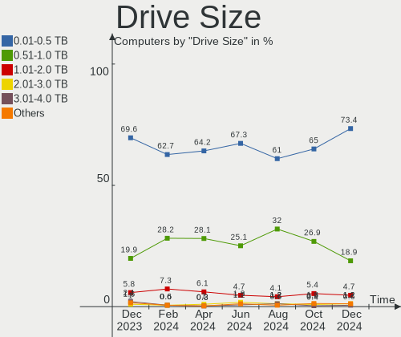
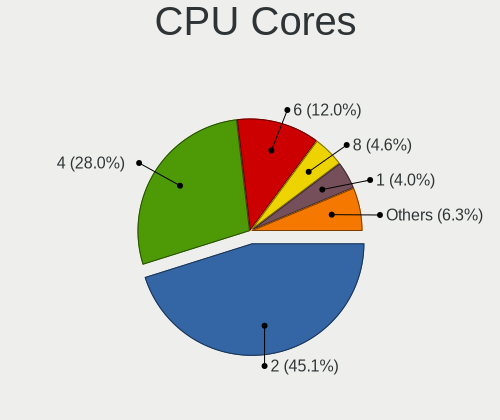

ROSA Hardware Trends
--------------------

A project to identify most popular hardware characteristics and track their change
over time based on data collected by ROSA users at https://Linux-Hardware.org.

Anyone can contribute to the study by uploading probes of their computers by
the [hw-probe](https://github.com/linuxhw/hw-probe) tool:

    sudo hw-probe -all -upload

This is a report for all computer types. See also reports for [desktops](/Dist/ROSA/Desktop/README.md) and [notebooks](/Dist/ROSA/Notebook/README.md).

Full-feature report is available here: https://linux-hardware.org/?view=trends

Period: Apr, 2020.

Contents
--------

- [ OS                       ](#os)
- [ OS Family                ](#os-family)
- [ Kernel                   ](#kernel)
- [ Kernel Family            ](#kernel-family)
- [ Kernel Major Ver.        ](#kernel-major-ver)
- [ Arch                     ](#arch)
- [ DE                       ](#de)
- [ Display Server           ](#display-server)
- [ Display Manager          ](#display-manager)
- [ OS Lang                  ](#os-lang)
- [ Boot Mode                ](#boot-mode)
- [ Filesystem               ](#filesystem)
- [ Dual Boot with Linux/BSD ](#dual-boot-with-linux/bsd)
- [ Dual Boot (Win)          ](#dual-boot-win)
- [ Country                  ](#country)
- [ City                     ](#city)
- [ Vendor                   ](#vendor)
- [ Model                    ](#model)
- [ Model Family             ](#model-family)
- [ MFG Year                 ](#mfg-year)
- [ Form Factor              ](#form-factor)
- [ Secure Boot              ](#secure-boot)
- [ Coreboot                 ](#coreboot)
- [ RAM Size                 ](#ram-size)
- [ RAM Used                 ](#ram-used)
- [ Drive Vendor             ](#drive-vendor)
- [ Drive Model              ](#drive-model)
- [ Drive Kind               ](#drive-kind)
- [ Drive Connector          ](#drive-connector)
- [ Drive Size               ](#drive-size)
- [ Space Total              ](#space-total)
- [ Space Used               ](#space-used)
- [ Malfunc. Drives          ](#malfunc-drives)
- [ Malfunc. Drive Vendor    ](#malfunc-drive-vendor)
- [ Malfunc. Drive Kind      ](#malfunc-drive-kind)
- [ Failed Drives            ](#failed-drives)
- [ Failed Drive Vendor      ](#failed-drive-vendor)
- [ Drive Status             ](#drive-status)
- [ Storage Vendor           ](#storage-vendor)
- [ Storage Model            ](#storage-model)
- [ Storage Kind             ](#storage-kind)
- [ CPU Vendor               ](#cpu-vendor)
- [ CPU Model                ](#cpu-model)
- [ CPU Model Family         ](#cpu-model-family)
- [ CPU Cores                ](#cpu-cores)
- [ CPU Sockets              ](#cpu-sockets)
- [ CPU Threads              ](#cpu-threads)
- [ CPU Op-Modes             ](#cpu-op-modes)
- [ CPU Microarch            ](#cpu-microarch)
- [ CPU Microcode            ](#cpu-microcode)
- [ GPU Vendor               ](#gpu-vendor)
- [ GPU Model                ](#gpu-model)
- [ GPU Combo                ](#gpu-combo)
- [ GPU Driver               ](#gpu-driver)
- [ GPU Memory               ](#gpu-memory)
- [ Monitor Vendor           ](#monitor-vendor)
- [ Monitor Model            ](#monitor-model)
- [ Monitor Resolution       ](#monitor-resolution)
- [ Monitor Diagonal         ](#monitor-diagonal)
- [ Monitor Width            ](#monitor-width)
- [ Aspect Ratio             ](#aspect-ratio)
- [ Monitor Area             ](#monitor-area)
- [ Pixel Density            ](#pixel-density)
- [ Multiple Monitors        ](#multiple-monitors)
- [ Net Controller Vendor    ](#net-controller-vendor)
- [ Net Controller Model     ](#net-controller-model)
- [ Net Controller Kind      ](#net-controller-kind)
- [ Used Controller          ](#used-controller)
- [ NICs                     ](#nics)
- [ Unsupported Devices      ](#unsupported-devices)
- [ Unsupported Device Types ](#unsupported-device-types)

OS
--

Installed operating systems

| Name       | Computers | Percent |
|------------|-----------|---------|
| ROSA R11   | 267       | 72.95%  |
| ROSA R11.1 | 65        | 17.76%  |
| ROSA R8.1  | 18        | 4.92%   |
| ROSA R10   | 11        | 3.01%   |
| ROSA R9    | 2         | 0.55%   |
| RED X4     | 2         | 0.55%   |
| RED X3     | 1         | 0.27%   |

OS Family
---------

OS without a version

| Name | Computers | Percent |
|------|-----------|---------|
| ROSA | 366       | 100%    |

Kernel
------

Version of the Linux kernel

| Version                           | Computers | Percent |
|-----------------------------------|-----------|---------|
| 4.15.0-desktop-45.1rosa-x86_64    | 89        | 24.32%  |
| 4.15.0-desktop-68.5rosa-x86_64    | 65        | 17.76%  |
| 4.15.0-desktop-94.1rosa-x86_64    | 50        | 13.66%  |
| 4.15.0-desktop-45.1rosa-i586      | 22        | 6.01%   |
| 5.4.32-generic-2rosa-x86_64       | 18        | 4.92%   |
| 4.9.155-nrj-desktop-1rosa-x86_64  | 18        | 4.92%   |
| 4.15.0-desktop-68.5rosa-i586      | 15        | 4.1%    |
| 4.9.60-nrj-desktop-1rosa-x86_64   | 9         | 2.46%   |
| 4.15.0-desktop-94.1rosa-i586      | 9         | 2.46%   |
| 4.9.155-nrj-desktop-1rosa-i586    | 8         | 2.19%   |
| 4.15.0-desktop-91.3rosa-x86_64    | 6         | 1.64%   |
| 5.4.28-generic-1rosa-x86_64       | 5         | 1.37%   |
| 5.4.31-generic-1rosa-x86_64       | 4         | 1.09%   |
| 5.4.26-generic-3rosa-x86_64       | 4         | 1.09%   |
| 5.0.0-desktop-38.1rosa-x86_64     | 4         | 1.09%   |
| 4.1.38-nrj-desktop-2rosa-x86_64   | 4         | 1.09%   |
| 5.4.35-nrj-desktop-1rosa-x86_64   | 2         | 0.55%   |
| 5.4.30-nrj-desktop-1rosa-x86_64   | 2         | 0.55%   |
| 4.9.9-nrj-desktop-1rosa-i586      | 2         | 0.55%   |
| 4.9.60-nrj-desktop-1rosa-i586     | 2         | 0.55%   |
| 4.9.20-nrj-desktop-1rosa-x86_64   | 2         | 0.55%   |
| 5.6.2-1-linux-rosa-x86_64         | 1         | 0.27%   |
| 5.5.12-generic-1rosa-x86_64       | 1         | 0.27%   |
| 5.4.31-nrj-desktop-1rosa-x86_64   | 1         | 0.27%   |
| 5.4.28-generic-1rosa-i586         | 1         | 0.27%   |
| 5.4.27-nrj-desktop-1rosa-x86_64   | 1         | 0.27%   |
| 5.4.27-desktop-1rosa-x86_64       | 1         | 0.27%   |
| 5.4.24-nrj-desktop-2rosa-x86_64   | 1         | 0.27%   |
| 5.4.0-desktop-9.1rosa-x86_64      | 1         | 0.27%   |
| 5.4.0-desktop-22.1rosa-x86_64     | 1         | 0.27%   |
| 5.4.0-desktop-21.1rosa-x86_64     | 1         | 0.27%   |
| 5.3.18-nrj-desktop-1rosa-x86_64   | 1         | 0.27%   |
| 4.9.9-nrj-desktop-1rosa-x86_64    | 1         | 0.27%   |
| 4.9.41-nrj-desktop-1rosa-x86_64   | 1         | 0.27%   |
| 4.9.41-nrj-desktop-1rosa-i586     | 1         | 0.27%   |
| 4.9.20-nrj-desktop-1rosa-i586     | 1         | 0.27%   |
| 4.9.124-nrj-desktop-1rosa-x86_64  | 1         | 0.27%   |
| 4.4.16-nrj-desktop-1rosa-x86_64   | 1         | 0.27%   |
| 4.19.112-nrj-desktop-1rosa-x86_64 | 1         | 0.27%   |
| 4.19.0-desktop-13.1rosa-x86_64    | 1         | 0.27%   |
| 4.16.18-nrj-desktop-1rosa-i586    | 1         | 0.27%   |
| 4.15.0-desktop-91.1rosa-x86_64    | 1         | 0.27%   |
| 4.15.0-desktop-51.4rosa-i586      | 1         | 0.27%   |
| 4.15.0-desktop-47.2rosa-x86_64    | 1         | 0.27%   |
| 4.1.38-nrj-desktop-2rosa-i586     | 1         | 0.27%   |
| 4.1.15-nrj-desktop-1rosa-x86_64   | 1         | 0.27%   |
| 4.1.13-nrj-desktop-1rosa-i586     | 1         | 0.27%   |

Kernel Family
-------------

Linux kernel without a distro release

| Version  | Computers | Percent |
|----------|-----------|---------|
| 4.15.0   | 259       | 70.77%  |
| 4.9.155  | 26        | 7.1%    |
| 5.4.32   | 18        | 4.92%   |
| 4.9.60   | 11        | 3.01%   |
| 5.4.28   | 6         | 1.64%   |
| 5.4.31   | 5         | 1.37%   |
| 4.1.38   | 5         | 1.37%   |
| 5.4.26   | 4         | 1.09%   |
| 5.0.0    | 4         | 1.09%   |
| 5.4.0    | 3         | 0.82%   |
| 4.9.9    | 3         | 0.82%   |
| 4.9.20   | 3         | 0.82%   |
| 5.4.35   | 2         | 0.55%   |
| 5.4.30   | 2         | 0.55%   |
| 5.4.27   | 2         | 0.55%   |
| 4.9.41   | 2         | 0.55%   |
| 5.6.2    | 1         | 0.27%   |
| 5.5.12   | 1         | 0.27%   |
| 5.4.24   | 1         | 0.27%   |
| 5.3.18   | 1         | 0.27%   |
| 4.9.124  | 1         | 0.27%   |
| 4.4.16   | 1         | 0.27%   |
| 4.19.112 | 1         | 0.27%   |
| 4.19.0   | 1         | 0.27%   |
| 4.16.18  | 1         | 0.27%   |
| 4.1.15   | 1         | 0.27%   |
| 4.1.13   | 1         | 0.27%   |

Kernel Major Ver.
-----------------

Linux kernel major version

| Version | Computers | Percent |
|---------|-----------|---------|
| 4.15    | 259       | 70.77%  |
| 4.9     | 46        | 12.57%  |
| 5.4     | 43        | 11.75%  |
| 4.1     | 7         | 1.91%   |
| 5.0     | 4         | 1.09%   |
| 4.19    | 2         | 0.55%   |
| 5.6     | 1         | 0.27%   |
| 5.5     | 1         | 0.27%   |
| 5.3     | 1         | 0.27%   |
| 4.4     | 1         | 0.27%   |
| 4.16    | 1         | 0.27%   |

Arch
----

OS architecture (x86_64, i586, etc.)

| Name   | Computers | Percent |
|--------|-----------|---------|
| x86_64 | 301       | 82.24%  |
| i686   | 65        | 17.76%  |

DE
--

Desktop Environment

| Name    | Computers | Percent |
|---------|-----------|---------|
| KDE4    | 200       | 54.64%  |
| KDE5    | 131       | 35.79%  |
| LXQt    | 20        | 5.46%   |
| XFCE    | 6         | 1.64%   |
| MATE    | 6         | 1.64%   |
| Unknown | 2         | 0.55%   |
| GNOME   | 1         | 0.27%   |

Display Server
--------------

X11 or Wayland

| Name | Computers | Percent |
|------|-----------|---------|
| X11  | 365       | 99.73%  |
| Tty  | 1         | 0.27%   |

Display Manager
---------------

SDDM, LightDM, etc.

| Name | Computers | Percent |
|------|-----------|---------|
| KDM  | 205       | 56.01%  |
| SDDM | 160       | 43.72%  |
| GDM  | 1         | 0.27%   |

OS Lang
-------

Language

| Lang    | Computers | Percent |
|---------|-----------|---------|
| ru_RU   | 193       | 52.73%  |
| Unknown | 147       | 40.16%  |
| pl_PL   | 6         | 1.64%   |
| it_IT   | 6         | 1.64%   |
| en_US   | 3         | 0.82%   |
| de_DE   | 3         | 0.82%   |
| tr_TR   | 2         | 0.55%   |
| es_ES   | 2         | 0.55%   |
| ru_UA   | 1         | 0.27%   |
| ro_RO   | 1         | 0.27%   |
| fr_FR   | 1         | 0.27%   |
| en_GB   | 1         | 0.27%   |

Boot Mode
---------

EFI or BIOS

| Mode | Computers | Percent |
|------|-----------|---------|
| BIOS | 283       | 77.32%  |
| EFI  | 83        | 22.68%  |

Filesystem
----------

Type of filesystem

| Type  | Computers | Percent |
|-------|-----------|---------|
| Ext4  | 349       | 95.36%  |
| Btrfs | 9         | 2.46%   |
| Ext3  | 4         | 1.09%   |
| F2fs  | 2         | 0.55%   |
| Aufs  | 2         | 0.55%   |

Dual Boot with Linux/BSD
------------------------

Hosting more than one Linux/BSD

| Dual boot | Computers | Percent |
|-----------|-----------|---------|
| No        | 273       | 74.59%  |
| Yes       | 93        | 25.41%  |

Dual Boot (Win)
---------------

Hosting Linux and Windows

| Dual boot | Computers | Percent |
|-----------|-----------|---------|
| No        | 203       | 55.46%  |
| Yes       | 163       | 44.54%  |

Country
-------

Geographic location (country)

| Country              | Computers | Percent |
|----------------------|-----------|---------|
| Russia               | 270       | 73.77%  |
| Ukraine              | 24        | 6.56%   |
| Germany              | 13        | 3.55%   |
| Poland               | 9         | 2.46%   |
| France               | 9         | 2.46%   |
| Spain                | 6         | 1.64%   |
| Italy                | 6         | 1.64%   |
| Turkey               | 3         | 0.82%   |
| USA                  | 2         | 0.55%   |
| UK                   | 2         | 0.55%   |
| Switzerland          | 2         | 0.55%   |
| Serbia               | 2         | 0.55%   |
| Latvia               | 2         | 0.55%   |
| Kazakhstan           | 2         | 0.55%   |
| Belarus              | 2         | 0.55%   |
| Venezuela            | 1         | 0.27%   |
| Sweden               | 1         | 0.27%   |
| Slovakia             | 1         | 0.27%   |
| Moldova, Republic of | 1         | 0.27%   |
| Mexico               | 1         | 0.27%   |
| Iran                 | 1         | 0.27%   |
| Greece               | 1         | 0.27%   |
| Georgia              | 1         | 0.27%   |
| Estonia              | 1         | 0.27%   |
| Colombia             | 1         | 0.27%   |
| Canada               | 1         | 0.27%   |
| Bulgaria             | 1         | 0.27%   |

City
----

Geographic location (city)

| City              | Computers | Percent |
|-------------------|-----------|---------|
| Moscow            | 44        | 12.02%  |
| Ekaterinburg      | 16        | 4.37%   |
| St Petersburg     | 13        | 3.55%   |
| Krasnodar         | 11        | 3.01%   |
| Novosibirsk       | 9         | 2.46%   |
| Volgograd         | 8         | 2.19%   |
| Rostov-on-Don     | 7         | 1.91%   |
| Nizhniy Novgorod  | 7         | 1.91%   |
| Samara            | 6         | 1.64%   |
| Ufa               | 5         | 1.37%   |
| Kharkiv           | 5         | 1.37%   |
| Voronezh          | 4         | 1.09%   |
| Usinsk            | 4         | 1.09%   |
| Stavropol         | 4         | 1.09%   |
| Krasnoyarsk       | 4         | 1.09%   |
| Kaliningrad       | 4         | 1.09%   |
| Belgorod          | 4         | 1.09%   |
| Tyumen            | 3         | 0.82%   |
| Saratov           | 3         | 0.82%   |
| Saransk           | 3         | 0.82%   |
| Perm              | 3         | 0.82%   |
| Omsk              | 3         | 0.82%   |
| Ivanovo           | 3         | 0.82%   |
| Chelyabinsk       | 3         | 0.82%   |
| Bryansk           | 3         | 0.82%   |
| Yaroslavl         | 2         | 0.55%   |
| Warsaw            | 2         | 0.55%   |
| Vogue             | 2         | 0.55%   |
| Tver              | 2         | 0.55%   |
| Tula              | 2         | 0.55%   |
| Tambov            | 2         | 0.55%   |
| Smolensk          | 2         | 0.55%   |
| Shelekhov         | 2         | 0.55%   |
| Prokop'yevsk      | 2         | 0.55%   |
| Poltava           | 2         | 0.55%   |
| Neftekamsk        | 2         | 0.55%   |
| Mytishchi         | 2         | 0.55%   |
| Magnitogorsk      | 2         | 0.55%   |
| Lądek Zdrój     | 2         | 0.55%   |
| Kursk             | 2         | 0.55%   |
| Kostroma          | 2         | 0.55%   |
| Klintsy           | 2         | 0.55%   |
| Kazan’          | 2         | 0.55%   |
| Izhevsk           | 2         | 0.55%   |
| Istanbul          | 2         | 0.55%   |
| Halle             | 2         | 0.55%   |
| Gatchina          | 2         | 0.55%   |
| Bryanka           | 2         | 0.55%   |
| Belovo            | 2         | 0.55%   |
| Belgrade          | 2         | 0.55%   |
| Astrakhan         | 2         | 0.55%   |
| Łódź           | 1         | 0.27%   |
| Zurich            | 1         | 0.27%   |
| Zheleznogorsk     | 1         | 0.27%   |
| Zelenogorsk       | 1         | 0.27%   |
| Yuzhno-Sakhalinsk | 1         | 0.27%   |
| Yuzha             | 1         | 0.27%   |
| Yoshkar-Ola       | 1         | 0.27%   |
| Yessentuki        | 1         | 0.27%   |
| Woodbridge        | 1         | 0.27%   |

Vendor
------

Motherboard manufacturer

| Name                           | Computers | Percent |
|--------------------------------|-----------|---------|
| ASUSTek Computer               | 94        | 25.68%  |
| Gigabyte Technology            | 44        | 12.02%  |
| Lenovo                         | 39        | 10.66%  |
| Hewlett-Packard                | 35        | 9.56%   |
| Acer                           | 31        | 8.47%   |
| ASRock                         | 24        | 6.56%   |
| MSI                            | 21        | 5.74%   |
| Dell                           | 14        | 3.83%   |
| Samsung Electronics            | 13        | 3.55%   |
| Sony                           | 7         | 1.91%   |
| Packard Bell                   | 6         | 1.64%   |
| Toshiba                        | 5         | 1.37%   |
| Intel                          | 4         | 1.09%   |
| Apple                          | 4         | 1.09%   |
| Fujitsu                        | 3         | 0.82%   |
| ECS                            | 3         | 0.82%   |
| Pegatron                       | 2         | 0.55%   |
| Fujitsu Siemens                | 2         | 0.55%   |
| Foxconn                        | 2         | 0.55%   |
| Biostar                        | 2         | 0.55%   |
| Unknown                        | 2         | 0.55%   |
| Notebook                       | 1         | 0.27%   |
| Matsushita Electric Industrial | 1         | 0.27%   |
| Maibenben                      | 1         | 0.27%   |
| KIANO                          | 1         | 0.27%   |
| Infomash                       | 1         | 0.27%   |
| Digma                          | 1         | 0.27%   |
| Clevo                          | 1         | 0.27%   |
| Chuwi                          | 1         | 0.27%   |
| Alienware                      | 1         | 0.27%   |

Model
-----

Motherboard model

| Name                                                   | Computers | Percent |
|--------------------------------------------------------|-----------|---------|
| ASUS All Series                                        | 6         | 1.64%   |
| HP 620                                                 | 3         | 0.82%   |
| ASUS M5A97 R2.0                                        | 3         | 0.82%   |
| Apple MacBookAir7,2                                    | 3         | 0.82%   |
| Toshiba Satellite C660                                 | 2         | 0.55%   |
| Samsung Electronics R540/R580/R780/SA41/E452/E852      | 2         | 0.55%   |
| Packard Bell EasyNote TK85                             | 2         | 0.55%   |
| Lenovo ThinkCentre M625q 10TF001NRU                    | 2         | 0.55%   |
| HP Pavilion dv6                                        | 2         | 0.55%   |
| HP Laptop 15-ra0xx                                     | 2         | 0.55%   |
| HP Laptop 15-bw0xx                                     | 2         | 0.55%   |
| Gigabyte GA-78LMT-S2                                   | 2         | 0.55%   |
| Gigabyte G31M-ES2L                                     | 2         | 0.55%   |
| Gigabyte D525TUD                                       | 2         | 0.55%   |
| Gigabyte B450 AORUS ELITE                              | 2         | 0.55%   |
| ASUS PRIME B350-PLUS                                   | 2         | 0.55%   |
| ASUS P5QD TURBO                                        | 2         | 0.55%   |
| ASUS P5L-MX                                            | 2         | 0.55%   |
| ASUS P5G41T-M LX2/GB                                   | 2         | 0.55%   |
| ASUS M3A78                                             | 2         | 0.55%   |
| ASUS F5SL                                              | 2         | 0.55%   |
| ASUS 1015PX                                            | 2         | 0.55%   |
| ASUS 1011CX                                            | 2         | 0.55%   |
| ASRock N68C-S UCC                                      | 2         | 0.55%   |
| Acer Aspire 5750ZG                                     | 2         | 0.55%   |
| Acer Aspire 5553G                                      | 2         | 0.55%   |
| Unknown                                                | 2         | 0.55%   |
| Toshiba Satellite U840-B7S                             | 1         | 0.27%   |
| Toshiba Satellite U300                                 | 1         | 0.27%   |
| Toshiba Satellite C855-1JF                             | 1         | 0.27%   |
| Sony VPCL22S1R                                         | 1         | 0.27%   |
| Sony VPCEH2S1R                                         | 1         | 0.27%   |
| Sony VPCEE2E1R                                         | 1         | 0.27%   |
| Sony VPCEB4L1E                                         | 1         | 0.27%   |
| Sony VPCEB2E9R                                         | 1         | 0.27%   |
| Sony VGN-FZ490N                                        | 1         | 0.27%   |
| Sony SVE1712T1RB                                       | 1         | 0.27%   |
| Samsung Electronics RV411/RV511/E3511/S3511            | 1         | 0.27%   |
| Samsung Electronics R530/R730/P530                     | 1         | 0.27%   |
| Samsung Electronics R25P                               | 1         | 0.27%   |
| Samsung Electronics NC10                               | 1         | 0.27%   |
| Samsung Electronics N150P/N210P/N220P                  | 1         | 0.27%   |
| Samsung Electronics N128                               | 1         | 0.27%   |
| Samsung Electronics N100SP                             | 1         | 0.27%   |
| Samsung Electronics N100                               | 1         | 0.27%   |
| Samsung Electronics 350V5C/351V5C/3540VC/3440VC        | 1         | 0.27%   |
| Samsung Electronics 300V3A/300V4A/300V5A/200A4B/200A5B | 1         | 0.27%   |
| Samsung Electronics 300E4A/300E5A/300E7A               | 1         | 0.27%   |
| Pegatron Compaq dx2400 Microtower                      | 1         | 0.27%   |
| Pegatron 23-d008er                                     | 1         | 0.27%   |
| Packard Bell ixtreme M5741                             | 1         | 0.27%   |
| Packard Bell EasyNote TS11SB                           | 1         | 0.27%   |
| Packard Bell EasyNote TE11HC                           | 1         | 0.27%   |
| Packard Bell EasyNote ENTG81BA                         | 1         | 0.27%   |
| Notebook W35xSS_370SS                                  | 1         | 0.27%   |
| MSI MS-7B89                                            | 1         | 0.27%   |
| MSI MS-7B86                                            | 1         | 0.27%   |
| MSI MS-7B33                                            | 1         | 0.27%   |
| MSI MS-7996                                            | 1         | 0.27%   |
| MSI MS-7895                                            | 1         | 0.27%   |

Model Family
------------

Motherboard model prefix

| Name                       | Computers | Percent |
|----------------------------|-----------|---------|
| Acer Aspire                | 21        | 5.74%   |
| Lenovo IdeaPad             | 12        | 3.28%   |
| Lenovo ThinkPad            | 10        | 2.73%   |
| HP Laptop                  | 8         | 2.19%   |
| ASUS PRIME                 | 7         | 1.91%   |
| HP Compaq                  | 6         | 1.64%   |
| Dell Inspiron              | 6         | 1.64%   |
| ASUS All                   | 6         | 1.64%   |
| Toshiba Satellite          | 5         | 1.37%   |
| Packard Bell EasyNote      | 5         | 1.37%   |
| HP Pavilion                | 4         | 1.09%   |
| HP EliteBook               | 4         | 1.09%   |
| Dell Vostro                | 4         | 1.09%   |
| Acer Extensa               | 4         | 1.09%   |
| Lenovo ThinkCentre         | 3         | 0.82%   |
| HP 620                     | 3         | 0.82%   |
| Gigabyte GA-78LMT-S2       | 3         | 0.82%   |
| ASUS M5A97                 | 3         | 0.82%   |
| Apple MacBookAir7          | 3         | 0.82%   |
| Samsung Electronics R540   | 2         | 0.55%   |
| Lenovo 3000                | 2         | 0.55%   |
| HP ProBook                 | 2         | 0.55%   |
| Gigabyte G31M-ES2L         | 2         | 0.55%   |
| Gigabyte D525TUD           | 2         | 0.55%   |
| Gigabyte B450              | 2         | 0.55%   |
| Gigabyte AB350M-DS3H       | 2         | 0.55%   |
| Dell OptiPlex              | 2         | 0.55%   |
| Dell Latitude              | 2         | 0.55%   |
| ASUS VivoBook              | 2         | 0.55%   |
| ASUS P7P55D-E              | 2         | 0.55%   |
| ASUS P5QD                  | 2         | 0.55%   |
| ASUS P5Q                   | 2         | 0.55%   |
| ASUS P5L-MX                | 2         | 0.55%   |
| ASUS P5KPL-AM              | 2         | 0.55%   |
| ASUS P5GC-MX               | 2         | 0.55%   |
| ASUS P5G41T-M              | 2         | 0.55%   |
| ASUS M5A78L-M              | 2         | 0.55%   |
| ASUS M3A78                 | 2         | 0.55%   |
| ASUS F5SL                  | 2         | 0.55%   |
| ASUS 1015PX                | 2         | 0.55%   |
| ASUS 1011CX                | 2         | 0.55%   |
| ASRock N68C-S              | 2         | 0.55%   |
| Acer TravelMate            | 2         | 0.55%   |
| Unknown                    | 2         | 0.55%   |
| Sony VPCL22S1R             | 1         | 0.27%   |
| Sony VPCEH2S1R             | 1         | 0.27%   |
| Sony VPCEE2E1R             | 1         | 0.27%   |
| Sony VPCEB4L1E             | 1         | 0.27%   |
| Sony VPCEB2E9R             | 1         | 0.27%   |
| Sony VGN-FZ490N            | 1         | 0.27%   |
| Sony SVE1712T1RB           | 1         | 0.27%   |
| Samsung Electronics RV411  | 1         | 0.27%   |
| Samsung Electronics R530   | 1         | 0.27%   |
| Samsung Electronics R25P   | 1         | 0.27%   |
| Samsung Electronics NC10   | 1         | 0.27%   |
| Samsung Electronics N150P  | 1         | 0.27%   |
| Samsung Electronics N128   | 1         | 0.27%   |
| Samsung Electronics N100SP | 1         | 0.27%   |
| Samsung Electronics N100   | 1         | 0.27%   |
| Samsung Electronics 350V5C | 1         | 0.27%   |

MFG Year
--------

Motherboard manufacture year

| Year | Computers | Percent |
|------|-----------|---------|
| 2010 | 46        | 12.57%  |
| 2011 | 44        | 12.02%  |
| 2012 | 38        | 10.38%  |
| 2018 | 34        | 9.29%   |
| 2019 | 28        | 7.65%   |
| 2009 | 27        | 7.38%   |
| 2013 | 23        | 6.28%   |
| 2016 | 22        | 6.01%   |
| 2014 | 22        | 6.01%   |
| 2015 | 20        | 5.46%   |
| 2008 | 20        | 5.46%   |
| 2017 | 16        | 4.37%   |
| 2007 | 16        | 4.37%   |
| 2020 | 3         | 0.82%   |
| 2005 | 3         | 0.82%   |
| 2006 | 2         | 0.55%   |
| 2004 | 2         | 0.55%   |

Form Factor
-----------

Physical design of the computer

| Name       | Computers | Percent |
|------------|-----------|---------|
| Desktop    | 182       | 49.73%  |
| Notebook   | 174       | 47.54%  |
| Mini pc    | 4         | 1.09%   |
| All in one | 3         | 0.82%   |
| Tablet     | 2         | 0.55%   |
| Other      | 1         | 0.27%   |

Secure Boot
-----------

Enabled or disabled

| State    | Computers | Percent |
|----------|-----------|---------|
| Disabled | 365       | 99.73%  |
| Enabled  | 1         | 0.27%   |

Coreboot
--------

Have coreboot on board

| Used | Computers | Percent |
|------|-----------|---------|
| No   | 366       | 100%    |

RAM Size
--------

Total RAM memory

| Size in GB  | Computers | Percent |
|-------------|-----------|---------|
| 3.01-4.0    | 140       | 38.25%  |
| 8.01-16.0   | 72        | 19.67%  |
| 4.01-8.0    | 54        | 14.75%  |
| 1.01-2.0    | 36        | 9.84%   |
| 16.01-24.0  | 29        | 7.92%   |
| 2.01-3.0    | 25        | 6.83%   |
| 0.01-1.0    | 6         | 1.64%   |
| 32.01-64.0  | 2         | 0.55%   |
| 24.01-32.0  | 1         | 0.27%   |
| 64.01-256.0 | 1         | 0.27%   |

RAM Used
--------

Used RAM memory

| Used GB   | Computers | Percent |
|-----------|-----------|---------|
| 0.01-1.0  | 176       | 48.09%  |
| 1.01-2.0  | 143       | 39.07%  |
| 2.01-3.0  | 32        | 8.74%   |
| 4.01-8.0  | 8         | 2.19%   |
| 3.01-4.0  | 6         | 1.64%   |
| 8.01-16.0 | 1         | 0.27%   |

Drive Vendor
------------

Hard drive vendors

| Vendor              | Computers | Drives  | Percent |
|---------------------|-----------|---------|---------|
| Seagate             | 117       | 139     | 23.93%  |
| WDC                 | 116       | 134     | 23.72%  |
| Toshiba             | 36        | 37      | 7.36%   |
| Samsung Electronics | 31        | 34      | 6.34%   |
| Hitachi             | 29        | 29      | 5.93%   |
| Kingston            | 18        | 19      | 3.68%   |
| HGST                | 17        | 17      | 3.48%   |
| SanDisk             | 14        | 14      | 2.86%   |
| China               | 12        | 12      | 2.45%   |
| A-DATA Technology   | 11        | 11      | 2.25%   |
| Unknown             | 8         | 8       | 1.64%   |
| SPCC                | 7         | 7       | 1.43%   |
| Intel               | 6         | 6       | 1.23%   |
| Fujitsu             | 6         | 6       | 1.23%   |
| Crucial             | 6         | 6       | 1.23%   |
| SK Hynix            | 5         | 5       | 1.02%   |
| PLEXTOR             | 5         | 6       | 1.02%   |
| Transcend           | 4         | 4       | 0.82%   |
| Smartbuy            | 3         | 3       | 0.61%   |
| Patriot             | 3         | 3       | 0.61%   |
| OCZ                 | 3         | 3       | 0.61%   |
| MAXTOR              | 3         | 3       | 0.61%   |
| HUAWEI              | 3         | 3       | 0.61%   |
| GOODRAM             | 3         | 3       | 0.61%   |
| Corsair             | 3         | 3       | 0.61%   |
| Apple               | 3         | 3       | 0.61%   |
| LITEONIT            | 2         | 2       | 0.41%   |
| KingDian            | 2         | 2       | 0.41%   |
| TO Exter            | 1         | 1       | 0.2%    |
| Palit               | 1         | 1       | 0.2%    |
| Micron Technology   | 1         | 1       | 0.2%    |
| MARSHAL             | 1         | 1       | 0.2%    |
| LITEON              | 1         | 1       | 0.2%    |
| HL-DT-ST            | 1         | Unknown | 0.2%    |
| Hewlett-Packard     | 1         | Unknown | 0.2%    |
| Gigabyte Technology | 1         | 1       | 0.2%    |
| Generic             | 1         | 1       | 0.2%    |
| Dell                | 1         | 1       | 0.2%    |
| ASUS-PHISON         | 1         | 2       | 0.2%    |
| Apacer              | 1         | 1       | 0.2%    |
| AMD                 | 1         | 1       | 0.2%    |

Drive Model
-----------

Hard drive models

| Model                        | Computers | Percent |
|------------------------------|-----------|---------|
| ST500LT012-1DG142 500GB      | 8         | 1.5%    |
| SA400S37120G 120GB SSD       | 8         | 1.5%    |
| ST500DM002-1BD142 500GB      | 6         | 1.13%   |
| WD5000LPCX-24VHAT0 500GB     | 5         | 0.94%   |
| HTS543232A7A384 320GB        | 5         | 0.94%   |
| HTS541010A9E680 1TB          | 5         | 0.94%   |
| DT01ACA050 500GB             | 5         | 0.94%   |
| WD5000LPCX-21VHAT0 500GB     | 4         | 0.75%   |
| ST9500325AS 500GB            | 4         | 0.75%   |
| ST1000DM010-2EP102 1TB       | 4         | 0.75%   |
| ST1000DM003-9YN162 1TB       | 4         | 0.75%   |
| MQ04ABF100 1TB               | 4         | 0.75%   |
| HTS545050A7E380 500GB        | 4         | 0.75%   |
| DT01ACA100 1TB               | 4         | 0.75%   |
| CT120BX500SSD1 120GB         | 4         | 0.75%   |
| WDS240G2G0A-00JH30 240GB SSD | 3         | 0.56%   |
| WDS120G2G0A-00JH30 120GB SSD | 3         | 0.56%   |
| WD10EZEX-08WN4A0 1TB         | 3         | 0.56%   |
| WD10EZEX-00BN5A0 1TB         | 3         | 0.56%   |
| SV300S37A120G 120GB SSD      | 3         | 0.56%   |
| ST380811AS 80GB              | 3         | 0.56%   |
| ST320LT020-9YG142 320GB      | 3         | 0.56%   |
| ST3160811AS 160GB            | 3         | 0.56%   |
| ST31000528AS 1TB             | 3         | 0.56%   |
| ST2000DM008-2FR102 2TB       | 3         | 0.56%   |
| ST1000LM048-2E7172 1TB       | 3         | 0.56%   |
| ST1000LM035-1RK172 1TB       | 3         | 0.56%   |
| ST1000LM024 HN-M101MBB 1TB   | 3         | 0.56%   |
| ST1000DM003-1CH162 1TB       | 3         | 0.56%   |
| SSD SM0128G 121GB            | 3         | 0.56%   |
| SSD PLUS 240GB               | 3         | 0.56%   |
| SSD 750 EVO 250GB            | 3         | 0.56%   |
| SA400S37240G 240GB SSD       | 3         | 0.56%   |
| MQ01ABD100 1TB               | 3         | 0.56%   |
| HTS725032A9A364 320GB        | 3         | 0.56%   |
| HM250HI 250GB                | 3         | 0.56%   |
| HD103SJ 1TB                  | 3         | 0.56%   |
| Expansion 1TB                | 3         | 0.56%   |
| WDS240G2G0B-00EPW0 240GB SSD | 2         | 0.38%   |
| WD5000LPLX-00ZNTT0 500GB     | 2         | 0.38%   |
| WD5000AZRX-00A8LB0 500GB     | 2         | 0.38%   |
| WD5000AZLX-08K2TA0 500GB     | 2         | 0.38%   |
| WD5000AADS-00S9B0 500GB      | 2         | 0.38%   |
| WD3200BPVT-24JJ5T0 320GB     | 2         | 0.38%   |
| WD3200BPVT-22ZEST0 320GB     | 2         | 0.38%   |
| WD20EZRZ-00Z5HB0 2TB         | 2         | 0.38%   |
| WD20EARX-00PASB0 2TB         | 2         | 0.38%   |
| WD1600AAJS-00PSA0 160GB      | 2         | 0.38%   |
| WD1600AAJB-00J3A0 160GB      | 2         | 0.38%   |
| WD10JPVX-60JC3T0 1TB         | 2         | 0.38%   |
| WD10JPVX-22JC3T0 1TB         | 2         | 0.38%   |
| WD10EZEX-60ZF5A0 1TB         | 2         | 0.38%   |
| WD10EZEX-22MFCA0 1TB         | 2         | 0.38%   |
| WD10EZEX-00RKKA0 1TB         | 2         | 0.38%   |
| TR200 240GB SSD              | 2         | 0.38%   |
| TF CARD Storage 8GB          | 2         | 0.38%   |
| SU650 480GB SSD              | 2         | 0.38%   |
| SU650 120GB SSD              | 2         | 0.38%   |
| ST9250827AS 250GB            | 2         | 0.38%   |
| ST500LM012 HN-M500MBB 500GB  | 2         | 0.38%   |

Drive Kind
----------

HDD or SSD

| Kind    | Computers | Drives | Percent |
|---------|-----------|--------|---------|
| HDD     | 297       | 370    | 66.89%  |
| SSD     | 114       | 131    | 25.68%  |
| NVMe    | 16        | 16     | 3.6%    |
| MMC     | 9         | 11     | 2.03%   |
| Unknown | 8         | 6      | 1.8%    |

Drive Connector
---------------

SATA, SAS, NVMe, etc.

| Type | Computers | Drives | Percent |
|------|-----------|--------|---------|
| SATA | 356       | 495    | 90.13%  |
| NVMe | 16        | 16     | 4.05%   |
| SAS  | 14        | 12     | 3.54%   |
| MMC  | 9         | 11     | 2.28%   |

Drive Size
----------

Size of hard drive

| Size in TB | Computers | Drives | Percent |
|------------|-----------|--------|---------|
| 0.01-0.5   | 304       | 381    | 68.78%  |
| 0.51-1.0   | 109       | 124    | 24.66%  |
| 1.01-2.0   | 19        | 19     | 4.3%    |
| 2.01-3.0   | 5         | 5      | 1.13%   |
| 3.01-4.0   | 3         | 3      | 0.68%   |
| 4.01-10.0  | 2         | 2      | 0.45%   |

Space Total
-----------

Amount of disk space available on the file system

| Size in GB     | Computers | Percent |
|----------------|-----------|---------|
| 101-250        | 97        | 26.5%   |
| 251-500        | 79        | 21.58%  |
| 1-20           | 55        | 15.03%  |
| 51-100         | 47        | 12.84%  |
| 501-1000       | 43        | 11.75%  |
| 21-50          | 21        | 5.74%   |
| 1001-2000      | 16        | 4.37%   |
| 2001-3000      | 5         | 1.37%   |
| More than 3000 | 2         | 0.55%   |
| Unknown        | 1         | 0.27%   |

Space Used
----------

Amount of used disk space

| Used GB        | Computers | Percent |
|----------------|-----------|---------|
| 1-20           | 243       | 66.39%  |
| 21-50          | 36        | 9.84%   |
| 101-250        | 24        | 6.56%   |
| 51-100         | 24        | 6.56%   |
| 251-500        | 17        | 4.64%   |
| 501-1000       | 12        | 3.28%   |
| 1001-2000      | 7         | 1.91%   |
| More than 3000 | 2         | 0.55%   |
| Unknown        | 1         | 0.27%   |

Malfunc. Drives
---------------

Drive models with a malfunction

| Model                        | Computers | Drives | Percent |
|------------------------------|-----------|--------|---------|
| ST500DM002-1BD142 500GB      | 4         | 4      | 2.63%   |
| ST9500325AS 500GB            | 3         | 3      | 1.97%   |
| ST500LT012-1DG142 500GB      | 3         | 3      | 1.97%   |
| ST1000DM003-9YN162 1TB       | 3         | 3      | 1.97%   |
| HTS545050A7E380 500GB        | 3         | 3      | 1.97%   |
| HTS543232A7A384 320GB        | 3         | 3      | 1.97%   |
| HTS541010A9E680 1TB          | 3         | 3      | 1.97%   |
| WD5000AADS-00S9B0 500GB      | 2         | 2      | 1.32%   |
| WD10EZEX-00RKKA0 1TB         | 2         | 2      | 1.32%   |
| ST9250827AS 250GB            | 2         | 2      | 1.32%   |
| ST3500418AS 500GB            | 2         | 2      | 1.32%   |
| ST3320418AS 320GB            | 2         | 2      | 1.32%   |
| ST3250318AS 250GB            | 2         | 2      | 1.32%   |
| ST3250310AS 250GB            | 2         | 2      | 1.32%   |
| ST320LT020-9YG142 320GB      | 2         | 2      | 1.32%   |
| ST320LT012-9WS14C 320GB      | 2         | 2      | 1.32%   |
| ST3160811AS 160GB            | 2         | 2      | 1.32%   |
| ST1000DM003-1CH162 1TB       | 2         | 2      | 1.32%   |
| Neutron GTX SSD 120GB        | 2         | 2      | 1.32%   |
| HTS725032A9A364 320GB        | 2         | 2      | 1.32%   |
| HTS545032B9A300 320GB        | 2         | 2      | 1.32%   |
| HD103SJ 1TB                  | 2         | 2      | 1.32%   |
| WDS240G2G0B-00EPW0 240GB SSD | 1         | 1      | 0.66%   |
| WD800JB-00JJC0 80GB          | 1         | 1      | 0.66%   |
| WD800BB-56JKC0 80GB          | 1         | 1      | 0.66%   |
| WD800AAJS-00PSA0 80GB        | 1         | 1      | 0.66%   |
| WD7500BPVT-24HXZT3 752GB     | 1         | 1      | 0.66%   |
| WD6400BPVT-55HXZT3 640GB     | 1         | 1      | 0.66%   |
| WD5000LPVX-60V0TT0 500GB     | 1         | 1      | 0.66%   |
| WD5000LPCX-24VHAT0 500GB     | 1         | 1      | 0.66%   |
| WD5000BPVT-75HXZT3 500GB     | 1         | 1      | 0.66%   |
| WD5000AARS-003BB1 500GB      | 1         | 1      | 0.66%   |
| WD5000AAKX-603CA0 500GB      | 1         | 1      | 0.66%   |
| WD5000AAKX-001CA0 500GB      | 1         | 1      | 0.66%   |
| WD3200BPVT-22ZEST0 320GB     | 1         | 1      | 0.66%   |
| WD3200AAKS-00L9A0 320GB      | 1         | 1      | 0.66%   |
| WD3200AAJS-00B4A0 320GB      | 1         | 1      | 0.66%   |
| WD30EZRX-00AZ6B0 3TB         | 1         | 1      | 0.66%   |
| WD2500BPVT-80ZEST0 250GB     | 1         | 1      | 0.66%   |
| WD2500AAJS-07B4A0 250GB      | 1         | 1      | 0.66%   |
| WD20EARX-00PASB0 2TB         | 1         | 1      | 0.66%   |
| WD1600JD-00HBB0 160GB        | 1         | 1      | 0.66%   |
| WD1600BEKT-60A25T1 160GB     | 1         | 1      | 0.66%   |
| WD1600AAJB-00J3A0 160GB      | 1         | 1      | 0.66%   |
| WD1200JD-00HBB0 120GB        | 1         | 1      | 0.66%   |
| WD10JPVX-60JC3T0 1TB         | 1         | 1      | 0.66%   |
| WD10EZEX-60ZF5A0 1TB         | 1         | 1      | 0.66%   |
| WD10EZEX-35WN4A0 1TB         | 1         | 1      | 0.66%   |
| WD10EZEX-22BN5A0 1TB         | 1         | 1      | 0.66%   |
| WD10EZEX-08WN4A0 1TB         | 1         | 1      | 0.66%   |
| WD10EFRX-68JCSN0 1TB         | 1         | 1      | 0.66%   |
| WD10EARS-00Y5B1 1TB          | 1         | 1      | 0.66%   |
| WD1003FZEX-00MK2A0 1TB       | 1         | 1      | 0.66%   |
| SU700 120GB SSD              | 1         | 1      | 0.66%   |
| STM3250820AS 250GB           | 1         | 1      | 0.66%   |
| STM3160215AS 160GB           | 1         | 1      | 0.66%   |
| ST9320328CS 320GB            | 1         | 1      | 0.66%   |
| ST9320310AS 320GB            | 1         | 1      | 0.66%   |
| ST9250410AS 250GB            | 1         | 1      | 0.66%   |
| ST9160310AS 160GB            | 1         | 1      | 0.66%   |

Malfunc. Drive Vendor
---------------------

Vendors of faulty drives

| Vendor              | Computers | Drives | Percent |
|---------------------|-----------|--------|---------|
| Seagate             | 56        | 61     | 39.16%  |
| WDC                 | 32        | 35     | 22.38%  |
| Hitachi             | 19        | 19     | 13.29%  |
| Toshiba             | 8         | 8      | 5.59%   |
| Samsung Electronics | 7         | 8      | 4.9%    |
| HGST                | 7         | 7      | 4.9%    |
| Kingston            | 3         | 3      | 2.1%    |
| Corsair             | 3         | 3      | 2.1%    |
| MAXTOR              | 2         | 2      | 1.4%    |
| Fujitsu             | 2         | 2      | 1.4%    |
| SK Hynix            | 1         | 1      | 0.7%    |
| MARSHAL             | 1         | 1      | 0.7%    |
| LITEONIT            | 1         | 1      | 0.7%    |
| A-DATA Technology   | 1         | 1      | 0.7%    |

Malfunc. Drive Kind
-------------------

Kinds of faulty drives

| Kind | Computers | Drives | Percent |
|------|-----------|--------|---------|
| HDD  | 130       | 142    | 92.86%  |
| SSD  | 10        | 10     | 7.14%   |

Failed Drives
-------------

Failed drive models

| Model                 | Computers | Drives | Percent |
|-----------------------|-----------|--------|---------|
| ST3750525AS 752GB     | 1         | 1      | 20%     |
| HTS547575A9E384 752GB | 1         | 1      | 20%     |
| HTS541010G9SA00 100GB | 1         | 1      | 20%     |
| HM250JI 250GB         | 1         | 1      | 20%     |
| HD204UI 2TB           | 1         | 1      | 20%     |

Failed Drive Vendor
-------------------

Failed drive vendors

| Vendor              | Computers | Drives | Percent |
|---------------------|-----------|--------|---------|
| Samsung Electronics | 2         | 2      | 40%     |
| Hitachi             | 2         | 2      | 40%     |
| Seagate             | 1         | 1      | 20%     |

Drive Status
------------

Number of failed and malfunc. drives

| Status   | Computers | Drives | Percent |
|----------|-----------|--------|---------|
| Works    | 265       | 351    | 61.34%  |
| Malfunc  | 137       | 152    | 31.71%  |
| Detected | 25        | 26     | 5.79%   |
| Failed   | 5         | 5      | 1.16%   |

Storage Vendor
--------------

Storage controller vendors

| Vendor                           | Computers | Percent |
|----------------------------------|-----------|---------|
| Intel                            | 263       | 63.68%  |
| AMD                              | 77        | 18.64%  |
| JMicron Technology               | 18        | 4.36%   |
| Nvidia                           | 13        | 3.15%   |
| Marvell Technology Group         | 9         | 2.18%   |
| ASMedia Technology               | 6         | 1.45%   |
| Silicon Integrated Systems [SiS] | 5         | 1.21%   |
| VIA Technologies                 | 4         | 0.97%   |
| Samsung Electronics              | 4         | 0.97%   |
| Silicon Motion                   | 3         | 0.73%   |
| Lite-On Technology               | 3         | 0.73%   |
| Phison Electronics               | 2         | 0.48%   |
| Toshiba America Info Systems     | 1         | 0.24%   |
| Sandisk                          | 1         | 0.24%   |
| Micron/Crucial Technology        | 1         | 0.24%   |
| Micron Technology                | 1         | 0.24%   |
| Kingston Technology Company      | 1         | 0.24%   |
| ADATA Technology                 | 1         | 0.24%   |

Storage Model
-------------

Storage controller models

| Model                                                                             | Computers | Percent |
|-----------------------------------------------------------------------------------|-----------|---------|
| FCH SATA Controller [AHCI mode]                                                   | 35        | 6.43%   |
| NM10/ICH7 Family SATA Controller [IDE mode]                                       | 28        | 5.15%   |
| SB7x0/SB8x0/SB9x0 IDE Controller                                                  | 24        | 4.41%   |
| 82801G (ICH7 Family) IDE Controller                                               | 20        | 3.68%   |
| SB7x0/SB8x0/SB9x0 SATA Controller [IDE mode]                                      | 18        | 3.31%   |
| SB7x0/SB8x0/SB9x0 SATA Controller [AHCI mode]                                     | 17        | 3.13%   |
| 7 Series Chipset Family 6-port SATA Controller [AHCI mode]                        | 16        | 2.94%   |
| 6 Series/C200 Series Chipset Family 6 port Mobile SATA AHCI Controller            | 15        | 2.76%   |
| NM10/ICH7 Family SATA Controller [AHCI mode]                                      | 14        | 2.57%   |
| 5 Series/3400 Series Chipset 4 port SATA AHCI Controller                          | 14        | 2.57%   |
| Sunrise Point-LP SATA Controller [AHCI mode]                                      | 13        | 2.39%   |
| Q170/Q150/B150/H170/H110/Z170/CM236 Chipset SATA Controller [AHCI Mode]           | 12        | 2.21%   |
| JMB363 SATA/IDE Controller                                                        | 11        | 2.02%   |
| 82801IBM/IEM (ICH9M/ICH9M-E) 4 port SATA Controller [AHCI mode]                   | 11        | 2.02%   |
| 6 Series/C200 Series Chipset Family Desktop SATA Controller (IDE mode, ports 4-5) | 11        | 2.02%   |
| 6 Series/C200 Series Chipset Family Desktop SATA Controller (IDE mode, ports 0-3) | 11        | 2.02%   |
| 8 Series/C220 Series Chipset Family 6-port SATA Controller 1 [AHCI mode]          | 10        | 1.84%   |
| Non-Volatile memory controller                                                    | 7         | 1.29%   |
| JMB368 IDE controller                                                             | 7         | 1.29%   |
| Atom/Celeron/Pentium Processor x5-E8000/J3xxx/N3xxx Series SATA Controller        | 7         | 1.29%   |
| 82801HM/HEM (ICH8M/ICH8M-E) IDE Controller                                        | 7         | 1.29%   |
| 82801 Mobile SATA Controller [RAID mode]                                          | 7         | 1.29%   |
| 7 Series/C210 Series Chipset Family 4-port SATA Controller [IDE mode]             | 7         | 1.29%   |
| 7 Series/C210 Series Chipset Family 2-port SATA Controller [IDE mode]             | 7         | 1.29%   |
| Wildcat Point-LP SATA Controller [AHCI Mode]                                      | 6         | 1.1%    |
| MCP61 SATA Controller                                                             | 6         | 1.1%    |
| MCP61 IDE                                                                         | 6         | 1.1%    |
| FCH IDE Controller                                                                | 6         | 1.1%    |
| ASM1062 Serial ATA Controller                                                     | 6         | 1.1%    |
| 82801GBM/GHM (ICH7-M Family) SATA Controller [IDE mode]                           | 6         | 1.1%    |
| 5 Series/3400 Series Chipset 6 port SATA AHCI Controller                          | 6         | 1.1%    |
| 200 Series PCH SATA controller [AHCI mode]                                        | 6         | 1.1%    |
| 82801HM/HEM (ICH8M/ICH8M-E) SATA Controller [AHCI mode]                           | 5         | 0.92%   |
| 7 Series/C210 Series Chipset Family 6-port SATA Controller [AHCI mode]            | 5         | 0.92%   |
| 6 Series/C200 Series Chipset Family 6 port Desktop SATA AHCI Controller           | 5         | 0.92%   |
| 5513 IDE Controller                                                               | 5         | 0.92%   |
| 5 Series/3400 Series Chipset 4 port SATA IDE Controller                           | 5         | 0.92%   |
| 5 Series/3400 Series Chipset 2 port SATA IDE Controller                           | 5         | 0.92%   |
| 4 Series Chipset PT IDER Controller                                               | 5         | 0.92%   |
| SATA Controller / IDE mode                                                        | 4         | 0.74%   |
| FCH SATA Controller [IDE mode]                                                    | 4         | 0.74%   |
| Cannon Lake PCH SATA AHCI Controller                                              | 4         | 0.74%   |
| 82801JI (ICH10 Family) 4 port SATA IDE Controller #1                              | 4         | 0.74%   |
| 82801JI (ICH10 Family) 2 port SATA IDE Controller #2                              | 4         | 0.74%   |
| 8 Series SATA Controller 1 [AHCI mode]                                            | 4         | 0.74%   |
| 400 Series Chipset SATA Controller                                                | 4         | 0.74%   |
| SATA Controller [RAID mode]                                                       | 3         | 0.55%   |
| Electronics SATA controller                                                       | 3         | 0.55%   |
| 82801JD/DO (ICH10 Family) SATA AHCI Controller                                    | 3         | 0.55%   |
| 82801IR/IO/IH (ICH9R/DO/DH) 6 port SATA Controller [AHCI mode]                    | 3         | 0.55%   |
| 82801I (ICH9 Family) 2 port SATA Controller [IDE mode]                            | 3         | 0.55%   |
| 300 Series Chipset SATA Controller                                                | 3         | 0.55%   |
| VT6415 PATA IDE Host Controller                                                   | 2         | 0.37%   |
| SB600 Non-Raid-5 SATA                                                             | 2         | 0.37%   |
| SB600 IDE                                                                         | 2         | 0.37%   |
| SATA controller                                                                   | 2         | 0.37%   |
| JMB361 AHCI/IDE                                                                   | 2         | 0.37%   |
| FCH SATA Controller D                                                             | 2         | 0.37%   |
| Celeron N3350/Pentium N4200/Atom E3900 Series SATA AHCI Controller                | 2         | 0.37%   |
| Cannon Lake Mobile PCH SATA AHCI Controller                                       | 2         | 0.37%   |

Storage Kind
------------

Kind of storage controller (IDE, SATA, NVMe, SAS, ...)

| Kind | Computers | Percent |
|------|-----------|---------|
| SATA | 256       | 58.99%  |
| IDE  | 151       | 34.79%  |
| NVMe | 17        | 3.92%   |
| RAID | 10        | 2.3%    |

CPU Vendor
----------

Processor vendors

| Vendor       | Computers | Percent |
|--------------|-----------|---------|
| Intel        | 276       | 75.41%  |
| AMD          | 89        | 24.32%  |
| CentaurHauls | 1         | 0.27%   |

CPU Model
---------

Processor models

| Model                                       | Computers | Percent |
|---------------------------------------------|-----------|---------|
| Intel Core i3-2100 CPU @ 3.10GHz            | 5         | 1.37%   |
| Intel Atom CPU N270 @ 1.60GHz               | 5         | 1.37%   |
| Intel Core i5-3470 CPU @ 3.20GHz            | 4         | 1.09%   |
| Intel Core i3-7020U CPU @ 2.30GHz           | 4         | 1.09%   |
| AMD FX-6300 Six-Core Processor              | 4         | 1.09%   |
| AMD Athlon II X4 640 Processor              | 4         | 1.09%   |
| Intel Pentium Dual CPU T2390 @ 1.86GHz      | 3         | 0.82%   |
| Intel Core i5-5350U CPU @ 1.80GHz           | 3         | 0.82%   |
| Intel Core i5-3210M CPU @ 2.50GHz           | 3         | 0.82%   |
| Intel Core i5 CPU M 430 @ 2.27GHz           | 3         | 0.82%   |
| Intel Core i3-6006U CPU @ 2.00GHz           | 3         | 0.82%   |
| Intel Core i3-3220 CPU @ 3.30GHz            | 3         | 0.82%   |
| Intel Core i3 CPU M 350 @ 2.27GHz           | 3         | 0.82%   |
| Intel Core 2 Duo CPU E4500 @ 2.20GHz        | 3         | 0.82%   |
| Intel Celeron CPU N3060 @ 1.60GHz           | 3         | 0.82%   |
| Intel Atom x5-Z8350 CPU @ 1.44GHz           | 3         | 0.82%   |
| Intel Atom CPU N570 @ 1.66GHz               | 3         | 0.82%   |
| Intel Atom CPU N2600 @ 1.60GHz              | 3         | 0.82%   |
| Intel Atom CPU D525 @ 1.80GHz               | 3         | 0.82%   |
| AMD Phenom II X4 945 Processor              | 3         | 0.82%   |
| AMD Athlon 64 X2 Dual Core Processor 5600+  | 3         | 0.82%   |
| Intel Xeon CPU E5450 @ 3.00GHz              | 2         | 0.55%   |
| Intel Pentium M processor 1.86GHz           | 2         | 0.55%   |
| Intel Pentium Gold G5400 CPU @ 3.70GHz      | 2         | 0.55%   |
| Intel Pentium Dual-Core CPU T4500 @ 2.30GHz | 2         | 0.55%   |
| Intel Pentium Dual-Core CPU T4200 @ 2.00GHz | 2         | 0.55%   |
| Intel Pentium Dual-Core CPU E5400 @ 2.70GHz | 2         | 0.55%   |
| Intel Pentium Dual-Core CPU E5300 @ 2.60GHz | 2         | 0.55%   |
| Intel Pentium Dual-Core CPU E5200 @ 2.50GHz | 2         | 0.55%   |
| Intel Pentium D CPU 2.80GHz                 | 2         | 0.55%   |
| Intel Pentium CPU P6100 @ 2.00GHz           | 2         | 0.55%   |
| Intel Pentium CPU G860 @ 3.00GHz            | 2         | 0.55%   |
| Intel Pentium CPU B960 @ 2.20GHz            | 2         | 0.55%   |
| Intel Pentium CPU 4417U @ 2.30GHz           | 2         | 0.55%   |
| Intel Pentium 4 CPU 2.80GHz                 | 2         | 0.55%   |
| Intel Core i7-2630QM CPU @ 2.00GHz          | 2         | 0.55%   |
| Intel Core i7-2620M CPU @ 2.70GHz           | 2         | 0.55%   |
| Intel Core i5-9400F CPU @ 2.90GHz           | 2         | 0.55%   |
| Intel Core i5-7400 CPU @ 3.00GHz            | 2         | 0.55%   |
| Intel Core i5-7200U CPU @ 2.50GHz           | 2         | 0.55%   |
| Intel Core i5-6500 CPU @ 3.20GHz            | 2         | 0.55%   |
| Intel Core i5-6200U CPU @ 2.30GHz           | 2         | 0.55%   |
| Intel Core i5-3570K CPU @ 3.40GHz           | 2         | 0.55%   |
| Intel Core i5-2520M CPU @ 2.50GHz           | 2         | 0.55%   |
| Intel Core i5-2430M CPU @ 2.40GHz           | 2         | 0.55%   |
| Intel Core i5 CPU M 520 @ 2.40GHz           | 2         | 0.55%   |
| Intel Core i5 CPU M 460 @ 2.53GHz           | 2         | 0.55%   |
| Intel Core i3-5005U CPU @ 2.00GHz           | 2         | 0.55%   |
| Intel Core i3-2310M CPU @ 2.10GHz           | 2         | 0.55%   |
| Intel Core i3 CPU M 380 @ 2.53GHz           | 2         | 0.55%   |
| Intel Core i3 CPU 550 @ 3.20GHz             | 2         | 0.55%   |
| Intel Core i3 CPU 530 @ 2.93GHz             | 2         | 0.55%   |
| Intel Core 2 Quad CPU Q9550 @ 2.83GHz       | 2         | 0.55%   |
| Intel Core 2 Quad CPU Q8400 @ 2.66GHz       | 2         | 0.55%   |
| Intel Core 2 Quad CPU Q6600 @ 2.40GHz       | 2         | 0.55%   |
| Intel Core 2 Duo CPU E8500 @ 3.16GHz        | 2         | 0.55%   |
| Intel Core 2 Duo CPU E8400 @ 3.00GHz        | 2         | 0.55%   |
| Intel Core 2 Duo CPU E6550 @ 2.33GHz        | 2         | 0.55%   |
| Intel Core 2 Duo CPU E4600 @ 2.40GHz        | 2         | 0.55%   |
| Intel Celeron CPU E3400 @ 2.60GHz           | 2         | 0.55%   |

CPU Model Family
----------------

Processor model prefix

| Model                   | Computers | Percent |
|-------------------------|-----------|---------|
| Intel Core i5           | 61        | 16.67%  |
| Intel Core i3           | 44        | 12.02%  |
| Intel Atom              | 28        | 7.65%   |
| Intel Core 2 Duo        | 26        | 7.1%    |
| Intel Pentium           | 23        | 6.28%   |
| Intel Celeron           | 23        | 6.28%   |
| Intel Core i7           | 17        | 4.64%   |
| AMD FX                  | 14        | 3.83%   |
| Intel Pentium Dual-Core | 11        | 3.01%   |
| Intel Pentium Dual      | 8         | 2.19%   |
| Intel Core 2 Quad       | 8         | 2.19%   |
| AMD Ryzen 5             | 8         | 2.19%   |
| Intel Xeon              | 7         | 1.91%   |
| AMD Athlon 64 X2        | 7         | 1.91%   |
| AMD Athlon II X4        | 6         | 1.64%   |
| AMD Phenom II X4        | 5         | 1.37%   |
| AMD A8                  | 5         | 1.37%   |
| AMD A6                  | 5         | 1.37%   |
| Other                   | 4         | 1.09%   |
| Intel Pentium 4         | 4         | 1.09%   |
| Intel Genuine           | 4         | 1.09%   |
| AMD E1                  | 4         | 1.09%   |
| AMD A10                 | 4         | 1.09%   |
| Intel Pentium M         | 3         | 0.82%   |
| AMD Athlon X4           | 3         | 0.82%   |
| AMD Athlon II X3        | 3         | 0.82%   |
| AMD Athlon II X2        | 3         | 0.82%   |
| Intel Pentium Gold      | 2         | 0.55%   |
| Intel Pentium D         | 2         | 0.55%   |
| Intel Core 2            | 2         | 0.55%   |
| Intel Celeron Dual-Core | 2         | 0.55%   |
| AMD Ryzen 3             | 2         | 0.55%   |
| AMD Phenom II X6        | 2         | 0.55%   |
| AMD Phenom II           | 2         | 0.55%   |
| AMD Mobile Sempron      | 2         | 0.55%   |
| AMD E2                  | 2         | 0.55%   |
| AMD A4                  | 2         | 0.55%   |
| Intel Celeron D         | 1         | 0.27%   |
| CentaurHauls VIA Nano   | 1         | 0.27%   |
| AMD V140                | 1         | 0.27%   |
| AMD Sempron             | 1         | 0.27%   |
| AMD E                   | 1         | 0.27%   |
| AMD Athlon Neo X2       | 1         | 0.27%   |
| AMD Athlon II           | 1         | 0.27%   |
| AMD Athlon              | 1         | 0.27%   |

CPU Cores
---------

Number of processor cores

| Number | Computers | Percent |
|--------|-----------|---------|
| 2      | 223       | 60.93%  |
| 4      | 88        | 24.04%  |
| 1      | 31        | 8.47%   |
| 6      | 15        | 4.1%    |
| 3      | 9         | 2.46%   |

CPU Sockets
-----------

Number of sockets

| Number | Computers | Percent |
|--------|-----------|---------|
| 1      | 366       | 100%    |

CPU Threads
-----------

Threads per core (Hyper-Threading)

| Number | Computers | Percent |
|--------|-----------|---------|
| 1      | 206       | 56.28%  |
| 2      | 160       | 43.72%  |

CPU Op-Modes
------------

CPU Operation Modes (32-bit, 64-bit)

| Op mode        | Computers | Percent |
|----------------|-----------|---------|
| 32-bit, 64-bit | 346       | 94.54%  |
| 32-bit         | 18        | 4.92%   |
| Unknown        | 2         | 0.55%   |

CPU Microarch
-------------

Microarchitecture

| Name          | Computers | Percent |
|---------------|-----------|---------|
| Core          | 67        | 18.31%  |
| Skylake       | 42        | 11.48%  |
| SandyBridge   | 33        | 9.02%   |
| IvyBridge     | 28        | 7.65%   |
| Bonnell       | 23        | 6.28%   |
| Westmere      | 22        | 6.01%   |
| K10           | 22        | 6.01%   |
| Piledriver    | 18        | 4.92%   |
| Haswell       | 17        | 4.64%   |
| Silvermont    | 11        | 3.01%   |
| Excavator     | 10        | 2.73%   |
| K8 Hammer     | 9         | 2.46%   |
| Broadwell     | 9         | 2.46%   |
| NetBurst      | 7         | 1.91%   |
| Zen           | 6         | 1.64%   |
| Unknown       | 6         | 1.64%   |
| Puma          | 5         | 1.37%   |
| P6            | 4         | 1.09%   |
| Nehalem       | 4         | 1.09%   |
| Zen+          | 3         | 0.82%   |
| KabyLake      | 3         | 0.82%   |
| K10 Llano     | 3         | 0.82%   |
| Bulldozer     | 3         | 0.82%   |
| Jaguar        | 2         | 0.55%   |
| Goldmont plus | 2         | 0.55%   |
| Goldmont      | 2         | 0.55%   |
| Bobcat        | 2         | 0.55%   |
| Zen 2         | 1         | 0.27%   |
| Steamroller   | 1         | 0.27%   |
| Penryn        | 1         | 0.27%   |

CPU Microcode
-------------

Microcode number

| Number     | Computers | Percent |
|------------|-----------|---------|
| 0x206a7    | 33        | 9.02%   |
| 0x306a9    | 28        | 7.65%   |
| 0x1067a    | 28        | 7.65%   |
| Unknown    | 18        | 4.92%   |
| 0x6fd      | 17        | 4.64%   |
| 0x010000c8 | 16        | 4.37%   |
| 0x306c3    | 13        | 3.55%   |
| 0x20655    | 13        | 3.55%   |
| 0x906ea    | 11        | 3.01%   |
| 0x106ca    | 11        | 3.01%   |
| 0x06000852 | 10        | 2.73%   |
| 0x306d4    | 9         | 2.46%   |
| 0x20652    | 9         | 2.46%   |
| 0x10676    | 9         | 2.46%   |
| 0x506e3    | 8         | 2.19%   |
| 0x406c4    | 8         | 2.19%   |
| 0x906e9    | 7         | 1.91%   |
| 0x30661    | 6         | 1.64%   |
| 0x106c2    | 6         | 1.64%   |
| 0x06001119 | 6         | 1.64%   |
| 0x806ea    | 5         | 1.37%   |
| 0x806e9    | 5         | 1.37%   |
| 0x6fb      | 5         | 1.37%   |
| 0x406e3    | 5         | 1.37%   |
| 0x07030105 | 5         | 1.37%   |
| 0x06006705 | 5         | 1.37%   |
| 0x40651    | 4         | 1.09%   |
| 0x106e5    | 4         | 1.09%   |
| 0x010000db | 4         | 1.09%   |
| 0x6d8      | 3         | 0.82%   |
| 0x0810100b | 3         | 0.82%   |
| 0x0600063e | 3         | 0.82%   |
| 0x05000119 | 3         | 0.82%   |
| 0x03000027 | 3         | 0.82%   |
| 0xf34      | 2         | 0.55%   |
| 0x706a1    | 2         | 0.55%   |
| 0x6f6      | 2         | 0.55%   |
| 0x506c9    | 2         | 0.55%   |
| 0x406c3    | 2         | 0.55%   |
| 0x10661    | 2         | 0.55%   |
| 0x08701013 | 2         | 0.55%   |
| 0x0700010f | 2         | 0.55%   |
| 0x06006704 | 2         | 0.55%   |
| 0x0600611a | 2         | 0.55%   |
| 0x010000dc | 2         | 0.55%   |
| 0xf64      | 1         | 0.27%   |
| 0xf49      | 1         | 0.27%   |
| 0xf47      | 1         | 0.27%   |
| 0xf41      | 1         | 0.27%   |
| 0xf29      | 1         | 0.27%   |
| 0x806ec    | 1         | 0.27%   |
| 0x806eb    | 1         | 0.27%   |
| 0x6f7      | 1         | 0.27%   |
| 0x6f2      | 1         | 0.27%   |
| 0x6e8      | 1         | 0.27%   |
| 0x30678    | 1         | 0.27%   |
| 0x10677    | 1         | 0.27%   |
| 0x08108109 | 1         | 0.27%   |
| 0x08108102 | 1         | 0.27%   |
| 0x0800820d | 1         | 0.27%   |

GPU Vendor
----------

Vendors of graphics cards

| Vendor                           | Computers | Percent |
|----------------------------------|-----------|---------|
| Intel                            | 174       | 42.13%  |
| Nvidia                           | 134       | 32.45%  |
| AMD                              | 102       | 24.7%   |
| VIA Technologies                 | 1         | 0.24%   |
| Silicon Integrated Systems [SiS] | 1         | 0.24%   |
| S3 Graphics                      | 1         | 0.24%   |

GPU Model
---------

Graphics card models

| Model                                                                              | Computers | Percent |
|------------------------------------------------------------------------------------|-----------|---------|
| 2nd Generation Core Processor Family Integrated Graphics Controller                | 24        | 5.45%   |
| Mobile 4 Series Chipset Integrated Graphics Controller                             | 12        | 2.73%   |
| Core Processor Integrated Graphics Controller                                      | 12        | 2.73%   |
| Atom Processor D4xx/D5xx/N4xx/N5xx Integrated Graphics Controller                  | 12        | 2.73%   |
| 3rd Gen Core processor Graphics Controller                                         | 11        | 2.5%    |
| Atom/Celeron/Pentium Processor x5-E8000/J3xxx/N3xxx Integrated Graphics Controller | 10        | 2.27%   |
| Stoney [Radeon R2/R3/R4/R5 Graphics]                                               | 7         | 1.59%   |
| GT218 [GeForce 210]                                                                | 7         | 1.59%   |
| Ellesmere [Radeon RX 470/480/570/570X/580/580X/590]                                | 7         | 1.59%   |
| 4 Series Chipset Integrated Graphics Controller                                    | 7         | 1.59%   |
| Mobile GM965/GL960 Integrated Graphics Controller (secondary)                      | 6         | 1.36%   |
| Mobile GM965/GL960 Integrated Graphics Controller (primary)                        | 6         | 1.36%   |
| Mobile 945GM/GMS/GME, 943/940GML Express Integrated Graphics Controller            | 6         | 1.36%   |
| HD Graphics 620                                                                    | 6         | 1.36%   |
| Atom Processor D2xxx/N2xxx Integrated Graphics Controller                          | 6         | 1.36%   |
| Sun XT [Radeon HD 8670A/8670M/8690M / R5 M330 / M430 / Radeon 520 Mobile]          | 5         | 1.14%   |
| Mobile 945GSE Express Integrated Graphics Controller                               | 5         | 1.14%   |
| HD Graphics 5500                                                                   | 5         | 1.14%   |
| GM107 [GeForce GTX 750 Ti]                                                         | 5         | 1.14%   |
| Xeon E3-1200 v2/3rd Gen Core processor Graphics Controller                         | 4         | 0.91%   |
| Skylake GT2 [HD Graphics 520]                                                      | 4         | 0.91%   |
| RS780L [Radeon 3000]                                                               | 4         | 0.91%   |
| Haswell-ULT Integrated Graphics Controller                                         | 4         | 0.91%   |
| GP106 [GeForce GTX 1060 6GB]                                                       | 4         | 0.91%   |
| GF119 [GeForce GT 610]                                                             | 4         | 0.91%   |
| GF117M [GeForce 610M/710M/810M/820M / GT 620M/625M/630M/720M]                      | 4         | 0.91%   |
| GF116 [GeForce GTX 550 Ti]                                                         | 4         | 0.91%   |
| G92 [GeForce GTS 250]                                                              | 4         | 0.91%   |
| C61 [GeForce 7025 / nForce 630a]                                                   | 4         | 0.91%   |
| 82945G/GZ Integrated Graphics Controller                                           | 4         | 0.91%   |
| UHD Graphics 630 (Mobile)                                                          | 3         | 0.68%   |
| Topaz XT [Radeon R7 M260/M265 / M340/M360 / M440/M445 / 530/535 / 620/625 Mobile]  | 3         | 0.68%   |
| RV620/M82 [Mobility Radeon HD 3450/3470]                                           | 3         | 0.68%   |
| Raven Ridge [Radeon Vega Series / Radeon Vega Mobile Series]                       | 3         | 0.68%   |
| Lexa PRO [Radeon 540/540X/550/550X / RX 540X/550/550X]                             | 3         | 0.68%   |
| HD Graphics 6000                                                                   | 3         | 0.68%   |
| HD Graphics 530                                                                    | 3         | 0.68%   |
| GT216 [GeForce GT 220]                                                             | 3         | 0.68%   |
| GP108 [GeForce GT 1030]                                                            | 3         | 0.68%   |
| GP107 [GeForce GTX 1050]                                                           | 3         | 0.68%   |
| GM206 [GeForce GTX 960]                                                            | 3         | 0.68%   |
| GK208B [GeForce GT 710]                                                            | 3         | 0.68%   |
| GK107 [GeForce GTX 650]                                                            | 3         | 0.68%   |
| Wani [Radeon R5/R6/R7 Graphics]                                                    | 2         | 0.45%   |
| UHD Graphics 630 (Desktop)                                                         | 2         | 0.45%   |
| UHD Graphics 605                                                                   | 2         | 0.45%   |
| Turks PRO [Radeon HD 6570/7570/8550]                                               | 2         | 0.45%   |
| TU117M [GeForce GTX 1650 Mobile / Max-Q]                                           | 2         | 0.45%   |
| Trinity [Radeon HD 7560D]                                                          | 2         | 0.45%   |
| Tobago PRO [Radeon R7 360 / R9 360 OEM]                                            | 2         | 0.45%   |
| RV770 [Radeon HD 4850]                                                             | 2         | 0.45%   |
| RV710/M92 [Mobility Radeon HD 4530/4570/545v]                                      | 2         | 0.45%   |
| RV620 LE [Radeon HD 3450]                                                          | 2         | 0.45%   |
| RS880M [Mobility Radeon HD 4225/4250]                                              | 2         | 0.45%   |
| Richland [Radeon HD 8650G]                                                         | 2         | 0.45%   |
| Navi 10 [Radeon RX 5600 OEM/5600 XT / 5700/5700 XT]                                | 2         | 0.45%   |
| Mullins [Radeon R4/R5 Graphics]                                                    | 2         | 0.45%   |
| Mullins [Radeon R2 Graphics]                                                       | 2         | 0.45%   |
| Madison [Mobility Radeon HD 5650/5750 / 6530M/6550M]                               | 2         | 0.45%   |
| HD Graphics 630                                                                    | 2         | 0.45%   |

GPU Combo
---------

Combinations of graphics cards

| Name            | Computers | Percent |
|-----------------|-----------|---------|
| 1 x Intel       | 128       | 34.97%  |
| 1 x Nvidia      | 103       | 28.14%  |
| 1 x AMD         | 75        | 20.49%  |
| Intel + Nvidia  | 30        | 8.2%    |
| 2 x AMD         | 15        | 4.1%    |
| Intel + AMD     | 11        | 3.01%   |
| 1 x VIA         | 1         | 0.27%   |
| 1 x SiS         | 1         | 0.27%   |
| 1 x S3 Graphics | 1         | 0.27%   |
| AMD + Nvidia    | 1         | 0.27%   |

GPU Driver
----------

Free vs proprietary

| Driver      | Computers | Percent |
|-------------|-----------|---------|
| Free        | 305       | 83.33%  |
| Proprietary | 42        | 11.48%  |
| Unknown     | 19        | 5.19%   |

GPU Memory
----------

Total video memory

| Size in GB | Computers | Percent |
|------------|-----------|---------|
| 1.01-2.0   | 117       | 31.97%  |
| 0.01-0.5   | 96        | 26.23%  |
| 0.51-1.0   | 54        | 14.75%  |
| Unknown    | 53        | 14.48%  |
| 3.01-4.0   | 33        | 9.02%   |
| 7.01-8.0   | 8         | 2.19%   |
| 5.01-6.0   | 3         | 0.82%   |
| 2.01-3.0   | 2         | 0.55%   |

Monitor Vendor
--------------

Monitor vendors

| Vendor                  | Computers | Percent |
|-------------------------|-----------|---------|
| Samsung Electronics     | 63        | 18.1%   |
| AU Optronics            | 43        | 12.36%  |
| Goldstar                | 29        | 8.33%   |
| LG Display              | 27        | 7.76%   |
| Acer                    | 25        | 7.18%   |
| Chimei Innolux          | 21        | 6.03%   |
| BenQ                    | 20        | 5.75%   |
| BOE                     | 17        | 4.89%   |
| Philips                 | 11        | 3.16%   |
| Chi Mei Optoelectronics | 10        | 2.87%   |
| ViewSonic               | 8         | 2.3%    |
| Lenovo                  | 7         | 2.01%   |
| HannStar                | 7         | 2.01%   |
| Dell                    | 7         | 2.01%   |
| AOC                     | 6         | 1.72%   |
| NEC Computers           | 5         | 1.44%   |
| Hewlett-Packard         | 5         | 1.44%   |
| Iiyama                  | 4         | 1.15%   |
| Apple                   | 4         | 1.15%   |
| Ancor Communications    | 4         | 1.15%   |
| InfoVision              | 3         | 0.86%   |
| Fujitsu Siemens         | 3         | 0.86%   |
| Sony                    | 2         | 0.57%   |
| Plain Tree Systems      | 2         | 0.57%   |
| ASUSTek Computer        | 2         | 0.57%   |
| VIE                     | 1         | 0.29%   |
| Toshiba                 | 1         | 0.29%   |
| Quanta Display          | 1         | 0.29%   |
| Panasonic               | 1         | 0.29%   |
| Packard Bell            | 1         | 0.29%   |
| MStar                   | 1         | 0.29%   |
| LG Philips              | 1         | 0.29%   |
| JRY                     | 1         | 0.29%   |
| HKC                     | 1         | 0.29%   |
| Hitachi                 | 1         | 0.29%   |
| CTX                     | 1         | 0.29%   |
| CTV                     | 1         | 0.29%   |
| CPT                     | 1         | 0.29%   |

Monitor Model
-------------

Monitor models

| Model                                               | Computers | Percent |
|-----------------------------------------------------|-----------|---------|
| LCD Monitor AUO8174 1280x800 331x207mm 15.4-inch    | 4         | 1.15%   |
| LCD Monitor LGDD801 1366x768 344x194mm 15.5-inch    | 3         | 0.86%   |
| LCD Monitor HSD03E9 1024x600 220x129mm 10.0-inch    | 3         | 0.86%   |
| LCD Monitor BOE06A5 1366x768 344x194mm 15.5-inch    | 3         | 0.86%   |
| LCD Monitor BOE0672 1366x768 344x194mm 15.5-inch    | 3         | 0.86%   |
| LCD Monitor AUO38ED 1920x1080 340x190mm 15.3-inch   | 3         | 0.86%   |
| LCD Monitor AUO26EC 1366x768 344x193mm 15.5-inch    | 3         | 0.86%   |
| LCD Monitor AUO23EC 1366x768 344x193mm 15.5-inch    | 3         | 0.86%   |
| LCD Monitor AUO22EC 1366x768 344x193mm 15.5-inch    | 3         | 0.86%   |
| Color LCD APPA01B 1440x900 286x179mm 13.3-inch      | 3         | 0.86%   |
| W2042 GSM4E7F 1680x1050 434x270mm 20.1-inch         | 2         | 0.57%   |
| V226HQL ACR032D 1920x1080 477x268mm 21.5-inch       | 2         | 0.57%   |
| V193 ACR004C 1280x1024 376x301mm 19.0-inch          | 2         | 0.57%   |
| SyncMaster SAM036E 1280x1024 376x301mm 19.0-inch    | 2         | 0.57%   |
| SyncMaster SAM010B 1280x1024 338x270mm 17.0-inch    | 2         | 0.57%   |
| PHL 223V7 PHLC154 1920x1080 476x268mm 21.5-inch     | 2         | 0.57%   |
| LCD Monitor SEC544B 1600x900 382x214mm 17.2-inch    | 2         | 0.57%   |
| LCD Monitor SEC3245 1366x768 344x194mm 15.5-inch    | 2         | 0.57%   |
| LCD Monitor SEC3130 1024x600 223x125mm 10.1-inch    | 2         | 0.57%   |
| LCD Monitor LGD02DC 1366x768 344x194mm 15.5-inch    | 2         | 0.57%   |
| LCD Monitor LGD02AC 1366x768 344x194mm 15.5-inch    | 2         | 0.57%   |
| LCD Monitor LEN4011 1280x800 261x163mm 12.1-inch    | 2         | 0.57%   |
| LCD Monitor IVO03F4 1920x1200 263x164mm 12.2-inch   | 2         | 0.57%   |
| LCD Monitor CMO1592 1366x768 344x193mm 15.5-inch    | 2         | 0.57%   |
| LCD Monitor CMN15F5 1920x1080 344x193mm 15.5-inch   | 2         | 0.57%   |
| LCD Monitor CMN15DC 1366x768 344x193mm 15.5-inch    | 2         | 0.57%   |
| LCD Monitor CMN15DB 1366x768 344x193mm 15.5-inch    | 2         | 0.57%   |
| LCD Monitor CMN15D5 1920x1080 340x190mm 15.3-inch   | 2         | 0.57%   |
| LCD Monitor CMN15C9 1366x768 344x193mm 15.5-inch    | 2         | 0.57%   |
| LCD Monitor CMN15AB 1366x768 350x190mm 15.7-inch    | 2         | 0.57%   |
| LCD Monitor BOE07A3 1920x1080 344x193mm 15.5-inch   | 2         | 0.57%   |
| LCD Monitor AUO2E3C 1366x768 309x173mm 13.9-inch    | 2         | 0.57%   |
| LCD Monitor AUO21ED 1920x1080 344x194mm 15.5-inch   | 2         | 0.57%   |
| LCD Monitor AUO139E 1600x900 382x214mm 17.2-inch    | 2         | 0.57%   |
| L1942 GSM4B85 1280x1024 376x301mm 19.0-inch         | 2         | 0.57%   |
| HSD100IFW4A HSD03EE 1024x600 220x129mm 10.0-inch    | 2         | 0.57%   |
| GL955 BNQ78C7 1280x720 410x230mm 18.5-inch          | 2         | 0.57%   |
| GD245HQ ACR0125 1920x1080 520x290mm 23.4-inch       | 2         | 0.57%   |
| G2420HD BNQ7840 1920x1080 530x300mm 24.0-inch       | 2         | 0.57%   |
| FP91G+ BNQ76A5 1280x1024 376x301mm 19.0-inch        | 2         | 0.57%   |
| 2270W AOC2270 1920x1080 477x268mm 21.5-inch         | 2         | 0.57%   |
| ZOWIE XL LCD BNQ7F3F 1920x1080 530x300mm 24.0-inch  | 1         | 0.29%   |
| xl2420t BNQ7F22 1920x1080 530x300mm 24.0-inch       | 1         | 0.29%   |
| X762A CTX205A 1280x1024 338x270mm 17.0-inch         | 1         | 0.29%   |
| W1943 GSM4BAD 1024x768 410x230mm 18.5-inch          | 1         | 0.29%   |
| W1942 GSM4B6F 1440x900 408x255mm 18.9-inch          | 1         | 0.29%   |
| VX2451 SERIES VSC2528 1920x1080 521x293mm 23.5-inch | 1         | 0.29%   |
| VX2370 SERIES VSC342C 1920x1080 509x286mm 23.0-inch | 1         | 0.29%   |
| VX2258WM VSC8E23 1920x1080 477x268mm 21.5-inch      | 1         | 0.29%   |
| VP248QG AUS24A9 1920x1080 530x300mm 24.0-inch       | 1         | 0.29%   |
| VP2468 Series VSCB032 1920x1080 527x296mm 23.8-inch | 1         | 0.29%   |
| VP181s VSCB816 1280x1024 359x287mm 18.1-inch        | 1         | 0.29%   |
| VA27EHE AUS27D2 1920x1080 598x336mm 27.0-inch       | 1         | 0.29%   |
| VA2212 Series VSCBD2B 1920x1080 477x268mm 21.5-inch | 1         | 0.29%   |
| VA2038 SERIES VSC6C26 1600x900 443x249mm 20.0-inch  | 1         | 0.29%   |
| V233H ACR00C8 1920x1080 510x287mm 23.0-inch         | 1         | 0.29%   |
| V223HQ ACR0104 1920x1080 510x287mm 23.0-inch        | 1         | 0.29%   |
| V2200Eco BNQ7D04 1920x1080 477x268mm 21.5-inch      | 1         | 0.29%   |
| V206HQL ACR0334 1280x1024 430x240mm 19.4-inch       | 1         | 0.29%   |
| V203H ACR00C7 1600x900 443x249mm 20.0-inch          | 1         | 0.29%   |

Monitor Resolution
------------------

Monitor screen resolution

| Resolution         | Computers | Percent |
|--------------------|-----------|---------|
| 1920x1080 (FHD)    | 110       | 31.98%  |
| 1366x768 (WXGA)    | 90        | 26.16%  |
| 1280x1024 (SXGA)   | 43        | 12.5%   |
| 1600x900 (HD+)     | 26        | 7.56%   |
| 1280x800 (WXGA)    | 17        | 4.94%   |
| 1680x1050 (WSXGA+) | 16        | 4.65%   |
| 1024x600           | 14        | 4.07%   |
| 1440x900 (WXGA+)   | 13        | 3.78%   |
| 1920x1200 (WUXGA)  | 4         | 1.16%   |
| 1600x1200          | 2         | 0.58%   |
| 1360x768           | 2         | 0.58%   |
| 1024x768 (XGA)     | 2         | 0.58%   |
| 3840x2160 (4K)     | 1         | 0.29%   |
| 2560x1440 (QHD)    | 1         | 0.29%   |
| 2560x1080          | 1         | 0.29%   |
| 1400x1050          | 1         | 0.29%   |
| 1280x720 (HD)      | 1         | 0.29%   |

Monitor Diagonal
----------------

Diagonal size in inches

| Inches | Computers | Percent |
|--------|-----------|---------|
| 15     | 93        | 26.8%   |
| 17     | 39        | 11.24%  |
| 21     | 36        | 10.37%  |
| 19     | 26        | 7.49%   |
| 23     | 24        | 6.92%   |
| 18     | 16        | 4.61%   |
| 24     | 15        | 4.32%   |
| 14     | 15        | 4.32%   |
| 10     | 14        | 4.03%   |
| 20     | 13        | 3.75%   |
| 13     | 12        | 3.46%   |
| 22     | 10        | 2.88%   |
| 12     | 9         | 2.59%   |
| 27     | 7         | 2.02%   |
| 11     | 5         | 1.44%   |
| 54     | 2         | 0.58%   |
| 32     | 2         | 0.58%   |
| 31     | 2         | 0.58%   |
| 84     | 1         | 0.29%   |
| 72     | 1         | 0.29%   |
| 61     | 1         | 0.29%   |
| 28     | 1         | 0.29%   |
| 25     | 1         | 0.29%   |
| 16     | 1         | 0.29%   |
| 8      | 1         | 0.29%   |

Monitor Width
-------------

Physical width

| Width in mm | Computers | Percent |
|-------------|-----------|---------|
| 301-350     | 134       | 38.73%  |
| 401-500     | 81        | 23.41%  |
| 501-600     | 46        | 13.29%  |
| 351-400     | 39        | 11.27%  |
| 201-300     | 35        | 10.12%  |
| 601-700     | 3         | 0.87%   |
| 1001-1500   | 3         | 0.87%   |
| 701-800     | 2         | 0.58%   |
| 1501-2000   | 2         | 0.58%   |
| 101-200     | 1         | 0.29%   |

Aspect Ratio
------------

Proportional relationship between the width and the height

| Ratio | Computers | Percent |
|-------|-----------|---------|
| 16/9  | 241       | 70.67%  |
| 16/10 | 50        | 14.66%  |
| 5/4   | 40        | 11.73%  |
| 4/3   | 9         | 2.64%   |
| 21/9  | 1         | 0.29%   |

Monitor Area
------------

Area in inch²

| Area in inch² | Computers | Percent |
|----------------|-----------|---------|
| 101-110        | 91        | 26.3%   |
| 151-200        | 68        | 19.65%  |
| 201-250        | 57        | 16.47%  |
| 141-150        | 32        | 9.25%   |
| 81-90          | 20        | 5.78%   |
| 121-130        | 17        | 4.91%   |
| 41-50          | 14        | 4.05%   |
| 61-70          | 8         | 2.31%   |
| 301-350        | 7         | 2.02%   |
| 71-80          | 6         | 1.73%   |
| More than 1000 | 5         | 1.45%   |
| 51-60          | 5         | 1.45%   |
| 251-300        | 5         | 1.45%   |
| 351-500        | 4         | 1.16%   |
| 111-120        | 3         | 0.87%   |
| 91-100         | 2         | 0.58%   |
| 1-40           | 1         | 0.29%   |
| 131-140        | 1         | 0.29%   |

Pixel Density
-------------

Pixels per inch

| Density | Computers | Percent |
|---------|-----------|---------|
| 51-100  | 146       | 42.69%  |
| 101-120 | 140       | 40.94%  |
| 121-160 | 51        | 14.91%  |
| 1-50    | 4         | 1.17%   |
| 161-240 | 1         | 0.29%   |

Multiple Monitors
-----------------

Total monitors connected

| Total | Computers | Percent |
|-------|-----------|---------|
| 1     | 341       | 93.17%  |
| 2     | 16        | 4.37%   |
| 0     | 9         | 2.46%   |

Net Controller Vendor
---------------------

Controller vendors

| Vendor                            | Computers | Percent |
|-----------------------------------|-----------|---------|
| Intel                             | 30        | 41.1%   |
| Realtek Semiconductor             | 12        | 16.44%  |
| Nvidia                            | 8         | 10.96%  |
| Huawei Technologies               | 5         | 6.85%   |
| Hewlett-Packard                   | 4         | 5.48%   |
| MediaTek                          | 2         | 2.74%   |
| Android                           | 2         | 2.74%   |
| VIA Technologies                  | 1         | 1.37%   |
| TP-Link                           | 1         | 1.37%   |
| Samsung Electronics               | 1         | 1.37%   |
| Gemtek                            | 1         | 1.37%   |
| Ericsson Business Mobile Networks | 1         | 1.37%   |
| D-Link System                     | 1         | 1.37%   |
| D-Link                            | 1         | 1.37%   |
| Broadcom Inc. and subsidiaries    | 1         | 1.37%   |
| ASIX Electronics                  | 1         | 1.37%   |
| 3Com                              | 1         | 1.37%   |

Net Controller Model
--------------------

Controller models

| Model                                                              | Computers | Percent |
|--------------------------------------------------------------------|-----------|---------|
| RTL8723DE Wireless Network Adapter                                 | 8         | 9.88%   |
| 82579LM Gigabit Network Connection (Lewisville)                    | 8         | 9.88%   |
| MCP61 Ethernet                                                     | 5         | 6.17%   |
| 82567LM-3 Gigabit Network Connection                               | 5         | 6.17%   |
| Centrino Advanced-N 6205 [Taylor Peak]                             | 4         | 4.94%   |
| RTL8152 Fast Ethernet Adapter                                      | 3         | 3.7%    |
| Wi-Fi 6 AX200                                                      | 2         | 2.47%   |
| E398 LTE/UMTS/GSM Modem/Networkcard                                | 2         | 2.47%   |
| Centrino Advanced-N 6235                                           | 2         | 2.47%   |
| Centrino Advanced-N 6200                                           | 2         | 2.47%   |
| 82579V Gigabit Network Connection                                  | 2         | 2.47%   |
| 82577LM Gigabit Network Connection                                 | 2         | 2.47%   |
| 82567LM Gigabit Network Connection                                 | 2         | 2.47%   |
| X5max_PRO                                                          | 1         | 1.23%   |
| WLTUBA-107 [Yota 4G LTE]                                           | 1         | 1.23%   |
| VT6102/VT6103 [Rhine-II]                                           | 1         | 1.23%   |
| USB 10/100 LAN                                                     | 1         | 1.23%   |
| SDM636-MTP _SN:5F93851E                                            | 1         | 1.23%   |
| RTL8723BU 802.11n WLAN Adapter                                     | 1         | 1.23%   |
| Power Ice Evo                                                      | 1         | 1.23%   |
| NM10/ICH7 Family LAN Controller                                    | 1         | 1.23%   |
| MCP55 Ethernet                                                     | 1         | 1.23%   |
| MCP51 Ethernet Controller                                          | 1         | 1.23%   |
| lt4120 Snapdragon X5 LTE                                           | 1         | 1.23%   |
| lt4112 Gobi 4G Module Network Device                               | 1         | 1.23%   |
| I211 Gigabit Network Connection                                    | 1         | 1.23%   |
| hs2350 HSPA+ MobileBroadband                                       | 1         | 1.23%   |
| hs2340 HSPA+ mobile broadband                                      | 1         | 1.23%   |
| GT-I9500 [Galaxy S4] / GT-I9250 [Galaxy Nexus] (network tethering) | 1         | 1.23%   |
| F3507g Mobile Broadband Module                                     | 1         | 1.23%   |
| E353/E3131                                                         | 1         | 1.23%   |
| E173 3G Modem (modem-mode)                                         | 1         | 1.23%   |
| DWA-140 RangeBooster N Adapter(rev.B3) [Ralink RT5372]             | 1         | 1.23%   |
| DWA-140 RangeBooster N Adapter(rev.B2) [Ralink RT3072]             | 1         | 1.23%   |
| DLI-TL20                                                           | 1         | 1.23%   |
| CK804 Ethernet Controller                                          | 1         | 1.23%   |
| Centrino Ultimate-N 6300                                           | 1         | 1.23%   |
| BCM4401-B0 100Base-TX                                              | 1         | 1.23%   |
| AX88772B                                                           | 1         | 1.23%   |
| Android                                                            | 1         | 1.23%   |
| 82801FB/FBM/FR/FW/FRW (ICH6 Family) AC'97 Modem Controller         | 1         | 1.23%   |
| 82801DB/DBL/DBM (ICH4/ICH4-L/ICH4-M) AC'97 Modem Controller        | 1         | 1.23%   |
| 82578DC Gigabit Network Connection                                 | 1         | 1.23%   |
| 82567LF Gigabit Network Connection                                 | 1         | 1.23%   |
| 82566DC-2 Gigabit Network Connection                               | 1         | 1.23%   |
| 82552 10/100 Network Connection                                    | 1         | 1.23%   |
| 3c905 100BaseTX [Boomerang]                                        | 1         | 1.23%   |

Net Controller Kind
-------------------

Ethernet, WiFi or modem

| Kind     | Computers | Percent |
|----------|-----------|---------|
| Ethernet | 47        | 60.26%  |
| WiFi     | 23        | 29.49%  |
| Modem    | 8         | 10.26%  |

Used Controller
---------------

Currently used network controller

| Kind     | Computers | Percent |
|----------|-----------|---------|
| Ethernet | 23        | 67.65%  |
| WiFi     | 11        | 32.35%  |

NICs
----

Total network controllers on board

| Total | Computers | Percent |
|-------|-----------|---------|
| 2     | 191       | 52.19%  |
| 1     | 166       | 45.36%  |
| 0     | 6         | 1.64%   |
| 3     | 3         | 0.82%   |

Unsupported Devices
-------------------

Total unsupported devices on board

| Total | Computers | Percent |
|-------|-----------|---------|
| 0     | 288       | 78.69%  |
| 1     | 72        | 19.67%  |
| 2     | 4         | 1.09%   |
| 3     | 2         | 0.55%   |

Unsupported Device Types
------------------------

Types of unsupported devices

| Type                     | Computers | Percent |
|--------------------------|-----------|---------|
| Graphics card            | 34        | 39.53%  |
| Fingerprint reader       | 17        | 19.77%  |
| Net/wireless             | 12        | 13.95%  |
| Network                  | 8         | 9.3%    |
| Multimedia controller    | 4         | 4.65%   |
| Chipcard                 | 4         | 4.65%   |
| Storage                  | 3         | 3.49%   |
| Communication controller | 2         | 2.33%   |
| Bluetooth                | 2         | 2.33%   |

