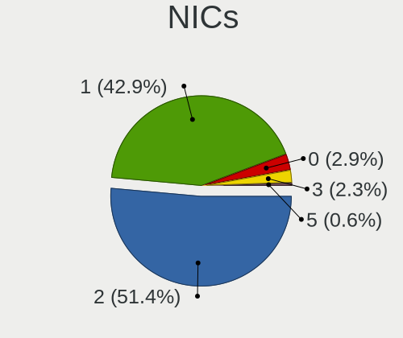
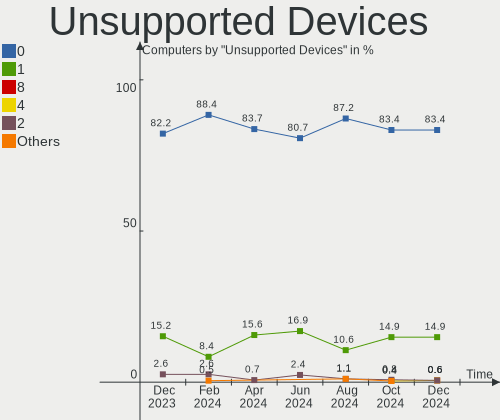

ROSA - Hardware Trends
----------------------

A project to identify most popular hardware characteristics and track their change
over time based on data collected by Linux users at https://Linux-Hardware.org.

Anyone can contribute to this report by the [hw-probe](https://github.com/linuxhw/hw-probe) tool:

    sudo -E hw-probe -all -upload

This is a report for all computer types. See also reports for [desktops](/Dist/ROSA/Desktop/README.md) and [notebooks](/Dist/ROSA/Notebook/README.md).

This report is for one last month. Overall report since the beginning of time: [TestCoverage](https://github.com/linuxhw/TestCoverage)

Period: Oct, 2022.

Contents
--------

* [ System ](#system)
  - [ OS                       ](#os)
  - [ OS Family                ](#os-family)
  - [ Kernel                   ](#kernel)
  - [ Kernel Family            ](#kernel-family)
  - [ Kernel Major Ver.        ](#kernel-major-ver)
  - [ Arch                     ](#arch)
  - [ DE                       ](#de)
  - [ Display Server           ](#display-server)
  - [ Display Manager          ](#display-manager)
  - [ OS Lang                  ](#os-lang)
  - [ Boot Mode                ](#boot-mode)
  - [ Filesystem               ](#filesystem)
  - [ Part. scheme             ](#part-scheme)
  - [ Dual Boot with Linux/BSD ](#dual-boot-with-linuxbsd)
  - [ Dual Boot (Win)          ](#dual-boot-win)

* [ Board ](#board)
  - [ Vendor                   ](#vendor)
  - [ Model                    ](#model)
  - [ Model Family             ](#model-family)
  - [ MFG Year                 ](#mfg-year)
  - [ Form Factor              ](#form-factor)
  - [ Secure Boot              ](#secure-boot)
  - [ Coreboot                 ](#coreboot)
  - [ RAM Size                 ](#ram-size)
  - [ RAM Used                 ](#ram-used)
  - [ Total Drives             ](#total-drives)
  - [ Has CD-ROM               ](#has-cd-rom)
  - [ Has Ethernet             ](#has-ethernet)
  - [ Has WiFi                 ](#has-wifi)
  - [ Has Bluetooth            ](#has-bluetooth)

* [ Location ](#location)
  - [ Country                  ](#country)
  - [ City                     ](#city)

* [ Drives ](#drives)
  - [ Drive Vendor             ](#drive-vendor)
  - [ Drive Model              ](#drive-model)
  - [ HDD Vendor               ](#hdd-vendor)
  - [ SSD Vendor               ](#ssd-vendor)
  - [ Drive Kind               ](#drive-kind)
  - [ Drive Connector          ](#drive-connector)
  - [ Drive Size               ](#drive-size)
  - [ Space Total              ](#space-total)
  - [ Space Used               ](#space-used)
  - [ Malfunc. Drives          ](#malfunc-drives)
  - [ Malfunc. Drive Vendor    ](#malfunc-drive-vendor)
  - [ Malfunc. HDD Vendor      ](#malfunc-hdd-vendor)
  - [ Malfunc. Drive Kind      ](#malfunc-drive-kind)
  - [ Failed Drives            ](#failed-drives)
  - [ Failed Drive Vendor      ](#failed-drive-vendor)
  - [ Drive Status             ](#drive-status)

* [ Storage controller ](#storage-controller)
  - [ Storage Vendor           ](#storage-vendor)
  - [ Storage Model            ](#storage-model)
  - [ Storage Kind             ](#storage-kind)

* [ Processor ](#processor)
  - [ CPU Vendor               ](#cpu-vendor)
  - [ CPU Model                ](#cpu-model)
  - [ CPU Model Family         ](#cpu-model-family)
  - [ CPU Cores                ](#cpu-cores)
  - [ CPU Sockets              ](#cpu-sockets)
  - [ CPU Threads              ](#cpu-threads)
  - [ CPU Op-Modes             ](#cpu-op-modes)
  - [ CPU Microcode            ](#cpu-microcode)
  - [ CPU Microarch            ](#cpu-microarch)

* [ Graphics ](#graphics)
  - [ GPU Vendor               ](#gpu-vendor)
  - [ GPU Model                ](#gpu-model)
  - [ GPU Combo                ](#gpu-combo)
  - [ GPU Driver               ](#gpu-driver)
  - [ GPU Memory               ](#gpu-memory)

* [ Monitor ](#monitor)
  - [ Monitor Vendor           ](#monitor-vendor)
  - [ Monitor Model            ](#monitor-model)
  - [ Monitor Resolution       ](#monitor-resolution)
  - [ Monitor Diagonal         ](#monitor-diagonal)
  - [ Monitor Width            ](#monitor-width)
  - [ Aspect Ratio             ](#aspect-ratio)
  - [ Monitor Area             ](#monitor-area)
  - [ Pixel Density            ](#pixel-density)
  - [ Multiple Monitors        ](#multiple-monitors)

* [ Network ](#network)
  - [ Net Controller Vendor    ](#net-controller-vendor)
  - [ Net Controller Model     ](#net-controller-model)
  - [ Wireless Vendor          ](#wireless-vendor)
  - [ Wireless Model           ](#wireless-model)
  - [ Ethernet Vendor          ](#ethernet-vendor)
  - [ Ethernet Model           ](#ethernet-model)
  - [ Net Controller Kind      ](#net-controller-kind)
  - [ Used Controller          ](#used-controller)
  - [ NICs                     ](#nics)
  - [ IPv6                     ](#ipv6)

* [ Bluetooth ](#bluetooth)
  - [ Bluetooth Vendor         ](#bluetooth-vendor)
  - [ Bluetooth Model          ](#bluetooth-model)

* [ Sound ](#sound)
  - [ Sound Vendor             ](#sound-vendor)
  - [ Sound Model              ](#sound-model)

* [ Memory ](#memory)
  - [ Memory Vendor            ](#memory-vendor)
  - [ Memory Model             ](#memory-model)
  - [ Memory Kind              ](#memory-kind)
  - [ Memory Form Factor       ](#memory-form-factor)
  - [ Memory Size              ](#memory-size)
  - [ Memory Speed             ](#memory-speed)

* [ Printers & scanners ](#printers--scanners)
  - [ Printer Vendor           ](#printer-vendor)
  - [ Printer Model            ](#printer-model)
  - [ Scanner Vendor           ](#scanner-vendor)
  - [ Scanner Model            ](#scanner-model)

* [ Camera ](#camera)
  - [ Camera Vendor            ](#camera-vendor)
  - [ Camera Model             ](#camera-model)

* [ Security ](#security)
  - [ Fingerprint Vendor       ](#fingerprint-vendor)
  - [ Fingerprint Model        ](#fingerprint-model)
  - [ Chipcard Vendor          ](#chipcard-vendor)
  - [ Chipcard Model           ](#chipcard-model)

* [ Unsupported ](#unsupported)
  - [ Unsupported Devices      ](#unsupported-devices)
  - [ Unsupported Device Types ](#unsupported-device-types)

System
------

OS
--

Installed operating systems

| Name       | Computers | Percent |
|------------|-----------|---------|
| ROSA 12.2  | 240       | 86.64%  |
| ROSA R11.1 | 25        | 9.03%   |
| ROSA 12.3  | 7         | 2.53%   |
| ROSA 12.1  | 3         | 1.08%   |
| ROSA R11   | 2         | 0.72%   |

OS Family
---------

OS without a version

| Name | Computers | Percent |
|------|-----------|---------|
| ROSA | 277       | 100%    |

Kernel
------

Version of the Linux kernel

| Version                                        | Computers | Percent |
|------------------------------------------------|-----------|---------|
| 5.10.74-generic-2rosa2021.1-x86_64             | 102       | 36.82%  |
| 5.10.118-generic-2rosa2021.1-x86_64            | 81        | 29.24%  |
| 5.17.11-generic-2rosa2021.1-x86_64             | 15        | 5.42%   |
| 5.10.150-generic-1rosa2021.1-x86_64            | 9         | 3.25%   |
| 5.18.18.xm1-1-xanmod-rosa2021.1-x86_64         | 8         | 2.89%   |
| 5.15.43-generic-2rosa2021.1-x86_64             | 8         | 2.89%   |
| 5.4.32-generic-2rosa-x86_64                    | 7         | 2.53%   |
| 5.4.83-generic-2rosa-x86_64                    | 5         | 1.81%   |
| 5.4.83-generic-2rosa-i586                      | 5         | 1.81%   |
| 5.15.74-generic-1rosa2021.1-x86_64             | 5         | 1.81%   |
| 5.15.75-generic-1rosa2021.1-x86_64             | 3         | 1.08%   |
| 5.10.74-generic-2rosa2021.1-i586               | 3         | 1.08%   |
| 5.10.118-generic-2rosa2021.1-i586              | 3         | 1.08%   |
| 6.0.6.xm1-1.klp-xanmod-rosa2021.1-x86_64       | 2         | 0.72%   |
| 6.0.2.xm1-1.klp-xanmod-rosa2021.1-x86_64       | 2         | 0.72%   |
| 5.4.32-generic-2rosa-i586                      | 2         | 0.72%   |
| 5.19.8.xm1-1.klp-xanmod-rosa2021.1-x86_64      | 2         | 0.72%   |
| 4.9.155-nrj-desktop-1rosa-x86_64               | 2         | 0.72%   |
| 4.9.155-nrj-desktop-1rosa-i586                 | 2         | 0.72%   |
| 4.15.0-desktop-45.1rosa-x86_64                 | 2         | 0.72%   |
| 4.15.0-desktop-122.124.1rosa-x86_64            | 2         | 0.72%   |
| 6.0.3.xm1-1.klp-xanmod-rosa2021.1-x86_64       | 1         | 0.36%   |
| 6.0.0.xm1-4.klp-xanmod-rosa2021.1-x86_64       | 1         | 0.36%   |
| 5.19.12-generic-2rosa2021.1-x86_64             | 1         | 0.36%   |
| 5.18.19-generic-1rosa2021.1-x86_64             | 1         | 0.36%   |
| 5.16.20-generic-2rosa2021.1-x86_64             | 1         | 0.36%   |
| 5.15.53.xm1-1.klp-xanmod-lts-rosa2021.1-x86_64 | 1         | 0.36%   |
| 5.10.149-generic-1rosa2021.1-x86_64            | 1         | 0.36%   |

Kernel Family
-------------

Linux kernel without a distro release

| Version  | Computers | Percent |
|----------|-----------|---------|
| 5.10.74  | 105       | 37.91%  |
| 5.10.118 | 84        | 30.32%  |
| 5.17.11  | 15        | 5.42%   |
| 5.4.83   | 10        | 3.61%   |
| 5.4.32   | 9         | 3.25%   |
| 5.10.150 | 9         | 3.25%   |
| 5.18.18  | 8         | 2.89%   |
| 5.15.43  | 8         | 2.89%   |
| 5.15.74  | 5         | 1.81%   |
| 4.9.155  | 4         | 1.44%   |
| 4.15.0   | 4         | 1.44%   |
| 5.15.75  | 3         | 1.08%   |
| 6.0.6    | 2         | 0.72%   |
| 6.0.2    | 2         | 0.72%   |
| 5.19.8   | 2         | 0.72%   |
| 6.0.3    | 1         | 0.36%   |
| 6.0.0    | 1         | 0.36%   |
| 5.19.12  | 1         | 0.36%   |
| 5.18.19  | 1         | 0.36%   |
| 5.16.20  | 1         | 0.36%   |
| 5.15.53  | 1         | 0.36%   |
| 5.10.149 | 1         | 0.36%   |

Kernel Major Ver.
-----------------

Linux kernel major version

| Version | Computers | Percent |
|---------|-----------|---------|
| 5.10    | 199       | 71.84%  |
| 5.4     | 19        | 6.86%   |
| 5.15    | 17        | 6.14%   |
| 5.17    | 15        | 5.42%   |
| 5.18    | 9         | 3.25%   |
| 6.0     | 6         | 2.17%   |
| 4.9     | 4         | 1.44%   |
| 4.15    | 4         | 1.44%   |
| 5.19    | 3         | 1.08%   |
| 5.16    | 1         | 0.36%   |

Arch
----

OS architecture (x86_64, i586, etc.)

| Name   | Computers | Percent |
|--------|-----------|---------|
| x86_64 | 262       | 94.58%  |
| i686   | 15        | 5.42%   |

DE
--

Desktop Environment

| Name    | Computers | Percent |
|---------|-----------|---------|
| KDE5    | 131       | 47.29%  |
| GNOME   | 98        | 35.38%  |
| LXQt    | 30        | 10.83%  |
| KDE4    | 17        | 6.14%   |
| Unknown | 1         | 0.36%   |

Display Server
--------------

X11 or Wayland

| Name    | Computers | Percent |
|---------|-----------|---------|
| Wayland | 205       | 74.01%  |
| X11     | 71        | 25.63%  |
| Tty     | 1         | 0.36%   |

Display Manager
---------------

SDDM, LightDM, etc.

| Name    | Computers | Percent |
|---------|-----------|---------|
| SDDM    | 132       | 47.65%  |
| GDM     | 121       | 43.68%  |
| KDM     | 17        | 6.14%   |
| LightDM | 6         | 2.17%   |
| Unknown | 1         | 0.36%   |

OS Lang
-------

Language

| Lang    | Computers | Percent |
|---------|-----------|---------|
| ru_RU   | 258       | 93.14%  |
| en_US   | 6         | 2.17%   |
| de_DE   | 3         | 1.08%   |
| fr_FR   | 2         | 0.72%   |
| es_ES   | 2         | 0.72%   |
| Unknown | 2         | 0.72%   |
| ru_UA   | 1         | 0.36%   |
| pl_PL   | 1         | 0.36%   |
| it_IT   | 1         | 0.36%   |
| es_AR   | 1         | 0.36%   |

Boot Mode
---------

EFI or BIOS

| Mode | Computers | Percent |
|------|-----------|---------|
| EFI  | 150       | 54.15%  |
| BIOS | 127       | 45.85%  |

Filesystem
----------

Type of filesystem

| Type  | Computers | Percent |
|-------|-----------|---------|
| Ext4  | 260       | 93.86%  |
| Btrfs | 13        | 4.69%   |
| F2fs  | 2         | 0.72%   |
| Ext3  | 2         | 0.72%   |

Part. scheme
------------

Scheme of partitioning

| Type | Computers | Percent |
|------|-----------|---------|
| GPT  | 177       | 63.9%   |
| MBR  | 100       | 36.1%   |

Dual Boot with Linux/BSD
------------------------

Hosting more than one Linux/BSD

| Dual boot | Computers | Percent |
|-----------|-----------|---------|
| No        | 202       | 72.92%  |
| Yes       | 75        | 27.08%  |

Dual Boot (Win)
---------------

Hosting Linux and Windows

| Dual boot | Computers | Percent |
|-----------|-----------|---------|
| No        | 170       | 61.37%  |
| Yes       | 107       | 38.63%  |

Board
-----

Vendor
------

Motherboard manufacturer

| Name                           | Computers | Percent |
|--------------------------------|-----------|---------|
| ASUSTek Computer               | 59        | 21.3%   |
| Gigabyte Technology            | 43        | 15.52%  |
| Lenovo                         | 29        | 10.47%  |
| Hewlett-Packard                | 22        | 7.94%   |
| Acer                           | 21        | 7.58%   |
| MSI                            | 19        | 6.86%   |
| ASRock                         | 15        | 5.42%   |
| Dell                           | 8         | 2.89%   |
| Sony                           | 6         | 2.17%   |
| Samsung Electronics            | 5         | 1.81%   |
| Fujitsu                        | 4         | 1.44%   |
| ECS                            | 4         | 1.44%   |
| Biostar                        | 4         | 1.44%   |
| Pegatron                       | 3         | 1.08%   |
| HUAWEI                         | 3         | 1.08%   |
| Unknown                        | 3         | 1.08%   |
| Maibenben                      | 2         | 0.72%   |
| Intel                          | 2         | 0.72%   |
| Foxconn                        | 2         | 0.72%   |
| eMachines                      | 2         | 0.72%   |
| Clevo                          | 2         | 0.72%   |
| WeiBu                          | 1         | 0.36%   |
| Toshiba                        | 1         | 0.36%   |
| Teclast                        | 1         | 0.36%   |
| Shanghai Zhaoxin Semiconductor | 1         | 0.36%   |
| Sapphire                       | 1         | 0.36%   |
| RuggedPC                       | 1         | 0.36%   |
| Quanta                         | 1         | 0.36%   |
| OEM                            | 1         | 0.36%   |
| MiTAC                          | 1         | 0.36%   |
| Kllisre                        | 1         | 0.36%   |
| HONOR                          | 1         | 0.36%   |
| HIPER                          | 1         | 0.36%   |
| Founder                        | 1         | 0.36%   |
| F+ Mobile                      | 1         | 0.36%   |
| Colorful Technology            | 1         | 0.36%   |
| BenQ                           | 1         | 0.36%   |
| AZW                            | 1         | 0.36%   |
| Aquarius                       | 1         | 0.36%   |
| 3Logic Group                   | 1         | 0.36%   |

Model
-----

Motherboard model

| Name                                       | Computers | Percent |
|--------------------------------------------|-----------|---------|
| Unknown                                    | 4         | 1.44%   |
| HP Pavilion g6                             | 3         | 1.08%   |
| HP Pavilion dv7                            | 3         | 1.08%   |
| Gigabyte B450M DS3H                        | 3         | 1.08%   |
| ASUS All Series                            | 3         | 1.08%   |
| MSI MS-7C52                                | 2         | 0.72%   |
| MSI MS-7817                                | 2         | 0.72%   |
| Gigabyte Z97-HD3                           | 2         | 0.72%   |
| Gigabyte EP41-UD3L                         | 2         | 0.72%   |
| Gigabyte B550 GAMING X V2                  | 2         | 0.72%   |
| Gigabyte A320M-S2H                         | 2         | 0.72%   |
| ASUS VivoBook_ASUS Laptop E210MA_E210MA    | 2         | 0.72%   |
| ASUS P8H77-V                               | 2         | 0.72%   |
| ASUS K43SJ                                 | 2         | 0.72%   |
| ASUS GU609AA-ACB a6230.ru                  | 2         | 0.72%   |
| Acer Nitro AN515-54                        | 2         | 0.72%   |
| Acer Aspire E1-571G                        | 2         | 0.72%   |
| Acer Aspire 5742G                          | 2         | 0.72%   |
| WeiBu PSB133S01ZFP                         | 1         | 0.36%   |
| Toshiba Satellite C660                     | 1         | 0.36%   |
| Teclast H610-AIO T1                        | 1         | 0.36%   |
| Sony VPCSB1V9R                             | 1         | 0.36%   |
| Sony VPCF12Z1R                             | 1         | 0.36%   |
| Sony VPCEB1M1R                             | 1         | 0.36%   |
| Sony VGN-AR71MR                            | 1         | 0.36%   |
| Sony SVE1513U1RW                           | 1         | 0.36%   |
| Sony SVE1512H1RW                           | 1         | 0.36%   |
| Shanghai Zhaoxin ZXE CRB                   | 1         | 0.36%   |
| Sapphire IPC-E350M1                        | 1         | 0.36%   |
| Samsung RV413/RV513                        | 1         | 0.36%   |
| Samsung RV411/RV511/E3511/S3511/RV711      | 1         | 0.36%   |
| Samsung NC110P/NC108P/NC111P               | 1         | 0.36%   |
| Samsung 350V5C/351V5C/3540VC/3440VC        | 1         | 0.36%   |
| Samsung 300V3A/300V4A/300V5A/200A4B/200A5B | 1         | 0.36%   |
| RuggedPC RuggedPadC16V                     | 1         | 0.36%   |
| Quanta TWC                                 | 1         | 0.36%   |
| Pegatron Compaq dx2400 Microtower          | 1         | 0.36%   |
| Pegatron A17                               | 1         | 0.36%   |
| Pegatron A15                               | 1         | 0.36%   |
| MSI Sword 15 A11UE                         | 1         | 0.36%   |

Model Family
------------

Motherboard model prefix

| Name               | Computers | Percent |
|--------------------|-----------|---------|
| Acer Aspire        | 15        | 5.42%   |
| Lenovo IdeaPad     | 9         | 3.25%   |
| HP Pavilion        | 7         | 2.53%   |
| ASUS PRIME         | 7         | 2.53%   |
| Gigabyte B450M     | 5         | 1.81%   |
| ASUS VivoBook      | 5         | 1.81%   |
| HP Laptop          | 4         | 1.44%   |
| Fujitsu ESPRIMO    | 4         | 1.44%   |
| Dell Inspiron      | 4         | 1.44%   |
| Acer Nitro         | 4         | 1.44%   |
| Unknown            | 4         | 1.44%   |
| Lenovo ThinkPad    | 3         | 1.08%   |
| Lenovo Legion      | 3         | 1.08%   |
| ASUS ROG           | 3         | 1.08%   |
| ASUS P8H61-M       | 3         | 1.08%   |
| ASUS All           | 3         | 1.08%   |
| MSI MS-7C52        | 2         | 0.72%   |
| MSI MS-7817        | 2         | 0.72%   |
| HP ProBook         | 2         | 0.72%   |
| HP EliteBook       | 2         | 0.72%   |
| HP Compaq          | 2         | 0.72%   |
| Gigabyte Z97-HD3   | 2         | 0.72%   |
| Gigabyte H410M     | 2         | 0.72%   |
| Gigabyte EP41-UD3L | 2         | 0.72%   |
| Gigabyte B550      | 2         | 0.72%   |
| Gigabyte B450      | 2         | 0.72%   |
| Gigabyte A320M-S2H | 2         | 0.72%   |
| Dell OptiPlex      | 2         | 0.72%   |
| ASUS P8H77-V       | 2         | 0.72%   |
| ASUS P5Q           | 2         | 0.72%   |
| ASUS M5A97         | 2         | 0.72%   |
| ASUS K43SJ         | 2         | 0.72%   |
| ASUS GU609AA-ACB   | 2         | 0.72%   |
| Acer Extensa       | 2         | 0.72%   |
| WeiBu PSB133S01ZFP | 1         | 0.36%   |
| Toshiba Satellite  | 1         | 0.36%   |
| Teclast H610-AIO   | 1         | 0.36%   |
| Sony VPCSB1V9R     | 1         | 0.36%   |
| Sony VPCF12Z1R     | 1         | 0.36%   |
| Sony VPCEB1M1R     | 1         | 0.36%   |

MFG Year
--------

Motherboard manufacture year

| Year | Computers | Percent |
|------|-----------|---------|
| 2011 | 34        | 12.27%  |
| 2012 | 31        | 11.19%  |
| 2018 | 24        | 8.66%   |
| 2021 | 23        | 8.3%    |
| 2019 | 23        | 8.3%    |
| 2020 | 20        | 7.22%   |
| 2013 | 20        | 7.22%   |
| 2017 | 15        | 5.42%   |
| 2010 | 15        | 5.42%   |
| 2009 | 13        | 4.69%   |
| 2016 | 12        | 4.33%   |
| 2008 | 12        | 4.33%   |
| 2014 | 11        | 3.97%   |
| 2007 | 11        | 3.97%   |
| 2022 | 7         | 2.53%   |
| 2015 | 5         | 1.81%   |
| 2006 | 1         | 0.36%   |

Form Factor
-----------

Physical design of the computer

| Name       | Computers | Percent |
|------------|-----------|---------|
| Desktop    | 142       | 51.26%  |
| Notebook   | 126       | 45.49%  |
| All in one | 5         | 1.81%   |
| Mini pc    | 2         | 0.72%   |
| Tablet     | 1         | 0.36%   |
| Server     | 1         | 0.36%   |

Secure Boot
-----------

Enabled or disabled

| State    | Computers | Percent |
|----------|-----------|---------|
| Disabled | 277       | 100%    |

Coreboot
--------

Have coreboot on board

| Used | Computers | Percent |
|------|-----------|---------|
| No   | 277       | 100%    |

RAM Size
--------

Total RAM memory

| Size in GB  | Computers | Percent |
|-------------|-----------|---------|
| 4.01-8.0    | 71        | 25.63%  |
| 8.01-16.0   | 53        | 19.13%  |
| 3.01-4.0    | 52        | 18.77%  |
| 16.01-24.0  | 51        | 18.41%  |
| 1.01-2.0    | 19        | 6.86%   |
| 32.01-64.0  | 14        | 5.05%   |
| 2.01-3.0    | 9         | 3.25%   |
| 24.01-32.0  | 5         | 1.81%   |
| 64.01-256.0 | 2         | 0.72%   |
| 0.51-1.0    | 1         | 0.36%   |

RAM Used
--------

Used RAM memory

| Used GB   | Computers | Percent |
|-----------|-----------|---------|
| 1.01-2.0  | 152       | 54.87%  |
| 0.51-1.0  | 71        | 25.63%  |
| 2.01-3.0  | 35        | 12.64%  |
| 3.01-4.0  | 9         | 3.25%   |
| 4.01-8.0  | 8         | 2.89%   |
| 8.01-16.0 | 1         | 0.36%   |
| 0.01-0.5  | 1         | 0.36%   |

Total Drives
------------

Number of drives on board

| Drives | Computers | Percent |
|--------|-----------|---------|
| 1      | 156       | 56.32%  |
| 2      | 76        | 27.44%  |
| 3      | 33        | 11.91%  |
| 4      | 6         | 2.17%   |
| 6      | 2         | 0.72%   |
| 8      | 1         | 0.36%   |
| 7      | 1         | 0.36%   |
| 5      | 1         | 0.36%   |
| 0      | 1         | 0.36%   |

Has CD-ROM
----------

Has CD-ROM on board

| Presented | Computers | Percent |
|-----------|-----------|---------|
| No        | 171       | 61.73%  |
| Yes       | 106       | 38.27%  |

Has Ethernet
------------

Has Ethernet on board

| Presented | Computers | Percent |
|-----------|-----------|---------|
| Yes       | 256       | 92.42%  |
| No        | 21        | 7.58%   |

Has WiFi
--------

Has WiFi module

| Presented | Computers | Percent |
|-----------|-----------|---------|
| Yes       | 183       | 66.06%  |
| No        | 94        | 33.94%  |

Has Bluetooth
-------------

Has Bluetooth module

| Presented | Computers | Percent |
|-----------|-----------|---------|
| Yes       | 147       | 53.07%  |
| No        | 130       | 46.93%  |

Location
--------

Country
-------

Geographic location (country)

| Country    | Computers | Percent |
|------------|-----------|---------|
| Russia     | 239       | 86.28%  |
| Ukraine    | 9         | 3.25%   |
| Germany    | 5         | 1.81%   |
| Kazakhstan | 3         | 1.08%   |
| Belarus    | 3         | 1.08%   |
| USA        | 2         | 0.72%   |
| Moldova    | 2         | 0.72%   |
| France     | 2         | 0.72%   |
| Estonia    | 2         | 0.72%   |
| Algeria    | 2         | 0.72%   |
| Spain      | 1         | 0.36%   |
| Poland     | 1         | 0.36%   |
| Norway     | 1         | 0.36%   |
| Latvia     | 1         | 0.36%   |
| Italy      | 1         | 0.36%   |
| Czechia    | 1         | 0.36%   |
| Colombia   | 1         | 0.36%   |
| Argentina  | 1         | 0.36%   |

City
----

Geographic location (city)

| City              | Computers | Percent |
|-------------------|-----------|---------|
| Moscow            | 42        | 15.16%  |
| Yekaterinburg     | 9         | 3.25%   |
| St Petersburg     | 9         | 3.25%   |
| Krasnodar         | 7         | 2.53%   |
| Novosibirsk       | 6         | 2.17%   |
| Voronezh          | 5         | 1.81%   |
| Stavropol         | 5         | 1.81%   |
| Samara            | 5         | 1.81%   |
| Novokuznetsk      | 5         | 1.81%   |
| Nizhniy Novgorod  | 5         | 1.81%   |
| Chelyabinsk       | 5         | 1.81%   |
| Ufa               | 4         | 1.44%   |
| Rostov-on-Don     | 4         | 1.44%   |
| Vladivostok       | 3         | 1.08%   |
| Tyumen            | 3         | 1.08%   |
| Tver              | 3         | 1.08%   |
| Saratov           | 3         | 1.08%   |
| Pskov             | 3         | 1.08%   |
| Perm              | 3         | 1.08%   |
| Krasnoyarsk       | 3         | 1.08%   |
| Kazan’          | 3         | 1.08%   |
| Irkutsk           | 3         | 1.08%   |
| Yuzhno-Sakhalinsk | 2         | 0.72%   |
| Yaroslavl         | 2         | 0.72%   |
| Yalta             | 2         | 0.72%   |
| Vologda           | 2         | 0.72%   |
| Tula              | 2         | 0.72%   |
| Tomsk             | 2         | 0.72%   |
| Tiraspol          | 2         | 0.72%   |
| Syktyvkar         | 2         | 0.72%   |
| Surgut            | 2         | 0.72%   |
| Sochi             | 2         | 0.72%   |
| Severodvinsk      | 2         | 0.72%   |
| Sergiyev Posad    | 2         | 0.72%   |
| Orenburg          | 2         | 0.72%   |
| Omsk              | 2         | 0.72%   |
| Nizhny Tagil      | 2         | 0.72%   |
| Murmansk          | 2         | 0.72%   |
| Montpellier       | 2         | 0.72%   |
| Kurgan            | 2         | 0.72%   |

Drives
------

Drive Vendor
------------

Hard drive vendors

| Vendor              | Computers | Drives | Percent |
|---------------------|-----------|--------|---------|
| WDC                 | 75        | 88     | 17.86%  |
| Seagate             | 68        | 78     | 16.19%  |
| Hitachi             | 28        | 29     | 6.67%   |
| Samsung Electronics | 27        | 29     | 6.43%   |
| Toshiba             | 25        | 26     | 5.95%   |
| Kingston            | 19        | 19     | 4.52%   |
| SPCC                | 13        | 13     | 3.1%    |
| China               | 13        | 14     | 3.1%    |
| Unknown             | 10        | 13     | 2.38%   |
| AMD                 | 10        | 10     | 2.38%   |
| A-DATA Technology   | 9         | 10     | 2.14%   |
| SanDisk             | 8         | 8      | 1.9%    |
| Intel               | 8         | 8      | 1.9%    |
| Crucial             | 8         | 11     | 1.9%    |
| SK hynix            | 7         | 7      | 1.67%   |
| HGST                | 7         | 7      | 1.67%   |
| Transcend           | 6         | 6      | 1.43%   |
| KingSpec            | 6         | 6      | 1.43%   |
| Apacer              | 6         | 6      | 1.43%   |
| Patriot             | 5         | 5      | 1.19%   |
| Micron Technology   | 5         | 5      | 1.19%   |
| Plextor             | 4         | 4      | 0.95%   |
| Netac               | 4         | 4      | 0.95%   |
| Maxtor              | 3         | 3      | 0.71%   |
| KIOXIA              | 3         | 3      | 0.71%   |
| GOODRAM             | 3         | 3      | 0.71%   |
| Zheino              | 2         | 2      | 0.48%   |
| SSSTC               | 2         | 2      | 0.48%   |
| Smartbuy            | 2         | 2      | 0.48%   |
| Phison              | 2         | 2      | 0.48%   |
| OCZ-VERTEX3         | 2         | 2      | 0.48%   |
| KingDian            | 2         | 2      | 0.48%   |
| JMicron Technology  | 2         | 2      | 0.48%   |
| Gigabyte Technology | 2         | 2      | 0.48%   |
| 1TB                 | 2         | 2      | 0.48%   |
| Unknown             | 2         | 2      | 0.48%   |
| XPG                 | 1         | 1      | 0.24%   |
| WALRAM              | 1         | 1      | 0.24%   |
| UMIS                | 1         | 1      | 0.24%   |
| Teclast             | 1         | 1      | 0.24%   |

Drive Model
-----------

Hard drive models

| Model                                | Computers | Percent |
|--------------------------------------|-----------|---------|
| Seagate ST1000DM010-2EP102 1TB       | 9         | 1.99%   |
| Toshiba HDWD110 1TB                  | 5         | 1.1%    |
| Kingston SA400S37240G 240GB SSD      | 5         | 1.1%    |
| WDC WDS120G2G0A-00JH30 120GB SSD     | 4         | 0.88%   |
| SPCC Solid State Disk 256GB          | 4         | 0.88%   |
| Seagate ST1000LM024 HN-M101MBB 1TB   | 4         | 0.88%   |
| Kingston SNVS500G 500GB              | 4         | 0.88%   |
| Apacer AS350 128GB SSD               | 4         | 0.88%   |
| WDC WDS500G2B0A-00SM50 500GB SSD     | 3         | 0.66%   |
| WDC WDS240G2G0A-00JH30 240GB SSD     | 3         | 0.66%   |
| WDC WD10EZEX-08WN4A0 1TB             | 3         | 0.66%   |
| Unknown DA4064  64GB                 | 3         | 0.66%   |
| Toshiba MQ01ABF050 500GB             | 3         | 0.66%   |
| Toshiba DT01ACA050 500GB             | 3         | 0.66%   |
| SPCC Solid State Disk 120GB          | 3         | 0.66%   |
| Seagate ST500DM002-1BD142 500GB      | 3         | 0.66%   |
| Seagate ST3250310AS 250GB            | 3         | 0.66%   |
| Seagate ST2000DM008-2FR102 2TB       | 3         | 0.66%   |
| Samsung SSD 860 EVO 250GB            | 3         | 0.66%   |
| Samsung SSD 850 EVO 250GB            | 3         | 0.66%   |
| Crucial CT480BX500SSD1 480GB         | 3         | 0.66%   |
| AMD R5SL240G 240GB SSD               | 3         | 0.66%   |
| A-DATA SU650 120GB SSD               | 3         | 0.66%   |
| WDC WD5000LPCX-24VHAT0 500GB         | 2         | 0.44%   |
| WDC WD20EARS-00S8B1 2TB              | 2         | 0.44%   |
| WDC WD10EZRX-00L4HB0 1TB             | 2         | 0.44%   |
| WDC WD10EZEX-07ZF5A0 1TB             | 2         | 0.44%   |
| WDC PC SN530 SDBPNPZ-256G-1006 256GB | 2         | 0.44%   |
| Unknown SD/MMC/MS PRO 1TB            | 2         | 0.44%   |
| Unknown EC2QT  64GB                  | 2         | 0.44%   |
| Toshiba HDWD130 3TB                  | 2         | 0.44%   |
| Toshiba HDWD120 2TB                  | 2         | 0.44%   |
| Toshiba DT01ACA100 1TB               | 2         | 0.44%   |
| SPCC Solid State Disk 128GB          | 2         | 0.44%   |
| SK hynix HFM256GDJTNG-8310A 256GB    | 2         | 0.44%   |
| Seagate ST9320325AS 320GB            | 2         | 0.44%   |
| Seagate ST500LT012-1DG142 500GB      | 2         | 0.44%   |
| Seagate ST380815AS 80GB              | 2         | 0.44%   |
| Seagate ST380215A 80GB               | 2         | 0.44%   |
| Seagate ST320LT020-9YG142 320GB      | 2         | 0.44%   |

HDD Vendor
----------

Hard disk drive vendors

| Vendor              | Computers | Drives | Percent |
|---------------------|-----------|--------|---------|
| Seagate             | 67        | 77     | 33.84%  |
| WDC                 | 62        | 70     | 31.31%  |
| Hitachi             | 28        | 29     | 14.14%  |
| Toshiba             | 22        | 23     | 11.11%  |
| HGST                | 7         | 7      | 3.54%   |
| Samsung Electronics | 5         | 5      | 2.53%   |
| Maxtor              | 3         | 3      | 1.52%   |
| Unknown             | 2         | 2      | 1.01%   |
| Magnetic Data       | 1         | 1      | 0.51%   |
| ASMT                | 1         | 2      | 0.51%   |

SSD Vendor
----------

Solid state drive vendors

| Vendor              | Computers | Drives | Percent |
|---------------------|-----------|--------|---------|
| WDC                 | 13        | 14     | 8.23%   |
| SPCC                | 13        | 13     | 8.23%   |
| Samsung Electronics | 13        | 13     | 8.23%   |
| China               | 13        | 14     | 8.23%   |
| Kingston            | 12        | 12     | 7.59%   |
| AMD                 | 9         | 9      | 5.7%    |
| SanDisk             | 7         | 7      | 4.43%   |
| Crucial             | 7         | 10     | 4.43%   |
| A-DATA Technology   | 7         | 7      | 4.43%   |
| KingSpec            | 6         | 6      | 3.8%    |
| Apacer              | 6         | 6      | 3.8%    |
| Transcend           | 4         | 4      | 2.53%   |
| Plextor             | 4         | 4      | 2.53%   |
| Patriot             | 4         | 4      | 2.53%   |
| Toshiba             | 3         | 3      | 1.9%    |
| Netac               | 3         | 3      | 1.9%    |
| Intel               | 3         | 3      | 1.9%    |
| GOODRAM             | 3         | 3      | 1.9%    |
| Zheino              | 2         | 2      | 1.27%   |
| Unknown             | 2         | 2      | 1.27%   |
| OCZ-VERTEX3         | 2         | 2      | 1.27%   |
| KingDian            | 2         | 2      | 1.27%   |
| 1TB                 | 2         | 2      | 1.27%   |
| Unknown             | 2         | 2      | 1.27%   |
| WALRAM              | 1         | 1      | 0.63%   |
| Teclast             | 1         | 1      | 0.63%   |
| Team                | 1         | 1      | 0.63%   |
| T-FORCE             | 1         | 1      | 0.63%   |
| Smartbuy            | 1         | 1      | 0.63%   |
| PNY                 | 1         | 1      | 0.63%   |
| Neo                 | 1         | 1      | 0.63%   |
| Lexar               | 1         | 1      | 0.63%   |
| HS-SSD-E100         | 1         | 1      | 0.63%   |
| Hewlett-Packard     | 1         | 1      | 0.63%   |
| GS                  | 1         | 2      | 0.63%   |
| Gigabyte Technology | 1         | 1      | 0.63%   |
| Foxline             | 1         | 1      | 0.63%   |
| faspeed             | 1         | 1      | 0.63%   |
| ExeGate             | 1         | 1      | 0.63%   |
| AGI                 | 1         | 1      | 0.63%   |

Drive Kind
----------

HDD or SSD

| Kind    | Computers | Drives | Percent |
|---------|-----------|--------|---------|
| HDD     | 170       | 219    | 44.97%  |
| SSD     | 138       | 164    | 36.51%  |
| NVMe    | 61        | 63     | 16.14%  |
| MMC     | 8         | 10     | 2.12%   |
| Unknown | 1         | 1      | 0.26%   |

Drive Connector
---------------

SATA, SAS, NVMe, etc.

| Type | Computers | Drives | Percent |
|------|-----------|--------|---------|
| SATA | 243       | 377    | 76.42%  |
| NVMe | 59        | 61     | 18.55%  |
| SAS  | 8         | 9      | 2.52%   |
| MMC  | 8         | 10     | 2.52%   |

Drive Size
----------

Size of hard drive

| Size in TB | Computers | Drives | Percent |
|------------|-----------|--------|---------|
| 0.01-0.5   | 205       | 267    | 66.99%  |
| 0.51-1.0   | 78        | 89     | 25.49%  |
| 1.01-2.0   | 16        | 20     | 5.23%   |
| 2.01-3.0   | 4         | 4      | 1.31%   |
| 3.01-4.0   | 1         | 1      | 0.33%   |
| 10.01-20.0 | 1         | 1      | 0.33%   |
| 4.01-10.0  | 1         | 1      | 0.33%   |

Space Total
-----------

Amount of disk space available on the file system

| Size in GB     | Computers | Percent |
|----------------|-----------|---------|
| 101-250        | 99        | 35.74%  |
| 251-500        | 60        | 21.66%  |
| 501-1000       | 33        | 11.91%  |
| 1-20           | 23        | 8.3%    |
| 1001-2000      | 21        | 7.58%   |
| 51-100         | 18        | 6.5%    |
| 21-50          | 15        | 5.42%   |
| 2001-3000      | 4         | 1.44%   |
| More than 3000 | 3         | 1.08%   |
| Unknown        | 1         | 0.36%   |

Space Used
----------

Amount of used disk space

| Used GB        | Computers | Percent |
|----------------|-----------|---------|
| 1-20           | 184       | 66.43%  |
| 21-50          | 28        | 10.11%  |
| 251-500        | 18        | 6.5%    |
| 51-100         | 14        | 5.05%   |
| 101-250        | 13        | 4.69%   |
| 501-1000       | 12        | 4.33%   |
| 1001-2000      | 5         | 1.81%   |
| More than 3000 | 2         | 0.72%   |
| Unknown        | 1         | 0.36%   |

Malfunc. Drives
---------------

Drive models with a malfunction

| Model                           | Computers | Drives | Percent |
|---------------------------------|-----------|--------|---------|
| Seagate ST3250310AS 250GB       | 3         | 3      | 3%      |
| WDC WD20EARS-00S8B1 2TB         | 2         | 2      | 2%      |
| Seagate ST500LT012-1DG142 500GB | 2         | 2      | 2%      |
| Seagate ST1000DM010-2EP102 1TB  | 2         | 2      | 2%      |
| OCZ-VERTEX3 MI 120GB SSD        | 2         | 2      | 2%      |
| Hitachi HTS547550A9E384 500GB   | 2         | 2      | 2%      |
| Hitachi HTS542516K9SA00 160GB   | 2         | 2      | 2%      |
| WDC WD800BD-22MRA1 80GB         | 1         | 1      | 1%      |
| WDC WD7500BPVT-22A1YT0 752GB    | 1         | 1      | 1%      |
| WDC WD6400AAKS-22A7B2 640GB     | 1         | 1      | 1%      |
| WDC WD5000LPLX-22ZNTT0 500GB    | 1         | 1      | 1%      |
| WDC WD5000LPCX-21VHAT0 500GB    | 1         | 1      | 1%      |
| WDC WD5000BPVT-00HXZT1 500GB    | 1         | 1      | 1%      |
| WDC WD5000AAKX-60U6AA0 500GB    | 1         | 1      | 1%      |
| WDC WD5000AAKX-00ERMA0 500GB    | 1         | 1      | 1%      |
| WDC WD5000AAKX-001CA0 500GB     | 1         | 1      | 1%      |
| WDC WD3200BPVT-24ZEST0 320GB    | 1         | 1      | 1%      |
| WDC WD3200BPVT-24JJ5T0 320GB    | 1         | 1      | 1%      |
| WDC WD3200BPVT-22JJ5T0 320GB    | 1         | 1      | 1%      |
| WDC WD3200AAJS-65B4A0 320GB     | 1         | 1      | 1%      |
| WDC WD3200AAJS-00L7A0 320GB     | 1         | 1      | 1%      |
| WDC WD2500BEVT-22A23T0 250GB    | 1         | 1      | 1%      |
| WDC WD20EZRZ-00Z5HB0 2TB        | 1         | 1      | 1%      |
| WDC WD20EZRX-00DC0B0 2TB        | 1         | 1      | 1%      |
| WDC WD20EARX-00PASB0 2TB        | 1         | 1      | 1%      |
| WDC WD2003FYPS-27W9B0 2TB       | 1         | 1      | 1%      |
| WDC WD10EZRX-00L4HB0 1TB        | 1         | 1      | 1%      |
| WDC WD10EZEX-75WN4A0 1TB        | 1         | 1      | 1%      |
| WDC WD10EARS-00Y5B1 1TB         | 1         | 1      | 1%      |
| WDC WD1003FZEX-00MK2A0 1TB      | 1         | 1      | 1%      |
| WDC WD1002FAEX-00Z3A0 1TB       | 1         | 1      | 1%      |
| Toshiba MQ01ABF050 500GB        | 1         | 1      | 1%      |
| Toshiba MQ01ABD050 500GB        | 1         | 1      | 1%      |
| Toshiba MQ01ABD032 320GB        | 1         | 1      | 1%      |
| Toshiba MK5065GSXN 500GB        | 1         | 1      | 1%      |
| Toshiba DT01ACA050 500GB        | 1         | 2      | 1%      |
| Teclast 256GB SSD               | 1         | 1      | 1%      |
| SPCC Solid State Disk 56GB      | 1         | 1      | 1%      |
| SPCC Solid State Disk 240GB     | 1         | 1      | 1%      |
| Seagate ST9500420AS 500GB       | 1         | 1      | 1%      |

Malfunc. Drive Vendor
---------------------

Vendors of faulty drives

| Vendor              | Computers | Drives | Percent |
|---------------------|-----------|--------|---------|
| Seagate             | 30        | 32     | 31.58%  |
| WDC                 | 23        | 26     | 24.21%  |
| Hitachi             | 17        | 17     | 17.89%  |
| Toshiba             | 5         | 6      | 5.26%   |
| Maxtor              | 3         | 3      | 3.16%   |
| SPCC                | 2         | 2      | 2.11%   |
| Samsung Electronics | 2         | 2      | 2.11%   |
| OCZ-VERTEX3         | 2         | 2      | 2.11%   |
| KingSpec            | 2         | 2      | 2.11%   |
| Teclast             | 1         | 1      | 1.05%   |
| Netac               | 1         | 1      | 1.05%   |
| Neo                 | 1         | 1      | 1.05%   |
| Magnetic Data       | 1         | 1      | 1.05%   |
| Kingston            | 1         | 1      | 1.05%   |
| HGST                | 1         | 1      | 1.05%   |
| Crucial             | 1         | 1      | 1.05%   |
| China               | 1         | 2      | 1.05%   |
| Unknown             | 1         | 1      | 1.05%   |

Malfunc. HDD Vendor
-------------------

Vendors of faulty HDD drives

| Vendor              | Computers | Drives | Percent |
|---------------------|-----------|--------|---------|
| Seagate             | 30        | 32     | 36.59%  |
| WDC                 | 23        | 26     | 28.05%  |
| Hitachi             | 17        | 17     | 20.73%  |
| Toshiba             | 5         | 6      | 6.1%    |
| Maxtor              | 3         | 3      | 3.66%   |
| Samsung Electronics | 2         | 2      | 2.44%   |
| Magnetic Data       | 1         | 1      | 1.22%   |
| HGST                | 1         | 1      | 1.22%   |

Malfunc. Drive Kind
-------------------

Kinds of faulty drives

| Kind | Computers | Drives | Percent |
|------|-----------|--------|---------|
| HDD  | 75        | 88     | 85.23%  |
| SSD  | 13        | 14     | 14.77%  |

Failed Drives
-------------

Failed drive models

Zero info for selected period =(

Failed Drive Vendor
-------------------

Failed drive vendors

Zero info for selected period =(

Drive Status
------------

Number of failed and malfunc. drives

| Status   | Computers | Drives | Percent |
|----------|-----------|--------|---------|
| Works    | 227       | 340    | 69.63%  |
| Malfunc  | 87        | 102    | 26.69%  |
| Detected | 12        | 15     | 3.68%   |

Storage controller
------------------

Storage Vendor
--------------

Storage controller vendors

| Vendor                           | Computers | Percent |
|----------------------------------|-----------|---------|
| Intel                            | 192       | 55.81%  |
| AMD                              | 66        | 19.19%  |
| Samsung Electronics              | 11        | 3.2%    |
| Marvell Technology Group         | 9         | 2.62%   |
| SK hynix                         | 7         | 2.03%   |
| Nvidia                           | 7         | 2.03%   |
| Kingston Technology Company      | 7         | 2.03%   |
| JMicron Technology               | 6         | 1.74%   |
| Micron Technology                | 5         | 1.45%   |
| Silicon Motion                   | 4         | 1.16%   |
| SanDisk                          | 4         | 1.16%   |
| Phison Electronics               | 4         | 1.16%   |
| ASMedia Technology               | 4         | 1.16%   |
| KIOXIA                           | 3         | 0.87%   |
| ADATA Technology                 | 3         | 0.87%   |
| Solid State Storage Technology   | 2         | 0.58%   |
| Zhaoxin                          | 1         | 0.29%   |
| Union Memory (Shenzhen)          | 1         | 0.29%   |
| Transcend                        | 1         | 0.29%   |
| Silicon Integrated Systems [SiS] | 1         | 0.29%   |
| Silicon Image                    | 1         | 0.29%   |
| Seagate Technology               | 1         | 0.29%   |
| Realtek Semiconductor            | 1         | 0.29%   |
| Micron/Crucial Technology        | 1         | 0.29%   |
| MAXIO Technology (Hangzhou)      | 1         | 0.29%   |
| LSI Logic / Symbios Logic        | 1         | 0.29%   |

Storage Model
-------------

Storage controller models

| Model                                                                                   | Computers | Percent |
|-----------------------------------------------------------------------------------------|-----------|---------|
| AMD FCH SATA Controller [AHCI mode]                                                     | 39        | 9.33%   |
| Intel 7 Series Chipset Family 6-port SATA Controller [AHCI mode]                        | 17        | 4.07%   |
| AMD 400 Series Chipset SATA Controller                                                  | 14        | 3.35%   |
| Intel 8 Series/C220 Series Chipset Family 6-port SATA Controller 1 [AHCI mode]          | 11        | 2.63%   |
| Intel 6 Series/C200 Series Chipset Family 6 port Mobile SATA AHCI Controller            | 10        | 2.39%   |
| Intel 6 Series/C200 Series Chipset Family 6 port Desktop SATA AHCI Controller           | 9         | 2.15%   |
| Intel 5 Series/3400 Series Chipset 4 port SATA AHCI Controller                          | 9         | 2.15%   |
| Samsung NVMe SSD Controller SM981/PM981/PM983                                           | 8         | 1.91%   |
| AMD SB7x0/SB8x0/SB9x0 SATA Controller [AHCI mode]                                       | 8         | 1.91%   |
| AMD SB7x0/SB8x0/SB9x0 IDE Controller                                                    | 8         | 1.91%   |
| Intel Sunrise Point-LP SATA Controller [AHCI mode]                                      | 7         | 1.67%   |
| Intel NM10/ICH7 Family SATA Controller [IDE mode]                                       | 7         | 1.67%   |
| Intel Comet Lake SATA AHCI Controller                                                   | 7         | 1.67%   |
| Intel Cannon Lake Mobile PCH SATA AHCI Controller                                       | 7         | 1.67%   |
| Intel 500 Series Chipset Family SATA AHCI Controller                                    | 7         | 1.67%   |
| Intel 200 Series PCH SATA controller [AHCI mode]                                        | 7         | 1.67%   |
| Intel 82801IBM/IEM (ICH9M/ICH9M-E) 4 port SATA Controller [AHCI mode]                   | 6         | 1.44%   |
| Intel 82801G (ICH7 Family) IDE Controller                                               | 6         | 1.44%   |
| Intel 6 Series/C200 Series Chipset Family Desktop SATA Controller (IDE mode, ports 4-5) | 6         | 1.44%   |
| Intel 6 Series/C200 Series Chipset Family Desktop SATA Controller (IDE mode, ports 0-3) | 6         | 1.44%   |
| AMD 500 Series Chipset SATA Controller                                                  | 6         | 1.44%   |
| Micron Non-Volatile memory controller                                                   | 5         | 1.2%    |
| Kingston Company Company Non-Volatile memory controller                                 | 5         | 1.2%    |
| JMicron JMB363 SATA/IDE Controller                                                      | 5         | 1.2%    |
| Intel Q170/Q150/B150/H170/H110/Z170/CM236 Chipset SATA Controller [AHCI Mode]           | 5         | 1.2%    |
| Intel NM10/ICH7 Family SATA Controller [AHCI mode]                                      | 5         | 1.2%    |
| Intel Atom Processor E3800 Series SATA AHCI Controller                                  | 5         | 1.2%    |
| Intel 82801HM/HEM (ICH8M/ICH8M-E) IDE Controller                                        | 5         | 1.2%    |
| AMD SB7x0/SB8x0/SB9x0 SATA Controller [IDE mode]                                        | 5         | 1.2%    |
| AMD FCH SATA Controller D                                                               | 5         | 1.2%    |
| Intel Celeron/Pentium Silver Processor SATA Controller                                  | 4         | 0.96%   |
| Intel 82801JI (ICH10 Family) 4 port SATA IDE Controller #1                              | 4         | 0.96%   |
| Intel 82801JI (ICH10 Family) 2 port SATA IDE Controller #2                              | 4         | 0.96%   |
| Intel 82801HM/HEM (ICH8M/ICH8M-E) SATA Controller [AHCI mode]                           | 4         | 0.96%   |
| Intel 8 Series SATA Controller 1 [AHCI mode]                                            | 4         | 0.96%   |
| Intel 7 Series/C210 Series Chipset Family 6-port SATA Controller [AHCI mode]            | 4         | 0.96%   |
| Intel 400 Series Chipset Family SATA AHCI Controller                                    | 4         | 0.96%   |
| ASMedia ASM1062 Serial ATA Controller                                                   | 4         | 0.96%   |
| SK hynix BC501 NVMe Solid State Drive                                                   | 3         | 0.72%   |
| Nvidia MCP61 SATA Controller                                                            | 3         | 0.72%   |

Storage Kind
------------

Kind of storage controller (IDE, SATA, NVMe, SAS, ...)

| Kind | Computers | Percent |
|------|-----------|---------|
| SATA | 228       | 64.77%  |
| NVMe | 59        | 16.76%  |
| IDE  | 53        | 15.06%  |
| RAID | 12        | 3.41%   |

Processor
---------

CPU Vendor
----------

Processor vendors

| Vendor       | Computers | Percent |
|--------------|-----------|---------|
| Intel        | 197       | 71.12%  |
| AMD          | 79        | 28.52%  |
| CentaurHauls | 1         | 0.36%   |

CPU Model
---------

Processor models

| Model                                         | Computers | Percent |
|-----------------------------------------------|-----------|---------|
| Intel Pentium CPU B960 @ 2.20GHz              | 4         | 1.44%   |
| Intel Core i5-8300H CPU @ 2.30GHz             | 4         | 1.44%   |
| Intel Core i5-7200U CPU @ 2.50GHz             | 4         | 1.44%   |
| Intel Core i5-3470 CPU @ 3.20GHz              | 4         | 1.44%   |
| Intel Core i3-3110M CPU @ 2.40GHz             | 4         | 1.44%   |
| Intel Core i3-10100F CPU @ 3.60GHz            | 4         | 1.44%   |
| AMD Ryzen 5 3600 6-Core Processor             | 4         | 1.44%   |
| Intel Core i5-8400 CPU @ 2.80GHz              | 3         | 1.08%   |
| Intel Core i5-2410M CPU @ 2.30GHz             | 3         | 1.08%   |
| Intel Core i3-9100F CPU @ 3.60GHz             | 3         | 1.08%   |
| Intel Core i3-10100 CPU @ 3.60GHz             | 3         | 1.08%   |
| Intel Celeron N4020 CPU @ 1.10GHz             | 3         | 1.08%   |
| AMD Ryzen 5 3500U with Radeon Vega Mobile Gfx | 3         | 1.08%   |
| AMD Ryzen 5 2600 Six-Core Processor           | 3         | 1.08%   |
| AMD Ryzen 5 1600 Six-Core Processor           | 3         | 1.08%   |
| Intel Xeon CPU E5-2650 v2 @ 2.60GHz           | 2         | 0.72%   |
| Intel Pentium CPU N3540 @ 2.16GHz             | 2         | 0.72%   |
| Intel Pentium CPU G630 @ 2.70GHz              | 2         | 0.72%   |
| Intel Pentium CPU G3220 @ 3.00GHz             | 2         | 0.72%   |
| Intel Core i7-9750H CPU @ 2.60GHz             | 2         | 0.72%   |
| Intel Core i7-7700K CPU @ 4.20GHz             | 2         | 0.72%   |
| Intel Core i7-3610QM CPU @ 2.30GHz            | 2         | 0.72%   |
| Intel Core i7-2670QM CPU @ 2.20GHz            | 2         | 0.72%   |
| Intel Core i5-8265U CPU @ 1.60GHz             | 2         | 0.72%   |
| Intel Core i5-2400 CPU @ 3.10GHz              | 2         | 0.72%   |
| Intel Core i5-10210U CPU @ 1.60GHz            | 2         | 0.72%   |
| Intel Core i3-2310M CPU @ 2.10GHz             | 2         | 0.72%   |
| Intel Core i3 CPU M 380 @ 2.53GHz             | 2         | 0.72%   |
| Intel Core i3 CPU M 370 @ 2.40GHz             | 2         | 0.72%   |
| Intel Core i3 CPU M 330 @ 2.13GHz             | 2         | 0.72%   |
| Intel Core 2 Quad CPU Q9550 @ 2.83GHz         | 2         | 0.72%   |
| Intel Core 2 Duo CPU E7400 @ 2.80GHz          | 2         | 0.72%   |
| Intel Core 2 Duo CPU E4500 @ 2.20GHz          | 2         | 0.72%   |
| Intel Celeron CPU J1800 @ 2.41GHz             | 2         | 0.72%   |
| Intel Celeron CPU 540 @ 1.86GHz               | 2         | 0.72%   |
| Intel Atom CPU N2800 @ 1.86GHz                | 2         | 0.72%   |
| Intel 11th Gen Core i5-11400H @ 2.70GHz       | 2         | 0.72%   |
| Intel 11th Gen Core i5-11400 @ 2.60GHz        | 2         | 0.72%   |
| AMD Ryzen 7 5800H with Radeon Graphics        | 2         | 0.72%   |
| AMD Ryzen 5 5600X 6-Core Processor            | 2         | 0.72%   |

CPU Model Family
----------------

Processor model prefix

| Model                   | Computers | Percent |
|-------------------------|-----------|---------|
| Intel Core i5           | 54        | 19.49%  |
| Intel Core i3           | 34        | 12.27%  |
| Intel Core i7           | 22        | 7.94%   |
| AMD Ryzen 5             | 21        | 7.58%   |
| Intel Pentium           | 19        | 6.86%   |
| Intel Celeron           | 16        | 5.78%   |
| Intel Core 2 Duo        | 13        | 4.69%   |
| Other                   | 12        | 4.33%   |
| Intel Xeon              | 8         | 2.89%   |
| AMD Ryzen 7             | 8         | 2.89%   |
| AMD FX                  | 7         | 2.53%   |
| Intel Atom              | 6         | 2.17%   |
| AMD Ryzen 3             | 6         | 2.17%   |
| Intel Pentium Dual-Core | 4         | 1.44%   |
| Intel Core 2 Quad       | 4         | 1.44%   |
| AMD Phenom II X4        | 4         | 1.44%   |
| AMD A8                  | 4         | 1.44%   |
| AMD A10                 | 4         | 1.44%   |
| AMD E                   | 3         | 1.08%   |
| AMD Athlon              | 3         | 1.08%   |
| Intel Pentium Silver    | 2         | 0.72%   |
| AMD Ryzen 3 PRO         | 2         | 0.72%   |
| AMD E2                  | 2         | 0.72%   |
| AMD Athlon 64 X2        | 2         | 0.72%   |
| AMD A6                  | 2         | 0.72%   |
| Intel Xeon Silver       | 1         | 0.36%   |
| Intel Pentium 4         | 1         | 0.36%   |
| Intel Genuine           | 1         | 0.36%   |
| Intel Core Duo          | 1         | 0.36%   |
| Intel Celeron D         | 1         | 0.36%   |
| AMD Turion 64 X2 Mobile | 1         | 0.36%   |
| AMD Ryzen 9             | 1         | 0.36%   |
| AMD Ryzen 5 PRO         | 1         | 0.36%   |
| AMD Phenom II X6        | 1         | 0.36%   |
| AMD Phenom II           | 1         | 0.36%   |
| AMD E1                  | 1         | 0.36%   |
| AMD Athlon II X3        | 1         | 0.36%   |
| AMD Athlon II Neo       | 1         | 0.36%   |
| AMD Athlon 64           | 1         | 0.36%   |
| AMD A4                  | 1         | 0.36%   |

CPU Cores
---------

Number of processor cores

| Number | Computers | Percent |
|--------|-----------|---------|
| 2      | 119       | 42.96%  |
| 4      | 99        | 35.74%  |
| 6      | 34        | 12.27%  |
| 8      | 12        | 4.33%   |
| 1      | 7         | 2.53%   |
| 3      | 3         | 1.08%   |
| 20     | 1         | 0.36%   |
| 12     | 1         | 0.36%   |
| 10     | 1         | 0.36%   |

CPU Sockets
-----------

Number of sockets

| Number | Computers | Percent |
|--------|-----------|---------|
| 1      | 276       | 99.64%  |
| 2      | 1         | 0.36%   |

CPU Threads
-----------

Threads per core (Hyper-Threading)

| Number | Computers | Percent |
|--------|-----------|---------|
| 2      | 160       | 57.76%  |
| 1      | 117       | 42.24%  |

CPU Op-Modes
------------

CPU Operation Modes (32-bit, 64-bit)

| Op mode        | Computers | Percent |
|----------------|-----------|---------|
| 32-bit, 64-bit | 275       | 99.28%  |
| 32-bit         | 2         | 0.72%   |

CPU Microcode
-------------

Microcode number

| Number     | Computers | Percent |
|------------|-----------|---------|
| 0x206a7    | 28        | 10.11%  |
| 0x306a9    | 22        | 7.94%   |
| 0x306c3    | 14        | 5.05%   |
| 0x906ea    | 13        | 4.69%   |
| 0x1067a    | 13        | 4.69%   |
| Unknown    | 11        | 3.97%   |
| 0xa0653    | 9         | 3.25%   |
| 0x08108109 | 7         | 2.53%   |
| 0x806ec    | 6         | 2.17%   |
| 0x20655    | 6         | 2.17%   |
| 0x08001138 | 6         | 2.17%   |
| 0x010000c8 | 6         | 2.17%   |
| 0x806e9    | 5         | 1.81%   |
| 0x30678    | 5         | 1.81%   |
| 0x706a8    | 4         | 1.44%   |
| 0x6fd      | 4         | 1.44%   |
| 0x40651    | 4         | 1.44%   |
| 0x0a50000c | 4         | 1.44%   |
| 0x08701021 | 4         | 1.44%   |
| 0x06001119 | 4         | 1.44%   |
| 0x906e9    | 3         | 1.08%   |
| 0x806d1    | 3         | 1.08%   |
| 0x506e3    | 3         | 1.08%   |
| 0x406c4    | 3         | 1.08%   |
| 0x30661    | 3         | 1.08%   |
| 0x106e5    | 3         | 1.08%   |
| 0x10661    | 3         | 1.08%   |
| 0x08108102 | 3         | 1.08%   |
| 0x0800820d | 3         | 1.08%   |
| 0x03000027 | 3         | 1.08%   |
| 0xa0671    | 2         | 0.72%   |
| 0xa0655    | 2         | 0.72%   |
| 0x90672    | 2         | 0.72%   |
| 0x806ea    | 2         | 0.72%   |
| 0x806c1    | 2         | 0.72%   |
| 0x6fb      | 2         | 0.72%   |
| 0x306f2    | 2         | 0.72%   |
| 0x306e4    | 2         | 0.72%   |
| 0x306d4    | 2         | 0.72%   |
| 0x20652    | 2         | 0.72%   |

CPU Microarch
-------------

Microarchitecture

| Name             | Computers | Percent |
|------------------|-----------|---------|
| KabyLake         | 32        | 11.55%  |
| SandyBridge      | 28        | 10.11%  |
| IvyBridge        | 24        | 8.66%   |
| Haswell          | 20        | 7.22%   |
| Penryn           | 16        | 5.78%   |
| Zen+             | 14        | 5.05%   |
| Zen              | 12        | 4.33%   |
| CometLake        | 12        | 4.33%   |
| Piledriver       | 11        | 3.97%   |
| Core             | 10        | 3.61%   |
| Zen 2            | 9         | 3.25%   |
| Zen 3            | 8         | 2.89%   |
| Westmere         | 8         | 2.89%   |
| Silvermont       | 8         | 2.89%   |
| K10              | 8         | 2.89%   |
| Skylake          | 6         | 2.17%   |
| Nehalem          | 5         | 1.81%   |
| Icelake          | 5         | 1.81%   |
| Goldmont plus    | 5         | 1.81%   |
| Bonnell          | 5         | 1.81%   |
| K8 Hammer        | 4         | 1.44%   |
| Unknown          | 4         | 1.44%   |
| K10 Llano        | 3         | 1.08%   |
| Bobcat           | 3         | 1.08%   |
| TigerLake        | 2         | 0.72%   |
| Steamroller      | 2         | 0.72%   |
| Puma             | 2         | 0.72%   |
| NetBurst         | 2         | 0.72%   |
| Excavator        | 2         | 0.72%   |
| Broadwell        | 2         | 0.72%   |
| Tremont          | 1         | 0.36%   |
| P6               | 1         | 0.36%   |
| Goldmont         | 1         | 0.36%   |
| Bulldozer        | 1         | 0.36%   |
| Alderlake Hybrid | 1         | 0.36%   |

Graphics
--------

GPU Vendor
----------

Vendors of graphics cards

| Vendor              | Computers | Percent |
|---------------------|-----------|---------|
| Nvidia              | 124       | 37.46%  |
| Intel               | 119       | 35.95%  |
| AMD                 | 85        | 25.68%  |
| Zhaoxin             | 1         | 0.3%    |
| Huawei Technologies | 1         | 0.3%    |
| ATI Technologies    | 1         | 0.3%    |

GPU Model
---------

Graphics card models

| Model                                                                                    | Computers | Percent |
|------------------------------------------------------------------------------------------|-----------|---------|
| Intel 2nd Generation Core Processor Family Integrated Graphics Controller                | 18        | 5.28%   |
| Intel 3rd Gen Core processor Graphics Controller                                         | 12        | 3.52%   |
| AMD Picasso/Raven 2 [Radeon Vega Series / Radeon Vega Mobile Series]                     | 10        | 2.93%   |
| Nvidia GP107 [GeForce GTX 1050 Ti]                                                       | 7         | 2.05%   |
| Intel CoffeeLake-H GT2 [UHD Graphics 630]                                                | 7         | 2.05%   |
| Nvidia GK208B [GeForce GT 730]                                                           | 5         | 1.47%   |
| Intel Xeon E3-1200 v3/4th Gen Core Processor Integrated Graphics Controller              | 5         | 1.47%   |
| Intel Xeon E3-1200 v2/3rd Gen Core processor Graphics Controller                         | 5         | 1.47%   |
| Intel HD Graphics 620                                                                    | 5         | 1.47%   |
| Intel Core Processor Integrated Graphics Controller                                      | 5         | 1.47%   |
| Nvidia GM107 [GeForce GTX 750 Ti]                                                        | 4         | 1.17%   |
| Nvidia GK208B [GeForce GT 710]                                                           | 4         | 1.17%   |
| Nvidia GF117M [GeForce 610M/710M/810M/820M / GT 620M/625M/630M/720M]                     | 4         | 1.17%   |
| Nvidia GF108M [GeForce GT 540M]                                                          | 4         | 1.17%   |
| Nvidia GF108 [GeForce GT 430]                                                            | 4         | 1.17%   |
| Intel Haswell-ULT Integrated Graphics Controller                                         | 4         | 1.17%   |
| Intel GeminiLake [UHD Graphics 600]                                                      | 4         | 1.17%   |
| Intel Atom Processor Z36xxx/Z37xxx Series Graphics & Display                             | 4         | 1.17%   |
| AMD Ellesmere [Radeon RX 470/480/570/570X/580/580X/590]                                  | 4         | 1.17%   |
| AMD Cezanne                                                                              | 4         | 1.17%   |
| AMD Caicos [Radeon HD 6450/7450/8450 / R5 230 OEM]                                       | 4         | 1.17%   |
| Nvidia TU117M [GeForce GTX 1650 Mobile / Max-Q]                                          | 3         | 0.88%   |
| Nvidia GP107M [GeForce GTX 1050 Mobile]                                                  | 3         | 0.88%   |
| Nvidia GP107M [GeForce GTX 1050 3 GB Max-Q]                                              | 3         | 0.88%   |
| Nvidia GM206 [GeForce GTX 950]                                                           | 3         | 0.88%   |
| Nvidia GF116 [GeForce GTX 550 Ti]                                                        | 3         | 0.88%   |
| Nvidia GA107M [GeForce RTX 3050 Mobile]                                                  | 3         | 0.88%   |
| Intel WhiskeyLake-U GT2 [UHD Graphics 620]                                               | 3         | 0.88%   |
| Intel TigerLake-H GT1 [UHD Graphics]                                                     | 3         | 0.88%   |
| Intel Mobile 4 Series Chipset Integrated Graphics Controller                             | 3         | 0.88%   |
| Intel CometLake-U GT2 [UHD Graphics]                                                     | 3         | 0.88%   |
| Intel CometLake-S GT2 [UHD Graphics 630]                                                 | 3         | 0.88%   |
| Intel Atom/Celeron/Pentium Processor x5-E8000/J3xxx/N3xxx Integrated Graphics Controller | 3         | 0.88%   |
| Intel Atom Processor D2xxx/N2xxx Integrated Graphics Controller                          | 3         | 0.88%   |
| AMD Sun XT [Radeon HD 8670A/8670M/8690M / R5 M330 / M430 / Radeon 520 Mobile]            | 3         | 0.88%   |
| AMD Renoir                                                                               | 3         | 0.88%   |
| AMD Navi 24 [Radeon RX 6400 / 6500 XT]                                                   | 3         | 0.88%   |
| AMD Navi 23 [Radeon RX 6600/6600 XT/6600M]                                               | 3         | 0.88%   |
| AMD Lexa PRO [Radeon 540/540X/550/550X / RX 540X/550/550X]                               | 3         | 0.88%   |
| Nvidia TU117 [GeForce GTX 1650]                                                          | 2         | 0.59%   |

GPU Combo
---------

Combinations of graphics cards

| Name                    | Computers | Percent |
|-------------------------|-----------|---------|
| 1 x Nvidia              | 83        | 29.96%  |
| 1 x Intel               | 69        | 24.91%  |
| 1 x AMD                 | 62        | 22.38%  |
| Intel + Nvidia          | 37        | 13.36%  |
| Intel + AMD             | 12        | 4.33%   |
| 2 x AMD                 | 8         | 2.89%   |
| AMD + Nvidia            | 4         | 1.44%   |
| 1 x Zhaoxin             | 1         | 0.36%   |
| 1 x Huawei Technologies | 1         | 0.36%   |

GPU Driver
----------

Free vs proprietary

| Driver      | Computers | Percent |
|-------------|-----------|---------|
| Free        | 235       | 84.84%  |
| Proprietary | 29        | 10.47%  |
| Unknown     | 13        | 4.69%   |

GPU Memory
----------

Total video memory

| Size in GB | Computers | Percent |
|------------|-----------|---------|
| Unknown    | 98        | 35.38%  |
| 1.01-2.0   | 49        | 17.69%  |
| 0.51-1.0   | 47        | 16.97%  |
| 0.01-0.5   | 42        | 15.16%  |
| 3.01-4.0   | 22        | 7.94%   |
| 7.01-8.0   | 11        | 3.97%   |
| 5.01-6.0   | 3         | 1.08%   |
| 2.01-3.0   | 3         | 1.08%   |
| 8.01-16.0  | 2         | 0.72%   |

Monitor
-------

Monitor Vendor
--------------

Monitor vendors

| Vendor                  | Computers | Percent |
|-------------------------|-----------|---------|
| Samsung Electronics     | 48        | 18.6%   |
| AU Optronics            | 27        | 10.47%  |
| Goldstar                | 24        | 9.3%    |
| LG Display              | 22        | 8.53%   |
| BOE                     | 17        | 6.59%   |
| BenQ                    | 15        | 5.81%   |
| Chimei Innolux          | 13        | 5.04%   |
| Acer                    | 12        | 4.65%   |
| Philips                 | 9         | 3.49%   |
| Chi Mei Optoelectronics | 8         | 3.1%    |
| AOC                     | 7         | 2.71%   |
| ViewSonic               | 6         | 2.33%   |
| Hewlett-Packard         | 6         | 2.33%   |
| NEC Computers           | 5         | 1.94%   |
| Dell                    | 4         | 1.55%   |
| PANDA                   | 3         | 1.16%   |
| HannStar                | 3         | 1.16%   |
| Ancor Communications    | 3         | 1.16%   |
| Sony                    | 2         | 0.78%   |
| Panasonic               | 2         | 0.78%   |
| LG Philips              | 2         | 0.78%   |
| Lenovo                  | 2         | 0.78%   |
| InfoVision              | 2         | 0.78%   |
| Iiyama                  | 2         | 0.78%   |
| Gigabyte Technology     | 2         | 0.78%   |
| CHD                     | 2         | 0.78%   |
| Apple                   | 2         | 0.78%   |
| MSI                     | 1         | 0.39%   |
| KTC                     | 1         | 0.39%   |
| HUI                     | 1         | 0.39%   |
| Fujitsu Siemens         | 1         | 0.39%   |
| Founder                 | 1         | 0.39%   |
| Envision Peripherals    | 1         | 0.39%   |
| CSO                     | 1         | 0.39%   |
| CPT                     | 1         | 0.39%   |

Monitor Model
-------------

Monitor models

| Model                                                                    | Computers | Percent |
|--------------------------------------------------------------------------|-----------|---------|
| LG Display LCD Monitor LGD02DC 1366x768 344x194mm 15.5-inch              | 4         | 1.52%   |
| BOE LCD Monitor BOE0877 1920x1080 309x173mm 13.9-inch                    | 3         | 1.14%   |
| AU Optronics LCD Monitor AUO26EC 1366x768 344x193mm 15.5-inch            | 3         | 1.14%   |
| AU Optronics LCD Monitor AUO22EC 1366x768 344x193mm 15.5-inch            | 3         | 1.14%   |
| AU Optronics LCD Monitor AUO21ED 1920x1080 344x193mm 15.5-inch           | 3         | 1.14%   |
| Samsung Electronics SME1920N SAM06A3 1366x768 410x230mm 18.5-inch        | 2         | 0.76%   |
| Samsung Electronics SA300/SA350 SAM0795 1920x1080 521x293mm 23.5-inch    | 2         | 0.76%   |
| Samsung Electronics LCD Monitor SEC4542 1366x768 309x174mm 14.0-inch     | 2         | 0.76%   |
| Samsung Electronics LCD Monitor SEC324A 1366x768 344x194mm 15.5-inch     | 2         | 0.76%   |
| Samsung Electronics LCD Monitor SDC324C 1920x1080 344x194mm 15.5-inch    | 2         | 0.76%   |
| Samsung Electronics LCD Monitor SAM03D4 1360x768                         | 2         | 0.76%   |
| LG Display LP156WH2-TLAA LGD0230 1366x768 344x194mm 15.5-inch            | 2         | 0.76%   |
| Goldstar W2242 GSM5677 1680x1050 474x296mm 22.0-inch                     | 2         | 0.76%   |
| Goldstar FULL HD GSM5B55 1920x1080 480x270mm 21.7-inch                   | 2         | 0.76%   |
| Chimei Innolux LCD Monitor CMN15C4 1920x1080 344x193mm 15.5-inch         | 2         | 0.76%   |
| Chi Mei Optoelectronics LCD Monitor CMO15A2 1366x768 344x193mm 15.5-inch | 2         | 0.76%   |
| BenQ T90X BNQ76AF 1280x1024 376x301mm 19.0-inch                          | 2         | 0.76%   |
| BenQ GW2270 BNQ78DB 1920x1080 480x270mm 21.7-inch                        | 2         | 0.76%   |
| BenQ G2420HD BNQ7840 1920x1080 531x299mm 24.0-inch                       | 2         | 0.76%   |
| AU Optronics LCD Monitor AUO235C 1366x768 256x144mm 11.6-inch            | 2         | 0.76%   |
| AOC Q3279WG5B AOC3279 2560x1440 725x428mm 33.1-inch                      | 2         | 0.76%   |
| Acer V193W ACR0025 1440x900 408x255mm 18.9-inch                          | 2         | 0.76%   |
| ViewSonic VX2452 Series VSCDE2E 1920x1080 521x293mm 23.5-inch            | 1         | 0.38%   |
| ViewSonic VX2433wm VSC3822 1920x1080 520x290mm 23.4-inch                 | 1         | 0.38%   |
| ViewSonic VG700 VSC3E08 1280x1024 338x270mm 17.0-inch                    | 1         | 0.38%   |
| ViewSonic VA705 Series VSC2825 1280x1024 338x270mm 17.0-inch             | 1         | 0.38%   |
| ViewSonic VA703-3Series VSC631E 1280x1024 338x270mm 17.0-inch            | 1         | 0.38%   |
| ViewSonic VA1616wSERIES VSC0021 1366x768 348x197mm 15.7-inch             | 1         | 0.38%   |
| Sony Nvidia Defaul t Flat Panel MS_0025 1920x1080 531x299mm 24.0-inch    | 1         | 0.38%   |
| Sony LCD Monitor SNY05FA 1366x768 310x170mm 13.9-inch                    | 1         | 0.38%   |
| Samsung Electronics U28E590 SAM0C4D 3840x2160 607x345mm 27.5-inch        | 1         | 0.38%   |
| Samsung Electronics SyncMaster SAM0580 1280x1024 376x301mm 19.0-inch     | 1         | 0.38%   |
| Samsung Electronics SyncMaster SAM050A 1920x1080 477x268mm 21.5-inch     | 1         | 0.38%   |
| Samsung Electronics SyncMaster SAM030C 1680x1050 474x296mm 22.0-inch     | 1         | 0.38%   |
| Samsung Electronics SyncMaster SAM027F 1680x1050 474x296mm 22.0-inch     | 1         | 0.38%   |
| Samsung Electronics SyncMaster SAM0274 1440x900 410x257mm 19.1-inch      | 1         | 0.38%   |
| Samsung Electronics SyncMaster SAM01F9 1280x1024 376x301mm 19.0-inch     | 1         | 0.38%   |
| Samsung Electronics SyncMaster SAM011F 1280x1024 376x301mm 19.0-inch     | 1         | 0.38%   |
| Samsung Electronics SyncMaster SAM011E 1280x1024 338x270mm 17.0-inch     | 1         | 0.38%   |
| Samsung Electronics SyncMaster SAM00EC 1280x1024 376x301mm 19.0-inch     | 1         | 0.38%   |

Monitor Resolution
------------------

Monitor screen resolution

| Resolution         | Computers | Percent |
|--------------------|-----------|---------|
| 1920x1080 (FHD)    | 114       | 44.53%  |
| 1366x768 (WXGA)    | 53        | 20.7%   |
| 1280x1024 (SXGA)   | 22        | 8.59%   |
| 1600x900 (HD+)     | 13        | 5.08%   |
| 1440x900 (WXGA+)   | 10        | 3.91%   |
| 2560x1440 (QHD)    | 8         | 3.13%   |
| 1680x1050 (WSXGA+) | 8         | 3.13%   |
| 3840x2160 (4K)     | 7         | 2.73%   |
| 1280x800 (WXGA)    | 7         | 2.73%   |
| 1360x768           | 3         | 1.17%   |
| 3440x1440          | 2         | 0.78%   |
| 2560x1600          | 2         | 0.78%   |
| 2560x1080          | 2         | 0.78%   |
| 1920x1200 (WUXGA)  | 2         | 0.78%   |
| 1024x600           | 2         | 0.78%   |
| 1600x1200          | 1         | 0.39%   |

Monitor Diagonal
----------------

Diagonal size in inches

| Inches  | Computers | Percent |
|---------|-----------|---------|
| 15      | 79        | 30.15%  |
| 23      | 31        | 11.83%  |
| 21      | 21        | 8.02%   |
| 17      | 20        | 7.63%   |
| 19      | 18        | 6.87%   |
| 13      | 15        | 5.73%   |
| 24      | 11        | 4.2%    |
| 18      | 11        | 4.2%    |
| 14      | 8         | 3.05%   |
| 31      | 7         | 2.67%   |
| 27      | 7         | 2.67%   |
| 20      | 7         | 2.67%   |
| 22      | 5         | 1.91%   |
| 34      | 4         | 1.53%   |
| 16      | 4         | 1.53%   |
| 33      | 2         | 0.76%   |
| 11      | 2         | 0.76%   |
| 10      | 2         | 0.76%   |
| Unknown | 2         | 0.76%   |
| 54      | 1         | 0.38%   |
| 48      | 1         | 0.38%   |
| 41      | 1         | 0.38%   |
| 26      | 1         | 0.38%   |
| 25      | 1         | 0.38%   |
| 12      | 1         | 0.38%   |

Monitor Width
-------------

Physical width

| Width in mm | Computers | Percent |
|-------------|-----------|---------|
| 301-350     | 108       | 41.54%  |
| 401-500     | 53        | 20.38%  |
| 501-600     | 46        | 17.69%  |
| 351-400     | 23        | 8.85%   |
| 201-300     | 11        | 4.23%   |
| 601-700     | 8         | 3.08%   |
| 701-800     | 6         | 2.31%   |
| 1001-1500   | 2         | 0.77%   |
| Unknown     | 2         | 0.77%   |
| 901-1000    | 1         | 0.38%   |

Aspect Ratio
------------

Proportional relationship between the width and the height

| Ratio | Computers | Percent |
|-------|-----------|---------|
| 16/9  | 194       | 76.68%  |
| 16/10 | 30        | 11.86%  |
| 5/4   | 22        | 8.7%    |
| 21/9  | 4         | 1.58%   |
| 3/2   | 3         | 1.19%   |

Monitor Area
------------

Area in inch²

| Area in inch² | Computers | Percent |
|----------------|-----------|---------|
| 101-110        | 79        | 30.27%  |
| 201-250        | 60        | 22.99%  |
| 151-200        | 36        | 13.79%  |
| 81-90          | 18        | 6.9%    |
| 141-150        | 17        | 6.51%   |
| 351-500        | 13        | 4.98%   |
| 301-350        | 8         | 3.07%   |
| 121-130        | 8         | 3.07%   |
| 71-80          | 5         | 1.92%   |
| 111-120        | 3         | 1.15%   |
| More than 1000 | 2         | 0.77%   |
| 51-60          | 2         | 0.77%   |
| 41-50          | 2         | 0.77%   |
| 251-300        | 2         | 0.77%   |
| Unknown        | 2         | 0.77%   |
| 61-70          | 1         | 0.38%   |
| 131-140        | 1         | 0.38%   |
| 501-1000       | 1         | 0.38%   |
| 91-100         | 1         | 0.38%   |

Pixel Density
-------------

Pixels per inch

| Density | Computers | Percent |
|---------|-----------|---------|
| 51-100  | 112       | 43.75%  |
| 101-120 | 81        | 31.64%  |
| 121-160 | 51        | 19.92%  |
| 161-240 | 7         | 2.73%   |
| 1-50    | 3         | 1.17%   |
| Unknown | 2         | 0.78%   |

Multiple Monitors
-----------------

Total monitors connected

| Total | Computers | Percent |
|-------|-----------|---------|
| 1     | 239       | 86.28%  |
| 0     | 25        | 9.03%   |
| 2     | 13        | 4.69%   |

Network
-------

Net Controller Vendor
---------------------

Controller vendors

| Vendor                            | Computers | Percent |
|-----------------------------------|-----------|---------|
| Realtek Semiconductor             | 195       | 45.88%  |
| Qualcomm Atheros                  | 76        | 17.88%  |
| Intel                             | 67        | 15.76%  |
| Broadcom                          | 22        | 5.18%   |
| Ralink                            | 9         | 2.12%   |
| MediaTek                          | 8         | 1.88%   |
| Marvell Technology Group          | 7         | 1.65%   |
| Ralink Technology                 | 6         | 1.41%   |
| TP-Link                           | 5         | 1.18%   |
| Nvidia                            | 5         | 1.18%   |
| Huawei Technologies               | 3         | 0.71%   |
| Broadcom Limited                  | 3         | 0.71%   |
| Xiaomi                            | 2         | 0.47%   |
| Samsung Electronics               | 2         | 0.47%   |
| JMicron Technology                | 2         | 0.47%   |
| ASUSTek Computer                  | 2         | 0.47%   |
| ZTE WCDMA Technologies MSM        | 1         | 0.24%   |
| Vimtron Electronics               | 1         | 0.24%   |
| VIA Technologies                  | 1         | 0.24%   |
| U-Blox                            | 1         | 0.24%   |
| Texas Instruments                 | 1         | 0.24%   |
| Qualcomm Atheros Communications   | 1         | 0.24%   |
| Qualcomm                          | 1         | 0.24%   |
| OPPO Electronics                  | 1         | 0.24%   |
| Microsoft                         | 1         | 0.24%   |
| Ericsson Business Mobile Networks | 1         | 0.24%   |
| Attansic Technology               | 1         | 0.24%   |

Net Controller Model
--------------------

Controller models

| Model                                                                   | Computers | Percent |
|-------------------------------------------------------------------------|-----------|---------|
| Realtek RTL8111/8168/8411 PCI Express Gigabit Ethernet Controller       | 143       | 31.15%  |
| Realtek RTL810xE PCI Express Fast Ethernet controller                   | 17        | 3.7%    |
| Qualcomm Atheros AR9485 Wireless Network Adapter                        | 16        | 3.49%   |
| Qualcomm Atheros AR9285 Wireless Network Adapter (PCI-Express)          | 15        | 3.27%   |
| Qualcomm Atheros QCA9377 802.11ac Wireless Network Adapter              | 9         | 1.96%   |
| Realtek RTL8821CE 802.11ac PCIe Wireless Network Adapter                | 7         | 1.53%   |
| Intel Wireless 7265                                                     | 7         | 1.53%   |
| Broadcom BCM4313 802.11bgn Wireless Network Adapter                     | 7         | 1.53%   |
| Realtek RTL8188EUS 802.11n Wireless Network Adapter                     | 6         | 1.31%   |
| Realtek RTL8125 2.5GbE Controller                                       | 6         | 1.31%   |
| Qualcomm Atheros QCA9565 / AR9565 Wireless Network Adapter              | 6         | 1.31%   |
| MediaTek MT7921 802.11ax PCI Express Wireless Network Adapter           | 6         | 1.31%   |
| Qualcomm Atheros AR8152 v2.0 Fast Ethernet                              | 5         | 1.09%   |
| Intel Wi-Fi 6 AX200                                                     | 5         | 1.09%   |
| Intel Ethernet Connection (2) I219-V                                    | 5         | 1.09%   |
| Realtek RTL8822CE 802.11ac PCIe Wireless Network Adapter                | 4         | 0.87%   |
| Realtek RTL8188CE 802.11b/g/n WiFi Adapter                              | 4         | 0.87%   |
| Ralink MT7601U Wireless Adapter                                         | 4         | 0.87%   |
| Qualcomm Atheros AR8161 Gigabit Ethernet                                | 4         | 0.87%   |
| Qualcomm Atheros AR8151 v2.0 Gigabit Ethernet                           | 4         | 0.87%   |
| Intel Cannon Lake PCH CNVi WiFi                                         | 4         | 0.87%   |
| Realtek RTL8723BE PCIe Wireless Network Adapter                         | 3         | 0.65%   |
| Realtek RTL-8100/8101L/8139 PCI Fast Ethernet Adapter                   | 3         | 0.65%   |
| Ralink RT3290 Wireless 802.11n 1T/1R PCIe                               | 3         | 0.65%   |
| Qualcomm Atheros QCA6174 802.11ac Wireless Network Adapter              | 3         | 0.65%   |
| Qualcomm Atheros AR8121/AR8113/AR8114 Gigabit or Fast Ethernet          | 3         | 0.65%   |
| Qualcomm Atheros AR242x / AR542x Wireless Network Adapter (PCI-Express) | 3         | 0.65%   |
| Intel Wireless 8265 / 8275                                              | 3         | 0.65%   |
| Intel Centrino Wireless-N 130                                           | 3         | 0.65%   |
| Intel Cannon Point-LP CNVi [Wireless-AC]                                | 3         | 0.65%   |
| Huawei E353/E3131                                                       | 3         | 0.65%   |
| Broadcom NetLink BCM57785 Gigabit Ethernet PCIe                         | 3         | 0.65%   |
| Broadcom BCM4312 802.11b/g LP-PHY                                       | 3         | 0.65%   |
| TP-Link TL-WN821N v5/v6 [RTL8192EU]                                     | 2         | 0.44%   |
| Samsung Galaxy series, misc. (tethering mode)                           | 2         | 0.44%   |
| Realtek RTL8192CE PCIe Wireless Network Adapter                         | 2         | 0.44%   |
| Realtek RTL8187 Wireless Adapter                                        | 2         | 0.44%   |
| Realtek 802.11ac NIC                                                    | 2         | 0.44%   |
| Ralink RT3090 Wireless 802.11n 1T/1R PCIe                               | 2         | 0.44%   |
| Qualcomm Atheros QCA8171 Gigabit Ethernet                               | 2         | 0.44%   |

Wireless Vendor
---------------

Wireless vendors

| Vendor                          | Computers | Percent |
|---------------------------------|-----------|---------|
| Qualcomm Atheros                | 57        | 30.65%  |
| Intel                           | 47        | 25.27%  |
| Realtek Semiconductor           | 35        | 18.82%  |
| Broadcom                        | 16        | 8.6%    |
| Ralink                          | 9         | 4.84%   |
| MediaTek                        | 7         | 3.76%   |
| Ralink Technology               | 6         | 3.23%   |
| TP-Link                         | 5         | 2.69%   |
| ASUSTek Computer                | 2         | 1.08%   |
| Qualcomm Atheros Communications | 1         | 0.54%   |
| Microsoft                       | 1         | 0.54%   |

Wireless Model
--------------

Wireless models

| Model                                                                   | Computers | Percent |
|-------------------------------------------------------------------------|-----------|---------|
| Qualcomm Atheros AR9485 Wireless Network Adapter                        | 16        | 8.56%   |
| Qualcomm Atheros AR9285 Wireless Network Adapter (PCI-Express)          | 15        | 8.02%   |
| Qualcomm Atheros QCA9377 802.11ac Wireless Network Adapter              | 9         | 4.81%   |
| Realtek RTL8821CE 802.11ac PCIe Wireless Network Adapter                | 7         | 3.74%   |
| Intel Wireless 7265                                                     | 7         | 3.74%   |
| Broadcom BCM4313 802.11bgn Wireless Network Adapter                     | 7         | 3.74%   |
| Realtek RTL8188EUS 802.11n Wireless Network Adapter                     | 6         | 3.21%   |
| Qualcomm Atheros QCA9565 / AR9565 Wireless Network Adapter              | 6         | 3.21%   |
| MediaTek MT7921 802.11ax PCI Express Wireless Network Adapter           | 6         | 3.21%   |
| Intel Wi-Fi 6 AX200                                                     | 5         | 2.67%   |
| Realtek RTL8822CE 802.11ac PCIe Wireless Network Adapter                | 4         | 2.14%   |
| Realtek RTL8188CE 802.11b/g/n WiFi Adapter                              | 4         | 2.14%   |
| Ralink MT7601U Wireless Adapter                                         | 4         | 2.14%   |
| Intel Cannon Lake PCH CNVi WiFi                                         | 4         | 2.14%   |
| Realtek RTL8723BE PCIe Wireless Network Adapter                         | 3         | 1.6%    |
| Ralink RT3290 Wireless 802.11n 1T/1R PCIe                               | 3         | 1.6%    |
| Qualcomm Atheros QCA6174 802.11ac Wireless Network Adapter              | 3         | 1.6%    |
| Qualcomm Atheros AR242x / AR542x Wireless Network Adapter (PCI-Express) | 3         | 1.6%    |
| Intel Wireless 8265 / 8275                                              | 3         | 1.6%    |
| Intel Centrino Wireless-N 130                                           | 3         | 1.6%    |
| Intel Cannon Point-LP CNVi [Wireless-AC]                                | 3         | 1.6%    |
| Broadcom BCM4312 802.11b/g LP-PHY                                       | 3         | 1.6%    |
| TP-Link TL-WN821N v5/v6 [RTL8192EU]                                     | 2         | 1.07%   |
| Realtek RTL8192CE PCIe Wireless Network Adapter                         | 2         | 1.07%   |
| Realtek RTL8187 Wireless Adapter                                        | 2         | 1.07%   |
| Realtek 802.11ac NIC                                                    | 2         | 1.07%   |
| Ralink RT3090 Wireless 802.11n 1T/1R PCIe                               | 2         | 1.07%   |
| Qualcomm Atheros AR9462 Wireless Network Adapter                        | 2         | 1.07%   |
| Intel Wireless 7260                                                     | 2         | 1.07%   |
| Intel WiFi Link 5100                                                    | 2         | 1.07%   |
| Intel Tiger Lake PCH CNVi WiFi                                          | 2         | 1.07%   |
| Intel PRO/Wireless 5100 AGN [Shiloh] Network Connection                 | 2         | 1.07%   |
| Intel Dual Band Wireless-AC 3168NGW [Stone Peak]                        | 2         | 1.07%   |
| Broadcom BCM43142 802.11b/g/n                                           | 2         | 1.07%   |
| TP-Link Archer T4U ver.3                                                | 1         | 0.53%   |
| TP-Link Archer T2U PLUS [RTL8821AU]                                     | 1         | 0.53%   |
| TP-Link 802.11ac NIC                                                    | 1         | 0.53%   |
| Realtek RTL8821AE 802.11ac PCIe Wireless Network Adapter                | 1         | 0.53%   |
| Realtek RTL8814AU 802.11a/b/g/n/ac Wireless Adapter                     | 1         | 0.53%   |
| Realtek RTL8723DE Wireless Network Adapter                              | 1         | 0.53%   |

Ethernet Vendor
---------------

Ethernet vendors

| Vendor                     | Computers | Percent |
|----------------------------|-----------|---------|
| Realtek Semiconductor      | 173       | 64.79%  |
| Intel                      | 29        | 10.86%  |
| Qualcomm Atheros           | 26        | 9.74%   |
| Broadcom                   | 8         | 3%      |
| Marvell Technology Group   | 7         | 2.62%   |
| Nvidia                     | 5         | 1.87%   |
| Huawei Technologies        | 3         | 1.12%   |
| Broadcom Limited           | 3         | 1.12%   |
| Xiaomi                     | 2         | 0.75%   |
| Samsung Electronics        | 2         | 0.75%   |
| JMicron Technology         | 2         | 0.75%   |
| ZTE WCDMA Technologies MSM | 1         | 0.37%   |
| Vimtron Electronics        | 1         | 0.37%   |
| VIA Technologies           | 1         | 0.37%   |
| Qualcomm                   | 1         | 0.37%   |
| OPPO Electronics           | 1         | 0.37%   |
| MediaTek                   | 1         | 0.37%   |
| Attansic Technology        | 1         | 0.37%   |

Ethernet Model
--------------

Ethernet models

| Model                                                             | Computers | Percent |
|-------------------------------------------------------------------|-----------|---------|
| Realtek RTL8111/8168/8411 PCI Express Gigabit Ethernet Controller | 143       | 53.16%  |
| Realtek RTL810xE PCI Express Fast Ethernet controller             | 17        | 6.32%   |
| Realtek RTL8125 2.5GbE Controller                                 | 6         | 2.23%   |
| Qualcomm Atheros AR8152 v2.0 Fast Ethernet                        | 5         | 1.86%   |
| Intel Ethernet Connection (2) I219-V                              | 5         | 1.86%   |
| Qualcomm Atheros AR8161 Gigabit Ethernet                          | 4         | 1.49%   |
| Qualcomm Atheros AR8151 v2.0 Gigabit Ethernet                     | 4         | 1.49%   |
| Realtek RTL-8100/8101L/8139 PCI Fast Ethernet Adapter             | 3         | 1.12%   |
| Qualcomm Atheros AR8121/AR8113/AR8114 Gigabit or Fast Ethernet    | 3         | 1.12%   |
| Huawei E353/E3131                                                 | 3         | 1.12%   |
| Broadcom NetLink BCM57785 Gigabit Ethernet PCIe                   | 3         | 1.12%   |
| Samsung Galaxy series, misc. (tethering mode)                     | 2         | 0.74%   |
| Qualcomm Atheros QCA8171 Gigabit Ethernet                         | 2         | 0.74%   |
| Qualcomm Atheros AR8132 Fast Ethernet                             | 2         | 0.74%   |
| Nvidia MCP61 Ethernet                                             | 2         | 0.74%   |
| Marvell Group 88E8057 PCI-E Gigabit Ethernet Controller           | 2         | 0.74%   |
| Marvell Group 88E8055 PCI-E Gigabit Ethernet Controller           | 2         | 0.74%   |
| Intel NM10/ICH7 Family LAN Controller                             | 2         | 0.74%   |
| Intel Ethernet Connection (14) I219-V                             | 2         | 0.74%   |
| Broadcom NetLink BCM57780 Gigabit Ethernet PCIe                   | 2         | 0.74%   |
| Broadcom Limited NetLink BCM57780 Gigabit Ethernet PCIe           | 2         | 0.74%   |
| ZTE WCDMA MSM ZTE MSM                                             | 1         | 0.37%   |
| Xiaomi Mi/Redmi series (RNDIS)                                    | 1         | 0.37%   |
| Xiaomi Mi/Redmi series (RNDIS + ADB)                              | 1         | 0.37%   |
| Vimtron Mobile Composite Device Bus                               | 1         | 0.37%   |
| VIA VT6105/VT6106S [Rhine-III]                                    | 1         | 0.37%   |
| Realtek RTL8169 PCI Gigabit Ethernet Controller                   | 1         | 0.37%   |
| Realtek RTL8152 Fast Ethernet Adapter                             | 1         | 0.37%   |
| Realtek RTL-8110SC/8169SC Gigabit Ethernet                        | 1         | 0.37%   |
| Realtek Realtek Ethernet controller                               | 1         | 0.37%   |
| Qualcomm Mobile Router                                            | 1         | 0.37%   |
| Qualcomm Atheros QCA8172 Fast Ethernet                            | 1         | 0.37%   |
| Qualcomm Atheros Killer E2500 Gigabit Ethernet Controller         | 1         | 0.37%   |
| Qualcomm Atheros Killer E220x Gigabit Ethernet Controller         | 1         | 0.37%   |
| Qualcomm Atheros AR8162 Fast Ethernet                             | 1         | 0.37%   |
| Qualcomm Atheros AR8152 v1.1 Fast Ethernet                        | 1         | 0.37%   |
| Qualcomm Atheros AR8131 Gigabit Ethernet                          | 1         | 0.37%   |
| OPPO RMX2180                                                      | 1         | 0.37%   |
| Nvidia MCP79 Ethernet                                             | 1         | 0.37%   |
| Nvidia MCP77 Ethernet                                             | 1         | 0.37%   |

Net Controller Kind
-------------------

Ethernet, WiFi or modem

| Kind     | Computers | Percent |
|----------|-----------|---------|
| Ethernet | 255       | 57.82%  |
| WiFi     | 183       | 41.5%   |
| Modem    | 3         | 0.68%   |

Used Controller
---------------

Currently used network controller

| Kind     | Computers | Percent |
|----------|-----------|---------|
| WiFi     | 137       | 50.55%  |
| Ethernet | 134       | 49.45%  |

NICs
----

Total network controllers on board

| Total | Computers | Percent |
|-------|-----------|---------|
| 2     | 139       | 50.18%  |
| 1     | 132       | 47.65%  |
| 0     | 3         | 1.08%   |
| 3     | 2         | 0.72%   |
| 4     | 1         | 0.36%   |

IPv6
----

IPv6 vs IPv4

| Used | Computers | Percent |
|------|-----------|---------|
| No   | 258       | 93.14%  |
| Yes  | 19        | 6.86%   |

Bluetooth
---------

Bluetooth Vendor
----------------

Controller vendors

| Vendor                          | Computers | Percent |
|---------------------------------|-----------|---------|
| Intel                           | 38        | 25.85%  |
| Qualcomm Atheros Communications | 24        | 16.33%  |
| Cambridge Silicon Radio         | 18        | 12.24%  |
| Realtek Semiconductor           | 14        | 9.52%   |
| IMC Networks                    | 9         | 6.12%   |
| Foxconn / Hon Hai               | 8         | 5.44%   |
| Broadcom                        | 7         | 4.76%   |
| Lite-On Technology              | 6         | 4.08%   |
| Hewlett-Packard                 | 4         | 2.72%   |
| ASUSTek Computer                | 4         | 2.72%   |
| Realtek                         | 3         | 2.04%   |
| Ralink                          | 3         | 2.04%   |
| MediaTek                        | 2         | 1.36%   |
| Foxconn International           | 2         | 1.36%   |
| USI                             | 1         | 0.68%   |
| TP-Link                         | 1         | 0.68%   |
| Toshiba                         | 1         | 0.68%   |
| Integrated System Solution      | 1         | 0.68%   |
| Alps Electric                   | 1         | 0.68%   |

Bluetooth Model
---------------

Controller models

| Model                                                 | Computers | Percent |
|-------------------------------------------------------|-----------|---------|
| Cambridge Silicon Radio Bluetooth Dongle (HCI mode)   | 18        | 12.24%  |
| Intel Bluetooth wireless interface                    | 14        | 9.52%   |
| Realtek Bluetooth Radio                               | 11        | 7.48%   |
| Qualcomm Atheros AR3011 Bluetooth                     | 9         | 6.12%   |
| Intel Bluetooth 9460/9560 Jefferson Peak (JfP)        | 8         | 5.44%   |
| Qualcomm Atheros  Bluetooth Device                    | 5         | 3.4%    |
| Intel AX200 Bluetooth                                 | 5         | 3.4%    |
| Qualcomm Atheros AR3012 Bluetooth 4.0                 | 4         | 2.72%   |
| Intel AX201 Bluetooth                                 | 4         | 2.72%   |
| Realtek Bluetooth Radio                               | 3         | 2.04%   |
| Ralink RT3290 Bluetooth                               | 3         | 2.04%   |
| Lite-On Qualcomm Atheros QCA9377 Bluetooth            | 3         | 2.04%   |
| IMC Networks Wireless_Device                          | 3         | 2.04%   |
| IMC Networks Bluetooth Radio                          | 3         | 2.04%   |
| HP Bluetooth 2.0 Interface [Broadcom BCM2045]         | 3         | 2.04%   |
| Realtek  Bluetooth 4.2 Adapter                        | 2         | 1.36%   |
| Qualcomm Atheros Bluetooth                            | 2         | 1.36%   |
| MediaTek Wireless_Device                              | 2         | 1.36%   |
| Lite-On Bluetooth Device                              | 2         | 1.36%   |
| Intel Wireless-AC 3168 Bluetooth                      | 2         | 1.36%   |
| Intel Centrino Advanced-N 6230 Bluetooth adapter      | 2         | 1.36%   |
| Foxconn International BCM43142A0 Bluetooth module     | 2         | 1.36%   |
| Foxconn / Hon Hai Wireless_Device                     | 2         | 1.36%   |
| Foxconn / Hon Hai Broadcom Bluetooth 2.1 Device       | 2         | 1.36%   |
| Foxconn / Hon Hai Bluetooth USB Host Controller       | 2         | 1.36%   |
| Broadcom HP Portable Valentine                        | 2         | 1.36%   |
| Broadcom BCM2070 Bluetooth Device                     | 2         | 1.36%   |
| USI Bluetooth Module BCM92070                         | 1         | 0.68%   |
| TP-Link TPuLink UB500 Adapter                         | 1         | 0.68%   |
| Toshiba Askey Bluetooth Module                        | 1         | 0.68%   |
| Realtek CSR BS8510                                    | 1         | 0.68%   |
| Qualcomm Atheros QCA61x4 Bluetooth 4.0                | 1         | 0.68%   |
| Qualcomm Atheros Bluetooth USB Host Controller        | 1         | 0.68%   |
| Qualcomm Atheros Bluetooth (AR3011)                   | 1         | 0.68%   |
| Qualcomm Atheros AR9462 Bluetooth                     | 1         | 0.68%   |
| Lite-On Atheros AR3012 Bluetooth                      | 1         | 0.68%   |
| Intel Centrino Bluetooth Wireless Transceiver         | 1         | 0.68%   |
| Intel Bluetooth Device                                | 1         | 0.68%   |
| Intel AX210 Bluetooth                                 | 1         | 0.68%   |
| Integrated System Solution KY-BT100 Bluetooth Adapter | 1         | 0.68%   |

Sound
-----

Sound Vendor
------------

Sound card vendors

| Vendor                                          | Computers | Percent |
|-------------------------------------------------|-----------|---------|
| Intel                                           | 192       | 46.83%  |
| AMD                                             | 97        | 23.66%  |
| Nvidia                                          | 95        | 23.17%  |
| C-Media Electronics                             | 5         | 1.22%   |
| Texas Instruments                               | 3         | 0.73%   |
| Kingston Technology                             | 3         | 0.73%   |
| JMTek                                           | 3         | 0.73%   |
| Generalplus Technology                          | 2         | 0.49%   |
| Creative Labs                                   | 2         | 0.49%   |
| Zhaoxin                                         | 1         | 0.24%   |
| Vitana                                          | 1         | 0.24%   |
| Silicon Integrated Systems [SiS]                | 1         | 0.24%   |
| Nordic Semiconductor ASA                        | 1         | 0.24%   |
| M-Audio                                         | 1         | 0.24%   |
| Licensed by Sony Computer Entertainment America | 1         | 0.24%   |
| Emotiva                                         | 1         | 0.24%   |
| Creative Technology                             | 1         | 0.24%   |

Sound Model
-----------

Sound card models

| Model                                                                      | Computers | Percent |
|----------------------------------------------------------------------------|-----------|---------|
| Intel 6 Series/C200 Series Chipset Family High Definition Audio Controller | 26        | 5.53%   |
| Intel 7 Series/C216 Chipset Family High Definition Audio Controller        | 25        | 5.32%   |
| AMD Family 17h/19h HD Audio Controller                                     | 21        | 4.47%   |
| AMD SBx00 Azalia (Intel HDA)                                               | 16        | 3.4%    |
| Nvidia GP107GL High Definition Audio Controller                            | 13        | 2.77%   |
| Intel NM10/ICH7 Family High Definition Audio Controller                    | 13        | 2.77%   |
| Intel 8 Series/C220 Series Chipset High Definition Audio Controller        | 12        | 2.55%   |
| AMD FCH Azalia Controller                                                  | 12        | 2.55%   |
| AMD Family 17h (Models 00h-0fh) HD Audio Controller                        | 12        | 2.55%   |
| Intel 5 Series/3400 Series Chipset High Definition Audio                   | 11        | 2.34%   |
| AMD Raven/Raven2/Fenghuang HDMI/DP Audio Controller                        | 11        | 2.34%   |
| Nvidia GF108 High Definition Audio Controller                              | 10        | 2.13%   |
| Intel Cannon Lake PCH cAVS                                                 | 10        | 2.13%   |
| Intel 82801I (ICH9 Family) HD Audio Controller                             | 10        | 2.13%   |
| Nvidia GK208 HDMI/DP Audio Controller                                      | 9         | 1.91%   |
| AMD Starship/Matisse HD Audio Controller                                   | 9         | 1.91%   |
| AMD Navi 21/23 HDMI/DP Audio Controller                                    | 9         | 1.91%   |
| AMD Renoir Radeon High Definition Audio Controller                         | 8         | 1.7%    |
| Nvidia GM107 High Definition Audio Controller [GeForce 940MX]              | 7         | 1.49%   |
| Intel Sunrise Point-LP HD Audio                                            | 7         | 1.49%   |
| Nvidia TU107 GeForce GTX 1650 High Definition Audio Controller             | 6         | 1.28%   |
| Intel 82801H (ICH8 Family) HD Audio Controller                             | 6         | 1.28%   |
| Intel 200 Series PCH HD Audio                                              | 6         | 1.28%   |
| Intel 100 Series/C230 Series Chipset Family HD Audio Controller            | 6         | 1.28%   |
| Nvidia GK107 HDMI Audio Controller                                         | 5         | 1.06%   |
| Intel Xeon E3-1200 v3/4th Gen Core Processor HD Audio Controller           | 5         | 1.06%   |
| Intel Tiger Lake-H HD Audio Controller                                     | 5         | 1.06%   |
| Intel Comet Lake PCH cAVS                                                  | 5         | 1.06%   |
| Intel Celeron/Pentium Silver Processor High Definition Audio               | 5         | 1.06%   |
| Intel Atom Processor Z36xxx/Z37xxx Series High Definition Audio Controller | 5         | 1.06%   |
| Intel 82801JI (ICH10 Family) HD Audio Controller                           | 5         | 1.06%   |
| AMD Trinity HDMI Audio Controller                                          | 5         | 1.06%   |
| AMD Ellesmere HDMI Audio [Radeon RX 470/480 / 570/580/590]                 | 5         | 1.06%   |
| AMD Baffin HDMI/DP Audio [Radeon RX 550 640SP / RX 560/560X]               | 5         | 1.06%   |
| Nvidia GP104 High Definition Audio Controller                              | 4         | 0.85%   |
| Nvidia GM206 High Definition Audio Controller                              | 4         | 0.85%   |
| Intel Haswell-ULT HD Audio Controller                                      | 4         | 0.85%   |
| Intel Cannon Point-LP High Definition Audio Controller                     | 4         | 0.85%   |
| Intel Audio device                                                         | 4         | 0.85%   |
| Intel 8 Series HD Audio Controller                                         | 4         | 0.85%   |

Memory
------

Memory Vendor
-------------

Memory module vendors

| Vendor                                  | Computers | Percent |
|-----------------------------------------|-----------|---------|
| Samsung Electronics                     | 54        | 16.36%  |
| Kingston                                | 52        | 15.76%  |
| Unknown                                 | 48        | 14.55%  |
| SK hynix                                | 31        | 9.39%   |
| AMD                                     | 24        | 7.27%   |
| Crucial                                 | 14        | 4.24%   |
| Micron Technology                       | 13        | 3.94%   |
| Patriot                                 | 11        | 3.33%   |
| Elpida                                  | 10        | 3.03%   |
| Ramaxel Technology                      | 9         | 2.73%   |
| Corsair                                 | 8         | 2.42%   |
| A-DATA Technology                       | 8         | 2.42%   |
| Nanya Technology                        | 6         | 1.82%   |
| GOODRAM                                 | 5         | 1.52%   |
| Qumo                                    | 4         | 1.21%   |
| Unknown                                 | 4         | 1.21%   |
| G.Skill                                 | 3         | 0.91%   |
| Foxline                                 | 3         | 0.91%   |
| Apacer                                  | 3         | 0.91%   |
| Unifosa                                 | 2         | 0.61%   |
| Kingmax                                 | 2         | 0.61%   |
| Unknown (ABCD)                          | 1         | 0.3%    |
| Unknown (0x8001440000000000)            | 1         | 0.3%    |
| Transcend                               | 1         | 0.3%    |
| Teclast                                 | 1         | 0.3%    |
| Silicon Power Computer & Communications | 1         | 0.3%    |
| Shenzhen Micro Innovation Industry      | 1         | 0.3%    |
| Patriot Memory (PDP Systems)            | 1         | 0.3%    |
| Netac                                   | 1         | 0.3%    |
| Kllisre                                 | 1         | 0.3%    |
| KETECH                                  | 1         | 0.3%    |
| Goldkey                                 | 1         | 0.3%    |
| GeIL                                    | 1         | 0.3%    |
| ChangXin Memory                         | 1         | 0.3%    |
| Atermiter                               | 1         | 0.3%    |
| ASint Technology                        | 1         | 0.3%    |
| <Invalid>                               | 1         | 0.3%    |

Memory Model
------------

Memory module models

| Model                                                        | Computers | Percent |
|--------------------------------------------------------------|-----------|---------|
| AMD RAM R534G1601U1S 4GB DIMM DDR3 1600MT/s                  | 5         | 1.38%   |
| Samsung RAM M471B5773CHS-CH9 2GB SODIMM DDR3 4199MT/s        | 4         | 1.1%    |
| Samsung RAM M471B5273DH0-CK0 4GB SODIMM DDR3 1600MT/s        | 4         | 1.1%    |
| Samsung RAM M471A5244CB0-CTD 4GB SODIMM DDR4 3266MT/s        | 4         | 1.1%    |
| Unknown                                                      | 4         | 1.1%    |
| Unknown RAM Module 4GB SODIMM DDR3                           | 3         | 0.83%   |
| Unknown RAM Module 4GB DIMM DDR3 1333MT/s                    | 3         | 0.83%   |
| Samsung RAM M471B5273CH0-CH9 4GB SODIMM DDR3 1334MT/s        | 3         | 0.83%   |
| Elpida RAM EBJ40UG8BBU0-GN-F 4GB SODIMM DDR3 1600MT/s        | 3         | 0.83%   |
| AMD RAM R9S48G3206U2S 8GB DIMM DDR4 3200MT/s                 | 3         | 0.83%   |
| AMD RAM R538G1601S2S 8GB SODIMM DDR3 1600MT/s                | 3         | 0.83%   |
| Unknown RAM Module 512MB DIMM                                | 2         | 0.55%   |
| Unknown RAM Module 4GB DIMM 1333MT/s                         | 2         | 0.55%   |
| Unknown RAM Module 2GB SODIMM DDR3                           | 2         | 0.55%   |
| Unknown RAM Module 2GB DIMM 1333MT/s                         | 2         | 0.55%   |
| Unknown RAM Module 1GB SODIMM DDR2 533MT/s                   | 2         | 0.55%   |
| SK hynix RAM HMT451S6BFR8A-PB 4GB SODIMM DDR3 1600MT/s       | 2         | 0.55%   |
| SK hynix RAM HMT41GS6BFR8A-PB 8GB SODIMM DDR3 1600MT/s       | 2         | 0.55%   |
| SK hynix RAM HMT351S6CFR8C-PB 4GB SODIMM DDR3 1600MT/s       | 2         | 0.55%   |
| SK hynix RAM HMT351S6BFR8C-H9 4GB SODIMM DDR3 1333MT/s       | 2         | 0.55%   |
| SK hynix RAM HMA851S6CJR6N-VK 4GB Row Of Chips DDR4 2667MT/s | 2         | 0.55%   |
| SK hynix RAM HMA81GS6AFR8N-UH 8GB SODIMM DDR4 2667MT/s       | 2         | 0.55%   |
| Samsung RAM M471B5173EB0-YK0 4GB SODIMM DDR3 1600MT/s        | 2         | 0.55%   |
| Samsung RAM M471A1G43DB0-CPB 8GB SODIMM DDR4 2400MT/s        | 2         | 0.55%   |
| Samsung RAM M378B5173EB0-YK0 4GB DIMM DDR3 1600MT/s          | 2         | 0.55%   |
| Samsung RAM M3 78T2953CZ3-CE6 1GB DIMM DDR2 667MT/s          | 2         | 0.55%   |
| Qumo RAM QUM3U-8G1600C11000 8GB DIMM 1066MT/s                | 2         | 0.55%   |
| Patriot RAM PSD34G13332 ...... 4GB DIMM DDR3 1600MT/s        | 2         | 0.55%   |
| Micron RAM 4ATF1G64HZ-3G2E1 8GB SODIMM DDR4 3200MT/s         | 2         | 0.55%   |
| Kingston RAM KHX2666C16/8G 8GB DIMM DDR4 3466MT/s            | 2         | 0.55%   |
| Kingston RAM KHX2666C15S4/16G 16GB SODIMM DDR4 2667MT/s      | 2         | 0.55%   |
| Kingston RAM KHX2400C15/8G 8GB DIMM DDR4 3400MT/s            | 2         | 0.55%   |
| Kingston RAM ACR26D4S9S8ME-8 8GB SODIMM DDR4 2667MT/s        | 2         | 0.55%   |
| Kingston RAM 99U5471-054.A00LF 8GB DIMM DDR3 1600MT/s        | 2         | 0.55%   |
| Kingston RAM 9905584-017.A00LF 4096MB DIMM DDR3 1600MT/s     | 2         | 0.55%   |
| Foxline RAM FL2666D4S19-8G 8GB SODIMM DDR4 2667MT/s          | 2         | 0.55%   |
| Crucial RAM CT16G4SFS832A.C8FE 16GB SODIMM DDR4 3200MT/s     | 2         | 0.55%   |
| Corsair RAM CMK16GX4M2A2666C16 8GB DIMM DDR4 3400MT/s        | 2         | 0.55%   |
| A-DATA RAM DDR4 3200 16GB DIMM DDR4 3400MT/s                 | 2         | 0.55%   |
| A-DATA RAM AM1U16BC4P2-B19H 4GB SODIMM DDR3 1600MT/s         | 2         | 0.55%   |

Memory Kind
-----------

Memory module kinds

| Kind    | Computers | Percent |
|---------|-----------|---------|
| DDR4    | 110       | 39.86%  |
| DDR3    | 110       | 39.86%  |
| DDR2    | 22        | 7.97%   |
| Unknown | 17        | 6.16%   |
| SDRAM   | 10        | 3.62%   |
| DDR     | 4         | 1.45%   |
| LPDDR4  | 2         | 0.72%   |
| LPDDR3  | 1         | 0.36%   |

Memory Form Factor
------------------

Physical design of the memory module

| Name         | Computers | Percent |
|--------------|-----------|---------|
| DIMM         | 138       | 50.74%  |
| SODIMM       | 126       | 46.32%  |
| Row Of Chips | 6         | 2.21%   |
| Chip         | 2         | 0.74%   |

Memory Size
-----------

Memory module size

| Size  | Computers | Percent |
|-------|-----------|---------|
| 4096  | 106       | 34.42%  |
| 8192  | 103       | 33.44%  |
| 2048  | 48        | 15.58%  |
| 1024  | 23        | 7.47%   |
| 16384 | 18        | 5.84%   |
| 32768 | 4         | 1.3%    |
| 512   | 4         | 1.3%    |
| 1536  | 1         | 0.32%   |
| 16    | 1         | 0.32%   |

Memory Speed
------------

Memory module speed

| Speed   | Computers | Percent |
|---------|-----------|---------|
| 1600    | 68        | 21.94%  |
| 2667    | 38        | 12.26%  |
| 3200    | 28        | 9.03%   |
| 1333    | 28        | 9.03%   |
| 2400    | 19        | 6.13%   |
| 800     | 15        | 4.84%   |
| 1334    | 14        | 4.52%   |
| Unknown | 11        | 3.55%   |
| 3400    | 9         | 2.9%    |
| 2133    | 9         | 2.9%    |
| 667     | 8         | 2.58%   |
| 1067    | 6         | 1.94%   |
| 4199    | 5         | 1.61%   |
| 2933    | 5         | 1.61%   |
| 1066    | 5         | 1.61%   |
| 3600    | 4         | 1.29%   |
| 3266    | 4         | 1.29%   |
| 2666    | 4         | 1.29%   |
| 3466    | 3         | 0.97%   |
| 2048    | 3         | 0.97%   |
| 533     | 3         | 0.97%   |
| 3000    | 2         | 0.65%   |
| 2000    | 2         | 0.65%   |
| 1867    | 2         | 0.65%   |
| 1866    | 2         | 0.65%   |
| 400     | 2         | 0.65%   |
| 333     | 2         | 0.65%   |
| 49926   | 1         | 0.32%   |
| 4800    | 1         | 0.32%   |
| 3866    | 1         | 0.32%   |
| 3733    | 1         | 0.32%   |
| 3333    | 1         | 0.32%   |
| 3066    | 1         | 0.32%   |
| 2866    | 1         | 0.32%   |
| 2465    | 1         | 0.32%   |
| 1776    | 1         | 0.32%   |

Printers & scanners
-------------------

Printer Vendor
--------------

Printer device vendors

| Vendor              | Computers | Percent |
|---------------------|-----------|---------|
| Hewlett-Packard     | 8         | 42.11%  |
| Canon               | 4         | 21.05%  |
| Samsung Electronics | 3         | 15.79%  |
| Xerox               | 1         | 5.26%   |
| Seiko Epson         | 1         | 5.26%   |
| Pantum              | 1         | 5.26%   |
| Brother Industries  | 1         | 5.26%   |

Printer Model
-------------

Printer device models

| Model                            | Computers | Percent |
|----------------------------------|-----------|---------|
| HP LaserJet P1005                | 2         | 10.53%  |
| Xerox WorkCentre 6015B           | 1         | 5.26%   |
| Seiko Epson L312 Series          | 1         | 5.26%   |
| Samsung Xerox Phaser 3116        | 1         | 5.26%   |
| Samsung SCX-3200 Series          | 1         | 5.26%   |
| Samsung M2070 Series             | 1         | 5.26%   |
| Pantum M6500-series              | 1         | 5.26%   |
| HP Photosmart B010 series        | 1         | 5.26%   |
| HP LaserJet P3010 Series         | 1         | 5.26%   |
| HP LaserJet 1320                 | 1         | 5.26%   |
| HP LaserJet 1020                 | 1         | 5.26%   |
| HP LaserJet 1018                 | 1         | 5.26%   |
| HP Deskjet 3520 series           | 1         | 5.26%   |
| Canon PIXMA MP230                | 1         | 5.26%   |
| Canon PIXMA MG2500 Series        | 1         | 5.26%   |
| Canon MF3010                     | 1         | 5.26%   |
| Canon LBP2900                    | 1         | 5.26%   |
| Brother DCP-7057 scanner/printer | 1         | 5.26%   |

Scanner Vendor
--------------

Scanner device vendors

| Vendor | Computers | Percent |
|--------|-----------|---------|
| Canon  | 1         | 100%    |

Scanner Model
-------------

Scanner device models

| Model                   | Computers | Percent |
|-------------------------|-----------|---------|
| Canon CanoScan LiDE 120 | 1         | 100%    |

Camera
------

Camera Vendor
-------------

Camera device vendors

| Vendor                                 | Computers | Percent |
|----------------------------------------|-----------|---------|
| Chicony Electronics                    | 26        | 16.99%  |
| Acer                                   | 19        | 12.42%  |
| Logitech                               | 17        | 11.11%  |
| IMC Networks                           | 16        | 10.46%  |
| Microdia                               | 10        | 6.54%   |
| Realtek Semiconductor                  | 8         | 5.23%   |
| Quanta                                 | 8         | 5.23%   |
| Suyin                                  | 7         | 4.58%   |
| Silicon Motion                         | 5         | 3.27%   |
| Cheng Uei Precision Industry (Foxlink) | 5         | 3.27%   |
| Alcor Micro                            | 4         | 2.61%   |
| Syntek                                 | 3         | 1.96%   |
| Ricoh                                  | 3         | 1.96%   |
| Z-Star Microelectronics                | 2         | 1.31%   |
| Microsoft                              | 2         | 1.31%   |
| Lite-On Technology                     | 2         | 1.31%   |
| KYE Systems (Mouse Systems)            | 2         | 1.31%   |
| Apple                                  | 2         | 1.31%   |
| Trust                                  | 1         | 0.65%   |
| Sunplus Innovation Technology          | 1         | 0.65%   |
| Sonix Technology                       | 1         | 0.65%   |
| SiGma Micro                            | 1         | 0.65%   |
| Luxvisions Innotech Limited            | 1         | 0.65%   |
| Lenovo                                 | 1         | 0.65%   |
| Hewlett-Packard                        | 1         | 0.65%   |
| Generalplus Technology                 | 1         | 0.65%   |
| GEMBIRD                                | 1         | 0.65%   |
| Arkmicro Technologies                  | 1         | 0.65%   |
| A4Tech                                 | 1         | 0.65%   |
| Unknown                                | 1         | 0.65%   |

Camera Model
------------

Camera device models

| Model                                                         | Computers | Percent |
|---------------------------------------------------------------|-----------|---------|
| Logitech Webcam C270                                          | 10        | 6.54%   |
| Chicony Integrated Camera                                     | 5         | 3.27%   |
| Chicony HD WebCam                                             | 4         | 2.61%   |
| Suyin 1.3M HD WebCam                                          | 3         | 1.96%   |
| Quanta HD User Facing                                         | 3         | 1.96%   |
| IMC Networks USB2.0 VGA UVC WebCam                            | 3         | 1.96%   |
| IMC Networks USB2.0 HD UVC WebCam                             | 3         | 1.96%   |
| IMC Networks Integrated Camera                                | 3         | 1.96%   |
| Acer Lenovo Integrated Webcam                                 | 3         | 1.96%   |
| Acer EasyCamera                                               | 3         | 1.96%   |
| Syntek EasyCamera                                             | 2         | 1.31%   |
| Silicon Motion WebCam SC-0311139N                             | 2         | 1.31%   |
| Realtek MTD camera                                            | 2         | 1.31%   |
| Realtek HD WebCam                                             | 2         | 1.31%   |
| Quanta ov9734_techfront_camera                                | 2         | 1.31%   |
| Quanta HP TrueVision HD Camera                                | 2         | 1.31%   |
| Microsoft LifeCam VX-800                                      | 2         | 1.31%   |
| Microdia Lenovo EasyCamera                                    | 2         | 1.31%   |
| Microdia Integrated_Webcam_HD                                 | 2         | 1.31%   |
| Microdia Camera                                               | 2         | 1.31%   |
| IMC Networks HD Camera                                        | 2         | 1.31%   |
| Chicony VGA WebCam                                            | 2         | 1.31%   |
| Chicony Lenovo EasyCamera                                     | 2         | 1.31%   |
| Chicony HP Webcam-50                                          | 2         | 1.31%   |
| Chicony HP Truevision HD                                      | 2         | 1.31%   |
| Cheng Uei Precision Industry (Foxlink) USB2.0 UVC 1.3M Webcam | 2         | 1.31%   |
| Apple iPhone 5/5C/5S/6/SE                                     | 2         | 1.31%   |
| Alcor Micro Asus Integrated Webcam                            | 2         | 1.31%   |
| Acer Lenovo EasyCamera                                        | 2         | 1.31%   |
| Acer HP Webcam [2 MP Fixed]                                   | 2         | 1.31%   |
| Acer BisonCam, NB Pro                                         | 2         | 1.31%   |
| Z-Star USB2.0 Camera                                          | 1         | 0.65%   |
| Z-Star Integrated Camera                                      | 1         | 0.65%   |
| Trust 17676 Webcam                                            | 1         | 0.65%   |
| Syntek Sonix USB 2.0 Camera                                   | 1         | 0.65%   |
| Suyin USB Webcam                                              | 1         | 0.65%   |
| Suyin Lenovo EasyCamera                                       | 1         | 0.65%   |
| Suyin HP Truevision HD                                        | 1         | 0.65%   |
| Suyin Acer/HP Integrated Webcam [CN0314]                      | 1         | 0.65%   |
| Sunplus Asus Webcam                                           | 1         | 0.65%   |

Security
--------

Fingerprint Vendor
------------------

Fingerprint sensor vendors

| Vendor                     | Computers | Percent |
|----------------------------|-----------|---------|
| Validity Sensors           | 3         | 21.43%  |
| Shenzhen Goodix Technology | 3         | 21.43%  |
| AuthenTec                  | 3         | 21.43%  |
| Upek                       | 2         | 14.29%  |
| Synaptics                  | 2         | 14.29%  |
| LighTuning Technology      | 1         | 7.14%   |

Fingerprint Model
-----------------

Fingerprint sensor models

| Model                                                      | Computers | Percent |
|------------------------------------------------------------|-----------|---------|
| Shenzhen Goodix  Fingerprint Device                        | 2         | 14.29%  |
| AuthenTec AES2810                                          | 2         | 14.29%  |
| Validity Sensors VFS5011 Fingerprint Reader                | 1         | 7.14%   |
| Validity Sensors VFS301 Fingerprint Reader                 | 1         | 7.14%   |
| Validity Sensors Fingerprint scanner                       | 1         | 7.14%   |
| Upek TCS5B Fingerprint sensor                              | 1         | 7.14%   |
| Upek Biometric Touchchip/Touchstrip Fingerprint Sensor     | 1         | 7.14%   |
| Synaptics  VFS7552 Touch Fingerprint Sensor with PurePrint | 1         | 7.14%   |
| Synaptics Prometheus MIS Touch Fingerprint Reader          | 1         | 7.14%   |
| Shenzhen Goodix Fingerprint Reader                         | 1         | 7.14%   |
| LighTuning Fingerprint Reader                              | 1         | 7.14%   |
| AuthenTec AES1660 Fingerprint Sensor                       | 1         | 7.14%   |

Chipcard Vendor
---------------

Chipcard module vendors

| Vendor | Computers | Percent |
|--------|-----------|---------|
| Upek   | 1         | 100%    |

Chipcard Model
--------------

Chipcard module models

| Model                                                      | Computers | Percent |
|------------------------------------------------------------|-----------|---------|
| Upek TouchChip Fingerprint Coprocessor (WBF advanced mode) | 1         | 100%    |

Unsupported
-----------

Unsupported Devices
-------------------

Total unsupported devices on board

| Total | Computers | Percent |
|-------|-----------|---------|
| 0     | 220       | 79.42%  |
| 1     | 52        | 18.77%  |
| 2     | 4         | 1.44%   |
| 5     | 1         | 0.36%   |

Unsupported Device Types
------------------------

Types of unsupported devices

| Type                     | Computers | Percent |
|--------------------------|-----------|---------|
| Graphics card            | 28        | 44.44%  |
| Fingerprint reader       | 14        | 22.22%  |
| Net/wireless             | 7         | 11.11%  |
| Communication controller | 4         | 6.35%   |
| Unassigned class         | 3         | 4.76%   |
| Bluetooth                | 3         | 4.76%   |
| Storage                  | 1         | 1.59%   |
| Sound                    | 1         | 1.59%   |
| Multimedia controller    | 1         | 1.59%   |
| Chipcard                 | 1         | 1.59%   |

