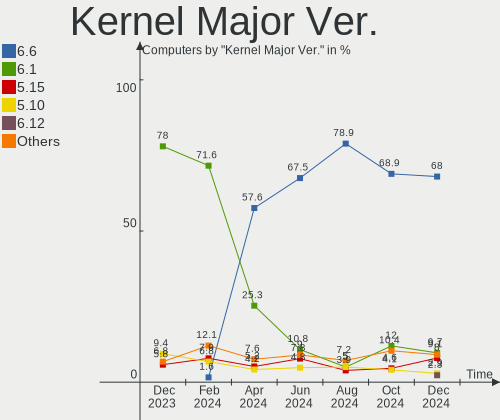
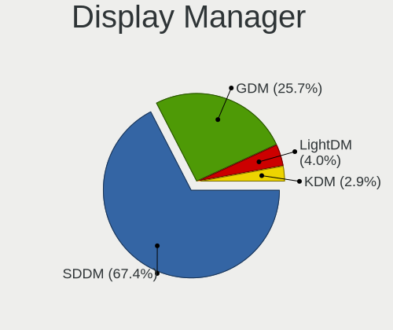
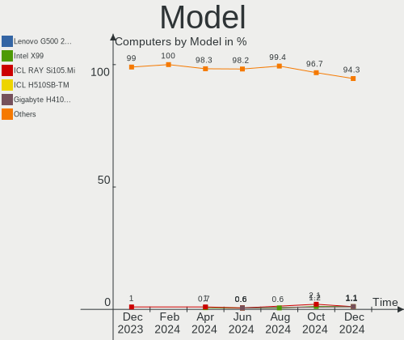
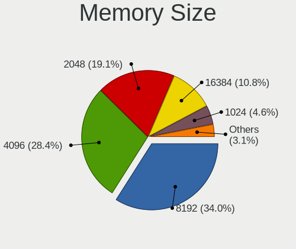

ROSA - Hardware Trends
----------------------

A project to identify most popular hardware characteristics and track their change
over time based on data collected by Linux users at https://Linux-Hardware.org.

Anyone can contribute to this report by the [hw-probe](https://github.com/linuxhw/hw-probe) tool:

    sudo -E hw-probe -all -upload

This is a report for all computer types. See also reports for [desktops](/Dist/ROSA/Desktop/README.md) and [notebooks](/Dist/ROSA/Notebook/README.md).

This report is for one last month. Overall report since the beginning of time: [TestDays](https://github.com/linuxhw/TestDays)

Period: Dec, 2024.

Contents
--------

* [ System ](#system)
  - [ OS                       ](#os)
  - [ OS Family                ](#os-family)
  - [ Kernel                   ](#kernel)
  - [ Kernel Family            ](#kernel-family)
  - [ Kernel Major Ver.        ](#kernel-major-ver)
  - [ Arch                     ](#arch)
  - [ DE                       ](#de)
  - [ Display Server           ](#display-server)
  - [ Display Manager          ](#display-manager)
  - [ OS Lang                  ](#os-lang)
  - [ Boot Mode                ](#boot-mode)
  - [ Filesystem               ](#filesystem)
  - [ Part. scheme             ](#part-scheme)
  - [ Dual Boot with Linux/BSD ](#dual-boot-with-linuxbsd)
  - [ Dual Boot (Win)          ](#dual-boot-win)

* [ Board ](#board)
  - [ Vendor                   ](#vendor)
  - [ Model                    ](#model)
  - [ Model Family             ](#model-family)
  - [ MFG Year                 ](#mfg-year)
  - [ Form Factor              ](#form-factor)
  - [ Secure Boot              ](#secure-boot)
  - [ Coreboot                 ](#coreboot)
  - [ RAM Size                 ](#ram-size)
  - [ RAM Used                 ](#ram-used)
  - [ Total Drives             ](#total-drives)
  - [ Has CD-ROM               ](#has-cd-rom)
  - [ Has Ethernet             ](#has-ethernet)
  - [ Has WiFi                 ](#has-wifi)
  - [ Has Bluetooth            ](#has-bluetooth)

* [ Location ](#location)
  - [ Country                  ](#country)
  - [ City                     ](#city)

* [ Drives ](#drives)
  - [ Drive Vendor             ](#drive-vendor)
  - [ Drive Model              ](#drive-model)
  - [ HDD Vendor               ](#hdd-vendor)
  - [ SSD Vendor               ](#ssd-vendor)
  - [ Drive Kind               ](#drive-kind)
  - [ Drive Connector          ](#drive-connector)
  - [ Drive Size               ](#drive-size)
  - [ Space Total              ](#space-total)
  - [ Space Used               ](#space-used)
  - [ Malfunc. Drives          ](#malfunc-drives)
  - [ Malfunc. Drive Vendor    ](#malfunc-drive-vendor)
  - [ Malfunc. HDD Vendor      ](#malfunc-hdd-vendor)
  - [ Malfunc. Drive Kind      ](#malfunc-drive-kind)
  - [ Failed Drives            ](#failed-drives)
  - [ Failed Drive Vendor      ](#failed-drive-vendor)
  - [ Drive Status             ](#drive-status)

* [ Storage controller ](#storage-controller)
  - [ Storage Vendor           ](#storage-vendor)
  - [ Storage Model            ](#storage-model)
  - [ Storage Kind             ](#storage-kind)

* [ Processor ](#processor)
  - [ CPU Vendor               ](#cpu-vendor)
  - [ CPU Model                ](#cpu-model)
  - [ CPU Model Family         ](#cpu-model-family)
  - [ CPU Cores                ](#cpu-cores)
  - [ CPU Sockets              ](#cpu-sockets)
  - [ CPU Threads              ](#cpu-threads)
  - [ CPU Op-Modes             ](#cpu-op-modes)
  - [ CPU Microcode            ](#cpu-microcode)
  - [ CPU Microarch            ](#cpu-microarch)

* [ Graphics ](#graphics)
  - [ GPU Vendor               ](#gpu-vendor)
  - [ GPU Model                ](#gpu-model)
  - [ GPU Combo                ](#gpu-combo)
  - [ GPU Driver               ](#gpu-driver)
  - [ GPU Memory               ](#gpu-memory)

* [ Monitor ](#monitor)
  - [ Monitor Vendor           ](#monitor-vendor)
  - [ Monitor Model            ](#monitor-model)
  - [ Monitor Resolution       ](#monitor-resolution)
  - [ Monitor Diagonal         ](#monitor-diagonal)
  - [ Monitor Width            ](#monitor-width)
  - [ Aspect Ratio             ](#aspect-ratio)
  - [ Monitor Area             ](#monitor-area)
  - [ Pixel Density            ](#pixel-density)
  - [ Multiple Monitors        ](#multiple-monitors)

* [ Network ](#network)
  - [ Net Controller Vendor    ](#net-controller-vendor)
  - [ Net Controller Model     ](#net-controller-model)
  - [ Wireless Vendor          ](#wireless-vendor)
  - [ Wireless Model           ](#wireless-model)
  - [ Ethernet Vendor          ](#ethernet-vendor)
  - [ Ethernet Model           ](#ethernet-model)
  - [ Net Controller Kind      ](#net-controller-kind)
  - [ Used Controller          ](#used-controller)
  - [ NICs                     ](#nics)
  - [ IPv6                     ](#ipv6)

* [ Bluetooth ](#bluetooth)
  - [ Bluetooth Vendor         ](#bluetooth-vendor)
  - [ Bluetooth Model          ](#bluetooth-model)

* [ Sound ](#sound)
  - [ Sound Vendor             ](#sound-vendor)
  - [ Sound Model              ](#sound-model)

* [ Memory ](#memory)
  - [ Memory Vendor            ](#memory-vendor)
  - [ Memory Model             ](#memory-model)
  - [ Memory Kind              ](#memory-kind)
  - [ Memory Form Factor       ](#memory-form-factor)
  - [ Memory Size              ](#memory-size)
  - [ Memory Speed             ](#memory-speed)

* [ Printers & scanners ](#printers--scanners)
  - [ Printer Vendor           ](#printer-vendor)
  - [ Printer Model            ](#printer-model)
  - [ Scanner Vendor           ](#scanner-vendor)
  - [ Scanner Model            ](#scanner-model)

* [ Camera ](#camera)
  - [ Camera Vendor            ](#camera-vendor)
  - [ Camera Model             ](#camera-model)

* [ Security ](#security)
  - [ Fingerprint Vendor       ](#fingerprint-vendor)
  - [ Fingerprint Model        ](#fingerprint-model)
  - [ Chipcard Vendor          ](#chipcard-vendor)
  - [ Chipcard Model           ](#chipcard-model)

* [ Unsupported ](#unsupported)
  - [ Unsupported Devices      ](#unsupported-devices)
  - [ Unsupported Device Types ](#unsupported-device-types)

System
------

OS
--

Installed operating systems

| Name        | Computers | Percent |
|-------------|-----------|---------|
| ROSA 12.5.1 | 123       | 70.29%  |
| ROSA 12     | 13        | 7.43%   |
| ROSA 12.6   | 10        | 5.71%   |
| ROSA R11.1  | 7         | 4%      |
| ROSA 12.4   | 5         | 2.86%   |
| ROSA 12.3   | 5         | 2.86%   |
| ROSA 12.5   | 4         | 2.29%   |
| ROSA R11    | 2         | 1.14%   |
| ROSA 13.0   | 2         | 1.14%   |
| ROSA 12.2   | 2         | 1.14%   |
| ROSA R9     | 1         | 0.57%   |
| ROSA 12.1   | 1         | 0.57%   |

OS Family
---------

OS without a version

| Name | Computers | Percent |
|------|-----------|---------|
| ROSA | 175       | 100%    |

Kernel
------

Version of the Linux kernel

| Version                                       | Computers | Percent |
|-----------------------------------------------|-----------|---------|
| 6.6.47-generic-1rosa2021.1-x86_64             | 90        | 51.43%  |
| 6.6.27-generic-3rosa2021.1-x86_64             | 25        | 14.29%  |
| 6.1.89-generic-2rosa2021.1-x86_64             | 12        | 6.86%   |
| 6.6.21-generic-8rosa2021.1-x86_64             | 4         | 2.29%   |
| 5.10.74-generic-2rosa2021.1-x86_64            | 4         | 2.29%   |
| 6.1.20-generic-2rosa2021.1-x86_64             | 3         | 1.71%   |
| 5.15.75-generic-1rosa2021.1-x86_64            | 3         | 1.71%   |
| 5.15.170-generic-1rosa2021.1-i686             | 3         | 1.71%   |
| 6.12.4-generic-3rosa2021.1-x86_64             | 2         | 1.14%   |
| 6.11.10-generic-4rosa13-x86_64                | 2         | 1.14%   |
| 5.17.11-generic-2rosa2021.1-x86_64            | 2         | 1.14%   |
| 5.15.170-generic-1rosa2021.1-x86_64           | 2         | 1.14%   |
| 5.15.103-generic-1rosa2021.1-i686             | 2         | 1.14%   |
| 4.15.0-desktop-122.124.1rosa-i586             | 2         | 1.14%   |
| 6.2.9-300.fc38.x86_64                         | 1         | 0.57%   |
| 6.12.1.xm2-x64v2.k.1-xanmod-rosa2021.1-x86_64 | 1         | 0.57%   |
| 6.12.1.xm1-x64v2.k.1-xanmod-rosa2021.1-x86_64 | 1         | 0.57%   |
| 6.1.89-generic-2rosa2021.1-arm64              | 1         | 0.57%   |
| 6.1.58-generic-1rosa2021.1-x86_64             | 1         | 0.57%   |
| 5.4.83-generic-2rosa-i586                     | 1         | 0.57%   |
| 5.4.32-generic-2rosa-x86_64                   | 1         | 0.57%   |
| 5.4.32-generic-2rosa-i586                     | 1         | 0.57%   |
| 5.4.107-generic-0.1rosa-x86_64                | 1         | 0.57%   |
| 5.17.11-generic-2rosa2021.1-i686              | 1         | 0.57%   |
| 5.15.77-generic-1rosa2021.1-x86_64            | 1         | 0.57%   |
| 5.15.127-generic-1rosa2021.1-x86_64           | 1         | 0.57%   |
| 5.15.127-generic-1rosa2021.1-i686             | 1         | 0.57%   |
| 5.15.103-generic-1rosa2021.1-x86_64           | 1         | 0.57%   |
| 5.10.155-generic-1rosa2021.1-x86_64           | 1         | 0.57%   |
| 4.9.20-nrj-desktop-1rosa-i586                 | 1         | 0.57%   |
| 4.9.155-nrj-desktop-1rosa-x86_64              | 1         | 0.57%   |
| 4.15.0-desktop-45.1rosa-x86_64                | 1         | 0.57%   |
| 4.15.0-desktop-45.1rosa-i586                  | 1         | 0.57%   |

Kernel Family
-------------

Linux kernel without a distro release

| Version  | Computers | Percent |
|----------|-----------|---------|
| 6.6.47   | 90        | 51.43%  |
| 6.6.27   | 25        | 14.29%  |
| 6.1.89   | 13        | 7.43%   |
| 5.15.170 | 5         | 2.86%   |
| 6.6.21   | 4         | 2.29%   |
| 5.10.74  | 4         | 2.29%   |
| 4.15.0   | 4         | 2.29%   |
| 6.1.20   | 3         | 1.71%   |
| 5.17.11  | 3         | 1.71%   |
| 5.15.75  | 3         | 1.71%   |
| 5.15.103 | 3         | 1.71%   |
| 6.12.4   | 2         | 1.14%   |
| 6.12.1   | 2         | 1.14%   |
| 6.11.10  | 2         | 1.14%   |
| 5.4.32   | 2         | 1.14%   |
| 5.15.127 | 2         | 1.14%   |
| 6.2.9    | 1         | 0.57%   |
| 6.1.58   | 1         | 0.57%   |
| 5.4.83   | 1         | 0.57%   |
| 5.4.107  | 1         | 0.57%   |
| 5.15.77  | 1         | 0.57%   |
| 5.10.155 | 1         | 0.57%   |
| 4.9.20   | 1         | 0.57%   |
| 4.9.155  | 1         | 0.57%   |

Kernel Major Ver.
-----------------

Linux kernel major version

| Version | Computers | Percent |
|---------|-----------|---------|
| 6.6     | 119       | 68%     |
| 6.1     | 17        | 9.71%   |
| 5.15    | 14        | 8%      |
| 5.10    | 5         | 2.86%   |
| 6.12    | 4         | 2.29%   |
| 5.4     | 4         | 2.29%   |
| 4.15    | 4         | 2.29%   |
| 5.17    | 3         | 1.71%   |
| 6.11    | 2         | 1.14%   |
| 4.9     | 2         | 1.14%   |
| 6.2     | 1         | 0.57%   |

Arch
----

OS architecture (x86_64, i586, etc.)

| Name    | Computers | Percent |
|---------|-----------|---------|
| x86_64  | 161       | 92%     |
| i686    | 13        | 7.43%   |
| aarch64 | 1         | 0.57%   |

DE
--

Desktop Environment

| Name    | Computers | Percent |
|---------|-----------|---------|
| KDE5    | 116       | 66.29%  |
| GNOME   | 30        | 17.14%  |
| LXQt    | 19        | 10.86%  |
| KDE4    | 5         | 2.86%   |
| XFCE    | 2         | 1.14%   |
| KDE6    | 1         | 0.57%   |
| Budgie  | 1         | 0.57%   |
| Unknown | 1         | 0.57%   |

Display Server
--------------

X11 or Wayland

| Name    | Computers | Percent |
|---------|-----------|---------|
| Wayland | 127       | 72.57%  |
| X11     | 47        | 26.86%  |
| Tty     | 1         | 0.57%   |

Display Manager
---------------

SDDM, LightDM, etc.

| Name    | Computers | Percent |
|---------|-----------|---------|
| SDDM    | 118       | 67.43%  |
| GDM     | 45        | 25.71%  |
| LightDM | 7         | 4%      |
| KDM     | 5         | 2.86%   |

OS Lang
-------

Language

| Lang    | Computers | Percent |
|---------|-----------|---------|
| ru_RU   | 164       | 93.71%  |
| en_US   | 4         | 2.29%   |
| Unknown | 3         | 1.71%   |
| pt_BR   | 1         | 0.57%   |
| es_CL   | 1         | 0.57%   |
| es_AR   | 1         | 0.57%   |
| bg_BG   | 1         | 0.57%   |

Boot Mode
---------

EFI or BIOS

| Mode | Computers | Percent |
|------|-----------|---------|
| EFI  | 104       | 59.43%  |
| BIOS | 71        | 40.57%  |

Filesystem
----------

Type of filesystem

| Type  | Computers | Percent |
|-------|-----------|---------|
| Ext4  | 158       | 90.29%  |
| Btrfs | 16        | 9.14%   |
| Ext3  | 1         | 0.57%   |

Part. scheme
------------

Scheme of partitioning

| Type    | Computers | Percent |
|---------|-----------|---------|
| GPT     | 115       | 65.71%  |
| MBR     | 59        | 33.71%  |
| Unknown | 1         | 0.57%   |

Dual Boot with Linux/BSD
------------------------

Hosting more than one Linux/BSD

| Dual boot | Computers | Percent |
|-----------|-----------|---------|
| No        | 136       | 77.71%  |
| Yes       | 39        | 22.29%  |

Dual Boot (Win)
---------------

Hosting Linux and Windows

| Dual boot | Computers | Percent |
|-----------|-----------|---------|
| No        | 104       | 59.43%  |
| Yes       | 71        | 40.57%  |

Board
-----

Vendor
------

Motherboard manufacturer

| Name                 | Computers | Percent |
|----------------------|-----------|---------|
| ASUSTek Computer     | 28        | 16%     |
| Acer                 | 21        | 12%     |
| Gigabyte Technology  | 19        | 10.86%  |
| Lenovo               | 17        | 9.71%   |
| Hewlett-Packard      | 13        | 7.43%   |
| MSI                  | 11        | 6.29%   |
| Dell                 | 6         | 3.43%   |
| ASRock               | 6         | 3.43%   |
| Intel                | 5         | 2.86%   |
| ICL                  | 4         | 2.29%   |
| Samsung Electronics  | 3         | 1.71%   |
| Biostar              | 3         | 1.71%   |
| Aquarius             | 3         | 1.71%   |
| Toshiba              | 2         | 1.14%   |
| LTD Delovoy Office   | 2         | 1.14%   |
| HUAWEI               | 2         | 1.14%   |
| Huanan               | 2         | 1.14%   |
| Haier                | 2         | 1.14%   |
| Fujitsu Siemens      | 2         | 1.14%   |
| Clevo                | 2         | 1.14%   |
| Timi                 | 1         | 0.57%   |
| TECNO Mobile Limited | 1         | 0.57%   |
| Supermicro           | 1         | 0.57%   |
| Positivo             | 1         | 0.57%   |
| OEM                  | 1         | 0.57%   |
| Notebook             | 1         | 0.57%   |
| Maibenben            | 1         | 0.57%   |
| MACHINIST            | 1         | 0.57%   |
| KVADRA               | 1         | 0.57%   |
| iRU                  | 1         | 0.57%   |
| HONOR                | 1         | 0.57%   |
| Graviton             | 1         | 0.57%   |
| GMKtec               | 1         | 0.57%   |
| Fujitsu              | 1         | 0.57%   |
| Foxconn              | 1         | 0.57%   |
| eMachines            | 1         | 0.57%   |
| Elpitech             | 1         | 0.57%   |
| DNS                  | 1         | 0.57%   |
| Digma Pro            | 1         | 0.57%   |
| Digma                | 1         | 0.57%   |

Model
-----

Motherboard model

| Name                                        | Computers | Percent |
|---------------------------------------------|-----------|---------|
| Lenovo G500 20236                           | 2         | 1.14%   |
| Intel X99                                   | 2         | 1.14%   |
| ICL RAY Si105.Mi                            | 2         | 1.14%   |
| ICL H510SB-TM                               | 2         | 1.14%   |
| Gigabyte H410M H V3                         | 2         | 1.14%   |
| Dell Inspiron 3521                          | 2         | 1.14%   |
| ASUS All Series                             | 2         | 1.14%   |
| Acer Nitro AN517-51                         | 2         | 1.14%   |
| Acer Extensa 215-23                         | 2         | 1.14%   |
| Unknown                                     | 2         | 1.14%   |
| Toshiba Satellite U300                      | 1         | 0.57%   |
| Toshiba NB100                               | 1         | 0.57%   |
| Timi Redmi Book Pro 15 2022                 | 1         | 0.57%   |
| TECNO Mobile Limited MEGABOOK K16SDA        | 1         | 0.57%   |
| Supermicro Super Server                     | 1         | 0.57%   |
| Samsung R530/R730                           | 1         | 0.57%   |
| Samsung R510/P510                           | 1         | 0.57%   |
| Samsung 305V4A/305V5A                       | 1         | 0.57%   |
| Positivo C464F                              | 1         | 0.57%   |
| OEM X79G                                    | 1         | 0.57%   |
| Notebook W250EGQ / W270EGQ                  | 1         | 0.57%   |
| MSI VR610                                   | 1         | 0.57%   |
| MSI MS-7D90                                 | 1         | 0.57%   |
| MSI MS-7C52                                 | 1         | 0.57%   |
| MSI MS-7A38                                 | 1         | 0.57%   |
| MSI MS-7751                                 | 1         | 0.57%   |
| MSI MS-7721                                 | 1         | 0.57%   |
| MSI MS-7592                                 | 1         | 0.57%   |
| MSI MS-7529                                 | 1         | 0.57%   |
| MSI Katana GF66 11UE                        | 1         | 0.57%   |
| MSI Katana 17 B13UCX                        | 1         | 0.57%   |
| MSI GL62M 7RDX                              | 1         | 0.57%   |
| Maibenben Perfectum Series                  | 1         | 0.57%   |
| MACHINIST X99-RS9 V3.1                      | 1         | 0.57%   |
| LTD Delovoy Office 15TLI                    | 1         | 0.57%   |
| LTD Delovoy Office 15CLG2                   | 1         | 0.57%   |
| Lenovo V15 G2 IJL 82QY                      | 1         | 0.57%   |
| Lenovo ThinkPad Yoga 11e 5th Gen 20LMS0A200 | 1         | 0.57%   |
| Lenovo ThinkPad X250 20CM003CRT             | 1         | 0.57%   |
| Lenovo ThinkPad P17 Gen 1 20SN003YUS        | 1         | 0.57%   |

Model Family
------------

Motherboard model prefix

| Name                          | Computers | Percent |
|-------------------------------|-----------|---------|
| Acer Aspire                   | 12        | 6.86%   |
| Dell Inspiron                 | 4         | 2.29%   |
| ASUS PRIME                    | 4         | 2.29%   |
| Lenovo ThinkPad               | 3         | 1.71%   |
| Lenovo ThinkCentre            | 3         | 1.71%   |
| HP ProBook                    | 3         | 1.71%   |
| HP Pavilion                   | 3         | 1.71%   |
| ASUS Vivobook                 | 3         | 1.71%   |
| Acer Nitro                    | 3         | 1.71%   |
| MSI Katana                    | 2         | 1.14%   |
| Lenovo G500                   | 2         | 1.14%   |
| Intel X99                     | 2         | 1.14%   |
| ICL RAY                       | 2         | 1.14%   |
| ICL H510SB-TM                 | 2         | 1.14%   |
| HP Laptop                     | 2         | 1.14%   |
| HP EliteBook                  | 2         | 1.14%   |
| Gigabyte H410M                | 2         | 1.14%   |
| Gigabyte AB350M-DS3H          | 2         | 1.14%   |
| ASUS All                      | 2         | 1.14%   |
| Acer Extensa                  | 2         | 1.14%   |
| Unknown                       | 2         | 1.14%   |
| Toshiba Satellite             | 1         | 0.57%   |
| Toshiba NB100                 | 1         | 0.57%   |
| Timi Redmi                    | 1         | 0.57%   |
| TECNO Mobile Limited MEGABOOK | 1         | 0.57%   |
| Supermicro Super              | 1         | 0.57%   |
| Samsung R530                  | 1         | 0.57%   |
| Samsung R510                  | 1         | 0.57%   |
| Samsung 305V4A                | 1         | 0.57%   |
| Positivo C464F                | 1         | 0.57%   |
| OEM X79G                      | 1         | 0.57%   |
| Notebook W250EGQ              | 1         | 0.57%   |
| MSI VR610                     | 1         | 0.57%   |
| MSI MS-7D90                   | 1         | 0.57%   |
| MSI MS-7C52                   | 1         | 0.57%   |
| MSI MS-7A38                   | 1         | 0.57%   |
| MSI MS-7751                   | 1         | 0.57%   |
| MSI MS-7721                   | 1         | 0.57%   |
| MSI MS-7592                   | 1         | 0.57%   |
| MSI MS-7529                   | 1         | 0.57%   |

MFG Year
--------

Motherboard manufacture year

| Year | Computers | Percent |
|------|-----------|---------|
| 2012 | 25        | 14.29%  |
| 2022 | 17        | 9.71%   |
| 2021 | 13        | 7.43%   |
| 2011 | 12        | 6.86%   |
| 2020 | 11        | 6.29%   |
| 2018 | 10        | 5.71%   |
| 2009 | 10        | 5.71%   |
| 2024 | 9         | 5.14%   |
| 2019 | 9         | 5.14%   |
| 2013 | 9         | 5.14%   |
| 2017 | 8         | 4.57%   |
| 2008 | 8         | 4.57%   |
| 2007 | 8         | 4.57%   |
| 2023 | 6         | 3.43%   |
| 2014 | 6         | 3.43%   |
| 2016 | 5         | 2.86%   |
| 2015 | 4         | 2.29%   |
| 2010 | 2         | 1.14%   |
| 2006 | 1         | 0.57%   |
| 2005 | 1         | 0.57%   |
| 2003 | 1         | 0.57%   |

Form Factor
-----------

Physical design of the computer

| Name           | Computers | Percent |
|----------------|-----------|---------|
| Notebook       | 94        | 53.71%  |
| Desktop        | 70        | 40%     |
| All in one     | 5         | 2.86%   |
| Mini pc        | 2         | 1.14%   |
| Server         | 2         | 1.14%   |
| System on chip | 1         | 0.57%   |
| Convertible    | 1         | 0.57%   |

Secure Boot
-----------

Enabled or disabled

| State    | Computers | Percent |
|----------|-----------|---------|
| Disabled | 175       | 100%    |

Coreboot
--------

Have coreboot on board

| Used | Computers | Percent |
|------|-----------|---------|
| No   | 175       | 100%    |

RAM Size
--------

Total RAM memory

| Size in GB      | Computers | Percent |
|-----------------|-----------|---------|
| 4.01-8.0        | 49        | 28%     |
| 16.01-24.0      | 36        | 20.57%  |
| 3.01-4.0        | 33        | 18.86%  |
| 8.01-16.0       | 23        | 13.14%  |
| 1.01-2.0        | 13        | 7.43%   |
| 32.01-64.0      | 9         | 5.14%   |
| 2.01-3.0        | 5         | 2.86%   |
| 64.01-256.0     | 4         | 2.29%   |
| More than 256.0 | 1         | 0.57%   |
| 24.01-32.0      | 1         | 0.57%   |
| 0.51-1.0        | 1         | 0.57%   |

RAM Used
--------

Used RAM memory

| Used GB   | Computers | Percent |
|-----------|-----------|---------|
| 1.01-2.0  | 86        | 49.14%  |
| 2.01-3.0  | 30        | 17.14%  |
| 0.51-1.0  | 28        | 16%     |
| 4.01-8.0  | 16        | 9.14%   |
| 3.01-4.0  | 12        | 6.86%   |
| 0.01-0.5  | 2         | 1.14%   |
| 8.01-16.0 | 1         | 0.57%   |

Total Drives
------------

Number of drives on board

| Drives | Computers | Percent |
|--------|-----------|---------|
| 1      | 97        | 55.43%  |
| 2      | 52        | 29.71%  |
| 3      | 13        | 7.43%   |
| 4      | 7         | 4%      |
| 5      | 3         | 1.71%   |
| 14     | 1         | 0.57%   |
| 6      | 1         | 0.57%   |
| 0      | 1         | 0.57%   |

Has CD-ROM
----------

Has CD-ROM on board

| Presented | Computers | Percent |
|-----------|-----------|---------|
| No        | 119       | 68%     |
| Yes       | 56        | 32%     |

Has Ethernet
------------

Has Ethernet on board

| Presented | Computers | Percent |
|-----------|-----------|---------|
| Yes       | 158       | 90.29%  |
| No        | 17        | 9.71%   |

Has WiFi
--------

Has WiFi module

| Presented | Computers | Percent |
|-----------|-----------|---------|
| Yes       | 120       | 68.57%  |
| No        | 55        | 31.43%  |

Has Bluetooth
-------------

Has Bluetooth module

| Presented | Computers | Percent |
|-----------|-----------|---------|
| Yes       | 97        | 55.43%  |
| No        | 78        | 44.57%  |

Location
--------

Country
-------

Geographic location (country)

| Country   | Computers | Percent |
|-----------|-----------|---------|
| Russia    | 161       | 92%     |
| Belarus   | 3         | 1.71%   |
| Ukraine   | 2         | 1.14%   |
| Canada    | 2         | 1.14%   |
| Malaysia  | 1         | 0.57%   |
| Lithuania | 1         | 0.57%   |
| Grenada   | 1         | 0.57%   |
| Chile     | 1         | 0.57%   |
| Bulgaria  | 1         | 0.57%   |
| Brazil    | 1         | 0.57%   |
| Argentina | 1         | 0.57%   |

City
----

Geographic location (city)

| City          | Computers | Percent |
|---------------|-----------|---------|
| Moscow        | 36        | 20.57%  |
| St Petersburg | 11        | 6.29%   |
| Chelyabinsk   | 6         | 3.43%   |
| Yoshkar-Ola   | 5         | 2.86%   |
| Voronezh      | 5         | 2.86%   |
| Novosibirsk   | 5         | 2.86%   |
| Krasnoyarsk   | 5         | 2.86%   |
| Yekaterinburg | 4         | 2.29%   |
| Rostov-on-Don | 4         | 2.29%   |
| Perm          | 4         | 2.29%   |
| Yaroslavl     | 3         | 1.71%   |
| Barnaul       | 3         | 1.71%   |
| Ulyanovsk     | 2         | 1.14%   |
| Tula          | 2         | 1.14%   |
| Tambov        | 2         | 1.14%   |
| Taganrog      | 2         | 1.14%   |
| Shelekhov     | 2         | 1.14%   |
| Samara        | 2         | 1.14%   |
| Pyatigorsk    | 2         | 1.14%   |
| Pskov         | 2         | 1.14%   |
| Lipetsk       | 2         | 1.14%   |
| Kaluga        | 2         | 1.14%   |
| Irkutsk       | 2         | 1.14%   |
| Brest         | 2         | 1.14%   |
| Zvenigovo     | 1         | 0.57%   |
| Yakutsk       | 1         | 0.57%   |
| Vyksa         | 1         | 0.57%   |
| Volchanka     | 1         | 0.57%   |
| Vladimir      | 1         | 0.57%   |
| Vilnius       | 1         | 0.57%   |
| Urania        | 1         | 0.57%   |
| Ulan-Ude      | 1         | 0.57%   |
| Ufa           | 1         | 0.57%   |
| Tyumen        | 1         | 0.57%   |
| Toronto       | 1         | 0.57%   |
| Tkhamakha     | 1         | 0.57%   |
| Teykovo       | 1         | 0.57%   |
| Sterlitamak   | 1         | 0.57%   |
| Sofia         | 1         | 0.57%   |
| Saratov       | 1         | 0.57%   |

Drives
------

Drive Vendor
------------

Hard drive vendors

| Vendor                       | Computers | Drives | Percent |
|------------------------------|-----------|--------|---------|
| WDC                          | 43        | 50     | 16.04%  |
| Seagate                      | 33        | 41     | 12.31%  |
| Kingston                     | 19        | 22     | 7.09%   |
| Samsung Electronics          | 17        | 24     | 6.34%   |
| Toshiba                      | 15        | 16     | 5.6%    |
| A-DATA Technology            | 12        | 12     | 4.48%   |
| Unknown                      | 9         | 9      | 3.36%   |
| China                        | 8         | 8      | 2.99%   |
| SK hynix                     | 7         | 7      | 2.61%   |
| Hitachi                      | 6         | 7      | 2.24%   |
| Unknown                      | 6         | 6      | 2.24%   |
| SPCC                         | 5         | 5      | 1.87%   |
| SanDisk                      | 5         | 5      | 1.87%   |
| Netac                        | 5         | 5      | 1.87%   |
| Patriot                      | 4         | 4      | 1.49%   |
| Micron Technology            | 4         | 4      | 1.49%   |
| KingSpec                     | 4         | 4      | 1.49%   |
| Intel                        | 4         | 4      | 1.49%   |
| Transcend                    | 3         | 3      | 1.12%   |
| Silicon Motion               | 3         | 3      | 1.12%   |
| HGST                         | 3         | 3      | 1.12%   |
| Hewlett-Packard              | 3         | 3      | 1.12%   |
| Apacer                       | 3         | 3      | 1.12%   |
| Phison                       | 2         | 2      | 0.75%   |
| Maxtor                       | 2         | 2      | 0.75%   |
| KIOXIA                       | 2         | 2      | 0.75%   |
| HS-SSD-E100                  | 2         | 2      | 0.75%   |
| Fujitsu                      | 2         | 2      | 0.75%   |
| DEXP                         | 2         | 2      | 0.75%   |
| Crucial                      | 2         | 2      | 0.75%   |
| AMD                          | 2         | 2      | 0.75%   |
| ADATA SU                     | 2         | 2      | 0.75%   |
| ZTE                          | 1         | 1      | 0.37%   |
| XrayDisk                     | 1         | 1      | 0.37%   |
| XPG                          | 1         | 1      | 0.37%   |
| VK000240                     | 1         | 1      | 0.37%   |
| USB3.0                       | 1         | 1      | 0.37%   |
| Shenzhen Longsys Electronics | 1         | 1      | 0.37%   |
| SCY                          | 1         | 1      | 0.37%   |
| Realtek Semiconductor        | 1         | 1      | 0.37%   |

Drive Model
-----------

Hard drive models

| Model                                 | Computers | Percent |
|---------------------------------------|-----------|---------|
| Unknown                               | 6         | 2.11%   |
| Kingston SA400S37480G 480GB SSD       | 5         | 1.75%   |
| Seagate ST500DM002-1BD142 500GB       | 4         | 1.4%    |
| Kingston SA400S37120G 120GB SSD       | 4         | 1.4%    |
| A-DATA SU650 240GB SSD                | 4         | 1.4%    |
| WDC WDS240G2G0A-00JH30 240GB SSD      | 3         | 1.05%   |
| Unknown SLD64G  64GB                  | 3         | 1.05%   |
| Seagate ST9250315AS 250GB             | 3         | 1.05%   |
| Kingston SA400S37240G 240GB SSD       | 3         | 1.05%   |
| WDC WD5000LPVX-22V0TT0 500GB          | 2         | 0.7%    |
| WDC WD5000AAKX-00ERMA0 500GB          | 2         | 0.7%    |
| WDC WD5000AAKS-00UU3A0 500GB          | 2         | 0.7%    |
| WDC WD10EZEX-08WN4A0 1TB              | 2         | 0.7%    |
| Toshiba MQ04ABF100 1TB                | 2         | 0.7%    |
| Toshiba MQ01ABF050 500GB              | 2         | 0.7%    |
| Toshiba HDWD110 1TB                   | 2         | 0.7%    |
| Toshiba HDWD105 500GB                 | 2         | 0.7%    |
| Toshiba DT01ACA050 500GB              | 2         | 0.7%    |
| SPCC Solid State Disk 64GB            | 2         | 0.7%    |
| SK hynix HFS128G39TND-N210A 128GB SSD | 2         | 0.7%    |
| Seagate ST9500325AS 500GB             | 2         | 0.7%    |
| Seagate ST500LT012-9WS142 500GB       | 2         | 0.7%    |
| Seagate ST1000DM010-2EP102 1TB        | 2         | 0.7%    |
| Seagate ST1000DM010-2DM162 1TB        | 2         | 0.7%    |
| Samsung SSD 970 EVO Plus 250GB        | 2         | 0.7%    |
| Samsung HM321HI 320GB                 | 2         | 0.7%    |
| Patriot Burst Elite 120GB SSD         | 2         | 0.7%    |
| Netac SSD 128GB                       | 2         | 0.7%    |
| Micron 2400_MTFDKBA512QFM 512GB       | 2         | 0.7%    |
| KIOXIA KBG40ZNV512G 512GB             | 2         | 0.7%    |
| Kingston SKC600256G 256GB SSD         | 2         | 0.7%    |
| KingSpec P3-512 512GB SSD             | 2         | 0.7%    |
| Hitachi HDS721616PLA380 160GB         | 2         | 0.7%    |
| DEXP SSD C100 1Tb                     | 2         | 0.7%    |
| China SSD 128GB                       | 2         | 0.7%    |
| ADATA SU 650NS38 480GB SSD            | 2         | 0.7%    |
| A-DATA SX8200PNP 512GB                | 2         | 0.7%    |
| A-DATA SX6000PNP 256GB                | 2         | 0.7%    |
| ZTE MMC Storage 942MB                 | 1         | 0.35%   |
| XrayDisk 2TB SSD                      | 1         | 0.35%   |

HDD Vendor
----------

Hard disk drive vendors

| Vendor              | Computers | Drives | Percent |
|---------------------|-----------|--------|---------|
| WDC                 | 38        | 42     | 36.54%  |
| Seagate             | 33        | 41     | 31.73%  |
| Toshiba             | 14        | 15     | 13.46%  |
| Hitachi             | 5         | 6      | 4.81%   |
| Samsung Electronics | 3         | 3      | 2.88%   |
| HGST                | 3         | 3      | 2.88%   |
| Maxtor              | 2         | 2      | 1.92%   |
| Fujitsu             | 2         | 2      | 1.92%   |
| Unknown             | 1         | 1      | 0.96%   |
| JMicron Technology  | 1         | 1      | 0.96%   |
| HGST HTS            | 1         | 1      | 0.96%   |
| 256MB               | 1         | 1      | 0.96%   |

SSD Vendor
----------

Solid state drive vendors

| Vendor              | Computers | Drives | Percent |
|---------------------|-----------|--------|---------|
| Kingston            | 15        | 18     | 14.85%  |
| China               | 8         | 8      | 7.92%   |
| WDC                 | 7         | 7      | 6.93%   |
| A-DATA Technology   | 7         | 7      | 6.93%   |
| SPCC                | 5         | 5      | 4.95%   |
| Samsung Electronics | 5         | 5      | 4.95%   |
| Patriot             | 4         | 4      | 3.96%   |
| KingSpec            | 4         | 4      | 3.96%   |
| Unknown             | 4         | 4      | 3.96%   |
| Transcend           | 3         | 3      | 2.97%   |
| SanDisk             | 3         | 3      | 2.97%   |
| Netac               | 3         | 3      | 2.97%   |
| SK hynix            | 2         | 2      | 1.98%   |
| HS-SSD-E100         | 2         | 2      | 1.98%   |
| Hewlett-Packard     | 2         | 2      | 1.98%   |
| DEXP                | 2         | 2      | 1.98%   |
| Crucial             | 2         | 2      | 1.98%   |
| Apacer              | 2         | 2      | 1.98%   |
| AMD                 | 2         | 2      | 1.98%   |
| ADATA SU            | 2         | 2      | 1.98%   |
| XrayDisk            | 1         | 1      | 0.99%   |
| USB3.0              | 1         | 1      | 0.99%   |
| Q600S               | 1         | 1      | 0.99%   |
| Plextor             | 1         | 1      | 0.99%   |
| OSCOO               | 1         | 1      | 0.99%   |
| Micron_5            | 1         | 1      | 0.99%   |
| Micron Technology   | 1         | 1      | 0.99%   |
| Kston               | 1         | 1      | 0.99%   |
| KingDian            | 1         | 2      | 0.99%   |
| Intel               | 1         | 1      | 0.99%   |
| HS-SSD-WAVE(S)      | 1         | 1      | 0.99%   |
| GS                  | 1         | 1      | 0.99%   |
| ExeGate             | 1         | 1      | 0.99%   |
| Espada              | 1         | 1      | 0.99%   |
| Colorful            | 1         | 1      | 0.99%   |
| BR                  | 1         | 1      | 0.99%   |
| ASMT                | 1         | 1      | 0.99%   |

Drive Kind
----------

HDD or SSD

| Kind    | Computers | Drives | Percent |
|---------|-----------|--------|---------|
| HDD     | 87        | 118    | 36.71%  |
| SSD     | 86        | 105    | 36.29%  |
| NVMe    | 53        | 63     | 22.36%  |
| MMC     | 9         | 9      | 3.8%    |
| Unknown | 2         | 2      | 0.84%   |

Drive Connector
---------------

SATA, SAS, NVMe, etc.

| Type | Computers | Drives | Percent |
|------|-----------|--------|---------|
| SATA | 133       | 214    | 64.56%  |
| NVMe | 53        | 63     | 25.73%  |
| SAS  | 11        | 11     | 5.34%   |
| MMC  | 9         | 9      | 4.37%   |

Drive Size
----------

Size of hard drive

| Size in TB | Computers | Drives | Percent |
|------------|-----------|--------|---------|
| 0.01-0.5   | 124       | 169    | 73.37%  |
| 0.51-1.0   | 32        | 41     | 18.93%  |
| 1.01-2.0   | 8         | 8      | 4.73%   |
| 2.01-3.0   | 2         | 2      | 1.18%   |
| 3.01-4.0   | 1         | 1      | 0.59%   |
| 10.01-20.0 | 1         | 1      | 0.59%   |
| 4.01-10.0  | 1         | 1      | 0.59%   |

Space Total
-----------

Amount of disk space available on the file system

| Size in GB     | Computers | Percent |
|----------------|-----------|---------|
| 101-250        | 58        | 33.14%  |
| 251-500        | 48        | 27.43%  |
| 501-1000       | 19        | 10.86%  |
| 1-20           | 15        | 8.57%   |
| 51-100         | 12        | 6.86%   |
| 1001-2000      | 10        | 5.71%   |
| 21-50          | 6         | 3.43%   |
| 2001-3000      | 3         | 1.71%   |
| More than 3000 | 2         | 1.14%   |
| Unknown        | 2         | 1.14%   |

Space Used
----------

Amount of used disk space

| Used GB        | Computers | Percent |
|----------------|-----------|---------|
| 1-20           | 95        | 54.29%  |
| 21-50          | 25        | 14.29%  |
| 51-100         | 19        | 10.86%  |
| 101-250        | 15        | 8.57%   |
| 251-500        | 11        | 6.29%   |
| 501-1000       | 5         | 2.86%   |
| Unknown        | 2         | 1.14%   |
| More than 3000 | 1         | 0.57%   |
| 2001-3000      | 1         | 0.57%   |
| 1001-2000      | 1         | 0.57%   |

Malfunc. Drives
---------------

Drive models with a malfunction

| Model                                 | Computers | Drives | Percent |
|---------------------------------------|-----------|--------|---------|
| Seagate ST500DM002-1BD142 500GB       | 4         | 4      | 5.97%   |
| WDC WDS240G2G0A-00JH30 240GB SSD      | 2         | 2      | 2.99%   |
| WDC WD5000AAKX-00ERMA0 500GB          | 2         | 2      | 2.99%   |
| Toshiba DT01ACA050 500GB              | 2         | 2      | 2.99%   |
| Seagate ST9500325AS 500GB             | 2         | 2      | 2.99%   |
| Seagate ST9250315AS 250GB             | 2         | 2      | 2.99%   |
| Seagate ST500LT012-9WS142 500GB       | 2         | 2      | 2.99%   |
| Kingston SA400S37480G 480GB SSD       | 2         | 3      | 2.99%   |
| XPG GAMMIX S5 256GB                   | 1         | 1      | 1.49%   |
| WDC WD5000LPVX-80V0TT0 500GB          | 1         | 1      | 1.49%   |
| WDC WD5000AAKX-60U6AA0 500GB          | 1         | 1      | 1.49%   |
| WDC WD5000AAKS-00UU3A0 500GB          | 1         | 1      | 1.49%   |
| WDC WD3200AVVS-56L2B0 320GB           | 1         | 1      | 1.49%   |
| WDC WD3200AAKX-001CA0 320GB           | 1         | 1      | 1.49%   |
| WDC WD3200AAKS-00L9A0 320GB           | 1         | 1      | 1.49%   |
| WDC WD3200AAJS-56B4A0 320GB           | 1         | 1      | 1.49%   |
| WDC WD3200AAJS-00L7A0 320GB           | 1         | 1      | 1.49%   |
| WDC WD2500BEVT-75ZCT2 250GB           | 1         | 1      | 1.49%   |
| WDC WD2500BEVS-60UST0 250GB           | 1         | 1      | 1.49%   |
| WDC WD1600BEVS-60RST0 160GB           | 1         | 1      | 1.49%   |
| WDC WD15EADS-00S2B0 1TB               | 1         | 1      | 1.49%   |
| WDC WD10JPVT-60A1YT0 1TB              | 1         | 1      | 1.49%   |
| Transcend TS128GSSD230S 128GB         | 1         | 1      | 1.49%   |
| Toshiba MQ01ABD100 1TB                | 1         | 1      | 1.49%   |
| Toshiba MK8052GSX 80GB                | 1         | 1      | 1.49%   |
| Toshiba MK3276GSX -63 320GB           | 1         | 1      | 1.49%   |
| SPCC Solid State Disk 120GB           | 1         | 1      | 1.49%   |
| SK hynix HFS128G39TND-N210A 128GB SSD | 1         | 1      | 1.49%   |
| Seagate ST9320325AS 320GB             | 1         | 1      | 1.49%   |
| Seagate ST500NM0011 500GB             | 1         | 1      | 1.49%   |
| Seagate ST380211AS 80GB               | 1         | 1      | 1.49%   |
| Seagate ST3500418AS 500GB             | 1         | 1      | 1.49%   |
| Seagate ST3320418AS 320GB             | 1         | 1      | 1.49%   |
| Seagate ST3320413CS 320GB             | 1         | 1      | 1.49%   |
| Seagate ST3250820AS 250GB             | 1         | 1      | 1.49%   |
| Seagate ST3250410AS 250GB             | 1         | 1      | 1.49%   |
| Seagate ST2000DM006-2DM164 2TB        | 1         | 1      | 1.49%   |
| Seagate ST1000LM024 HN-M101MBB 1TB    | 1         | 1      | 1.49%   |
| Seagate ST1000DM010-2EP102 1TB        | 1         | 2      | 1.49%   |
| Seagate ST1000DM010-2DM162 1TB        | 1         | 1      | 1.49%   |

Malfunc. Drive Vendor
---------------------

Vendors of faulty drives

| Vendor              | Computers | Drives | Percent |
|---------------------|-----------|--------|---------|
| Seagate             | 22        | 24     | 33.33%  |
| WDC                 | 17        | 17     | 25.76%  |
| Toshiba             | 5         | 5      | 7.58%   |
| Hitachi             | 3         | 3      | 4.55%   |
| Samsung Electronics | 2         | 2      | 3.03%   |
| Maxtor              | 2         | 2      | 3.03%   |
| Kingston            | 2         | 3      | 3.03%   |
| Fujitsu             | 2         | 2      | 3.03%   |
| XPG                 | 1         | 1      | 1.52%   |
| Transcend           | 1         | 1      | 1.52%   |
| SPCC                | 1         | 1      | 1.52%   |
| SK hynix            | 1         | 1      | 1.52%   |
| LITEON              | 1         | 1      | 1.52%   |
| HGST                | 1         | 1      | 1.52%   |
| Hewlett-Packard     | 1         | 1      | 1.52%   |
| GS                  | 1         | 1      | 1.52%   |
| Espada              | 1         | 1      | 1.52%   |
| Apacer              | 1         | 1      | 1.52%   |
| AMD                 | 1         | 1      | 1.52%   |

Malfunc. HDD Vendor
-------------------

Vendors of faulty HDD drives

| Vendor              | Computers | Drives | Percent |
|---------------------|-----------|--------|---------|
| Seagate             | 22        | 24     | 42.31%  |
| WDC                 | 15        | 15     | 28.85%  |
| Toshiba             | 5         | 5      | 9.62%   |
| Hitachi             | 3         | 3      | 5.77%   |
| Samsung Electronics | 2         | 2      | 3.85%   |
| Maxtor              | 2         | 2      | 3.85%   |
| Fujitsu             | 2         | 2      | 3.85%   |
| HGST                | 1         | 1      | 1.92%   |

Malfunc. Drive Kind
-------------------

Kinds of faulty drives

| Kind | Computers | Drives | Percent |
|------|-----------|--------|---------|
| HDD  | 49        | 54     | 77.78%  |
| SSD  | 11        | 12     | 17.46%  |
| NVMe | 3         | 3      | 4.76%   |

Failed Drives
-------------

Failed drive models

| Model                        | Computers | Drives | Percent |
|------------------------------|-----------|--------|---------|
| WDC WD2500BEVT-35A23T0 250GB | 1         | 1      | 50%     |
| Seagate ST9250315AS 250GB    | 1         | 1      | 50%     |

Failed Drive Vendor
-------------------

Failed drive vendors

| Vendor  | Computers | Drives | Percent |
|---------|-----------|--------|---------|
| WDC     | 1         | 1      | 50%     |
| Seagate | 1         | 1      | 50%     |

Drive Status
------------

Number of failed and malfunc. drives

| Status   | Computers | Drives | Percent |
|----------|-----------|--------|---------|
| Works    | 136       | 199    | 61.54%  |
| Malfunc  | 58        | 69     | 26.24%  |
| Detected | 25        | 27     | 11.31%  |
| Failed   | 2         | 2      | 0.9%    |

Storage controller
------------------

Storage Vendor
--------------

Storage controller vendors

| Vendor                           | Computers | Percent |
|----------------------------------|-----------|---------|
| Intel                            | 126       | 58.6%   |
| AMD                              | 28        | 13.02%  |
| Samsung Electronics              | 9         | 4.19%   |
| Kingston Technology Company      | 5         | 2.33%   |
| ADATA Technology                 | 5         | 2.33%   |
| SK hynix                         | 4         | 1.86%   |
| Silicon Motion                   | 4         | 1.86%   |
| MAXIO Technology (Hangzhou)      | 4         | 1.86%   |
| SanDisk                          | 3         | 1.4%    |
| Phison Electronics               | 3         | 1.4%    |
| Nvidia                           | 3         | 1.4%    |
| Micron Technology                | 3         | 1.4%    |
| Realtek Semiconductor            | 2         | 0.93%   |
| KIOXIA                           | 2         | 0.93%   |
| INNOGRIT                         | 2         | 0.93%   |
| Broadcom / LSI                   | 2         | 0.93%   |
| ASMedia Technology               | 2         | 0.93%   |
| Toshiba America Info Systems     | 1         | 0.47%   |
| Shenzhen Shichuangyi Electronics | 1         | 0.47%   |
| Shenzhen Longsys Electronics     | 1         | 0.47%   |
| Netac Technology                 | 1         | 0.47%   |
| Marvell Technology Group         | 1         | 0.47%   |
| LSI Logic / Symbios Logic        | 1         | 0.47%   |
| Lite-On Technology               | 1         | 0.47%   |
| Unknown                          | 1         | 0.47%   |

Storage Model
-------------

Storage controller models

| Model                                                                          | Computers | Percent |
|--------------------------------------------------------------------------------|-----------|---------|
| Intel 7 Series Chipset Family 6-port SATA Controller [AHCI mode]               | 16        | 6.18%   |
| AMD FCH SATA Controller [AHCI mode]                                            | 13        | 5.02%   |
| Intel 7 Series/C210 Series Chipset Family 6-port SATA Controller [AHCI mode]   | 7         | 2.7%    |
| Intel 500 Series Chipset Family SATA AHCI Controller                           | 7         | 2.7%    |
| AMD SB7x0/SB8x0/SB9x0 IDE Controller                                           | 7         | 2.7%    |
| Intel Tiger Lake-LP SATA Controller                                            | 6         | 2.32%   |
| Intel NM10/ICH7 Family SATA Controller [IDE mode]                              | 6         | 2.32%   |
| Intel 82801G (ICH7 Family) IDE Controller                                      | 6         | 2.32%   |
| Intel 200 Series PCH SATA controller [AHCI mode]                               | 6         | 2.32%   |
| Intel 82801 Mobile SATA Controller [RAID mode]                                 | 5         | 1.93%   |
| AMD SB7x0/SB8x0/SB9x0 SATA Controller [IDE mode]                               | 5         | 1.93%   |
| AMD SB7x0/SB8x0/SB9x0 SATA Controller [AHCI mode]                              | 5         | 1.93%   |
| MAXIO (Hangzhou) NVMe SSD Controller MAP1202 (DRAM-less)                       | 4         | 1.54%   |
| Intel Sunrise Point-LP SATA Controller [AHCI mode]                             | 4         | 1.54%   |
| Intel 82801HM/HEM (ICH8M/ICH8M-E) SATA Controller [AHCI mode]                  | 4         | 1.54%   |
| Intel 82801HM/HEM (ICH8M/ICH8M-E) IDE Controller                               | 4         | 1.54%   |
| Samsung NVMe SSD Controller SM981/PM981/PM983                                  | 3         | 1.16%   |
| Samsung NVMe SSD Controller PM9A1/PM9A3/980PRO                                 | 3         | 1.16%   |
| Intel Volume Management Device NVMe RAID Controller                            | 3         | 1.16%   |
| Intel Cannon Lake PCH SATA AHCI Controller                                     | 3         | 1.16%   |
| Intel Atom Processor E3800 Series SATA AHCI Controller                         | 3         | 1.16%   |
| Intel 82801IBM/IEM (ICH9M/ICH9M-E) 4 port SATA Controller [AHCI mode]          | 3         | 1.16%   |
| Intel 82801GBM/GHM (ICH7-M Family) SATA Controller [AHCI mode]                 | 3         | 1.16%   |
| Intel 8 Series/C220 Series Chipset Family 6-port SATA Controller 1 [AHCI mode] | 3         | 1.16%   |
| Intel 7 Series/C210 Series Chipset Family 4-port SATA Controller [IDE mode]    | 3         | 1.16%   |
| Intel 7 Series/C210 Series Chipset Family 2-port SATA Controller [IDE mode]    | 3         | 1.16%   |
| AMD A320 Chipset SATA Controller [AHCI mode]                                   | 3         | 1.16%   |
| Silicon Motion SM2263EN/SM2263XT (DRAM-less) NVMe SSD Controllers              | 2         | 0.77%   |
| Silicon Motion Non-Volatile memory controller                                  | 2         | 0.77%   |
| SanDisk WD Black SN770 / PC SN740 256GB / PC SN560 (DRAM-less) NVMe SSD        | 2         | 0.77%   |
| Samsung NVMe SSD Controller 980 (DRAM-less)                                    | 2         | 0.77%   |
| Nvidia MCP61 SATA Controller                                                   | 2         | 0.77%   |
| Micron 2400 NVMe SSD (DRAM-less)                                               | 2         | 0.77%   |
| KIOXIA NVMe SSD Controller BG4 (DRAM-less)                                     | 2         | 0.77%   |
| Kingston Company NV2 NVMe SSD [TC2200] (DRAM-less)                             | 2         | 0.77%   |
| Kingston Company KC3000/FURY Renegade NVMe SSD [E18]                           | 2         | 0.77%   |
| Intel Wildcat Point-LP SATA Controller [AHCI Mode]                             | 2         | 0.77%   |
| Intel Volume Management Device NVMe RAID Controller Intel Corporation          | 2         | 0.77%   |
| Intel Raptor Lake SATA AHCI Controller                                         | 2         | 0.77%   |
| Intel NM10/ICH7 Family SATA Controller [AHCI mode]                             | 2         | 0.77%   |

Storage Kind
------------

Kind of storage controller (IDE, SATA, NVMe, SAS, ...)

| Kind | Computers | Percent |
|------|-----------|---------|
| SATA | 128       | 55.65%  |
| NVMe | 53        | 23.04%  |
| IDE  | 36        | 15.65%  |
| RAID | 12        | 5.22%   |
| SAS  | 1         | 0.43%   |

Processor
---------

CPU Vendor
----------

Processor vendors

| Vendor | Computers | Percent |
|--------|-----------|---------|
| Intel  | 135       | 77.14%  |
| AMD    | 39        | 22.29%  |
| ARM    | 1         | 0.57%   |

CPU Model
---------

Processor models

| Model                                       | Computers | Percent |
|---------------------------------------------|-----------|---------|
| Intel Core i5-3230M CPU @ 2.60GHz           | 4         | 2.29%   |
| Intel Core i5-10400 CPU @ 2.90GHz           | 4         | 2.29%   |
| Intel Core i5-8300H CPU @ 2.30GHz           | 3         | 1.71%   |
| Intel 11th Gen Core i3-1115G4 @ 3.00GHz     | 3         | 1.71%   |
| AMD Ryzen 5 7520U with Radeon Graphics      | 3         | 1.71%   |
| AMD Athlon II X2 250 Processor              | 3         | 1.71%   |
| Intel Pentium CPU P6200 @ 2.13GHz           | 2         | 1.14%   |
| Intel Pentium CPU B980 @ 2.40GHz            | 2         | 1.14%   |
| Intel Pentium CPU 2020M @ 2.40GHz           | 2         | 1.14%   |
| Intel Core i5-2400 CPU @ 3.10GHz            | 2         | 1.14%   |
| Intel Core i3-7100U CPU @ 2.40GHz           | 2         | 1.14%   |
| Intel Core i3-2365M CPU @ 1.40GHz           | 2         | 1.14%   |
| Intel Core i3-10100F CPU @ 3.60GHz          | 2         | 1.14%   |
| Intel Celeron CPU N3350 @ 1.10GHz           | 2         | 1.14%   |
| Intel Celeron CPU N2840 @ 2.16GHz           | 2         | 1.14%   |
| Intel Celeron CPU B815 @ 1.60GHz            | 2         | 1.14%   |
| Intel Atom CPU N270 @ 1.60GHz               | 2         | 1.14%   |
| Intel 12th Gen Core i5-1235U                | 2         | 1.14%   |
| Intel 11th Gen Core i7-1165G7 @ 2.80GHz     | 2         | 1.14%   |
| Intel 11th Gen Core i5-1135G7 @ 2.40GHz     | 2         | 1.14%   |
| Intel 11th Gen Core i3-1125G4 @ 2.00GHz     | 2         | 1.14%   |
| Intel Xeon Gold 6348 CPU @ 2.60GHz          | 1         | 0.57%   |
| Intel Xeon CPU E5-2696 v3 @ 2.30GHz         | 1         | 0.57%   |
| Intel Xeon CPU E5-2680 v4 @ 2.40GHz         | 1         | 0.57%   |
| Intel Xeon CPU E5-2670 v2 @ 2.50GHz         | 1         | 0.57%   |
| Intel Xeon CPU E5-2650 v4 @ 2.20GHz         | 1         | 0.57%   |
| Intel Xeon CPU E5-2630 v3 @ 2.40GHz         | 1         | 0.57%   |
| Intel Xeon CPU E31230 @ 3.20GHz             | 1         | 0.57%   |
| Intel Xeon CPU E3-1270 V2 @ 3.50GHz         | 1         | 0.57%   |
| Intel Xeon CPU E3-1240 V2 @ 3.40GHz         | 1         | 0.57%   |
| Intel Xeon CPU E3-1220 V2 @ 3.10GHz         | 1         | 0.57%   |
| Intel Pentium Silver N5030 CPU @ 1.10GHz    | 1         | 0.57%   |
| Intel Pentium M processor 1.86GHz           | 1         | 0.57%   |
| Intel Pentium Gold G5420T CPU @ 3.20GHz     | 1         | 0.57%   |
| Intel Pentium Dual-Core CPU T4300 @ 2.10GHz | 1         | 0.57%   |
| Intel Pentium Dual-Core CPU E5300 @ 2.60GHz | 1         | 0.57%   |
| Intel Pentium CPU N3710 @ 1.60GHz           | 1         | 0.57%   |
| Intel Pentium CPU N3700 @ 1.60GHz           | 1         | 0.57%   |
| Intel Pentium CPU N3530 @ 2.16GHz           | 1         | 0.57%   |
| Intel Pentium CPU J2900 @ 2.41GHz           | 1         | 0.57%   |

CPU Model Family
----------------

Processor model prefix

| Model                   | Computers | Percent |
|-------------------------|-----------|---------|
| Intel Core i5           | 29        | 16.57%  |
| Other                   | 22        | 12.57%  |
| Intel Celeron           | 15        | 8.57%   |
| Intel Core i3           | 14        | 8%      |
| Intel Pentium           | 13        | 7.43%   |
| AMD Ryzen 5             | 11        | 6.29%   |
| Intel Core i7           | 10        | 5.71%   |
| Intel Xeon              | 9         | 5.14%   |
| Intel Core 2 Duo        | 6         | 3.43%   |
| Intel Atom              | 6         | 3.43%   |
| AMD Athlon II X2        | 4         | 2.29%   |
| AMD Ryzen 7             | 3         | 1.71%   |
| AMD FX                  | 3         | 1.71%   |
| Intel Pentium Dual-Core | 2         | 1.14%   |
| Intel Genuine           | 2         | 1.14%   |
| AMD Ryzen 3             | 2         | 1.14%   |
| AMD Athlon 64 X2        | 2         | 1.14%   |
| AMD Athlon              | 2         | 1.14%   |
| AMD A8                  | 2         | 1.14%   |
| Intel Xeon Gold         | 1         | 0.57%   |
| Intel Pentium Silver    | 1         | 0.57%   |
| Intel Pentium M         | 1         | 0.57%   |
| Intel Pentium Gold      | 1         | 0.57%   |
| Intel Pentium 4         | 1         | 0.57%   |
| Intel Core 2 Quad       | 1         | 0.57%   |
| Intel Core 2            | 1         | 0.57%   |
| Intel Celeron Dual-Core | 1         | 0.57%   |
| AMD Turion 64 X2 Mobile | 1         | 0.57%   |
| AMD Sempron             | 1         | 0.57%   |
| AMD PRO A8              | 1         | 0.57%   |
| AMD Phenom              | 1         | 0.57%   |
| AMD Mobile Sempron      | 1         | 0.57%   |
| AMD EPYC                | 1         | 0.57%   |
| AMD E2                  | 1         | 0.57%   |
| AMD C-60                | 1         | 0.57%   |
| AMD A6                  | 1         | 0.57%   |
| AMD A12                 | 1         | 0.57%   |

CPU Cores
---------

Number of processor cores

| Number | Computers | Percent |
|--------|-----------|---------|
| 2      | 79        | 45.14%  |
| 4      | 49        | 28%     |
| 6      | 21        | 12%     |
| 8      | 8         | 4.57%   |
| 1      | 7         | 4%      |
| 10     | 5         | 2.86%   |
| 12     | 2         | 1.14%   |
| 56     | 1         | 0.57%   |
| 18     | 1         | 0.57%   |
| 16     | 1         | 0.57%   |
| 14     | 1         | 0.57%   |

CPU Sockets
-----------

Number of sockets

| Number | Computers | Percent |
|--------|-----------|---------|
| 1      | 174       | 99.43%  |
| 2      | 1         | 0.57%   |

CPU Threads
-----------

Threads per core (Hyper-Threading)

| Number | Computers | Percent |
|--------|-----------|---------|
| 2      | 103       | 58.86%  |
| 1      | 72        | 41.14%  |

CPU Op-Modes
------------

CPU Operation Modes (32-bit, 64-bit)

| Op mode        | Computers | Percent |
|----------------|-----------|---------|
| 32-bit, 64-bit | 170       | 97.14%  |
| 32-bit         | 5         | 2.86%   |

CPU Microcode
-------------

Microcode number

| Number     | Computers | Percent |
|------------|-----------|---------|
| Unknown    | 103       | 58.86%  |
| 0x306a9    | 7         | 4%      |
| 0x1067a    | 4         | 2.29%   |
| 0x906e9    | 3         | 1.71%   |
| 0x08a00006 | 3         | 1.71%   |
| 0x010000c8 | 3         | 1.71%   |
| 0x906ea    | 2         | 1.14%   |
| 0x806c1    | 2         | 1.14%   |
| 0x406f1    | 2         | 1.14%   |
| 0x206a7    | 2         | 1.14%   |
| 0x106ca    | 2         | 1.14%   |
| 0x106c2    | 2         | 1.14%   |
| 0x0a50000d | 2         | 1.14%   |
| 0x06003106 | 2         | 1.14%   |
| 0x03000014 | 2         | 1.14%   |
| 0x010000b7 | 2         | 1.14%   |
| 0xf27      | 1         | 0.57%   |
| 0xb06a2    | 1         | 0.57%   |
| 0xa0653    | 1         | 0.57%   |
| 0xa0652    | 1         | 0.57%   |
| 0x906eb    | 1         | 0.57%   |
| 0x806ea    | 1         | 0.57%   |
| 0x6fd      | 1         | 0.57%   |
| 0x6e8      | 1         | 0.57%   |
| 0x6d8      | 1         | 0.57%   |
| 0x406c3    | 1         | 0.57%   |
| 0x306f2    | 1         | 0.57%   |
| 0x306d4    | 1         | 0.57%   |
| 0x30678    | 1         | 0.57%   |
| 0x30661    | 1         | 0.57%   |
| 0x20652    | 1         | 0.57%   |
| 0x0b404006 | 1         | 0.57%   |
| 0x0a704103 | 1         | 0.57%   |
| 0x0a500011 | 1         | 0.57%   |
| 0x0a50000f | 1         | 0.57%   |
| 0x08701021 | 1         | 0.57%   |
| 0x08608103 | 1         | 0.57%   |
| 0x08600109 | 1         | 0.57%   |
| 0x08301034 | 1         | 0.57%   |
| 0x08108109 | 1         | 0.57%   |

CPU Microarch
-------------

Microarchitecture

| Name             | Computers | Percent |
|------------------|-----------|---------|
| KabyLake         | 20        | 11.43%  |
| IvyBridge        | 20        | 11.43%  |
| SandyBridge      | 14        | 8%      |
| TigerLake        | 9         | 5.14%   |
| CometLake        | 9         | 5.14%   |
| Alderlake Hybrid | 8         | 4.57%   |
| Penryn           | 7         | 4%      |
| K10              | 7         | 4%      |
| Unknown          | 7         | 4%      |
| Silvermont       | 6         | 3.43%   |
| Core             | 6         | 3.43%   |
| Bonnell          | 6         | 3.43%   |
| Zen 3            | 5         | 2.86%   |
| Westmere         | 5         | 2.86%   |
| Icelake          | 5         | 2.86%   |
| Haswell          | 5         | 2.86%   |
| K8 Hammer        | 4         | 2.29%   |
| Broadwell        | 4         | 2.29%   |
| Zen+             | 3         | 1.71%   |
| Zen 2            | 3         | 1.71%   |
| Piledriver       | 3         | 1.71%   |
| Goldmont plus    | 3         | 1.71%   |
| Steamroller      | 2         | 1.14%   |
| P6               | 2         | 1.14%   |
| K10 Llano        | 2         | 1.14%   |
| Goldmont         | 2         | 1.14%   |
| Excavator        | 2         | 1.14%   |
| Zen              | 1         | 0.57%   |
| Tremont          | 1         | 0.57%   |
| Skylake          | 1         | 0.57%   |
| NetBurst         | 1         | 0.57%   |
| Gracemont        | 1         | 0.57%   |
| Bobcat           | 1         | 0.57%   |

Graphics
--------

GPU Vendor
----------

Vendors of graphics cards

| Vendor            | Computers | Percent |
|-------------------|-----------|---------|
| Intel             | 94        | 46.08%  |
| Nvidia            | 66        | 32.35%  |
| AMD               | 42        | 20.59%  |
| ASPEED Technology | 2         | 0.98%   |

GPU Model
---------

Graphics card models

| Model                                                                                    | Computers | Percent |
|------------------------------------------------------------------------------------------|-----------|---------|
| Intel 3rd Gen Core processor Graphics Controller                                         | 11        | 5.21%   |
| Intel 2nd Generation Core Processor Family Integrated Graphics Controller                | 9         | 4.27%   |
| Intel Tiger Lake-LP GT2 [UHD Graphics G4]                                                | 5         | 2.37%   |
| Nvidia GF117M [GeForce 610M/710M/810M/820M / GT 620M/625M/630M/720M]                     | 4         | 1.9%    |
| Intel TigerLake-LP GT2 [Iris Xe Graphics]                                                | 4         | 1.9%    |
| Intel HD Graphics 620                                                                    | 4         | 1.9%    |
| Intel CometLake-S GT2 [UHD Graphics 630]                                                 | 4         | 1.9%    |
| Intel CoffeeLake-H GT2 [UHD Graphics 630]                                                | 4         | 1.9%    |
| Intel Atom Processor Z36xxx/Z37xxx Series Graphics & Display                             | 4         | 1.9%    |
| Nvidia GP107 [GeForce GTX 1050 Ti]                                                       | 3         | 1.42%   |
| Nvidia GM204 [GeForce GTX 970]                                                           | 3         | 1.42%   |
| Nvidia GF119 [GeForce GT 610]                                                            | 3         | 1.42%   |
| Nvidia G86M [GeForce 8400M GS]                                                           | 3         | 1.42%   |
| Intel Mobile 945GM/GMS/GME, 943/940GML Express Integrated Graphics Controller            | 3         | 1.42%   |
| Intel Core Processor Integrated Graphics Controller                                      | 3         | 1.42%   |
| Intel CoffeeLake-S GT2 [UHD Graphics 630]                                                | 3         | 1.42%   |
| AMD Navi 23 [Radeon RX 6600/6600 XT/6600M]                                               | 3         | 1.42%   |
| AMD Mendocino                                                                            | 3         | 1.42%   |
| Nvidia TU116 [GeForce GTX 1660 SUPER]                                                    | 2         | 0.95%   |
| Nvidia GT218 [GeForce 210]                                                               | 2         | 0.95%   |
| Nvidia GP107M [GeForce GTX 1050 Mobile]                                                  | 2         | 0.95%   |
| Nvidia GP107M [GeForce GTX 1050 3 GB Max-Q]                                              | 2         | 0.95%   |
| Nvidia GK208B [GeForce GT 710]                                                           | 2         | 0.95%   |
| Nvidia GF116 [GeForce GTX 550 Ti]                                                        | 2         | 0.95%   |
| Nvidia AD107 [GeForce RTX 4060]                                                          | 2         | 0.95%   |
| Intel Xeon E3-1200 v2/3rd Gen Core processor Graphics Controller                         | 2         | 0.95%   |
| Intel TigerLake-H GT1 [UHD Graphics]                                                     | 2         | 0.95%   |
| Intel Raptor Lake-P [UHD Graphics]                                                       | 2         | 0.95%   |
| Intel Mobile GM965/GL960 Integrated Graphics Controller (secondary)                      | 2         | 0.95%   |
| Intel Mobile GM965/GL960 Integrated Graphics Controller (primary)                        | 2         | 0.95%   |
| Intel Mobile 945GSE Express Integrated Graphics Controller                               | 2         | 0.95%   |
| Intel HD Graphics 630                                                                    | 2         | 0.95%   |
| Intel HD Graphics 500                                                                    | 2         | 0.95%   |
| Intel GeminiLake [UHD Graphics 600]                                                      | 2         | 0.95%   |
| Intel CoffeeLake-S GT1 [UHD Graphics 610]                                                | 2         | 0.95%   |
| Intel Atom/Celeron/Pentium Processor x5-E8000/J3xxx/N3xxx Integrated Graphics Controller | 2         | 0.95%   |
| Intel Atom Processor D4xx/D5xx/N4xx/N5xx Integrated Graphics Controller                  | 2         | 0.95%   |
| Intel Alder Lake-UP3 GT2 [UHD Graphics]                                                  | 2         | 0.95%   |
| ASPEED Technology ASPEED Graphics Family                                                 | 2         | 0.95%   |
| AMD RS780L [Radeon 3000]                                                                 | 2         | 0.95%   |

GPU Combo
---------

Combinations of graphics cards

| Name           | Computers | Percent |
|----------------|-----------|---------|
| 1 x Intel      | 68        | 38.86%  |
| 1 x Nvidia     | 42        | 24%     |
| 1 x AMD        | 34        | 19.43%  |
| Intel + Nvidia | 22        | 12.57%  |
| Intel + AMD    | 3         | 1.71%   |
| 2 x AMD        | 2         | 1.14%   |
| AMD + Nvidia   | 2         | 1.14%   |
| 1 x ASPEED     | 1         | 0.57%   |
| AMD + ASPEED   | 1         | 0.57%   |

GPU Driver
----------

Free vs proprietary

| Driver      | Computers | Percent |
|-------------|-----------|---------|
| Free        | 152       | 86.86%  |
| Proprietary | 18        | 10.29%  |
| Unknown     | 5         | 2.86%   |

GPU Memory
----------

Total video memory

| Size in GB | Computers | Percent |
|------------|-----------|---------|
| Unknown    | 85        | 48.57%  |
| 0.01-0.5   | 28        | 16%     |
| 0.51-1.0   | 18        | 10.29%  |
| 3.01-4.0   | 15        | 8.57%   |
| 1.01-2.0   | 14        | 8%      |
| 7.01-8.0   | 6         | 3.43%   |
| 2.01-3.0   | 4         | 2.29%   |
| 5.01-6.0   | 3         | 1.71%   |
| 16.01-24.0 | 1         | 0.57%   |
| 8.01-16.0  | 1         | 0.57%   |

Monitor
-------

Monitor Vendor
--------------

Monitor vendors

| Vendor                  | Computers | Percent |
|-------------------------|-----------|---------|
| Samsung Electronics     | 25        | 13.81%  |
| AU Optronics            | 19        | 10.5%   |
| LG Display              | 17        | 9.39%   |
| Chimei Innolux          | 14        | 7.73%   |
| BOE                     | 13        | 7.18%   |
| Goldstar                | 9         | 4.97%   |
| AOC                     | 9         | 4.97%   |
| Philips                 | 6         | 3.31%   |
| Chi Mei Optoelectronics | 5         | 2.76%   |
| ViewSonic               | 4         | 2.21%   |
| Hewlett-Packard         | 4         | 2.21%   |
| CHR                     | 4         | 2.21%   |
| BenQ                    | 4         | 2.21%   |
| SKG                     | 3         | 1.66%   |
| MSI                     | 3         | 1.66%   |
| CSO                     | 3         | 1.66%   |
| Ancor Communications    | 3         | 1.66%   |
| TMX                     | 2         | 1.1%    |
| Sharp                   | 2         | 1.1%    |
| SAC                     | 2         | 1.1%    |
| LG Philips              | 2         | 1.1%    |
| Lenovo                  | 2         | 1.1%    |
| InfoVision              | 2         | 1.1%    |
| Dell                    | 2         | 1.1%    |
| CPT                     | 2         | 1.1%    |
| Apple                   | 2         | 1.1%    |
| Acer                    | 2         | 1.1%    |
| VIE                     | 1         | 0.55%   |
| Sony                    | 1         | 0.55%   |
| RTK                     | 1         | 0.55%   |
| Plain Tree Systems      | 1         | 0.55%   |
| NEC Computers           | 1         | 0.55%   |
| MStar                   | 1         | 0.55%   |
| Mi                      | 1         | 0.55%   |
| KDC                     | 1         | 0.55%   |
| Hyundai ImageQuest      | 1         | 0.55%   |
| HKC                     | 1         | 0.55%   |
| HannStar                | 1         | 0.55%   |
| GDH                     | 1         | 0.55%   |
| Envision Peripherals    | 1         | 0.55%   |

Monitor Model
-------------

Monitor models

| Model                                                                | Computers | Percent |
|----------------------------------------------------------------------|-----------|---------|
| CHR CH7511B CHR7511 1920x1080 519x324mm 24.1-inch                    | 4         | 2.17%   |
| LG Display LCD Monitor LGD038E 1366x768 344x194mm 15.5-inch          | 3         | 1.63%   |
| LG Display LCD Monitor LGD033A 1366x768 340x190mm 15.3-inch          | 3         | 1.63%   |
| AU Optronics LCD Monitor AUO26EC 1366x768 344x193mm 15.5-inch        | 3         | 1.63%   |
| Samsung Electronics LCD Monitor SEC3245 1366x768 344x194mm 15.5-inch | 2         | 1.09%   |
| Samsung Electronics C32F391 SAM0D34 1920x1080 698x393mm 31.5-inch    | 2         | 1.09%   |
| Philips PHL 243V7 PHLC155 1920x1080 527x296mm 23.8-inch              | 2         | 1.09%   |
| MSI MP273A MSI40B4 1920x1080 600x330mm 27.0-inch                     | 2         | 1.09%   |
| LG Display LCD Monitor LGD03AB 1366x768 344x194mm 15.5-inch          | 2         | 1.09%   |
| Goldstar 22EN33 GSM597C 1920x1080 480x270mm 21.7-inch                | 2         | 1.09%   |
| Chimei Innolux LCD Monitor CMN1728 1600x900 382x215mm 17.3-inch      | 2         | 1.09%   |
| Chimei Innolux LCD Monitor CMN14D6 1366x768 309x173mm 13.9-inch      | 2         | 1.09%   |
| BOE LCD Monitor BOE0877 1920x1080 309x173mm 13.9-inch                | 2         | 1.09%   |
| BOE LCD Monitor BOE0700 1920x1080 344x194mm 15.5-inch                | 2         | 1.09%   |
| BenQ G925HDA BNQ7843 1366x768 410x230mm 18.5-inch                    | 2         | 1.09%   |
| AU Optronics LCD Monitor AUO479D 1920x1080 382x215mm 17.3-inch       | 2         | 1.09%   |
| AU Optronics LCD Monitor AUO2E3C 1366x768 309x173mm 13.9-inch        | 2         | 1.09%   |
| ViewSonic VX2458 series VSC0437 1920x1080 521x293mm 23.5-inch        | 1         | 0.54%   |
| ViewSonic VX2433wm VSC3822 1920x1080 520x290mm 23.4-inch             | 1         | 0.54%   |
| ViewSonic VE175 VSCEE08 1280x1024 340x270mm 17.1-inch                | 1         | 0.54%   |
| ViewSonic VA2232 Series VSC8224 1680x1050 474x296mm 22.0-inch        | 1         | 0.54%   |
| VIE AF32AWB VIE3200 2560x1440 698x392mm 31.5-inch                    | 1         | 0.54%   |
| VIE AF32AWB VIE2700 2560x1440 597x336mm 27.0-inch                    | 1         | 0.54%   |
| TMX TL156VDXP01 TMX1560 1920x1080 344x194mm 15.5-inch                | 1         | 0.54%   |
| TMX LCD Monitor TMX1388 3000x2000 293x196mm 13.9-inch                | 1         | 0.54%   |
| Sony TV SNY2C02 1920x1080 886x498mm 40.0-inch                        | 1         | 0.54%   |
| SKG VG2791SEF SKG2713 1920x1080 597x336mm 27.0-inch                  | 1         | 0.54%   |
| SKG DEXP DF24N2 SKG2413 1920x1080 597x336mm 27.0-inch                | 1         | 0.54%   |
| SKG AQ27H1M SKG2720 2560x1440 530x280mm 23.6-inch                    | 1         | 0.54%   |
| Sharp HDMI SHP111D 1920x1080 631x354mm 28.5-inch                     | 1         | 0.54%   |
| Sharp HDMI SHP0FFC 1920x1080 640x360mm 28.9-inch                     | 1         | 0.54%   |
| Samsung Electronics SyncMaster SAM0586 1920x1200 518x324mm 24.1-inch | 1         | 0.54%   |
| Samsung Electronics SyncMaster SAM02AD 1440x900 410x257mm 19.1-inch  | 1         | 0.54%   |
| Samsung Electronics SMS19A100 SAM0867 1366x768 410x230mm 18.5-inch   | 1         | 0.54%   |
| Samsung Electronics SMEX2220 SAM0686 1920x1080 477x268mm 21.5-inch   | 1         | 0.54%   |
| Samsung Electronics SMB2340 SAM0691 1920x1080 510x290mm 23.1-inch    | 1         | 0.54%   |
| Samsung Electronics SAMTRON STN0021 1280x1024 338x270mm 17.0-inch    | 1         | 0.54%   |
| Samsung Electronics S24C31x SAM7311 1920x1080 527x296mm 23.8-inch    | 1         | 0.54%   |
| Samsung Electronics S24B300 SAM08CC 1920x1080 521x293mm 23.5-inch    | 1         | 0.54%   |
| Samsung Electronics S22C200 SAM09AF 1920x1080 477x268mm 21.5-inch    | 1         | 0.54%   |

Monitor Resolution
------------------

Monitor screen resolution

| Resolution         | Computers | Percent |
|--------------------|-----------|---------|
| 1920x1080 (FHD)    | 83        | 47.16%  |
| 1366x768 (WXGA)    | 40        | 22.73%  |
| 1600x900 (HD+)     | 11        | 6.25%   |
| 1280x1024 (SXGA)   | 8         | 4.55%   |
| 2560x1440 (QHD)    | 7         | 3.98%   |
| 1280x800 (WXGA)    | 7         | 3.98%   |
| 3840x2160 (4K)     | 6         | 3.41%   |
| 1920x1200 (WUXGA)  | 5         | 2.84%   |
| 1024x600           | 2         | 1.14%   |
| 3840x1600          | 1         | 0.57%   |
| 3200x2000          | 1         | 0.57%   |
| 3000x2000          | 1         | 0.57%   |
| 1680x1050 (WSXGA+) | 1         | 0.57%   |
| 1440x900 (WXGA+)   | 1         | 0.57%   |
| 1280x960           | 1         | 0.57%   |
| 1280x720 (HD)      | 1         | 0.57%   |

Monitor Diagonal
----------------

Diagonal size in inches

| Inches | Computers | Percent |
|--------|-----------|---------|
| 15     | 52        | 28.26%  |
| 23     | 17        | 9.24%   |
| 17     | 16        | 8.7%    |
| 27     | 14        | 7.61%   |
| 24     | 14        | 7.61%   |
| 13     | 13        | 7.07%   |
| 21     | 12        | 6.52%   |
| 14     | 8         | 4.35%   |
| 31     | 6         | 3.26%   |
| 19     | 5         | 2.72%   |
| 18     | 5         | 2.72%   |
| 20     | 3         | 1.63%   |
| 11     | 3         | 1.63%   |
| 54     | 2         | 1.09%   |
| 52     | 2         | 1.09%   |
| 28     | 2         | 1.09%   |
| 16     | 2         | 1.09%   |
| 10     | 2         | 1.09%   |
| 55     | 1         | 0.54%   |
| 37     | 1         | 0.54%   |
| 32     | 1         | 0.54%   |
| 22     | 1         | 0.54%   |
| 12     | 1         | 0.54%   |
| 8      | 1         | 0.54%   |

Monitor Width
-------------

Physical width

| Width in mm | Computers | Percent |
|-------------|-----------|---------|
| 301-350     | 75        | 41.21%  |
| 501-600     | 42        | 23.08%  |
| 401-500     | 22        | 12.09%  |
| 351-400     | 17        | 9.34%   |
| 601-700     | 9         | 4.95%   |
| 201-300     | 9         | 4.95%   |
| 1001-1500   | 5         | 2.75%   |
| 801-900     | 1         | 0.55%   |
| 701-800     | 1         | 0.55%   |
| 101-200     | 1         | 0.55%   |

Aspect Ratio
------------

Proportional relationship between the width and the height

| Ratio | Computers | Percent |
|-------|-----------|---------|
| 16/9  | 139       | 82.74%  |
| 16/10 | 17        | 10.12%  |
| 5/4   | 9         | 5.36%   |
| 3/2   | 2         | 1.19%   |
| 21/9  | 1         | 0.6%    |

Monitor Area
------------

Area in inch

| Area in inch | Computers | Percent |
|----------------|-----------|---------|
| 101-110        | 51        | 28.02%  |
| 201-250        | 31        | 17.03%  |
| 81-90          | 20        | 10.99%  |
| 301-350        | 15        | 8.24%   |
| 151-200        | 11        | 6.04%   |
| 141-150        | 10        | 5.49%   |
| 121-130        | 10        | 5.49%   |
| 351-500        | 9         | 4.95%   |
| 251-300        | 8         | 4.4%    |
| More than 1000 | 5         | 2.75%   |
| 51-60          | 3         | 1.65%   |
| 41-50          | 2         | 1.1%    |
| 131-140        | 2         | 1.1%    |
| 71-80          | 1         | 0.55%   |
| 61-70          | 1         | 0.55%   |
| 1-40           | 1         | 0.55%   |
| 111-120        | 1         | 0.55%   |
| 91-100         | 1         | 0.55%   |

Pixel Density
-------------

Pixels per inch

| Density       | Computers | Percent |
|---------------|-----------|---------|
| 51-100        | 75        | 41.67%  |
| 101-120       | 54        | 30%     |
| 121-160       | 41        | 22.78%  |
| 1-50          | 5         | 2.78%   |
| 161-240       | 3         | 1.67%   |
| More than 240 | 2         | 1.11%   |

Multiple Monitors
-----------------

Total monitors connected

| Total | Computers | Percent |
|-------|-----------|---------|
| 1     | 150       | 85.71%  |
| 2     | 18        | 10.29%  |
| 0     | 6         | 3.43%   |
| 3     | 1         | 0.57%   |

Network
-------

Net Controller Vendor
---------------------

Controller vendors

| Vendor                                 | Computers | Percent |
|----------------------------------------|-----------|---------|
| Realtek Semiconductor                  | 118       | 44.7%   |
| Intel                                  | 57        | 21.59%  |
| Qualcomm Atheros                       | 34        | 12.88%  |
| Broadcom                               | 19        | 7.2%    |
| MediaTek                               | 6         | 2.27%   |
| Ralink Technology                      | 4         | 1.52%   |
| Broadcom Limited                       | 4         | 1.52%   |
| Nvidia                                 | 3         | 1.14%   |
| Marvell Technology Group               | 3         | 1.14%   |
| Ralink                                 | 2         | 0.76%   |
| JMicron Technology                     | 2         | 0.76%   |
| ZTE WCDMA Technologies MSM             | 1         | 0.38%   |
| Xiaomi                                 | 1         | 0.38%   |
| TP-Link                                | 1         | 0.38%   |
| Sony Ericsson Mobile Communications AB | 1         | 0.38%   |
| Sierra Wireless                        | 1         | 0.38%   |
| Qualcomm Atheros Communications        | 1         | 0.38%   |
| Qualcomm                               | 1         | 0.38%   |
| NetGear                                | 1         | 0.38%   |
| Huawei Technologies                    | 1         | 0.38%   |
| D-Link                                 | 1         | 0.38%   |
| ASUSTek Computer                       | 1         | 0.38%   |
| American Megatrends                    | 1         | 0.38%   |

Net Controller Model
--------------------

Controller models

| Model                                                                   | Computers | Percent |
|-------------------------------------------------------------------------|-----------|---------|
| Realtek RTL8111/8168/8211/8411 PCI Express Gigabit Ethernet Controller  | 83        | 28.04%  |
| Realtek RTL810xE PCI Express Fast Ethernet controller                   | 14        | 4.73%   |
| Qualcomm Atheros AR9285 Wireless Network Adapter (PCI-Express)          | 7         | 2.36%   |
| Realtek RTL8821CE 802.11ac PCIe Wireless Network Adapter                | 5         | 1.69%   |
| Qualcomm Atheros QCA9565 / AR9565 Wireless Network Adapter              | 5         | 1.69%   |
| Qualcomm Atheros AR9485 Wireless Network Adapter                        | 5         | 1.69%   |
| Intel Wi-Fi 6 AX201                                                     | 5         | 1.69%   |
| Broadcom BCM43142 802.11b/g/n                                           | 5         | 1.69%   |
| Realtek RTL8153 Gigabit Ethernet Adapter                                | 4         | 1.35%   |
| Realtek RTL8125 2.5GbE Controller                                       | 4         | 1.35%   |
| Ralink MT7601U Wireless Adapter                                         | 4         | 1.35%   |
| Qualcomm Atheros AR8161 Gigabit Ethernet                                | 4         | 1.35%   |
| Qualcomm Atheros AR242x / AR542x Wireless Network Adapter (PCI-Express) | 4         | 1.35%   |
| Intel Wireless 7265                                                     | 4         | 1.35%   |
| Intel Wireless 3165                                                     | 4         | 1.35%   |
| Intel Ethernet Connection (2) I219-V                                    | 4         | 1.35%   |
| Broadcom BCM4313 802.11bgn Wireless Network Adapter                     | 4         | 1.35%   |
| Realtek RTL8723BU 802.11b/g/n WLAN Adapter                              | 3         | 1.01%   |
| Realtek RTL8723AE PCIe Wireless Network Adapter                         | 3         | 1.01%   |
| Realtek RTL-8100/8101L/8139 PCI Fast Ethernet Adapter                   | 3         | 1.01%   |
| Qualcomm Atheros QCA9377 802.11ac Wireless Network Adapter              | 3         | 1.01%   |
| Qualcomm Atheros QCA8172 Fast Ethernet                                  | 3         | 1.01%   |
| Intel Wireless 8265 / 8275                                              | 3         | 1.01%   |
| Intel PRO/Wireless 3945ABG [Golan] Network Connection                   | 3         | 1.01%   |
| Intel Ethernet Connection (13) I219-V                                   | 3         | 1.01%   |
| Intel Centrino Wireless-N 2230                                          | 3         | 1.01%   |
| Intel Cannon Lake PCH CNVi WiFi                                         | 3         | 1.01%   |
| Intel 82579LM Gigabit Network Connection (Lewisville)                   | 3         | 1.01%   |
| Realtek RTL8852BE PCIe 802.11ax Wireless Network Controller             | 2         | 0.68%   |
| Realtek RTL8822CE 802.11ac PCIe Wireless Network Adapter                | 2         | 0.68%   |
| Realtek RTL8723BE PCIe Wireless Network Adapter                         | 2         | 0.68%   |
| Nvidia MCP61 Ethernet                                                   | 2         | 0.68%   |
| MediaTek Wi-Fi 6E MT7902 Wireless Network Adapter                       | 2         | 0.68%   |
| MediaTek MT7921 802.11ax PCI Express Wireless Network Adapter           | 2         | 0.68%   |
| Intel Wi-Fi 6 AX200                                                     | 2         | 0.68%   |
| Intel Tiger Lake PCH CNVi WiFi                                          | 2         | 0.68%   |
| Intel Raptor Lake PCH CNVi WiFi                                         | 2         | 0.68%   |
| Intel I210 Gigabit Network Connection                                   | 2         | 0.68%   |
| Intel Ethernet Connection (14) I219-V                                   | 2         | 0.68%   |
| Intel Ethernet Connection (11) I219-V                                   | 2         | 0.68%   |

Wireless Vendor
---------------

Wireless vendors

| Vendor                          | Computers | Percent |
|---------------------------------|-----------|---------|
| Intel                           | 42        | 33.87%  |
| Qualcomm Atheros                | 25        | 20.16%  |
| Realtek Semiconductor           | 24        | 19.35%  |
| Broadcom                        | 13        | 10.48%  |
| MediaTek                        | 5         | 4.03%   |
| Ralink Technology               | 4         | 3.23%   |
| Ralink                          | 2         | 1.61%   |
| Broadcom Limited                | 2         | 1.61%   |
| TP-Link                         | 1         | 0.81%   |
| Sierra Wireless                 | 1         | 0.81%   |
| Qualcomm Atheros Communications | 1         | 0.81%   |
| Qualcomm                        | 1         | 0.81%   |
| NetGear                         | 1         | 0.81%   |
| D-Link                          | 1         | 0.81%   |
| ASUSTek Computer                | 1         | 0.81%   |

Wireless Model
--------------

Wireless models

| Model                                                                   | Computers | Percent |
|-------------------------------------------------------------------------|-----------|---------|
| Qualcomm Atheros AR9285 Wireless Network Adapter (PCI-Express)          | 7         | 5.6%    |
| Realtek RTL8821CE 802.11ac PCIe Wireless Network Adapter                | 5         | 4%      |
| Qualcomm Atheros QCA9565 / AR9565 Wireless Network Adapter              | 5         | 4%      |
| Qualcomm Atheros AR9485 Wireless Network Adapter                        | 5         | 4%      |
| Intel Wi-Fi 6 AX201                                                     | 5         | 4%      |
| Broadcom BCM43142 802.11b/g/n                                           | 5         | 4%      |
| Ralink MT7601U Wireless Adapter                                         | 4         | 3.2%    |
| Qualcomm Atheros AR242x / AR542x Wireless Network Adapter (PCI-Express) | 4         | 3.2%    |
| Intel Wireless 7265                                                     | 4         | 3.2%    |
| Intel Wireless 3165                                                     | 4         | 3.2%    |
| Broadcom BCM4313 802.11bgn Wireless Network Adapter                     | 4         | 3.2%    |
| Realtek RTL8723BU 802.11b/g/n WLAN Adapter                              | 3         | 2.4%    |
| Realtek RTL8723AE PCIe Wireless Network Adapter                         | 3         | 2.4%    |
| Qualcomm Atheros QCA9377 802.11ac Wireless Network Adapter              | 3         | 2.4%    |
| Intel Wireless 8265 / 8275                                              | 3         | 2.4%    |
| Intel PRO/Wireless 3945ABG [Golan] Network Connection                   | 3         | 2.4%    |
| Intel Centrino Wireless-N 2230                                          | 3         | 2.4%    |
| Intel Cannon Lake PCH CNVi WiFi                                         | 3         | 2.4%    |
| Realtek RTL8852BE PCIe 802.11ax Wireless Network Controller             | 2         | 1.6%    |
| Realtek RTL8822CE 802.11ac PCIe Wireless Network Adapter                | 2         | 1.6%    |
| Realtek RTL8723BE PCIe Wireless Network Adapter                         | 2         | 1.6%    |
| MediaTek Wi-Fi 6E MT7902 Wireless Network Adapter                       | 2         | 1.6%    |
| MediaTek MT7921 802.11ax PCI Express Wireless Network Adapter           | 2         | 1.6%    |
| Intel Wi-Fi 6 AX200                                                     | 2         | 1.6%    |
| Intel Tiger Lake PCH CNVi WiFi                                          | 2         | 1.6%    |
| Intel Raptor Lake PCH CNVi WiFi                                         | 2         | 1.6%    |
| Intel Dual Band Wireless-AC 3168NGW [Stone Peak]                        | 2         | 1.6%    |
| Broadcom Limited BCM4312 802.11b/g LP-PHY                               | 2         | 1.6%    |
| TP-Link AC600 wireless Realtek RTL8811AU [Archer T2U Nano]              | 1         | 0.8%    |
| Sierra Wireless Sierra Wireless EM7345 4G LTE                           | 1         | 0.8%    |
| Realtek RTL88x2bu [AC1200 Techkey]                                      | 1         | 0.8%    |
| Realtek RTL8812AU 802.11a/b/g/n/ac 2T2R DB WLAN Adapter                 | 1         | 0.8%    |
| Realtek RTL8192EU 802.11b/g/n WLAN Adapter                              | 1         | 0.8%    |
| Realtek RTL8188CUS 802.11n WLAN Adapter                                 | 1         | 0.8%    |
| Realtek RTL8188CE 802.11b/g/n WiFi Adapter                              | 1         | 0.8%    |
| Realtek 802.11n WLAN Adapter                                            | 1         | 0.8%    |
| Realtek 802.11ax WLAN Adapter                                           | 1         | 0.8%    |
| Realtek 802.11ac NIC                                                    | 1         | 0.8%    |
| Ralink RT5390 Wireless 802.11n 1T/1R PCIe                               | 1         | 0.8%    |
| Ralink RT3290 Wireless 802.11n 1T/1R PCIe                               | 1         | 0.8%    |

Ethernet Vendor
---------------

Ethernet vendors

| Vendor                                 | Computers | Percent |
|----------------------------------------|-----------|---------|
| Realtek Semiconductor                  | 107       | 64.46%  |
| Intel                                  | 26        | 15.66%  |
| Qualcomm Atheros                       | 12        | 7.23%   |
| Broadcom                               | 6         | 3.61%   |
| Nvidia                                 | 3         | 1.81%   |
| Marvell Technology Group               | 3         | 1.81%   |
| JMicron Technology                     | 2         | 1.2%    |
| Broadcom Limited                       | 2         | 1.2%    |
| Xiaomi                                 | 1         | 0.6%    |
| Sony Ericsson Mobile Communications AB | 1         | 0.6%    |
| MediaTek                               | 1         | 0.6%    |
| Huawei Technologies                    | 1         | 0.6%    |
| American Megatrends                    | 1         | 0.6%    |

Ethernet Model
--------------

Ethernet models

| Model                                                                  | Computers | Percent |
|------------------------------------------------------------------------|-----------|---------|
| Realtek RTL8111/8168/8211/8411 PCI Express Gigabit Ethernet Controller | 83        | 48.82%  |
| Realtek RTL810xE PCI Express Fast Ethernet controller                  | 14        | 8.24%   |
| Realtek RTL8153 Gigabit Ethernet Adapter                               | 4         | 2.35%   |
| Realtek RTL8125 2.5GbE Controller                                      | 4         | 2.35%   |
| Qualcomm Atheros AR8161 Gigabit Ethernet                               | 4         | 2.35%   |
| Intel Ethernet Connection (2) I219-V                                   | 4         | 2.35%   |
| Realtek RTL-8100/8101L/8139 PCI Fast Ethernet Adapter                  | 3         | 1.76%   |
| Qualcomm Atheros QCA8172 Fast Ethernet                                 | 3         | 1.76%   |
| Intel Ethernet Connection (13) I219-V                                  | 3         | 1.76%   |
| Intel 82579LM Gigabit Network Connection (Lewisville)                  | 3         | 1.76%   |
| Nvidia MCP61 Ethernet                                                  | 2         | 1.18%   |
| Intel I210 Gigabit Network Connection                                  | 2         | 1.18%   |
| Intel Ethernet Connection (14) I219-V                                  | 2         | 1.18%   |
| Intel Ethernet Connection (11) I219-V                                  | 2         | 1.18%   |
| Broadcom NetLink BCM57785 Gigabit Ethernet PCIe                        | 2         | 1.18%   |
| Broadcom Limited NetLink BCM57780 Gigabit Ethernet PCIe                | 2         | 1.18%   |
| Xiaomi Mi/Redmi series (RNDIS)                                         | 1         | 0.59%   |
| Sony Ericsson Mobile AB G3112                                          | 1         | 0.59%   |
| Realtek RTL8152 Fast Ethernet Adapter                                  | 1         | 0.59%   |
| Qualcomm Atheros QCA8171 Gigabit Ethernet                              | 1         | 0.59%   |
| Qualcomm Atheros AR8162 Fast Ethernet                                  | 1         | 0.59%   |
| Qualcomm Atheros AR8152 v2.0 Fast Ethernet                             | 1         | 0.59%   |
| Qualcomm Atheros AR8152 v1.1 Fast Ethernet                             | 1         | 0.59%   |
| Qualcomm Atheros AR8121/AR8113/AR8114 Gigabit or Fast Ethernet         | 1         | 0.59%   |
| Nvidia MCP65 Ethernet                                                  | 1         | 0.59%   |
| MediaTek Infinix SMART 5                                               | 1         | 0.59%   |
| Marvell Group 88E8055 PCI-E Gigabit Ethernet Controller                | 1         | 0.59%   |
| Marvell Group 88E8040 PCI-E Fast Ethernet Controller                   | 1         | 0.59%   |
| Marvell Group 88E8039 PCI-E Fast Ethernet Controller                   | 1         | 0.59%   |
| JMicron JMC260 PCI Express Fast Ethernet Controller                    | 1         | 0.59%   |
| JMicron JMC250 PCI Express Gigabit Ethernet Controller                 | 1         | 0.59%   |
| Intel I211 Gigabit Network Connection                                  | 1         | 0.59%   |
| Intel Ethernet Controller X710 for 10GbE SFP+                          | 1         | 0.59%   |
| Intel Ethernet Connection (4) I219-V                                   | 1         | 0.59%   |
| Intel Ethernet Connection (4) I219-LM                                  | 1         | 0.59%   |
| Intel Ethernet Connection (3) I218-LM                                  | 1         | 0.59%   |
| Intel Ethernet Connection (14) I219-LM                                 | 1         | 0.59%   |
| Intel Ethernet Connection (13) I219-LM                                 | 1         | 0.59%   |
| Intel CNVi: Wi-Fi                                                      | 1         | 0.59%   |
| Intel 82579V Gigabit Network Connection                                | 1         | 0.59%   |

Net Controller Kind
-------------------

Ethernet, WiFi or modem

| Kind     | Computers | Percent |
|----------|-----------|---------|
| Ethernet | 158       | 56.63%  |
| WiFi     | 120       | 43.01%  |
| Modem    | 1         | 0.36%   |

Used Controller
---------------

Currently used network controller

| Kind     | Computers | Percent |
|----------|-----------|---------|
| Ethernet | 88        | 50.57%  |
| WiFi     | 86        | 49.43%  |

NICs
----

Total network controllers on board

| Total | Computers | Percent |
|-------|-----------|---------|
| 2     | 90        | 51.43%  |
| 1     | 75        | 42.86%  |
| 0     | 5         | 2.86%   |
| 3     | 4         | 2.29%   |
| 5     | 1         | 0.57%   |

IPv6
----

IPv6 vs IPv4

| Used | Computers | Percent |
|------|-----------|---------|
| No   | 166       | 94.86%  |
| Yes  | 9         | 5.14%   |

Bluetooth
---------

Bluetooth Vendor
----------------

Controller vendors

| Vendor                          | Computers | Percent |
|---------------------------------|-----------|---------|
| Intel                           | 38        | 39.18%  |
| Realtek Semiconductor           | 11        | 11.34%  |
| IMC Networks                    | 10        | 10.31%  |
| Cambridge Silicon Radio         | 8         | 8.25%   |
| Qualcomm Atheros Communications | 6         | 6.19%   |
| Broadcom                        | 6         | 6.19%   |
| Lite-On Technology              | 3         | 3.09%   |
| Foxconn International           | 3         | 3.09%   |
| Actions                         | 2         | 2.06%   |
| Realtek                         | 1         | 1.03%   |
| Ralink                          | 1         | 1.03%   |
| Opticis                         | 1         | 1.03%   |
| MediaTek                        | 1         | 1.03%   |
| Hewlett-Packard                 | 1         | 1.03%   |
| Foxconn / Hon Hai               | 1         | 1.03%   |
| Dell                            | 1         | 1.03%   |
| ASUSTek Computer                | 1         | 1.03%   |
| Apple                           | 1         | 1.03%   |
| Alps Electric                   | 1         | 1.03%   |

Bluetooth Model
---------------

Controller models

| Model                                               | Computers | Percent |
|-----------------------------------------------------|-----------|---------|
| Intel Bluetooth wireless interface                  | 12        | 12.37%  |
| Intel AX201 Bluetooth                               | 9         | 9.28%   |
| Realtek Bluetooth Radio                             | 8         | 8.25%   |
| Cambridge Silicon Radio Bluetooth Dongle (HCI mode) | 8         | 8.25%   |
| Intel Bluetooth 9460/9560 Jefferson Peak (JfP)      | 5         | 5.15%   |
| Intel Centrino Bluetooth Wireless Transceiver       | 4         | 4.12%   |
| IMC Networks Wireless_Device                        | 4         | 4.12%   |
| Foxconn International BCM43142A0 Bluetooth module   | 3         | 3.09%   |
| Realtek RTL8723A Bluetooth                          | 2         | 2.06%   |
| Qualcomm Atheros Bluetooth USB Host Controller      | 2         | 2.06%   |
| Lite-On Atheros AR3012 Bluetooth                    | 2         | 2.06%   |
| Intel Wireless-AC 3168 Bluetooth                    | 2         | 2.06%   |
| Intel AX211 Bluetooth                               | 2         | 2.06%   |
| Intel AX200 Bluetooth                               | 2         | 2.06%   |
| IMC Networks Bluetooth Radio                        | 2         | 2.06%   |
| IMC Networks Bluetooth Device                       | 2         | 2.06%   |
| Broadcom BCM2045 Bluetooth                          | 2         | 2.06%   |
| Actions general adapter                             | 2         | 2.06%   |
| Realtek  Bluetooth 4.2 Adapter                      | 1         | 1.03%   |
| Realtek Bluetooth Radio                             | 1         | 1.03%   |
| Ralink RT3290 Bluetooth                             | 1         | 1.03%   |
| Qualcomm Atheros  Bluetooth Device                  | 1         | 1.03%   |
| Qualcomm Atheros AR3012 Bluetooth 4.0               | 1         | 1.03%   |
| Qualcomm Atheros AR3012 Bluetooth                   | 1         | 1.03%   |
| Qualcomm Atheros AR3011 Bluetooth                   | 1         | 1.03%   |
| Opticis Bluetooth Radio                             | 1         | 1.03%   |
| MediaTek Wireless_Device                            | 1         | 1.03%   |
| Lite-On Qualcomm Atheros QCA9377 Bluetooth          | 1         | 1.03%   |
| Intel Wireless-AC 9260 Bluetooth Adapter            | 1         | 1.03%   |
| Intel AX210 Bluetooth                               | 1         | 1.03%   |
| IMC Networks Bluetooth module                       | 1         | 1.03%   |
| IMC Networks Atheros AR3012 Bluetooth 4.0 Adapter   | 1         | 1.03%   |
| HP Bluetooth 2.0 Interface [Broadcom BCM2045]       | 1         | 1.03%   |
| Foxconn / Hon Hai Bluetooth Device                  | 1         | 1.03%   |
| Dell Wireless 360 Bluetooth                         | 1         | 1.03%   |
| Broadcom HP Portable Valentine                      | 1         | 1.03%   |
| Broadcom HP Portable Bumble Bee                     | 1         | 1.03%   |
| Broadcom Bluetooth 3.0 Dongle                       | 1         | 1.03%   |
| Broadcom BCM43142A0 Bluetooth Device                | 1         | 1.03%   |
| ASUS Broadcom BCM20702A0 Bluetooth                  | 1         | 1.03%   |

Sound
-----

Sound Vendor
------------

Sound card vendors

| Vendor                                          | Computers | Percent |
|-------------------------------------------------|-----------|---------|
| Intel                                           | 132       | 55.23%  |
| Nvidia                                          | 48        | 20.08%  |
| AMD                                             | 45        | 18.83%  |
| C-Media Electronics                             | 3         | 1.26%   |
| Creative Labs                                   | 2         | 0.84%   |
| Zoran Co. Personal Media Division (Nogatech)    | 1         | 0.42%   |
| VIA Technologies                                | 1         | 0.42%   |
| Thesycon Systemsoftware & Consulting            | 1         | 0.42%   |
| Texas Instruments                               | 1         | 0.42%   |
| Logitech                                        | 1         | 0.42%   |
| Licensed by Sony Computer Entertainment America | 1         | 0.42%   |
| Jieli Technology                                | 1         | 0.42%   |
| BEHRINGER International                         | 1         | 0.42%   |
| Anker                                           | 1         | 0.42%   |

Sound Model
-----------

Sound card models

| Model                                                                      | Computers | Percent |
|----------------------------------------------------------------------------|-----------|---------|
| Intel 7 Series/C216 Chipset Family High Definition Audio Controller        | 27        | 10%     |
| AMD SBx00 Azalia (Intel HDA)                                               | 12        | 4.44%   |
| AMD Family 17h/19h/1ah HD Audio Controller                                 | 12        | 4.44%   |
| Intel NM10/ICH7 Family High Definition Audio Controller                    | 10        | 3.7%    |
| Intel Tiger Lake-LP Smart Sound Technology Audio Controller                | 9         | 3.33%   |
| Nvidia GP107GL High Definition Audio Controller                            | 7         | 2.59%   |
| Intel Smart Sound Technology (SST) Audio Controller                        | 7         | 2.59%   |
| Intel Cannon Lake PCH cAVS                                                 | 7         | 2.59%   |
| Intel 200 Series PCH HD Audio                                              | 6         | 2.22%   |
| AMD Renoir Radeon High Definition Audio Controller                         | 6         | 2.22%   |
| Nvidia GF108 High Definition Audio Controller                              | 5         | 1.85%   |
| Intel Sunrise Point-LP HD Audio                                            | 5         | 1.85%   |
| Intel 6 Series/C200 Series Chipset Family High Definition Audio Controller | 5         | 1.85%   |
| Intel 5 Series/3400 Series Chipset High Definition Audio                   | 5         | 1.85%   |
| AMD Rembrandt Radeon High Definition Audio Controller                      | 5         | 1.85%   |
| Nvidia TU116 High Definition Audio Controller                              | 4         | 1.48%   |
| Nvidia High Definition Audio Controller                                    | 4         | 1.48%   |
| Intel Atom Processor Z36xxx/Z37xxx Series High Definition Audio Controller | 4         | 1.48%   |
| Intel 82801I (ICH9 Family) HD Audio Controller                             | 4         | 1.48%   |
| Intel 82801H (ICH8 Family) HD Audio Controller                             | 4         | 1.48%   |
| AMD Navi 21/23 HDMI/DP Audio Controller                                    | 4         | 1.48%   |
| AMD FCH Azalia Controller                                                  | 4         | 1.48%   |
| AMD Ellesmere HDMI Audio [Radeon RX 470/480 / 570/580/590]                 | 4         | 1.48%   |
| Nvidia GM204 High Definition Audio Controller                              | 3         | 1.11%   |
| Nvidia GK208 HDMI/DP Audio Controller                                      | 3         | 1.11%   |
| Nvidia GF119 HDMI Audio Controller                                         | 3         | 1.11%   |
| Intel Celeron/Pentium Silver Processor High Definition Audio               | 3         | 1.11%   |
| Intel C610/X99 series chipset HD Audio Controller                          | 3         | 1.11%   |
| Intel Alder Lake PCH-P High Definition Audio Controller                    | 3         | 1.11%   |
| Intel 8 Series/C220 Series Chipset High Definition Audio Controller        | 3         | 1.11%   |
| Nvidia TU107 GeForce GTX 1650 High Definition Audio Controller             | 2         | 0.74%   |
| Nvidia MCP61 High Definition Audio                                         | 2         | 0.74%   |
| Nvidia GP106 High Definition Audio Controller                              | 2         | 0.74%   |
| Nvidia GK107 HDMI Audio Controller                                         | 2         | 0.74%   |
| Nvidia GK104 HDMI Audio Controller                                         | 2         | 0.74%   |
| Nvidia GF116 High Definition Audio Controller                              | 2         | 0.74%   |
| Nvidia GA107 High Definition Audio Controller                              | 2         | 0.74%   |
| Nvidia AD107 High Definition Audio Controller                              | 2         | 0.74%   |
| Intel Wildcat Point-LP High Definition Audio Controller                    | 2         | 0.74%   |
| Intel Tiger Lake-H HD Audio Controller                                     | 2         | 0.74%   |

Memory
------

Memory Vendor
-------------

Memory module vendors

| Vendor                             | Computers | Percent |
|------------------------------------|-----------|---------|
| Samsung Electronics                | 36        | 18.09%  |
| Unknown                            | 31        | 15.58%  |
| Kingston                           | 28        | 14.07%  |
| SK hynix                           | 19        | 9.55%   |
| Micron Technology                  | 11        | 5.53%   |
| Crucial                            | 9         | 4.52%   |
| AMD                                | 7         | 3.52%   |
| A-DATA Technology                  | 7         | 3.52%   |
| Unknown                            | 6         | 3.02%   |
| Patriot                            | 5         | 2.51%   |
| Unknown (ABCD)                     | 4         | 2.01%   |
| Ramaxel Technology                 | 4         | 2.01%   |
| Nanya Technology                   | 3         | 1.51%   |
| Kllisre                            | 3         | 1.51%   |
| Corsair                            | 3         | 1.51%   |
| Atermiter                          | 3         | 1.51%   |
| Transcend                          | 2         | 1.01%   |
| Kingmax                            | 2         | 1.01%   |
| Foxline                            | 2         | 1.01%   |
| Elpida                             | 2         | 1.01%   |
| ASint Technology                   | 2         | 1.01%   |
| Unknown (0B85)                     | 1         | 0.5%    |
| Team                               | 1         | 0.5%    |
| Patriot Memory                     | 1         | 0.5%    |
| Netac                              | 1         | 0.5%    |
| Kimtigo Semiconductor (HK) Limited | 1         | 0.5%    |
| GOODRAM                            | 1         | 0.5%    |
| ChangXin Memory                    | 1         | 0.5%    |
| Bank: 0xE                          | 1         | 0.5%    |
| Apacer                             | 1         | 0.5%    |
| ACPI Digital                       | 1         | 0.5%    |

Memory Model
------------

Memory module models

| Model                                                            | Computers | Percent |
|------------------------------------------------------------------|-----------|---------|
| Unknown                                                          | 6         | 2.86%   |
| Unknown (ABCD) RAM 123456789012345678 2GB SODIMM LPDDR3 2400MT/s | 4         | 1.9%    |
| Kingston RAM ACR26D4S9S1ME-4 4GB SODIMM DDR4 2667MT/s            | 3         | 1.43%   |
| A-DATA RAM Module 16GB SODIMM DDR4 3200MT/s                      | 3         | 1.43%   |
| Unknown RAM Module 2GB SODIMM DDR2 667MT/s                       | 2         | 0.95%   |
| Unknown RAM Module 2GB DIMM SDRAM                                | 2         | 0.95%   |
| Unknown RAM Module 2GB DIMM DDR2 800MT/s                         | 2         | 0.95%   |
| SK hynix RAM HMT425S6AFR6A-PB 2GB SODIMM DDR3 1600MT/s           | 2         | 0.95%   |
| SK hynix RAM HMA81GS6DJR8N-XN 8GB SODIMM DDR4 3200MT/s           | 2         | 0.95%   |
| Samsung RAM M471B5773CHS-CH9 2GB SODIMM DDR3 4199MT/s            | 2         | 0.95%   |
| Samsung RAM M471B5173DB0-YK0 4GB SODIMM DDR3 1600MT/s            | 2         | 0.95%   |
| Samsung RAM M471A5244CB0-CTD 4GB SODIMM DDR4 3266MT/s            | 2         | 0.95%   |
| Nanya RAM NT4GC64B8HB0NS-CG 4GB SODIMM DDR3 1334MT/s             | 2         | 0.95%   |
| Kingston RAM KHX2400C15/8G 8GB DIMM DDR4 3400MT/s                | 2         | 0.95%   |
| Foxline RAM FL3200D4S22-8G 8GB SODIMM DDR4 3200MT/s              | 2         | 0.95%   |
| Atermiter RAM Module 16GB DIMM DDR4 3200MT/s                     | 2         | 0.95%   |
| Unknown RAM Module 8GB DIMM DDR3 1600MT/s                        | 1         | 0.48%   |
| Unknown RAM Module 8192MB DIMM DDR4 2133MT/s                     | 1         | 0.48%   |
| Unknown RAM Module 512MB DIMM 333MT/s                            | 1         | 0.48%   |
| Unknown RAM Module 4GB SODIMM DDR2 800MT/s                       | 1         | 0.48%   |
| Unknown RAM Module 4GB DIMM SDRAM                                | 1         | 0.48%   |
| Unknown RAM Module 4GB DIMM DDR2 800MT/s                         | 1         | 0.48%   |
| Unknown RAM Module 4GB DIMM DDR2 667MT/s                         | 1         | 0.48%   |
| Unknown RAM Module 4GB DIMM 667MT/s                              | 1         | 0.48%   |
| Unknown RAM Module 4096MB DIMM 800MT/s                           | 1         | 0.48%   |
| Unknown RAM Module 2GB SODIMM DDR3 1333MT/s                      | 1         | 0.48%   |
| Unknown RAM Module 2GB SODIMM DDR2 800MT/s                       | 1         | 0.48%   |
| Unknown RAM Module 2GB SODIMM DDR2 533MT/s                       | 1         | 0.48%   |
| Unknown RAM Module 2GB DIMM SDRAM 800MT/s                        | 1         | 0.48%   |
| Unknown RAM Module 2GB DIMM DDR2 667MT/s                         | 1         | 0.48%   |
| Unknown RAM Module 2GB DIMM 667MT/s                              | 1         | 0.48%   |
| Unknown RAM Module 2GB DIMM 533MT/s                              | 1         | 0.48%   |
| Unknown RAM Module 2GB DIMM 1333MT/s                             | 1         | 0.48%   |
| Unknown RAM Module 2GB DIMM 1066MT/s                             | 1         | 0.48%   |
| Unknown RAM Module 2048MB SODIMM DDR3 667MT/s                    | 1         | 0.48%   |
| Unknown RAM Module 2048MB SODIMM DDR3 1600MT/s                   | 1         | 0.48%   |
| Unknown RAM Module 2048MB DIMM DDR2 800MT/s                      | 1         | 0.48%   |
| Unknown RAM Module 1GB SODIMM DDR2 800MT/s                       | 1         | 0.48%   |
| Unknown RAM Module 1GB SODIMM DDR2 667MT/s                       | 1         | 0.48%   |
| Unknown RAM Module 1GB SODIMM DDR2                               | 1         | 0.48%   |

Memory Kind
-----------

Memory module kinds

| Kind    | Computers | Percent |
|---------|-----------|---------|
| DDR4    | 69        | 38.55%  |
| DDR3    | 57        | 31.84%  |
| DDR2    | 18        | 10.06%  |
| SDRAM   | 10        | 5.59%   |
| LPDDR4  | 7         | 3.91%   |
| Unknown | 7         | 3.91%   |
| LPDDR5  | 6         | 3.35%   |
| DDR5    | 4         | 2.23%   |
| DDR     | 1         | 0.56%   |

Memory Form Factor
------------------

Physical design of the memory module

| Name         | Computers | Percent |
|--------------|-----------|---------|
| SODIMM       | 97        | 56.07%  |
| DIMM         | 70        | 40.46%  |
| Row Of Chips | 6         | 3.47%   |

Memory Size
-----------

Memory module size

| Size  | Computers | Percent |
|-------|-----------|---------|
| 8192  | 66        | 34.02%  |
| 4096  | 55        | 28.35%  |
| 2048  | 37        | 19.07%  |
| 16384 | 21        | 10.82%  |
| 1024  | 9         | 4.64%   |
| 32768 | 4         | 2.06%   |
| 3072  | 1         | 0.52%   |
| 512   | 1         | 0.52%   |

Memory Speed
------------

Memory module speed

| Speed   | Computers | Percent |
|---------|-----------|---------|
| 1600    | 35        | 18.92%  |
| 3200    | 29        | 15.68%  |
| 2400    | 18        | 9.73%   |
| 1333    | 17        | 9.19%   |
| 2667    | 13        | 7.03%   |
| 800     | 8         | 4.32%   |
| 667     | 8         | 4.32%   |
| 1334    | 6         | 3.24%   |
| 6400    | 5         | 2.7%    |
| 533     | 5         | 2.7%    |
| Unknown | 5         | 2.7%    |
| 3400    | 4         | 2.16%   |
| 2133    | 4         | 2.16%   |
| 4199    | 3         | 1.62%   |
| 3266    | 3         | 1.62%   |
| 5600    | 2         | 1.08%   |
| 1866    | 2         | 1.08%   |
| 1066    | 2         | 1.08%   |
| 333     | 2         | 1.08%   |
| 7500    | 1         | 0.54%   |
| 5808    | 1         | 0.54%   |
| 4800    | 1         | 0.54%   |
| 4267    | 1         | 0.54%   |
| 3800    | 1         | 0.54%   |
| 3733    | 1         | 0.54%   |
| 3133    | 1         | 0.54%   |
| 3066    | 1         | 0.54%   |
| 2933    | 1         | 0.54%   |
| 2666    | 1         | 0.54%   |
| 2048    | 1         | 0.54%   |
| 1800    | 1         | 0.54%   |
| 400     | 1         | 0.54%   |
| 266     | 1         | 0.54%   |

Printers & scanners
-------------------

Printer Vendor
--------------

Printer device vendors

| Vendor                | Computers | Percent |
|-----------------------|-----------|---------|
| Canon                 | 3         | 30%     |
| Hewlett-Packard       | 2         | 20%     |
| Zebra                 | 1         | 10%     |
| Xerox                 | 1         | 10%     |
| Seiko Epson           | 1         | 10%     |
| Pantum                | 1         | 10%     |
| Lexmark International | 1         | 10%     |

Printer Model
-------------

Printer device models

| Model                            | Computers | Percent |
|----------------------------------|-----------|---------|
| Zebra GK420t Label Printer       | 1         | 10%     |
| Xerox Phaser 3140 and 3155       | 1         | 10%     |
| Seiko Epson L386 Series          | 1         | 10%     |
| Pantum P2200 series              | 1         | 10%     |
| Lexmark International MB2546adwe | 1         | 10%     |
| HP Smart Tank 580-590 series     | 1         | 10%     |
| HP Deskjet 3520 series           | 1         | 10%     |
| Canon MF4010 series              | 1         | 10%     |
| Canon LBP2900                    | 1         | 10%     |
| Canon iP2700 series              | 1         | 10%     |

Scanner Vendor
--------------

Scanner device vendors

| Vendor          | Computers | Percent |
|-----------------|-----------|---------|
| Canon           | 2         | 66.67%  |
| Hewlett-Packard | 1         | 33.33%  |

Scanner Model
-------------

Scanner device models

| Model                              | Computers | Percent |
|------------------------------------|-----------|---------|
| HP Scanjet G2710                   | 1         | 33.33%  |
| Canon CanoScan N670U/N676U/LiDE 20 | 1         | 33.33%  |
| Canon CanoScan LIDE 25             | 1         | 33.33%  |

Camera
------

Camera Vendor
-------------

Camera device vendors

| Vendor                                 | Computers | Percent |
|----------------------------------------|-----------|---------|
| Chicony Electronics                    | 25        | 23.58%  |
| Realtek Semiconductor                  | 12        | 11.32%  |
| Suyin                                  | 7         | 6.6%    |
| Sunplus Innovation Technology          | 7         | 6.6%    |
| Quanta                                 | 7         | 6.6%    |
| Bison Electronics                      | 6         | 5.66%   |
| Z-Star Microelectronics                | 5         | 4.72%   |
| IMC Networks                           | 5         | 4.72%   |
| Microdia                               | 3         | 2.83%   |
| Logitech                               | 3         | 2.83%   |
| Alcor Micro                            | 3         | 2.83%   |
| Syntek                                 | 2         | 1.89%   |
| SunplusIT                              | 2         | 1.89%   |
| Sonix Technology                       | 2         | 1.89%   |
| Y Media                                | 1         | 0.94%   |
| Silicon Motion                         | 1         | 0.94%   |
| SiGma Micro                            | 1         | 0.94%   |
| ShineOptics                            | 1         | 0.94%   |
| Microsoft                              | 1         | 0.94%   |
| Luxvisions Innotech Limited            | 1         | 0.94%   |
| Lite-On Technology                     | 1         | 0.94%   |
| icSpring                               | 1         | 0.94%   |
| HYGD-220831-A                          | 1         | 0.94%   |
| Hewlett-Packard                        | 1         | 0.94%   |
| Genesys Logic                          | 1         | 0.94%   |
| DigiTech                               | 1         | 0.94%   |
| Cheng Uei Precision Industry (Foxlink) | 1         | 0.94%   |
| Apple                                  | 1         | 0.94%   |
| ANYKA                                  | 1         | 0.94%   |
| ALi                                    | 1         | 0.94%   |
| Acer                                   | 1         | 0.94%   |

Camera Model
------------

Camera device models

| Model                               | Computers | Percent |
|-------------------------------------|-----------|---------|
| Realtek USB Camera                  | 6         | 5.66%   |
| Chicony HP HD Camera                | 5         | 4.72%   |
| Sunplus DICOTA 4K                   | 3         | 2.83%   |
| Quanta HD User Facing               | 3         | 2.83%   |
| Chicony HD WebCam                   | 3         | 2.83%   |
| Bison Lenovo Integrated Webcam      | 3         | 2.83%   |
| Z-Star Venus USB2.0 Camera          | 2         | 1.89%   |
| Syntek Integrated Camera            | 2         | 1.89%   |
| Suyin Acer CrystalEye Webcam        | 2         | 1.89%   |
| Sunplus Asus Webcam                 | 2         | 1.89%   |
| Sonix USB2.0 FHD UVC WebCam         | 2         | 1.89%   |
| Realtek Integrated Webcam HD        | 2         | 1.89%   |
| Microdia Camera                     | 2         | 1.89%   |
| Logitech Webcam C270                | 2         | 1.89%   |
| IMC Networks USB2.0 VGA UVC WebCam  | 2         | 1.89%   |
| Chicony USB 2.0 Camera              | 2         | 1.89%   |
| Chicony HP Truevision HD            | 2         | 1.89%   |
| Chicony ACER HD User Facing         | 2         | 1.89%   |
| Bison HD Webcam                     | 2         | 1.89%   |
| Alcor Micro USB 2.0 Camera          | 2         | 1.89%   |
| Z-Star Vega USB 2.0 Camera          | 1         | 0.94%   |
| Z-Star Lenovo IdeaCentre Web Camera | 1         | 0.94%   |
| Z-Star Integrated Camera            | 1         | 0.94%   |
| Y Media USB Camera                  | 1         | 0.94%   |
| Suyin Integrated_Webcam_2M          | 1         | 0.94%   |
| Suyin HP Truevision HD              | 1         | 0.94%   |
| Suyin HD Video WebCam               | 1         | 0.94%   |
| Suyin Acer/Lenovo Webcam [CN0316]   | 1         | 0.94%   |
| Suyin 1.3M HD WebCam                | 1         | 0.94%   |
| SunplusIT XiaoMi USB 2.0 Webcam     | 1         | 0.94%   |
| SunplusIT MTD camera                | 1         | 0.94%   |
| Sunplus Integrated_Webcam_HD        | 1         | 0.94%   |
| Sunplus Hy-FHD(2B70)-Camera         | 1         | 0.94%   |
| Silicon Motion WebCam SCB-1100N     | 1         | 0.94%   |
| SiGma Micro WebCam SiGma Micro      | 1         | 0.94%   |
| ShineOptics HD Camera               | 1         | 0.94%   |
| Realtek USB2.0 camera               | 1         | 0.94%   |
| Realtek Lenovo EasyCamera           | 1         | 0.94%   |
| Realtek Integrated_Webcam_HD        | 1         | 0.94%   |
| Realtek Integrated Webcam           | 1         | 0.94%   |

Security
--------

Fingerprint Vendor
------------------

Fingerprint sensor vendors

| Vendor                             | Computers | Percent |
|------------------------------------|-----------|---------|
| Validity Sensors                   | 4         | 30.77%  |
| Shenzhen Goodix Technology         | 3         | 23.08%  |
| Synaptics                          | 2         | 15.38%  |
| Realtek USB2.0 Finger Print Bridge | 1         | 7.69%   |
| FocalTech                          | 1         | 7.69%   |
| Focal-systems.Corp                 | 1         | 7.69%   |
| AuthenTec                          | 1         | 7.69%   |

Fingerprint Model
-----------------

Fingerprint sensor models

| Model                                                                      | Computers | Percent |
|----------------------------------------------------------------------------|-----------|---------|
| Shenzhen Goodix  Fingerprint Device                                        | 3         | 23.08%  |
| Validity Sensors VFS491                                                    | 1         | 7.69%   |
| Validity Sensors VFS 5011 fingerprint sensor                               | 1         | 7.69%   |
| Validity Sensors Synaptics VFS7552 Touch Fingerprint Sensor with PurePrint | 1         | 7.69%   |
| Validity Sensors Fingerprint scanner                                       | 1         | 7.69%   |
| Synaptics Prometheus MIS Touch Fingerprint Reader                          | 1         | 7.69%   |
| Synaptics FS7604 Touch Fingerprint Sensor with PurePrint                   | 1         | 7.69%   |
| Realtek USB2.0 Finger Print Bridge FocalTech Fingerprint Device            | 1         | 7.69%   |
| FocalTech FocalTech Fingerprint Device                                     | 1         | 7.69%   |
| Focal-systems.Corp FT9201Fingerprint.                                  | 1         | 7.69%   |
| AuthenTec AES2501 Fingerprint Sensor                                       | 1         | 7.69%   |

Chipcard Vendor
---------------

Chipcard module vendors

Zero info for selected period =(

Chipcard Model
--------------

Chipcard module models

Zero info for selected period =(

Unsupported
-----------

Unsupported Devices
-------------------

Total unsupported devices on board

| Total | Computers | Percent |
|-------|-----------|---------|
| 0     | 146       | 83.43%  |
| 1     | 26        | 14.86%  |
| 8     | 1         | 0.57%   |
| 4     | 1         | 0.57%   |
| 2     | 1         | 0.57%   |

Unsupported Device Types
------------------------

Types of unsupported devices

| Type                     | Computers | Percent |
|--------------------------|-----------|---------|
| Fingerprint reader       | 13        | 35.14%  |
| Graphics card            | 10        | 27.03%  |
| Unassigned class         | 4         | 10.81%  |
| Net/wireless             | 3         | 8.11%   |
| Communication controller | 3         | 8.11%   |
| Bluetooth                | 2         | 5.41%   |
| Sound                    | 1         | 2.7%    |
| Camera                   | 1         | 2.7%    |

