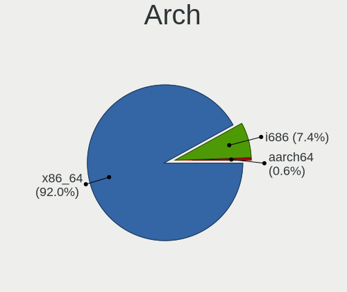
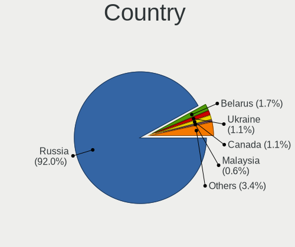
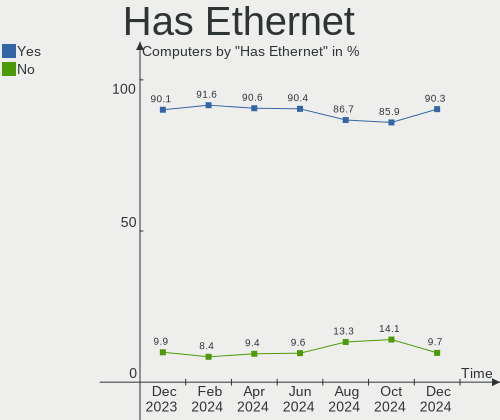
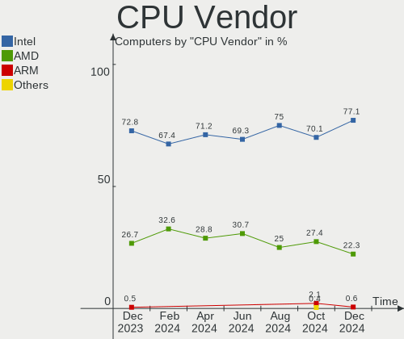
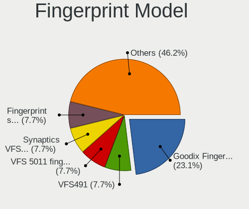
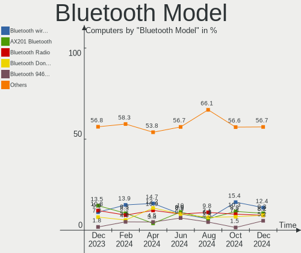

ROSA Hardware Trends
--------------------

A project to identify most popular hardware characteristics and track their change
over time based on data collected by ROSA users at https://Linux-Hardware.org.

Anyone can contribute to the study by uploading probes of their computers by
the [hw-probe](https://github.com/linuxhw/hw-probe) tool:

    sudo -E hw-probe -all -upload

This is a report for all computer types. See also reports for [desktops](/Dist/ROSA/Desktop/README.md) and [notebooks](/Dist/ROSA/Notebook/README.md).

Full-feature report is available here: https://linux-hardware.org/?view=trends

Period: Nov, 2020.

Contents
--------

- [ OS                       ](#os)
- [ OS Family                ](#os-family)
- [ Kernel                   ](#kernel)
- [ Kernel Family            ](#kernel-family)
- [ Kernel Major Ver.        ](#kernel-major-ver)
- [ Arch                     ](#arch)
- [ DE                       ](#de)
- [ Display Server           ](#display-server)
- [ Display Manager          ](#display-manager)
- [ OS Lang                  ](#os-lang)
- [ Boot Mode                ](#boot-mode)
- [ Filesystem               ](#filesystem)
- [ Part. scheme             ](#part-scheme)
- [ Dual Boot with Linux/BSD ](#dual-boot-with-linux/bsd)
- [ Dual Boot (Win)          ](#dual-boot-win)
- [ Country                  ](#country)
- [ City                     ](#city)
- [ Vendor                   ](#vendor)
- [ Model                    ](#model)
- [ Model Family             ](#model-family)
- [ MFG Year                 ](#mfg-year)
- [ Form Factor              ](#form-factor)
- [ Secure Boot              ](#secure-boot)
- [ Coreboot                 ](#coreboot)
- [ RAM Size                 ](#ram-size)
- [ RAM Used                 ](#ram-used)
- [ Has CD-ROM               ](#has-cd-rom)
- [ Total Drives             ](#total-drives)
- [ Has Ethernet             ](#has-ethernet)
- [ Drive Vendor             ](#drive-vendor)
- [ Drive Model              ](#drive-model)
- [ HDD Vendor               ](#hdd-vendor)
- [ SSD Vendor               ](#ssd-vendor)
- [ Drive Kind               ](#drive-kind)
- [ Drive Connector          ](#drive-connector)
- [ Drive Size               ](#drive-size)
- [ Space Total              ](#space-total)
- [ Space Used               ](#space-used)
- [ Malfunc. Drives          ](#malfunc-drives)
- [ Malfunc. Drive Vendor    ](#malfunc-drive-vendor)
- [ Malfunc. HDD Vendor      ](#malfunc-hdd-vendor)
- [ Malfunc. Drive Kind      ](#malfunc-drive-kind)
- [ Failed Drives            ](#failed-drives)
- [ Failed Drive Vendor      ](#failed-drive-vendor)
- [ Drive Status             ](#drive-status)
- [ Storage Vendor           ](#storage-vendor)
- [ Storage Model            ](#storage-model)
- [ Storage Kind             ](#storage-kind)
- [ CPU Vendor               ](#cpu-vendor)
- [ CPU Model                ](#cpu-model)
- [ CPU Model Family         ](#cpu-model-family)
- [ CPU Cores                ](#cpu-cores)
- [ CPU Sockets              ](#cpu-sockets)
- [ CPU Threads              ](#cpu-threads)
- [ CPU Op-Modes             ](#cpu-op-modes)
- [ CPU Microcode            ](#cpu-microcode)
- [ CPU Microarch            ](#cpu-microarch)
- [ GPU Vendor               ](#gpu-vendor)
- [ GPU Model                ](#gpu-model)
- [ GPU Combo                ](#gpu-combo)
- [ GPU Driver               ](#gpu-driver)
- [ GPU Memory               ](#gpu-memory)
- [ Monitor Vendor           ](#monitor-vendor)
- [ Monitor Model            ](#monitor-model)
- [ Monitor Resolution       ](#monitor-resolution)
- [ Monitor Diagonal         ](#monitor-diagonal)
- [ Monitor Width            ](#monitor-width)
- [ Aspect Ratio             ](#aspect-ratio)
- [ Monitor Area             ](#monitor-area)
- [ Pixel Density            ](#pixel-density)
- [ Multiple Monitors        ](#multiple-monitors)
- [ Net Controller Vendor    ](#net-controller-vendor)
- [ Net Controller Model     ](#net-controller-model)
- [ Wireless Vendor          ](#wireless-vendor)
- [ Wireless Model           ](#wireless-model)
- [ Ethernet Vendor          ](#ethernet-vendor)
- [ Ethernet Model           ](#ethernet-model)
- [ Net Controller Kind      ](#net-controller-kind)
- [ Used Controller          ](#used-controller)
- [ NICs                     ](#nics)
- [ Memory Vendor            ](#memory-vendor)
- [ Memory Model             ](#memory-model)
- [ Memory Kind              ](#memory-kind)
- [ Memory Form Factor       ](#memory-form-factor)
- [ Memory Size              ](#memory-size)
- [ Memory Speed             ](#memory-speed)
- [ Sound Vendor             ](#sound-vendor)
- [ Sound Model              ](#sound-model)
- [ Camera Vendor            ](#camera-vendor)
- [ Camera Model             ](#camera-model)
- [ Fingerprint Vendor       ](#fingerprint-vendor)
- [ Fingerprint Model        ](#fingerprint-model)
- [ Chipcard Vendor          ](#chipcard-vendor)
- [ Chipcard Model           ](#chipcard-model)
- [ Printer Vendor           ](#printer-vendor)
- [ Printer Model            ](#printer-model)
- [ Scanner Vendor           ](#scanner-vendor)
- [ Scanner Model            ](#scanner-model)
- [ Bluetooth Vendor         ](#bluetooth-vendor)
- [ Bluetooth Model          ](#bluetooth-model)
- [ Unsupported Devices      ](#unsupported-devices)
- [ Unsupported Device Types ](#unsupported-device-types)

OS
--

Installed operating systems

| Name       | Computers | Percent |
|------------|-----------|---------|
| ROSA R11.1 | 144       | 55.17%  |
| ROSA R11   | 84        | 32.18%  |
| ROSA R8.1  | 18        | 6.9%    |
| ROSA R12   | 7         | 2.68%   |
| ROSA R10   | 5         | 1.92%   |
| RED X3     | 2         | 0.77%   |
| RED X4     | 1         | 0.38%   |

OS Family
---------

OS without a version

| Name | Computers | Percent |
|------|-----------|---------|
| ROSA | 261       | 100%    |

Kernel
------

Version of the Linux kernel

| Version                                       | Computers | Percent |
|-----------------------------------------------|-----------|---------|
| 4.15.0-desktop-45.1rosa-x86_64                | 68        | 26.05%  |
| 4.15.0-desktop-122.124.1rosa-x86_64           | 54        | 20.69%  |
| 4.15.0-desktop-45.1rosa-i586                  | 20        | 7.66%   |
| 5.4.40-generic-1rosa-x86_64                   | 19        | 7.28%   |
| 5.4.32-generic-2rosa-x86_64                   | 12        | 4.6%    |
| 4.9.155-nrj-desktop-1rosa-x86_64              | 12        | 4.6%    |
| 4.15.0-desktop-94.1rosa-x86_64                | 12        | 4.6%    |
| 5.4.72-generic-1rosa-x86_64                   | 8         | 3.07%   |
| 4.15.0-desktop-122.124.1rosa-i586             | 8         | 3.07%   |
| 5.4.72-generic-1rosa-i586                     | 5         | 1.92%   |
| 4.9.60-nrj-desktop-1rosa-x86_64               | 4         | 1.53%   |
| 4.9.155-nrj-desktop-1rosa-i586                | 4         | 1.53%   |
| 5.4.72-generic-1rosa2019.1-x86_64             | 3         | 1.15%   |
| 5.4.32-generic-2rosa-i586                     | 3         | 1.15%   |
| 4.1.38-nrj-desktop-2rosa-x86_64               | 3         | 1.15%   |
| 4.9.41-nrj-desktop-1rosa-x86_64               | 2         | 0.77%   |
| 4.9.155-nrj-laptop-1rosa-x86_64               | 2         | 0.77%   |
| 4.15.0-desktop-94.1rosa-i586                  | 2         | 0.77%   |
| 5.9.6-generic-1rosa-x86_64                    | 1         | 0.38%   |
| 5.9.11.xm1-1-generic-xanmod-rosa2019.1-x86_64 | 1         | 0.38%   |
| 5.4.79-generic-1rosa2019.1-x86_64             | 1         | 0.38%   |
| 5.4.77-generic-1rosa2019.1-x86_64             | 1         | 0.38%   |
| 5.4.74-nrj-desktop-1rosa-x86_64               | 1         | 0.38%   |
| 5.4.40-generic-1rosa-i586                     | 1         | 0.38%   |
| 5.4.35-nrj-desktop-1rosa-x86_64               | 1         | 0.38%   |
| 5.4.0-desktop-55.61.1rosa-x86_64              | 1         | 0.38%   |
| 5.4.0-desktop-11.1rosa-x86_64                 | 1         | 0.38%   |
| 5.4.0-56-generic                              | 1         | 0.38%   |
| 5.0.0-desktop-38.1rosa-x86_64                 | 1         | 0.38%   |
| 4.9.9-nrj-desktop-1rosa-x86_64                | 1         | 0.38%   |
| 4.9.60-nrj-desktop-1rosa-i586                 | 1         | 0.38%   |
| 4.9.124-nrj-desktop-1rosa-x86_64              | 1         | 0.38%   |
| 4.4.74-nrj-desktop-1rosa-x86_64               | 1         | 0.38%   |
| 4.16.18-nrj-desktop-1rosa-x86_64              | 1         | 0.38%   |
| 4.15.0-desktop-91.3rosa-x86_64                | 1         | 0.38%   |
| 4.15.0-desktop-68.5rosa-i586                  | 1         | 0.38%   |
| 4.15.0-desktop-47.2rosa-x86_64                | 1         | 0.38%   |
| 4.1.38-nrj-desktop-2rosa-i586                 | 1         | 0.38%   |

Kernel Family
-------------

Linux kernel without a distro release

| Version | Computers | Percent |
|---------|-----------|---------|
| 4.15.0  | 167       | 63.98%  |
| 5.4.40  | 20        | 7.66%   |
| 4.9.155 | 18        | 6.9%    |
| 5.4.72  | 16        | 6.13%   |
| 5.4.32  | 15        | 5.75%   |
| 4.9.60  | 5         | 1.92%   |
| 4.1.38  | 4         | 1.53%   |
| 5.4.0   | 3         | 1.15%   |
| 4.9.41  | 2         | 0.77%   |
| 5.9.6   | 1         | 0.38%   |
| 5.9.11  | 1         | 0.38%   |
| 5.4.79  | 1         | 0.38%   |
| 5.4.77  | 1         | 0.38%   |
| 5.4.74  | 1         | 0.38%   |
| 5.4.35  | 1         | 0.38%   |
| 5.0.0   | 1         | 0.38%   |
| 4.9.9   | 1         | 0.38%   |
| 4.9.124 | 1         | 0.38%   |
| 4.4.74  | 1         | 0.38%   |
| 4.16.18 | 1         | 0.38%   |

Kernel Major Ver.
-----------------

Linux kernel major version

| Version | Computers | Percent |
|---------|-----------|---------|
| 4.15    | 167       | 63.98%  |
| 5.4     | 58        | 22.22%  |
| 4.9     | 27        | 10.34%  |
| 4.1     | 4         | 1.53%   |
| 5.9     | 2         | 0.77%   |
| 5.0     | 1         | 0.38%   |
| 4.4     | 1         | 0.38%   |
| 4.16    | 1         | 0.38%   |

Arch
----

OS architecture (x86_64, i586, etc.)

| Name   | Computers | Percent |
|--------|-----------|---------|
| x86_64 | 215       | 82.38%  |
| i686   | 46        | 17.62%  |

DE
--

Desktop Environment

| Name    | Computers | Percent |
|---------|-----------|---------|
| KDE4    | 165       | 63.22%  |
| KDE5    | 68        | 26.05%  |
| LXQt    | 19        | 7.28%   |
| XFCE    | 6         | 2.3%    |
| MATE    | 1         | 0.38%   |
| GNOME   | 1         | 0.38%   |
| Unknown | 1         | 0.38%   |

Display Server
--------------

X11 or Wayland

| Name    | Computers | Percent |
|---------|-----------|---------|
| X11     | 259       | 99.23%  |
| Wayland | 1         | 0.38%   |
| Tty     | 1         | 0.38%   |

Display Manager
---------------

SDDM, LightDM, etc.

| Name | Computers | Percent |
|------|-----------|---------|
| KDM  | 165       | 63.22%  |
| SDDM | 93        | 35.63%  |
| TDM  | 1         | 0.38%   |
| LDM  | 1         | 0.38%   |
| GDM  | 1         | 0.38%   |

OS Lang
-------

Language

| Lang    | Computers | Percent |
|---------|-----------|---------|
| ru_RU   | 128       | 49.04%  |
| Unknown | 108       | 41.38%  |
| pl_PL   | 6         | 2.3%    |
| de_DE   | 4         | 1.53%   |
| it_IT   | 3         | 1.15%   |
| en_US   | 3         | 1.15%   |
| es_ES   | 2         | 0.77%   |
| tr_TR   | 1         | 0.38%   |
| ru_UA   | 1         | 0.38%   |
| pt_PT   | 1         | 0.38%   |
| pt_BR   | 1         | 0.38%   |
| lv_LV   | 1         | 0.38%   |
| fr_FR   | 1         | 0.38%   |
| cs_CZ   | 1         | 0.38%   |

Boot Mode
---------

EFI or BIOS

| Mode | Computers | Percent |
|------|-----------|---------|
| BIOS | 185       | 70.88%  |
| EFI  | 76        | 29.12%  |

Filesystem
----------

Type of filesystem

| Type    | Computers | Percent |
|---------|-----------|---------|
| Ext4    | 248       | 95.02%  |
| Btrfs   | 10        | 3.83%   |
| Xfs     | 1         | 0.38%   |
| Ext3    | 1         | 0.38%   |
| Unknown | 1         | 0.38%   |

Part. scheme
------------

Scheme of partitioning

| Type    | Computers | Percent |
|---------|-----------|---------|
| MBR     | 174       | 66.67%  |
| GPT     | 82        | 31.42%  |
| Unknown | 5         | 1.92%   |

Dual Boot with Linux/BSD
------------------------

Hosting more than one Linux/BSD

| Dual boot | Computers | Percent |
|-----------|-----------|---------|
| No        | 195       | 74.71%  |
| Yes       | 66        | 25.29%  |

Dual Boot (Win)
---------------

Hosting Linux and Windows

| Dual boot | Computers | Percent |
|-----------|-----------|---------|
| No        | 133       | 50.96%  |
| Yes       | 128       | 49.04%  |

Country
-------

Geographic location (country)

| Country        | Computers | Percent |
|----------------|-----------|---------|
| Russia         | 190       | 72.8%   |
| Ukraine        | 12        | 4.6%    |
| Belarus        | 12        | 4.6%    |
| Germany        | 8         | 3.07%   |
| Poland         | 7         | 2.68%   |
| France         | 5         | 1.92%   |
| Italy          | 4         | 1.53%   |
| Kazakhstan     | 3         | 1.15%   |
| Latvia         | 2         | 0.77%   |
| Brazil         | 2         | 0.77%   |
| USA            | 1         | 0.38%   |
| UK             | 1         | 0.38%   |
| Turkey         | 1         | 0.38%   |
| Spain          | 1         | 0.38%   |
| Slovakia       | 1         | 0.38%   |
| Serbia         | 1         | 0.38%   |
| Romania        | 1         | 0.38%   |
| Portugal       | 1         | 0.38%   |
| Peru           | 1         | 0.38%   |
| Lithuania      | 1         | 0.38%   |
| Israel         | 1         | 0.38%   |
| Ireland        | 1         | 0.38%   |
| Czech Republic | 1         | 0.38%   |
| Canada         | 1         | 0.38%   |
| Belgium        | 1         | 0.38%   |
| Algeria        | 1         | 0.38%   |

City
----

Geographic location (city)

| City                 | Computers | Percent |
|----------------------|-----------|---------|
| Moscow               | 25        | 9.58%   |
| St Petersburg        | 13        | 4.98%   |
| Krasnodar            | 9         | 3.45%   |
| Ekaterinburg         | 9         | 3.45%   |
| Nizhniy Novgorod     | 6         | 2.3%    |
| Vitebsk              | 5         | 1.92%   |
| Kaliningrad          | 5         | 1.92%   |
| Rostov-on-Don        | 4         | 1.53%   |
| Novosibirsk          | 4         | 1.53%   |
| Ivanovo              | 4         | 1.53%   |
| Volgograd            | 3         | 1.15%   |
| Tyumen               | 3         | 1.15%   |
| Samara               | 3         | 1.15%   |
| Perm                 | 3         | 1.15%   |
| Novokuznetsk         | 3         | 1.15%   |
| Minsk                | 3         | 1.15%   |
| Lida                 | 3         | 1.15%   |
| Krasnoyarsk          | 3         | 1.15%   |
| Kazan’             | 3         | 1.15%   |
| Izhevsk              | 3         | 1.15%   |
| Chita                | 3         | 1.15%   |
| Chelyabinsk          | 3         | 1.15%   |
| Barnaul              | 3         | 1.15%   |
| Yessentuki           | 2         | 0.77%   |
| Yaroslavl            | 2         | 0.77%   |
| Usinsk               | 2         | 0.77%   |
| Ufa                  | 2         | 0.77%   |
| Tomsk                | 2         | 0.77%   |
| Saratov              | 2         | 0.77%   |
| Rome                 | 2         | 0.77%   |
| Poznan               | 2         | 0.77%   |
| Lipetsk              | 2         | 0.77%   |
| Kyiv                 | 2         | 0.77%   |
| Kstovo               | 2         | 0.77%   |
| Kostroma             | 2         | 0.77%   |
| Kamensk-Ural'skiy    | 2         | 0.77%   |
| Donetsk              | 2         | 0.77%   |
| Boulogne-Billancourt | 2         | 0.77%   |
| Zelenodolsk          | 1         | 0.38%   |
| Vogue                | 1         | 0.38%   |
| Vladivostok          | 1         | 0.38%   |
| Verkhniy Ufaley      | 1         | 0.38%   |
| Veliky Novgorod      | 1         | 0.38%   |
| Velikiye Luki        | 1         | 0.38%   |
| Târgu Mureş        | 1         | 0.38%   |
| Tver                 | 1         | 0.38%   |
| Turin                | 1         | 0.38%   |
| Tula                 | 1         | 0.38%   |
| Tosno                | 1         | 0.38%   |
| Syktyvkar            | 1         | 0.38%   |
| Surgut               | 1         | 0.38%   |
| Stroitel'            | 1         | 0.38%   |
| Stavropol            | 1         | 0.38%   |
| Staraya Kupavna      | 1         | 0.38%   |
| Sochi                | 1         | 0.38%   |
| Smolensk             | 1         | 0.38%   |
| Shebekino            | 1         | 0.38%   |
| Shcherbinka          | 1         | 0.38%   |
| Sevastopol           | 1         | 0.38%   |
| Saronno              | 1         | 0.38%   |

Vendor
------

Motherboard manufacturer

| Name                | Computers | Percent |
|---------------------|-----------|---------|
| ASUSTek Computer    | 63        | 24.14%  |
| Gigabyte Technology | 37        | 14.18%  |
| Lenovo              | 35        | 13.41%  |
| Hewlett-Packard     | 21        | 8.05%   |
| Acer                | 20        | 7.66%   |
| MSI                 | 17        | 6.51%   |
| ASRock              | 16        | 6.13%   |
| Samsung Electronics | 8         | 3.07%   |
| Toshiba             | 6         | 2.3%    |
| Sony                | 6         | 2.3%    |
| Dell                | 6         | 2.3%    |
| Packard Bell        | 4         | 1.53%   |
| Unknown             | 4         | 1.53%   |
| Intel               | 3         | 1.15%   |
| Biostar             | 3         | 1.15%   |
| Fujitsu Siemens     | 2         | 0.77%   |
| Fujitsu             | 2         | 0.77%   |
| Alienware           | 2         | 0.77%   |
| Pegatron            | 1         | 0.38%   |
| KREZ                | 1         | 0.38%   |
| HPE                 | 1         | 0.38%   |
| Foxconn             | 1         | 0.38%   |
| ECS                 | 1         | 0.38%   |
| Apple               | 1         | 0.38%   |

Model
-----

Motherboard model

| Name                                  | Computers | Percent |
|---------------------------------------|-----------|---------|
| Unknown                               | 4         | 1.53%   |
| HP Pavilion 15                        | 3         | 1.15%   |
| ASUS All Series                       | 3         | 1.15%   |
| Samsung R508                          | 2         | 0.77%   |
| MSI MS-7597                           | 2         | 0.77%   |
| MSI MS-7592                           | 2         | 0.77%   |
| Lenovo IdeaPad 330-15AST 81D6         | 2         | 0.77%   |
| Lenovo IdeaPad 100-15IBY 80MJ         | 2         | 0.77%   |
| Lenovo G580 20157                     | 2         | 0.77%   |
| Gigabyte H81M-S2H                     | 2         | 0.77%   |
| ASUS VivoBook 15_ASUS Laptop X540BA   | 2         | 0.77%   |
| ASUS V200IB                           | 2         | 0.77%   |
| ASUS M5A78L-M LX3                     | 2         | 0.77%   |
| Alienware 17                          | 2         | 0.77%   |
| Toshiba Satellite C850-B6W            | 1         | 0.38%   |
| Toshiba Satellite A500                | 1         | 0.38%   |
| Toshiba Satellite A300                | 1         | 0.38%   |
| Toshiba Satellite A105                | 1         | 0.38%   |
| Toshiba NB550D                        | 1         | 0.38%   |
| Toshiba NB305                         | 1         | 0.38%   |
| Sony VPCW11S1E                        | 1         | 0.38%   |
| Sony VPCL22S1R                        | 1         | 0.38%   |
| Sony VPCEH2E1R                        | 1         | 0.38%   |
| Sony VGN-FZ21SR                       | 1         | 0.38%   |
| Sony VGN-FW21ZR                       | 1         | 0.38%   |
| Sony SVE1112M1RB                      | 1         | 0.38%   |
| Samsung R540/R580/R780/SA41/E452/E852 | 1         | 0.38%   |
| Samsung R510/P510                     | 1         | 0.38%   |
| Samsung NC210/NC110                   | 1         | 0.38%   |
| Samsung N145P/N250P/N260P             | 1         | 0.38%   |
| Samsung 305U1A                        | 1         | 0.38%   |
| Samsung 300E4C/300E5C/300E7C          | 1         | 0.38%   |
| Pegatron Compaq dx2400 Microtower PC  | 1         | 0.38%   |
| Packard Bell ixtreme M5741            | 1         | 0.38%   |
| Packard Bell EasyNote TSX62HR         | 1         | 0.38%   |
| Packard Bell EasyNote TS11HR          | 1         | 0.38%   |
| Packard Bell EasyNote TE69KB          | 1         | 0.38%   |
| MSI OPTIMUS                           | 1         | 0.38%   |
| MSI MS-AC71                           | 1         | 0.38%   |
| MSI MS-7B36                           | 1         | 0.38%   |
| MSI MS-7A33                           | 1         | 0.38%   |
| MSI MS-7817                           | 1         | 0.38%   |
| MSI MS-7788                           | 1         | 0.38%   |
| MSI MS-7758                           | 1         | 0.38%   |
| MSI MS-7721                           | 1         | 0.38%   |
| MSI MS-7623                           | 1         | 0.38%   |
| MSI MS-7388                           | 1         | 0.38%   |
| MSI MS-7270                           | 1         | 0.38%   |
| MSI GF65 Thin 9SD                     | 1         | 0.38%   |
| MSI Bravo 15 A4DDR                    | 1         | 0.38%   |
| Lenovo Z70-80 80FG                    | 1         | 0.38%   |
| Lenovo V110-15ISK 80TL                | 1         | 0.38%   |
| Lenovo ThinkPad X230 2320LFG          | 1         | 0.38%   |
| Lenovo ThinkPad T460 20FMS22931       | 1         | 0.38%   |
| Lenovo ThinkPad SL500 4414WAV         | 1         | 0.38%   |
| Lenovo ThinkCentre M80 7493RP1        | 1         | 0.38%   |
| Lenovo ThinkCentre M78 Y              | 1         | 0.38%   |
| Lenovo ThinkCentre M72e 3598B44       | 1         | 0.38%   |
| Lenovo S10-3                          | 1         | 0.38%   |
| Lenovo IdeaPad Y550 20017             | 1         | 0.38%   |

Model Family
------------

Motherboard model prefix

| Name                  | Computers | Percent |
|-----------------------|-----------|---------|
| Acer Aspire           | 14        | 5.36%   |
| Lenovo IdeaPad        | 11        | 4.21%   |
| HP Pavilion           | 9         | 3.45%   |
| Toshiba Satellite     | 4         | 1.53%   |
| HP ProBook            | 4         | 1.53%   |
| Unknown               | 4         | 1.53%   |
| Packard Bell EasyNote | 3         | 1.15%   |
| Lenovo ThinkPad       | 3         | 1.15%   |
| Lenovo ThinkCentre    | 3         | 1.15%   |
| Dell Latitude         | 3         | 1.15%   |
| Dell Inspiron         | 3         | 1.15%   |
| ASUS VivoBook         | 3         | 1.15%   |
| ASUS M5A78L-M         | 3         | 1.15%   |
| ASUS All              | 3         | 1.15%   |
| Samsung R508          | 2         | 0.77%   |
| MSI MS-7597           | 2         | 0.77%   |
| MSI MS-7592           | 2         | 0.77%   |
| Lenovo G580           | 2         | 0.77%   |
| Lenovo B590           | 2         | 0.77%   |
| HP Compaq             | 2         | 0.77%   |
| Gigabyte H81M-S2H     | 2         | 0.77%   |
| Gigabyte H310M        | 2         | 0.77%   |
| ASUS V200IB           | 2         | 0.77%   |
| ASUS TUF              | 2         | 0.77%   |
| ASUS ROG              | 2         | 0.77%   |
| ASUS PRIME            | 2         | 0.77%   |
| Alienware 17          | 2         | 0.77%   |
| Toshiba NB550D        | 1         | 0.38%   |
| Toshiba NB305         | 1         | 0.38%   |
| Sony VPCW11S1E        | 1         | 0.38%   |
| Sony VPCL22S1R        | 1         | 0.38%   |
| Sony VPCEH2E1R        | 1         | 0.38%   |
| Sony VGN-FZ21SR       | 1         | 0.38%   |
| Sony VGN-FW21ZR       | 1         | 0.38%   |
| Sony SVE1112M1RB      | 1         | 0.38%   |
| Samsung R540          | 1         | 0.38%   |
| Samsung R510          | 1         | 0.38%   |
| Samsung NC210         | 1         | 0.38%   |
| Samsung N145P         | 1         | 0.38%   |
| Samsung 305U1A        | 1         | 0.38%   |
| Samsung 300E4C        | 1         | 0.38%   |
| Pegatron Compaq       | 1         | 0.38%   |
| Packard Bell ixtreme  | 1         | 0.38%   |
| MSI OPTIMUS           | 1         | 0.38%   |
| MSI MS-AC71           | 1         | 0.38%   |
| MSI MS-7B36           | 1         | 0.38%   |
| MSI MS-7A33           | 1         | 0.38%   |
| MSI MS-7817           | 1         | 0.38%   |
| MSI MS-7788           | 1         | 0.38%   |
| MSI MS-7758           | 1         | 0.38%   |
| MSI MS-7721           | 1         | 0.38%   |
| MSI MS-7623           | 1         | 0.38%   |
| MSI MS-7388           | 1         | 0.38%   |
| MSI MS-7270           | 1         | 0.38%   |
| MSI GF65              | 1         | 0.38%   |
| MSI Bravo             | 1         | 0.38%   |
| Lenovo Z70-80         | 1         | 0.38%   |
| Lenovo V110-15ISK     | 1         | 0.38%   |
| Lenovo S10-3          | 1         | 0.38%   |
| Lenovo G70-80         | 1         | 0.38%   |

MFG Year
--------

Motherboard manufacture year

| Year | Computers | Percent |
|------|-----------|---------|
| 2013 | 28        | 10.73%  |
| 2009 | 28        | 10.73%  |
| 2011 | 27        | 10.34%  |
| 2012 | 23        | 8.81%   |
| 2010 | 20        | 7.66%   |
| 2019 | 17        | 6.51%   |
| 2018 | 17        | 6.51%   |
| 2008 | 16        | 6.13%   |
| 2020 | 15        | 5.75%   |
| 2015 | 15        | 5.75%   |
| 2014 | 14        | 5.36%   |
| 2007 | 13        | 4.98%   |
| 2016 | 12        | 4.6%    |
| 2017 | 6         | 2.3%    |
| 2006 | 4         | 1.53%   |
| 2005 | 4         | 1.53%   |
| 2004 | 1         | 0.38%   |
| 2002 | 1         | 0.38%   |

Form Factor
-----------

Physical design of the computer

| Name        | Computers | Percent |
|-------------|-----------|---------|
| Desktop     | 132       | 50.57%  |
| Notebook    | 123       | 47.13%  |
| All in one  | 4         | 1.53%   |
| Convertible | 1         | 0.38%   |
| Server      | 1         | 0.38%   |

Secure Boot
-----------

Enabled or disabled

| State    | Computers | Percent |
|----------|-----------|---------|
| Disabled | 260       | 99.62%  |
| Enabled  | 1         | 0.38%   |

Coreboot
--------

Have coreboot on board

| Used | Computers | Percent |
|------|-----------|---------|
| No   | 261       | 100%    |

RAM Size
--------

Total RAM memory

| Size in GB  | Computers | Percent |
|-------------|-----------|---------|
| 3.01-4.0    | 103       | 39.46%  |
| 4.01-8.0    | 47        | 18.01%  |
| 8.01-16.0   | 33        | 12.64%  |
| 16.01-24.0  | 26        | 9.96%   |
| 1.01-2.0    | 24        | 9.2%    |
| 2.01-3.0    | 14        | 5.36%   |
| 0.01-1.0    | 9         | 3.45%   |
| 32.01-64.0  | 2         | 0.77%   |
| 64.01-256.0 | 2         | 0.77%   |
| 24.01-32.0  | 1         | 0.38%   |

RAM Used
--------

Used RAM memory

| Used GB  | Computers | Percent |
|----------|-----------|---------|
| 0.01-1.0 | 116       | 44.44%  |
| 1.01-2.0 | 111       | 42.53%  |
| 2.01-3.0 | 24        | 9.2%    |
| 3.01-4.0 | 6         | 2.3%    |
| 4.01-8.0 | 4         | 1.53%   |

Has CD-ROM
----------

Has CD-ROM on board

| Presented | Computers | Percent |
|-----------|-----------|---------|
| Yes       | 158       | 60.54%  |
| No        | 103       | 39.46%  |

Total Drives
------------

Number of drives on board

| Drives | Computers | Percent |
|--------|-----------|---------|
| 1      | 180       | 68.97%  |
| 2      | 51        | 19.54%  |
| 3      | 20        | 7.66%   |
| 4      | 7         | 2.68%   |
| 0      | 3         | 1.15%   |

Has Ethernet
------------

Has Ethernet on board

| Presented | Computers | Percent |
|-----------|-----------|---------|
| Yes       | 255       | 97.7%   |
| No        | 6         | 2.3%    |

Drive Vendor
------------

Hard drive vendors

| Vendor              | Computers | Drives | Percent |
|---------------------|-----------|--------|---------|
| WDC                 | 77        | 86     | 22.51%  |
| Seagate             | 74        | 80     | 21.64%  |
| Samsung Electronics | 32        | 33     | 9.36%   |
| Toshiba             | 31        | 32     | 9.06%   |
| Hitachi             | 21        | 23     | 6.14%   |
| Kingston            | 17        | 18     | 4.97%   |
| HGST                | 8         | 9      | 2.34%   |
| SanDisk             | 7         | 7      | 2.05%   |
| Transcend           | 5         | 5      | 1.46%   |
| GOODRAM             | 5         | 5      | 1.46%   |
| Crucial             | 5         | 5      | 1.46%   |
| China               | 5         | 5      | 1.46%   |
| PLEXTOR             | 4         | 5      | 1.17%   |
| Patriot             | 4         | 4      | 1.17%   |
| Fujitsu             | 4         | 4      | 1.17%   |
| Unknown             | 3         | 3      | 0.88%   |
| SK Hynix            | 3         | 3      | 0.88%   |
| A-DATA Technology   | 3         | 3      | 0.88%   |
| SPCC                | 2         | 2      | 0.58%   |
| Solid State Storage | 2         | 2      | 0.58%   |
| Maxtor              | 2         | 2      | 0.58%   |
| KingSpec            | 2         | 2      | 0.58%   |
| Intel               | 2         | 2      | 0.58%   |
| Corsair             | 2         | 2      | 0.58%   |
| Apacer              | 2         | 2      | 0.58%   |
| AMD                 | 2         | 2      | 0.58%   |
| XrayDisk            | 1         | 1      | 0.29%   |
| WD MediaMax         | 1         | 1      | 0.29%   |
| TO Exter            | 1         | 1      | 0.29%   |
| TCSUNBOW            | 1         | 1      | 0.29%   |
| Smartbuy            | 1         | 1      | 0.29%   |
| Silicon Motion      | 1         | 1      | 0.29%   |
| OCZ                 | 1         | 1      | 0.29%   |
| MIXZA               | 1         | 1      | 0.29%   |
| Micron Technology   | 1         | 1      | 0.29%   |
| LITEONIT            | 1         | 1      | 0.29%   |
| LITEON              | 1         | 1      | 0.29%   |
| KingDian            | 1         | 1      | 0.29%   |
| JMicron             | 1         | 1      | 0.29%   |
| HUAWEI              | 1         | 1      | 0.29%   |
| HPE                 | 1         | 1      | 0.29%   |
| Hewlett-Packard     | 1         | 2      | 0.29%   |
| e2e4                | 1         | 1      | 0.29%   |
| Apple               | 1         | 1      | 0.29%   |

Drive Model
-----------

Hard drive models

| Model                               | Computers | Percent |
|-------------------------------------|-----------|---------|
| Toshiba DT01ACA050 500GB            | 9         | 2.48%   |
| Seagate ST1000LM024 HN-M101MBB 1TB  | 6         | 1.65%   |
| WDC WD10EZEX-08WN4A0 1TB            | 5         | 1.38%   |
| Kingston SA400S37120G 120GB SSD     | 5         | 1.38%   |
| WDC WDS240G2G0A-00JH30 240GB SSD    | 4         | 1.1%    |
| Seagate ST9500325AS 500GB           | 4         | 1.1%    |
| Seagate ST500DM002-1BD142 500GB     | 4         | 1.1%    |
| WDC WD5000AAKX-00ERMA0 500GB        | 3         | 0.83%   |
| WDC WD10EARS-00Y5B1 1TB             | 3         | 0.83%   |
| Seagate ST500LT012-1DG142 500GB     | 3         | 0.83%   |
| Crucial CT240BX500SSD1 240GB        | 3         | 0.83%   |
| WDC WD5000LPCX-80VHAT1 500GB        | 2         | 0.55%   |
| WDC WD5000LPCX-24VHAT0 500GB        | 2         | 0.55%   |
| WDC WD5000AAKX-001CA0 500GB         | 2         | 0.55%   |
| WDC WD3200BPVT-22ZEST0 320GB        | 2         | 0.55%   |
| WDC WD3200AAJS-56M0A0 320GB         | 2         | 0.55%   |
| WDC WD2500LPCX-24C6HT0 250GB        | 2         | 0.55%   |
| WDC WD10EZRX-00L4HB0 1TB            | 2         | 0.55%   |
| Toshiba MQ04ABF100 1TB              | 2         | 0.55%   |
| Toshiba MQ01ABF050 500GB            | 2         | 0.55%   |
| Toshiba MQ01ABD050 500GB            | 2         | 0.55%   |
| Toshiba HDWD110 1TB                 | 2         | 0.55%   |
| Seagate ST500LM012 HN-M500MBB 500GB | 2         | 0.55%   |
| Seagate ST3500418AS 500GB           | 2         | 0.55%   |
| Seagate ST3320620AS 320GB           | 2         | 0.55%   |
| Seagate ST3250824AS 250GB           | 2         | 0.55%   |
| Seagate ST3250318AS 250GB           | 2         | 0.55%   |
| Seagate ST3250310AS 250GB           | 2         | 0.55%   |
| Seagate ST31000528AS 1TB            | 2         | 0.55%   |
| Seagate ST2000DM008-2FR102 2TB      | 2         | 0.55%   |
| Seagate ST1000VX000-1CU162 1TB      | 2         | 0.55%   |
| Seagate ST1000DM010-2EP102 1TB      | 2         | 0.55%   |
| Seagate ST1000DM003-9YN162 1TB      | 2         | 0.55%   |
| Seagate ST1000DM003-1SB102 1TB      | 2         | 0.55%   |
| SanDisk SSD PLUS 240GB              | 2         | 0.55%   |
| Samsung SSD 860 EVO 250GB           | 2         | 0.55%   |
| Samsung SSD 850 EVO 120GB           | 2         | 0.55%   |
| Samsung HM160HI 160GB               | 2         | 0.55%   |
| Samsung HD502HJ 500GB               | 2         | 0.55%   |
| Samsung HD080HJ/ 80GB               | 2         | 0.55%   |
| PLEXTOR PH6-CE240 240GB SSD         | 2         | 0.55%   |
| Hitachi HTS545050B9A300 500GB       | 2         | 0.55%   |
| HGST HTS721010A9E630 1TB            | 2         | 0.55%   |
| HGST HTS545050A7E680 500GB          | 2         | 0.55%   |
| HGST HTS545050A7E380 500GB          | 2         | 0.55%   |
| Apacer AS350 240GB SSD              | 2         | 0.55%   |
| XrayDisk SSD 256GB                  | 1         | 0.28%   |
| WDC WDS250G2B0A 250GB SSD           | 1         | 0.28%   |
| WDC WDS120G2G0A-00JH30 120GB SSD    | 1         | 0.28%   |
| WDC WDS100T2B0A-00SM50 1TB SSD      | 1         | 0.28%   |
| WDC WD7501AALS-00J7B1 752GB         | 1         | 0.28%   |
| WDC WD7500BPVX-22JC3T0 752GB        | 1         | 0.28%   |
| WDC WD7500BPKX-75HPJT0 752GB        | 1         | 0.28%   |
| WDC WD6400BPVT-80HXZT3 640GB        | 1         | 0.28%   |
| WDC WD5000LPVX-60V0TT0 500GB        | 1         | 0.28%   |
| WDC WD5000LPVX-22V0TT0 500GB        | 1         | 0.28%   |
| WDC WD5000LPVT-16G33T0 500GB        | 1         | 0.28%   |
| WDC WD5000LPLX-75ZNTT0 500GB        | 1         | 0.28%   |
| WDC WD5000LPLX-00ZNTT0 500GB        | 1         | 0.28%   |
| WDC WD5000LPCX-60VHAT0 500GB        | 1         | 0.28%   |

HDD Vendor
----------

Hard disk drive vendors

| Vendor              | Computers | Drives | Percent |
|---------------------|-----------|--------|---------|
| Seagate             | 72        | 78     | 31.86%  |
| WDC                 | 70        | 78     | 30.97%  |
| Toshiba             | 28        | 29     | 12.39%  |
| Hitachi             | 21        | 23     | 9.29%   |
| Samsung Electronics | 19        | 20     | 8.41%   |
| HGST                | 8         | 9      | 3.54%   |
| Fujitsu             | 4         | 4      | 1.77%   |
| WD MediaMax         | 1         | 1      | 0.44%   |
| TO Exter            | 1         | 1      | 0.44%   |
| MAXTOR              | 1         | 1      | 0.44%   |
| Hewlett-Packard     | 1         | 1      | 0.44%   |

SSD Vendor
----------

Solid state drive vendors

| Vendor              | Computers | Drives | Percent |
|---------------------|-----------|--------|---------|
| Kingston            | 15        | 16     | 15.46%  |
| Samsung Electronics | 10        | 10     | 10.31%  |
| WDC                 | 7         | 7      | 7.22%   |
| SanDisk             | 6         | 6      | 6.19%   |
| GOODRAM             | 5         | 5      | 5.15%   |
| China               | 5         | 5      | 5.15%   |
| Transcend           | 4         | 4      | 4.12%   |
| PLEXTOR             | 4         | 4      | 4.12%   |
| Patriot             | 4         | 4      | 4.12%   |
| Crucial             | 4         | 4      | 4.12%   |
| Toshiba             | 3         | 3      | 3.09%   |
| A-DATA Technology   | 3         | 3      | 3.09%   |
| SPCC                | 2         | 2      | 2.06%   |
| KingSpec            | 2         | 2      | 2.06%   |
| Intel               | 2         | 2      | 2.06%   |
| Corsair             | 2         | 2      | 2.06%   |
| Apacer              | 2         | 2      | 2.06%   |
| AMD                 | 2         | 2      | 2.06%   |
| XrayDisk            | 1         | 1      | 1.03%   |
| TCSUNBOW            | 1         | 1      | 1.03%   |
| Smartbuy            | 1         | 1      | 1.03%   |
| SK Hynix            | 1         | 1      | 1.03%   |
| Seagate             | 1         | 1      | 1.03%   |
| OCZ                 | 1         | 1      | 1.03%   |
| MIXZA               | 1         | 1      | 1.03%   |
| Micron Technology   | 1         | 1      | 1.03%   |
| Maxtor              | 1         | 1      | 1.03%   |
| LITEONIT            | 1         | 1      | 1.03%   |
| LITEON              | 1         | 1      | 1.03%   |
| KingDian            | 1         | 1      | 1.03%   |
| HPE                 | 1         | 1      | 1.03%   |
| e2e4                | 1         | 1      | 1.03%   |
| Apple               | 1         | 1      | 1.03%   |

Drive Kind
----------

HDD or SSD

| Kind    | Computers | Drives | Percent |
|---------|-----------|--------|---------|
| HDD     | 206       | 245    | 66.24%  |
| SSD     | 86        | 98     | 27.65%  |
| NVMe    | 13        | 15     | 4.18%   |
| Unknown | 4         | 4      | 1.29%   |
| MMC     | 2         | 3      | 0.64%   |

Drive Connector
---------------

SATA, SAS, NVMe, etc.

| Type | Computers | Drives | Percent |
|------|-----------|--------|---------|
| SATA | 247       | 339    | 92.16%  |
| NVMe | 13        | 15     | 4.85%   |
| SAS  | 6         | 8      | 2.24%   |
| MMC  | 2         | 3      | 0.75%   |

Drive Size
----------

Size of hard drive

| Size in TB | Computers | Drives | Percent |
|------------|-----------|--------|---------|
| 0.01-0.5   | 209       | 264    | 74.11%  |
| 0.51-1.0   | 63        | 68     | 22.34%  |
| 1.01-2.0   | 9         | 9      | 3.19%   |
| 4.01-10.0  | 1         | 2      | 0.35%   |

Space Total
-----------

Amount of disk space available on the file system

| Size in GB | Computers | Percent |
|------------|-----------|---------|
| 101-250    | 66        | 25.29%  |
| 251-500    | 63        | 24.14%  |
| 1-20       | 43        | 16.48%  |
| 501-1000   | 27        | 10.34%  |
| 21-50      | 23        | 8.81%   |
| 51-100     | 22        | 8.43%   |
| 1001-2000  | 13        | 4.98%   |
| 2001-3000  | 3         | 1.15%   |
| Unknown    | 1         | 0.38%   |

Space Used
----------

Amount of used disk space

| Used GB   | Computers | Percent |
|-----------|-----------|---------|
| 1-20      | 172       | 65.9%   |
| 101-250   | 25        | 9.58%   |
| 21-50     | 20        | 7.66%   |
| 51-100    | 18        | 6.9%    |
| 251-500   | 17        | 6.51%   |
| 1001-2000 | 4         | 1.53%   |
| 501-1000  | 4         | 1.53%   |
| Unknown   | 1         | 0.38%   |

Malfunc. Drives
---------------

Drive models with a malfunction

| Model                              | Computers | Drives | Percent |
|------------------------------------|-----------|--------|---------|
| Toshiba MQ01ABD050 500GB           | 2         | 2      | 2%      |
| Toshiba DT01ACA050 500GB           | 2         | 3      | 2%      |
| Seagate ST500DM002-1BD142 500GB    | 2         | 2      | 2%      |
| Seagate ST1000DM003-9YN162 1TB     | 2         | 2      | 2%      |
| Samsung Electronics HM160HI 160GB  | 2         | 2      | 2%      |
| HGST HTS545050A7E680 500GB         | 2         | 2      | 2%      |
| WDC WDS240G2G0A-00JH30 240GB SSD   | 1         | 1      | 1%      |
| WDC WD5000LPVX-60V0TT0 500GB       | 1         | 1      | 1%      |
| WDC WD5000LPCX-80VHAT1 500GB       | 1         | 1      | 1%      |
| WDC WD5000AAKX-60U6AA0 500GB       | 1         | 1      | 1%      |
| WDC WD5000AAKX-22ERMA0 500GB       | 1         | 1      | 1%      |
| WDC WD5000AAKX-00ERMA0 500GB       | 1         | 1      | 1%      |
| WDC WD5000AAKX-001CA0 500GB        | 1         | 1      | 1%      |
| WDC WD5000AAKS-22V1A0 500GB        | 1         | 1      | 1%      |
| WDC WD3200BPVT-55JJ5T0 320GB       | 1         | 1      | 1%      |
| WDC WD3200BPVT-22ZEST0 320GB       | 1         | 1      | 1%      |
| WDC WD3200BEVT-80A0RT0 320GB       | 1         | 1      | 1%      |
| WDC WD3200BEKT-60V5T1 320GB        | 1         | 1      | 1%      |
| WDC WD3200AAKS-00L9A0 320GB        | 1         | 1      | 1%      |
| WDC WD3200AAKS-00B3A0 320GB        | 1         | 1      | 1%      |
| WDC WD3200AAJS-00L7A0 320GB        | 1         | 1      | 1%      |
| WDC WD1600JS-56MHB1 160GB          | 1         | 1      | 1%      |
| WDC WD1600JD-55HBB0 160GB          | 1         | 1      | 1%      |
| WDC WD10JPVT-08A1YT2 1TB           | 1         | 1      | 1%      |
| WDC WD10EZEX-08WN4A0 1TB           | 1         | 1      | 1%      |
| WDC WD10EZEX-00ZF5A0 1TB           | 1         | 1      | 1%      |
| WDC WD10EARS-00Y5B1 1TB            | 1         | 1      | 1%      |
| WDC WD10EADS-00L5B1 1TB            | 1         | 1      | 1%      |
| WD MediaMax WL120GBSATA            | 1         | 1      | 1%      |
| Toshiba MK3265GSX 320GB            | 1         | 1      | 1%      |
| Toshiba MK2035GSS 200GB            | 1         | 1      | 1%      |
| Toshiba MK1655GSX 160GB            | 1         | 1      | 1%      |
| Toshiba DT01ACA100 1TB             | 1         | 1      | 1%      |
| SPCC SSD110 120GB                  | 1         | 1      | 1%      |
| SK Hynix SC210 2.5 7MM 128GB SSD   | 1         | 1      | 1%      |
| Seagate ST9500325AS 500GB          | 1         | 1      | 1%      |
| Seagate ST9320423AS 320GB          | 1         | 1      | 1%      |
| Seagate ST9250315AS 250GB          | 1         | 1      | 1%      |
| Seagate ST9160827AS 160GB          | 1         | 1      | 1%      |
| Seagate ST9160310AS 160GB          | 1         | 1      | 1%      |
| Seagate ST9120817AS 120GB          | 1         | 1      | 1%      |
| Seagate ST500LT012-9WS142 500GB    | 1         | 1      | 1%      |
| Seagate ST380815AS 80GB            | 1         | 1      | 1%      |
| Seagate ST3802110A 80GB            | 1         | 1      | 1%      |
| Seagate ST380021A 80GB             | 1         | 1      | 1%      |
| Seagate ST380013AS 80GB            | 1         | 1      | 1%      |
| Seagate ST3750330AS 752GB          | 1         | 1      | 1%      |
| Seagate ST3500418AS 500GB          | 1         | 1      | 1%      |
| Seagate ST3320620AS 320GB          | 1         | 1      | 1%      |
| Seagate ST3320613AS 320GB          | 1         | 1      | 1%      |
| Seagate ST3250620AS 250GB          | 1         | 1      | 1%      |
| Seagate ST3250318AS 250GB          | 1         | 1      | 1%      |
| Seagate ST320LT020-9YG142 320GB    | 1         | 1      | 1%      |
| Seagate ST320LT012-9WS14C 320GB    | 1         | 1      | 1%      |
| Seagate ST320410A 20GB             | 1         | 1      | 1%      |
| Seagate ST31500341AS 1TB           | 1         | 1      | 1%      |
| Seagate ST31000528AS 1TB           | 1         | 1      | 1%      |
| Seagate ST1000VM002-9ZL162 1TB     | 1         | 1      | 1%      |
| Seagate ST1000NM0011 1TB           | 1         | 1      | 1%      |
| Seagate ST1000LM024 HN-M101MBB 1TB | 1         | 1      | 1%      |

Malfunc. Drive Vendor
---------------------

Vendors of faulty drives

| Vendor              | Computers | Drives | Percent |
|---------------------|-----------|--------|---------|
| Seagate             | 29        | 30     | 29.29%  |
| WDC                 | 22        | 22     | 22.22%  |
| Samsung Electronics | 12        | 12     | 12.12%  |
| Hitachi             | 12        | 12     | 12.12%  |
| Toshiba             | 8         | 9      | 8.08%   |
| HGST                | 4         | 4      | 4.04%   |
| Kingston            | 3         | 3      | 3.03%   |
| Fujitsu             | 2         | 2      | 2.02%   |
| WD MediaMax         | 1         | 1      | 1.01%   |
| SPCC                | 1         | 1      | 1.01%   |
| SK Hynix            | 1         | 1      | 1.01%   |
| LITEONIT            | 1         | 1      | 1.01%   |
| Intel               | 1         | 1      | 1.01%   |
| Crucial             | 1         | 1      | 1.01%   |
| Corsair             | 1         | 1      | 1.01%   |

Malfunc. HDD Vendor
-------------------

Vendors of faulty HDD drives

| Vendor              | Computers | Drives | Percent |
|---------------------|-----------|--------|---------|
| Seagate             | 29        | 30     | 32.95%  |
| WDC                 | 21        | 21     | 23.86%  |
| Hitachi             | 12        | 12     | 13.64%  |
| Samsung Electronics | 11        | 11     | 12.5%   |
| Toshiba             | 8         | 9      | 9.09%   |
| HGST                | 4         | 4      | 4.55%   |
| Fujitsu             | 2         | 2      | 2.27%   |
| WD MediaMax         | 1         | 1      | 1.14%   |

Malfunc. Drive Kind
-------------------

Kinds of faulty drives

| Kind | Computers | Drives | Percent |
|------|-----------|--------|---------|
| HDD  | 82        | 90     | 88.17%  |
| SSD  | 11        | 11     | 11.83%  |

Failed Drives
-------------

Failed drive models

| Model                             | Computers | Drives | Percent |
|-----------------------------------|-----------|--------|---------|
| WDC WD3000HLFS-01MZUV0 304GB      | 1         | 1      | 14.29%  |
| WDC WD2500JS-22NCB1 250GB         | 1         | 1      | 14.29%  |
| WDC WD2500AAKS-00F0A0 250GB       | 1         | 1      | 14.29%  |
| Samsung Electronics HD252HJ 250GB | 1         | 1      | 14.29%  |
| Hitachi HTS547550A9E384 500GB     | 1         | 1      | 14.29%  |
| Hitachi HDP725040GLA360 400GB     | 1         | 1      | 14.29%  |
| HGST HTS545050A7E380 500GB        | 1         | 1      | 14.29%  |

Failed Drive Vendor
-------------------

Failed drive vendors

| Vendor              | Computers | Drives | Percent |
|---------------------|-----------|--------|---------|
| WDC                 | 3         | 3      | 42.86%  |
| Hitachi             | 2         | 2      | 28.57%  |
| Samsung Electronics | 1         | 1      | 14.29%  |
| HGST                | 1         | 1      | 14.29%  |

Drive Status
------------

Number of failed and malfunc. drives

| Status   | Computers | Drives | Percent |
|----------|-----------|--------|---------|
| Works    | 188       | 245    | 63.3%   |
| Malfunc  | 91        | 101    | 30.64%  |
| Detected | 11        | 12     | 3.7%    |
| Failed   | 7         | 7      | 2.36%   |

Storage Vendor
--------------

Storage controller vendors

| Vendor                           | Computers | Percent |
|----------------------------------|-----------|---------|
| Intel                            | 172       | 58.7%   |
| AMD                              | 68        | 23.21%  |
| Nvidia                           | 11        | 3.75%   |
| JMicron Technology               | 8         | 2.73%   |
| VIA Technologies                 | 5         | 1.71%   |
| ASMedia Technology               | 5         | 1.71%   |
| Samsung Electronics              | 4         | 1.37%   |
| Marvell Technology Group         | 3         | 1.02%   |
| Solid State Storage Technology   | 2         | 0.68%   |
| SK Hynix                         | 2         | 0.68%   |
| Silicon Motion                   | 2         | 0.68%   |
| Kingston Technology Company      | 2         | 0.68%   |
| ULi Electronics                  | 1         | 0.34%   |
| Silicon Integrated Systems [SiS] | 1         | 0.34%   |
| Silicon Image                    | 1         | 0.34%   |
| Seagate Technology               | 1         | 0.34%   |
| Sandisk                          | 1         | 0.34%   |
| Micron/Crucial Technology        | 1         | 0.34%   |
| Lite-On Technology               | 1         | 0.34%   |
| Artop Electronic                 | 1         | 0.34%   |
| Adaptec                          | 1         | 0.34%   |

Storage Model
-------------

Storage controller models

| Model                                                                                   | Computers | Percent |
|-----------------------------------------------------------------------------------------|-----------|---------|
| AMD FCH SATA Controller [AHCI mode]                                                     | 34        | 8.76%   |
| AMD SB7x0/SB8x0/SB9x0 IDE Controller                                                    | 18        | 4.64%   |
| Intel 7 Series Chipset Family 6-port SATA Controller [AHCI mode]                        | 17        | 4.38%   |
| Intel 82801IBM/IEM (ICH9M/ICH9M-E) 4 port SATA Controller [AHCI mode]                   | 16        | 4.12%   |
| Intel NM10/ICH7 Family SATA Controller [IDE mode]                                       | 14        | 3.61%   |
| AMD SB7x0/SB8x0/SB9x0 SATA Controller [AHCI mode]                                       | 14        | 3.61%   |
| Intel 82801G (ICH7 Family) IDE Controller                                               | 12        | 3.09%   |
| AMD SB7x0/SB8x0/SB9x0 SATA Controller [IDE mode]                                        | 10        | 2.58%   |
| Intel 6 Series/C200 Series Chipset Family Desktop SATA Controller (IDE mode, ports 4-5) | 9         | 2.32%   |
| Intel 6 Series/C200 Series Chipset Family Desktop SATA Controller (IDE mode, ports 0-3) | 9         | 2.32%   |
| Intel 6 Series/C200 Series Chipset Family 6 port Mobile SATA AHCI Controller            | 9         | 2.32%   |
| Intel NM10/ICH7 Family SATA Controller [AHCI mode]                                      | 8         | 2.06%   |
| Intel 82801HM/HEM (ICH8M/ICH8M-E) IDE Controller                                        | 7         | 1.8%    |
| Nvidia MCP61 SATA Controller                                                            | 6         | 1.55%   |
| Nvidia MCP61 IDE                                                                        | 6         | 1.55%   |
| Intel 82801HM/HEM (ICH8M/ICH8M-E) SATA Controller [AHCI mode]                           | 6         | 1.55%   |
| Intel 82801GBM/GHM (ICH7-M Family) SATA Controller [IDE mode]                           | 6         | 1.55%   |
| Intel 8 Series/C220 Series Chipset Family 6-port SATA Controller 1 [AHCI mode]          | 6         | 1.55%   |
| Intel 6 Series/C200 Series Chipset Family 6 port Desktop SATA AHCI Controller           | 6         | 1.55%   |
| Intel 200 Series PCH SATA controller [AHCI mode]                                        | 6         | 1.55%   |
| AMD FCH SATA Controller [IDE mode]                                                      | 6         | 1.55%   |
| Intel Sunrise Point-LP SATA Controller [AHCI mode]                                      | 5         | 1.29%   |
| Intel Atom Processor E3800 Series SATA AHCI Controller                                  | 5         | 1.29%   |
| ASMedia Technology ASM1062 Serial ATA Controller                                        | 5         | 1.29%   |
| VIA Technologies VT82C586A/B/VT82C686/A/B/VT823x/A/C PIPC Bus Master IDE                | 4         | 1.03%   |
| JMicron Technology JMB368 IDE controller                                                | 4         | 1.03%   |
| Intel Atom/Celeron/Pentium Processor x5-E8000/J3xxx/N3xxx Series SATA Controller        | 4         | 1.03%   |
| Intel 5 Series/3400 Series Chipset 6 port SATA AHCI Controller                          | 4         | 1.03%   |
| Intel 5 Series/3400 Series Chipset 4 port SATA AHCI Controller                          | 4         | 1.03%   |
| JMicron Technology JMB363 SATA/IDE Controller                                           | 3         | 0.77%   |
| Intel Wildcat Point-LP SATA Controller [AHCI Mode]                                      | 3         | 0.77%   |
| Intel Q170/Q150/B150/H170/H110/Z170/CM236 Chipset SATA Controller [AHCI Mode]           | 3         | 0.77%   |
| Intel 9 Series Chipset Family SATA Controller [AHCI Mode]                               | 3         | 0.77%   |
| Intel 82801JI (ICH10 Family) SATA AHCI Controller                                       | 3         | 0.77%   |
| Intel 82801 Mobile SATA Controller [RAID mode]                                          | 3         | 0.77%   |
| Intel 7 Series/C210 Series Chipset Family 6-port SATA Controller [AHCI mode]            | 3         | 0.77%   |
| Intel 7 Series/C210 Series Chipset Family 4-port SATA Controller [IDE mode]             | 3         | 0.77%   |
| Intel 7 Series/C210 Series Chipset Family 2-port SATA Controller [IDE mode]             | 3         | 0.77%   |
| AMD FCH IDE Controller                                                                  | 3         | 0.77%   |
| AMD 300 Series Chipset SATA Controller                                                  | 3         | 0.77%   |
| VIA Technologies VIA VT6420 SATA RAID Controller                                        | 2         | 0.52%   |
| Solid State Storage Technology Non-Volatile memory controller                           | 2         | 0.52%   |
| SK Hynix Non-Volatile memory controller                                                 | 2         | 0.52%   |
| Samsung Electronics NVMe SSD Controller SM981/PM981/PM983                               | 2         | 0.52%   |
| Marvell Technology Group 88SE9172 SATA III 6Gb/s RAID Controller                        | 2         | 0.52%   |
| Kingston Technology Company Non-Volatile memory controller                              | 2         | 0.52%   |
| Intel SATA Controller [RAID mode]                                                       | 2         | 0.52%   |
| Intel Cannon Lake PCH SATA AHCI Controller                                              | 2         | 0.52%   |
| Intel Cannon Lake Mobile PCH SATA AHCI Controller                                       | 2         | 0.52%   |
| Intel 82801JI (ICH10 Family) 4 port SATA IDE Controller #1                              | 2         | 0.52%   |
| Intel 82801JI (ICH10 Family) 2 port SATA IDE Controller #2                              | 2         | 0.52%   |
| Intel 82801JD/DO (ICH10 Family) 4-port SATA IDE Controller                              | 2         | 0.52%   |
| Intel 82801JD/DO (ICH10 Family) 2-port SATA IDE Controller                              | 2         | 0.52%   |
| Intel 82801IR/IO/IH (ICH9R/DO/DH) 4 port SATA Controller [IDE mode]                     | 2         | 0.52%   |
| Intel 82801I (ICH9 Family) 2 port SATA Controller [IDE mode]                            | 2         | 0.52%   |
| Intel 82801EB/ER (ICH5/ICH5R) IDE Controller                                            | 2         | 0.52%   |
| Intel 82801EB (ICH5) SATA Controller                                                    | 2         | 0.52%   |
| Intel 5 Series/3400 Series Chipset 4 port SATA IDE Controller                           | 2         | 0.52%   |
| Intel 5 Series/3400 Series Chipset 2 port SATA IDE Controller                           | 2         | 0.52%   |
| Intel 4 Series Chipset PT IDER Controller                                               | 2         | 0.52%   |

Storage Kind
------------

Kind of storage controller (IDE, SATA, NVMe, SAS, ...)

| Kind | Computers | Percent |
|------|-----------|---------|
| SATA | 189       | 61.56%  |
| IDE  | 97        | 31.6%   |
| NVMe | 13        | 4.23%   |
| RAID | 6         | 1.95%   |
| SAS  | 1         | 0.33%   |
| SCSI | 1         | 0.33%   |

CPU Vendor
----------

Processor vendors

| Vendor | Computers | Percent |
|--------|-----------|---------|
| Intel  | 182       | 69.73%  |
| AMD    | 79        | 30.27%  |

CPU Model
---------

Processor models

| Model                                         | Computers | Percent |
|-----------------------------------------------|-----------|---------|
| Intel Core i5-3230M CPU @ 2.60GHz             | 5         | 1.92%   |
| Intel Pentium Dual-Core CPU T4400 @ 2.20GHz   | 3         | 1.15%   |
| Intel Pentium Dual CPU E2200 @ 2.20GHz        | 3         | 1.15%   |
| Intel Celeron CPU N2840 @ 2.16GHz             | 3         | 1.15%   |
| Intel Atom CPU N455 @ 1.66GHz                 | 3         | 1.15%   |
| Intel Xeon CPU E5450 @ 3.00GHz                | 2         | 0.77%   |
| Intel Pentium Dual CPU T3400 @ 2.16GHz        | 2         | 0.77%   |
| Intel Pentium CPU N3700 @ 1.60GHz             | 2         | 0.77%   |
| Intel Pentium CPU B950 @ 2.10GHz              | 2         | 0.77%   |
| Intel Pentium CPU 2117U @ 1.80GHz             | 2         | 0.77%   |
| Intel Pentium CPU 2020M @ 2.40GHz             | 2         | 0.77%   |
| Intel Pentium 4 CPU 2.80GHz                   | 2         | 0.77%   |
| Intel Core i7-8700 CPU @ 3.20GHz              | 2         | 0.77%   |
| Intel Core i5-9400 CPU @ 2.90GHz              | 2         | 0.77%   |
| Intel Core i5-8400 CPU @ 2.80GHz              | 2         | 0.77%   |
| Intel Core i5-8300H CPU @ 2.30GHz             | 2         | 0.77%   |
| Intel Core i5-2450M CPU @ 2.50GHz             | 2         | 0.77%   |
| Intel Core i5-2430M CPU @ 2.40GHz             | 2         | 0.77%   |
| Intel Core i5-2320 CPU @ 3.00GHz              | 2         | 0.77%   |
| Intel Core i5 CPU 760 @ 2.80GHz               | 2         | 0.77%   |
| Intel Core i3-2310M CPU @ 2.10GHz             | 2         | 0.77%   |
| Intel Core i3-2130 CPU @ 3.40GHz              | 2         | 0.77%   |
| Intel Core i3-2100 CPU @ 3.10GHz              | 2         | 0.77%   |
| Intel Core i3 CPU 530 @ 2.93GHz               | 2         | 0.77%   |
| Intel Core 2 Quad CPU Q8200 @ 2.33GHz         | 2         | 0.77%   |
| Intel Core 2 Duo CPU T5750 @ 2.00GHz          | 2         | 0.77%   |
| Intel Core 2 Duo CPU E8400 @ 3.00GHz          | 2         | 0.77%   |
| Intel Celeron Dual-Core CPU T3000 @ 1.80GHz   | 2         | 0.77%   |
| Intel Celeron CPU G1840 @ 2.80GHz             | 2         | 0.77%   |
| Intel Atom CPU N280 @ 1.66GHz                 | 2         | 0.77%   |
| Intel Atom CPU N270 @ 1.60GHz                 | 2         | 0.77%   |
| AMD Ryzen 7 4800H with Radeon Graphics        | 2         | 0.77%   |
| AMD Ryzen 7 2700 Eight-Core Processor         | 2         | 0.77%   |
| AMD Ryzen 5 3550H with Radeon Vega Mobile Gfx | 2         | 0.77%   |
| AMD Phenom II X4 955 Processor                | 2         | 0.77%   |
| AMD E2-9000 RADEON R2, 4 COMPUTE CORES 2C+2G  | 2         | 0.77%   |
| AMD C-60 APU with Radeon HD Graphics          | 2         | 0.77%   |
| AMD Athlon II X2 270 Processor                | 2         | 0.77%   |
| AMD Athlon II X2 250 Processor                | 2         | 0.77%   |
| AMD Athlon II X2 240 Processor                | 2         | 0.77%   |
| AMD Athlon II X2 215 Processor                | 2         | 0.77%   |
| AMD Athlon 64 X2 Dual Core Processor 4200+    | 2         | 0.77%   |
| AMD A8-4500M APU with Radeon HD Graphics      | 2         | 0.77%   |
| AMD A6-9225 RADEON R4, 5 COMPUTE CORES 2C+3G  | 2         | 0.77%   |
| AMD A6-6310 APU with AMD Radeon R4 Graphics   | 2         | 0.77%   |
| Intel Xeon Gold 5117 CPU @ 2.00GHz            | 1         | 0.38%   |
| Intel Xeon CPU X5450 @ 3.00GHz                | 1         | 0.38%   |
| Intel Xeon CPU E3-1245 v3 @ 3.40GHz           | 1         | 0.38%   |
| Intel Pentium Gold G5400 CPU @ 3.70GHz        | 1         | 0.38%   |
| Intel Pentium Dual-Core CPU T4300 @ 2.10GHz   | 1         | 0.38%   |
| Intel Pentium Dual-Core CPU T4200 @ 2.00GHz   | 1         | 0.38%   |
| Intel Pentium Dual-Core CPU E6300 @ 2.80GHz   | 1         | 0.38%   |
| Intel Pentium Dual-Core CPU E5500 @ 2.80GHz   | 1         | 0.38%   |
| Intel Pentium D CPU 3.00GHz                   | 1         | 0.38%   |
| Intel Pentium D CPU 2.80GHz                   | 1         | 0.38%   |
| Intel Pentium CPU N3540 @ 2.16GHz             | 1         | 0.38%   |
| Intel Pentium CPU G860 @ 3.00GHz              | 1         | 0.38%   |
| Intel Pentium CPU G850 @ 2.90GHz              | 1         | 0.38%   |
| Intel Pentium CPU G4400 @ 3.30GHz             | 1         | 0.38%   |
| Intel Pentium CPU G3420 @ 3.20GHz             | 1         | 0.38%   |

CPU Model Family
----------------

Processor model prefix

| Model                   | Computers | Percent |
|-------------------------|-----------|---------|
| Intel Core i5           | 36        | 13.79%  |
| Intel Core i3           | 25        | 9.58%   |
| Intel Core 2 Duo        | 20        | 7.66%   |
| Intel Pentium           | 18        | 6.9%    |
| Intel Celeron           | 18        | 6.9%    |
| Intel Core i7           | 13        | 4.98%   |
| Intel Atom              | 12        | 4.6%    |
| AMD Athlon II X2        | 9         | 3.45%   |
| AMD A6                  | 8         | 3.07%   |
| Intel Pentium Dual-Core | 7         | 2.68%   |
| Intel Genuine           | 6         | 2.3%    |
| Intel Core 2 Quad       | 6         | 2.3%    |
| AMD Ryzen 5             | 6         | 2.3%    |
| AMD A8                  | 6         | 2.3%    |
| Intel Pentium Dual      | 5         | 1.92%   |
| AMD FX                  | 5         | 1.92%   |
| Intel Xeon              | 4         | 1.53%   |
| Intel Pentium 4         | 4         | 1.53%   |
| AMD Ryzen 7             | 4         | 1.53%   |
| AMD Phenom II X4        | 4         | 1.53%   |
| AMD E2                  | 3         | 1.15%   |
| AMD Athlon II X3        | 3         | 1.15%   |
| Intel Pentium D         | 2         | 0.77%   |
| Intel Celeron Dual-Core | 2         | 0.77%   |
| AMD Sempron             | 2         | 0.77%   |
| AMD Phenom II X2        | 2         | 0.77%   |
| AMD Phenom              | 2         | 0.77%   |
| AMD E1                  | 2         | 0.77%   |
| AMD E                   | 2         | 0.77%   |
| AMD C-60                | 2         | 0.77%   |
| AMD Athlon 64 X2        | 2         | 0.77%   |
| AMD Athlon 64           | 2         | 0.77%   |
| AMD A4                  | 2         | 0.77%   |
| Other                   | 1         | 0.38%   |
| Intel Xeon Gold         | 1         | 0.38%   |
| Intel Pentium Gold      | 1         | 0.38%   |
| Intel Core 2            | 1         | 0.38%   |
| Intel Celeron M         | 1         | 0.38%   |
| AMD V140                | 1         | 0.38%   |
| AMD Turion 64 X2 Mobile | 1         | 0.38%   |
| AMD Ryzen Threadripper  | 1         | 0.38%   |
| AMD Ryzen 7 PRO         | 1         | 0.38%   |
| AMD Ryzen 3             | 1         | 0.38%   |
| AMD Phenom II X3        | 1         | 0.38%   |
| AMD Mobile Sempron      | 1         | 0.38%   |
| AMD Athlon X4           | 1         | 0.38%   |
| AMD Athlon X2           | 1         | 0.38%   |
| AMD Athlon II X4        | 1         | 0.38%   |
| AMD Athlon              | 1         | 0.38%   |
| AMD A10                 | 1         | 0.38%   |

CPU Cores
---------

Number of processor cores

| Number | Computers | Percent |
|--------|-----------|---------|
| 2      | 148       | 56.7%   |
| 4      | 63        | 24.14%  |
| 1      | 26        | 9.96%   |
| 6      | 9         | 3.45%   |
| 3      | 8         | 3.07%   |
| 8      | 6         | 2.3%    |
| 28     | 1         | 0.38%   |

CPU Sockets
-----------

Number of sockets

| Number | Computers | Percent |
|--------|-----------|---------|
| 1      | 260       | 99.62%  |
| 2      | 1         | 0.38%   |

CPU Threads
-----------

Threads per core (Hyper-Threading)

| Number | Computers | Percent |
|--------|-----------|---------|
| 1      | 162       | 62.07%  |
| 2      | 99        | 37.93%  |

CPU Op-Modes
------------

CPU Operation Modes (32-bit, 64-bit)

| Op mode        | Computers | Percent |
|----------------|-----------|---------|
| 32-bit, 64-bit | 249       | 95.4%   |
| 32-bit         | 12        | 4.6%    |

CPU Microcode
-------------

Microcode number

| Number     | Computers | Percent |
|------------|-----------|---------|
| 0x206a7    | 26        | 9.96%   |
| 0x1067a    | 24        | 9.2%    |
| 0x306a9    | 22        | 8.43%   |
| Unknown    | 13        | 4.98%   |
| 0x306c3    | 12        | 4.6%    |
| 0x010000c8 | 12        | 4.6%    |
| 0x6fd      | 11        | 4.21%   |
| 0x906ea    | 10        | 3.83%   |
| 0x106ca    | 7         | 2.68%   |
| 0x06001119 | 6         | 2.3%    |
| 0x30678    | 5         | 1.92%   |
| 0x07030105 | 5         | 1.92%   |
| 0x306d4    | 4         | 1.53%   |
| 0x20652    | 4         | 1.53%   |
| 0x106c2    | 4         | 1.53%   |
| 0x10677    | 4         | 1.53%   |
| 0x06000852 | 4         | 1.53%   |
| 0x05000119 | 4         | 1.53%   |
| 0x806ea    | 3         | 1.15%   |
| 0x6e8      | 3         | 1.15%   |
| 0x506e3    | 3         | 1.15%   |
| 0x406c3    | 3         | 1.15%   |
| 0x20655    | 3         | 1.15%   |
| 0x106e5    | 3         | 1.15%   |
| 0x10676    | 3         | 1.15%   |
| 0x0700010f | 3         | 1.15%   |
| 0x06006704 | 3         | 1.15%   |
| 0x03000027 | 3         | 1.15%   |
| 0x010000db | 3         | 1.15%   |
| 0xf65      | 2         | 0.77%   |
| 0x906ed    | 2         | 0.77%   |
| 0x6fb      | 2         | 0.77%   |
| 0x6f2      | 2         | 0.77%   |
| 0x406e3    | 2         | 0.77%   |
| 0x0800820d | 2         | 0.77%   |
| 0x08001137 | 2         | 0.77%   |
| 0x06006705 | 2         | 0.77%   |
| 0xf64      | 1         | 0.38%   |
| 0xf41      | 1         | 0.38%   |
| 0xf33      | 1         | 0.38%   |
| 0xf29      | 1         | 0.38%   |
| 0xf13      | 1         | 0.38%   |
| 0x906e9    | 1         | 0.38%   |
| 0x806ec    | 1         | 0.38%   |
| 0x806e9    | 1         | 0.38%   |
| 0x706e5    | 1         | 0.38%   |
| 0x706a1    | 1         | 0.38%   |
| 0x6fa      | 1         | 0.38%   |
| 0x6d8      | 1         | 0.38%   |
| 0x506c9    | 1         | 0.38%   |
| 0x50654    | 1         | 0.38%   |
| 0x406c4    | 1         | 0.38%   |
| 0x30661    | 1         | 0.38%   |
| 0x10661    | 1         | 0.38%   |
| 0x08701013 | 1         | 0.38%   |
| 0x08600106 | 1         | 0.38%   |
| 0x08600104 | 1         | 0.38%   |
| 0x08600102 | 1         | 0.38%   |
| 0x08108109 | 1         | 0.38%   |
| 0x08108102 | 1         | 0.38%   |

CPU Microarch
-------------

Microarchitecture

| Name          | Computers | Percent |
|---------------|-----------|---------|
| Penryn        | 31        | 11.88%  |
| SandyBridge   | 26        | 9.96%   |
| K10           | 22        | 8.43%   |
| IvyBridge     | 22        | 8.43%   |
| KabyLake      | 18        | 6.9%    |
| Core          | 17        | 6.51%   |
| Haswell       | 13        | 4.98%   |
| Bonnell       | 12        | 4.6%    |
| Piledriver    | 10        | 3.83%   |
| Silvermont    | 9         | 3.45%   |
| Westmere      | 7         | 2.68%   |
| NetBurst      | 7         | 2.68%   |
| K8 Hammer     | 7         | 2.68%   |
| Skylake       | 6         | 2.3%    |
| Puma          | 6         | 2.3%    |
| Excavator     | 6         | 2.3%    |
| Zen+          | 5         | 1.92%   |
| Bobcat        | 5         | 1.92%   |
| Zen 2         | 4         | 1.53%   |
| Zen           | 4         | 1.53%   |
| P6            | 4         | 1.53%   |
| Broadwell     | 4         | 1.53%   |
| Nehalem       | 3         | 1.15%   |
| K10 Llano     | 3         | 1.15%   |
| Jaguar        | 3         | 1.15%   |
| Steamroller   | 2         | 0.77%   |
| IceLake       | 1         | 0.38%   |
| Goldmont plus | 1         | 0.38%   |
| Goldmont      | 1         | 0.38%   |
| Bulldozer     | 1         | 0.38%   |
| Unknown       | 1         | 0.38%   |

GPU Vendor
----------

Vendors of graphics cards

| Vendor                     | Computers | Percent |
|----------------------------|-----------|---------|
| Nvidia                     | 115       | 39.25%  |
| Intel                      | 103       | 35.15%  |
| AMD                        | 73        | 24.91%  |
| VIA Technologies           | 1         | 0.34%   |
| Matrox Electronics Systems | 1         | 0.34%   |

GPU Model
---------

Graphics card models

| Model                                                                                    | Computers | Percent |
|------------------------------------------------------------------------------------------|-----------|---------|
| Intel 2nd Generation Core Processor Family Integrated Graphics Controller                | 16        | 5.03%   |
| Intel 3rd Gen Core processor Graphics Controller                                         | 13        | 4.09%   |
| Nvidia GK208B [GeForce GT 710]                                                           | 7         | 2.2%    |
| Intel Mobile 945GM/GMS/GME, 943/940GML Express Integrated Graphics Controller            | 7         | 2.2%    |
| Intel Mobile 4 Series Chipset Integrated Graphics Controller                             | 7         | 2.2%    |
| Intel Atom Processor D4xx/D5xx/N4xx/N5xx Integrated Graphics Controller                  | 7         | 2.2%    |
| Intel Atom Processor Z36xxx/Z37xxx Series Graphics & Display                             | 5         | 1.57%   |
| AMD Stoney [Radeon R2/R3/R4/R5 Graphics]                                                 | 5         | 1.57%   |
| AMD Mullins [Radeon R4/R5 Graphics]                                                      | 5         | 1.57%   |
| Nvidia GF108M [GeForce GT 540M]                                                          | 4         | 1.26%   |
| Nvidia GF108 [GeForce GT 730]                                                            | 4         | 1.26%   |
| Nvidia GF108 [GeForce GT 440]                                                            | 4         | 1.26%   |
| Intel Mobile 945GSE Express Integrated Graphics Controller                               | 4         | 1.26%   |
| Intel Atom/Celeron/Pentium Processor x5-E8000/J3xxx/N3xxx Integrated Graphics Controller | 4         | 1.26%   |
| Intel 4 Series Chipset Integrated Graphics Controller                                    | 4         | 1.26%   |
| Nvidia GP106 [GeForce GTX 1060 3GB]                                                      | 3         | 0.94%   |
| Nvidia GK208B [GeForce GT 730]                                                           | 3         | 0.94%   |
| Nvidia GK107 [GeForce GTX 650]                                                           | 3         | 0.94%   |
| Nvidia GF117M [GeForce 610M/710M/810M/820M / GT 620M/625M/630M/720M]                     | 3         | 0.94%   |
| Nvidia GF116 [GeForce GTX 550 Ti]                                                        | 3         | 0.94%   |
| Intel Xeon E3-1200 v3/4th Gen Core Processor Integrated Graphics Controller              | 3         | 0.94%   |
| Intel UHD Graphics 630 (Mobile)                                                          | 3         | 0.94%   |
| Intel Mobile 945GM/GMS, 943/940GML Express Integrated Graphics Controller                | 3         | 0.94%   |
| Intel HD Graphics 5500                                                                   | 3         | 0.94%   |
| Intel Core Processor Integrated Graphics Controller                                      | 3         | 0.94%   |
| AMD Topaz XT [Radeon R7 M260/M265 / M340/M360 / M440/M445 / 530/535 / 620/625 Mobile]    | 3         | 0.94%   |
| AMD RV710/M92 [Mobility Radeon HD 4530/4570/545v]                                        | 3         | 0.94%   |
| AMD Renoir                                                                               | 3         | 0.94%   |
| AMD Picasso                                                                              | 3         | 0.94%   |
| AMD Oland XT [Radeon HD 8670 / R7 250/350]                                               | 3         | 0.94%   |
| AMD Ellesmere [Radeon RX 470/480/570/570X/580/580X/590]                                  | 3         | 0.94%   |
| Nvidia GT218 [GeForce 210]                                                               | 2         | 0.63%   |
| Nvidia GP108 [GeForce GT 1030]                                                           | 2         | 0.63%   |
| Nvidia GK208BM [GeForce 920M]                                                            | 2         | 0.63%   |
| Nvidia GK106M [GeForce GTX 770M]                                                         | 2         | 0.63%   |
| Nvidia GK104 [GeForce GTX 760]                                                           | 2         | 0.63%   |
| Nvidia GF108 [GeForce GT 630]                                                            | 2         | 0.63%   |
| Nvidia GF108 [GeForce GT 430]                                                            | 2         | 0.63%   |
| Nvidia G96C [GeForce 9500 GT]                                                            | 2         | 0.63%   |
| Nvidia G92 [GeForce GTS 250]                                                             | 2         | 0.63%   |
| Nvidia G92 [GeForce GT 330]                                                              | 2         | 0.63%   |
| Nvidia G84 [GeForce 8600 GT]                                                             | 2         | 0.63%   |
| Nvidia G73 [GeForce 7600 GT]                                                             | 2         | 0.63%   |
| Intel Xeon E3-1200 v2/3rd Gen Core processor Graphics Controller                         | 2         | 0.63%   |
| Intel UHD Graphics 620                                                                   | 2         | 0.63%   |
| Intel Mobile GM965/GL960 Integrated Graphics Controller (secondary)                      | 2         | 0.63%   |
| Intel Mobile GM965/GL960 Integrated Graphics Controller (primary)                        | 2         | 0.63%   |
| Intel 82945G/GZ Integrated Graphics Controller                                           | 2         | 0.63%   |
| AMD Wrestler [Radeon HD 6290]                                                            | 2         | 0.63%   |
| AMD Trinity [Radeon HD 7640G]                                                            | 2         | 0.63%   |
| AMD Thames [Radeon HD 7500M/7600M Series]                                                | 2         | 0.63%   |
| AMD Sun XT [Radeon HD 8670A/8670M/8690M / R5 M330 / M430 / Radeon 520 Mobile]            | 2         | 0.63%   |
| AMD Sumo [Radeon HD 6520G]                                                               | 2         | 0.63%   |
| AMD RV280 [Radeon 9200 PRO] (Secondary)                                                  | 2         | 0.63%   |
| AMD RV280 [Radeon 9200 PRO / 9250]                                                       | 2         | 0.63%   |
| AMD RS780L [Radeon 3000]                                                                 | 2         | 0.63%   |
| AMD Raven Ridge [Radeon Vega Series / Radeon Vega Mobile Series]                         | 2         | 0.63%   |
| AMD Kaveri [Radeon R7 Graphics]                                                          | 2         | 0.63%   |
| VIA Technologies K8M890CE/K8N890CE [Chrome 9]                                            | 1         | 0.31%   |
| Nvidia TU117M                                                                            | 1         | 0.31%   |

GPU Combo
---------

Combinations of graphics cards

| Name           | Computers | Percent |
|----------------|-----------|---------|
| 1 x Nvidia     | 90        | 34.48%  |
| 1 x Intel      | 74        | 28.35%  |
| 1 x AMD        | 50        | 19.16%  |
| Intel + Nvidia | 23        | 8.81%   |
| 2 x AMD        | 15        | 5.75%   |
| Intel + AMD    | 5         | 1.92%   |
| AMD + Nvidia   | 2         | 0.77%   |
| 1 x VIA        | 1         | 0.38%   |
| 1 x Matrox     | 1         | 0.38%   |

GPU Driver
----------

Free vs proprietary

| Driver      | Computers | Percent |
|-------------|-----------|---------|
| Free        | 221       | 84.67%  |
| Proprietary | 25        | 9.58%   |
| Unknown     | 15        | 5.75%   |

GPU Memory
----------

Total video memory

| Size in GB | Computers | Percent |
|------------|-----------|---------|
| 0.01-0.5   | 77        | 29.5%   |
| 1.01-2.0   | 76        | 29.12%  |
| Unknown    | 42        | 16.09%  |
| 0.51-1.0   | 38        | 14.56%  |
| 3.01-4.0   | 18        | 6.9%    |
| 7.01-8.0   | 4         | 1.53%   |
| 2.01-3.0   | 4         | 1.53%   |
| 5.01-6.0   | 1         | 0.38%   |
| 8.01-16.0  | 1         | 0.38%   |

Monitor Vendor
--------------

Monitor vendors

| Vendor                  | Computers | Percent |
|-------------------------|-----------|---------|
| Samsung Electronics     | 59        | 24.18%  |
| AU Optronics            | 34        | 13.93%  |
| Acer                    | 18        | 7.38%   |
| LG Display              | 17        | 6.97%   |
| Goldstar                | 15        | 6.15%   |
| Chi Mei Optoelectronics | 11        | 4.51%   |
| BenQ                    | 11        | 4.51%   |
| Chimei Innolux          | 9         | 3.69%   |
| BOE                     | 8         | 3.28%   |
| ViewSonic               | 6         | 2.46%   |
| NEC Computers           | 6         | 2.46%   |
| AOC                     | 5         | 2.05%   |
| Ancor Communications    | 5         | 2.05%   |
| Philips                 | 4         | 1.64%   |
| Sony                    | 3         | 1.23%   |
| Lenovo                  | 3         | 1.23%   |
| Iiyama                  | 3         | 1.23%   |
| Dell                    | 3         | 1.23%   |
| CPT                     | 3         | 1.23%   |
| XYK                     | 2         | 0.82%   |
| Hewlett-Packard         | 2         | 0.82%   |
| HannStar                | 2         | 0.82%   |
| SKY                     | 1         | 0.41%   |
| Sharp                   | 1         | 0.41%   |
| PANDA                   | 1         | 0.41%   |
| Panasonic               | 1         | 0.41%   |
| Nvidia                  | 1         | 0.41%   |
| MStar                   | 1         | 0.41%   |
| LG Philips              | 1         | 0.41%   |
| LED                     | 1         | 0.41%   |
| Lacie                   | 1         | 0.41%   |
| JRY                     | 1         | 0.41%   |
| IBM                     | 1         | 0.41%   |
| Haier                   | 1         | 0.41%   |
| Envision Peripherals    | 1         | 0.41%   |
| Belinea                 | 1         | 0.41%   |
| Apple                   | 1         | 0.41%   |

Monitor Model
-------------

Monitor models

| Model                                                                    | Computers | Percent |
|--------------------------------------------------------------------------|-----------|---------|
| LG Display LCD Monitor LGD02DC 1366x768 344x194mm 15.5-inch              | 4         | 1.64%   |
| AU Optronics LCD Monitor AUO26EC 1366x768 344x193mm 15.5-inch            | 4         | 1.64%   |
| Samsung Electronics LCD Monitor SEC3245 1366x768 344x194mm 15.5-inch     | 3         | 1.23%   |
| AU Optronics LCD Monitor AUO71EC 1366x768 340x190mm 15.3-inch            | 3         | 1.23%   |
| XYK Monitor XYK2360 1920x1080 477x268mm 21.5-inch                        | 2         | 0.82%   |
| ViewSonic VP191s VSCB916 1280x1024 376x301mm 19.0-inch                   | 2         | 0.82%   |
| Samsung Electronics SyncMaster SAM011F 1280x1024 376x301mm 19.0-inch     | 2         | 0.82%   |
| Samsung Electronics SME1720NR SAM0696 1280x1024 338x270mm 17.0-inch      | 2         | 0.82%   |
| Samsung Electronics LCD Monitor SEC5441 1366x768 344x194mm 15.5-inch     | 2         | 0.82%   |
| Samsung Electronics LCD Monitor SEC524D 1366x768 353x198mm 15.9-inch     | 2         | 0.82%   |
| Samsung Electronics C24F390 SAM0D2C 1920x1080 520x290mm 23.4-inch        | 2         | 0.82%   |
| NEC Computers LCD1701 NEC65EF 1280x1024 338x270mm 17.0-inch              | 2         | 0.82%   |
| Chi Mei Optoelectronics LCD Monitor CMO15A3 1366x768 344x193mm 15.5-inch | 2         | 0.82%   |
| BOE LCD Monitor BOE07B4 1366x768 344x194mm 15.5-inch                     | 2         | 0.82%   |
| BOE LCD Monitor BOE06A5 1366x768 344x194mm 15.5-inch                     | 2         | 0.82%   |
| AU Optronics LCD Monitor AUO30D2 1024x600 223x125mm 10.1-inch            | 2         | 0.82%   |
| AU Optronics LCD Monitor AUO22EC 1366x768 344x193mm 15.5-inch            | 2         | 0.82%   |
| AU Optronics LCD Monitor AUO21EC 1366x768 340x190mm 15.3-inch            | 2         | 0.82%   |
| Acer AL1717 A ACRAD46 1280x1024 338x270mm 17.0-inch                      | 2         | 0.82%   |
| ViewSonic VX2458 Series VSC36AF 1920x1080 521x293mm 23.5-inch            | 1         | 0.41%   |
| ViewSonic VX2270 SERIES VSCE02C 1920x1080 476x267mm 21.5-inch            | 1         | 0.41%   |
| ViewSonic VE702m VSC4A1B 1280x1024 338x270mm 17.0-inch                   | 1         | 0.41%   |
| ViewSonic VA915 VSC331C 1280x1024 376x301mm 19.0-inch                    | 1         | 0.41%   |
| Sony TV SNYC901 1920x1080 1600x900mm 72.3-inch                           | 1         | 0.41%   |
| Sony TV SNYA301 1920x1080 1600x900mm 72.3-inch                           | 1         | 0.41%   |
| Sony Nvidia Defaul t Flat Panel MS_0025 1920x1080 531x299mm 24.0-inch    | 1         | 0.41%   |
| SKY TV-monitor SKY0401 1920x1080 885x498mm 40.0-inch                     | 1         | 0.41%   |
| Sharp LQ133M1JW01 SHP141B 1920x1080 294x165mm 13.3-inch                  | 1         | 0.41%   |
| Samsung Electronics SyncMaster SAM1156 1280x1024 312x234mm 15.4-inch     | 1         | 0.41%   |
| Samsung Electronics SyncMaster SAM03E5 1680x1050 470x300mm 22.0-inch     | 1         | 0.41%   |
| Samsung Electronics SyncMaster SAM037C 1680x1050 474x296mm 22.0-inch     | 1         | 0.41%   |
| Samsung Electronics SyncMaster SAM0370 1680x1050 459x296mm 21.5-inch     | 1         | 0.41%   |
| Samsung Electronics SyncMaster SAM036F 1440x900 428x255mm 19.6-inch      | 1         | 0.41%   |
| Samsung Electronics SyncMaster SAM036E 1280x1024 376x301mm 19.0-inch     | 1         | 0.41%   |
| Samsung Electronics SyncMaster SAM0285 1440x900 410x257mm 19.1-inch      | 1         | 0.41%   |
| Samsung Electronics SyncMaster SAM0248 1280x1024 376x301mm 19.0-inch     | 1         | 0.41%   |
| Samsung Electronics SyncMaster SAM01E9 1280x1024 376x301mm 19.0-inch     | 1         | 0.41%   |
| Samsung Electronics SyncMaster SAM01B7 1280x1024 338x270mm 17.0-inch     | 1         | 0.41%   |
| Samsung Electronics SyncMaster SAM018F 1280x1024 338x270mm 17.0-inch     | 1         | 0.41%   |
| Samsung Electronics SyncMaster SAM011E 1280x1024 338x270mm 17.0-inch     | 1         | 0.41%   |
| Samsung Electronics SyncMaster SAM010B 1280x1024 338x270mm 17.0-inch     | 1         | 0.41%   |
| Samsung Electronics SyncMaster SAM00E5 1280x1024 340x270mm 17.1-inch     | 1         | 0.41%   |
| Samsung Electronics SyncMaster SAM00A6 1280x1024 380x310mm 19.3-inch     | 1         | 0.41%   |
| Samsung Electronics SyncMaster SAM0029 1280x1024 312x234mm 15.4-inch     | 1         | 0.41%   |
| Samsung Electronics SMS27A350H SAM07CE 1920x1080 598x336mm 27.0-inch     | 1         | 0.41%   |
| Samsung Electronics SMBX2235 SAM0700 1920x1080 477x268mm 21.5-inch       | 1         | 0.41%   |
| Samsung Electronics SMB2240W SAM0699 1680x1050 459x296mm 21.5-inch       | 1         | 0.41%   |
| Samsung Electronics SMB2030N SAM0634 1440x900 440x250mm 19.9-inch        | 1         | 0.41%   |
| Samsung Electronics S24D390 SAM0B65 1920x1080 520x290mm 23.4-inch        | 1         | 0.41%   |
| Samsung Electronics S24D330 SAM0D92 1920x1080 531x299mm 24.0-inch        | 1         | 0.41%   |
| Samsung Electronics S22E390 SAM0C18 1920x1080 480x270mm 21.7-inch        | 1         | 0.41%   |
| Samsung Electronics S22C200 SAM09B6 1920x1080 477x268mm 21.5-inch        | 1         | 0.41%   |
| Samsung Electronics S22B300 SAM08AA 1920x1080 477x268mm 21.5-inch        | 1         | 0.41%   |
| Samsung Electronics LCD Monitor SEC544E 1024x600 223x125mm 10.1-inch     | 1         | 0.41%   |
| Samsung Electronics LCD Monitor SEC4346 1920x1200 331x207mm 15.4-inch    | 1         | 0.41%   |
| Samsung Electronics LCD Monitor SEC4258 1024x768 286x214mm 14.1-inch     | 1         | 0.41%   |
| Samsung Electronics LCD Monitor SEC3741 1280x800 331x207mm 15.4-inch     | 1         | 0.41%   |
| Samsung Electronics LCD Monitor SEC3446 1680x1050 330x210mm 15.4-inch    | 1         | 0.41%   |
| Samsung Electronics LCD Monitor SEC3442 1366x768 344x194mm 15.5-inch     | 1         | 0.41%   |
| Samsung Electronics LCD Monitor SEC3358 1280x800 331x207mm 15.4-inch     | 1         | 0.41%   |

Monitor Resolution
------------------

Monitor screen resolution

| Resolution         | Computers | Percent |
|--------------------|-----------|---------|
| 1920x1080 (FHD)    | 77        | 31.82%  |
| 1366x768 (WXGA)    | 62        | 25.62%  |
| 1280x1024 (SXGA)   | 33        | 13.64%  |
| 1600x900 (HD+)     | 16        | 6.61%   |
| 1680x1050 (WSXGA+) | 13        | 5.37%   |
| 1280x800 (WXGA)    | 10        | 4.13%   |
| 1440x900 (WXGA+)   | 8         | 3.31%   |
| 1024x600           | 8         | 3.31%   |
| 3840x2160 (4K)     | 5         | 2.07%   |
| 2560x1440 (QHD)    | 2         | 0.83%   |
| 1920x1200 (WUXGA)  | 2         | 0.83%   |
| 1600x1200          | 2         | 0.83%   |
| 1024x768 (XGA)     | 2         | 0.83%   |
| 1680x945           | 1         | 0.41%   |
| 1360x768           | 1         | 0.41%   |

Monitor Diagonal
----------------

Diagonal size in inches

| Inches | Computers | Percent |
|--------|-----------|---------|
| 15     | 76        | 31.28%  |
| 17     | 31        | 12.76%  |
| 21     | 25        | 10.29%  |
| 19     | 20        | 8.23%   |
| 23     | 17        | 7%      |
| 24     | 11        | 4.53%   |
| 18     | 9         | 3.7%    |
| 10     | 9         | 3.7%    |
| 22     | 8         | 3.29%   |
| 20     | 7         | 2.88%   |
| 14     | 6         | 2.47%   |
| 13     | 6         | 2.47%   |
| 27     | 4         | 1.65%   |
| 11     | 4         | 1.65%   |
| 72     | 2         | 0.82%   |
| 52     | 2         | 0.82%   |
| 40     | 2         | 0.82%   |
| 12     | 2         | 0.82%   |
| 84     | 1         | 0.41%   |
| 16     | 1         | 0.41%   |

Monitor Width
-------------

Physical width

| Width in mm | Computers | Percent |
|-------------|-----------|---------|
| 301-350     | 96        | 39.67%  |
| 401-500     | 56        | 23.14%  |
| 501-600     | 32        | 13.22%  |
| 351-400     | 32        | 13.22%  |
| 201-300     | 19        | 7.85%   |
| 1501-2000   | 3         | 1.24%   |
| 801-900     | 2         | 0.83%   |
| 1001-1500   | 2         | 0.83%   |

Aspect Ratio
------------

Proportional relationship between the width and the height

| Ratio | Computers | Percent |
|-------|-----------|---------|
| 16/9  | 167       | 70.17%  |
| 16/10 | 34        | 14.29%  |
| 5/4   | 29        | 12.18%  |
| 4/3   | 7         | 2.94%   |
| 6/5   | 1         | 0.42%   |

Monitor Area
------------

Area in inch²

| Area in inch² | Computers | Percent |
|----------------|-----------|---------|
| 101-110        | 74        | 30.45%  |
| 201-250        | 49        | 20.16%  |
| 151-200        | 38        | 15.64%  |
| 141-150        | 25        | 10.29%  |
| 121-130        | 13        | 5.35%   |
| 41-50          | 9         | 3.7%    |
| 81-90          | 8         | 3.29%   |
| More than 1000 | 5         | 2.06%   |
| 51-60          | 4         | 1.65%   |
| 301-350        | 4         | 1.65%   |
| 71-80          | 2         | 0.82%   |
| 61-70          | 2         | 0.82%   |
| 251-300        | 2         | 0.82%   |
| 131-140        | 2         | 0.82%   |
| 111-120        | 2         | 0.82%   |
| 501-1000       | 2         | 0.82%   |
| 91-100         | 2         | 0.82%   |

Pixel Density
-------------

Pixels per inch

| Density | Computers | Percent |
|---------|-----------|---------|
| 51-100  | 113       | 46.69%  |
| 101-120 | 91        | 37.6%   |
| 121-160 | 30        | 12.4%   |
| 1-50    | 4         | 1.65%   |
| 161-240 | 4         | 1.65%   |

Multiple Monitors
-----------------

Total monitors connected

| Total | Computers | Percent |
|-------|-----------|---------|
| 1     | 245       | 93.87%  |
| 2     | 11        | 4.21%   |
| 0     | 5         | 1.92%   |

Net Controller Vendor
---------------------

Controller vendors

| Vendor                            | Computers | Percent |
|-----------------------------------|-----------|---------|
| Realtek Semiconductor             | 183       | 46.8%   |
| Qualcomm Atheros                  | 64        | 16.37%  |
| Intel                             | 42        | 10.74%  |
| Broadcom Inc. and subsidiaries    | 29        | 7.42%   |
| Marvell Technology Group          | 11        | 2.81%   |
| Nvidia                            | 8         | 2.05%   |
| Huawei Technologies               | 7         | 1.79%   |
| Broadcom Limited                  | 6         | 1.53%   |
| Ralink Technology                 | 5         | 1.28%   |
| MediaTek                          | 5         | 1.28%   |
| VIA Technologies                  | 4         | 1.02%   |
| Ralink                            | 4         | 1.02%   |
| TP-Link                           | 3         | 0.77%   |
| Xiaomi                            | 2         | 0.51%   |
| D-Link System                     | 2         | 0.51%   |
| D-Link                            | 2         | 0.51%   |
| ASUSTek Computer                  | 2         | 0.51%   |
| ZTE WCDMA Technologies MSM        | 1         | 0.26%   |
| ULi Electronics                   | 1         | 0.26%   |
| STMicroelectronics                | 1         | 0.26%   |
| Qualcomm Atheros Communications   | 1         | 0.26%   |
| NetGear                           | 1         | 0.26%   |
| LSI                               | 1         | 0.26%   |
| JMicron Technology                | 1         | 0.26%   |
| ICS Advent                        | 1         | 0.26%   |
| Fujitsu Siemens Computers         | 1         | 0.26%   |
| Ericsson Business Mobile Networks | 1         | 0.26%   |
| Broadcom                          | 1         | 0.26%   |
| Aquantia                          | 1         | 0.26%   |

Net Controller Model
--------------------

Controller models

| Model                                                                     | Computers | Percent |
|---------------------------------------------------------------------------|-----------|---------|
| Realtek RTL8111/8168/8411 PCI Express Gigabit Ethernet Controller         | 128       | 28.96%  |
| Realtek RTL810xE PCI Express Fast Ethernet controller                     | 33        | 7.47%   |
| Qualcomm Atheros AR9285 Wireless Network Adapter (PCI-Express)            | 18        | 4.07%   |
| Realtek RTL-8100/8101L/8139 PCI Fast Ethernet Adapter                     | 11        | 2.49%   |
| Qualcomm Atheros AR9485 Wireless Network Adapter                          | 9         | 2.04%   |
| Realtek RTL8821CE 802.11ac PCIe Wireless Network Adapter                  | 8         | 1.81%   |
| Qualcomm Atheros QCA9565 / AR9565 Wireless Network Adapter                | 7         | 1.58%   |
| Qualcomm Atheros AR242x / AR542x Wireless Network Adapter (PCI-Express)   | 7         | 1.58%   |
| Broadcom Inc. and subsidiaries BCM4313 802.11bgn Wireless Network Adapter | 7         | 1.58%   |
| Realtek RTL8723BE PCIe Wireless Network Adapter                           | 6         | 1.36%   |
| Intel PRO/Wireless 3945ABG [Golan] Network Connection                     | 5         | 1.13%   |
| Broadcom Inc. and subsidiaries NetLink BCM57785 Gigabit Ethernet PCIe     | 5         | 1.13%   |
| Realtek RTL8188EUS 802.11n Wireless Network Adapter                       | 4         | 0.9%    |
| Realtek RTL8188EE Wireless Network Adapter                                | 4         | 0.9%    |
| Ralink MT7601U Wireless Adapter                                           | 4         | 0.9%    |
| Qualcomm Atheros AR8132 Fast Ethernet                                     | 4         | 0.9%    |
| Nvidia MCP61 Ethernet                                                     | 4         | 0.9%    |
| MediaTek Infinix X572                                                     | 4         | 0.9%    |
| Marvell Group 88E8055 PCI-E Gigabit Ethernet Controller                   | 4         | 0.9%    |
| Broadcom Inc. and subsidiaries BCM43142 802.11b/g/n                       | 4         | 0.9%    |
| VIA VT6102/VT6103 [Rhine-II]                                              | 3         | 0.68%   |
| Realtek RTL8821AE 802.11ac PCIe Wireless Network Adapter                  | 3         | 0.68%   |
| Qualcomm Atheros QCA8171 Gigabit Ethernet                                 | 3         | 0.68%   |
| Qualcomm Atheros AR928X Wireless Network Adapter (PCI-Express)            | 3         | 0.68%   |
| Qualcomm Atheros AR8162 Fast Ethernet                                     | 3         | 0.68%   |
| Qualcomm Atheros AR8151 v2.0 Gigabit Ethernet                             | 3         | 0.68%   |
| Qualcomm Atheros AR8121/AR8113/AR8114 Gigabit or Fast Ethernet            | 3         | 0.68%   |
| Intel WiFi Link 5100                                                      | 3         | 0.68%   |
| Intel Wi-Fi 6 AX200                                                       | 3         | 0.68%   |
| Huawei LYA-L09                                                            | 3         | 0.68%   |
| Broadcom Inc. and subsidiaries NetLink BCM5784M Gigabit Ethernet PCIe     | 3         | 0.68%   |
| Broadcom Inc. and subsidiaries BCM4352 802.11ac Wireless Network Adapter  | 3         | 0.68%   |
| Xiaomi Mi A3                                                              | 2         | 0.45%   |
| Realtek RTL8822CE 802.11ac PCIe Wireless Network Adapter                  | 2         | 0.45%   |
| Realtek RTL8192CU 802.11n WLAN Adapter                                    | 2         | 0.45%   |
| Ralink RT3090 Wireless 802.11n 1T/1R PCIe                                 | 2         | 0.45%   |
| Qualcomm Atheros QCA9377 802.11ac Wireless Network Adapter                | 2         | 0.45%   |
| Qualcomm Atheros Killer E220x Gigabit Ethernet Controller                 | 2         | 0.45%   |
| Qualcomm Atheros AR9287 Wireless Network Adapter (PCI-Express)            | 2         | 0.45%   |
| Marvell Group 88E8040 PCI-E Fast Ethernet Controller                      | 2         | 0.45%   |
| Intel Wireless-AC 9560 [Jefferson Peak]                                   | 2         | 0.45%   |
| Intel Wireless 8265 / 8275                                                | 2         | 0.45%   |
| Intel WiMAX Connection 2400m                                              | 2         | 0.45%   |
| Intel PRO/Wireless 4965 AG or AGN [Kedron] Network Connection             | 2         | 0.45%   |
| Intel I211 Gigabit Network Connection                                     | 2         | 0.45%   |
| Intel Centrino Wireless-N 2230                                            | 2         | 0.45%   |
| Intel 82579V Gigabit Network Connection                                   | 2         | 0.45%   |
| Huawei Modem/Networkcard                                                  | 2         | 0.45%   |
| Huawei E353/E3131                                                         | 2         | 0.45%   |
| Broadcom Limited BCM4401-B0 100Base-TX                                    | 2         | 0.45%   |
| Broadcom Inc. and subsidiaries BCM43227 802.11b/g/n                       | 2         | 0.45%   |
| Broadcom Inc. and subsidiaries BCM4312 802.11b/g LP-PHY                   | 2         | 0.45%   |
| Broadcom Inc. and subsidiaries BCM4311 802.11b/g WLAN                     | 2         | 0.45%   |
| ZTE WCDMA MSM USB SCSI CD-ROM                                             | 1         | 0.23%   |
| VIA VT6105/VT6106S [Rhine-III]                                            | 1         | 0.23%   |
| ULi ULi 1689,1573 integrated ethernet.                                    | 1         | 0.23%   |
| TP-Link USB 10/100 LAN                                                    | 1         | 0.23%   |
| TP-Link TL-WN722N v2/v3 [Realtek RTL8188EUS]                              | 1         | 0.23%   |
| TP-Link 802.11ac WLAN Adapter                                             | 1         | 0.23%   |
| STMicroelectronics STM32F407                                              | 1         | 0.23%   |

Wireless Vendor
---------------

Wireless vendors

| Vendor                          | Computers | Percent |
|---------------------------------|-----------|---------|
| Qualcomm Atheros                | 52        | 32.7%   |
| Realtek Semiconductor           | 37        | 23.27%  |
| Intel                           | 28        | 17.61%  |
| Broadcom Inc. and subsidiaries  | 20        | 12.58%  |
| Ralink Technology               | 5         | 3.14%   |
| Ralink                          | 4         | 2.52%   |
| Broadcom Limited                | 3         | 1.89%   |
| TP-Link                         | 2         | 1.26%   |
| D-Link                          | 2         | 1.26%   |
| ASUSTek Computer                | 2         | 1.26%   |
| Qualcomm Atheros Communications | 1         | 0.63%   |
| NetGear                         | 1         | 0.63%   |
| Fujitsu Siemens Computers       | 1         | 0.63%   |
| D-Link System                   | 1         | 0.63%   |

Wireless Model
--------------

Wireless models

| Model                                                                         | Computers | Percent |
|-------------------------------------------------------------------------------|-----------|---------|
| Qualcomm Atheros AR9285 Wireless Network Adapter (PCI-Express)                | 18        | 11.32%  |
| Qualcomm Atheros AR9485 Wireless Network Adapter                              | 9         | 5.66%   |
| Realtek RTL8821CE 802.11ac PCIe Wireless Network Adapter                      | 8         | 5.03%   |
| Qualcomm Atheros QCA9565 / AR9565 Wireless Network Adapter                    | 7         | 4.4%    |
| Qualcomm Atheros AR242x / AR542x Wireless Network Adapter (PCI-Express)       | 7         | 4.4%    |
| Broadcom Inc. and subsidiaries BCM4313 802.11bgn Wireless Network Adapter     | 7         | 4.4%    |
| Realtek RTL8723BE PCIe Wireless Network Adapter                               | 6         | 3.77%   |
| Intel PRO/Wireless 3945ABG [Golan] Network Connection                         | 5         | 3.14%   |
| Realtek RTL8188EUS 802.11n Wireless Network Adapter                           | 4         | 2.52%   |
| Realtek RTL8188EE Wireless Network Adapter                                    | 4         | 2.52%   |
| Ralink MT7601U Wireless Adapter                                               | 4         | 2.52%   |
| Broadcom Inc. and subsidiaries BCM43142 802.11b/g/n                           | 4         | 2.52%   |
| Realtek RTL8821AE 802.11ac PCIe Wireless Network Adapter                      | 3         | 1.89%   |
| Qualcomm Atheros AR928X Wireless Network Adapter (PCI-Express)                | 3         | 1.89%   |
| Intel WiFi Link 5100                                                          | 3         | 1.89%   |
| Intel Wi-Fi 6 AX200                                                           | 3         | 1.89%   |
| Broadcom Inc. and subsidiaries BCM4352 802.11ac Wireless Network Adapter      | 3         | 1.89%   |
| Realtek RTL8822CE 802.11ac PCIe Wireless Network Adapter                      | 2         | 1.26%   |
| Realtek RTL8192CU 802.11n WLAN Adapter                                        | 2         | 1.26%   |
| Ralink RT3090 Wireless 802.11n 1T/1R PCIe                                     | 2         | 1.26%   |
| Qualcomm Atheros QCA9377 802.11ac Wireless Network Adapter                    | 2         | 1.26%   |
| Qualcomm Atheros AR9287 Wireless Network Adapter (PCI-Express)                | 2         | 1.26%   |
| Intel Wireless-AC 9560 [Jefferson Peak]                                       | 2         | 1.26%   |
| Intel Wireless 8265 / 8275                                                    | 2         | 1.26%   |
| Intel PRO/Wireless 4965 AG or AGN [Kedron] Network Connection                 | 2         | 1.26%   |
| Intel Centrino Wireless-N 2230                                                | 2         | 1.26%   |
| Broadcom Inc. and subsidiaries BCM43227 802.11b/g/n                           | 2         | 1.26%   |
| Broadcom Inc. and subsidiaries BCM4312 802.11b/g LP-PHY                       | 2         | 1.26%   |
| Broadcom Inc. and subsidiaries BCM4311 802.11b/g WLAN                         | 2         | 1.26%   |
| TP-Link TL-WN722N v2/v3 [Realtek RTL8188EUS]                                  | 1         | 0.63%   |
| TP-Link 802.11ac WLAN Adapter                                                 | 1         | 0.63%   |
| Realtek RTL8822BE 802.11a/b/g/n/ac WiFi adapter                               | 1         | 0.63%   |
| Realtek RTL8723DE Wireless Network Adapter                                    | 1         | 0.63%   |
| Realtek RTL8723BU 802.11b/g/n WLAN Adapter                                    | 1         | 0.63%   |
| Realtek RTL8723AE PCIe Wireless Network Adapter                               | 1         | 0.63%   |
| Realtek RTL8192CE PCIe Wireless Network Adapter                               | 1         | 0.63%   |
| Realtek RTL8191SEvB Wireless LAN Controller                                   | 1         | 0.63%   |
| Realtek RTL8191SEvA Wireless LAN Controller                                   | 1         | 0.63%   |
| Realtek 802.11n WLAN Adapter                                                  | 1         | 0.63%   |
| Ralink RT5370 Wireless Adapter                                                | 1         | 0.63%   |
| Ralink RT5360 Wireless 802.11n 1T/1R                                          | 1         | 0.63%   |
| Ralink RT2790 Wireless 802.11n 1T/2R PCIe                                     | 1         | 0.63%   |
| Qualcomm Atheros QCA6164 802.11ac Wireless Network Adapter                    | 1         | 0.63%   |
| Qualcomm Atheros AR9271 802.11n                                               | 1         | 0.63%   |
| Qualcomm Atheros AR9462 Wireless Network Adapter                              | 1         | 0.63%   |
| Qualcomm Atheros AR9227 Wireless Network Adapter                              | 1         | 0.63%   |
| Qualcomm Atheros AR2413/AR2414 Wireless Network Adapter [AR5005G(S) 802.11bg] | 1         | 0.63%   |
| NetGear WG111v3 54 Mbps Wireless [realtek RTL8187B]                           | 1         | 0.63%   |
| Intel Wireless-AC 9260                                                        | 1         | 0.63%   |
| Intel Wireless 8260                                                           | 1         | 0.63%   |
| Intel Wireless 3165                                                           | 1         | 0.63%   |
| Intel Wireless 3160                                                           | 1         | 0.63%   |
| Intel PRO/Wireless 5100 AGN [Shiloh] Network Connection                       | 1         | 0.63%   |
| Intel Dual Band Wireless-AC 3165 Plus Bluetooth                               | 1         | 0.63%   |
| Intel Centrino Ultimate-N 6300                                                | 1         | 0.63%   |
| Intel Centrino Advanced-N 6205 [Taylor Peak]                                  | 1         | 0.63%   |
| Intel Centrino Advanced-N + WiMAX 6250 [Kilmer Peak]                          | 1         | 0.63%   |
| Fujitsu Siemens Computers miniCard D2301 802.11bg Wireless Module [SiS 163U]  | 1         | 0.63%   |
| D-Link System DWA-140 RangeBooster N Adapter(rev.B2) [Ralink RT3072]          | 1         | 0.63%   |
| D-Link DWA-125 Wireless N 150 Adapter(rev.B1) [Ralink RT5370]                 | 1         | 0.63%   |

Ethernet Vendor
---------------

Ethernet vendors

| Vendor                         | Computers | Percent |
|--------------------------------|-----------|---------|
| Realtek Semiconductor          | 175       | 63.18%  |
| Qualcomm Atheros               | 23        | 8.3%    |
| Intel                          | 19        | 6.86%   |
| Broadcom Inc. and subsidiaries | 14        | 5.05%   |
| Marvell Technology Group       | 11        | 3.97%   |
| Nvidia                         | 8         | 2.89%   |
| MediaTek                       | 5         | 1.81%   |
| Huawei Technologies            | 5         | 1.81%   |
| VIA Technologies               | 4         | 1.44%   |
| Broadcom Limited               | 3         | 1.08%   |
| Xiaomi                         | 2         | 0.72%   |
| ZTE WCDMA Technologies MSM     | 1         | 0.36%   |
| ULi Electronics                | 1         | 0.36%   |
| TP-Link                        | 1         | 0.36%   |
| JMicron Technology             | 1         | 0.36%   |
| ICS Advent                     | 1         | 0.36%   |
| D-Link System                  | 1         | 0.36%   |
| Broadcom                       | 1         | 0.36%   |
| Aquantia                       | 1         | 0.36%   |

Ethernet Model
--------------

Ethernet models

| Model                                                                 | Computers | Percent |
|-----------------------------------------------------------------------|-----------|---------|
| Realtek RTL8111/8168/8411 PCI Express Gigabit Ethernet Controller     | 128       | 46.04%  |
| Realtek RTL810xE PCI Express Fast Ethernet controller                 | 33        | 11.87%  |
| Realtek RTL-8100/8101L/8139 PCI Fast Ethernet Adapter                 | 11        | 3.96%   |
| Broadcom Inc. and subsidiaries NetLink BCM57785 Gigabit Ethernet PCIe | 5         | 1.8%    |
| Qualcomm Atheros AR8132 Fast Ethernet                                 | 4         | 1.44%   |
| Nvidia MCP61 Ethernet                                                 | 4         | 1.44%   |
| MediaTek Infinix X572                                                 | 4         | 1.44%   |
| Marvell Group 88E8055 PCI-E Gigabit Ethernet Controller               | 4         | 1.44%   |
| VIA VT6102/VT6103 [Rhine-II]                                          | 3         | 1.08%   |
| Qualcomm Atheros QCA8171 Gigabit Ethernet                             | 3         | 1.08%   |
| Qualcomm Atheros AR8162 Fast Ethernet                                 | 3         | 1.08%   |
| Qualcomm Atheros AR8151 v2.0 Gigabit Ethernet                         | 3         | 1.08%   |
| Qualcomm Atheros AR8121/AR8113/AR8114 Gigabit or Fast Ethernet        | 3         | 1.08%   |
| Huawei LYA-L09                                                        | 3         | 1.08%   |
| Broadcom Inc. and subsidiaries NetLink BCM5784M Gigabit Ethernet PCIe | 3         | 1.08%   |
| Xiaomi Mi A3                                                          | 2         | 0.72%   |
| Qualcomm Atheros Killer E220x Gigabit Ethernet Controller             | 2         | 0.72%   |
| Marvell Group 88E8040 PCI-E Fast Ethernet Controller                  | 2         | 0.72%   |
| Intel WiMAX Connection 2400m                                          | 2         | 0.72%   |
| Intel I211 Gigabit Network Connection                                 | 2         | 0.72%   |
| Intel 82579V Gigabit Network Connection                               | 2         | 0.72%   |
| Huawei E353/E3131                                                     | 2         | 0.72%   |
| Broadcom Limited BCM4401-B0 100Base-TX                                | 2         | 0.72%   |
| ZTE WCDMA MSM USB SCSI CD-ROM                                         | 1         | 0.36%   |
| VIA VT6105/VT6106S [Rhine-III]                                        | 1         | 0.36%   |
| ULi ULi 1689,1573 integrated ethernet.                                | 1         | 0.36%   |
| TP-Link USB 10/100 LAN                                                | 1         | 0.36%   |
| Realtek RTL8169 PCI Gigabit Ethernet Controller                       | 1         | 0.36%   |
| Realtek RTL8152 Fast Ethernet Adapter                                 | 1         | 0.36%   |
| Realtek RTL-8110SC/8169SC Gigabit Ethernet                            | 1         | 0.36%   |
| Qualcomm Atheros QCA8172 Fast Ethernet                                | 1         | 0.36%   |
| Qualcomm Atheros Attansic L2 Fast Ethernet                            | 1         | 0.36%   |
| Qualcomm Atheros AR8161 Gigabit Ethernet                              | 1         | 0.36%   |
| Qualcomm Atheros AR8152 v2.0 Fast Ethernet                            | 1         | 0.36%   |
| Qualcomm Atheros AR8131 Gigabit Ethernet                              | 1         | 0.36%   |
| Nvidia MCP77 Ethernet                                                 | 1         | 0.36%   |
| Nvidia MCP73 Ethernet                                                 | 1         | 0.36%   |
| Nvidia MCP65 Ethernet                                                 | 1         | 0.36%   |
| Nvidia CK804 Ethernet Controller                                      | 1         | 0.36%   |
| MediaTek Neffos C5a                                                   | 1         | 0.36%   |
| Marvell Group 88E8072 PCI-E Gigabit Ethernet Controller               | 1         | 0.36%   |
| Marvell Group 88E8070 based Ethernet Controller                       | 1         | 0.36%   |
| Marvell Group 88E8056 PCI-E Gigabit Ethernet Controller               | 1         | 0.36%   |
| Marvell Group 88E8052 PCI-E ASF Gigabit Ethernet Controller           | 1         | 0.36%   |
| Marvell Group 88E8036 PCI-E Fast Ethernet Controller                  | 1         | 0.36%   |
| Marvell Group 88E8001 Gigabit Ethernet Controller                     | 1         | 0.36%   |
| JMicron JMC250 PCI Express Gigabit Ethernet Controller                | 1         | 0.36%   |
| Intel NM10/ICH7 Family LAN Controller                                 | 1         | 0.36%   |
| Intel Ethernet Connection X722 for 1GbE                               | 1         | 0.36%   |
| Intel Ethernet Connection I219-LM                                     | 1         | 0.36%   |
| Intel Ethernet Connection I217-LM                                     | 1         | 0.36%   |
| Intel Ethernet Connection (7) I219-V                                  | 1         | 0.36%   |
| Intel Ethernet Connection (2) I219-LM                                 | 1         | 0.36%   |
| Intel Ethernet Connection (2) I218-V                                  | 1         | 0.36%   |
| Intel 82579LM Gigabit Network Connection (Lewisville)                 | 1         | 0.36%   |
| Intel 82578DC Gigabit Network Connection                              | 1         | 0.36%   |
| Intel 82567LM-3 Gigabit Network Connection                            | 1         | 0.36%   |
| Intel 82567LF-3 Gigabit Network Connection                            | 1         | 0.36%   |
| Intel 82566MM Gigabit Network Connection                              | 1         | 0.36%   |
| Intel 82552 10/100 Network Connection                                 | 1         | 0.36%   |

Net Controller Kind
-------------------

Ethernet, WiFi or modem

| Kind     | Computers | Percent |
|----------|-----------|---------|
| Ethernet | 255       | 61.3%   |
| WiFi     | 156       | 37.5%   |
| Modem    | 5         | 1.2%    |

Used Controller
---------------

Currently used network controller

| Kind     | Computers | Percent |
|----------|-----------|---------|
| Ethernet | 147       | 56.32%  |
| WiFi     | 114       | 43.68%  |

NICs
----

Total network controllers on board

| Total | Computers | Percent |
|-------|-----------|---------|
| 2     | 134       | 51.34%  |
| 1     | 122       | 46.74%  |
| 3     | 2         | 0.77%   |
| 0     | 2         | 0.77%   |
| 4     | 1         | 0.38%   |

Memory Vendor
-------------

Memory module vendors

| Vendor              | Computers | Percent |
|---------------------|-----------|---------|
| Unknown             | 87        | 30.42%  |
| Samsung Electronics | 44        | 15.38%  |
| Kingston            | 40        | 13.99%  |
| SK Hynix            | 31        | 10.84%  |
| Micron Technology   | 11        | 3.85%   |
| Crucial             | 10        | 3.5%    |
| AMD                 | 10        | 3.5%    |
| Nanya Technology    | 8         | 2.8%    |
| Corsair             | 8         | 2.8%    |
| Elpida              | 6         | 2.1%    |
| Patriot             | 5         | 1.75%   |
| A-DATA Technology   | 4         | 1.4%    |
| Ramaxel Technology  | 3         | 1.05%   |
| Qimonda             | 2         | 0.7%    |
| Kllisre             | 2         | 0.7%    |
| G.Skill             | 2         | 0.7%    |
| Apacer              | 2         | 0.7%    |
| 48spaces            | 2         | 0.7%    |
| Unknown (ABCD)      | 1         | 0.35%   |
| Unknown (02B5)      | 1         | 0.35%   |
| Toshiba             | 1         | 0.35%   |
| SHARETRONIC         | 1         | 0.35%   |
| Reboto              | 1         | 0.35%   |
| PNY                 | 1         | 0.35%   |
| MLLSE               | 1         | 0.35%   |
| KETECH              | 1         | 0.35%   |
| HPE                 | 1         | 0.35%   |

Memory Model
------------

Memory module models

| Model                                                                     | Computers | Percent |
|---------------------------------------------------------------------------|-----------|---------|
| Unknown RAM Module 2048MB DIMM 1333MT/s                                   | 7         | 2.24%   |
| Unknown RAM Module 2048MB DIMM DDR2 800MT/s                               | 6         | 1.92%   |
| Unknown RAM Module 2048MB SODIMM DDR2 667MT/s                             | 5         | 1.6%    |
| Unknown RAM Module 4096MB DIMM 1333MT/s                                   | 4         | 1.28%   |
| Unknown RAM Module 2048MB DIMM SDRAM                                      | 4         | 1.28%   |
| Samsung RAM M471B5673EH1-CF8 2048MB SODIMM 4199MT/s                       | 4         | 1.28%   |
| Unknown SODIMM 2048MB SODIMM DDR2 667MT/s                                 | 3         | 0.96%   |
| Unknown RAM Module 8192MB DIMM 1333MT/s                                   | 3         | 0.96%   |
| Unknown RAM Module 4096MB SODIMM DDR3                                     | 3         | 0.96%   |
| Unknown RAM Module 2048MB DIMM DDR2 667MT/s                               | 3         | 0.96%   |
| Samsung RAM M471B5173QH0-YK0 4GB SODIMM DDR3 1600MT/s                     | 3         | 0.96%   |
| Samsung RAM M378B5673FH0-CH9 2GB DIMM DDR2 1600MT/s                       | 3         | 0.96%   |
| Elpida RAM EBJ41UF8BCS0-DJ-F 4096MB SODIMM DDR3 1334MT/s                  | 3         | 0.96%   |
| Unknown SODIMM 1024MB SODIMM DDR2 667MT/s                                 | 2         | 0.64%   |
| Unknown RAM Module 512MB DIMM                                             | 2         | 0.64%   |
| Unknown RAM Module 4096MB SODIMM DDR4 1866MT/s                            | 2         | 0.64%   |
| Unknown RAM Module 4096MB DIMM 1600MT/s                                   | 2         | 0.64%   |
| Unknown RAM Module 2048MB SODIMM DDR2 800MT/s                             | 2         | 0.64%   |
| Unknown RAM Module 2048MB SODIMM DDR2                                     | 2         | 0.64%   |
| Unknown RAM Module 2048MB DIMM 800MT/s                                    | 2         | 0.64%   |
| Unknown RAM Module 1024MB DIMM DDR2 266MT/s                               | 2         | 0.64%   |
| Unknown RAM Module 1024MB DIMM                                            | 2         | 0.64%   |
| SK Hynix RAM HYMP125S64CP8-Y5 2048MB SODIMM DDR2 667MT/s                  | 2         | 0.64%   |
| SK Hynix RAM HMT451S6BFR8A-PB 4096MB DIMM DDR3 1600MT/s                   | 2         | 0.64%   |
| SK Hynix RAM HMT451S6AFR8A-PB 4096MB SODIMM DDR3 1600MT/s                 | 2         | 0.64%   |
| SK Hynix RAM HMT425S6CFR6A-PB 2048MB SODIMM DDR3 1600MT/s                 | 2         | 0.64%   |
| SK Hynix RAM HMT351S6CFR8C-PB 4096MB SODIMM DDR3 1600MT/s                 | 2         | 0.64%   |
| SK Hynix RAM HMT325S6CFR8C-PB 2048MB SODIMM DDR3 1600MT/s                 | 2         | 0.64%   |
| Samsung RAM M471A5244CB0-CTD 4GB SODIMM DDR4 2667MT/s                     | 2         | 0.64%   |
| Samsung RAM M471A5244CB0-CRC 4GB SODIMM DDR4 2667MT/s                     | 2         | 0.64%   |
| Samsung RAM M4 70T5663RZ3-CF7 2GB SODIMM DDR 975MT/s                      | 2         | 0.64%   |
| Samsung RAM M4 70T5663QZ3-CF7 2GB SODIMM DDR2 2048MT/s                    | 2         | 0.64%   |
| Samsung RAM M4 70T2864EH3-CF7 1024MB SODIMM DDR 2048MT/s                  | 2         | 0.64%   |
| Nanya RAM NT2GC64B88B0NS-CG 2048MB SODIMM DDR3 1334MT/s                   | 2         | 0.64%   |
| Kingston RAM KHX1600C9D3/4GX 4096MB DIMM DDR3 2400MT/s                    | 2         | 0.64%   |
| Kingston RAM ACR26D4S9S8ME-8 8192MB SODIMM DDR4 2667MT/s                  | 2         | 0.64%   |
| Kingston RAM 99U5595-003.A00LF 2048MB DIMM DDR3 1600MT/s                  | 2         | 0.64%   |
| Kingston RAM 99U5469-046.A00LF 4096MB SODIMM DDR3 1333MT/s                | 2         | 0.64%   |
| Corsair RAM CMX16GX3M2A1600C11 8192MB DIMM DDR3 1600MT/s                  | 2         | 0.64%   |
| 48spaces RAM 012345678901234567890123456789012345 2GB SODIMM DDR2 667MT/s | 2         | 0.64%   |
| Unknown SODIMM 2048MB SODIMM DDR2 533MT/s                                 | 1         | 0.32%   |
| Unknown RAM Module 8192MB DIMM SDRAM                                      | 1         | 0.32%   |
| Unknown RAM Module 8192MB DIMM DDR3 1600MT/s                              | 1         | 0.32%   |
| Unknown RAM Module 8192MB DIMM 1600MT/s                                   | 1         | 0.32%   |
| Unknown RAM Module 512MB DIMM DDR2 667MT/s                                | 1         | 0.32%   |
| Unknown RAM Module 512MB DIMM DDR2 533MT/s                                | 1         | 0.32%   |
| Unknown RAM Module 512MB DIMM 333MT/s                                     | 1         | 0.32%   |
| Unknown RAM Module 4096MB SODIMM DDR2 800MT/s                             | 1         | 0.32%   |
| Unknown RAM Module 4096MB DIMM SDRAM 667MT/s                              | 1         | 0.32%   |
| Unknown RAM Module 4096MB DIMM SDRAM 1333MT/s                             | 1         | 0.32%   |
| Unknown RAM Module 4096MB DIMM SDRAM                                      | 1         | 0.32%   |
| Unknown RAM Module 4096MB DIMM DDR 1333MT/s                               | 1         | 0.32%   |
| Unknown RAM Module 4096MB DIMM 800MT/s                                    | 1         | 0.32%   |
| Unknown RAM Module 4096MB DIMM 667MT/s                                    | 1         | 0.32%   |
| Unknown RAM Module 4096MB DIMM 1066MT/s                                   | 1         | 0.32%   |
| Unknown RAM Module 256MB DIMM                                             | 1         | 0.32%   |
| Unknown RAM Module 2048MB SODIMM SDRAM                                    | 1         | 0.32%   |
| Unknown RAM Module 2048MB SODIMM DRAM                                     | 1         | 0.32%   |
| Unknown RAM Module 2048MB SODIMM 800MT/s                                  | 1         | 0.32%   |
| Unknown RAM Module 2048MB DIMM SDRAM 800MT/s                              | 1         | 0.32%   |

Memory Kind
-----------

Memory module kinds

| Kind    | Computers | Percent |
|---------|-----------|---------|
| DDR3    | 112       | 42.75%  |
| DDR4    | 44        | 16.79%  |
| DDR2    | 44        | 16.79%  |
| Unknown | 28        | 10.69%  |
| SDRAM   | 24        | 9.16%   |
| DDR     | 7         | 2.67%   |
| LPDDR4  | 2         | 0.76%   |
| DRAM    | 1         | 0.38%   |

Memory Form Factor
------------------

Physical design of the memory module

| Name         | Computers | Percent |
|--------------|-----------|---------|
| DIMM         | 130       | 50.98%  |
| SODIMM       | 124       | 48.63%  |
| Row Of Chips | 1         | 0.39%   |

Memory Size
-----------

Memory module size

| Size  | Computers | Percent |
|-------|-----------|---------|
| 2048  | 103       | 35.89%  |
| 4096  | 99        | 34.49%  |
| 8192  | 42        | 14.63%  |
| 1024  | 28        | 9.76%   |
| 16384 | 6         | 2.09%   |
| 512   | 6         | 2.09%   |
| 32768 | 1         | 0.35%   |
| 256   | 1         | 0.35%   |
| 128   | 1         | 0.35%   |

Memory Speed
------------

Memory module speed

| Speed   | Computers | Percent |
|---------|-----------|---------|
| 1600    | 65        | 23.72%  |
| 1333    | 40        | 14.6%   |
| 667     | 28        | 10.22%  |
| 800     | 20        | 7.3%    |
| Unknown | 20        | 7.3%    |
| 2667    | 16        | 5.84%   |
| 1334    | 12        | 4.38%   |
| 2400    | 10        | 3.65%   |
| 3200    | 9         | 3.28%   |
| 2133    | 9         | 3.28%   |
| 4199    | 6         | 2.19%   |
| 2048    | 5         | 1.82%   |
| 533     | 5         | 1.82%   |
| 1066    | 4         | 1.46%   |
| 2666    | 3         | 1.09%   |
| 1867    | 3         | 1.09%   |
| 975     | 3         | 1.09%   |
| 1866    | 2         | 0.73%   |
| 1067    | 2         | 0.73%   |
| 400     | 2         | 0.73%   |
| 266     | 2         | 0.73%   |
| 49926   | 1         | 0.36%   |
| 3533    | 1         | 0.36%   |
| 3466    | 1         | 0.36%   |
| 3333    | 1         | 0.36%   |
| 3000    | 1         | 0.36%   |
| 1400    | 1         | 0.36%   |
| 333     | 1         | 0.36%   |
| 200     | 1         | 0.36%   |

Sound Vendor
------------

Sound card vendors

| Vendor                           | Computers | Percent |
|----------------------------------|-----------|---------|
| Intel                            | 172       | 49.28%  |
| AMD                              | 79        | 22.64%  |
| Nvidia                           | 78        | 22.35%  |
| C-Media Electronics              | 5         | 1.43%   |
| VIA Technologies                 | 4         | 1.15%   |
| Creative Labs                    | 3         | 0.86%   |
| ULi Electronics                  | 1         | 0.29%   |
| Texas Instruments                | 1         | 0.29%   |
| Silicon Integrated Systems [SiS] | 1         | 0.29%   |
| Plantronics                      | 1         | 0.29%   |
| JMTek                            | 1         | 0.29%   |
| Guillemot                        | 1         | 0.29%   |
| Creative Technology              | 1         | 0.29%   |
| Cambridge Silicon Radio          | 1         | 0.29%   |

Sound Model
-----------

Sound card models

| Model                                                                                             | Computers | Percent |
|---------------------------------------------------------------------------------------------------|-----------|---------|
| Intel NM10/ICH7 Family High Definition Audio Controller                                           | 28        | 6.95%   |
| AMD SBx00 Azalia (Intel HDA)                                                                      | 26        | 6.45%   |
| Intel 7 Series/C216 Chipset Family High Definition Audio Controller                               | 24        | 5.96%   |
| Intel 6 Series/C200 Series Chipset Family High Definition Audio Controller                        | 24        | 5.96%   |
| AMD FCH Azalia Controller                                                                         | 21        | 5.21%   |
| Intel 82801I (ICH9 Family) HD Audio Controller                                                    | 19        | 4.71%   |
| Nvidia GF108 High Definition Audio Controller                                                     | 16        | 3.97%   |
| Nvidia GK208 HDMI/DP Audio Controller                                                             | 11        | 2.73%   |
| Intel 8 Series/C220 Series Chipset High Definition Audio Controller                               | 10        | 2.48%   |
| Intel 5 Series/3400 Series Chipset High Definition Audio                                          | 10        | 2.48%   |
| AMD Kabini HDMI/DP Audio                                                                          | 10        | 2.48%   |
| AMD Family 17h (Models 10h-1fh) HD Audio Controller                                               | 8         | 1.99%   |
| Intel 82801H (ICH8 Family) HD Audio Controller                                                    | 7         | 1.74%   |
| Nvidia MCP61 High Definition Audio                                                                | 6         | 1.49%   |
| Intel Sunrise Point-LP HD Audio                                                                   | 6         | 1.49%   |
| Intel Cannon Lake PCH cAVS                                                                        | 6         | 1.49%   |
| Intel 200 Series PCH HD Audio                                                                     | 6         | 1.49%   |
| AMD Family 15h (Models 60h-6fh) Audio Controller                                                  | 6         | 1.49%   |
| Intel Atom Processor Z36xxx/Z37xxx Series High Definition Audio Controller                        | 5         | 1.24%   |
| AMD Wrestler HDMI Audio                                                                           | 5         | 1.24%   |
| AMD Raven/Raven2/Fenghuang HDMI/DP Audio Controller                                               | 5         | 1.24%   |
| AMD Oland/Hainan/Cape Verde/Pitcairn HDMI Audio [Radeon HD 7000 Series]                           | 5         | 1.24%   |
| AMD High Definition Audio Controller                                                              | 5         | 1.24%   |
| Nvidia High Definition Audio Controller                                                           | 4         | 0.99%   |
| Nvidia GP106 High Definition Audio Controller                                                     | 4         | 0.99%   |
| Nvidia GK107 HDMI Audio Controller                                                                | 4         | 0.99%   |
| Intel Xeon E3-1200 v3/4th Gen Core Processor HD Audio Controller                                  | 4         | 0.99%   |
| Intel Wildcat Point-LP High Definition Audio Controller                                           | 4         | 0.99%   |
| Intel Broadwell-U Audio Controller                                                                | 4         | 0.99%   |
| Intel Atom/Celeron/Pentium Processor x5-E8000/J3xxx/N3xxx Series High Definition Audio Controller | 4         | 0.99%   |
| Intel 82801JI (ICH10 Family) HD Audio Controller                                                  | 4         | 0.99%   |
| AMD Trinity HDMI Audio Controller                                                                 | 4         | 0.99%   |
| AMD Family 17h (Models 00h-0fh) HD Audio Controller                                               | 4         | 0.99%   |
| Nvidia GT216 HDMI Audio Controller                                                                | 3         | 0.74%   |
| Nvidia GP107GL High Definition Audio Controller                                                   | 3         | 0.74%   |
| Nvidia GK106 HDMI Audio Controller                                                                | 3         | 0.74%   |
| Nvidia GF116 High Definition Audio Controller                                                     | 3         | 0.74%   |
| Intel 9 Series Chipset Family HD Audio Controller                                                 | 3         | 0.74%   |
| AMD RV710/730 HDMI Audio [Radeon HD 4000 series]                                                  | 3         | 0.74%   |
| AMD Ellesmere HDMI Audio [Radeon RX 470/480 / 570/580/590]                                        | 3         | 0.74%   |
| VIA Technologies VT8237A/VT8251 HDA Controller                                                    | 2         | 0.5%    |
| VIA Technologies VT8233/A/8235/8237 AC97 Audio Controller                                         | 2         | 0.5%    |
| Nvidia GP108 High Definition Audio Controller                                                     | 2         | 0.5%    |
| Nvidia GP104 High Definition Audio Controller                                                     | 2         | 0.5%    |
| Nvidia GK104 HDMI Audio Controller                                                                | 2         | 0.5%    |
| Nvidia GF119 HDMI Audio Controller                                                                | 2         | 0.5%    |
| Nvidia GF114 HDMI Audio Controller                                                                | 2         | 0.5%    |
| Intel 82801JD/DO (ICH10 Family) HD Audio Controller                                               | 2         | 0.5%    |
| Intel 82801EB/ER (ICH5/ICH5R) AC'97 Audio Controller                                              | 2         | 0.5%    |
| Intel 100 Series/C230 Series Chipset Family HD Audio Controller                                   | 2         | 0.5%    |
| C-Media Electronics CMI8788 [Oxygen HD Audio]                                                     | 2         | 0.5%    |
| C-Media Electronics CMI8738/CMI8768 PCI Audio                                                     | 2         | 0.5%    |
| AMD Renoir Radeon High Definition Audio Controller                                                | 2         | 0.5%    |
| AMD BeaverCreek HDMI Audio [Radeon HD 6500D and 6400G-6600G series]                               | 2         | 0.5%    |
| ULi Electronics HD Audio Controller                                                               | 1         | 0.25%   |
| Texas Instruments PCM2704C stereo audio DAC                                                       | 1         | 0.25%   |
| Silicon Integrated Systems [SiS] SiS7012 AC'97 Sound Controller                                   | 1         | 0.25%   |
| Plantronics Wireless Audio                                                                        | 1         | 0.25%   |
| Nvidia TU116 High Definition Audio Controller                                                     | 1         | 0.25%   |
| Nvidia TU107 GeForce GTX 1650 High Definition Audio Controller                                    | 1         | 0.25%   |

Camera Vendor
-------------

Camera device vendors

| Vendor                        | Computers | Percent |
|-------------------------------|-----------|---------|
| Chicony Electronics           | 30        | 21.28%  |
| Logitech                      | 13        | 9.22%   |
| IMC Networks                  | 13        | 9.22%   |
| Acer                          | 13        | 9.22%   |
| Microdia                      | 12        | 8.51%   |
| Suyin                         | 9         | 6.38%   |
| Z-Star Microelectronics       | 7         | 4.96%   |
| Syntek                        | 6         | 4.26%   |
| Silicon Motion                | 5         | 3.55%   |
| Sunplus Innovation Technology | 4         | 2.84%   |
| Realtek Semiconductor         | 4         | 2.84%   |
| Alcor Micro                   | 4         | 2.84%   |
| Ricoh                         | 3         | 2.13%   |
| Microsoft                     | 3         | 2.13%   |
| Quanta                        | 2         | 1.42%   |
| OmniVision Technologies       | 2         | 1.42%   |
| lihappe8                      | 2         | 1.42%   |
| Pixart Imaging                | 1         | 0.71%   |
| Lite-On Technology            | 1         | 0.71%   |
| Lenovo                        | 1         | 0.71%   |
| KYE Systems (Mouse Systems)   | 1         | 0.71%   |
| Importek                      | 1         | 0.71%   |
| Genesys Logic                 | 1         | 0.71%   |
| DigiTech                      | 1         | 0.71%   |
| Cubeternet                    | 1         | 0.71%   |
| Creative Technology           | 1         | 0.71%   |

Camera Model
------------

Camera device models

| Model                                                       | Computers | Percent |
|-------------------------------------------------------------|-----------|---------|
| Logitech Webcam C270                                        | 7         | 4.96%   |
| Acer Lenovo Integrated Webcam                               | 4         | 2.84%   |
| Syntek Lenovo EasyCamera                                    | 3         | 2.13%   |
| Suyin Acer/HP Integrated Webcam [CN0314]                    | 3         | 2.13%   |
| Microdia Sonix USB 2.0 Camera                               | 3         | 2.13%   |
| Logitech Webcam C310                                        | 3         | 2.13%   |
| IMC Networks USB2.0 HD UVC WebCam                           | 3         | 2.13%   |
| Z-Star Venus USB2.0 Camera                                  | 2         | 1.42%   |
| Z-Star Vega USB 2.0 Camera                                  | 2         | 1.42%   |
| Z-Star Lenovo USB2.0 UVC Camera                             | 2         | 1.42%   |
| Syntek EasyCamera                                           | 2         | 1.42%   |
| Sunplus HD WebCam                                           | 2         | 1.42%   |
| OmniVision OV2640 Webcam                                    | 2         | 1.42%   |
| Microdia Lenovo EasyCamera                                  | 2         | 1.42%   |
| Microdia Laptop_Integrated_Webcam_FHD                       | 2         | 1.42%   |
| Logitech HD Webcam C525                                     | 2         | 1.42%   |
| lihappe8 USB 2.0 Camera                                     | 2         | 1.42%   |
| IMC Networks UVC VGA Webcam                                 | 2         | 1.42%   |
| IMC Networks USB2.0 VGA UVC WebCam                          | 2         | 1.42%   |
| IMC Networks USB2.0 UVC HD Webcam                           | 2         | 1.42%   |
| IMC Networks Integrated Camera                              | 2         | 1.42%   |
| Chicony UVC 1.00 device HD UVC WebCam                       | 2         | 1.42%   |
| Chicony USB2.0 VGA UVC WebCam                               | 2         | 1.42%   |
| Chicony USB 2.0 Camera                                      | 2         | 1.42%   |
| Chicony Lenovo EasyCamera                                   | 2         | 1.42%   |
| Chicony HP Wide Vision HD Camera                            | 2         | 1.42%   |
| Chicony HD WebCam (Acer)                                    | 2         | 1.42%   |
| Chicony 2.0M UVC Webcam / CNF7129                           | 2         | 1.42%   |
| Acer Lenovo EasyCamera                                      | 2         | 1.42%   |
| Acer EasyCamera                                             | 2         | 1.42%   |
| Z-Star Namuga 1.3M Webcam                                   | 1         | 0.71%   |
| Syntek Web Cam - Asus F3SA, F9J, F9S                        | 1         | 0.71%   |
| Suyin WebCam                                                | 1         | 0.71%   |
| Suyin USB 2.0 HD Camera                                     | 1         | 0.71%   |
| Suyin Sony Visual Communication Camera                      | 1         | 0.71%   |
| Suyin HP Truevision HD                                      | 1         | 0.71%   |
| Suyin 1.3M WebCam (notebook emachines E730, Acer sub-brand) | 1         | 0.71%   |
| Suyin 1.3M HD WebCam                                        | 1         | 0.71%   |
| Sunplus HP HD Webcam [Fixed]                                | 1         | 0.71%   |
| Sunplus 1.3M HD WebCam                                      | 1         | 0.71%   |
| Silicon Motion WebCam SCB-0385N                             | 1         | 0.71%   |
| Silicon Motion WebCam SCB-0355N                             | 1         | 0.71%   |
| Silicon Motion WebCam SC-13HDL11939N                        | 1         | 0.71%   |
| Silicon Motion WebCam SC-0311139N                           | 1         | 0.71%   |
| Silicon Motion Lenovo EasyCamera                            | 1         | 0.71%   |
| Ricoh Visual Communication Camera VGP-VCC8 [R5U870]         | 1         | 0.71%   |
| Ricoh USB2.0 Camera                                         | 1         | 0.71%   |
| Ricoh Sony Vaio Integrated Webcam                           | 1         | 0.71%   |
| Realtek USB2.0 VGA UVC WebCam                               | 1         | 0.71%   |
| Realtek USB2.0 HD UVC WebCam                                | 1         | 0.71%   |
| Realtek HP Webcam                                           | 1         | 0.71%   |
| Realtek HP Truevision HD integrated webcam                  | 1         | 0.71%   |
| Quanta HP HD Camera                                         | 1         | 0.71%   |
| Quanta HD Webcam                                            | 1         | 0.71%   |
| Pixart Imaging USB2.0_Camera                                | 1         | 0.71%   |
| Microsoft LifeCam VX-700                                    | 1         | 0.71%   |
| Microsoft LifeCam HD-5000                                   | 1         | 0.71%   |
| Microsoft LifeCam HD-3000                                   | 1         | 0.71%   |
| Microdia MSI Starcam Racer                                  | 1         | 0.71%   |
| Microdia Integrated_Webcam_HD                               | 1         | 0.71%   |

Fingerprint Vendor
------------------

Fingerprint sensor vendors

| Vendor             | Computers | Percent |
|--------------------|-----------|---------|
| Validity Sensors   | 3         | 33.33%  |
| AuthenTec          | 3         | 33.33%  |
| Upek               | 1         | 11.11%  |
| Synaptics          | 1         | 11.11%  |
| STMicroelectronics | 1         | 11.11%  |

Fingerprint Model
-----------------

Fingerprint sensor models

| Model                                                  | Computers | Percent |
|--------------------------------------------------------|-----------|---------|
| Validity Sensors VFS471 Fingerprint Reader             | 2         | 22.22%  |
| AuthenTec AES1600                                      | 2         | 22.22%  |
| Validity Sensors VFS301 Fingerprint Reader             | 1         | 11.11%  |
| Upek Biometric Touchchip/Touchstrip Fingerprint Sensor | 1         | 11.11%  |
| Synaptics  WBDI                                        | 1         | 11.11%  |
| STMicroelectronics Fingerprint Reader                  | 1         | 11.11%  |
| AuthenTec AES2501 Fingerprint Sensor                   | 1         | 11.11%  |

Chipcard Vendor
---------------

Chipcard module vendors

| Vendor   | Computers | Percent |
|----------|-----------|---------|
| Upek     | 1         | 33.33%  |
| O2 Micro | 1         | 33.33%  |
| Cherry   | 1         | 33.33%  |

Chipcard Model
--------------

Chipcard module models

| Model                                                      | Computers | Percent |
|------------------------------------------------------------|-----------|---------|
| Upek TouchChip Fingerprint Coprocessor (WBF advanced mode) | 1         | 33.33%  |
| O2 Micro Oz776 SmartCard Reader                            | 1         | 33.33%  |
| Cherry KC 1000 SC                                          | 1         | 33.33%  |

Printer Vendor
--------------

Printer device vendors

| Vendor                 | Computers | Percent |
|------------------------|-----------|---------|
| Samsung Electronics    | 3         | 27.27%  |
| Canon                  | 3         | 27.27%  |
| Ricoh                  | 1         | 9.09%   |
| Prolific Technology    | 1         | 9.09%   |
| Panasonic (Matsushita) | 1         | 9.09%   |
| Lexmark International  | 1         | 9.09%   |
| Hewlett-Packard        | 1         | 9.09%   |

Printer Model
-------------

Printer device models

| Model                                 | Computers | Percent |
|---------------------------------------|-----------|---------|
| Samsung SCX-4200 series               | 1         | 9.09%   |
| Samsung ML-1865W Series               | 1         | 9.09%   |
| Samsung M2020 Series                  | 1         | 9.09%   |
| Ricoh SP 150SU                        | 1         | 9.09%   |
| Prolific PL2305 Parallel Port         | 1         | 9.09%   |
| Panasonic (Matsushita) KX-MB1500RU    | 1         | 9.09%   |
| Lexmark International Lexmark MS510dn | 1         | 9.09%   |
| HP LaserJet 1020                      | 1         | 9.09%   |
| Canon TS3100 series                   | 1         | 9.09%   |
| Canon Printer in service mode         | 1         | 9.09%   |
| Canon LBP2900                         | 1         | 9.09%   |

Scanner Vendor
--------------

Scanner device vendors

| Vendor             | Computers | Percent |
|--------------------|-----------|---------|
| Canon              | 2         | 66.67%  |
| Ultima Electronics | 1         | 33.33%  |

Scanner Model
-------------

Scanner device models

| Model                                                                                 | Computers | Percent |
|---------------------------------------------------------------------------------------|-----------|---------|
| Ultima Artec Ultima 2000 (GT6801 based)/Lifetec LT9385/ScanMagic 1200 UB Plus Scanner | 1         | 33.33%  |
| Canon CanoScan LIDE 25                                                                | 1         | 33.33%  |
| Canon CanoScan LiDE 120                                                               | 1         | 33.33%  |

Bluetooth Vendor
----------------

Controller vendors

| Vendor                          | Computers | Percent |
|---------------------------------|-----------|---------|
| Intel                           | 14        | 14.14%  |
| IMC Networks                    | 13        | 13.13%  |
| Qualcomm Atheros Communications | 12        | 12.12%  |
| Realtek Semiconductor           | 11        | 11.11%  |
| Broadcom                        | 11        | 11.11%  |
| Cambridge Silicon Radio         | 10        | 10.1%   |
| Lite-On Technology              | 6         | 6.06%   |
| ASUSTek Computer                | 5         | 5.05%   |
| Foxconn / Hon Hai               | 4         | 4.04%   |
| Dell                            | 3         | 3.03%   |
| Alps Electric                   | 3         | 3.03%   |
| Hewlett-Packard                 | 2         | 2.02%   |
| Foxconn International           | 2         | 2.02%   |
| Chicony Electronics             | 2         | 2.02%   |
| Apple                           | 1         | 1.01%   |

Bluetooth Model
---------------

Controller models

| Model                                               | Computers | Percent |
|-----------------------------------------------------|-----------|---------|
| Cambridge Silicon Radio Bluetooth Dongle (HCI mode) | 10        | 10.1%   |
| Qualcomm Atheros AR3011 Bluetooth                   | 8         | 8.08%   |
| IMC Networks Bluetooth Radio                        | 7         | 7.07%   |
| Intel Bluetooth wireless interface                  | 6         | 6.06%   |
| Realtek  Bluetooth 4.2 Adapter                      | 4         | 4.04%   |
| Realtek Bluetooth Radio                             | 4         | 4.04%   |
| Lite-On Atheros AR3012 Bluetooth                    | 3         | 3.03%   |
| Intel AX200 Bluetooth                               | 3         | 3.03%   |
| Broadcom BCM2070 Bluetooth Device                   | 3         | 3.03%   |
| Realtek RTL8723B Bluetooth                          | 2         | 2.02%   |
| Qualcomm Atheros  Bluetooth Device                  | 2         | 2.02%   |
| Qualcomm Atheros AR3012 Bluetooth 4.0               | 2         | 2.02%   |
| Intel Centrino Bluetooth Wireless Transceiver       | 2         | 2.02%   |
| Intel Bluetooth 9460/9560 Jefferson Peak (JfP)      | 2         | 2.02%   |
| IMC Networks Bluetooth Device                       | 2         | 2.02%   |
| IMC Networks BCM20702A0                             | 2         | 2.02%   |
| IMC Networks Atheros AR3012 Bluetooth 4.0 Adapter   | 2         | 2.02%   |
| Foxconn International BCM43142A0 Bluetooth module   | 2         | 2.02%   |
| Foxconn / Hon Hai Bluetooth USB Host Controller     | 2         | 2.02%   |
| Chicony Bluetooth Radio                             | 2         | 2.02%   |
| Broadcom BCM43142A0 Bluetooth 4.0                   | 2         | 2.02%   |
| Broadcom BCM2046 Bluetooth Device                   | 2         | 2.02%   |
| Broadcom BCM2045 Bluetooth                          | 2         | 2.02%   |
| ASUS BT-183 Bluetooth 2.0+EDR adapter               | 2         | 2.02%   |
| Alps Electric BCM2046 Bluetooth Device              | 2         | 2.02%   |
| Realtek RTL8821A Bluetooth                          | 1         | 1.01%   |
| Lite-On Bluetooth Radio                             | 1         | 1.01%   |
| Lite-On Bluetooth Device                            | 1         | 1.01%   |
| Lite-On Atheros Bluetooth                           | 1         | 1.01%   |
| Intel Wireless-AC 9260 Bluetooth Adapter            | 1         | 1.01%   |
| HP Broadcom 2070 Bluetooth Combo                    | 1         | 1.01%   |
| HP Bluetooth 2.0 Interface [Broadcom BCM2045]       | 1         | 1.01%   |
| Foxconn / Hon Hai Broadcom Bluetooth 2.1 Device     | 1         | 1.01%   |
| Foxconn / Hon Hai Acer Module                       | 1         | 1.01%   |
| Dell Wireless 355 Bluetooth                         | 1         | 1.01%   |
| Dell Wireless 350 Bluetooth                         | 1         | 1.01%   |
| Dell DW375 Bluetooth Module                         | 1         | 1.01%   |
| Broadcom BCM20702A0 Bluetooth 4.0                   | 1         | 1.01%   |
| Broadcom BCM2070 Bluetooth 2.1 + EDR                | 1         | 1.01%   |
| ASUS BT-253 Bluetooth Adapter                       | 1         | 1.01%   |
| ASUS Broadcom Bluetooth 2.1                         | 1         | 1.01%   |
| ASUS Broadcom BCM20702A0 Bluetooth                  | 1         | 1.01%   |
| Apple Bluetooth USB Host Controller                 | 1         | 1.01%   |
| Alps Electric Bluetooth Adapter                     | 1         | 1.01%   |

Unsupported Devices
-------------------

Total unsupported devices on board

| Total | Computers | Percent |
|-------|-----------|---------|
| 0     | 213       | 81.61%  |
| 1     | 39        | 14.94%  |
| 2     | 8         | 3.07%   |
| 3     | 1         | 0.38%   |

Unsupported Device Types
------------------------

Types of unsupported devices

| Type                     | Computers | Percent |
|--------------------------|-----------|---------|
| Graphics card            | 24        | 44.44%  |
| Net/wireless             | 13        | 24.07%  |
| Fingerprint reader       | 9         | 16.67%  |
| Chipcard                 | 2         | 3.7%    |
| Unassigned class         | 1         | 1.85%   |
| Multimedia controller    | 1         | 1.85%   |
| Modem                    | 1         | 1.85%   |
| Communication controller | 1         | 1.85%   |
| Card reader              | 1         | 1.85%   |
| Camera                   | 1         | 1.85%   |

