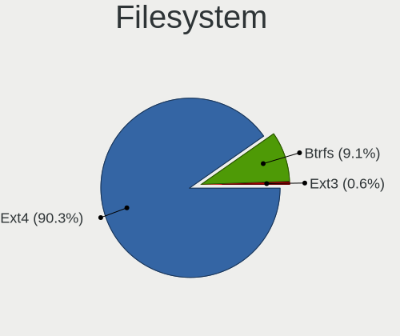
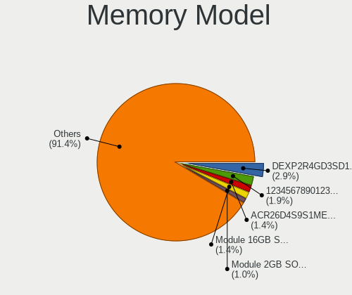
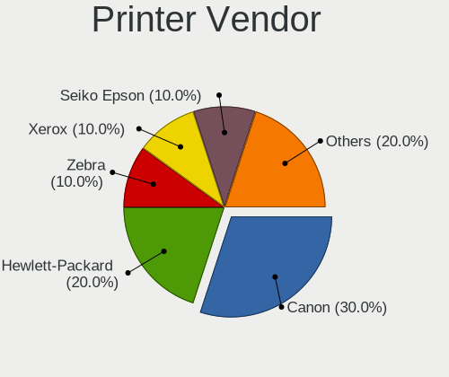
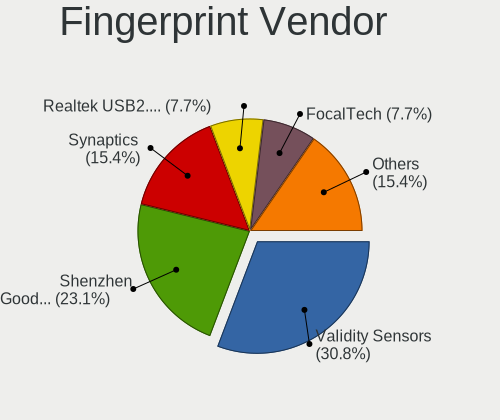
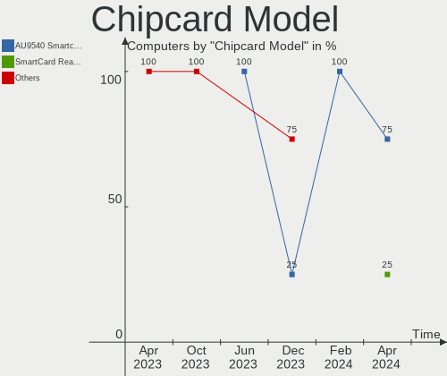

ROSA - Hardware Trends
----------------------

A project to identify most popular hardware characteristics and track their change
over time based on data collected by Linux users at https://Linux-Hardware.org.

Anyone can contribute to this report by the [hw-probe](https://github.com/linuxhw/hw-probe) tool:

    sudo -E hw-probe -all -upload

This is a report for all computer types. See also reports for [desktops](/Dist/ROSA/Desktop/README.md) and [notebooks](/Dist/ROSA/Notebook/README.md).

This report is for one last month. Overall report since the beginning of time: [TestCoverage](https://github.com/linuxhw/TestCoverage)

Period: Sep, 2022.

Contents
--------

* [ System ](#system)
  - [ OS                       ](#os)
  - [ OS Family                ](#os-family)
  - [ Kernel                   ](#kernel)
  - [ Kernel Family            ](#kernel-family)
  - [ Kernel Major Ver.        ](#kernel-major-ver)
  - [ Arch                     ](#arch)
  - [ DE                       ](#de)
  - [ Display Server           ](#display-server)
  - [ Display Manager          ](#display-manager)
  - [ OS Lang                  ](#os-lang)
  - [ Boot Mode                ](#boot-mode)
  - [ Filesystem               ](#filesystem)
  - [ Part. scheme             ](#part-scheme)
  - [ Dual Boot with Linux/BSD ](#dual-boot-with-linuxbsd)
  - [ Dual Boot (Win)          ](#dual-boot-win)

* [ Board ](#board)
  - [ Vendor                   ](#vendor)
  - [ Model                    ](#model)
  - [ Model Family             ](#model-family)
  - [ MFG Year                 ](#mfg-year)
  - [ Form Factor              ](#form-factor)
  - [ Secure Boot              ](#secure-boot)
  - [ Coreboot                 ](#coreboot)
  - [ RAM Size                 ](#ram-size)
  - [ RAM Used                 ](#ram-used)
  - [ Total Drives             ](#total-drives)
  - [ Has CD-ROM               ](#has-cd-rom)
  - [ Has Ethernet             ](#has-ethernet)
  - [ Has WiFi                 ](#has-wifi)
  - [ Has Bluetooth            ](#has-bluetooth)

* [ Location ](#location)
  - [ Country                  ](#country)
  - [ City                     ](#city)

* [ Drives ](#drives)
  - [ Drive Vendor             ](#drive-vendor)
  - [ Drive Model              ](#drive-model)
  - [ HDD Vendor               ](#hdd-vendor)
  - [ SSD Vendor               ](#ssd-vendor)
  - [ Drive Kind               ](#drive-kind)
  - [ Drive Connector          ](#drive-connector)
  - [ Drive Size               ](#drive-size)
  - [ Space Total              ](#space-total)
  - [ Space Used               ](#space-used)
  - [ Malfunc. Drives          ](#malfunc-drives)
  - [ Malfunc. Drive Vendor    ](#malfunc-drive-vendor)
  - [ Malfunc. HDD Vendor      ](#malfunc-hdd-vendor)
  - [ Malfunc. Drive Kind      ](#malfunc-drive-kind)
  - [ Failed Drives            ](#failed-drives)
  - [ Failed Drive Vendor      ](#failed-drive-vendor)
  - [ Drive Status             ](#drive-status)

* [ Storage controller ](#storage-controller)
  - [ Storage Vendor           ](#storage-vendor)
  - [ Storage Model            ](#storage-model)
  - [ Storage Kind             ](#storage-kind)

* [ Processor ](#processor)
  - [ CPU Vendor               ](#cpu-vendor)
  - [ CPU Model                ](#cpu-model)
  - [ CPU Model Family         ](#cpu-model-family)
  - [ CPU Cores                ](#cpu-cores)
  - [ CPU Sockets              ](#cpu-sockets)
  - [ CPU Threads              ](#cpu-threads)
  - [ CPU Op-Modes             ](#cpu-op-modes)
  - [ CPU Microcode            ](#cpu-microcode)
  - [ CPU Microarch            ](#cpu-microarch)

* [ Graphics ](#graphics)
  - [ GPU Vendor               ](#gpu-vendor)
  - [ GPU Model                ](#gpu-model)
  - [ GPU Combo                ](#gpu-combo)
  - [ GPU Driver               ](#gpu-driver)
  - [ GPU Memory               ](#gpu-memory)

* [ Monitor ](#monitor)
  - [ Monitor Vendor           ](#monitor-vendor)
  - [ Monitor Model            ](#monitor-model)
  - [ Monitor Resolution       ](#monitor-resolution)
  - [ Monitor Diagonal         ](#monitor-diagonal)
  - [ Monitor Width            ](#monitor-width)
  - [ Aspect Ratio             ](#aspect-ratio)
  - [ Monitor Area             ](#monitor-area)
  - [ Pixel Density            ](#pixel-density)
  - [ Multiple Monitors        ](#multiple-monitors)

* [ Network ](#network)
  - [ Net Controller Vendor    ](#net-controller-vendor)
  - [ Net Controller Model     ](#net-controller-model)
  - [ Wireless Vendor          ](#wireless-vendor)
  - [ Wireless Model           ](#wireless-model)
  - [ Ethernet Vendor          ](#ethernet-vendor)
  - [ Ethernet Model           ](#ethernet-model)
  - [ Net Controller Kind      ](#net-controller-kind)
  - [ Used Controller          ](#used-controller)
  - [ NICs                     ](#nics)
  - [ IPv6                     ](#ipv6)

* [ Bluetooth ](#bluetooth)
  - [ Bluetooth Vendor         ](#bluetooth-vendor)
  - [ Bluetooth Model          ](#bluetooth-model)

* [ Sound ](#sound)
  - [ Sound Vendor             ](#sound-vendor)
  - [ Sound Model              ](#sound-model)

* [ Memory ](#memory)
  - [ Memory Vendor            ](#memory-vendor)
  - [ Memory Model             ](#memory-model)
  - [ Memory Kind              ](#memory-kind)
  - [ Memory Form Factor       ](#memory-form-factor)
  - [ Memory Size              ](#memory-size)
  - [ Memory Speed             ](#memory-speed)

* [ Printers & scanners ](#printers--scanners)
  - [ Printer Vendor           ](#printer-vendor)
  - [ Printer Model            ](#printer-model)
  - [ Scanner Vendor           ](#scanner-vendor)
  - [ Scanner Model            ](#scanner-model)

* [ Camera ](#camera)
  - [ Camera Vendor            ](#camera-vendor)
  - [ Camera Model             ](#camera-model)

* [ Security ](#security)
  - [ Fingerprint Vendor       ](#fingerprint-vendor)
  - [ Fingerprint Model        ](#fingerprint-model)
  - [ Chipcard Vendor          ](#chipcard-vendor)
  - [ Chipcard Model           ](#chipcard-model)

* [ Unsupported ](#unsupported)
  - [ Unsupported Devices      ](#unsupported-devices)
  - [ Unsupported Device Types ](#unsupported-device-types)

System
------

OS
--

Installed operating systems

| Name       | Computers | Percent |
|------------|-----------|---------|
| ROSA 12.2  | 215       | 84.98%  |
| ROSA R11.1 | 25        | 9.88%   |
| ROSA 12.1  | 8         | 3.16%   |
| ROSA 12    | 3         | 1.19%   |
| ROSA R11   | 2         | 0.79%   |

OS Family
---------

OS without a version

| Name | Computers | Percent |
|------|-----------|---------|
| ROSA | 253       | 100%    |

Kernel
------

Version of the Linux kernel

| Version                                    | Computers | Percent |
|--------------------------------------------|-----------|---------|
| 5.10.74-generic-2rosa2021.1-x86_64         | 100       | 39.53%  |
| 5.10.118-generic-2rosa2021.1-x86_64        | 72        | 28.46%  |
| 5.17.11-generic-2rosa2021.1-x86_64         | 15        | 5.93%   |
| 5.15.43-generic-2rosa2021.1-x86_64         | 12        | 4.74%   |
| 5.18.18.xm1-1-xanmod-rosa2021.1-x86_64     | 9         | 3.56%   |
| 5.4.83-generic-2rosa-x86_64                | 8         | 3.16%   |
| 5.10.74-generic-2rosa2021.1-i586           | 5         | 1.98%   |
| 5.4.83-generic-2rosa-i586                  | 4         | 1.58%   |
| 5.15.67-generic-1rosa2021.1-x86_64         | 4         | 1.58%   |
| 4.15.0-desktop-122.124.1rosa-x86_64        | 4         | 1.58%   |
| 5.4.32-generic-2rosa-x86_64                | 3         | 1.19%   |
| 5.15.65-generic-1rosa2021.1-x86_64         | 3         | 1.19%   |
| 5.10.71-generic-1rosa2021.1-x86_64         | 3         | 1.19%   |
| 5.4.32-generic-2rosa-i586                  | 2         | 0.79%   |
| 4.9.155-nrj-desktop-1rosa-x86_64           | 2         | 0.79%   |
| 4.15.0-desktop-45.1rosa-x86_64             | 2         | 0.79%   |
| 5.5.19-generic-1rosa-x86_64                | 1         | 0.4%    |
| 5.18.18-generic-2rosa2021.1-x86_64         | 1         | 0.4%    |
| 5.18.14.xm1-1.klp-xanmod-rosa2021.1-x86_64 | 1         | 0.4%    |
| 5.10.50-generic-1rosa-x86_64               | 1         | 0.4%    |
| 5.10.118-generic-2rosa2021.1-i586          | 1         | 0.4%    |

Kernel Family
-------------

Linux kernel without a distro release

| Version  | Computers | Percent |
|----------|-----------|---------|
| 5.10.74  | 105       | 41.5%   |
| 5.10.118 | 73        | 28.85%  |
| 5.17.11  | 15        | 5.93%   |
| 5.4.83   | 12        | 4.74%   |
| 5.15.43  | 12        | 4.74%   |
| 5.18.18  | 10        | 3.95%   |
| 4.15.0   | 6         | 2.37%   |
| 5.4.32   | 5         | 1.98%   |
| 5.15.67  | 4         | 1.58%   |
| 5.15.65  | 3         | 1.19%   |
| 5.10.71  | 3         | 1.19%   |
| 4.9.155  | 2         | 0.79%   |
| 5.5.19   | 1         | 0.4%    |
| 5.18.14  | 1         | 0.4%    |
| 5.10.50  | 1         | 0.4%    |

Kernel Major Ver.
-----------------

Linux kernel major version

| Version | Computers | Percent |
|---------|-----------|---------|
| 5.10    | 182       | 71.94%  |
| 5.15    | 19        | 7.51%   |
| 5.4     | 17        | 6.72%   |
| 5.17    | 15        | 5.93%   |
| 5.18    | 11        | 4.35%   |
| 4.15    | 6         | 2.37%   |
| 4.9     | 2         | 0.79%   |
| 5.5     | 1         | 0.4%    |

Arch
----

OS architecture (x86_64, i586, etc.)

| Name   | Computers | Percent |
|--------|-----------|---------|
| x86_64 | 241       | 95.26%  |
| i686   | 12        | 4.74%   |

DE
--

Desktop Environment

| Name  | Computers | Percent |
|-------|-----------|---------|
| KDE5  | 115       | 45.45%  |
| GNOME | 93        | 36.76%  |
| LXQt  | 28        | 11.07%  |
| KDE4  | 14        | 5.53%   |
| MATE  | 2         | 0.79%   |
| XFCE  | 1         | 0.4%    |

Display Server
--------------

X11 or Wayland

| Name    | Computers | Percent |
|---------|-----------|---------|
| Wayland | 197       | 77.87%  |
| X11     | 55        | 21.74%  |
| Tty     | 1         | 0.4%    |

Display Manager
---------------

SDDM, LightDM, etc.

| Name    | Computers | Percent |
|---------|-----------|---------|
| GDM     | 124       | 49.01%  |
| SDDM    | 107       | 42.29%  |
| KDM     | 15        | 5.93%   |
| LightDM | 7         | 2.77%   |

OS Lang
-------

Language

| Lang    | Computers | Percent |
|---------|-----------|---------|
| ru_RU   | 237       | 93.68%  |
| pt_BR   | 2         | 0.79%   |
| es_ES   | 2         | 0.79%   |
| en_US   | 2         | 0.79%   |
| de_DE   | 2         | 0.79%   |
| Unknown | 2         | 0.79%   |
| tr_TR   | 1         | 0.4%    |
| pl_PL   | 1         | 0.4%    |
| et_EE   | 1         | 0.4%    |
| en_IN   | 1         | 0.4%    |
| en_GB   | 1         | 0.4%    |
| de_CH   | 1         | 0.4%    |

Boot Mode
---------

EFI or BIOS

| Mode | Computers | Percent |
|------|-----------|---------|
| EFI  | 130       | 51.38%  |
| BIOS | 123       | 48.62%  |

Filesystem
----------

Type of filesystem

| Type  | Computers | Percent |
|-------|-----------|---------|
| Ext4  | 234       | 92.49%  |
| Btrfs | 17        | 6.72%   |
| Xfs   | 1         | 0.4%    |
| Ext3  | 1         | 0.4%    |

Part. scheme
------------

Scheme of partitioning

| Type | Computers | Percent |
|------|-----------|---------|
| GPT  | 170       | 67.19%  |
| MBR  | 83        | 32.81%  |

Dual Boot with Linux/BSD
------------------------

Hosting more than one Linux/BSD

| Dual boot | Computers | Percent |
|-----------|-----------|---------|
| No        | 181       | 71.54%  |
| Yes       | 72        | 28.46%  |

Dual Boot (Win)
---------------

Hosting Linux and Windows

| Dual boot | Computers | Percent |
|-----------|-----------|---------|
| No        | 141       | 55.73%  |
| Yes       | 112       | 44.27%  |

Board
-----

Vendor
------

Motherboard manufacturer

| Name                  | Computers | Percent |
|-----------------------|-----------|---------|
| ASUSTek Computer      | 65        | 25.69%  |
| Gigabyte Technology   | 37        | 14.62%  |
| Lenovo                | 25        | 9.88%   |
| Hewlett-Packard       | 22        | 8.7%    |
| Acer                  | 20        | 7.91%   |
| ASRock                | 17        | 6.72%   |
| MSI                   | 13        | 5.14%   |
| Dell                  | 6         | 2.37%   |
| Aquarius              | 6         | 2.37%   |
| Samsung Electronics   | 5         | 1.98%   |
| Intel                 | 4         | 1.58%   |
| Huanan                | 4         | 1.58%   |
| Unknown               | 4         | 1.58%   |
| Toshiba               | 2         | 0.79%   |
| MACHINIST             | 2         | 0.79%   |
| Biostar               | 2         | 0.79%   |
| Timi                  | 1         | 0.4%    |
| System76              | 1         | 0.4%    |
| Sony                  | 1         | 0.4%    |
| Positivo Bahia - VAIO | 1         | 0.4%    |
| Pegatron              | 1         | 0.4%    |
| Notebook              | 1         | 0.4%    |
| Medion                | 1         | 0.4%    |
| JGINYUE               | 1         | 0.4%    |
| Haier                 | 1         | 0.4%    |
| Foxconn               | 1         | 0.4%    |
| eMachines             | 1         | 0.4%    |
| ECS                   | 1         | 0.4%    |
| Digma                 | 1         | 0.4%    |
| DEXP                  | 1         | 0.4%    |
| Colorful Technology   | 1         | 0.4%    |
| Chuwi                 | 1         | 0.4%    |
| AZW                   | 1         | 0.4%    |
| Apple                 | 1         | 0.4%    |
| 3Logic Group          | 1         | 0.4%    |

Model
-----

Motherboard model

| Name                                    | Computers | Percent |
|-----------------------------------------|-----------|---------|
| HP Pavilion g6                          | 7         | 2.77%   |
| ASUS All Series                         | 6         | 2.37%   |
| Aquarius NS685U R11                     | 5         | 1.98%   |
| Unknown                                 | 4         | 1.58%   |
| ASUS K50IJ                              | 3         | 1.19%   |
| MSI MS-7A38                             | 2         | 0.79%   |
| MSI MS-7680                             | 2         | 0.79%   |
| MSI MS-7599                             | 2         | 0.79%   |
| MACHINIST B75 PRO V1.0                  | 2         | 0.79%   |
| Lenovo ThinkBook 16p Gen 2 20YM         | 2         | 0.79%   |
| HP Notebook                             | 2         | 0.79%   |
| Gigabyte A320M-H                        | 2         | 0.79%   |
| ASUS VivoBook_ASUS Laptop E210MA_E210MA | 2         | 0.79%   |
| ASUS TUF Gaming Z590-PLUS WIFI          | 2         | 0.79%   |
| ASUS P8H61-M LE                         | 2         | 0.79%   |
| ASRock G41M-VS3                         | 2         | 0.79%   |
| Toshiba Satellite Pro L630              | 1         | 0.4%    |
| Toshiba Satellite A200                  | 1         | 0.4%    |
| Timi RedmiBook Pro 14S                  | 1         | 0.4%    |
| System76 Lemur                          | 1         | 0.4%    |
| Sony VGN-FW245J                         | 1         | 0.4%    |
| Samsung R540/R580/R780/SA41/E452        | 1         | 0.4%    |
| Samsung R530/R730                       | 1         | 0.4%    |
| Samsung N150P/N210P/N220P               | 1         | 0.4%    |
| Samsung 355V4C/356V4C/3445VC/3545VC     | 1         | 0.4%    |
| Samsung 350V5C/351V5C/3540VC/3440VC     | 1         | 0.4%    |
| Positivo Bahia - VAIO VJFE52F11X-B0611H | 1         | 0.4%    |
| Pegatron Compaq dx2400 Microtower       | 1         | 0.4%    |
| Notebook W65_67SB                       | 1         | 0.4%    |
| MSI MS-N051                             | 1         | 0.4%    |
| MSI MS-7592                             | 1         | 0.4%    |
| MSI MS-7253                             | 1         | 0.4%    |
| MSI Katana GF66 11UE                    | 1         | 0.4%    |
| MSI GS66 Stealth 10SE                   | 1         | 0.4%    |
| MSI GP60 2OD                            | 1         | 0.4%    |
| MSI GL65 Leopard 10SCSR                 | 1         | 0.4%    |
| Medion E6239 MD98887                    | 1         | 0.4%    |
| Lenovo ThinkPad L13 20R3000CRT          | 1         | 0.4%    |
| Lenovo ThinkCentre M58 8910A8U          | 1         | 0.4%    |
| Lenovo Legion Y540-17IRH 81UJ           | 1         | 0.4%    |

Model Family
------------

Motherboard model prefix

| Name                                    | Computers | Percent |
|-----------------------------------------|-----------|---------|
| Acer Aspire                             | 14        | 5.53%   |
| Lenovo IdeaPad                          | 11        | 4.35%   |
| HP Pavilion                             | 9         | 3.56%   |
| ASUS VivoBook                           | 6         | 2.37%   |
| ASUS PRIME                              | 6         | 2.37%   |
| ASUS All                                | 6         | 2.37%   |
| Dell Inspiron                           | 5         | 1.98%   |
| ASUS TUF                                | 5         | 1.98%   |
| ASUS P8H61-M                            | 5         | 1.98%   |
| Aquarius NS685U                         | 5         | 1.98%   |
| HP Compaq                               | 4         | 1.58%   |
| Unknown                                 | 4         | 1.58%   |
| ASUS K50IJ                              | 3         | 1.19%   |
| Toshiba Satellite                       | 2         | 0.79%   |
| MSI MS-7A38                             | 2         | 0.79%   |
| MSI MS-7680                             | 2         | 0.79%   |
| MSI MS-7599                             | 2         | 0.79%   |
| MACHINIST B75                           | 2         | 0.79%   |
| Lenovo ThinkBook                        | 2         | 0.79%   |
| Lenovo Legion                           | 2         | 0.79%   |
| Lenovo IdeaCentre                       | 2         | 0.79%   |
| HP Notebook                             | 2         | 0.79%   |
| HP Laptop                               | 2         | 0.79%   |
| HP EliteBook                            | 2         | 0.79%   |
| Gigabyte B450M                          | 2         | 0.79%   |
| Gigabyte A320M-H                        | 2         | 0.79%   |
| ASUS Maximus                            | 2         | 0.79%   |
| ASRock G41M-VS3                         | 2         | 0.79%   |
| Acer Extensa                            | 2         | 0.79%   |
| Timi RedmiBook                          | 1         | 0.4%    |
| System76 Lemur                          | 1         | 0.4%    |
| Sony VGN-FW245J                         | 1         | 0.4%    |
| Samsung R540                            | 1         | 0.4%    |
| Samsung R530                            | 1         | 0.4%    |
| Samsung N150P                           | 1         | 0.4%    |
| Samsung 355V4C                          | 1         | 0.4%    |
| Samsung 350V5C                          | 1         | 0.4%    |
| Positivo Bahia - VAIO VJFE52F11X-B0611H | 1         | 0.4%    |
| Pegatron Compaq                         | 1         | 0.4%    |
| Notebook W65                            | 1         | 0.4%    |

MFG Year
--------

Motherboard manufacture year

| Year | Computers | Percent |
|------|-----------|---------|
| 2011 | 27        | 10.67%  |
| 2013 | 26        | 10.28%  |
| 2012 | 25        | 9.88%   |
| 2021 | 23        | 9.09%   |
| 2020 | 22        | 8.7%    |
| 2010 | 21        | 8.3%    |
| 2018 | 15        | 5.93%   |
| 2019 | 13        | 5.14%   |
| 2008 | 13        | 5.14%   |
| 2017 | 12        | 4.74%   |
| 2016 | 12        | 4.74%   |
| 2022 | 10        | 3.95%   |
| 2009 | 10        | 3.95%   |
| 2015 | 9         | 3.56%   |
| 2007 | 7         | 2.77%   |
| 2014 | 6         | 2.37%   |
| 2006 | 1         | 0.4%    |
| 2004 | 1         | 0.4%    |

Form Factor
-----------

Physical design of the computer

| Name       | Computers | Percent |
|------------|-----------|---------|
| Desktop    | 125       | 49.41%  |
| Notebook   | 124       | 49.01%  |
| Mini pc    | 2         | 0.79%   |
| Tablet     | 1         | 0.4%    |
| All in one | 1         | 0.4%    |

Secure Boot
-----------

Enabled or disabled

| State    | Computers | Percent |
|----------|-----------|---------|
| Disabled | 253       | 100%    |

Coreboot
--------

Have coreboot on board

| Used | Computers | Percent |
|------|-----------|---------|
| No   | 253       | 100%    |

RAM Size
--------

Total RAM memory

| Size in GB  | Computers | Percent |
|-------------|-----------|---------|
| 4.01-8.0    | 70        | 27.67%  |
| 3.01-4.0    | 57        | 22.53%  |
| 16.01-24.0  | 44        | 17.39%  |
| 8.01-16.0   | 39        | 15.42%  |
| 1.01-2.0    | 17        | 6.72%   |
| 32.01-64.0  | 11        | 4.35%   |
| 2.01-3.0    | 6         | 2.37%   |
| 24.01-32.0  | 3         | 1.19%   |
| 64.01-256.0 | 3         | 1.19%   |
| 0.51-1.0    | 3         | 1.19%   |

RAM Used
--------

Used RAM memory

| Used GB  | Computers | Percent |
|----------|-----------|---------|
| 1.01-2.0 | 139       | 54.94%  |
| 0.51-1.0 | 70        | 27.67%  |
| 2.01-3.0 | 29        | 11.46%  |
| 4.01-8.0 | 6         | 2.37%   |
| 3.01-4.0 | 6         | 2.37%   |
| 0.01-0.5 | 3         | 1.19%   |

Total Drives
------------

Number of drives on board

| Drives | Computers | Percent |
|--------|-----------|---------|
| 1      | 145       | 57.31%  |
| 2      | 64        | 25.3%   |
| 3      | 26        | 10.28%  |
| 4      | 9         | 3.56%   |
| 6      | 4         | 1.58%   |
| 0      | 3         | 1.19%   |
| 5      | 2         | 0.79%   |

Has CD-ROM
----------

Has CD-ROM on board

| Presented | Computers | Percent |
|-----------|-----------|---------|
| No        | 158       | 62.45%  |
| Yes       | 95        | 37.55%  |

Has Ethernet
------------

Has Ethernet on board

| Presented | Computers | Percent |
|-----------|-----------|---------|
| Yes       | 237       | 93.68%  |
| No        | 16        | 6.32%   |

Has WiFi
--------

Has WiFi module

| Presented | Computers | Percent |
|-----------|-----------|---------|
| Yes       | 167       | 66.01%  |
| No        | 86        | 33.99%  |

Has Bluetooth
-------------

Has Bluetooth module

| Presented | Computers | Percent |
|-----------|-----------|---------|
| No        | 129       | 50.99%  |
| Yes       | 124       | 49.01%  |

Location
--------

Country
-------

Geographic location (country)

| Country     | Computers | Percent |
|-------------|-----------|---------|
| Russia      | 223       | 88.14%  |
| Ukraine     | 9         | 3.56%   |
| Germany     | 2         | 0.79%   |
| Brazil      | 2         | 0.79%   |
| Venezuela   | 1         | 0.4%    |
| USA         | 1         | 0.4%    |
| UK          | 1         | 0.4%    |
| Turkey      | 1         | 0.4%    |
| Switzerland | 1         | 0.4%    |
| Spain       | 1         | 0.4%    |
| Poland      | 1         | 0.4%    |
| Moldova     | 1         | 0.4%    |
| Kyrgyzstan  | 1         | 0.4%    |
| Kazakhstan  | 1         | 0.4%    |
| Indonesia   | 1         | 0.4%    |
| India       | 1         | 0.4%    |
| France      | 1         | 0.4%    |
| Estonia     | 1         | 0.4%    |
| Czechia     | 1         | 0.4%    |
| Belarus     | 1         | 0.4%    |
| Armenia     | 1         | 0.4%    |

City
----

Geographic location (city)

| City              | Computers | Percent |
|-------------------|-----------|---------|
| Moscow            | 41        | 16.21%  |
| St Petersburg     | 14        | 5.53%   |
| Nizhniy Novgorod  | 10        | 3.95%   |
| Krasnodar         | 9         | 3.56%   |
| Yekaterinburg     | 7         | 2.77%   |
| Rostov-on-Don     | 6         | 2.37%   |
| Novosibirsk       | 6         | 2.37%   |
| Chelyabinsk       | 6         | 2.37%   |
| Krasnoyarsk       | 5         | 1.98%   |
| Vladivostok       | 4         | 1.58%   |
| Saratov           | 4         | 1.58%   |
| Samara            | 4         | 1.58%   |
| Kirov             | 4         | 1.58%   |
| Voronezh          | 3         | 1.19%   |
| Tyumen            | 3         | 1.19%   |
| Sevastopol        | 3         | 1.19%   |
| Murmansk          | 3         | 1.19%   |
| Khabarovsk        | 3         | 1.19%   |
| Irkutsk           | 3         | 1.19%   |
| Yaroslavl         | 2         | 0.79%   |
| Yalta             | 2         | 0.79%   |
| Volgograd         | 2         | 0.79%   |
| Ufa               | 2         | 0.79%   |
| Tula              | 2         | 0.79%   |
| Stavropol         | 2         | 0.79%   |
| Sochi             | 2         | 0.79%   |
| Saransk           | 2         | 0.79%   |
| Petrozavodsk      | 2         | 0.79%   |
| Perm              | 2         | 0.79%   |
| Noril'sk          | 2         | 0.79%   |
| Kirzhach          | 2         | 0.79%   |
| Cherepovets       | 2         | 0.79%   |
| Blagoveshchensk   | 2         | 0.79%   |
| Berezniki         | 2         | 0.79%   |
| Belgorod          | 2         | 0.79%   |
| Balashikha        | 2         | 0.79%   |
| Zhukovskiy        | 1         | 0.4%    |
| Zheleznogorsk     | 1         | 0.4%    |
| Zaprudnya         | 1         | 0.4%    |
| Yuzhno-Sakhalinsk | 1         | 0.4%    |

Drives
------

Drive Vendor
------------

Hard drive vendors

| Vendor                         | Computers | Drives | Percent |
|--------------------------------|-----------|--------|---------|
| WDC                            | 77        | 90     | 20.16%  |
| Seagate                        | 55        | 68     | 14.4%   |
| Samsung Electronics            | 39        | 42     | 10.21%  |
| Toshiba                        | 31        | 31     | 8.12%   |
| Hitachi                        | 23        | 24     | 6.02%   |
| Kingston                       | 17        | 17     | 4.45%   |
| A-DATA Technology              | 14        | 15     | 3.66%   |
| HGST                           | 9         | 10     | 2.36%   |
| Unknown                        | 8         | 11     | 2.09%   |
| SanDisk                        | 8         | 8      | 2.09%   |
| SPCC                           | 7         | 7      | 1.83%   |
| SK hynix                       | 7         | 7      | 1.83%   |
| Intel                          | 7         | 7      | 1.83%   |
| China                          | 7         | 7      | 1.83%   |
| Apacer                         | 6         | 7      | 1.57%   |
| Netac                          | 5         | 5      | 1.31%   |
| AMD                            | 5         | 5      | 1.31%   |
| Transcend                      | 3         | 3      | 0.79%   |
| Plextor                        | 3         | 3      | 0.79%   |
| Patriot                        | 3         | 4      | 0.79%   |
| OCZ                            | 3         | 3      | 0.79%   |
| KingSpec                       | 3         | 3      | 0.79%   |
| External                       | 3         | 3      | 0.79%   |
| WALRAM                         | 2         | 2      | 0.52%   |
| Smartbuy                       | 2         | 3      | 0.52%   |
| Palit                          | 2         | 2      | 0.52%   |
| KingDian                       | 2         | 2      | 0.52%   |
| Gigabyte Technology            | 2         | 2      | 0.52%   |
| Fujitsu                        | 2         | 2      | 0.52%   |
| Corsair                        | 2         | 2      | 0.52%   |
| XrayDisk                       | 1         | 1      | 0.26%   |
| XPG                            | 1         | 1      | 0.26%   |
| V-GeN                          | 1         | 1      | 0.26%   |
| UMIS                           | 1         | 1      | 0.26%   |
| Solid State Storage Technology | 1         | 1      | 0.26%   |
| Silicon Motion                 | 1         | 1      | 0.26%   |
| RUN                            | 1         | 1      | 0.26%   |
| Reeioon                        | 1         | 1      | 0.26%   |
| Qumo                           | 1         | 1      | 0.26%   |
| ORICO                          | 1         | 1      | 0.26%   |

Drive Model
-----------

Hard drive models

| Model                                  | Computers | Percent |
|----------------------------------------|-----------|---------|
| WDC WDS500G2B0A-00SM50 500GB SSD       | 8         | 1.93%   |
| Seagate ST500DM002-1BD142 500GB        | 6         | 1.45%   |
| A-DATA SU800NS38 256GB SSD             | 6         | 1.45%   |
| WDC WDS240G2G0A-00JH30 240GB SSD       | 5         | 1.2%    |
| Seagate ST3500418AS 500GB              | 5         | 1.2%    |
| Seagate ST1000DM010-2EP102 1TB         | 5         | 1.2%    |
| Toshiba MQ04ABF100 1TB                 | 4         | 0.96%   |
| Toshiba HDWD110 1TB                    | 4         | 0.96%   |
| SPCC Solid State Disk 128GB            | 4         | 0.96%   |
| Seagate ST500LT012-1DG142 500GB        | 4         | 0.96%   |
| Toshiba DT01ACA050 500GB               | 3         | 0.72%   |
| Seagate ST3250310AS 250GB              | 3         | 0.72%   |
| Seagate ST1000LM024 HN-M101MBB 1TB     | 3         | 0.72%   |
| SanDisk SDSSDA120G 120GB               | 3         | 0.72%   |
| Samsung SSD 970 EVO Plus 250GB         | 3         | 0.72%   |
| Samsung SSD 860 EVO 500GB              | 3         | 0.72%   |
| Kingston SA400S37240G 240GB SSD        | 3         | 0.72%   |
| External USB3.0 1TB                    | 3         | 0.72%   |
| Apacer AS350 128GB SSD                 | 3         | 0.72%   |
| WDC WDS240G2G0B-00EPW0 240GB SSD       | 2         | 0.48%   |
| WDC WD5000AAKX-60U6AA0 500GB           | 2         | 0.48%   |
| WDC WD5000AAKX-083CA1 500GB            | 2         | 0.48%   |
| WDC WD10EZEX-00BN5A0 1TB               | 2         | 0.48%   |
| WDC PC SN530 SDBPNPZ-512G-1114 512GB   | 2         | 0.48%   |
| Unknown EC2QT  64GB                    | 2         | 0.48%   |
| Unknown DA4064  64GB                   | 2         | 0.48%   |
| Toshiba MQ01ABF050 500GB               | 2         | 0.48%   |
| Toshiba MQ01ABD050 500GB               | 2         | 0.48%   |
| Toshiba HDWD105 500GB                  | 2         | 0.48%   |
| SPCC Solid State Disk 64GB             | 2         | 0.48%   |
| SK hynix SKHynix_HFS512GDE9X084N 512GB | 2         | 0.48%   |
| Seagate ST9160821AS 160GB              | 2         | 0.48%   |
| Seagate ST3320613AS 320GB              | 2         | 0.48%   |
| Seagate ST3250410AS 250GB              | 2         | 0.48%   |
| Seagate ST3160815AS 160GB              | 2         | 0.48%   |
| Seagate ST250DM000-1BD141 250GB        | 2         | 0.48%   |
| Seagate ST2000DM001-1CH164 2TB         | 2         | 0.48%   |
| Seagate ST1000LM035-1RK172 1TB         | 2         | 0.48%   |
| Seagate ST1000DX002-2DV162 1TB         | 2         | 0.48%   |
| Seagate ST1000DM003-1CH162 1TB         | 2         | 0.48%   |

HDD Vendor
----------

Hard disk drive vendors

| Vendor              | Computers | Drives | Percent |
|---------------------|-----------|--------|---------|
| WDC                 | 59        | 65     | 31.22%  |
| Seagate             | 55        | 68     | 29.1%   |
| Toshiba             | 30        | 30     | 15.87%  |
| Hitachi             | 23        | 24     | 12.17%  |
| Samsung Electronics | 9         | 9      | 4.76%   |
| HGST                | 9         | 10     | 4.76%   |
| Fujitsu             | 2         | 2      | 1.06%   |
| Maxtor              | 1         | 1      | 0.53%   |
| HGST HTS            | 1         | 1      | 0.53%   |

SSD Vendor
----------

Solid state drive vendors

| Vendor              | Computers | Drives | Percent |
|---------------------|-----------|--------|---------|
| WDC                 | 20        | 22     | 15.27%  |
| Samsung Electronics | 15        | 15     | 11.45%  |
| Kingston            | 10        | 10     | 7.63%   |
| A-DATA Technology   | 10        | 11     | 7.63%   |
| SPCC                | 7         | 7      | 5.34%   |
| SanDisk             | 7         | 7      | 5.34%   |
| China               | 7         | 7      | 5.34%   |
| Apacer              | 6         | 7      | 4.58%   |
| AMD                 | 5         | 5      | 3.82%   |
| Transcend           | 3         | 3      | 2.29%   |
| Plextor             | 3         | 3      | 2.29%   |
| Patriot             | 3         | 4      | 2.29%   |
| OCZ                 | 3         | 3      | 2.29%   |
| Netac               | 3         | 3      | 2.29%   |
| KingSpec            | 3         | 3      | 2.29%   |
| WALRAM              | 2         | 2      | 1.53%   |
| Smartbuy            | 2         | 3      | 1.53%   |
| SK hynix            | 2         | 2      | 1.53%   |
| Palit               | 2         | 2      | 1.53%   |
| KingDian            | 2         | 2      | 1.53%   |
| Corsair             | 2         | 2      | 1.53%   |
| XrayDisk            | 1         | 1      | 0.76%   |
| V-GeN               | 1         | 1      | 0.76%   |
| RUN                 | 1         | 1      | 0.76%   |
| Reeioon             | 1         | 1      | 0.76%   |
| Qumo                | 1         | 1      | 0.76%   |
| OCZ-VERTEX3         | 1         | 1      | 0.76%   |
| NGFF                | 1         | 1      | 0.76%   |
| Kingmax             | 1         | 1      | 0.76%   |
| KingFast            | 1         | 1      | 0.76%   |
| Intel               | 1         | 1      | 0.76%   |
| HS-SSD-E100         | 1         | 1      | 0.76%   |
| GS                  | 1         | 2      | 0.76%   |
| Gigabyte Technology | 1         | 1      | 0.76%   |
| Unknown             | 1         | 1      | 0.76%   |

Drive Kind
----------

HDD or SSD

| Kind    | Computers | Drives | Percent |
|---------|-----------|--------|---------|
| HDD     | 157       | 210    | 46.73%  |
| SSD     | 117       | 138    | 34.82%  |
| NVMe    | 53        | 61     | 15.77%  |
| MMC     | 8         | 11     | 2.38%   |
| Unknown | 1         | 1      | 0.3%    |

Drive Connector
---------------

SATA, SAS, NVMe, etc.

| Type | Computers | Drives | Percent |
|------|-----------|--------|---------|
| SATA | 222       | 344    | 77.08%  |
| NVMe | 49        | 57     | 17.01%  |
| SAS  | 9         | 9      | 3.13%   |
| MMC  | 8         | 11     | 2.78%   |

Drive Size
----------

Size of hard drive

| Size in TB | Computers | Drives | Percent |
|------------|-----------|--------|---------|
| 0.01-0.5   | 190       | 246    | 69.34%  |
| 0.51-1.0   | 64        | 78     | 23.36%  |
| 1.01-2.0   | 13        | 17     | 4.74%   |
| 3.01-4.0   | 4         | 4      | 1.46%   |
| 10.01-20.0 | 2         | 2      | 0.73%   |
| 4.01-10.0  | 1         | 1      | 0.36%   |

Space Total
-----------

Amount of disk space available on the file system

| Size in GB     | Computers | Percent |
|----------------|-----------|---------|
| 101-250        | 74        | 29.25%  |
| 251-500        | 51        | 20.16%  |
| 501-1000       | 39        | 15.42%  |
| 1-20           | 36        | 14.23%  |
| 51-100         | 24        | 9.49%   |
| 1001-2000      | 12        | 4.74%   |
| 21-50          | 9         | 3.56%   |
| 2001-3000      | 5         | 1.98%   |
| More than 3000 | 2         | 0.79%   |
| Unknown        | 1         | 0.4%    |

Space Used
----------

Amount of used disk space

| Used GB   | Computers | Percent |
|-----------|-----------|---------|
| 1-20      | 171       | 67.59%  |
| 51-100    | 22        | 8.7%    |
| 21-50     | 20        | 7.91%   |
| 101-250   | 17        | 6.72%   |
| 501-1000  | 11        | 4.35%   |
| 251-500   | 6         | 2.37%   |
| 1001-2000 | 3         | 1.19%   |
| 2001-3000 | 2         | 0.79%   |
| Unknown   | 1         | 0.4%    |

Malfunc. Drives
---------------

Drive models with a malfunction

| Model                            | Computers | Drives | Percent |
|----------------------------------|-----------|--------|---------|
| Seagate ST500DM002-1BD142 500GB  | 5         | 5      | 4.9%    |
| Seagate ST3500418AS 500GB        | 4         | 5      | 3.92%   |
| Seagate ST3250310AS 250GB        | 3         | 3      | 2.94%   |
| Seagate ST3320613AS 320GB        | 2         | 2      | 1.96%   |
| Seagate ST3250410AS 250GB        | 2         | 2      | 1.96%   |
| Hitachi HTS545050B9A300 500GB    | 2         | 2      | 1.96%   |
| Hitachi HTS545025B9A300 250GB    | 2         | 2      | 1.96%   |
| Hitachi HTS542580K9SA00 80GB     | 2         | 2      | 1.96%   |
| HGST HTS545050A7E680 500GB       | 2         | 2      | 1.96%   |
| WDC WDS240G2G0A-00JH30 240GB SSD | 1         | 2      | 0.98%   |
| WDC WDS120G2G0B-00EPW0 120GB SSD | 1         | 1      | 0.98%   |
| WDC WDS120G2G0A-00JH30 120GB SSD | 1         | 1      | 0.98%   |
| WDC WD800JD-22LSA0 80GB          | 1         | 1      | 0.98%   |
| WDC WD800BB-56JKC0 80GB          | 1         | 1      | 0.98%   |
| WDC WD6400AARS-00Y5B1 640GB      | 1         | 1      | 0.98%   |
| WDC WD5000LPCX-60VHAT0 500GB     | 1         | 1      | 0.98%   |
| WDC WD5000AAKX-08ERMA0 500GB     | 1         | 1      | 0.98%   |
| WDC WD5000AAKX-083CA1 500GB      | 1         | 1      | 0.98%   |
| WDC WD5000AADS-00S9B0 500GB      | 1         | 1      | 0.98%   |
| WDC WD3200BPVT-22ZEST0 320GB     | 1         | 1      | 0.98%   |
| WDC WD3200BEVT-80A0RT0 320GB     | 1         | 1      | 0.98%   |
| WDC WD3200AAJS-00L7A0 320GB      | 1         | 1      | 0.98%   |
| WDC WD3200AAJB-00J3A0 320GB      | 1         | 1      | 0.98%   |
| WDC WD2500LPCX-24C6HT0 250GB     | 1         | 1      | 0.98%   |
| WDC WD2500BEVT-35A23T0 250GB     | 1         | 1      | 0.98%   |
| WDC WD2500BEKT-60A25T1 250GB     | 1         | 1      | 0.98%   |
| WDC WD20EARS-00S8B1 2TB          | 1         | 1      | 0.98%   |
| WDC WD20EADS-00R6B0 2TB          | 1         | 1      | 0.98%   |
| WDC WD15EARS-00MVWB0 1TB         | 1         | 1      | 0.98%   |
| WDC WD1200BEVS-07LAT0 120GB      | 1         | 1      | 0.98%   |
| WDC WD10EZEX-00RKKA0 1TB         | 1         | 1      | 0.98%   |
| WDC WD10EZEX-00BN5A0 1TB         | 1         | 1      | 0.98%   |
| WDC WD10EARS-00MVWB0 1TB         | 1         | 1      | 0.98%   |
| WDC WD1003FBYX-01Y7B1 1TB        | 1         | 1      | 0.98%   |
| Transcend TS120GSSD220S 120GB    | 1         | 1      | 0.98%   |
| Toshiba MQ01ABF050 500GB         | 1         | 1      | 0.98%   |
| Toshiba MQ01ABD050 500GB         | 1         | 1      | 0.98%   |
| Toshiba MK2529GSG 250GB          | 1         | 1      | 0.98%   |
| Toshiba MK1637GSX 160GB          | 1         | 1      | 0.98%   |
| Toshiba HDWD110 1TB              | 1         | 1      | 0.98%   |

Malfunc. Drive Vendor
---------------------

Vendors of faulty drives

| Vendor              | Computers | Drives | Percent |
|---------------------|-----------|--------|---------|
| Seagate             | 27        | 34     | 28.42%  |
| WDC                 | 24        | 26     | 25.26%  |
| Hitachi             | 17        | 17     | 17.89%  |
| Toshiba             | 8         | 8      | 8.42%   |
| Samsung Electronics | 8         | 8      | 8.42%   |
| HGST                | 3         | 3      | 3.16%   |
| Transcend           | 1         | 1      | 1.05%   |
| Reeioon             | 1         | 1      | 1.05%   |
| Plextor             | 1         | 1      | 1.05%   |
| OCZ-VERTEX3         | 1         | 1      | 1.05%   |
| KingSpec            | 1         | 1      | 1.05%   |
| Fujitsu             | 1         | 1      | 1.05%   |
| Apacer              | 1         | 1      | 1.05%   |
| AMD                 | 1         | 1      | 1.05%   |

Malfunc. HDD Vendor
-------------------

Vendors of faulty HDD drives

| Vendor              | Computers | Drives | Percent |
|---------------------|-----------|--------|---------|
| Seagate             | 27        | 34     | 32.53%  |
| WDC                 | 21        | 22     | 25.3%   |
| Hitachi             | 17        | 17     | 20.48%  |
| Toshiba             | 8         | 8      | 9.64%   |
| Samsung Electronics | 6         | 6      | 7.23%   |
| HGST                | 3         | 3      | 3.61%   |
| Fujitsu             | 1         | 1      | 1.2%    |

Malfunc. Drive Kind
-------------------

Kinds of faulty drives

| Kind | Computers | Drives | Percent |
|------|-----------|--------|---------|
| HDD  | 78        | 91     | 86.67%  |
| SSD  | 11        | 12     | 12.22%  |
| NVMe | 1         | 1      | 1.11%   |

Failed Drives
-------------

Failed drive models

| Model                             | Computers | Drives | Percent |
|-----------------------------------|-----------|--------|---------|
| WDC WD800BB-22JHA0 80GB           | 1         | 1      | 50%     |
| Samsung Electronics HM160HI 160GB | 1         | 1      | 50%     |

Failed Drive Vendor
-------------------

Failed drive vendors

| Vendor              | Computers | Drives | Percent |
|---------------------|-----------|--------|---------|
| WDC                 | 1         | 1      | 50%     |
| Samsung Electronics | 1         | 1      | 50%     |

Drive Status
------------

Number of failed and malfunc. drives

| Status   | Computers | Drives | Percent |
|----------|-----------|--------|---------|
| Works    | 194       | 295    | 64.67%  |
| Malfunc  | 87        | 104    | 29%     |
| Detected | 17        | 20     | 5.67%   |
| Failed   | 2         | 2      | 0.67%   |

Storage controller
------------------

Storage Vendor
--------------

Storage controller vendors

| Vendor                         | Computers | Percent |
|--------------------------------|-----------|---------|
| Intel                          | 183       | 58.84%  |
| AMD                            | 55        | 17.68%  |
| Samsung Electronics            | 17        | 5.47%   |
| Nvidia                         | 7         | 2.25%   |
| Kingston Technology Company    | 7         | 2.25%   |
| JMicron Technology             | 6         | 1.93%   |
| SK hynix                       | 5         | 1.61%   |
| Silicon Motion                 | 4         | 1.29%   |
| SanDisk                        | 4         | 1.29%   |
| Marvell Technology Group       | 4         | 1.29%   |
| VIA Technologies               | 3         | 0.96%   |
| ASMedia Technology             | 3         | 0.96%   |
| ADATA Technology               | 3         | 0.96%   |
| Realtek Semiconductor          | 2         | 0.64%   |
| Netac Technology               | 2         | 0.64%   |
| Union Memory (Shenzhen)        | 1         | 0.32%   |
| Toshiba America Info Systems   | 1         | 0.32%   |
| Solid State Storage Technology | 1         | 0.32%   |
| Phison Electronics             | 1         | 0.32%   |
| Micron Technology              | 1         | 0.32%   |
| KIOXIA                         | 1         | 0.32%   |

Storage Model
-------------

Storage controller models

| Model                                                                                   | Computers | Percent |
|-----------------------------------------------------------------------------------------|-----------|---------|
| AMD FCH SATA Controller [AHCI mode]                                                     | 41        | 10.82%  |
| Intel 8 Series/C220 Series Chipset Family 6-port SATA Controller 1 [AHCI mode]          | 18        | 4.75%   |
| Samsung NVMe SSD Controller SM981/PM981/PM983                                           | 11        | 2.9%    |
| Intel Comet Lake SATA AHCI Controller                                                   | 11        | 2.9%    |
| Intel 7 Series Chipset Family 6-port SATA Controller [AHCI mode]                        | 11        | 2.9%    |
| Intel NM10/ICH7 Family SATA Controller [IDE mode]                                       | 9         | 2.37%   |
| Intel 7 Series/C210 Series Chipset Family 6-port SATA Controller [AHCI mode]            | 9         | 2.37%   |
| Intel 6 Series/C200 Series Chipset Family Desktop SATA Controller (IDE mode, ports 4-5) | 8         | 2.11%   |
| Intel 6 Series/C200 Series Chipset Family Desktop SATA Controller (IDE mode, ports 0-3) | 8         | 2.11%   |
| Intel 500 Series Chipset Family SATA AHCI Controller                                    | 8         | 2.11%   |
| AMD SB7x0/SB8x0/SB9x0 IDE Controller                                                    | 8         | 2.11%   |
| Intel 82801IBM/IEM (ICH9M/ICH9M-E) 4 port SATA Controller [AHCI mode]                   | 7         | 1.85%   |
| Intel 82801G (ICH7 Family) IDE Controller                                               | 7         | 1.85%   |
| Intel 6 Series/C200 Series Chipset Family 6 port Desktop SATA AHCI Controller           | 7         | 1.85%   |
| Samsung NVMe SSD Controller 980                                                         | 6         | 1.58%   |
| Intel NM10/ICH7 Family SATA Controller [AHCI mode]                                      | 6         | 1.58%   |
| Intel Celeron/Pentium Silver Processor SATA Controller                                  | 6         | 1.58%   |
| Intel Cannon Lake Mobile PCH SATA AHCI Controller                                       | 6         | 1.58%   |
| Intel Atom Processor E3800 Series SATA AHCI Controller                                  | 6         | 1.58%   |
| Intel 6 Series/C200 Series Chipset Family 6 port Mobile SATA AHCI Controller            | 6         | 1.58%   |
| Intel 5 Series/3400 Series Chipset 4 port SATA AHCI Controller                          | 6         | 1.58%   |
| AMD SB7x0/SB8x0/SB9x0 SATA Controller [AHCI mode]                                       | 6         | 1.58%   |
| Intel Q170/Q150/B150/H170/H110/Z170/CM236 Chipset SATA Controller [AHCI Mode]           | 5         | 1.32%   |
| Intel 82801HM/HEM (ICH8M/ICH8M-E) SATA Controller [AHCI mode]                           | 5         | 1.32%   |
| Intel 82801HM/HEM (ICH8M/ICH8M-E) IDE Controller                                        | 5         | 1.32%   |
| Intel 200 Series PCH SATA controller [AHCI mode]                                        | 5         | 1.32%   |
| AMD 400 Series Chipset SATA Controller                                                  | 5         | 1.32%   |
| Silicon Motion SM2263EN/SM2263XT SSD Controller                                         | 4         | 1.06%   |
| Intel Sunrise Point-LP SATA Controller [AHCI mode]                                      | 4         | 1.06%   |
| Intel C610/X99 series chipset 6-Port SATA Controller [AHCI mode]                        | 4         | 1.06%   |
| AMD SB7x0/SB8x0/SB9x0 SATA Controller [IDE mode]                                        | 4         | 1.06%   |
| AMD FCH SATA Controller D                                                               | 4         | 1.06%   |
| Nvidia MCP61 SATA Controller                                                            | 3         | 0.79%   |
| Nvidia MCP61 IDE                                                                        | 3         | 0.79%   |
| Kingston Company Company Non-Volatile memory controller                                 | 3         | 0.79%   |
| Intel Volume Management Device NVMe RAID Controller                                     | 3         | 0.79%   |
| Intel Cannon Lake PCH SATA AHCI Controller                                              | 3         | 0.79%   |
| Intel 8 Series SATA Controller 1 [AHCI mode]                                            | 3         | 0.79%   |
| ASMedia ASM1062 Serial ATA Controller                                                   | 3         | 0.79%   |
| AMD FCH IDE Controller                                                                  | 3         | 0.79%   |

Storage Kind
------------

Kind of storage controller (IDE, SATA, NVMe, SAS, ...)

| Kind | Computers | Percent |
|------|-----------|---------|
| SATA | 212       | 66.46%  |
| IDE  | 53        | 16.61%  |
| NVMe | 49        | 15.36%  |
| RAID | 5         | 1.57%   |

Processor
---------

CPU Vendor
----------

Processor vendors

| Vendor | Computers | Percent |
|--------|-----------|---------|
| Intel  | 187       | 73.91%  |
| AMD    | 66        | 26.09%  |

CPU Model
---------

Processor models

| Model                                       | Computers | Percent |
|---------------------------------------------|-----------|---------|
| Intel Core i5-10210U CPU @ 1.60GHz          | 8         | 3.16%   |
| Intel Core 2 Duo CPU E8400 @ 3.00GHz        | 4         | 1.58%   |
| AMD Ryzen 5 5600H with Radeon Graphics      | 4         | 1.58%   |
| Intel Pentium CPU N3540 @ 2.16GHz           | 3         | 1.19%   |
| Intel Core i5-8300H CPU @ 2.30GHz           | 3         | 1.19%   |
| Intel Core i3 CPU M 370 @ 2.40GHz           | 3         | 1.19%   |
| AMD A10-4600M APU with Radeon HD Graphics   | 3         | 1.19%   |
| Intel Xeon CPU E5-2678 v3 @ 2.50GHz         | 2         | 0.79%   |
| Intel Pentium Gold G5420 CPU @ 3.80GHz      | 2         | 0.79%   |
| Intel Pentium Dual-Core CPU T4500 @ 2.30GHz | 2         | 0.79%   |
| Intel Pentium Dual-Core CPU E5200 @ 2.50GHz | 2         | 0.79%   |
| Intel Pentium CPU P6200 @ 2.13GHz           | 2         | 0.79%   |
| Intel Pentium CPU G840 @ 2.80GHz            | 2         | 0.79%   |
| Intel Pentium CPU G630 @ 2.70GHz            | 2         | 0.79%   |
| Intel Pentium CPU G4400 @ 3.30GHz           | 2         | 0.79%   |
| Intel Pentium CPU G3420 @ 3.20GHz           | 2         | 0.79%   |
| Intel Core i7-9750H CPU @ 2.60GHz           | 2         | 0.79%   |
| Intel Core i7-4770 CPU @ 3.40GHz            | 2         | 0.79%   |
| Intel Core i7-3770K CPU @ 3.50GHz           | 2         | 0.79%   |
| Intel Core i7-10750H CPU @ 2.60GHz          | 2         | 0.79%   |
| Intel Core i5-4200U CPU @ 1.60GHz           | 2         | 0.79%   |
| Intel Core i5-3210M CPU @ 2.50GHz           | 2         | 0.79%   |
| Intel Core i5-2410M CPU @ 2.30GHz           | 2         | 0.79%   |
| Intel Core i3-7100U CPU @ 2.40GHz           | 2         | 0.79%   |
| Intel Core i3-7100 CPU @ 3.90GHz            | 2         | 0.79%   |
| Intel Core i3-4000M CPU @ 2.40GHz           | 2         | 0.79%   |
| Intel Core i3-3120M CPU @ 2.50GHz           | 2         | 0.79%   |
| Intel Core i3-2100 CPU @ 3.10GHz            | 2         | 0.79%   |
| Intel Celeron N4020 CPU @ 1.10GHz           | 2         | 0.79%   |
| Intel Celeron Dual-Core CPU T3100 @ 1.90GHz | 2         | 0.79%   |
| Intel Atom CPU N450 @ 1.66GHz               | 2         | 0.79%   |
| Intel Atom CPU N270 @ 1.60GHz               | 2         | 0.79%   |
| Intel 11th Gen Core i7-11700K @ 3.60GHz     | 2         | 0.79%   |
| Intel 11th Gen Core i5-11400H @ 2.70GHz     | 2         | 0.79%   |
| AMD Ryzen 7 5700U with Radeon Graphics      | 2         | 0.79%   |
| AMD Ryzen 7 2700 Eight-Core Processor       | 2         | 0.79%   |
| AMD Ryzen 5 2600 Six-Core Processor         | 2         | 0.79%   |
| AMD Ryzen 5 1600 Six-Core Processor         | 2         | 0.79%   |
| AMD Phenom II X4 955 Processor              | 2         | 0.79%   |
| AMD FX-8350 Eight-Core Processor            | 2         | 0.79%   |

CPU Model Family
----------------

Processor model prefix

| Model                          | Computers | Percent |
|--------------------------------|-----------|---------|
| Intel Core i5                  | 40        | 15.81%  |
| Intel Core i3                  | 33        | 13.04%  |
| Intel Pentium                  | 18        | 7.11%   |
| Intel Core i7                  | 17        | 6.72%   |
| Intel Celeron                  | 15        | 5.93%   |
| Intel Core 2 Duo               | 12        | 4.74%   |
| Other                          | 11        | 4.35%   |
| Intel Xeon                     | 11        | 4.35%   |
| AMD Ryzen 5                    | 11        | 4.35%   |
| Intel Atom                     | 10        | 3.95%   |
| Intel Pentium Dual-Core        | 6         | 2.37%   |
| AMD Ryzen 7                    | 6         | 2.37%   |
| AMD Ryzen 3                    | 5         | 1.98%   |
| AMD FX                         | 5         | 1.98%   |
| AMD A10                        | 5         | 1.98%   |
| AMD A4                         | 4         | 1.58%   |
| Intel Pentium Gold             | 3         | 1.19%   |
| Intel Celeron Dual-Core        | 3         | 1.19%   |
| AMD E1                         | 3         | 1.19%   |
| AMD Athlon 64 X2               | 3         | 1.19%   |
| AMD A8                         | 3         | 1.19%   |
| AMD A6                         | 3         | 1.19%   |
| Intel Pentium Silver           | 2         | 0.79%   |
| Intel Core 2 Quad              | 2         | 0.79%   |
| Intel Core 2                   | 2         | 0.79%   |
| AMD Ryzen 3 PRO                | 2         | 0.79%   |
| AMD Phenom II X4               | 2         | 0.79%   |
| AMD Athlon X4                  | 2         | 0.79%   |
| AMD Athlon II X4               | 2         | 0.79%   |
| AMD Athlon                     | 2         | 0.79%   |
| Intel Pentium Dual             | 1         | 0.4%    |
| Intel Genuine                  | 1         | 0.4%    |
| Intel Core i9                  | 1         | 0.4%    |
| Intel Celeron M                | 1         | 0.4%    |
| AMD Turion X2 Dual-Core Mobile | 1         | 0.4%    |
| AMD PRO A8                     | 1         | 0.4%    |
| AMD Phenom                     | 1         | 0.4%    |
| AMD Mobile Athlon 64           | 1         | 0.4%    |
| AMD E                          | 1         | 0.4%    |
| AMD Athlon II X2               | 1         | 0.4%    |

CPU Cores
---------

Number of processor cores

| Number | Computers | Percent |
|--------|-----------|---------|
| 2      | 123       | 48.62%  |
| 4      | 77        | 30.43%  |
| 6      | 24        | 9.49%   |
| 1      | 12        | 4.74%   |
| 8      | 9         | 3.56%   |
| 12     | 3         | 1.19%   |
| 3      | 2         | 0.79%   |
| 24     | 1         | 0.4%    |
| 20     | 1         | 0.4%    |
| 10     | 1         | 0.4%    |

CPU Sockets
-----------

Number of sockets

| Number | Computers | Percent |
|--------|-----------|---------|
| 1      | 251       | 99.21%  |
| 2      | 2         | 0.79%   |

CPU Threads
-----------

Threads per core (Hyper-Threading)

| Number | Computers | Percent |
|--------|-----------|---------|
| 2      | 144       | 56.92%  |
| 1      | 109       | 43.08%  |

CPU Op-Modes
------------

CPU Operation Modes (32-bit, 64-bit)

| Op mode        | Computers | Percent |
|----------------|-----------|---------|
| 32-bit, 64-bit | 250       | 98.81%  |
| 32-bit         | 3         | 1.19%   |

CPU Microcode
-------------

Microcode number

| Number     | Computers | Percent |
|------------|-----------|---------|
| 0x206a7    | 22        | 8.7%    |
| 0x306a9    | 19        | 7.51%   |
| 0x306c3    | 18        | 7.11%   |
| 0x1067a    | 17        | 6.72%   |
| 0x906ea    | 11        | 4.35%   |
| 0x806ec    | 10        | 3.95%   |
| 0x06001119 | 8         | 3.16%   |
| 0x20655    | 7         | 2.77%   |
| 0x30678    | 6         | 2.37%   |
| Unknown    | 6         | 2.37%   |
| 0x306f2    | 5         | 1.98%   |
| 0x106ca    | 5         | 1.98%   |
| 0x0800820d | 5         | 1.98%   |
| 0x06000852 | 5         | 1.98%   |
| 0xa0653    | 4         | 1.58%   |
| 0x706a8    | 4         | 1.58%   |
| 0x0a50000c | 4         | 1.58%   |
| 0x08001138 | 4         | 1.58%   |
| 0x010000c8 | 4         | 1.58%   |
| 0xa0671    | 3         | 1.19%   |
| 0x906e9    | 3         | 1.19%   |
| 0x806e9    | 3         | 1.19%   |
| 0x806c1    | 3         | 1.19%   |
| 0x6fd      | 3         | 1.19%   |
| 0x40651    | 3         | 1.19%   |
| 0x07030105 | 3         | 1.19%   |
| 0x06006705 | 3         | 1.19%   |
| 0x03000027 | 3         | 1.19%   |
| 0xa0655    | 2         | 0.79%   |
| 0xa0652    | 2         | 0.79%   |
| 0x806ea    | 2         | 0.79%   |
| 0x806d1    | 2         | 0.79%   |
| 0x706a1    | 2         | 0.79%   |
| 0x6fb      | 2         | 0.79%   |
| 0x6f6      | 2         | 0.79%   |
| 0x506e3    | 2         | 0.79%   |
| 0x506c9    | 2         | 0.79%   |
| 0x406c4    | 2         | 0.79%   |
| 0x30661    | 2         | 0.79%   |
| 0x106c2    | 2         | 0.79%   |

CPU Microarch
-------------

Microarchitecture

| Name            | Computers | Percent |
|-----------------|-----------|---------|
| KabyLake        | 31        | 12.25%  |
| Haswell         | 26        | 10.28%  |
| SandyBridge     | 23        | 9.09%   |
| IvyBridge       | 20        | 7.91%   |
| Penryn          | 19        | 7.51%   |
| Piledriver      | 13        | 5.14%   |
| Westmere        | 9         | 3.56%   |
| Silvermont      | 9         | 3.56%   |
| Bonnell         | 9         | 3.56%   |
| Zen+            | 8         | 3.16%   |
| Core            | 8         | 3.16%   |
| CometLake       | 8         | 3.16%   |
| Unknown         | 7         | 2.77%   |
| Zen 3           | 6         | 2.37%   |
| Zen             | 6         | 2.37%   |
| K10             | 6         | 2.37%   |
| Goldmont plus   | 6         | 2.37%   |
| Skylake         | 4         | 1.58%   |
| Puma            | 4         | 1.58%   |
| K8 Hammer       | 4         | 1.58%   |
| Excavator       | 4         | 1.58%   |
| TigerLake       | 3         | 1.19%   |
| K10 Llano       | 3         | 1.19%   |
| Icelake         | 3         | 1.19%   |
| Zen 2           | 2         | 0.79%   |
| Steamroller     | 2         | 0.79%   |
| K8 & K10 hybrid | 2         | 0.79%   |
| Jaguar          | 2         | 0.79%   |
| Goldmont        | 2         | 0.79%   |
| P6              | 1         | 0.4%    |
| Nehalem         | 1         | 0.4%    |
| Broadwell       | 1         | 0.4%    |
| Bobcat          | 1         | 0.4%    |

Graphics
--------

GPU Vendor
----------

Vendors of graphics cards

| Vendor                     | Computers | Percent |
|----------------------------|-----------|---------|
| Intel                      | 124       | 41.33%  |
| Nvidia                     | 104       | 34.67%  |
| AMD                        | 71        | 23.67%  |
| Matrox Electronics Systems | 1         | 0.33%   |

GPU Model
---------

Graphics card models

| Model                                                                                    | Computers | Percent |
|------------------------------------------------------------------------------------------|-----------|---------|
| Intel 2nd Generation Core Processor Family Integrated Graphics Controller                | 15        | 4.73%   |
| Intel CometLake-U GT2 [UHD Graphics]                                                     | 9         | 2.84%   |
| Intel 3rd Gen Core processor Graphics Controller                                         | 9         | 2.84%   |
| Intel Mobile 4 Series Chipset Integrated Graphics Controller                             | 7         | 2.21%   |
| AMD Thames [Radeon HD 7500M/7600M Series]                                                | 7         | 2.21%   |
| Nvidia GK208B [GeForce GT 710]                                                           | 6         | 1.89%   |
| Intel Xeon E3-1200 v3/4th Gen Core Processor Integrated Graphics Controller              | 6         | 1.89%   |
| Intel CoffeeLake-H GT2 [UHD Graphics 630]                                                | 6         | 1.89%   |
| Intel Atom Processor Z36xxx/Z37xxx Series Graphics & Display                             | 6         | 1.89%   |
| AMD Ellesmere [Radeon RX 470/480/570/570X/580/580X/590]                                  | 6         | 1.89%   |
| Nvidia GK208B [GeForce GT 730]                                                           | 5         | 1.58%   |
| Intel Atom Processor D4xx/D5xx/N4xx/N5xx Integrated Graphics Controller                  | 5         | 1.58%   |
| AMD Cezanne                                                                              | 5         | 1.58%   |
| Nvidia GP106 [GeForce GTX 1060 3GB]                                                      | 4         | 1.26%   |
| Nvidia GA106M [GeForce RTX 3060 Mobile / Max-Q]                                          | 4         | 1.26%   |
| Intel HD Graphics 620                                                                    | 4         | 1.26%   |
| Intel GeminiLake [UHD Graphics 600]                                                      | 4         | 1.26%   |
| Intel Core Processor Integrated Graphics Controller                                      | 4         | 1.26%   |
| Intel 4th Gen Core Processor Integrated Graphics Controller                              | 4         | 1.26%   |
| Intel 4 Series Chipset Integrated Graphics Controller                                    | 4         | 1.26%   |
| Nvidia GP107 [GeForce GTX 1050 Ti]                                                       | 3         | 0.95%   |
| Nvidia GF117M [GeForce 610M/710M/810M/820M / GT 620M/625M/630M/720M]                     | 3         | 0.95%   |
| Nvidia GF108 [GeForce GT 730]                                                            | 3         | 0.95%   |
| Intel Mobile GM965/GL960 Integrated Graphics Controller (secondary)                      | 3         | 0.95%   |
| Intel Mobile GM965/GL960 Integrated Graphics Controller (primary)                        | 3         | 0.95%   |
| Intel Haswell-ULT Integrated Graphics Controller                                         | 3         | 0.95%   |
| Intel CometLake-S GT2 [UHD Graphics 630]                                                 | 3         | 0.95%   |
| Intel Atom/Celeron/Pentium Processor x5-E8000/J3xxx/N3xxx Integrated Graphics Controller | 3         | 0.95%   |
| AMD Trinity [Radeon HD 7660G]                                                            | 3         | 0.95%   |
| AMD Topaz XT [Radeon R7 M260/M265 / M340/M360 / M440/M445 / 530/535 / 620/625 Mobile]    | 3         | 0.95%   |
| AMD Stoney [Radeon R2/R3/R4/R5 Graphics]                                                 | 3         | 0.95%   |
| AMD Picasso/Raven 2 [Radeon Vega Series / Radeon Vega Mobile Series]                     | 3         | 0.95%   |
| AMD Lucienne                                                                             | 3         | 0.95%   |
| Nvidia TU117M [GeForce GTX 1650 Mobile / Max-Q]                                          | 2         | 0.63%   |
| Nvidia TU106 [GeForce RTX 2060 SUPER]                                                    | 2         | 0.63%   |
| Nvidia TU106 [GeForce RTX 2060 Rev. A]                                                   | 2         | 0.63%   |
| Nvidia GT218 [GeForce 210]                                                               | 2         | 0.63%   |
| Nvidia GP107M [GeForce GTX 1050 Ti Mobile]                                               | 2         | 0.63%   |
| Nvidia GP106 [GeForce GTX 1060 6GB]                                                      | 2         | 0.63%   |
| Nvidia GM108M [GeForce 940M]                                                             | 2         | 0.63%   |

GPU Combo
---------

Combinations of graphics cards

| Name            | Computers | Percent |
|-----------------|-----------|---------|
| 1 x Intel       | 83        | 32.81%  |
| 1 x Nvidia      | 66        | 26.09%  |
| 1 x AMD         | 49        | 19.37%  |
| Intel + Nvidia  | 32        | 12.65%  |
| 2 x AMD         | 11        | 4.35%   |
| Intel + AMD     | 6         | 2.37%   |
| AMD + Nvidia    | 4         | 1.58%   |
| 2 x Nvidia      | 1         | 0.4%    |
| Nvidia + Matrox | 1         | 0.4%    |

GPU Driver
----------

Free vs proprietary

| Driver      | Computers | Percent |
|-------------|-----------|---------|
| Free        | 230       | 90.91%  |
| Proprietary | 16        | 6.32%   |
| Unknown     | 7         | 2.77%   |

GPU Memory
----------

Total video memory

| Size in GB | Computers | Percent |
|------------|-----------|---------|
| Unknown    | 98        | 38.74%  |
| 0.51-1.0   | 46        | 18.18%  |
| 1.01-2.0   | 34        | 13.44%  |
| 0.01-0.5   | 34        | 13.44%  |
| 3.01-4.0   | 19        | 7.51%   |
| 7.01-8.0   | 8         | 3.16%   |
| 2.01-3.0   | 7         | 2.77%   |
| 5.01-6.0   | 6         | 2.37%   |
| 8.01-16.0  | 1         | 0.4%    |

Monitor
-------

Monitor Vendor
--------------

Monitor vendors

| Vendor                  | Computers | Percent |
|-------------------------|-----------|---------|
| Samsung Electronics     | 42        | 16.87%  |
| AU Optronics            | 37        | 14.86%  |
| Goldstar                | 20        | 8.03%   |
| BOE                     | 18        | 7.23%   |
| LG Display              | 17        | 6.83%   |
| Chimei Innolux          | 14        | 5.62%   |
| Acer                    | 14        | 5.62%   |
| Philips                 | 13        | 5.22%   |
| BenQ                    | 12        | 4.82%   |
| AOC                     | 12        | 4.82%   |
| Chi Mei Optoelectronics | 6         | 2.41%   |
| ViewSonic               | 4         | 1.61%   |
| LG Philips              | 3         | 1.2%    |
| InfoVision              | 3         | 1.2%    |
| Hewlett-Packard         | 3         | 1.2%    |
| ASUSTek Computer        | 3         | 1.2%    |
| MSI                     | 2         | 0.8%    |
| Lenovo                  | 2         | 0.8%    |
| Envision Peripherals    | 2         | 0.8%    |
| Dell                    | 2         | 0.8%    |
| CSO                     | 2         | 0.8%    |
| Ancor Communications    | 2         | 0.8%    |
| ___                     | 1         | 0.4%    |
| Unknown (XXX)           | 1         | 0.4%    |
| Unknown                 | 1         | 0.4%    |
| Sony                    | 1         | 0.4%    |
| SKY                     | 1         | 0.4%    |
| Sharp                   | 1         | 0.4%    |
| RoverScan               | 1         | 0.4%    |
| Panasonic               | 1         | 0.4%    |
| Packard Bell            | 1         | 0.4%    |
| KTC                     | 1         | 0.4%    |
| Iiyama                  | 1         | 0.4%    |
| HKC                     | 1         | 0.4%    |
| Fujitsu Siemens         | 1         | 0.4%    |
| CHR                     | 1         | 0.4%    |
| Apple                   | 1         | 0.4%    |
| AGO                     | 1         | 0.4%    |

Monitor Model
-------------

Monitor models

| Model                                                                    | Computers | Percent |
|--------------------------------------------------------------------------|-----------|---------|
| BOE LCD Monitor BOE09C5 1920x1080 341x192mm 15.4-inch                    | 6         | 2.4%    |
| AU Optronics LCD Monitor AUO21EC 1366x768 344x193mm 15.5-inch            | 4         | 1.6%    |
| Samsung Electronics LCD Monitor SEC3245 1366x768 344x194mm 15.5-inch     | 3         | 1.2%    |
| Chimei Innolux LCD Monitor CMN15F5 1920x1080 344x193mm 15.5-inch         | 3         | 1.2%    |
| AU Optronics LCD Monitor AUO26EC 1366x768 344x193mm 15.5-inch            | 3         | 1.2%    |
| Samsung Electronics SyncMaster SAM036E 1280x1024 380x300mm 19.1-inch     | 2         | 0.8%    |
| Samsung Electronics SyncMaster SAM01E1 1280x1024 376x301mm 19.0-inch     | 2         | 0.8%    |
| Samsung Electronics SMB2230N SAM0635 1920x1080 477x268mm 21.5-inch       | 2         | 0.8%    |
| Samsung Electronics S24F350 SAM0D20 1920x1080 521x293mm 23.5-inch        | 2         | 0.8%    |
| Samsung Electronics S22C200 SAM09B7 1920x1080 477x268mm 21.5-inch        | 2         | 0.8%    |
| Samsung Electronics LCD Monitor SEC315A 1366x768 344x194mm 15.5-inch     | 2         | 0.8%    |
| Samsung Electronics LCD Monitor SDC4161 1920x1080 344x194mm 15.5-inch    | 2         | 0.8%    |
| LG Display LCD Monitor LGD0563 1920x1080 344x194mm 15.5-inch             | 2         | 0.8%    |
| Goldstar QHD GSM7729 2560x1440 697x392mm 31.5-inch                       | 2         | 0.8%    |
| Goldstar L1751SQ GSM43F1 1280x1024 338x270mm 17.0-inch                   | 2         | 0.8%    |
| Goldstar FULL HD GSM5B55 1920x1080 480x270mm 21.7-inch                   | 2         | 0.8%    |
| CSO LCD Monitor CSO1603 2560x1600 344x215mm 16.0-inch                    | 2         | 0.8%    |
| Chimei Innolux LCD Monitor CMN15DB 1366x768 344x193mm 15.5-inch          | 2         | 0.8%    |
| Chi Mei Optoelectronics LCD Monitor CMO15A7 1366x768 344x193mm 15.5-inch | 2         | 0.8%    |
| Chi Mei Optoelectronics LCD Monitor CMO15A2 1366x768 344x193mm 15.5-inch | 2         | 0.8%    |
| AU Optronics LCD Monitor AUO61ED 1920x1080 344x194mm 15.5-inch           | 2         | 0.8%    |
| AU Optronics LCD Monitor AUO61D2 1024x600 222x125mm 10.0-inch            | 2         | 0.8%    |
| AU Optronics LCD Monitor AUO235C 1366x768 256x144mm 11.6-inch            | 2         | 0.8%    |
| AU Optronics LCD Monitor AUO22EC 1366x768 344x193mm 15.5-inch            | 2         | 0.8%    |
| AU Optronics LCD Monitor AUO21ED 1920x1080 344x193mm 15.5-inch           | 2         | 0.8%    |
| AU Optronics LCD Monitor AUO20EC 1366x768 344x193mm 15.5-inch            | 2         | 0.8%    |
| AOC Q3279WG5B AOC3279 2560x1440 725x428mm 33.1-inch                      | 2         | 0.8%    |
| AOC 24B2W1G5 AOC2402 1920x1080 527x296mm 23.8-inch                       | 2         | 0.8%    |
| Acer VA200HQ ACR0514 1366x768 434x236mm 19.4-inch                        | 2         | 0.8%    |
| ___ LCDTV16 ___0101 1920x1080                                            | 1         | 0.4%    |
| ViewSonic VX2451 SERIES VSC2528 1920x1080 521x293mm 23.5-inch            | 1         | 0.4%    |
| ViewSonic VP191s VSCB916 1280x1024 376x301mm 19.0-inch                   | 1         | 0.4%    |
| ViewSonic VA916 Series VSC7C20 1280x1024 376x301mm 19.0-inch             | 1         | 0.4%    |
| ViewSonic VA703-3Series VSC631E 1280x1024 338x270mm 17.0-inch            | 1         | 0.4%    |
| Unknown LCDTV16 0101 1920x1080 1600x900mm 72.3-inch                      | 1         | 0.4%    |
| Unknown (XXX) Union TV XXX2841 1920x1080 1209x680mm 54.6-inch            | 1         | 0.4%    |
| Sony TV SNY4803 1920x1080 1330x750mm 60.1-inch                           | 1         | 0.4%    |
| SKY Skyworth SKY0030 1920x540 708x398mm 32.0-inch                        | 1         | 0.4%    |
| Sharp LQ156M1JW03 SHP14C5 1920x1080 344x194mm 15.5-inch                  | 1         | 0.4%    |
| Samsung Electronics U32J59x SAM0F52 3840x2160 697x392mm 31.5-inch        | 1         | 0.4%    |

Monitor Resolution
------------------

Monitor screen resolution

| Resolution         | Computers | Percent |
|--------------------|-----------|---------|
| 1920x1080 (FHD)    | 104       | 43.33%  |
| 1366x768 (WXGA)    | 55        | 22.92%  |
| 1280x1024 (SXGA)   | 16        | 6.67%   |
| 1600x900 (HD+)     | 12        | 5%      |
| 2560x1440 (QHD)    | 9         | 3.75%   |
| 1680x1050 (WSXGA+) | 7         | 2.92%   |
| 1440x900 (WXGA+)   | 7         | 2.92%   |
| 1280x800 (WXGA)    | 7         | 2.92%   |
| 3840x2160 (4K)     | 5         | 2.08%   |
| 2560x1600          | 4         | 1.67%   |
| 3440x1440          | 3         | 1.25%   |
| 1920x1200 (WUXGA)  | 3         | 1.25%   |
| 1024x768 (XGA)     | 3         | 1.25%   |
| 1024x600           | 2         | 0.83%   |
| 2560x1080          | 1         | 0.42%   |
| 1920x540           | 1         | 0.42%   |
| 1152x864           | 1         | 0.42%   |

Monitor Diagonal
----------------

Diagonal size in inches

| Inches | Computers | Percent |
|--------|-----------|---------|
| 15     | 87        | 34.94%  |
| 21     | 30        | 12.05%  |
| 23     | 19        | 7.63%   |
| 19     | 17        | 6.83%   |
| 17     | 15        | 6.02%   |
| 24     | 12        | 4.82%   |
| 27     | 10        | 4.02%   |
| 14     | 9         | 3.61%   |
| 20     | 6         | 2.41%   |
| 13     | 6         | 2.41%   |
| 31     | 5         | 2.01%   |
| 22     | 5         | 2.01%   |
| 18     | 4         | 1.61%   |
| 34     | 3         | 1.2%    |
| 16     | 3         | 1.2%    |
| 11     | 3         | 1.2%    |
| 54     | 2         | 0.8%    |
| 33     | 2         | 0.8%    |
| 32     | 2         | 0.8%    |
| 12     | 2         | 0.8%    |
| 10     | 2         | 0.8%    |
| 72     | 1         | 0.4%    |
| 60     | 1         | 0.4%    |
| 48     | 1         | 0.4%    |
| 29     | 1         | 0.4%    |
| 25     | 1         | 0.4%    |

Monitor Width
-------------

Physical width

| Width in mm | Computers | Percent |
|-------------|-----------|---------|
| 301-350     | 108       | 43.37%  |
| 401-500     | 50        | 20.08%  |
| 501-600     | 41        | 16.47%  |
| 351-400     | 21        | 8.43%   |
| 201-300     | 10        | 4.02%   |
| 701-800     | 7         | 2.81%   |
| 601-700     | 7         | 2.81%   |
| 1001-1500   | 4         | 1.61%   |
| 1501-2000   | 1         | 0.4%    |

Aspect Ratio
------------

Proportional relationship between the width and the height

| Ratio | Computers | Percent |
|-------|-----------|---------|
| 16/9  | 181       | 76.37%  |
| 16/10 | 29        | 12.24%  |
| 5/4   | 16        | 6.75%   |
| 4/3   | 5         | 2.11%   |
| 21/9  | 4         | 1.69%   |
| 6/5   | 1         | 0.42%   |
| 3/2   | 1         | 0.42%   |

Monitor Area
------------

Area in inch

| Area in inch | Computers | Percent |
|----------------|-----------|---------|
| 101-110        | 85        | 34.27%  |
| 201-250        | 54        | 21.77%  |
| 151-200        | 29        | 11.69%  |
| 81-90          | 13        | 5.24%   |
| 351-500        | 12        | 4.84%   |
| 301-350        | 11        | 4.44%   |
| 141-150        | 10        | 4.03%   |
| 251-300        | 6         | 2.42%   |
| 121-130        | 6         | 2.42%   |
| More than 1000 | 5         | 2.02%   |
| 111-120        | 5         | 2.02%   |
| 71-80          | 3         | 1.21%   |
| 51-60          | 3         | 1.21%   |
| 131-140        | 3         | 1.21%   |
| 41-50          | 2         | 0.81%   |
| 61-70          | 1         | 0.4%    |

Pixel Density
-------------

Pixels per inch

| Density | Computers | Percent |
|---------|-----------|---------|
| 51-100  | 95        | 38.93%  |
| 101-120 | 88        | 36.07%  |
| 121-160 | 49        | 20.08%  |
| 161-240 | 7         | 2.87%   |
| 1-50    | 5         | 2.05%   |

Multiple Monitors
-----------------

Total monitors connected

| Total | Computers | Percent |
|-------|-----------|---------|
| 1     | 226       | 89.33%  |
| 2     | 14        | 5.53%   |
| 0     | 11        | 4.35%   |
| 3     | 2         | 0.79%   |

Network
-------

Net Controller Vendor
---------------------

Controller vendors

| Vendor                          | Computers | Percent |
|---------------------------------|-----------|---------|
| Realtek Semiconductor           | 171       | 46.34%  |
| Qualcomm Atheros                | 62        | 16.8%   |
| Intel                           | 55        | 14.91%  |
| Broadcom                        | 22        | 5.96%   |
| Ralink                          | 9         | 2.44%   |
| MediaTek                        | 8         | 2.17%   |
| Broadcom Limited                | 7         | 1.9%    |
| TP-Link                         | 6         | 1.63%   |
| Ralink Technology               | 6         | 1.63%   |
| Marvell Technology Group        | 5         | 1.36%   |
| Nvidia                          | 4         | 1.08%   |
| Huawei Technologies             | 3         | 0.81%   |
| VIA Technologies                | 2         | 0.54%   |
| Samsung Electronics             | 2         | 0.54%   |
| ZyXEL Communications            | 1         | 0.27%   |
| Qualcomm Atheros Communications | 1         | 0.27%   |
| OPPO Electronics                | 1         | 0.27%   |
| Microsoft                       | 1         | 0.27%   |
| D-Link System                   | 1         | 0.27%   |
| Aquantia                        | 1         | 0.27%   |
| Unknown                         | 1         | 0.27%   |

Net Controller Model
--------------------

Controller models

| Model                                                             | Computers | Percent |
|-------------------------------------------------------------------|-----------|---------|
| Realtek RTL8111/8168/8411 PCI Express Gigabit Ethernet Controller | 122       | 28.98%  |
| Realtek RTL810xE PCI Express Fast Ethernet controller             | 28        | 6.65%   |
| Qualcomm Atheros AR9285 Wireless Network Adapter (PCI-Express)    | 12        | 2.85%   |
| Qualcomm Atheros QCA9377 802.11ac Wireless Network Adapter        | 11        | 2.61%   |
| Qualcomm Atheros AR9485 Wireless Network Adapter                  | 8         | 1.9%    |
| Realtek RTL8723BE PCIe Wireless Network Adapter                   | 7         | 1.66%   |
| Intel Wireless 7265                                               | 7         | 1.66%   |
| Ralink MT7601U Wireless Adapter                                   | 6         | 1.43%   |
| Qualcomm Atheros QCA9565 / AR9565 Wireless Network Adapter        | 6         | 1.43%   |
| Qualcomm Atheros AR8151 v2.0 Gigabit Ethernet                     | 6         | 1.43%   |
| MediaTek MT7921 802.11ax PCI Express Wireless Network Adapter     | 6         | 1.43%   |
| Broadcom BCM4313 802.11bgn Wireless Network Adapter               | 6         | 1.43%   |
| Realtek RTL8821CE 802.11ac PCIe Wireless Network Adapter          | 5         | 1.19%   |
| Realtek RTL8188EUS 802.11n Wireless Network Adapter               | 5         | 1.19%   |
| Realtek 802.11ac NIC                                              | 5         | 1.19%   |
| Intel 82579V Gigabit Network Connection                           | 5         | 1.19%   |
| Ralink RT3290 Wireless 802.11n 1T/1R PCIe                         | 4         | 0.95%   |
| Qualcomm Atheros AR8152 v2.0 Fast Ethernet                        | 4         | 0.95%   |
| Intel Tiger Lake PCH CNVi WiFi                                    | 4         | 0.95%   |
| Intel Ethernet Controller I225-V                                  | 4         | 0.95%   |
| Broadcom BCM43142 802.11b/g/n                                     | 4         | 0.95%   |
| Realtek RTL8192CU 802.11n WLAN Adapter                            | 3         | 0.71%   |
| Realtek RTL8125 2.5GbE Controller                                 | 3         | 0.71%   |
| Ralink RT3090 Wireless 802.11n 1T/1R PCIe                         | 3         | 0.71%   |
| Qualcomm Atheros AR8161 Gigabit Ethernet                          | 3         | 0.71%   |
| Qualcomm Atheros AR8121/AR8113/AR8114 Gigabit or Fast Ethernet    | 3         | 0.71%   |
| Marvell Group 88E8040 PCI-E Fast Ethernet Controller              | 3         | 0.71%   |
| Intel Wi-Fi 6 AX200                                               | 3         | 0.71%   |
| Intel Comet Lake PCH-LP CNVi WiFi                                 | 3         | 0.71%   |
| Intel 82579LM Gigabit Network Connection (Lewisville)             | 3         | 0.71%   |
| TP-Link TL-WN722N v2/v3 [Realtek RTL8188EUS]                      | 2         | 0.48%   |
| Samsung Galaxy series, misc. (tethering mode)                     | 2         | 0.48%   |
| Realtek RTL8852AE 802.11ax PCIe Wireless Network Adapter          | 2         | 0.48%   |
| Realtek RTL8723DE Wireless Network Adapter                        | 2         | 0.48%   |
| Realtek RTL8192EE PCIe Wireless Network Adapter                   | 2         | 0.48%   |
| Realtek RTL8188EE Wireless Network Adapter                        | 2         | 0.48%   |
| Realtek RTL-8110SC/8169SC Gigabit Ethernet                        | 2         | 0.48%   |
| Qualcomm Atheros QCA8172 Fast Ethernet                            | 2         | 0.48%   |
| Qualcomm Atheros QCA8171 Gigabit Ethernet                         | 2         | 0.48%   |
| Qualcomm Atheros AR8132 Fast Ethernet                             | 2         | 0.48%   |

Wireless Vendor
---------------

Wireless vendors

| Vendor                          | Computers | Percent |
|---------------------------------|-----------|---------|
| Qualcomm Atheros                | 43        | 25.29%  |
| Realtek Semiconductor           | 37        | 21.76%  |
| Intel                           | 37        | 21.76%  |
| Broadcom                        | 18        | 10.59%  |
| Ralink                          | 9         | 5.29%   |
| MediaTek                        | 7         | 4.12%   |
| TP-Link                         | 6         | 3.53%   |
| Ralink Technology               | 6         | 3.53%   |
| Broadcom Limited                | 3         | 1.76%   |
| ZyXEL Communications            | 1         | 0.59%   |
| Qualcomm Atheros Communications | 1         | 0.59%   |
| Microsoft                       | 1         | 0.59%   |
| D-Link System                   | 1         | 0.59%   |

Wireless Model
--------------

Wireless models

| Model                                                                   | Computers | Percent |
|-------------------------------------------------------------------------|-----------|---------|
| Qualcomm Atheros AR9285 Wireless Network Adapter (PCI-Express)          | 12        | 6.98%   |
| Qualcomm Atheros QCA9377 802.11ac Wireless Network Adapter              | 11        | 6.4%    |
| Qualcomm Atheros AR9485 Wireless Network Adapter                        | 8         | 4.65%   |
| Realtek RTL8723BE PCIe Wireless Network Adapter                         | 7         | 4.07%   |
| Intel Wireless 7265                                                     | 7         | 4.07%   |
| Ralink MT7601U Wireless Adapter                                         | 6         | 3.49%   |
| Qualcomm Atheros QCA9565 / AR9565 Wireless Network Adapter              | 6         | 3.49%   |
| MediaTek MT7921 802.11ax PCI Express Wireless Network Adapter           | 6         | 3.49%   |
| Broadcom BCM4313 802.11bgn Wireless Network Adapter                     | 6         | 3.49%   |
| Realtek RTL8821CE 802.11ac PCIe Wireless Network Adapter                | 5         | 2.91%   |
| Realtek RTL8188EUS 802.11n Wireless Network Adapter                     | 5         | 2.91%   |
| Realtek 802.11ac NIC                                                    | 5         | 2.91%   |
| Ralink RT3290 Wireless 802.11n 1T/1R PCIe                               | 4         | 2.33%   |
| Intel Tiger Lake PCH CNVi WiFi                                          | 4         | 2.33%   |
| Broadcom BCM43142 802.11b/g/n                                           | 4         | 2.33%   |
| Realtek RTL8192CU 802.11n WLAN Adapter                                  | 3         | 1.74%   |
| Ralink RT3090 Wireless 802.11n 1T/1R PCIe                               | 3         | 1.74%   |
| Intel Wi-Fi 6 AX200                                                     | 3         | 1.74%   |
| Intel Comet Lake PCH-LP CNVi WiFi                                       | 3         | 1.74%   |
| TP-Link TL-WN722N v2/v3 [Realtek RTL8188EUS]                            | 2         | 1.16%   |
| Realtek RTL8852AE 802.11ax PCIe Wireless Network Adapter                | 2         | 1.16%   |
| Realtek RTL8723DE Wireless Network Adapter                              | 2         | 1.16%   |
| Realtek RTL8192EE PCIe Wireless Network Adapter                         | 2         | 1.16%   |
| Realtek RTL8188EE Wireless Network Adapter                              | 2         | 1.16%   |
| Qualcomm Atheros AR242x / AR542x Wireless Network Adapter (PCI-Express) | 2         | 1.16%   |
| Intel Wireless 7260                                                     | 2         | 1.16%   |
| Intel PRO/Wireless 4965 AG or AGN [Kedron] Network Connection           | 2         | 1.16%   |
| Intel Dual Band Wireless-AC 3168NGW [Stone Peak]                        | 2         | 1.16%   |
| Intel Comet Lake PCH CNVi WiFi                                          | 2         | 1.16%   |
| Intel Cannon Lake PCH CNVi WiFi                                         | 2         | 1.16%   |
| Broadcom BCM4311 802.11b/g WLAN                                         | 2         | 1.16%   |
| ZyXEL NWD2105 802.11bgn Wireless Adapter [Ralink RT3070]                | 1         | 0.58%   |
| TP-Link TL-WN823N v2/v3 [Realtek RTL8192EU]                             | 1         | 0.58%   |
| TP-Link TL-WN822N Version 4 RTL8192EU                                   | 1         | 0.58%   |
| TP-Link TL-WN821N v5/v6 [RTL8192EU]                                     | 1         | 0.58%   |
| TP-Link 802.11n NIC                                                     | 1         | 0.58%   |
| Realtek RTL8822BE 802.11a/b/g/n/ac WiFi adapter                         | 1         | 0.58%   |
| Realtek RTL8821AE 802.11ac PCIe Wireless Network Adapter                | 1         | 0.58%   |
| Realtek RTL8723BU 802.11b/g/n WLAN Adapter                              | 1         | 0.58%   |
| Realtek RTL8723AE PCIe Wireless Network Adapter                         | 1         | 0.58%   |

Ethernet Vendor
---------------

Ethernet vendors

| Vendor                   | Computers | Percent |
|--------------------------|-----------|---------|
| Realtek Semiconductor    | 157       | 64.61%  |
| Intel                    | 31        | 12.76%  |
| Qualcomm Atheros         | 26        | 10.7%   |
| Broadcom                 | 8         | 3.29%   |
| Marvell Technology Group | 5         | 2.06%   |
| Nvidia                   | 4         | 1.65%   |
| Broadcom Limited         | 4         | 1.65%   |
| VIA Technologies         | 2         | 0.82%   |
| Samsung Electronics      | 2         | 0.82%   |
| Huawei Technologies      | 2         | 0.82%   |
| OPPO Electronics         | 1         | 0.41%   |
| Aquantia                 | 1         | 0.41%   |

Ethernet Model
--------------

Ethernet models

| Model                                                             | Computers | Percent |
|-------------------------------------------------------------------|-----------|---------|
| Realtek RTL8111/8168/8411 PCI Express Gigabit Ethernet Controller | 122       | 49.59%  |
| Realtek RTL810xE PCI Express Fast Ethernet controller             | 28        | 11.38%  |
| Qualcomm Atheros AR8151 v2.0 Gigabit Ethernet                     | 6         | 2.44%   |
| Intel 82579V Gigabit Network Connection                           | 5         | 2.03%   |
| Qualcomm Atheros AR8152 v2.0 Fast Ethernet                        | 4         | 1.63%   |
| Intel Ethernet Controller I225-V                                  | 4         | 1.63%   |
| Realtek RTL8125 2.5GbE Controller                                 | 3         | 1.22%   |
| Qualcomm Atheros AR8161 Gigabit Ethernet                          | 3         | 1.22%   |
| Qualcomm Atheros AR8121/AR8113/AR8114 Gigabit or Fast Ethernet    | 3         | 1.22%   |
| Marvell Group 88E8040 PCI-E Fast Ethernet Controller              | 3         | 1.22%   |
| Intel 82579LM Gigabit Network Connection (Lewisville)             | 3         | 1.22%   |
| Samsung Galaxy series, misc. (tethering mode)                     | 2         | 0.81%   |
| Realtek RTL-8110SC/8169SC Gigabit Ethernet                        | 2         | 0.81%   |
| Qualcomm Atheros QCA8172 Fast Ethernet                            | 2         | 0.81%   |
| Qualcomm Atheros QCA8171 Gigabit Ethernet                         | 2         | 0.81%   |
| Qualcomm Atheros AR8132 Fast Ethernet                             | 2         | 0.81%   |
| Nvidia MCP61 Ethernet                                             | 2         | 0.81%   |
| Intel Ethernet Connection I217-LM                                 | 2         | 0.81%   |
| Intel Ethernet Connection (14) I219-V                             | 2         | 0.81%   |
| Broadcom NetLink BCM57780 Gigabit Ethernet PCIe                   | 2         | 0.81%   |
| Broadcom Limited NetLink BCM5906M Fast Ethernet PCI Express       | 2         | 0.81%   |
| Broadcom Limited NetLink BCM57780 Gigabit Ethernet PCIe           | 2         | 0.81%   |
| VIA VT6105/VT6106S [Rhine-III]                                    | 1         | 0.41%   |
| VIA VT6102/VT6103 [Rhine-II]                                      | 1         | 0.41%   |
| Realtek RTL8153 Gigabit Ethernet Adapter                          | 1         | 0.41%   |
| Realtek RTL8152 Fast Ethernet Adapter                             | 1         | 0.41%   |
| Realtek RTL-8100/8101L/8139 PCI Fast Ethernet Adapter             | 1         | 0.41%   |
| Qualcomm Atheros Attansic L1 Gigabit Ethernet                     | 1         | 0.41%   |
| Qualcomm Atheros AR8162 Fast Ethernet                             | 1         | 0.41%   |
| Qualcomm Atheros AR8151 v1.0 Gigabit Ethernet                     | 1         | 0.41%   |
| Qualcomm Atheros AR8131 Gigabit Ethernet                          | 1         | 0.41%   |
| OPPO RMX2117                                                      | 1         | 0.41%   |
| Nvidia MCP77 Ethernet                                             | 1         | 0.41%   |
| Nvidia MCP67 Ethernet                                             | 1         | 0.41%   |
| Marvell Group 88E8058 PCI-E Gigabit Ethernet Controller           | 1         | 0.41%   |
| Marvell Group 88E8055 PCI-E Gigabit Ethernet Controller           | 1         | 0.41%   |
| Intel WiMAX Connection 2400m                                      | 1         | 0.41%   |
| Intel I211 Gigabit Network Connection                             | 1         | 0.41%   |
| Intel Ethernet controller                                         | 1         | 0.41%   |
| Intel Ethernet Connection I218-V                                  | 1         | 0.41%   |

Net Controller Kind
-------------------

Ethernet, WiFi or modem

| Kind     | Computers | Percent |
|----------|-----------|---------|
| Ethernet | 236       | 58.13%  |
| WiFi     | 167       | 41.13%  |
| Modem    | 2         | 0.49%   |
| Unknown  | 1         | 0.25%   |

Used Controller
---------------

Currently used network controller

| Kind     | Computers | Percent |
|----------|-----------|---------|
| WiFi     | 125       | 50%     |
| Ethernet | 125       | 50%     |

NICs
----

Total network controllers on board

| Total | Computers | Percent |
|-------|-----------|---------|
| 2     | 129       | 50.99%  |
| 1     | 117       | 46.25%  |
| 0     | 4         | 1.58%   |
| 3     | 3         | 1.19%   |

IPv6
----

IPv6 vs IPv4

| Used | Computers | Percent |
|------|-----------|---------|
| No   | 241       | 95.26%  |
| Yes  | 12        | 4.74%   |

Bluetooth
---------

Bluetooth Vendor
----------------

Controller vendors

| Vendor                          | Computers | Percent |
|---------------------------------|-----------|---------|
| Intel                           | 30        | 24.19%  |
| Cambridge Silicon Radio         | 17        | 13.71%  |
| Realtek Semiconductor           | 15        | 12.1%   |
| Qualcomm Atheros Communications | 15        | 12.1%   |
| IMC Networks                    | 12        | 9.68%   |
| Lite-On Technology              | 9         | 7.26%   |
| Broadcom                        | 6         | 4.84%   |
| Ralink                          | 4         | 3.23%   |
| Foxconn International           | 3         | 2.42%   |
| Toshiba                         | 2         | 1.61%   |
| Ralink Technology               | 2         | 1.61%   |
| Foxconn / Hon Hai               | 2         | 1.61%   |
| ASUSTek Computer                | 2         | 1.61%   |
| Opticis                         | 1         | 0.81%   |
| MediaTek                        | 1         | 0.81%   |
| Hewlett-Packard                 | 1         | 0.81%   |
| Chicony Electronics             | 1         | 0.81%   |
| Apple                           | 1         | 0.81%   |

Bluetooth Model
---------------

Controller models

| Model                                               | Computers | Percent |
|-----------------------------------------------------|-----------|---------|
| Cambridge Silicon Radio Bluetooth Dongle (HCI mode) | 17        | 13.71%  |
| Realtek Bluetooth Radio                             | 12        | 9.68%   |
| Intel Bluetooth wireless interface                  | 11        | 8.87%   |
| Qualcomm Atheros  Bluetooth Device                  | 7         | 5.65%   |
| Intel AX201 Bluetooth                               | 7         | 5.65%   |
| Intel Bluetooth 9460/9560 Jefferson Peak (JfP)      | 6         | 4.84%   |
| IMC Networks Bluetooth Device                       | 5         | 4.03%   |
| Ralink RT3290 Bluetooth                             | 4         | 3.23%   |
| Qualcomm Atheros AR3011 Bluetooth                   | 4         | 3.23%   |
| Lite-On Qualcomm Atheros QCA9377 Bluetooth          | 4         | 3.23%   |
| IMC Networks Bluetooth Radio                        | 4         | 3.23%   |
| Realtek  Bluetooth 4.2 Adapter                      | 3         | 2.42%   |
| Lite-On Wireless_Device                             | 3         | 2.42%   |
| Intel AX200 Bluetooth                               | 3         | 2.42%   |
| Foxconn International BCM43142A0 Bluetooth module   | 3         | 2.42%   |
| Qualcomm Atheros AR3012 Bluetooth 4.0               | 2         | 1.61%   |
| Intel Wireless-AC 3168 Bluetooth                    | 2         | 1.61%   |
| Foxconn / Hon Hai Wireless_Device                   | 2         | 1.61%   |
| Broadcom BCM2070 Bluetooth Device                   | 2         | 1.61%   |
| Toshiba Integrated Bluetooth HCI                    | 1         | 0.81%   |
| Toshiba Askey Bluetooth Module                      | 1         | 0.81%   |
| Ralink Motorola BC4 Bluetooth 3.0+HS Adapter        | 1         | 0.81%   |
| Ralink CSR BS8510                                   | 1         | 0.81%   |
| Qualcomm Atheros Bluetooth USB Host Controller      | 1         | 0.81%   |
| Qualcomm Atheros Bluetooth                          | 1         | 0.81%   |
| Opticis Bluetooth Radio                             | 1         | 0.81%   |
| MediaTek Wireless_Device                            | 1         | 0.81%   |
| Lite-On Bluetooth Device                            | 1         | 0.81%   |
| Lite-On Atheros AR3012 Bluetooth                    | 1         | 0.81%   |
| Intel Centrino Bluetooth Wireless Transceiver       | 1         | 0.81%   |
| IMC Networks Wireless_Device                        | 1         | 0.81%   |
| IMC Networks Bluetooth                              | 1         | 0.81%   |
| IMC Networks Atheros AR3012 Bluetooth 4.0 Adapter   | 1         | 0.81%   |
| HP Bluetooth 2.0 Interface [Broadcom BCM2045]       | 1         | 0.81%   |
| Chicony Bluetooth (RTL8723BE)                       | 1         | 0.81%   |
| Broadcom BCM43142A0 Bluetooth 4.0                   | 1         | 0.81%   |
| Broadcom BCM20703A1 Bluetooth 4.1 + LE              | 1         | 0.81%   |
| Broadcom BCM20702A0 Bluetooth 4.0                   | 1         | 0.81%   |
| Broadcom BCM2070 Bluetooth 2.1 + EDR                | 1         | 0.81%   |
| ASUS Broadcom BCM20702A0 Bluetooth                  | 1         | 0.81%   |

Sound
-----

Sound Vendor
------------

Sound card vendors

| Vendor                 | Computers | Percent |
|------------------------|-----------|---------|
| Intel                  | 183       | 49.73%  |
| Nvidia                 | 83        | 22.55%  |
| AMD                    | 80        | 21.74%  |
| C-Media Electronics    | 5         | 1.36%   |
| Creative Labs          | 3         | 0.82%   |
| VIA Technologies       | 2         | 0.54%   |
| Logitech               | 2         | 0.54%   |
| JMTek                  | 2         | 0.54%   |
| XMOS                   | 1         | 0.27%   |
| Turtle Beach           | 1         | 0.27%   |
| Texas Instruments      | 1         | 0.27%   |
| Pixart Imaging         | 1         | 0.27%   |
| Generalplus Technology | 1         | 0.27%   |
| DigiTech               | 1         | 0.27%   |
| Creative Technology    | 1         | 0.27%   |
| (LCS) USB Audio Device | 1         | 0.27%   |

Sound Model
-----------

Sound card models

| Model                                                                      | Computers | Percent |
|----------------------------------------------------------------------------|-----------|---------|
| Intel 6 Series/C200 Series Chipset Family High Definition Audio Controller | 22        | 5.26%   |
| Intel 7 Series/C216 Chipset Family High Definition Audio Controller        | 20        | 4.78%   |
| AMD FCH Azalia Controller                                                  | 19        | 4.55%   |
| Intel 8 Series/C220 Series Chipset High Definition Audio Controller        | 18        | 4.31%   |
| Intel NM10/ICH7 Family High Definition Audio Controller                    | 17        | 4.07%   |
| Nvidia GK208 HDMI/DP Audio Controller                                      | 14        | 3.35%   |
| AMD Family 17h/19h HD Audio Controller                                     | 13        | 3.11%   |
| Nvidia GF108 High Definition Audio Controller                              | 10        | 2.39%   |
| Intel Xeon E3-1200 v3/4th Gen Core Processor HD Audio Controller           | 10        | 2.39%   |
| AMD SBx00 Azalia (Intel HDA)                                               | 10        | 2.39%   |
| Intel Comet Lake PCH-LP cAVS                                               | 9         | 2.15%   |
| Intel Cannon Lake PCH cAVS                                                 | 9         | 2.15%   |
| Intel 82801I (ICH9 Family) HD Audio Controller                             | 9         | 2.15%   |
| Intel 5 Series/3400 Series Chipset High Definition Audio                   | 9         | 2.15%   |
| AMD Family 17h (Models 00h-0fh) HD Audio Controller                        | 9         | 2.15%   |
| Nvidia TU106 High Definition Audio Controller                              | 7         | 1.67%   |
| AMD Renoir Radeon High Definition Audio Controller                         | 7         | 1.67%   |
| Nvidia GP107GL High Definition Audio Controller                            | 6         | 1.44%   |
| Nvidia GP106 High Definition Audio Controller                              | 6         | 1.44%   |
| Intel Celeron/Pentium Silver Processor High Definition Audio               | 6         | 1.44%   |
| Intel Atom Processor Z36xxx/Z37xxx Series High Definition Audio Controller | 6         | 1.44%   |
| AMD Kabini HDMI/DP Audio                                                   | 6         | 1.44%   |
| AMD Ellesmere HDMI Audio [Radeon RX 470/480 / 570/580/590]                 | 6         | 1.44%   |
| Nvidia GK107 HDMI Audio Controller                                         | 5         | 1.2%    |
| Intel Sunrise Point-LP HD Audio                                            | 5         | 1.2%    |
| Intel Comet Lake PCH cAVS                                                  | 5         | 1.2%    |
| Intel 82801H (ICH8 Family) HD Audio Controller                             | 5         | 1.2%    |
| Intel 200 Series PCH HD Audio                                              | 5         | 1.2%    |
| Intel 100 Series/C230 Series Chipset Family HD Audio Controller            | 5         | 1.2%    |
| AMD Trinity HDMI Audio Controller                                          | 5         | 1.2%    |
| AMD Oland/Hainan/Cape Verde/Pitcairn HDMI Audio [Radeon HD 7000 Series]    | 5         | 1.2%    |
| AMD Navi 21/23 HDMI/DP Audio Controller                                    | 5         | 1.2%    |
| Nvidia GA106 High Definition Audio Controller                              | 4         | 0.96%   |
| Intel Tiger Lake-H HD Audio Controller                                     | 4         | 0.96%   |
| Intel C610/X99 series chipset HD Audio Controller                          | 4         | 0.96%   |
| Intel 82801JI (ICH10 Family) HD Audio Controller                           | 4         | 0.96%   |
| AMD Family 15h (Models 60h-6fh) Audio Controller                           | 4         | 0.96%   |
| Nvidia GK106 HDMI Audio Controller                                         | 3         | 0.72%   |
| Nvidia GF116 High Definition Audio Controller                              | 3         | 0.72%   |
| Intel Tiger Lake-LP Smart Sound Technology Audio Controller                | 3         | 0.72%   |

Memory
------

Memory Vendor
-------------

Memory module vendors

| Vendor                       | Computers | Percent |
|------------------------------|-----------|---------|
| Kingston                     | 57        | 19.19%  |
| Unknown                      | 56        | 18.86%  |
| SK hynix                     | 35        | 11.78%  |
| Samsung Electronics          | 34        | 11.45%  |
| Crucial                      | 13        | 4.38%   |
| AMD                          | 13        | 4.38%   |
| Micron Technology            | 11        | 3.7%    |
| Patriot                      | 10        | 3.37%   |
| Elpida                       | 8         | 2.69%   |
| Corsair                      | 8         | 2.69%   |
| A-DATA Technology            | 8         | 2.69%   |
| Ramaxel Technology           | 7         | 2.36%   |
| Foxline                      | 7         | 2.36%   |
| GOODRAM                      | 5         | 1.68%   |
| Nanya Technology             | 4         | 1.35%   |
| Unknown (ABCD)               | 3         | 1.01%   |
| Atermiter                    | 2         | 0.67%   |
| Wilk Elektronik              | 1         | 0.34%   |
| Wilk                         | 1         | 0.34%   |
| Unknown (8AFD)               | 1         | 0.34%   |
| Unknown (0x0205)             | 1         | 0.34%   |
| Silicon Power                | 1         | 0.34%   |
| Ramos Technology             | 1         | 0.34%   |
| Qumo                         | 1         | 0.34%   |
| Patriot Memory (PDP Systems) | 1         | 0.34%   |
| MLLSE                        | 1         | 0.34%   |
| Kingmax                      | 1         | 0.34%   |
| Hexon                        | 1         | 0.34%   |
| ASint Technology             | 1         | 0.34%   |
| Apotop                       | 1         | 0.34%   |
| Apacer                       | 1         | 0.34%   |
| 48spaces                     | 1         | 0.34%   |
| Unknown                      | 1         | 0.34%   |

Memory Model
------------

Memory module models

| Model                                                            | Computers | Percent |
|------------------------------------------------------------------|-----------|---------|
| Foxline RAM FL2666D4S19-8G 8GB SODIMM DDR4 2667MT/s              | 7         | 2.16%   |
| Unknown RAM Module 4GB DIMM SDRAM                                | 4         | 1.23%   |
| Unknown RAM Module 4GB DIMM DDR3 1333MT/s                        | 4         | 1.23%   |
| Unknown RAM Module 4GB DIMM 1333MT/s                             | 4         | 1.23%   |
| Unknown RAM Module 2GB DIMM SDRAM                                | 4         | 1.23%   |
| Unknown RAM Module 1GB SODIMM DDR2 667MT/s                       | 4         | 1.23%   |
| SK hynix RAM HMT351S6CFR8C-PB 4GB SODIMM DDR3 1600MT/s           | 4         | 1.23%   |
| Samsung RAM M471A5244CB0-CTD 4GB SODIMM DDR4 3266MT/s            | 4         | 1.23%   |
| Unknown RAM Module 4096MB DIMM DDR3 1333MT/s                     | 3         | 0.93%   |
| Unknown RAM Module 2GB SODIMM DDR2 667MT/s                       | 3         | 0.93%   |
| Patriot RAM PSD34G160081 4GB DIMM DDR3 1600MT/s                  | 3         | 0.93%   |
| Kingston RAM 99U5469-041.A00LF 4096MB SODIMM DDR3 1600MT/s       | 3         | 0.93%   |
| AMD RAM R534G1601U1S 4GB DIMM DDR3 1600MT/s                      | 3         | 0.93%   |
| Unknown RAM Module 4GB DIMM 667MT/s                              | 2         | 0.62%   |
| Unknown RAM Module 2GB SODIMM DDR2                               | 2         | 0.62%   |
| Unknown RAM Module 2GB DIMM 667MT/s                              | 2         | 0.62%   |
| Unknown RAM Module 2GB DIMM 400MT/s                              | 2         | 0.62%   |
| Unknown RAM Module 2048MB DIMM 667MT/s                           | 2         | 0.62%   |
| Unknown RAM Module 1GB SODIMM DDR2 533MT/s                       | 2         | 0.62%   |
| Unknown (ABCD) RAM 123456789012345678 1GB SODIMM LPDDR4 2400MT/s | 2         | 0.62%   |
| SK hynix RAM HMT425S6AFR6A-PB 2GB SODIMM DDR3 3200MT/s           | 2         | 0.62%   |
| Samsung RAM M471B5773CHS-CH9 2GB SODIMM DDR3 4199MT/s            | 2         | 0.62%   |
| Samsung RAM M471A1G44AB0-CWE 8GB Row Of Chips DDR4 3200MT/s      | 2         | 0.62%   |
| Samsung RAM M4 70T5663QZ3-CF7 2GB SODIMM DDR2 2048MT/s           | 2         | 0.62%   |
| Samsung RAM M378A1K43CB2-CRC 8GB DIMM DDR4 3500MT/s              | 2         | 0.62%   |
| Ramaxel RAM RMUA5110ME78HAF-2666 8GB DIMM DDR4 2667MT/s          | 2         | 0.62%   |
| Ramaxel RAM RMT3170EF68F9W1600 4GB SODIMM DDR3 1600MT/s          | 2         | 0.62%   |
| Micron RAM 4ATF1G64HZ-3G2E2 8GB SODIMM DDR4 3200MT/s             | 2         | 0.62%   |
| Micron RAM 4ATF1G64HZ-3G2E1 8GB Row Of Chips DDR4 3200MT/s       | 2         | 0.62%   |
| Kingston RAM LV32D4S2S8HD-8 8GB SODIMM DDR4 3200MT/s             | 2         | 0.62%   |
| Kingston RAM KF3200C16D4/16GX 16GB DIMM DDR4 3200MT/s            | 2         | 0.62%   |
| Kingston RAM 99U5584-005.A00LF 4096MB DIMM DDR3 1600MT/s         | 2         | 0.62%   |
| Kingston RAM 99U5474-026.A00LF 4GB DIMM DDR3 1333MT/s            | 2         | 0.62%   |
| Kingston RAM 9905713-017.A00G 4GB DIMM DDR4 2866MT/s             | 2         | 0.62%   |
| GOODRAM RAM GR1333S364L9/8G 8GB SODIMM DDR3 1333MT/s             | 2         | 0.62%   |
| Elpida RAM EBJ40UG8EFU0-GN-F 4GB SODIMM DDR3 1600MT/s            | 2         | 0.62%   |
| A-DATA RAM AM1U16BC4P2-B19H 4GB SODIMM DDR3 1600MT/s             | 2         | 0.62%   |
| Wilk RAM GR2666D464L19S/8G 8GB DIMM DDR4 2667MT/s                | 1         | 0.31%   |
| Wilk Elektronik RAM IRP3600D4V64L17/16G 16GB DIMM DDR4 3600MT/s  | 1         | 0.31%   |
| Unknown RAM Module 8GB SODIMM DDR4 2400MT/s                      | 1         | 0.31%   |

Memory Kind
-----------

Memory module kinds

| Kind    | Computers | Percent |
|---------|-----------|---------|
| DDR3    | 105       | 41.83%  |
| DDR4    | 88        | 35.06%  |
| DDR2    | 19        | 7.57%   |
| Unknown | 19        | 7.57%   |
| SDRAM   | 14        | 5.58%   |
| LPDDR4  | 4         | 1.59%   |
| DRAM    | 2         | 0.8%    |

Memory Form Factor
------------------

Physical design of the memory module

| Name         | Computers | Percent |
|--------------|-----------|---------|
| SODIMM       | 123       | 49.4%   |
| DIMM         | 122       | 49%     |
| Row Of Chips | 4         | 1.61%   |

Memory Size
-----------

Memory module size

| Size  | Computers | Percent |
|-------|-----------|---------|
| 4096  | 107       | 38.91%  |
| 8192  | 80        | 29.09%  |
| 2048  | 51        | 18.55%  |
| 1024  | 18        | 6.55%   |
| 16384 | 16        | 5.82%   |
| 32768 | 1         | 0.36%   |
| 512   | 1         | 0.36%   |
| 256   | 1         | 0.36%   |

Memory Speed
------------

Memory module speed

| Speed   | Computers | Percent |
|---------|-----------|---------|
| 1600    | 70        | 24.91%  |
| 2667    | 35        | 12.46%  |
| 1333    | 34        | 12.1%   |
| 3200    | 23        | 8.19%   |
| 667     | 17        | 6.05%   |
| Unknown | 14        | 4.98%   |
| 2400    | 13        | 4.63%   |
| 800     | 10        | 3.56%   |
| 2133    | 9         | 3.2%    |
| 1334    | 8         | 2.85%   |
| 3266    | 4         | 1.42%   |
| 1867    | 4         | 1.42%   |
| 1067    | 4         | 1.42%   |
| 3400    | 3         | 1.07%   |
| 3000    | 3         | 1.07%   |
| 2933    | 3         | 1.07%   |
| 1066    | 3         | 1.07%   |
| 533     | 3         | 1.07%   |
| 4199    | 2         | 0.71%   |
| 3600    | 2         | 0.71%   |
| 3500    | 2         | 0.71%   |
| 2866    | 2         | 0.71%   |
| 2048    | 2         | 0.71%   |
| 400     | 2         | 0.71%   |
| 5600    | 1         | 0.36%   |
| 3334    | 1         | 0.36%   |
| 3333    | 1         | 0.36%   |
| 3100    | 1         | 0.36%   |
| 2666    | 1         | 0.36%   |
| 2134    | 1         | 0.36%   |
| 1800    | 1         | 0.36%   |
| 1648    | 1         | 0.36%   |
| 975     | 1         | 0.36%   |

Printers & scanners
-------------------

Printer Vendor
--------------

Printer device vendors

| Vendor              | Computers | Percent |
|---------------------|-----------|---------|
| Seiko Epson         | 2         | 22.22%  |
| Samsung Electronics | 2         | 22.22%  |
| Hewlett-Packard     | 2         | 22.22%  |
| Xerox               | 1         | 11.11%  |
| Pantum              | 1         | 11.11%  |
| Canon               | 1         | 11.11%  |

Printer Model
-------------

Printer device models

| Model                          | Computers | Percent |
|--------------------------------|-----------|---------|
| Xerox WorkCentre 3119 Series   | 1         | 11.11%  |
| Seiko Epson L132 Series        | 1         | 11.11%  |
| Seiko Epson L120 Series        | 1         | 11.11%  |
| Samsung SCX-4200 series        | 1         | 11.11%  |
| Samsung M332x 382x 402x Series | 1         | 11.11%  |
| Pantum P2510 series            | 1         | 11.11%  |
| HP LaserJet P1102              | 1         | 11.11%  |
| HP DeskJet 5810 series         | 1         | 11.11%  |
| Canon LBP2900                  | 1         | 11.11%  |

Scanner Vendor
--------------

Scanner device vendors

| Vendor          | Computers | Percent |
|-----------------|-----------|---------|
| Seiko Epson     | 1         | 50%     |
| Hewlett-Packard | 1         | 50%     |

Scanner Model
-------------

Scanner device models

| Model                                             | Computers | Percent |
|---------------------------------------------------|-----------|---------|
| Seiko Epson GT-F650 [GT-S600/Perfection V10/V100] | 1         | 50%     |
| HP ScanJet 2200c                                  | 1         | 50%     |

Camera
------

Camera Vendor
-------------

Camera device vendors

| Vendor                                 | Computers | Percent |
|----------------------------------------|-----------|---------|
| Chicony Electronics                    | 31        | 22.46%  |
| IMC Networks                           | 14        | 10.14%  |
| Acer                                   | 11        | 7.97%   |
| Microdia                               | 10        | 7.25%   |
| Quanta                                 | 7         | 5.07%   |
| Suyin                                  | 6         | 4.35%   |
| Realtek Semiconductor                  | 6         | 4.35%   |
| Logitech                               | 6         | 4.35%   |
| Cheng Uei Precision Industry (Foxlink) | 6         | 4.35%   |
| Unknown                                | 6         | 4.35%   |
| Syntek                                 | 4         | 2.9%    |
| Microsoft                              | 3         | 2.17%   |
| Luxvisions Innotech Limited            | 3         | 2.17%   |
| Silicon Motion                         | 2         | 1.45%   |
| DigiTech                               | 2         | 1.45%   |
| Apple                                  | 2         | 1.45%   |
| Alcor Micro                            | 2         | 1.45%   |
| Z-Star Microelectronics                | 1         | 0.72%   |
| Y Media                                | 1         | 0.72%   |
| WCM_USB                                | 1         | 0.72%   |
| Unknown                                | 1         | 0.72%   |
| Sunplus Innovation Technology          | 1         | 0.72%   |
| Ricoh                                  | 1         | 0.72%   |
| Razer USA                              | 1         | 0.72%   |
| Lite-On Technology                     | 1         | 0.72%   |
| Image Processor                        | 1         | 0.72%   |
| Hewlett-Packard                        | 1         | 0.72%   |
| GEMBIRD                                | 1         | 0.72%   |
| Creative Technology                    | 1         | 0.72%   |
| AVerMedia Technologies                 | 1         | 0.72%   |
| Aveo Technology                        | 1         | 0.72%   |
| Arkmicro Technologies                  | 1         | 0.72%   |
| ALi                                    | 1         | 0.72%   |
| A4Tech                                 | 1         | 0.72%   |

Camera Model
------------

Camera device models

| Model                                                       | Computers | Percent |
|-------------------------------------------------------------|-----------|---------|
| IMC Networks USB2.0 VGA UVC WebCam                          | 6         | 4.35%   |
| Chicony USB2.0 HD UVC WebCam                                | 6         | 4.35%   |
| Unknown                                                     | 6         | 4.35%   |
| Quanta VGA WebCam                                           | 4         | 2.9%    |
| Chicony USB 2.0 Camera                                      | 4         | 2.9%    |
| Luxvisions Innotech Limited Integrated Camera               | 3         | 2.17%   |
| IMC Networks USB2.0 HD UVC WebCam                           | 3         | 2.17%   |
| Chicony HD User Facing                                      | 3         | 2.17%   |
| Cheng Uei Precision Industry (Foxlink) HP Truevision HD     | 3         | 2.17%   |
| Syntek Lenovo EasyCamera                                    | 2         | 1.45%   |
| Microsoft LifeCam VX-2000                                   | 2         | 1.45%   |
| Microdia USB 2.0 Camera                                     | 2         | 1.45%   |
| Microdia HP Webcam                                          | 2         | 1.45%   |
| Logitech Webcam C270                                        | 2         | 1.45%   |
| DigiTech USB 2.0 PC Camera                                  | 2         | 1.45%   |
| Chicony Integrated Camera                                   | 2         | 1.45%   |
| Chicony EasyCamera                                          | 2         | 1.45%   |
| Chicony 1.3M HD WebCam                                      | 2         | 1.45%   |
| Cheng Uei Precision Industry (Foxlink) HP Webcam-101        | 2         | 1.45%   |
| Acer Lenovo Integrated Webcam                               | 2         | 1.45%   |
| Acer Integrated Camera                                      | 2         | 1.45%   |
| Z-Star Webcam                                               | 1         | 0.72%   |
| Y Media USB Camera                                          | 1         | 0.72%   |
| WCM_USB WEB CAM                                             | 1         | 0.72%   |
| Unknown HD camera                                           | 1         | 0.72%   |
| Syntek Web Cam - Asus F3SA, F9J, F9S                        | 1         | 0.72%   |
| Syntek Integrated Camera                                    | 1         | 0.72%   |
| Suyin UVC HD Webcam                                         | 1         | 0.72%   |
| Suyin Integrated_Webcam_HD                                  | 1         | 0.72%   |
| Suyin HP TrueVision HD Integrated Webcam                    | 1         | 0.72%   |
| Suyin Acer/HP Integrated Webcam [CN0314]                    | 1         | 0.72%   |
| Suyin 1.3M WebCam (notebook emachines E730, Acer sub-brand) | 1         | 0.72%   |
| Suyin 1.3M HD WebCam                                        | 1         | 0.72%   |
| Sunplus XiaoMi USB 2.0 Webcam                               | 1         | 0.72%   |
| Silicon Motion WebCam SC-13HDL11939N                        | 1         | 0.72%   |
| Silicon Motion WebCam SC-03FFL11939N                        | 1         | 0.72%   |
| Ricoh Sony Vaio Integrated Webcam                           | 1         | 0.72%   |
| Realtek USB2.0 VGA UVC WebCam                               | 1         | 0.72%   |
| Realtek USB Camera                                          | 1         | 0.72%   |
| Realtek Lenovo EasyCamera                                   | 1         | 0.72%   |

Security
--------

Fingerprint Vendor
------------------

Fingerprint sensor vendors

| Vendor                | Computers | Percent |
|-----------------------|-----------|---------|
| Validity Sensors      | 3         | 50%     |
| Synaptics             | 1         | 16.67%  |
| Elan Microelectronics | 1         | 16.67%  |
| AuthenTec             | 1         | 16.67%  |

Fingerprint Model
-----------------

Fingerprint sensor models

| Model                                      | Computers | Percent |
|--------------------------------------------|-----------|---------|
| Validity Sensors VFS471 Fingerprint Reader | 1         | 16.67%  |
| Validity Sensors VFS Fingerprint sensor    | 1         | 16.67%  |
| Validity Sensors Fingerprint scanner       | 1         | 16.67%  |
| Elan ELAN:Fingerprint                      | 1         | 16.67%  |
| AuthenTec AES2810                          | 1         | 16.67%  |
| Unknown                                    | 1         | 16.67%  |

Chipcard Vendor
---------------

Chipcard module vendors

| Vendor      | Computers | Percent |
|-------------|-----------|---------|
| Alcor Micro | 1         | 50%     |
| Aktiv       | 1         | 50%     |

Chipcard Model
--------------

Chipcard module models

| Model                               | Computers | Percent |
|-------------------------------------|-----------|---------|
| Alcor Micro AU9540 Smartcard Reader | 1         | 50%     |
| Aktiv Rutoken lite                  | 1         | 50%     |

Unsupported
-----------

Unsupported Devices
-------------------

Total unsupported devices on board

| Total | Computers | Percent |
|-------|-----------|---------|
| 0     | 211       | 83.4%   |
| 1     | 40        | 15.81%  |
| 2     | 2         | 0.79%   |

Unsupported Device Types
------------------------

Types of unsupported devices

| Type                     | Computers | Percent |
|--------------------------|-----------|---------|
| Graphics card            | 25        | 56.82%  |
| Fingerprint reader       | 6         | 13.64%  |
| Unassigned class         | 4         | 9.09%   |
| Bluetooth                | 4         | 9.09%   |
| Multimedia controller    | 2         | 4.55%   |
| Net/wireless             | 1         | 2.27%   |
| Communication controller | 1         | 2.27%   |
| Camera                   | 1         | 2.27%   |

