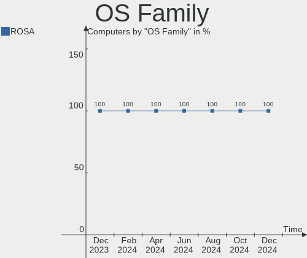
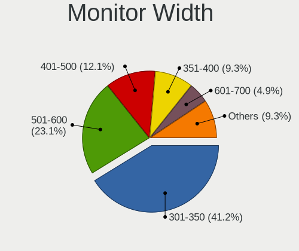
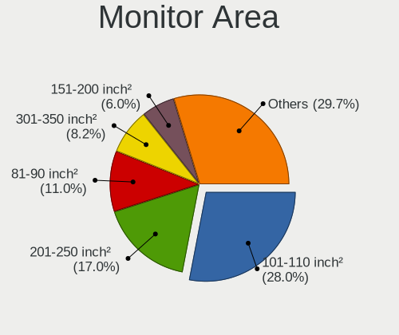
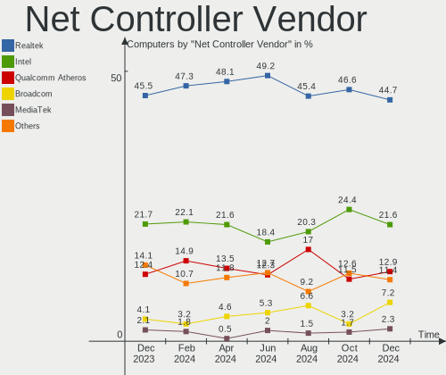
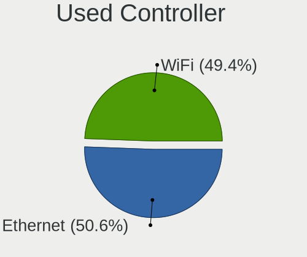

ROSA Hardware Trends
--------------------

A project to identify most popular hardware characteristics and track their change
over time based on data collected by ROSA users at https://Linux-Hardware.org.

Anyone can contribute to this report by the [hw-probe](https://github.com/linuxhw/hw-probe) tool:

    sudo -E hw-probe -all -upload

This is a report for all computer types. See also reports for [desktops](/Dist/ROSA/Desktop/README.md) and [notebooks](/Dist/ROSA/Notebook/README.md).

This report is for one last month. Overall report since the beginning of time: [TestCoverage](https://github.com/linuxhw/TestCoverage)

Period: Apr, 2022.

Contents
--------

* [ System ](#system)
  - [ OS                       ](#os)
  - [ OS Family                ](#os-family)
  - [ Kernel                   ](#kernel)
  - [ Kernel Family            ](#kernel-family)
  - [ Kernel Major Ver.        ](#kernel-major-ver)
  - [ Arch                     ](#arch)
  - [ DE                       ](#de)
  - [ Display Server           ](#display-server)
  - [ Display Manager          ](#display-manager)
  - [ OS Lang                  ](#os-lang)
  - [ Boot Mode                ](#boot-mode)
  - [ Filesystem               ](#filesystem)
  - [ Part. scheme             ](#part-scheme)
  - [ Dual Boot with Linux/BSD ](#dual-boot-with-linuxbsd)
  - [ Dual Boot (Win)          ](#dual-boot-win)

* [ Board ](#board)
  - [ Vendor                   ](#vendor)
  - [ Model                    ](#model)
  - [ Model Family             ](#model-family)
  - [ MFG Year                 ](#mfg-year)
  - [ Form Factor              ](#form-factor)
  - [ Secure Boot              ](#secure-boot)
  - [ Coreboot                 ](#coreboot)
  - [ RAM Size                 ](#ram-size)
  - [ RAM Used                 ](#ram-used)
  - [ Total Drives             ](#total-drives)
  - [ Has CD-ROM               ](#has-cd-rom)
  - [ Has Ethernet             ](#has-ethernet)
  - [ Has WiFi                 ](#has-wifi)
  - [ Has Bluetooth            ](#has-bluetooth)

* [ Location ](#location)
  - [ Country                  ](#country)
  - [ City                     ](#city)

* [ Drives ](#drives)
  - [ Drive Vendor             ](#drive-vendor)
  - [ Drive Model              ](#drive-model)
  - [ HDD Vendor               ](#hdd-vendor)
  - [ SSD Vendor               ](#ssd-vendor)
  - [ Drive Kind               ](#drive-kind)
  - [ Drive Connector          ](#drive-connector)
  - [ Drive Size               ](#drive-size)
  - [ Space Total              ](#space-total)
  - [ Space Used               ](#space-used)
  - [ Malfunc. Drives          ](#malfunc-drives)
  - [ Malfunc. Drive Vendor    ](#malfunc-drive-vendor)
  - [ Malfunc. HDD Vendor      ](#malfunc-hdd-vendor)
  - [ Malfunc. Drive Kind      ](#malfunc-drive-kind)
  - [ Failed Drives            ](#failed-drives)
  - [ Failed Drive Vendor      ](#failed-drive-vendor)
  - [ Drive Status             ](#drive-status)

* [ Storage controller ](#storage-controller)
  - [ Storage Vendor           ](#storage-vendor)
  - [ Storage Model            ](#storage-model)
  - [ Storage Kind             ](#storage-kind)

* [ Processor ](#processor)
  - [ CPU Vendor               ](#cpu-vendor)
  - [ CPU Model                ](#cpu-model)
  - [ CPU Model Family         ](#cpu-model-family)
  - [ CPU Cores                ](#cpu-cores)
  - [ CPU Sockets              ](#cpu-sockets)
  - [ CPU Threads              ](#cpu-threads)
  - [ CPU Op-Modes             ](#cpu-op-modes)
  - [ CPU Microcode            ](#cpu-microcode)
  - [ CPU Microarch            ](#cpu-microarch)

* [ Graphics ](#graphics)
  - [ GPU Vendor               ](#gpu-vendor)
  - [ GPU Model                ](#gpu-model)
  - [ GPU Combo                ](#gpu-combo)
  - [ GPU Driver               ](#gpu-driver)
  - [ GPU Memory               ](#gpu-memory)

* [ Monitor ](#monitor)
  - [ Monitor Vendor           ](#monitor-vendor)
  - [ Monitor Model            ](#monitor-model)
  - [ Monitor Resolution       ](#monitor-resolution)
  - [ Monitor Diagonal         ](#monitor-diagonal)
  - [ Monitor Width            ](#monitor-width)
  - [ Aspect Ratio             ](#aspect-ratio)
  - [ Monitor Area             ](#monitor-area)
  - [ Pixel Density            ](#pixel-density)
  - [ Multiple Monitors        ](#multiple-monitors)

* [ Network ](#network)
  - [ Net Controller Vendor    ](#net-controller-vendor)
  - [ Net Controller Model     ](#net-controller-model)
  - [ Wireless Vendor          ](#wireless-vendor)
  - [ Wireless Model           ](#wireless-model)
  - [ Ethernet Vendor          ](#ethernet-vendor)
  - [ Ethernet Model           ](#ethernet-model)
  - [ Net Controller Kind      ](#net-controller-kind)
  - [ Used Controller          ](#used-controller)
  - [ NICs                     ](#nics)
  - [ IPv6                     ](#ipv6)

* [ Bluetooth ](#bluetooth)
  - [ Bluetooth Vendor         ](#bluetooth-vendor)
  - [ Bluetooth Model          ](#bluetooth-model)

* [ Sound ](#sound)
  - [ Sound Vendor             ](#sound-vendor)
  - [ Sound Model              ](#sound-model)

* [ Memory ](#memory)
  - [ Memory Vendor            ](#memory-vendor)
  - [ Memory Model             ](#memory-model)
  - [ Memory Kind              ](#memory-kind)
  - [ Memory Form Factor       ](#memory-form-factor)
  - [ Memory Size              ](#memory-size)
  - [ Memory Speed             ](#memory-speed)

* [ Printers & scanners ](#printers--scanners)
  - [ Printer Vendor           ](#printer-vendor)
  - [ Printer Model            ](#printer-model)
  - [ Scanner Vendor           ](#scanner-vendor)
  - [ Scanner Model            ](#scanner-model)

* [ Camera ](#camera)
  - [ Camera Vendor            ](#camera-vendor)
  - [ Camera Model             ](#camera-model)

* [ Security ](#security)
  - [ Fingerprint Vendor       ](#fingerprint-vendor)
  - [ Fingerprint Model        ](#fingerprint-model)
  - [ Chipcard Vendor          ](#chipcard-vendor)
  - [ Chipcard Model           ](#chipcard-model)

* [ Unsupported ](#unsupported)
  - [ Unsupported Devices      ](#unsupported-devices)
  - [ Unsupported Device Types ](#unsupported-device-types)

System
------

OS
--

Installed operating systems

| Name         | Computers | Percent |
|--------------|-----------|---------|
| ROSA 12.2    | 387       | 85.05%  |
| ROSA R11.1   | 47        | 10.33%  |
| ROSA 12.1    | 10        | 2.2%    |
| ROSA R11     | 6         | 1.32%   |
| ROSA 12      | 3         | 0.66%   |
| ROSA 2019.05 | 2         | 0.44%   |

OS Family
---------

OS without a version

| Name | Computers | Percent |
|------|-----------|---------|
| ROSA | 455       | 100%    |

Kernel
------

Version of the Linux kernel

| Version                                    | Computers | Percent |
|--------------------------------------------|-----------|---------|
| 5.10.74-generic-2rosa2021.1-x86_64         | 336       | 73.85%  |
| 5.15.32-generic-5rosa2021.1-x86_64         | 24        | 5.27%   |
| 5.4.83-generic-2rosa-x86_64                | 13        | 2.86%   |
| 4.15.0-desktop-122.124.1rosa-x86_64        | 13        | 2.86%   |
| 5.10.74-generic-2rosa2021.1-i586           | 11        | 2.42%   |
| 5.4.32-generic-2rosa-x86_64                | 9         | 1.98%   |
| 5.4.83-generic-2rosa-i586                  | 8         | 1.76%   |
| 5.15.32-generic-6rosa2021.1-x86_64         | 8         | 1.76%   |
| 5.16.18-generic-1rosa2021.1-x86_64         | 4         | 0.88%   |
| 5.16.16.xm1-1.klp-xanmod-rosa2021.1-x86_64 | 4         | 0.88%   |
| 4.15.0-desktop-45.1rosa-i586               | 4         | 0.88%   |
| 5.4.32-generic-2rosa-i586                  | 3         | 0.66%   |
| 5.10.71-generic-1rosa2021.1-x86_64         | 3         | 0.66%   |
| 5.4.139-nickel-4rosa2019.05-x86_64         | 2         | 0.44%   |
| 5.16.20-generic-1rosa2021.1-x86_64         | 2         | 0.44%   |
| 4.15.0-desktop-45.1rosa-x86_64             | 2         | 0.44%   |
| 5.4.91-generic-1rosa2021.1-e2kv4           | 1         | 0.22%   |
| 5.16.18-generic-4rosa2021.1-x86_64         | 1         | 0.22%   |
| 5.16.18-generic-2rosa2021.1-x86_64         | 1         | 0.22%   |
| 5.15.32-generic-5rosa2021.1-i686           | 1         | 0.22%   |
| 5.15.32-generic-1rosa2021.1-x86_64         | 1         | 0.22%   |
| 5.15.28-generic-3rosa2021.1-x86_64         | 1         | 0.22%   |
| 5.15.28-generic-1rosa2021.1-x86_64         | 1         | 0.22%   |
| 5.10.101-desktop-2rosa2021-x86_64          | 1         | 0.22%   |
| 4.19.72-nrj-desktop-1rosa-x86_64           | 1         | 0.22%   |

Kernel Family
-------------

Linux kernel without a distro release

| Version  | Computers | Percent |
|----------|-----------|---------|
| 5.10.74  | 347       | 76.26%  |
| 5.15.32  | 34        | 7.47%   |
| 5.4.83   | 21        | 4.62%   |
| 4.15.0   | 19        | 4.18%   |
| 5.4.32   | 12        | 2.64%   |
| 5.16.18  | 6         | 1.32%   |
| 5.16.16  | 4         | 0.88%   |
| 5.10.71  | 3         | 0.66%   |
| 5.4.139  | 2         | 0.44%   |
| 5.16.20  | 2         | 0.44%   |
| 5.15.28  | 2         | 0.44%   |
| 5.4.91   | 1         | 0.22%   |
| 5.10.101 | 1         | 0.22%   |
| 4.19.72  | 1         | 0.22%   |

Kernel Major Ver.
-----------------

Linux kernel major version

| Version | Computers | Percent |
|---------|-----------|---------|
| 5.10    | 351       | 77.14%  |
| 5.4     | 36        | 7.91%   |
| 5.15    | 36        | 7.91%   |
| 4.15    | 19        | 4.18%   |
| 5.16    | 12        | 2.64%   |
| 4.19    | 1         | 0.22%   |

Arch
----

OS architecture (x86_64, i586, etc.)

| Name   | Computers | Percent |
|--------|-----------|---------|
| x86_64 | 427       | 93.85%  |
| i686   | 27        | 5.93%   |
| e2k    | 1         | 0.22%   |

DE
--

Desktop Environment

| Name       | Computers | Percent |
|------------|-----------|---------|
| KDE5       | 195       | 42.86%  |
| GNOME      | 152       | 33.41%  |
| LXQt       | 70        | 15.38%  |
| KDE4       | 37        | 8.13%   |
| X-Cinnamon | 1         | 0.22%   |

Display Server
--------------

X11 or Wayland

| Name    | Computers | Percent |
|---------|-----------|---------|
| Wayland | 328       | 72.09%  |
| X11     | 127       | 27.91%  |

Display Manager
---------------

SDDM, LightDM, etc.

| Name    | Computers | Percent |
|---------|-----------|---------|
| GDM     | 208       | 45.71%  |
| SDDM    | 194       | 42.64%  |
| KDM     | 37        | 8.13%   |
| LightDM | 16        | 3.52%   |

OS Lang
-------

Language

| Lang    | Computers | Percent |
|---------|-----------|---------|
| ru_RU   | 426       | 93.63%  |
| en_US   | 7         | 1.54%   |
| Unknown | 7         | 1.54%   |
| pl_PL   | 3         | 0.66%   |
| de_DE   | 3         | 0.66%   |
| fr_FR   | 2         | 0.44%   |
| fr_BE   | 2         | 0.44%   |
| pt_BR   | 1         | 0.22%   |
| es_MX   | 1         | 0.22%   |
| es_CO   | 1         | 0.22%   |
| es_AR   | 1         | 0.22%   |
| en_IN   | 1         | 0.22%   |

Boot Mode
---------

EFI or BIOS

| Mode | Computers | Percent |
|------|-----------|---------|
| BIOS | 231       | 50.77%  |
| EFI  | 224       | 49.23%  |

Filesystem
----------

Type of filesystem

| Type    | Computers | Percent |
|---------|-----------|---------|
| Ext4    | 438       | 96.26%  |
| Btrfs   | 15        | 3.3%    |
| Overlay | 1         | 0.22%   |
| Aufs    | 1         | 0.22%   |

Part. scheme
------------

Scheme of partitioning

| Type    | Computers | Percent |
|---------|-----------|---------|
| GPT     | 292       | 64.18%  |
| MBR     | 162       | 35.6%   |
| Unknown | 1         | 0.22%   |

Dual Boot with Linux/BSD
------------------------

Hosting more than one Linux/BSD

| Dual boot | Computers | Percent |
|-----------|-----------|---------|
| No        | 324       | 71.21%  |
| Yes       | 131       | 28.79%  |

Dual Boot (Win)
---------------

Hosting Linux and Windows

| Dual boot | Computers | Percent |
|-----------|-----------|---------|
| No        | 238       | 52.31%  |
| Yes       | 217       | 47.69%  |

Board
-----

Vendor
------

Motherboard manufacturer

| Name                           | Computers | Percent |
|--------------------------------|-----------|---------|
| ASUSTek Computer               | 123       | 27.03%  |
| Gigabyte Technology            | 67        | 14.73%  |
| Acer                           | 49        | 10.77%  |
| Lenovo                         | 35        | 7.69%   |
| Hewlett-Packard                | 33        | 7.25%   |
| MSI                            | 31        | 6.81%   |
| ASRock                         | 21        | 4.62%   |
| Dell                           | 20        | 4.4%    |
| Samsung Electronics            | 11        | 2.42%   |
| Intel                          | 6         | 1.32%   |
| Sony                           | 5         | 1.1%    |
| Unknown                        | 5         | 1.1%    |
| Toshiba                        | 4         | 0.88%   |
| Packard Bell                   | 4         | 0.88%   |
| eMachines                      | 4         | 0.88%   |
| ECS                            | 3         | 0.66%   |
| Biostar                        | 3         | 0.66%   |
| Pegatron                       | 2         | 0.44%   |
| ONDA                           | 2         | 0.44%   |
| KLLISRE                        | 2         | 0.44%   |
| Haier                          | 2         | 0.44%   |
| Fujitsu                        | 2         | 0.44%   |
| DNS                            | 2         | 0.44%   |
| Digma                          | 2         | 0.44%   |
| Apple                          | 2         | 0.44%   |
| ZoomSmart                      | 1         | 0.22%   |
| SYWZ                           | 1         | 0.22%   |
| Notebook                       | 1         | 0.22%   |
| Medion                         | 1         | 0.22%   |
| Matsushita Electric Industrial | 1         | 0.22%   |
| Maibenben                      | 1         | 0.22%   |
| MACHINIST                      | 1         | 0.22%   |
| Lite-On                        | 1         | 0.22%   |
| Jumper                         | 1         | 0.22%   |
| iRU                            | 1         | 0.22%   |
| Irbis                          | 1         | 0.22%   |
| Huanan                         | 1         | 0.22%   |
| HPE                            | 1         | 0.22%   |
| Colorful Technology            | 1         | 0.22%   |
| AMI                            | 1         | 0.22%   |

Model
-----

Motherboard model

| Name                                                                                     | Computers | Percent |
|------------------------------------------------------------------------------------------|-----------|---------|
| ASUS All Series                                                                          | 10        | 2.2%    |
| Unknown                                                                                  | 7         | 1.54%   |
| Gigabyte B450 AORUS ELITE                                                                | 3         | 0.66%   |
| ASUS P8H61-M LE                                                                          | 3         | 0.66%   |
| ASUS M5A78L-M LX3                                                                        | 3         | 0.66%   |
| ONDA OBOOK 20 PLUS                                                                       | 2         | 0.44%   |
| MSI MS-7592                                                                              | 2         | 0.44%   |
| MSI GEG                                                                                  | 2         | 0.44%   |
| Lenovo V570c HuronRiver Platform                                                         | 2         | 0.44%   |
| Lenovo IdeaPad Z570 HuronRiver Platform                                                  | 2         | 0.44%   |
| Lenovo G780 20138                                                                        | 2         | 0.44%   |
| KLLISRE X99-B5 V1.1                                                                      | 2         | 0.44%   |
| HP Notebook                                                                              | 2         | 0.44%   |
| HP Laptop 15-db1xxx                                                                      | 2         | 0.44%   |
| HP 250 G6 Notebook PC                                                                    | 2         | 0.44%   |
| Gigabyte X570 AORUS ULTRA                                                                | 2         | 0.44%   |
| Gigabyte H61M-S1                                                                         | 2         | 0.44%   |
| Gigabyte 970A-DS3P                                                                       | 2         | 0.44%   |
| Gigabyte 945GCM-S2L                                                                      | 2         | 0.44%   |
| ASUS X553MA                                                                              | 2         | 0.44%   |
| ASUS X541NC                                                                              | 2         | 0.44%   |
| ASUS TUF B450-PRO GAMING                                                                 | 2         | 0.44%   |
| ASUS PRIME B450M-K                                                                       | 2         | 0.44%   |
| ASUS PRIME B450M-A                                                                       | 2         | 0.44%   |
| ASUS P8B75-M                                                                             | 2         | 0.44%   |
| ASUS P5KPL-AM                                                                            | 2         | 0.44%   |
| ASUS H61M-K                                                                              | 2         | 0.44%   |
| ASUS H110M-K                                                                             | 2         | 0.44%   |
| ASUS 1011PX                                                                              | 2         | 0.44%   |
| ASRock H61M-VS                                                                           | 2         | 0.44%   |
| ASRock B450M Pro4-F                                                                      | 2         | 0.44%   |
| ASRock A320M-DVS R4.0                                                                    | 2         | 0.44%   |
| Acer Aspire 5739G                                                                        | 2         | 0.44%   |
| ZoomSmart A8006                                                                          | 1         | 0.22%   |
| Toshiba Satellite U300                                                                   | 1         | 0.22%   |
| Toshiba Satellite Pro L300                                                               | 1         | 0.22%   |
| Toshiba Satellite L655                                                                   | 1         | 0.22%   |
| Toshiba QOSMIO F60                                                                       | 1         | 0.22%   |
| SYWZ S200 Series                                                                         | 1         | 0.22%   |
| Sony VGN-TT31MR_N                                                                        | 1         | 0.22%   |
| Sony VGN-P688E                                                                           | 1         | 0.22%   |
| Sony SVF1521L1RB                                                                         | 1         | 0.22%   |
| Sony SVE1712V1RB                                                                         | 1         | 0.22%   |
| Sony SVE1512H1RW                                                                         | 1         | 0.22%   |
| Samsung RV411/RV511/E3511/S3511/RV711                                                    | 1         | 0.22%   |
| Samsung R519/R719                                                                        | 1         | 0.22%   |
| Samsung R425D/R525D                                                                      | 1         | 0.22%   |
| Samsung R19/R20/R21                                                                      | 1         | 0.22%   |
| Samsung NC210/NC110                                                                      | 1         | 0.22%   |
| Samsung NB30P                                                                            | 1         | 0.22%   |
| Samsung N150/N210/N220                                                                   | 1         | 0.22%   |
| Samsung 530U3BI/530U4BI/530U4BH                                                          | 1         | 0.22%   |
| Samsung 355V4C/355V4X/355V5C/355V5X/356V4C/356V4X/356V5C/356V5X/3445VC/3445VX/3545VC/354 | 1         | 0.22%   |
| Samsung 350V5C/351V5C/3540VC/3440VC                                                      | 1         | 0.22%   |
| Samsung 300V3A/300V4A/300V5A/200A4B/200A5B                                               | 1         | 0.22%   |
| Pegatron Compaq dx2400 Microtower PC                                                     | 1         | 0.22%   |
| Pegatron A15W8                                                                           | 1         | 0.22%   |
| Packard Bell EasyNote TS11HR                                                             | 1         | 0.22%   |
| Packard Bell EasyNote TE69KB                                                             | 1         | 0.22%   |
| Packard Bell EasyNote TE11HC                                                             | 1         | 0.22%   |

Model Family
------------

Motherboard model prefix

| Name                  | Computers | Percent |
|-----------------------|-----------|---------|
| Acer Aspire           | 36        | 7.91%   |
| Lenovo IdeaPad        | 15        | 3.3%    |
| ASUS PRIME            | 14        | 3.08%   |
| ASUS All              | 10        | 2.2%    |
| HP Pavilion           | 8         | 1.76%   |
| Dell Inspiron         | 7         | 1.54%   |
| ASUS TUF              | 7         | 1.54%   |
| ASUS M5A78L-M         | 7         | 1.54%   |
| Unknown               | 7         | 1.54%   |
| HP Laptop             | 6         | 1.32%   |
| Lenovo ThinkPad       | 5         | 1.1%    |
| HP ProBook            | 5         | 1.1%    |
| Dell OptiPlex         | 5         | 1.1%    |
| Packard Bell EasyNote | 4         | 0.88%   |
| Gigabyte B450         | 4         | 0.88%   |
| ASUS VivoBook         | 4         | 0.88%   |
| ASUS P8H61-M          | 4         | 0.88%   |
| Toshiba Satellite     | 3         | 0.66%   |
| HP Compaq             | 3         | 0.66%   |
| HP 250                | 3         | 0.66%   |
| Gigabyte H310M        | 3         | 0.66%   |
| Gigabyte B550M        | 3         | 0.66%   |
| Gigabyte B450M        | 3         | 0.66%   |
| Dell Latitude         | 3         | 0.66%   |
| ASUS P8B75-M          | 3         | 0.66%   |
| ASUS ASUS             | 3         | 0.66%   |
| ASRock B450M          | 3         | 0.66%   |
| Acer Nitro            | 3         | 0.66%   |
| ONDA OBOOK            | 2         | 0.44%   |
| MSI MS-7592           | 2         | 0.44%   |
| MSI GEG               | 2         | 0.44%   |
| Lenovo V570c          | 2         | 0.44%   |
| Lenovo ThinkCentre    | 2         | 0.44%   |
| Lenovo Legion         | 2         | 0.44%   |
| Lenovo G780           | 2         | 0.44%   |
| KLLISRE X99-B5        | 2         | 0.44%   |
| Intel X79             | 2         | 0.44%   |
| HP Notebook           | 2         | 0.44%   |
| HP EliteBook          | 2         | 0.44%   |
| Gigabyte X570         | 2         | 0.44%   |
| Gigabyte H61M-S1      | 2         | 0.44%   |
| Gigabyte A320M-S2H    | 2         | 0.44%   |
| Gigabyte 970A-DS3P    | 2         | 0.44%   |
| Gigabyte 945GCM-S2L   | 2         | 0.44%   |
| Dell Vostro           | 2         | 0.44%   |
| Dell Precision        | 2         | 0.44%   |
| ASUS ZenBook          | 2         | 0.44%   |
| ASUS X553MA           | 2         | 0.44%   |
| ASUS X541NC           | 2         | 0.44%   |
| ASUS P8Z77-V          | 2         | 0.44%   |
| ASUS P5Q              | 2         | 0.44%   |
| ASUS P5KPL-AM         | 2         | 0.44%   |
| ASUS P5K              | 2         | 0.44%   |
| ASUS M5A99X           | 2         | 0.44%   |
| ASUS H61M-K           | 2         | 0.44%   |
| ASUS H110M-K          | 2         | 0.44%   |
| ASUS 1011PX           | 2         | 0.44%   |
| ASRock H61M-VS        | 2         | 0.44%   |
| ASRock B560           | 2         | 0.44%   |
| ASRock A320M-DVS      | 2         | 0.44%   |

MFG Year
--------

Motherboard manufacture year

| Year    | Computers | Percent |
|---------|-----------|---------|
| 2012    | 53        | 11.65%  |
| 2018    | 51        | 11.21%  |
| 2011    | 46        | 10.11%  |
| 2021    | 34        | 7.47%   |
| 2010    | 34        | 7.47%   |
| 2013    | 33        | 7.25%   |
| 2009    | 29        | 6.37%   |
| 2019    | 27        | 5.93%   |
| 2017    | 25        | 5.49%   |
| 2020    | 23        | 5.05%   |
| 2008    | 22        | 4.84%   |
| 2016    | 19        | 4.18%   |
| 2015    | 19        | 4.18%   |
| 2007    | 15        | 3.3%    |
| 2014    | 13        | 2.86%   |
| 2006    | 9         | 1.98%   |
| 2022    | 1         | 0.22%   |
| 2005    | 1         | 0.22%   |
| Unknown | 1         | 0.22%   |

Form Factor
-----------

Physical design of the computer

| Name        | Computers | Percent |
|-------------|-----------|---------|
| Desktop     | 235       | 51.65%  |
| Notebook    | 208       | 45.71%  |
| All in one  | 7         | 1.54%   |
| Tablet      | 2         | 0.44%   |
| Convertible | 1         | 0.22%   |
| Mini pc     | 1         | 0.22%   |
| Server      | 1         | 0.22%   |

Secure Boot
-----------

Enabled or disabled

| State    | Computers | Percent |
|----------|-----------|---------|
| Disabled | 455       | 100%    |

Coreboot
--------

Have coreboot on board

| Used | Computers | Percent |
|------|-----------|---------|
| No   | 455       | 100%    |

RAM Size
--------

Total RAM memory

| Size in GB  | Computers | Percent |
|-------------|-----------|---------|
| 3.01-4.0    | 102       | 22.42%  |
| 4.01-8.0    | 94        | 20.66%  |
| 16.01-24.0  | 87        | 19.12%  |
| 8.01-16.0   | 82        | 18.02%  |
| 1.01-2.0    | 36        | 7.91%   |
| 32.01-64.0  | 25        | 5.49%   |
| 2.01-3.0    | 17        | 3.74%   |
| 24.01-32.0  | 7         | 1.54%   |
| 0.51-1.0    | 3         | 0.66%   |
| 64.01-256.0 | 2         | 0.44%   |

RAM Used
--------

Used RAM memory

| Used GB   | Computers | Percent |
|-----------|-----------|---------|
| 1.01-2.0  | 241       | 52.97%  |
| 0.51-1.0  | 125       | 27.47%  |
| 2.01-3.0  | 55        | 12.09%  |
| 4.01-8.0  | 14        | 3.08%   |
| 3.01-4.0  | 14        | 3.08%   |
| 0.01-0.5  | 5         | 1.1%    |
| 8.01-16.0 | 1         | 0.22%   |

Total Drives
------------

Number of drives on board

| Drives | Computers | Percent |
|--------|-----------|---------|
| 1      | 240       | 52.75%  |
| 2      | 136       | 29.89%  |
| 3      | 48        | 10.55%  |
| 4      | 17        | 3.74%   |
| 5      | 10        | 2.2%    |
| 6      | 4         | 0.88%   |

Has CD-ROM
----------

Has CD-ROM on board

| Presented | Computers | Percent |
|-----------|-----------|---------|
| No        | 280       | 61.54%  |
| Yes       | 175       | 38.46%  |

Has Ethernet
------------

Has Ethernet on board

| Presented | Computers | Percent |
|-----------|-----------|---------|
| Yes       | 430       | 94.51%  |
| No        | 25        | 5.49%   |

Has WiFi
--------

Has WiFi module

| Presented | Computers | Percent |
|-----------|-----------|---------|
| Yes       | 281       | 61.76%  |
| No        | 174       | 38.24%  |

Has Bluetooth
-------------

Has Bluetooth module

| Presented | Computers | Percent |
|-----------|-----------|---------|
| No        | 247       | 54.29%  |
| Yes       | 208       | 45.71%  |

Location
--------

Country
-------

Geographic location (country)

| Country    | Computers | Percent |
|------------|-----------|---------|
| Russia     | 401       | 88.13%  |
| Belarus    | 12        | 2.64%   |
| Ukraine    | 10        | 2.2%    |
| Kazakhstan | 4         | 0.88%   |
| Germany    | 4         | 0.88%   |
| Poland     | 3         | 0.66%   |
| Moldova    | 2         | 0.44%   |
| Mexico     | 2         | 0.44%   |
| Belgium    | 2         | 0.44%   |
| USA        | 1         | 0.22%   |
| Spain      | 1         | 0.22%   |
| Serbia     | 1         | 0.22%   |
| Peru       | 1         | 0.22%   |
| Lithuania  | 1         | 0.22%   |
| Latvia     | 1         | 0.22%   |
| India      | 1         | 0.22%   |
| Guadeloupe | 1         | 0.22%   |
| France     | 1         | 0.22%   |
| Finland    | 1         | 0.22%   |
| Estonia    | 1         | 0.22%   |
| Colombia   | 1         | 0.22%   |
| Chile      | 1         | 0.22%   |
| Brazil     | 1         | 0.22%   |
| Argentina  | 1         | 0.22%   |

City
----

Geographic location (city)

| City             | Computers | Percent |
|------------------|-----------|---------|
| Moscow           | 61        | 13.41%  |
| St Petersburg    | 39        | 8.57%   |
| Samara           | 14        | 3.08%   |
| Rostov-on-Don    | 11        | 2.42%   |
| Yekaterinburg    | 10        | 2.2%    |
| Volgograd        | 10        | 2.2%    |
| Krasnodar        | 10        | 2.2%    |
| Krasnoyarsk      | 9         | 1.98%   |
| Chelyabinsk      | 9         | 1.98%   |
| Novosibirsk      | 8         | 1.76%   |
| Voronezh         | 7         | 1.54%   |
| Nizhniy Novgorod | 7         | 1.54%   |
| Minsk            | 7         | 1.54%   |
| Vladivostok      | 6         | 1.32%   |
| Perm             | 6         | 1.32%   |
| Lipetsk          | 6         | 1.32%   |
| Barnaul          | 6         | 1.32%   |
| Ufa              | 5         | 1.1%    |
| Yaroslavl        | 4         | 0.88%   |
| Tyumen           | 4         | 0.88%   |
| Pskov            | 4         | 0.88%   |
| Petrozavodsk     | 4         | 0.88%   |
| Murmansk         | 4         | 0.88%   |
| Mirny            | 4         | 0.88%   |
| Khabarovsk       | 4         | 0.88%   |
| Izhevsk          | 4         | 0.88%   |
| Irkutsk          | 4         | 0.88%   |
| Tomsk            | 3         | 0.66%   |
| Simferopol       | 3         | 0.66%   |
| Severodvinsk     | 3         | 0.66%   |
| Saratov          | 3         | 0.66%   |
| Orenburg         | 3         | 0.66%   |
| Kemerovo         | 3         | 0.66%   |
| Kaliningrad      | 3         | 0.66%   |
| Zlatoust         | 2         | 0.44%   |
| Zelenodolsk      | 2         | 0.44%   |
| Zaventem         | 2         | 0.44%   |
| Vitebsk          | 2         | 0.44%   |
| Veliky Novgorod  | 2         | 0.44%   |
| Ulyanovsk        | 2         | 0.44%   |
| Tver             | 2         | 0.44%   |
| Tula             | 2         | 0.44%   |
| Tambov           | 2         | 0.44%   |
| Syktyvkar        | 2         | 0.44%   |
| Surgut           | 2         | 0.44%   |
| Smolensk         | 2         | 0.44%   |
| Sevastopol       | 2         | 0.44%   |
| Omsk             | 2         | 0.44%   |
| Nyagan           | 2         | 0.44%   |
| Novorossiysk     | 2         | 0.44%   |
| Novocherkassk    | 2         | 0.44%   |
| Noril'sk         | 2         | 0.44%   |
| Nizhny Tagil     | 2         | 0.44%   |
| Nizhnevartovsk   | 2         | 0.44%   |
| Nev'yansk        | 2         | 0.44%   |
| Kazan’         | 2         | 0.44%   |
| Gatchina         | 2         | 0.44%   |
| Cheboksary       | 2         | 0.44%   |
| Bryansk          | 2         | 0.44%   |
| Belgorod         | 2         | 0.44%   |

Drives
------

Drive Vendor
------------

Hard drive vendors

| Vendor              | Computers | Drives | Percent |
|---------------------|-----------|--------|---------|
| WDC                 | 148       | 191    | 20.9%   |
| Seagate             | 127       | 145    | 17.94%  |
| Samsung Electronics | 64        | 75     | 9.04%   |
| Toshiba             | 55        | 56     | 7.77%   |
| Kingston            | 37        | 40     | 5.23%   |
| Hitachi             | 28        | 28     | 3.95%   |
| China               | 22        | 22     | 3.11%   |
| SanDisk             | 17        | 17     | 2.4%    |
| Unknown             | 15        | 16     | 2.12%   |
| SPCC                | 15        | 17     | 2.12%   |
| Crucial             | 15        | 16     | 2.12%   |
| A-DATA Technology   | 12        | 13     | 1.69%   |
| HGST                | 11        | 12     | 1.55%   |
| SK Hynix            | 10        | 10     | 1.41%   |
| Intel               | 10        | 10     | 1.41%   |
| Micron Technology   | 8         | 8      | 1.13%   |
| KingSpec            | 8         | 8      | 1.13%   |
| Apacer              | 8         | 9      | 1.13%   |
| GOODRAM             | 7         | 8      | 0.99%   |
| XPG                 | 6         | 6      | 0.85%   |
| Smartbuy            | 6         | 6      | 0.85%   |
| Gigabyte Technology | 6         | 6      | 0.85%   |
| Patriot             | 5         | 5      | 0.71%   |
| OCZ                 | 5         | 5      | 0.71%   |
| PLEXTOR             | 4         | 5      | 0.56%   |
| AMD                 | 4         | 4      | 0.56%   |
| Transcend           | 3         | 3      | 0.42%   |
| Netac               | 3         | 3      | 0.42%   |
| MAXTOR              | 3         | 3      | 0.42%   |
| LONDISK             | 3         | 3      | 0.42%   |
| KingDian            | 3         | 3      | 0.42%   |
| Fujitsu             | 3         | 3      | 0.42%   |
| Corsair             | 3         | 3      | 0.42%   |
| UMIS                | 2         | 2      | 0.28%   |
| Silicon Motion      | 2         | 2      | 0.28%   |
| QUMO                | 2         | 2      | 0.28%   |
| PNY                 | 2         | 2      | 0.28%   |
| JMicron             | 2         | 2      | 0.28%   |
| ZTE                 | 1         | 1      | 0.14%   |
| XrayDisk            | 1         | 1      | 0.14%   |
| Wdstars             | 1         | 1      | 0.14%   |
| USB3.0              | 1         | 1      | 0.14%   |
| USB                 | 1         | 1      | 0.14%   |
| TXRUI               | 1         | 1      | 0.14%   |
| TMI                 | 1         | 1      | 0.14%   |
| SSSTC               | 1         | 1      | 0.14%   |
| SP                  | 1         | 1      | 0.14%   |
| sage                | 1         | 1      | 0.14%   |
| Phison Electronics  | 1         | 1      | 0.14%   |
| PALIT               | 1         | 1      | 0.14%   |
| Leven               | 1         | 1      | 0.14%   |
| KIOXIA-EXCERIA      | 1         | 1      | 0.14%   |
| Kingmax             | 1         | 1      | 0.14%   |
| HS-SSD-C100         | 1         | 1      | 0.14%   |
| Hikvision           | 1         | 1      | 0.14%   |
| Hewlett-Packard     | 1         | 1      | 0.14%   |
| GS                  | 1         | 2      | 0.14%   |
| E535N               | 1         | 1      | 0.14%   |
| BR                  | 1         | 1      | 0.14%   |
| Apple               | 1         | 1      | 0.14%   |

Drive Model
-----------

Hard drive models

| Model                              | Computers | Percent |
|------------------------------------|-----------|---------|
| Kingston SA400S37240G 240GB SSD    | 13        | 1.66%   |
| Seagate ST1000DM010-2EP102 1TB     | 12        | 1.53%   |
| WDC WDS240G2G0A-00JH30 240GB SSD   | 10        | 1.28%   |
| WDC WD10EZEX-08WN4A0 1TB           | 9         | 1.15%   |
| Toshiba MQ01ABF050 500GB           | 9         | 1.15%   |
| Seagate ST1000LM024 HN-M101MBB 1TB | 9         | 1.15%   |
| Seagate ST1000LM035-1RK172 1TB     | 8         | 1.02%   |
| WDC WDS120G2G0A-00JH30 120GB SSD   | 7         | 0.9%    |
| Seagate ST500DM002-1BD142 500GB    | 7         | 0.9%    |
| Toshiba HDWD110 1TB                | 6         | 0.77%   |
| Seagate ST3500418AS 500GB          | 6         | 0.77%   |
| Samsung SSD 860 EVO 250GB          | 6         | 0.77%   |
| WDC WDS500G2B0A-00SM50 500GB SSD   | 5         | 0.64%   |
| WDC WD5000AAKX-001CA0 500GB        | 5         | 0.64%   |
| Toshiba DT01ACA050 500GB           | 5         | 0.64%   |
| SPCC Solid State Disk 128GB        | 5         | 0.64%   |
| Kingston SNVS500G 500GB            | 5         | 0.64%   |
| WDC WDS120G2G0B-00EPW0 120GB SSD   | 4         | 0.51%   |
| WDC WD5000LPCX-21VHAT0 500GB       | 4         | 0.51%   |
| Seagate ST500LT012-9WS142 500GB    | 4         | 0.51%   |
| Seagate ST1000DM003-1CH162 1TB     | 4         | 0.51%   |
| Samsung SSD 860 EVO 500GB          | 4         | 0.51%   |
| Samsung SSD 850 EVO 250GB          | 4         | 0.51%   |
| Micron 2210_MTFDHBA512QFD 512GB    | 4         | 0.51%   |
| China SSD 128GB                    | 4         | 0.51%   |
| XPG GAMMIX S11 Pro 512GB           | 3         | 0.38%   |
| WDC WD5000LPVX-00V0TT0 500GB       | 3         | 0.38%   |
| WDC WD10SPZX-22Z10T1 1TB           | 3         | 0.38%   |
| WDC WD10EZEX-00BN5A0 1TB           | 3         | 0.38%   |
| WDC WD10EZEX-00BBHA0 1TB           | 3         | 0.38%   |
| Toshiba MQ01ABD100 1TB             | 3         | 0.38%   |
| Toshiba DT01ACA100 1TB             | 3         | 0.38%   |
| SPCC Solid State Disk 256GB        | 3         | 0.38%   |
| SPCC Solid State Disk 120GB        | 3         | 0.38%   |
| Smartbuy SSD 120GB                 | 3         | 0.38%   |
| Seagate ST9500325AS 500GB          | 3         | 0.38%   |
| Seagate ST500LT012-1DG142 500GB    | 3         | 0.38%   |
| Seagate ST3320418AS 320GB          | 3         | 0.38%   |
| Seagate ST3160812AS 160GB          | 3         | 0.38%   |
| Seagate ST2000DM008-2FR102 2TB     | 3         | 0.38%   |
| Seagate ST2000DM001-1CH164 2TB     | 3         | 0.38%   |
| Samsung SSD 980 1TB                | 3         | 0.38%   |
| Samsung SSD 970 EVO Plus 500GB     | 3         | 0.38%   |
| Samsung SSD 970 EVO Plus 250GB     | 3         | 0.38%   |
| Samsung HD103SJ 1TB                | 3         | 0.38%   |
| Hitachi HTS547575A9E384 752GB      | 3         | 0.38%   |
| Hitachi HTS547550A9E384 500GB      | 3         | 0.38%   |
| HGST HTS545050A7E680 500GB         | 3         | 0.38%   |
| HGST HTS545050A7E380 500GB         | 3         | 0.38%   |
| Crucial CT240BX500SSD1 240GB       | 3         | 0.38%   |
| Apacer AS350 512GB SSD             | 3         | 0.38%   |
| Apacer AS350 128GB SSD             | 3         | 0.38%   |
| A-DATA SX6000PNP 512GB             | 3         | 0.38%   |
| WDC WDS240G2G0B-00EPW0 240GB SSD   | 2         | 0.26%   |
| WDC WD5000AAKX-00ERMA0 500GB       | 2         | 0.26%   |
| WDC WD5000AAKS-00UU3A0 500GB       | 2         | 0.26%   |
| WDC WD5000AADS-00S9B0 500GB        | 2         | 0.26%   |
| WDC WD3200BPVT-22JJ5T0 320GB       | 2         | 0.26%   |
| WDC WD3200BEVT-22ZCT0 320GB        | 2         | 0.26%   |
| WDC WD2500BEVT-22A23T0 250GB       | 2         | 0.26%   |

HDD Vendor
----------

Hard disk drive vendors

| Vendor              | Computers | Drives | Percent |
|---------------------|-----------|--------|---------|
| WDC                 | 130       | 149    | 34.85%  |
| Seagate             | 127       | 145    | 34.05%  |
| Toshiba             | 51        | 51     | 13.67%  |
| Hitachi             | 28        | 28     | 7.51%   |
| Samsung Electronics | 15        | 19     | 4.02%   |
| HGST                | 11        | 12     | 2.95%   |
| Unknown             | 3         | 3      | 0.8%    |
| MAXTOR              | 3         | 3      | 0.8%    |
| Fujitsu             | 3         | 3      | 0.8%    |
| USB                 | 1         | 1      | 0.27%   |
| sage                | 1         | 1      | 0.27%   |

SSD Vendor
----------

Solid state drive vendors

| Vendor              | Computers | Drives | Percent |
|---------------------|-----------|--------|---------|
| WDC                 | 34        | 37     | 12.98%  |
| Samsung Electronics | 30        | 32     | 11.45%  |
| Kingston            | 24        | 26     | 9.16%   |
| China               | 22        | 22     | 8.4%    |
| SanDisk             | 16        | 16     | 6.11%   |
| SPCC                | 15        | 16     | 5.73%   |
| Crucial             | 13        | 13     | 4.96%   |
| KingSpec            | 8         | 8      | 3.05%   |
| Apacer              | 8         | 9      | 3.05%   |
| Intel               | 7         | 7      | 2.67%   |
| GOODRAM             | 7         | 8      | 2.67%   |
| Smartbuy            | 6         | 6      | 2.29%   |
| OCZ                 | 5         | 5      | 1.91%   |
| A-DATA Technology   | 5         | 5      | 1.91%   |
| Toshiba             | 4         | 4      | 1.53%   |
| PLEXTOR             | 4         | 4      | 1.53%   |
| Patriot             | 4         | 4      | 1.53%   |
| Transcend           | 3         | 3      | 1.15%   |
| SK Hynix            | 3         | 3      | 1.15%   |
| Netac               | 3         | 3      | 1.15%   |
| Micron Technology   | 3         | 3      | 1.15%   |
| LONDISK             | 3         | 3      | 1.15%   |
| KingDian            | 3         | 3      | 1.15%   |
| Gigabyte Technology | 3         | 3      | 1.15%   |
| Corsair             | 3         | 3      | 1.15%   |
| QUMO                | 2         | 2      | 0.76%   |
| PNY                 | 2         | 2      | 0.76%   |
| JMicron             | 2         | 2      | 0.76%   |
| AMD                 | 2         | 2      | 0.76%   |
| XrayDisk            | 1         | 1      | 0.38%   |
| Wdstars             | 1         | 1      | 0.38%   |
| USB3.0              | 1         | 1      | 0.38%   |
| TXRUI               | 1         | 1      | 0.38%   |
| TMI                 | 1         | 1      | 0.38%   |
| SSSTC               | 1         | 1      | 0.38%   |
| SP                  | 1         | 1      | 0.38%   |
| PALIT               | 1         | 1      | 0.38%   |
| Leven               | 1         | 1      | 0.38%   |
| Kingmax             | 1         | 1      | 0.38%   |
| HS-SSD-C100         | 1         | 1      | 0.38%   |
| Hikvision           | 1         | 1      | 0.38%   |
| Hewlett-Packard     | 1         | 1      | 0.38%   |
| GS                  | 1         | 2      | 0.38%   |
| E535N               | 1         | 1      | 0.38%   |
| BR                  | 1         | 1      | 0.38%   |
| Apple               | 1         | 1      | 0.38%   |
| AFOX                | 1         | 1      | 0.38%   |

Drive Kind
----------

HDD or SSD

| Kind    | Computers | Drives | Percent |
|---------|-----------|--------|---------|
| HDD     | 313       | 415    | 49.37%  |
| SSD     | 225       | 273    | 35.49%  |
| NVMe    | 79        | 88     | 12.46%  |
| MMC     | 16        | 17     | 2.52%   |
| Unknown | 1         | 1      | 0.16%   |

Drive Connector
---------------

SATA, SAS, NVMe, etc.

| Type | Computers | Drives | Percent |
|------|-----------|--------|---------|
| SATA | 423       | 675    | 79.51%  |
| NVMe | 79        | 88     | 14.85%  |
| MMC  | 16        | 17     | 3.01%   |
| SAS  | 14        | 14     | 2.63%   |

Drive Size
----------

Size of hard drive

| Size in TB | Computers | Drives | Percent |
|------------|-----------|--------|---------|
| 0.01-0.5   | 356       | 480    | 67.17%  |
| 0.51-1.0   | 134       | 164    | 25.28%  |
| 1.01-2.0   | 23        | 25     | 4.34%   |
| 2.01-3.0   | 8         | 8      | 1.51%   |
| 3.01-4.0   | 7         | 9      | 1.32%   |
| 10.01-20.0 | 1         | 1      | 0.19%   |
| 4.01-10.0  | 1         | 1      | 0.19%   |

Space Total
-----------

Amount of disk space available on the file system

| Size in GB     | Computers | Percent |
|----------------|-----------|---------|
| 101-250        | 139       | 30.55%  |
| 251-500        | 105       | 23.08%  |
| 1-20           | 61        | 13.41%  |
| 501-1000       | 55        | 12.09%  |
| 1001-2000      | 30        | 6.59%   |
| 51-100         | 30        | 6.59%   |
| 21-50          | 20        | 4.4%    |
| 2001-3000      | 8         | 1.76%   |
| More than 3000 | 7         | 1.54%   |

Space Used
----------

Amount of used disk space

| Used GB        | Computers | Percent |
|----------------|-----------|---------|
| 1-20           | 298       | 65.49%  |
| 21-50          | 47        | 10.33%  |
| 101-250        | 34        | 7.47%   |
| 51-100         | 25        | 5.49%   |
| 251-500        | 23        | 5.05%   |
| 501-1000       | 15        | 3.3%    |
| 1001-2000      | 9         | 1.98%   |
| More than 3000 | 4         | 0.88%   |

Malfunc. Drives
---------------

Drive models with a malfunction

| Model                               | Computers | Drives | Percent |
|-------------------------------------|-----------|--------|---------|
| Seagate ST9500325AS 500GB           | 3         | 3      | 1.9%    |
| Seagate ST500LT012-9WS142 500GB     | 3         | 3      | 1.9%    |
| Seagate ST3500418AS 500GB           | 3         | 4      | 1.9%    |
| Seagate ST1000LM024 HN-M101MBB 1TB  | 3         | 3      | 1.9%    |
| WDC WDS240G2G0A-00JH30 240GB SSD    | 2         | 3      | 1.27%   |
| WDC WD20EARX-00PASB0 2TB            | 2         | 2      | 1.27%   |
| WDC WD20EARS-00S8B1 2TB             | 2         | 2      | 1.27%   |
| Toshiba MQ01ABF050 500GB            | 2         | 2      | 1.27%   |
| Toshiba MK2565GSX 250GB             | 2         | 2      | 1.27%   |
| Toshiba DT01ACA100 1TB              | 2         | 2      | 1.27%   |
| Seagate ST9320325AS 320GB           | 2         | 2      | 1.27%   |
| Seagate ST9250315AS 250GB           | 2         | 2      | 1.27%   |
| Seagate ST500LT012-1DG142 500GB     | 2         | 2      | 1.27%   |
| Seagate ST3320418AS 320GB           | 2         | 2      | 1.27%   |
| Seagate ST3160812AS 160GB           | 2         | 2      | 1.27%   |
| Seagate ST2000DM001-1CH164 2TB      | 2         | 3      | 1.27%   |
| SanDisk SD9SN8W-128G-1006 128GB SSD | 2         | 2      | 1.27%   |
| Samsung Electronics HM321HI 320GB   | 2         | 2      | 1.27%   |
| Samsung Electronics HD160JJ 160GB   | 2         | 2      | 1.27%   |
| Hitachi HTS547575A9E384 752GB       | 2         | 2      | 1.27%   |
| Hitachi HTS547550A9E384 500GB       | 2         | 2      | 1.27%   |
| WDC WDS480G2G0A-00JH30 480GB SSD    | 1         | 1      | 0.63%   |
| WDC WDS120G2G0B-00EPW0 120GB SSD    | 1         | 1      | 0.63%   |
| WDC WD6402AAEX-00Y9A0 640GB         | 1         | 1      | 0.63%   |
| WDC WD5003ABYX-18WERA0 500GB        | 1         | 1      | 0.63%   |
| WDC WD5000LPVX-22V0TT0 500GB        | 1         | 1      | 0.63%   |
| WDC WD5000LPVX-00V0TT0 500GB        | 1         | 1      | 0.63%   |
| WDC WD5000LPLX-00ZNTT0 500GB        | 1         | 1      | 0.63%   |
| WDC WD5000AAKX-22ERMA0 500GB        | 1         | 1      | 0.63%   |
| WDC WD5000AAKX-00ERMA0 500GB        | 1         | 1      | 0.63%   |
| WDC WD5000AAKX-001CA0 500GB         | 1         | 1      | 0.63%   |
| WDC WD5000AAKS-75V0A0 500GB         | 1         | 1      | 0.63%   |
| WDC WD5000AAKS-00UU3A0 500GB        | 1         | 1      | 0.63%   |
| WDC WD5000AAKS-00A7B2 500GB         | 1         | 1      | 0.63%   |
| WDC WD3200BPVT-22ZEST0 320GB        | 1         | 1      | 0.63%   |
| WDC WD3200BPVT-22JJ5T0 320GB        | 1         | 1      | 0.63%   |
| WDC WD3200BEVT-60A23T0 320GB        | 1         | 1      | 0.63%   |
| WDC WD3200BEVT-24A23T0 320GB        | 1         | 1      | 0.63%   |
| WDC WD2500KS-00MJB0 250GB           | 1         | 1      | 0.63%   |
| WDC WD2500BEVT-60ZCT1 250GB         | 1         | 1      | 0.63%   |
| WDC WD2500BEVT-22A23T0 250GB        | 1         | 1      | 0.63%   |
| WDC WD2500BEKT-60A25T1 250GB        | 1         | 1      | 0.63%   |
| WDC WD2500AAKX-753CA1 250GB         | 1         | 1      | 0.63%   |
| WDC WD20EARS-00MVWB0 2TB            | 1         | 1      | 0.63%   |
| WDC WD1600BEVT-80A23T0 160GB        | 1         | 1      | 0.63%   |
| WDC WD1600BEVT-60ZCT1 160GB         | 1         | 1      | 0.63%   |
| WDC WD1600AAJS-22L7A0 160GB         | 1         | 1      | 0.63%   |
| WDC WD1600AAJS-00L7A0 160GB         | 1         | 1      | 0.63%   |
| WDC WD1200UE-22KVT0 120GB           | 1         | 1      | 0.63%   |
| WDC WD10EZEX-60WN4A0 1TB            | 1         | 1      | 0.63%   |
| WDC WD10EZEX-22MFCA0 1TB            | 1         | 1      | 0.63%   |
| WDC WD10EARS-00Z5B1 1TB             | 1         | 1      | 0.63%   |
| WDC WD10EADS-65M2B0 1TB             | 1         | 1      | 0.63%   |
| WDC WD1002FAEX-00Z3A0 1TB           | 1         | 1      | 0.63%   |
| Toshiba MQ01ABD100 1TB              | 1         | 1      | 0.63%   |
| Toshiba MQ01ABC150 1TB              | 1         | 1      | 0.63%   |
| Toshiba MK8034GSX 80GB              | 1         | 1      | 0.63%   |
| Toshiba MK5055GSX 500GB             | 1         | 1      | 0.63%   |
| Toshiba MK3259GSXP 320GB            | 1         | 1      | 0.63%   |
| Toshiba MK2035GSS 200GB             | 1         | 1      | 0.63%   |

Malfunc. Drive Vendor
---------------------

Vendors of faulty drives

| Vendor              | Computers | Drives | Percent |
|---------------------|-----------|--------|---------|
| Seagate             | 49        | 55     | 32.67%  |
| WDC                 | 37        | 40     | 24.67%  |
| Hitachi             | 15        | 15     | 10%     |
| Toshiba             | 14        | 14     | 9.33%   |
| Samsung Electronics | 8         | 11     | 5.33%   |
| SanDisk             | 5         | 5      | 3.33%   |
| HGST                | 4         | 4      | 2.67%   |
| Intel               | 3         | 3      | 2%      |
| Fujitsu             | 2         | 2      | 1.33%   |
| SSSTC               | 1         | 1      | 0.67%   |
| SPCC                | 1         | 1      | 0.67%   |
| SK Hynix            | 1         | 1      | 0.67%   |
| Silicon Motion      | 1         | 1      | 0.67%   |
| QUMO                | 1         | 1      | 0.67%   |
| PLEXTOR             | 1         | 1      | 0.67%   |
| OCZ                 | 1         | 1      | 0.67%   |
| Leven               | 1         | 1      | 0.67%   |
| KingSpec            | 1         | 1      | 0.67%   |
| Kingmax             | 1         | 1      | 0.67%   |
| Corsair             | 1         | 1      | 0.67%   |
| China               | 1         | 1      | 0.67%   |
| AMD                 | 1         | 1      | 0.67%   |

Malfunc. HDD Vendor
-------------------

Vendors of faulty HDD drives

| Vendor              | Computers | Drives | Percent |
|---------------------|-----------|--------|---------|
| Seagate             | 49        | 55     | 39.2%   |
| WDC                 | 34        | 35     | 27.2%   |
| Hitachi             | 15        | 15     | 12%     |
| Toshiba             | 14        | 14     | 11.2%   |
| Samsung Electronics | 7         | 10     | 5.6%    |
| HGST                | 4         | 4      | 3.2%    |
| Fujitsu             | 2         | 2      | 1.6%    |

Malfunc. Drive Kind
-------------------

Kinds of faulty drives

| Kind | Computers | Drives | Percent |
|------|-----------|--------|---------|
| HDD  | 117       | 135    | 81.82%  |
| SSD  | 25        | 26     | 17.48%  |
| NVMe | 1         | 1      | 0.7%    |

Failed Drives
-------------

Failed drive models

| Model                        | Computers | Drives | Percent |
|------------------------------|-----------|--------|---------|
| WDC WD3200BPVT-22JJ5T0 320GB | 1         | 1      | 50%     |
| Seagate ST31000524AS 1TB     | 1         | 1      | 50%     |

Failed Drive Vendor
-------------------

Failed drive vendors

| Vendor  | Computers | Drives | Percent |
|---------|-----------|--------|---------|
| WDC     | 1         | 1      | 50%     |
| Seagate | 1         | 1      | 50%     |

Drive Status
------------

Number of failed and malfunc. drives

| Status   | Computers | Drives | Percent |
|----------|-----------|--------|---------|
| Works    | 375       | 598    | 68.56%  |
| Malfunc  | 139       | 162    | 25.41%  |
| Detected | 31        | 32     | 5.67%   |
| Failed   | 2         | 2      | 0.37%   |

Storage controller
------------------

Storage Vendor
--------------

Storage controller vendors

| Vendor                           | Computers | Percent |
|----------------------------------|-----------|---------|
| Intel                            | 310       | 56.06%  |
| AMD                              | 123       | 22.24%  |
| Samsung Electronics              | 24        | 4.34%   |
| Nvidia                           | 14        | 2.53%   |
| Kingston Technology Company      | 14        | 2.53%   |
| JMicron Technology               | 10        | 1.81%   |
| Realtek Semiconductor            | 7         | 1.27%   |
| Silicon Motion                   | 6         | 1.08%   |
| ADATA Technology                 | 6         | 1.08%   |
| SK Hynix                         | 5         | 0.9%    |
| Sandisk                          | 5         | 0.9%    |
| Micron Technology                | 5         | 0.9%    |
| Marvell Technology Group         | 5         | 0.9%    |
| Phison Electronics               | 4         | 0.72%   |
| Micron/Crucial Technology        | 3         | 0.54%   |
| ASMedia Technology               | 3         | 0.54%   |
| VIA Technologies                 | 2         | 0.36%   |
| Union Memory (Shenzhen)          | 2         | 0.36%   |
| Toshiba America Info Systems     | 1         | 0.18%   |
| Silicon Integrated Systems [SiS] | 1         | 0.18%   |
| MCST                             | 1         | 0.18%   |
| Lite-On Technology               | 1         | 0.18%   |
| KIOXIA                           | 1         | 0.18%   |

Storage Model
-------------

Storage controller models

| Model                                                                                   | Computers | Percent |
|-----------------------------------------------------------------------------------------|-----------|---------|
| AMD FCH SATA Controller [AHCI mode]                                                     | 68        | 9.96%   |
| Intel 8 Series/C220 Series Chipset Family 6-port SATA Controller 1 [AHCI mode]          | 25        | 3.66%   |
| Intel 7 Series Chipset Family 6-port SATA Controller [AHCI mode]                        | 24        | 3.51%   |
| AMD 400 Series Chipset SATA Controller                                                  | 23        | 3.37%   |
| AMD SB7x0/SB8x0/SB9x0 IDE Controller                                                    | 22        | 3.22%   |
| Intel NM10/ICH7 Family SATA Controller [IDE mode]                                       | 20        | 2.93%   |
| Intel Sunrise Point-LP SATA Controller [AHCI mode]                                      | 19        | 2.78%   |
| Intel 82801G (ICH7 Family) IDE Controller                                               | 16        | 2.34%   |
| AMD SB7x0/SB8x0/SB9x0 SATA Controller [IDE mode]                                        | 16        | 2.34%   |
| AMD SB7x0/SB8x0/SB9x0 SATA Controller [AHCI mode]                                       | 16        | 2.34%   |
| Samsung NVMe SSD Controller SM981/PM981/PM983                                           | 15        | 2.2%    |
| Intel NM10/ICH7 Family SATA Controller [AHCI mode]                                      | 14        | 2.05%   |
| Intel 6 Series/C200 Series Chipset Family 6 port Mobile SATA AHCI Controller            | 14        | 2.05%   |
| Intel 6 Series/C200 Series Chipset Family 6 port Desktop SATA AHCI Controller           | 14        | 2.05%   |
| Intel 82801IBM/IEM (ICH9M/ICH9M-E) 4 port SATA Controller [AHCI mode]                   | 12        | 1.76%   |
| Intel 200 Series PCH SATA controller [AHCI mode]                                        | 12        | 1.76%   |
| Intel 7 Series/C210 Series Chipset Family 6-port SATA Controller [AHCI mode]            | 11        | 1.61%   |
| Intel 500 Series Chipset Family SATA AHCI Controller                                    | 10        | 1.46%   |
| Intel 5 Series/3400 Series Chipset 4 port SATA AHCI Controller                          | 10        | 1.46%   |
| Intel Celeron N3350/Pentium N4200/Atom E3900 Series SATA AHCI Controller                | 9         | 1.32%   |
| Intel Cannon Lake PCH SATA AHCI Controller                                              | 9         | 1.32%   |
| Intel 82801HM/HEM (ICH8M/ICH8M-E) IDE Controller                                        | 9         | 1.32%   |
| Intel 6 Series/C200 Series Chipset Family Desktop SATA Controller (IDE mode, ports 4-5) | 9         | 1.32%   |
| Intel 6 Series/C200 Series Chipset Family Desktop SATA Controller (IDE mode, ports 0-3) | 9         | 1.32%   |
| Samsung NVMe SSD Controller 980                                                         | 8         | 1.17%   |
| Intel Q170/Q150/B150/H170/H110/Z170/CM236 Chipset SATA Controller [AHCI Mode]           | 8         | 1.17%   |
| Kingston Company Company Non-Volatile memory controller                                 | 7         | 1.02%   |
| JMicron JMB363 SATA/IDE Controller                                                      | 7         | 1.02%   |
| Intel 82801HM/HEM (ICH8M/ICH8M-E) SATA Controller [AHCI mode]                           | 7         | 1.02%   |
| AMD SB600 Non-Raid-5 SATA                                                               | 7         | 1.02%   |
| AMD SB600 IDE                                                                           | 7         | 1.02%   |
| AMD 500 Series Chipset SATA Controller                                                  | 7         | 1.02%   |
| Silicon Motion SM2263EN/SM2263XT SSD Controller                                         | 6         | 0.88%   |
| Intel Tiger Lake-LP SATA Controller [AHCI mode]                                         | 6         | 0.88%   |
| Intel Cannon Lake Mobile PCH SATA AHCI Controller                                       | 6         | 0.88%   |
| Nvidia MCP61 SATA Controller                                                            | 5         | 0.73%   |
| Nvidia MCP61 IDE                                                                        | 5         | 0.73%   |
| Micron Non-Volatile memory controller                                                   | 5         | 0.73%   |
| Intel 8 Series SATA Controller 1 [AHCI mode]                                            | 5         | 0.73%   |
| AMD X370 Series Chipset SATA Controller                                                 | 5         | 0.73%   |
| AMD FCH SATA Controller D                                                               | 5         | 0.73%   |
| Realtek Realtek Non-Volatile memory controller                                          | 4         | 0.59%   |
| Nvidia MCP51 Serial ATA Controller                                                      | 4         | 0.59%   |
| Intel Volume Management Device NVMe RAID Controller                                     | 4         | 0.59%   |
| Intel 82801JI (ICH10 Family) 4 port SATA IDE Controller #1                              | 4         | 0.59%   |
| Intel 82801JI (ICH10 Family) 2 port SATA IDE Controller #2                              | 4         | 0.59%   |
| Intel 82801I (ICH9 Family) 2 port SATA Controller [IDE mode]                            | 4         | 0.59%   |
| Realtek RTS5763DL NVMe SSD Controller                                                   | 3         | 0.44%   |
| Nvidia MCP79 AHCI Controller                                                            | 3         | 0.44%   |
| Nvidia MCP51 IDE                                                                        | 3         | 0.44%   |
| Intel SATA Controller [RAID mode]                                                       | 3         | 0.44%   |
| Intel Celeron/Pentium Silver Processor SATA Controller                                  | 3         | 0.44%   |
| Intel Atom/Celeron/Pentium Processor x5-E8000/J3xxx/N3xxx Series SATA Controller        | 3         | 0.44%   |
| Intel Atom Processor E3800 Series SATA AHCI Controller                                  | 3         | 0.44%   |
| Intel 9 Series Chipset Family SATA Controller [AHCI Mode]                               | 3         | 0.44%   |
| Intel 82801IR/IO/IH (ICH9R/DO/DH) 4 port SATA Controller [IDE mode]                     | 3         | 0.44%   |
| Intel 82801HM/HEM (ICH8M/ICH8M-E) SATA Controller [IDE mode]                            | 3         | 0.44%   |
| Intel 82801GBM/GHM (ICH7-M Family) SATA Controller [IDE mode]                           | 3         | 0.44%   |
| Intel 82801 Mobile SATA Controller [RAID mode]                                          | 3         | 0.44%   |
| Intel 7 Series/C210 Series Chipset Family 4-port SATA Controller [IDE mode]             | 3         | 0.44%   |

Storage Kind
------------

Kind of storage controller (IDE, SATA, NVMe, SAS, ...)

| Kind | Computers | Percent |
|------|-----------|---------|
| SATA | 376       | 65.51%  |
| IDE  | 108       | 18.82%  |
| NVMe | 79        | 13.76%  |
| RAID | 11        | 1.92%   |

Processor
---------

CPU Vendor
----------

Processor vendors

| Vendor   | Computers | Percent |
|----------|-----------|---------|
| Intel    | 322       | 70.77%  |
| AMD      | 132       | 29.01%  |
| MBE8C-PC | 1         | 0.22%   |

CPU Model
---------

Processor models

| Model                                         | Computers | Percent |
|-----------------------------------------------|-----------|---------|
| AMD Ryzen 3 3200U with Radeon Vega Mobile Gfx | 5         | 1.1%    |
| Intel Core i5-7200U CPU @ 2.50GHz             | 4         | 0.88%   |
| Intel Core i5-3470 CPU @ 3.20GHz              | 4         | 0.88%   |
| Intel Celeron CPU N3450 @ 1.10GHz             | 4         | 0.88%   |
| Intel Atom CPU N450 @ 1.66GHz                 | 4         | 0.88%   |
| AMD Ryzen 5 3600 6-Core Processor             | 4         | 0.88%   |
| AMD Ryzen 5 1600 Six-Core Processor           | 4         | 0.88%   |
| AMD Ryzen 3 3200G with Radeon Vega Graphics   | 4         | 0.88%   |
| AMD FX-8320E Eight-Core Processor             | 4         | 0.88%   |
| Intel Pentium Dual-Core CPU E5400 @ 2.70GHz   | 3         | 0.66%   |
| Intel Pentium CPU G620 @ 2.60GHz              | 3         | 0.66%   |
| Intel Pentium CPU B960 @ 2.20GHz              | 3         | 0.66%   |
| Intel Core i5-9300H CPU @ 2.40GHz             | 3         | 0.66%   |
| Intel Core i5-4200U CPU @ 1.60GHz             | 3         | 0.66%   |
| Intel Core i5-3230M CPU @ 2.60GHz             | 3         | 0.66%   |
| Intel Core i5-2500K CPU @ 3.30GHz             | 3         | 0.66%   |
| Intel Core i3-7020U CPU @ 2.30GHz             | 3         | 0.66%   |
| Intel Core i3-3220 CPU @ 3.30GHz              | 3         | 0.66%   |
| Intel Core i3-2370M CPU @ 2.40GHz             | 3         | 0.66%   |
| Intel Core 2 Duo CPU E8400 @ 3.00GHz          | 3         | 0.66%   |
| Intel Celeron CPU N3350 @ 1.10GHz             | 3         | 0.66%   |
| Intel Atom CPU N570 @ 1.66GHz                 | 3         | 0.66%   |
| Intel 11th Gen Core i3-1115G4 @ 3.00GHz       | 3         | 0.66%   |
| AMD Ryzen 7 2700X Eight-Core Processor        | 3         | 0.66%   |
| AMD Ryzen 5 5600X 6-Core Processor            | 3         | 0.66%   |
| AMD Ryzen 5 2500U with Radeon Vega Mobile Gfx | 3         | 0.66%   |
| AMD Phenom II X6 1055T Processor              | 3         | 0.66%   |
| Intel Xeon CPU E5-2660 v3 @ 2.60GHz           | 2         | 0.44%   |
| Intel Pentium Dual-Core CPU T4400 @ 2.20GHz   | 2         | 0.44%   |
| Intel Pentium Dual-Core CPU T4300 @ 2.10GHz   | 2         | 0.44%   |
| Intel Pentium Dual CPU T2390 @ 1.86GHz        | 2         | 0.44%   |
| Intel Pentium CPU P6100 @ 2.00GHz             | 2         | 0.44%   |
| Intel Pentium CPU N4200 @ 1.10GHz             | 2         | 0.44%   |
| Intel Pentium CPU N3530 @ 2.16GHz             | 2         | 0.44%   |
| Intel Pentium CPU G630 @ 2.70GHz              | 2         | 0.44%   |
| Intel Pentium CPU G3220 @ 3.00GHz             | 2         | 0.44%   |
| Intel Pentium CPU 4417U @ 2.30GHz             | 2         | 0.44%   |
| Intel Core i7-9750H CPU @ 2.60GHz             | 2         | 0.44%   |
| Intel Core i7-8550U CPU @ 1.80GHz             | 2         | 0.44%   |
| Intel Core i7-4790 CPU @ 3.60GHz              | 2         | 0.44%   |
| Intel Core i7 CPU Q 740 @ 1.73GHz             | 2         | 0.44%   |
| Intel Core i5-9600KF CPU @ 3.70GHz            | 2         | 0.44%   |
| Intel Core i5-9400F CPU @ 2.90GHz             | 2         | 0.44%   |
| Intel Core i5-8400 CPU @ 2.80GHz              | 2         | 0.44%   |
| Intel Core i5-6500 CPU @ 3.20GHz              | 2         | 0.44%   |
| Intel Core i5-4690 CPU @ 3.50GHz              | 2         | 0.44%   |
| Intel Core i5-3210M CPU @ 2.50GHz             | 2         | 0.44%   |
| Intel Core i5-2410M CPU @ 2.30GHz             | 2         | 0.44%   |
| Intel Core i5-2400 CPU @ 3.10GHz              | 2         | 0.44%   |
| Intel Core i5-10210U CPU @ 1.60GHz            | 2         | 0.44%   |
| Intel Core i3-8130U CPU @ 2.20GHz             | 2         | 0.44%   |
| Intel Core i3-7100 CPU @ 3.90GHz              | 2         | 0.44%   |
| Intel Core i3-4000M CPU @ 2.40GHz             | 2         | 0.44%   |
| Intel Core i3-3240 CPU @ 3.40GHz              | 2         | 0.44%   |
| Intel Core i3-3120M CPU @ 2.50GHz             | 2         | 0.44%   |
| Intel Core i3-3110M CPU @ 2.40GHz             | 2         | 0.44%   |
| Intel Core i3-2367M CPU @ 1.40GHz             | 2         | 0.44%   |
| Intel Core i3-2350M CPU @ 2.30GHz             | 2         | 0.44%   |
| Intel Core i3-2120 CPU @ 3.30GHz              | 2         | 0.44%   |
| Intel Core i3 CPU M 370 @ 2.40GHz             | 2         | 0.44%   |

CPU Model Family
----------------

Processor model prefix

| Model                   | Computers | Percent |
|-------------------------|-----------|---------|
| Intel Core i5           | 74        | 16.26%  |
| Intel Core i3           | 51        | 11.21%  |
| Intel Core i7           | 38        | 8.35%   |
| Intel Pentium           | 27        | 5.93%   |
| AMD Ryzen 5             | 27        | 5.93%   |
| Intel Core 2 Duo        | 26        | 5.71%   |
| Intel Celeron           | 26        | 5.71%   |
| Other                   | 20        | 4.4%    |
| Intel Atom              | 17        | 3.74%   |
| AMD FX                  | 15        | 3.3%    |
| Intel Pentium Dual-Core | 13        | 2.86%   |
| Intel Xeon              | 12        | 2.64%   |
| AMD Ryzen 3             | 12        | 2.64%   |
| AMD Ryzen 7             | 9         | 1.98%   |
| Intel Pentium Dual      | 6         | 1.32%   |
| Intel Core 2 Quad       | 6         | 1.32%   |
| AMD E1                  | 6         | 1.32%   |
| AMD Athlon              | 5         | 1.1%    |
| AMD Turion 64 X2 Mobile | 4         | 0.88%   |
| AMD Ryzen 9             | 4         | 0.88%   |
| AMD Athlon 64 X2        | 4         | 0.88%   |
| AMD A4                  | 4         | 0.88%   |
| AMD A10                 | 4         | 0.88%   |
| AMD Phenom II X6        | 3         | 0.66%   |
| AMD Phenom              | 3         | 0.66%   |
| AMD Athlon II X4        | 3         | 0.66%   |
| Intel Pentium Gold      | 2         | 0.44%   |
| Intel Core 2            | 2         | 0.44%   |
| Intel Celeron M         | 2         | 0.44%   |
| AMD Ryzen 3 PRO         | 2         | 0.44%   |
| AMD Phenom II X4        | 2         | 0.44%   |
| AMD Athlon II X3        | 2         | 0.44%   |
| AMD Athlon II X2        | 2         | 0.44%   |
| AMD Athlon II           | 2         | 0.44%   |
| AMD A8                  | 2         | 0.44%   |
| AMD A6                  | 2         | 0.44%   |
| Intel Pentium Silver    | 1         | 0.22%   |
| Intel Pentium D         | 1         | 0.22%   |
| Intel Genuine           | 1         | 0.22%   |
| Intel Core m5           | 1         | 0.22%   |
| Intel Core Duo          | 1         | 0.22%   |
| AMD Z                   | 1         | 0.22%   |
| AMD V140                | 1         | 0.22%   |
| AMD Turion II           | 1         | 0.22%   |
| AMD Sempron             | 1         | 0.22%   |
| AMD Ryzen 7 PRO         | 1         | 0.22%   |
| AMD Ryzen 5 PRO         | 1         | 0.22%   |
| AMD Opteron             | 1         | 0.22%   |
| AMD C-50                | 1         | 0.22%   |
| AMD Athlon X4           | 1         | 0.22%   |
| AMD Athlon II Dual-Core | 1         | 0.22%   |
| AMD Athlon Dual Core    | 1         | 0.22%   |

CPU Cores
---------

Number of processor cores

| Number | Computers | Percent |
|--------|-----------|---------|
| 2      | 221       | 48.57%  |
| 4      | 137       | 30.11%  |
| 6      | 47        | 10.33%  |
| 1      | 21        | 4.62%   |
| 8      | 18        | 3.96%   |
| 3      | 5         | 1.1%    |
| 12     | 3         | 0.66%   |
| 10     | 2         | 0.44%   |
| 16     | 1         | 0.22%   |

CPU Sockets
-----------

Number of sockets

| Number | Computers | Percent |
|--------|-----------|---------|
| 1      | 455       | 100%    |

CPU Threads
-----------

Threads per core (Hyper-Threading)

| Number | Computers | Percent |
|--------|-----------|---------|
| 2      | 235       | 51.65%  |
| 1      | 220       | 48.35%  |

CPU Op-Modes
------------

CPU Operation Modes (32-bit, 64-bit)

| Op mode        | Computers | Percent |
|----------------|-----------|---------|
| 32-bit, 64-bit | 446       | 98.02%  |
| 32-bit         | 8         | 1.76%   |
| Unknown        | 1         | 0.22%   |

CPU Microcode
-------------

Microcode number

| Number     | Computers | Percent |
|------------|-----------|---------|
| 0x206a7    | 41        | 9.01%   |
| 0x1067a    | 36        | 7.91%   |
| 0x306a9    | 33        | 7.25%   |
| 0x306c3    | 25        | 5.49%   |
| Unknown    | 20        | 4.4%    |
| 0x906ea    | 18        | 3.96%   |
| 0x06000852 | 12        | 2.64%   |
| 0x6fd      | 11        | 2.42%   |
| 0x0800820d | 10        | 2.2%    |
| 0x010000c8 | 10        | 2.2%    |
| 0x906e9    | 9         | 1.98%   |
| 0x506c9    | 9         | 1.98%   |
| 0x106ca    | 9         | 1.98%   |
| 0x806ea    | 8         | 1.76%   |
| 0x10676    | 8         | 1.76%   |
| 0xa0653    | 7         | 1.54%   |
| 0x806e9    | 7         | 1.54%   |
| 0x506e3    | 7         | 1.54%   |
| 0x20655    | 7         | 1.54%   |
| 0x08701021 | 7         | 1.54%   |
| 0x08108109 | 7         | 1.54%   |
| 0x806c1    | 6         | 1.32%   |
| 0x406e3    | 6         | 1.32%   |
| 0x08108102 | 6         | 1.32%   |
| 0x08001138 | 6         | 1.32%   |
| 0x0700010f | 6         | 1.32%   |
| 0xa0671    | 5         | 1.1%    |
| 0x906ed    | 5         | 1.1%    |
| 0x40651    | 5         | 1.1%    |
| 0x106e5    | 5         | 1.1%    |
| 0x08101016 | 5         | 1.1%    |
| 0x406c3    | 4         | 0.88%   |
| 0x306f2    | 4         | 0.88%   |
| 0x30661    | 4         | 0.88%   |
| 0x0a201016 | 4         | 0.88%   |
| 0x0810100b | 4         | 0.88%   |
| 0x806ec    | 3         | 0.66%   |
| 0x6e8      | 3         | 0.66%   |
| 0x20652    | 3         | 0.66%   |
| 0x06006705 | 3         | 0.66%   |
| 0x06001119 | 3         | 0.66%   |
| 0x0600063e | 3         | 0.66%   |
| 0x010000dc | 3         | 0.66%   |
| 0x01000083 | 3         | 0.66%   |
| 0x806d1    | 2         | 0.44%   |
| 0x706a8    | 2         | 0.44%   |
| 0x6f6      | 2         | 0.44%   |
| 0x406c4    | 2         | 0.44%   |
| 0x30678    | 2         | 0.44%   |
| 0x206d7    | 2         | 0.44%   |
| 0x106c2    | 2         | 0.44%   |
| 0x10661    | 2         | 0.44%   |
| 0x0a50000c | 2         | 0.44%   |
| 0x08701013 | 2         | 0.44%   |
| 0x08600106 | 2         | 0.44%   |
| 0x07030105 | 2         | 0.44%   |
| 0x0600611a | 2         | 0.44%   |
| 0x06003106 | 2         | 0.44%   |
| 0x03000027 | 2         | 0.44%   |
| 0x010000db | 2         | 0.44%   |

CPU Microarch
-------------

Microarchitecture

| Name          | Computers | Percent |
|---------------|-----------|---------|
| KabyLake      | 51        | 11.21%  |
| Penryn        | 46        | 10.11%  |
| SandyBridge   | 43        | 9.45%   |
| IvyBridge     | 35        | 7.69%   |
| Haswell       | 35        | 7.69%   |
| Zen+          | 23        | 5.05%   |
| K10           | 20        | 4.4%    |
| Zen           | 17        | 3.74%   |
| Core          | 17        | 3.74%   |
| Piledriver    | 16        | 3.52%   |
| Bonnell       | 15        | 3.3%    |
| Zen 2         | 13        | 2.86%   |
| Skylake       | 13        | 2.86%   |
| Westmere      | 10        | 2.2%    |
| K8 Hammer     | 10        | 2.2%    |
| Silvermont    | 9         | 1.98%   |
| Goldmont      | 9         | 1.98%   |
| CometLake     | 8         | 1.76%   |
| Zen 3         | 7         | 1.54%   |
| TigerLake     | 7         | 1.54%   |
| Jaguar        | 7         | 1.54%   |
| Unknown       | 7         | 1.54%   |
| Excavator     | 6         | 1.32%   |
| Nehalem       | 5         | 1.1%    |
| P6            | 4         | 0.88%   |
| Icelake       | 4         | 0.88%   |
| Puma          | 3         | 0.66%   |
| Goldmont plus | 3         | 0.66%   |
| Bulldozer     | 3         | 0.66%   |
| Steamroller   | 2         | 0.44%   |
| NetBurst      | 2         | 0.44%   |
| K10 Llano     | 2         | 0.44%   |
| Bobcat        | 2         | 0.44%   |
| Broadwell     | 1         | 0.22%   |

Graphics
--------

GPU Vendor
----------

Vendors of graphics cards

| Vendor | Computers | Percent |
|--------|-----------|---------|
| Nvidia | 214       | 40.38%  |
| Intel  | 187       | 35.28%  |
| AMD    | 129       | 24.34%  |

GPU Model
---------

Graphics card models

| Model                                                                                    | Computers | Percent |
|------------------------------------------------------------------------------------------|-----------|---------|
| Intel 2nd Generation Core Processor Family Integrated Graphics Controller                | 29        | 5.26%   |
| Nvidia GP107 [GeForce GTX 1050 Ti]                                                       | 15        | 2.72%   |
| Intel 3rd Gen Core processor Graphics Controller                                         | 15        | 2.72%   |
| AMD Picasso/Raven 2 [Radeon Vega Series / Radeon Vega Mobile Series]                     | 13        | 2.36%   |
| Intel Atom Processor D4xx/D5xx/N4xx/N5xx Integrated Graphics Controller                  | 9         | 1.63%   |
| Nvidia GP106 [GeForce GTX 1060 3GB]                                                      | 8         | 1.45%   |
| Nvidia GK208B [GeForce GT 710]                                                           | 8         | 1.45%   |
| Intel Xeon E3-1200 v3/4th Gen Core Processor Integrated Graphics Controller              | 8         | 1.45%   |
| Intel HD Graphics 620                                                                    | 8         | 1.45%   |
| AMD Ellesmere [Radeon RX 470/480/570/570X/580/580X/590]                                  | 8         | 1.45%   |
| Nvidia GP108 [GeForce GT 1030]                                                           | 7         | 1.27%   |
| Intel HD Graphics 500                                                                    | 7         | 1.27%   |
| AMD Raven Ridge [Radeon Vega Series / Radeon Vega Mobile Series]                         | 7         | 1.27%   |
| Nvidia G94 [GeForce 9600 GT]                                                             | 6         | 1.09%   |
| Intel UHD Graphics 620                                                                   | 6         | 1.09%   |
| Intel Mobile 4 Series Chipset Integrated Graphics Controller                             | 6         | 1.09%   |
| Intel CoffeeLake-H GT2 [UHD Graphics 630]                                                | 6         | 1.09%   |
| Intel Atom/Celeron/Pentium Processor x5-E8000/J3xxx/N3xxx Integrated Graphics Controller | 6         | 1.09%   |
| AMD Park [Mobility Radeon HD 5430/5450/5470]                                             | 6         | 1.09%   |
| Nvidia TU117 [GeForce GTX 1650]                                                          | 5         | 0.91%   |
| Nvidia GK107 [GeForce GTX 650]                                                           | 5         | 0.91%   |
| Intel Skylake GT2 [HD Graphics 520]                                                      | 5         | 0.91%   |
| Intel Mobile GM965/GL960 Integrated Graphics Controller (secondary)                      | 5         | 0.91%   |
| Intel Mobile GM965/GL960 Integrated Graphics Controller (primary)                        | 5         | 0.91%   |
| Intel HD Graphics 630                                                                    | 5         | 0.91%   |
| Intel Haswell-ULT Integrated Graphics Controller                                         | 5         | 0.91%   |
| Intel Core Processor Integrated Graphics Controller                                      | 5         | 0.91%   |
| Intel 4th Gen Core Processor Integrated Graphics Controller                              | 5         | 0.91%   |
| AMD Lexa PRO [Radeon 540/540X/550/550X / RX 540X/550/550X]                               | 5         | 0.91%   |
| Nvidia TU117M [GeForce GTX 1650 Mobile / Max-Q]                                          | 4         | 0.73%   |
| Nvidia GP107 [GeForce GTX 1050]                                                          | 4         | 0.73%   |
| Nvidia GF116 [GeForce GTX 550 Ti]                                                        | 4         | 0.73%   |
| Nvidia GF108M [GeForce GT 635M]                                                          | 4         | 0.73%   |
| Nvidia GF106 [GeForce GTS 450]                                                           | 4         | 0.73%   |
| Intel TigerLake-LP GT2 [Iris Xe Graphics]                                                | 4         | 0.73%   |
| Intel Mobile 945GM/GMS/GME, 943/940GML Express Integrated Graphics Controller            | 4         | 0.73%   |
| Intel Atom Processor D2xxx/N2xxx Integrated Graphics Controller                          | 4         | 0.73%   |
| Intel 4 Series Chipset Integrated Graphics Controller                                    | 4         | 0.73%   |
| AMD Renoir                                                                               | 4         | 0.73%   |
| Nvidia TU116 [GeForce GTX 1660 SUPER]                                                    | 3         | 0.54%   |
| Nvidia GT218 [GeForce 210]                                                               | 3         | 0.54%   |
| Nvidia GT215 [GeForce GT 240]                                                            | 3         | 0.54%   |
| Nvidia GM108M [GeForce MX110]                                                            | 3         | 0.54%   |
| Nvidia GF117M [GeForce 610M/710M/810M/820M / GT 620M/625M/630M/720M]                     | 3         | 0.54%   |
| Nvidia GF108 [GeForce GT 440]                                                            | 3         | 0.54%   |
| Nvidia GF108 [GeForce GT 430]                                                            | 3         | 0.54%   |
| Nvidia GA106 [Geforce RTX 3050]                                                          | 3         | 0.54%   |
| Nvidia G92 [GeForce GTS 250]                                                             | 3         | 0.54%   |
| Intel Xeon E3-1200 v2/3rd Gen Core processor Graphics Controller                         | 3         | 0.54%   |
| Intel Tiger Lake UHD Graphics                                                            | 3         | 0.54%   |
| Intel Mobile 945GM/GMS, 943/940GML Express Integrated Graphics Controller                | 3         | 0.54%   |
| Intel CometLake-U GT2 [UHD Graphics]                                                     | 3         | 0.54%   |
| Intel Atom Processor Z36xxx/Z37xxx Series Graphics & Display                             | 3         | 0.54%   |
| AMD Wani [Radeon R5/R6/R7 Graphics]                                                      | 3         | 0.54%   |
| AMD Topaz XT [Radeon R7 M260/M265 / M340/M360 / M440/M445 / 530/535 / 620/625 Mobile]    | 3         | 0.54%   |
| AMD Thames [Radeon HD 7500M/7600M Series]                                                | 3         | 0.54%   |
| AMD Sun XT [Radeon HD 8670A/8670M/8690M / R5 M330 / M430 / Radeon 520 Mobile]            | 3         | 0.54%   |
| AMD Stoney [Radeon R2/R3/R4/R5 Graphics]                                                 | 3         | 0.54%   |
| AMD RS880M [Mobility Radeon HD 4225/4250]                                                | 3         | 0.54%   |
| AMD Kabini [Radeon HD 8240 / R3 Series]                                                  | 3         | 0.54%   |

GPU Combo
---------

Combinations of graphics cards

| Name           | Computers | Percent |
|----------------|-----------|---------|
| 1 x Nvidia     | 157       | 34.51%  |
| 1 x Intel      | 117       | 25.71%  |
| 1 x AMD        | 102       | 22.42%  |
| Intel + Nvidia | 52        | 11.43%  |
| 2 x AMD        | 12        | 2.64%   |
| Intel + AMD    | 11        | 2.42%   |
| AMD + Nvidia   | 4         | 0.88%   |

GPU Driver
----------

Free vs proprietary

| Driver      | Computers | Percent |
|-------------|-----------|---------|
| Free        | 396       | 87.03%  |
| Proprietary | 49        | 10.77%  |
| Unknown     | 10        | 2.2%    |

GPU Memory
----------

Total video memory

| Size in GB | Computers | Percent |
|------------|-----------|---------|
| Unknown    | 136       | 29.89%  |
| 1.01-2.0   | 82        | 18.02%  |
| 0.01-0.5   | 79        | 17.36%  |
| 0.51-1.0   | 71        | 15.6%   |
| 3.01-4.0   | 50        | 10.99%  |
| 7.01-8.0   | 15        | 3.3%    |
| 5.01-6.0   | 11        | 2.42%   |
| 2.01-3.0   | 10        | 2.2%    |
| 8.01-16.0  | 1         | 0.22%   |

Monitor
-------

Monitor Vendor
--------------

Monitor vendors

| Vendor                  | Computers | Percent |
|-------------------------|-----------|---------|
| Samsung Electronics     | 70        | 15.32%  |
| AU Optronics            | 60        | 13.13%  |
| Goldstar                | 46        | 10.07%  |
| BenQ                    | 27        | 5.91%   |
| LG Display              | 26        | 5.69%   |
| Acer                    | 26        | 5.69%   |
| Chimei Innolux          | 21        | 4.6%    |
| BOE                     | 20        | 4.38%   |
| Philips                 | 19        | 4.16%   |
| Dell                    | 16        | 3.5%    |
| AOC                     | 15        | 3.28%   |
| Chi Mei Optoelectronics | 13        | 2.84%   |
| Hewlett-Packard         | 10        | 2.19%   |
| ViewSonic               | 7         | 1.53%   |
| NEC Computers           | 6         | 1.31%   |
| Lenovo                  | 6         | 1.31%   |
| HannStar                | 6         | 1.31%   |
| Ancor Communications    | 6         | 1.31%   |
| PANDA                   | 5         | 1.09%   |
| LG Philips              | 5         | 1.09%   |
| InfoVision              | 4         | 0.88%   |
| ASUSTek Computer        | 4         | 0.88%   |
| Toshiba                 | 3         | 0.66%   |
| Plain Tree Systems      | 3         | 0.66%   |
| Iiyama                  | 3         | 0.66%   |
| Apple                   | 3         | 0.66%   |
| Sharp                   | 2         | 0.44%   |
| Mi                      | 2         | 0.44%   |
| HJW                     | 2         | 0.44%   |
| Fujitsu Siemens         | 2         | 0.44%   |
| Envision Peripherals    | 2         | 0.44%   |
| Xiaomi                  | 1         | 0.22%   |
| Unknown (DEF)           | 1         | 0.22%   |
| TR_                     | 1         | 0.22%   |
| Sony                    | 1         | 0.22%   |
| SAC                     | 1         | 0.22%   |
| S2-Tek                  | 1         | 0.22%   |
| Quanta Display          | 1         | 0.22%   |
| PCL                     | 1         | 0.22%   |
| KTC                     | 1         | 0.22%   |
| InnoLux Display         | 1         | 0.22%   |
| HUAWEI                  | 1         | 0.22%   |
| HKC                     | 1         | 0.22%   |
| ECS                     | 1         | 0.22%   |
| CPT                     | 1         | 0.22%   |
| CHE                     | 1         | 0.22%   |
| CHD                     | 1         | 0.22%   |
| @TV                     | 1         | 0.22%   |

Monitor Model
-------------

Monitor models

| Model                                                                    | Computers | Percent |
|--------------------------------------------------------------------------|-----------|---------|
| Philips PHL 273V7 PHLC156 1920x1080 598x336mm 27.0-inch                  | 4         | 0.86%   |
| Goldstar LCD Monitor GSM5AB8 1920x1080 480x270mm 21.7-inch               | 4         | 0.86%   |
| Chimei Innolux LCD Monitor CMN15C9 1366x768 344x193mm 15.5-inch          | 4         | 0.86%   |
| BenQ GW2270 BNQ78DB 1920x1080 476x268mm 21.5-inch                        | 4         | 0.86%   |
| AU Optronics LCD Monitor AUO38ED 1920x1080 344x193mm 15.5-inch           | 4         | 0.86%   |
| AU Optronics LCD Monitor AUO26EC 1366x768 344x193mm 15.5-inch            | 4         | 0.86%   |
| Samsung Electronics S24F350 SAM0D20 1920x1080 520x290mm 23.4-inch        | 3         | 0.64%   |
| Samsung Electronics LCD Monitor SDC4161 1920x1080 344x194mm 15.5-inch    | 3         | 0.64%   |
| Samsung Electronics C27F390 SAM0D32 1920x1080 598x336mm 27.0-inch        | 3         | 0.64%   |
| Philips PHL 243V7 PHLC155 1920x1080 527x296mm 23.8-inch                  | 3         | 0.64%   |
| LG Display LCD Monitor LGD02DC 1366x768 344x194mm 15.5-inch              | 3         | 0.64%   |
| AU Optronics LCD Monitor AUO61D2 1024x600 222x125mm 10.0-inch            | 3         | 0.64%   |
| AU Optronics LCD Monitor AUO20EC 1366x768 344x193mm 15.5-inch            | 3         | 0.64%   |
| Toshiba ScreenXpert TSB8888 1080x2160                                    | 2         | 0.43%   |
| Samsung Electronics SyncMaster SAM01E1 1280x1024 376x301mm 19.0-inch     | 2         | 0.43%   |
| Samsung Electronics SyncMaster SAM010B 1280x1024 338x270mm 17.0-inch     | 2         | 0.43%   |
| Samsung Electronics S24R35x SAM100E 1920x1080 530x300mm 24.0-inch        | 2         | 0.43%   |
| Samsung Electronics S24D332 SAM0F5E 1920x1080 530x300mm 24.0-inch        | 2         | 0.43%   |
| Samsung Electronics S24D300 SAM0B42 1920x1080 531x299mm 24.0-inch        | 2         | 0.43%   |
| Samsung Electronics LCD Monitor SDC354A 1366x768 344x194mm 15.5-inch     | 2         | 0.43%   |
| Samsung Electronics LCD Monitor SAM07C0 1920x1080 480x270mm 21.7-inch    | 2         | 0.43%   |
| Plain Tree Systems Monitor PTS06A5 1280x1024 337x270mm 17.0-inch         | 2         | 0.43%   |
| Philips PHL 223V5 PHLC0CF 1920x1080 477x268mm 21.5-inch                  | 2         | 0.43%   |
| LG Philips LCD Monitor LPLE300 1280x800 331x207mm 15.4-inch              | 2         | 0.43%   |
| LG Display LCD Monitor LGD01E8 1366x768 344x194mm 15.5-inch              | 2         | 0.43%   |
| Lenovo LCD Monitor LEN40A0 1366x768 309x174mm 14.0-inch                  | 2         | 0.43%   |
| HannStar HSD101PFW2 HSD03E9 1024x600 222x125mm 10.0-inch                 | 2         | 0.43%   |
| HannStar HSD100IFW4A HSD03EE 1024x600 220x129mm 10.0-inch                | 2         | 0.43%   |
| Goldstar W2242 GSM4B6F 1680x1050 474x296mm 22.0-inch                     | 2         | 0.43%   |
| Goldstar W2042 GSM4E7E 1680x1050 434x270mm 20.1-inch                     | 2         | 0.43%   |
| Goldstar ULTRAWIDE GSM76FA 2560x1080 798x334mm 34.1-inch                 | 2         | 0.43%   |
| Goldstar MP59G GSM5B34 1920x1080 480x270mm 21.7-inch                     | 2         | 0.43%   |
| Goldstar LG HDR 4K GSM7707 3840x2160 600x340mm 27.2-inch                 | 2         | 0.43%   |
| Goldstar L192WS GSM4B32 1440x900 410x256mm 19.0-inch                     | 2         | 0.43%   |
| Goldstar FULL HD GSM5B55 1920x1080 480x270mm 21.7-inch                   | 2         | 0.43%   |
| Dell S2421HN DEL41F1 1920x1080 527x296mm 23.8-inch                       | 2         | 0.43%   |
| Chimei Innolux LCD Monitor CMN15DB 1366x768 344x193mm 15.5-inch          | 2         | 0.43%   |
| Chimei Innolux LCD Monitor CMN15C4 1920x1080 344x193mm 15.5-inch         | 2         | 0.43%   |
| Chimei Innolux LCD Monitor CMN15BC 1366x768 344x193mm 15.5-inch          | 2         | 0.43%   |
| Chi Mei Optoelectronics LCD Monitor CMO15AB 1366x768 340x190mm 15.3-inch | 2         | 0.43%   |
| Chi Mei Optoelectronics LCD Monitor CMO15A7 1366x768 344x193mm 15.5-inch | 2         | 0.43%   |
| Chi Mei Optoelectronics LCD Monitor CMO15A1 1366x768 344x193mm 15.5-inch | 2         | 0.43%   |
| Chi Mei Optoelectronics LCD Monitor CMO1592 1366x768 344x193mm 15.5-inch | 2         | 0.43%   |
| BOE LCD Monitor BOE0812 1920x1080 344x194mm 15.5-inch                    | 2         | 0.43%   |
| BOE LCD Monitor BOE0675 1366x768 344x194mm 15.5-inch                     | 2         | 0.43%   |
| BenQ VW2420H BNQ7B26 1920x1080 531x298mm 24.0-inch                       | 2         | 0.43%   |
| AU Optronics LCD Monitor AUOAF90 1920x1080 344x193mm 15.5-inch           | 2         | 0.43%   |
| AU Optronics LCD Monitor AUO71EC 1366x768 344x193mm 15.5-inch            | 2         | 0.43%   |
| AU Optronics LCD Monitor AUO47EC 1366x768 344x193mm 15.5-inch            | 2         | 0.43%   |
| AU Optronics LCD Monitor AUO45EC 1366x768 344x193mm 15.5-inch            | 2         | 0.43%   |
| AU Optronics LCD Monitor AUO22EC 1366x768 344x193mm 15.5-inch            | 2         | 0.43%   |
| AU Optronics LCD Monitor AUO21EC 1366x768 344x193mm 15.5-inch            | 2         | 0.43%   |
| AU Optronics LCD Monitor AUO219E 1600x900 382x214mm 17.2-inch            | 2         | 0.43%   |
| AU Optronics LCD Monitor AUO139E 1600x900 382x214mm 17.2-inch            | 2         | 0.43%   |
| AU Optronics LCD Monitor AUO103C 1366x768 309x173mm 13.9-inch            | 2         | 0.43%   |
| AOC 27G2G3 AOC2702 1920x1080 598x336mm 27.0-inch                         | 2         | 0.43%   |
| Acer V193 ACR004C 1280x1024 376x301mm 19.0-inch                          | 2         | 0.43%   |
| Acer AIO LCD ACR40B0 1920x1080 527x296mm 23.8-inch                       | 2         | 0.43%   |
| Xiaomi Mi TV XMD004A 1920x1080 1110x620mm 50.1-inch                      | 1         | 0.21%   |
| ViewSonic VX2363 Series VSC6B2F 1920x1080 509x286mm 23.0-inch            | 1         | 0.21%   |

Monitor Resolution
------------------

Monitor screen resolution

| Resolution         | Computers | Percent |
|--------------------|-----------|---------|
| 1920x1080 (FHD)    | 185       | 41.57%  |
| 1366x768 (WXGA)    | 95        | 21.35%  |
| 1280x1024 (SXGA)   | 41        | 9.21%   |
| 3840x2160 (4K)     | 16        | 3.6%    |
| 1600x900 (HD+)     | 16        | 3.6%    |
| 2560x1440 (QHD)    | 13        | 2.92%   |
| 1440x900 (WXGA+)   | 13        | 2.92%   |
| 1280x800 (WXGA)    | 13        | 2.92%   |
| 1680x1050 (WSXGA+) | 12        | 2.7%    |
| 1024x600           | 12        | 2.7%    |
| 2560x1080          | 6         | 1.35%   |
| 1600x1200          | 6         | 1.35%   |
| 3440x1440          | 3         | 0.67%   |
| 1920x1200 (WUXGA)  | 3         | 0.67%   |
| 1360x768           | 3         | 0.67%   |
| 1400x1050          | 2         | 0.45%   |
| 1280x720 (HD)      | 2         | 0.45%   |
| 1024x768 (XGA)     | 2         | 0.45%   |
| 3840x2560          | 1         | 0.22%   |
| 2560x1600          | 1         | 0.22%   |

Monitor Diagonal
----------------

Diagonal size in inches

| Inches  | Computers | Percent |
|---------|-----------|---------|
| 15      | 124       | 27.07%  |
| 21      | 47        | 10.26%  |
| 17      | 43        | 9.39%   |
| 24      | 36        | 7.86%   |
| 23      | 32        | 6.99%   |
| 27      | 30        | 6.55%   |
| 19      | 26        | 5.68%   |
| 13      | 21        | 4.59%   |
| 10      | 13        | 2.84%   |
| 20      | 12        | 2.62%   |
| 18      | 12        | 2.62%   |
| 14      | 9         | 1.97%   |
| 34      | 7         | 1.53%   |
| 22      | 7         | 1.53%   |
| 31      | 6         | 1.31%   |
| 32      | 4         | 0.87%   |
| 11      | 4         | 0.87%   |
| Unknown | 4         | 0.87%   |
| 40      | 3         | 0.66%   |
| 26      | 3         | 0.66%   |
| 65      | 2         | 0.44%   |
| 54      | 2         | 0.44%   |
| 43      | 2         | 0.44%   |
| 16      | 2         | 0.44%   |
| 12      | 2         | 0.44%   |
| 72      | 1         | 0.22%   |
| 42      | 1         | 0.22%   |
| 41      | 1         | 0.22%   |
| 29      | 1         | 0.22%   |
| 28      | 1         | 0.22%   |

Monitor Width
-------------

Physical width

| Width in mm | Computers | Percent |
|-------------|-----------|---------|
| 301-350     | 163       | 36.06%  |
| 501-600     | 96        | 21.24%  |
| 401-500     | 91        | 20.13%  |
| 351-400     | 39        | 8.63%   |
| 201-300     | 29        | 6.42%   |
| 701-800     | 11        | 2.43%   |
| 601-700     | 7         | 1.55%   |
| 1001-1500   | 4         | 0.88%   |
| 901-1000    | 4         | 0.88%   |
| Unknown     | 4         | 0.88%   |
| 801-900     | 3         | 0.66%   |
| 1501-2000   | 1         | 0.22%   |

Aspect Ratio
------------

Proportional relationship between the width and the height

| Ratio | Computers | Percent |
|-------|-----------|---------|
| 16/9  | 335       | 76.66%  |
| 16/10 | 40        | 9.15%   |
| 5/4   | 38        | 8.7%    |
| 4/3   | 12        | 2.75%   |
| 21/9  | 8         | 1.83%   |
| 3/2   | 4         | 0.92%   |

Monitor Area
------------

Area in inch²

| Area in inch² | Computers | Percent |
|----------------|-----------|---------|
| 101-110        | 123       | 27.15%  |
| 201-250        | 105       | 23.18%  |
| 151-200        | 49        | 10.82%  |
| 301-350        | 34        | 7.51%   |
| 141-150        | 34        | 7.51%   |
| 81-90          | 22        | 4.86%   |
| 351-500        | 18        | 3.97%   |
| 121-130        | 18        | 3.97%   |
| 41-50          | 13        | 2.87%   |
| 71-80          | 8         | 1.77%   |
| 501-1000       | 7         | 1.55%   |
| More than 1000 | 5         | 1.1%    |
| 51-60          | 4         | 0.88%   |
| Unknown        | 4         | 0.88%   |
| 251-300        | 3         | 0.66%   |
| 61-70          | 2         | 0.44%   |
| 131-140        | 2         | 0.44%   |
| 111-120        | 2         | 0.44%   |

Pixel Density
-------------

Pixels per inch

| Density       | Computers | Percent |
|---------------|-----------|---------|
| 51-100        | 202       | 45.39%  |
| 101-120       | 149       | 33.48%  |
| 121-160       | 69        | 15.51%  |
| 161-240       | 10        | 2.25%   |
| 1-50          | 9         | 2.02%   |
| Unknown       | 4         | 0.9%    |
| More than 240 | 2         | 0.45%   |

Multiple Monitors
-----------------

Total monitors connected

| Total | Computers | Percent |
|-------|-----------|---------|
| 1     | 397       | 87.25%  |
| 2     | 36        | 7.91%   |
| 0     | 21        | 4.62%   |
| 3     | 1         | 0.22%   |

Network
-------

Net Controller Vendor
---------------------

Controller vendors

| Vendor                           | Computers | Percent |
|----------------------------------|-----------|---------|
| Realtek Semiconductor            | 302       | 45.41%  |
| Qualcomm Atheros                 | 124       | 18.65%  |
| Intel                            | 111       | 16.69%  |
| Broadcom                         | 31        | 4.66%   |
| Broadcom Limited                 | 11        | 1.65%   |
| TP-Link                          | 10        | 1.5%    |
| Nvidia                           | 10        | 1.5%    |
| Ralink                           | 9         | 1.35%   |
| Marvell Technology Group         | 9         | 1.35%   |
| Ralink Technology                | 8         | 1.2%    |
| MEDIATEK                         | 6         | 0.9%    |
| Huawei Technologies              | 5         | 0.75%   |
| Attansic Technology              | 4         | 0.6%    |
| Xiaomi                           | 3         | 0.45%   |
| Qualcomm                         | 2         | 0.3%    |
| JMicron Technology               | 2         | 0.3%    |
| D-Link System                    | 2         | 0.3%    |
| ZTE WCDMA Technologies MSM       | 1         | 0.15%   |
| U-Blox                           | 1         | 0.15%   |
| Tenda                            | 1         | 0.15%   |
| Silicon Integrated Systems [SiS] | 1         | 0.15%   |
| Samsung Electronics              | 1         | 0.15%   |
| Realtek                          | 1         | 0.15%   |
| Qualcomm Atheros Communications  | 1         | 0.15%   |
| OPPO Electronics                 | 1         | 0.15%   |
| Motorola                         | 1         | 0.15%   |
| Mercucys                         | 1         | 0.15%   |
| MCST                             | 1         | 0.15%   |
| HTC (High Tech Computer)         | 1         | 0.15%   |
| Gemtek                           | 1         | 0.15%   |
| Dell                             | 1         | 0.15%   |
| ASUSTek Computer                 | 1         | 0.15%   |
| ASIX Electronics                 | 1         | 0.15%   |

Net Controller Model
--------------------

Controller models

| Model                                                                   | Computers | Percent |
|-------------------------------------------------------------------------|-----------|---------|
| Realtek RTL8111/8168/8411 PCI Express Gigabit Ethernet Controller       | 230       | 30.67%  |
| Realtek RTL810xE PCI Express Fast Ethernet controller                   | 37        | 4.93%   |
| Qualcomm Atheros AR9285 Wireless Network Adapter (PCI-Express)          | 33        | 4.4%    |
| Qualcomm Atheros AR9485 Wireless Network Adapter                        | 14        | 1.87%   |
| Qualcomm Atheros QCA9565 / AR9565 Wireless Network Adapter              | 12        | 1.6%    |
| Qualcomm Atheros QCA9377 802.11ac Wireless Network Adapter              | 11        | 1.47%   |
| Realtek RTL8821CE 802.11ac PCIe Wireless Network Adapter                | 10        | 1.33%   |
| Broadcom BCM4313 802.11bgn Wireless Network Adapter                     | 10        | 1.33%   |
| Qualcomm Atheros AR8132 Fast Ethernet                                   | 8         | 1.07%   |
| Qualcomm Atheros AR242x / AR542x Wireless Network Adapter (PCI-Express) | 7         | 0.93%   |
| Intel Wi-Fi 6 AX200                                                     | 7         | 0.93%   |
| Realtek RTL8723BE PCIe Wireless Network Adapter                         | 6         | 0.8%    |
| Qualcomm Atheros AR8161 Gigabit Ethernet                                | 6         | 0.8%    |
| Qualcomm Atheros AR8151 v1.0 Gigabit Ethernet                           | 6         | 0.8%    |
| Qualcomm Atheros AR8131 Gigabit Ethernet                                | 6         | 0.8%    |
| Intel Wi-Fi 6 AX201                                                     | 6         | 0.8%    |
| Intel I211 Gigabit Network Connection                                   | 6         | 0.8%    |
| Intel Ethernet Connection (2) I219-V                                    | 6         | 0.8%    |
| Intel Dual Band Wireless-AC 3168NGW [Stone Peak]                        | 6         | 0.8%    |
| Realtek RTL8723BU 802.11b/g/n WLAN Adapter                              | 5         | 0.67%   |
| Realtek RTL8125 2.5GbE Controller                                       | 5         | 0.67%   |
| Realtek RTL-8100/8101L/8139 PCI Fast Ethernet Adapter                   | 5         | 0.67%   |
| Ralink RT3290 Wireless 802.11n 1T/1R PCIe                               | 5         | 0.67%   |
| Qualcomm Atheros AR8121/AR8113/AR8114 Gigabit or Fast Ethernet          | 5         | 0.67%   |
| Nvidia MCP61 Ethernet                                                   | 5         | 0.67%   |
| Intel Wireless 7265                                                     | 5         | 0.67%   |
| Intel Wireless 7260                                                     | 5         | 0.67%   |
| Intel Wireless 3165                                                     | 5         | 0.67%   |
| Intel Ethernet Connection (14) I219-V                                   | 5         | 0.67%   |
| Intel 82579LM Gigabit Network Connection (Lewisville)                   | 5         | 0.67%   |
| Broadcom NetLink BCM57785 Gigabit Ethernet PCIe                         | 5         | 0.67%   |
| TP-Link Archer T2U PLUS [RTL8821AU]                                     | 4         | 0.53%   |
| Realtek RTL8812AE 802.11ac PCIe Wireless Network Adapter                | 4         | 0.53%   |
| Realtek RTL8188EUS 802.11n Wireless Network Adapter                     | 4         | 0.53%   |
| Qualcomm Atheros QCA8171 Gigabit Ethernet                               | 4         | 0.53%   |
| Qualcomm Atheros AR9462 Wireless Network Adapter                        | 4         | 0.53%   |
| Qualcomm Atheros AR9287 Wireless Network Adapter (PCI-Express)          | 4         | 0.53%   |
| MEDIATEK MT7921 802.11ax PCI Express Wireless Network Adapter           | 4         | 0.53%   |
| Marvell Group 88E8040 PCI-E Fast Ethernet Controller                    | 4         | 0.53%   |
| Intel Wireless 8265 / 8275                                              | 4         | 0.53%   |
| Intel Cannon Lake PCH CNVi WiFi                                         | 4         | 0.53%   |
| Huawei JNY-LX1                                                          | 4         | 0.53%   |
| Attansic AR8152 v2.0 Fast Ethernet                                      | 4         | 0.53%   |
| Xiaomi Mi/Redmi series (RNDIS)                                          | 3         | 0.4%    |
| Realtek RTL8723DE Wireless Network Adapter                              | 3         | 0.4%    |
| Realtek RTL8188CE 802.11b/g/n WiFi Adapter                              | 3         | 0.4%    |
| Realtek RTL8153 Gigabit Ethernet Adapter                                | 3         | 0.4%    |
| Realtek 802.11ac NIC                                                    | 3         | 0.4%    |
| Ralink RT5370 Wireless Adapter                                          | 3         | 0.4%    |
| Ralink MT7601U Wireless Adapter                                         | 3         | 0.4%    |
| Qualcomm Atheros AR8162 Fast Ethernet                                   | 3         | 0.4%    |
| Qualcomm Atheros AR8152 v2.0 Fast Ethernet                              | 3         | 0.4%    |
| Qualcomm Atheros AR8151 v2.0 Gigabit Ethernet                           | 3         | 0.4%    |
| Nvidia MCP51 Ethernet Controller                                        | 3         | 0.4%    |
| Marvell Group 88E8056 PCI-E Gigabit Ethernet Controller                 | 3         | 0.4%    |
| Intel Wireless-AC 9260                                                  | 3         | 0.4%    |
| Intel WiFi Link 5100                                                    | 3         | 0.4%    |
| Intel Wi-Fi 6 AX210/AX211/AX411 160MHz                                  | 3         | 0.4%    |
| Intel PRO/Wireless 4965 AG or AGN [Kedron] Network Connection           | 3         | 0.4%    |
| Intel PRO/Wireless 3945ABG [Golan] Network Connection                   | 3         | 0.4%    |

Wireless Vendor
---------------

Wireless vendors

| Vendor                          | Computers | Percent |
|---------------------------------|-----------|---------|
| Qualcomm Atheros                | 94        | 32.53%  |
| Intel                           | 77        | 26.64%  |
| Realtek Semiconductor           | 53        | 18.34%  |
| Broadcom                        | 17        | 5.88%   |
| Broadcom Limited                | 10        | 3.46%   |
| TP-Link                         | 9         | 3.11%   |
| Ralink                          | 9         | 3.11%   |
| Ralink Technology               | 8         | 2.77%   |
| MEDIATEK                        | 4         | 1.38%   |
| D-Link System                   | 2         | 0.69%   |
| Tenda                           | 1         | 0.35%   |
| Realtek                         | 1         | 0.35%   |
| Qualcomm Atheros Communications | 1         | 0.35%   |
| Mercucys                        | 1         | 0.35%   |
| Dell                            | 1         | 0.35%   |
| ASUSTek Computer                | 1         | 0.35%   |

Wireless Model
--------------

Wireless models

| Model                                                                         | Computers | Percent |
|-------------------------------------------------------------------------------|-----------|---------|
| Qualcomm Atheros AR9285 Wireless Network Adapter (PCI-Express)                | 33        | 11.34%  |
| Qualcomm Atheros AR9485 Wireless Network Adapter                              | 14        | 4.81%   |
| Qualcomm Atheros QCA9565 / AR9565 Wireless Network Adapter                    | 12        | 4.12%   |
| Qualcomm Atheros QCA9377 802.11ac Wireless Network Adapter                    | 11        | 3.78%   |
| Realtek RTL8821CE 802.11ac PCIe Wireless Network Adapter                      | 10        | 3.44%   |
| Broadcom BCM4313 802.11bgn Wireless Network Adapter                           | 10        | 3.44%   |
| Qualcomm Atheros AR242x / AR542x Wireless Network Adapter (PCI-Express)       | 7         | 2.41%   |
| Intel Wi-Fi 6 AX200                                                           | 7         | 2.41%   |
| Realtek RTL8723BE PCIe Wireless Network Adapter                               | 6         | 2.06%   |
| Intel Wi-Fi 6 AX201                                                           | 6         | 2.06%   |
| Intel Dual Band Wireless-AC 3168NGW [Stone Peak]                              | 6         | 2.06%   |
| Realtek RTL8723BU 802.11b/g/n WLAN Adapter                                    | 5         | 1.72%   |
| Ralink RT3290 Wireless 802.11n 1T/1R PCIe                                     | 5         | 1.72%   |
| Intel Wireless 7265                                                           | 5         | 1.72%   |
| Intel Wireless 7260                                                           | 5         | 1.72%   |
| Intel Wireless 3165                                                           | 5         | 1.72%   |
| TP-Link Archer T2U PLUS [RTL8821AU]                                           | 4         | 1.37%   |
| Realtek RTL8812AE 802.11ac PCIe Wireless Network Adapter                      | 4         | 1.37%   |
| Realtek RTL8188EUS 802.11n Wireless Network Adapter                           | 4         | 1.37%   |
| Qualcomm Atheros AR9462 Wireless Network Adapter                              | 4         | 1.37%   |
| Qualcomm Atheros AR9287 Wireless Network Adapter (PCI-Express)                | 4         | 1.37%   |
| MEDIATEK MT7921 802.11ax PCI Express Wireless Network Adapter                 | 4         | 1.37%   |
| Intel Wireless 8265 / 8275                                                    | 4         | 1.37%   |
| Intel Cannon Lake PCH CNVi WiFi                                               | 4         | 1.37%   |
| Realtek RTL8723DE Wireless Network Adapter                                    | 3         | 1.03%   |
| Realtek RTL8188CE 802.11b/g/n WiFi Adapter                                    | 3         | 1.03%   |
| Realtek 802.11ac NIC                                                          | 3         | 1.03%   |
| Ralink RT5370 Wireless Adapter                                                | 3         | 1.03%   |
| Ralink MT7601U Wireless Adapter                                               | 3         | 1.03%   |
| Intel Wireless-AC 9260                                                        | 3         | 1.03%   |
| Intel WiFi Link 5100                                                          | 3         | 1.03%   |
| Intel Wi-Fi 6 AX210/AX211/AX411 160MHz                                        | 3         | 1.03%   |
| Intel PRO/Wireless 4965 AG or AGN [Kedron] Network Connection                 | 3         | 1.03%   |
| Intel PRO/Wireless 3945ABG [Golan] Network Connection                         | 3         | 1.03%   |
| Intel Dual Band Wireless-AC 3165 Plus Bluetooth                               | 3         | 1.03%   |
| Intel Comet Lake PCH-LP CNVi WiFi                                             | 3         | 1.03%   |
| Intel Centrino Wireless-N 130                                                 | 3         | 1.03%   |
| Broadcom Limited BCM4311 802.11a/b/g                                          | 3         | 1.03%   |
| Broadcom BCM4312 802.11b/g LP-PHY                                             | 3         | 1.03%   |
| TP-Link TL-WN722N v2/v3 [Realtek RTL8188EUS]                                  | 2         | 0.69%   |
| Realtek RTL8822CE 802.11ac PCIe Wireless Network Adapter                      | 2         | 0.69%   |
| Realtek RTL8821AE 802.11ac PCIe Wireless Network Adapter                      | 2         | 0.69%   |
| Realtek RTL8811AU 802.11a/b/g/n/ac WLAN Adapter                               | 2         | 0.69%   |
| Realtek RTL8188EE Wireless Network Adapter                                    | 2         | 0.69%   |
| Qualcomm Atheros QCA6174 802.11ac Wireless Network Adapter                    | 2         | 0.69%   |
| Qualcomm Atheros AR2413/AR2414 Wireless Network Adapter [AR5005G(S) 802.11bg] | 2         | 0.69%   |
| Intel Centrino Wireless-N 100                                                 | 2         | 0.69%   |
| Intel Centrino Advanced-N 6205 [Taylor Peak]                                  | 2         | 0.69%   |
| D-Link System DWA-126 802.11n Wireless Adapter [Atheros AR9271]               | 2         | 0.69%   |
| Broadcom Limited BCM4313 802.11bgn Wireless Network Adapter                   | 2         | 0.69%   |
| Broadcom Limited BCM4312 802.11b/g LP-PHY                                     | 2         | 0.69%   |
| Broadcom BCM43142 802.11b/g/n                                                 | 2         | 0.69%   |
| TP-Link Archer T3U [Realtek RTL8812BU]                                        | 1         | 0.34%   |
| TP-Link AC600 wireless Realtek RTL8811AU [Archer T2U Nano]                    | 1         | 0.34%   |
| TP-Link 802.11ac NIC                                                          | 1         | 0.34%   |
| Tenda U12                                                                     | 1         | 0.34%   |
| Realtek RTL8822BE 802.11a/b/g/n/ac WiFi adapter                               | 1         | 0.34%   |
| Realtek RTL8192EU 802.11b/g/n WLAN Adapter                                    | 1         | 0.34%   |
| Realtek RTL8192EE PCIe Wireless Network Adapter                               | 1         | 0.34%   |
| Realtek RTL8191SU 802.11n WLAN Adapter                                        | 1         | 0.34%   |

Ethernet Vendor
---------------

Ethernet vendors

| Vendor                           | Computers | Percent |
|----------------------------------|-----------|---------|
| Realtek Semiconductor            | 286       | 62.86%  |
| Qualcomm Atheros                 | 54        | 11.87%  |
| Intel                            | 52        | 11.43%  |
| Broadcom                         | 16        | 3.52%   |
| Nvidia                           | 10        | 2.2%    |
| Marvell Technology Group         | 9         | 1.98%   |
| Huawei Technologies              | 5         | 1.1%    |
| Attansic Technology              | 4         | 0.88%   |
| Xiaomi                           | 3         | 0.66%   |
| Qualcomm                         | 2         | 0.44%   |
| MediaTek                         | 2         | 0.44%   |
| JMicron Technology               | 2         | 0.44%   |
| ZTE WCDMA Technologies MSM       | 1         | 0.22%   |
| TP-Link                          | 1         | 0.22%   |
| Silicon Integrated Systems [SiS] | 1         | 0.22%   |
| Samsung Electronics              | 1         | 0.22%   |
| OPPO Electronics                 | 1         | 0.22%   |
| MCST                             | 1         | 0.22%   |
| HTC (High Tech Computer)         | 1         | 0.22%   |
| Gemtek                           | 1         | 0.22%   |
| Broadcom Limited                 | 1         | 0.22%   |
| ASIX Electronics                 | 1         | 0.22%   |

Ethernet Model
--------------

Ethernet models

| Model                                                             | Computers | Percent |
|-------------------------------------------------------------------|-----------|---------|
| Realtek RTL8111/8168/8411 PCI Express Gigabit Ethernet Controller | 230       | 50.33%  |
| Realtek RTL810xE PCI Express Fast Ethernet controller             | 37        | 8.1%    |
| Qualcomm Atheros AR8132 Fast Ethernet                             | 8         | 1.75%   |
| Qualcomm Atheros AR8161 Gigabit Ethernet                          | 6         | 1.31%   |
| Qualcomm Atheros AR8151 v1.0 Gigabit Ethernet                     | 6         | 1.31%   |
| Qualcomm Atheros AR8131 Gigabit Ethernet                          | 6         | 1.31%   |
| Intel I211 Gigabit Network Connection                             | 6         | 1.31%   |
| Intel Ethernet Connection (2) I219-V                              | 6         | 1.31%   |
| Realtek RTL8125 2.5GbE Controller                                 | 5         | 1.09%   |
| Realtek RTL-8100/8101L/8139 PCI Fast Ethernet Adapter             | 5         | 1.09%   |
| Qualcomm Atheros AR8121/AR8113/AR8114 Gigabit or Fast Ethernet    | 5         | 1.09%   |
| Nvidia MCP61 Ethernet                                             | 5         | 1.09%   |
| Intel Ethernet Connection (14) I219-V                             | 5         | 1.09%   |
| Intel 82579LM Gigabit Network Connection (Lewisville)             | 5         | 1.09%   |
| Broadcom NetLink BCM57785 Gigabit Ethernet PCIe                   | 5         | 1.09%   |
| Qualcomm Atheros QCA8171 Gigabit Ethernet                         | 4         | 0.88%   |
| Marvell Group 88E8040 PCI-E Fast Ethernet Controller              | 4         | 0.88%   |
| Huawei JNY-LX1                                                    | 4         | 0.88%   |
| Attansic AR8152 v2.0 Fast Ethernet                                | 4         | 0.88%   |
| Xiaomi Mi/Redmi series (RNDIS)                                    | 3         | 0.66%   |
| Realtek RTL8153 Gigabit Ethernet Adapter                          | 3         | 0.66%   |
| Qualcomm Atheros AR8162 Fast Ethernet                             | 3         | 0.66%   |
| Qualcomm Atheros AR8152 v2.0 Fast Ethernet                        | 3         | 0.66%   |
| Qualcomm Atheros AR8151 v2.0 Gigabit Ethernet                     | 3         | 0.66%   |
| Nvidia MCP51 Ethernet Controller                                  | 3         | 0.66%   |
| Marvell Group 88E8056 PCI-E Gigabit Ethernet Controller           | 3         | 0.66%   |
| Intel Ethernet Connection I217-LM                                 | 3         | 0.66%   |
| Intel Ethernet Connection (7) I219-V                              | 3         | 0.66%   |
| Realtek RTL8152 Fast Ethernet Adapter                             | 2         | 0.44%   |
| Realtek RTL-8110SC/8169SC Gigabit Ethernet                        | 2         | 0.44%   |
| Qualcomm Mobile Router                                            | 2         | 0.44%   |
| Qualcomm Atheros QCA8172 Fast Ethernet                            | 2         | 0.44%   |
| Qualcomm Atheros Killer E220x Gigabit Ethernet Controller         | 2         | 0.44%   |
| Qualcomm Atheros Attansic L2 Fast Ethernet                        | 2         | 0.44%   |
| Qualcomm Atheros AR8152 v1.1 Fast Ethernet                        | 2         | 0.44%   |
| JMicron JMC250 PCI Express Gigabit Ethernet Controller            | 2         | 0.44%   |
| Intel Ethernet Controller I225-V                                  | 2         | 0.44%   |
| Intel Ethernet Connection (4) I219-LM                             | 2         | 0.44%   |
| Intel Ethernet Connection (2) I218-V                              | 2         | 0.44%   |
| Intel 82574L Gigabit Network Connection                           | 2         | 0.44%   |
| Intel 82567LM-3 Gigabit Network Connection                        | 2         | 0.44%   |
| Intel 82566MM Gigabit Network Connection                          | 2         | 0.44%   |
| Broadcom NetLink BCM5787M Gigabit Ethernet PCI Express            | 2         | 0.44%   |
| Broadcom NetLink BCM5784M Gigabit Ethernet PCIe                   | 2         | 0.44%   |
| Broadcom NetLink BCM57780 Gigabit Ethernet PCIe                   | 2         | 0.44%   |
| ZTE WCDMA MSM ZTE MSM                                             | 1         | 0.22%   |
| TP-Link USB 10/100 LAN                                            | 1         | 0.22%   |
| Silicon Integrated Systems [SiS] 191 Gigabit Ethernet Adapter     | 1         | 0.22%   |
| Samsung Galaxy series, misc. (tethering mode)                     | 1         | 0.22%   |
| Realtek RTL8169 PCI Gigabit Ethernet Controller                   | 1         | 0.22%   |
| Realtek Realtek Ethernet controller                               | 1         | 0.22%   |
| Realtek Killer E2600 Gigabit Ethernet Controller                  | 1         | 0.22%   |
| Qualcomm Atheros Killer E2500 Gigabit Ethernet Controller         | 1         | 0.22%   |
| Qualcomm Atheros Attansic L1 Gigabit Ethernet                     | 1         | 0.22%   |
| OPPO SDM665-IDP _SN:18689828                                      | 1         | 0.22%   |
| Nvidia MCP89 Ethernet                                             | 1         | 0.22%   |
| Nvidia MCP55 Ethernet                                             | 1         | 0.22%   |
| MediaTek WP7                                                      | 1         | 0.22%   |
| MediaTek NOA N2                                                   | 1         | 0.22%   |
| MCST Gigabit Ethernet Controller                                  | 1         | 0.22%   |

Net Controller Kind
-------------------

Ethernet, WiFi or modem

| Kind     | Computers | Percent |
|----------|-----------|---------|
| Ethernet | 430       | 60.31%  |
| WiFi     | 281       | 39.41%  |
| Modem    | 2         | 0.28%   |

Used Controller
---------------

Currently used network controller

| Kind     | Computers | Percent |
|----------|-----------|---------|
| Ethernet | 244       | 53.86%  |
| WiFi     | 209       | 46.14%  |

NICs
----

Total network controllers on board

| Total | Computers | Percent |
|-------|-----------|---------|
| 2     | 233       | 51.21%  |
| 1     | 209       | 45.93%  |
| 0     | 10        | 2.2%    |
| 3     | 3         | 0.66%   |

IPv6
----

IPv6 vs IPv4

| Used | Computers | Percent |
|------|-----------|---------|
| No   | 442       | 97.14%  |
| Yes  | 13        | 2.86%   |

Bluetooth
---------

Bluetooth Vendor
----------------

Controller vendors

| Vendor                          | Computers | Percent |
|---------------------------------|-----------|---------|
| Intel                           | 60        | 28.57%  |
| Cambridge Silicon Radio         | 33        | 15.71%  |
| Realtek Semiconductor           | 24        | 11.43%  |
| Qualcomm Atheros Communications | 20        | 9.52%   |
| Lite-On Technology              | 16        | 7.62%   |
| Foxconn / Hon Hai               | 11        | 5.24%   |
| IMC Networks                    | 10        | 4.76%   |
| Broadcom                        | 9         | 4.29%   |
| Ralink                          | 5         | 2.38%   |
| Dell                            | 5         | 2.38%   |
| ASUSTek Computer                | 4         | 1.9%    |
| Hewlett-Packard                 | 3         | 1.43%   |
| Toshiba                         | 2         | 0.95%   |
| Apple                           | 2         | 0.95%   |
| Alps Electric                   | 2         | 0.95%   |
| Taiyo Yuden                     | 1         | 0.48%   |
| Ralink Technology               | 1         | 0.48%   |
| Integrated System Solution      | 1         | 0.48%   |
| Foxconn International           | 1         | 0.48%   |

Bluetooth Model
---------------

Controller models

| Model                                               | Computers | Percent |
|-----------------------------------------------------|-----------|---------|
| Cambridge Silicon Radio Bluetooth Dongle (HCI mode) | 33        | 15.71%  |
| Intel Bluetooth wireless interface                  | 21        | 10%     |
| Realtek Bluetooth Radio                             | 14        | 6.67%   |
| Lite-On Bluetooth Device                            | 11        | 5.24%   |
| Qualcomm Atheros  Bluetooth Device                  | 8         | 3.81%   |
| Intel Bluetooth Device                              | 7         | 3.33%   |
| Intel Bluetooth 9460/9560 Jefferson Peak (JfP)      | 7         | 3.33%   |
| Intel AX200 Bluetooth                               | 7         | 3.33%   |
| Realtek  Bluetooth 4.2 Adapter                      | 6         | 2.86%   |
| Intel Wireless-AC 3168 Bluetooth                    | 6         | 2.86%   |
| Ralink RT3290 Bluetooth                             | 5         | 2.38%   |
| Qualcomm Atheros AR3012 Bluetooth 4.0               | 5         | 2.38%   |
| Qualcomm Atheros AR3011 Bluetooth                   | 5         | 2.38%   |
| Intel Centrino Advanced-N 6230 Bluetooth adapter    | 4         | 1.9%    |
| Foxconn / Hon Hai Bluetooth Device                  | 4         | 1.9%    |
| Intel Wireless-AC 9260 Bluetooth Adapter            | 3         | 1.43%   |
| Intel AX210 Bluetooth                               | 3         | 1.43%   |
| IMC Networks Wireless_Device                        | 3         | 1.43%   |
| IMC Networks Bluetooth Radio                        | 3         | 1.43%   |
| Realtek RTL8821A Bluetooth                          | 2         | 0.95%   |
| Lite-On Atheros AR3012 Bluetooth                    | 2         | 0.95%   |
| Intel Centrino Bluetooth Wireless Transceiver       | 2         | 0.95%   |
| IMC Networks Bluetooth USB Host Controller          | 2         | 0.95%   |
| IMC Networks Atheros AR3012 Bluetooth 4.0 Adapter   | 2         | 0.95%   |
| HP Bluetooth 2.0 Interface [Broadcom BCM2045]       | 2         | 0.95%   |
| Foxconn / Hon Hai Broadcom Bluetooth 2.1 Device     | 2         | 0.95%   |
| Foxconn / Hon Hai Acer Bluetooth module             | 2         | 0.95%   |
| Dell Wireless 360 Bluetooth                         | 2         | 0.95%   |
| Dell Wireless 355 Bluetooth                         | 2         | 0.95%   |
| Broadcom BCM2070 Bluetooth Device                   | 2         | 0.95%   |
| Broadcom BCM2045 Bluetooth                          | 2         | 0.95%   |
| ASUS Broadcom BCM20702A0 Bluetooth                  | 2         | 0.95%   |
| Alps Electric BCM2046 Bluetooth Device              | 2         | 0.95%   |
| Toshiba Integrated Bluetooth HCI                    | 1         | 0.48%   |
| Toshiba Askey Bluetooth Module                      | 1         | 0.48%   |
| Taiyo Yuden Bluetooth Device(BC04-External)         | 1         | 0.48%   |
| Realtek RTL8822BE Bluetooth 4.2 Adapter             | 1         | 0.48%   |
| Realtek RTL8723B Bluetooth                          | 1         | 0.48%   |
| Ralink Motorola BC4 Bluetooth 3.0+HS Adapter        | 1         | 0.48%   |
| Qualcomm Atheros QCA61x4 Bluetooth 4.0              | 1         | 0.48%   |
| Qualcomm Atheros Bluetooth (AR3011)                 | 1         | 0.48%   |
| Lite-On Wireless_Device                             | 1         | 0.48%   |
| Lite-On Qualcomm Atheros Bluetooth                  | 1         | 0.48%   |
| Lite-On Bluetooth Radio                             | 1         | 0.48%   |
| Integrated System Solution Bluetooth Device         | 1         | 0.48%   |
| HP Broadcom 2070 Bluetooth Combo                    | 1         | 0.48%   |
| Foxconn International BCM43142A0 Bluetooth module   | 1         | 0.48%   |
| Foxconn / Hon Hai Broadcom BCM20702 Bluetooth       | 1         | 0.48%   |
| Foxconn / Hon Hai Bluetooth USB Host Controller     | 1         | 0.48%   |
| Foxconn / Hon Hai BCM43142A0                        | 1         | 0.48%   |
| Dell Broadcom BCM20702A0 Bluetooth                  | 1         | 0.48%   |
| Broadcom Bluetooth 2.1 Device                       | 1         | 0.48%   |
| Broadcom BCM20702A0 Bluetooth 4.0                   | 1         | 0.48%   |
| Broadcom BCM20702 Bluetooth 4.0 [ThinkPad]          | 1         | 0.48%   |
| Broadcom BCM2070 Bluetooth 2.1 + EDR                | 1         | 0.48%   |
| Broadcom BCM2045B (BDC-2) [Bluetooth Controller]    | 1         | 0.48%   |
| ASUS BT-270 Bluetooth Adapter                       | 1         | 0.48%   |
| ASUS Bluetooth Adapter                              | 1         | 0.48%   |
| Apple Bluetooth USB Host Controller                 | 1         | 0.48%   |
| Apple Bluetooth Host Controller                     | 1         | 0.48%   |

Sound
-----

Sound Vendor
------------

Sound card vendors

| Vendor                           | Computers | Percent |
|----------------------------------|-----------|---------|
| Intel                            | 306       | 45.67%  |
| Nvidia                           | 167       | 24.93%  |
| AMD                              | 157       | 23.43%  |
| Creative Labs                    | 8         | 1.19%   |
| C-Media Electronics              | 7         | 1.04%   |
| VIA Technologies                 | 2         | 0.3%    |
| Plantronics                      | 2         | 0.3%    |
| Logitech                         | 2         | 0.3%    |
| JMTek                            | 2         | 0.3%    |
| Focusrite-Novation               | 2         | 0.3%    |
| Yamaha                           | 1         | 0.15%   |
| Texas Instruments                | 1         | 0.15%   |
| Sony                             | 1         | 0.15%   |
| Silicon Integrated Systems [SiS] | 1         | 0.15%   |
| Samson Technologies              | 1         | 0.15%   |
| Microsoft                        | 1         | 0.15%   |
| Micro Star International         | 1         | 0.15%   |
| MCST                             | 1         | 0.15%   |
| Kingston Technology              | 1         | 0.15%   |
| Goldvish                         | 1         | 0.15%   |
| ELMCU                            | 1         | 0.15%   |
| DigiTech                         | 1         | 0.15%   |
| DEXP BK-20                       | 1         | 0.15%   |
| Creative Technology              | 1         | 0.15%   |
| ASUSTek Computer                 | 1         | 0.15%   |

Sound Model
-----------

Sound card models

| Model                                                                                             | Computers | Percent |
|---------------------------------------------------------------------------------------------------|-----------|---------|
| AMD SBx00 Azalia (Intel HDA)                                                                      | 39        | 5.08%   |
| Intel 7 Series/C216 Chipset Family High Definition Audio Controller                               | 38        | 4.95%   |
| Intel 6 Series/C200 Series Chipset Family High Definition Audio Controller                        | 37        | 4.82%   |
| Intel NM10/ICH7 Family High Definition Audio Controller                                           | 36        | 4.69%   |
| AMD Family 17h/19h HD Audio Controller                                                            | 31        | 4.04%   |
| Intel 8 Series/C220 Series Chipset High Definition Audio Controller                               | 25        | 3.26%   |
| Nvidia GP107GL High Definition Audio Controller                                                   | 23        | 2.99%   |
| Intel Sunrise Point-LP HD Audio                                                                   | 22        | 2.86%   |
| AMD Raven/Raven2/Fenghuang HDMI/DP Audio Controller                                               | 19        | 2.47%   |
| AMD FCH Azalia Controller                                                                         | 18        | 2.34%   |
| AMD Family 17h (Models 00h-0fh) HD Audio Controller                                               | 17        | 2.21%   |
| Nvidia GF108 High Definition Audio Controller                                                     | 16        | 2.08%   |
| Intel Xeon E3-1200 v3/4th Gen Core Processor HD Audio Controller                                  | 16        | 2.08%   |
| Intel 82801I (ICH9 Family) HD Audio Controller                                                    | 16        | 2.08%   |
| Intel 5 Series/3400 Series Chipset High Definition Audio                                          | 15        | 1.95%   |
| Intel Cannon Lake PCH cAVS                                                                        | 14        | 1.82%   |
| Intel 200 Series PCH HD Audio                                                                     | 14        | 1.82%   |
| Nvidia High Definition Audio Controller                                                           | 13        | 1.69%   |
| Nvidia GK208 HDMI/DP Audio Controller                                                             | 12        | 1.56%   |
| AMD Kabini HDMI/DP Audio                                                                          | 12        | 1.56%   |
| Intel 82801H (ICH8 Family) HD Audio Controller                                                    | 11        | 1.43%   |
| AMD Starship/Matisse HD Audio Controller                                                          | 11        | 1.43%   |
| Nvidia TU107 GeForce GTX 1650 High Definition Audio Controller                                    | 10        | 1.3%    |
| Nvidia GP106 High Definition Audio Controller                                                     | 10        | 1.3%    |
| Nvidia GK107 HDMI Audio Controller                                                                | 9         | 1.17%   |
| Intel Celeron N3350/Pentium N4200/Atom E3900 Series Audio Cluster                                 | 9         | 1.17%   |
| Intel 100 Series/C230 Series Chipset Family HD Audio Controller                                   | 9         | 1.17%   |
| AMD Ellesmere HDMI Audio [Radeon RX 470/480 / 570/580/590]                                        | 9         | 1.17%   |
| Nvidia TU116 High Definition Audio Controller                                                     | 8         | 1.04%   |
| AMD Baffin HDMI/DP Audio [Radeon RX 550 640SP / RX 560/560X]                                      | 8         | 1.04%   |
| Nvidia GP108 High Definition Audio Controller                                                     | 7         | 0.91%   |
| Intel Tiger Lake-LP Smart Sound Technology Audio Controller                                       | 7         | 0.91%   |
| Intel Tiger Lake-H HD Audio Controller                                                            | 7         | 0.91%   |
| AMD Renoir Radeon High Definition Audio Controller                                                | 7         | 0.91%   |
| Nvidia Audio device                                                                               | 6         | 0.78%   |
| AMD Cedar HDMI Audio [Radeon HD 5400/6300/7300 Series]                                            | 6         | 0.78%   |
| Nvidia TU106 High Definition Audio Controller                                                     | 5         | 0.65%   |
| Nvidia MCP61 High Definition Audio                                                                | 5         | 0.65%   |
| Intel Haswell-ULT HD Audio Controller                                                             | 5         | 0.65%   |
| Intel 82801JI (ICH10 Family) HD Audio Controller                                                  | 5         | 0.65%   |
| Intel 8 Series HD Audio Controller                                                                | 5         | 0.65%   |
| AMD Family 15h (Models 60h-6fh) Audio Controller                                                  | 5         | 0.65%   |
| Nvidia MCP51 High Definition Audio                                                                | 4         | 0.52%   |
| Nvidia GT216 HDMI Audio Controller                                                                | 4         | 0.52%   |
| Nvidia GP104 High Definition Audio Controller                                                     | 4         | 0.52%   |
| Nvidia GM204 High Definition Audio Controller                                                     | 4         | 0.52%   |
| Nvidia GM107 High Definition Audio Controller [GeForce 940MX]                                     | 4         | 0.52%   |
| Nvidia GK104 HDMI Audio Controller                                                                | 4         | 0.52%   |
| Nvidia GF119 HDMI Audio Controller                                                                | 4         | 0.52%   |
| Nvidia GF116 High Definition Audio Controller                                                     | 4         | 0.52%   |
| Nvidia GF106 High Definition Audio Controller                                                     | 4         | 0.52%   |
| Intel Audio device                                                                                | 4         | 0.52%   |
| Intel Atom/Celeron/Pentium Processor x5-E8000/J3xxx/N3xxx Series High Definition Audio Controller | 4         | 0.52%   |
| AMD Turks HDMI Audio [Radeon HD 6500/6600 / 6700M Series]                                         | 4         | 0.52%   |
| AMD Trinity HDMI Audio Controller                                                                 | 4         | 0.52%   |
| AMD Oland/Hainan/Cape Verde/Pitcairn HDMI Audio [Radeon HD 7000 Series]                           | 4         | 0.52%   |
| Nvidia MCP79 High Definition Audio                                                                | 3         | 0.39%   |
| Nvidia GK106 HDMI Audio Controller                                                                | 3         | 0.39%   |
| Intel Comet Lake PCH-LP cAVS                                                                      | 3         | 0.39%   |
| Intel Celeron/Pentium Silver Processor High Definition Audio                                      | 3         | 0.39%   |

Memory
------

Memory Vendor
-------------

Memory module vendors

| Vendor                       | Computers | Percent |
|------------------------------|-----------|---------|
| Unknown                      | 107       | 20.11%  |
| Kingston                     | 102       | 19.17%  |
| Samsung Electronics          | 66        | 12.41%  |
| SK Hynix                     | 61        | 11.47%  |
| Micron Technology            | 23        | 4.32%   |
| AMD                          | 22        | 4.14%   |
| Crucial                      | 20        | 3.76%   |
| Patriot                      | 16        | 3.01%   |
| A-DATA Technology            | 15        | 2.82%   |
| Corsair                      | 11        | 2.07%   |
| Nanya Technology             | 10        | 1.88%   |
| ELPIDA                       | 8         | 1.5%    |
| Unknown                      | 7         | 1.32%   |
| Unknown (ABCD)               | 6         | 1.13%   |
| Ramaxel Technology           | 6         | 1.13%   |
| GOODRAM                      | 5         | 0.94%   |
| Kllisre                      | 4         | 0.75%   |
| Kingmax                      | 4         | 0.75%   |
| ASint Technology             | 4         | 0.75%   |
| Transcend                    | 3         | 0.56%   |
| Goldkey                      | 3         | 0.56%   |
| G.Skill                      | 3         | 0.56%   |
| 48spaces                     | 3         | 0.56%   |
| Qumo                         | 2         | 0.38%   |
| Foxline                      | 2         | 0.38%   |
| Apacer                       | 2         | 0.38%   |
| Unknown (8AFD)               | 1         | 0.19%   |
| Unknown (8A02)               | 1         | 0.19%   |
| Unknown (89F8)               | 1         | 0.19%   |
| Unknown (0x7F7F7F7F7F7F7F07) | 1         | 0.19%   |
| Unifosa                      | 1         | 0.19%   |
| Txrui                        | 1         | 0.19%   |
| Team                         | 1         | 0.19%   |
| SHARETRONIC                  | 1         | 0.19%   |
| Qimonda                      | 1         | 0.19%   |
| Patriot Memory               | 1         | 0.19%   |
| Hikvision                    | 1         | 0.19%   |
| HEXON                        | 1         | 0.19%   |
| Golden Empire                | 1         | 0.19%   |
| Gloway                       | 1         | 0.19%   |
| GeIL                         | 1         | 0.19%   |
| Avant                        | 1         | 0.19%   |
| atermiter                    | 1         | 0.19%   |

Memory Model
------------

Memory module models

| Model                                                                        | Computers | Percent |
|------------------------------------------------------------------------------|-----------|---------|
| Samsung RAM M471A5244CB0-CTD 4096MB SODIMM DDR4 3266MT/s                     | 7         | 1.2%    |
| Unknown                                                                      | 7         | 1.2%    |
| Unknown (ABCD) RAM 123456789012345678 3GB SODIMM LPDDR4 2400MT/s             | 6         | 1.03%   |
| Unknown RAM Module 2GB SODIMM DDR2 667MT/s                                   | 5         | 0.86%   |
| Samsung RAM M471B5273DH0-CH9 4096MB SODIMM DDR3 1334MT/s                     | 5         | 0.86%   |
| Kingston RAM KHX2666C16/8G 8GB DIMM DDR4 3466MT/s                            | 5         | 0.86%   |
| Kingston RAM KHX1600C9D3/4GX 4GB DIMM DDR3 2400MT/s                          | 5         | 0.86%   |
| Unknown RAM Module 2GB SODIMM 800MT/s                                        | 4         | 0.69%   |
| Unknown RAM Module 2GB DIMM DDR2 800MT/s                                     | 4         | 0.69%   |
| Unknown RAM Module 2048MB DIMM 800MT/s                                       | 4         | 0.69%   |
| SK Hynix RAM HMT325S6CFR8C-PB 2GB SODIMM DDR3 1600MT/s                       | 4         | 0.69%   |
| Samsung RAM M471B5173QH0-YK0 4GB SODIMM DDR3 1600MT/s                        | 4         | 0.69%   |
| Nanya RAM NT2GC64B8HC0NS-CG 2GB SODIMM DDR3 1334MT/s                         | 4         | 0.69%   |
| Unknown RAM Module 4GB DIMM DDR3 1333MT/s                                    | 3         | 0.52%   |
| Unknown RAM Module 4GB DIMM 1600MT/s                                         | 3         | 0.52%   |
| Unknown RAM Module 4GB DIMM 1333MT/s                                         | 3         | 0.52%   |
| Unknown RAM Module 2GB DIMM SDRAM                                            | 3         | 0.52%   |
| Unknown RAM Module 2GB DIMM 800MT/s                                          | 3         | 0.52%   |
| Unknown RAM Module 2GB DIMM 667MT/s                                          | 3         | 0.52%   |
| Unknown RAM Module 2048MB DIMM DDR2 800MT/s                                  | 3         | 0.52%   |
| SK Hynix RAM HMA851S6CJR6N-VK 4GB SODIMM DDR4 2667MT/s                       | 3         | 0.52%   |
| SK Hynix RAM HMA851S6AFR6N-UH 4096MB SODIMM DDR4 2667MT/s                    | 3         | 0.52%   |
| SK Hynix RAM HMA81GS6AFR8N-UH 8GB SODIMM DDR4 2667MT/s                       | 3         | 0.52%   |
| Samsung RAM M471B5173DB0-YK0 4096MB SODIMM DDR3 1600MT/s                     | 3         | 0.52%   |
| Samsung RAM M471A1G44AB0-CWE 8192MB SODIMM DDR4 3200MT/s                     | 3         | 0.52%   |
| Patriot RAM 3200 C16 Series 8GB DIMM DDR4 3200MT/s                           | 3         | 0.52%   |
| Kingston RAM KHX3000C15D4/8GX 8GB DIMM DDR4 3400MT/s                         | 3         | 0.52%   |
| Kingston RAM KHX1600C10D3/8G 8GB DIMM DDR3 1600MT/s                          | 3         | 0.52%   |
| A-DATA RAM DDR4 3000 8GB DIMM DDR4 3600MT/s                                  | 3         | 0.52%   |
| 48spaces RAM 012345678901234567890123456789012345 2048MB SODIMM DDR2 667MT/s | 3         | 0.52%   |
| Unknown RAM Module 8GB DIMM DDR4 2667MT/s                                    | 2         | 0.34%   |
| Unknown RAM Module 8GB DIMM DDR3 1600MT/s                                    | 2         | 0.34%   |
| Unknown RAM Module 4GB SODIMM DDR3 1066MT/s                                  | 2         | 0.34%   |
| Unknown RAM Module 4GB SODIMM 800MT/s                                        | 2         | 0.34%   |
| Unknown RAM Module 4GB DIMM SDRAM                                            | 2         | 0.34%   |
| Unknown RAM Module 4GB DIMM 667MT/s                                          | 2         | 0.34%   |
| Unknown RAM Module 2GB SODIMM DDR2 800MT/s                                   | 2         | 0.34%   |
| Unknown RAM Module 2GB DIMM SDRAM 1066MT/s                                   | 2         | 0.34%   |
| Unknown RAM Module 2GB DIMM 1333MT/s                                         | 2         | 0.34%   |
| Unknown RAM Module 2048MB SODIMM SDRAM                                       | 2         | 0.34%   |
| Unknown RAM Module 1GB SODIMM DDR2                                           | 2         | 0.34%   |
| Unknown RAM Module 1GB DIMM DDR2 800MT/s                                     | 2         | 0.34%   |
| Unknown RAM Module 1024MB DIMM 800MT/s                                       | 2         | 0.34%   |
| SK Hynix RAM HMT451S6BFR8A-PB 4096MB SODIMM DDR3 1600MT/s                    | 2         | 0.34%   |
| SK Hynix RAM HMT451S6AFR8A-PB 4GB SODIMM DDR3 1600MT/s                       | 2         | 0.34%   |
| SK Hynix RAM HMT41GS6AFR8A-PB 8GB SODIMM DDR3 1600MT/s                       | 2         | 0.34%   |
| SK Hynix RAM HMT325S6CFR8C-H9 2GB SODIMM DDR3 1334MT/s                       | 2         | 0.34%   |
| SK Hynix RAM HMAA1GS6CJR6N-XN 8GB SODIMM DDR4 3200MT/s                       | 2         | 0.34%   |
| SK Hynix RAM HMA851S6JJR6N-VK 4GB SODIMM DDR4 2667MT/s                       | 2         | 0.34%   |
| SK Hynix RAM HMA81GS6DJR8N-XN 8GB SODIMM DDR4 3200MT/s                       | 2         | 0.34%   |
| SK Hynix RAM HMA81GS6AFR8N-UH 8GB SODIMM DDR4 2400MT/s                       | 2         | 0.34%   |
| Samsung RAM M471B5773CHS-CH9 2GB SODIMM DDR3 4199MT/s                        | 2         | 0.34%   |
| Samsung RAM M471B5673FH0-CH9 2048MB SODIMM DDR3 1334MT/s                     | 2         | 0.34%   |
| Samsung RAM M471B5273EB0-CK0 4GB SODIMM DDR3 4199MT/s                        | 2         | 0.34%   |
| Samsung RAM M471B5173EB0-YK0 4GB SODIMM DDR3 1600MT/s                        | 2         | 0.34%   |
| Samsung RAM M471B2873GB0-CH9 1GB SODIMM DDR3 1334MT/s                        | 2         | 0.34%   |
| Samsung RAM M471A5244CB0-CRC 4GB SODIMM DDR4 2667MT/s                        | 2         | 0.34%   |
| Samsung RAM M4 70T2864QZ3-CF7 1GB SODIMM DDR 2048MT/s                        | 2         | 0.34%   |
| Samsung RAM M393B5170FH0 4GB DIMM DDR3 1333MT/s                              | 2         | 0.34%   |
| Samsung RAM M378A1K43CB2-CRC 8192MB DIMM DDR4 3500MT/s                       | 2         | 0.34%   |

Memory Kind
-----------

Memory module kinds

| Kind    | Computers | Percent |
|---------|-----------|---------|
| DDR3    | 177       | 38.31%  |
| DDR4    | 151       | 32.68%  |
| DDR2    | 45        | 9.74%   |
| Unknown | 42        | 9.09%   |
| SDRAM   | 26        | 5.63%   |
| LPDDR4  | 11        | 2.38%   |
| DDR     | 6         | 1.3%    |
| LPDDR3  | 3         | 0.65%   |
| DRAM    | 1         | 0.22%   |

Memory Form Factor
------------------

Physical design of the memory module

| Name         | Computers | Percent |
|--------------|-----------|---------|
| DIMM         | 233       | 51.78%  |
| SODIMM       | 213       | 47.33%  |
| Row Of Chips | 4         | 0.89%   |

Memory Size
-----------

Memory module size

| Size  | Computers | Percent |
|-------|-----------|---------|
| 4096  | 169       | 33.33%  |
| 8192  | 142       | 28.01%  |
| 2048  | 115       | 22.68%  |
| 1024  | 39        | 7.69%   |
| 16384 | 29        | 5.72%   |
| 32768 | 9         | 1.78%   |
| 512   | 4         | 0.79%   |

Memory Speed
------------

Memory module speed

| Speed   | Computers | Percent |
|---------|-----------|---------|
| 1600    | 97        | 19.13%  |
| 1333    | 58        | 11.44%  |
| 2400    | 42        | 8.28%   |
| 2667    | 40        | 7.89%   |
| 667     | 39        | 7.69%   |
| 3200    | 35        | 6.9%    |
| 800     | 29        | 5.72%   |
| 1334    | 22        | 4.34%   |
| Unknown | 21        | 4.14%   |
| 2133    | 19        | 3.75%   |
| 3600    | 12        | 2.37%   |
| 3466    | 8         | 1.58%   |
| 4199    | 7         | 1.38%   |
| 3266    | 7         | 1.38%   |
| 2933    | 7         | 1.38%   |
| 1066    | 7         | 1.38%   |
| 1867    | 6         | 1.18%   |
| 1067    | 6         | 1.18%   |
| 2666    | 5         | 0.99%   |
| 2048    | 4         | 0.79%   |
| 3400    | 3         | 0.59%   |
| 2866    | 3         | 0.59%   |
| 533     | 3         | 0.59%   |
| 400     | 3         | 0.59%   |
| 3533    | 2         | 0.39%   |
| 3500    | 2         | 0.39%   |
| 3000    | 2         | 0.39%   |
| 1866    | 2         | 0.39%   |
| 333     | 2         | 0.39%   |
| 4400    | 1         | 0.2%    |
| 4267    | 1         | 0.2%    |
| 4266    | 1         | 0.2%    |
| 3800    | 1         | 0.2%    |
| 3334    | 1         | 0.2%    |
| 2934    | 1         | 0.2%    |
| 2800    | 1         | 0.2%    |
| 2448    | 1         | 0.2%    |
| 2134    | 1         | 0.2%    |
| 1904    | 1         | 0.2%    |
| 1800    | 1         | 0.2%    |
| 1648    | 1         | 0.2%    |
| 975     | 1         | 0.2%    |
| 266     | 1         | 0.2%    |

Printers & scanners
-------------------

Printer Vendor
--------------

Printer device vendors

| Vendor                 | Computers | Percent |
|------------------------|-----------|---------|
| Seiko Epson            | 3         | 17.65%  |
| Samsung Electronics    | 3         | 17.65%  |
| Hewlett-Packard        | 3         | 17.65%  |
| Canon                  | 3         | 17.65%  |
| Panasonic (Matsushita) | 2         | 11.76%  |
| Brother Industries     | 2         | 11.76%  |
| Pantum                 | 1         | 5.88%   |

Printer Model
-------------

Printer device models

| Model                                                        | Computers | Percent |
|--------------------------------------------------------------|-----------|---------|
| Panasonic (Matsushita) KX-MB2030 Multifunction Laser Printer | 2         | 11.76%  |
| Seiko Epson L4150 Series                                     | 1         | 5.88%   |
| Seiko Epson L210 Series                                      | 1         | 5.88%   |
| Seiko Epson L110 Series                                      | 1         | 5.88%   |
| Samsung ML-1210 Printer                                      | 1         | 5.88%   |
| Samsung Laser Printer                                        | 1         | 5.88%   |
| Samsung CLX-3180 Series                                      | 1         | 5.88%   |
| Pantum P2500 series                                          | 1         | 5.88%   |
| HP LaserJet P2055 series                                     | 1         | 5.88%   |
| HP LaserJet M14-M17                                          | 1         | 5.88%   |
| HP DeskJet 2130 series                                       | 1         | 5.88%   |
| Canon LBP6020                                                | 1         | 5.88%   |
| Canon G2010 series                                           | 1         | 5.88%   |
| Canon CanoScan LiDE 300                                      | 1         | 5.88%   |
| Brother HL-1110 series                                       | 1         | 5.88%   |
| Brother DCP-L2540DN                                          | 1         | 5.88%   |

Scanner Vendor
--------------

Scanner device vendors

| Vendor                      | Computers | Percent |
|-----------------------------|-----------|---------|
| Canon                       | 3         | 50%     |
| Hewlett-Packard             | 2         | 33.33%  |
| KYE Systems (Mouse Systems) | 1         | 16.67%  |

Scanner Model
-------------

Scanner device models

| Model                                                | Computers | Percent |
|------------------------------------------------------|-----------|---------|
| KYE Systems (Mouse Systems) ColorPage-HR6 V2 Scanner | 1         | 16.67%  |
| HP ScanJet 3970c                                     | 1         | 16.67%  |
| HP ScanJet 2400c                                     | 1         | 16.67%  |
| Canon CanoScan LiDE 220                              | 1         | 16.67%  |
| Canon CanoScan LiDE 120                              | 1         | 16.67%  |
| Canon CanoScan LiDE 110                              | 1         | 16.67%  |

Camera
------

Camera Vendor
-------------

Camera device vendors

| Vendor                                 | Computers | Percent |
|----------------------------------------|-----------|---------|
| Chicony Electronics                    | 50        | 21.28%  |
| IMC Networks                           | 21        | 8.94%   |
| Logitech                               | 19        | 8.09%   |
| Sunplus Innovation Technology          | 15        | 6.38%   |
| Suyin                                  | 14        | 5.96%   |
| Microdia                               | 13        | 5.53%   |
| Z-Star Microelectronics                | 11        | 4.68%   |
| Realtek Semiconductor                  | 11        | 4.68%   |
| Acer                                   | 10        | 4.26%   |
| Quanta                                 | 9         | 3.83%   |
| Syntek                                 | 8         | 3.4%    |
| Silicon Motion                         | 7         | 2.98%   |
| Cheng Uei Precision Industry (Foxlink) | 6         | 2.55%   |
| Ricoh                                  | 4         | 1.7%    |
| Sonix Technology                       | 3         | 1.28%   |
| Alcor Micro                            | 3         | 1.28%   |
| SiGma Micro                            | 2         | 0.85%   |
| Samsung Electronics                    | 2         | 0.85%   |
| Pixart Imaging                         | 2         | 0.85%   |
| OmniVision Technologies                | 2         | 0.85%   |
| Lite-On Technology                     | 2         | 0.85%   |
| Importek                               | 2         | 0.85%   |
| Aveo Technology                        | 2         | 0.85%   |
| Apple                                  | 2         | 0.85%   |
| ALi                                    | 2         | 0.85%   |
| Y Media                                | 1         | 0.43%   |
| Unknown                                | 1         | 0.43%   |
| Primax Electronics                     | 1         | 0.43%   |
| Microsoft                              | 1         | 0.43%   |
| Luxvisions Innotech Limited            | 1         | 0.43%   |
| Hewlett-Packard                        | 1         | 0.43%   |
| Guillemot                              | 1         | 0.43%   |
| Genesys Logic                          | 1         | 0.43%   |
| Generalplus Technology                 | 1         | 0.43%   |
| Denron                                 | 1         | 0.43%   |
| Creative Technology                    | 1         | 0.43%   |
| CQG-5693-201019                        | 1         | 0.43%   |
| Arkmicro Technologies                  | 1         | 0.43%   |

Camera Model
------------

Camera device models

| Model                                          | Computers | Percent |
|------------------------------------------------|-----------|---------|
| Logitech Webcam C270                           | 8         | 3.4%    |
| Z-Star Venus USB2.0 Camera                     | 7         | 2.98%   |
| IMC Networks USB2.0 HD UVC WebCam              | 7         | 2.98%   |
| Sunplus Integrated_Webcam_HD                   | 6         | 2.55%   |
| Chicony Lenovo EasyCamera                      | 5         | 2.13%   |
| Suyin Acer/HP Integrated Webcam [CN0314]       | 4         | 1.7%    |
| IMC Networks UVC VGA Webcam                    | 4         | 1.7%    |
| Chicony VGA Webcam                             | 4         | 1.7%    |
| Acer Lenovo Integrated Webcam                  | 4         | 1.7%    |
| Syntek Lenovo EasyCamera                       | 3         | 1.28%   |
| Syntek EasyCamera                              | 3         | 1.28%   |
| Sunplus HD WebCam                              | 3         | 1.28%   |
| Quanta VGA WebCam                              | 3         | 1.28%   |
| Microdia Sonix USB 2.0 Camera                  | 3         | 1.28%   |
| Microdia Camera                                | 3         | 1.28%   |
| Logitech Webcam C310                           | 3         | 1.28%   |
| Logitech Webcam C170                           | 3         | 1.28%   |
| IMC Networks Integrated Webcam                 | 3         | 1.28%   |
| Chicony USB2.0 HD UVC WebCam                   | 3         | 1.28%   |
| Chicony USB 2.0 Camera                         | 3         | 1.28%   |
| Chicony HP Webcam                              | 3         | 1.28%   |
| Chicony HP HD Camera                           | 3         | 1.28%   |
| Chicony HD WebCam                              | 3         | 1.28%   |
| Chicony HD User Facing                         | 3         | 1.28%   |
| Chicony 2.0M UVC Webcam / CNF7129              | 3         | 1.28%   |
| Z-Star Webcam                                  | 2         | 0.85%   |
| Suyin WebCam                                   | 2         | 0.85%   |
| Sunplus Asus Webcam                            | 2         | 0.85%   |
| Sonix USB2.0 HD UVC WebCam                     | 2         | 0.85%   |
| Silicon Motion WebCam SC-13HDL11939N           | 2         | 0.85%   |
| Silicon Motion WebCam SC-0311139N              | 2         | 0.85%   |
| SiGma Micro WebCam SiGma Micro                 | 2         | 0.85%   |
| Samsung Galaxy A5 (MTP)                        | 2         | 0.85%   |
| Ricoh USB2.0 Camera                            | 2         | 0.85%   |
| Realtek USB2.0 HD UVC WebCam                   | 2         | 0.85%   |
| Realtek HP Webcam                              | 2         | 0.85%   |
| Realtek HD Webcam - Realtek                    | 2         | 0.85%   |
| Quanta HD WebCam                               | 2         | 0.85%   |
| Pixart Imaging USB2.0_Camera                   | 2         | 0.85%   |
| OmniVision OV2640 Webcam                       | 2         | 0.85%   |
| Microdia USB 2.0 Camera                        | 2         | 0.85%   |
| Logitech HD Webcam C525                        | 2         | 0.85%   |
| Logitech HD Pro Webcam C920                    | 2         | 0.85%   |
| IMC Networks USB2.0 VGA UVC WebCam             | 2         | 0.85%   |
| IMC Networks USB2.0 HD IR UVC WebCam           | 2         | 0.85%   |
| IMC Networks Integrated Camera                 | 2         | 0.85%   |
| Chicony Integrated Camera (1280x720@30)        | 2         | 0.85%   |
| Chicony HP Truevision HD                       | 2         | 0.85%   |
| Chicony Acer CrystalEye Webcam                 | 2         | 0.85%   |
| Chicony 1.3M HD WebCam                         | 2         | 0.85%   |
| Cheng Uei Precision Industry (Foxlink) Webcam  | 2         | 0.85%   |
| ALi Gateway Webcam                             | 2         | 0.85%   |
| Z-Star WebCam SCB-0320N                        | 1         | 0.43%   |
| Z-Star A4 TECH USB2.0 PC Camera J              | 1         | 0.43%   |
| Y Media USB Camera                             | 1         | 0.43%   |
| Unknown USB Camera                             | 1         | 0.43%   |
| Syntek Web Cam - Asus A8J, F3S, F5R, VX2S, V1S | 1         | 0.43%   |
| Syntek Integrated Camera                       | 1         | 0.43%   |
| Suyin UVC HD Webcam                            | 1         | 0.43%   |
| Suyin USB2.0 UVC 1.3M WebCam                   | 1         | 0.43%   |

Security
--------

Fingerprint Vendor
------------------

Fingerprint sensor vendors

| Vendor                | Computers | Percent |
|-----------------------|-----------|---------|
| Validity Sensors      | 5         | 50%     |
| LighTuning Technology | 2         | 20%     |
| Upek                  | 1         | 10%     |
| STMicroelectronics    | 1         | 10%     |
| AuthenTec             | 1         | 10%     |

Fingerprint Model
-----------------

Fingerprint sensor models

| Model                                                  | Computers | Percent |
|--------------------------------------------------------|-----------|---------|
| LighTuning ES603 Swipe Fingerprint Sensor              | 2         | 20%     |
| Validity Sensors VFS5011 Fingerprint Reader            | 1         | 10%     |
| Validity Sensors VFS495 Fingerprint Reader             | 1         | 10%     |
| Validity Sensors VFS471 Fingerprint Reader             | 1         | 10%     |
| Validity Sensors Swipe Fingerprint Sensor              | 1         | 10%     |
| Validity Sensors Fingerprint scanner                   | 1         | 10%     |
| Upek Biometric Touchchip/Touchstrip Fingerprint Sensor | 1         | 10%     |
| STMicroelectronics Fingerprint Reader                  | 1         | 10%     |
| AuthenTec AES2501 Fingerprint Sensor                   | 1         | 10%     |

Chipcard Vendor
---------------

Chipcard module vendors

| Vendor                | Computers | Percent |
|-----------------------|-----------|---------|
| Broadcom              | 3         | 60%     |
| O2 Micro              | 1         | 20%     |
| Gemalto (was Gemplus) | 1         | 20%     |

Chipcard Model
--------------

Chipcard module models

| Model                                            | Computers | Percent |
|--------------------------------------------------|-----------|---------|
| Broadcom 5880                                    | 2         | 40%     |
| O2 Micro OZ776 CCID Smartcard Reader             | 1         | 20%     |
| Gemalto (was Gemplus) GemPC Key SmartCard Reader | 1         | 20%     |
| Broadcom BCM5880 Secure Applications Processor   | 1         | 20%     |

Unsupported
-----------

Unsupported Devices
-------------------

Total unsupported devices on board

| Total | Computers | Percent |
|-------|-----------|---------|
| 0     | 387       | 85.05%  |
| 1     | 59        | 12.97%  |
| 2     | 9         | 1.98%   |

Unsupported Device Types
------------------------

Types of unsupported devices

| Type                     | Computers | Percent |
|--------------------------|-----------|---------|
| Graphics card            | 34        | 45.95%  |
| Fingerprint reader       | 10        | 13.51%  |
| Net/wireless             | 7         | 9.46%   |
| Chipcard                 | 5         | 6.76%   |
| Bluetooth                | 5         | 6.76%   |
| Multimedia controller    | 4         | 5.41%   |
| Unassigned class         | 2         | 2.7%    |
| Communication controller | 2         | 2.7%    |
| Camera                   | 2         | 2.7%    |
| Modem                    | 1         | 1.35%   |
| Flash memory             | 1         | 1.35%   |
| Dvb card                 | 1         | 1.35%   |

