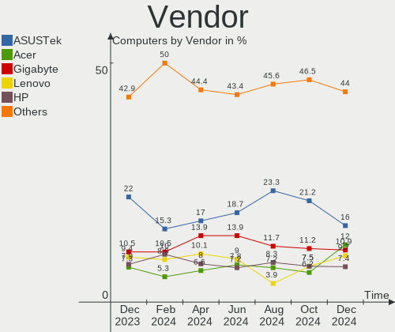
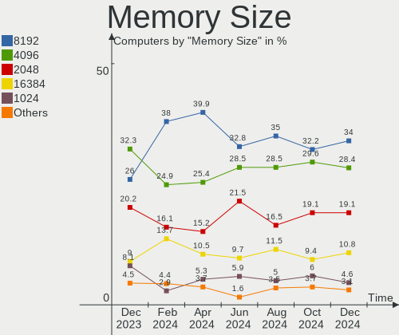

ROSA Hardware Trends
--------------------

A project to identify most popular hardware characteristics and track their change
over time based on data collected by ROSA users at https://Linux-Hardware.org.

Anyone can contribute to the study by uploading probes of their computers by
the [hw-probe](https://github.com/linuxhw/hw-probe) tool:

    sudo -E hw-probe -all -upload

This is a report for all computer types. See also reports for [desktops](/Dist/ROSA/Desktop/README.md) and [notebooks](/Dist/ROSA/Notebook/README.md).

Full-feature report is available here: https://linux-hardware.org/?view=trends

Period: Sep, 2020.

Contents
--------

- [ OS                       ](#os)
- [ OS Family                ](#os-family)
- [ Kernel                   ](#kernel)
- [ Kernel Family            ](#kernel-family)
- [ Kernel Major Ver.        ](#kernel-major-ver)
- [ Arch                     ](#arch)
- [ DE                       ](#de)
- [ Display Server           ](#display-server)
- [ Display Manager          ](#display-manager)
- [ OS Lang                  ](#os-lang)
- [ Boot Mode                ](#boot-mode)
- [ Filesystem               ](#filesystem)
- [ Part. scheme             ](#part-scheme)
- [ Dual Boot with Linux/BSD ](#dual-boot-with-linux/bsd)
- [ Dual Boot (Win)          ](#dual-boot-win)
- [ Country                  ](#country)
- [ City                     ](#city)
- [ Vendor                   ](#vendor)
- [ Model                    ](#model)
- [ Model Family             ](#model-family)
- [ MFG Year                 ](#mfg-year)
- [ Form Factor              ](#form-factor)
- [ Secure Boot              ](#secure-boot)
- [ Coreboot                 ](#coreboot)
- [ RAM Size                 ](#ram-size)
- [ RAM Used                 ](#ram-used)
- [ Has CD-ROM               ](#has-cd-rom)
- [ Total Drives             ](#total-drives)
- [ Has Ethernet             ](#has-ethernet)
- [ Drive Vendor             ](#drive-vendor)
- [ HDD Vendor               ](#hdd-vendor)
- [ SSD Vendor               ](#ssd-vendor)
- [ Drive Model              ](#drive-model)
- [ Drive Kind               ](#drive-kind)
- [ Drive Connector          ](#drive-connector)
- [ Drive Size               ](#drive-size)
- [ Space Total              ](#space-total)
- [ Space Used               ](#space-used)
- [ Malfunc. Drives          ](#malfunc-drives)
- [ Malfunc. Drive Vendor    ](#malfunc-drive-vendor)
- [ Malfunc. HDD Vendor      ](#malfunc-hdd-vendor)
- [ Malfunc. Drive Kind      ](#malfunc-drive-kind)
- [ Failed Drives            ](#failed-drives)
- [ Failed Drive Vendor      ](#failed-drive-vendor)
- [ Drive Status             ](#drive-status)
- [ Storage Vendor           ](#storage-vendor)
- [ Storage Model            ](#storage-model)
- [ Storage Kind             ](#storage-kind)
- [ CPU Vendor               ](#cpu-vendor)
- [ CPU Model                ](#cpu-model)
- [ CPU Model Family         ](#cpu-model-family)
- [ CPU Cores                ](#cpu-cores)
- [ CPU Sockets              ](#cpu-sockets)
- [ CPU Threads              ](#cpu-threads)
- [ CPU Op-Modes             ](#cpu-op-modes)
- [ CPU Microcode            ](#cpu-microcode)
- [ CPU Microarch            ](#cpu-microarch)
- [ GPU Vendor               ](#gpu-vendor)
- [ GPU Model                ](#gpu-model)
- [ GPU Combo                ](#gpu-combo)
- [ GPU Driver               ](#gpu-driver)
- [ GPU Memory               ](#gpu-memory)
- [ Monitor Vendor           ](#monitor-vendor)
- [ Monitor Model            ](#monitor-model)
- [ Monitor Resolution       ](#monitor-resolution)
- [ Monitor Diagonal         ](#monitor-diagonal)
- [ Monitor Width            ](#monitor-width)
- [ Aspect Ratio             ](#aspect-ratio)
- [ Monitor Area             ](#monitor-area)
- [ Pixel Density            ](#pixel-density)
- [ Multiple Monitors        ](#multiple-monitors)
- [ Net Controller Vendor    ](#net-controller-vendor)
- [ Net Controller Model     ](#net-controller-model)
- [ Wireless Vendor          ](#wireless-vendor)
- [ Wireless Model           ](#wireless-model)
- [ Ethernet Vendor          ](#ethernet-vendor)
- [ Ethernet Model           ](#ethernet-model)
- [ Net Controller Kind      ](#net-controller-kind)
- [ Used Controller          ](#used-controller)
- [ NICs                     ](#nics)
- [ Memory Vendor            ](#memory-vendor)
- [ Memory Model             ](#memory-model)
- [ Memory Kind              ](#memory-kind)
- [ Memory Form Factor       ](#memory-form-factor)
- [ Memory Size              ](#memory-size)
- [ Memory Speed             ](#memory-speed)
- [ Sound Vendor             ](#sound-vendor)
- [ Sound Model              ](#sound-model)
- [ Camera Vendor            ](#camera-vendor)
- [ Camera Model             ](#camera-model)
- [ Fingerprint Vendor       ](#fingerprint-vendor)
- [ Fingerprint Model        ](#fingerprint-model)
- [ Chipcard Vendor          ](#chipcard-vendor)
- [ Chipcard Model           ](#chipcard-model)
- [ Printer Vendor           ](#printer-vendor)
- [ Printer Model            ](#printer-model)
- [ Scanner Vendor           ](#scanner-vendor)
- [ Scanner Model            ](#scanner-model)
- [ Bluetooth Vendor         ](#bluetooth-vendor)
- [ Bluetooth Model          ](#bluetooth-model)
- [ Unsupported Devices      ](#unsupported-devices)
- [ Unsupported Device Types ](#unsupported-device-types)

OS
--

Installed operating systems

| Name         | Computers | Percent |
|--------------|-----------|---------|
| ROSA R11.1   | 122       | 58.94%  |
| ROSA R11     | 56        | 27.05%  |
| ROSA R8.1    | 12        | 5.8%    |
| ROSA R10     | 8         | 3.86%   |
| ROSA 2019.05 | 7         | 3.38%   |
| ROSA R12     | 2         | 0.97%   |

OS Family
---------

OS without a version

| Name | Computers | Percent |
|------|-----------|---------|
| ROSA | 207       | 100%    |

Kernel
------

Version of the Linux kernel

| Version                           | Computers | Percent |
|-----------------------------------|-----------|---------|
| 4.15.0-desktop-94.1rosa-x86_64    | 54        | 26.09%  |
| 4.15.0-desktop-45.1rosa-x86_64    | 51        | 24.64%  |
| 5.4.40-generic-1rosa-x86_64       | 18        | 8.7%    |
| 4.9.155-nrj-desktop-1rosa-x86_64  | 12        | 5.8%    |
| 4.15.0-desktop-94.1rosa-i586      | 11        | 5.31%   |
| 5.4.32-generic-2rosa-x86_64       | 10        | 4.83%   |
| 4.9.155-nrj-desktop-1rosa-i586    | 8         | 3.86%   |
| 5.4.60-nickel-2rosa2019.05-x86_64 | 7         | 3.38%   |
| 4.15.0-desktop-45.1rosa-i586      | 7         | 3.38%   |
| 5.4.32-generic-2rosa-i586         | 5         | 2.42%   |
| 4.9.60-nrj-desktop-1rosa-x86_64   | 5         | 2.42%   |
| 5.4.60-generic-1rosa2019.1-x86_64 | 2         | 0.97%   |
| 4.9.60-nrj-desktop-1rosa-i586     | 2         | 0.97%   |
| 4.1.38-nrj-desktop-2rosa-x86_64   | 2         | 0.97%   |
| 4.1.38-nrj-desktop-2rosa-i586     | 2         | 0.97%   |
| 5.8.9-generic-1rosa-x86_64        | 1         | 0.48%   |
| 5.8.1-generic-1rosa-x86_64        | 1         | 0.48%   |
| 5.4.60-nrj-desktop-1rosa-x86_64   | 1         | 0.48%   |
| 5.4.40-generic-1rosa-i586         | 1         | 0.48%   |
| 5.4.35-nrj-desktop-1rosa-x86_64   | 1         | 0.48%   |
| 5.3.18-nrj-desktop-1rosa-x86_64   | 1         | 0.48%   |
| 4.9.9-nrj-desktop-1rosa-i586      | 1         | 0.48%   |
| 4.9.20-nrj-desktop-1rosa-i586     | 1         | 0.48%   |
| 4.9.124-nrj-desktop-1rosa-x86_64  | 1         | 0.48%   |
| 4.16.18-nrj-laptop-1rosa-x86_64   | 1         | 0.48%   |
| 4.15.0-desktop-60.7rosa-x86_64    | 1         | 0.48%   |

Kernel Family
-------------

Linux kernel without a distro release

| Version | Computers | Percent |
|---------|-----------|---------|
| 4.15.0  | 124       | 59.9%   |
| 4.9.155 | 20        | 9.66%   |
| 5.4.40  | 19        | 9.18%   |
| 5.4.32  | 15        | 7.25%   |
| 5.4.60  | 10        | 4.83%   |
| 4.9.60  | 7         | 3.38%   |
| 4.1.38  | 4         | 1.93%   |
| 5.8.9   | 1         | 0.48%   |
| 5.8.1   | 1         | 0.48%   |
| 5.4.35  | 1         | 0.48%   |
| 5.3.18  | 1         | 0.48%   |
| 4.9.9   | 1         | 0.48%   |
| 4.9.20  | 1         | 0.48%   |
| 4.9.124 | 1         | 0.48%   |
| 4.16.18 | 1         | 0.48%   |

Kernel Major Ver.
-----------------

Linux kernel major version

| Version | Computers | Percent |
|---------|-----------|---------|
| 4.15    | 124       | 59.9%   |
| 5.4     | 45        | 21.74%  |
| 4.9     | 30        | 14.49%  |
| 4.1     | 4         | 1.93%   |
| 5.8     | 2         | 0.97%   |
| 5.3     | 1         | 0.48%   |
| 4.16    | 1         | 0.48%   |

Arch
----

OS architecture (x86_64, i586, etc.)

| Name   | Computers | Percent |
|--------|-----------|---------|
| x86_64 | 169       | 81.64%  |
| i686   | 38        | 18.36%  |

DE
--

Desktop Environment

| Name  | Computers | Percent |
|-------|-----------|---------|
| KDE4  | 144       | 69.57%  |
| KDE5  | 50        | 24.15%  |
| LXQt  | 6         | 2.9%    |
| XFCE  | 4         | 1.93%   |
| MATE  | 1         | 0.48%   |
| KDE   | 1         | 0.48%   |
| GNOME | 1         | 0.48%   |

Display Server
--------------

X11 or Wayland

| Name | Computers | Percent |
|------|-----------|---------|
| X11  | 207       | 100%    |

Display Manager
---------------

SDDM, LightDM, etc.

| Name | Computers | Percent |
|------|-----------|---------|
| KDM  | 146       | 70.53%  |
| SDDM | 60        | 28.99%  |
| GDM  | 1         | 0.48%   |

OS Lang
-------

Language

| Lang    | Computers | Percent |
|---------|-----------|---------|
| ru_RU   | 112       | 54.11%  |
| Unknown | 75        | 36.23%  |
| en_US   | 4         | 1.93%   |
| pl_PL   | 3         | 1.45%   |
| de_DE   | 3         | 1.45%   |
| fr_FR   | 2         | 0.97%   |
| es_ES   | 2         | 0.97%   |
| sk_SK   | 1         | 0.48%   |
| pt_PT   | 1         | 0.48%   |
| pt_BR   | 1         | 0.48%   |
| it_IT   | 1         | 0.48%   |
| en_GB   | 1         | 0.48%   |
| bg_BG   | 1         | 0.48%   |

Boot Mode
---------

EFI or BIOS

| Mode | Computers | Percent |
|------|-----------|---------|
| BIOS | 165       | 79.71%  |
| EFI  | 42        | 20.29%  |

Filesystem
----------

Type of filesystem

| Type  | Computers | Percent |
|-------|-----------|---------|
| Ext4  | 198       | 95.65%  |
| Btrfs | 5         | 2.42%   |
| Ext3  | 2         | 0.97%   |
| Xfs   | 1         | 0.48%   |
| Aufs  | 1         | 0.48%   |

Part. scheme
------------

Scheme of partitioning

| Type    | Computers | Percent |
|---------|-----------|---------|
| MBR     | 149       | 71.98%  |
| GPT     | 52        | 25.12%  |
| Unknown | 6         | 2.9%    |

Dual Boot with Linux/BSD
------------------------

Hosting more than one Linux/BSD

| Dual boot | Computers | Percent |
|-----------|-----------|---------|
| No        | 159       | 76.81%  |
| Yes       | 48        | 23.19%  |

Dual Boot (Win)
---------------

Hosting Linux and Windows

| Dual boot | Computers | Percent |
|-----------|-----------|---------|
| No        | 109       | 52.66%  |
| Yes       | 98        | 47.34%  |

Country
-------

Geographic location (country)

| Country      | Computers | Percent |
|--------------|-----------|---------|
| Russia       | 147       | 71.01%  |
| Ukraine      | 16        | 7.73%   |
| France       | 6         | 2.9%    |
| Poland       | 5         | 2.42%   |
| Germany      | 5         | 2.42%   |
| Kazakhstan   | 3         | 1.45%   |
| Belarus      | 3         | 1.45%   |
| USA          | 2         | 0.97%   |
| Portugal     | 2         | 0.97%   |
| Italy        | 2         | 0.97%   |
| Canada       | 2         | 0.97%   |
| Bulgaria     | 2         | 0.97%   |
| Uzbekistan   | 1         | 0.48%   |
| South Africa | 1         | 0.48%   |
| Slovakia     | 1         | 0.48%   |
| Moldova      | 1         | 0.48%   |
| Mexico       | 1         | 0.48%   |
| Kenya        | 1         | 0.48%   |
| India        | 1         | 0.48%   |
| Denmark      | 1         | 0.48%   |
| Czechia      | 1         | 0.48%   |
| Colombia     | 1         | 0.48%   |
| China        | 1         | 0.48%   |
| Brazil       | 1         | 0.48%   |

City
----

Geographic location (city)

| City             | Computers | Percent |
|------------------|-----------|---------|
| Moscow           | 23        | 11.11%  |
| St Petersburg    | 10        | 4.83%   |
| Novosibirsk      | 8         | 3.86%   |
| Kazan’         | 7         | 3.38%   |
| Rostov-on-Don    | 6         | 2.9%    |
| Irkutsk          | 6         | 2.9%    |
| Samara           | 5         | 2.42%   |
| Rebais           | 4         | 1.93%   |
| Nizhniy Novgorod | 4         | 1.93%   |
| Volgograd        | 3         | 1.45%   |
| Vladivostok      | 3         | 1.45%   |
| Perm             | 3         | 1.45%   |
| Omsk             | 3         | 1.45%   |
| Krasnoyarsk      | 3         | 1.45%   |
| Kharkiv          | 3         | 1.45%   |
| Ekaterinburg     | 3         | 1.45%   |
| Dzerzhinsk       | 3         | 1.45%   |
| Astrakhan        | 3         | 1.45%   |
| Seversk          | 2         | 0.97%   |
| Saratov          | 2         | 0.97%   |
| Orenburg         | 2         | 0.97%   |
| Leipzig          | 2         | 0.97%   |
| Krasnodar        | 2         | 0.97%   |
| Kingisepp        | 2         | 0.97%   |
| Kemerovo         | 2         | 0.97%   |
| Arkhangelsk      | 2         | 0.97%   |
| Zernograd        | 1         | 0.48%   |
| Yaransk          | 1         | 0.48%   |
| Yakutsk          | 1         | 0.48%   |
| Voronezh         | 1         | 0.48%   |
| Vitebsk          | 1         | 0.48%   |
| Versailles       | 1         | 0.48%   |
| Velikiye Luki    | 1         | 0.48%   |
| Varna            | 1         | 0.48%   |
| Ufa              | 1         | 0.48%   |
| Tver             | 1         | 0.48%   |
| Tula             | 1         | 0.48%   |
| Tuapse           | 1         | 0.48%   |
| Tashkent         | 1         | 0.48%   |
| Tambov           | 1         | 0.48%   |
| Taganrog         | 1         | 0.48%   |
| Swidnica         | 1         | 0.48%   |
| Sumy             | 1         | 0.48%   |
| Stuttgart        | 1         | 0.48%   |
| Stavropol        | 1         | 0.48%   |
| Stamboliyski     | 1         | 0.48%   |
| Smolensk         | 1         | 0.48%   |
| Simferopol       | 1         | 0.48%   |
| Shuya            | 1         | 0.48%   |
| Shenyang         | 1         | 0.48%   |
| Saransk          | 1         | 0.48%   |
| Rubtsovsk        | 1         | 0.48%   |
| Prague           | 1         | 0.48%   |
| Poltava          | 1         | 0.48%   |
| Polonne          | 1         | 0.48%   |
| Pohranice        | 1         | 0.48%   |
| Podporozh'ye     | 1         | 0.48%   |
| Petropavl        | 1         | 0.48%   |
| Oryol            | 1         | 0.48%   |
| Oral             | 1         | 0.48%   |

Vendor
------

Motherboard manufacturer

| Name                                         | Computers | Percent |
|----------------------------------------------|-----------|---------|
| ASUSTek Computer                             | 55        | 26.57%  |
| Gigabyte Technology                          | 32        | 15.46%  |
| Acer                                         | 23        | 11.11%  |
| MSI                                          | 19        | 9.18%   |
| Lenovo                                       | 17        | 8.21%   |
| Dell                                         | 10        | 4.83%   |
| Hewlett-Packard                              | 9         | 4.35%   |
| Samsung Electronics                          | 7         | 3.38%   |
| ASRock                                       | 7         | 3.38%   |
| Sony                                         | 5         | 2.42%   |
| Toshiba                                      | 2         | 0.97%   |
| Packard Bell                                 | 2         | 0.97%   |
| Biostar                                      | 2         | 0.97%   |
| Unknown                                      | 2         | 0.97%   |
| WinFast                                      | 1         | 0.48%   |
| SiS Technology                               | 1         | 0.48%   |
| Shuttle                                      | 1         | 0.48%   |
| Pegatron                                     | 1         | 0.48%   |
| Olidata                                      | 1         | 0.48%   |
| Intel                                        | 1         | 0.48%   |
| Huanan                                       | 1         | 0.48%   |
| Fujitsu Siemens                              | 1         | 0.48%   |
| Foxconn                                      | 1         | 0.48%   |
| eMachines                                    | 1         | 0.48%   |
| ECS                                          | 1         | 0.48%   |
| DEPO Computers                               | 1         | 0.48%   |
| Clevo                                        | 1         | 0.48%   |
| CHUWI.Innovation.And.Technology(ShenZhen)co. | 1         | 0.48%   |
| Alienware                                    | 1         | 0.48%   |

Model
-----

Motherboard model

| Name                                                   | Computers | Percent |
|--------------------------------------------------------|-----------|---------|
| ASUS PRIME H310M-R R2.0                                | 3         | 1.45%   |
| MSI MS-7817                                            | 2         | 0.97%   |
| MSI MS-7808                                            | 2         | 0.97%   |
| MSI MS-7592                                            | 2         | 0.97%   |
| Gigabyte H77-DS3H                                      | 2         | 0.97%   |
| Gigabyte GA-78LMT-USB3 R2                              | 2         | 0.97%   |
| Dell Inspiron N5040                                    | 2         | 0.97%   |
| ASUS M5A78L-M LX3                                      | 2         | 0.97%   |
| ASUS M5A78L-M LE                                       | 2         | 0.97%   |
| ASUS All Series                                        | 2         | 0.97%   |
| ASUS A68HM-K                                           | 2         | 0.97%   |
| Acer Aspire 5742G                                      | 2         | 0.97%   |
| Unknown                                                | 2         | 0.97%   |
| WinFast NF4K8MC                                        | 1         | 0.48%   |
| Toshiba Satellite P300                                 | 1         | 0.48%   |
| Toshiba NB550D                                         | 1         | 0.48%   |
| Sony VPCL22S1R                                         | 1         | 0.48%   |
| Sony VPCEH1L1R                                         | 1         | 0.48%   |
| Sony VGN-FZ11ZR                                        | 1         | 0.48%   |
| Sony VGN-CR41SR_L                                      | 1         | 0.48%   |
| Sony SVE1412E1RW                                       | 1         | 0.48%   |
| SiS Technology SiS-648FX                               | 1         | 0.48%   |
| Shuttle XS35                                           | 1         | 0.48%   |
| Samsung Electronics RC410/RC510/RC710                  | 1         | 0.48%   |
| Samsung Electronics R540/SA41/E452                     | 1         | 0.48%   |
| Samsung Electronics R528/R728                          | 1         | 0.48%   |
| Samsung Electronics R408P                              | 1         | 0.48%   |
| Samsung Electronics 355V4C/356V4C/3445VC/3545VC        | 1         | 0.48%   |
| Samsung Electronics 350V5C/351V5C/3540VC/3440VC        | 1         | 0.48%   |
| Samsung Electronics 300E4A/300E5A/300E7A/3430EA/3530EA | 1         | 0.48%   |
| Pegatron BQ470AA-ABL CQ5521F                           | 1         | 0.48%   |
| Packard Bell IMEDIA D9378 AIO                          | 1         | 0.48%   |
| Packard Bell EasyNote TE69KB                           | 1         | 0.48%   |
| Olidata Olidata T7700                                  | 1         | 0.48%   |
| MSI Pentino G-Series MT                                | 1         | 0.48%   |
| MSI MS-7B38                                            | 1         | 0.48%   |
| MSI MS-7A38                                            | 1         | 0.48%   |
| MSI MS-7996                                            | 1         | 0.48%   |
| MSI MS-7895                                            | 1         | 0.48%   |
| MSI MS-7885                                            | 1         | 0.48%   |
| MSI MS-7758                                            | 1         | 0.48%   |
| MSI MS-7641                                            | 1         | 0.48%   |
| MSI MS-7309                                            | 1         | 0.48%   |
| MSI MS-1037                                            | 1         | 0.48%   |
| MSI GP60 2OD                                           | 1         | 0.48%   |
| MSI GF65 Thin 9SD                                      | 1         | 0.48%   |
| MSI Compaq dx7400 Microtower                           | 1         | 0.48%   |
| Lenovo V580c 20160                                     | 1         | 0.48%   |
| Lenovo V330-15IKB 81AX                                 | 1         | 0.48%   |
| Lenovo ThinkStation P330 30C5S17L00                    | 1         | 0.48%   |
| Lenovo ThinkStation C20 4263BA7                        | 1         | 0.48%   |
| Lenovo ThinkPad X61s 7667A95                           | 1         | 0.48%   |
| Lenovo ThinkPad T60 2007WEH                            | 1         | 0.48%   |
| Lenovo ThinkCentre M81 5032W3M                         | 1         | 0.48%   |
| Lenovo IdeaPad 320-15IAP 80XR                          | 1         | 0.48%   |
| Lenovo IdeaPad 300-15ISK 80Q7                          | 1         | 0.48%   |
| Lenovo IdeaPad 300-15IBR 80M3                          | 1         | 0.48%   |
| Lenovo IdeaPad 120S-11IAP 81A4                         | 1         | 0.48%   |
| Lenovo IdeaPad 110-15ACL 80TJ                          | 1         | 0.48%   |
| Lenovo IdeaCentre AIO 510-22ISH F0CB00FBRK             | 1         | 0.48%   |

Model Family
------------

Motherboard model prefix

| Name                       | Computers | Percent |
|----------------------------|-----------|---------|
| Acer Aspire                | 17        | 8.21%   |
| Dell Inspiron              | 6         | 2.9%    |
| Lenovo IdeaPad             | 5         | 2.42%   |
| ASUS M5A78L-M              | 5         | 2.42%   |
| ASUS PRIME                 | 4         | 1.93%   |
| HP Compaq                  | 3         | 1.45%   |
| MSI MS-7817                | 2         | 0.97%   |
| MSI MS-7808                | 2         | 0.97%   |
| MSI MS-7592                | 2         | 0.97%   |
| Lenovo ThinkStation        | 2         | 0.97%   |
| Lenovo ThinkPad            | 2         | 0.97%   |
| HP Pavilion                | 2         | 0.97%   |
| HP Laptop                  | 2         | 0.97%   |
| Gigabyte H77-DS3H          | 2         | 0.97%   |
| Gigabyte GA-78LMT-USB3     | 2         | 0.97%   |
| Gigabyte B450              | 2         | 0.97%   |
| Dell Latitude              | 2         | 0.97%   |
| ASUS P5G41T-M              | 2         | 0.97%   |
| ASUS All                   | 2         | 0.97%   |
| ASUS A68HM-K               | 2         | 0.97%   |
| Unknown                    | 2         | 0.97%   |
| WinFast NF4K8MC            | 1         | 0.48%   |
| Toshiba Satellite          | 1         | 0.48%   |
| Toshiba NB550D             | 1         | 0.48%   |
| Sony VPCL22S1R             | 1         | 0.48%   |
| Sony VPCEH1L1R             | 1         | 0.48%   |
| Sony VGN-FZ11ZR            | 1         | 0.48%   |
| Sony VGN-CR41SR            | 1         | 0.48%   |
| Sony SVE1412E1RW           | 1         | 0.48%   |
| SiS Technology SiS-648FX   | 1         | 0.48%   |
| Shuttle XS35               | 1         | 0.48%   |
| Samsung Electronics RC410  | 1         | 0.48%   |
| Samsung Electronics R540   | 1         | 0.48%   |
| Samsung Electronics R528   | 1         | 0.48%   |
| Samsung Electronics R408P  | 1         | 0.48%   |
| Samsung Electronics 355V4C | 1         | 0.48%   |
| Samsung Electronics 350V5C | 1         | 0.48%   |
| Samsung Electronics 300E4A | 1         | 0.48%   |
| Pegatron BQ470AA-ABL       | 1         | 0.48%   |
| Packard Bell IMEDIA        | 1         | 0.48%   |
| Packard Bell EasyNote      | 1         | 0.48%   |
| Olidata Olidata            | 1         | 0.48%   |
| MSI Pentino                | 1         | 0.48%   |
| MSI MS-7B38                | 1         | 0.48%   |
| MSI MS-7A38                | 1         | 0.48%   |
| MSI MS-7996                | 1         | 0.48%   |
| MSI MS-7895                | 1         | 0.48%   |
| MSI MS-7885                | 1         | 0.48%   |
| MSI MS-7758                | 1         | 0.48%   |
| MSI MS-7641                | 1         | 0.48%   |
| MSI MS-7309                | 1         | 0.48%   |
| MSI MS-1037                | 1         | 0.48%   |
| MSI GP60                   | 1         | 0.48%   |
| MSI GF65                   | 1         | 0.48%   |
| MSI Compaq                 | 1         | 0.48%   |
| Lenovo V580c               | 1         | 0.48%   |
| Lenovo V330-15IKB          | 1         | 0.48%   |
| Lenovo ThinkCentre         | 1         | 0.48%   |
| Lenovo IdeaCentre          | 1         | 0.48%   |
| Lenovo G510                | 1         | 0.48%   |

MFG Year
--------

Motherboard manufacture year

| Year    | Computers | Percent |
|---------|-----------|---------|
| 2013    | 27        | 13.04%  |
| 2012    | 26        | 12.56%  |
| 2011    | 21        | 10.14%  |
| 2010    | 19        | 9.18%   |
| 2019    | 15        | 7.25%   |
| 2009    | 14        | 6.76%   |
| 2016    | 13        | 6.28%   |
| 2015    | 13        | 6.28%   |
| 2008    | 13        | 6.28%   |
| 2007    | 11        | 5.31%   |
| 2018    | 10        | 4.83%   |
| 2020    | 8         | 3.86%   |
| 2014    | 7         | 3.38%   |
| 2017    | 3         | 1.45%   |
| 2005    | 3         | 1.45%   |
| 2006    | 1         | 0.48%   |
| 2004    | 1         | 0.48%   |
| 2003    | 1         | 0.48%   |
| Unknown | 1         | 0.48%   |

Form Factor
-----------

Physical design of the computer

| Name       | Computers | Percent |
|------------|-----------|---------|
| Desktop    | 118       | 57%     |
| Notebook   | 85        | 41.06%  |
| All in one | 3         | 1.45%   |
| Tablet     | 1         | 0.48%   |

Secure Boot
-----------

Enabled or disabled

| State    | Computers | Percent |
|----------|-----------|---------|
| Disabled | 207       | 100%    |

Coreboot
--------

Have coreboot on board

| Used | Computers | Percent |
|------|-----------|---------|
| No   | 207       | 100%    |

RAM Size
--------

Total RAM memory

| Size in GB | Computers | Percent |
|------------|-----------|---------|
| 3.01-4.0   | 57        | 27.54%  |
| 8.01-16.0  | 45        | 21.74%  |
| 1.01-2.0   | 34        | 16.43%  |
| 4.01-8.0   | 30        | 14.49%  |
| 16.01-24.0 | 22        | 10.63%  |
| 2.01-3.0   | 12        | 5.8%    |
| 0.01-1.0   | 4         | 1.93%   |
| 24.01-32.0 | 2         | 0.97%   |
| 32.01-64.0 | 1         | 0.48%   |

RAM Used
--------

Used RAM memory

| Used GB  | Computers | Percent |
|----------|-----------|---------|
| 1.01-2.0 | 96        | 46.38%  |
| 0.01-1.0 | 89        | 43%     |
| 2.01-3.0 | 13        | 6.28%   |
| 3.01-4.0 | 6         | 2.9%    |
| 4.01-8.0 | 3         | 1.45%   |

Has CD-ROM
----------

Has CD-ROM on board

| Presented | Computers | Percent |
|-----------|-----------|---------|
| Yes       | 128       | 61.84%  |
| No        | 79        | 38.16%  |

Total Drives
------------

Number of drives on board

| Drives  | Computers | Percent |
|---------|-----------|---------|
| 1       | 129       | 62.32%  |
| 2       | 48        | 23.19%  |
| 3       | 15        | 7.25%   |
| 0       | 8         | 3.86%   |
| 4       | 4         | 1.93%   |
| 6       | 1         | 0.48%   |
| 5       | 1         | 0.48%   |
| Unknown | 1         | 0.48%   |

Has Ethernet
------------

Has Ethernet on board

| Presented | Computers | Percent |
|-----------|-----------|---------|
| Yes       | 200       | 96.62%  |
| No        | 7         | 3.38%   |

Drive Vendor
------------

Hard drive vendors

| Vendor              | Computers | Drives  | Percent |
|---------------------|-----------|---------|---------|
| WDC                 | 68        | 82      | 24.55%  |
| Seagate             | 65        | 70      | 23.47%  |
| Hitachi             | 21        | 21      | 7.58%   |
| Toshiba             | 20        | 20      | 7.22%   |
| Kingston            | 18        | 20      | 6.5%    |
| Samsung Electronics | 17        | 18      | 6.14%   |
| China               | 6         | 7       | 2.17%   |
| Unknown             | 5         | 5       | 1.81%   |
| Intel               | 5         | 5       | 1.81%   |
| Patriot             | 4         | 4       | 1.44%   |
| HGST                | 4         | 4       | 1.44%   |
| SPCC                | 3         | 3       | 1.08%   |
| Smartbuy            | 3         | 3       | 1.08%   |
| Maxtor              | 3         | 3       | 1.08%   |
| Crucial             | 3         | 3       | 1.08%   |
| A-DATA Technology   | 3         | 3       | 1.08%   |
| SanDisk             | 2         | 2       | 0.72%   |
| Netac               | 2         | 2       | 0.72%   |
| HUAWEI              | 2         | Unknown | 0.72%   |
| HL-DT-ST            | 2         | Unknown | 0.72%   |
| GOODRAM             | 2         | 2       | 0.72%   |
| Fujitsu             | 2         | 2       | 0.72%   |
| e2e4                | 2         | 2       | 0.72%   |
| Zheino              | 1         | 1       | 0.36%   |
| XPG                 | 1         | 1       | 0.36%   |
| Team                | 1         | 1       | 0.36%   |
| SK Hynix            | 1         | 1       | 0.36%   |
| PLEXTOR             | 1         | 1       | 0.36%   |
| OCZ                 | 1         | 1       | 0.36%   |
| LITEONIT            | 1         | 1       | 0.36%   |
| KingFast            | 1         | 1       | 0.36%   |
| Intenso             | 1         | 1       | 0.36%   |
| Hikvision           | 1         | 1       | 0.36%   |
| Gigabyte Technology | 1         | 1       | 0.36%   |
| FOXLINE             | 1         | 1       | 0.36%   |
| DeTech              | 1         | 1       | 0.36%   |
| Corsair             | 1         | 1       | 0.36%   |
| Apacer              | 1         | 1       | 0.36%   |

HDD Vendor
----------

Hard disk drive vendors

| Vendor              | Computers | Drives | Percent |
|---------------------|-----------|--------|---------|
| Seagate             | 65        | 70     | 35.52%  |
| WDC                 | 62        | 73     | 33.88%  |
| Hitachi             | 21        | 21     | 11.48%  |
| Toshiba             | 20        | 20     | 10.93%  |
| Samsung Electronics | 6         | 6      | 3.28%   |
| HGST                | 4         | 4      | 2.19%   |
| MAXTOR              | 3         | 3      | 1.64%   |
| Fujitsu             | 2         | 2      | 1.09%   |

SSD Vendor
----------

Solid state drive vendors

| Vendor              | Computers | Drives | Percent |
|---------------------|-----------|--------|---------|
| Kingston            | 17        | 19     | 21.25%  |
| WDC                 | 9         | 9      | 11.25%  |
| Samsung Electronics | 7         | 8      | 8.75%   |
| China               | 6         | 7      | 7.5%    |
| Intel               | 5         | 5      | 6.25%   |
| Patriot             | 4         | 4      | 5%      |
| SPCC                | 3         | 3      | 3.75%   |
| Smartbuy            | 3         | 3      | 3.75%   |
| Crucial             | 3         | 3      | 3.75%   |
| SanDisk             | 2         | 2      | 2.5%    |
| Netac               | 2         | 2      | 2.5%    |
| GOODRAM             | 2         | 2      | 2.5%    |
| e2e4                | 2         | 2      | 2.5%    |
| A-DATA Technology   | 2         | 2      | 2.5%    |
| Zheino              | 1         | 1      | 1.25%   |
| Team                | 1         | 1      | 1.25%   |
| SK Hynix            | 1         | 1      | 1.25%   |
| PLEXTOR             | 1         | 1      | 1.25%   |
| OCZ                 | 1         | 1      | 1.25%   |
| LITEONIT            | 1         | 1      | 1.25%   |
| KingFast            | 1         | 1      | 1.25%   |
| Intenso             | 1         | 1      | 1.25%   |
| Gigabyte Technology | 1         | 1      | 1.25%   |
| FOXLINE             | 1         | 1      | 1.25%   |
| DeTech              | 1         | 1      | 1.25%   |
| Corsair             | 1         | 1      | 1.25%   |
| Apacer              | 1         | 1      | 1.25%   |

Drive Model
-----------

Hard drive models

| Model                        | Computers | Percent |
|------------------------------|-----------|---------|
| SA400S37120G 120GB SSD       | 8         | 2.68%   |
| HDWD110 1TB                  | 6         | 2.01%   |
| ST500LT012-9WS142 500GB      | 5         | 1.68%   |
| SSD 120GB                    | 5         | 1.68%   |
| WDS240G2G0A-00JH30 240GB SSD | 4         | 1.34%   |
| ST500LT012-1DG142 500GB      | 4         | 1.34%   |
| WDS120G2G0A-00JH30 120GB SSD | 3         | 1.01%   |
| WD10EZEX-22MFCA0 1TB         | 3         | 1.01%   |
| WD10EZEX-08WN4A0 1TB         | 3         | 1.01%   |
| ST500DM002-1BD142 500GB      | 3         | 1.01%   |
| SSD 860 EVO 500GB            | 3         | 1.01%   |
| SSD 256GB                    | 3         | 1.01%   |
| MQ01ABD075 752GB             | 3         | 1.01%   |
| HDS721050CLA362 500GB        | 3         | 1.01%   |
| WD5000LPCX-24VHAT0 500GB     | 2         | 0.67%   |
| WD5000AAKX-001CA0 500GB      | 2         | 0.67%   |
| WD3200BPVT-22ZEST0 320GB     | 2         | 0.67%   |
| WD3200AAJS-00L7A0 320GB      | 2         | 0.67%   |
| WD20EARS-00MVWB0 2TB         | 2         | 0.67%   |
| WD10JPVX-22JC3T0 1TB         | 2         | 0.67%   |
| WD10JPLX-00MBPT0 1TB         | 2         | 0.67%   |
| WD10EARX-00N0YB0 1TB         | 2         | 0.67%   |
| WD10EARS-00Y5B1 1TB          | 2         | 0.67%   |
| ST9500420AS 500GB            | 2         | 0.67%   |
| ST9320325AS 320GB            | 2         | 0.67%   |
| ST380011A 80GB               | 2         | 0.67%   |
| ST3500418AS 500GB            | 2         | 0.67%   |
| ST3500413AS 500GB            | 2         | 0.67%   |
| ST3250410AS 250GB            | 2         | 0.67%   |
| ST3250310AS 250GB            | 2         | 0.67%   |
| ST320LM010-1KJ15C 320GB      | 2         | 0.67%   |
| ST3160815AS 160GB            | 2         | 0.67%   |
| ST2000DM001-1ER164 2TB       | 2         | 0.67%   |
| ST1000LM024 HN-M101MBB 1TB   | 2         | 0.67%   |
| SSD 970 EVO Plus 500GB       | 2         | 0.67%   |
| SSD 60GB                     | 2         | 0.67%   |
| SSD 128GB                    | 2         | 0.67%   |
| SHFS37A120G 120GB SSD        | 2         | 0.67%   |
| SD Storage 16GB              | 2         | 0.67%   |
| SA400S37240G 240GB SSD       | 2         | 0.67%   |
| MZVLB256HAHQ-000L7 256GB     | 2         | 0.67%   |
| MK2555GSX 250GB              | 2         | 0.67%   |
| HTS725050A7E630 500GB        | 2         | 0.67%   |
| HTS545050A7E680 500GB        | 2         | 0.67%   |
| HDS721010CLA330 1TB          | 2         | 0.67%   |
| HD501LJ 500GB                | 2         | 0.67%   |
| DVDRAM GUC0N 1GB             | 2         | 0.67%   |
| DT01ACA100 1TB               | 2         | 0.67%   |
| CT120BX500SSD1 120GB         | 2         | 0.67%   |
| WDS480G2G0A-00JH30 480GB SSD | 1         | 0.34%   |
| WDS250G1B0A-00H9H0 250GB SSD | 1         | 0.34%   |
| WD800BB-55JKC0 80GB          | 1         | 0.34%   |
| WD7501AALS-00J7B1 752GB      | 1         | 0.34%   |
| WD7500BPVX-22JC3T0 752GB     | 1         | 0.34%   |
| WD7500BPVT-22HXZT1 752GB     | 1         | 0.34%   |
| WD7500BPKX-75HPJT0 752GB     | 1         | 0.34%   |
| WD6402AAEX-00Y9A0 640GB      | 1         | 0.34%   |
| WD6400AAKS-65Z7B0 640GB      | 1         | 0.34%   |
| WD6400AADS-00M2B0 640GB      | 1         | 0.34%   |
| WD5000LPVX-22V0TT0 500GB     | 1         | 0.34%   |

Drive Kind
----------

HDD or SSD

| Kind    | Computers | Drives  | Percent |
|---------|-----------|---------|---------|
| HDD     | 160       | 199     | 64.78%  |
| SSD     | 71        | 84      | 28.74%  |
| NVMe    | 7         | 8       | 2.83%   |
| MMC     | 5         | 5       | 2.02%   |
| Unknown | 4         | Unknown | 1.62%   |

Drive Connector
---------------

SATA, SAS, NVMe, etc.

| Type | Computers | Drives | Percent |
|------|-----------|--------|---------|
| SATA | 196       | 282    | 92.02%  |
| NVMe | 7         | 8      | 3.29%   |
| SAS  | 5         | 1      | 2.35%   |
| MMC  | 5         | 5      | 2.35%   |

Drive Size
----------

Size of hard drive

| Size in TB | Computers | Drives | Percent |
|------------|-----------|--------|---------|
| 0.01-0.5   | 172       | 222    | 71.67%  |
| 0.51-1.0   | 60        | 64     | 25%     |
| 1.01-2.0   | 7         | 9      | 2.92%   |
| 2.01-3.0   | 1         | 1      | 0.42%   |

Space Total
-----------

Amount of disk space available on the file system

| Size in GB     | Computers | Percent |
|----------------|-----------|---------|
| 101-250        | 66        | 31.88%  |
| 251-500        | 46        | 22.22%  |
| 1-20           | 34        | 16.43%  |
| 501-1000       | 21        | 10.14%  |
| 51-100         | 15        | 7.25%   |
| 21-50          | 11        | 5.31%   |
| 1001-2000      | 11        | 5.31%   |
| 2001-3000      | 2         | 0.97%   |
| More than 3000 | 1         | 0.48%   |

Space Used
----------

Amount of used disk space

| Used GB        | Computers | Percent |
|----------------|-----------|---------|
| 1-20           | 148       | 71.5%   |
| 21-50          | 25        | 12.08%  |
| 101-250        | 11        | 5.31%   |
| 51-100         | 8         | 3.86%   |
| 501-1000       | 7         | 3.38%   |
| 251-500        | 6         | 2.9%    |
| More than 3000 | 1         | 0.48%   |
| 1001-2000      | 1         | 0.48%   |

Malfunc. Drives
---------------

Drive models with a malfunction

| Model                      | Computers | Drives | Percent |
|----------------------------|-----------|--------|---------|
| ST500LT012-9WS142 500GB    | 5         | 5      | 5.62%   |
| WD3200BPVT-22ZEST0 320GB   | 2         | 2      | 2.25%   |
| WD3200AAJS-00L7A0 320GB    | 2         | 2      | 2.25%   |
| ST9500420AS 500GB          | 2         | 2      | 2.25%   |
| ST500LT012-1DG142 500GB    | 2         | 2      | 2.25%   |
| ST500DM002-1BD142 500GB    | 2         | 2      | 2.25%   |
| ST3250410AS 250GB          | 2         | 2      | 2.25%   |
| ST3250310AS 250GB          | 2         | 2      | 2.25%   |
| ST1000LM024 HN-M101MBB 1TB | 2         | 2      | 2.25%   |
| HD501LJ 500GB              | 2         | 2      | 2.25%   |
| WD6400AAKS-65Z7B0 640GB    | 1         | 1      | 1.12%   |
| WD6400AADS-00M2B0 640GB    | 1         | 1      | 1.12%   |
| WD5000LPVX-22V0TT0 500GB   | 1         | 1      | 1.12%   |
| WD5000BPVT-24HXZT3 500GB   | 1         | 1      | 1.12%   |
| WD5000AAKX-001CA0 500GB    | 1         | 1      | 1.12%   |
| WD5000AADS-00S9B0 500GB    | 1         | 1      | 1.12%   |
| WD3200AAKS-00B3A0 320GB    | 1         | 1      | 1.12%   |
| WD2500BEVS-00UST0 250GB    | 1         | 1      | 1.12%   |
| WD2500AAKX-08U6AA0 250GB   | 1         | 1      | 1.12%   |
| WD20EARS-00MVWB0 2TB       | 1         | 1      | 1.12%   |
| WD2000JD-00HBB0 200GB      | 1         | 1      | 1.12%   |
| WD1600JS-08NCB1 160GB      | 1         | 1      | 1.12%   |
| WD15EADS-22P8B0 1TB        | 1         | 1      | 1.12%   |
| WD10JPVX-22JC3T0 1TB       | 1         | 1      | 1.12%   |
| WD10EZEX-21WN4A0 1TB       | 1         | 1      | 1.12%   |
| WD10EARS-00Y5B1 1TB        | 1         | 1      | 1.12%   |
| STM3500418AS 500GB         | 1         | 1      | 1.12%   |
| STM3160813AS 160GB         | 1         | 1      | 1.12%   |
| ST9500325AS 500GB          | 1         | 1      | 1.12%   |
| ST9320328CS 320GB          | 1         | 1      | 1.12%   |
| ST9320325AS 320GB          | 1         | 1      | 1.12%   |
| ST9250410AS 250GB          | 1         | 1      | 1.12%   |
| ST9250315AS 250GB          | 1         | 1      | 1.12%   |
| ST9120817AS 120GB          | 1         | 1      | 1.12%   |
| ST3750525AS 752GB          | 1         | 1      | 1.12%   |
| ST3500830AS 500GB          | 1         | 1      | 1.12%   |
| ST3500418AS 500GB          | 1         | 1      | 1.12%   |
| ST3500320NS 500GB          | 1         | 1      | 1.12%   |
| ST3320418AS 320GB          | 1         | 1      | 1.12%   |
| ST320LT020-9YG142 320GB    | 1         | 1      | 1.12%   |
| ST320LM010-1KJ15C 320GB    | 1         | 1      | 1.12%   |
| ST3160815AS 160GB          | 1         | 1      | 1.12%   |
| ST3160023AS 160GB          | 1         | 1      | 1.12%   |
| ST3120026A 120GB           | 1         | 1      | 1.12%   |
| ST31000528AS 1TB           | 1         | 1      | 1.12%   |
| ST250DM000-1BD141 250GB    | 1         | 1      | 1.12%   |
| ST1500DL003-9VT16L 1TB     | 1         | 1      | 1.12%   |
| SSD110 120GB               | 1         | 1      | 1.12%   |
| Solid State Disk 120GB     | 1         | 1      | 1.12%   |
| SHFS37A120G 120GB SSD      | 1         | 1      | 1.12%   |
| SA400S37120G 120GB SSD     | 1         | 1      | 1.12%   |
| MQ01ABD100 1TB             | 1         | 1      | 1.12%   |
| MQ01ABD075 752GB           | 1         | 1      | 1.12%   |
| MQ01ABD050 500GB           | 1         | 1      | 1.12%   |
| MK3265GSXN 320GB           | 1         | 1      | 1.12%   |
| MK2559GSXP 250GB           | 1         | 1      | 1.12%   |
| MK2555GSX 250GB            | 1         | 1      | 1.12%   |
| MK2552GSX 250GB            | 1         | 1      | 1.12%   |
| MJA2160BH G2 160GB         | 1         | 1      | 1.12%   |
| MHV2200BT 200GB            | 1         | 1      | 1.12%   |

Malfunc. Drive Vendor
---------------------

Vendors of faulty drives

| Vendor              | Computers | Drives | Percent |
|---------------------|-----------|--------|---------|
| Seagate             | 36        | 37     | 41.86%  |
| WDC                 | 18        | 20     | 20.93%  |
| Hitachi             | 8         | 8      | 9.3%    |
| Toshiba             | 7         | 7      | 8.14%   |
| Samsung Electronics | 5         | 5      | 5.81%   |
| SPCC                | 2         | 2      | 2.33%   |
| Maxtor              | 2         | 2      | 2.33%   |
| Kingston            | 2         | 2      | 2.33%   |
| Fujitsu             | 2         | 2      | 2.33%   |
| LITEONIT            | 1         | 1      | 1.16%   |
| HGST                | 1         | 1      | 1.16%   |
| Corsair             | 1         | 1      | 1.16%   |
| Apacer              | 1         | 1      | 1.16%   |

Malfunc. HDD Vendor
-------------------

Vendors of faulty HDD drives

| Vendor              | Computers | Drives | Percent |
|---------------------|-----------|--------|---------|
| Seagate             | 36        | 37     | 45.57%  |
| WDC                 | 18        | 20     | 22.78%  |
| Hitachi             | 8         | 8      | 10.13%  |
| Toshiba             | 7         | 7      | 8.86%   |
| Samsung Electronics | 5         | 5      | 6.33%   |
| Maxtor              | 2         | 2      | 2.53%   |
| Fujitsu             | 2         | 2      | 2.53%   |
| HGST                | 1         | 1      | 1.27%   |

Malfunc. Drive Kind
-------------------

Kinds of faulty drives

| Kind | Computers | Drives | Percent |
|------|-----------|--------|---------|
| HDD  | 75        | 82     | 91.46%  |
| SSD  | 7         | 7      | 8.54%   |

Failed Drives
-------------

Failed drive models

| Model                    | Computers | Drives | Percent |
|--------------------------|-----------|--------|---------|
| WD800BB-55JKC0 80GB      | 1         | 1      | 25%     |
| WD7500BPVT-22HXZT1 752GB | 1         | 1      | 25%     |
| WD1600AAJS-75M0A0 160GB  | 1         | 1      | 25%     |
| WD10JPVX-22JC3T0 1TB     | 1         | 1      | 25%     |

Failed Drive Vendor
-------------------

Failed drive vendors

| Vendor | Computers | Drives | Percent |
|--------|-----------|--------|---------|
| WDC    | 4         | 4      | 100%    |

Drive Status
------------

Number of failed and malfunc. drives

| Status   | Computers | Drives | Percent |
|----------|-----------|--------|---------|
| Works    | 135       | 194    | 57.69%  |
| Malfunc  | 82        | 89     | 35.04%  |
| Detected | 13        | 9      | 5.56%   |
| Failed   | 4         | 4      | 1.71%   |

Storage Vendor
--------------

Storage controller vendors

| Vendor                           | Computers | Percent |
|----------------------------------|-----------|---------|
| Intel                            | 140       | 62.22%  |
| AMD                              | 53        | 23.56%  |
| Nvidia                           | 9         | 4%      |
| JMicron Technology               | 9         | 4%      |
| Samsung Electronics              | 4         | 1.78%   |
| Silicon Integrated Systems [SiS] | 3         | 1.33%   |
| Realtek Semiconductor            | 2         | 0.89%   |
| Marvell Technology Group         | 2         | 0.89%   |
| Silicon Image                    | 1         | 0.44%   |
| Phison Electronics               | 1         | 0.44%   |
| Kingston Technology Company      | 1         | 0.44%   |

Storage Model
-------------

Storage controller models

| Model                                                                             | Computers | Percent |
|-----------------------------------------------------------------------------------|-----------|---------|
| FCH SATA Controller [AHCI mode]                                                   | 25        | 8.17%   |
| SB7x0/SB8x0/SB9x0 IDE Controller                                                  | 20        | 6.54%   |
| NM10/ICH7 Family SATA Controller [IDE mode]                                       | 16        | 5.23%   |
| SB7x0/SB8x0/SB9x0 SATA Controller [IDE mode]                                      | 15        | 4.9%    |
| 82801G (ICH7 Family) IDE Controller                                               | 12        | 3.92%   |
| SB7x0/SB8x0/SB9x0 SATA Controller [AHCI mode]                                     | 10        | 3.27%   |
| 7 Series Chipset Family 6-port SATA Controller [AHCI mode]                        | 10        | 3.27%   |
| 82801IBM/IEM (ICH9M/ICH9M-E) 4 port SATA Controller [AHCI mode]                   | 9         | 2.94%   |
| 8 Series/C220 Series Chipset Family 6-port SATA Controller 1 [AHCI mode]          | 8         | 2.61%   |
| 7 Series/C210 Series Chipset Family 6-port SATA Controller [AHCI mode]            | 7         | 2.29%   |
| Atom/Celeron/Pentium Processor x5-E8000/J3xxx/N3xxx Series SATA Controller        | 6         | 1.96%   |
| 82801HM/HEM (ICH8M/ICH8M-E) IDE Controller                                        | 6         | 1.96%   |
| 6 Series/C200 Series Chipset Family 6 port Mobile SATA AHCI Controller            | 6         | 1.96%   |
| 5 Series/3400 Series Chipset 4 port SATA AHCI Controller                          | 6         | 1.96%   |
| JMB363 SATA/IDE Controller                                                        | 5         | 1.63%   |
| 82801HM/HEM (ICH8M/ICH8M-E) SATA Controller [IDE mode]                            | 5         | 1.63%   |
| 5 Series/3400 Series Chipset 6 port SATA AHCI Controller                          | 5         | 1.63%   |
| 200 Series PCH SATA controller [AHCI mode]                                        | 5         | 1.63%   |
| Q170/Q150/B150/H170/H110/Z170/CM236 Chipset SATA Controller [AHCI Mode]           | 4         | 1.31%   |
| NVMe SSD Controller SM981/PM981/PM983                                             | 4         | 1.31%   |
| 82801I (ICH9 Family) 2 port SATA Controller [IDE mode]                            | 4         | 1.31%   |
| 82801GBM/GHM (ICH7-M Family) SATA Controller [IDE mode]                           | 4         | 1.31%   |
| 7 Series/C210 Series Chipset Family 4-port SATA Controller [IDE mode]             | 4         | 1.31%   |
| 7 Series/C210 Series Chipset Family 2-port SATA Controller [IDE mode]             | 4         | 1.31%   |
| 6 Series/C200 Series Chipset Family Desktop SATA Controller (IDE mode, ports 4-5) | 4         | 1.31%   |
| 6 Series/C200 Series Chipset Family Desktop SATA Controller (IDE mode, ports 0-3) | 4         | 1.31%   |
| 6 Series/C200 Series Chipset Family 6 port Desktop SATA AHCI Controller           | 4         | 1.31%   |
| 400 Series Chipset SATA Controller                                                | 4         | 1.31%   |
| NM10/ICH7 Family SATA Controller [AHCI mode]                                      | 3         | 0.98%   |
| MCP61 SATA Controller                                                             | 3         | 0.98%   |
| FCH IDE Controller                                                                | 3         | 0.98%   |
| 82801IB (ICH9) 2 port SATA Controller [IDE mode]                                  | 3         | 0.98%   |
| 5513 IDE Controller                                                               | 3         | 0.98%   |
| 5 Series/3400 Series Chipset 4 port SATA IDE Controller                           | 3         | 0.98%   |
| 5 Series/3400 Series Chipset 2 port SATA IDE Controller                           | 3         | 0.98%   |
| Sunrise Point-LP SATA Controller [AHCI mode]                                      | 2         | 0.65%   |
| SATA controller                                                                   | 2         | 0.65%   |
| Realtek Non-Volatile memory controller                                            | 2         | 0.65%   |
| RAID bus controller 180 SATA/PATA  [SiS]                                          | 2         | 0.65%   |
| MCP61 IDE                                                                         | 2         | 0.65%   |
| JMB368 IDE controller                                                             | 2         | 0.65%   |
| CK804 Serial ATA Controller                                                       | 2         | 0.65%   |
| CK804 IDE                                                                         | 2         | 0.65%   |
| Celeron N3350/Pentium N4200/Atom E3900 Series SATA AHCI Controller                | 2         | 0.65%   |
| 82801JI (ICH10 Family) 4 port SATA IDE Controller #1                              | 2         | 0.65%   |
| 82801JI (ICH10 Family) 2 port SATA IDE Controller #2                              | 2         | 0.65%   |
| 82801HR/HO/HH (ICH8R/DO/DH) 2 port SATA Controller [IDE mode]                     | 2         | 0.65%   |
| 82801HM/HEM (ICH8M/ICH8M-E) SATA Controller [AHCI mode]                           | 2         | 0.65%   |
| 82801H (ICH8 Family) 4 port SATA Controller [IDE mode]                            | 2         | 0.65%   |
| 82801GBM/GHM (ICH7-M Family) SATA Controller [AHCI mode]                          | 2         | 0.65%   |
| 8 Series SATA Controller 1 [AHCI mode]                                            | 2         | 0.65%   |
| 7 Series Chipset Family 4-port SATA Controller [IDE mode]                         | 2         | 0.65%   |
| 7 Series Chipset Family 2-port SATA Controller [IDE mode]                         | 2         | 0.65%   |
| SiI 3132 Serial ATA Raid II Controller                                            | 1         | 0.33%   |
| SB7x0/SB8x0/SB9x0 SATA Controller [Non-RAID5 mode]                                | 1         | 0.33%   |
| SB600 Non-Raid-5 SATA                                                             | 1         | 0.33%   |
| SB600 IDE                                                                         | 1         | 0.33%   |
| SATA Controller [RAID mode]                                                       | 1         | 0.33%   |
| SATA Controller / IDE mode                                                        | 1         | 0.33%   |
| Non-Volatile memory controller                                                    | 1         | 0.33%   |

Storage Kind
------------

Kind of storage controller (IDE, SATA, NVMe, SAS, ...)

| Kind | Computers | Percent |
|------|-----------|---------|
| SATA | 144       | 59.26%  |
| IDE  | 88        | 36.21%  |
| NVMe | 7         | 2.88%   |
| RAID | 4         | 1.65%   |

CPU Vendor
----------

Processor vendors

| Vendor | Computers | Percent |
|--------|-----------|---------|
| Intel  | 145       | 70.05%  |
| AMD    | 62        | 29.95%  |

CPU Model
---------

Processor models

| Model                                       | Computers | Percent |
|---------------------------------------------|-----------|---------|
| Intel Core 2 Duo CPU E8400 @ 3.00GHz        | 4         | 1.93%   |
| Intel Pentium CPU N3710 @ 1.60GHz           | 3         | 1.45%   |
| Intel Pentium 4 CPU 3.00GHz                 | 3         | 1.45%   |
| Intel Core i3-3227U CPU @ 1.90GHz           | 3         | 1.45%   |
| Intel Core 2 Duo CPU P8400 @ 2.26GHz        | 3         | 1.45%   |
| Intel Atom CPU D525 @ 1.80GHz               | 3         | 1.45%   |
| AMD Ryzen 5 2600 Six-Core Processor         | 3         | 1.45%   |
| AMD Phenom II X4 955 Processor              | 3         | 1.45%   |
| AMD FX-6300 Six-Core Processor              | 3         | 1.45%   |
| Intel Xeon CPU E5450 @ 3.00GHz              | 2         | 0.97%   |
| Intel Xeon CPU E3-1220 V2 @ 3.10GHz         | 2         | 0.97%   |
| Intel Pentium CPU P6200 @ 2.13GHz           | 2         | 0.97%   |
| Intel Pentium CPU N3700 @ 1.60GHz           | 2         | 0.97%   |
| Intel Pentium CPU G630 @ 2.70GHz            | 2         | 0.97%   |
| Intel Pentium CPU G3260 @ 3.30GHz           | 2         | 0.97%   |
| Intel Pentium CPU B960 @ 2.20GHz            | 2         | 0.97%   |
| Intel Core i5-8400 CPU @ 2.80GHz            | 2         | 0.97%   |
| Intel Core i5-4210U CPU @ 1.70GHz           | 2         | 0.97%   |
| Intel Core i5-4200M CPU @ 2.50GHz           | 2         | 0.97%   |
| Intel Core i5-2430M CPU @ 2.40GHz           | 2         | 0.97%   |
| Intel Core i5 CPU 760 @ 2.80GHz             | 2         | 0.97%   |
| Intel Core i3-4130 CPU @ 3.40GHz            | 2         | 0.97%   |
| Intel Core i3-3220 CPU @ 3.30GHz            | 2         | 0.97%   |
| Intel Core i3-3110M CPU @ 2.40GHz           | 2         | 0.97%   |
| Intel Core i3-2120 CPU @ 3.30GHz            | 2         | 0.97%   |
| Intel Core i3 CPU M 380 @ 2.53GHz           | 2         | 0.97%   |
| Intel Core i3 CPU 530 @ 2.93GHz             | 2         | 0.97%   |
| Intel Core 2 Quad CPU Q9400 @ 2.66GHz       | 2         | 0.97%   |
| Intel Core 2 Duo CPU E7600 @ 3.06GHz        | 2         | 0.97%   |
| Intel Core 2 CPU T7200 @ 2.00GHz            | 2         | 0.97%   |
| Intel Celeron G4920 CPU @ 3.20GHz           | 2         | 0.97%   |
| Intel Celeron CPU B800 @ 1.50GHz            | 2         | 0.97%   |
| Intel Atom CPU N270 @ 1.60GHz               | 2         | 0.97%   |
| AMD C-60 APU with Radeon HD Graphics        | 2         | 0.97%   |
| AMD Athlon II X2 270 Processor              | 2         | 0.97%   |
| AMD Athlon II X2 250 Processor              | 2         | 0.97%   |
| AMD A10-5800K APU with Radeon HD Graphics   | 2         | 0.97%   |
| Intel Xeon CPU E5620 @ 2.40GHz              | 1         | 0.48%   |
| Intel Xeon CPU E5-2689 0 @ 2.60GHz          | 1         | 0.48%   |
| Intel Xeon CPU E5-2620 v2 @ 2.10GHz         | 1         | 0.48%   |
| Intel Pentium Silver J5005 CPU @ 1.50GHz    | 1         | 0.48%   |
| Intel Pentium Dual-Core CPU T4500 @ 2.30GHz | 1         | 0.48%   |
| Intel Pentium Dual-Core CPU T4400 @ 2.20GHz | 1         | 0.48%   |
| Intel Pentium Dual-Core CPU T4200 @ 2.00GHz | 1         | 0.48%   |
| Intel Pentium Dual-Core CPU E6800 @ 3.33GHz | 1         | 0.48%   |
| Intel Pentium Dual-Core CPU E5700 @ 3.00GHz | 1         | 0.48%   |
| Intel Pentium Dual-Core CPU E5200 @ 2.50GHz | 1         | 0.48%   |
| Intel Pentium Dual CPU T3200 @ 2.00GHz      | 1         | 0.48%   |
| Intel Pentium Dual CPU T2390 @ 1.86GHz      | 1         | 0.48%   |
| Intel Pentium Dual CPU E2180 @ 2.00GHz      | 1         | 0.48%   |
| Intel Pentium Dual CPU E2160 @ 1.80GHz      | 1         | 0.48%   |
| Intel Pentium CPU P6100 @ 2.00GHz           | 1         | 0.48%   |
| Intel Pentium CPU N4200 @ 1.10GHz           | 1         | 0.48%   |
| Intel Pentium CPU G4400 @ 3.30GHz           | 1         | 0.48%   |
| Intel Pentium CPU G3420 @ 3.20GHz           | 1         | 0.48%   |
| Intel Pentium CPU B980 @ 2.40GHz            | 1         | 0.48%   |
| Intel Pentium 4 CPU 2.93GHz                 | 1         | 0.48%   |
| Intel Pentium 4 CPU 2.60GHz                 | 1         | 0.48%   |
| Intel Genuine CPU T1700 @ 1.83GHz           | 1         | 0.48%   |
| Intel Genuine CPU 2160 @ 1.80GHz            | 1         | 0.48%   |

CPU Model Family
----------------

Processor model prefix

| Model                   | Computers | Percent |
|-------------------------|-----------|---------|
| Intel Core i3           | 24        | 11.59%  |
| Intel Core i5           | 22        | 10.63%  |
| Intel Core 2 Duo        | 20        | 9.66%   |
| Intel Pentium           | 18        | 8.7%    |
| Intel Celeron           | 12        | 5.8%    |
| Intel Core i7           | 8         | 3.86%   |
| Intel Xeon              | 7         | 3.38%   |
| Intel Atom              | 7         | 3.38%   |
| AMD FX                  | 7         | 3.38%   |
| Intel Pentium Dual-Core | 6         | 2.9%    |
| AMD Athlon II X2        | 6         | 2.9%    |
| Intel Pentium 4         | 5         | 2.42%   |
| AMD Athlon 64 X2        | 5         | 2.42%   |
| AMD A4                  | 5         | 2.42%   |
| Intel Pentium Dual      | 4         | 1.93%   |
| Intel Core 2 Quad       | 4         | 1.93%   |
| AMD Phenom II X4        | 4         | 1.93%   |
| AMD A8                  | 4         | 1.93%   |
| Intel Genuine           | 3         | 1.45%   |
| Intel Core 2            | 3         | 1.45%   |
| AMD Ryzen 5             | 3         | 1.45%   |
| AMD Ryzen 3             | 3         | 1.45%   |
| AMD Athlon 64           | 3         | 1.45%   |
| AMD A6                  | 3         | 1.45%   |
| AMD A10                 | 3         | 1.45%   |
| AMD Phenom II X6        | 2         | 0.97%   |
| AMD E1                  | 2         | 0.97%   |
| AMD E                   | 2         | 0.97%   |
| AMD C-60                | 2         | 0.97%   |
| AMD Athlon II X3        | 2         | 0.97%   |
| Intel Pentium Silver    | 1         | 0.48%   |
| Intel Celeron M         | 1         | 0.48%   |
| AMD Turion              | 1         | 0.48%   |
| AMD Ryzen 9             | 1         | 0.48%   |
| AMD Mobile Sempron      | 1         | 0.48%   |
| AMD C-50                | 1         | 0.48%   |
| AMD Athlon X4           | 1         | 0.48%   |
| AMD Athlon II X4        | 1         | 0.48%   |

CPU Cores
---------

Number of processor cores

| Number | Computers | Percent |
|--------|-----------|---------|
| 2      | 124       | 59.9%   |
| 4      | 47        | 22.71%  |
| 1      | 17        | 8.21%   |
| 6      | 11        | 5.31%   |
| 3      | 5         | 2.42%   |
| 8      | 2         | 0.97%   |
| 12     | 1         | 0.48%   |

CPU Sockets
-----------

Number of sockets

| Number | Computers | Percent |
|--------|-----------|---------|
| 1      | 206       | 99.52%  |
| 2      | 1         | 0.48%   |

CPU Threads
-----------

Threads per core (Hyper-Threading)

| Number | Computers | Percent |
|--------|-----------|---------|
| 1      | 130       | 62.8%   |
| 2      | 77        | 37.2%   |

CPU Op-Modes
------------

CPU Operation Modes (32-bit, 64-bit)

| Op mode        | Computers | Percent |
|----------------|-----------|---------|
| 32-bit, 64-bit | 204       | 98.55%  |
| 32-bit         | 3         | 1.45%   |

CPU Microcode
-------------

Microcode number

| Number     | Computers | Percent |
|------------|-----------|---------|
| 0x306a9    | 18        | 8.7%    |
| 0x206a7    | 17        | 8.21%   |
| 0x1067a    | 16        | 7.73%   |
| Unknown    | 13        | 6.28%   |
| 0x6fd      | 9         | 4.35%   |
| 0x306c3    | 9         | 4.35%   |
| 0x010000c8 | 9         | 4.35%   |
| 0x20655    | 8         | 3.86%   |
| 0x10676    | 8         | 3.86%   |
| 0x06001119 | 6         | 2.9%    |
| 0x06000852 | 6         | 2.9%    |
| 0x906eb    | 4         | 1.93%   |
| 0x6fb      | 4         | 1.93%   |
| 0x406c4    | 4         | 1.93%   |
| 0x106ca    | 4         | 1.93%   |
| 0x05000119 | 4         | 1.93%   |
| 0x906ea    | 3         | 1.45%   |
| 0x506e3    | 3         | 1.45%   |
| 0x406c3    | 3         | 1.45%   |
| 0x0800820d | 3         | 1.45%   |
| 0x0700010f | 3         | 1.45%   |
| 0xf43      | 2         | 0.97%   |
| 0x706a1    | 2         | 0.97%   |
| 0x6f6      | 2         | 0.97%   |
| 0x506c9    | 2         | 0.97%   |
| 0x40651    | 2         | 0.97%   |
| 0x20652    | 2         | 0.97%   |
| 0x106e5    | 2         | 0.97%   |
| 0x106c2    | 2         | 0.97%   |
| 0x07030105 | 2         | 0.97%   |
| 0x06003106 | 2         | 0.97%   |
| 0x010000dc | 2         | 0.97%   |
| 0x010000db | 2         | 0.97%   |
| 0xf49      | 1         | 0.48%   |
| 0xf41      | 1         | 0.48%   |
| 0xf29      | 1         | 0.48%   |
| 0xa0653    | 1         | 0.48%   |
| 0x906ed    | 1         | 0.48%   |
| 0x906e9    | 1         | 0.48%   |
| 0x806e9    | 1         | 0.48%   |
| 0x6fa      | 1         | 0.48%   |
| 0x6f2      | 1         | 0.48%   |
| 0x406e3    | 1         | 0.48%   |
| 0x306f2    | 1         | 0.48%   |
| 0x306e4    | 1         | 0.48%   |
| 0x30678    | 1         | 0.48%   |
| 0x206d7    | 1         | 0.48%   |
| 0x206c2    | 1         | 0.48%   |
| 0x10661    | 1         | 0.48%   |
| 0x08701013 | 1         | 0.48%   |
| 0x08101016 | 1         | 0.48%   |
| 0x0810100b | 1         | 0.48%   |
| 0x08001138 | 1         | 0.48%   |
| 0x07030106 | 1         | 0.48%   |
| 0x06006704 | 1         | 0.48%   |
| 0x0600611a | 1         | 0.48%   |
| 0x06006113 | 1         | 0.48%   |
| 0x0600063e | 1         | 0.48%   |
| 0x05000029 | 1         | 0.48%   |
| 0x03000027 | 1         | 0.48%   |

CPU Microarch
-------------

Microarchitecture

| Name            | Computers | Percent |
|-----------------|-----------|---------|
| Core            | 43        | 20.77%  |
| IvyBridge       | 20        | 9.66%   |
| SandyBridge     | 18        | 8.7%    |
| Skylake         | 15        | 7.25%   |
| K10             | 15        | 7.25%   |
| Westmere        | 12        | 5.8%    |
| Piledriver      | 12        | 5.8%    |
| Haswell         | 12        | 5.8%    |
| K8 Hammer       | 9         | 4.35%   |
| Silvermont      | 8         | 3.86%   |
| Bonnell         | 6         | 2.9%    |
| NetBurst        | 5         | 2.42%   |
| Bobcat          | 5         | 2.42%   |
| Zen+            | 3         | 1.45%   |
| Zen             | 3         | 1.45%   |
| Puma            | 3         | 1.45%   |
| Jaguar          | 3         | 1.45%   |
| Excavator       | 3         | 1.45%   |
| Steamroller     | 2         | 0.97%   |
| Nehalem         | 2         | 0.97%   |
| Goldmont plus   | 2         | 0.97%   |
| Goldmont        | 2         | 0.97%   |
| Zen 2           | 1         | 0.48%   |
| K8 & K10 hybrid | 1         | 0.48%   |
| K10 Llano       | 1         | 0.48%   |
| Bulldozer       | 1         | 0.48%   |

GPU Vendor
----------

Vendors of graphics cards

| Vendor | Computers | Percent |
|--------|-----------|---------|
| Nvidia | 86        | 37.55%  |
| Intel  | 77        | 33.62%  |
| AMD    | 66        | 28.82%  |

GPU Model
---------

Graphics card models

| Model                                                                              | Computers | Percent |
|------------------------------------------------------------------------------------|-----------|---------|
| 3rd Gen Core processor Graphics Controller                                         | 9         | 3.66%   |
| 2nd Generation Core Processor Family Integrated Graphics Controller                | 9         | 3.66%   |
| Atom/Celeron/Pentium Processor x5-E8000/J3xxx/N3xxx Integrated Graphics Controller | 7         | 2.85%   |
| Mobile 4 Series Chipset Integrated Graphics Controller                             | 6         | 2.44%   |
| GK208B [GeForce GT 710]                                                            | 6         | 2.44%   |
| Core Processor Integrated Graphics Controller                                      | 6         | 2.44%   |
| Mobile GM965/GL960 Integrated Graphics Controller (secondary)                      | 5         | 2.03%   |
| Mobile GM965/GL960 Integrated Graphics Controller (primary)                        | 5         | 2.03%   |
| Sun XT [Radeon HD 8670A/8670M/8690M / R5 M330 / M430 / Radeon 520 Mobile]          | 4         | 1.63%   |
| GP108 [GeForce GT 1030]                                                            | 4         | 1.63%   |
| GP107 [GeForce GTX 1050 Ti]                                                        | 4         | 1.63%   |
| Ellesmere [Radeon RX 470/480/570/570X/580/580X/590]                                | 4         | 1.63%   |
| Atom Processor D4xx/D5xx/N4xx/N5xx Integrated Graphics Controller                  | 4         | 1.63%   |
| Xeon E3-1200 v2/3rd Gen Core processor Graphics Controller                         | 3         | 1.22%   |
| RS780L [Radeon 3000]                                                               | 3         | 1.22%   |
| NV44 [GeForce 6200 TurboCache]                                                     | 3         | 1.22%   |
| Mobile 945GM/GMS/GME, 943/940GML Express Integrated Graphics Controller            | 3         | 1.22%   |
| GP107 [GeForce GTX 1050]                                                           | 3         | 1.22%   |
| GK107 [GeForce GTX 650]                                                            | 3         | 1.22%   |
| GF117M [GeForce 610M/710M/810M/820M / GT 620M/625M/630M/720M]                      | 3         | 1.22%   |
| GF108M [GeForce GT 540M]                                                           | 3         | 1.22%   |
| Xeon E3-1200 v3/4th Gen Core Processor Integrated Graphics Controller              | 2         | 0.81%   |
| Wrestler [Radeon HD 6290]                                                          | 2         | 0.81%   |
| UHD Graphics 630 (Desktop)                                                         | 2         | 0.81%   |
| UHD Graphics 610                                                                   | 2         | 0.81%   |
| UHD Graphics 605                                                                   | 2         | 0.81%   |
| Turks PRO [Radeon HD 6570/7570/8550]                                               | 2         | 0.81%   |
| Thames [Radeon HD 7500M/7600M Series]                                              | 2         | 0.81%   |
| RV516/M64 [Mobility Radeon X2300]                                                  | 2         | 0.81%   |
| Raven Ridge [Radeon Vega Series / Radeon Vega Mobile Series]                       | 2         | 0.81%   |
| Mullins [Radeon R4/R5 Graphics]                                                    | 2         | 0.81%   |
| Mobile 945GSE Express Integrated Graphics Controller                               | 2         | 0.81%   |
| Lexa PRO [Radeon 540/540X/550/550X / RX 540X/550/550X]                             | 2         | 0.81%   |
| Haswell-ULT Integrated Graphics Controller                                         | 2         | 0.81%   |
| GT218 [GeForce 210]                                                                | 2         | 0.81%   |
| GM107 [GeForce GTX 750 Ti]                                                         | 2         | 0.81%   |
| GK208B [GeForce GT 730]                                                            | 2         | 0.81%   |
| GF108 [GeForce GT 630]                                                             | 2         | 0.81%   |
| GF106 [GeForce GTS 450]                                                            | 2         | 0.81%   |
| GF104 [GeForce GTX 460]                                                            | 2         | 0.81%   |
| G98M [GeForce 9300M GS]                                                            | 2         | 0.81%   |
| Cape Verde XT [Radeon HD 7770/8760 / R7 250X]                                      | 2         | 0.81%   |
| 4th Gen Core Processor Integrated Graphics Controller                              | 2         | 0.81%   |
| 4 Series Chipset Integrated Graphics Controller                                    | 2         | 0.81%   |
| Wrestler [Radeon HD 6320]                                                          | 1         | 0.41%   |
| Wrestler [Radeon HD 6310]                                                          | 1         | 0.41%   |
| Wrestler [Radeon HD 6250]                                                          | 1         | 0.41%   |
| Whistler [Radeon HD 6630M/6650M/6750M/7670M/7690M]                                 | 1         | 0.41%   |
| Wani [Radeon R5/R6/R7 Graphics]                                                    | 1         | 0.41%   |
| UHD Graphics 630 (Mobile)                                                          | 1         | 0.41%   |
| UHD Graphics 630                                                                   | 1         | 0.41%   |
| TU116M [GeForce GTX 1660 Ti Mobile]                                                | 1         | 0.41%   |
| TU116 [GeForce GTX 1660]                                                           | 1         | 0.41%   |
| Trinity [Radeon HD 7660G]                                                          | 1         | 0.41%   |
| Trinity [Radeon HD 7660D]                                                          | 1         | 0.41%   |
| Trinity 2 [Radeon HD 7480D]                                                        | 1         | 0.41%   |
| Sumo [Radeon HD 6620G]                                                             | 1         | 0.41%   |
| Stoney [Radeon R2/R3/R4/R5 Graphics]                                               | 1         | 0.41%   |
| Skylake GT2 [HD Graphics 520]                                                      | 1         | 0.41%   |
| Seymour [Radeon HD 6400M/7400M Series]                                             | 1         | 0.41%   |

GPU Combo
---------

Combinations of graphics cards

| Name           | Computers | Percent |
|----------------|-----------|---------|
| 1 x Nvidia     | 72        | 34.78%  |
| 1 x Intel      | 55        | 26.57%  |
| 1 x AMD        | 50        | 24.15%  |
| Intel + Nvidia | 14        | 6.76%   |
| 2 x AMD        | 9         | 4.35%   |
| Intel + AMD    | 7         | 3.38%   |

GPU Driver
----------

Free vs proprietary

| Driver      | Computers | Percent |
|-------------|-----------|---------|
| Free        | 181       | 87.44%  |
| Proprietary | 19        | 9.18%   |
| Unknown     | 7         | 3.38%   |

GPU Memory
----------

Total video memory

| Size in GB | Computers | Percent |
|------------|-----------|---------|
| 1.01-2.0   | 62        | 29.95%  |
| 0.01-0.5   | 60        | 28.99%  |
| 0.51-1.0   | 34        | 16.43%  |
| Unknown    | 30        | 14.49%  |
| 3.01-4.0   | 15        | 7.25%   |
| 2.01-3.0   | 3         | 1.45%   |
| 7.01-8.0   | 2         | 0.97%   |
| 5.01-6.0   | 1         | 0.48%   |

Monitor Vendor
--------------

Monitor vendors

| Vendor                  | Computers | Percent |
|-------------------------|-----------|---------|
| Samsung Electronics     | 46        | 22.55%  |
| AU Optronics            | 22        | 10.78%  |
| Acer                    | 17        | 8.33%   |
| Goldstar                | 15        | 7.35%   |
| LG Display              | 10        | 4.9%    |
| Chimei Innolux          | 10        | 4.9%    |
| Chi Mei Optoelectronics | 10        | 4.9%    |
| BenQ                    | 9         | 4.41%   |
| Philips                 | 8         | 3.92%   |
| Hewlett-Packard         | 7         | 3.43%   |
| Dell                    | 7         | 3.43%   |
| ViewSonic               | 6         | 2.94%   |
| LG Philips              | 6         | 2.94%   |
| BOE                     | 6         | 2.94%   |
| AOC                     | 6         | 2.94%   |
| Lenovo                  | 2         | 0.98%   |
| Ancor Communications    | 2         | 0.98%   |
| ___                     | 1         | 0.49%   |
| Unknown                 | 1         | 0.49%   |
| Sony                    | 1         | 0.49%   |
| SEL                     | 1         | 0.49%   |
| Panasonic               | 1         | 0.49%   |
| NEC Computers           | 1         | 0.49%   |
| Medion                  | 1         | 0.49%   |
| IBM                     | 1         | 0.49%   |
| HKC                     | 1         | 0.49%   |
| HannStar                | 1         | 0.49%   |
| Fujitsu Siemens         | 1         | 0.49%   |
| CVT                     | 1         | 0.49%   |
| CPT                     | 1         | 0.49%   |
| Belinea                 | 1         | 0.49%   |
| ASUSTek Computer        | 1         | 0.49%   |

Monitor Model
-------------

Monitor models

| Model                                               | Computers | Percent |
|-----------------------------------------------------|-----------|---------|
| SyncMaster SAM034D 1280x1024 376x301mm 19.0-inch    | 4         | 1.96%   |
| LCD Monitor AUO26EC 1366x768 344x193mm 15.5-inch    | 4         | 1.96%   |
| VA2419 Series VSC7B32 1920x1080 527x296mm 23.8-inch | 3         | 1.47%   |
| SyncMaster SAM01E1 1280x1024 376x301mm 19.0-inch    | 3         | 1.47%   |
| LCD Monitor SEC324A 1366x768 344x194mm 15.5-inch    | 3         | 1.47%   |
| LCD Monitor CMO15A7 1366x768 350x190mm 15.7-inch    | 3         | 1.47%   |
| W1943 GSM4BAD 1024x768 410x230mm 18.5-inch          | 2         | 0.98%   |
| V203H ACR0081 1600x900 443x249mm 20.0-inch          | 2         | 0.98%   |
| SyncMaster SAM010B 1280x1024 338x270mm 17.0-inch    | 2         | 0.98%   |
| SME1720NR SAM0696 1280x1024 338x270mm 17.0-inch     | 2         | 0.98%   |
| LG ULTRAWIDE GSM59F1 1920x1080 580x240mm 24.7-inch  | 2         | 0.98%   |
| LCD Monitor SEC4542 1280x800 303x190mm 14.1-inch    | 2         | 0.98%   |
| LCD Monitor LPLE300 1280x800 331x207mm 15.4-inch    | 2         | 0.98%   |
| LCD Monitor CMO1592 1366x768 344x193mm 15.5-inch    | 2         | 0.98%   |
| LCD Monitor BOE06A4 1366x768 344x194mm 15.5-inch    | 2         | 0.98%   |
| LCD Monitor AUO61D2 1024x600 220x130mm 10.1-inch    | 2         | 0.98%   |
| LCD Monitor AUO21EC 1366x768 340x190mm 15.3-inch    | 2         | 0.98%   |
| GW2270 BNQ78DB 1920x1080 476x268mm 21.5-inch        | 2         | 0.98%   |
| 2269WM AOC2269 1920x1080 477x268mm 21.5-inch        | 2         | 0.98%   |
| XL2410T BNQ7F02 1920x1080 521x293mm 23.5-inch       | 1         | 0.49%   |
| w2228h HWP2811 1680x1050 473x296mm 22.0-inch        | 1         | 0.49%   |
| W1941 GSM4B91 1360x768 406x229mm 18.4-inch          | 1         | 0.49%   |
| VZ239 AUS23CC 1920x1080 509x286mm 23.0-inch         | 1         | 0.49%   |
| VX2458 Series VSC36AF 1920x1080 521x293mm 23.5-inch | 1         | 0.49%   |
| VX2258WM VSC8E23 1920x1080 477x268mm 21.5-inch      | 1         | 0.49%   |
| VA903 SERIES VSC111E 1280x1024 376x301mm 19.0-inch  | 1         | 0.49%   |
| V223W ACR001B 1680x1050 474x296mm 22.0-inch         | 1         | 0.49%   |
| V223HQ ACR0070 1920x1080 477x268mm 21.5-inch        | 1         | 0.49%   |
| V196L ACR0363 1280x1024 376x301mm 19.0-inch         | 1         | 0.49%   |
| V193HQL ACR0127 1366x768 410x230mm 18.5-inch        | 1         | 0.49%   |
| V193 ACR004C 1280x1024 376x301mm 19.0-inch          | 1         | 0.49%   |
| V173 ACR0023 1280x1024 340x270mm 17.1-inch          | 1         | 0.49%   |
| U2412M DELA07A 1920x1200 518x324mm 24.1-inch        | 1         | 0.49%   |
| U2312HM DEL4071 1920x1080 510x287mm 23.0-inch       | 1         | 0.49%   |
| TV MEIA296 1920x1080 1280x720mm 57.8-inch           | 1         | 0.49%   |
| T23B550 SAM0959 1920x1080 510x287mm 23.0-inch       | 1         | 0.49%   |
| T22C350 SAM0AB7 1920x1080 477x268mm 21.5-inch       | 1         | 0.49%   |
| T17-1 FUS0542 1280x1024 334x270mm 16.9-inch         | 1         | 0.49%   |
| SyncMaster SAM0543 1600x900 440x250mm 19.9-inch     | 1         | 0.49%   |
| SyncMaster SAM03E4 1680x1050 474x296mm 22.0-inch    | 1         | 0.49%   |
| SyncMaster SAM03C2 1680x1050 459x296mm 21.5-inch    | 1         | 0.49%   |
| SyncMaster SAM0373 1680x1050 459x296mm 21.5-inch    | 1         | 0.49%   |
| SyncMaster SAM036F 1440x900 428x255mm 19.6-inch     | 1         | 0.49%   |
| SyncMaster SAM036E 1280x1024 376x301mm 19.0-inch    | 1         | 0.49%   |
| SyncMaster SAM0303 1680x1050 494x320mm 23.2-inch    | 1         | 0.49%   |
| SyncMaster SAM0248 1280x1024 376x301mm 19.0-inch    | 1         | 0.49%   |
| SyncMaster SAM01E3 1280x1024 338x270mm 17.0-inch    | 1         | 0.49%   |
| SyncMaster SAM01B7 1280x1024 338x270mm 17.0-inch    | 1         | 0.49%   |
| SyncMaster SAM011E 1280x1024 338x270mm 17.0-inch    | 1         | 0.49%   |
| SyncMaster SAM00A1 1280x1024 340x270mm 17.1-inch    | 1         | 0.49%   |
| SMT22A350 SAM07A7 1920x1080 480x270mm 21.7-inch     | 1         | 0.49%   |
| SE2416H DELD081 1920x1080 527x296mm 23.8-inch       | 1         | 0.49%   |
| SA300/SA350 SAM0849 1920x1080 477x268mm 21.5-inch   | 1         | 0.49%   |
| S24D330 SAM0D92 1920x1080 531x299mm 24.0-inch       | 1         | 0.49%   |
| S24B300 SAM08B3 1920x1080 521x293mm 23.5-inch       | 1         | 0.49%   |
| S19C200 SAM09AC 1366x768 410x230mm 18.5-inch        | 1         | 0.49%   |
| Q3279WG5B AOC3279 2560x1440 725x428mm 33.1-inch     | 1         | 0.49%   |
| PHL 243V7 PHLC155 1920x1080 530x300mm 24.0-inch     | 1         | 0.49%   |
| PHL 234E5 PHLC0C7 1920x1080 509x286mm 23.0-inch     | 1         | 0.49%   |
| PHL 223V5 PHLC0CF 1920x1080 480x270mm 21.7-inch     | 1         | 0.49%   |

Monitor Resolution
------------------

Monitor screen resolution

| Resolution         | Computers | Percent |
|--------------------|-----------|---------|
| 1920x1080 (FHD)    | 62        | 30.69%  |
| 1366x768 (WXGA)    | 48        | 23.76%  |
| 1280x1024 (SXGA)   | 37        | 18.32%  |
| 1600x900 (HD+)     | 10        | 4.95%   |
| 1440x900 (WXGA+)   | 10        | 4.95%   |
| 1280x800 (WXGA)    | 8         | 3.96%   |
| 1680x1050 (WSXGA+) | 6         | 2.97%   |
| 1024x600           | 5         | 2.48%   |
| 1360x768           | 4         | 1.98%   |
| 1024x768 (XGA)     | 4         | 1.98%   |
| 3840x2160 (4K)     | 2         | 0.99%   |
| 2560x1080          | 2         | 0.99%   |
| 1920x1200 (WUXGA)  | 2         | 0.99%   |
| 2560x1440 (QHD)    | 1         | 0.5%    |
| 1920x1280          | 1         | 0.5%    |

Monitor Diagonal
----------------

Diagonal size in inches

| Inches  | Computers | Percent |
|---------|-----------|---------|
| 15      | 51        | 25.12%  |
| 19      | 26        | 12.81%  |
| 17      | 26        | 12.81%  |
| 21      | 25        | 12.32%  |
| 23      | 22        | 10.84%  |
| 18      | 8         | 3.94%   |
| 24      | 7         | 3.45%   |
| 20      | 5         | 2.46%   |
| 14      | 5         | 2.46%   |
| 13      | 4         | 1.97%   |
| 10      | 4         | 1.97%   |
| 22      | 3         | 1.48%   |
| 12      | 3         | 1.48%   |
| 29      | 2         | 0.99%   |
| 16      | 2         | 0.99%   |
| 11      | 2         | 0.99%   |
| Unknown | 2         | 0.99%   |
| 84      | 1         | 0.49%   |
| 72      | 1         | 0.49%   |
| 33      | 1         | 0.49%   |
| 31      | 1         | 0.49%   |
| 27      | 1         | 0.49%   |
| 8       | 1         | 0.49%   |

Monitor Width
-------------

Physical width

| Width in mm | Computers | Percent |
|-------------|-----------|---------|
| 301-350     | 70        | 34.48%  |
| 401-500     | 45        | 22.17%  |
| 351-400     | 37        | 18.23%  |
| 501-600     | 29        | 14.29%  |
| 201-300     | 13        | 6.4%    |
| 601-700     | 3         | 1.48%   |
| 1501-2000   | 2         | 0.99%   |
| Unknown     | 2         | 0.99%   |
| 701-800     | 1         | 0.49%   |
| 101-200     | 1         | 0.49%   |

Aspect Ratio
------------

Proportional relationship between the width and the height

| Ratio | Computers | Percent |
|-------|-----------|---------|
| 16/9  | 131       | 65.5%   |
| 5/4   | 35        | 17.5%   |
| 16/10 | 24        | 12%     |
| 4/3   | 5         | 2.5%    |
| 3/2   | 2         | 1%      |
| 21/9  | 2         | 1%      |
| 6/5   | 1         | 0.5%    |

Monitor Area
------------

Area in inch²

| Area in inch² | Computers | Percent |
|----------------|-----------|---------|
| 101-110        | 51        | 25.25%  |
| 151-200        | 50        | 24.75%  |
| 201-250        | 38        | 18.81%  |
| 141-150        | 19        | 9.41%   |
| 121-130        | 8         | 3.96%   |
| 131-140        | 6         | 2.97%   |
| 81-90          | 5         | 2.48%   |
| 71-80          | 4         | 1.98%   |
| 41-50          | 4         | 1.98%   |
| 301-350        | 3         | 1.49%   |
| More than 1000 | 2         | 0.99%   |
| 51-60          | 2         | 0.99%   |
| 351-500        | 2         | 0.99%   |
| 91-100         | 2         | 0.99%   |
| Unknown        | 2         | 0.99%   |
| 61-70          | 1         | 0.5%    |
| 1-40           | 1         | 0.5%    |
| 251-300        | 1         | 0.5%    |
| 111-120        | 1         | 0.5%    |

Pixel Density
-------------

Pixels per inch

| Density | Computers | Percent |
|---------|-----------|---------|
| 51-100  | 104       | 52.26%  |
| 101-120 | 76        | 38.19%  |
| 121-160 | 13        | 6.53%   |
| 161-240 | 3         | 1.51%   |
| Unknown | 2         | 1.01%   |
| 1-50    | 1         | 0.5%    |

Multiple Monitors
-----------------

Total monitors connected

| Total | Computers | Percent |
|-------|-----------|---------|
| 1     | 192       | 92.75%  |
| 2     | 11        | 5.31%   |
| 0     | 3         | 1.45%   |
| 3     | 1         | 0.48%   |

Net Controller Vendor
---------------------

Controller vendors

| Vendor                           | Computers | Percent |
|----------------------------------|-----------|---------|
| Realtek Semiconductor            | 127       | 40.58%  |
| Qualcomm Atheros                 | 59        | 18.85%  |
| Intel                            | 35        | 11.18%  |
| Broadcom Inc. and subsidiaries   | 13        | 4.15%   |
| Marvell Technology Group         | 12        | 3.83%   |
| Ralink Technology                | 11        | 3.51%   |
| Nvidia                           | 7         | 2.24%   |
| Broadcom Limited                 | 7         | 2.24%   |
| Huawei Technologies              | 6         | 1.92%   |
| Ralink                           | 5         | 1.6%    |
| Xiaomi                           | 4         | 1.28%   |
| Silicon Integrated Systems [SiS] | 3         | 0.96%   |
| D-Link System                    | 3         | 0.96%   |
| Xilinx                           | 2         | 0.64%   |
| Qualcomm Atheros Communications  | 2         | 0.64%   |
| NetGear                          | 2         | 0.64%   |
| JMicron Technology               | 2         | 0.64%   |
| D-Link                           | 2         | 0.64%   |
| ZyXEL Communications             | 1         | 0.32%   |
| ZTE WCDMA Technologies MSM       | 1         | 0.32%   |
| VIA Technologies                 | 1         | 0.32%   |
| TP-Link                          | 1         | 0.32%   |
| STMicroelectronics               | 1         | 0.32%   |
| Qualcomm                         | 1         | 0.32%   |
| MediaTek                         | 1         | 0.32%   |
| ICS Advent                       | 1         | 0.32%   |
| Gemtek                           | 1         | 0.32%   |
| ASUSTek Computer                 | 1         | 0.32%   |
| 3Com                             | 1         | 0.32%   |

Net Controller Model
--------------------

Controller models

| Model                                                         | Computers | Percent |
|---------------------------------------------------------------|-----------|---------|
| RTL8111/8168/8411 PCI Express Gigabit Ethernet Controller     | 103       | 30.38%  |
| RTL810xE PCI Express Fast Ethernet controller                 | 18        | 5.31%   |
| AR9285 Wireless Network Adapter (PCI-Express)                 | 14        | 4.13%   |
| QCA9565 / AR9565 Wireless Network Adapter                     | 9         | 2.65%   |
| PRO/Wireless 3945ABG [Golan] Network Connection               | 7         | 2.06%   |
| AR9485 Wireless Network Adapter                               | 7         | 2.06%   |
| AR8151 v2.0 Gigabit Ethernet                                  | 7         | 2.06%   |
| MT7601U Wireless Adapter                                      | 5         | 1.47%   |
| AR8161 Gigabit Ethernet                                       | 5         | 1.47%   |
| RT5370 Wireless Adapter                                       | 4         | 1.18%   |
| NetLink BCM57780 Gigabit Ethernet PCIe                        | 4         | 1.18%   |
| Dual Band Wireless-AC 3165 Plus Bluetooth                     | 4         | 1.18%   |
| AR242x / AR542x Wireless Network Adapter (PCI-Express)        | 4         | 1.18%   |
| RTL8188EUS 802.11n Wireless Network Adapter                   | 3         | 0.88%   |
| RTL8188CE 802.11b/g/n WiFi Adapter                            | 3         | 0.88%   |
| QCA8171 Gigabit Ethernet                                      | 3         | 0.88%   |
| Mi/Redmi series (RNDIS)                                       | 3         | 0.88%   |
| MCP61 Ethernet                                                | 3         | 0.88%   |
| BCM4313 802.11bgn Wireless Network Adapter                    | 3         | 0.88%   |
| BCM4312 802.11b/g LP-PHY                                      | 3         | 0.88%   |
| Attansic L1 Gigabit Ethernet                                  | 3         | 0.88%   |
| AR9462 Wireless Network Adapter                               | 3         | 0.88%   |
| AR9287 Wireless Network Adapter (PCI-Express)                 | 3         | 0.88%   |
| 88E8040 PCI-E Fast Ethernet Controller                        | 3         | 0.88%   |
| WiFi Link 5100                                                | 2         | 0.59%   |
| SiS900 PCI Fast Ethernet                                      | 2         | 0.59%   |
| RTL8821AE 802.11ac PCIe Wireless Network Adapter              | 2         | 0.59%   |
| RTL8723DE Wireless Network Adapter                            | 2         | 0.59%   |
| RTL8723BE PCIe Wireless Network Adapter                       | 2         | 0.59%   |
| RTL8169 PCI Gigabit Ethernet Controller                       | 2         | 0.59%   |
| RTL-8100/8101L/8139 PCI Fast Ethernet Adapter                 | 2         | 0.59%   |
| RT3290 Wireless 802.11n 1T/1R PCIe                            | 2         | 0.59%   |
| QCA8172 Fast Ethernet                                         | 2         | 0.59%   |
| PRO/Wireless 4965 AG or AGN [Kedron] Network Connection       | 2         | 0.59%   |
| Network controller                                            | 2         | 0.59%   |
| Modem/Networkcard                                             | 2         | 0.59%   |
| JMC250 PCI Express Gigabit Ethernet Controller                | 2         | 0.59%   |
| CK804 Ethernet Controller                                     | 2         | 0.59%   |
| AR9271 802.11n                                                | 2         | 0.59%   |
| AR8131 Gigabit Ethernet                                       | 2         | 0.59%   |
| 88E8055 PCI-E Gigabit Ethernet Controller                     | 2         | 0.59%   |
| 88E8053 PCI-E Gigabit Ethernet Controller                     | 2         | 0.59%   |
| 82579V Gigabit Network Connection                             | 2         | 0.59%   |
| 82579LM Gigabit Network Connection (Lewisville)               | 2         | 0.59%   |
| 802.11ac NIC                                                  | 2         | 0.59%   |
| ZyXEL Dual-Band Wireless AC USB Adapter                       | 1         | 0.29%   |
| ZTE USB Device                                                | 1         | 0.29%   |
| WUBR-177G [Ralink RT2571W]                                    | 1         | 0.29%   |
| Wireless-AC 9560 [Jefferson Peak]                             | 1         | 0.29%   |
| Wireless N Nano USB Adapter                                   | 1         | 0.29%   |
| Wireless 7260                                                 | 1         | 0.29%   |
| Wireless 3160                                                 | 1         | 0.29%   |
| WG111v3 54 Mbps Wireless [realtek RTL8187B]                   | 1         | 0.29%   |
| VT6105/VT6106S [Rhine-III]                                    | 1         | 0.29%   |
| USB-N13 802.11n Network Adapter (rev. B1) [Realtek RTL8192CU] | 1         | 0.29%   |
| Ultimate N WiFi Link 5300                                     | 1         | 0.29%   |
| TL-WN821N Version 5 RTL8192EU                                 | 1         | 0.29%   |
| STM32F407                                                     | 1         | 0.29%   |
| RTL8723AE PCIe Wireless Network Adapter                       | 1         | 0.29%   |
| RT5390 Wireless 802.11n 1T/1R PCIe                            | 1         | 0.29%   |

Wireless Vendor
---------------

Wireless vendors

| Vendor                          | Computers | Percent |
|---------------------------------|-----------|---------|
| Qualcomm Atheros                | 42        | 35%     |
| Intel                           | 24        | 20%     |
| Realtek Semiconductor           | 15        | 12.5%   |
| Ralink Technology               | 11        | 9.17%   |
| Broadcom Inc. and subsidiaries  | 8         | 6.67%   |
| Ralink                          | 5         | 4.17%   |
| Broadcom Limited                | 3         | 2.5%    |
| Qualcomm Atheros Communications | 2         | 1.67%   |
| NetGear                         | 2         | 1.67%   |
| D-Link System                   | 2         | 1.67%   |
| D-Link                          | 2         | 1.67%   |
| ZyXEL Communications            | 1         | 0.83%   |
| TP-Link                         | 1         | 0.83%   |
| Gemtek                          | 1         | 0.83%   |
| ASUSTek Computer                | 1         | 0.83%   |

Wireless Model
--------------

Wireless models

| Model                                                                | Computers | Percent |
|----------------------------------------------------------------------|-----------|---------|
| AR9285 Wireless Network Adapter (PCI-Express)                        | 14        | 11.67%  |
| QCA9565 / AR9565 Wireless Network Adapter                            | 9         | 7.5%    |
| PRO/Wireless 3945ABG [Golan] Network Connection                      | 7         | 5.83%   |
| AR9485 Wireless Network Adapter                                      | 7         | 5.83%   |
| MT7601U Wireless Adapter                                             | 5         | 4.17%   |
| RT5370 Wireless Adapter                                              | 4         | 3.33%   |
| Dual Band Wireless-AC 3165 Plus Bluetooth                            | 4         | 3.33%   |
| AR242x / AR542x Wireless Network Adapter (PCI-Express)               | 4         | 3.33%   |
| RTL8188EUS 802.11n Wireless Network Adapter                          | 3         | 2.5%    |
| RTL8188CE 802.11b/g/n WiFi Adapter                                   | 3         | 2.5%    |
| BCM4313 802.11bgn Wireless Network Adapter                           | 3         | 2.5%    |
| BCM4312 802.11b/g LP-PHY                                             | 3         | 2.5%    |
| AR9462 Wireless Network Adapter                                      | 3         | 2.5%    |
| AR9287 Wireless Network Adapter (PCI-Express)                        | 3         | 2.5%    |
| WiFi Link 5100                                                       | 2         | 1.67%   |
| RTL8821AE 802.11ac PCIe Wireless Network Adapter                     | 2         | 1.67%   |
| RTL8723DE Wireless Network Adapter                                   | 2         | 1.67%   |
| RTL8723BE PCIe Wireless Network Adapter                              | 2         | 1.67%   |
| RT3290 Wireless 802.11n 1T/1R PCIe                                   | 2         | 1.67%   |
| PRO/Wireless 4965 AG or AGN [Kedron] Network Connection              | 2         | 1.67%   |
| AR9271 802.11n                                                       | 2         | 1.67%   |
| 802.11ac NIC                                                         | 2         | 1.67%   |
| ZyXEL Dual-Band Wireless AC USB Adapter                              | 1         | 0.83%   |
| WUBR-177G [Ralink RT2571W]                                           | 1         | 0.83%   |
| Wireless-AC 9560 [Jefferson Peak]                                    | 1         | 0.83%   |
| Wireless N Nano USB Adapter                                          | 1         | 0.83%   |
| Wireless 7260                                                        | 1         | 0.83%   |
| Wireless 3160                                                        | 1         | 0.83%   |
| WG111v3 54 Mbps Wireless [realtek RTL8187B]                          | 1         | 0.83%   |
| USB-N13 802.11n Network Adapter (rev. B1) [Realtek RTL8192CU]        | 1         | 0.83%   |
| Ultimate N WiFi Link 5300                                            | 1         | 0.83%   |
| TL-WN821N Version 5 RTL8192EU                                        | 1         | 0.83%   |
| RTL8723AE PCIe Wireless Network Adapter                              | 1         | 0.83%   |
| RT5390 Wireless 802.11n 1T/1R PCIe                                   | 1         | 0.83%   |
| RT3090 Wireless 802.11n 1T/1R PCIe                                   | 1         | 0.83%   |
| RT3060 Wireless 802.11n 1T/1R                                        | 1         | 0.83%   |
| RT2870/RT3070 Wireless Adapter                                       | 1         | 0.83%   |
| RT2501/RT2573 Wireless Adapter                                       | 1         | 0.83%   |
| QCA9377 802.11ac Wireless Network Adapter                            | 1         | 0.83%   |
| DWA-140 RangeBooster N Adapter(rev.B3) [Ralink RT5372]               | 1         | 0.83%   |
| DWA-140 RangeBooster N Adapter(rev.B2) [Ralink RT3072]               | 1         | 0.83%   |
| DWA-125 Wireless N 150 Adapter(rev.A2) [Ralink RT3070]               | 1         | 0.83%   |
| Centrino Wireless-N 2230                                             | 1         | 0.83%   |
| Centrino Wireless-N 2200                                             | 1         | 0.83%   |
| Centrino Wireless-N 130                                              | 1         | 0.83%   |
| Centrino Advanced-N 6235                                             | 1         | 0.83%   |
| BCM4352 802.11ac Wireless Network Adapter                            | 1         | 0.83%   |
| BCM43228 802.11a/b/g/n                                               | 1         | 0.83%   |
| BCM43227 802.11b/g/n                                                 | 1         | 0.83%   |
| BCM43142 802.11b/g/n                                                 | 1         | 0.83%   |
| BCM4311 802.11b/g WLAN                                               | 1         | 0.83%   |
| AR5418 Wireless Network Adapter [AR5008E 802.11(a)bgn] (PCI-Express) | 1         | 0.83%   |
| AC 1550i Wireless                                                    | 1         | 0.83%   |
| A6100 AC600 DB Wireless Adapter [Realtek RTL8811AU]                  | 1         | 0.83%   |

Ethernet Vendor
---------------

Ethernet vendors

| Vendor                           | Computers | Percent |
|----------------------------------|-----------|---------|
| Realtek Semiconductor            | 124       | 59.05%  |
| Qualcomm Atheros                 | 28        | 13.33%  |
| Intel                            | 13        | 6.19%   |
| Marvell Technology Group         | 12        | 5.71%   |
| Nvidia                           | 7         | 3.33%   |
| Broadcom Inc. and subsidiaries   | 5         | 2.38%   |
| Xiaomi                           | 4         | 1.9%    |
| Broadcom Limited                 | 4         | 1.9%    |
| Silicon Integrated Systems [SiS] | 3         | 1.43%   |
| JMicron Technology               | 2         | 0.95%   |
| Huawei Technologies              | 2         | 0.95%   |
| ZTE WCDMA Technologies MSM       | 1         | 0.48%   |
| VIA Technologies                 | 1         | 0.48%   |
| MediaTek                         | 1         | 0.48%   |
| ICS Advent                       | 1         | 0.48%   |
| D-Link System                    | 1         | 0.48%   |
| 3Com                             | 1         | 0.48%   |

Ethernet Model
--------------

Ethernet models

| Model                                                     | Computers | Percent |
|-----------------------------------------------------------|-----------|---------|
| RTL8111/8168/8411 PCI Express Gigabit Ethernet Controller | 103       | 48.82%  |
| RTL810xE PCI Express Fast Ethernet controller             | 18        | 8.53%   |
| AR8151 v2.0 Gigabit Ethernet                              | 7         | 3.32%   |
| AR8161 Gigabit Ethernet                                   | 5         | 2.37%   |
| NetLink BCM57780 Gigabit Ethernet PCIe                    | 4         | 1.9%    |
| QCA8171 Gigabit Ethernet                                  | 3         | 1.42%   |
| Mi/Redmi series (RNDIS)                                   | 3         | 1.42%   |
| MCP61 Ethernet                                            | 3         | 1.42%   |
| Attansic L1 Gigabit Ethernet                              | 3         | 1.42%   |
| 88E8040 PCI-E Fast Ethernet Controller                    | 3         | 1.42%   |
| SiS900 PCI Fast Ethernet                                  | 2         | 0.95%   |
| RTL8169 PCI Gigabit Ethernet Controller                   | 2         | 0.95%   |
| RTL-8100/8101L/8139 PCI Fast Ethernet Adapter             | 2         | 0.95%   |
| QCA8172 Fast Ethernet                                     | 2         | 0.95%   |
| JMC250 PCI Express Gigabit Ethernet Controller            | 2         | 0.95%   |
| CK804 Ethernet Controller                                 | 2         | 0.95%   |
| AR8131 Gigabit Ethernet                                   | 2         | 0.95%   |
| 88E8055 PCI-E Gigabit Ethernet Controller                 | 2         | 0.95%   |
| 88E8053 PCI-E Gigabit Ethernet Controller                 | 2         | 0.95%   |
| 82579V Gigabit Network Connection                         | 2         | 0.95%   |
| 82579LM Gigabit Network Connection (Lewisville)           | 2         | 0.95%   |
| ZTE USB Device                                            | 1         | 0.47%   |
| VT6105/VT6106S [Rhine-III]                                | 1         | 0.47%   |
| NetXtreme BCM5764M Gigabit Ethernet PCIe                  | 1         | 0.47%   |
| NetXtreme BCM5755 Gigabit Ethernet PCI Express            | 1         | 0.47%   |
| NetLink BCM5787M Gigabit Ethernet PCI Express             | 1         | 0.47%   |
| NetLink BCM57785 Gigabit Ethernet PCIe                    | 1         | 0.47%   |
| Mi/Redmi series (RNDIS + ADB)                             | 1         | 0.47%   |
| MCP67 Ethernet                                            | 1         | 0.47%   |
| MCP65 Ethernet                                            | 1         | 0.47%   |
| Killer E220x Gigabit Ethernet Controller                  | 1         | 0.47%   |
| Infinix X624                                              | 1         | 0.47%   |
| I211 Gigabit Network Connection                           | 1         | 0.47%   |
| FIG-LX1                                                   | 1         | 0.47%   |
| Ethernet Connection (7) I219-LM                           | 1         | 0.47%   |
| Ethernet Connection (2) I219-V                            | 1         | 0.47%   |
| Ethernet Connection (2) I218-V                            | 1         | 0.47%   |
| E353/E3131                                                | 1         | 0.47%   |
| DM9601 Fast Ethernet Adapter                              | 1         | 0.47%   |
| DGE-530T Gigabit Ethernet Adapter (rev 11)                | 1         | 0.47%   |
| BCM4401-B0 100Base-TX                                     | 1         | 0.47%   |
| Attansic L2 Fast Ethernet                                 | 1         | 0.47%   |
| AR8152 v2.0 Fast Ethernet                                 | 1         | 0.47%   |
| AR8152 v1.1 Fast Ethernet                                 | 1         | 0.47%   |
| AR8132 Fast Ethernet                                      | 1         | 0.47%   |
| AR8121/AR8113/AR8114 Gigabit or Fast Ethernet             | 1         | 0.47%   |
| 88E8071 PCI-E Gigabit Ethernet Controller                 | 1         | 0.47%   |
| 88E8056 PCI-E Gigabit Ethernet Controller                 | 1         | 0.47%   |
| 88E8042 PCI-E Fast Ethernet Controller                    | 1         | 0.47%   |
| 88E8040T PCI-E Fast Ethernet Controller                   | 1         | 0.47%   |
| 88E8036 PCI-E Fast Ethernet Controller                    | 1         | 0.47%   |
| 82578DC Gigabit Network Connection                        | 1         | 0.47%   |
| 82573L Gigabit Ethernet Controller                        | 1         | 0.47%   |
| 82566MM Gigabit Network Connection                        | 1         | 0.47%   |
| 82566DC-2 Gigabit Network Connection                      | 1         | 0.47%   |
| 82552 10/100 Network Connection                           | 1         | 0.47%   |
| 3c940 10/100/1000Base-T [Marvell]                         | 1         | 0.47%   |
| 191 Gigabit Ethernet Adapter                              | 1         | 0.47%   |

Net Controller Kind
-------------------

Ethernet, WiFi or modem

| Kind     | Computers | Percent |
|----------|-----------|---------|
| Ethernet | 200       | 61.92%  |
| WiFi     | 115       | 35.6%   |
| Modem    | 5         | 1.55%   |
| Unknown  | 3         | 0.93%   |

Used Controller
---------------

Currently used network controller

| Kind     | Computers | Percent |
|----------|-----------|---------|
| Ethernet | 118       | 57.84%  |
| WiFi     | 86        | 42.16%  |

NICs
----

Total network controllers on board

| Total | Computers | Percent |
|-------|-----------|---------|
| 1     | 113       | 54.59%  |
| 2     | 89        | 43%     |
| 3     | 3         | 1.45%   |
| 0     | 2         | 0.97%   |

Memory Vendor
-------------

Memory module vendors

| Vendor              | Computers | Percent |
|---------------------|-----------|---------|
| Unknown             | 90        | 39.3%   |
| Samsung Electronics | 32        | 13.97%  |
| Kingston            | 25        | 10.92%  |
| SK Hynix            | 24        | 10.48%  |
| Micron Technology   | 12        | 5.24%   |
| Nanya Technology    | 9         | 3.93%   |
| Corsair             | 7         | 3.06%   |
| Elpida              | 5         | 2.18%   |
| Patriot             | 3         | 1.31%   |
| G.Skill             | 3         | 1.31%   |
| Crucial             | 3         | 1.31%   |
| AMD                 | 3         | 1.31%   |
| Unknown (8ABA)      | 2         | 0.87%   |
| Ramaxel Technology  | 2         | 0.87%   |
| GOODRAM             | 2         | 0.87%   |
| Unknown (ABCD)      | 1         | 0.44%   |
| Ramos Technology    | 1         | 0.44%   |
| Qumo                | 1         | 0.44%   |
| Micron_Technolog    | 1         | 0.44%   |
| Kllisre             | 1         | 0.44%   |
| ASint Technology    | 1         | 0.44%   |
| A-DATA Technology   | 1         | 0.44%   |

Memory Model
------------

Memory module models

| Model                                                    | Computers | Percent |
|----------------------------------------------------------|-----------|---------|
| RAM Module 2048MB DIMM DDR2 800MT/s                      | 7         | 2.78%   |
| RAM Module 2048MB DIMM 1333MHz                           | 6         | 2.38%   |
| RAM Module 8192MB DIMM 1333MT/s                          | 5         | 1.98%   |
| RAM Module 4096MB DIMM 1333MT/s                          | 5         | 1.98%   |
| RAM Module 2048MB SODIMM 800MT/s                         | 5         | 1.98%   |
| RAM NT2GC64B88B0NS-CG 2048MB SODIMM DDR3 1334MT/s        | 4         | 1.59%   |
| RAM Module 1024MB DIMM SDRAM                             | 4         | 1.59%   |
| SODIMM 2048MB SODIMM DDR2 667MT/s                        | 3         | 1.19%   |
| SODIMM 1024MB SODIMM DDR2 667MT/s                        | 3         | 1.19%   |
| RAM Module 4096MB SODIMM DDR3                            | 3         | 1.19%   |
| RAM Module 4096MB DIMM DDR3 1600MT/s                     | 3         | 1.19%   |
| RAM Module 4096MB DIMM 400MT/s                           | 3         | 1.19%   |
| RAM Module 2048MB DIMM SDRAM                             | 3         | 1.19%   |
| RAM Module 2048MB DIMM DDR2                              | 3         | 1.19%   |
| RAM Module 1024MB DIMM DDR2 800MT/s                      | 3         | 1.19%   |
| RAM Module 8192MB DIMM DDR3 800MT/s                      | 2         | 0.79%   |
| RAM Module 8192MB DIMM DDR3 1600MT/s                     | 2         | 0.79%   |
| RAM Module 4096MB DIMM DDR3 1333MT/s                     | 2         | 0.79%   |
| RAM Module 4096MB DIMM                                   | 2         | 0.79%   |
| RAM Module 2048MB DIMM DDR3 667MT/s                      | 2         | 0.79%   |
| RAM Module 2048MB DIMM DDR2 667MT/s                      | 2         | 0.79%   |
| RAM Module 2048MB DIMM DDR 1333MT/s                      | 2         | 0.79%   |
| RAM Module 1024MB DIMM DDR2                              | 2         | 0.79%   |
| RAM Module 1024MB DIMM                                   | 2         | 0.79%   |
| RAM M471B5273DH0-CH9 4096MB SODIMM DDR3 1334MT/s         | 2         | 0.79%   |
| RAM M471B5273CH0-CK0 4096MB SODIMM DDR3 1600MT/s         | 2         | 0.79%   |
| RAM M471B5173EB0-YK0 4096MB SODIMM DDR3 1600MT/s         | 2         | 0.79%   |
| RAM M378B5673EH1-CH9 2048MB DIMM DDR3 1333MT/s           | 2         | 0.79%   |
| RAM M378B5173QH0-CK0 4096MB DIMM DDR3 1866MT/s           | 2         | 0.79%   |
| RAM HMT451S6BFR8A-PB 4096MB SODIMM DDR3 1600MT/s         | 2         | 0.79%   |
| RAM HMT351S6EFR8A-PB 4096MB SODIMM DDR3 1600MT/s         | 2         | 0.79%   |
| RAM HMT325S6CFR8C-PB 2048MB SODIMM DDR3 1600MT/s         | 2         | 0.79%   |
| RAM FL2400D4U17-8G 8192MB DIMM DDR4 2400MT/s             | 2         | 0.79%   |
| RAM 99U5584-005.A00LF 4096MB DIMM DDR3 1600MT/s          | 2         | 0.79%   |
| SODIMM 2048MB SODIMM DDR2 800MT/s                        | 1         | 0.4%    |
| SODIMM 2048MB SODIMM 800MHz                              | 1         | 0.4%    |
| SODIMM 1024MB SODIMM DDR2 800MT/s                        | 1         | 0.4%    |
| RAM SSZ3128M8-EDJEF 2048MB DIMM DDR3 1333MT/s            | 1         | 0.4%    |
| RAM RMT3170MN68F9F1600 4096MB SODIMM DDR3 1600MHz        | 1         | 0.4%    |
| RAM RMT3170EB68F9W1600 4096MB SODIMM DDR3 1600MT/s       | 1         | 0.4%    |
| RAM R748G2400U2S 8192MB DIMM DDR4 2400MT/s               | 1         | 0.4%    |
| RAM R7416G2606U2S 16384MB DIMM DDR4 2666MT/s             | 1         | 0.4%    |
| RAM R334G1339S1S 4096MB SODIMM DDR3 1333MT/s             | 1         | 0.4%    |
| RAM QUM3U-4G1600K11 4096MB DIMM DDR3 2133MT/s            | 1         | 0.4%    |
| RAM PSD38G16002 8192MB DIMM DDR3 1600MT/s                | 1         | 0.4%    |
| RAM PSD38G13332 8192MB DIMM DDR3 1333MT/s                | 1         | 0.4%    |
| RAM PartNum 0 1024MB Chip DDR2 533MT/s                   | 1         | 0.4%    |
| RAM NT4GC64B8HG0NS-DI 4096MB SODIMM DDR3 1600MT/s        | 1         | 0.4%    |
| RAM NT4GC64B8HB0NS-CG 4096MB SODIMM DDR3 1334MT/s        | 1         | 0.4%    |
| RAM NT2GT64U8HD0BN-AD 2048MB DIMM DDR 975MT/s            | 1         | 0.4%    |
| RAM NT2GC64B8HC0NS-CG 2GB DIMM DDR3 1334MT/s             | 1         | 0.4%    |
| RAM NT2GC64B88B0NF-CG 2048MB DIMM DDR3 1333MT/s          | 1         | 0.4%    |
| RAM MT53B256M32D1NP-062AIT:C 1024MB DIMM LPDDR4 2133MT/s | 1         | 0.4%    |
| RAM Module 8192MB DIMM 3200MT/s                          | 1         | 0.4%    |
| RAM Module 8192MB DIMM 1066MT/s                          | 1         | 0.4%    |
| RAM Module 512MB DIMM SDRAM                              | 1         | 0.4%    |
| RAM Module 512MB DIMM 667MT/s                            | 1         | 0.4%    |
| RAM Module 4096MB SODIMM DDR2 800MT/s                    | 1         | 0.4%    |
| RAM Module 4096MB DIMM SDRAM 1066MT/s                    | 1         | 0.4%    |
| RAM Module 4096MB DIMM DDR3 800MT/s                      | 1         | 0.4%    |

Memory Kind
-----------

Memory module kinds

| Kind    | Computers | Percent |
|---------|-----------|---------|
| DDR3    | 92        | 46.46%  |
| Unknown | 32        | 16.16%  |
| DDR2    | 31        | 15.66%  |
| DDR4    | 24        | 12.12%  |
| SDRAM   | 12        | 6.06%   |
| DDR     | 5         | 2.53%   |
| LPDDR4  | 1         | 0.51%   |
| DRAM    | 1         | 0.51%   |

Memory Form Factor
------------------

Physical design of the memory module

| Name   | Computers | Percent |
|--------|-----------|---------|
| DIMM   | 134       | 66.01%  |
| SODIMM | 67        | 33%     |
| Chip   | 2         | 0.99%   |

Memory Size
-----------

Memory module size

| Size  | Computers | Percent |
|-------|-----------|---------|
| 2048  | 76        | 33.33%  |
| 4096  | 73        | 32.02%  |
| 8192  | 36        | 15.79%  |
| 1024  | 33        | 14.47%  |
| 16384 | 4         | 1.75%   |
| 2000  | 2         | 0.88%   |
| 512   | 2         | 0.88%   |
| 8000  | 1         | 0.44%   |
| 256   | 1         | 0.44%   |

Memory Speed
------------

Memory module speed

| Speed   | Computers | Percent |
|---------|-----------|---------|
| 1333    | 49        | 23.22%  |
| 1600    | 38        | 18.01%  |
| 800     | 30        | 14.22%  |
| Unknown | 23        | 10.9%   |
| 667     | 14        | 6.64%   |
| 1066    | 12        | 5.69%   |
| 2400    | 9         | 4.27%   |
| 2133    | 6         | 2.84%   |
| 2667    | 5         | 2.37%   |
| 2666    | 4         | 1.9%    |
| 1067    | 4         | 1.9%    |
| 533     | 4         | 1.9%    |
| 400     | 3         | 1.42%   |
| 3200    | 2         | 0.95%   |
| 333     | 2         | 0.95%   |
| 3000    | 1         | 0.47%   |
| 1867    | 1         | 0.47%   |
| 1800    | 1         | 0.47%   |
| 1777    | 1         | 0.47%   |
| 1334    | 1         | 0.47%   |
| 266     | 1         | 0.47%   |

Sound Vendor
------------

Sound card vendors

| Vendor                           | Computers | Percent |
|----------------------------------|-----------|---------|
| Intel                            | 140       | 49.65%  |
| AMD                              | 68        | 24.11%  |
| Nvidia                           | 60        | 21.28%  |
| C-Media Electronics              | 5         | 1.77%   |
| Silicon Integrated Systems [SiS] | 3         | 1.06%   |
| Creative Labs                    | 2         | 0.71%   |
| XMOS                             | 1         | 0.35%   |
| Texas Instruments                | 1         | 0.35%   |
| M-Audio                          | 1         | 0.35%   |
| JMTek                            | 1         | 0.35%   |

Sound Model
-----------

Sound card models

| Model                                                                                       | Computers | Percent |
|---------------------------------------------------------------------------------------------|-----------|---------|
| SBx00 Azalia (Intel HDA)                                                                    | 27        | 8.36%   |
| NM10/ICH7 Family High Definition Audio Controller                                           | 24        | 7.43%   |
| 7 Series/C216 Chipset Family High Definition Audio Controller                               | 22        | 6.81%   |
| FCH Azalia Controller                                                                       | 17        | 5.26%   |
| 82801I (ICH9 Family) HD Audio Controller                                                    | 14        | 4.33%   |
| 6 Series/C200 Series Chipset Family High Definition Audio Controller                        | 14        | 4.33%   |
| 5 Series/3400 Series Chipset High Definition Audio                                          | 13        | 4.02%   |
| GK208 HDMI/DP Audio Controller                                                              | 10        | 3.1%    |
| 82801H (ICH8 Family) HD Audio Controller                                                    | 9         | 2.79%   |
| 8 Series/C220 Series Chipset High Definition Audio Controller                               | 9         | 2.79%   |
| Oland/Hainan/Cape Verde/Pitcairn HDMI Audio [Radeon HD 7000 Series]                         | 7         | 2.17%   |
| Kabini HDMI/DP Audio                                                                        | 7         | 2.17%   |
| GP107GL High Definition Audio Controller                                                    | 7         | 2.17%   |
| High Definition Audio Controller                                                            | 6         | 1.86%   |
| GF108 High Definition Audio Controller                                                      | 6         | 1.86%   |
| Atom/Celeron/Pentium Processor x5-E8000/J3xxx/N3xxx Series High Definition Audio Controller | 6         | 1.86%   |
| Wrestler HDMI Audio                                                                         | 5         | 1.55%   |
| Trinity HDMI Audio Controller                                                               | 5         | 1.55%   |
| 200 Series PCH HD Audio                                                                     | 5         | 1.55%   |
| GP108 High Definition Audio Controller                                                      | 4         | 1.24%   |
| Family 17h (Models 00h-0fh) HD Audio Controller                                             | 4         | 1.24%   |
| Ellesmere HDMI Audio [Radeon RX 470/480 / 570/580/590]                                      | 4         | 1.24%   |
| 100 Series/C230 Series Chipset Family HD Audio Controller                                   | 4         | 1.24%   |
| RV710/730 HDMI Audio [Radeon HD 4000 series]                                                | 3         | 0.93%   |
| RS780 HDMI Audio [Radeon 3000/3100 / HD 3200/3300]                                          | 3         | 0.93%   |
| MCP61 High Definition Audio                                                                 | 3         | 0.93%   |
| GM107 High Definition Audio Controller [GeForce 940MX]                                      | 3         | 0.93%   |
| GK107 HDMI Audio Controller                                                                 | 3         | 0.93%   |
| Cannon Lake PCH cAVS                                                                        | 3         | 0.93%   |
| Caicos HDMI Audio [Radeon HD 6450 / 7450/8450/8490 OEM / R5 230/235/235X OEM]               | 3         | 0.93%   |
| 82801JI (ICH10 Family) HD Audio Controller                                                  | 3         | 0.93%   |
| Xeon E3-1200 v3/4th Gen Core Processor HD Audio Controller                                  | 2         | 0.62%   |
| Turks HDMI Audio [Radeon HD 6500/6600 / 6700M Series]                                       | 2         | 0.62%   |
| TU116 High Definition Audio Controller                                                      | 2         | 0.62%   |
| Sunrise Point-LP HD Audio                                                                   | 2         | 0.62%   |
| SiS7012 AC'97 Sound Controller                                                              | 2         | 0.62%   |
| Raven/Raven2/Fenghuang HDMI/DP Audio Controller                                             | 2         | 0.62%   |
| Haswell-ULT HD Audio Controller                                                             | 2         | 0.62%   |
| GK106 HDMI Audio Controller                                                                 | 2         | 0.62%   |
| GF106 High Definition Audio Controller                                                      | 2         | 0.62%   |
| GF104 High Definition Audio Controller                                                      | 2         | 0.62%   |
| Family 17h (Models 10h-1fh) HD Audio Controller                                             | 2         | 0.62%   |
| Family 15h (Models 60h-6fh) Audio Controller                                                | 2         | 0.62%   |
| CMI8788 [Oxygen HD Audio]                                                                   | 2         | 0.62%   |
| CMI8738/CMI8768 PCI Audio                                                                   | 2         | 0.62%   |
| CK804 AC'97 Audio Controller                                                                | 2         | 0.62%   |
| Celeron/Pentium Silver Processor High Definition Audio                                      | 2         | 0.62%   |
| Celeron N3350/Pentium N4200/Atom E3900 Series Audio Cluster                                 | 2         | 0.62%   |
| Baffin HDMI/DP Audio [Radeon RX 550 640SP / RX 560/560X]                                    | 2         | 0.62%   |
| 8 Series HD Audio Controller                                                                | 2         | 0.62%   |
| USB Speaker                                                                                 | 1         | 0.31%   |
| USB Audio Device                                                                            | 1         | 0.31%   |
| stereo controller                                                                           | 1         | 0.31%   |
| Sound Core3D [Sound Blaster Recon3D / Z-Series]                                             | 1         | 0.31%   |
| SMSL IDOL Pocket DAC                                                                        | 1         | 0.31%   |
| RV620 HDMI Audio [Radeon HD 3450/3470/3550/3570]                                            | 1         | 0.31%   |
| Redwood HDMI Audio [Radeon HD 5000 Series]                                                  | 1         | 0.31%   |
| Oxygen 61                                                                                   | 1         | 0.31%   |
| MCP73 High Definition Audio                                                                 | 1         | 0.31%   |
| MCP72XE/MCP72P/MCP78U/MCP78S High Definition Audio                                          | 1         | 0.31%   |

Camera Vendor
-------------

Camera device vendors

| Vendor                        | Computers | Percent |
|-------------------------------|-----------|---------|
| Chicony Electronics           | 14        | 14.74%  |
| Suyin                         | 10        | 10.53%  |
| Realtek Semiconductor         | 8         | 8.42%   |
| Microdia                      | 8         | 8.42%   |
| Logitech                      | 7         | 7.37%   |
| Acer                          | 7         | 7.37%   |
| Z-Star Microelectronics       | 5         | 5.26%   |
| Syntek                        | 4         | 4.21%   |
| Sunplus Innovation Technology | 3         | 3.16%   |
| Silicon Motion                | 3         | 3.16%   |
| Ricoh                         | 3         | 3.16%   |
| Microsoft                     | 3         | 3.16%   |
| DigiTech                      | 3         | 3.16%   |
| ALi                           | 3         | 3.16%   |
| Alcor Micro                   | 3         | 3.16%   |
| IMC Networks                  | 2         | 2.11%   |
| GEMBIRD                       | 2         | 2.11%   |
| Samsung Electronics           | 1         | 1.05%   |
| Quanta                        | 1         | 1.05%   |
| Hewlett-Packard               | 1         | 1.05%   |
| Guillemot                     | 1         | 1.05%   |
| Creative Technology           | 1         | 1.05%   |
| Aveo Technology               | 1         | 1.05%   |
| Arkmicro Technologies         | 1         | 1.05%   |

Camera Model
------------

Camera device models

| Model                                                 | Computers | Percent |
|-------------------------------------------------------|-----------|---------|
| HD WebCam                                             | 5         | 5.21%   |
| Lenovo EasyCamera                                     | 4         | 4.17%   |
| Webcam C310                                           | 3         | 3.13%   |
| WebCam                                                | 3         | 3.13%   |
| USB2.0 PC CAMERA                                      | 3         | 3.13%   |
| USB2.0 Camera                                         | 3         | 3.13%   |
| Integrated Camera                                     | 3         | 3.13%   |
| EasyCamera                                            | 3         | 3.13%   |
| WebCam SC-13HDL11939N                                 | 2         | 2.08%   |
| Venus USB2.0 Camera                                   | 2         | 2.08%   |
| UVC VGA Webcam                                        | 2         | 2.08%   |
| USB 2.0 PC Camera                                     | 2         | 2.08%   |
| USB 2.0 Camera                                        | 2         | 2.08%   |
| LifeCam HD-3000                                       | 2         | 2.08%   |
| Integrated_Webcam_HD                                  | 2         | 2.08%   |
| HP Webcam                                             | 2         | 2.08%   |
| HP Truevision HD                                      | 2         | 2.08%   |
| Asus Integrated Webcam                                | 2         | 2.08%   |
| Acer 640 x 480 laptop camera                          | 2         | 2.08%   |
| A4 TECH USB2.0 PC Camera J                            | 2         | 2.08%   |
| 1.3M WebCam (notebook emachines E730, Acer sub-brand) | 2         | 2.08%   |
| 1.3M HD WebCam                                        | 2         | 2.08%   |
| WebCam SCB-1110M                                      | 1         | 1.04%   |
| WebCam SC-0311139N                                    | 1         | 1.04%   |
| Webcam HD 4310                                        | 1         | 1.04%   |
| Webcam C270                                           | 1         | 1.04%   |
| Visual Communication Camera VGP-VCC6 [R5U870]         | 1         | 1.04%   |
| Visual Communication Camera VGP-VCC4 [R5U870]         | 1         | 1.04%   |
| VF0610 Live! Cam Socialize HD                         | 1         | 1.04%   |
| USB2.0 VGA UVC WebCam                                 | 1         | 1.04%   |
| USB2.0 HD UVC WebCam                                  | 1         | 1.04%   |
| USB2.0 1.3M UVC WebCam                                | 1         | 1.04%   |
| TOSHIBA Web Camera                                    | 1         | 1.04%   |
| Sony Visual Communication Camera                      | 1         | 1.04%   |
| OrbiCam                                               | 1         | 1.04%   |
| LifeCam VX-700                                        | 1         | 1.04%   |
| Lenovo USB2.0 UVC Camera                              | 1         | 1.04%   |
| Laptop_Integrated_Webcam_HD                           | 1         | 1.04%   |
| Laptop_Integrated_Webcam_FHD                          | 1         | 1.04%   |
| Laptop_Integrated_Webcam_E4HD                         | 1         | 1.04%   |
| Laptop_Integrated_Webcam_0.3M                         | 1         | 1.04%   |
| Intergrated Camera 5M                                 | 1         | 1.04%   |
| Integrated_Webcam_1.3M                                | 1         | 1.04%   |
| Integrated Webcam                                     | 1         | 1.04%   |
| HP TrueVision HD Camera                               | 1         | 1.04%   |
| HD Webcam C510                                        | 1         | 1.04%   |
| HD Video WebCam                                       | 1         | 1.04%   |
| HD Pro Webcam C920                                    | 1         | 1.04%   |
| Gateway USB 2.0 Webcam                                | 1         | 1.04%   |
| Galaxy series, misc. (MTP mode)                       | 1         | 1.04%   |
| Fujitsu Webcam                                        | 1         | 1.04%   |
| Front Camera                                          | 1         | 1.04%   |
| Deluxe Optical Glass                                  | 1         | 1.04%   |
| CNFA078                                               | 1         | 1.04%   |
| CNF8243 Webcam                                        | 1         | 1.04%   |
| Camera                                                | 1         | 1.04%   |
| BisonCam, NB Pro                                      | 1         | 1.04%   |
| Asus 720p CMOS webcam                                 | 1         | 1.04%   |
| Acer/Lenovo Webcam [CN0316]                           | 1         | 1.04%   |
| Acer/HP Integrated Webcam [CN0314]                    | 1         | 1.04%   |

Fingerprint Vendor
------------------

Fingerprint sensor vendors

| Vendor             | Computers | Percent |
|--------------------|-----------|---------|
| AuthenTec          | 2         | 40%     |
| Upek               | 1         | 20%     |
| Synaptics          | 1         | 20%     |
| STMicroelectronics | 1         | 20%     |

Fingerprint Model
-----------------

Fingerprint sensor models

| Model                                             | Computers | Percent |
|---------------------------------------------------|-----------|---------|
| Synaptics WBDI                                    | 1         | 20%     |
| Fingerprint Reader                                | 1         | 20%     |
| Biometric Touchchip/Touchstrip Fingerprint Sensor | 1         | 20%     |
| AES2501 Fingerprint Sensor                        | 1         | 20%     |
| AES1600                                           | 1         | 20%     |

Chipcard Vendor
---------------

Chipcard module vendors

| Vendor   | Computers | Percent |
|----------|-----------|---------|
| Broadcom | 1         | 100%    |

Chipcard Model
--------------

Chipcard module models

| Model                                                               | Computers | Percent |
|---------------------------------------------------------------------|-----------|---------|
| BCM5880 Secure Applications Processor with fingerprint swipe sensor | 1         | 100%    |

Printer Vendor
--------------

Printer device vendors

| Vendor              | Computers | Percent |
|---------------------|-----------|---------|
| Samsung Electronics | 3         | 25%     |
| Hewlett-Packard     | 3         | 25%     |
| Canon               | 3         | 25%     |
| Seiko Epson         | 2         | 16.67%  |
| Brother Industries  | 1         | 8.33%   |

Printer Model
-------------

Printer device models

| Model                         | Computers | Percent |
|-------------------------------|-----------|---------|
| TS3100 series                 | 1         | 8.33%   |
| ML-3050/ML-3051 Laser Printer | 1         | 8.33%   |
| ML-2010P Mono Laser Printer   | 1         | 8.33%   |
| MFC-J470DW                    | 1         | 8.33%   |
| MF4010 series                 | 1         | 8.33%   |
| LBP2900                       | 1         | 8.33%   |
| LaserJet 1200                 | 1         | 8.33%   |
| L805 Series                   | 1         | 8.33%   |
| L3100 Series                  | 1         | 8.33%   |
| DeskJet 2130 series           | 1         | 8.33%   |
| DeskJet 1110 series           | 1         | 8.33%   |
| CLP-360 Series                | 1         | 8.33%   |

Scanner Vendor
--------------

Scanner device vendors

| Vendor      | Computers | Percent |
|-------------|-----------|---------|
| Seiko Epson | 1         | 100%    |

Scanner Model
-------------

Scanner device models

| Model                                 | Computers | Percent |
|---------------------------------------|-----------|---------|
| GT-F650 [GT-S600/Perfection V10/V100] | 1         | 100%    |

Bluetooth Vendor
----------------

Controller vendors

| Vendor                          | Computers | Percent |
|---------------------------------|-----------|---------|
| Qualcomm Atheros Communications | 11        | 17.46%  |
| Intel                           | 10        | 15.87%  |
| Cambridge Silicon Radio         | 7         | 11.11%  |
| Realtek Semiconductor           | 5         | 7.94%   |
| Lite-On Technology              | 5         | 7.94%   |
| IMC Networks                    | 5         | 7.94%   |
| Broadcom                        | 5         | 7.94%   |
| ASUSTek Computer                | 5         | 7.94%   |
| Ralink                          | 2         | 3.17%   |
| Foxconn / Hon Hai               | 2         | 3.17%   |
| Toshiba                         | 1         | 1.59%   |
| Taiyo Yuden                     | 1         | 1.59%   |
| Hewlett-Packard                 | 1         | 1.59%   |
| Dell                            | 1         | 1.59%   |
| Chicony Electronics             | 1         | 1.59%   |
| Alps Electric                   | 1         | 1.59%   |

Bluetooth Model
---------------

Controller models

| Model                                      | Computers | Percent |
|--------------------------------------------|-----------|---------|
| Bluetooth Device                           | 15        | 23.81%  |
| Bluetooth Dongle (HCI mode)                | 7         | 11.11%  |
| Qualcomm Atheros Bluetooth Device          | 4         | 6.35%   |
| Bluetooth Radio                            | 4         | 6.35%   |
| AR3011 Bluetooth                           | 4         | 6.35%   |
| Atheros AR3012 Bluetooth                   | 3         | 4.76%   |
| AR3012 Bluetooth 4.0                       | 3         | 4.76%   |
| RT3290 Bluetooth                           | 2         | 3.17%   |
| BT-183 Bluetooth 2.0+EDR adapter           | 2         | 3.17%   |
| BCM920702 Bluetooth 4.0 Zero Touch Dongle  | 2         | 3.17%   |
| BCM2045B (BDC-2) [Bluetooth Controller]    | 2         | 3.17%   |
| 802.11n WLAN Adapter                       | 2         | 3.17%   |
| Wireless 355 Bluetooth                     | 1         | 1.59%   |
| Qualcomm Atheros Bluetooth                 | 1         | 1.59%   |
| Integrated Bluetooth HCI                   | 1         | 1.59%   |
| BT-253 Bluetooth Adapter                   | 1         | 1.59%   |
| Broadcom BCM20702A0 Bluetooth              | 1         | 1.59%   |
| Bluetooth USB Host Controller              | 1         | 1.59%   |
| Bluetooth Device (V2.1+EDR)                | 1         | 1.59%   |
| Bluetooth Adapter                          | 1         | 1.59%   |
| Bluetooth 2.0 Interface [Broadcom BCM2045] | 1         | 1.59%   |
| Bluetooth                                  | 1         | 1.59%   |
| BCM20702A0                                 | 1         | 1.59%   |
| BCM2070 Bluetooth Device                   | 1         | 1.59%   |
| Atheros AR3012 Bluetooth 4.0 Adapter       | 1         | 1.59%   |

Unsupported Devices
-------------------

Total unsupported devices on board

| Total | Computers | Percent |
|-------|-----------|---------|
| 0     | 177       | 85.51%  |
| 1     | 23        | 11.11%  |
| 2     | 6         | 2.9%    |
| 3     | 1         | 0.48%   |

Unsupported Device Types
------------------------

Types of unsupported devices

| Type                     | Computers | Percent |
|--------------------------|-----------|---------|
| Graphics card            | 12        | 33.33%  |
| Fingerprint reader       | 5         | 13.89%  |
| Net/wireless             | 4         | 11.11%  |
| Communication controller | 3         | 8.33%   |
| Storage                  | 2         | 5.56%   |
| Network                  | 2         | 5.56%   |
| Multimedia controller    | 2         | 5.56%   |
| Bluetooth                | 2         | 5.56%   |
| Unassigned class         | 1         | 2.78%   |
| Flash memory             | 1         | 2.78%   |
| Chipcard                 | 1         | 2.78%   |
| Camera                   | 1         | 2.78%   |

