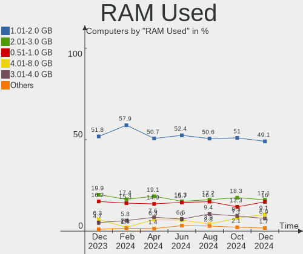
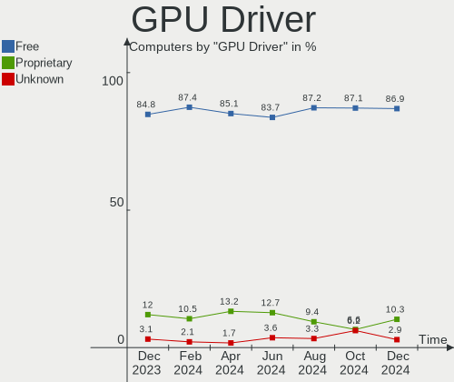
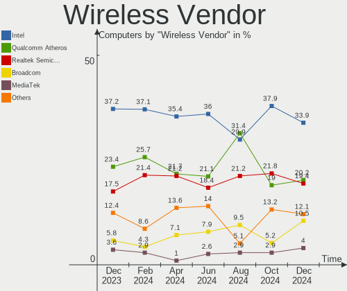
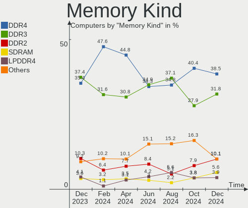
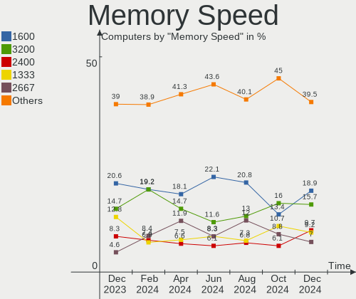

ROSA Hardware Trends
--------------------

A project to identify most popular hardware characteristics and track their change
over time based on data collected by ROSA users at https://Linux-Hardware.org.

Anyone can contribute to the study by uploading probes of their computers by
the [hw-probe](https://github.com/linuxhw/hw-probe) tool:

    sudo -E hw-probe -all -upload

This is a report for all computer types. See also reports for [desktops](/Dist/ROSA/Desktop/README.md) and [notebooks](/Dist/ROSA/Notebook/README.md).

Full-feature report is available here: https://linux-hardware.org/?view=trends

Period: Jun, 2021.

Contents
--------

- [ OS                       ](#os)
- [ OS Family                ](#os-family)
- [ Kernel                   ](#kernel)
- [ Kernel Family            ](#kernel-family)
- [ Kernel Major Ver.        ](#kernel-major-ver)
- [ Arch                     ](#arch)
- [ DE                       ](#de)
- [ Display Server           ](#display-server)
- [ Display Manager          ](#display-manager)
- [ OS Lang                  ](#os-lang)
- [ Boot Mode                ](#boot-mode)
- [ Filesystem               ](#filesystem)
- [ Part. scheme             ](#part-scheme)
- [ Dual Boot with Linux/BSD ](#dual-boot-with-linux/bsd)
- [ Dual Boot (Win)          ](#dual-boot-win)
- [ Country                  ](#country)
- [ City                     ](#city)
- [ Vendor                   ](#vendor)
- [ Model                    ](#model)
- [ Model Family             ](#model-family)
- [ MFG Year                 ](#mfg-year)
- [ Form Factor              ](#form-factor)
- [ Secure Boot              ](#secure-boot)
- [ Coreboot                 ](#coreboot)
- [ RAM Size                 ](#ram-size)
- [ RAM Used                 ](#ram-used)
- [ Has CD-ROM               ](#has-cd-rom)
- [ Total Drives             ](#total-drives)
- [ Has Ethernet             ](#has-ethernet)
- [ Has WiFi                 ](#has-wifi)
- [ Has Bluetooth            ](#has-bluetooth)
- [ Drive Vendor             ](#drive-vendor)
- [ Drive Model              ](#drive-model)
- [ HDD Vendor               ](#hdd-vendor)
- [ SSD Vendor               ](#ssd-vendor)
- [ Drive Kind               ](#drive-kind)
- [ Drive Connector          ](#drive-connector)
- [ Drive Size               ](#drive-size)
- [ Space Total              ](#space-total)
- [ Space Used               ](#space-used)
- [ Malfunc. Drives          ](#malfunc-drives)
- [ Malfunc. Drive Vendor    ](#malfunc-drive-vendor)
- [ Malfunc. HDD Vendor      ](#malfunc-hdd-vendor)
- [ Malfunc. Drive Kind      ](#malfunc-drive-kind)
- [ Failed Drives            ](#failed-drives)
- [ Failed Drive Vendor      ](#failed-drive-vendor)
- [ Drive Status             ](#drive-status)
- [ Storage Vendor           ](#storage-vendor)
- [ Storage Model            ](#storage-model)
- [ Storage Kind             ](#storage-kind)
- [ CPU Vendor               ](#cpu-vendor)
- [ CPU Model                ](#cpu-model)
- [ CPU Model Family         ](#cpu-model-family)
- [ CPU Cores                ](#cpu-cores)
- [ CPU Sockets              ](#cpu-sockets)
- [ CPU Threads              ](#cpu-threads)
- [ CPU Op-Modes             ](#cpu-op-modes)
- [ CPU Microcode            ](#cpu-microcode)
- [ CPU Microarch            ](#cpu-microarch)
- [ GPU Vendor               ](#gpu-vendor)
- [ GPU Model                ](#gpu-model)
- [ GPU Combo                ](#gpu-combo)
- [ GPU Driver               ](#gpu-driver)
- [ GPU Memory               ](#gpu-memory)
- [ Monitor Vendor           ](#monitor-vendor)
- [ Monitor Model            ](#monitor-model)
- [ Monitor Resolution       ](#monitor-resolution)
- [ Monitor Diagonal         ](#monitor-diagonal)
- [ Monitor Width            ](#monitor-width)
- [ Aspect Ratio             ](#aspect-ratio)
- [ Monitor Area             ](#monitor-area)
- [ Pixel Density            ](#pixel-density)
- [ Multiple Monitors        ](#multiple-monitors)
- [ Net Controller Vendor    ](#net-controller-vendor)
- [ Net Controller Model     ](#net-controller-model)
- [ Wireless Vendor          ](#wireless-vendor)
- [ Wireless Model           ](#wireless-model)
- [ Ethernet Vendor          ](#ethernet-vendor)
- [ Ethernet Model           ](#ethernet-model)
- [ Net Controller Kind      ](#net-controller-kind)
- [ Used Controller          ](#used-controller)
- [ NICs                     ](#nics)
- [ IPv6                     ](#ipv6)
- [ Memory Vendor            ](#memory-vendor)
- [ Memory Model             ](#memory-model)
- [ Memory Kind              ](#memory-kind)
- [ Memory Form Factor       ](#memory-form-factor)
- [ Memory Size              ](#memory-size)
- [ Memory Speed             ](#memory-speed)
- [ Sound Vendor             ](#sound-vendor)
- [ Sound Model              ](#sound-model)
- [ Camera Vendor            ](#camera-vendor)
- [ Camera Model             ](#camera-model)
- [ Fingerprint Vendor       ](#fingerprint-vendor)
- [ Fingerprint Model        ](#fingerprint-model)
- [ Chipcard Vendor          ](#chipcard-vendor)
- [ Chipcard Model           ](#chipcard-model)
- [ Printer Vendor           ](#printer-vendor)
- [ Printer Model            ](#printer-model)
- [ Scanner Vendor           ](#scanner-vendor)
- [ Scanner Model            ](#scanner-model)
- [ Bluetooth Vendor         ](#bluetooth-vendor)
- [ Bluetooth Model          ](#bluetooth-model)
- [ Unsupported Devices      ](#unsupported-devices)
- [ Unsupported Device Types ](#unsupported-device-types)

OS
--

Installed operating systems

| Name       | Computers | Percent |
|------------|-----------|---------|
| ROSA R11.1 | 102       | 79.07%  |
| ROSA R11   | 14        | 10.85%  |
| ROSA R12   | 7         | 5.43%   |
| ROSA R8.1  | 3         | 2.33%   |
| ROSA R10   | 3         | 2.33%   |

OS Family
---------

OS without a version

| Name | Computers | Percent |
|------|-----------|---------|
| ROSA | 129       | 100%    |

Kernel
------

Version of the Linux kernel

| Version                             | Computers | Percent |
|-------------------------------------|-----------|---------|
| 5.4.83-generic-2rosa-x86_64         | 38        | 29.46%  |
| 5.4.32-generic-2rosa-x86_64         | 25        | 19.38%  |
| 4.15.0-desktop-122.124.1rosa-x86_64 | 15        | 11.63%  |
| 4.15.0-desktop-45.1rosa-x86_64      | 11        | 8.53%   |
| 5.4.83-generic-2rosa-i586           | 8         | 6.2%    |
| 5.4.32-generic-2rosa-i586           | 6         | 4.65%   |
| 5.10.42-generic-1rosa2019.1-x86_64  | 4         | 3.1%    |
| 4.9.155-nrj-desktop-1rosa-i586      | 3         | 2.33%   |
| 4.15.0-desktop-45.1rosa-i586        | 3         | 2.33%   |
| 5.10.31-generic-1rosa-x86_64        | 2         | 1.55%   |
| 4.9.155-nrj-desktop-1rosa-x86_64    | 2         | 1.55%   |
| 4.15.0-desktop-122.124.1rosa-i586   | 2         | 1.55%   |
| 4.13.0-tablet-16.2rosa-x86_64       | 2         | 1.55%   |
| 5.4.122-nrj-desktop-1rosa-x86_64    | 1         | 0.78%   |
| 5.4.122-generic-1rosa2019.1-x86_64  | 1         | 0.78%   |
| 5.12.8-generic-1rosa-x86_64         | 1         | 0.78%   |
| 5.10.46-generic-1rosa2019.1-arm64   | 1         | 0.78%   |
| 5.10.40-generic-1rosa2019.1-x86_64  | 1         | 0.78%   |
| 4.9.9-nrj-desktop-1rosa-i586        | 1         | 0.78%   |
| 4.9.60-nrj-desktop-1rosa-i586       | 1         | 0.78%   |
| 4.15.0-desktop-47.2rosa-x86_64      | 1         | 0.78%   |

Kernel Family
-------------

Linux kernel without a distro release

| Version | Computers | Percent |
|---------|-----------|---------|
| 5.4.83  | 46        | 35.66%  |
| 4.15.0  | 32        | 24.81%  |
| 5.4.32  | 31        | 24.03%  |
| 4.9.155 | 5         | 3.88%   |
| 5.10.42 | 4         | 3.1%    |
| 5.4.122 | 2         | 1.55%   |
| 5.10.31 | 2         | 1.55%   |
| 4.13.0  | 2         | 1.55%   |
| 5.12.8  | 1         | 0.78%   |
| 5.10.46 | 1         | 0.78%   |
| 5.10.40 | 1         | 0.78%   |
| 4.9.9   | 1         | 0.78%   |
| 4.9.60  | 1         | 0.78%   |

Kernel Major Ver.
-----------------

Linux kernel major version

| Version | Computers | Percent |
|---------|-----------|---------|
| 5.4     | 79        | 61.24%  |
| 4.15    | 32        | 24.81%  |
| 5.10    | 8         | 6.2%    |
| 4.9     | 7         | 5.43%   |
| 4.13    | 2         | 1.55%   |
| 5.12    | 1         | 0.78%   |

Arch
----

OS architecture (x86_64, i586, etc.)

| Name    | Computers | Percent |
|---------|-----------|---------|
| x86_64  | 104       | 80.62%  |
| i686    | 24        | 18.6%   |
| aarch64 | 1         | 0.78%   |

DE
--

Desktop Environment

| Name  | Computers | Percent |
|-------|-----------|---------|
| KDE4  | 71        | 55.04%  |
| KDE5  | 38        | 29.46%  |
| LXQt  | 13        | 10.08%  |
| GNOME | 4         | 3.1%    |
| XFCE  | 2         | 1.55%   |
| KDE   | 1         | 0.78%   |

Display Server
--------------

X11 or Wayland

| Name    | Computers | Percent |
|---------|-----------|---------|
| X11     | 127       | 98.45%  |
| Wayland | 2         | 1.55%   |

Display Manager
---------------

SDDM, LightDM, etc.

| Name | Computers | Percent |
|------|-----------|---------|
| KDM  | 72        | 55.81%  |
| SDDM | 53        | 41.09%  |
| GDM  | 4         | 3.1%    |

OS Lang
-------

Language

| Lang    | Computers | Percent |
|---------|-----------|---------|
| ru_RU   | 94        | 72.87%  |
| Unknown | 20        | 15.5%   |
| en_US   | 5         | 3.88%   |
| pl_PL   | 4         | 3.1%    |
| de_DE   | 3         | 2.33%   |
| sk_SK   | 1         | 0.78%   |
| ru_UA   | 1         | 0.78%   |
| pt_BR   | 1         | 0.78%   |

Boot Mode
---------

EFI or BIOS

| Mode | Computers | Percent |
|------|-----------|---------|
| BIOS | 88        | 68.22%  |
| EFI  | 41        | 31.78%  |

Filesystem
----------

Type of filesystem

| Type    | Computers | Percent |
|---------|-----------|---------|
| Ext4    | 122       | 94.57%  |
| Btrfs   | 4         | 3.1%    |
| Unknown | 2         | 1.55%   |
| Aufs    | 1         | 0.78%   |

Part. scheme
------------

Scheme of partitioning

| Type    | Computers | Percent |
|---------|-----------|---------|
| MBR     | 77        | 59.69%  |
| GPT     | 49        | 37.98%  |
| Unknown | 3         | 2.33%   |

Dual Boot with Linux/BSD
------------------------

Hosting more than one Linux/BSD

| Dual boot | Computers | Percent |
|-----------|-----------|---------|
| No        | 100       | 77.52%  |
| Yes       | 29        | 22.48%  |

Dual Boot (Win)
---------------

Hosting Linux and Windows

| Dual boot | Computers | Percent |
|-----------|-----------|---------|
| No        | 71        | 55.04%  |
| Yes       | 58        | 44.96%  |

Country
-------

Geographic location (country)

| Country    | Computers | Percent |
|------------|-----------|---------|
| Russia     | 91        | 70.54%  |
| Ukraine    | 11        | 8.53%   |
| Poland     | 5         | 3.88%   |
| Germany    | 4         | 3.1%    |
| France     | 4         | 3.1%    |
| Slovakia   | 3         | 2.33%   |
| Belarus    | 3         | 2.33%   |
| Kazakhstan | 2         | 1.55%   |
| Brazil     | 2         | 1.55%   |
| UK         | 1         | 0.78%   |
| Italy      | 1         | 0.78%   |
| Estonia    | 1         | 0.78%   |
| Azerbaijan | 1         | 0.78%   |

City
----

Geographic location (city)

| City                    | Computers | Percent |
|-------------------------|-----------|---------|
| Moscow                  | 23        | 17.83%  |
| St Petersburg           | 7         | 5.43%   |
| Rostov-on-Don           | 4         | 3.1%    |
| Novosibirsk             | 4         | 3.1%    |
| Krasnodar               | 4         | 3.1%    |
| Saratov                 | 3         | 2.33%   |
| Donetsk                 | 3         | 2.33%   |
| Chelyabinsk             | 3         | 2.33%   |
| Yekaterinburg           | 2         | 1.55%   |
| Volgograd               | 2         | 1.55%   |
| Tambov                  | 2         | 1.55%   |
| Perm                    | 2         | 1.55%   |
| Nizhniy Novgorod        | 2         | 1.55%   |
| Montescot               | 2         | 1.55%   |
| Kazan’                | 2         | 1.55%   |
| Kaliningrad             | 2         | 1.55%   |
| Wisla                   | 1         | 0.78%   |
| Warsaw                  | 1         | 0.78%   |
| Vitebsk                 | 1         | 0.78%   |
| Verona                  | 1         | 0.78%   |
| Ust'-Ilimsk             | 1         | 0.78%   |
| Ufa                     | 1         | 0.78%   |
| Tver                    | 1         | 0.78%   |
| Tomsk                   | 1         | 0.78%   |
| Tolyatti                | 1         | 0.78%   |
| Temirtau                | 1         | 0.78%   |
| Tallinn                 | 1         | 0.78%   |
| Taganrog                | 1         | 0.78%   |
| Sumy                    | 1         | 0.78%   |
| Stola                   | 1         | 0.78%   |
| Sonneberg               | 1         | 0.78%   |
| Simferopol              | 1         | 0.78%   |
| Schauenburg             | 1         | 0.78%   |
| Savran'                 | 1         | 0.78%   |
| Sarov                   | 1         | 0.78%   |
| Saint-Macaire-en-Mauges | 1         | 0.78%   |
| Sabinov                 | 1         | 0.78%   |
| Ryazhsk                 | 1         | 0.78%   |
| Romford                 | 1         | 0.78%   |
| Rio de Janeiro          | 1         | 0.78%   |
| Pskov                   | 1         | 0.78%   |
| Poznan                  | 1         | 0.78%   |
| Pokrovs'ke              | 1         | 0.78%   |
| Petergof                | 1         | 0.78%   |
| Paris                   | 1         | 0.78%   |
| Otzberg                 | 1         | 0.78%   |
| Orenburg                | 1         | 0.78%   |
| Oberhausen              | 1         | 0.78%   |
| Nur-Sultan              | 1         | 0.78%   |
| Nizhny Tagil            | 1         | 0.78%   |
| Naryan-Mar              | 1         | 0.78%   |
| Murmansk                | 1         | 0.78%   |
| Miass                   | 1         | 0.78%   |
| Lipetsk                 | 1         | 0.78%   |
| Kytlym                  | 1         | 0.78%   |
| Kstovo                  | 1         | 0.78%   |
| Kotel'niki              | 1         | 0.78%   |
| Kostroma                | 1         | 0.78%   |
| Klonowa                 | 1         | 0.78%   |
| Kirov                   | 1         | 0.78%   |

Vendor
------

Motherboard manufacturer

| Name                | Computers | Percent |
|---------------------|-----------|---------|
| ASUSTek Computer    | 30        | 23.26%  |
| Gigabyte Technology | 15        | 11.63%  |
| Hewlett-Packard     | 14        | 10.85%  |
| Lenovo              | 12        | 9.3%    |
| Acer                | 12        | 9.3%    |
| Dell                | 7         | 5.43%   |
| Samsung Electronics | 6         | 4.65%   |
| ASRock              | 5         | 3.88%   |
| MSI                 | 4         | 3.1%    |
| Biostar             | 4         | 3.1%    |
| Toshiba             | 3         | 2.33%   |
| Sony                | 3         | 2.33%   |
| Intel               | 3         | 2.33%   |
| Foxconn             | 2         | 1.55%   |
| NEC Computers       | 1         | 0.78%   |
| ilife               | 1         | 0.78%   |
| ICL                 | 1         | 0.78%   |
| eMachines           | 1         | 0.78%   |
| Edelweiss           | 1         | 0.78%   |
| ECS                 | 1         | 0.78%   |
| Digma               | 1         | 0.78%   |
| Apple               | 1         | 0.78%   |
| Alienware           | 1         | 0.78%   |

Model
-----

Motherboard model

| Name                                              | Computers | Percent |
|---------------------------------------------------|-----------|---------|
| ASUS PRIME A320M-K                                | 2         | 1.55%   |
| Toshiba TECRA A9                                  | 1         | 0.78%   |
| Toshiba Satellite L775-A1W                        | 1         | 0.78%   |
| Toshiba Satellite C660D                           | 1         | 0.78%   |
| Sony VPCY216FD                                    | 1         | 0.78%   |
| Sony VPCEH1S1R                                    | 1         | 0.78%   |
| Sony VPCCW1S1R                                    | 1         | 0.78%   |
| Samsung RV420/RV520/RV720/E3530/S3530/E3420/E3520 | 1         | 0.78%   |
| Samsung RV408/RV508                               | 1         | 0.78%   |
| Samsung R460                                      | 1         | 0.78%   |
| Samsung N150/N210/N220                            | 1         | 0.78%   |
| Samsung 355V4C/356V4C/3445VC/3545VC               | 1         | 0.78%   |
| Samsung 300V3A/300V4A/300V5A/200A4B/200A5B        | 1         | 0.78%   |
| NEC Computers SiS650                              | 1         | 0.78%   |
| MSI MS-7C84                                       | 1         | 0.78%   |
| MSI MS-7529                                       | 1         | 0.78%   |
| MSI MS-7519                                       | 1         | 0.78%   |
| MSI MS-7388                                       | 1         | 0.78%   |
| Lenovo ThinkPad T400 6474WPU                      | 1         | 0.78%   |
| Lenovo ThinkPad L540 20AUS0DW00                   | 1         | 0.78%   |
| Lenovo IdeaPad Y510P 20217                        | 1         | 0.78%   |
| Lenovo IdeaPad S145-15IIL 81W8                    | 1         | 0.78%   |
| Lenovo IdeaPad L340-17IRH Gaming 81LL             | 1         | 0.78%   |
| Lenovo IdeaPad Flex 10 20324                      | 1         | 0.78%   |
| Lenovo IdeaPad 5 14IIL05 81YH                     | 1         | 0.78%   |
| Lenovo IdeaPad 320-15AST 80XV                     | 1         | 0.78%   |
| Lenovo H535 10117                                 | 1         | 0.78%   |
| Lenovo G580                                       | 1         | 0.78%   |
| Lenovo G50-45 80E3                                | 1         | 0.78%   |
| Lenovo C200                                       | 1         | 0.78%   |
| Intel Intel E5 M2L-8D                             | 1         | 0.78%   |
| Intel H61M-S1                                     | 1         | 0.78%   |
| Intel D945GNT AAC96315-405                        | 1         | 0.78%   |
| ilife S806                                        | 1         | 0.78%   |
| ICL RAYbook Si1514                                | 1         | 0.78%   |
| HP ZBook 14                                       | 1         | 0.78%   |
| HP ProDesk 600 G1 DM                              | 1         | 0.78%   |
| HP ProBook x360 11 G1 EE                          | 1         | 0.78%   |
| HP ProBook 440 G4                                 | 1         | 0.78%   |
| HP Pavilion g6                                    | 1         | 0.78%   |
| HP Pavilion dv7                                   | 1         | 0.78%   |
| HP Pavilion dv6700                                | 1         | 0.78%   |
| HP Pavilion dv6                                   | 1         | 0.78%   |
| HP Notebook                                       | 1         | 0.78%   |
| HP Laptop 15s-eq1xxx                              | 1         | 0.78%   |
| HP Laptop 15-rb0xx                                | 1         | 0.78%   |
| HP Compaq dc5750 Microtower                       | 1         | 0.78%   |
| HP 250 G5 Notebook PC                             | 1         | 0.78%   |
| Gigabyte Z97M-DS3H                                | 1         | 0.78%   |
| Gigabyte P75-D3                                   | 1         | 0.78%   |
| Gigabyte P35-DS3L                                 | 1         | 0.78%   |
| Gigabyte H81M-S1                                  | 1         | 0.78%   |
| Gigabyte H310M S2 2.0                             | 1         | 0.78%   |
| Gigabyte GA-MA78GM-UD2H                           | 1         | 0.78%   |
| Gigabyte GA-MA770T-UD3                            | 1         | 0.78%   |
| Gigabyte GA-78LMT-S2                              | 1         | 0.78%   |
| Gigabyte GA-770T-USB3                             | 1         | 0.78%   |
| Gigabyte F2A55M-S1                                | 1         | 0.78%   |
| Gigabyte E3000N                                   | 1         | 0.78%   |
| Gigabyte B75M-D3H                                 | 1         | 0.78%   |

Model Family
------------

Motherboard model prefix

| Name                    | Computers | Percent |
|-------------------------|-----------|---------|
| Acer Aspire             | 7         | 5.43%   |
| Lenovo IdeaPad          | 6         | 4.65%   |
| HP Pavilion             | 4         | 3.1%    |
| ASUS PRIME              | 4         | 3.1%    |
| Toshiba Satellite       | 2         | 1.55%   |
| Lenovo ThinkPad         | 2         | 1.55%   |
| HP ProBook              | 2         | 1.55%   |
| HP Laptop               | 2         | 1.55%   |
| Dell Vostro             | 2         | 1.55%   |
| Dell OptiPlex           | 2         | 1.55%   |
| Dell Inspiron           | 2         | 1.55%   |
| ASUS P8Z77-V            | 2         | 1.55%   |
| ASUS M5A78L-M           | 2         | 1.55%   |
| Acer Extensa            | 2         | 1.55%   |
| Toshiba TECRA           | 1         | 0.78%   |
| Sony VPCY216FD          | 1         | 0.78%   |
| Sony VPCEH1S1R          | 1         | 0.78%   |
| Sony VPCCW1S1R          | 1         | 0.78%   |
| Samsung RV420           | 1         | 0.78%   |
| Samsung RV408           | 1         | 0.78%   |
| Samsung R460            | 1         | 0.78%   |
| Samsung N150            | 1         | 0.78%   |
| Samsung 355V4C          | 1         | 0.78%   |
| Samsung 300V3A          | 1         | 0.78%   |
| NEC Computers SiS650    | 1         | 0.78%   |
| MSI MS-7C84             | 1         | 0.78%   |
| MSI MS-7529             | 1         | 0.78%   |
| MSI MS-7519             | 1         | 0.78%   |
| MSI MS-7388             | 1         | 0.78%   |
| Lenovo H535             | 1         | 0.78%   |
| Lenovo G580             | 1         | 0.78%   |
| Lenovo G50-45           | 1         | 0.78%   |
| Lenovo C200             | 1         | 0.78%   |
| Intel Intel             | 1         | 0.78%   |
| Intel H61M-S1           | 1         | 0.78%   |
| Intel D945GNT           | 1         | 0.78%   |
| ilife S806              | 1         | 0.78%   |
| ICL RAYbook             | 1         | 0.78%   |
| HP ZBook                | 1         | 0.78%   |
| HP ProDesk              | 1         | 0.78%   |
| HP Notebook             | 1         | 0.78%   |
| HP Compaq               | 1         | 0.78%   |
| HP 250                  | 1         | 0.78%   |
| Gigabyte Z97M-DS3H      | 1         | 0.78%   |
| Gigabyte P75-D3         | 1         | 0.78%   |
| Gigabyte P35-DS3L       | 1         | 0.78%   |
| Gigabyte H81M-S1        | 1         | 0.78%   |
| Gigabyte H310M          | 1         | 0.78%   |
| Gigabyte GA-MA78GM-UD2H | 1         | 0.78%   |
| Gigabyte GA-MA770T-UD3  | 1         | 0.78%   |
| Gigabyte GA-78LMT-S2    | 1         | 0.78%   |
| Gigabyte GA-770T-USB3   | 1         | 0.78%   |
| Gigabyte F2A55M-S1      | 1         | 0.78%   |
| Gigabyte E3000N         | 1         | 0.78%   |
| Gigabyte B75M-D3H       | 1         | 0.78%   |
| Gigabyte B75-D3V        | 1         | 0.78%   |
| Gigabyte B360M-HD3      | 1         | 0.78%   |
| Gigabyte AB350M-DS3H    | 1         | 0.78%   |
| Foxconn GEG             | 1         | 0.78%   |
| Foxconn 945             | 1         | 0.78%   |

MFG Year
--------

Motherboard manufacture year

| Year | Computers | Percent |
|------|-----------|---------|
| 2012 | 16        | 12.4%   |
| 2018 | 11        | 8.53%   |
| 2011 | 11        | 8.53%   |
| 2010 | 11        | 8.53%   |
| 2020 | 9         | 6.98%   |
| 2014 | 9         | 6.98%   |
| 2013 | 9         | 6.98%   |
| 2017 | 8         | 6.2%    |
| 2009 | 8         | 6.2%    |
| 2015 | 7         | 5.43%   |
| 2007 | 6         | 4.65%   |
| 2006 | 6         | 4.65%   |
| 2019 | 5         | 3.88%   |
| 2021 | 4         | 3.1%    |
| 2008 | 4         | 3.1%    |
| 2016 | 3         | 2.33%   |
| 2003 | 2         | 1.55%   |

Form Factor
-----------

Physical design of the computer

| Name           | Computers | Percent |
|----------------|-----------|---------|
| Desktop        | 63        | 48.84%  |
| Notebook       | 63        | 48.84%  |
| All in one     | 2         | 1.55%   |
| System on chip | 1         | 0.78%   |

Secure Boot
-----------

Enabled or disabled

| State    | Computers | Percent |
|----------|-----------|---------|
| Disabled | 129       | 100%    |

Coreboot
--------

Have coreboot on board

| Used | Computers | Percent |
|------|-----------|---------|
| No   | 129       | 100%    |

RAM Size
--------

Total RAM memory

| Size in GB | Computers | Percent |
|------------|-----------|---------|
| 3.01-4.0   | 47        | 36.43%  |
| 4.01-8.0   | 28        | 21.71%  |
| 8.01-16.0  | 27        | 20.93%  |
| 1.01-2.0   | 11        | 8.53%   |
| 16.01-24.0 | 7         | 5.43%   |
| 2.01-3.0   | 5         | 3.88%   |
| 32.01-64.0 | 2         | 1.55%   |
| 0.51-1.0   | 2         | 1.55%   |

RAM Used
--------

Used RAM memory

| Used GB   | Computers | Percent |
|-----------|-----------|---------|
| 1.01-2.0  | 70        | 54.26%  |
| 0.51-1.0  | 47        | 36.43%  |
| 3.01-4.0  | 4         | 3.1%    |
| 2.01-3.0  | 3         | 2.33%   |
| 4.01-8.0  | 2         | 1.55%   |
| 0.01-0.5  | 2         | 1.55%   |
| 8.01-16.0 | 1         | 0.78%   |

Has CD-ROM
----------

Has CD-ROM on board

| Presented | Computers | Percent |
|-----------|-----------|---------|
| Yes       | 77        | 59.69%  |
| No        | 52        | 40.31%  |

Total Drives
------------

Number of drives on board

| Drives | Computers | Percent |
|--------|-----------|---------|
| 1      | 84        | 65.12%  |
| 2      | 29        | 22.48%  |
| 3      | 9         | 6.98%   |
| 4      | 5         | 3.88%   |
| 5      | 1         | 0.78%   |
| 0      | 1         | 0.78%   |

Has Ethernet
------------

Has Ethernet on board

| Presented | Computers | Percent |
|-----------|-----------|---------|
| Yes       | 121       | 93.8%   |
| No        | 8         | 6.2%    |

Has WiFi
--------

Has WiFi module

| Presented | Computers | Percent |
|-----------|-----------|---------|
| Yes       | 72        | 55.81%  |
| No        | 57        | 44.19%  |

Has Bluetooth
-------------

Has Bluetooth module

| Presented | Computers | Percent |
|-----------|-----------|---------|
| No        | 78        | 60.47%  |
| Yes       | 51        | 39.53%  |

Drive Vendor
------------

Hard drive vendors

| Vendor              | Computers | Drives | Percent |
|---------------------|-----------|--------|---------|
| Seagate             | 42        | 49     | 24.56%  |
| WDC                 | 35        | 40     | 20.47%  |
| Toshiba             | 14        | 14     | 8.19%   |
| Samsung Electronics | 13        | 15     | 7.6%    |
| Hitachi             | 13        | 14     | 7.6%    |
| Unknown             | 10        | 11     | 5.85%   |
| Kingston            | 8         | 8      | 4.68%   |
| China               | 6         | 7      | 3.51%   |
| SanDisk             | 4         | 4      | 2.34%   |
| A-DATA Technology   | 4         | 4      | 2.34%   |
| SPCC                | 2         | 2      | 1.17%   |
| LITEONIT            | 2         | 2      | 1.17%   |
| Crucial             | 2         | 3      | 1.17%   |
| AMD                 | 2         | 3      | 1.17%   |
| Transcend           | 1         | 1      | 0.58%   |
| TF CARD             | 1         | 1      | 0.58%   |
| SK Hynix            | 1         | 1      | 0.58%   |
| PLEXTOR             | 1         | 1      | 0.58%   |
| ORICO               | 1         | 1      | 0.58%   |
| OCZ                 | 1         | 1      | 0.58%   |
| Micron Technology   | 1         | 1      | 0.58%   |
| Lite-On             | 1         | 1      | 0.58%   |
| Intel               | 1         | 1      | 0.58%   |
| HGST                | 1         | 1      | 0.58%   |
| Fujitsu             | 1         | 1      | 0.58%   |
| Corsair             | 1         | 1      | 0.58%   |
| Apple               | 1         | 1      | 0.58%   |
| Apacer              | 1         | 1      | 0.58%   |

Drive Model
-----------

Hard drive models

| Model                                | Computers | Percent |
|--------------------------------------|-----------|---------|
| Seagate ST500DM002-1BD142 500GB      | 4         | 2.13%   |
| Seagate ST2000DM008-2FR102 2TB       | 3         | 1.6%    |
| Kingston SA400S37120G 120GB SSD      | 3         | 1.6%    |
| China SSD 128GB                      | 3         | 1.6%    |
| WDC WD5000AAKX-00ERMA0 500GB         | 2         | 1.06%   |
| Unknown NCard  32GB                  | 2         | 1.06%   |
| Toshiba HDWD120 2TB                  | 2         | 1.06%   |
| Toshiba DT01ACA050 500GB             | 2         | 1.06%   |
| Seagate ST9500420AS 500GB            | 2         | 1.06%   |
| Seagate ST500LT012-1DG142 500GB      | 2         | 1.06%   |
| Seagate ST3808110AS 80GB             | 2         | 1.06%   |
| Seagate ST3250410AS 250GB            | 2         | 1.06%   |
| Seagate ST1000LM024 HN-M101MBB 1TB   | 2         | 1.06%   |
| Seagate ST1000DM010-2EP102 1TB       | 2         | 1.06%   |
| Seagate ST1000DM003-1SB102 1TB       | 2         | 1.06%   |
| SanDisk SD8SN8U-128G-1006 128GB SSD  | 2         | 1.06%   |
| China SSD 120GB                      | 2         | 1.06%   |
| WDC WDS250G2B0A-00SM50 250GB SSD     | 1         | 0.53%   |
| WDC WDS240G2G0A-00JH30 240GB SSD     | 1         | 0.53%   |
| WDC WDS120G2G0A-00JH30 120GB SSD     | 1         | 0.53%   |
| WDC WDS100T2B0C-00PXH0 1TB           | 1         | 0.53%   |
| WDC WD800JD-22JNA0 80GB              | 1         | 0.53%   |
| WDC WD7500BPKX-75HPJT0 752GB         | 1         | 0.53%   |
| WDC WD7500AZEX-00ZF5A0 752GB         | 1         | 0.53%   |
| WDC WD6400AAKS-65A7B2 640GB          | 1         | 0.53%   |
| WDC WD5001AALS-00L3B2 500GB          | 1         | 0.53%   |
| WDC WD5000LPVX-80V0TT0 500GB         | 1         | 0.53%   |
| WDC WD5000LPCX-60VHAT0 500GB         | 1         | 0.53%   |
| WDC WD5000LPCX-24C6HT0 500GB         | 1         | 0.53%   |
| WDC WD5000LPCX-22VHAT1 500GB         | 1         | 0.53%   |
| WDC WD5000LPCX-21VHAT0 500GB         | 1         | 0.53%   |
| WDC WD5000AZLX-08K2TA0 500GB         | 1         | 0.53%   |
| WDC WD5000AAKX-00U6AA0 500GB         | 1         | 0.53%   |
| WDC WD5000AAKX-001CA0 500GB          | 1         | 0.53%   |
| WDC WD3200BPVT-22JJ5T0 320GB         | 1         | 0.53%   |
| WDC WD3200BEVS-26VAT0 320GB          | 1         | 0.53%   |
| WDC WD3200AAKX-001CA0 320GB          | 1         | 0.53%   |
| WDC WD30EZRX-00DC0B0 3TB             | 1         | 0.53%   |
| WDC WD30EFRX-68EUZN0 3TB             | 1         | 0.53%   |
| WDC WD2500JB-00REA0 250GB            | 1         | 0.53%   |
| WDC WD20EZRZ-00Z5HB0 2TB             | 1         | 0.53%   |
| WDC WD20EZAZ-00L9GB0 2TB             | 1         | 0.53%   |
| WDC WD20EZAZ-00GGJB0 2TB             | 1         | 0.53%   |
| WDC WD20EARX-00PASB0 2TB             | 1         | 0.53%   |
| WDC WD2000JS-22MHB0 200GB            | 1         | 0.53%   |
| WDC WD1600AAJS-22PSA0 160GB          | 1         | 0.53%   |
| WDC WD10SPZX-08Z10 1TB               | 1         | 0.53%   |
| WDC WD10EZRZ-22HTKB0 1TB             | 1         | 0.53%   |
| WDC WD10EZRZ-00Z5HB0 1TB             | 1         | 0.53%   |
| WDC WD10EZEX-21M2NA0 1TB             | 1         | 0.53%   |
| WDC WD10EZEX-08WN4A0 1TB             | 1         | 0.53%   |
| WDC WD10EZEX-00WN4A0 1TB             | 1         | 0.53%   |
| WDC WD10EARX-00N0YB0 1TB             | 1         | 0.53%   |
| WDC WD10EALS-00Z8A0 1TB              | 1         | 0.53%   |
| WDC PC SN520 SDAPNUW-256G-1006 256GB | 1         | 0.53%   |
| Unknown SU02G  2GB                   | 1         | 0.53%   |
| Unknown SL08G  8GB                   | 1         | 0.53%   |
| Unknown SD/MMC/MS PRO 128GB          | 1         | 0.53%   |
| Unknown SC32G  32GB                  | 1         | 0.53%   |
| Unknown N/A  16GB                    | 1         | 0.53%   |

HDD Vendor
----------

Hard disk drive vendors

| Vendor              | Computers | Drives | Percent |
|---------------------|-----------|--------|---------|
| Seagate             | 42        | 49     | 39.62%  |
| WDC                 | 31        | 35     | 29.25%  |
| Toshiba             | 13        | 13     | 12.26%  |
| Hitachi             | 13        | 14     | 12.26%  |
| Samsung Electronics | 5         | 7      | 4.72%   |
| HGST                | 1         | 1      | 0.94%   |
| Fujitsu             | 1         | 1      | 0.94%   |

SSD Vendor
----------

Solid state drive vendors

| Vendor              | Computers | Drives | Percent |
|---------------------|-----------|--------|---------|
| Samsung Electronics | 6         | 6      | 13.33%  |
| Kingston            | 6         | 6      | 13.33%  |
| China               | 6         | 7      | 13.33%  |
| SanDisk             | 4         | 4      | 8.89%   |
| WDC                 | 3         | 3      | 6.67%   |
| A-DATA Technology   | 3         | 3      | 6.67%   |
| SPCC                | 2         | 2      | 4.44%   |
| LITEONIT            | 2         | 2      | 4.44%   |
| Crucial             | 2         | 3      | 4.44%   |
| AMD                 | 2         | 3      | 4.44%   |
| Unknown             | 1         | 1      | 2.22%   |
| Transcend           | 1         | 1      | 2.22%   |
| Toshiba             | 1         | 1      | 2.22%   |
| PLEXTOR             | 1         | 1      | 2.22%   |
| OCZ                 | 1         | 1      | 2.22%   |
| Micron Technology   | 1         | 1      | 2.22%   |
| Lite-On             | 1         | 1      | 2.22%   |
| Apple               | 1         | 1      | 2.22%   |
| Apacer              | 1         | 1      | 2.22%   |

Drive Kind
----------

HDD or SSD

| Kind    | Computers | Drives | Percent |
|---------|-----------|--------|---------|
| HDD     | 95        | 120    | 61.29%  |
| SSD     | 40        | 48     | 25.81%  |
| NVMe    | 10        | 11     | 6.45%   |
| MMC     | 8         | 9      | 5.16%   |
| Unknown | 2         | 2      | 1.29%   |

Drive Connector
---------------

SATA, SAS, NVMe, etc.

| Type | Computers | Drives | Percent |
|------|-----------|--------|---------|
| SATA | 119       | 166    | 84.4%   |
| NVMe | 10        | 11     | 7.09%   |
| MMC  | 8         | 9      | 5.67%   |
| SAS  | 4         | 4      | 2.84%   |

Drive Size
----------

Size of hard drive

| Size in TB | Computers | Drives | Percent |
|------------|-----------|--------|---------|
| 0.01-0.5   | 102       | 126    | 73.38%  |
| 0.51-1.0   | 25        | 29     | 17.99%  |
| 1.01-2.0   | 10        | 10     | 7.19%   |
| 2.01-3.0   | 2         | 3      | 1.44%   |

Space Total
-----------

Amount of disk space available on the file system

| Size in GB     | Computers | Percent |
|----------------|-----------|---------|
| 101-250        | 42        | 32.56%  |
| 251-500        | 25        | 19.38%  |
| 501-1000       | 17        | 13.18%  |
| 51-100         | 14        | 10.85%  |
| 1-20           | 13        | 10.08%  |
| 21-50          | 10        | 7.75%   |
| 1001-2000      | 3         | 2.33%   |
| More than 3000 | 2         | 1.55%   |
| 2001-3000      | 2         | 1.55%   |
| Unknown        | 1         | 0.78%   |

Space Used
----------

Amount of used disk space

| Used GB        | Computers | Percent |
|----------------|-----------|---------|
| 1-20           | 90        | 69.77%  |
| 21-50          | 14        | 10.85%  |
| 51-100         | 9         | 6.98%   |
| 251-500        | 7         | 5.43%   |
| 101-250        | 4         | 3.1%    |
| 501-1000       | 3         | 2.33%   |
| More than 3000 | 1         | 0.78%   |
| Unknown        | 1         | 0.78%   |

Malfunc. Drives
---------------

Drive models with a malfunction

| Model                                          | Computers | Drives | Percent |
|------------------------------------------------|-----------|--------|---------|
| Seagate ST500DM002-1BD142 500GB                | 3         | 3      | 6%      |
| Seagate ST9500420AS 500GB                      | 2         | 3      | 4%      |
| WDC WD5000LPVX-80V0TT0 500GB                   | 1         | 1      | 2%      |
| WDC WD5000LPCX-60VHAT0 500GB                   | 1         | 1      | 2%      |
| WDC WD5000AAKX-00U6AA0 500GB                   | 1         | 1      | 2%      |
| WDC WD5000AAKX-001CA0 500GB                    | 1         | 1      | 2%      |
| WDC WD3200BEVS-26VAT0 320GB                    | 1         | 1      | 2%      |
| WDC WD2500JB-00REA0 250GB                      | 1         | 1      | 2%      |
| WDC WD2000JS-22MHB0 200GB                      | 1         | 1      | 2%      |
| WDC WD10EZEX-08WN4A0 1TB                       | 1         | 1      | 2%      |
| WDC WD10EARX-00N0YB0 1TB                       | 1         | 1      | 2%      |
| Toshiba MK5075GSX 500GB                        | 1         | 1      | 2%      |
| Toshiba MK3252GSX 320GB                        | 1         | 1      | 2%      |
| Toshiba MK2555GSX 250GB                        | 1         | 1      | 2%      |
| Toshiba MK1655GSX 160GB                        | 1         | 1      | 2%      |
| Toshiba MK1646GSX 160GB                        | 1         | 1      | 2%      |
| Toshiba DT01ACA050 500GB                       | 1         | 1      | 2%      |
| Seagate ST9500325AS 500GB                      | 1         | 1      | 2%      |
| Seagate ST9160821AS 160GB                      | 1         | 1      | 2%      |
| Seagate ST9160314AS 160GB                      | 1         | 1      | 2%      |
| Seagate ST500LT012-1DG142 500GB                | 1         | 1      | 2%      |
| Seagate ST500LM021-1KJ152 500GB                | 1         | 1      | 2%      |
| Seagate ST500LM012 HN-M500MBB 500GB            | 1         | 1      | 2%      |
| Seagate ST500LM000-SSHD-8GB                    | 1         | 1      | 2%      |
| Seagate ST3802110A 80GB                        | 1         | 1      | 2%      |
| Seagate ST380013AS 80GB                        | 1         | 1      | 2%      |
| Seagate ST320LT012-9WS14C 320GB                | 1         | 1      | 2%      |
| Seagate ST3000VX010-2E3166 3TB                 | 1         | 1      | 2%      |
| Seagate ST1000DM010-2EP102 1TB                 | 1         | 1      | 2%      |
| Samsung Electronics SP2004C 200GB              | 1         | 1      | 2%      |
| Samsung Electronics HM250JI 250GB              | 1         | 1      | 2%      |
| Samsung Electronics HD252KJ 250GB              | 1         | 1      | 2%      |
| Samsung Electronics HD161HJ 160GB              | 1         | 1      | 2%      |
| OCZ SOLID3 64GB SSD                            | 1         | 1      | 2%      |
| Micron Technology MTFDDAK256MAM-1K12 256GB SSD | 1         | 1      | 2%      |
| LITEONIT LSS-24L6G 24GB SSD                    | 1         | 1      | 2%      |
| LITEONIT LMN-256M3M mSATA 256GB SSD            | 1         | 1      | 2%      |
| Hitachi HTS723232A7A364 320GB                  | 1         | 1      | 2%      |
| Hitachi HTS547575A9E384 752GB                  | 1         | 1      | 2%      |
| Hitachi HTS547550A9E384 500GB                  | 1         | 1      | 2%      |
| Hitachi HTS545050B9A300 500GB                  | 1         | 1      | 2%      |
| Hitachi HTS545032B9A302 320GB                  | 1         | 1      | 2%      |
| Hitachi HTS545016B9A300 160GB                  | 1         | 1      | 2%      |
| Hitachi HDS721050CLA360 500GB                  | 1         | 1      | 2%      |
| Hitachi HDS721010DLE630 1TB                    | 1         | 1      | 2%      |
| Hitachi HDP725032GLA360 320GB                  | 1         | 1      | 2%      |
| AMD R3SL240G 240GB SSD                         | 1         | 2      | 2%      |

Malfunc. Drive Vendor
---------------------

Vendors of faulty drives

| Vendor              | Computers | Drives | Percent |
|---------------------|-----------|--------|---------|
| Seagate             | 17        | 18     | 34.69%  |
| WDC                 | 9         | 9      | 18.37%  |
| Hitachi             | 9         | 9      | 18.37%  |
| Toshiba             | 6         | 6      | 12.24%  |
| Samsung Electronics | 3         | 4      | 6.12%   |
| LITEONIT            | 2         | 2      | 4.08%   |
| OCZ                 | 1         | 1      | 2.04%   |
| Micron Technology   | 1         | 1      | 2.04%   |
| AMD                 | 1         | 2      | 2.04%   |

Malfunc. HDD Vendor
-------------------

Vendors of faulty HDD drives

| Vendor              | Computers | Drives | Percent |
|---------------------|-----------|--------|---------|
| Seagate             | 17        | 18     | 38.64%  |
| WDC                 | 9         | 9      | 20.45%  |
| Hitachi             | 9         | 9      | 20.45%  |
| Toshiba             | 6         | 6      | 13.64%  |
| Samsung Electronics | 3         | 4      | 6.82%   |

Malfunc. Drive Kind
-------------------

Kinds of faulty drives

| Kind | Computers | Drives | Percent |
|------|-----------|--------|---------|
| HDD  | 43        | 46     | 89.58%  |
| SSD  | 5         | 6      | 10.42%  |

Failed Drives
-------------

Failed drive models

| Model                 | Computers | Drives | Percent |
|-----------------------|-----------|--------|---------|
| Apple SSD TS064C 64GB | 1         | 1      | 100%    |

Failed Drive Vendor
-------------------

Failed drive vendors

| Vendor | Computers | Drives | Percent |
|--------|-----------|--------|---------|
| Apple  | 1         | 1      | 100%    |

Drive Status
------------

Number of failed and malfunc. drives

| Status   | Computers | Drives | Percent |
|----------|-----------|--------|---------|
| Works    | 90        | 125    | 60%     |
| Malfunc  | 48        | 52     | 32%     |
| Detected | 11        | 12     | 7.33%   |
| Failed   | 1         | 1      | 0.67%   |

Storage Vendor
--------------

Storage controller vendors

| Vendor                           | Computers | Percent |
|----------------------------------|-----------|---------|
| Intel                            | 84        | 59.57%  |
| AMD                              | 34        | 24.11%  |
| Nvidia                           | 3         | 2.13%   |
| JMicron Technology               | 3         | 2.13%   |
| VIA Technologies                 | 2         | 1.42%   |
| Silicon Integrated Systems [SiS] | 2         | 1.42%   |
| Sandisk                          | 2         | 1.42%   |
| Samsung Electronics              | 2         | 1.42%   |
| Phison Electronics               | 2         | 1.42%   |
| ASMedia Technology               | 2         | 1.42%   |
| SK Hynix                         | 1         | 0.71%   |
| Silicon Motion                   | 1         | 0.71%   |
| Silicon Image                    | 1         | 0.71%   |
| Realtek Semiconductor            | 1         | 0.71%   |
| Kingston Technology Company      | 1         | 0.71%   |

Storage Model
-------------

Storage controller models

| Model                                                                            | Computers | Percent |
|----------------------------------------------------------------------------------|-----------|---------|
| AMD FCH SATA Controller [AHCI mode]                                              | 17        | 9.24%   |
| Intel 82801G (ICH7 Family) IDE Controller                                        | 9         | 4.89%   |
| AMD SB7x0/SB8x0/SB9x0 IDE Controller                                             | 9         | 4.89%   |
| Intel NM10/ICH7 Family SATA Controller [IDE mode]                                | 8         | 4.35%   |
| Intel 6 Series/C200 Series Chipset Family 6 port Mobile SATA AHCI Controller     | 8         | 4.35%   |
| Intel 82801IBM/IEM (ICH9M/ICH9M-E) 4 port SATA Controller [AHCI mode]            | 6         | 3.26%   |
| Intel 8 Series/C220 Series Chipset Family 6-port SATA Controller 1 [AHCI mode]   | 6         | 3.26%   |
| AMD SB7x0/SB8x0/SB9x0 SATA Controller [IDE mode]                                 | 6         | 3.26%   |
| AMD SB7x0/SB8x0/SB9x0 SATA Controller [AHCI mode]                                | 6         | 3.26%   |
| Intel Sunrise Point-LP SATA Controller [AHCI mode]                               | 4         | 2.17%   |
| Intel 6 Series/C200 Series Chipset Family 6 port Desktop SATA AHCI Controller    | 4         | 2.17%   |
| AMD SB600 Non-Raid-5 SATA                                                        | 4         | 2.17%   |
| AMD SB600 IDE                                                                    | 4         | 2.17%   |
| Intel NM10/ICH7 Family SATA Controller [AHCI mode]                               | 3         | 1.63%   |
| Intel 82801HM/HEM (ICH8M/ICH8M-E) SATA Controller [AHCI mode]                    | 3         | 1.63%   |
| Intel 82801HM/HEM (ICH8M/ICH8M-E) IDE Controller                                 | 3         | 1.63%   |
| Intel 7 Series/C210 Series Chipset Family 6-port SATA Controller [AHCI mode]     | 3         | 1.63%   |
| Intel 7 Series/C210 Series Chipset Family 4-port SATA Controller [IDE mode]      | 3         | 1.63%   |
| Intel 7 Series/C210 Series Chipset Family 2-port SATA Controller [IDE mode]      | 3         | 1.63%   |
| Intel 7 Series Chipset Family 6-port SATA Controller [AHCI mode]                 | 3         | 1.63%   |
| Intel 200 Series PCH SATA controller [AHCI mode]                                 | 3         | 1.63%   |
| VIA VT6415 PATA IDE Host Controller                                              | 2         | 1.09%   |
| Silicon Integrated Systems [SiS] 5513 IDE Controller                             | 2         | 1.09%   |
| JMicron JMB368 IDE controller                                                    | 2         | 1.09%   |
| Intel Celeron N3350/Pentium N4200/Atom E3900 Series SATA AHCI Controller         | 2         | 1.09%   |
| Intel C600/X79 series chipset 6-Port SATA AHCI Controller                        | 2         | 1.09%   |
| Intel Atom/Celeron/Pentium Processor x5-E8000/J3xxx/N3xxx Series SATA Controller | 2         | 1.09%   |
| Intel 82801JI (ICH10 Family) 4 port SATA IDE Controller #1                       | 2         | 1.09%   |
| Intel 82801JI (ICH10 Family) 2 port SATA IDE Controller #2                       | 2         | 1.09%   |
| Intel 8 Series SATA Controller 1 [AHCI mode]                                     | 2         | 1.09%   |
| ASMedia ASM1062 Serial ATA Controller                                            | 2         | 1.09%   |
| AMD FCH SATA Controller D                                                        | 2         | 1.09%   |
| SK Hynix BC511                                                                   | 1         | 0.54%   |
| Silicon Motion SM2263EN/SM2263XT SSD Controller                                  | 1         | 0.54%   |
| Silicon Integrated Systems [SiS] SATA Controller / IDE mode                      | 1         | 0.54%   |
| Silicon Image SiI 3132 Serial ATA Raid II Controller                             | 1         | 0.54%   |
| Sandisk WD Blue SN550 NVMe SSD                                                   | 1         | 0.54%   |
| Sandisk WD Blue SN500 / PC SN520 NVMe SSD                                        | 1         | 0.54%   |
| Samsung NVMe SSD Controller SM981/PM981/PM983                                    | 1         | 0.54%   |
| Samsung NVMe Controller                                                          | 1         | 0.54%   |
| Realtek Realtek Non-Volatile memory controller                                   | 1         | 0.54%   |
| Phison E7 NVMe Controller                                                        | 1         | 0.54%   |
| Phison E16 PCIe4 NVMe Controller                                                 | 1         | 0.54%   |
| Nvidia MCP89 SATA Controller (AHCI mode)                                         | 1         | 0.54%   |
| Nvidia MCP65 SATA Controller                                                     | 1         | 0.54%   |
| Nvidia MCP65 IDE                                                                 | 1         | 0.54%   |
| Nvidia MCP61 SATA Controller                                                     | 1         | 0.54%   |
| Nvidia MCP61 IDE                                                                 | 1         | 0.54%   |
| Kingston Company A2000 NVMe SSD                                                  | 1         | 0.54%   |
| JMicron JMB361 AHCI/IDE                                                          | 1         | 0.54%   |
| Intel SSD 660P Series                                                            | 1         | 0.54%   |
| Intel Q170/Q150/B150/H170/H110/Z170/CM236 Chipset SATA Controller [AHCI Mode]    | 1         | 0.54%   |
| Intel Ice Lake-LP SATA Controller [AHCI mode]                                    | 1         | 0.54%   |
| Intel Comet Lake SATA AHCI Controller                                            | 1         | 0.54%   |
| Intel Celeron/Pentium Silver Processor SATA Controller                           | 1         | 0.54%   |
| Intel Cannon Lake PCH SATA AHCI Controller                                       | 1         | 0.54%   |
| Intel Cannon Lake Mobile PCH SATA AHCI Controller                                | 1         | 0.54%   |
| Intel Atom Processor E3800 Series SATA AHCI Controller                           | 1         | 0.54%   |
| Intel 9 Series Chipset Family SATA Controller [AHCI Mode]                        | 1         | 0.54%   |
| Intel 82801JI (ICH10 Family) SATA AHCI Controller                                | 1         | 0.54%   |

Storage Kind
------------

Kind of storage controller (IDE, SATA, NVMe, SAS, ...)

| Kind | Computers | Percent |
|------|-----------|---------|
| SATA | 98        | 63.64%  |
| IDE  | 43        | 27.92%  |
| NVMe | 10        | 6.49%   |
| RAID | 3         | 1.95%   |

CPU Vendor
----------

Processor vendors

| Vendor | Computers | Percent |
|--------|-----------|---------|
| Intel  | 92        | 71.32%  |
| AMD    | 36        | 27.91%  |
| ARM    | 1         | 0.78%   |

CPU Model
---------

Processor models

| Model                                       | Computers | Percent |
|---------------------------------------------|-----------|---------|
| Intel Pentium Gold G5400 CPU @ 3.70GHz      | 2         | 1.55%   |
| Intel Core i5-7200U CPU @ 2.50GHz           | 2         | 1.55%   |
| Intel Core i5-6200U CPU @ 2.30GHz           | 2         | 1.55%   |
| Intel Core i5-3470 CPU @ 3.20GHz            | 2         | 1.55%   |
| Intel Core i5-3450 CPU @ 3.10GHz            | 2         | 1.55%   |
| Intel Core i5-2410M CPU @ 2.30GHz           | 2         | 1.55%   |
| Intel Core i3-3217U CPU @ 1.80GHz           | 2         | 1.55%   |
| Intel Core i3-1005G1 CPU @ 1.20GHz          | 2         | 1.55%   |
| Intel Core 2 Duo CPU T7250 @ 2.00GHz        | 2         | 1.55%   |
| Intel Celeron CPU 3.06GHz                   | 2         | 1.55%   |
| AMD Athlon X4 840 Quad Core Processor       | 2         | 1.55%   |
| AMD Athlon II X2 250 Processor              | 2         | 1.55%   |
| AMD A8-4500M APU with Radeon HD Graphics    | 2         | 1.55%   |
| Intel Xeon CPU E5-2689 0 @ 2.60GHz          | 1         | 0.78%   |
| Intel Pentium Dual-Core CPU T4300 @ 2.10GHz | 1         | 0.78%   |
| Intel Pentium Dual-Core CPU E6600 @ 3.06GHz | 1         | 0.78%   |
| Intel Pentium Dual-Core CPU E5400 @ 2.70GHz | 1         | 0.78%   |
| Intel Pentium Dual-Core CPU E5300 @ 2.60GHz | 1         | 0.78%   |
| Intel Pentium Dual CPU T3400 @ 2.16GHz      | 1         | 0.78%   |
| Intel Pentium CPU N3710 @ 1.60GHz           | 1         | 0.78%   |
| Intel Pentium CPU G630 @ 2.70GHz            | 1         | 0.78%   |
| Intel Pentium CPU G4400 @ 3.30GHz           | 1         | 0.78%   |
| Intel Pentium CPU G3240 @ 3.10GHz           | 1         | 0.78%   |
| Intel Pentium CPU G3220T @ 2.60GHz          | 1         | 0.78%   |
| Intel Pentium CPU B960 @ 2.20GHz            | 1         | 0.78%   |
| Intel Pentium CPU B950 @ 2.10GHz            | 1         | 0.78%   |
| Intel Pentium 4 CPU 3.00GHz                 | 1         | 0.78%   |
| Intel Pentium 4 CPU 2.40GHz                 | 1         | 0.78%   |
| Intel Pentium 4 CPU 1.60GHz                 | 1         | 0.78%   |
| Intel Core i7-4800MQ CPU @ 2.70GHz          | 1         | 0.78%   |
| Intel Core i7-4700MQ CPU @ 2.40GHz          | 1         | 0.78%   |
| Intel Core i7-4600U CPU @ 2.10GHz           | 1         | 0.78%   |
| Intel Core i7-3820 CPU @ 3.60GHz            | 1         | 0.78%   |
| Intel Core i7-2630QM CPU @ 2.00GHz          | 1         | 0.78%   |
| Intel Core i5-9300H CPU @ 2.40GHz           | 1         | 0.78%   |
| Intel Core i5-4690 CPU @ 3.50GHz            | 1         | 0.78%   |
| Intel Core i5-4590T CPU @ 2.00GHz           | 1         | 0.78%   |
| Intel Core i5-4300M CPU @ 2.60GHz           | 1         | 0.78%   |
| Intel Core i5-3330 CPU @ 3.00GHz            | 1         | 0.78%   |
| Intel Core i5-3210M CPU @ 2.50GHz           | 1         | 0.78%   |
| Intel Core i5-2500K CPU @ 3.30GHz           | 1         | 0.78%   |
| Intel Core i5-2500 CPU @ 3.30GHz            | 1         | 0.78%   |
| Intel Core i5-2450M CPU @ 2.50GHz           | 1         | 0.78%   |
| Intel Core i5-2430M CPU @ 2.40GHz           | 1         | 0.78%   |
| Intel Core i5-10210U CPU @ 1.60GHz          | 1         | 0.78%   |
| Intel Core i5 CPU M 560 @ 2.67GHz           | 1         | 0.78%   |
| Intel Core i3-9100F CPU @ 3.60GHz           | 1         | 0.78%   |
| Intel Core i3-9100 CPU @ 3.60GHz            | 1         | 0.78%   |
| Intel Core i3-4005U CPU @ 1.70GHz           | 1         | 0.78%   |
| Intel Core i3-3240 CPU @ 3.40GHz            | 1         | 0.78%   |
| Intel Core i3-2350M CPU @ 2.30GHz           | 1         | 0.78%   |
| Intel Core i3-2330M CPU @ 2.20GHz           | 1         | 0.78%   |
| Intel Core i3-2120 CPU @ 3.30GHz            | 1         | 0.78%   |
| Intel Core i3-2100 CPU @ 3.10GHz            | 1         | 0.78%   |
| Intel Core i3 CPU U 330 @ 1.20GHz           | 1         | 0.78%   |
| Intel Core i3 CPU 550 @ 3.20GHz             | 1         | 0.78%   |
| Intel Core Duo CPU T2250 @ 1.73GHz          | 1         | 0.78%   |
| Intel Core 2 Duo CPU U9400 @ 1.40GHz        | 1         | 0.78%   |
| Intel Core 2 Duo CPU T9300 @ 2.50GHz        | 1         | 0.78%   |
| Intel Core 2 Duo CPU T8100 @ 2.10GHz        | 1         | 0.78%   |

CPU Model Family
----------------

Processor model prefix

| Model                   | Computers | Percent |
|-------------------------|-----------|---------|
| Intel Core i5           | 22        | 17.05%  |
| Intel Core i3           | 14        | 10.85%  |
| Intel Core 2 Duo        | 13        | 10.08%  |
| Intel Celeron           | 10        | 7.75%   |
| Intel Pentium           | 7         | 5.43%   |
| Intel Atom              | 6         | 4.65%   |
| Intel Core i7           | 5         | 3.88%   |
| AMD Athlon II X2        | 5         | 3.88%   |
| Intel Pentium Dual-Core | 4         | 3.1%    |
| Intel Pentium 4         | 3         | 2.33%   |
| AMD Ryzen 3             | 3         | 2.33%   |
| AMD E2                  | 3         | 2.33%   |
| AMD Athlon 64 X2        | 3         | 2.33%   |
| AMD A8                  | 3         | 2.33%   |
| Intel Pentium Gold      | 2         | 1.55%   |
| AMD Phenom II X4        | 2         | 1.55%   |
| AMD FX                  | 2         | 1.55%   |
| AMD Athlon X4           | 2         | 1.55%   |
| AMD A6                  | 2         | 1.55%   |
| AMD A4                  | 2         | 1.55%   |
| Other                   | 1         | 0.78%   |
| Intel Xeon              | 1         | 0.78%   |
| Intel Pentium Dual      | 1         | 0.78%   |
| Intel Core Duo          | 1         | 0.78%   |
| Intel Core 2            | 1         | 0.78%   |
| Intel Celeron M         | 1         | 0.78%   |
| Intel Celeron Dual-Core | 1         | 0.78%   |
| AMD Turion 64 X2 Mobile | 1         | 0.78%   |
| AMD Ryzen 7             | 1         | 0.78%   |
| AMD Ryzen 5             | 1         | 0.78%   |
| AMD Phenom II X3        | 1         | 0.78%   |
| AMD Phenom              | 1         | 0.78%   |
| AMD E1                  | 1         | 0.78%   |
| AMD E                   | 1         | 0.78%   |
| AMD Athlon II Neo       | 1         | 0.78%   |
| AMD Athlon              | 1         | 0.78%   |

CPU Cores
---------

Number of processor cores

| Number | Computers | Percent |
|--------|-----------|---------|
| 2      | 85        | 65.89%  |
| 4      | 29        | 22.48%  |
| 1      | 9         | 6.98%   |
| 8      | 2         | 1.55%   |
| 3      | 2         | 1.55%   |
| 16     | 1         | 0.78%   |
| 6      | 1         | 0.78%   |

CPU Sockets
-----------

Number of sockets

| Number | Computers | Percent |
|--------|-----------|---------|
| 1      | 128       | 99.22%  |
| 2      | 1         | 0.78%   |

CPU Threads
-----------

Threads per core (Hyper-Threading)

| Number | Computers | Percent |
|--------|-----------|---------|
| 1      | 79        | 61.24%  |
| 2      | 50        | 38.76%  |

CPU Op-Modes
------------

CPU Operation Modes (32-bit, 64-bit)

| Op mode        | Computers | Percent |
|----------------|-----------|---------|
| 32-bit, 64-bit | 125       | 96.9%   |
| 32-bit         | 4         | 3.1%    |

CPU Microcode
-------------

Microcode number

| Number     | Computers | Percent |
|------------|-----------|---------|
| 0x206a7    | 14        | 10.85%  |
| 0x1067a    | 10        | 7.75%   |
| 0x306a9    | 9         | 6.98%   |
| 0x306c3    | 8         | 6.2%    |
| 0x010000c8 | 6         | 4.65%   |
| Unknown    | 6         | 4.65%   |
| 0x6fd      | 5         | 3.88%   |
| 0x10676    | 5         | 3.88%   |
| 0x906ea    | 4         | 3.1%    |
| 0x06001119 | 4         | 3.1%    |
| 0xf49      | 3         | 2.33%   |
| 0x406c4    | 3         | 2.33%   |
| 0x30678    | 3         | 2.33%   |
| 0x20655    | 3         | 2.33%   |
| 0x806e9    | 2         | 1.55%   |
| 0x706e5    | 2         | 1.55%   |
| 0x506c9    | 2         | 1.55%   |
| 0x406e3    | 2         | 1.55%   |
| 0x40651    | 2         | 1.55%   |
| 0x206d7    | 2         | 1.55%   |
| 0x106ca    | 2         | 1.55%   |
| 0x08001137 | 2         | 1.55%   |
| 0x07030105 | 2         | 1.55%   |
| 0x0700010f | 2         | 1.55%   |
| 0x06006704 | 2         | 1.55%   |
| 0x06003106 | 2         | 1.55%   |
| 0x06000852 | 2         | 1.55%   |
| 0xf29      | 1         | 0.78%   |
| 0xf24      | 1         | 0.78%   |
| 0x906eb    | 1         | 0.78%   |
| 0x806ec    | 1         | 0.78%   |
| 0x706a8    | 1         | 0.78%   |
| 0x6fb      | 1         | 0.78%   |
| 0x6f6      | 1         | 0.78%   |
| 0x6ec      | 1         | 0.78%   |
| 0x6d8      | 1         | 0.78%   |
| 0x506e3    | 1         | 0.78%   |
| 0x30661    | 1         | 0.78%   |
| 0x08701021 | 1         | 0.78%   |
| 0x08108109 | 1         | 0.78%   |
| 0x08108102 | 1         | 0.78%   |
| 0x08101016 | 1         | 0.78%   |
| 0x0600611a | 1         | 0.78%   |
| 0x05000028 | 1         | 0.78%   |
| 0x010000db | 1         | 0.78%   |
| 0x010000c9 | 1         | 0.78%   |
| 0x010000c7 | 1         | 0.78%   |

CPU Microarch
-------------

Microarchitecture

| Name          | Computers | Percent |
|---------------|-----------|---------|
| SandyBridge   | 16        | 12.4%   |
| Penryn        | 15        | 11.63%  |
| K10           | 10        | 7.75%   |
| Haswell       | 10        | 7.75%   |
| IvyBridge     | 9         | 6.98%   |
| KabyLake      | 8         | 6.2%    |
| Core          | 7         | 5.43%   |
| Silvermont    | 6         | 4.65%   |
| Piledriver    | 6         | 4.65%   |
| NetBurst      | 5         | 3.88%   |
| Zen           | 3         | 2.33%   |
| Westmere      | 3         | 2.33%   |
| Skylake       | 3         | 2.33%   |
| K8 Hammer     | 3         | 2.33%   |
| Excavator     | 3         | 2.33%   |
| Bonnell       | 3         | 2.33%   |
| Zen+          | 2         | 1.55%   |
| Steamroller   | 2         | 1.55%   |
| Puma          | 2         | 1.55%   |
| P6            | 2         | 1.55%   |
| Jaguar        | 2         | 1.55%   |
| IceLake       | 2         | 1.55%   |
| Goldmont      | 2         | 1.55%   |
| Unknown       | 2         | 1.55%   |
| Zen 2         | 1         | 0.78%   |
| Goldmont plus | 1         | 0.78%   |
| Bobcat        | 1         | 0.78%   |

GPU Vendor
----------

Vendors of graphics cards

| Vendor                           | Computers | Percent |
|----------------------------------|-----------|---------|
| Nvidia                           | 56        | 38.1%   |
| Intel                            | 51        | 34.69%  |
| AMD                              | 38        | 25.85%  |
| Silicon Integrated Systems [SiS] | 1         | 0.68%   |
| ATI Technologies                 | 1         | 0.68%   |

GPU Model
---------

Graphics card models

| Model                                                                                    | Computers | Percent |
|------------------------------------------------------------------------------------------|-----------|---------|
| Intel 2nd Generation Core Processor Family Integrated Graphics Controller                | 7         | 4.58%   |
| Nvidia GT218 [GeForce 210]                                                               | 4         | 2.61%   |
| Intel Xeon E3-1200 v3/4th Gen Core Processor Integrated Graphics Controller              | 4         | 2.61%   |
| Intel Mobile 4 Series Chipset Integrated Graphics Controller                             | 4         | 2.61%   |
| Nvidia GP107 [GeForce GTX 1050 Ti]                                                       | 3         | 1.96%   |
| Nvidia GF108 [GeForce GT 440]                                                            | 3         | 1.96%   |
| Intel Atom/Celeron/Pentium Processor x5-E8000/J3xxx/N3xxx Integrated Graphics Controller | 3         | 1.96%   |
| Intel Atom Processor Z36xxx/Z37xxx Series Graphics & Display                             | 3         | 1.96%   |
| Intel 3rd Gen Core processor Graphics Controller                                         | 3         | 1.96%   |
| Nvidia GP106 [GeForce GTX 1060 6GB]                                                      | 2         | 1.31%   |
| Nvidia GK208BM [GeForce 920M]                                                            | 2         | 1.31%   |
| Nvidia GK208B [GeForce GT 710]                                                           | 2         | 1.31%   |
| Nvidia GF117M [GeForce 610M/710M/810M/820M / GT 620M/625M/630M/720M]                     | 2         | 1.31%   |
| Nvidia GF116 [GeForce GTX 550 Ti]                                                        | 2         | 1.31%   |
| Nvidia G96C [GeForce 9400 GT]                                                            | 2         | 1.31%   |
| Intel Skylake GT2 [HD Graphics 520]                                                      | 2         | 1.31%   |
| Intel Mobile GM965/GL960 Integrated Graphics Controller (secondary)                      | 2         | 1.31%   |
| Intel Mobile GM965/GL960 Integrated Graphics Controller (primary)                        | 2         | 1.31%   |
| Intel Iris Plus Graphics G1 (Ice Lake)                                                   | 2         | 1.31%   |
| Intel HD Graphics 620                                                                    | 2         | 1.31%   |
| Intel HD Graphics 500                                                                    | 2         | 1.31%   |
| Intel Haswell-ULT Integrated Graphics Controller                                         | 2         | 1.31%   |
| Intel CoffeeLake-S GT1 [UHD Graphics 610]                                                | 2         | 1.31%   |
| Intel Atom Processor D4xx/D5xx/N4xx/N5xx Integrated Graphics Controller                  | 2         | 1.31%   |
| Intel 4th Gen Core Processor Integrated Graphics Controller                              | 2         | 1.31%   |
| AMD Whistler [Radeon HD 6730M/6770M/7690M XT]                                            | 2         | 1.31%   |
| AMD Turks XT [Radeon HD 6670/7670]                                                       | 2         | 1.31%   |
| AMD Trinity [Radeon HD 7640G]                                                            | 2         | 1.31%   |
| AMD Stoney [Radeon R2/R3/R4/R5 Graphics]                                                 | 2         | 1.31%   |
| AMD RS780L [Radeon 3000]                                                                 | 2         | 1.31%   |
| AMD Picasso                                                                              | 2         | 1.31%   |
| Silicon Integrated Systems [SiS] 65x/M650/740 PCI/AGP VGA Display Adapter                | 1         | 0.65%   |
| Nvidia TU117M [GeForce GTX 1650 Mobile / Max-Q]                                          | 1         | 0.65%   |
| Nvidia TU116 [GeForce GTX 1660 SUPER]                                                    | 1         | 0.65%   |
| Nvidia MCP89 [GeForce 320M]                                                              | 1         | 0.65%   |
| Nvidia GT218M [NVS 3100M]                                                                | 1         | 0.65%   |
| Nvidia GT218M [GeForce G210M]                                                            | 1         | 0.65%   |
| Nvidia GT218 [GeForce 8400 GS Rev. 3]                                                    | 1         | 0.65%   |
| Nvidia GP106 [GeForce GTX 1060 3GB]                                                      | 1         | 0.65%   |
| Nvidia GM206 [GeForce GTX 950]                                                           | 1         | 0.65%   |
| Nvidia GM108M [GeForce 920MX]                                                            | 1         | 0.65%   |
| Nvidia GM107 [GeForce 940MX]                                                             | 1         | 0.65%   |
| Nvidia GK208B [GeForce GT 730]                                                           | 1         | 0.65%   |
| Nvidia GK107M [GeForce GT 750M]                                                          | 1         | 0.65%   |
| Nvidia GK107M [GeForce GT 740M]                                                          | 1         | 0.65%   |
| Nvidia GK107 [GeForce GTX 650]                                                           | 1         | 0.65%   |
| Nvidia GK107 [GeForce GT 640]                                                            | 1         | 0.65%   |
| Nvidia GK106M [GeForce GTX 770M]                                                         | 1         | 0.65%   |
| Nvidia GK106 [GeForce GTX 650 Ti]                                                        | 1         | 0.65%   |
| Nvidia GF119M [GeForce GT 520M]                                                          | 1         | 0.65%   |
| Nvidia GF119M [GeForce 610M]                                                             | 1         | 0.65%   |
| Nvidia GF119M [GeForce 410M]                                                             | 1         | 0.65%   |
| Nvidia GF119 [GeForce GT 705]                                                            | 1         | 0.65%   |
| Nvidia GF119 [GeForce GT 610]                                                            | 1         | 0.65%   |
| Nvidia GF116 [GeForce GT 640 OEM]                                                        | 1         | 0.65%   |
| Nvidia GF108M [GeForce GT 540M]                                                          | 1         | 0.65%   |
| Nvidia GF108M [GeForce GT 525M]                                                          | 1         | 0.65%   |
| Nvidia GF108 [GeForce GT 630]                                                            | 1         | 0.65%   |
| Nvidia GF104 [GeForce GTX 460]                                                           | 1         | 0.65%   |
| Nvidia G98M [GeForce 9200M GS]                                                           | 1         | 0.65%   |

GPU Combo
---------

Combinations of graphics cards

| Name           | Computers | Percent |
|----------------|-----------|---------|
| 1 x Nvidia     | 43        | 33.33%  |
| 1 x Intel      | 33        | 25.58%  |
| 1 x AMD        | 29        | 22.48%  |
| Intel + Nvidia | 12        | 9.3%    |
| Intel + AMD    | 5         | 3.88%   |
| 2 x AMD        | 4         | 3.1%    |
| Other          | 1         | 0.78%   |
| 1 x SiS        | 1         | 0.78%   |
| AMD + Nvidia   | 1         | 0.78%   |

GPU Driver
----------

Free vs proprietary

| Driver      | Computers | Percent |
|-------------|-----------|---------|
| Free        | 108       | 83.72%  |
| Proprietary | 16        | 12.4%   |
| Unknown     | 5         | 3.88%   |

GPU Memory
----------

Total video memory

| Size in GB | Computers | Percent |
|------------|-----------|---------|
| 0.51-1.0   | 31        | 24.03%  |
| 0.01-0.5   | 30        | 23.26%  |
| Unknown    | 28        | 21.71%  |
| 1.01-2.0   | 23        | 17.83%  |
| 3.01-4.0   | 10        | 7.75%   |
| 5.01-6.0   | 3         | 2.33%   |
| 2.01-3.0   | 3         | 2.33%   |
| 7.01-8.0   | 1         | 0.78%   |

Monitor Vendor
--------------

Monitor vendors

| Vendor                  | Computers | Percent |
|-------------------------|-----------|---------|
| Samsung Electronics     | 24        | 20%     |
| AU Optronics            | 14        | 11.67%  |
| Goldstar                | 10        | 8.33%   |
| Acer                    | 10        | 8.33%   |
| Chimei Innolux          | 9         | 7.5%    |
| LG Display              | 8         | 6.67%   |
| Dell                    | 6         | 5%      |
| BOE                     | 6         | 5%      |
| Philips                 | 5         | 4.17%   |
| Chi Mei Optoelectronics | 4         | 3.33%   |
| BenQ                    | 4         | 3.33%   |
| Lenovo                  | 3         | 2.5%    |
| Hewlett-Packard         | 3         | 2.5%    |
| Ancor Communications    | 3         | 2.5%    |
| ViewSonic               | 2         | 1.67%   |
| LG Philips              | 2         | 1.67%   |
| Sony                    | 1         | 0.83%   |
| MStar                   | 1         | 0.83%   |
| Medion                  | 1         | 0.83%   |
| CPT                     | 1         | 0.83%   |
| CHR                     | 1         | 0.83%   |
| Apple                   | 1         | 0.83%   |
| AOC                     | 1         | 0.83%   |

Monitor Model
-------------

Monitor models

| Model                                                                 | Computers | Percent |
|-----------------------------------------------------------------------|-----------|---------|
| Chimei Innolux LCD Monitor CMN15DB 1366x768 344x193mm 15.5-inch       | 2         | 1.65%   |
| BOE LCD Monitor BOE0812 1920x1080 344x194mm 15.5-inch                 | 2         | 1.65%   |
| BOE LCD Monitor BOE06A5 1366x768 344x194mm 15.5-inch                  | 2         | 1.65%   |
| AU Optronics LCD Monitor AUO8174 1280x800 331x207mm 15.4-inch         | 2         | 1.65%   |
| AU Optronics LCD Monitor AUO46EC 1366x768 344x193mm 15.5-inch         | 2         | 1.65%   |
| AU Optronics LCD Monitor AUO26EC 1366x768 344x193mm 15.5-inch         | 2         | 1.65%   |
| Acer AL1717 A ACRAD46 1280x1024 338x270mm 17.0-inch                   | 2         | 1.65%   |
| ViewSonic VX2253 Series VSC0A28 1920x1080 476x268mm 21.5-inch         | 1         | 0.83%   |
| ViewSonic VA1616wSERIES VSC0021 1366x768 348x197mm 15.7-inch          | 1         | 0.83%   |
| Sony Nvidia Defaul SNY05FA 1366x768 290x170mm 13.2-inch               | 1         | 0.83%   |
| Samsung Electronics T24B301 SAM098E 1920x1080 521x293mm 23.5-inch     | 1         | 0.83%   |
| Samsung Electronics SyncMaster SAM0483 1440x900 408x255mm 18.9-inch   | 1         | 0.83%   |
| Samsung Electronics SyncMaster SAM03E3 1680x1050 433x271mm 20.1-inch  | 1         | 0.83%   |
| Samsung Electronics SyncMaster SAM02AD 1440x900 410x257mm 19.1-inch   | 1         | 0.83%   |
| Samsung Electronics SyncMaster SAM010B 1280x1024 338x270mm 17.0-inch  | 1         | 0.83%   |
| Samsung Electronics SyncMaster SAM0013 1280x1024 376x301mm 19.0-inch  | 1         | 0.83%   |
| Samsung Electronics SMS19A100 SAM0867 1366x768 410x230mm 18.5-inch    | 1         | 0.83%   |
| Samsung Electronics SMB1930N SAM0632 1366x768 410x230mm 18.5-inch     | 1         | 0.83%   |
| Samsung Electronics SA300/SA350 SAM078C 1600x900 443x249mm 20.0-inch  | 1         | 0.83%   |
| Samsung Electronics S34J55x SAM0F70 3440x1440 797x333mm 34.0-inch     | 1         | 0.83%   |
| Samsung Electronics S27A950D SAM079D 1920x1080 598x336mm 27.0-inch    | 1         | 0.83%   |
| Samsung Electronics S24C350 SAM0A37 1920x1080 521x293mm 23.5-inch     | 1         | 0.83%   |
| Samsung Electronics S22B150 SAM08A3 1920x1080 477x268mm 21.5-inch     | 1         | 0.83%   |
| Samsung Electronics LCD Monitor SEC5541 1366x768 344x193mm 15.5-inch  | 1         | 0.83%   |
| Samsung Electronics LCD Monitor SEC4542 1280x800 303x190mm 14.1-inch  | 1         | 0.83%   |
| Samsung Electronics LCD Monitor SEC4252 1366x768 344x194mm 15.5-inch  | 1         | 0.83%   |
| Samsung Electronics LCD Monitor SEC4251 1366x768 344x194mm 15.5-inch  | 1         | 0.83%   |
| Samsung Electronics LCD Monitor SEC364A 1366x768 344x194mm 15.5-inch  | 1         | 0.83%   |
| Samsung Electronics LCD Monitor SEC3649 1366x768 309x174mm 14.0-inch  | 1         | 0.83%   |
| Samsung Electronics LCD Monitor SEC3451 1366x768 344x194mm 15.5-inch  | 1         | 0.83%   |
| Samsung Electronics LCD Monitor SEC3358 1280x800 331x207mm 15.4-inch  | 1         | 0.83%   |
| Samsung Electronics LCD Monitor SEC3052 1366x768 256x144mm 11.6-inch  | 1         | 0.83%   |
| Samsung Electronics LCD Monitor SEC3046 1366x768 340x190mm 15.3-inch  | 1         | 0.83%   |
| Samsung Electronics C27F390 SAM0D32 1920x1080 600x340mm 27.2-inch     | 1         | 0.83%   |
| Samsung Electronics 173HT02-T01 SEC5044 1920x1080 380x210mm 17.1-inch | 1         | 0.83%   |
| Philips PHL BDM3270 PHL08E7 2560x1440 708x398mm 32.0-inch             | 1         | 0.83%   |
| Philips PHL 273V7 PHLC156 1920x1080 598x336mm 27.0-inch               | 1         | 0.83%   |
| Philips PHL 243V7 PHLC155 1920x1080 530x300mm 24.0-inch               | 1         | 0.83%   |
| Philips 237EQ PHLC090 1920x1080 509x286mm 23.0-inch                   | 1         | 0.83%   |
| Philips 190S PHL0859 1280x1024 376x301mm 19.0-inch                    | 1         | 0.83%   |
| MStar TV_MONITOR MST0030 1440x900 1150x650mm 52.0-inch                | 1         | 0.83%   |
| Medion MD20830 MEA5106 1920x1080 527x296mm 23.8-inch                  | 1         | 0.83%   |
| LG Philips LCD Monitor LPL5000 1280x800 331x207mm 15.4-inch           | 1         | 0.83%   |
| LG Philips LCD Monitor LPL0301 1280x800 331x207mm 15.4-inch           | 1         | 0.83%   |
| LG Display LP156WH2-TLF1 LGD021F 1366x768 344x194mm 15.5-inch         | 1         | 0.83%   |
| LG Display LCD Monitor LGD05B9 1920x1080 380x210mm 17.1-inch          | 1         | 0.83%   |
| LG Display LCD Monitor LGD046E 1920x1080 380x210mm 17.1-inch          | 1         | 0.83%   |
| LG Display LCD Monitor LGD0384 1366x768 344x194mm 15.5-inch           | 1         | 0.83%   |
| LG Display LCD Monitor LGD02F7 1600x900 382x215mm 17.3-inch           | 1         | 0.83%   |
| LG Display LCD Monitor LGD02D9 1920x1080 350x190mm 15.7-inch          | 1         | 0.83%   |
| LG Display LCD Monitor LGD02BE 1366x768 256x144mm 11.6-inch           | 1         | 0.83%   |
| LG Display LCD Monitor LGD024B 1366x768 344x194mm 15.5-inch           | 1         | 0.83%   |
| Lenovo LEN L24e-20 LEN65DF 1920x1080 527x296mm 23.8-inch              | 1         | 0.83%   |
| Lenovo LEN D27-20B LEN65F5 1920x1080 598x336mm 27.0-inch              | 1         | 0.83%   |
| Lenovo LCD Monitor LEN4037 1280x800 303x190mm 14.1-inch               | 1         | 0.83%   |
| Hewlett-Packard L1520 HWP13C7 1024x768 304x228mm 15.0-inch            | 1         | 0.83%   |
| Hewlett-Packard E231 HWP3064 1920x1080 510x287mm 23.0-inch            | 1         | 0.83%   |
| Hewlett-Packard 27ea HPN3395 1920x1080 527x296mm 23.8-inch            | 1         | 0.83%   |
| Goldstar W2343 GSM5700 1920x1080 474x296mm 22.0-inch                  | 1         | 0.83%   |
| Goldstar W1942 GSM4B6F 1440x900 408x255mm 18.9-inch                   | 1         | 0.83%   |

Monitor Resolution
------------------

Monitor screen resolution

| Resolution         | Computers | Percent |
|--------------------|-----------|---------|
| 1920x1080 (FHD)    | 42        | 34.71%  |
| 1366x768 (WXGA)    | 38        | 31.4%   |
| 1280x1024 (SXGA)   | 14        | 11.57%  |
| 1280x800 (WXGA)    | 7         | 5.79%   |
| 1440x900 (WXGA+)   | 4         | 3.31%   |
| 2560x1440 (QHD)    | 3         | 2.48%   |
| 1680x1050 (WSXGA+) | 3         | 2.48%   |
| 1600x900 (HD+)     | 3         | 2.48%   |
| 1024x768 (XGA)     | 2         | 1.65%   |
| 3840x2160 (4K)     | 1         | 0.83%   |
| 3440x1440          | 1         | 0.83%   |
| 1920x1200 (WUXGA)  | 1         | 0.83%   |
| 1280x720 (HD)      | 1         | 0.83%   |
| 1024x600           | 1         | 0.83%   |

Monitor Diagonal
----------------

Diagonal size in inches

| Inches | Computers | Percent |
|--------|-----------|---------|
| 15     | 42        | 34.71%  |
| 17     | 14        | 11.57%  |
| 19     | 10        | 8.26%   |
| 23     | 9         | 7.44%   |
| 24     | 8         | 6.61%   |
| 21     | 7         | 5.79%   |
| 27     | 6         | 4.96%   |
| 14     | 6         | 4.96%   |
| 18     | 4         | 3.31%   |
| 11     | 3         | 2.48%   |
| 22     | 2         | 1.65%   |
| 20     | 2         | 1.65%   |
| 13     | 2         | 1.65%   |
| 10     | 2         | 1.65%   |
| 52     | 1         | 0.83%   |
| 40     | 1         | 0.83%   |
| 34     | 1         | 0.83%   |
| 32     | 1         | 0.83%   |

Monitor Width
-------------

Physical width

| Width in mm | Computers | Percent |
|-------------|-----------|---------|
| 301-350     | 58        | 48.33%  |
| 501-600     | 23        | 19.17%  |
| 401-500     | 18        | 15%     |
| 351-400     | 13        | 10.83%  |
| 201-300     | 5         | 4.17%   |
| 801-900     | 1         | 0.83%   |
| 701-800     | 1         | 0.83%   |
| 1001-1500   | 1         | 0.83%   |

Aspect Ratio
------------

Proportional relationship between the width and the height

| Ratio | Computers | Percent |
|-------|-----------|---------|
| 16/9  | 86        | 71.67%  |
| 16/10 | 15        | 12.5%   |
| 5/4   | 14        | 11.67%  |
| 4/3   | 2         | 1.67%   |
| 6/5   | 1         | 0.83%   |
| 3/2   | 1         | 0.83%   |
| 21/9  | 1         | 0.83%   |

Monitor Area
------------

Area in inch²

| Area in inch² | Computers | Percent |
|----------------|-----------|---------|
| 101-110        | 41        | 34.17%  |
| 201-250        | 24        | 20%     |
| 151-200        | 15        | 12.5%   |
| 141-150        | 11        | 9.17%   |
| 81-90          | 8         | 6.67%   |
| 301-350        | 6         | 5%      |
| 121-130        | 6         | 5%      |
| 51-60          | 3         | 2.5%    |
| 41-50          | 2         | 1.67%   |
| More than 1000 | 1         | 0.83%   |
| 351-500        | 1         | 0.83%   |
| 501-1000       | 1         | 0.83%   |
| 91-100         | 1         | 0.83%   |

Pixel Density
-------------

Pixels per inch

| Density | Computers | Percent |
|---------|-----------|---------|
| 51-100  | 58        | 48.33%  |
| 101-120 | 42        | 35%     |
| 121-160 | 19        | 15.83%  |
| 1-50    | 1         | 0.83%   |

Multiple Monitors
-----------------

Total monitors connected

| Total | Computers | Percent |
|-------|-----------|---------|
| 1     | 121       | 93.8%   |
| 2     | 7         | 5.43%   |
| 0     | 1         | 0.78%   |

Net Controller Vendor
---------------------

Controller vendors

| Vendor                            | Computers | Percent |
|-----------------------------------|-----------|---------|
| Realtek Semiconductor             | 85        | 44.04%  |
| Qualcomm Atheros                  | 33        | 17.1%   |
| Intel                             | 28        | 14.51%  |
| Broadcom                          | 11        | 5.7%    |
| Marvell Technology Group          | 6         | 3.11%   |
| Ralink Technology                 | 5         | 2.59%   |
| TP-Link                           | 4         | 2.07%   |
| Huawei Technologies               | 3         | 1.55%   |
| Broadcom Limited                  | 3         | 1.55%   |
| Xiaomi                            | 2         | 1.04%   |
| ZTE WCDMA Technologies MSM        | 1         | 0.52%   |
| Vimtron Electronics               | 1         | 0.52%   |
| VIA Technologies                  | 1         | 0.52%   |
| Sundance Technology Inc / IC Plus | 1         | 0.52%   |
| Silicon Integrated Systems [SiS]  | 1         | 0.52%   |
| Samsung Electronics               | 1         | 0.52%   |
| Qualcomm Atheros Communications   | 1         | 0.52%   |
| Nvidia                            | 1         | 0.52%   |
| NetGear                           | 1         | 0.52%   |
| HTC (High Tech Computer)          | 1         | 0.52%   |
| Hewlett-Packard                   | 1         | 0.52%   |
| D-Link System                     | 1         | 0.52%   |
| ASUSTek Computer                  | 1         | 0.52%   |

Net Controller Model
--------------------

Controller models

| Model                                                                      | Computers | Percent |
|----------------------------------------------------------------------------|-----------|---------|
| Realtek RTL8111/8168/8411 PCI Express Gigabit Ethernet Controller          | 68        | 32.23%  |
| Qualcomm Atheros AR9285 Wireless Network Adapter (PCI-Express)             | 11        | 5.21%   |
| Realtek RTL810xE PCI Express Fast Ethernet controller                      | 7         | 3.32%   |
| Realtek RTL-8100/8101L/8139 PCI Fast Ethernet Adapter                      | 6         | 2.84%   |
| Qualcomm Atheros QCA9377 802.11ac Wireless Network Adapter                 | 4         | 1.9%    |
| Qualcomm Atheros AR9485 Wireless Network Adapter                           | 4         | 1.9%    |
| Broadcom BCM4313 802.11bgn Wireless Network Adapter                        | 4         | 1.9%    |
| Realtek RTL8821CE 802.11ac PCIe Wireless Network Adapter                   | 3         | 1.42%   |
| Qualcomm Atheros QCA9565 / AR9565 Wireless Network Adapter                 | 3         | 1.42%   |
| Qualcomm Atheros AR242x / AR542x Wireless Network Adapter (PCI-Express)    | 3         | 1.42%   |
| Marvell Group 88E8040 PCI-E Fast Ethernet Controller                       | 3         | 1.42%   |
| Broadcom BCM4312 802.11b/g LP-PHY                                          | 3         | 1.42%   |
| Xiaomi Mi/Redmi series (RNDIS)                                             | 2         | 0.95%   |
| TP-Link TL-WN722N v2                                                       | 2         | 0.95%   |
| Realtek RTL8723BE PCIe Wireless Network Adapter                            | 2         | 0.95%   |
| Ralink MT7601U Wireless Adapter                                            | 2         | 0.95%   |
| Qualcomm Atheros AR8131 Gigabit Ethernet                                   | 2         | 0.95%   |
| Intel Wireless 7265                                                        | 2         | 0.95%   |
| Intel Wireless 7260                                                        | 2         | 0.95%   |
| Intel Wi-Fi 6 AX200                                                        | 2         | 0.95%   |
| Intel PRO/Wireless 3945ABG [Golan] Network Connection                      | 2         | 0.95%   |
| Intel NM10/ICH7 Family LAN Controller                                      | 2         | 0.95%   |
| Intel Ethernet Connection I217-LM                                          | 2         | 0.95%   |
| Intel 82579V Gigabit Network Connection                                    | 2         | 0.95%   |
| Broadcom Limited BCM4401-B0 100Base-TX                                     | 2         | 0.95%   |
| ZTE WCDMA MSM Z6201V                                                       | 1         | 0.47%   |
| Vimtron Mobile Composite Device Bus                                        | 1         | 0.47%   |
| VIA VT6105/VT6106S [Rhine-III]                                             | 1         | 0.47%   |
| TP-Link UE300 10/100/1000 LAN (ethernet mode) [Realtek RTL8153]            | 1         | 0.47%   |
| TP-Link 802.11n NIC                                                        | 1         | 0.47%   |
| Sundance Inc / IC Plus IC Plus IP100A Integrated 10/100 Ethernet MAC + PHY | 1         | 0.47%   |
| Silicon Integrated Systems [SiS] AC'97 Modem Controller                    | 1         | 0.47%   |
| Samsung Galaxy series, misc. (tethering mode)                              | 1         | 0.47%   |
| Realtek RTL8822CE 802.11ac PCIe Wireless Network Adapter                   | 1         | 0.47%   |
| Realtek RTL8811AU 802.11a/b/g/n/ac WLAN Adapter                            | 1         | 0.47%   |
| Realtek RTL8723DE Wireless Network Adapter                                 | 1         | 0.47%   |
| Realtek RTL8188EE Wireless Network Adapter                                 | 1         | 0.47%   |
| Realtek RTL8125 2.5GbE Controller                                          | 1         | 0.47%   |
| Ralink RT5370 Wireless Adapter                                             | 1         | 0.47%   |
| Ralink RT2501/RT2573 Wireless Adapter                                      | 1         | 0.47%   |
| Ralink MT7610U ("Archer T2U" 2.4G+5G WLAN Adapter                          | 1         | 0.47%   |
| Qualcomm Atheros QCA8171 Gigabit Ethernet                                  | 1         | 0.47%   |
| Qualcomm Atheros Killer E220x Gigabit Ethernet Controller                  | 1         | 0.47%   |
| Qualcomm Atheros AR9271 802.11n                                            | 1         | 0.47%   |
| Qualcomm Atheros AR9287 Wireless Network Adapter (PCI-Express)             | 1         | 0.47%   |
| Qualcomm Atheros AR8162 Fast Ethernet                                      | 1         | 0.47%   |
| Qualcomm Atheros AR8161 Gigabit Ethernet                                   | 1         | 0.47%   |
| Qualcomm Atheros AR8152 v2.0 Fast Ethernet                                 | 1         | 0.47%   |
| Qualcomm Atheros AR8151 v2.0 Gigabit Ethernet                              | 1         | 0.47%   |
| Qualcomm Atheros AR8151 v1.0 Gigabit Ethernet                              | 1         | 0.47%   |
| Qualcomm Atheros AR8132 Fast Ethernet                                      | 1         | 0.47%   |
| Qualcomm Atheros AR8121/AR8113/AR8114 Gigabit or Fast Ethernet             | 1         | 0.47%   |
| Qualcomm Atheros AR5212/5213/2414 Wireless Network Adapter                 | 1         | 0.47%   |
| Nvidia MCP61 Ethernet                                                      | 1         | 0.47%   |
| NetGear AirCard 810S                                                       | 1         | 0.47%   |
| Marvell Group 88E8057 PCI-E Gigabit Ethernet Controller                    | 1         | 0.47%   |
| Marvell Group 88E8055 PCI-E Gigabit Ethernet Controller                    | 1         | 0.47%   |
| Marvell Group 88E8001 Gigabit Ethernet Controller                          | 1         | 0.47%   |
| Intel Wireless 3165                                                        | 1         | 0.47%   |
| Intel WiMAX/WiFi Link 5150                                                 | 1         | 0.47%   |

Wireless Vendor
---------------

Wireless vendors

| Vendor                          | Computers | Percent |
|---------------------------------|-----------|---------|
| Qualcomm Atheros                | 27        | 35.53%  |
| Intel                           | 17        | 22.37%  |
| Broadcom                        | 11        | 14.47%  |
| Realtek Semiconductor           | 9         | 11.84%  |
| Ralink Technology               | 5         | 6.58%   |
| TP-Link                         | 3         | 3.95%   |
| Qualcomm Atheros Communications | 1         | 1.32%   |
| Hewlett-Packard                 | 1         | 1.32%   |
| D-Link System                   | 1         | 1.32%   |
| ASUSTek Computer                | 1         | 1.32%   |

Wireless Model
--------------

Wireless models

| Model                                                                      | Computers | Percent |
|----------------------------------------------------------------------------|-----------|---------|
| Qualcomm Atheros AR9285 Wireless Network Adapter (PCI-Express)             | 11        | 14.47%  |
| Qualcomm Atheros QCA9377 802.11ac Wireless Network Adapter                 | 4         | 5.26%   |
| Qualcomm Atheros AR9485 Wireless Network Adapter                           | 4         | 5.26%   |
| Broadcom BCM4313 802.11bgn Wireless Network Adapter                        | 4         | 5.26%   |
| Realtek RTL8821CE 802.11ac PCIe Wireless Network Adapter                   | 3         | 3.95%   |
| Qualcomm Atheros QCA9565 / AR9565 Wireless Network Adapter                 | 3         | 3.95%   |
| Qualcomm Atheros AR242x / AR542x Wireless Network Adapter (PCI-Express)    | 3         | 3.95%   |
| Broadcom BCM4312 802.11b/g LP-PHY                                          | 3         | 3.95%   |
| TP-Link TL-WN722N v2                                                       | 2         | 2.63%   |
| Realtek RTL8723BE PCIe Wireless Network Adapter                            | 2         | 2.63%   |
| Ralink MT7601U Wireless Adapter                                            | 2         | 2.63%   |
| Intel Wireless 7265                                                        | 2         | 2.63%   |
| Intel Wireless 7260                                                        | 2         | 2.63%   |
| Intel Wi-Fi 6 AX200                                                        | 2         | 2.63%   |
| Intel PRO/Wireless 3945ABG [Golan] Network Connection                      | 2         | 2.63%   |
| TP-Link 802.11n NIC                                                        | 1         | 1.32%   |
| Realtek RTL8822CE 802.11ac PCIe Wireless Network Adapter                   | 1         | 1.32%   |
| Realtek RTL8811AU 802.11a/b/g/n/ac WLAN Adapter                            | 1         | 1.32%   |
| Realtek RTL8723DE Wireless Network Adapter                                 | 1         | 1.32%   |
| Realtek RTL8188EE Wireless Network Adapter                                 | 1         | 1.32%   |
| Ralink RT5370 Wireless Adapter                                             | 1         | 1.32%   |
| Ralink RT2501/RT2573 Wireless Adapter                                      | 1         | 1.32%   |
| Ralink MT7610U ("Archer T2U" 2.4G+5G WLAN Adapter                          | 1         | 1.32%   |
| Qualcomm Atheros AR9271 802.11n                                            | 1         | 1.32%   |
| Qualcomm Atheros AR9287 Wireless Network Adapter (PCI-Express)             | 1         | 1.32%   |
| Qualcomm Atheros AR5212/5213/2414 Wireless Network Adapter                 | 1         | 1.32%   |
| Intel Wireless 3165                                                        | 1         | 1.32%   |
| Intel WiMAX/WiFi Link 5150                                                 | 1         | 1.32%   |
| Intel WiFi Link 5100                                                       | 1         | 1.32%   |
| Intel Ice Lake-LP PCH CNVi WiFi                                            | 1         | 1.32%   |
| Intel Dual Band Wireless-AC 3168NGW [Stone Peak]                           | 1         | 1.32%   |
| Intel Comet Lake PCH-LP CNVi WiFi                                          | 1         | 1.32%   |
| Intel Centrino Wireless-N 2230                                             | 1         | 1.32%   |
| Intel Centrino Wireless-N 130                                              | 1         | 1.32%   |
| Intel Centrino Advanced-N 6200                                             | 1         | 1.32%   |
| HP lt4112 Gobi 4G Module Network Device                                    | 1         | 1.32%   |
| D-Link System AirPlus G DWL-G122 Wireless Adapter(rev.C1) [Ralink RT2571W] | 1         | 1.32%   |
| Broadcom BCM4352 802.11ac Wireless Network Adapter                         | 1         | 1.32%   |
| Broadcom BCM43227 802.11b/g/n                                              | 1         | 1.32%   |
| Broadcom BCM43224 802.11a/b/g/n                                            | 1         | 1.32%   |
| Broadcom BCM43142 802.11b/g/n                                              | 1         | 1.32%   |
| ASUS USB-N13 802.11n Network Adapter (rev. B1) [Realtek RTL8192CU]         | 1         | 1.32%   |

Ethernet Vendor
---------------

Ethernet vendors

| Vendor                            | Computers | Percent |
|-----------------------------------|-----------|---------|
| Realtek Semiconductor             | 81        | 61.36%  |
| Intel                             | 17        | 12.88%  |
| Qualcomm Atheros                  | 11        | 8.33%   |
| Marvell Technology Group          | 6         | 4.55%   |
| Broadcom Limited                  | 3         | 2.27%   |
| Xiaomi                            | 2         | 1.52%   |
| Huawei Technologies               | 2         | 1.52%   |
| ZTE WCDMA Technologies MSM        | 1         | 0.76%   |
| Vimtron Electronics               | 1         | 0.76%   |
| VIA Technologies                  | 1         | 0.76%   |
| TP-Link                           | 1         | 0.76%   |
| Sundance Technology Inc / IC Plus | 1         | 0.76%   |
| Samsung Electronics               | 1         | 0.76%   |
| Nvidia                            | 1         | 0.76%   |
| NetGear                           | 1         | 0.76%   |
| HTC (High Tech Computer)          | 1         | 0.76%   |
| Broadcom                          | 1         | 0.76%   |

Ethernet Model
--------------

Ethernet models

| Model                                                                      | Computers | Percent |
|----------------------------------------------------------------------------|-----------|---------|
| Realtek RTL8111/8168/8411 PCI Express Gigabit Ethernet Controller          | 68        | 51.13%  |
| Realtek RTL810xE PCI Express Fast Ethernet controller                      | 7         | 5.26%   |
| Realtek RTL-8100/8101L/8139 PCI Fast Ethernet Adapter                      | 6         | 4.51%   |
| Marvell Group 88E8040 PCI-E Fast Ethernet Controller                       | 3         | 2.26%   |
| Xiaomi Mi/Redmi series (RNDIS)                                             | 2         | 1.5%    |
| Qualcomm Atheros AR8131 Gigabit Ethernet                                   | 2         | 1.5%    |
| Intel NM10/ICH7 Family LAN Controller                                      | 2         | 1.5%    |
| Intel Ethernet Connection I217-LM                                          | 2         | 1.5%    |
| Intel 82579V Gigabit Network Connection                                    | 2         | 1.5%    |
| Broadcom Limited BCM4401-B0 100Base-TX                                     | 2         | 1.5%    |
| ZTE WCDMA MSM Z6201V                                                       | 1         | 0.75%   |
| Vimtron Mobile Composite Device Bus                                        | 1         | 0.75%   |
| VIA VT6105/VT6106S [Rhine-III]                                             | 1         | 0.75%   |
| TP-Link UE300 10/100/1000 LAN (ethernet mode) [Realtek RTL8153]            | 1         | 0.75%   |
| Sundance Inc / IC Plus IC Plus IP100A Integrated 10/100 Ethernet MAC + PHY | 1         | 0.75%   |
| Samsung Galaxy series, misc. (tethering mode)                              | 1         | 0.75%   |
| Realtek RTL8125 2.5GbE Controller                                          | 1         | 0.75%   |
| Qualcomm Atheros QCA8171 Gigabit Ethernet                                  | 1         | 0.75%   |
| Qualcomm Atheros Killer E220x Gigabit Ethernet Controller                  | 1         | 0.75%   |
| Qualcomm Atheros AR8162 Fast Ethernet                                      | 1         | 0.75%   |
| Qualcomm Atheros AR8161 Gigabit Ethernet                                   | 1         | 0.75%   |
| Qualcomm Atheros AR8152 v2.0 Fast Ethernet                                 | 1         | 0.75%   |
| Qualcomm Atheros AR8151 v2.0 Gigabit Ethernet                              | 1         | 0.75%   |
| Qualcomm Atheros AR8151 v1.0 Gigabit Ethernet                              | 1         | 0.75%   |
| Qualcomm Atheros AR8132 Fast Ethernet                                      | 1         | 0.75%   |
| Qualcomm Atheros AR8121/AR8113/AR8114 Gigabit or Fast Ethernet             | 1         | 0.75%   |
| Nvidia MCP61 Ethernet                                                      | 1         | 0.75%   |
| NetGear AirCard 810S                                                       | 1         | 0.75%   |
| Marvell Group 88E8057 PCI-E Gigabit Ethernet Controller                    | 1         | 0.75%   |
| Marvell Group 88E8055 PCI-E Gigabit Ethernet Controller                    | 1         | 0.75%   |
| Marvell Group 88E8001 Gigabit Ethernet Controller                          | 1         | 0.75%   |
| Intel WiMAX Connection 2400m                                               | 1         | 0.75%   |
| Intel Ethernet Connection I218-LM                                          | 1         | 0.75%   |
| Intel Ethernet Connection I217-V                                           | 1         | 0.75%   |
| Intel 82579LM Gigabit Network Connection (Lewisville)                      | 1         | 0.75%   |
| Intel 82577LM Gigabit Network Connection                                   | 1         | 0.75%   |
| Intel 82573V Gigabit Ethernet Controller (Copper)                          | 1         | 0.75%   |
| Intel 82567V-2 Gigabit Network Connection                                  | 1         | 0.75%   |
| Intel 82567LM Gigabit Network Connection                                   | 1         | 0.75%   |
| Intel 82566MC Gigabit Network Connection                                   | 1         | 0.75%   |
| Intel 82552 10/100 Network Connection                                      | 1         | 0.75%   |
| Intel 82541PI Gigabit Ethernet Controller                                  | 1         | 0.75%   |
| Huawei MAR-LX3Bm                                                           | 1         | 0.75%   |
| Huawei E353/E3131                                                          | 1         | 0.75%   |
| HTC (High Tech Computer) MT65xx Android Phone                              | 1         | 0.75%   |
| Broadcom NetLink BCM57785 Gigabit Ethernet PCIe                            | 1         | 0.75%   |
| Broadcom Limited NetXtreme BCM5755 Gigabit Ethernet PCI Express            | 1         | 0.75%   |

Net Controller Kind
-------------------

Ethernet, WiFi or modem

| Kind     | Computers | Percent |
|----------|-----------|---------|
| Ethernet | 121       | 62.05%  |
| WiFi     | 72        | 36.92%  |
| Modem    | 2         | 1.03%   |

Used Controller
---------------

Currently used network controller

| Kind     | Computers | Percent |
|----------|-----------|---------|
| Ethernet | 64        | 50.79%  |
| WiFi     | 62        | 49.21%  |

NICs
----

Total network controllers on board

| Total | Computers | Percent |
|-------|-----------|---------|
| 2     | 63        | 48.84%  |
| 1     | 60        | 46.51%  |
| 0     | 6         | 4.65%   |

IPv6
----

IPv6 vs IPv4

| Used | Computers | Percent |
|------|-----------|---------|
| No   | 124       | 96.12%  |
| Yes  | 5         | 3.88%   |

Memory Vendor
-------------

Memory module vendors

| Vendor              | Computers | Percent |
|---------------------|-----------|---------|
| Unknown             | 41        | 26.8%   |
| Samsung Electronics | 30        | 19.61%  |
| SK Hynix            | 16        | 10.46%  |
| Kingston            | 16        | 10.46%  |
| Corsair             | 9         | 5.88%   |
| Micron Technology   | 6         | 3.92%   |
| ELPIDA              | 6         | 3.92%   |
| Patriot             | 5         | 3.27%   |
| Crucial             | 4         | 2.61%   |
| Ramaxel Technology  | 2         | 1.31%   |
| GOODRAM             | 2         | 1.31%   |
| G.Skill             | 2         | 1.31%   |
| AMD                 | 2         | 1.31%   |
| Unknown (89D0)      | 1         | 0.65%   |
| Unigen              | 1         | 0.65%   |
| Unifosa             | 1         | 0.65%   |
| Transcend           | 1         | 0.65%   |
| TakeMS              | 1         | 0.65%   |
| Silicon Power       | 1         | 0.65%   |
| Infineon            | 1         | 0.65%   |
| HEXON               | 1         | 0.65%   |
| Foxline             | 1         | 0.65%   |
| AENEON              | 1         | 0.65%   |
| A-DATA Technology   | 1         | 0.65%   |
| 48spaces            | 1         | 0.65%   |

Memory Model
------------

Memory module models

| Model                                                     | Computers | Percent |
|-----------------------------------------------------------|-----------|---------|
| Samsung RAM M471B5273DH0-CH9 4096MB SODIMM DDR3 1334MT/s  | 5         | 2.91%   |
| Unknown RAM Module 2048MB DIMM SDRAM                      | 4         | 2.33%   |
| Unknown RAM Module 2048MB DIMM 800MT/s                    | 3         | 1.74%   |
| Unknown RAM Module 1024MB DIMM SDRAM                      | 3         | 1.74%   |
| SK Hynix RAM HMT41GS6AFR8A-PB 8GB SODIMM DDR3 1600MT/s    | 3         | 1.74%   |
| SK Hynix RAM HMT351S6CFR8C-PB 4GB SODIMM DDR3 1600MT/s    | 3         | 1.74%   |
| Samsung RAM M471A5244CB0-CTD 4096MB SODIMM DDR4 2667MT/s  | 3         | 1.74%   |
| Unknown RAM Module 2048MB SODIMM DDR3 1333MT/s            | 2         | 1.16%   |
| Unknown RAM Module 2048MB DIMM 1333MT/s                   | 2         | 1.16%   |
| Samsung RAM M471B5673FH0-CF8 2GB SODIMM DDR3 1067MT/s     | 2         | 1.16%   |
| Samsung RAM M471B5273CH0-CH9 4GB SODIMM DDR3 1334MT/s     | 2         | 1.16%   |
| Samsung RAM M471B5173DB0-YK0 4096MB SODIMM DDR3 1600MT/s  | 2         | 1.16%   |
| Samsung RAM M471A1K43DB1-CTD 8GB SODIMM DDR4 2667MT/s     | 2         | 1.16%   |
| Elpida RAM EBJ40UG8BBU0-GN-F 4096MB SODIMM DDR3 1600MT/s  | 2         | 1.16%   |
| Crucial RAM CT51264BA160BJ.M8F 4096MB DIMM DDR3 1600MT/s  | 2         | 1.16%   |
| Unknown SODIMM 4096MB SODIMM 800MT/s                      | 1         | 0.58%   |
| Unknown SODIMM 2048MB SODIMM DDR2 800MT/s                 | 1         | 0.58%   |
| Unknown SODIMM 2048MB SODIMM 800MT/s                      | 1         | 0.58%   |
| Unknown SODIMM 1024MB SODIMM DDR2 667MT/s                 | 1         | 0.58%   |
| Unknown RAM Module 8192MB DIMM DDR3 1600MT/s              | 1         | 0.58%   |
| Unknown RAM Module 512MB DIMM SDRAM 266MT/s               | 1         | 0.58%   |
| Unknown RAM Module 512MB DIMM SDRAM                       | 1         | 0.58%   |
| Unknown RAM Module 4096MB SODIMM DDR4 1866MT/s            | 1         | 0.58%   |
| Unknown RAM Module 4096MB SODIMM DDR3                     | 1         | 0.58%   |
| Unknown RAM Module 4096MB SODIMM DDR2 800MT/s             | 1         | 0.58%   |
| Unknown RAM Module 4096MB DIMM DDR3 1333MT/s              | 1         | 0.58%   |
| Unknown RAM Module 4096MB DIMM 400MT/s                    | 1         | 0.58%   |
| Unknown RAM Module 4096MB DIMM 1333MT/s                   | 1         | 0.58%   |
| Unknown RAM Module 4096MB DIMM 1066MT/s                   | 1         | 0.58%   |
| Unknown RAM Module 256MB DIMM SDRAM 266MT/s               | 1         | 0.58%   |
| Unknown RAM Module 2048MB SODIMM SDRAM                    | 1         | 0.58%   |
| Unknown RAM Module 2048MB SODIMM DRAM                     | 1         | 0.58%   |
| Unknown RAM Module 2048MB SODIMM DDR3 1600MT/s            | 1         | 0.58%   |
| Unknown RAM Module 2048MB SODIMM DDR3                     | 1         | 0.58%   |
| Unknown RAM Module 2048MB SODIMM DDR2 667MT/s             | 1         | 0.58%   |
| Unknown RAM Module 2048MB SODIMM DDR                      | 1         | 0.58%   |
| Unknown RAM Module 2048MB DIMM DDR3 1333MT/s              | 1         | 0.58%   |
| Unknown RAM Module 2048MB DIMM DDR2 800MT/s               | 1         | 0.58%   |
| Unknown RAM Module 2048MB DIMM DDR2 667MT/s               | 1         | 0.58%   |
| Unknown RAM Module 2048MB DIMM 400MT/s                    | 1         | 0.58%   |
| Unknown RAM Module 2048MB DIMM 1800MT/s                   | 1         | 0.58%   |
| Unknown RAM Module 2048MB DIMM                            | 1         | 0.58%   |
| Unknown RAM Module 1024MB SODIMM DDR                      | 1         | 0.58%   |
| Unknown RAM Module 1024MB DIMM DDR2 800MT/s               | 1         | 0.58%   |
| Unknown RAM Module 1024MB DIMM DDR2 57535MT/s             | 1         | 0.58%   |
| Unknown RAM Module 1024MB DIMM DDR2 533MT/s               | 1         | 0.58%   |
| Unknown (89D0) RAM Module 4096MB DIMM DDR3 1600MT/s       | 1         | 0.58%   |
| Unigen RAM Module 2048MB SODIMM DDR 667MT/s               | 1         | 0.58%   |
| Unifosa RAM GU672203EP0200 1024MB SODIMM DDR3 1333MT/s    | 1         | 0.58%   |
| Transcend RAM JM800QLU-1G 1024MB DIMM DDR2 800MT/s        | 1         | 0.58%   |
| TakeMS RAM TMS2GB264D081805EQ 2048MB DIMM DDR2 333MT/s    | 1         | 0.58%   |
| SK Hynix RAM Module 4096MB SODIMM DDR3 1600MT/s           | 1         | 0.58%   |
| SK Hynix RAM HYMP125U64CP8-S6 2GB DIMM DDR2 49926MT/s     | 1         | 0.58%   |
| SK Hynix RAM HMT451U6BFR8C-PB 4096MB DIMM DDR3 1600MT/s   | 1         | 0.58%   |
| SK Hynix RAM HMT451S6BFR8A-PB 4GB SODIMM DDR3 1600MT/s    | 1         | 0.58%   |
| SK Hynix RAM HMT41GS6BFR8A-PB 8192MB SODIMM DDR3 1600MT/s | 1         | 0.58%   |
| SK Hynix RAM HMT351U6CFR8C-PB 4096MB DIMM DDR3 1800MT/s   | 1         | 0.58%   |
| SK Hynix RAM HMT351U6CFR8C-H9 4096MB DIMM DDR3 1600MT/s   | 1         | 0.58%   |
| SK Hynix RAM HMT351S6CFR8C-H9 4096MB SODIMM DDR3 1334MT/s | 1         | 0.58%   |
| SK Hynix RAM HMT325U6EFR8C-PB 2048MB DIMM DDR3 1600MT/s   | 1         | 0.58%   |

Memory Kind
-----------

Memory module kinds

| Kind    | Computers | Percent |
|---------|-----------|---------|
| DDR3    | 64        | 49.61%  |
| DDR4    | 22        | 17.05%  |
| DDR2    | 16        | 12.4%   |
| SDRAM   | 12        | 9.3%    |
| Unknown | 11        | 8.53%   |
| DDR     | 2         | 1.55%   |
| LPDDR4  | 1         | 0.78%   |
| DRAM    | 1         | 0.78%   |

Memory Form Factor
------------------

Physical design of the memory module

| Name         | Computers | Percent |
|--------------|-----------|---------|
| SODIMM       | 64        | 50%     |
| DIMM         | 62        | 48.44%  |
| Row Of Chips | 2         | 1.56%   |

Memory Size
-----------

Memory module size

| Size  | Computers | Percent |
|-------|-----------|---------|
| 4096  | 62        | 42.47%  |
| 2048  | 45        | 30.82%  |
| 8192  | 17        | 11.64%  |
| 1024  | 15        | 10.27%  |
| 512   | 3         | 2.05%   |
| 16384 | 2         | 1.37%   |
| 256   | 2         | 1.37%   |

Memory Speed
------------

Memory module speed

| Speed   | Computers | Percent |
|---------|-----------|---------|
| 1600    | 35        | 24.82%  |
| 1333    | 15        | 10.64%  |
| Unknown | 14        | 9.93%   |
| 1334    | 11        | 7.8%    |
| 800     | 10        | 7.09%   |
| 667     | 9         | 6.38%   |
| 2400    | 8         | 5.67%   |
| 2667    | 6         | 4.26%   |
| 2133    | 4         | 2.84%   |
| 3200    | 3         | 2.13%   |
| 1866    | 3         | 2.13%   |
| 1067    | 3         | 2.13%   |
| 1800    | 2         | 1.42%   |
| 533     | 2         | 1.42%   |
| 400     | 2         | 1.42%   |
| 57535   | 1         | 0.71%   |
| 49926   | 1         | 0.71%   |
| 4199    | 1         | 0.71%   |
| 3733    | 1         | 0.71%   |
| 3020    | 1         | 0.71%   |
| 3007    | 1         | 0.71%   |
| 2200    | 1         | 0.71%   |
| 2134    | 1         | 0.71%   |
| 2048    | 1         | 0.71%   |
| 2000    | 1         | 0.71%   |
| 1867    | 1         | 0.71%   |
| 1066    | 1         | 0.71%   |
| 333     | 1         | 0.71%   |
| 266     | 1         | 0.71%   |

Sound Vendor
------------

Sound card vendors

| Vendor                           | Computers | Percent |
|----------------------------------|-----------|---------|
| Intel                            | 85        | 48.02%  |
| Nvidia                           | 43        | 24.29%  |
| AMD                              | 41        | 23.16%  |
| Silicon Integrated Systems [SiS] | 2         | 1.13%   |
| Ensoniq                          | 2         | 1.13%   |
| Creative Labs                    | 2         | 1.13%   |
| C-Media Electronics              | 1         | 0.56%   |
| ATI Technologies                 | 1         | 0.56%   |

Sound Model
-----------

Sound card models

| Model                                                                                             | Computers | Percent |
|---------------------------------------------------------------------------------------------------|-----------|---------|
| AMD SBx00 Azalia (Intel HDA)                                                                      | 16        | 7.69%   |
| Intel 6 Series/C200 Series Chipset Family High Definition Audio Controller                        | 13        | 6.25%   |
| Intel NM10/ICH7 Family High Definition Audio Controller                                           | 12        | 5.77%   |
| Intel 7 Series/C216 Chipset Family High Definition Audio Controller                               | 10        | 4.81%   |
| AMD FCH Azalia Controller                                                                         | 10        | 4.81%   |
| Intel 82801I (ICH9 Family) HD Audio Controller                                                    | 8         | 3.85%   |
| Intel 8 Series/C220 Series Chipset High Definition Audio Controller                               | 7         | 3.37%   |
| Nvidia High Definition Audio Controller                                                           | 6         | 2.88%   |
| Nvidia GF108 High Definition Audio Controller                                                     | 6         | 2.88%   |
| Intel Xeon E3-1200 v3/4th Gen Core Processor HD Audio Controller                                  | 6         | 2.88%   |
| Nvidia GK208 HDMI/DP Audio Controller                                                             | 5         | 2.4%    |
| Nvidia GK107 HDMI Audio Controller                                                                | 4         | 1.92%   |
| Nvidia GF119 HDMI Audio Controller                                                                | 4         | 1.92%   |
| Intel Sunrise Point-LP HD Audio                                                                   | 4         | 1.92%   |
| AMD Kabini HDMI/DP Audio                                                                          | 4         | 1.92%   |
| Nvidia GP107GL High Definition Audio Controller                                                   | 3         | 1.44%   |
| Nvidia GP106 High Definition Audio Controller                                                     | 3         | 1.44%   |
| Nvidia GF116 High Definition Audio Controller                                                     | 3         | 1.44%   |
| Intel 82801JI (ICH10 Family) HD Audio Controller                                                  | 3         | 1.44%   |
| Intel 82801H (ICH8 Family) HD Audio Controller                                                    | 3         | 1.44%   |
| Intel 5 Series/3400 Series Chipset High Definition Audio                                          | 3         | 1.44%   |
| Intel 200 Series PCH HD Audio                                                                     | 3         | 1.44%   |
| AMD Trinity HDMI Audio Controller                                                                 | 3         | 1.44%   |
| AMD RV710/730 HDMI Audio [Radeon HD 4000 series]                                                  | 3         | 1.44%   |
| AMD Raven/Raven2/Fenghuang HDMI/DP Audio Controller                                               | 3         | 1.44%   |
| AMD Oland/Hainan/Cape Verde/Pitcairn HDMI Audio [Radeon HD 7000 Series]                           | 3         | 1.44%   |
| AMD Family 17h (Models 10h-1fh) HD Audio Controller                                               | 3         | 1.44%   |
| AMD Family 15h (Models 60h-6fh) Audio Controller                                                  | 3         | 1.44%   |
| Nvidia GK106 HDMI Audio Controller                                                                | 2         | 0.96%   |
| Intel Ice Lake-LP Smart Sound Technology Audio Controller                                         | 2         | 0.96%   |
| Intel Haswell-ULT HD Audio Controller                                                             | 2         | 0.96%   |
| Intel Celeron N3350/Pentium N4200/Atom E3900 Series Audio Cluster                                 | 2         | 0.96%   |
| Intel Cannon Lake PCH cAVS                                                                        | 2         | 0.96%   |
| Intel C600/X79 series chipset High Definition Audio Controller                                    | 2         | 0.96%   |
| Intel Atom/Celeron/Pentium Processor x5-E8000/J3xxx/N3xxx Series High Definition Audio Controller | 2         | 0.96%   |
| Intel 8 Series HD Audio Controller                                                                | 2         | 0.96%   |
| AMD Turks HDMI Audio [Radeon HD 6500/6600 / 6700M Series]                                         | 2         | 0.96%   |
| AMD High Definition Audio Controller                                                              | 2         | 0.96%   |
| AMD Family 17h (Models 00h-0fh) HD Audio Controller                                               | 2         | 0.96%   |
| Silicon Integrated Systems [SiS] SiS7012 AC'97 Sound Controller                                   | 1         | 0.48%   |
| Silicon Integrated Systems [SiS] Azalia Audio Controller                                          | 1         | 0.48%   |
| Nvidia TU116 High Definition Audio Controller                                                     | 1         | 0.48%   |
| Nvidia TU107 GeForce GTX 1650 High Definition Audio Controller                                    | 1         | 0.48%   |
| Nvidia stereo controller                                                                          | 1         | 0.48%   |
| Nvidia MCP89 High Definition Audio                                                                | 1         | 0.48%   |
| Nvidia MCP65 High Definition Audio                                                                | 1         | 0.48%   |
| Nvidia MCP61 High Definition Audio                                                                | 1         | 0.48%   |
| Nvidia GM206 High Definition Audio Controller                                                     | 1         | 0.48%   |
| Nvidia GM107 High Definition Audio Controller [GeForce 940MX]                                     | 1         | 0.48%   |
| Nvidia GF104 High Definition Audio Controller                                                     | 1         | 0.48%   |
| Intel Comet Lake PCH-LP cAVS                                                                      | 1         | 0.48%   |
| Intel Celeron/Pentium Silver Processor High Definition Audio                                      | 1         | 0.48%   |
| Intel Atom Processor Z36xxx/Z37xxx Series High Definition Audio Controller                        | 1         | 0.48%   |
| Intel 9 Series Chipset Family HD Audio Controller                                                 | 1         | 0.48%   |
| Intel 82801FB/FBM/FR/FW/FRW (ICH6 Family) High Definition Audio Controller                        | 1         | 0.48%   |
| Intel 82801EB/ER (ICH5/ICH5R) AC'97 Audio Controller                                              | 1         | 0.48%   |
| Intel 100 Series/C230 Series Chipset Family HD Audio Controller                                   | 1         | 0.48%   |
| Ensoniq ES1371/ES1373 / Creative Labs CT2518                                                      | 1         | 0.48%   |
| Ensoniq 5880B / Creative Labs CT5880                                                              | 1         | 0.48%   |
| Creative Labs EMU20k1 [Sound Blaster X-Fi Series]                                                 | 1         | 0.48%   |

Camera Vendor
-------------

Camera device vendors

| Vendor                                 | Computers | Percent |
|----------------------------------------|-----------|---------|
| Chicony Electronics                    | 19        | 30.16%  |
| IMC Networks                           | 6         | 9.52%   |
| Logitech                               | 5         | 7.94%   |
| Suyin                                  | 4         | 6.35%   |
| Silicon Motion                         | 4         | 6.35%   |
| Z-Star Microelectronics                | 3         | 4.76%   |
| Realtek Semiconductor                  | 3         | 4.76%   |
| Acer                                   | 3         | 4.76%   |
| Syntek                                 | 2         | 3.17%   |
| Sonix Technology                       | 2         | 3.17%   |
| Microdia                               | 2         | 3.17%   |
| Sunplus Innovation Technology          | 1         | 1.59%   |
| Ricoh                                  | 1         | 1.59%   |
| OmniVision Technologies                | 1         | 1.59%   |
| Lite-On Technology                     | 1         | 1.59%   |
| GenesysLogic Technology                | 1         | 1.59%   |
| DJKCVA1BIDP2RA                         | 1         | 1.59%   |
| Cheng Uei Precision Industry (Foxlink) | 1         | 1.59%   |
| Aveo Technology                        | 1         | 1.59%   |
| Apple                                  | 1         | 1.59%   |
| Alcor Micro                            | 1         | 1.59%   |

Camera Model
------------

Camera device models

| Model                                                   | Computers | Percent |
|---------------------------------------------------------|-----------|---------|
| Logitech Webcam C270                                    | 4         | 6.35%   |
| Sonix ZZ3                                               | 2         | 3.17%   |
| Chicony VGA Webcam                                      | 2         | 3.17%   |
| Chicony USB2.0 HD UVC WebCam                            | 2         | 3.17%   |
| Chicony HP Webcam                                       | 2         | 3.17%   |
| Chicony CNF9055 Toshiba Webcam                          | 2         | 3.17%   |
| Z-Star Webcam                                           | 1         | 1.59%   |
| Z-Star UVC USB2.0 Camera                                | 1         | 1.59%   |
| Z-Star Lenovo USB2.0 UVC Camera                         | 1         | 1.59%   |
| Syntek USB2.0 UVC PC Camera                             | 1         | 1.59%   |
| Syntek Integrated Camera                                | 1         | 1.59%   |
| Suyin Laptop_Integrated_Webcam_HD                       | 1         | 1.59%   |
| Suyin HP TrueVision HD Integrated Webcam                | 1         | 1.59%   |
| Suyin Acer/HP Integrated Webcam [CN0314]                | 1         | 1.59%   |
| Suyin 1.3M HD WebCam                                    | 1         | 1.59%   |
| Sunplus 1.3M HD WebCam                                  | 1         | 1.59%   |
| Silicon Motion WebCam SCB-1100N                         | 1         | 1.59%   |
| Silicon Motion WebCam SCB-0355N                         | 1         | 1.59%   |
| Silicon Motion WebCam SC-13HDL11939N                    | 1         | 1.59%   |
| Silicon Motion WebCam SC-0311139N                       | 1         | 1.59%   |
| Ricoh Sony Vaio Integrated Webcam                       | 1         | 1.59%   |
| Realtek Lenovo EasyCamera                               | 1         | 1.59%   |
| Realtek HD WebCam                                       | 1         | 1.59%   |
| Realtek Acer 640 x 480 laptop camera                    | 1         | 1.59%   |
| OmniVision OV2640 Webcam                                | 1         | 1.59%   |
| Microdia Lenovo EasyCamera                              | 1         | 1.59%   |
| Microdia Laptop_Integrated_Webcam_FHD                   | 1         | 1.59%   |
| Logitech Webcam C170                                    | 1         | 1.59%   |
| Lite-On Integrated Camera                               | 1         | 1.59%   |
| IMC Networks UVC VGA Webcam                             | 1         | 1.59%   |
| IMC Networks USB2.0 VGA UVC WebCam                      | 1         | 1.59%   |
| IMC Networks USB Camera                                 | 1         | 1.59%   |
| IMC Networks Lenovo EasyCamera                          | 1         | 1.59%   |
| IMC Networks EasyCamera                                 | 1         | 1.59%   |
| IMC Networks 2M Integrated Webcam                       | 1         | 1.59%   |
| GenesysLogic USB2.0 UVC PC Camera                       | 1         | 1.59%   |
| DJKCVA1BIDP2RA HP TrueVision HD Camera                  | 1         | 1.59%   |
| Chicony VGA 24fps UVC Webcam                            | 1         | 1.59%   |
| Chicony USB2.0 VGA UVC WebCam                           | 1         | 1.59%   |
| Chicony USB2.0 Camera                                   | 1         | 1.59%   |
| Chicony Lenovo EasyCamera                               | 1         | 1.59%   |
| Chicony Integrated Camera                               | 1         | 1.59%   |
| Chicony HP Wide Vision HD                               | 1         | 1.59%   |
| Chicony HP HD Webcam                                    | 1         | 1.59%   |
| Chicony HP HD Camera                                    | 1         | 1.59%   |
| Chicony HD WebCam                                       | 1         | 1.59%   |
| Chicony 1.3M Webcam                                     | 1         | 1.59%   |
| Cheng Uei Precision Industry (Foxlink) HP TrueVision HD | 1         | 1.59%   |
| Aveo Camera                                             | 1         | 1.59%   |
| Apple FaceTime Camera                                   | 1         | 1.59%   |
| Alcor Micro USB 2.0 Camera                              | 1         | 1.59%   |
| Acer Sony Visual Communication Camera                   | 1         | 1.59%   |
| Acer HP Webcam                                          | 1         | 1.59%   |
| Acer HP TrueVision HD Webcam                            | 1         | 1.59%   |
| Unknown                                                 | 1         | 1.59%   |

Fingerprint Vendor
------------------

Fingerprint sensor vendors

| Vendor             | Computers | Percent |
|--------------------|-----------|---------|
| Validity Sensors   | 4         | 80%     |
| STMicroelectronics | 1         | 20%     |

Fingerprint Model
-----------------

Fingerprint sensor models

| Model                                      | Computers | Percent |
|--------------------------------------------|-----------|---------|
| Validity Sensors VFS495 Fingerprint Reader | 2         | 40%     |
| Validity Sensors Fingerprint scanner       | 2         | 40%     |
| STMicroelectronics Fingerprint Reader      | 1         | 20%     |

Chipcard Vendor
---------------

Chipcard module vendors

| Vendor   | Computers | Percent |
|----------|-----------|---------|
| Broadcom | 1         | 50%     |
| Aktiv    | 1         | 50%     |

Chipcard Model
--------------

Chipcard module models

| Model                                                                        | Computers | Percent |
|------------------------------------------------------------------------------|-----------|---------|
| Broadcom BCM5880 Secure Applications Processor with fingerprint swipe sensor | 1         | 50%     |
| Aktiv KAZTOKEN                                                               | 1         | 50%     |

Printer Vendor
--------------

Printer device vendors

| Vendor              | Computers | Percent |
|---------------------|-----------|---------|
| Samsung Electronics | 2         | 28.57%  |
| Hewlett-Packard     | 2         | 28.57%  |
| Canon               | 2         | 28.57%  |
| WinChipHead         | 1         | 14.29%  |

Printer Model
-------------

Printer device models

| Model                                   | Computers | Percent |
|-----------------------------------------|-----------|---------|
| WinChipHead CH34x printer adapter cable | 1         | 14.29%  |
| Samsung Xerox Phaser 3117 Laser Printer | 1         | 14.29%  |
| Samsung SCX-3400 Series                 | 1         | 14.29%  |
| HP LaserJet 1018                        | 1         | 14.29%  |
| HP Deskjet 3050A                        | 1         | 14.29%  |
| Canon PIXMA MP250                       | 1         | 14.29%  |
| Canon LBP810                            | 1         | 14.29%  |

Scanner Vendor
--------------

Scanner device vendors

| Vendor | Computers | Percent |
|--------|-----------|---------|
| Canon  | 2         | 100%    |

Scanner Model
-------------

Scanner device models

| Model                   | Computers | Percent |
|-------------------------|-----------|---------|
| Canon CanoScan LiDE 220 | 1         | 50%     |
| Canon CanoScan          | 1         | 50%     |

Bluetooth Vendor
----------------

Controller vendors

| Vendor                          | Computers | Percent |
|---------------------------------|-----------|---------|
| Intel                           | 11        | 21.57%  |
| Qualcomm Atheros Communications | 8         | 15.69%  |
| Lite-On Technology              | 7         | 13.73%  |
| Realtek Semiconductor           | 6         | 11.76%  |
| Broadcom                        | 6         | 11.76%  |
| IMC Networks                    | 4         | 7.84%   |
| Foxconn / Hon Hai               | 2         | 3.92%   |
| Cambridge Silicon Radio         | 2         | 3.92%   |
| Toshiba                         | 1         | 1.96%   |
| Hewlett-Packard                 | 1         | 1.96%   |
| Dell                            | 1         | 1.96%   |
| Apple                           | 1         | 1.96%   |
| Alps Electric                   | 1         | 1.96%   |

Bluetooth Model
---------------

Controller models

| Model                                                                               | Computers | Percent |
|-------------------------------------------------------------------------------------|-----------|---------|
| Qualcomm Atheros AR3011 Bluetooth                                                   | 5         | 9.8%    |
| Intel Bluetooth wireless interface                                                  | 5         | 9.8%    |
| Realtek Bluetooth Radio                                                             | 4         | 7.84%   |
| Lite-On Qualcomm Atheros QCA9377 Bluetooth                                          | 3         | 5.88%   |
| Qualcomm Atheros AR3012 Bluetooth 4.0                                               | 2         | 3.92%   |
| Lite-On Atheros Bluetooth                                                           | 2         | 3.92%   |
| Intel AX200 Bluetooth                                                               | 2         | 3.92%   |
| Cambridge Silicon Radio Bluetooth Dongle (HCI mode)                                 | 2         | 3.92%   |
| Broadcom BCM2070 Bluetooth 2.1 + EDR                                                | 2         | 3.92%   |
| Toshiba Integrated Bluetooth HCI                                                    | 1         | 1.96%   |
| Realtek RTL8723B Bluetooth                                                          | 1         | 1.96%   |
| Realtek  Bluetooth 4.2 Adapter                                                      | 1         | 1.96%   |
| Qualcomm Atheros  Bluetooth Device                                                  | 1         | 1.96%   |
| Lite-On Qualcomm Atheros Bluetooth                                                  | 1         | 1.96%   |
| Lite-On Broadcom BCM43142A0 Bluetooth Device                                        | 1         | 1.96%   |
| Intel Centrino Bluetooth Wireless Transceiver                                       | 1         | 1.96%   |
| Intel Centrino Advanced-N 6230 Bluetooth adapter                                    | 1         | 1.96%   |
| Intel Bluetooth Device                                                              | 1         | 1.96%   |
| Intel Bluetooth 9460/9560 Jefferson Peak (JfP)                                      | 1         | 1.96%   |
| IMC Networks Bluetooth Radio                                                        | 1         | 1.96%   |
| IMC Networks Bluetooth Device                                                       | 1         | 1.96%   |
| IMC Networks BCM20702A0                                                             | 1         | 1.96%   |
| IMC Networks Atheros AR3012 Bluetooth 4.0 Adapter                                   | 1         | 1.96%   |
| HP Bluetooth 2.0 Interface [Broadcom BCM2045]                                       | 1         | 1.96%   |
| Foxconn / Hon Hai Foxconn T77H114 BCM2070 [Single-Chip Bluetooth 2.1 + EDR Adapter] | 1         | 1.96%   |
| Foxconn / Hon Hai Acer Module                                                       | 1         | 1.96%   |
| Dell Wireless 355 Bluetooth                                                         | 1         | 1.96%   |
| Broadcom Bluetooth 3.0 Dongle                                                       | 1         | 1.96%   |
| Broadcom Bluetooth 2.1 Device                                                       | 1         | 1.96%   |
| Broadcom BCM2070 Bluetooth Device                                                   | 1         | 1.96%   |
| Broadcom BCM2045 Bluetooth                                                          | 1         | 1.96%   |
| Apple Bluetooth USB Host Controller                                                 | 1         | 1.96%   |
| Alps Electric BCM2046 Bluetooth Device                                              | 1         | 1.96%   |

Unsupported Devices
-------------------

Total unsupported devices on board

| Total | Computers | Percent |
|-------|-----------|---------|
| 0     | 108       | 83.72%  |
| 1     | 19        | 14.73%  |
| 2     | 2         | 1.55%   |

Unsupported Device Types
------------------------

Types of unsupported devices

| Type                     | Computers | Percent |
|--------------------------|-----------|---------|
| Graphics card            | 7         | 30.43%  |
| Net/wireless             | 6         | 26.09%  |
| Fingerprint reader       | 5         | 21.74%  |
| Chipcard                 | 2         | 8.7%    |
| Tv card                  | 1         | 4.35%   |
| Multimedia controller    | 1         | 4.35%   |
| Communication controller | 1         | 4.35%   |

