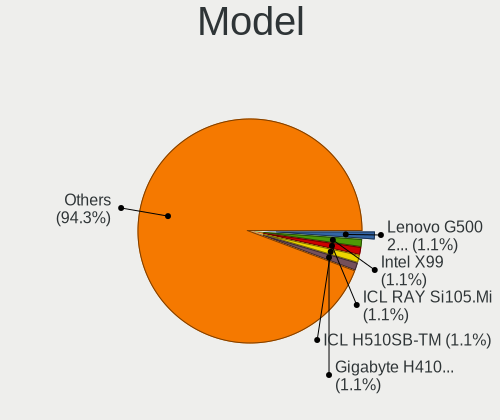
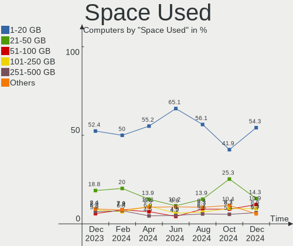
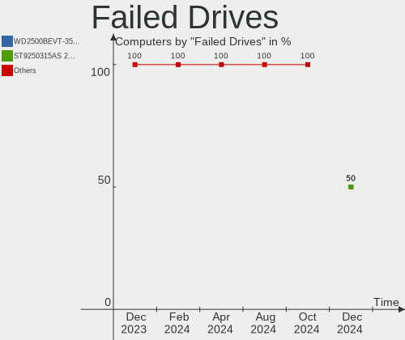
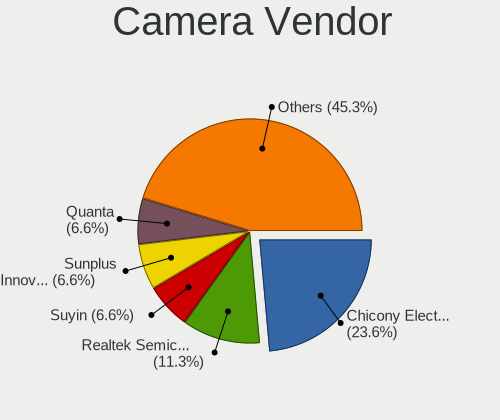

ROSA - Hardware Trends
----------------------

A project to identify most popular hardware characteristics and track their change
over time based on data collected by Linux users at https://Linux-Hardware.org.

Anyone can contribute to this report by the [hw-probe](https://github.com/linuxhw/hw-probe) tool:

    sudo -E hw-probe -all -upload

This is a report for all computer types. See also reports for [desktops](/Dist/ROSA/Desktop/README.md) and [notebooks](/Dist/ROSA/Notebook/README.md).

This report is for one last month. Overall report since the beginning of time: [TestCoverage](https://github.com/linuxhw/TestCoverage)

Period: May, 2022.

Contents
--------

* [ System ](#system)
  - [ OS                       ](#os)
  - [ OS Family                ](#os-family)
  - [ Kernel                   ](#kernel)
  - [ Kernel Family            ](#kernel-family)
  - [ Kernel Major Ver.        ](#kernel-major-ver)
  - [ Arch                     ](#arch)
  - [ DE                       ](#de)
  - [ Display Server           ](#display-server)
  - [ Display Manager          ](#display-manager)
  - [ OS Lang                  ](#os-lang)
  - [ Boot Mode                ](#boot-mode)
  - [ Filesystem               ](#filesystem)
  - [ Part. scheme             ](#part-scheme)
  - [ Dual Boot with Linux/BSD ](#dual-boot-with-linuxbsd)
  - [ Dual Boot (Win)          ](#dual-boot-win)

* [ Board ](#board)
  - [ Vendor                   ](#vendor)
  - [ Model                    ](#model)
  - [ Model Family             ](#model-family)
  - [ MFG Year                 ](#mfg-year)
  - [ Form Factor              ](#form-factor)
  - [ Secure Boot              ](#secure-boot)
  - [ Coreboot                 ](#coreboot)
  - [ RAM Size                 ](#ram-size)
  - [ RAM Used                 ](#ram-used)
  - [ Total Drives             ](#total-drives)
  - [ Has CD-ROM               ](#has-cd-rom)
  - [ Has Ethernet             ](#has-ethernet)
  - [ Has WiFi                 ](#has-wifi)
  - [ Has Bluetooth            ](#has-bluetooth)

* [ Location ](#location)
  - [ Country                  ](#country)
  - [ City                     ](#city)

* [ Drives ](#drives)
  - [ Drive Vendor             ](#drive-vendor)
  - [ Drive Model              ](#drive-model)
  - [ HDD Vendor               ](#hdd-vendor)
  - [ SSD Vendor               ](#ssd-vendor)
  - [ Drive Kind               ](#drive-kind)
  - [ Drive Connector          ](#drive-connector)
  - [ Drive Size               ](#drive-size)
  - [ Space Total              ](#space-total)
  - [ Space Used               ](#space-used)
  - [ Malfunc. Drives          ](#malfunc-drives)
  - [ Malfunc. Drive Vendor    ](#malfunc-drive-vendor)
  - [ Malfunc. HDD Vendor      ](#malfunc-hdd-vendor)
  - [ Malfunc. Drive Kind      ](#malfunc-drive-kind)
  - [ Failed Drives            ](#failed-drives)
  - [ Failed Drive Vendor      ](#failed-drive-vendor)
  - [ Drive Status             ](#drive-status)

* [ Storage controller ](#storage-controller)
  - [ Storage Vendor           ](#storage-vendor)
  - [ Storage Model            ](#storage-model)
  - [ Storage Kind             ](#storage-kind)

* [ Processor ](#processor)
  - [ CPU Vendor               ](#cpu-vendor)
  - [ CPU Model                ](#cpu-model)
  - [ CPU Model Family         ](#cpu-model-family)
  - [ CPU Cores                ](#cpu-cores)
  - [ CPU Sockets              ](#cpu-sockets)
  - [ CPU Threads              ](#cpu-threads)
  - [ CPU Op-Modes             ](#cpu-op-modes)
  - [ CPU Microcode            ](#cpu-microcode)
  - [ CPU Microarch            ](#cpu-microarch)

* [ Graphics ](#graphics)
  - [ GPU Vendor               ](#gpu-vendor)
  - [ GPU Model                ](#gpu-model)
  - [ GPU Combo                ](#gpu-combo)
  - [ GPU Driver               ](#gpu-driver)
  - [ GPU Memory               ](#gpu-memory)

* [ Monitor ](#monitor)
  - [ Monitor Vendor           ](#monitor-vendor)
  - [ Monitor Model            ](#monitor-model)
  - [ Monitor Resolution       ](#monitor-resolution)
  - [ Monitor Diagonal         ](#monitor-diagonal)
  - [ Monitor Width            ](#monitor-width)
  - [ Aspect Ratio             ](#aspect-ratio)
  - [ Monitor Area             ](#monitor-area)
  - [ Pixel Density            ](#pixel-density)
  - [ Multiple Monitors        ](#multiple-monitors)

* [ Network ](#network)
  - [ Net Controller Vendor    ](#net-controller-vendor)
  - [ Net Controller Model     ](#net-controller-model)
  - [ Wireless Vendor          ](#wireless-vendor)
  - [ Wireless Model           ](#wireless-model)
  - [ Ethernet Vendor          ](#ethernet-vendor)
  - [ Ethernet Model           ](#ethernet-model)
  - [ Net Controller Kind      ](#net-controller-kind)
  - [ Used Controller          ](#used-controller)
  - [ NICs                     ](#nics)
  - [ IPv6                     ](#ipv6)

* [ Bluetooth ](#bluetooth)
  - [ Bluetooth Vendor         ](#bluetooth-vendor)
  - [ Bluetooth Model          ](#bluetooth-model)

* [ Sound ](#sound)
  - [ Sound Vendor             ](#sound-vendor)
  - [ Sound Model              ](#sound-model)

* [ Memory ](#memory)
  - [ Memory Vendor            ](#memory-vendor)
  - [ Memory Model             ](#memory-model)
  - [ Memory Kind              ](#memory-kind)
  - [ Memory Form Factor       ](#memory-form-factor)
  - [ Memory Size              ](#memory-size)
  - [ Memory Speed             ](#memory-speed)

* [ Printers & scanners ](#printers--scanners)
  - [ Printer Vendor           ](#printer-vendor)
  - [ Printer Model            ](#printer-model)
  - [ Scanner Vendor           ](#scanner-vendor)
  - [ Scanner Model            ](#scanner-model)

* [ Camera ](#camera)
  - [ Camera Vendor            ](#camera-vendor)
  - [ Camera Model             ](#camera-model)

* [ Security ](#security)
  - [ Fingerprint Vendor       ](#fingerprint-vendor)
  - [ Fingerprint Model        ](#fingerprint-model)
  - [ Chipcard Vendor          ](#chipcard-vendor)
  - [ Chipcard Model           ](#chipcard-model)

* [ Unsupported ](#unsupported)
  - [ Unsupported Devices      ](#unsupported-devices)
  - [ Unsupported Device Types ](#unsupported-device-types)

System
------

OS
--

Installed operating systems

| Name       | Computers | Percent |
|------------|-----------|---------|
| ROSA 12.2  | 268       | 87.58%  |
| ROSA R11.1 | 27        | 8.82%   |
| ROSA 12.1  | 9         | 2.94%   |
| ROSA R11   | 1         | 0.33%   |
| ROSA 12    | 1         | 0.33%   |

OS Family
---------

OS without a version

| Name | Computers | Percent |
|------|-----------|---------|
| ROSA | 306       | 100%    |

Kernel
------

Version of the Linux kernel

| Version                                    | Computers | Percent |
|--------------------------------------------|-----------|---------|
| 5.10.74-generic-2rosa2021.1-x86_64         | 244       | 79.74%  |
| 5.15.32-generic-6rosa2021.1-x86_64         | 17        | 5.56%   |
| 5.4.83-generic-2rosa-x86_64                | 11        | 3.59%   |
| 5.10.74-generic-2rosa2021.1-i586           | 7         | 2.29%   |
| 4.15.0-desktop-122.124.1rosa-x86_64        | 5         | 1.63%   |
| 5.4.83-generic-2rosa-i586                  | 2         | 0.65%   |
| 5.4.32-generic-2rosa-i586                  | 2         | 0.65%   |
| 5.17.11-generic-1rosa2021.1-x86_64         | 2         | 0.65%   |
| 4.15.0-desktop-122.124.1rosa-i586          | 2         | 0.65%   |
| 5.4.32-generic-2rosa-x86_64                | 1         | 0.33%   |
| 5.17.7.xm1-1.klp-xanmod-rosa2021.1-x86_64  | 1         | 0.33%   |
| 5.17.11.xm1-1.klp-xanmod-rosa2021.1-x86_64 | 1         | 0.33%   |
| 5.16.20-generic-1rosa2021.1-x86_64         | 1         | 0.33%   |
| 5.16.18-generic-2rosa2021.1-x86_64         | 1         | 0.33%   |
| 5.16.18-generic-1rosa2021.1-x86_64         | 1         | 0.33%   |
| 5.16.17-generic-1rosa2021.1-x86_64         | 1         | 0.33%   |
| 5.16.11.xm1-1.klp-xanmod-rosa2021.1-x86_64 | 1         | 0.33%   |
| 5.15.32-generic-6rosa2021.1-arm64          | 1         | 0.33%   |
| 5.13.9-generic-1rosa-x86_64                | 1         | 0.33%   |
| 5.10.50-generic-1rosa-x86_64               | 1         | 0.33%   |
| 4.9.155-nrj-desktop-1rosa-x86_64           | 1         | 0.33%   |
| 4.9.155-nrj-desktop-1rosa-i586             | 1         | 0.33%   |
| 4.15.0-desktop-94.1rosa-x86_64             | 1         | 0.33%   |

Kernel Family
-------------

Linux kernel without a distro release

| Version | Computers | Percent |
|---------|-----------|---------|
| 5.10.74 | 251       | 82.03%  |
| 5.15.32 | 18        | 5.88%   |
| 5.4.83  | 13        | 4.25%   |
| 4.15.0  | 8         | 2.61%   |
| 5.4.32  | 3         | 0.98%   |
| 5.17.11 | 3         | 0.98%   |
| 5.16.18 | 2         | 0.65%   |
| 4.9.155 | 2         | 0.65%   |
| 5.17.7  | 1         | 0.33%   |
| 5.16.20 | 1         | 0.33%   |
| 5.16.17 | 1         | 0.33%   |
| 5.16.11 | 1         | 0.33%   |
| 5.13.9  | 1         | 0.33%   |
| 5.10.50 | 1         | 0.33%   |

Kernel Major Ver.
-----------------

Linux kernel major version

| Version | Computers | Percent |
|---------|-----------|---------|
| 5.10    | 252       | 82.35%  |
| 5.15    | 18        | 5.88%   |
| 5.4     | 16        | 5.23%   |
| 4.15    | 8         | 2.61%   |
| 5.16    | 5         | 1.63%   |
| 5.17    | 4         | 1.31%   |
| 4.9     | 2         | 0.65%   |
| 5.13    | 1         | 0.33%   |

Arch
----

OS architecture (x86_64, i586, etc.)

| Name    | Computers | Percent |
|---------|-----------|---------|
| x86_64  | 291       | 95.1%   |
| i686    | 14        | 4.58%   |
| aarch64 | 1         | 0.33%   |

DE
--

Desktop Environment

| Name    | Computers | Percent |
|---------|-----------|---------|
| KDE5    | 131       | 42.81%  |
| GNOME   | 126       | 41.18%  |
| LXQt    | 29        | 9.48%   |
| KDE4    | 16        | 5.23%   |
| XFCE    | 3         | 0.98%   |
| Unknown | 1         | 0.33%   |

Display Server
--------------

X11 or Wayland

| Name    | Computers | Percent |
|---------|-----------|---------|
| Wayland | 240       | 78.43%  |
| X11     | 64        | 20.92%  |
| Tty     | 2         | 0.65%   |

Display Manager
---------------

SDDM, LightDM, etc.

| Name    | Computers | Percent |
|---------|-----------|---------|
| GDM     | 157       | 51.31%  |
| SDDM    | 124       | 40.52%  |
| KDM     | 16        | 5.23%   |
| LightDM | 8         | 2.61%   |
| Unknown | 1         | 0.33%   |

OS Lang
-------

Language

| Lang        | Computers | Percent |
|-------------|-----------|---------|
| ru_RU       | 274       | 89.54%  |
| en_US       | 14        | 4.58%   |
| de_DE       | 4         | 1.31%   |
| ru_UA       | 3         | 0.98%   |
| pl_PL       | 3         | 0.98%   |
| pt_BR       | 2         | 0.65%   |
| sr_RS@latin | 1         | 0.33%   |
| pt_PT       | 1         | 0.33%   |
| it_IT       | 1         | 0.33%   |
| fr_FR       | 1         | 0.33%   |
| es_ES       | 1         | 0.33%   |
| C           | 1         | 0.33%   |

Boot Mode
---------

EFI or BIOS

| Mode | Computers | Percent |
|------|-----------|---------|
| EFI  | 155       | 50.65%  |
| BIOS | 151       | 49.35%  |

Filesystem
----------

Type of filesystem

| Type     | Computers | Percent |
|----------|-----------|---------|
| Ext4     | 291       | 95.1%   |
| Btrfs    | 12        | 3.92%   |
| Reiserfs | 1         | 0.33%   |
| F2fs     | 1         | 0.33%   |
| Aufs     | 1         | 0.33%   |

Part. scheme
------------

Scheme of partitioning

| Type | Computers | Percent |
|------|-----------|---------|
| GPT  | 194       | 63.4%   |
| MBR  | 112       | 36.6%   |

Dual Boot with Linux/BSD
------------------------

Hosting more than one Linux/BSD

| Dual boot | Computers | Percent |
|-----------|-----------|---------|
| No        | 230       | 75.16%  |
| Yes       | 76        | 24.84%  |

Dual Boot (Win)
---------------

Hosting Linux and Windows

| Dual boot | Computers | Percent |
|-----------|-----------|---------|
| No        | 158       | 51.63%  |
| Yes       | 148       | 48.37%  |

Board
-----

Vendor
------

Motherboard manufacturer

| Name                | Computers | Percent |
|---------------------|-----------|---------|
| ASUSTek Computer    | 75        | 24.51%  |
| Gigabyte Technology | 47        | 15.36%  |
| Hewlett-Packard     | 27        | 8.82%   |
| Lenovo              | 25        | 8.17%   |
| Acer                | 24        | 7.84%   |
| ASRock              | 21        | 6.86%   |
| MSI                 | 19        | 6.21%   |
| Dell                | 13        | 4.25%   |
| Samsung Electronics | 9         | 2.94%   |
| Intel               | 6         | 1.96%   |
| Unknown             | 5         | 1.63%   |
| Huanan              | 4         | 1.31%   |
| Toshiba             | 3         | 0.98%   |
| Packard Bell        | 2         | 0.65%   |
| Notebook            | 2         | 0.65%   |
| Fujitsu             | 2         | 0.65%   |
| Foxconn             | 2         | 0.65%   |
| ECS                 | 2         | 0.65%   |
| Chuwi               | 2         | 0.65%   |
| Timi                | 1         | 0.33%   |
| T-Platforms         | 1         | 0.33%   |
| Supermicro          | 1         | 0.33%   |
| Sony                | 1         | 0.33%   |
| ONDA                | 1         | 0.33%   |
| MACHINIST           | 1         | 0.33%   |
| K-Systems           | 1         | 0.33%   |
| Irbis               | 1         | 0.33%   |
| ICL                 | 1         | 0.33%   |
| HPE                 | 1         | 0.33%   |
| EPoX Computer       | 1         | 0.33%   |
| eMachines           | 1         | 0.33%   |
| Compaq              | 1         | 0.33%   |
| Clevo               | 1         | 0.33%   |
| Apple               | 1         | 0.33%   |
| ABIT                | 1         | 0.33%   |

Model
-----

Motherboard model

| Name                                       | Computers | Percent |
|--------------------------------------------|-----------|---------|
| Unknown                                    | 8         | 2.61%   |
| ASUS All Series                            | 5         | 1.63%   |
| HP Pavilion g6                             | 3         | 0.98%   |
| ASRock N68-S3 UCC                          | 3         | 0.98%   |
| Samsung 355V4C/356V4C/3445VC/3545VC        | 2         | 0.65%   |
| MSI MS-7B86                                | 2         | 0.65%   |
| Lenovo IdeaPad 330-15IKB 81DE              | 2         | 0.65%   |
| Lenovo B590 20206                          | 2         | 0.65%   |
| HP Notebook                                | 2         | 0.65%   |
| Gigabyte P61A-D3                           | 2         | 0.65%   |
| Gigabyte H77-DS3H                          | 2         | 0.65%   |
| ASUS TUF Gaming FX504GE_FX80GE             | 2         | 0.65%   |
| ASUS M5A78L-M LE/USB3                      | 2         | 0.65%   |
| ASUS H110M-R                               | 2         | 0.65%   |
| ASUS A68HM-K                               | 2         | 0.65%   |
| ASRock B450 Gaming K4                      | 2         | 0.65%   |
| Acer Extensa 2519                          | 2         | 0.65%   |
| Toshiba Satellite U400                     | 1         | 0.33%   |
| Toshiba Satellite U300                     | 1         | 0.33%   |
| Toshiba Satellite L750D                    | 1         | 0.33%   |
| Timi TM1607                                | 1         | 0.33%   |
| T-Platforms TF307-MB-S-C                   | 1         | 0.33%   |
| Supermicro SYS-5039MS-H12TRF               | 1         | 0.33%   |
| Sony SVE1512H1RW                           | 1         | 0.33%   |
| Samsung SQ45S70S                           | 1         | 0.33%   |
| Samsung RV411/RV511/E3511/S3511/RV711      | 1         | 0.33%   |
| Samsung RC530/RC730                        | 1         | 0.33%   |
| Samsung R59P/R60P/R61P                     | 1         | 0.33%   |
| Samsung R530/R730/P530                     | 1         | 0.33%   |
| Samsung 530U3C/530U4C                      | 1         | 0.33%   |
| Samsung 300E4A/300E5A/300E7A/3430EA/3530EA | 1         | 0.33%   |
| Packard Bell EasyNote TV44HC               | 1         | 0.33%   |
| Packard Bell EasyNote TS11HR               | 1         | 0.33%   |
| ONDA OBOOK 20 PLUS                         | 1         | 0.33%   |
| Notebook W65_67SF                          | 1         | 0.33%   |
| Notebook NLx0MU                            | 1         | 0.33%   |
| MSI MS-7D32                                | 1         | 0.33%   |
| MSI MS-7C96                                | 1         | 0.33%   |
| MSI MS-7C86                                | 1         | 0.33%   |
| MSI MS-7C56                                | 1         | 0.33%   |
| MSI MS-7C09                                | 1         | 0.33%   |
| MSI MS-7C02                                | 1         | 0.33%   |
| MSI MS-7B98                                | 1         | 0.33%   |
| MSI MS-7B93                                | 1         | 0.33%   |
| MSI MS-7B89                                | 1         | 0.33%   |
| MSI MS-7B47                                | 1         | 0.33%   |
| MSI MS-7A38                                | 1         | 0.33%   |
| MSI MS-7885                                | 1         | 0.33%   |
| MSI MS-7693                                | 1         | 0.33%   |
| MSI MS-7641                                | 1         | 0.33%   |
| MSI MS-7615                                | 1         | 0.33%   |
| MSI GP60 2QE                               | 1         | 0.33%   |
| MSI GL62M 7REX                             | 1         | 0.33%   |
| MACHINIST X99-K9 V2.0                      | 1         | 0.33%   |
| Lenovo Z50-70 20354                        | 1         | 0.33%   |
| Lenovo ThinkPad X200 7455FPG               | 1         | 0.33%   |
| Lenovo ThinkPad T480s 20L7001PAD           | 1         | 0.33%   |
| Lenovo ThinkPad T480 20L5000ART            | 1         | 0.33%   |
| Lenovo ThinkPad L520 5017BK4               | 1         | 0.33%   |
| Lenovo ThinkPad L460 20FVS14V00            | 1         | 0.33%   |

Model Family
------------

Motherboard model prefix

| Name                         | Computers | Percent |
|------------------------------|-----------|---------|
| Acer Aspire                  | 14        | 4.58%   |
| HP Pavilion                  | 10        | 3.27%   |
| Unknown                      | 8         | 2.61%   |
| ASUS VivoBook                | 6         | 1.96%   |
| Lenovo ThinkPad              | 5         | 1.63%   |
| ASUS PRIME                   | 5         | 1.63%   |
| ASUS All                     | 5         | 1.63%   |
| Lenovo IdeaPad               | 4         | 1.31%   |
| ASUS ROG                     | 4         | 1.31%   |
| Toshiba Satellite            | 3         | 0.98%   |
| HP ProBook                   | 3         | 0.98%   |
| HP Laptop                    | 3         | 0.98%   |
| Dell Vostro                  | 3         | 0.98%   |
| Dell OptiPlex                | 3         | 0.98%   |
| Dell Inspiron                | 3         | 0.98%   |
| ASUS TUF                     | 3         | 0.98%   |
| ASUS M5A97                   | 3         | 0.98%   |
| ASRock N68-S3                | 3         | 0.98%   |
| Acer Extensa                 | 3         | 0.98%   |
| Samsung 355V4C               | 2         | 0.65%   |
| Packard Bell EasyNote        | 2         | 0.65%   |
| MSI MS-7B86                  | 2         | 0.65%   |
| Lenovo Legion                | 2         | 0.65%   |
| Lenovo B590                  | 2         | 0.65%   |
| Intel X79                    | 2         | 0.65%   |
| Huanan X99-F8                | 2         | 0.65%   |
| HP Notebook                  | 2         | 0.65%   |
| HP Compaq                    | 2         | 0.65%   |
| Gigabyte P61A-D3             | 2         | 0.65%   |
| Gigabyte H77-DS3H            | 2         | 0.65%   |
| Gigabyte B450M               | 2         | 0.65%   |
| Gigabyte AB350M-DS3H         | 2         | 0.65%   |
| ASUS M5A78L-M                | 2         | 0.65%   |
| ASUS H110M-R                 | 2         | 0.65%   |
| ASUS A68HM-K                 | 2         | 0.65%   |
| ASRock B450                  | 2         | 0.65%   |
| Acer Nitro                   | 2         | 0.65%   |
| Timi TM1607                  | 1         | 0.33%   |
| T-Platforms TF307-MB-S-C     | 1         | 0.33%   |
| Supermicro SYS-5039MS-H12TRF | 1         | 0.33%   |
| Sony SVE1512H1RW             | 1         | 0.33%   |
| Samsung SQ45S70S             | 1         | 0.33%   |
| Samsung RV411                | 1         | 0.33%   |
| Samsung RC530                | 1         | 0.33%   |
| Samsung R59P                 | 1         | 0.33%   |
| Samsung R530                 | 1         | 0.33%   |
| Samsung 530U3C               | 1         | 0.33%   |
| Samsung 300E4A               | 1         | 0.33%   |
| ONDA OBOOK                   | 1         | 0.33%   |
| Notebook W65                 | 1         | 0.33%   |
| Notebook NLx0MU              | 1         | 0.33%   |
| MSI MS-7D32                  | 1         | 0.33%   |
| MSI MS-7C96                  | 1         | 0.33%   |
| MSI MS-7C86                  | 1         | 0.33%   |
| MSI MS-7C56                  | 1         | 0.33%   |
| MSI MS-7C09                  | 1         | 0.33%   |
| MSI MS-7C02                  | 1         | 0.33%   |
| MSI MS-7B98                  | 1         | 0.33%   |
| MSI MS-7B93                  | 1         | 0.33%   |
| MSI MS-7B89                  | 1         | 0.33%   |

MFG Year
--------

Motherboard manufacture year

| Year | Computers | Percent |
|------|-----------|---------|
| 2018 | 35        | 11.44%  |
| 2012 | 33        | 10.78%  |
| 2011 | 28        | 9.15%   |
| 2020 | 24        | 7.84%   |
| 2013 | 24        | 7.84%   |
| 2010 | 22        | 7.19%   |
| 2019 | 19        | 6.21%   |
| 2016 | 19        | 6.21%   |
| 2017 | 18        | 5.88%   |
| 2021 | 17        | 5.56%   |
| 2008 | 16        | 5.23%   |
| 2015 | 14        | 4.58%   |
| 2014 | 13        | 4.25%   |
| 2007 | 12        | 3.92%   |
| 2009 | 8         | 2.61%   |
| 2022 | 2         | 0.65%   |
| 2006 | 1         | 0.33%   |
| 2005 | 1         | 0.33%   |

Form Factor
-----------

Physical design of the computer

| Name           | Computers | Percent |
|----------------|-----------|---------|
| Desktop        | 162       | 52.94%  |
| Notebook       | 134       | 43.79%  |
| Mini pc        | 4         | 1.31%   |
| Stick pc       | 1         | 0.33%   |
| System on chip | 1         | 0.33%   |
| Tablet         | 1         | 0.33%   |
| Convertible    | 1         | 0.33%   |
| All in one     | 1         | 0.33%   |
| Server         | 1         | 0.33%   |

Secure Boot
-----------

Enabled or disabled

| State    | Computers | Percent |
|----------|-----------|---------|
| Disabled | 306       | 100%    |

Coreboot
--------

Have coreboot on board

| Used | Computers | Percent |
|------|-----------|---------|
| No   | 306       | 100%    |

RAM Size
--------

Total RAM memory

| Size in GB  | Computers | Percent |
|-------------|-----------|---------|
| 4.01-8.0    | 75        | 24.51%  |
| 3.01-4.0    | 66        | 21.57%  |
| 8.01-16.0   | 60        | 19.61%  |
| 16.01-24.0  | 49        | 16.01%  |
| 32.01-64.0  | 21        | 6.86%   |
| 1.01-2.0    | 20        | 6.54%   |
| 24.01-32.0  | 5         | 1.63%   |
| 64.01-256.0 | 4         | 1.31%   |
| 2.01-3.0    | 3         | 0.98%   |
| 0.51-1.0    | 3         | 0.98%   |

RAM Used
--------

Used RAM memory

| Used GB   | Computers | Percent |
|-----------|-----------|---------|
| 1.01-2.0  | 152       | 49.67%  |
| 0.51-1.0  | 91        | 29.74%  |
| 2.01-3.0  | 36        | 11.76%  |
| 3.01-4.0  | 17        | 5.56%   |
| 4.01-8.0  | 8         | 2.61%   |
| 8.01-16.0 | 1         | 0.33%   |
| 0.01-0.5  | 1         | 0.33%   |

Total Drives
------------

Number of drives on board

| Drives | Computers | Percent |
|--------|-----------|---------|
| 1      | 169       | 55.23%  |
| 2      | 76        | 24.84%  |
| 3      | 35        | 11.44%  |
| 4      | 16        | 5.23%   |
| 5      | 7         | 2.29%   |
| 0      | 2         | 0.65%   |
| 6      | 1         | 0.33%   |

Has CD-ROM
----------

Has CD-ROM on board

| Presented | Computers | Percent |
|-----------|-----------|---------|
| No        | 178       | 58.17%  |
| Yes       | 128       | 41.83%  |

Has Ethernet
------------

Has Ethernet on board

| Presented | Computers | Percent |
|-----------|-----------|---------|
| Yes       | 281       | 91.83%  |
| No        | 25        | 8.17%   |

Has WiFi
--------

Has WiFi module

| Presented | Computers | Percent |
|-----------|-----------|---------|
| Yes       | 175       | 57.19%  |
| No        | 131       | 42.81%  |

Has Bluetooth
-------------

Has Bluetooth module

| Presented | Computers | Percent |
|-----------|-----------|---------|
| No        | 175       | 57.19%  |
| Yes       | 131       | 42.81%  |

Location
--------

Country
-------

Geographic location (country)

| Country    | Computers | Percent |
|------------|-----------|---------|
| Russia     | 256       | 83.66%  |
| Ukraine    | 17        | 5.56%   |
| Poland     | 5         | 1.63%   |
| Germany    | 5         | 1.63%   |
| Belarus    | 5         | 1.63%   |
| Brazil     | 3         | 0.98%   |
| USA        | 2         | 0.65%   |
| Serbia     | 2         | 0.65%   |
| Kazakhstan | 2         | 0.65%   |
| UK         | 1         | 0.33%   |
| Lithuania  | 1         | 0.33%   |
| Jordan     | 1         | 0.33%   |
| Italy      | 1         | 0.33%   |
| France     | 1         | 0.33%   |
| Canada     | 1         | 0.33%   |
| Bulgaria   | 1         | 0.33%   |
| Bolivia    | 1         | 0.33%   |
| Australia  | 1         | 0.33%   |

City
----

Geographic location (city)

| City              | Computers | Percent |
|-------------------|-----------|---------|
| Moscow            | 57        | 18.63%  |
| St Petersburg     | 22        | 7.19%   |
| Chelyabinsk       | 8         | 2.61%   |
| Krasnodar         | 7         | 2.29%   |
| Yekaterinburg     | 6         | 1.96%   |
| Perm              | 6         | 1.96%   |
| Novosibirsk       | 6         | 1.96%   |
| Samara            | 5         | 1.63%   |
| Nizhniy Novgorod  | 5         | 1.63%   |
| Voronezh          | 4         | 1.31%   |
| Simferopol        | 4         | 1.31%   |
| Khabarovsk        | 4         | 1.31%   |
| Yoshkar-Ola       | 3         | 0.98%   |
| Tver              | 3         | 0.98%   |
| Rostov-on-Don     | 3         | 0.98%   |
| Barnaul           | 3         | 0.98%   |
| Yaroslavl         | 2         | 0.65%   |
| Yakutsk           | 2         | 0.65%   |
| Volkhov           | 2         | 0.65%   |
| Volgograd         | 2         | 0.65%   |
| Ufa               | 2         | 0.65%   |
| Tula              | 2         | 0.65%   |
| Tomsk             | 2         | 0.65%   |
| Tolyatti          | 2         | 0.65%   |
| Taganrog          | 2         | 0.65%   |
| Sevastopol        | 2         | 0.65%   |
| Saratov           | 2         | 0.65%   |
| Pyatigorsk        | 2         | 0.65%   |
| Pskov             | 2         | 0.65%   |
| Novopskov         | 2         | 0.65%   |
| Noril'sk          | 2         | 0.65%   |
| Mirny             | 2         | 0.65%   |
| Kremenchug        | 2         | 0.65%   |
| Krasnoyarsk       | 2         | 0.65%   |
| Kostroma          | 2         | 0.65%   |
| Kazan’          | 2         | 0.65%   |
| Irkutsk           | 2         | 0.65%   |
| Bratsk            | 2         | 0.65%   |
| Biysk             | 2         | 0.65%   |
| Belgrade          | 2         | 0.65%   |
| Yuzhno-Sakhalinsk | 1         | 0.33%   |
| Yelabuga          | 1         | 0.33%   |
| Yasinovataya      | 1         | 0.33%   |
| Yartsevo          | 1         | 0.33%   |
| Yablonovsky       | 1         | 0.33%   |
| Wroclaw           | 1         | 0.33%   |
| Votkinsk          | 1         | 0.33%   |
| Voskresensk       | 1         | 0.33%   |
| Vitebsk           | 1         | 0.33%   |
| Vilyeyka          | 1         | 0.33%   |
| Veliky Novgorod   | 1         | 0.33%   |
| Velikiye Luki     | 1         | 0.33%   |
| Valuyki           | 1         | 0.33%   |
| Val               | 1         | 0.33%   |
| Tyumen            | 1         | 0.33%   |
| Tuapse            | 1         | 0.33%   |
| Tsimlyansk        | 1         | 0.33%   |
| Torun             | 1         | 0.33%   |
| Tambov            | 1         | 0.33%   |
| Taman'            | 1         | 0.33%   |

Drives
------

Drive Vendor
------------

Hard drive vendors

| Vendor              | Computers | Drives | Percent |
|---------------------|-----------|--------|---------|
| WDC                 | 89        | 102    | 18.24%  |
| Seagate             | 85        | 94     | 17.42%  |
| Samsung Electronics | 53        | 60     | 10.86%  |
| Toshiba             | 31        | 33     | 6.35%   |
| Hitachi             | 23        | 23     | 4.71%   |
| Kingston            | 21        | 21     | 4.3%    |
| Unknown             | 16        | 17     | 3.28%   |
| HGST                | 14        | 14     | 2.87%   |
| Crucial             | 13        | 14     | 2.66%   |
| A-DATA Technology   | 13        | 13     | 2.66%   |
| China               | 11        | 11     | 2.25%   |
| Apacer              | 10        | 11     | 2.05%   |
| SK Hynix            | 9         | 9      | 1.84%   |
| Intel               | 8         | 8      | 1.64%   |
| SanDisk             | 6         | 6      | 1.23%   |
| KingSpec            | 6         | 6      | 1.23%   |
| GOODRAM             | 5         | 5      | 1.02%   |
| XrayDisk            | 4         | 6      | 0.82%   |
| XPG                 | 4         | 4      | 0.82%   |
| Smartbuy            | 4         | 5      | 0.82%   |
| Patriot             | 4         | 4      | 0.82%   |
| OCZ                 | 4         | 4      | 0.82%   |
| AMD                 | 4         | 4      | 0.82%   |
| SPCC                | 3         | 3      | 0.61%   |
| Silicon Motion      | 3         | 4      | 0.61%   |
| Gigabyte Technology | 3         | 3      | 0.61%   |
| Transcend           | 2         | 2      | 0.41%   |
| Phison              | 2         | 2      | 0.41%   |
| Netac               | 2         | 2      | 0.41%   |
| MAXTOR              | 2         | 2      | 0.41%   |
| KIOXIA              | 2         | 2      | 0.41%   |
| Intenso             | 2         | 2      | 0.41%   |
| FOXLINE             | 2         | 2      | 0.41%   |
| Unknown             | 2         | 2      | 0.41%   |
| Zheino              | 1         | 1      | 0.2%    |
| Vaseky              | 1         | 1      | 0.2%    |
| UMIS                | 1         | 1      | 0.2%    |
| TO Exter            | 1         | 1      | 0.2%    |
| THU                 | 1         | 1      | 0.2%    |
| Teclast             | 1         | 1      | 0.2%    |
| Team                | 1         | 1      | 0.2%    |
| ROG                 | 1         | 1      | 0.2%    |
| QUMO                | 1         | 1      | 0.2%    |
| PNY                 | 1         | 1      | 0.2%    |
| PLEXTOR             | 1         | 1      | 0.2%    |
| Pioneer             | 1         | 1      | 0.2%    |
| Mushkin             | 1         | 1      | 0.2%    |
| Micron Technology   | 1         | 1      | 0.2%    |
| LITEON              | 1         | 1      | 0.2%    |
| Lexar               | 1         | 1      | 0.2%    |
| Leven               | 1         | 1      | 0.2%    |
| KIOXIA-EXCERIA      | 1         | 1      | 0.2%    |
| JMicron             | 1         | 1      | 0.2%    |
| HUAWEI              | 1         | 1      | 0.2%    |
| HPE                 | 1         | 1      | 0.2%    |
| Hewlett-Packard     | 1         | 1      | 0.2%    |
| e2e4                | 1         | 1      | 0.2%    |
| Dell                | 1         | 1      | 0.2%    |
| ASMT                | 1         | 2      | 0.2%    |
| Apple               | 1         | 1      | 0.2%    |

Drive Model
-----------

Hard drive models

| Model                               | Computers | Percent |
|-------------------------------------|-----------|---------|
| Toshiba HDWD110 1TB                 | 9         | 1.72%   |
| Seagate ST1000DM010-2EP102 1TB      | 8         | 1.53%   |
| Toshiba MQ01ABF050 500GB            | 6         | 1.15%   |
| Seagate ST500DM002-1BD142 500GB     | 6         | 1.15%   |
| Seagate ST500LT012-1DG142 500GB     | 5         | 0.96%   |
| Samsung SSD 860 EVO 250GB           | 5         | 0.96%   |
| Seagate ST380815AS 80GB             | 4         | 0.76%   |
| Seagate ST1000LM049-2GH172 1TB      | 4         | 0.76%   |
| Samsung SSD 970 EVO Plus 250GB      | 4         | 0.76%   |
| Kingston SA400S37120G 120GB SSD     | 4         | 0.76%   |
| Apacer AS350 256GB SSD              | 4         | 0.76%   |
| XPG GAMMIX S11 Pro 256GB            | 3         | 0.57%   |
| WDC WDS240G2G0B-00EPW0 240GB SSD    | 3         | 0.57%   |
| WDC WD5000LPCX-21VHAT0 500GB        | 3         | 0.57%   |
| WDC WD20EZRZ-00Z5HB0 2TB            | 3         | 0.57%   |
| WDC WD10EZEX-08WN4A0 1TB            | 3         | 0.57%   |
| Seagate ST500LT012-9WS142 500GB     | 3         | 0.57%   |
| Seagate ST1000LM024 HN-M101MBB 1TB  | 3         | 0.57%   |
| Seagate ST1000DM003-1CH162 1TB      | 3         | 0.57%   |
| Samsung SSD 860 EVO 500GB           | 3         | 0.57%   |
| Kingston SUV400S37120G 120GB SSD    | 3         | 0.57%   |
| Kingston SA400S37240G 240GB SSD     | 3         | 0.57%   |
| HGST HTS545050A7E680 500GB          | 3         | 0.57%   |
| HGST HTS545050A7E380 500GB          | 3         | 0.57%   |
| Crucial CT240BX500SSD1 240GB        | 3         | 0.57%   |
| China SATA SSD 120GB                | 3         | 0.57%   |
| Apacer AS350 128GB SSD              | 3         | 0.57%   |
| A-DATA SU650 240GB SSD              | 3         | 0.57%   |
| WDC WDS500G2B0A-00SM50 500GB SSD    | 2         | 0.38%   |
| WDC WDS240G2G0A-00JH30 240GB SSD    | 2         | 0.38%   |
| WDC WDS100T3X0C-00SJG0 1TB          | 2         | 0.38%   |
| WDC WD5000LPVX-22V0TT0 500GB        | 2         | 0.38%   |
| WDC WD5000AAKX-001CA0 500GB         | 2         | 0.38%   |
| WDC WD2500BEVT-60ZCT1 250GB         | 2         | 0.38%   |
| WDC WD20EZBX-00AYRA0 2TB            | 2         | 0.38%   |
| WDC WD10EZEX-00RKKA0 1TB            | 2         | 0.38%   |
| WDC WD10EZEX-00BN5A0 1TB            | 2         | 0.38%   |
| Unknown SD/MMC/MS PRO 999GB         | 2         | 0.38%   |
| Unknown ISOCOM  64GB                | 2         | 0.38%   |
| Toshiba HDWD105 500GB               | 2         | 0.38%   |
| Toshiba DT01ACA050 500GB            | 2         | 0.38%   |
| Smartbuy SSD 240GB                  | 2         | 0.38%   |
| SK Hynix HFM512GD3JX013N 512GB      | 2         | 0.38%   |
| Seagate ST9500325AS 500GB           | 2         | 0.38%   |
| Seagate ST9320325AS 320GB           | 2         | 0.38%   |
| Seagate ST320LT020-9YG142 320GB     | 2         | 0.38%   |
| Seagate ST3160815AS 160GB           | 2         | 0.38%   |
| Seagate ST31000528AS 1TB            | 2         | 0.38%   |
| Seagate ST31000524AS 1TB            | 2         | 0.38%   |
| Seagate ST2000DM001-9YN164 2TB      | 2         | 0.38%   |
| Seagate ST2000DM001-1CH164 2TB      | 2         | 0.38%   |
| Seagate ST1000LM035-1RK172 1TB      | 2         | 0.38%   |
| Seagate ST1000LM014-SSHD-8GB        | 2         | 0.38%   |
| SanDisk SD8SN8U-128G-1006 128GB SSD | 2         | 0.38%   |
| Samsung SSD 980 500GB               | 2         | 0.38%   |
| Samsung SSD 970 EVO 1TB             | 2         | 0.38%   |
| Samsung SSD 860 EVO M.2 500GB       | 2         | 0.38%   |
| Samsung SSD 850 EVO 250GB           | 2         | 0.38%   |
| Samsung SSD 750 EVO 120GB           | 2         | 0.38%   |
| Samsung MZVLQ256HAJD-00000 256GB    | 2         | 0.38%   |

HDD Vendor
----------

Hard disk drive vendors

| Vendor              | Computers | Drives | Percent |
|---------------------|-----------|--------|---------|
| Seagate             | 85        | 93     | 34.69%  |
| WDC                 | 78        | 86     | 31.84%  |
| Toshiba             | 29        | 29     | 11.84%  |
| Hitachi             | 23        | 23     | 9.39%   |
| HGST                | 14        | 14     | 5.71%   |
| Samsung Electronics | 9         | 9      | 3.67%   |
| Unknown             | 2         | 2      | 0.82%   |
| MAXTOR              | 2         | 2      | 0.82%   |
| HPE                 | 1         | 1      | 0.41%   |
| ASMT                | 1         | 2      | 0.41%   |
| Apple               | 1         | 1      | 0.41%   |

SSD Vendor
----------

Solid state drive vendors

| Vendor              | Computers | Drives | Percent |
|---------------------|-----------|--------|---------|
| Samsung Electronics | 28        | 29     | 16.18%  |
| Kingston            | 18        | 18     | 10.4%   |
| Crucial             | 12        | 13     | 6.94%   |
| China               | 11        | 11     | 6.36%   |
| WDC                 | 10        | 10     | 5.78%   |
| Apacer              | 10        | 11     | 5.78%   |
| A-DATA Technology   | 10        | 10     | 5.78%   |
| SanDisk             | 6         | 6      | 3.47%   |
| KingSpec            | 6         | 6      | 3.47%   |
| Smartbuy            | 4         | 5      | 2.31%   |
| Patriot             | 4         | 4      | 2.31%   |
| OCZ                 | 4         | 4      | 2.31%   |
| Intel               | 4         | 4      | 2.31%   |
| GOODRAM             | 4         | 4      | 2.31%   |
| XrayDisk            | 3         | 5      | 1.73%   |
| SPCC                | 3         | 3      | 1.73%   |
| SK Hynix            | 3         | 3      | 1.73%   |
| AMD                 | 3         | 3      | 1.73%   |
| Toshiba             | 2         | 2      | 1.16%   |
| Intenso             | 2         | 2      | 1.16%   |
| Gigabyte Technology | 2         | 2      | 1.16%   |
| Zheino              | 1         | 1      | 0.58%   |
| Vaseky              | 1         | 1      | 0.58%   |
| Transcend           | 1         | 1      | 0.58%   |
| TO Exter            | 1         | 1      | 0.58%   |
| THU                 | 1         | 1      | 0.58%   |
| Team                | 1         | 1      | 0.58%   |
| Seagate             | 1         | 1      | 0.58%   |
| QUMO                | 1         | 1      | 0.58%   |
| PNY                 | 1         | 1      | 0.58%   |
| PLEXTOR             | 1         | 1      | 0.58%   |
| Pioneer             | 1         | 1      | 0.58%   |
| Netac               | 1         | 1      | 0.58%   |
| Mushkin             | 1         | 1      | 0.58%   |
| Micron Technology   | 1         | 1      | 0.58%   |
| LITEON              | 1         | 1      | 0.58%   |
| Lexar               | 1         | 1      | 0.58%   |
| Leven               | 1         | 1      | 0.58%   |
| KIOXIA-EXCERIA      | 1         | 1      | 0.58%   |
| JMicron             | 1         | 1      | 0.58%   |
| Hewlett-Packard     | 1         | 1      | 0.58%   |
| FOXLINE             | 1         | 1      | 0.58%   |
| e2e4                | 1         | 1      | 0.58%   |
| Dell                | 1         | 1      | 0.58%   |
| Unknown             | 1         | 1      | 0.58%   |

Drive Kind
----------

HDD or SSD

| Kind    | Computers | Drives | Percent |
|---------|-----------|--------|---------|
| HDD     | 203       | 262    | 47.21%  |
| SSD     | 145       | 179    | 33.72%  |
| NVMe    | 65        | 68     | 15.12%  |
| MMC     | 15        | 16     | 3.49%   |
| Unknown | 2         | 2      | 0.47%   |

Drive Connector
---------------

SATA, SAS, NVMe, etc.

| Type | Computers | Drives | Percent |
|------|-----------|--------|---------|
| SATA | 274       | 431    | 75.48%  |
| NVMe | 65        | 68     | 17.91%  |
| MMC  | 15        | 16     | 4.13%   |
| SAS  | 9         | 12     | 2.48%   |

Drive Size
----------

Size of hard drive

| Size in TB | Computers | Drives | Percent |
|------------|-----------|--------|---------|
| 0.01-0.5   | 238       | 310    | 67.42%  |
| 0.51-1.0   | 85        | 98     | 24.08%  |
| 1.01-2.0   | 18        | 20     | 5.1%    |
| 3.01-4.0   | 6         | 7      | 1.7%    |
| 2.01-3.0   | 4         | 4      | 1.13%   |
| 4.01-10.0  | 2         | 2      | 0.57%   |

Space Total
-----------

Amount of disk space available on the file system

| Size in GB     | Computers | Percent |
|----------------|-----------|---------|
| 101-250        | 105       | 34.31%  |
| 251-500        | 68        | 22.22%  |
| 501-1000       | 35        | 11.44%  |
| 1-20           | 30        | 9.8%    |
| 1001-2000      | 22        | 7.19%   |
| 51-100         | 21        | 6.86%   |
| 21-50          | 18        | 5.88%   |
| More than 3000 | 5         | 1.63%   |
| 2001-3000      | 2         | 0.65%   |

Space Used
----------

Amount of used disk space

| Used GB        | Computers | Percent |
|----------------|-----------|---------|
| 1-20           | 203       | 66.34%  |
| 21-50          | 32        | 10.46%  |
| 101-250        | 24        | 7.84%   |
| 251-500        | 19        | 6.21%   |
| 51-100         | 13        | 4.25%   |
| 501-1000       | 10        | 3.27%   |
| More than 3000 | 2         | 0.65%   |
| 1001-2000      | 2         | 0.65%   |
| 2001-3000      | 1         | 0.33%   |

Malfunc. Drives
---------------

Drive models with a malfunction

| Model                                 | Computers | Drives | Percent |
|---------------------------------------|-----------|--------|---------|
| Seagate ST500LT012-9WS142 500GB       | 3         | 3      | 2.68%   |
| Seagate ST500DM002-1BD142 500GB       | 3         | 3      | 2.68%   |
| WDC WD2500BEVT-60ZCT1 250GB           | 2         | 2      | 1.79%   |
| Seagate ST9500325AS 500GB             | 2         | 2      | 1.79%   |
| Seagate ST9320325AS 320GB             | 2         | 2      | 1.79%   |
| Seagate ST500LT012-1DG142 500GB       | 2         | 2      | 1.79%   |
| Seagate ST3160815AS 160GB             | 2         | 2      | 1.79%   |
| Seagate ST31000528AS 1TB              | 2         | 2      | 1.79%   |
| Seagate ST2000DM001-9YN164 2TB        | 2         | 2      | 1.79%   |
| Kingston SUV400S37120G 120GB SSD      | 2         | 2      | 1.79%   |
| Hitachi HTS542516K9SA00 160GB         | 2         | 2      | 1.79%   |
| HGST HTS725050A7E630 500GB            | 2         | 2      | 1.79%   |
| HGST HTS545050A7E680 500GB            | 2         | 2      | 1.79%   |
| HGST HTS545050A7E380 500GB            | 2         | 2      | 1.79%   |
| XPG GAMMIX S5 512GB                   | 1         | 1      | 0.89%   |
| WDC WDS240G2G0A-00JH30 240GB SSD      | 1         | 1      | 0.89%   |
| WDC WD7500AARS-003BB1 752GB           | 1         | 1      | 0.89%   |
| WDC WD6400AARS-00Y5B1 640GB           | 1         | 1      | 0.89%   |
| WDC WD5000LPVX-22V0TT0 500GB          | 1         | 1      | 0.89%   |
| WDC WD5000AZRZ-00HTKB0 500GB          | 1         | 1      | 0.89%   |
| WDC WD5000AAKX-22ERMA0 500GB          | 1         | 1      | 0.89%   |
| WDC WD5000AAKX-00ERMA0 500GB          | 1         | 1      | 0.89%   |
| WDC WD5000AAKX-001CA0 500GB           | 1         | 1      | 0.89%   |
| WDC WD5000AAKS-22V1A0 500GB           | 1         | 1      | 0.89%   |
| WDC WD5000AAKS-00UU3A0 500GB          | 1         | 1      | 0.89%   |
| WDC WD3200BPVT-75ZEST0 320GB          | 1         | 1      | 0.89%   |
| WDC WD30EFRX-68EUZN0 3TB              | 1         | 1      | 0.89%   |
| WDC WD2500BEKT-60A25T1 250GB          | 1         | 1      | 0.89%   |
| WDC WD2500AAKX-00ERMA0 250GB          | 1         | 1      | 0.89%   |
| WDC WD2500AAJS-07B4A0 250GB           | 1         | 1      | 0.89%   |
| WDC WD20EARS-00MVWB0 2TB              | 1         | 1      | 0.89%   |
| WDC WD20EADS-00R6B0 2TB               | 1         | 1      | 0.89%   |
| WDC WD1600BEVT-80A23T0 160GB          | 1         | 1      | 0.89%   |
| WDC WD1600BEVS-22UST0 160GB           | 1         | 1      | 0.89%   |
| WDC WD1600AAJS-00L7A0 160GB           | 1         | 1      | 0.89%   |
| WDC WD15EARX-00ZUDB0 1TB              | 1         | 1      | 0.89%   |
| WDC WD15EARS-00MVWB0 1TB              | 1         | 1      | 0.89%   |
| WDC WD1200JD-00HBB0 120GB             | 1         | 1      | 0.89%   |
| WDC WD10JPVX-22JC3T0 1TB              | 1         | 1      | 0.89%   |
| WDC WD10EZRZ-00HTKB0 1TB              | 1         | 1      | 0.89%   |
| WDC WD10EZEX-60WN4A1 1TB              | 1         | 1      | 0.89%   |
| WDC WD10EZEX-00RKKA0 1TB              | 1         | 1      | 0.89%   |
| WDC WD10EFRX-68JCSN0 1TB              | 1         | 1      | 0.89%   |
| WDC WD1001FALS-00Y6A0 1TB             | 1         | 1      | 0.89%   |
| Toshiba MQ01ABF050 500GB              | 1         | 1      | 0.89%   |
| Toshiba MQ01ABD050 500GB              | 1         | 1      | 0.89%   |
| Toshiba MK1246GSX 120GB               | 1         | 1      | 0.89%   |
| Smartbuy SSD 240GB                    | 1         | 1      | 0.89%   |
| SK Hynix HFS256G32TNH-73A0A 256GB SSD | 1         | 1      | 0.89%   |
| Seagate ST500LM000-SSHD-8GB           | 1         | 1      | 0.89%   |
| Seagate ST500DM002-1BC142 500GB       | 1         | 1      | 0.89%   |
| Seagate ST380815AS 80GB               | 1         | 1      | 0.89%   |
| Seagate ST3500418AS 500GB             | 1         | 1      | 0.89%   |
| Seagate ST3300831AS 304GB             | 1         | 1      | 0.89%   |
| Seagate ST3250824AS 250GB             | 1         | 1      | 0.89%   |
| Seagate ST3250310AS 250GB             | 1         | 1      | 0.89%   |
| Seagate ST320LT020-9YG142 320GB       | 1         | 1      | 0.89%   |
| Seagate ST320LT012-9WS14C 320GB       | 1         | 1      | 0.89%   |
| Seagate ST3160827AS 160GB             | 1         | 1      | 0.89%   |
| Seagate ST3160811AS 160GB             | 1         | 1      | 0.89%   |

Malfunc. Drive Vendor
---------------------

Vendors of faulty drives

| Vendor              | Computers | Drives | Percent |
|---------------------|-----------|--------|---------|
| Seagate             | 32        | 35     | 29.91%  |
| WDC                 | 29        | 31     | 27.1%   |
| Hitachi             | 14        | 14     | 13.08%  |
| Samsung Electronics | 8         | 8      | 7.48%   |
| HGST                | 7         | 7      | 6.54%   |
| Toshiba             | 3         | 3      | 2.8%    |
| Kingston            | 2         | 2      | 1.87%   |
| AMD                 | 2         | 2      | 1.87%   |
| XPG                 | 1         | 1      | 0.93%   |
| Smartbuy            | 1         | 1      | 0.93%   |
| SK Hynix            | 1         | 1      | 0.93%   |
| OCZ                 | 1         | 1      | 0.93%   |
| MAXTOR              | 1         | 1      | 0.93%   |
| Leven               | 1         | 1      | 0.93%   |
| Intenso             | 1         | 1      | 0.93%   |
| Crucial             | 1         | 1      | 0.93%   |
| China               | 1         | 1      | 0.93%   |
| Unknown             | 1         | 1      | 0.93%   |

Malfunc. HDD Vendor
-------------------

Vendors of faulty HDD drives

| Vendor              | Computers | Drives | Percent |
|---------------------|-----------|--------|---------|
| Seagate             | 32        | 35     | 35.16%  |
| WDC                 | 28        | 30     | 30.77%  |
| Hitachi             | 14        | 14     | 15.38%  |
| HGST                | 7         | 7      | 7.69%   |
| Samsung Electronics | 6         | 6      | 6.59%   |
| Toshiba             | 3         | 3      | 3.3%    |
| MAXTOR              | 1         | 1      | 1.1%    |

Malfunc. Drive Kind
-------------------

Kinds of faulty drives

| Kind | Computers | Drives | Percent |
|------|-----------|--------|---------|
| HDD  | 85        | 96     | 84.16%  |
| SSD  | 14        | 14     | 13.86%  |
| NVMe | 2         | 2      | 1.98%   |

Failed Drives
-------------

Failed drive models

| Model                    | Computers | Drives | Percent |
|--------------------------|-----------|--------|---------|
| WDC WD20EARX-00PASB0 2TB | 1         | 1      | 33.33%  |
| Toshiba MQ01ABD075 752GB | 1         | 1      | 33.33%  |
| Seagate ST31000520AS 1TB | 1         | 2      | 33.33%  |

Failed Drive Vendor
-------------------

Failed drive vendors

| Vendor  | Computers | Drives | Percent |
|---------|-----------|--------|---------|
| WDC     | 1         | 1      | 33.33%  |
| Toshiba | 1         | 1      | 33.33%  |
| Seagate | 1         | 2      | 33.33%  |

Drive Status
------------

Number of failed and malfunc. drives

| Status   | Computers | Drives | Percent |
|----------|-----------|--------|---------|
| Works    | 251       | 389    | 67.29%  |
| Malfunc  | 100       | 112    | 26.81%  |
| Detected | 19        | 22     | 5.09%   |
| Failed   | 3         | 4      | 0.8%    |

Storage controller
------------------

Storage Vendor
--------------

Storage controller vendors

| Vendor                        | Computers | Percent |
|-------------------------------|-----------|---------|
| Intel                         | 214       | 56.32%  |
| AMD                           | 75        | 19.74%  |
| Samsung Electronics           | 21        | 5.53%   |
| Silicon Motion                | 9         | 2.37%   |
| JMicron Technology            | 9         | 2.37%   |
| Nvidia                        | 7         | 1.84%   |
| SK Hynix                      | 6         | 1.58%   |
| Sandisk                       | 6         | 1.58%   |
| ASMedia Technology            | 6         | 1.58%   |
| ADATA Technology              | 6         | 1.58%   |
| Phison Electronics            | 4         | 1.05%   |
| Marvell Technology Group      | 3         | 0.79%   |
| Kingston Technology Company   | 3         | 0.79%   |
| VIA Technologies              | 2         | 0.53%   |
| Toshiba America Info Systems  | 2         | 0.53%   |
| KIOXIA                        | 2         | 0.53%   |
| Union Memory (Shenzhen)       | 1         | 0.26%   |
| Realtek Semiconductor         | 1         | 0.26%   |
| Micron/Crucial Technology     | 1         | 0.26%   |
| Integrated Technology Express | 1         | 0.26%   |
| Adaptec                       | 1         | 0.26%   |

Storage Model
-------------

Storage controller models

| Model                                                                                   | Computers | Percent |
|-----------------------------------------------------------------------------------------|-----------|---------|
| AMD FCH SATA Controller [AHCI mode]                                                     | 41        | 9.01%   |
| Intel 7 Series Chipset Family 6-port SATA Controller [AHCI mode]                        | 19        | 4.18%   |
| Intel 8 Series/C220 Series Chipset Family 6-port SATA Controller 1 [AHCI mode]          | 15        | 3.3%    |
| Intel Sunrise Point-LP SATA Controller [AHCI mode]                                      | 13        | 2.86%   |
| Intel 200 Series PCH SATA controller [AHCI mode]                                        | 13        | 2.86%   |
| AMD SB7x0/SB8x0/SB9x0 SATA Controller [AHCI mode]                                       | 13        | 2.86%   |
| AMD 400 Series Chipset SATA Controller                                                  | 13        | 2.86%   |
| Samsung NVMe SSD Controller SM981/PM981/PM983                                           | 11        | 2.42%   |
| Intel Q170/Q150/B150/H170/H110/Z170/CM236 Chipset SATA Controller [AHCI Mode]           | 11        | 2.42%   |
| AMD SB7x0/SB8x0/SB9x0 IDE Controller                                                    | 11        | 2.42%   |
| Intel NM10/ICH7 Family SATA Controller [IDE mode]                                       | 10        | 2.2%    |
| Intel 6 Series/C200 Series Chipset Family 6 port Mobile SATA AHCI Controller            | 10        | 2.2%    |
| Intel 6 Series/C200 Series Chipset Family 6 port Desktop SATA AHCI Controller           | 10        | 2.2%    |
| AMD SB7x0/SB8x0/SB9x0 SATA Controller [IDE mode]                                        | 9         | 1.98%   |
| Intel 82801 Mobile SATA Controller [RAID mode]                                          | 8         | 1.76%   |
| Intel 7 Series/C210 Series Chipset Family 6-port SATA Controller [AHCI mode]            | 8         | 1.76%   |
| Silicon Motion SM2263EN/SM2263XT SSD Controller                                         | 7         | 1.54%   |
| Samsung NVMe SSD Controller 980                                                         | 6         | 1.32%   |
| Intel Atom/Celeron/Pentium Processor x5-E8000/J3xxx/N3xxx Series SATA Controller        | 6         | 1.32%   |
| ASMedia ASM1062 Serial ATA Controller                                                   | 6         | 1.32%   |
| Intel Tiger Lake-LP SATA Controller [AHCI mode]                                         | 5         | 1.1%    |
| Intel Celeron/Pentium Silver Processor SATA Controller                                  | 5         | 1.1%    |
| Intel C610/X99 series chipset 6-Port SATA Controller [AHCI mode]                        | 5         | 1.1%    |
| Intel 82801HM/HEM (ICH8M/ICH8M-E) SATA Controller [AHCI mode]                           | 5         | 1.1%    |
| Intel 82801HM/HEM (ICH8M/ICH8M-E) IDE Controller                                        | 5         | 1.1%    |
| Intel 8 Series SATA Controller 1 [AHCI mode]                                            | 5         | 1.1%    |
| Intel 5 Series/3400 Series Chipset 4 port SATA AHCI Controller                          | 5         | 1.1%    |
| AMD 500 Series Chipset SATA Controller                                                  | 5         | 1.1%    |
| Nvidia MCP61 SATA Controller                                                            | 4         | 0.88%   |
| Nvidia MCP61 IDE                                                                        | 4         | 0.88%   |
| JMicron JMB363 SATA/IDE Controller                                                      | 4         | 0.88%   |
| Intel Volume Management Device NVMe RAID Controller                                     | 4         | 0.88%   |
| Intel Cannon Lake Mobile PCH SATA AHCI Controller                                       | 4         | 0.88%   |
| Intel 82801G (ICH7 Family) IDE Controller                                               | 4         | 0.88%   |
| AMD SB600 Non-Raid-5 SATA                                                               | 4         | 0.88%   |
| AMD SB600 IDE                                                                           | 4         | 0.88%   |
| AMD 300 Series Chipset SATA Controller                                                  | 4         | 0.88%   |
| ADATA XPG SX8200 Pro PCIe Gen3x4 M.2 2280 Solid State Drive                             | 4         | 0.88%   |
| Samsung NVMe SSD Controller SM961/PM961/SM963                                           | 3         | 0.66%   |
| Phison PS5013 E13 NVMe Controller                                                       | 3         | 0.66%   |
| Intel SSD 660P Series                                                                   | 3         | 0.66%   |
| Intel NM10/ICH7 Family SATA Controller [AHCI mode]                                      | 3         | 0.66%   |
| Intel 82801IBM/IEM (ICH9M/ICH9M-E) 4 port SATA Controller [AHCI mode]                   | 3         | 0.66%   |
| Intel 82801IBM/IEM (ICH9M/ICH9M-E) 2 port SATA Controller [IDE mode]                    | 3         | 0.66%   |
| Intel 82801HM/HEM (ICH8M/ICH8M-E) SATA Controller [IDE mode]                            | 3         | 0.66%   |
| Intel 7 Series/C210 Series Chipset Family 4-port SATA Controller [IDE mode]             | 3         | 0.66%   |
| Intel 7 Series/C210 Series Chipset Family 2-port SATA Controller [IDE mode]             | 3         | 0.66%   |
| Intel 6 Series/C200 Series Chipset Family Desktop SATA Controller (IDE mode, ports 4-5) | 3         | 0.66%   |
| Intel 6 Series/C200 Series Chipset Family Desktop SATA Controller (IDE mode, ports 0-3) | 3         | 0.66%   |
| Intel 500 Series Chipset Family SATA AHCI Controller                                    | 3         | 0.66%   |
| Intel 5 Series/3400 Series Chipset 6 port SATA AHCI Controller                          | 3         | 0.66%   |
| Intel 5 Series/3400 Series Chipset 4 port SATA IDE Controller                           | 3         | 0.66%   |
| Intel 5 Series/3400 Series Chipset 2 port SATA IDE Controller                           | 3         | 0.66%   |
| Intel 400 Series Chipset Family SATA AHCI Controller                                    | 3         | 0.66%   |
| AMD FCH SATA Controller D                                                               | 3         | 0.66%   |
| AMD FCH IDE Controller                                                                  | 3         | 0.66%   |
| VIA VT6415 PATA IDE Host Controller                                                     | 2         | 0.44%   |
| Toshiba America Info Systems Toshiba America Info Non-Volatile memory controller        | 2         | 0.44%   |
| SK Hynix Gold P31 SSD                                                                   | 2         | 0.44%   |
| SK Hynix BC511                                                                          | 2         | 0.44%   |

Storage Kind
------------

Kind of storage controller (IDE, SATA, NVMe, SAS, ...)

| Kind | Computers | Percent |
|------|-----------|---------|
| SATA | 250       | 63.29%  |
| NVMe | 65        | 16.46%  |
| IDE  | 64        | 16.2%   |
| RAID | 15        | 3.8%    |
| SAS  | 1         | 0.25%   |

Processor
---------

CPU Vendor
----------

Processor vendors

| Vendor | Computers | Percent |
|--------|-----------|---------|
| Intel  | 224       | 73.2%   |
| AMD    | 81        | 26.47%  |
| ARM    | 1         | 0.33%   |

CPU Model
---------

Processor models

| Model                                       | Computers | Percent |
|---------------------------------------------|-----------|---------|
| Intel Pentium CPU 2020M @ 2.40GHz           | 5         | 1.63%   |
| AMD Ryzen 5 1600 Six-Core Processor         | 5         | 1.63%   |
| Intel Core i7-8550U CPU @ 1.80GHz           | 4         | 1.31%   |
| Intel Core i5-7300HQ CPU @ 2.50GHz          | 4         | 1.31%   |
| Intel Xeon CPU E5-2678 v3 @ 2.50GHz         | 3         | 0.98%   |
| Intel Core i5-8300H CPU @ 2.30GHz           | 3         | 0.98%   |
| Intel Core i5-4210U CPU @ 1.70GHz           | 3         | 0.98%   |
| Intel Core i5-2400 CPU @ 3.10GHz            | 3         | 0.98%   |
| Intel Core i3-7100 CPU @ 3.90GHz            | 3         | 0.98%   |
| Intel Core i3-6006U CPU @ 2.00GHz           | 3         | 0.98%   |
| AMD Ryzen 5 2600 Six-Core Processor         | 3         | 0.98%   |
| Intel Xeon CPU E5-2650 v2 @ 2.60GHz         | 2         | 0.65%   |
| Intel Pentium Dual-Core CPU T4400 @ 2.20GHz | 2         | 0.65%   |
| Intel Pentium CPU P6100 @ 2.00GHz           | 2         | 0.65%   |
| Intel Pentium CPU G620 @ 2.60GHz            | 2         | 0.65%   |
| Intel Core i7-4770 CPU @ 3.40GHz            | 2         | 0.65%   |
| Intel Core i7-10750H CPU @ 2.60GHz          | 2         | 0.65%   |
| Intel Core i7-10510U CPU @ 1.80GHz          | 2         | 0.65%   |
| Intel Core i5-7200U CPU @ 2.50GHz           | 2         | 0.65%   |
| Intel Core i5-4460 CPU @ 3.20GHz            | 2         | 0.65%   |
| Intel Core i5-3470 CPU @ 3.20GHz            | 2         | 0.65%   |
| Intel Core i5-2310 CPU @ 2.90GHz            | 2         | 0.65%   |
| Intel Core i5 CPU 760 @ 2.80GHz             | 2         | 0.65%   |
| Intel Core i3-8100 CPU @ 3.60GHz            | 2         | 0.65%   |
| Intel Core i3-6100 CPU @ 3.70GHz            | 2         | 0.65%   |
| Intel Core i3-3120M CPU @ 2.50GHz           | 2         | 0.65%   |
| Intel Core i3-2350M CPU @ 2.30GHz           | 2         | 0.65%   |
| Intel Core i3-2330M CPU @ 2.20GHz           | 2         | 0.65%   |
| Intel Core i3 CPU M 330 @ 2.13GHz           | 2         | 0.65%   |
| Intel Core 2 Duo CPU T5550 @ 1.83GHz        | 2         | 0.65%   |
| Intel Core 2 Duo CPU P8700 @ 2.53GHz        | 2         | 0.65%   |
| Intel Core 2 Duo CPU E8400 @ 3.00GHz        | 2         | 0.65%   |
| Intel Celeron N4120 CPU @ 1.10GHz           | 2         | 0.65%   |
| Intel Celeron CPU N3350 @ 1.10GHz           | 2         | 0.65%   |
| Intel Celeron CPU N3060 @ 1.60GHz           | 2         | 0.65%   |
| Intel Celeron CPU 1007U @ 1.50GHz           | 2         | 0.65%   |
| Intel Atom CPU N450 @ 1.66GHz               | 2         | 0.65%   |
| Intel 11th Gen Core i5-11300H @ 3.10GHz     | 2         | 0.65%   |
| AMD Ryzen 7 2700 Eight-Core Processor       | 2         | 0.65%   |
| AMD Ryzen 5 5600G with Radeon Graphics      | 2         | 0.65%   |
| AMD Ryzen 5 3600 6-Core Processor           | 2         | 0.65%   |
| AMD Ryzen 5 3500X 6-Core Processor          | 2         | 0.65%   |
| AMD Ryzen 5 3400G with Radeon Vega Graphics | 2         | 0.65%   |
| AMD FX-6300 Six-Core Processor              | 2         | 0.65%   |
| AMD E-450 APU with Radeon HD Graphics       | 2         | 0.65%   |
| AMD Athlon X4 840 Quad Core Processor       | 2         | 0.65%   |
| AMD Athlon II X2 220 Processor              | 2         | 0.65%   |
| AMD A4-6300 APU with Radeon HD Graphics     | 2         | 0.65%   |
| Intel Xeon Silver 4110 CPU @ 2.10GHz        | 1         | 0.33%   |
| Intel Xeon CPU X5670 @ 2.93GHz              | 1         | 0.33%   |
| Intel Xeon CPU X3470 @ 2.93GHz              | 1         | 0.33%   |
| Intel Xeon CPU L5420 @ 2.50GHz              | 1         | 0.33%   |
| Intel Xeon CPU E5450 @ 3.00GHz              | 1         | 0.33%   |
| Intel Xeon CPU E5-2690 v3 @ 2.60GHz         | 1         | 0.33%   |
| Intel Xeon CPU E5-2690 0 @ 2.90GHz          | 1         | 0.33%   |
| Intel Xeon CPU E5-2620 0 @ 2.00GHz          | 1         | 0.33%   |
| Intel Xeon CPU E3-1280 V2 @ 3.60GHz         | 1         | 0.33%   |
| Intel Xeon CPU E3-1240 V2 @ 3.40GHz         | 1         | 0.33%   |
| Intel Xeon CPU E3-1230 v6 @ 3.50GHz         | 1         | 0.33%   |
| Intel Pentium Gold G5420 CPU @ 3.80GHz      | 1         | 0.33%   |

CPU Model Family
----------------

Processor model prefix

| Model                   | Computers | Percent |
|-------------------------|-----------|---------|
| Intel Core i5           | 52        | 16.99%  |
| Intel Core i3           | 39        | 12.75%  |
| Intel Core i7           | 25        | 8.17%   |
| Intel Celeron           | 24        | 7.84%   |
| AMD Ryzen 5             | 20        | 6.54%   |
| Intel Pentium           | 19        | 6.21%   |
| Intel Core 2 Duo        | 17        | 5.56%   |
| Intel Xeon              | 15        | 4.9%    |
| Other                   | 12        | 3.92%   |
| AMD Ryzen 7             | 7         | 2.29%   |
| AMD FX                  | 7         | 2.29%   |
| Intel Atom              | 6         | 1.96%   |
| Intel Pentium Dual-Core | 5         | 1.63%   |
| AMD Ryzen 3             | 5         | 1.63%   |
| AMD A4                  | 5         | 1.63%   |
| AMD Phenom II X4        | 4         | 1.31%   |
| AMD Athlon II X2        | 4         | 1.31%   |
| Intel Pentium Gold      | 3         | 0.98%   |
| Intel Core 2 Quad       | 3         | 0.98%   |
| AMD E                   | 3         | 0.98%   |
| Intel Genuine           | 2         | 0.65%   |
| AMD Sempron             | 2         | 0.65%   |
| AMD E1                  | 2         | 0.65%   |
| AMD Athlon X4           | 2         | 0.65%   |
| AMD Athlon 64 X2        | 2         | 0.65%   |
| AMD A8                  | 2         | 0.65%   |
| AMD A10                 | 2         | 0.65%   |
| Intel Xeon Silver       | 1         | 0.33%   |
| Intel Pentium Dual      | 1         | 0.33%   |
| Intel Pentium 4         | 1         | 0.33%   |
| Intel Core m3           | 1         | 0.33%   |
| Intel Core 2            | 1         | 0.33%   |
| AMD Ryzen Embedded      | 1         | 0.33%   |
| AMD Ryzen 9             | 1         | 0.33%   |
| AMD Ryzen 5 PRO         | 1         | 0.33%   |
| AMD Phenom II X6        | 1         | 0.33%   |
| AMD Phenom II X3        | 1         | 0.33%   |
| AMD Phenom II X2        | 1         | 0.33%   |
| AMD Phenom II           | 1         | 0.33%   |
| AMD Phenom              | 1         | 0.33%   |
| AMD C-60                | 1         | 0.33%   |
| AMD Athlon II X4        | 1         | 0.33%   |
| AMD Athlon              | 1         | 0.33%   |
| AMD A6                  | 1         | 0.33%   |

CPU Cores
---------

Number of processor cores

| Number | Computers | Percent |
|--------|-----------|---------|
| 2      | 139       | 45.42%  |
| 4      | 95        | 31.05%  |
| 6      | 34        | 11.11%  |
| 8      | 13        | 4.25%   |
| 1      | 13        | 4.25%   |
| 12     | 5         | 1.63%   |
| 3      | 5         | 1.63%   |
| 24     | 1         | 0.33%   |
| 16     | 1         | 0.33%   |

CPU Sockets
-----------

Number of sockets

| Number | Computers | Percent |
|--------|-----------|---------|
| 1      | 303       | 99.02%  |
| 2      | 3         | 0.98%   |

CPU Threads
-----------

Threads per core (Hyper-Threading)

| Number | Computers | Percent |
|--------|-----------|---------|
| 2      | 165       | 53.92%  |
| 1      | 141       | 46.08%  |

CPU Op-Modes
------------

CPU Operation Modes (32-bit, 64-bit)

| Op mode        | Computers | Percent |
|----------------|-----------|---------|
| 32-bit, 64-bit | 305       | 99.67%  |
| 32-bit         | 1         | 0.33%   |

CPU Microcode
-------------

Microcode number

| Number     | Computers | Percent |
|------------|-----------|---------|
| 0x306a9    | 28        | 9.15%   |
| 0x206a7    | 24        | 7.84%   |
| 0x306c3    | 16        | 5.23%   |
| 0x906ea    | 14        | 4.58%   |
| 0x906e9    | 12        | 3.92%   |
| 0x1067a    | 11        | 3.59%   |
| 0x6fd      | 10        | 3.27%   |
| 0x010000c8 | 10        | 3.27%   |
| Unknown    | 10        | 3.27%   |
| 0x806ea    | 7         | 2.29%   |
| 0x106e5    | 6         | 1.96%   |
| 0x08701021 | 6         | 1.96%   |
| 0x0800820d | 6         | 1.96%   |
| 0x06001119 | 6         | 1.96%   |
| 0x806c1    | 5         | 1.63%   |
| 0x506e3    | 5         | 1.63%   |
| 0x40651    | 5         | 1.63%   |
| 0x306f2    | 5         | 1.63%   |
| 0x05000119 | 5         | 1.63%   |
| 0x406e3    | 4         | 1.31%   |
| 0x406c4    | 4         | 1.31%   |
| 0x08001138 | 4         | 1.31%   |
| 0x06000852 | 4         | 1.31%   |
| 0xa0671    | 3         | 0.98%   |
| 0xa0652    | 3         | 0.98%   |
| 0x906eb    | 3         | 0.98%   |
| 0x806e9    | 3         | 0.98%   |
| 0x706a8    | 3         | 0.98%   |
| 0x6fb      | 3         | 0.98%   |
| 0x406c3    | 3         | 0.98%   |
| 0x20652    | 3         | 0.98%   |
| 0x106ca    | 3         | 0.98%   |
| 0x10676    | 3         | 0.98%   |
| 0x0a50000c | 3         | 0.98%   |
| 0x08108109 | 3         | 0.98%   |
| 0x906ed    | 2         | 0.65%   |
| 0x806ec    | 2         | 0.65%   |
| 0x806eb    | 2         | 0.65%   |
| 0x706a1    | 2         | 0.65%   |
| 0x506c9    | 2         | 0.65%   |
| 0x306e4    | 2         | 0.65%   |
| 0x30678    | 2         | 0.65%   |
| 0x206d7    | 2         | 0.65%   |
| 0x20655    | 2         | 0.65%   |
| 0x10661    | 2         | 0.65%   |
| 0x0a50000b | 2         | 0.65%   |
| 0x08600106 | 2         | 0.65%   |
| 0x08108102 | 2         | 0.65%   |
| 0x0810100b | 2         | 0.65%   |
| 0x0600611a | 2         | 0.65%   |
| 0x06003106 | 2         | 0.65%   |
| 0x0600063e | 2         | 0.65%   |
| 0x010000db | 2         | 0.65%   |
| 0xf41      | 1         | 0.33%   |
| 0xa0660    | 1         | 0.33%   |
| 0xa0653    | 1         | 0.33%   |
| 0x90672    | 1         | 0.33%   |
| 0x706e5    | 1         | 0.33%   |
| 0x6f2      | 1         | 0.33%   |
| 0x50654    | 1         | 0.33%   |

CPU Microarch
-------------

Microarchitecture

| Name             | Computers | Percent |
|------------------|-----------|---------|
| KabyLake         | 47        | 15.36%  |
| IvyBridge        | 30        | 9.8%    |
| Haswell          | 27        | 8.82%   |
| SandyBridge      | 26        | 8.5%    |
| Core             | 17        | 5.56%   |
| Penryn           | 15        | 4.9%    |
| K10              | 14        | 4.58%   |
| Piledriver       | 12        | 3.92%   |
| Zen+             | 11        | 3.59%   |
| Skylake          | 11        | 3.59%   |
| Zen              | 10        | 3.27%   |
| Silvermont       | 10        | 3.27%   |
| Zen 2            | 9         | 2.94%   |
| Nehalem          | 7         | 2.29%   |
| Zen 3            | 6         | 1.96%   |
| Westmere         | 6         | 1.96%   |
| TigerLake        | 6         | 1.96%   |
| Goldmont plus    | 5         | 1.63%   |
| CometLake        | 5         | 1.63%   |
| Bobcat           | 5         | 1.63%   |
| Bonnell          | 4         | 1.31%   |
| Unknown          | 4         | 1.31%   |
| K8 Hammer        | 3         | 0.98%   |
| Excavator        | 3         | 0.98%   |
| Steamroller      | 2         | 0.65%   |
| Goldmont         | 2         | 0.65%   |
| Bulldozer        | 2         | 0.65%   |
| Puma             | 1         | 0.33%   |
| NetBurst         | 1         | 0.33%   |
| K8 & K10 hybrid  | 1         | 0.33%   |
| K10 Llano        | 1         | 0.33%   |
| Jaguar           | 1         | 0.33%   |
| IceLake          | 1         | 0.33%   |
| Alderlake Hybrid | 1         | 0.33%   |

Graphics
--------

GPU Vendor
----------

Vendors of graphics cards

| Vendor                     | Computers | Percent |
|----------------------------|-----------|---------|
| Intel                      | 142       | 39.44%  |
| Nvidia                     | 131       | 36.39%  |
| AMD                        | 84        | 23.33%  |
| Matrox Electronics Systems | 1         | 0.28%   |
| ATI Technologies           | 1         | 0.28%   |
| ASPEED Technology          | 1         | 0.28%   |

GPU Model
---------

Graphics card models

| Model                                                                                    | Computers | Percent |
|------------------------------------------------------------------------------------------|-----------|---------|
| Intel 3rd Gen Core processor Graphics Controller                                         | 17        | 4.55%   |
| Intel 2nd Generation Core Processor Family Integrated Graphics Controller                | 17        | 4.55%   |
| Nvidia GP107 [GeForce GTX 1050 Ti]                                                       | 14        | 3.74%   |
| AMD Ellesmere [Radeon RX 470/480/570/570X/580/580X/590]                                  | 9         | 2.41%   |
| Intel HD Graphics 630                                                                    | 7         | 1.87%   |
| Intel Atom/Celeron/Pentium Processor x5-E8000/J3xxx/N3xxx Integrated Graphics Controller | 7         | 1.87%   |
| Nvidia GF117M [GeForce 610M/710M/810M/820M / GT 620M/625M/630M/720M]                     | 6         | 1.6%    |
| Intel UHD Graphics 620                                                                   | 6         | 1.6%    |
| Intel Mobile GM965/GL960 Integrated Graphics Controller (secondary)                      | 6         | 1.6%    |
| Intel Mobile GM965/GL960 Integrated Graphics Controller (primary)                        | 6         | 1.6%    |
| Intel CoffeeLake-H GT2 [UHD Graphics 630]                                                | 6         | 1.6%    |
| Nvidia GM107 [GeForce GTX 750 Ti]                                                        | 5         | 1.34%   |
| Intel Haswell-ULT Integrated Graphics Controller                                         | 5         | 1.34%   |
| Intel GeminiLake [UHD Graphics 600]                                                      | 5         | 1.34%   |
| AMD Cezanne                                                                              | 5         | 1.34%   |
| Nvidia GP107M [GeForce GTX 1050 Mobile]                                                  | 4         | 1.07%   |
| Nvidia GF116 [GeForce GTX 550 Ti]                                                        | 4         | 1.07%   |
| Intel Xeon E3-1200 v3/4th Gen Core Processor Integrated Graphics Controller              | 4         | 1.07%   |
| Intel TigerLake-LP GT2 [Iris Xe Graphics]                                                | 4         | 1.07%   |
| Intel Skylake GT2 [HD Graphics 520]                                                      | 4         | 1.07%   |
| Intel CoffeeLake-S GT2 [UHD Graphics 630]                                                | 4         | 1.07%   |
| AMD Thames [Radeon HD 7500M/7600M Series]                                                | 4         | 1.07%   |
| AMD Raven Ridge [Radeon Vega Series / Radeon Vega Mobile Series]                         | 4         | 1.07%   |
| Nvidia GP108 [GeForce GT 1030]                                                           | 3         | 0.8%    |
| Nvidia GP107M [GeForce GTX 1050 Ti Mobile]                                               | 3         | 0.8%    |
| Nvidia GM108M [GeForce MX130]                                                            | 3         | 0.8%    |
| Nvidia GK208B [GeForce GT 710]                                                           | 3         | 0.8%    |
| Nvidia GK107 [GeForce GTX 650]                                                           | 3         | 0.8%    |
| Nvidia GF108M [GeForce GT 540M]                                                          | 3         | 0.8%    |
| Nvidia G94 [GeForce 9600 GT]                                                             | 3         | 0.8%    |
| Intel HD Graphics 620                                                                    | 3         | 0.8%    |
| Intel HD Graphics 530                                                                    | 3         | 0.8%    |
| Intel CometLake-H GT2 [UHD Graphics]                                                     | 3         | 0.8%    |
| Intel Atom Processor Z36xxx/Z37xxx Series Graphics & Display                             | 3         | 0.8%    |
| Intel Atom Processor D4xx/D5xx/N4xx/N5xx Integrated Graphics Controller                  | 3         | 0.8%    |
| Intel 4th Gen Core Processor Integrated Graphics Controller                              | 3         | 0.8%    |
| Intel 4 Series Chipset Integrated Graphics Controller                                    | 3         | 0.8%    |
| AMD Picasso/Raven 2 [Radeon Vega Series / Radeon Vega Mobile Series]                     | 3         | 0.8%    |
| AMD Lexa PRO [Radeon 540/540X/550/550X / RX 540X/550/550X]                               | 3         | 0.8%    |
| AMD Caicos [Radeon HD 6450/7450/8450 / R5 230 OEM]                                       | 3         | 0.8%    |
| Nvidia TU117M [GeForce GTX 1650 Ti Mobile]                                               | 2         | 0.53%   |
| Nvidia TU116 [GeForce GTX 1660]                                                          | 2         | 0.53%   |
| Nvidia TU104 [GeForce RTX 2070 SUPER]                                                    | 2         | 0.53%   |
| Nvidia GT218 [GeForce 210]                                                               | 2         | 0.53%   |
| Nvidia GT216 [GeForce GT 220]                                                            | 2         | 0.53%   |
| Nvidia GP108M [GeForce MX250]                                                            | 2         | 0.53%   |
| Nvidia GP107 [GeForce GTX 1050]                                                          | 2         | 0.53%   |
| Nvidia GP106 [GeForce GTX 1060 3GB]                                                      | 2         | 0.53%   |
| Nvidia GM204 [GeForce GTX 970]                                                           | 2         | 0.53%   |
| Nvidia GM108M [GeForce 840M]                                                             | 2         | 0.53%   |
| Nvidia GK106 [GeForce GTX 660]                                                           | 2         | 0.53%   |
| Nvidia GF108 [GeForce GT 730]                                                            | 2         | 0.53%   |
| Nvidia GF108 [GeForce GT 630]                                                            | 2         | 0.53%   |
| Intel Xeon E3-1200 v2/3rd Gen Core processor Graphics Controller                         | 2         | 0.53%   |
| Intel WhiskeyLake-U GT2 [UHD Graphics 620]                                               | 2         | 0.53%   |
| Intel Tiger Lake UHD Graphics                                                            | 2         | 0.53%   |
| Intel Mobile 4 Series Chipset Integrated Graphics Controller                             | 2         | 0.53%   |
| Intel HD Graphics 500                                                                    | 2         | 0.53%   |
| Intel Core Processor Integrated Graphics Controller                                      | 2         | 0.53%   |
| Intel CometLake-U GT2 [UHD Graphics]                                                     | 2         | 0.53%   |

GPU Combo
---------

Combinations of graphics cards

| Name           | Computers | Percent |
|----------------|-----------|---------|
| 1 x Intel      | 89        | 29.08%  |
| 1 x Nvidia     | 87        | 28.43%  |
| 1 x AMD        | 70        | 22.88%  |
| Intel + Nvidia | 42        | 13.73%  |
| 2 x AMD        | 8         | 2.61%   |
| Intel + AMD    | 5         | 1.63%   |
| AMD + Nvidia   | 2         | 0.65%   |
| Other          | 1         | 0.33%   |
| 1 x Matrox     | 1         | 0.33%   |
| 1 x ASPEED     | 1         | 0.33%   |

GPU Driver
----------

Free vs proprietary

| Driver      | Computers | Percent |
|-------------|-----------|---------|
| Free        | 273       | 89.22%  |
| Proprietary | 27        | 8.82%   |
| Unknown     | 6         | 1.96%   |

GPU Memory
----------

Total video memory

| Size in GB | Computers | Percent |
|------------|-----------|---------|
| Unknown    | 106       | 34.64%  |
| 1.01-2.0   | 50        | 16.34%  |
| 0.01-0.5   | 46        | 15.03%  |
| 0.51-1.0   | 45        | 14.71%  |
| 3.01-4.0   | 33        | 10.78%  |
| 7.01-8.0   | 16        | 5.23%   |
| 5.01-6.0   | 7         | 2.29%   |
| 2.01-3.0   | 2         | 0.65%   |
| 8.01-16.0  | 1         | 0.33%   |

Monitor
-------

Monitor Vendor
--------------

Monitor vendors

| Vendor                  | Computers | Percent |
|-------------------------|-----------|---------|
| Samsung Electronics     | 59        | 19.67%  |
| Goldstar                | 30        | 10%     |
| AU Optronics            | 30        | 10%     |
| LG Display              | 25        | 8.33%   |
| BOE                     | 19        | 6.33%   |
| Chimei Innolux          | 15        | 5%      |
| Acer                    | 14        | 4.67%   |
| Philips                 | 13        | 4.33%   |
| BenQ                    | 13        | 4.33%   |
| Dell                    | 9         | 3%      |
| AOC                     | 8         | 2.67%   |
| Hewlett-Packard         | 7         | 2.33%   |
| Chi Mei Optoelectronics | 7         | 2.33%   |
| Ancor Communications    | 6         | 2%      |
| Iiyama                  | 4         | 1.33%   |
| ASUSTek Computer        | 4         | 1.33%   |
| LG Philips              | 3         | 1%      |
| ViewSonic               | 2         | 0.67%   |
| Unknown (XXX)           | 2         | 0.67%   |
| PANDA                   | 2         | 0.67%   |
| Panasonic               | 2         | 0.67%   |
| Packard Bell            | 2         | 0.67%   |
| NEC Computers           | 2         | 0.67%   |
| Mi                      | 2         | 0.67%   |
| Lenovo                  | 2         | 0.67%   |
| InfoVision              | 2         | 0.67%   |
| HannStar                | 2         | 0.67%   |
| VIE                     | 1         | 0.33%   |
| Sony                    | 1         | 0.33%   |
| SLD                     | 1         | 0.33%   |
| SGT                     | 1         | 0.33%   |
| Plain Tree Systems      | 1         | 0.33%   |
| ONN                     | 1         | 0.33%   |
| MStar                   | 1         | 0.33%   |
| HYO                     | 1         | 0.33%   |
| Haier                   | 1         | 0.33%   |
| CVT                     | 1         | 0.33%   |
| CPT                     | 1         | 0.33%   |
| Apple                   | 1         | 0.33%   |
| AOpen                   | 1         | 0.33%   |
| ADI                     | 1         | 0.33%   |

Monitor Model
-------------

Monitor models

| Model                                                                    | Computers | Percent |
|--------------------------------------------------------------------------|-----------|---------|
| Goldstar FULL HD GSM5B55 1920x1080 480x270mm 21.7-inch                   | 4         | 1.31%   |
| Samsung Electronics LCD Monitor SEC5441 1366x768 309x174mm 14.0-inch     | 3         | 0.98%   |
| Goldstar MP59G GSM5B34 1920x1080 480x270mm 21.7-inch                     | 3         | 0.98%   |
| AU Optronics LCD Monitor AUO38ED 1920x1080 344x193mm 15.5-inch           | 3         | 0.98%   |
| AU Optronics LCD Monitor AUO21EC 1366x768 344x193mm 15.5-inch            | 3         | 0.98%   |
| Unknown (XXX) Union TV XXX2841 1920x1080 1209x680mm 54.6-inch            | 2         | 0.66%   |
| Samsung Electronics S24F350 SAM0D20 1920x1080 521x293mm 23.5-inch        | 2         | 0.66%   |
| Samsung Electronics LCD Monitor SEC3245 1280x800 331x207mm 15.4-inch     | 2         | 0.66%   |
| Samsung Electronics LCD Monitor SDC4161 1920x1080 344x194mm 15.5-inch    | 2         | 0.66%   |
| Samsung Electronics LCD Monitor SAM0902 1920x1080 700x390mm 31.5-inch    | 2         | 0.66%   |
| Samsung Electronics C24F390 SAM0D2C 1920x1080 521x293mm 23.5-inch        | 2         | 0.66%   |
| Philips PHL 223V5 PHLC0CF 1920x1080 480x270mm 21.7-inch                  | 2         | 0.66%   |
| LG Display LCD Monitor LGD039F 1366x768 345x194mm 15.6-inch              | 2         | 0.66%   |
| LG Display LCD Monitor LGD033A 1366x768 344x194mm 15.5-inch              | 2         | 0.66%   |
| LG Display LCD Monitor LGD02DC 1366x768 344x194mm 15.5-inch              | 2         | 0.66%   |
| LG Display LCD Monitor LGD0250 1366x768 345x194mm 15.6-inch              | 2         | 0.66%   |
| HannStar LCD Monitor HSD03E9 1024x600 220x129mm 10.0-inch                | 2         | 0.66%   |
| Goldstar W1942 GSM4B6F 1440x900 408x255mm 18.9-inch                      | 2         | 0.66%   |
| Chimei Innolux LCD Monitor CMN15DB 1366x768 344x193mm 15.5-inch          | 2         | 0.66%   |
| Chimei Innolux LCD Monitor CMN15C9 1366x768 344x193mm 15.5-inch          | 2         | 0.66%   |
| Chimei Innolux LCD Monitor CMN14D4 1920x1080 309x173mm 13.9-inch         | 2         | 0.66%   |
| Chi Mei Optoelectronics LCD Monitor CMO15A7 1366x768 344x193mm 15.5-inch | 2         | 0.66%   |
| BenQ GW2270 BNQ78DB 1920x1080 476x268mm 21.5-inch                        | 2         | 0.66%   |
| AU Optronics LCD Monitor AUO47EC 1366x768 344x193mm 15.5-inch            | 2         | 0.66%   |
| AU Optronics LCD Monitor AUO23EC 1366x768 344x193mm 15.5-inch            | 2         | 0.66%   |
| AOC 24B2W1G5 AOC2402 1920x1080 527x296mm 23.8-inch                       | 2         | 0.66%   |
| AOC 24B2W1F1 AOC2402 1920x1080 530x300mm 24.0-inch                       | 2         | 0.66%   |
| AOC 2470W AOC2470 1920x1080 521x293mm 23.5-inch                          | 2         | 0.66%   |
| Ancor Communications ASUS VP228 ACI22C3 1920x1080 476x268mm 21.5-inch    | 2         | 0.66%   |
| Acer S221HQL ACR01A9 1920x1080 477x268mm 21.5-inch                       | 2         | 0.66%   |
| ViewSonic VX3276-FHD VSCE735 1920x1080 698x393mm 31.5-inch               | 1         | 0.33%   |
| ViewSonic VA2445 SERIES VSC712E 1920x1080 521x293mm 23.5-inch            | 1         | 0.33%   |
| VIE LED MONITOR VIE2302 1920x1080 473x296mm 22.0-inch                    | 1         | 0.33%   |
| Sony SDM-HS95 SNY2700 1280x1024 376x301mm 19.0-inch                      | 1         | 0.33%   |
| SLD LCD Monitor SLD003C 1366x768 309x173mm 13.9-inch                     | 1         | 0.33%   |
| SGT XY238 SGT2386 1920x1080 530x290mm 23.8-inch                          | 1         | 0.33%   |
| Samsung Electronics U32J59x SAM0F52 3840x2160 697x392mm 31.5-inch        | 1         | 0.33%   |
| Samsung Electronics SyncMaster SAM0594 1680x1050 459x296mm 21.5-inch     | 1         | 0.33%   |
| Samsung Electronics SyncMaster SAM04DE 1920x1080 477x268mm 21.5-inch     | 1         | 0.33%   |
| Samsung Electronics SyncMaster SAM0482 1680x1050 433x271mm 20.1-inch     | 1         | 0.33%   |
| Samsung Electronics SyncMaster SAM047B 1280x1024 338x270mm 17.0-inch     | 1         | 0.33%   |
| Samsung Electronics SyncMaster SAM03E1 1440x900 410x257mm 19.1-inch      | 1         | 0.33%   |
| Samsung Electronics SyncMaster SAM03D1 1680x1050 433x271mm 20.1-inch     | 1         | 0.33%   |
| Samsung Electronics SyncMaster SAM0370 1680x1050 459x296mm 21.5-inch     | 1         | 0.33%   |
| Samsung Electronics SyncMaster SAM0302 1680x1050 459x296mm 21.5-inch     | 1         | 0.33%   |
| Samsung Electronics SyncMaster SAM02AD 1440x900 410x257mm 19.1-inch      | 1         | 0.33%   |
| Samsung Electronics SyncMaster SAM01E1 1280x1024 376x301mm 19.0-inch     | 1         | 0.33%   |
| Samsung Electronics SyncMaster SAM0167 1280x1024 338x270mm 17.0-inch     | 1         | 0.33%   |
| Samsung Electronics SyncMaster SAM00E5 1280x1024 338x270mm 17.0-inch     | 1         | 0.33%   |
| Samsung Electronics SyncMaster SAM0043 1280x1024 312x234mm 15.4-inch     | 1         | 0.33%   |
| Samsung Electronics SMT27A750 SAM0809 1920x1080 598x336mm 27.0-inch      | 1         | 0.33%   |
| Samsung Electronics SMS22A200/460 SAM0831 1920x1080 477x268mm 21.5-inch  | 1         | 0.33%   |
| Samsung Electronics SMBX2335 SAM0702 1920x1080 510x287mm 23.0-inch       | 1         | 0.33%   |
| Samsung Electronics SMB2030N SAM0634 1600x900 443x249mm 20.0-inch        | 1         | 0.33%   |
| Samsung Electronics S24F350 SAM0D21 1920x1080 521x293mm 23.5-inch        | 1         | 0.33%   |
| Samsung Electronics S24E390 SAM0C1A 1920x1080 521x293mm 23.5-inch        | 1         | 0.33%   |
| Samsung Electronics S24D590 SAM0B47 1920x1080 521x293mm 23.5-inch        | 1         | 0.33%   |
| Samsung Electronics S24D332 SAM0F5E 1920x1080 531x299mm 24.0-inch        | 1         | 0.33%   |
| Samsung Electronics S24B300 SAM08CB 1920x1080 521x293mm 23.5-inch        | 1         | 0.33%   |
| Samsung Electronics S23B370 SAM08C0 1920x1080 510x290mm 23.1-inch        | 1         | 0.33%   |

Monitor Resolution
------------------

Monitor screen resolution

| Resolution         | Computers | Percent |
|--------------------|-----------|---------|
| 1920x1080 (FHD)    | 150       | 50.68%  |
| 1366x768 (WXGA)    | 61        | 20.61%  |
| 1280x1024 (SXGA)   | 19        | 6.42%   |
| 1600x900 (HD+)     | 12        | 4.05%   |
| 2560x1440 (QHD)    | 10        | 3.38%   |
| 3840x2160 (4K)     | 9         | 3.04%   |
| 1680x1050 (WSXGA+) | 9         | 3.04%   |
| 1280x800 (WXGA)    | 9         | 3.04%   |
| 1440x900 (WXGA+)   | 5         | 1.69%   |
| 1024x600           | 3         | 1.01%   |
| 2560x1080          | 2         | 0.68%   |
| 1920x1200 (WUXGA)  | 2         | 0.68%   |
| 1024x768 (XGA)     | 2         | 0.68%   |
| 3440x1440          | 1         | 0.34%   |
| 1400x1050          | 1         | 0.34%   |
| 1360x768           | 1         | 0.34%   |

Monitor Diagonal
----------------

Diagonal size in inches

| Inches | Computers | Percent |
|--------|-----------|---------|
| 15     | 88        | 28.95%  |
| 21     | 40        | 13.16%  |
| 23     | 38        | 12.5%   |
| 17     | 24        | 7.89%   |
| 24     | 19        | 6.25%   |
| 13     | 13        | 4.28%   |
| 27     | 12        | 3.95%   |
| 19     | 10        | 3.29%   |
| 18     | 9         | 2.96%   |
| 31     | 8         | 2.63%   |
| 14     | 7         | 2.3%    |
| 54     | 6         | 1.97%   |
| 20     | 6         | 1.97%   |
| 22     | 5         | 1.64%   |
| 34     | 3         | 0.99%   |
| 10     | 3         | 0.99%   |
| 52     | 2         | 0.66%   |
| 40     | 2         | 0.66%   |
| 26     | 2         | 0.66%   |
| 12     | 2         | 0.66%   |
| 11     | 2         | 0.66%   |
| 84     | 1         | 0.33%   |
| 36     | 1         | 0.33%   |
| 16     | 1         | 0.33%   |

Monitor Width
-------------

Physical width

| Width in mm | Computers | Percent |
|-------------|-----------|---------|
| 301-350     | 112       | 37.71%  |
| 501-600     | 67        | 22.56%  |
| 401-500     | 61        | 20.54%  |
| 351-400     | 23        | 7.74%   |
| 201-300     | 11        | 3.7%    |
| 601-700     | 8         | 2.69%   |
| 1001-1500   | 8         | 2.69%   |
| 701-800     | 4         | 1.35%   |
| 801-900     | 2         | 0.67%   |
| 1501-2000   | 1         | 0.34%   |

Aspect Ratio
------------

Proportional relationship between the width and the height

| Ratio | Computers | Percent |
|-------|-----------|---------|
| 16/9  | 240       | 82.19%  |
| 16/10 | 23        | 7.88%   |
| 5/4   | 18        | 6.16%   |
| 3/2   | 4         | 1.37%   |
| 4/3   | 3         | 1.03%   |
| 21/9  | 3         | 1.03%   |
| 6/5   | 1         | 0.34%   |

Monitor Area
------------

Area in inch²

| Area in inch² | Computers | Percent |
|----------------|-----------|---------|
| 201-250        | 90        | 30.1%   |
| 101-110        | 87        | 29.1%   |
| 151-200        | 23        | 7.69%   |
| 141-150        | 18        | 6.02%   |
| 81-90          | 17        | 5.69%   |
| 301-350        | 12        | 4.01%   |
| 121-130        | 12        | 4.01%   |
| 351-500        | 11        | 3.68%   |
| More than 1000 | 9         | 3.01%   |
| 71-80          | 4         | 1.34%   |
| 251-300        | 4         | 1.34%   |
| 41-50          | 3         | 1%      |
| 501-1000       | 3         | 1%      |
| 51-60          | 2         | 0.67%   |
| 131-140        | 2         | 0.67%   |
| 61-70          | 1         | 0.33%   |
| 111-120        | 1         | 0.33%   |

Pixel Density
-------------

Pixels per inch

| Density | Computers | Percent |
|---------|-----------|---------|
| 51-100  | 138       | 46.94%  |
| 101-120 | 93        | 31.63%  |
| 121-160 | 51        | 17.35%  |
| 1-50    | 9         | 3.06%   |
| 161-240 | 3         | 1.02%   |

Multiple Monitors
-----------------

Total monitors connected

| Total | Computers | Percent |
|-------|-----------|---------|
| 1     | 270       | 88.24%  |
| 2     | 18        | 5.88%   |
| 0     | 17        | 5.56%   |
| 3     | 1         | 0.33%   |

Network
-------

Net Controller Vendor
---------------------

Controller vendors

| Vendor                            | Computers | Percent |
|-----------------------------------|-----------|---------|
| Realtek Semiconductor             | 200       | 45.98%  |
| Intel                             | 82        | 18.85%  |
| Qualcomm Atheros                  | 63        | 14.48%  |
| Broadcom                          | 25        | 5.75%   |
| Marvell Technology Group          | 9         | 2.07%   |
| TP-Link                           | 7         | 1.61%   |
| Broadcom Limited                  | 7         | 1.61%   |
| Nvidia                            | 6         | 1.38%   |
| Ralink Technology                 | 5         | 1.15%   |
| Ralink                            | 5         | 1.15%   |
| Huawei Technologies               | 5         | 1.15%   |
| Xiaomi                            | 3         | 0.69%   |
| Qualcomm Atheros Communications   | 3         | 0.69%   |
| Sundance Technology Inc / IC Plus | 2         | 0.46%   |
| Microsoft                         | 2         | 0.46%   |
| MediaTek                          | 2         | 0.46%   |
| D-Link System                     | 2         | 0.46%   |
| VIA Technologies                  | 1         | 0.23%   |
| Sierra Wireless                   | 1         | 0.23%   |
| Samsung Electronics               | 1         | 0.23%   |
| Qualcomm                          | 1         | 0.23%   |
| OPPO Electronics                  | 1         | 0.23%   |
| Manta                             | 1         | 0.23%   |
| ASUSTek Computer                  | 1         | 0.23%   |

Net Controller Model
--------------------

Controller models

| Model                                                                      | Computers | Percent |
|----------------------------------------------------------------------------|-----------|---------|
| Realtek RTL8111/8168/8411 PCI Express Gigabit Ethernet Controller          | 162       | 33.13%  |
| Realtek RTL810xE PCI Express Fast Ethernet controller                      | 22        | 4.5%    |
| Qualcomm Atheros AR9485 Wireless Network Adapter                           | 13        | 2.66%   |
| Qualcomm Atheros AR9285 Wireless Network Adapter (PCI-Express)             | 11        | 2.25%   |
| Broadcom BCM4313 802.11bgn Wireless Network Adapter                        | 8         | 1.64%   |
| Realtek RTL8821CE 802.11ac PCIe Wireless Network Adapter                   | 7         | 1.43%   |
| Intel Wireless 8265 / 8275                                                 | 7         | 1.43%   |
| Intel Wi-Fi 6 AX200                                                        | 7         | 1.43%   |
| Intel Ethernet Connection (2) I219-V                                       | 7         | 1.43%   |
| Realtek RTL8723BE PCIe Wireless Network Adapter                            | 6         | 1.23%   |
| Qualcomm Atheros AR8151 v2.0 Gigabit Ethernet                              | 6         | 1.23%   |
| Ralink RT3290 Wireless 802.11n 1T/1R PCIe                                  | 5         | 1.02%   |
| Qualcomm Atheros QCA9565 / AR9565 Wireless Network Adapter                 | 5         | 1.02%   |
| Qualcomm Atheros QCA9377 802.11ac Wireless Network Adapter                 | 5         | 1.02%   |
| Intel I211 Gigabit Network Connection                                      | 5         | 1.02%   |
| Intel Dual Band Wireless-AC 3168NGW [Stone Peak]                           | 5         | 1.02%   |
| Intel Cannon Lake PCH CNVi WiFi                                            | 5         | 1.02%   |
| Realtek RTL-8100/8101L/8139 PCI Fast Ethernet Adapter                      | 4         | 0.82%   |
| Ralink MT7601U Wireless Adapter                                            | 4         | 0.82%   |
| Intel Wireless 7265                                                        | 4         | 0.82%   |
| Intel PRO/Wireless 3945ABG [Golan] Network Connection                      | 4         | 0.82%   |
| Realtek RTL8723BU 802.11b/g/n WLAN Adapter                                 | 3         | 0.61%   |
| Realtek RTL8188EUS 802.11n Wireless Network Adapter                        | 3         | 0.61%   |
| Qualcomm Atheros AR8161 Gigabit Ethernet                                   | 3         | 0.61%   |
| Qualcomm Atheros AR8152 v2.0 Fast Ethernet                                 | 3         | 0.61%   |
| Qualcomm Atheros AR8132 Fast Ethernet                                      | 3         | 0.61%   |
| Qualcomm Atheros AR8131 Gigabit Ethernet                                   | 3         | 0.61%   |
| Qualcomm Atheros AR242x / AR542x Wireless Network Adapter (PCI-Express)    | 3         | 0.61%   |
| Nvidia MCP61 Ethernet                                                      | 3         | 0.61%   |
| Intel Wi-Fi 6 AX201                                                        | 3         | 0.61%   |
| Intel Ethernet Controller I225-V                                           | 3         | 0.61%   |
| Intel Ethernet Connection I217-LM                                          | 3         | 0.61%   |
| Intel Ethernet Connection (4) I219-V                                       | 3         | 0.61%   |
| Intel 82579V Gigabit Network Connection                                    | 3         | 0.61%   |
| Huawei E353/E3131                                                          | 3         | 0.61%   |
| Broadcom NetXtreme BCM5764M Gigabit Ethernet PCIe                          | 3         | 0.61%   |
| Broadcom NetLink BCM57785 Gigabit Ethernet PCIe                            | 3         | 0.61%   |
| Broadcom BCM4312 802.11b/g LP-PHY                                          | 3         | 0.61%   |
| Xiaomi Mi/Redmi series (RNDIS)                                             | 2         | 0.41%   |
| TP-Link TL-WN722N v2/v3 [Realtek RTL8188EUS]                               | 2         | 0.41%   |
| Sundance Inc / IC Plus IC Plus IP100A Integrated 10/100 Ethernet MAC + PHY | 2         | 0.41%   |
| Realtek RTL8723DE Wireless Network Adapter                                 | 2         | 0.41%   |
| Realtek RTL8188EE Wireless Network Adapter                                 | 2         | 0.41%   |
| Realtek 802.11ac NIC                                                       | 2         | 0.41%   |
| Qualcomm Atheros AR9271 802.11n                                            | 2         | 0.41%   |
| Qualcomm Atheros Attansic L1 Gigabit Ethernet                              | 2         | 0.41%   |
| Qualcomm Atheros AR9462 Wireless Network Adapter                           | 2         | 0.41%   |
| Qualcomm Atheros AR9287 Wireless Network Adapter (PCI-Express)             | 2         | 0.41%   |
| Qualcomm Atheros AR2427 802.11bg Wireless Network Adapter (PCI-Express)    | 2         | 0.41%   |
| Marvell Group 88E8056 PCI-E Gigabit Ethernet Controller                    | 2         | 0.41%   |
| Marvell Group 88E8039 PCI-E Fast Ethernet Controller                       | 2         | 0.41%   |
| Intel Wireless 3165                                                        | 2         | 0.41%   |
| Intel WiFi Link 5100                                                       | 2         | 0.41%   |
| Intel Ethernet Connection (2) I218-V                                       | 2         | 0.41%   |
| Intel Comet Lake PCH-LP CNVi WiFi                                          | 2         | 0.41%   |
| Intel Comet Lake PCH CNVi WiFi                                             | 2         | 0.41%   |
| Intel Centrino Wireless-N 130                                              | 2         | 0.41%   |
| Broadcom BCM43142 802.11b/g/n                                              | 2         | 0.41%   |
| Xiaomi Mi/Redmi series (RNDIS + ADB)                                       | 1         | 0.2%    |
| VIA VT6105/VT6106S [Rhine-III]                                             | 1         | 0.2%    |

Wireless Vendor
---------------

Wireless vendors

| Vendor                          | Computers | Percent |
|---------------------------------|-----------|---------|
| Intel                           | 56        | 30.77%  |
| Qualcomm Atheros                | 45        | 24.73%  |
| Realtek Semiconductor           | 33        | 18.13%  |
| Broadcom                        | 16        | 8.79%   |
| TP-Link                         | 7         | 3.85%   |
| Ralink Technology               | 5         | 2.75%   |
| Ralink                          | 5         | 2.75%   |
| Broadcom Limited                | 5         | 2.75%   |
| Qualcomm Atheros Communications | 3         | 1.65%   |
| Microsoft                       | 2         | 1.1%    |
| D-Link System                   | 2         | 1.1%    |
| Sierra Wireless                 | 1         | 0.55%   |
| MEDIATEK                        | 1         | 0.55%   |
| ASUSTek Computer                | 1         | 0.55%   |

Wireless Model
--------------

Wireless models

| Model                                                                                | Computers | Percent |
|--------------------------------------------------------------------------------------|-----------|---------|
| Qualcomm Atheros AR9485 Wireless Network Adapter                                     | 13        | 7.14%   |
| Qualcomm Atheros AR9285 Wireless Network Adapter (PCI-Express)                       | 11        | 6.04%   |
| Broadcom BCM4313 802.11bgn Wireless Network Adapter                                  | 8         | 4.4%    |
| Realtek RTL8821CE 802.11ac PCIe Wireless Network Adapter                             | 7         | 3.85%   |
| Intel Wireless 8265 / 8275                                                           | 7         | 3.85%   |
| Intel Wi-Fi 6 AX200                                                                  | 7         | 3.85%   |
| Realtek RTL8723BE PCIe Wireless Network Adapter                                      | 6         | 3.3%    |
| Ralink RT3290 Wireless 802.11n 1T/1R PCIe                                            | 5         | 2.75%   |
| Qualcomm Atheros QCA9565 / AR9565 Wireless Network Adapter                           | 5         | 2.75%   |
| Qualcomm Atheros QCA9377 802.11ac Wireless Network Adapter                           | 5         | 2.75%   |
| Intel Dual Band Wireless-AC 3168NGW [Stone Peak]                                     | 5         | 2.75%   |
| Intel Cannon Lake PCH CNVi WiFi                                                      | 5         | 2.75%   |
| Ralink MT7601U Wireless Adapter                                                      | 4         | 2.2%    |
| Intel Wireless 7265                                                                  | 4         | 2.2%    |
| Intel PRO/Wireless 3945ABG [Golan] Network Connection                                | 4         | 2.2%    |
| Realtek RTL8723BU 802.11b/g/n WLAN Adapter                                           | 3         | 1.65%   |
| Realtek RTL8188EUS 802.11n Wireless Network Adapter                                  | 3         | 1.65%   |
| Qualcomm Atheros AR242x / AR542x Wireless Network Adapter (PCI-Express)              | 3         | 1.65%   |
| Intel Wi-Fi 6 AX201                                                                  | 3         | 1.65%   |
| Broadcom BCM4312 802.11b/g LP-PHY                                                    | 3         | 1.65%   |
| TP-Link TL-WN722N v2/v3 [Realtek RTL8188EUS]                                         | 2         | 1.1%    |
| Realtek RTL8723DE Wireless Network Adapter                                           | 2         | 1.1%    |
| Realtek RTL8188EE Wireless Network Adapter                                           | 2         | 1.1%    |
| Realtek 802.11ac NIC                                                                 | 2         | 1.1%    |
| Qualcomm Atheros AR9271 802.11n                                                      | 2         | 1.1%    |
| Qualcomm Atheros AR9462 Wireless Network Adapter                                     | 2         | 1.1%    |
| Qualcomm Atheros AR9287 Wireless Network Adapter (PCI-Express)                       | 2         | 1.1%    |
| Qualcomm Atheros AR2427 802.11bg Wireless Network Adapter (PCI-Express)              | 2         | 1.1%    |
| Intel Wireless 3165                                                                  | 2         | 1.1%    |
| Intel WiFi Link 5100                                                                 | 2         | 1.1%    |
| Intel Comet Lake PCH-LP CNVi WiFi                                                    | 2         | 1.1%    |
| Intel Comet Lake PCH CNVi WiFi                                                       | 2         | 1.1%    |
| Intel Centrino Wireless-N 130                                                        | 2         | 1.1%    |
| Broadcom BCM43142 802.11b/g/n                                                        | 2         | 1.1%    |
| TP-Link TL-WN822N Version 4 RTL8192EU                                                | 1         | 0.55%   |
| TP-Link Archer T4U ver.3                                                             | 1         | 0.55%   |
| TP-Link Archer T3U [Realtek RTL8812BU]                                               | 1         | 0.55%   |
| TP-Link 802.11n NIC                                                                  | 1         | 0.55%   |
| TP-Link 802.11ac NIC                                                                 | 1         | 0.55%   |
| Sierra Wireless AirPrime MC7455 3G/4G LTE Modem                                      | 1         | 0.55%   |
| Realtek RTL8822CE 802.11ac PCIe Wireless Network Adapter                             | 1         | 0.55%   |
| Realtek RTL8822BE 802.11a/b/g/n/ac WiFi adapter                                      | 1         | 0.55%   |
| Realtek RTL8821AE 802.11ac PCIe Wireless Network Adapter                             | 1         | 0.55%   |
| Realtek RTL8812AE 802.11ac PCIe Wireless Network Adapter                             | 1         | 0.55%   |
| Realtek RTL8723AE PCIe Wireless Network Adapter                                      | 1         | 0.55%   |
| Realtek RTL8192EE PCIe Wireless Network Adapter                                      | 1         | 0.55%   |
| Realtek RTL8188CE 802.11b/g/n WiFi Adapter                                           | 1         | 0.55%   |
| Realtek Realtek Network controller                                                   | 1         | 0.55%   |
| Ralink RT5572 Wireless Adapter                                                       | 1         | 0.55%   |
| Qualcomm Atheros QCA6174 802.11ac Wireless Network Adapter                           | 1         | 0.55%   |
| Qualcomm Atheros TP-Link TL-WN821N v3 / TL-WN822N v2 802.11n [Atheros AR7010+AR9287] | 1         | 0.55%   |
| Qualcomm Atheros AR928X Wireless Network Adapter (PCI-Express)                       | 1         | 0.55%   |
| Microsoft XBOX ACC                                                                   | 1         | 0.55%   |
| Microsoft Xbox 360 Wireless Adapter                                                  | 1         | 0.55%   |
| MEDIATEK MT7921 802.11ax PCI Express Wireless Network Adapter                        | 1         | 0.55%   |
| Intel Wireless-AC 9260                                                               | 1         | 0.55%   |
| Intel Wireless 8260                                                                  | 1         | 0.55%   |
| Intel Wireless 3160                                                                  | 1         | 0.55%   |
| Intel Wi-Fi 6 AX210/AX211/AX411 160MHz                                               | 1         | 0.55%   |
| Intel PRODUCT_MODEM                                                                  | 1         | 0.55%   |

Ethernet Vendor
---------------

Ethernet vendors

| Vendor                            | Computers | Percent |
|-----------------------------------|-----------|---------|
| Realtek Semiconductor             | 189       | 63.42%  |
| Intel                             | 41        | 13.76%  |
| Qualcomm Atheros                  | 27        | 9.06%   |
| Broadcom                          | 10        | 3.36%   |
| Marvell Technology Group          | 9         | 3.02%   |
| Nvidia                            | 6         | 2.01%   |
| Huawei Technologies               | 4         | 1.34%   |
| Xiaomi                            | 3         | 1.01%   |
| Sundance Technology Inc / IC Plus | 2         | 0.67%   |
| Broadcom Limited                  | 2         | 0.67%   |
| VIA Technologies                  | 1         | 0.34%   |
| Samsung Electronics               | 1         | 0.34%   |
| Qualcomm                          | 1         | 0.34%   |
| OPPO Electronics                  | 1         | 0.34%   |
| MediaTek                          | 1         | 0.34%   |

Ethernet Model
--------------

Ethernet models

| Model                                                                          | Computers | Percent |
|--------------------------------------------------------------------------------|-----------|---------|
| Realtek RTL8111/8168/8411 PCI Express Gigabit Ethernet Controller              | 162       | 53.11%  |
| Realtek RTL810xE PCI Express Fast Ethernet controller                          | 22        | 7.21%   |
| Intel Ethernet Connection (2) I219-V                                           | 7         | 2.3%    |
| Qualcomm Atheros AR8151 v2.0 Gigabit Ethernet                                  | 6         | 1.97%   |
| Intel I211 Gigabit Network Connection                                          | 5         | 1.64%   |
| Realtek RTL-8100/8101L/8139 PCI Fast Ethernet Adapter                          | 4         | 1.31%   |
| Qualcomm Atheros AR8161 Gigabit Ethernet                                       | 3         | 0.98%   |
| Qualcomm Atheros AR8152 v2.0 Fast Ethernet                                     | 3         | 0.98%   |
| Qualcomm Atheros AR8132 Fast Ethernet                                          | 3         | 0.98%   |
| Qualcomm Atheros AR8131 Gigabit Ethernet                                       | 3         | 0.98%   |
| Nvidia MCP61 Ethernet                                                          | 3         | 0.98%   |
| Intel Ethernet Controller I225-V                                               | 3         | 0.98%   |
| Intel Ethernet Connection I217-LM                                              | 3         | 0.98%   |
| Intel Ethernet Connection (4) I219-V                                           | 3         | 0.98%   |
| Intel 82579V Gigabit Network Connection                                        | 3         | 0.98%   |
| Huawei E353/E3131                                                              | 3         | 0.98%   |
| Broadcom NetXtreme BCM5764M Gigabit Ethernet PCIe                              | 3         | 0.98%   |
| Broadcom NetLink BCM57785 Gigabit Ethernet PCIe                                | 3         | 0.98%   |
| Xiaomi Mi/Redmi series (RNDIS)                                                 | 2         | 0.66%   |
| Sundance Inc / IC Plus IC Plus IP100A Integrated 10/100 Ethernet MAC + PHY     | 2         | 0.66%   |
| Qualcomm Atheros Attansic L1 Gigabit Ethernet                                  | 2         | 0.66%   |
| Marvell Group 88E8056 PCI-E Gigabit Ethernet Controller                        | 2         | 0.66%   |
| Marvell Group 88E8039 PCI-E Fast Ethernet Controller                           | 2         | 0.66%   |
| Intel Ethernet Connection (2) I218-V                                           | 2         | 0.66%   |
| Xiaomi Mi/Redmi series (RNDIS + ADB)                                           | 1         | 0.33%   |
| VIA VT6105/VT6106S [Rhine-III]                                                 | 1         | 0.33%   |
| Samsung GT-I9070 (network tethering, USB debugging enabled)                    | 1         | 0.33%   |
| Realtek RTL8169 PCI Gigabit Ethernet Controller                                | 1         | 0.33%   |
| Realtek RTL8152 Fast Ethernet Adapter                                          | 1         | 0.33%   |
| Realtek RTL8125 2.5GbE Controller                                              | 1         | 0.33%   |
| Realtek RTL-8110SC/8169SC Gigabit Ethernet                                     | 1         | 0.33%   |
| Realtek Killer E2600 Gigabit Ethernet Controller                               | 1         | 0.33%   |
| Qualcomm Redmi Note 9S                                                         | 1         | 0.33%   |
| Qualcomm Atheros QCA8172 Fast Ethernet                                         | 1         | 0.33%   |
| Qualcomm Atheros QCA8171 Gigabit Ethernet                                      | 1         | 0.33%   |
| Qualcomm Atheros Killer E2400 Gigabit Ethernet Controller                      | 1         | 0.33%   |
| Qualcomm Atheros Killer E220x Gigabit Ethernet Controller                      | 1         | 0.33%   |
| Qualcomm Atheros Attansic L2 Fast Ethernet                                     | 1         | 0.33%   |
| Qualcomm Atheros AR8162 Fast Ethernet                                          | 1         | 0.33%   |
| Qualcomm Atheros AR8121/AR8113/AR8114 Gigabit or Fast Ethernet                 | 1         | 0.33%   |
| OPPO realme X50 5G                                                             | 1         | 0.33%   |
| Nvidia MCP79 Ethernet                                                          | 1         | 0.33%   |
| Nvidia MCP67 Ethernet                                                          | 1         | 0.33%   |
| Nvidia CK8S Ethernet Controller                                                | 1         | 0.33%   |
| MediaTek SP514                                                                 | 1         | 0.33%   |
| Marvell Group Yukon Optima 88E8059 [PCIe Gigabit Ethernet Controller with AVB] | 1         | 0.33%   |
| Marvell Group 88E8072 PCI-E Gigabit Ethernet Controller                        | 1         | 0.33%   |
| Marvell Group 88E8055 PCI-E Gigabit Ethernet Controller                        | 1         | 0.33%   |
| Marvell Group 88E8042 PCI-E Fast Ethernet Controller                           | 1         | 0.33%   |
| Marvell Group 88E8040T PCI-E Fast Ethernet Controller                          | 1         | 0.33%   |
| Intel I350 Gigabit Network Connection                                          | 1         | 0.33%   |
| Intel Ethernet Controller X550                                                 | 1         | 0.33%   |
| Intel Ethernet Connection X722 for 1GbE                                        | 1         | 0.33%   |
| Intel Ethernet Connection I219-V                                               | 1         | 0.33%   |
| Intel Ethernet Connection I217-V                                               | 1         | 0.33%   |
| Intel Ethernet Connection (7) I219-V                                           | 1         | 0.33%   |
| Intel Ethernet Connection (2) I219-LM                                          | 1         | 0.33%   |
| Intel Ethernet Connection (13) I219-V                                          | 1         | 0.33%   |
| Intel Ethernet Connection (12) I219-V                                          | 1         | 0.33%   |
| Intel Ethernet Connection (11) I219-V                                          | 1         | 0.33%   |

Net Controller Kind
-------------------

Ethernet, WiFi or modem

| Kind     | Computers | Percent |
|----------|-----------|---------|
| Ethernet | 281       | 61.22%  |
| WiFi     | 176       | 38.34%  |
| Modem    | 1         | 0.22%   |
| Unknown  | 1         | 0.22%   |

Used Controller
---------------

Currently used network controller

| Kind     | Computers | Percent |
|----------|-----------|---------|
| Ethernet | 162       | 54.18%  |
| WiFi     | 137       | 45.82%  |

NICs
----

Total network controllers on board

| Total | Computers | Percent |
|-------|-----------|---------|
| 1     | 152       | 49.67%  |
| 2     | 138       | 45.1%   |
| 0     | 9         | 2.94%   |
| 3     | 5         | 1.63%   |
| 4     | 2         | 0.65%   |

IPv6
----

IPv6 vs IPv4

| Used | Computers | Percent |
|------|-----------|---------|
| No   | 292       | 95.42%  |
| Yes  | 14        | 4.58%   |

Bluetooth
---------

Bluetooth Vendor
----------------

Controller vendors

| Vendor                          | Computers | Percent |
|---------------------------------|-----------|---------|
| Intel                           | 46        | 34.85%  |
| Realtek Semiconductor           | 16        | 12.12%  |
| Cambridge Silicon Radio         | 15        | 11.36%  |
| Qualcomm Atheros Communications | 12        | 9.09%   |
| IMC Networks                    | 9         | 6.82%   |
| Broadcom                        | 8         | 6.06%   |
| Lite-On Technology              | 6         | 4.55%   |
| Ralink                          | 5         | 3.79%   |
| Dell                            | 4         | 3.03%   |
| ASUSTek Computer                | 4         | 3.03%   |
| Integrated System Solution      | 2         | 1.52%   |
| Hewlett-Packard                 | 2         | 1.52%   |
| Toshiba                         | 1         | 0.76%   |
| Foxconn / Hon Hai               | 1         | 0.76%   |
| Apple                           | 1         | 0.76%   |

Bluetooth Model
---------------

Controller models

| Model                                               | Computers | Percent |
|-----------------------------------------------------|-----------|---------|
| Cambridge Silicon Radio Bluetooth Dongle (HCI mode) | 15        | 11.36%  |
| Intel Bluetooth wireless interface                  | 14        | 10.61%  |
| Realtek Bluetooth Radio                             | 11        | 8.33%   |
| Intel Bluetooth 9460/9560 Jefferson Peak (JfP)      | 8         | 6.06%   |
| Intel AX200 Bluetooth                               | 7         | 5.3%    |
| Intel AX201 Bluetooth                               | 6         | 4.55%   |
| Ralink RT3290 Bluetooth                             | 5         | 3.79%   |
| Qualcomm Atheros  Bluetooth Device                  | 5         | 3.79%   |
| Intel Wireless-AC 3168 Bluetooth                    | 5         | 3.79%   |
| IMC Networks Atheros AR3012 Bluetooth 4.0 Adapter   | 5         | 3.79%   |
| Qualcomm Atheros AR3012 Bluetooth 4.0               | 4         | 3.03%   |
| Lite-On Atheros AR3012 Bluetooth                    | 3         | 2.27%   |
| Realtek  Bluetooth 4.2 Adapter                      | 2         | 1.52%   |
| Lite-On Bluetooth Device                            | 2         | 1.52%   |
| Intel Centrino Bluetooth Wireless Transceiver       | 2         | 1.52%   |
| Intel Centrino Advanced-N 6230 Bluetooth adapter    | 2         | 1.52%   |
| Integrated System Solution Bluetooth Device         | 2         | 1.52%   |
| IMC Networks Bluetooth Radio                        | 2         | 1.52%   |
| HP Bluetooth 2.0 Interface [Broadcom BCM2045]       | 2         | 1.52%   |
| Broadcom BCM2070 Bluetooth 2.1 + EDR                | 2         | 1.52%   |
| ASUS BT-270 Bluetooth Adapter                       | 2         | 1.52%   |
| Toshiba Integrated Bluetooth HCI                    | 1         | 0.76%   |
| Realtek RTL8723B Bluetooth                          | 1         | 0.76%   |
| Realtek RTL8723A Bluetooth                          | 1         | 0.76%   |
| Realtek 802.11ac WLAN Adapter                       | 1         | 0.76%   |
| Qualcomm Atheros Bluetooth USB Host Controller      | 1         | 0.76%   |
| Qualcomm Atheros Bluetooth                          | 1         | 0.76%   |
| Qualcomm Atheros AR3011 Bluetooth                   | 1         | 0.76%   |
| Lite-On Broadcom BCM43142A0 Bluetooth Device        | 1         | 0.76%   |
| Intel Wireless-AC 9260 Bluetooth Adapter            | 1         | 0.76%   |
| Intel AX210 Bluetooth                               | 1         | 0.76%   |
| IMC Networks Wireless_Device                        | 1         | 0.76%   |
| IMC Networks Bluetooth Device                       | 1         | 0.76%   |
| Foxconn / Hon Hai Bluetooth USB Host Controller     | 1         | 0.76%   |
| Dell Wireless 370 Bluetooth Mini-card               | 1         | 0.76%   |
| Dell Wireless 360 Bluetooth                         | 1         | 0.76%   |
| Dell Broadcom BCM20702A0 Bluetooth                  | 1         | 0.76%   |
| Dell BCM20702A0 Bluetooth Module                    | 1         | 0.76%   |
| Broadcom HP Portable Valentine                      | 1         | 0.76%   |
| Broadcom BCM20702A0                                 | 1         | 0.76%   |
| Broadcom BCM2070 Bluetooth Device                   | 1         | 0.76%   |
| Broadcom BCM2045B (BDC-2.1) [Bluetooth Controller]  | 1         | 0.76%   |
| Broadcom BCM2045B (BDC-2.1)                         | 1         | 0.76%   |
| Broadcom BCM2045 Bluetooth                          | 1         | 0.76%   |
| ASUS BT-183 Bluetooth 2.0+EDR adapter               | 1         | 0.76%   |
| ASUS Bluetooth Radio                                | 1         | 0.76%   |
| Apple Bluetooth USB Host Controller                 | 1         | 0.76%   |

Sound
-----

Sound Vendor
------------

Sound card vendors

| Vendor                               | Computers | Percent |
|--------------------------------------|-----------|---------|
| Intel                                | 211       | 47.31%  |
| AMD                                  | 100       | 22.42%  |
| Nvidia                               | 99        | 22.2%   |
| C-Media Electronics                  | 8         | 1.79%   |
| JMTek                                | 4         | 0.9%    |
| Creative Labs                        | 4         | 0.9%    |
| Kingston Technology                  | 3         | 0.67%   |
| Logitech                             | 2         | 0.45%   |
| ASUSTek Computer                     | 2         | 0.45%   |
| Yamaha                               | 1         | 0.22%   |
| Thesycon Systemsoftware & Consulting | 1         | 0.22%   |
| Texas Instruments                    | 1         | 0.22%   |
| Sennheiser Communications            | 1         | 0.22%   |
| SAVITECH                             | 1         | 0.22%   |
| Plantronics                          | 1         | 0.22%   |
| Micro Star International             | 1         | 0.22%   |
| KC Technology                        | 1         | 0.22%   |
| DigiTech                             | 1         | 0.22%   |
| DEXP BK-20                           | 1         | 0.22%   |
| Creative Technology                  | 1         | 0.22%   |
| Compal Electronics                   | 1         | 0.22%   |
| ATI Technologies                     | 1         | 0.22%   |

Sound Model
-----------

Sound card models

| Model                                                                                             | Computers | Percent |
|---------------------------------------------------------------------------------------------------|-----------|---------|
| Intel 7 Series/C216 Chipset Family High Definition Audio Controller                               | 31        | 6.13%   |
| AMD SBx00 Azalia (Intel HDA)                                                                      | 24        | 4.74%   |
| Intel 6 Series/C200 Series Chipset Family High Definition Audio Controller                        | 23        | 4.55%   |
| Nvidia GP107GL High Definition Audio Controller                                                   | 19        | 3.75%   |
| Intel Sunrise Point-LP HD Audio                                                                   | 16        | 3.16%   |
| AMD Family 17h/19h HD Audio Controller                                                            | 16        | 3.16%   |
| Intel 8 Series/C220 Series Chipset High Definition Audio Controller                               | 14        | 2.77%   |
| Intel 200 Series PCH HD Audio                                                                     | 14        | 2.77%   |
| Intel NM10/ICH7 Family High Definition Audio Controller                                           | 13        | 2.57%   |
| AMD FCH Azalia Controller                                                                         | 13        | 2.57%   |
| AMD Family 17h (Models 00h-0fh) HD Audio Controller                                               | 12        | 2.37%   |
| Nvidia GF108 High Definition Audio Controller                                                     | 11        | 2.17%   |
| Intel 82801H (ICH8 Family) HD Audio Controller                                                    | 10        | 1.98%   |
| Intel 5 Series/3400 Series Chipset High Definition Audio                                          | 10        | 1.98%   |
| Intel 100 Series/C230 Series Chipset Family HD Audio Controller                                   | 10        | 1.98%   |
| Intel Xeon E3-1200 v3/4th Gen Core Processor HD Audio Controller                                  | 9         | 1.78%   |
| AMD Ellesmere HDMI Audio [Radeon RX 470/480 / 570/580/590]                                        | 9         | 1.78%   |
| AMD Starship/Matisse HD Audio Controller                                                          | 8         | 1.58%   |
| Nvidia GM107 High Definition Audio Controller [GeForce 940MX]                                     | 7         | 1.38%   |
| Intel Cannon Lake PCH cAVS                                                                        | 7         | 1.38%   |
| Intel 82801I (ICH9 Family) HD Audio Controller                                                    | 7         | 1.38%   |
| AMD Renoir Radeon High Definition Audio Controller                                                | 7         | 1.38%   |
| AMD Raven/Raven2/Fenghuang HDMI/DP Audio Controller                                               | 7         | 1.38%   |
| Intel Tiger Lake-LP Smart Sound Technology Audio Controller                                       | 6         | 1.19%   |
| Intel Atom/Celeron/Pentium Processor x5-E8000/J3xxx/N3xxx Series High Definition Audio Controller | 6         | 1.19%   |
| Nvidia TU116 High Definition Audio Controller                                                     | 5         | 0.99%   |
| Nvidia TU107 GeForce GTX 1650 High Definition Audio Controller                                    | 5         | 0.99%   |
| Nvidia GK208 HDMI/DP Audio Controller                                                             | 5         | 0.99%   |
| Nvidia GK107 HDMI Audio Controller                                                                | 5         | 0.99%   |
| Intel Haswell-ULT HD Audio Controller                                                             | 5         | 0.99%   |
| Intel Celeron/Pentium Silver Processor High Definition Audio                                      | 5         | 0.99%   |
| Intel C610/X99 series chipset HD Audio Controller                                                 | 5         | 0.99%   |
| Intel 8 Series HD Audio Controller                                                                | 5         | 0.99%   |
| AMD Oland/Hainan/Cape Verde/Pitcairn HDMI Audio [Radeon HD 7000 Series]                           | 5         | 0.99%   |
| Nvidia GP106 High Definition Audio Controller                                                     | 4         | 0.79%   |
| Nvidia GK106 HDMI Audio Controller                                                                | 4         | 0.79%   |
| Nvidia GF116 High Definition Audio Controller                                                     | 4         | 0.79%   |
| JMTek USB PnP Audio Device                                                                        | 4         | 0.79%   |
| Intel CM238 HD Audio Controller                                                                   | 4         | 0.79%   |
| C-Media Electronics CMI8738/CMI8768 PCI Audio                                                     | 4         | 0.79%   |
| AMD Trinity HDMI Audio Controller                                                                 | 4         | 0.79%   |
| AMD Juniper HDMI Audio [Radeon HD 5700 Series]                                                    | 4         | 0.79%   |
| Nvidia TU104 HD Audio Controller                                                                  | 3         | 0.59%   |
| Nvidia High Definition Audio Controller                                                           | 3         | 0.59%   |
| Nvidia GP108 High Definition Audio Controller                                                     | 3         | 0.59%   |
| Nvidia GP104 High Definition Audio Controller                                                     | 3         | 0.59%   |
| Intel Tiger Lake-H HD Audio Controller                                                            | 3         | 0.59%   |
| Intel Comet Lake PCH-LP cAVS                                                                      | 3         | 0.59%   |
| Intel Comet Lake PCH cAVS                                                                         | 3         | 0.59%   |
| Intel 82801JI (ICH10 Family) HD Audio Controller                                                  | 3         | 0.59%   |
| AMD Wrestler HDMI Audio                                                                           | 3         | 0.59%   |
| AMD Redwood HDMI Audio [Radeon HD 5000 Series]                                                    | 3         | 0.59%   |
| AMD Kabini HDMI/DP Audio                                                                          | 3         | 0.59%   |
| AMD Family 15h (Models 60h-6fh) Audio Controller                                                  | 3         | 0.59%   |
| AMD Caicos HDMI Audio [Radeon HD 6450 / 7450/8450/8490 OEM / R5 230/235/235X OEM]                 | 3         | 0.59%   |
| AMD Baffin HDMI/DP Audio [Radeon RX 550 640SP / RX 560/560X]                                      | 3         | 0.59%   |
| Nvidia TU106 High Definition Audio Controller                                                     | 2         | 0.4%    |
| Nvidia MCP61 High Definition Audio                                                                | 2         | 0.4%    |
| Nvidia GT216 HDMI Audio Controller                                                                | 2         | 0.4%    |
| Nvidia GM204 High Definition Audio Controller                                                     | 2         | 0.4%    |

Memory
------

Memory Vendor
-------------

Memory module vendors

| Vendor              | Computers | Percent |
|---------------------|-----------|---------|
| Kingston            | 65        | 17.57%  |
| Samsung Electronics | 62        | 16.76%  |
| Unknown             | 58        | 15.68%  |
| SK Hynix            | 30        | 8.11%   |
| Micron Technology   | 19        | 5.14%   |
| Crucial             | 16        | 4.32%   |
| AMD                 | 13        | 3.51%   |
| Patriot             | 12        | 3.24%   |
| A-DATA Technology   | 12        | 3.24%   |
| Corsair             | 11        | 2.97%   |
| Elpida              | 10        | 2.7%    |
| GOODRAM             | 8         | 2.16%   |
| Unknown (ABCD)      | 5         | 1.35%   |
| Nanya Technology    | 5         | 1.35%   |
| Apacer              | 5         | 1.35%   |
| Unknown             | 5         | 1.35%   |
| Ramaxel Technology  | 4         | 1.08%   |
| Kingmax             | 4         | 1.08%   |
| G.Skill             | 4         | 1.08%   |
| ASint Technology    | 3         | 0.81%   |
| Team                | 2         | 0.54%   |
| SHARETRONIC         | 2         | 0.54%   |
| Unknown (8A02)      | 1         | 0.27%   |
| Unknown (0xC209)    | 1         | 0.27%   |
| Transcend           | 1         | 0.27%   |
| TakeMS              | 1         | 0.27%   |
| Smart               | 1         | 0.27%   |
| Qumo                | 1         | 0.27%   |
| PDPSystems          | 1         | 0.27%   |
| Kreton              | 1         | 0.27%   |
| Kllisre             | 1         | 0.27%   |
| HPE                 | 1         | 0.27%   |
| Goldkey             | 1         | 0.27%   |
| GeIL                | 1         | 0.27%   |
| e2e4                | 1         | 0.27%   |
| Carry               | 1         | 0.27%   |
| Apotop              | 1         | 0.27%   |

Memory Model
------------

Memory module models

| Model                                                          | Computers | Percent |
|----------------------------------------------------------------|-----------|---------|
| Unknown RAM Module 2GB SODIMM DDR2 667MT/s                     | 7         | 1.71%   |
| Unknown (ABCD) RAM 123456789012345678 2GB SODIMM DDR4 2400MT/s | 5         | 1.22%   |
| Unknown                                                        | 5         | 1.22%   |
| Unknown RAM Module 4GB DIMM DDR3 1333MT/s                      | 3         | 0.73%   |
| Unknown RAM Module 2GB DIMM DDR3 1333MT/s                      | 3         | 0.73%   |
| Unknown RAM Module 2GB DIMM DDR2 800MT/s                       | 3         | 0.73%   |
| Unknown RAM Module 2GB DIMM 800MT/s                            | 3         | 0.73%   |
| SK Hynix RAM HMA851S6CJR6N-VK 4GB SODIMM DDR4 2667MT/s         | 3         | 0.73%   |
| Samsung RAM M471B5773CHS-CH9 2GB SODIMM DDR3 4199MT/s          | 3         | 0.73%   |
| Samsung RAM M471B5673FH0-CH9 2GB SODIMM DDR3 1334MT/s          | 3         | 0.73%   |
| Samsung RAM M471B5273DH0-CH9 4GB SODIMM DDR3 1334MT/s          | 3         | 0.73%   |
| Samsung RAM M471B5273CH0-CH9 4GB SODIMM DDR3 1334MT/s          | 3         | 0.73%   |
| Samsung RAM M471B5173EB0-YK0 4GB SODIMM DDR3 1600MT/s          | 3         | 0.73%   |
| Samsung RAM M471B5173DB0-YK0 4GB SODIMM DDR3 1600MT/s          | 3         | 0.73%   |
| Samsung RAM M471A1G44AB0-CWE 8GB SODIMM DDR4 3200MT/s          | 3         | 0.73%   |
| Patriot RAM PSD44G240081 4GB DIMM DDR4 2400MT/s                | 3         | 0.73%   |
| Micron RAM 4ATF51264HZ-3G2J1 4GB SODIMM DDR4 3200MT/s          | 3         | 0.73%   |
| Kingston RAM KHX3200C16D4/8GX 8192MB DIMM DDR4 3533MT/s        | 3         | 0.73%   |
| Kingston RAM KHX2666C16/8G 8GB DIMM DDR4 3466MT/s              | 3         | 0.73%   |
| Elpida RAM EBJ40UG8BBU0-GN-F 4GB SODIMM DDR3 1600MT/s          | 3         | 0.73%   |
| AMD RAM R748G2606U2S 8GB DIMM DDR4 3200MT/s                    | 3         | 0.73%   |
| AMD RAM R534G1601U1S 4GB DIMM DDR3 1600MT/s                    | 3         | 0.73%   |
| Unknown RAM Module 4GB DIMM 1600MT/s                           | 2         | 0.49%   |
| Unknown RAM Module 4GB DIMM 1333MT/s                           | 2         | 0.49%   |
| Unknown RAM Module 2GB DIMM 667MT/s                            | 2         | 0.49%   |
| Unknown RAM Module 2GB DIMM 1333MT/s                           | 2         | 0.49%   |
| Unknown RAM Module 1GB DIMM SDRAM                              | 2         | 0.49%   |
| SK Hynix RAM HMT351U6CFR8C-H9 4GB DIMM DDR3 1600MT/s           | 2         | 0.49%   |
| SK Hynix RAM HMA851S6AFR6N-UH 4GB SODIMM DDR4 2667MT/s         | 2         | 0.49%   |
| SK Hynix RAM HMA81GS6DJR8N-XN 8GB SODIMM DDR4 3200MT/s         | 2         | 0.49%   |
| SK Hynix RAM HMA81GS6AFR8N-UH 8GB SODIMM DDR4 2667MT/s         | 2         | 0.49%   |
| Samsung RAM M471B5773DH0-CH9 2GB SODIMM DDR3 1600MT/s          | 2         | 0.49%   |
| Samsung RAM M471A5244CB0-CTD 4GB SODIMM DDR4 3266MT/s          | 2         | 0.49%   |
| Samsung RAM M471A1K43DB1-CTD 8GB SODIMM DDR4 2667MT/s          | 2         | 0.49%   |
| Samsung RAM M471A1K43CB1-CRC 8GB SODIMM DDR4 2667MT/s          | 2         | 0.49%   |
| Samsung RAM M378A5244CB0-CRC 4GB DIMM DDR4 3066MT/s            | 2         | 0.49%   |
| Micron RAM MT8KTF51264HZ-1G6 4GB SODIMM DDR3 1600MT/s          | 2         | 0.49%   |
| Micron RAM 4ATF1G64HZ-3G2E2 8GB SODIMM DDR4 3200MT/s           | 2         | 0.49%   |
| Kingston RAM KHX1600C9D3/4GX 4096MB DIMM DDR3 2400MT/s         | 2         | 0.49%   |
| Kingston RAM ACR512X64D3S16C11G 4096MB SODIMM DDR3 1600MT/s    | 2         | 0.49%   |
| Kingston RAM 99U5471-020.A00LF 4GB DIMM DDR3 1600MT/s          | 2         | 0.49%   |
| Kingston RAM 99U5471-012.A00LF 4GB DIMM DDR3 1600MT/s          | 2         | 0.49%   |
| GOODRAM RAM IRX2666D464L16S/8G 8192MB DIMM DDR4 3200MT/s       | 2         | 0.49%   |
| Elpida RAM Module 4GB SODIMM DDR3 1600MT/s                     | 2         | 0.49%   |
| Corsair RAM CMSO4GX3M1A1333C9 4GB SODIMM DDR3 1334MT/s         | 2         | 0.49%   |
| Apacer RAM 76.A305G.D330B 2048MB SODIMM DDR4 2400MT/s          | 2         | 0.49%   |
| A-DATA RAM AD73I1C1674EV 4GB SODIMM DDR3 1334MT/s              | 2         | 0.49%   |
| Unknown RAM Module 8GB SODIMM DDR4 3200MT/s                    | 1         | 0.24%   |
| Unknown RAM Module 8GB DIMM DDR3 1333MT/s                      | 1         | 0.24%   |
| Unknown RAM Module 8GB DIMM 1600MT/s                           | 1         | 0.24%   |
| Unknown RAM Module 8192MB DIMM 1333MT/s                        | 1         | 0.24%   |
| Unknown RAM Module 4GB SODIMM DDR4 2133MT/s                    | 1         | 0.24%   |
| Unknown RAM Module 4GB SODIMM DDR3 1066MT/s                    | 1         | 0.24%   |
| Unknown RAM Module 4GB SODIMM DDR3                             | 1         | 0.24%   |
| Unknown RAM Module 4GB DIMM DDR3 1600MT/s                      | 1         | 0.24%   |
| Unknown RAM Module 4GB DIMM 667MT/s                            | 1         | 0.24%   |
| Unknown RAM Module 4GB DIMM 400MT/s                            | 1         | 0.24%   |
| Unknown RAM Module 4096MB DIMM 1333MT/s                        | 1         | 0.24%   |
| Unknown RAM Module 4096MB DIMM                                 | 1         | 0.24%   |
| Unknown RAM Module 2GB SODIMM DDR3 1600MT/s                    | 1         | 0.24%   |

Memory Kind
-----------

Memory module kinds

| Kind    | Computers | Percent |
|---------|-----------|---------|
| DDR3    | 129       | 41.48%  |
| DDR4    | 114       | 36.66%  |
| Unknown | 25        | 8.04%   |
| DDR2    | 22        | 7.07%   |
| SDRAM   | 10        | 3.22%   |
| LPDDR4  | 8         | 2.57%   |
| LPDDR3  | 1         | 0.32%   |
| DRAM    | 1         | 0.32%   |
| DDR     | 1         | 0.32%   |

Memory Form Factor
------------------

Physical design of the memory module

| Name         | Computers | Percent |
|--------------|-----------|---------|
| DIMM         | 163       | 53.44%  |
| SODIMM       | 140       | 45.9%   |
| Row Of Chips | 2         | 0.66%   |

Memory Size
-----------

Memory module size

| Size  | Computers | Percent |
|-------|-----------|---------|
| 4096  | 136       | 38.64%  |
| 8192  | 94        | 26.7%   |
| 2048  | 77        | 21.88%  |
| 16384 | 22        | 6.25%   |
| 1024  | 18        | 5.11%   |
| 32768 | 5         | 1.42%   |

Memory Speed
------------

Memory module speed

| Speed   | Computers | Percent |
|---------|-----------|---------|
| 1600    | 77        | 22.38%  |
| 1333    | 39        | 11.34%  |
| 2667    | 32        | 9.3%    |
| 2400    | 31        | 9.01%   |
| 3200    | 27        | 7.85%   |
| 1334    | 19        | 5.52%   |
| 667     | 16        | 4.65%   |
| 2133    | 13        | 3.78%   |
| 800     | 11        | 3.2%    |
| Unknown | 10        | 2.91%   |
| 1866    | 6         | 1.74%   |
| 1067    | 6         | 1.74%   |
| 4199    | 5         | 1.45%   |
| 3600    | 5         | 1.45%   |
| 3466    | 5         | 1.45%   |
| 3000    | 4         | 1.16%   |
| 1867    | 4         | 1.16%   |
| 1066    | 4         | 1.16%   |
| 3533    | 3         | 0.87%   |
| 2800    | 3         | 0.87%   |
| 400     | 3         | 0.87%   |
| 3733    | 2         | 0.58%   |
| 3400    | 2         | 0.58%   |
| 3266    | 2         | 0.58%   |
| 3066    | 2         | 0.58%   |
| 2666    | 2         | 0.58%   |
| 2048    | 2         | 0.58%   |
| 533     | 2         | 0.58%   |
| 57535   | 1         | 0.29%   |
| 4333    | 1         | 0.29%   |
| 3800    | 1         | 0.29%   |
| 2933    | 1         | 0.29%   |
| 2267    | 1         | 0.29%   |
| 1800    | 1         | 0.29%   |
| 1639    | 1         | 0.29%   |

Printers & scanners
-------------------

Printer Vendor
--------------

Printer device vendors

| Vendor              | Computers | Percent |
|---------------------|-----------|---------|
| Canon               | 5         | 41.67%  |
| Hewlett-Packard     | 4         | 33.33%  |
| Seiko Epson         | 1         | 8.33%   |
| Samsung Electronics | 1         | 8.33%   |
| Pantum              | 1         | 8.33%   |

Printer Model
-------------

Printer device models

| Model                               | Computers | Percent |
|-------------------------------------|-----------|---------|
| Seiko Epson L222 Series             | 1         | 8.33%   |
| Samsung ML-2010P Mono Laser Printer | 1         | 8.33%   |
| Pantum M6500 series                 | 1         | 8.33%   |
| HP Smart Tank 500 series            | 1         | 8.33%   |
| HP LaserJet P1006                   | 1         | 8.33%   |
| HP LaserJet 1018                    | 1         | 8.33%   |
| HP LaserJet 1000                    | 1         | 8.33%   |
| Canon MF4600 series                 | 1         | 8.33%   |
| Canon LBP2900                       | 1         | 8.33%   |
| Canon LaserShot LBP-1120 Printer    | 1         | 8.33%   |
| Canon iR1024                        | 1         | 8.33%   |
| Canon G2010 series                  | 1         | 8.33%   |

Scanner Vendor
--------------

Scanner device vendors

| Vendor                      | Computers | Percent |
|-----------------------------|-----------|---------|
| Hewlett-Packard             | 2         | 40%     |
| Canon                       | 2         | 40%     |
| Acer Peripherals (now BenQ) | 1         | 20%     |

Scanner Model
-------------

Scanner device models

| Model                                 | Computers | Percent |
|---------------------------------------|-----------|---------|
| HP ScanJet 3970c                      | 1         | 20%     |
| HP ScanJet 2300c                      | 1         | 20%     |
| Canon CanoScan LiDE 60                | 1         | 20%     |
| Canon CanoScan LIDE 25                | 1         | 20%     |
| Acer Peripherals (now BenQ) Benq 5000 | 1         | 20%     |

Camera
------

Camera Vendor
-------------

Camera device vendors

| Vendor                                 | Computers | Percent |
|----------------------------------------|-----------|---------|
| Chicony Electronics                    | 36        | 21.95%  |
| IMC Networks                           | 19        | 11.59%  |
| Logitech                               | 15        | 9.15%   |
| Realtek Semiconductor                  | 12        | 7.32%   |
| Microdia                               | 11        | 6.71%   |
| Acer                                   | 9         | 5.49%   |
| Suyin                                  | 6         | 3.66%   |
| Silicon Motion                         | 5         | 3.05%   |
| Syntek                                 | 4         | 2.44%   |
| Sunplus Innovation Technology          | 4         | 2.44%   |
| Microsoft                              | 4         | 2.44%   |
| Cheng Uei Precision Industry (Foxlink) | 4         | 2.44%   |
| Z-Star Microelectronics                | 2         | 1.22%   |
| Samsung Electronics                    | 2         | 1.22%   |
| Quanta                                 | 2         | 1.22%   |
| Nebraska Furniture Mart                | 2         | 1.22%   |
| Luxvisions Innotech Limited            | 2         | 1.22%   |
| Lite-On Technology                     | 2         | 1.22%   |
| GEMBIRD                                | 2         | 1.22%   |
| DigiTech                               | 2         | 1.22%   |
| Aveo Technology                        | 2         | 1.22%   |
| Arkmicro Technologies                  | 2         | 1.22%   |
| Apple                                  | 2         | 1.22%   |
| Sonix Technology                       | 1         | 0.61%   |
| Ricoh                                  | 1         | 0.61%   |
| Primax Electronics                     | 1         | 0.61%   |
| Pixart Imaging                         | 1         | 0.61%   |
| Philips (or NXP)                       | 1         | 0.61%   |
| Mimaki Engineering                     | 1         | 0.61%   |
| Lenovo                                 | 1         | 0.61%   |
| Hewlett-Packard                        | 1         | 0.61%   |
| Goertek Electronics                    | 1         | 0.61%   |
| Genesys Logic                          | 1         | 0.61%   |
| Creative Technology                    | 1         | 0.61%   |
| ALi                                    | 1         | 0.61%   |
| Alcor Micro                            | 1         | 0.61%   |

Camera Model
------------

Camera device models

| Model                                          | Computers | Percent |
|------------------------------------------------|-----------|---------|
| Logitech Webcam C270                           | 8         | 4.88%   |
| IMC Networks USB2.0 HD UVC WebCam              | 8         | 4.88%   |
| Chicony Integrated Camera                      | 4         | 2.44%   |
| Chicony USB2.0 HD UVC WebCam                   | 3         | 1.83%   |
| Chicony Lenovo EasyCamera                      | 3         | 1.83%   |
| Chicony HD WebCam                              | 3         | 1.83%   |
| Suyin Acer/HP Integrated Webcam [CN0314]       | 2         | 1.22%   |
| Sunplus HD WebCam                              | 2         | 1.22%   |
| Silicon Motion WebCam SC-03FFL11939N           | 2         | 1.22%   |
| Samsung Galaxy A5 (MTP)                        | 2         | 1.22%   |
| Realtek HP Webcam                              | 2         | 1.22%   |
| Realtek Acer 640 x 480 laptop camera           | 2         | 1.22%   |
| Nebraska Furniture Mart USB 2.0 PC cam         | 2         | 1.22%   |
| Microsoft LifeCam HD-3000                      | 2         | 1.22%   |
| Microdia Integrated_Webcam_HD                  | 2         | 1.22%   |
| Logitech Webcam C310                           | 2         | 1.22%   |
| Logitech Webcam C110                           | 2         | 1.22%   |
| Lite-On HP Wide Vision HD Camera               | 2         | 1.22%   |
| IMC Networks USB2.0 VGA UVC WebCam             | 2         | 1.22%   |
| IMC Networks 2M Integrated Webcam              | 2         | 1.22%   |
| Chicony VGA WebCam                             | 2         | 1.22%   |
| Chicony USB 2.0 Camera                         | 2         | 1.22%   |
| Chicony Integrated Camera (1280x720@30)        | 2         | 1.22%   |
| Chicony HP TrueVision HD                       | 2         | 1.22%   |
| Chicony HP HD Camera                           | 2         | 1.22%   |
| Chicony HD User Facing                         | 2         | 1.22%   |
| Chicony CKF7063 Webcam (HP)                    | 2         | 1.22%   |
| Arkmicro USB2.0 PC CAMERA                      | 2         | 1.22%   |
| Apple iPhone 5/5C/5S/6/SE                      | 2         | 1.22%   |
| Acer Lenovo Integrated Webcam                  | 2         | 1.22%   |
| Acer BisonCam,NB Pro                           | 2         | 1.22%   |
| Z-Star Vega USB 2.0 Camera                     | 1         | 0.61%   |
| Z-Star A4 TECH USB2.0 PC Camera J              | 1         | 0.61%   |
| Syntek Web Cam - Asus A8J, F3S, F5R, VX2S, V1S | 1         | 0.61%   |
| Syntek Sonix USB 2.0 Camera                    | 1         | 0.61%   |
| Syntek Lenovo EasyCamera                       | 1         | 0.61%   |
| Syntek EasyCamera                              | 1         | 0.61%   |
| Suyin HP TrueVision HD Integrated Webcam       | 1         | 0.61%   |
| Suyin HD WebCam                                | 1         | 0.61%   |
| Suyin HD Video WebCam                          | 1         | 0.61%   |
| Suyin 1.3M HD WebCam                           | 1         | 0.61%   |
| Sunplus HD 720P webcam                         | 1         | 0.61%   |
| Sunplus Canyon CNS-CWC5 Webcam                 | 1         | 0.61%   |
| Sonix USB2.0 HD UVC WebCam                     | 1         | 0.61%   |
| Silicon Motion WebCam SCB-0385N                | 1         | 0.61%   |
| Silicon Motion WebCam SC-13HDL12131N           | 1         | 0.61%   |
| Silicon Motion WebCam SC-13HDL11939N           | 1         | 0.61%   |
| Ricoh USB2.0 Camera                            | 1         | 0.61%   |
| Realtek USB2.0-Camera                          | 1         | 0.61%   |
| Realtek USB Camera                             | 1         | 0.61%   |
| Realtek MTD Camera                             | 1         | 0.61%   |
| Realtek Lenovo EasyCamera                      | 1         | 0.61%   |
| Realtek Integrated_Webcam_HD                   | 1         | 0.61%   |
| Realtek Integrated Webcam                      | 1         | 0.61%   |
| Realtek HP Wide Vision FHD Camera              | 1         | 0.61%   |
| Realtek Full HD webcam                         | 1         | 0.61%   |
| Quanta HD Webcam                               | 1         | 0.61%   |
| Quanta HD User Facing                          | 1         | 0.61%   |
| Primax HP HD Webcam [Fixed]                    | 1         | 0.61%   |
| Pixart Imaging Webcam Genius iLook 300         | 1         | 0.61%   |

Security
--------

Fingerprint Vendor
------------------

Fingerprint sensor vendors

| Vendor                | Computers | Percent |
|-----------------------|-----------|---------|
| Validity Sensors      | 4         | 36.36%  |
| Synaptics             | 3         | 27.27%  |
| AuthenTec             | 2         | 18.18%  |
| LighTuning Technology | 1         | 9.09%   |
| Focal-systems.Corp    | 1         | 9.09%   |

Fingerprint Model
-----------------

Fingerprint sensor models

| Model                                                                      | Computers | Percent |
|----------------------------------------------------------------------------|-----------|---------|
| Synaptics Metallica MIS Touch Fingerprint Reader                           | 2         | 18.18%  |
| Validity Sensors VFS5011 Fingerprint Reader                                | 1         | 9.09%   |
| Validity Sensors VFS495 Fingerprint Reader                                 | 1         | 9.09%   |
| Validity Sensors VFS491                                                    | 1         | 9.09%   |
| Validity Sensors Synaptics VFS7552 Touch Fingerprint Sensor with PurePrint | 1         | 9.09%   |
| Synaptics  FS7604 Touch Fingerprint Sensor with PurePrint                  | 1         | 9.09%   |
| LighTuning EgisTec Touch Fingerprint Sensor                                | 1         | 9.09%   |
| Focal-systems.Corp FT9201Fingerprint.                                      | 1         | 9.09%   |
| AuthenTec AES2810                                                          | 1         | 9.09%   |
| AuthenTec AES1600                                                          | 1         | 9.09%   |

Chipcard Vendor
---------------

Chipcard module vendors

| Vendor                | Computers | Percent |
|-----------------------|-----------|---------|
| Broadcom              | 2         | 28.57%  |
| Alcor Micro           | 2         | 28.57%  |
| Gemalto (was Gemplus) | 1         | 14.29%  |
| Aktiv                 | 1         | 14.29%  |
| Advanced Card Systems | 1         | 14.29%  |

Chipcard Model
--------------

Chipcard module models

| Model                                                                        | Computers | Percent |
|------------------------------------------------------------------------------|-----------|---------|
| Alcor Micro AU9540 Smartcard Reader                                          | 2         | 28.57%  |
| Gemalto (was Gemplus) Compact Smart Card Reader Writer                       | 1         | 14.29%  |
| Broadcom BCM5880 Secure Applications Processor with fingerprint swipe sensor | 1         | 14.29%  |
| Broadcom BCM5880 Secure Applications Processor                               | 1         | 14.29%  |
| Aktiv Rutoken lite                                                           | 1         | 14.29%  |
| Advanced Card Systems ACR1281 1S Dual Reader                                 | 1         | 14.29%  |

Unsupported
-----------

Unsupported Devices
-------------------

Total unsupported devices on board

| Total | Computers | Percent |
|-------|-----------|---------|
| 0     | 251       | 82.03%  |
| 1     | 48        | 15.69%  |
| 2     | 7         | 2.29%   |

Unsupported Device Types
------------------------

Types of unsupported devices

| Type                     | Computers | Percent |
|--------------------------|-----------|---------|
| Graphics card            | 29        | 46.77%  |
| Fingerprint reader       | 11        | 17.74%  |
| Unassigned class         | 6         | 9.68%   |
| Chipcard                 | 6         | 9.68%   |
| Bluetooth                | 5         | 8.06%   |
| Storage                  | 2         | 3.23%   |
| Net/wireless             | 1         | 1.61%   |
| Multimedia controller    | 1         | 1.61%   |
| Communication controller | 1         | 1.61%   |

