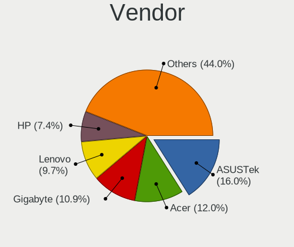
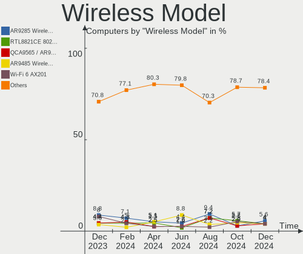

ROSA Hardware Trends
--------------------

A project to identify most popular hardware characteristics and track their change
over time based on data collected by Linux users at https://Linux-Hardware.org.

Anyone can contribute to this report by the [hw-probe](https://github.com/linuxhw/hw-probe) tool:

    sudo -E hw-probe -all -upload

This is a report for all computer types. See also reports for [desktops](/Dist/ROSA/Desktop/README.md) and [notebooks](/Dist/ROSA/Notebook/README.md).

Full-feature report is available here: https://linux-hardware.org/?view=trends

Period: Jul, 2021.

Contents
--------

* [ System ](#system)
  - [ OS                       ](#os)
  - [ OS Family                ](#os-family)
  - [ Kernel                   ](#kernel)
  - [ Kernel Family            ](#kernel-family)
  - [ Kernel Major Ver.        ](#kernel-major-ver)
  - [ Arch                     ](#arch)
  - [ DE                       ](#de)
  - [ Display Server           ](#display-server)
  - [ Display Manager          ](#display-manager)
  - [ OS Lang                  ](#os-lang)
  - [ Boot Mode                ](#boot-mode)
  - [ Filesystem               ](#filesystem)
  - [ Part. scheme             ](#part-scheme)
  - [ Dual Boot with Linux/BSD ](#dual-boot-with-linuxbsd)
  - [ Dual Boot (Win)          ](#dual-boot-win)

* [ Board ](#board)
  - [ Vendor                   ](#vendor)
  - [ Model                    ](#model)
  - [ Model Family             ](#model-family)
  - [ MFG Year                 ](#mfg-year)
  - [ Form Factor              ](#form-factor)
  - [ Secure Boot              ](#secure-boot)
  - [ Coreboot                 ](#coreboot)
  - [ RAM Size                 ](#ram-size)
  - [ RAM Used                 ](#ram-used)
  - [ Total Drives             ](#total-drives)
  - [ Has CD-ROM               ](#has-cd-rom)
  - [ Has Ethernet             ](#has-ethernet)
  - [ Has WiFi                 ](#has-wifi)
  - [ Has Bluetooth            ](#has-bluetooth)

* [ Location ](#location)
  - [ Country                  ](#country)
  - [ City                     ](#city)

* [ Drives ](#drives)
  - [ Drive Vendor             ](#drive-vendor)
  - [ Drive Model              ](#drive-model)
  - [ HDD Vendor               ](#hdd-vendor)
  - [ SSD Vendor               ](#ssd-vendor)
  - [ Drive Kind               ](#drive-kind)
  - [ Drive Connector          ](#drive-connector)
  - [ Drive Size               ](#drive-size)
  - [ Space Total              ](#space-total)
  - [ Space Used               ](#space-used)
  - [ Malfunc. Drives          ](#malfunc-drives)
  - [ Malfunc. Drive Vendor    ](#malfunc-drive-vendor)
  - [ Malfunc. HDD Vendor      ](#malfunc-hdd-vendor)
  - [ Malfunc. Drive Kind      ](#malfunc-drive-kind)
  - [ Failed Drives            ](#failed-drives)
  - [ Failed Drive Vendor      ](#failed-drive-vendor)
  - [ Drive Status             ](#drive-status)

* [ Storage controller ](#storage-controller)
  - [ Storage Vendor           ](#storage-vendor)
  - [ Storage Model            ](#storage-model)
  - [ Storage Kind             ](#storage-kind)

* [ Processor ](#processor)
  - [ CPU Vendor               ](#cpu-vendor)
  - [ CPU Model                ](#cpu-model)
  - [ CPU Model Family         ](#cpu-model-family)
  - [ CPU Cores                ](#cpu-cores)
  - [ CPU Sockets              ](#cpu-sockets)
  - [ CPU Threads              ](#cpu-threads)
  - [ CPU Op-Modes             ](#cpu-op-modes)
  - [ CPU Microcode            ](#cpu-microcode)
  - [ CPU Microarch            ](#cpu-microarch)

* [ Graphics ](#graphics)
  - [ GPU Vendor               ](#gpu-vendor)
  - [ GPU Model                ](#gpu-model)
  - [ GPU Combo                ](#gpu-combo)
  - [ GPU Driver               ](#gpu-driver)
  - [ GPU Memory               ](#gpu-memory)

* [ Monitor ](#monitor)
  - [ Monitor Vendor           ](#monitor-vendor)
  - [ Monitor Model            ](#monitor-model)
  - [ Monitor Resolution       ](#monitor-resolution)
  - [ Monitor Diagonal         ](#monitor-diagonal)
  - [ Monitor Width            ](#monitor-width)
  - [ Aspect Ratio             ](#aspect-ratio)
  - [ Monitor Area             ](#monitor-area)
  - [ Pixel Density            ](#pixel-density)
  - [ Multiple Monitors        ](#multiple-monitors)

* [ Network ](#network)
  - [ Net Controller Vendor    ](#net-controller-vendor)
  - [ Net Controller Model     ](#net-controller-model)
  - [ Wireless Vendor          ](#wireless-vendor)
  - [ Wireless Model           ](#wireless-model)
  - [ Ethernet Vendor          ](#ethernet-vendor)
  - [ Ethernet Model           ](#ethernet-model)
  - [ Net Controller Kind      ](#net-controller-kind)
  - [ Used Controller          ](#used-controller)
  - [ NICs                     ](#nics)
  - [ IPv6                     ](#ipv6)

* [ Bluetooth ](#bluetooth)
  - [ Bluetooth Vendor         ](#bluetooth-vendor)
  - [ Bluetooth Model          ](#bluetooth-model)

* [ Sound ](#sound)
  - [ Sound Vendor             ](#sound-vendor)
  - [ Sound Model              ](#sound-model)

* [ Memory ](#memory)
  - [ Memory Vendor            ](#memory-vendor)
  - [ Memory Model             ](#memory-model)
  - [ Memory Kind              ](#memory-kind)
  - [ Memory Form Factor       ](#memory-form-factor)
  - [ Memory Size              ](#memory-size)
  - [ Memory Speed             ](#memory-speed)

* [ Printers & scanners ](#printers-&-scanners)
  - [ Printer Vendor           ](#printer-vendor)
  - [ Printer Model            ](#printer-model)
  - [ Scanner Vendor           ](#scanner-vendor)
  - [ Scanner Model            ](#scanner-model)

* [ Camera ](#camera)
  - [ Camera Vendor            ](#camera-vendor)
  - [ Camera Model             ](#camera-model)

* [ Security ](#security)
  - [ Fingerprint Vendor       ](#fingerprint-vendor)
  - [ Fingerprint Model        ](#fingerprint-model)
  - [ Chipcard Vendor          ](#chipcard-vendor)
  - [ Chipcard Model           ](#chipcard-model)

* [ Unsupported ](#unsupported)
  - [ Unsupported Devices      ](#unsupported-devices)
  - [ Unsupported Device Types ](#unsupported-device-types)

System
------

OS
--

Installed operating systems

| Name       | Computers | Percent |
|------------|-----------|---------|
| ROSA R11.1 | 118       | 81.38%  |
| ROSA R11   | 14        | 9.66%   |
| ROSA R12   | 8         | 5.52%   |
| ROSA R10   | 3         | 2.07%   |
| ROSA R8.1  | 2         | 1.38%   |

OS Family
---------

OS without a version

| Name | Computers | Percent |
|------|-----------|---------|
| ROSA | 145       | 100%    |

Kernel
------

Version of the Linux kernel

| Version                             | Computers | Percent |
|-------------------------------------|-----------|---------|
| 5.4.83-generic-2rosa-x86_64         | 35        | 24.14%  |
| 5.4.32-generic-2rosa-x86_64         | 32        | 22.07%  |
| 4.15.0-desktop-122.124.1rosa-x86_64 | 18        | 12.41%  |
| 5.4.32-generic-2rosa-i586           | 13        | 8.97%   |
| 4.15.0-desktop-45.1rosa-x86_64      | 11        | 7.59%   |
| 5.4.83-generic-2rosa-i586           | 10        | 6.9%    |
| 4.9.155-nrj-desktop-1rosa-x86_64    | 5         | 3.45%   |
| 5.10.48-generic-1rosa2021.1-x86_64  | 3         | 2.07%   |
| 5.10.52-generic-1rosa2021.1-x86_64  | 2         | 1.38%   |
| 5.10.47-generic-2rosa2019.1-x86_64  | 2         | 1.38%   |
| 4.15.0-desktop-45.1rosa-i586        | 2         | 1.38%   |
| 4.15.0-desktop-122.124.1rosa-i586   | 2         | 1.38%   |
| 4.13.0-tablet-16.2rosa-x86_64       | 2         | 1.38%   |
| 5.9.14-generic-1rosa-x86_64         | 1         | 0.69%   |
| 5.4.112-nrj-desktop-1rosa-x86_64    | 1         | 0.69%   |
| 5.10.53-generic-1rosa2021.1-x86_64  | 1         | 0.69%   |
| 5.10.31-generic-1rosa-x86_64        | 1         | 0.69%   |
| 4.9.60-nrj-desktop-1rosa-x86_64     | 1         | 0.69%   |
| 4.19.197-nrj-desktop-3rosa-x86_64   | 1         | 0.69%   |
| 4.15.0-desktop-94.1rosa-x86_64      | 1         | 0.69%   |
| 4.1.38-nrj-desktop-2rosa-x86_64     | 1         | 0.69%   |

Kernel Family
-------------

Linux kernel without a distro release

| Version  | Computers | Percent |
|----------|-----------|---------|
| 5.4.83   | 45        | 31.03%  |
| 5.4.32   | 45        | 31.03%  |
| 4.15.0   | 34        | 23.45%  |
| 4.9.155  | 5         | 3.45%   |
| 5.10.48  | 3         | 2.07%   |
| 5.10.52  | 2         | 1.38%   |
| 5.10.47  | 2         | 1.38%   |
| 4.13.0   | 2         | 1.38%   |
| 5.9.14   | 1         | 0.69%   |
| 5.4.112  | 1         | 0.69%   |
| 5.10.53  | 1         | 0.69%   |
| 5.10.31  | 1         | 0.69%   |
| 4.9.60   | 1         | 0.69%   |
| 4.19.197 | 1         | 0.69%   |
| 4.1.38   | 1         | 0.69%   |

Kernel Major Ver.
-----------------

Linux kernel major version

| Version | Computers | Percent |
|---------|-----------|---------|
| 5.4     | 91        | 62.76%  |
| 4.15    | 34        | 23.45%  |
| 5.10    | 9         | 6.21%   |
| 4.9     | 6         | 4.14%   |
| 4.13    | 2         | 1.38%   |
| 5.9     | 1         | 0.69%   |
| 4.19    | 1         | 0.69%   |
| 4.1     | 1         | 0.69%   |

Arch
----

OS architecture (x86_64, i586, etc.)

| Name   | Computers | Percent |
|--------|-----------|---------|
| x86_64 | 118       | 81.38%  |
| i686   | 27        | 18.62%  |

DE
--

Desktop Environment

| Name  | Computers | Percent |
|-------|-----------|---------|
| KDE4  | 86        | 59.31%  |
| KDE5  | 39        | 26.9%   |
| LXQt  | 14        | 9.66%   |
| XFCE  | 3         | 2.07%   |
| GNOME | 2         | 1.38%   |
| MATE  | 1         | 0.69%   |

Display Server
--------------

X11 or Wayland

| Name    | Computers | Percent |
|---------|-----------|---------|
| X11     | 138       | 95.17%  |
| Wayland | 7         | 4.83%   |

Display Manager
---------------

SDDM, LightDM, etc.

| Name | Computers | Percent |
|------|-----------|---------|
| KDM  | 86        | 59.31%  |
| SDDM | 52        | 35.86%  |
| GDM  | 7         | 4.83%   |

OS Lang
-------

Language

| Lang    | Computers | Percent |
|---------|-----------|---------|
| ru_RU   | 110       | 75.86%  |
| Unknown | 17        | 11.72%  |
| es_ES   | 4         | 2.76%   |
| fr_FR   | 3         | 2.07%   |
| en_US   | 3         | 2.07%   |
| pt_BR   | 2         | 1.38%   |
| en_GB   | 2         | 1.38%   |
| de_DE   | 2         | 1.38%   |
| pl_PL   | 1         | 0.69%   |
| ca_AD   | 1         | 0.69%   |

Boot Mode
---------

EFI or BIOS

| Mode | Computers | Percent |
|------|-----------|---------|
| BIOS | 111       | 76.55%  |
| EFI  | 34        | 23.45%  |

Filesystem
----------

Type of filesystem

| Type  | Computers | Percent |
|-------|-----------|---------|
| Ext4  | 140       | 96.55%  |
| Btrfs | 3         | 2.07%   |
| F2fs  | 1         | 0.69%   |
| Ext3  | 1         | 0.69%   |

Part. scheme
------------

Scheme of partitioning

| Type    | Computers | Percent |
|---------|-----------|---------|
| MBR     | 102       | 70.34%  |
| GPT     | 40        | 27.59%  |
| Unknown | 3         | 2.07%   |

Dual Boot with Linux/BSD
------------------------

Hosting more than one Linux/BSD

| Dual boot | Computers | Percent |
|-----------|-----------|---------|
| No        | 110       | 75.86%  |
| Yes       | 35        | 24.14%  |

Dual Boot (Win)
---------------

Hosting Linux and Windows

| Dual boot | Computers | Percent |
|-----------|-----------|---------|
| No        | 85        | 58.62%  |
| Yes       | 60        | 41.38%  |

Board
-----

Vendor
------

Motherboard manufacturer

| Name                | Computers | Percent |
|---------------------|-----------|---------|
| ASUSTek Computer    | 45        | 31.03%  |
| Acer                | 17        | 11.72%  |
| Hewlett-Packard     | 14        | 9.66%   |
| Gigabyte Technology | 13        | 8.97%   |
| MSI                 | 10        | 6.9%    |
| Lenovo              | 9         | 6.21%   |
| Samsung Electronics | 7         | 4.83%   |
| Dell                | 7         | 4.83%   |
| ASRock              | 6         | 4.14%   |
| eMachines           | 2         | 1.38%   |
| ECS                 | 2         | 1.38%   |
| Toshiba             | 1         | 0.69%   |
| Sony                | 1         | 0.69%   |
| Packard Bell        | 1         | 0.69%   |
| Notebook            | 1         | 0.69%   |
| LG Electronics      | 1         | 0.69%   |
| Intel               | 1         | 0.69%   |
| Huanan              | 1         | 0.69%   |
| Fujitsu             | 1         | 0.69%   |
| Foxconn             | 1         | 0.69%   |
| Elenberg            | 1         | 0.69%   |
| Biostar             | 1         | 0.69%   |
| Apple               | 1         | 0.69%   |
| AMI                 | 1         | 0.69%   |

Model
-----

Motherboard model

| Name                                  | Computers | Percent |
|---------------------------------------|-----------|---------|
| MSI MS-7C51                           | 2         | 1.38%   |
| Gigabyte H310M S2 2.0                 | 2         | 1.38%   |
| ASUS PRIME A320M-K                    | 2         | 1.38%   |
| Toshiba Satellite A300                | 1         | 0.69%   |
| Sony SVE1512N1RW                      | 1         | 0.69%   |
| Samsung RV415/RV515/E3415             | 1         | 0.69%   |
| Samsung RV408/RV508                   | 1         | 0.69%   |
| Samsung R560                          | 1         | 0.69%   |
| Samsung R540/R580/R780/SA41/E452/E852 | 1         | 0.69%   |
| Samsung R520/R522/R620                | 1         | 0.69%   |
| Samsung NC10                          | 1         | 0.69%   |
| Samsung 350V5C/351V5C/3540VC/3440VC   | 1         | 0.69%   |
| Packard Bell Cuba MS-7301             | 1         | 0.69%   |
| Notebook W65_W670SR                   | 1         | 0.69%   |
| MSI MS-7A15                           | 1         | 0.69%   |
| MSI MS-7817                           | 1         | 0.69%   |
| MSI MS-7680                           | 1         | 0.69%   |
| MSI MS-7673                           | 1         | 0.69%   |
| MSI MS-7641                           | 1         | 0.69%   |
| MSI MS-7529                           | 1         | 0.69%   |
| MSI CR643                             | 1         | 0.69%   |
| MSI Compaq dx7400 Microtower          | 1         | 0.69%   |
| LG S525-L.ACO1R1                      | 1         | 0.69%   |
| Lenovo ThinkPad T400 6474WPU          | 1         | 0.69%   |
| Lenovo ThinkPad L430 24641J9          | 1         | 0.69%   |
| Lenovo IdeaPad 5 15ARE05 81YQ         | 1         | 0.69%   |
| Lenovo IdeaPad 300-15ISK 80Q7         | 1         | 0.69%   |
| Lenovo H420                           | 1         | 0.69%   |
| Lenovo G575 20081                     | 1         | 0.69%   |
| Lenovo Board                          | 1         | 0.69%   |
| Lenovo B50-30 20382                   | 1         | 0.69%   |
| Lenovo B50-10 80QR                    | 1         | 0.69%   |
| Intel DZ68DB AAG27985-101             | 1         | 0.69%   |
| Huanan X99-F8                         | 1         | 0.69%   |
| HP Pavilion TS 11                     | 1         | 0.69%   |
| HP Pavilion dv9000 (EY797AV#ABA)      | 1         | 0.69%   |
| HP Pavilion dv6                       | 1         | 0.69%   |
| HP Pavilion 15                        | 1         | 0.69%   |
| HP Mini 311-1000                      | 1         | 0.69%   |
| HP Laptop 15s-eq2xxx                  | 1         | 0.69%   |
| HP Laptop 15-bs0xx                    | 1         | 0.69%   |
| HP Compaq 6730b (GB988EA)             | 1         | 0.69%   |
| HP Compaq 6200 Pro SFF PC             | 1         | 0.69%   |
| HP All-in-One 22-df0xxx               | 1         | 0.69%   |
| HP 620                                | 1         | 0.69%   |
| HP 250 G7 Notebook PC                 | 1         | 0.69%   |
| HP 24-b015a                           | 1         | 0.69%   |
| HP 15                                 | 1         | 0.69%   |
| Gigabyte Z87-HD3                      | 1         | 0.69%   |
| Gigabyte Z370 HD3                     | 1         | 0.69%   |
| Gigabyte P35C-DS3R                    | 1         | 0.69%   |
| Gigabyte M61PM-S2                     | 1         | 0.69%   |
| Gigabyte J1800N-D2H                   | 1         | 0.69%   |
| Gigabyte GA-MA770-UD3                 | 1         | 0.69%   |
| Gigabyte EP43-UD3L                    | 1         | 0.69%   |
| Gigabyte A320M-S2H V2                 | 1         | 0.69%   |
| Gigabyte 965P-S3                      | 1         | 0.69%   |
| Gigabyte 945PLM-S2                    | 1         | 0.69%   |
| Gigabyte 8I915P Duo                   | 1         | 0.69%   |
| Fujitsu FUTRO S700                    | 1         | 0.69%   |

Model Family
------------

Motherboard model prefix

| Name                  | Computers | Percent |
|-----------------------|-----------|---------|
| Acer Aspire           | 10        | 6.9%    |
| ASUS PRIME            | 7         | 4.83%   |
| HP Pavilion           | 4         | 2.76%   |
| Dell Inspiron         | 4         | 2.76%   |
| ASUS M5A78L-M         | 3         | 2.07%   |
| Acer Extensa          | 3         | 2.07%   |
| MSI MS-7C51           | 2         | 1.38%   |
| Lenovo ThinkPad       | 2         | 1.38%   |
| Lenovo IdeaPad        | 2         | 1.38%   |
| HP Laptop             | 2         | 1.38%   |
| HP Compaq             | 2         | 1.38%   |
| Gigabyte H310M        | 2         | 1.38%   |
| ASUS VivoBook         | 2         | 1.38%   |
| ASUS P8H61-M          | 2         | 1.38%   |
| ASUS P6T              | 2         | 1.38%   |
| Toshiba Satellite     | 1         | 0.69%   |
| Sony SVE1512N1RW      | 1         | 0.69%   |
| Samsung RV415         | 1         | 0.69%   |
| Samsung RV408         | 1         | 0.69%   |
| Samsung R560          | 1         | 0.69%   |
| Samsung R540          | 1         | 0.69%   |
| Samsung R520          | 1         | 0.69%   |
| Samsung NC10          | 1         | 0.69%   |
| Samsung 350V5C        | 1         | 0.69%   |
| Packard Bell Cuba     | 1         | 0.69%   |
| Notebook W65          | 1         | 0.69%   |
| MSI MS-7A15           | 1         | 0.69%   |
| MSI MS-7817           | 1         | 0.69%   |
| MSI MS-7680           | 1         | 0.69%   |
| MSI MS-7673           | 1         | 0.69%   |
| MSI MS-7641           | 1         | 0.69%   |
| MSI MS-7529           | 1         | 0.69%   |
| MSI CR643             | 1         | 0.69%   |
| MSI Compaq            | 1         | 0.69%   |
| LG S525-L.ACO1R1      | 1         | 0.69%   |
| Lenovo H420           | 1         | 0.69%   |
| Lenovo G575           | 1         | 0.69%   |
| Lenovo Board          | 1         | 0.69%   |
| Lenovo B50-30         | 1         | 0.69%   |
| Lenovo B50-10         | 1         | 0.69%   |
| Intel DZ68DB          | 1         | 0.69%   |
| Huanan X99-F8         | 1         | 0.69%   |
| HP Mini               | 1         | 0.69%   |
| HP All-in-One         | 1         | 0.69%   |
| HP 620                | 1         | 0.69%   |
| HP 250                | 1         | 0.69%   |
| HP 24-b015a           | 1         | 0.69%   |
| HP 15                 | 1         | 0.69%   |
| Gigabyte Z87-HD3      | 1         | 0.69%   |
| Gigabyte Z370         | 1         | 0.69%   |
| Gigabyte P35C-DS3R    | 1         | 0.69%   |
| Gigabyte M61PM-S2     | 1         | 0.69%   |
| Gigabyte J1800N-D2H   | 1         | 0.69%   |
| Gigabyte GA-MA770-UD3 | 1         | 0.69%   |
| Gigabyte EP43-UD3L    | 1         | 0.69%   |
| Gigabyte A320M-S2H    | 1         | 0.69%   |
| Gigabyte 965P-S3      | 1         | 0.69%   |
| Gigabyte 945PLM-S2    | 1         | 0.69%   |
| Gigabyte 8I915P       | 1         | 0.69%   |
| Fujitsu FUTRO         | 1         | 0.69%   |

MFG Year
--------

Motherboard manufacture year

| Year | Computers | Percent |
|------|-----------|---------|
| 2011 | 18        | 12.41%  |
| 2009 | 15        | 10.34%  |
| 2012 | 14        | 9.66%   |
| 2010 | 11        | 7.59%   |
| 2016 | 10        | 6.9%    |
| 2013 | 10        | 6.9%    |
| 2008 | 10        | 6.9%    |
| 2020 | 8         | 5.52%   |
| 2007 | 8         | 5.52%   |
| 2019 | 7         | 4.83%   |
| 2014 | 7         | 4.83%   |
| 2018 | 6         | 4.14%   |
| 2015 | 6         | 4.14%   |
| 2017 | 5         | 3.45%   |
| 2021 | 4         | 2.76%   |
| 2006 | 4         | 2.76%   |
| 2005 | 2         | 1.38%   |

Form Factor
-----------

Physical design of the computer

| Name       | Computers | Percent |
|------------|-----------|---------|
| Desktop    | 76        | 52.41%  |
| Notebook   | 67        | 46.21%  |
| All in one | 2         | 1.38%   |

Secure Boot
-----------

Enabled or disabled

| State    | Computers | Percent |
|----------|-----------|---------|
| Disabled | 145       | 100%    |

Coreboot
--------

Have coreboot on board

| Used | Computers | Percent |
|------|-----------|---------|
| No   | 145       | 100%    |

RAM Size
--------

Total RAM memory

| Size in GB  | Computers | Percent |
|-------------|-----------|---------|
| 3.01-4.0    | 45        | 31.03%  |
| 4.01-8.0    | 26        | 17.93%  |
| 1.01-2.0    | 25        | 17.24%  |
| 8.01-16.0   | 24        | 16.55%  |
| 16.01-24.0  | 12        | 8.28%   |
| 2.01-3.0    | 5         | 3.45%   |
| 0.51-1.0    | 4         | 2.76%   |
| 32.01-64.0  | 2         | 1.38%   |
| 64.01-256.0 | 1         | 0.69%   |
| Unknown     | 1         | 0.69%   |

RAM Used
--------

Used RAM memory

| Used GB  | Computers | Percent |
|----------|-----------|---------|
| 1.01-2.0 | 62        | 42.76%  |
| 0.51-1.0 | 56        | 38.62%  |
| 2.01-3.0 | 14        | 9.66%   |
| 0.01-0.5 | 5         | 3.45%   |
| 4.01-8.0 | 4         | 2.76%   |
| 3.01-4.0 | 3         | 2.07%   |
| Unknown  | 1         | 0.69%   |

Total Drives
------------

Number of drives on board

| Drives | Computers | Percent |
|--------|-----------|---------|
| 1      | 106       | 73.1%   |
| 2      | 29        | 20%     |
| 3      | 7         | 4.83%   |
| 4      | 2         | 1.38%   |
| 0      | 1         | 0.69%   |

Has CD-ROM
----------

Has CD-ROM on board

| Presented | Computers | Percent |
|-----------|-----------|---------|
| Yes       | 79        | 54.48%  |
| No        | 66        | 45.52%  |

Has Ethernet
------------

Has Ethernet on board

| Presented | Computers | Percent |
|-----------|-----------|---------|
| Yes       | 138       | 95.17%  |
| No        | 7         | 4.83%   |

Has WiFi
--------

Has WiFi module

| Presented | Computers | Percent |
|-----------|-----------|---------|
| Yes       | 81        | 55.86%  |
| No        | 64        | 44.14%  |

Has Bluetooth
-------------

Has Bluetooth module

| Presented | Computers | Percent |
|-----------|-----------|---------|
| No        | 99        | 68.28%  |
| Yes       | 46        | 31.72%  |

Location
--------

Country
-------

Geographic location (country)

| Country     | Computers | Percent |
|-------------|-----------|---------|
| Russia      | 103       | 71.03%  |
| Ukraine     | 14        | 9.66%   |
| France      | 5         | 3.45%   |
| Kazakhstan  | 3         | 2.07%   |
| Belarus     | 3         | 2.07%   |
| Spain       | 2         | 1.38%   |
| Moldova     | 2         | 1.38%   |
| Mexico      | 2         | 1.38%   |
| Germany     | 2         | 1.38%   |
| Brazil      | 2         | 1.38%   |
| USA         | 1         | 0.69%   |
| Serbia      | 1         | 0.69%   |
| Netherlands | 1         | 0.69%   |
| Denmark     | 1         | 0.69%   |
| Czechia     | 1         | 0.69%   |
| Australia   | 1         | 0.69%   |
| Argentina   | 1         | 0.69%   |

City
----

Geographic location (city)

| City                    | Computers | Percent |
|-------------------------|-----------|---------|
| Moscow                  | 14        | 9.66%   |
| St Petersburg           | 11        | 7.59%   |
| Yekaterinburg           | 7         | 4.83%   |
| Novosibirsk             | 7         | 4.83%   |
| Donetsk                 | 5         | 3.45%   |
| Voronezh                | 4         | 2.76%   |
| Kyiv                    | 3         | 2.07%   |
| Yaroslavl               | 2         | 1.38%   |
| Vladivostok             | 2         | 1.38%   |
| Ryazan                  | 2         | 1.38%   |
| Rostov-on-Don           | 2         | 1.38%   |
| Nizhniy Novgorod        | 2         | 1.38%   |
| Minsk                   | 2         | 1.38%   |
| Mexico City             | 2         | 1.38%   |
| Malonikolayevka         | 2         | 1.38%   |
| Laudun-lArdoise         | 2         | 1.38%   |
| Kaliningrad             | 2         | 1.38%   |
| Ivanovo                 | 2         | 1.38%   |
| Chelyabinsk             | 2         | 1.38%   |
| Almaty                  | 2         | 1.38%   |
| Zelenodolsk             | 1         | 0.69%   |
| Volgograd               | 1         | 0.69%   |
| Veliky Novgorod         | 1         | 0.69%   |
| Ulyanovsk               | 1         | 0.69%   |
| Tver                    | 1         | 0.69%   |
| Tula                    | 1         | 0.69%   |
| Tours                   | 1         | 0.69%   |
| Tolyatti                | 1         | 0.69%   |
| Tiraspol                | 1         | 0.69%   |
| Thornleigh              | 1         | 0.69%   |
| Tambov                  | 1         | 0.69%   |
| Taganrog                | 1         | 0.69%   |
| Syktyvkar               | 1         | 0.69%   |
| Srednyaya Akhtuba       | 1         | 0.69%   |
| Sonneberg               | 1         | 0.69%   |
| Smolensk                | 1         | 0.69%   |
| Slutsk                  | 1         | 0.69%   |
| Severodvinsk            | 1         | 0.69%   |
| Serpukhov               | 1         | 0.69%   |
| S??o Bernardo do Campo  | 1         | 0.69%   |
| Saratov                 | 1         | 0.69%   |
| Sant Andreu de la Barca | 1         | 0.69%   |
| Rostock                 | 1         | 0.69%   |
| Prague                  | 1         | 0.69%   |
| Pignan                  | 1         | 0.69%   |
| Petrozavodsk            | 1         | 0.69%   |
| Pervouralsk             | 1         | 0.69%   |
| Pervomaysk              | 1         | 0.69%   |
| Penza                   | 1         | 0.69%   |
| Orenburg                | 1         | 0.69%   |
| Nur-Sultan              | 1         | 0.69%   |
| Nevinnomyssk            | 1         | 0.69%   |
| Macei??                 | 1         | 0.69%   |
| Lyubertsy               | 1         | 0.69%   |
| Kurgan                  | 1         | 0.69%   |
| Krasnozavodsk           | 1         | 0.69%   |
| Krasnogorsk             | 1         | 0.69%   |
| Krasnodar               | 1         | 0.69%   |
| Kotel'niki              | 1         | 0.69%   |
| Kostroma                | 1         | 0.69%   |

Drives
------

Drive Vendor
------------

Hard drive vendors

| Vendor              | Computers | Drives | Percent |
|---------------------|-----------|--------|---------|
| WDC                 | 46        | 53     | 26.14%  |
| Seagate             | 31        | 33     | 17.61%  |
| Toshiba             | 17        | 18     | 9.66%   |
| Samsung Electronics | 17        | 17     | 9.66%   |
| Hitachi             | 14        | 15     | 7.95%   |
| Kingston            | 9         | 9      | 5.11%   |
| SanDisk             | 6         | 6      | 3.41%   |
| Unknown             | 4         | 5      | 2.27%   |
| Crucial             | 4         | 4      | 2.27%   |
| SPCC                | 3         | 3      | 1.7%    |
| Patriot             | 3         | 3      | 1.7%    |
| HGST                | 3         | 3      | 1.7%    |
| China               | 3         | 3      | 1.7%    |
| Smartbuy            | 2         | 2      | 1.14%   |
| PLEXTOR             | 2         | 2      | 1.14%   |
| Intel               | 2         | 2      | 1.14%   |
| SSSTC               | 1         | 1      | 0.57%   |
| Solid State Storage | 1         | 1      | 0.57%   |
| OCZ                 | 1         | 2      | 0.57%   |
| Leven               | 1         | 1      | 0.57%   |
| Kingmax             | 1         | 1      | 0.57%   |
| InnoDisk            | 1         | 1      | 0.57%   |
| Gigabyte Technology | 1         | 1      | 0.57%   |
| Corsair             | 1         | 1      | 0.57%   |
| CHN25SATAS1         | 1         | 1      | 0.57%   |
| Apacer              | 1         | 1      | 0.57%   |

Drive Model
-----------

Hard drive models

| Model                              | Computers | Percent |
|------------------------------------|-----------|---------|
| Kingston SA400S37120G 120GB SSD    | 4         | 2.15%   |
| Toshiba MQ01ABF050 500GB           | 3         | 1.61%   |
| Seagate ST1000DM010-2EP102 1TB     | 3         | 1.61%   |
| Kingston SA400S37240G 240GB SSD    | 3         | 1.61%   |
| Hitachi HTS547550A9E384 500GB      | 3         | 1.61%   |
| WDC WDS240G2G0A-00JH30 240GB SSD   | 2         | 1.08%   |
| WDC WD3200AAKX-001CA0 320GB        | 2         | 1.08%   |
| WDC WD1600BEVT-22ZCT0 160GB        | 2         | 1.08%   |
| Toshiba MQ01ABD032 320GB           | 2         | 1.08%   |
| Toshiba DT01ACA100 1TB             | 2         | 1.08%   |
| Toshiba DT01ACA050 500GB           | 2         | 1.08%   |
| SPCC Solid State Disk 120GB        | 2         | 1.08%   |
| Seagate ST9500325AS 500GB          | 2         | 1.08%   |
| Seagate ST500DM002-1BD142 500GB    | 2         | 1.08%   |
| Seagate ST3320418AS 320GB          | 2         | 1.08%   |
| Seagate ST3160815AS 160GB          | 2         | 1.08%   |
| Seagate ST1000LM024 HN-M101MBB 1TB | 2         | 1.08%   |
| Samsung HM160HI 160GB              | 2         | 1.08%   |
| Crucial CT240BX500SSD1 240GB       | 2         | 1.08%   |
| Crucial CT120BX500SSD1 120GB       | 2         | 1.08%   |
| WDC WDS120G2G0B-00EPW0 120GB SSD   | 1         | 0.54%   |
| WDC WDS120G2G0A-00JH30 120GB SSD   | 1         | 0.54%   |
| WDC WDS100T2B0B-00YS70 1TB SSD     | 1         | 0.54%   |
| WDC WD800BEVT-22ZCT0 80GB          | 1         | 0.54%   |
| WDC WD800BEVS-22RST0 80GB          | 1         | 0.54%   |
| WDC WD800AAJS-00PSA0 80GB          | 1         | 0.54%   |
| WDC WD800AAJS-00L7A0 80GB          | 1         | 0.54%   |
| WDC WD7501AALS-00J7B1 752GB        | 1         | 0.54%   |
| WDC WD6400AAKS-22A7B0 640GB        | 1         | 0.54%   |
| WDC WD5000LPZX-60Z10T0 500GB       | 1         | 0.54%   |
| WDC WD5000LPVX-60V0TT0 500GB       | 1         | 0.54%   |
| WDC WD5000LPVX-22V0TT0 500GB       | 1         | 0.54%   |
| WDC WD5000LPVX-08V0TT5 500GB       | 1         | 0.54%   |
| WDC WD5000LPLX-75ZNTT0 500GB       | 1         | 0.54%   |
| WDC WD5000BPVT-22HXZT3 500GB       | 1         | 0.54%   |
| WDC WD5000BEVT-22A0RT0 500GB       | 1         | 0.54%   |
| WDC WD5000AAKX-083CA1 500GB        | 1         | 0.54%   |
| WDC WD5000AAKX-001CA0 500GB        | 1         | 0.54%   |
| WDC WD5000AAKB-00H8A0 500GB        | 1         | 0.54%   |
| WDC WD5000AADS-00S9B0 500GB        | 1         | 0.54%   |
| WDC WD3200LPVX-08V0TT5 320GB       | 1         | 0.54%   |
| WDC WD3200AVVS-63L2B0 320GB        | 1         | 0.54%   |
| WDC WD3200AUDX-56WNHY0 320GB       | 1         | 0.54%   |
| WDC WD3200AAKS-00L9A0 320GB        | 1         | 0.54%   |
| WDC WD3200AAJS-65M0A0 320GB        | 1         | 0.54%   |
| WDC WD3200AAJS-22B4A0 320GB        | 1         | 0.54%   |
| WDC WD30EZRX-00DC0B0 3TB           | 1         | 0.54%   |
| WDC WD30EFRX-68EUZN0 3TB           | 1         | 0.54%   |
| WDC WD2500YD-01NVB1 256GB          | 1         | 0.54%   |
| WDC WD2500JS-00NCB1 250GB          | 1         | 0.54%   |
| WDC WD2500JB-00REA0 250GB          | 1         | 0.54%   |
| WDC WD2500AAKX-00ERMA0 250GB       | 1         | 0.54%   |
| WDC WD20PURZ-85GU6Y0 2TB           | 1         | 0.54%   |
| WDC WD1600JD-22HBB0 160GB          | 1         | 0.54%   |
| WDC WD1600BEVT-00A23T0 160GB       | 1         | 0.54%   |
| WDC WD1600AAJS-22PSA0 160GB        | 1         | 0.54%   |
| WDC WD10TPVT-00HT5T1 1TB           | 1         | 0.54%   |
| WDC WD10S21X-24R1BT0-SSHD-8GB      | 1         | 0.54%   |
| WDC WD10EZRX-00L4HB0 1TB           | 1         | 0.54%   |
| WDC WD10EZRX-00A8LB0 1TB           | 1         | 0.54%   |

HDD Vendor
----------

Hard disk drive vendors

| Vendor              | Computers | Drives | Percent |
|---------------------|-----------|--------|---------|
| WDC                 | 41        | 48     | 35.34%  |
| Seagate             | 31        | 33     | 26.72%  |
| Toshiba             | 16        | 17     | 13.79%  |
| Hitachi             | 14        | 15     | 12.07%  |
| Samsung Electronics | 11        | 11     | 9.48%   |
| HGST                | 3         | 3      | 2.59%   |

SSD Vendor
----------

Solid state drive vendors

| Vendor              | Computers | Drives | Percent |
|---------------------|-----------|--------|---------|
| Kingston            | 9         | 9      | 17.65%  |
| SanDisk             | 6         | 6      | 11.76%  |
| WDC                 | 5         | 5      | 9.8%    |
| Samsung Electronics | 4         | 4      | 7.84%   |
| Crucial             | 4         | 4      | 7.84%   |
| SPCC                | 3         | 3      | 5.88%   |
| Patriot             | 3         | 3      | 5.88%   |
| China               | 3         | 3      | 5.88%   |
| Unknown             | 1         | 1      | 1.96%   |
| Toshiba             | 1         | 1      | 1.96%   |
| SSSTC               | 1         | 1      | 1.96%   |
| Smartbuy            | 1         | 1      | 1.96%   |
| PLEXTOR             | 1         | 1      | 1.96%   |
| OCZ                 | 1         | 2      | 1.96%   |
| Leven               | 1         | 1      | 1.96%   |
| Kingmax             | 1         | 1      | 1.96%   |
| Intel               | 1         | 1      | 1.96%   |
| InnoDisk            | 1         | 1      | 1.96%   |
| Gigabyte Technology | 1         | 1      | 1.96%   |
| Corsair             | 1         | 1      | 1.96%   |
| CHN25SATAS1         | 1         | 1      | 1.96%   |
| Apacer              | 1         | 1      | 1.96%   |

Drive Kind
----------

HDD or SSD

| Kind | Computers | Drives | Percent |
|------|-----------|--------|---------|
| HDD  | 108       | 127    | 66.26%  |
| SSD  | 46        | 52     | 28.22%  |
| NVMe | 6         | 6      | 3.68%   |
| MMC  | 3         | 4      | 1.84%   |

Drive Connector
---------------

SATA, SAS, NVMe, etc.

| Type | Computers | Drives | Percent |
|------|-----------|--------|---------|
| SATA | 136       | 178    | 93.15%  |
| NVMe | 6         | 6      | 4.11%   |
| MMC  | 3         | 4      | 2.05%   |
| SAS  | 1         | 1      | 0.68%   |

Drive Size
----------

Size of hard drive

| Size in TB | Computers | Drives | Percent |
|------------|-----------|--------|---------|
| 0.01-0.5   | 120       | 147    | 81.08%  |
| 0.51-1.0   | 25        | 28     | 16.89%  |
| 3.01-4.0   | 1         | 1      | 0.68%   |
| 2.01-3.0   | 1         | 2      | 0.68%   |
| 1.01-2.0   | 1         | 1      | 0.68%   |

Space Total
-----------

Amount of disk space available on the file system

| Size in GB     | Computers | Percent |
|----------------|-----------|---------|
| 101-250        | 51        | 35.17%  |
| 251-500        | 30        | 20.69%  |
| 1-20           | 17        | 11.72%  |
| 501-1000       | 15        | 10.34%  |
| 51-100         | 15        | 10.34%  |
| 21-50          | 12        | 8.28%   |
| 1001-2000      | 3         | 2.07%   |
| More than 3000 | 1         | 0.69%   |
| Unknown        | 1         | 0.69%   |

Space Used
----------

Amount of used disk space

| Used GB        | Computers | Percent |
|----------------|-----------|---------|
| 1-20           | 101       | 69.66%  |
| 21-50          | 20        | 13.79%  |
| 51-100         | 9         | 6.21%   |
| 101-250        | 6         | 4.14%   |
| 251-500        | 5         | 3.45%   |
| 501-1000       | 2         | 1.38%   |
| More than 3000 | 1         | 0.69%   |
| Unknown        | 1         | 0.69%   |

Malfunc. Drives
---------------

Drive models with a malfunction

| Model                              | Computers | Drives | Percent |
|------------------------------------|-----------|--------|---------|
| Samsung Electronics HM160HI 160GB  | 2         | 2      | 3.28%   |
| WDC WD6400AAKS-22A7B0 640GB        | 1         | 1      | 1.64%   |
| WDC WD5000BPVT-22HXZT3 500GB       | 1         | 1      | 1.64%   |
| WDC WD5000AAKX-083CA1 500GB        | 1         | 1      | 1.64%   |
| WDC WD5000AAKX-001CA0 500GB        | 1         | 1      | 1.64%   |
| WDC WD5000AADS-00S9B0 500GB        | 1         | 1      | 1.64%   |
| WDC WD3200LPVX-08V0TT5 320GB       | 1         | 1      | 1.64%   |
| WDC WD3200AVVS-63L2B0 320GB        | 1         | 1      | 1.64%   |
| WDC WD3200AAKX-001CA0 320GB        | 1         | 1      | 1.64%   |
| WDC WD3200AAKS-00L9A0 320GB        | 1         | 1      | 1.64%   |
| WDC WD3200AAJS-65M0A0 320GB        | 1         | 1      | 1.64%   |
| WDC WD3200AAJS-22B4A0 320GB        | 1         | 1      | 1.64%   |
| WDC WD2500JB-00REA0 250GB          | 1         | 1      | 1.64%   |
| WDC WD2500AAKX-00ERMA0 250GB       | 1         | 1      | 1.64%   |
| WDC WD20PURZ-85GU6Y0 2TB           | 1         | 1      | 1.64%   |
| WDC WD1600JD-22HBB0 160GB          | 1         | 1      | 1.64%   |
| WDC WD1600BEVT-22ZCT0 160GB        | 1         | 1      | 1.64%   |
| WDC WD1600BEVT-00A23T0 160GB       | 1         | 1      | 1.64%   |
| WDC WD10TPVT-00HT5T1 1TB           | 1         | 1      | 1.64%   |
| WDC WD10EARX-00N0YB0 1TB           | 1         | 1      | 1.64%   |
| WDC WD10EADS-65M2B0 1TB            | 1         | 1      | 1.64%   |
| Toshiba Q300. 240GB SSD            | 1         | 1      | 1.64%   |
| Toshiba MQ01ABF050 500GB           | 1         | 1      | 1.64%   |
| Toshiba MQ01ABD075 752GB           | 1         | 1      | 1.64%   |
| Toshiba MK8034GSX 80GB             | 1         | 1      | 1.64%   |
| Toshiba MK3259GSXP 320GB           | 1         | 1      | 1.64%   |
| Toshiba MK3252GSX 320GB            | 1         | 1      | 1.64%   |
| Toshiba MK2552GSX 250GB            | 1         | 1      | 1.64%   |
| Toshiba MK2046GSX 200GB            | 1         | 1      | 1.64%   |
| Toshiba DT01ACA050 500GB           | 1         | 1      | 1.64%   |
| SSSTC CVB-8D128-HP 128GB SSD       | 1         | 1      | 1.64%   |
| Seagate ST9500420AS 500GB          | 1         | 1      | 1.64%   |
| Seagate ST9500325AS 500GB          | 1         | 1      | 1.64%   |
| Seagate ST9320325AS 320GB          | 1         | 1      | 1.64%   |
| Seagate ST9250827AS 250GB          | 1         | 1      | 1.64%   |
| Seagate ST9160821AS 160GB          | 1         | 1      | 1.64%   |
| Seagate ST500DM002-1BD142 500GB    | 1         | 1      | 1.64%   |
| Seagate ST380011A 80GB             | 1         | 1      | 1.64%   |
| Seagate ST340016A 40GB             | 1         | 1      | 1.64%   |
| Seagate ST3160318AS 160GB          | 1         | 1      | 1.64%   |
| SanDisk SSD U100 256GB             | 1         | 1      | 1.64%   |
| Samsung Electronics SP2504C 250GB  | 1         | 1      | 1.64%   |
| Samsung Electronics SP2004C 200GB  | 1         | 1      | 1.64%   |
| Samsung Electronics HD160JJ/ 160GB | 1         | 1      | 1.64%   |
| Samsung Electronics HD082GJ 80GB   | 1         | 1      | 1.64%   |
| Kingston SA400S37240G 240GB SSD    | 1         | 1      | 1.64%   |
| Kingmax SSD 60GB                   | 1         | 1      | 1.64%   |
| Hitachi HTS547575A9E384 752GB      | 1         | 1      | 1.64%   |
| Hitachi HTS547550A9E384 500GB      | 1         | 1      | 1.64%   |
| Hitachi HTS545016B9A300 160GB      | 1         | 1      | 1.64%   |
| Hitachi HTS543216L9A300 160GB      | 1         | 1      | 1.64%   |
| Hitachi HDS721050CLA362 500GB      | 1         | 1      | 1.64%   |
| Hitachi HDS721032CLA362 320GB      | 1         | 1      | 1.64%   |
| Hitachi HDP725050GLA360 500GB      | 1         | 1      | 1.64%   |
| Hitachi HDP725040GLA360 400GB      | 1         | 2      | 1.64%   |
| HGST HTS545050A7E680 500GB         | 1         | 1      | 1.64%   |
| HGST HTS545050A7E660 500GB         | 1         | 1      | 1.64%   |
| HGST HTS545050A7E380 500GB         | 1         | 1      | 1.64%   |
| Corsair Force LS SSD 64GB          | 1         | 1      | 1.64%   |
| China SSD 60GB                     | 1         | 1      | 1.64%   |

Malfunc. Drive Vendor
---------------------

Vendors of faulty drives

| Vendor              | Computers | Drives | Percent |
|---------------------|-----------|--------|---------|
| WDC                 | 20        | 20     | 32.79%  |
| Toshiba             | 9         | 9      | 14.75%  |
| Seagate             | 9         | 9      | 14.75%  |
| Hitachi             | 8         | 9      | 13.11%  |
| Samsung Electronics | 6         | 6      | 9.84%   |
| HGST                | 3         | 3      | 4.92%   |
| SSSTC               | 1         | 1      | 1.64%   |
| SanDisk             | 1         | 1      | 1.64%   |
| Kingston            | 1         | 1      | 1.64%   |
| Kingmax             | 1         | 1      | 1.64%   |
| Corsair             | 1         | 1      | 1.64%   |
| China               | 1         | 1      | 1.64%   |

Malfunc. HDD Vendor
-------------------

Vendors of faulty HDD drives

| Vendor              | Computers | Drives | Percent |
|---------------------|-----------|--------|---------|
| WDC                 | 20        | 20     | 37.04%  |
| Seagate             | 9         | 9      | 16.67%  |
| Toshiba             | 8         | 8      | 14.81%  |
| Hitachi             | 8         | 9      | 14.81%  |
| Samsung Electronics | 6         | 6      | 11.11%  |
| HGST                | 3         | 3      | 5.56%   |

Malfunc. Drive Kind
-------------------

Kinds of faulty drives

| Kind | Computers | Drives | Percent |
|------|-----------|--------|---------|
| HDD  | 52        | 55     | 88.14%  |
| SSD  | 7         | 7      | 11.86%  |

Failed Drives
-------------

Failed drive models

| Model                             | Computers | Drives | Percent |
|-----------------------------------|-----------|--------|---------|
| Samsung Electronics HD252HJ 250GB | 1         | 1      | 100%    |

Failed Drive Vendor
-------------------

Failed drive vendors

| Vendor              | Computers | Drives | Percent |
|---------------------|-----------|--------|---------|
| Samsung Electronics | 1         | 1      | 100%    |

Drive Status
------------

Number of failed and malfunc. drives

| Status   | Computers | Drives | Percent |
|----------|-----------|--------|---------|
| Works    | 97        | 121    | 61.01%  |
| Malfunc  | 57        | 62     | 35.85%  |
| Detected | 4         | 5      | 2.52%   |
| Failed   | 1         | 1      | 0.63%   |

Storage controller
------------------

Storage Vendor
--------------

Storage controller vendors

| Vendor                         | Computers | Percent |
|--------------------------------|-----------|---------|
| Intel                          | 99        | 61.49%  |
| AMD                            | 36        | 22.36%  |
| Nvidia                         | 7         | 4.35%   |
| JMicron Technology             | 5         | 3.11%   |
| VIA Technologies               | 3         | 1.86%   |
| Samsung Electronics            | 2         | 1.24%   |
| Marvell Technology Group       | 2         | 1.24%   |
| ASMedia Technology             | 2         | 1.24%   |
| Solid State Storage Technology | 1         | 0.62%   |
| Silicon Image                  | 1         | 0.62%   |
| Phison Electronics             | 1         | 0.62%   |
| Lite-On Technology             | 1         | 0.62%   |
| Broadcom / LSI                 | 1         | 0.62%   |

Storage Model
-------------

Storage controller models

| Model                                                                                   | Computers | Percent |
|-----------------------------------------------------------------------------------------|-----------|---------|
| AMD FCH SATA Controller [AHCI mode]                                                     | 18        | 8.26%   |
| Intel NM10/ICH7 Family SATA Controller [IDE mode]                                       | 8         | 3.67%   |
| Intel 82801G (ICH7 Family) IDE Controller                                               | 8         | 3.67%   |
| Intel 6 Series/C200 Series Chipset Family 6 port Mobile SATA AHCI Controller            | 8         | 3.67%   |
| AMD SB7x0/SB8x0/SB9x0 IDE Controller                                                    | 8         | 3.67%   |
| AMD SB7x0/SB8x0/SB9x0 SATA Controller [IDE mode]                                        | 7         | 3.21%   |
| AMD SB7x0/SB8x0/SB9x0 SATA Controller [AHCI mode]                                       | 7         | 3.21%   |
| Intel 82801IBM/IEM (ICH9M/ICH9M-E) 4 port SATA Controller [AHCI mode]                   | 6         | 2.75%   |
| Nvidia MCP61 SATA Controller                                                            | 5         | 2.29%   |
| Nvidia MCP61 IDE                                                                        | 5         | 2.29%   |
| Intel 82801JI (ICH10 Family) 4 port SATA IDE Controller #1                              | 5         | 2.29%   |
| Intel 82801JI (ICH10 Family) 2 port SATA IDE Controller #2                              | 5         | 2.29%   |
| Intel 82801HM/HEM (ICH8M/ICH8M-E) IDE Controller                                        | 5         | 2.29%   |
| Intel 7 Series Chipset Family 6-port SATA Controller [AHCI mode]                        | 5         | 2.29%   |
| Intel 6 Series/C200 Series Chipset Family Desktop SATA Controller (IDE mode, ports 4-5) | 5         | 2.29%   |
| Intel 6 Series/C200 Series Chipset Family Desktop SATA Controller (IDE mode, ports 0-3) | 5         | 2.29%   |
| Intel 6 Series/C200 Series Chipset Family 6 port Desktop SATA AHCI Controller           | 5         | 2.29%   |
| AMD FCH SATA Controller D                                                               | 5         | 2.29%   |
| Intel Sunrise Point-LP SATA Controller [AHCI mode]                                      | 4         | 1.83%   |
| Intel NM10/ICH7 Family SATA Controller [AHCI mode]                                      | 4         | 1.83%   |
| Intel Atom Processor E3800 Series SATA AHCI Controller                                  | 4         | 1.83%   |
| Intel 82801HM/HEM (ICH8M/ICH8M-E) SATA Controller [AHCI mode]                           | 4         | 1.83%   |
| Intel 82801GBM/GHM (ICH7-M Family) SATA Controller [IDE mode]                           | 4         | 1.83%   |
| Intel 8 Series/C220 Series Chipset Family 6-port SATA Controller 1 [AHCI mode]          | 4         | 1.83%   |
| Intel 200 Series PCH SATA controller [AHCI mode]                                        | 4         | 1.83%   |
| AMD SB600 Non-Raid-5 SATA                                                               | 3         | 1.38%   |
| AMD SB600 IDE                                                                           | 3         | 1.38%   |
| AMD 300 Series Chipset SATA Controller                                                  | 3         | 1.38%   |
| Marvell Group 88SE6111/6121 SATA II / PATA Controller                                   | 2         | 0.92%   |
| JMicron JMB363 SATA/IDE Controller                                                      | 2         | 0.92%   |
| Intel Wildcat Point-LP SATA Controller [AHCI Mode]                                      | 2         | 0.92%   |
| Intel Q170/Q150/B150/H170/H110/Z170/CM236 Chipset SATA Controller [AHCI Mode]           | 2         | 0.92%   |
| Intel Celeron/Pentium Silver Processor SATA Controller                                  | 2         | 0.92%   |
| Intel 82801JI (ICH10 Family) SATA AHCI Controller                                       | 2         | 0.92%   |
| Intel 82801IBM/IEM (ICH9M/ICH9M-E) 2 port SATA Controller [IDE mode]                    | 2         | 0.92%   |
| Intel 82801I (ICH9 Family) 2 port SATA Controller [IDE mode]                            | 2         | 0.92%   |
| Intel 82801FB/FW (ICH6/ICH6W) SATA Controller                                           | 2         | 0.92%   |
| Intel 82801FB/FBM/FR/FW/FRW (ICH6 Family) IDE Controller                                | 2         | 0.92%   |
| ASMedia ASM1062 Serial ATA Controller                                                   | 2         | 0.92%   |
| VIA VT82C586A/B/VT82C686/A/B/VT823x/A/C PIPC Bus Master IDE                             | 1         | 0.46%   |
| VIA VT8237A SATA 2-Port Controller                                                      | 1         | 0.46%   |
| VIA VT6415 PATA IDE Host Controller                                                     | 1         | 0.46%   |
| VIA VT6410 ATA133 RAID controller                                                       | 1         | 0.46%   |
| Solid State Storage Non-Volatile memory controller                                      | 1         | 0.46%   |
| Silicon Image SiI 3132 Serial ATA Raid II Controller                                    | 1         | 0.46%   |
| Samsung NVMe SSD Controller SM981/PM981/PM983                                           | 1         | 0.46%   |
| Samsung NVMe Controller                                                                 | 1         | 0.46%   |
| Phison NVMe Storage Controller                                                          | 1         | 0.46%   |
| Nvidia MCP79 AHCI Controller                                                            | 1         | 0.46%   |
| Nvidia MCP73 SATA RAID Controller                                                       | 1         | 0.46%   |
| Nvidia MCP73 IDE Controller                                                             | 1         | 0.46%   |
| Lite-On Non-Volatile memory controller                                                  | 1         | 0.46%   |
| JMicron JMB368 IDE controller                                                           | 1         | 0.46%   |
| JMicron JMB361 AHCI/IDE                                                                 | 1         | 0.46%   |
| JMicron JMB360 AHCI Controller                                                          | 1         | 0.46%   |
| Intel SSD 600P Series                                                                   | 1         | 0.46%   |
| Intel SATA Controller [RAID mode]                                                       | 1         | 0.46%   |
| Intel Cannon Lake PCH SATA AHCI Controller                                              | 1         | 0.46%   |
| Intel C610/X99 series chipset 6-Port SATA Controller [AHCI mode]                        | 1         | 0.46%   |
| Intel C600/X79 series chipset 6-Port SATA AHCI Controller                               | 1         | 0.46%   |

Storage Kind
------------

Kind of storage controller (IDE, SATA, NVMe, SAS, ...)

| Kind | Computers | Percent |
|------|-----------|---------|
| SATA | 100       | 58.48%  |
| IDE  | 58        | 33.92%  |
| RAID | 6         | 3.51%   |
| NVMe | 6         | 3.51%   |
| SAS  | 1         | 0.58%   |

Processor
---------

CPU Vendor
----------

Processor vendors

| Vendor | Computers | Percent |
|--------|-----------|---------|
| Intel  | 103       | 71.03%  |
| AMD    | 42        | 28.97%  |

CPU Model
---------

Processor models

| Model                                         | Computers | Percent |
|-----------------------------------------------|-----------|---------|
| Intel Atom CPU N270 @ 1.60GHz                 | 4         | 2.76%   |
| Intel Core i3-6006U CPU @ 2.00GHz             | 3         | 2.07%   |
| Intel Core 2 Duo CPU P8400 @ 2.26GHz          | 3         | 2.07%   |
| Intel Core 2 Duo CPU E8400 @ 3.00GHz          | 3         | 2.07%   |
| Intel Atom CPU N450 @ 1.66GHz                 | 3         | 2.07%   |
| Intel Pentium Gold G5400 CPU @ 3.70GHz        | 2         | 1.38%   |
| Intel Pentium CPU B950 @ 2.10GHz              | 2         | 1.38%   |
| Intel Core i7 CPU 950 @ 3.07GHz               | 2         | 1.38%   |
| Intel Core i5-2500 CPU @ 3.30GHz              | 2         | 1.38%   |
| Intel Core i5-2320 CPU @ 3.00GHz              | 2         | 1.38%   |
| Intel Core i3-5005U CPU @ 2.00GHz             | 2         | 1.38%   |
| Intel Core i3-3110M CPU @ 2.40GHz             | 2         | 1.38%   |
| Intel Core 2 Duo CPU T5250 @ 1.50GHz          | 2         | 1.38%   |
| Intel Core 2 Duo CPU E4500 @ 2.20GHz          | 2         | 1.38%   |
| Intel Celeron N4020 CPU @ 1.10GHz             | 2         | 1.38%   |
| AMD FX-6300 Six-Core Processor                | 2         | 1.38%   |
| AMD Athlon II X4 635 Processor                | 2         | 1.38%   |
| AMD Athlon II X2 270 Processor                | 2         | 1.38%   |
| AMD Athlon 64 X2 Dual Core Processor 5000+    | 2         | 1.38%   |
| AMD Athlon 3000G with Radeon Vega Graphics    | 2         | 1.38%   |
| AMD A8-9600 RADEON R7, 10 COMPUTE CORES 4C+6G | 2         | 1.38%   |
| Intel Xeon CPU X5260 @ 3.33GHz                | 1         | 0.69%   |
| Intel Xeon CPU E5-2697 v2 @ 2.70GHz           | 1         | 0.69%   |
| Intel Xeon CPU E5-2678 v3 @ 2.50GHz           | 1         | 0.69%   |
| Intel Pentium Dual-Core CPU T4200 @ 2.00GHz   | 1         | 0.69%   |
| Intel Pentium Dual-Core CPU E6600 @ 3.06GHz   | 1         | 0.69%   |
| Intel Pentium Dual-Core CPU E5300 @ 2.60GHz   | 1         | 0.69%   |
| Intel Pentium Dual CPU E2180 @ 2.00GHz        | 1         | 0.69%   |
| Intel Pentium Dual CPU E2160 @ 1.80GHz        | 1         | 0.69%   |
| Intel Pentium D CPU 3.00GHz                   | 1         | 0.69%   |
| Intel Pentium CPU N3540 @ 2.16GHz             | 1         | 0.69%   |
| Intel Pentium CPU N3530 @ 2.16GHz             | 1         | 0.69%   |
| Intel Pentium CPU G850 @ 2.90GHz              | 1         | 0.69%   |
| Intel Pentium CPU G3240 @ 3.10GHz             | 1         | 0.69%   |
| Intel Pentium CPU G2030 @ 3.00GHz             | 1         | 0.69%   |
| Intel Pentium CPU G2020 @ 2.90GHz             | 1         | 0.69%   |
| Intel Pentium 4 CPU 3.20GHz                   | 1         | 0.69%   |
| Intel Pentium 4 CPU 3.00GHz                   | 1         | 0.69%   |
| Intel Pentium 4 CPU 2.66GHz                   | 1         | 0.69%   |
| Intel Genuine CPU T2080 @ 1.73GHz             | 1         | 0.69%   |
| Intel Core i7-4700MQ CPU @ 2.40GHz            | 1         | 0.69%   |
| Intel Core i7-3630QM CPU @ 2.40GHz            | 1         | 0.69%   |
| Intel Core i7-3610QM CPU @ 2.30GHz            | 1         | 0.69%   |
| Intel Core i7-2677M CPU @ 1.80GHz             | 1         | 0.69%   |
| Intel Core i5-9600K CPU @ 3.70GHz             | 1         | 0.69%   |
| Intel Core i5-8400 CPU @ 2.80GHz              | 1         | 0.69%   |
| Intel Core i5-6400T CPU @ 2.20GHz             | 1         | 0.69%   |
| Intel Core i5-4670S CPU @ 3.10GHz             | 1         | 0.69%   |
| Intel Core i5-4590T CPU @ 2.00GHz             | 1         | 0.69%   |
| Intel Core i5-4210U CPU @ 1.70GHz             | 1         | 0.69%   |
| Intel Core i5-3230M CPU @ 2.60GHz             | 1         | 0.69%   |
| Intel Core i5-2550K CPU @ 3.40GHz             | 1         | 0.69%   |
| Intel Core i5-2500K CPU @ 3.30GHz             | 1         | 0.69%   |
| Intel Core i5-2410M CPU @ 2.30GHz             | 1         | 0.69%   |
| Intel Core i5-2400 CPU @ 3.10GHz              | 1         | 0.69%   |
| Intel Core i5-2300 CPU @ 2.80GHz              | 1         | 0.69%   |
| Intel Core i5 CPU M 520 @ 2.40GHz             | 1         | 0.69%   |
| Intel Core i3-8100 CPU @ 3.60GHz              | 1         | 0.69%   |
| Intel Core i3-6100U CPU @ 2.30GHz             | 1         | 0.69%   |
| Intel Core i3-3240 CPU @ 3.40GHz              | 1         | 0.69%   |

CPU Model Family
----------------

Processor model prefix

| Model                   | Computers | Percent |
|-------------------------|-----------|---------|
| Intel Core 2 Duo        | 18        | 12.41%  |
| Intel Core i5           | 17        | 11.72%  |
| Intel Core i3           | 15        | 10.34%  |
| Intel Atom              | 11        | 7.59%   |
| Intel Celeron           | 9         | 6.21%   |
| Intel Pentium           | 8         | 5.52%   |
| Intel Core i7           | 6         | 4.14%   |
| AMD Athlon II X2        | 6         | 4.14%   |
| AMD Ryzen 5             | 5         | 3.45%   |
| AMD Ryzen 3             | 4         | 2.76%   |
| AMD FX                  | 4         | 2.76%   |
| Intel Xeon              | 3         | 2.07%   |
| Intel Pentium Dual-Core | 3         | 2.07%   |
| Intel Pentium 4         | 3         | 2.07%   |
| AMD Athlon 64 X2        | 3         | 2.07%   |
| Intel Pentium Gold      | 2         | 1.38%   |
| Intel Pentium Dual      | 2         | 1.38%   |
| Intel Core 2 Quad       | 2         | 1.38%   |
| AMD Turion 64 X2 Mobile | 2         | 1.38%   |
| AMD Phenom II X4        | 2         | 1.38%   |
| AMD E                   | 2         | 1.38%   |
| AMD Athlon II X4        | 2         | 1.38%   |
| AMD Athlon              | 2         | 1.38%   |
| AMD A8                  | 2         | 1.38%   |
| AMD A4                  | 2         | 1.38%   |
| Intel Pentium D         | 1         | 0.69%   |
| Intel Genuine           | 1         | 0.69%   |
| Intel Core 2            | 1         | 0.69%   |
| Intel Celeron Dual-Core | 1         | 0.69%   |
| AMD G                   | 1         | 0.69%   |
| AMD E2                  | 1         | 0.69%   |
| AMD E1                  | 1         | 0.69%   |
| AMD C-50                | 1         | 0.69%   |
| AMD Athlon X4           | 1         | 0.69%   |
| AMD A6                  | 1         | 0.69%   |

CPU Cores
---------

Number of processor cores

| Number  | Computers | Percent |
|---------|-----------|---------|
| 2       | 87        | 60%     |
| 4       | 32        | 22.07%  |
| 1       | 15        | 10.34%  |
| 6       | 6         | 4.14%   |
| 3       | 2         | 1.38%   |
| 24      | 1         | 0.69%   |
| 12      | 1         | 0.69%   |
| Unknown | 1         | 0.69%   |

CPU Sockets
-----------

Number of sockets

| Number | Computers | Percent |
|--------|-----------|---------|
| 1      | 144       | 99.31%  |
| 2      | 1         | 0.69%   |

CPU Threads
-----------

Threads per core (Hyper-Threading)

| Number  | Computers | Percent |
|---------|-----------|---------|
| 1       | 91        | 62.76%  |
| 2       | 53        | 36.55%  |
| Unknown | 1         | 0.69%   |

CPU Op-Modes
------------

CPU Operation Modes (32-bit, 64-bit)

| Op mode        | Computers | Percent |
|----------------|-----------|---------|
| 32-bit, 64-bit | 139       | 95.86%  |
| 32-bit         | 6         | 4.14%   |

CPU Microcode
-------------

Microcode number

| Number     | Computers | Percent |
|------------|-----------|---------|
| 0x206a7    | 17        | 11.72%  |
| 0x6fd      | 11        | 7.59%   |
| 0x306a9    | 10        | 6.9%    |
| 0x1067a    | 8         | 5.52%   |
| 0x010000c8 | 7         | 4.83%   |
| Unknown    | 7         | 4.83%   |
| 0x10676    | 6         | 4.14%   |
| 0x406e3    | 4         | 2.76%   |
| 0x306c3    | 4         | 2.76%   |
| 0x30678    | 4         | 2.76%   |
| 0x106ca    | 4         | 2.76%   |
| 0x106c2    | 4         | 2.76%   |
| 0x08108109 | 4         | 2.76%   |
| 0x0600611a | 4         | 2.76%   |
| 0x906ea    | 3         | 2.07%   |
| 0xf49      | 2         | 1.38%   |
| 0xf41      | 2         | 1.38%   |
| 0x706a8    | 2         | 1.38%   |
| 0x506e3    | 2         | 1.38%   |
| 0x306d4    | 2         | 1.38%   |
| 0x20655    | 2         | 1.38%   |
| 0x106a5    | 2         | 1.38%   |
| 0x0700010f | 2         | 1.38%   |
| 0x06000852 | 2         | 1.38%   |
| 0x05000119 | 2         | 1.38%   |
| 0x05000029 | 2         | 1.38%   |
| 0xf65      | 1         | 0.69%   |
| 0x906ec    | 1         | 0.69%   |
| 0x906eb    | 1         | 0.69%   |
| 0x6fb      | 1         | 0.69%   |
| 0x6f7      | 1         | 0.69%   |
| 0x6f6      | 1         | 0.69%   |
| 0x6ec      | 1         | 0.69%   |
| 0x406c3    | 1         | 0.69%   |
| 0x40651    | 1         | 0.69%   |
| 0x306f2    | 1         | 0.69%   |
| 0x306e4    | 1         | 0.69%   |
| 0x30679    | 1         | 0.69%   |
| 0x30661    | 1         | 0.69%   |
| 0x08701021 | 1         | 0.69%   |
| 0x08608102 | 1         | 0.69%   |
| 0x08600106 | 1         | 0.69%   |
| 0x08101016 | 1         | 0.69%   |
| 0x0810100b | 1         | 0.69%   |
| 0x0800820d | 1         | 0.69%   |
| 0x08001129 | 1         | 0.69%   |
| 0x07030105 | 1         | 0.69%   |
| 0x06001119 | 1         | 0.69%   |
| 0x0600084f | 1         | 0.69%   |
| 0x05000101 | 1         | 0.69%   |
| 0x010000db | 1         | 0.69%   |
| 0x010000c7 | 1         | 0.69%   |

CPU Microarch
-------------

Microarchitecture

| Name          | Computers | Percent |
|---------------|-----------|---------|
| SandyBridge   | 17        | 11.72%  |
| Penryn        | 15        | 10.34%  |
| Core          | 14        | 9.66%   |
| IvyBridge     | 11        | 7.59%   |
| K10           | 10        | 6.9%    |
| Bonnell       | 9         | 6.21%   |
| Skylake       | 6         | 4.14%   |
| Silvermont    | 6         | 4.14%   |
| Haswell       | 6         | 4.14%   |
| Zen+          | 5         | 3.45%   |
| NetBurst      | 5         | 3.45%   |
| KabyLake      | 5         | 3.45%   |
| K8 Hammer     | 5         | 3.45%   |
| Bobcat        | 5         | 3.45%   |
| Piledriver    | 4         | 2.76%   |
| Excavator     | 4         | 2.76%   |
| Zen           | 3         | 2.07%   |
| Zen 2         | 2         | 1.38%   |
| Westmere      | 2         | 1.38%   |
| Nehalem       | 2         | 1.38%   |
| Jaguar        | 2         | 1.38%   |
| Goldmont plus | 2         | 1.38%   |
| Broadwell     | 2         | 1.38%   |
| Puma          | 1         | 0.69%   |
| P6            | 1         | 0.69%   |
| Unknown       | 1         | 0.69%   |

Graphics
--------

GPU Vendor
----------

Vendors of graphics cards

| Vendor | Computers | Percent |
|--------|-----------|---------|
| Nvidia | 62        | 38.27%  |
| Intel  | 58        | 35.8%   |
| AMD    | 42        | 25.93%  |

GPU Model
---------

Graphics card models

| Model                                                                         | Computers | Percent |
|-------------------------------------------------------------------------------|-----------|---------|
| Intel 2nd Generation Core Processor Family Integrated Graphics Controller     | 10        | 5.88%   |
| Intel Mobile 4 Series Chipset Integrated Graphics Controller                  | 5         | 2.94%   |
| Intel Atom Processor Z36xxx/Z37xxx Series Graphics & Display                  | 5         | 2.94%   |
| Intel 3rd Gen Core processor Graphics Controller                              | 5         | 2.94%   |
| Nvidia GT218 [GeForce 210]                                                    | 4         | 2.35%   |
| Intel Skylake GT2 [HD Graphics 520]                                           | 4         | 2.35%   |
| Intel Mobile 945GM/GMS/GME, 943/940GML Express Integrated Graphics Controller | 4         | 2.35%   |
| Intel Atom Processor D4xx/D5xx/N4xx/N5xx Integrated Graphics Controller       | 4         | 2.35%   |
| Nvidia GK208B [GeForce GT 730]                                                | 3         | 1.76%   |
| Nvidia GF117M [GeForce 610M/710M/810M/820M / GT 620M/625M/630M/720M]          | 3         | 1.76%   |
| Nvidia GF116 [GeForce GTX 550 Ti]                                             | 3         | 1.76%   |
| Nvidia G86 [GeForce 8500 GT]                                                  | 3         | 1.76%   |
| Intel Xeon E3-1200 v3/4th Gen Core Processor Integrated Graphics Controller   | 3         | 1.76%   |
| Intel Mobile 945GSE Express Integrated Graphics Controller                    | 3         | 1.76%   |
| Intel 4 Series Chipset Integrated Graphics Controller                         | 3         | 1.76%   |
| AMD Sun XT [Radeon HD 8670A/8670M/8690M / R5 M330 / M430 / Radeon 520 Mobile] | 3         | 1.76%   |
| AMD Seymour [Radeon HD 6400M/7400M Series]                                    | 3         | 1.76%   |
| AMD Picasso                                                                   | 3         | 1.76%   |
| Nvidia GP107 [GeForce GTX 1050 Ti]                                            | 2         | 1.18%   |
| Nvidia GF119 [GeForce GT 610]                                                 | 2         | 1.18%   |
| Nvidia GF108M [GeForce GT 620M/630M/635M/640M LE]                             | 2         | 1.18%   |
| Nvidia GF108 [GeForce GT 630]                                                 | 2         | 1.18%   |
| Nvidia G98 [GeForce 8400 GS Rev. 2]                                           | 2         | 1.18%   |
| Nvidia G84 [GeForce 8600 GT]                                                  | 2         | 1.18%   |
| Intel Mobile GM965/GL960 Integrated Graphics Controller (secondary)           | 2         | 1.18%   |
| Intel Mobile GM965/GL960 Integrated Graphics Controller (primary)             | 2         | 1.18%   |
| Intel HD Graphics 5500                                                        | 2         | 1.18%   |
| Intel GeminiLake [UHD Graphics 600]                                           | 2         | 1.18%   |
| Intel CoffeeLake-S GT1 [UHD Graphics 610]                                     | 2         | 1.18%   |
| AMD Wrestler [Radeon HD 6250]                                                 | 2         | 1.18%   |
| AMD Wani [Radeon R5/R6/R7 Graphics]                                           | 2         | 1.18%   |
| AMD RV610/M74 [Mobility Radeon HD 2400 XT]                                    | 2         | 1.18%   |
| AMD RS690M [Radeon Xpress 1200/1250/1270]                                     | 2         | 1.18%   |
| AMD Redwood PRO [Radeon HD 5550/5570/5630/6510/6610/7570]                     | 2         | 1.18%   |
| Nvidia TU117 [GeForce GTX 1650]                                               | 1         | 0.59%   |
| Nvidia TU116 [GeForce GTX 1660]                                               | 1         | 0.59%   |
| Nvidia TU116 [GeForce GTX 1660 SUPER]                                         | 1         | 0.59%   |
| Nvidia NV43 [GeForce 6600]                                                    | 1         | 0.59%   |
| Nvidia GT216M [GeForce GT 330M]                                               | 1         | 0.59%   |
| Nvidia GT215 [GeForce GT 240]                                                 | 1         | 0.59%   |
| Nvidia GT200b [GeForce GTX 275]                                               | 1         | 0.59%   |
| Nvidia GT200 [GeForce GTX 260]                                                | 1         | 0.59%   |
| Nvidia GM108M [GeForce MX110]                                                 | 1         | 0.59%   |
| Nvidia GM108M [GeForce 940MX]                                                 | 1         | 0.59%   |
| Nvidia GM108M [GeForce 930MX]                                                 | 1         | 0.59%   |
| Nvidia GM107 [GeForce GTX 750 Ti]                                             | 1         | 0.59%   |
| Nvidia GM107 [GeForce GTX 745]                                                | 1         | 0.59%   |
| Nvidia GK208BM [GeForce 920M]                                                 | 1         | 0.59%   |
| Nvidia GK208B [GeForce GT 710]                                                | 1         | 0.59%   |
| Nvidia GK107M [GeForce GT 750M]                                               | 1         | 0.59%   |
| Nvidia GK107 [GeForce GT 740]                                                 | 1         | 0.59%   |
| Nvidia GK106GL [Quadro K4000]                                                 | 1         | 0.59%   |
| Nvidia GK106 [GeForce GTX 650 Ti]                                             | 1         | 0.59%   |
| Nvidia GF119M [GeForce GT 520MX]                                              | 1         | 0.59%   |
| Nvidia GF116 [GeForce GT 640 OEM]                                             | 1         | 0.59%   |
| Nvidia GF108 [GeForce GT 730]                                                 | 1         | 0.59%   |
| Nvidia GF108 [GeForce GT 440]                                                 | 1         | 0.59%   |
| Nvidia GF108 [GeForce GT 430]                                                 | 1         | 0.59%   |
| Nvidia GF104 [GeForce GTX 460]                                                | 1         | 0.59%   |
| Nvidia G96CM [GeForce 9600M GT]                                               | 1         | 0.59%   |

GPU Combo
---------

Combinations of graphics cards

| Name           | Computers | Percent |
|----------------|-----------|---------|
| 1 x Nvidia     | 49        | 33.79%  |
| 1 x Intel      | 42        | 28.97%  |
| 1 x AMD        | 36        | 24.83%  |
| Intel + Nvidia | 12        | 8.28%   |
| Intel + AMD    | 3         | 2.07%   |
| 2 x AMD        | 2         | 1.38%   |
| AMD + Nvidia   | 1         | 0.69%   |

GPU Driver
----------

Free vs proprietary

| Driver      | Computers | Percent |
|-------------|-----------|---------|
| Free        | 117       | 80.69%  |
| Proprietary | 17        | 11.72%  |
| Unknown     | 11        | 7.59%   |

GPU Memory
----------

Total video memory

| Size in GB | Computers | Percent |
|------------|-----------|---------|
| Unknown    | 40        | 27.59%  |
| 0.01-0.5   | 37        | 25.52%  |
| 0.51-1.0   | 29        | 20%     |
| 1.01-2.0   | 28        | 19.31%  |
| 3.01-4.0   | 7         | 4.83%   |
| 5.01-6.0   | 2         | 1.38%   |
| 2.01-3.0   | 2         | 1.38%   |

Monitor
-------

Monitor Vendor
--------------

Monitor vendors

| Vendor                  | Computers | Percent |
|-------------------------|-----------|---------|
| Samsung Electronics     | 36        | 25.53%  |
| AU Optronics            | 15        | 10.64%  |
| Goldstar                | 10        | 7.09%   |
| Acer                    | 10        | 7.09%   |
| Hewlett-Packard         | 9         | 6.38%   |
| Chimei Innolux          | 9         | 6.38%   |
| LG Display              | 7         | 4.96%   |
| Chi Mei Optoelectronics | 7         | 4.96%   |
| LG Philips              | 6         | 4.26%   |
| ViewSonic               | 4         | 2.84%   |
| BenQ                    | 4         | 2.84%   |
| CPT                     | 3         | 2.13%   |
| BOE                     | 3         | 2.13%   |
| AOC                     | 3         | 2.13%   |
| Ancor Communications    | 3         | 2.13%   |
| Philips                 | 2         | 1.42%   |
| S2-Tek                  | 1         | 0.71%   |
| OEM                     | 1         | 0.71%   |
| Lenovo                  | 1         | 0.71%   |
| Iiyama                  | 1         | 0.71%   |
| HannStar                | 1         | 0.71%   |
| Haier                   | 1         | 0.71%   |
| Fujitsu Siemens         | 1         | 0.71%   |
| Dell                    | 1         | 0.71%   |
| Compaq Computer         | 1         | 0.71%   |
| Apple                   | 1         | 0.71%   |

Monitor Model
-------------

Monitor models

| Model                                                                  | Computers | Percent |
|------------------------------------------------------------------------|-----------|---------|
| LG Display LCD Monitor LGD02DC 1366x768 344x194mm 15.5-inch            | 3         | 2.11%   |
| Hewlett-Packard L1702 HWP2601 1280x1024 340x270mm 17.1-inch            | 3         | 2.11%   |
| Samsung Electronics SyncMaster SAM0285 1440x900 410x257mm 19.1-inch    | 2         | 1.41%   |
| Samsung Electronics SyncMaster SAM011E 1280x1024 338x270mm 17.0-inch   | 2         | 1.41%   |
| Samsung Electronics LCD Monitor SEC5441 1366x768 344x194mm 15.5-inch   | 2         | 1.41%   |
| LG Philips LCD Monitor LPLA002 1440x900 367x230mm 17.1-inch            | 2         | 1.41%   |
| Chimei Innolux LCD Monitor CMN1728 1600x900 382x215mm 17.3-inch        | 2         | 1.41%   |
| AU Optronics LCD Monitor AUO61D2 1024x600 220x130mm 10.1-inch          | 2         | 1.41%   |
| AU Optronics LCD Monitor AUO45EC 1366x768 340x190mm 15.3-inch          | 2         | 1.41%   |
| AU Optronics LCD Monitor AUO26EC 1366x768 344x193mm 15.5-inch          | 2         | 1.41%   |
| Acer AL1717 A ACRAD46 1280x1024 338x270mm 17.0-inch                    | 2         | 1.41%   |
| ViewSonic VX715 VSC4319 1280x1024 338x270mm 17.0-inch                  | 1         | 0.7%    |
| ViewSonic VX2263 Series VSC692F 1920x1080 476x268mm 21.5-inch          | 1         | 0.7%    |
| ViewSonic VG800b-2 VSCF411 1280x1024 357x286mm 18.0-inch               | 1         | 0.7%    |
| ViewSonic VA1931 Series VSC5826 1366x768 410x230mm 18.5-inch           | 1         | 0.7%    |
| Samsung Electronics SyncMaster SAM0599 1600x900 443x249mm 20.0-inch    | 1         | 0.7%    |
| Samsung Electronics SyncMaster SAM0467 1920x1200 518x324mm 24.1-inch   | 1         | 0.7%    |
| Samsung Electronics SyncMaster SAM036E 1280x1024 376x301mm 19.0-inch   | 1         | 0.7%    |
| Samsung Electronics SyncMaster SAM0302 1680x1050 459x296mm 21.5-inch   | 1         | 0.7%    |
| Samsung Electronics SyncMaster SAM022B 1280x1024 338x270mm 17.0-inch   | 1         | 0.7%    |
| Samsung Electronics SyncMaster SAM021C 1400x1050 408x300mm 19.9-inch   | 1         | 0.7%    |
| Samsung Electronics SyncMaster SAM021B 1400x1050 408x300mm 19.9-inch   | 1         | 0.7%    |
| Samsung Electronics SyncMaster SAM01E1 1280x1024 376x301mm 19.0-inch   | 1         | 0.7%    |
| Samsung Electronics SyncMaster SAM0196 1280x960 340x270mm 17.1-inch    | 1         | 0.7%    |
| Samsung Electronics SyncMaster SAM011D 1024x768 304x228mm 15.0-inch    | 1         | 0.7%    |
| Samsung Electronics SyncMaster SAM010B 1280x1024 338x270mm 17.0-inch   | 1         | 0.7%    |
| Samsung Electronics SyncMaster SAM0013 1280x1024 376x301mm 19.0-inch   | 1         | 0.7%    |
| Samsung Electronics SMS19A100 SAM0867 1366x768 410x230mm 18.5-inch     | 1         | 0.7%    |
| Samsung Electronics SME1920NR SAM06A4 1280x1024 376x301mm 19.0-inch    | 1         | 0.7%    |
| Samsung Electronics SMB1930N SAM0632 1366x768 410x230mm 18.5-inch      | 1         | 0.7%    |
| Samsung Electronics S27F350 SAM0D23 1920x1080 598x336mm 27.0-inch      | 1         | 0.7%    |
| Samsung Electronics S24F350 SAM0D20 1920x1080 521x293mm 23.5-inch      | 1         | 0.7%    |
| Samsung Electronics S24C350 SAM0A37 1920x1080 521x293mm 23.5-inch      | 1         | 0.7%    |
| Samsung Electronics S22C200 SAM09AF 1920x1080 477x268mm 21.5-inch      | 1         | 0.7%    |
| Samsung Electronics S22B300 SAM08AB 1920x1080 477x268mm 21.5-inch      | 1         | 0.7%    |
| Samsung Electronics LCD Monitor SEC4F45 1280x800 331x207mm 15.4-inch   | 1         | 0.7%    |
| Samsung Electronics LCD Monitor SEC4141 1366x768 344x193mm 15.5-inch   | 1         | 0.7%    |
| Samsung Electronics LCD Monitor SEC384A 1366x768 344x194mm 15.5-inch   | 1         | 0.7%    |
| Samsung Electronics LCD Monitor SEC3847 1440x900 367x230mm 17.1-inch   | 1         | 0.7%    |
| Samsung Electronics LCD Monitor SEC3646 1680x1050 331x207mm 15.4-inch  | 1         | 0.7%    |
| Samsung Electronics LCD Monitor SEC324C 1366x768 353x198mm 15.9-inch   | 1         | 0.7%    |
| Samsung Electronics LCD Monitor SEC3245 1366x768 344x194mm 15.5-inch   | 1         | 0.7%    |
| Samsung Electronics LCD Monitor SEC3157 1280x800 300x190mm 14.0-inch   | 1         | 0.7%    |
| Samsung Electronics LCD Monitor SAM0A7D 1920x1080 1060x626mm 48.5-inch | 1         | 0.7%    |
| Samsung Electronics C27JG5x SAM0F58 2560x1440 597x336mm 27.0-inch      | 1         | 0.7%    |
| Samsung Electronics C24F390 SAM0D2C 1920x1080 520x290mm 23.4-inch      | 1         | 0.7%    |
| S2-Tek TV STK531A 1920x1080 930x530mm 42.1-inch                        | 1         | 0.7%    |
| Philips PHL 241B7Q PHL0909 1920x1080 530x300mm 24.0-inch               | 1         | 0.7%    |
| Philips PHL 193V5 PHLC0CD 1366x768 410x230mm 18.5-inch                 | 1         | 0.7%    |
| OEM 32W_LCD_TV OEM3700 1920x1080                                       | 1         | 0.7%    |
| LG Philips LP154WX4-TLC8 LPL0120 1280x800 331x207mm 15.4-inch          | 1         | 0.7%    |
| LG Philips LCD Monitor LPLA500 1280x800 304x190mm 14.1-inch            | 1         | 0.7%    |
| LG Philips LCD Monitor LPL3B01 1280x800 330x210mm 15.4-inch            | 1         | 0.7%    |
| LG Philips LCD Monitor LPL0301 1280x800 331x207mm 15.4-inch            | 1         | 0.7%    |
| LG Display LP101WSA-TLA1 LGD01B9 1024x600 224x126mm 10.1-inch          | 1         | 0.7%    |
| LG Display LCD Monitor LGD03A5 1920x1080 350x190mm 15.7-inch           | 1         | 0.7%    |
| LG Display LCD Monitor LGD02AD 1366x768 344x194mm 15.5-inch            | 1         | 0.7%    |
| LG Display LCD Monitor LGD0289 1600x900 382x215mm 17.3-inch            | 1         | 0.7%    |
| Lenovo LCD Monitor LEN4037 1280x800 303x190mm 14.1-inch                | 1         | 0.7%    |
| Iiyama X2483_2481 IVM6128 1920x1080 527x296mm 23.8-inch                | 1         | 0.7%    |

Monitor Resolution
------------------

Monitor screen resolution

| Resolution         | Computers | Percent |
|--------------------|-----------|---------|
| 1920x1080 (FHD)    | 39        | 27.46%  |
| 1366x768 (WXGA)    | 31        | 21.83%  |
| 1280x1024 (SXGA)   | 26        | 18.31%  |
| 1600x900 (HD+)     | 10        | 7.04%   |
| 1440x900 (WXGA+)   | 9         | 6.34%   |
| 1024x600           | 8         | 5.63%   |
| 1280x800 (WXGA)    | 7         | 4.93%   |
| 1680x1050 (WSXGA+) | 3         | 2.11%   |
| 1400x1050          | 3         | 2.11%   |
| 1920x1200 (WUXGA)  | 2         | 1.41%   |
| 3840x2160 (4K)     | 1         | 0.7%    |
| 2560x1440 (QHD)    | 1         | 0.7%    |
| 1920x540           | 1         | 0.7%    |
| 1024x768 (XGA)     | 1         | 0.7%    |

Monitor Diagonal
----------------

Diagonal size in inches

| Inches | Computers | Percent |
|--------|-----------|---------|
| 15     | 39        | 27.46%  |
| 17     | 22        | 15.49%  |
| 19     | 13        | 9.15%   |
| 24     | 12        | 8.45%   |
| 21     | 12        | 8.45%   |
| 23     | 8         | 5.63%   |
| 10     | 7         | 4.93%   |
| 20     | 6         | 4.23%   |
| 18     | 6         | 4.23%   |
| 14     | 4         | 2.82%   |
| 27     | 3         | 2.11%   |
| 13     | 3         | 2.11%   |
| 11     | 2         | 1.41%   |
| 52     | 1         | 0.7%    |
| 48     | 1         | 0.7%    |
| 42     | 1         | 0.7%    |
| 22     | 1         | 0.7%    |
| 8      | 1         | 0.7%    |

Monitor Width
-------------

Physical width

| Width in mm | Computers | Percent |
|-------------|-----------|---------|
| 301-350     | 55        | 39.01%  |
| 401-500     | 28        | 19.86%  |
| 501-600     | 22        | 15.6%   |
| 351-400     | 22        | 15.6%   |
| 201-300     | 10        | 7.09%   |
| 1001-1500   | 2         | 1.42%   |
| 101-200     | 1         | 0.71%   |
| 901-1000    | 1         | 0.71%   |

Aspect Ratio
------------

Proportional relationship between the width and the height

| Ratio | Computers | Percent |
|-------|-----------|---------|
| 16/9  | 90        | 63.83%  |
| 5/4   | 24        | 17.02%  |
| 16/10 | 20        | 14.18%  |
| 4/3   | 5         | 3.55%   |
| 6/5   | 1         | 0.71%   |
| 3/2   | 1         | 0.71%   |

Monitor Area
------------

Area in inch

| Area in inch | Computers | Percent |
|----------------|-----------|---------|
| 101-110        | 38        | 26.76%  |
| 201-250        | 29        | 20.42%  |
| 151-200        | 23        | 16.2%   |
| 141-150        | 19        | 13.38%  |
| 41-50          | 7         | 4.93%   |
| 81-90          | 6         | 4.23%   |
| 131-140        | 6         | 4.23%   |
| 301-350        | 3         | 2.11%   |
| More than 1000 | 2         | 1.41%   |
| 51-60          | 2         | 1.41%   |
| 121-130        | 2         | 1.41%   |
| 71-80          | 1         | 0.7%    |
| 1-40           | 1         | 0.7%    |
| 251-300        | 1         | 0.7%    |
| 111-120        | 1         | 0.7%    |
| 501-1000       | 1         | 0.7%    |

Pixel Density
-------------

Pixels per inch

| Density | Computers | Percent |
|---------|-----------|---------|
| 51-100  | 81        | 57.04%  |
| 101-120 | 47        | 33.1%   |
| 121-160 | 12        | 8.45%   |
| 1-50    | 2         | 1.41%   |

Multiple Monitors
-----------------

Total monitors connected

| Total | Computers | Percent |
|-------|-----------|---------|
| 1     | 141       | 97.24%  |
| 2     | 4         | 2.76%   |

Network
-------

Net Controller Vendor
---------------------

Controller vendors

| Vendor                            | Computers | Percent |
|-----------------------------------|-----------|---------|
| Realtek Semiconductor             | 82        | 40.2%   |
| Qualcomm Atheros                  | 38        | 18.63%  |
| Intel                             | 26        | 12.75%  |
| Marvell Technology Group          | 13        | 6.37%   |
| Broadcom                          | 13        | 6.37%   |
| Nvidia                            | 7         | 3.43%   |
| Ralink                            | 6         | 2.94%   |
| Huawei Technologies               | 5         | 2.45%   |
| Broadcom Limited                  | 4         | 1.96%   |
| TP-Link                           | 3         | 1.47%   |
| Qualcomm Atheros Communications   | 2         | 0.98%   |
| VIA Technologies                  | 1         | 0.49%   |
| Sundance Technology Inc / IC Plus | 1         | 0.49%   |
| Samsung Electronics               | 1         | 0.49%   |
| Ralink Technology                 | 1         | 0.49%   |
| MediaTek                          | 1         | 0.49%   |

Net Controller Model
--------------------

Controller models

| Model                                                                                | Computers | Percent |
|--------------------------------------------------------------------------------------|-----------|---------|
| Realtek RTL8111/8168/8411 PCI Express Gigabit Ethernet Controller                    | 62        | 26.72%  |
| Realtek RTL810xE PCI Express Fast Ethernet controller                                | 11        | 4.74%   |
| Qualcomm Atheros AR9285 Wireless Network Adapter (PCI-Express)                       | 10        | 4.31%   |
| Qualcomm Atheros AR8151 v2.0 Gigabit Ethernet                                        | 6         | 2.59%   |
| Qualcomm Atheros AR9485 Wireless Network Adapter                                     | 5         | 2.16%   |
| Qualcomm Atheros AR8132 Fast Ethernet                                                | 5         | 2.16%   |
| Nvidia MCP61 Ethernet                                                                | 5         | 2.16%   |
| Realtek RTL-8100/8101L/8139 PCI Fast Ethernet Adapter                                | 4         | 1.72%   |
| Qualcomm Atheros QCA9565 / AR9565 Wireless Network Adapter                           | 4         | 1.72%   |
| Qualcomm Atheros AR242x / AR542x Wireless Network Adapter (PCI-Express)              | 4         | 1.72%   |
| Marvell Group 88E8040 PCI-E Fast Ethernet Controller                                 | 4         | 1.72%   |
| Intel PRO/Wireless 3945ABG [Golan] Network Connection                                | 4         | 1.72%   |
| Realtek RTL8821CE 802.11ac PCIe Wireless Network Adapter                             | 3         | 1.29%   |
| Ralink RT3290 Wireless 802.11n 1T/1R PCIe                                            | 3         | 1.29%   |
| Qualcomm Atheros AR8152 v2.0 Fast Ethernet                                           | 3         | 1.29%   |
| Marvell Group 88E8001 Gigabit Ethernet Controller                                    | 3         | 1.29%   |
| Intel 82579V Gigabit Network Connection                                              | 3         | 1.29%   |
| Intel 82579LM Gigabit Network Connection (Lewisville)                                | 3         | 1.29%   |
| Huawei E353/E3131                                                                    | 3         | 1.29%   |
| Broadcom NetLink BCM5787M Gigabit Ethernet PCI Express                               | 3         | 1.29%   |
| Realtek RTL8822CE 802.11ac PCIe Wireless Network Adapter                             | 2         | 0.86%   |
| Realtek RTL8188EUS 802.11n Wireless Network Adapter                                  | 2         | 0.86%   |
| Realtek RTL8188CE 802.11b/g/n WiFi Adapter                                           | 2         | 0.86%   |
| Realtek RTL-8110SC/8169SC Gigabit Ethernet                                           | 2         | 0.86%   |
| Qualcomm Atheros AR8121/AR8113/AR8114 Gigabit or Fast Ethernet                       | 2         | 0.86%   |
| Marvell Group 88E8056 PCI-E Gigabit Ethernet Controller                              | 2         | 0.86%   |
| Intel WiFi Link 5100                                                                 | 2         | 0.86%   |
| Intel 82567V-2 Gigabit Network Connection                                            | 2         | 0.86%   |
| Huawei Modem/Networkcard                                                             | 2         | 0.86%   |
| Broadcom Limited BCM4312 802.11b/g LP-PHY                                            | 2         | 0.86%   |
| Broadcom BCM43142 802.11b/g/n                                                        | 2         | 0.86%   |
| Broadcom BCM4313 802.11bgn Wireless Network Adapter                                  | 2         | 0.86%   |
| Broadcom BCM4312 802.11b/g LP-PHY                                                    | 2         | 0.86%   |
| VIA VT6102/VT6103 [Rhine-II]                                                         | 1         | 0.43%   |
| TP-Link TL-WN823N v2/v3 [Realtek RTL8192EU]                                          | 1         | 0.43%   |
| TP-Link TL-WN821N Version 5 RTL8192EU                                                | 1         | 0.43%   |
| TP-Link TL-WN722N v2/v3 [Realtek RTL8188EUS]                                         | 1         | 0.43%   |
| Sundance Inc / IC Plus IC Plus IP100A Integrated 10/100 Ethernet MAC + PHY           | 1         | 0.43%   |
| Samsung Galaxy series, misc. (tethering mode)                                        | 1         | 0.43%   |
| Realtek RTL8821AE 802.11ac PCIe Wireless Network Adapter                             | 1         | 0.43%   |
| Realtek RTL8811AU 802.11a/b/g/n/ac WLAN Adapter                                      | 1         | 0.43%   |
| Realtek RTL8723BE PCIe Wireless Network Adapter                                      | 1         | 0.43%   |
| Realtek RTL8723AE PCIe Wireless Network Adapter                                      | 1         | 0.43%   |
| Realtek RTL8192CU 802.11n WLAN Adapter                                               | 1         | 0.43%   |
| Realtek RTL8191SEvA Wireless LAN Controller                                          | 1         | 0.43%   |
| Ralink MT7601U Wireless Adapter                                                      | 1         | 0.43%   |
| Ralink RT5392 PCIe Wireless Network Adapter                                          | 1         | 0.43%   |
| Ralink RT5390R 802.11bgn PCIe Wireless Network Adapter                               | 1         | 0.43%   |
| Ralink RT5390 Wireless 802.11n 1T/1R PCIe                                            | 1         | 0.43%   |
| Qualcomm Atheros QCA9377 802.11ac Wireless Network Adapter                           | 1         | 0.43%   |
| Qualcomm Atheros QCA8171 Gigabit Ethernet                                            | 1         | 0.43%   |
| Qualcomm Atheros TP-Link TL-WN821N v3 / TL-WN822N v2 802.11n [Atheros AR7010+AR9287] | 1         | 0.43%   |
| Qualcomm Atheros AR9271 802.11n                                                      | 1         | 0.43%   |
| Qualcomm Atheros Attansic L1 Gigabit Ethernet                                        | 1         | 0.43%   |
| Qualcomm Atheros AR9462 Wireless Network Adapter                                     | 1         | 0.43%   |
| Qualcomm Atheros AR9287 Wireless Network Adapter (PCI-Express)                       | 1         | 0.43%   |
| Qualcomm Atheros AR9227 Wireless Network Adapter                                     | 1         | 0.43%   |
| Qualcomm Atheros AR8161 Gigabit Ethernet                                             | 1         | 0.43%   |
| Qualcomm Atheros AR8152 v1.1 Fast Ethernet                                           | 1         | 0.43%   |
| Nvidia MCP79 Ethernet                                                                | 1         | 0.43%   |

Wireless Vendor
---------------

Wireless vendors

| Vendor                          | Computers | Percent |
|---------------------------------|-----------|---------|
| Qualcomm Atheros                | 27        | 33.33%  |
| Realtek Semiconductor           | 15        | 18.52%  |
| Intel                           | 13        | 16.05%  |
| Broadcom                        | 10        | 12.35%  |
| Ralink                          | 6         | 7.41%   |
| TP-Link                         | 3         | 3.7%    |
| Qualcomm Atheros Communications | 2         | 2.47%   |
| Huawei Technologies             | 2         | 2.47%   |
| Broadcom Limited                | 2         | 2.47%   |
| Ralink Technology               | 1         | 1.23%   |

Wireless Model
--------------

Wireless models

| Model                                                                                | Computers | Percent |
|--------------------------------------------------------------------------------------|-----------|---------|
| Qualcomm Atheros AR9285 Wireless Network Adapter (PCI-Express)                       | 10        | 12.35%  |
| Qualcomm Atheros AR9485 Wireless Network Adapter                                     | 5         | 6.17%   |
| Qualcomm Atheros QCA9565 / AR9565 Wireless Network Adapter                           | 4         | 4.94%   |
| Qualcomm Atheros AR242x / AR542x Wireless Network Adapter (PCI-Express)              | 4         | 4.94%   |
| Intel PRO/Wireless 3945ABG [Golan] Network Connection                                | 4         | 4.94%   |
| Realtek RTL8821CE 802.11ac PCIe Wireless Network Adapter                             | 3         | 3.7%    |
| Ralink RT3290 Wireless 802.11n 1T/1R PCIe                                            | 3         | 3.7%    |
| Realtek RTL8822CE 802.11ac PCIe Wireless Network Adapter                             | 2         | 2.47%   |
| Realtek RTL8188EUS 802.11n Wireless Network Adapter                                  | 2         | 2.47%   |
| Realtek RTL8188CE 802.11b/g/n WiFi Adapter                                           | 2         | 2.47%   |
| Intel WiFi Link 5100                                                                 | 2         | 2.47%   |
| Huawei Modem/Networkcard                                                             | 2         | 2.47%   |
| Broadcom Limited BCM4312 802.11b/g LP-PHY                                            | 2         | 2.47%   |
| Broadcom BCM43142 802.11b/g/n                                                        | 2         | 2.47%   |
| Broadcom BCM4313 802.11bgn Wireless Network Adapter                                  | 2         | 2.47%   |
| Broadcom BCM4312 802.11b/g LP-PHY                                                    | 2         | 2.47%   |
| TP-Link TL-WN823N v2/v3 [Realtek RTL8192EU]                                          | 1         | 1.23%   |
| TP-Link TL-WN821N Version 5 RTL8192EU                                                | 1         | 1.23%   |
| TP-Link TL-WN722N v2/v3 [Realtek RTL8188EUS]                                         | 1         | 1.23%   |
| Realtek RTL8821AE 802.11ac PCIe Wireless Network Adapter                             | 1         | 1.23%   |
| Realtek RTL8811AU 802.11a/b/g/n/ac WLAN Adapter                                      | 1         | 1.23%   |
| Realtek RTL8723BE PCIe Wireless Network Adapter                                      | 1         | 1.23%   |
| Realtek RTL8723AE PCIe Wireless Network Adapter                                      | 1         | 1.23%   |
| Realtek RTL8192CU 802.11n WLAN Adapter                                               | 1         | 1.23%   |
| Realtek RTL8191SEvA Wireless LAN Controller                                          | 1         | 1.23%   |
| Ralink MT7601U Wireless Adapter                                                      | 1         | 1.23%   |
| Ralink RT5392 PCIe Wireless Network Adapter                                          | 1         | 1.23%   |
| Ralink RT5390R 802.11bgn PCIe Wireless Network Adapter                               | 1         | 1.23%   |
| Ralink RT5390 Wireless 802.11n 1T/1R PCIe                                            | 1         | 1.23%   |
| Qualcomm Atheros QCA9377 802.11ac Wireless Network Adapter                           | 1         | 1.23%   |
| Qualcomm Atheros TP-Link TL-WN821N v3 / TL-WN822N v2 802.11n [Atheros AR7010+AR9287] | 1         | 1.23%   |
| Qualcomm Atheros AR9271 802.11n                                                      | 1         | 1.23%   |
| Qualcomm Atheros AR9462 Wireless Network Adapter                                     | 1         | 1.23%   |
| Qualcomm Atheros AR9287 Wireless Network Adapter (PCI-Express)                       | 1         | 1.23%   |
| Qualcomm Atheros AR9227 Wireless Network Adapter                                     | 1         | 1.23%   |
| Intel Wireless 8265 / 8275                                                           | 1         | 1.23%   |
| Intel Wireless 3165                                                                  | 1         | 1.23%   |
| Intel Wireless 3160                                                                  | 1         | 1.23%   |
| Intel WiMAX/WiFi Link 5150                                                           | 1         | 1.23%   |
| Intel Wi-Fi 6 AX200                                                                  | 1         | 1.23%   |
| Intel PRO/Wireless 5100 AGN [Shiloh] Network Connection                              | 1         | 1.23%   |
| Intel PRO/Wireless 4965 AG or AGN [Kedron] Network Connection                        | 1         | 1.23%   |
| Broadcom BCM4350 802.11ac Wireless Network Adapter                                   | 1         | 1.23%   |
| Broadcom BCM43227 802.11b/g/n                                                        | 1         | 1.23%   |
| Broadcom BCM43224 802.11a/b/g/n                                                      | 1         | 1.23%   |
| Broadcom BCM4311 802.11b/g WLAN                                                      | 1         | 1.23%   |

Ethernet Vendor
---------------

Ethernet vendors

| Vendor                            | Computers | Percent |
|-----------------------------------|-----------|---------|
| Realtek Semiconductor             | 78        | 52.7%   |
| Qualcomm Atheros                  | 20        | 13.51%  |
| Intel                             | 16        | 10.81%  |
| Marvell Technology Group          | 13        | 8.78%   |
| Nvidia                            | 7         | 4.73%   |
| Broadcom                          | 5         | 3.38%   |
| Huawei Technologies               | 3         | 2.03%   |
| Broadcom Limited                  | 2         | 1.35%   |
| VIA Technologies                  | 1         | 0.68%   |
| Sundance Technology Inc / IC Plus | 1         | 0.68%   |
| Samsung Electronics               | 1         | 0.68%   |
| MediaTek                          | 1         | 0.68%   |

Ethernet Model
--------------

Ethernet models

| Model                                                                      | Computers | Percent |
|----------------------------------------------------------------------------|-----------|---------|
| Realtek RTL8111/8168/8411 PCI Express Gigabit Ethernet Controller          | 62        | 41.06%  |
| Realtek RTL810xE PCI Express Fast Ethernet controller                      | 11        | 7.28%   |
| Qualcomm Atheros AR8151 v2.0 Gigabit Ethernet                              | 6         | 3.97%   |
| Qualcomm Atheros AR8132 Fast Ethernet                                      | 5         | 3.31%   |
| Nvidia MCP61 Ethernet                                                      | 5         | 3.31%   |
| Realtek RTL-8100/8101L/8139 PCI Fast Ethernet Adapter                      | 4         | 2.65%   |
| Marvell Group 88E8040 PCI-E Fast Ethernet Controller                       | 4         | 2.65%   |
| Qualcomm Atheros AR8152 v2.0 Fast Ethernet                                 | 3         | 1.99%   |
| Marvell Group 88E8001 Gigabit Ethernet Controller                          | 3         | 1.99%   |
| Intel 82579V Gigabit Network Connection                                    | 3         | 1.99%   |
| Intel 82579LM Gigabit Network Connection (Lewisville)                      | 3         | 1.99%   |
| Huawei E353/E3131                                                          | 3         | 1.99%   |
| Broadcom NetLink BCM5787M Gigabit Ethernet PCI Express                     | 3         | 1.99%   |
| Realtek RTL-8110SC/8169SC Gigabit Ethernet                                 | 2         | 1.32%   |
| Qualcomm Atheros AR8121/AR8113/AR8114 Gigabit or Fast Ethernet             | 2         | 1.32%   |
| Marvell Group 88E8056 PCI-E Gigabit Ethernet Controller                    | 2         | 1.32%   |
| Intel 82567V-2 Gigabit Network Connection                                  | 2         | 1.32%   |
| VIA VT6102/VT6103 [Rhine-II]                                               | 1         | 0.66%   |
| Sundance Inc / IC Plus IC Plus IP100A Integrated 10/100 Ethernet MAC + PHY | 1         | 0.66%   |
| Samsung Galaxy series, misc. (tethering mode)                              | 1         | 0.66%   |
| Qualcomm Atheros QCA8171 Gigabit Ethernet                                  | 1         | 0.66%   |
| Qualcomm Atheros Attansic L1 Gigabit Ethernet                              | 1         | 0.66%   |
| Qualcomm Atheros AR8161 Gigabit Ethernet                                   | 1         | 0.66%   |
| Qualcomm Atheros AR8152 v1.1 Fast Ethernet                                 | 1         | 0.66%   |
| Nvidia MCP79 Ethernet                                                      | 1         | 0.66%   |
| Nvidia MCP73 Ethernet                                                      | 1         | 0.66%   |
| MediaTek 100015685-A                                                       | 1         | 0.66%   |
| Marvell Group 88E8071 PCI-E Gigabit Ethernet Controller                    | 1         | 0.66%   |
| Marvell Group 88E8057 PCI-E Gigabit Ethernet Controller                    | 1         | 0.66%   |
| Marvell Group 88E8055 PCI-E Gigabit Ethernet Controller                    | 1         | 0.66%   |
| Marvell Group 88E8040T PCI-E Fast Ethernet Controller                      | 1         | 0.66%   |
| Marvell Group 88E8038 PCI-E Fast Ethernet Controller                       | 1         | 0.66%   |
| Intel WiMAX Connection 2400m                                               | 1         | 0.66%   |
| Intel NM10/ICH7 Family LAN Controller                                      | 1         | 0.66%   |
| Intel I210 Gigabit Network Connection                                      | 1         | 0.66%   |
| Intel Ethernet Connection I217-LM                                          | 1         | 0.66%   |
| Intel Ethernet Connection (7) I219-V                                       | 1         | 0.66%   |
| Intel Ethernet Connection (2) I219-V                                       | 1         | 0.66%   |
| Intel 82573V Gigabit Ethernet Controller (Copper)                          | 1         | 0.66%   |
| Intel 82573L Gigabit Ethernet Controller                                   | 1         | 0.66%   |
| Intel 82567LM Gigabit Network Connection                                   | 1         | 0.66%   |
| Broadcom NetXtreme BCM5764M Gigabit Ethernet PCIe                          | 1         | 0.66%   |
| Broadcom NetXtreme BCM5755M Gigabit Ethernet PCI Express                   | 1         | 0.66%   |
| Broadcom Limited NetXtreme BCM5722 Gigabit Ethernet PCI Express            | 1         | 0.66%   |
| Broadcom Limited NetLink BCM5787M Gigabit Ethernet PCI Express             | 1         | 0.66%   |

Net Controller Kind
-------------------

Ethernet, WiFi or modem

| Kind     | Computers | Percent |
|----------|-----------|---------|
| Ethernet | 138       | 63.01%  |
| WiFi     | 81        | 36.99%  |

Used Controller
---------------

Currently used network controller

| Kind     | Computers | Percent |
|----------|-----------|---------|
| Ethernet | 82        | 55.78%  |
| WiFi     | 65        | 44.22%  |

NICs
----

Total network controllers on board

| Total | Computers | Percent |
|-------|-----------|---------|
| 2     | 71        | 48.97%  |
| 1     | 70        | 48.28%  |
| 0     | 3         | 2.07%   |
| 3     | 1         | 0.69%   |

IPv6
----

IPv6 vs IPv4

| Used | Computers | Percent |
|------|-----------|---------|
| No   | 139       | 95.86%  |
| Yes  | 6         | 4.14%   |

Bluetooth
---------

Bluetooth Vendor
----------------

Controller vendors

| Vendor                          | Computers | Percent |
|---------------------------------|-----------|---------|
| Broadcom                        | 7         | 15.22%  |
| Realtek Semiconductor           | 6         | 13.04%  |
| Cambridge Silicon Radio         | 6         | 13.04%  |
| Lite-On Technology              | 5         | 10.87%  |
| Qualcomm Atheros Communications | 4         | 8.7%    |
| Ralink                          | 3         | 6.52%   |
| Intel                           | 3         | 6.52%   |
| IMC Networks                    | 3         | 6.52%   |
| Hewlett-Packard                 | 2         | 4.35%   |
| Dell                            | 2         | 4.35%   |
| Toshiba                         | 1         | 2.17%   |
| Foxconn / Hon Hai               | 1         | 2.17%   |
| Chicony Electronics             | 1         | 2.17%   |
| ASUSTek Computer                | 1         | 2.17%   |
| Apple                           | 1         | 2.17%   |

Bluetooth Model
---------------

Controller models

| Model                                               | Computers | Percent |
|-----------------------------------------------------|-----------|---------|
| Cambridge Silicon Radio Bluetooth Dongle (HCI mode) | 6         | 13.04%  |
| Ralink RT3290 Bluetooth                             | 3         | 6.52%   |
| Realtek  Bluetooth 4.2 Adapter                      | 2         | 4.35%   |
| Realtek Bluetooth Radio                             | 2         | 4.35%   |
| Qualcomm Atheros AR3012 Bluetooth 4.0               | 2         | 4.35%   |
| Intel Bluetooth wireless interface                  | 2         | 4.35%   |
| Broadcom BCM2070 Bluetooth Device                   | 2         | 4.35%   |
| Broadcom BCM2045 Bluetooth                          | 2         | 4.35%   |
| Toshiba Integrated Bluetooth HCI                    | 1         | 2.17%   |
| Realtek RTL8821A Bluetooth                          | 1         | 2.17%   |
| Realtek RTL8723A Bluetooth                          | 1         | 2.17%   |
| Qualcomm Atheros  Bluetooth Device                  | 1         | 2.17%   |
| Qualcomm Atheros AR3011 Bluetooth                   | 1         | 2.17%   |
| Lite-On Qualcomm Atheros QCA9377 Bluetooth          | 1         | 2.17%   |
| Lite-On Broadcom BCM43142A0 Bluetooth Device        | 1         | 2.17%   |
| Lite-On Bluetooth Device                            | 1         | 2.17%   |
| Lite-On BCM43142A0                                  | 1         | 2.17%   |
| Lite-On Atheros AR3012 Bluetooth                    | 1         | 2.17%   |
| Intel AX200 Bluetooth                               | 1         | 2.17%   |
| IMC Networks Bluetooth Radio                        | 1         | 2.17%   |
| IMC Networks Bluetooth Device                       | 1         | 2.17%   |
| IMC Networks Atheros AR3012 Bluetooth 4.0 Adapter   | 1         | 2.17%   |
| HP Broadcom 2070 Bluetooth Combo                    | 1         | 2.17%   |
| HP Bluetooth 2.0 Interface [Broadcom BCM2045]       | 1         | 2.17%   |
| Foxconn / Hon Hai Bluetooth USB Host Controller     | 1         | 2.17%   |
| Dell Wireless 360 Bluetooth                         | 1         | 2.17%   |
| Dell Wireless 355 Bluetooth                         | 1         | 2.17%   |
| Chicony Bluetooth Radio                             | 1         | 2.17%   |
| Broadcom Bluetooth 3.0 Dongle                       | 1         | 2.17%   |
| Broadcom Bluetooth                                  | 1         | 2.17%   |
| Broadcom BCM2045A0                                  | 1         | 2.17%   |
| ASUS BT-183 Bluetooth 2.0+EDR adapter               | 1         | 2.17%   |
| Apple Bluetooth Host Controller                     | 1         | 2.17%   |

Sound
-----

Sound Vendor
------------

Sound card vendors

| Vendor                  | Computers | Percent |
|-------------------------|-----------|---------|
| Intel                   | 97        | 50%     |
| AMD                     | 50        | 25.77%  |
| Nvidia                  | 38        | 19.59%  |
| Creative Labs           | 4         | 2.06%   |
| C-Media Electronics     | 2         | 1.03%   |
| VIA Technologies        | 1         | 0.52%   |
| Bose                    | 1         | 0.52%   |
| BEHRINGER International | 1         | 0.52%   |

Sound Model
-----------

Sound card models

| Model                                                                             | Computers | Percent |
|-----------------------------------------------------------------------------------|-----------|---------|
| Intel NM10/ICH7 Family High Definition Audio Controller                           | 18        | 8.14%   |
| Intel 6 Series/C200 Series Chipset Family High Definition Audio Controller        | 18        | 8.14%   |
| AMD SBx00 Azalia (Intel HDA)                                                      | 17        | 7.69%   |
| Intel 82801I (ICH9 Family) HD Audio Controller                                    | 10        | 4.52%   |
| Intel 7 Series/C216 Chipset Family High Definition Audio Controller               | 8         | 3.62%   |
| AMD Family 17h (Models 10h-1fh) HD Audio Controller                               | 8         | 3.62%   |
| Nvidia GF108 High Definition Audio Controller                                     | 7         | 3.17%   |
| Intel 82801JI (ICH10 Family) HD Audio Controller                                  | 7         | 3.17%   |
| Intel 82801H (ICH8 Family) HD Audio Controller                                    | 6         | 2.71%   |
| AMD FCH Azalia Controller                                                         | 6         | 2.71%   |
| Nvidia GK208 HDMI/DP Audio Controller                                             | 5         | 2.26%   |
| AMD Kabini HDMI/DP Audio                                                          | 5         | 2.26%   |
| Nvidia MCP61 High Definition Audio                                                | 4         | 1.81%   |
| Nvidia High Definition Audio Controller                                           | 4         | 1.81%   |
| Nvidia GF116 High Definition Audio Controller                                     | 4         | 1.81%   |
| Intel Xeon E3-1200 v3/4th Gen Core Processor HD Audio Controller                  | 4         | 1.81%   |
| Intel Sunrise Point-LP HD Audio                                                   | 4         | 1.81%   |
| Intel Atom Processor Z36xxx/Z37xxx Series High Definition Audio Controller        | 4         | 1.81%   |
| Intel 8 Series/C220 Series Chipset High Definition Audio Controller               | 4         | 1.81%   |
| Intel 200 Series PCH HD Audio                                                     | 4         | 1.81%   |
| AMD Raven/Raven2/Fenghuang HDMI/DP Audio Controller                               | 3         | 1.36%   |
| AMD Oland/Hainan/Cape Verde/Pitcairn HDMI Audio [Radeon HD 7000 Series]           | 3         | 1.36%   |
| AMD Family 15h (Models 60h-6fh) Audio Controller                                  | 3         | 1.36%   |
| AMD Caicos HDMI Audio [Radeon HD 6450 / 7450/8450/8490 OEM / R5 230/235/235X OEM] | 3         | 1.36%   |
| Nvidia TU116 High Definition Audio Controller                                     | 2         | 0.9%    |
| Nvidia GP107GL High Definition Audio Controller                                   | 2         | 0.9%    |
| Nvidia GM107 High Definition Audio Controller [GeForce 940MX]                     | 2         | 0.9%    |
| Nvidia GK106 HDMI Audio Controller                                                | 2         | 0.9%    |
| Nvidia GF119 HDMI Audio Controller                                                | 2         | 0.9%    |
| Intel Wildcat Point-LP High Definition Audio Controller                           | 2         | 0.9%    |
| Intel Celeron/Pentium Silver Processor High Definition Audio                      | 2         | 0.9%    |
| Intel Broadwell-U Audio Controller                                                | 2         | 0.9%    |
| Intel 5 Series/3400 Series Chipset High Definition Audio                          | 2         | 0.9%    |
| Intel 100 Series/C230 Series Chipset Family HD Audio Controller                   | 2         | 0.9%    |
| AMD Wrestler HDMI Audio                                                           | 2         | 0.9%    |
| AMD Turks HDMI Audio [Radeon HD 6500/6600 / 6700M Series]                         | 2         | 0.9%    |
| AMD RV710/730 HDMI Audio [Radeon HD 4000 series]                                  | 2         | 0.9%    |
| AMD Renoir Radeon High Definition Audio Controller                                | 2         | 0.9%    |
| AMD Redwood HDMI Audio [Radeon HD 5000 Series]                                    | 2         | 0.9%    |
| AMD Family 17h (Models 00h-0fh) HD Audio Controller                               | 2         | 0.9%    |
| VIA Technologies VX900/VT8xxx High Definition Audio Controller                    | 1         | 0.45%   |
| Nvidia TU107 GeForce GTX 1650 High Definition Audio Controller                    | 1         | 0.45%   |
| Nvidia MCP79 High Definition Audio                                                | 1         | 0.45%   |
| Nvidia MCP73 High Definition Audio                                                | 1         | 0.45%   |
| Nvidia GT216 HDMI Audio Controller                                                | 1         | 0.45%   |
| Nvidia GK107 HDMI Audio Controller                                                | 1         | 0.45%   |
| Nvidia GF104 High Definition Audio Controller                                     | 1         | 0.45%   |
| Intel Haswell-ULT HD Audio Controller                                             | 1         | 0.45%   |
| Intel Cannon Lake PCH cAVS                                                        | 1         | 0.45%   |
| Intel C610/X99 series chipset HD Audio Controller                                 | 1         | 0.45%   |
| Intel C600/X79 series chipset High Definition Audio Controller                    | 1         | 0.45%   |
| Intel 82801FB/FBM/FR/FW/FRW (ICH6 Family) High Definition Audio Controller        | 1         | 0.45%   |
| Intel 82801FB/FBM/FR/FW/FRW (ICH6 Family) AC'97 Audio Controller                  | 1         | 0.45%   |
| Intel 8 Series HD Audio Controller                                                | 1         | 0.45%   |
| Creative Labs Sound Core3D [Sound Blaster Recon3D / Z-Series]                     | 1         | 0.45%   |
| Creative Labs EMU20k1 [Sound Blaster X-Fi Series]                                 | 1         | 0.45%   |
| Creative Labs EMU10k2/CA0100/CA0102/CA10200 [Sound Blaster Audigy Series]         | 1         | 0.45%   |
| Creative Labs CA0108/CA10300 [Sound Blaster Audigy Series]                        | 1         | 0.45%   |
| C-Media Electronics CMI8738/CMI8768 PCI Audio                                     | 1         | 0.45%   |
| C-Media Electronics Audio Adapter (Unitek Y-247A)                                 | 1         | 0.45%   |

Memory
------

Memory Vendor
-------------

Memory module vendors

| Vendor              | Computers | Percent |
|---------------------|-----------|---------|
| Unknown             | 51        | 31.88%  |
| Samsung Electronics | 28        | 17.5%   |
| Kingston            | 23        | 14.38%  |
| SK Hynix            | 15        | 9.38%   |
| Micron Technology   | 7         | 4.38%   |
| Crucial             | 7         | 4.38%   |
| Elpida              | 5         | 3.13%   |
| Corsair             | 4         | 2.5%    |
| Team                | 2         | 1.25%   |
| Ramaxel Technology  | 2         | 1.25%   |
| Nanya Technology    | 2         | 1.25%   |
| Kllisre             | 2         | 1.25%   |
| GOODRAM             | 2         | 1.25%   |
| AMD                 | 2         | 1.25%   |
| A-DATA Technology   | 2         | 1.25%   |
| Unknown (89D0)      | 1         | 0.63%   |
| Silicon Power       | 1         | 0.63%   |
| Patriot             | 1         | 0.63%   |
| KingTiger           | 1         | 0.63%   |
| Gloway              | 1         | 0.63%   |
| GeIL                | 1         | 0.63%   |

Memory Model
------------

Memory module models

| Model                                                     | Computers | Percent |
|-----------------------------------------------------------|-----------|---------|
| Unknown SODIMM 2048MB SODIMM DDR2 667MT/s                 | 5         | 2.78%   |
| Unknown RAM Module 2048MB DIMM 800MT/s                    | 5         | 2.78%   |
| Unknown RAM Module 2048MB DIMM DDR2 800MT/s               | 4         | 2.22%   |
| Unknown RAM Module 1024MB DIMM DDR2 667MT/s               | 4         | 2.22%   |
| Samsung RAM M471B5173DB0-YK0 4096MB SODIMM DDR3 1600MT/s  | 4         | 2.22%   |
| Unknown SODIMM 1024MB SODIMM DDR2 667MT/s                 | 2         | 1.11%   |
| Unknown RAM Module 2048MB DIMM SDRAM                      | 2         | 1.11%   |
| Unknown RAM Module 2048MB DIMM DDR3 1333MT/s              | 2         | 1.11%   |
| Unknown RAM Module 2048MB DIMM DDR2 667MT/s               | 2         | 1.11%   |
| Unknown RAM Module 2048MB DIMM 1333MT/s                   | 2         | 1.11%   |
| Unknown RAM Module 2048MB DIMM 1066MT/s                   | 2         | 1.11%   |
| Unknown RAM Module 1024MB DIMM 66MT/s                     | 2         | 1.11%   |
| SK Hynix RAM HYMP112S64CP6-Y5 1024MB SODIMM DDR 667MT/s   | 2         | 1.11%   |
| SK Hynix RAM HMA851S6CJR6N-XN 4096MB SODIMM DDR4 3200MT/s | 2         | 1.11%   |
| Samsung RAM M471B5673FH0-CH9 2048MB SODIMM DDR3 1334MT/s  | 2         | 1.11%   |
| Samsung RAM M471B5173EB0-YK0 4GB SODIMM DDR3 1600MT/s     | 2         | 1.11%   |
| Kingston RAM KHX1600C9D3/4GX 4096MB DIMM DDR3 2400MT/s    | 2         | 1.11%   |
| Kingston RAM 99U5428-040.A01LF 4GB SODIMM DDR3 1334MT/s   | 2         | 1.11%   |
| Kingston RAM 9905474-012.A00LF 2048MB DIMM 1333MT/s       | 2         | 1.11%   |
| GOODRAM RAM IRX2666D464L16S/8G 8GB DIMM DDR4 3200MT/s     | 2         | 1.11%   |
| AMD RAM R744G2606U1S 4096MB DIMM DDR4 2800MT/s            | 2         | 1.11%   |
| Unknown SODIMM 4096MB SODIMM DDR2 667MT/s                 | 1         | 0.56%   |
| Unknown SODIMM 2048MB SODIMM DDR2 800MT/s                 | 1         | 0.56%   |
| Unknown SODIMM 2048MB SODIMM DDR2 533MT/s                 | 1         | 0.56%   |
| Unknown RAM Module 8192MB DIMM DDR4 2667MT/s              | 1         | 0.56%   |
| Unknown RAM Module 8192MB DIMM DDR3 1600MT/s              | 1         | 0.56%   |
| Unknown RAM Module 8192MB DIMM 1600MT/s                   | 1         | 0.56%   |
| Unknown RAM Module 8192MB DIMM 1333MT/s                   | 1         | 0.56%   |
| Unknown RAM Module 512MB SODIMM DDR2 667MT/s              | 1         | 0.56%   |
| Unknown RAM Module 512MB SODIMM DDR2                      | 1         | 0.56%   |
| Unknown RAM Module 512MB DIMM DDR2 667MT/s                | 1         | 0.56%   |
| Unknown RAM Module 512MB DIMM DDR2                        | 1         | 0.56%   |
| Unknown RAM Module 512MB DIMM DDR                         | 1         | 0.56%   |
| Unknown RAM Module 512MB DIMM 66MT/s                      | 1         | 0.56%   |
| Unknown RAM Module 4096MB SODIMM DDR3 1066MT/s            | 1         | 0.56%   |
| Unknown RAM Module 4096MB SODIMM DDR3                     | 1         | 0.56%   |
| Unknown RAM Module 4096MB DIMM 1600MT/s                   | 1         | 0.56%   |
| Unknown RAM Module 4096MB DIMM 1333MT/s                   | 1         | 0.56%   |
| Unknown RAM Module 2048MB SODIMM DDR3 667MT/s             | 1         | 0.56%   |
| Unknown RAM Module 2048MB SODIMM DDR2                     | 1         | 0.56%   |
| Unknown RAM Module 2048MB DIMM DDR2 333MT/s               | 1         | 0.56%   |
| Unknown RAM Module 2048MB DIMM 667MT/s                    | 1         | 0.56%   |
| Unknown RAM Module 2048MB DIMM 400MT/s                    | 1         | 0.56%   |
| Unknown RAM Module 1024MB SODIMM DDR2 667MT/s             | 1         | 0.56%   |
| Unknown RAM Module 1024MB SODIMM DDR2 333MT/s             | 1         | 0.56%   |
| Unknown RAM Module 1024MB DIMM SDRAM                      | 1         | 0.56%   |
| Unknown RAM Module 1024MB DIMM DDR3 1333MT/s              | 1         | 0.56%   |
| Unknown RAM Module 1024MB DIMM DDR2 800MT/s               | 1         | 0.56%   |
| Unknown RAM Module 1024MB DIMM DDR2 333MT/s               | 1         | 0.56%   |
| Unknown RAM Module 1024MB DIMM DDR2                       | 1         | 0.56%   |
| Unknown (89D0) RAM Module 4096MB DIMM DDR3 1600MT/s       | 1         | 0.56%   |
| Team RAM TEAMGROUP-SD3-133 4096MB SODIMM DDR3 800MT/s     | 1         | 0.56%   |
| Team RAM Module 2048MB SODIMM DDR2 667MT/s                | 1         | 0.56%   |
| SK Hynix RAM Module 512MB SODIMM DDR2 533MT/s             | 1         | 0.56%   |
| SK Hynix RAM Module 2048MB DIMM DDR3 1600MT/s             | 1         | 0.56%   |
| SK Hynix RAM HYMP125S64CP8-S6 2GB SODIMM DDR2 975MT/s     | 1         | 0.56%   |
| SK Hynix RAM HMT451S6MFR8C-PB 4096MB SODIMM DDR3 1600MT/s | 1         | 0.56%   |
| SK Hynix RAM HMT451R7AFR8C-RD 4096MB DIMM DDR3 1866MT/s   | 1         | 0.56%   |
| SK Hynix RAM HMT425S6AFR6A-PB 2048MB SODIMM DDR3 1600MT/s | 1         | 0.56%   |
| SK Hynix RAM HMT41GS6BFR8A-PB 8GB SODIMM DDR3 1600MT/s    | 1         | 0.56%   |

Memory Kind
-----------

Memory module kinds

| Kind    | Computers | Percent |
|---------|-----------|---------|
| DDR3    | 62        | 42.47%  |
| DDR2    | 34        | 23.29%  |
| DDR4    | 27        | 18.49%  |
| Unknown | 16        | 10.96%  |
| SDRAM   | 6         | 4.11%   |
| DDR     | 1         | 0.68%   |

Memory Form Factor
------------------

Physical design of the memory module

| Name         | Computers | Percent |
|--------------|-----------|---------|
| DIMM         | 76        | 52.41%  |
| SODIMM       | 68        | 46.9%   |
| Row Of Chips | 1         | 0.69%   |

Memory Size
-----------

Memory module size

| Size  | Computers | Percent |
|-------|-----------|---------|
| 4096  | 54        | 33.54%  |
| 2048  | 54        | 33.54%  |
| 8192  | 24        | 14.91%  |
| 1024  | 21        | 13.04%  |
| 512   | 7         | 4.35%   |
| 16384 | 1         | 0.62%   |

Memory Speed
------------

Memory module speed

| Speed   | Computers | Percent |
|---------|-----------|---------|
| 1600    | 31        | 19.87%  |
| 667     | 21        | 13.46%  |
| 1333    | 16        | 10.26%  |
| 800     | 13        | 8.33%   |
| 1334    | 10        | 6.41%   |
| 3200    | 8         | 5.13%   |
| 2667    | 7         | 4.49%   |
| Unknown | 7         | 4.49%   |
| 2400    | 6         | 3.85%   |
| 2133    | 4         | 2.56%   |
| 1867    | 4         | 2.56%   |
| 1066    | 4         | 2.56%   |
| 4199    | 3         | 1.92%   |
| 2666    | 3         | 1.92%   |
| 1067    | 3         | 1.92%   |
| 533     | 3         | 1.92%   |
| 2800    | 2         | 1.28%   |
| 975     | 2         | 1.28%   |
| 333     | 2         | 1.28%   |
| 66      | 2         | 1.28%   |
| 3007    | 1         | 0.64%   |
| 2933    | 1         | 0.64%   |
| 2134    | 1         | 0.64%   |
| 1866    | 1         | 0.64%   |
| 400     | 1         | 0.64%   |

Printers & scanners
-------------------

Printer Vendor
--------------

Printer device vendors

| Vendor                 | Computers | Percent |
|------------------------|-----------|---------|
| Canon                  | 3         | 50%     |
| Hewlett-Packard        | 2         | 33.33%  |
| Panasonic (Matsushita) | 1         | 16.67%  |

Printer Model
-------------

Printer device models

| Model                                                        | Computers | Percent |
|--------------------------------------------------------------|-----------|---------|
| Panasonic (Matsushita) KX-MB2030 Multifunction Laser Printer | 1         | 16.67%  |
| HP LaserJet Professional P 1102w                             | 1         | 16.67%  |
| HP ENVY 4520 series                                          | 1         | 16.67%  |
| Canon MF4410                                                 | 1         | 16.67%  |
| Canon LBP3010B printer                                       | 1         | 16.67%  |
| Canon LaserShot LBP-1120 Printer                             | 1         | 16.67%  |

Scanner Vendor
--------------

Scanner device vendors

| Vendor | Computers | Percent |
|--------|-----------|---------|
| Canon  | 3         | 100%    |

Scanner Model
-------------

Scanner device models

| Model                         | Computers | Percent |
|-------------------------------|-----------|---------|
| Canon CanoScan N1240U/LiDE 30 | 1         | 33.33%  |
| Canon CanoScan LIDE 25        | 1         | 33.33%  |
| Canon CanoScan LiDE 110       | 1         | 33.33%  |

Camera
------

Camera Vendor
-------------

Camera device vendors

| Vendor                                 | Computers | Percent |
|----------------------------------------|-----------|---------|
| Suyin                                  | 11        | 15.28%  |
| Chicony Electronics                    | 10        | 13.89%  |
| IMC Networks                           | 7         | 9.72%   |
| Acer                                   | 7         | 9.72%   |
| Microdia                               | 5         | 6.94%   |
| Sunplus Innovation Technology          | 4         | 5.56%   |
| Realtek Semiconductor                  | 4         | 5.56%   |
| Z-Star Microelectronics                | 3         | 4.17%   |
| Silicon Motion                         | 2         | 2.78%   |
| Samsung Electronics                    | 2         | 2.78%   |
| Logitech                               | 2         | 2.78%   |
| KYE Systems (Mouse Systems)            | 2         | 2.78%   |
| Alcor Micro                            | 2         | 2.78%   |
| Syntek                                 | 1         | 1.39%   |
| Ricoh                                  | 1         | 1.39%   |
| OmniVision Technologies                | 1         | 1.39%   |
| Microsoft                              | 1         | 1.39%   |
| DLEQNA19IESZE9                         | 1         | 1.39%   |
| DigiTech                               | 1         | 1.39%   |
| Cheng Uei Precision Industry (Foxlink) | 1         | 1.39%   |
| Aveo Technology                        | 1         | 1.39%   |
| Arkmicro Technologies                  | 1         | 1.39%   |
| Apple                                  | 1         | 1.39%   |
| A4Tech                                 | 1         | 1.39%   |

Camera Model
------------

Camera device models

| Model                                            | Computers | Percent |
|--------------------------------------------------|-----------|---------|
| Suyin HP Truevision HD                           | 3         | 4.17%   |
| Suyin WebCam                                     | 2         | 2.78%   |
| Samsung Galaxy A5 (MTP)                          | 2         | 2.78%   |
| Microdia Sonix USB 2.0 Camera                    | 2         | 2.78%   |
| IMC Networks USB2.0 VGA UVC WebCam               | 2         | 2.78%   |
| Chicony WebCam                                   | 2         | 2.78%   |
| Chicony USB2.0 VGA UVC WebCam                    | 2         | 2.78%   |
| Alcor Micro Asus Integrated Webcam               | 2         | 2.78%   |
| Acer Lenovo EasyCamera                           | 2         | 2.78%   |
| Acer BisonCam, NB Pro                            | 2         | 2.78%   |
| Z-Star Venus USB2.0 Camera                       | 1         | 1.39%   |
| Z-Star Namuga 1.3M Webcam                        | 1         | 1.39%   |
| Z-Star A4 TECH USB2.0 PC Camera J                | 1         | 1.39%   |
| Syntek USB2.0 UVC PC Camera                      | 1         | 1.39%   |
| Suyin Integrated Webcam                          | 1         | 1.39%   |
| Suyin Acer/Lenovo Webcam [CN0316]                | 1         | 1.39%   |
| Suyin Acer/HP Integrated Webcam [CN0314]         | 1         | 1.39%   |
| Suyin Acer OrbiCam                               | 1         | 1.39%   |
| Suyin Acer CrystalEye Webcam                     | 1         | 1.39%   |
| Suyin 1.3M HD WebCam                             | 1         | 1.39%   |
| Sunplus Laptop Integrated WebCam HD              | 1         | 1.39%   |
| Sunplus HP High Definition 1MP Webcam            | 1         | 1.39%   |
| Sunplus HD Webcam                                | 1         | 1.39%   |
| Sunplus Asus Webcam                              | 1         | 1.39%   |
| Silicon Motion WebCam SCB-0355N                  | 1         | 1.39%   |
| Silicon Motion WebCam SC-0311139N                | 1         | 1.39%   |
| Ricoh Webcam 1000                                | 1         | 1.39%   |
| Realtek USB Camera                               | 1         | 1.39%   |
| Realtek Integrated_Webcam_HD                     | 1         | 1.39%   |
| Realtek HP Webcam                                | 1         | 1.39%   |
| Realtek HP Truevision HD integrated webcam       | 1         | 1.39%   |
| OmniVision OV2640 Webcam                         | 1         | 1.39%   |
| Microsoft LifeCam VX-700                         | 1         | 1.39%   |
| Microdia WebCam SC-13HDL12639P                   | 1         | 1.39%   |
| Microdia PC Microscope camera                    | 1         | 1.39%   |
| Microdia MSI Starcam Racer                       | 1         | 1.39%   |
| Logitech Webcam C270                             | 1         | 1.39%   |
| Logitech Webcam C250                             | 1         | 1.39%   |
| KYE Systems (Mouse Systems) Genius Webcam        | 1         | 1.39%   |
| KYE Systems (Mouse Systems) FaceCam 1000X        | 1         | 1.39%   |
| IMC Networks UVC VGA Webcam                      | 1         | 1.39%   |
| IMC Networks USB2.0 VGA Webcam                   | 1         | 1.39%   |
| IMC Networks USB Camera                          | 1         | 1.39%   |
| IMC Networks LG HD WebCam                        | 1         | 1.39%   |
| IMC Networks HP TrueVision HD Camera             | 1         | 1.39%   |
| DLEQNA19IESZE9 HP TrueVision HD Camera           | 1         | 1.39%   |
| DigiTech USB 2.0 PC Camera                       | 1         | 1.39%   |
| Chicony USB 2.0 Camera                           | 1         | 1.39%   |
| Chicony Lenovo EasyCamera                        | 1         | 1.39%   |
| Chicony HP Laptop Integrated Webcam [2 MP Fixed] | 1         | 1.39%   |
| Chicony HD WebCam                                | 1         | 1.39%   |
| Chicony CKF7037 HP webcam                        | 1         | 1.39%   |
| Chicony 1.3M Webcam                              | 1         | 1.39%   |
| Cheng Uei Precision Industry (Foxlink) HP Webcam | 1         | 1.39%   |
| Aveo UVC camera (Bresser microscope)             | 1         | 1.39%   |
| Arkmicro USB2.0 PC CAMERA                        | 1         | 1.39%   |
| Apple Built-in iSight                            | 1         | 1.39%   |
| Acer USB2.0 Camera                               | 1         | 1.39%   |
| Acer HP Webcam-50                                | 1         | 1.39%   |
| Acer Crystal Eye Webcam                          | 1         | 1.39%   |

Security
--------

Fingerprint Vendor
------------------

Fingerprint sensor vendors

| Vendor             | Computers | Percent |
|--------------------|-----------|---------|
| Validity Sensors   | 2         | 40%     |
| Upek               | 1         | 20%     |
| STMicroelectronics | 1         | 20%     |
| AuthenTec          | 1         | 20%     |

Fingerprint Model
-----------------

Fingerprint sensor models

| Model                                                  | Computers | Percent |
|--------------------------------------------------------|-----------|---------|
| Validity Sensors VFS5011 Fingerprint Reader            | 1         | 20%     |
| Validity Sensors Fingerprint scanner                   | 1         | 20%     |
| Upek Biometric Touchchip/Touchstrip Fingerprint Sensor | 1         | 20%     |
| STMicroelectronics Fingerprint Reader                  | 1         | 20%     |
| AuthenTec AES2810                                      | 1         | 20%     |

Chipcard Vendor
---------------

Chipcard module vendors

| Vendor   | Computers | Percent |
|----------|-----------|---------|
| O2 Micro | 1         | 100%    |

Chipcard Model
--------------

Chipcard module models

| Model                                | Computers | Percent |
|--------------------------------------|-----------|---------|
| O2 Micro OZ776 CCID Smartcard Reader | 1         | 100%    |

Unsupported
-----------

Unsupported Devices
-------------------

Total unsupported devices on board

| Total | Computers | Percent |
|-------|-----------|---------|
| 0     | 115       | 79.31%  |
| 1     | 28        | 19.31%  |
| 2     | 2         | 1.38%   |

Unsupported Device Types
------------------------

Types of unsupported devices

| Type                     | Computers | Percent |
|--------------------------|-----------|---------|
| Graphics card            | 15        | 46.88%  |
| Fingerprint reader       | 5         | 15.63%  |
| Net/wireless             | 3         | 9.38%   |
| Bluetooth                | 3         | 9.38%   |
| Unassigned class         | 1         | 3.13%   |
| Storage                  | 1         | 3.13%   |
| Multimedia controller    | 1         | 3.13%   |
| Communication controller | 1         | 3.13%   |
| Chipcard                 | 1         | 3.13%   |
| Camera                   | 1         | 3.13%   |

