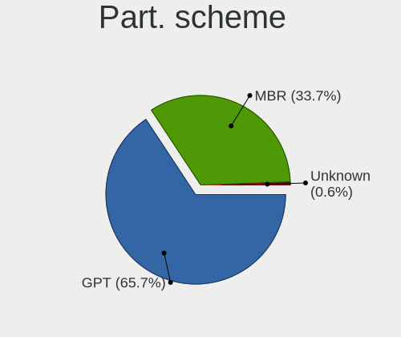
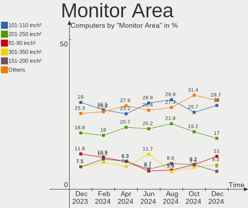
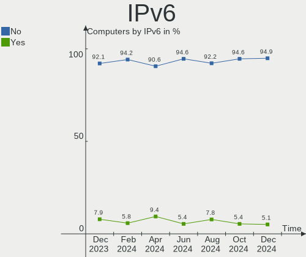
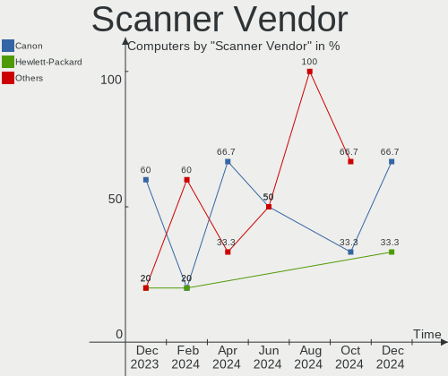

ROSA Hardware Trends
--------------------

A project to identify most popular hardware characteristics and track their change
over time based on data collected by ROSA users at https://Linux-Hardware.org.

Anyone can contribute to the study by uploading probes of their computers by
the [hw-probe](https://github.com/linuxhw/hw-probe) tool:

    sudo -E hw-probe -all -upload

This is a report for all computer types. See also reports for [desktops](/Dist/ROSA/Desktop/README.md) and [notebooks](/Dist/ROSA/Notebook/README.md).

Full-feature report is available here: https://linux-hardware.org/?view=trends

Period: Mar, 2021.

Contents
--------

- [ OS                       ](#os)
- [ OS Family                ](#os-family)
- [ Kernel                   ](#kernel)
- [ Kernel Family            ](#kernel-family)
- [ Kernel Major Ver.        ](#kernel-major-ver)
- [ Arch                     ](#arch)
- [ DE                       ](#de)
- [ Display Server           ](#display-server)
- [ Display Manager          ](#display-manager)
- [ OS Lang                  ](#os-lang)
- [ Boot Mode                ](#boot-mode)
- [ Filesystem               ](#filesystem)
- [ Part. scheme             ](#part-scheme)
- [ Dual Boot with Linux/BSD ](#dual-boot-with-linux/bsd)
- [ Dual Boot (Win)          ](#dual-boot-win)
- [ Country                  ](#country)
- [ City                     ](#city)
- [ Vendor                   ](#vendor)
- [ Model                    ](#model)
- [ Model Family             ](#model-family)
- [ MFG Year                 ](#mfg-year)
- [ Form Factor              ](#form-factor)
- [ Secure Boot              ](#secure-boot)
- [ Coreboot                 ](#coreboot)
- [ RAM Size                 ](#ram-size)
- [ RAM Used                 ](#ram-used)
- [ Has CD-ROM               ](#has-cd-rom)
- [ Total Drives             ](#total-drives)
- [ Has Ethernet             ](#has-ethernet)
- [ Has WiFi                 ](#has-wifi)
- [ Has Bluetooth            ](#has-bluetooth)
- [ Drive Vendor             ](#drive-vendor)
- [ Drive Model              ](#drive-model)
- [ HDD Vendor               ](#hdd-vendor)
- [ SSD Vendor               ](#ssd-vendor)
- [ Drive Kind               ](#drive-kind)
- [ Drive Connector          ](#drive-connector)
- [ Drive Size               ](#drive-size)
- [ Space Total              ](#space-total)
- [ Space Used               ](#space-used)
- [ Malfunc. Drives          ](#malfunc-drives)
- [ Malfunc. Drive Vendor    ](#malfunc-drive-vendor)
- [ Malfunc. HDD Vendor      ](#malfunc-hdd-vendor)
- [ Malfunc. Drive Kind      ](#malfunc-drive-kind)
- [ Failed Drives            ](#failed-drives)
- [ Failed Drive Vendor      ](#failed-drive-vendor)
- [ Drive Status             ](#drive-status)
- [ Storage Vendor           ](#storage-vendor)
- [ Storage Model            ](#storage-model)
- [ Storage Kind             ](#storage-kind)
- [ CPU Vendor               ](#cpu-vendor)
- [ CPU Model                ](#cpu-model)
- [ CPU Model Family         ](#cpu-model-family)
- [ CPU Cores                ](#cpu-cores)
- [ CPU Sockets              ](#cpu-sockets)
- [ CPU Threads              ](#cpu-threads)
- [ CPU Op-Modes             ](#cpu-op-modes)
- [ CPU Microcode            ](#cpu-microcode)
- [ CPU Microarch            ](#cpu-microarch)
- [ GPU Vendor               ](#gpu-vendor)
- [ GPU Model                ](#gpu-model)
- [ GPU Combo                ](#gpu-combo)
- [ GPU Driver               ](#gpu-driver)
- [ GPU Memory               ](#gpu-memory)
- [ Monitor Vendor           ](#monitor-vendor)
- [ Monitor Model            ](#monitor-model)
- [ Monitor Resolution       ](#monitor-resolution)
- [ Monitor Diagonal         ](#monitor-diagonal)
- [ Monitor Width            ](#monitor-width)
- [ Aspect Ratio             ](#aspect-ratio)
- [ Monitor Area             ](#monitor-area)
- [ Pixel Density            ](#pixel-density)
- [ Multiple Monitors        ](#multiple-monitors)
- [ Net Controller Vendor    ](#net-controller-vendor)
- [ Net Controller Model     ](#net-controller-model)
- [ Wireless Vendor          ](#wireless-vendor)
- [ Wireless Model           ](#wireless-model)
- [ Ethernet Vendor          ](#ethernet-vendor)
- [ Ethernet Model           ](#ethernet-model)
- [ Net Controller Kind      ](#net-controller-kind)
- [ Used Controller          ](#used-controller)
- [ NICs                     ](#nics)
- [ IPv6                     ](#ipv6)
- [ Memory Vendor            ](#memory-vendor)
- [ Memory Model             ](#memory-model)
- [ Memory Kind              ](#memory-kind)
- [ Memory Form Factor       ](#memory-form-factor)
- [ Memory Size              ](#memory-size)
- [ Memory Speed             ](#memory-speed)
- [ Sound Vendor             ](#sound-vendor)
- [ Sound Model              ](#sound-model)
- [ Camera Vendor            ](#camera-vendor)
- [ Camera Model             ](#camera-model)
- [ Fingerprint Vendor       ](#fingerprint-vendor)
- [ Fingerprint Model        ](#fingerprint-model)
- [ Chipcard Vendor          ](#chipcard-vendor)
- [ Chipcard Model           ](#chipcard-model)
- [ Printer Vendor           ](#printer-vendor)
- [ Printer Model            ](#printer-model)
- [ Scanner Vendor           ](#scanner-vendor)
- [ Scanner Model            ](#scanner-model)
- [ Bluetooth Vendor         ](#bluetooth-vendor)
- [ Bluetooth Model          ](#bluetooth-model)
- [ Unsupported Devices      ](#unsupported-devices)
- [ Unsupported Device Types ](#unsupported-device-types)

OS
--

Installed operating systems

| Name         | Computers | Percent |
|--------------|-----------|---------|
| ROSA R11.1   | 129       | 58.37%  |
| ROSA R11     | 69        | 31.22%  |
| ROSA R8.1    | 8         | 3.62%   |
| ROSA R12     | 6         | 2.71%   |
| ROSA R10     | 5         | 2.26%   |
| ROSA R9      | 2         | 0.9%    |
| ROSA 7.3     | 1         | 0.45%   |
| ROSA 2019.05 | 1         | 0.45%   |

OS Family
---------

OS without a version

| Name | Computers | Percent |
|------|-----------|---------|
| ROSA | 221       | 100%    |

Kernel
------

Version of the Linux kernel

| Version                             | Computers | Percent |
|-------------------------------------|-----------|---------|
| 4.15.0-desktop-45.1rosa-x86_64      | 57        | 25.79%  |
| 4.15.0-desktop-122.124.1rosa-x86_64 | 39        | 17.65%  |
| 5.4.83-generic-2rosa-x86_64         | 31        | 14.03%  |
| 5.4.32-generic-2rosa-x86_64         | 17        | 7.69%   |
| 4.15.0-desktop-45.1rosa-i586        | 15        | 6.79%   |
| 4.15.0-desktop-122.124.1rosa-i586   | 12        | 5.43%   |
| 5.4.32-generic-2rosa-i586           | 8         | 3.62%   |
| 4.9.155-nrj-desktop-1rosa-i586      | 7         | 3.17%   |
| 5.4.83-generic-2rosa-i586           | 5         | 2.26%   |
| 4.9.60-nrj-desktop-1rosa-x86_64     | 4         | 1.81%   |
| 5.4.83-generic-2rosa2019.1-x86_64   | 3         | 1.36%   |
| 5.10.18-generic-1rosa2019.1-x86_64  | 3         | 1.36%   |
| 4.9.155-nrj-desktop-1rosa-x86_64    | 3         | 1.36%   |
| 4.9.20-nrj-desktop-1rosa-x86_64     | 2         | 0.9%    |
| 4.15.0-desktop-94.1rosa-x86_64      | 2         | 0.9%    |
| 4.1.38-nrj-desktop-2rosa-i586       | 2         | 0.9%    |
| 5.4.74-nrj-desktop-1rosa-x86_64     | 1         | 0.45%   |
| 5.4.60-nickel-4rosa2019.05-x86_64   | 1         | 0.45%   |
| 5.11.0-desktop-11.12.1rosa-x86_64   | 1         | 0.45%   |
| 5.10.17-generic-1rosa-x86_64        | 1         | 0.45%   |
| 5.10.0-desktop-12.13.2rosa-x86_64   | 1         | 0.45%   |
| 4.9.9-nrj-desktop-1rosa-i586        | 1         | 0.45%   |
| 4.9.111-nrj-desktop-2rosa-x86_64    | 1         | 0.45%   |
| 4.15.0-desktop-60.7rosa-x86_64      | 1         | 0.45%   |
| 4.15.0-desktop-137.141.1rosa-x86_64 | 1         | 0.45%   |
| 4.1.38-nrj-desktop-2rosa-x86_64     | 1         | 0.45%   |
| 3.10.0-514.51.1.el7.x86_64          | 1         | 0.45%   |

Kernel Family
-------------

Linux kernel without a distro release

| Version | Computers | Percent |
|---------|-----------|---------|
| 4.15.0  | 127       | 57.47%  |
| 5.4.83  | 39        | 17.65%  |
| 5.4.32  | 25        | 11.31%  |
| 4.9.155 | 10        | 4.52%   |
| 4.9.60  | 4         | 1.81%   |
| 5.10.18 | 3         | 1.36%   |
| 4.1.38  | 3         | 1.36%   |
| 4.9.20  | 2         | 0.9%    |
| 5.4.74  | 1         | 0.45%   |
| 5.4.60  | 1         | 0.45%   |
| 5.11.0  | 1         | 0.45%   |
| 5.10.17 | 1         | 0.45%   |
| 5.10.0  | 1         | 0.45%   |
| 4.9.9   | 1         | 0.45%   |
| 4.9.111 | 1         | 0.45%   |
| 3.10.0  | 1         | 0.45%   |

Kernel Major Ver.
-----------------

Linux kernel major version

| Version | Computers | Percent |
|---------|-----------|---------|
| 4.15    | 127       | 57.47%  |
| 5.4     | 66        | 29.86%  |
| 4.9     | 18        | 8.14%   |
| 5.10    | 5         | 2.26%   |
| 4.1     | 3         | 1.36%   |
| 5.11    | 1         | 0.45%   |
| 3.10    | 1         | 0.45%   |

Arch
----

OS architecture (x86_64, i586, etc.)

| Name   | Computers | Percent |
|--------|-----------|---------|
| x86_64 | 171       | 77.38%  |
| i686   | 50        | 22.62%  |

DE
--

Desktop Environment

| Name  | Computers | Percent |
|-------|-----------|---------|
| KDE4  | 143       | 64.71%  |
| KDE5  | 55        | 24.89%  |
| XFCE  | 11        | 4.98%   |
| LXQt  | 9         | 4.07%   |
| GNOME | 3         | 1.36%   |

Display Server
--------------

X11 or Wayland

| Name    | Computers | Percent |
|---------|-----------|---------|
| X11     | 220       | 99.55%  |
| Wayland | 1         | 0.45%   |

Display Manager
---------------

SDDM, LightDM, etc.

| Name | Computers | Percent |
|------|-----------|---------|
| KDM  | 143       | 64.71%  |
| SDDM | 72        | 32.58%  |
| TDM  | 3         | 1.36%   |
| GDM  | 3         | 1.36%   |

OS Lang
-------

Language

| Lang    | Computers | Percent |
|---------|-----------|---------|
| ru_RU   | 119       | 53.85%  |
| Unknown | 82        | 37.1%   |
| pl_PL   | 6         | 2.71%   |
| en_US   | 6         | 2.71%   |
| en_GB   | 2         | 0.9%    |
| ro_RO   | 1         | 0.45%   |
| it_IT   | 1         | 0.45%   |
| fr_FR   | 1         | 0.45%   |
| fr_BE   | 1         | 0.45%   |
| el_GR   | 1         | 0.45%   |
| de_DE   | 1         | 0.45%   |

Boot Mode
---------

EFI or BIOS

| Mode | Computers | Percent |
|------|-----------|---------|
| BIOS | 165       | 74.66%  |
| EFI  | 56        | 25.34%  |

Filesystem
----------

Type of filesystem

| Type     | Computers | Percent |
|----------|-----------|---------|
| Ext4     | 210       | 95.02%  |
| Btrfs    | 6         | 2.71%   |
| Xfs      | 2         | 0.9%    |
| Ext3     | 2         | 0.9%    |
| Reiserfs | 1         | 0.45%   |

Part. scheme
------------

Scheme of partitioning

| Type    | Computers | Percent |
|---------|-----------|---------|
| MBR     | 140       | 63.35%  |
| GPT     | 74        | 33.48%  |
| Unknown | 7         | 3.17%   |

Dual Boot with Linux/BSD
------------------------

Hosting more than one Linux/BSD

| Dual boot | Computers | Percent |
|-----------|-----------|---------|
| No        | 175       | 79.19%  |
| Yes       | 46        | 20.81%  |

Dual Boot (Win)
---------------

Hosting Linux and Windows

| Dual boot | Computers | Percent |
|-----------|-----------|---------|
| No        | 114       | 51.58%  |
| Yes       | 107       | 48.42%  |

Country
-------

Geographic location (country)

| Country    | Computers | Percent |
|------------|-----------|---------|
| Russia     | 162       | 73.3%   |
| Ukraine    | 20        | 9.05%   |
| Poland     | 8         | 3.62%   |
| Belarus    | 7         | 3.17%   |
| Israel     | 3         | 1.36%   |
| USA        | 2         | 0.9%    |
| Romania    | 2         | 0.9%    |
| Germany    | 2         | 0.9%    |
| UK         | 1         | 0.45%   |
| Turkey     | 1         | 0.45%   |
| Spain      | 1         | 0.45%   |
| Serbia     | 1         | 0.45%   |
| Latvia     | 1         | 0.45%   |
| Kyrgyzstan | 1         | 0.45%   |
| Kazakhstan | 1         | 0.45%   |
| Japan      | 1         | 0.45%   |
| Italy      | 1         | 0.45%   |
| Greece     | 1         | 0.45%   |
| France     | 1         | 0.45%   |
| Estonia    | 1         | 0.45%   |
| Brazil     | 1         | 0.45%   |
| Belgium    | 1         | 0.45%   |
| Australia  | 1         | 0.45%   |

City
----

Geographic location (city)

| City              | Computers | Percent |
|-------------------|-----------|---------|
| Moscow            | 27        | 12.22%  |
| St Petersburg     | 10        | 4.52%   |
| Yekaterinburg     | 7         | 3.17%   |
| Perm              | 5         | 2.26%   |
| Ulyanovsk         | 3         | 1.36%   |
| Saratov           | 3         | 1.36%   |
| Rostov-on-Don     | 3         | 1.36%   |
| Novosibirsk       | 3         | 1.36%   |
| Nizhniy Novgorod  | 3         | 1.36%   |
| Kursk             | 3         | 1.36%   |
| Krasnoyarsk       | 3         | 1.36%   |
| Chelyabinsk       | 3         | 1.36%   |
| Beersheba         | 3         | 1.36%   |
| Yaroslavl         | 2         | 0.9%    |
| Warsaw            | 2         | 0.9%    |
| Volgograd         | 2         | 0.9%    |
| Ufa               | 2         | 0.9%    |
| Tver              | 2         | 0.9%    |
| Tula              | 2         | 0.9%    |
| Simferopol        | 2         | 0.9%    |
| Orenburg          | 2         | 0.9%    |
| Obninsk           | 2         | 0.9%    |
| Nizhny Tagil      | 2         | 0.9%    |
| Naryan-Mar        | 2         | 0.9%    |
| Minsk             | 2         | 0.9%    |
| Kyiv              | 2         | 0.9%    |
| Krasnodar         | 2         | 0.9%    |
| Khabarovsk        | 2         | 0.9%    |
| Ivanovo           | 2         | 0.9%    |
| Donetsk           | 2         | 0.9%    |
| Bratsk            | 2         | 0.9%    |
| Barda             | 2         | 0.9%    |
| Zheleznogorsk     | 1         | 0.45%   |
| Zelenodolsk       | 1         | 0.45%   |
| Zamość          | 1         | 0.45%   |
| Yenakiieve        | 1         | 0.45%   |
| Votkinsk          | 1         | 0.45%   |
| Voronezh          | 1         | 0.45%   |
| Volzhskiy         | 1         | 0.45%   |
| Vercelli          | 1         | 0.45%   |
| Velikiye Luki     | 1         | 0.45%   |
| Valencia          | 1         | 0.45%   |
| Uyar              | 1         | 0.45%   |
| Utsunomiya        | 1         | 0.45%   |
| Usinsk            | 1         | 0.45%   |
| Ukhta             | 1         | 0.45%   |
| Tulun             | 1         | 0.45%   |
| Tomsk             | 1         | 0.45%   |
| Tomilino          | 1         | 0.45%   |
| Timișoara        | 1         | 0.45%   |
| Thessaloniki      | 1         | 0.45%   |
| Temirtau          | 1         | 0.45%   |
| Tambov            | 1         | 0.45%   |
| Tallinn           | 1         | 0.45%   |
| Szadek            | 1         | 0.45%   |
| Surgut            | 1         | 0.45%   |
| Stavropol         | 1         | 0.45%   |
| Stary Oskol       | 1         | 0.45%   |
| Srednyaya Akhtuba | 1         | 0.45%   |
| Sloviansk         | 1         | 0.45%   |

Vendor
------

Motherboard manufacturer

| Name                | Computers | Percent |
|---------------------|-----------|---------|
| ASUSTek Computer    | 50        | 22.62%  |
| Gigabyte Technology | 26        | 11.76%  |
| Acer                | 24        | 10.86%  |
| Lenovo              | 23        | 10.41%  |
| Hewlett-Packard     | 18        | 8.14%   |
| MSI                 | 17        | 7.69%   |
| Dell                | 11        | 4.98%   |
| ASRock              | 10        | 4.52%   |
| Samsung Electronics | 8         | 3.62%   |
| Packard Bell        | 5         | 2.26%   |
| Toshiba             | 4         | 1.81%   |
| ECS                 | 4         | 1.81%   |
| Intel               | 3         | 1.36%   |
| Huanan              | 2         | 0.9%    |
| Fujitsu             | 2         | 0.9%    |
| Clevo               | 2         | 0.9%    |
| WinFast             | 1         | 0.45%   |
| ViewSonic           | 1         | 0.45%   |
| Sony                | 1         | 0.45%   |
| Shuttle             | 1         | 0.45%   |
| Pegatron            | 1         | 0.45%   |
| KLLISRE             | 1         | 0.45%   |
| JW Technology       | 1         | 0.45%   |
| Insyde              | 1         | 0.45%   |
| Infomash            | 1         | 0.45%   |
| Foxconn             | 1         | 0.45%   |
| BBEN                | 1         | 0.45%   |
| Unknown             | 1         | 0.45%   |

Model
-----

Motherboard model

| Name                                                                                     | Computers | Percent |
|------------------------------------------------------------------------------------------|-----------|---------|
| HP Pavilion g6                                                                           | 3         | 1.36%   |
| ASUS P5LD2                                                                               | 3         | 1.36%   |
| ASUS All Series                                                                          | 3         | 1.36%   |
| MSI MS-7B79                                                                              | 2         | 0.9%    |
| MSI MS-7A38                                                                              | 2         | 0.9%    |
| Lenovo IdeaPad S145-15IIL 81W8                                                           | 2         | 0.9%    |
| HP Notebook                                                                              | 2         | 0.9%    |
| Gigabyte A320M-S2H V2                                                                    | 2         | 0.9%    |
| Dell Inspiron 15-3552                                                                    | 2         | 0.9%    |
| ASUS P5G41T-M LX                                                                         | 2         | 0.9%    |
| ASUS 1011PX                                                                              | 2         | 0.9%    |
| ASRock A320M-HDV R4.0                                                                    | 2         | 0.9%    |
| WinFast 6100M2MA                                                                         | 1         | 0.45%   |
| ViewSonic ViewBook                                                                       | 1         | 0.45%   |
| Toshiba Satellite U300                                                                   | 1         | 0.45%   |
| Toshiba Satellite L305                                                                   | 1         | 0.45%   |
| Toshiba Satellite L20                                                                    | 1         | 0.45%   |
| Toshiba NB550D                                                                           | 1         | 0.45%   |
| Sony VPCEL1E1R                                                                           | 1         | 0.45%   |
| Shuttle XS35                                                                             | 1         | 0.45%   |
| Samsung RV408/RV508                                                                      | 1         | 0.45%   |
| Samsung R540/SA41/E452                                                                   | 1         | 0.45%   |
| Samsung R530/R730/P530                                                                   | 1         | 0.45%   |
| Samsung R528/R728                                                                        | 1         | 0.45%   |
| Samsung 355V4C/355V4X/355V5C/355V5X/356V4C/356V4X/356V5C/356V5X/3445VC/3445VX/3545VC/354 | 1         | 0.45%   |
| Samsung 305V4A/305V5A/3415VA                                                             | 1         | 0.45%   |
| Samsung 300V3A/300V4A/300V5A/200A4B/200A5B                                               | 1         | 0.45%   |
| Samsung 300E4C/300E5C/300E7C                                                             | 1         | 0.45%   |
| Pegatron D15B                                                                            | 1         | 0.45%   |
| Packard Bell EasyNote TE69KB                                                             | 1         | 0.45%   |
| Packard Bell EasyNote TE11HC                                                             | 1         | 0.45%   |
| Packard Bell EasyNote TE11BZ                                                             | 1         | 0.45%   |
| Packard Bell EasyNote ENTG81BA                                                           | 1         | 0.45%   |
| Packard Bell EasyNote ENTF71BM                                                           | 1         | 0.45%   |
| MSI S12T 3M/S12 3M                                                                       | 1         | 0.45%   |
| MSI OPTIMUS                                                                              | 1         | 0.45%   |
| MSI MS-7A72                                                                              | 1         | 0.45%   |
| MSI MS-7A15                                                                              | 1         | 0.45%   |
| MSI MS-7846                                                                              | 1         | 0.45%   |
| MSI MS-7786                                                                              | 1         | 0.45%   |
| MSI MS-7592                                                                              | 1         | 0.45%   |
| MSI MS-7529                                                                              | 1         | 0.45%   |
| MSI MS-7392                                                                              | 1         | 0.45%   |
| MSI M670                                                                                 | 1         | 0.45%   |
| MSI GP60 2OD                                                                             | 1         | 0.45%   |
| MSI Compaq dx7400 Microtower                                                             | 1         | 0.45%   |
| MSI Compaq dx2200 MT                                                                     | 1         | 0.45%   |
| Lenovo ThinkPad X131e 33681P3                                                            | 1         | 0.45%   |
| Lenovo ThinkPad W520 427637U                                                             | 1         | 0.45%   |
| Lenovo ThinkPad T61 7661ZM5                                                              | 1         | 0.45%   |
| Lenovo ThinkPad T60 1952W2Q                                                              | 1         | 0.45%   |
| Lenovo Lenovo                                                                            | 1         | 0.45%   |
| Lenovo IdeaPad Z570 HuronRiver Platform                                                  | 1         | 0.45%   |
| Lenovo IdeaPad S130-11IGM 81J1                                                           | 1         | 0.45%   |
| Lenovo IdeaPad L340-15IRH Gaming 81LK                                                    | 1         | 0.45%   |
| Lenovo IdeaPad 330-17IKB 81DK                                                            | 1         | 0.45%   |
| Lenovo IdeaPad 330-15IKB 81DE                                                            | 1         | 0.45%   |
| Lenovo IdeaPad 330-15IKB 81DC                                                            | 1         | 0.45%   |
| Lenovo IdeaPad 100-15IBD 80QQ                                                            | 1         | 0.45%   |
| Lenovo IdeaCentre Q180 10087&3110                                                        | 1         | 0.45%   |

Model Family
------------

Motherboard model prefix

| Name                  | Computers | Percent |
|-----------------------|-----------|---------|
| Acer Aspire           | 19        | 8.6%    |
| Lenovo IdeaPad        | 9         | 4.07%   |
| Dell Inspiron         | 6         | 2.71%   |
| Packard Bell EasyNote | 5         | 2.26%   |
| HP Compaq             | 5         | 2.26%   |
| Lenovo ThinkPad       | 4         | 1.81%   |
| HP Pavilion           | 4         | 1.81%   |
| ASUS PRIME            | 4         | 1.81%   |
| Toshiba Satellite     | 3         | 1.36%   |
| Dell Latitude         | 3         | 1.36%   |
| ASUS P5LD2            | 3         | 1.36%   |
| ASUS All              | 3         | 1.36%   |
| MSI MS-7B79           | 2         | 0.9%    |
| MSI MS-7A38           | 2         | 0.9%    |
| MSI Compaq            | 2         | 0.9%    |
| Lenovo IdeaCentre     | 2         | 0.9%    |
| HP Notebook           | 2         | 0.9%    |
| HP Laptop             | 2         | 0.9%    |
| HP ENVY               | 2         | 0.9%    |
| Gigabyte B450M        | 2         | 0.9%    |
| Gigabyte A320M-S2H    | 2         | 0.9%    |
| Dell OptiPlex         | 2         | 0.9%    |
| ASUS P5GC-MX          | 2         | 0.9%    |
| ASUS P5G41T-M         | 2         | 0.9%    |
| ASUS M5A97            | 2         | 0.9%    |
| ASUS M5A78L-M         | 2         | 0.9%    |
| ASUS 1011PX           | 2         | 0.9%    |
| ASRock A320M-HDV      | 2         | 0.9%    |
| Acer Extensa          | 2         | 0.9%    |
| WinFast 6100M2MA      | 1         | 0.45%   |
| ViewSonic ViewBook    | 1         | 0.45%   |
| Toshiba NB550D        | 1         | 0.45%   |
| Sony VPCEL1E1R        | 1         | 0.45%   |
| Shuttle XS35          | 1         | 0.45%   |
| Samsung RV408         | 1         | 0.45%   |
| Samsung R540          | 1         | 0.45%   |
| Samsung R530          | 1         | 0.45%   |
| Samsung R528          | 1         | 0.45%   |
| Samsung 355V4C        | 1         | 0.45%   |
| Samsung 305V4A        | 1         | 0.45%   |
| Samsung 300V3A        | 1         | 0.45%   |
| Samsung 300E4C        | 1         | 0.45%   |
| Pegatron D15B         | 1         | 0.45%   |
| MSI S12T              | 1         | 0.45%   |
| MSI OPTIMUS           | 1         | 0.45%   |
| MSI MS-7A72           | 1         | 0.45%   |
| MSI MS-7A15           | 1         | 0.45%   |
| MSI MS-7846           | 1         | 0.45%   |
| MSI MS-7786           | 1         | 0.45%   |
| MSI MS-7592           | 1         | 0.45%   |
| MSI MS-7529           | 1         | 0.45%   |
| MSI MS-7392           | 1         | 0.45%   |
| MSI M670              | 1         | 0.45%   |
| MSI GP60              | 1         | 0.45%   |
| Lenovo Lenovo         | 1         | 0.45%   |
| Lenovo G700           | 1         | 0.45%   |
| Lenovo G570           | 1         | 0.45%   |
| Lenovo G50-45         | 1         | 0.45%   |
| Lenovo B590           | 1         | 0.45%   |
| Lenovo B560           | 1         | 0.45%   |

MFG Year
--------

Motherboard manufacture year

| Year | Computers | Percent |
|------|-----------|---------|
| 2010 | 27        | 12.22%  |
| 2011 | 25        | 11.31%  |
| 2018 | 22        | 9.95%   |
| 2007 | 16        | 7.24%   |
| 2019 | 15        | 6.79%   |
| 2014 | 15        | 6.79%   |
| 2020 | 14        | 6.33%   |
| 2013 | 14        | 6.33%   |
| 2009 | 14        | 6.33%   |
| 2012 | 13        | 5.88%   |
| 2008 | 12        | 5.43%   |
| 2015 | 10        | 4.52%   |
| 2017 | 8         | 3.62%   |
| 2016 | 6         | 2.71%   |
| 2006 | 5         | 2.26%   |
| 2005 | 3         | 1.36%   |
| 2021 | 2         | 0.9%    |

Form Factor
-----------

Physical design of the computer

| Name        | Computers | Percent |
|-------------|-----------|---------|
| Desktop     | 114       | 51.58%  |
| Notebook    | 104       | 47.06%  |
| Convertible | 1         | 0.45%   |
| Mini pc     | 1         | 0.45%   |
| All in one  | 1         | 0.45%   |

Secure Boot
-----------

Enabled or disabled

| State    | Computers | Percent |
|----------|-----------|---------|
| Disabled | 221       | 100%    |

Coreboot
--------

Have coreboot on board

| Used | Computers | Percent |
|------|-----------|---------|
| No   | 221       | 100%    |

RAM Size
--------

Total RAM memory

| Size in GB | Computers | Percent |
|------------|-----------|---------|
| 3.01-4.0   | 66        | 29.86%  |
| 4.01-8.0   | 41        | 18.55%  |
| 8.01-16.0  | 37        | 16.74%  |
| 1.01-2.0   | 26        | 11.76%  |
| 16.01-24.0 | 19        | 8.6%    |
| 2.01-3.0   | 15        | 6.79%   |
| 0.51-1.0   | 7         | 3.17%   |
| 32.01-64.0 | 5         | 2.26%   |
| 24.01-32.0 | 4         | 1.81%   |
| 0.01-0.5   | 1         | 0.45%   |

RAM Used
--------

Used RAM memory

| Used GB  | Computers | Percent |
|----------|-----------|---------|
| 1.01-2.0 | 94        | 42.53%  |
| 0.51-1.0 | 94        | 42.53%  |
| 2.01-3.0 | 25        | 11.31%  |
| 3.01-4.0 | 5         | 2.26%   |
| 0.01-0.5 | 2         | 0.9%    |
| 4.01-8.0 | 1         | 0.45%   |

Has CD-ROM
----------

Has CD-ROM on board

| Presented | Computers | Percent |
|-----------|-----------|---------|
| Yes       | 122       | 55.2%   |
| No        | 99        | 44.8%   |

Total Drives
------------

Number of drives on board

| Drives | Computers | Percent |
|--------|-----------|---------|
| 1      | 149       | 67.42%  |
| 2      | 47        | 21.27%  |
| 3      | 16        | 7.24%   |
| 4      | 4         | 1.81%   |
| 5      | 2         | 0.9%    |
| 7      | 1         | 0.45%   |
| 6      | 1         | 0.45%   |
| 0      | 1         | 0.45%   |

Has Ethernet
------------

Has Ethernet on board

| Presented | Computers | Percent |
|-----------|-----------|---------|
| Yes       | 211       | 95.48%  |
| No        | 10        | 4.52%   |

Has WiFi
--------

Has WiFi module

| Presented | Computers | Percent |
|-----------|-----------|---------|
| Yes       | 129       | 58.37%  |
| No        | 92        | 41.63%  |

Has Bluetooth
-------------

Has Bluetooth module

| Presented | Computers | Percent |
|-----------|-----------|---------|
| No        | 146       | 66.06%  |
| Yes       | 75        | 33.94%  |

Drive Vendor
------------

Hard drive vendors

| Vendor              | Computers | Drives  | Percent |
|---------------------|-----------|---------|---------|
| WDC                 | 71        | 80      | 23.28%  |
| Seagate             | 64        | 74      | 20.98%  |
| Toshiba             | 30        | 31      | 9.84%   |
| Samsung Electronics | 30        | 32      | 9.84%   |
| Hitachi             | 21        | 21      | 6.89%   |
| Kingston            | 14        | 14      | 4.59%   |
| Unknown             | 9         | 9       | 2.95%   |
| HGST                | 7         | 7       | 2.3%    |
| A-DATA Technology   | 6         | 6       | 1.97%   |
| China               | 5         | 5       | 1.64%   |
| SanDisk             | 4         | 4       | 1.31%   |
| SPCC                | 3         | 3       | 0.98%   |
| OCZ                 | 3         | 3       | 0.98%   |
| MAXTOR              | 3         | 3       | 0.98%   |
| Intel               | 3         | 3       | 0.98%   |
| GOODRAM             | 3         | 3       | 0.98%   |
| Crucial             | 3         | 3       | 0.98%   |
| Apacer              | 3         | 3       | 0.98%   |
| TO Exter            | 2         | 2       | 0.66%   |
| Smartbuy            | 2         | 3       | 0.66%   |
| SK Hynix            | 2         | 2       | 0.66%   |
| Corsair             | 2         | 2       | 0.66%   |
| Zheino              | 1         | 1       | 0.33%   |
| XrayDisk            | 1         | 1       | 0.33%   |
| XPG                 | 1         | 1       | 0.33%   |
| Verbatim            | 1         | 1       | 0.33%   |
| Union Memory        | 1         | 1       | 0.33%   |
| Transcend           | 1         | 1       | 0.33%   |
| Reeinno             | 1         | 1       | 0.33%   |
| PLEXTOR             | 1         | 1       | 0.33%   |
| Patriot             | 1         | 1       | 0.33%   |
| Palit               | 1         | 1       | 0.33%   |
| Mass                | 1         | Unknown | 0.33%   |
| LITEON              | 1         | 1       | 0.33%   |
| KingDian            | 1         | 1       | 0.33%   |
| FOXLINE             | 1         | 1       | 0.33%   |
| DERLAR              | 1         | 1       | 0.33%   |

Drive Model
-----------

Hard drive models

| Model                                     | Computers | Percent |
|-------------------------------------------|-----------|---------|
| Samsung SSD 860 EVO 250GB                 | 6         | 1.83%   |
| Kingston SA400S37120G 120GB SSD           | 6         | 1.83%   |
| Toshiba DT01ACA100 1TB                    | 5         | 1.52%   |
| Seagate ST500LT012-1DG142 500GB           | 5         | 1.52%   |
| Seagate ST1000DM010-2EP102 1TB            | 4         | 1.22%   |
| HGST HTS545050A7E680 500GB                | 4         | 1.22%   |
| WDC WDS120G2G0A-00JH30 120GB SSD          | 3         | 0.91%   |
| WDC WD10EZEX-08WN4A0 1TB                  | 3         | 0.91%   |
| WDC WD10EZEX-00WN4A0 1TB                  | 3         | 0.91%   |
| Toshiba MQ01ABF050 500GB                  | 3         | 0.91%   |
| Seagate ST500LT012-9WS142 500GB           | 3         | 0.91%   |
| Seagate ST3500418AS 500GB                 | 3         | 0.91%   |
| Seagate ST340014A 40GB                    | 3         | 0.91%   |
| Seagate ST31000524AS 1TB                  | 3         | 0.91%   |
| Seagate ST1000LM024 HN-M101MBB 1TB        | 3         | 0.91%   |
| WDC WD5000LPVX-22V0TT0 500GB              | 2         | 0.61%   |
| WDC WD5000AZRX-00A8LB0 500GB              | 2         | 0.61%   |
| WDC WD5000AZLX-22JKKA0 500GB              | 2         | 0.61%   |
| WDC WD5000AAKX-001CA0 500GB               | 2         | 0.61%   |
| WDC WD3200BEVT-80A0RT0 320GB              | 2         | 0.61%   |
| WDC WD10SPZX-24Z10 1TB                    | 2         | 0.61%   |
| WDC WD10SPZX-21Z10T0 1TB                  | 2         | 0.61%   |
| WDC WD10EZEX-00BN5A0 1TB                  | 2         | 0.61%   |
| WDC WD10EARS-00Y5B1 1TB                   | 2         | 0.61%   |
| Unknown SD32G  32GB                       | 2         | 0.61%   |
| Unknown SD/MMC/MS PRO 128GB               | 2         | 0.61%   |
| Toshiba MQ01ABD050 500GB                  | 2         | 0.61%   |
| Toshiba MK2555GSX 250GB                   | 2         | 0.61%   |
| Toshiba HDWD110 1TB                       | 2         | 0.61%   |
| Toshiba HDWD105 500GB                     | 2         | 0.61%   |
| Toshiba DT01ACA050 500GB                  | 2         | 0.61%   |
| TO Exter nal USB 3.0 2TB                  | 2         | 0.61%   |
| SK Hynix SKHynix_HFM512GDHTNI-87A0B 512GB | 2         | 0.61%   |
| Seagate ST9320325AS 320GB                 | 2         | 0.61%   |
| Seagate ST500DM002-1BD142 500GB           | 2         | 0.61%   |
| Seagate ST380815AS 80GB                   | 2         | 0.61%   |
| Seagate ST380811AS 80GB                   | 2         | 0.61%   |
| Seagate ST380011A 80GB                    | 2         | 0.61%   |
| Seagate ST3160815AS 160GB                 | 2         | 0.61%   |
| Seagate ST3160812A 160GB                  | 2         | 0.61%   |
| Seagate ST31000528AS 1TB                  | 2         | 0.61%   |
| Seagate ST1000LM035-1RK172 1TB            | 2         | 0.61%   |
| Samsung SSD 750 EVO 120GB                 | 2         | 0.61%   |
| Samsung HD252KJ 250GB                     | 2         | 0.61%   |
| Samsung HD161HJ 160GB                     | 2         | 0.61%   |
| Samsung HD160JJ/ 160GB                    | 2         | 0.61%   |
| Hitachi HTS545050B9A300 500GB             | 2         | 0.61%   |
| Hitachi HTS543232A7A384 320GB             | 2         | 0.61%   |
| Hitachi HTS541616J9SA00 160GB             | 2         | 0.61%   |
| Hitachi HDS721025CLA382 250GB             | 2         | 0.61%   |
| Zheino CHN-25SATAS3-256 256GB SSD         | 1         | 0.3%    |
| XrayDisk SSD 128GB                        | 1         | 0.3%    |
| XPG GAMMIX S11 Pro 256GB                  | 1         | 0.3%    |
| WDC WDS500G2X0C-00L350 500GB              | 1         | 0.3%    |
| WDC WDS500G1B0A-00H9H0 500GB SSD          | 1         | 0.3%    |
| WDC WDS480G2G0A-00JH30 480GB SSD          | 1         | 0.3%    |
| WDC WDS240G2G0B-00EPW0 240GB SSD          | 1         | 0.3%    |
| WDC WD800JD-60LUA0 80GB                   | 1         | 0.3%    |
| WDC WD800JD-60LSA0 80GB                   | 1         | 0.3%    |
| WDC WD800JD-00LSA0 80GB                   | 1         | 0.3%    |

HDD Vendor
----------

Hard disk drive vendors

| Vendor              | Computers | Drives | Percent |
|---------------------|-----------|--------|---------|
| WDC                 | 68        | 73     | 33.33%  |
| Seagate             | 64        | 74     | 31.37%  |
| Toshiba             | 26        | 27     | 12.75%  |
| Hitachi             | 21        | 21     | 10.29%  |
| Samsung Electronics | 13        | 14     | 6.37%   |
| HGST                | 7         | 7      | 3.43%   |
| MAXTOR              | 3         | 3      | 1.47%   |
| TO Exter            | 2         | 2      | 0.98%   |

SSD Vendor
----------

Solid state drive vendors

| Vendor              | Computers | Drives | Percent |
|---------------------|-----------|--------|---------|
| Samsung Electronics | 14        | 15     | 16.47%  |
| Kingston            | 14        | 14     | 16.47%  |
| WDC                 | 6         | 6      | 7.06%   |
| A-DATA Technology   | 6         | 6      | 7.06%   |
| China               | 5         | 5      | 5.88%   |
| Toshiba             | 4         | 4      | 4.71%   |
| SPCC                | 3         | 3      | 3.53%   |
| SanDisk             | 3         | 3      | 3.53%   |
| OCZ                 | 3         | 3      | 3.53%   |
| GOODRAM             | 3         | 3      | 3.53%   |
| Crucial             | 3         | 3      | 3.53%   |
| Apacer              | 3         | 3      | 3.53%   |
| Smartbuy            | 2         | 3      | 2.35%   |
| Intel               | 2         | 2      | 2.35%   |
| Corsair             | 2         | 2      | 2.35%   |
| Zheino              | 1         | 1      | 1.18%   |
| XrayDisk            | 1         | 1      | 1.18%   |
| Verbatim            | 1         | 1      | 1.18%   |
| Unknown             | 1         | 1      | 1.18%   |
| Transcend           | 1         | 1      | 1.18%   |
| Reeinno             | 1         | 1      | 1.18%   |
| Patriot             | 1         | 1      | 1.18%   |
| Palit               | 1         | 1      | 1.18%   |
| LITEON              | 1         | 1      | 1.18%   |
| KingDian            | 1         | 1      | 1.18%   |
| FOXLINE             | 1         | 1      | 1.18%   |
| DERLAR              | 1         | 1      | 1.18%   |

Drive Kind
----------

HDD or SSD

| Kind    | Computers | Drives | Percent |
|---------|-----------|--------|---------|
| HDD     | 174       | 221    | 64.93%  |
| SSD     | 74        | 87     | 27.61%  |
| NVMe    | 10        | 10     | 3.73%   |
| MMC     | 7         | 7      | 2.61%   |
| Unknown | 3         | 2      | 1.12%   |

Drive Connector
---------------

SATA, SAS, NVMe, etc.

| Type | Computers | Drives | Percent |
|------|-----------|--------|---------|
| SATA | 211       | 305    | 90.17%  |
| NVMe | 10        | 10     | 4.27%   |
| MMC  | 7         | 7      | 2.99%   |
| SAS  | 6         | 5      | 2.56%   |

Drive Size
----------

Size of hard drive

| Size in TB | Computers | Drives | Percent |
|------------|-----------|--------|---------|
| 0.01-0.5   | 180       | 233    | 73.47%  |
| 0.51-1.0   | 58        | 68     | 23.67%  |
| 1.01-2.0   | 5         | 5      | 2.04%   |
| 2.01-3.0   | 2         | 2      | 0.82%   |

Space Total
-----------

Amount of disk space available on the file system

| Size in GB | Computers | Percent |
|------------|-----------|---------|
| 101-250    | 61        | 27.6%   |
| 251-500    | 53        | 23.98%  |
| 1-20       | 31        | 14.03%  |
| 51-100     | 30        | 13.57%  |
| 501-1000   | 21        | 9.5%    |
| 21-50      | 15        | 6.79%   |
| 1001-2000  | 7         | 3.17%   |
| 2001-3000  | 2         | 0.9%    |
| Unknown    | 1         | 0.45%   |

Space Used
----------

Amount of used disk space

| Used GB   | Computers | Percent |
|-----------|-----------|---------|
| 1-20      | 161       | 72.85%  |
| 21-50     | 21        | 9.5%    |
| 101-250   | 13        | 5.88%   |
| 51-100    | 12        | 5.43%   |
| 251-500   | 7         | 3.17%   |
| 501-1000  | 4         | 1.81%   |
| 1001-2000 | 2         | 0.9%    |
| Unknown   | 1         | 0.45%   |

Malfunc. Drives
---------------

Drive models with a malfunction

| Model                               | Computers | Drives | Percent |
|-------------------------------------|-----------|--------|---------|
| HGST HTS545050A7E680 500GB          | 4         | 4      | 3.77%   |
| Seagate ST500LT012-9WS142 500GB     | 3         | 3      | 2.83%   |
| Seagate ST500LT012-1DG142 500GB     | 3         | 3      | 2.83%   |
| WDC WD5000AAKX-001CA0 500GB         | 2         | 2      | 1.89%   |
| Toshiba MQ01ABF050 500GB            | 2         | 2      | 1.89%   |
| Toshiba MK2555GSX 250GB             | 2         | 2      | 1.89%   |
| Seagate ST9320325AS 320GB           | 2         | 2      | 1.89%   |
| Seagate ST500DM002-1BD142 500GB     | 2         | 2      | 1.89%   |
| Seagate ST380011A 80GB              | 2         | 2      | 1.89%   |
| Seagate ST3500418AS 500GB           | 2         | 2      | 1.89%   |
| Seagate ST31000528AS 1TB            | 2         | 2      | 1.89%   |
| Samsung Electronics HD252KJ 250GB   | 2         | 2      | 1.89%   |
| Samsung Electronics HD161HJ 160GB   | 2         | 2      | 1.89%   |
| Samsung Electronics HD160JJ/ 160GB  | 2         | 2      | 1.89%   |
| Hitachi HTS541616J9SA00 160GB       | 2         | 2      | 1.89%   |
| WDC WDS480G2G0A-00JH30 480GB SSD    | 1         | 1      | 0.94%   |
| WDC WDS120G2G0A-00JH30 120GB SSD    | 1         | 1      | 0.94%   |
| WDC WD800JD-60LSA0 80GB             | 1         | 1      | 0.94%   |
| WDC WD800BB-00FJA0 80GB             | 1         | 1      | 0.94%   |
| WDC WD800BB-00DKA0 80GB             | 1         | 1      | 0.94%   |
| WDC WD7500AAKS-00RBA0 752GB         | 1         | 1      | 0.94%   |
| WDC WD7500AACS-00D6B1 752GB         | 1         | 1      | 0.94%   |
| WDC WD5000BPVT-22HXZT3 500GB        | 1         | 1      | 0.94%   |
| WDC WD5000AAKX-003CA0 500GB         | 1         | 1      | 0.94%   |
| WDC WD3200BEVT-80A0RT0 320GB        | 1         | 1      | 0.94%   |
| WDC WD3200AAKS-00UU3A0 320GB        | 1         | 1      | 0.94%   |
| WDC WD3200AAJS-00B4A0 320GB         | 1         | 1      | 0.94%   |
| WDC WD2500BEKT-60A25T1 250GB        | 1         | 1      | 0.94%   |
| WDC WD2500AAKS-60L9A0 250GB         | 1         | 1      | 0.94%   |
| WDC WD1600AAJS-00L7A0 160GB         | 1         | 1      | 0.94%   |
| WDC WD15EARS-00MVWB0 1TB            | 1         | 1      | 0.94%   |
| WDC WD10SPZX-24Z10 1TB              | 1         | 1      | 0.94%   |
| WDC WD10EZEX-60WN4A0 1TB            | 1         | 1      | 0.94%   |
| WDC WD10EZEX-00BN5A0 1TB            | 1         | 1      | 0.94%   |
| WDC WD10EARS-00Y5B1 1TB             | 1         | 1      | 0.94%   |
| WDC WD10EALS-002BA0 1TB             | 1         | 1      | 0.94%   |
| WDC WD10EADS-22M2B0 1TB             | 1         | 1      | 0.94%   |
| Unknown MC240 240GB SSD             | 1         | 1      | 0.94%   |
| Toshiba THNSNH128GBST SSD           | 1         | 1      | 0.94%   |
| Toshiba MQ01ABD050 500GB            | 1         | 1      | 0.94%   |
| Toshiba MK6034GAX 64GB              | 1         | 1      | 0.94%   |
| Toshiba MK5076GSX 500GB             | 1         | 1      | 0.94%   |
| Toshiba DT01ACA100 1TB              | 1         | 1      | 0.94%   |
| Toshiba DT01ACA050 500GB            | 1         | 1      | 0.94%   |
| Seagate ST9500420AS 500GB           | 1         | 1      | 0.94%   |
| Seagate ST9500325AS 500GB           | 1         | 1      | 0.94%   |
| Seagate ST9320325ASG 320GB          | 1         | 1      | 0.94%   |
| Seagate ST9250315AS 250GB           | 1         | 1      | 0.94%   |
| Seagate ST9160821AS 160GB           | 1         | 1      | 0.94%   |
| Seagate ST9160310AS 160GB           | 1         | 1      | 0.94%   |
| Seagate ST9120822AS 120GB           | 1         | 1      | 0.94%   |
| Seagate ST750LM022 HN-M750MBB 752GB | 1         | 1      | 0.94%   |
| Seagate ST500DM005 HD502HJ 500GB    | 1         | 1      | 0.94%   |
| Seagate ST380817AS 80GB             | 1         | 1      | 0.94%   |
| Seagate ST380815AS 80GB             | 1         | 1      | 0.94%   |
| Seagate ST380811AS 80GB             | 1         | 1      | 0.94%   |
| Seagate ST3500413AS 500GB           | 1         | 1      | 0.94%   |
| Seagate ST340016A 40GB              | 1         | 1      | 0.94%   |
| Seagate ST340014A 40GB              | 1         | 1      | 0.94%   |
| Seagate ST3250312CS 250GB           | 1         | 1      | 0.94%   |

Malfunc. Drive Vendor
---------------------

Vendors of faulty drives

| Vendor              | Computers | Drives | Percent |
|---------------------|-----------|--------|---------|
| Seagate             | 39        | 42     | 39%     |
| WDC                 | 22        | 24     | 22%     |
| Toshiba             | 10        | 10     | 10%     |
| Hitachi             | 10        | 10     | 10%     |
| Samsung Electronics | 8         | 9      | 8%      |
| HGST                | 5         | 5      | 5%      |
| Unknown             | 1         | 1      | 1%      |
| SanDisk             | 1         | 1      | 1%      |
| MAXTOR              | 1         | 1      | 1%      |
| Kingston            | 1         | 1      | 1%      |
| Intel               | 1         | 1      | 1%      |
| Corsair             | 1         | 1      | 1%      |

Malfunc. HDD Vendor
-------------------

Vendors of faulty HDD drives

| Vendor              | Computers | Drives | Percent |
|---------------------|-----------|--------|---------|
| Seagate             | 39        | 42     | 42.39%  |
| WDC                 | 20        | 22     | 21.74%  |
| Hitachi             | 10        | 10     | 10.87%  |
| Toshiba             | 9         | 9      | 9.78%   |
| Samsung Electronics | 8         | 9      | 8.7%    |
| HGST                | 5         | 5      | 5.43%   |
| MAXTOR              | 1         | 1      | 1.09%   |

Malfunc. Drive Kind
-------------------

Kinds of faulty drives

| Kind | Computers | Drives | Percent |
|------|-----------|--------|---------|
| HDD  | 88        | 98     | 91.67%  |
| SSD  | 8         | 8      | 8.33%   |

Failed Drives
-------------

Failed drive models

| Model                             | Computers | Drives | Percent |
|-----------------------------------|-----------|--------|---------|
| Samsung Electronics HD252HJ 250GB | 1         | 1      | 50%     |
| Hitachi HDS721025CLA382 250GB     | 1         | 1      | 50%     |

Failed Drive Vendor
-------------------

Failed drive vendors

| Vendor              | Computers | Drives | Percent |
|---------------------|-----------|--------|---------|
| Samsung Electronics | 1         | 1      | 50%     |
| Hitachi             | 1         | 1      | 50%     |

Drive Status
------------

Number of failed and malfunc. drives

| Status   | Computers | Drives | Percent |
|----------|-----------|--------|---------|
| Works    | 146       | 209    | 57.48%  |
| Malfunc  | 95        | 106    | 37.4%   |
| Detected | 11        | 10     | 4.33%   |
| Failed   | 2         | 2      | 0.79%   |

Storage Vendor
--------------

Storage controller vendors

| Vendor                           | Computers | Percent |
|----------------------------------|-----------|---------|
| Intel                            | 149       | 61.07%  |
| AMD                              | 58        | 23.77%  |
| JMicron Technology               | 12        | 4.92%   |
| Nvidia                           | 8         | 3.28%   |
| Samsung Electronics              | 3         | 1.23%   |
| Marvell Technology Group         | 3         | 1.23%   |
| VIA Technologies                 | 2         | 0.82%   |
| SK Hynix                         | 2         | 0.82%   |
| Silicon Integrated Systems [SiS] | 2         | 0.82%   |
| Union Memory (Shenzhen)          | 1         | 0.41%   |
| Sandisk                          | 1         | 0.41%   |
| Lite-On Technology               | 1         | 0.41%   |
| ASMedia Technology               | 1         | 0.41%   |
| ADATA Technology                 | 1         | 0.41%   |

Storage Model
-------------

Storage controller models

| Model                                                                            | Computers | Percent |
|----------------------------------------------------------------------------------|-----------|---------|
| AMD FCH SATA Controller [AHCI mode]                                              | 27        | 8.52%   |
| Intel 82801G (ICH7 Family) IDE Controller                                        | 18        | 5.68%   |
| Intel NM10/ICH7 Family SATA Controller [IDE mode]                                | 17        | 5.36%   |
| AMD SB7x0/SB8x0/SB9x0 IDE Controller                                             | 14        | 4.42%   |
| AMD SB7x0/SB8x0/SB9x0 SATA Controller [IDE mode]                                 | 12        | 3.79%   |
| Intel 7 Series Chipset Family 6-port SATA Controller [AHCI mode]                 | 11        | 3.47%   |
| AMD SB7x0/SB8x0/SB9x0 SATA Controller [AHCI mode]                                | 11        | 3.47%   |
| Intel 6 Series/C200 Series Chipset Family 6 port Mobile SATA AHCI Controller     | 9         | 2.84%   |
| Intel 5 Series/3400 Series Chipset 4 port SATA AHCI Controller                   | 8         | 2.52%   |
| JMicron JMB363 SATA/IDE Controller                                               | 7         | 2.21%   |
| Intel NM10/ICH7 Family SATA Controller [AHCI mode]                               | 7         | 2.21%   |
| Intel Sunrise Point-LP SATA Controller [AHCI mode]                               | 6         | 1.89%   |
| Intel 82801IBM/IEM (ICH9M/ICH9M-E) 4 port SATA Controller [AHCI mode]            | 6         | 1.89%   |
| Intel 8 Series/C220 Series Chipset Family 6-port SATA Controller 1 [AHCI mode]   | 6         | 1.89%   |
| AMD 400 Series Chipset SATA Controller                                           | 6         | 1.89%   |
| Intel Q170/Q150/B150/H170/H110/Z170/CM236 Chipset SATA Controller [AHCI Mode]    | 5         | 1.58%   |
| Intel Atom/Celeron/Pentium Processor x5-E8000/J3xxx/N3xxx Series SATA Controller | 5         | 1.58%   |
| Intel Atom Processor E3800 Series SATA AHCI Controller                           | 5         | 1.58%   |
| Intel 82801 Mobile SATA Controller [RAID mode]                                   | 5         | 1.58%   |
| Intel Cannon Lake PCH SATA AHCI Controller                                       | 4         | 1.26%   |
| Intel 6 Series/C200 Series Chipset Family 6 port Desktop SATA AHCI Controller    | 4         | 1.26%   |
| Intel 200 Series PCH SATA controller [AHCI mode]                                 | 4         | 1.26%   |
| AMD 300 Series Chipset SATA Controller                                           | 4         | 1.26%   |
| Nvidia MCP51 Serial ATA Controller                                               | 3         | 0.95%   |
| JMicron JMB368 IDE controller                                                    | 3         | 0.95%   |
| Intel 82801JI (ICH10 Family) SATA AHCI Controller                                | 3         | 0.95%   |
| Intel 82801I (ICH9 Family) 2 port SATA Controller [IDE mode]                     | 3         | 0.95%   |
| Intel 82801HR/HO/HH (ICH8R/DO/DH) 2 port SATA Controller [IDE mode]              | 3         | 0.95%   |
| Intel 82801HM/HEM (ICH8M/ICH8M-E) SATA Controller [AHCI mode]                    | 3         | 0.95%   |
| Intel 82801HM/HEM (ICH8M/ICH8M-E) IDE Controller                                 | 3         | 0.95%   |
| Intel 82801H (ICH8 Family) 4 port SATA Controller [IDE mode]                     | 3         | 0.95%   |
| Intel 82801GBM/GHM (ICH7-M Family) SATA Controller [IDE mode]                    | 3         | 0.95%   |
| Intel 7 Series/C210 Series Chipset Family 6-port SATA Controller [AHCI mode]     | 3         | 0.95%   |
| AMD FCH SATA Controller [IDE mode]                                               | 3         | 0.95%   |
| AMD FCH SATA Controller D                                                        | 3         | 0.95%   |
| VIA VT82C586A/B/VT82C686/A/B/VT823x/A/C PIPC Bus Master IDE                      | 2         | 0.63%   |
| VIA VIA VT6420 SATA RAID Controller                                              | 2         | 0.63%   |
| SK Hynix BC511                                                                   | 2         | 0.63%   |
| Silicon Integrated Systems [SiS] SATA Controller / IDE mode                      | 2         | 0.63%   |
| Samsung NVMe SSD Controller SM981/PM981/PM983                                    | 2         | 0.63%   |
| Nvidia MCP79 AHCI Controller                                                     | 2         | 0.63%   |
| Nvidia MCP61 SATA Controller                                                     | 2         | 0.63%   |
| Nvidia MCP61 IDE                                                                 | 2         | 0.63%   |
| Nvidia MCP51 IDE                                                                 | 2         | 0.63%   |
| Intel Wildcat Point-LP SATA Controller [AHCI Mode]                               | 2         | 0.63%   |
| Intel Ice Lake-LP SATA Controller [AHCI mode]                                    | 2         | 0.63%   |
| Intel C600/X79 series chipset 6-Port SATA AHCI Controller                        | 2         | 0.63%   |
| Intel 82801JI (ICH10 Family) 4 port SATA IDE Controller #1                       | 2         | 0.63%   |
| Intel 82801JI (ICH10 Family) 2 port SATA IDE Controller #2                       | 2         | 0.63%   |
| Intel 82801IB (ICH9) 2 port SATA Controller [IDE mode]                           | 2         | 0.63%   |
| Intel 82801FB/FW (ICH6/ICH6W) SATA Controller                                    | 2         | 0.63%   |
| Intel 82801FB/FBM/FR/FW/FRW (ICH6 Family) IDE Controller                         | 2         | 0.63%   |
| Intel 8 Series SATA Controller 1 [AHCI mode]                                     | 2         | 0.63%   |
| AMD IXP SB4x0 Serial ATA Controller                                              | 2         | 0.63%   |
| AMD IXP SB4x0 IDE Controller                                                     | 2         | 0.63%   |
| Union Memory (Shenzhen) Non-Volatile memory controller                           | 1         | 0.32%   |
| Silicon Integrated Systems [SiS] 5513 IDE Controller                             | 1         | 0.32%   |
| Sandisk WD Black 2018/SN750 / PC SN720 NVMe SSD                                  | 1         | 0.32%   |
| Samsung NVMe SSD Controller SM961/PM961/SM963                                    | 1         | 0.32%   |
| Nvidia MCP67 IDE Controller                                                      | 1         | 0.32%   |

Storage Kind
------------

Kind of storage controller (IDE, SATA, NVMe, SAS, ...)

| Kind | Computers | Percent |
|------|-----------|---------|
| SATA | 164       | 63.81%  |
| IDE  | 76        | 29.57%  |
| NVMe | 10        | 3.89%   |
| RAID | 7         | 2.72%   |

CPU Vendor
----------

Processor vendors

| Vendor       | Computers | Percent |
|--------------|-----------|---------|
| Intel        | 156       | 70.59%  |
| AMD          | 64        | 28.96%  |
| CentaurHauls | 1         | 0.45%   |

CPU Model
---------

Processor models

| Model                                       | Computers | Percent |
|---------------------------------------------|-----------|---------|
| Intel Pentium CPU N3710 @ 1.60GHz           | 4         | 1.81%   |
| Intel Core 2 Duo CPU E8400 @ 3.00GHz        | 4         | 1.81%   |
| AMD Ryzen 3 1200 Quad-Core Processor        | 4         | 1.81%   |
| Intel Pentium 4 CPU 3.00GHz                 | 3         | 1.36%   |
| Intel Core i5-7200U CPU @ 2.50GHz           | 3         | 1.36%   |
| Intel Core i5-2400 CPU @ 3.10GHz            | 3         | 1.36%   |
| Intel Core 2 Duo CPU E4600 @ 2.40GHz        | 3         | 1.36%   |
| Intel Atom CPU N570 @ 1.66GHz               | 3         | 1.36%   |
| Intel Xeon CPU E5450 @ 3.00GHz              | 2         | 0.9%    |
| Intel Pentium Dual-Core CPU E6300 @ 2.80GHz | 2         | 0.9%    |
| Intel Pentium CPU P6100 @ 2.00GHz           | 2         | 0.9%    |
| Intel Pentium CPU B950 @ 2.10GHz            | 2         | 0.9%    |
| Intel Pentium CPU 2020M @ 2.40GHz           | 2         | 0.9%    |
| Intel Core i7-2720QM CPU @ 2.20GHz          | 2         | 0.9%    |
| Intel Core i5-8400 CPU @ 2.80GHz            | 2         | 0.9%    |
| Intel Core i5-2410M CPU @ 2.30GHz           | 2         | 0.9%    |
| Intel Core i3-1005G1 CPU @ 1.20GHz          | 2         | 0.9%    |
| Intel Core i3 CPU M 350 @ 2.27GHz           | 2         | 0.9%    |
| Intel Core 2 Duo CPU T5900 @ 2.20GHz        | 2         | 0.9%    |
| Intel Core 2 Duo CPU E8200 @ 2.66GHz        | 2         | 0.9%    |
| AMD Ryzen 5 2600 Six-Core Processor         | 2         | 0.9%    |
| AMD FX-8300 Eight-Core Processor            | 2         | 0.9%    |
| AMD FX-4300 Quad-Core Processor             | 2         | 0.9%    |
| AMD E-350 Processor                         | 2         | 0.9%    |
| AMD Athlon 64 X2 Dual Core Processor 4200+  | 2         | 0.9%    |
| Intel Xeon CPU E5430 @ 2.66GHz              | 1         | 0.45%   |
| Intel Xeon CPU E5-2678 v3 @ 2.50GHz         | 1         | 0.45%   |
| Intel Xeon CPU E5-2650 0 @ 2.00GHz          | 1         | 0.45%   |
| Intel Xeon CPU E5-2620 v2 @ 2.10GHz         | 1         | 0.45%   |
| Intel Pentium M processor 1.86GHz           | 1         | 0.45%   |
| Intel Pentium Dual-Core CPU T4400 @ 2.20GHz | 1         | 0.45%   |
| Intel Pentium Dual-Core CPU T4200 @ 2.00GHz | 1         | 0.45%   |
| Intel Pentium Dual-Core CPU E6600 @ 3.06GHz | 1         | 0.45%   |
| Intel Pentium Dual-Core CPU E5700 @ 3.00GHz | 1         | 0.45%   |
| Intel Pentium Dual-Core CPU E5500 @ 2.80GHz | 1         | 0.45%   |
| Intel Pentium Dual-Core CPU E5300 @ 2.60GHz | 1         | 0.45%   |
| Intel Pentium Dual CPU E2220 @ 2.40GHz      | 1         | 0.45%   |
| Intel Pentium Dual CPU E2200 @ 2.20GHz      | 1         | 0.45%   |
| Intel Pentium Dual CPU E2160 @ 1.80GHz      | 1         | 0.45%   |
| Intel Pentium D CPU 3.40GHz                 | 1         | 0.45%   |
| Intel Pentium D CPU 2.80GHz                 | 1         | 0.45%   |
| Intel Pentium CPU N3700 @ 1.60GHz           | 1         | 0.45%   |
| Intel Pentium CPU N3540 @ 2.16GHz           | 1         | 0.45%   |
| Intel Pentium CPU N3530 @ 2.16GHz           | 1         | 0.45%   |
| Intel Pentium CPU G3240 @ 3.10GHz           | 1         | 0.45%   |
| Intel Pentium CPU 4415U @ 2.30GHz           | 1         | 0.45%   |
| Intel Genuine CPU U2300 @ 1.20GHz           | 1         | 0.45%   |
| Intel Core i7-6700 CPU @ 3.40GHz            | 1         | 0.45%   |
| Intel Core i7-4770K CPU @ 3.50GHz           | 1         | 0.45%   |
| Intel Core i7-4710MQ CPU @ 2.50GHz          | 1         | 0.45%   |
| Intel Core i7-3770S CPU @ 3.10GHz           | 1         | 0.45%   |
| Intel Core i7-3770 CPU @ 3.40GHz            | 1         | 0.45%   |
| Intel Core i7-3632QM CPU @ 2.20GHz          | 1         | 0.45%   |
| Intel Core i7-3610QM CPU @ 2.30GHz          | 1         | 0.45%   |
| Intel Core i7 CPU Q 740 @ 1.73GHz           | 1         | 0.45%   |
| Intel Core i7 CPU 950 @ 3.07GHz             | 1         | 0.45%   |
| Intel Core i5-9500 CPU @ 3.00GHz            | 1         | 0.45%   |
| Intel Core i5-9400 CPU @ 2.90GHz            | 1         | 0.45%   |
| Intel Core i5-9300H CPU @ 2.40GHz           | 1         | 0.45%   |
| Intel Core i5-7500 CPU @ 3.40GHz            | 1         | 0.45%   |

CPU Model Family
----------------

Processor model prefix

| Model                   | Computers | Percent |
|-------------------------|-----------|---------|
| Intel Core i5           | 33        | 14.93%  |
| Intel Core i3           | 21        | 9.5%    |
| Intel Core 2 Duo        | 21        | 9.5%    |
| Intel Pentium           | 15        | 6.79%   |
| Intel Celeron           | 12        | 5.43%   |
| Intel Core i7           | 11        | 4.98%   |
| Intel Atom              | 11        | 4.98%   |
| Intel Pentium Dual-Core | 8         | 3.62%   |
| AMD Athlon 64 X2        | 8         | 3.62%   |
| Intel Xeon              | 6         | 2.71%   |
| AMD Ryzen 5             | 6         | 2.71%   |
| AMD Ryzen 3             | 6         | 2.71%   |
| AMD FX                  | 6         | 2.71%   |
| AMD Athlon II X2        | 4         | 1.81%   |
| AMD A4                  | 4         | 1.81%   |
| AMD A10                 | 4         | 1.81%   |
| Intel Pentium Dual      | 3         | 1.36%   |
| Intel Pentium 4         | 3         | 1.36%   |
| Intel Core 2            | 3         | 1.36%   |
| AMD E1                  | 3         | 1.36%   |
| AMD E                   | 3         | 1.36%   |
| AMD Athlon              | 3         | 1.36%   |
| AMD A6                  | 3         | 1.36%   |
| Intel Pentium D         | 2         | 0.9%    |
| Intel Celeron M         | 2         | 0.9%    |
| Intel Celeron Dual-Core | 2         | 0.9%    |
| AMD Phenom              | 2         | 0.9%    |
| Other                   | 1         | 0.45%   |
| Intel Pentium M         | 1         | 0.45%   |
| Intel Genuine           | 1         | 0.45%   |
| Intel Core Duo          | 1         | 0.45%   |
| CentaurHauls VIA Esther | 1         | 0.45%   |
| AMD Sempron             | 1         | 0.45%   |
| AMD Ryzen 7 PRO         | 1         | 0.45%   |
| AMD Ryzen 7             | 1         | 0.45%   |
| AMD Phenom II X6        | 1         | 0.45%   |
| AMD Phenom II X4        | 1         | 0.45%   |
| AMD Phenom II X2        | 1         | 0.45%   |
| AMD Mobile Sempron      | 1         | 0.45%   |
| AMD E2                  | 1         | 0.45%   |
| AMD C-60                | 1         | 0.45%   |
| AMD Athlon II X4        | 1         | 0.45%   |
| AMD Athlon II X3        | 1         | 0.45%   |

CPU Cores
---------

Number of processor cores

| Number  | Computers | Percent |
|---------|-----------|---------|
| 2       | 132       | 59.73%  |
| 4       | 54        | 24.43%  |
| 1       | 15        | 6.79%   |
| 6       | 11        | 4.98%   |
| 8       | 3         | 1.36%   |
| 3       | 3         | 1.36%   |
| Unknown | 2         | 0.9%    |
| 12      | 1         | 0.45%   |

CPU Sockets
-----------

Number of sockets

| Number | Computers | Percent |
|--------|-----------|---------|
| 1      | 221       | 100%    |

CPU Threads
-----------

Threads per core (Hyper-Threading)

| Number  | Computers | Percent |
|---------|-----------|---------|
| 1       | 138       | 62.44%  |
| 2       | 81        | 36.65%  |
| Unknown | 2         | 0.9%    |

CPU Op-Modes
------------

CPU Operation Modes (32-bit, 64-bit)

| Op mode        | Computers | Percent |
|----------------|-----------|---------|
| 32-bit, 64-bit | 213       | 96.38%  |
| 32-bit         | 8         | 3.62%   |

CPU Microcode
-------------

Microcode number

| Number     | Computers | Percent |
|------------|-----------|---------|
| 0x206a7    | 16        | 7.24%   |
| 0x1067a    | 16        | 7.24%   |
| 0x306a9    | 14        | 6.33%   |
| Unknown    | 14        | 6.33%   |
| 0x6fd      | 11        | 4.98%   |
| 0x10676    | 9         | 4.07%   |
| 0x306c3    | 7         | 3.17%   |
| 0x30678    | 6         | 2.71%   |
| 0x106ca    | 6         | 2.71%   |
| 0x06000852 | 6         | 2.71%   |
| 0x906ea    | 5         | 2.26%   |
| 0x506e3    | 5         | 2.26%   |
| 0x906e9    | 4         | 1.81%   |
| 0x806e9    | 4         | 1.81%   |
| 0x406c4    | 4         | 1.81%   |
| 0x20655    | 4         | 1.81%   |
| 0x20652    | 4         | 1.81%   |
| 0x0800820d | 4         | 1.81%   |
| 0x08001138 | 4         | 1.81%   |
| 0x05000119 | 4         | 1.81%   |
| 0x03000027 | 4         | 1.81%   |
| 0x010000c8 | 4         | 1.81%   |
| 0x40651    | 3         | 1.36%   |
| 0x08701021 | 3         | 1.36%   |
| 0x0700010f | 3         | 1.36%   |
| 0x010000c7 | 3         | 1.36%   |
| 0xf64      | 2         | 0.9%    |
| 0x806ea    | 2         | 0.9%    |
| 0x706e5    | 2         | 0.9%    |
| 0x6fb      | 2         | 0.9%    |
| 0x6f6      | 2         | 0.9%    |
| 0x6d8      | 2         | 0.9%    |
| 0x406e3    | 2         | 0.9%    |
| 0x306d4    | 2         | 0.9%    |
| 0x106c2    | 2         | 0.9%    |
| 0x0810100b | 2         | 0.9%    |
| 0x06006705 | 2         | 0.9%    |
| 0x06003106 | 2         | 0.9%    |
| 0x06001119 | 2         | 0.9%    |
| 0x05000029 | 2         | 0.9%    |
| 0xf49      | 1         | 0.45%   |
| 0xf43      | 1         | 0.45%   |
| 0xf41      | 1         | 0.45%   |
| 0xf34      | 1         | 0.45%   |
| 0x906ed    | 1         | 0.45%   |
| 0x906eb    | 1         | 0.45%   |
| 0x706a1    | 1         | 0.45%   |
| 0x6f2      | 1         | 0.45%   |
| 0x6ec      | 1         | 0.45%   |
| 0x6e8      | 1         | 0.45%   |
| 0x406c3    | 1         | 0.45%   |
| 0x306f2    | 1         | 0.45%   |
| 0x306e4    | 1         | 0.45%   |
| 0x30661    | 1         | 0.45%   |
| 0x206d7    | 1         | 0.45%   |
| 0x106e5    | 1         | 0.45%   |
| 0x106a5    | 1         | 0.45%   |
| 0x10661    | 1         | 0.45%   |
| 0x08101016 | 1         | 0.45%   |
| 0x08001137 | 1         | 0.45%   |

CPU Microarch
-------------

Microarchitecture

| Name          | Computers | Percent |
|---------------|-----------|---------|
| Penryn        | 25        | 11.31%  |
| SandyBridge   | 17        | 7.69%   |
| KabyLake      | 17        | 7.69%   |
| Core          | 17        | 7.69%   |
| IvyBridge     | 15        | 6.79%   |
| Silvermont    | 12        | 5.43%   |
| Haswell       | 12        | 5.43%   |
| K8 Hammer     | 11        | 4.98%   |
| K10           | 11        | 4.98%   |
| Zen           | 8         | 3.62%   |
| Westmere      | 8         | 3.62%   |
| Piledriver    | 8         | 3.62%   |
| Bonnell       | 8         | 3.62%   |
| Skylake       | 7         | 3.17%   |
| NetBurst      | 6         | 2.71%   |
| Bobcat        | 5         | 2.26%   |
| Zen+          | 4         | 1.81%   |
| P6            | 4         | 1.81%   |
| K10 Llano     | 4         | 1.81%   |
| Zen 2         | 3         | 1.36%   |
| Jaguar        | 3         | 1.36%   |
| Unknown       | 3         | 1.36%   |
| Steamroller   | 2         | 0.9%    |
| Puma          | 2         | 0.9%    |
| Nehalem       | 2         | 0.9%    |
| IceLake       | 2         | 0.9%    |
| Excavator     | 2         | 0.9%    |
| Broadwell     | 2         | 0.9%    |
| Goldmont plus | 1         | 0.45%   |

GPU Vendor
----------

Vendors of graphics cards

| Vendor           | Computers | Percent |
|------------------|-----------|---------|
| Intel            | 99        | 38.67%  |
| Nvidia           | 87        | 33.98%  |
| AMD              | 69        | 26.95%  |
| VIA Technologies | 1         | 0.39%   |

GPU Model
---------

Graphics card models

| Model                                                                                    | Computers | Percent |
|------------------------------------------------------------------------------------------|-----------|---------|
| Intel 2nd Generation Core Processor Family Integrated Graphics Controller                | 11        | 4.06%   |
| Intel 3rd Gen Core processor Graphics Controller                                         | 10        | 3.69%   |
| Nvidia GT218 [GeForce 210]                                                               | 6         | 2.21%   |
| Nvidia GF108 [GeForce GT 630]                                                            | 6         | 2.21%   |
| Intel Mobile 4 Series Chipset Integrated Graphics Controller                             | 6         | 2.21%   |
| Intel Atom/Celeron/Pentium Processor x5-E8000/J3xxx/N3xxx Integrated Graphics Controller | 6         | 2.21%   |
| Intel Atom Processor Z36xxx/Z37xxx Series Graphics & Display                             | 6         | 2.21%   |
| Intel Atom Processor D4xx/D5xx/N4xx/N5xx Integrated Graphics Controller                  | 6         | 2.21%   |
| Intel Core Processor Integrated Graphics Controller                                      | 5         | 1.85%   |
| AMD Seymour [Radeon HD 6400M/7400M Series]                                               | 5         | 1.85%   |
| Nvidia GT218M [GeForce 310M]                                                             | 4         | 1.48%   |
| Intel Mobile 945GM/GMS/GME, 943/940GML Express Integrated Graphics Controller            | 4         | 1.48%   |
| Intel HD Graphics 620                                                                    | 4         | 1.48%   |
| Intel Haswell-ULT Integrated Graphics Controller                                         | 4         | 1.48%   |
| Nvidia GP106 [GeForce GTX 1060 3GB]                                                      | 3         | 1.11%   |
| Nvidia G84 [GeForce 8600 GT]                                                             | 3         | 1.11%   |
| Intel Xeon E3-1200 v2/3rd Gen Core processor Graphics Controller                         | 3         | 1.11%   |
| Intel Mobile GM965/GL960 Integrated Graphics Controller (secondary)                      | 3         | 1.11%   |
| Intel Mobile GM965/GL960 Integrated Graphics Controller (primary)                        | 3         | 1.11%   |
| Intel Mobile 945GM/GMS, 943/940GML Express Integrated Graphics Controller                | 3         | 1.11%   |
| Intel HD Graphics 630                                                                    | 3         | 1.11%   |
| Intel 4 Series Chipset Integrated Graphics Controller                                    | 3         | 1.11%   |
| AMD Wrestler [Radeon HD 6310]                                                            | 3         | 1.11%   |
| Nvidia GP107 [GeForce GTX 1050 Ti]                                                       | 2         | 0.74%   |
| Nvidia GK208B [GeForce GT 710]                                                           | 2         | 0.74%   |
| Nvidia GK104 [GeForce GTX 760]                                                           | 2         | 0.74%   |
| Nvidia GF119M [GeForce GT 520M]                                                          | 2         | 0.74%   |
| Nvidia GF108 [GeForce GT 440]                                                            | 2         | 0.74%   |
| Nvidia G94 [GeForce 9600 GT]                                                             | 2         | 0.74%   |
| Nvidia G92 [GeForce GTS 250]                                                             | 2         | 0.74%   |
| Nvidia G73 [GeForce 7300 GT]                                                             | 2         | 0.74%   |
| Intel Skylake GT2 [HD Graphics 520]                                                      | 2         | 0.74%   |
| Intel Mobile 915GM/GMS/910GML Express Graphics Controller                                | 2         | 0.74%   |
| Intel Iris Plus Graphics G1 (Ice Lake)                                                   | 2         | 0.74%   |
| Intel HD Graphics 5500                                                                   | 2         | 0.74%   |
| Intel CometLake-S GT2 [UHD Graphics 630]                                                 | 2         | 0.74%   |
| Intel CoffeeLake-S GT2 [UHD Graphics 630]                                                | 2         | 0.74%   |
| Intel 4th Gen Core Processor Integrated Graphics Controller                              | 2         | 0.74%   |
| AMD Topaz XT [Radeon R7 M260/M265 / M340/M360 / M440/M445 / 530/535 / 620/625 Mobile]    | 2         | 0.74%   |
| AMD SuperSumo [Radeon HD 6410D]                                                          | 2         | 0.74%   |
| AMD Sun XT [Radeon HD 8670A/8670M/8690M / R5 M330 / M430 / Radeon 520 Mobile]            | 2         | 0.74%   |
| AMD Stoney [Radeon R2/R3/R4/R5 Graphics]                                                 | 2         | 0.74%   |
| AMD RV710/M92 [Mobility Radeon HD 4530/4570/545v]                                        | 2         | 0.74%   |
| AMD Raven Ridge [Radeon Vega Series / Radeon Vega Mobile Series]                         | 2         | 0.74%   |
| AMD Navi 10 [Radeon RX 5600 OEM/5600 XT / 5700/5700 XT]                                  | 2         | 0.74%   |
| AMD Lexa PRO [Radeon 540/540X/550/550X / RX 540X/550/550X]                               | 2         | 0.74%   |
| AMD Kaveri [Radeon R7 Graphics]                                                          | 2         | 0.74%   |
| AMD Ellesmere [Radeon RX 470/480/570/570X/580/580X/590]                                  | 2         | 0.74%   |
| AMD Baffin [Radeon RX 460/560D / Pro 450/455/460/555/555X/560/560X]                      | 2         | 0.74%   |
| VIA Technologies CN700/P4M800 Pro/P4M800 CE/VN800 Graphics [S3 UniChrome Pro]            | 1         | 0.37%   |
| Nvidia TU117 [GeForce GTX 1650]                                                          | 1         | 0.37%   |
| Nvidia TU116 [GeForce GTX 1660]                                                          | 1         | 0.37%   |
| Nvidia TU116 [GeForce GTX 1650 SUPER]                                                    | 1         | 0.37%   |
| Nvidia NV43 [GeForce 6600]                                                               | 1         | 0.37%   |
| Nvidia NV43 [GeForce 6600 GT]                                                            | 1         | 0.37%   |
| Nvidia NV17 [GeForce4 MX 440]                                                            | 1         | 0.37%   |
| Nvidia GT215 [GeForce GT 240]                                                            | 1         | 0.37%   |
| Nvidia GT200 [GeForce GTX 260]                                                           | 1         | 0.37%   |
| Nvidia GP108M [GeForce MX150]                                                            | 1         | 0.37%   |
| Nvidia GP108 [GeForce GT 1030]                                                           | 1         | 0.37%   |

GPU Combo
---------

Combinations of graphics cards

| Name           | Computers | Percent |
|----------------|-----------|---------|
| 1 x Intel      | 67        | 30.32%  |
| 1 x Nvidia     | 65        | 29.41%  |
| 1 x AMD        | 49        | 22.17%  |
| Intel + Nvidia | 19        | 8.6%    |
| Intel + AMD    | 10        | 4.52%   |
| 2 x AMD        | 7         | 3.17%   |
| AMD + Nvidia   | 2         | 0.9%    |
| 3 x Nvidia     | 1         | 0.45%   |
| 1 x VIA        | 1         | 0.45%   |

GPU Driver
----------

Free vs proprietary

| Driver      | Computers | Percent |
|-------------|-----------|---------|
| Free        | 182       | 82.35%  |
| Proprietary | 23        | 10.41%  |
| Unknown     | 16        | 7.24%   |

GPU Memory
----------

Total video memory

| Size in GB | Computers | Percent |
|------------|-----------|---------|
| 1.01-2.0   | 66        | 29.86%  |
| 0.01-0.5   | 63        | 28.51%  |
| Unknown    | 49        | 22.17%  |
| 0.51-1.0   | 23        | 10.41%  |
| 3.01-4.0   | 13        | 5.88%   |
| 2.01-3.0   | 4         | 1.81%   |
| 5.01-6.0   | 2         | 0.9%    |
| 7.01-8.0   | 1         | 0.45%   |

Monitor Vendor
--------------

Monitor vendors

| Vendor                  | Computers | Percent |
|-------------------------|-----------|---------|
| Samsung Electronics     | 39        | 18.22%  |
| AU Optronics            | 25        | 11.68%  |
| LG Display              | 19        | 8.88%   |
| Goldstar                | 19        | 8.88%   |
| Chimei Innolux          | 13        | 6.07%   |
| Acer                    | 12        | 5.61%   |
| Philips                 | 9         | 4.21%   |
| Dell                    | 8         | 3.74%   |
| Chi Mei Optoelectronics | 8         | 3.74%   |
| BOE                     | 6         | 2.8%    |
| BenQ                    | 6         | 2.8%    |
| Ancor Communications    | 6         | 2.8%    |
| Hewlett-Packard         | 5         | 2.34%   |
| AOC                     | 5         | 2.34%   |
| LG Philips              | 4         | 1.87%   |
| Lenovo                  | 4         | 1.87%   |
| ViewSonic               | 3         | 1.4%    |
| NEC Computers           | 3         | 1.4%    |
| HannStar                | 3         | 1.4%    |
| InfoVision              | 2         | 0.93%   |
| CPT                     | 2         | 0.93%   |
| Apple                   | 2         | 0.93%   |
| ___                     | 1         | 0.47%   |
| Unknown                 | 1         | 0.47%   |
| Toshiba                 | 1         | 0.47%   |
| Sony                    | 1         | 0.47%   |
| SNN                     | 1         | 0.47%   |
| Sharp                   | 1         | 0.47%   |
| Quanta Display          | 1         | 0.47%   |
| IBM                     | 1         | 0.47%   |
| Haier                   | 1         | 0.47%   |
| Envision Peripherals    | 1         | 0.47%   |
| Belinea                 | 1         | 0.47%   |

Monitor Model
-------------

Monitor models

| Model                                                                                 | Computers | Percent |
|---------------------------------------------------------------------------------------|-----------|---------|
| Chimei Innolux LCD Monitor CMN15DB 1366x768 344x193mm 15.5-inch                       | 4         | 1.87%   |
| AU Optronics LCD Monitor AUO21EC 1366x768 340x190mm 15.3-inch                         | 4         | 1.87%   |
| Dell P2219H DELA115 1920x1080 476x267mm 21.5-inch                                     | 3         | 1.4%    |
| BOE LCD Monitor BOE0812 1920x1080 344x194mm 15.5-inch                                 | 3         | 1.4%    |
| AU Optronics LCD Monitor AUO26EC 1366x768 344x193mm 15.5-inch                         | 3         | 1.4%    |
| Samsung Electronics SyncMaster SAM0285 1440x900 410x257mm 19.1-inch                   | 2         | 0.93%   |
| Samsung Electronics SyncMaster SAM011E 1280x1024 338x270mm 17.0-inch                  | 2         | 0.93%   |
| Philips PHL 246V5 PHLC0C5 1920x1080 530x300mm 24.0-inch                               | 2         | 0.93%   |
| InfoVision LCD Monitor IVO03F4 1920x1200 263x164mm 12.2-inch                          | 2         | 0.93%   |
| Hewlett-Packard 22w HPN342E 1920x1080 480x270mm 21.7-inch                             | 2         | 0.93%   |
| Goldstar L1718S GSM443C 1280x1024 338x270mm 17.0-inch                                 | 2         | 0.93%   |
| Chimei Innolux LCD Monitor CMN15C9 1366x768 344x193mm 15.5-inch                       | 2         | 0.93%   |
| Chimei Innolux LCD Monitor CMN15BE 1366x768 340x190mm 15.3-inch                       | 2         | 0.93%   |
| Chi Mei Optoelectronics LCD Monitor CMO1592 1366x768 344x193mm 15.5-inch              | 2         | 0.93%   |
| AU Optronics LCD Monitor AUO71EC 1366x768 340x190mm 15.3-inch                         | 2         | 0.93%   |
| AU Optronics LCD Monitor AUO22EC 1366x768 344x193mm 15.5-inch                         | 2         | 0.93%   |
| Ancor Communications ASUS VS229 ACI22C2 1920x1080 477x268mm 21.5-inch                 | 2         | 0.93%   |
| Acer V196L ACR0363 1280x1024 376x301mm 19.0-inch                                      | 2         | 0.93%   |
| ___ Monitor ranges (GTF): 48-62Hz V, 14-68kHz H, max dotclock 150MHz ___9000 1440x900 | 1         | 0.47%   |
| ViewSonic VX2451 SERIES VSC2528 1920x1080 521x293mm 23.5-inch                         | 1         | 0.47%   |
| ViewSonic VA2231 Series VSCBB25 1920x1080 477x268mm 21.5-inch                         | 1         | 0.47%   |
| ViewSonic VA1903wSERIES VSC701F 1440x900 408x255mm 18.9-inch                          | 1         | 0.47%   |
| Unknown LCDTV16 9000 1360x768 1600x900mm 72.3-inch                                    | 1         | 0.47%   |
| Toshiba LCD Monitor LCD0903 1366x768 295x166mm 13.3-inch                              | 1         | 0.47%   |
| Sony SDM-HS73 SNY2270 1280x1024 338x270mm 17.0-inch                                   | 1         | 0.47%   |
| SNN SUNNY SNN0009 1920x1080 708x398mm 32.0-inch                                       | 1         | 0.47%   |
| Sharp LCD Monitor SHP13B4 1024x768 304x228mm 15.0-inch                                | 1         | 0.47%   |
| Samsung Electronics SyncMaster SAM0592 1920x1080 510x290mm 23.1-inch                  | 1         | 0.47%   |
| Samsung Electronics SyncMaster SAM052A 1920x1080 510x287mm 23.0-inch                  | 1         | 0.47%   |
| Samsung Electronics SyncMaster SAM0523 1920x1080 477x268mm 21.5-inch                  | 1         | 0.47%   |
| Samsung Electronics SyncMaster SAM03D2 1680x1050 474x296mm 22.0-inch                  | 1         | 0.47%   |
| Samsung Electronics SyncMaster SAM036F 1440x900 428x255mm 19.6-inch                   | 1         | 0.47%   |
| Samsung Electronics SyncMaster SAM02A0 1280x1024 376x301mm 19.0-inch                  | 1         | 0.47%   |
| Samsung Electronics SyncMaster SAM0274 1440x900 410x257mm 19.1-inch                   | 1         | 0.47%   |
| Samsung Electronics SyncMaster SAM026E 1280x1024 376x301mm 19.0-inch                  | 1         | 0.47%   |
| Samsung Electronics SyncMaster SAM0248 1280x1024 376x301mm 19.0-inch                  | 1         | 0.47%   |
| Samsung Electronics SyncMaster SAM021D 1680x1050 433x271mm 20.1-inch                  | 1         | 0.47%   |
| Samsung Electronics SyncMaster SAM021B 1400x1050 408x300mm 19.9-inch                  | 1         | 0.47%   |
| Samsung Electronics SyncMaster SAM01E3 1280x1024 338x270mm 17.0-inch                  | 1         | 0.47%   |
| Samsung Electronics SyncMaster SAM01E1 1280x1024 376x301mm 19.0-inch                  | 1         | 0.47%   |
| Samsung Electronics SyncMaster SAM0193 1280x1024 376x301mm 19.0-inch                  | 1         | 0.47%   |
| Samsung Electronics SyncMaster SAM018F 1280x1024 338x270mm 17.0-inch                  | 1         | 0.47%   |
| Samsung Electronics SyncMaster SAM0064 1280x1024 338x270mm 17.0-inch                  | 1         | 0.47%   |
| Samsung Electronics SME2220NW SAM0697 1680x1050 474x296mm 22.0-inch                   | 1         | 0.47%   |
| Samsung Electronics SA300/SA350 SAM084A 1920x1080 510x287mm 23.0-inch                 | 1         | 0.47%   |
| Samsung Electronics S27R35x SAM1054 1920x1080 598x336mm 27.0-inch                     | 1         | 0.47%   |
| Samsung Electronics S24R35x SAM100E 1920x1080 530x300mm 24.0-inch                     | 1         | 0.47%   |
| Samsung Electronics S24E391 SAM0C11 1920x1080 521x293mm 23.5-inch                     | 1         | 0.47%   |
| Samsung Electronics LCD Monitor SEC544B 1600x900 382x214mm 17.2-inch                  | 1         | 0.47%   |
| Samsung Electronics LCD Monitor SEC5341 1366x768 340x190mm 15.3-inch                  | 1         | 0.47%   |
| Samsung Electronics LCD Monitor SEC4351 1366x768 344x194mm 15.5-inch                  | 1         | 0.47%   |
| Samsung Electronics LCD Monitor SEC3945 1280x800 331x207mm 15.4-inch                  | 1         | 0.47%   |
| Samsung Electronics LCD Monitor SEC3845 1280x800 331x207mm 15.4-inch                  | 1         | 0.47%   |
| Samsung Electronics LCD Monitor SEC3649 1366x768 309x174mm 14.0-inch                  | 1         | 0.47%   |
| Samsung Electronics LCD Monitor SEC324A 1366x768 344x194mm 15.5-inch                  | 1         | 0.47%   |
| Samsung Electronics LCD Monitor SEC3245 1366x768 344x194mm 15.5-inch                  | 1         | 0.47%   |
| Samsung Electronics LCD Monitor SEC3046 1366x768 340x190mm 15.3-inch                  | 1         | 0.47%   |
| Samsung Electronics LCD Monitor SDC4852 3840x2160 340x190mm 15.3-inch                 | 1         | 0.47%   |
| Samsung Electronics LCD Monitor SAM0B60 1920x1080 1060x590mm 47.8-inch                | 1         | 0.47%   |
| Samsung Electronics LCD Monitor SAM0530 1360x768                                      | 1         | 0.47%   |

Monitor Resolution
------------------

Monitor screen resolution

| Resolution         | Computers | Percent |
|--------------------|-----------|---------|
| 1920x1080 (FHD)    | 65        | 30.81%  |
| 1366x768 (WXGA)    | 59        | 27.96%  |
| 1280x1024 (SXGA)   | 26        | 12.32%  |
| 1440x900 (WXGA+)   | 15        | 7.11%   |
| 1600x900 (HD+)     | 13        | 6.16%   |
| 1280x800 (WXGA)    | 9         | 4.27%   |
| 1680x1050 (WSXGA+) | 5         | 2.37%   |
| 1024x600           | 5         | 2.37%   |
| 1920x1200 (WUXGA)  | 3         | 1.42%   |
| 1024x768 (XGA)     | 3         | 1.42%   |
| 3840x2160 (4K)     | 2         | 0.95%   |
| 2560x1440 (QHD)    | 2         | 0.95%   |
| 1360x768           | 2         | 0.95%   |
| 2288x1287          | 1         | 0.47%   |
| 1400x1050          | 1         | 0.47%   |

Monitor Diagonal
----------------

Diagonal size in inches

| Inches  | Computers | Percent |
|---------|-----------|---------|
| 15      | 64        | 30.05%  |
| 17      | 27        | 12.68%  |
| 21      | 23        | 10.8%   |
| 23      | 21        | 9.86%   |
| 19      | 19        | 8.92%   |
| 14      | 9         | 4.23%   |
| 24      | 8         | 3.76%   |
| 18      | 6         | 2.82%   |
| 20      | 5         | 2.35%   |
| 13      | 5         | 2.35%   |
| 27      | 4         | 1.88%   |
| 11      | 4         | 1.88%   |
| 10      | 4         | 1.88%   |
| 22      | 3         | 1.41%   |
| 32      | 2         | 0.94%   |
| 12      | 2         | 0.94%   |
| Unknown | 2         | 0.94%   |
| 72      | 1         | 0.47%   |
| 54      | 1         | 0.47%   |
| 52      | 1         | 0.47%   |
| 16      | 1         | 0.47%   |
| 8       | 1         | 0.47%   |

Monitor Width
-------------

Physical width

| Width in mm | Computers | Percent |
|-------------|-----------|---------|
| 301-350     | 89        | 41.78%  |
| 401-500     | 46        | 21.6%   |
| 501-600     | 33        | 15.49%  |
| 351-400     | 23        | 10.8%   |
| 201-300     | 14        | 6.57%   |
| 701-800     | 2         | 0.94%   |
| 1001-1500   | 2         | 0.94%   |
| Unknown     | 2         | 0.94%   |
| 1501-2000   | 1         | 0.47%   |
| 101-200     | 1         | 0.47%   |

Aspect Ratio
------------

Proportional relationship between the width and the height

| Ratio | Computers | Percent |
|-------|-----------|---------|
| 16/9  | 147       | 71.36%  |
| 16/10 | 29        | 14.08%  |
| 5/4   | 25        | 12.14%  |
| 4/3   | 5         | 2.43%   |

Monitor Area
------------

Area in inch²

| Area in inch² | Computers | Percent |
|----------------|-----------|---------|
| 101-110        | 64        | 30.05%  |
| 201-250        | 51        | 23.94%  |
| 151-200        | 29        | 13.62%  |
| 141-150        | 19        | 8.92%   |
| 81-90          | 11        | 5.16%   |
| 121-130        | 8         | 3.76%   |
| 51-60          | 4         | 1.88%   |
| 41-50          | 4         | 1.88%   |
| 301-350        | 4         | 1.88%   |
| 131-140        | 4         | 1.88%   |
| More than 1000 | 3         | 1.41%   |
| 71-80          | 2         | 0.94%   |
| 61-70          | 2         | 0.94%   |
| 351-500        | 2         | 0.94%   |
| Unknown        | 2         | 0.94%   |
| 1-40           | 1         | 0.47%   |
| 251-300        | 1         | 0.47%   |
| 111-120        | 1         | 0.47%   |
| 91-100         | 1         | 0.47%   |

Pixel Density
-------------

Pixels per inch

| Density | Computers | Percent |
|---------|-----------|---------|
| 51-100  | 97        | 45.97%  |
| 101-120 | 87        | 41.23%  |
| 121-160 | 21        | 9.95%   |
| 1-50    | 4         | 1.9%    |
| Unknown | 2         | 0.95%   |

Multiple Monitors
-----------------

Total monitors connected

| Total | Computers | Percent |
|-------|-----------|---------|
| 1     | 206       | 93.21%  |
| 2     | 11        | 4.98%   |
| 0     | 3         | 1.36%   |
| 3     | 1         | 0.45%   |

Net Controller Vendor
---------------------

Controller vendors

| Vendor                            | Computers | Percent |
|-----------------------------------|-----------|---------|
| Realtek Semiconductor             | 143       | 45.11%  |
| Qualcomm Atheros                  | 63        | 19.87%  |
| Intel                             | 32        | 10.09%  |
| Broadcom Inc. and subsidiaries    | 17        | 5.36%   |
| Marvell Technology Group          | 9         | 2.84%   |
| Ralink Technology                 | 8         | 2.52%   |
| Nvidia                            | 5         | 1.58%   |
| Broadcom Limited                  | 5         | 1.58%   |
| TP-Link                           | 4         | 1.26%   |
| JMicron Technology                | 4         | 1.26%   |
| Attansic Technology               | 4         | 1.26%   |
| Huawei Technologies               | 3         | 0.95%   |
| VIA Technologies                  | 2         | 0.63%   |
| Silicon Integrated Systems [SiS]  | 2         | 0.63%   |
| Ralink                            | 2         | 0.63%   |
| Broadcom                          | 2         | 0.63%   |
| ZyXEL Communications              | 1         | 0.32%   |
| Xiaomi                            | 1         | 0.32%   |
| Sundance Technology Inc / IC Plus | 1         | 0.32%   |
| Samsung Electronics               | 1         | 0.32%   |
| Qualcomm Atheros Communications   | 1         | 0.32%   |
| NetGear                           | 1         | 0.32%   |
| Microsoft                         | 1         | 0.32%   |
| MediaTek                          | 1         | 0.32%   |
| D-Link                            | 1         | 0.32%   |
| Belkin Components                 | 1         | 0.32%   |
| ASUSTek Computer                  | 1         | 0.32%   |
| 3Com                              | 1         | 0.32%   |

Net Controller Model
--------------------

Controller models

| Model                                                                      | Computers | Percent |
|----------------------------------------------------------------------------|-----------|---------|
| Realtek RTL8111/8168/8411 PCI Express Gigabit Ethernet Controller          | 104       | 28.89%  |
| Realtek RTL810xE PCI Express Fast Ethernet controller                      | 20        | 5.56%   |
| Qualcomm Atheros AR9285 Wireless Network Adapter (PCI-Express)             | 20        | 5.56%   |
| Qualcomm Atheros QCA9565 / AR9565 Wireless Network Adapter                 | 10        | 2.78%   |
| Realtek RTL-8100/8101L/8139 PCI Fast Ethernet Adapter                      | 7         | 1.94%   |
| Qualcomm Atheros AR9485 Wireless Network Adapter                           | 7         | 1.94%   |
| Qualcomm Atheros QCA9377 802.11ac Wireless Network Adapter                 | 5         | 1.39%   |
| Qualcomm Atheros AR8161 Gigabit Ethernet                                   | 5         | 1.39%   |
| Broadcom Inc. and subsidiaries BCM4313 802.11bgn Wireless Network Adapter  | 5         | 1.39%   |
| Realtek RTL8188CE 802.11b/g/n WiFi Adapter                                 | 4         | 1.11%   |
| Ralink MT7601U Wireless Adapter                                            | 4         | 1.11%   |
| Qualcomm Atheros AR8151 v2.0 Gigabit Ethernet                              | 4         | 1.11%   |
| Intel 82579LM Gigabit Network Connection (Lewisville)                      | 4         | 1.11%   |
| Attansic AR8152 v2.0 Fast Ethernet                                         | 4         | 1.11%   |
| Realtek RTL8192EU 802.11b/g/n WLAN Adapter                                 | 3         | 0.83%   |
| Realtek RTL8188EUS 802.11n Wireless Network Adapter                        | 3         | 0.83%   |
| Ralink RT5370 Wireless Adapter                                             | 3         | 0.83%   |
| Qualcomm Atheros Attansic L2 Fast Ethernet                                 | 3         | 0.83%   |
| Qualcomm Atheros AR8151 v1.0 Gigabit Ethernet                              | 3         | 0.83%   |
| Marvell Group 88E8040 PCI-E Fast Ethernet Controller                       | 3         | 0.83%   |
| JMicron JMC250 PCI Express Gigabit Ethernet Controller                     | 3         | 0.83%   |
| Intel PRO/Wireless 3945ABG [Golan] Network Connection                      | 3         | 0.83%   |
| Intel Ethernet Connection (2) I219-V                                       | 3         | 0.83%   |
| Intel Dual Band Wireless-AC 3168NGW [Stone Peak]                           | 3         | 0.83%   |
| Intel Centrino Wireless-N 2230                                             | 3         | 0.83%   |
| Broadcom Inc. and subsidiaries NetLink BCM57785 Gigabit Ethernet PCIe      | 3         | 0.83%   |
| Broadcom Inc. and subsidiaries BCM43142 802.11b/g/n                        | 3         | 0.83%   |
| VIA VT6102/VT6103 [Rhine-II]                                               | 2         | 0.56%   |
| Silicon Integrated Systems [SiS] 191 Gigabit Ethernet Adapter              | 2         | 0.56%   |
| Realtek RTL8822CE 802.11ac PCIe Wireless Network Adapter                   | 2         | 0.56%   |
| Realtek RTL8723DE Wireless Network Adapter                                 | 2         | 0.56%   |
| Realtek RTL8723BE PCIe Wireless Network Adapter                            | 2         | 0.56%   |
| Realtek RTL8723AE PCIe Wireless Network Adapter                            | 2         | 0.56%   |
| Realtek RTL8191SEvB Wireless LAN Controller                                | 2         | 0.56%   |
| Realtek RTL8188EE Wireless Network Adapter                                 | 2         | 0.56%   |
| Realtek RTL8169 PCI Gigabit Ethernet Controller                            | 2         | 0.56%   |
| Realtek RTL-8110SC/8169SC Gigabit Ethernet                                 | 2         | 0.56%   |
| Qualcomm Atheros AR9227 Wireless Network Adapter                           | 2         | 0.56%   |
| Qualcomm Atheros AR8152 v2.0 Fast Ethernet                                 | 2         | 0.56%   |
| Qualcomm Atheros AR8131 Gigabit Ethernet                                   | 2         | 0.56%   |
| Qualcomm Atheros AR8121/AR8113/AR8114 Gigabit or Fast Ethernet             | 2         | 0.56%   |
| Nvidia MCP61 Ethernet                                                      | 2         | 0.56%   |
| Nvidia MCP51 Ethernet Controller                                           | 2         | 0.56%   |
| Marvell Group 88E8053 PCI-E Gigabit Ethernet Controller                    | 2         | 0.56%   |
| Intel Wireless 7265                                                        | 2         | 0.56%   |
| Intel WiFi Link 5100                                                       | 2         | 0.56%   |
| Intel 82801FB/FBM/FR/FW/FRW (ICH6 Family) AC'97 Modem Controller           | 2         | 0.56%   |
| Huawei Modem/Networkcard                                                   | 2         | 0.56%   |
| Broadcom Inc. and subsidiaries NetLink BCM5906M Fast Ethernet PCI Express  | 2         | 0.56%   |
| Broadcom Inc. and subsidiaries BCM4401-B0 100Base-TX                       | 2         | 0.56%   |
| Broadcom Inc. and subsidiaries BCM4312 802.11b/g LP-PHY                    | 2         | 0.56%   |
| ZyXEL ADSL Modem Prestige 600 series                                       | 1         | 0.28%   |
| Xiaomi Mi/Redmi series (RNDIS)                                             | 1         | 0.28%   |
| VIA AC'97 Modem Controller                                                 | 1         | 0.28%   |
| TP-Link TL-WN823N v2/v3 [Realtek RTL8192EU]                                | 1         | 0.28%   |
| TP-Link TL-WN822N Version 4 RTL8192EU                                      | 1         | 0.28%   |
| TP-Link TL-WN722N v2/v3 [Realtek RTL8188EUS]                               | 1         | 0.28%   |
| TP-Link AC600 wireless Realtek RTL8811AU [Archer T2U Nano]                 | 1         | 0.28%   |
| Sundance Inc / IC Plus IC Plus IP100A Integrated 10/100 Ethernet MAC + PHY | 1         | 0.28%   |
| Samsung Galaxy series, misc. (tethering mode)                              | 1         | 0.28%   |

Wireless Vendor
---------------

Wireless vendors

| Vendor                          | Computers | Percent |
|---------------------------------|-----------|---------|
| Qualcomm Atheros                | 48        | 36.09%  |
| Realtek Semiconductor           | 25        | 18.8%   |
| Intel                           | 24        | 18.05%  |
| Broadcom Inc. and subsidiaries  | 12        | 9.02%   |
| Ralink Technology               | 8         | 6.02%   |
| TP-Link                         | 4         | 3.01%   |
| Ralink                          | 2         | 1.5%    |
| Broadcom Limited                | 2         | 1.5%    |
| Broadcom                        | 2         | 1.5%    |
| Qualcomm Atheros Communications | 1         | 0.75%   |
| NetGear                         | 1         | 0.75%   |
| Microsoft                       | 1         | 0.75%   |
| D-Link                          | 1         | 0.75%   |
| Belkin Components               | 1         | 0.75%   |
| ASUSTek Computer                | 1         | 0.75%   |

Wireless Model
--------------

Wireless models

| Model                                                                                     | Computers | Percent |
|-------------------------------------------------------------------------------------------|-----------|---------|
| Qualcomm Atheros AR9285 Wireless Network Adapter (PCI-Express)                            | 20        | 15.04%  |
| Qualcomm Atheros QCA9565 / AR9565 Wireless Network Adapter                                | 10        | 7.52%   |
| Qualcomm Atheros AR9485 Wireless Network Adapter                                          | 7         | 5.26%   |
| Qualcomm Atheros QCA9377 802.11ac Wireless Network Adapter                                | 5         | 3.76%   |
| Broadcom Inc. and subsidiaries BCM4313 802.11bgn Wireless Network Adapter                 | 5         | 3.76%   |
| Realtek RTL8188CE 802.11b/g/n WiFi Adapter                                                | 4         | 3.01%   |
| Ralink MT7601U Wireless Adapter                                                           | 4         | 3.01%   |
| Realtek RTL8192EU 802.11b/g/n WLAN Adapter                                                | 3         | 2.26%   |
| Realtek RTL8188EUS 802.11n Wireless Network Adapter                                       | 3         | 2.26%   |
| Ralink RT5370 Wireless Adapter                                                            | 3         | 2.26%   |
| Intel PRO/Wireless 3945ABG [Golan] Network Connection                                     | 3         | 2.26%   |
| Intel Dual Band Wireless-AC 3168NGW [Stone Peak]                                          | 3         | 2.26%   |
| Intel Centrino Wireless-N 2230                                                            | 3         | 2.26%   |
| Broadcom Inc. and subsidiaries BCM43142 802.11b/g/n                                       | 3         | 2.26%   |
| Realtek RTL8822CE 802.11ac PCIe Wireless Network Adapter                                  | 2         | 1.5%    |
| Realtek RTL8723DE Wireless Network Adapter                                                | 2         | 1.5%    |
| Realtek RTL8723BE PCIe Wireless Network Adapter                                           | 2         | 1.5%    |
| Realtek RTL8723AE PCIe Wireless Network Adapter                                           | 2         | 1.5%    |
| Realtek RTL8191SEvB Wireless LAN Controller                                               | 2         | 1.5%    |
| Realtek RTL8188EE Wireless Network Adapter                                                | 2         | 1.5%    |
| Qualcomm Atheros AR9227 Wireless Network Adapter                                          | 2         | 1.5%    |
| Intel Wireless 7265                                                                       | 2         | 1.5%    |
| Intel WiFi Link 5100                                                                      | 2         | 1.5%    |
| Broadcom Inc. and subsidiaries BCM4312 802.11b/g LP-PHY                                   | 2         | 1.5%    |
| TP-Link TL-WN823N v2/v3 [Realtek RTL8192EU]                                               | 1         | 0.75%   |
| TP-Link TL-WN822N Version 4 RTL8192EU                                                     | 1         | 0.75%   |
| TP-Link TL-WN722N v2/v3 [Realtek RTL8188EUS]                                              | 1         | 0.75%   |
| TP-Link AC600 wireless Realtek RTL8811AU [Archer T2U Nano]                                | 1         | 0.75%   |
| Realtek RTL8822BE 802.11a/b/g/n/ac WiFi adapter                                           | 1         | 0.75%   |
| Realtek RTL8821CE 802.11ac PCIe Wireless Network Adapter                                  | 1         | 0.75%   |
| Realtek RTL8187B Wireless Adapter                                                         | 1         | 0.75%   |
| Ralink RT2501/RT2573 Wireless Adapter                                                     | 1         | 0.75%   |
| Ralink RT3290 Wireless 802.11n 1T/1R PCIe                                                 | 1         | 0.75%   |
| Ralink RT2561/RT61 rev B 802.11g                                                          | 1         | 0.75%   |
| Qualcomm Atheros QCA6174 802.11ac Wireless Network Adapter                                | 1         | 0.75%   |
| Qualcomm Atheros AR9271 802.11n                                                           | 1         | 0.75%   |
| Qualcomm Atheros AR9287 Wireless Network Adapter (PCI-Express)                            | 1         | 0.75%   |
| Qualcomm Atheros AR5418 Wireless Network Adapter [AR5008E 802.11(a)bgn] (PCI-Express)     | 1         | 0.75%   |
| Qualcomm Atheros AR242x / AR542x Wireless Network Adapter (PCI-Express)                   | 1         | 0.75%   |
| NetGear WNA1100 Wireless-N 150 [Atheros AR9271]                                           | 1         | 0.75%   |
| Microsoft Xbox 360 Wireless Adapter                                                       | 1         | 0.75%   |
| Intel Wireless 8265 / 8275                                                                | 1         | 0.75%   |
| Intel Wireless 7260                                                                       | 1         | 0.75%   |
| Intel Wireless 3165                                                                       | 1         | 0.75%   |
| Intel WiMAX/WiFi Link 5150                                                                | 1         | 0.75%   |
| Intel PRO/Wireless 4965 AG or AGN [Kedron] Network Connection                             | 1         | 0.75%   |
| Intel PRO/Wireless 2200BG [Calexico2] Network Connection                                  | 1         | 0.75%   |
| Intel Dual Band Wireless-AC 3165 Plus Bluetooth                                           | 1         | 0.75%   |
| Intel Centrino Wireless-N 130                                                             | 1         | 0.75%   |
| Intel Centrino Wireless-N 1000 [Condor Peak]                                              | 1         | 0.75%   |
| Intel Centrino Advanced-N 6205 [Taylor Peak]                                              | 1         | 0.75%   |
| Intel Cannon Point-LP CNVi [Wireless-AC]                                                  | 1         | 0.75%   |
| D-Link 802.11 n WLAN                                                                      | 1         | 0.75%   |
| Broadcom Limited BCM4313 802.11bgn Wireless Network Adapter                               | 1         | 0.75%   |
| Broadcom Limited BCM4312 802.11b/g LP-PHY                                                 | 1         | 0.75%   |
| Broadcom Inc. and subsidiaries BCM43227 802.11b/g/n                                       | 1         | 0.75%   |
| Broadcom Inc. and subsidiaries BCM4311 802.11b/g WLAN                                     | 1         | 0.75%   |
| Broadcom BCM43228 802.11a/b/g/n                                                           | 1         | 0.75%   |
| Broadcom BCM43142 802.11b/g/n                                                             | 1         | 0.75%   |
| Belkin Components F7D2101 802.11n Surf & Share Wireless Adapter v1000 [Realtek RTL8192SU] | 1         | 0.75%   |

Ethernet Vendor
---------------

Ethernet vendors

| Vendor                            | Computers | Percent |
|-----------------------------------|-----------|---------|
| Realtek Semiconductor             | 134       | 60.91%  |
| Qualcomm Atheros                  | 25        | 11.36%  |
| Intel                             | 15        | 6.82%   |
| Broadcom Inc. and subsidiaries    | 10        | 4.55%   |
| Marvell Technology Group          | 9         | 4.09%   |
| Nvidia                            | 5         | 2.27%   |
| JMicron Technology                | 4         | 1.82%   |
| Attansic Technology               | 4         | 1.82%   |
| Broadcom Limited                  | 3         | 1.36%   |
| VIA Technologies                  | 2         | 0.91%   |
| Silicon Integrated Systems [SiS]  | 2         | 0.91%   |
| ZyXEL Communications              | 1         | 0.45%   |
| Xiaomi                            | 1         | 0.45%   |
| Sundance Technology Inc / IC Plus | 1         | 0.45%   |
| Samsung Electronics               | 1         | 0.45%   |
| MediaTek                          | 1         | 0.45%   |
| Huawei Technologies               | 1         | 0.45%   |
| 3Com                              | 1         | 0.45%   |

Ethernet Model
--------------

Ethernet models

| Model                                                                          | Computers | Percent |
|--------------------------------------------------------------------------------|-----------|---------|
| Realtek RTL8111/8168/8411 PCI Express Gigabit Ethernet Controller              | 104       | 46.85%  |
| Realtek RTL810xE PCI Express Fast Ethernet controller                          | 20        | 9.01%   |
| Realtek RTL-8100/8101L/8139 PCI Fast Ethernet Adapter                          | 7         | 3.15%   |
| Qualcomm Atheros AR8161 Gigabit Ethernet                                       | 5         | 2.25%   |
| Qualcomm Atheros AR8151 v2.0 Gigabit Ethernet                                  | 4         | 1.8%    |
| Intel 82579LM Gigabit Network Connection (Lewisville)                          | 4         | 1.8%    |
| Attansic AR8152 v2.0 Fast Ethernet                                             | 4         | 1.8%    |
| Qualcomm Atheros Attansic L2 Fast Ethernet                                     | 3         | 1.35%   |
| Qualcomm Atheros AR8151 v1.0 Gigabit Ethernet                                  | 3         | 1.35%   |
| Marvell Group 88E8040 PCI-E Fast Ethernet Controller                           | 3         | 1.35%   |
| JMicron JMC250 PCI Express Gigabit Ethernet Controller                         | 3         | 1.35%   |
| Intel Ethernet Connection (2) I219-V                                           | 3         | 1.35%   |
| Broadcom Inc. and subsidiaries NetLink BCM57785 Gigabit Ethernet PCIe          | 3         | 1.35%   |
| VIA VT6102/VT6103 [Rhine-II]                                                   | 2         | 0.9%    |
| Silicon Integrated Systems [SiS] 191 Gigabit Ethernet Adapter                  | 2         | 0.9%    |
| Realtek RTL8169 PCI Gigabit Ethernet Controller                                | 2         | 0.9%    |
| Realtek RTL-8110SC/8169SC Gigabit Ethernet                                     | 2         | 0.9%    |
| Qualcomm Atheros AR8152 v2.0 Fast Ethernet                                     | 2         | 0.9%    |
| Qualcomm Atheros AR8131 Gigabit Ethernet                                       | 2         | 0.9%    |
| Qualcomm Atheros AR8121/AR8113/AR8114 Gigabit or Fast Ethernet                 | 2         | 0.9%    |
| Nvidia MCP61 Ethernet                                                          | 2         | 0.9%    |
| Nvidia MCP51 Ethernet Controller                                               | 2         | 0.9%    |
| Marvell Group 88E8053 PCI-E Gigabit Ethernet Controller                        | 2         | 0.9%    |
| Broadcom Inc. and subsidiaries NetLink BCM5906M Fast Ethernet PCI Express      | 2         | 0.9%    |
| Broadcom Inc. and subsidiaries BCM4401-B0 100Base-TX                           | 2         | 0.9%    |
| ZyXEL ADSL Modem Prestige 600 series                                           | 1         | 0.45%   |
| Xiaomi Mi/Redmi series (RNDIS)                                                 | 1         | 0.45%   |
| Sundance Inc / IC Plus IC Plus IP100A Integrated 10/100 Ethernet MAC + PHY     | 1         | 0.45%   |
| Samsung Galaxy series, misc. (tethering mode)                                  | 1         | 0.45%   |
| Realtek RTL8152 Fast Ethernet Adapter                                          | 1         | 0.45%   |
| Qualcomm Atheros QCA8171 Gigabit Ethernet                                      | 1         | 0.45%   |
| Qualcomm Atheros Killer E220x Gigabit Ethernet Controller                      | 1         | 0.45%   |
| Qualcomm Atheros AR8162 Fast Ethernet                                          | 1         | 0.45%   |
| Qualcomm Atheros AR8132 Fast Ethernet                                          | 1         | 0.45%   |
| Nvidia MCP67 Ethernet                                                          | 1         | 0.45%   |
| MediaTek Neffos C5a                                                            | 1         | 0.45%   |
| Marvell Group Yukon Optima 88E8059 [PCIe Gigabit Ethernet Controller with AVB] | 1         | 0.45%   |
| Marvell Group 88E8071 PCI-E Gigabit Ethernet Controller                        | 1         | 0.45%   |
| Marvell Group 88E8056 PCI-E Gigabit Ethernet Controller                        | 1         | 0.45%   |
| Marvell Group 88E8038 PCI-E Fast Ethernet Controller                           | 1         | 0.45%   |
| JMicron JMC260 PCI Express Fast Ethernet Controller                            | 1         | 0.45%   |
| Intel WiMAX Connection 2400m                                                   | 1         | 0.45%   |
| Intel Ethernet Connection I218-LM                                              | 1         | 0.45%   |
| Intel Ethernet Connection (6) I219-V                                           | 1         | 0.45%   |
| Intel Ethernet Connection (3) I218-LM                                          | 1         | 0.45%   |
| Intel 82573L Gigabit Ethernet Controller                                       | 1         | 0.45%   |
| Intel 82567LM Gigabit Network Connection                                       | 1         | 0.45%   |
| Intel 82567LF-3 Gigabit Network Connection                                     | 1         | 0.45%   |
| Intel 82566MM Gigabit Network Connection                                       | 1         | 0.45%   |
| Huawei E353/E3131                                                              | 1         | 0.45%   |
| Broadcom Limited NetXtreme BCM5754 Gigabit Ethernet PCI Express                | 1         | 0.45%   |
| Broadcom Limited NetXtreme BCM5751 Gigabit Ethernet PCI Express                | 1         | 0.45%   |
| Broadcom Limited NetLink BCM57788 Gigabit Ethernet PCIe                        | 1         | 0.45%   |
| Broadcom Inc. and subsidiaries NetXtreme BCM5761 Gigabit Ethernet PCIe         | 1         | 0.45%   |
| Broadcom Inc. and subsidiaries NetXtreme BCM5754 Gigabit Ethernet PCI Express  | 1         | 0.45%   |
| Broadcom Inc. and subsidiaries NetLink BCM5787M Gigabit Ethernet PCI Express   | 1         | 0.45%   |
| 3Com 3c905 100BaseTX [Boomerang]                                               | 1         | 0.45%   |

Net Controller Kind
-------------------

Ethernet, WiFi or modem

| Kind     | Computers | Percent |
|----------|-----------|---------|
| Ethernet | 211       | 61.16%  |
| WiFi     | 129       | 37.39%  |
| Modem    | 5         | 1.45%   |

Used Controller
---------------

Currently used network controller

| Kind     | Computers | Percent |
|----------|-----------|---------|
| Ethernet | 113       | 50.45%  |
| WiFi     | 111       | 49.55%  |

NICs
----

Total network controllers on board

| Total | Computers | Percent |
|-------|-----------|---------|
| 1     | 113       | 51.13%  |
| 2     | 105       | 47.51%  |
| 0     | 2         | 0.9%    |
| 3     | 1         | 0.45%   |

IPv6
----

IPv6 vs IPv4

| Used | Computers | Percent |
|------|-----------|---------|
| No   | 213       | 96.38%  |
| Yes  | 8         | 3.62%   |

Memory Vendor
-------------

Memory module vendors

| Vendor              | Computers | Percent |
|---------------------|-----------|---------|
| Unknown             | 79        | 33.05%  |
| Samsung Electronics | 36        | 15.06%  |
| Kingston            | 35        | 14.64%  |
| SK Hynix            | 23        | 9.62%   |
| Micron Technology   | 11        | 4.6%    |
| Crucial             | 9         | 3.77%   |
| Nanya Technology    | 6         | 2.51%   |
| AMD                 | 6         | 2.51%   |
| Ramaxel Technology  | 4         | 1.67%   |
| Elpida              | 4         | 1.67%   |
| Corsair             | 4         | 1.67%   |
| Unifosa             | 3         | 1.26%   |
| A-DATA Technology   | 3         | 1.26%   |
| Kllisre             | 2         | 0.84%   |
| Unknown (094A)      | 1         | 0.42%   |
| Transcend           | 1         | 0.42%   |
| Team                | 1         | 0.42%   |
| SHARETRONIC         | 1         | 0.42%   |
| Reboto              | 1         | 0.42%   |
| Qimonda             | 1         | 0.42%   |
| Patriot             | 1         | 0.42%   |
| Neo Forza           | 1         | 0.42%   |
| Kingmax             | 1         | 0.42%   |
| Goldkey             | 1         | 0.42%   |
| Foxline             | 1         | 0.42%   |
| ASint Technology    | 1         | 0.42%   |
| Apacer              | 1         | 0.42%   |
| 48spaces            | 1         | 0.42%   |

Memory Model
------------

Memory module models

| Model                                                          | Computers | Percent |
|----------------------------------------------------------------|-----------|---------|
| Unknown RAM Module 1024MB DIMM SDRAM                           | 5         | 1.86%   |
| Unknown RAM Module 2048MB DIMM 800MT/s                         | 4         | 1.49%   |
| Unknown RAM Module 2048MB DIMM                                 | 4         | 1.49%   |
| Samsung RAM M471B5273DH0-CH9 4096MB SODIMM DDR3 1334MT/s       | 4         | 1.49%   |
| Unknown RAM Module 2048MB SODIMM DDR2                          | 3         | 1.12%   |
| Unknown RAM Module 2048MB DIMM SDRAM                           | 3         | 1.12%   |
| Unknown RAM Module 2048MB DIMM DDR2 800MT/s                    | 3         | 1.12%   |
| Unknown RAM Module 2048MB DIMM 1333MT/s                        | 3         | 1.12%   |
| Unknown RAM Module 1024MB SODIMM DDR2                          | 3         | 1.12%   |
| Unknown RAM Module 1024MB DIMM 800MT/s                         | 3         | 1.12%   |
| Samsung RAM M471B5273DH0-CK0 4GB SODIMM DDR3 1600MT/s          | 3         | 1.12%   |
| Samsung RAM M471B5273CH0-CH9 4GB SODIMM DDR3 1334MT/s          | 3         | 1.12%   |
| Unknown SODIMM 2048MB SODIMM DDR2 800MT/s                      | 2         | 0.74%   |
| Unknown SODIMM 2048MB SODIMM DDR2 667MT/s                      | 2         | 0.74%   |
| Unknown RAM Module 4096MB DIMM 1066MT/s                        | 2         | 0.74%   |
| Unknown RAM Module 2048MB SODIMM 667MT/s                       | 2         | 0.74%   |
| Unknown RAM Module 2048MB DIMM DDR3 1333MT/s                   | 2         | 0.74%   |
| Unknown RAM Module 2048MB DIMM DDR2 400MT/s                    | 2         | 0.74%   |
| Unknown RAM Module 2048MB DIMM DDR 1333MT/s                    | 2         | 0.74%   |
| Unknown RAM Module 1024MB SODIMM DDR2 333MT/s                  | 2         | 0.74%   |
| Unknown RAM Module 1024MB DIMM DDR2 400MT/s                    | 2         | 0.74%   |
| Unknown RAM Module 1024MB DIMM 667MT/s                         | 2         | 0.74%   |
| Unifosa RAM GU672203EP0200 1024MB SODIMM DDR3 1333MT/s         | 2         | 0.74%   |
| SK Hynix RAM HYMP125S64CP8-S6 2048MB SODIMM DDR2 975MT/s       | 2         | 0.74%   |
| SK Hynix RAM HMT351S6CFR8C-PB 4GB SODIMM DDR3 1600MT/s         | 2         | 0.74%   |
| SK Hynix RAM HMA851S6AFR6N-UH 4GB SODIMM DDR4 2667MT/s         | 2         | 0.74%   |
| Samsung RAM M471B5773CHS-CH9 2GB SODIMM DDR3 4199MT/s          | 2         | 0.74%   |
| Samsung RAM M471B5673FH0-CF8 2048MB SODIMM DDR3 1067MT/s       | 2         | 0.74%   |
| Samsung RAM M471B5173QH0-YK0 4096MB SODIMM DDR3 1600MT/s       | 2         | 0.74%   |
| Samsung RAM M471A5244CB0-CTD 4096MB SODIMM DDR4 2667MT/s       | 2         | 0.74%   |
| Samsung RAM M471A5244CB0-CTD 4096MB Row Of Chips DDR4 2667MT/s | 2         | 0.74%   |
| Samsung RAM M378B5273DH0-CH9 4096MB DIMM 2133MT/s              | 2         | 0.74%   |
| Samsung RAM M378B1G73DB0-CK0 8192MB DIMM DDR3 2133MT/s         | 2         | 0.74%   |
| Kingston RAM KNWMX1-ETB 4096MB SODIMM DDR3 1600MT/s            | 2         | 0.74%   |
| Kingston RAM KHX2666C16/8G 8192MB DIMM DDR4 3200MT/s           | 2         | 0.74%   |
| Kingston RAM 9905678-024.A00G 4096MB DIMM DDR4 2133MT/s        | 2         | 0.74%   |
| AMD RAM R744G2400U1S 4096MB DIMM DDR4 2400MT/s                 | 2         | 0.74%   |
| Unknown SODIMM 2048MB SODIMM DDR2 533MT/s                      | 1         | 0.37%   |
| Unknown SODIMM 1024MB SODIMM DDR2 667MT/s                      | 1         | 0.37%   |
| Unknown SODIMM 1024MB SODIMM DDR2 533MT/s                      | 1         | 0.37%   |
| Unknown RAM Module 8192MB DIMM DDR4 2667MT/s                   | 1         | 0.37%   |
| Unknown RAM Module 8192MB DIMM DDR3 800MT/s                    | 1         | 0.37%   |
| Unknown RAM Module 8192MB DIMM DDR3 1866MT/s                   | 1         | 0.37%   |
| Unknown RAM Module 8192MB DIMM DDR3 1333MT/s                   | 1         | 0.37%   |
| Unknown RAM Module 8192MB DIMM                                 | 1         | 0.37%   |
| Unknown RAM Module 512MB SODIMM DRAM 400MT/s                   | 1         | 0.37%   |
| Unknown RAM Module 512MB SODIMM DDR2                           | 1         | 0.37%   |
| Unknown RAM Module 512MB DIMM SDRAM                            | 1         | 0.37%   |
| Unknown RAM Module 512MB DIMM DDR2 55438MT/s                   | 1         | 0.37%   |
| Unknown RAM Module 512MB DIMM DDR2                             | 1         | 0.37%   |
| Unknown RAM Module 4096MB SODIMM DDR4 2133MT/s                 | 1         | 0.37%   |
| Unknown RAM Module 4096MB SODIMM DDR3 1600MT/s                 | 1         | 0.37%   |
| Unknown RAM Module 4096MB DIMM SDRAM 1066MT/s                  | 1         | 0.37%   |
| Unknown RAM Module 4096MB DIMM DDR3 1333MT/s                   | 1         | 0.37%   |
| Unknown RAM Module 4096MB DIMM DDR2 1066MT/s                   | 1         | 0.37%   |
| Unknown RAM Module 4096MB DIMM 800MT/s                         | 1         | 0.37%   |
| Unknown RAM Module 4096MB DIMM 1333MT/s                        | 1         | 0.37%   |
| Unknown RAM Module 256MB DIMM SDRAM                            | 1         | 0.37%   |
| Unknown RAM Module 2048MB SODIMM DRAM                          | 1         | 0.37%   |
| Unknown RAM Module 2048MB SODIMM DDR2 800MT/s                  | 1         | 0.37%   |

Memory Kind
-----------

Memory module kinds

| Kind    | Computers | Percent |
|---------|-----------|---------|
| DDR3    | 85        | 39.72%  |
| DDR4    | 41        | 19.16%  |
| DDR2    | 35        | 16.36%  |
| Unknown | 24        | 11.21%  |
| SDRAM   | 18        | 8.41%   |
| DDR     | 6         | 2.8%    |
| LPDDR4  | 3         | 1.4%    |
| DRAM    | 2         | 0.93%   |

Memory Form Factor
------------------

Physical design of the memory module

| Name         | Computers | Percent |
|--------------|-----------|---------|
| DIMM         | 110       | 52.13%  |
| SODIMM       | 99        | 46.92%  |
| Row Of Chips | 2         | 0.95%   |

Memory Size
-----------

Memory module size

| Size  | Computers | Percent |
|-------|-----------|---------|
| 2048  | 78        | 31.58%  |
| 4096  | 76        | 30.77%  |
| 8192  | 41        | 16.6%   |
| 1024  | 41        | 16.6%   |
| 512   | 6         | 2.43%   |
| 16384 | 4         | 1.62%   |
| 256   | 1         | 0.4%    |

Memory Speed
------------

Memory module speed

| Speed   | Computers | Percent |
|---------|-----------|---------|
| 1600    | 38        | 16.52%  |
| 1333    | 27        | 11.74%  |
| Unknown | 24        | 10.43%  |
| 1334    | 17        | 7.39%   |
| 800     | 17        | 7.39%   |
| 667     | 16        | 6.96%   |
| 2667    | 13        | 5.65%   |
| 2133    | 12        | 5.22%   |
| 2400    | 11        | 4.78%   |
| 400     | 8         | 3.48%   |
| 1067    | 5         | 2.17%   |
| 1066    | 5         | 2.17%   |
| 533     | 4         | 1.74%   |
| 333     | 4         | 1.74%   |
| 4199    | 3         | 1.3%    |
| 3200    | 3         | 1.3%    |
| 2666    | 3         | 1.3%    |
| 1866    | 3         | 1.3%    |
| 3600    | 2         | 0.87%   |
| 2933    | 2         | 0.87%   |
| 2134    | 2         | 0.87%   |
| 2048    | 2         | 0.87%   |
| 975     | 2         | 0.87%   |
| 55438   | 1         | 0.43%   |
| 4333    | 1         | 0.43%   |
| 3800    | 1         | 0.43%   |
| 3066    | 1         | 0.43%   |
| 3000    | 1         | 0.43%   |
| 2800    | 1         | 0.43%   |
| 1867    | 1         | 0.43%   |

Sound Vendor
------------

Sound card vendors

| Vendor                           | Computers | Percent |
|----------------------------------|-----------|---------|
| Intel                            | 147       | 50%     |
| AMD                              | 73        | 24.83%  |
| Nvidia                           | 54        | 18.37%  |
| Creative Labs                    | 8         | 2.72%   |
| VIA Technologies                 | 2         | 0.68%   |
| Silicon Integrated Systems [SiS] | 2         | 0.68%   |
| Creative Technology              | 2         | 0.68%   |
| Texas Instruments                | 1         | 0.34%   |
| Syntek                           | 1         | 0.34%   |
| Samson Technologies              | 1         | 0.34%   |
| Megawin Technology               | 1         | 0.34%   |
| Corsair                          | 1         | 0.34%   |
| C-Media Electronics              | 1         | 0.34%   |

Sound Model
-----------

Sound card models

| Model                                                                                             | Computers | Percent |
|---------------------------------------------------------------------------------------------------|-----------|---------|
| Intel NM10/ICH7 Family High Definition Audio Controller                                           | 29        | 8.58%   |
| AMD SBx00 Azalia (Intel HDA)                                                                      | 23        | 6.8%    |
| Intel 6 Series/C200 Series Chipset Family High Definition Audio Controller                        | 15        | 4.44%   |
| AMD FCH Azalia Controller                                                                         | 15        | 4.44%   |
| Intel 7 Series/C216 Chipset Family High Definition Audio Controller                               | 14        | 4.14%   |
| Intel 82801I (ICH9 Family) HD Audio Controller                                                    | 11        | 3.25%   |
| Nvidia High Definition Audio Controller                                                           | 10        | 2.96%   |
| Nvidia GF108 High Definition Audio Controller                                                     | 10        | 2.96%   |
| Intel 5 Series/3400 Series Chipset High Definition Audio                                          | 9         | 2.66%   |
| AMD Family 17h (Models 00h-0fh) HD Audio Controller                                               | 8         | 2.37%   |
| Intel Sunrise Point-LP HD Audio                                                                   | 7         | 2.07%   |
| Intel 82801H (ICH8 Family) HD Audio Controller                                                    | 6         | 1.78%   |
| Intel 8 Series/C220 Series Chipset High Definition Audio Controller                               | 6         | 1.78%   |
| Intel Cannon Lake PCH cAVS                                                                        | 5         | 1.48%   |
| Intel Atom/Celeron/Pentium Processor x5-E8000/J3xxx/N3xxx Series High Definition Audio Controller | 5         | 1.48%   |
| Intel Atom Processor Z36xxx/Z37xxx Series High Definition Audio Controller                        | 5         | 1.48%   |
| Intel 82801JI (ICH10 Family) HD Audio Controller                                                  | 5         | 1.48%   |
| Intel 100 Series/C230 Series Chipset Family HD Audio Controller                                   | 5         | 1.48%   |
| AMD Wrestler HDMI Audio                                                                           | 5         | 1.48%   |
| AMD Kabini HDMI/DP Audio                                                                          | 5         | 1.48%   |
| AMD Baffin HDMI/DP Audio [Radeon RX 550 640SP / RX 560/560X]                                      | 5         | 1.48%   |
| Nvidia GP107GL High Definition Audio Controller                                                   | 4         | 1.18%   |
| Nvidia GP106 High Definition Audio Controller                                                     | 4         | 1.18%   |
| Intel Xeon E3-1200 v3/4th Gen Core Processor HD Audio Controller                                  | 4         | 1.18%   |
| Intel Haswell-ULT HD Audio Controller                                                             | 4         | 1.18%   |
| Intel 82801FB/FBM/FR/FW/FRW (ICH6 Family) AC'97 Audio Controller                                  | 4         | 1.18%   |
| Intel 8 Series HD Audio Controller                                                                | 4         | 1.18%   |
| Intel 200 Series PCH HD Audio                                                                     | 4         | 1.18%   |
| AMD BeaverCreek HDMI Audio [Radeon HD 6500D and 6400G-6600G series]                               | 4         | 1.18%   |
| Nvidia GK208 HDMI/DP Audio Controller                                                             | 3         | 0.89%   |
| Nvidia GF119 HDMI Audio Controller                                                                | 3         | 0.89%   |
| AMD Oland/Hainan/Cape Verde/Pitcairn HDMI Audio [Radeon HD 7000 Series]                           | 3         | 0.89%   |
| AMD Juniper HDMI Audio [Radeon HD 5700 Series]                                                    | 3         | 0.89%   |
| AMD Family 17h (Models 10h-1fh) HD Audio Controller                                               | 3         | 0.89%   |
| VIA Technologies VT8233/A/8235/8237 AC97 Audio Controller                                         | 2         | 0.59%   |
| Silicon Integrated Systems [SiS] Azalia Audio Controller                                          | 2         | 0.59%   |
| Nvidia TU116 High Definition Audio Controller                                                     | 2         | 0.59%   |
| Nvidia MCP79 High Definition Audio                                                                | 2         | 0.59%   |
| Nvidia MCP61 High Definition Audio                                                                | 2         | 0.59%   |
| Nvidia MCP51 High Definition Audio                                                                | 2         | 0.59%   |
| Nvidia GK106 HDMI Audio Controller                                                                | 2         | 0.59%   |
| Nvidia GK104 HDMI Audio Controller                                                                | 2         | 0.59%   |
| Intel Wildcat Point-LP High Definition Audio Controller                                           | 2         | 0.59%   |
| Intel Ice Lake-LP Smart Sound Technology Audio Controller                                         | 2         | 0.59%   |
| Intel C600/X79 series chipset High Definition Audio Controller                                    | 2         | 0.59%   |
| Intel Broadwell-U Audio Controller                                                                | 2         | 0.59%   |
| Creative Labs CA0108/CA10300 [Sound Blaster Audigy Series]                                        | 2         | 0.59%   |
| Creative Labs CA0106/CA0111 [SB Live!/Audigy/X-Fi Series]                                         | 2         | 0.59%   |
| AMD Turks HDMI Audio [Radeon HD 6500/6600 / 6700M Series]                                         | 2         | 0.59%   |
| AMD Starship/Matisse HD Audio Controller                                                          | 2         | 0.59%   |
| AMD RV710/730 HDMI Audio [Radeon HD 4000 series]                                                  | 2         | 0.59%   |
| AMD Raven/Raven2/Fenghuang HDMI/DP Audio Controller                                               | 2         | 0.59%   |
| AMD Navi 10 HDMI Audio                                                                            | 2         | 0.59%   |
| AMD IXP SB4x0 High Definition Audio Controller                                                    | 2         | 0.59%   |
| AMD High Definition Audio Controller                                                              | 2         | 0.59%   |
| AMD Family 15h (Models 60h-6fh) Audio Controller                                                  | 2         | 0.59%   |
| AMD Ellesmere HDMI Audio [Radeon RX 470/480 / 570/580/590]                                        | 2         | 0.59%   |
| AMD Cedar HDMI Audio [Radeon HD 5400/6300/7300 Series]                                            | 2         | 0.59%   |
| Texas Instruments Nuforce µDAC                                                                 | 1         | 0.3%    |
| Syntek STK1160 Video Capture Device                                                               | 1         | 0.3%    |

Camera Vendor
-------------

Camera device vendors

| Vendor                                 | Computers | Percent |
|----------------------------------------|-----------|---------|
| Chicony Electronics                    | 27        | 24.55%  |
| Logitech                               | 10        | 9.09%   |
| Microdia                               | 8         | 7.27%   |
| Realtek Semiconductor                  | 7         | 6.36%   |
| Sunplus Innovation Technology          | 6         | 5.45%   |
| IMC Networks                           | 6         | 5.45%   |
| Acer                                   | 6         | 5.45%   |
| Syntek                                 | 5         | 4.55%   |
| Silicon Motion                         | 5         | 4.55%   |
| Z-Star Microelectronics                | 4         | 3.64%   |
| Suyin                                  | 3         | 2.73%   |
| DigiTech                               | 3         | 2.73%   |
| Cheng Uei Precision Industry (Foxlink) | 3         | 2.73%   |
| Microsoft                              | 2         | 1.82%   |
| KYE Systems (Mouse Systems)            | 2         | 1.82%   |
| Alcor Micro                            | 2         | 1.82%   |
| Samsung Electronics                    | 1         | 0.91%   |
| Quanta                                 | 1         | 0.91%   |
| Pixart Imaging                         | 1         | 0.91%   |
| Lite-On Technology                     | 1         | 0.91%   |
| Google                                 | 1         | 0.91%   |
| Genesys Logic                          | 1         | 0.91%   |
| Generalplus Technology                 | 1         | 0.91%   |
| GEMBIRD                                | 1         | 0.91%   |
| Cubeternet                             | 1         | 0.91%   |
| Aveo Technology                        | 1         | 0.91%   |
| Arkmicro Technologies                  | 1         | 0.91%   |

Camera Model
------------

Camera device models

| Model                                                   | Computers | Percent |
|---------------------------------------------------------|-----------|---------|
| Logitech Webcam C270                                    | 6         | 5.45%   |
| Chicony VGA Webcam                                      | 4         | 3.64%   |
| Chicony HD WebCam                                       | 4         | 3.64%   |
| DigiTech USB 2.0 PC Camera                              | 3         | 2.73%   |
| Chicony Lenovo EasyCamera                               | 3         | 2.73%   |
| Syntek Integrated Camera                                | 2         | 1.82%   |
| Syntek EasyCamera                                       | 2         | 1.82%   |
| Sunplus Integrated_Webcam_HD                            | 2         | 1.82%   |
| Sunplus HD WebCam                                       | 2         | 1.82%   |
| Silicon Motion WebCam SCB-1100N                         | 2         | 1.82%   |
| Realtek HD WebCam                                       | 2         | 1.82%   |
| Microdia Integrated Webcam                              | 2         | 1.82%   |
| Logitech Webcam C170                                    | 2         | 1.82%   |
| IMC Networks UVC VGA Webcam                             | 2         | 1.82%   |
| IMC Networks USB 2.0 UVC VGA WebCam                     | 2         | 1.82%   |
| Chicony WebCam                                          | 2         | 1.82%   |
| Chicony 2.0M UVC Webcam / CNF7129                       | 2         | 1.82%   |
| Cheng Uei Precision Industry (Foxlink) HP TrueVision HD | 2         | 1.82%   |
| Acer Lenovo Integrated Webcam                           | 2         | 1.82%   |
| Acer Lenovo EasyCamera                                  | 2         | 1.82%   |
| Z-Star Vimicro USB Camera (Phosphor)                    | 1         | 0.91%   |
| Z-Star Venus USB2.0 Camera                              | 1         | 0.91%   |
| Z-Star A4 TECH USB2.0 PC Camera J                       | 1         | 0.91%   |
| Z-Star A4 TECH USB2.0 PC Camera E                       | 1         | 0.91%   |
| Syntek Lenovo EasyCamera                                | 1         | 0.91%   |
| Suyin UVC HD Webcam                                     | 1         | 0.91%   |
| Suyin Sony Visual Communication Camera                  | 1         | 0.91%   |
| Suyin 1.3M HD WebCam                                    | 1         | 0.91%   |
| Sunplus HP TrueVision HD Camera                         | 1         | 0.91%   |
| Sunplus Dell HD Webcam                                  | 1         | 0.91%   |
| Silicon Motion WebCam SCB-0355N                         | 1         | 0.91%   |
| Silicon Motion WebCam SC-13HDL11939N                    | 1         | 0.91%   |
| Silicon Motion SM731 Camera                             | 1         | 0.91%   |
| Samsung Galaxy A5 (MTP)                                 | 1         | 0.91%   |
| Realtek USB2.0 VGA UVC WebCam                           | 1         | 0.91%   |
| Realtek USB Camera                                      | 1         | 0.91%   |
| Realtek Integrated_Webcam_HD                            | 1         | 0.91%   |
| Realtek HP Webcam-101                                   | 1         | 0.91%   |
| Realtek EasyCamera                                      | 1         | 0.91%   |
| Quanta VGA WebCam                                       | 1         | 0.91%   |
| Pixart Imaging USB2.0_Camera                            | 1         | 0.91%   |
| Microsoft LifeCam VX-700                                | 1         | 0.91%   |
| Microsoft LifeCam HD-3000                               | 1         | 0.91%   |
| Microdia Sonix USB 2.0 Camera                           | 1         | 0.91%   |
| Microdia Laptop_Integrated_Webcam_HD                    | 1         | 0.91%   |
| Microdia Integrated_Webcam_FHD                          | 1         | 0.91%   |
| Microdia HP Webcam-101                                  | 1         | 0.91%   |
| Microdia HP Webcam                                      | 1         | 0.91%   |
| Microdia Camera                                         | 1         | 0.91%   |
| Logitech HD Webcam C525                                 | 1         | 0.91%   |
| Logitech HD Pro Webcam C920                             | 1         | 0.91%   |
| Lite-On Integrated Camera                               | 1         | 0.91%   |
| KYE Systems (Mouse Systems) iSlim 1300                  | 1         | 0.91%   |
| KYE Systems (Mouse Systems) FaceCam 311                 | 1         | 0.91%   |
| IMC Networks USB2.0 UVC HD Webcam                       | 1         | 0.91%   |
| IMC Networks USB2.0 HD UVC WebCam                       | 1         | 0.91%   |
| Google Nexus Device (debug)                             | 1         | 0.91%   |
| Genesys Logic Camera                                    | 1         | 0.91%   |
| Generalplus 808 Camera #9 (web-cam mode)                | 1         | 0.91%   |
| GEMBIRD Generic UVC 1.00 camera [AppoTech AX2311]       | 1         | 0.91%   |

Fingerprint Vendor
------------------

Fingerprint sensor vendors

| Vendor                | Computers | Percent |
|-----------------------|-----------|---------|
| Validity Sensors      | 3         | 42.86%  |
| LighTuning Technology | 2         | 28.57%  |
| Upek                  | 1         | 14.29%  |
| STMicroelectronics    | 1         | 14.29%  |

Fingerprint Model
-----------------

Fingerprint sensor models

| Model                                                  | Computers | Percent |
|--------------------------------------------------------|-----------|---------|
| Validity Sensors VFS5011 Fingerprint Reader            | 1         | 14.29%  |
| Validity Sensors VFS495 Fingerprint Reader             | 1         | 14.29%  |
| Validity Sensors Fingerprint scanner                   | 1         | 14.29%  |
| Upek Biometric Touchchip/Touchstrip Fingerprint Sensor | 1         | 14.29%  |
| STMicroelectronics Fingerprint Reader                  | 1         | 14.29%  |
| LighTuning Fingerprint Reader                          | 1         | 14.29%  |
| LighTuning EgisTec Touch Fingerprint Sensor            | 1         | 14.29%  |

Chipcard Vendor
---------------

Chipcard module vendors

| Vendor   | Computers | Percent |
|----------|-----------|---------|
| Broadcom | 3         | 60%     |
| Lenovo   | 1         | 20%     |
| Avtor    | 1         | 20%     |

Chipcard Model
--------------

Chipcard module models

| Model                                          | Computers | Percent |
|------------------------------------------------|-----------|---------|
| Broadcom BCM5880 Secure Applications Processor | 3         | 60%     |
| Lenovo Integrated Smart Card Reader            | 1         | 20%     |
| Avtor SecureToken                              | 1         | 20%     |

Printer Vendor
--------------

Printer device vendors

| Vendor             | Computers | Percent |
|--------------------|-----------|---------|
| Canon              | 4         | 36.36%  |
| Hewlett-Packard    | 3         | 27.27%  |
| Seiko Epson        | 2         | 18.18%  |
| Xerox              | 1         | 9.09%   |
| Brother Industries | 1         | 9.09%   |

Printer Model
-------------

Printer device models

| Model                                         | Computers | Percent |
|-----------------------------------------------|-----------|---------|
| Xerox Phaser 3020                             | 1         | 9.09%   |
| Seiko Epson ME 340 Series/Stylus NX130 Series | 1         | 9.09%   |
| Seiko Epson L300 Series                       | 1         | 9.09%   |
| HP LaserJet 1018                              | 1         | 9.09%   |
| HP LaserJet 1000                              | 1         | 9.09%   |
| HP Deskjet 1050 J410                          | 1         | 9.09%   |
| Canon PIXMA MP495                             | 1         | 9.09%   |
| Canon PIXMA MP210                             | 1         | 9.09%   |
| Canon iP3500 series                           | 1         | 9.09%   |
| Canon G1010 series                            | 1         | 9.09%   |
| Brother DCP-7055 scanner/printer              | 1         | 9.09%   |

Scanner Vendor
--------------

Scanner device vendors

| Vendor         | Computers | Percent |
|----------------|-----------|---------|
| Canon          | 5         | 62.5%   |
| Seiko Epson    | 2         | 25%     |
| Mustek Systems | 1         | 12.5%   |

Scanner Model
-------------

Scanner device models

| Model                                  | Computers | Percent |
|----------------------------------------|-----------|---------|
| Canon CanoScan LiDE 120                | 3         | 37.5%   |
| Seiko Epson Perfection 660             | 1         | 12.5%   |
| Seiko Epson GT-7400U [Perfection 1270] | 1         | 12.5%   |
| Mustek Systems BearPaw 1200 CU Plus    | 1         | 12.5%   |
| Canon CanoScan LIDE 25                 | 1         | 12.5%   |
| Canon CanoScan LiDE 110                | 1         | 12.5%   |

Bluetooth Vendor
----------------

Controller vendors

| Vendor                          | Computers | Percent |
|---------------------------------|-----------|---------|
| Qualcomm Atheros Communications | 16        | 21.62%  |
| Intel                           | 13        | 17.57%  |
| Broadcom                        | 11        | 14.86%  |
| Realtek Semiconductor           | 7         | 9.46%   |
| Lite-On Technology              | 6         | 8.11%   |
| IMC Networks                    | 6         | 8.11%   |
| Cambridge Silicon Radio         | 6         | 8.11%   |
| Hewlett-Packard                 | 2         | 2.7%    |
| Foxconn International           | 2         | 2.7%    |
| Foxconn / Hon Hai               | 2         | 2.7%    |
| Toshiba                         | 1         | 1.35%   |
| Ralink                          | 1         | 1.35%   |
| Dell                            | 1         | 1.35%   |

Bluetooth Model
---------------

Controller models

| Model                                               | Computers | Percent |
|-----------------------------------------------------|-----------|---------|
| Qualcomm Atheros  Bluetooth Device                  | 6         | 8.11%   |
| Intel Bluetooth wireless interface                  | 6         | 8.11%   |
| Cambridge Silicon Radio Bluetooth Dongle (HCI mode) | 6         | 8.11%   |
| Realtek Bluetooth Radio                             | 4         | 5.41%   |
| Qualcomm Atheros AR3012 Bluetooth 4.0               | 4         | 5.41%   |
| Qualcomm Atheros AR3011 Bluetooth                   | 4         | 5.41%   |
| Lite-On Atheros AR3012 Bluetooth                    | 3         | 4.05%   |
| Intel Centrino Bluetooth Wireless Transceiver       | 3         | 4.05%   |
| Broadcom BCM2070 Bluetooth 2.1 + EDR                | 3         | 4.05%   |
| Realtek 802.11n WLAN Adapter                        | 2         | 2.7%    |
| Lite-On Qualcomm Atheros QCA9377 Bluetooth          | 2         | 2.7%    |
| Intel Bluetooth Device                              | 2         | 2.7%    |
| IMC Networks Bluetooth module                       | 2         | 2.7%    |
| IMC Networks Bluetooth                              | 2         | 2.7%    |
| IMC Networks Atheros AR3012 Bluetooth 4.0 Adapter   | 2         | 2.7%    |
| Foxconn International BCM43142A0 Bluetooth module   | 2         | 2.7%    |
| Broadcom BCM20702A0                                 | 2         | 2.7%    |
| Broadcom BCM2045B (BDC-2) [Bluetooth Controller]    | 2         | 2.7%    |
| Toshiba Integrated Bluetooth HCI                    | 1         | 1.35%   |
| Realtek  Bluetooth 4.2 Adapter                      | 1         | 1.35%   |
| Ralink RT3290 Bluetooth                             | 1         | 1.35%   |
| Qualcomm Atheros Bluetooth                          | 1         | 1.35%   |
| Qualcomm Atheros AR9462 Bluetooth                   | 1         | 1.35%   |
| Lite-On Bluetooth Device                            | 1         | 1.35%   |
| Intel Centrino Advanced-N 6230 Bluetooth adapter    | 1         | 1.35%   |
| Intel Bluetooth 9460/9560 Jefferson Peak (JfP)      | 1         | 1.35%   |
| HP Broadcom 2070 Bluetooth Combo                    | 1         | 1.35%   |
| HP Bluetooth 2.0 Interface [Broadcom BCM2045]       | 1         | 1.35%   |
| Foxconn / Hon Hai Broadcom Bluetooth 2.1 Device     | 1         | 1.35%   |
| Foxconn / Hon Hai Bluetooth Device                  | 1         | 1.35%   |
| Dell DW375 Bluetooth Module                         | 1         | 1.35%   |
| Broadcom Bluetooth dongle                           | 1         | 1.35%   |
| Broadcom Bluetooth 3.0 Dongle                       | 1         | 1.35%   |
| Broadcom BCM2046 Bluetooth Device                   | 1         | 1.35%   |
| Broadcom BCM2045B (BDC-2.1)                         | 1         | 1.35%   |

Unsupported Devices
-------------------

Total unsupported devices on board

| Total | Computers | Percent |
|-------|-----------|---------|
| 0     | 179       | 81%     |
| 1     | 36        | 16.29%  |
| 2     | 4         | 1.81%   |
| 3     | 2         | 0.9%    |

Unsupported Device Types
------------------------

Types of unsupported devices

| Type               | Computers | Percent |
|--------------------|-----------|---------|
| Graphics card      | 23        | 47.92%  |
| Fingerprint reader | 7         | 14.58%  |
| Net/wireless       | 6         | 12.5%   |
| Chipcard           | 5         | 10.42%  |
| Storage            | 2         | 4.17%   |
| Flash memory       | 2         | 4.17%   |
| Unassigned class   | 1         | 2.08%   |
| Camera             | 1         | 2.08%   |
| Bluetooth          | 1         | 2.08%   |

