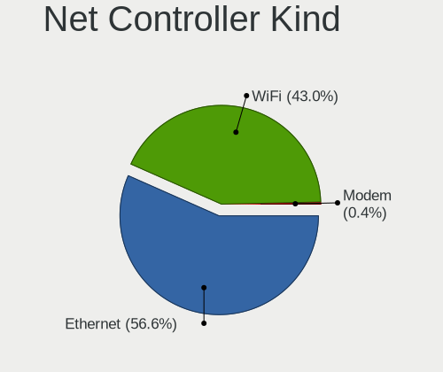

ROSA Hardware Trends
--------------------

A project to identify most popular hardware characteristics and track their change
over time based on data collected by ROSA users at https://Linux-Hardware.org.

Anyone can contribute to the study by uploading probes of their computers by
the [hw-probe](https://github.com/linuxhw/hw-probe) tool:

    sudo hw-probe -all -upload

This is a report for all computer types. See also reports for [desktops](/Dist/ROSA/Desktop/README.md) and [notebooks](/Dist/ROSA/Notebook/README.md).

Full-feature report is available here: https://linux-hardware.org/?view=trends

Period: Jan, 2020.

Contents
--------

- [ OS                       ](#os)
- [ OS Family                ](#os-family)
- [ Kernel                   ](#kernel)
- [ Kernel Family            ](#kernel-family)
- [ Kernel Major Ver.        ](#kernel-major-ver)
- [ Arch                     ](#arch)
- [ DE                       ](#de)
- [ Display Server           ](#display-server)
- [ OS Lang                  ](#os-lang)
- [ Boot Mode                ](#boot-mode)
- [ Filesystem               ](#filesystem)
- [ Dual Boot with Linux     ](#dual-boot-with-linux)
- [ Dual Boot (Win)          ](#dual-boot-win)
- [ Country                  ](#country)
- [ City                     ](#city)
- [ Vendor                   ](#vendor)
- [ Model                    ](#model)
- [ Model Family             ](#model-family)
- [ MFG Year                 ](#mfg-year)
- [ Form Factor              ](#form-factor)
- [ Secure Boot              ](#secure-boot)
- [ Coreboot                 ](#coreboot)
- [ RAM Size                 ](#ram-size)
- [ RAM Used                 ](#ram-used)
- [ Drive Vendor             ](#drive-vendor)
- [ Drive Model              ](#drive-model)
- [ Drive Kind               ](#drive-kind)
- [ Drive Connector          ](#drive-connector)
- [ Drive Size               ](#drive-size)
- [ Space Total              ](#space-total)
- [ Space Used               ](#space-used)
- [ Malfunc. Drives          ](#malfunc-drives)
- [ Malfunc. Drive Vendor    ](#malfunc-drive-vendor)
- [ Malfunc. Drive Kind      ](#malfunc-drive-kind)
- [ Failed Drives            ](#failed-drives)
- [ Failed Drive Vendor      ](#failed-drive-vendor)
- [ Drive Status             ](#drive-status)
- [ Storage Vendor           ](#storage-vendor)
- [ Storage Model            ](#storage-model)
- [ Storage Kind             ](#storage-kind)
- [ CPU Vendor               ](#cpu-vendor)
- [ CPU Model                ](#cpu-model)
- [ CPU Model Family         ](#cpu-model-family)
- [ CPU Cores                ](#cpu-cores)
- [ CPU Sockets              ](#cpu-sockets)
- [ CPU Threads              ](#cpu-threads)
- [ CPU Op-Modes             ](#cpu-op-modes)
- [ CPU Microarch            ](#cpu-microarch)
- [ CPU Microcode            ](#cpu-microcode)
- [ GPU Vendor               ](#gpu-vendor)
- [ GPU Model                ](#gpu-model)
- [ GPU Combo                ](#gpu-combo)
- [ GPU Driver               ](#gpu-driver)
- [ GPU Memory               ](#gpu-memory)
- [ Monitor Vendor           ](#monitor-vendor)
- [ Monitor Model            ](#monitor-model)
- [ Monitor Resolution       ](#monitor-resolution)
- [ Monitor Diagonal         ](#monitor-diagonal)
- [ Monitor Width            ](#monitor-width)
- [ Aspect Ratio             ](#aspect-ratio)
- [ Monitor Area             ](#monitor-area)
- [ Pixel Density            ](#pixel-density)
- [ Multiple Monitors        ](#multiple-monitors)
- [ Net Controller Vendor    ](#net-controller-vendor)
- [ Net Controller Model     ](#net-controller-model)
- [ Net Controller Kind      ](#net-controller-kind)
- [ Used Controller          ](#used-controller)
- [ NICs                     ](#nics)
- [ Unsupported Devices      ](#unsupported-devices)
- [ Unsupported Device Types ](#unsupported-device-types)

OS
--

Installed operating systems

| Name      | Computers | Percent |
|-----------|-----------|---------|
| ROSA R11  | 328       | 88.89%  |
| ROSA R10  | 20        | 5.42%   |
| ROSA R8.1 | 19        | 5.15%   |
| ROSA R9   | 2         | 0.54%   |

OS Family
---------

OS without a version

| Name | Computers | Percent |
|------|-----------|---------|
| ROSA | 369       | 100%    |

Kernel
------

Version of the Linux kernel

| Version                          | Computers | Percent |
|----------------------------------|-----------|---------|
| 4.15.0-desktop-68.5rosa-x86_64   | 119       | 32.25%  |
| 4.15.0-desktop-45.1rosa-x86_64   | 104       | 28.18%  |
| 4.15.0-desktop-45.1rosa-i586     | 30        | 8.13%   |
| 4.9.155-nrj-desktop-1rosa-x86_64 | 27        | 7.32%   |
| 4.15.0-desktop-68.5rosa-i586     | 20        | 5.42%   |
| 4.9.60-nrj-desktop-1rosa-x86_64  | 15        | 4.07%   |
| 4.9.155-nrj-desktop-1rosa-i586   | 9         | 2.44%   |
| 4.9.60-nrj-desktop-1rosa-i586    | 6         | 1.63%   |
| 4.15.0-desktop-60.7rosa-x86_64   | 4         | 1.08%   |
| 5.4.0-desktop-9.1rosa-x86_64     | 3         | 0.81%   |
| 5.3.18-nrj-desktop-1rosa-x86_64  | 3         | 0.81%   |
| 4.15.0-desktop-60.7rosa-i586     | 3         | 0.81%   |
| 4.1.38-nrj-desktop-2rosa-x86_64  | 3         | 0.81%   |
| 4.1.38-nrj-desktop-2rosa-i586    | 3         | 0.81%   |
| 4.9.9-nrj-desktop-1rosa-x86_64   | 2         | 0.54%   |
| 4.9.20-nrj-desktop-1rosa-x86_64  | 2         | 0.54%   |
| 4.18.0-desktop-26.2rosa-x86_64   | 2         | 0.54%   |
| 4.15.0-desktop-54.1rosa-x86_64   | 2         | 0.54%   |
| 4.15.0-desktop-47.2rosa-x86_64   | 2         | 0.54%   |
| 5.4.6-nrj-desktop-1rosa-x86_64   | 1         | 0.27%   |
| 5.4.12-nrj-desktop-1rosa-x86_64  | 1         | 0.27%   |
| 5.4.0-desktop-11.1rosa-x86_64    | 1         | 0.27%   |
| 5.3.0-desktop-17.1rosa-x86_64    | 1         | 0.27%   |
| 5.2.0-desktop-10.1rosa-x86_64    | 1         | 0.27%   |
| 5.0.7-nrj-desktop-1rosa-x86_64   | 1         | 0.27%   |
| 5.0.0-desktop-21.2rosa-x86_64    | 1         | 0.27%   |
| 4.9.124-nrj-desktop-1rosa-x86_64 | 1         | 0.27%   |
| 4.3.6-nrj-desktop-1rosa-x86_64   | 1         | 0.27%   |
| 4.19.0-desktop-13.1rosa-x86_64   | 1         | 0.27%   |

Kernel Family
-------------

Linux kernel without a distro release

| Version | Computers | Percent |
|---------|-----------|---------|
| 4.15.0  | 284       | 76.96%  |
| 4.9.155 | 36        | 9.76%   |
| 4.9.60  | 21        | 5.69%   |
| 4.1.38  | 6         | 1.63%   |
| 5.4.0   | 4         | 1.08%   |
| 5.3.18  | 3         | 0.81%   |
| 4.9.9   | 2         | 0.54%   |
| 4.9.20  | 2         | 0.54%   |
| 4.18.0  | 2         | 0.54%   |
| 5.4.6   | 1         | 0.27%   |
| 5.4.12  | 1         | 0.27%   |
| 5.3.0   | 1         | 0.27%   |
| 5.2.0   | 1         | 0.27%   |
| 5.0.7   | 1         | 0.27%   |
| 5.0.0   | 1         | 0.27%   |
| 4.9.124 | 1         | 0.27%   |
| 4.3.6   | 1         | 0.27%   |
| 4.19.0  | 1         | 0.27%   |

Kernel Major Ver.
-----------------

Linux kernel major version

| Version | Computers | Percent |
|---------|-----------|---------|
| 4.15    | 284       | 76.96%  |
| 4.9     | 62        | 16.8%   |
| 5.4     | 6         | 1.63%   |
| 4.1     | 6         | 1.63%   |
| 5.3     | 4         | 1.08%   |
| 5.0     | 2         | 0.54%   |
| 4.18    | 2         | 0.54%   |
| 5.2     | 1         | 0.27%   |
| 4.3     | 1         | 0.27%   |
| 4.19    | 1         | 0.27%   |

Arch
----

OS architecture (x86_64, i586, etc.)

| Name   | Computers | Percent |
|--------|-----------|---------|
| x86_64 | 298       | 80.76%  |
| i686   | 71        | 19.24%  |

DE
--

Desktop Environment

| Name    | Computers | Percent |
|---------|-----------|---------|
| KDE4    | 235       | 63.69%  |
| KDE5    | 112       | 30.35%  |
| XFCE    | 8         | 2.17%   |
| LXQt    | 5         | 1.36%   |
| MATE    | 3         | 0.81%   |
| GNOME   | 3         | 0.81%   |
| Unknown | 3         | 0.81%   |

Display Server
--------------

X11 or Wayland

| Name | Computers | Percent |
|------|-----------|---------|
| X11  | 369       | 100%    |

OS Lang
-------

Language

| Lang    | Computers | Percent |
|---------|-----------|---------|
| Unknown | 369       | 100%    |

Boot Mode
---------

EFI or BIOS

| Mode | Computers | Percent |
|------|-----------|---------|
| BIOS | 286       | 77.51%  |
| EFI  | 83        | 22.49%  |

Filesystem
----------

Type of filesystem

| Type  | Computers | Percent |
|-------|-----------|---------|
| Ext4  | 356       | 96.48%  |
| Ext3  | 7         | 1.9%    |
| Btrfs | 6         | 1.63%   |

Dual Boot with Linux
--------------------

Hosting more than one Linux

| Dual boot | Computers | Percent |
|-----------|-----------|---------|
| No        | 312       | 84.55%  |
| Yes       | 57        | 15.45%  |

Dual Boot (Win)
---------------

Hosting Linux and Windows

| Dual boot | Computers | Percent |
|-----------|-----------|---------|
| No        | 185       | 50.14%  |
| Yes       | 184       | 49.86%  |

Country
-------

Geographic location (country)

| Country             | Computers | Percent |
|---------------------|-----------|---------|
| Russia              | 290       | 78.59%  |
| Ukraine             | 22        | 5.96%   |
| Belarus             | 10        | 2.71%   |
| Poland              | 7         | 1.9%    |
| Kazakhstan          | 5         | 1.36%   |
| Germany             | 5         | 1.36%   |
| UK                  | 3         | 0.81%   |
| France              | 3         | 0.81%   |
| Romania             | 2         | 0.54%   |
| New Zealand         | 2         | 0.54%   |
| Latvia              | 2         | 0.54%   |
| Italy               | 2         | 0.54%   |
| Finland             | 2         | 0.54%   |
| Brazil              | 2         | 0.54%   |
| USA                 | 1         | 0.27%   |
| Turkey              | 1         | 0.27%   |
| Taiwan              | 1         | 0.27%   |
| Spain               | 1         | 0.27%   |
| Serbia              | 1         | 0.27%   |
| Republic of Moldova | 1         | 0.27%   |
| Netherlands         | 1         | 0.27%   |
| Korea, Republic of  | 1         | 0.27%   |
| Israel              | 1         | 0.27%   |
| Chile               | 1         | 0.27%   |
| Azerbaijan          | 1         | 0.27%   |
| Unknown             | 1         | 0.27%   |

City
----

Geographic location (city)

| City               | Computers | Percent |
|--------------------|-----------|---------|
| Moscow             | 38        | 10.3%   |
| St Petersburg      | 22        | 5.96%   |
| Yekaterinburg      | 14        | 3.79%   |
| Novosibirsk        | 14        | 3.79%   |
| Rostov-on-Don      | 9         | 2.44%   |
| Tula               | 6         | 1.63%   |
| Krasnoyarsk        | 6         | 1.63%   |
| Krasnodar          | 6         | 1.63%   |
| Minsk              | 5         | 1.36%   |
| Kyiv               | 5         | 1.36%   |
| Khabarovsk         | 5         | 1.36%   |
| Donetsk            | 5         | 1.36%   |
| Ulyanovsk          | 4         | 1.08%   |
| Tyumen             | 4         | 1.08%   |
| Omsk               | 4         | 1.08%   |
| Kazan’           | 4         | 1.08%   |
| Kaluga             | 4         | 1.08%   |
| Irkutsk            | 4         | 1.08%   |
| Almaty             | 4         | 1.08%   |
| Volgograd          | 3         | 0.81%   |
| Sevastopol         | 3         | 0.81%   |
| Saratov            | 3         | 0.81%   |
| Samara             | 3         | 0.81%   |
| Perm               | 3         | 0.81%   |
| Nizhniy Novgorod   | 3         | 0.81%   |
| Murmansk           | 3         | 0.81%   |
| Izhevsk            | 3         | 0.81%   |
| Ivanovo            | 3         | 0.81%   |
| Barnaul            | 3         | 0.81%   |
| Warsaw             | 2         | 0.54%   |
| Volzhskiy          | 2         | 0.54%   |
| Veliky Novgorod    | 2         | 0.54%   |
| Tver               | 2         | 0.54%   |
| Tomsk              | 2         | 0.54%   |
| Taganrog           | 2         | 0.54%   |
| Salekhard          | 2         | 0.54%   |
| Riga               | 2         | 0.54%   |
| Petrozavodsk       | 2         | 0.54%   |
| Parnell            | 2         | 0.54%   |
| Novokuznetsk       | 2         | 0.54%   |
| Magnitogorsk       | 2         | 0.54%   |
| Lipetsk            | 2         | 0.54%   |
| Kurgan             | 2         | 0.54%   |
| Kostroma           | 2         | 0.54%   |
| Kaliningrad        | 2         | 0.54%   |
| Hrodna             | 2         | 0.54%   |
| Cherepovets        | 2         | 0.54%   |
| Bucharest          | 2         | 0.54%   |
| Bryansk            | 2         | 0.54%   |
| Biysk              | 2         | 0.54%   |
| Łapy              | 1         | 0.27%   |
| Złotokłos        | 1         | 0.27%   |
| Zhilina            | 1         | 0.27%   |
| Zarechnyy          | 1         | 0.27%   |
| Yuzhno-Sakhalinsk  | 1         | 0.27%   |
| Yaroslavl          | 1         | 0.27%   |
| West End of London | 1         | 0.27%   |
| Voronezh           | 1         | 0.27%   |
| Vorkuta            | 1         | 0.27%   |
| Vol'sk             | 1         | 0.27%   |

Vendor
------

Motherboard manufacturer

| Name                | Computers | Percent |
|---------------------|-----------|---------|
| ASUSTek Computer    | 88        | 23.85%  |
| Lenovo              | 46        | 12.47%  |
| Gigabyte Technology | 42        | 11.38%  |
| Hewlett-Packard     | 33        | 8.94%   |
| MSI                 | 28        | 7.59%   |
| ASRock              | 20        | 5.42%   |
| Acer                | 19        | 5.15%   |
| Samsung Electronics | 17        | 4.61%   |
| Dell                | 15        | 4.07%   |
| Packard Bell        | 8         | 2.17%   |
| Intel               | 6         | 1.63%   |
| ECS                 | 6         | 1.63%   |
| Toshiba             | 5         | 1.36%   |
| Sony                | 4         | 1.08%   |
| Unknown             | 4         | 1.08%   |
| Fujitsu Siemens     | 3         | 0.81%   |
| Pegatron            | 2         | 0.54%   |
| Medion              | 2         | 0.54%   |
| Foxconn             | 2         | 0.54%   |
| DEXP                | 2         | 0.54%   |
| Biostar             | 2         | 0.54%   |
| AMI                 | 2         | 0.54%   |
| WinFast             | 1         | 0.27%   |
| Supermicro          | 1         | 0.27%   |
| SiS Technology      | 1         | 0.27%   |
| OEM                 | 1         | 0.27%   |
| Notebook            | 1         | 0.27%   |
| LG Electronics      | 1         | 0.27%   |
| JW Technology       | 1         | 0.27%   |
| Infomash            | 1         | 0.27%   |
| Fujitsu             | 1         | 0.27%   |
| EPoX Computer       | 1         | 0.27%   |
| eMachines           | 1         | 0.27%   |
| Aquarius            | 1         | 0.27%   |
| Alienware           | 1         | 0.27%   |

Model
-----

Motherboard model

| Name                                         | Computers | Percent |
|----------------------------------------------|-----------|---------|
| Unknown                                      | 6         | 1.63%   |
| ASUS All Series                              | 5         | 1.36%   |
| Samsung Electronics R519/R719                | 3         | 0.81%   |
| Lenovo IdeaPad 320-15IKB 80XL                | 3         | 0.81%   |
| Samsung Electronics RV409/RV509/RV709        | 2         | 0.54%   |
| Samsung Electronics NC210/NC110              | 2         | 0.54%   |
| MSI MS-7895                                  | 2         | 0.54%   |
| MSI MS-7519                                  | 2         | 0.54%   |
| MSI GX60 1AC                                 | 2         | 0.54%   |
| Lenovo IdeaPad S110 20126                    | 2         | 0.54%   |
| Lenovo G580 20150                            | 2         | 0.54%   |
| Lenovo G570 20079                            | 2         | 0.54%   |
| Lenovo G500 20236                            | 2         | 0.54%   |
| Lenovo B590 20208                            | 2         | 0.54%   |
| HP Pavilion dv6                              | 2         | 0.54%   |
| HP Notebook                                  | 2         | 0.54%   |
| HP Compaq Presario CQ60                      | 2         | 0.54%   |
| Gigabyte P35-DS3L                            | 2         | 0.54%   |
| Gigabyte A320M-S2H V2                        | 2         | 0.54%   |
| Gigabyte 970A-DS3P                           | 2         | 0.54%   |
| ASUS P8H61-M LX3 R2.0                        | 2         | 0.54%   |
| ASUS P5P41D                                  | 2         | 0.54%   |
| ASUS N53SV                                   | 2         | 0.54%   |
| ASUS M5A78L-M/USB3                           | 2         | 0.54%   |
| ASRock N68-VS3 FX                            | 2         | 0.54%   |
| WinFast C51GM03                              | 1         | 0.27%   |
| Toshiba Satellite X200                       | 1         | 0.27%   |
| Toshiba Satellite L655                       | 1         | 0.27%   |
| Toshiba Satellite C850-BQK                   | 1         | 0.27%   |
| Toshiba Satellite C55t-C                     | 1         | 0.27%   |
| Supermicro C2SBA                             | 1         | 0.27%   |
| Sony VPCSA2V9R                               | 1         | 0.27%   |
| Sony VPCL22S1R                               | 1         | 0.27%   |
| Sony VPCEH2J1R                               | 1         | 0.27%   |
| Sony VPCEB3B4R                               | 1         | 0.27%   |
| SiS Technology SiS-651                       | 1         | 0.27%   |
| Samsung Electronics RV411/RV511/E3511/S3511  | 1         | 0.27%   |
| Samsung Electronics RV408/RV508              | 1         | 0.27%   |
| Samsung Electronics R540/R580/R780/SA41/E452 | 1         | 0.27%   |
| Samsung Electronics R528/R728                | 1         | 0.27%   |
| Samsung Electronics R40/R41                  | 1         | 0.27%   |
| Samsung Electronics NC10                     | 1         | 0.27%   |
| Samsung Electronics N102SP/N100SP/N101SP     | 1         | 0.27%   |
| Samsung Electronics 305U1A                   | 1         | 0.27%   |
| Samsung Electronics 305E4Z/305E5Z/305E7Z     | 1         | 0.27%   |
| Samsung Electronics 300V3A/300V4A/300V5A     | 1         | 0.27%   |
| Pegatron p6-2200er                           | 1         | 0.27%   |
| Pegatron A17                                 | 1         | 0.27%   |
| Packard Bell oneTwo S3380                    | 1         | 0.27%   |
| Packard Bell EasyNote TV43HC                 | 1         | 0.27%   |
| Packard Bell EasyNote TK85                   | 1         | 0.27%   |
| Packard Bell EasyNote TJ71                   | 1         | 0.27%   |
| Packard Bell EasyNote TE69BM                 | 1         | 0.27%   |
| Packard Bell EasyNote TE11HC                 | 1         | 0.27%   |
| Packard Bell DOTS E2                         | 1         | 0.27%   |
| Packard Bell dot u                           | 1         | 0.27%   |
| Notebook RBT                                 | 1         | 0.27%   |
| MSI Pro, Std, Elt Series                     | 1         | 0.27%   |
| MSI MS-7B84                                  | 1         | 0.27%   |
| MSI MS-7A74                                  | 1         | 0.27%   |

Model Family
------------

Motherboard model prefix

| Name                       | Computers | Percent |
|----------------------------|-----------|---------|
| Lenovo IdeaPad             | 16        | 4.34%   |
| Acer Aspire                | 12        | 3.25%   |
| HP Pavilion                | 7         | 1.9%    |
| Dell Inspiron              | 7         | 1.9%    |
| ASUS P8H61-M               | 6         | 1.63%   |
| Unknown                    | 6         | 1.63%   |
| Packard Bell EasyNote      | 5         | 1.36%   |
| Lenovo ThinkPad            | 5         | 1.36%   |
| HP ProBook                 | 5         | 1.36%   |
| ASUS M5A78L-M              | 5         | 1.36%   |
| ASUS All                   | 5         | 1.36%   |
| Toshiba Satellite          | 4         | 1.08%   |
| HP Compaq                  | 4         | 1.08%   |
| ASUS M5A97                 | 4         | 1.08%   |
| Samsung Electronics R519   | 3         | 0.81%   |
| Lenovo B590                | 3         | 0.81%   |
| HP Laptop                  | 3         | 0.81%   |
| HP 250                     | 3         | 0.81%   |
| Gigabyte A320M-S2H         | 3         | 0.81%   |
| ASUS PRIME                 | 3         | 0.81%   |
| ASUS P5KPL-AM              | 3         | 0.81%   |
| Samsung Electronics RV409  | 2         | 0.54%   |
| Samsung Electronics NC210  | 2         | 0.54%   |
| MSI MS-7895                | 2         | 0.54%   |
| MSI MS-7519                | 2         | 0.54%   |
| MSI GX60                   | 2         | 0.54%   |
| Lenovo IdeaCentre          | 2         | 0.54%   |
| Lenovo G580                | 2         | 0.54%   |
| Lenovo G570                | 2         | 0.54%   |
| Lenovo G500                | 2         | 0.54%   |
| HP Notebook                | 2         | 0.54%   |
| HP Mini                    | 2         | 0.54%   |
| HP 255                     | 2         | 0.54%   |
| Gigabyte P35-DS3L          | 2         | 0.54%   |
| Gigabyte 970A-DS3P         | 2         | 0.54%   |
| DEXP NAVIS                 | 2         | 0.54%   |
| Dell OptiPlex              | 2         | 0.54%   |
| ASUS P7H55-M               | 2         | 0.54%   |
| ASUS P5Q                   | 2         | 0.54%   |
| ASUS P5P41D                | 2         | 0.54%   |
| ASUS N53SV                 | 2         | 0.54%   |
| ASRock N68-VS3             | 2         | 0.54%   |
| WinFast C51GM03            | 1         | 0.27%   |
| Supermicro C2SBA           | 1         | 0.27%   |
| Sony VPCSA2V9R             | 1         | 0.27%   |
| Sony VPCL22S1R             | 1         | 0.27%   |
| Sony VPCEH2J1R             | 1         | 0.27%   |
| Sony VPCEB3B4R             | 1         | 0.27%   |
| SiS Technology SiS-651     | 1         | 0.27%   |
| Samsung Electronics RV411  | 1         | 0.27%   |
| Samsung Electronics RV408  | 1         | 0.27%   |
| Samsung Electronics R540   | 1         | 0.27%   |
| Samsung Electronics R528   | 1         | 0.27%   |
| Samsung Electronics R40    | 1         | 0.27%   |
| Samsung Electronics NC10   | 1         | 0.27%   |
| Samsung Electronics N102SP | 1         | 0.27%   |
| Samsung Electronics 305U1A | 1         | 0.27%   |
| Samsung Electronics 305E4Z | 1         | 0.27%   |
| Samsung Electronics 300V3A | 1         | 0.27%   |
| Pegatron p6-2200er         | 1         | 0.27%   |

MFG Year
--------

Motherboard manufacture year

| Year | Computers | Percent |
|------|-----------|---------|
| 2012 | 44        | 11.92%  |
| 2011 | 39        | 10.57%  |
| 2010 | 34        | 9.21%   |
| 2009 | 34        | 9.21%   |
| 2018 | 33        | 8.94%   |
| 2008 | 30        | 8.13%   |
| 2014 | 26        | 7.05%   |
| 2013 | 26        | 7.05%   |
| 2015 | 22        | 5.96%   |
| 2019 | 20        | 5.42%   |
| 2016 | 17        | 4.61%   |
| 2007 | 15        | 4.07%   |
| 2017 | 13        | 3.52%   |
| 2006 | 8         | 2.17%   |
| 2005 | 6         | 1.63%   |
| 2004 | 1         | 0.27%   |
| 2003 | 1         | 0.27%   |

Form Factor
-----------

Physical design of the computer

| Name       | Computers | Percent |
|------------|-----------|---------|
| Desktop    | 188       | 50.95%  |
| Notebook   | 174       | 47.15%  |
| All in one | 4         | 1.08%   |
| Tablet     | 2         | 0.54%   |
| Mini pc    | 1         | 0.27%   |

Secure Boot
-----------

Enabled or disabled

| State    | Computers | Percent |
|----------|-----------|---------|
| Disabled | 369       | 100%    |

Coreboot
--------

Have coreboot on board

| Used | Computers | Percent |
|------|-----------|---------|
| No   | 369       | 100%    |

RAM Size
--------

Total RAM memory

| Size in GB | Computers | Percent |
|------------|-----------|---------|
| 3.01-4.0   | 131       | 35.5%   |
| 4.01-8.0   | 67        | 18.16%  |
| 8.01-16.0  | 61        | 16.53%  |
| 1.01-2.0   | 56        | 15.18%  |
| 16.01-24.0 | 22        | 5.96%   |
| 2.01-3.0   | 19        | 5.15%   |
| 0.01-1.0   | 8         | 2.17%   |
| 24.01-32.0 | 3         | 0.81%   |
| 32.01-64.0 | 2         | 0.54%   |

RAM Used
--------

Used RAM memory

| Used GB  | Computers | Percent |
|----------|-----------|---------|
| 0.01-1.0 | 203       | 55.01%  |
| 1.01-2.0 | 131       | 35.5%   |
| 2.01-3.0 | 24        | 6.5%    |
| 3.01-4.0 | 9         | 2.44%   |
| 4.01-8.0 | 2         | 0.54%   |

Drive Vendor
------------

Hard drive vendors

| Vendor              | Computers | Drives  | Percent |
|---------------------|-----------|---------|---------|
| Seagate             | 120       | 134     | 23.81%  |
| WDC                 | 113       | 147     | 22.42%  |
| Hitachi             | 46        | 47      | 9.13%   |
| Toshiba             | 38        | 38      | 7.54%   |
| Samsung Electronics | 38        | 45      | 7.54%   |
| Kingston            | 30        | 30      | 5.95%   |
| HGST                | 13        | 13      | 2.58%   |
| SanDisk             | 9         | 9       | 1.79%   |
| Intel               | 9         | 9       | 1.79%   |
| Unknown             | 8         | 9       | 1.59%   |
| A-DATA Technology   | 8         | 8       | 1.59%   |
| MAXTOR              | 7         | 7       | 1.39%   |
| Crucial             | 6         | 6       | 1.19%   |
| SPCC                | 5         | 5       | 0.99%   |
| PLEXTOR             | 5         | 6       | 0.99%   |
| China               | 5         | 5       | 0.99%   |
| Smartbuy            | 4         | 4       | 0.79%   |
| Corsair             | 4         | 4       | 0.79%   |
| Transcend           | 3         | 3       | 0.6%    |
| OCZ                 | 3         | 3       | 0.6%    |
| KingSpec            | 3         | 3       | 0.6%    |
| KingDian            | 3         | 3       | 0.6%    |
| Team                | 2         | 2       | 0.4%    |
| Patriot             | 2         | 2       | 0.4%    |
| LITEONIT            | 2         | 2       | 0.4%    |
| GOODRAM             | 2         | 3       | 0.4%    |
| Apacer              | 2         | 2       | 0.4%    |
| Union Memory        | 1         | 1       | 0.2%    |
| TAISU               | 1         | 1       | 0.2%    |
| Silicon Motion      | 1         | 1       | 0.2%    |
| Micron Technology   | 1         | 1       | 0.2%    |
| LONDISK             | 1         | 1       | 0.2%    |
| LITEON              | 1         | 1       | 0.2%    |
| KINGMAX             | 1         | 1       | 0.2%    |
| HUAWEI              | 1         | 1       | 0.2%    |
| HL-DT-ST            | 1         | Unknown | 0.2%    |
| Goldendisk          | 1         | 1       | 0.2%    |
| Fujitsu             | 1         | 1       | 0.2%    |
| EK60HYXTFY176       | 1         | 1       | 0.2%    |
| AS25                | 1         | 1       | 0.2%    |
| AEGO                | 1         | 1       | 0.2%    |

Drive Model
-----------

Hard drive models

| Model                        | Computers | Percent |
|------------------------------|-----------|---------|
| SA400S37120G 120GB SSD       | 9         | 1.62%   |
| ST9500325AS 500GB            | 8         | 1.44%   |
| WDS240G2G0A-00JH30 240GB SSD | 7         | 1.26%   |
| ST500DM002-1BD142 500GB      | 6         | 1.08%   |
| SSD 860 EVO 250GB            | 6         | 1.08%   |
| SSD 120GB                    | 6         | 1.08%   |
| ST380815AS 80GB              | 5         | 0.9%    |
| ST380011A 80GB               | 5         | 0.9%    |
| ST3500418AS 500GB            | 5         | 0.9%    |
| ST1000DM010-2EP102 1TB       | 5         | 0.9%    |
| MQ01ABF050 500GB             | 5         | 0.9%    |
| WDS120G2G0A-00JH30 120GB SSD | 4         | 0.72%   |
| WD5000AZRX-00A8LB0 500GB     | 4         | 0.72%   |
| WD10EZEX-22MFCA0 1TB         | 4         | 0.72%   |
| WD10EZEX-08M2NA0 1TB         | 4         | 0.72%   |
| ST500LT012-1DG142 500GB      | 4         | 0.72%   |
| ST3250310AS 250GB            | 4         | 0.72%   |
| ST1000LM035-1RK172 1TB       | 4         | 0.72%   |
| SA400S37240G 240GB SSD       | 4         | 0.72%   |
| HTS545050A7E680 500GB        | 4         | 0.72%   |
| HTS543232A7A384 320GB        | 4         | 0.72%   |
| HM250HI 250GB                | 4         | 0.72%   |
| DT01ACA100 1TB               | 4         | 0.72%   |
| WD5000AAKX-00ERMA0 500GB     | 3         | 0.54%   |
| WD3200AAKS-00UU3A0 320GB     | 3         | 0.54%   |
| SV300S37A60G 64GB SSD        | 3         | 0.54%   |
| ST9320325AS 320GB            | 3         | 0.54%   |
| ST500LM012 HN-M500MBB 500GB  | 3         | 0.54%   |
| ST380811AS 80GB              | 3         | 0.54%   |
| ST3250410AS 250GB            | 3         | 0.54%   |
| ST2000DM001-1CH164 2TB       | 3         | 0.54%   |
| ST1000DM003-1CH162 1TB       | 3         | 0.54%   |
| HTS541010A9E680 1TB          | 3         | 0.54%   |
| HDWD110 1TB                  | 3         | 0.54%   |
| HDS721616PLA380 160GB        | 3         | 0.54%   |
| HDP725025GLA380 250GB        | 3         | 0.54%   |
| Expansion 1TB                | 3         | 0.54%   |
| DT01ACA050 500GB             | 3         | 0.54%   |
| WD800JD-75MSA3 80GB          | 2         | 0.36%   |
| WD6400AAKS-22A7B0 640GB      | 2         | 0.36%   |
| WD5000LPCX-00VHAT0 500GB     | 2         | 0.36%   |
| WD5000BPVT-24HXZT3 500GB     | 2         | 0.36%   |
| WD5000AAKX-001CA0 500GB      | 2         | 0.36%   |
| WD3200BPVT-22JJ5T0 320GB     | 2         | 0.36%   |
| WD3200BEVT-80A0RT0 320GB     | 2         | 0.36%   |
| WD20EZRX-00DC0B0 2TB         | 2         | 0.36%   |
| WD1600BEVT-22ZCT0 160GB      | 2         | 0.36%   |
| WD10EZEX-08WN4A0 1TB         | 2         | 0.36%   |
| WD10EZEX-00RKKA0 1TB         | 2         | 0.36%   |
| SV300S37A240G 240GB SSD      | 2         | 0.36%   |
| SV300S37A120G 120GB SSD      | 2         | 0.36%   |
| SU650 120GB SSD              | 2         | 0.36%   |
| SU32G  32GB                  | 2         | 0.36%   |
| STM3160815AS 160GB           | 2         | 0.36%   |
| ST9320328CS 320GB            | 2         | 0.36%   |
| ST9250315AS 250GB            | 2         | 0.36%   |
| ST500DM009-2F110A 500GB      | 2         | 0.36%   |
| ST320LT020-9YG142 320GB      | 2         | 0.36%   |
| ST320LT012-9WS14C 320GB      | 2         | 0.36%   |
| ST31000528AS 1TB             | 2         | 0.36%   |

Drive Kind
----------

HDD or SSD

| Kind    | Computers | Drives | Percent |
|---------|-----------|--------|---------|
| HDD     | 299       | 401    | 67.04%  |
| SSD     | 127       | 141    | 28.48%  |
| MMC     | 10        | 11     | 2.24%   |
| NVMe    | 8         | 8      | 1.79%   |
| Unknown | 2         | 1      | 0.45%   |

Drive Connector
---------------

SATA, SAS, NVMe, etc.

| Type | Computers | Drives | Percent |
|------|-----------|--------|---------|
| SATA | 360       | 538    | 93.75%  |
| MMC  | 10        | 11     | 2.6%    |
| NVMe | 8         | 8      | 2.08%   |
| SAS  | 6         | 5      | 1.56%   |

Drive Size
----------

Size of hard drive

| Size in TB | Computers | Drives | Percent |
|------------|-----------|--------|---------|
| 0.01-0.5   | 332       | 443    | 75.97%  |
| 0.51-1.0   | 85        | 97     | 19.45%  |
| 1.01-2.0   | 15        | 16     | 3.43%   |
| 2.01-3.0   | 4         | 5      | 0.92%   |
| 3.01-4.0   | 1         | 1      | 0.23%   |

Space Total
-----------

Amount of disk space available on the file system

| Size in GB     | Computers | Percent |
|----------------|-----------|---------|
| 101-250        | 117       | 31.71%  |
| 251-500        | 83        | 22.49%  |
| 51-100         | 48        | 13.01%  |
| 21-50          | 36        | 9.76%   |
| 1-20           | 36        | 9.76%   |
| 501-1000       | 29        | 7.86%   |
| 1001-2000      | 11        | 2.98%   |
| More than 3000 | 5         | 1.36%   |
| 2001-3000      | 4         | 1.08%   |

Space Used
----------

Amount of used disk space

| Used GB        | Computers | Percent |
|----------------|-----------|---------|
| 1-20           | 251       | 68.02%  |
| 51-100         | 33        | 8.94%   |
| 101-250        | 28        | 7.59%   |
| 21-50          | 27        | 7.32%   |
| 501-1000       | 12        | 3.25%   |
| 251-500        | 10        | 2.71%   |
| 1001-2000      | 4         | 1.08%   |
| 2001-3000      | 3         | 0.81%   |
| More than 3000 | 1         | 0.27%   |

Malfunc. Drives
---------------

Drive models with a malfunction

| Model                    | Computers | Drives | Percent |
|--------------------------|-----------|--------|---------|
| ST9500325AS 500GB        | 6         | 6      | 4.23%   |
| ST500DM002-1BD142 500GB  | 3         | 3      | 2.11%   |
| HTS545050A7E680 500GB    | 3         | 3      | 2.11%   |
| WD6400AAKS-22A7B0 640GB  | 2         | 2      | 1.41%   |
| WD10EZEX-00RKKA0 1TB     | 2         | 2      | 1.41%   |
| ST9320328CS 320GB        | 2         | 2      | 1.41%   |
| ST320LT020-9YG142 320GB  | 2         | 2      | 1.41%   |
| ST320LT012-9WS14C 320GB  | 2         | 2      | 1.41%   |
| ST31000528AS 1TB         | 2         | 2      | 1.41%   |
| ST1000DM003-9YN162 1TB   | 2         | 2      | 1.41%   |
| MK1237GSX 120GB          | 2         | 2      | 1.41%   |
| HTS545050A7E380 500GB    | 2         | 2      | 1.41%   |
| HTS543225L9A300 250GB    | 2         | 2      | 1.41%   |
| HTS542512K9SA00 120GB    | 2         | 2      | 1.41%   |
| HDS721616PLA380 160GB    | 2         | 2      | 1.41%   |
| HDP725025GLA380 250GB    | 2         | 2      | 1.41%   |
| WD800JD-75MSA3 80GB      | 1         | 1      | 0.7%    |
| WD800JB-00JJA0 80GB      | 1         | 1      | 0.7%    |
| WD7500BPVT-26HXZT3 752GB | 1         | 1      | 0.7%    |
| WD5001AALS-00L3B2 500GB  | 1         | 1      | 0.7%    |
| WD5000LPCX-21VHAT0 500GB | 1         | 1      | 0.7%    |
| WD5000AZDX-00SC2B0 500GB | 1         | 1      | 0.7%    |
| WD5000AAKS-60WWPA0 500GB | 1         | 1      | 0.7%    |
| WD5000AAKS-00A7B2 500GB  | 1         | 1      | 0.7%    |
| WD5000AADS-00S9B0 500GB  | 1         | 1      | 0.7%    |
| WD5000AADS-00M2B0 500GB  | 1         | 1      | 0.7%    |
| WD3200BPVT-22JJ5T0 320GB | 1         | 1      | 0.7%    |
| WD3200BEVT-80A0RT0 320GB | 1         | 1      | 0.7%    |
| WD3200BEVT-75ZCT0 320GB  | 1         | 1      | 0.7%    |
| WD3200BEVT-22A23T0 320GB | 1         | 1      | 0.7%    |
| WD3200AVVS-56L2B0 320GB  | 1         | 1      | 0.7%    |
| WD3200AAKS-22L6A0 320GB  | 1         | 1      | 0.7%    |
| WD3200AAJS-56M0A0 320GB  | 1         | 2      | 0.7%    |
| WD3200AAJS-00L7A0 320GB  | 1         | 1      | 0.7%    |
| WD3200AADS-00S9B0 320GB  | 1         | 1      | 0.7%    |
| WD30EZRX-00MMMB0 3TB     | 1         | 1      | 0.7%    |
| WD2500JB-00REA0 250GB    | 1         | 1      | 0.7%    |
| WD2500BEVT-24A23T0 250GB | 1         | 1      | 0.7%    |
| WD2500AAJS-22VTA0 250GB  | 1         | 1      | 0.7%    |
| WD1600JD-00HBB0 160GB    | 1         | 1      | 0.7%    |
| WD1600BEVT-80A23T0 160GB | 1         | 1      | 0.7%    |
| WD1600AAJS-22WAA0 160GB  | 1         | 1      | 0.7%    |
| WD1600AAJB-00PVA0 160GB  | 1         | 1      | 0.7%    |
| WD1200JS-00NCB1 120GB    | 1         | 1      | 0.7%    |
| WD10EZEX-07WN4A0 1TB     | 1         | 1      | 0.7%    |
| WD1002FBYS-02A6B0 1TB    | 1         | 1      | 0.7%    |
| VERTEX3 120GB SSD        | 1         | 1      | 0.7%    |
| V100 64GB SSD            | 1         | 1      | 0.7%    |
| SUV300S37A120G 120GB SSD | 1         | 1      | 0.7%    |
| STM3500418AS 500GB       | 1         | 1      | 0.7%    |
| STM3500320AS 500GB       | 1         | 1      | 0.7%    |
| STM3250310AS 250GB       | 1         | 1      | 0.7%    |
| STM3160815AS 160GB       | 1         | 1      | 0.7%    |
| ST9320423AS 320GB        | 1         | 1      | 0.7%    |
| ST9250315AS 250GB        | 1         | 1      | 0.7%    |
| ST9160310AS 160GB        | 1         | 1      | 0.7%    |
| ST380817AS 80GB          | 1         | 1      | 0.7%    |
| ST3808110AS 80GB         | 1         | 1      | 0.7%    |
| ST380011A 80GB           | 1         | 1      | 0.7%    |
| ST3500418AS 500GB        | 1         | 1      | 0.7%    |

Malfunc. Drive Vendor
---------------------

Vendors of faulty drives

| Vendor              | Computers | Drives | Percent |
|---------------------|-----------|--------|---------|
| Seagate             | 42        | 44     | 30.43%  |
| WDC                 | 33        | 35     | 23.91%  |
| Hitachi             | 23        | 24     | 16.67%  |
| Toshiba             | 11        | 11     | 7.97%   |
| Samsung Electronics | 6         | 7      | 4.35%   |
| HGST                | 5         | 5      | 3.62%   |
| MAXTOR              | 4         | 4      | 2.9%    |
| Corsair             | 3         | 3      | 2.17%   |
| SPCC                | 2         | 2      | 1.45%   |
| SanDisk             | 2         | 2      | 1.45%   |
| OCZ                 | 1         | 1      | 0.72%   |
| LITEONIT            | 1         | 1      | 0.72%   |
| Kingston            | 1         | 1      | 0.72%   |
| KINGMAX             | 1         | 1      | 0.72%   |
| Intel               | 1         | 1      | 0.72%   |
| EK60HYXTFY176       | 1         | 1      | 0.72%   |
| Crucial             | 1         | 1      | 0.72%   |

Malfunc. Drive Kind
-------------------

Kinds of faulty drives

| Kind | Computers | Drives | Percent |
|------|-----------|--------|---------|
| HDD  | 117       | 130    | 89.31%  |
| SSD  | 14        | 14     | 10.69%  |

Failed Drives
-------------

Failed drive models

| Model                    | Computers | Drives | Percent |
|--------------------------|-----------|--------|---------|
| WD3200BEVT-80A0RT0 320GB | 1         | 1      | 12.5%   |
| WD1600BEVT-22ZCT0 160GB  | 1         | 1      | 12.5%   |
| WD15EARS-00MVWB0 1TB     | 1         | 1      | 12.5%   |
| ST3320418AS 320GB        | 1         | 1      | 12.5%   |
| ST31000524AS 1TB         | 1         | 1      | 12.5%   |
| MQ01ABD050 500GB         | 1         | 1      | 12.5%   |
| HTS721010A9E630 1TB      | 1         | 1      | 12.5%   |
| HD252HJ 250GB            | 1         | 1      | 12.5%   |

Failed Drive Vendor
-------------------

Failed drive vendors

| Vendor              | Computers | Drives | Percent |
|---------------------|-----------|--------|---------|
| WDC                 | 3         | 3      | 37.5%   |
| Seagate             | 2         | 2      | 25%     |
| Toshiba             | 1         | 1      | 12.5%   |
| Samsung Electronics | 1         | 1      | 12.5%   |
| HGST                | 1         | 1      | 12.5%   |

Drive Status
------------

Number of failed and malfunc. drives

| Status   | Computers | Drives | Percent |
|----------|-----------|--------|---------|
| Works    | 288       | 392    | 64.86%  |
| Malfunc  | 130       | 144    | 29.28%  |
| Detected | 18        | 18     | 4.05%   |
| Failed   | 8         | 8      | 1.8%    |

Storage Vendor
--------------

Storage controller vendors

| Vendor                           | Computers | Percent |
|----------------------------------|-----------|---------|
| Intel                            | 253       | 62.16%  |
| AMD                              | 84        | 20.64%  |
| Nvidia                           | 23        | 5.65%   |
| JMicron Technology               | 16        | 3.93%   |
| Marvell Technology Group         | 7         | 1.72%   |
| ASMedia Technology               | 5         | 1.23%   |
| Silicon Integrated Systems [SiS] | 4         | 0.98%   |
| VIA Technologies                 | 3         | 0.74%   |
| Silicon Image                    | 2         | 0.49%   |
| ADATA Technology                 | 2         | 0.49%   |
| Union Memory (Shenzhen)          | 1         | 0.25%   |
| Silicon Motion                   | 1         | 0.25%   |
| Samsung Electronics              | 1         | 0.25%   |
| Micron Technology                | 1         | 0.25%   |
| Lite-On Technology               | 1         | 0.25%   |
| Lite-On IT Corp. / Plextor       | 1         | 0.25%   |
| Kingston Technology Company      | 1         | 0.25%   |
| Integrated Technology Express    | 1         | 0.25%   |

Storage Model
-------------

Storage controller models

| Model                                                                             | Computers | Percent |
|-----------------------------------------------------------------------------------|-----------|---------|
| FCH SATA Controller [AHCI mode]                                                   | 41        | 7.65%   |
| NM10/ICH7 Family SATA Controller [IDE mode]                                       | 29        | 5.41%   |
| 82801G (ICH7 Family) IDE Controller                                               | 25        | 4.66%   |
| SB7x0/SB8x0/SB9x0 SATA Controller [AHCI mode]                                     | 21        | 3.92%   |
| 6 Series/C200 Series Chipset Family 6 port Mobile SATA AHCI Controller            | 21        | 3.92%   |
| SB7x0/SB8x0/SB9x0 IDE Controller                                                  | 20        | 3.73%   |
| 7 Series Chipset Family 6-port SATA Controller [AHCI mode]                        | 18        | 3.36%   |
| SB7x0/SB8x0/SB9x0 SATA Controller [IDE mode]                                      | 16        | 2.99%   |
| 82801IBM/IEM (ICH9M/ICH9M-E) 4 port SATA Controller [AHCI mode]                   | 13        | 2.43%   |
| 8 Series/C220 Series Chipset Family 6-port SATA Controller 1 [AHCI mode]          | 13        | 2.43%   |
| 6 Series/C200 Series Chipset Family Desktop SATA Controller (IDE mode, ports 4-5) | 12        | 2.24%   |
| 6 Series/C200 Series Chipset Family Desktop SATA Controller (IDE mode, ports 0-3) | 12        | 2.24%   |
| NM10/ICH7 Family SATA Controller [AHCI mode]                                      | 11        | 2.05%   |
| 5 Series/3400 Series Chipset 4 port SATA AHCI Controller                          | 11        | 2.05%   |
| MCP61 SATA Controller                                                             | 10        | 1.87%   |
| MCP61 IDE                                                                         | 10        | 1.87%   |
| 82801 Mobile SATA Controller [RAID mode]                                          | 10        | 1.87%   |
| JMB368 IDE controller                                                             | 9         | 1.68%   |
| Wildcat Point-LP SATA Controller [AHCI Mode]                                      | 7         | 1.31%   |
| Sunrise Point-LP SATA Controller [AHCI mode]                                      | 7         | 1.31%   |
| Atom Processor E3800 Series SATA AHCI Controller                                  | 7         | 1.31%   |
| 82801JI (ICH10 Family) 4 port SATA IDE Controller #1                              | 7         | 1.31%   |
| 82801JI (ICH10 Family) 2 port SATA IDE Controller #2                              | 7         | 1.31%   |
| 82801HM/HEM (ICH8M/ICH8M-E) IDE Controller                                        | 7         | 1.31%   |
| 200 Series PCH SATA controller [AHCI mode]                                        | 7         | 1.31%   |
| Q170/Q150/B150/H170/H110/Z170/CM236 Chipset SATA Controller [AHCI Mode]           | 5         | 0.93%   |
| ASM1062 Serial ATA Controller                                                     | 5         | 0.93%   |
| 82801I (ICH9 Family) 2 port SATA Controller [IDE mode]                            | 5         | 0.93%   |
| 82801HM/HEM (ICH8M/ICH8M-E) SATA Controller [AHCI mode]                           | 5         | 0.93%   |
| 82801FB/FBM/FR/FW/FRW (ICH6 Family) IDE Controller                                | 5         | 0.93%   |
| Non-Volatile memory controller                                                    | 4         | 0.75%   |
| JMB363 SATA/IDE Controller                                                        | 4         | 0.75%   |
| FCH SATA Controller D                                                             | 4         | 0.75%   |
| FCH IDE Controller                                                                | 4         | 0.75%   |
| 88SE6101/6102 single-port PATA133 interface                                       | 4         | 0.75%   |
| 7 Series/C210 Series Chipset Family 6-port SATA Controller [AHCI mode]            | 4         | 0.75%   |
| 6 Series/C200 Series Chipset Family 6 port Desktop SATA AHCI Controller           | 4         | 0.75%   |
| 5513 IDE Controller                                                               | 4         | 0.75%   |
| 300 Series Chipset SATA Controller                                                | 4         | 0.75%   |
| SATA Controller [RAID mode]                                                       | 3         | 0.56%   |
| SATA Controller / IDE mode                                                        | 3         | 0.56%   |
| SATA controller                                                                   | 3         | 0.56%   |
| MCP51 Serial ATA Controller                                                       | 3         | 0.56%   |
| MCP51 IDE                                                                         | 3         | 0.56%   |
| Cannon Lake PCH SATA AHCI Controller                                              | 3         | 0.56%   |
| 9 Series Chipset Family SATA Controller [AHCI Mode]                               | 3         | 0.56%   |
| 82801IB (ICH9) 2 port SATA Controller [IDE mode]                                  | 3         | 0.56%   |
| 82801HM/HEM (ICH8M/ICH8M-E) SATA Controller [IDE mode]                            | 3         | 0.56%   |
| 82801FB/FW (ICH6/ICH6W) SATA Controller                                           | 3         | 0.56%   |
| 82801EB/ER (ICH5/ICH5R) IDE Controller                                            | 3         | 0.56%   |
| 8 Series SATA Controller 1 [AHCI mode]                                            | 3         | 0.56%   |
| 5 Series/3400 Series Chipset 4 port SATA IDE Controller                           | 3         | 0.56%   |
| 5 Series/3400 Series Chipset 2 port SATA IDE Controller                           | 3         | 0.56%   |
| 400 Series Chipset SATA Controller                                                | 3         | 0.56%   |
| XPG SX8200 Pro PCIe Gen3x4 M.2 2280 Solid State Drive                             | 2         | 0.37%   |
| VT82C586A/B/VT82C686/A/B/VT823x/A/C PIPC Bus Master IDE                           | 2         | 0.37%   |
| SiI 3132 Serial ATA Raid II Controller                                            | 2         | 0.37%   |
| SB600 Non-Raid-5 SATA                                                             | 2         | 0.37%   |
| SB600 IDE                                                                         | 2         | 0.37%   |
| MCP73 IDE Controller                                                              | 2         | 0.37%   |

Storage Kind
------------

Kind of storage controller (IDE, SATA, NVMe, SAS, ...)

| Kind | Computers | Percent |
|------|-----------|---------|
| SATA | 249       | 59.14%  |
| IDE  | 147       | 34.92%  |
| RAID | 17        | 4.04%   |
| NVMe | 8         | 1.9%    |

CPU Vendor
----------

Processor vendors

| Vendor | Computers | Percent |
|--------|-----------|---------|
| Intel  | 266       | 72.09%  |
| AMD    | 103       | 27.91%  |

CPU Model
---------

Processor models

| Model                                         | Computers | Percent |
|-----------------------------------------------|-----------|---------|
| Intel Core 2 Duo CPU E8400 @ 3.00GHz          | 8         | 2.17%   |
| Intel Pentium Gold G5400 CPU @ 3.70GHz        | 5         | 1.36%   |
| Intel Core i3-5005U CPU @ 2.00GHz             | 4         | 1.08%   |
| Intel Core i3-3220 CPU @ 3.30GHz              | 4         | 1.08%   |
| Intel Core i3 CPU M 370 @ 2.40GHz             | 4         | 1.08%   |
| Intel Core 2 Quad CPU Q8200 @ 2.33GHz         | 4         | 1.08%   |
| AMD Athlon II X2 250 Processor                | 4         | 1.08%   |
| Intel Pentium Dual-Core CPU T4300 @ 2.10GHz   | 3         | 0.81%   |
| Intel Pentium CPU P6200 @ 2.13GHz             | 3         | 0.81%   |
| Intel Pentium CPU 2020M @ 2.40GHz             | 3         | 0.81%   |
| Intel Core i5-4460 CPU @ 3.20GHz              | 3         | 0.81%   |
| Intel Core 2 Duo CPU E8500 @ 3.16GHz          | 3         | 0.81%   |
| Intel Celeron CPU 1005M @ 1.90GHz             | 3         | 0.81%   |
| Intel Atom x5-Z8350 CPU @ 1.44GHz             | 3         | 0.81%   |
| Intel Atom CPU N455 @ 1.66GHz                 | 3         | 0.81%   |
| AMD Ryzen 5 1600 Six-Core Processor           | 3         | 0.81%   |
| AMD FX-8350 Eight-Core Processor              | 3         | 0.81%   |
| AMD FX-8300 Eight-Core Processor              | 3         | 0.81%   |
| AMD FX-6300 Six-Core Processor                | 3         | 0.81%   |
| AMD E-450 APU with Radeon HD Graphics         | 3         | 0.81%   |
| AMD Athlon 64 X2 Dual Core Processor 4200+    | 3         | 0.81%   |
| AMD A8-9600 RADEON R7, 10 COMPUTE CORES 4C+6G | 3         | 0.81%   |
| Intel Pentium Dual-Core CPU T4200 @ 2.00GHz   | 2         | 0.54%   |
| Intel Pentium Dual CPU E2200 @ 2.20GHz        | 2         | 0.54%   |
| Intel Pentium CPU G4400 @ 3.30GHz             | 2         | 0.54%   |
| Intel Pentium CPU B950 @ 2.10GHz              | 2         | 0.54%   |
| Intel Pentium 4 CPU 3.06GHz                   | 2         | 0.54%   |
| Intel Core i7-2630QM CPU @ 2.00GHz            | 2         | 0.54%   |
| Intel Core i5-7200U CPU @ 2.50GHz             | 2         | 0.54%   |
| Intel Core i5-4210U CPU @ 1.70GHz             | 2         | 0.54%   |
| Intel Core i5-3570 CPU @ 3.40GHz              | 2         | 0.54%   |
| Intel Core i5-3470 CPU @ 3.20GHz              | 2         | 0.54%   |
| Intel Core i5-3230M CPU @ 2.60GHz             | 2         | 0.54%   |
| Intel Core i5-3210M CPU @ 2.50GHz             | 2         | 0.54%   |
| Intel Core i5-2520M CPU @ 2.50GHz             | 2         | 0.54%   |
| Intel Core i5-2450M CPU @ 2.50GHz             | 2         | 0.54%   |
| Intel Core i5-2430M CPU @ 2.40GHz             | 2         | 0.54%   |
| Intel Core i5-2410M CPU @ 2.30GHz             | 2         | 0.54%   |
| Intel Core i3-7100U CPU @ 2.40GHz             | 2         | 0.54%   |
| Intel Core i3-6006U CPU @ 2.00GHz             | 2         | 0.54%   |
| Intel Core i3-4170 CPU @ 3.70GHz              | 2         | 0.54%   |
| Intel Core i3-3110M CPU @ 2.40GHz             | 2         | 0.54%   |
| Intel Core i3-2350M CPU @ 2.30GHz             | 2         | 0.54%   |
| Intel Core i3-2310M CPU @ 2.10GHz             | 2         | 0.54%   |
| Intel Core i3 CPU M 380 @ 2.53GHz             | 2         | 0.54%   |
| Intel Core i3 CPU 550 @ 3.20GHz               | 2         | 0.54%   |
| Intel Core 2 Duo CPU T8300 @ 2.40GHz          | 2         | 0.54%   |
| Intel Core 2 Duo CPU E7500 @ 2.93GHz          | 2         | 0.54%   |
| Intel Core 2 Duo CPU E6850 @ 3.00GHz          | 2         | 0.54%   |
| Intel Core 2 Duo CPU E4500 @ 2.20GHz          | 2         | 0.54%   |
| Intel Celeron CPU N3350 @ 1.10GHz             | 2         | 0.54%   |
| Intel Celeron CPU N2830 @ 2.16GHz             | 2         | 0.54%   |
| Intel Celeron CPU G540 @ 2.50GHz              | 2         | 0.54%   |
| Intel Atom CPU N550 @ 1.50GHz                 | 2         | 0.54%   |
| Intel Atom CPU N2600 @ 1.60GHz                | 2         | 0.54%   |
| AMD E-300 APU with Radeon HD Graphics         | 2         | 0.54%   |
| AMD C-70 APU with Radeon HD Graphics          | 2         | 0.54%   |
| AMD Athlon 64 Processor 3200+                 | 2         | 0.54%   |
| AMD A6-9225 RADEON R4, 5 COMPUTE CORES 2C+3G  | 2         | 0.54%   |
| Intel Xeon CPU X5675 @ 3.07GHz                | 1         | 0.27%   |

CPU Model Family
----------------

Processor model prefix

| Model                                | Computers | Percent |
|--------------------------------------|-----------|---------|
| Intel Core i5                        | 47        | 12.74%  |
| Intel Core i3                        | 41        | 11.11%  |
| Intel Core 2 Duo                     | 34        | 9.21%   |
| Intel Celeron                        | 29        | 7.86%   |
| Intel Pentium                        | 24        | 6.5%    |
| Intel Atom                           | 17        | 4.61%   |
| AMD FX                               | 14        | 3.79%   |
| Intel Pentium Dual-Core              | 13        | 3.52%   |
| Intel Core i7                        | 13        | 3.52%   |
| AMD Athlon II X2                     | 8         | 2.17%   |
| Intel Xeon                           | 7         | 1.9%    |
| AMD Athlon 64 X2                     | 7         | 1.9%    |
| AMD A8                               | 7         | 1.9%    |
| Intel Genuine                        | 6         | 1.63%   |
| Intel Core 2 Quad                    | 6         | 1.63%   |
| AMD E                                | 6         | 1.63%   |
| Intel Pentium Gold                   | 5         | 1.36%   |
| Intel Pentium Dual                   | 5         | 1.36%   |
| Intel Pentium 4                      | 5         | 1.36%   |
| AMD Ryzen 5                          | 5         | 1.36%   |
| AMD A4                               | 5         | 1.36%   |
| AMD A10                              | 5         | 1.36%   |
| AMD E2                               | 4         | 1.08%   |
| AMD Athlon II X4                     | 4         | 1.08%   |
| Intel Pentium D                      | 3         | 0.81%   |
| Intel Core 2                         | 3         | 0.81%   |
| Intel Celeron Dual-Core              | 3         | 0.81%   |
| AMD Ryzen 3                          | 3         | 0.81%   |
| AMD Athlon X4                        | 3         | 0.81%   |
| AMD Athlon 64                        | 3         | 0.81%   |
| AMD A6                               | 3         | 0.81%   |
| Intel Pentium M                      | 2         | 0.54%   |
| AMD Turion II Dual-Core              | 2         | 0.54%   |
| AMD Phenom II X4                     | 2         | 0.54%   |
| AMD Phenom II X2                     | 2         | 0.54%   |
| AMD Phenom                           | 2         | 0.54%   |
| AMD E1                               | 2         | 0.54%   |
| AMD C-70                             | 2         | 0.54%   |
| AMD Athlon                           | 2         | 0.54%   |
| Intel Pentium Silver                 | 1         | 0.27%   |
| Intel Core m7                        | 1         | 0.27%   |
| Intel Celeron M                      | 1         | 0.27%   |
| AMD Turion X2 Ultra Dual-Core Mobile | 1         | 0.27%   |
| AMD Turion II Ultra Dual-Core Mobile | 1         | 0.27%   |
| AMD Turion 64 X2 Mobile              | 1         | 0.27%   |
| AMD Turion 64 X2                     | 1         | 0.27%   |
| AMD Sempron                          | 1         | 0.27%   |
| AMD Ryzen 7                          | 1         | 0.27%   |
| AMD Phenom II X3                     | 1         | 0.27%   |
| AMD C-60                             | 1         | 0.27%   |
| AMD C-50                             | 1         | 0.27%   |
| AMD Athlon X2                        | 1         | 0.27%   |
| AMD Athlon Neo                       | 1         | 0.27%   |
| AMD Athlon II X3                     | 1         | 0.27%   |

CPU Cores
---------

Number of processor cores

| Number | Computers | Percent |
|--------|-----------|---------|
| 2      | 247       | 66.94%  |
| 4      | 71        | 19.24%  |
| 1      | 32        | 8.67%   |
| 6      | 8         | 2.17%   |
| 3      | 8         | 2.17%   |
| 12     | 2         | 0.54%   |
| 8      | 1         | 0.27%   |

CPU Sockets
-----------

Number of sockets

| Number | Computers | Percent |
|--------|-----------|---------|
| 1      | 368       | 99.73%  |
| 2      | 1         | 0.27%   |

CPU Threads
-----------

Threads per core (Hyper-Threading)

| Number | Computers | Percent |
|--------|-----------|---------|
| 1      | 224       | 60.7%   |
| 2      | 145       | 39.3%   |

CPU Op-Modes
------------

CPU Operation Modes (32-bit, 64-bit)

| Op mode        | Computers | Percent |
|----------------|-----------|---------|
| 32-bit, 64-bit | 354       | 95.93%  |
| 32-bit         | 14        | 3.79%   |
| Unknown        | 1         | 0.27%   |

CPU Microarch
-------------

Microarchitecture

| Name            | Computers | Percent |
|-----------------|-----------|---------|
| Core            | 75        | 20.33%  |
| SandyBridge     | 38        | 10.3%   |
| Skylake         | 33        | 8.94%   |
| IvyBridge       | 27        | 7.32%   |
| K10             | 23        | 6.23%   |
| Haswell         | 22        | 5.96%   |
| Piledriver      | 20        | 5.42%   |
| Westmere        | 16        | 4.34%   |
| Bonnell         | 14        | 3.79%   |
| K8 Hammer       | 12        | 3.25%   |
| Silvermont      | 11        | 2.98%   |
| Unknown         | 10        | 2.71%   |
| Bobcat          | 9         | 2.44%   |
| NetBurst        | 8         | 2.17%   |
| Excavator       | 7         | 1.9%    |
| Zen             | 6         | 1.63%   |
| Broadwell       | 6         | 1.63%   |
| K10 Llano       | 5         | 1.36%   |
| Zen+            | 3         | 0.81%   |
| Puma            | 3         | 0.81%   |
| P6              | 3         | 0.81%   |
| Jaguar          | 3         | 0.81%   |
| Goldmont plus   | 3         | 0.81%   |
| Bulldozer       | 3         | 0.81%   |
| Steamroller     | 2         | 0.54%   |
| Nehalem         | 2         | 0.54%   |
| K8 & K10 hybrid | 2         | 0.54%   |
| Goldmont        | 2         | 0.54%   |
| Penryn          | 1         | 0.27%   |

CPU Microcode
-------------

Microcode number

| Number     | Computers | Percent |
|------------|-----------|---------|
| 0x1067a    | 37        | 10.03%  |
| 0x206a7    | 36        | 9.76%   |
| 0x306a9    | 27        | 7.32%   |
| 0x306c3    | 19        | 5.15%   |
| Unknown    | 19        | 5.15%   |
| 0x6fd      | 14        | 3.79%   |
| 0x20655    | 14        | 3.79%   |
| 0x010000c8 | 13        | 3.52%   |
| 0x10676    | 11        | 2.98%   |
| 0x906ea    | 10        | 2.71%   |
| 0x06001119 | 9         | 2.44%   |
| 0x06000852 | 9         | 2.44%   |
| 0x05000119 | 8         | 2.17%   |
| 0x106ca    | 7         | 1.9%    |
| 0x306d4    | 6         | 1.63%   |
| 0x806e9    | 5         | 1.36%   |
| 0x506e3    | 5         | 1.36%   |
| 0x30678    | 5         | 1.36%   |
| 0x03000027 | 5         | 1.36%   |
| 0x906e9    | 4         | 1.08%   |
| 0x6fb      | 4         | 1.08%   |
| 0x406e3    | 4         | 1.08%   |
| 0x406c4    | 4         | 1.08%   |
| 0x30661    | 4         | 1.08%   |
| 0x10677    | 4         | 1.08%   |
| 0xf49      | 3         | 0.81%   |
| 0x806ea    | 3         | 0.81%   |
| 0x706a1    | 3         | 0.81%   |
| 0x6f6      | 3         | 0.81%   |
| 0x40651    | 3         | 0.81%   |
| 0x106c2    | 3         | 0.81%   |
| 0x07030105 | 3         | 0.81%   |
| 0x0700010f | 3         | 0.81%   |
| 0x0600611a | 3         | 0.81%   |
| 0x06003106 | 3         | 0.81%   |
| 0x0600063e | 3         | 0.81%   |
| 0x010000c7 | 3         | 0.81%   |
| 0xf47      | 2         | 0.54%   |
| 0xf33      | 2         | 0.54%   |
| 0x506c9    | 2         | 0.54%   |
| 0x30673    | 2         | 0.54%   |
| 0x206d7    | 2         | 0.54%   |
| 0x106e5    | 2         | 0.54%   |
| 0x10661    | 2         | 0.54%   |
| 0x0800820b | 2         | 0.54%   |
| 0x08001138 | 2         | 0.54%   |
| 0x08001137 | 2         | 0.54%   |
| 0x06006705 | 2         | 0.54%   |
| 0x0600084f | 2         | 0.54%   |
| 0x05000029 | 2         | 0.54%   |
| 0xf64      | 1         | 0.27%   |
| 0xf41      | 1         | 0.27%   |
| 0xf34      | 1         | 0.27%   |
| 0xf29      | 1         | 0.27%   |
| 0x806ec    | 1         | 0.27%   |
| 0x6f2      | 1         | 0.27%   |
| 0x6ec      | 1         | 0.27%   |
| 0x6e8      | 1         | 0.27%   |
| 0x6d8      | 1         | 0.27%   |
| 0x6d6      | 1         | 0.27%   |

GPU Vendor
----------

Vendors of graphics cards

| Vendor           | Computers | Percent |
|------------------|-----------|---------|
| Intel            | 154       | 37.02%  |
| Nvidia           | 149       | 35.82%  |
| AMD              | 112       | 26.92%  |
| VIA Technologies | 1         | 0.24%   |

GPU Model
---------

Graphics card models

| Model                                                                              | Computers | Percent |
|------------------------------------------------------------------------------------|-----------|---------|
| 2nd Generation Core Processor Family Integrated Graphics Controller                | 29        | 6.71%   |
| 3rd Gen Core processor Graphics Controller                                         | 15        | 3.47%   |
| GT218 [GeForce 210]                                                                | 9         | 2.08%   |
| Mobile 4 Series Chipset Integrated Graphics Controller                             | 8         | 1.85%   |
| Atom Processor Z36xxx/Z37xxx Series Graphics & Display                             | 7         | 1.62%   |
| HD Graphics 620                                                                    | 6         | 1.39%   |
| HD Graphics 5500                                                                   | 6         | 1.39%   |
| GP108 [GeForce GT 1030]                                                            | 6         | 1.39%   |
| GP107 [GeForce GTX 1050 Ti]                                                        | 6         | 1.39%   |
| Core Processor Integrated Graphics Controller                                      | 6         | 1.39%   |
| Atom Processor D4xx/D5xx/N4xx/N5xx Integrated Graphics Controller                  | 6         | 1.39%   |
| Mobile GM965/GL960 Integrated Graphics Controller (secondary)                      | 5         | 1.16%   |
| Mobile GM965/GL960 Integrated Graphics Controller (primary)                        | 5         | 1.16%   |
| GF108 [GeForce GT 430]                                                             | 5         | 1.16%   |
| G94 [GeForce 9600 GT]                                                              | 5         | 1.16%   |
| Ellesmere [Radeon RX 470/480/570/570X/580/580X/590]                                | 5         | 1.16%   |
| 4th Gen Core Processor Integrated Graphics Controller                              | 5         | 1.16%   |
| Xeon E3-1200 v3/4th Gen Core Processor Integrated Graphics Controller              | 4         | 0.93%   |
| Seymour [Radeon HD 6400M/7400M Series]                                             | 4         | 0.93%   |
| Lexa PRO [Radeon 540/540X/550/550X / RX 540X/550/550X]                             | 4         | 0.93%   |
| GP106 [GeForce GTX 1060 6GB]                                                       | 4         | 0.93%   |
| GP104 [GeForce GTX 1070]                                                           | 4         | 0.93%   |
| GK208B [GeForce GT 710]                                                            | 4         | 0.93%   |
| GF117M [GeForce 610M/710M/810M/820M / GT 620M/625M/630M/720M]                      | 4         | 0.93%   |
| GF108 [GeForce GT 730]                                                             | 4         | 0.93%   |
| GF108 [GeForce GT 630]                                                             | 4         | 0.93%   |
| GF108 [GeForce GT 440]                                                             | 4         | 0.93%   |
| Atom/Celeron/Pentium Processor x5-E8000/J3xxx/N3xxx Integrated Graphics Controller | 4         | 0.93%   |
| Atom Processor D2xxx/N2xxx Integrated Graphics Controller                          | 4         | 0.93%   |
| 82G33/G31 Express Integrated Graphics Controller                                   | 4         | 0.93%   |
| Wrestler [Radeon HD 6320]                                                          | 3         | 0.69%   |
| Wrestler [Radeon HD 6310]                                                          | 3         | 0.69%   |
| UHD Graphics 605                                                                   | 3         | 0.69%   |
| Turks XT [Radeon HD 6670/7670]                                                     | 3         | 0.69%   |
| Stoney [Radeon R2/R3/R4/R5 Graphics]                                               | 3         | 0.69%   |
| Skylake GT2 [HD Graphics 520]                                                      | 3         | 0.69%   |
| RV620/M82 [Mobility Radeon HD 3450/3470]                                           | 3         | 0.69%   |
| Raven Ridge [Radeon Vega Series / Radeon Vega Mobile Series]                       | 3         | 0.69%   |
| Oland PRO [Radeon R7 240/340]                                                      | 3         | 0.69%   |
| Mobile 945GM/GMS/GME, 943/940GML Express Integrated Graphics Controller            | 3         | 0.69%   |
| GM108M [GeForce 940MX]                                                             | 3         | 0.69%   |
| GM107 [GeForce GTX 750 Ti]                                                         | 3         | 0.69%   |
| GK107 [GeForce GT 640]                                                             | 3         | 0.69%   |
| GF108M [GeForce GT 540M]                                                           | 3         | 0.69%   |
| G92 [GeForce 9800 GT]                                                              | 3         | 0.69%   |
| Caicos [Radeon HD 6450/7450/8450 / R5 230 OEM]                                     | 3         | 0.69%   |
| 82865G Integrated Graphics Controller                                              | 3         | 0.69%   |
| 4 Series Chipset Integrated Graphics Controller                                    | 3         | 0.69%   |
| Xeon E3-1200 v2/3rd Gen Core processor Graphics Controller                         | 2         | 0.46%   |
| Wrestler [Radeon HD 7290]                                                          | 2         | 0.46%   |
| Wimbledon XT [Radeon HD 7970M]                                                     | 2         | 0.46%   |
| Wani [Radeon R5/R6/R7 Graphics]                                                    | 2         | 0.46%   |
| UHD Graphics 630 (Mobile)                                                          | 2         | 0.46%   |
| Turks PRO [Radeon HD 6570/7570/8550]                                               | 2         | 0.46%   |
| Topaz XT [Radeon R7 M260/M265 / M340/M360 / M440/M445 / 530/535 / 620/625 Mobile]  | 2         | 0.46%   |
| Thames [Radeon HD 7500M/7600M Series]                                              | 2         | 0.46%   |
| Sun XT [Radeon HD 8670A/8670M/8690M / R5 M330 / M430 / Radeon 520 Mobile]          | 2         | 0.46%   |
| RV710/M92 [Mobility Radeon HD 4530/4570/545v]                                      | 2         | 0.46%   |
| RS880M [Mobility Radeon HD 4225/4250]                                              | 2         | 0.46%   |
| RS780L [Radeon 3000]                                                               | 2         | 0.46%   |

GPU Combo
---------

Combinations of graphics cards

| Name           | Computers | Percent |
|----------------|-----------|---------|
| 1 x Nvidia     | 119       | 32.25%  |
| 1 x Intel      | 107       | 29%     |
| 1 x AMD        | 90        | 24.39%  |
| Intel + Nvidia | 30        | 8.13%   |
| Intel + AMD    | 14        | 3.79%   |
| 2 x AMD        | 8         | 2.17%   |
| 1 x VIA        | 1         | 0.27%   |

GPU Driver
----------

Free vs proprietary

| Driver      | Computers | Percent |
|-------------|-----------|---------|
| Free        | 309       | 83.74%  |
| Proprietary | 38        | 10.3%   |
| Unknown     | 22        | 5.96%   |

GPU Memory
----------

Total video memory

| Size in GB | Computers | Percent |
|------------|-----------|---------|
| 1.01-2.0   | 112       | 30.35%  |
| 0.01-0.5   | 108       | 29.27%  |
| 0.51-1.0   | 64        | 17.34%  |
| 3.01-4.0   | 41        | 11.11%  |
| Unknown    | 35        | 9.49%   |
| 7.01-8.0   | 4         | 1.08%   |
| 5.01-6.0   | 4         | 1.08%   |
| 2.01-3.0   | 1         | 0.27%   |

Monitor Vendor
--------------

Monitor vendors

| Vendor                  | Computers | Percent |
|-------------------------|-----------|---------|
| Samsung Electronics     | 84        | 23.14%  |
| AU Optronics            | 38        | 10.47%  |
| Acer                    | 29        | 7.99%   |
| LG Display              | 25        | 6.89%   |
| Goldstar                | 24        | 6.61%   |
| Chi Mei Optoelectronics | 17        | 4.68%   |
| BenQ                    | 17        | 4.68%   |
| Philips                 | 16        | 4.41%   |
| BOE                     | 16        | 4.41%   |
| Chimei Innolux          | 13        | 3.58%   |
| Dell                    | 11        | 3.03%   |
| ViewSonic               | 10        | 2.75%   |
| AOC                     | 7         | 1.93%   |
| Ancor Communications    | 7         | 1.93%   |
| Sony                    | 5         | 1.38%   |
| Lenovo                  | 5         | 1.38%   |
| NEC Computers           | 4         | 1.1%    |
| Hewlett-Packard         | 4         | 1.1%    |
| HannStar                | 4         | 1.1%    |
| LG Philips              | 3         | 0.83%   |
| PANDA                   | 2         | 0.55%   |
| Packard Bell            | 2         | 0.55%   |
| Nvidia                  | 2         | 0.55%   |
| Iiyama                  | 2         | 0.55%   |
| CPT                     | 2         | 0.55%   |
| RTK                     | 1         | 0.28%   |
| Panasonic               | 1         | 0.28%   |
| OUT                     | 1         | 0.28%   |
| MStar                   | 1         | 0.28%   |
| Medion                  | 1         | 0.28%   |
| JVC                     | 1         | 0.28%   |
| InnoLux Display         | 1         | 0.28%   |
| InfoVision              | 1         | 0.28%   |
| IBM                     | 1         | 0.28%   |
| Hitachi                 | 1         | 0.28%   |
| Haier                   | 1         | 0.28%   |
| GDH                     | 1         | 0.28%   |
| Envision Peripherals    | 1         | 0.28%   |
| CVT                     | 1         | 0.28%   |

Monitor Model
-------------

Monitor models

| Model                                               | Computers | Percent |
|-----------------------------------------------------|-----------|---------|
| LCD Monitor SEC3245 1366x768 344x194mm 15.5-inch    | 6         | 1.65%   |
| LCD Monitor AUO22EC 1366x768 344x193mm 15.5-inch    | 5         | 1.37%   |
| LCD Monitor SEC5441 1366x768 344x194mm 15.5-inch    | 3         | 0.82%   |
| LCD Monitor SEC3152 1366x768 344x194mm 15.5-inch    | 3         | 0.82%   |
| LCD Monitor LEN40B0 1366x768 344x194mm 15.5-inch    | 3         | 0.82%   |
| LCD Monitor CMN15D5 1920x1080 340x190mm 15.3-inch   | 3         | 0.82%   |
| LCD Monitor AUO61D2 1024x600 220x130mm 10.1-inch    | 3         | 0.82%   |
| LCD Monitor AUO46EC 1366x768 344x193mm 15.5-inch    | 3         | 0.82%   |
| G2420HD BNQ7840 1920x1080 530x300mm 24.0-inch       | 3         | 0.82%   |
| W2243 GSM56FE 1920x1080 477x269mm 21.6-inch         | 2         | 0.55%   |
| V193W ACR001A 1440x900 410x256mm 19.0-inch          | 2         | 0.55%   |
| SyncMaster SAM03E5 1680x1050 470x300mm 22.0-inch    | 2         | 0.55%   |
| SyncMaster SAM0285 1440x900 410x257mm 19.1-inch     | 2         | 0.55%   |
| SyncMaster SAM01E1 1280x1024 376x301mm 19.0-inch    | 2         | 0.55%   |
| SME1920NR SAM06A4 1280x1024 376x301mm 19.0-inch     | 2         | 0.55%   |
| S24D330 SAM0D92 1920x1080 531x299mm 24.0-inch       | 2         | 0.55%   |
| PHL 243V7 PHLC155 1920x1080 530x300mm 24.0-inch     | 2         | 0.55%   |
| LP156WH2-TLAA LGD0230 1366x768 344x194mm 15.5-inch  | 2         | 0.55%   |
| LCD Monitor SEC544B 1600x900 382x214mm 17.2-inch    | 2         | 0.55%   |
| LCD Monitor SEC4A41 1280x800 261x163mm 12.1-inch    | 2         | 0.55%   |
| LCD Monitor SEC304C 1920x1080 353x198mm 15.9-inch   | 2         | 0.55%   |
| LCD Monitor SAM0902 1920x1080 1020x570mm 46.0-inch  | 2         | 0.55%   |
| LCD Monitor PHLE013 1280x960 310x230mm 15.2-inch    | 2         | 0.55%   |
| LCD Monitor LGD039F 1366x768 345x194mm 15.6-inch    | 2         | 0.55%   |
| LCD Monitor LGD033A 1366x768 340x190mm 15.3-inch    | 2         | 0.55%   |
| LCD Monitor LGD0259 1920x1080 350x190mm 15.7-inch   | 2         | 0.55%   |
| LCD Monitor HSD03E9 1024x600 220x129mm 10.0-inch    | 2         | 0.55%   |
| LCD Monitor CMO15A7 1366x768 350x190mm 15.7-inch    | 2         | 0.55%   |
| LCD Monitor CMO15A3 1366x768 344x193mm 15.5-inch    | 2         | 0.55%   |
| LCD Monitor CMO15A2 1366x768 344x193mm 15.5-inch    | 2         | 0.55%   |
| LCD Monitor CMN15DB 1366x768 344x193mm 15.5-inch    | 2         | 0.55%   |
| LCD Monitor AUO47EC 1366x768 344x193mm 15.5-inch    | 2         | 0.55%   |
| LCD Monitor AUO38ED 1920x1080 340x190mm 15.3-inch   | 2         | 0.55%   |
| LCD Monitor AUO26EC 1366x768 344x193mm 15.5-inch    | 2         | 0.55%   |
| L1750SQ GSM43E8 1280x1024 338x270mm 17.0-inch       | 2         | 0.55%   |
| K202HQL ACR040C 1600x900 432x240mm 19.5-inch        | 2         | 0.55%   |
| G2410 DEL404B 1920x1080 531x298mm 24.0-inch         | 2         | 0.55%   |
| AL1916 ACRAD49 1280x1024 380x300mm 19.1-inch        | 2         | 0.55%   |
| 170S PHL0839 1280x1024 338x270mm 17.0-inch          | 2         | 0.55%   |
| ZOWIE XL LCD BNQ7F3F 1920x1080 530x300mm 24.0-inch  | 1         | 0.27%   |
| xl2420t BNQ7F22 1920x1080 530x300mm 24.0-inch       | 1         | 0.27%   |
| X900 BNQ7A02 1280x1024 376x301mm 19.0-inch          | 1         | 0.27%   |
| X2485 IVM6122 1920x1080 520x320mm 24.0-inch         | 1         | 0.27%   |
| X223W ACR0009 1680x1050 473x296mm 22.0-inch         | 1         | 0.27%   |
| W2343 GSM5700 1920x1080 474x296mm 22.0-inch         | 1         | 0.27%   |
| w2207 HWP26A8 1680x1050 473x296mm 22.0-inch         | 1         | 0.27%   |
| W1941 GSM4B91 1360x768 406x229mm 18.4-inch          | 1         | 0.27%   |
| W1934 GSM4B7A 1440x900 410x260mm 19.1-inch          | 1         | 0.27%   |
| VZ2470H BNQ7B3B 1920x1080 527x296mm 23.8-inch       | 1         | 0.27%   |
| VX2370 SERIES VSC342C 1920x1080 509x286mm 23.0-inch | 1         | 0.27%   |
| VX2268wm VSC0E23 1680x1050 474x296mm 22.0-inch      | 1         | 0.27%   |
| VX2253 Series VSC0A28 1920x1080 476x268mm 21.5-inch | 1         | 0.27%   |
| VW202 ACI20A2 1680x1050 433x271mm 20.1-inch         | 1         | 0.27%   |
| Viseo223DX PKB0385 1920x1080 477x268mm 21.5-inch    | 1         | 0.27%   |
| VE228 ACI22FA 1920x1080 477x268mm 21.5-inch         | 1         | 0.27%   |
| VA926 Series VSC7D20 1280x1024 376x301mm 19.0-inch  | 1         | 0.27%   |
| VA2445 SERIES VSC712E 1920x1080 521x293mm 23.5-inch | 1         | 0.27%   |
| VA2431 Series VSCD824 1920x1080 521x293mm 23.5-inch | 1         | 0.27%   |
| VA2419 Series VSC7B32 1920x1080 527x296mm 23.8-inch | 1         | 0.27%   |
| VA2038 SERIES VSC6C26 1600x900 443x249mm 20.0-inch  | 1         | 0.27%   |

Monitor Resolution
------------------

Monitor screen resolution

| Resolution         | Computers | Percent |
|--------------------|-----------|---------|
| 1920x1080 (FHD)    | 115       | 32.12%  |
| 1366x768 (WXGA)    | 109       | 30.45%  |
| 1280x1024 (SXGA)   | 44        | 12.29%  |
| 1600x900 (HD+)     | 18        | 5.03%   |
| 1440x900 (WXGA+)   | 15        | 4.19%   |
| 1680x1050 (WSXGA+) | 12        | 3.35%   |
| 1024x600           | 12        | 3.35%   |
| 1280x800 (WXGA)    | 10        | 2.79%   |
| 1024x768 (XGA)     | 7         | 1.96%   |
| 1920x1200 (WUXGA)  | 6         | 1.68%   |
| 3840x2160 (4K)     | 3         | 0.84%   |
| 2560x1080          | 1         | 0.28%   |
| 2160x1440          | 1         | 0.28%   |
| 1920x540           | 1         | 0.28%   |
| 1600x1200          | 1         | 0.28%   |
| 1360x768           | 1         | 0.28%   |
| 1280x768           | 1         | 0.28%   |
| Unknown            | 1         | 0.28%   |

Monitor Diagonal
----------------

Diagonal size in inches

| Inches  | Computers | Percent |
|---------|-----------|---------|
| 15      | 120       | 33.15%  |
| 21      | 35        | 9.67%   |
| 19      | 35        | 9.67%   |
| 17      | 30        | 8.29%   |
| 23      | 27        | 7.46%   |
| 24      | 19        | 5.25%   |
| 18      | 16        | 4.42%   |
| 10      | 14        | 3.87%   |
| 13      | 12        | 3.31%   |
| 20      | 9         | 2.49%   |
| 14      | 8         | 2.21%   |
| 22      | 7         | 1.93%   |
| 31      | 5         | 1.38%   |
| 27      | 4         | 1.1%    |
| 12      | 4         | 1.1%    |
| 11      | 4         | 1.1%    |
| 72      | 3         | 0.83%   |
| 40      | 3         | 0.83%   |
| 32      | 2         | 0.55%   |
| Unknown | 2         | 0.55%   |
| 54      | 1         | 0.28%   |
| 39      | 1         | 0.28%   |
| 26      | 1         | 0.28%   |

Monitor Width
-------------

Physical width

| Width in mm | Computers | Percent |
|-------------|-----------|---------|
| 301-350     | 148       | 41.23%  |
| 401-500     | 77        | 21.45%  |
| 501-600     | 50        | 13.93%  |
| 351-400     | 37        | 10.31%  |
| 201-300     | 29        | 8.08%   |
| 601-700     | 6         | 1.67%   |
| 801-900     | 4         | 1.11%   |
| 1501-2000   | 3         | 0.84%   |
| 701-800     | 2         | 0.56%   |
| Unknown     | 2         | 0.56%   |
| 1001-1500   | 1         | 0.28%   |

Aspect Ratio
------------

Proportional relationship between the width and the height

| Ratio   | Computers | Percent |
|---------|-----------|---------|
| 16/9    | 257       | 72.6%   |
| 16/10   | 41        | 11.58%  |
| 5/4     | 39        | 11.02%  |
| 4/3     | 12        | 3.39%   |
| 3/2     | 2         | 0.56%   |
| 6/5     | 1         | 0.28%   |
| 32/9    | 1         | 0.28%   |
| Unknown | 1         | 0.28%   |

Monitor Area
------------

Area in inch²

| Area in inch² | Computers | Percent |
|----------------|-----------|---------|
| 101-110        | 113       | 31.22%  |
| 151-200        | 75        | 20.72%  |
| 201-250        | 58        | 16.02%  |
| 141-150        | 28        | 7.73%   |
| 41-50          | 14        | 3.87%   |
| 81-90          | 12        | 3.31%   |
| 121-130        | 9         | 2.49%   |
| 71-80          | 7         | 1.93%   |
| 351-500        | 7         | 1.93%   |
| 91-100         | 6         | 1.66%   |
| 301-350        | 5         | 1.38%   |
| More than 1000 | 4         | 1.1%    |
| 61-70          | 4         | 1.1%    |
| 51-60          | 4         | 1.1%    |
| 251-300        | 4         | 1.1%    |
| 501-1000       | 4         | 1.1%    |
| 131-140        | 3         | 0.83%   |
| 111-120        | 3         | 0.83%   |
| Unknown        | 2         | 0.55%   |

Pixel Density
-------------

Pixels per inch

| Density | Computers | Percent |
|---------|-----------|---------|
| 101-120 | 158       | 43.89%  |
| 51-100  | 156       | 43.33%  |
| 121-160 | 34        | 9.44%   |
| 161-240 | 6         | 1.67%   |
| 1-50    | 4         | 1.11%   |
| Unknown | 2         | 0.56%   |

Multiple Monitors
-----------------

Total monitors connected

| Total | Computers | Percent |
|-------|-----------|---------|
| 1     | 347       | 94.04%  |
| 2     | 17        | 4.61%   |
| 0     | 5         | 1.36%   |

Net Controller Vendor
---------------------

Controller vendors

| Vendor                         | Computers | Percent |
|--------------------------------|-----------|---------|
| Intel                          | 17        | 28.33%  |
| Nvidia                         | 16        | 26.67%  |
| Huawei Technologies            | 6         | 10%     |
| Samsung Electronics            | 5         | 8.33%   |
| Realtek Semiconductor          | 4         | 6.67%   |
| MediaTek                       | 3         | 5%      |
| ZTE WCDMA Technologies MSM     | 1         | 1.67%   |
| Vimtron Electronics            | 1         | 1.67%   |
| VIA Technologies               | 1         | 1.67%   |
| Spreadtrum Communications      | 1         | 1.67%   |
| D-Link                         | 1         | 1.67%   |
| Broadcom Limited               | 1         | 1.67%   |
| Broadcom Inc. and subsidiaries | 1         | 1.67%   |
| ASIX Electronics               | 1         | 1.67%   |
| Android                        | 1         | 1.67%   |

Net Controller Model
--------------------

Controller models

| Model                                                              | Computers | Percent |
|--------------------------------------------------------------------|-----------|---------|
| MCP61 Ethernet                                                     | 10        | 15.87%  |
| RTL8723DE Wireless Network Adapter                                 | 3         | 4.76%   |
| MCP51 Ethernet Controller                                          | 3         | 4.76%   |
| E398 LTE/UMTS/GSM Modem/Networkcard                                | 3         | 4.76%   |
| Centrino Advanced-N 6205 [Taylor Peak]                             | 3         | 4.76%   |
| 82579V Gigabit Network Connection                                  | 3         | 4.76%   |
| 82579LM Gigabit Network Connection (Lewisville)                    | 3         | 4.76%   |
| 82566DM-2 Gigabit Network Connection                               | 3         | 4.76%   |
| Power Ice Evo                                                      | 2         | 3.17%   |
| GT-I9500 [Galaxy S4] / GT-I9250 [Galaxy Nexus] (network tethering) | 2         | 3.17%   |
| GT-I9070 (network tethering, USB debugging enabled)                | 2         | 3.17%   |
| BCM4401-B0 100Base-TX                                              | 2         | 3.17%   |
| Android                                                            | 2         | 3.17%   |
| ZTE Mobile Broadband Station                                       | 1         | 1.59%   |
| VT6102/VT6103 [Rhine-II]                                           | 1         | 1.59%   |
| TIT-L01                                                            | 1         | 1.59%   |
| RTL8188ETV DWA-125 11n Adapter                                     | 1         | 1.59%   |
| RTL8187 Wireless LAN Adapter                                       | 1         | 1.59%   |
| NM10/ICH7 Family LAN Controller                                    | 1         | 1.59%   |
| Mobile Composite Device Bus                                        | 1         | 1.59%   |
| MCP55 Ethernet                                                     | 1         | 1.59%   |
| HSPA Modem                                                         | 1         | 1.59%   |
| Fly Era Nano 3                                                     | 1         | 1.59%   |
| E353/E3131 34GB                                                    | 1         | 1.59%   |
| DLI-TL20                                                           | 1         | 1.59%   |
| CK8S Ethernet Controller                                           | 1         | 1.59%   |
| CK804 Ethernet Controller                                          | 1         | 1.59%   |
| Centrino Advanced-N + WiMAX 6250 [Kilmer Peak]                     | 1         | 1.59%   |
| AX88772B                                                           | 1         | 1.59%   |
| 82577LC Gigabit Network Connection                                 | 1         | 1.59%   |
| 82567LM-3 Gigabit Network Connection                               | 1         | 1.59%   |
| 82567LF-2 Gigabit Network Connection                               | 1         | 1.59%   |
| 82566MM Gigabit Network Connection                                 | 1         | 1.59%   |
| 82566DC-2 Gigabit Network Connection                               | 1         | 1.59%   |
| 82562GT 10/100 Network Connection                                  | 1         | 1.59%   |

Net Controller Kind
-------------------

Ethernet, WiFi or modem

| Kind     | Computers | Percent |
|----------|-----------|---------|
| Ethernet | 48        | 80%     |
| WiFi     | 8         | 13.33%  |
| Modem    | 4         | 6.67%   |

Used Controller
---------------

Currently used network controller

| Kind     | Computers | Percent |
|----------|-----------|---------|
| Ethernet | 23        | 82.14%  |
| WiFi     | 5         | 17.86%  |

NICs
----

Total network controllers on board

| Total | Computers | Percent |
|-------|-----------|---------|
| 2     | 197       | 53.39%  |
| 1     | 164       | 44.44%  |
| 3     | 4         | 1.08%   |
| 0     | 4         | 1.08%   |

Unsupported Devices
-------------------

Total unsupported devices on board

| Total | Computers | Percent |
|-------|-----------|---------|
| 0     | 299       | 81.03%  |
| 1     | 63        | 17.07%  |
| 2     | 7         | 1.9%    |

Unsupported Device Types
------------------------

Types of unsupported devices

| Type                     | Computers | Percent |
|--------------------------|-----------|---------|
| Graphics card            | 31        | 41.89%  |
| Fingerprint reader       | 16        | 21.62%  |
| Net/wireless             | 9         | 12.16%  |
| Multimedia controller    | 6         | 8.11%   |
| Network                  | 3         | 4.05%   |
| Storage                  | 2         | 2.7%    |
| Communication controller | 2         | 2.7%    |
| Chipcard                 | 2         | 2.7%    |
| Bluetooth                | 2         | 2.7%    |
| Sound                    | 1         | 1.35%   |

