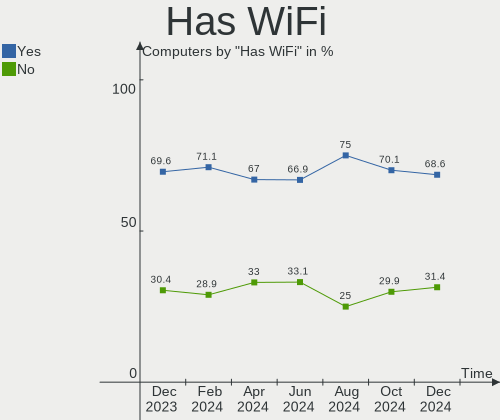

ROSA - Hardware Trends
----------------------

A project to identify most popular hardware characteristics and track their change
over time based on data collected by Linux users at https://Linux-Hardware.org.

Anyone can contribute to this report by the [hw-probe](https://github.com/linuxhw/hw-probe) tool:

    sudo -E hw-probe -all -upload

This is a report for all computer types. See also reports for [desktops](/Dist/ROSA/Desktop/README.md) and [notebooks](/Dist/ROSA/Notebook/README.md).

This report is for one last month. Overall report since the beginning of time: [TestDays](https://github.com/linuxhw/TestDays)

Period: Mar, 2023.

Contents
--------

* [ System ](#system)
  - [ OS                       ](#os)
  - [ OS Family                ](#os-family)
  - [ Kernel                   ](#kernel)
  - [ Kernel Family            ](#kernel-family)
  - [ Kernel Major Ver.        ](#kernel-major-ver)
  - [ Arch                     ](#arch)
  - [ DE                       ](#de)
  - [ Display Server           ](#display-server)
  - [ Display Manager          ](#display-manager)
  - [ OS Lang                  ](#os-lang)
  - [ Boot Mode                ](#boot-mode)
  - [ Filesystem               ](#filesystem)
  - [ Part. scheme             ](#part-scheme)
  - [ Dual Boot with Linux/BSD ](#dual-boot-with-linuxbsd)
  - [ Dual Boot (Win)          ](#dual-boot-win)

* [ Board ](#board)
  - [ Vendor                   ](#vendor)
  - [ Model                    ](#model)
  - [ Model Family             ](#model-family)
  - [ MFG Year                 ](#mfg-year)
  - [ Form Factor              ](#form-factor)
  - [ Secure Boot              ](#secure-boot)
  - [ Coreboot                 ](#coreboot)
  - [ RAM Size                 ](#ram-size)
  - [ RAM Used                 ](#ram-used)
  - [ Total Drives             ](#total-drives)
  - [ Has CD-ROM               ](#has-cd-rom)
  - [ Has Ethernet             ](#has-ethernet)
  - [ Has WiFi                 ](#has-wifi)
  - [ Has Bluetooth            ](#has-bluetooth)

* [ Location ](#location)
  - [ Country                  ](#country)
  - [ City                     ](#city)

* [ Drives ](#drives)
  - [ Drive Vendor             ](#drive-vendor)
  - [ Drive Model              ](#drive-model)
  - [ HDD Vendor               ](#hdd-vendor)
  - [ SSD Vendor               ](#ssd-vendor)
  - [ Drive Kind               ](#drive-kind)
  - [ Drive Connector          ](#drive-connector)
  - [ Drive Size               ](#drive-size)
  - [ Space Total              ](#space-total)
  - [ Space Used               ](#space-used)
  - [ Malfunc. Drives          ](#malfunc-drives)
  - [ Malfunc. Drive Vendor    ](#malfunc-drive-vendor)
  - [ Malfunc. HDD Vendor      ](#malfunc-hdd-vendor)
  - [ Malfunc. Drive Kind      ](#malfunc-drive-kind)
  - [ Failed Drives            ](#failed-drives)
  - [ Failed Drive Vendor      ](#failed-drive-vendor)
  - [ Drive Status             ](#drive-status)

* [ Storage controller ](#storage-controller)
  - [ Storage Vendor           ](#storage-vendor)
  - [ Storage Model            ](#storage-model)
  - [ Storage Kind             ](#storage-kind)

* [ Processor ](#processor)
  - [ CPU Vendor               ](#cpu-vendor)
  - [ CPU Model                ](#cpu-model)
  - [ CPU Model Family         ](#cpu-model-family)
  - [ CPU Cores                ](#cpu-cores)
  - [ CPU Sockets              ](#cpu-sockets)
  - [ CPU Threads              ](#cpu-threads)
  - [ CPU Op-Modes             ](#cpu-op-modes)
  - [ CPU Microcode            ](#cpu-microcode)
  - [ CPU Microarch            ](#cpu-microarch)

* [ Graphics ](#graphics)
  - [ GPU Vendor               ](#gpu-vendor)
  - [ GPU Model                ](#gpu-model)
  - [ GPU Combo                ](#gpu-combo)
  - [ GPU Driver               ](#gpu-driver)
  - [ GPU Memory               ](#gpu-memory)

* [ Monitor ](#monitor)
  - [ Monitor Vendor           ](#monitor-vendor)
  - [ Monitor Model            ](#monitor-model)
  - [ Monitor Resolution       ](#monitor-resolution)
  - [ Monitor Diagonal         ](#monitor-diagonal)
  - [ Monitor Width            ](#monitor-width)
  - [ Aspect Ratio             ](#aspect-ratio)
  - [ Monitor Area             ](#monitor-area)
  - [ Pixel Density            ](#pixel-density)
  - [ Multiple Monitors        ](#multiple-monitors)

* [ Network ](#network)
  - [ Net Controller Vendor    ](#net-controller-vendor)
  - [ Net Controller Model     ](#net-controller-model)
  - [ Wireless Vendor          ](#wireless-vendor)
  - [ Wireless Model           ](#wireless-model)
  - [ Ethernet Vendor          ](#ethernet-vendor)
  - [ Ethernet Model           ](#ethernet-model)
  - [ Net Controller Kind      ](#net-controller-kind)
  - [ Used Controller          ](#used-controller)
  - [ NICs                     ](#nics)
  - [ IPv6                     ](#ipv6)

* [ Bluetooth ](#bluetooth)
  - [ Bluetooth Vendor         ](#bluetooth-vendor)
  - [ Bluetooth Model          ](#bluetooth-model)

* [ Sound ](#sound)
  - [ Sound Vendor             ](#sound-vendor)
  - [ Sound Model              ](#sound-model)

* [ Memory ](#memory)
  - [ Memory Vendor            ](#memory-vendor)
  - [ Memory Model             ](#memory-model)
  - [ Memory Kind              ](#memory-kind)
  - [ Memory Form Factor       ](#memory-form-factor)
  - [ Memory Size              ](#memory-size)
  - [ Memory Speed             ](#memory-speed)

* [ Printers & scanners ](#printers--scanners)
  - [ Printer Vendor           ](#printer-vendor)
  - [ Printer Model            ](#printer-model)
  - [ Scanner Vendor           ](#scanner-vendor)
  - [ Scanner Model            ](#scanner-model)

* [ Camera ](#camera)
  - [ Camera Vendor            ](#camera-vendor)
  - [ Camera Model             ](#camera-model)

* [ Security ](#security)
  - [ Fingerprint Vendor       ](#fingerprint-vendor)
  - [ Fingerprint Model        ](#fingerprint-model)
  - [ Chipcard Vendor          ](#chipcard-vendor)
  - [ Chipcard Model           ](#chipcard-model)

* [ Unsupported ](#unsupported)
  - [ Unsupported Devices      ](#unsupported-devices)
  - [ Unsupported Device Types ](#unsupported-device-types)

System
------

OS
--

Installed operating systems

| Name       | Computers | Percent |
|------------|-----------|---------|
| ROSA 12.3  | 222       | 79%     |
| ROSA 12.4  | 34        | 12.1%   |
| ROSA R11.1 | 14        | 4.98%   |
| ROSA 12.2  | 6         | 2.14%   |
| ROSA 12.1  | 3         | 1.07%   |
| ROSA 12    | 2         | 0.71%   |

OS Family
---------

OS without a version

| Name | Computers | Percent |
|------|-----------|---------|
| ROSA | 281       | 100%    |

Kernel
------

Version of the Linux kernel

| Version                                   | Computers | Percent |
|-------------------------------------------|-----------|---------|
| 5.15.75-generic-1rosa2021.1-x86_64        | 83        | 29.54%  |
| 5.15.79-generic-1rosa2021.1-x86_64        | 68        | 24.2%   |
| 5.10.155-generic-1rosa2021.1-x86_64       | 21        | 7.47%   |
| 6.1.20-generic-2rosa2021.1-x86_64         | 18        | 6.41%   |
| 5.15.75-generic-1rosa2021.1-i686          | 13        | 4.63%   |
| 6.0.12.xm1-1.klp-xanmod-rosa2021.1-x86_64 | 11        | 3.91%   |
| 5.10.74-generic-2rosa2021.1-x86_64        | 8         | 2.85%   |
| 6.1.20-generic-1rosa2021.1-x86_64         | 7         | 2.49%   |
| 5.15.103-generic-1rosa2021.1-x86_64       | 7         | 2.49%   |
| 5.15.77-generic-1rosa2021.1-x86_64        | 6         | 2.14%   |
| 4.15.0-desktop-122.124.1rosa-x86_64       | 6         | 2.14%   |
| 5.17.11-generic-2rosa2021.1-x86_64        | 5         | 1.78%   |
| 6.1.19-generic-1rosa2021.1-x86_64         | 2         | 0.71%   |
| 6.1.14-generic-1rosa2021.1-x86_64         | 2         | 0.71%   |
| 5.4.32-generic-2rosa-x86_64               | 2         | 0.71%   |
| 5.10.74-generic-2rosa2021.1-i586          | 2         | 0.71%   |
| 5.10.150-generic-1rosa2021.1-x86_64       | 2         | 0.71%   |
| 6.2.7.xm1-1.klp-xanmod-rosa2021.1-x86_64  | 1         | 0.36%   |
| 6.2.6-generic-2rosa2021.1-x86_64          | 1         | 0.36%   |
| 6.2.1.xm1-1.klp-xanmod-rosa2021.1-x86_64  | 1         | 0.36%   |
| 6.1.16.xm1-1.klp-xanmod-rosa2021.1-x86_64 | 1         | 0.36%   |
| 6.1.15.xm1-1.klp-xanmod-rosa2021.1-x86_64 | 1         | 0.36%   |
| 6.0.7.xm1-1.klp-xanmod-rosa2021.1-x86_64  | 1         | 0.36%   |
| 5.4.83-generic-2rosa-x86_64               | 1         | 0.36%   |
| 5.4.83-generic-2rosa-i586                 | 1         | 0.36%   |
| 5.4.32-generic-2rosa-i586                 | 1         | 0.36%   |
| 5.18.19-generic-3rosa2021.1-x86_64        | 1         | 0.36%   |
| 5.17.11-generic-2rosa2021.1-i686          | 1         | 0.36%   |
| 5.15.43-generic-2rosa2021.1-x86_64        | 1         | 0.36%   |
| 5.10.176-generic-1rosa2021.1-x86_64       | 1         | 0.36%   |
| 5.10.175-generic-1rosa2021.1-x86_64       | 1         | 0.36%   |
| 5.10.118-generic-2rosa2021.1-x86_64       | 1         | 0.36%   |
| 4.9.60-nrj-desktop-1rosa-i586             | 1         | 0.36%   |
| 4.15.0-desktop-45.1rosa-x86_64            | 1         | 0.36%   |
| 4.15.0-desktop-122.124.1rosa-i586         | 1         | 0.36%   |

Kernel Family
-------------

Linux kernel without a distro release

| Version  | Computers | Percent |
|----------|-----------|---------|
| 5.15.75  | 96        | 34.16%  |
| 5.15.79  | 68        | 24.2%   |
| 6.1.20   | 25        | 8.9%    |
| 5.10.155 | 21        | 7.47%   |
| 6.0.12   | 11        | 3.91%   |
| 5.10.74  | 10        | 3.56%   |
| 4.15.0   | 8         | 2.85%   |
| 5.15.103 | 7         | 2.49%   |
| 5.17.11  | 6         | 2.14%   |
| 5.15.77  | 6         | 2.14%   |
| 5.4.32   | 3         | 1.07%   |
| 6.1.19   | 2         | 0.71%   |
| 6.1.14   | 2         | 0.71%   |
| 5.4.83   | 2         | 0.71%   |
| 5.10.150 | 2         | 0.71%   |
| 6.2.7    | 1         | 0.36%   |
| 6.2.6    | 1         | 0.36%   |
| 6.2.1    | 1         | 0.36%   |
| 6.1.16   | 1         | 0.36%   |
| 6.1.15   | 1         | 0.36%   |
| 6.0.7    | 1         | 0.36%   |
| 5.18.19  | 1         | 0.36%   |
| 5.15.43  | 1         | 0.36%   |
| 5.10.176 | 1         | 0.36%   |
| 5.10.175 | 1         | 0.36%   |
| 5.10.118 | 1         | 0.36%   |
| 4.9.60   | 1         | 0.36%   |

Kernel Major Ver.
-----------------

Linux kernel major version

| Version | Computers | Percent |
|---------|-----------|---------|
| 5.15    | 178       | 63.35%  |
| 5.10    | 36        | 12.81%  |
| 6.1     | 31        | 11.03%  |
| 6.0     | 12        | 4.27%   |
| 4.15    | 8         | 2.85%   |
| 5.17    | 6         | 2.14%   |
| 5.4     | 5         | 1.78%   |
| 6.2     | 3         | 1.07%   |
| 5.18    | 1         | 0.36%   |
| 4.9     | 1         | 0.36%   |

Arch
----

OS architecture (x86_64, i586, etc.)

| Name   | Computers | Percent |
|--------|-----------|---------|
| x86_64 | 261       | 92.88%  |
| i686   | 20        | 7.12%   |

DE
--

Desktop Environment

| Name    | Computers | Percent |
|---------|-----------|---------|
| KDE5    | 146       | 51.96%  |
| GNOME   | 85        | 30.25%  |
| LXQt    | 35        | 12.46%  |
| KDE4    | 10        | 3.56%   |
| XFCE    | 2         | 0.71%   |
| i3      | 1         | 0.36%   |
| Budgie  | 1         | 0.36%   |
| Unknown | 1         | 0.36%   |

Display Server
--------------

X11 or Wayland

| Name    | Computers | Percent |
|---------|-----------|---------|
| Wayland | 212       | 75.44%  |
| X11     | 69        | 24.56%  |

Display Manager
---------------

SDDM, LightDM, etc.

| Name    | Computers | Percent |
|---------|-----------|---------|
| SDDM    | 148       | 52.67%  |
| GDM     | 103       | 36.65%  |
| LightDM | 18        | 6.41%   |
| KDM     | 10        | 3.56%   |
| Unknown | 2         | 0.71%   |

OS Lang
-------

Language

| Lang  | Computers | Percent |
|-------|-----------|---------|
| ru_RU | 262       | 93.24%  |
| en_US | 6         | 2.14%   |
| it_IT | 2         | 0.71%   |
| en_GB | 2         | 0.71%   |
| de_DE | 2         | 0.71%   |
| ru_UA | 1         | 0.36%   |
| pt_BR | 1         | 0.36%   |
| pl_PL | 1         | 0.36%   |
| ja_JP | 1         | 0.36%   |
| fr_FR | 1         | 0.36%   |
| es_ES | 1         | 0.36%   |
| el_GR | 1         | 0.36%   |

Boot Mode
---------

EFI or BIOS

| Mode | Computers | Percent |
|------|-----------|---------|
| EFI  | 150       | 53.38%  |
| BIOS | 131       | 46.62%  |

Filesystem
----------

Type of filesystem

| Type    | Computers | Percent |
|---------|-----------|---------|
| Ext4    | 261       | 92.88%  |
| Btrfs   | 16        | 5.69%   |
| Overlay | 1         | 0.36%   |
| F2fs    | 1         | 0.36%   |
| Ext3    | 1         | 0.36%   |
| Aufs    | 1         | 0.36%   |

Part. scheme
------------

Scheme of partitioning

| Type    | Computers | Percent |
|---------|-----------|---------|
| GPT     | 175       | 62.28%  |
| MBR     | 104       | 37.01%  |
| Unknown | 2         | 0.71%   |

Dual Boot with Linux/BSD
------------------------

Hosting more than one Linux/BSD

| Dual boot | Computers | Percent |
|-----------|-----------|---------|
| No        | 200       | 71.17%  |
| Yes       | 81        | 28.83%  |

Dual Boot (Win)
---------------

Hosting Linux and Windows

| Dual boot | Computers | Percent |
|-----------|-----------|---------|
| No        | 150       | 53.38%  |
| Yes       | 131       | 46.62%  |

Board
-----

Vendor
------

Motherboard manufacturer

| Name                     | Computers | Percent |
|--------------------------|-----------|---------|
| ASUSTek Computer         | 68        | 24.2%   |
| Gigabyte Technology      | 41        | 14.59%  |
| Lenovo                   | 22        | 7.83%   |
| Acer                     | 20        | 7.12%   |
| Dell                     | 17        | 6.05%   |
| MSI                      | 16        | 5.69%   |
| ASRock                   | 16        | 5.69%   |
| Hewlett-Packard          | 15        | 5.34%   |
| Sony                     | 6         | 2.14%   |
| Toshiba                  | 5         | 1.78%   |
| Samsung Electronics      | 4         | 1.42%   |
| Unknown                  | 4         | 1.42%   |
| Pegatron                 | 3         | 1.07%   |
| MACHINIST                | 3         | 1.07%   |
| Intel                    | 3         | 1.07%   |
| Huanan                   | 3         | 1.07%   |
| Foxconn                  | 3         | 1.07%   |
| EPoX Computer            | 3         | 1.07%   |
| Biostar                  | 3         | 1.07%   |
| Apple                    | 3         | 1.07%   |
| HONOR                    | 2         | 0.71%   |
| eMachines                | 2         | 0.71%   |
| Timi                     | 1         | 0.36%   |
| Supermicro               | 1         | 0.36%   |
| Soyo                     | 1         | 0.36%   |
| Shuttle                  | 1         | 0.36%   |
| Positivo                 | 1         | 0.36%   |
| Packard Bell             | 1         | 0.36%   |
| Notebook                 | 1         | 0.36%   |
| MB                       | 1         | 0.36%   |
| Maibenben                | 1         | 0.36%   |
| Irbis                    | 1         | 0.36%   |
| Infinix                  | 1         | 0.36%   |
| HIPER Technology Limited | 1         | 0.36%   |
| Haier                    | 1         | 0.36%   |
| Fujitsu Siemens          | 1         | 0.36%   |
| Fujitsu                  | 1         | 0.36%   |
| Fanless Mini PC          | 1         | 0.36%   |
| ECS                      | 1         | 0.36%   |
| Aquarius                 | 1         | 0.36%   |

Model
-----

Motherboard model

| Name                                       | Computers | Percent |
|--------------------------------------------|-----------|---------|
| Unknown                                    | 4         | 1.42%   |
| Gigabyte H410M H V3                        | 3         | 1.07%   |
| ASUS All Series                            | 3         | 1.07%   |
| Lenovo G500 20236                          | 2         | 0.71%   |
| Huanan X99-QD4 V1.0                        | 2         | 0.71%   |
| Gigabyte GA-A55M-S2V                       | 2         | 0.71%   |
| Gigabyte B450M S2H                         | 2         | 0.71%   |
| Gigabyte A320M-S2H V2                      | 2         | 0.71%   |
| Dell OptiPlex 3020                         | 2         | 0.71%   |
| Biostar A320MH                             | 2         | 0.71%   |
| ASUS PRIME H270-PLUS                       | 2         | 0.71%   |
| Toshiba Satellite U300                     | 1         | 0.36%   |
| Toshiba Satellite Pro L300                 | 1         | 0.36%   |
| Toshiba Satellite L850D-BJS                | 1         | 0.36%   |
| Toshiba Satellite A500                     | 1         | 0.36%   |
| Toshiba Satellite A200                     | 1         | 0.36%   |
| Timi Redmi Book Pro 15 2022                | 1         | 0.36%   |
| Supermicro X9SRL-F                         | 1         | 0.36%   |
| Soyo SY-Classic B660M                      | 1         | 0.36%   |
| Sony VPCZ12S9R                             | 1         | 0.36%   |
| Sony VPCF13E8R                             | 1         | 0.36%   |
| Sony VPCF1390X                             | 1         | 0.36%   |
| Sony VPCEB3S1R                             | 1         | 0.36%   |
| Sony SVT1313X9RS                           | 1         | 0.36%   |
| Sony SVE1713P1RB                           | 1         | 0.36%   |
| Shuttle XS35V3                             | 1         | 0.36%   |
| Samsung R530/R730                          | 1         | 0.36%   |
| Samsung NC10                               | 1         | 0.36%   |
| Samsung 350V5C/351V5C/3540VC/3440VC        | 1         | 0.36%   |
| Samsung 300E4A/300E5A/300E7A/3430EA/3530EA | 1         | 0.36%   |
| Positivo N6440                             | 1         | 0.36%   |
| Pegatron H36QR                             | 1         | 0.36%   |
| Pegatron C15B                              | 1         | 0.36%   |
| Pegatron A15                               | 1         | 0.36%   |
| Packard Bell EasyNote TS11HR               | 1         | 0.36%   |
| Notebook W54_55SU1,SUW                     | 1         | 0.36%   |
| MSI OPTIMUS                                | 1         | 0.36%   |
| MSI MS-AA7211                              | 1         | 0.36%   |
| MSI MS-7D48                                | 1         | 0.36%   |
| MSI MS-7D22                                | 1         | 0.36%   |

Model Family
------------

Motherboard model prefix

| Name                 | Computers | Percent |
|----------------------|-----------|---------|
| Acer Aspire          | 15        | 5.34%   |
| ASUS PRIME           | 10        | 3.56%   |
| Lenovo ThinkPad      | 7         | 2.49%   |
| Dell OptiPlex        | 7         | 2.49%   |
| ASUS VivoBook        | 6         | 2.14%   |
| Toshiba Satellite    | 5         | 1.78%   |
| Dell Vostro          | 5         | 1.78%   |
| Unknown              | 4         | 1.42%   |
| Lenovo IdeaPad       | 3         | 1.07%   |
| HP Laptop            | 3         | 1.07%   |
| HP Compaq            | 3         | 1.07%   |
| Gigabyte H410M       | 3         | 1.07%   |
| Gigabyte B550        | 3         | 1.07%   |
| Dell Inspiron        | 3         | 1.07%   |
| ASUS All             | 3         | 1.07%   |
| Lenovo Legion        | 2         | 0.71%   |
| Lenovo G500          | 2         | 0.71%   |
| Huanan X99-QD4       | 2         | 0.71%   |
| HP Pavilion          | 2         | 0.71%   |
| Gigabyte GA-A55M-S2V | 2         | 0.71%   |
| Gigabyte B450M       | 2         | 0.71%   |
| Gigabyte A320M-S2H   | 2         | 0.71%   |
| Biostar A320MH       | 2         | 0.71%   |
| ASUS TUF             | 2         | 0.71%   |
| ASUS SABERTOOTH      | 2         | 0.71%   |
| ASUS ROG             | 2         | 0.71%   |
| Acer Swift           | 2         | 0.71%   |
| Acer Extensa         | 2         | 0.71%   |
| Timi Redmi           | 1         | 0.36%   |
| Supermicro X9SRL-F   | 1         | 0.36%   |
| Soyo SY-Classic      | 1         | 0.36%   |
| Sony VPCZ12S9R       | 1         | 0.36%   |
| Sony VPCF13E8R       | 1         | 0.36%   |
| Sony VPCF1390X       | 1         | 0.36%   |
| Sony VPCEB3S1R       | 1         | 0.36%   |
| Sony SVT1313X9RS     | 1         | 0.36%   |
| Sony SVE1713P1RB     | 1         | 0.36%   |
| Shuttle XS35V3       | 1         | 0.36%   |
| Samsung R530         | 1         | 0.36%   |
| Samsung NC10         | 1         | 0.36%   |

MFG Year
--------

Motherboard manufacture year

| Year | Computers | Percent |
|------|-----------|---------|
| 2021 | 27        | 9.61%   |
| 2012 | 26        | 9.25%   |
| 2013 | 23        | 8.19%   |
| 2010 | 23        | 8.19%   |
| 2018 | 22        | 7.83%   |
| 2011 | 21        | 7.47%   |
| 2020 | 18        | 6.41%   |
| 2009 | 18        | 6.41%   |
| 2022 | 16        | 5.69%   |
| 2017 | 14        | 4.98%   |
| 2016 | 14        | 4.98%   |
| 2019 | 12        | 4.27%   |
| 2014 | 10        | 3.56%   |
| 2015 | 9         | 3.2%    |
| 2007 | 9         | 3.2%    |
| 2006 | 9         | 3.2%    |
| 2008 | 8         | 2.85%   |
| 2005 | 1         | 0.36%   |
| 2004 | 1         | 0.36%   |

Form Factor
-----------

Physical design of the computer

| Name        | Computers | Percent |
|-------------|-----------|---------|
| Desktop     | 139       | 49.47%  |
| Notebook    | 128       | 45.55%  |
| All in one  | 8         | 2.85%   |
| Mini pc     | 3         | 1.07%   |
| Server      | 2         | 0.71%   |
| Convertible | 1         | 0.36%   |

Secure Boot
-----------

Enabled or disabled

| State    | Computers | Percent |
|----------|-----------|---------|
| Disabled | 281       | 100%    |

Coreboot
--------

Have coreboot on board

| Used | Computers | Percent |
|------|-----------|---------|
| No   | 281       | 100%    |

RAM Size
--------

Total RAM memory

| Size in GB  | Computers | Percent |
|-------------|-----------|---------|
| 4.01-8.0    | 62        | 22.06%  |
| 3.01-4.0    | 60        | 21.35%  |
| 16.01-24.0  | 56        | 19.93%  |
| 8.01-16.0   | 51        | 18.15%  |
| 32.01-64.0  | 20        | 7.12%   |
| 1.01-2.0    | 16        | 5.69%   |
| 2.01-3.0    | 10        | 3.56%   |
| 24.01-32.0  | 3         | 1.07%   |
| 0.51-1.0    | 2         | 0.71%   |
| 64.01-256.0 | 1         | 0.36%   |

RAM Used
--------

Used RAM memory

| Used GB    | Computers | Percent |
|------------|-----------|---------|
| 1.01-2.0   | 155       | 55.16%  |
| 0.51-1.0   | 59        | 21%     |
| 2.01-3.0   | 44        | 15.66%  |
| 4.01-8.0   | 10        | 3.56%   |
| 3.01-4.0   | 10        | 3.56%   |
| 16.01-24.0 | 1         | 0.36%   |
| 8.01-16.0  | 1         | 0.36%   |
| 0.01-0.5   | 1         | 0.36%   |

Total Drives
------------

Number of drives on board

| Drives | Computers | Percent |
|--------|-----------|---------|
| 1      | 162       | 57.65%  |
| 2      | 74        | 26.33%  |
| 3      | 24        | 8.54%   |
| 4      | 13        | 4.63%   |
| 5      | 4         | 1.42%   |
| 6      | 2         | 0.71%   |
| 7      | 1         | 0.36%   |
| 0      | 1         | 0.36%   |

Has CD-ROM
----------

Has CD-ROM on board

| Presented | Computers | Percent |
|-----------|-----------|---------|
| No        | 171       | 60.85%  |
| Yes       | 110       | 39.15%  |

Has Ethernet
------------

Has Ethernet on board

| Presented | Computers | Percent |
|-----------|-----------|---------|
| Yes       | 265       | 94.31%  |
| No        | 16        | 5.69%   |

Has WiFi
--------

Has WiFi module

| Presented | Computers | Percent |
|-----------|-----------|---------|
| Yes       | 189       | 67.26%  |
| No        | 92        | 32.74%  |

Has Bluetooth
-------------

Has Bluetooth module

| Presented | Computers | Percent |
|-----------|-----------|---------|
| Yes       | 143       | 50.89%  |
| No        | 138       | 49.11%  |

Location
--------

Country
-------

Geographic location (country)

| Country    | Computers | Percent |
|------------|-----------|---------|
| Russia     | 234       | 83.27%  |
| Belarus    | 10        | 3.56%   |
| Ukraine    | 6         | 2.14%   |
| Germany    | 5         | 1.78%   |
| USA        | 3         | 1.07%   |
| UK         | 3         | 1.07%   |
| Poland     | 3         | 1.07%   |
| Moldova    | 2         | 0.71%   |
| Kazakhstan | 2         | 0.71%   |
| Italy      | 2         | 0.71%   |
| Czechia    | 2         | 0.71%   |
| Spain      | 1         | 0.36%   |
| Mexico     | 1         | 0.36%   |
| Latvia     | 1         | 0.36%   |
| Japan      | 1         | 0.36%   |
| Greece     | 1         | 0.36%   |
| France     | 1         | 0.36%   |
| Finland    | 1         | 0.36%   |
| Estonia    | 1         | 0.36%   |
| Brazil     | 1         | 0.36%   |

City
----

Geographic location (city)

| City             | Computers | Percent |
|------------------|-----------|---------|
| Moscow           | 48        | 17.08%  |
| St Petersburg    | 18        | 6.41%   |
| Samara           | 12        | 4.27%   |
| Krasnodar        | 11        | 3.91%   |
| Chelyabinsk      | 10        | 3.56%   |
| Novosibirsk      | 7         | 2.49%   |
| Minsk            | 6         | 2.14%   |
| Nizhniy Novgorod | 5         | 1.78%   |
| Yekaterinburg    | 4         | 1.42%   |
| Volgograd        | 4         | 1.42%   |
| Ufa              | 4         | 1.42%   |
| Perm             | 4         | 1.42%   |
| Omsk             | 4         | 1.42%   |
| Krasnoyarsk      | 4         | 1.42%   |
| Voronezh         | 3         | 1.07%   |
| Surgut           | 3         | 1.07%   |
| Stavropol        | 3         | 1.07%   |
| Simferopol       | 3         | 1.07%   |
| Saratov          | 3         | 1.07%   |
| Rostov-on-Don    | 3         | 1.07%   |
| Orenburg         | 3         | 1.07%   |
| Khabarovsk       | 3         | 1.07%   |
| Cheremkhovo      | 3         | 1.07%   |
| Yakutsk          | 2         | 0.71%   |
| Vologda          | 2         | 0.71%   |
| Vladivostok      | 2         | 0.71%   |
| Veliky Novgorod  | 2         | 0.71%   |
| Tomsk            | 2         | 0.71%   |
| Syktyvkar        | 2         | 0.71%   |
| Scharbeutz       | 2         | 0.71%   |
| Rochdale         | 2         | 0.71%   |
| Prokop'yevsk     | 2         | 0.71%   |
| Novokuznetsk     | 2         | 0.71%   |
| Lesnoy           | 2         | 0.71%   |
| Kursk            | 2         | 0.71%   |
| Kumertau         | 2         | 0.71%   |
| Hrodna           | 2         | 0.71%   |
| Chisinau         | 2         | 0.71%   |
| Bryansk          | 2         | 0.71%   |
| Blagoveshchensk  | 2         | 0.71%   |

Drives
------

Drive Vendor
------------

Hard drive vendors

| Vendor              | Computers | Drives | Percent |
|---------------------|-----------|--------|---------|
| WDC                 | 77        | 91     | 17.82%  |
| Seagate             | 72        | 82     | 16.67%  |
| Samsung Electronics | 33        | 37     | 7.64%   |
| Toshiba             | 24        | 25     | 5.56%   |
| Kingston            | 23        | 24     | 5.32%   |
| Hitachi             | 21        | 21     | 4.86%   |
| China               | 15        | 16     | 3.47%   |
| SanDisk             | 13        | 13     | 3.01%   |
| A-DATA Technology   | 13        | 13     | 3.01%   |
| SPCC                | 11        | 11     | 2.55%   |
| Apacer              | 10        | 10     | 2.31%   |
| Crucial             | 9         | 10     | 2.08%   |
| Netac               | 8         | 8      | 1.85%   |
| Unknown             | 7         | 8      | 1.62%   |
| Patriot             | 6         | 7      | 1.39%   |
| Intel               | 6         | 6      | 1.39%   |
| KingSpec            | 5         | 5      | 1.16%   |
| XrayDisk            | 4         | 4      | 0.93%   |
| External            | 4         | 4      | 0.93%   |
| Qumo                | 3         | 3      | 0.69%   |
| OCZ                 | 3         | 3      | 0.69%   |
| KIOXIA              | 3         | 3      | 0.69%   |
| Gigabyte Technology | 3         | 3      | 0.69%   |
| AMD                 | 3         | 3      | 0.69%   |
| XPG                 | 2         | 2      | 0.46%   |
| Transcend           | 2         | 2      | 0.46%   |
| Smartbuy            | 2         | 2      | 0.46%   |
| SK hynix            | 2         | 2      | 0.46%   |
| Silicon Motion      | 2         | 2      | 0.46%   |
| Plextor             | 2         | 2      | 0.46%   |
| Kimtigo             | 2         | 2      | 0.46%   |
| Intenso             | 2         | 2      | 0.46%   |
| HS-SSD-C100         | 2         | 2      | 0.46%   |
| HGST                | 2         | 2      | 0.46%   |
| Hewlett-Packard     | 2         | 2      | 0.46%   |
| Foxline             | 2         | 2      | 0.46%   |
| Unknown             | 2         | 2      | 0.46%   |
| Zheino              | 1         | 1      | 0.23%   |
| Teclast             | 1         | 1      | 0.23%   |
| Team                | 1         | 1      | 0.23%   |

Drive Model
-----------

Hard drive models

| Model                                | Computers | Percent |
|--------------------------------------|-----------|---------|
| Samsung SSD 860 EVO 250GB            | 6         | 1.3%    |
| WDC WD10EZEX-00BBHA0 1TB             | 5         | 1.09%   |
| SPCC Solid State Disk 128GB          | 5         | 1.09%   |
| Seagate ST500DM002-1BD142 500GB      | 5         | 1.09%   |
| WDC WD10EZEX-22MFCA0 1TB             | 4         | 0.87%   |
| Seagate ST9320325AS 320GB            | 4         | 0.87%   |
| Seagate ST500LT012-1DG142 500GB      | 4         | 0.87%   |
| Seagate ST1000LM035-1RK172 1TB       | 4         | 0.87%   |
| Seagate ST1000DM010-2EP102 1TB       | 4         | 0.87%   |
| Seagate ST1000DM003-1CH162 1TB       | 4         | 0.87%   |
| Kingston SA400S37480G 480GB SSD      | 4         | 0.87%   |
| External USB3.0 512GB                | 4         | 0.87%   |
| WDC WDS240G2G0A-00JH30 240GB SSD     | 3         | 0.65%   |
| WDC WD10EZEX-08WN4A0 1TB             | 3         | 0.65%   |
| Toshiba MQ01ABF050 500GB             | 3         | 0.65%   |
| Toshiba HDWD110 1TB                  | 3         | 0.65%   |
| Toshiba DT01ACA050 500GB             | 3         | 0.65%   |
| Seagate ST9500325AS 500GB            | 3         | 0.65%   |
| Seagate ST500LT012-9WS142 500GB      | 3         | 0.65%   |
| Netac SSD 240GB                      | 3         | 0.65%   |
| Kingston SA400S37240G 240GB SSD      | 3         | 0.65%   |
| Kingston SA400S37120G 120GB SSD      | 3         | 0.65%   |
| Hitachi HDS721050CLA360 500GB        | 3         | 0.65%   |
| Crucial CT500MX500SSD1 500GB         | 3         | 0.65%   |
| Crucial CT240BX500SSD1 240GB         | 3         | 0.65%   |
| China SSD 240GB                      | 3         | 0.65%   |
| AMD R5SL120G 120GB SSD               | 3         | 0.65%   |
| XPG GAMMIX S11 Pro 256GB             | 2         | 0.43%   |
| WDC WDS500G2B0A-00SM50 500GB SSD     | 2         | 0.43%   |
| WDC WDS250G2B0A-00SM50 250GB SSD     | 2         | 0.43%   |
| WDC WDS120G2G0A-00JH30 120GB SSD     | 2         | 0.43%   |
| WDC WDS100T2B0A-00SM50 1TB SSD       | 2         | 0.43%   |
| WDC WD5000LPCX-24VHAT0 500GB         | 2         | 0.43%   |
| WDC WD5000LPCX-21VHAT0 500GB         | 2         | 0.43%   |
| WDC WD30EFRX-68EUZN0 3TB             | 2         | 0.43%   |
| WDC WD20EZRZ-00Z5HB0 2TB             | 2         | 0.43%   |
| WDC PC SN530 SDBPMPZ-256G-1001 256GB | 2         | 0.43%   |
| Toshiba MK5055GSX 500GB              | 2         | 0.43%   |
| Seagate ST2000LM015-2E8174 2TB       | 2         | 0.43%   |
| Seagate ST1000VX005-2EZ102 1TB       | 2         | 0.43%   |

HDD Vendor
----------

Hard disk drive vendors

| Vendor              | Computers | Drives | Percent |
|---------------------|-----------|--------|---------|
| Seagate             | 71        | 81     | 39.23%  |
| WDC                 | 57        | 68     | 31.49%  |
| Toshiba             | 21        | 21     | 11.6%   |
| Hitachi             | 21        | 21     | 11.6%   |
| Samsung Electronics | 4         | 4      | 2.21%   |
| HGST                | 2         | 2      | 1.1%    |
| Unknown             | 1         | 1      | 0.55%   |
| QUANTUM             | 1         | 1      | 0.55%   |
| LaCie               | 1         | 1      | 0.55%   |
| Fujitsu             | 1         | 1      | 0.55%   |
| ASMT                | 1         | 1      | 0.55%   |

SSD Vendor
----------

Solid state drive vendors

| Vendor              | Computers | Drives | Percent |
|---------------------|-----------|--------|---------|
| Kingston            | 16        | 16     | 9.04%   |
| WDC                 | 15        | 17     | 8.47%   |
| China               | 15        | 16     | 8.47%   |
| Samsung Electronics | 14        | 17     | 7.91%   |
| SPCC                | 11        | 11     | 6.21%   |
| SanDisk             | 10        | 10     | 5.65%   |
| A-DATA Technology   | 10        | 10     | 5.65%   |
| Crucial             | 8         | 9      | 4.52%   |
| Apacer              | 8         | 8      | 4.52%   |
| Netac               | 6         | 6      | 3.39%   |
| Patriot             | 5         | 6      | 2.82%   |
| KingSpec            | 5         | 5      | 2.82%   |
| XrayDisk            | 3         | 3      | 1.69%   |
| Toshiba             | 3         | 4      | 1.69%   |
| Qumo                | 3         | 3      | 1.69%   |
| OCZ                 | 3         | 3      | 1.69%   |
| Intel               | 3         | 3      | 1.69%   |
| AMD                 | 3         | 3      | 1.69%   |
| Smartbuy            | 2         | 2      | 1.13%   |
| Plextor             | 2         | 2      | 1.13%   |
| Kimtigo             | 2         | 2      | 1.13%   |
| Intenso             | 2         | 2      | 1.13%   |
| HS-SSD-C100         | 2         | 2      | 1.13%   |
| Foxline             | 2         | 2      | 1.13%   |
| Unknown             | 2         | 2      | 1.13%   |
| Zheino              | 1         | 1      | 0.56%   |
| Unknown             | 1         | 1      | 0.56%   |
| Transcend           | 1         | 1      | 0.56%   |
| Team                | 1         | 1      | 0.56%   |
| TAMMUZ              | 1         | 2      | 0.56%   |
| PNY                 | 1         | 1      | 0.56%   |
| NT-256              | 1         | 1      | 0.56%   |
| Londisk             | 1         | 1      | 0.56%   |
| KingFast            | 1         | 1      | 0.56%   |
| HUAXUAN             | 1         | 1      | 0.56%   |
| HS-SSD-E100         | 1         | 1      | 0.56%   |
| HJDK                | 1         | 1      | 0.56%   |
| Hewlett-Packard     | 1         | 1      | 0.56%   |
| GSemi               | 1         | 1      | 0.56%   |
| GS                  | 1         | 1      | 0.56%   |

Drive Kind
----------

HDD or SSD

| Kind    | Computers | Drives | Percent |
|---------|-----------|--------|---------|
| HDD     | 166       | 202    | 42.56%  |
| SSD     | 155       | 187    | 39.74%  |
| NVMe    | 64        | 72     | 16.41%  |
| MMC     | 4         | 4      | 1.03%   |
| Unknown | 1         | 2      | 0.26%   |

Drive Connector
---------------

SATA, SAS, NVMe, etc.

| Type | Computers | Drives | Percent |
|------|-----------|--------|---------|
| SATA | 245       | 385    | 76.8%   |
| NVMe | 61        | 68     | 19.12%  |
| SAS  | 9         | 10     | 2.82%   |
| MMC  | 4         | 4      | 1.25%   |

Drive Size
----------

Size of hard drive

| Size in TB | Computers | Drives | Percent |
|------------|-----------|--------|---------|
| 0.01-0.5   | 209       | 278    | 68.52%  |
| 0.51-1.0   | 73        | 85     | 23.93%  |
| 1.01-2.0   | 16        | 18     | 5.25%   |
| 3.01-4.0   | 4         | 5      | 1.31%   |
| 2.01-3.0   | 3         | 3      | 0.98%   |

Space Total
-----------

Amount of disk space available on the file system

| Size in GB     | Computers | Percent |
|----------------|-----------|---------|
| 101-250        | 82        | 29.18%  |
| 251-500        | 58        | 20.64%  |
| 501-1000       | 39        | 13.88%  |
| 1-20           | 32        | 11.39%  |
| 51-100         | 27        | 9.61%   |
| 21-50          | 16        | 5.69%   |
| 1001-2000      | 12        | 4.27%   |
| 2001-3000      | 10        | 3.56%   |
| More than 3000 | 4         | 1.42%   |
| Unknown        | 1         | 0.36%   |

Space Used
----------

Amount of used disk space

| Used GB        | Computers | Percent |
|----------------|-----------|---------|
| 1-20           | 169       | 60.14%  |
| 101-250        | 27        | 9.61%   |
| 21-50          | 25        | 8.9%    |
| 251-500        | 18        | 6.41%   |
| 51-100         | 18        | 6.41%   |
| 501-1000       | 10        | 3.56%   |
| 1001-2000      | 9         | 3.2%    |
| 2001-3000      | 3         | 1.07%   |
| More than 3000 | 1         | 0.36%   |
| Unknown        | 1         | 0.36%   |

Malfunc. Drives
---------------

Drive models with a malfunction

| Model                            | Computers | Drives | Percent |
|----------------------------------|-----------|--------|---------|
| Seagate ST500DM002-1BD142 500GB  | 5         | 5      | 4.9%    |
| Seagate ST500LT012-9WS142 500GB  | 3         | 3      | 2.94%   |
| Seagate ST1000DM003-1CH162 1TB   | 3         | 3      | 2.94%   |
| Netac SSD 240GB                  | 3         | 3      | 2.94%   |
| WDC WD10EZEX-22MFCA0 1TB         | 2         | 2      | 1.96%   |
| Toshiba MQ01ABF050 500GB         | 2         | 2      | 1.96%   |
| Toshiba MK5055GSX 500GB          | 2         | 2      | 1.96%   |
| Seagate ST9500325AS 500GB        | 2         | 2      | 1.96%   |
| Seagate ST9320325AS 320GB        | 2         | 2      | 1.96%   |
| Seagate ST500LT012-1DG142 500GB  | 2         | 2      | 1.96%   |
| Hitachi HTS541680J9SA00 80GB     | 2         | 2      | 1.96%   |
| Hitachi HTS541612J9SA00 120GB    | 2         | 2      | 1.96%   |
| WDC WDS240G2G0B-00EPW0 240GB SSD | 1         | 1      | 0.98%   |
| WDC WDS240G2G0A-00JH30 240GB SSD | 1         | 1      | 0.98%   |
| WDC WDS120G2G0A-00JH30 120GB SSD | 1         | 1      | 0.98%   |
| WDC WDS100T2B0A-00SM50 1TB SSD   | 1         | 2      | 0.98%   |
| WDC WD7500BPVX-00FA7T0 752GB     | 1         | 1      | 0.98%   |
| WDC WD5000LPVX-22V0TT0 500GB     | 1         | 1      | 0.98%   |
| WDC WD5000BPVT-80HXZT1 500GB     | 1         | 1      | 0.98%   |
| WDC WD5000AZLX-22JKKA0 464GB     | 1         | 1      | 0.98%   |
| WDC WD5000AAKX-75U6AA0 500GB     | 1         | 1      | 0.98%   |
| WDC WD5000AAKS-75V0A0 500GB      | 1         | 1      | 0.98%   |
| WDC WD3200BPVT-80ZEST0 320GB     | 1         | 1      | 0.98%   |
| WDC WD3200AAJS-08L7A0 320GB      | 1         | 1      | 0.98%   |
| WDC WD30EFRX-68EUZN0 3TB         | 1         | 1      | 0.98%   |
| WDC WD20EARS-00S8B1 2TB          | 1         | 1      | 0.98%   |
| WDC WD1600BEVT-22ZCT0 160GB      | 1         | 1      | 0.98%   |
| WDC WD1600AAJS-00L7A0 160GB      | 1         | 1      | 0.98%   |
| WDC WD10PURZ-85U8XY0 1TB         | 1         | 1      | 0.98%   |
| WDC WD10JPVX-60JC3T1 1TB         | 1         | 1      | 0.98%   |
| WDC WD10EARS-00Y5B1 1TB          | 1         | 1      | 0.98%   |
| WDC WD Green 2.5 240GB SSD       | 1         | 1      | 0.98%   |
| Toshiba THNSNH060GBST 64GB SSD   | 1         | 1      | 0.98%   |
| Toshiba MQ04ABF100 1TB           | 1         | 1      | 0.98%   |
| Toshiba MQ01ABD100 1TB           | 1         | 1      | 0.98%   |
| Toshiba MQ01ABD050 500GB         | 1         | 1      | 0.98%   |
| Toshiba HDWD110 1TB              | 1         | 1      | 0.98%   |
| Toshiba DT01ACA100 1TB           | 1         | 1      | 0.98%   |
| Teclast 256GB NP900-2280         | 1         | 1      | 0.98%   |
| Seagate ST96812A 64GB            | 1         | 1      | 0.98%   |

Malfunc. Drive Vendor
---------------------

Vendors of faulty drives

| Vendor              | Computers | Drives | Percent |
|---------------------|-----------|--------|---------|
| Seagate             | 35        | 42     | 36.46%  |
| WDC                 | 22        | 23     | 22.92%  |
| Toshiba             | 10        | 10     | 10.42%  |
| Hitachi             | 9         | 9      | 9.38%   |
| Netac               | 3         | 3      | 3.13%   |
| Samsung Electronics | 2         | 2      | 2.08%   |
| OCZ                 | 2         | 2      | 2.08%   |
| KingSpec            | 2         | 2      | 2.08%   |
| A-DATA Technology   | 2         | 2      | 2.08%   |
| Teclast             | 1         | 1      | 1.04%   |
| Qumo                | 1         | 1      | 1.04%   |
| PNY                 | 1         | 1      | 1.04%   |
| LaCie               | 1         | 1      | 1.04%   |
| Kingston            | 1         | 1      | 1.04%   |
| HGST                | 1         | 1      | 1.04%   |
| GSemi               | 1         | 1      | 1.04%   |
| AFOX                | 1         | 1      | 1.04%   |
| ACOS                | 1         | 1      | 1.04%   |

Malfunc. HDD Vendor
-------------------

Vendors of faulty HDD drives

| Vendor              | Computers | Drives | Percent |
|---------------------|-----------|--------|---------|
| Seagate             | 35        | 42     | 47.3%   |
| WDC                 | 17        | 17     | 22.97%  |
| Toshiba             | 9         | 9      | 12.16%  |
| Hitachi             | 9         | 9      | 12.16%  |
| Samsung Electronics | 2         | 2      | 2.7%    |
| LaCie               | 1         | 1      | 1.35%   |
| HGST                | 1         | 1      | 1.35%   |

Malfunc. Drive Kind
-------------------

Kinds of faulty drives

| Kind | Computers | Drives | Percent |
|------|-----------|--------|---------|
| HDD  | 70        | 81     | 76.09%  |
| SSD  | 21        | 22     | 22.83%  |
| NVMe | 1         | 1      | 1.09%   |

Failed Drives
-------------

Failed drive models

Zero info for selected period =(

Failed Drive Vendor
-------------------

Failed drive vendors

Zero info for selected period =(

Drive Status
------------

Number of failed and malfunc. drives

| Status   | Computers | Drives | Percent |
|----------|-----------|--------|---------|
| Works    | 226       | 346    | 69.11%  |
| Malfunc  | 86        | 104    | 26.3%   |
| Detected | 15        | 17     | 4.59%   |

Storage controller
------------------

Storage Vendor
--------------

Storage controller vendors

| Vendor                           | Computers | Percent |
|----------------------------------|-----------|---------|
| Intel                            | 191       | 54.57%  |
| AMD                              | 68        | 19.43%  |
| Samsung Electronics              | 15        | 4.29%   |
| SanDisk                          | 9         | 2.57%   |
| Nvidia                           | 9         | 2.57%   |
| Silicon Motion                   | 8         | 2.29%   |
| JMicron Technology               | 8         | 2.29%   |
| Kingston Technology Company      | 7         | 2%      |
| Realtek Semiconductor            | 4         | 1.14%   |
| Phison Electronics               | 4         | 1.14%   |
| ASMedia Technology               | 4         | 1.14%   |
| Marvell Technology Group         | 3         | 0.86%   |
| KIOXIA                           | 3         | 0.86%   |
| ADATA Technology                 | 3         | 0.86%   |
| SK hynix                         | 2         | 0.57%   |
| Shenzhen Longsys Electronics     | 2         | 0.57%   |
| MAXIO Technology (Hangzhou)      | 2         | 0.57%   |
| VIA Technologies                 | 1         | 0.29%   |
| Silicon Integrated Systems [SiS] | 1         | 0.29%   |
| Seagate Technology               | 1         | 0.29%   |
| Netac Technology                 | 1         | 0.29%   |
| Micron/Crucial Technology        | 1         | 0.29%   |
| Micron Technology                | 1         | 0.29%   |
| Integrated Technology Express    | 1         | 0.29%   |
| Hewlett-Packard                  | 1         | 0.29%   |

Storage Model
-------------

Storage controller models

| Model                                                                          | Computers | Percent |
|--------------------------------------------------------------------------------|-----------|---------|
| AMD FCH SATA Controller [AHCI mode]                                            | 35        | 8.43%   |
| Intel 7 Series Chipset Family 6-port SATA Controller [AHCI mode]               | 18        | 4.34%   |
| Intel 8 Series/C220 Series Chipset Family 6-port SATA Controller 1 [AHCI mode] | 14        | 3.37%   |
| AMD SB7x0/SB8x0/SB9x0 SATA Controller [AHCI mode]                              | 11        | 2.65%   |
| Intel Sunrise Point-LP SATA Controller [AHCI mode]                             | 9         | 2.17%   |
| AMD 500 Series Chipset SATA Controller                                         | 9         | 2.17%   |
| Intel 200 Series PCH SATA controller [AHCI mode]                               | 8         | 1.93%   |
| AMD SB7x0/SB8x0/SB9x0 IDE Controller                                           | 8         | 1.93%   |
| AMD 400 Series Chipset SATA Controller                                         | 8         | 1.93%   |
| Silicon Motion SM2263EN/SM2263XT SSD Controller                                | 7         | 1.69%   |
| Intel NM10/ICH7 Family SATA Controller [IDE mode]                              | 7         | 1.69%   |
| Intel Celeron/Pentium Silver Processor SATA Controller                         | 7         | 1.69%   |
| Intel 82801G (ICH7 Family) IDE Controller                                      | 7         | 1.69%   |
| Intel 7 Series/C210 Series Chipset Family 6-port SATA Controller [AHCI mode]   | 7         | 1.69%   |
| Intel 6 Series/C200 Series Chipset Family 6 port Mobile SATA AHCI Controller   | 7         | 1.69%   |
| Intel 500 Series Chipset Family SATA AHCI Controller                           | 7         | 1.69%   |
| Intel 5 Series/3400 Series Chipset 4 port SATA AHCI Controller                 | 7         | 1.69%   |
| Intel 82801HM/HEM (ICH8M/ICH8M-E) SATA Controller [AHCI mode]                  | 6         | 1.45%   |
| Intel 82801HM/HEM (ICH8M/ICH8M-E) IDE Controller                               | 6         | 1.45%   |
| AMD SB7x0/SB8x0/SB9x0 SATA Controller [IDE mode]                               | 6         | 1.45%   |
| Samsung NVMe SSD Controller SM981/PM981/PM983                                  | 5         | 1.2%    |
| Intel Tiger Lake-LP SATA Controller                                            | 5         | 1.2%    |
| Intel Q170/Q150/B150/H170/H110/Z170/CM236 Chipset SATA Controller [AHCI Mode]  | 5         | 1.2%    |
| Intel NM10/ICH7 Family SATA Controller [AHCI mode]                             | 5         | 1.2%    |
| Intel 5 Series/3400 Series Chipset 6 port SATA AHCI Controller                 | 5         | 1.2%    |
| Samsung NVMe SSD Controller PM9A1/PM9A3/980PRO                                 | 4         | 0.96%   |
| Samsung NVMe SSD Controller 980                                                | 4         | 0.96%   |
| Realtek NVMe Controller                                                        | 4         | 0.96%   |
| Nvidia MCP61 SATA Controller                                                   | 4         | 0.96%   |
| Nvidia MCP61 IDE                                                               | 4         | 0.96%   |
| JMicron JMB363 SATA/IDE Controller                                             | 4         | 0.96%   |
| Intel Volume Management Device NVMe RAID Controller                            | 4         | 0.96%   |
| Intel Comet Lake SATA AHCI Controller                                          | 4         | 0.96%   |
| Intel Cannon Lake PCH SATA AHCI Controller                                     | 4         | 0.96%   |
| Intel Alder Lake-S PCH SATA Controller [AHCI Mode]                             | 4         | 0.96%   |
| ASMedia ASM1062 Serial ATA Controller                                          | 4         | 0.96%   |
| AMD FCH SATA Controller D                                                      | 4         | 0.96%   |
| SanDisk NVMe Controller                                                        | 3         | 0.72%   |
| Intel HM170/QM170 Chipset SATA Controller [AHCI Mode]                          | 3         | 0.72%   |
| Intel Celeron N3350/Pentium N4200/Atom E3900 Series SATA AHCI Controller       | 3         | 0.72%   |

Storage Kind
------------

Kind of storage controller (IDE, SATA, NVMe, SAS, ...)

| Kind | Computers | Percent |
|------|-----------|---------|
| SATA | 224       | 62.92%  |
| NVMe | 61        | 17.13%  |
| IDE  | 61        | 17.13%  |
| RAID | 10        | 2.81%   |

Processor
---------

CPU Vendor
----------

Processor vendors

| Vendor | Computers | Percent |
|--------|-----------|---------|
| Intel  | 198       | 70.46%  |
| AMD    | 83        | 29.54%  |

CPU Model
---------

Processor models

| Model                                       | Computers | Percent |
|---------------------------------------------|-----------|---------|
| Intel Core 2 Quad CPU Q6600 @ 2.40GHz       | 4         | 1.42%   |
| Intel 11th Gen Core i3-1115G4 @ 3.00GHz     | 4         | 1.42%   |
| AMD Ryzen 5 5600X 6-Core Processor          | 4         | 1.42%   |
| Intel Pentium CPU N4200 @ 1.10GHz           | 3         | 1.07%   |
| Intel Core i5-3337U CPU @ 1.80GHz           | 3         | 1.07%   |
| Intel Core i5-3230M CPU @ 2.60GHz           | 3         | 1.07%   |
| Intel Core i3-10100F CPU @ 3.60GHz          | 3         | 1.07%   |
| Intel Celeron J4125 CPU @ 2.00GHz           | 3         | 1.07%   |
| AMD Ryzen 5 5600H with Radeon Graphics      | 3         | 1.07%   |
| AMD A10-4600M APU with Radeon HD Graphics   | 3         | 1.07%   |
| Intel Xeon CPU E5-2640 0 @ 2.50GHz          | 2         | 0.71%   |
| Intel Pentium Dual-Core CPU E6500 @ 2.93GHz | 2         | 0.71%   |
| Intel Pentium Dual CPU T2390 @ 1.86GHz      | 2         | 0.71%   |
| Intel Genuine CPU 0000 @ 2.40GHz            | 2         | 0.71%   |
| Intel Core i7-6700HQ CPU @ 2.60GHz          | 2         | 0.71%   |
| Intel Core i7-3770 CPU @ 3.40GHz            | 2         | 0.71%   |
| Intel Core i5-8400 CPU @ 2.80GHz            | 2         | 0.71%   |
| Intel Core i5-8265U CPU @ 1.60GHz           | 2         | 0.71%   |
| Intel Core i5-8250U CPU @ 1.60GHz           | 2         | 0.71%   |
| Intel Core i5-4570 CPU @ 3.20GHz            | 2         | 0.71%   |
| Intel Core i5-3210M CPU @ 2.50GHz           | 2         | 0.71%   |
| Intel Core i5 CPU M 460 @ 2.53GHz           | 2         | 0.71%   |
| Intel Core i3-7100 CPU @ 3.90GHz            | 2         | 0.71%   |
| Intel Core i3-6006U CPU @ 2.00GHz           | 2         | 0.71%   |
| Intel Core i3-10110U CPU @ 2.10GHz          | 2         | 0.71%   |
| Intel Core 2 Quad CPU Q9550 @ 2.83GHz       | 2         | 0.71%   |
| Intel Core 2 Duo CPU E8400 @ 3.00GHz        | 2         | 0.71%   |
| Intel Celeron CPU G1620 @ 2.70GHz           | 2         | 0.71%   |
| Intel Atom CPU N570 @ 1.66GHz               | 2         | 0.71%   |
| Intel Atom CPU N270 @ 1.60GHz               | 2         | 0.71%   |
| Intel 11th Gen Core i5-1135G7 @ 2.40GHz     | 2         | 0.71%   |
| AMD Ryzen 7 5800H with Radeon Graphics      | 2         | 0.71%   |
| AMD Ryzen 7 5700X 8-Core Processor          | 2         | 0.71%   |
| AMD Ryzen 5 3600 6-Core Processor           | 2         | 0.71%   |
| AMD Ryzen 5 2600 Six-Core Processor         | 2         | 0.71%   |
| AMD Ryzen 5 2400G with Radeon Vega Graphics | 2         | 0.71%   |
| AMD Ryzen 3 5300U with Radeon Graphics      | 2         | 0.71%   |
| AMD Phenom II X6 1055T Processor            | 2         | 0.71%   |
| AMD FX-4300 Quad-Core Processor             | 2         | 0.71%   |
| AMD Athlon 64 X2 Dual Core Processor 5200+  | 2         | 0.71%   |

CPU Model Family
----------------

Processor model prefix

| Model                          | Computers | Percent |
|--------------------------------|-----------|---------|
| Intel Core i5                  | 49        | 17.44%  |
| Intel Core i3                  | 25        | 8.9%    |
| Intel Core i7                  | 19        | 6.76%   |
| AMD Ryzen 5                    | 17        | 6.05%   |
| Other                          | 15        | 5.34%   |
| Intel Xeon                     | 15        | 5.34%   |
| Intel Pentium                  | 15        | 5.34%   |
| Intel Celeron                  | 14        | 4.98%   |
| AMD Ryzen 7                    | 10        | 3.56%   |
| Intel Core 2 Duo               | 9         | 3.2%    |
| Intel Atom                     | 8         | 2.85%   |
| Intel Core 2 Quad              | 6         | 2.14%   |
| AMD Ryzen 3                    | 6         | 2.14%   |
| AMD FX                         | 6         | 2.14%   |
| AMD Athlon 64 X2               | 6         | 2.14%   |
| Intel Pentium Dual-Core        | 5         | 1.78%   |
| AMD A4                         | 5         | 1.78%   |
| Intel Pentium Silver           | 4         | 1.42%   |
| AMD Ryzen 9                    | 4         | 1.42%   |
| AMD A10                        | 4         | 1.42%   |
| Intel Genuine                  | 3         | 1.07%   |
| Intel Core 2                   | 3         | 1.07%   |
| Intel Celeron M                | 3         | 1.07%   |
| AMD Phenom II X6               | 3         | 1.07%   |
| AMD E                          | 3         | 1.07%   |
| AMD A8                         | 3         | 1.07%   |
| Intel Pentium Dual             | 2         | 0.71%   |
| AMD Ryzen 3 PRO                | 2         | 0.71%   |
| AMD Phenom II X2               | 2         | 0.71%   |
| AMD A6                         | 2         | 0.71%   |
| Intel Pentium 4                | 1         | 0.36%   |
| Intel Core Duo                 | 1         | 0.36%   |
| Intel Celeron Dual-Core        | 1         | 0.36%   |
| AMD Turion X2 Dual-Core Mobile | 1         | 0.36%   |
| AMD Sempron                    | 1         | 0.36%   |
| AMD Ryzen 7 PRO                | 1         | 0.36%   |
| AMD Ryzen 5 PRO                | 1         | 0.36%   |
| AMD Phenom II X4               | 1         | 0.36%   |
| AMD E1                         | 1         | 0.36%   |
| AMD Athlon Neo X2              | 1         | 0.36%   |

CPU Cores
---------

Number of processor cores

| Number | Computers | Percent |
|--------|-----------|---------|
| 2      | 128       | 45.55%  |
| 4      | 83        | 29.54%  |
| 6      | 34        | 12.1%   |
| 8      | 12        | 4.27%   |
| 1      | 12        | 4.27%   |
| 12     | 5         | 1.78%   |
| 10     | 4         | 1.42%   |
| 20     | 1         | 0.36%   |
| 16     | 1         | 0.36%   |
| 3      | 1         | 0.36%   |

CPU Sockets
-----------

Number of sockets

| Number | Computers | Percent |
|--------|-----------|---------|
| 1      | 280       | 99.64%  |
| 2      | 1         | 0.36%   |

CPU Threads
-----------

Threads per core (Hyper-Threading)

| Number | Computers | Percent |
|--------|-----------|---------|
| 2      | 168       | 59.79%  |
| 1      | 113       | 40.21%  |

CPU Op-Modes
------------

CPU Operation Modes (32-bit, 64-bit)

| Op mode        | Computers | Percent |
|----------------|-----------|---------|
| 32-bit, 64-bit | 274       | 97.51%  |
| 32-bit         | 7         | 2.49%   |

CPU Microcode
-------------

Microcode number

| Number     | Computers | Percent |
|------------|-----------|---------|
| 0x306a9    | 26        | 9.25%   |
| Unknown    | 16        | 5.69%   |
| 0x206a7    | 15        | 5.34%   |
| 0x306c3    | 13        | 4.63%   |
| 0x1067a    | 12        | 4.27%   |
| 0x20655    | 7         | 2.49%   |
| 0x906ea    | 6         | 2.14%   |
| 0x906e9    | 6         | 2.14%   |
| 0x0a50000c | 6         | 2.14%   |
| 0x08701021 | 6         | 2.14%   |
| 0x806c1    | 5         | 1.78%   |
| 0x706a8    | 5         | 1.78%   |
| 0x506e3    | 5         | 1.78%   |
| 0x106e5    | 5         | 1.78%   |
| 0xa0653    | 4         | 1.42%   |
| 0x806ea    | 4         | 1.42%   |
| 0x6fb      | 4         | 1.42%   |
| 0x306f2    | 4         | 1.42%   |
| 0x106ca    | 4         | 1.42%   |
| 0x0800820d | 4         | 1.42%   |
| 0x90672    | 3         | 1.07%   |
| 0x806ec    | 3         | 1.07%   |
| 0x806e9    | 3         | 1.07%   |
| 0x6fd      | 3         | 1.07%   |
| 0x6e8      | 3         | 1.07%   |
| 0x506c9    | 3         | 1.07%   |
| 0x406e3    | 3         | 1.07%   |
| 0x206d7    | 3         | 1.07%   |
| 0x20652    | 3         | 1.07%   |
| 0x106c2    | 3         | 1.07%   |
| 0x0a20120a | 3         | 1.07%   |
| 0x08600106 | 3         | 1.07%   |
| 0x08101016 | 3         | 1.07%   |
| 0x0600611a | 3         | 1.07%   |
| 0x0600110f | 3         | 1.07%   |
| 0x03000014 | 3         | 1.07%   |
| 0x010000c8 | 3         | 1.07%   |
| 0x010000bf | 3         | 1.07%   |
| 0xa0671    | 2         | 0.71%   |
| 0x906ed    | 2         | 0.71%   |

CPU Microarch
-------------

Microarchitecture

| Name             | Computers | Percent |
|------------------|-----------|---------|
| KabyLake         | 28        | 9.96%   |
| IvyBridge        | 27        | 9.61%   |
| Haswell          | 21        | 7.47%   |
| SandyBridge      | 18        | 6.41%   |
| Zen 3            | 16        | 5.69%   |
| Penryn           | 14        | 4.98%   |
| Core             | 14        | 4.98%   |
| Westmere         | 11        | 3.91%   |
| Piledriver       | 11        | 3.91%   |
| Zen 2            | 10        | 3.56%   |
| Zen+             | 8         | 2.85%   |
| Skylake          | 8         | 2.85%   |
| K8 Hammer        | 8         | 2.85%   |
| K10              | 8         | 2.85%   |
| Bonnell          | 8         | 2.85%   |
| Goldmont plus    | 7         | 2.49%   |
| TigerLake        | 6         | 2.14%   |
| Nehalem          | 6         | 2.14%   |
| Alderlake Hybrid | 6         | 2.14%   |
| Excavator        | 5         | 1.78%   |
| CometLake        | 5         | 1.78%   |
| Unknown          | 5         | 1.78%   |
| P6               | 4         | 1.42%   |
| K10 Llano        | 4         | 1.42%   |
| Zen              | 3         | 1.07%   |
| Silvermont       | 3         | 1.07%   |
| Icelake          | 3         | 1.07%   |
| Goldmont         | 3         | 1.07%   |
| Broadwell        | 3         | 1.07%   |
| Bobcat           | 3         | 1.07%   |
| Jaguar           | 2         | 0.71%   |
| Tremont          | 1         | 0.36%   |
| NetBurst         | 1         | 0.36%   |
| K8 & K10 hybrid  | 1         | 0.36%   |

Graphics
--------

GPU Vendor
----------

Vendors of graphics cards

| Vendor                     | Computers | Percent |
|----------------------------|-----------|---------|
| Intel                      | 117       | 35.67%  |
| Nvidia                     | 112       | 34.15%  |
| AMD                        | 97        | 29.57%  |
| Matrox Electronics Systems | 2         | 0.61%   |

GPU Model
---------

Graphics card models

| Model                                                                                 | Computers | Percent |
|---------------------------------------------------------------------------------------|-----------|---------|
| Intel 3rd Gen Core processor Graphics Controller                                      | 17        | 4.87%   |
| Intel 2nd Generation Core Processor Family Integrated Graphics Controller             | 11        | 3.15%   |
| Intel Core Processor Integrated Graphics Controller                                   | 7         | 2.01%   |
| AMD Cezanne [Radeon Vega Series / Radeon Vega Mobile Series]                          | 7         | 2.01%   |
| Nvidia GP106 [GeForce GTX 1060 6GB]                                                   | 6         | 1.72%   |
| Intel Mobile 945GM/GMS/GME, 943/940GML Express Integrated Graphics Controller         | 6         | 1.72%   |
| AMD Ellesmere [Radeon RX 470/480/570/570X/580/580X/590]                               | 6         | 1.72%   |
| AMD Navi 23 [Radeon RX 6600/6600 XT/6600M]                                            | 5         | 1.43%   |
| Nvidia GF117M [GeForce 610M/710M/810M/820M / GT 620M/625M/630M/720M]                  | 4         | 1.15%   |
| Nvidia GF108 [GeForce GT 430]                                                         | 4         | 1.15%   |
| Intel Xeon E3-1200 v3/4th Gen Core Processor Integrated Graphics Controller           | 4         | 1.15%   |
| Intel Tiger Lake-LP GT2 [UHD Graphics G4]                                             | 4         | 1.15%   |
| Intel Mobile 945GM/GMS, 943/940GML Express Integrated Graphics Controller             | 4         | 1.15%   |
| Intel GeminiLake [UHD Graphics 600]                                                   | 4         | 1.15%   |
| Intel Atom Processor D4xx/D5xx/N4xx/N5xx Integrated Graphics Controller               | 4         | 1.15%   |
| AMD Picasso/Raven 2 [Radeon Vega Series / Radeon Vega Mobile Series]                  | 4         | 1.15%   |
| Nvidia GP108 [GeForce GT 1030]                                                        | 3         | 0.86%   |
| Nvidia GP106 [GeForce GTX 1060 3GB]                                                   | 3         | 0.86%   |
| Nvidia GF108 [GeForce GT 730]                                                         | 3         | 0.86%   |
| Nvidia GA106 [GeForce RTX 3060 Lite Hash Rate]                                        | 3         | 0.86%   |
| Intel UHD Graphics 620                                                                | 3         | 0.86%   |
| Intel Skylake GT2 [HD Graphics 520]                                                   | 3         | 0.86%   |
| Intel Mobile GM965/GL960 Integrated Graphics Controller (secondary)                   | 3         | 0.86%   |
| Intel Mobile GM965/GL960 Integrated Graphics Controller (primary)                     | 3         | 0.86%   |
| Intel HD Graphics 530                                                                 | 3         | 0.86%   |
| Intel GeminiLake [UHD Graphics 605]                                                   | 3         | 0.86%   |
| Intel CometLake-U GT2 [UHD Graphics]                                                  | 3         | 0.86%   |
| Intel Apollo Lake [HD Graphics 505]                                                   | 3         | 0.86%   |
| Intel 4th Gen Core Processor Integrated Graphics Controller                           | 3         | 0.86%   |
| AMD Wani [Radeon R5/R6/R7 Graphics]                                                   | 3         | 0.86%   |
| AMD Trinity [Radeon HD 7660G]                                                         | 3         | 0.86%   |
| AMD Topaz XT [Radeon R7 M260/M265 / M340/M360 / M440/M445 / 530/535 / 620/625 Mobile] | 3         | 0.86%   |
| AMD Thames [Radeon HD 7500M/7600M Series]                                             | 3         | 0.86%   |
| AMD Renoir                                                                            | 3         | 0.86%   |
| AMD Polaris 20 XL [Radeon RX 580 2048SP]                                              | 3         | 0.86%   |
| AMD Lexa PRO [Radeon 540/540X/550/550X / RX 540X/550/550X]                            | 3         | 0.86%   |
| Nvidia TU117 [GeForce GTX 1650]                                                       | 2         | 0.57%   |
| Nvidia GT218 [GeForce 210]                                                            | 2         | 0.57%   |
| Nvidia GT216M [GeForce GT 330M]                                                       | 2         | 0.57%   |
| Nvidia GP107 [GeForce GTX 1050]                                                       | 2         | 0.57%   |

GPU Combo
---------

Combinations of graphics cards

| Name            | Computers | Percent |
|-----------------|-----------|---------|
| 1 x Nvidia      | 78        | 27.76%  |
| 1 x Intel       | 76        | 27.05%  |
| 1 x AMD         | 75        | 26.69%  |
| Intel + Nvidia  | 29        | 10.32%  |
| 2 x AMD         | 12        | 4.27%   |
| Intel + AMD     | 6         | 2.14%   |
| AMD + Nvidia    | 3         | 1.07%   |
| Nvidia + Matrox | 2         | 0.71%   |

GPU Driver
----------

Free vs proprietary

| Driver      | Computers | Percent |
|-------------|-----------|---------|
| Free        | 250       | 88.97%  |
| Proprietary | 27        | 9.61%   |
| Unknown     | 4         | 1.42%   |

GPU Memory
----------

Total video memory

| Size in GB | Computers | Percent |
|------------|-----------|---------|
| Unknown    | 95        | 33.81%  |
| 0.01-0.5   | 51        | 18.15%  |
| 1.01-2.0   | 45        | 16.01%  |
| 0.51-1.0   | 41        | 14.59%  |
| 7.01-8.0   | 18        | 6.41%   |
| 3.01-4.0   | 14        | 4.98%   |
| 5.01-6.0   | 9         | 3.2%    |
| 2.01-3.0   | 5         | 1.78%   |
| 8.01-16.0  | 3         | 1.07%   |

Monitor
-------

Monitor Vendor
--------------

Monitor vendors

| Vendor                  | Computers | Percent |
|-------------------------|-----------|---------|
| Samsung Electronics     | 42        | 15.44%  |
| AU Optronics            | 26        | 9.56%   |
| Chimei Innolux          | 20        | 7.35%   |
| BOE                     | 20        | 7.35%   |
| LG Display              | 16        | 5.88%   |
| BenQ                    | 15        | 5.51%   |
| Goldstar                | 13        | 4.78%   |
| Acer                    | 13        | 4.78%   |
| Philips                 | 11        | 4.04%   |
| Chi Mei Optoelectronics | 9         | 3.31%   |
| AOC                     | 9         | 3.31%   |
| ViewSonic               | 7         | 2.57%   |
| Dell                    | 7         | 2.57%   |
| Sony                    | 5         | 1.84%   |
| Lenovo                  | 5         | 1.84%   |
| Apple                   | 4         | 1.47%   |
| Ancor Communications    | 4         | 1.47%   |
| LG Philips              | 3         | 1.1%    |
| HannStar                | 3         | 1.1%    |
| SGT                     | 2         | 0.74%   |
| S2-Tek                  | 2         | 0.74%   |
| NEC Computers           | 2         | 0.74%   |
| MSI                     | 2         | 0.74%   |
| KTC                     | 2         | 0.74%   |
| Hewlett-Packard         | 2         | 0.74%   |
| CTV                     | 2         | 0.74%   |
| CPT                     | 2         | 0.74%   |
| ASUSTek Computer        | 2         | 0.74%   |
| Xiaomi                  | 1         | 0.37%   |
| XHS                     | 1         | 0.37%   |
| Toshiba                 | 1         | 0.37%   |
| TMX                     | 1         | 0.37%   |
| SJL                     | 1         | 0.37%   |
| PANDA                   | 1         | 0.37%   |
| Panasonic               | 1         | 0.37%   |
| Packard Bell            | 1         | 0.37%   |
| OOO                     | 1         | 0.37%   |
| MStar                   | 1         | 0.37%   |
| JRY                     | 1         | 0.37%   |
| IOD                     | 1         | 0.37%   |

Monitor Model
-------------

Monitor models

| Model                                                                    | Computers | Percent |
|--------------------------------------------------------------------------|-----------|---------|
| Chi Mei Optoelectronics LCD Monitor CMO15A7 1366x768 344x193mm 15.5-inch | 6         | 2.17%   |
| Samsung Electronics C24F390 SAM0D2C 1920x1080 521x293mm 23.5-inch        | 3         | 1.08%   |
| Philips PHL 243V7 PHLC155 1920x1080 527x296mm 23.8-inch                  | 3         | 1.08%   |
| AU Optronics LCD Monitor AUO46EC 1366x768 344x193mm 15.5-inch            | 3         | 1.08%   |
| ViewSonic VA2232 Series VSC8224 1680x1050 474x296mm 22.0-inch            | 2         | 0.72%   |
| Sony Nvidia Defaul t Flat Panel SNY06FA 1600x900 360x200mm 16.2-inch     | 2         | 0.72%   |
| SGT XY238 SGT2386 1920x1080 530x290mm 23.8-inch                          | 2         | 0.72%   |
| Samsung Electronics LC32G5xT SAM7088 2560x1440 698x393mm 31.5-inch       | 2         | 0.72%   |
| Samsung Electronics C27R500 SAM0F9D 1920x1080 598x336mm 27.0-inch        | 2         | 0.72%   |
| S2-Tek LED TV STK531A 1360x768 930x530mm 42.1-inch                       | 2         | 0.72%   |
| LG Display LCD Monitor LGD033A 1366x768 344x194mm 15.5-inch              | 2         | 0.72%   |
| Lenovo LCD Monitor LEN40B0 1366x768 344x194mm 15.5-inch                  | 2         | 0.72%   |
| Goldstar W1942 GSM4B6F 1440x900 408x255mm 18.9-inch                      | 2         | 0.72%   |
| Goldstar MP59G GSM5B34 1920x1080 480x270mm 21.7-inch                     | 2         | 0.72%   |
| CTV CTV CTV0030 1920x1080 708x398mm 32.0-inch                            | 2         | 0.72%   |
| Chimei Innolux LCD Monitor CMN1735 1920x1080 382x215mm 17.3-inch         | 2         | 0.72%   |
| Chimei Innolux LCD Monitor CMN15E7 1920x1080 344x193mm 15.5-inch         | 2         | 0.72%   |
| BOE LCD Monitor BOE081D 1920x1080 309x174mm 14.0-inch                    | 2         | 0.72%   |
| BOE LCD Monitor BOE06A5 1366x768 344x194mm 15.5-inch                     | 2         | 0.72%   |
| BenQ G2420HDB BNQ7842 1920x1080 477x268mm 21.5-inch                      | 2         | 0.72%   |
| BenQ EW2775ZH BNQ7944 1920x1080 598x336mm 27.0-inch                      | 2         | 0.72%   |
| AU Optronics LCD Monitor AUO47EC 1366x768 344x193mm 15.5-inch            | 2         | 0.72%   |
| AU Optronics LCD Monitor AUO22EC 1366x768 344x193mm 15.5-inch            | 2         | 0.72%   |
| AU Optronics LCD Monitor AUO21EC 1366x768 344x193mm 15.5-inch            | 2         | 0.72%   |
| AOC 27B2G5 AOC2702 1920x1080 598x336mm 27.0-inch                         | 2         | 0.72%   |
| Acer V243HQ ACR00B0 1920x1080 521x293mm 23.5-inch                        | 2         | 0.72%   |
| Xiaomi Mi TV XMD00E1 1360x768 708x398mm 32.0-inch                        | 1         | 0.36%   |
| XHS N2488HZ XHS2380 1920x1080 522x293mm 23.6-inch                        | 1         | 0.36%   |
| ViewSonic VX2258WM VSC8E23 1920x1080 477x268mm 21.5-inch                 | 1         | 0.36%   |
| ViewSonic VG1930wm VSC9D1E 1440x900 410x256mm 19.0-inch                  | 1         | 0.36%   |
| ViewSonic VA916 Series VSC7C20 1280x1024 376x301mm 19.0-inch             | 1         | 0.36%   |
| ViewSonic VA2431 Series VSCD824 1920x1080 521x293mm 23.5-inch            | 1         | 0.36%   |
| ViewSonic VA2419 Series VSC7B32 1920x1080 527x296mm 23.8-inch            | 1         | 0.36%   |
| Toshiba TV TSB0105 1920x1080 708x398mm 32.0-inch                         | 1         | 0.36%   |
| TMX TL140VDXP03-2 TMX1398 1920x1080 309x174mm 14.0-inch                  | 1         | 0.36%   |
| Sony TV SNY7901 1360x768                                                 | 1         | 0.36%   |
| Sony Nvidia Defaul t Flat Panel MS_0025 1920x1080 360x200mm 16.2-inch    | 1         | 0.36%   |
| Sony LCD Monitor SNY05FA 1366x768 340x190mm 15.3-inch                    | 1         | 0.36%   |
| SJL DX238A1 SJL2380 1920x1080 520x310mm 23.8-inch                        | 1         | 0.36%   |
| Samsung Electronics U28E590 SAM0C4D 3840x2160 607x345mm 27.5-inch        | 1         | 0.36%   |

Monitor Resolution
------------------

Monitor screen resolution

| Resolution         | Computers | Percent |
|--------------------|-----------|---------|
| 1920x1080 (FHD)    | 123       | 45.9%   |
| 1366x768 (WXGA)    | 57        | 21.27%  |
| 1280x1024 (SXGA)   | 16        | 5.97%   |
| 2560x1440 (QHD)    | 13        | 4.85%   |
| 3840x2160 (4K)     | 12        | 4.48%   |
| 1600x900 (HD+)     | 12        | 4.48%   |
| 1680x1050 (WSXGA+) | 11        | 4.1%    |
| 1280x800 (WXGA)    | 10        | 3.73%   |
| 1440x900 (WXGA+)   | 5         | 1.87%   |
| 1024x600           | 5         | 1.87%   |
| 3360x1080          | 1         | 0.37%   |
| 1400x1050          | 1         | 0.37%   |
| 1360x768           | 1         | 0.37%   |
| Unknown            | 1         | 0.37%   |

Monitor Diagonal
----------------

Diagonal size in inches

| Inches  | Computers | Percent |
|---------|-----------|---------|
| 15      | 81        | 29.89%  |
| 23      | 30        | 11.07%  |
| 27      | 20        | 7.38%   |
| 21      | 19        | 7.01%   |
| 17      | 19        | 7.01%   |
| 24      | 18        | 6.64%   |
| 19      | 13        | 4.8%    |
| 13      | 9         | 3.32%   |
| 22      | 8         | 2.95%   |
| 14      | 8         | 2.95%   |
| 10      | 6         | 2.21%   |
| 32      | 5         | 1.85%   |
| 31      | 5         | 1.85%   |
| 18      | 5         | 1.85%   |
| Unknown | 5         | 1.85%   |
| 20      | 4         | 1.48%   |
| 12      | 3         | 1.11%   |
| 42      | 2         | 0.74%   |
| 16      | 2         | 0.74%   |
| 72      | 1         | 0.37%   |
| 65      | 1         | 0.37%   |
| 54      | 1         | 0.37%   |
| 52      | 1         | 0.37%   |
| 43      | 1         | 0.37%   |
| 40      | 1         | 0.37%   |
| 33      | 1         | 0.37%   |
| 26      | 1         | 0.37%   |
| 11      | 1         | 0.37%   |

Monitor Width
-------------

Physical width

| Width in mm | Computers | Percent |
|-------------|-----------|---------|
| 301-350     | 96        | 35.42%  |
| 501-600     | 67        | 24.72%  |
| 401-500     | 40        | 14.76%  |
| 351-400     | 27        | 9.96%   |
| 201-300     | 15        | 5.54%   |
| 601-700     | 7         | 2.58%   |
| 701-800     | 6         | 2.21%   |
| Unknown     | 5         | 1.85%   |
| 1001-1500   | 3         | 1.11%   |
| 901-1000    | 3         | 1.11%   |
| 801-900     | 1         | 0.37%   |
| 1501-2000   | 1         | 0.37%   |

Aspect Ratio
------------

Proportional relationship between the width and the height

| Ratio   | Computers | Percent |
|---------|-----------|---------|
| 16/9    | 215       | 81.44%  |
| 16/10   | 27        | 10.23%  |
| 5/4     | 15        | 5.68%   |
| Unknown | 4         | 1.52%   |
| 4/3     | 3         | 1.14%   |

Monitor Area
------------

Area in inch

| Area in inch | Computers | Percent |
|----------------|-----------|---------|
| 101-110        | 80        | 29.63%  |
| 201-250        | 67        | 24.81%  |
| 151-200        | 24        | 8.89%   |
| 301-350        | 21        | 7.78%   |
| 81-90          | 13        | 4.81%   |
| 351-500        | 11        | 4.07%   |
| 121-130        | 11        | 4.07%   |
| 141-150        | 10        | 3.7%    |
| 41-50          | 6         | 2.22%   |
| Unknown        | 5         | 1.85%   |
| More than 1000 | 4         | 1.48%   |
| 71-80          | 4         | 1.48%   |
| 501-1000       | 4         | 1.48%   |
| 61-70          | 3         | 1.11%   |
| 131-140        | 3         | 1.11%   |
| 51-60          | 1         | 0.37%   |
| 251-300        | 1         | 0.37%   |
| 111-120        | 1         | 0.37%   |
| 91-100         | 1         | 0.37%   |

Pixel Density
-------------

Pixels per inch

| Density | Computers | Percent |
|---------|-----------|---------|
| 51-100  | 136       | 50.18%  |
| 101-120 | 75        | 27.68%  |
| 121-160 | 48        | 17.71%  |
| Unknown | 5         | 1.85%   |
| 1-50    | 4         | 1.48%   |
| 161-240 | 3         | 1.11%   |

Multiple Monitors
-----------------

Total monitors connected

| Total | Computers | Percent |
|-------|-----------|---------|
| 1     | 249       | 88.61%  |
| 2     | 17        | 6.05%   |
| 0     | 14        | 4.98%   |
| 3     | 1         | 0.36%   |

Network
-------

Net Controller Vendor
---------------------

Controller vendors

| Vendor                           | Computers | Percent |
|----------------------------------|-----------|---------|
| Realtek Semiconductor            | 195       | 45.99%  |
| Intel                            | 74        | 17.45%  |
| Qualcomm Atheros                 | 68        | 16.04%  |
| Broadcom                         | 20        | 4.72%   |
| Marvell Technology Group         | 9         | 2.12%   |
| Broadcom Limited                 | 9         | 2.12%   |
| TP-Link                          | 8         | 1.89%   |
| Ralink Technology                | 6         | 1.42%   |
| MediaTek                         | 6         | 1.42%   |
| Nvidia                           | 5         | 1.18%   |
| Xiaomi                           | 3         | 0.71%   |
| Qualcomm                         | 2         | 0.47%   |
| NetGear                          | 2         | 0.47%   |
| Attansic Technology              | 2         | 0.47%   |
| Xilinx                           | 1         | 0.24%   |
| Vimtron Electronics              | 1         | 0.24%   |
| VIA Technologies                 | 1         | 0.24%   |
| Texas Instruments                | 1         | 0.24%   |
| Silicon Integrated Systems [SiS] | 1         | 0.24%   |
| Samsung Electronics              | 1         | 0.24%   |
| Ralink                           | 1         | 0.24%   |
| Qualcomm Atheros Communications  | 1         | 0.24%   |
| Microsoft                        | 1         | 0.24%   |
| JMicron Technology               | 1         | 0.24%   |
| Huawei Technologies              | 1         | 0.24%   |
| Dell                             | 1         | 0.24%   |
| ASUSTek Computer                 | 1         | 0.24%   |
| ASIX Electronics                 | 1         | 0.24%   |
| Aquantia                         | 1         | 0.24%   |

Net Controller Model
--------------------

Controller models

| Model                                                             | Computers | Percent |
|-------------------------------------------------------------------|-----------|---------|
| Realtek RTL8111/8168/8411 PCI Express Gigabit Ethernet Controller | 156       | 32.23%  |
| Realtek RTL810xE PCI Express Fast Ethernet controller             | 17        | 3.51%   |
| Qualcomm Atheros AR9285 Wireless Network Adapter (PCI-Express)    | 16        | 3.31%   |
| Qualcomm Atheros AR9485 Wireless Network Adapter                  | 13        | 2.69%   |
| Realtek RTL8821CE 802.11ac PCIe Wireless Network Adapter          | 7         | 1.45%   |
| Realtek RTL8125 2.5GbE Controller                                 | 7         | 1.45%   |
| Qualcomm Atheros AR8151 v2.0 Gigabit Ethernet                     | 6         | 1.24%   |
| Intel Wi-Fi 6 AX200                                               | 6         | 1.24%   |
| Realtek 802.11ac NIC                                              | 5         | 1.03%   |
| Qualcomm Atheros QCA9565 / AR9565 Wireless Network Adapter        | 5         | 1.03%   |
| Qualcomm Atheros AR9287 Wireless Network Adapter (PCI-Express)    | 5         | 1.03%   |
| Intel Wireless 8265 / 8275                                        | 5         | 1.03%   |
| Intel Wireless 3165                                               | 5         | 1.03%   |
| Intel Wi-Fi 6 AX201                                               | 5         | 1.03%   |
| Qualcomm Atheros QCA9377 802.11ac Wireless Network Adapter        | 4         | 0.83%   |
| MediaTek MT7921 802.11ax PCI Express Wireless Network Adapter     | 4         | 0.83%   |
| Intel Dual Band Wireless-AC 3168NGW [Stone Peak]                  | 4         | 0.83%   |
| Broadcom BCM43142 802.11b/g/n                                     | 4         | 0.83%   |
| Xiaomi Mi/Redmi series (RNDIS)                                    | 3         | 0.62%   |
| TP-Link 802.11n NIC                                               | 3         | 0.62%   |
| Realtek RTL8723BE PCIe Wireless Network Adapter                   | 3         | 0.62%   |
| Realtek RTL8723AE PCIe Wireless Network Adapter                   | 3         | 0.62%   |
| Realtek RTL8192EU 802.11b/g/n WLAN Adapter                        | 3         | 0.62%   |
| Realtek RTL8188EUS 802.11n Wireless Network Adapter               | 3         | 0.62%   |
| Realtek RTL8153 Gigabit Ethernet Adapter                          | 3         | 0.62%   |
| Realtek RTL-8100/8101L/8139 PCI Fast Ethernet Adapter             | 3         | 0.62%   |
| Ralink RT5370 Wireless Adapter                                    | 3         | 0.62%   |
| Qualcomm Atheros AR9462 Wireless Network Adapter                  | 3         | 0.62%   |
| Qualcomm Atheros AR8161 Gigabit Ethernet                          | 3         | 0.62%   |
| Qualcomm Atheros AR8131 Gigabit Ethernet                          | 3         | 0.62%   |
| Nvidia MCP61 Ethernet                                             | 3         | 0.62%   |
| Intel PRO/Wireless 4965 AG or AGN [Kedron] Network Connection     | 3         | 0.62%   |
| Intel Ethernet Controller I225-V                                  | 3         | 0.62%   |
| Intel 82579LM Gigabit Network Connection (Lewisville)             | 3         | 0.62%   |
| Intel 82574L Gigabit Network Connection                           | 3         | 0.62%   |
| Intel 82567LM-3 Gigabit Network Connection                        | 3         | 0.62%   |
| Realtek RTL8822CE 802.11ac PCIe Wireless Network Adapter          | 2         | 0.41%   |
| Realtek RTL8821AE 802.11ac PCIe Wireless Network Adapter          | 2         | 0.41%   |
| Realtek RTL8723DE Wireless Network Adapter                        | 2         | 0.41%   |
| Realtek RTL8192EE PCIe Wireless Network Adapter                   | 2         | 0.41%   |

Wireless Vendor
---------------

Wireless vendors

| Vendor                          | Computers | Percent |
|---------------------------------|-----------|---------|
| Intel                           | 55        | 27.92%  |
| Qualcomm Atheros                | 54        | 27.41%  |
| Realtek Semiconductor           | 42        | 21.32%  |
| Broadcom                        | 12        | 6.09%   |
| TP-Link                         | 8         | 4.06%   |
| Ralink Technology               | 6         | 3.05%   |
| MediaTek                        | 6         | 3.05%   |
| Broadcom Limited                | 6         | 3.05%   |
| Qualcomm                        | 2         | 1.02%   |
| NetGear                         | 2         | 1.02%   |
| Ralink                          | 1         | 0.51%   |
| Qualcomm Atheros Communications | 1         | 0.51%   |
| Microsoft                       | 1         | 0.51%   |
| ASUSTek Computer                | 1         | 0.51%   |

Wireless Model
--------------

Wireless models

| Model                                                          | Computers | Percent |
|----------------------------------------------------------------|-----------|---------|
| Qualcomm Atheros AR9285 Wireless Network Adapter (PCI-Express) | 16        | 8.08%   |
| Qualcomm Atheros AR9485 Wireless Network Adapter               | 13        | 6.57%   |
| Realtek RTL8821CE 802.11ac PCIe Wireless Network Adapter       | 7         | 3.54%   |
| Intel Wi-Fi 6 AX200                                            | 6         | 3.03%   |
| Realtek 802.11ac NIC                                           | 5         | 2.53%   |
| Qualcomm Atheros QCA9565 / AR9565 Wireless Network Adapter     | 5         | 2.53%   |
| Qualcomm Atheros AR9287 Wireless Network Adapter (PCI-Express) | 5         | 2.53%   |
| Intel Wireless 8265 / 8275                                     | 5         | 2.53%   |
| Intel Wireless 3165                                            | 5         | 2.53%   |
| Intel Wi-Fi 6 AX201                                            | 5         | 2.53%   |
| Qualcomm Atheros QCA9377 802.11ac Wireless Network Adapter     | 4         | 2.02%   |
| MediaTek MT7921 802.11ax PCI Express Wireless Network Adapter  | 4         | 2.02%   |
| Intel Dual Band Wireless-AC 3168NGW [Stone Peak]               | 4         | 2.02%   |
| Broadcom BCM43142 802.11b/g/n                                  | 4         | 2.02%   |
| TP-Link 802.11n NIC                                            | 3         | 1.52%   |
| Realtek RTL8723BE PCIe Wireless Network Adapter                | 3         | 1.52%   |
| Realtek RTL8723AE PCIe Wireless Network Adapter                | 3         | 1.52%   |
| Realtek RTL8192EU 802.11b/g/n WLAN Adapter                     | 3         | 1.52%   |
| Realtek RTL8188EUS 802.11n Wireless Network Adapter            | 3         | 1.52%   |
| Ralink RT5370 Wireless Adapter                                 | 3         | 1.52%   |
| Qualcomm Atheros AR9462 Wireless Network Adapter               | 3         | 1.52%   |
| Intel PRO/Wireless 4965 AG or AGN [Kedron] Network Connection  | 3         | 1.52%   |
| Realtek RTL8822CE 802.11ac PCIe Wireless Network Adapter       | 2         | 1.01%   |
| Realtek RTL8821AE 802.11ac PCIe Wireless Network Adapter       | 2         | 1.01%   |
| Realtek RTL8723DE Wireless Network Adapter                     | 2         | 1.01%   |
| Realtek RTL8192EE PCIe Wireless Network Adapter                | 2         | 1.01%   |
| Ralink MT7601U Wireless Adapter                                | 2         | 1.01%   |
| Qualcomm Atheros QCA6174 802.11ac Wireless Network Adapter     | 2         | 1.01%   |
| NetGear WNA1100 Wireless-N 150 [Atheros AR9271]                | 2         | 1.01%   |
| MediaTek MT7922 802.11ax PCI Express Wireless Network Adapter  | 2         | 1.01%   |
| Intel Wireless 7265                                            | 2         | 1.01%   |
| Intel Wireless 7260                                            | 2         | 1.01%   |
| Intel Wi-Fi 6 AX210/AX211/AX411 160MHz                         | 2         | 1.01%   |
| Intel Centrino Advanced-N 6205 [Taylor Peak]                   | 2         | 1.01%   |
| Intel Centrino Advanced-N + WiMAX 6250 [Kilmer Peak]           | 2         | 1.01%   |
| Broadcom Limited BCM4312 802.11b/g LP-PHY                      | 2         | 1.01%   |
| Broadcom BCM4321 802.11a/b/g/n                                 | 2         | 1.01%   |
| Broadcom BCM4311 802.11b/g WLAN                                | 2         | 1.01%   |
| TP-Link TL-WN823N v2/v3 [Realtek RTL8192EU]                    | 1         | 0.51%   |
| TP-Link TL-WN821N v5/v6 [RTL8192EU]                            | 1         | 0.51%   |

Ethernet Vendor
---------------

Ethernet vendors

| Vendor                           | Computers | Percent |
|----------------------------------|-----------|---------|
| Realtek Semiconductor            | 185       | 66.79%  |
| Intel                            | 31        | 11.19%  |
| Qualcomm Atheros                 | 21        | 7.58%   |
| Broadcom                         | 10        | 3.61%   |
| Marvell Technology Group         | 9         | 3.25%   |
| Nvidia                           | 5         | 1.81%   |
| Xiaomi                           | 3         | 1.08%   |
| Broadcom Limited                 | 3         | 1.08%   |
| Attansic Technology              | 2         | 0.72%   |
| Vimtron Electronics              | 1         | 0.36%   |
| VIA Technologies                 | 1         | 0.36%   |
| Silicon Integrated Systems [SiS] | 1         | 0.36%   |
| Samsung Electronics              | 1         | 0.36%   |
| JMicron Technology               | 1         | 0.36%   |
| Huawei Technologies              | 1         | 0.36%   |
| ASIX Electronics                 | 1         | 0.36%   |
| Aquantia                         | 1         | 0.36%   |

Ethernet Model
--------------

Ethernet models

| Model                                                             | Computers | Percent |
|-------------------------------------------------------------------|-----------|---------|
| Realtek RTL8111/8168/8411 PCI Express Gigabit Ethernet Controller | 156       | 55.12%  |
| Realtek RTL810xE PCI Express Fast Ethernet controller             | 17        | 6.01%   |
| Realtek RTL8125 2.5GbE Controller                                 | 7         | 2.47%   |
| Qualcomm Atheros AR8151 v2.0 Gigabit Ethernet                     | 6         | 2.12%   |
| Xiaomi Mi/Redmi series (RNDIS)                                    | 3         | 1.06%   |
| Realtek RTL8153 Gigabit Ethernet Adapter                          | 3         | 1.06%   |
| Realtek RTL-8100/8101L/8139 PCI Fast Ethernet Adapter             | 3         | 1.06%   |
| Qualcomm Atheros AR8161 Gigabit Ethernet                          | 3         | 1.06%   |
| Qualcomm Atheros AR8131 Gigabit Ethernet                          | 3         | 1.06%   |
| Nvidia MCP61 Ethernet                                             | 3         | 1.06%   |
| Intel Ethernet Controller I225-V                                  | 3         | 1.06%   |
| Intel 82579LM Gigabit Network Connection (Lewisville)             | 3         | 1.06%   |
| Intel 82574L Gigabit Network Connection                           | 3         | 1.06%   |
| Intel 82567LM-3 Gigabit Network Connection                        | 3         | 1.06%   |
| Qualcomm Atheros QCA8172 Fast Ethernet                            | 2         | 0.71%   |
| Qualcomm Atheros Killer E2400 Gigabit Ethernet Controller         | 2         | 0.71%   |
| Qualcomm Atheros AR8132 Fast Ethernet                             | 2         | 0.71%   |
| Marvell Group 88E8058 PCI-E Gigabit Ethernet Controller           | 2         | 0.71%   |
| Marvell Group 88E8057 PCI-E Gigabit Ethernet Controller           | 2         | 0.71%   |
| Marvell Group 88E8040 PCI-E Fast Ethernet Controller              | 2         | 0.71%   |
| Intel I211 Gigabit Network Connection                             | 2         | 0.71%   |
| Intel Ethernet Connection (2) I219-V                              | 2         | 0.71%   |
| Intel Ethernet Connection (10) I219-V                             | 2         | 0.71%   |
| Intel 82579V Gigabit Network Connection                           | 2         | 0.71%   |
| Broadcom NetLink BCM57780 Gigabit Ethernet PCIe                   | 2         | 0.71%   |
| Broadcom Limited NetLink BCM57780 Gigabit Ethernet PCIe           | 2         | 0.71%   |
| Broadcom BCM4401-B0 100Base-TX                                    | 2         | 0.71%   |
| Attansic AR8152 v2.0 Fast Ethernet                                | 2         | 0.71%   |
| Vimtron Mobile Composite Device Bus                               | 1         | 0.35%   |
| VIA VT6102/VT6103 [Rhine-II]                                      | 1         | 0.35%   |
| Silicon Integrated Systems [SiS] 191 Gigabit Ethernet Adapter     | 1         | 0.35%   |
| Samsung Galaxy series, misc. (tethering mode)                     | 1         | 0.35%   |
| Realtek RTL8169 PCI Gigabit Ethernet Controller                   | 1         | 0.35%   |
| Realtek RTL8152 Fast Ethernet Adapter                             | 1         | 0.35%   |
| Realtek RTL-8110SC/8169SC Gigabit Ethernet                        | 1         | 0.35%   |
| Qualcomm Atheros QCA8171 Gigabit Ethernet                         | 1         | 0.35%   |
| Qualcomm Atheros Attansic L1 Gigabit Ethernet                     | 1         | 0.35%   |
| Qualcomm Atheros AR8152 v2.0 Fast Ethernet                        | 1         | 0.35%   |
| Nvidia MCP67 Ethernet                                             | 1         | 0.35%   |
| Nvidia CK8S Ethernet Controller                                   | 1         | 0.35%   |

Net Controller Kind
-------------------

Ethernet, WiFi or modem

| Kind     | Computers | Percent |
|----------|-----------|---------|
| Ethernet | 265       | 57.99%  |
| WiFi     | 189       | 41.36%  |
| Modem    | 2         | 0.44%   |
| Unknown  | 1         | 0.22%   |

Used Controller
---------------

Currently used network controller

| Kind     | Computers | Percent |
|----------|-----------|---------|
| WiFi     | 151       | 53.55%  |
| Ethernet | 131       | 46.45%  |

NICs
----

Total network controllers on board

| Total | Computers | Percent |
|-------|-----------|---------|
| 2     | 145       | 51.6%   |
| 1     | 131       | 46.62%  |
| 3     | 4         | 1.42%   |
| 4     | 1         | 0.36%   |

IPv6
----

IPv6 vs IPv4

| Used | Computers | Percent |
|------|-----------|---------|
| No   | 262       | 93.24%  |
| Yes  | 19        | 6.76%   |

Bluetooth
---------

Bluetooth Vendor
----------------

Controller vendors

| Vendor                          | Computers | Percent |
|---------------------------------|-----------|---------|
| Intel                           | 42        | 29.17%  |
| Realtek Semiconductor           | 17        | 11.81%  |
| IMC Networks                    | 16        | 11.11%  |
| Cambridge Silicon Radio         | 14        | 9.72%   |
| Foxconn / Hon Hai               | 12        | 8.33%   |
| Qualcomm Atheros Communications | 11        | 7.64%   |
| Broadcom                        | 6         | 4.17%   |
| Toshiba                         | 4         | 2.78%   |
| Lite-On Technology              | 4         | 2.78%   |
| ASUSTek Computer                | 4         | 2.78%   |
| Foxconn International           | 3         | 2.08%   |
| Apple                           | 3         | 2.08%   |
| TP-Link                         | 2         | 1.39%   |
| Taiyo Yuden                     | 1         | 0.69%   |
| Ralink                          | 1         | 0.69%   |
| Opticis                         | 1         | 0.69%   |
| MediaTek                        | 1         | 0.69%   |
| Hewlett-Packard                 | 1         | 0.69%   |
| Dell                            | 1         | 0.69%   |

Bluetooth Model
---------------

Controller models

| Model                                                                               | Computers | Percent |
|-------------------------------------------------------------------------------------|-----------|---------|
| Intel Bluetooth wireless interface                                                  | 15        | 10.42%  |
| Cambridge Silicon Radio Bluetooth Dongle (HCI mode)                                 | 14        | 9.72%   |
| Realtek Bluetooth Radio                                                             | 12        | 8.33%   |
| Intel Bluetooth 9460/9560 Jefferson Peak (JfP)                                      | 8         | 5.56%   |
| IMC Networks Atheros AR3012 Bluetooth 4.0 Adapter                                   | 6         | 4.17%   |
| Intel AX200 Bluetooth                                                               | 5         | 3.47%   |
| Qualcomm Atheros  Bluetooth Device                                                  | 4         | 2.78%   |
| Intel Wireless-AC 3168 Bluetooth                                                    | 4         | 2.78%   |
| IMC Networks Bluetooth Radio                                                        | 4         | 2.78%   |
| Foxconn / Hon Hai Bluetooth Device                                                  | 4         | 2.78%   |
| Toshiba Integrated Bluetooth HCI                                                    | 3         | 2.08%   |
| Qualcomm Atheros AR3011 Bluetooth                                                   | 3         | 2.08%   |
| Intel AX201 Bluetooth                                                               | 3         | 2.08%   |
| Foxconn International BCM43142A0 Bluetooth module                                   | 3         | 2.08%   |
| Foxconn / Hon Hai Wireless_Device                                                   | 3         | 2.08%   |
| Foxconn / Hon Hai Foxconn T77H114 BCM2070 [Single-Chip Bluetooth 2.1 + EDR Adapter] | 3         | 2.08%   |
| Broadcom BCM2045B (BDC-2.1)                                                         | 3         | 2.08%   |
| TP-Link UB500 Adapter                                                               | 2         | 1.39%   |
| Realtek RTL8821A Bluetooth                                                          | 2         | 1.39%   |
| Realtek  Bluetooth 4.2 Adapter                                                      | 2         | 1.39%   |
| Qualcomm Atheros AR3012 Bluetooth 4.0                                               | 2         | 1.39%   |
| Intel Wireless-AC 9260 Bluetooth Adapter                                            | 2         | 1.39%   |
| Intel Centrino Advanced-N 6230 Bluetooth adapter                                    | 2         | 1.39%   |
| Intel AX210 Bluetooth                                                               | 2         | 1.39%   |
| IMC Networks Wireless_Device                                                        | 2         | 1.39%   |
| IMC Networks Bluetooth Module                                                       | 2         | 1.39%   |
| Broadcom BCM2045 Bluetooth                                                          | 2         | 1.39%   |
| Toshiba RT Bluetooth Radio                                                          | 1         | 0.69%   |
| Taiyo Yuden Bluetooth Device (V2.0+EDR)                                             | 1         | 0.69%   |
| Realtek RTL8723A Bluetooth                                                          | 1         | 0.69%   |
| Ralink RT3290 Bluetooth                                                             | 1         | 0.69%   |
| Qualcomm Atheros QCA61x4 Bluetooth 4.0                                              | 1         | 0.69%   |
| Qualcomm Atheros Bluetooth                                                          | 1         | 0.69%   |
| Opticis Bluetooth Radio                                                             | 1         | 0.69%   |
| MediaTek Wireless_Device                                                            | 1         | 0.69%   |
| Lite-On Qualcomm Atheros QCA9377 Bluetooth                                          | 1         | 0.69%   |
| Lite-On Broadcom BCM43142A0 Bluetooth Device                                        | 1         | 0.69%   |
| Lite-On Bluetooth Device                                                            | 1         | 0.69%   |
| Lite-On Atheros AR3012 Bluetooth                                                    | 1         | 0.69%   |
| Intel Centrino Bluetooth Wireless Transceiver                                       | 1         | 0.69%   |

Sound
-----

Sound Vendor
------------

Sound card vendors

| Vendor                                       | Computers | Percent |
|----------------------------------------------|-----------|---------|
| Intel                                        | 191       | 46.36%  |
| AMD                                          | 108       | 26.21%  |
| Nvidia                                       | 91        | 22.09%  |
| C-Media Electronics                          | 8         | 1.94%   |
| Creative Labs                                | 5         | 1.21%   |
| Zoran Co. Personal Media Division (Nogatech) | 1         | 0.24%   |
| XMOS                                         | 1         | 0.24%   |
| VIA Technologies                             | 1         | 0.24%   |
| Silicon Integrated Systems [SiS]             | 1         | 0.24%   |
| Samson Technologies                          | 1         | 0.24%   |
| Plantronics                                  | 1         | 0.24%   |
| JMTek                                        | 1         | 0.24%   |
| Generalplus Technology                       | 1         | 0.24%   |
| ASUSTek Computer                             | 1         | 0.24%   |

Sound Model
-----------

Sound card models

| Model                                                                      | Computers | Percent |
|----------------------------------------------------------------------------|-----------|---------|
| Intel 7 Series/C216 Chipset Family High Definition Audio Controller        | 28        | 5.85%   |
| AMD Family 17h/19h HD Audio Controller                                     | 22        | 4.59%   |
| Intel NM10/ICH7 Family High Definition Audio Controller                    | 19        | 3.97%   |
| AMD SBx00 Azalia (Intel HDA)                                               | 18        | 3.76%   |
| Nvidia GF108 High Definition Audio Controller                              | 17        | 3.55%   |
| Intel 5 Series/3400 Series Chipset High Definition Audio                   | 16        | 3.34%   |
| Intel 8 Series/C220 Series Chipset High Definition Audio Controller        | 14        | 2.92%   |
| Intel 6 Series/C200 Series Chipset Family High Definition Audio Controller | 14        | 2.92%   |
| AMD Starship/Matisse HD Audio Controller                                   | 14        | 2.92%   |
| Nvidia GP106 High Definition Audio Controller                              | 11        | 2.3%    |
| AMD Navi 21/23 HDMI/DP Audio Controller                                    | 11        | 2.3%    |
| AMD FCH Azalia Controller                                                  | 11        | 2.3%    |
| Intel Sunrise Point-LP HD Audio                                            | 10        | 2.09%   |
| AMD Renoir Radeon High Definition Audio Controller                         | 10        | 2.09%   |
| Intel 200 Series PCH HD Audio                                              | 9         | 1.88%   |
| AMD Ellesmere HDMI Audio [Radeon RX 470/480 / 570/580/590]                 | 9         | 1.88%   |
| Nvidia GK107 HDMI Audio Controller                                         | 7         | 1.46%   |
| Intel Xeon E3-1200 v3/4th Gen Core Processor HD Audio Controller           | 7         | 1.46%   |
| Intel Celeron/Pentium Silver Processor High Definition Audio               | 7         | 1.46%   |
| Intel 100 Series/C230 Series Chipset Family HD Audio Controller            | 7         | 1.46%   |
| Nvidia High Definition Audio Controller                                    | 6         | 1.25%   |
| Nvidia GA106 High Definition Audio Controller                              | 6         | 1.25%   |
| Intel Tiger Lake-LP Smart Sound Technology Audio Controller                | 6         | 1.25%   |
| Intel 82801H (ICH8 Family) HD Audio Controller                             | 6         | 1.25%   |
| AMD Raven/Raven2/Fenghuang HDMI/DP Audio Controller                        | 6         | 1.25%   |
| AMD Oland/Hainan/Cape Verde/Pitcairn HDMI Audio [Radeon HD 7000 Series]    | 6         | 1.25%   |
| Intel 82801I (ICH9 Family) HD Audio Controller                             | 5         | 1.04%   |
| AMD Family 15h (Models 60h-6fh) Audio Controller                           | 5         | 1.04%   |
| Nvidia GT216 HDMI Audio Controller                                         | 4         | 0.84%   |
| Nvidia GA104 High Definition Audio Controller                              | 4         | 0.84%   |
| Intel Smart Sound Technology (SST) Audio Controller                        | 4         | 0.84%   |
| Intel Cannon Lake PCH cAVS                                                 | 4         | 0.84%   |
| Intel Alder Lake-S HD Audio Controller                                     | 4         | 0.84%   |
| Intel 82801JI (ICH10 Family) HD Audio Controller                           | 4         | 0.84%   |
| AMD Trinity HDMI Audio Controller                                          | 4         | 0.84%   |
| AMD RV710/730 HDMI Audio [Radeon HD 4000 series]                           | 4         | 0.84%   |
| AMD Redwood HDMI Audio [Radeon HD 5000 Series]                             | 4         | 0.84%   |
| AMD Kabini HDMI/DP Audio                                                   | 4         | 0.84%   |
| AMD Family 17h (Models 00h-0fh) HD Audio Controller                        | 4         | 0.84%   |
| AMD Baffin HDMI/DP Audio [Radeon RX 550 640SP / RX 560/560X]               | 4         | 0.84%   |

Memory
------

Memory Vendor
-------------

Memory module vendors

| Vendor                                  | Computers | Percent |
|-----------------------------------------|-----------|---------|
| Unknown                                 | 59        | 17.99%  |
| Kingston                                | 57        | 17.38%  |
| Samsung Electronics                     | 42        | 12.8%   |
| SK hynix                                | 38        | 11.59%  |
| Crucial                                 | 17        | 5.18%   |
| AMD                                     | 17        | 5.18%   |
| Micron Technology                       | 15        | 4.57%   |
| Corsair                                 | 11        | 3.35%   |
| A-DATA Technology                       | 8         | 2.44%   |
| Nanya Technology                        | 6         | 1.83%   |
| Ramaxel Technology                      | 5         | 1.52%   |
| Elpida                                  | 5         | 1.52%   |
| Unknown (ABCD)                          | 4         | 1.22%   |
| Patriot                                 | 4         | 1.22%   |
| GOODRAM                                 | 4         | 1.22%   |
| Foxline                                 | 4         | 1.22%   |
| Qumo                                    | 3         | 0.91%   |
| Unknown                                 | 3         | 0.91%   |
| Transcend                               | 2         | 0.61%   |
| Qimonda                                 | 2         | 0.61%   |
| Kimtigo Semiconductor (HK) Limited      | 2         | 0.61%   |
| Juhor                                   | 2         | 0.61%   |
| Goldkey                                 | 2         | 0.61%   |
| Atermiter                               | 2         | 0.61%   |
| ASint Technology                        | 2         | 0.61%   |
| Apacer                                  | 2         | 0.61%   |
| Silicon Power Computer & Communications | 1         | 0.3%    |
| Silicon Power                           | 1         | 0.3%    |
| Ramos Technology                        | 1         | 0.3%    |
| Neo Forza                               | 1         | 0.3%    |
| Kingmax                                 | 1         | 0.3%    |
| Kembona                                 | 1         | 0.3%    |
| Hewlett-Packard                         | 1         | 0.3%    |
| GeIL                                    | 1         | 0.3%    |
| G.Skill                                 | 1         | 0.3%    |
| A-DA                                    | 1         | 0.3%    |

Memory Model
------------

Memory module models

| Model                                                           | Computers | Percent |
|-----------------------------------------------------------------|-----------|---------|
| Unknown RAM Module 2GB DIMM DDR2 800MT/s                        | 5         | 1.41%   |
| Unknown RAM Module 4GB DIMM 1333MT/s                            | 4         | 1.13%   |
| Unknown RAM Module 2GB SODIMM DDR2 667MT/s                      | 3         | 0.85%   |
| Unknown RAM Module 2GB DIMM 1333MT/s                            | 3         | 0.85%   |
| Unknown RAM Module 1GB DIMM DDR2 800MT/s                        | 3         | 0.85%   |
| Unknown (ABCD) RAM 123456789012345678 1GB DIMM DDR3 2400MT/s    | 3         | 0.85%   |
| Samsung RAM M471A1K43EB1-CWE 8GB SODIMM DDR4 3200MT/s           | 3         | 0.85%   |
| Samsung RAM M471A1G44AB0-CWE 8GB SODIMM DDR4 3200MT/s           | 3         | 0.85%   |
| Kingston RAM ACR16D3LS1KFG/4G 4GB SODIMM DDR3 1600MT/s          | 3         | 0.85%   |
| A-DATA RAM DDR4 3200 8GB DIMM DDR4 3400MT/s                     | 3         | 0.85%   |
| Unknown                                                         | 3         | 0.85%   |
| Unknown RAM Module 8GB DIMM DDR4 2133MT/s                       | 2         | 0.56%   |
| Unknown RAM Module 4GB SODIMM DDR4 2400MT/s                     | 2         | 0.56%   |
| Unknown RAM Module 4GB SODIMM DDR3 1600MT/s                     | 2         | 0.56%   |
| Unknown RAM Module 4GB SODIMM DDR3                              | 2         | 0.56%   |
| Unknown RAM Module 2GB SODIMM DDR3 667MT/s                      | 2         | 0.56%   |
| Unknown RAM Module 2GB SODIMM DDR2 333MT/s                      | 2         | 0.56%   |
| Unknown RAM Module 2GB SODIMM DDR2                              | 2         | 0.56%   |
| Unknown RAM Module 2GB DIMM SDRAM                               | 2         | 0.56%   |
| Unknown RAM Module 1GB SODIMM DDR2 333MT/s                      | 2         | 0.56%   |
| SK hynix RAM HMT325S6CFR8C-PB 2GB SODIMM DDR3 1600MT/s          | 2         | 0.56%   |
| SK hynix RAM HMAA1GS6CJR6N-XN 8GB SODIMM DDR4 3200MT/s          | 2         | 0.56%   |
| SK hynix RAM HMA41GR7MFR4N-TF 8GB DIMM DDR4 2667MT/s            | 2         | 0.56%   |
| Samsung RAM M471B5773DH0-CK0 2GB SODIMM DDR3 1600MT/s           | 2         | 0.56%   |
| Samsung RAM M471B5273DH0-YK0 4GB SODIMM DDR3 1600MT/s           | 2         | 0.56%   |
| Samsung RAM M471B5273DH0-CK0 4GB SODIMM DDR3 1600MT/s           | 2         | 0.56%   |
| Samsung RAM M471B5173QH0-YK0 4GB SODIMM DDR3 1600MT/s           | 2         | 0.56%   |
| Samsung RAM M471B5173BH0-CK0 4GB SODIMM DDR3 1600MT/s           | 2         | 0.56%   |
| Samsung RAM M471A5244CB0-CTD 4GB SODIMM DDR4 3266MT/s           | 2         | 0.56%   |
| Samsung RAM M471A1G44AB0-CWE 8GB Row Of Chips DDR4 3200MT/s     | 2         | 0.56%   |
| Qumo RAM QUM3U-8G1600C11000 8GB DIMM 1066MT/s                   | 2         | 0.56%   |
| Nanya RAM NT4GC64B8HG0NS-CG 4GB SODIMM DDR3 1334MT/s            | 2         | 0.56%   |
| Micron RAM 4ATF1G64HZ-3G2E2 8GB SODIMM DDR4 3200MT/s            | 2         | 0.56%   |
| Kingston RAM KHX3200C16D4/16GX 16GB DIMM DDR4 3600MT/s          | 2         | 0.56%   |
| Kingston RAM KF3200C16D4/16GX 16GB DIMM DDR4 3200MT/s           | 2         | 0.56%   |
| Kingston RAM 99U5584-005.A00LF 4GB DIMM DDR3 1600MT/s           | 2         | 0.56%   |
| Kingston RAM 99U5428-063.A00LF 8GB SODIMM DDR3 1600MT/s         | 2         | 0.56%   |
| Kimtigo (HK) Limited RAM Kimtigo-8G-2666 8GB DIMM DDR4 2666MT/s | 2         | 0.56%   |
| Elpida RAM EBJ41UF8BCS0-DJ-F 4GB SODIMM DDR3 1334MT/s           | 2         | 0.56%   |
| AMD RAM R9S432G3206U2K 16GB DIMM DDR4 3200MT/s                  | 2         | 0.56%   |

Memory Kind
-----------

Memory module kinds

| Kind    | Computers | Percent |
|---------|-----------|---------|
| DDR3    | 105       | 37.23%  |
| DDR4    | 104       | 36.88%  |
| DDR2    | 27        | 9.57%   |
| Unknown | 18        | 6.38%   |
| SDRAM   | 11        | 3.9%    |
| LPDDR4  | 8         | 2.84%   |
| DDR5    | 3         | 1.06%   |
| LPDDR3  | 2         | 0.71%   |
| DDR     | 2         | 0.71%   |
| LPDDR5  | 1         | 0.35%   |
| DRAM    | 1         | 0.35%   |

Memory Form Factor
------------------

Physical design of the memory module

| Name         | Computers | Percent |
|--------------|-----------|---------|
| DIMM         | 136       | 48.92%  |
| SODIMM       | 134       | 48.2%   |
| Row Of Chips | 8         | 2.88%   |

Memory Size
-----------

Memory module size

| Size  | Computers | Percent |
|-------|-----------|---------|
| 8192  | 98        | 31.11%  |
| 4096  | 96        | 30.48%  |
| 2048  | 70        | 22.22%  |
| 16384 | 24        | 7.62%   |
| 1024  | 23        | 7.3%    |
| 32768 | 3         | 0.95%   |
| 512   | 1         | 0.32%   |

Memory Speed
------------

Memory module speed

| Speed   | Computers | Percent |
|---------|-----------|---------|
| 1600    | 64        | 20.92%  |
| 3200    | 31        | 10.13%  |
| 1333    | 31        | 10.13%  |
| 2400    | 28        | 9.15%   |
| 2667    | 21        | 6.86%   |
| Unknown | 17        | 5.56%   |
| 800     | 13        | 4.25%   |
| 667     | 12        | 3.92%   |
| 2133    | 11        | 3.59%   |
| 1334    | 9         | 2.94%   |
| 3600    | 7         | 2.29%   |
| 3400    | 7         | 2.29%   |
| 1067    | 5         | 1.63%   |
| 1867    | 4         | 1.31%   |
| 533     | 4         | 1.31%   |
| 3000    | 3         | 0.98%   |
| 2933    | 3         | 0.98%   |
| 2666    | 3         | 0.98%   |
| 2048    | 3         | 0.98%   |
| 1066    | 3         | 0.98%   |
| 333     | 3         | 0.98%   |
| 6400    | 2         | 0.65%   |
| 3466    | 2         | 0.65%   |
| 3266    | 2         | 0.65%   |
| 1866    | 2         | 0.65%   |
| 400     | 2         | 0.65%   |
| 6000    | 1         | 0.33%   |
| 5600    | 1         | 0.33%   |
| 4267    | 1         | 0.33%   |
| 4199    | 1         | 0.33%   |
| 4000    | 1         | 0.33%   |
| 3800    | 1         | 0.33%   |
| 3733    | 1         | 0.33%   |
| 3333    | 1         | 0.33%   |
| 3066    | 1         | 0.33%   |
| 2866    | 1         | 0.33%   |
| 2733    | 1         | 0.33%   |
| 2472    | 1         | 0.33%   |
| 2000    | 1         | 0.33%   |
| 1800    | 1         | 0.33%   |

Printers & scanners
-------------------

Printer Vendor
--------------

Printer device vendors

| Vendor              | Computers | Percent |
|---------------------|-----------|---------|
| Hewlett-Packard     | 6         | 42.86%  |
| Canon               | 4         | 28.57%  |
| Xerox               | 1         | 7.14%   |
| Seiko Epson         | 1         | 7.14%   |
| Samsung Electronics | 1         | 7.14%   |
| Brother Industries  | 1         | 7.14%   |

Printer Model
-------------

Printer device models

| Model                              | Computers | Percent |
|------------------------------------|-----------|---------|
| HP LaserJet 1018                   | 3         | 21.43%  |
| Xerox Printing Support             | 1         | 7.14%   |
| Seiko Epson L210 Series            | 1         | 7.14%   |
| Samsung ML-1610 Mono Laser Printer | 1         | 7.14%   |
| HP Ink Tank Wireless 410 series    | 1         | 7.14%   |
| HP DeskJet 3630 series             | 1         | 7.14%   |
| HP DeskJet 2700 series             | 1         | 7.14%   |
| Canon PIXMA MP280                  | 1         | 7.14%   |
| Canon PIXMA MG2500 Series          | 1         | 7.14%   |
| Canon MF750C Series                | 1         | 7.14%   |
| Canon MF230 Series UFRII LT        | 1         | 7.14%   |
| Brother DCP-7057 scanner/printer   | 1         | 7.14%   |

Scanner Vendor
--------------

Scanner device vendors

| Vendor          | Computers | Percent |
|-----------------|-----------|---------|
| Hewlett-Packard | 1         | 100%    |

Scanner Model
-------------

Scanner device models

| Model            | Computers | Percent |
|------------------|-----------|---------|
| HP ScanJet 4300c | 1         | 100%    |

Camera
------

Camera Vendor
-------------

Camera device vendors

| Vendor                                 | Computers | Percent |
|----------------------------------------|-----------|---------|
| Chicony Electronics                    | 25        | 16.45%  |
| IMC Networks                           | 20        | 13.16%  |
| Logitech                               | 12        | 7.89%   |
| Sunplus Innovation Technology          | 11        | 7.24%   |
| Suyin                                  | 8         | 5.26%   |
| Realtek Semiconductor                  | 8         | 5.26%   |
| Quanta                                 | 7         | 4.61%   |
| Microdia                               | 7         | 4.61%   |
| Acer                                   | 7         | 4.61%   |
| Syntek                                 | 5         | 3.29%   |
| SunplusIT                              | 5         | 3.29%   |
| Cubeternet                             | 5         | 3.29%   |
| Cheng Uei Precision Industry (Foxlink) | 5         | 3.29%   |
| Z-Star Microelectronics                | 4         | 2.63%   |
| Silicon Motion                         | 3         | 1.97%   |
| Ricoh                                  | 3         | 1.97%   |
| GEMBIRD                                | 2         | 1.32%   |
| Apple                                  | 2         | 1.32%   |
| Alcor Micro                            | 2         | 1.32%   |
| USB Camera CS                          | 1         | 0.66%   |
| Trust                                  | 1         | 0.66%   |
| Samsung Electronics                    | 1         | 0.66%   |
| Microsoft                              | 1         | 0.66%   |
| Lenovo                                 | 1         | 0.66%   |
| Hewlett-Packard                        | 1         | 0.66%   |
| Generalplus Technology                 | 1         | 0.66%   |
| DigiTech                               | 1         | 0.66%   |
| Aveo Technology                        | 1         | 0.66%   |
| ANYKA                                  | 1         | 0.66%   |
| Unknown                                | 1         | 0.66%   |

Camera Model
------------

Camera device models

| Model                                                         | Computers | Percent |
|---------------------------------------------------------------|-----------|---------|
| Logitech Webcam C270                                          | 5         | 3.25%   |
| Chicony USB2.0 HD UVC WebCam                                  | 5         | 3.25%   |
| IMC Networks USB2.0 VGA UVC WebCam                            | 4         | 2.6%    |
| Syntek Integrated Camera                                      | 3         | 1.95%   |
| IMC Networks UVC VGA Webcam                                   | 3         | 1.95%   |
| IMC Networks USB2.0 HD UVC WebCam                             | 3         | 1.95%   |
| Cubeternet GL-UPC822 UVC WebCam                               | 3         | 1.95%   |
| Chicony USB 2.0 Camera                                        | 3         | 1.95%   |
| Chicony HD WebCam                                             | 3         | 1.95%   |
| SunplusIT USB Camera                                          | 2         | 1.3%    |
| Sunplus Laptop Integrated WebCam HD                           | 2         | 1.3%    |
| Sunplus Integrated_Webcam_HD                                  | 2         | 1.3%    |
| Sunplus HD WebCam                                             | 2         | 1.3%    |
| Sunplus Asus Webcam                                           | 2         | 1.3%    |
| Ricoh Sony Visual Communication Camera                        | 2         | 1.3%    |
| Realtek USB2.0 HD UVC WebCam                                  | 2         | 1.3%    |
| Realtek USB2.0 camera                                         | 2         | 1.3%    |
| Realtek Lenovo EasyCamera                                     | 2         | 1.3%    |
| Quanta VGA WebCam                                             | 2         | 1.3%    |
| Logitech HD Pro Webcam C920                                   | 2         | 1.3%    |
| IMC Networks USB Camera                                       | 2         | 1.3%    |
| IMC Networks 2M Integrated Webcam                             | 2         | 1.3%    |
| GEMBIRD USB2.0 PC CAMERA                                      | 2         | 1.3%    |
| Chicony USB2.0 VGA UVC WebCam                                 | 2         | 1.3%    |
| Cheng Uei Precision Industry (Foxlink) USB2.0 UVC 1.3M Webcam | 2         | 1.3%    |
| Acer Lenovo Integrated Webcam                                 | 2         | 1.3%    |
| Z-Star Vimicro USB Camera (Altair)                            | 1         | 0.65%   |
| Z-Star Venus USB2.0 Camera                                    | 1         | 0.65%   |
| Z-Star Namuga 1.3M Webcam                                     | 1         | 0.65%   |
| Z-Star A4 TECH USB2.0 PC Camera J                             | 1         | 0.65%   |
| USB Camera CS USB Camera CS                                   | 1         | 0.65%   |
| Trust 17676 Webcam                                            | 1         | 0.65%   |
| Syntek USB2.0 Camera                                          | 1         | 0.65%   |
| Syntek EasyCamera                                             | 1         | 0.65%   |
| Suyin USB2.0 UVC 1.3M WebCam                                  | 1         | 0.65%   |
| Suyin USB 2.0 HD Camera                                       | 1         | 0.65%   |
| Suyin Sony Visual Communication Camera                        | 1         | 0.65%   |
| Suyin Lenovo Integrated Webcam                                | 1         | 0.65%   |
| Suyin Lenovo EasyCamera Integrated Webcam                     | 1         | 0.65%   |
| Suyin Acer/Lenovo Webcam [CN0316]                             | 1         | 0.65%   |

Security
--------

Fingerprint Vendor
------------------

Fingerprint sensor vendors

| Vendor                     | Computers | Percent |
|----------------------------|-----------|---------|
| Synaptics                  | 2         | 28.57%  |
| Upek                       | 1         | 14.29%  |
| Shenzhen Goodix Technology | 1         | 14.29%  |
| LighTuning Technology      | 1         | 14.29%  |
| Focal-systems.Corp         | 1         | 14.29%  |
| AuthenTec                  | 1         | 14.29%  |

Fingerprint Model
-----------------

Fingerprint sensor models

| Model                                                  | Computers | Percent |
|--------------------------------------------------------|-----------|---------|
| Upek Biometric Touchchip/Touchstrip Fingerprint Sensor | 1         | 14.29%  |
| Synaptics  WBDI                                        | 1         | 14.29%  |
| Synaptics Metallica MIS Touch Fingerprint Reader       | 1         | 14.29%  |
| Shenzhen Goodix Fingerprint Reader                     | 1         | 14.29%  |
| LighTuning EgisTec Touch Fingerprint Sensor            | 1         | 14.29%  |
| Focal-systems.Corp FT9201Fingerprint.                  | 1         | 14.29%  |
| AuthenTec AES2501 Fingerprint Sensor                   | 1         | 14.29%  |

Chipcard Vendor
---------------

Chipcard module vendors

| Vendor       | Computers | Percent |
|--------------|-----------|---------|
| Upek         | 1         | 33.33%  |
| Broadcom     | 1         | 33.33%  |
| Aladdin R.D. | 1         | 33.33%  |

Chipcard Model
--------------

Chipcard module models

| Model                                                                        | Computers | Percent |
|------------------------------------------------------------------------------|-----------|---------|
| Upek TouchChip Fingerprint Coprocessor (WBF advanced mode)                   | 1         | 33.33%  |
| Broadcom BCM5880 Secure Applications Processor with fingerprint swipe sensor | 1         | 33.33%  |
| Aladdin R.D. JaCarta                                                         | 1         | 33.33%  |

Unsupported
-----------

Unsupported Devices
-------------------

Total unsupported devices on board

| Total | Computers | Percent |
|-------|-----------|---------|
| 0     | 246       | 87.54%  |
| 1     | 28        | 9.96%   |
| 2     | 7         | 2.49%   |

Unsupported Device Types
------------------------

Types of unsupported devices

| Type                     | Computers | Percent |
|--------------------------|-----------|---------|
| Graphics card            | 13        | 35.14%  |
| Fingerprint reader       | 7         | 18.92%  |
| Unassigned class         | 3         | 8.11%   |
| Storage                  | 2         | 5.41%   |
| Net/wireless             | 2         | 5.41%   |
| Flash memory             | 2         | 5.41%   |
| Communication controller | 2         | 5.41%   |
| Chipcard                 | 2         | 5.41%   |
| Storage/raid             | 1         | 2.7%    |
| Multimedia controller    | 1         | 2.7%    |
| Camera                   | 1         | 2.7%    |
| Bluetooth                | 1         | 2.7%    |

