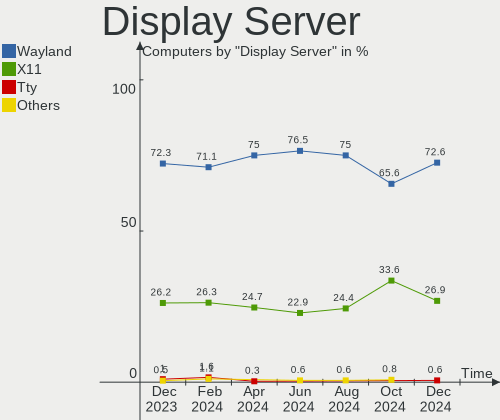
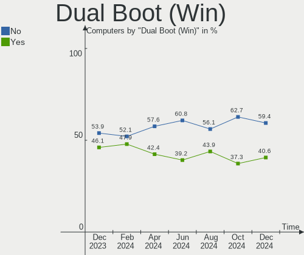
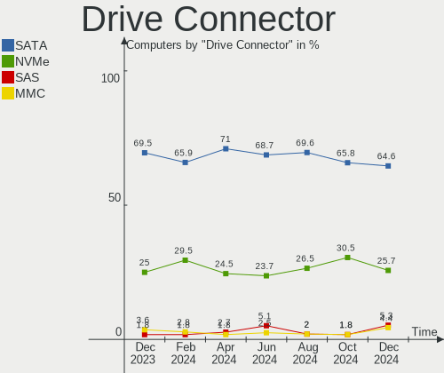

ROSA - Hardware Trends
----------------------

A project to identify most popular hardware characteristics and track their change
over time based on data collected by Linux users at https://Linux-Hardware.org.

Anyone can contribute to this report by the [hw-probe](https://github.com/linuxhw/hw-probe) tool:

    sudo -E hw-probe -all -upload

This is a report for all computer types. See also reports for [desktops](/Dist/ROSA/Desktop/README.md) and [notebooks](/Dist/ROSA/Notebook/README.md).

This report is for one last month. Overall report since the beginning of time: [TestDays](https://github.com/linuxhw/TestDays)

Period: Feb, 2023.

Contents
--------

* [ System ](#system)
  - [ OS                       ](#os)
  - [ OS Family                ](#os-family)
  - [ Kernel                   ](#kernel)
  - [ Kernel Family            ](#kernel-family)
  - [ Kernel Major Ver.        ](#kernel-major-ver)
  - [ Arch                     ](#arch)
  - [ DE                       ](#de)
  - [ Display Server           ](#display-server)
  - [ Display Manager          ](#display-manager)
  - [ OS Lang                  ](#os-lang)
  - [ Boot Mode                ](#boot-mode)
  - [ Filesystem               ](#filesystem)
  - [ Part. scheme             ](#part-scheme)
  - [ Dual Boot with Linux/BSD ](#dual-boot-with-linuxbsd)
  - [ Dual Boot (Win)          ](#dual-boot-win)

* [ Board ](#board)
  - [ Vendor                   ](#vendor)
  - [ Model                    ](#model)
  - [ Model Family             ](#model-family)
  - [ MFG Year                 ](#mfg-year)
  - [ Form Factor              ](#form-factor)
  - [ Secure Boot              ](#secure-boot)
  - [ Coreboot                 ](#coreboot)
  - [ RAM Size                 ](#ram-size)
  - [ RAM Used                 ](#ram-used)
  - [ Total Drives             ](#total-drives)
  - [ Has CD-ROM               ](#has-cd-rom)
  - [ Has Ethernet             ](#has-ethernet)
  - [ Has WiFi                 ](#has-wifi)
  - [ Has Bluetooth            ](#has-bluetooth)

* [ Location ](#location)
  - [ Country                  ](#country)
  - [ City                     ](#city)

* [ Drives ](#drives)
  - [ Drive Vendor             ](#drive-vendor)
  - [ Drive Model              ](#drive-model)
  - [ HDD Vendor               ](#hdd-vendor)
  - [ SSD Vendor               ](#ssd-vendor)
  - [ Drive Kind               ](#drive-kind)
  - [ Drive Connector          ](#drive-connector)
  - [ Drive Size               ](#drive-size)
  - [ Space Total              ](#space-total)
  - [ Space Used               ](#space-used)
  - [ Malfunc. Drives          ](#malfunc-drives)
  - [ Malfunc. Drive Vendor    ](#malfunc-drive-vendor)
  - [ Malfunc. HDD Vendor      ](#malfunc-hdd-vendor)
  - [ Malfunc. Drive Kind      ](#malfunc-drive-kind)
  - [ Failed Drives            ](#failed-drives)
  - [ Failed Drive Vendor      ](#failed-drive-vendor)
  - [ Drive Status             ](#drive-status)

* [ Storage controller ](#storage-controller)
  - [ Storage Vendor           ](#storage-vendor)
  - [ Storage Model            ](#storage-model)
  - [ Storage Kind             ](#storage-kind)

* [ Processor ](#processor)
  - [ CPU Vendor               ](#cpu-vendor)
  - [ CPU Model                ](#cpu-model)
  - [ CPU Model Family         ](#cpu-model-family)
  - [ CPU Cores                ](#cpu-cores)
  - [ CPU Sockets              ](#cpu-sockets)
  - [ CPU Threads              ](#cpu-threads)
  - [ CPU Op-Modes             ](#cpu-op-modes)
  - [ CPU Microcode            ](#cpu-microcode)
  - [ CPU Microarch            ](#cpu-microarch)

* [ Graphics ](#graphics)
  - [ GPU Vendor               ](#gpu-vendor)
  - [ GPU Model                ](#gpu-model)
  - [ GPU Combo                ](#gpu-combo)
  - [ GPU Driver               ](#gpu-driver)
  - [ GPU Memory               ](#gpu-memory)

* [ Monitor ](#monitor)
  - [ Monitor Vendor           ](#monitor-vendor)
  - [ Monitor Model            ](#monitor-model)
  - [ Monitor Resolution       ](#monitor-resolution)
  - [ Monitor Diagonal         ](#monitor-diagonal)
  - [ Monitor Width            ](#monitor-width)
  - [ Aspect Ratio             ](#aspect-ratio)
  - [ Monitor Area             ](#monitor-area)
  - [ Pixel Density            ](#pixel-density)
  - [ Multiple Monitors        ](#multiple-monitors)

* [ Network ](#network)
  - [ Net Controller Vendor    ](#net-controller-vendor)
  - [ Net Controller Model     ](#net-controller-model)
  - [ Wireless Vendor          ](#wireless-vendor)
  - [ Wireless Model           ](#wireless-model)
  - [ Ethernet Vendor          ](#ethernet-vendor)
  - [ Ethernet Model           ](#ethernet-model)
  - [ Net Controller Kind      ](#net-controller-kind)
  - [ Used Controller          ](#used-controller)
  - [ NICs                     ](#nics)
  - [ IPv6                     ](#ipv6)

* [ Bluetooth ](#bluetooth)
  - [ Bluetooth Vendor         ](#bluetooth-vendor)
  - [ Bluetooth Model          ](#bluetooth-model)

* [ Sound ](#sound)
  - [ Sound Vendor             ](#sound-vendor)
  - [ Sound Model              ](#sound-model)

* [ Memory ](#memory)
  - [ Memory Vendor            ](#memory-vendor)
  - [ Memory Model             ](#memory-model)
  - [ Memory Kind              ](#memory-kind)
  - [ Memory Form Factor       ](#memory-form-factor)
  - [ Memory Size              ](#memory-size)
  - [ Memory Speed             ](#memory-speed)

* [ Printers & scanners ](#printers--scanners)
  - [ Printer Vendor           ](#printer-vendor)
  - [ Printer Model            ](#printer-model)
  - [ Scanner Vendor           ](#scanner-vendor)
  - [ Scanner Model            ](#scanner-model)

* [ Camera ](#camera)
  - [ Camera Vendor            ](#camera-vendor)
  - [ Camera Model             ](#camera-model)

* [ Security ](#security)
  - [ Fingerprint Vendor       ](#fingerprint-vendor)
  - [ Fingerprint Model        ](#fingerprint-model)
  - [ Chipcard Vendor          ](#chipcard-vendor)
  - [ Chipcard Model           ](#chipcard-model)

* [ Unsupported ](#unsupported)
  - [ Unsupported Devices      ](#unsupported-devices)
  - [ Unsupported Device Types ](#unsupported-device-types)

System
------

OS
--

Installed operating systems

| Name        | Computers | Percent |
|-------------|-----------|---------|
| ROSA 12.3   | 153       | 81.38%  |
| ROSA R11.1  | 15        | 7.98%   |
| ROSA 12.2   | 8         | 4.26%   |
| ROSA 12.1   | 4         | 2.13%   |
| ROSA 12     | 4         | 2.13%   |
| ROSA R8.1   | 1         | 0.53%   |
| ROSA R11    | 1         | 0.53%   |
| ROSA 2021.1 | 1         | 0.53%   |
| ROSA 1.0    | 1         | 0.53%   |

OS Family
---------

OS without a version

| Name | Computers | Percent |
|------|-----------|---------|
| ROSA | 188       | 100%    |

Kernel
------

Version of the Linux kernel

| Version                                   | Computers | Percent |
|-------------------------------------------|-----------|---------|
| 5.15.79-generic-1rosa2021.1-x86_64        | 56        | 29.79%  |
| 5.15.75-generic-1rosa2021.1-x86_64        | 42        | 22.34%  |
| 5.10.155-generic-1rosa2021.1-x86_64       | 17        | 9.04%   |
| 5.10.74-generic-2rosa2021.1-x86_64        | 11        | 5.85%   |
| 5.15.75-generic-1rosa2021.1-i686          | 9         | 4.79%   |
| 6.0.12.xm1-1.klp-xanmod-rosa2021.1-x86_64 | 8         | 4.26%   |
| 5.17.11-generic-2rosa2021.1-x86_64        | 8         | 4.26%   |
| 6.1.4-generic-1rosa2021.1-x86_64          | 4         | 2.13%   |
| 4.9.155-nrj-desktop-1rosa-x86_64          | 4         | 2.13%   |
| 6.1.10-generic-1rosa2021.1-x86_64         | 3         | 1.6%    |
| 6.0.7.xm1-1.klp-xanmod-rosa2021.1-x86_64  | 3         | 1.6%    |
| 5.10.71-generic-1rosa2021.1-x86_64        | 3         | 1.6%    |
| 5.4.83-generic-2rosa-i586                 | 2         | 1.06%   |
| 5.4.32-generic-2rosa-x86_64               | 2         | 1.06%   |
| 4.15.0-desktop-122.124.1rosa-x86_64       | 2         | 1.06%   |
| 6.1.9.xm1-1.klp-xanmod-rosa2021.1-x86_64  | 1         | 0.53%   |
| 6.1.9-generic-2rosa2021.1-x86_64          | 1         | 0.53%   |
| 6.1.10.xm1-1.klp-xanmod-rosa2021.1-x86_64 | 1         | 0.53%   |
| 5.5.19-generic-1rosa-x86_64               | 1         | 0.53%   |
| 5.4.83-generic-2rosa-x86_64               | 1         | 0.53%   |
| 5.4.32-generic-2rosa-i586                 | 1         | 0.53%   |
| 5.18.19-generic-3rosa2021.1-x86_64        | 1         | 0.53%   |
| 5.15.77-generic-1rosa2021.1-x86_64        | 1         | 0.53%   |
| 5.10.74-generic-2rosa2021.1-i586          | 1         | 0.53%   |
| 5.10.118-generic-2rosa2021.1-x86_64       | 1         | 0.53%   |
| 4.9.155-nrj-desktop-1rosa-i586            | 1         | 0.53%   |
| 4.15.0-desktop-45.1rosa-i586              | 1         | 0.53%   |
| 4.15.0-desktop-122.124.1rosa-i586         | 1         | 0.53%   |
| 4.1.38-nrj-desktop-2rosa-x86_64           | 1         | 0.53%   |

Kernel Family
-------------

Linux kernel without a distro release

| Version  | Computers | Percent |
|----------|-----------|---------|
| 5.15.79  | 56        | 29.79%  |
| 5.15.75  | 51        | 27.13%  |
| 5.10.155 | 17        | 9.04%   |
| 5.10.74  | 12        | 6.38%   |
| 6.0.12   | 8         | 4.26%   |
| 5.17.11  | 8         | 4.26%   |
| 4.9.155  | 5         | 2.66%   |
| 6.1.4    | 4         | 2.13%   |
| 6.1.10   | 4         | 2.13%   |
| 4.15.0   | 4         | 2.13%   |
| 6.0.7    | 3         | 1.6%    |
| 5.4.83   | 3         | 1.6%    |
| 5.4.32   | 3         | 1.6%    |
| 5.10.71  | 3         | 1.6%    |
| 6.1.9    | 2         | 1.06%   |
| 5.5.19   | 1         | 0.53%   |
| 5.18.19  | 1         | 0.53%   |
| 5.15.77  | 1         | 0.53%   |
| 5.10.118 | 1         | 0.53%   |
| 4.1.38   | 1         | 0.53%   |

Kernel Major Ver.
-----------------

Linux kernel major version

| Version | Computers | Percent |
|---------|-----------|---------|
| 5.15    | 108       | 57.45%  |
| 5.10    | 33        | 17.55%  |
| 6.0     | 11        | 5.85%   |
| 6.1     | 10        | 5.32%   |
| 5.17    | 8         | 4.26%   |
| 5.4     | 6         | 3.19%   |
| 4.9     | 5         | 2.66%   |
| 4.15    | 4         | 2.13%   |
| 5.5     | 1         | 0.53%   |
| 5.18    | 1         | 0.53%   |
| 4.1     | 1         | 0.53%   |

Arch
----

OS architecture (x86_64, i586, etc.)

| Name   | Computers | Percent |
|--------|-----------|---------|
| x86_64 | 172       | 91.49%  |
| i686   | 16        | 8.51%   |

DE
--

Desktop Environment

| Name    | Computers | Percent |
|---------|-----------|---------|
| KDE5    | 102       | 54.26%  |
| GNOME   | 51        | 27.13%  |
| LXQt    | 20        | 10.64%  |
| KDE4    | 13        | 6.91%   |
| Unknown | 2         | 1.06%   |

Display Server
--------------

X11 or Wayland

| Name    | Computers | Percent |
|---------|-----------|---------|
| Wayland | 129       | 68.62%  |
| X11     | 57        | 30.32%  |
| Tty     | 1         | 0.53%   |
| Unknown | 1         | 0.53%   |

Display Manager
---------------

SDDM, LightDM, etc.

| Name    | Computers | Percent |
|---------|-----------|---------|
| SDDM    | 94        | 50%     |
| GDM     | 68        | 36.17%  |
| KDM     | 13        | 6.91%   |
| LightDM | 10        | 5.32%   |
| Unknown | 3         | 1.6%    |

OS Lang
-------

Language

| Lang    | Computers | Percent |
|---------|-----------|---------|
| ru_RU   | 167       | 88.83%  |
| en_US   | 4         | 2.13%   |
| fr_FR   | 3         | 1.6%    |
| es_ES   | 3         | 1.6%    |
| it_IT   | 2         | 1.06%   |
| Unknown | 2         | 1.06%   |
| tr_TR   | 1         | 0.53%   |
| pl_PL   | 1         | 0.53%   |
| ja_JP   | 1         | 0.53%   |
| hu_HU   | 1         | 0.53%   |
| es_PE   | 1         | 0.53%   |
| en_GB   | 1         | 0.53%   |
| de_DE   | 1         | 0.53%   |

Boot Mode
---------

EFI or BIOS

| Mode | Computers | Percent |
|------|-----------|---------|
| EFI  | 95        | 50.53%  |
| BIOS | 93        | 49.47%  |

Filesystem
----------

Type of filesystem

| Type  | Computers | Percent |
|-------|-----------|---------|
| Ext4  | 171       | 90.96%  |
| Btrfs | 16        | 8.51%   |
| F2fs  | 1         | 0.53%   |

Part. scheme
------------

Scheme of partitioning

| Type    | Computers | Percent |
|---------|-----------|---------|
| GPT     | 119       | 63.3%   |
| MBR     | 67        | 35.64%  |
| Unknown | 2         | 1.06%   |

Dual Boot with Linux/BSD
------------------------

Hosting more than one Linux/BSD

| Dual boot | Computers | Percent |
|-----------|-----------|---------|
| No        | 130       | 69.15%  |
| Yes       | 58        | 30.85%  |

Dual Boot (Win)
---------------

Hosting Linux and Windows

| Dual boot | Computers | Percent |
|-----------|-----------|---------|
| No        | 99        | 52.66%  |
| Yes       | 89        | 47.34%  |

Board
-----

Vendor
------

Motherboard manufacturer

| Name                | Computers | Percent |
|---------------------|-----------|---------|
| ASUSTek Computer    | 35        | 18.62%  |
| Gigabyte Technology | 26        | 13.83%  |
| MSI                 | 17        | 9.04%   |
| Hewlett-Packard     | 16        | 8.51%   |
| Acer                | 15        | 7.98%   |
| ASRock              | 12        | 6.38%   |
| Lenovo              | 10        | 5.32%   |
| Dell                | 6         | 3.19%   |
| Unknown             | 6         | 3.19%   |
| Biostar             | 4         | 2.13%   |
| Toshiba             | 3         | 1.6%    |
| Sony                | 3         | 1.6%    |
| Samsung Electronics | 3         | 1.6%    |
| Intel               | 3         | 1.6%    |
| Huanan              | 3         | 1.6%    |
| Apple               | 3         | 1.6%    |
| OEM                 | 2         | 1.06%   |
| Haier               | 2         | 1.06%   |
| AMI                 | 2         | 1.06%   |
| WeiBu               | 1         | 0.53%   |
| THUNDEROBOT         | 1         | 0.53%   |
| Pegatron            | 1         | 0.53%   |
| Notebook            | 1         | 0.53%   |
| Medion              | 1         | 0.53%   |
| JGINYUE             | 1         | 0.53%   |
| ICL                 | 1         | 0.53%   |
| IBM                 | 1         | 0.53%   |
| HUAWEI              | 1         | 0.53%   |
| HONOR               | 1         | 0.53%   |
| Graviton            | 1         | 0.53%   |
| EPoX Computer       | 1         | 0.53%   |
| eMachines           | 1         | 0.53%   |
| DNS                 | 1         | 0.53%   |
| Chuwi               | 1         | 0.53%   |
| Casper              | 1         | 0.53%   |
| 3Logic Group        | 1         | 0.53%   |

Model
-----

Motherboard model

| Name                                | Computers | Percent |
|-------------------------------------|-----------|---------|
| Unknown                             | 7         | 3.72%   |
| OEM Intel H81                       | 2         | 1.06%   |
| Haier A1410ED                       | 2         | 1.06%   |
| Biostar A320MH                      | 2         | 1.06%   |
| ASUS PRIME H510M-K                  | 2         | 1.06%   |
| Acer Aspire V3-771                  | 2         | 1.06%   |
| WeiBu PSB133S01ZFP                  | 1         | 0.53%   |
| Toshiba Satellite U300              | 1         | 0.53%   |
| Toshiba Satellite C870-196          | 1         | 0.53%   |
| Toshiba Satellite A300D             | 1         | 0.53%   |
| THUNDEROBOT 911 Plus                | 1         | 0.53%   |
| Sony VPCY11M1R                      | 1         | 0.53%   |
| Sony VPCSB2L1R                      | 1         | 0.53%   |
| Sony SVE14A2V1RWI                   | 1         | 0.53%   |
| Samsung R519/R719                   | 1         | 0.53%   |
| Samsung N102                        | 1         | 0.53%   |
| Samsung 350V5C/351V5C/3540VC/3440VC | 1         | 0.53%   |
| Pegatron Compaq dx2400 Microtower   | 1         | 0.53%   |
| Notebook W65_67SJ                   | 1         | 0.53%   |
| MSI U90/U100                        | 1         | 0.53%   |
| MSI MS-N0E1                         | 1         | 0.53%   |
| MSI MS-7D54                         | 1         | 0.53%   |
| MSI MS-7C83                         | 1         | 0.53%   |
| MSI MS-7C37                         | 1         | 0.53%   |
| MSI MS-7B87                         | 1         | 0.53%   |
| MSI MS-7845                         | 1         | 0.53%   |
| MSI MS-7758                         | 1         | 0.53%   |
| MSI MS-7599                         | 1         | 0.53%   |
| MSI MS-7592                         | 1         | 0.53%   |
| MSI MS-7529                         | 1         | 0.53%   |
| MSI MS-7369                         | 1         | 0.53%   |
| MSI MPG B560 Trident A (MS-B926)    | 1         | 0.53%   |
| MSI GP60 2OD                        | 1         | 0.53%   |
| MSI GEG                             | 1         | 0.53%   |
| MSI Alpha 15 B5EEK                  | 1         | 0.53%   |
| MSI Alpha 15 A3DDK                  | 1         | 0.53%   |
| Medion S23003                       | 1         | 0.53%   |
| Lenovo ThinkPad X201 3680U6V        | 1         | 0.53%   |
| Lenovo ThinkBook 16 G4+ ARA 21D1    | 1         | 0.53%   |
| Lenovo ThinkBook 15 G3 ACL 21A4     | 1         | 0.53%   |

Model Family
------------

Motherboard model prefix

| Name               | Computers | Percent |
|--------------------|-----------|---------|
| Acer Aspire        | 12        | 6.38%   |
| Unknown            | 7         | 3.72%   |
| HP Pavilion        | 4         | 2.13%   |
| HP Compaq          | 4         | 2.13%   |
| Gigabyte B450M     | 4         | 2.13%   |
| Toshiba Satellite  | 3         | 1.6%    |
| ASUS VivoBook      | 3         | 1.6%    |
| ASUS ROG           | 3         | 1.6%    |
| ASUS PRIME         | 3         | 1.6%    |
| OEM Intel          | 2         | 1.06%   |
| MSI Alpha          | 2         | 1.06%   |
| Lenovo ThinkBook   | 2         | 1.06%   |
| HP ProLiant        | 2         | 1.06%   |
| Haier A1410ED      | 2         | 1.06%   |
| Gigabyte B550M     | 2         | 1.06%   |
| Gigabyte B550      | 2         | 1.06%   |
| Dell OptiPlex      | 2         | 1.06%   |
| Dell Inspiron      | 2         | 1.06%   |
| Biostar A320MH     | 2         | 1.06%   |
| ASRock B450M       | 2         | 1.06%   |
| WeiBu PSB133S01ZFP | 1         | 0.53%   |
| THUNDEROBOT 911    | 1         | 0.53%   |
| Sony VPCY11M1R     | 1         | 0.53%   |
| Sony VPCSB2L1R     | 1         | 0.53%   |
| Sony SVE14A2V1RWI  | 1         | 0.53%   |
| Samsung R519       | 1         | 0.53%   |
| Samsung N102       | 1         | 0.53%   |
| Samsung 350V5C     | 1         | 0.53%   |
| Pegatron Compaq    | 1         | 0.53%   |
| Notebook W65       | 1         | 0.53%   |
| MSI U90            | 1         | 0.53%   |
| MSI MS-N0E1        | 1         | 0.53%   |
| MSI MS-7D54        | 1         | 0.53%   |
| MSI MS-7C83        | 1         | 0.53%   |
| MSI MS-7C37        | 1         | 0.53%   |
| MSI MS-7B87        | 1         | 0.53%   |
| MSI MS-7845        | 1         | 0.53%   |
| MSI MS-7758        | 1         | 0.53%   |
| MSI MS-7599        | 1         | 0.53%   |
| MSI MS-7592        | 1         | 0.53%   |

MFG Year
--------

Motherboard manufacture year

| Year | Computers | Percent |
|------|-----------|---------|
| 2021 | 21        | 11.17%  |
| 2011 | 17        | 9.04%   |
| 2020 | 15        | 7.98%   |
| 2012 | 15        | 7.98%   |
| 2009 | 14        | 7.45%   |
| 2018 | 13        | 6.91%   |
| 2013 | 13        | 6.91%   |
| 2010 | 12        | 6.38%   |
| 2019 | 11        | 5.85%   |
| 2022 | 8         | 4.26%   |
| 2008 | 8         | 4.26%   |
| 2007 | 8         | 4.26%   |
| 2016 | 7         | 3.72%   |
| 2017 | 6         | 3.19%   |
| 2014 | 6         | 3.19%   |
| 2006 | 6         | 3.19%   |
| 2015 | 5         | 2.66%   |
| 2005 | 2         | 1.06%   |
| 2004 | 1         | 0.53%   |

Form Factor
-----------

Physical design of the computer

| Name        | Computers | Percent |
|-------------|-----------|---------|
| Desktop     | 103       | 54.79%  |
| Notebook    | 78        | 41.49%  |
| Mini pc     | 3         | 1.6%    |
| All in one  | 3         | 1.6%    |
| Convertible | 1         | 0.53%   |

Secure Boot
-----------

Enabled or disabled

| State    | Computers | Percent |
|----------|-----------|---------|
| Disabled | 188       | 100%    |

Coreboot
--------

Have coreboot on board

| Used | Computers | Percent |
|------|-----------|---------|
| No   | 188       | 100%    |

RAM Size
--------

Total RAM memory

| Size in GB  | Computers | Percent |
|-------------|-----------|---------|
| 3.01-4.0    | 41        | 21.81%  |
| 8.01-16.0   | 39        | 20.74%  |
| 16.01-24.0  | 37        | 19.68%  |
| 4.01-8.0    | 36        | 19.15%  |
| 1.01-2.0    | 15        | 7.98%   |
| 2.01-3.0    | 7         | 3.72%   |
| 32.01-64.0  | 6         | 3.19%   |
| 64.01-256.0 | 4         | 2.13%   |
| 24.01-32.0  | 3         | 1.6%    |

RAM Used
--------

Used RAM memory

| Used GB    | Computers | Percent |
|------------|-----------|---------|
| 1.01-2.0   | 92        | 48.94%  |
| 0.51-1.0   | 45        | 23.94%  |
| 2.01-3.0   | 32        | 17.02%  |
| 3.01-4.0   | 10        | 5.32%   |
| 4.01-8.0   | 7         | 3.72%   |
| 16.01-24.0 | 1         | 0.53%   |
| 8.01-16.0  | 1         | 0.53%   |

Total Drives
------------

Number of drives on board

| Drives | Computers | Percent |
|--------|-----------|---------|
| 1      | 97        | 51.6%   |
| 2      | 52        | 27.66%  |
| 3      | 18        | 9.57%   |
| 4      | 14        | 7.45%   |
| 6      | 5         | 2.66%   |
| 10     | 1         | 0.53%   |
| 5      | 1         | 0.53%   |

Has CD-ROM
----------

Has CD-ROM on board

| Presented | Computers | Percent |
|-----------|-----------|---------|
| No        | 119       | 63.3%   |
| Yes       | 69        | 36.7%   |

Has Ethernet
------------

Has Ethernet on board

| Presented | Computers | Percent |
|-----------|-----------|---------|
| Yes       | 177       | 94.15%  |
| No        | 11        | 5.85%   |

Has WiFi
--------

Has WiFi module

| Presented | Computers | Percent |
|-----------|-----------|---------|
| Yes       | 119       | 63.3%   |
| No        | 69        | 36.7%   |

Has Bluetooth
-------------

Has Bluetooth module

| Presented | Computers | Percent |
|-----------|-----------|---------|
| No        | 101       | 53.72%  |
| Yes       | 87        | 46.28%  |

Location
--------

Country
-------

Geographic location (country)

| Country     | Computers | Percent |
|-------------|-----------|---------|
| Russia      | 152       | 80.85%  |
| Ukraine     | 4         | 2.13%   |
| Spain       | 3         | 1.6%    |
| Poland      | 3         | 1.6%    |
| Hungary     | 3         | 1.6%    |
| France      | 3         | 1.6%    |
| Belarus     | 3         | 1.6%    |
| Kazakhstan  | 2         | 1.06%   |
| Italy       | 2         | 1.06%   |
| Germany     | 2         | 1.06%   |
| Czechia     | 2         | 1.06%   |
| Venezuela   | 1         | 0.53%   |
| Uzbekistan  | 1         | 0.53%   |
| Turkey      | 1         | 0.53%   |
| Serbia      | 1         | 0.53%   |
| Peru        | 1         | 0.53%   |
| Japan       | 1         | 0.53%   |
| Ivory Coast | 1         | 0.53%   |
| China       | 1         | 0.53%   |
| Australia   | 1         | 0.53%   |

City
----

Geographic location (city)

| City                | Computers | Percent |
|---------------------|-----------|---------|
| Moscow              | 20        | 10.64%  |
| St Petersburg       | 17        | 9.04%   |
| Yekaterinburg       | 5         | 2.66%   |
| Krasnodar           | 5         | 2.66%   |
| Barnaul             | 5         | 2.66%   |
| Ufa                 | 4         | 2.13%   |
| Samara              | 3         | 1.6%    |
| Omsk                | 3         | 1.6%    |
| Krasnoyarsk         | 3         | 1.6%    |
| Kaluga              | 3         | 1.6%    |
| Volgograd           | 2         | 1.06%   |
| Simferopol          | 2         | 1.06%   |
| Perm                | 2         | 1.06%   |
| Novosibirsk         | 2         | 1.06%   |
| Nizhny Tagil        | 2         | 1.06%   |
| Nizhniy Novgorod    | 2         | 1.06%   |
| Naberezhnyye Chelny | 2         | 1.06%   |
| Lipetsk             | 2         | 1.06%   |
| Kirov               | 2         | 1.06%   |
| Kemerovo            | 2         | 1.06%   |
| Kazan’            | 2         | 1.06%   |
| Irkutsk             | 2         | 1.06%   |
| Gomel               | 2         | 1.06%   |
| Chelyabinsk         | 2         | 1.06%   |
| Belgorod            | 2         | 1.06%   |
| Barcelona           | 2         | 1.06%   |
| Balakovo            | 2         | 1.06%   |
| Almaty              | 2         | 1.06%   |
| Zhodzina            | 1         | 0.53%   |
| Zelenodolsk         | 1         | 0.53%   |
| Yoshkar-Ola         | 1         | 0.53%   |
| Yaya                | 1         | 0.53%   |
| Yaroslavl           | 1         | 0.53%   |
| Yalutorovsk         | 1         | 0.53%   |
| Vyazma              | 1         | 0.53%   |
| Votkinsk            | 1         | 0.53%   |
| Vladimir            | 1         | 0.53%   |
| Ukhta               | 1         | 0.53%   |
| Tsarskoye Selo      | 1         | 0.53%   |
| Tolyatti            | 1         | 0.53%   |

Drives
------

Drive Vendor
------------

Hard drive vendors

| Vendor              | Computers | Drives | Percent |
|---------------------|-----------|--------|---------|
| WDC                 | 62        | 75     | 20.06%  |
| Seagate             | 49        | 68     | 15.86%  |
| Kingston            | 24        | 24     | 7.77%   |
| Samsung Electronics | 22        | 26     | 7.12%   |
| Toshiba             | 19        | 20     | 6.15%   |
| Hitachi             | 19        | 20     | 6.15%   |
| Unknown             | 7         | 7      | 2.27%   |
| China               | 7         | 7      | 2.27%   |
| A-DATA Technology   | 7         | 7      | 2.27%   |
| SPCC                | 6         | 6      | 1.94%   |
| Intel               | 6         | 6      | 1.94%   |
| Transcend           | 5         | 5      | 1.62%   |
| SanDisk             | 4         | 4      | 1.29%   |
| Micron Technology   | 4         | 4      | 1.29%   |
| Maxtor              | 4         | 4      | 1.29%   |
| AMD                 | 4         | 4      | 1.29%   |
| Smartbuy            | 3         | 3      | 0.97%   |
| SK hynix            | 3         | 3      | 0.97%   |
| Patriot             | 3         | 3      | 0.97%   |
| Netac               | 3         | 3      | 0.97%   |
| KingSpec            | 3         | 3      | 0.97%   |
| HGST                | 3         | 3      | 0.97%   |
| Crucial             | 3         | 3      | 0.97%   |
| Apacer              | 3         | 3      | 0.97%   |
| XrayDisk            | 2         | 2      | 0.65%   |
| TO Exter            | 2         | 2      | 0.65%   |
| Team                | 2         | 2      | 0.65%   |
| Silicon Motion      | 2         | 2      | 0.65%   |
| Plextor             | 2         | 2      | 0.65%   |
| Phison              | 2         | 2      | 0.65%   |
| Hewlett-Packard     | 2         | 9      | 0.65%   |
| Gigabyte Technology | 2         | 2      | 0.65%   |
| SSSTC               | 1         | 1      | 0.32%   |
| ShiJi               | 1         | 1      | 0.32%   |
| ROKOT               | 1         | 1      | 0.32%   |
| R5SL240G            | 1         | 1      | 0.32%   |
| Qumo                | 1         | 1      | 0.32%   |
| OCZ                 | 1         | 1      | 0.32%   |
| Neo                 | 1         | 1      | 0.32%   |
| Min Yi U            | 1         | 1      | 0.32%   |

Drive Model
-----------

Hard drive models

| Model                            | Computers | Percent |
|----------------------------------|-----------|---------|
| Kingston SA400S37240G 240GB SSD  | 7         | 2.06%   |
| WDC WDS240G2G0A-00JH30 240GB SSD | 4         | 1.18%   |
| Seagate ST500DM002-1BD142 500GB  | 4         | 1.18%   |
| WDC WD10EZRZ-00HTKB0 1TB         | 3         | 0.88%   |
| WDC WD10EZEX-08WN4A0 1TB         | 3         | 0.88%   |
| Toshiba MQ01ABF050 500GB         | 3         | 0.88%   |
| Toshiba HDWD110 1TB              | 3         | 0.88%   |
| Seagate ST3250310AS 250GB        | 3         | 0.88%   |
| Seagate ST1000LM049-2GH172 1TB   | 3         | 0.88%   |
| Kingston SNVS500G 500GB          | 3         | 0.88%   |
| Kingston SA400S37120G 120GB SSD  | 3         | 0.88%   |
| Hitachi HDS721050CLA360 500GB    | 3         | 0.88%   |
| WDC WDS120G2G0A-00JH30 120GB SSD | 2         | 0.59%   |
| WDC WD5000LPVX-22V0TT0 500GB     | 2         | 0.59%   |
| WDC WD5000LPCX-21VHAT0 500GB     | 2         | 0.59%   |
| WDC WD1600AAJS-00PSA0 160GB      | 2         | 0.59%   |
| WDC WD10EZEX-08M2NA0 1TB         | 2         | 0.59%   |
| Unknown SLD64G  64GB             | 2         | 0.59%   |
| Toshiba MQ01ABD100 1TB           | 2         | 0.59%   |
| Toshiba DT01ACA100 1TB           | 2         | 0.59%   |
| TO Exter nal USB 3.0 240GB       | 2         | 0.59%   |
| Team T253120GB SSD               | 2         | 0.59%   |
| SPCC Solid State Disk 128GB      | 2         | 0.59%   |
| Seagate ST380815AS 80GB          | 2         | 0.59%   |
| Seagate ST3500418AS 500GB        | 2         | 0.59%   |
| Seagate ST320LT020-9YG142 320GB  | 2         | 0.59%   |
| Seagate ST3160318AS 160GB        | 2         | 0.59%   |
| Seagate ST1000DM003-1CH162 1TB   | 2         | 0.59%   |
| Samsung SSD 860 EVO 250GB        | 2         | 0.59%   |
| Samsung SSD 750 EVO 250GB        | 2         | 0.59%   |
| Kingston SA400S37480G 480GB SSD  | 2         | 0.59%   |
| Intel SSDPEKNU512GZ 512GB        | 2         | 0.59%   |
| Hitachi HDS721050CLA362 500GB    | 2         | 0.59%   |
| Gigabyte GP-GSM2NE3256GNTD 256GB | 2         | 0.59%   |
| China SSD 512GB                  | 2         | 0.59%   |
| XrayDisk SSD 256GB               | 1         | 0.29%   |
| XrayDisk SSD 120GB               | 1         | 0.29%   |
| WDC WDS500G2B0A-00SM50 500GB SSD | 1         | 0.29%   |
| WDC WDS250G2B0A-00SM50 250GB SSD | 1         | 0.29%   |
| WDC WDS250G2B0A 250GB SSD        | 1         | 0.29%   |

HDD Vendor
----------

Hard disk drive vendors

| Vendor              | Computers | Drives | Percent |
|---------------------|-----------|--------|---------|
| WDC                 | 51        | 58     | 33.55%  |
| Seagate             | 48        | 67     | 31.58%  |
| Hitachi             | 19        | 20     | 12.5%   |
| Toshiba             | 18        | 19     | 11.84%  |
| Samsung Electronics | 5         | 5      | 3.29%   |
| Maxtor              | 4         | 4      | 2.63%   |
| HGST                | 3         | 3      | 1.97%   |
| Unknown             | 1         | 1      | 0.66%   |
| Intenso             | 1         | 1      | 0.66%   |
| Hewlett-Packard     | 1         | 8      | 0.66%   |
| Fujitsu             | 1         | 1      | 0.66%   |

SSD Vendor
----------

Solid state drive vendors

| Vendor              | Computers | Drives | Percent |
|---------------------|-----------|--------|---------|
| Kingston            | 21        | 21     | 18.58%  |
| WDC                 | 10        | 11     | 8.85%   |
| Samsung Electronics | 10        | 14     | 8.85%   |
| China               | 7         | 7      | 6.19%   |
| A-DATA Technology   | 6         | 6      | 5.31%   |
| SPCC                | 5         | 5      | 4.42%   |
| Transcend           | 3         | 3      | 2.65%   |
| Smartbuy            | 3         | 3      | 2.65%   |
| SanDisk             | 3         | 3      | 2.65%   |
| Netac               | 3         | 3      | 2.65%   |
| KingSpec            | 3         | 3      | 2.65%   |
| AMD                 | 3         | 3      | 2.65%   |
| XrayDisk            | 2         | 2      | 1.77%   |
| TO Exter            | 2         | 2      | 1.77%   |
| Team                | 2         | 2      | 1.77%   |
| Plextor             | 2         | 2      | 1.77%   |
| Patriot             | 2         | 2      | 1.77%   |
| Intel               | 2         | 2      | 1.77%   |
| Crucial             | 2         | 2      | 1.77%   |
| Apacer              | 2         | 2      | 1.77%   |
| Unknown             | 1         | 1      | 0.88%   |
| Toshiba             | 1         | 1      | 0.88%   |
| SK hynix            | 1         | 1      | 0.88%   |
| ShiJi               | 1         | 1      | 0.88%   |
| ROKOT               | 1         | 1      | 0.88%   |
| Qumo                | 1         | 1      | 0.88%   |
| Phison              | 1         | 1      | 0.88%   |
| OCZ                 | 1         | 1      | 0.88%   |
| Neo                 | 1         | 1      | 0.88%   |
| Micron Technology   | 1         | 1      | 0.88%   |
| Lite-On             | 1         | 1      | 0.88%   |
| Kingmax             | 1         | 1      | 0.88%   |
| Intenso             | 1         | 1      | 0.88%   |
| HS-SSD-C100         | 1         | 1      | 0.88%   |
| Hewlett-Packard     | 1         | 1      | 0.88%   |
| FASTDISK            | 1         | 1      | 0.88%   |
| Colorful            | 1         | 1      | 0.88%   |
| BUFFALO             | 1         | 1      | 0.88%   |
| Apple               | 1         | 1      | 0.88%   |
| AFOX                | 1         | 1      | 0.88%   |

Drive Kind
----------

HDD or SSD

| Kind    | Computers | Drives | Percent |
|---------|-----------|--------|---------|
| HDD     | 118       | 187    | 45.74%  |
| SSD     | 94        | 118    | 36.43%  |
| NVMe    | 39        | 42     | 15.12%  |
| MMC     | 6         | 6      | 2.33%   |
| Unknown | 1         | 2      | 0.39%   |

Drive Connector
---------------

SATA, SAS, NVMe, etc.

| Type | Computers | Drives | Percent |
|------|-----------|--------|---------|
| SATA | 170       | 295    | 75.56%  |
| NVMe | 39        | 42     | 17.33%  |
| SAS  | 10        | 12     | 4.44%   |
| MMC  | 6         | 6      | 2.67%   |

Drive Size
----------

Size of hard drive

| Size in TB | Computers | Drives | Percent |
|------------|-----------|--------|---------|
| 0.01-0.5   | 142       | 205    | 63.96%  |
| 0.51-1.0   | 59        | 71     | 26.58%  |
| 1.01-2.0   | 11        | 19     | 4.95%   |
| 4.01-10.0  | 5         | 5      | 2.25%   |
| 2.01-3.0   | 3         | 3      | 1.35%   |
| 3.01-4.0   | 2         | 2      | 0.9%    |

Space Total
-----------

Amount of disk space available on the file system

| Size in GB     | Computers | Percent |
|----------------|-----------|---------|
| 101-250        | 59        | 31.38%  |
| 251-500        | 24        | 12.77%  |
| 501-1000       | 23        | 12.23%  |
| 51-100         | 22        | 11.7%   |
| 1-20           | 19        | 10.11%  |
| 1001-2000      | 15        | 7.98%   |
| 21-50          | 11        | 5.85%   |
| More than 3000 | 9         | 4.79%   |
| 2001-3000      | 6         | 3.19%   |

Space Used
----------

Amount of used disk space

| Used GB        | Computers | Percent |
|----------------|-----------|---------|
| 1-20           | 102       | 54.26%  |
| 51-100         | 21        | 11.17%  |
| 21-50          | 20        | 10.64%  |
| 101-250        | 15        | 7.98%   |
| 501-1000       | 10        | 5.32%   |
| 1001-2000      | 9         | 4.79%   |
| 251-500        | 6         | 3.19%   |
| 2001-3000      | 3         | 1.6%    |
| More than 3000 | 2         | 1.06%   |

Malfunc. Drives
---------------

Drive models with a malfunction

| Model                            | Computers | Drives | Percent |
|----------------------------------|-----------|--------|---------|
| Seagate ST3250310AS 250GB        | 3         | 3      | 3.8%    |
| Toshiba DT01ACA100 1TB           | 2         | 3      | 2.53%   |
| Seagate ST500DM002-1BD142 500GB  | 2         | 2      | 2.53%   |
| Seagate ST320LT020-9YG142 320GB  | 2         | 2      | 2.53%   |
| Seagate ST1000DM003-1CH162 1TB   | 2         | 2      | 2.53%   |
| Hitachi HDS721050CLA360 500GB    | 2         | 2      | 2.53%   |
| WDC WDS240G2G0A-00JH30 240GB SSD | 1         | 1      | 1.27%   |
| WDC WDS120G2G0B-00EPW0 120GB SSD | 1         | 1      | 1.27%   |
| WDC WD7500BPVT-24HXZT1 752GB     | 1         | 1      | 1.27%   |
| WDC WD6400BPVT-00HXZT1 640GB     | 1         | 1      | 1.27%   |
| WDC WD5000LPVX-22V0TT0 500GB     | 1         | 1      | 1.27%   |
| WDC WD5000LPCX-21VHAT0 500GB     | 1         | 1      | 1.27%   |
| WDC WD5000AAKX-08ERMA0 500GB     | 1         | 1      | 1.27%   |
| WDC WD5000AAKS-00A7B0 500GB      | 1         | 1      | 1.27%   |
| WDC WD3200BPVT-22ZEST0 320GB     | 1         | 1      | 1.27%   |
| WDC WD3200BPVT-00JJ5T0 320GB     | 1         | 1      | 1.27%   |
| WDC WD3200BEKT-08PVMT1 320GB     | 1         | 1      | 1.27%   |
| WDC WD2500BEKT-60PVMT0 250GB     | 1         | 1      | 1.27%   |
| WDC WD1600AAJS-00PSA0 160GB      | 1         | 1      | 1.27%   |
| WDC WD15EARX-00PASB0 1TB         | 1         | 1      | 1.27%   |
| WDC WD10EADS-00M2B0 1TB          | 1         | 1      | 1.27%   |
| WDC WD10EADS-00L5B1 1TB          | 1         | 1      | 1.27%   |
| Transcend TS32GMSA310 32GB SSD   | 1         | 1      | 1.27%   |
| Toshiba MK3265GSXN 320GB         | 1         | 1      | 1.27%   |
| Toshiba MK2555GSX 250GB          | 1         | 1      | 1.27%   |
| Toshiba HDWF180 8TB              | 1         | 1      | 1.27%   |
| Toshiba DT01ACA050 500GB         | 1         | 1      | 1.27%   |
| SK hynix SC401 SATA 256GB SSD    | 1         | 1      | 1.27%   |
| Seagate ST96812A 64GB            | 1         | 1      | 1.27%   |
| Seagate ST9500325AS 500GB        | 1         | 1      | 1.27%   |
| Seagate ST9320325AS 320GB        | 1         | 1      | 1.27%   |
| Seagate ST9250315AS 250GB        | 1         | 1      | 1.27%   |
| Seagate ST9160310AS 160GB        | 1         | 1      | 1.27%   |
| Seagate ST500LT012-9WS142 500GB  | 1         | 1      | 1.27%   |
| Seagate ST500LT012-1DG142 500GB  | 1         | 1      | 1.27%   |
| Seagate ST3808110AS 80GB         | 1         | 1      | 1.27%   |
| Seagate ST3750640AS 752GB        | 1         | 1      | 1.27%   |
| Seagate ST3500418AS 500GB        | 1         | 1      | 1.27%   |
| Seagate ST3320613AS 320GB        | 1         | 1      | 1.27%   |
| Seagate ST31000528AS 1TB         | 1         | 1      | 1.27%   |

Malfunc. Drive Vendor
---------------------

Vendors of faulty drives

| Vendor              | Computers | Drives | Percent |
|---------------------|-----------|--------|---------|
| Seagate             | 22        | 24     | 28.95%  |
| WDC                 | 15        | 16     | 19.74%  |
| Hitachi             | 11        | 11     | 14.47%  |
| Toshiba             | 6         | 7      | 7.89%   |
| Samsung Electronics | 5         | 5      | 6.58%   |
| China               | 3         | 3      | 3.95%   |
| Maxtor              | 2         | 2      | 2.63%   |
| Transcend           | 1         | 1      | 1.32%   |
| SK hynix            | 1         | 1      | 1.32%   |
| Qumo                | 1         | 1      | 1.32%   |
| OCZ                 | 1         | 1      | 1.32%   |
| Neo                 | 1         | 1      | 1.32%   |
| KingSpec            | 1         | 1      | 1.32%   |
| Kingmax             | 1         | 1      | 1.32%   |
| Intel               | 1         | 1      | 1.32%   |
| HGST                | 1         | 1      | 1.32%   |
| Hewlett-Packard     | 1         | 1      | 1.32%   |
| FASTDISK            | 1         | 1      | 1.32%   |
| AMD                 | 1         | 1      | 1.32%   |

Malfunc. HDD Vendor
-------------------

Vendors of faulty HDD drives

| Vendor              | Computers | Drives | Percent |
|---------------------|-----------|--------|---------|
| Seagate             | 22        | 24     | 37.29%  |
| WDC                 | 13        | 14     | 22.03%  |
| Hitachi             | 11        | 11     | 18.64%  |
| Toshiba             | 6         | 7      | 10.17%  |
| Samsung Electronics | 4         | 4      | 6.78%   |
| Maxtor              | 2         | 2      | 3.39%   |
| HGST                | 1         | 1      | 1.69%   |

Malfunc. Drive Kind
-------------------

Kinds of faulty drives

| Kind | Computers | Drives | Percent |
|------|-----------|--------|---------|
| HDD  | 50        | 63     | 74.63%  |
| SSD  | 15        | 15     | 22.39%  |
| NVMe | 2         | 2      | 2.99%   |

Failed Drives
-------------

Failed drive models

| Model                   | Computers | Drives | Percent |
|-------------------------|-----------|--------|---------|
| WDC WD800JB-00JJC0 80GB | 1         | 1      | 100%    |

Failed Drive Vendor
-------------------

Failed drive vendors

| Vendor | Computers | Drives | Percent |
|--------|-----------|--------|---------|
| WDC    | 1         | 1      | 100%    |

Drive Status
------------

Number of failed and malfunc. drives

| Status   | Computers | Drives | Percent |
|----------|-----------|--------|---------|
| Works    | 151       | 256    | 65.09%  |
| Malfunc  | 64        | 80     | 27.59%  |
| Detected | 16        | 18     | 6.9%    |
| Failed   | 1         | 1      | 0.43%   |

Storage controller
------------------

Storage Vendor
--------------

Storage controller vendors

| Vendor                         | Computers | Percent |
|--------------------------------|-----------|---------|
| Intel                          | 132       | 55.7%   |
| AMD                            | 44        | 18.57%  |
| Nvidia                         | 9         | 3.8%    |
| Samsung Electronics            | 8         | 3.38%   |
| SanDisk                        | 6         | 2.53%   |
| ASMedia Technology             | 5         | 2.11%   |
| Silicon Motion                 | 4         | 1.69%   |
| Phison Electronics             | 4         | 1.69%   |
| Kingston Technology Company    | 4         | 1.69%   |
| Micron Technology              | 3         | 1.27%   |
| Marvell Technology Group       | 3         | 1.27%   |
| SK hynix                       | 2         | 0.84%   |
| MAXIO Technology (Hangzhou)    | 2         | 0.84%   |
| JMicron Technology             | 2         | 0.84%   |
| Hewlett-Packard                | 2         | 0.84%   |
| VIA Technologies               | 1         | 0.42%   |
| Transcend                      | 1         | 0.42%   |
| Solid State Storage Technology | 1         | 0.42%   |
| Shenzhen Longsys Electronics   | 1         | 0.42%   |
| Seagate Technology             | 1         | 0.42%   |
| Micron/Crucial Technology      | 1         | 0.42%   |
| ADATA Technology               | 1         | 0.42%   |

Storage Model
-------------

Storage controller models

| Model                                                                                   | Computers | Percent |
|-----------------------------------------------------------------------------------------|-----------|---------|
| AMD FCH SATA Controller [AHCI mode]                                                     | 22        | 7.51%   |
| AMD SB7x0/SB8x0/SB9x0 IDE Controller                                                    | 11        | 3.75%   |
| Intel 8 Series/C220 Series Chipset Family 6-port SATA Controller 1 [AHCI mode]          | 10        | 3.41%   |
| Intel 7 Series Chipset Family 6-port SATA Controller [AHCI mode]                        | 8         | 2.73%   |
| AMD SB7x0/SB8x0/SB9x0 SATA Controller [AHCI mode]                                       | 8         | 2.73%   |
| AMD 400 Series Chipset SATA Controller                                                  | 8         | 2.73%   |
| Intel NM10/ICH7 Family SATA Controller [IDE mode]                                       | 7         | 2.39%   |
| Intel 82801G (ICH7 Family) IDE Controller                                               | 7         | 2.39%   |
| Intel Celeron/Pentium Silver Processor SATA Controller                                  | 6         | 2.05%   |
| AMD 500 Series Chipset SATA Controller                                                  | 6         | 2.05%   |
| Intel 82801IBM/IEM (ICH9M/ICH9M-E) 4 port SATA Controller [AHCI mode]                   | 5         | 1.71%   |
| Intel 6 Series/C200 Series Chipset Family 6 port Mobile SATA AHCI Controller            | 5         | 1.71%   |
| Intel 6 Series/C200 Series Chipset Family 6 port Desktop SATA AHCI Controller           | 5         | 1.71%   |
| Intel 500 Series Chipset Family SATA AHCI Controller                                    | 5         | 1.71%   |
| ASMedia ASM1062 Serial ATA Controller                                                   | 5         | 1.71%   |
| AMD SB7x0/SB8x0/SB9x0 SATA Controller [IDE mode]                                        | 5         | 1.71%   |
| Samsung NVMe SSD Controller SM981/PM981/PM983                                           | 4         | 1.37%   |
| Kingston Company Company Non-Volatile memory controller                                 | 4         | 1.37%   |
| Intel Sunrise Point-LP SATA Controller [AHCI mode]                                      | 4         | 1.37%   |
| Intel NM10/ICH7 Family SATA Controller [AHCI mode]                                      | 4         | 1.37%   |
| Intel 82801JI (ICH10 Family) 4 port SATA IDE Controller #1                              | 4         | 1.37%   |
| Intel 82801JI (ICH10 Family) 2 port SATA IDE Controller #2                              | 4         | 1.37%   |
| Intel 82801HM/HEM (ICH8M/ICH8M-E) SATA Controller [AHCI mode]                           | 4         | 1.37%   |
| Intel 82801HM/HEM (ICH8M/ICH8M-E) IDE Controller                                        | 4         | 1.37%   |
| Intel 82801 Mobile SATA Controller [RAID mode]                                          | 4         | 1.37%   |
| Intel 400 Series Chipset Family SATA AHCI Controller                                    | 4         | 1.37%   |
| AMD FCH SATA Controller D                                                               | 4         | 1.37%   |
| Silicon Motion SM2263EN/SM2263XT SSD Controller                                         | 3         | 1.02%   |
| SanDisk WD Black SN750 / PC SN730 NVMe SSD                                              | 3         | 1.02%   |
| Phison PS5013 E13 NVMe Controller                                                       | 3         | 1.02%   |
| Nvidia CK804 Serial ATA Controller                                                      | 3         | 1.02%   |
| Nvidia CK804 IDE                                                                        | 3         | 1.02%   |
| Micron Non-Volatile memory controller                                                   | 3         | 1.02%   |
| Intel Comet Lake SATA AHCI Controller                                                   | 3         | 1.02%   |
| Intel Atom Processor E3800 Series SATA AHCI Controller                                  | 3         | 1.02%   |
| Intel 7 Series/C210 Series Chipset Family 6-port SATA Controller [AHCI mode]            | 3         | 1.02%   |
| Intel 6 Series/C200 Series Chipset Family Desktop SATA Controller (IDE mode, ports 4-5) | 3         | 1.02%   |
| Intel 6 Series/C200 Series Chipset Family Desktop SATA Controller (IDE mode, ports 0-3) | 3         | 1.02%   |
| Intel 5 Series/3400 Series Chipset 4 port SATA AHCI Controller                          | 3         | 1.02%   |
| Samsung NVMe SSD Controller SM961/PM961/SM963                                           | 2         | 0.68%   |

Storage Kind
------------

Kind of storage controller (IDE, SATA, NVMe, SAS, ...)

| Kind | Computers | Percent |
|------|-----------|---------|
| SATA | 148       | 60.91%  |
| IDE  | 49        | 20.16%  |
| NVMe | 39        | 16.05%  |
| RAID | 7         | 2.88%   |

Processor
---------

CPU Vendor
----------

Processor vendors

| Vendor | Computers | Percent |
|--------|-----------|---------|
| Intel  | 134       | 71.28%  |
| AMD    | 54        | 28.72%  |

CPU Model
---------

Processor models

| Model                                       | Computers | Percent |
|---------------------------------------------|-----------|---------|
| Intel Core i5-3210M CPU @ 2.50GHz           | 3         | 1.6%    |
| AMD Ryzen 5 5600X 6-Core Processor          | 3         | 1.6%    |
| Intel Xeon CPU E5-2670 v2 @ 2.50GHz         | 2         | 1.06%   |
| Intel Core i5-7200U CPU @ 2.50GHz           | 2         | 1.06%   |
| Intel Core i5-5200U CPU @ 2.20GHz           | 2         | 1.06%   |
| Intel Core i5-4570 CPU @ 3.20GHz            | 2         | 1.06%   |
| Intel Core i5-4200M CPU @ 2.50GHz           | 2         | 1.06%   |
| Intel Core i5-2400 CPU @ 3.10GHz            | 2         | 1.06%   |
| Intel Core i5-10400 CPU @ 2.90GHz           | 2         | 1.06%   |
| Intel Core i5 CPU M 520 @ 2.40GHz           | 2         | 1.06%   |
| Intel Core i3-3217U CPU @ 1.80GHz           | 2         | 1.06%   |
| Intel Core i3-2310M CPU @ 2.10GHz           | 2         | 1.06%   |
| Intel Core i3-10110U CPU @ 2.10GHz          | 2         | 1.06%   |
| Intel Core i3-10100F CPU @ 3.60GHz          | 2         | 1.06%   |
| Intel Core 2 Quad CPU Q9550 @ 2.83GHz       | 2         | 1.06%   |
| Intel Core 2 Quad CPU Q6600 @ 2.40GHz       | 2         | 1.06%   |
| Intel Core 2 Duo CPU E8400 @ 3.00GHz        | 2         | 1.06%   |
| Intel Celeron N4000 CPU @ 1.10GHz           | 2         | 1.06%   |
| Intel Celeron CPU N3060 @ 1.60GHz           | 2         | 1.06%   |
| Intel Celeron CPU N2840 @ 2.16GHz           | 2         | 1.06%   |
| Intel Celeron CPU G530 @ 2.40GHz            | 2         | 1.06%   |
| Intel Atom CPU N570 @ 1.66GHz               | 2         | 1.06%   |
| AMD Ryzen 5 3600X 6-Core Processor          | 2         | 1.06%   |
| AMD Phenom II X4 965 Processor              | 2         | 1.06%   |
| AMD Athlon 64 X2 Dual Core Processor 6000+  | 2         | 1.06%   |
| AMD Athlon 64 Processor 3200+               | 2         | 1.06%   |
| AMD Athlon 3000G with Radeon Vega Graphics  | 2         | 1.06%   |
| Intel Xeon CPU E5440 @ 2.83GHz              | 1         | 0.53%   |
| Intel Xeon CPU E5-2678 v3 @ 2.50GHz         | 1         | 0.53%   |
| Intel Xeon CPU E5-2667 0 @ 2.90GHz          | 1         | 0.53%   |
| Intel Xeon CPU E5-2640 v3 @ 2.60GHz         | 1         | 0.53%   |
| Intel Xeon CPU E5-2620 v3 @ 2.40GHz         | 1         | 0.53%   |
| Intel Xeon CPU E5-2420 0 @ 1.90GHz          | 1         | 0.53%   |
| Intel Xeon CPU E3-1270 v3 @ 3.50GHz         | 1         | 0.53%   |
| Intel Xeon CPU E3-1240 V2 @ 3.40GHz         | 1         | 0.53%   |
| Intel Pentium Silver N5030 CPU @ 1.10GHz    | 1         | 0.53%   |
| Intel Pentium M processor 1400MHz           | 1         | 0.53%   |
| Intel Pentium Dual-Core CPU T4200 @ 2.00GHz | 1         | 0.53%   |
| Intel Pentium Dual-Core CPU E6600 @ 3.06GHz | 1         | 0.53%   |
| Intel Pentium Dual-Core CPU E5700 @ 3.00GHz | 1         | 0.53%   |

CPU Model Family
----------------

Processor model prefix

| Model                          | Computers | Percent |
|--------------------------------|-----------|---------|
| Intel Core i5                  | 38        | 20.21%  |
| Intel Core i3                  | 20        | 10.64%  |
| Intel Celeron                  | 18        | 9.57%   |
| AMD Ryzen 5                    | 14        | 7.45%   |
| Intel Xeon                     | 10        | 5.32%   |
| Intel Core 2 Duo               | 8         | 4.26%   |
| Other                          | 7         | 3.72%   |
| AMD Ryzen 7                    | 7         | 3.72%   |
| Intel Core i7                  | 6         | 3.19%   |
| Intel Core 2 Quad              | 6         | 3.19%   |
| Intel Atom                     | 6         | 3.19%   |
| AMD FX                         | 5         | 2.66%   |
| AMD Athlon 64 X2               | 5         | 2.66%   |
| Intel Pentium Dual-Core        | 3         | 1.6%    |
| Intel Pentium                  | 3         | 1.6%    |
| AMD Phenom II X4               | 3         | 1.6%    |
| Intel Genuine                  | 2         | 1.06%   |
| Intel Core 2                   | 2         | 1.06%   |
| AMD Ryzen 3                    | 2         | 1.06%   |
| AMD E1                         | 2         | 1.06%   |
| AMD Athlon 64                  | 2         | 1.06%   |
| AMD Athlon                     | 2         | 1.06%   |
| AMD A10                        | 2         | 1.06%   |
| Intel Pentium Silver           | 1         | 0.53%   |
| Intel Pentium M                | 1         | 0.53%   |
| Intel Pentium Dual             | 1         | 0.53%   |
| Intel Celeron M                | 1         | 0.53%   |
| Intel Celeron Dual-Core        | 1         | 0.53%   |
| AMD Z                          | 1         | 0.53%   |
| AMD Turion X2 Dual-Core Mobile | 1         | 0.53%   |
| AMD Ryzen 9                    | 1         | 0.53%   |
| AMD Phenom II X3               | 1         | 0.53%   |
| AMD Athlon II X4               | 1         | 0.53%   |
| AMD Athlon II X3               | 1         | 0.53%   |
| AMD Athlon II X2               | 1         | 0.53%   |
| AMD A8                         | 1         | 0.53%   |
| AMD A6                         | 1         | 0.53%   |
| AMD A4                         | 1         | 0.53%   |

CPU Cores
---------

Number of processor cores

| Number  | Computers | Percent |
|---------|-----------|---------|
| 2       | 85        | 45.21%  |
| 4       | 53        | 28.19%  |
| 6       | 22        | 11.7%   |
| 8       | 10        | 5.32%   |
| 1       | 8         | 4.26%   |
| 3       | 3         | 1.6%    |
| 20      | 2         | 1.06%   |
| 12      | 2         | 1.06%   |
| 24      | 1         | 0.53%   |
| 16      | 1         | 0.53%   |
| Unknown | 1         | 0.53%   |

CPU Sockets
-----------

Number of sockets

| Number | Computers | Percent |
|--------|-----------|---------|
| 1      | 183       | 97.34%  |
| 2      | 5         | 2.66%   |

CPU Threads
-----------

Threads per core (Hyper-Threading)

| Number  | Computers | Percent |
|---------|-----------|---------|
| 2       | 106       | 56.38%  |
| 1       | 81        | 43.09%  |
| Unknown | 1         | 0.53%   |

CPU Op-Modes
------------

CPU Operation Modes (32-bit, 64-bit)

| Op mode        | Computers | Percent |
|----------------|-----------|---------|
| 32-bit, 64-bit | 183       | 97.34%  |
| 32-bit         | 5         | 2.66%   |

CPU Microcode
-------------

Microcode number

| Number     | Computers | Percent |
|------------|-----------|---------|
| 0x206a7    | 12        | 6.38%   |
| 0x306c3    | 11        | 5.85%   |
| 0x306a9    | 11        | 5.85%   |
| 0x1067a    | 11        | 5.85%   |
| Unknown    | 10        | 5.32%   |
| 0xa0653    | 7         | 3.72%   |
| 0x20655    | 6         | 3.19%   |
| 0x6fd      | 4         | 2.13%   |
| 0x0800820d | 4         | 2.13%   |
| 0x906ea    | 3         | 1.6%    |
| 0x906e9    | 3         | 1.6%    |
| 0x806ec    | 3         | 1.6%    |
| 0x806ea    | 3         | 1.6%    |
| 0x806e9    | 3         | 1.6%    |
| 0x706a8    | 3         | 1.6%    |
| 0x706a1    | 3         | 1.6%    |
| 0x306d4    | 3         | 1.6%    |
| 0x30678    | 3         | 1.6%    |
| 0x106ca    | 3         | 1.6%    |
| 0x08701021 | 3         | 1.6%    |
| 0x08101016 | 3         | 1.6%    |
| 0x010000c8 | 3         | 1.6%    |
| 0xa0671    | 2         | 1.06%   |
| 0x6fb      | 2         | 1.06%   |
| 0x6e8      | 2         | 1.06%   |
| 0x406c4    | 2         | 1.06%   |
| 0x40651    | 2         | 1.06%   |
| 0x306f2    | 2         | 1.06%   |
| 0x306e4    | 2         | 1.06%   |
| 0x206d7    | 2         | 1.06%   |
| 0x106c2    | 2         | 1.06%   |
| 0x10676    | 2         | 1.06%   |
| 0x0a50000d | 2         | 1.06%   |
| 0x0a20120a | 2         | 1.06%   |
| 0x08701013 | 2         | 1.06%   |
| 0x08608103 | 2         | 1.06%   |
| 0x08108109 | 2         | 1.06%   |
| 0x0700010b | 2         | 1.06%   |
| 0x0600611a | 2         | 1.06%   |
| 0xf49      | 1         | 0.53%   |

CPU Microarch
-------------

Microarchitecture

| Name             | Computers | Percent |
|------------------|-----------|---------|
| KabyLake         | 16        | 8.51%   |
| Haswell          | 16        | 8.51%   |
| SandyBridge      | 14        | 7.45%   |
| Penryn           | 14        | 7.45%   |
| IvyBridge        | 14        | 7.45%   |
| Core             | 10        | 5.32%   |
| CometLake        | 8         | 4.26%   |
| Zen 3            | 7         | 3.72%   |
| Westmere         | 7         | 3.72%   |
| K8 Hammer        | 7         | 3.72%   |
| K10              | 7         | 3.72%   |
| Zen+             | 6         | 3.19%   |
| Goldmont plus    | 6         | 3.19%   |
| Bonnell          | 6         | 3.19%   |
| Zen 2            | 5         | 2.66%   |
| Zen              | 5         | 2.66%   |
| Silvermont       | 5         | 2.66%   |
| Piledriver       | 4         | 2.13%   |
| Alderlake Hybrid | 4         | 2.13%   |
| P6               | 3         | 1.6%    |
| Icelake          | 3         | 1.6%    |
| Broadwell        | 3         | 1.6%    |
| Unknown          | 3         | 1.6%    |
| Skylake          | 2         | 1.06%   |
| Jaguar           | 2         | 1.06%   |
| Excavator        | 2         | 1.06%   |
| Bulldozer        | 2         | 1.06%   |
| Puma             | 1         | 0.53%   |
| NetBurst         | 1         | 0.53%   |
| Nehalem          | 1         | 0.53%   |
| K8 & K10 hybrid  | 1         | 0.53%   |
| K10 Llano        | 1         | 0.53%   |
| Goldmont         | 1         | 0.53%   |
| Bobcat           | 1         | 0.53%   |

Graphics
--------

GPU Vendor
----------

Vendors of graphics cards

| Vendor                     | Computers | Percent |
|----------------------------|-----------|---------|
| Intel                      | 84        | 37.33%  |
| Nvidia                     | 78        | 34.67%  |
| AMD                        | 61        | 27.11%  |
| Matrox Electronics Systems | 1         | 0.44%   |
| ATI Technologies           | 1         | 0.44%   |

GPU Model
---------

Graphics card models

| Model                                                                                    | Computers | Percent |
|------------------------------------------------------------------------------------------|-----------|---------|
| Nvidia GP107 [GeForce GTX 1050 Ti]                                                       | 11        | 4.66%   |
| Intel 2nd Generation Core Processor Family Integrated Graphics Controller                | 9         | 3.81%   |
| Intel 3rd Gen Core processor Graphics Controller                                         | 7         | 2.97%   |
| Intel GeminiLake [UHD Graphics 600]                                                      | 5         | 2.12%   |
| AMD Ellesmere [Radeon RX 470/480/570/570X/580/580X/590]                                  | 5         | 2.12%   |
| Nvidia GP108 [GeForce GT 1030]                                                           | 4         | 1.69%   |
| Nvidia G96C [GeForce 9500 GT]                                                            | 4         | 1.69%   |
| Intel Core Processor Integrated Graphics Controller                                      | 4         | 1.69%   |
| AMD Raven Ridge [Radeon Vega Series / Radeon Vega Mobile Series]                         | 4         | 1.69%   |
| Nvidia GK208B [GeForce GT 730]                                                           | 3         | 1.27%   |
| Nvidia GK208B [GeForce GT 710]                                                           | 3         | 1.27%   |
| Nvidia GF117M [GeForce 610M/710M/810M/820M / GT 620M/625M/630M/720M]                     | 3         | 1.27%   |
| Nvidia GF108 [GeForce GT 430]                                                            | 3         | 1.27%   |
| Intel Xeon E3-1200 v3/4th Gen Core Processor Integrated Graphics Controller              | 3         | 1.27%   |
| Intel Mobile 945GM/GMS/GME, 943/940GML Express Integrated Graphics Controller            | 3         | 1.27%   |
| Intel Mobile 4 Series Chipset Integrated Graphics Controller                             | 3         | 1.27%   |
| Intel HD Graphics 630                                                                    | 3         | 1.27%   |
| Intel HD Graphics 620                                                                    | 3         | 1.27%   |
| Intel CometLake-U GT2 [UHD Graphics]                                                     | 3         | 1.27%   |
| Intel Atom Processor Z36xxx/Z37xxx Series Graphics & Display                             | 3         | 1.27%   |
| Intel Atom Processor D4xx/D5xx/N4xx/N5xx Integrated Graphics Controller                  | 3         | 1.27%   |
| Intel 4th Gen Core Processor Integrated Graphics Controller                              | 3         | 1.27%   |
| Nvidia TU116 [GeForce GTX 1650 SUPER]                                                    | 2         | 0.85%   |
| Nvidia GM206 [GeForce GTX 960]                                                           | 2         | 0.85%   |
| Nvidia GK208M [GeForce GT 740M]                                                          | 2         | 0.85%   |
| Nvidia GK208 [GeForce GT 630 Rev. 2]                                                     | 2         | 0.85%   |
| Nvidia GF108M [GeForce GT 620M/630M/635M/640M LE]                                        | 2         | 0.85%   |
| Nvidia GA107M [GeForce RTX 3050 Ti Mobile]                                               | 2         | 0.85%   |
| Intel Mobile GM965/GL960 Integrated Graphics Controller (secondary)                      | 2         | 0.85%   |
| Intel Mobile GM965/GL960 Integrated Graphics Controller (primary)                        | 2         | 0.85%   |
| Intel Mobile 945GM/GMS, 943/940GML Express Integrated Graphics Controller                | 2         | 0.85%   |
| Intel HD Graphics 5500                                                                   | 2         | 0.85%   |
| Intel Haswell-ULT Integrated Graphics Controller                                         | 2         | 0.85%   |
| Intel CometLake-S GT2 [UHD Graphics 630]                                                 | 2         | 0.85%   |
| Intel CoffeeLake-U GT3e [Iris Plus Graphics 655]                                         | 2         | 0.85%   |
| Intel CoffeeLake-H GT2 [UHD Graphics 630]                                                | 2         | 0.85%   |
| Intel Atom/Celeron/Pentium Processor x5-E8000/J3xxx/N3xxx Integrated Graphics Controller | 2         | 0.85%   |
| Intel Alder Lake-S GT1 [UHD Graphics 730]                                                | 2         | 0.85%   |
| Intel 4 Series Chipset Integrated Graphics Controller                                    | 2         | 0.85%   |
| AMD Wani [Radeon R5/R6/R7 Graphics]                                                      | 2         | 0.85%   |

GPU Combo
---------

Combinations of graphics cards

| Name           | Computers | Percent |
|----------------|-----------|---------|
| 1 x Nvidia     | 53        | 28.19%  |
| 1 x Intel      | 49        | 26.06%  |
| 1 x AMD        | 46        | 24.47%  |
| Intel + Nvidia | 24        | 12.77%  |
| Intel + AMD    | 8         | 4.26%   |
| 2 x AMD        | 6         | 3.19%   |
| 1 x Matrox     | 1         | 0.53%   |
| AMD + Nvidia   | 1         | 0.53%   |

GPU Driver
----------

Free vs proprietary

| Driver      | Computers | Percent |
|-------------|-----------|---------|
| Free        | 166       | 88.3%   |
| Proprietary | 19        | 10.11%  |
| Unknown     | 3         | 1.6%    |

GPU Memory
----------

Total video memory

| Size in GB | Computers | Percent |
|------------|-----------|---------|
| Unknown    | 62        | 32.98%  |
| 1.01-2.0   | 40        | 21.28%  |
| 0.01-0.5   | 36        | 19.15%  |
| 3.01-4.0   | 20        | 10.64%  |
| 0.51-1.0   | 18        | 9.57%   |
| 7.01-8.0   | 8         | 4.26%   |
| 8.01-16.0  | 2         | 1.06%   |
| 5.01-6.0   | 1         | 0.53%   |
| 2.01-3.0   | 1         | 0.53%   |

Monitor
-------

Monitor Vendor
--------------

Monitor vendors

| Vendor                  | Computers | Percent |
|-------------------------|-----------|---------|
| Samsung Electronics     | 25        | 14.12%  |
| AU Optronics            | 15        | 8.47%   |
| LG Display              | 13        | 7.34%   |
| BOE                     | 12        | 6.78%   |
| Goldstar                | 11        | 6.21%   |
| Philips                 | 9         | 5.08%   |
| Acer                    | 8         | 4.52%   |
| Dell                    | 6         | 3.39%   |
| Chimei Innolux          | 6         | 3.39%   |
| BenQ                    | 6         | 3.39%   |
| Chi Mei Optoelectronics | 5         | 2.82%   |
| Hewlett-Packard         | 4         | 2.26%   |
| HannStar                | 4         | 2.26%   |
| Apple                   | 4         | 2.26%   |
| AOC                     | 4         | 2.26%   |
| LG Philips              | 3         | 1.69%   |
| Iiyama                  | 3         | 1.69%   |
| ViewSonic               | 2         | 1.13%   |
| Unknown                 | 2         | 1.13%   |
| SLD                     | 2         | 1.13%   |
| Sharp                   | 2         | 1.13%   |
| Seiko/Epson             | 2         | 1.13%   |
| PAR                     | 2         | 1.13%   |
| PANDA                   | 2         | 1.13%   |
| Lenovo                  | 2         | 1.13%   |
| InfoVision              | 2         | 1.13%   |
| Fujitsu Siemens         | 2         | 1.13%   |
| ASUSTek Computer        | 2         | 1.13%   |
| Ancor Communications    | 2         | 1.13%   |
| VIE                     | 1         | 0.56%   |
| Sony                    | 1         | 0.56%   |
| Panasonic               | 1         | 0.56%   |
| MStar                   | 1         | 0.56%   |
| MiTAC                   | 1         | 0.56%   |
| Mi                      | 1         | 0.56%   |
| LG Electronics          | 1         | 0.56%   |
| LaCie                   | 1         | 0.56%   |
| IOD                     | 1         | 0.56%   |
| Idek Iiyama             | 1         | 0.56%   |
| Eizo                    | 1         | 0.56%   |

Monitor Model
-------------

Monitor models

| Model                                                                    | Computers | Percent |
|--------------------------------------------------------------------------|-----------|---------|
| Unknown LCD TV 0101 1920x1080 1600x900mm 72.3-inch                       | 2         | 1.12%   |
| SLD LCD Monitor SLD003C 1366x768 309x173mm 13.9-inch                     | 2         | 1.12%   |
| Samsung Electronics SyncMaster SAM01E1 1280x1024 376x301mm 19.0-inch     | 2         | 1.12%   |
| Philips PHL 243V7 PHLC155 1920x1080 527x296mm 23.8-inch                  | 2         | 1.12%   |
| PAR PAR1366X768 PAR1444 1366x768 344x193mm 15.5-inch                     | 2         | 1.12%   |
| LG Display LCD Monitor LGD0468 1366x768 344x194mm 15.5-inch              | 2         | 1.12%   |
| Chimei Innolux LCD Monitor CMN15D5 1920x1080 344x193mm 15.5-inch         | 2         | 1.12%   |
| Chi Mei Optoelectronics LCD Monitor CMO1721 1600x900 382x215mm 17.3-inch | 2         | 1.12%   |
| BOE LCD Monitor BOE09C5 1920x1080 345x194mm 15.6-inch                    | 2         | 1.12%   |
| AU Optronics LCD Monitor AUO20EC 1366x768 344x193mm 15.5-inch            | 2         | 1.12%   |
| Acer AL1716 ACRAD46 1280x1024 338x270mm 17.0-inch                        | 2         | 1.12%   |
| ViewSonic VX2239 SERIES VSC5225 1920x1080 480x270mm 21.7-inch            | 1         | 0.56%   |
| ViewSonic VA703-3Series VSC631E 1280x1024 338x270mm 17.0-inch            | 1         | 0.56%   |
| VIE G270 VIE2708 2560x1440 597x336mm 27.0-inch                           | 1         | 0.56%   |
| Sony HDMI TV SNY0264 1920x540                                            | 1         | 0.56%   |
| Sharp LCD Monitor SHP148D 3840x2160 344x194mm 15.5-inch                  | 1         | 0.56%   |
| Sharp HDMI SHP111D 1920x1080 631x354mm 28.5-inch                         | 1         | 0.56%   |
| Seiko/Epson LCD Monitor 1366x768                                         | 1         | 0.56%   |
| Seiko/Epson LCD Monitor                                                  | 1         | 0.56%   |
| Samsung Electronics U32J59x SAM0F52 3840x2160 697x392mm 31.5-inch        | 1         | 0.56%   |
| Samsung Electronics SyncMaster SAM05F7 1920x1080 510x287mm 23.0-inch     | 1         | 0.56%   |
| Samsung Electronics SyncMaster SAM0169 1280x1024 376x301mm 19.0-inch     | 1         | 0.56%   |
| Samsung Electronics SyncMaster SAM0107 1280x1024 312x234mm 15.4-inch     | 1         | 0.56%   |
| Samsung Electronics SMEX2220 SAM0686 1920x1080 477x268mm 21.5-inch       | 1         | 0.56%   |
| Samsung Electronics SMB2230N SAM0635 1920x1080 477x268mm 21.5-inch       | 1         | 0.56%   |
| Samsung Electronics S27E390 SAM0C1C 1920x1080 598x336mm 27.0-inch        | 1         | 0.56%   |
| Samsung Electronics S24R35xFZ SAM71A8 1920x1080 527x296mm 23.8-inch      | 1         | 0.56%   |
| Samsung Electronics S24D300 SAM0B43 1920x1080 531x299mm 24.0-inch        | 1         | 0.56%   |
| Samsung Electronics S24D300 SAM0B42 1920x1080 531x299mm 24.0-inch        | 1         | 0.56%   |
| Samsung Electronics S22E390 SAM0C18 1920x1080 477x268mm 21.5-inch        | 1         | 0.56%   |
| Samsung Electronics S20C300 SAM0A19 1600x900 432x240mm 19.5-inch         | 1         | 0.56%   |
| Samsung Electronics LCD Monitor SEC504B 1600x900 382x215mm 17.3-inch     | 1         | 0.56%   |
| Samsung Electronics LCD Monitor SEC3945 1280x800 331x207mm 15.4-inch     | 1         | 0.56%   |
| Samsung Electronics LCD Monitor SEC3741 1280x800 331x207mm 15.4-inch     | 1         | 0.56%   |
| Samsung Electronics LCD Monitor SEC3245 1366x768 344x194mm 15.5-inch     | 1         | 0.56%   |
| Samsung Electronics LCD Monitor SAM71B5 3840x2160 1872x1053mm 84.6-inch  | 1         | 0.56%   |
| Samsung Electronics LCD Monitor SAM0B30 1920x1080 885x498mm 40.0-inch    | 1         | 0.56%   |
| Samsung Electronics LCD Monitor SAM07C0 1920x1080 890x500mm 40.2-inch    | 1         | 0.56%   |
| Samsung Electronics LCD Monitor SAM0678 1360x768                         | 1         | 0.56%   |
| Samsung Electronics LCD Monitor S22D300 1920x1080                        | 1         | 0.56%   |

Monitor Resolution
------------------

Monitor screen resolution

| Resolution         | Computers | Percent |
|--------------------|-----------|---------|
| 1920x1080 (FHD)    | 70        | 40%     |
| 1366x768 (WXGA)    | 30        | 17.14%  |
| 1280x1024 (SXGA)   | 21        | 12%     |
| 3840x2160 (4K)     | 9         | 5.14%   |
| 1600x900 (HD+)     | 9         | 5.14%   |
| 1280x800 (WXGA)    | 8         | 4.57%   |
| 1440x900 (WXGA+)   | 6         | 3.43%   |
| 2560x1440 (QHD)    | 5         | 2.86%   |
| 1920x1200 (WUXGA)  | 4         | 2.29%   |
| 1024x600           | 4         | 2.29%   |
| 2560x1600          | 2         | 1.14%   |
| 3440x1440          | 1         | 0.57%   |
| 2160x1440          | 1         | 0.57%   |
| 1920x540           | 1         | 0.57%   |
| 1680x1050 (WSXGA+) | 1         | 0.57%   |
| 1600x1200          | 1         | 0.57%   |
| 1360x768           | 1         | 0.57%   |
| Unknown            | 1         | 0.57%   |

Monitor Diagonal
----------------

Diagonal size in inches

| Inches  | Computers | Percent |
|---------|-----------|---------|
| 15      | 44        | 24.86%  |
| 17      | 17        | 9.6%    |
| 27      | 14        | 7.91%   |
| 21      | 14        | 7.91%   |
| 19      | 14        | 7.91%   |
| 24      | 12        | 6.78%   |
| 23      | 8         | 4.52%   |
| 13      | 8         | 4.52%   |
| Unknown | 8         | 4.52%   |
| 16      | 5         | 2.82%   |
| 14      | 5         | 2.82%   |
| 10      | 5         | 2.82%   |
| 72      | 3         | 1.69%   |
| 31      | 3         | 1.69%   |
| 52      | 2         | 1.13%   |
| 20      | 2         | 1.13%   |
| 18      | 2         | 1.13%   |
| 11      | 2         | 1.13%   |
| 84      | 1         | 0.56%   |
| 54      | 1         | 0.56%   |
| 46      | 1         | 0.56%   |
| 34      | 1         | 0.56%   |
| 32      | 1         | 0.56%   |
| 28      | 1         | 0.56%   |
| 26      | 1         | 0.56%   |
| 25      | 1         | 0.56%   |
| 12      | 1         | 0.56%   |

Monitor Width
-------------

Physical width

| Width in mm | Computers | Percent |
|-------------|-----------|---------|
| 301-350     | 63        | 35.59%  |
| 501-600     | 35        | 19.77%  |
| 401-500     | 22        | 12.43%  |
| 351-400     | 21        | 11.86%  |
| 201-300     | 13        | 7.34%   |
| Unknown     | 8         | 4.52%   |
| 601-700     | 5         | 2.82%   |
| 1501-2000   | 4         | 2.26%   |
| 1001-1500   | 4         | 2.26%   |
| 701-800     | 2         | 1.13%   |

Aspect Ratio
------------

Proportional relationship between the width and the height

| Ratio   | Computers | Percent |
|---------|-----------|---------|
| 16/9    | 121       | 69.54%  |
| 16/10   | 22        | 12.64%  |
| 5/4     | 17        | 9.77%   |
| Unknown | 5         | 2.87%   |
| 4/3     | 4         | 2.3%    |
| 3/2     | 2         | 1.15%   |
| 6/5     | 1         | 0.57%   |
| 32/9    | 1         | 0.57%   |
| 21/9    | 1         | 0.57%   |

Monitor Area
------------

Area in inch²

| Area in inch² | Computers | Percent |
|----------------|-----------|---------|
| 101-110        | 45        | 25.42%  |
| 201-250        | 27        | 15.25%  |
| 151-200        | 21        | 11.86%  |
| 301-350        | 16        | 9.04%   |
| 81-90          | 11        | 6.21%   |
| 121-130        | 10        | 5.65%   |
| Unknown        | 8         | 4.52%   |
| More than 1000 | 7         | 3.95%   |
| 141-150        | 7         | 3.95%   |
| 351-500        | 5         | 2.82%   |
| 41-50          | 5         | 2.82%   |
| 251-300        | 5         | 2.82%   |
| 111-120        | 3         | 1.69%   |
| 51-60          | 2         | 1.13%   |
| 131-140        | 2         | 1.13%   |
| 71-80          | 1         | 0.56%   |
| 61-70          | 1         | 0.56%   |
| 501-1000       | 1         | 0.56%   |

Pixel Density
-------------

Pixels per inch

| Density       | Computers | Percent |
|---------------|-----------|---------|
| 51-100        | 74        | 42.05%  |
| 101-120       | 56        | 31.82%  |
| 121-160       | 26        | 14.77%  |
| Unknown       | 8         | 4.55%   |
| 1-50          | 6         | 3.41%   |
| 161-240       | 5         | 2.84%   |
| More than 240 | 1         | 0.57%   |

Multiple Monitors
-----------------

Total monitors connected

| Total | Computers | Percent |
|-------|-----------|---------|
| 1     | 169       | 89.89%  |
| 0     | 12        | 6.38%   |
| 2     | 7         | 3.72%   |

Network
-------

Net Controller Vendor
---------------------

Controller vendors

| Vendor                   | Computers | Percent |
|--------------------------|-----------|---------|
| Realtek Semiconductor    | 132       | 49.44%  |
| Intel                    | 43        | 16.1%   |
| Qualcomm Atheros         | 39        | 14.61%  |
| Broadcom                 | 10        | 3.75%   |
| Nvidia                   | 8         | 3%      |
| Broadcom Limited         | 8         | 3%      |
| TP-Link                  | 6         | 2.25%   |
| Ralink Technology        | 6         | 2.25%   |
| MediaTek                 | 3         | 1.12%   |
| D-Link System            | 2         | 0.75%   |
| Attansic Technology      | 2         | 0.75%   |
| Vimtron Electronics      | 1         | 0.37%   |
| VIA Technologies         | 1         | 0.37%   |
| T & A Mobile Phones      | 1         | 0.37%   |
| Samsung Electronics      | 1         | 0.37%   |
| Research In Motion       | 1         | 0.37%   |
| Ralink                   | 1         | 0.37%   |
| Marvell Technology Group | 1         | 0.37%   |
| ASIX Electronics         | 1         | 0.37%   |

Net Controller Model
--------------------

Controller models

| Model                                                                   | Computers | Percent |
|-------------------------------------------------------------------------|-----------|---------|
| Realtek RTL8111/8168/8411 PCI Express Gigabit Ethernet Controller       | 94        | 30.03%  |
| Realtek RTL810xE PCI Express Fast Ethernet controller                   | 20        | 6.39%   |
| Qualcomm Atheros AR9285 Wireless Network Adapter (PCI-Express)          | 9         | 2.88%   |
| Qualcomm Atheros QCA9565 / AR9565 Wireless Network Adapter              | 7         | 2.24%   |
| Qualcomm Atheros AR9485 Wireless Network Adapter                        | 6         | 1.92%   |
| Realtek RTL8125 2.5GbE Controller                                       | 5         | 1.6%    |
| Ralink MT7601U Wireless Adapter                                         | 5         | 1.6%    |
| Intel Wi-Fi 6 AX200                                                     | 5         | 1.6%    |
| Realtek RTL8821CE 802.11ac PCIe Wireless Network Adapter                | 3         | 0.96%   |
| Realtek RTL8723BE PCIe Wireless Network Adapter                         | 3         | 0.96%   |
| Realtek RTL8188CE 802.11b/g/n WiFi Adapter                              | 3         | 0.96%   |
| Realtek RTL8152 Fast Ethernet Adapter                                   | 3         | 0.96%   |
| Qualcomm Atheros AR8151 v2.0 Gigabit Ethernet                           | 3         | 0.96%   |
| Qualcomm Atheros AR8131 Gigabit Ethernet                                | 3         | 0.96%   |
| Qualcomm Atheros AR242x / AR542x Wireless Network Adapter (PCI-Express) | 3         | 0.96%   |
| Nvidia CK804 Ethernet Controller                                        | 3         | 0.96%   |
| Intel Wireless 7265                                                     | 3         | 0.96%   |
| Intel Ethernet Controller I225-V                                        | 3         | 0.96%   |
| Intel Dual Band Wireless-AC 3168NGW [Stone Peak]                        | 3         | 0.96%   |
| Intel Comet Lake PCH-LP CNVi WiFi                                       | 3         | 0.96%   |
| TP-Link Archer T2U PLUS [RTL8821AU]                                     | 2         | 0.64%   |
| Realtek RTL8852AE 802.11ax PCIe Wireless Network Adapter                | 2         | 0.64%   |
| Realtek RTL8723AE PCIe Wireless Network Adapter                         | 2         | 0.64%   |
| Realtek RTL8192CU 802.11n WLAN Adapter                                  | 2         | 0.64%   |
| Realtek RTL8188EUS 802.11n Wireless Network Adapter                     | 2         | 0.64%   |
| Realtek RTL8188EE Wireless Network Adapter                              | 2         | 0.64%   |
| Realtek RTL8169 PCI Gigabit Ethernet Controller                         | 2         | 0.64%   |
| Realtek 802.11n WLAN Adapter                                            | 2         | 0.64%   |
| Qualcomm Atheros AR9462 Wireless Network Adapter                        | 2         | 0.64%   |
| Qualcomm Atheros AR8152 v2.0 Fast Ethernet                              | 2         | 0.64%   |
| Nvidia MCP61 Ethernet                                                   | 2         | 0.64%   |
| Intel Wireless-AC 9260                                                  | 2         | 0.64%   |
| Intel Wireless 8265 / 8275                                              | 2         | 0.64%   |
| Intel Wi-Fi 6 AX210/AX211/AX411 160MHz                                  | 2         | 0.64%   |
| Intel PRO/Wireless 3945ABG [Golan] Network Connection                   | 2         | 0.64%   |
| Intel Ethernet Connection (6) I219-V                                    | 2         | 0.64%   |
| Intel Ethernet Connection (14) I219-V                                   | 2         | 0.64%   |
| Intel Centrino Advanced-N 6200                                          | 2         | 0.64%   |
| Intel Alder Lake-P PCH CNVi WiFi                                        | 2         | 0.64%   |
| Intel 82579V Gigabit Network Connection                                 | 2         | 0.64%   |

Wireless Vendor
---------------

Wireless vendors

| Vendor                | Computers | Percent |
|-----------------------|-----------|---------|
| Intel                 | 35        | 28.69%  |
| Qualcomm Atheros      | 33        | 27.05%  |
| Realtek Semiconductor | 29        | 23.77%  |
| TP-Link               | 6         | 4.92%   |
| Ralink Technology     | 6         | 4.92%   |
| Broadcom              | 5         | 4.1%    |
| MediaTek              | 3         | 2.46%   |
| Broadcom Limited      | 3         | 2.46%   |
| Ralink                | 1         | 0.82%   |
| D-Link System         | 1         | 0.82%   |

Wireless Model
--------------

Wireless models

| Model                                                                   | Computers | Percent |
|-------------------------------------------------------------------------|-----------|---------|
| Qualcomm Atheros AR9285 Wireless Network Adapter (PCI-Express)          | 9         | 7.38%   |
| Qualcomm Atheros QCA9565 / AR9565 Wireless Network Adapter              | 7         | 5.74%   |
| Qualcomm Atheros AR9485 Wireless Network Adapter                        | 6         | 4.92%   |
| Ralink MT7601U Wireless Adapter                                         | 5         | 4.1%    |
| Intel Wi-Fi 6 AX200                                                     | 5         | 4.1%    |
| Realtek RTL8821CE 802.11ac PCIe Wireless Network Adapter                | 3         | 2.46%   |
| Realtek RTL8723BE PCIe Wireless Network Adapter                         | 3         | 2.46%   |
| Realtek RTL8188CE 802.11b/g/n WiFi Adapter                              | 3         | 2.46%   |
| Qualcomm Atheros AR242x / AR542x Wireless Network Adapter (PCI-Express) | 3         | 2.46%   |
| Intel Wireless 7265                                                     | 3         | 2.46%   |
| Intel Dual Band Wireless-AC 3168NGW [Stone Peak]                        | 3         | 2.46%   |
| Intel Comet Lake PCH-LP CNVi WiFi                                       | 3         | 2.46%   |
| TP-Link Archer T2U PLUS [RTL8821AU]                                     | 2         | 1.64%   |
| Realtek RTL8852AE 802.11ax PCIe Wireless Network Adapter                | 2         | 1.64%   |
| Realtek RTL8723AE PCIe Wireless Network Adapter                         | 2         | 1.64%   |
| Realtek RTL8192CU 802.11n WLAN Adapter                                  | 2         | 1.64%   |
| Realtek RTL8188EUS 802.11n Wireless Network Adapter                     | 2         | 1.64%   |
| Realtek RTL8188EE Wireless Network Adapter                              | 2         | 1.64%   |
| Realtek 802.11n WLAN Adapter                                            | 2         | 1.64%   |
| Qualcomm Atheros AR9462 Wireless Network Adapter                        | 2         | 1.64%   |
| Intel Wireless-AC 9260                                                  | 2         | 1.64%   |
| Intel Wireless 8265 / 8275                                              | 2         | 1.64%   |
| Intel Wi-Fi 6 AX210/AX211/AX411 160MHz                                  | 2         | 1.64%   |
| Intel PRO/Wireless 3945ABG [Golan] Network Connection                   | 2         | 1.64%   |
| Intel Centrino Advanced-N 6200                                          | 2         | 1.64%   |
| Intel Alder Lake-P PCH CNVi WiFi                                        | 2         | 1.64%   |
| TP-Link TL-WN823N v2/v3 [Realtek RTL8192EU]                             | 1         | 0.82%   |
| TP-Link TL-WN722N v2/v3 [Realtek RTL8188EUS]                            | 1         | 0.82%   |
| TP-Link AC600 wireless Realtek RTL8811AU [Archer T2U Nano]              | 1         | 0.82%   |
| TP-Link 802.11n NIC                                                     | 1         | 0.82%   |
| Realtek RTL8822CE 802.11ac PCIe Wireless Network Adapter                | 1         | 0.82%   |
| Realtek RTL8822BE 802.11a/b/g/n/ac WiFi adapter                         | 1         | 0.82%   |
| Realtek RTL8811AU 802.11a/b/g/n/ac WLAN Adapter                         | 1         | 0.82%   |
| Realtek RTL8723BU 802.11b/g/n WLAN Adapter                              | 1         | 0.82%   |
| Realtek RTL8192EU 802.11b/g/n WLAN Adapter                              | 1         | 0.82%   |
| Realtek RTL8188GU 802.11n WLAN Adapter (After Modeswitch)               | 1         | 0.82%   |
| Realtek Realtek Network controller                                      | 1         | 0.82%   |
| Realtek 802.11ac NIC                                                    | 1         | 0.82%   |
| Ralink RT5370 Wireless Adapter                                          | 1         | 0.82%   |
| Ralink RT3090 Wireless 802.11n 1T/1R PCIe                               | 1         | 0.82%   |

Ethernet Vendor
---------------

Ethernet vendors

| Vendor                   | Computers | Percent |
|--------------------------|-----------|---------|
| Realtek Semiconductor    | 125       | 67.2%   |
| Intel                    | 18        | 9.68%   |
| Qualcomm Atheros         | 13        | 6.99%   |
| Nvidia                   | 8         | 4.3%    |
| Broadcom                 | 7         | 3.76%   |
| Broadcom Limited         | 5         | 2.69%   |
| Attansic Technology      | 2         | 1.08%   |
| Vimtron Electronics      | 1         | 0.54%   |
| VIA Technologies         | 1         | 0.54%   |
| T & A Mobile Phones      | 1         | 0.54%   |
| Samsung Electronics      | 1         | 0.54%   |
| Research In Motion       | 1         | 0.54%   |
| Marvell Technology Group | 1         | 0.54%   |
| D-Link System            | 1         | 0.54%   |
| ASIX Electronics         | 1         | 0.54%   |

Ethernet Model
--------------

Ethernet models

| Model                                                             | Computers | Percent |
|-------------------------------------------------------------------|-----------|---------|
| Realtek RTL8111/8168/8411 PCI Express Gigabit Ethernet Controller | 94        | 49.47%  |
| Realtek RTL810xE PCI Express Fast Ethernet controller             | 20        | 10.53%  |
| Realtek RTL8125 2.5GbE Controller                                 | 5         | 2.63%   |
| Realtek RTL8152 Fast Ethernet Adapter                             | 3         | 1.58%   |
| Qualcomm Atheros AR8151 v2.0 Gigabit Ethernet                     | 3         | 1.58%   |
| Qualcomm Atheros AR8131 Gigabit Ethernet                          | 3         | 1.58%   |
| Nvidia CK804 Ethernet Controller                                  | 3         | 1.58%   |
| Intel Ethernet Controller I225-V                                  | 3         | 1.58%   |
| Realtek RTL8169 PCI Gigabit Ethernet Controller                   | 2         | 1.05%   |
| Qualcomm Atheros AR8152 v2.0 Fast Ethernet                        | 2         | 1.05%   |
| Nvidia MCP61 Ethernet                                             | 2         | 1.05%   |
| Intel Ethernet Connection (6) I219-V                              | 2         | 1.05%   |
| Intel Ethernet Connection (14) I219-V                             | 2         | 1.05%   |
| Intel 82579V Gigabit Network Connection                           | 2         | 1.05%   |
| Intel 82579LM Gigabit Network Connection (Lewisville)             | 2         | 1.05%   |
| Intel 82577LM Gigabit Network Connection                          | 2         | 1.05%   |
| Broadcom BCM4401-B0 100Base-TX                                    | 2         | 1.05%   |
| Attansic AR8152 v2.0 Fast Ethernet                                | 2         | 1.05%   |
| Vimtron Mobile Composite Device Bus                               | 1         | 0.53%   |
| VIA VT6105/VT6106S [Rhine-III]                                    | 1         | 0.53%   |
| T & A Mobile Phones A509DL                                        | 1         | 0.53%   |
| Samsung Galaxy series, misc. (tethering mode)                     | 1         | 0.53%   |
| Research In Motion BlackBerry                                     | 1         | 0.53%   |
| Realtek RTL-8100/8101L/8139 PCI Fast Ethernet Adapter             | 1         | 0.53%   |
| Realtek Realtek Ethernet controller                               | 1         | 0.53%   |
| Realtek Killer E2600 Gigabit Ethernet Controller                  | 1         | 0.53%   |
| Qualcomm Atheros QCA8172 Fast Ethernet                            | 1         | 0.53%   |
| Qualcomm Atheros Killer E220x Gigabit Ethernet Controller         | 1         | 0.53%   |
| Qualcomm Atheros Attansic L1 Gigabit Ethernet                     | 1         | 0.53%   |
| Qualcomm Atheros AR8161 Gigabit Ethernet                          | 1         | 0.53%   |
| Qualcomm Atheros AR8121/AR8113/AR8114 Gigabit or Fast Ethernet    | 1         | 0.53%   |
| Nvidia MCP79 Ethernet                                             | 1         | 0.53%   |
| Nvidia MCP67 Ethernet                                             | 1         | 0.53%   |
| Nvidia MCP65 Ethernet                                             | 1         | 0.53%   |
| Marvell Group 88E8056 PCI-E Gigabit Ethernet Controller           | 1         | 0.53%   |
| Marvell Group 88E8001 Gigabit Ethernet Controller                 | 1         | 0.53%   |
| Intel Ethernet Connection I217-LM                                 | 1         | 0.53%   |
| Intel Ethernet Connection (17) I219-V                             | 1         | 0.53%   |
| Intel 82574L Gigabit Network Connection                           | 1         | 0.53%   |
| Intel 82567V-2 Gigabit Network Connection                         | 1         | 0.53%   |

Net Controller Kind
-------------------

Ethernet, WiFi or modem

| Kind     | Computers | Percent |
|----------|-----------|---------|
| Ethernet | 177       | 59.6%   |
| WiFi     | 119       | 40.07%  |
| Modem    | 1         | 0.34%   |

Used Controller
---------------

Currently used network controller

| Kind     | Computers | Percent |
|----------|-----------|---------|
| Ethernet | 96        | 52.17%  |
| WiFi     | 88        | 47.83%  |

NICs
----

Total network controllers on board

| Total | Computers | Percent |
|-------|-----------|---------|
| 2     | 96        | 51.06%  |
| 1     | 87        | 46.28%  |
| 0     | 3         | 1.6%    |
| 4     | 1         | 0.53%   |
| 3     | 1         | 0.53%   |

IPv6
----

IPv6 vs IPv4

| Used | Computers | Percent |
|------|-----------|---------|
| No   | 182       | 96.81%  |
| Yes  | 6         | 3.19%   |

Bluetooth
---------

Bluetooth Vendor
----------------

Controller vendors

| Vendor                          | Computers | Percent |
|---------------------------------|-----------|---------|
| Intel                           | 27        | 31.03%  |
| Realtek Semiconductor           | 11        | 12.64%  |
| Qualcomm Atheros Communications | 9         | 10.34%  |
| IMC Networks                    | 9         | 10.34%  |
| Lite-On Technology              | 5         | 5.75%   |
| Cambridge Silicon Radio         | 5         | 5.75%   |
| ASUSTek Computer                | 5         | 5.75%   |
| Foxconn / Hon Hai               | 3         | 3.45%   |
| Apple                           | 3         | 3.45%   |
| TP-Link                         | 2         | 2.3%    |
| Toshiba                         | 2         | 2.3%    |
| Broadcom                        | 2         | 2.3%    |
| MediaTek                        | 1         | 1.15%   |
| Hewlett-Packard                 | 1         | 1.15%   |
| Foxconn International           | 1         | 1.15%   |
| Dell                            | 1         | 1.15%   |

Bluetooth Model
---------------

Controller models

| Model                                                                               | Computers | Percent |
|-------------------------------------------------------------------------------------|-----------|---------|
| Realtek Bluetooth Radio                                                             | 8         | 9.2%    |
| Intel Bluetooth wireless interface                                                  | 7         | 8.05%   |
| Cambridge Silicon Radio Bluetooth Dongle (HCI mode)                                 | 5         | 5.75%   |
| Intel AX201 Bluetooth                                                               | 4         | 4.6%    |
| Intel AX200 Bluetooth                                                               | 4         | 4.6%    |
| Qualcomm Atheros AR3012 Bluetooth 4.0                                               | 3         | 3.45%   |
| Qualcomm Atheros AR3011 Bluetooth                                                   | 3         | 3.45%   |
| Lite-On Bluetooth Device                                                            | 3         | 3.45%   |
| Intel Wireless-AC 3168 Bluetooth                                                    | 3         | 3.45%   |
| Intel Bluetooth 9460/9560 Jefferson Peak (JfP)                                      | 3         | 3.45%   |
| ASUS Broadcom BCM20702A0 Bluetooth                                                  | 3         | 3.45%   |
| TP-Link TPuLink UB500 Adapter                                                       | 2         | 2.3%    |
| Realtek  Bluetooth 4.2 Adapter                                                      | 2         | 2.3%    |
| Qualcomm Atheros  Bluetooth Device                                                  | 2         | 2.3%    |
| Lite-On Atheros AR3012 Bluetooth                                                    | 2         | 2.3%    |
| Intel Wireless-AC 9260 Bluetooth Adapter                                            | 2         | 2.3%    |
| Intel AX210 Bluetooth                                                               | 2         | 2.3%    |
| IMC Networks Bluetooth Radio                                                        | 2         | 2.3%    |
| IMC Networks Bluetooth                                                              | 2         | 2.3%    |
| ASUS BT-183 Bluetooth 2.0+EDR adapter                                               | 2         | 2.3%    |
| Apple Bluetooth Host Controller                                                     | 2         | 2.3%    |
| Toshiba Integrated Bluetooth HCI                                                    | 1         | 1.15%   |
| Toshiba Integrated Bluetooth (Taiyo Yuden)                                          | 1         | 1.15%   |
| Realtek RTL8723B Bluetooth                                                          | 1         | 1.15%   |
| Qualcomm Atheros Bluetooth                                                          | 1         | 1.15%   |
| MediaTek Wireless_Device                                                            | 1         | 1.15%   |
| Intel Centrino Bluetooth Wireless Transceiver                                       | 1         | 1.15%   |
| Intel Bluetooth Device                                                              | 1         | 1.15%   |
| IMC Networks Wireless_Device                                                        | 1         | 1.15%   |
| IMC Networks Bluetooth USB Host Controller                                          | 1         | 1.15%   |
| IMC Networks Bluetooth module                                                       | 1         | 1.15%   |
| IMC Networks Bluetooth Device                                                       | 1         | 1.15%   |
| IMC Networks Atheros AR3012 Bluetooth 4.0 Adapter                                   | 1         | 1.15%   |
| HP Broadcom 2070 Bluetooth Combo                                                    | 1         | 1.15%   |
| Foxconn International BCM43142A0 Bluetooth module                                   | 1         | 1.15%   |
| Foxconn / Hon Hai Foxconn T77H114 BCM2070 [Single-Chip Bluetooth 2.1 + EDR Adapter] | 1         | 1.15%   |
| Foxconn / Hon Hai BT                                                                | 1         | 1.15%   |
| Foxconn / Hon Hai Bluetooth Device                                                  | 1         | 1.15%   |
| Dell Wireless 355 Bluetooth                                                         | 1         | 1.15%   |
| Broadcom BCM2045B (BDC-2.1)                                                         | 1         | 1.15%   |

Sound
-----

Sound Vendor
------------

Sound card vendors

| Vendor                   | Computers | Percent |
|--------------------------|-----------|---------|
| Intel                    | 129       | 46.91%  |
| Nvidia                   | 63        | 22.91%  |
| AMD                      | 59        | 21.45%  |
| C-Media Electronics      | 6         | 2.18%   |
| Creative Labs            | 3         | 1.09%   |
| Kingston Technology      | 2         | 0.73%   |
| JMTek                    | 2         | 0.73%   |
| Generalplus Technology   | 2         | 0.73%   |
| XMOS                     | 1         | 0.36%   |
| Plantronics              | 1         | 0.36%   |
| Micro Star International | 1         | 0.36%   |
| Logitech                 | 1         | 0.36%   |
| Google                   | 1         | 0.36%   |
| Focusrite-Novation       | 1         | 0.36%   |
| Ensoniq                  | 1         | 0.36%   |
| ASUSTek Computer         | 1         | 0.36%   |
| Unknown                  | 1         | 0.36%   |

Sound Model
-----------

Sound card models

| Model                                                                      | Computers | Percent |
|----------------------------------------------------------------------------|-----------|---------|
| Nvidia GP107GL High Definition Audio Controller                            | 14        | 4.33%   |
| AMD SBx00 Azalia (Intel HDA)                                               | 14        | 4.33%   |
| Intel NM10/ICH7 Family High Definition Audio Controller                    | 13        | 4.02%   |
| Intel 7 Series/C216 Chipset Family High Definition Audio Controller        | 13        | 4.02%   |
| Intel 6 Series/C200 Series Chipset Family High Definition Audio Controller | 13        | 4.02%   |
| AMD Family 17h/19h HD Audio Controller                                     | 12        | 3.72%   |
| Nvidia GF108 High Definition Audio Controller                              | 10        | 3.1%    |
| Intel 8 Series/C220 Series Chipset High Definition Audio Controller        | 10        | 3.1%    |
| Nvidia GK208 HDMI/DP Audio Controller                                      | 9         | 2.79%   |
| AMD Starship/Matisse HD Audio Controller                                   | 9         | 2.79%   |
| Intel 82801I (ICH9 Family) HD Audio Controller                             | 7         | 2.17%   |
| Intel 5 Series/3400 Series Chipset High Definition Audio                   | 7         | 2.17%   |
| Intel Xeon E3-1200 v3/4th Gen Core Processor HD Audio Controller           | 6         | 1.86%   |
| Intel Celeron/Pentium Silver Processor High Definition Audio               | 6         | 1.86%   |
| AMD Ellesmere HDMI Audio [Radeon RX 470/480 / 570/580/590]                 | 6         | 1.86%   |
| Intel Sunrise Point-LP HD Audio                                            | 5         | 1.55%   |
| Intel 82801JI (ICH10 Family) HD Audio Controller                           | 5         | 1.55%   |
| AMD Renoir Radeon High Definition Audio Controller                         | 5         | 1.55%   |
| AMD Raven/Raven2/Fenghuang HDMI/DP Audio Controller                        | 5         | 1.55%   |
| AMD Navi 21/23 HDMI/DP Audio Controller                                    | 5         | 1.55%   |
| AMD Kabini HDMI/DP Audio                                                   | 5         | 1.55%   |
| AMD FCH Azalia Controller                                                  | 5         | 1.55%   |
| Nvidia GT216 HDMI Audio Controller                                         | 4         | 1.24%   |
| Nvidia GP108 High Definition Audio Controller                              | 4         | 1.24%   |
| Intel Comet Lake PCH-V cAVS                                                | 4         | 1.24%   |
| Intel 82801H (ICH8 Family) HD Audio Controller                             | 4         | 1.24%   |
| AMD RV710/730 HDMI Audio [Radeon HD 4000 series]                           | 4         | 1.24%   |
| AMD Family 17h (Models 00h-0fh) HD Audio Controller                        | 4         | 1.24%   |
| Intel Wildcat Point-LP High Definition Audio Controller                    | 3         | 0.93%   |
| Intel Tiger Lake-H HD Audio Controller                                     | 3         | 0.93%   |
| Intel Comet Lake PCH-LP cAVS                                               | 3         | 0.93%   |
| Intel Cannon Lake PCH cAVS                                                 | 3         | 0.93%   |
| Intel Broadwell-U Audio Controller                                         | 3         | 0.93%   |
| Intel Audio device                                                         | 3         | 0.93%   |
| Intel Atom Processor Z36xxx/Z37xxx Series High Definition Audio Controller | 3         | 0.93%   |
| C-Media Electronics USB Audio Device                                       | 3         | 0.93%   |
| AMD Oland/Hainan/Cape Verde/Pitcairn HDMI Audio [Radeon HD 7000 Series]    | 3         | 0.93%   |
| AMD Navi 10 HDMI Audio                                                     | 3         | 0.93%   |
| AMD Baffin HDMI/DP Audio [Radeon RX 550 640SP / RX 560/560X]               | 3         | 0.93%   |
| Nvidia TU116 High Definition Audio Controller                              | 2         | 0.62%   |

Memory
------

Memory Vendor
-------------

Memory module vendors

| Vendor                                           | Computers | Percent |
|--------------------------------------------------|-----------|---------|
| Unknown                                          | 51        | 24.52%  |
| Kingston                                         | 30        | 14.42%  |
| Samsung Electronics                              | 25        | 12.02%  |
| SK hynix                                         | 20        | 9.62%   |
| Micron Technology                                | 11        | 5.29%   |
| AMD                                              | 10        | 4.81%   |
| Crucial                                          | 9         | 4.33%   |
| Nanya Technology                                 | 5         | 2.4%    |
| Unknown (ABCD)                                   | 4         | 1.92%   |
| Patriot                                          | 4         | 1.92%   |
| Elpida                                           | 4         | 1.92%   |
| Corsair                                          | 4         | 1.92%   |
| Kingmax                                          | 3         | 1.44%   |
| Goldkey                                          | 3         | 1.44%   |
| A-DATA Technology                                | 3         | 1.44%   |
| Foxline                                          | 2         | 0.96%   |
| Atermiter                                        | 2         | 0.96%   |
| Unknown                                          | 2         | 0.96%   |
| Unknown (8AD6)                                   | 1         | 0.48%   |
| Unknown (89F7)                                   | 1         | 0.48%   |
| Unknown (0x393955353239352D3032322E4130304C4620) | 1         | 0.48%   |
| Unifosa                                          | 1         | 0.48%   |
| Silicon Power                                    | 1         | 0.48%   |
| Ramos Technology                                 | 1         | 0.48%   |
| Ramaxel Technology                               | 1         | 0.48%   |
| Qumo                                             | 1         | 0.48%   |
| Qimonda                                          | 1         | 0.48%   |
| Melco                                            | 1         | 0.48%   |
| Kllisre                                          | 1         | 0.48%   |
| Juhor                                            | 1         | 0.48%   |
| GOODRAM                                          | 1         | 0.48%   |
| ASint Technology                                 | 1         | 0.48%   |
| Apacer                                           | 1         | 0.48%   |
| 48spaces                                         | 1         | 0.48%   |

Memory Model
------------

Memory module models

| Model                                                            | Computers | Percent |
|------------------------------------------------------------------|-----------|---------|
| Unknown RAM Module 2GB SODIMM DDR2 667MT/s                       | 3         | 1.29%   |
| Unknown RAM Module 1GB SODIMM DDR2                               | 3         | 1.29%   |
| Unknown (ABCD) RAM 123456789012345678 2GB SODIMM LPDDR4 2400MT/s | 3         | 1.29%   |
| Samsung RAM M471B5173EB0-YK0 4GB SODIMM DDR3 1600MT/s            | 3         | 1.29%   |
| Samsung RAM M471A1K43EB1-CWE 8GB SODIMM DDR4 3200MT/s            | 3         | 1.29%   |
| Unknown RAM Module 8GB DIMM 1600MT/s                             | 2         | 0.86%   |
| Unknown RAM Module 4GB SODIMM DDR3                               | 2         | 0.86%   |
| Unknown RAM Module 4GB DIMM DDR3 1333MT/s                        | 2         | 0.86%   |
| Unknown RAM Module 4GB DIMM 667MT/s                              | 2         | 0.86%   |
| Unknown RAM Module 4GB DIMM 1333MT/s                             | 2         | 0.86%   |
| Unknown RAM Module 2GB DIMM SDRAM                                | 2         | 0.86%   |
| Unknown RAM Module 2GB DIMM DDR2 800MT/s                         | 2         | 0.86%   |
| Unknown RAM Module 1GB SODIMM DDR2 667MT/s                       | 2         | 0.86%   |
| Unknown RAM Module 1GB DIMM                                      | 2         | 0.86%   |
| SK hynix RAM HMA81GS6AFR8N-UH 8GB SODIMM DDR4 2667MT/s           | 2         | 0.86%   |
| Nanya RAM NT4GC64B8HG0NS-CG 4096MB SODIMM DDR3 1334MT/s          | 2         | 0.86%   |
| Kingston RAM 99U5584-005.A00LF 4096MB DIMM DDR3 1600MT/s         | 2         | 0.86%   |
| AMD RAM R9S48G3206U2S 8GB DIMM DDR4 3333MT/s                     | 2         | 0.86%   |
| AMD RAM R748G2400U2S 8GB DIMM DDR4 2400MT/s                      | 2         | 0.86%   |
| Unknown                                                          | 2         | 0.86%   |
| Unknown RAM Module 8GB SODIMM DDR4 2400MT/s                      | 1         | 0.43%   |
| Unknown RAM Module 8GB DIMM DDR3 1333MT/s                        | 1         | 0.43%   |
| Unknown RAM Module 8GB DIMM 1333MT/s                             | 1         | 0.43%   |
| Unknown RAM Module 512MB SODIMM DDR2                             | 1         | 0.43%   |
| Unknown RAM Module 512MB DIMM SDRAM                              | 1         | 0.43%   |
| Unknown RAM Module 512MB DIMM                                    | 1         | 0.43%   |
| Unknown RAM Module 4GB SODIMM DDR4 2133MT/s                      | 1         | 0.43%   |
| Unknown RAM Module 4GB FB-DIMM DDR2 667MT/s                      | 1         | 0.43%   |
| Unknown RAM Module 4GB DIMM DDR 1333MT/s                         | 1         | 0.43%   |
| Unknown RAM Module 4GB DIMM 800MT/s                              | 1         | 0.43%   |
| Unknown RAM Module 4096MB DIMM 667MT/s                           | 1         | 0.43%   |
| Unknown RAM Module 4096MB DIMM 1600MT/s                          | 1         | 0.43%   |
| Unknown RAM Module 2GB SODIMM DDR2 800MT/s                       | 1         | 0.43%   |
| Unknown RAM Module 2GB SODIMM 667MT/s                            | 1         | 0.43%   |
| Unknown RAM Module 2GB DIMM SDRAM 800MT/s                        | 1         | 0.43%   |
| Unknown RAM Module 2GB DIMM SDRAM 667MT/s                        | 1         | 0.43%   |
| Unknown RAM Module 2GB DIMM SDRAM 1066MT/s                       | 1         | 0.43%   |
| Unknown RAM Module 2GB DIMM DDR2 667MT/s                         | 1         | 0.43%   |
| Unknown RAM Module 2GB DIMM DDR2 533MT/s                         | 1         | 0.43%   |
| Unknown RAM Module 2GB DIMM DDR 800MT/s                          | 1         | 0.43%   |

Memory Kind
-----------

Memory module kinds

| Kind    | Computers | Percent |
|---------|-----------|---------|
| DDR4    | 64        | 34.78%  |
| DDR3    | 64        | 34.78%  |
| DDR2    | 22        | 11.96%  |
| Unknown | 14        | 7.61%   |
| SDRAM   | 7         | 3.8%    |
| DDR     | 7         | 3.8%    |
| LPDDR4  | 5         | 2.72%   |
| LPDDR5  | 1         | 0.54%   |

Memory Form Factor
------------------

Physical design of the memory module

| Name         | Computers | Percent |
|--------------|-----------|---------|
| DIMM         | 103       | 56.28%  |
| SODIMM       | 76        | 41.53%  |
| Row Of Chips | 3         | 1.64%   |
| FB-DIMM      | 1         | 0.55%   |

Memory Size
-----------

Memory module size

| Size  | Computers | Percent |
|-------|-----------|---------|
| 8192  | 67        | 32.84%  |
| 4096  | 57        | 27.94%  |
| 2048  | 42        | 20.59%  |
| 1024  | 20        | 9.8%    |
| 16384 | 10        | 4.9%    |
| 32768 | 4         | 1.96%   |
| 512   | 3         | 1.47%   |
| 1536  | 1         | 0.49%   |

Memory Speed
------------

Memory module speed

| Speed   | Computers | Percent |
|---------|-----------|---------|
| 1600    | 41        | 20.4%   |
| 1333    | 21        | 10.45%  |
| 3200    | 18        | 8.96%   |
| 2667    | 17        | 8.46%   |
| 2400    | 17        | 8.46%   |
| 667     | 16        | 7.96%   |
| 800     | 13        | 6.47%   |
| Unknown | 11        | 5.47%   |
| 3600    | 6         | 2.99%   |
| 2133    | 6         | 2.99%   |
| 1334    | 6         | 2.99%   |
| 1866    | 3         | 1.49%   |
| 3333    | 2         | 1%      |
| 3266    | 2         | 1%      |
| 2933    | 2         | 1%      |
| 2666    | 2         | 1%      |
| 1067    | 2         | 1%      |
| 1066    | 2         | 1%      |
| 6400    | 1         | 0.5%    |
| 4199    | 1         | 0.5%    |
| 4000    | 1         | 0.5%    |
| 3533    | 1         | 0.5%    |
| 3466    | 1         | 0.5%    |
| 3334    | 1         | 0.5%    |
| 3066    | 1         | 0.5%    |
| 3000    | 1         | 0.5%    |
| 2866    | 1         | 0.5%    |
| 2800    | 1         | 0.5%    |
| 2200    | 1         | 0.5%    |
| 975     | 1         | 0.5%    |
| 533     | 1         | 0.5%    |
| 333     | 1         | 0.5%    |

Printers & scanners
-------------------

Printer Vendor
--------------

Printer device vendors

| Vendor              | Computers | Percent |
|---------------------|-----------|---------|
| Canon               | 2         | 40%     |
| Samsung Electronics | 1         | 20%     |
| Kyocera             | 1         | 20%     |
| Hewlett-Packard     | 1         | 20%     |

Printer Model
-------------

Printer device models

| Model                | Computers | Percent |
|----------------------|-----------|---------|
| Samsung M2070 Series | 1         | 20%     |
| Kyocera Mita FS-1010 | 1         | 20%     |
| HP LaserJet 1018     | 1         | 20%     |
| Canon PIXMA MP230    | 1         | 20%     |
| Canon LBP6000        | 1         | 20%     |

Scanner Vendor
--------------

Scanner device vendors

Zero info for selected period =(

Scanner Model
-------------

Scanner device models

Zero info for selected period =(

Camera
------

Camera Vendor
-------------

Camera device vendors

| Vendor                                 | Computers | Percent |
|----------------------------------------|-----------|---------|
| Chicony Electronics                    | 16        | 17.98%  |
| IMC Networks                           | 11        | 12.36%  |
| Acer                                   | 7         | 7.87%   |
| Sunplus Innovation Technology          | 6         | 6.74%   |
| Microdia                               | 6         | 6.74%   |
| Logitech                               | 5         | 5.62%   |
| Realtek Semiconductor                  | 4         | 4.49%   |
| Apple                                  | 4         | 4.49%   |
| Syntek                                 | 3         | 3.37%   |
| Suyin                                  | 3         | 3.37%   |
| Silicon Motion                         | 3         | 3.37%   |
| Cubeternet                             | 3         | 3.37%   |
| Alcor Micro                            | 3         | 3.37%   |
| GEMBIRD                                | 2         | 2.25%   |
| Z-Star Microelectronics                | 1         | 1.12%   |
| Samsung Electronics                    | 1         | 1.12%   |
| Ricoh                                  | 1         | 1.12%   |
| Quanta                                 | 1         | 1.12%   |
| Microsoft                              | 1         | 1.12%   |
| Luxvisions Innotech Limited            | 1         | 1.12%   |
| Lenovo                                 | 1         | 1.12%   |
| icSpring                               | 1         | 1.12%   |
| DLEQNA19IFK6G2                         | 1         | 1.12%   |
| Cheng Uei Precision Industry (Foxlink) | 1         | 1.12%   |
| Arkmicro Technologies                  | 1         | 1.12%   |
| Anker PowerConf C200                   | 1         | 1.12%   |
| ALi                                    | 1         | 1.12%   |

Camera Model
------------

Camera device models

| Model                                             | Computers | Percent |
|---------------------------------------------------|-----------|---------|
| IMC Networks USB2.0 HD UVC WebCam                 | 3         | 3.37%   |
| Alcor Micro USB Camera                            | 3         | 3.37%   |
| Suyin Acer CrystalEye Webcam                      | 2         | 2.25%   |
| Sunplus HD WebCam                                 | 2         | 2.25%   |
| Microdia Lenovo EasyCamera                        | 2         | 2.25%   |
| Microdia Camera                                   | 2         | 2.25%   |
| Logitech Webcam C270                              | 2         | 2.25%   |
| IMC Networks USB2.0 VGA UVC WebCam                | 2         | 2.25%   |
| IMC Networks HD Camera                            | 2         | 2.25%   |
| Chicony WebCam                                    | 2         | 2.25%   |
| Chicony USB2.0 HD UVC WebCam                      | 2         | 2.25%   |
| Chicony USB 2.0 Camera                            | 2         | 2.25%   |
| Apple iPhone 5/5C/5S/6/SE                         | 2         | 2.25%   |
| Acer Lenovo EasyCamera                            | 2         | 2.25%   |
| Z-Star A4 TECH HD PC Camera                       | 1         | 1.12%   |
| Syntek USB2.0 Camera                              | 1         | 1.12%   |
| Syntek Lenovo EasyCamera                          | 1         | 1.12%   |
| Syntek EasyCamera                                 | 1         | 1.12%   |
| Suyin HD WebCam                                   | 1         | 1.12%   |
| Sunplus ZET USB WEBCAM                            | 1         | 1.12%   |
| Sunplus Integrated_Webcam_HD                      | 1         | 1.12%   |
| Sunplus Hy HD Camera                              | 1         | 1.12%   |
| Sunplus Dell HD Webcam                            | 1         | 1.12%   |
| Silicon Motion WebCam SCB-0355N                   | 1         | 1.12%   |
| Silicon Motion WebCam SC-13HDL11939N              | 1         | 1.12%   |
| Silicon Motion Silicon Motion Camera              | 1         | 1.12%   |
| Samsung Galaxy A5 (MTP)                           | 1         | 1.12%   |
| Ricoh Sony Visual Communication Camera            | 1         | 1.12%   |
| Realtek USB2.0 VGA UVC WebCam                     | 1         | 1.12%   |
| Realtek Integrated_Webcam_HD                      | 1         | 1.12%   |
| Realtek Acer 640 x 480 laptop camera              | 1         | 1.12%   |
| Realtek 1080p Camera                              | 1         | 1.12%   |
| Quanta HP Wide Vision HD Camera                   | 1         | 1.12%   |
| Microsoft LifeCam VX-2000                         | 1         | 1.12%   |
| Microdia Sonix USB 2.0 Camera                     | 1         | 1.12%   |
| Microdia HP Webcam-50                             | 1         | 1.12%   |
| Luxvisions Innotech Limited Integrated RGB Camera | 1         | 1.12%   |
| Logitech Webcam C930e                             | 1         | 1.12%   |
| Logitech HD Webcam C525                           | 1         | 1.12%   |
| Logitech HD Pro Webcam C920                       | 1         | 1.12%   |

Security
--------

Fingerprint Vendor
------------------

Fingerprint sensor vendors

| Vendor                     | Computers | Percent |
|----------------------------|-----------|---------|
| Validity Sensors           | 1         | 33.33%  |
| Shenzhen Goodix Technology | 1         | 33.33%  |
| AuthenTec                  | 1         | 33.33%  |

Fingerprint Model
-----------------

Fingerprint sensor models

| Model                                      | Computers | Percent |
|--------------------------------------------|-----------|---------|
| Validity Sensors VFS451 Fingerprint Reader | 1         | 33.33%  |
| Shenzhen Goodix  FingerPrint Device        | 1         | 33.33%  |
| AuthenTec AES1600                          | 1         | 33.33%  |

Chipcard Vendor
---------------

Chipcard module vendors

Zero info for selected period =(

Chipcard Model
--------------

Chipcard module models

Zero info for selected period =(

Unsupported
-----------

Unsupported Devices
-------------------

Total unsupported devices on board

| Total | Computers | Percent |
|-------|-----------|---------|
| 0     | 161       | 85.64%  |
| 1     | 24        | 12.77%  |
| 2     | 3         | 1.6%    |

Unsupported Device Types
------------------------

Types of unsupported devices

| Type                  | Computers | Percent |
|-----------------------|-----------|---------|
| Graphics card         | 12        | 44.44%  |
| Net/wireless          | 4         | 14.81%  |
| Unassigned class      | 3         | 11.11%  |
| Fingerprint reader    | 3         | 11.11%  |
| Net/ethernet          | 1         | 3.7%    |
| Multimedia controller | 1         | 3.7%    |
| Flash memory          | 1         | 3.7%    |
| Dvb card              | 1         | 3.7%    |
| Bluetooth             | 1         | 3.7%    |

