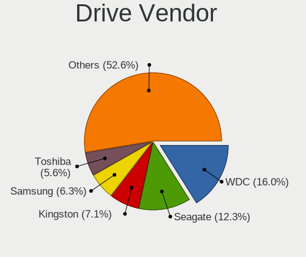
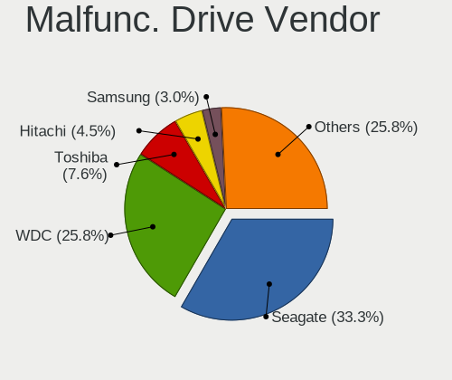
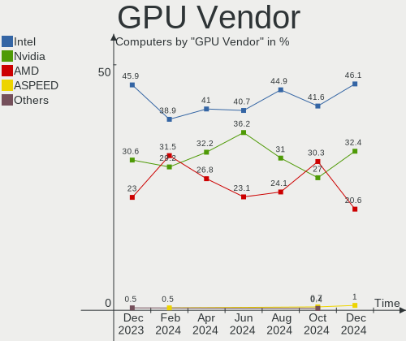

ROSA - Hardware Trends
----------------------

A project to identify most popular hardware characteristics and track their change
over time based on data collected by Linux users at https://Linux-Hardware.org.

Anyone can contribute to this report by the [hw-probe](https://github.com/linuxhw/hw-probe) tool:

    sudo -E hw-probe -all -upload

This is a report for all computer types. See also reports for [desktops](/Dist/ROSA/Desktop/README.md) and [notebooks](/Dist/ROSA/Notebook/README.md).

This report is for one last month. Overall report since the beginning of time: [TestDays](https://github.com/linuxhw/TestDays)

Period: Jul, 2023.

Contents
--------

* [ System ](#system)
  - [ OS                       ](#os)
  - [ OS Family                ](#os-family)
  - [ Kernel                   ](#kernel)
  - [ Kernel Family            ](#kernel-family)
  - [ Kernel Major Ver.        ](#kernel-major-ver)
  - [ Arch                     ](#arch)
  - [ DE                       ](#de)
  - [ Display Server           ](#display-server)
  - [ Display Manager          ](#display-manager)
  - [ OS Lang                  ](#os-lang)
  - [ Boot Mode                ](#boot-mode)
  - [ Filesystem               ](#filesystem)
  - [ Part. scheme             ](#part-scheme)
  - [ Dual Boot with Linux/BSD ](#dual-boot-with-linuxbsd)
  - [ Dual Boot (Win)          ](#dual-boot-win)

* [ Board ](#board)
  - [ Vendor                   ](#vendor)
  - [ Model                    ](#model)
  - [ Model Family             ](#model-family)
  - [ MFG Year                 ](#mfg-year)
  - [ Form Factor              ](#form-factor)
  - [ Secure Boot              ](#secure-boot)
  - [ Coreboot                 ](#coreboot)
  - [ RAM Size                 ](#ram-size)
  - [ RAM Used                 ](#ram-used)
  - [ Total Drives             ](#total-drives)
  - [ Has CD-ROM               ](#has-cd-rom)
  - [ Has Ethernet             ](#has-ethernet)
  - [ Has WiFi                 ](#has-wifi)
  - [ Has Bluetooth            ](#has-bluetooth)

* [ Location ](#location)
  - [ Country                  ](#country)
  - [ City                     ](#city)

* [ Drives ](#drives)
  - [ Drive Vendor             ](#drive-vendor)
  - [ Drive Model              ](#drive-model)
  - [ HDD Vendor               ](#hdd-vendor)
  - [ SSD Vendor               ](#ssd-vendor)
  - [ Drive Kind               ](#drive-kind)
  - [ Drive Connector          ](#drive-connector)
  - [ Drive Size               ](#drive-size)
  - [ Space Total              ](#space-total)
  - [ Space Used               ](#space-used)
  - [ Malfunc. Drives          ](#malfunc-drives)
  - [ Malfunc. Drive Vendor    ](#malfunc-drive-vendor)
  - [ Malfunc. HDD Vendor      ](#malfunc-hdd-vendor)
  - [ Malfunc. Drive Kind      ](#malfunc-drive-kind)
  - [ Failed Drives            ](#failed-drives)
  - [ Failed Drive Vendor      ](#failed-drive-vendor)
  - [ Drive Status             ](#drive-status)

* [ Storage controller ](#storage-controller)
  - [ Storage Vendor           ](#storage-vendor)
  - [ Storage Model            ](#storage-model)
  - [ Storage Kind             ](#storage-kind)

* [ Processor ](#processor)
  - [ CPU Vendor               ](#cpu-vendor)
  - [ CPU Model                ](#cpu-model)
  - [ CPU Model Family         ](#cpu-model-family)
  - [ CPU Cores                ](#cpu-cores)
  - [ CPU Sockets              ](#cpu-sockets)
  - [ CPU Threads              ](#cpu-threads)
  - [ CPU Op-Modes             ](#cpu-op-modes)
  - [ CPU Microcode            ](#cpu-microcode)
  - [ CPU Microarch            ](#cpu-microarch)

* [ Graphics ](#graphics)
  - [ GPU Vendor               ](#gpu-vendor)
  - [ GPU Model                ](#gpu-model)
  - [ GPU Combo                ](#gpu-combo)
  - [ GPU Driver               ](#gpu-driver)
  - [ GPU Memory               ](#gpu-memory)

* [ Monitor ](#monitor)
  - [ Monitor Vendor           ](#monitor-vendor)
  - [ Monitor Model            ](#monitor-model)
  - [ Monitor Resolution       ](#monitor-resolution)
  - [ Monitor Diagonal         ](#monitor-diagonal)
  - [ Monitor Width            ](#monitor-width)
  - [ Aspect Ratio             ](#aspect-ratio)
  - [ Monitor Area             ](#monitor-area)
  - [ Pixel Density            ](#pixel-density)
  - [ Multiple Monitors        ](#multiple-monitors)

* [ Network ](#network)
  - [ Net Controller Vendor    ](#net-controller-vendor)
  - [ Net Controller Model     ](#net-controller-model)
  - [ Wireless Vendor          ](#wireless-vendor)
  - [ Wireless Model           ](#wireless-model)
  - [ Ethernet Vendor          ](#ethernet-vendor)
  - [ Ethernet Model           ](#ethernet-model)
  - [ Net Controller Kind      ](#net-controller-kind)
  - [ Used Controller          ](#used-controller)
  - [ NICs                     ](#nics)
  - [ IPv6                     ](#ipv6)

* [ Bluetooth ](#bluetooth)
  - [ Bluetooth Vendor         ](#bluetooth-vendor)
  - [ Bluetooth Model          ](#bluetooth-model)

* [ Sound ](#sound)
  - [ Sound Vendor             ](#sound-vendor)
  - [ Sound Model              ](#sound-model)

* [ Memory ](#memory)
  - [ Memory Vendor            ](#memory-vendor)
  - [ Memory Model             ](#memory-model)
  - [ Memory Kind              ](#memory-kind)
  - [ Memory Form Factor       ](#memory-form-factor)
  - [ Memory Size              ](#memory-size)
  - [ Memory Speed             ](#memory-speed)

* [ Printers & scanners ](#printers--scanners)
  - [ Printer Vendor           ](#printer-vendor)
  - [ Printer Model            ](#printer-model)
  - [ Scanner Vendor           ](#scanner-vendor)
  - [ Scanner Model            ](#scanner-model)

* [ Camera ](#camera)
  - [ Camera Vendor            ](#camera-vendor)
  - [ Camera Model             ](#camera-model)

* [ Security ](#security)
  - [ Fingerprint Vendor       ](#fingerprint-vendor)
  - [ Fingerprint Model        ](#fingerprint-model)
  - [ Chipcard Vendor          ](#chipcard-vendor)
  - [ Chipcard Model           ](#chipcard-model)

* [ Unsupported ](#unsupported)
  - [ Unsupported Devices      ](#unsupported-devices)
  - [ Unsupported Device Types ](#unsupported-device-types)

System
------

OS
--

Installed operating systems

| Name       | Computers | Percent |
|------------|-----------|---------|
| ROSA 12.4  | 156       | 87.64%  |
| ROSA R11.1 | 9         | 5.06%   |
| ROSA 12.3  | 5         | 2.81%   |
| ROSA 13.0  | 3         | 1.69%   |
| ROSA 12.1  | 2         | 1.12%   |
| ROSA 12    | 2         | 1.12%   |
| ROSA 12.2  | 1         | 0.56%   |

OS Family
---------

OS without a version

| Name | Computers | Percent |
|------|-----------|---------|
| ROSA | 178       | 100%    |

Kernel
------

Version of the Linux kernel

| Version                                   | Computers | Percent |
|-------------------------------------------|-----------|---------|
| 6.1.38-generic-1rosa2021.1-x86_64         | 63        | 35.39%  |
| 6.1.20-generic-2rosa2021.1-x86_64         | 63        | 35.39%  |
| 5.15.117-generic-1rosa2021.1-x86_64       | 7         | 3.93%   |
| 5.15.103-generic-1rosa2021.1-i686         | 4         | 2.25%   |
| 5.10.74-generic-2rosa2021.1-x86_64        | 4         | 2.25%   |
| 5.10.184-generic-1rosa2021.1-x86_64       | 4         | 2.25%   |
| 5.15.75-generic-1rosa2021.1-x86_64        | 3         | 1.69%   |
| 5.15.103-generic-1rosa2021.1-x86_64       | 3         | 1.69%   |
| 6.1.30.xm1-1.klp-xanmod-rosa2021.1-x86_64 | 2         | 1.12%   |
| 5.4.83-generic-2rosa-x86_64               | 2         | 1.12%   |
| 5.4.32-generic-2rosa-x86_64               | 2         | 1.12%   |
| 5.15.79-generic-1rosa2021.1-x86_64        | 2         | 1.12%   |
| 5.10.176-generic-1rosa2021.1-x86_64       | 2         | 1.12%   |
| 4.9.155-nrj-desktop-1rosa-i586            | 2         | 1.12%   |
| 4.15.0-desktop-122.124.1rosa-x86_64       | 2         | 1.12%   |
| 6.4.1.xm1-1.klp-xanmod-rosa2021.1-x86_64  | 1         | 0.56%   |
| 6.3.12.xm1-1.klp-xanmod-rosa2021.1-x86_64 | 1         | 0.56%   |
| 6.2.12.xm1-1.klp-xanmod-rosa2021.1-x86_64 | 1         | 0.56%   |
| 6.1.42-generic-1rosa2023.1-arm64          | 1         | 0.56%   |
| 6.1.38-generic-1rosa2023.1-x86_64         | 1         | 0.56%   |
| 6.1.34-generic-1rosa2023.1-x86_64         | 1         | 0.56%   |
| 6.1.20-generic-2rosa2021.1-arm64          | 1         | 0.56%   |
| 5.17.11-generic-2rosa2021.1-x86_64        | 1         | 0.56%   |
| 5.15.117-generic-1rosa2021.1-i686         | 1         | 0.56%   |
| 5.13.9-generic-1rosa-x86_64               | 1         | 0.56%   |
| 5.10.74-generic-2rosa2021.1-i586          | 1         | 0.56%   |
| 5.10.175-generic-1rosa2021.1-x86_64       | 1         | 0.56%   |
| 5.10.155-generic-1rosa2021.1-x86_64       | 1         | 0.56%   |

Kernel Family
-------------

Linux kernel without a distro release

| Version  | Computers | Percent |
|----------|-----------|---------|
| 6.1.38   | 64        | 35.96%  |
| 6.1.20   | 64        | 35.96%  |
| 5.15.117 | 8         | 4.49%   |
| 5.15.103 | 7         | 3.93%   |
| 5.10.74  | 5         | 2.81%   |
| 5.10.184 | 4         | 2.25%   |
| 5.15.75  | 3         | 1.69%   |
| 6.1.30   | 2         | 1.12%   |
| 5.4.83   | 2         | 1.12%   |
| 5.4.32   | 2         | 1.12%   |
| 5.15.79  | 2         | 1.12%   |
| 5.10.176 | 2         | 1.12%   |
| 4.9.155  | 2         | 1.12%   |
| 4.15.0   | 2         | 1.12%   |
| 6.4.1    | 1         | 0.56%   |
| 6.3.12   | 1         | 0.56%   |
| 6.2.12   | 1         | 0.56%   |
| 6.1.42   | 1         | 0.56%   |
| 6.1.34   | 1         | 0.56%   |
| 5.17.11  | 1         | 0.56%   |
| 5.13.9   | 1         | 0.56%   |
| 5.10.175 | 1         | 0.56%   |
| 5.10.155 | 1         | 0.56%   |

Kernel Major Ver.
-----------------

Linux kernel major version

| Version | Computers | Percent |
|---------|-----------|---------|
| 6.1     | 132       | 74.16%  |
| 5.15    | 20        | 11.24%  |
| 5.10    | 13        | 7.3%    |
| 5.4     | 4         | 2.25%   |
| 4.9     | 2         | 1.12%   |
| 4.15    | 2         | 1.12%   |
| 6.4     | 1         | 0.56%   |
| 6.3     | 1         | 0.56%   |
| 6.2     | 1         | 0.56%   |
| 5.17    | 1         | 0.56%   |
| 5.13    | 1         | 0.56%   |

Arch
----

OS architecture (x86_64, i586, etc.)

| Name    | Computers | Percent |
|---------|-----------|---------|
| x86_64  | 168       | 94.38%  |
| i686    | 8         | 4.49%   |
| aarch64 | 2         | 1.12%   |

DE
--

Desktop Environment

| Name    | Computers | Percent |
|---------|-----------|---------|
| KDE5    | 98        | 55.06%  |
| GNOME   | 55        | 30.9%   |
| LXQt    | 15        | 8.43%   |
| KDE4    | 5         | 2.81%   |
| XFCE    | 2         | 1.12%   |
| MATE    | 1         | 0.56%   |
| i3      | 1         | 0.56%   |
| Unknown | 1         | 0.56%   |

Display Server
--------------

X11 or Wayland

| Name    | Computers | Percent |
|---------|-----------|---------|
| Wayland | 141       | 79.21%  |
| X11     | 36        | 20.22%  |
| Unknown | 1         | 0.56%   |

Display Manager
---------------

SDDM, LightDM, etc.

| Name    | Computers | Percent |
|---------|-----------|---------|
| SDDM    | 101       | 56.74%  |
| GDM     | 64        | 35.96%  |
| LightDM | 8         | 4.49%   |
| KDM     | 4         | 2.25%   |
| Unknown | 1         | 0.56%   |

OS Lang
-------

Language

| Lang  | Computers | Percent |
|-------|-----------|---------|
| ru_RU | 167       | 93.82%  |
| en_US | 4         | 2.25%   |
| pt_PT | 2         | 1.12%   |
| vi_VN | 1         | 0.56%   |
| it_IT | 1         | 0.56%   |
| fr_FR | 1         | 0.56%   |
| de_DE | 1         | 0.56%   |
| de_CH | 1         | 0.56%   |

Boot Mode
---------

EFI or BIOS

| Mode | Computers | Percent |
|------|-----------|---------|
| EFI  | 111       | 62.36%  |
| BIOS | 67        | 37.64%  |

Filesystem
----------

Type of filesystem

| Type    | Computers | Percent |
|---------|-----------|---------|
| Ext4    | 162       | 91.01%  |
| Btrfs   | 12        | 6.74%   |
| Xfs     | 1         | 0.56%   |
| Overlay | 1         | 0.56%   |
| F2fs    | 1         | 0.56%   |
| Aufs    | 1         | 0.56%   |

Part. scheme
------------

Scheme of partitioning

| Type | Computers | Percent |
|------|-----------|---------|
| GPT  | 130       | 73.03%  |
| MBR  | 48        | 26.97%  |

Dual Boot with Linux/BSD
------------------------

Hosting more than one Linux/BSD

| Dual boot | Computers | Percent |
|-----------|-----------|---------|
| No        | 130       | 73.03%  |
| Yes       | 48        | 26.97%  |

Dual Boot (Win)
---------------

Hosting Linux and Windows

| Dual boot | Computers | Percent |
|-----------|-----------|---------|
| Yes       | 89        | 50%     |
| No        | 89        | 50%     |

Board
-----

Vendor
------

Motherboard manufacturer

| Name                                 | Computers | Percent |
|--------------------------------------|-----------|---------|
| ASUSTek Computer                     | 37        | 20.79%  |
| Hewlett-Packard                      | 21        | 11.8%   |
| Gigabyte Technology                  | 17        | 9.55%   |
| Lenovo                               | 15        | 8.43%   |
| Acer                                 | 15        | 8.43%   |
| MSI                                  | 10        | 5.62%   |
| ASRock                               | 8         | 4.49%   |
| Unknown                              | 8         | 4.49%   |
| Dell                                 | 7         | 3.93%   |
| Samsung Electronics                  | 4         | 2.25%   |
| Toshiba                              | 3         | 1.69%   |
| Intel                                | 3         | 1.69%   |
| ECS                                  | 3         | 1.69%   |
| Biostar                              | 3         | 1.69%   |
| HONOR                                | 2         | 1.12%   |
| Chuwi                                | 2         | 1.12%   |
| ZoomSmart                            | 1         | 0.56%   |
| Timi                                 | 1         | 0.56%   |
| TECNO                                | 1         | 0.56%   |
| Shenzhen Meigao Electronic Equipment | 1         | 0.56%   |
| Quanta                               | 1         | 0.56%   |
| Prestigio                            | 1         | 0.56%   |
| Pegatron                             | 1         | 0.56%   |
| PC Partner                           | 1         | 0.56%   |
| OEM                                  | 1         | 0.56%   |
| Notebook                             | 1         | 0.56%   |
| Maibenben                            | 1         | 0.56%   |
| MACHINIST                            | 1         | 0.56%   |
| HUAWEI                               | 1         | 0.56%   |
| Huanan                               | 1         | 0.56%   |
| Haier                                | 1         | 0.56%   |
| Google                               | 1         | 0.56%   |
| Edelweiss                            | 1         | 0.56%   |
| AZW                                  | 1         | 0.56%   |
| Aquarius                             | 1         | 0.56%   |
| Apple                                | 1         | 0.56%   |

Model
-----

Motherboard model

| Name                                                                                     | Computers | Percent |
|------------------------------------------------------------------------------------------|-----------|---------|
| Unknown                                                                                  | 9         | 5.06%   |
| ASUS All Series                                                                          | 3         | 1.69%   |
| HP Notebook                                                                              | 2         | 1.12%   |
| Gigabyte Z77-DS3H                                                                        | 2         | 1.12%   |
| Acer Aspire E5-573G                                                                      | 2         | 1.12%   |
| ZoomSmart A8006                                                                          | 1         | 0.56%   |
| Toshiba Satellite C870-D7K                                                               | 1         | 0.56%   |
| Toshiba Satellite C850-1GL                                                               | 1         | 0.56%   |
| Toshiba QOSMIO G30                                                                       | 1         | 0.56%   |
| Timi Redmi G 2022                                                                        | 1         | 0.56%   |
| TECNO MEGABOOK T1                                                                        | 1         | 0.56%   |
| Shenzhen Meigao Electronic Equipment HX99G                                               | 1         | 0.56%   |
| Samsung R530/R730                                                                        | 1         | 0.56%   |
| Samsung 355V4C/355V4X/355V5C/355V5X/356V4C/356V4X/356V5C/356V5X/3445VC/3445VX/3545VC/354 | 1         | 0.56%   |
| Samsung 350V5C/351V5C/3540VC/3440VC                                                      | 1         | 0.56%   |
| Samsung 300V3A/300V4A/300V5A                                                             | 1         | 0.56%   |
| Quanta SWH                                                                               | 1         | 0.56%   |
| Prestigio Smartbook PSB116A                                                              | 1         | 0.56%   |
| Pegatron A24                                                                             | 1         | 0.56%   |
| PC Partner A512-H110                                                                     | 1         | 0.56%   |
| OEM X79G                                                                                 | 1         | 0.56%   |
| Notebook W510LU                                                                          | 1         | 0.56%   |
| MSI MS-7D53                                                                              | 1         | 0.56%   |
| MSI MS-7A38                                                                              | 1         | 0.56%   |
| MSI MS-7895                                                                              | 1         | 0.56%   |
| MSI MS-7788                                                                              | 1         | 0.56%   |
| MSI MS-7640                                                                              | 1         | 0.56%   |
| MSI MS-7529                                                                              | 1         | 0.56%   |
| MSI Modern 15 A11SBU                                                                     | 1         | 0.56%   |
| MSI Katana GF76 11UD                                                                     | 1         | 0.56%   |
| MSI GS73 Stealth 8RE                                                                     | 1         | 0.56%   |
| MSI ER710                                                                                | 1         | 0.56%   |
| Maibenben MaiBook M                                                                      | 1         | 0.56%   |
| MACHINIST X99-RS9 V3.0                                                                   | 1         | 0.56%   |
| Lenovo V15-IGL 82C3                                                                      | 1         | 0.56%   |
| Lenovo V14-IIL 82C4                                                                      | 1         | 0.56%   |
| Lenovo ThinkPad T420 4180EP2                                                             | 1         | 0.56%   |
| Lenovo ThinkCentre M81 5049C12                                                           | 1         | 0.56%   |
| Lenovo ThinkBook 16 G4+ ARA 21D1                                                         | 1         | 0.56%   |
| Lenovo IdeaPad Yoga 2-13 59420231                                                        | 1         | 0.56%   |

Model Family
------------

Motherboard model prefix

| Name                                       | Computers | Percent |
|--------------------------------------------|-----------|---------|
| Acer Aspire                                | 9         | 5.06%   |
| Unknown                                    | 9         | 5.06%   |
| ASUS PRIME                                 | 6         | 3.37%   |
| Lenovo IdeaPad                             | 5         | 2.81%   |
| HP Pavilion                                | 4         | 2.25%   |
| HP Laptop                                  | 3         | 1.69%   |
| HP Compaq                                  | 3         | 1.69%   |
| ASUS TUF                                   | 3         | 1.69%   |
| ASUS ASUS                                  | 3         | 1.69%   |
| ASUS All                                   | 3         | 1.69%   |
| Toshiba Satellite                          | 2         | 1.12%   |
| HP ProBook                                 | 2         | 1.12%   |
| HP Notebook                                | 2         | 1.12%   |
| HP EliteBook                               | 2         | 1.12%   |
| Gigabyte Z77-DS3H                          | 2         | 1.12%   |
| Dell Inspiron                              | 2         | 1.12%   |
| ASUS VivoBook                              | 2         | 1.12%   |
| ASUS ROG                                   | 2         | 1.12%   |
| Acer Extensa                               | 2         | 1.12%   |
| ZoomSmart A8006                            | 1         | 0.56%   |
| Toshiba QOSMIO                             | 1         | 0.56%   |
| Timi Redmi                                 | 1         | 0.56%   |
| TECNO MEGABOOK                             | 1         | 0.56%   |
| Shenzhen Meigao Electronic Equipment HX99G | 1         | 0.56%   |
| Samsung R530                               | 1         | 0.56%   |
| Samsung 355V4C                             | 1         | 0.56%   |
| Samsung 350V5C                             | 1         | 0.56%   |
| Samsung 300V3A                             | 1         | 0.56%   |
| Quanta SWH                                 | 1         | 0.56%   |
| Prestigio Smartbook                        | 1         | 0.56%   |
| Pegatron A24                               | 1         | 0.56%   |
| PC Partner A512-H110                       | 1         | 0.56%   |
| OEM X79G                                   | 1         | 0.56%   |
| Notebook W510LU                            | 1         | 0.56%   |
| MSI MS-7D53                                | 1         | 0.56%   |
| MSI MS-7A38                                | 1         | 0.56%   |
| MSI MS-7895                                | 1         | 0.56%   |
| MSI MS-7788                                | 1         | 0.56%   |
| MSI MS-7640                                | 1         | 0.56%   |
| MSI MS-7529                                | 1         | 0.56%   |

MFG Year
--------

Motherboard manufacture year

| Year | Computers | Percent |
|------|-----------|---------|
| 2012 | 21        | 11.8%   |
| 2021 | 20        | 11.24%  |
| 2020 | 15        | 8.43%   |
| 2022 | 14        | 7.87%   |
| 2013 | 14        | 7.87%   |
| 2011 | 14        | 7.87%   |
| 2015 | 11        | 6.18%   |
| 2018 | 10        | 5.62%   |
| 2019 | 9         | 5.06%   |
| 2009 | 9         | 5.06%   |
| 2017 | 8         | 4.49%   |
| 2016 | 6         | 3.37%   |
| 2014 | 6         | 3.37%   |
| 2023 | 5         | 2.81%   |
| 2010 | 5         | 2.81%   |
| 2008 | 4         | 2.25%   |
| 2007 | 4         | 2.25%   |
| 2006 | 3         | 1.69%   |

Form Factor
-----------

Physical design of the computer

| Name           | Computers | Percent |
|----------------|-----------|---------|
| Notebook       | 96        | 53.93%  |
| Desktop        | 75        | 42.13%  |
| Tablet         | 2         | 1.12%   |
| Server         | 2         | 1.12%   |
| System on chip | 1         | 0.56%   |
| Convertible    | 1         | 0.56%   |
| All in one     | 1         | 0.56%   |

Secure Boot
-----------

Enabled or disabled

| State    | Computers | Percent |
|----------|-----------|---------|
| Disabled | 178       | 100%    |

Coreboot
--------

Have coreboot on board

| Used | Computers | Percent |
|------|-----------|---------|
| No   | 177       | 99.44%  |
| Yes  | 1         | 0.56%   |

RAM Size
--------

Total RAM memory

| Size in GB      | Computers | Percent |
|-----------------|-----------|---------|
| 4.01-8.0        | 55        | 30.9%   |
| 8.01-16.0       | 33        | 18.54%  |
| 3.01-4.0        | 31        | 17.42%  |
| 16.01-24.0      | 26        | 14.61%  |
| 32.01-64.0      | 15        | 8.43%   |
| 2.01-3.0        | 8         | 4.49%   |
| 24.01-32.0      | 5         | 2.81%   |
| 1.01-2.0        | 3         | 1.69%   |
| More than 256.0 | 1         | 0.56%   |
| 64.01-256.0     | 1         | 0.56%   |

RAM Used
--------

Used RAM memory

| Used GB    | Computers | Percent |
|------------|-----------|---------|
| 1.01-2.0   | 88        | 49.44%  |
| 2.01-3.0   | 33        | 18.54%  |
| 0.51-1.0   | 23        | 12.92%  |
| 4.01-8.0   | 18        | 10.11%  |
| 3.01-4.0   | 12        | 6.74%   |
| 0.01-0.5   | 2         | 1.12%   |
| 24.01-32.0 | 1         | 0.56%   |
| 8.01-16.0  | 1         | 0.56%   |

Total Drives
------------

Number of drives on board

| Drives | Computers | Percent |
|--------|-----------|---------|
| 1      | 95        | 53.37%  |
| 2      | 55        | 30.9%   |
| 3      | 18        | 10.11%  |
| 4      | 7         | 3.93%   |
| 5      | 2         | 1.12%   |
| 7      | 1         | 0.56%   |

Has CD-ROM
----------

Has CD-ROM on board

| Presented | Computers | Percent |
|-----------|-----------|---------|
| No        | 114       | 64.04%  |
| Yes       | 64        | 35.96%  |

Has Ethernet
------------

Has Ethernet on board

| Presented | Computers | Percent |
|-----------|-----------|---------|
| Yes       | 153       | 85.96%  |
| No        | 25        | 14.04%  |

Has WiFi
--------

Has WiFi module

| Presented | Computers | Percent |
|-----------|-----------|---------|
| Yes       | 125       | 70.22%  |
| No        | 53        | 29.78%  |

Has Bluetooth
-------------

Has Bluetooth module

| Presented | Computers | Percent |
|-----------|-----------|---------|
| Yes       | 97        | 54.49%  |
| No        | 81        | 45.51%  |

Location
--------

Country
-------

Geographic location (country)

| Country     | Computers | Percent |
|-------------|-----------|---------|
| Russia      | 152       | 85.39%  |
| Belarus     | 6         | 3.37%   |
| Ukraine     | 5         | 2.81%   |
| Brazil      | 3         | 1.69%   |
| Poland      | 2         | 1.12%   |
| Kazakhstan  | 2         | 1.12%   |
| Germany     | 2         | 1.12%   |
| Vietnam     | 1         | 0.56%   |
| Switzerland | 1         | 0.56%   |
| Netherlands | 1         | 0.56%   |
| Lithuania   | 1         | 0.56%   |
| Italy       | 1         | 0.56%   |
| France      | 1         | 0.56%   |

City
----

Geographic location (city)

| City                | Computers | Percent |
|---------------------|-----------|---------|
| Moscow              | 31        | 17.42%  |
| St Petersburg       | 10        | 5.62%   |
| Krasnodar           | 8         | 4.49%   |
| Voronezh            | 5         | 2.81%   |
| Samara              | 5         | 2.81%   |
| Perm                | 5         | 2.81%   |
| Vladivostok         | 4         | 2.25%   |
| Tomsk               | 4         | 2.25%   |
| Kazan’            | 4         | 2.25%   |
| Yoshkar-Ola         | 3         | 1.69%   |
| Ufa                 | 3         | 1.69%   |
| Minsk               | 3         | 1.69%   |
| Irkutsk             | 3         | 1.69%   |
| Yaroslavl           | 2         | 1.12%   |
| Tyumen              | 2         | 1.12%   |
| Simferopol          | 2         | 1.12%   |
| Shchelkovo          | 2         | 1.12%   |
| Saratov             | 2         | 1.12%   |
| Saransk             | 2         | 1.12%   |
| Ryazan              | 2         | 1.12%   |
| Novosibirsk         | 2         | 1.12%   |
| Novocherkassk       | 2         | 1.12%   |
| Nizhniy Novgorod    | 2         | 1.12%   |
| Naberezhnyye Chelny | 2         | 1.12%   |
| Kirov               | 2         | 1.12%   |
| Kemerovo            | 2         | 1.12%   |
| Chelyabinsk         | 2         | 1.12%   |
| Blagoveshchensk     | 2         | 1.12%   |
| Zvenigorod          | 1         | 0.56%   |
| Zlatoust            | 1         | 0.56%   |
| Zielona Góra       | 1         | 0.56%   |
| Zabrze              | 1         | 0.56%   |
| Yeysk               | 1         | 0.56%   |
| Vologda             | 1         | 0.56%   |
| Volgograd           | 1         | 0.56%   |
| Vladimir            | 1         | 0.56%   |
| Vitebsk             | 1         | 0.56%   |
| Vilnius             | 1         | 0.56%   |
| Utrecht             | 1         | 0.56%   |
| Ulan-Ude            | 1         | 0.56%   |

Drives
------

Drive Vendor
------------

Hard drive vendors

| Vendor                | Computers | Drives | Percent |
|-----------------------|-----------|--------|---------|
| WDC                   | 45        | 58     | 15.96%  |
| Samsung Electronics   | 32        | 35     | 11.35%  |
| Seagate               | 27        | 29     | 9.57%   |
| Kingston              | 24        | 27     | 8.51%   |
| Toshiba               | 16        | 18     | 5.67%   |
| A-DATA Technology     | 10        | 12     | 3.55%   |
| Hitachi               | 9         | 9      | 3.19%   |
| Crucial               | 9         | 9      | 3.19%   |
| SPCC                  | 7         | 7      | 2.48%   |
| Unknown               | 6         | 6      | 2.13%   |
| SK hynix              | 6         | 6      | 2.13%   |
| HGST                  | 6         | 6      | 2.13%   |
| China                 | 6         | 6      | 2.13%   |
| Silicon Motion        | 5         | 5      | 1.77%   |
| XrayDisk              | 4         | 4      | 1.42%   |
| SanDisk               | 4         | 4      | 1.42%   |
| Plextor               | 4         | 4      | 1.42%   |
| JMicron Technology    | 4         | 4      | 1.42%   |
| AMD                   | 4         | 4      | 1.42%   |
| Intel                 | 3         | 3      | 1.06%   |
| Apacer                | 3         | 3      | 1.06%   |
| Unknown               | 3         | 3      | 1.06%   |
| Team                  | 2         | 2      | 0.71%   |
| Smartbuy              | 2         | 2      | 0.71%   |
| Realtek Semiconductor | 2         | 2      | 0.71%   |
| Netac                 | 2         | 2      | 0.71%   |
| Micron Technology     | 2         | 2      | 0.71%   |
| KIOXIA                | 2         | 2      | 0.71%   |
| KingSpec              | 2         | 2      | 0.71%   |
| Intenso               | 2         | 2      | 0.71%   |
| Wdxsky                | 1         | 1      | 0.35%   |
| WDC WDS               | 1         | 1      | 0.35%   |
| WD Blue               | 1         | 1      | 0.35%   |
| WALRAM                | 1         | 1      | 0.35%   |
| USB                   | 1         | 1      | 0.35%   |
| Transcend             | 1         | 1      | 0.35%   |
| ShiJi                 | 1         | 1      | 0.35%   |
| Qumo                  | 1         | 1      | 0.35%   |
| Phison                | 1         | 1      | 0.35%   |
| Patriot               | 1         | 1      | 0.35%   |

Drive Model
-----------

Hard drive models

| Model                               | Computers | Percent |
|-------------------------------------|-----------|---------|
| Kingston SA400S37240G 240GB SSD     | 6         | 1.99%   |
| WDC WDS120G2G0A-00JH30 120GB SSD    | 5         | 1.66%   |
| WDC WD10EZEX-08WN4A0 1TB            | 5         | 1.66%   |
| Kingston SA400S37480G 480GB SSD     | 5         | 1.66%   |
| SPCC Solid State Disk 128GB         | 4         | 1.33%   |
| Kingston SA400S37120G 120GB SSD     | 4         | 1.33%   |
| WDC WD5000LPCX-21VHAT0 500GB        | 3         | 1%      |
| Toshiba HDWD110 1TB                 | 3         | 1%      |
| Seagate ST1000DM003-1ER162 1TB      | 3         | 1%      |
| Kingston SHFS37A120G 120GB SSD      | 3         | 1%      |
| JMicron Generic 512GB               | 3         | 1%      |
| HGST HTS545050A7E380 500GB          | 3         | 1%      |
| Crucial CT120BX500SSD1 120GB        | 3         | 1%      |
| Unknown                             | 3         | 1%      |
| WDC WDS240G2G0A-00JH30 240GB SSD    | 2         | 0.66%   |
| WDC WD10EZEX-60WN4A1 1TB            | 2         | 0.66%   |
| WDC WD10EZEX-60WN4A0 1TB            | 2         | 0.66%   |
| WDC WD10EZEX-00RKKA0 1TB            | 2         | 0.66%   |
| WDC WD1002FAEX-00Z3A0 1TB           | 2         | 0.66%   |
| Unknown DA4064  64GB                | 2         | 0.66%   |
| Toshiba DT01ACA100 1TB              | 2         | 0.66%   |
| Toshiba DT01ACA050 500GB            | 2         | 0.66%   |
| SPCC Solid State Disk 256GB         | 2         | 0.66%   |
| Seagate ST500DM002-1BD142 500GB     | 2         | 0.66%   |
| Seagate ST320LT020-9YG142 320GB     | 2         | 0.66%   |
| Seagate ST2000DM008-2FR102 2TB      | 2         | 0.66%   |
| SanDisk SD8SN8U-128G-1006 128GB SSD | 2         | 0.66%   |
| Samsung SSD 870 EVO 500GB           | 2         | 0.66%   |
| Samsung SSD 860 EVO 500GB           | 2         | 0.66%   |
| Realtek NVMe SSD Drive 128GB        | 2         | 0.66%   |
| KIOXIA KBG40ZNV256G 256GB           | 2         | 0.66%   |
| Hitachi HTS547575A9E384 752GB       | 2         | 0.66%   |
| China SSD 128GB                     | 2         | 0.66%   |
| AMD R5SL120G 120GB SSD              | 2         | 0.66%   |
| A-DATA SU655 120GB SSD              | 2         | 0.66%   |
| A-DATA SU650 240GB SSD              | 2         | 0.66%   |
| XrayDisk SSD 128GB                  | 1         | 0.33%   |
| XrayDisk SSD 120GB                  | 1         | 0.33%   |
| XrayDisk 512GB SSD                  | 1         | 0.33%   |
| XrayDisk 2TB SSD                    | 1         | 0.33%   |

HDD Vendor
----------

Hard disk drive vendors

| Vendor              | Computers | Drives | Percent |
|---------------------|-----------|--------|---------|
| WDC                 | 36        | 47     | 34.95%  |
| Seagate             | 26        | 28     | 25.24%  |
| Toshiba             | 15        | 17     | 14.56%  |
| Hitachi             | 9         | 9      | 8.74%   |
| HGST                | 6         | 6      | 5.83%   |
| Samsung Electronics | 5         | 5      | 4.85%   |
| JMicron Technology  | 4         | 4      | 3.88%   |
| Maxtor              | 1         | 1      | 0.97%   |
| Fujitsu             | 1         | 1      | 0.97%   |

SSD Vendor
----------

Solid state drive vendors

| Vendor              | Computers | Drives | Percent |
|---------------------|-----------|--------|---------|
| Kingston            | 20        | 21     | 15.5%   |
| Samsung Electronics | 17        | 19     | 13.18%  |
| WDC                 | 10        | 10     | 7.75%   |
| A-DATA Technology   | 8         | 8      | 6.2%    |
| SPCC                | 7         | 7      | 5.43%   |
| Crucial             | 7         | 7      | 5.43%   |
| China               | 6         | 6      | 4.65%   |
| XrayDisk            | 4         | 4      | 3.1%    |
| Plextor             | 4         | 4      | 3.1%    |
| AMD                 | 4         | 4      | 3.1%    |
| SK hynix            | 3         | 3      | 2.33%   |
| SanDisk             | 3         | 3      | 2.33%   |
| Apacer              | 3         | 3      | 2.33%   |
| Unknown             | 3         | 3      | 2.33%   |
| Team                | 2         | 2      | 1.55%   |
| Netac               | 2         | 2      | 1.55%   |
| KingSpec            | 2         | 2      | 1.55%   |
| Intenso             | 2         | 2      | 1.55%   |
| Wdxsky              | 1         | 1      | 0.78%   |
| WDC WDS             | 1         | 1      | 0.78%   |
| WALRAM              | 1         | 1      | 0.78%   |
| USB                 | 1         | 1      | 0.78%   |
| Transcend           | 1         | 1      | 0.78%   |
| Smartbuy            | 1         | 1      | 0.78%   |
| ShiJi               | 1         | 1      | 0.78%   |
| Seagate             | 1         | 1      | 0.78%   |
| Qumo                | 1         | 1      | 0.78%   |
| Patriot             | 1         | 1      | 0.78%   |
| Palit               | 1         | 1      | 0.78%   |
| OCZ                 | 1         | 1      | 0.78%   |
| Neo                 | 1         | 1      | 0.78%   |
| HS-SSD-E100         | 1         | 1      | 0.78%   |
| Hewlett-Packard     | 1         | 1      | 0.78%   |
| GS                  | 1         | 1      | 0.78%   |
| GOODRAM             | 1         | 1      | 0.78%   |
| Corsair             | 1         | 1      | 0.78%   |
| Azerty              | 1         | 1      | 0.78%   |
| Apple               | 1         | 1      | 0.78%   |
| AirDisk             | 1         | 1      | 0.78%   |
| ACOS                | 1         | 1      | 0.78%   |

Drive Kind
----------

HDD or SSD

| Kind    | Computers | Drives | Percent |
|---------|-----------|--------|---------|
| SSD     | 107       | 132    | 42.97%  |
| HDD     | 91        | 118    | 36.55%  |
| NVMe    | 43        | 49     | 17.27%  |
| MMC     | 6         | 6      | 2.41%   |
| Unknown | 2         | 1      | 0.8%    |

Drive Connector
---------------

SATA, SAS, NVMe, etc.

| Type | Computers | Drives | Percent |
|------|-----------|--------|---------|
| SATA | 147       | 242    | 71.71%  |
| NVMe | 43        | 49     | 20.98%  |
| SAS  | 9         | 9      | 4.39%   |
| MMC  | 6         | 6      | 2.93%   |

Drive Size
----------

Size of hard drive

| Size in TB | Computers | Drives | Percent |
|------------|-----------|--------|---------|
| 0.01-0.5   | 125       | 166    | 62.81%  |
| 0.51-1.0   | 57        | 66     | 28.64%  |
| 1.01-2.0   | 10        | 10     | 5.03%   |
| 4.01-10.0  | 4         | 4      | 2.01%   |
| 3.01-4.0   | 2         | 3      | 1.01%   |
| 2.01-3.0   | 1         | 1      | 0.5%    |

Space Total
-----------

Amount of disk space available on the file system

| Size in GB     | Computers | Percent |
|----------------|-----------|---------|
| 101-250        | 53        | 29.78%  |
| 251-500        | 39        | 21.91%  |
| 501-1000       | 18        | 10.11%  |
| 1-20           | 16        | 8.99%   |
| 51-100         | 15        | 8.43%   |
| 1001-2000      | 14        | 7.87%   |
| 21-50          | 13        | 7.3%    |
| 2001-3000      | 5         | 2.81%   |
| More than 3000 | 4         | 2.25%   |
| Unknown        | 1         | 0.56%   |

Space Used
----------

Amount of used disk space

| Used GB        | Computers | Percent |
|----------------|-----------|---------|
| 1-20           | 97        | 54.49%  |
| 21-50          | 22        | 12.36%  |
| 101-250        | 17        | 9.55%   |
| 501-1000       | 15        | 8.43%   |
| 51-100         | 10        | 5.62%   |
| 251-500        | 6         | 3.37%   |
| 1001-2000      | 6         | 3.37%   |
| More than 3000 | 3         | 1.69%   |
| 2001-3000      | 1         | 0.56%   |
| Unknown        | 1         | 0.56%   |

Malfunc. Drives
---------------

Drive models with a malfunction

| Model                                 | Computers | Drives | Percent |
|---------------------------------------|-----------|--------|---------|
| Toshiba DT01ACA100 1TB                | 2         | 3      | 3.92%   |
| Seagate ST320LT020-9YG142 320GB       | 2         | 2      | 3.92%   |
| HGST HTS545050A7E380 500GB            | 2         | 2      | 3.92%   |
| WDC WDS240G2G0A-00JH30 240GB SSD      | 1         | 1      | 1.96%   |
| WDC WDS120G2G0A-00JH30 120GB SSD      | 1         | 1      | 1.96%   |
| WDC WD7500AADS-00M2B0 752GB           | 1         | 1      | 1.96%   |
| WDC WD5000LPVX-22V0TT0 500GB          | 1         | 1      | 1.96%   |
| WDC WD5000LPLX-00ZNTT0 500GB          | 1         | 1      | 1.96%   |
| WDC WD5000LPCX-21VHAT0 500GB          | 1         | 1      | 1.96%   |
| WDC WD5000AAKX-22ERMA0 500GB          | 1         | 1      | 1.96%   |
| WDC WD3200AAJS-00L7A0 320GB           | 1         | 1      | 1.96%   |
| WDC WD20EARS-00S8B1 2TB               | 1         | 1      | 1.96%   |
| WDC WD10EZEX-60WN4A1 1TB              | 1         | 1      | 1.96%   |
| WDC WD10EZEX-08WN4A0 1TB              | 1         | 1      | 1.96%   |
| WDC WD10EZEX-00RKKA0 1TB              | 1         | 1      | 1.96%   |
| WDC WD10EFRX-68JCSN0 1TB              | 1         | 1      | 1.96%   |
| WDC WD10EARS-00Y5B1 1TB               | 1         | 1      | 1.96%   |
| Toshiba MQ01ABF050 500GB              | 1         | 1      | 1.96%   |
| Toshiba MQ01ABF032 320GB              | 1         | 1      | 1.96%   |
| Toshiba MK1637GSX 160GB               | 1         | 2      | 1.96%   |
| Toshiba DT01ACA050 500GB              | 1         | 1      | 1.96%   |
| SK hynix HFS128G39TND-N210A 128GB SSD | 1         | 1      | 1.96%   |
| Seagate ST9500325AS 500GB             | 1         | 1      | 1.96%   |
| Seagate ST500LT012-9WS142 500GB       | 1         | 1      | 1.96%   |
| Seagate ST500DM002-1BD142 500GB       | 1         | 1      | 1.96%   |
| Seagate ST3500418AS 500GB             | 1         | 1      | 1.96%   |
| Seagate ST3500410AS 500GB             | 1         | 1      | 1.96%   |
| Seagate ST3250820A 250GB              | 1         | 1      | 1.96%   |
| Seagate ST1500DL003-9VT16L 1TB        | 1         | 1      | 1.96%   |
| Seagate ST1000LM024 HN-M101MBB 1TB    | 1         | 2      | 1.96%   |
| Samsung Electronics SSD 980 PRO 250GB | 1         | 1      | 1.96%   |
| Samsung Electronics SSD 870 EVO 250GB | 1         | 1      | 1.96%   |
| Samsung Electronics HM321HI 320GB     | 1         | 1      | 1.96%   |
| Samsung Electronics HD401LJ 400GB     | 1         | 1      | 1.96%   |
| Samsung Electronics HD321KJ 320GB     | 1         | 1      | 1.96%   |
| Plextor PX-128M5Pro 128GB SSD         | 1         | 1      | 1.96%   |
| OCZ NOCTI 120GB SSD                   | 1         | 1      | 1.96%   |
| Maxtor 6B250R0 256GB                  | 1         | 1      | 1.96%   |
| Kingston SV300S37A120G 120GB SSD      | 1         | 1      | 1.96%   |
| Kingston SHFS37A120G 120GB SSD        | 1         | 1      | 1.96%   |

Malfunc. Drive Vendor
---------------------

Vendors of faulty drives

| Vendor              | Computers | Drives | Percent |
|---------------------|-----------|--------|---------|
| WDC                 | 13        | 14     | 26%     |
| Seagate             | 10        | 11     | 20%     |
| Toshiba             | 6         | 8      | 12%     |
| Samsung Electronics | 5         | 5      | 10%     |
| Hitachi             | 4         | 4      | 8%      |
| Kingston            | 2         | 2      | 4%      |
| HGST                | 2         | 2      | 4%      |
| SK hynix            | 1         | 1      | 2%      |
| Plextor             | 1         | 1      | 2%      |
| OCZ                 | 1         | 1      | 2%      |
| Maxtor              | 1         | 1      | 2%      |
| China               | 1         | 1      | 2%      |
| ACOS                | 1         | 1      | 2%      |
| A-DATA Technology   | 1         | 1      | 2%      |
| Unknown             | 1         | 1      | 2%      |

Malfunc. HDD Vendor
-------------------

Vendors of faulty HDD drives

| Vendor              | Computers | Drives | Percent |
|---------------------|-----------|--------|---------|
| WDC                 | 11        | 12     | 29.73%  |
| Seagate             | 10        | 11     | 27.03%  |
| Toshiba             | 6         | 8      | 16.22%  |
| Hitachi             | 4         | 4      | 10.81%  |
| Samsung Electronics | 3         | 3      | 8.11%   |
| HGST                | 2         | 2      | 5.41%   |
| Maxtor              | 1         | 1      | 2.7%    |

Malfunc. Drive Kind
-------------------

Kinds of faulty drives

| Kind | Computers | Drives | Percent |
|------|-----------|--------|---------|
| HDD  | 33        | 41     | 71.74%  |
| SSD  | 11        | 11     | 23.91%  |
| NVMe | 2         | 2      | 4.35%   |

Failed Drives
-------------

Failed drive models

Zero info for selected period =(

Failed Drive Vendor
-------------------

Failed drive vendors

Zero info for selected period =(

Drive Status
------------

Number of failed and malfunc. drives

| Status   | Computers | Drives | Percent |
|----------|-----------|--------|---------|
| Works    | 152       | 236    | 72.04%  |
| Malfunc  | 44        | 54     | 20.85%  |
| Detected | 15        | 16     | 7.11%   |

Storage controller
------------------

Storage Vendor
--------------

Storage controller vendors

| Vendor                       | Computers | Percent |
|------------------------------|-----------|---------|
| Intel                        | 128       | 61.54%  |
| AMD                          | 26        | 12.5%   |
| Samsung Electronics          | 11        | 5.29%   |
| Silicon Motion               | 6         | 2.88%   |
| Realtek Semiconductor        | 4         | 1.92%   |
| Kingston Technology Company  | 4         | 1.92%   |
| JMicron Technology           | 4         | 1.92%   |
| SK hynix                     | 3         | 1.44%   |
| Phison Electronics           | 3         | 1.44%   |
| Nvidia                       | 3         | 1.44%   |
| ASMedia Technology           | 3         | 1.44%   |
| ADATA Technology             | 3         | 1.44%   |
| SanDisk                      | 2         | 0.96%   |
| Micron/Crucial Technology    | 2         | 0.96%   |
| Micron Technology            | 2         | 0.96%   |
| KIOXIA                       | 2         | 0.96%   |
| Toshiba America Info Systems | 1         | 0.48%   |
| Shenzhen Longsys Electronics | 1         | 0.48%   |

Storage Model
-------------

Storage controller models

| Model                                                                            | Computers | Percent |
|----------------------------------------------------------------------------------|-----------|---------|
| AMD FCH SATA Controller [AHCI mode]                                              | 17        | 7.17%   |
| Intel 7 Series Chipset Family 6-port SATA Controller [AHCI mode]                 | 12        | 5.06%   |
| Intel Sunrise Point-LP SATA Controller [AHCI mode]                               | 10        | 4.22%   |
| Intel 6 Series/C200 Series Chipset Family 6 port Mobile SATA AHCI Controller     | 10        | 4.22%   |
| Intel 8 Series/C220 Series Chipset Family 6-port SATA Controller 1 [AHCI mode]   | 8         | 3.38%   |
| Intel 6 Series/C200 Series Chipset Family 6 port Desktop SATA AHCI Controller    | 7         | 2.95%   |
| Intel NM10/ICH7 Family SATA Controller [IDE mode]                                | 6         | 2.53%   |
| Intel 82801G (ICH7 Family) IDE Controller                                        | 6         | 2.53%   |
| Silicon Motion SM2263EN/SM2263XT (DRAM-less) NVMe SSD Controllers                | 5         | 2.11%   |
| Intel Celeron/Pentium Silver Processor SATA Controller                           | 4         | 1.69%   |
| Intel 8 Series SATA Controller 1 [AHCI mode]                                     | 4         | 1.69%   |
| Intel 500 Series Chipset Family SATA AHCI Controller                             | 4         | 1.69%   |
| Intel 5 Series/3400 Series Chipset 4 port SATA AHCI Controller                   | 4         | 1.69%   |
| Intel 200 Series PCH SATA controller [AHCI mode]                                 | 4         | 1.69%   |
| Samsung NVMe SSD Controller PM9A1/PM9A3/980PRO                                   | 3         | 1.27%   |
| Samsung NVMe SSD Controller 980                                                  | 3         | 1.27%   |
| Realtek RTS5765DL NVMe SSD Controller (DRAM-less)                                | 3         | 1.27%   |
| JMicron JMB363 SATA/IDE Controller                                               | 3         | 1.27%   |
| Intel Volume Management Device NVMe RAID Controller                              | 3         | 1.27%   |
| Intel Q170/Q150/B150/H170/H110/Z170/CM236 Chipset SATA Controller [AHCI Mode]    | 3         | 1.27%   |
| Intel C600/X79 series chipset 6-Port SATA AHCI Controller                        | 3         | 1.27%   |
| Intel Atom/Celeron/Pentium Processor x5-E8000/J3xxx/N3xxx Series SATA Controller | 3         | 1.27%   |
| Intel 82801GBM/GHM (ICH7-M Family) SATA Controller [IDE mode]                    | 3         | 1.27%   |
| Intel 82801 Mobile SATA Controller [RAID mode]                                   | 3         | 1.27%   |
| Intel 7 Series/C210 Series Chipset Family 6-port SATA Controller [AHCI mode]     | 3         | 1.27%   |
| Intel 7 Series/C210 Series Chipset Family 4-port SATA Controller [IDE mode]      | 3         | 1.27%   |
| Intel 7 Series/C210 Series Chipset Family 2-port SATA Controller [IDE mode]      | 3         | 1.27%   |
| AMD SB7x0/SB8x0/SB9x0 SATA Controller [AHCI mode]                                | 3         | 1.27%   |
| AMD SB7x0/SB8x0/SB9x0 IDE Controller                                             | 3         | 1.27%   |
| AMD 500 Series Chipset SATA Controller                                           | 3         | 1.27%   |
| Phison PS5013 E13 NVMe Controller                                                | 2         | 0.84%   |
| Micron/Crucial P5 Plus NVMe PCIe SSD                                             | 2         | 0.84%   |
| KIOXIA NVMe SSD Controller BG4 (DRAM-less)                                       | 2         | 0.84%   |
| Intel Wildcat Point-LP SATA Controller [AHCI Mode]                               | 2         | 0.84%   |
| Intel Comet Lake SATA AHCI Controller                                            | 2         | 0.84%   |
| Intel Cannon Lake Mobile PCH SATA AHCI Controller                                | 2         | 0.84%   |
| Intel 82801IBM/IEM (ICH9M/ICH9M-E) 4 port SATA Controller [AHCI mode]            | 2         | 0.84%   |
| Intel 82801IB (ICH9) 2 port SATA Controller [IDE mode]                           | 2         | 0.84%   |
| Intel 82801I (ICH9 Family) 2 port SATA Controller [IDE mode]                     | 2         | 0.84%   |
| ASMedia ASM1062 Serial ATA Controller                                            | 2         | 0.84%   |

Storage Kind
------------

Kind of storage controller (IDE, SATA, NVMe, SAS, ...)

| Kind | Computers | Percent |
|------|-----------|---------|
| SATA | 133       | 63.03%  |
| NVMe | 43        | 20.38%  |
| IDE  | 28        | 13.27%  |
| RAID | 7         | 3.32%   |

Processor
---------

CPU Vendor
----------

Processor vendors

| Vendor | Computers | Percent |
|--------|-----------|---------|
| Intel  | 139       | 78.09%  |
| AMD    | 37        | 20.79%  |
| ARM    | 2         | 1.12%   |

CPU Model
---------

Processor models

| Model                                       | Computers | Percent |
|---------------------------------------------|-----------|---------|
| Intel Core i5-7200U CPU @ 2.50GHz           | 4         | 2.25%   |
| Intel Xeon CPU E5-2670 v2 @ 2.50GHz         | 2         | 1.12%   |
| Intel Xeon CPU E5-2420 0 @ 1.90GHz          | 2         | 1.12%   |
| Intel Pentium CPU B960 @ 2.20GHz            | 2         | 1.12%   |
| Intel Core i7-8750H CPU @ 2.20GHz           | 2         | 1.12%   |
| Intel Core i7-3610QM CPU @ 2.30GHz          | 2         | 1.12%   |
| Intel Core i5-3210M CPU @ 2.50GHz           | 2         | 1.12%   |
| Intel Core i5-2410M CPU @ 2.30GHz           | 2         | 1.12%   |
| Intel Core i5-2400 CPU @ 3.10GHz            | 2         | 1.12%   |
| Intel Core i3-3110M CPU @ 2.40GHz           | 2         | 1.12%   |
| Intel Core i3-2310M CPU @ 2.10GHz           | 2         | 1.12%   |
| Intel Core i3 CPU M 380 @ 2.53GHz           | 2         | 1.12%   |
| Intel Celeron CPU N3060 @ 1.60GHz           | 2         | 1.12%   |
| Intel 11th Gen Core i5-11400H @ 2.70GHz     | 2         | 1.12%   |
| Intel 11th Gen Core i5-11400 @ 2.60GHz      | 2         | 1.12%   |
| Intel 11th Gen Core i5-1135G7 @ 2.40GHz     | 2         | 1.12%   |
| ARM Processor                               | 2         | 1.12%   |
| AMD Ryzen 5 5600H with Radeon Graphics      | 2         | 1.12%   |
| AMD Ryzen 3 2200G with Radeon Vega Graphics | 2         | 1.12%   |
| Intel Xeon CPU X3440 @ 2.53GHz              | 1         | 0.56%   |
| Intel Xeon CPU L5420 @ 2.50GHz              | 1         | 0.56%   |
| Intel Xeon CPU E5-2689 0 @ 2.60GHz          | 1         | 0.56%   |
| Intel Xeon CPU E5-2678 v3 @ 2.50GHz         | 1         | 0.56%   |
| Intel Xeon CPU E5-2670 v3 @ 2.30GHz         | 1         | 0.56%   |
| Intel Xeon CPU E5-2640 0 @ 2.50GHz          | 1         | 0.56%   |
| Intel Xeon CPU E31230 @ 3.20GHz             | 1         | 0.56%   |
| Intel Xeon CPU E3-1240 V2 @ 3.40GHz         | 1         | 0.56%   |
| Intel Pentium Silver N6000 @ 1.10GHz        | 1         | 0.56%   |
| Intel Pentium Gold G5420 CPU @ 3.80GHz      | 1         | 0.56%   |
| Intel Pentium Dual-Core CPU T4300 @ 2.10GHz | 1         | 0.56%   |
| Intel Pentium Dual-Core CPU E5800 @ 3.20GHz | 1         | 0.56%   |
| Intel Pentium Dual-Core CPU E5700 @ 3.00GHz | 1         | 0.56%   |
| Intel Pentium Dual-Core CPU E5300 @ 2.60GHz | 1         | 0.56%   |
| Intel Pentium CPU N3710 @ 1.60GHz           | 1         | 0.56%   |
| Intel Pentium CPU N3540 @ 2.16GHz           | 1         | 0.56%   |
| Intel Pentium CPU G4600 @ 3.60GHz           | 1         | 0.56%   |
| Intel Pentium CPU G4560 @ 3.50GHz           | 1         | 0.56%   |
| Intel Pentium CPU G3260 @ 3.30GHz           | 1         | 0.56%   |
| Intel Pentium CPU G2120 @ 3.10GHz           | 1         | 0.56%   |
| Intel Pentium CPU G2020 @ 2.90GHz           | 1         | 0.56%   |

CPU Model Family
----------------

Processor model prefix

| Model                   | Computers | Percent |
|-------------------------|-----------|---------|
| Intel Core i5           | 28        | 15.73%  |
| Intel Core i3           | 26        | 14.61%  |
| Other                   | 15        | 8.43%   |
| Intel Core i7           | 15        | 8.43%   |
| Intel Xeon              | 12        | 6.74%   |
| Intel Pentium           | 12        | 6.74%   |
| Intel Celeron           | 11        | 6.18%   |
| AMD Ryzen 5             | 9         | 5.06%   |
| Intel Core 2 Duo        | 7         | 3.93%   |
| AMD Ryzen 7             | 6         | 3.37%   |
| Intel Pentium Dual-Core | 4         | 2.25%   |
| Intel Atom              | 4         | 2.25%   |
| AMD Ryzen 3             | 4         | 2.25%   |
| Intel Core 2 Quad       | 2         | 1.12%   |
| Intel Core 2            | 2         | 1.12%   |
| AMD Phenom II X6        | 2         | 1.12%   |
| AMD FX                  | 2         | 1.12%   |
| AMD A8                  | 2         | 1.12%   |
| AMD A4                  | 2         | 1.12%   |
| Intel Pentium Silver    | 1         | 0.56%   |
| Intel Pentium Gold      | 1         | 0.56%   |
| Intel Genuine           | 1         | 0.56%   |
| AMD Ryzen 9             | 1         | 0.56%   |
| AMD Ryzen 5 PRO         | 1         | 0.56%   |
| AMD E1                  | 1         | 0.56%   |
| AMD Athlon X4           | 1         | 0.56%   |
| AMD Athlon II X4        | 1         | 0.56%   |
| AMD Athlon II X2        | 1         | 0.56%   |
| AMD Athlon 64 X2        | 1         | 0.56%   |
| AMD Athlon              | 1         | 0.56%   |
| AMD A6                  | 1         | 0.56%   |
| AMD A10                 | 1         | 0.56%   |

CPU Cores
---------

Number of processor cores

| Number | Computers | Percent |
|--------|-----------|---------|
| 2      | 79        | 44.38%  |
| 4      | 54        | 30.34%  |
| 6      | 23        | 12.92%  |
| 8      | 11        | 6.18%   |
| 1      | 5         | 2.81%   |
| 10     | 2         | 1.12%   |
| 64     | 1         | 0.56%   |
| 24     | 1         | 0.56%   |
| 14     | 1         | 0.56%   |
| 12     | 1         | 0.56%   |

CPU Sockets
-----------

Number of sockets

| Number | Computers | Percent |
|--------|-----------|---------|
| 1      | 177       | 99.44%  |
| 2      | 1         | 0.56%   |

CPU Threads
-----------

Threads per core (Hyper-Threading)

| Number | Computers | Percent |
|--------|-----------|---------|
| 2      | 110       | 61.8%   |
| 1      | 68        | 38.2%   |

CPU Op-Modes
------------

CPU Operation Modes (32-bit, 64-bit)

| Op mode        | Computers | Percent |
|----------------|-----------|---------|
| 32-bit, 64-bit | 176       | 98.88%  |
| 32-bit         | 2         | 1.12%   |

CPU Microcode
-------------

Microcode number

| Number     | Computers | Percent |
|------------|-----------|---------|
| 0x306a9    | 18        | 10.11%  |
| 0x206a7    | 17        | 9.55%   |
| Unknown    | 10        | 5.62%   |
| 0x306c3    | 8         | 4.49%   |
| 0x1067a    | 8         | 4.49%   |
| 0x806e9    | 5         | 2.81%   |
| 0x806c1    | 5         | 2.81%   |
| 0x406c4    | 5         | 2.81%   |
| 0x906ea    | 4         | 2.25%   |
| 0x40651    | 4         | 2.25%   |
| 0x206d7    | 4         | 2.25%   |
| 0x20655    | 4         | 2.25%   |
| 0x0a50000c | 4         | 2.25%   |
| 0x906e9    | 3         | 1.69%   |
| 0x806ea    | 3         | 1.69%   |
| 0x706a8    | 3         | 1.69%   |
| 0x6fb      | 3         | 1.69%   |
| 0x06001119 | 3         | 1.69%   |
| 0xa0671    | 2         | 1.12%   |
| 0xa0655    | 2         | 1.12%   |
| 0xa0653    | 2         | 1.12%   |
| 0x906c0    | 2         | 1.12%   |
| 0x806d1    | 2         | 1.12%   |
| 0x706e5    | 2         | 1.12%   |
| 0x6fd      | 2         | 1.12%   |
| 0x6f6      | 2         | 1.12%   |
| 0x506e3    | 2         | 1.12%   |
| 0x406e3    | 2         | 1.12%   |
| 0x306e4    | 2         | 1.12%   |
| 0x306d4    | 2         | 1.12%   |
| 0x30678    | 2         | 1.12%   |
| 0x0a404102 | 2         | 1.12%   |
| 0x08600106 | 2         | 1.12%   |
| 0x08600104 | 2         | 1.12%   |
| 0x08108109 | 2         | 1.12%   |
| 0x010000bf | 2         | 1.12%   |
| 0xb06e0    | 1         | 0.56%   |
| 0x906ed    | 1         | 0.56%   |
| 0x906eb    | 1         | 0.56%   |
| 0x906a3    | 1         | 0.56%   |

CPU Microarch
-------------

Microarchitecture

| Name             | Computers | Percent |
|------------------|-----------|---------|
| SandyBridge      | 22        | 12.36%  |
| IvyBridge        | 20        | 11.24%  |
| KabyLake         | 19        | 10.67%  |
| Haswell          | 15        | 8.43%   |
| Penryn           | 9         | 5.06%   |
| Zen 3            | 7         | 3.93%   |
| Silvermont       | 7         | 3.93%   |
| Piledriver       | 7         | 3.93%   |
| Core             | 7         | 3.93%   |
| Unknown          | 7         | 3.93%   |
| Icelake          | 6         | 3.37%   |
| Zen 2            | 5         | 2.81%   |
| TigerLake        | 5         | 2.81%   |
| Zen+             | 4         | 2.25%   |
| Westmere         | 4         | 2.25%   |
| Skylake          | 4         | 2.25%   |
| K10              | 4         | 2.25%   |
| Goldmont plus    | 4         | 2.25%   |
| CometLake        | 4         | 2.25%   |
| Zen              | 2         | 1.12%   |
| Tremont          | 2         | 1.12%   |
| Broadwell        | 2         | 1.12%   |
| Bonnell          | 2         | 1.12%   |
| Alderlake Hybrid | 2         | 1.12%   |
| Steamroller      | 1         | 0.56%   |
| Puma             | 1         | 0.56%   |
| P6               | 1         | 0.56%   |
| Nehalem          | 1         | 0.56%   |
| K8 Hammer        | 1         | 0.56%   |
| Jaguar           | 1         | 0.56%   |
| Gracemont        | 1         | 0.56%   |
| Goldmont         | 1         | 0.56%   |

Graphics
--------

GPU Vendor
----------

Vendors of graphics cards

| Vendor                     | Computers | Percent |
|----------------------------|-----------|---------|
| Intel                      | 102       | 46.36%  |
| Nvidia                     | 68        | 30.91%  |
| AMD                        | 48        | 21.82%  |
| Matrox Electronics Systems | 1         | 0.45%   |
| ASPEED Technology          | 1         | 0.45%   |

GPU Model
---------

Graphics card models

| Model                                                                                    | Computers | Percent |
|------------------------------------------------------------------------------------------|-----------|---------|
| Intel 2nd Generation Core Processor Family Integrated Graphics Controller                | 15        | 6.61%   |
| Intel 3rd Gen Core processor Graphics Controller                                         | 11        | 4.85%   |
| Intel Xeon E3-1200 v3/4th Gen Core Processor Integrated Graphics Controller              | 5         | 2.2%    |
| Intel HD Graphics 620                                                                    | 5         | 2.2%    |
| Intel Haswell-ULT Integrated Graphics Controller                                         | 5         | 2.2%    |
| Intel Atom/Celeron/Pentium Processor x5-E8000/J3xxx/N3xxx Integrated Graphics Controller | 5         | 2.2%    |
| AMD Ellesmere [Radeon RX 470/480/570/570X/580/580X/590]                                  | 5         | 2.2%    |
| Intel TigerLake-LP GT2 [Iris Xe Graphics]                                                | 4         | 1.76%   |
| Intel GeminiLake [UHD Graphics 600]                                                      | 4         | 1.76%   |
| Intel Core Processor Integrated Graphics Controller                                      | 4         | 1.76%   |
| AMD Renoir                                                                               | 4         | 1.76%   |
| AMD Cezanne [Radeon Vega Series / Radeon Vega Mobile Series]                             | 4         | 1.76%   |
| Nvidia GP107 [GeForce GTX 1050]                                                          | 3         | 1.32%   |
| Nvidia GF108M [GeForce GT 540M]                                                          | 3         | 1.32%   |
| Intel UHD Graphics 620                                                                   | 3         | 1.32%   |
| AMD Picasso/Raven 2 [Radeon Vega Series / Radeon Vega Mobile Series]                     | 3         | 1.32%   |
| Nvidia TU117M [GeForce GTX 1650 Mobile / Max-Q]                                          | 2         | 0.88%   |
| Nvidia GT215 [GeForce GT 240]                                                            | 2         | 0.88%   |
| Nvidia GP108 [GeForce GT 1030]                                                           | 2         | 0.88%   |
| Nvidia GP107M [GeForce GTX 1050 Mobile]                                                  | 2         | 0.88%   |
| Nvidia GP107 [GeForce GTX 1050 Ti]                                                       | 2         | 0.88%   |
| Nvidia GM108M [GeForce 940M]                                                             | 2         | 0.88%   |
| Nvidia GK107M [GeForce GT 650M]                                                          | 2         | 0.88%   |
| Nvidia GK106 [GeForce GTX 660]                                                           | 2         | 0.88%   |
| Nvidia GF117M [GeForce 610M/710M/810M/820M / GT 620M/625M/630M/720M]                     | 2         | 0.88%   |
| Nvidia GF108M [GeForce GT 620M/630M/635M/640M LE]                                        | 2         | 0.88%   |
| Nvidia GA107M [GeForce RTX 3050 Ti Mobile]                                               | 2         | 0.88%   |
| Intel TigerLake-H GT1 [UHD Graphics]                                                     | 2         | 0.88%   |
| Intel Skylake GT2 [HD Graphics 520]                                                      | 2         | 0.88%   |
| Intel RocketLake-S GT1 [UHD Graphics 730]                                                | 2         | 0.88%   |
| Intel Mobile 945GM/GMS/GME, 943/940GML Express Integrated Graphics Controller            | 2         | 0.88%   |
| Intel JasperLake [UHD Graphics]                                                          | 2         | 0.88%   |
| Intel Iris Plus Graphics G1 (Ice Lake)                                                   | 2         | 0.88%   |
| Intel HD Graphics 630                                                                    | 2         | 0.88%   |
| Intel HD Graphics 610                                                                    | 2         | 0.88%   |
| Intel HD Graphics 5500                                                                   | 2         | 0.88%   |
| Intel HD Graphics 530                                                                    | 2         | 0.88%   |
| Intel CoffeeLake-H GT2 [UHD Graphics 630]                                                | 2         | 0.88%   |
| Intel Atom Processor Z36xxx/Z37xxx Series Graphics & Display                             | 2         | 0.88%   |
| Intel 4th Generation Core Processor Family Integrated Graphics Controller                | 2         | 0.88%   |

GPU Combo
---------

Combinations of graphics cards

| Name            | Computers | Percent |
|-----------------|-----------|---------|
| 1 x Intel       | 63        | 35.39%  |
| 1 x AMD         | 34        | 19.1%   |
| 1 x Nvidia      | 33        | 18.54%  |
| Intel + Nvidia  | 31        | 17.42%  |
| Intel + AMD     | 7         | 3.93%   |
| 2 x AMD         | 4         | 2.25%   |
| AMD + Nvidia    | 3         | 1.69%   |
| Other           | 1         | 0.56%   |
| Nvidia + Matrox | 1         | 0.56%   |
| 1 x ASPEED      | 1         | 0.56%   |

GPU Driver
----------

Free vs proprietary

| Driver      | Computers | Percent |
|-------------|-----------|---------|
| Free        | 152       | 85.39%  |
| Proprietary | 24        | 13.48%  |
| Unknown     | 2         | 1.12%   |

GPU Memory
----------

Total video memory

| Size in GB | Computers | Percent |
|------------|-----------|---------|
| Unknown    | 80        | 44.94%  |
| 1.01-2.0   | 28        | 15.73%  |
| 0.01-0.5   | 27        | 15.17%  |
| 0.51-1.0   | 19        | 10.67%  |
| 3.01-4.0   | 10        | 5.62%   |
| 7.01-8.0   | 7         | 3.93%   |
| 5.01-6.0   | 5         | 2.81%   |
| 8.01-16.0  | 2         | 1.12%   |

Monitor
-------

Monitor Vendor
--------------

Monitor vendors

| Vendor                  | Computers | Percent |
|-------------------------|-----------|---------|
| AU Optronics            | 26        | 14.44%  |
| Samsung Electronics     | 18        | 10%     |
| LG Display              | 17        | 9.44%   |
| Chimei Innolux          | 16        | 8.89%   |
| Goldstar                | 14        | 7.78%   |
| BOE                     | 14        | 7.78%   |
| Acer                    | 10        | 5.56%   |
| BenQ                    | 9         | 5%      |
| Philips                 | 7         | 3.89%   |
| Chi Mei Optoelectronics | 6         | 3.33%   |
| AOC                     | 5         | 2.78%   |
| Ancor Communications    | 4         | 2.22%   |
| ViewSonic               | 3         | 1.67%   |
| Hewlett-Packard         | 3         | 1.67%   |
| Dell                    | 3         | 1.67%   |
| ASUSTek Computer        | 3         | 1.67%   |
| PANDA                   | 2         | 1.11%   |
| Packard Bell            | 2         | 1.11%   |
| HUAWEI                  | 2         | 1.11%   |
| TMX                     | 1         | 0.56%   |
| Sharp                   | 1         | 0.56%   |
| RGT                     | 1         | 0.56%   |
| Panasonic               | 1         | 0.56%   |
| NEC Computers           | 1         | 0.56%   |
| MStar                   | 1         | 0.56%   |
| MSI                     | 1         | 0.56%   |
| JDZ                     | 1         | 0.56%   |
| InnoLux Display         | 1         | 0.56%   |
| InfoVision              | 1         | 0.56%   |
| GMN                     | 1         | 0.56%   |
| Envision Peripherals    | 1         | 0.56%   |
| DIG                     | 1         | 0.56%   |
| CSO                     | 1         | 0.56%   |
| CPT                     | 1         | 0.56%   |
| Apple                   | 1         | 0.56%   |

Monitor Model
-------------

Monitor models

| Model                                                                    | Computers | Percent |
|--------------------------------------------------------------------------|-----------|---------|
| BenQ GW2270 BNQ78DB 1920x1080 476x268mm 21.5-inch                        | 3         | 1.65%   |
| AU Optronics LCD Monitor AUO21EC 1366x768 344x193mm 15.5-inch            | 3         | 1.65%   |
| Samsung Electronics LCD Monitor SEC3245 1366x768 344x194mm 15.5-inch     | 2         | 1.1%    |
| LG Display LCD Monitor LGD033A 1366x768 344x194mm 15.5-inch              | 2         | 1.1%    |
| LG Display LCD Monitor LGD027A 1600x900 382x215mm 17.3-inch              | 2         | 1.1%    |
| Chimei Innolux LCD Monitor CMN15DB 1366x768 344x193mm 15.5-inch          | 2         | 1.1%    |
| Chi Mei Optoelectronics LCD Monitor CMO15A1 1366x768 344x193mm 15.5-inch | 2         | 1.1%    |
| BOE LCD Monitor BOE0878 1920x1080 355x200mm 16.0-inch                    | 2         | 1.1%    |
| AU Optronics LCD Monitor AUO26EC 1366x768 344x193mm 15.5-inch            | 2         | 1.1%    |
| ASUSTek Computer VG289 AUS28BA 3840x2160 620x340mm 27.8-inch             | 2         | 1.1%    |
| AOC 24P1W1 AOC2401 1920x1080 527x296mm 23.8-inch                         | 2         | 1.1%    |
| ViewSonic VX2753 SERIES VSC7228 1920x1080 597x336mm 27.0-inch            | 1         | 0.55%   |
| ViewSonic VG700b-2 VSCB50B 1280x1024 338x270mm 17.0-inch                 | 1         | 0.55%   |
| ViewSonic VA2223-FHD VSC9239 1920x1080 477x268mm 21.5-inch               | 1         | 0.55%   |
| TMX TL160ADMP11-0 TMX1601 2560x1600 345x215mm 16.0-inch                  | 1         | 0.55%   |
| Sharp LCD Monitor SHP13BE 1920x1200 366x229mm 17.0-inch                  | 1         | 0.55%   |
| Samsung Electronics U32J59x SAM0F52 3840x2160 697x392mm 31.5-inch        | 1         | 0.55%   |
| Samsung Electronics U32H85x SAM0E3C 3840x2160 697x392mm 31.5-inch        | 1         | 0.55%   |
| Samsung Electronics SyncMaster SAM011E 1280x1024 338x270mm 17.0-inch     | 1         | 0.55%   |
| Samsung Electronics SyncMaster SAM010B 1280x1024 340x270mm 17.1-inch     | 1         | 0.55%   |
| Samsung Electronics SMS22A100 SAM0868 1920x1080 477x268mm 21.5-inch      | 1         | 0.55%   |
| Samsung Electronics SME1720NR SAM0696 1280x1024 338x270mm 17.0-inch      | 1         | 0.55%   |
| Samsung Electronics SMB2030N SAM0634 1600x900 443x249mm 20.0-inch        | 1         | 0.55%   |
| Samsung Electronics SMB1930NW SAM0633 1440x900 410x260mm 19.1-inch       | 1         | 0.55%   |
| Samsung Electronics LCD Monitor SEC544B 1600x900 382x214mm 17.2-inch     | 1         | 0.55%   |
| Samsung Electronics LCD Monitor SEC4252 1366x768 344x194mm 15.5-inch     | 1         | 0.55%   |
| Samsung Electronics LCD Monitor SEC314C 1920x1080 344x194mm 15.5-inch    | 1         | 0.55%   |
| Samsung Electronics LCD Monitor SDC4161 1920x1080 344x194mm 15.5-inch    | 1         | 0.55%   |
| Samsung Electronics LCD Monitor SAM7103 3840x2160 700x390mm 31.5-inch    | 1         | 0.55%   |
| Samsung Electronics C32JG5x SAM0F55 2560x1440 697x392mm 31.5-inch        | 1         | 0.55%   |
| Samsung Electronics C27F591 SAM0D37 1920x1080 598x336mm 27.0-inch        | 1         | 0.55%   |
| Samsung Electronics C27F390 SAM0D33 1920x1080 598x336mm 27.0-inch        | 1         | 0.55%   |
| Samsung Electronics C27F390 SAM0D32 1920x1080 598x336mm 27.0-inch        | 1         | 0.55%   |
| RGT LCD Monitor RGT1352 1920x1080 480x270mm 21.7-inch                    | 1         | 0.55%   |
| Philips PHL 243V7 PHLC155 1920x1080 530x300mm 24.0-inch                  | 1         | 0.55%   |
| Philips PHL 242E1GJ PHLC244 1920x1080 527x296mm 23.8-inch                | 1         | 0.55%   |
| Philips PHL 237E7 PHLC101 1920x1080 510x290mm 23.1-inch                  | 1         | 0.55%   |
| Philips PHL 227E6 PHLC0E5 1920x1080 477x268mm 21.5-inch                  | 1         | 0.55%   |
| Philips PHL 203V5 PHLC0CE 1600x900 434x236mm 19.4-inch                   | 1         | 0.55%   |
| Philips PHL 193V5 PHLC0CD 1366x768 410x230mm 18.5-inch                   | 1         | 0.55%   |

Monitor Resolution
------------------

Monitor screen resolution

| Resolution         | Computers | Percent |
|--------------------|-----------|---------|
| 1920x1080 (FHD)    | 77        | 43.75%  |
| 1366x768 (WXGA)    | 39        | 22.16%  |
| 1600x900 (HD+)     | 15        | 8.52%   |
| 1280x1024 (SXGA)   | 10        | 5.68%   |
| 3840x2160 (4K)     | 7         | 3.98%   |
| 2560x1440 (QHD)    | 5         | 2.84%   |
| 1440x900 (WXGA+)   | 4         | 2.27%   |
| 2560x1600          | 3         | 1.7%    |
| 2560x1080          | 3         | 1.7%    |
| 1920x1200 (WUXGA)  | 3         | 1.7%    |
| 1280x800 (WXGA)    | 3         | 1.7%    |
| 1024x600           | 2         | 1.14%   |
| 3440x1440          | 1         | 0.57%   |
| 1920x540           | 1         | 0.57%   |
| 1680x1050 (WSXGA+) | 1         | 0.57%   |
| 1152x864           | 1         | 0.57%   |
| 1024x768 (XGA)     | 1         | 0.57%   |

Monitor Diagonal
----------------

Diagonal size in inches

| Inches | Computers | Percent |
|--------|-----------|---------|
| 15     | 54        | 30%     |
| 17     | 22        | 12.22%  |
| 21     | 17        | 9.44%   |
| 24     | 12        | 6.67%   |
| 27     | 11        | 6.11%   |
| 13     | 11        | 6.11%   |
| 23     | 10        | 5.56%   |
| 19     | 6         | 3.33%   |
| 16     | 6         | 3.33%   |
| 14     | 6         | 3.33%   |
| 31     | 4         | 2.22%   |
| 11     | 4         | 2.22%   |
| 34     | 3         | 1.67%   |
| 20     | 3         | 1.67%   |
| 18     | 2         | 1.11%   |
| 10     | 2         | 1.11%   |
| 43     | 1         | 0.56%   |
| 40     | 1         | 0.56%   |
| 32     | 1         | 0.56%   |
| 29     | 1         | 0.56%   |
| 28     | 1         | 0.56%   |
| 26     | 1         | 0.56%   |
| 22     | 1         | 0.56%   |

Monitor Width
-------------

Physical width

| Width in mm | Computers | Percent |
|-------------|-----------|---------|
| 301-350     | 76        | 42.46%  |
| 501-600     | 32        | 17.88%  |
| 401-500     | 26        | 14.53%  |
| 351-400     | 22        | 12.29%  |
| 201-300     | 9         | 5.03%   |
| 601-700     | 8         | 4.47%   |
| 701-800     | 4         | 2.23%   |
| 801-900     | 1         | 0.56%   |
| 901-1000    | 1         | 0.56%   |

Aspect Ratio
------------

Proportional relationship between the width and the height

| Ratio | Computers | Percent |
|-------|-----------|---------|
| 16/9  | 139       | 81.29%  |
| 16/10 | 16        | 9.36%   |
| 5/4   | 10        | 5.85%   |
| 21/9  | 4         | 2.34%   |
| 4/3   | 2         | 1.17%   |

Monitor Area
------------

Area in inch²

| Area in inch² | Computers | Percent |
|----------------|-----------|---------|
| 101-110        | 56        | 31.11%  |
| 201-250        | 31        | 17.22%  |
| 81-90          | 14        | 7.78%   |
| 151-200        | 14        | 7.78%   |
| 121-130        | 14        | 7.78%   |
| 301-350        | 12        | 6.67%   |
| 351-500        | 9         | 5%      |
| 141-150        | 8         | 4.44%   |
| 251-300        | 6         | 3.33%   |
| 51-60          | 4         | 2.22%   |
| 111-120        | 4         | 2.22%   |
| 71-80          | 3         | 1.67%   |
| 41-50          | 2         | 1.11%   |
| 501-1000       | 2         | 1.11%   |
| 131-140        | 1         | 0.56%   |

Pixel Density
-------------

Pixels per inch

| Density | Computers | Percent |
|---------|-----------|---------|
| 101-120 | 63        | 36.21%  |
| 51-100  | 60        | 34.48%  |
| 121-160 | 46        | 26.44%  |
| 161-240 | 5         | 2.87%   |

Multiple Monitors
-----------------

Total monitors connected

| Total | Computers | Percent |
|-------|-----------|---------|
| 1     | 153       | 85.96%  |
| 2     | 17        | 9.55%   |
| 0     | 8         | 4.49%   |

Network
-------

Net Controller Vendor
---------------------

Controller vendors

| Vendor                          | Computers | Percent |
|---------------------------------|-----------|---------|
| Realtek Semiconductor           | 123       | 46.95%  |
| Intel                           | 59        | 22.52%  |
| Qualcomm Atheros                | 36        | 13.74%  |
| Broadcom                        | 11        | 4.2%    |
| Ralink                          | 5         | 1.91%   |
| Broadcom Limited                | 4         | 1.53%   |
| TP-Link                         | 3         | 1.15%   |
| MediaTek                        | 3         | 1.15%   |
| Xiaomi                          | 2         | 0.76%   |
| Ralink Technology               | 2         | 0.76%   |
| ZTE WCDMA Technologies MSM      | 1         | 0.38%   |
| U-Blox                          | 1         | 0.38%   |
| Tehuti Networks                 | 1         | 0.38%   |
| STMicroelectronics              | 1         | 0.38%   |
| Qualcomm Atheros Communications | 1         | 0.38%   |
| Qualcomm                        | 1         | 0.38%   |
| Nvidia                          | 1         | 0.38%   |
| NetGear                         | 1         | 0.38%   |
| Marvell Technology Group        | 1         | 0.38%   |
| Huawei Technologies             | 1         | 0.38%   |
| DisplayLink                     | 1         | 0.38%   |
| D-Link                          | 1         | 0.38%   |
| ASIX Electronics                | 1         | 0.38%   |
| American Megatrends             | 1         | 0.38%   |

Net Controller Model
--------------------

Controller models

| Model                                                                   | Computers | Percent |
|-------------------------------------------------------------------------|-----------|---------|
| Realtek RTL8111/8168/8411 PCI Express Gigabit Ethernet Controller       | 86        | 29.45%  |
| Realtek RTL810xE PCI Express Fast Ethernet controller                   | 17        | 5.82%   |
| Realtek RTL8821CE 802.11ac PCIe Wireless Network Adapter                | 10        | 3.42%   |
| Qualcomm Atheros AR9285 Wireless Network Adapter (PCI-Express)          | 9         | 3.08%   |
| Qualcomm Atheros AR9485 Wireless Network Adapter                        | 7         | 2.4%    |
| Intel Wireless 8265 / 8275                                              | 6         | 2.05%   |
| Realtek RTL8822CE 802.11ac PCIe Wireless Network Adapter                | 5         | 1.71%   |
| Realtek RTL8125 2.5GbE Controller                                       | 5         | 1.71%   |
| Qualcomm Atheros AR8151 v2.0 Gigabit Ethernet                           | 4         | 1.37%   |
| Intel Wireless 7260                                                     | 4         | 1.37%   |
| Intel Wi-Fi 6 AX201                                                     | 4         | 1.37%   |
| Intel PRO/Wireless 3945ABG [Golan] Network Connection                   | 4         | 1.37%   |
| Realtek RTL8188CE 802.11b/g/n WiFi Adapter                              | 3         | 1.03%   |
| Qualcomm Atheros QCA9565 / AR9565 Wireless Network Adapter              | 3         | 1.03%   |
| Intel Wireless 3165                                                     | 3         | 1.03%   |
| Intel Ethernet Controller I225-V                                        | 3         | 1.03%   |
| Intel Centrino Wireless-N 2230                                          | 3         | 1.03%   |
| Intel 82579LM Gigabit Network Connection (Lewisville)                   | 3         | 1.03%   |
| Broadcom NetLink BCM57785 Gigabit Ethernet PCIe                         | 3         | 1.03%   |
| Broadcom BCM4313 802.11bgn Wireless Network Adapter                     | 3         | 1.03%   |
| Realtek RTL8188EUS 802.11n Wireless Network Adapter                     | 2         | 0.68%   |
| Realtek RTL8188EE Wireless Network Adapter                              | 2         | 0.68%   |
| Ralink MT7601U Wireless Adapter                                         | 2         | 0.68%   |
| Ralink RT5360 Wireless 802.11n 1T/1R                                    | 2         | 0.68%   |
| Ralink RT3290 Wireless 802.11n 1T/1R PCIe                               | 2         | 0.68%   |
| Qualcomm Atheros QCA9377 802.11ac Wireless Network Adapter              | 2         | 0.68%   |
| Qualcomm Atheros Attansic L1 Gigabit Ethernet                           | 2         | 0.68%   |
| Qualcomm Atheros AR9462 Wireless Network Adapter                        | 2         | 0.68%   |
| Qualcomm Atheros AR8152 v2.0 Fast Ethernet                              | 2         | 0.68%   |
| Qualcomm Atheros AR242x / AR542x Wireless Network Adapter (PCI-Express) | 2         | 0.68%   |
| Intel Wireless 7265                                                     | 2         | 0.68%   |
| Intel Wi-Fi 6 AX210/AX211/AX411 160MHz                                  | 2         | 0.68%   |
| Intel Wi-Fi 6 AX200                                                     | 2         | 0.68%   |
| Intel Tiger Lake PCH CNVi WiFi                                          | 2         | 0.68%   |
| Intel Ethernet Connection (4) I219-V                                    | 2         | 0.68%   |
| Intel Ethernet Connection (14) I219-V                                   | 2         | 0.68%   |
| Intel Dual Band Wireless-AC 3168NGW [Stone Peak]                        | 2         | 0.68%   |
| Intel Centrino Advanced-N 6205 [Taylor Peak]                            | 2         | 0.68%   |
| Broadcom BCM4401-B0 100Base-TX                                          | 2         | 0.68%   |
| Broadcom BCM43142 802.11b/g/n                                           | 2         | 0.68%   |

Wireless Vendor
---------------

Wireless vendors

| Vendor                          | Computers | Percent |
|---------------------------------|-----------|---------|
| Intel                           | 46        | 35.66%  |
| Realtek Semiconductor           | 30        | 23.26%  |
| Qualcomm Atheros                | 27        | 20.93%  |
| Ralink                          | 5         | 3.88%   |
| Broadcom                        | 5         | 3.88%   |
| TP-Link                         | 3         | 2.33%   |
| MediaTek                        | 3         | 2.33%   |
| Broadcom Limited                | 3         | 2.33%   |
| Ralink Technology               | 2         | 1.55%   |
| Xiaomi                          | 1         | 0.78%   |
| Qualcomm Atheros Communications | 1         | 0.78%   |
| Qualcomm                        | 1         | 0.78%   |
| NetGear                         | 1         | 0.78%   |
| D-Link                          | 1         | 0.78%   |

Wireless Model
--------------

Wireless models

| Model                                                                   | Computers | Percent |
|-------------------------------------------------------------------------|-----------|---------|
| Realtek RTL8821CE 802.11ac PCIe Wireless Network Adapter                | 10        | 7.75%   |
| Qualcomm Atheros AR9285 Wireless Network Adapter (PCI-Express)          | 9         | 6.98%   |
| Qualcomm Atheros AR9485 Wireless Network Adapter                        | 7         | 5.43%   |
| Intel Wireless 8265 / 8275                                              | 6         | 4.65%   |
| Realtek RTL8822CE 802.11ac PCIe Wireless Network Adapter                | 5         | 3.88%   |
| Intel Wireless 7260                                                     | 4         | 3.1%    |
| Intel Wi-Fi 6 AX201                                                     | 4         | 3.1%    |
| Intel PRO/Wireless 3945ABG [Golan] Network Connection                   | 4         | 3.1%    |
| Realtek RTL8188CE 802.11b/g/n WiFi Adapter                              | 3         | 2.33%   |
| Qualcomm Atheros QCA9565 / AR9565 Wireless Network Adapter              | 3         | 2.33%   |
| Intel Wireless 3165                                                     | 3         | 2.33%   |
| Intel Centrino Wireless-N 2230                                          | 3         | 2.33%   |
| Broadcom BCM4313 802.11bgn Wireless Network Adapter                     | 3         | 2.33%   |
| Realtek RTL8188EUS 802.11n Wireless Network Adapter                     | 2         | 1.55%   |
| Realtek RTL8188EE Wireless Network Adapter                              | 2         | 1.55%   |
| Ralink MT7601U Wireless Adapter                                         | 2         | 1.55%   |
| Ralink RT5360 Wireless 802.11n 1T/1R                                    | 2         | 1.55%   |
| Ralink RT3290 Wireless 802.11n 1T/1R PCIe                               | 2         | 1.55%   |
| Qualcomm Atheros QCA9377 802.11ac Wireless Network Adapter              | 2         | 1.55%   |
| Qualcomm Atheros AR9462 Wireless Network Adapter                        | 2         | 1.55%   |
| Qualcomm Atheros AR242x / AR542x Wireless Network Adapter (PCI-Express) | 2         | 1.55%   |
| Intel Wireless 7265                                                     | 2         | 1.55%   |
| Intel Wi-Fi 6 AX210/AX211/AX411 160MHz                                  | 2         | 1.55%   |
| Intel Wi-Fi 6 AX200                                                     | 2         | 1.55%   |
| Intel Tiger Lake PCH CNVi WiFi                                          | 2         | 1.55%   |
| Intel Dual Band Wireless-AC 3168NGW [Stone Peak]                        | 2         | 1.55%   |
| Intel Centrino Advanced-N 6205 [Taylor Peak]                            | 2         | 1.55%   |
| Broadcom BCM43142 802.11b/g/n                                           | 2         | 1.55%   |
| Xiaomi MediaTek MT7601U [MI WiFi]                                       | 1         | 0.78%   |
| TP-Link TL-WN823N v2/v3 [Realtek RTL8192EU]                             | 1         | 0.78%   |
| TP-Link Archer T4U v2 [Realtek RTL8812AU]                               | 1         | 0.78%   |
| TP-Link Archer T2U PLUS [RTL8821AU]                                     | 1         | 0.78%   |
| Realtek RTL8852BE PCIe 802.11ax Wireless Network Controller             | 1         | 0.78%   |
| Realtek RTL8852AE 802.11ax PCIe Wireless Network Adapter                | 1         | 0.78%   |
| Realtek RTL8822BE 802.11a/b/g/n/ac WiFi adapter                         | 1         | 0.78%   |
| Realtek RTL8723BE PCIe Wireless Network Adapter                         | 1         | 0.78%   |
| Realtek RTL8723AE PCIe Wireless Network Adapter                         | 1         | 0.78%   |
| Realtek RTL8192EE PCIe Wireless Network Adapter                         | 1         | 0.78%   |
| Realtek RTL-8185 IEEE 802.11a/b/g Wireless LAN Controller               | 1         | 0.78%   |
| Realtek Realtek WLAN controller                                         | 1         | 0.78%   |

Ethernet Vendor
---------------

Ethernet vendors

| Vendor                     | Computers | Percent |
|----------------------------|-----------|---------|
| Realtek Semiconductor      | 109       | 68.55%  |
| Intel                      | 21        | 13.21%  |
| Qualcomm Atheros           | 14        | 8.81%   |
| Broadcom                   | 6         | 3.77%   |
| ZTE WCDMA Technologies MSM | 1         | 0.63%   |
| Xiaomi                     | 1         | 0.63%   |
| Tehuti Networks            | 1         | 0.63%   |
| Nvidia                     | 1         | 0.63%   |
| Marvell Technology Group   | 1         | 0.63%   |
| DisplayLink                | 1         | 0.63%   |
| Broadcom Limited           | 1         | 0.63%   |
| ASIX Electronics           | 1         | 0.63%   |
| American Megatrends        | 1         | 0.63%   |

Ethernet Model
--------------

Ethernet models

| Model                                                             | Computers | Percent |
|-------------------------------------------------------------------|-----------|---------|
| Realtek RTL8111/8168/8411 PCI Express Gigabit Ethernet Controller | 86        | 53.75%  |
| Realtek RTL810xE PCI Express Fast Ethernet controller             | 17        | 10.63%  |
| Realtek RTL8125 2.5GbE Controller                                 | 5         | 3.13%   |
| Qualcomm Atheros AR8151 v2.0 Gigabit Ethernet                     | 4         | 2.5%    |
| Intel Ethernet Controller I225-V                                  | 3         | 1.88%   |
| Intel 82579LM Gigabit Network Connection (Lewisville)             | 3         | 1.88%   |
| Broadcom NetLink BCM57785 Gigabit Ethernet PCIe                   | 3         | 1.88%   |
| Qualcomm Atheros Attansic L1 Gigabit Ethernet                     | 2         | 1.25%   |
| Qualcomm Atheros AR8152 v2.0 Fast Ethernet                        | 2         | 1.25%   |
| Intel Ethernet Connection (4) I219-V                              | 2         | 1.25%   |
| Intel Ethernet Connection (14) I219-V                             | 2         | 1.25%   |
| Broadcom BCM4401-B0 100Base-TX                                    | 2         | 1.25%   |
| ZTE WCDMA MSM USB SCSI CD-ROM                                     | 1         | 0.63%   |
| Xiaomi Mi/Redmi series (RNDIS)                                    | 1         | 0.63%   |
| Tehuti Networks TN9710P 10GBase-T/NBASE-T Ethernet Adapter        | 1         | 0.63%   |
| Realtek RTL8153 Gigabit Ethernet Adapter                          | 1         | 0.63%   |
| Qualcomm Atheros QCA8172 Fast Ethernet                            | 1         | 0.63%   |
| Qualcomm Atheros QCA8171 Gigabit Ethernet                         | 1         | 0.63%   |
| Qualcomm Atheros Killer E2500 Gigabit Ethernet Controller         | 1         | 0.63%   |
| Qualcomm Atheros AR8162 Fast Ethernet                             | 1         | 0.63%   |
| Qualcomm Atheros AR8161 Gigabit Ethernet                          | 1         | 0.63%   |
| Qualcomm Atheros AR8132 Fast Ethernet                             | 1         | 0.63%   |
| Nvidia MCP77 Ethernet                                             | 1         | 0.63%   |
| Marvell Group 88E8040 PCI-E Fast Ethernet Controller              | 1         | 0.63%   |
| Intel WiMAX Connection 2400m                                      | 1         | 0.63%   |
| Intel I350 Gigabit Network Connection                             | 1         | 0.63%   |
| Intel I211 Gigabit Network Connection                             | 1         | 0.63%   |
| Intel I210 Gigabit Network Connection                             | 1         | 0.63%   |
| Intel Ethernet Connection I217-V                                  | 1         | 0.63%   |
| Intel Ethernet Connection I217-LM                                 | 1         | 0.63%   |
| Intel Ethernet Connection (7) I219-V                              | 1         | 0.63%   |
| Intel Ethernet Connection (4) I219-LM                             | 1         | 0.63%   |
| Intel Ethernet Connection (2) I219-V                              | 1         | 0.63%   |
| Intel Ethernet Connection (2) I218-V                              | 1         | 0.63%   |
| Intel 82573L Gigabit Ethernet Controller                          | 1         | 0.63%   |
| Intel 82567LM-3 Gigabit Network Connection                        | 1         | 0.63%   |
| DisplayLink HP USB Dock                                           | 1         | 0.63%   |
| Broadcom NetXtreme BCM5764M Gigabit Ethernet PCIe                 | 1         | 0.63%   |
| Broadcom Limited NetLink BCM57780 Gigabit Ethernet PCIe           | 1         | 0.63%   |
| ASIX AX88179 Gigabit Ethernet                                     | 1         | 0.63%   |

Net Controller Kind
-------------------

Ethernet, WiFi or modem

| Kind     | Computers | Percent |
|----------|-----------|---------|
| Ethernet | 152       | 54.29%  |
| WiFi     | 125       | 44.64%  |
| Modem    | 3         | 1.07%   |

Used Controller
---------------

Currently used network controller

| Kind     | Computers | Percent |
|----------|-----------|---------|
| WiFi     | 103       | 58.19%  |
| Ethernet | 74        | 41.81%  |

NICs
----

Total network controllers on board

| Total | Computers | Percent |
|-------|-----------|---------|
| 2     | 99        | 55.62%  |
| 1     | 75        | 42.13%  |
| 0     | 3         | 1.69%   |
| 3     | 1         | 0.56%   |

IPv6
----

IPv6 vs IPv4

| Used | Computers | Percent |
|------|-----------|---------|
| No   | 170       | 95.51%  |
| Yes  | 8         | 4.49%   |

Bluetooth
---------

Bluetooth Vendor
----------------

Controller vendors

| Vendor                          | Computers | Percent |
|---------------------------------|-----------|---------|
| Intel                           | 36        | 36.73%  |
| Realtek Semiconductor           | 15        | 15.31%  |
| Cambridge Silicon Radio         | 9         | 9.18%   |
| Qualcomm Atheros Communications | 8         | 8.16%   |
| IMC Networks                    | 7         | 7.14%   |
| Foxconn / Hon Hai               | 4         | 4.08%   |
| Broadcom                        | 4         | 4.08%   |
| Lite-On Technology              | 3         | 3.06%   |
| Toshiba                         | 2         | 2.04%   |
| Ralink                          | 2         | 2.04%   |
| ASUSTek Computer                | 2         | 2.04%   |
| TP-Link                         | 1         | 1.02%   |
| Realtek                         | 1         | 1.02%   |
| MediaTek                        | 1         | 1.02%   |
| Foxconn International           | 1         | 1.02%   |
| Dell                            | 1         | 1.02%   |
| Apple                           | 1         | 1.02%   |

Bluetooth Model
---------------

Controller models

| Model                                               | Computers | Percent |
|-----------------------------------------------------|-----------|---------|
| Intel Bluetooth wireless interface                  | 15        | 15.31%  |
| Realtek Bluetooth Radio                             | 11        | 11.22%  |
| Cambridge Silicon Radio Bluetooth Dongle (HCI mode) | 9         | 9.18%   |
| Intel AX201 Bluetooth                               | 7         | 7.14%   |
| Qualcomm Atheros AR3011 Bluetooth                   | 4         | 4.08%   |
| Intel Bluetooth 9460/9560 Jefferson Peak (JfP)      | 4         | 4.08%   |
| Realtek  Bluetooth 4.2 Adapter                      | 3         | 3.06%   |
| IMC Networks Bluetooth Radio                        | 3         | 3.06%   |
| Foxconn / Hon Hai Bluetooth Device                  | 3         | 3.06%   |
| Ralink RT3290 Bluetooth                             | 2         | 2.04%   |
| Intel Wireless-AC 3168 Bluetooth                    | 2         | 2.04%   |
| Intel Centrino Bluetooth Wireless Transceiver       | 2         | 2.04%   |
| Intel AX210 Bluetooth                               | 2         | 2.04%   |
| Intel AX200 Bluetooth                               | 2         | 2.04%   |
| IMC Networks Bluetooth Device                       | 2         | 2.04%   |
| TP-Link UB500 Adapter                               | 1         | 1.02%   |
| Toshiba RT Bluetooth Radio                          | 1         | 1.02%   |
| Toshiba Integrated Bluetooth HCI                    | 1         | 1.02%   |
| Realtek Bluetooth 5.1 Radio                         | 1         | 1.02%   |
| Realtek 802.11ac WLAN Adapter                       | 1         | 1.02%   |
| Qualcomm Atheros  Bluetooth Device                  | 1         | 1.02%   |
| Qualcomm Atheros Bluetooth USB Host Controller      | 1         | 1.02%   |
| Qualcomm Atheros AR9462 Bluetooth                   | 1         | 1.02%   |
| Qualcomm Atheros AR3012 Bluetooth 4.0               | 1         | 1.02%   |
| MediaTek Wireless_Device                            | 1         | 1.02%   |
| Lite-On Broadcom BCM43142A0 Bluetooth Device        | 1         | 1.02%   |
| Lite-On Bluetooth Radio                             | 1         | 1.02%   |
| Lite-On Atheros AR3012 Bluetooth                    | 1         | 1.02%   |
| Intel Wireless-AC 9260 Bluetooth Adapter            | 1         | 1.02%   |
| Intel Centrino Advanced-N 6230 Bluetooth adapter    | 1         | 1.02%   |
| IMC Networks Wireless_Device                        | 1         | 1.02%   |
| IMC Networks Atheros AR3012 Bluetooth 4.0 Adapter   | 1         | 1.02%   |
| Foxconn International BCM43142A0 Bluetooth module   | 1         | 1.02%   |
| Foxconn / Hon Hai BT                                | 1         | 1.02%   |
| Dell Wireless 360 Bluetooth                         | 1         | 1.02%   |
| Broadcom HP Portable Valentine                      | 1         | 1.02%   |
| Broadcom BCM43142A0 Bluetooth 4.0                   | 1         | 1.02%   |
| Broadcom BCM2070 Bluetooth 2.1 + EDR                | 1         | 1.02%   |
| Broadcom BCM2045B (BDC-2.1)                         | 1         | 1.02%   |
| ASUS BT-183 Bluetooth 2.0+EDR adapter               | 1         | 1.02%   |

Sound
-----

Sound Vendor
------------

Sound card vendors

| Vendor                                       | Computers | Percent |
|----------------------------------------------|-----------|---------|
| Intel                                        | 128       | 51.61%  |
| Nvidia                                       | 49        | 19.76%  |
| AMD                                          | 47        | 18.95%  |
| C-Media Electronics                          | 7         | 2.82%   |
| Texas Instruments                            | 3         | 1.21%   |
| Logitech                                     | 2         | 0.81%   |
| Creative Technology                          | 2         | 0.81%   |
| Zoran Co. Personal Media Division (Nogatech) | 1         | 0.4%    |
| VIA Technologies                             | 1         | 0.4%    |
| Razer USA                                    | 1         | 0.4%    |
| Micro Star International                     | 1         | 0.4%    |
| Harman International                         | 1         | 0.4%    |
| GN Netcom                                    | 1         | 0.4%    |
| Generalplus Technology                       | 1         | 0.4%    |
| FiiO Electronics Technology                  | 1         | 0.4%    |
| Emotiva                                      | 1         | 0.4%    |
| ASUSTek Computer                             | 1         | 0.4%    |

Sound Model
-----------

Sound card models

| Model                                                                                             | Computers | Percent |
|---------------------------------------------------------------------------------------------------|-----------|---------|
| Intel 7 Series/C216 Chipset Family High Definition Audio Controller                               | 20        | 7.02%   |
| Intel 6 Series/C200 Series Chipset Family High Definition Audio Controller                        | 17        | 5.96%   |
| AMD Family 17h/19h HD Audio Controller                                                            | 17        | 5.96%   |
| Intel Sunrise Point-LP HD Audio                                                                   | 11        | 3.86%   |
| Intel NM10/ICH7 Family High Definition Audio Controller                                           | 10        | 3.51%   |
| AMD Renoir Radeon High Definition Audio Controller                                                | 10        | 3.51%   |
| Nvidia GF108 High Definition Audio Controller                                                     | 9         | 3.16%   |
| AMD FCH Azalia Controller                                                                         | 8         | 2.81%   |
| Intel 8 Series/C220 Series Chipset High Definition Audio Controller                               | 7         | 2.46%   |
| Intel Xeon E3-1200 v3/4th Gen Core Processor HD Audio Controller                                  | 6         | 2.11%   |
| Nvidia GP107GL High Definition Audio Controller                                                   | 5         | 1.75%   |
| Intel Tiger Lake-LP Smart Sound Technology Audio Controller                                       | 5         | 1.75%   |
| Intel Haswell-ULT HD Audio Controller                                                             | 5         | 1.75%   |
| Intel 8 Series HD Audio Controller                                                                | 5         | 1.75%   |
| Intel 5 Series/3400 Series Chipset High Definition Audio                                          | 5         | 1.75%   |
| AMD Ellesmere HDMI Audio [Radeon RX 470/480 / 570/580/590]                                        | 5         | 1.75%   |
| Intel Tiger Lake-H HD Audio Controller                                                            | 4         | 1.4%    |
| Intel Celeron/Pentium Silver Processor High Definition Audio                                      | 4         | 1.4%    |
| Intel Atom/Celeron/Pentium Processor x5-E8000/J3xxx/N3xxx Series High Definition Audio Controller | 4         | 1.4%    |
| Intel 82801I (ICH9 Family) HD Audio Controller                                                    | 4         | 1.4%    |
| AMD SBx00 Azalia (Intel HDA)                                                                      | 4         | 1.4%    |
| AMD Raven/Raven2/Fenghuang HDMI/DP Audio Controller                                               | 4         | 1.4%    |
| AMD Navi 21/23 HDMI/DP Audio Controller                                                           | 4         | 1.4%    |
| Nvidia TU106 High Definition Audio Controller                                                     | 3         | 1.05%   |
| Nvidia High Definition Audio Controller                                                           | 3         | 1.05%   |
| Nvidia GK208 HDMI/DP Audio Controller                                                             | 3         | 1.05%   |
| Intel Cannon Lake PCH cAVS                                                                        | 3         | 1.05%   |
| Intel 200 Series PCH HD Audio                                                                     | 3         | 1.05%   |
| Intel 100 Series/C230 Series Chipset Family HD Audio Controller                                   | 3         | 1.05%   |
| C-Media Electronics USB Audio Device                                                              | 3         | 1.05%   |
| AMD Starship/Matisse HD Audio Controller                                                          | 3         | 1.05%   |
| Texas Instruments PCM2902 Audio Codec                                                             | 2         | 0.7%    |
| Nvidia TU107 GeForce GTX 1650 High Definition Audio Controller                                    | 2         | 0.7%    |
| Nvidia GP108 High Definition Audio Controller                                                     | 2         | 0.7%    |
| Nvidia GK107 HDMI Audio Controller                                                                | 2         | 0.7%    |
| Nvidia GK106 HDMI Audio Controller                                                                | 2         | 0.7%    |
| Nvidia GA104 High Definition Audio Controller                                                     | 2         | 0.7%    |
| Nvidia Audio device                                                                               | 2         | 0.7%    |
| Intel Wildcat Point-LP High Definition Audio Controller                                           | 2         | 0.7%    |
| Intel Smart Sound Technology (SST) Audio Controller                                               | 2         | 0.7%    |

Memory
------

Memory Vendor
-------------

Memory module vendors

| Vendor                                  | Computers | Percent |
|-----------------------------------------|-----------|---------|
| Samsung Electronics                     | 42        | 20.19%  |
| SK hynix                                | 32        | 15.38%  |
| Kingston                                | 26        | 12.5%   |
| Unknown                                 | 24        | 11.54%  |
| Micron Technology                       | 22        | 10.58%  |
| Patriot                                 | 10        | 4.81%   |
| AMD                                     | 7         | 3.37%   |
| Elpida                                  | 6         | 2.88%   |
| Corsair                                 | 6         | 2.88%   |
| Crucial                                 | 5         | 2.4%    |
| A-DATA Technology                       | 5         | 2.4%    |
| Ramaxel Technology                      | 3         | 1.44%   |
| Qumo                                    | 3         | 1.44%   |
| Unknown                                 | 3         | 1.44%   |
| Unknown (ABCD)                          | 2         | 0.96%   |
| G.Skill                                 | 2         | 0.96%   |
| Wilk                                    | 1         | 0.48%   |
| SK_Hynix                                | 1         | 0.48%   |
| Silicon Power Computer & Communications | 1         | 0.48%   |
| Patriot Memory (PDP Systems)            | 1         | 0.48%   |
| Netac                                   | 1         | 0.48%   |
| Nanya Technology                        | 1         | 0.48%   |
| KingSpec                                | 1         | 0.48%   |
| Juhor                                   | 1         | 0.48%   |
| GOODRAM                                 | 1         | 0.48%   |
| Ankowall                                | 1         | 0.48%   |

Memory Model
------------

Memory module models

| Model                                                            | Computers | Percent |
|------------------------------------------------------------------|-----------|---------|
| Samsung RAM M471B5273DH0-CH9 4GB SODIMM DDR3 1334MT/s            | 4         | 1.72%   |
| Samsung RAM M471B5273DH0-CK0 4GB SODIMM DDR3 1600MT/s            | 3         | 1.29%   |
| Patriot RAM 3200 C16 Series 8192MB DIMM DDR4 3266MT/s            | 3         | 1.29%   |
| Elpida RAM EBJ41UF8BCS0-DJ-F 4GB SODIMM DDR3 1334MT/s            | 3         | 1.29%   |
| Unknown                                                          | 3         | 1.29%   |
| Unknown RAM Module 4GB DIMM SDRAM                                | 2         | 0.86%   |
| Unknown RAM Module 2GB DIMM SDRAM                                | 2         | 0.86%   |
| Unknown RAM Module 2GB DIMM DDR3 1333MT/s                        | 2         | 0.86%   |
| Unknown RAM Module 2GB DIMM 800MT/s                              | 2         | 0.86%   |
| Unknown RAM Module 1GB DIMM SDRAM                                | 2         | 0.86%   |
| Unknown (ABCD) RAM 123456789012345678 2GB SODIMM LPDDR4 2400MT/s | 2         | 0.86%   |
| SK hynix RAM HMT41GS6BFR8A-PB 8GB SODIMM DDR3 1600MT/s           | 2         | 0.86%   |
| SK hynix RAM HMT325U6EFR8C-PB 2GB DIMM DDR3 1333MT/s             | 2         | 0.86%   |
| SK hynix RAM HMA81GS6AFR8N-UH 8GB SODIMM DDR4 2667MT/s           | 2         | 0.86%   |
| Samsung RAM M471B5773DH0-CK0 2GB SODIMM DDR3 1600MT/s            | 2         | 0.86%   |
| Samsung RAM M471B5173QH0-YK0 4096MB SODIMM DDR3 1600MT/s         | 2         | 0.86%   |
| Samsung RAM M471B5173EB0-YK0 4GB SODIMM DDR3 1600MT/s            | 2         | 0.86%   |
| Samsung RAM M471A5244CB0-CWE 4GB SODIMM DDR4 3200MT/s            | 2         | 0.86%   |
| Samsung RAM M471A2K43EB1-CWE 16GB SODIMM DDR4 3200MT/s           | 2         | 0.86%   |
| Samsung RAM M471A1G44AB0-CWE 8GB SODIMM DDR4 3200MT/s            | 2         | 0.86%   |
| Samsung RAM M4 70T5663QZ3-CF7 2GB SODIMM DDR 2048MT/s            | 2         | 0.86%   |
| Samsung RAM M393B5170GB0 4GB DIMM DDR3 1866MT/s                  | 2         | 0.86%   |
| Patriot RAM PSD34G13332S 4GB SODIMM DDR3 1334MT/s                | 2         | 0.86%   |
| Micron RAM 8ATF1G64HZ-3G2R1 8GB SODIMM DDR4 3200MT/s             | 2         | 0.86%   |
| Kingston RAM KHX1600C9D3/4GX 4GB DIMM DDR3 1600MT/s              | 2         | 0.86%   |
| AMD RAM R5S38G1601U2S 8GB DIMM DDR3 1600MT/s                     | 2         | 0.86%   |
| Wilk RAM IRX3000D464L16S/8G 8GB DIMM DDR4 3200MT/s               | 1         | 0.43%   |
| Unknown RAM Module 8GB DIMM DDR3 1600MT/s                        | 1         | 0.43%   |
| Unknown RAM Module 8GB DIMM 1333MT/s                             | 1         | 0.43%   |
| Unknown RAM Module 4GB SODIMM DDR4 2133MT/s                      | 1         | 0.43%   |
| Unknown RAM Module 4GB DIMM DDR3 1333MT/s                        | 1         | 0.43%   |
| Unknown RAM Module 4GB DIMM 800MT/s                              | 1         | 0.43%   |
| Unknown RAM Module 4GB DIMM 667MT/s                              | 1         | 0.43%   |
| Unknown RAM Module 4GB DIMM                                      | 1         | 0.43%   |
| Unknown RAM Module 4096MB DIMM DDR3 1600MT/s                     | 1         | 0.43%   |
| Unknown RAM Module 2GB SODIMM DDR3 1600MT/s                      | 1         | 0.43%   |
| Unknown RAM Module 2GB SODIMM DDR2 667MT/s                       | 1         | 0.43%   |
| Unknown RAM Module 2GB SODIMM DDR2 333MT/s                       | 1         | 0.43%   |
| Unknown RAM Module 2GB DIMM 667MT/s                              | 1         | 0.43%   |
| Unknown RAM Module 1GB SODIMM DDR2 667MT/s                       | 1         | 0.43%   |

Memory Kind
-----------

Memory module kinds

| Kind    | Computers | Percent |
|---------|-----------|---------|
| DDR3    | 76        | 41.99%  |
| DDR4    | 60        | 33.15%  |
| SDRAM   | 12        | 6.63%   |
| DDR2    | 12        | 6.63%   |
| Unknown | 10        | 5.52%   |
| LPDDR4  | 7         | 3.87%   |
| DDR5    | 2         | 1.1%    |
| LPDDR5  | 1         | 0.55%   |
| LPDDR3  | 1         | 0.55%   |

Memory Form Factor
------------------

Physical design of the memory module

| Name         | Computers | Percent |
|--------------|-----------|---------|
| SODIMM       | 91        | 51.12%  |
| DIMM         | 74        | 41.57%  |
| Row Of Chips | 12        | 6.74%   |
| Unknown      | 1         | 0.56%   |

Memory Size
-----------

Memory module size

| Size  | Computers | Percent |
|-------|-----------|---------|
| 4096  | 72        | 33.96%  |
| 8192  | 65        | 30.66%  |
| 2048  | 36        | 16.98%  |
| 16384 | 19        | 8.96%   |
| 1024  | 13        | 6.13%   |
| 32768 | 5         | 2.36%   |
| 65536 | 1         | 0.47%   |
| 12288 | 1         | 0.47%   |

Memory Speed
------------

Memory module speed

| Speed   | Computers | Percent |
|---------|-----------|---------|
| 1600    | 49        | 25.13%  |
| 3200    | 24        | 12.31%  |
| 1333    | 16        | 8.21%   |
| 2667    | 15        | 7.69%   |
| 2400    | 12        | 6.15%   |
| 1334    | 12        | 6.15%   |
| Unknown | 8         | 4.1%    |
| 2133    | 7         | 3.59%   |
| 800     | 5         | 2.56%   |
| 667     | 5         | 2.56%   |
| 4800    | 4         | 2.05%   |
| 3266    | 4         | 2.05%   |
| 1866    | 4         | 2.05%   |
| 2048    | 3         | 1.54%   |
| 1066    | 3         | 1.54%   |
| 4267    | 2         | 1.03%   |
| 3733    | 2         | 1.03%   |
| 1867    | 2         | 1.03%   |
| 1067    | 2         | 1.03%   |
| 6400    | 1         | 0.51%   |
| 4199    | 1         | 0.51%   |
| 3666    | 1         | 0.51%   |
| 3600    | 1         | 0.51%   |
| 3400    | 1         | 0.51%   |
| 3333    | 1         | 0.51%   |
| 3100    | 1         | 0.51%   |
| 2866    | 1         | 0.51%   |
| 2134    | 1         | 0.51%   |
| 1800    | 1         | 0.51%   |
| 1648    | 1         | 0.51%   |
| 1639    | 1         | 0.51%   |
| 975     | 1         | 0.51%   |
| 533     | 1         | 0.51%   |
| 400     | 1         | 0.51%   |
| 333     | 1         | 0.51%   |

Printers & scanners
-------------------

Printer Vendor
--------------

Printer device vendors

| Vendor              | Computers | Percent |
|---------------------|-----------|---------|
| Samsung Electronics | 1         | 33.33%  |
| Hewlett-Packard     | 1         | 33.33%  |
| Canon               | 1         | 33.33%  |

Printer Model
-------------

Printer device models

| Model                | Computers | Percent |
|----------------------|-----------|---------|
| Samsung M2020 Series | 1         | 33.33%  |
| HP LaserJet P1005    | 1         | 33.33%  |
| Canon MF4410         | 1         | 33.33%  |

Scanner Vendor
--------------

Scanner device vendors

| Vendor          | Computers | Percent |
|-----------------|-----------|---------|
| Hewlett-Packard | 1         | 100%    |

Scanner Model
-------------

Scanner device models

| Model            | Computers | Percent |
|------------------|-----------|---------|
| HP ScanJet 2400c | 1         | 100%    |

Camera
------

Camera Vendor
-------------

Camera device vendors

| Vendor                                 | Computers | Percent |
|----------------------------------------|-----------|---------|
| Chicony Electronics                    | 23        | 22.12%  |
| IMC Networks                           | 13        | 12.5%   |
| Sunplus Innovation Technology          | 6         | 5.77%   |
| Quanta                                 | 6         | 5.77%   |
| Syntek                                 | 5         | 4.81%   |
| Realtek Semiconductor                  | 5         | 4.81%   |
| Logitech                               | 5         | 4.81%   |
| Suyin                                  | 4         | 3.85%   |
| SunplusIT                              | 4         | 3.85%   |
| Silicon Motion                         | 3         | 2.88%   |
| Microdia                               | 3         | 2.88%   |
| Luxvisions Innotech Limited            | 3         | 2.88%   |
| Cheng Uei Precision Industry (Foxlink) | 3         | 2.88%   |
| Alcor Micro                            | 3         | 2.88%   |
| Primax Electronics                     | 2         | 1.92%   |
| icSpring                               | 2         | 1.92%   |
| Apple                                  | 2         | 1.92%   |
| Acer                                   | 2         | 1.92%   |
| Z-Star Microelectronics                | 1         | 0.96%   |
| Sonix Technology                       | 1         | 0.96%   |
| Samsung Electronics                    | 1         | 0.96%   |
| Microsoft                              | 1         | 0.96%   |
| Hewlett-Packard                        | 1         | 0.96%   |
| Galtronics                             | 1         | 0.96%   |
| DigiTech                               | 1         | 0.96%   |
| Bison Electronics                      | 1         | 0.96%   |
| Aveo Technology                        | 1         | 0.96%   |
| ALi                                    | 1         | 0.96%   |

Camera Model
------------

Camera device models

| Model                                                   | Computers | Percent |
|---------------------------------------------------------|-----------|---------|
| IMC Networks USB2.0 HD UVC WebCam                       | 5         | 4.81%   |
| Sunplus HD WebCam                                       | 3         | 2.88%   |
| Logitech Webcam C270                                    | 3         | 2.88%   |
| Chicony Lenovo EasyCamera                               | 3         | 2.88%   |
| Chicony HP HD Camera                                    | 3         | 2.88%   |
| Syntek Lenovo EasyCamera                                | 2         | 1.92%   |
| Syntek Integrated Camera                                | 2         | 1.92%   |
| Realtek USB Camera                                      | 2         | 1.92%   |
| IMC Networks Integrated Camera                          | 2         | 1.92%   |
| icSpring camera                                         | 2         | 1.92%   |
| Chicony VGA WebCam                                      | 2         | 1.92%   |
| Chicony integrated camera                               | 2         | 1.92%   |
| Cheng Uei Precision Industry (Foxlink) HP Truevision HD | 2         | 1.92%   |
| Apple iPhone 5/5C/5S/6/SE/7/8/X                         | 2         | 1.92%   |
| Alcor Micro USB 2.0 Camera                              | 2         | 1.92%   |
| Z-Star Venus USB2.0 Camera                              | 1         | 0.96%   |
| Syntek Web Cam - Asus A8J, F3S, F5R, VX2S, V1S          | 1         | 0.96%   |
| Suyin Integrated_Webcam_HD                              | 1         | 0.96%   |
| Suyin HP Truevision HD                                  | 1         | 0.96%   |
| Suyin Acer/HP Integrated Webcam [CN0314]                | 1         | 0.96%   |
| Suyin 1.3M HD WebCam                                    | 1         | 0.96%   |
| SunplusIT XiaoMi Webcam                                 | 1         | 0.96%   |
| SunplusIT MTD camera                                    | 1         | 0.96%   |
| SunplusIT HD Camera                                     | 1         | 0.96%   |
| SunplusIT HBT Camera                                    | 1         | 0.96%   |
| Sunplus NH_USB CAMERA2                                  | 1         | 0.96%   |
| Sunplus Dell HD Webcam                                  | 1         | 0.96%   |
| Sunplus Asus Webcam                                     | 1         | 0.96%   |
| Sonix USB2.0 HD UVC WebCam                              | 1         | 0.96%   |
| Silicon Motion WebCam SCB-1100N                         | 1         | 0.96%   |
| Silicon Motion WebCam SC-13HDL11939N                    | 1         | 0.96%   |
| Silicon Motion WebCam SC-03FFL11939N                    | 1         | 0.96%   |
| Samsung Galaxy series, misc. (MTP mode)                 | 1         | 0.96%   |
| Realtek USB2.0 HD UVC WebCam                            | 1         | 0.96%   |
| Realtek HP Truevision HD                                | 1         | 0.96%   |
| Realtek EasyCamera                                      | 1         | 0.96%   |
| Quanta USB HD Webcam                                    | 1         | 0.96%   |
| Quanta ov9734_techfront_camera                          | 1         | 0.96%   |
| Quanta HP TrueVision HD Camera                          | 1         | 0.96%   |
| Quanta HD WebCam                                        | 1         | 0.96%   |

Security
--------

Fingerprint Vendor
------------------

Fingerprint sensor vendors

| Vendor                     | Computers | Percent |
|----------------------------|-----------|---------|
| Validity Sensors           | 5         | 62.5%   |
| Shenzhen Goodix Technology | 3         | 37.5%   |

Fingerprint Model
-----------------

Fingerprint sensor models

| Model                                                                      | Computers | Percent |
|----------------------------------------------------------------------------|-----------|---------|
| Validity Sensors Fingerprint scanner                                       | 2         | 25%     |
| Shenzhen Goodix  Fingerprint Device                                        | 2         | 25%     |
| Validity Sensors VFS495 Fingerprint Reader                                 | 1         | 12.5%   |
| Validity Sensors VFS301 Fingerprint Reader                                 | 1         | 12.5%   |
| Validity Sensors Synaptics VFS7552 Touch Fingerprint Sensor with PurePrint | 1         | 12.5%   |
| Shenzhen Goodix Fingerprint Reader                                         | 1         | 12.5%   |

Chipcard Vendor
---------------

Chipcard module vendors

| Vendor   | Computers | Percent |
|----------|-----------|---------|
| Lenovo   | 1         | 50%     |
| Broadcom | 1         | 50%     |

Chipcard Model
--------------

Chipcard module models

| Model                               | Computers | Percent |
|-------------------------------------|-----------|---------|
| Lenovo Integrated Smart Card Reader | 1         | 50%     |
| Broadcom 5880                       | 1         | 50%     |

Unsupported
-----------

Unsupported Devices
-------------------

Total unsupported devices on board

| Total | Computers | Percent |
|-------|-----------|---------|
| 0     | 152       | 85.39%  |
| 1     | 21        | 11.8%   |
| 2     | 5         | 2.81%   |

Unsupported Device Types
------------------------

Types of unsupported devices

| Type                  | Computers | Percent |
|-----------------------|-----------|---------|
| Graphics card         | 8         | 29.63%  |
| Fingerprint reader    | 8         | 29.63%  |
| Net/wireless          | 3         | 11.11%  |
| Bluetooth             | 3         | 11.11%  |
| Unassigned class      | 1         | 3.7%    |
| Storage               | 1         | 3.7%    |
| Net/ethernet          | 1         | 3.7%    |
| Multimedia controller | 1         | 3.7%    |
| Flash memory          | 1         | 3.7%    |

