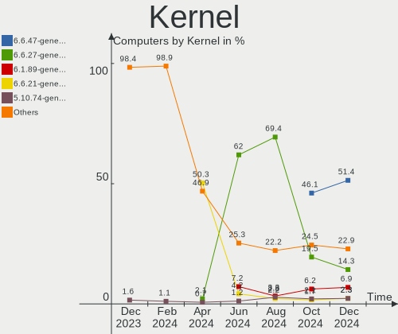
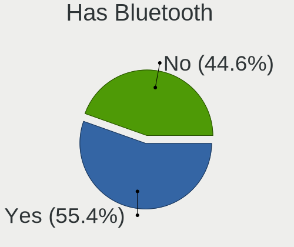
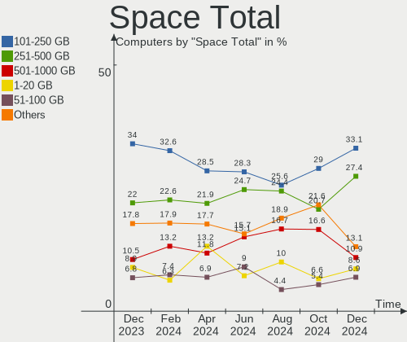
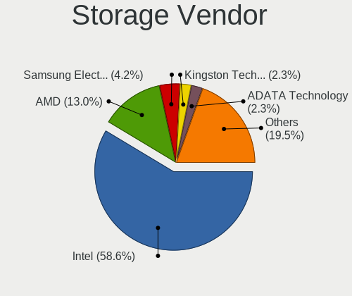
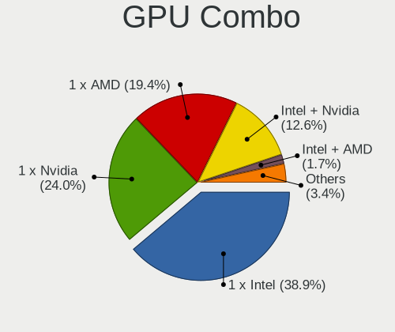
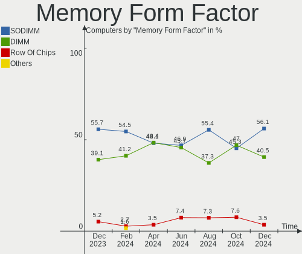

ROSA Hardware Trends
--------------------

A project to identify most popular hardware characteristics and track their change
over time based on data collected by ROSA users at https://Linux-Hardware.org.

Anyone can contribute to this report by the [hw-probe](https://github.com/linuxhw/hw-probe) tool:

    sudo -E hw-probe -all -upload

This is a report for all computer types. See also reports for [desktops](/Dist/ROSA/Desktop/README.md) and [notebooks](/Dist/ROSA/Notebook/README.md).

Full-feature report is available here: https://linux-hardware.org/?view=trends

Period: Sep, 2021.

Contents
--------

* [ System ](#system)
  - [ OS                       ](#os)
  - [ OS Family                ](#os-family)
  - [ Kernel                   ](#kernel)
  - [ Kernel Family            ](#kernel-family)
  - [ Kernel Major Ver.        ](#kernel-major-ver)
  - [ Arch                     ](#arch)
  - [ DE                       ](#de)
  - [ Display Server           ](#display-server)
  - [ Display Manager          ](#display-manager)
  - [ OS Lang                  ](#os-lang)
  - [ Boot Mode                ](#boot-mode)
  - [ Filesystem               ](#filesystem)
  - [ Part. scheme             ](#part-scheme)
  - [ Dual Boot with Linux/BSD ](#dual-boot-with-linuxbsd)
  - [ Dual Boot (Win)          ](#dual-boot-win)

* [ Board ](#board)
  - [ Vendor                   ](#vendor)
  - [ Model                    ](#model)
  - [ Model Family             ](#model-family)
  - [ MFG Year                 ](#mfg-year)
  - [ Form Factor              ](#form-factor)
  - [ Secure Boot              ](#secure-boot)
  - [ Coreboot                 ](#coreboot)
  - [ RAM Size                 ](#ram-size)
  - [ RAM Used                 ](#ram-used)
  - [ Total Drives             ](#total-drives)
  - [ Has CD-ROM               ](#has-cd-rom)
  - [ Has Ethernet             ](#has-ethernet)
  - [ Has WiFi                 ](#has-wifi)
  - [ Has Bluetooth            ](#has-bluetooth)

* [ Location ](#location)
  - [ Country                  ](#country)
  - [ City                     ](#city)

* [ Drives ](#drives)
  - [ Drive Vendor             ](#drive-vendor)
  - [ Drive Model              ](#drive-model)
  - [ HDD Vendor               ](#hdd-vendor)
  - [ SSD Vendor               ](#ssd-vendor)
  - [ Drive Kind               ](#drive-kind)
  - [ Drive Connector          ](#drive-connector)
  - [ Drive Size               ](#drive-size)
  - [ Space Total              ](#space-total)
  - [ Space Used               ](#space-used)
  - [ Malfunc. Drives          ](#malfunc-drives)
  - [ Malfunc. Drive Vendor    ](#malfunc-drive-vendor)
  - [ Malfunc. HDD Vendor      ](#malfunc-hdd-vendor)
  - [ Malfunc. Drive Kind      ](#malfunc-drive-kind)
  - [ Failed Drives            ](#failed-drives)
  - [ Failed Drive Vendor      ](#failed-drive-vendor)
  - [ Drive Status             ](#drive-status)

* [ Storage controller ](#storage-controller)
  - [ Storage Vendor           ](#storage-vendor)
  - [ Storage Model            ](#storage-model)
  - [ Storage Kind             ](#storage-kind)

* [ Processor ](#processor)
  - [ CPU Vendor               ](#cpu-vendor)
  - [ CPU Model                ](#cpu-model)
  - [ CPU Model Family         ](#cpu-model-family)
  - [ CPU Cores                ](#cpu-cores)
  - [ CPU Sockets              ](#cpu-sockets)
  - [ CPU Threads              ](#cpu-threads)
  - [ CPU Op-Modes             ](#cpu-op-modes)
  - [ CPU Microcode            ](#cpu-microcode)
  - [ CPU Microarch            ](#cpu-microarch)

* [ Graphics ](#graphics)
  - [ GPU Vendor               ](#gpu-vendor)
  - [ GPU Model                ](#gpu-model)
  - [ GPU Combo                ](#gpu-combo)
  - [ GPU Driver               ](#gpu-driver)
  - [ GPU Memory               ](#gpu-memory)

* [ Monitor ](#monitor)
  - [ Monitor Vendor           ](#monitor-vendor)
  - [ Monitor Model            ](#monitor-model)
  - [ Monitor Resolution       ](#monitor-resolution)
  - [ Monitor Diagonal         ](#monitor-diagonal)
  - [ Monitor Width            ](#monitor-width)
  - [ Aspect Ratio             ](#aspect-ratio)
  - [ Monitor Area             ](#monitor-area)
  - [ Pixel Density            ](#pixel-density)
  - [ Multiple Monitors        ](#multiple-monitors)

* [ Network ](#network)
  - [ Net Controller Vendor    ](#net-controller-vendor)
  - [ Net Controller Model     ](#net-controller-model)
  - [ Wireless Vendor          ](#wireless-vendor)
  - [ Wireless Model           ](#wireless-model)
  - [ Ethernet Vendor          ](#ethernet-vendor)
  - [ Ethernet Model           ](#ethernet-model)
  - [ Net Controller Kind      ](#net-controller-kind)
  - [ Used Controller          ](#used-controller)
  - [ NICs                     ](#nics)
  - [ IPv6                     ](#ipv6)

* [ Bluetooth ](#bluetooth)
  - [ Bluetooth Vendor         ](#bluetooth-vendor)
  - [ Bluetooth Model          ](#bluetooth-model)

* [ Sound ](#sound)
  - [ Sound Vendor             ](#sound-vendor)
  - [ Sound Model              ](#sound-model)

* [ Memory ](#memory)
  - [ Memory Vendor            ](#memory-vendor)
  - [ Memory Model             ](#memory-model)
  - [ Memory Kind              ](#memory-kind)
  - [ Memory Form Factor       ](#memory-form-factor)
  - [ Memory Size              ](#memory-size)
  - [ Memory Speed             ](#memory-speed)

* [ Printers & scanners ](#printers--scanners)
  - [ Printer Vendor           ](#printer-vendor)
  - [ Printer Model            ](#printer-model)
  - [ Scanner Vendor           ](#scanner-vendor)
  - [ Scanner Model            ](#scanner-model)

* [ Camera ](#camera)
  - [ Camera Vendor            ](#camera-vendor)
  - [ Camera Model             ](#camera-model)

* [ Security ](#security)
  - [ Fingerprint Vendor       ](#fingerprint-vendor)
  - [ Fingerprint Model        ](#fingerprint-model)
  - [ Chipcard Vendor          ](#chipcard-vendor)
  - [ Chipcard Model           ](#chipcard-model)

* [ Unsupported ](#unsupported)
  - [ Unsupported Devices      ](#unsupported-devices)
  - [ Unsupported Device Types ](#unsupported-device-types)

System
------

OS
--

Installed operating systems

| Name         | Computers | Percent |
|--------------|-----------|---------|
| ROSA R11.1   | 87        | 75.65%  |
| ROSA R12     | 14        | 12.17%  |
| ROSA R11     | 11        | 9.57%   |
| ROSA R8.1    | 2         | 1.74%   |
| ROSA 2019.05 | 1         | 0.87%   |

OS Family
---------

OS without a version

| Name | Computers | Percent |
|------|-----------|---------|
| ROSA | 115       | 100%    |

Kernel
------

Version of the Linux kernel

| Version                                | Computers | Percent |
|----------------------------------------|-----------|---------|
| 5.4.83-generic-2rosa-x86_64            | 29        | 25.22%  |
| 4.15.0-desktop-122.124.1rosa-x86_64    | 20        | 17.39%  |
| 5.4.32-generic-2rosa-x86_64            | 17        | 14.78%  |
| 5.4.32-generic-2rosa-i586              | 10        | 8.7%    |
| 5.10.56-generic-1rosa2021.1-x86_64     | 9         | 7.83%   |
| 4.15.0-desktop-45.1rosa-x86_64         | 6         | 5.22%   |
| 4.15.0-desktop-45.1rosa-i586           | 6         | 5.22%   |
| 5.10.65-generic-2rosa2021.1-x86_64     | 4         | 3.48%   |
| 4.9.155-nrj-desktop-1rosa-x86_64       | 3         | 2.61%   |
| 4.15.0-desktop-122.124.1rosa-i586      | 3         | 2.61%   |
| 5.4.83-generic-2rosa-i586              | 2         | 1.74%   |
| 5.10.50-generic-1rosa-x86_64           | 2         | 1.74%   |
| 5.4.60-nickel-2rosa2019.05-x86_64      | 1         | 0.87%   |
| 5.14.0.xm1-10-xanmod-rosa2021.1-x86_64 | 1         | 0.87%   |
| 4.9.155-nrj-desktop-1rosa-i586         | 1         | 0.87%   |
| 4.15.0-desktop-94.1rosa-x86_64         | 1         | 0.87%   |

Kernel Family
-------------

Linux kernel without a distro release

| Version | Computers | Percent |
|---------|-----------|---------|
| 4.15.0  | 36        | 31.3%   |
| 5.4.83  | 31        | 26.96%  |
| 5.4.32  | 27        | 23.48%  |
| 5.10.56 | 9         | 7.83%   |
| 5.10.65 | 4         | 3.48%   |
| 4.9.155 | 4         | 3.48%   |
| 5.10.50 | 2         | 1.74%   |
| 5.4.60  | 1         | 0.87%   |
| 5.14.0  | 1         | 0.87%   |

Kernel Major Ver.
-----------------

Linux kernel major version

| Version | Computers | Percent |
|---------|-----------|---------|
| 5.4     | 59        | 51.3%   |
| 4.15    | 36        | 31.3%   |
| 5.10    | 15        | 13.04%  |
| 4.9     | 4         | 3.48%   |
| 5.14    | 1         | 0.87%   |

Arch
----

OS architecture (x86_64, i586, etc.)

| Name   | Computers | Percent |
|--------|-----------|---------|
| x86_64 | 93        | 80.87%  |
| i686   | 22        | 19.13%  |

DE
--

Desktop Environment

| Name  | Computers | Percent |
|-------|-----------|---------|
| KDE4  | 59        | 51.3%   |
| KDE5  | 41        | 35.65%  |
| LXQt  | 11        | 9.57%   |
| GNOME | 3         | 2.61%   |
| XFCE  | 1         | 0.87%   |

Display Server
--------------

X11 or Wayland

| Name    | Computers | Percent |
|---------|-----------|---------|
| X11     | 105       | 91.3%   |
| Wayland | 10        | 8.7%    |

Display Manager
---------------

SDDM, LightDM, etc.

| Name | Computers | Percent |
|------|-----------|---------|
| KDM  | 60        | 52.17%  |
| SDDM | 44        | 38.26%  |
| GDM  | 11        | 9.57%   |

OS Lang
-------

Language

| Lang    | Computers | Percent |
|---------|-----------|---------|
| ru_RU   | 89        | 77.39%  |
| Unknown | 12        | 10.43%  |
| en_US   | 5         | 4.35%   |
| pl_PL   | 3         | 2.61%   |
| de_DE   | 2         | 1.74%   |
| ro_RO   | 1         | 0.87%   |
| pt_BR   | 1         | 0.87%   |
| fr_BE   | 1         | 0.87%   |
| es_ES   | 1         | 0.87%   |

Boot Mode
---------

EFI or BIOS

| Mode | Computers | Percent |
|------|-----------|---------|
| BIOS | 79        | 68.7%   |
| EFI  | 36        | 31.3%   |

Filesystem
----------

Type of filesystem

| Type  | Computers | Percent |
|-------|-----------|---------|
| Ext4  | 108       | 93.91%  |
| Btrfs | 6         | 5.22%   |
| Ext3  | 1         | 0.87%   |

Part. scheme
------------

Scheme of partitioning

| Type | Computers | Percent |
|------|-----------|---------|
| MBR  | 74        | 64.35%  |
| GPT  | 41        | 35.65%  |

Dual Boot with Linux/BSD
------------------------

Hosting more than one Linux/BSD

| Dual boot | Computers | Percent |
|-----------|-----------|---------|
| No        | 87        | 75.65%  |
| Yes       | 28        | 24.35%  |

Dual Boot (Win)
---------------

Hosting Linux and Windows

| Dual boot | Computers | Percent |
|-----------|-----------|---------|
| No        | 64        | 55.65%  |
| Yes       | 51        | 44.35%  |

Board
-----

Vendor
------

Motherboard manufacturer

| Name                | Computers | Percent |
|---------------------|-----------|---------|
| ASUSTek Computer    | 26        | 22.61%  |
| Gigabyte Technology | 16        | 13.91%  |
| Acer                | 16        | 13.91%  |
| Hewlett-Packard     | 13        | 11.3%   |
| MSI                 | 8         | 6.96%   |
| Lenovo              | 6         | 5.22%   |
| ASRock              | 6         | 5.22%   |
| Samsung Electronics | 5         | 4.35%   |
| Toshiba             | 3         | 2.61%   |
| Dell                | 3         | 2.61%   |
| Huanan              | 2         | 1.74%   |
| Unknown             | 2         | 1.74%   |
| ZoomSmart           | 1         | 0.87%   |
| Sony                | 1         | 0.87%   |
| Pegatron            | 1         | 0.87%   |
| Medion              | 1         | 0.87%   |
| Intel               | 1         | 0.87%   |
| Gateway             | 1         | 0.87%   |
| eMachines           | 1         | 0.87%   |
| ECS                 | 1         | 0.87%   |
| Clevo               | 1         | 0.87%   |

Model
-----

Motherboard model

| Name                                  | Computers | Percent |
|---------------------------------------|-----------|---------|
| Lenovo IdeaPad 110-15ACL 80TJ         | 2         | 1.74%   |
| ASUS All Series                       | 2         | 1.74%   |
| Unknown                               | 2         | 1.74%   |
| ZoomSmart A1002                       | 1         | 0.87%   |
| Toshiba TECRA A9                      | 1         | 0.87%   |
| Toshiba Satellite L850-D7W            | 1         | 0.87%   |
| Toshiba Satellite C655                | 1         | 0.87%   |
| Sony SVE1512H1RW                      | 1         | 0.87%   |
| Samsung R540/R580/R780/SA41/E452/E852 | 1         | 0.87%   |
| Samsung R530/R730                     | 1         | 0.87%   |
| Samsung R508                          | 1         | 0.87%   |
| Samsung R460                          | 1         | 0.87%   |
| Samsung 450R4E/450R5E/450R4V/450R5V   | 1         | 0.87%   |
| Pegatron Compaq dx2400 Microtower     | 1         | 0.87%   |
| MSI MS-7C52                           | 1         | 0.87%   |
| MSI MS-7B53                           | 1         | 0.87%   |
| MSI MS-7A36                           | 1         | 0.87%   |
| MSI MS-7895                           | 1         | 0.87%   |
| MSI MS-7788                           | 1         | 0.87%   |
| MSI MS-7758                           | 1         | 0.87%   |
| MSI MS-7599                           | 1         | 0.87%   |
| MSI Compaq dx7400 Microtower          | 1         | 0.87%   |
| Medion A17                            | 1         | 0.87%   |
| Lenovo Lenovo                         | 1         | 0.87%   |
| Lenovo G580 20150                     | 1         | 0.87%   |
| Lenovo G50-70 20351                   | 1         | 0.87%   |
| Lenovo B590 20208                     | 1         | 0.87%   |
| Intel H61M-S1                         | 1         | 0.87%   |
| Huanan X99-8M-F V1.1                  | 1         | 0.87%   |
| Huanan X99 F8D V2.2                   | 1         | 0.87%   |
| HP ProBook 4515s                      | 1         | 0.87%   |
| HP Pavilion m6                        | 1         | 0.87%   |
| HP Pavilion g6                        | 1         | 0.87%   |
| HP Pavilion dv6700                    | 1         | 0.87%   |
| HP Pavilion dv6                       | 1         | 0.87%   |
| HP Pavilion 15                        | 1         | 0.87%   |
| HP Mini 110-3700                      | 1         | 0.87%   |
| HP Laptop 15-ra0xx                    | 1         | 0.87%   |
| HP EliteDesk 800 G1 TWR               | 1         | 0.87%   |
| HP Compaq dc7900 Small Form Factor    | 1         | 0.87%   |
| HP Compaq 610                         | 1         | 0.87%   |
| HP All-in-One 24-df0xxx               | 1         | 0.87%   |
| HP 15                                 | 1         | 0.87%   |
| Gigabyte Z87P-D3                      | 1         | 0.87%   |
| Gigabyte Z390 AORUS ELITE             | 1         | 0.87%   |
| Gigabyte M61PME-S2P                   | 1         | 0.87%   |
| Gigabyte H77-DS3H                     | 1         | 0.87%   |
| Gigabyte H61M-S2PV                    | 1         | 0.87%   |
| Gigabyte H61M-S1                      | 1         | 0.87%   |
| Gigabyte GA-MA790X-UD4                | 1         | 0.87%   |
| Gigabyte G31M-S2C                     | 1         | 0.87%   |
| Gigabyte F2A68HM-DS2                  | 1         | 0.87%   |
| Gigabyte EX58-UD5                     | 1         | 0.87%   |
| Gigabyte B450M S2H                    | 1         | 0.87%   |
| Gigabyte B450M DS3H V2                | 1         | 0.87%   |
| Gigabyte B250M-D3H                    | 1         | 0.87%   |
| Gigabyte AB350M-DS3H V2               | 1         | 0.87%   |
| Gigabyte AB350-Gaming                 | 1         | 0.87%   |
| Gigabyte 8I915P Pro                   | 1         | 0.87%   |
| Gateway M-6307                        | 1         | 0.87%   |

Model Family
------------

Motherboard model prefix

| Name                   | Computers | Percent |
|------------------------|-----------|---------|
| Acer Aspire            | 12        | 10.43%  |
| HP Pavilion            | 5         | 4.35%   |
| ASUS P8H61-M           | 4         | 3.48%   |
| Toshiba Satellite      | 2         | 1.74%   |
| Lenovo IdeaPad         | 2         | 1.74%   |
| HP Compaq              | 2         | 1.74%   |
| Gigabyte B450M         | 2         | 1.74%   |
| Dell Latitude          | 2         | 1.74%   |
| ASUS PRIME             | 2         | 1.74%   |
| ASUS P5KPL-AM          | 2         | 1.74%   |
| ASUS All               | 2         | 1.74%   |
| Unknown                | 2         | 1.74%   |
| ZoomSmart A1002        | 1         | 0.87%   |
| Toshiba TECRA          | 1         | 0.87%   |
| Sony SVE1512H1RW       | 1         | 0.87%   |
| Samsung R540           | 1         | 0.87%   |
| Samsung R530           | 1         | 0.87%   |
| Samsung R508           | 1         | 0.87%   |
| Samsung R460           | 1         | 0.87%   |
| Samsung 450R4E         | 1         | 0.87%   |
| Pegatron Compaq        | 1         | 0.87%   |
| MSI MS-7C52            | 1         | 0.87%   |
| MSI MS-7B53            | 1         | 0.87%   |
| MSI MS-7A36            | 1         | 0.87%   |
| MSI MS-7895            | 1         | 0.87%   |
| MSI MS-7788            | 1         | 0.87%   |
| MSI MS-7758            | 1         | 0.87%   |
| MSI MS-7599            | 1         | 0.87%   |
| MSI Compaq             | 1         | 0.87%   |
| Medion A17             | 1         | 0.87%   |
| Lenovo Lenovo          | 1         | 0.87%   |
| Lenovo G580            | 1         | 0.87%   |
| Lenovo G50-70          | 1         | 0.87%   |
| Lenovo B590            | 1         | 0.87%   |
| Intel H61M-S1          | 1         | 0.87%   |
| Huanan X99-8M-F        | 1         | 0.87%   |
| Huanan X99             | 1         | 0.87%   |
| HP ProBook             | 1         | 0.87%   |
| HP Mini                | 1         | 0.87%   |
| HP Laptop              | 1         | 0.87%   |
| HP EliteDesk           | 1         | 0.87%   |
| HP All-in-One          | 1         | 0.87%   |
| HP 15                  | 1         | 0.87%   |
| Gigabyte Z87P-D3       | 1         | 0.87%   |
| Gigabyte Z390          | 1         | 0.87%   |
| Gigabyte M61PME-S2P    | 1         | 0.87%   |
| Gigabyte H77-DS3H      | 1         | 0.87%   |
| Gigabyte H61M-S2PV     | 1         | 0.87%   |
| Gigabyte H61M-S1       | 1         | 0.87%   |
| Gigabyte GA-MA790X-UD4 | 1         | 0.87%   |
| Gigabyte G31M-S2C      | 1         | 0.87%   |
| Gigabyte F2A68HM-DS2   | 1         | 0.87%   |
| Gigabyte EX58-UD5      | 1         | 0.87%   |
| Gigabyte B250M-D3H     | 1         | 0.87%   |
| Gigabyte AB350M-DS3H   | 1         | 0.87%   |
| Gigabyte AB350-Gaming  | 1         | 0.87%   |
| Gigabyte 8I915P        | 1         | 0.87%   |
| Gateway M-6307         | 1         | 0.87%   |
| eMachines E620         | 1         | 0.87%   |
| ECS LIVA               | 1         | 0.87%   |

MFG Year
--------

Motherboard manufacture year

| Year | Computers | Percent |
|------|-----------|---------|
| 2013 | 16        | 13.91%  |
| 2012 | 15        | 13.04%  |
| 2010 | 11        | 9.57%   |
| 2009 | 10        | 8.7%    |
| 2008 | 9         | 7.83%   |
| 2019 | 8         | 6.96%   |
| 2020 | 7         | 6.09%   |
| 2014 | 6         | 5.22%   |
| 2011 | 6         | 5.22%   |
| 2021 | 5         | 4.35%   |
| 2018 | 5         | 4.35%   |
| 2007 | 5         | 4.35%   |
| 2016 | 4         | 3.48%   |
| 2017 | 3         | 2.61%   |
| 2005 | 3         | 2.61%   |
| 2015 | 2         | 1.74%   |

Form Factor
-----------

Physical design of the computer

| Name       | Computers | Percent |
|------------|-----------|---------|
| Desktop    | 61        | 53.04%  |
| Notebook   | 50        | 43.48%  |
| All in one | 3         | 2.61%   |
| Tablet     | 1         | 0.87%   |

Secure Boot
-----------

Enabled or disabled

| State    | Computers | Percent |
|----------|-----------|---------|
| Disabled | 115       | 100%    |

Coreboot
--------

Have coreboot on board

| Used | Computers | Percent |
|------|-----------|---------|
| No   | 115       | 100%    |

RAM Size
--------

Total RAM memory

| Size in GB  | Computers | Percent |
|-------------|-----------|---------|
| 3.01-4.0    | 43        | 37.39%  |
| 8.01-16.0   | 20        | 17.39%  |
| 4.01-8.0    | 17        | 14.78%  |
| 1.01-2.0    | 16        | 13.91%  |
| 16.01-24.0  | 9         | 7.83%   |
| 2.01-3.0    | 8         | 6.96%   |
| 32.01-64.0  | 1         | 0.87%   |
| 64.01-256.0 | 1         | 0.87%   |

RAM Used
--------

Used RAM memory

| Used GB  | Computers | Percent |
|----------|-----------|---------|
| 1.01-2.0 | 51        | 44.35%  |
| 0.51-1.0 | 45        | 39.13%  |
| 2.01-3.0 | 14        | 12.17%  |
| 4.01-8.0 | 3         | 2.61%   |
| 3.01-4.0 | 2         | 1.74%   |

Total Drives
------------

Number of drives on board

| Drives | Computers | Percent |
|--------|-----------|---------|
| 1      | 68        | 59.13%  |
| 2      | 34        | 29.57%  |
| 3      | 7         | 6.09%   |
| 4      | 3         | 2.61%   |
| 6      | 1         | 0.87%   |
| 5      | 1         | 0.87%   |
| 0      | 1         | 0.87%   |

Has CD-ROM
----------

Has CD-ROM on board

| Presented | Computers | Percent |
|-----------|-----------|---------|
| Yes       | 60        | 52.17%  |
| No        | 55        | 47.83%  |

Has Ethernet
------------

Has Ethernet on board

| Presented | Computers | Percent |
|-----------|-----------|---------|
| Yes       | 112       | 97.39%  |
| No        | 3         | 2.61%   |

Has WiFi
--------

Has WiFi module

| Presented | Computers | Percent |
|-----------|-----------|---------|
| Yes       | 77        | 66.96%  |
| No        | 38        | 33.04%  |

Has Bluetooth
-------------

Has Bluetooth module

| Presented | Computers | Percent |
|-----------|-----------|---------|
| No        | 72        | 62.61%  |
| Yes       | 43        | 37.39%  |

Location
--------

Country
-------

Geographic location (country)

| Country    | Computers | Percent |
|------------|-----------|---------|
| Russia     | 87        | 75.65%  |
| Ukraine    | 8         | 6.96%   |
| Belarus    | 6         | 5.22%   |
| Slovakia   | 2         | 1.74%   |
| Poland     | 2         | 1.74%   |
| Germany    | 2         | 1.74%   |
| USA        | 1         | 0.87%   |
| Uruguay    | 1         | 0.87%   |
| Sweden     | 1         | 0.87%   |
| Romania    | 1         | 0.87%   |
| Kazakhstan | 1         | 0.87%   |
| India      | 1         | 0.87%   |
| Brazil     | 1         | 0.87%   |
| Belgium    | 1         | 0.87%   |

City
----

Geographic location (city)

| City                | Computers | Percent |
|---------------------|-----------|---------|
| Moscow              | 13        | 11.3%   |
| St Petersburg       | 7         | 6.09%   |
| Saratov             | 5         | 4.35%   |
| Krasnodar           | 4         | 3.48%   |
| Tula                | 3         | 2.61%   |
| Novosibirsk         | 3         | 2.61%   |
| Minsk               | 3         | 2.61%   |
| Irkutsk             | 3         | 2.61%   |
| Tyumen              | 2         | 1.74%   |
| Tver                | 2         | 1.74%   |
| Srednyaya Akhtuba   | 2         | 1.74%   |
| Saransk             | 2         | 1.74%   |
| Orenburg            | 2         | 1.74%   |
| Omsk                | 2         | 1.74%   |
| Nizhniy Novgorod    | 2         | 1.74%   |
| Lipetsk             | 2         | 1.74%   |
| Zaporizhzhya        | 1         | 0.87%   |
| Yaroslavl           | 1         | 0.87%   |
| Warsaw              | 1         | 0.87%   |
| Voronezh            | 1         | 0.87%   |
| Vologda             | 1         | 0.87%   |
| Volgograd           | 1         | 0.87%   |
| Vladimir            | 1         | 0.87%   |
| Vitebsk             | 1         | 0.87%   |
| Troitsk             | 1         | 0.87%   |
| Tolyatti            | 1         | 0.87%   |
| Ternovka            | 1         | 0.87%   |
| Suzdal              | 1         | 0.87%   |
| Sundbyberg          | 1         | 0.87%   |
| Stola               | 1         | 0.87%   |
| Shchelkovo          | 1         | 0.87%   |
| Severodvinsk        | 1         | 0.87%   |
| Selidovo            | 1         | 0.87%   |
| S??o Leopoldo       | 1         | 0.87%   |
| Rzgow               | 1         | 0.87%   |
| Rybinsk             | 1         | 0.87%   |
| Pyatigorsk          | 1         | 0.87%   |
| Pushchino           | 1         | 0.87%   |
| Pskov               | 1         | 0.87%   |
| Pinsk               | 1         | 0.87%   |
| Pervouralsk         | 1         | 0.87%   |
| Pervomaysk          | 1         | 0.87%   |
| Perm                | 1         | 0.87%   |
| Nogaisk             | 1         | 0.87%   |
| Newark              | 1         | 0.87%   |
| Nal'chik            | 1         | 0.87%   |
| Naberezhnyye Chelny | 1         | 0.87%   |
| Mytishchi           | 1         | 0.87%   |
| Malinovo            | 1         | 0.87%   |
| Makiivka            | 1         | 0.87%   |
| Luhansk             | 1         | 0.87%   |
| Lohnberg            | 1         | 0.87%   |
| Kyiv                | 1         | 0.87%   |
| Krasnoznamensk      | 1         | 0.87%   |
| Krasnoyarsk         | 1         | 0.87%   |
| Kirov               | 1         | 0.87%   |
| Kharkiv             | 1         | 0.87%   |
| Kemerovo            | 1         | 0.87%   |
| Karaganda           | 1         | 0.87%   |
| Karachev            | 1         | 0.87%   |

Drives
------

Drive Vendor
------------

Hard drive vendors

| Vendor              | Computers | Drives | Percent |
|---------------------|-----------|--------|---------|
| WDC                 | 46        | 47     | 28.4%   |
| Seagate             | 35        | 41     | 21.6%   |
| Toshiba             | 12        | 12     | 7.41%   |
| Samsung Electronics | 12        | 12     | 7.41%   |
| Hitachi             | 7         | 7      | 4.32%   |
| Kingston            | 6         | 6      | 3.7%    |
| Unknown             | 5         | 6      | 3.09%   |
| China               | 4         | 4      | 2.47%   |
| SPCC                | 3         | 3      | 1.85%   |
| KingSpec            | 3         | 3      | 1.85%   |
| HGST                | 3         | 3      | 1.85%   |
| GOODRAM             | 3         | 4      | 1.85%   |
| SanDisk             | 2         | 2      | 1.23%   |
| Intel               | 2         | 2      | 1.23%   |
| Crucial             | 2         | 2      | 1.23%   |
| Apacer              | 2         | 3      | 1.23%   |
| A-DATA Technology   | 2         | 2      | 1.23%   |
| ZTE                 | 1         | 1      | 0.62%   |
| Zheino              | 1         | 1      | 0.62%   |
| XrayDisk            | 1         | 1      | 0.62%   |
| PLEXTOR             | 1         | 1      | 0.62%   |
| Patriot             | 1         | 1      | 0.62%   |
| Palit               | 1         | 1      | 0.62%   |
| OCZ                 | 1         | 1      | 0.62%   |
| MAXTOR              | 1         | 1      | 0.62%   |
| Kingmax             | 1         | 1      | 0.62%   |
| JMicron             | 1         | 1      | 0.62%   |
| HUAWEI              | 1         | 1      | 0.62%   |
| Fujitsu             | 1         | 1      | 0.62%   |
| FOXLINE             | 1         | 1      | 0.62%   |

Drive Model
-----------

Hard drive models

| Model                                | Computers | Percent |
|--------------------------------------|-----------|---------|
| Toshiba HDWD110 1TB                  | 4         | 2.38%   |
| Seagate ST500LT012-1DG142 500GB      | 4         | 2.38%   |
| Seagate ST1000DM010-2EP102 1TB       | 4         | 2.38%   |
| Seagate ST3250310AS 250GB            | 3         | 1.79%   |
| WDC WD3200BPVT-22JJ5T0 320GB         | 2         | 1.19%   |
| WDC WD3200BEKT-60V5T1 320GB          | 2         | 1.19%   |
| Toshiba DT01ACA100 1TB               | 2         | 1.19%   |
| Seagate ST9160310AS 160GB            | 2         | 1.19%   |
| Seagate ST500LT012-9WS142 500GB      | 2         | 1.19%   |
| Seagate ST3160815AS 160GB            | 2         | 1.19%   |
| Samsung HM321HI 320GB                | 2         | 1.19%   |
| Hitachi HTS547550A9E384 500GB        | 2         | 1.19%   |
| ZTE MMC Storage 8GB                  | 1         | 0.6%    |
| Zheino CHN 25SATAA3 360 360GB        | 1         | 0.6%    |
| XrayDisk SSD 480GB                   | 1         | 0.6%    |
| WDC WDS480G2G0A-00JH30 480GB SSD     | 1         | 0.6%    |
| WDC WDS240G2G0B-00EPW0 240GB SSD     | 1         | 0.6%    |
| WDC WDS240G2G0A-00JH30 240GB SSD     | 1         | 0.6%    |
| WDC WDS240G1G0A-00SS50 240GB SSD     | 1         | 0.6%    |
| WDC WDS120G2G0B-00EPW0 120GB SSD     | 1         | 0.6%    |
| WDC WDS120G2G0A-00JH30 120GB SSD     | 1         | 0.6%    |
| WDC WD800JB-00JJC0 80GB              | 1         | 0.6%    |
| WDC WD7500AALX-009BA0 752GB          | 1         | 0.6%    |
| WDC WD5003AZEX-00K1GA0 500GB         | 1         | 0.6%    |
| WDC WD5003ABYX-18WERA0 500GB         | 1         | 0.6%    |
| WDC WD5000LPVX-60V0TT0 500GB         | 1         | 0.6%    |
| WDC WD5000LPVX-22V0TT0 500GB         | 1         | 0.6%    |
| WDC WD5000LPCX-60VHAT1 500GB         | 1         | 0.6%    |
| WDC WD5000LPCX-24VHAT0 500GB         | 1         | 0.6%    |
| WDC WD5000LPCX-24C6HT0 500GB         | 1         | 0.6%    |
| WDC WD5000BPVT-22HXZT3 500GB         | 1         | 0.6%    |
| WDC WD5000AZLX-22JKKA0 500GB         | 1         | 0.6%    |
| WDC WD5000AAKX-753CA1 500GB          | 1         | 0.6%    |
| WDC WD5000AADS-00M2B0 500GB          | 1         | 0.6%    |
| WDC WD4003FRYZ-01F0DB0 4TB           | 1         | 0.6%    |
| WDC WD3200JS-55PDB0 320GB            | 1         | 0.6%    |
| WDC WD3200AAKS-00YGA0 320GB          | 1         | 0.6%    |
| WDC WD2500BEVT-22ZCT0 250GB          | 1         | 0.6%    |
| WDC WD20EZRZ-22Z5HB0 2TB             | 1         | 0.6%    |
| WDC WD20EARS-00MVWB0 2TB             | 1         | 0.6%    |
| WDC WD1600BEVT-60ZCT1 160GB          | 1         | 0.6%    |
| WDC WD1600AAJS-00L7A0 160GB          | 1         | 0.6%    |
| WDC WD1200JD-00HBB0 120GB            | 1         | 0.6%    |
| WDC WD1200BEVS-22UST0 120GB          | 1         | 0.6%    |
| WDC WD10SPZX-22Z10T1 1TB             | 1         | 0.6%    |
| WDC WD10SPZX-21Z10T0 1TB             | 1         | 0.6%    |
| WDC WD10JPVX-75JC3T0 1TB             | 1         | 0.6%    |
| WDC WD10JPVT-08A1YT2 1TB             | 1         | 0.6%    |
| WDC WD10EZRX-00L4HB0 1TB             | 1         | 0.6%    |
| WDC WD10EZRX-00A8LB0 1TB             | 1         | 0.6%    |
| WDC WD10EZEX-60ZF5A0 1TB             | 1         | 0.6%    |
| WDC WD10EZEX-21WN4A0 1TB             | 1         | 0.6%    |
| WDC WD10EZEX-08WN4A0 1TB             | 1         | 0.6%    |
| WDC WD10EZEX-00BN5A0 1TB             | 1         | 0.6%    |
| WDC PC SN530 SDBPNPZ-512G-1014 512GB | 1         | 0.6%    |
| WDC PC SN530 SDBPNPZ-512G-1002 512GB | 1         | 0.6%    |
| WDC PC SN530 SDBPNPZ-256G-1006 256GB | 1         | 0.6%    |
| WDC PC SN530 SDBPNPZ-256G-1002 256GB | 1         | 0.6%    |
| Unknown SD/MMC 64GB                  | 1         | 0.6%    |
| Unknown SCY  64GB                    | 1         | 0.6%    |

HDD Vendor
----------

Hard disk drive vendors

| Vendor              | Computers | Drives | Percent |
|---------------------|-----------|--------|---------|
| WDC                 | 36        | 37     | 36%     |
| Seagate             | 34        | 40     | 34%     |
| Toshiba             | 11        | 11     | 11%     |
| Samsung Electronics | 7         | 7      | 7%      |
| Hitachi             | 7         | 7      | 7%      |
| HGST                | 3         | 3      | 3%      |
| MAXTOR              | 1         | 1      | 1%      |
| Fujitsu             | 1         | 1      | 1%      |

SSD Vendor
----------

Solid state drive vendors

| Vendor              | Computers | Drives | Percent |
|---------------------|-----------|--------|---------|
| WDC                 | 6         | 6      | 13.04%  |
| Kingston            | 6         | 6      | 13.04%  |
| China               | 4         | 4      | 8.7%    |
| SPCC                | 3         | 3      | 6.52%   |
| Samsung Electronics | 3         | 3      | 6.52%   |
| KingSpec            | 3         | 3      | 6.52%   |
| GOODRAM             | 3         | 4      | 6.52%   |
| SanDisk             | 2         | 2      | 4.35%   |
| Apacer              | 2         | 3      | 4.35%   |
| A-DATA Technology   | 2         | 2      | 4.35%   |
| Zheino              | 1         | 1      | 2.17%   |
| XrayDisk            | 1         | 1      | 2.17%   |
| Toshiba             | 1         | 1      | 2.17%   |
| Seagate             | 1         | 1      | 2.17%   |
| PLEXTOR             | 1         | 1      | 2.17%   |
| Patriot             | 1         | 1      | 2.17%   |
| Palit               | 1         | 1      | 2.17%   |
| OCZ                 | 1         | 1      | 2.17%   |
| Kingmax             | 1         | 1      | 2.17%   |
| Intel               | 1         | 1      | 2.17%   |
| FOXLINE             | 1         | 1      | 2.17%   |
| Crucial             | 1         | 1      | 2.17%   |

Drive Kind
----------

HDD or SSD

| Kind    | Computers | Drives | Percent |
|---------|-----------|--------|---------|
| HDD     | 87        | 107    | 60.42%  |
| SSD     | 42        | 48     | 29.17%  |
| NVMe    | 7         | 8      | 4.86%   |
| MMC     | 4         | 4      | 2.78%   |
| Unknown | 4         | 5      | 2.78%   |

Drive Connector
---------------

SATA, SAS, NVMe, etc.

| Type | Computers | Drives | Percent |
|------|-----------|--------|---------|
| SATA | 107       | 154    | 86.99%  |
| NVMe | 7         | 8      | 5.69%   |
| SAS  | 5         | 6      | 4.07%   |
| MMC  | 4         | 4      | 3.25%   |

Drive Size
----------

Size of hard drive

| Size in TB | Computers | Drives | Percent |
|------------|-----------|--------|---------|
| 0.01-0.5   | 92        | 114    | 73.02%  |
| 0.51-1.0   | 27        | 34     | 21.43%  |
| 1.01-2.0   | 4         | 4      | 3.17%   |
| 3.01-4.0   | 2         | 2      | 1.59%   |
| 4.01-10.0  | 1         | 1      | 0.79%   |

Space Total
-----------

Amount of disk space available on the file system

| Size in GB | Computers | Percent |
|------------|-----------|---------|
| 101-250    | 33        | 28.7%   |
| 251-500    | 21        | 18.26%  |
| 51-100     | 18        | 15.65%  |
| 501-1000   | 13        | 11.3%   |
| 1-20       | 12        | 10.43%  |
| 21-50      | 11        | 9.57%   |
| 1001-2000  | 6         | 5.22%   |
| 2001-3000  | 1         | 0.87%   |

Space Used
----------

Amount of used disk space

| Used GB   | Computers | Percent |
|-----------|-----------|---------|
| 1-20      | 79        | 68.7%   |
| 21-50     | 10        | 8.7%    |
| 101-250   | 10        | 8.7%    |
| 51-100    | 9         | 7.83%   |
| 251-500   | 3         | 2.61%   |
| 501-1000  | 3         | 2.61%   |
| 1001-2000 | 1         | 0.87%   |

Malfunc. Drives
---------------

Drive models with a malfunction

| Model                             | Computers | Drives | Percent |
|-----------------------------------|-----------|--------|---------|
| Seagate ST500LT012-1DG142 500GB   | 3         | 3      | 7.14%   |
| Seagate ST3250310AS 250GB         | 3         | 3      | 7.14%   |
| Seagate ST500LT012-9WS142 500GB   | 2         | 2      | 4.76%   |
| WDC WDS120G2G0A-00JH30 120GB SSD  | 1         | 1      | 2.38%   |
| WDC WD800JB-00JJC0 80GB           | 1         | 1      | 2.38%   |
| WDC WD5000LPVX-60V0TT0 500GB      | 1         | 1      | 2.38%   |
| WDC WD5000LPCX-24VHAT0 500GB      | 1         | 1      | 2.38%   |
| WDC WD5000LPCX-24C6HT0 500GB      | 1         | 1      | 2.38%   |
| WDC WD5000AZLX-22JKKA0 500GB      | 1         | 1      | 2.38%   |
| WDC WD3200BEKT-60V5T1 320GB       | 1         | 1      | 2.38%   |
| WDC WD20EARS-00MVWB0 2TB          | 1         | 1      | 2.38%   |
| WDC WD1600AAJS-00L7A0 160GB       | 1         | 1      | 2.38%   |
| WDC WD1200JD-00HBB0 120GB         | 1         | 1      | 2.38%   |
| WDC WD10JPVX-75JC3T0 1TB          | 1         | 1      | 2.38%   |
| WDC WD10JPVT-08A1YT2 1TB          | 1         | 1      | 2.38%   |
| Toshiba MK3276GSX 320GB           | 1         | 1      | 2.38%   |
| Toshiba MK1646GSX 160GB           | 1         | 1      | 2.38%   |
| Toshiba DT01ACA050 500GB          | 1         | 1      | 2.38%   |
| Seagate STM3500418AS 500GB        | 1         | 1      | 2.38%   |
| Seagate ST9500420AS 500GB         | 1         | 1      | 2.38%   |
| Seagate ST9250315AS 250GB         | 1         | 1      | 2.38%   |
| Seagate ST9160310AS 160GB         | 1         | 1      | 2.38%   |
| Seagate ST3808110AS 80GB          | 1         | 1      | 2.38%   |
| Seagate ST3750640NS 752GB         | 1         | 2      | 2.38%   |
| Seagate ST1000LM035-1RK172 1TB    | 1         | 1      | 2.38%   |
| Samsung Electronics SP1614C 160GB | 1         | 1      | 2.38%   |
| Samsung Electronics HM160HI 160GB | 1         | 1      | 2.38%   |
| Samsung Electronics HD080HJ 80GB  | 1         | 1      | 2.38%   |
| MAXTOR 2B020H1 20GB               | 1         | 1      | 2.38%   |
| KingSpec P3-256 256GB SSD         | 1         | 1      | 2.38%   |
| Kingmax SSD 120GB                 | 1         | 1      | 2.38%   |
| Hitachi HTS547550A9E384 500GB     | 1         | 1      | 2.38%   |
| Hitachi HTS545025B9A300 250GB     | 1         | 1      | 2.38%   |
| Hitachi HTS542516K9SA00 160GB     | 1         | 1      | 2.38%   |
| Hitachi HDT721016SLA380 160GB     | 1         | 1      | 2.38%   |
| HGST HTS545050A7E680 500GB        | 1         | 1      | 2.38%   |
| Fujitsu MHT2040BH 40GB            | 1         | 1      | 2.38%   |

Malfunc. Drive Vendor
---------------------

Vendors of faulty drives

| Vendor              | Computers | Drives | Percent |
|---------------------|-----------|--------|---------|
| Seagate             | 14        | 16     | 34.15%  |
| WDC                 | 12        | 12     | 29.27%  |
| Hitachi             | 4         | 4      | 9.76%   |
| Toshiba             | 3         | 3      | 7.32%   |
| Samsung Electronics | 3         | 3      | 7.32%   |
| MAXTOR              | 1         | 1      | 2.44%   |
| KingSpec            | 1         | 1      | 2.44%   |
| Kingmax             | 1         | 1      | 2.44%   |
| HGST                | 1         | 1      | 2.44%   |
| Fujitsu             | 1         | 1      | 2.44%   |

Malfunc. HDD Vendor
-------------------

Vendors of faulty HDD drives

| Vendor              | Computers | Drives | Percent |
|---------------------|-----------|--------|---------|
| Seagate             | 14        | 16     | 36.84%  |
| WDC                 | 11        | 11     | 28.95%  |
| Hitachi             | 4         | 4      | 10.53%  |
| Toshiba             | 3         | 3      | 7.89%   |
| Samsung Electronics | 3         | 3      | 7.89%   |
| MAXTOR              | 1         | 1      | 2.63%   |
| HGST                | 1         | 1      | 2.63%   |
| Fujitsu             | 1         | 1      | 2.63%   |

Malfunc. Drive Kind
-------------------

Kinds of faulty drives

| Kind | Computers | Drives | Percent |
|------|-----------|--------|---------|
| HDD  | 35        | 40     | 92.11%  |
| SSD  | 3         | 3      | 7.89%   |

Failed Drives
-------------

Failed drive models

Zero info for selected period =(

Failed Drive Vendor
-------------------

Failed drive vendors

Zero info for selected period =(

Drive Status
------------

Number of failed and malfunc. drives

| Status   | Computers | Drives | Percent |
|----------|-----------|--------|---------|
| Works    | 85        | 120    | 65.38%  |
| Malfunc  | 37        | 43     | 28.46%  |
| Detected | 8         | 9      | 6.15%   |

Storage controller
------------------

Storage Vendor
--------------

Storage controller vendors

| Vendor                    | Computers | Percent |
|---------------------------|-----------|---------|
| Intel                     | 87        | 67.97%  |
| AMD                       | 26        | 20.31%  |
| Sandisk                   | 4         | 3.13%   |
| Nvidia                    | 3         | 2.34%   |
| VIA Technologies          | 2         | 1.56%   |
| Samsung Electronics       | 2         | 1.56%   |
| Micron/Crucial Technology | 1         | 0.78%   |
| Marvell Technology Group  | 1         | 0.78%   |
| JMicron Technology        | 1         | 0.78%   |
| ASMedia Technology        | 1         | 0.78%   |

Storage Model
-------------

Storage controller models

| Model                                                                                   | Computers | Percent |
|-----------------------------------------------------------------------------------------|-----------|---------|
| AMD FCH SATA Controller [AHCI mode]                                                     | 14        | 8.09%   |
| Intel NM10/ICH7 Family SATA Controller [IDE mode]                                       | 9         | 5.2%    |
| Intel 82801G (ICH7 Family) IDE Controller                                               | 9         | 5.2%    |
| Intel 7 Series Chipset Family 6-port SATA Controller [AHCI mode]                        | 8         | 4.62%   |
| Intel 8 Series/C220 Series Chipset Family 6-port SATA Controller 1 [AHCI mode]          | 7         | 4.05%   |
| Intel 82801HM/HEM (ICH8M/ICH8M-E) SATA Controller [AHCI mode]                           | 6         | 3.47%   |
| Intel 82801HM/HEM (ICH8M/ICH8M-E) IDE Controller                                        | 6         | 3.47%   |
| Intel 82801IBM/IEM (ICH9M/ICH9M-E) 4 port SATA Controller [AHCI mode]                   | 5         | 2.89%   |
| Intel 6 Series/C200 Series Chipset Family Desktop SATA Controller (IDE mode, ports 4-5) | 5         | 2.89%   |
| Intel 6 Series/C200 Series Chipset Family Desktop SATA Controller (IDE mode, ports 0-3) | 5         | 2.89%   |
| Sandisk WD Blue SN550 NVMe SSD                                                          | 4         | 2.31%   |
| Intel 6 Series/C200 Series Chipset Family 6 port Mobile SATA AHCI Controller            | 4         | 2.31%   |
| Intel 6 Series/C200 Series Chipset Family 6 port Desktop SATA AHCI Controller           | 4         | 2.31%   |
| AMD SB7x0/SB8x0/SB9x0 SATA Controller [IDE mode]                                        | 4         | 2.31%   |
| AMD SB7x0/SB8x0/SB9x0 IDE Controller                                                    | 4         | 2.31%   |
| AMD 400 Series Chipset SATA Controller                                                  | 4         | 2.31%   |
| Intel NM10/ICH7 Family SATA Controller [AHCI mode]                                      | 3         | 1.73%   |
| Intel 7 Series/C210 Series Chipset Family 6-port SATA Controller [AHCI mode]            | 3         | 1.73%   |
| AMD FCH SATA Controller [IDE mode]                                                      | 3         | 1.73%   |
| VIA VT6415 PATA IDE Host Controller                                                     | 2         | 1.16%   |
| Nvidia MCP61 SATA Controller                                                            | 2         | 1.16%   |
| Nvidia MCP61 IDE                                                                        | 2         | 1.16%   |
| Intel Celeron/Pentium Silver Processor SATA Controller                                  | 2         | 1.16%   |
| Intel Celeron N3350/Pentium N4200/Atom E3900 Series SATA AHCI Controller                | 2         | 1.16%   |
| Intel Cannon Lake PCH SATA AHCI Controller                                              | 2         | 1.16%   |
| Intel 82801JI (ICH10 Family) 4 port SATA IDE Controller #1                              | 2         | 1.16%   |
| Intel 82801JI (ICH10 Family) 2 port SATA IDE Controller #2                              | 2         | 1.16%   |
| Intel 82801I (ICH9 Family) 2 port SATA Controller [IDE mode]                            | 2         | 1.16%   |
| Intel 82801GBM/GHM (ICH7-M Family) SATA Controller [IDE mode]                           | 2         | 1.16%   |
| Intel 8 Series SATA Controller 1 [AHCI mode]                                            | 2         | 1.16%   |
| Intel 7 Series Chipset Family 4-port SATA Controller [IDE mode]                         | 2         | 1.16%   |
| Intel 7 Series Chipset Family 2-port SATA Controller [IDE mode]                         | 2         | 1.16%   |
| Intel 200 Series PCH SATA controller [AHCI mode]                                        | 2         | 1.16%   |
| AMD SB7x0/SB8x0/SB9x0 SATA Controller [AHCI mode]                                       | 2         | 1.16%   |
| AMD SB600 Non-Raid-5 SATA                                                               | 2         | 1.16%   |
| AMD SB600 IDE                                                                           | 2         | 1.16%   |
| AMD FCH SATA Controller D                                                               | 2         | 1.16%   |
| AMD 300 Series Chipset SATA Controller                                                  | 2         | 1.16%   |
| Samsung NVMe SSD Controller SM981/PM981/PM983                                           | 1         | 0.58%   |
| Samsung NVMe SSD Controller 980                                                         | 1         | 0.58%   |
| Nvidia MCP79 AHCI Controller                                                            | 1         | 0.58%   |
| Micron/Crucial P2 NVMe PCIe SSD                                                         | 1         | 0.58%   |
| Marvell Group 88SE6111/6121 SATA II / PATA Controller                                   | 1         | 0.58%   |
| JMicron JMB363 SATA/IDE Controller                                                      | 1         | 0.58%   |
| Intel Sunrise Point-LP SATA Controller [AHCI mode]                                      | 1         | 0.58%   |
| Intel SSD Pro 7600p/760p/E 6100p Series                                                 | 1         | 0.58%   |
| Intel Ice Lake-LP SATA Controller [AHCI mode]                                           | 1         | 0.58%   |
| Intel C610/X99 series chipset 6-Port SATA Controller [AHCI mode]                        | 1         | 0.58%   |
| Intel Atom/Celeron/Pentium Processor x5-E8000/J3xxx/N3xxx Series SATA Controller        | 1         | 0.58%   |
| Intel Atom Processor E3800 Series SATA AHCI Controller                                  | 1         | 0.58%   |
| Intel 9 Series Chipset Family SATA Controller [AHCI Mode]                               | 1         | 0.58%   |
| Intel 82801JI (ICH10 Family) SATA AHCI Controller                                       | 1         | 0.58%   |
| Intel 82801JD/DO (ICH10 Family) SATA AHCI Controller                                    | 1         | 0.58%   |
| Intel 82801IR/IO/IH (ICH9R/DO/DH) 4 port SATA Controller [IDE mode]                     | 1         | 0.58%   |
| Intel 82801IB (ICH9) 2 port SATA Controller [IDE mode]                                  | 1         | 0.58%   |
| Intel 82801FBM (ICH6M) SATA Controller                                                  | 1         | 0.58%   |
| Intel 82801FB/FW (ICH6/ICH6W) SATA Controller                                           | 1         | 0.58%   |
| Intel 82801EB/ER (ICH5/ICH5R) IDE Controller                                            | 1         | 0.58%   |
| Intel 82801 Mobile SATA Controller [RAID mode]                                          | 1         | 0.58%   |
| Intel 7 Series/C210 Series Chipset Family 4-port SATA Controller [IDE mode]             | 1         | 0.58%   |

Storage Kind
------------

Kind of storage controller (IDE, SATA, NVMe, SAS, ...)

| Kind | Computers | Percent |
|------|-----------|---------|
| SATA | 86        | 62.32%  |
| IDE  | 44        | 31.88%  |
| NVMe | 7         | 5.07%   |
| RAID | 1         | 0.72%   |

Processor
---------

CPU Vendor
----------

Processor vendors

| Vendor | Computers | Percent |
|--------|-----------|---------|
| Intel  | 87        | 75.65%  |
| AMD    | 28        | 24.35%  |

CPU Model
---------

Processor models

| Model                                       | Computers | Percent |
|---------------------------------------------|-----------|---------|
| Intel Core 2 Duo CPU E8400 @ 3.00GHz        | 3         | 2.61%   |
| Intel Pentium Dual-Core CPU T4500 @ 2.30GHz | 2         | 1.74%   |
| Intel Core i5-4570 CPU @ 3.20GHz            | 2         | 1.74%   |
| Intel Core i5-3330 CPU @ 3.00GHz            | 2         | 1.74%   |
| Intel Core i5-3230M CPU @ 2.60GHz           | 2         | 1.74%   |
| Intel Core i3-3240 CPU @ 3.40GHz            | 2         | 1.74%   |
| Intel Core i3-3120M CPU @ 2.50GHz           | 2         | 1.74%   |
| Intel Core i3-3110M CPU @ 2.40GHz           | 2         | 1.74%   |
| Intel Core i3-2350M CPU @ 2.30GHz           | 2         | 1.74%   |
| Intel Core i3-2100 CPU @ 3.10GHz            | 2         | 1.74%   |
| Intel Core 2 Duo CPU T5750 @ 2.00GHz        | 2         | 1.74%   |
| Intel Core 2 Duo CPU E6750 @ 2.66GHz        | 2         | 1.74%   |
| Intel Atom CPU N455 @ 1.66GHz               | 2         | 1.74%   |
| Intel Atom CPU N270 @ 1.60GHz               | 2         | 1.74%   |
| AMD Ryzen 5 2600 Six-Core Processor         | 2         | 1.74%   |
| Intel Xeon CPU E5430 @ 2.66GHz              | 1         | 0.87%   |
| Intel Xeon CPU E5-2678 v3 @ 2.50GHz         | 1         | 0.87%   |
| Intel Xeon CPU E5-2620 v3 @ 2.40GHz         | 1         | 0.87%   |
| Intel Pentium Silver J5040 CPU @ 2.00GHz    | 1         | 0.87%   |
| Intel Pentium M processor 1.60GHz           | 1         | 0.87%   |
| Intel Pentium Dual-Core CPU T4300 @ 2.10GHz | 1         | 0.87%   |
| Intel Pentium Dual-Core CPU E5700 @ 3.00GHz | 1         | 0.87%   |
| Intel Pentium Dual-Core CPU E5300 @ 2.60GHz | 1         | 0.87%   |
| Intel Pentium Dual CPU T2330 @ 1.60GHz      | 1         | 0.87%   |
| Intel Pentium Dual CPU E2160 @ 1.80GHz      | 1         | 0.87%   |
| Intel Pentium CPU G860 @ 3.00GHz            | 1         | 0.87%   |
| Intel Pentium CPU G850 @ 2.90GHz            | 1         | 0.87%   |
| Intel Pentium CPU G2020 @ 2.90GHz           | 1         | 0.87%   |
| Intel Pentium CPU G2010 @ 2.80GHz           | 1         | 0.87%   |
| Intel Pentium CPU B940 @ 2.00GHz            | 1         | 0.87%   |
| Intel Pentium CPU 6805 @ 1.10GHz            | 1         | 0.87%   |
| Intel Pentium CPU 2020M @ 2.40GHz           | 1         | 0.87%   |
| Intel Pentium 4 CPU 3.40GHz                 | 1         | 0.87%   |
| Intel Pentium 4 CPU 3.20GHz                 | 1         | 0.87%   |
| Intel Pentium 4 CPU 2.40GHz                 | 1         | 0.87%   |
| Intel Core i7-7700K CPU @ 4.20GHz           | 1         | 0.87%   |
| Intel Core i7-4790K CPU @ 4.00GHz           | 1         | 0.87%   |
| Intel Core i7-3630QM CPU @ 2.40GHz          | 1         | 0.87%   |
| Intel Core i7 CPU 920 @ 2.67GHz             | 1         | 0.87%   |
| Intel Core i5-9400F CPU @ 2.90GHz           | 1         | 0.87%   |
| Intel Core i5-4590T CPU @ 2.00GHz           | 1         | 0.87%   |
| Intel Core i5-4200U CPU @ 1.60GHz           | 1         | 0.87%   |
| Intel Core i5-3570K CPU @ 3.40GHz           | 1         | 0.87%   |
| Intel Core i5-3470 CPU @ 3.20GHz            | 1         | 0.87%   |
| Intel Core i3-9100F CPU @ 3.60GHz           | 1         | 0.87%   |
| Intel Core i3-7100U CPU @ 2.40GHz           | 1         | 0.87%   |
| Intel Core i3-4160 CPU @ 3.60GHz            | 1         | 0.87%   |
| Intel Core i3-4130 CPU @ 3.40GHz            | 1         | 0.87%   |
| Intel Core i3-4005U CPU @ 1.70GHz           | 1         | 0.87%   |
| Intel Core i3-4000M CPU @ 2.40GHz           | 1         | 0.87%   |
| Intel Core i3-3210 CPU @ 3.20GHz            | 1         | 0.87%   |
| Intel Core i3-2330M CPU @ 2.20GHz           | 1         | 0.87%   |
| Intel Core i3-2328M CPU @ 2.20GHz           | 1         | 0.87%   |
| Intel Core i3-1005G1 CPU @ 1.20GHz          | 1         | 0.87%   |
| Intel Core i3 CPU M 380 @ 2.53GHz           | 1         | 0.87%   |
| Intel Core 2 Quad CPU Q9500 @ 2.83GHz       | 1         | 0.87%   |
| Intel Core 2 Duo CPU T8100 @ 2.10GHz        | 1         | 0.87%   |
| Intel Core 2 Duo CPU T7250 @ 2.00GHz        | 1         | 0.87%   |
| Intel Core 2 Duo CPU T5850 @ 2.16GHz        | 1         | 0.87%   |
| Intel Core 2 Duo CPU T5550 @ 1.83GHz        | 1         | 0.87%   |

CPU Model Family
----------------

Processor model prefix

| Model                                | Computers | Percent |
|--------------------------------------|-----------|---------|
| Intel Core i3                        | 21        | 18.26%  |
| Intel Core 2 Duo                     | 13        | 11.3%   |
| Intel Core i5                        | 11        | 9.57%   |
| Intel Celeron                        | 9         | 7.83%   |
| Intel Pentium                        | 7         | 6.09%   |
| Intel Pentium Dual-Core              | 5         | 4.35%   |
| Intel Atom                           | 5         | 4.35%   |
| Intel Core i7                        | 4         | 3.48%   |
| AMD Ryzen 5                          | 4         | 3.48%   |
| AMD A8                               | 4         | 3.48%   |
| Intel Xeon                           | 3         | 2.61%   |
| Intel Pentium 4                      | 3         | 2.61%   |
| Intel Pentium Dual                   | 2         | 1.74%   |
| AMD Ryzen 3                          | 2         | 1.74%   |
| AMD A10                              | 2         | 1.74%   |
| Other                                | 1         | 0.87%   |
| Intel Pentium Silver                 | 1         | 0.87%   |
| Intel Pentium M                      | 1         | 0.87%   |
| Intel Core 2 Quad                    | 1         | 0.87%   |
| Intel Core 2                         | 1         | 0.87%   |
| AMD Turion X2 Ultra Dual-Core Mobile | 1         | 0.87%   |
| AMD Turion II Dual-Core              | 1         | 0.87%   |
| AMD Ryzen 7 PRO                      | 1         | 0.87%   |
| AMD Ryzen 7                          | 1         | 0.87%   |
| AMD Ryzen 5 PRO                      | 1         | 0.87%   |
| AMD Phenom II X3                     | 1         | 0.87%   |
| AMD Phenom                           | 1         | 0.87%   |
| AMD FX                               | 1         | 0.87%   |
| AMD C-70                             | 1         | 0.87%   |
| AMD Athlon II X4                     | 1         | 0.87%   |
| AMD Athlon II X3                     | 1         | 0.87%   |
| AMD Athlon II X2                     | 1         | 0.87%   |
| AMD Athlon 64 X2                     | 1         | 0.87%   |
| AMD Athlon                           | 1         | 0.87%   |
| AMD A6                               | 1         | 0.87%   |

CPU Cores
---------

Number of processor cores

| Number | Computers | Percent |
|--------|-----------|---------|
| 2      | 68        | 59.13%  |
| 4      | 25        | 21.74%  |
| 1      | 11        | 9.57%   |
| 6      | 5         | 4.35%   |
| 3      | 3         | 2.61%   |
| 8      | 2         | 1.74%   |
| 24     | 1         | 0.87%   |

CPU Sockets
-----------

Number of sockets

| Number | Computers | Percent |
|--------|-----------|---------|
| 1      | 114       | 99.13%  |
| 2      | 1         | 0.87%   |

CPU Threads
-----------

Threads per core (Hyper-Threading)

| Number | Computers | Percent |
|--------|-----------|---------|
| 1      | 65        | 56.52%  |
| 2      | 50        | 43.48%  |

CPU Op-Modes
------------

CPU Operation Modes (32-bit, 64-bit)

| Op mode        | Computers | Percent |
|----------------|-----------|---------|
| 32-bit, 64-bit | 111       | 96.52%  |
| 32-bit         | 4         | 3.48%   |

CPU Microcode
-------------

Microcode number

| Number     | Computers | Percent |
|------------|-----------|---------|
| 0x306a9    | 18        | 15.65%  |
| 0x1067a    | 13        | 11.3%   |
| 0x206a7    | 9         | 7.83%   |
| 0x6fd      | 7         | 6.09%   |
| 0x306c3    | 7         | 6.09%   |
| Unknown    | 5         | 4.35%   |
| 0x0800820d | 3         | 2.61%   |
| 0x010000c8 | 3         | 2.61%   |
| 0x706e5    | 2         | 1.74%   |
| 0x6fb      | 2         | 1.74%   |
| 0x506c9    | 2         | 1.74%   |
| 0x40651    | 2         | 1.74%   |
| 0x306f2    | 2         | 1.74%   |
| 0x106ca    | 2         | 1.74%   |
| 0x106c2    | 2         | 1.74%   |
| 0x08001138 | 2         | 1.74%   |
| 0x07030105 | 2         | 1.74%   |
| 0x0600611a | 2         | 1.74%   |
| 0x06001119 | 2         | 1.74%   |
| 0xf4a      | 1         | 0.87%   |
| 0xf49      | 1         | 0.87%   |
| 0x906eb    | 1         | 0.87%   |
| 0x906ea    | 1         | 0.87%   |
| 0x906e9    | 1         | 0.87%   |
| 0x806e9    | 1         | 0.87%   |
| 0x706a8    | 1         | 0.87%   |
| 0x706a1    | 1         | 0.87%   |
| 0x6f6      | 1         | 0.87%   |
| 0x6d8      | 1         | 0.87%   |
| 0x406c4    | 1         | 0.87%   |
| 0x30678    | 1         | 0.87%   |
| 0x30661    | 1         | 0.87%   |
| 0x20655    | 1         | 0.87%   |
| 0x106a4    | 1         | 0.87%   |
| 0x10676    | 1         | 0.87%   |
| 0x10661    | 1         | 0.87%   |
| 0x08701021 | 1         | 0.87%   |
| 0x08600104 | 1         | 0.87%   |
| 0x08108109 | 1         | 0.87%   |
| 0x08101013 | 1         | 0.87%   |
| 0x06006705 | 1         | 0.87%   |
| 0x06003106 | 1         | 0.87%   |
| 0x0600063e | 1         | 0.87%   |
| 0x05000119 | 1         | 0.87%   |
| 0x02000032 | 1         | 0.87%   |
| 0x010000db | 1         | 0.87%   |
| 0x01000083 | 1         | 0.87%   |

CPU Microarch
-------------

Microarchitecture

| Name            | Computers | Percent |
|-----------------|-----------|---------|
| IvyBridge       | 18        | 15.65%  |
| Penryn          | 14        | 12.17%  |
| Haswell         | 11        | 9.57%   |
| Core            | 11        | 9.57%   |
| SandyBridge     | 9         | 7.83%   |
| K10             | 6         | 5.22%   |
| KabyLake        | 5         | 4.35%   |
| Bonnell         | 5         | 4.35%   |
| Zen+            | 4         | 3.48%   |
| Zen             | 3         | 2.61%   |
| NetBurst        | 3         | 2.61%   |
| Excavator       | 3         | 2.61%   |
| Zen 2           | 2         | 1.74%   |
| Silvermont      | 2         | 1.74%   |
| Puma            | 2         | 1.74%   |
| Piledriver      | 2         | 1.74%   |
| K8 Hammer       | 2         | 1.74%   |
| IceLake         | 2         | 1.74%   |
| Goldmont plus   | 2         | 1.74%   |
| Goldmont        | 2         | 1.74%   |
| Westmere        | 1         | 0.87%   |
| Steamroller     | 1         | 0.87%   |
| P6              | 1         | 0.87%   |
| Nehalem         | 1         | 0.87%   |
| K8 & K10 hybrid | 1         | 0.87%   |
| Bulldozer       | 1         | 0.87%   |
| Bobcat          | 1         | 0.87%   |

Graphics
--------

GPU Vendor
----------

Vendors of graphics cards

| Vendor | Computers | Percent |
|--------|-----------|---------|
| Intel  | 55        | 42.31%  |
| Nvidia | 49        | 37.69%  |
| AMD    | 26        | 20%     |

GPU Model
---------

Graphics card models

| Model                                                                                    | Computers | Percent |
|------------------------------------------------------------------------------------------|-----------|---------|
| Intel 3rd Gen Core processor Graphics Controller                                         | 8         | 5.67%   |
| Intel 2nd Generation Core Processor Family Integrated Graphics Controller                | 7         | 4.96%   |
| Intel Xeon E3-1200 v2/3rd Gen Core processor Graphics Controller                         | 6         | 4.26%   |
| Nvidia GK107 [GeForce GTX 650]                                                           | 5         | 3.55%   |
| Nvidia GF117M [GeForce 610M/710M/810M/820M / GT 620M/625M/630M/720M]                     | 4         | 2.84%   |
| Intel Mobile GM965/GL960 Integrated Graphics Controller (secondary)                      | 4         | 2.84%   |
| Intel Mobile GM965/GL960 Integrated Graphics Controller (primary)                        | 4         | 2.84%   |
| Nvidia GK208B [GeForce GT 710]                                                           | 3         | 2.13%   |
| Intel Mobile 4 Series Chipset Integrated Graphics Controller                             | 3         | 2.13%   |
| Nvidia GT218 [GeForce 210]                                                               | 2         | 1.42%   |
| Nvidia GP108 [GeForce GT 1030]                                                           | 2         | 1.42%   |
| Nvidia GP107 [GeForce GTX 1050 Ti]                                                       | 2         | 1.42%   |
| Nvidia G94 [GeForce 9600 GT]                                                             | 2         | 1.42%   |
| Nvidia G92 [GeForce 9800 GT]                                                             | 2         | 1.42%   |
| Nvidia G84 [GeForce 8600 GT]                                                             | 2         | 1.42%   |
| Intel Xeon E3-1200 v3/4th Gen Core Processor Integrated Graphics Controller              | 2         | 1.42%   |
| Intel Mobile 945GSE Express Integrated Graphics Controller                               | 2         | 1.42%   |
| Intel Mobile 945GM/GMS/GME, 943/940GML Express Integrated Graphics Controller            | 2         | 1.42%   |
| Intel Iris Plus Graphics G1 (Ice Lake)                                                   | 2         | 1.42%   |
| Intel HD Graphics 500                                                                    | 2         | 1.42%   |
| Intel Haswell-ULT Integrated Graphics Controller                                         | 2         | 1.42%   |
| Intel Atom Processor D4xx/D5xx/N4xx/N5xx Integrated Graphics Controller                  | 2         | 1.42%   |
| Intel 4th Generation Core Processor Family Integrated Graphics Controller                | 2         | 1.42%   |
| AMD Wani [Radeon R5/R6/R7 Graphics]                                                      | 2         | 1.42%   |
| AMD Thames [Radeon HD 7500M/7600M Series]                                                | 2         | 1.42%   |
| AMD Sun XT [Radeon HD 8670A/8670M/8690M / R5 M330 / M430 / Radeon 520 Mobile]            | 2         | 1.42%   |
| AMD Mullins [Radeon R4/R5 Graphics]                                                      | 2         | 1.42%   |
| AMD Ellesmere [Radeon RX 470/480/570/570X/580/580X/590]                                  | 2         | 1.42%   |
| Nvidia TU116 [GeForce GTX 1660]                                                          | 1         | 0.71%   |
| Nvidia TU106M [GeForce RTX 2060 Mobile]                                                  | 1         | 0.71%   |
| Nvidia GT218M [GeForce G210M]                                                            | 1         | 0.71%   |
| Nvidia GT215 [GeForce GT 240]                                                            | 1         | 0.71%   |
| Nvidia GP107 [GeForce GTX 1050]                                                          | 1         | 0.71%   |
| Nvidia GP106 [GeForce GTX 1060 3GB]                                                      | 1         | 0.71%   |
| Nvidia GM204 [GeForce GTX 980]                                                           | 1         | 0.71%   |
| Nvidia GM107 [GeForce GTX 750]                                                           | 1         | 0.71%   |
| Nvidia GK208M [GeForce GT 740M]                                                          | 1         | 0.71%   |
| Nvidia GK208B [GeForce GT 720]                                                           | 1         | 0.71%   |
| Nvidia GK107M [GeForce GT 730M]                                                          | 1         | 0.71%   |
| Nvidia GK104 [GeForce GTX 760]                                                           | 1         | 0.71%   |
| Nvidia GF119M [GeForce 610M]                                                             | 1         | 0.71%   |
| Nvidia GF116 [GeForce GTX 550 Ti]                                                        | 1         | 0.71%   |
| Nvidia GF108M [GeForce GT 635M]                                                          | 1         | 0.71%   |
| Nvidia GF108M [GeForce GT 540M]                                                          | 1         | 0.71%   |
| Nvidia GF108 [GeForce GT 430]                                                            | 1         | 0.71%   |
| Nvidia G98M [GeForce 9200M GS]                                                           | 1         | 0.71%   |
| Nvidia G96C [GeForce 9400 GT]                                                            | 1         | 0.71%   |
| Nvidia G92 [GeForce 9800 GTX / 9800 GTX+]                                                | 1         | 0.71%   |
| Nvidia G86M [GeForce 8400M GS]                                                           | 1         | 0.71%   |
| Nvidia G73 [GeForce 7600 GS]                                                             | 1         | 0.71%   |
| Nvidia G73 [GeForce 7300 GT]                                                             | 1         | 0.71%   |
| Nvidia C79 [GeForce G102M]                                                               | 1         | 0.71%   |
| Nvidia C61 [GeForce 6150SE nForce 430]                                                   | 1         | 0.71%   |
| Intel Mobile GME965/GLE960 Integrated Graphics Controller                                | 1         | 0.71%   |
| Intel Mobile 915GM/GMS/910GML Express Graphics Controller                                | 1         | 0.71%   |
| Intel HD Graphics 620                                                                    | 1         | 0.71%   |
| Intel GeminiLake [UHD Graphics 605]                                                      | 1         | 0.71%   |
| Intel GeminiLake [UHD Graphics 600]                                                      | 1         | 0.71%   |
| Intel CoffeeLake-S GT1 [UHD Graphics 610]                                                | 1         | 0.71%   |
| Intel Atom/Celeron/Pentium Processor x5-E8000/J3xxx/N3xxx Integrated Graphics Controller | 1         | 0.71%   |

GPU Combo
---------

Combinations of graphics cards

| Name           | Computers | Percent |
|----------------|-----------|---------|
| 1 x Intel      | 42        | 36.52%  |
| 1 x Nvidia     | 38        | 33.04%  |
| 1 x AMD        | 16        | 13.91%  |
| Intel + Nvidia | 9         | 7.83%   |
| 2 x AMD        | 5         | 4.35%   |
| Intel + AMD    | 3         | 2.61%   |
| AMD + Nvidia   | 2         | 1.74%   |

GPU Driver
----------

Free vs proprietary

| Driver      | Computers | Percent |
|-------------|-----------|---------|
| Free        | 100       | 86.96%  |
| Proprietary | 12        | 10.43%  |
| Unknown     | 3         | 2.61%   |

GPU Memory
----------

Total video memory

| Size in GB | Computers | Percent |
|------------|-----------|---------|
| Unknown    | 35        | 30.43%  |
| 1.01-2.0   | 29        | 25.22%  |
| 0.01-0.5   | 29        | 25.22%  |
| 0.51-1.0   | 15        | 13.04%  |
| 3.01-4.0   | 5         | 4.35%   |
| 7.01-8.0   | 1         | 0.87%   |
| 2.01-3.0   | 1         | 0.87%   |

Monitor
-------

Monitor Vendor
--------------

Monitor vendors

| Vendor                  | Computers | Percent |
|-------------------------|-----------|---------|
| Samsung Electronics     | 25        | 23.36%  |
| Goldstar                | 13        | 12.15%  |
| LG Display              | 11        | 10.28%  |
| AU Optronics            | 11        | 10.28%  |
| Chi Mei Optoelectronics | 7         | 6.54%   |
| Chimei Innolux          | 6         | 5.61%   |
| BenQ                    | 6         | 5.61%   |
| Acer                    | 5         | 4.67%   |
| AOC                     | 4         | 3.74%   |
| ViewSonic               | 3         | 2.8%    |
| Philips                 | 3         | 2.8%    |
| Hewlett-Packard         | 3         | 2.8%    |
| Dell                    | 2         | 1.87%   |
| BOE                     | 2         | 1.87%   |
| Quanta Display          | 1         | 0.93%   |
| Nvidia                  | 1         | 0.93%   |
| MStar                   | 1         | 0.93%   |
| LG Philips              | 1         | 0.93%   |
| HannStar                | 1         | 0.93%   |
| Fujitsu Siemens         | 1         | 0.93%   |

Monitor Model
-------------

Monitor models

| Model                                                                    | Computers | Percent |
|--------------------------------------------------------------------------|-----------|---------|
| Samsung Electronics SyncMaster SAM0580 1280x1024 376x301mm 19.0-inch     | 2         | 1.87%   |
| LG Display LP156WH2-TLQ1 LGD021B 1366x768 344x194mm 15.5-inch            | 2         | 1.87%   |
| LG Display LCD Monitor LGD02DC 1366x768 344x194mm 15.5-inch              | 2         | 1.87%   |
| Chimei Innolux LCD Monitor CMN15DB 1366x768 344x193mm 15.5-inch          | 2         | 1.87%   |
| Chi Mei Optoelectronics LCD Monitor CMO15AB 1366x768 340x190mm 15.3-inch | 2         | 1.87%   |
| AU Optronics LCD Monitor AUO61D2 1024x600 220x130mm 10.1-inch            | 2         | 1.87%   |
| ViewSonic VA703-3Series VSC631E 1280x1024 338x270mm 17.0-inch            | 1         | 0.93%   |
| ViewSonic VA2419 Series VSC7B32 1920x1080 527x296mm 23.8-inch            | 1         | 0.93%   |
| ViewSonic VA2232 Series VSC8224 1680x1050 474x296mm 22.0-inch            | 1         | 0.93%   |
| Samsung Electronics U32J59x SAM0F52 3840x2160 697x392mm 31.5-inch        | 1         | 0.93%   |
| Samsung Electronics T24D390 SAM0B6E 1920x1080 520x290mm 23.4-inch        | 1         | 0.93%   |
| Samsung Electronics SyncMaster SAM0593 1920x1080 477x268mm 21.5-inch     | 1         | 0.93%   |
| Samsung Electronics SyncMaster SAM037C 1680x1050 474x296mm 22.0-inch     | 1         | 0.93%   |
| Samsung Electronics SyncMaster SAM036F 1440x900 428x255mm 19.6-inch      | 1         | 0.93%   |
| Samsung Electronics SyncMaster SAM018F 1280x1024 338x270mm 17.0-inch     | 1         | 0.93%   |
| Samsung Electronics SMS19A100 SAM0867 1366x768 410x230mm 18.5-inch       | 1         | 0.93%   |
| Samsung Electronics S27E391 SAM0C16 1920x1080 600x340mm 27.2-inch        | 1         | 0.93%   |
| Samsung Electronics S24F350 SAM0D20 1920x1080 521x293mm 23.5-inch        | 1         | 0.93%   |
| Samsung Electronics S24D332 SAM0F5F 1920x1080 531x299mm 24.0-inch        | 1         | 0.93%   |
| Samsung Electronics S23A750D SAM0796 1920x1080 509x286mm 23.0-inch       | 1         | 0.93%   |
| Samsung Electronics S22C200 SAM09B7 1920x1080 477x268mm 21.5-inch        | 1         | 0.93%   |
| Samsung Electronics LCD Monitor SEC5541 1366x768 344x193mm 15.5-inch     | 1         | 0.93%   |
| Samsung Electronics LCD Monitor SEC544B 1600x900 382x214mm 17.2-inch     | 1         | 0.93%   |
| Samsung Electronics LCD Monitor SEC5441 1366x768 344x194mm 15.5-inch     | 1         | 0.93%   |
| Samsung Electronics LCD Monitor SEC3945 1280x800 331x207mm 15.4-inch     | 1         | 0.93%   |
| Samsung Electronics LCD Monitor SEC374E 1024x600 223x125mm 10.1-inch     | 1         | 0.93%   |
| Samsung Electronics LCD Monitor SEC3245 1366x768 344x194mm 15.5-inch     | 1         | 0.93%   |
| Samsung Electronics LCD Monitor SAM07C0 1920x1080 700x390mm 31.5-inch    | 1         | 0.93%   |
| Samsung Electronics LCD Monitor SAM0509 1920x1080                        | 1         | 0.93%   |
| Samsung Electronics C27F390 SAM0D32 1920x1080 600x340mm 27.2-inch        | 1         | 0.93%   |
| Samsung Electronics C24F390 SAM0D2D 1920x1080 521x293mm 23.5-inch        | 1         | 0.93%   |
| Samsung Electronics C24F390 SAM0D2C 1920x1080 520x290mm 23.4-inch        | 1         | 0.93%   |
| Quanta Display LCD Monitor QDS0015 1024x768 285x214mm 14.0-inch          | 1         | 0.93%   |
| Philips PHL 322E1 PHLC20F 1920x1080 698x393mm 31.5-inch                  | 1         | 0.93%   |
| Philips PHL 223V5 PHLC0CF 1920x1080 480x270mm 21.7-inch                  | 1         | 0.93%   |
| Philips 206VL PHLC08C 1600x900 443x249mm 20.0-inch                       | 1         | 0.93%   |
| Nvidia LCD Monitor NVD0E00 1280x800 320x200mm 14.9-inch                  | 1         | 0.93%   |
| MStar TV_MONITOR MST0030 1440x900 1150x650mm 52.0-inch                   | 1         | 0.93%   |
| LG Philips LCD Monitor LPL3B01 1280x800 330x210mm 15.4-inch              | 1         | 0.93%   |
| LG Display LP101WS1-TLA4 LGD0203 1024x576 224x126mm 10.1-inch            | 1         | 0.93%   |
| LG Display LCD Monitor LGD0391 1600x900 380x210mm 17.1-inch              | 1         | 0.93%   |
| LG Display LCD Monitor LGD038E 1366x768 340x190mm 15.3-inch              | 1         | 0.93%   |
| LG Display LCD Monitor LGD034D 1366x768 344x194mm 15.5-inch              | 1         | 0.93%   |
| LG Display LCD Monitor LGD0323 1920x1080 345x194mm 15.6-inch             | 1         | 0.93%   |
| LG Display LCD Monitor LGD01E8 1366x768 340x190mm 15.3-inch              | 1         | 0.93%   |
| LG Display LCD Monitor LGD01CA 1600x900 382x215mm 17.3-inch              | 1         | 0.93%   |
| Hewlett-Packard L1908w HWP26F0 1440x900 410x256mm 19.0-inch              | 1         | 0.93%   |
| Hewlett-Packard ALL-in-One HPN4018 1920x1080 527x297mm 23.8-inch         | 1         | 0.93%   |
| Hewlett-Packard 27ea HPN3395 1920x1080 527x296mm 23.8-inch               | 1         | 0.93%   |
| HannStar LCD Monitor HSD03E9 1024x600 220x129mm 10.0-inch                | 1         | 0.93%   |
| Goldstar W2043 GSM4E9D 1600x900 443x249mm 20.0-inch                      | 1         | 0.93%   |
| Goldstar M2250D GSM57EF 1920x1080 477x268mm 21.5-inch                    | 1         | 0.93%   |
| Goldstar M198WA GSM4B36 1440x900 408x255mm 18.9-inch                     | 1         | 0.93%   |
| Goldstar L1954 GSM4B64 1280x1024 338x270mm 17.0-inch                     | 1         | 0.93%   |
| Goldstar L1942 GSM4B86 1280x1024 376x301mm 19.0-inch                     | 1         | 0.93%   |
| Goldstar L192WS GSM4B32 1440x900 410x256mm 19.0-inch                     | 1         | 0.93%   |
| Goldstar L1918S GSM4B31 1280x1024 376x301mm 19.0-inch                    | 1         | 0.93%   |
| Goldstar L1715S GSM436F 1280x1024 338x270mm 17.0-inch                    | 1         | 0.93%   |
| Goldstar FULL HD GSM5B55 1920x1080 480x270mm 21.7-inch                   | 1         | 0.93%   |
| Goldstar FULL HD GSM5B54 1920x1080 480x270mm 21.7-inch                   | 1         | 0.93%   |

Monitor Resolution
------------------

Monitor screen resolution

| Resolution         | Computers | Percent |
|--------------------|-----------|---------|
| 1920x1080 (FHD)    | 37        | 34.58%  |
| 1366x768 (WXGA)    | 28        | 26.17%  |
| 1280x1024 (SXGA)   | 9         | 8.41%   |
| 1600x900 (HD+)     | 7         | 6.54%   |
| 1280x800 (WXGA)    | 7         | 6.54%   |
| 1440x900 (WXGA+)   | 5         | 4.67%   |
| 3840x2160 (4K)     | 4         | 3.74%   |
| 1680x1050 (WSXGA+) | 4         | 3.74%   |
| 1024x600           | 4         | 3.74%   |
| 1024x768 (XGA)     | 1         | 0.93%   |
| 1024x576           | 1         | 0.93%   |

Monitor Diagonal
----------------

Diagonal size in inches

| Inches  | Computers | Percent |
|---------|-----------|---------|
| 15      | 32        | 29.91%  |
| 23      | 13        | 12.15%  |
| 21      | 11        | 10.28%  |
| 19      | 10        | 9.35%   |
| 17      | 8         | 7.48%   |
| 24      | 6         | 5.61%   |
| 10      | 5         | 4.67%   |
| 22      | 4         | 3.74%   |
| 27      | 3         | 2.8%    |
| 20      | 3         | 2.8%    |
| 14      | 3         | 2.8%    |
| 31      | 2         | 1.87%   |
| 52      | 1         | 0.93%   |
| 40      | 1         | 0.93%   |
| 18      | 1         | 0.93%   |
| 13      | 1         | 0.93%   |
| 12      | 1         | 0.93%   |
| 11      | 1         | 0.93%   |
| Unknown | 1         | 0.93%   |

Monitor Width
-------------

Physical width

| Width in mm | Computers | Percent |
|-------------|-----------|---------|
| 301-350     | 38        | 35.51%  |
| 401-500     | 24        | 22.43%  |
| 501-600     | 22        | 20.56%  |
| 351-400     | 10        | 9.35%   |
| 201-300     | 8         | 7.48%   |
| 601-700     | 2         | 1.87%   |
| 801-900     | 1         | 0.93%   |
| 1001-1500   | 1         | 0.93%   |
| Unknown     | 1         | 0.93%   |

Aspect Ratio
------------

Proportional relationship between the width and the height

| Ratio | Computers | Percent |
|-------|-----------|---------|
| 16/9  | 78        | 75%     |
| 16/10 | 16        | 15.38%  |
| 5/4   | 9         | 8.65%   |
| 4/3   | 1         | 0.96%   |

Monitor Area
------------

Area in inch

| Area in inch | Computers | Percent |
|----------------|-----------|---------|
| 201-250        | 33        | 30.84%  |
| 101-110        | 32        | 29.91%  |
| 151-200        | 14        | 13.08%  |
| 41-50          | 5         | 4.67%   |
| 141-150        | 5         | 4.67%   |
| 121-130        | 4         | 3.74%   |
| 301-350        | 3         | 2.8%    |
| 81-90          | 2         | 1.87%   |
| 351-500        | 2         | 1.87%   |
| 91-100         | 2         | 1.87%   |
| More than 1000 | 1         | 0.93%   |
| 61-70          | 1         | 0.93%   |
| 51-60          | 1         | 0.93%   |
| 501-1000       | 1         | 0.93%   |
| Unknown        | 1         | 0.93%   |

Pixel Density
-------------

Pixels per inch

| Density | Computers | Percent |
|---------|-----------|---------|
| 51-100  | 55        | 51.89%  |
| 101-120 | 43        | 40.57%  |
| 121-160 | 5         | 4.72%   |
| 1-50    | 1         | 0.94%   |
| 161-240 | 1         | 0.94%   |
| Unknown | 1         | 0.94%   |

Multiple Monitors
-----------------

Total monitors connected

| Total | Computers | Percent |
|-------|-----------|---------|
| 1     | 108       | 93.91%  |
| 2     | 4         | 3.48%   |
| 0     | 3         | 2.61%   |

Network
-------

Net Controller Vendor
---------------------

Controller vendors

| Vendor                          | Computers | Percent |
|---------------------------------|-----------|---------|
| Realtek Semiconductor           | 73        | 38.83%  |
| Qualcomm Atheros                | 29        | 15.43%  |
| Intel                           | 24        | 12.77%  |
| Broadcom                        | 16        | 8.51%   |
| Marvell Technology Group        | 8         | 4.26%   |
| Ralink Technology               | 7         | 3.72%   |
| Ralink                          | 5         | 2.66%   |
| Huawei Technologies             | 4         | 2.13%   |
| ZTE WCDMA Technologies MSM      | 3         | 1.6%    |
| Broadcom Limited                | 3         | 1.6%    |
| TP-Link                         | 2         | 1.06%   |
| Nvidia                          | 2         | 1.06%   |
| Xilinx                          | 1         | 0.53%   |
| U-Blox                          | 1         | 0.53%   |
| T & A Mobile Phones             | 1         | 0.53%   |
| STMicroelectronics              | 1         | 0.53%   |
| Realtek                         | 1         | 0.53%   |
| Qualcomm Atheros Communications | 1         | 0.53%   |
| OPPO                            | 1         | 0.53%   |
| Motorola PCS                    | 1         | 0.53%   |
| MediaTek                        | 1         | 0.53%   |
| HMD Global                      | 1         | 0.53%   |
| D-Link System                   | 1         | 0.53%   |
| ASUSTek Computer                | 1         | 0.53%   |

Net Controller Model
--------------------

Controller models

| Model                                                                   | Computers | Percent |
|-------------------------------------------------------------------------|-----------|---------|
| Realtek RTL8111/8168/8411 PCI Express Gigabit Ethernet Controller       | 55        | 26.57%  |
| Realtek RTL810xE PCI Express Fast Ethernet controller                   | 15        | 7.25%   |
| Qualcomm Atheros AR9285 Wireless Network Adapter (PCI-Express)          | 6         | 2.9%    |
| Broadcom BCM4313 802.11bgn Wireless Network Adapter                     | 6         | 2.9%    |
| Ralink MT7601U Wireless Adapter                                         | 5         | 2.42%   |
| Qualcomm Atheros QCA9377 802.11ac Wireless Network Adapter              | 5         | 2.42%   |
| Intel PRO/Wireless 3945ABG [Golan] Network Connection                   | 4         | 1.93%   |
| Broadcom NetLink BCM57785 Gigabit Ethernet PCIe                         | 4         | 1.93%   |
| Ralink RT3290 Wireless 802.11n 1T/1R PCIe                               | 3         | 1.45%   |
| Qualcomm Atheros AR9485 Wireless Network Adapter                        | 3         | 1.45%   |
| Qualcomm Atheros AR9287 Wireless Network Adapter (PCI-Express)          | 3         | 1.45%   |
| Qualcomm Atheros AR8121/AR8113/AR8114 Gigabit or Fast Ethernet          | 3         | 1.45%   |
| Qualcomm Atheros AR242x / AR542x Wireless Network Adapter (PCI-Express) | 3         | 1.45%   |
| Intel Wireless 3165                                                     | 3         | 1.45%   |
| Intel Ethernet Connection I217-LM                                       | 3         | 1.45%   |
| Huawei E353/E3131                                                       | 3         | 1.45%   |
| ZTE WCDMA MSM ZTE                                                       | 2         | 0.97%   |
| TP-Link TL-WN823N v2/v3 [Realtek RTL8192EU]                             | 2         | 0.97%   |
| Realtek RTL8821CE 802.11ac PCIe Wireless Network Adapter                | 2         | 0.97%   |
| Realtek RTL8188EE Wireless Network Adapter                              | 2         | 0.97%   |
| Qualcomm Atheros AR8152 v1.1 Fast Ethernet                              | 2         | 0.97%   |
| Qualcomm Atheros AR8151 v2.0 Gigabit Ethernet                           | 2         | 0.97%   |
| Nvidia MCP61 Ethernet                                                   | 2         | 0.97%   |
| Marvell Group 88E8055 PCI-E Gigabit Ethernet Controller                 | 2         | 0.97%   |
| Marvell Group 88E8040 PCI-E Fast Ethernet Controller                    | 2         | 0.97%   |
| Broadcom BCM43142 802.11b/g/n                                           | 2         | 0.97%   |
| Broadcom BCM4312 802.11b/g LP-PHY                                       | 2         | 0.97%   |
| ZTE WCDMA MSM ZTE MSM                                                   | 1         | 0.48%   |
| Xilinx Network controller                                               | 1         | 0.48%   |
| U-Blox [u-blox 8]                                                       | 1         | 0.48%   |
| T & A Mobile Phones Alcatel U5 HD                                       | 1         | 0.48%   |
| STMicroelectronics STM32F407                                            | 1         | 0.48%   |
| Realtek RTL8822CE 802.11ac PCIe Wireless Network Adapter                | 1         | 0.48%   |
| Realtek RTL8811AU 802.11a/b/g/n/ac WLAN Adapter                         | 1         | 0.48%   |
| Realtek RTL8723DE Wireless Network Adapter                              | 1         | 0.48%   |
| Realtek RTL8723AE PCIe Wireless Network Adapter                         | 1         | 0.48%   |
| Realtek RTL8188EUS 802.11n Wireless Network Adapter                     | 1         | 0.48%   |
| Realtek RTL8187B Wireless 802.11g 54Mbps Network Adapter                | 1         | 0.48%   |
| Realtek RTL-8110SC/8169SC Gigabit Ethernet                              | 1         | 0.48%   |
| Realtek 802.11ac NIC                                                    | 1         | 0.48%   |
| Realtek 802.11n NIC                                                     | 1         | 0.48%   |
| Ralink RT5370 Wireless Adapter                                          | 1         | 0.48%   |
| Ralink RT2870/RT3070 Wireless Adapter                                   | 1         | 0.48%   |
| Ralink RT5392 PCIe Wireless Network Adapter                             | 1         | 0.48%   |
| Ralink RT2561/RT61 802.11g PCI                                          | 1         | 0.48%   |
| Qualcomm Atheros AR9271 802.11n                                         | 1         | 0.48%   |
| Qualcomm Atheros AR9462 Wireless Network Adapter                        | 1         | 0.48%   |
| Qualcomm Atheros AR93xx Wireless Network Adapter                        | 1         | 0.48%   |
| Qualcomm Atheros AR928X Wireless Network Adapter (PCI-Express)          | 1         | 0.48%   |
| Qualcomm Atheros AR8162 Fast Ethernet                                   | 1         | 0.48%   |
| Qualcomm Atheros AR8161 Gigabit Ethernet                                | 1         | 0.48%   |
| Qualcomm Atheros AR8131 Gigabit Ethernet                                | 1         | 0.48%   |
| OPPO SDM665-IDP _SN:6A6C23F9                                            | 1         | 0.48%   |
| Motorola PCS moto e5                                                    | 1         | 0.48%   |
| MediaTek Titan                                                          | 1         | 0.48%   |
| Marvell Group 88E8072 PCI-E Gigabit Ethernet Controller                 | 1         | 0.48%   |
| Marvell Group 88E8056 PCI-E Gigabit Ethernet Controller                 | 1         | 0.48%   |
| Marvell Group 88E8042 PCI-E Fast Ethernet Controller                    | 1         | 0.48%   |
| Marvell Group 88E8001 Gigabit Ethernet Controller                       | 1         | 0.48%   |
| Intel Wireless 8265 / 8275                                              | 1         | 0.48%   |

Wireless Vendor
---------------

Wireless vendors

| Vendor                          | Computers | Percent |
|---------------------------------|-----------|---------|
| Qualcomm Atheros                | 23        | 29.11%  |
| Intel                           | 16        | 20.25%  |
| Realtek Semiconductor           | 11        | 13.92%  |
| Broadcom                        | 11        | 13.92%  |
| Ralink Technology               | 7         | 8.86%   |
| Ralink                          | 5         | 6.33%   |
| TP-Link                         | 2         | 2.53%   |
| Realtek                         | 1         | 1.27%   |
| Qualcomm Atheros Communications | 1         | 1.27%   |
| Broadcom Limited                | 1         | 1.27%   |
| ASUSTek Computer                | 1         | 1.27%   |

Wireless Model
--------------

Wireless models

| Model                                                                   | Computers | Percent |
|-------------------------------------------------------------------------|-----------|---------|
| Qualcomm Atheros AR9285 Wireless Network Adapter (PCI-Express)          | 6         | 7.59%   |
| Broadcom BCM4313 802.11bgn Wireless Network Adapter                     | 6         | 7.59%   |
| Ralink MT7601U Wireless Adapter                                         | 5         | 6.33%   |
| Qualcomm Atheros QCA9377 802.11ac Wireless Network Adapter              | 5         | 6.33%   |
| Intel PRO/Wireless 3945ABG [Golan] Network Connection                   | 4         | 5.06%   |
| Ralink RT3290 Wireless 802.11n 1T/1R PCIe                               | 3         | 3.8%    |
| Qualcomm Atheros AR9485 Wireless Network Adapter                        | 3         | 3.8%    |
| Qualcomm Atheros AR9287 Wireless Network Adapter (PCI-Express)          | 3         | 3.8%    |
| Qualcomm Atheros AR242x / AR542x Wireless Network Adapter (PCI-Express) | 3         | 3.8%    |
| Intel Wireless 3165                                                     | 3         | 3.8%    |
| TP-Link TL-WN823N v2/v3 [Realtek RTL8192EU]                             | 2         | 2.53%   |
| Realtek RTL8821CE 802.11ac PCIe Wireless Network Adapter                | 2         | 2.53%   |
| Realtek RTL8188EE Wireless Network Adapter                              | 2         | 2.53%   |
| Broadcom BCM43142 802.11b/g/n                                           | 2         | 2.53%   |
| Broadcom BCM4312 802.11b/g LP-PHY                                       | 2         | 2.53%   |
| Realtek RTL8822CE 802.11ac PCIe Wireless Network Adapter                | 1         | 1.27%   |
| Realtek RTL8811AU 802.11a/b/g/n/ac WLAN Adapter                         | 1         | 1.27%   |
| Realtek RTL8723DE Wireless Network Adapter                              | 1         | 1.27%   |
| Realtek RTL8723AE PCIe Wireless Network Adapter                         | 1         | 1.27%   |
| Realtek RTL8188EUS 802.11n Wireless Network Adapter                     | 1         | 1.27%   |
| Realtek RTL8187B Wireless 802.11g 54Mbps Network Adapter                | 1         | 1.27%   |
| Realtek 802.11ac NIC                                                    | 1         | 1.27%   |
| Realtek 802.11n NIC                                                     | 1         | 1.27%   |
| Ralink RT5370 Wireless Adapter                                          | 1         | 1.27%   |
| Ralink RT2870/RT3070 Wireless Adapter                                   | 1         | 1.27%   |
| Ralink RT5392 PCIe Wireless Network Adapter                             | 1         | 1.27%   |
| Ralink RT2561/RT61 802.11g PCI                                          | 1         | 1.27%   |
| Qualcomm Atheros AR9271 802.11n                                         | 1         | 1.27%   |
| Qualcomm Atheros AR9462 Wireless Network Adapter                        | 1         | 1.27%   |
| Qualcomm Atheros AR93xx Wireless Network Adapter                        | 1         | 1.27%   |
| Qualcomm Atheros AR928X Wireless Network Adapter (PCI-Express)          | 1         | 1.27%   |
| Intel Wireless 8265 / 8275                                              | 1         | 1.27%   |
| Intel Wireless 3160                                                     | 1         | 1.27%   |
| Intel Wi-Fi 6 AX210/AX211/AX411 160MHz                                  | 1         | 1.27%   |
| Intel Wi-Fi 6 AX200                                                     | 1         | 1.27%   |
| Intel PRO/Wireless 2200BG [Calexico2] Network Connection                | 1         | 1.27%   |
| Intel Dual Band Wireless-AC 3168NGW [Stone Peak]                        | 1         | 1.27%   |
| Intel Centrino Wireless-N 2230                                          | 1         | 1.27%   |
| Intel Centrino Wireless-N 100                                           | 1         | 1.27%   |
| Intel Centrino Advanced-N + WiMAX 6250 [Kilmer Peak]                    | 1         | 1.27%   |
| Broadcom Limited BCM4312 802.11b/g LP-PHY                               | 1         | 1.27%   |
| Broadcom BCM43224 802.11a/b/g/n                                         | 1         | 1.27%   |
| ASUS USB-N13 802.11n Network Adapter (rev. B1) [Realtek RTL8192CU]      | 1         | 1.27%   |

Ethernet Vendor
---------------

Ethernet vendors

| Vendor                     | Computers | Percent |
|----------------------------|-----------|---------|
| Realtek Semiconductor      | 71        | 57.72%  |
| Intel                      | 11        | 8.94%   |
| Qualcomm Atheros           | 10        | 8.13%   |
| Marvell Technology Group   | 8         | 6.5%    |
| Broadcom                   | 7         | 5.69%   |
| ZTE WCDMA Technologies MSM | 3         | 2.44%   |
| Huawei Technologies        | 3         | 2.44%   |
| Nvidia                     | 2         | 1.63%   |
| Broadcom Limited           | 2         | 1.63%   |
| T & A Mobile Phones        | 1         | 0.81%   |
| OPPO                       | 1         | 0.81%   |
| Motorola PCS               | 1         | 0.81%   |
| MediaTek                   | 1         | 0.81%   |
| HMD Global                 | 1         | 0.81%   |
| D-Link System              | 1         | 0.81%   |

Ethernet Model
--------------

Ethernet models

| Model                                                             | Computers | Percent |
|-------------------------------------------------------------------|-----------|---------|
| Realtek RTL8111/8168/8411 PCI Express Gigabit Ethernet Controller | 55        | 44.72%  |
| Realtek RTL810xE PCI Express Fast Ethernet controller             | 15        | 12.2%   |
| Broadcom NetLink BCM57785 Gigabit Ethernet PCIe                   | 4         | 3.25%   |
| Qualcomm Atheros AR8121/AR8113/AR8114 Gigabit or Fast Ethernet    | 3         | 2.44%   |
| Intel Ethernet Connection I217-LM                                 | 3         | 2.44%   |
| Huawei E353/E3131                                                 | 3         | 2.44%   |
| ZTE WCDMA MSM ZTE                                                 | 2         | 1.63%   |
| Qualcomm Atheros AR8152 v1.1 Fast Ethernet                        | 2         | 1.63%   |
| Qualcomm Atheros AR8151 v2.0 Gigabit Ethernet                     | 2         | 1.63%   |
| Nvidia MCP61 Ethernet                                             | 2         | 1.63%   |
| Marvell Group 88E8055 PCI-E Gigabit Ethernet Controller           | 2         | 1.63%   |
| Marvell Group 88E8040 PCI-E Fast Ethernet Controller              | 2         | 1.63%   |
| ZTE WCDMA MSM ZTE MSM                                             | 1         | 0.81%   |
| T & A Mobile Phones Alcatel U5 HD                                 | 1         | 0.81%   |
| Realtek RTL-8110SC/8169SC Gigabit Ethernet                        | 1         | 0.81%   |
| Qualcomm Atheros AR8162 Fast Ethernet                             | 1         | 0.81%   |
| Qualcomm Atheros AR8161 Gigabit Ethernet                          | 1         | 0.81%   |
| Qualcomm Atheros AR8131 Gigabit Ethernet                          | 1         | 0.81%   |
| OPPO SDM665-IDP _SN:6A6C23F9                                      | 1         | 0.81%   |
| Motorola PCS moto e5                                              | 1         | 0.81%   |
| MediaTek Titan                                                    | 1         | 0.81%   |
| Marvell Group 88E8072 PCI-E Gigabit Ethernet Controller           | 1         | 0.81%   |
| Marvell Group 88E8056 PCI-E Gigabit Ethernet Controller           | 1         | 0.81%   |
| Marvell Group 88E8042 PCI-E Fast Ethernet Controller              | 1         | 0.81%   |
| Marvell Group 88E8001 Gigabit Ethernet Controller                 | 1         | 0.81%   |
| Intel WiMAX Connection 2400m                                      | 1         | 0.81%   |
| Intel Ethernet Connection (7) I219-V                              | 1         | 0.81%   |
| Intel Ethernet Connection (2) I219-V                              | 1         | 0.81%   |
| Intel Ethernet Connection (2) I218-V                              | 1         | 0.81%   |
| Intel 82579V Gigabit Network Connection                           | 1         | 0.81%   |
| Intel 82567LM-3 Gigabit Network Connection                        | 1         | 0.81%   |
| Intel 82566MC Gigabit Network Connection                          | 1         | 0.81%   |
| Intel 82562EZ 10/100 Ethernet Controller                          | 1         | 0.81%   |
| HMD Global Nokia 3.1                                              | 1         | 0.81%   |
| D-Link System DGE-528T Gigabit Ethernet Adapter                   | 1         | 0.81%   |
| Broadcom NetLink BCM5906M Fast Ethernet PCI Express               | 1         | 0.81%   |
| Broadcom NetLink BCM5787M Gigabit Ethernet PCI Express            | 1         | 0.81%   |
| Broadcom NetLink BCM5784M Gigabit Ethernet PCIe                   | 1         | 0.81%   |
| Broadcom Limited NetXtreme BCM5764M Gigabit Ethernet PCIe         | 1         | 0.81%   |
| Broadcom Limited NetXtreme BCM5751 Gigabit Ethernet PCI Express   | 1         | 0.81%   |

Net Controller Kind
-------------------

Ethernet, WiFi or modem

| Kind     | Computers | Percent |
|----------|-----------|---------|
| Ethernet | 112       | 57.73%  |
| WiFi     | 77        | 39.69%  |
| Modem    | 4         | 2.06%   |
| Unknown  | 1         | 0.52%   |

Used Controller
---------------

Currently used network controller

| Kind     | Computers | Percent |
|----------|-----------|---------|
| WiFi     | 61        | 50.83%  |
| Ethernet | 59        | 49.17%  |

NICs
----

Total network controllers on board

| Total | Computers | Percent |
|-------|-----------|---------|
| 2     | 61        | 53.04%  |
| 1     | 51        | 44.35%  |
| 3     | 2         | 1.74%   |
| 0     | 1         | 0.87%   |

IPv6
----

IPv6 vs IPv4

| Used | Computers | Percent |
|------|-----------|---------|
| No   | 113       | 98.26%  |
| Yes  | 2         | 1.74%   |

Bluetooth
---------

Bluetooth Vendor
----------------

Controller vendors

| Vendor                          | Computers | Percent |
|---------------------------------|-----------|---------|
| Intel                           | 8         | 18.6%   |
| Cambridge Silicon Radio         | 8         | 18.6%   |
| Broadcom                        | 5         | 11.63%  |
| Lite-On Technology              | 4         | 9.3%    |
| Ralink                          | 3         | 6.98%   |
| Qualcomm Atheros Communications | 3         | 6.98%   |
| Hewlett-Packard                 | 3         | 6.98%   |
| Realtek Semiconductor           | 2         | 4.65%   |
| Foxconn International           | 2         | 4.65%   |
| Foxconn / Hon Hai               | 2         | 4.65%   |
| Toshiba                         | 1         | 2.33%   |
| IMC Networks                    | 1         | 2.33%   |
| ASUSTek Computer                | 1         | 2.33%   |

Bluetooth Model
---------------

Controller models

| Model                                               | Computers | Percent |
|-----------------------------------------------------|-----------|---------|
| Cambridge Silicon Radio Bluetooth Dongle (HCI mode) | 8         | 18.6%   |
| Intel Bluetooth Device                              | 4         | 9.3%    |
| Ralink RT3290 Bluetooth                             | 3         | 6.98%   |
| Lite-On Qualcomm Atheros QCA9377 Bluetooth          | 3         | 6.98%   |
| Realtek  Bluetooth 4.2 Adapter                      | 2         | 4.65%   |
| Qualcomm Atheros  Bluetooth Device                  | 2         | 4.65%   |
| Intel Bluetooth wireless interface                  | 2         | 4.65%   |
| HP Bluetooth 2.0 Interface [Broadcom BCM2045]       | 2         | 4.65%   |
| Foxconn International BCM43142A0 Bluetooth module   | 2         | 4.65%   |
| Broadcom BCM2070 Bluetooth 2.1 + EDR                | 2         | 4.65%   |
| Broadcom BCM2045 Bluetooth                          | 2         | 4.65%   |
| Toshiba Integrated Bluetooth HCI                    | 1         | 2.33%   |
| Qualcomm Atheros AR3012 Bluetooth 4.0               | 1         | 2.33%   |
| Lite-On Bluetooth Radio                             | 1         | 2.33%   |
| Intel Centrino Bluetooth Wireless Transceiver       | 1         | 2.33%   |
| Intel AX200 Bluetooth                               | 1         | 2.33%   |
| IMC Networks Bluetooth Radio                        | 1         | 2.33%   |
| HP Broadcom 2070 Bluetooth Combo                    | 1         | 2.33%   |
| Foxconn / Hon Hai Bluetooth USB Host Controller     | 1         | 2.33%   |
| Foxconn / Hon Hai Bluetooth Device                  | 1         | 2.33%   |
| Broadcom BCM2070 Bluetooth Device                   | 1         | 2.33%   |
| ASUS BT-183 Bluetooth 2.0+EDR adapter               | 1         | 2.33%   |

Sound
-----

Sound Vendor
------------

Sound card vendors

| Vendor              | Computers | Percent |
|---------------------|-----------|---------|
| Intel               | 86        | 56.95%  |
| AMD                 | 30        | 19.87%  |
| Nvidia              | 29        | 19.21%  |
| C-Media Electronics | 2         | 1.32%   |
| Unknown             | 1         | 0.66%   |
| Plantronics         | 1         | 0.66%   |
| Logitech            | 1         | 0.66%   |
| ESS Technology      | 1         | 0.66%   |

Sound Model
-----------

Sound card models

| Model                                                                                             | Computers | Percent |
|---------------------------------------------------------------------------------------------------|-----------|---------|
| Intel NM10/ICH7 Family High Definition Audio Controller                                           | 14        | 8.14%   |
| Intel 7 Series/C216 Chipset Family High Definition Audio Controller                               | 14        | 8.14%   |
| Intel 6 Series/C200 Series Chipset Family High Definition Audio Controller                        | 13        | 7.56%   |
| AMD SBx00 Azalia (Intel HDA)                                                                      | 8         | 4.65%   |
| Intel 82801I (ICH9 Family) HD Audio Controller                                                    | 7         | 4.07%   |
| Intel 8 Series/C220 Series Chipset High Definition Audio Controller                               | 7         | 4.07%   |
| AMD FCH Azalia Controller                                                                         | 7         | 4.07%   |
| Intel 82801H (ICH8 Family) HD Audio Controller                                                    | 6         | 3.49%   |
| Nvidia GK107 HDMI Audio Controller                                                                | 5         | 2.91%   |
| AMD Family 17h (Models 00h-0fh) HD Audio Controller                                               | 5         | 2.91%   |
| Nvidia High Definition Audio Controller                                                           | 4         | 2.33%   |
| Nvidia GK208 HDMI/DP Audio Controller                                                             | 4         | 2.33%   |
| AMD Kabini HDMI/DP Audio                                                                          | 4         | 2.33%   |
| Nvidia GP107GL High Definition Audio Controller                                                   | 3         | 1.74%   |
| Intel Xeon E3-1200 v3/4th Gen Core Processor HD Audio Controller                                  | 3         | 1.74%   |
| Intel 82801JI (ICH10 Family) HD Audio Controller                                                  | 3         | 1.74%   |
| AMD Family 17h (Models 10h-1fh) HD Audio Controller                                               | 3         | 1.74%   |
| Nvidia MCP61 High Definition Audio                                                                | 2         | 1.16%   |
| Nvidia GP108 High Definition Audio Controller                                                     | 2         | 1.16%   |
| Intel Ice Lake-LP Smart Sound Technology Audio Controller                                         | 2         | 1.16%   |
| Intel Haswell-ULT HD Audio Controller                                                             | 2         | 1.16%   |
| Intel Celeron/Pentium Silver Processor High Definition Audio                                      | 2         | 1.16%   |
| Intel Celeron N3350/Pentium N4200/Atom E3900 Series Audio Cluster                                 | 2         | 1.16%   |
| Intel Cannon Lake PCH cAVS                                                                        | 2         | 1.16%   |
| Intel 8 Series HD Audio Controller                                                                | 2         | 1.16%   |
| Intel 200 Series PCH HD Audio                                                                     | 2         | 1.16%   |
| AMD Trinity HDMI Audio Controller                                                                 | 2         | 1.16%   |
| AMD Raven/Raven2/Fenghuang HDMI/DP Audio Controller                                               | 2         | 1.16%   |
| AMD Family 15h (Models 60h-6fh) Audio Controller                                                  | 2         | 1.16%   |
| AMD Ellesmere HDMI Audio [Radeon RX 470/480 / 570/580/590]                                        | 2         | 1.16%   |
| Unknown USB PnP Audio Device                                                                      | 1         | 0.58%   |
| Plantronics Wireless Audio                                                                        | 1         | 0.58%   |
| Nvidia TU116 High Definition Audio Controller                                                     | 1         | 0.58%   |
| Nvidia TU106 High Definition Audio Controller                                                     | 1         | 0.58%   |
| Nvidia MCP79 High Definition Audio                                                                | 1         | 0.58%   |
| Nvidia GP106 High Definition Audio Controller                                                     | 1         | 0.58%   |
| Nvidia GM204 High Definition Audio Controller                                                     | 1         | 0.58%   |
| Nvidia GM107 High Definition Audio Controller [GeForce 940MX]                                     | 1         | 0.58%   |
| Nvidia GK104 HDMI Audio Controller                                                                | 1         | 0.58%   |
| Nvidia GF116 High Definition Audio Controller                                                     | 1         | 0.58%   |
| Nvidia GF108 High Definition Audio Controller                                                     | 1         | 0.58%   |
| Logitech G430 Surround Sound Gaming Headset                                                       | 1         | 0.58%   |
| Intel Sunrise Point-LP HD Audio                                                                   | 1         | 0.58%   |
| Intel C610/X99 series chipset HD Audio Controller                                                 | 1         | 0.58%   |
| Intel Atom/Celeron/Pentium Processor x5-E8000/J3xxx/N3xxx Series High Definition Audio Controller | 1         | 0.58%   |
| Intel Atom Processor Z36xxx/Z37xxx Series High Definition Audio Controller                        | 1         | 0.58%   |
| Intel 9 Series Chipset Family HD Audio Controller                                                 | 1         | 0.58%   |
| Intel 82801JD/DO (ICH10 Family) HD Audio Controller                                               | 1         | 0.58%   |
| Intel 82801FB/FBM/FR/FW/FRW (ICH6 Family) High Definition Audio Controller                        | 1         | 0.58%   |
| Intel 82801FB/FBM/FR/FW/FRW (ICH6 Family) AC'97 Audio Controller                                  | 1         | 0.58%   |
| Intel 82801EB/ER (ICH5/ICH5R) AC'97 Audio Controller                                              | 1         | 0.58%   |
| Intel 5 Series/3400 Series Chipset High Definition Audio                                          | 1         | 0.58%   |
| ESS Technology ES1938/ES1946/ES1969 Solo-1 Audiodrive                                             | 1         | 0.58%   |
| C-Media Electronics CMI8738/CMI8768 PCI Audio                                                     | 1         | 0.58%   |
| C-Media Electronics Alctron XU-2MKII                                                              | 1         | 0.58%   |
| AMD Wrestler HDMI Audio                                                                           | 1         | 0.58%   |
| AMD Turks HDMI Audio [Radeon HD 6500/6600 / 6700M Series]                                         | 1         | 0.58%   |
| AMD Starship/Matisse HD Audio Controller                                                          | 1         | 0.58%   |
| AMD RV710/730 HDMI Audio [Radeon HD 4000 series]                                                  | 1         | 0.58%   |
| AMD RV620 HDMI Audio [Radeon HD 3450/3470/3550/3570]                                              | 1         | 0.58%   |

Memory
------

Memory Vendor
-------------

Memory module vendors

| Vendor              | Computers | Percent |
|---------------------|-----------|---------|
| Unknown             | 38        | 28.57%  |
| Kingston            | 21        | 15.79%  |
| Samsung Electronics | 16        | 12.03%  |
| SK Hynix            | 15        | 11.28%  |
| Crucial             | 6         | 4.51%   |
| A-DATA Technology   | 5         | 3.76%   |
| Nanya Technology    | 4         | 3.01%   |
| AMD                 | 4         | 3.01%   |
| Micron Technology   | 3         | 2.26%   |
| Transcend           | 2         | 1.5%    |
| Qumo                | 2         | 1.5%    |
| Elpida              | 2         | 1.5%    |
| Unknown (ABCD)      | 1         | 0.75%   |
| Unifosa             | 1         | 0.75%   |
| Teikon              | 1         | 0.75%   |
| SKHynix             | 1         | 0.75%   |
| Silicon Power       | 1         | 0.75%   |
| Ramaxel Technology  | 1         | 0.75%   |
| Qimonda             | 1         | 0.75%   |
| PNY                 | 1         | 0.75%   |
| Patriot             | 1         | 0.75%   |
| Kingmax             | 1         | 0.75%   |
| GOODRAM             | 1         | 0.75%   |
| Foxline             | 1         | 0.75%   |
| atermiter           | 1         | 0.75%   |
| ASint Technology    | 1         | 0.75%   |
| Apacer              | 1         | 0.75%   |

Memory Model
------------

Memory module models

| Model                                                        | Computers | Percent |
|--------------------------------------------------------------|-----------|---------|
| Unknown RAM Module 2048MB DIMM SDRAM                         | 3         | 2%      |
| Unknown RAM Module 2048MB DIMM 800MT/s                       | 3         | 2%      |
| Kingston RAM KHX1600C9D3/4GX 4096MB DIMM DDR3 2400MT/s       | 3         | 2%      |
| Unknown SODIMM 2048MB SODIMM DDR2 667MT/s                    | 2         | 1.33%   |
| Unknown SODIMM 1024MB SODIMM DDR2 667MT/s                    | 2         | 1.33%   |
| Unknown RAM Module 512MB DIMM SDRAM                          | 2         | 1.33%   |
| Unknown RAM Module 2048MB SODIMM DDR2                        | 2         | 1.33%   |
| Unknown RAM Module 2048MB DIMM DDR2 800MT/s                  | 2         | 1.33%   |
| Unknown RAM Module 2048MB DIMM DDR2 667MT/s                  | 2         | 1.33%   |
| Unknown RAM Module 2048MB DIMM 400MT/s                       | 2         | 1.33%   |
| Unknown RAM Module 1024MB DIMM DDR2 667MT/s                  | 2         | 1.33%   |
| Samsung RAM M471B5273CH0-CH9 4096MB SODIMM DDR3 1334MT/s     | 2         | 1.33%   |
| Samsung RAM M471B5173BH0-CK0 4096MB SODIMM DDR3 1600MT/s     | 2         | 1.33%   |
| Samsung RAM M378A1K43CB2-CTD 8192MB DIMM DDR4 3200MT/s       | 2         | 1.33%   |
| Kingston RAM 9905474-012.A00LF 2048MB DIMM DDR3 1333MT/s     | 2         | 1.33%   |
| Unknown SODIMM 2048MB SODIMM DDR2 800MT/s                    | 1         | 0.67%   |
| Unknown RAM Module 8192MB DIMM DDR3 1600MT/s                 | 1         | 0.67%   |
| Unknown RAM Module 512MB DIMM DDR2 667MT/s                   | 1         | 0.67%   |
| Unknown RAM Module 512MB DIMM 400MT/s                        | 1         | 0.67%   |
| Unknown RAM Module 4096MB SODIMM DDR3                        | 1         | 0.67%   |
| Unknown RAM Module 4096MB DIMM SDRAM                         | 1         | 0.67%   |
| Unknown RAM Module 4096MB DIMM DDR3 1333MT/s                 | 1         | 0.67%   |
| Unknown RAM Module 4096MB DIMM 1333MT/s                      | 1         | 0.67%   |
| Unknown RAM Module 2GB DIMM SDRAM                            | 1         | 0.67%   |
| Unknown RAM Module 2GB DIMM DDR2 667MT/s                     | 1         | 0.67%   |
| Unknown RAM Module 2048MB SODIMM SDRAM                       | 1         | 0.67%   |
| Unknown RAM Module 2048MB SODIMM DDR3 667MT/s                | 1         | 0.67%   |
| Unknown RAM Module 2048MB SODIMM DDR2 667MT/s                | 1         | 0.67%   |
| Unknown RAM Module 2048MB SODIMM DDR2 533MT/s                | 1         | 0.67%   |
| Unknown RAM Module 2048MB DIMM DDR3 1333MT/s                 | 1         | 0.67%   |
| Unknown RAM Module 2048MB DIMM 1333MT/s                      | 1         | 0.67%   |
| Unknown RAM Module 1024MB SODIMM SDRAM                       | 1         | 0.67%   |
| Unknown RAM Module 1024MB SODIMM DDR3 1600MT/s               | 1         | 0.67%   |
| Unknown RAM Module 1024MB SODIMM DDR2 667MT/s                | 1         | 0.67%   |
| Unknown RAM Module 1024MB SODIMM DDR2 533MT/s                | 1         | 0.67%   |
| Unknown RAM Module 1024MB DIMM SDRAM                         | 1         | 0.67%   |
| Unknown RAM Module 1024MB DIMM 800MT/s                       | 1         | 0.67%   |
| Unknown RAM Module 1024MB DIMM 400MT/s                       | 1         | 0.67%   |
| Unknown RAM Module 1024MB DIMM                               | 1         | 0.67%   |
| Unknown (ABCD) RAM 123456789012345678 2GB DIMM DDR3 2400MT/s | 1         | 0.67%   |
| Unifosa RAM GU672203EP0200 1024MB SODIMM DDR3 1333MT/s       | 1         | 0.67%   |
| Transcend RAM Module 1024MB SODIMM DDR 533MT/s               | 1         | 0.67%   |
| Transcend RAM JM1333KLN-4G 4096MB DIMM DDR3 1333MT/s         | 1         | 0.67%   |
| Teikon RAM TMTS4G58DFRIB-16K 4096MB SODIMM DDR3 1600MT/s     | 1         | 0.67%   |
| SKHynix RAM Module 8192MB SODIMM DDR4 3200MT/s               | 1         | 0.67%   |
| SK Hynix RAM Module 2048MB SODIMM DDR3 1333MT/s              | 1         | 0.67%   |
| SK Hynix RAM HYMP125S64CP8-S6 2048MB SODIMM SDRAM 2048MT/s   | 1         | 0.67%   |
| SK Hynix RAM HYMP125S64CP8-S6 2048MB SODIMM DDR2 800MT/s     | 1         | 0.67%   |
| SK Hynix RAM HYMP112S64CP6-S6 1024MB SODIMM SDRAM 2048MT/s   | 1         | 0.67%   |
| SK Hynix RAM HMT451S6MFR8C-H9 4096MB SODIMM DDR3 1333MT/s    | 1         | 0.67%   |
| SK Hynix RAM HMT41GS6BFR8A-PB 8GB SODIMM DDR3 1600MT/s       | 1         | 0.67%   |
| SK Hynix RAM HMT41GS6AFR8A-PB 8GB SODIMM DDR3 1600MT/s       | 1         | 0.67%   |
| SK Hynix RAM HMT351U6CFR8C-H9 4096MB DIMM DDR3 1600MT/s      | 1         | 0.67%   |
| SK Hynix RAM HMT351S6BFR8C-H9 4096MB SODIMM DDR3 1334MT/s    | 1         | 0.67%   |
| SK Hynix RAM HMT325S6EFR8A-PB 2048MB SODIMM DDR3 1333MT/s    | 1         | 0.67%   |
| SK Hynix RAM HMT325S6CFR8C-H9 2048MB SODIMM DDR3 1334MT/s    | 1         | 0.67%   |
| SK Hynix RAM HMT325S6BFR8C-H9 2048MB SODIMM DDR3 1333MT/s    | 1         | 0.67%   |
| SK Hynix RAM HMT125S6BFR8C-G7 2048MB SODIMM DDR3 1067MT/s    | 1         | 0.67%   |
| SK Hynix RAM HMP125S6EFR8C-S6 2048MB SODIMM DDR2 800MT/s     | 1         | 0.67%   |
| SK Hynix RAM HMAA1GU6CJR6N-XN 8GB DIMM DDR4 3200MT/s         | 1         | 0.67%   |

Memory Kind
-----------

Memory module kinds

| Kind    | Computers | Percent |
|---------|-----------|---------|
| DDR3    | 53        | 44.54%  |
| DDR2    | 23        | 19.33%  |
| DDR4    | 21        | 17.65%  |
| SDRAM   | 12        | 10.08%  |
| Unknown | 8         | 6.72%   |
| LPDDR4  | 1         | 0.84%   |
| DDR     | 1         | 0.84%   |

Memory Form Factor
------------------

Physical design of the memory module

| Name   | Computers | Percent |
|--------|-----------|---------|
| DIMM   | 59        | 50.86%  |
| SODIMM | 57        | 49.14%  |

Memory Size
-----------

Memory module size

| Size  | Computers | Percent |
|-------|-----------|---------|
| 2048  | 40        | 30.53%  |
| 4096  | 39        | 29.77%  |
| 8192  | 25        | 19.08%  |
| 1024  | 20        | 15.27%  |
| 512   | 4         | 3.05%   |
| 16384 | 3         | 2.29%   |

Memory Speed
------------

Memory module speed

| Speed   | Computers | Percent |
|---------|-----------|---------|
| 1600    | 23        | 18.11%  |
| 1333    | 18        | 14.17%  |
| 667     | 14        | 11.02%  |
| Unknown | 12        | 9.45%   |
| 800     | 11        | 8.66%   |
| 1334    | 9         | 7.09%   |
| 3200    | 8         | 6.3%    |
| 2400    | 8         | 6.3%    |
| 2667    | 4         | 3.15%   |
| 2133    | 3         | 2.36%   |
| 2048    | 3         | 2.36%   |
| 533     | 3         | 2.36%   |
| 400     | 3         | 2.36%   |
| 1067    | 2         | 1.57%   |
| 3000    | 1         | 0.79%   |
| 2933    | 1         | 0.79%   |
| 2666    | 1         | 0.79%   |
| 2134    | 1         | 0.79%   |
| 1867    | 1         | 0.79%   |
| 1866    | 1         | 0.79%   |

Printers & scanners
-------------------

Printer Vendor
--------------

Printer device vendors

| Vendor              | Computers | Percent |
|---------------------|-----------|---------|
| Canon               | 3         | 42.86%  |
| Xerox               | 1         | 14.29%  |
| Seiko Epson         | 1         | 14.29%  |
| Samsung Electronics | 1         | 14.29%  |
| Brother Industries  | 1         | 14.29%  |

Printer Model
-------------

Printer device models

| Model                        | Computers | Percent |
|------------------------------|-----------|---------|
| Xerox WorkCentre 3119 Series | 1         | 14.29%  |
| Seiko Epson L120 Series      | 1         | 14.29%  |
| Samsung M2070 Series         | 1         | 14.29%  |
| Canon MF4700 Series          | 1         | 14.29%  |
| Canon iP4900 series          | 1         | 14.29%  |
| Canon G1010 series           | 1         | 14.29%  |
| Brother DCP-T420W            | 1         | 14.29%  |

Scanner Vendor
--------------

Scanner device vendors

| Vendor | Computers | Percent |
|--------|-----------|---------|
| Canon  | 2         | 100%    |

Scanner Model
-------------

Scanner device models

| Model                   | Computers | Percent |
|-------------------------|-----------|---------|
| Canon CanoScan LIDE 25  | 1         | 50%     |
| Canon CanoScan LiDE 120 | 1         | 50%     |

Camera
------

Camera Vendor
-------------

Camera device vendors

| Vendor                                 | Computers | Percent |
|----------------------------------------|-----------|---------|
| Chicony Electronics                    | 15        | 23.44%  |
| Acer                                   | 9         | 14.06%  |
| Logitech                               | 8         | 12.5%   |
| Suyin                                  | 5         | 7.81%   |
| IMC Networks                           | 5         | 7.81%   |
| Microdia                               | 4         | 6.25%   |
| Realtek Semiconductor                  | 3         | 4.69%   |
| Syntek                                 | 2         | 3.13%   |
| DigiTech                               | 2         | 3.13%   |
| Cheng Uei Precision Industry (Foxlink) | 2         | 3.13%   |
| Z-Star Microelectronics                | 1         | 1.56%   |
| Unknown                                | 1         | 1.56%   |
| Sunplus Innovation Technology          | 1         | 1.56%   |
| Samsung Electronics                    | 1         | 1.56%   |
| Ricoh                                  | 1         | 1.56%   |
| Microsoft                              | 1         | 1.56%   |
| HY_JUNmeng                             | 1         | 1.56%   |
| GEMBIRD                                | 1         | 1.56%   |
| ALi                                    | 1         | 1.56%   |

Camera Model
------------

Camera device models

| Model                                                                         | Computers | Percent |
|-------------------------------------------------------------------------------|-----------|---------|
| Logitech Webcam C270                                                          | 5         | 7.81%   |
| Chicony HD WebCam                                                             | 4         | 6.25%   |
| Logitech Webcam C210                                                          | 2         | 3.13%   |
| DigiTech USB 2.0 PC Camera                                                    | 2         | 3.13%   |
| Acer Lenovo EasyCamera                                                        | 2         | 3.13%   |
| Acer HP Webcam [2 MP Fixed]                                                   | 2         | 3.13%   |
| Z-Star Vega USB 2.0 Camera                                                    | 1         | 1.56%   |
| Unknown USB Camera                                                            | 1         | 1.56%   |
| Syntek Web Cam - Asus F3SA, F9J, F9S                                          | 1         | 1.56%   |
| Syntek USB2.0 UVC PC Camera                                                   | 1         | 1.56%   |
| Suyin HP TrueVision HD Integrated Webcam                                      | 1         | 1.56%   |
| Suyin HP TrueVision HD                                                        | 1         | 1.56%   |
| Suyin Acer/HP Integrated Webcam [CN0314]                                      | 1         | 1.56%   |
| Suyin Acer CrystalEye Webcam                                                  | 1         | 1.56%   |
| Suyin 1.3M HD WebCam                                                          | 1         | 1.56%   |
| Sunplus 1.3M HD WebCam                                                        | 1         | 1.56%   |
| Samsung Galaxy A5 (MTP)                                                       | 1         | 1.56%   |
| Ricoh USB2.0 Camera                                                           | 1         | 1.56%   |
| Realtek VGA WebCam                                                            | 1         | 1.56%   |
| Realtek USB Camera                                                            | 1         | 1.56%   |
| Realtek HP Webcam                                                             | 1         | 1.56%   |
| Microsoft LifeCam VX-2000                                                     | 1         | 1.56%   |
| Microdia Webcam SC-10HDD12636P                                                | 1         | 1.56%   |
| Microdia USB 2.0 Camera                                                       | 1         | 1.56%   |
| Microdia Integrated Webcam                                                    | 1         | 1.56%   |
| Microdia Camera                                                               | 1         | 1.56%   |
| Logitech Webcam C310                                                          | 1         | 1.56%   |
| IMC Networks UVC VGA Webcam                                                   | 1         | 1.56%   |
| IMC Networks USB2.0 VGA UVC WebCam                                            | 1         | 1.56%   |
| IMC Networks USB2.0 HD UVC WebCam                                             | 1         | 1.56%   |
| IMC Networks Integrated Webcam                                                | 1         | 1.56%   |
| IMC Networks HP TrueVision HD Camera                                          | 1         | 1.56%   |
| HY_JUNmeng USB Camera                                                         | 1         | 1.56%   |
| GEMBIRD USB2.0 PC CAMERA                                                      | 1         | 1.56%   |
| Chicony VGA WebCam                                                            | 1         | 1.56%   |
| Chicony VGA 24fps UVC Webcam                                                  | 1         | 1.56%   |
| Chicony USB 2.0 Camera                                                        | 1         | 1.56%   |
| Chicony TOSHIBA Web Camera - HD                                               | 1         | 1.56%   |
| Chicony Lenovo EasyCamera                                                     | 1         | 1.56%   |
| Chicony HP Truevision HD camera                                               | 1         | 1.56%   |
| Chicony Gateway USB 2.0 Webcam                                                | 1         | 1.56%   |
| Chicony EasyCamera                                                            | 1         | 1.56%   |
| Chicony Acer CrystalEye Webcam                                                | 1         | 1.56%   |
| Chicony 2.0M UVC Webcam / CNF7129                                             | 1         | 1.56%   |
| Chicony 1.3M HD WebCam                                                        | 1         | 1.56%   |
| Cheng Uei Precision Industry (Foxlink) SunplusIT INC. HP Truevision HD Webcam | 1         | 1.56%   |
| Cheng Uei Precision Industry (Foxlink) HP Truevision HD                       | 1         | 1.56%   |
| ALi Gateway Webcam                                                            | 1         | 1.56%   |
| Acer Integrated Camera                                                        | 1         | 1.56%   |
| Acer HP Webcam                                                                | 1         | 1.56%   |
| Acer EasyCamera                                                               | 1         | 1.56%   |
| Acer Crystal Eye webcam                                                       | 1         | 1.56%   |
| Acer BisonCam, NB Pro                                                         | 1         | 1.56%   |

Security
--------

Fingerprint Vendor
------------------

Fingerprint sensor vendors

| Vendor             | Computers | Percent |
|--------------------|-----------|---------|
| Validity Sensors   | 1         | 25%     |
| Upek               | 1         | 25%     |
| STMicroelectronics | 1         | 25%     |
| AuthenTec          | 1         | 25%     |

Fingerprint Model
-----------------

Fingerprint sensor models

| Model                                                  | Computers | Percent |
|--------------------------------------------------------|-----------|---------|
| Validity Sensors Fingerprint scanner                   | 1         | 25%     |
| Upek Biometric Touchchip/Touchstrip Fingerprint Sensor | 1         | 25%     |
| STMicroelectronics Fingerprint Reader                  | 1         | 25%     |
| AuthenTec AES1600                                      | 1         | 25%     |

Chipcard Vendor
---------------

Chipcard module vendors

| Vendor   | Computers | Percent |
|----------|-----------|---------|
| Broadcom | 1         | 100%    |

Chipcard Model
--------------

Chipcard module models

| Model                                          | Computers | Percent |
|------------------------------------------------|-----------|---------|
| Broadcom BCM5880 Secure Applications Processor | 1         | 100%    |

Unsupported
-----------

Unsupported Devices
-------------------

Total unsupported devices on board

| Total | Computers | Percent |
|-------|-----------|---------|
| 0     | 92        | 80%     |
| 1     | 18        | 15.65%  |
| 2     | 5         | 4.35%   |

Unsupported Device Types
------------------------

Types of unsupported devices

| Type                     | Computers | Percent |
|--------------------------|-----------|---------|
| Net/wireless             | 6         | 23.08%  |
| Graphics card            | 6         | 23.08%  |
| Fingerprint reader       | 4         | 15.38%  |
| Bluetooth                | 3         | 11.54%  |
| Camera                   | 2         | 7.69%   |
| Unassigned class         | 1         | 3.85%   |
| Network                  | 1         | 3.85%   |
| Multimedia controller    | 1         | 3.85%   |
| Communication controller | 1         | 3.85%   |
| Chipcard                 | 1         | 3.85%   |

