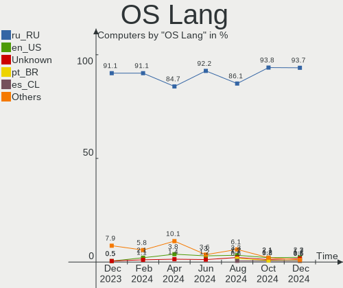
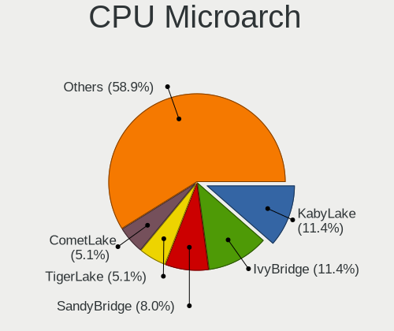
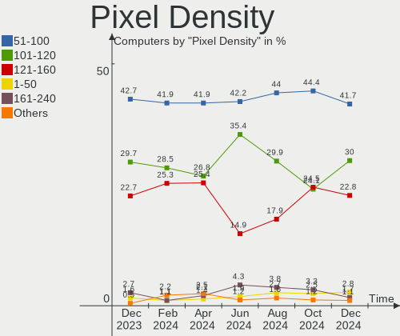
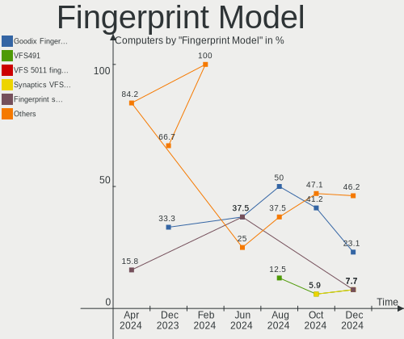

ROSA - Hardware Trends
----------------------

A project to identify most popular hardware characteristics and track their change
over time based on data collected by Linux users at https://Linux-Hardware.org.

Anyone can contribute to this report by the [hw-probe](https://github.com/linuxhw/hw-probe) tool:

    sudo -E hw-probe -all -upload

This is a report for all computer types. See also reports for [desktops](/Dist/ROSA/Desktop/README.md) and [notebooks](/Dist/ROSA/Notebook/README.md).

This report is for one last month. Overall report since the beginning of time: [TestDays](https://github.com/linuxhw/TestDays)

Period: Oct, 2023.

Contents
--------

* [ System ](#system)
  - [ OS                       ](#os)
  - [ OS Family                ](#os-family)
  - [ Kernel                   ](#kernel)
  - [ Kernel Family            ](#kernel-family)
  - [ Kernel Major Ver.        ](#kernel-major-ver)
  - [ Arch                     ](#arch)
  - [ DE                       ](#de)
  - [ Display Server           ](#display-server)
  - [ Display Manager          ](#display-manager)
  - [ OS Lang                  ](#os-lang)
  - [ Boot Mode                ](#boot-mode)
  - [ Filesystem               ](#filesystem)
  - [ Part. scheme             ](#part-scheme)
  - [ Dual Boot with Linux/BSD ](#dual-boot-with-linuxbsd)
  - [ Dual Boot (Win)          ](#dual-boot-win)

* [ Board ](#board)
  - [ Vendor                   ](#vendor)
  - [ Model                    ](#model)
  - [ Model Family             ](#model-family)
  - [ MFG Year                 ](#mfg-year)
  - [ Form Factor              ](#form-factor)
  - [ Secure Boot              ](#secure-boot)
  - [ Coreboot                 ](#coreboot)
  - [ RAM Size                 ](#ram-size)
  - [ RAM Used                 ](#ram-used)
  - [ Total Drives             ](#total-drives)
  - [ Has CD-ROM               ](#has-cd-rom)
  - [ Has Ethernet             ](#has-ethernet)
  - [ Has WiFi                 ](#has-wifi)
  - [ Has Bluetooth            ](#has-bluetooth)

* [ Location ](#location)
  - [ Country                  ](#country)
  - [ City                     ](#city)

* [ Drives ](#drives)
  - [ Drive Vendor             ](#drive-vendor)
  - [ Drive Model              ](#drive-model)
  - [ HDD Vendor               ](#hdd-vendor)
  - [ SSD Vendor               ](#ssd-vendor)
  - [ Drive Kind               ](#drive-kind)
  - [ Drive Connector          ](#drive-connector)
  - [ Drive Size               ](#drive-size)
  - [ Space Total              ](#space-total)
  - [ Space Used               ](#space-used)
  - [ Malfunc. Drives          ](#malfunc-drives)
  - [ Malfunc. Drive Vendor    ](#malfunc-drive-vendor)
  - [ Malfunc. HDD Vendor      ](#malfunc-hdd-vendor)
  - [ Malfunc. Drive Kind      ](#malfunc-drive-kind)
  - [ Failed Drives            ](#failed-drives)
  - [ Failed Drive Vendor      ](#failed-drive-vendor)
  - [ Drive Status             ](#drive-status)

* [ Storage controller ](#storage-controller)
  - [ Storage Vendor           ](#storage-vendor)
  - [ Storage Model            ](#storage-model)
  - [ Storage Kind             ](#storage-kind)

* [ Processor ](#processor)
  - [ CPU Vendor               ](#cpu-vendor)
  - [ CPU Model                ](#cpu-model)
  - [ CPU Model Family         ](#cpu-model-family)
  - [ CPU Cores                ](#cpu-cores)
  - [ CPU Sockets              ](#cpu-sockets)
  - [ CPU Threads              ](#cpu-threads)
  - [ CPU Op-Modes             ](#cpu-op-modes)
  - [ CPU Microcode            ](#cpu-microcode)
  - [ CPU Microarch            ](#cpu-microarch)

* [ Graphics ](#graphics)
  - [ GPU Vendor               ](#gpu-vendor)
  - [ GPU Model                ](#gpu-model)
  - [ GPU Combo                ](#gpu-combo)
  - [ GPU Driver               ](#gpu-driver)
  - [ GPU Memory               ](#gpu-memory)

* [ Monitor ](#monitor)
  - [ Monitor Vendor           ](#monitor-vendor)
  - [ Monitor Model            ](#monitor-model)
  - [ Monitor Resolution       ](#monitor-resolution)
  - [ Monitor Diagonal         ](#monitor-diagonal)
  - [ Monitor Width            ](#monitor-width)
  - [ Aspect Ratio             ](#aspect-ratio)
  - [ Monitor Area             ](#monitor-area)
  - [ Pixel Density            ](#pixel-density)
  - [ Multiple Monitors        ](#multiple-monitors)

* [ Network ](#network)
  - [ Net Controller Vendor    ](#net-controller-vendor)
  - [ Net Controller Model     ](#net-controller-model)
  - [ Wireless Vendor          ](#wireless-vendor)
  - [ Wireless Model           ](#wireless-model)
  - [ Ethernet Vendor          ](#ethernet-vendor)
  - [ Ethernet Model           ](#ethernet-model)
  - [ Net Controller Kind      ](#net-controller-kind)
  - [ Used Controller          ](#used-controller)
  - [ NICs                     ](#nics)
  - [ IPv6                     ](#ipv6)

* [ Bluetooth ](#bluetooth)
  - [ Bluetooth Vendor         ](#bluetooth-vendor)
  - [ Bluetooth Model          ](#bluetooth-model)

* [ Sound ](#sound)
  - [ Sound Vendor             ](#sound-vendor)
  - [ Sound Model              ](#sound-model)

* [ Memory ](#memory)
  - [ Memory Vendor            ](#memory-vendor)
  - [ Memory Model             ](#memory-model)
  - [ Memory Kind              ](#memory-kind)
  - [ Memory Form Factor       ](#memory-form-factor)
  - [ Memory Size              ](#memory-size)
  - [ Memory Speed             ](#memory-speed)

* [ Printers & scanners ](#printers--scanners)
  - [ Printer Vendor           ](#printer-vendor)
  - [ Printer Model            ](#printer-model)
  - [ Scanner Vendor           ](#scanner-vendor)
  - [ Scanner Model            ](#scanner-model)

* [ Camera ](#camera)
  - [ Camera Vendor            ](#camera-vendor)
  - [ Camera Model             ](#camera-model)

* [ Security ](#security)
  - [ Fingerprint Vendor       ](#fingerprint-vendor)
  - [ Fingerprint Model        ](#fingerprint-model)
  - [ Chipcard Vendor          ](#chipcard-vendor)
  - [ Chipcard Model           ](#chipcard-model)

* [ Unsupported ](#unsupported)
  - [ Unsupported Devices      ](#unsupported-devices)
  - [ Unsupported Device Types ](#unsupported-device-types)

System
------

OS
--

Installed operating systems

| Name        | Computers | Percent |
|-------------|-----------|---------|
| ROSA 12.4   | 180       | 81.82%  |
| ROSA 12     | 17        | 7.73%   |
| ROSA R11.1  | 13        | 5.91%   |
| ROSA 12.3   | 4         | 1.82%   |
| ROSA 12.1   | 2         | 0.91%   |
| ROSA R8.1   | 1         | 0.45%   |
| ROSA 2021.1 | 1         | 0.45%   |
| ROSA 13.0   | 1         | 0.45%   |
| ROSA 12.2   | 1         | 0.45%   |

OS Family
---------

OS without a version

| Name | Computers | Percent |
|------|-----------|---------|
| ROSA | 220       | 100%    |

Kernel
------

Version of the Linux kernel

| Version                                   | Computers | Percent |
|-------------------------------------------|-----------|---------|
| 6.1.46-generic-2rosa2021.1-x86_64         | 76        | 34.55%  |
| 6.1.20-generic-2rosa2021.1-x86_64         | 61        | 27.73%  |
| 6.1.58-generic-1rosa2021.1-x86_64         | 20        | 9.09%   |
| 5.10.184-generic-1rosa2021.1-x86_64       | 10        | 4.55%   |
| 5.15.127-generic-1rosa2021.1-x86_64       | 8         | 3.64%   |
| 6.1.38-generic-1rosa2021.1-x86_64         | 7         | 3.18%   |
| 5.15.103-generic-1rosa2021.1-i686         | 7         | 3.18%   |
| 5.4.83-generic-2rosa-x86_64               | 5         | 2.27%   |
| 4.15.0-desktop-122.124.1rosa-x86_64       | 4         | 1.82%   |
| 6.3.12-generic-1rosa2021.1-x86_64         | 2         | 0.91%   |
| 5.4.32-generic-2rosa-i586                 | 2         | 0.91%   |
| 5.15.75-generic-1rosa2021.1-x86_64        | 2         | 0.91%   |
| 5.15.75-generic-1rosa2021.1-i686          | 2         | 0.91%   |
| 5.10.74-generic-2rosa2021.1-x86_64        | 2         | 0.91%   |
| 4.15.0-desktop-122.124.1rosa-i586         | 2         | 0.91%   |
| 6.5.5.xm1-1.klp-xanmod-rosa2021.1-x86_64  | 1         | 0.45%   |
| 6.1.57-generic-1rosa2021.1-x86_64         | 1         | 0.45%   |
| 6.1.49-generic-1rosa2023.1-x86_64         | 1         | 0.45%   |
| 6.0.12.xm1-1.klp-xanmod-rosa2021.1-x86_64 | 1         | 0.45%   |
| 5.15.127-generic-1rosa2021.1-i686         | 1         | 0.45%   |
| 5.15.103-generic-1rosa2021.1-x86_64       | 1         | 0.45%   |
| 5.10.74-generic-2rosa2021.1-i586          | 1         | 0.45%   |
| 5.10.176-generic-1rosa2021.1-x86_64       | 1         | 0.45%   |
| 5.10.118-generic-2rosa2021.1-x86_64       | 1         | 0.45%   |
| 4.1.38-nrj-desktop-2rosa-i586             | 1         | 0.45%   |

Kernel Family
-------------

Linux kernel without a distro release

| Version  | Computers | Percent |
|----------|-----------|---------|
| 6.1.46   | 76        | 34.55%  |
| 6.1.20   | 61        | 27.73%  |
| 6.1.58   | 20        | 9.09%   |
| 5.10.184 | 10        | 4.55%   |
| 5.15.127 | 9         | 4.09%   |
| 5.15.103 | 8         | 3.64%   |
| 6.1.38   | 7         | 3.18%   |
| 4.15.0   | 6         | 2.73%   |
| 5.4.83   | 5         | 2.27%   |
| 5.15.75  | 4         | 1.82%   |
| 5.10.74  | 3         | 1.36%   |
| 6.3.12   | 2         | 0.91%   |
| 5.4.32   | 2         | 0.91%   |
| 6.5.5    | 1         | 0.45%   |
| 6.1.57   | 1         | 0.45%   |
| 6.1.49   | 1         | 0.45%   |
| 6.0.12   | 1         | 0.45%   |
| 5.10.176 | 1         | 0.45%   |
| 5.10.118 | 1         | 0.45%   |
| 4.1.38   | 1         | 0.45%   |

Kernel Major Ver.
-----------------

Linux kernel major version

| Version | Computers | Percent |
|---------|-----------|---------|
| 6.1     | 166       | 75.45%  |
| 5.15    | 21        | 9.55%   |
| 5.10    | 15        | 6.82%   |
| 5.4     | 7         | 3.18%   |
| 4.15    | 6         | 2.73%   |
| 6.3     | 2         | 0.91%   |
| 6.5     | 1         | 0.45%   |
| 6.0     | 1         | 0.45%   |
| 4.1     | 1         | 0.45%   |

Arch
----

OS architecture (x86_64, i586, etc.)

| Name   | Computers | Percent |
|--------|-----------|---------|
| x86_64 | 204       | 92.73%  |
| i686   | 16        | 7.27%   |

DE
--

Desktop Environment

| Name    | Computers | Percent |
|---------|-----------|---------|
| KDE5    | 131       | 59.55%  |
| GNOME   | 50        | 22.73%  |
| LXQt    | 24        | 10.91%  |
| KDE4    | 9         | 4.09%   |
| Unknown | 3         | 1.36%   |
| i3      | 2         | 0.91%   |
| MATE    | 1         | 0.45%   |

Display Server
--------------

X11 or Wayland

| Name    | Computers | Percent |
|---------|-----------|---------|
| Wayland | 158       | 71.82%  |
| X11     | 59        | 26.82%  |
| Unknown | 2         | 0.91%   |
| Tty     | 1         | 0.45%   |

Display Manager
---------------

SDDM, LightDM, etc.

| Name    | Computers | Percent |
|---------|-----------|---------|
| SDDM    | 130       | 59.09%  |
| GDM     | 63        | 28.64%  |
| LightDM | 14        | 6.36%   |
| KDM     | 9         | 4.09%   |
| Unknown | 4         | 1.82%   |

OS Lang
-------

Language

| Lang    | Computers | Percent |
|---------|-----------|---------|
| ru_RU   | 203       | 92.27%  |
| de_DE   | 4         | 1.82%   |
| it_IT   | 3         | 1.36%   |
| en_US   | 3         | 1.36%   |
| ru_UA   | 1         | 0.45%   |
| ru_KZ   | 1         | 0.45%   |
| pl_PL   | 1         | 0.45%   |
| id_ID   | 1         | 0.45%   |
| hr_HR   | 1         | 0.45%   |
| es_CL   | 1         | 0.45%   |
| Unknown | 1         | 0.45%   |

Boot Mode
---------

EFI or BIOS

| Mode | Computers | Percent |
|------|-----------|---------|
| EFI  | 118       | 53.64%  |
| BIOS | 102       | 46.36%  |

Filesystem
----------

Type of filesystem

| Type    | Computers | Percent |
|---------|-----------|---------|
| Ext4    | 194       | 88.18%  |
| Btrfs   | 23        | 10.45%  |
| Overlay | 1         | 0.45%   |
| F2fs    | 1         | 0.45%   |
| Aufs    | 1         | 0.45%   |

Part. scheme
------------

Scheme of partitioning

| Type    | Computers | Percent |
|---------|-----------|---------|
| GPT     | 123       | 55.91%  |
| MBR     | 96        | 43.64%  |
| Unknown | 1         | 0.45%   |

Dual Boot with Linux/BSD
------------------------

Hosting more than one Linux/BSD

| Dual boot | Computers | Percent |
|-----------|-----------|---------|
| No        | 171       | 77.73%  |
| Yes       | 49        | 22.27%  |

Dual Boot (Win)
---------------

Hosting Linux and Windows

| Dual boot | Computers | Percent |
|-----------|-----------|---------|
| No        | 123       | 55.91%  |
| Yes       | 97        | 44.09%  |

Board
-----

Vendor
------

Motherboard manufacturer

| Name                                 | Computers | Percent |
|--------------------------------------|-----------|---------|
| ASUSTek Computer                     | 40        | 18.18%  |
| MSI                                  | 28        | 12.73%  |
| Gigabyte Technology                  | 24        | 10.91%  |
| Hewlett-Packard                      | 22        | 10%     |
| Acer                                 | 17        | 7.73%   |
| Lenovo                               | 12        | 5.45%   |
| ASRock                               | 12        | 5.45%   |
| Intel                                | 6         | 2.73%   |
| Dell                                 | 6         | 2.73%   |
| Clevo                                | 5         | 2.27%   |
| Unknown                              | 5         | 2.27%   |
| Toshiba                              | 4         | 1.82%   |
| Samsung Electronics                  | 4         | 1.82%   |
| ANCOMP                               | 4         | 1.82%   |
| Sony                                 | 3         | 1.36%   |
| HUAWEI                               | 3         | 1.36%   |
| Pegatron                             | 2         | 0.91%   |
| eMachines                            | 2         | 0.91%   |
| Yadro                                | 1         | 0.45%   |
| Timi                                 | 1         | 0.45%   |
| Shenzhen Meigao Electronic Equipment | 1         | 0.45%   |
| realme                               | 1         | 0.45%   |
| QBIC                                 | 1         | 0.45%   |
| Packard Bell                         | 1         | 0.45%   |
| OpenYard                             | 1         | 0.45%   |
| OEM                                  | 1         | 0.45%   |
| Medion                               | 1         | 0.45%   |
| Maibenben                            | 1         | 0.45%   |
| MACHINIST                            | 1         | 0.45%   |
| Kraftway                             | 1         | 0.45%   |
| Jumper                               | 1         | 0.45%   |
| Irbis                                | 1         | 0.45%   |
| ICL                                  | 1         | 0.45%   |
| Huanan                               | 1         | 0.45%   |
| HONOR                                | 1         | 0.45%   |
| Fujitsu Siemens                      | 1         | 0.45%   |
| Digma                                | 1         | 0.45%   |
| Biostar                              | 1         | 0.45%   |
| Apple                                | 1         | 0.45%   |

Model
-----

Motherboard model

| Name                                                                                     | Computers | Percent |
|------------------------------------------------------------------------------------------|-----------|---------|
| Unknown                                                                                  | 6         | 2.73%   |
| HP Notebook                                                                              | 4         | 1.82%   |
| Clevo NL41MU2                                                                            | 4         | 1.82%   |
| MSI MS-7641                                                                              | 2         | 0.91%   |
| Intel X99                                                                                | 2         | 0.91%   |
| Intel SKYBAY                                                                             | 2         | 0.91%   |
| HP ProLiant DL380 Gen9                                                                   | 2         | 0.91%   |
| Gigabyte GA-870A-UD3                                                                     | 2         | 0.91%   |
| Gigabyte A320M-S2H                                                                       | 2         | 0.91%   |
| eMachines E510                                                                           | 2         | 0.91%   |
| ASUS PRIME H510M-K                                                                       | 2         | 0.91%   |
| ASUS P5K PRO                                                                             | 2         | 0.91%   |
| ASUS All Series                                                                          | 2         | 0.91%   |
| ASRock N68C-GS FX                                                                        | 2         | 0.91%   |
| ANCOMP Learnmate A15-501                                                                 | 2         | 0.91%   |
| ANCOMP 238P-XB                                                                           | 2         | 0.91%   |
| Yadro TB560-D4                                                                           | 1         | 0.45%   |
| Toshiba Satellite L755                                                                   | 1         | 0.45%   |
| Toshiba Satellite C850-D4K                                                               | 1         | 0.45%   |
| Toshiba Satellite C660D                                                                  | 1         | 0.45%   |
| Toshiba Satellite A200                                                                   | 1         | 0.45%   |
| Timi Mi NoteBook Ultra                                                                   | 1         | 0.45%   |
| Sony VPCEB1S1R                                                                           | 1         | 0.45%   |
| Sony VGN-SR19VRN                                                                         | 1         | 0.45%   |
| Sony VGN-NS11ER_S                                                                        | 1         | 0.45%   |
| Shenzhen Meigao Electronic Equipment UM773 Lite                                          | 1         | 0.45%   |
| Samsung R530/R730/P530                                                                   | 1         | 0.45%   |
| Samsung N100                                                                             | 1         | 0.45%   |
| Samsung 355V4C/355V4X/355V5C/355V5X/356V4C/356V4X/356V5C/356V5X/3445VC/3445VX/3545VC/354 | 1         | 0.45%   |
| Samsung 350V5C/351V5C/3540VC/3440VC                                                      | 1         | 0.45%   |
| realme RMNBXXXX                                                                          | 1         | 0.45%   |
| QBIC BXT-512-7100U                                                                       | 1         | 0.45%   |
| Pegatron Pro 3010 Microtower PC                                                          | 1         | 0.45%   |
| Pegatron IPPSB-SDQ/H61                                                                   | 1         | 0.45%   |
| Packard Bell EasyNote ENLG81BA                                                           | 1         | 0.45%   |
| OpenYard RS201I                                                                          | 1         | 0.45%   |
| OEM X79G                                                                                 | 1         | 0.45%   |
| MSI VR610                                                                                | 1         | 0.45%   |
| MSI U210/U210 Light                                                                      | 1         | 0.45%   |
| MSI OPTIMUS                                                                              | 1         | 0.45%   |

Model Family
------------

Motherboard model prefix

| Name                                       | Computers | Percent |
|--------------------------------------------|-----------|---------|
| ASUS PRIME                                 | 7         | 3.18%   |
| Acer Aspire                                | 7         | 3.18%   |
| Unknown                                    | 6         | 2.73%   |
| Acer TravelMate                            | 5         | 2.27%   |
| Toshiba Satellite                          | 4         | 1.82%   |
| Lenovo ThinkPad                            | 4         | 1.82%   |
| HP Notebook                                | 4         | 1.82%   |
| Clevo NL41MU2                              | 4         | 1.82%   |
| HP Pavilion                                | 3         | 1.36%   |
| HP Laptop                                  | 3         | 1.36%   |
| HP Compaq                                  | 3         | 1.36%   |
| Gigabyte B450M                             | 3         | 1.36%   |
| ASUS VivoBook                              | 3         | 1.36%   |
| ASUS P5K                                   | 3         | 1.36%   |
| MSI MS-7641                                | 2         | 0.91%   |
| Lenovo IdeaPad                             | 2         | 0.91%   |
| Intel X99                                  | 2         | 0.91%   |
| Intel SKYBAY                               | 2         | 0.91%   |
| Intel H81                                  | 2         | 0.91%   |
| HP ProLiant                                | 2         | 0.91%   |
| HP ProBook                                 | 2         | 0.91%   |
| Gigabyte GA-870A-UD3                       | 2         | 0.91%   |
| Gigabyte A320M-S2H                         | 2         | 0.91%   |
| eMachines E510                             | 2         | 0.91%   |
| Dell Inspiron                              | 2         | 0.91%   |
| ASUS All                                   | 2         | 0.91%   |
| ASRock N68C-GS                             | 2         | 0.91%   |
| ANCOMP Learnmate                           | 2         | 0.91%   |
| ANCOMP 238P-XB                             | 2         | 0.91%   |
| Acer Swift                                 | 2         | 0.91%   |
| Yadro TB560-D4                             | 1         | 0.45%   |
| Timi Mi                                    | 1         | 0.45%   |
| Sony VPCEB1S1R                             | 1         | 0.45%   |
| Sony VGN-SR19VRN                           | 1         | 0.45%   |
| Sony VGN-NS11ER                            | 1         | 0.45%   |
| Shenzhen Meigao Electronic Equipment UM773 | 1         | 0.45%   |
| Samsung R530                               | 1         | 0.45%   |
| Samsung N100                               | 1         | 0.45%   |
| Samsung 355V4C                             | 1         | 0.45%   |
| Samsung 350V5C                             | 1         | 0.45%   |

MFG Year
--------

Motherboard manufacture year

| Year | Computers | Percent |
|------|-----------|---------|
| 2022 | 21        | 9.55%   |
| 2012 | 18        | 8.18%   |
| 2011 | 18        | 8.18%   |
| 2009 | 18        | 8.18%   |
| 2018 | 17        | 7.73%   |
| 2021 | 16        | 7.27%   |
| 2017 | 12        | 5.45%   |
| 2010 | 12        | 5.45%   |
| 2008 | 12        | 5.45%   |
| 2020 | 11        | 5%      |
| 2013 | 10        | 4.55%   |
| 2007 | 10        | 4.55%   |
| 2019 | 9         | 4.09%   |
| 2014 | 8         | 3.64%   |
| 2023 | 7         | 3.18%   |
| 2016 | 7         | 3.18%   |
| 2015 | 7         | 3.18%   |
| 2006 | 5         | 2.27%   |
| 2005 | 2         | 0.91%   |

Form Factor
-----------

Physical design of the computer

| Name       | Computers | Percent |
|------------|-----------|---------|
| Notebook   | 107       | 48.64%  |
| Desktop    | 104       | 47.27%  |
| All in one | 5         | 2.27%   |
| Server     | 3         | 1.36%   |
| Tablet     | 1         | 0.45%   |

Secure Boot
-----------

Enabled or disabled

| State    | Computers | Percent |
|----------|-----------|---------|
| Disabled | 220       | 100%    |

Coreboot
--------

Have coreboot on board

| Used | Computers | Percent |
|------|-----------|---------|
| No   | 220       | 100%    |

RAM Size
--------

Total RAM memory

| Size in GB      | Computers | Percent |
|-----------------|-----------|---------|
| 3.01-4.0        | 56        | 25.45%  |
| 4.01-8.0        | 47        | 21.36%  |
| 16.01-24.0      | 37        | 16.82%  |
| 8.01-16.0       | 35        | 15.91%  |
| 32.01-64.0      | 13        | 5.91%   |
| 1.01-2.0        | 13        | 5.91%   |
| 2.01-3.0        | 7         | 3.18%   |
| 64.01-256.0     | 6         | 2.73%   |
| 0.51-1.0        | 3         | 1.36%   |
| 24.01-32.0      | 2         | 0.91%   |
| More than 256.0 | 1         | 0.45%   |

RAM Used
--------

Used RAM memory

| Used GB    | Computers | Percent |
|------------|-----------|---------|
| 1.01-2.0   | 106       | 48.18%  |
| 2.01-3.0   | 48        | 21.82%  |
| 0.51-1.0   | 35        | 15.91%  |
| 3.01-4.0   | 16        | 7.27%   |
| 4.01-8.0   | 7         | 3.18%   |
| 0.01-0.5   | 7         | 3.18%   |
| 16.01-24.0 | 1         | 0.45%   |

Total Drives
------------

Number of drives on board

| Drives | Computers | Percent |
|--------|-----------|---------|
| 1      | 129       | 58.64%  |
| 2      | 61        | 27.73%  |
| 3      | 14        | 6.36%   |
| 4      | 10        | 4.55%   |
| 25     | 1         | 0.45%   |
| 9      | 1         | 0.45%   |
| 8      | 1         | 0.45%   |
| 7      | 1         | 0.45%   |
| 5      | 1         | 0.45%   |
| 0      | 1         | 0.45%   |

Has CD-ROM
----------

Has CD-ROM on board

| Presented | Computers | Percent |
|-----------|-----------|---------|
| No        | 143       | 65%     |
| Yes       | 77        | 35%     |

Has Ethernet
------------

Has Ethernet on board

| Presented | Computers | Percent |
|-----------|-----------|---------|
| Yes       | 202       | 91.82%  |
| No        | 18        | 8.18%   |

Has WiFi
--------

Has WiFi module

| Presented | Computers | Percent |
|-----------|-----------|---------|
| Yes       | 148       | 67.27%  |
| No        | 72        | 32.73%  |

Has Bluetooth
-------------

Has Bluetooth module

| Presented | Computers | Percent |
|-----------|-----------|---------|
| Yes       | 113       | 51.36%  |
| No        | 107       | 48.64%  |

Location
--------

Country
-------

Geographic location (country)

| Country                | Computers | Percent |
|------------------------|-----------|---------|
| Russia                 | 190       | 86.36%  |
| Ukraine                | 6         | 2.73%   |
| Kazakhstan             | 4         | 1.82%   |
| Germany                | 4         | 1.82%   |
| Italy                  | 3         | 1.36%   |
| Belarus                | 3         | 1.36%   |
| Finland                | 2         | 0.91%   |
| Romania                | 1         | 0.45%   |
| Poland                 | 1         | 0.45%   |
| Lithuania              | 1         | 0.45%   |
| Indonesia              | 1         | 0.45%   |
| India                  | 1         | 0.45%   |
| Chile                  | 1         | 0.45%   |
| Bulgaria               | 1         | 0.45%   |
| Bosnia and Herzegovina | 1         | 0.45%   |

City
----

Geographic location (city)

| City             | Computers | Percent |
|------------------|-----------|---------|
| Moscow           | 60        | 27.27%  |
| St Petersburg    | 11        | 5%      |
| Chelyabinsk      | 6         | 2.73%   |
| Yekaterinburg    | 5         | 2.27%   |
| Stavropol        | 4         | 1.82%   |
| Novosibirsk      | 4         | 1.82%   |
| Krasnodar        | 4         | 1.82%   |
| Voronezh         | 3         | 1.36%   |
| Volgograd        | 3         | 1.36%   |
| Shchelkovo       | 3         | 1.36%   |
| Saratov          | 3         | 1.36%   |
| Samara           | 3         | 1.36%   |
| Omsk             | 3         | 1.36%   |
| Belgorod         | 3         | 1.36%   |
| Yaroslavl        | 2         | 0.91%   |
| Vladivostok      | 2         | 0.91%   |
| Tula             | 2         | 0.91%   |
| Syktyvkar        | 2         | 0.91%   |
| Stary Oskol      | 2         | 0.91%   |
| Rostov-on-Don    | 2         | 0.91%   |
| Otzberg          | 2         | 0.91%   |
| Orenburg         | 2         | 0.91%   |
| Novokuznetsk     | 2         | 0.91%   |
| Nizhniy Novgorod | 2         | 0.91%   |
| Milan            | 2         | 0.91%   |
| Magnitogorsk     | 2         | 0.91%   |
| Lipetsk          | 2         | 0.91%   |
| Krasnoyarsk      | 2         | 0.91%   |
| Gomel            | 2         | 0.91%   |
| Barnaul          | 2         | 0.91%   |
| Zvenigorod       | 1         | 0.45%   |
| Zheleznogorsk    | 1         | 0.45%   |
| Yalta            | 1         | 0.45%   |
| Yakutsk          | 1         | 0.45%   |
| Vologda          | 1         | 0.45%   |
| Vladimir         | 1         | 0.45%   |
| Veliky Novgorod  | 1         | 0.45%   |
| Ust-Kamenogorsk  | 1         | 0.45%   |
| Ulyanovsk        | 1         | 0.45%   |
| Tyumen           | 1         | 0.45%   |

Drives
------

Drive Vendor
------------

Hard drive vendors

| Vendor                      | Computers | Drives | Percent |
|-----------------------------|-----------|--------|---------|
| WDC                         | 61        | 71     | 18.32%  |
| Seagate                     | 35        | 40     | 10.51%  |
| Kingston                    | 29        | 30     | 8.71%   |
| Samsung Electronics         | 27        | 35     | 8.11%   |
| Hitachi                     | 17        | 17     | 5.11%   |
| HGST                        | 17        | 36     | 5.11%   |
| Toshiba                     | 15        | 20     | 4.5%    |
| A-DATA Technology           | 10        | 10     | 3%      |
| Crucial                     | 8         | 8      | 2.4%    |
| Unknown                     | 7         | 7      | 2.1%    |
| China                       | 7         | 7      | 2.1%    |
| Smartbuy                    | 6         | 6      | 1.8%    |
| Apacer                      | 6         | 6      | 1.8%    |
| Maxtor                      | 5         | 5      | 1.5%    |
| BIWIN                       | 5         | 5      | 1.5%    |
| SCY                         | 4         | 4      | 1.2%    |
| SanDisk                     | 4         | 4      | 1.2%    |
| Micron Technology           | 4         | 4      | 1.2%    |
| SPCC                        | 3         | 3      | 0.9%    |
| Silicon Motion              | 3         | 3      | 0.9%    |
| Patriot                     | 3         | 3      | 0.9%    |
| KingSpec                    | 3         | 4      | 0.9%    |
| Transcend                   | 2         | 2      | 0.6%    |
| Team                        | 2         | 2      | 0.6%    |
| SK hynix                    | 2         | 2      | 0.6%    |
| OCZ                         | 2         | 2      | 0.6%    |
| Netac                       | 2         | 2      | 0.6%    |
| Neo                         | 2         | 2      | 0.6%    |
| MAXIO Technology (Hangzhou) | 2         | 2      | 0.6%    |
| KingFast                    | 2         | 2      | 0.6%    |
| Hewlett-Packard             | 2         | 2      | 0.6%    |
| Fujitsu                     | 2         | 2      | 0.6%    |
| Foxline                     | 2         | 2      | 0.6%    |
| Azerty                      | 2         | 2      | 0.6%    |
| ASMT                        | 2         | 2      | 0.6%    |
| AGI                         | 2         | 2      | 0.6%    |
| Unknown                     | 2         | 2      | 0.6%    |
| ZHITAI                      | 1         | 1      | 0.3%    |
| Zheino                      | 1         | 1      | 0.3%    |
| XrayDisk                    | 1         | 1      | 0.3%    |

Drive Model
-----------

Hard drive models

| Model                                   | Computers | Percent |
|-----------------------------------------|-----------|---------|
| Kingston SA400S37120G 120GB SSD         | 7         | 2.01%   |
| Kingston SA400S37240G 240GB SSD         | 6         | 1.72%   |
| Kingston SA400S37480G 480GB SSD         | 5         | 1.43%   |
| HGST HTS541010A9E680 1TB                | 5         | 1.43%   |
| WDC WD10EZEX-08WN4A0 1TB                | 4         | 1.15%   |
| Smartbuy SSD 120GB                      | 4         | 1.15%   |
| Kingston SNVS500G 500GB                 | 4         | 1.15%   |
| BIWIN CE480T5D101-256 256GB             | 4         | 1.15%   |
| WDC WD5000LPCX-21VHAT0 500GB            | 3         | 0.86%   |
| Seagate ST500LT012-9WS142 500GB         | 3         | 0.86%   |
| Seagate ST1000LM035-1RK172 1TB          | 3         | 0.86%   |
| Seagate ST1000DM010-2EP102 1TB          | 3         | 0.86%   |
| Samsung SSD 850 EVO 250GB               | 3         | 0.86%   |
| HGST HTS721010A9E630 1TB                | 3         | 0.86%   |
| Crucial CT240BX500SSD1 240GB            | 3         | 0.86%   |
| WDC WDS240G2G0A-00JH30 240GB SSD        | 2         | 0.57%   |
| WDC WD5000LPCX-24C6HT0 500GB            | 2         | 0.57%   |
| WDC WD5000AAKX-00ERMA0 500GB            | 2         | 0.57%   |
| Toshiba DT01ACA050 500GB                | 2         | 0.57%   |
| Seagate ST500DM002-1BD142 500GB         | 2         | 0.57%   |
| Seagate ST32000641AS 2TB                | 2         | 0.57%   |
| Seagate ST1000DM003-1ER162 1TB          | 2         | 0.57%   |
| SCY SMM5T1G51200D 512GB                 | 2         | 0.57%   |
| SCY SMM5T1G25600D 256GB                 | 2         | 0.57%   |
| Samsung SSD 870 EVO 500GB               | 2         | 0.57%   |
| Samsung MZVLW128HEGR-00000 128GB        | 2         | 0.57%   |
| Patriot P210 128GB SSD                  | 2         | 0.57%   |
| Netac SSD 240GB                         | 2         | 0.57%   |
| Neo Forza NFS121SA312-6007000 120GB SSD | 2         | 0.57%   |
| KingSpec P3-128 128GB SSD               | 2         | 0.57%   |
| Hitachi HTS547550A9E384 500GB           | 2         | 0.57%   |
| HGST HTS545050A7E680 500GB              | 2         | 0.57%   |
| Apacer AS2280P4 256GB                   | 2         | 0.57%   |
| A-DATA SU650 480GB SSD                  | 2         | 0.57%   |
| A-DATA SU650 240GB SSD                  | 2         | 0.57%   |
| A-DATA SU650 120GB SSD                  | 2         | 0.57%   |
| Unknown                                 | 2         | 0.57%   |
| ZHITAI SC001 Active 256GB SSD           | 1         | 0.29%   |
| Zheino CHN 25SATAS3 128 128GB SSD       | 1         | 0.29%   |
| XrayDisk 120GB SSD                      | 1         | 0.29%   |

HDD Vendor
----------

Hard disk drive vendors

| Vendor              | Computers | Drives | Percent |
|---------------------|-----------|--------|---------|
| WDC                 | 53        | 62     | 36.05%  |
| Seagate             | 35        | 40     | 23.81%  |
| Hitachi             | 17        | 17     | 11.56%  |
| HGST                | 17        | 36     | 11.56%  |
| Toshiba             | 14        | 18     | 9.52%   |
| Maxtor              | 4         | 4      | 2.72%   |
| Samsung Electronics | 3         | 3      | 2.04%   |
| Fujitsu             | 2         | 2      | 1.36%   |
| Unknown             | 1         | 1      | 0.68%   |
| ASMT                | 1         | 1      | 0.68%   |

SSD Vendor
----------

Solid state drive vendors

| Vendor              | Computers | Drives | Percent |
|---------------------|-----------|--------|---------|
| Kingston            | 22        | 22     | 18.33%  |
| Samsung Electronics | 12        | 20     | 10%     |
| A-DATA Technology   | 9         | 9      | 7.5%    |
| China               | 7         | 7      | 5.83%   |
| Smartbuy            | 6         | 6      | 5%      |
| Crucial             | 6         | 6      | 5%      |
| Apacer              | 4         | 4      | 3.33%   |
| WDC                 | 3         | 3      | 2.5%    |
| Patriot             | 3         | 3      | 2.5%    |
| Micron Technology   | 3         | 3      | 2.5%    |
| KingSpec            | 3         | 4      | 2.5%    |
| SPCC                | 2         | 2      | 1.67%   |
| SanDisk             | 2         | 2      | 1.67%   |
| OCZ                 | 2         | 2      | 1.67%   |
| Netac               | 2         | 2      | 1.67%   |
| Neo                 | 2         | 2      | 1.67%   |
| KingFast            | 2         | 2      | 1.67%   |
| Azerty              | 2         | 2      | 1.67%   |
| AGI                 | 2         | 2      | 1.67%   |
| ZHITAI              | 1         | 1      | 0.83%   |
| Zheino              | 1         | 1      | 0.83%   |
| XrayDisk            | 1         | 1      | 0.83%   |
| Transcend           | 1         | 1      | 0.83%   |
| Toshiba             | 1         | 1      | 0.83%   |
| Team                | 1         | 1      | 0.83%   |
| ShanDianZhe         | 1         | 1      | 0.83%   |
| Realtek             | 1         | 1      | 0.83%   |
| Plextor             | 1         | 1      | 0.83%   |
| Maxtor              | 1         | 1      | 0.83%   |
| Londisk             | 1         | 1      | 0.83%   |
| KIOXIA-EXCERIA      | 1         | 1      | 0.83%   |
| Kimtigo             | 1         | 1      | 0.83%   |
| HS-SSD-C100         | 1         | 1      | 0.83%   |
| Hewlett-Packard     | 1         | 1      | 0.83%   |
| GSemi               | 1         | 1      | 0.83%   |
| Foxline             | 1         | 1      | 0.83%   |
| Digma               | 1         | 1      | 0.83%   |
| DEXP                | 1         | 1      | 0.83%   |
| Corsair             | 1         | 1      | 0.83%   |
| BR                  | 1         | 1      | 0.83%   |

Drive Kind
----------

HDD or SSD

| Kind    | Computers | Drives | Percent |
|---------|-----------|--------|---------|
| HDD     | 128       | 184    | 43.99%  |
| SSD     | 100       | 129    | 34.36%  |
| NVMe    | 57        | 63     | 19.59%  |
| MMC     | 5         | 5      | 1.72%   |
| Unknown | 1         | 1      | 0.34%   |

Drive Connector
---------------

SATA, SAS, NVMe, etc.

| Type | Computers | Drives | Percent |
|------|-----------|--------|---------|
| SATA | 180       | 308    | 72.58%  |
| NVMe | 57        | 63     | 22.98%  |
| SAS  | 6         | 6      | 2.42%   |
| MMC  | 5         | 5      | 2.02%   |

Drive Size
----------

Size of hard drive

| Size in TB | Computers | Drives | Percent |
|------------|-----------|--------|---------|
| 0.01-0.5   | 153       | 205    | 70.51%  |
| 0.51-1.0   | 47        | 62     | 21.66%  |
| 1.01-2.0   | 7         | 12     | 3.23%   |
| 3.01-4.0   | 5         | 6      | 2.3%    |
| 4.01-10.0  | 3         | 26     | 1.38%   |
| 2.01-3.0   | 2         | 2      | 0.92%   |

Space Total
-----------

Amount of disk space available on the file system

| Size in GB     | Computers | Percent |
|----------------|-----------|---------|
| 101-250        | 76        | 34.55%  |
| 251-500        | 53        | 24.09%  |
| 501-1000       | 32        | 14.55%  |
| 1-20           | 22        | 10%     |
| 51-100         | 17        | 7.73%   |
| 1001-2000      | 10        | 4.55%   |
| 21-50          | 7         | 3.18%   |
| More than 3000 | 2         | 0.91%   |
| 2001-3000      | 1         | 0.45%   |

Space Used
----------

Amount of used disk space

| Used GB        | Computers | Percent |
|----------------|-----------|---------|
| 1-20           | 139       | 63.18%  |
| 21-50          | 38        | 17.27%  |
| 51-100         | 14        | 6.36%   |
| 251-500        | 12        | 5.45%   |
| 101-250        | 11        | 5%      |
| 501-1000       | 4         | 1.82%   |
| More than 3000 | 1         | 0.45%   |
| 1001-2000      | 1         | 0.45%   |

Malfunc. Drives
---------------

Drive models with a malfunction

| Model                                            | Computers | Drives | Percent |
|--------------------------------------------------|-----------|--------|---------|
| Seagate ST500LT012-9WS142 500GB                  | 3         | 3      | 4.76%   |
| HGST HTS541010A9E680 1TB                         | 3         | 3      | 4.76%   |
| WDC WDS240G2G0A-00JH30 240GB SSD                 | 2         | 2      | 3.17%   |
| Neo Forza NFS121SA312-6007000 120GB SSD          | 2         | 2      | 3.17%   |
| Kingston SA400S37240G 240GB SSD                  | 2         | 2      | 3.17%   |
| HGST HTS721010A9E630 1TB                         | 2         | 2      | 3.17%   |
| WDC WD5000LPVX-80V0TT0 500GB                     | 1         | 1      | 1.59%   |
| WDC WD5000LPCX-24C6HT0 500GB                     | 1         | 1      | 1.59%   |
| WDC WD5000AAKX-08ERMA0 500GB                     | 1         | 1      | 1.59%   |
| WDC WD5000AAKX-00ERMA0 500GB                     | 1         | 1      | 1.59%   |
| WDC WD5000AAKS-75A7B2 500GB                      | 1         | 1      | 1.59%   |
| WDC WD5000AADS-00M2B0 500GB                      | 1         | 1      | 1.59%   |
| WDC WD3200AAJS-00YZCA0 320GB                     | 1         | 1      | 1.59%   |
| WDC WD2500BEVE-00A0HT0 250GB                     | 1         | 1      | 1.59%   |
| WDC WD2500AAKX-001CA0 250GB                      | 1         | 1      | 1.59%   |
| WDC WD10PURZ-85U8XY0 1TB                         | 1         | 1      | 1.59%   |
| WDC WD10EZEX-08WN4A0 1TB                         | 1         | 1      | 1.59%   |
| WDC WD10EALX-009BA0 1TB                          | 1         | 1      | 1.59%   |
| Toshiba MQ01ABD100 1TB                           | 1         | 1      | 1.59%   |
| Toshiba MK2565GSX 250GB                          | 1         | 1      | 1.59%   |
| Toshiba MK1255GSX H 120GB                        | 1         | 1      | 1.59%   |
| Toshiba DT01ACA050 500GB                         | 1         | 1      | 1.59%   |
| Seagate ST9500423AS 500GB                        | 1         | 1      | 1.59%   |
| Seagate ST9320325AS 320GB                        | 1         | 1      | 1.59%   |
| Seagate ST500LT012-1DG142 500GB                  | 1         | 1      | 1.59%   |
| Seagate ST4000DM000-1F2168 4TB                   | 1         | 1      | 1.59%   |
| Seagate ST360021A 64GB                           | 1         | 1      | 1.59%   |
| Seagate ST3500413AS 500GB                        | 1         | 1      | 1.59%   |
| Seagate ST3500320AS 500GB                        | 1         | 1      | 1.59%   |
| Seagate ST3250410AS 250GB                        | 1         | 1      | 1.59%   |
| Seagate ST320LT020-9YG142 320GB                  | 1         | 1      | 1.59%   |
| Seagate ST320LT012-9WS14C 320GB                  | 1         | 1      | 1.59%   |
| Seagate ST31000524AS 1TB                         | 1         | 1      | 1.59%   |
| Seagate ST250LT007-9ZV14C 250GB                  | 1         | 1      | 1.59%   |
| Seagate ST1000DM010-2EP102 1TB                   | 1         | 1      | 1.59%   |
| Samsung Electronics MZNLH128HBHQ-000H1 128GB SSD | 1         | 1      | 1.59%   |
| Samsung Electronics HM160HI 160GB                | 1         | 1      | 1.59%   |
| Samsung Electronics HD501LJ 500GB                | 1         | 1      | 1.59%   |
| Maxtor 6Y080L0 82GB                              | 1         | 1      | 1.59%   |
| Kingston SHFS37A120G 120GB SSD                   | 1         | 1      | 1.59%   |

Malfunc. Drive Vendor
---------------------

Vendors of faulty drives

| Vendor              | Computers | Drives | Percent |
|---------------------|-----------|--------|---------|
| Seagate             | 14        | 16     | 23.33%  |
| WDC                 | 13        | 14     | 21.67%  |
| HGST                | 9         | 9      | 15%     |
| Hitachi             | 6         | 6      | 10%     |
| Toshiba             | 4         | 4      | 6.67%   |
| Kingston            | 4         | 4      | 6.67%   |
| Samsung Electronics | 3         | 3      | 5%      |
| Neo                 | 2         | 2      | 3.33%   |
| Maxtor              | 1         | 1      | 1.67%   |
| Fujitsu             | 1         | 1      | 1.67%   |
| Corsair             | 1         | 1      | 1.67%   |
| ASMedia             | 1         | 1      | 1.67%   |
| A-DATA Technology   | 1         | 1      | 1.67%   |

Malfunc. HDD Vendor
-------------------

Vendors of faulty HDD drives

| Vendor              | Computers | Drives | Percent |
|---------------------|-----------|--------|---------|
| Seagate             | 14        | 16     | 29.17%  |
| WDC                 | 11        | 12     | 22.92%  |
| HGST                | 9         | 9      | 18.75%  |
| Hitachi             | 6         | 6      | 12.5%   |
| Toshiba             | 4         | 4      | 8.33%   |
| Samsung Electronics | 2         | 2      | 4.17%   |
| Maxtor              | 1         | 1      | 2.08%   |
| Fujitsu             | 1         | 1      | 2.08%   |

Malfunc. Drive Kind
-------------------

Kinds of faulty drives

| Kind | Computers | Drives | Percent |
|------|-----------|--------|---------|
| HDD  | 46        | 51     | 79.31%  |
| SSD  | 12        | 12     | 20.69%  |

Failed Drives
-------------

Failed drive models

| Model                    | Computers | Drives | Percent |
|--------------------------|-----------|--------|---------|
| HGST HTS541010A9E680 1TB | 1         | 1      | 100%    |

Failed Drive Vendor
-------------------

Failed drive vendors

| Vendor | Computers | Drives | Percent |
|--------|-----------|--------|---------|
| HGST   | 1         | 1      | 100%    |

Drive Status
------------

Number of failed and malfunc. drives

| Status   | Computers | Drives | Percent |
|----------|-----------|--------|---------|
| Works    | 179       | 301    | 71.03%  |
| Malfunc  | 55        | 63     | 21.83%  |
| Detected | 17        | 17     | 6.75%   |
| Failed   | 1         | 1      | 0.4%    |

Storage controller
------------------

Storage Vendor
--------------

Storage controller vendors

| Vendor                           | Computers | Percent |
|----------------------------------|-----------|---------|
| Intel                            | 153       | 53.31%  |
| AMD                              | 47        | 16.38%  |
| Samsung Electronics              | 12        | 4.18%   |
| JMicron Technology               | 10        | 3.48%   |
| Kingston Technology Company      | 9         | 3.14%   |
| SanDisk                          | 6         | 2.09%   |
| Phison Electronics               | 5         | 1.74%   |
| Nvidia                           | 5         | 1.74%   |
| INNOGRIT                         | 5         | 1.74%   |
| Shenzhen Shichuangyi Electronics | 4         | 1.39%   |
| Marvell Technology Group         | 4         | 1.39%   |
| Silicon Motion                   | 3         | 1.05%   |
| Realtek Semiconductor            | 3         | 1.05%   |
| SK hynix                         | 2         | 0.7%    |
| Micron/Crucial Technology        | 2         | 0.7%    |
| MAXIO Technology (Hangzhou)      | 2         | 0.7%    |
| KIOXIA                           | 2         | 0.7%    |
| Hewlett-Packard                  | 2         | 0.7%    |
| Biwin Storage Technology         | 2         | 0.7%    |
| ADATA Technology                 | 2         | 0.7%    |
| VIA Technologies                 | 1         | 0.35%   |
| Transcend                        | 1         | 0.35%   |
| Silicon Integrated Systems [SiS] | 1         | 0.35%   |
| Micron Technology                | 1         | 0.35%   |
| Hosin Global Electronics         | 1         | 0.35%   |
| Broadcom / LSI                   | 1         | 0.35%   |
| ASMedia Technology               | 1         | 0.35%   |

Storage Model
-------------

Storage controller models

| Model                                                                            | Computers | Percent |
|----------------------------------------------------------------------------------|-----------|---------|
| AMD FCH SATA Controller [AHCI mode]                                              | 22        | 6.4%    |
| AMD SB7x0/SB8x0/SB9x0 IDE Controller                                             | 11        | 3.2%    |
| Intel Tiger Lake-LP SATA Controller                                              | 10        | 2.91%   |
| Intel 7 Series Chipset Family 6-port SATA Controller [AHCI mode]                 | 9         | 2.62%   |
| AMD SB7x0/SB8x0/SB9x0 SATA Controller [AHCI mode]                                | 9         | 2.62%   |
| Intel 8 Series/C220 Series Chipset Family 6-port SATA Controller 1 [AHCI mode]   | 8         | 2.33%   |
| Intel 6 Series/C200 Series Chipset Family 6 port Mobile SATA AHCI Controller     | 8         | 2.33%   |
| Intel 500 Series Chipset Family SATA AHCI Controller                             | 7         | 2.03%   |
| AMD SB7x0/SB8x0/SB9x0 SATA Controller [IDE mode]                                 | 7         | 2.03%   |
| AMD 400 Series Chipset SATA Controller                                           | 7         | 2.03%   |
| Intel 82801IBM/IEM (ICH9M/ICH9M-E) 4 port SATA Controller [AHCI mode]            | 6         | 1.74%   |
| Intel 82801HM/HEM (ICH8M/ICH8M-E) IDE Controller                                 | 6         | 1.74%   |
| JMicron JMB363 SATA/IDE Controller                                               | 5         | 1.45%   |
| Intel Q170/Q150/B150/H170/H110/Z170/CM236 Chipset SATA Controller [AHCI Mode]    | 5         | 1.45%   |
| Intel Celeron/Pentium Silver Processor SATA Controller                           | 5         | 1.45%   |
| Intel Cannon Lake PCH SATA AHCI Controller                                       | 5         | 1.45%   |
| Intel Atom/Celeron/Pentium Processor x5-E8000/J3xxx/N3xxx Series SATA Controller | 5         | 1.45%   |
| Intel 82801HM/HEM (ICH8M/ICH8M-E) SATA Controller [AHCI mode]                    | 5         | 1.45%   |
| Intel 82801 Mobile SATA Controller [RAID mode]                                   | 5         | 1.45%   |
| AMD FCH SATA Controller D                                                        | 5         | 1.45%   |
| Shenzhen Shichuangyi MAP1202-Based NVMe SSD (DRAM-less)                          | 4         | 1.16%   |
| Kingston Company NV1 NVMe SSD SM2263XT                                           | 4         | 1.16%   |
| Intel Wildcat Point-LP SATA Controller [AHCI Mode]                               | 4         | 1.16%   |
| Intel NM10/ICH7 Family SATA Controller [IDE mode]                                | 4         | 1.16%   |
| Intel 82801JI (ICH10 Family) 4 port SATA IDE Controller #1                       | 4         | 1.16%   |
| Intel 82801JI (ICH10 Family) 2 port SATA IDE Controller #2                       | 4         | 1.16%   |
| Intel 82801G (ICH7 Family) IDE Controller                                        | 4         | 1.16%   |
| Intel 6 Series/C200 Series Chipset Family 6 port Desktop SATA AHCI Controller    | 4         | 1.16%   |
| Intel 5 Series/3400 Series Chipset 4 port SATA AHCI Controller                   | 4         | 1.16%   |
| INNOGRIT NVMe SSD Controller IG5216 (DRAM-less)                                  | 4         | 1.16%   |
| Samsung NVMe SSD Controller SM961/PM961/SM963                                    | 3         | 0.87%   |
| Samsung NVMe SSD Controller PM9A1/PM9A3/980PRO                                   | 3         | 0.87%   |
| Samsung NVMe SSD Controller 980 (DRAM-less)                                      | 3         | 0.87%   |
| Phison PS5013-E13 PCIe3 NVMe Controller (DRAM-less)                              | 3         | 0.87%   |
| JMicron JMB368 IDE controller                                                    | 3         | 0.87%   |
| Intel Volume Management Device NVMe RAID Controller                              | 3         | 0.87%   |
| Intel NM10/ICH7 Family SATA Controller [AHCI mode]                               | 3         | 0.87%   |
| Intel Celeron N3350/Pentium N4200/Atom E3900 Series SATA AHCI Controller         | 3         | 0.87%   |
| Intel C610/X99 series chipset 6-Port SATA Controller [AHCI mode]                 | 3         | 0.87%   |
| Intel 82801JI (ICH10 Family) SATA AHCI Controller                                | 3         | 0.87%   |

Storage Kind
------------

Kind of storage controller (IDE, SATA, NVMe, SAS, ...)

| Kind | Computers | Percent |
|------|-----------|---------|
| SATA | 168       | 57.73%  |
| NVMe | 57        | 19.59%  |
| IDE  | 53        | 18.21%  |
| RAID | 12        | 4.12%   |
| SAS  | 1         | 0.34%   |

Processor
---------

CPU Vendor
----------

Processor vendors

| Vendor | Computers | Percent |
|--------|-----------|---------|
| Intel  | 162       | 73.64%  |
| AMD    | 58        | 26.36%  |

CPU Model
---------

Processor models

| Model                                      | Computers | Percent |
|--------------------------------------------|-----------|---------|
| Intel 11th Gen Core i5-1135G7 @ 2.40GHz    | 5         | 2.27%   |
| AMD Athlon II X2 250 Processor             | 4         | 1.82%   |
| Intel 11th Gen Core i3-1125G4 @ 2.00GHz    | 3         | 1.36%   |
| AMD Ryzen 5 5600H with Radeon Graphics     | 3         | 1.36%   |
| AMD Ryzen 5 3600 6-Core Processor          | 3         | 1.36%   |
| Intel Xeon CPU E5-2670 v2 @ 2.50GHz        | 2         | 0.91%   |
| Intel Pentium CPU N3700 @ 1.60GHz          | 2         | 0.91%   |
| Intel Core i7-3610QM CPU @ 2.30GHz         | 2         | 0.91%   |
| Intel Core i7 CPU 950 @ 3.07GHz            | 2         | 0.91%   |
| Intel Core i5-8400 CPU @ 2.80GHz           | 2         | 0.91%   |
| Intel Core i5-8300H CPU @ 2.30GHz          | 2         | 0.91%   |
| Intel Core i5-7300HQ CPU @ 2.50GHz         | 2         | 0.91%   |
| Intel Core i5-5200U CPU @ 2.20GHz          | 2         | 0.91%   |
| Intel Core i5-4210U CPU @ 1.70GHz          | 2         | 0.91%   |
| Intel Core i5-2520M CPU @ 2.50GHz          | 2         | 0.91%   |
| Intel Core i5-2430M CPU @ 2.40GHz          | 2         | 0.91%   |
| Intel Core i5-2410M CPU @ 2.30GHz          | 2         | 0.91%   |
| Intel Core i5-10400 CPU @ 2.90GHz          | 2         | 0.91%   |
| Intel Core i5 CPU M 430 @ 2.27GHz          | 2         | 0.91%   |
| Intel Core i3-6100TE CPU @ 2.70GHz         | 2         | 0.91%   |
| Intel Core i3-10100F CPU @ 3.60GHz         | 2         | 0.91%   |
| Intel Core 2 Quad CPU Q9400 @ 2.66GHz      | 2         | 0.91%   |
| Intel Core 2 Duo CPU P8400 @ 2.26GHz       | 2         | 0.91%   |
| Intel Core 2 CPU T7200 @ 2.00GHz           | 2         | 0.91%   |
| Intel Celeron N4020 CPU @ 1.10GHz          | 2         | 0.91%   |
| Intel Celeron CPU N3060 @ 1.60GHz          | 2         | 0.91%   |
| Intel 11th Gen Core i7-11370H @ 3.30GHz    | 2         | 0.91%   |
| Intel 11th Gen Core i5-1155G7 @ 2.50GHz    | 2         | 0.91%   |
| Intel 11th Gen Core i3-1115G4 @ 3.00GHz    | 2         | 0.91%   |
| AMD Ryzen 5 5600G with Radeon Graphics     | 2         | 0.91%   |
| AMD Ryzen 3 PRO 4350G with Radeon Graphics | 2         | 0.91%   |
| Intel Xeon Gold 6338 CPU @ 2.00GHz         | 1         | 0.45%   |
| Intel Xeon CPU E5310 @ 1.60GHz             | 1         | 0.45%   |
| Intel Xeon CPU E5-2678 v3 @ 2.50GHz        | 1         | 0.45%   |
| Intel Xeon CPU E5-2660 v2 @ 2.20GHz        | 1         | 0.45%   |
| Intel Xeon CPU E5-2650 v3 @ 2.30GHz        | 1         | 0.45%   |
| Intel Xeon CPU E5-2640 v4 @ 2.40GHz        | 1         | 0.45%   |
| Intel Xeon CPU E5-2640 v3 @ 2.60GHz        | 1         | 0.45%   |
| Intel Xeon CPU E5-2630L v3 @ 1.80GHz       | 1         | 0.45%   |
| Intel Xeon CPU E3-1230 v3 @ 3.30GHz        | 1         | 0.45%   |

CPU Model Family
----------------

Processor model prefix

| Model                   | Computers | Percent |
|-------------------------|-----------|---------|
| Intel Core i5           | 38        | 17.27%  |
| Other                   | 19        | 8.64%   |
| Intel Core 2 Duo        | 16        | 7.27%   |
| Intel Core i7           | 15        | 6.82%   |
| Intel Core i3           | 15        | 6.82%   |
| Intel Celeron           | 14        | 6.36%   |
| AMD Ryzen 5             | 13        | 5.91%   |
| Intel Xeon              | 10        | 4.55%   |
| Intel Pentium           | 7         | 3.18%   |
| AMD Ryzen 7             | 6         | 2.73%   |
| Intel Pentium Dual-Core | 5         | 2.27%   |
| Intel Core 2            | 5         | 2.27%   |
| Intel Core 2 Quad       | 4         | 1.82%   |
| AMD Ryzen 3             | 4         | 1.82%   |
| AMD FX                  | 4         | 1.82%   |
| AMD Athlon II X2        | 4         | 1.82%   |
| Intel Genuine           | 3         | 1.36%   |
| AMD Phenom II X4        | 3         | 1.36%   |
| AMD A8                  | 3         | 1.36%   |
| Intel Pentium Silver    | 2         | 0.91%   |
| Intel Pentium 4         | 2         | 0.91%   |
| Intel Atom              | 2         | 0.91%   |
| AMD Turion 64 X2 Mobile | 2         | 0.91%   |
| AMD Ryzen 9             | 2         | 0.91%   |
| AMD Ryzen 3 PRO         | 2         | 0.91%   |
| AMD E2                  | 2         | 0.91%   |
| Intel Xeon Gold         | 1         | 0.45%   |
| Intel Pentium M         | 1         | 0.45%   |
| Intel Pentium Gold      | 1         | 0.45%   |
| Intel Core m3           | 1         | 0.45%   |
| Intel Celeron Dual-Core | 1         | 0.45%   |
| AMD V140                | 1         | 0.45%   |
| AMD Phenom II X6        | 1         | 0.45%   |
| AMD Phenom II X3        | 1         | 0.45%   |
| AMD Mobile Sempron      | 1         | 0.45%   |
| AMD E                   | 1         | 0.45%   |
| AMD Athlon Neo          | 1         | 0.45%   |
| AMD Athlon II X4        | 1         | 0.45%   |
| AMD Athlon II Dual-Core | 1         | 0.45%   |
| AMD Athlon Dual Core    | 1         | 0.45%   |

CPU Cores
---------

Number of processor cores

| Number | Computers | Percent |
|--------|-----------|---------|
| 2      | 96        | 43.64%  |
| 4      | 69        | 31.36%  |
| 6      | 21        | 9.55%   |
| 8      | 11        | 5%      |
| 1      | 10        | 4.55%   |
| 10     | 6         | 2.73%   |
| 3      | 2         | 0.91%   |
| 64     | 1         | 0.45%   |
| 24     | 1         | 0.45%   |
| 20     | 1         | 0.45%   |
| 16     | 1         | 0.45%   |
| 12     | 1         | 0.45%   |

CPU Sockets
-----------

Number of sockets

| Number | Computers | Percent |
|--------|-----------|---------|
| 1      | 217       | 98.64%  |
| 2      | 3         | 1.36%   |

CPU Threads
-----------

Threads per core (Hyper-Threading)

| Number | Computers | Percent |
|--------|-----------|---------|
| 2      | 121       | 55%     |
| 1      | 99        | 45%     |

CPU Op-Modes
------------

CPU Operation Modes (32-bit, 64-bit)

| Op mode        | Computers | Percent |
|----------------|-----------|---------|
| 32-bit, 64-bit | 216       | 98.18%  |
| 32-bit         | 4         | 1.82%   |

CPU Microcode
-------------

Microcode number

| Number     | Computers | Percent |
|------------|-----------|---------|
| 0x1067a    | 15        | 6.82%   |
| Unknown    | 15        | 6.82%   |
| 0x206a7    | 14        | 6.36%   |
| 0x806c1    | 12        | 5.45%   |
| 0x306a9    | 10        | 4.55%   |
| 0x306c3    | 8         | 3.64%   |
| 0x906ea    | 6         | 2.73%   |
| 0x6fd      | 5         | 2.27%   |
| 0x10676    | 5         | 2.27%   |
| 0xa0653    | 4         | 1.82%   |
| 0x906e9    | 4         | 1.82%   |
| 0x706a8    | 4         | 1.82%   |
| 0x6f6      | 4         | 1.82%   |
| 0x506e3    | 4         | 1.82%   |
| 0x306f2    | 4         | 1.82%   |
| 0x306d4    | 4         | 1.82%   |
| 0x0a50000c | 4         | 1.82%   |
| 0x08108109 | 4         | 1.82%   |
| 0x010000c8 | 4         | 1.82%   |
| 0x506c9    | 3         | 1.36%   |
| 0x406c3    | 3         | 1.36%   |
| 0x306e4    | 3         | 1.36%   |
| 0x20655    | 3         | 1.36%   |
| 0x0a50000d | 3         | 1.36%   |
| 0x08701030 | 3         | 1.36%   |
| 0x906eb    | 2         | 0.91%   |
| 0x906a3    | 2         | 0.91%   |
| 0x806e9    | 2         | 0.91%   |
| 0x806c2    | 2         | 0.91%   |
| 0x406c4    | 2         | 0.91%   |
| 0x40651    | 2         | 0.91%   |
| 0x20652    | 2         | 0.91%   |
| 0x106a5    | 2         | 0.91%   |
| 0x0a20120a | 2         | 0.91%   |
| 0x08600106 | 2         | 0.91%   |
| 0x06006705 | 2         | 0.91%   |
| 0x06001116 | 2         | 0.91%   |
| 0x010000c6 | 2         | 0.91%   |
| 0xf41      | 1         | 0.45%   |
| 0xf33      | 1         | 0.45%   |

CPU Microarch
-------------

Microarchitecture

| Name             | Computers | Percent |
|------------------|-----------|---------|
| Penryn           | 20        | 9.09%   |
| KabyLake         | 18        | 8.18%   |
| Haswell          | 16        | 7.27%   |
| TigerLake        | 14        | 6.36%   |
| SandyBridge      | 14        | 6.36%   |
| Core             | 14        | 6.36%   |
| IvyBridge        | 13        | 5.91%   |
| K10              | 12        | 5.45%   |
| Zen 3            | 11        | 5%      |
| CometLake        | 7         | 3.18%   |
| Zen+             | 6         | 2.73%   |
| Zen 2            | 6         | 2.73%   |
| Skylake          | 6         | 2.73%   |
| Silvermont       | 6         | 2.73%   |
| Piledriver       | 6         | 2.73%   |
| K8 Hammer        | 6         | 2.73%   |
| Westmere         | 5         | 2.27%   |
| Goldmont plus    | 5         | 2.27%   |
| Broadwell        | 5         | 2.27%   |
| Alderlake Hybrid | 4         | 1.82%   |
| Nehalem          | 3         | 1.36%   |
| Goldmont         | 3         | 1.36%   |
| Excavator        | 3         | 1.36%   |
| Unknown          | 3         | 1.36%   |
| Zen              | 2         | 0.91%   |
| P6               | 2         | 0.91%   |
| NetBurst         | 2         | 0.91%   |
| Icelake          | 2         | 0.91%   |
| Bonnell          | 2         | 0.91%   |
| Bobcat           | 2         | 0.91%   |
| Tremont          | 1         | 0.45%   |
| Bulldozer        | 1         | 0.45%   |

Graphics
--------

GPU Vendor
----------

Vendors of graphics cards

| Vendor                     | Computers | Percent |
|----------------------------|-----------|---------|
| Intel                      | 103       | 41.04%  |
| Nvidia                     | 79        | 31.47%  |
| AMD                        | 66        | 26.29%  |
| Matrox Electronics Systems | 2         | 0.8%    |
| ASPEED Technology          | 1         | 0.4%    |

GPU Model
---------

Graphics card models

| Model                                                                                    | Computers | Percent |
|------------------------------------------------------------------------------------------|-----------|---------|
| Intel 2nd Generation Core Processor Family Integrated Graphics Controller                | 10        | 3.86%   |
| Intel TigerLake-LP GT2 [Iris Xe Graphics]                                                | 9         | 3.47%   |
| Intel 3rd Gen Core processor Graphics Controller                                         | 7         | 2.7%    |
| Intel Tiger Lake-LP GT2 [UHD Graphics G4]                                                | 5         | 1.93%   |
| Intel Mobile 4 Series Chipset Integrated Graphics Controller                             | 5         | 1.93%   |
| Intel Atom/Celeron/Pentium Processor x5-E8000/J3xxx/N3xxx Integrated Graphics Controller | 5         | 1.93%   |
| AMD Picasso/Raven 2 [Radeon Vega Series / Radeon Vega Mobile Series]                     | 5         | 1.93%   |
| AMD Navi 23 [Radeon RX 6600/6600 XT/6600M]                                               | 5         | 1.93%   |
| AMD Cezanne [Radeon Vega Series / Radeon Vega Mobile Series]                             | 5         | 1.93%   |
| Nvidia GP107M [GeForce GTX 1050 Mobile]                                                  | 4         | 1.54%   |
| Intel Xeon E3-1200 v3/4th Gen Core Processor Integrated Graphics Controller              | 4         | 1.54%   |
| Intel HD Graphics 630                                                                    | 4         | 1.54%   |
| Intel GeminiLake [UHD Graphics 600]                                                      | 4         | 1.54%   |
| Intel CometLake-S GT2 [UHD Graphics 630]                                                 | 4         | 1.54%   |
| Nvidia TU116 [GeForce GTX 1660 SUPER]                                                    | 3         | 1.16%   |
| Nvidia GP108 [GeForce GT 1030]                                                           | 3         | 1.16%   |
| Nvidia GM107 [GeForce GTX 750 Ti]                                                        | 3         | 1.16%   |
| Nvidia GK208B [GeForce GT 710]                                                           | 3         | 1.16%   |
| Nvidia GA107M [GeForce RTX 3050 Mobile]                                                  | 3         | 1.16%   |
| Intel Mobile GM965/GL960 Integrated Graphics Controller (secondary)                      | 3         | 1.16%   |
| Intel Mobile GM965/GL960 Integrated Graphics Controller (primary)                        | 3         | 1.16%   |
| Intel Mobile 945GM/GMS/GME, 943/940GML Express Integrated Graphics Controller            | 3         | 1.16%   |
| Intel Mobile 945GM/GMS, 943/940GML Express Integrated Graphics Controller                | 3         | 1.16%   |
| Intel HD Graphics 5500                                                                   | 3         | 1.16%   |
| Intel HD Graphics 500                                                                    | 3         | 1.16%   |
| Intel Haswell-ULT Integrated Graphics Controller                                         | 3         | 1.16%   |
| AMD Renoir [Radeon RX Vega 6 (Ryzen 4000/5000 Mobile Series)]                            | 3         | 1.16%   |
| AMD Polaris 20 XL [Radeon RX 580 2048SP]                                                 | 3         | 1.16%   |
| AMD Ellesmere [Radeon RX 470/480/570/570X/580/580X/590]                                  | 3         | 1.16%   |
| Nvidia GT218 [GeForce 210]                                                               | 2         | 0.77%   |
| Nvidia GT216M [GeForce GT 240M]                                                          | 2         | 0.77%   |
| Nvidia GK208BM [GeForce 920M]                                                            | 2         | 0.77%   |
| Nvidia GK107M [GeForce GT 750M]                                                          | 2         | 0.77%   |
| Nvidia GF117M [GeForce 610M/710M/810M/820M / GT 620M/625M/630M/720M]                     | 2         | 0.77%   |
| Nvidia GF114 [GeForce GTX 560 Ti]                                                        | 2         | 0.77%   |
| Nvidia GA106 [GeForce RTX 3060 Lite Hash Rate]                                           | 2         | 0.77%   |
| Matrox Electronics Systems MGA G200EH                                                    | 2         | 0.77%   |
| Intel HD Graphics 530                                                                    | 2         | 0.77%   |
| Intel CoffeeLake-S GT2 [UHD Graphics 630]                                                | 2         | 0.77%   |
| Intel CoffeeLake-H GT2 [UHD Graphics 630]                                                | 2         | 0.77%   |

GPU Combo
---------

Combinations of graphics cards

| Name            | Computers | Percent |
|-----------------|-----------|---------|
| 1 x Intel       | 75        | 34.09%  |
| 1 x AMD         | 59        | 26.82%  |
| 1 x Nvidia      | 49        | 22.27%  |
| Intel + Nvidia  | 26        | 11.82%  |
| AMD + Nvidia    | 3         | 1.36%   |
| 2 x AMD         | 2         | 0.91%   |
| Intel + AMD     | 2         | 0.91%   |
| Other           | 1         | 0.45%   |
| Nvidia + Matrox | 1         | 0.45%   |
| 1 x Matrox      | 1         | 0.45%   |
| 1 x ASPEED      | 1         | 0.45%   |

GPU Driver
----------

Free vs proprietary

| Driver      | Computers | Percent |
|-------------|-----------|---------|
| Free        | 193       | 87.73%  |
| Proprietary | 20        | 9.09%   |
| Unknown     | 7         | 3.18%   |

GPU Memory
----------

Total video memory

| Size in GB | Computers | Percent |
|------------|-----------|---------|
| Unknown    | 95        | 43.18%  |
| 0.01-0.5   | 38        | 17.27%  |
| 1.01-2.0   | 32        | 14.55%  |
| 7.01-8.0   | 17        | 7.73%   |
| 0.51-1.0   | 15        | 6.82%   |
| 3.01-4.0   | 12        | 5.45%   |
| 5.01-6.0   | 7         | 3.18%   |
| 8.01-16.0  | 3         | 1.36%   |
| 2.01-3.0   | 1         | 0.45%   |

Monitor
-------

Monitor Vendor
--------------

Monitor vendors

| Vendor                  | Computers | Percent |
|-------------------------|-----------|---------|
| Samsung Electronics     | 35        | 16.43%  |
| AU Optronics            | 23        | 10.8%   |
| BOE                     | 16        | 7.51%   |
| LG Display              | 15        | 7.04%   |
| Goldstar                | 15        | 7.04%   |
| Chimei Innolux          | 14        | 6.57%   |
| Acer                    | 13        | 6.1%    |
| BenQ                    | 10        | 4.69%   |
| Philips                 | 9         | 4.23%   |
| Chi Mei Optoelectronics | 8         | 3.76%   |
| AOC                     | 8         | 3.76%   |
| Dell                    | 6         | 2.82%   |
| PANDA                   | 5         | 2.35%   |
| Lenovo                  | 4         | 1.88%   |
| LG Philips              | 3         | 1.41%   |
| ViewSonic               | 2         | 0.94%   |
| Iiyama                  | 2         | 0.94%   |
| HHT                     | 2         | 0.94%   |
| FME                     | 2         | 0.94%   |
| Ancor Communications    | 2         | 0.94%   |
| ___                     | 1         | 0.47%   |
| XYK                     | 1         | 0.47%   |
| Unknown                 | 1         | 0.47%   |
| TMX                     | 1         | 0.47%   |
| Sony                    | 1         | 0.47%   |
| RGT                     | 1         | 0.47%   |
| Quanta Display          | 1         | 0.47%   |
| PEGA                    | 1         | 0.47%   |
| Panasonic               | 1         | 0.47%   |
| OUT                     | 1         | 0.47%   |
| NEC Computers           | 1         | 0.47%   |
| MSI                     | 1         | 0.47%   |
| MKD                     | 1         | 0.47%   |
| InfoVision              | 1         | 0.47%   |
| Hewlett-Packard         | 1         | 0.47%   |
| CSO                     | 1         | 0.47%   |
| CHR                     | 1         | 0.47%   |
| ASUSTek Computer        | 1         | 0.47%   |
| Apple                   | 1         | 0.47%   |

Monitor Model
-------------

Monitor models

| Model                                                                     | Computers | Percent |
|---------------------------------------------------------------------------|-----------|---------|
| AU Optronics LCD Monitor AUO21EC 1366x768 344x193mm 15.5-inch             | 4         | 1.86%   |
| Acer V226HQL ACR0335 1920x1080 477x268mm 21.5-inch                        | 3         | 1.4%    |
| Samsung Electronics SyncMaster SAM01E1 1280x1024 376x301mm 19.0-inch      | 2         | 0.93%   |
| Samsung Electronics SyncMaster SAM011E 1280x1024 338x270mm 17.0-inch      | 2         | 0.93%   |
| Samsung Electronics LCD Monitor SEC314C 1920x1080 344x194mm 15.5-inch     | 2         | 0.93%   |
| Samsung Electronics C24F390 SAM0D2C 1920x1080 521x293mm 23.5-inch         | 2         | 0.93%   |
| PANDA LCD Monitor NCP004A 1920x1080 309x174mm 14.0-inch                   | 2         | 0.93%   |
| LG Display LCD Monitor LGD02F1 1366x768 344x194mm 15.5-inch               | 2         | 0.93%   |
| HHT ActivPanel V6 HHT0030 3840x2160 944x398mm 40.3-inch                   | 2         | 0.93%   |
| Goldstar MP59G GSM5B34 1920x1080 480x270mm 21.7-inch                      | 2         | 0.93%   |
| Goldstar L1730S GSM438D 1280x1024 338x270mm 17.0-inch                     | 2         | 0.93%   |
| FME TS35505 FME7210 1920x1080 256x192mm 12.6-inch                         | 2         | 0.93%   |
| Chimei Innolux LCD Monitor CMN1734 1600x900 382x214mm 17.2-inch           | 2         | 0.93%   |
| Chimei Innolux LCD Monitor CMN15C6 1366x768 344x193mm 15.5-inch           | 2         | 0.93%   |
| Chimei Innolux LCD Monitor CMN14D4 1920x1080 309x173mm 13.9-inch          | 2         | 0.93%   |
| Chi Mei Optoelectronics LCD Monitor CMO1720 1920x1080 382x215mm 17.3-inch | 2         | 0.93%   |
| BOE LCD Monitor BOE0872 1920x1080 344x194mm 15.5-inch                     | 2         | 0.93%   |
| BOE LCD Monitor BOE0792 1920x1080 344x194mm 15.5-inch                     | 2         | 0.93%   |
| AU Optronics LCD Monitor AUO8174 1280x800 331x207mm 15.4-inch             | 2         | 0.93%   |
| AU Optronics LCD Monitor AUO26EC 1366x768 344x193mm 15.5-inch             | 2         | 0.93%   |
| AU Optronics LCD Monitor AUO0100 1920x1080                                | 2         | 0.93%   |
| AOC Q27P2W AOC2702 2560x1440 597x336mm 27.0-inch                          | 2         | 0.93%   |
| Acer AL1917 ACRAD73 1280x1024 376x301mm 19.0-inch                         | 2         | 0.93%   |
| ___ LCD TV ___9000 1360x768                                               | 1         | 0.47%   |
| XYK 21.5 XYK2150 1920x1080 477x268mm 21.5-inch                            | 1         | 0.47%   |
| ViewSonic VA2246 SERIES VSC6F2E 1920x1080 480x270mm 21.7-inch             | 1         | 0.47%   |
| ViewSonic VA1912w-4 VSC711C 1440x900 410x260mm 19.1-inch                  | 1         | 0.47%   |
| Unknown LCDTV16 9000 1360x768 1600x900mm 72.3-inch                        | 1         | 0.47%   |
| TMX TL156MDMP11-0 TMX1560 3200x2000 336x210mm 15.6-inch                   | 1         | 0.47%   |
| Sony Nvidia Defaul t Flat Panel SNY05FA 1366x768 309x174mm 14.0-inch      | 1         | 0.47%   |
| Samsung Electronics U32J59x SAM0F52 3840x2160 697x392mm 31.5-inch         | 1         | 0.47%   |
| Samsung Electronics U28E590 SAM0C4E 3840x2160 608x345mm 27.5-inch         | 1         | 0.47%   |
| Samsung Electronics SyncMaster SAM03EB 1680x1050 433x271mm 20.1-inch      | 1         | 0.47%   |
| Samsung Electronics SyncMaster SAM03E3 1680x1050 433x271mm 20.1-inch      | 1         | 0.47%   |
| Samsung Electronics SyncMaster SAM018F 1280x1024 338x270mm 17.0-inch      | 1         | 0.47%   |
| Samsung Electronics SyncMaster SAM0115 1280x1024 380x300mm 19.1-inch      | 1         | 0.47%   |
| Samsung Electronics SMS19A100 SAM0867 1366x768 410x230mm 18.5-inch        | 1         | 0.47%   |
| Samsung Electronics SMB2230W SAM0640 1680x1050 474x296mm 22.0-inch        | 1         | 0.47%   |
| Samsung Electronics S24D590 SAM0B47 1920x1080 521x293mm 23.5-inch         | 1         | 0.47%   |
| Samsung Electronics S22B300 SAM08AC 1920x1080 477x268mm 21.5-inch         | 1         | 0.47%   |

Monitor Resolution
------------------

Monitor screen resolution

| Resolution         | Computers | Percent |
|--------------------|-----------|---------|
| 1920x1080 (FHD)    | 87        | 41.43%  |
| 1366x768 (WXGA)    | 42        | 20%     |
| 1280x1024 (SXGA)   | 14        | 6.67%   |
| 1280x800 (WXGA)    | 13        | 6.19%   |
| 3840x2160 (4K)     | 9         | 4.29%   |
| 2560x1440 (QHD)    | 8         | 3.81%   |
| 1600x900 (HD+)     | 8         | 3.81%   |
| 1440x900 (WXGA+)   | 6         | 2.86%   |
| 1680x1050 (WSXGA+) | 5         | 2.38%   |
| 1920x1200 (WUXGA)  | 3         | 1.43%   |
| 2560x1080          | 2         | 0.95%   |
| 1360x768           | 2         | 0.95%   |
| 1024x768 (XGA)     | 2         | 0.95%   |
| 1024x600           | 2         | 0.95%   |
| 3440x1440          | 1         | 0.48%   |
| 3200x2000          | 1         | 0.48%   |
| 2880x1920          | 1         | 0.48%   |
| 2520x1680          | 1         | 0.48%   |
| 2160x1440          | 1         | 0.48%   |
| 1920x1440          | 1         | 0.48%   |
| 1280x720 (HD)      | 1         | 0.48%   |

Monitor Diagonal
----------------

Diagonal size in inches

| Inches  | Computers | Percent |
|---------|-----------|---------|
| 15      | 65        | 30.52%  |
| 21      | 21        | 9.86%   |
| 17      | 21        | 9.86%   |
| 24      | 15        | 7.04%   |
| 23      | 13        | 6.1%    |
| 14      | 11        | 5.16%   |
| 27      | 9         | 4.23%   |
| 19      | 9         | 4.23%   |
| 12      | 7         | 3.29%   |
| 31      | 6         | 2.82%   |
| 18      | 5         | 2.35%   |
| 16      | 5         | 2.35%   |
| 13      | 4         | 1.88%   |
| 34      | 3         | 1.41%   |
| 22      | 3         | 1.41%   |
| 20      | 3         | 1.41%   |
| Unknown | 3         | 1.41%   |
| 40      | 2         | 0.94%   |
| 11      | 2         | 0.94%   |
| 10      | 2         | 0.94%   |
| 84      | 1         | 0.47%   |
| 72      | 1         | 0.47%   |
| 46      | 1         | 0.47%   |
| 33      | 1         | 0.47%   |

Monitor Width
-------------

Physical width

| Width in mm | Computers | Percent |
|-------------|-----------|---------|
| 301-350     | 82        | 38.68%  |
| 501-600     | 35        | 16.51%  |
| 401-500     | 34        | 16.04%  |
| 351-400     | 27        | 12.74%  |
| 201-300     | 15        | 7.08%   |
| 601-700     | 7         | 3.3%    |
| 701-800     | 4         | 1.89%   |
| Unknown     | 3         | 1.42%   |
| 1501-2000   | 2         | 0.94%   |
| 901-1000    | 2         | 0.94%   |
| 1001-1500   | 1         | 0.47%   |

Aspect Ratio
------------

Proportional relationship between the width and the height

| Ratio | Computers | Percent |
|-------|-----------|---------|
| 16/9  | 147       | 72.06%  |
| 16/10 | 29        | 14.22%  |
| 5/4   | 15        | 7.35%   |
| 4/3   | 5         | 2.45%   |
| 21/9  | 5         | 2.45%   |
| 3/2   | 3         | 1.47%   |

Monitor Area
------------

Area in inch

| Area in inch | Computers | Percent |
|----------------|-----------|---------|
| 101-110        | 65        | 30.37%  |
| 201-250        | 42        | 19.63%  |
| 151-200        | 19        | 8.88%   |
| 121-130        | 15        | 7.01%   |
| 81-90          | 13        | 6.07%   |
| 141-150        | 11        | 5.14%   |
| 351-500        | 10        | 4.67%   |
| 301-350        | 9         | 4.21%   |
| 251-300        | 5         | 2.34%   |
| 61-70          | 4         | 1.87%   |
| 71-80          | 3         | 1.4%    |
| 501-1000       | 3         | 1.4%    |
| 91-100         | 3         | 1.4%    |
| Unknown        | 3         | 1.4%    |
| More than 1000 | 2         | 0.93%   |
| 51-60          | 2         | 0.93%   |
| 41-50          | 2         | 0.93%   |
| 131-140        | 2         | 0.93%   |
| 111-120        | 1         | 0.47%   |

Pixel Density
-------------

Pixels per inch

| Density       | Computers | Percent |
|---------------|-----------|---------|
| 51-100        | 84        | 39.81%  |
| 101-120       | 71        | 33.65%  |
| 121-160       | 44        | 20.85%  |
| 161-240       | 5         | 2.37%   |
| Unknown       | 3         | 1.42%   |
| More than 240 | 2         | 0.95%   |
| 1-50          | 2         | 0.95%   |

Multiple Monitors
-----------------

Total monitors connected

| Total | Computers | Percent |
|-------|-----------|---------|
| 1     | 188       | 85.45%  |
| 2     | 19        | 8.64%   |
| 0     | 12        | 5.45%   |
| 3     | 1         | 0.45%   |

Network
-------

Net Controller Vendor
---------------------

Controller vendors

| Vendor                   | Computers | Percent |
|--------------------------|-----------|---------|
| Realtek Semiconductor    | 144       | 44.86%  |
| Intel                    | 75        | 23.36%  |
| Qualcomm Atheros         | 37        | 11.53%  |
| Broadcom                 | 13        | 4.05%   |
| Ralink Technology        | 8         | 2.49%   |
| Marvell Technology Group | 7         | 2.18%   |
| Broadcom Limited         | 7         | 2.18%   |
| MediaTek                 | 6         | 1.87%   |
| Nvidia                   | 5         | 1.56%   |
| Ralink                   | 4         | 1.25%   |
| TP-Link                  | 2         | 0.62%   |
| Qualcomm                 | 2         | 0.62%   |
| Xiaomi                   | 1         | 0.31%   |
| Vimtron Electronics      | 1         | 0.31%   |
| VIA Technologies         | 1         | 0.31%   |
| SuperLead                | 1         | 0.31%   |
| OPPO Electronics         | 1         | 0.31%   |
| Mellanox Technologies    | 1         | 0.31%   |
| JMicron Technology       | 1         | 0.31%   |
| Huawei Technologies      | 1         | 0.31%   |
| D-Link                   | 1         | 0.31%   |
| ASUSTek Computer         | 1         | 0.31%   |
| American Megatrends      | 1         | 0.31%   |

Net Controller Model
--------------------

Controller models

| Model                                                                   | Computers | Percent |
|-------------------------------------------------------------------------|-----------|---------|
| Realtek RTL8111/8168/8411 PCI Express Gigabit Ethernet Controller       | 104       | 28.11%  |
| Realtek RTL810xE PCI Express Fast Ethernet controller                   | 17        | 4.59%   |
| Qualcomm Atheros AR9285 Wireless Network Adapter (PCI-Express)          | 12        | 3.24%   |
| Intel Wi-Fi 6 AX201                                                     | 12        | 3.24%   |
| Ralink MT7601U Wireless Adapter                                         | 7         | 1.89%   |
| Qualcomm Atheros AR9485 Wireless Network Adapter                        | 6         | 1.62%   |
| Realtek RTL8821CE 802.11ac PCIe Wireless Network Adapter                | 5         | 1.35%   |
| Intel PRO/Wireless 3945ABG [Golan] Network Connection                   | 5         | 1.35%   |
| Realtek RTL8125 2.5GbE Controller                                       | 4         | 1.08%   |
| MediaTek MT7921 802.11ax PCI Express Wireless Network Adapter           | 4         | 1.08%   |
| Intel Wi-Fi 6 AX200                                                     | 4         | 1.08%   |
| Intel Ethernet Connection (14) I219-V                                   | 4         | 1.08%   |
| Intel Ethernet Connection (13) I219-V                                   | 4         | 1.08%   |
| Broadcom BCM4313 802.11bgn Wireless Network Adapter                     | 4         | 1.08%   |
| Realtek RTL8822CE 802.11ac PCIe Wireless Network Adapter                | 3         | 0.81%   |
| Realtek RTL8723BE PCIe Wireless Network Adapter                         | 3         | 0.81%   |
| Realtek RTL8188EE Wireless Network Adapter                              | 3         | 0.81%   |
| Realtek RTL8188CE 802.11b/g/n WiFi Adapter                              | 3         | 0.81%   |
| Realtek RTL-8100/8101L/8139 PCI Fast Ethernet Adapter                   | 3         | 0.81%   |
| Qualcomm Atheros AR928X Wireless Network Adapter (PCI-Express)          | 3         | 0.81%   |
| Qualcomm Atheros AR8151 v2.0 Gigabit Ethernet                           | 3         | 0.81%   |
| Intel I211 Gigabit Network Connection                                   | 3         | 0.81%   |
| Intel Ethernet Controller I225-V                                        | 3         | 0.81%   |
| Intel Ethernet Connection (2) I219-V                                    | 3         | 0.81%   |
| TP-Link AC600 wireless Realtek RTL8811AU [Archer T2U Nano]              | 2         | 0.54%   |
| Realtek RTL8821AE 802.11ac PCIe Wireless Network Adapter                | 2         | 0.54%   |
| Realtek RTL8723DE Wireless Network Adapter                              | 2         | 0.54%   |
| Realtek RTL8723AE PCIe Wireless Network Adapter                         | 2         | 0.54%   |
| Realtek RTL8152 Fast Ethernet Adapter                                   | 2         | 0.54%   |
| Realtek RTL-8029(AS)                                                    | 2         | 0.54%   |
| Realtek 802.11ac NIC                                                    | 2         | 0.54%   |
| Ralink RT3060 Wireless 802.11n 1T/1R                                    | 2         | 0.54%   |
| Qualcomm Atheros QCA9377 802.11ac Wireless Network Adapter              | 2         | 0.54%   |
| Qualcomm Atheros Attansic L1 Gigabit Ethernet                           | 2         | 0.54%   |
| Qualcomm Atheros AR9462 Wireless Network Adapter                        | 2         | 0.54%   |
| Qualcomm Atheros AR8161 Gigabit Ethernet                                | 2         | 0.54%   |
| Qualcomm Atheros AR8132 Fast Ethernet                                   | 2         | 0.54%   |
| Qualcomm Atheros AR8131 Gigabit Ethernet                                | 2         | 0.54%   |
| Qualcomm Atheros AR242x / AR542x Wireless Network Adapter (PCI-Express) | 2         | 0.54%   |
| Nvidia MCP61 Ethernet                                                   | 2         | 0.54%   |

Wireless Vendor
---------------

Wireless vendors

| Vendor                | Computers | Percent |
|-----------------------|-----------|---------|
| Intel                 | 55        | 36.42%  |
| Realtek Semiconductor | 34        | 22.52%  |
| Qualcomm Atheros      | 30        | 19.87%  |
| Ralink Technology     | 8         | 5.3%    |
| Broadcom              | 7         | 4.64%   |
| MediaTek              | 6         | 3.97%   |
| Ralink                | 4         | 2.65%   |
| TP-Link               | 2         | 1.32%   |
| Broadcom Limited      | 2         | 1.32%   |
| Qualcomm              | 1         | 0.66%   |
| D-Link                | 1         | 0.66%   |
| ASUSTek Computer      | 1         | 0.66%   |

Wireless Model
--------------

Wireless models

| Model                                                                   | Computers | Percent |
|-------------------------------------------------------------------------|-----------|---------|
| Qualcomm Atheros AR9285 Wireless Network Adapter (PCI-Express)          | 12        | 7.89%   |
| Intel Wi-Fi 6 AX201                                                     | 12        | 7.89%   |
| Ralink MT7601U Wireless Adapter                                         | 7         | 4.61%   |
| Qualcomm Atheros AR9485 Wireless Network Adapter                        | 6         | 3.95%   |
| Realtek RTL8821CE 802.11ac PCIe Wireless Network Adapter                | 5         | 3.29%   |
| Intel PRO/Wireless 3945ABG [Golan] Network Connection                   | 5         | 3.29%   |
| MediaTek MT7921 802.11ax PCI Express Wireless Network Adapter           | 4         | 2.63%   |
| Intel Wi-Fi 6 AX200                                                     | 4         | 2.63%   |
| Broadcom BCM4313 802.11bgn Wireless Network Adapter                     | 4         | 2.63%   |
| Realtek RTL8822CE 802.11ac PCIe Wireless Network Adapter                | 3         | 1.97%   |
| Realtek RTL8723BE PCIe Wireless Network Adapter                         | 3         | 1.97%   |
| Realtek RTL8188EE Wireless Network Adapter                              | 3         | 1.97%   |
| Realtek RTL8188CE 802.11b/g/n WiFi Adapter                              | 3         | 1.97%   |
| Qualcomm Atheros AR928X Wireless Network Adapter (PCI-Express)          | 3         | 1.97%   |
| TP-Link AC600 wireless Realtek RTL8811AU [Archer T2U Nano]              | 2         | 1.32%   |
| Realtek RTL8821AE 802.11ac PCIe Wireless Network Adapter                | 2         | 1.32%   |
| Realtek RTL8723DE Wireless Network Adapter                              | 2         | 1.32%   |
| Realtek RTL8723AE PCIe Wireless Network Adapter                         | 2         | 1.32%   |
| Realtek 802.11ac NIC                                                    | 2         | 1.32%   |
| Ralink RT3060 Wireless 802.11n 1T/1R                                    | 2         | 1.32%   |
| Qualcomm Atheros QCA9377 802.11ac Wireless Network Adapter              | 2         | 1.32%   |
| Qualcomm Atheros AR9462 Wireless Network Adapter                        | 2         | 1.32%   |
| Qualcomm Atheros AR242x / AR542x Wireless Network Adapter (PCI-Express) | 2         | 1.32%   |
| MediaTek MT7921K (RZ608) Wi-Fi 6E 80MHz                                 | 2         | 1.32%   |
| Intel Wireless 8260                                                     | 2         | 1.32%   |
| Intel Wireless 7265                                                     | 2         | 1.32%   |
| Intel Wireless 7260                                                     | 2         | 1.32%   |
| Intel Wireless 3165                                                     | 2         | 1.32%   |
| Intel WiFi Link 5100                                                    | 2         | 1.32%   |
| Intel Wi-Fi 6 AX210/AX211/AX411 160MHz                                  | 2         | 1.32%   |
| Intel PRO/Wireless 4965 AG or AGN [Kedron] Network Connection           | 2         | 1.32%   |
| Intel Dual Band Wireless-AC 3168NGW [Stone Peak]                        | 2         | 1.32%   |
| Intel Centrino Wireless-N 2230                                          | 2         | 1.32%   |
| Intel Cannon Point-LP CNVi [Wireless-AC]                                | 2         | 1.32%   |
| Intel Alder Lake-P PCH CNVi WiFi                                        | 2         | 1.32%   |
| Realtek RTL8852BE PCIe 802.11ax Wireless Network Controller             | 1         | 0.66%   |
| Realtek RTL8822BE 802.11a/b/g/n/ac WiFi adapter                         | 1         | 0.66%   |
| Realtek RTL8723BU 802.11b/g/n WLAN Adapter                              | 1         | 0.66%   |
| Realtek RTL8192EU 802.11b/g/n WLAN Adapter                              | 1         | 0.66%   |
| Realtek RTL8188FTV 802.11b/g/n 1T1R 2.4G WLAN Adapter                   | 1         | 0.66%   |

Ethernet Vendor
---------------

Ethernet vendors

| Vendor                   | Computers | Percent |
|--------------------------|-----------|---------|
| Realtek Semiconductor    | 133       | 63.03%  |
| Intel                    | 32        | 15.17%  |
| Qualcomm Atheros         | 13        | 6.16%   |
| Marvell Technology Group | 7         | 3.32%   |
| Broadcom                 | 7         | 3.32%   |
| Nvidia                   | 5         | 2.37%   |
| Broadcom Limited         | 5         | 2.37%   |
| Xiaomi                   | 1         | 0.47%   |
| Vimtron Electronics      | 1         | 0.47%   |
| VIA Technologies         | 1         | 0.47%   |
| Qualcomm                 | 1         | 0.47%   |
| OPPO Electronics         | 1         | 0.47%   |
| Mellanox Technologies    | 1         | 0.47%   |
| JMicron Technology       | 1         | 0.47%   |
| Huawei Technologies      | 1         | 0.47%   |
| American Megatrends      | 1         | 0.47%   |

Ethernet Model
--------------

Ethernet models

| Model                                                                          | Computers | Percent |
|--------------------------------------------------------------------------------|-----------|---------|
| Realtek RTL8111/8168/8411 PCI Express Gigabit Ethernet Controller              | 104       | 48.15%  |
| Realtek RTL810xE PCI Express Fast Ethernet controller                          | 17        | 7.87%   |
| Realtek RTL8125 2.5GbE Controller                                              | 4         | 1.85%   |
| Intel Ethernet Connection (14) I219-V                                          | 4         | 1.85%   |
| Intel Ethernet Connection (13) I219-V                                          | 4         | 1.85%   |
| Realtek RTL-8100/8101L/8139 PCI Fast Ethernet Adapter                          | 3         | 1.39%   |
| Qualcomm Atheros AR8151 v2.0 Gigabit Ethernet                                  | 3         | 1.39%   |
| Intel I211 Gigabit Network Connection                                          | 3         | 1.39%   |
| Intel Ethernet Controller I225-V                                               | 3         | 1.39%   |
| Intel Ethernet Connection (2) I219-V                                           | 3         | 1.39%   |
| Realtek RTL8152 Fast Ethernet Adapter                                          | 2         | 0.93%   |
| Realtek RTL-8029(AS)                                                           | 2         | 0.93%   |
| Qualcomm Atheros Attansic L1 Gigabit Ethernet                                  | 2         | 0.93%   |
| Qualcomm Atheros AR8161 Gigabit Ethernet                                       | 2         | 0.93%   |
| Qualcomm Atheros AR8132 Fast Ethernet                                          | 2         | 0.93%   |
| Qualcomm Atheros AR8131 Gigabit Ethernet                                       | 2         | 0.93%   |
| Nvidia MCP61 Ethernet                                                          | 2         | 0.93%   |
| Marvell Group Yukon Optima 88E8059 [PCIe Gigabit Ethernet Controller with AVB] | 2         | 0.93%   |
| Marvell Group 88E8056 PCI-E Gigabit Ethernet Controller                        | 2         | 0.93%   |
| Intel Ethernet Connection (7) I219-V                                           | 2         | 0.93%   |
| Intel 82567LM Gigabit Network Connection                                       | 2         | 0.93%   |
| Broadcom NetXtreme BCM5719 Gigabit Ethernet PCIe                               | 2         | 0.93%   |
| Broadcom NetLink BCM5787M Gigabit Ethernet PCI Express                         | 2         | 0.93%   |
| Broadcom NetLink BCM57785 Gigabit Ethernet PCIe                                | 2         | 0.93%   |
| Broadcom Limited NetLink BCM5906M Fast Ethernet PCI Express                    | 2         | 0.93%   |
| Broadcom Limited NetLink BCM57780 Gigabit Ethernet PCIe                        | 2         | 0.93%   |
| Xiaomi Mi/Redmi series (RNDIS)                                                 | 1         | 0.46%   |
| Vimtron Mobile Composite Device Bus                                            | 1         | 0.46%   |
| VIA VT6105/VT6106S [Rhine-III]                                                 | 1         | 0.46%   |
| Realtek RTL8169 PCI Gigabit Ethernet Controller                                | 1         | 0.46%   |
| Realtek RTL8153 Gigabit Ethernet Adapter                                       | 1         | 0.46%   |
| Realtek RTL-8110SC/8169SC Gigabit Ethernet                                     | 1         | 0.46%   |
| Realtek Killer E2600 Gigabit Ethernet Controller                               | 1         | 0.46%   |
| Qualcomm SDM630-MTP _SN:0B9EB96E                                               | 1         | 0.46%   |
| Qualcomm Atheros Killer E2500 Gigabit Ethernet Controller                      | 1         | 0.46%   |
| Qualcomm Atheros AR8121/AR8113/AR8114 Gigabit or Fast Ethernet                 | 1         | 0.46%   |
| OPPO RMX2027                                                                   | 1         | 0.46%   |
| Nvidia MCP79 Ethernet                                                          | 1         | 0.46%   |
| Nvidia MCP67 Ethernet                                                          | 1         | 0.46%   |
| Nvidia MCP65 Ethernet                                                          | 1         | 0.46%   |

Net Controller Kind
-------------------

Ethernet, WiFi or modem

| Kind     | Computers | Percent |
|----------|-----------|---------|
| Ethernet | 203       | 57.51%  |
| WiFi     | 148       | 41.93%  |
| Modem    | 2         | 0.57%   |

Used Controller
---------------

Currently used network controller

| Kind     | Computers | Percent |
|----------|-----------|---------|
| WiFi     | 120       | 54.05%  |
| Ethernet | 102       | 45.95%  |

NICs
----

Total network controllers on board

| Total | Computers | Percent |
|-------|-----------|---------|
| 2     | 117       | 53.18%  |
| 1     | 96        | 43.64%  |
| 4     | 2         | 0.91%   |
| 3     | 2         | 0.91%   |
| 0     | 2         | 0.91%   |
| 6     | 1         | 0.45%   |

IPv6
----

IPv6 vs IPv4

| Used | Computers | Percent |
|------|-----------|---------|
| No   | 205       | 93.18%  |
| Yes  | 15        | 6.82%   |

Bluetooth
---------

Bluetooth Vendor
----------------

Controller vendors

| Vendor                          | Computers | Percent |
|---------------------------------|-----------|---------|
| Intel                           | 39        | 34.21%  |
| Realtek Semiconductor           | 16        | 14.04%  |
| Qualcomm Atheros Communications | 13        | 11.4%   |
| IMC Networks                    | 7         | 6.14%   |
| Cambridge Silicon Radio         | 7         | 6.14%   |
| Broadcom                        | 7         | 6.14%   |
| ASUSTek Computer                | 5         | 4.39%   |
| Foxconn / Hon Hai               | 4         | 3.51%   |
| Toshiba                         | 3         | 2.63%   |
| MediaTek                        | 2         | 1.75%   |
| Lite-On Technology              | 2         | 1.75%   |
| Hewlett-Packard                 | 2         | 1.75%   |
| TP-Link                         | 1         | 0.88%   |
| Realtek                         | 1         | 0.88%   |
| Ralink                          | 1         | 0.88%   |
| Foxconn International           | 1         | 0.88%   |
| Dell                            | 1         | 0.88%   |
| Apple                           | 1         | 0.88%   |
| Alps Electric                   | 1         | 0.88%   |

Bluetooth Model
---------------

Controller models

| Model                                                                               | Computers | Percent |
|-------------------------------------------------------------------------------------|-----------|---------|
| Intel AX201 Bluetooth                                                               | 15        | 13.16%  |
| Realtek Bluetooth Radio                                                             | 10        | 8.77%   |
| Intel Bluetooth wireless interface                                                  | 8         | 7.02%   |
| Cambridge Silicon Radio Bluetooth Dongle (HCI mode)                                 | 7         | 6.14%   |
| Qualcomm Atheros AR3011 Bluetooth                                                   | 5         | 4.39%   |
| Intel Bluetooth 9460/9560 Jefferson Peak (JfP)                                      | 5         | 4.39%   |
| Qualcomm Atheros  Bluetooth Device                                                  | 4         | 3.51%   |
| Intel AX200 Bluetooth                                                               | 4         | 3.51%   |
| Realtek  Bluetooth 4.2 Adapter                                                      | 3         | 2.63%   |
| IMC Networks Atheros AR3012 Bluetooth 4.0 Adapter                                   | 3         | 2.63%   |
| ASUS BT-253 Bluetooth Adapter                                                       | 3         | 2.63%   |
| Realtek RTL8821A Bluetooth                                                          | 2         | 1.75%   |
| Qualcomm Atheros AR3012 Bluetooth 4.0                                               | 2         | 1.75%   |
| MediaTek Wireless_Device                                                            | 2         | 1.75%   |
| Intel Wireless-AC 3168 Bluetooth                                                    | 2         | 1.75%   |
| Intel AX210 Bluetooth                                                               | 2         | 1.75%   |
| IMC Networks Wireless_Device                                                        | 2         | 1.75%   |
| IMC Networks Bluetooth Radio                                                        | 2         | 1.75%   |
| HP Bluetooth 2.0 Interface [Broadcom BCM2045]                                       | 2         | 1.75%   |
| Foxconn / Hon Hai Bluetooth Device                                                  | 2         | 1.75%   |
| Broadcom BCM2045 Bluetooth                                                          | 2         | 1.75%   |
| ASUS BT-183 Bluetooth 2.0+EDR adapter                                               | 2         | 1.75%   |
| TP-Link UB500 Adapter                                                               | 1         | 0.88%   |
| Toshiba RT Bluetooth Radio                                                          | 1         | 0.88%   |
| Toshiba Integrated Bluetooth HCI                                                    | 1         | 0.88%   |
| Toshiba Askey Bluetooth Module                                                      | 1         | 0.88%   |
| Realtek RTL8723A Bluetooth                                                          | 1         | 0.88%   |
| Realtek Bluetooth Radio                                                             | 1         | 0.88%   |
| Ralink RT3290 Bluetooth                                                             | 1         | 0.88%   |
| Qualcomm Atheros QCA61x4 Bluetooth 4.0                                              | 1         | 0.88%   |
| Qualcomm Atheros Bluetooth                                                          | 1         | 0.88%   |
| Lite-On Wireless_Device                                                             | 1         | 0.88%   |
| Lite-On Bluetooth Radio                                                             | 1         | 0.88%   |
| Intel Wireless-AC 9260 Bluetooth Adapter                                            | 1         | 0.88%   |
| Intel Centrino Bluetooth Wireless Transceiver                                       | 1         | 0.88%   |
| Intel Bluetooth Device                                                              | 1         | 0.88%   |
| Foxconn International BCM43142A0 Bluetooth module                                   | 1         | 0.88%   |
| Foxconn / Hon Hai Wireless_Device                                                   | 1         | 0.88%   |
| Foxconn / Hon Hai Foxconn T77H114 BCM2070 [Single-Chip Bluetooth 2.1 + EDR Adapter] | 1         | 0.88%   |
| Dell DW375 Bluetooth Module                                                         | 1         | 0.88%   |

Sound
-----

Sound Vendor
------------

Sound card vendors

| Vendor                                       | Computers | Percent |
|----------------------------------------------|-----------|---------|
| Intel                                        | 154       | 51.85%  |
| AMD                                          | 69        | 23.23%  |
| Nvidia                                       | 59        | 19.87%  |
| C-Media Electronics                          | 7         | 2.36%   |
| Creative Labs                                | 3         | 1.01%   |
| Zoran Co. Personal Media Division (Nogatech) | 1         | 0.34%   |
| Yealink Network Technology                   | 1         | 0.34%   |
| Silicon Integrated Systems [SiS]             | 1         | 0.34%   |
| Micro Star International                     | 1         | 0.34%   |
| Logitech                                     | 1         | 0.34%   |

Sound Model
-----------

Sound card models

| Model                                                                                             | Computers | Percent |
|---------------------------------------------------------------------------------------------------|-----------|---------|
| AMD Family 17h/19h HD Audio Controller                                                            | 19        | 5.44%   |
| AMD SBx00 Azalia (Intel HDA)                                                                      | 18        | 5.16%   |
| Intel 6 Series/C200 Series Chipset Family High Definition Audio Controller                        | 15        | 4.3%    |
| Intel Tiger Lake-LP Smart Sound Technology Audio Controller                                       | 14        | 4.01%   |
| Intel 82801I (ICH9 Family) HD Audio Controller                                                    | 12        | 3.44%   |
| AMD Renoir Radeon High Definition Audio Controller                                                | 12        | 3.44%   |
| Intel NM10/ICH7 Family High Definition Audio Controller                                           | 11        | 3.15%   |
| Intel 7 Series/C216 Chipset Family High Definition Audio Controller                               | 10        | 2.87%   |
| Intel 8 Series/C220 Series Chipset High Definition Audio Controller                               | 8         | 2.29%   |
| AMD Navi 21/23 HDMI/DP Audio Controller                                                           | 8         | 2.29%   |
| Intel Smart Sound Technology (SST) Audio Controller                                               | 7         | 2.01%   |
| Intel 82801JI (ICH10 Family) HD Audio Controller                                                  | 7         | 2.01%   |
| Intel 82801H (ICH8 Family) HD Audio Controller                                                    | 7         | 2.01%   |
| AMD Starship/Matisse HD Audio Controller                                                          | 7         | 2.01%   |
| Nvidia GK208 HDMI/DP Audio Controller                                                             | 6         | 1.72%   |
| Intel Xeon E3-1200 v3/4th Gen Core Processor HD Audio Controller                                  | 6         | 1.72%   |
| Intel Cannon Lake PCH cAVS                                                                        | 6         | 1.72%   |
| Intel 5 Series/3400 Series Chipset High Definition Audio                                          | 6         | 1.72%   |
| AMD Ellesmere HDMI Audio [Radeon RX 470/480 / 570/580/590]                                        | 6         | 1.72%   |
| Intel Celeron/Pentium Silver Processor High Definition Audio                                      | 5         | 1.43%   |
| Intel Atom/Celeron/Pentium Processor x5-E8000/J3xxx/N3xxx Series High Definition Audio Controller | 5         | 1.43%   |
| AMD Raven/Raven2/Fenghuang HDMI/DP Audio Controller                                               | 5         | 1.43%   |
| Nvidia GP107GL High Definition Audio Controller                                                   | 4         | 1.15%   |
| Intel Wildcat Point-LP High Definition Audio Controller                                           | 4         | 1.15%   |
| Intel Broadwell-U Audio Controller                                                                | 4         | 1.15%   |
| Intel 200 Series PCH HD Audio                                                                     | 4         | 1.15%   |
| Intel 100 Series/C230 Series Chipset Family HD Audio Controller                                   | 4         | 1.15%   |
| C-Media Electronics USB Advanced Audio Device                                                     | 4         | 1.15%   |
| AMD FCH Azalia Controller                                                                         | 4         | 1.15%   |
| Nvidia TU116 High Definition Audio Controller                                                     | 3         | 0.86%   |
| Nvidia High Definition Audio Controller                                                           | 3         | 0.86%   |
| Nvidia GT216 HDMI Audio Controller                                                                | 3         | 0.86%   |
| Nvidia GP108 High Definition Audio Controller                                                     | 3         | 0.86%   |
| Nvidia GP106 High Definition Audio Controller                                                     | 3         | 0.86%   |
| Nvidia GM107 High Definition Audio Controller [GeForce 940MX]                                     | 3         | 0.86%   |
| Nvidia GF108 High Definition Audio Controller                                                     | 3         | 0.86%   |
| Nvidia GA106 High Definition Audio Controller                                                     | 3         | 0.86%   |
| Nvidia GA104 High Definition Audio Controller                                                     | 3         | 0.86%   |
| Intel Haswell-ULT HD Audio Controller                                                             | 3         | 0.86%   |
| Intel CM238 HD Audio Controller                                                                   | 3         | 0.86%   |

Memory
------

Memory Vendor
-------------

Memory module vendors

| Vendor                             | Computers | Percent |
|------------------------------------|-----------|---------|
| Unknown                            | 48        | 19.59%  |
| Samsung Electronics                | 43        | 17.55%  |
| Kingston                           | 33        | 13.47%  |
| SK hynix                           | 20        | 8.16%   |
| AMD                                | 13        | 5.31%   |
| Micron Technology                  | 12        | 4.9%    |
| Crucial                            | 8         | 3.27%   |
| A-DATA Technology                  | 8         | 3.27%   |
| Nanya Technology                   | 7         | 2.86%   |
| Corsair                            | 5         | 2.04%   |
| Unknown (ABCD)                     | 4         | 1.63%   |
| Unknown (0x0BEC)                   | 4         | 1.63%   |
| Ramaxel Technology                 | 4         | 1.63%   |
| Apacer                             | 4         | 1.63%   |
| ACPI Digital                       | 4         | 1.63%   |
| Transcend                          | 3         | 1.22%   |
| Patriot                            | 3         | 1.22%   |
| Elpida                             | 3         | 1.22%   |
| Unknown                            | 3         | 1.22%   |
| Kingmax                            | 2         | 0.82%   |
| Foxline                            | 2         | 0.82%   |
| Unknown (0x0098000000000000)       | 1         | 0.41%   |
| Qimonda                            | 1         | 0.41%   |
| Patriot Memory                     | 1         | 0.41%   |
| KingSpec                           | 1         | 0.41%   |
| Kimtigo Semiconductor (HK) Limited | 1         | 0.41%   |
| Hewlett-Packard                    | 1         | 0.41%   |
| Goldkey                            | 1         | 0.41%   |
| GeIL                               | 1         | 0.41%   |
| G.Skill                            | 1         | 0.41%   |
| Atermiter                          | 1         | 0.41%   |
| ASint Technology                   | 1         | 0.41%   |
| 48spaces                           | 1         | 0.41%   |

Memory Model
------------

Memory module models

| Model                                                            | Computers | Percent |
|------------------------------------------------------------------|-----------|---------|
| Unknown RAM Module 2GB SODIMM DDR2                               | 6         | 2.29%   |
| Unknown RAM Module 2GB DIMM SDRAM                                | 4         | 1.53%   |
| ACPI Digital RAM CMB6-DHDA1BAR08D00 16GB SODIMM DDR4 3200MT/s    | 4         | 1.53%   |
| Unknown RAM Module 4GB DIMM 1333MT/s                             | 3         | 1.15%   |
| Unknown RAM Module 2GB SODIMM DDR2 667MT/s                       | 3         | 1.15%   |
| Unknown RAM Module 2GB DIMM DDR2 800MT/s                         | 3         | 1.15%   |
| Unknown (ABCD) RAM 123456789012345678 2GB SODIMM LPDDR4 2400MT/s | 3         | 1.15%   |
| Unknown                                                          | 3         | 1.15%   |
| Unknown (0x0BEC) RAM SM4S520888DHC TFA 16GB SODIMM DDR4 3200MT/s | 2         | 0.76%   |
| Unknown (0x0BEC) RAM SM4S510888DFC 8GB SODIMM DDR4 2667MT/s      | 2         | 0.76%   |
| SK hynix RAM HMA81GS6JJR8N-VK 8GB SODIMM DDR4 2667MT/s           | 2         | 0.76%   |
| Samsung RAM U6E3S4AA-MGCR 1GB Row Of Chips LPDDR4 4267MT/s       | 2         | 0.76%   |
| Samsung RAM M471B5773CHS-CK0 2GB SODIMM DDR3 1600MT/s            | 2         | 0.76%   |
| Samsung RAM M471B5773CHS-CH9 2GB SODIMM 4199MT/s                 | 2         | 0.76%   |
| Samsung RAM M471B5673FH0-CF8 2GB SODIMM DDR3 1067MT/s            | 2         | 0.76%   |
| Samsung RAM M471B5273DH0-CH9 4GB SODIMM DDR3 1334MT/s            | 2         | 0.76%   |
| Samsung RAM M471B5273CH0-CH9 4GB SODIMM DDR3 1334MT/s            | 2         | 0.76%   |
| Samsung RAM M471B5173DB0-YK0 4GB SODIMM DDR3 1600MT/s            | 2         | 0.76%   |
| Samsung RAM M471A5244CB0-CTD 4GB SODIMM DDR4 3266MT/s            | 2         | 0.76%   |
| Samsung RAM M471A1K43EB1-CWE 8GB SODIMM DDR4 3200MT/s            | 2         | 0.76%   |
| Samsung RAM M471A1G44AB0-CWE 8GB Row Of Chips DDR4 3200MT/s      | 2         | 0.76%   |
| Nanya RAM NT8GA64D88CX3S-JR 8GB SODIMM DDR4 3200MT/s             | 2         | 0.76%   |
| Nanya RAM NT2GC64B88B0NS-CG 2GB SODIMM DDR3 1334MT/s             | 2         | 0.76%   |
| Micron RAM 8ATF1G64HZ-3G2R1 8GB SODIMM DDR4 3200MT/s             | 2         | 0.76%   |
| Kingston RAM KHX3466C16D4/8GX 8GB DIMM DDR4 3466MT/s             | 2         | 0.76%   |
| Kingston RAM KF3200C16D4/8GX 8GB DIMM DDR4 3600MT/s              | 2         | 0.76%   |
| Elpida RAM EBJ41UF8BCS0-DJ-F 4GB SODIMM DDR3 1334MT/s            | 2         | 0.76%   |
| AMD RAM R7S48G2606U2S 8GB DIMM DDR4 3133MT/s                     | 2         | 0.76%   |
| AMD RAM R538G1601S2SL 8GB SODIMM DDR3                            | 2         | 0.76%   |
| A-DATA RAM Module 8GB SODIMM DDR4 3200MT/s                       | 2         | 0.76%   |
| Unknown RAM Module 8GB SODIMM DDR4 2133MT/s                      | 1         | 0.38%   |
| Unknown RAM Module 8192MB DIMM 667MT/s                           | 1         | 0.38%   |
| Unknown RAM Module 512MB SODIMM SDRAM                            | 1         | 0.38%   |
| Unknown RAM Module 512MB SODIMM DRAM                             | 1         | 0.38%   |
| Unknown RAM Module 512MB SODIMM DDR 533MT/s                      | 1         | 0.38%   |
| Unknown RAM Module 512MB DIMM 400MT/s                            | 1         | 0.38%   |
| Unknown RAM Module 4GB SODIMM DDR3                               | 1         | 0.38%   |
| Unknown RAM Module 4GB DIMM SDRAM 533MT/s                        | 1         | 0.38%   |
| Unknown RAM Module 4GB DIMM SDRAM                                | 1         | 0.38%   |
| Unknown RAM Module 4GB DIMM 800MT/s                              | 1         | 0.38%   |

Memory Kind
-----------

Memory module kinds

| Kind    | Computers | Percent |
|---------|-----------|---------|
| DDR4    | 80        | 36.53%  |
| DDR3    | 65        | 29.68%  |
| DDR2    | 29        | 13.24%  |
| Unknown | 16        | 7.31%   |
| SDRAM   | 14        | 6.39%   |
| LPDDR4  | 10        | 4.57%   |
| DDR5    | 2         | 0.91%   |
| DDR     | 2         | 0.91%   |
| DRAM    | 1         | 0.46%   |

Memory Form Factor
------------------

Physical design of the memory module

| Name         | Computers | Percent |
|--------------|-----------|---------|
| SODIMM       | 112       | 51.85%  |
| DIMM         | 95        | 43.98%  |
| Row Of Chips | 9         | 4.17%   |

Memory Size
-----------

Memory module size

| Size  | Computers | Percent |
|-------|-----------|---------|
| 8192  | 74        | 30.45%  |
| 2048  | 61        | 25.1%   |
| 4096  | 58        | 23.87%  |
| 16384 | 23        | 9.47%   |
| 1024  | 16        | 6.58%   |
| 512   | 5         | 2.06%   |
| 32768 | 4         | 1.65%   |
| 65536 | 1         | 0.41%   |
| 256   | 1         | 0.41%   |

Memory Speed
------------

Memory module speed

| Speed   | Computers | Percent |
|---------|-----------|---------|
| 1600    | 39        | 16.74%  |
| 3200    | 38        | 16.31%  |
| 2667    | 18        | 7.73%   |
| Unknown | 16        | 6.87%   |
| 2400    | 15        | 6.44%   |
| 1333    | 14        | 6.01%   |
| 667     | 14        | 6.01%   |
| 1334    | 13        | 5.58%   |
| 800     | 11        | 4.72%   |
| 3600    | 7         | 3%      |
| 2133    | 5         | 2.15%   |
| 4267    | 4         | 1.72%   |
| 400     | 4         | 1.72%   |
| 4199    | 3         | 1.29%   |
| 1067    | 3         | 1.29%   |
| 1066    | 3         | 1.29%   |
| 533     | 3         | 1.29%   |
| 3466    | 2         | 0.86%   |
| 3266    | 2         | 0.86%   |
| 3133    | 2         | 0.86%   |
| 1867    | 2         | 0.86%   |
| 1866    | 2         | 0.86%   |
| 7600    | 1         | 0.43%   |
| 4800    | 1         | 0.43%   |
| 4266    | 1         | 0.43%   |
| 3400    | 1         | 0.43%   |
| 3020    | 1         | 0.43%   |
| 3000    | 1         | 0.43%   |
| 2934    | 1         | 0.43%   |
| 2933    | 1         | 0.43%   |
| 2666    | 1         | 0.43%   |
| 2048    | 1         | 0.43%   |
| 1639    | 1         | 0.43%   |
| 666     | 1         | 0.43%   |
| 333     | 1         | 0.43%   |

Printers & scanners
-------------------

Printer Vendor
--------------

Printer device vendors

| Vendor             | Computers | Percent |
|--------------------|-----------|---------|
| Hewlett-Packard    | 2         | 33.33%  |
| Canon              | 2         | 33.33%  |
| Kyocera            | 1         | 16.67%  |
| Brother Industries | 1         | 16.67%  |

Printer Model
-------------

Printer device models

| Model                  | Computers | Percent |
|------------------------|-----------|---------|
| Kyocera ECOSYS M2040dn | 1         | 16.67%  |
| HP LaserJet P1005      | 1         | 16.67%  |
| HP LaserJet 1018       | 1         | 16.67%  |
| Canon MF4700 Series    | 1         | 16.67%  |
| Canon LBP810           | 1         | 16.67%  |
| Brother DCP-1510       | 1         | 16.67%  |

Scanner Vendor
--------------

Scanner device vendors

| Vendor      | Computers | Percent |
|-------------|-----------|---------|
| Seiko Epson | 1         | 50%     |
| Plustek     | 1         | 50%     |

Scanner Model
-------------

Scanner device models

| Model                                        | Computers | Percent |
|----------------------------------------------|-----------|---------|
| Seiko Epson GT-9700F [Perfection 2450 PHOTO] | 1         | 50%     |
| Plustek USB Scanner                          | 1         | 50%     |

Camera
------

Camera Vendor
-------------

Camera device vendors

| Vendor                                 | Computers | Percent |
|----------------------------------------|-----------|---------|
| Chicony Electronics                    | 23        | 21.3%   |
| Acer                                   | 9         | 8.33%   |
| Sunplus Innovation Technology          | 7         | 6.48%   |
| Quanta                                 | 5         | 4.63%   |
| Microdia                               | 5         | 4.63%   |
| Logitech                               | 5         | 4.63%   |
| Syntek                                 | 4         | 3.7%    |
| Suyin                                  | 4         | 3.7%    |
| IMC Networks                           | 4         | 3.7%    |
| Alcor Micro                            | 4         | 3.7%    |
| Z-Star Microelectronics                | 3         | 2.78%   |
| SunplusIT                              | 3         | 2.78%   |
| Silicon Motion                         | 3         | 2.78%   |
| Luxvisions Innotech Limited            | 3         | 2.78%   |
| Cheng Uei Precision Industry (Foxlink) | 3         | 2.78%   |
| Sonix Technology                       | 2         | 1.85%   |
| Realtek Semiconductor                  | 2         | 1.85%   |
| KYE Systems (Mouse Systems)            | 2         | 1.85%   |
| Bison Electronics                      | 2         | 1.85%   |
| Y Media                                | 1         | 0.93%   |
| USB Camera CS                          | 1         | 0.93%   |
| Shine-optics                           | 1         | 0.93%   |
| Samsung Electronics                    | 1         | 0.93%   |
| Ricoh                                  | 1         | 0.93%   |
| Primax Electronics                     | 1         | 0.93%   |
| Microsoft                              | 1         | 0.93%   |
| lihappe8                               | 1         | 0.93%   |
| Lenovo                                 | 1         | 0.93%   |
| Jieli Technology                       | 1         | 0.93%   |
| DigiTech                               | 1         | 0.93%   |
| Cubeternet                             | 1         | 0.93%   |
| Arkmicro Technologies                  | 1         | 0.93%   |
| Apple                                  | 1         | 0.93%   |
| ALi                                    | 1         | 0.93%   |

Camera Model
------------

Camera device models

| Model                                               | Computers | Percent |
|-----------------------------------------------------|-----------|---------|
| Acer BisonCam,NB Pro                                | 4         | 3.7%    |
| Chicony HD User Facing                              | 3         | 2.78%   |
| Z-Star Venus USB2.0 Camera                          | 2         | 1.85%   |
| Syntek Integrated Camera                            | 2         | 1.85%   |
| Sunplus SPCA2281 Web Camera                         | 2         | 1.85%   |
| Sunplus Asus Webcam                                 | 2         | 1.85%   |
| Silicon Motion WebCam SC-13HDL11939N                | 2         | 1.85%   |
| Quanta HD User Facing                               | 2         | 1.85%   |
| IMC Networks USB2.0 HD UVC WebCam                   | 2         | 1.85%   |
| Chicony VGA WebCam                                  | 2         | 1.85%   |
| Chicony USB 2.0 Camera                              | 2         | 1.85%   |
| Chicony HP Webcam                                   | 2         | 1.85%   |
| Chicony 2.0M UVC Webcam / CNF7129                   | 2         | 1.85%   |
| Z-Star A4 TECH USB2.0 PC Camera E                   | 1         | 0.93%   |
| Y Media USB Camera                                  | 1         | 0.93%   |
| USB Camera CS USB Camera CS                         | 1         | 0.93%   |
| Syntek Lenovo EasyCamera                            | 1         | 0.93%   |
| Syntek EasyCamera                                   | 1         | 0.93%   |
| Suyin UVC 1.3MPixel WebCam                          | 1         | 0.93%   |
| Suyin USB 2.0 WebCam Device                         | 1         | 0.93%   |
| Suyin USB 2.0 UVC 2.0M WebCam                       | 1         | 0.93%   |
| Suyin 1.3M HD WebCam                                | 1         | 0.93%   |
| SunplusIT MTD camera                                | 1         | 0.93%   |
| SunplusIT HD Camera                                 | 1         | 0.93%   |
| SunplusIT 720p HD Camera                            | 1         | 0.93%   |
| Sunplus XiaoMi USB 2.0 Webcam                       | 1         | 0.93%   |
| Sunplus Integrated Webcam                           | 1         | 0.93%   |
| Sunplus HD WebCam                                   | 1         | 0.93%   |
| Sonix USB2.0 FHD UVC WebCam                         | 1         | 0.93%   |
| Sonix USB 2.0 Camera                                | 1         | 0.93%   |
| Silicon Motion WebCam SCB-0355N                     | 1         | 0.93%   |
| Shine-optics USB2.0 HD UVC WebCam                   | 1         | 0.93%   |
| Samsung Galaxy series, misc. (MTP mode)             | 1         | 0.93%   |
| Ricoh Visual Communication Camera VGP-VCC9 [R5U870] | 1         | 0.93%   |
| Realtek USB Camera                                  | 1         | 0.93%   |
| Realtek Lenovo EasyCamera                           | 1         | 0.93%   |
| Quanta ov9734_techfront_camera                      | 1         | 0.93%   |
| Quanta HP Webcam                                    | 1         | 0.93%   |
| Quanta HP TrueVision HD Camera                      | 1         | 0.93%   |
| Primax HP HD Webcam [Fixed]                         | 1         | 0.93%   |

Security
--------

Fingerprint Vendor
------------------

Fingerprint sensor vendors

| Vendor                             | Computers | Percent |
|------------------------------------|-----------|---------|
| Shenzhen Goodix Technology         | 5         | 41.67%  |
| AuthenTec                          | 2         | 16.67%  |
| Validity Sensors                   | 1         | 8.33%   |
| Upek                               | 1         | 8.33%   |
| STMicroelectronics                 | 1         | 8.33%   |
| Realtek USB2.0 Finger Print Bridge | 1         | 8.33%   |
| Elan Microelectronics              | 1         | 8.33%   |

Fingerprint Model
-----------------

Fingerprint sensor models

| Model                                                           | Computers | Percent |
|-----------------------------------------------------------------|-----------|---------|
| Shenzhen Goodix  Fingerprint Device                             | 5         | 41.67%  |
| Validity Sensors VFS5011 Fingerprint Reader                     | 1         | 8.33%   |
| Upek Biometric Touchchip/Touchstrip Fingerprint Sensor          | 1         | 8.33%   |
| STMicroelectronics Fingerprint Reader                           | 1         | 8.33%   |
| Realtek USB2.0 Finger Print Bridge FocalTech Fingerprint Device | 1         | 8.33%   |
| Elan ELAN:Fingerprint                                           | 1         | 8.33%   |
| AuthenTec AES2810                                               | 1         | 8.33%   |
| AuthenTec AES2501 Fingerprint Sensor                            | 1         | 8.33%   |

Chipcard Vendor
---------------

Chipcard module vendors

| Vendor   | Computers | Percent |
|----------|-----------|---------|
| Broadcom | 1         | 100%    |

Chipcard Model
--------------

Chipcard module models

| Model                                          | Computers | Percent |
|------------------------------------------------|-----------|---------|
| Broadcom BCM5880 Secure Applications Processor | 1         | 100%    |

Unsupported
-----------

Unsupported Devices
-------------------

Total unsupported devices on board

| Total | Computers | Percent |
|-------|-----------|---------|
| 0     | 187       | 85%     |
| 1     | 30        | 13.64%  |
| 2     | 2         | 0.91%   |
| 4     | 1         | 0.45%   |

Unsupported Device Types
------------------------

Types of unsupported devices

| Type                     | Computers | Percent |
|--------------------------|-----------|---------|
| Graphics card            | 12        | 33.33%  |
| Fingerprint reader       | 12        | 33.33%  |
| Unassigned class         | 6         | 16.67%  |
| Storage                  | 1         | 2.78%   |
| Net/ethernet             | 1         | 2.78%   |
| Multimedia controller    | 1         | 2.78%   |
| Flash memory             | 1         | 2.78%   |
| Communication controller | 1         | 2.78%   |
| Bluetooth                | 1         | 2.78%   |

